<div align="center">


</div>

# Station (rain, Pmax24h): 26075150

Probable Maximum Precipitation (PMP) is the greatest amount of rainfall for a specific duration that is meteorologically possible for a given location, acting as a "worst-case" scenario for extreme storms, crucial for designing safety-critical infrastructure like bridges, river deviations, dams, spillways, and nuclear plants to prevent catastrophic failure. PMP is calculated by hydrologists using meteorological data to determine the upper limit of extreme rainfall, often leading to the Probable Maximum Flood (PMF) for flood control design, and is increasingly being studied for climate change impacts.

<div align="center">

</img>

</div>


## A. General information


### 1. General running parameters

• app_version: _v20251225_. • runtime: _2025-12-26 14:29:50.888910_. • Python version: _3.14.0_. • SciPy version: _1.16.3_. • Pandas version: _2.3.3_. • NumPy version: _2.3.5_. • Stations dataset (station_dataset_file): _dataset/pmax24h_in/automatic_colombia.csv_. • Stations catalog (station_catalog_file): _dataset/CNE_IDEAM.xls_. • Plot only fit distributions with Δo > Δ (plot_only_fit): _True_. • Eval low extreme values, if False, evaluates high extreme values (low_extreme): _False_. • Eval every SciPy distribution as logarithmic (pdist_logarithmic_on): _True_. • Standard deviation normalized (ddof): _1.0_. • Return periods to eval in years (Tr): _[2, 2.33, 5, 10, 15, 20, 25, 50, 75, 100, 200, 250, 500, 750, 1000]_. • Minimum data sample per station, 0 means any (minimum_sample): _5_. • Z-Score threshold to adjust a value, 0 means disable (zscore): _3.5_. • Avoid zeros, e.g. rain = 0 (avoid_zeros): _True_. • Avoid null values (avoid_nans): _True_. [:file_folder:Dataset file.](../../dataset/pmax24h_in/automatic_colombia.csv)


### 2. Station info and location

|   id |   CODIGO | NOMBRE                                 | CATEGORIA           | TECNOLOGIA                | ESTADO           | FECHA_INSTALACION   |   FECHA_SUSPENSION |   ALTITUD |   LATITUD |   LONGITUD | DEPARTAMENTO    | MUNICIPIO   | AREA_OPERATIVA                         | ENTIDAD                                                     | AREA_HIDROGRAFICA   | ZONA_HIDROGRAFICA   | SUBZONA_HIDROGRAFICA   |   CORRIENTE | OBSERVACION                                                                                                                                                                                                                  | SUBRED                                                   | Catalogo   |
|-----:|---------:|:---------------------------------------|:--------------------|:--------------------------|:-----------------|:--------------------|-------------------:|----------:|----------:|-----------:|:----------------|:------------|:---------------------------------------|:------------------------------------------------------------|:--------------------|:--------------------|:-----------------------|------------:|:-----------------------------------------------------------------------------------------------------------------------------------------------------------------------------------------------------------------------------|:---------------------------------------------------------|:-----------|
|    0 | 26075150 | AEROPUERTO A. BONILLA - AUT [26075150] | Sinóptica Principal | Automática con Telemetría | En Mantenimiento | 26/09/2005          |                nan |       961 |   3.53299 |   -76.3825 | Valle Del Cauca | Palmira     | Area Operativa 09 - Cauca-Valle-Caldas | INSTITUTO DE HIDROLOGIA METEOROLOGIA Y ESTUDIOS AMBIENTALES | Magdalena Cauca     | Cauca               | Ríos Amaime y Cerrito  |         nan | Por REQ2021-000578 Se hacen ajustes solicitados por la Coordinadora del AO 09.|25/08/2022$Migracion$Se Cambia Estado por orden de la Coordinación de Planeacion Operativa Decisión tomada en la Reunión de la RED 19/08/2022 | Radiación Visible,Radiación Ultravioleta,Radición Global | CNE_IDEAM  |

<div align="center">

Map location in: [:earth_americas:Google](http://maps.google.com/maps?q=3.532991667,-76.3825) [:earth_americas:OSM](https://www.openstreetmap.org/#map=18/3.532991667/-76.3825&layers=P) [:earth_americas:Bing](https://www.bing.com/maps?cp=3.532991667~-76.3825&lvl=18) [:earth_americas:Apple](https://maps.apple.com/frame?center=3.532991667%2C-76.3825&span=0.003%2C0.006)

</div>


<div align="center">

```geojson
{
  "type": "Feature",
  "geometry": {
    "type": "Point", 
    "coordinates": [-76.3825, 3.532991667]
  }, 
  "properties": {
    "Name": "26075150"
  }
}
```

</div>


### 3. Discrete values table and plot

|               |           0 |           1 |           2 |           3 |           4 |           5 |           6 |          7 |         8 |
|:--------------|------------:|------------:|------------:|------------:|------------:|------------:|------------:|-----------:|----------:|
| Date          | 2017        | 2018        | 2019        | 2020        | 2021        | 2022        | 2023        | 2024       | 2025      |
| Value         |   39.366    |   42.517    |   38.51     |   38.265    |   27.381    |   28.318    |   36.295    |  267.8     |  201.292  |
| Value_initial |   39.366    |   42.517    |   38.51     |   38.265    |   27.381    |   28.318    |   36.295    |  267.8     |  201.292  |
| count         |    9        |    9        |    9        |    9        |    9        |    9        |    9        |    9       |    9      |
| mean          |   79.9716   |   79.9716   |   79.9716   |   79.9716   |   79.9716   |   79.9716   |   79.9716   |   79.9716  |   79.9716 |
| std           |   89.3377   |   89.3377   |   89.3377   |   89.3377   |   89.3377   |   89.3377   |   89.3377   |   89.3377  |   89.3377 |
| zscore        |   -0.454517 |   -0.419247 |   -0.464099 |   -0.466842 |   -0.588671 |   -0.578183 |   -0.488893 |    2.10245 |    1.358  |

<div align="center">

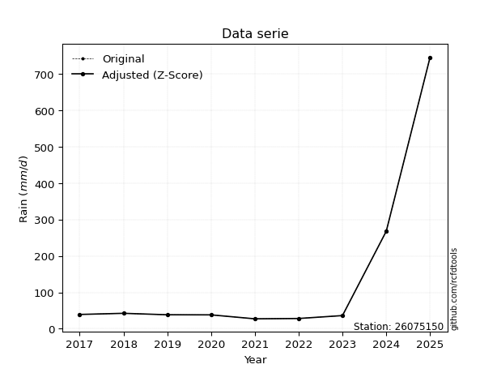</img>

</div>

> If Z-Score is active, values out of range or outliers are replaced with the station mean value.


### 4. Active continuous probability distributions from SciPy (45 of 104 available)

[scipy.stats](https://docs.scipy.org/doc/scipy/reference/stats.html) is a Python´s powerful submodule within the SciPy library for comprehensive statistical analysis, offering over 130 probability distributions (like Normal, Poisson), functions for descriptive stats (mean, variance), hypothesis testing (t-tests, chi-square), random variable generation, and statistical tests, making it essential for data science, modeling, and research. It provides tools to explore, model, and draw conclusions from data efficiently, working seamlessly with NumPy.

<div align="center">

|   id | p_dist             |   n_parameter | fit_method   | label                                                                       | active   | ref                                                                                                        |
|-----:|:-------------------|--------------:|:-------------|:----------------------------------------------------------------------------|:---------|:-----------------------------------------------------------------------------------------------------------|
|    0 | alpha              |             3 | MLE          | Alpha                                                                       | True     | [:mortar_board:](https://docs.scipy.org/doc/scipy/reference/generated/scipy.stats.alpha.html)              |
|    1 | betaprime          |             4 | MLE          | Beta prime                                                                  | True     | [:mortar_board:](https://docs.scipy.org/doc/scipy/reference/generated/scipy.stats.betaprime.html)          |
|    2 | chi2               |             3 | MLE          | Chi²                                                                        | True     | [:mortar_board:](https://docs.scipy.org/doc/scipy/reference/generated/scipy.stats.chi2.html)               |
|    3 | crystalball        |             4 | MLE          | Crystalball                                                                 | True     | [:mortar_board:](https://docs.scipy.org/doc/scipy/reference/generated/scipy.stats.crystalball.html)        |
|    4 | erlang             |             3 | MLE          | Erlang                                                                      | True     | [:mortar_board:](https://docs.scipy.org/doc/scipy/reference/generated/scipy.stats.erlang.html)             |
|    5 | expon              |             2 | MLE          | Exponential                                                                 | True     | [:mortar_board:](https://docs.scipy.org/doc/scipy/reference/generated/scipy.stats.expon.html)              |
|    6 | exponnorm          |             3 | MLE          | Exponentially modified Normal                                               | True     | [:mortar_board:](https://docs.scipy.org/doc/scipy/reference/generated/scipy.stats.exponnorm.html)          |
|    7 | f                  |             4 | MLE          | F                                                                           | True     | [:mortar_board:](https://docs.scipy.org/doc/scipy/reference/generated/scipy.stats.f.html)                  |
|    8 | fatiguelife        |             3 | MLE          | Fatigue-life (Birnbaum-Saunders)                                            | True     | [:mortar_board:](https://docs.scipy.org/doc/scipy/reference/generated/scipy.stats.fatiguelife.html)        |
|    9 | fisk               |             3 | MLE          | Fisk                                                                        | True     | [:mortar_board:](https://docs.scipy.org/doc/scipy/reference/generated/scipy.stats.fisk.html)               |
|   10 | gamma              |             3 | MLE          | Gamma                                                                       | True     | [:mortar_board:](https://docs.scipy.org/doc/scipy/reference/generated/scipy.stats.gamma.html)              |
|   11 | genexpon           |             5 | MLE          | Generalized exponential                                                     | True     | [:mortar_board:](https://docs.scipy.org/doc/scipy/reference/generated/scipy.stats.genexpon.html)           |
|   12 | genlogistic        |             3 | MLE          | Generalized logistic                                                        | True     | [:mortar_board:](https://docs.scipy.org/doc/scipy/reference/generated/scipy.stats.genlogistic.html)        |
|   13 | gibrat             |             2 | MM           | Gibrat                                                                      | True     | [:mortar_board:](https://docs.scipy.org/doc/scipy/reference/generated/scipy.stats.gibrat.html)             |
|   14 | gompertz           |             3 | MLE          | Gompertz (or truncated Gumbel)                                              | True     | [:mortar_board:](https://docs.scipy.org/doc/scipy/reference/generated/scipy.stats.gompertz.html)           |
|   15 | gumbel_l           |             2 | MM           | Gumbel Left Skew                                                            | True     | [:mortar_board:](https://docs.scipy.org/doc/scipy/reference/generated/scipy.stats.gumbel_l.html)           |
|   16 | gumbel_r           |             2 | MM           | Gumbel Right Skew                                                           | True     | [:mortar_board:](https://docs.scipy.org/doc/scipy/reference/generated/scipy.stats.gumbel_r.html)           |
|   17 | halflogistic       |             2 | MM           | Half-logistic                                                               | True     | [:mortar_board:](https://docs.scipy.org/doc/scipy/reference/generated/scipy.stats.halflogistic.html)       |
|   18 | halfnorm           |             2 | MM           | Half Normal                                                                 | True     | [:mortar_board:](https://docs.scipy.org/doc/scipy/reference/generated/scipy.stats.halfnorm.html)           |
|   19 | hypsecant          |             2 | MM           | hyperbolic secant                                                           | True     | [:mortar_board:](https://docs.scipy.org/doc/scipy/reference/generated/scipy.stats.hypsecant.html)          |
|   20 | invgamma           |             3 | MLE          | Inverted gamma                                                              | True     | [:mortar_board:](https://docs.scipy.org/doc/scipy/reference/generated/scipy.stats.invgamma.html)           |
|   21 | invgauss           |             3 | MLE          | Inverse Gaussian                                                            | True     | [:mortar_board:](https://docs.scipy.org/doc/scipy/reference/generated/scipy.stats.invgauss.html)           |
|   22 | invweibull         |             3 | MLE          | Inverted Weibull                                                            | True     | [:mortar_board:](https://docs.scipy.org/doc/scipy/reference/generated/scipy.stats.invweibull.html)         |
|   23 | johnsonsu          |             4 | MLE          | Johnson Su                                                                  | True     | [:mortar_board:](https://docs.scipy.org/doc/scipy/reference/generated/scipy.stats.johnsonsu.html)          |
|   24 | kstwobign          |             2 | MLE          | Limiting distribution of scaled Kolmogorov-Smirnov two-sided test statistic | True     | [:mortar_board:](https://docs.scipy.org/doc/scipy/reference/generated/scipy.stats.kstwobign.html)          |
|   25 | laplace            |             2 | MM           | Laplace                                                                     | True     | [:mortar_board:](https://docs.scipy.org/doc/scipy/reference/generated/scipy.stats.laplace.html)            |
|   26 | laplace_asymmetric |             3 | MLE          | Asymmetric Laplace                                                          | True     | [:mortar_board:](https://docs.scipy.org/doc/scipy/reference/generated/scipy.stats.laplace_asymmetric.html) |
|   27 | loggamma           |             3 | MLE          | Log gamma                                                                   | True     | [:mortar_board:](https://docs.scipy.org/doc/scipy/reference/generated/scipy.stats.loggamma.html)           |
|   28 | logistic           |             2 | MM           | Logistic (or Sech-squared)                                                  | True     | [:mortar_board:](https://docs.scipy.org/doc/scipy/reference/generated/scipy.stats.logistic.html)           |
|   29 | lognorm            |             3 | MLE          | Log Normal                                                                  | True     | [:mortar_board:](https://docs.scipy.org/doc/scipy/reference/generated/scipy.stats.lognorm.html)            |
|   30 | maxwell            |             2 | MM           | Maxwell                                                                     | True     | [:mortar_board:](https://docs.scipy.org/doc/scipy/reference/generated/scipy.stats.maxwell.html)            |
|   31 | mielke             |             4 | MLE          | Mielke Beta-Kappa / Dagum                                                   | True     | [:mortar_board:](https://docs.scipy.org/doc/scipy/reference/generated/scipy.stats.mielke.html)             |
|   32 | moyal              |             2 | MM           | Moyal                                                                       | True     | [:mortar_board:](https://docs.scipy.org/doc/scipy/reference/generated/scipy.stats.moyal.html)              |
|   33 | nakagami           |             3 | MLE          | Nakagami                                                                    | True     | [:mortar_board:](https://docs.scipy.org/doc/scipy/reference/generated/scipy.stats.nakagami.html)           |
|   34 | ncf                |             5 | MLE          | Non-central F distribution                                                  | True     | [:mortar_board:](https://docs.scipy.org/doc/scipy/reference/generated/scipy.stats.ncf.html)                |
|   35 | nct                |             4 | MLE          | Non-central Student’s t                                                     | True     | [:mortar_board:](https://docs.scipy.org/doc/scipy/reference/generated/scipy.stats.nct.html)                |
|   36 | norm               |             2 | MM           | Normal                                                                      | True     | [:mortar_board:](https://docs.scipy.org/doc/scipy/reference/generated/scipy.stats.norm.html)               |
|   37 | pareto             |             3 | MLE          | Pareto                                                                      | True     | [:mortar_board:](https://docs.scipy.org/doc/scipy/reference/generated/scipy.stats.pareto.html)             |
|   38 | pearson3           |             3 | MM           | Pearson type III                                                            | True     | [:mortar_board:](https://docs.scipy.org/doc/scipy/reference/generated/scipy.stats.pearson3.html)           |
|   39 | rayleigh           |             2 | MM           | Rayleigh                                                                    | True     | [:mortar_board:](https://docs.scipy.org/doc/scipy/reference/generated/scipy.stats.rayleigh.html)           |
|   40 | rice               |             3 | MLE          | Rice                                                                        | True     | [:mortar_board:](https://docs.scipy.org/doc/scipy/reference/generated/scipy.stats.rice.html)               |
|   41 | t                  |             3 | MLE          | Student’s t                                                                 | True     | [:mortar_board:](https://docs.scipy.org/doc/scipy/reference/generated/scipy.stats.t.html)                  |
|   42 | truncnorm          |             4 | MLE          | Truncated normal                                                            | True     | [:mortar_board:](https://docs.scipy.org/doc/scipy/reference/generated/scipy.stats.truncnorm.html)          |
|   43 | wald               |             2 | MM           | Wald                                                                        | True     | [:mortar_board:](https://docs.scipy.org/doc/scipy/reference/generated/scipy.stats.wald.html)               |
|   44 | weibull_min        |             3 | MLE          | Weibull minimum                                                             | True     | [:mortar_board:](https://docs.scipy.org/doc/scipy/reference/generated/scipy.stats.weibull_min.html)        |

</div>

> **n_parameter:** # arguments & localization & scale.
>
> **Fit methods:** (MLE) maximum likelihood, (MM) L-moments.
>
>**Inactive:** foldnorm, gennorm, norminvgauss, powernorm, powerlognorm, skewnorm, genextreme, anglit, arcsine, argus, beta, bradford, burr, burr12, cauchy, cosine, halfcauchy, foldcauchy, skewcauchy, wrapcauchy, dgamma, gengamma, exponweib, exponpow, truncexpon, gausshyper, genhalflogistic, genhyperbolic, geninvgauss, halfgennorm, johnsonsb, kappa4, kappa3, ksone, kstwo, loglaplace, levy, levy_l, levy_stable, ncx2, genpareto, truncpareto, lomax, powerlaw, rdist, rel_breitwigner, recipinvgauss, semicircular, studentized_range, trapezoid, triang, truncweibull_min, tukeylambda, uniform, loguniform, vonmises, vonmises_line, weibull_max, dweibull, 


## B. Probability distributions vs. Empirical distributions

A continuous probability distribution (CPD) describes probabilities for variables that can take any value within a range (like rain any time), unlike discrete variables with specific outcomes (like temperature). It uses a Probability Density Function (PDF), a curve where the total area under it equals 1, and the probability of the variable falling within an interval (a to b) is found by calculating the area under the curve between those points. A key feature is that the probability of hitting any single exact value is zero, so probabilities are always expressed for ranges, e.g., $P(a ≤ X ≤ b)$.

<div align="center">

Distributions parameters
|    |   station | p_dist                |   n |           loc |          scale | shape                  | shape1                | shape2                | shape3   |
|---:|----------:|:----------------------|----:|--------------:|---------------:|:-----------------------|:----------------------|:----------------------|:---------|
|  0 |  26075150 | alpha                 |   9 |     21.7315   |   11.1891      | 3.0015878367601813e-09 |                       |                       |          |
|  1 |  26075150 | betaprime             |   9 |     25.6238   |    0.314576    | 16.223998736462327     | 0.7104773800137272    |                       |          |
|  2 |  26075150 | chi2                  |   9 |     27.381    |   50.9577      | 1.0730342977355298     |                       |                       |          |
|  3 |  26075150 | crystalball           |   9 |     79.9716   |   84.2284      | 5786.611931858413      | 3801.0496940123853    |                       |          |
|  4 |  26075150 | erlang                |   9 |     27.381    |   96.9392      | 0.4183262483931868     |                       |                       |          |
|  5 |  26075150 | expon                 |   9 |     27.381    |   52.5906      |                        |                       |                       |          |
|  6 |  26075150 | exponnorm             |   9 |     27.3324   |    0.0153347   | 3407.124650848351      |                       |                       |          |
|  7 |  26075150 | f                     |   9 |     25.4844   |    7.14394     | 321.48994321907037     | 1.4209107681492554    |                       |          |
|  8 |  26075150 | fatiguelife           |   9 |     26.9668   |   11.3444      | 2.6832421699373485     |                       |                       |          |
|  9 |  26075150 | fisk                  |   9 |     27.381    |   10.1793      | 0.5177361592769162     |                       |                       |          |
| 10 |  26075150 | gamma                 |   9 |     27.381    |   53.3798      | 0.5617069178024261     |                       |                       |          |
| 11 |  26075150 | genexpon              |   9 |     27.381    |  145.699       | 2.7704399895142293     | 1.792230963147402e-11 | 1.8534906916422276    |          |
| 12 |  26075150 | genlogistic           |   9 |   -291.173    |   44.1174      | 2105.380372196038      |                       |                       |          |
| 13 |  26075150 | gibrat                |   9 |     15.7159   |   38.973       |                        |                       |                       |          |
| 14 |  26075150 | gompertz              |   9 |     27.381    |    6.29169e+12 | 116624437513.0232      |                       |                       |          |
| 15 |  26075150 | gumbel_l              |   9 |    117.879    |   65.6726      |                        |                       |                       |          |
| 16 |  26075150 | gumbel_r              |   9 |     42.0643   |   65.6726      |                        |                       |                       |          |
| 17 |  26075150 | halflogistic          |   9 |    -19.8587   |   72.0123      |                        |                       |                       |          |
| 18 |  26075150 | halfnorm              |   9 |    -31.5138   |  139.726       |                        |                       |                       |          |
| 19 |  26075150 | hypsecant             |   9 |     79.9716   |   53.6215      |                        |                       |                       |          |
| 20 |  26075150 | invgamma              |   9 |     25.4645   |    5.08132     | 0.7112311069623288     |                       |                       |          |
| 21 |  26075150 | invgauss              |   9 |     25.9113   |    6.7646      | 7.991659132822162      |                       |                       |          |
| 22 |  26075150 | invweibull            |   9 |     26.382    |    6.288       | 0.6687876588556269     |                       |                       |          |
| 23 |  26075150 | johnsonsu             |   9 |     27.381    |    1.89828e-12 | -1.61259512866628      | 0.0942061987619891    |                       |          |
| 24 |  26075150 | kstwobign             |   9 |   -126.964    |  241.697       |                        |                       |                       |          |
| 25 |  26075150 | laplace               |   9 |     79.9716   |   59.5585      |                        |                       |                       |          |
| 26 |  26075150 | laplace_asymmetric    |   9 |     27.381    |    0.00046862  | 8.910717241475458e-06  |                       |                       |          |
| 27 |  26075150 | loggamma              |   9 | -29186.4      | 3862.81        | 1952.1119752290197     |                       |                       |          |
| 28 |  26075150 | logistic              |   9 |     79.9716   |   46.4376      |                        |                       |                       |          |
| 29 |  26075150 | lognorm               |   9 |     27.381    |    0.311057    | 11.45621415171789      |                       |                       |          |
| 30 |  26075150 | maxwell               |   9 |   -119.614    |  125.072       |                        |                       |                       |          |
| 31 |  26075150 | mielke                |   9 |     17.7498   |    0.0255524   | 33721.17718250511      | 1.5166099824198627    |                       |          |
| 32 |  26075150 | moyal                 |   9 |     31.8043   |   37.9161      |                        |                       |                       |          |
| 33 |  26075150 | nakagami              |   9 |     27.381    |  155.28        | 0.1812537556442007     |                       |                       |          |
| 34 |  26075150 | ncf                   |   9 |     -0.208342 |    6.17821e-09 | 3.502508235479312e-09  | 2.82630719055439      | 25.508028087246174    |          |
| 35 |  26075150 | nct                   |   9 |     -0.169561 |    1.12218     | 1.8179260238122419     | 34.88044644231486     |                       |          |
| 36 |  26075150 | norm                  |   9 |     79.9716   |   84.2284      |                        |                       |                       |          |
| 37 |  26075150 | pareto                |   9 |     19.5464   |    7.83463     | 0.8013247662366502     |                       |                       |          |
| 38 |  26075150 | pearson3              |   9 |     79.9716   |   84.2284      | 1.4470619765983828     |                       |                       |          |
| 39 |  26075150 | rayleigh              |   9 |    -81.1623   |  128.566       |                        |                       |                       |          |
| 40 |  26075150 | rice                  |   9 |    -39.7082   |  103.483       | 0.00037490243152336607 |                       |                       |          |
| 41 |  26075150 | t                     |   9 |     38.4801   |    1.13561     | 0.36584992495547464    |                       |                       |          |
| 42 |  26075150 | truncnorm             |   9 | -63354.2      | 2314.36        | 27.38626645110303      | 27.490154240519367    |                       |          |
| 43 |  26075150 | wald                  |   9 |     -4.25685  |   84.2284      |                        |                       |                       |          |
| 44 |  26075150 | weibull_min           |   9 |     27.381    |  138.918       | 0.46713872460065975    |                       |                       |          |
| 45 |  26075150 | logalpha              |   9 |      3.01494  |    0.888766    | 1.2929362103085125     |                       |                       |          |
| 46 |  26075150 | logbetaprime          |   9 |      3.30985  |    0.382494    | 0.7537748308103638     | 1.459706378817109     |                       |          |
| 47 |  26075150 | logchi2               |   9 |      3.30985  |    0.977481    | 1.026231450931847      |                       |                       |          |
| 48 |  26075150 | logcrystalball        |   9 |      3.98425  |    0.797273    | 1964.1273019924515     | 1390.068398519746     |                       |          |
| 49 |  26075150 | logerlang             |   9 |      3.30985  |    0.646117    | 0.6756572307420162     |                       |                       |          |
| 50 |  26075150 | logexpon              |   9 |      3.30985  |    0.674404    |                        |                       |                       |          |
| 51 |  26075150 | logexponnorm          |   9 |      3.30886  |    0.000303693 | 2205.000870513455      |                       |                       |          |
| 52 |  26075150 | logf                  |   9 |      3.16835  |    0.377653    | 770.5509261237452      | 3.13490380748015      |                       |          |
| 53 |  26075150 | logfatiguelife        |   9 |      3.28042  |    0.303477    | 1.5749836422123544     |                       |                       |          |
| 54 |  26075150 | logfisk               |   9 |      3.30985  |    0.190331    | 0.5179318065552319     |                       |                       |          |
| 55 |  26075150 | loggamma              |   9 |      3.30985  |    0.470044    | 0.8457252185641835     |                       |                       |          |
| 56 |  26075150 | loggenexpon           |   9 |      3.30985  |    2.45901     | 3.6461977279079623     | 1.527020720211917     | 8.995537128573554e-08 |          |
| 57 |  26075150 | loggenlogistic        |   9 |      0.25582  |    0.466555    | 1448.3851441680404     |                       |                       |          |
| 58 |  26075150 | loggibrat             |   9 |      3.37602  |    0.36891     |                        |                       |                       |          |
| 59 |  26075150 | loggompertz           |   9 |      3.30985  |    1.60753e+12 | 2359759532873.07       |                       |                       |          |
| 60 |  26075150 | loggumbel_l           |   9 |      4.34307  |    0.621632    |                        |                       |                       |          |
| 61 |  26075150 | loggumbel_r           |   9 |      3.62544  |    0.621632    |                        |                       |                       |          |
| 62 |  26075150 | loghalflogistic       |   9 |      3.0393   |    0.68164     |                        |                       |                       |          |
| 63 |  26075150 | loghalfnorm           |   9 |      2.92898  |    1.32259     |                        |                       |                       |          |
| 64 |  26075150 | loghypsecant          |   9 |      3.98425  |    0.50756     |                        |                       |                       |          |
| 65 |  26075150 | loginvgamma           |   9 |      3.16759  |    0.592358    | 1.5674178626241029     |                       |                       |          |
| 66 |  26075150 | loginvgauss           |   9 |      3.23359  |    0.391924    | 1.9153230101944057     |                       |                       |          |
| 67 |  26075150 | loginvweibull         |   9 |      3.13349  |    0.391708    | 1.4163095499234681     |                       |                       |          |
| 68 |  26075150 | logjohnsonsu          |   9 |      3.2916   |    0.000518789 | -4.885896379287889     | 0.6886207415647014    |                       |          |
| 69 |  26075150 | logkstwobign          |   9 |      1.89732  |    2.42503     |                        |                       |                       |          |
| 70 |  26075150 | loglaplace            |   9 |      3.98425  |    0.563758    |                        |                       |                       |          |
| 71 |  26075150 | loglaplace_asymmetric |   9 |      3.59168  |    0.369301    | 0.600959248587263      |                       |                       |          |
| 72 |  26075150 | logloggamma           |   9 |   -291.437    |   38.3938      | 2196.8456811390834     |                       |                       |          |
| 73 |  26075150 | loglogistic           |   9 |      3.98425  |    0.43956     |                        |                       |                       |          |
| 74 |  26075150 | loglognorm            |   9 |      3.30985  |    0.00889727  | 10.889862506600457     |                       |                       |          |
| 75 |  26075150 | logmaxwell            |   9 |      2.09505  |    1.18388     |                        |                       |                       |          |
| 76 |  26075150 | logmielke             |   9 |      3.1608   |    0.059956    | 16.86791271594771      | 1.370565729310627     |                       |          |
| 77 |  26075150 | logmoyal              |   9 |      3.52832  |    0.358899    |                        |                       |                       |          |
| 78 |  26075150 | lognakagami           |   9 |      3.30985  |    1.36809     | 0.24882536319351478    |                       |                       |          |
| 79 |  26075150 | logncf                |   9 |      3.03566  |    0.622507    | 50098.791140288704     | 4.924654314214198     | 785.6521230440306     |          |
| 80 |  26075150 | lognct                |   9 |      2.43772  |    0.0050148   | 5.236993054188787      | 231.734369957154      |                       |          |
| 81 |  26075150 | lognorm               |   9 |      3.98425  |    0.797274    |                        |                       |                       |          |
| 82 |  26075150 | logpareto             |   9 |      2.22154  |    1.08831     | 2.4998733983763555     |                       |                       |          |
| 83 |  26075150 | logpearson3           |   9 |      3.98425  |    0.797272    | 1.2486850811253627     |                       |                       |          |
| 84 |  26075150 | lograyleigh           |   9 |      2.45902  |    1.21696     |                        |                       |                       |          |
| 85 |  26075150 | logrice               |   9 |      2.80711  |    1.00532     | 0.00014493326700679095 |                       |                       |          |
| 86 |  26075150 | logt                  |   9 |      3.65102  |    0.040235    | 0.45344425570909297    |                       |                       |          |
| 87 |  26075150 | logtruncnorm          |   9 |     -8.0559   |    2.91568     | 3.8981472887437505     | 5.304688824725428     |                       |          |
| 88 |  26075150 | logwald               |   9 |      3.18698  |    0.797274    |                        |                       |                       |          |
| 89 |  26075150 | logweibull_min        |   9 |      3.30985  |    0.711146    | 0.7808297188956006     |                       |                       |          |

</div>

> **loc** (Location parameter): This shifts the distribution along the x-axis. For many common distributions, like the normal (Gaussian) distribution, loc represents the mean $μ$. For others, like the uniform distribution, it might represent the minimum value, or for the beta distribution, the left end of the support interval.
>
> **scale** (Scale parameter): This determines the width or spread of the distribution. For the normal distribution, scale represents the standard deviation $σ$. For a uniform distribution, it defines the length of the interval (from $loc$ to $loc + scale$).
>
> **shape** (Shape parameters): Refers to parameters that define the specific form of a probability distribution, distinct from its location (loc) and scale (scale). These parameters are required arguments for most distribution functions. For example, a normal (Gaussian) distribution is fully defined by its location (mean) and scale (standard deviation), so it has no specific shape parameters beyond loc and scale. However, other distributions have intrinsic properties that need specification, as Gamma distribution that takes a shape parameter, often named $a$ or $alpha$.


### 0. Cumulative distribution values - CDF (90 evaluated)

> Ordered by x ascending and calculating $log(f(x))$ separately. 

|   id |   Station |   date |       x |   count |    mean |     std |    zscore |   Value_initial |   station |   m |     alpha |   alpha_pdf |   betaprime |   betaprime_pdf |        chi2 |         chi2_pdf |   crystalball |   crystalball_pdf |      erlang |   erlang_pdf |     expon |   expon_pdf |   exponnorm |   exponnorm_pdf |         f |       f_pdf |   fatiguelife |   fatiguelife_pdf |        fisk |    fisk_pdf |       gamma |        gamma_pdf |    genexpon |   genexpon_pdf |   genlogistic |   genlogistic_pdf |   gibrat |   gibrat_pdf |    gompertz |   gompertz_pdf |   gumbel_l |   gumbel_l_pdf |   gumbel_r |   gumbel_r_pdf |   halflogistic |   halflogistic_pdf |   halfnorm |   halfnorm_pdf |   hypsecant |   hypsecant_pdf |   invgamma |   invgamma_pdf |   invgauss |   invgauss_pdf |   invweibull |   invweibull_pdf |   johnsonsu |   johnsonsu_pdf |   kstwobign |   kstwobign_pdf |   laplace |   laplace_pdf |   laplace_asymmetric |   laplace_asymmetric_pdf |    loggamma |   loggamma_pdf |   logistic |   logistic_pdf |   lognorm |   lognorm_pdf |   maxwell |   maxwell_pdf |   mielke |   mielke_pdf |    moyal |   moyal_pdf |    nakagami |   nakagami_pdf |      ncf |     ncf_pdf |      nct |     nct_pdf |     norm |    norm_pdf |      pareto |   pareto_pdf |   pearson3 |   pearson3_pdf |   rayleigh |   rayleigh_pdf |     rice |    rice_pdf |        t |       t_pdf |   truncnorm |   truncnorm_pdf |     wald |    wald_pdf |   weibull_min |   weibull_min_pdf |   logalpha |   logalpha_pdf |   logbetaprime |   logbetaprime_pdf |     logchi2 |   logchi2_pdf |   logcrystalball |   logcrystalball_pdf |   logerlang |   logerlang_pdf |   logexpon |   logexpon_pdf |   logexponnorm |   logexponnorm_pdf |      logf |   logf_pdf |   logfatiguelife |   logfatiguelife_pdf |     logfisk |   logfisk_pdf |   loggenexpon |   loggenexpon_pdf |   loggenlogistic |   loggenlogistic_pdf |   loggibrat |   loggibrat_pdf |   loggompertz |   loggompertz_pdf |   loggumbel_l |   loggumbel_l_pdf |   loggumbel_r |   loggumbel_r_pdf |   loghalflogistic |   loghalflogistic_pdf |   loghalfnorm |   loghalfnorm_pdf |   loghypsecant |   loghypsecant_pdf |   loginvgamma |   loginvgamma_pdf |   loginvgauss |   loginvgauss_pdf |   loginvweibull |   loginvweibull_pdf |   logjohnsonsu |   logjohnsonsu_pdf |   logkstwobign |   logkstwobign_pdf |   loglaplace |   loglaplace_pdf |   loglaplace_asymmetric |   loglaplace_asymmetric_pdf |   logloggamma |   logloggamma_pdf |   loglogistic |   loglogistic_pdf |   loglognorm |   loglognorm_pdf |   logmaxwell |   logmaxwell_pdf |   logmielke |   logmielke_pdf |   logmoyal |   logmoyal_pdf |   lognakagami |   lognakagami_pdf |    logncf |   logncf_pdf |   lognct |   lognct_pdf |   logpareto |   logpareto_pdf |   logpearson3 |   logpearson3_pdf |   lograyleigh |   lograyleigh_pdf |   logrice |   logrice_pdf |     logt |   logt_pdf |   logtruncnorm |   logtruncnorm_pdf |   logwald |   logwald_pdf |   logweibull_min |   logweibull_min_pdf |
|-----:|----------:|-------:|--------:|--------:|--------:|--------:|----------:|----------------:|----------:|----:|----------:|------------:|------------:|----------------:|------------:|-----------------:|--------------:|------------------:|------------:|-------------:|----------:|------------:|------------:|----------------:|----------:|------------:|--------------:|------------------:|------------:|------------:|------------:|-----------------:|------------:|---------------:|--------------:|------------------:|---------:|-------------:|------------:|---------------:|-----------:|---------------:|-----------:|---------------:|---------------:|-------------------:|-----------:|---------------:|------------:|----------------:|-----------:|---------------:|-----------:|---------------:|-------------:|-----------------:|------------:|----------------:|------------:|----------------:|----------:|--------------:|---------------------:|-------------------------:|------------:|---------------:|-----------:|---------------:|----------:|--------------:|----------:|--------------:|---------:|-------------:|---------:|------------:|------------:|---------------:|---------:|------------:|---------:|------------:|---------:|------------:|------------:|-------------:|-----------:|---------------:|-----------:|---------------:|---------:|------------:|---------:|------------:|------------:|----------------:|---------:|------------:|--------------:|------------------:|-----------:|---------------:|---------------:|-------------------:|------------:|--------------:|-----------------:|---------------------:|------------:|----------------:|-----------:|---------------:|---------------:|-------------------:|----------:|-----------:|-----------------:|---------------------:|------------:|--------------:|--------------:|------------------:|-----------------:|---------------------:|------------:|----------------:|--------------:|------------------:|--------------:|------------------:|--------------:|------------------:|------------------:|----------------------:|--------------:|------------------:|---------------:|-------------------:|--------------:|------------------:|--------------:|------------------:|----------------:|--------------------:|---------------:|-------------------:|---------------:|-------------------:|-------------:|-----------------:|------------------------:|----------------------------:|--------------:|------------------:|--------------:|------------------:|-------------:|-----------------:|-------------:|-----------------:|------------:|----------------:|-----------:|---------------:|--------------:|------------------:|----------:|-------------:|---------:|-------------:|------------:|----------------:|--------------:|------------------:|--------------:|------------------:|----------:|--------------:|---------:|-----------:|---------------:|-------------------:|----------:|--------------:|-----------------:|---------------------:|
|    0 |  26075150 |   2021 |  27.381 |       9 | 79.9716 | 89.3377 | -0.588671 |          27.381 |  26075150 |   1 | 0.0476401 | 0.0393489   |   0.0383751 |     0.0578702   | 1.66641e-09 | 251655           |      0.266189 |       0.00389759  | 1.50237e-07 |  1.76901e+07 | 0         | 0.0190148   | 0.000929939 |     0.0191074   | 0.0382378 | 0.0575312   |     0.0301013 |       0.16654     | 1.42274e-08 | 1.03668e+06 | 1.35887e-09 | 107423           | 7.53079e-12 |    0.0190148   |      0.214549 |       0.0074827   | 0.113857 |  0.0165217   | 3.02138e-13 |    0.0185363   |   0.222816 |     0.00298315 |   0.286347 |    0.00545268  |       0.31672  |        0.00624677  |   0.326611 |    0.00522496  |    0.228412 |      0.00390344 |  0.038326  |    0.0575159   |  0.0361281 |    0.0659665   |    0.0326326 |      0.0747699   |   0.0501129 |     4.85922e+09 |    0.190549 |     0.00623521  |  0.206769 |   0.00347169  |           1.3754e-10 |              0.0190148   | 2.08037e-13 |    396.186     |   0.2437   |     0.00396899 |  0.198807 |      0.349887 |  0.290076 |   0.00441695  |      nan |          nan | 0.289115 | 0.0063592   | 9.48393e-07 |    4.83855e+07 | 0.233775 | 0.0124432   | 0.13807  | 0.0189397   | 0.266189 | 0.00389759  | 2.22045e-16 |  0.10228     |   0.307832 |    0.00622087  |   0.299799 |    0.00459803  | 0.189539 | 0.00507742  | 0.146386 | 0.00481455  | 0.000127039 |     0.0125716   | 0.245776 | 0.0122449   |   1.77477e-08 |       2.3336e+06  |  0.0472853 |      1.0284    |    5.66777e-09 |       1467.61      | 1.05974e-08 |   1.22446e+07 |         0.198807 |             0.349887 | 6.29256e-11 |   95737.9       |  0         |      1.48279   |     0.00148184 |          1.49031   | 0.0441517 |  1.14831   |        0.0327975 |            2.78338   | 2.63998e-08 |   3.07896e+07 |   8.92089e-10 |         1.48279   |         0.125137 |            0.557045  |    0        |       0         |   3.91138e-15 |         1.46794   |      0.172824 |        0.252476   |      0.189867 |         0.507457  |          0.19589  |             0.705377  |      0.226634 |         0.578769  |       0.164804 |          0.310386  |     0.0441492 |         1.1483    |     0.0386201 |         1.49046   |       0.045215  |           1.12433   |      0.0251817 |          2.21847   |       0.113404 |          0.503572  |     0.15116  |        0.26813   |               0.0745216 |                   0.335781  |      0.204317 |         0.344115  |      0.17737  |         0.331945  |   0.00245737 |      1.58002e+12 |     0.211548 |         0.419166 |   0.0447963 |       1.1306    |   0.175175 |      0.601152  |   1.52866e-08 |       1.71303e+07 | 0.0427537 |    0.693222  | 0.110496 |    0.84641   | 5.55112e-16 |       2.29702   |      0.197845 |         0.579534  |      0.216825 |         0.449933  |  0.11754  |      0.438971 | 0.123309 |  0.163281  |    6.52751e-07 |           1.41765  | 0.0277214 |     0.811621  |       1.3424e-12 |         2360.31      |
|    1 |  26075150 |   2022 |  28.318 |       9 | 79.9716 | 89.3377 | -0.578183 |          28.318 |  26075150 |   2 | 0.0893557 | 0.0486136   |   0.100143  |     0.0698181   | 0.0906982   |      0.0516229   |      0.269854 |       0.00392452  | 0.161547    |  0.0716328   | 0.0176591 | 0.018679    | 0.0186875   |     0.0187821   | 0.0997181 | 0.0695655   |     0.170734  |       0.113481    | 0.225304    | 0.0964426   | 0.1153      |      0.0683457   | 0.0176591   |    0.018679    |      0.2216   |       0.0075663   | 0.129448 |  0.0167371   | 0.0172185   |    0.0182171   |   0.225626 |     0.00301508 |   0.291465 |    0.00547151  |       0.322561 |        0.00622084  |   0.3315   |    0.00521009  |    0.232094 |      0.00395491 |  0.0997674 |    0.0695142   |  0.10591   |    0.0770351   |    0.11095   |      0.0842711   |   0.838719  |     0.0245904   |    0.19642  |     0.00629647  |  0.210047 |   0.00352674  |           0.0176591  |              0.018679    | 0.110212    |      2.66412   |   0.247438 |     0.00400995 |  0.21079  |      0.362281 |  0.294223 |   0.0044341   |      nan |          nan | 0.295078 | 0.00636784  | 0.124637    |    0.0482195   | 0.245365 | 0.0122945   | 0.156046 | 0.0194041   | 0.269854 | 0.00392452  | 0.0865484   |  0.0834476   |   0.313655 |    0.00620777  |   0.304112 |    0.00460916  | 0.194315 | 0.00511799  | 0.151175 | 0.00542819  | 0.0118416   |     0.012433    | 0.257188 | 0.0121103   |   0.0922538   |       0.043803    |  0.0875423 |      1.34362   |    0.201322    |          4.05336   | 0.139462    |   2.10263     |         0.21079  |             0.362281 | 0.147076    |       2.86255   |  0.0486691 |      1.41062   |     0.0504157  |          1.41804   | 0.0888992 |  1.4765    |        0.134969  |            2.89457   | 0.28957     |   3.16653     |   0.0486692   |         1.41062   |         0.144594 |            0.598928  |    0        |       0         |   0.0481937   |         1.3972    |      0.181508 |        0.263721   |      0.207238 |         0.524698  |          0.219506 |             0.698181  |      0.246035 |         0.574359  |       0.175553 |          0.328607  |     0.088897  |         1.47652   |     0.0966825 |         1.86976   |       0.0891089 |           1.45306   |      0.108013  |          2.46264   |       0.130928 |          0.537583  |     0.160457 |        0.284621  |               0.0867216 |                   0.390752  |      0.216091 |         0.355732  |      0.188816 |         0.34845   |   0.548611   |      1.08065     |     0.225833 |         0.42981  |   0.089046  |       1.46678   |   0.195778 |      0.622797  |   0.123435    |       1.82535     | 0.0690534 |    0.863631  | 0.140567 |    0.9381    | 0.073295    |       2.06482   |      0.217524 |         0.589742  |      0.232113 |         0.458597  |  0.132674 |      0.460319 | 0.129229 |  0.189681  |    0.0466441   |           1.3552   | 0.0604639 |     1.11026   |       0.0882076  |            1.95386   |
|    2 |  26075150 |   2023 |  36.295 |       9 | 79.9716 | 89.3377 | -0.488893 |          36.295 |  26075150 |   3 | 0.442309  | 0.0313349   |   0.468228  |     0.0263013   | 0.295644    |      0.0168039   |      0.302038 |       0.00414059  | 0.404739    |  0.0177952   | 0.155912  | 0.0160502   | 0.157636    |     0.0161227   | 0.467489  | 0.0263184   |     0.470885  |       0.0159724   | 0.482827    | 0.0145032   | 0.387753    |      0.0219288   | 0.155911    |    0.0160502   |      0.284306 |       0.00810261  | 0.261544 |  0.01581     | 0.152303    |    0.0157131   |   0.250782 |     0.00329388 |   0.335604 |    0.0055795   |       0.371265 |        0.00598622  |   0.372535 |    0.00507599  |    0.265399 |      0.00439563 |  0.467481  |    0.0263277   |  0.472919  |    0.0250706   |    0.478288  |      0.0237991   |   0.885206  |     0.00204872  |    0.248415 |     0.00670702  |  0.240151 |   0.00403219  |           0.155912   |              0.0160502   | 0.530173    |      1.132     |   0.280791 |     0.00434879 |  0.31122  |      0.443256 |  0.330114 |   0.00455804  |      nan |          nan | 0.345936 | 0.00636025  | 0.282008    |    0.0114627   | 0.337344 | 0.010705    | 0.312857 | 0.0188781   | 0.302038 | 0.00414059  | 0.456006    |  0.026027    |   0.362607 |    0.00605353  |   0.341194 |    0.00468148  | 0.236396 | 0.00541948  | 0.262746 | 0.0416657   | 0.106482    |     0.011313    | 0.348448 | 0.0107237   |   0.242125    |       0.0110109   |  0.445728  |      1.14596   |    0.648768    |          0.852905  | 0.397899    |   0.657997    |         0.31122  |             0.443256 | 0.53398     |       0.978495  |  0.341569  |      0.976315  |     0.344495   |          0.978886  | 0.448389  |  1.10632   |        0.506414  |            0.813747  | 0.550653    |   0.45472     |   0.341569    |         0.976315  |         0.320986 |            0.781498  |    0.295687 |       1.60161   |   0.338808    |         0.970591  |      0.258125 |        0.356328   |      0.347911 |         0.590909  |          0.384376 |             0.62515   |      0.383674 |         0.532103  |       0.275216 |          0.477155  |     0.448392  |         1.10633   |     0.465873  |         1.0035    |       0.448928  |           1.11139   |      0.488531  |          0.915124  |       0.286597 |          0.685775  |     0.2492   |        0.442034  |               0.265328  |                   1.19552   |      0.314239 |         0.431703  |      0.290469 |         0.468871  |   0.624499   |      0.123605    |     0.340185 |         0.484411 |   0.450166  |       1.10659   |   0.359921 |      0.669264  |   0.354717    |       0.621076    | 0.33801   |    1.06569   | 0.409024 |    1.08358   | 0.437682    |       1.02597   |      0.367242 |         0.599854  |      0.351522 |         0.495955  |  0.262531 |      0.572496 | 0.265817 |  1.81657   |    0.332423    |           0.968054 | 0.37162   |     1.08967   |       0.384569   |            0.827707  |
|    3 |  26075150 |   2020 |  38.265 |       9 | 79.9716 | 89.3377 | -0.466842 |          38.265 |  26075150 |   4 | 0.498561  | 0.025975    |   0.514779  |     0.0212335   | 0.326914    |      0.0150253   |      0.310244 |       0.00418997  | 0.437445    |  0.0155252   | 0.186946  | 0.0154601   | 0.188806    |     0.0155261   | 0.514075  | 0.0212515   |     0.499392  |       0.0131596   | 0.508663    | 0.0118886   | 0.428314    |      0.0193633   | 0.186945    |    0.0154601   |      0.300354 |       0.00818636  | 0.292129 |  0.0152323   | 0.1827      |    0.0151497   |   0.25734  |     0.00336448 |   0.346609 |    0.00559217  |       0.382998 |        0.00592477  |   0.3825   |    0.00504088  |    0.274165 |      0.00450383 |  0.514086  |    0.0212605   |  0.517346  |    0.0203033   |    0.520305  |      0.019132    |   0.888812  |     0.00164012  |    0.2617   |     0.00677843  |  0.248228 |   0.0041678   |           0.186945   |              0.0154601   | 0.586013    |      0.985135  |   0.289437 |     0.00442881 |  0.335018 |      0.456959 |  0.339118 |   0.00458251  |      nan |          nan | 0.358445 | 0.00633809  | 0.303164    |    0.0100897   | 0.358017 | 0.010283    | 0.349274 | 0.0180727   | 0.310244 | 0.00418997  | 0.502384    |  0.0213024   |   0.374486 |    0.00600529  |   0.350429 |    0.00469328  | 0.247135 | 0.00548176  | 0.454553 | 0.202509    | 0.128511    |     0.0110523   | 0.369213 | 0.0103576   |   0.26239     |       0.0096348   |  0.501956  |      0.984717  |    0.689327    |          0.690123  | 0.430782    |   0.589028    |         0.335018 |             0.456959 | 0.582261    |       0.852745  |  0.391202  |      0.902719  |     0.394245   |          0.904592  | 0.502781  |  0.955307  |        0.546103  |            0.693874  | 0.572568    |   0.378729    |   0.391203    |         0.902719  |         0.362515 |            0.788142  |    0.375379 |       1.41264   |   0.388169    |         0.898131  |      0.277524 |        0.377806   |      0.379179 |         0.59152   |          0.416918 |             0.606023  |      0.411511 |         0.521137  |       0.301279 |          0.508842  |     0.502784  |         0.955309  |     0.514983  |         0.859838  |       0.503509  |           0.957477  |      0.533062  |          0.77572   |       0.323094 |          0.694027  |     0.273694 |        0.485482  |               0.325877  |                   1.09699   |      0.337405 |         0.444632  |      0.315861 |         0.491612  |   0.630472   |      0.103551    |     0.365953 |         0.490248 |   0.504453  |       0.951321  |   0.395034 |      0.658479  |   0.386063    |       0.567235    | 0.392446  |    0.992302  | 0.464923 |    1.02888   | 0.488451    |       0.898671  |      0.398719 |         0.590735  |      0.3778   |         0.498063  |  0.293156 |      0.585688 | 0.45835  |  6.25596   |    0.381778    |           0.900279 | 0.42636   |     0.982541  |       0.42602    |            0.743419  |
|    4 |  26075150 |   2019 |  38.51  |       9 | 79.9716 | 89.3377 | -0.464099 |          38.51  |  26075150 |   5 | 0.504853  | 0.02539     |   0.519917  |     0.0207089   | 0.330572    |      0.0148354   |      0.311271 |       0.00419599  | 0.44122     |  0.0152868   | 0.190725  | 0.0153882   | 0.192601    |     0.0154535   | 0.519217  | 0.0207269   |     0.502582  |       0.0128805   | 0.511544    | 0.0116241   | 0.433025    |      0.0190875   | 0.190724    |    0.0153882   |      0.30236  |       0.00819544  | 0.295852 |  0.0151571   | 0.186403    |    0.015081    |   0.258166 |     0.0033733  |   0.347979 |    0.00559337  |       0.384448 |        0.00591704  |   0.383735 |    0.00503646  |    0.27527  |      0.00451723 |  0.51923   |    0.0207358   |  0.52226   |    0.0198135   |    0.524934  |      0.0186559   |   0.889209  |     0.00159991  |    0.263362 |     0.00678651  |  0.249251 |   0.00418498  |           0.190724   |              0.0153882   | 0.592249    |      0.969021  |   0.290523 |     0.00443864 |  0.337939 |      0.458506 |  0.340241 |   0.00458539  |      nan |          nan | 0.359998 | 0.00633483  | 0.305618    |    0.00994713  | 0.36053  | 0.0102307   | 0.353688 | 0.0179647   | 0.311271 | 0.00419599  | 0.507542    |  0.0208092   |   0.375956 |    0.00599904  |   0.351579 |    0.00469458  | 0.248479 | 0.00548917  | 0.50645  | 0.215592    | 0.131215    |     0.0110203   | 0.371745 | 0.0103122   |   0.264732    |       0.00949095  |  0.508182  |      0.966579  |    0.693679    |          0.67358   | 0.434518    |   0.581733    |         0.337939 |             0.458506 | 0.58766     |       0.839205  |  0.396937  |      0.894216  |     0.399991   |          0.896011  | 0.508824  |  0.938521  |        0.550492  |            0.681568  | 0.574961    |   0.371106    |   0.396937    |         0.894217  |         0.367546 |            0.788229  |    0.384321 |       1.38979   |   0.393875    |         0.889756  |      0.279944 |        0.380427   |      0.382954 |         0.591306  |          0.420778 |             0.603651  |      0.414833 |         0.519772  |       0.304538 |          0.512569  |     0.508827  |         0.938522  |     0.520421  |         0.844462  |       0.509565  |           0.940365  |      0.537966  |          0.761104  |       0.327526 |          0.694535  |     0.27681  |        0.49101   |               0.332842  |                   1.08566   |      0.340247 |         0.446095  |      0.319007 |         0.494225  |   0.631126   |      0.101555    |     0.369083 |         0.490812 |   0.51047   |       0.934114  |   0.399232 |      0.656824  |   0.389665    |       0.561555    | 0.398749  |    0.982842  | 0.471466 |    1.02127   | 0.494142    |       0.884706  |      0.402486 |         0.589438  |      0.38098  |         0.498186  |  0.296898 |      0.587027 | 0.499357 |  6.51406   |    0.387499    |           0.892404 | 0.432591  |     0.970049  |       0.430735   |            0.734265  |
|    5 |  26075150 |   2017 |  39.366 |       9 | 79.9716 | 89.3377 | -0.454517 |          39.366 |  26075150 |   6 | 0.525753  | 0.0234741   |   0.536907  |     0.0190242   | 0.343001    |      0.0142146   |      0.314872 |       0.00421681  | 0.453968    |  0.0145132   | 0.20379   | 0.0151398   | 0.205721    |     0.0152023   | 0.536222  | 0.0190419   |     0.51322   |       0.0119963   | 0.521124    | 0.0107804   | 0.44897     |      0.0181836   | 0.20379     |    0.0151398   |      0.309389 |       0.00822489  | 0.308713 |  0.0148901   | 0.19921     |    0.0148436   |   0.261066 |     0.00340419 |   0.352769 |    0.00559693  |       0.389502 |        0.00588989  |   0.388039 |    0.00502092  |    0.279157 |      0.00456392 |  0.536243  |    0.0190505   |  0.538534  |    0.0182443   |    0.540237  |      0.0171343   |   0.890522  |     0.00147298  |    0.269183 |     0.00681335  |  0.252859 |   0.00424556  |           0.20379    |              0.0151398   | 0.612961    |      0.915873  |   0.294337 |     0.00447273 |  0.348076 |      0.463646 |  0.34417  |   0.00459512  |      nan |          nan | 0.365415 | 0.00632258  | 0.313932    |    0.00948675  | 0.36921  | 0.0100486   | 0.368902 | 0.0175777   | 0.314872 | 0.00421681  | 0.52466     |  0.0192184   |   0.381082 |    0.00597683  |   0.355599 |    0.00469885  | 0.253189 | 0.00551447  | 0.649427 | 0.110573    | 0.140601    |     0.0109092   | 0.380505 | 0.0101537   |   0.272653    |       0.00902521  |  0.528765  |      0.906496  |    0.707895    |          0.620778  | 0.447042    |   0.557997    |         0.348076 |             0.463646 | 0.605616    |       0.794863  |  0.416279  |      0.865536  |     0.41937    |          0.867073  | 0.528841  |  0.883088  |        0.565034  |            0.642055  | 0.582847    |   0.346858    |   0.416279    |         0.865536  |         0.384869 |            0.787414  |    0.414021 |       1.31244   |   0.413123    |         0.8615    |      0.288407 |        0.389489   |      0.395942 |         0.590117  |          0.433959 |             0.595387  |      0.426208 |         0.515007  |       0.315946 |          0.525187  |     0.528844  |         0.883088  |     0.538428  |         0.794367  |       0.52961   |           0.883869  |      0.55417   |          0.713834  |       0.342808 |          0.695521  |     0.287818 |        0.510536  |               0.356288  |                   1.0475    |      0.350109 |         0.450962  |      0.329969 |         0.502979  |   0.633288   |      0.0952205   |     0.379893 |         0.492526 |   0.530375  |       0.877383  |   0.413605 |      0.650603  |   0.401805    |       0.543089    | 0.419994  |    0.94974   | 0.49362  |    0.993827  | 0.51308     |       0.838685  |      0.415393 |         0.584674  |      0.391935 |         0.498396  |  0.309851 |      0.591226 | 0.625442 |  4.52193   |    0.406824    |           0.865767 | 0.453451  |     0.927958  |       0.446543   |            0.704169  |
|    6 |  26075150 |   2018 |  42.517 |       9 | 79.9716 | 89.3377 | -0.419247 |          42.517 |  26075150 |   7 | 0.59036   | 0.0178769   |   0.588944  |     0.0143455   | 0.384728    |      0.0123687   |      0.328276 |       0.00429055  | 0.495947    |  0.0122653   | 0.250095  | 0.0142593   | 0.252208    |     0.0143126   | 0.588313  | 0.0143614   |     0.546971  |       0.00961319  | 0.55117     | 0.00846184  | 0.501778    |      0.0154743   | 0.250094    |    0.0142593   |      0.335441 |       0.00830309  | 0.354043 |  0.0138776   | 0.244643    |    0.0140015   |   0.271973 |     0.00351879 |   0.370415 |    0.00560158  |       0.407901 |        0.00578802  |   0.403769 |    0.00496255  |    0.293807 |      0.00473372 |  0.588358  |    0.0143684   |  0.588683  |    0.0139054   |    0.587153  |      0.0129588   |   0.894588  |     0.00113496  |    0.290786 |     0.00689402  |  0.266597 |   0.00447622  |           0.250094   |              0.0142593   | 0.677051    |      0.75475   |   0.308625 |     0.00459489 |  0.384402 |      0.479227 |  0.358701 |   0.00462699  |      nan |          nan | 0.385254 | 0.00626663  | 0.341618    |    0.00816984  | 0.399831 | 0.00939168  | 0.421944 | 0.0160766   | 0.328276 | 0.00429055  | 0.577665    |  0.0147331   |   0.39978  |    0.00588999  |   0.370426 |    0.00471075  | 0.270702 | 0.00559974  | 0.788623 | 0.0188435   | 0.174343    |     0.0105099   | 0.411589 | 0.00957884  |   0.298847    |       0.00768265  |  0.591301  |      0.725174  |    0.749782    |          0.476302  | 0.487213    |   0.488487    |         0.384402 |             0.479227 | 0.661531    |       0.662888  |  0.479262  |      0.772145  |     0.48244    |          0.772888  | 0.590161  |  0.716442  |        0.609969  |            0.531295  | 0.606851    |   0.280805    |   0.479262    |         0.772145  |         0.445027 |            0.772047  |    0.505344 |       1.06692   |   0.475848    |         0.769424  |      0.319629 |        0.421508   |      0.441072 |         0.580791  |          0.478661 |             0.565462  |      0.4652   |         0.497571  |       0.35799  |          0.565754  |     0.590164  |         0.716439  |     0.593718  |         0.648743  |       0.590871  |           0.714324  |      0.603675  |          0.579076  |       0.396248 |          0.690397  |     0.329942 |        0.585254  |               0.432099  |                   0.924139  |      0.385428 |         0.465801  |      0.369783 |         0.530175  |   0.639917   |      0.0780753   |     0.41797  |         0.495735 |   0.591128  |       0.707785  |   0.462703 |      0.623382  |   0.441449    |       0.489031    | 0.488604  |    0.832652  | 0.566128 |    0.887531  | 0.572109    |       0.69988   |      0.459678 |         0.564795  |      0.430268 |         0.496599  |  0.3558   |      0.600944 | 0.785717 |  0.941403  |    0.470063    |           0.778237 | 0.519591  |     0.793354  |       0.497138   |            0.613385  |
|    7 |  26075150 |   2025 | 201.292 |       9 | 79.9716 | 89.3377 |  1.358    |         201.292 |  26075150 |   8 | 0.950313  | 0.000276357 |   0.912787  |     0.000346521 | 0.92841     |      0.000840025 |      0.925119 |       0.00167858  | 0.954885    |  0.000576234 | 0.96337   | 0.000696514 | 0.964191    |     0.000685379 | 0.91263   | 0.000347122 |     0.914008  |       0.000700531 | 0.812971    | 0.000452653 | 0.986952    |      0.000271081 | 0.96337     |    0.000696518 |      0.970556 |       0.000657463 | 0.94069  |  0.000636114 | 0.960191    |    0.000737912 |   0.971599 |     0.00154014 |   0.915288 |    0.00123366  |       0.911362 |        0.00117632  |   0.904318 |    0.0014251   |    0.933974 |      0.00122252 |  0.912762  |    0.000346961 |  0.930091  |    0.000405394 |    0.897484  |      0.000371166 |   0.930737  |     7.21416e-05 |    0.950009 |     0.00112358  |  0.93479  |   0.00109489  |           0.96337    |              0.000696515 | 0.990021    |      0.0218745 |   0.931665 |     0.00137099 |  0.951167 |      0.126945 |  0.913561 |   0.00156205  |      nan |          nan | 0.914798 | 0.00111928  | 0.8008      |    0.00137492  | 0.868358 | 0.000787189 | 0.952415 | 0.000421698 | 0.925119 | 0.00167858  | 0.919493    |  0.00035496  |   0.911119 |    0.00118671  |   0.910481 |    0.00152971  | 0.933585 | 0.00149466  | 0.945179 | 0.000123185 | 0.926361    |     0.0016011   | 0.923875 | 0.000812194 |   0.670656    |       0.000982532 |  0.906019  |      0.0497882 |    0.94989     |          0.0313309 | 0.841854    |   0.105644    |         0.951167 |             0.126945 | 0.978189    |       0.0365954 |  0.948079  |      0.0769882 |     0.949235   |          0.0758096 | 0.918814  |  0.0533119 |        0.918342  |            0.0703223 | 0.771522    |   0.0457659   |   0.948079    |         0.0769881 |         0.971503 |            0.0601997 |    0.950943 |       0.0526665 |   0.946518    |         0.0785088 |      0.990882 |        0.0689008  |      0.935095 |         0.100946  |          0.930455 |             0.0984783 |      0.927554 |         0.120183  |       0.952881 |          0.0924957 |     0.918814  |         0.0533113 |     0.922831  |         0.0625219 |       0.915364  |           0.0528029 |      0.900076  |          0.0599978 |       0.96144  |          0.0893685 |     0.951948 |        0.0852352 |               0.95477   |                   0.0736019 |      0.946919 |         0.13355   |      0.952761 |         0.102392  |   0.690417   |      0.0162301   |     0.938472 |         0.12555  |   0.912923  |       0.0529724 |   0.932916 |      0.0932374 |   0.855108    |       0.138356    | 0.923     |    0.0677714 | 0.978715 |    0.0343792 | 0.925966    |       0.0600266 |      0.931316 |         0.103723  |      0.935045 |         0.124812  |  0.954326 |      0.112874 | 0.939673 |  0.0165386 |    0.953676    |           0.077912 | 0.937134  |     0.0689663 |       0.893286   |            0.0934625 |
|    8 |  26075150 |   2024 | 267.8   |       9 | 79.9716 | 89.3377 |  2.10245  |         267.8   |  26075150 |   9 | 0.963731  | 0.00014729  |   0.930336  |     0.00020176  | 0.966667    |      0.000376439 |      0.987126 |       0.000394104 | 0.980303    |  0.000240343 | 0.989658  | 0.000196655 | 0.989973    |     0.000191909 | 0.93021   | 0.000202114 |     0.949107  |       0.000390466 | 0.83714     | 0.000293598 | 0.996664    |      6.76632e-05 | 0.989658    |    0.000196657 |      0.993403 |       0.000149029 | 0.969042 |  0.000277041 | 0.988397    |    0.000215081 |   0.999945 |     8.2403e-06 |   0.96836  |    0.000474086 |       0.963836 |        0.000493118 |   0.967818 |    0.000575732 |    0.980836 |      0.00035717 |  0.930332  |    0.000201975 |  0.950533  |    0.00023297  |    0.916503  |      0.000221371 |   0.934709  |     4.98558e-05 |    0.990364 |     0.000260478 |  0.978653 |   0.000358427 |           0.989658   |              0.000196656 | 0.994658    |      0.0116736 |   0.982787 |     0.00036428 |  0.978014 |      0.065797 |  0.977655 |   0.000505066 |      nan |          nan | 0.964499 | 0.000467841 | 0.875688    |    0.000909195 | 0.907316 | 0.00043351  | 0.971468 | 0.000191594 | 0.987126 | 0.000394104 | 0.937294    |  0.000202406 |   0.964146 |    0.000498764 |   0.974868 |    0.000530585 | 0.987907 | 0.000347262 | 0.951636 | 7.71586e-05 | 0.999997    |     0.000726961 | 0.961345 | 0.000377861 |   0.725291    |       0.000689647 |  0.91841   |      0.0378236 |    0.957655    |          0.0235861 | 0.869023    |   0.0855347   |         0.978014 |             0.065797 | 0.986462    |       0.0225266 |  0.965998  |      0.0504176 |     0.966855   |          0.0494966 | 0.931995  |  0.0399215 |        0.935935  |            0.0537853 | 0.783503    |   0.0385261   |   0.965998    |         0.0504175 |         0.984443 |            0.0330827 |    0.963442 |       0.0361652 |   0.964827    |         0.0516318 |      0.99941  |        0.00705541 |      0.958491 |         0.0653691 |          0.953701 |             0.0663508 |      0.955796 |         0.0796774 |       0.973118 |          0.0528997 |     0.931995  |         0.0399211 |     0.938359  |         0.0471816 |       0.928449  |           0.0397367 |      0.915171  |          0.0465465 |       0.980647 |          0.0486122 |     0.971041 |        0.0513683 |               0.971577  |                   0.0462521 |      0.975503 |         0.0711244 |      0.974757 |         0.0559791 |   0.694734   |      0.0141108   |     0.966687 |         0.075209 |   0.926071  |       0.0400006 |   0.954901 |      0.0627634 |   0.890439    |       0.109989    | 0.939409  |    0.0485461 | 0.986354 |    0.0204876 | 0.940668    |       0.0440296 |      0.955639 |         0.0688155 |      0.963489 |         0.0771952 |  0.978335 |      0.05966  | 0.943875 |  0.013122  |    0.971573    |           0.049507 | 0.95375   |     0.0487766 |       0.916585   |            0.0709463 |

An Empirical Distribution Function (EDF) is a step-function estimate of a true cumulative distribution function (CDF) based on observed sample data, representing the proportion of data points less than or equal to a given value. It is calculated by ordering your data and jumping up by $1/n$ (where $n$ is sample size) at each unique data point, allowing analysis without assuming an underlying population distribution, and it gets closer to the true CDF as the sample size grows.


### 1. Empirical - EDF California (1923)

California´s estimates the true probability distribution of water-related data (like rainfall, streamflow) using observed samples, crucial for risk assessment.

<div align="center">


$P=m/n$


</div>


**1.1. Empirical values**

<div align="center">

|                | 0                  | 1                  | 2                  | 3                  | 4                  | 5                  | 6                  | 7                  | 8              |
|:---------------|:-------------------|:-------------------|:-------------------|:-------------------|:-------------------|:-------------------|:-------------------|:-------------------|:---------------|
| date           | 2021               | 2022               | 2023               | 2020               | 2019               | 2017               | 2018               | 2025               | 2024           |
| x              | 27.381             | 28.318             | 36.295             | 38.265             | 38.51              | 39.366             | 42.517             | 201.292            | 267.8          |
| m              | 1                  | 2                  | 3                  | 4                  | 5                  | 6                  | 7                  | 8                  | 9              |
| empirical_dist | edf_california     | edf_california     | edf_california     | edf_california     | edf_california     | edf_california     | edf_california     | edf_california     | edf_california |
| empirical      | 0.1111111111111111 | 0.2222222222222222 | 0.3333333333333333 | 0.4444444444444444 | 0.5555555555555556 | 0.6666666666666666 | 0.7777777777777778 | 0.8888888888888888 | 1.0            |
| empirical_tr   | 1.125              | 1.2857142857142856 | 1.4999999999999998 | 1.7999999999999998 | 2.25               | 2.9999999999999996 | 4.5                | 8.999999999999996  | inf            |

</div>


**1.2. Kolmogorov-Smirnov fit test (sorted by Δ)**


<div align="center">

|                | 0                   | 1                   | 2                   | 3                   | 4                   | 5                   | 6                   | 7                   | 8                   | 9                   | 10                  | 11                  | 12                  | 13                  | 14                  | 15                  | 16                  | 17                  | 18                  | 19                  | 20                  | 21                  | 22                  | 23                  | 24                  | 25                  | 26                  | 27                  | 28                  | 29                  | 30                  | 31                  | 32                  | 33                  | 34                  | 35                  | 36                  | 37                  | 38                  | 39                  | 40                  | 41                  | 42                  | 43                  | 44                  | 45                  | 46                    | 47                  | 48                  | 49                  | 50                  | 51                  | 52                  | 53                  | 54                  | 55                  | 56                  | 57                  | 58                  | 59                  | 60                  | 61                  | 62                  | 63                  | 64                  | 65                  | 66                  | 67                  | 68                  | 69                  | 70                  | 71                  | 72                  | 73                  | 74                  | 75                  | 76                  | 77                  | 78                  | 79                  | 80                  | 81                  | 82                  | 83                  | 84                  | 85                  | 86                  | 87                  | 88                  | 89                  |
|:---------------|:--------------------|:--------------------|:--------------------|:--------------------|:--------------------|:--------------------|:--------------------|:--------------------|:--------------------|:--------------------|:--------------------|:--------------------|:--------------------|:--------------------|:--------------------|:--------------------|:--------------------|:--------------------|:--------------------|:--------------------|:--------------------|:--------------------|:--------------------|:--------------------|:--------------------|:--------------------|:--------------------|:--------------------|:--------------------|:--------------------|:--------------------|:--------------------|:--------------------|:--------------------|:--------------------|:--------------------|:--------------------|:--------------------|:--------------------|:--------------------|:--------------------|:--------------------|:--------------------|:--------------------|:--------------------|:--------------------|:----------------------|:--------------------|:--------------------|:--------------------|:--------------------|:--------------------|:--------------------|:--------------------|:--------------------|:--------------------|:--------------------|:--------------------|:--------------------|:--------------------|:--------------------|:--------------------|:--------------------|:--------------------|:--------------------|:--------------------|:--------------------|:--------------------|:--------------------|:--------------------|:--------------------|:--------------------|:--------------------|:--------------------|:--------------------|:--------------------|:--------------------|:--------------------|:--------------------|:--------------------|:--------------------|:--------------------|:--------------------|:--------------------|:--------------------|:--------------------|:--------------------|:--------------------|:--------------------|:--------------------|
| station        | 26075150            | 26075150            | 26075150            | 26075150            | 26075150            | 26075150            | 26075150            | 26075150            | 26075150            | 26075150            | 26075150            | 26075150            | 26075150            | 26075150            | 26075150            | 26075150            | 26075150            | 26075150            | 26075150            | 26075150            | 26075150            | 26075150            | 26075150            | 26075150            | 26075150            | 26075150            | 26075150            | 26075150            | 26075150            | 26075150            | 26075150            | 26075150            | 26075150            | 26075150            | 26075150            | 26075150            | 26075150            | 26075150            | 26075150            | 26075150            | 26075150            | 26075150            | 26075150            | 26075150            | 26075150            | 26075150            | 26075150              | 26075150            | 26075150            | 26075150            | 26075150            | 26075150            | 26075150            | 26075150            | 26075150            | 26075150            | 26075150            | 26075150            | 26075150            | 26075150            | 26075150            | 26075150            | 26075150            | 26075150            | 26075150            | 26075150            | 26075150            | 26075150            | 26075150            | 26075150            | 26075150            | 26075150            | 26075150            | 26075150            | 26075150            | 26075150            | 26075150            | 26075150            | 26075150            | 26075150            | 26075150            | 26075150            | 26075150            | 26075150            | 26075150            | 26075150            | 26075150            | 26075150            | 26075150            | 26075150            |
| empirical_dist | edf_california      | edf_california      | edf_california      | edf_california      | edf_california      | edf_california      | edf_california      | edf_california      | edf_california      | edf_california      | edf_california      | edf_california      | edf_california      | edf_california      | edf_california      | edf_california      | edf_california      | edf_california      | edf_california      | edf_california      | edf_california      | edf_california      | edf_california      | edf_california      | edf_california      | edf_california      | edf_california      | edf_california      | edf_california      | edf_california      | edf_california      | edf_california      | edf_california      | edf_california      | edf_california      | edf_california      | edf_california      | edf_california      | edf_california      | edf_california      | edf_california      | edf_california      | edf_california      | edf_california      | edf_california      | edf_california      | edf_california        | edf_california      | edf_california      | edf_california      | edf_california      | edf_california      | edf_california      | edf_california      | edf_california      | edf_california      | edf_california      | edf_california      | edf_california      | edf_california      | edf_california      | edf_california      | edf_california      | edf_california      | edf_california      | edf_california      | edf_california      | edf_california      | edf_california      | edf_california      | edf_california      | edf_california      | edf_california      | edf_california      | edf_california      | edf_california      | edf_california      | edf_california      | edf_california      | edf_california      | edf_california      | edf_california      | edf_california      | edf_california      | edf_california      | edf_california      | edf_california      | edf_california      | edf_california      | edf_california      |
| p_dist         | t                   | logt                | logfatiguelife      | logjohnsonsu        | loginvgauss         | logalpha            | logmielke           | loginvweibull       | alpha               | loginvgamma         | logf                | betaprime           | invgauss            | invgamma            | f                   | invweibull          | loggamma            | loggamma            | pareto              | logerlang           | logpareto           | lognct              | logfisk             | fisk                | fatiguelife         | logwald             | loggibrat           | gamma               | logweibull_min      | erlang              | logncf              | logchi2             | logexponnorm        | loggenexpon         | logexpon            | loghalflogistic     | loggompertz         | logtruncnorm        | loghalfnorm         | logmoyal            | logbetaprime        | logpearson3         | loglognorm          | loggenlogistic      | lognakagami         | loggumbel_r         | loglaplace_asymmetric | lograyleigh         | nct                 | logmaxwell          | wald                | halflogistic        | halfnorm            | ncf                 | pearson3            | logkstwobign        | logloggamma         | moyal               | chi2                | logcrystalball      | lognorm             | lognorm             | rayleigh            | gumbel_r            | loglogistic         | maxwell             | loghypsecant        | logrice             | gibrat              | nakagami            | genlogistic         | loglaplace          | crystalball         | norm                | loggumbel_l         | logistic            | weibull_min         | hypsecant           | kstwobign           | gumbel_l            | rice                | laplace             | exponnorm           | expon               | laplace_asymmetric  | genexpon            | gompertz            | truncnorm           | johnsonsu           | mielke              |
| delta          | 0.07104754564810764 | 0.09299325224877963 | 0.17308052897875553 | 0.1741027052344568  | 0.18405962437885248 | 0.18647706602753333 | 0.18664982808932917 | 0.1869066489954364  | 0.18741776575338187 | 0.1876134463322615  | 0.1876166454005559  | 0.18883369340155376 | 0.1890947806247244  | 0.18942020560118966 | 0.189465266123913   | 0.19062461855660728 | 0.19683927346881264 | 0.19683927346881264 | 0.20011324901654615 | 0.20064646473611186 | 0.20566903029349815 | 0.21165022704172165 | 0.2173197432717568  | 0.22660817620308238 | 0.23080721234295432 | 0.2581867303174097  | 0.2724342459308199  | 0.2759994125602998  | 0.28063995680058507 | 0.2818306113354723  | 0.28917359438666534 | 0.2905647108536232  | 0.29533767435014247 | 0.29851534687137093 | 0.29851562766765105 | 0.29911677385998403 | 0.30192952206835544 | 0.30771462217436546 | 0.31257803142232204 | 0.3150746608453526  | 0.31543513090314773 | 0.31810016924902523 | 0.32638845179840603 | 0.3327503624494448  | 0.33632828564100126 | 0.33670579552459895 | 0.34567921792798406   | 0.34750994520284406 | 0.355833499520542   | 0.359808089191415   | 0.3661886942821735  | 0.3698769260011958  | 0.37400907581658477 | 0.3779463146609063  | 0.37799773437010353 | 0.38152994671960766 | 0.39235027207274153 | 0.3925239486725809  | 0.39305000097663567 | 0.39337551779814195 | 0.3933755265758082  | 0.3933755265758082  | 0.4073519877094143  | 0.40736240136611396 | 0.4079944390240305  | 0.4190763357467254  | 0.4197875219586017  | 0.42197816200388333 | 0.4237343273791013  | 0.43615947240621294 | 0.4423370594985336  | 0.4478362161578207  | 0.4495016890643947  | 0.4495016920929193  | 0.45814854589610116 | 0.4691532051809721  | 0.47893125224062294 | 0.4839712376860407  | 0.48699133516237636 | 0.5058046457689696  | 0.5070755896293766  | 0.5111808576823743  | 0.5255697124024117  | 0.5276830901410166  | 0.5276833148749277  | 0.5276836309344326  | 0.5331347409018694  | 0.603435067906253   | 0.6164964692212264  | nan                 |
| deltao         | 0.41761268023100007 | 0.41761268023100007 | 0.41761268023100007 | 0.41761268023100007 | 0.41761268023100007 | 0.41761268023100007 | 0.41761268023100007 | 0.41761268023100007 | 0.41761268023100007 | 0.41761268023100007 | 0.41761268023100007 | 0.41761268023100007 | 0.41761268023100007 | 0.41761268023100007 | 0.41761268023100007 | 0.41761268023100007 | 0.41761268023100007 | 0.41761268023100007 | 0.41761268023100007 | 0.41761268023100007 | 0.41761268023100007 | 0.41761268023100007 | 0.41761268023100007 | 0.41761268023100007 | 0.41761268023100007 | 0.41761268023100007 | 0.41761268023100007 | 0.41761268023100007 | 0.41761268023100007 | 0.41761268023100007 | 0.41761268023100007 | 0.41761268023100007 | 0.41761268023100007 | 0.41761268023100007 | 0.41761268023100007 | 0.41761268023100007 | 0.41761268023100007 | 0.41761268023100007 | 0.41761268023100007 | 0.41761268023100007 | 0.41761268023100007 | 0.41761268023100007 | 0.41761268023100007 | 0.41761268023100007 | 0.41761268023100007 | 0.41761268023100007 | 0.41761268023100007   | 0.41761268023100007 | 0.41761268023100007 | 0.41761268023100007 | 0.41761268023100007 | 0.41761268023100007 | 0.41761268023100007 | 0.41761268023100007 | 0.41761268023100007 | 0.41761268023100007 | 0.41761268023100007 | 0.41761268023100007 | 0.41761268023100007 | 0.41761268023100007 | 0.41761268023100007 | 0.41761268023100007 | 0.41761268023100007 | 0.41761268023100007 | 0.41761268023100007 | 0.41761268023100007 | 0.41761268023100007 | 0.41761268023100007 | 0.41761268023100007 | 0.41761268023100007 | 0.41761268023100007 | 0.41761268023100007 | 0.41761268023100007 | 0.41761268023100007 | 0.41761268023100007 | 0.41761268023100007 | 0.41761268023100007 | 0.41761268023100007 | 0.41761268023100007 | 0.41761268023100007 | 0.41761268023100007 | 0.41761268023100007 | 0.41761268023100007 | 0.41761268023100007 | 0.41761268023100007 | 0.41761268023100007 | 0.41761268023100007 | 0.41761268023100007 | 0.41761268023100007 | 0.41761268023100007 |
| eval           | Δo > Δ              | Δo > Δ              | Δo > Δ              | Δo > Δ              | Δo > Δ              | Δo > Δ              | Δo > Δ              | Δo > Δ              | Δo > Δ              | Δo > Δ              | Δo > Δ              | Δo > Δ              | Δo > Δ              | Δo > Δ              | Δo > Δ              | Δo > Δ              | Δo > Δ              | Δo > Δ              | Δo > Δ              | Δo > Δ              | Δo > Δ              | Δo > Δ              | Δo > Δ              | Δo > Δ              | Δo > Δ              | Δo > Δ              | Δo > Δ              | Δo > Δ              | Δo > Δ              | Δo > Δ              | Δo > Δ              | Δo > Δ              | Δo > Δ              | Δo > Δ              | Δo > Δ              | Δo > Δ              | Δo > Δ              | Δo > Δ              | Δo > Δ              | Δo > Δ              | Δo > Δ              | Δo > Δ              | Δo > Δ              | Δo > Δ              | Δo > Δ              | Δo > Δ              | Δo > Δ                | Δo > Δ              | Δo > Δ              | Δo > Δ              | Δo > Δ              | Δo > Δ              | Δo > Δ              | Δo > Δ              | Δo > Δ              | Δo > Δ              | Δo > Δ              | Δo > Δ              | Δo > Δ              | Δo > Δ              | Δo > Δ              | Δo > Δ              | Δo > Δ              | Δo > Δ              | Δo > Δ              | Δo <= Δ             | Δo <= Δ             | Δo <= Δ             | Δo <= Δ             | Δo <= Δ             | Δo <= Δ             | Δo <= Δ             | Δo <= Δ             | Δo <= Δ             | Δo <= Δ             | Δo <= Δ             | Δo <= Δ             | Δo <= Δ             | Δo <= Δ             | Δo <= Δ             | Δo <= Δ             | Δo <= Δ             | Δo <= Δ             | Δo <= Δ             | Δo <= Δ             | Δo <= Δ             | Δo <= Δ             | Δo <= Δ             | Δo <= Δ             | Δo <= Δ             |
| fit            | 1                   | 1                   | 1                   | 1                   | 1                   | 1                   | 1                   | 1                   | 1                   | 1                   | 1                   | 1                   | 1                   | 1                   | 1                   | 1                   | 1                   | 1                   | 1                   | 1                   | 1                   | 1                   | 1                   | 1                   | 1                   | 1                   | 1                   | 1                   | 1                   | 1                   | 1                   | 1                   | 1                   | 1                   | 1                   | 1                   | 1                   | 1                   | 1                   | 1                   | 1                   | 1                   | 1                   | 1                   | 1                   | 1                   | 1                     | 1                   | 1                   | 1                   | 1                   | 1                   | 1                   | 1                   | 1                   | 1                   | 1                   | 1                   | 1                   | 1                   | 1                   | 1                   | 1                   | 1                   | 1                   | 0                   | 0                   | 0                   | 0                   | 0                   | 0                   | 0                   | 0                   | 0                   | 0                   | 0                   | 0                   | 0                   | 0                   | 0                   | 0                   | 0                   | 0                   | 0                   | 0                   | 0                   | 0                   | 0                   | 0                   | 0                   |
| n              | 9                   | 9                   | 9                   | 9                   | 9                   | 9                   | 9                   | 9                   | 9                   | 9                   | 9                   | 9                   | 9                   | 9                   | 9                   | 9                   | 9                   | 9                   | 9                   | 9                   | 9                   | 9                   | 9                   | 9                   | 9                   | 9                   | 9                   | 9                   | 9                   | 9                   | 9                   | 9                   | 9                   | 9                   | 9                   | 9                   | 9                   | 9                   | 9                   | 9                   | 9                   | 9                   | 9                   | 9                   | 9                   | 9                   | 9                     | 9                   | 9                   | 9                   | 9                   | 9                   | 9                   | 9                   | 9                   | 9                   | 9                   | 9                   | 9                   | 9                   | 9                   | 9                   | 9                   | 9                   | 9                   | 9                   | 9                   | 9                   | 9                   | 9                   | 9                   | 9                   | 9                   | 9                   | 9                   | 9                   | 9                   | 9                   | 9                   | 9                   | 9                   | 9                   | 9                   | 9                   | 9                   | 9                   | 9                   | 9                   | 9                   | 9                   |
| best_fit       | 1                   | 0                   | 0                   | 0                   | 0                   | 0                   | 0                   | 0                   | 0                   | 0                   | 0                   | 0                   | 0                   | 0                   | 0                   | 0                   | 0                   | 0                   | 0                   | 0                   | 0                   | 0                   | 0                   | 0                   | 0                   | 0                   | 0                   | 0                   | 0                   | 0                   | 0                   | 0                   | 0                   | 0                   | 0                   | 0                   | 0                   | 0                   | 0                   | 0                   | 0                   | 0                   | 0                   | 0                   | 0                   | 0                   | 0                     | 0                   | 0                   | 0                   | 0                   | 0                   | 0                   | 0                   | 0                   | 0                   | 0                   | 0                   | 0                   | 0                   | 0                   | 0                   | 0                   | 0                   | 0                   | 0                   | 0                   | 0                   | 0                   | 0                   | 0                   | 0                   | 0                   | 0                   | 0                   | 0                   | 0                   | 0                   | 0                   | 0                   | 0                   | 0                   | 0                   | 0                   | 0                   | 0                   | 0                   | 0                   | 0                   | 0                   |
| best_fit_sort  | 1                   | 2                   | 3                   | 4                   | 5                   | 6                   | 7                   | 8                   | 9                   | 10                  | 11                  | 12                  | 13                  | 14                  | 15                  | 16                  | 17                  | 18                  | 19                  | 20                  | 21                  | 22                  | 23                  | 24                  | 25                  | 26                  | 27                  | 28                  | 29                  | 30                  | 31                  | 32                  | 33                  | 34                  | 35                  | 36                  | 37                  | 38                  | 39                  | 40                  | 41                  | 42                  | 43                  | 44                  | 45                  | 46                  | 47                    | 48                  | 49                  | 50                  | 51                  | 52                  | 53                  | 54                  | 55                  | 56                  | 57                  | 58                  | 59                  | 60                  | 61                  | 62                  | 63                  | 64                  | 65                  | 66                  | 67                  | 68                  | 69                  | 70                  | 71                  | 72                  | 73                  | 74                  | 75                  | 76                  | 77                  | 78                  | 79                  | 80                  | 81                  | 82                  | 83                  | 84                  | 85                  | 86                  | 87                  | 88                  | 89                  | 90                  |

</div>


<div align="center">

</img>

</div>


**1.3. Best fit**

<div align="center">

|   id |   station | empirical_dist   | p_dist   |     delta |   deltao | eval   |   fit |   n |   best_fit |   best_fit_sort |
|-----:|----------:|:-----------------|:---------|----------:|---------:|:-------|------:|----:|-----------:|----------------:|
|    0 |  26075150 | edf_california   | t        | 0.0710475 | 0.417613 | Δo > Δ |     1 |   9 |          1 |               1 |

</div>


<div align="center">

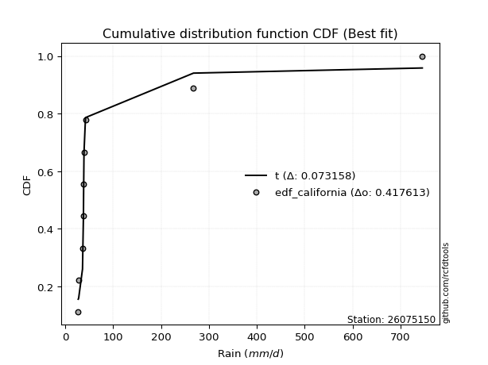</img>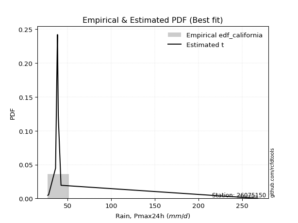</img>

</div>


### 2. Empirical - EDF Hazen (1930)

Hazen method for plotting positions is a formula used to estimate the empirical cumulative probability distribution of flood events or other hydrological data. This formula often results in biased estimations, particularly when extrapolating to extreme events (high return periods).

<div align="center">


$P=(m-0.5)/n$


</div>


**2.1. Empirical values**

<div align="center">

|                | 0                   | 1                   | 2                  | 3                  | 4         | 5                  | 6                  | 7                  | 8                  |
|:---------------|:--------------------|:--------------------|:-------------------|:-------------------|:----------|:-------------------|:-------------------|:-------------------|:-------------------|
| date           | 2021                | 2022                | 2023               | 2020               | 2019      | 2017               | 2018               | 2025               | 2024               |
| x              | 27.381              | 28.318              | 36.295             | 38.265             | 38.51     | 39.366             | 42.517             | 201.292            | 267.8              |
| m              | 1                   | 2                   | 3                  | 4                  | 5         | 6                  | 7                  | 8                  | 9                  |
| empirical_dist | edf_hazen           | edf_hazen           | edf_hazen          | edf_hazen          | edf_hazen | edf_hazen          | edf_hazen          | edf_hazen          | edf_hazen          |
| empirical      | 0.05555555555555555 | 0.16666666666666666 | 0.2777777777777778 | 0.3888888888888889 | 0.5       | 0.6111111111111112 | 0.7222222222222222 | 0.8333333333333334 | 0.9444444444444444 |
| empirical_tr   | 1.0588235294117647  | 1.2                 | 1.3846153846153846 | 1.6363636363636362 | 2.0       | 2.5714285714285716 | 3.5999999999999996 | 6.000000000000002  | 17.999999999999993 |

</div>


**2.2. Kolmogorov-Smirnov fit test (sorted by Δ)**


<div align="center">

|                | 0                   | 1                   | 2                   | 3                   | 4                   | 5                   | 6                   | 7                   | 8                   | 9                   | 10                  | 11                  | 12                  | 13                  | 14                  | 15                  | 16                  | 17                  | 18                  | 19                  | 20                  | 21                  | 22                  | 23                  | 24                  | 25                  | 26                  | 27                  | 28                  | 29                  | 30                  | 31                  | 32                  | 33                  | 34                  | 35                  | 36                  | 37                  | 38                  | 39                  | 40                  | 41                  | 42                  | 43                  | 44                    | 45                  | 46                  | 47                  | 48                  | 49                  | 50                  | 51                  | 52                  | 53                  | 54                  | 55                  | 56                  | 57                  | 58                  | 59                  | 60                  | 61                  | 62                  | 63                  | 64                  | 65                  | 66                  | 67                  | 68                  | 69                  | 70                  | 71                  | 72                  | 73                  | 74                  | 75                  | 76                  | 77                  | 78                  | 79                  | 80                  | 81                  | 82                  | 83                  | 84                  | 85                  | 86                  | 87                  | 88                  | 89                  |
|:---------------|:--------------------|:--------------------|:--------------------|:--------------------|:--------------------|:--------------------|:--------------------|:--------------------|:--------------------|:--------------------|:--------------------|:--------------------|:--------------------|:--------------------|:--------------------|:--------------------|:--------------------|:--------------------|:--------------------|:--------------------|:--------------------|:--------------------|:--------------------|:--------------------|:--------------------|:--------------------|:--------------------|:--------------------|:--------------------|:--------------------|:--------------------|:--------------------|:--------------------|:--------------------|:--------------------|:--------------------|:--------------------|:--------------------|:--------------------|:--------------------|:--------------------|:--------------------|:--------------------|:--------------------|:----------------------|:--------------------|:--------------------|:--------------------|:--------------------|:--------------------|:--------------------|:--------------------|:--------------------|:--------------------|:--------------------|:--------------------|:--------------------|:--------------------|:--------------------|:--------------------|:--------------------|:--------------------|:--------------------|:--------------------|:--------------------|:--------------------|:--------------------|:--------------------|:--------------------|:--------------------|:--------------------|:--------------------|:--------------------|:--------------------|:--------------------|:--------------------|:--------------------|:--------------------|:--------------------|:--------------------|:--------------------|:--------------------|:--------------------|:--------------------|:--------------------|:--------------------|:--------------------|:--------------------|:--------------------|:--------------------|
| station        | 26075150            | 26075150            | 26075150            | 26075150            | 26075150            | 26075150            | 26075150            | 26075150            | 26075150            | 26075150            | 26075150            | 26075150            | 26075150            | 26075150            | 26075150            | 26075150            | 26075150            | 26075150            | 26075150            | 26075150            | 26075150            | 26075150            | 26075150            | 26075150            | 26075150            | 26075150            | 26075150            | 26075150            | 26075150            | 26075150            | 26075150            | 26075150            | 26075150            | 26075150            | 26075150            | 26075150            | 26075150            | 26075150            | 26075150            | 26075150            | 26075150            | 26075150            | 26075150            | 26075150            | 26075150              | 26075150            | 26075150            | 26075150            | 26075150            | 26075150            | 26075150            | 26075150            | 26075150            | 26075150            | 26075150            | 26075150            | 26075150            | 26075150            | 26075150            | 26075150            | 26075150            | 26075150            | 26075150            | 26075150            | 26075150            | 26075150            | 26075150            | 26075150            | 26075150            | 26075150            | 26075150            | 26075150            | 26075150            | 26075150            | 26075150            | 26075150            | 26075150            | 26075150            | 26075150            | 26075150            | 26075150            | 26075150            | 26075150            | 26075150            | 26075150            | 26075150            | 26075150            | 26075150            | 26075150            | 26075150            |
| empirical_dist | edf_hazen           | edf_hazen           | edf_hazen           | edf_hazen           | edf_hazen           | edf_hazen           | edf_hazen           | edf_hazen           | edf_hazen           | edf_hazen           | edf_hazen           | edf_hazen           | edf_hazen           | edf_hazen           | edf_hazen           | edf_hazen           | edf_hazen           | edf_hazen           | edf_hazen           | edf_hazen           | edf_hazen           | edf_hazen           | edf_hazen           | edf_hazen           | edf_hazen           | edf_hazen           | edf_hazen           | edf_hazen           | edf_hazen           | edf_hazen           | edf_hazen           | edf_hazen           | edf_hazen           | edf_hazen           | edf_hazen           | edf_hazen           | edf_hazen           | edf_hazen           | edf_hazen           | edf_hazen           | edf_hazen           | edf_hazen           | edf_hazen           | edf_hazen           | edf_hazen             | edf_hazen           | edf_hazen           | edf_hazen           | edf_hazen           | edf_hazen           | edf_hazen           | edf_hazen           | edf_hazen           | edf_hazen           | edf_hazen           | edf_hazen           | edf_hazen           | edf_hazen           | edf_hazen           | edf_hazen           | edf_hazen           | edf_hazen           | edf_hazen           | edf_hazen           | edf_hazen           | edf_hazen           | edf_hazen           | edf_hazen           | edf_hazen           | edf_hazen           | edf_hazen           | edf_hazen           | edf_hazen           | edf_hazen           | edf_hazen           | edf_hazen           | edf_hazen           | edf_hazen           | edf_hazen           | edf_hazen           | edf_hazen           | edf_hazen           | edf_hazen           | edf_hazen           | edf_hazen           | edf_hazen           | edf_hazen           | edf_hazen           | edf_hazen           | edf_hazen           |
| p_dist         | logt                | t                   | lognct              | logpareto           | alpha               | logalpha            | logf                | loginvgamma         | loginvweibull       | logmielke           | pareto              | loginvgauss         | invgamma            | f                   | betaprime           | fatiguelife         | invgauss            | invweibull          | logwald             | fisk                | logjohnsonsu        | loggibrat           | gamma               | logweibull_min      | erlang              | logfatiguelife      | logncf              | logchi2             | logexponnorm        | loggenexpon         | logexpon            | loghalflogistic     | loggompertz         | logtruncnorm        | loggamma            | loggamma            | logerlang           | loghalfnorm         | logmoyal            | logpearson3         | logfisk             | loggenlogistic      | lognakagami         | loggumbel_r         | loglaplace_asymmetric | lograyleigh         | nct                 | logmaxwell          | wald                | halflogistic        | halfnorm            | ncf                 | pearson3            | logkstwobign        | logloggamma         | moyal               | chi2                | logcrystalball      | lognorm             | lognorm             | rayleigh            | gumbel_r            | loglogistic         | maxwell             | loghypsecant        | logrice             | gibrat              | logbetaprime        | nakagami            | loglognorm          | genlogistic         | loglaplace          | crystalball         | norm                | loggumbel_l         | logistic            | weibull_min         | hypsecant           | kstwobign           | gumbel_l            | rice                | laplace             | exponnorm           | expon               | laplace_asymmetric  | genexpon            | gompertz            | truncnorm           | johnsonsu           | mielke              |
| delta          | 0.10633971715274837 | 0.1118456433739985  | 0.15609467148616607 | 0.15990446356281585 | 0.1645308970012226  | 0.1679504906126465  | 0.17061161084080034 | 0.17061468919027178 | 0.17114978795297325 | 0.17238859992807865 | 0.17822809666762407 | 0.18809568577998753 | 0.18970359460947817 | 0.18971081362984799 | 0.19045011851220928 | 0.19310675885926032 | 0.19514114004539485 | 0.2005105329281478  | 0.2026311747618541  | 0.20504911820595756 | 0.21075345939062423 | 0.2168786903752643  | 0.22044385700474423 | 0.2250844012450295  | 0.22627505577991675 | 0.22863608453431106 | 0.23361803883110976 | 0.2350091552980676  | 0.23978211879458688 | 0.24295979131581535 | 0.24296007211209547 | 0.24356121830442845 | 0.24637396651279986 | 0.2521590666188099  | 0.25239482902436816 | 0.25239482902436816 | 0.2562020202916674  | 0.25702247586676646 | 0.25951910528979705 | 0.26254461369346965 | 0.2728752988273123  | 0.2771948068938892  | 0.2807727300854457  | 0.28115023996904337 | 0.2901236623724285    | 0.2919543896472885  | 0.3002779439649864  | 0.3042525336358594  | 0.3106331387266179  | 0.31432137044564024 | 0.3184535202610292  | 0.3223907591053507  | 0.32244217881454795 | 0.3259743911640521  | 0.33679471651718595 | 0.3369683931170253  | 0.3374944454210801  | 0.33781996224258637 | 0.33781997102025263 | 0.33781997102025263 | 0.3517964321538587  | 0.3518068458105584  | 0.3524388834684749  | 0.36352078019116985 | 0.3642319664030461  | 0.36642260644832775 | 0.36817877182354575 | 0.37099068645870326 | 0.38060391685065736 | 0.3819440073539616  | 0.386781503942978   | 0.39228066060226513 | 0.3939461335088391  | 0.3939461365373637  | 0.4025929903405456  | 0.4135976496254165  | 0.42337569668506736 | 0.42841568213048514 | 0.4314357796068208  | 0.450249090213414   | 0.451520034073821   | 0.45562530212681873 | 0.4700141568468561  | 0.4721275345854609  | 0.4721277593193721  | 0.4721280753788771  | 0.47757918534631383 | 0.5478795123506974  | 0.6720520247767819  | nan                 |
| deltao         | 0.41761268023100007 | 0.41761268023100007 | 0.41761268023100007 | 0.41761268023100007 | 0.41761268023100007 | 0.41761268023100007 | 0.41761268023100007 | 0.41761268023100007 | 0.41761268023100007 | 0.41761268023100007 | 0.41761268023100007 | 0.41761268023100007 | 0.41761268023100007 | 0.41761268023100007 | 0.41761268023100007 | 0.41761268023100007 | 0.41761268023100007 | 0.41761268023100007 | 0.41761268023100007 | 0.41761268023100007 | 0.41761268023100007 | 0.41761268023100007 | 0.41761268023100007 | 0.41761268023100007 | 0.41761268023100007 | 0.41761268023100007 | 0.41761268023100007 | 0.41761268023100007 | 0.41761268023100007 | 0.41761268023100007 | 0.41761268023100007 | 0.41761268023100007 | 0.41761268023100007 | 0.41761268023100007 | 0.41761268023100007 | 0.41761268023100007 | 0.41761268023100007 | 0.41761268023100007 | 0.41761268023100007 | 0.41761268023100007 | 0.41761268023100007 | 0.41761268023100007 | 0.41761268023100007 | 0.41761268023100007 | 0.41761268023100007   | 0.41761268023100007 | 0.41761268023100007 | 0.41761268023100007 | 0.41761268023100007 | 0.41761268023100007 | 0.41761268023100007 | 0.41761268023100007 | 0.41761268023100007 | 0.41761268023100007 | 0.41761268023100007 | 0.41761268023100007 | 0.41761268023100007 | 0.41761268023100007 | 0.41761268023100007 | 0.41761268023100007 | 0.41761268023100007 | 0.41761268023100007 | 0.41761268023100007 | 0.41761268023100007 | 0.41761268023100007 | 0.41761268023100007 | 0.41761268023100007 | 0.41761268023100007 | 0.41761268023100007 | 0.41761268023100007 | 0.41761268023100007 | 0.41761268023100007 | 0.41761268023100007 | 0.41761268023100007 | 0.41761268023100007 | 0.41761268023100007 | 0.41761268023100007 | 0.41761268023100007 | 0.41761268023100007 | 0.41761268023100007 | 0.41761268023100007 | 0.41761268023100007 | 0.41761268023100007 | 0.41761268023100007 | 0.41761268023100007 | 0.41761268023100007 | 0.41761268023100007 | 0.41761268023100007 | 0.41761268023100007 | 0.41761268023100007 |
| eval           | Δo > Δ              | Δo > Δ              | Δo > Δ              | Δo > Δ              | Δo > Δ              | Δo > Δ              | Δo > Δ              | Δo > Δ              | Δo > Δ              | Δo > Δ              | Δo > Δ              | Δo > Δ              | Δo > Δ              | Δo > Δ              | Δo > Δ              | Δo > Δ              | Δo > Δ              | Δo > Δ              | Δo > Δ              | Δo > Δ              | Δo > Δ              | Δo > Δ              | Δo > Δ              | Δo > Δ              | Δo > Δ              | Δo > Δ              | Δo > Δ              | Δo > Δ              | Δo > Δ              | Δo > Δ              | Δo > Δ              | Δo > Δ              | Δo > Δ              | Δo > Δ              | Δo > Δ              | Δo > Δ              | Δo > Δ              | Δo > Δ              | Δo > Δ              | Δo > Δ              | Δo > Δ              | Δo > Δ              | Δo > Δ              | Δo > Δ              | Δo > Δ                | Δo > Δ              | Δo > Δ              | Δo > Δ              | Δo > Δ              | Δo > Δ              | Δo > Δ              | Δo > Δ              | Δo > Δ              | Δo > Δ              | Δo > Δ              | Δo > Δ              | Δo > Δ              | Δo > Δ              | Δo > Δ              | Δo > Δ              | Δo > Δ              | Δo > Δ              | Δo > Δ              | Δo > Δ              | Δo > Δ              | Δo > Δ              | Δo > Δ              | Δo > Δ              | Δo > Δ              | Δo > Δ              | Δo > Δ              | Δo > Δ              | Δo > Δ              | Δo > Δ              | Δo > Δ              | Δo > Δ              | Δo <= Δ             | Δo <= Δ             | Δo <= Δ             | Δo <= Δ             | Δo <= Δ             | Δo <= Δ             | Δo <= Δ             | Δo <= Δ             | Δo <= Δ             | Δo <= Δ             | Δo <= Δ             | Δo <= Δ             | Δo <= Δ             | Δo <= Δ             |
| fit            | 1                   | 1                   | 1                   | 1                   | 1                   | 1                   | 1                   | 1                   | 1                   | 1                   | 1                   | 1                   | 1                   | 1                   | 1                   | 1                   | 1                   | 1                   | 1                   | 1                   | 1                   | 1                   | 1                   | 1                   | 1                   | 1                   | 1                   | 1                   | 1                   | 1                   | 1                   | 1                   | 1                   | 1                   | 1                   | 1                   | 1                   | 1                   | 1                   | 1                   | 1                   | 1                   | 1                   | 1                   | 1                     | 1                   | 1                   | 1                   | 1                   | 1                   | 1                   | 1                   | 1                   | 1                   | 1                   | 1                   | 1                   | 1                   | 1                   | 1                   | 1                   | 1                   | 1                   | 1                   | 1                   | 1                   | 1                   | 1                   | 1                   | 1                   | 1                   | 1                   | 1                   | 1                   | 1                   | 1                   | 0                   | 0                   | 0                   | 0                   | 0                   | 0                   | 0                   | 0                   | 0                   | 0                   | 0                   | 0                   | 0                   | 0                   |
| n              | 9                   | 9                   | 9                   | 9                   | 9                   | 9                   | 9                   | 9                   | 9                   | 9                   | 9                   | 9                   | 9                   | 9                   | 9                   | 9                   | 9                   | 9                   | 9                   | 9                   | 9                   | 9                   | 9                   | 9                   | 9                   | 9                   | 9                   | 9                   | 9                   | 9                   | 9                   | 9                   | 9                   | 9                   | 9                   | 9                   | 9                   | 9                   | 9                   | 9                   | 9                   | 9                   | 9                   | 9                   | 9                     | 9                   | 9                   | 9                   | 9                   | 9                   | 9                   | 9                   | 9                   | 9                   | 9                   | 9                   | 9                   | 9                   | 9                   | 9                   | 9                   | 9                   | 9                   | 9                   | 9                   | 9                   | 9                   | 9                   | 9                   | 9                   | 9                   | 9                   | 9                   | 9                   | 9                   | 9                   | 9                   | 9                   | 9                   | 9                   | 9                   | 9                   | 9                   | 9                   | 9                   | 9                   | 9                   | 9                   | 9                   | 9                   |
| best_fit       | 1                   | 0                   | 0                   | 0                   | 0                   | 0                   | 0                   | 0                   | 0                   | 0                   | 0                   | 0                   | 0                   | 0                   | 0                   | 0                   | 0                   | 0                   | 0                   | 0                   | 0                   | 0                   | 0                   | 0                   | 0                   | 0                   | 0                   | 0                   | 0                   | 0                   | 0                   | 0                   | 0                   | 0                   | 0                   | 0                   | 0                   | 0                   | 0                   | 0                   | 0                   | 0                   | 0                   | 0                   | 0                     | 0                   | 0                   | 0                   | 0                   | 0                   | 0                   | 0                   | 0                   | 0                   | 0                   | 0                   | 0                   | 0                   | 0                   | 0                   | 0                   | 0                   | 0                   | 0                   | 0                   | 0                   | 0                   | 0                   | 0                   | 0                   | 0                   | 0                   | 0                   | 0                   | 0                   | 0                   | 0                   | 0                   | 0                   | 0                   | 0                   | 0                   | 0                   | 0                   | 0                   | 0                   | 0                   | 0                   | 0                   | 0                   |
| best_fit_sort  | 1                   | 2                   | 3                   | 4                   | 5                   | 6                   | 7                   | 8                   | 9                   | 10                  | 11                  | 12                  | 13                  | 14                  | 15                  | 16                  | 17                  | 18                  | 19                  | 20                  | 21                  | 22                  | 23                  | 24                  | 25                  | 26                  | 27                  | 28                  | 29                  | 30                  | 31                  | 32                  | 33                  | 34                  | 35                  | 36                  | 37                  | 38                  | 39                  | 40                  | 41                  | 42                  | 43                  | 44                  | 45                    | 46                  | 47                  | 48                  | 49                  | 50                  | 51                  | 52                  | 53                  | 54                  | 55                  | 56                  | 57                  | 58                  | 59                  | 60                  | 61                  | 62                  | 63                  | 64                  | 65                  | 66                  | 67                  | 68                  | 69                  | 70                  | 71                  | 72                  | 73                  | 74                  | 75                  | 76                  | 77                  | 78                  | 79                  | 80                  | 81                  | 82                  | 83                  | 84                  | 85                  | 86                  | 87                  | 88                  | 89                  | 90                  |

</div>


<div align="center">

</img>

</div>


**2.3. Best fit**

<div align="center">

|   id |   station | empirical_dist   | p_dist   |   delta |   deltao | eval   |   fit |   n |   best_fit |   best_fit_sort |
|-----:|----------:|:-----------------|:---------|--------:|---------:|:-------|------:|----:|-----------:|----------------:|
|    0 |  26075150 | edf_hazen        | logt     | 0.10634 | 0.417613 | Δo > Δ |     1 |   9 |          1 |               1 |

</div>


<div align="center">

</img>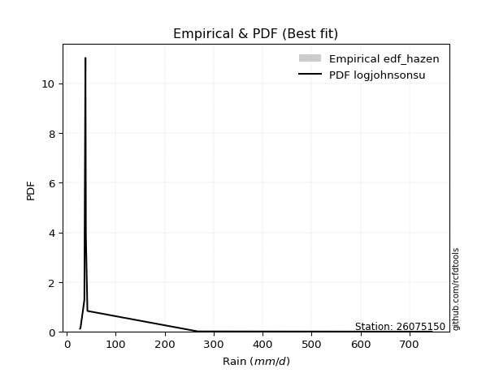</img>

</div>


### 3. Empirical - EDF Weibull (1939)

Weibull plotting position formula is an empirical method used to estimate the non-exceedance probability or plotting position for a set of observed data, is often recommended or widely used in practice, particularly in flood frequency analysis.

<div align="center">


$P=m/(n+1)$


</div>


**3.1. Empirical values**

<div align="center">

|                | 0                  | 1           | 2                  | 3                  | 4           | 5           | 6                 | 7                 | 8                  |
|:---------------|:-------------------|:------------|:-------------------|:-------------------|:------------|:------------|:------------------|:------------------|:-------------------|
| date           | 2021               | 2022        | 2023               | 2020               | 2019        | 2017        | 2018              | 2025              | 2024               |
| x              | 27.381             | 28.318      | 36.295             | 38.265             | 38.51       | 39.366      | 42.517            | 201.292           | 267.8              |
| m              | 1                  | 2           | 3                  | 4                  | 5           | 6           | 7                 | 8                 | 9                  |
| empirical_dist | edf_weibull        | edf_weibull | edf_weibull        | edf_weibull        | edf_weibull | edf_weibull | edf_weibull       | edf_weibull       | edf_weibull        |
| empirical      | 0.1                | 0.2         | 0.3                | 0.4                | 0.5         | 0.6         | 0.7               | 0.8               | 0.9                |
| empirical_tr   | 1.1111111111111112 | 1.25        | 1.4285714285714286 | 1.6666666666666667 | 2.0         | 2.5         | 3.333333333333333 | 5.000000000000001 | 10.000000000000002 |

</div>


**3.2. Kolmogorov-Smirnov fit test (sorted by Δ)**


<div align="center">

|                | 0                   | 1                   | 2                   | 3                   | 4                   | 5                   | 6                   | 7                   | 8                   | 9                   | 10                  | 11                  | 12                  | 13                  | 14                  | 15                  | 16                  | 17                  | 18                  | 19                  | 20                  | 21                  | 22                  | 23                  | 24                  | 25                  | 26                  | 27                  | 28                  | 29                  | 30                  | 31                  | 32                  | 33                  | 34                  | 35                  | 36                  | 37                  | 38                  | 39                  | 40                  | 41                  | 42                  | 43                  | 44                    | 45                  | 46                  | 47                  | 48                  | 49                  | 50                  | 51                  | 52                  | 53                  | 54                  | 55                  | 56                  | 57                  | 58                  | 59                  | 60                  | 61                  | 62                  | 63                  | 64                  | 65                  | 66                  | 67                  | 68                  | 69                  | 70                  | 71                  | 72                  | 73                  | 74                  | 75                  | 76                  | 77                  | 78                  | 79                  | 80                  | 81                  | 82                  | 83                  | 84                  | 85                  | 86                  | 87                  | 88                  | 89                  |
|:---------------|:--------------------|:--------------------|:--------------------|:--------------------|:--------------------|:--------------------|:--------------------|:--------------------|:--------------------|:--------------------|:--------------------|:--------------------|:--------------------|:--------------------|:--------------------|:--------------------|:--------------------|:--------------------|:--------------------|:--------------------|:--------------------|:--------------------|:--------------------|:--------------------|:--------------------|:--------------------|:--------------------|:--------------------|:--------------------|:--------------------|:--------------------|:--------------------|:--------------------|:--------------------|:--------------------|:--------------------|:--------------------|:--------------------|:--------------------|:--------------------|:--------------------|:--------------------|:--------------------|:--------------------|:----------------------|:--------------------|:--------------------|:--------------------|:--------------------|:--------------------|:--------------------|:--------------------|:--------------------|:--------------------|:--------------------|:--------------------|:--------------------|:--------------------|:--------------------|:--------------------|:--------------------|:--------------------|:--------------------|:--------------------|:--------------------|:--------------------|:--------------------|:--------------------|:--------------------|:--------------------|:--------------------|:--------------------|:--------------------|:--------------------|:--------------------|:--------------------|:--------------------|:--------------------|:--------------------|:--------------------|:--------------------|:--------------------|:--------------------|:--------------------|:--------------------|:--------------------|:--------------------|:--------------------|:--------------------|:--------------------|
| station        | 26075150            | 26075150            | 26075150            | 26075150            | 26075150            | 26075150            | 26075150            | 26075150            | 26075150            | 26075150            | 26075150            | 26075150            | 26075150            | 26075150            | 26075150            | 26075150            | 26075150            | 26075150            | 26075150            | 26075150            | 26075150            | 26075150            | 26075150            | 26075150            | 26075150            | 26075150            | 26075150            | 26075150            | 26075150            | 26075150            | 26075150            | 26075150            | 26075150            | 26075150            | 26075150            | 26075150            | 26075150            | 26075150            | 26075150            | 26075150            | 26075150            | 26075150            | 26075150            | 26075150            | 26075150              | 26075150            | 26075150            | 26075150            | 26075150            | 26075150            | 26075150            | 26075150            | 26075150            | 26075150            | 26075150            | 26075150            | 26075150            | 26075150            | 26075150            | 26075150            | 26075150            | 26075150            | 26075150            | 26075150            | 26075150            | 26075150            | 26075150            | 26075150            | 26075150            | 26075150            | 26075150            | 26075150            | 26075150            | 26075150            | 26075150            | 26075150            | 26075150            | 26075150            | 26075150            | 26075150            | 26075150            | 26075150            | 26075150            | 26075150            | 26075150            | 26075150            | 26075150            | 26075150            | 26075150            | 26075150            |
| empirical_dist | edf_weibull         | edf_weibull         | edf_weibull         | edf_weibull         | edf_weibull         | edf_weibull         | edf_weibull         | edf_weibull         | edf_weibull         | edf_weibull         | edf_weibull         | edf_weibull         | edf_weibull         | edf_weibull         | edf_weibull         | edf_weibull         | edf_weibull         | edf_weibull         | edf_weibull         | edf_weibull         | edf_weibull         | edf_weibull         | edf_weibull         | edf_weibull         | edf_weibull         | edf_weibull         | edf_weibull         | edf_weibull         | edf_weibull         | edf_weibull         | edf_weibull         | edf_weibull         | edf_weibull         | edf_weibull         | edf_weibull         | edf_weibull         | edf_weibull         | edf_weibull         | edf_weibull         | edf_weibull         | edf_weibull         | edf_weibull         | edf_weibull         | edf_weibull         | edf_weibull           | edf_weibull         | edf_weibull         | edf_weibull         | edf_weibull         | edf_weibull         | edf_weibull         | edf_weibull         | edf_weibull         | edf_weibull         | edf_weibull         | edf_weibull         | edf_weibull         | edf_weibull         | edf_weibull         | edf_weibull         | edf_weibull         | edf_weibull         | edf_weibull         | edf_weibull         | edf_weibull         | edf_weibull         | edf_weibull         | edf_weibull         | edf_weibull         | edf_weibull         | edf_weibull         | edf_weibull         | edf_weibull         | edf_weibull         | edf_weibull         | edf_weibull         | edf_weibull         | edf_weibull         | edf_weibull         | edf_weibull         | edf_weibull         | edf_weibull         | edf_weibull         | edf_weibull         | edf_weibull         | edf_weibull         | edf_weibull         | edf_weibull         | edf_weibull         | edf_weibull         |
| p_dist         | logpareto           | logt                | t                   | logalpha            | logf                | loginvgamma         | loginvweibull       | logmielke           | alpha               | pareto              | loginvgauss         | invgamma            | f                   | betaprime           | fatiguelife         | invgauss            | invweibull          | lognct              | logwald             | fisk                | logjohnsonsu        | gamma               | loggibrat           | logweibull_min      | erlang              | logfatiguelife      | logncf              | logchi2             | logexponnorm        | loggenexpon         | logexpon            | loghalflogistic     | loggompertz         | logtruncnorm        | loggamma            | loggamma            | logerlang           | loghalfnorm         | logmoyal            | logpearson3         | logfisk             | loggenlogistic      | lognakagami         | loggumbel_r         | loglaplace_asymmetric | lograyleigh         | nct                 | logmaxwell          | wald                | halflogistic        | halfnorm            | ncf                 | pearson3            | logkstwobign        | logloggamma         | moyal               | chi2                | logcrystalball      | lognorm             | lognorm             | rayleigh            | gumbel_r            | loglogistic         | maxwell             | loghypsecant        | logrice             | gibrat              | loglognorm          | logbetaprime        | nakagami            | genlogistic         | loglaplace          | crystalball         | norm                | loggumbel_l         | logistic            | weibull_min         | hypsecant           | kstwobign           | gumbel_l            | rice                | laplace             | exponnorm           | expon               | laplace_asymmetric  | genexpon            | gompertz            | truncnorm           | johnsonsu           | mielke              |
| delta          | 0.13768224134059365 | 0.1396730504860817  | 0.14517897670733182 | 0.1457282683904243  | 0.14838938861857814 | 0.14839246696804959 | 0.14892756573075105 | 0.15016637770585645 | 0.15031287153337014 | 0.15600587444540187 | 0.16587346355776533 | 0.16748137238725597 | 0.1674885914076258  | 0.16822789628998708 | 0.17088453663703812 | 0.17291891782317265 | 0.1782883107059256  | 0.17871512775028464 | 0.18040895253963185 | 0.18282689598373536 | 0.18853123716840203 | 0.19822163478252197 | 0.2                 | 0.20286217902280723 | 0.2040528335576945  | 0.20641386231208886 | 0.2113958166088875  | 0.21278693307584534 | 0.21755989657236463 | 0.2207375690935931  | 0.22073784988987322 | 0.2213389960822062  | 0.2241517442905776  | 0.22993684439658763 | 0.23017260680214596 | 0.23017260680214596 | 0.2339797980694452  | 0.2348002536445442  | 0.2372968830675748  | 0.2403223914712474  | 0.2506530766050901  | 0.25497258467166695 | 0.2585505078632234  | 0.2589280177468211  | 0.2679014401502062    | 0.2697321674250662  | 0.27805572174276416 | 0.28203031141363716 | 0.28841091650439565 | 0.292099148223418   | 0.29623129803880693 | 0.30016853688312845 | 0.3002199565923257  | 0.3037521689418298  | 0.3145724942949637  | 0.31474617089480306 | 0.31527222319885784 | 0.3155977400203641  | 0.3155977487980304  | 0.3155977487980304  | 0.32957420993163644 | 0.3295846235883361  | 0.33021666124625265 | 0.3412985579689476  | 0.34200974418082386 | 0.3442003842261055  | 0.3459565496013235  | 0.34861067402062823 | 0.34876846423648106 | 0.3583816946284351  | 0.36455928172075575 | 0.3700584383800429  | 0.37172391128661686 | 0.37172391431514146 | 0.3803707681183233  | 0.39137542740319425 | 0.4011534744628451  | 0.4061934599082629  | 0.4092135573845985  | 0.4280268679911918  | 0.42929781185159877 | 0.4334030799045965  | 0.44779193462463385 | 0.44990531236323866 | 0.44990553709714987 | 0.4499058531566548  | 0.4553569631240916  | 0.5256572901284753  | 0.6387186914434486  | nan                 |
| deltao         | 0.41761268023100007 | 0.41761268023100007 | 0.41761268023100007 | 0.41761268023100007 | 0.41761268023100007 | 0.41761268023100007 | 0.41761268023100007 | 0.41761268023100007 | 0.41761268023100007 | 0.41761268023100007 | 0.41761268023100007 | 0.41761268023100007 | 0.41761268023100007 | 0.41761268023100007 | 0.41761268023100007 | 0.41761268023100007 | 0.41761268023100007 | 0.41761268023100007 | 0.41761268023100007 | 0.41761268023100007 | 0.41761268023100007 | 0.41761268023100007 | 0.41761268023100007 | 0.41761268023100007 | 0.41761268023100007 | 0.41761268023100007 | 0.41761268023100007 | 0.41761268023100007 | 0.41761268023100007 | 0.41761268023100007 | 0.41761268023100007 | 0.41761268023100007 | 0.41761268023100007 | 0.41761268023100007 | 0.41761268023100007 | 0.41761268023100007 | 0.41761268023100007 | 0.41761268023100007 | 0.41761268023100007 | 0.41761268023100007 | 0.41761268023100007 | 0.41761268023100007 | 0.41761268023100007 | 0.41761268023100007 | 0.41761268023100007   | 0.41761268023100007 | 0.41761268023100007 | 0.41761268023100007 | 0.41761268023100007 | 0.41761268023100007 | 0.41761268023100007 | 0.41761268023100007 | 0.41761268023100007 | 0.41761268023100007 | 0.41761268023100007 | 0.41761268023100007 | 0.41761268023100007 | 0.41761268023100007 | 0.41761268023100007 | 0.41761268023100007 | 0.41761268023100007 | 0.41761268023100007 | 0.41761268023100007 | 0.41761268023100007 | 0.41761268023100007 | 0.41761268023100007 | 0.41761268023100007 | 0.41761268023100007 | 0.41761268023100007 | 0.41761268023100007 | 0.41761268023100007 | 0.41761268023100007 | 0.41761268023100007 | 0.41761268023100007 | 0.41761268023100007 | 0.41761268023100007 | 0.41761268023100007 | 0.41761268023100007 | 0.41761268023100007 | 0.41761268023100007 | 0.41761268023100007 | 0.41761268023100007 | 0.41761268023100007 | 0.41761268023100007 | 0.41761268023100007 | 0.41761268023100007 | 0.41761268023100007 | 0.41761268023100007 | 0.41761268023100007 | 0.41761268023100007 |
| eval           | Δo > Δ              | Δo > Δ              | Δo > Δ              | Δo > Δ              | Δo > Δ              | Δo > Δ              | Δo > Δ              | Δo > Δ              | Δo > Δ              | Δo > Δ              | Δo > Δ              | Δo > Δ              | Δo > Δ              | Δo > Δ              | Δo > Δ              | Δo > Δ              | Δo > Δ              | Δo > Δ              | Δo > Δ              | Δo > Δ              | Δo > Δ              | Δo > Δ              | Δo > Δ              | Δo > Δ              | Δo > Δ              | Δo > Δ              | Δo > Δ              | Δo > Δ              | Δo > Δ              | Δo > Δ              | Δo > Δ              | Δo > Δ              | Δo > Δ              | Δo > Δ              | Δo > Δ              | Δo > Δ              | Δo > Δ              | Δo > Δ              | Δo > Δ              | Δo > Δ              | Δo > Δ              | Δo > Δ              | Δo > Δ              | Δo > Δ              | Δo > Δ                | Δo > Δ              | Δo > Δ              | Δo > Δ              | Δo > Δ              | Δo > Δ              | Δo > Δ              | Δo > Δ              | Δo > Δ              | Δo > Δ              | Δo > Δ              | Δo > Δ              | Δo > Δ              | Δo > Δ              | Δo > Δ              | Δo > Δ              | Δo > Δ              | Δo > Δ              | Δo > Δ              | Δo > Δ              | Δo > Δ              | Δo > Δ              | Δo > Δ              | Δo > Δ              | Δo > Δ              | Δo > Δ              | Δo > Δ              | Δo > Δ              | Δo > Δ              | Δo > Δ              | Δo > Δ              | Δo > Δ              | Δo > Δ              | Δo > Δ              | Δo > Δ              | Δo <= Δ             | Δo <= Δ             | Δo <= Δ             | Δo <= Δ             | Δo <= Δ             | Δo <= Δ             | Δo <= Δ             | Δo <= Δ             | Δo <= Δ             | Δo <= Δ             | Δo <= Δ             |
| fit            | 1                   | 1                   | 1                   | 1                   | 1                   | 1                   | 1                   | 1                   | 1                   | 1                   | 1                   | 1                   | 1                   | 1                   | 1                   | 1                   | 1                   | 1                   | 1                   | 1                   | 1                   | 1                   | 1                   | 1                   | 1                   | 1                   | 1                   | 1                   | 1                   | 1                   | 1                   | 1                   | 1                   | 1                   | 1                   | 1                   | 1                   | 1                   | 1                   | 1                   | 1                   | 1                   | 1                   | 1                   | 1                     | 1                   | 1                   | 1                   | 1                   | 1                   | 1                   | 1                   | 1                   | 1                   | 1                   | 1                   | 1                   | 1                   | 1                   | 1                   | 1                   | 1                   | 1                   | 1                   | 1                   | 1                   | 1                   | 1                   | 1                   | 1                   | 1                   | 1                   | 1                   | 1                   | 1                   | 1                   | 1                   | 1                   | 1                   | 0                   | 0                   | 0                   | 0                   | 0                   | 0                   | 0                   | 0                   | 0                   | 0                   | 0                   |
| n              | 9                   | 9                   | 9                   | 9                   | 9                   | 9                   | 9                   | 9                   | 9                   | 9                   | 9                   | 9                   | 9                   | 9                   | 9                   | 9                   | 9                   | 9                   | 9                   | 9                   | 9                   | 9                   | 9                   | 9                   | 9                   | 9                   | 9                   | 9                   | 9                   | 9                   | 9                   | 9                   | 9                   | 9                   | 9                   | 9                   | 9                   | 9                   | 9                   | 9                   | 9                   | 9                   | 9                   | 9                   | 9                     | 9                   | 9                   | 9                   | 9                   | 9                   | 9                   | 9                   | 9                   | 9                   | 9                   | 9                   | 9                   | 9                   | 9                   | 9                   | 9                   | 9                   | 9                   | 9                   | 9                   | 9                   | 9                   | 9                   | 9                   | 9                   | 9                   | 9                   | 9                   | 9                   | 9                   | 9                   | 9                   | 9                   | 9                   | 9                   | 9                   | 9                   | 9                   | 9                   | 9                   | 9                   | 9                   | 9                   | 9                   | 9                   |
| best_fit       | 1                   | 0                   | 0                   | 0                   | 0                   | 0                   | 0                   | 0                   | 0                   | 0                   | 0                   | 0                   | 0                   | 0                   | 0                   | 0                   | 0                   | 0                   | 0                   | 0                   | 0                   | 0                   | 0                   | 0                   | 0                   | 0                   | 0                   | 0                   | 0                   | 0                   | 0                   | 0                   | 0                   | 0                   | 0                   | 0                   | 0                   | 0                   | 0                   | 0                   | 0                   | 0                   | 0                   | 0                   | 0                     | 0                   | 0                   | 0                   | 0                   | 0                   | 0                   | 0                   | 0                   | 0                   | 0                   | 0                   | 0                   | 0                   | 0                   | 0                   | 0                   | 0                   | 0                   | 0                   | 0                   | 0                   | 0                   | 0                   | 0                   | 0                   | 0                   | 0                   | 0                   | 0                   | 0                   | 0                   | 0                   | 0                   | 0                   | 0                   | 0                   | 0                   | 0                   | 0                   | 0                   | 0                   | 0                   | 0                   | 0                   | 0                   |
| best_fit_sort  | 1                   | 2                   | 3                   | 4                   | 5                   | 6                   | 7                   | 8                   | 9                   | 10                  | 11                  | 12                  | 13                  | 14                  | 15                  | 16                  | 17                  | 18                  | 19                  | 20                  | 21                  | 22                  | 23                  | 24                  | 25                  | 26                  | 27                  | 28                  | 29                  | 30                  | 31                  | 32                  | 33                  | 34                  | 35                  | 36                  | 37                  | 38                  | 39                  | 40                  | 41                  | 42                  | 43                  | 44                  | 45                    | 46                  | 47                  | 48                  | 49                  | 50                  | 51                  | 52                  | 53                  | 54                  | 55                  | 56                  | 57                  | 58                  | 59                  | 60                  | 61                  | 62                  | 63                  | 64                  | 65                  | 66                  | 67                  | 68                  | 69                  | 70                  | 71                  | 72                  | 73                  | 74                  | 75                  | 76                  | 77                  | 78                  | 79                  | 80                  | 81                  | 82                  | 83                  | 84                  | 85                  | 86                  | 87                  | 88                  | 89                  | 90                  |

</div>


<div align="center">

</img>

</div>


**3.3. Best fit**

<div align="center">

|   id |   station | empirical_dist   | p_dist    |    delta |   deltao | eval   |   fit |   n |   best_fit |   best_fit_sort |
|-----:|----------:|:-----------------|:----------|---------:|---------:|:-------|------:|----:|-----------:|----------------:|
|    0 |  26075150 | edf_weibull      | logpareto | 0.137682 | 0.417613 | Δo > Δ |     1 |   9 |          1 |               1 |

</div>


<div align="center">

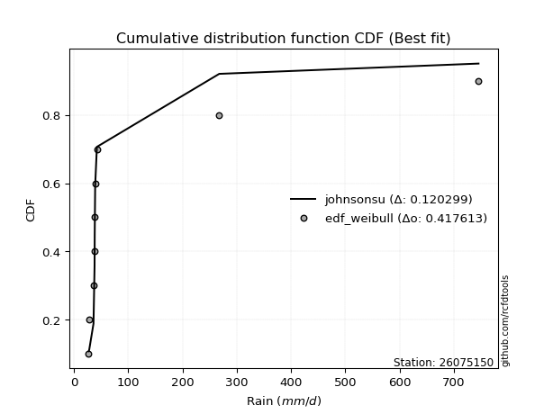</img>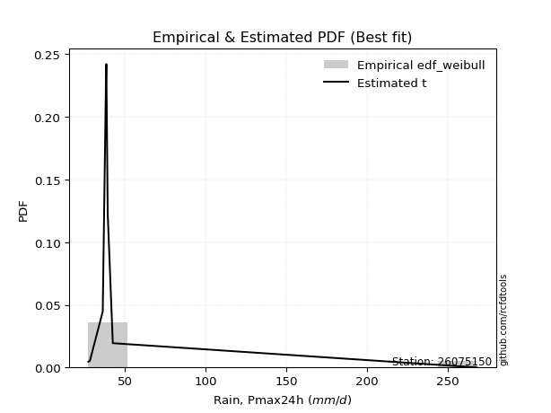</img>

</div>


### 4. Empirical - EDF Beard (1943)

The Beard formula (or Beard´s plotting position formula) in hydrology is used to estimate the empirical non-exceedance probability _(P)_ of a flood event (or other extreme hydrological data point) within a given dataset.

<div align="center">


$P=(m-0.31)/(n+0.38)$


</div>


**4.1. Empirical values**

<div align="center">

|                | 0                   | 1                   | 2                  | 3                   | 4         | 5                  | 6                  | 7                  | 8                  |
|:---------------|:--------------------|:--------------------|:-------------------|:--------------------|:----------|:-------------------|:-------------------|:-------------------|:-------------------|
| date           | 2021                | 2022                | 2023               | 2020                | 2019      | 2017               | 2018               | 2025               | 2024               |
| x              | 27.381              | 28.318              | 36.295             | 38.265              | 38.51     | 39.366             | 42.517             | 201.292            | 267.8              |
| m              | 1                   | 2                   | 3                  | 4                   | 5         | 6                  | 7                  | 8                  | 9                  |
| empirical_dist | edf_beard           | edf_beard           | edf_beard          | edf_beard           | edf_beard | edf_beard          | edf_beard          | edf_beard          | edf_beard          |
| empirical      | 0.07356076759061833 | 0.18017057569296374 | 0.2867803837953091 | 0.39339019189765456 | 0.5       | 0.6066098081023454 | 0.7132196162046908 | 0.8198294243070362 | 0.9264392324093815 |
| empirical_tr   | 1.0794016110471807  | 1.2197659297789336  | 1.4020926756352765 | 1.6485061511423549  | 2.0       | 2.542005420054201  | 3.486988847583642  | 5.550295857988164  | 13.5942028985507   |

</div>


**4.2. Kolmogorov-Smirnov fit test (sorted by Δ)**


<div align="center">

|                | 0                   | 1                   | 2                   | 3                   | 4                   | 5                   | 6                   | 7                   | 8                   | 9                   | 10                  | 11                  | 12                  | 13                  | 14                  | 15                  | 16                  | 17                  | 18                  | 19                  | 20                  | 21                  | 22                  | 23                  | 24                  | 25                  | 26                  | 27                  | 28                  | 29                  | 30                  | 31                  | 32                  | 33                  | 34                  | 35                  | 36                  | 37                  | 38                  | 39                  | 40                  | 41                  | 42                  | 43                  | 44                    | 45                  | 46                  | 47                  | 48                  | 49                  | 50                  | 51                  | 52                  | 53                  | 54                  | 55                  | 56                  | 57                  | 58                  | 59                  | 60                  | 61                  | 62                  | 63                  | 64                  | 65                  | 66                  | 67                  | 68                  | 69                  | 70                  | 71                  | 72                  | 73                  | 74                  | 75                  | 76                  | 77                  | 78                  | 79                  | 80                  | 81                  | 82                  | 83                  | 84                  | 85                  | 86                  | 87                  | 88                  | 89                  |
|:---------------|:--------------------|:--------------------|:--------------------|:--------------------|:--------------------|:--------------------|:--------------------|:--------------------|:--------------------|:--------------------|:--------------------|:--------------------|:--------------------|:--------------------|:--------------------|:--------------------|:--------------------|:--------------------|:--------------------|:--------------------|:--------------------|:--------------------|:--------------------|:--------------------|:--------------------|:--------------------|:--------------------|:--------------------|:--------------------|:--------------------|:--------------------|:--------------------|:--------------------|:--------------------|:--------------------|:--------------------|:--------------------|:--------------------|:--------------------|:--------------------|:--------------------|:--------------------|:--------------------|:--------------------|:----------------------|:--------------------|:--------------------|:--------------------|:--------------------|:--------------------|:--------------------|:--------------------|:--------------------|:--------------------|:--------------------|:--------------------|:--------------------|:--------------------|:--------------------|:--------------------|:--------------------|:--------------------|:--------------------|:--------------------|:--------------------|:--------------------|:--------------------|:--------------------|:--------------------|:--------------------|:--------------------|:--------------------|:--------------------|:--------------------|:--------------------|:--------------------|:--------------------|:--------------------|:--------------------|:--------------------|:--------------------|:--------------------|:--------------------|:--------------------|:--------------------|:--------------------|:--------------------|:--------------------|:--------------------|:--------------------|
| station        | 26075150            | 26075150            | 26075150            | 26075150            | 26075150            | 26075150            | 26075150            | 26075150            | 26075150            | 26075150            | 26075150            | 26075150            | 26075150            | 26075150            | 26075150            | 26075150            | 26075150            | 26075150            | 26075150            | 26075150            | 26075150            | 26075150            | 26075150            | 26075150            | 26075150            | 26075150            | 26075150            | 26075150            | 26075150            | 26075150            | 26075150            | 26075150            | 26075150            | 26075150            | 26075150            | 26075150            | 26075150            | 26075150            | 26075150            | 26075150            | 26075150            | 26075150            | 26075150            | 26075150            | 26075150              | 26075150            | 26075150            | 26075150            | 26075150            | 26075150            | 26075150            | 26075150            | 26075150            | 26075150            | 26075150            | 26075150            | 26075150            | 26075150            | 26075150            | 26075150            | 26075150            | 26075150            | 26075150            | 26075150            | 26075150            | 26075150            | 26075150            | 26075150            | 26075150            | 26075150            | 26075150            | 26075150            | 26075150            | 26075150            | 26075150            | 26075150            | 26075150            | 26075150            | 26075150            | 26075150            | 26075150            | 26075150            | 26075150            | 26075150            | 26075150            | 26075150            | 26075150            | 26075150            | 26075150            | 26075150            |
| empirical_dist | edf_beard           | edf_beard           | edf_beard           | edf_beard           | edf_beard           | edf_beard           | edf_beard           | edf_beard           | edf_beard           | edf_beard           | edf_beard           | edf_beard           | edf_beard           | edf_beard           | edf_beard           | edf_beard           | edf_beard           | edf_beard           | edf_beard           | edf_beard           | edf_beard           | edf_beard           | edf_beard           | edf_beard           | edf_beard           | edf_beard           | edf_beard           | edf_beard           | edf_beard           | edf_beard           | edf_beard           | edf_beard           | edf_beard           | edf_beard           | edf_beard           | edf_beard           | edf_beard           | edf_beard           | edf_beard           | edf_beard           | edf_beard           | edf_beard           | edf_beard           | edf_beard           | edf_beard             | edf_beard           | edf_beard           | edf_beard           | edf_beard           | edf_beard           | edf_beard           | edf_beard           | edf_beard           | edf_beard           | edf_beard           | edf_beard           | edf_beard           | edf_beard           | edf_beard           | edf_beard           | edf_beard           | edf_beard           | edf_beard           | edf_beard           | edf_beard           | edf_beard           | edf_beard           | edf_beard           | edf_beard           | edf_beard           | edf_beard           | edf_beard           | edf_beard           | edf_beard           | edf_beard           | edf_beard           | edf_beard           | edf_beard           | edf_beard           | edf_beard           | edf_beard           | edf_beard           | edf_beard           | edf_beard           | edf_beard           | edf_beard           | edf_beard           | edf_beard           | edf_beard           | edf_beard           |
| p_dist         | logt                | t                   | logpareto           | alpha               | lognct              | logalpha            | logf                | loginvgamma         | loginvweibull       | logmielke           | pareto              | loginvgauss         | invgamma            | f                   | betaprime           | fatiguelife         | invgauss            | invweibull          | logwald             | fisk                | logjohnsonsu        | loggibrat           | gamma               | logweibull_min      | erlang              | logfatiguelife      | logncf              | logchi2             | logexponnorm        | loggenexpon         | logexpon            | loghalflogistic     | loggompertz         | logtruncnorm        | loggamma            | loggamma            | logerlang           | loghalfnorm         | logmoyal            | logpearson3         | logfisk             | loggenlogistic      | lognakagami         | loggumbel_r         | loglaplace_asymmetric | lograyleigh         | nct                 | logmaxwell          | wald                | halflogistic        | halfnorm            | ncf                 | pearson3            | logkstwobign        | logloggamma         | moyal               | chi2                | logcrystalball      | lognorm             | lognorm             | rayleigh            | gumbel_r            | loglogistic         | maxwell             | loghypsecant        | logrice             | gibrat              | logbetaprime        | loglognorm          | nakagami            | genlogistic         | loglaplace          | crystalball         | norm                | loggumbel_l         | logistic            | weibull_min         | hypsecant           | kstwobign           | gumbel_l            | rice                | laplace             | exponnorm           | expon               | laplace_asymmetric  | genexpon            | gompertz            | truncnorm           | johnsonsu           | mielke              |
| delta          | 0.11984362617904554 | 0.12534955240029566 | 0.1509018575452845  | 0.15552829098369125 | 0.15888570344324848 | 0.15894788459511516 | 0.161609004823269   | 0.16161208317274045 | 0.16214718193544192 | 0.1633859939105473  | 0.16922549065009274 | 0.1790930797624562  | 0.18070098859194683 | 0.18070820761231665 | 0.18144751249467794 | 0.18410415284172899 | 0.1861385340278635  | 0.19150792691061647 | 0.19362856874432266 | 0.19604651218842623 | 0.2017508533730929  | 0.20787608435773286 | 0.21144125098721278 | 0.21608179522749804 | 0.2172724497623853  | 0.21963347851677972 | 0.22461543281357832 | 0.22600654928053615 | 0.23077951277705544 | 0.2339571852982839  | 0.23395746609456403 | 0.234558612286897   | 0.2373713604952684  | 0.24315646060127843 | 0.24339222300683683 | 0.24339222300683683 | 0.24719941427413605 | 0.24801986984923502 | 0.2505164992722656  | 0.2535420076759382  | 0.263872692809781   | 0.26819220087635776 | 0.27177012406791423 | 0.2721476339515119  | 0.28112105635489704   | 0.28295178362975704 | 0.29127533794745497 | 0.29524992761832797 | 0.30163053270908646 | 0.3053187644281088  | 0.30945091424349774 | 0.31338815308781925 | 0.3134395727970165  | 0.31697178514652063 | 0.3277921104996545  | 0.32796578709949387 | 0.32849183940354865 | 0.3288173562250549  | 0.3288173650027212  | 0.3288173650027212  | 0.34279382613632725 | 0.34280423979302693 | 0.34343627745094346 | 0.3545181741736384  | 0.35522936038551467 | 0.3574200004307963  | 0.3591761658060143  | 0.3619880804411719  | 0.3684400983276645  | 0.3716013108331259  | 0.37777889792544656 | 0.3832780545847337  | 0.38494352749130767 | 0.38494353051983227 | 0.39359038432301413 | 0.40459504360788506 | 0.4143730906675359  | 0.4194130761129537  | 0.42243317358928933 | 0.4412464841958826  | 0.4425174280562896  | 0.4466226961092873  | 0.46101155082932466 | 0.4631249285679295  | 0.4631251533018407  | 0.46312546936134563 | 0.4685765793287824  | 0.538876906333166   | 0.6585481157504849  | nan                 |
| deltao         | 0.41761268023100007 | 0.41761268023100007 | 0.41761268023100007 | 0.41761268023100007 | 0.41761268023100007 | 0.41761268023100007 | 0.41761268023100007 | 0.41761268023100007 | 0.41761268023100007 | 0.41761268023100007 | 0.41761268023100007 | 0.41761268023100007 | 0.41761268023100007 | 0.41761268023100007 | 0.41761268023100007 | 0.41761268023100007 | 0.41761268023100007 | 0.41761268023100007 | 0.41761268023100007 | 0.41761268023100007 | 0.41761268023100007 | 0.41761268023100007 | 0.41761268023100007 | 0.41761268023100007 | 0.41761268023100007 | 0.41761268023100007 | 0.41761268023100007 | 0.41761268023100007 | 0.41761268023100007 | 0.41761268023100007 | 0.41761268023100007 | 0.41761268023100007 | 0.41761268023100007 | 0.41761268023100007 | 0.41761268023100007 | 0.41761268023100007 | 0.41761268023100007 | 0.41761268023100007 | 0.41761268023100007 | 0.41761268023100007 | 0.41761268023100007 | 0.41761268023100007 | 0.41761268023100007 | 0.41761268023100007 | 0.41761268023100007   | 0.41761268023100007 | 0.41761268023100007 | 0.41761268023100007 | 0.41761268023100007 | 0.41761268023100007 | 0.41761268023100007 | 0.41761268023100007 | 0.41761268023100007 | 0.41761268023100007 | 0.41761268023100007 | 0.41761268023100007 | 0.41761268023100007 | 0.41761268023100007 | 0.41761268023100007 | 0.41761268023100007 | 0.41761268023100007 | 0.41761268023100007 | 0.41761268023100007 | 0.41761268023100007 | 0.41761268023100007 | 0.41761268023100007 | 0.41761268023100007 | 0.41761268023100007 | 0.41761268023100007 | 0.41761268023100007 | 0.41761268023100007 | 0.41761268023100007 | 0.41761268023100007 | 0.41761268023100007 | 0.41761268023100007 | 0.41761268023100007 | 0.41761268023100007 | 0.41761268023100007 | 0.41761268023100007 | 0.41761268023100007 | 0.41761268023100007 | 0.41761268023100007 | 0.41761268023100007 | 0.41761268023100007 | 0.41761268023100007 | 0.41761268023100007 | 0.41761268023100007 | 0.41761268023100007 | 0.41761268023100007 | 0.41761268023100007 |
| eval           | Δo > Δ              | Δo > Δ              | Δo > Δ              | Δo > Δ              | Δo > Δ              | Δo > Δ              | Δo > Δ              | Δo > Δ              | Δo > Δ              | Δo > Δ              | Δo > Δ              | Δo > Δ              | Δo > Δ              | Δo > Δ              | Δo > Δ              | Δo > Δ              | Δo > Δ              | Δo > Δ              | Δo > Δ              | Δo > Δ              | Δo > Δ              | Δo > Δ              | Δo > Δ              | Δo > Δ              | Δo > Δ              | Δo > Δ              | Δo > Δ              | Δo > Δ              | Δo > Δ              | Δo > Δ              | Δo > Δ              | Δo > Δ              | Δo > Δ              | Δo > Δ              | Δo > Δ              | Δo > Δ              | Δo > Δ              | Δo > Δ              | Δo > Δ              | Δo > Δ              | Δo > Δ              | Δo > Δ              | Δo > Δ              | Δo > Δ              | Δo > Δ                | Δo > Δ              | Δo > Δ              | Δo > Δ              | Δo > Δ              | Δo > Δ              | Δo > Δ              | Δo > Δ              | Δo > Δ              | Δo > Δ              | Δo > Δ              | Δo > Δ              | Δo > Δ              | Δo > Δ              | Δo > Δ              | Δo > Δ              | Δo > Δ              | Δo > Δ              | Δo > Δ              | Δo > Δ              | Δo > Δ              | Δo > Δ              | Δo > Δ              | Δo > Δ              | Δo > Δ              | Δo > Δ              | Δo > Δ              | Δo > Δ              | Δo > Δ              | Δo > Δ              | Δo > Δ              | Δo > Δ              | Δo > Δ              | Δo <= Δ             | Δo <= Δ             | Δo <= Δ             | Δo <= Δ             | Δo <= Δ             | Δo <= Δ             | Δo <= Δ             | Δo <= Δ             | Δo <= Δ             | Δo <= Δ             | Δo <= Δ             | Δo <= Δ             | Δo <= Δ             |
| fit            | 1                   | 1                   | 1                   | 1                   | 1                   | 1                   | 1                   | 1                   | 1                   | 1                   | 1                   | 1                   | 1                   | 1                   | 1                   | 1                   | 1                   | 1                   | 1                   | 1                   | 1                   | 1                   | 1                   | 1                   | 1                   | 1                   | 1                   | 1                   | 1                   | 1                   | 1                   | 1                   | 1                   | 1                   | 1                   | 1                   | 1                   | 1                   | 1                   | 1                   | 1                   | 1                   | 1                   | 1                   | 1                     | 1                   | 1                   | 1                   | 1                   | 1                   | 1                   | 1                   | 1                   | 1                   | 1                   | 1                   | 1                   | 1                   | 1                   | 1                   | 1                   | 1                   | 1                   | 1                   | 1                   | 1                   | 1                   | 1                   | 1                   | 1                   | 1                   | 1                   | 1                   | 1                   | 1                   | 1                   | 1                   | 0                   | 0                   | 0                   | 0                   | 0                   | 0                   | 0                   | 0                   | 0                   | 0                   | 0                   | 0                   | 0                   |
| n              | 9                   | 9                   | 9                   | 9                   | 9                   | 9                   | 9                   | 9                   | 9                   | 9                   | 9                   | 9                   | 9                   | 9                   | 9                   | 9                   | 9                   | 9                   | 9                   | 9                   | 9                   | 9                   | 9                   | 9                   | 9                   | 9                   | 9                   | 9                   | 9                   | 9                   | 9                   | 9                   | 9                   | 9                   | 9                   | 9                   | 9                   | 9                   | 9                   | 9                   | 9                   | 9                   | 9                   | 9                   | 9                     | 9                   | 9                   | 9                   | 9                   | 9                   | 9                   | 9                   | 9                   | 9                   | 9                   | 9                   | 9                   | 9                   | 9                   | 9                   | 9                   | 9                   | 9                   | 9                   | 9                   | 9                   | 9                   | 9                   | 9                   | 9                   | 9                   | 9                   | 9                   | 9                   | 9                   | 9                   | 9                   | 9                   | 9                   | 9                   | 9                   | 9                   | 9                   | 9                   | 9                   | 9                   | 9                   | 9                   | 9                   | 9                   |
| best_fit       | 1                   | 0                   | 0                   | 0                   | 0                   | 0                   | 0                   | 0                   | 0                   | 0                   | 0                   | 0                   | 0                   | 0                   | 0                   | 0                   | 0                   | 0                   | 0                   | 0                   | 0                   | 0                   | 0                   | 0                   | 0                   | 0                   | 0                   | 0                   | 0                   | 0                   | 0                   | 0                   | 0                   | 0                   | 0                   | 0                   | 0                   | 0                   | 0                   | 0                   | 0                   | 0                   | 0                   | 0                   | 0                     | 0                   | 0                   | 0                   | 0                   | 0                   | 0                   | 0                   | 0                   | 0                   | 0                   | 0                   | 0                   | 0                   | 0                   | 0                   | 0                   | 0                   | 0                   | 0                   | 0                   | 0                   | 0                   | 0                   | 0                   | 0                   | 0                   | 0                   | 0                   | 0                   | 0                   | 0                   | 0                   | 0                   | 0                   | 0                   | 0                   | 0                   | 0                   | 0                   | 0                   | 0                   | 0                   | 0                   | 0                   | 0                   |
| best_fit_sort  | 1                   | 2                   | 3                   | 4                   | 5                   | 6                   | 7                   | 8                   | 9                   | 10                  | 11                  | 12                  | 13                  | 14                  | 15                  | 16                  | 17                  | 18                  | 19                  | 20                  | 21                  | 22                  | 23                  | 24                  | 25                  | 26                  | 27                  | 28                  | 29                  | 30                  | 31                  | 32                  | 33                  | 34                  | 35                  | 36                  | 37                  | 38                  | 39                  | 40                  | 41                  | 42                  | 43                  | 44                  | 45                    | 46                  | 47                  | 48                  | 49                  | 50                  | 51                  | 52                  | 53                  | 54                  | 55                  | 56                  | 57                  | 58                  | 59                  | 60                  | 61                  | 62                  | 63                  | 64                  | 65                  | 66                  | 67                  | 68                  | 69                  | 70                  | 71                  | 72                  | 73                  | 74                  | 75                  | 76                  | 77                  | 78                  | 79                  | 80                  | 81                  | 82                  | 83                  | 84                  | 85                  | 86                  | 87                  | 88                  | 89                  | 90                  |

</div>


<div align="center">

</img>

</div>


**4.3. Best fit**

<div align="center">

|   id |   station | empirical_dist   | p_dist   |    delta |   deltao | eval   |   fit |   n |   best_fit |   best_fit_sort |
|-----:|----------:|:-----------------|:---------|---------:|---------:|:-------|------:|----:|-----------:|----------------:|
|    0 |  26075150 | edf_beard        | logt     | 0.119844 | 0.417613 | Δo > Δ |     1 |   9 |          1 |               1 |

</div>


<div align="center">

</img>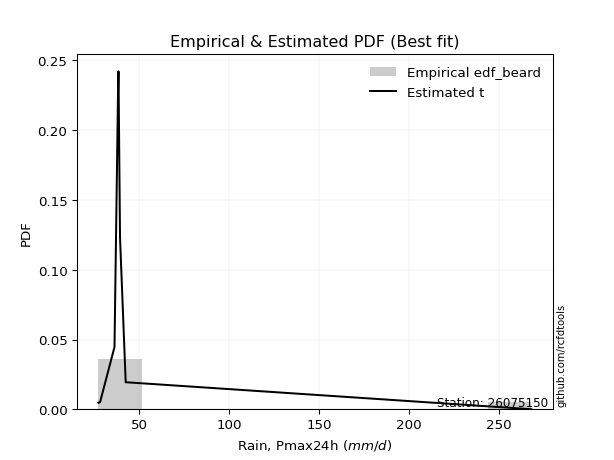</img>

</div>


### 5. Empirical - EDF Chegodayev (1955)

The Chegodayev formula is an empirical plotting position formula used in hydrological frequency analysis to estimate the exceedance probability or return period of a specific event from a set of observed data. It is primarily used for plotting observed data points on probability paper to fit a theoretical distribution, particularly for analyzing extreme events like maximum flood flows or rainfall intensities. The constant _b_ value in the generalized plotting position formula is 0.3.

<div align="center">


$P=(m-b)/(n+1-2b)$


</div>


**5.1. Empirical values**

<div align="center">

|                | 0                   | 1                   | 2                  | 3                   | 4              | 5                  | 6                  | 7                  | 8                  |
|:---------------|:--------------------|:--------------------|:-------------------|:--------------------|:---------------|:-------------------|:-------------------|:-------------------|:-------------------|
| date           | 2021                | 2022                | 2023               | 2020                | 2019           | 2017               | 2018               | 2025               | 2024               |
| x              | 27.381              | 28.318              | 36.295             | 38.265              | 38.51          | 39.366             | 42.517             | 201.292            | 267.8              |
| m              | 1                   | 2                   | 3                  | 4                   | 5              | 6                  | 7                  | 8                  | 9                  |
| empirical_dist | edf_chegodayev      | edf_chegodayev      | edf_chegodayev     | edf_chegodayev      | edf_chegodayev | edf_chegodayev     | edf_chegodayev     | edf_chegodayev     | edf_chegodayev     |
| empirical      | 0.07446808510638298 | 0.18085106382978722 | 0.2872340425531915 | 0.39361702127659576 | 0.5            | 0.6063829787234043 | 0.7127659574468085 | 0.8191489361702128 | 0.9255319148936169 |
| empirical_tr   | 1.0804597701149425  | 1.2207792207792207  | 1.4029850746268657 | 1.6491228070175437  | 2.0            | 2.540540540540541  | 3.481481481481481  | 5.529411764705883  | 13.428571428571399 |

</div>


**5.2. Kolmogorov-Smirnov fit test (sorted by Δ)**


<div align="center">

|                | 0                   | 1                   | 2                   | 3                   | 4                   | 5                   | 6                   | 7                   | 8                   | 9                   | 10                  | 11                  | 12                  | 13                  | 14                  | 15                  | 16                  | 17                  | 18                  | 19                  | 20                  | 21                  | 22                  | 23                  | 24                  | 25                  | 26                  | 27                  | 28                  | 29                  | 30                  | 31                  | 32                  | 33                  | 34                  | 35                  | 36                  | 37                  | 38                  | 39                  | 40                  | 41                  | 42                  | 43                  | 44                    | 45                  | 46                  | 47                  | 48                  | 49                  | 50                  | 51                  | 52                  | 53                  | 54                  | 55                  | 56                  | 57                  | 58                  | 59                  | 60                  | 61                  | 62                  | 63                  | 64                  | 65                  | 66                  | 67                  | 68                  | 69                  | 70                  | 71                  | 72                  | 73                  | 74                  | 75                  | 76                  | 77                  | 78                  | 79                  | 80                  | 81                  | 82                  | 83                  | 84                  | 85                  | 86                  | 87                  | 88                  | 89                  |
|:---------------|:--------------------|:--------------------|:--------------------|:--------------------|:--------------------|:--------------------|:--------------------|:--------------------|:--------------------|:--------------------|:--------------------|:--------------------|:--------------------|:--------------------|:--------------------|:--------------------|:--------------------|:--------------------|:--------------------|:--------------------|:--------------------|:--------------------|:--------------------|:--------------------|:--------------------|:--------------------|:--------------------|:--------------------|:--------------------|:--------------------|:--------------------|:--------------------|:--------------------|:--------------------|:--------------------|:--------------------|:--------------------|:--------------------|:--------------------|:--------------------|:--------------------|:--------------------|:--------------------|:--------------------|:----------------------|:--------------------|:--------------------|:--------------------|:--------------------|:--------------------|:--------------------|:--------------------|:--------------------|:--------------------|:--------------------|:--------------------|:--------------------|:--------------------|:--------------------|:--------------------|:--------------------|:--------------------|:--------------------|:--------------------|:--------------------|:--------------------|:--------------------|:--------------------|:--------------------|:--------------------|:--------------------|:--------------------|:--------------------|:--------------------|:--------------------|:--------------------|:--------------------|:--------------------|:--------------------|:--------------------|:--------------------|:--------------------|:--------------------|:--------------------|:--------------------|:--------------------|:--------------------|:--------------------|:--------------------|:--------------------|
| station        | 26075150            | 26075150            | 26075150            | 26075150            | 26075150            | 26075150            | 26075150            | 26075150            | 26075150            | 26075150            | 26075150            | 26075150            | 26075150            | 26075150            | 26075150            | 26075150            | 26075150            | 26075150            | 26075150            | 26075150            | 26075150            | 26075150            | 26075150            | 26075150            | 26075150            | 26075150            | 26075150            | 26075150            | 26075150            | 26075150            | 26075150            | 26075150            | 26075150            | 26075150            | 26075150            | 26075150            | 26075150            | 26075150            | 26075150            | 26075150            | 26075150            | 26075150            | 26075150            | 26075150            | 26075150              | 26075150            | 26075150            | 26075150            | 26075150            | 26075150            | 26075150            | 26075150            | 26075150            | 26075150            | 26075150            | 26075150            | 26075150            | 26075150            | 26075150            | 26075150            | 26075150            | 26075150            | 26075150            | 26075150            | 26075150            | 26075150            | 26075150            | 26075150            | 26075150            | 26075150            | 26075150            | 26075150            | 26075150            | 26075150            | 26075150            | 26075150            | 26075150            | 26075150            | 26075150            | 26075150            | 26075150            | 26075150            | 26075150            | 26075150            | 26075150            | 26075150            | 26075150            | 26075150            | 26075150            | 26075150            |
| empirical_dist | edf_chegodayev      | edf_chegodayev      | edf_chegodayev      | edf_chegodayev      | edf_chegodayev      | edf_chegodayev      | edf_chegodayev      | edf_chegodayev      | edf_chegodayev      | edf_chegodayev      | edf_chegodayev      | edf_chegodayev      | edf_chegodayev      | edf_chegodayev      | edf_chegodayev      | edf_chegodayev      | edf_chegodayev      | edf_chegodayev      | edf_chegodayev      | edf_chegodayev      | edf_chegodayev      | edf_chegodayev      | edf_chegodayev      | edf_chegodayev      | edf_chegodayev      | edf_chegodayev      | edf_chegodayev      | edf_chegodayev      | edf_chegodayev      | edf_chegodayev      | edf_chegodayev      | edf_chegodayev      | edf_chegodayev      | edf_chegodayev      | edf_chegodayev      | edf_chegodayev      | edf_chegodayev      | edf_chegodayev      | edf_chegodayev      | edf_chegodayev      | edf_chegodayev      | edf_chegodayev      | edf_chegodayev      | edf_chegodayev      | edf_chegodayev        | edf_chegodayev      | edf_chegodayev      | edf_chegodayev      | edf_chegodayev      | edf_chegodayev      | edf_chegodayev      | edf_chegodayev      | edf_chegodayev      | edf_chegodayev      | edf_chegodayev      | edf_chegodayev      | edf_chegodayev      | edf_chegodayev      | edf_chegodayev      | edf_chegodayev      | edf_chegodayev      | edf_chegodayev      | edf_chegodayev      | edf_chegodayev      | edf_chegodayev      | edf_chegodayev      | edf_chegodayev      | edf_chegodayev      | edf_chegodayev      | edf_chegodayev      | edf_chegodayev      | edf_chegodayev      | edf_chegodayev      | edf_chegodayev      | edf_chegodayev      | edf_chegodayev      | edf_chegodayev      | edf_chegodayev      | edf_chegodayev      | edf_chegodayev      | edf_chegodayev      | edf_chegodayev      | edf_chegodayev      | edf_chegodayev      | edf_chegodayev      | edf_chegodayev      | edf_chegodayev      | edf_chegodayev      | edf_chegodayev      | edf_chegodayev      |
| p_dist         | logt                | t                   | logpareto           | alpha               | logalpha            | lognct              | logf                | loginvgamma         | loginvweibull       | logmielke           | pareto              | loginvgauss         | invgamma            | f                   | betaprime           | fatiguelife         | invgauss            | invweibull          | logwald             | fisk                | logjohnsonsu        | loggibrat           | gamma               | logweibull_min      | erlang              | logfatiguelife      | logncf              | logchi2             | logexponnorm        | loggenexpon         | logexpon            | loghalflogistic     | loggompertz         | logtruncnorm        | loggamma            | loggamma            | logerlang           | loghalfnorm         | logmoyal            | logpearson3         | logfisk             | loggenlogistic      | lognakagami         | loggumbel_r         | loglaplace_asymmetric | lograyleigh         | nct                 | logmaxwell          | wald                | halflogistic        | halfnorm            | ncf                 | pearson3            | logkstwobign        | logloggamma         | moyal               | chi2                | logcrystalball      | lognorm             | lognorm             | rayleigh            | gumbel_r            | loglogistic         | maxwell             | loghypsecant        | logrice             | gibrat              | logbetaprime        | loglognorm          | nakagami            | genlogistic         | loglaplace          | crystalball         | norm                | loggumbel_l         | logistic            | weibull_min         | hypsecant           | kstwobign           | gumbel_l            | rice                | laplace             | exponnorm           | expon               | laplace_asymmetric  | genexpon            | gompertz            | truncnorm           | johnsonsu           | mielke              |
| delta          | 0.12052411431586896 | 0.12603004053711908 | 0.15044819878740212 | 0.15507463222580886 | 0.15849422583723277 | 0.1595661915800719  | 0.16115534606538662 | 0.16115842441485806 | 0.16169352317755953 | 0.16293233515266492 | 0.16877183189221034 | 0.1786394210045738  | 0.18024732983406444 | 0.18025454885443426 | 0.18099385373679555 | 0.1836504940838466  | 0.18568487526998112 | 0.19105426815273407 | 0.19317490998644038 | 0.19559285343054383 | 0.2012971946152105  | 0.20742242559985058 | 0.2109875922293305  | 0.21562813646961576 | 0.21681879100450302 | 0.21917981975889733 | 0.22416177405569604 | 0.22555289052265387 | 0.23032585401917316 | 0.23350352654040163 | 0.23350380733668175 | 0.23410495352901473 | 0.23691770173738613 | 0.24270280184339615 | 0.24293856424895444 | 0.24293856424895444 | 0.24674575551625366 | 0.24756621109135274 | 0.2500628405143833  | 0.2530883489180559  | 0.2634190340518986  | 0.2677385421184755  | 0.27131646531003195 | 0.27169397519362964 | 0.28066739759701476   | 0.28249812487187476 | 0.2908216791895727  | 0.2947962688604457  | 0.3011768739512042  | 0.3048651056702265  | 0.30899725548561546 | 0.312934494329937   | 0.3129859140391342  | 0.31651812638863835 | 0.32733845174177223 | 0.3275121283416116  | 0.32803818064566637 | 0.32836369746717264 | 0.3283637062448389  | 0.3283637062448389  | 0.34234016737844497 | 0.34235058103514465 | 0.3429826186930612  | 0.3540645154157561  | 0.3547757016276324  | 0.356966341672914   | 0.358722507048132   | 0.36153442168328953 | 0.367759610190841   | 0.37114765207524364 | 0.3773252391675643  | 0.3828243958268514  | 0.3844898687334254  | 0.38448987176195    | 0.39313672556513185 | 0.4041413848500028  | 0.41391943190965363 | 0.4189594173550714  | 0.42197951483140705 | 0.4407928254380003  | 0.4420637692984073  | 0.446169037351405   | 0.4605578920714424  | 0.4626712698100472  | 0.4626714945439584  | 0.46267181060346335 | 0.4681229205709001  | 0.5384232475752837  | 0.6578676276136614  | nan                 |
| deltao         | 0.41761268023100007 | 0.41761268023100007 | 0.41761268023100007 | 0.41761268023100007 | 0.41761268023100007 | 0.41761268023100007 | 0.41761268023100007 | 0.41761268023100007 | 0.41761268023100007 | 0.41761268023100007 | 0.41761268023100007 | 0.41761268023100007 | 0.41761268023100007 | 0.41761268023100007 | 0.41761268023100007 | 0.41761268023100007 | 0.41761268023100007 | 0.41761268023100007 | 0.41761268023100007 | 0.41761268023100007 | 0.41761268023100007 | 0.41761268023100007 | 0.41761268023100007 | 0.41761268023100007 | 0.41761268023100007 | 0.41761268023100007 | 0.41761268023100007 | 0.41761268023100007 | 0.41761268023100007 | 0.41761268023100007 | 0.41761268023100007 | 0.41761268023100007 | 0.41761268023100007 | 0.41761268023100007 | 0.41761268023100007 | 0.41761268023100007 | 0.41761268023100007 | 0.41761268023100007 | 0.41761268023100007 | 0.41761268023100007 | 0.41761268023100007 | 0.41761268023100007 | 0.41761268023100007 | 0.41761268023100007 | 0.41761268023100007   | 0.41761268023100007 | 0.41761268023100007 | 0.41761268023100007 | 0.41761268023100007 | 0.41761268023100007 | 0.41761268023100007 | 0.41761268023100007 | 0.41761268023100007 | 0.41761268023100007 | 0.41761268023100007 | 0.41761268023100007 | 0.41761268023100007 | 0.41761268023100007 | 0.41761268023100007 | 0.41761268023100007 | 0.41761268023100007 | 0.41761268023100007 | 0.41761268023100007 | 0.41761268023100007 | 0.41761268023100007 | 0.41761268023100007 | 0.41761268023100007 | 0.41761268023100007 | 0.41761268023100007 | 0.41761268023100007 | 0.41761268023100007 | 0.41761268023100007 | 0.41761268023100007 | 0.41761268023100007 | 0.41761268023100007 | 0.41761268023100007 | 0.41761268023100007 | 0.41761268023100007 | 0.41761268023100007 | 0.41761268023100007 | 0.41761268023100007 | 0.41761268023100007 | 0.41761268023100007 | 0.41761268023100007 | 0.41761268023100007 | 0.41761268023100007 | 0.41761268023100007 | 0.41761268023100007 | 0.41761268023100007 | 0.41761268023100007 |
| eval           | Δo > Δ              | Δo > Δ              | Δo > Δ              | Δo > Δ              | Δo > Δ              | Δo > Δ              | Δo > Δ              | Δo > Δ              | Δo > Δ              | Δo > Δ              | Δo > Δ              | Δo > Δ              | Δo > Δ              | Δo > Δ              | Δo > Δ              | Δo > Δ              | Δo > Δ              | Δo > Δ              | Δo > Δ              | Δo > Δ              | Δo > Δ              | Δo > Δ              | Δo > Δ              | Δo > Δ              | Δo > Δ              | Δo > Δ              | Δo > Δ              | Δo > Δ              | Δo > Δ              | Δo > Δ              | Δo > Δ              | Δo > Δ              | Δo > Δ              | Δo > Δ              | Δo > Δ              | Δo > Δ              | Δo > Δ              | Δo > Δ              | Δo > Δ              | Δo > Δ              | Δo > Δ              | Δo > Δ              | Δo > Δ              | Δo > Δ              | Δo > Δ                | Δo > Δ              | Δo > Δ              | Δo > Δ              | Δo > Δ              | Δo > Δ              | Δo > Δ              | Δo > Δ              | Δo > Δ              | Δo > Δ              | Δo > Δ              | Δo > Δ              | Δo > Δ              | Δo > Δ              | Δo > Δ              | Δo > Δ              | Δo > Δ              | Δo > Δ              | Δo > Δ              | Δo > Δ              | Δo > Δ              | Δo > Δ              | Δo > Δ              | Δo > Δ              | Δo > Δ              | Δo > Δ              | Δo > Δ              | Δo > Δ              | Δo > Δ              | Δo > Δ              | Δo > Δ              | Δo > Δ              | Δo > Δ              | Δo <= Δ             | Δo <= Δ             | Δo <= Δ             | Δo <= Δ             | Δo <= Δ             | Δo <= Δ             | Δo <= Δ             | Δo <= Δ             | Δo <= Δ             | Δo <= Δ             | Δo <= Δ             | Δo <= Δ             | Δo <= Δ             |
| fit            | 1                   | 1                   | 1                   | 1                   | 1                   | 1                   | 1                   | 1                   | 1                   | 1                   | 1                   | 1                   | 1                   | 1                   | 1                   | 1                   | 1                   | 1                   | 1                   | 1                   | 1                   | 1                   | 1                   | 1                   | 1                   | 1                   | 1                   | 1                   | 1                   | 1                   | 1                   | 1                   | 1                   | 1                   | 1                   | 1                   | 1                   | 1                   | 1                   | 1                   | 1                   | 1                   | 1                   | 1                   | 1                     | 1                   | 1                   | 1                   | 1                   | 1                   | 1                   | 1                   | 1                   | 1                   | 1                   | 1                   | 1                   | 1                   | 1                   | 1                   | 1                   | 1                   | 1                   | 1                   | 1                   | 1                   | 1                   | 1                   | 1                   | 1                   | 1                   | 1                   | 1                   | 1                   | 1                   | 1                   | 1                   | 0                   | 0                   | 0                   | 0                   | 0                   | 0                   | 0                   | 0                   | 0                   | 0                   | 0                   | 0                   | 0                   |
| n              | 9                   | 9                   | 9                   | 9                   | 9                   | 9                   | 9                   | 9                   | 9                   | 9                   | 9                   | 9                   | 9                   | 9                   | 9                   | 9                   | 9                   | 9                   | 9                   | 9                   | 9                   | 9                   | 9                   | 9                   | 9                   | 9                   | 9                   | 9                   | 9                   | 9                   | 9                   | 9                   | 9                   | 9                   | 9                   | 9                   | 9                   | 9                   | 9                   | 9                   | 9                   | 9                   | 9                   | 9                   | 9                     | 9                   | 9                   | 9                   | 9                   | 9                   | 9                   | 9                   | 9                   | 9                   | 9                   | 9                   | 9                   | 9                   | 9                   | 9                   | 9                   | 9                   | 9                   | 9                   | 9                   | 9                   | 9                   | 9                   | 9                   | 9                   | 9                   | 9                   | 9                   | 9                   | 9                   | 9                   | 9                   | 9                   | 9                   | 9                   | 9                   | 9                   | 9                   | 9                   | 9                   | 9                   | 9                   | 9                   | 9                   | 9                   |
| best_fit       | 1                   | 0                   | 0                   | 0                   | 0                   | 0                   | 0                   | 0                   | 0                   | 0                   | 0                   | 0                   | 0                   | 0                   | 0                   | 0                   | 0                   | 0                   | 0                   | 0                   | 0                   | 0                   | 0                   | 0                   | 0                   | 0                   | 0                   | 0                   | 0                   | 0                   | 0                   | 0                   | 0                   | 0                   | 0                   | 0                   | 0                   | 0                   | 0                   | 0                   | 0                   | 0                   | 0                   | 0                   | 0                     | 0                   | 0                   | 0                   | 0                   | 0                   | 0                   | 0                   | 0                   | 0                   | 0                   | 0                   | 0                   | 0                   | 0                   | 0                   | 0                   | 0                   | 0                   | 0                   | 0                   | 0                   | 0                   | 0                   | 0                   | 0                   | 0                   | 0                   | 0                   | 0                   | 0                   | 0                   | 0                   | 0                   | 0                   | 0                   | 0                   | 0                   | 0                   | 0                   | 0                   | 0                   | 0                   | 0                   | 0                   | 0                   |
| best_fit_sort  | 1                   | 2                   | 3                   | 4                   | 5                   | 6                   | 7                   | 8                   | 9                   | 10                  | 11                  | 12                  | 13                  | 14                  | 15                  | 16                  | 17                  | 18                  | 19                  | 20                  | 21                  | 22                  | 23                  | 24                  | 25                  | 26                  | 27                  | 28                  | 29                  | 30                  | 31                  | 32                  | 33                  | 34                  | 35                  | 36                  | 37                  | 38                  | 39                  | 40                  | 41                  | 42                  | 43                  | 44                  | 45                    | 46                  | 47                  | 48                  | 49                  | 50                  | 51                  | 52                  | 53                  | 54                  | 55                  | 56                  | 57                  | 58                  | 59                  | 60                  | 61                  | 62                  | 63                  | 64                  | 65                  | 66                  | 67                  | 68                  | 69                  | 70                  | 71                  | 72                  | 73                  | 74                  | 75                  | 76                  | 77                  | 78                  | 79                  | 80                  | 81                  | 82                  | 83                  | 84                  | 85                  | 86                  | 87                  | 88                  | 89                  | 90                  |

</div>


<div align="center">

</img>

</div>


**5.3. Best fit**

<div align="center">

|   id |   station | empirical_dist   | p_dist   |    delta |   deltao | eval   |   fit |   n |   best_fit |   best_fit_sort |
|-----:|----------:|:-----------------|:---------|---------:|---------:|:-------|------:|----:|-----------:|----------------:|
|    0 |  26075150 | edf_chegodayev   | logt     | 0.120524 | 0.417613 | Δo > Δ |     1 |   9 |          1 |               1 |

</div>


<div align="center">

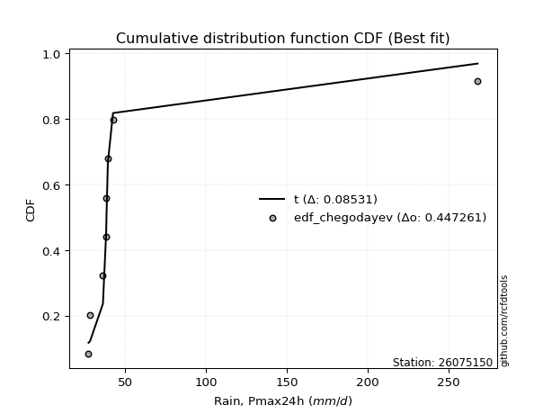</img>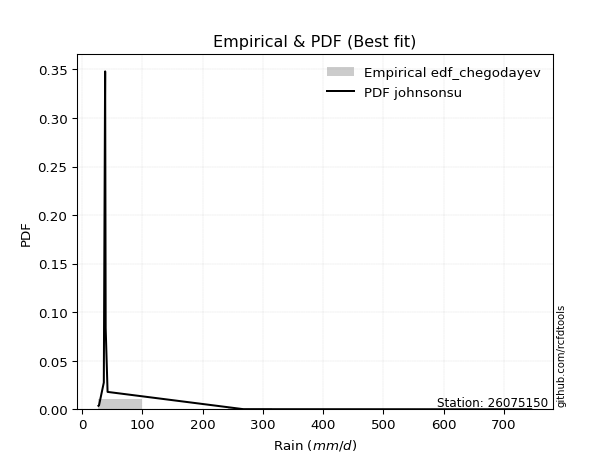</img>

</div>


### 6. Empirical - EDF Blom (1958)

The Blom formula is a specific "plotting position" formula used in hydrology and statistical analysis to estimate the empirical cumulative probability (or non-exceedance probability) of a data series. It is particularly recommended for data that are approximately normally distributed. The constant _a_ is set to 0.375 (or 3/8).

<div align="center">


$P=(m-a)/(n+1-2a)$


</div>


**6.1. Empirical values**

<div align="center">

|                | 0                   | 1                   | 2                   | 3                  | 4        | 5                  | 6                  | 7                  | 8                  |
|:---------------|:--------------------|:--------------------|:--------------------|:-------------------|:---------|:-------------------|:-------------------|:-------------------|:-------------------|
| date           | 2021                | 2022                | 2023                | 2020               | 2019     | 2017               | 2018               | 2025               | 2024               |
| x              | 27.381              | 28.318              | 36.295              | 38.265             | 38.51    | 39.366             | 42.517             | 201.292            | 267.8              |
| m              | 1                   | 2                   | 3                   | 4                  | 5        | 6                  | 7                  | 8                  | 9                  |
| empirical_dist | edf_blom            | edf_blom            | edf_blom            | edf_blom           | edf_blom | edf_blom           | edf_blom           | edf_blom           | edf_blom           |
| empirical      | 0.06756756756756757 | 0.17567567567567569 | 0.28378378378378377 | 0.3918918918918919 | 0.5      | 0.6081081081081081 | 0.7162162162162162 | 0.8243243243243243 | 0.9324324324324325 |
| empirical_tr   | 1.072463768115942   | 1.2131147540983607  | 1.3962264150943395  | 1.6444444444444444 | 2.0      | 2.5517241379310347 | 3.523809523809524  | 5.6923076923076925 | 14.800000000000006 |

</div>


**6.2. Kolmogorov-Smirnov fit test (sorted by Δ)**


<div align="center">

|                | 0                   | 1                   | 2                   | 3                   | 4                   | 5                   | 6                   | 7                   | 8                   | 9                   | 10                  | 11                  | 12                  | 13                  | 14                  | 15                  | 16                  | 17                  | 18                  | 19                  | 20                  | 21                  | 22                  | 23                  | 24                  | 25                  | 26                  | 27                  | 28                  | 29                  | 30                  | 31                  | 32                  | 33                  | 34                  | 35                  | 36                  | 37                  | 38                  | 39                  | 40                  | 41                  | 42                  | 43                  | 44                    | 45                  | 46                  | 47                  | 48                  | 49                  | 50                  | 51                  | 52                  | 53                  | 54                  | 55                  | 56                  | 57                  | 58                  | 59                  | 60                  | 61                  | 62                  | 63                  | 64                  | 65                  | 66                  | 67                  | 68                  | 69                  | 70                  | 71                  | 72                  | 73                  | 74                  | 75                  | 76                  | 77                  | 78                  | 79                  | 80                  | 81                  | 82                  | 83                  | 84                  | 85                  | 86                  | 87                  | 88                  | 89                  |
|:---------------|:--------------------|:--------------------|:--------------------|:--------------------|:--------------------|:--------------------|:--------------------|:--------------------|:--------------------|:--------------------|:--------------------|:--------------------|:--------------------|:--------------------|:--------------------|:--------------------|:--------------------|:--------------------|:--------------------|:--------------------|:--------------------|:--------------------|:--------------------|:--------------------|:--------------------|:--------------------|:--------------------|:--------------------|:--------------------|:--------------------|:--------------------|:--------------------|:--------------------|:--------------------|:--------------------|:--------------------|:--------------------|:--------------------|:--------------------|:--------------------|:--------------------|:--------------------|:--------------------|:--------------------|:----------------------|:--------------------|:--------------------|:--------------------|:--------------------|:--------------------|:--------------------|:--------------------|:--------------------|:--------------------|:--------------------|:--------------------|:--------------------|:--------------------|:--------------------|:--------------------|:--------------------|:--------------------|:--------------------|:--------------------|:--------------------|:--------------------|:--------------------|:--------------------|:--------------------|:--------------------|:--------------------|:--------------------|:--------------------|:--------------------|:--------------------|:--------------------|:--------------------|:--------------------|:--------------------|:--------------------|:--------------------|:--------------------|:--------------------|:--------------------|:--------------------|:--------------------|:--------------------|:--------------------|:--------------------|:--------------------|
| station        | 26075150            | 26075150            | 26075150            | 26075150            | 26075150            | 26075150            | 26075150            | 26075150            | 26075150            | 26075150            | 26075150            | 26075150            | 26075150            | 26075150            | 26075150            | 26075150            | 26075150            | 26075150            | 26075150            | 26075150            | 26075150            | 26075150            | 26075150            | 26075150            | 26075150            | 26075150            | 26075150            | 26075150            | 26075150            | 26075150            | 26075150            | 26075150            | 26075150            | 26075150            | 26075150            | 26075150            | 26075150            | 26075150            | 26075150            | 26075150            | 26075150            | 26075150            | 26075150            | 26075150            | 26075150              | 26075150            | 26075150            | 26075150            | 26075150            | 26075150            | 26075150            | 26075150            | 26075150            | 26075150            | 26075150            | 26075150            | 26075150            | 26075150            | 26075150            | 26075150            | 26075150            | 26075150            | 26075150            | 26075150            | 26075150            | 26075150            | 26075150            | 26075150            | 26075150            | 26075150            | 26075150            | 26075150            | 26075150            | 26075150            | 26075150            | 26075150            | 26075150            | 26075150            | 26075150            | 26075150            | 26075150            | 26075150            | 26075150            | 26075150            | 26075150            | 26075150            | 26075150            | 26075150            | 26075150            | 26075150            |
| empirical_dist | edf_blom            | edf_blom            | edf_blom            | edf_blom            | edf_blom            | edf_blom            | edf_blom            | edf_blom            | edf_blom            | edf_blom            | edf_blom            | edf_blom            | edf_blom            | edf_blom            | edf_blom            | edf_blom            | edf_blom            | edf_blom            | edf_blom            | edf_blom            | edf_blom            | edf_blom            | edf_blom            | edf_blom            | edf_blom            | edf_blom            | edf_blom            | edf_blom            | edf_blom            | edf_blom            | edf_blom            | edf_blom            | edf_blom            | edf_blom            | edf_blom            | edf_blom            | edf_blom            | edf_blom            | edf_blom            | edf_blom            | edf_blom            | edf_blom            | edf_blom            | edf_blom            | edf_blom              | edf_blom            | edf_blom            | edf_blom            | edf_blom            | edf_blom            | edf_blom            | edf_blom            | edf_blom            | edf_blom            | edf_blom            | edf_blom            | edf_blom            | edf_blom            | edf_blom            | edf_blom            | edf_blom            | edf_blom            | edf_blom            | edf_blom            | edf_blom            | edf_blom            | edf_blom            | edf_blom            | edf_blom            | edf_blom            | edf_blom            | edf_blom            | edf_blom            | edf_blom            | edf_blom            | edf_blom            | edf_blom            | edf_blom            | edf_blom            | edf_blom            | edf_blom            | edf_blom            | edf_blom            | edf_blom            | edf_blom            | edf_blom            | edf_blom            | edf_blom            | edf_blom            | edf_blom            |
| p_dist         | logt                | t                   | logpareto           | lognct              | alpha               | logalpha            | logf                | loginvgamma         | loginvweibull       | logmielke           | pareto              | loginvgauss         | invgamma            | f                   | betaprime           | fatiguelife         | invgauss            | invweibull          | logwald             | fisk                | logjohnsonsu        | loggibrat           | gamma               | logweibull_min      | erlang              | logfatiguelife      | logncf              | logchi2             | logexponnorm        | loggenexpon         | logexpon            | loghalflogistic     | loggompertz         | logtruncnorm        | loggamma            | loggamma            | logerlang           | loghalfnorm         | logmoyal            | logpearson3         | logfisk             | loggenlogistic      | lognakagami         | loggumbel_r         | loglaplace_asymmetric | lograyleigh         | nct                 | logmaxwell          | wald                | halflogistic        | halfnorm            | ncf                 | pearson3            | logkstwobign        | logloggamma         | moyal               | chi2                | logcrystalball      | lognorm             | lognorm             | rayleigh            | gumbel_r            | loglogistic         | maxwell             | loghypsecant        | logrice             | gibrat              | logbetaprime        | loglognorm          | nakagami            | genlogistic         | loglaplace          | crystalball         | norm                | loggumbel_l         | logistic            | weibull_min         | hypsecant           | kstwobign           | gumbel_l            | rice                | laplace             | exponnorm           | expon               | laplace_asymmetric  | genexpon            | gompertz            | truncnorm           | johnsonsu           | mielke              |
| delta          | 0.1153487261617574  | 0.12085465238300752 | 0.15389845755680986 | 0.15439080342596034 | 0.1585248909952166  | 0.16194448460664052 | 0.16460560483479436 | 0.1646086831842658  | 0.16514378194696727 | 0.16638259392207266 | 0.1722220906616181  | 0.18208967977398155 | 0.18369758860347218 | 0.183704807623842   | 0.1844441125062033  | 0.18710075285325434 | 0.18913513403938886 | 0.19450452692214182 | 0.19662516875584812 | 0.19904311219995158 | 0.20474745338461825 | 0.21087268436925832 | 0.21443785099873824 | 0.2190783952390235  | 0.22026904977391076 | 0.22263007852830508 | 0.22761203282510378 | 0.22900314929206161 | 0.2337761127885809  | 0.23695378530980937 | 0.2369540661060895  | 0.23755521229842247 | 0.24036796050679388 | 0.2461530606128039  | 0.24638882301836218 | 0.24638882301836218 | 0.2501960142856614  | 0.2510164698607605  | 0.25351309928379107 | 0.25653860768746367 | 0.26686929282130634 | 0.2711888008878832  | 0.2747667240794397  | 0.2751442339630374  | 0.2841176563664225    | 0.2859483836412825  | 0.29427193795898043 | 0.29824652762985343 | 0.3046271327206119  | 0.30831536443963425 | 0.3124475142550232  | 0.3163847530993447  | 0.31643617280854197 | 0.3199683851580461  | 0.33078871051118    | 0.33096238711101933 | 0.3314884394150741  | 0.3318139562365804  | 0.33181396501424665 | 0.33181396501424665 | 0.3457904261478527  | 0.3458008398045524  | 0.3464328774624689  | 0.35751477418516386 | 0.35822596039704013 | 0.36041660044232177 | 0.36217276581753977 | 0.3649846804526973  | 0.3729349983449526  | 0.3745979108446514  | 0.380775497936972   | 0.38627465459625915 | 0.38794012750283313 | 0.38794013053135773 | 0.3965869843345396  | 0.4075916436194105  | 0.4173696906790614  | 0.42240967612447916 | 0.4254297736008148  | 0.44424308420740805 | 0.44551402806781504 | 0.44961929612081275 | 0.4640081508408501  | 0.46612152857945494 | 0.46612175331336614 | 0.4661220693728711  | 0.47157317934030785 | 0.5418735063446916  | 0.6630430157677729  | nan                 |
| deltao         | 0.41761268023100007 | 0.41761268023100007 | 0.41761268023100007 | 0.41761268023100007 | 0.41761268023100007 | 0.41761268023100007 | 0.41761268023100007 | 0.41761268023100007 | 0.41761268023100007 | 0.41761268023100007 | 0.41761268023100007 | 0.41761268023100007 | 0.41761268023100007 | 0.41761268023100007 | 0.41761268023100007 | 0.41761268023100007 | 0.41761268023100007 | 0.41761268023100007 | 0.41761268023100007 | 0.41761268023100007 | 0.41761268023100007 | 0.41761268023100007 | 0.41761268023100007 | 0.41761268023100007 | 0.41761268023100007 | 0.41761268023100007 | 0.41761268023100007 | 0.41761268023100007 | 0.41761268023100007 | 0.41761268023100007 | 0.41761268023100007 | 0.41761268023100007 | 0.41761268023100007 | 0.41761268023100007 | 0.41761268023100007 | 0.41761268023100007 | 0.41761268023100007 | 0.41761268023100007 | 0.41761268023100007 | 0.41761268023100007 | 0.41761268023100007 | 0.41761268023100007 | 0.41761268023100007 | 0.41761268023100007 | 0.41761268023100007   | 0.41761268023100007 | 0.41761268023100007 | 0.41761268023100007 | 0.41761268023100007 | 0.41761268023100007 | 0.41761268023100007 | 0.41761268023100007 | 0.41761268023100007 | 0.41761268023100007 | 0.41761268023100007 | 0.41761268023100007 | 0.41761268023100007 | 0.41761268023100007 | 0.41761268023100007 | 0.41761268023100007 | 0.41761268023100007 | 0.41761268023100007 | 0.41761268023100007 | 0.41761268023100007 | 0.41761268023100007 | 0.41761268023100007 | 0.41761268023100007 | 0.41761268023100007 | 0.41761268023100007 | 0.41761268023100007 | 0.41761268023100007 | 0.41761268023100007 | 0.41761268023100007 | 0.41761268023100007 | 0.41761268023100007 | 0.41761268023100007 | 0.41761268023100007 | 0.41761268023100007 | 0.41761268023100007 | 0.41761268023100007 | 0.41761268023100007 | 0.41761268023100007 | 0.41761268023100007 | 0.41761268023100007 | 0.41761268023100007 | 0.41761268023100007 | 0.41761268023100007 | 0.41761268023100007 | 0.41761268023100007 | 0.41761268023100007 |
| eval           | Δo > Δ              | Δo > Δ              | Δo > Δ              | Δo > Δ              | Δo > Δ              | Δo > Δ              | Δo > Δ              | Δo > Δ              | Δo > Δ              | Δo > Δ              | Δo > Δ              | Δo > Δ              | Δo > Δ              | Δo > Δ              | Δo > Δ              | Δo > Δ              | Δo > Δ              | Δo > Δ              | Δo > Δ              | Δo > Δ              | Δo > Δ              | Δo > Δ              | Δo > Δ              | Δo > Δ              | Δo > Δ              | Δo > Δ              | Δo > Δ              | Δo > Δ              | Δo > Δ              | Δo > Δ              | Δo > Δ              | Δo > Δ              | Δo > Δ              | Δo > Δ              | Δo > Δ              | Δo > Δ              | Δo > Δ              | Δo > Δ              | Δo > Δ              | Δo > Δ              | Δo > Δ              | Δo > Δ              | Δo > Δ              | Δo > Δ              | Δo > Δ                | Δo > Δ              | Δo > Δ              | Δo > Δ              | Δo > Δ              | Δo > Δ              | Δo > Δ              | Δo > Δ              | Δo > Δ              | Δo > Δ              | Δo > Δ              | Δo > Δ              | Δo > Δ              | Δo > Δ              | Δo > Δ              | Δo > Δ              | Δo > Δ              | Δo > Δ              | Δo > Δ              | Δo > Δ              | Δo > Δ              | Δo > Δ              | Δo > Δ              | Δo > Δ              | Δo > Δ              | Δo > Δ              | Δo > Δ              | Δo > Δ              | Δo > Δ              | Δo > Δ              | Δo > Δ              | Δo > Δ              | Δo > Δ              | Δo <= Δ             | Δo <= Δ             | Δo <= Δ             | Δo <= Δ             | Δo <= Δ             | Δo <= Δ             | Δo <= Δ             | Δo <= Δ             | Δo <= Δ             | Δo <= Δ             | Δo <= Δ             | Δo <= Δ             | Δo <= Δ             |
| fit            | 1                   | 1                   | 1                   | 1                   | 1                   | 1                   | 1                   | 1                   | 1                   | 1                   | 1                   | 1                   | 1                   | 1                   | 1                   | 1                   | 1                   | 1                   | 1                   | 1                   | 1                   | 1                   | 1                   | 1                   | 1                   | 1                   | 1                   | 1                   | 1                   | 1                   | 1                   | 1                   | 1                   | 1                   | 1                   | 1                   | 1                   | 1                   | 1                   | 1                   | 1                   | 1                   | 1                   | 1                   | 1                     | 1                   | 1                   | 1                   | 1                   | 1                   | 1                   | 1                   | 1                   | 1                   | 1                   | 1                   | 1                   | 1                   | 1                   | 1                   | 1                   | 1                   | 1                   | 1                   | 1                   | 1                   | 1                   | 1                   | 1                   | 1                   | 1                   | 1                   | 1                   | 1                   | 1                   | 1                   | 1                   | 0                   | 0                   | 0                   | 0                   | 0                   | 0                   | 0                   | 0                   | 0                   | 0                   | 0                   | 0                   | 0                   |
| n              | 9                   | 9                   | 9                   | 9                   | 9                   | 9                   | 9                   | 9                   | 9                   | 9                   | 9                   | 9                   | 9                   | 9                   | 9                   | 9                   | 9                   | 9                   | 9                   | 9                   | 9                   | 9                   | 9                   | 9                   | 9                   | 9                   | 9                   | 9                   | 9                   | 9                   | 9                   | 9                   | 9                   | 9                   | 9                   | 9                   | 9                   | 9                   | 9                   | 9                   | 9                   | 9                   | 9                   | 9                   | 9                     | 9                   | 9                   | 9                   | 9                   | 9                   | 9                   | 9                   | 9                   | 9                   | 9                   | 9                   | 9                   | 9                   | 9                   | 9                   | 9                   | 9                   | 9                   | 9                   | 9                   | 9                   | 9                   | 9                   | 9                   | 9                   | 9                   | 9                   | 9                   | 9                   | 9                   | 9                   | 9                   | 9                   | 9                   | 9                   | 9                   | 9                   | 9                   | 9                   | 9                   | 9                   | 9                   | 9                   | 9                   | 9                   |
| best_fit       | 1                   | 0                   | 0                   | 0                   | 0                   | 0                   | 0                   | 0                   | 0                   | 0                   | 0                   | 0                   | 0                   | 0                   | 0                   | 0                   | 0                   | 0                   | 0                   | 0                   | 0                   | 0                   | 0                   | 0                   | 0                   | 0                   | 0                   | 0                   | 0                   | 0                   | 0                   | 0                   | 0                   | 0                   | 0                   | 0                   | 0                   | 0                   | 0                   | 0                   | 0                   | 0                   | 0                   | 0                   | 0                     | 0                   | 0                   | 0                   | 0                   | 0                   | 0                   | 0                   | 0                   | 0                   | 0                   | 0                   | 0                   | 0                   | 0                   | 0                   | 0                   | 0                   | 0                   | 0                   | 0                   | 0                   | 0                   | 0                   | 0                   | 0                   | 0                   | 0                   | 0                   | 0                   | 0                   | 0                   | 0                   | 0                   | 0                   | 0                   | 0                   | 0                   | 0                   | 0                   | 0                   | 0                   | 0                   | 0                   | 0                   | 0                   |
| best_fit_sort  | 1                   | 2                   | 3                   | 4                   | 5                   | 6                   | 7                   | 8                   | 9                   | 10                  | 11                  | 12                  | 13                  | 14                  | 15                  | 16                  | 17                  | 18                  | 19                  | 20                  | 21                  | 22                  | 23                  | 24                  | 25                  | 26                  | 27                  | 28                  | 29                  | 30                  | 31                  | 32                  | 33                  | 34                  | 35                  | 36                  | 37                  | 38                  | 39                  | 40                  | 41                  | 42                  | 43                  | 44                  | 45                    | 46                  | 47                  | 48                  | 49                  | 50                  | 51                  | 52                  | 53                  | 54                  | 55                  | 56                  | 57                  | 58                  | 59                  | 60                  | 61                  | 62                  | 63                  | 64                  | 65                  | 66                  | 67                  | 68                  | 69                  | 70                  | 71                  | 72                  | 73                  | 74                  | 75                  | 76                  | 77                  | 78                  | 79                  | 80                  | 81                  | 82                  | 83                  | 84                  | 85                  | 86                  | 87                  | 88                  | 89                  | 90                  |

</div>


<div align="center">

</img>

</div>


**6.3. Best fit**

<div align="center">

|   id |   station | empirical_dist   | p_dist   |    delta |   deltao | eval   |   fit |   n |   best_fit |   best_fit_sort |
|-----:|----------:|:-----------------|:---------|---------:|---------:|:-------|------:|----:|-----------:|----------------:|
|    0 |  26075150 | edf_blom         | logt     | 0.115349 | 0.417613 | Δo > Δ |     1 |   9 |          1 |               1 |

</div>


<div align="center">

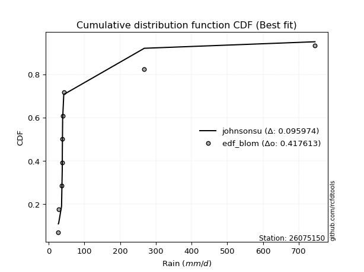</img></img>

</div>


### 7. Empirical - EDF Tukey (1962)

In hydrology, the Tukey formula is used as a plotting position formula to estimate the empirical probability or frequency of a flood event (or other hydrological data). The formula parameter is given as _c=0.333_ (or 1/3).

<div align="center">


$P=(m-c)/(n+1-2c)$


</div>


**7.1. Empirical values**

<div align="center">

|                | 0                   | 1                   | 2                  | 3                   | 4         | 5                  | 6                  | 7                  | 8                  |
|:---------------|:--------------------|:--------------------|:-------------------|:--------------------|:----------|:-------------------|:-------------------|:-------------------|:-------------------|
| date           | 2021                | 2022                | 2023               | 2020                | 2019      | 2017               | 2018               | 2025               | 2024               |
| x              | 27.381              | 28.318              | 36.295             | 38.265              | 38.51     | 39.366             | 42.517             | 201.292            | 267.8              |
| m              | 1                   | 2                   | 3                  | 4                   | 5         | 6                  | 7                  | 8                  | 9                  |
| empirical_dist | edf_tukey           | edf_tukey           | edf_tukey          | edf_tukey           | edf_tukey | edf_tukey          | edf_tukey          | edf_tukey          | edf_tukey          |
| empirical      | 0.07142857142857142 | 0.17857142857142858 | 0.2857142857142857 | 0.39285714285714285 | 0.5       | 0.6071428571428571 | 0.7142857142857143 | 0.8214285714285714 | 0.9285714285714286 |
| empirical_tr   | 1.0769230769230769  | 1.2173913043478262  | 1.4                | 1.6470588235294117  | 2.0       | 2.545454545454545  | 3.5                | 5.599999999999999  | 14.000000000000007 |

</div>


**7.2. Kolmogorov-Smirnov fit test (sorted by Δ)**


<div align="center">

|                | 0                   | 1                   | 2                   | 3                   | 4                   | 5                   | 6                   | 7                   | 8                   | 9                   | 10                  | 11                  | 12                  | 13                  | 14                  | 15                  | 16                  | 17                  | 18                  | 19                  | 20                  | 21                  | 22                  | 23                  | 24                  | 25                  | 26                  | 27                  | 28                  | 29                  | 30                  | 31                  | 32                  | 33                  | 34                  | 35                  | 36                  | 37                  | 38                  | 39                  | 40                  | 41                  | 42                  | 43                  | 44                    | 45                  | 46                  | 47                  | 48                  | 49                  | 50                  | 51                  | 52                  | 53                  | 54                  | 55                  | 56                  | 57                  | 58                  | 59                  | 60                  | 61                  | 62                  | 63                  | 64                  | 65                  | 66                  | 67                  | 68                  | 69                  | 70                  | 71                  | 72                  | 73                  | 74                  | 75                  | 76                  | 77                  | 78                  | 79                  | 80                  | 81                  | 82                  | 83                  | 84                  | 85                  | 86                  | 87                  | 88                  | 89                  |
|:---------------|:--------------------|:--------------------|:--------------------|:--------------------|:--------------------|:--------------------|:--------------------|:--------------------|:--------------------|:--------------------|:--------------------|:--------------------|:--------------------|:--------------------|:--------------------|:--------------------|:--------------------|:--------------------|:--------------------|:--------------------|:--------------------|:--------------------|:--------------------|:--------------------|:--------------------|:--------------------|:--------------------|:--------------------|:--------------------|:--------------------|:--------------------|:--------------------|:--------------------|:--------------------|:--------------------|:--------------------|:--------------------|:--------------------|:--------------------|:--------------------|:--------------------|:--------------------|:--------------------|:--------------------|:----------------------|:--------------------|:--------------------|:--------------------|:--------------------|:--------------------|:--------------------|:--------------------|:--------------------|:--------------------|:--------------------|:--------------------|:--------------------|:--------------------|:--------------------|:--------------------|:--------------------|:--------------------|:--------------------|:--------------------|:--------------------|:--------------------|:--------------------|:--------------------|:--------------------|:--------------------|:--------------------|:--------------------|:--------------------|:--------------------|:--------------------|:--------------------|:--------------------|:--------------------|:--------------------|:--------------------|:--------------------|:--------------------|:--------------------|:--------------------|:--------------------|:--------------------|:--------------------|:--------------------|:--------------------|:--------------------|
| station        | 26075150            | 26075150            | 26075150            | 26075150            | 26075150            | 26075150            | 26075150            | 26075150            | 26075150            | 26075150            | 26075150            | 26075150            | 26075150            | 26075150            | 26075150            | 26075150            | 26075150            | 26075150            | 26075150            | 26075150            | 26075150            | 26075150            | 26075150            | 26075150            | 26075150            | 26075150            | 26075150            | 26075150            | 26075150            | 26075150            | 26075150            | 26075150            | 26075150            | 26075150            | 26075150            | 26075150            | 26075150            | 26075150            | 26075150            | 26075150            | 26075150            | 26075150            | 26075150            | 26075150            | 26075150              | 26075150            | 26075150            | 26075150            | 26075150            | 26075150            | 26075150            | 26075150            | 26075150            | 26075150            | 26075150            | 26075150            | 26075150            | 26075150            | 26075150            | 26075150            | 26075150            | 26075150            | 26075150            | 26075150            | 26075150            | 26075150            | 26075150            | 26075150            | 26075150            | 26075150            | 26075150            | 26075150            | 26075150            | 26075150            | 26075150            | 26075150            | 26075150            | 26075150            | 26075150            | 26075150            | 26075150            | 26075150            | 26075150            | 26075150            | 26075150            | 26075150            | 26075150            | 26075150            | 26075150            | 26075150            |
| empirical_dist | edf_tukey           | edf_tukey           | edf_tukey           | edf_tukey           | edf_tukey           | edf_tukey           | edf_tukey           | edf_tukey           | edf_tukey           | edf_tukey           | edf_tukey           | edf_tukey           | edf_tukey           | edf_tukey           | edf_tukey           | edf_tukey           | edf_tukey           | edf_tukey           | edf_tukey           | edf_tukey           | edf_tukey           | edf_tukey           | edf_tukey           | edf_tukey           | edf_tukey           | edf_tukey           | edf_tukey           | edf_tukey           | edf_tukey           | edf_tukey           | edf_tukey           | edf_tukey           | edf_tukey           | edf_tukey           | edf_tukey           | edf_tukey           | edf_tukey           | edf_tukey           | edf_tukey           | edf_tukey           | edf_tukey           | edf_tukey           | edf_tukey           | edf_tukey           | edf_tukey             | edf_tukey           | edf_tukey           | edf_tukey           | edf_tukey           | edf_tukey           | edf_tukey           | edf_tukey           | edf_tukey           | edf_tukey           | edf_tukey           | edf_tukey           | edf_tukey           | edf_tukey           | edf_tukey           | edf_tukey           | edf_tukey           | edf_tukey           | edf_tukey           | edf_tukey           | edf_tukey           | edf_tukey           | edf_tukey           | edf_tukey           | edf_tukey           | edf_tukey           | edf_tukey           | edf_tukey           | edf_tukey           | edf_tukey           | edf_tukey           | edf_tukey           | edf_tukey           | edf_tukey           | edf_tukey           | edf_tukey           | edf_tukey           | edf_tukey           | edf_tukey           | edf_tukey           | edf_tukey           | edf_tukey           | edf_tukey           | edf_tukey           | edf_tukey           | edf_tukey           |
| p_dist         | logt                | t                   | logpareto           | alpha               | lognct              | logalpha            | logf                | loginvgamma         | loginvweibull       | logmielke           | pareto              | loginvgauss         | invgamma            | f                   | betaprime           | fatiguelife         | invgauss            | invweibull          | logwald             | fisk                | logjohnsonsu        | loggibrat           | gamma               | logweibull_min      | erlang              | logfatiguelife      | logncf              | logchi2             | logexponnorm        | loggenexpon         | logexpon            | loghalflogistic     | loggompertz         | logtruncnorm        | loggamma            | loggamma            | logerlang           | loghalfnorm         | logmoyal            | logpearson3         | logfisk             | loggenlogistic      | lognakagami         | loggumbel_r         | loglaplace_asymmetric | lograyleigh         | nct                 | logmaxwell          | wald                | halflogistic        | halfnorm            | ncf                 | pearson3            | logkstwobign        | logloggamma         | moyal               | chi2                | logcrystalball      | lognorm             | lognorm             | rayleigh            | gumbel_r            | loglogistic         | maxwell             | loghypsecant        | logrice             | gibrat              | logbetaprime        | loglognorm          | nakagami            | genlogistic         | loglaplace          | crystalball         | norm                | loggumbel_l         | logistic            | weibull_min         | hypsecant           | kstwobign           | gumbel_l            | rice                | laplace             | exponnorm           | expon               | laplace_asymmetric  | genexpon            | gompertz            | truncnorm           | johnsonsu           | mielke              |
| delta          | 0.11824447905751034 | 0.12375040527876047 | 0.15196795562630794 | 0.15659438906471468 | 0.1572865563217133  | 0.1600139826761386  | 0.16267510290429243 | 0.16267818125376388 | 0.16321328001646535 | 0.16445209199157074 | 0.17029158873111616 | 0.18015917784347962 | 0.18176708667297026 | 0.18177430569334008 | 0.18251361057570137 | 0.1851702509227524  | 0.18720463210888694 | 0.1925740249916399  | 0.1946946668253462  | 0.19711261026944965 | 0.20281695145411632 | 0.2089421824387564  | 0.21250734906823632 | 0.21714789330852158 | 0.21833854784340884 | 0.22069957659780315 | 0.22568153089460186 | 0.2270726473615597  | 0.23184561085807898 | 0.23502328337930745 | 0.23502356417558756 | 0.23562471036792054 | 0.23843745857629195 | 0.24422255868230197 | 0.24445832108786025 | 0.24445832108786025 | 0.24826551235515948 | 0.24908596793025856 | 0.25158259735328914 | 0.25460810575696174 | 0.2649387908908044  | 0.2692582989573813  | 0.27283622214893777 | 0.27321373203253546 | 0.2821871544359206    | 0.2840178817107806  | 0.2923414360284785  | 0.2963160256993515  | 0.30269663079011    | 0.3063848625091323  | 0.3105170123245213  | 0.3144542511688428  | 0.31450567087804004 | 0.31803788322754417 | 0.32885820858067805 | 0.3290318851805174  | 0.3295579374845722  | 0.32988345430607846 | 0.3298834630837447  | 0.3298834630837447  | 0.3438599242173508  | 0.34387033787405047 | 0.344502375531967   | 0.35558427225466194 | 0.3562954584665382  | 0.35848609851181984 | 0.36024226388703784 | 0.36305417852219535 | 0.37003924544919964 | 0.37266740891414946 | 0.3788449960064701  | 0.3843441526657572  | 0.3860096255723312  | 0.3860096286008558  | 0.39465648240403767 | 0.4056611416889086  | 0.41543918874855945 | 0.42047917419397723 | 0.42349927167031287 | 0.4423125822769061  | 0.4435835261373131  | 0.4476887941903108  | 0.4620776489103482  | 0.464191026648953   | 0.4641912513828642  | 0.46419156744236917 | 0.4696426774098059  | 0.5399430044141895  | 0.66014726287202    | nan                 |
| deltao         | 0.41761268023100007 | 0.41761268023100007 | 0.41761268023100007 | 0.41761268023100007 | 0.41761268023100007 | 0.41761268023100007 | 0.41761268023100007 | 0.41761268023100007 | 0.41761268023100007 | 0.41761268023100007 | 0.41761268023100007 | 0.41761268023100007 | 0.41761268023100007 | 0.41761268023100007 | 0.41761268023100007 | 0.41761268023100007 | 0.41761268023100007 | 0.41761268023100007 | 0.41761268023100007 | 0.41761268023100007 | 0.41761268023100007 | 0.41761268023100007 | 0.41761268023100007 | 0.41761268023100007 | 0.41761268023100007 | 0.41761268023100007 | 0.41761268023100007 | 0.41761268023100007 | 0.41761268023100007 | 0.41761268023100007 | 0.41761268023100007 | 0.41761268023100007 | 0.41761268023100007 | 0.41761268023100007 | 0.41761268023100007 | 0.41761268023100007 | 0.41761268023100007 | 0.41761268023100007 | 0.41761268023100007 | 0.41761268023100007 | 0.41761268023100007 | 0.41761268023100007 | 0.41761268023100007 | 0.41761268023100007 | 0.41761268023100007   | 0.41761268023100007 | 0.41761268023100007 | 0.41761268023100007 | 0.41761268023100007 | 0.41761268023100007 | 0.41761268023100007 | 0.41761268023100007 | 0.41761268023100007 | 0.41761268023100007 | 0.41761268023100007 | 0.41761268023100007 | 0.41761268023100007 | 0.41761268023100007 | 0.41761268023100007 | 0.41761268023100007 | 0.41761268023100007 | 0.41761268023100007 | 0.41761268023100007 | 0.41761268023100007 | 0.41761268023100007 | 0.41761268023100007 | 0.41761268023100007 | 0.41761268023100007 | 0.41761268023100007 | 0.41761268023100007 | 0.41761268023100007 | 0.41761268023100007 | 0.41761268023100007 | 0.41761268023100007 | 0.41761268023100007 | 0.41761268023100007 | 0.41761268023100007 | 0.41761268023100007 | 0.41761268023100007 | 0.41761268023100007 | 0.41761268023100007 | 0.41761268023100007 | 0.41761268023100007 | 0.41761268023100007 | 0.41761268023100007 | 0.41761268023100007 | 0.41761268023100007 | 0.41761268023100007 | 0.41761268023100007 | 0.41761268023100007 |
| eval           | Δo > Δ              | Δo > Δ              | Δo > Δ              | Δo > Δ              | Δo > Δ              | Δo > Δ              | Δo > Δ              | Δo > Δ              | Δo > Δ              | Δo > Δ              | Δo > Δ              | Δo > Δ              | Δo > Δ              | Δo > Δ              | Δo > Δ              | Δo > Δ              | Δo > Δ              | Δo > Δ              | Δo > Δ              | Δo > Δ              | Δo > Δ              | Δo > Δ              | Δo > Δ              | Δo > Δ              | Δo > Δ              | Δo > Δ              | Δo > Δ              | Δo > Δ              | Δo > Δ              | Δo > Δ              | Δo > Δ              | Δo > Δ              | Δo > Δ              | Δo > Δ              | Δo > Δ              | Δo > Δ              | Δo > Δ              | Δo > Δ              | Δo > Δ              | Δo > Δ              | Δo > Δ              | Δo > Δ              | Δo > Δ              | Δo > Δ              | Δo > Δ                | Δo > Δ              | Δo > Δ              | Δo > Δ              | Δo > Δ              | Δo > Δ              | Δo > Δ              | Δo > Δ              | Δo > Δ              | Δo > Δ              | Δo > Δ              | Δo > Δ              | Δo > Δ              | Δo > Δ              | Δo > Δ              | Δo > Δ              | Δo > Δ              | Δo > Δ              | Δo > Δ              | Δo > Δ              | Δo > Δ              | Δo > Δ              | Δo > Δ              | Δo > Δ              | Δo > Δ              | Δo > Δ              | Δo > Δ              | Δo > Δ              | Δo > Δ              | Δo > Δ              | Δo > Δ              | Δo > Δ              | Δo > Δ              | Δo <= Δ             | Δo <= Δ             | Δo <= Δ             | Δo <= Δ             | Δo <= Δ             | Δo <= Δ             | Δo <= Δ             | Δo <= Δ             | Δo <= Δ             | Δo <= Δ             | Δo <= Δ             | Δo <= Δ             | Δo <= Δ             |
| fit            | 1                   | 1                   | 1                   | 1                   | 1                   | 1                   | 1                   | 1                   | 1                   | 1                   | 1                   | 1                   | 1                   | 1                   | 1                   | 1                   | 1                   | 1                   | 1                   | 1                   | 1                   | 1                   | 1                   | 1                   | 1                   | 1                   | 1                   | 1                   | 1                   | 1                   | 1                   | 1                   | 1                   | 1                   | 1                   | 1                   | 1                   | 1                   | 1                   | 1                   | 1                   | 1                   | 1                   | 1                   | 1                     | 1                   | 1                   | 1                   | 1                   | 1                   | 1                   | 1                   | 1                   | 1                   | 1                   | 1                   | 1                   | 1                   | 1                   | 1                   | 1                   | 1                   | 1                   | 1                   | 1                   | 1                   | 1                   | 1                   | 1                   | 1                   | 1                   | 1                   | 1                   | 1                   | 1                   | 1                   | 1                   | 0                   | 0                   | 0                   | 0                   | 0                   | 0                   | 0                   | 0                   | 0                   | 0                   | 0                   | 0                   | 0                   |
| n              | 9                   | 9                   | 9                   | 9                   | 9                   | 9                   | 9                   | 9                   | 9                   | 9                   | 9                   | 9                   | 9                   | 9                   | 9                   | 9                   | 9                   | 9                   | 9                   | 9                   | 9                   | 9                   | 9                   | 9                   | 9                   | 9                   | 9                   | 9                   | 9                   | 9                   | 9                   | 9                   | 9                   | 9                   | 9                   | 9                   | 9                   | 9                   | 9                   | 9                   | 9                   | 9                   | 9                   | 9                   | 9                     | 9                   | 9                   | 9                   | 9                   | 9                   | 9                   | 9                   | 9                   | 9                   | 9                   | 9                   | 9                   | 9                   | 9                   | 9                   | 9                   | 9                   | 9                   | 9                   | 9                   | 9                   | 9                   | 9                   | 9                   | 9                   | 9                   | 9                   | 9                   | 9                   | 9                   | 9                   | 9                   | 9                   | 9                   | 9                   | 9                   | 9                   | 9                   | 9                   | 9                   | 9                   | 9                   | 9                   | 9                   | 9                   |
| best_fit       | 1                   | 0                   | 0                   | 0                   | 0                   | 0                   | 0                   | 0                   | 0                   | 0                   | 0                   | 0                   | 0                   | 0                   | 0                   | 0                   | 0                   | 0                   | 0                   | 0                   | 0                   | 0                   | 0                   | 0                   | 0                   | 0                   | 0                   | 0                   | 0                   | 0                   | 0                   | 0                   | 0                   | 0                   | 0                   | 0                   | 0                   | 0                   | 0                   | 0                   | 0                   | 0                   | 0                   | 0                   | 0                     | 0                   | 0                   | 0                   | 0                   | 0                   | 0                   | 0                   | 0                   | 0                   | 0                   | 0                   | 0                   | 0                   | 0                   | 0                   | 0                   | 0                   | 0                   | 0                   | 0                   | 0                   | 0                   | 0                   | 0                   | 0                   | 0                   | 0                   | 0                   | 0                   | 0                   | 0                   | 0                   | 0                   | 0                   | 0                   | 0                   | 0                   | 0                   | 0                   | 0                   | 0                   | 0                   | 0                   | 0                   | 0                   |
| best_fit_sort  | 1                   | 2                   | 3                   | 4                   | 5                   | 6                   | 7                   | 8                   | 9                   | 10                  | 11                  | 12                  | 13                  | 14                  | 15                  | 16                  | 17                  | 18                  | 19                  | 20                  | 21                  | 22                  | 23                  | 24                  | 25                  | 26                  | 27                  | 28                  | 29                  | 30                  | 31                  | 32                  | 33                  | 34                  | 35                  | 36                  | 37                  | 38                  | 39                  | 40                  | 41                  | 42                  | 43                  | 44                  | 45                    | 46                  | 47                  | 48                  | 49                  | 50                  | 51                  | 52                  | 53                  | 54                  | 55                  | 56                  | 57                  | 58                  | 59                  | 60                  | 61                  | 62                  | 63                  | 64                  | 65                  | 66                  | 67                  | 68                  | 69                  | 70                  | 71                  | 72                  | 73                  | 74                  | 75                  | 76                  | 77                  | 78                  | 79                  | 80                  | 81                  | 82                  | 83                  | 84                  | 85                  | 86                  | 87                  | 88                  | 89                  | 90                  |

</div>


<div align="center">

</img>

</div>


**7.3. Best fit**

<div align="center">

|   id |   station | empirical_dist   | p_dist   |    delta |   deltao | eval   |   fit |   n |   best_fit |   best_fit_sort |
|-----:|----------:|:-----------------|:---------|---------:|---------:|:-------|------:|----:|-----------:|----------------:|
|    0 |  26075150 | edf_tukey        | logt     | 0.118244 | 0.417613 | Δo > Δ |     1 |   9 |          1 |               1 |

</div>


<div align="center">

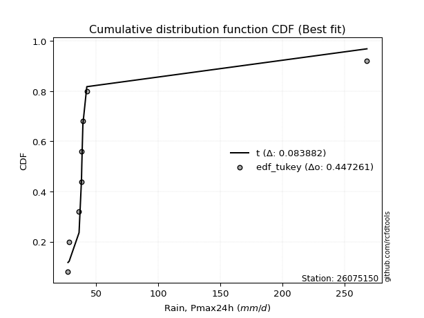</img></img>

</div>


### 8. Empirical - EDF Gringorten (1963)

Gringorten plotting position formula is essential for estimating the probability and return periods of extreme events like floods and heavy rainfall. The constant _a=0.44_.

<div align="center">


$P=(m-a)/(n+1-2a)$


</div>


**8.1. Empirical values**

<div align="center">

|                | 0                    | 1                  | 2                   | 3                  | 4              | 5                  | 6                  | 7                  | 8                  |
|:---------------|:---------------------|:-------------------|:--------------------|:-------------------|:---------------|:-------------------|:-------------------|:-------------------|:-------------------|
| date           | 2021                 | 2022               | 2023                | 2020               | 2019           | 2017               | 2018               | 2025               | 2024               |
| x              | 27.381               | 28.318             | 36.295              | 38.265             | 38.51          | 39.366             | 42.517             | 201.292            | 267.8              |
| m              | 1                    | 2                  | 3                   | 4                  | 5              | 6                  | 7                  | 8                  | 9                  |
| empirical_dist | edf_gringorten       | edf_gringorten     | edf_gringorten      | edf_gringorten     | edf_gringorten | edf_gringorten     | edf_gringorten     | edf_gringorten     | edf_gringorten     |
| empirical      | 0.061403508771929835 | 0.1710526315789474 | 0.28070175438596495 | 0.3903508771929825 | 0.5            | 0.6096491228070176 | 0.7192982456140351 | 0.8289473684210527 | 0.9385964912280703 |
| empirical_tr   | 1.0654205607476634   | 1.2063492063492063 | 1.3902439024390243  | 1.6402877697841727 | 2.0            | 2.561797752808989  | 3.5625             | 5.846153846153847  | 16.285714285714324 |

</div>


**8.2. Kolmogorov-Smirnov fit test (sorted by Δ)**


<div align="center">

|                | 0                   | 1                   | 2                   | 3                   | 4                   | 5                   | 6                   | 7                   | 8                   | 9                   | 10                  | 11                  | 12                  | 13                  | 14                  | 15                  | 16                  | 17                  | 18                  | 19                  | 20                  | 21                  | 22                  | 23                  | 24                  | 25                  | 26                  | 27                  | 28                  | 29                  | 30                  | 31                  | 32                  | 33                  | 34                  | 35                  | 36                  | 37                  | 38                  | 39                  | 40                  | 41                  | 42                  | 43                  | 44                    | 45                  | 46                  | 47                  | 48                  | 49                  | 50                  | 51                  | 52                  | 53                  | 54                  | 55                  | 56                  | 57                  | 58                  | 59                  | 60                  | 61                  | 62                  | 63                  | 64                  | 65                  | 66                  | 67                  | 68                  | 69                  | 70                  | 71                  | 72                  | 73                  | 74                  | 75                  | 76                  | 77                  | 78                  | 79                  | 80                  | 81                  | 82                  | 83                  | 84                  | 85                  | 86                  | 87                  | 88                  | 89                  |
|:---------------|:--------------------|:--------------------|:--------------------|:--------------------|:--------------------|:--------------------|:--------------------|:--------------------|:--------------------|:--------------------|:--------------------|:--------------------|:--------------------|:--------------------|:--------------------|:--------------------|:--------------------|:--------------------|:--------------------|:--------------------|:--------------------|:--------------------|:--------------------|:--------------------|:--------------------|:--------------------|:--------------------|:--------------------|:--------------------|:--------------------|:--------------------|:--------------------|:--------------------|:--------------------|:--------------------|:--------------------|:--------------------|:--------------------|:--------------------|:--------------------|:--------------------|:--------------------|:--------------------|:--------------------|:----------------------|:--------------------|:--------------------|:--------------------|:--------------------|:--------------------|:--------------------|:--------------------|:--------------------|:--------------------|:--------------------|:--------------------|:--------------------|:--------------------|:--------------------|:--------------------|:--------------------|:--------------------|:--------------------|:--------------------|:--------------------|:--------------------|:--------------------|:--------------------|:--------------------|:--------------------|:--------------------|:--------------------|:--------------------|:--------------------|:--------------------|:--------------------|:--------------------|:--------------------|:--------------------|:--------------------|:--------------------|:--------------------|:--------------------|:--------------------|:--------------------|:--------------------|:--------------------|:--------------------|:--------------------|:--------------------|
| station        | 26075150            | 26075150            | 26075150            | 26075150            | 26075150            | 26075150            | 26075150            | 26075150            | 26075150            | 26075150            | 26075150            | 26075150            | 26075150            | 26075150            | 26075150            | 26075150            | 26075150            | 26075150            | 26075150            | 26075150            | 26075150            | 26075150            | 26075150            | 26075150            | 26075150            | 26075150            | 26075150            | 26075150            | 26075150            | 26075150            | 26075150            | 26075150            | 26075150            | 26075150            | 26075150            | 26075150            | 26075150            | 26075150            | 26075150            | 26075150            | 26075150            | 26075150            | 26075150            | 26075150            | 26075150              | 26075150            | 26075150            | 26075150            | 26075150            | 26075150            | 26075150            | 26075150            | 26075150            | 26075150            | 26075150            | 26075150            | 26075150            | 26075150            | 26075150            | 26075150            | 26075150            | 26075150            | 26075150            | 26075150            | 26075150            | 26075150            | 26075150            | 26075150            | 26075150            | 26075150            | 26075150            | 26075150            | 26075150            | 26075150            | 26075150            | 26075150            | 26075150            | 26075150            | 26075150            | 26075150            | 26075150            | 26075150            | 26075150            | 26075150            | 26075150            | 26075150            | 26075150            | 26075150            | 26075150            | 26075150            |
| empirical_dist | edf_gringorten      | edf_gringorten      | edf_gringorten      | edf_gringorten      | edf_gringorten      | edf_gringorten      | edf_gringorten      | edf_gringorten      | edf_gringorten      | edf_gringorten      | edf_gringorten      | edf_gringorten      | edf_gringorten      | edf_gringorten      | edf_gringorten      | edf_gringorten      | edf_gringorten      | edf_gringorten      | edf_gringorten      | edf_gringorten      | edf_gringorten      | edf_gringorten      | edf_gringorten      | edf_gringorten      | edf_gringorten      | edf_gringorten      | edf_gringorten      | edf_gringorten      | edf_gringorten      | edf_gringorten      | edf_gringorten      | edf_gringorten      | edf_gringorten      | edf_gringorten      | edf_gringorten      | edf_gringorten      | edf_gringorten      | edf_gringorten      | edf_gringorten      | edf_gringorten      | edf_gringorten      | edf_gringorten      | edf_gringorten      | edf_gringorten      | edf_gringorten        | edf_gringorten      | edf_gringorten      | edf_gringorten      | edf_gringorten      | edf_gringorten      | edf_gringorten      | edf_gringorten      | edf_gringorten      | edf_gringorten      | edf_gringorten      | edf_gringorten      | edf_gringorten      | edf_gringorten      | edf_gringorten      | edf_gringorten      | edf_gringorten      | edf_gringorten      | edf_gringorten      | edf_gringorten      | edf_gringorten      | edf_gringorten      | edf_gringorten      | edf_gringorten      | edf_gringorten      | edf_gringorten      | edf_gringorten      | edf_gringorten      | edf_gringorten      | edf_gringorten      | edf_gringorten      | edf_gringorten      | edf_gringorten      | edf_gringorten      | edf_gringorten      | edf_gringorten      | edf_gringorten      | edf_gringorten      | edf_gringorten      | edf_gringorten      | edf_gringorten      | edf_gringorten      | edf_gringorten      | edf_gringorten      | edf_gringorten      | edf_gringorten      |
| p_dist         | logt                | t                   | lognct              | logpareto           | alpha               | logalpha            | logf                | loginvgamma         | loginvweibull       | logmielke           | pareto              | loginvgauss         | invgamma            | f                   | betaprime           | fatiguelife         | invgauss            | invweibull          | logwald             | fisk                | logjohnsonsu        | loggibrat           | gamma               | logweibull_min      | erlang              | logfatiguelife      | logncf              | logchi2             | logexponnorm        | loggenexpon         | logexpon            | loghalflogistic     | loggompertz         | logtruncnorm        | loggamma            | loggamma            | logerlang           | loghalfnorm         | logmoyal            | logpearson3         | logfisk             | loggenlogistic      | lognakagami         | loggumbel_r         | loglaplace_asymmetric | lograyleigh         | nct                 | logmaxwell          | wald                | halflogistic        | halfnorm            | ncf                 | pearson3            | logkstwobign        | logloggamma         | moyal               | chi2                | logcrystalball      | lognorm             | lognorm             | rayleigh            | gumbel_r            | loglogistic         | maxwell             | loghypsecant        | logrice             | gibrat              | logbetaprime        | loglognorm          | nakagami            | genlogistic         | loglaplace          | crystalball         | norm                | loggumbel_l         | logistic            | weibull_min         | hypsecant           | kstwobign           | gumbel_l            | rice                | laplace             | exponnorm           | expon               | laplace_asymmetric  | genexpon            | gompertz            | truncnorm           | johnsonsu           | mielke              |
| delta          | 0.11072568206502909 | 0.11623160828627921 | 0.15317069487797896 | 0.15698048695462868 | 0.16160692039303542 | 0.16502651400445933 | 0.16768763423261318 | 0.16769071258208462 | 0.1682258113447861  | 0.16946462331989148 | 0.1753041200594369  | 0.18517170917180037 | 0.186779618001291   | 0.18678683702166082 | 0.18752614190402211 | 0.19018278225107316 | 0.19221716343720768 | 0.19758655631996064 | 0.199707198153667   | 0.2021251415977704  | 0.20782948278243707 | 0.2139547137670772  | 0.21751988039655712 | 0.22216042463684238 | 0.22335107917172964 | 0.2257121079261239  | 0.23069406222292266 | 0.2320851786898805  | 0.23685814218639978 | 0.24003581470762825 | 0.24003609550390836 | 0.24063724169624134 | 0.24344998990461275 | 0.24923509001062277 | 0.249470852416181   | 0.249470852416181   | 0.2532780436834802  | 0.25409849925857936 | 0.25659512868160994 | 0.25962063708528255 | 0.26995132221912516 | 0.2742708302857021  | 0.27784875347725857 | 0.27822626336085626 | 0.2871996857642414    | 0.2890304130391014  | 0.2973539673567993  | 0.3013285570276723  | 0.3077091621184308  | 0.31139739383745313 | 0.3155295436528421  | 0.3194667824971636  | 0.31951820220636085 | 0.323050414555865   | 0.33387073990899885 | 0.3340444165088382  | 0.334570468812893   | 0.33489598563439926 | 0.3348959944120655  | 0.3348959944120655  | 0.3488724555456716  | 0.34888286920237127 | 0.3495149068602878  | 0.36059680358298274 | 0.361307989794859   | 0.36349862984014064 | 0.36525479521535864 | 0.3680667098505161  | 0.37755804244168084 | 0.37767994024247026 | 0.3838575273347909  | 0.389356683994078   | 0.391022156900652   | 0.3910221599291766  | 0.39966901373235847 | 0.4106736730172294  | 0.42045172007688025 | 0.42549170552229804 | 0.4285118029986337  | 0.4473251136052269  | 0.4485960574656339  | 0.4527013255186316  | 0.467090180238669   | 0.4692035579772738  | 0.469203782711185   | 0.46920409877068997 | 0.4746552087381267  | 0.5449555357425104  | 0.6676660598645012  | nan                 |
| deltao         | 0.41761268023100007 | 0.41761268023100007 | 0.41761268023100007 | 0.41761268023100007 | 0.41761268023100007 | 0.41761268023100007 | 0.41761268023100007 | 0.41761268023100007 | 0.41761268023100007 | 0.41761268023100007 | 0.41761268023100007 | 0.41761268023100007 | 0.41761268023100007 | 0.41761268023100007 | 0.41761268023100007 | 0.41761268023100007 | 0.41761268023100007 | 0.41761268023100007 | 0.41761268023100007 | 0.41761268023100007 | 0.41761268023100007 | 0.41761268023100007 | 0.41761268023100007 | 0.41761268023100007 | 0.41761268023100007 | 0.41761268023100007 | 0.41761268023100007 | 0.41761268023100007 | 0.41761268023100007 | 0.41761268023100007 | 0.41761268023100007 | 0.41761268023100007 | 0.41761268023100007 | 0.41761268023100007 | 0.41761268023100007 | 0.41761268023100007 | 0.41761268023100007 | 0.41761268023100007 | 0.41761268023100007 | 0.41761268023100007 | 0.41761268023100007 | 0.41761268023100007 | 0.41761268023100007 | 0.41761268023100007 | 0.41761268023100007   | 0.41761268023100007 | 0.41761268023100007 | 0.41761268023100007 | 0.41761268023100007 | 0.41761268023100007 | 0.41761268023100007 | 0.41761268023100007 | 0.41761268023100007 | 0.41761268023100007 | 0.41761268023100007 | 0.41761268023100007 | 0.41761268023100007 | 0.41761268023100007 | 0.41761268023100007 | 0.41761268023100007 | 0.41761268023100007 | 0.41761268023100007 | 0.41761268023100007 | 0.41761268023100007 | 0.41761268023100007 | 0.41761268023100007 | 0.41761268023100007 | 0.41761268023100007 | 0.41761268023100007 | 0.41761268023100007 | 0.41761268023100007 | 0.41761268023100007 | 0.41761268023100007 | 0.41761268023100007 | 0.41761268023100007 | 0.41761268023100007 | 0.41761268023100007 | 0.41761268023100007 | 0.41761268023100007 | 0.41761268023100007 | 0.41761268023100007 | 0.41761268023100007 | 0.41761268023100007 | 0.41761268023100007 | 0.41761268023100007 | 0.41761268023100007 | 0.41761268023100007 | 0.41761268023100007 | 0.41761268023100007 | 0.41761268023100007 |
| eval           | Δo > Δ              | Δo > Δ              | Δo > Δ              | Δo > Δ              | Δo > Δ              | Δo > Δ              | Δo > Δ              | Δo > Δ              | Δo > Δ              | Δo > Δ              | Δo > Δ              | Δo > Δ              | Δo > Δ              | Δo > Δ              | Δo > Δ              | Δo > Δ              | Δo > Δ              | Δo > Δ              | Δo > Δ              | Δo > Δ              | Δo > Δ              | Δo > Δ              | Δo > Δ              | Δo > Δ              | Δo > Δ              | Δo > Δ              | Δo > Δ              | Δo > Δ              | Δo > Δ              | Δo > Δ              | Δo > Δ              | Δo > Δ              | Δo > Δ              | Δo > Δ              | Δo > Δ              | Δo > Δ              | Δo > Δ              | Δo > Δ              | Δo > Δ              | Δo > Δ              | Δo > Δ              | Δo > Δ              | Δo > Δ              | Δo > Δ              | Δo > Δ                | Δo > Δ              | Δo > Δ              | Δo > Δ              | Δo > Δ              | Δo > Δ              | Δo > Δ              | Δo > Δ              | Δo > Δ              | Δo > Δ              | Δo > Δ              | Δo > Δ              | Δo > Δ              | Δo > Δ              | Δo > Δ              | Δo > Δ              | Δo > Δ              | Δo > Δ              | Δo > Δ              | Δo > Δ              | Δo > Δ              | Δo > Δ              | Δo > Δ              | Δo > Δ              | Δo > Δ              | Δo > Δ              | Δo > Δ              | Δo > Δ              | Δo > Δ              | Δo > Δ              | Δo > Δ              | Δo > Δ              | Δo <= Δ             | Δo <= Δ             | Δo <= Δ             | Δo <= Δ             | Δo <= Δ             | Δo <= Δ             | Δo <= Δ             | Δo <= Δ             | Δo <= Δ             | Δo <= Δ             | Δo <= Δ             | Δo <= Δ             | Δo <= Δ             | Δo <= Δ             |
| fit            | 1                   | 1                   | 1                   | 1                   | 1                   | 1                   | 1                   | 1                   | 1                   | 1                   | 1                   | 1                   | 1                   | 1                   | 1                   | 1                   | 1                   | 1                   | 1                   | 1                   | 1                   | 1                   | 1                   | 1                   | 1                   | 1                   | 1                   | 1                   | 1                   | 1                   | 1                   | 1                   | 1                   | 1                   | 1                   | 1                   | 1                   | 1                   | 1                   | 1                   | 1                   | 1                   | 1                   | 1                   | 1                     | 1                   | 1                   | 1                   | 1                   | 1                   | 1                   | 1                   | 1                   | 1                   | 1                   | 1                   | 1                   | 1                   | 1                   | 1                   | 1                   | 1                   | 1                   | 1                   | 1                   | 1                   | 1                   | 1                   | 1                   | 1                   | 1                   | 1                   | 1                   | 1                   | 1                   | 1                   | 0                   | 0                   | 0                   | 0                   | 0                   | 0                   | 0                   | 0                   | 0                   | 0                   | 0                   | 0                   | 0                   | 0                   |
| n              | 9                   | 9                   | 9                   | 9                   | 9                   | 9                   | 9                   | 9                   | 9                   | 9                   | 9                   | 9                   | 9                   | 9                   | 9                   | 9                   | 9                   | 9                   | 9                   | 9                   | 9                   | 9                   | 9                   | 9                   | 9                   | 9                   | 9                   | 9                   | 9                   | 9                   | 9                   | 9                   | 9                   | 9                   | 9                   | 9                   | 9                   | 9                   | 9                   | 9                   | 9                   | 9                   | 9                   | 9                   | 9                     | 9                   | 9                   | 9                   | 9                   | 9                   | 9                   | 9                   | 9                   | 9                   | 9                   | 9                   | 9                   | 9                   | 9                   | 9                   | 9                   | 9                   | 9                   | 9                   | 9                   | 9                   | 9                   | 9                   | 9                   | 9                   | 9                   | 9                   | 9                   | 9                   | 9                   | 9                   | 9                   | 9                   | 9                   | 9                   | 9                   | 9                   | 9                   | 9                   | 9                   | 9                   | 9                   | 9                   | 9                   | 9                   |
| best_fit       | 1                   | 0                   | 0                   | 0                   | 0                   | 0                   | 0                   | 0                   | 0                   | 0                   | 0                   | 0                   | 0                   | 0                   | 0                   | 0                   | 0                   | 0                   | 0                   | 0                   | 0                   | 0                   | 0                   | 0                   | 0                   | 0                   | 0                   | 0                   | 0                   | 0                   | 0                   | 0                   | 0                   | 0                   | 0                   | 0                   | 0                   | 0                   | 0                   | 0                   | 0                   | 0                   | 0                   | 0                   | 0                     | 0                   | 0                   | 0                   | 0                   | 0                   | 0                   | 0                   | 0                   | 0                   | 0                   | 0                   | 0                   | 0                   | 0                   | 0                   | 0                   | 0                   | 0                   | 0                   | 0                   | 0                   | 0                   | 0                   | 0                   | 0                   | 0                   | 0                   | 0                   | 0                   | 0                   | 0                   | 0                   | 0                   | 0                   | 0                   | 0                   | 0                   | 0                   | 0                   | 0                   | 0                   | 0                   | 0                   | 0                   | 0                   |
| best_fit_sort  | 1                   | 2                   | 3                   | 4                   | 5                   | 6                   | 7                   | 8                   | 9                   | 10                  | 11                  | 12                  | 13                  | 14                  | 15                  | 16                  | 17                  | 18                  | 19                  | 20                  | 21                  | 22                  | 23                  | 24                  | 25                  | 26                  | 27                  | 28                  | 29                  | 30                  | 31                  | 32                  | 33                  | 34                  | 35                  | 36                  | 37                  | 38                  | 39                  | 40                  | 41                  | 42                  | 43                  | 44                  | 45                    | 46                  | 47                  | 48                  | 49                  | 50                  | 51                  | 52                  | 53                  | 54                  | 55                  | 56                  | 57                  | 58                  | 59                  | 60                  | 61                  | 62                  | 63                  | 64                  | 65                  | 66                  | 67                  | 68                  | 69                  | 70                  | 71                  | 72                  | 73                  | 74                  | 75                  | 76                  | 77                  | 78                  | 79                  | 80                  | 81                  | 82                  | 83                  | 84                  | 85                  | 86                  | 87                  | 88                  | 89                  | 90                  |

</div>


<div align="center">

</img>

</div>


**8.3. Best fit**

<div align="center">

|   id |   station | empirical_dist   | p_dist   |    delta |   deltao | eval   |   fit |   n |   best_fit |   best_fit_sort |
|-----:|----------:|:-----------------|:---------|---------:|---------:|:-------|------:|----:|-----------:|----------------:|
|    0 |  26075150 | edf_gringorten   | logt     | 0.110726 | 0.417613 | Δo > Δ |     1 |   9 |          1 |               1 |

</div>


<div align="center">

</img>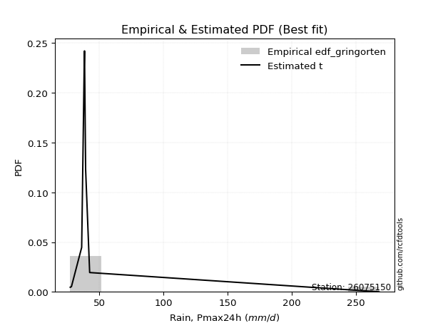</img>

</div>


### 9. Empirical - EDF Filliben (1975)

The specific values of the constants (0.3175) (often denoted as $alpha$) and (0.365) are derived from a method proposed by James J. Filliben in a 1975 paper. This particular formula is the mean value of the $i$-th order statistic of the normal distribution and is considered a robust and effective plotting position formula for the normal probability plot correlation coefficient test for normality.

<div align="center">


$P=(m-0.3175)/(n+0.365)$


</div>


**9.1. Empirical values**

<div align="center">

|                | 0                   | 1                  | 2                   | 3                   | 4            | 5                  | 6                  | 7                  | 8                  |
|:---------------|:--------------------|:-------------------|:--------------------|:--------------------|:-------------|:-------------------|:-------------------|:-------------------|:-------------------|
| date           | 2021                | 2022               | 2023                | 2020                | 2019         | 2017               | 2018               | 2025               | 2024               |
| x              | 27.381              | 28.318             | 36.295              | 38.265              | 38.51        | 39.366             | 42.517             | 201.292            | 267.8              |
| m              | 1                   | 2                  | 3                   | 4                   | 5            | 6                  | 7                  | 8                  | 9                  |
| empirical_dist | edf_filliben        | edf_filliben       | edf_filliben        | edf_filliben        | edf_filliben | edf_filliben       | edf_filliben       | edf_filliben       | edf_filliben       |
| empirical      | 0.07287773625200214 | 0.1796583021890016 | 0.28643886812600106 | 0.39321943406300053 | 0.5          | 0.6067805659369995 | 0.7135611318739989 | 0.8203416978109984 | 0.9271222637479978 |
| empirical_tr   | 1.0786063921681543  | 1.219004230393752  | 1.401421623643846   | 1.6480422349318082  | 2.0          | 2.5431093007467753 | 3.491146318732526  | 5.566121842496286  | 13.721611721611705 |

</div>


**9.2. Kolmogorov-Smirnov fit test (sorted by Δ)**


<div align="center">

|                | 0                   | 1                   | 2                   | 3                   | 4                   | 5                   | 6                   | 7                   | 8                   | 9                   | 10                  | 11                  | 12                  | 13                  | 14                  | 15                  | 16                  | 17                  | 18                  | 19                  | 20                  | 21                  | 22                  | 23                  | 24                  | 25                  | 26                  | 27                  | 28                  | 29                  | 30                  | 31                  | 32                  | 33                  | 34                  | 35                  | 36                  | 37                  | 38                  | 39                  | 40                  | 41                  | 42                  | 43                  | 44                    | 45                  | 46                  | 47                  | 48                  | 49                  | 50                  | 51                  | 52                  | 53                  | 54                  | 55                  | 56                  | 57                  | 58                  | 59                  | 60                  | 61                  | 62                  | 63                  | 64                  | 65                  | 66                  | 67                  | 68                  | 69                  | 70                  | 71                  | 72                  | 73                  | 74                  | 75                  | 76                  | 77                  | 78                  | 79                  | 80                  | 81                  | 82                  | 83                  | 84                  | 85                  | 86                  | 87                  | 88                  | 89                  |
|:---------------|:--------------------|:--------------------|:--------------------|:--------------------|:--------------------|:--------------------|:--------------------|:--------------------|:--------------------|:--------------------|:--------------------|:--------------------|:--------------------|:--------------------|:--------------------|:--------------------|:--------------------|:--------------------|:--------------------|:--------------------|:--------------------|:--------------------|:--------------------|:--------------------|:--------------------|:--------------------|:--------------------|:--------------------|:--------------------|:--------------------|:--------------------|:--------------------|:--------------------|:--------------------|:--------------------|:--------------------|:--------------------|:--------------------|:--------------------|:--------------------|:--------------------|:--------------------|:--------------------|:--------------------|:----------------------|:--------------------|:--------------------|:--------------------|:--------------------|:--------------------|:--------------------|:--------------------|:--------------------|:--------------------|:--------------------|:--------------------|:--------------------|:--------------------|:--------------------|:--------------------|:--------------------|:--------------------|:--------------------|:--------------------|:--------------------|:--------------------|:--------------------|:--------------------|:--------------------|:--------------------|:--------------------|:--------------------|:--------------------|:--------------------|:--------------------|:--------------------|:--------------------|:--------------------|:--------------------|:--------------------|:--------------------|:--------------------|:--------------------|:--------------------|:--------------------|:--------------------|:--------------------|:--------------------|:--------------------|:--------------------|
| station        | 26075150            | 26075150            | 26075150            | 26075150            | 26075150            | 26075150            | 26075150            | 26075150            | 26075150            | 26075150            | 26075150            | 26075150            | 26075150            | 26075150            | 26075150            | 26075150            | 26075150            | 26075150            | 26075150            | 26075150            | 26075150            | 26075150            | 26075150            | 26075150            | 26075150            | 26075150            | 26075150            | 26075150            | 26075150            | 26075150            | 26075150            | 26075150            | 26075150            | 26075150            | 26075150            | 26075150            | 26075150            | 26075150            | 26075150            | 26075150            | 26075150            | 26075150            | 26075150            | 26075150            | 26075150              | 26075150            | 26075150            | 26075150            | 26075150            | 26075150            | 26075150            | 26075150            | 26075150            | 26075150            | 26075150            | 26075150            | 26075150            | 26075150            | 26075150            | 26075150            | 26075150            | 26075150            | 26075150            | 26075150            | 26075150            | 26075150            | 26075150            | 26075150            | 26075150            | 26075150            | 26075150            | 26075150            | 26075150            | 26075150            | 26075150            | 26075150            | 26075150            | 26075150            | 26075150            | 26075150            | 26075150            | 26075150            | 26075150            | 26075150            | 26075150            | 26075150            | 26075150            | 26075150            | 26075150            | 26075150            |
| empirical_dist | edf_filliben        | edf_filliben        | edf_filliben        | edf_filliben        | edf_filliben        | edf_filliben        | edf_filliben        | edf_filliben        | edf_filliben        | edf_filliben        | edf_filliben        | edf_filliben        | edf_filliben        | edf_filliben        | edf_filliben        | edf_filliben        | edf_filliben        | edf_filliben        | edf_filliben        | edf_filliben        | edf_filliben        | edf_filliben        | edf_filliben        | edf_filliben        | edf_filliben        | edf_filliben        | edf_filliben        | edf_filliben        | edf_filliben        | edf_filliben        | edf_filliben        | edf_filliben        | edf_filliben        | edf_filliben        | edf_filliben        | edf_filliben        | edf_filliben        | edf_filliben        | edf_filliben        | edf_filliben        | edf_filliben        | edf_filliben        | edf_filliben        | edf_filliben        | edf_filliben          | edf_filliben        | edf_filliben        | edf_filliben        | edf_filliben        | edf_filliben        | edf_filliben        | edf_filliben        | edf_filliben        | edf_filliben        | edf_filliben        | edf_filliben        | edf_filliben        | edf_filliben        | edf_filliben        | edf_filliben        | edf_filliben        | edf_filliben        | edf_filliben        | edf_filliben        | edf_filliben        | edf_filliben        | edf_filliben        | edf_filliben        | edf_filliben        | edf_filliben        | edf_filliben        | edf_filliben        | edf_filliben        | edf_filliben        | edf_filliben        | edf_filliben        | edf_filliben        | edf_filliben        | edf_filliben        | edf_filliben        | edf_filliben        | edf_filliben        | edf_filliben        | edf_filliben        | edf_filliben        | edf_filliben        | edf_filliben        | edf_filliben        | edf_filliben        | edf_filliben        |
| p_dist         | logt                | t                   | logpareto           | alpha               | lognct              | logalpha            | logf                | loginvgamma         | loginvweibull       | logmielke           | pareto              | loginvgauss         | invgamma            | f                   | betaprime           | fatiguelife         | invgauss            | invweibull          | logwald             | fisk                | logjohnsonsu        | loggibrat           | gamma               | logweibull_min      | erlang              | logfatiguelife      | logncf              | logchi2             | logexponnorm        | loggenexpon         | logexpon            | loghalflogistic     | loggompertz         | logtruncnorm        | loggamma            | loggamma            | logerlang           | loghalfnorm         | logmoyal            | logpearson3         | logfisk             | loggenlogistic      | lognakagami         | loggumbel_r         | loglaplace_asymmetric | lograyleigh         | nct                 | logmaxwell          | wald                | halflogistic        | halfnorm            | ncf                 | pearson3            | logkstwobign        | logloggamma         | moyal               | chi2                | logcrystalball      | lognorm             | lognorm             | rayleigh            | gumbel_r            | loglogistic         | maxwell             | loghypsecant        | logrice             | gibrat              | logbetaprime        | loglognorm          | nakagami            | genlogistic         | loglaplace          | crystalball         | norm                | loggumbel_l         | logistic            | weibull_min         | hypsecant           | kstwobign           | gumbel_l            | rice                | laplace             | exponnorm           | expon               | laplace_asymmetric  | genexpon            | gompertz            | truncnorm           | johnsonsu           | mielke              |
| delta          | 0.11933135267508332 | 0.12483727889633345 | 0.15124337321459258 | 0.15586980665299932 | 0.15837342993928627 | 0.15928940026442323 | 0.16195052049257708 | 0.16195359884204852 | 0.16248869760475    | 0.16372750957985538 | 0.1695670063194008  | 0.17943459543176427 | 0.1810425042612549  | 0.18104972328162472 | 0.181789028163986   | 0.18444566851103705 | 0.18648004969717158 | 0.19184944257992453 | 0.19397008441363084 | 0.1963880278577343  | 0.20209236904240097 | 0.20821760002704104 | 0.21178276665652096 | 0.21642331089680622 | 0.21761396543169348 | 0.2199749941860878  | 0.2249569484828865  | 0.22634806494984433 | 0.23112102844636362 | 0.2342987009675921  | 0.2342989817638722  | 0.23490012795620518 | 0.2377128761645766  | 0.2434979762705866  | 0.2437337386761449  | 0.2437337386761449  | 0.24754092994344412 | 0.2483613855185432  | 0.2508580149415738  | 0.2538835233452464  | 0.26421420847908905 | 0.26853371654566593 | 0.2721116397372224  | 0.2724891496208201  | 0.2814625720242052    | 0.2832932992990652  | 0.29161685361676315 | 0.29559144328763615 | 0.30197204837839464 | 0.30566028009741697 | 0.3097924299128059  | 0.31372966875712743 | 0.3137810884663247  | 0.3173133008158288  | 0.3281336261689627  | 0.32830730276880205 | 0.3288333550728568  | 0.3291588718943631  | 0.32915888067202936 | 0.32915888067202936 | 0.34313534180563543 | 0.3431457554623351  | 0.34377779312025164 | 0.3548596898429466  | 0.35557087605482285 | 0.3577615161001045  | 0.3595176814753225  | 0.36232959611048    | 0.36895237183162666 | 0.3719428265024341  | 0.37812041359475473 | 0.38361957025404186 | 0.38528504316061585 | 0.38528504618914045 | 0.3939318999923223  | 0.40493655927719324 | 0.4147146063368441  | 0.4197545917822619  | 0.4227746892585975  | 0.44158799986519076 | 0.44285894372559775 | 0.44696421177859547 | 0.46135306649863284 | 0.46346644423723765 | 0.46346666897114885 | 0.4634669850306538  | 0.46891809499809056 | 0.5392184220024743  | 0.659060389254447   | nan                 |
| deltao         | 0.41761268023100007 | 0.41761268023100007 | 0.41761268023100007 | 0.41761268023100007 | 0.41761268023100007 | 0.41761268023100007 | 0.41761268023100007 | 0.41761268023100007 | 0.41761268023100007 | 0.41761268023100007 | 0.41761268023100007 | 0.41761268023100007 | 0.41761268023100007 | 0.41761268023100007 | 0.41761268023100007 | 0.41761268023100007 | 0.41761268023100007 | 0.41761268023100007 | 0.41761268023100007 | 0.41761268023100007 | 0.41761268023100007 | 0.41761268023100007 | 0.41761268023100007 | 0.41761268023100007 | 0.41761268023100007 | 0.41761268023100007 | 0.41761268023100007 | 0.41761268023100007 | 0.41761268023100007 | 0.41761268023100007 | 0.41761268023100007 | 0.41761268023100007 | 0.41761268023100007 | 0.41761268023100007 | 0.41761268023100007 | 0.41761268023100007 | 0.41761268023100007 | 0.41761268023100007 | 0.41761268023100007 | 0.41761268023100007 | 0.41761268023100007 | 0.41761268023100007 | 0.41761268023100007 | 0.41761268023100007 | 0.41761268023100007   | 0.41761268023100007 | 0.41761268023100007 | 0.41761268023100007 | 0.41761268023100007 | 0.41761268023100007 | 0.41761268023100007 | 0.41761268023100007 | 0.41761268023100007 | 0.41761268023100007 | 0.41761268023100007 | 0.41761268023100007 | 0.41761268023100007 | 0.41761268023100007 | 0.41761268023100007 | 0.41761268023100007 | 0.41761268023100007 | 0.41761268023100007 | 0.41761268023100007 | 0.41761268023100007 | 0.41761268023100007 | 0.41761268023100007 | 0.41761268023100007 | 0.41761268023100007 | 0.41761268023100007 | 0.41761268023100007 | 0.41761268023100007 | 0.41761268023100007 | 0.41761268023100007 | 0.41761268023100007 | 0.41761268023100007 | 0.41761268023100007 | 0.41761268023100007 | 0.41761268023100007 | 0.41761268023100007 | 0.41761268023100007 | 0.41761268023100007 | 0.41761268023100007 | 0.41761268023100007 | 0.41761268023100007 | 0.41761268023100007 | 0.41761268023100007 | 0.41761268023100007 | 0.41761268023100007 | 0.41761268023100007 | 0.41761268023100007 |
| eval           | Δo > Δ              | Δo > Δ              | Δo > Δ              | Δo > Δ              | Δo > Δ              | Δo > Δ              | Δo > Δ              | Δo > Δ              | Δo > Δ              | Δo > Δ              | Δo > Δ              | Δo > Δ              | Δo > Δ              | Δo > Δ              | Δo > Δ              | Δo > Δ              | Δo > Δ              | Δo > Δ              | Δo > Δ              | Δo > Δ              | Δo > Δ              | Δo > Δ              | Δo > Δ              | Δo > Δ              | Δo > Δ              | Δo > Δ              | Δo > Δ              | Δo > Δ              | Δo > Δ              | Δo > Δ              | Δo > Δ              | Δo > Δ              | Δo > Δ              | Δo > Δ              | Δo > Δ              | Δo > Δ              | Δo > Δ              | Δo > Δ              | Δo > Δ              | Δo > Δ              | Δo > Δ              | Δo > Δ              | Δo > Δ              | Δo > Δ              | Δo > Δ                | Δo > Δ              | Δo > Δ              | Δo > Δ              | Δo > Δ              | Δo > Δ              | Δo > Δ              | Δo > Δ              | Δo > Δ              | Δo > Δ              | Δo > Δ              | Δo > Δ              | Δo > Δ              | Δo > Δ              | Δo > Δ              | Δo > Δ              | Δo > Δ              | Δo > Δ              | Δo > Δ              | Δo > Δ              | Δo > Δ              | Δo > Δ              | Δo > Δ              | Δo > Δ              | Δo > Δ              | Δo > Δ              | Δo > Δ              | Δo > Δ              | Δo > Δ              | Δo > Δ              | Δo > Δ              | Δo > Δ              | Δo > Δ              | Δo <= Δ             | Δo <= Δ             | Δo <= Δ             | Δo <= Δ             | Δo <= Δ             | Δo <= Δ             | Δo <= Δ             | Δo <= Δ             | Δo <= Δ             | Δo <= Δ             | Δo <= Δ             | Δo <= Δ             | Δo <= Δ             |
| fit            | 1                   | 1                   | 1                   | 1                   | 1                   | 1                   | 1                   | 1                   | 1                   | 1                   | 1                   | 1                   | 1                   | 1                   | 1                   | 1                   | 1                   | 1                   | 1                   | 1                   | 1                   | 1                   | 1                   | 1                   | 1                   | 1                   | 1                   | 1                   | 1                   | 1                   | 1                   | 1                   | 1                   | 1                   | 1                   | 1                   | 1                   | 1                   | 1                   | 1                   | 1                   | 1                   | 1                   | 1                   | 1                     | 1                   | 1                   | 1                   | 1                   | 1                   | 1                   | 1                   | 1                   | 1                   | 1                   | 1                   | 1                   | 1                   | 1                   | 1                   | 1                   | 1                   | 1                   | 1                   | 1                   | 1                   | 1                   | 1                   | 1                   | 1                   | 1                   | 1                   | 1                   | 1                   | 1                   | 1                   | 1                   | 0                   | 0                   | 0                   | 0                   | 0                   | 0                   | 0                   | 0                   | 0                   | 0                   | 0                   | 0                   | 0                   |
| n              | 9                   | 9                   | 9                   | 9                   | 9                   | 9                   | 9                   | 9                   | 9                   | 9                   | 9                   | 9                   | 9                   | 9                   | 9                   | 9                   | 9                   | 9                   | 9                   | 9                   | 9                   | 9                   | 9                   | 9                   | 9                   | 9                   | 9                   | 9                   | 9                   | 9                   | 9                   | 9                   | 9                   | 9                   | 9                   | 9                   | 9                   | 9                   | 9                   | 9                   | 9                   | 9                   | 9                   | 9                   | 9                     | 9                   | 9                   | 9                   | 9                   | 9                   | 9                   | 9                   | 9                   | 9                   | 9                   | 9                   | 9                   | 9                   | 9                   | 9                   | 9                   | 9                   | 9                   | 9                   | 9                   | 9                   | 9                   | 9                   | 9                   | 9                   | 9                   | 9                   | 9                   | 9                   | 9                   | 9                   | 9                   | 9                   | 9                   | 9                   | 9                   | 9                   | 9                   | 9                   | 9                   | 9                   | 9                   | 9                   | 9                   | 9                   |
| best_fit       | 1                   | 0                   | 0                   | 0                   | 0                   | 0                   | 0                   | 0                   | 0                   | 0                   | 0                   | 0                   | 0                   | 0                   | 0                   | 0                   | 0                   | 0                   | 0                   | 0                   | 0                   | 0                   | 0                   | 0                   | 0                   | 0                   | 0                   | 0                   | 0                   | 0                   | 0                   | 0                   | 0                   | 0                   | 0                   | 0                   | 0                   | 0                   | 0                   | 0                   | 0                   | 0                   | 0                   | 0                   | 0                     | 0                   | 0                   | 0                   | 0                   | 0                   | 0                   | 0                   | 0                   | 0                   | 0                   | 0                   | 0                   | 0                   | 0                   | 0                   | 0                   | 0                   | 0                   | 0                   | 0                   | 0                   | 0                   | 0                   | 0                   | 0                   | 0                   | 0                   | 0                   | 0                   | 0                   | 0                   | 0                   | 0                   | 0                   | 0                   | 0                   | 0                   | 0                   | 0                   | 0                   | 0                   | 0                   | 0                   | 0                   | 0                   |
| best_fit_sort  | 1                   | 2                   | 3                   | 4                   | 5                   | 6                   | 7                   | 8                   | 9                   | 10                  | 11                  | 12                  | 13                  | 14                  | 15                  | 16                  | 17                  | 18                  | 19                  | 20                  | 21                  | 22                  | 23                  | 24                  | 25                  | 26                  | 27                  | 28                  | 29                  | 30                  | 31                  | 32                  | 33                  | 34                  | 35                  | 36                  | 37                  | 38                  | 39                  | 40                  | 41                  | 42                  | 43                  | 44                  | 45                    | 46                  | 47                  | 48                  | 49                  | 50                  | 51                  | 52                  | 53                  | 54                  | 55                  | 56                  | 57                  | 58                  | 59                  | 60                  | 61                  | 62                  | 63                  | 64                  | 65                  | 66                  | 67                  | 68                  | 69                  | 70                  | 71                  | 72                  | 73                  | 74                  | 75                  | 76                  | 77                  | 78                  | 79                  | 80                  | 81                  | 82                  | 83                  | 84                  | 85                  | 86                  | 87                  | 88                  | 89                  | 90                  |

</div>


<div align="center">

</img>

</div>


**9.3. Best fit**

<div align="center">

|   id |   station | empirical_dist   | p_dist   |    delta |   deltao | eval   |   fit |   n |   best_fit |   best_fit_sort |
|-----:|----------:|:-----------------|:---------|---------:|---------:|:-------|------:|----:|-----------:|----------------:|
|    0 |  26075150 | edf_filliben     | logt     | 0.119331 | 0.417613 | Δo > Δ |     1 |   9 |          1 |               1 |

</div>


<div align="center">

</img>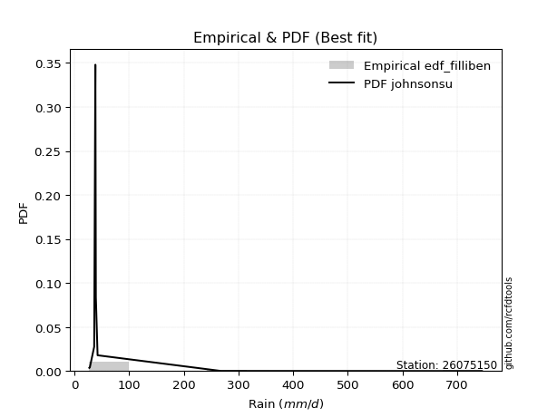</img>

</div>


### 10. Empirical - EDF Jenkinson (1977)

The Jenkinson formula in hydrology is an empirical plotting position formula used to estimate the non-exceedance probability _(P)_ or return period _(T)_ of a given ordered observation within a sample. It is a widely used method in the frequency analysis of extreme events such as floods and rainfall, as it provides a distribution-free way to plot data. _a≈0.31_ and _b≈0.38_ are constants derived to approximate the median of the probability distribution for the given rank.

<div align="center">


$P=(m-a)/(n+b)$


</div>


**10.1. Empirical values**

<div align="center">

|                | 0                   | 1                   | 2                  | 3                   | 4             | 5                  | 6                  | 7                  | 8                  |
|:---------------|:--------------------|:--------------------|:-------------------|:--------------------|:--------------|:-------------------|:-------------------|:-------------------|:-------------------|
| date           | 2021                | 2022                | 2023               | 2020                | 2019          | 2017               | 2018               | 2025               | 2024               |
| x              | 27.381              | 28.318              | 36.295             | 38.265              | 38.51         | 39.366             | 42.517             | 201.292            | 267.8              |
| m              | 1                   | 2                   | 3                  | 4                   | 5             | 6                  | 7                  | 8                  | 9                  |
| empirical_dist | edf_jenkinson       | edf_jenkinson       | edf_jenkinson      | edf_jenkinson       | edf_jenkinson | edf_jenkinson      | edf_jenkinson      | edf_jenkinson      | edf_jenkinson      |
| empirical      | 0.07356076759061833 | 0.18017057569296374 | 0.2867803837953091 | 0.39339019189765456 | 0.5           | 0.6066098081023454 | 0.7132196162046908 | 0.8198294243070362 | 0.9264392324093815 |
| empirical_tr   | 1.0794016110471807  | 1.2197659297789336  | 1.4020926756352765 | 1.6485061511423549  | 2.0           | 2.542005420054201  | 3.486988847583642  | 5.550295857988164  | 13.5942028985507   |

</div>


**10.2. Kolmogorov-Smirnov fit test (sorted by Δ)**


<div align="center">

|                | 0                   | 1                   | 2                   | 3                   | 4                   | 5                   | 6                   | 7                   | 8                   | 9                   | 10                  | 11                  | 12                  | 13                  | 14                  | 15                  | 16                  | 17                  | 18                  | 19                  | 20                  | 21                  | 22                  | 23                  | 24                  | 25                  | 26                  | 27                  | 28                  | 29                  | 30                  | 31                  | 32                  | 33                  | 34                  | 35                  | 36                  | 37                  | 38                  | 39                  | 40                  | 41                  | 42                  | 43                  | 44                    | 45                  | 46                  | 47                  | 48                  | 49                  | 50                  | 51                  | 52                  | 53                  | 54                  | 55                  | 56                  | 57                  | 58                  | 59                  | 60                  | 61                  | 62                  | 63                  | 64                  | 65                  | 66                  | 67                  | 68                  | 69                  | 70                  | 71                  | 72                  | 73                  | 74                  | 75                  | 76                  | 77                  | 78                  | 79                  | 80                  | 81                  | 82                  | 83                  | 84                  | 85                  | 86                  | 87                  | 88                  | 89                  |
|:---------------|:--------------------|:--------------------|:--------------------|:--------------------|:--------------------|:--------------------|:--------------------|:--------------------|:--------------------|:--------------------|:--------------------|:--------------------|:--------------------|:--------------------|:--------------------|:--------------------|:--------------------|:--------------------|:--------------------|:--------------------|:--------------------|:--------------------|:--------------------|:--------------------|:--------------------|:--------------------|:--------------------|:--------------------|:--------------------|:--------------------|:--------------------|:--------------------|:--------------------|:--------------------|:--------------------|:--------------------|:--------------------|:--------------------|:--------------------|:--------------------|:--------------------|:--------------------|:--------------------|:--------------------|:----------------------|:--------------------|:--------------------|:--------------------|:--------------------|:--------------------|:--------------------|:--------------------|:--------------------|:--------------------|:--------------------|:--------------------|:--------------------|:--------------------|:--------------------|:--------------------|:--------------------|:--------------------|:--------------------|:--------------------|:--------------------|:--------------------|:--------------------|:--------------------|:--------------------|:--------------------|:--------------------|:--------------------|:--------------------|:--------------------|:--------------------|:--------------------|:--------------------|:--------------------|:--------------------|:--------------------|:--------------------|:--------------------|:--------------------|:--------------------|:--------------------|:--------------------|:--------------------|:--------------------|:--------------------|:--------------------|
| station        | 26075150            | 26075150            | 26075150            | 26075150            | 26075150            | 26075150            | 26075150            | 26075150            | 26075150            | 26075150            | 26075150            | 26075150            | 26075150            | 26075150            | 26075150            | 26075150            | 26075150            | 26075150            | 26075150            | 26075150            | 26075150            | 26075150            | 26075150            | 26075150            | 26075150            | 26075150            | 26075150            | 26075150            | 26075150            | 26075150            | 26075150            | 26075150            | 26075150            | 26075150            | 26075150            | 26075150            | 26075150            | 26075150            | 26075150            | 26075150            | 26075150            | 26075150            | 26075150            | 26075150            | 26075150              | 26075150            | 26075150            | 26075150            | 26075150            | 26075150            | 26075150            | 26075150            | 26075150            | 26075150            | 26075150            | 26075150            | 26075150            | 26075150            | 26075150            | 26075150            | 26075150            | 26075150            | 26075150            | 26075150            | 26075150            | 26075150            | 26075150            | 26075150            | 26075150            | 26075150            | 26075150            | 26075150            | 26075150            | 26075150            | 26075150            | 26075150            | 26075150            | 26075150            | 26075150            | 26075150            | 26075150            | 26075150            | 26075150            | 26075150            | 26075150            | 26075150            | 26075150            | 26075150            | 26075150            | 26075150            |
| empirical_dist | edf_jenkinson       | edf_jenkinson       | edf_jenkinson       | edf_jenkinson       | edf_jenkinson       | edf_jenkinson       | edf_jenkinson       | edf_jenkinson       | edf_jenkinson       | edf_jenkinson       | edf_jenkinson       | edf_jenkinson       | edf_jenkinson       | edf_jenkinson       | edf_jenkinson       | edf_jenkinson       | edf_jenkinson       | edf_jenkinson       | edf_jenkinson       | edf_jenkinson       | edf_jenkinson       | edf_jenkinson       | edf_jenkinson       | edf_jenkinson       | edf_jenkinson       | edf_jenkinson       | edf_jenkinson       | edf_jenkinson       | edf_jenkinson       | edf_jenkinson       | edf_jenkinson       | edf_jenkinson       | edf_jenkinson       | edf_jenkinson       | edf_jenkinson       | edf_jenkinson       | edf_jenkinson       | edf_jenkinson       | edf_jenkinson       | edf_jenkinson       | edf_jenkinson       | edf_jenkinson       | edf_jenkinson       | edf_jenkinson       | edf_jenkinson         | edf_jenkinson       | edf_jenkinson       | edf_jenkinson       | edf_jenkinson       | edf_jenkinson       | edf_jenkinson       | edf_jenkinson       | edf_jenkinson       | edf_jenkinson       | edf_jenkinson       | edf_jenkinson       | edf_jenkinson       | edf_jenkinson       | edf_jenkinson       | edf_jenkinson       | edf_jenkinson       | edf_jenkinson       | edf_jenkinson       | edf_jenkinson       | edf_jenkinson       | edf_jenkinson       | edf_jenkinson       | edf_jenkinson       | edf_jenkinson       | edf_jenkinson       | edf_jenkinson       | edf_jenkinson       | edf_jenkinson       | edf_jenkinson       | edf_jenkinson       | edf_jenkinson       | edf_jenkinson       | edf_jenkinson       | edf_jenkinson       | edf_jenkinson       | edf_jenkinson       | edf_jenkinson       | edf_jenkinson       | edf_jenkinson       | edf_jenkinson       | edf_jenkinson       | edf_jenkinson       | edf_jenkinson       | edf_jenkinson       | edf_jenkinson       |
| p_dist         | logt                | t                   | logpareto           | alpha               | lognct              | logalpha            | logf                | loginvgamma         | loginvweibull       | logmielke           | pareto              | loginvgauss         | invgamma            | f                   | betaprime           | fatiguelife         | invgauss            | invweibull          | logwald             | fisk                | logjohnsonsu        | loggibrat           | gamma               | logweibull_min      | erlang              | logfatiguelife      | logncf              | logchi2             | logexponnorm        | loggenexpon         | logexpon            | loghalflogistic     | loggompertz         | logtruncnorm        | loggamma            | loggamma            | logerlang           | loghalfnorm         | logmoyal            | logpearson3         | logfisk             | loggenlogistic      | lognakagami         | loggumbel_r         | loglaplace_asymmetric | lograyleigh         | nct                 | logmaxwell          | wald                | halflogistic        | halfnorm            | ncf                 | pearson3            | logkstwobign        | logloggamma         | moyal               | chi2                | logcrystalball      | lognorm             | lognorm             | rayleigh            | gumbel_r            | loglogistic         | maxwell             | loghypsecant        | logrice             | gibrat              | logbetaprime        | loglognorm          | nakagami            | genlogistic         | loglaplace          | crystalball         | norm                | loggumbel_l         | logistic            | weibull_min         | hypsecant           | kstwobign           | gumbel_l            | rice                | laplace             | exponnorm           | expon               | laplace_asymmetric  | genexpon            | gompertz            | truncnorm           | johnsonsu           | mielke              |
| delta          | 0.11984362617904554 | 0.12534955240029566 | 0.1509018575452845  | 0.15552829098369125 | 0.15888570344324848 | 0.15894788459511516 | 0.161609004823269   | 0.16161208317274045 | 0.16214718193544192 | 0.1633859939105473  | 0.16922549065009274 | 0.1790930797624562  | 0.18070098859194683 | 0.18070820761231665 | 0.18144751249467794 | 0.18410415284172899 | 0.1861385340278635  | 0.19150792691061647 | 0.19362856874432266 | 0.19604651218842623 | 0.2017508533730929  | 0.20787608435773286 | 0.21144125098721278 | 0.21608179522749804 | 0.2172724497623853  | 0.21963347851677972 | 0.22461543281357832 | 0.22600654928053615 | 0.23077951277705544 | 0.2339571852982839  | 0.23395746609456403 | 0.234558612286897   | 0.2373713604952684  | 0.24315646060127843 | 0.24339222300683683 | 0.24339222300683683 | 0.24719941427413605 | 0.24801986984923502 | 0.2505164992722656  | 0.2535420076759382  | 0.263872692809781   | 0.26819220087635776 | 0.27177012406791423 | 0.2721476339515119  | 0.28112105635489704   | 0.28295178362975704 | 0.29127533794745497 | 0.29524992761832797 | 0.30163053270908646 | 0.3053187644281088  | 0.30945091424349774 | 0.31338815308781925 | 0.3134395727970165  | 0.31697178514652063 | 0.3277921104996545  | 0.32796578709949387 | 0.32849183940354865 | 0.3288173562250549  | 0.3288173650027212  | 0.3288173650027212  | 0.34279382613632725 | 0.34280423979302693 | 0.34343627745094346 | 0.3545181741736384  | 0.35522936038551467 | 0.3574200004307963  | 0.3591761658060143  | 0.3619880804411719  | 0.3684400983276645  | 0.3716013108331259  | 0.37777889792544656 | 0.3832780545847337  | 0.38494352749130767 | 0.38494353051983227 | 0.39359038432301413 | 0.40459504360788506 | 0.4143730906675359  | 0.4194130761129537  | 0.42243317358928933 | 0.4412464841958826  | 0.4425174280562896  | 0.4466226961092873  | 0.46101155082932466 | 0.4631249285679295  | 0.4631251533018407  | 0.46312546936134563 | 0.4685765793287824  | 0.538876906333166   | 0.6585481157504849  | nan                 |
| deltao         | 0.41761268023100007 | 0.41761268023100007 | 0.41761268023100007 | 0.41761268023100007 | 0.41761268023100007 | 0.41761268023100007 | 0.41761268023100007 | 0.41761268023100007 | 0.41761268023100007 | 0.41761268023100007 | 0.41761268023100007 | 0.41761268023100007 | 0.41761268023100007 | 0.41761268023100007 | 0.41761268023100007 | 0.41761268023100007 | 0.41761268023100007 | 0.41761268023100007 | 0.41761268023100007 | 0.41761268023100007 | 0.41761268023100007 | 0.41761268023100007 | 0.41761268023100007 | 0.41761268023100007 | 0.41761268023100007 | 0.41761268023100007 | 0.41761268023100007 | 0.41761268023100007 | 0.41761268023100007 | 0.41761268023100007 | 0.41761268023100007 | 0.41761268023100007 | 0.41761268023100007 | 0.41761268023100007 | 0.41761268023100007 | 0.41761268023100007 | 0.41761268023100007 | 0.41761268023100007 | 0.41761268023100007 | 0.41761268023100007 | 0.41761268023100007 | 0.41761268023100007 | 0.41761268023100007 | 0.41761268023100007 | 0.41761268023100007   | 0.41761268023100007 | 0.41761268023100007 | 0.41761268023100007 | 0.41761268023100007 | 0.41761268023100007 | 0.41761268023100007 | 0.41761268023100007 | 0.41761268023100007 | 0.41761268023100007 | 0.41761268023100007 | 0.41761268023100007 | 0.41761268023100007 | 0.41761268023100007 | 0.41761268023100007 | 0.41761268023100007 | 0.41761268023100007 | 0.41761268023100007 | 0.41761268023100007 | 0.41761268023100007 | 0.41761268023100007 | 0.41761268023100007 | 0.41761268023100007 | 0.41761268023100007 | 0.41761268023100007 | 0.41761268023100007 | 0.41761268023100007 | 0.41761268023100007 | 0.41761268023100007 | 0.41761268023100007 | 0.41761268023100007 | 0.41761268023100007 | 0.41761268023100007 | 0.41761268023100007 | 0.41761268023100007 | 0.41761268023100007 | 0.41761268023100007 | 0.41761268023100007 | 0.41761268023100007 | 0.41761268023100007 | 0.41761268023100007 | 0.41761268023100007 | 0.41761268023100007 | 0.41761268023100007 | 0.41761268023100007 | 0.41761268023100007 |
| eval           | Δo > Δ              | Δo > Δ              | Δo > Δ              | Δo > Δ              | Δo > Δ              | Δo > Δ              | Δo > Δ              | Δo > Δ              | Δo > Δ              | Δo > Δ              | Δo > Δ              | Δo > Δ              | Δo > Δ              | Δo > Δ              | Δo > Δ              | Δo > Δ              | Δo > Δ              | Δo > Δ              | Δo > Δ              | Δo > Δ              | Δo > Δ              | Δo > Δ              | Δo > Δ              | Δo > Δ              | Δo > Δ              | Δo > Δ              | Δo > Δ              | Δo > Δ              | Δo > Δ              | Δo > Δ              | Δo > Δ              | Δo > Δ              | Δo > Δ              | Δo > Δ              | Δo > Δ              | Δo > Δ              | Δo > Δ              | Δo > Δ              | Δo > Δ              | Δo > Δ              | Δo > Δ              | Δo > Δ              | Δo > Δ              | Δo > Δ              | Δo > Δ                | Δo > Δ              | Δo > Δ              | Δo > Δ              | Δo > Δ              | Δo > Δ              | Δo > Δ              | Δo > Δ              | Δo > Δ              | Δo > Δ              | Δo > Δ              | Δo > Δ              | Δo > Δ              | Δo > Δ              | Δo > Δ              | Δo > Δ              | Δo > Δ              | Δo > Δ              | Δo > Δ              | Δo > Δ              | Δo > Δ              | Δo > Δ              | Δo > Δ              | Δo > Δ              | Δo > Δ              | Δo > Δ              | Δo > Δ              | Δo > Δ              | Δo > Δ              | Δo > Δ              | Δo > Δ              | Δo > Δ              | Δo > Δ              | Δo <= Δ             | Δo <= Δ             | Δo <= Δ             | Δo <= Δ             | Δo <= Δ             | Δo <= Δ             | Δo <= Δ             | Δo <= Δ             | Δo <= Δ             | Δo <= Δ             | Δo <= Δ             | Δo <= Δ             | Δo <= Δ             |
| fit            | 1                   | 1                   | 1                   | 1                   | 1                   | 1                   | 1                   | 1                   | 1                   | 1                   | 1                   | 1                   | 1                   | 1                   | 1                   | 1                   | 1                   | 1                   | 1                   | 1                   | 1                   | 1                   | 1                   | 1                   | 1                   | 1                   | 1                   | 1                   | 1                   | 1                   | 1                   | 1                   | 1                   | 1                   | 1                   | 1                   | 1                   | 1                   | 1                   | 1                   | 1                   | 1                   | 1                   | 1                   | 1                     | 1                   | 1                   | 1                   | 1                   | 1                   | 1                   | 1                   | 1                   | 1                   | 1                   | 1                   | 1                   | 1                   | 1                   | 1                   | 1                   | 1                   | 1                   | 1                   | 1                   | 1                   | 1                   | 1                   | 1                   | 1                   | 1                   | 1                   | 1                   | 1                   | 1                   | 1                   | 1                   | 0                   | 0                   | 0                   | 0                   | 0                   | 0                   | 0                   | 0                   | 0                   | 0                   | 0                   | 0                   | 0                   |
| n              | 9                   | 9                   | 9                   | 9                   | 9                   | 9                   | 9                   | 9                   | 9                   | 9                   | 9                   | 9                   | 9                   | 9                   | 9                   | 9                   | 9                   | 9                   | 9                   | 9                   | 9                   | 9                   | 9                   | 9                   | 9                   | 9                   | 9                   | 9                   | 9                   | 9                   | 9                   | 9                   | 9                   | 9                   | 9                   | 9                   | 9                   | 9                   | 9                   | 9                   | 9                   | 9                   | 9                   | 9                   | 9                     | 9                   | 9                   | 9                   | 9                   | 9                   | 9                   | 9                   | 9                   | 9                   | 9                   | 9                   | 9                   | 9                   | 9                   | 9                   | 9                   | 9                   | 9                   | 9                   | 9                   | 9                   | 9                   | 9                   | 9                   | 9                   | 9                   | 9                   | 9                   | 9                   | 9                   | 9                   | 9                   | 9                   | 9                   | 9                   | 9                   | 9                   | 9                   | 9                   | 9                   | 9                   | 9                   | 9                   | 9                   | 9                   |
| best_fit       | 1                   | 0                   | 0                   | 0                   | 0                   | 0                   | 0                   | 0                   | 0                   | 0                   | 0                   | 0                   | 0                   | 0                   | 0                   | 0                   | 0                   | 0                   | 0                   | 0                   | 0                   | 0                   | 0                   | 0                   | 0                   | 0                   | 0                   | 0                   | 0                   | 0                   | 0                   | 0                   | 0                   | 0                   | 0                   | 0                   | 0                   | 0                   | 0                   | 0                   | 0                   | 0                   | 0                   | 0                   | 0                     | 0                   | 0                   | 0                   | 0                   | 0                   | 0                   | 0                   | 0                   | 0                   | 0                   | 0                   | 0                   | 0                   | 0                   | 0                   | 0                   | 0                   | 0                   | 0                   | 0                   | 0                   | 0                   | 0                   | 0                   | 0                   | 0                   | 0                   | 0                   | 0                   | 0                   | 0                   | 0                   | 0                   | 0                   | 0                   | 0                   | 0                   | 0                   | 0                   | 0                   | 0                   | 0                   | 0                   | 0                   | 0                   |
| best_fit_sort  | 1                   | 2                   | 3                   | 4                   | 5                   | 6                   | 7                   | 8                   | 9                   | 10                  | 11                  | 12                  | 13                  | 14                  | 15                  | 16                  | 17                  | 18                  | 19                  | 20                  | 21                  | 22                  | 23                  | 24                  | 25                  | 26                  | 27                  | 28                  | 29                  | 30                  | 31                  | 32                  | 33                  | 34                  | 35                  | 36                  | 37                  | 38                  | 39                  | 40                  | 41                  | 42                  | 43                  | 44                  | 45                    | 46                  | 47                  | 48                  | 49                  | 50                  | 51                  | 52                  | 53                  | 54                  | 55                  | 56                  | 57                  | 58                  | 59                  | 60                  | 61                  | 62                  | 63                  | 64                  | 65                  | 66                  | 67                  | 68                  | 69                  | 70                  | 71                  | 72                  | 73                  | 74                  | 75                  | 76                  | 77                  | 78                  | 79                  | 80                  | 81                  | 82                  | 83                  | 84                  | 85                  | 86                  | 87                  | 88                  | 89                  | 90                  |

</div>


<div align="center">

</img>

</div>


**10.3. Best fit**

<div align="center">

|   id |   station | empirical_dist   | p_dist   |    delta |   deltao | eval   |   fit |   n |   best_fit |   best_fit_sort |
|-----:|----------:|:-----------------|:---------|---------:|---------:|:-------|------:|----:|-----------:|----------------:|
|    0 |  26075150 | edf_jenkinson    | logt     | 0.119844 | 0.417613 | Δo > Δ |     1 |   9 |          1 |               1 |

</div>


<div align="center">

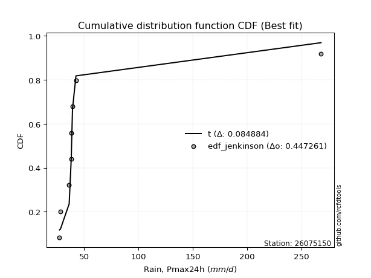</img>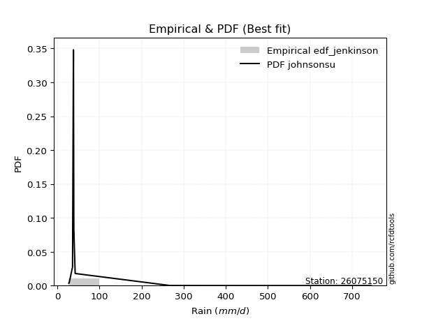</img>

</div>


### 11. Empirical - EDF Cunnane (1978)

Cunnane´s work in statistical hydrology has focused on the performance and evaluation of different probability distributions (such as GEV, Gumbel, Lognormal) for flood frequency estimation. _b_ is a constant, typically set to 0.4.

<div align="center">


$P=(m-b)/(n+1-2b)$


</div>


**11.1. Empirical values**

<div align="center">

|                | 0                   | 1                  | 2                   | 3                  | 4           | 5                  | 6                 | 7                  | 8                  |
|:---------------|:--------------------|:-------------------|:--------------------|:-------------------|:------------|:-------------------|:------------------|:-------------------|:-------------------|
| date           | 2021                | 2022               | 2023                | 2020               | 2019        | 2017               | 2018              | 2025               | 2024               |
| x              | 27.381              | 28.318             | 36.295              | 38.265             | 38.51       | 39.366             | 42.517            | 201.292            | 267.8              |
| m              | 1                   | 2                  | 3                   | 4                  | 5           | 6                  | 7                 | 8                  | 9                  |
| empirical_dist | edf_cunnane         | edf_cunnane        | edf_cunnane         | edf_cunnane        | edf_cunnane | edf_cunnane        | edf_cunnane       | edf_cunnane        | edf_cunnane        |
| empirical      | 0.06521739130434782 | 0.1739130434782609 | 0.28260869565217395 | 0.391304347826087  | 0.5         | 0.6086956521739131 | 0.717391304347826 | 0.8260869565217391 | 0.9347826086956522 |
| empirical_tr   | 1.069767441860465   | 1.2105263157894737 | 1.393939393939394   | 1.6428571428571428 | 2.0         | 2.555555555555556  | 3.538461538461538 | 5.75               | 15.333333333333343 |

</div>


**11.2. Kolmogorov-Smirnov fit test (sorted by Δ)**


<div align="center">

|                | 0                   | 1                   | 2                   | 3                   | 4                   | 5                   | 6                   | 7                   | 8                   | 9                   | 10                  | 11                  | 12                  | 13                  | 14                  | 15                  | 16                  | 17                  | 18                  | 19                  | 20                  | 21                  | 22                  | 23                  | 24                  | 25                  | 26                  | 27                  | 28                  | 29                  | 30                  | 31                  | 32                  | 33                  | 34                  | 35                  | 36                  | 37                  | 38                  | 39                  | 40                  | 41                  | 42                  | 43                  | 44                    | 45                  | 46                  | 47                  | 48                  | 49                  | 50                  | 51                  | 52                  | 53                  | 54                  | 55                  | 56                  | 57                  | 58                  | 59                  | 60                  | 61                  | 62                  | 63                  | 64                  | 65                  | 66                  | 67                  | 68                  | 69                  | 70                  | 71                  | 72                  | 73                  | 74                  | 75                  | 76                  | 77                  | 78                  | 79                  | 80                  | 81                  | 82                  | 83                  | 84                  | 85                  | 86                  | 87                  | 88                  | 89                  |
|:---------------|:--------------------|:--------------------|:--------------------|:--------------------|:--------------------|:--------------------|:--------------------|:--------------------|:--------------------|:--------------------|:--------------------|:--------------------|:--------------------|:--------------------|:--------------------|:--------------------|:--------------------|:--------------------|:--------------------|:--------------------|:--------------------|:--------------------|:--------------------|:--------------------|:--------------------|:--------------------|:--------------------|:--------------------|:--------------------|:--------------------|:--------------------|:--------------------|:--------------------|:--------------------|:--------------------|:--------------------|:--------------------|:--------------------|:--------------------|:--------------------|:--------------------|:--------------------|:--------------------|:--------------------|:----------------------|:--------------------|:--------------------|:--------------------|:--------------------|:--------------------|:--------------------|:--------------------|:--------------------|:--------------------|:--------------------|:--------------------|:--------------------|:--------------------|:--------------------|:--------------------|:--------------------|:--------------------|:--------------------|:--------------------|:--------------------|:--------------------|:--------------------|:--------------------|:--------------------|:--------------------|:--------------------|:--------------------|:--------------------|:--------------------|:--------------------|:--------------------|:--------------------|:--------------------|:--------------------|:--------------------|:--------------------|:--------------------|:--------------------|:--------------------|:--------------------|:--------------------|:--------------------|:--------------------|:--------------------|:--------------------|
| station        | 26075150            | 26075150            | 26075150            | 26075150            | 26075150            | 26075150            | 26075150            | 26075150            | 26075150            | 26075150            | 26075150            | 26075150            | 26075150            | 26075150            | 26075150            | 26075150            | 26075150            | 26075150            | 26075150            | 26075150            | 26075150            | 26075150            | 26075150            | 26075150            | 26075150            | 26075150            | 26075150            | 26075150            | 26075150            | 26075150            | 26075150            | 26075150            | 26075150            | 26075150            | 26075150            | 26075150            | 26075150            | 26075150            | 26075150            | 26075150            | 26075150            | 26075150            | 26075150            | 26075150            | 26075150              | 26075150            | 26075150            | 26075150            | 26075150            | 26075150            | 26075150            | 26075150            | 26075150            | 26075150            | 26075150            | 26075150            | 26075150            | 26075150            | 26075150            | 26075150            | 26075150            | 26075150            | 26075150            | 26075150            | 26075150            | 26075150            | 26075150            | 26075150            | 26075150            | 26075150            | 26075150            | 26075150            | 26075150            | 26075150            | 26075150            | 26075150            | 26075150            | 26075150            | 26075150            | 26075150            | 26075150            | 26075150            | 26075150            | 26075150            | 26075150            | 26075150            | 26075150            | 26075150            | 26075150            | 26075150            |
| empirical_dist | edf_cunnane         | edf_cunnane         | edf_cunnane         | edf_cunnane         | edf_cunnane         | edf_cunnane         | edf_cunnane         | edf_cunnane         | edf_cunnane         | edf_cunnane         | edf_cunnane         | edf_cunnane         | edf_cunnane         | edf_cunnane         | edf_cunnane         | edf_cunnane         | edf_cunnane         | edf_cunnane         | edf_cunnane         | edf_cunnane         | edf_cunnane         | edf_cunnane         | edf_cunnane         | edf_cunnane         | edf_cunnane         | edf_cunnane         | edf_cunnane         | edf_cunnane         | edf_cunnane         | edf_cunnane         | edf_cunnane         | edf_cunnane         | edf_cunnane         | edf_cunnane         | edf_cunnane         | edf_cunnane         | edf_cunnane         | edf_cunnane         | edf_cunnane         | edf_cunnane         | edf_cunnane         | edf_cunnane         | edf_cunnane         | edf_cunnane         | edf_cunnane           | edf_cunnane         | edf_cunnane         | edf_cunnane         | edf_cunnane         | edf_cunnane         | edf_cunnane         | edf_cunnane         | edf_cunnane         | edf_cunnane         | edf_cunnane         | edf_cunnane         | edf_cunnane         | edf_cunnane         | edf_cunnane         | edf_cunnane         | edf_cunnane         | edf_cunnane         | edf_cunnane         | edf_cunnane         | edf_cunnane         | edf_cunnane         | edf_cunnane         | edf_cunnane         | edf_cunnane         | edf_cunnane         | edf_cunnane         | edf_cunnane         | edf_cunnane         | edf_cunnane         | edf_cunnane         | edf_cunnane         | edf_cunnane         | edf_cunnane         | edf_cunnane         | edf_cunnane         | edf_cunnane         | edf_cunnane         | edf_cunnane         | edf_cunnane         | edf_cunnane         | edf_cunnane         | edf_cunnane         | edf_cunnane         | edf_cunnane         | edf_cunnane         |
| p_dist         | logt                | t                   | lognct              | logpareto           | alpha               | logalpha            | logf                | loginvgamma         | loginvweibull       | logmielke           | pareto              | loginvgauss         | invgamma            | f                   | betaprime           | fatiguelife         | invgauss            | invweibull          | logwald             | fisk                | logjohnsonsu        | loggibrat           | gamma               | logweibull_min      | erlang              | logfatiguelife      | logncf              | logchi2             | logexponnorm        | loggenexpon         | logexpon            | loghalflogistic     | loggompertz         | logtruncnorm        | loggamma            | loggamma            | logerlang           | loghalfnorm         | logmoyal            | logpearson3         | logfisk             | loggenlogistic      | lognakagami         | loggumbel_r         | loglaplace_asymmetric | lograyleigh         | nct                 | logmaxwell          | wald                | halflogistic        | halfnorm            | ncf                 | pearson3            | logkstwobign        | logloggamma         | moyal               | chi2                | logcrystalball      | lognorm             | lognorm             | rayleigh            | gumbel_r            | loglogistic         | maxwell             | loghypsecant        | logrice             | gibrat              | logbetaprime        | loglognorm          | nakagami            | genlogistic         | loglaplace          | crystalball         | norm                | loggumbel_l         | logistic            | weibull_min         | hypsecant           | kstwobign           | gumbel_l            | rice                | laplace             | exponnorm           | expon               | laplace_asymmetric  | genexpon            | gompertz            | truncnorm           | johnsonsu           | mielke              |
| delta          | 0.1135860939643426  | 0.11909202018559273 | 0.15262817122854555 | 0.1550735456884197  | 0.15969997912682643 | 0.16311957273825034 | 0.1657806929664042  | 0.16578377131587563 | 0.1663188700785771  | 0.1675576820536825  | 0.1733971787932279  | 0.18326476790559137 | 0.184872676735082   | 0.18487989575545183 | 0.18561920063781312 | 0.18827584098486416 | 0.1903102221709987  | 0.19567961505375164 | 0.19780025688745795 | 0.2002182003315614  | 0.20592254151622807 | 0.21204777250086815 | 0.21561293913034807 | 0.22025348337063333 | 0.2214441379055206  | 0.2238051666599149  | 0.2287871209567136  | 0.23017823742367144 | 0.23495120092019073 | 0.2381288734414192  | 0.23812915423769931 | 0.2387303004300323  | 0.2415430486384037  | 0.24732814874441372 | 0.247563911149972   | 0.247563911149972   | 0.25137110241727123 | 0.2521915579923703  | 0.2546881874154009  | 0.2577136958190735  | 0.26804438095291616 | 0.27236388901949304 | 0.2759418122110495  | 0.2763193220946472  | 0.2852927444980323    | 0.2871234717728923  | 0.29544702609059026 | 0.29942161576146326 | 0.30580222085222175 | 0.3094904525712441  | 0.31362260238663303 | 0.31755984123095454 | 0.3176112609401518  | 0.3211434732896559  | 0.3319637986427898  | 0.33213747524262915 | 0.33266352754668393 | 0.3329890443681902  | 0.3329890531458565  | 0.3329890531458565  | 0.34696551427946254 | 0.3469759279361622  | 0.34760796559407875 | 0.3586898623167737  | 0.35940104852864996 | 0.3615916885739316  | 0.3633478539491496  | 0.3661597685843071  | 0.3746976305423674  | 0.3757729989762612  | 0.38195058606858184 | 0.387449742727869   | 0.38911521563444296 | 0.38911521866296755 | 0.3977620724661494  | 0.40876673175102035 | 0.4185447788106712  | 0.423584764256089   | 0.4266048617324246  | 0.44541817233901787 | 0.44668911619942486 | 0.4507943842524226  | 0.46518323897245994 | 0.46729661671106476 | 0.46729684144497596 | 0.4672971575044809  | 0.47274826747191767 | 0.5430485944763013  | 0.6648056479651877  | nan                 |
| deltao         | 0.41761268023100007 | 0.41761268023100007 | 0.41761268023100007 | 0.41761268023100007 | 0.41761268023100007 | 0.41761268023100007 | 0.41761268023100007 | 0.41761268023100007 | 0.41761268023100007 | 0.41761268023100007 | 0.41761268023100007 | 0.41761268023100007 | 0.41761268023100007 | 0.41761268023100007 | 0.41761268023100007 | 0.41761268023100007 | 0.41761268023100007 | 0.41761268023100007 | 0.41761268023100007 | 0.41761268023100007 | 0.41761268023100007 | 0.41761268023100007 | 0.41761268023100007 | 0.41761268023100007 | 0.41761268023100007 | 0.41761268023100007 | 0.41761268023100007 | 0.41761268023100007 | 0.41761268023100007 | 0.41761268023100007 | 0.41761268023100007 | 0.41761268023100007 | 0.41761268023100007 | 0.41761268023100007 | 0.41761268023100007 | 0.41761268023100007 | 0.41761268023100007 | 0.41761268023100007 | 0.41761268023100007 | 0.41761268023100007 | 0.41761268023100007 | 0.41761268023100007 | 0.41761268023100007 | 0.41761268023100007 | 0.41761268023100007   | 0.41761268023100007 | 0.41761268023100007 | 0.41761268023100007 | 0.41761268023100007 | 0.41761268023100007 | 0.41761268023100007 | 0.41761268023100007 | 0.41761268023100007 | 0.41761268023100007 | 0.41761268023100007 | 0.41761268023100007 | 0.41761268023100007 | 0.41761268023100007 | 0.41761268023100007 | 0.41761268023100007 | 0.41761268023100007 | 0.41761268023100007 | 0.41761268023100007 | 0.41761268023100007 | 0.41761268023100007 | 0.41761268023100007 | 0.41761268023100007 | 0.41761268023100007 | 0.41761268023100007 | 0.41761268023100007 | 0.41761268023100007 | 0.41761268023100007 | 0.41761268023100007 | 0.41761268023100007 | 0.41761268023100007 | 0.41761268023100007 | 0.41761268023100007 | 0.41761268023100007 | 0.41761268023100007 | 0.41761268023100007 | 0.41761268023100007 | 0.41761268023100007 | 0.41761268023100007 | 0.41761268023100007 | 0.41761268023100007 | 0.41761268023100007 | 0.41761268023100007 | 0.41761268023100007 | 0.41761268023100007 | 0.41761268023100007 |
| eval           | Δo > Δ              | Δo > Δ              | Δo > Δ              | Δo > Δ              | Δo > Δ              | Δo > Δ              | Δo > Δ              | Δo > Δ              | Δo > Δ              | Δo > Δ              | Δo > Δ              | Δo > Δ              | Δo > Δ              | Δo > Δ              | Δo > Δ              | Δo > Δ              | Δo > Δ              | Δo > Δ              | Δo > Δ              | Δo > Δ              | Δo > Δ              | Δo > Δ              | Δo > Δ              | Δo > Δ              | Δo > Δ              | Δo > Δ              | Δo > Δ              | Δo > Δ              | Δo > Δ              | Δo > Δ              | Δo > Δ              | Δo > Δ              | Δo > Δ              | Δo > Δ              | Δo > Δ              | Δo > Δ              | Δo > Δ              | Δo > Δ              | Δo > Δ              | Δo > Δ              | Δo > Δ              | Δo > Δ              | Δo > Δ              | Δo > Δ              | Δo > Δ                | Δo > Δ              | Δo > Δ              | Δo > Δ              | Δo > Δ              | Δo > Δ              | Δo > Δ              | Δo > Δ              | Δo > Δ              | Δo > Δ              | Δo > Δ              | Δo > Δ              | Δo > Δ              | Δo > Δ              | Δo > Δ              | Δo > Δ              | Δo > Δ              | Δo > Δ              | Δo > Δ              | Δo > Δ              | Δo > Δ              | Δo > Δ              | Δo > Δ              | Δo > Δ              | Δo > Δ              | Δo > Δ              | Δo > Δ              | Δo > Δ              | Δo > Δ              | Δo > Δ              | Δo > Δ              | Δo > Δ              | Δo <= Δ             | Δo <= Δ             | Δo <= Δ             | Δo <= Δ             | Δo <= Δ             | Δo <= Δ             | Δo <= Δ             | Δo <= Δ             | Δo <= Δ             | Δo <= Δ             | Δo <= Δ             | Δo <= Δ             | Δo <= Δ             | Δo <= Δ             |
| fit            | 1                   | 1                   | 1                   | 1                   | 1                   | 1                   | 1                   | 1                   | 1                   | 1                   | 1                   | 1                   | 1                   | 1                   | 1                   | 1                   | 1                   | 1                   | 1                   | 1                   | 1                   | 1                   | 1                   | 1                   | 1                   | 1                   | 1                   | 1                   | 1                   | 1                   | 1                   | 1                   | 1                   | 1                   | 1                   | 1                   | 1                   | 1                   | 1                   | 1                   | 1                   | 1                   | 1                   | 1                   | 1                     | 1                   | 1                   | 1                   | 1                   | 1                   | 1                   | 1                   | 1                   | 1                   | 1                   | 1                   | 1                   | 1                   | 1                   | 1                   | 1                   | 1                   | 1                   | 1                   | 1                   | 1                   | 1                   | 1                   | 1                   | 1                   | 1                   | 1                   | 1                   | 1                   | 1                   | 1                   | 0                   | 0                   | 0                   | 0                   | 0                   | 0                   | 0                   | 0                   | 0                   | 0                   | 0                   | 0                   | 0                   | 0                   |
| n              | 9                   | 9                   | 9                   | 9                   | 9                   | 9                   | 9                   | 9                   | 9                   | 9                   | 9                   | 9                   | 9                   | 9                   | 9                   | 9                   | 9                   | 9                   | 9                   | 9                   | 9                   | 9                   | 9                   | 9                   | 9                   | 9                   | 9                   | 9                   | 9                   | 9                   | 9                   | 9                   | 9                   | 9                   | 9                   | 9                   | 9                   | 9                   | 9                   | 9                   | 9                   | 9                   | 9                   | 9                   | 9                     | 9                   | 9                   | 9                   | 9                   | 9                   | 9                   | 9                   | 9                   | 9                   | 9                   | 9                   | 9                   | 9                   | 9                   | 9                   | 9                   | 9                   | 9                   | 9                   | 9                   | 9                   | 9                   | 9                   | 9                   | 9                   | 9                   | 9                   | 9                   | 9                   | 9                   | 9                   | 9                   | 9                   | 9                   | 9                   | 9                   | 9                   | 9                   | 9                   | 9                   | 9                   | 9                   | 9                   | 9                   | 9                   |
| best_fit       | 1                   | 0                   | 0                   | 0                   | 0                   | 0                   | 0                   | 0                   | 0                   | 0                   | 0                   | 0                   | 0                   | 0                   | 0                   | 0                   | 0                   | 0                   | 0                   | 0                   | 0                   | 0                   | 0                   | 0                   | 0                   | 0                   | 0                   | 0                   | 0                   | 0                   | 0                   | 0                   | 0                   | 0                   | 0                   | 0                   | 0                   | 0                   | 0                   | 0                   | 0                   | 0                   | 0                   | 0                   | 0                     | 0                   | 0                   | 0                   | 0                   | 0                   | 0                   | 0                   | 0                   | 0                   | 0                   | 0                   | 0                   | 0                   | 0                   | 0                   | 0                   | 0                   | 0                   | 0                   | 0                   | 0                   | 0                   | 0                   | 0                   | 0                   | 0                   | 0                   | 0                   | 0                   | 0                   | 0                   | 0                   | 0                   | 0                   | 0                   | 0                   | 0                   | 0                   | 0                   | 0                   | 0                   | 0                   | 0                   | 0                   | 0                   |
| best_fit_sort  | 1                   | 2                   | 3                   | 4                   | 5                   | 6                   | 7                   | 8                   | 9                   | 10                  | 11                  | 12                  | 13                  | 14                  | 15                  | 16                  | 17                  | 18                  | 19                  | 20                  | 21                  | 22                  | 23                  | 24                  | 25                  | 26                  | 27                  | 28                  | 29                  | 30                  | 31                  | 32                  | 33                  | 34                  | 35                  | 36                  | 37                  | 38                  | 39                  | 40                  | 41                  | 42                  | 43                  | 44                  | 45                    | 46                  | 47                  | 48                  | 49                  | 50                  | 51                  | 52                  | 53                  | 54                  | 55                  | 56                  | 57                  | 58                  | 59                  | 60                  | 61                  | 62                  | 63                  | 64                  | 65                  | 66                  | 67                  | 68                  | 69                  | 70                  | 71                  | 72                  | 73                  | 74                  | 75                  | 76                  | 77                  | 78                  | 79                  | 80                  | 81                  | 82                  | 83                  | 84                  | 85                  | 86                  | 87                  | 88                  | 89                  | 90                  |

</div>


<div align="center">

</img>

</div>


**11.3. Best fit**

<div align="center">

|   id |   station | empirical_dist   | p_dist   |    delta |   deltao | eval   |   fit |   n |   best_fit |   best_fit_sort |
|-----:|----------:|:-----------------|:---------|---------:|---------:|:-------|------:|----:|-----------:|----------------:|
|    0 |  26075150 | edf_cunnane      | logt     | 0.113586 | 0.417613 | Δo > Δ |     1 |   9 |          1 |               1 |

</div>


<div align="center">

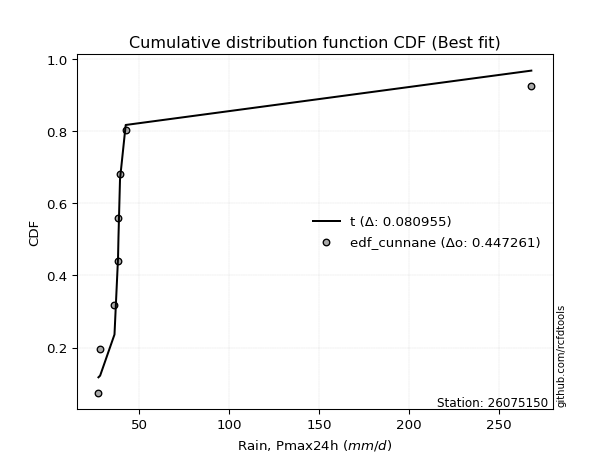</img></img>

</div>


### 12. Empirical - EDF Adamowski (1981)

The Adamowski formula in hydrology refers to a specific plotting position formula used for estimating the non-parametric empirical distribution of hydrological events (like flood peaks) to calculate their return periods. This formula provides an alternative to traditional parametric methods (like the Gumbel or Log Pearson Type III distributions). 

<div align="center">


$P=(m-0.25)/(n+0.5)$


</div>


**12.1. Empirical values**

<div align="center">

|                | 0                   | 1                   | 2                  | 3                   | 4             | 5                  | 6                  | 7                  | 8                  |
|:---------------|:--------------------|:--------------------|:-------------------|:--------------------|:--------------|:-------------------|:-------------------|:-------------------|:-------------------|
| date           | 2021                | 2022                | 2023               | 2020                | 2019          | 2017               | 2018               | 2025               | 2024               |
| x              | 27.381              | 28.318              | 36.295             | 38.265              | 38.51         | 39.366             | 42.517             | 201.292            | 267.8              |
| m              | 1                   | 2                   | 3                  | 4                   | 5             | 6                  | 7                  | 8                  | 9                  |
| empirical_dist | edf_adamowski       | edf_adamowski       | edf_adamowski      | edf_adamowski       | edf_adamowski | edf_adamowski      | edf_adamowski      | edf_adamowski      | edf_adamowski      |
| empirical      | 0.07894736842105263 | 0.18421052631578946 | 0.2894736842105263 | 0.39473684210526316 | 0.5           | 0.6052631578947368 | 0.7105263157894737 | 0.8157894736842105 | 0.9210526315789473 |
| empirical_tr   | 1.0857142857142856  | 1.2258064516129032  | 1.4074074074074074 | 1.6521739130434783  | 2.0           | 2.533333333333333  | 3.4545454545454546 | 5.428571428571428  | 12.666666666666663 |

</div>


**12.2. Kolmogorov-Smirnov fit test (sorted by Δ)**


<div align="center">

|                | 0                   | 1                   | 2                   | 3                   | 4                   | 5                   | 6                   | 7                   | 8                   | 9                   | 10                  | 11                  | 12                  | 13                  | 14                  | 15                  | 16                  | 17                  | 18                  | 19                  | 20                  | 21                  | 22                  | 23                  | 24                  | 25                  | 26                  | 27                  | 28                  | 29                  | 30                  | 31                  | 32                  | 33                  | 34                  | 35                  | 36                  | 37                  | 38                  | 39                  | 40                  | 41                  | 42                  | 43                  | 44                    | 45                  | 46                  | 47                  | 48                  | 49                  | 50                  | 51                  | 52                  | 53                  | 54                  | 55                  | 56                  | 57                  | 58                  | 59                  | 60                  | 61                  | 62                  | 63                  | 64                  | 65                  | 66                  | 67                  | 68                  | 69                  | 70                  | 71                  | 72                  | 73                  | 74                  | 75                  | 76                  | 77                  | 78                  | 79                  | 80                  | 81                  | 82                  | 83                  | 84                  | 85                  | 86                  | 87                  | 88                  | 89                  |
|:---------------|:--------------------|:--------------------|:--------------------|:--------------------|:--------------------|:--------------------|:--------------------|:--------------------|:--------------------|:--------------------|:--------------------|:--------------------|:--------------------|:--------------------|:--------------------|:--------------------|:--------------------|:--------------------|:--------------------|:--------------------|:--------------------|:--------------------|:--------------------|:--------------------|:--------------------|:--------------------|:--------------------|:--------------------|:--------------------|:--------------------|:--------------------|:--------------------|:--------------------|:--------------------|:--------------------|:--------------------|:--------------------|:--------------------|:--------------------|:--------------------|:--------------------|:--------------------|:--------------------|:--------------------|:----------------------|:--------------------|:--------------------|:--------------------|:--------------------|:--------------------|:--------------------|:--------------------|:--------------------|:--------------------|:--------------------|:--------------------|:--------------------|:--------------------|:--------------------|:--------------------|:--------------------|:--------------------|:--------------------|:--------------------|:--------------------|:--------------------|:--------------------|:--------------------|:--------------------|:--------------------|:--------------------|:--------------------|:--------------------|:--------------------|:--------------------|:--------------------|:--------------------|:--------------------|:--------------------|:--------------------|:--------------------|:--------------------|:--------------------|:--------------------|:--------------------|:--------------------|:--------------------|:--------------------|:--------------------|:--------------------|
| station        | 26075150            | 26075150            | 26075150            | 26075150            | 26075150            | 26075150            | 26075150            | 26075150            | 26075150            | 26075150            | 26075150            | 26075150            | 26075150            | 26075150            | 26075150            | 26075150            | 26075150            | 26075150            | 26075150            | 26075150            | 26075150            | 26075150            | 26075150            | 26075150            | 26075150            | 26075150            | 26075150            | 26075150            | 26075150            | 26075150            | 26075150            | 26075150            | 26075150            | 26075150            | 26075150            | 26075150            | 26075150            | 26075150            | 26075150            | 26075150            | 26075150            | 26075150            | 26075150            | 26075150            | 26075150              | 26075150            | 26075150            | 26075150            | 26075150            | 26075150            | 26075150            | 26075150            | 26075150            | 26075150            | 26075150            | 26075150            | 26075150            | 26075150            | 26075150            | 26075150            | 26075150            | 26075150            | 26075150            | 26075150            | 26075150            | 26075150            | 26075150            | 26075150            | 26075150            | 26075150            | 26075150            | 26075150            | 26075150            | 26075150            | 26075150            | 26075150            | 26075150            | 26075150            | 26075150            | 26075150            | 26075150            | 26075150            | 26075150            | 26075150            | 26075150            | 26075150            | 26075150            | 26075150            | 26075150            | 26075150            |
| empirical_dist | edf_adamowski       | edf_adamowski       | edf_adamowski       | edf_adamowski       | edf_adamowski       | edf_adamowski       | edf_adamowski       | edf_adamowski       | edf_adamowski       | edf_adamowski       | edf_adamowski       | edf_adamowski       | edf_adamowski       | edf_adamowski       | edf_adamowski       | edf_adamowski       | edf_adamowski       | edf_adamowski       | edf_adamowski       | edf_adamowski       | edf_adamowski       | edf_adamowski       | edf_adamowski       | edf_adamowski       | edf_adamowski       | edf_adamowski       | edf_adamowski       | edf_adamowski       | edf_adamowski       | edf_adamowski       | edf_adamowski       | edf_adamowski       | edf_adamowski       | edf_adamowski       | edf_adamowski       | edf_adamowski       | edf_adamowski       | edf_adamowski       | edf_adamowski       | edf_adamowski       | edf_adamowski       | edf_adamowski       | edf_adamowski       | edf_adamowski       | edf_adamowski         | edf_adamowski       | edf_adamowski       | edf_adamowski       | edf_adamowski       | edf_adamowski       | edf_adamowski       | edf_adamowski       | edf_adamowski       | edf_adamowski       | edf_adamowski       | edf_adamowski       | edf_adamowski       | edf_adamowski       | edf_adamowski       | edf_adamowski       | edf_adamowski       | edf_adamowski       | edf_adamowski       | edf_adamowski       | edf_adamowski       | edf_adamowski       | edf_adamowski       | edf_adamowski       | edf_adamowski       | edf_adamowski       | edf_adamowski       | edf_adamowski       | edf_adamowski       | edf_adamowski       | edf_adamowski       | edf_adamowski       | edf_adamowski       | edf_adamowski       | edf_adamowski       | edf_adamowski       | edf_adamowski       | edf_adamowski       | edf_adamowski       | edf_adamowski       | edf_adamowski       | edf_adamowski       | edf_adamowski       | edf_adamowski       | edf_adamowski       | edf_adamowski       |
| p_dist         | logt                | t                   | logpareto           | alpha               | logalpha            | logf                | loginvgamma         | loginvweibull       | logmielke           | lognct              | pareto              | loginvgauss         | invgamma            | f                   | betaprime           | fatiguelife         | invgauss            | invweibull          | logwald             | fisk                | logjohnsonsu        | loggibrat           | gamma               | logweibull_min      | erlang              | logfatiguelife      | logncf              | logchi2             | logexponnorm        | loggenexpon         | logexpon            | loghalflogistic     | loggompertz         | logtruncnorm        | loggamma            | loggamma            | logerlang           | loghalfnorm         | logmoyal            | logpearson3         | logfisk             | loggenlogistic      | lognakagami         | loggumbel_r         | loglaplace_asymmetric | lograyleigh         | nct                 | logmaxwell          | wald                | halflogistic        | halfnorm            | ncf                 | pearson3            | logkstwobign        | logloggamma         | moyal               | chi2                | logcrystalball      | lognorm             | lognorm             | rayleigh            | gumbel_r            | loglogistic         | maxwell             | loghypsecant        | logrice             | gibrat              | logbetaprime        | loglognorm          | nakagami            | genlogistic         | loglaplace          | crystalball         | norm                | loggumbel_l         | logistic            | weibull_min         | hypsecant           | kstwobign           | gumbel_l            | rice                | laplace             | exponnorm           | expon               | laplace_asymmetric  | genexpon            | gompertz            | truncnorm           | johnsonsu           | mielke              |
| delta          | 0.12388357680187123 | 0.12938950302312135 | 0.1482085571300673  | 0.15283499056847405 | 0.15625458417989796 | 0.1589157044080518  | 0.15891878275752325 | 0.15945388152022472 | 0.1606926934953301  | 0.16292565406607418 | 0.16653219023487553 | 0.176399779347239   | 0.17800768817672963 | 0.17801490719709945 | 0.17875421207946074 | 0.18141085242651178 | 0.1834452336126463  | 0.18881462649539926 | 0.19093526832910557 | 0.19335321177320902 | 0.1990575529578757  | 0.20518278394251577 | 0.2087479505719957  | 0.21338849481228095 | 0.2145791493471682  | 0.21694017810156252 | 0.22192213239836123 | 0.22331324886531906 | 0.22808621236183835 | 0.23126388488306682 | 0.23126416567934693 | 0.2318653118716799  | 0.23467806008005132 | 0.24046316018606134 | 0.24069892259161962 | 0.24069892259161962 | 0.24450611385891885 | 0.24532656943401793 | 0.2478231988570485  | 0.2508487072607211  | 0.2611793923945638  | 0.26549890046114066 | 0.26907682365269714 | 0.26945433353629483 | 0.27842775593967994   | 0.28025848321453994 | 0.2885820375322379  | 0.2925566272031109  | 0.29893723229386937 | 0.3026254640128917  | 0.30675761382828065 | 0.31069485267260216 | 0.3107462723817994  | 0.31427848473130354 | 0.3250988100844374  | 0.3252724866842768  | 0.32579853898833155 | 0.32612405580983783 | 0.3261240645875041  | 0.3261240645875041  | 0.34010052572111016 | 0.34011093937780984 | 0.34074297703572637 | 0.3518248737584213  | 0.3525360599702976  | 0.3547267000155792  | 0.3564828653907972  | 0.3592947800259547  | 0.36440014770483875 | 0.3689080104179088  | 0.37508559751022946 | 0.3805847541695166  | 0.3822502270760906  | 0.3822502301046152  | 0.39089708390779704 | 0.40190174319266797 | 0.4116797902523188  | 0.4167197756977366  | 0.41973987317407224 | 0.4385531837806655  | 0.4398241276410725  | 0.4439293956940702  | 0.45831825041410756 | 0.4604316281527124  | 0.4604318528866236  | 0.46043216894612854 | 0.4658832789135653  | 0.536183605917949   | 0.6545081651276591  | nan                 |
| deltao         | 0.41761268023100007 | 0.41761268023100007 | 0.41761268023100007 | 0.41761268023100007 | 0.41761268023100007 | 0.41761268023100007 | 0.41761268023100007 | 0.41761268023100007 | 0.41761268023100007 | 0.41761268023100007 | 0.41761268023100007 | 0.41761268023100007 | 0.41761268023100007 | 0.41761268023100007 | 0.41761268023100007 | 0.41761268023100007 | 0.41761268023100007 | 0.41761268023100007 | 0.41761268023100007 | 0.41761268023100007 | 0.41761268023100007 | 0.41761268023100007 | 0.41761268023100007 | 0.41761268023100007 | 0.41761268023100007 | 0.41761268023100007 | 0.41761268023100007 | 0.41761268023100007 | 0.41761268023100007 | 0.41761268023100007 | 0.41761268023100007 | 0.41761268023100007 | 0.41761268023100007 | 0.41761268023100007 | 0.41761268023100007 | 0.41761268023100007 | 0.41761268023100007 | 0.41761268023100007 | 0.41761268023100007 | 0.41761268023100007 | 0.41761268023100007 | 0.41761268023100007 | 0.41761268023100007 | 0.41761268023100007 | 0.41761268023100007   | 0.41761268023100007 | 0.41761268023100007 | 0.41761268023100007 | 0.41761268023100007 | 0.41761268023100007 | 0.41761268023100007 | 0.41761268023100007 | 0.41761268023100007 | 0.41761268023100007 | 0.41761268023100007 | 0.41761268023100007 | 0.41761268023100007 | 0.41761268023100007 | 0.41761268023100007 | 0.41761268023100007 | 0.41761268023100007 | 0.41761268023100007 | 0.41761268023100007 | 0.41761268023100007 | 0.41761268023100007 | 0.41761268023100007 | 0.41761268023100007 | 0.41761268023100007 | 0.41761268023100007 | 0.41761268023100007 | 0.41761268023100007 | 0.41761268023100007 | 0.41761268023100007 | 0.41761268023100007 | 0.41761268023100007 | 0.41761268023100007 | 0.41761268023100007 | 0.41761268023100007 | 0.41761268023100007 | 0.41761268023100007 | 0.41761268023100007 | 0.41761268023100007 | 0.41761268023100007 | 0.41761268023100007 | 0.41761268023100007 | 0.41761268023100007 | 0.41761268023100007 | 0.41761268023100007 | 0.41761268023100007 | 0.41761268023100007 |
| eval           | Δo > Δ              | Δo > Δ              | Δo > Δ              | Δo > Δ              | Δo > Δ              | Δo > Δ              | Δo > Δ              | Δo > Δ              | Δo > Δ              | Δo > Δ              | Δo > Δ              | Δo > Δ              | Δo > Δ              | Δo > Δ              | Δo > Δ              | Δo > Δ              | Δo > Δ              | Δo > Δ              | Δo > Δ              | Δo > Δ              | Δo > Δ              | Δo > Δ              | Δo > Δ              | Δo > Δ              | Δo > Δ              | Δo > Δ              | Δo > Δ              | Δo > Δ              | Δo > Δ              | Δo > Δ              | Δo > Δ              | Δo > Δ              | Δo > Δ              | Δo > Δ              | Δo > Δ              | Δo > Δ              | Δo > Δ              | Δo > Δ              | Δo > Δ              | Δo > Δ              | Δo > Δ              | Δo > Δ              | Δo > Δ              | Δo > Δ              | Δo > Δ                | Δo > Δ              | Δo > Δ              | Δo > Δ              | Δo > Δ              | Δo > Δ              | Δo > Δ              | Δo > Δ              | Δo > Δ              | Δo > Δ              | Δo > Δ              | Δo > Δ              | Δo > Δ              | Δo > Δ              | Δo > Δ              | Δo > Δ              | Δo > Δ              | Δo > Δ              | Δo > Δ              | Δo > Δ              | Δo > Δ              | Δo > Δ              | Δo > Δ              | Δo > Δ              | Δo > Δ              | Δo > Δ              | Δo > Δ              | Δo > Δ              | Δo > Δ              | Δo > Δ              | Δo > Δ              | Δo > Δ              | Δo > Δ              | Δo > Δ              | Δo <= Δ             | Δo <= Δ             | Δo <= Δ             | Δo <= Δ             | Δo <= Δ             | Δo <= Δ             | Δo <= Δ             | Δo <= Δ             | Δo <= Δ             | Δo <= Δ             | Δo <= Δ             | Δo <= Δ             |
| fit            | 1                   | 1                   | 1                   | 1                   | 1                   | 1                   | 1                   | 1                   | 1                   | 1                   | 1                   | 1                   | 1                   | 1                   | 1                   | 1                   | 1                   | 1                   | 1                   | 1                   | 1                   | 1                   | 1                   | 1                   | 1                   | 1                   | 1                   | 1                   | 1                   | 1                   | 1                   | 1                   | 1                   | 1                   | 1                   | 1                   | 1                   | 1                   | 1                   | 1                   | 1                   | 1                   | 1                   | 1                   | 1                     | 1                   | 1                   | 1                   | 1                   | 1                   | 1                   | 1                   | 1                   | 1                   | 1                   | 1                   | 1                   | 1                   | 1                   | 1                   | 1                   | 1                   | 1                   | 1                   | 1                   | 1                   | 1                   | 1                   | 1                   | 1                   | 1                   | 1                   | 1                   | 1                   | 1                   | 1                   | 1                   | 1                   | 0                   | 0                   | 0                   | 0                   | 0                   | 0                   | 0                   | 0                   | 0                   | 0                   | 0                   | 0                   |
| n              | 9                   | 9                   | 9                   | 9                   | 9                   | 9                   | 9                   | 9                   | 9                   | 9                   | 9                   | 9                   | 9                   | 9                   | 9                   | 9                   | 9                   | 9                   | 9                   | 9                   | 9                   | 9                   | 9                   | 9                   | 9                   | 9                   | 9                   | 9                   | 9                   | 9                   | 9                   | 9                   | 9                   | 9                   | 9                   | 9                   | 9                   | 9                   | 9                   | 9                   | 9                   | 9                   | 9                   | 9                   | 9                     | 9                   | 9                   | 9                   | 9                   | 9                   | 9                   | 9                   | 9                   | 9                   | 9                   | 9                   | 9                   | 9                   | 9                   | 9                   | 9                   | 9                   | 9                   | 9                   | 9                   | 9                   | 9                   | 9                   | 9                   | 9                   | 9                   | 9                   | 9                   | 9                   | 9                   | 9                   | 9                   | 9                   | 9                   | 9                   | 9                   | 9                   | 9                   | 9                   | 9                   | 9                   | 9                   | 9                   | 9                   | 9                   |
| best_fit       | 1                   | 0                   | 0                   | 0                   | 0                   | 0                   | 0                   | 0                   | 0                   | 0                   | 0                   | 0                   | 0                   | 0                   | 0                   | 0                   | 0                   | 0                   | 0                   | 0                   | 0                   | 0                   | 0                   | 0                   | 0                   | 0                   | 0                   | 0                   | 0                   | 0                   | 0                   | 0                   | 0                   | 0                   | 0                   | 0                   | 0                   | 0                   | 0                   | 0                   | 0                   | 0                   | 0                   | 0                   | 0                     | 0                   | 0                   | 0                   | 0                   | 0                   | 0                   | 0                   | 0                   | 0                   | 0                   | 0                   | 0                   | 0                   | 0                   | 0                   | 0                   | 0                   | 0                   | 0                   | 0                   | 0                   | 0                   | 0                   | 0                   | 0                   | 0                   | 0                   | 0                   | 0                   | 0                   | 0                   | 0                   | 0                   | 0                   | 0                   | 0                   | 0                   | 0                   | 0                   | 0                   | 0                   | 0                   | 0                   | 0                   | 0                   |
| best_fit_sort  | 1                   | 2                   | 3                   | 4                   | 5                   | 6                   | 7                   | 8                   | 9                   | 10                  | 11                  | 12                  | 13                  | 14                  | 15                  | 16                  | 17                  | 18                  | 19                  | 20                  | 21                  | 22                  | 23                  | 24                  | 25                  | 26                  | 27                  | 28                  | 29                  | 30                  | 31                  | 32                  | 33                  | 34                  | 35                  | 36                  | 37                  | 38                  | 39                  | 40                  | 41                  | 42                  | 43                  | 44                  | 45                    | 46                  | 47                  | 48                  | 49                  | 50                  | 51                  | 52                  | 53                  | 54                  | 55                  | 56                  | 57                  | 58                  | 59                  | 60                  | 61                  | 62                  | 63                  | 64                  | 65                  | 66                  | 67                  | 68                  | 69                  | 70                  | 71                  | 72                  | 73                  | 74                  | 75                  | 76                  | 77                  | 78                  | 79                  | 80                  | 81                  | 82                  | 83                  | 84                  | 85                  | 86                  | 87                  | 88                  | 89                  | 90                  |

</div>


<div align="center">

</img>

</div>


**12.3. Best fit**

<div align="center">

|   id |   station | empirical_dist   | p_dist   |    delta |   deltao | eval   |   fit |   n |   best_fit |   best_fit_sort |
|-----:|----------:|:-----------------|:---------|---------:|---------:|:-------|------:|----:|-----------:|----------------:|
|    0 |  26075150 | edf_adamowski    | logt     | 0.123884 | 0.417613 | Δo > Δ |     1 |   9 |          1 |               1 |

</div>


<div align="center">

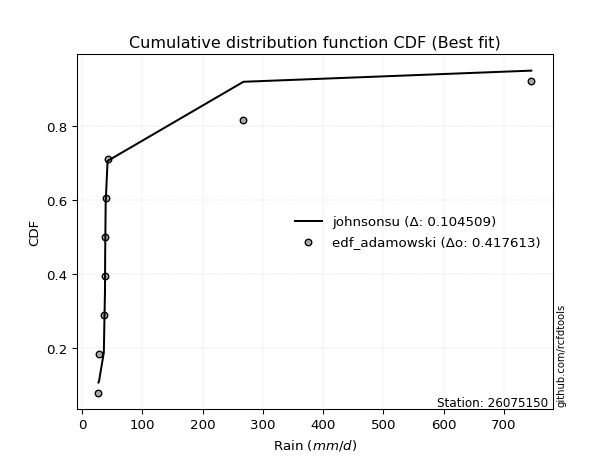</img>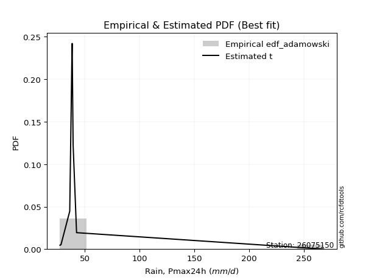</img>

</div>


## C. Best fit & Estimate extreme values for specific return periods - Tr


### 1. Best fit (ordered by delta Δ)

<div align="center">

|   id |   station | empirical_dist   | p_dist    |     delta |   deltao | eval   |   fit |   n |   best_fit |   best_fit_sort |
|-----:|----------:|:-----------------|:----------|----------:|---------:|:-------|------:|----:|-----------:|----------------:|
|    0 |  26075150 | edf_california   | t         | 0.0710475 | 0.417613 | Δo > Δ |     1 |   9 |          1 |               1 |
|    1 |  26075150 | edf_hazen        | logt      | 0.10634   | 0.417613 | Δo > Δ |     1 |   9 |          1 |               2 |
|    2 |  26075150 | edf_gringorten   | logt      | 0.110726  | 0.417613 | Δo > Δ |     1 |   9 |          1 |               3 |
|    3 |  26075150 | edf_cunnane      | logt      | 0.113586  | 0.417613 | Δo > Δ |     1 |   9 |          1 |               4 |
|    4 |  26075150 | edf_blom         | logt      | 0.115349  | 0.417613 | Δo > Δ |     1 |   9 |          1 |               5 |
|    5 |  26075150 | edf_tukey        | logt      | 0.118244  | 0.417613 | Δo > Δ |     1 |   9 |          1 |               6 |
|    6 |  26075150 | edf_filliben     | logt      | 0.119331  | 0.417613 | Δo > Δ |     1 |   9 |          1 |               7 |
|    7 |  26075150 | edf_jenkinson    | logt      | 0.119844  | 0.417613 | Δo > Δ |     1 |   9 |          1 |               8 |
|    8 |  26075150 | edf_beard        | logt      | 0.119844  | 0.417613 | Δo > Δ |     1 |   9 |          1 |               9 |
|    9 |  26075150 | edf_chegodayev   | logt      | 0.120524  | 0.417613 | Δo > Δ |     1 |   9 |          1 |              10 |
|   10 |  26075150 | edf_adamowski    | logt      | 0.123884  | 0.417613 | Δo > Δ |     1 |   9 |          1 |              11 |
|   11 |  26075150 | edf_weibull      | logpareto | 0.137682  | 0.417613 | Δo > Δ |     1 |   9 |          1 |              12 |

</div>

:file_folder:Tables: [bestfit_26075150.csv](table/bestfit_26075150.csv) | [extreme_26075150.csv](table/extreme_26075150.csv)


### 2. Extreme values

In hydrology, a return period (or recurrence interval $Tr$) is the statistical average time between extreme events like floods or droughts of a specific magnitude, indicating how rare an event is, with a 100-year flood, for example, having a 1% chance of occurring in any given year, not that it happens exactly every century. It is a key tool for infrastructure design (like bridges or dams) and risk assessment, calculated from historical data to determine the probability of future events, although it is important to remember it is statistical average, and events can cluster or be missed.

> risk_rate: assuming the return period as the project useful life.

|   id |      tr |   prob_l |     prob_g |     alpha |   betaprime |     chi2 |   crystalball |   erlang |    expon |   exponnorm |          f |   fatiguelife |             fisk |    gamma |   genexpon |   genlogistic |   gibrat |   gompertz |   gumbel_l |   gumbel_r |   halflogistic |   halfnorm |   hypsecant |   invgamma |   invgauss |   invweibull |        johnsonsu |   kstwobign |   laplace |   laplace_asymmetric |   loggamma |   logistic |   lognorm |   maxwell |    mielke |    moyal |   nakagami |       ncf |       nct |     norm |     pareto |   pearson3 |   rayleigh |     rice |                t |   truncnorm |     wald |   weibull_min |         logalpha |    logbetaprime |          logchi2 |   logcrystalball |   logerlang |   logexpon |   logexponnorm |             logf |   logfatiguelife |        logfisk |   loggenexpon |   loggenlogistic |   loggibrat |   loggompertz |   loggumbel_l |   loggumbel_r |   loghalflogistic |   loghalfnorm |   loghypsecant |      loginvgamma |   loginvgauss |    loginvweibull |     logjohnsonsu |   logkstwobign |   loglaplace |   loglaplace_asymmetric |   logloggamma |   loglogistic |    loglognorm |   logmaxwell |        logmielke |   logmoyal |   lognakagami |           logncf |    lognct |        logpareto |   logpearson3 |   lograyleigh |   logrice |            logt |   logtruncnorm |    logwald |   logweibull_min |   station |   n |   risk_rate |
|-----:|--------:|---------:|-----------:|----------:|------------:|---------:|--------------:|---------:|---------:|------------:|-----------:|--------------:|-----------------:|---------:|-----------:|--------------:|---------:|-----------:|-----------:|-----------:|---------------:|-----------:|------------:|-----------:|-----------:|-------------:|-----------------:|------------:|----------:|---------------------:|-----------:|-----------:|----------:|----------:|----------:|---------:|-----------:|----------:|----------:|---------:|-----------:|-----------:|-----------:|---------:|-----------------:|------------:|---------:|--------------:|-----------------:|----------------:|-----------------:|-----------------:|------------:|-----------:|---------------:|-----------------:|-----------------:|---------------:|--------------:|-----------------:|------------:|--------------:|--------------:|--------------:|------------------:|--------------:|---------------:|-----------------:|--------------:|-----------------:|-----------------:|---------------:|-------------:|------------------------:|--------------:|--------------:|--------------:|-------------:|-----------------:|-----------:|--------------:|-----------------:|----------:|-----------------:|--------------:|--------------:|----------:|----------------:|---------------:|-----------:|-----------------:|----------:|----:|------------:|
|    0 |    2    | 0.5      | 0.5        |   38.3205 |     37.593  |  53.7942 |       79.9716 |  42.8501 |  63.834  |     63.5473 |    37.6245 |       38.3113 |     37.5603      |  42.4024 |    63.8341 |       62.5861 |  54.6889 |    64.7751 |     93.809 |    66.1342 |        59.2549 |    62.7301 |     79.9716 |    37.6243 |    37.4459 |      37.2592 |     27.381       |     73.0578 |   79.9716 |              63.834  |    35.3726 |    79.9716 |   53.7452 |   72.7678 |   41.6642 |  61.667  |    70.8971 |   54.6765 |   47.7866 |  79.9716 |    38.1537 |    60.4081 |    70.2129 |  82.1343 |     38.4801      |     81.1206 |  52.6682 |       90.7702 |     38.1893      |    31.9407      |     43.6692      |          53.7452 |     35.1109 |    43.6984 |        43.5112 |     38.1542      |          36.0136 |  33.1214       |       43.6984 |          45.7133 |     42.306  |       43.9055 |       61.2665 |       47.1472 |           44.175  |       45.6522 |        53.7452 |     38.1541      |       37.6198 |     38.1257      |     36.7624      |        49.6109 |      53.7452 |                 45.9777 |       53.9873 |       53.7452 |  27.6257      |      50.2026 |     38.0875      |    45.1951 |       48.3721 |     43.1103      |   39.6206 |     38.768       |       45.7281 |       49.003  |   54.0968 |   38.5138       |        44.2316 |    41.5049 |          42.7167 |  26075150 |   9 |    0.75     |
|    1 |    2.33 | 0.570815 | 0.429185   |   41.4706 |     41.3163 |  63.0987 |       95.0022 |  49.6239 |  71.8657 |     71.5266 |    41.3573 |       45.1973 |     45.0387      |  47.4969 |    71.8658 |       71.9437 |  62.3028 |    73.0142 |    106.886 |    80.0617 |        73.5746 |    78.952  |     92.0005 |    41.355  |    41.2946 |      41.318  |     27.3812      |     84.3498 |   89.0674 |              71.8657 |    37.6906 |    93.2146 |   61.9624 |   88.3836 |   45.2535 |  74.8512 |    90.5063 |   65.7771 |   53.5273 |  95.0022 |    42.0604 |    74.512  |    86.0596 |  94.8894 |     38.8259      |     92.4957 |  62.5239 |      124.463  |     41.3777      |    33.6149      |     51.7985      |          61.9624 |     37.7633 |    48.4391 |        48.1965 |     41.4228      |          39.7264 |  38.0897       |       48.439  |          50.4688 |     45.4676 |       48.7194 |       69.3394 |       53.791  |           50.5874 |       53.229  |        60.2267 |     41.4227      |       41.1038 |     41.3822      |     40.3272      |        55.5624 |      58.5775 |                 50.5017 |       62.4797 |       60.9228 |  29.1358      |      58.1996 |     41.3586      |    51.2024 |       58.0832 |     47.4129      |   42.7431 |     42.4387      |       52.4183 |       56.9333 |   61.2332 |   38.9519       |        49.0421 |    45.5632 |          48.6074 |  26075150 |   9 |    0.729209 |
|    2 |    5    | 0.8      | 0.2        |   65.8967 |     78.0514 | 117.4    |      150.86   |  93.1475 | 112.022  |    111.421  |    78.1861 |      105.879  |    175.492       |  76.7862 |   112.022  |      112.595  | 106.138  |   114.207  |    149.131 |   140.569  |       138.369  |   147.553  |    140.252  |    78.1326 |    77.1106 |      85.6114 |     27.5766      |    132.316  |  134.544  |             112.022  |    52.3214 |   144.348  |  105.136  |  149.846  |   68.2427 | 135.922  |   200.711  |  140.595  |   87.9229 | 150.86   |    77.9294 |   138.79   |   149.501  | 145.954  |     43.1862      |    145.593  | 117.696  |      412.136  |     71.875       |    48.2977      |    142.459       |         105.136  |     56.1594 |    81.0658 |        80.3673 |     70.5556      |          76.1811 | 435.464        |       81.0657 |          77.577  |     68.8504 |       81.9608 |      103.43   |       95.378  |           93.4117 |      101.896  |        95.0917 |     70.5552      |       72.8023 |     71.0249      |     77.7633      |        89.9064 |      90.0909 |                 80.7401 |      107.355  |       98.851  |   2.34478e+38 |     104.132  |     71.6396      |    91.273  |      142.195  |     81.1256      |   61.2871 |     73.2131      |       95.8867 |      103.793  |  100.561  |   43.242        |        81.1589 |    76.8106 |         101.287  |  26075150 |   9 |    0.67232  |
|    3 |   10    | 0.9      | 0.1        |  110.773  |    169.97   | 173.133  |      187.915  | 141.003  | 148.475  |    147.636  |   170.341  |      182.976  |    736.669       | 106.514  |   148.476  |      145.703  | 156.105  |   151.602  |    172.652 |   189.852  |       192.177  |   198.315  |    178.781  |   170.057  |   146.642  |     208.288  |     48.2483      |    168.836  |  175.827  |             148.475  |    71.0617 |   182.005  |  149.306  |  193.1    |  100.567  | 189.093  |   297.087  |  251.982  |  132.164  | 187.915  |   158.207  |   192.433  |   194.736  | 182.364  |     69.9632      |    186.253  | 176.247  |      855.611  |    179.634       |    83.5124      |    407.162       |         149.306  |     82.6648 |   129.376  |       127.839  |    149.507       |         159.55   |   1.54142e+07  |      129.376  |         110.102  |    110.489  |      131.424  |      129.222  |      152.07   |          155.454  |      164.753  |       136.941  |    149.507       |      147.84   |    156.367       |    201.037       |       129.695  |     133.165  |                123.617  |      153.52   |      141.184  | inf           |     156.818  |    162.092       |   150.981  |      293.087  |    151.772       |   85.5949 |    141.937       |      156.415  |      159.266  |  143.234  |   66.2333       |       125.994  |   133.695  |         216.86   |  26075150 |   9 |    0.651322 |
|    4 |   15    | 0.933333 | 0.0666667  |  155.49   |    283.463  | 207.378  |      206.406  | 171.167  | 169.799  |    168.82   |   284.128  |      233.072  |   1692.51        | 124.702  |   169.799  |      164.382  | 190.571  |   173.476  |    183.304 |   217.657  |       222.628  |   224.732  |    200.77   |   283.471  |   209.61   |     368.978  |    241.932       |    188.224  |  199.976  |             169.799  |    85.1763 |   202.523  |  177.866  |  215.293  |  127.237  | 219.951  |   349.164  |  347.07   |  166.497  | 206.406  |   249.533  |   222.664  |   218.044  | 201.124  |    133.859       |    205.764  | 213.846  |     1199.42   |    433.02        |   132.972       |    778.38        |         177.866  |    104.331  |   170.063  |       167.718  |    277.079       |         255.422  |   8.56855e+14  |      170.063  |         134.148  |    153.11   |      173.234  |      142.93   |      197.854  |          207.387  |      211.558  |       168.627  |    277.082       |      241.971  |    305.128       |    427.911       |       157.545  |     167.364  |                158.595  |      183.443  |      171.448  | inf           |     193.477  |    326.555       |   202.198  |      430.305  |    238.217       |  105.246  |    229.701       |      205.301  |      198.58   |  171.869  |  145.129        |       161.707  |   190.845  |         349.68   |  26075150 |   9 |    0.644736 |
|    5 |   20    | 0.95     | 0.05       |  200.167  |    413.733  | 232.205  |      218.515  | 193.273  | 184.928  |    183.851  |   414.738  |      270.108  |   3030.77        | 137.864  |   184.929  |      177.46   | 217.606  |   188.996  |    189.934 |   237.125  |       243.963  |   242.345  |    216.282  |   413.584  |   265.531  |     560.067  |   1014.35        |    201.284  |  217.11   |             184.928  |    96.9255 |   216.704  |  199.468  |  230.022  |  150.872  | 241.805  |   384.23   |  433.039  |  195.781  | 218.515  |   348.866  |   243.743  |   233.535  | 213.593  |    247.872       |    217.524  | 241.865  |     1482.19   |   1031.38        |   202.004       |   1246.23        |         199.468  |    123.33   |   206.476  |       203.35   |    477.568       |         360.969  |   5.94002e+25  |      206.476  |         154.046  |    197.762  |      210.739  |      152.188  |      237.889  |          253.796  |      249.938  |       195.296  |    477.578       |      354.409  |    557.298       |    813.544       |       179.604  |     196.833  |                189.264  |      206.102  |      196.078  | inf           |     222.422  |    616.979       |   248.666  |      556.634  |    343.556       |  122.686  |    339.99        |      247.854  |      229.942  |  194.001  |  470.204        |       192.335  |   248.806  |         497.006  |  26075150 |   9 |    0.641514 |
|    6 |   25    | 0.96     | 0.04       |  244.828  |    558.096  | 251.714  |      227.429  | 210.753  | 196.663  |    195.509  |   559.479  |      299.517  |   4743.4         | 148.196  |   196.664  |      187.534  | 240.144  |   201.034  |    194.652 |   252.12   |       260.4    |   255.449  |    228.287  |   557.72   |   315.545  |     777.249  |   3062.65        |    211.067  |  230.4    |             196.664  |   107.178  |   227.553  |  217.029  |  240.957  |  172.503  | 258.745  |   410.426  |  512.832  |  221.836  | 227.429  |   454.612  |   259.918  |   245.045  | 222.858  |    423.825       |    225.459  | 264.307  |     1724.05   |   2442.96        |   297.243       |   1804.65        |         217.029  |    140.561  |   240.008  |       236.124  |    784.499       |         474.695  |   4.41213e+39  |      240.008  |         171.364  |    244.791  |      245.337  |      159.139  |      274.17   |          296.522  |      282.945  |       218.799  |    784.525       |      484.711  |    973.702       |   1433.47        |       198.126  |     223.219  |                217.08   |      224.535  |      217.283  | inf           |     246.677  |   1116.27        |   291.912  |      674.422  |    470.371       |  138.782  |    476.147       |      286.219  |      256.41   |  212.272  | 2307.74         |       219.554  |   307.693  |         657.187  |  26075150 |   9 |    0.639603 |
|    7 |   50    | 0.98     | 0.02       |  468.066  |   1443.31   | 313.451  |      252.956  | 266.551  | 233.116  |    231.724  |  1447.03   |      393.811  |  18747.4         | 180.841  |   233.117  |      218.567  | 319.592  |   238.428  |    207.46  |   298.315  |       311.046  |   293.538  |    265.508  |  1440.87   |   507.68   |    2175.88   |  75768           |    239.793  |  271.683  |             233.117  |   146.685  |   260.698  |  276.346  |  272.669  |  263.823  | 311.331  |   486.799  |  858.497  |  326.178  | 252.956  |  1052.83   |   309.364  |   278.457  | 249.751  |   2601.04        |    243.998  | 337.581  |     2603.15   | 176991           |  1558.22        |   5834.19        |         276.346  |    211.976  |   383.038  |       375.598  |   6270.26        |        1139.2    |   1.04807e+153 |      383.037  |         237.928  |    519.277  |      393.399  |      179.65   |      424.54   |          478.913  |      405.772  |       311.21   |   6270.86        |     1397.25   |  10846.2         |  12915.5         |       264.312  |     329.943  |                332.36   |      286.855  |      297.36   | inf           |     333.038  |  14889.6         |   480.207  |     1179.31   |   1523.38        |  209.244  |   1679.08        |      443.143  |      351.791  |  275.648  |    6.07562e+09  |       326.76   |   615.656  |        1619.17   |  26075150 |   9 |    0.63583  |
|    8 |   75    | 0.986667 | 0.0133333  |  691.272  |   2536.62   | 350.208  |      266.652  | 300.037  | 254.44   |    252.909  |  2543.25   |      450.573  |  41533.4         | 200.25   |   254.441  |      236.604  | 373.251  |   260.302  |    213.936 |   325.165  |       340.487  |   314.272  |    287.259  |  2530.79   |   644.731  |    3987.62   | 425612           |    255.599  |  295.832  |             254.44   |   176.384  |   279.842  |  314.6    |  289.911  |  339.962  | 342.083  |   528.396  | 1154.71   |  408.227  | 266.652  |  1733.39   |   337.833  |   296.634  | 264.381  |   7800.86        |    251.21   | 382.671  |     3208.6    |      1.26403e+07 |  6341.59        |  11743.4         |         314.6    |    270.262  |   503.499  |       492.767  |  34879           |        1927.18   | inf            |      503.498  |         287.93   |    862.955  |      518.55   |      191.008  |      547.388  |          632.824  |      493.762  |       382.359  |  34884.6         |     2739.07   |  85167.7         |  66891.5         |       309.732  |     414.678  |                426.404  |      327.075  |      356.434  | inf           |     392.077  | 140249           |   642.458  |     1598.72   |   3583.23        |  271.97   |   4198.35        |      569.026  |      417.838  |  317.749  |    4.2911e+21   |       407.769  |   943.399  |        2804.29   |  26075150 |   9 |    0.634587 |
|    9 |  100    | 0.99     | 0.01       |  914.47   |   3791.6    | 376.52   |      275.916  | 324.103  | 269.569  |    267.939  |  3801.59   |      491.408  |  72848.6         | 214.135  |   269.57   |      249.37   | 414.818  |   275.822  |    218.173 |   344.168  |       361.324  |   328.397  |    302.689  |  3781.25   |   752.186  |    6132.11   |      1.36782e+06 |    266.428  |  312.966  |             269.57   |   201.097  |   293.358  |  343.432  |  301.655  |  407.695  | 363.9    |   556.709  | 1422.8    |  478.535  | 275.916  |  2473.61   |   357.865  |   309.017  | 274.349  |  17079.6         |    255.062  | 415.546  |     3679.66   |      8.99159e+08 | 22375.1         |  19383.5         |         343.432  |    321.402  |   611.305  |       597.456  | 158917           |        2812.08   | inf            |      611.304  |         329.548  |   1279      |      630.815  |      198.822  |      655.263  |          770.801  |      564.395  |       442.485  | 158953           |     4510.64   | 548758           | 259098           |       345.281  |     487.693  |                508.86   |      357.398  |      405.08   | inf           |     438.176  |      1.08284e+06 |   789.827  |     1966.73   |   7197.89        |  331.222  |   8857           |      678.065  |      469.803  |  350.056  |    2.47395e+39  |       474.267  |  1287.77   |        4177.89   |  26075150 |   9 |    0.633968 |
|   10 |  200    | 0.995    | 0.005      | 1807.24   |  10021.1    | 440.579  |      296.93   | 382.956  | 306.022  |    304.154  | 10047.9    |      591.349  | 280518           | 247.91   |   306.023  |      280.061  | 527.908  |   313.216  |    227.381 |   389.854  |       411.42   |   360.702  |    339.859  |  9983.34   |  1042.55   |   17304      |      1.9326e+07  |    291.369  |  354.248  |             306.023  |   276.046  |   325.78   |  419.01   |  328.523  |  634.647  | 416.465  |   621.336  | 2344.26   |  701.331  | 296.93   |  5847.97   |   405.65   |   337.353  | 297.156  | 113362           |    261.193  | 497.432  |     4958.16   |      2.27813e+16 |     1.6232e+06  |  65720.4         |         419.01   |    489.283  |   975.605  |       950.362  |      2.42837e+07 |        7084.19   | inf            |      975.602  |         455.907  |   3730.55   |     1011.51   |      216.929  |     1009.77   |         1238.45   |      766.277  |       629.076  |      2.42953e+07 |    15994.6    |      3.28421e+08 |      1.42207e+07 |       443.461  |     720.866  |                779.089  |      436.902  |      550.583  | inf           |     565.068  |      1.31339e+09 |  1299.02   |     3156.96   |  56177           |  555.426  |  79482.2         |     1028.31   |      614.324  |  436.88   |    8.89328e+175 |       664.977  |  2795.53   |       11231.7    |  26075150 |   9 |    0.633042 |
|   11 |  250    | 0.996    | 0.004      | 2253.63   |  13710.5    | 461.373  |      303.351  | 402.126  | 317.758  |    315.813  | 13747.3    |      623.917  | 432483           | 258.867  |   317.758  |      289.928  | 568.485  |   325.255  |    230.09  |   404.542  |       427.525  |   370.641  |    351.825  | 13654.3    |  1144.6    |   24165.1    |      4.34124e+07 |    299.088  |  367.539  |             317.758  |   305.75   |   336.189  |  445.269  |  336.794  |  732.667  | 433.386  |   641.174  | 2750.82   |  793.074  | 303.351  |  7719.5    |   420.909  |   346.075  | 304.177  | 208589           |    262.474  | 524.523  |     5413.4    |      1.14445e+20 |     1.05526e+07 |  97708.7         |         445.269  |    560.556  |  1134.05   |      1103.53   |      2.0905e+08  |        9571.19   | inf            |     1134.04   |         506.048  |   5477.49   |     1177.58   |      222.564  |     1160.39   |         1442.4    |      841.863  |       704.519  |      2.09175e+08 |    24459.4    |      5.50105e+09 |      6.65265e+07 |       479.171  |     817.501  |                893.594  |      464.527  |      607.593  | inf           |     611.084  |      3.10136e+10 |  1524.68   |     3650.99   | 124269           |  665.128  | 185231           |     1173.99   |      667.196  |  467.716  |    6.34607e+286 |       734.406  |  3612.68   |       15567.1    |  26075150 |   9 |    0.632858 |
|   12 |  500    | 0.998    | 0.002      | 4485.54   |  36333.6    | 526.408  |      322.395  | 462.251  | 354.211  |    352.028  | 36432.5    |      726.073  |      1.65602e+06 | 293.118  |   354.212  |      320.552  | 708.717  |   362.649  |    237.856 |   450.128  |       477.513  |   400.273  |    388.993  | 36147.2    |  1484.7    |   68178.3    |      4.78527e+08 |    322.22   |  408.821  |             354.211  |   420.238  |   368.47   |  533.221  |  361.474  | 1147.63   | 485.949  |   700.182  | 4512.98   | 1161.63   | 322.395  | 18307      |   467.977  |   372.099  | 325.124  |      1.38691e+06 |    265.097  | 610.662  |     6965.04   |      3.64684e+38 |     3.22895e+10 | 337968           |         533.221  |    856.765  |  1809.87   |      1755.36   |      1.73247e+12 |       24585.9    | inf            |     1809.86   |         699.587  |  20657      |     1888.25   |      239.542  |     1786.5    |         2315.13   |     1114.43   |      1001.58   |      1.73448e+12 |    95871      |      1.09779e+15 |      2.03124e+10 |       604.347  |    1208.36   |               1368.14   |      557.044  |      824.739  | inf           |     771.895  |      3.20342e+16 |  2507.61   |     5628.49   |      2.44222e+06 | 1221.72   |      4.39144e+06 |     1764.48   |      853.564  |  573.27   |  inf            |       963.568  |  8164.62   |       43921.9    |  26075150 |   9 |    0.632489 |
|   13 |  750    | 0.998667 | 0.00133333 | 6717.44   |  64274.8    | 564.721  |      332.973  | 497.773  | 375.534  |    373.212  | 64450.9    |      786.427  |      3.62861e+06 | 313.285  |   375.535  |      338.455  | 801.458  |   384.523  |    242.007 |   476.778  |       506.735  |   416.827  |    410.735  | 63906.4    |  1698.05   |  125051      |      1.81516e+09 |    335.215  |  432.97   |             375.535  |   506.348  |   387.33   |  589.38   |  375.278  | 1494.26   | 516.697  |   733.051  | 6023.51   | 1452.07   | 332.973  | 30351.7    |   495.308  |   386.652  | 336.837  |      4.20107e+06 |    265.99   | 662.309  |     7970.17   |      1.15996e+57 |     2.89375e+13 | 702329           |         589.38   |   1099.31   |  2379.05   |      2302.96   |      2.98785e+15 |       42919.3    | inf            |     2379.04   |         845.407  |  49695.8    |     2488.96   |      249.141  |     2299.09   |         3052.85   |     1303.48   |      1230.45   |      2.99289e+15 |   219475      |      3.79487e+19 |      1.21375e+12 |       688.511  |    1518.69   |               1755.26   |      616.103  |      985.931  | inf           |     879.637  |      5.25414e+21 |  3354.73   |     7165.05   |      2.14367e+07 | 1809.32   |      4.38939e+07 |     2233.69   |      979.625  |  642.361  |  inf            |      1096.8    | 13312.2    |       81830.7    |  26075150 |   9 |    0.632366 |
|   14 | 1000    | 0.999    | 0.001      | 8949.35   |  96347.8    | 592.01   |      340.257  | 523.113  | 390.664  |    388.243  | 96613      |      829.477  |      6.32902e+06 | 327.645  |   390.665  |      351.154  | 872.428  |   400.043  |    244.801 |   495.682  |       527.464  |   428.259  |    426.161  | 95754.4    |  1855.09   |  192298      |      4.54528e+09 |    344.218  |  450.104  |             390.664  |   578.026  |   400.704  |  631.447  |  384.819  | 1802.85   | 538.512  |   755.71   | 7390.79   | 1701.14   | 340.257  | 43452.4    |   514.62   |   396.708  | 344.932  |      9.22276e+06 |    266.44   | 699.46   |     8727.41   |      3.68778e+75 |     1.29825e+16 |      1.18267e+06 |         631.447  |   1312.55   |  2888.44   |      2792.22   |      2.16831e+18 |       63857.8    | inf            |     2888.42   |         966.92   |  97291.2    |     3027.81   |      255.817  |     2749.59   |         3714.66   |     1452.45   |      1423.89   |      2.17304e+18 |   399618      |      4.84141e+23 |      3.23382e+13 |       753.598  |    1786.09   |               2094.68   |      660.332  |     1119      | inf           |     962.773  |      2.99318e+26 |  4124.19   |     8463.16   |      1.2622e+08  | 2434.55   |      2.86296e+08 |     2637.83   |     1077.46   |  694.913  |  inf            |      1185.66   | 18922.2    |      128087      |  26075150 |   9 |    0.632305 |

<div align="center">

</img>

</div>


<div align="center">

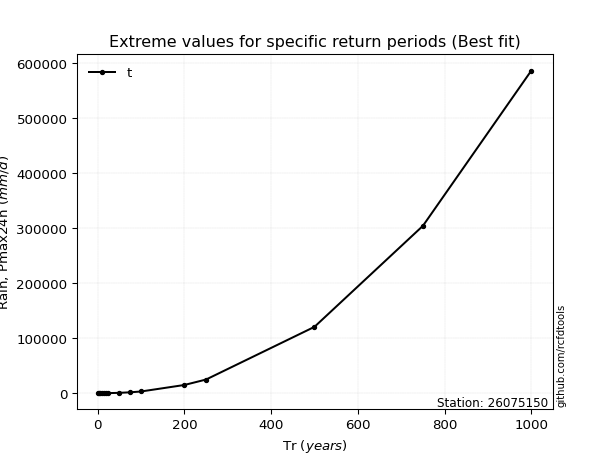</img>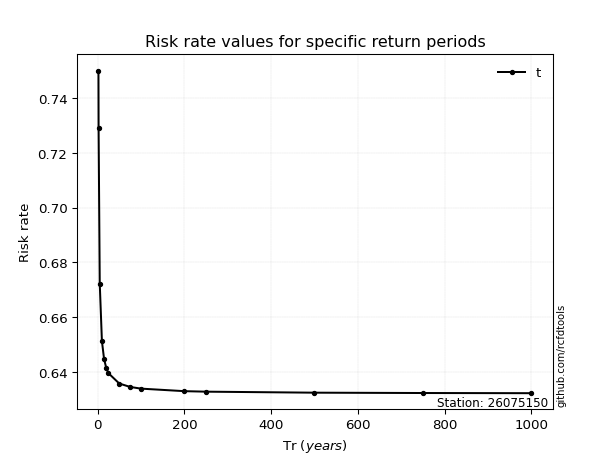</img>

</div>


<sub>**APP DISCLAIMER**: NO WARRANTY - This software is provided by [github.com/rcfdtools](https://github.com/rcfdtools) "as is", without any express or implied warranty, including warranties of merchantability, fitness for a particular purpose, or non-infringement. There is no guarantee that the software will be error-free or operate without interruption. LIMITATION OF LIABILITY - Neither the authors nor copyright holders will be liable for claims or damages arising from the software or its use. You are responsible for determining if the software is appropriate for your use and assume all associated risks, including errors, legal compliance, and data loss. NO PROFESSIONAL ADVICE - The software provides general information and does not offer professional advice. It should not replace consultation with professional advisors.</sub>