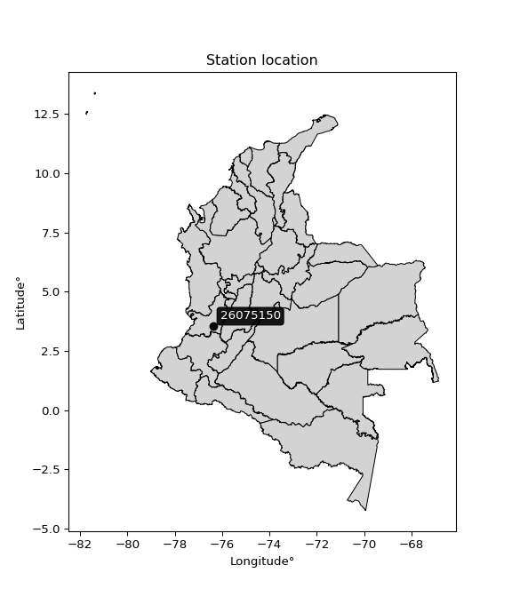

<div align="center">


</div>

# PMP Station (Rain, Pmax24h): 26075150

Probable Maximum Precipitation (PMP) is the greatest amount of rainfall for a specific duration that is meteorologically possible for a given location, acting as a "worst-case" scenario for extreme storms, crucial for designing safety-critical infrastructure like bridges, river deviations, dams, spillways, and nuclear plants to prevent catastrophic failure. PMP is calculated by hydrologists using meteorological data to determine the upper limit of extreme rainfall, often leading to the Probable Maximum Flood (PMF) for flood control design, and is increasingly being studied for climate change impacts. Probable Maximum Precipitation (PMP) is the theoretical upper limit of rainfall, a deterministic estimate for extreme events, while probability distributions (like GEV, Gumbel) describe the likelihood and frequency of various precipitation amounts, including rare ones, showing how often events occur, with PMP representing the extreme end of these distributions, used for critical infrastructure design to ensure safety against the worst conceivable weather, unlike standard statistical forecasts which cover typical probabilities.

The most common probability distributions in hydrology, used for analyzing floods, rainfall, and streamflow, include the Normal, Log-Normal, Gumbel, Gamma (including Log-Pearson Type III), and Generalized Extreme Value (GEV) distributions, often chosen based on the data´s skewness and whether modeling extremes or general conditions, with Gumbel and GEV popular for extreme events like floods, while the Normal distribution serves as a baseline, though often requiring transformations for skewed hydrological data. These distributions help in designing water infrastructure, managing water resources, and forecasting hydrologic events.

> Hydrological data often isn´t perfectly normal (it´s skewed), so different distributions are needed for different applications, such as: **Flood Frequency Analysis**: Using Gumbel, GEV, or Log-Pearson Type III for predicting extreme flood magnitudes and their return periods, **Rainfall Analysis**: Normal for annual totals, but Log-Normal, Weibull, or GEV for intensity or extreme daily rainfall, **Streamflow Modeling**: Gamma and Log-Normal for maximum flows, GEV for minimum flows, and Kappa for daily flows.

<div align="center">

</img>

</div>


## A. General information


### 1. General running parameters

• app_version: _v20260113_. • runtime: _2026-01-13 16:28:34.738620_. • Python version: _3.14.0_. • SciPy version: _1.16.3_. • Pandas version: _2.3.3_. • NumPy version: _2.3.5_. • Stations dataset (station_dataset_file): _dataset/pmax24h_in/automatic_colombia_2003_2025.csv_. • Stations catalog (station_catalog_file): _dataset/CNE.xls_. • Minimum year to eval til year_max (date_min): _1900_. • Maximum year to eval since year_min (date_max): _2025_. • Creates, save and include plots into reports (create_plot): _False_. • Plot only fit distributions with Δo > Δ (plot_only_fit): _True_. • Plot only simple graphs avoiding multiple CDFs and multiple Extreme values plots (plot_only_simple): _True_. • Eval low extreme values, if False, evaluates high extreme values (low_extreme): _False_. • Eval every SciPy distribution as logarithmic (pdist_logarithmic_on): _True_. • Standard deviation normalized (ddof): _1.0_. • Return periods to eval in years (Tr): _[2, 2.33, 5, 10, 15, 20, 25, 50, 75, 100, 200, 250, 500, 750, 1000]_. • Minimum data sample per station, 0 means any (minimum_sample): _5_. • Z-Score maximum threshold to adjust a value, 0 means disable (zscore_max): _3.5_. • Z-Score minimum threshold to adjust a value, 0 means disable (zscore_min): _-2.5_. • Avoid zeros, e.g. rain = 0 (avoid_zeros): _True_. • Avoid null values (avoid_nans): _True_. 

:file_folder:Table: [dataset.csv](../../dataset/pmax24h_in/automatic_colombia_2003_2025.csv)

> Delta Degrees of Freedom (DDOF): is a parameter used in the formulas for calculating variance and standard deviation. When ddof=0, the divisor is $N$ (the total number of observations) and this is used when your data set is the entire population. When ddof=1, the divisor is $N-1$ and this is used when your data set is a sample drawn from a larger population. Using $N-1$ provides an unbiased estimate of the population variance (known as Bessel´s correction).


### 2. Station info and location

|   id |   CODIGO | NOMBRE                                 | CATEGORIA           | TECNOLOGIA                | ESTADO           | FECHA_INSTALACION   |   FECHA_SUSPENSION |   ALTITUD |   LATITUD |   LONGITUD | DEPARTAMENTO    | MUNICIPIO   | AREA_OPERATIVA                         | ENTIDAD                                                     | AREA_HIDROGRAFICA   | ZONA_HIDROGRAFICA   | SUBZONA_HIDROGRAFICA   |   CORRIENTE | Catalogo   |   Version |
|-----:|---------:|:---------------------------------------|:--------------------|:--------------------------|:-----------------|:--------------------|-------------------:|----------:|----------:|-----------:|:----------------|:------------|:---------------------------------------|:------------------------------------------------------------|:--------------------|:--------------------|:-----------------------|------------:|:-----------|----------:|
|    0 | 26075150 | AEROPUERTO A. BONILLA - AUT [26075150] | Sinóptica Principal | Automática con Telemetría | En Mantenimiento | 26/09/2005          |                nan |       961 |   3.53299 |   -76.3825 | Valle Del Cauca | Palmira     | Area Operativa 09 - Cauca-Valle-Caldas | INSTITUTO DE HIDROLOGIA METEOROLOGIA Y ESTUDIOS AMBIENTALES | Magdalena Cauca     | Cauca               | Ríos Amaime y Cerrito  |         nan | CNE_IDEAM  |  20251226 |

<div align="center">

Dynamic map: [:earth_americas:Google](http://maps.google.com/maps?q=3.532991667,-76.3825) [:earth_americas:OSM](https://www.openstreetmap.org/#map=18/3.532991667/-76.3825&layers=P) [:earth_americas:Bing](https://www.bing.com/maps?cp=3.532991667~-76.3825&lvl=18) [:earth_americas:Apple](https://maps.apple.com/frame?center=3.532991667%2C-76.3825&span=0.003%2C0.006)

</div>


<div align="center">

```geojson
{
  "type": "Feature",
  "geometry": {
    "type": "Point", 
    "coordinates": [-76.3825, 3.532991667]
  }, 
  "properties": {
    "Name": "26075150"
  }
}
```

</div>


### 3. Discrete values table and plot

<div align="center">

|               |           0 |           1 |           2 |           3 |           4 |           5 |           6 |           7 |          8 |
|:--------------|------------:|------------:|------------:|------------:|------------:|------------:|------------:|------------:|-----------:|
| Date          | 2017        | 2018        | 2019        | 2020        | 2021        | 2022        | 2023        | 2024        | 2025       |
| Value         |   39.366    |   42.517    |   38.51     |   38.265    |   27.381    |   28.318    |   36.295    |  267.8      |  745.2     |
| Value_initial |   39.366    |   42.517    |   38.51     |   38.265    |   27.381    |   28.318    |   36.295    |  267.8      |  745.2     |
| count         |    9        |    9        |    9        |    9        |    9        |    9        |    9        |    9        |    9       |
| mean          |  140.406    |  140.406    |  140.406    |  140.406    |  140.406    |  140.406    |  140.406    |  140.406    |  140.406   |
| std           |  239.476    |  239.476    |  239.476    |  239.476    |  239.476    |  239.476    |  239.476    |  239.476    |  239.476   |
| zscore        |   -0.421921 |   -0.408763 |   -0.425495 |   -0.426518 |   -0.471967 |   -0.468055 |   -0.434744 |    0.531971 |    2.52549 |


</div>


> The initial value (value_initial) correspond to the initial obtained or null completed value, and value (value) is adjusted only when the initial value is outside the valid range (outlier) definite through the Z-Score value. If Z-Score is active, values out of range or outliers are replaced with the station mean value. A Z-Score (or standard score) measures how many standard deviations a data point is from the mean of a dataset, indicating its relative position; positive scores mean above the mean, negative mean below, and a score of zero is exactly at the mean, allowing for comparison of values from different distributions. It´s calculated using the formula $z=(x–μ)/σ$, where $x$ is the data point, $μ$ is the mean, and $σ$ is the standard deviation, helping identify outliers and understand probability.
>
> <sub>**Note**: In this study, "completing" (filling gaps in) and "extending" (forecasting or lengthening the historical record) rainfall data series are avoided for certain critical analyses because they introduce artificial bias and uncertainty, which can distort the statistics of rare events (extremes), alter day-to-day variability, and compromise the integrity and homogeneity of the original data. Some reasons against Completing/Extending rainfall data are: **Distortion of Extremes and Variability**: The primary issue is that most gap-filling or extension methods rely on averaging or regression with nearby stations, which inherently smooths the data. Rainfall is highly variable in space and time, with a large percentage of zero values and occasional large storms. Infilling methods often underestimate the highest values and overestimate the lowest (zero) values, which severely distorts analyses focused on flood frequency, drought severity, and intensity-duration-frequency (IDF) curves, **Loss of Data Homogeneity**: Infilled or extended data are synthetic estimates, not actual measurements. Combining these estimates with observed data can violate the assumption of data homogeneity, which requires that the data properties do not change over time. Inhomogeneity can lead to incorrect conclusions about long-term trends or changes in climate patterns, **Propagation of Errors**: Errors and biases from the original data (e.g., wind-induced undercatch, instrument errors, site changes) or the data used for imputation can propagate through the analysis, leading to unreliable hydrological models and inaccurate predictions, **Compromised Statistical Integrity**: For statistical analyses, especially those involving the frequency of events, using artificial data can introduce time bias or autocorrelation that doesn´t exist in reality, making it difficult to assess the true probability of events, **Difficulty in Validation**: It is difficult to accurately validate the quality of filled or extended data, especially for past periods where ground-truth measurements are unavailable. The reliability of imputation techniques heavily depends on the density of the surrounding station network and the complexity of the local topography.</sub>


### 4. Active continuous probability distributions from SciPy (45 of 104 available)

A Probability Density Function (PDF) describes the relative likelihood of a continuous random variable falling within a specific range, where the total area under its curve equals 1, and the area over any interval gives the actual probability for that range. Unlike discrete probabilities (like rolling a die), a PDF shows density, not direct probability for a single point (which is zero), with higher points indicating higher likelihood, often visualized as a bell curve for normal distributions.

A log of a probability density function (log-PDF) is simply the logarithm of the PDF´s value, denoted as $log(f(x))$, useful for converting multiplication of probabilities into addition, improving numerical stability with tiny numbers, and connecting to information theory concepts like entropy. Instead of dealing with very small probabilities (e.g., 0.000001), log-PDFs use negative numbers (e.g., $log(0.00001) ≈ -11.51$ that are easier for computers to handle, preventing underflow errors and simplifying complex calculations. In this study, each active probability distribution from SciPy is also evaluated in the $log$ form.

[scipy.stats](https://docs.scipy.org/doc/scipy/reference/stats.html) is a Python´s powerful submodule within the SciPy library for comprehensive statistical analysis, offering over 130 probability distributions (like Normal, Poisson), functions for descriptive stats (mean, variance), hypothesis testing (t-tests, chi-square), random variable generation, and statistical tests, making it essential for data science, modeling, and research. It provides tools to explore, model, and draw conclusions from data efficiently, working seamlessly with NumPy.

<div align="center">

|   id | p_dist             |   n_parameter | fit_method   | label                                                                       | active   | ref                                                                                                        |
|-----:|:-------------------|--------------:|:-------------|:----------------------------------------------------------------------------|:---------|:-----------------------------------------------------------------------------------------------------------|
|    0 | alpha              |             3 | MLE          | Alpha                                                                       | True     | [:mortar_board:](https://docs.scipy.org/doc/scipy/reference/generated/scipy.stats.alpha.html)              |
|    1 | betaprime          |             4 | MLE          | Beta prime                                                                  | True     | [:mortar_board:](https://docs.scipy.org/doc/scipy/reference/generated/scipy.stats.betaprime.html)          |
|    2 | chi2               |             3 | MLE          | Chi²                                                                        | True     | [:mortar_board:](https://docs.scipy.org/doc/scipy/reference/generated/scipy.stats.chi2.html)               |
|    3 | crystalball        |             4 | MLE          | Crystalball                                                                 | True     | [:mortar_board:](https://docs.scipy.org/doc/scipy/reference/generated/scipy.stats.crystalball.html)        |
|    4 | dweibull           |             3 | MLE          | Double Weibull                                                              | True     | [:mortar_board:](https://docs.scipy.org/doc/scipy/reference/generated/scipy.stats.dweibull.html)           |
|    5 | erlang             |             3 | MLE          | Erlang                                                                      | True     | [:mortar_board:](https://docs.scipy.org/doc/scipy/reference/generated/scipy.stats.erlang.html)             |
|    6 | expon              |             2 | MLE          | Exponential                                                                 | True     | [:mortar_board:](https://docs.scipy.org/doc/scipy/reference/generated/scipy.stats.expon.html)              |
|    7 | exponnorm          |             3 | MLE          | Exponentially modified Normal                                               | True     | [:mortar_board:](https://docs.scipy.org/doc/scipy/reference/generated/scipy.stats.exponnorm.html)          |
|    8 | f                  |             4 | MLE          | F                                                                           | True     | [:mortar_board:](https://docs.scipy.org/doc/scipy/reference/generated/scipy.stats.f.html)                  |
|    9 | fatiguelife        |             3 | MLE          | Fatigue-life (Birnbaum-Saunders)                                            | True     | [:mortar_board:](https://docs.scipy.org/doc/scipy/reference/generated/scipy.stats.fatiguelife.html)        |
|   10 | fisk               |             3 | MLE          | Fisk                                                                        | True     | [:mortar_board:](https://docs.scipy.org/doc/scipy/reference/generated/scipy.stats.fisk.html)               |
|   11 | gamma              |             3 | MLE          | Gamma                                                                       | True     | [:mortar_board:](https://docs.scipy.org/doc/scipy/reference/generated/scipy.stats.gamma.html)              |
|   12 | genexpon           |             5 | MLE          | Generalized exponential                                                     | True     | [:mortar_board:](https://docs.scipy.org/doc/scipy/reference/generated/scipy.stats.genexpon.html)           |
|   13 | genlogistic        |             3 | MLE          | Generalized logistic                                                        | True     | [:mortar_board:](https://docs.scipy.org/doc/scipy/reference/generated/scipy.stats.genlogistic.html)        |
|   14 | gibrat             |             2 | MM           | Gibrat                                                                      | True     | [:mortar_board:](https://docs.scipy.org/doc/scipy/reference/generated/scipy.stats.gibrat.html)             |
|   15 | gompertz           |             3 | MLE          | Gompertz (or truncated Gumbel)                                              | True     | [:mortar_board:](https://docs.scipy.org/doc/scipy/reference/generated/scipy.stats.gompertz.html)           |
|   16 | gumbel_l           |             2 | MM           | Gumbel Left Skew                                                            | True     | [:mortar_board:](https://docs.scipy.org/doc/scipy/reference/generated/scipy.stats.gumbel_l.html)           |
|   17 | gumbel_r           |             2 | MM           | Gumbel Right Skew                                                           | True     | [:mortar_board:](https://docs.scipy.org/doc/scipy/reference/generated/scipy.stats.gumbel_r.html)           |
|   18 | halflogistic       |             2 | MM           | Half-logistic                                                               | True     | [:mortar_board:](https://docs.scipy.org/doc/scipy/reference/generated/scipy.stats.halflogistic.html)       |
|   19 | halfnorm           |             2 | MM           | Half Normal                                                                 | True     | [:mortar_board:](https://docs.scipy.org/doc/scipy/reference/generated/scipy.stats.halfnorm.html)           |
|   20 | hypsecant          |             2 | MM           | hyperbolic secant                                                           | True     | [:mortar_board:](https://docs.scipy.org/doc/scipy/reference/generated/scipy.stats.hypsecant.html)          |
|   21 | invgamma           |             3 | MLE          | Inverted gamma                                                              | True     | [:mortar_board:](https://docs.scipy.org/doc/scipy/reference/generated/scipy.stats.invgamma.html)           |
|   22 | invgauss           |             3 | MLE          | Inverse Gaussian                                                            | True     | [:mortar_board:](https://docs.scipy.org/doc/scipy/reference/generated/scipy.stats.invgauss.html)           |
|   23 | invweibull         |             3 | MLE          | Inverted Weibull                                                            | True     | [:mortar_board:](https://docs.scipy.org/doc/scipy/reference/generated/scipy.stats.invweibull.html)         |
|   24 | kappa4             |             4 | MLE          | Kappa 4                                                                     | True     | [:mortar_board:](https://docs.scipy.org/doc/scipy/reference/generated/scipy.stats.kappa4.html)             |
|   25 | kstwobign          |             2 | MLE          | Limiting distribution of scaled Kolmogorov-Smirnov two-sided test statistic | True     | [:mortar_board:](https://docs.scipy.org/doc/scipy/reference/generated/scipy.stats.kstwobign.html)          |
|   26 | laplace            |             2 | MM           | Laplace                                                                     | True     | [:mortar_board:](https://docs.scipy.org/doc/scipy/reference/generated/scipy.stats.laplace.html)            |
|   27 | laplace_asymmetric |             3 | MLE          | Asymmetric Laplace                                                          | True     | [:mortar_board:](https://docs.scipy.org/doc/scipy/reference/generated/scipy.stats.laplace_asymmetric.html) |
|   28 | loggamma           |             3 | MLE          | Log gamma                                                                   | True     | [:mortar_board:](https://docs.scipy.org/doc/scipy/reference/generated/scipy.stats.loggamma.html)           |
|   29 | logistic           |             2 | MM           | Logistic (or Sech-squared)                                                  | True     | [:mortar_board:](https://docs.scipy.org/doc/scipy/reference/generated/scipy.stats.logistic.html)           |
|   30 | lognorm            |             3 | MLE          | Log Normal                                                                  | True     | [:mortar_board:](https://docs.scipy.org/doc/scipy/reference/generated/scipy.stats.lognorm.html)            |
|   31 | maxwell            |             2 | MM           | Maxwell                                                                     | True     | [:mortar_board:](https://docs.scipy.org/doc/scipy/reference/generated/scipy.stats.maxwell.html)            |
|   32 | mielke             |             4 | MLE          | Mielke Beta-Kappa / Dagum                                                   | True     | [:mortar_board:](https://docs.scipy.org/doc/scipy/reference/generated/scipy.stats.mielke.html)             |
|   33 | moyal              |             2 | MM           | Moyal                                                                       | True     | [:mortar_board:](https://docs.scipy.org/doc/scipy/reference/generated/scipy.stats.moyal.html)              |
|   34 | nakagami           |             3 | MLE          | Nakagami                                                                    | True     | [:mortar_board:](https://docs.scipy.org/doc/scipy/reference/generated/scipy.stats.nakagami.html)           |
|   35 | ncf                |             5 | MLE          | Non-central F distribution                                                  | True     | [:mortar_board:](https://docs.scipy.org/doc/scipy/reference/generated/scipy.stats.ncf.html)                |
|   36 | nct                |             4 | MLE          | Non-central Student’s t                                                     | True     | [:mortar_board:](https://docs.scipy.org/doc/scipy/reference/generated/scipy.stats.nct.html)                |
|   37 | norm               |             2 | MM           | Normal                                                                      | True     | [:mortar_board:](https://docs.scipy.org/doc/scipy/reference/generated/scipy.stats.norm.html)               |
|   38 | pearson3           |             3 | MM           | Pearson type III                                                            | True     | [:mortar_board:](https://docs.scipy.org/doc/scipy/reference/generated/scipy.stats.pearson3.html)           |
|   39 | rayleigh           |             2 | MM           | Rayleigh                                                                    | True     | [:mortar_board:](https://docs.scipy.org/doc/scipy/reference/generated/scipy.stats.rayleigh.html)           |
|   40 | rice               |             3 | MLE          | Rice                                                                        | True     | [:mortar_board:](https://docs.scipy.org/doc/scipy/reference/generated/scipy.stats.rice.html)               |
|   41 | t                  |             3 | MLE          | Student’s t                                                                 | True     | [:mortar_board:](https://docs.scipy.org/doc/scipy/reference/generated/scipy.stats.t.html)                  |
|   42 | truncnorm          |             4 | MLE          | Truncated normal                                                            | True     | [:mortar_board:](https://docs.scipy.org/doc/scipy/reference/generated/scipy.stats.truncnorm.html)          |
|   43 | wald               |             2 | MM           | Wald                                                                        | True     | [:mortar_board:](https://docs.scipy.org/doc/scipy/reference/generated/scipy.stats.wald.html)               |
|   44 | weibull_min        |             3 | MLE          | Weibull minimum                                                             | True     | [:mortar_board:](https://docs.scipy.org/doc/scipy/reference/generated/scipy.stats.weibull_min.html)        |

</div>

> **n_parameter:** # arguments & localization & scale.
>
> **Fit methods:** (MLE) maximum likelihood, (MM) L-moments.
>
>**Inactive** (With the only purpose of prevent loops, zero divisions, infinite values, over high estimated values or horizontal trending for recurrence intervals estimations, the follow distributions were disabled.)**:** foldnorm, gennorm, norminvgauss, powernorm, powerlognorm, skewnorm, genextreme, anglit, arcsine, argus, beta, bradford, burr, burr12, cauchy, cosine, halfcauchy, foldcauchy, skewcauchy, wrapcauchy, dgamma, gengamma, exponweib, exponpow, truncexpon, gausshyper, genhalflogistic, genhyperbolic, geninvgauss, halfgennorm, johnsonsb, johnsonsu, kappa3, ksone, kstwo, loglaplace, levy, levy_l, levy_stable, ncx2, pareto, genpareto, truncpareto, lomax, powerlaw, rdist, rel_breitwigner, recipinvgauss, semicircular, studentized_range, trapezoid, triang, truncweibull_min, tukeylambda, uniform, loguniform, vonmises, vonmises_line, weibull_max, 


## B. Probability (PDF) vs. Empirical (EDF) distributions functions

A continuous probability distribution (CPD) describes probabilities for variables that can take any value within a range (like rain any time), unlike discrete variables with specific outcomes (like temperature). It uses a Probability Density Function (PDF), a curve where the total area under it equals 1, and the probability of the variable falling within an interval (a to b) is found by calculating the area under the curve between those points. A key feature is that the probability of hitting any single exact value is zero, so probabilities are always expressed for ranges, e.g., $P(a ≤ X ≤ b)$.

<div align="center">

Distributions parameters from station values
|    |   station | p_dist                |   n |             loc |           scale | shape                  | shape1                | shape2                | shape3   |
|---:|----------:|:----------------------|----:|----------------:|----------------:|:-----------------------|:----------------------|:----------------------|:---------|
|  0 |  26075150 | alpha                 |   9 |      21.4705    |    11.5185      | 0.00020205296911376028 |                       |                       |          |
|  1 |  26075150 | betaprime             |   9 |      26.1264    |     0.0210182   | 139.81283415644418     | 0.5371607499897624    |                       |          |
|  2 |  26075150 | chi2                  |   9 |      27.381     |   177.075       | 0.6609092534310564     |                       |                       |          |
|  3 |  26075150 | crystalball           |   9 |     140.406     |   225.78        | 8586.562423554638      | 14645.61213506457     |                       |          |
|  4 |  26075150 | dweibull              |   9 |      38.51      |   120.374       | 0.5720686286004011     |                       |                       |          |
|  5 |  26075150 | erlang                |   9 |      27.381     |   256.391       | 0.42670742431110087    |                       |                       |          |
|  6 |  26075150 | expon                 |   9 |      27.381     |   113.025       |                        |                       |                       |          |
|  7 |  26075150 | exponnorm             |   9 |      27.2565    |     0.0387715   | 2898.839522135172      |                       |                       |          |
|  8 |  26075150 | f                     |   9 |      27.381     |     4.80574     | 1.0353634494540542     | 1.0787072320614342    |                       |          |
|  9 |  26075150 | fatiguelife           |   9 |      26.9293    |    19.5875      | 3.3344033331842233     |                       |                       |          |
| 10 |  26075150 | fisk                  |   9 |      27.381     |    78.9959      | 0.7138508376619763     |                       |                       |          |
| 11 |  26075150 | gamma                 |   9 |      27.381     |   259.033       | 0.4481013508802081     |                       |                       |          |
| 12 |  26075150 | genexpon              |   9 |      27.381     |   451.946       | 3.9986405399149225     | 0.8721651715957577    | 2.667724823298944e-12 |          |
| 13 |  26075150 | genlogistic           |   9 |    -749.282     |   101.636       | 2860.8344429017725     |                       |                       |          |
| 14 |  26075150 | gibrat                |   9 |     -31.8359    |   104.47        |                        |                       |                       |          |
| 15 |  26075150 | gompertz              |   9 |      27.381     |   585.479       | 2.598684370519985      |                       |                       |          |
| 16 |  26075150 | gumbel_l              |   9 |     242.019     |   176.04        |                        |                       |                       |          |
| 17 |  26075150 | gumbel_r              |   9 |      38.7928    |   176.04        |                        |                       |                       |          |
| 18 |  26075150 | halflogistic          |   9 |    -127.196     |   193.034       |                        |                       |                       |          |
| 19 |  26075150 | halfnorm              |   9 |    -158.438     |   374.546       |                        |                       |                       |          |
| 20 |  26075150 | hypsecant             |   9 |     140.406     |   143.736       |                        |                       |                       |          |
| 21 |  26075150 | invgamma              |   9 |      26.1154    |     2.93504     | 0.5372131261420052     |                       |                       |          |
| 22 |  26075150 | invgauss              |   9 |      26.1123    |     5.74743     | 19.8860262247616       |                       |                       |          |
| 23 |  26075150 | invweibull            |   9 |      26.9741    |     4.94482     | 0.5167483289440002     |                       |                       |          |
| 24 |  26075150 | kappa4                |   9 |     -43.7604    |   790.221       | 1.0989190436416312     | 0.9970560444922865    |                       |          |
| 25 |  26075150 | kstwobign             |   9 |    -380.306     |   616.101       |                        |                       |                       |          |
| 26 |  26075150 | laplace               |   9 |     140.406     |   159.651       |                        |                       |                       |          |
| 27 |  26075150 | laplace_asymmetric    |   9 |      27.381     |     0.00265275  | 2.3470210994811375e-05 |                       |                       |          |
| 28 |  26075150 | loggamma              |   9 |  -82878.3       | 10838.3         | 2121.523332929084      |                       |                       |          |
| 29 |  26075150 | logistic              |   9 |     140.406     |   124.479       |                        |                       |                       |          |
| 30 |  26075150 | lognorm               |   9 |      27.381     |     0.364125    | 11.551466449783442     |                       |                       |          |
| 31 |  26075150 | maxwell               |   9 |    -394.598     |   335.264       |                        |                       |                       |          |
| 32 |  26075150 | mielke                |   9 |      27.0699    |     0.072249    | 4.878810690520677      | 0.529468300190195     |                       |          |
| 33 |  26075150 | moyal                 |   9 |      11.2903    |   101.637       |                        |                       |                       |          |
| 34 |  26075150 | nakagami              |   9 |      27.381     |   420.846       | 0.09045547726251324    |                       |                       |          |
| 35 |  26075150 | ncf                   |   9 |      -0.0159584 |     3.84355e-08 | 7.528882940460161e-09  | 2.294876083908047     | 9.200990457890967     |          |
| 36 |  26075150 | nct                   |   9 |       0.134758  |     2.57733     | 1.307085541632269      | 15.135906493249777    |                       |          |
| 37 |  26075150 | norm                  |   9 |     140.406     |   225.78        |                        |                       |                       |          |
| 38 |  26075150 | pearson3              |   9 |     140.406     |   225.78        | 2.0776370305777814     |                       |                       |          |
| 39 |  26075150 | rayleigh              |   9 |    -291.525     |   344.631       |                        |                       |                       |          |
| 40 |  26075150 | rice                  |   9 |    -166.287     |   269.293       | 0.00016737757874859472 |                       |                       |          |
| 41 |  26075150 | t                     |   9 |      38.4589    |     0.898315    | 0.31805688287132056    |                       |                       |          |
| 42 |  26075150 | truncnorm             |   9 | -169956         |  6208.35        | 27.379732202953054     | 749.5324373258746     |                       |          |
| 43 |  26075150 | wald                  |   9 |     -85.3742    |   225.78        |                        |                       |                       |          |
| 44 |  26075150 | weibull_min           |   9 |      27.381     |   223.556       | 0.47562990435962804    |                       |                       |          |
| 45 |  26075150 | logalpha              |   9 |       3.14706   |     0.328607    | 9.80975045194489e-06   |                       |                       |          |
| 46 |  26075150 | logbetaprime          |   9 |      -0.434462  |     0.255315    | 429.71385466194613     | 25.018795933704638    |                       |          |
| 47 |  26075150 | logchi2               |   9 |       3.30985   |     0.89203     | 1.1119170799587095     |                       |                       |          |
| 48 |  26075150 | logcrystalball        |   9 |       4.12969   |     1.09038     | 50.43382291122934      | 2.8585769969058727    |                       |          |
| 49 |  26075150 | logdweibull           |   9 |       3.64454   |     1.13882     | 0.560356872747739      |                       |                       |          |
| 50 |  26075150 | logerlang             |   9 |       3.30985   |     1.03182     | 0.6788571532635033     |                       |                       |          |
| 51 |  26075150 | logexpon              |   9 |       3.30985   |     0.819837    |                        |                       |                       |          |
| 52 |  26075150 | logexponnorm          |   9 |       3.30891   |     0.000304913 | 2699.5379648053668     |                       |                       |          |
| 53 |  26075150 | logf                  |   9 |       3.20008   |     0.325212    | 743.7169538134015      | 2.4338169827301286    |                       |          |
| 54 |  26075150 | logfatiguelife        |   9 |       3.28789   |     0.299425    | 1.844469359805648      |                       |                       |          |
| 55 |  26075150 | logfisk               |   9 |       3.30985   |     0.386407    | 0.8250736398556309     |                       |                       |          |
| 56 |  26075150 | loggamma              |   9 |       3.30985   |     0.714699    | 0.8074275510855791     |                       |                       |          |
| 57 |  26075150 | loggenexpon           |   9 |       3.30985   |     1.84696     | 2.256281902051248      | 1.806860982633753e-05 | 0.5101419449365936    |          |
| 58 |  26075150 | loggenlogistic        |   9 |      -0.997079  |     0.596894    | 2577.7049222373307     |                       |                       |          |
| 59 |  26075150 | loggibrat             |   9 |       3.29786   |     0.504528    |                        |                       |                       |          |
| 60 |  26075150 | loggompertz           |   9 |       3.30985   |     7.23006e+10 | 67857030446.06912      |                       |                       |          |
| 61 |  26075150 | loggumbel_l           |   9 |       4.62042   |     0.85017     |                        |                       |                       |          |
| 62 |  26075150 | loggumbel_r           |   9 |       3.63896   |     0.85017     |                        |                       |                       |          |
| 63 |  26075150 | loghalflogistic       |   9 |       2.83733   |     0.932241    |                        |                       |                       |          |
| 64 |  26075150 | loghalfnorm           |   9 |       2.68644   |     1.80884     |                        |                       |                       |          |
| 65 |  26075150 | loghypsecant          |   9 |       4.12969   |     0.694161    |                        |                       |                       |          |
| 66 |  26075150 | loginvgamma           |   9 |       3.19956   |     0.395801    | 1.2167863369306313     |                       |                       |          |
| 67 |  26075150 | loginvgauss           |   9 |       3.24699   |     0.310074    | 2.8467433159957176     |                       |                       |          |
| 68 |  26075150 | loginvweibull         |   9 |       3.19637   |     0.316721    | 1.1247702190613844     |                       |                       |          |
| 69 |  26075150 | logkappa4             |   9 |       2.85931   |     3.91376     | 1.130202324783569      | 1.0123315426533477    |                       |          |
| 70 |  26075150 | logkstwobign          |   9 |       1.38358   |     3.20344     |                        |                       |                       |          |
| 71 |  26075150 | loglaplace            |   9 |       4.12969   |     0.771019    |                        |                       |                       |          |
| 72 |  26075150 | loglaplace_asymmetric |   9 |       3.30985   |     0.00446943  | 0.005439733788664918   |                       |                       |          |
| 73 |  26075150 | logloggamma           |   9 |    -288.615     |    40.8206      | 1302.1100564956887     |                       |                       |          |
| 74 |  26075150 | loglogistic           |   9 |       4.12969   |     0.601161    |                        |                       |                       |          |
| 75 |  26075150 | loglognorm            |   9 |       3.30985   |     0.00941023  | 10.918838148197914     |                       |                       |          |
| 76 |  26075150 | logmaxwell            |   9 |       1.54593   |     1.61913     |                        |                       |                       |          |
| 77 |  26075150 | logmielke             |   9 |       3.1841    |     0.0348053   | 19.373179924979624     | 1.2091914607395782    |                       |          |
| 78 |  26075150 | logmoyal              |   9 |       3.50613   |     0.490846    |                        |                       |                       |          |
| 79 |  26075150 | lognakagami           |   9 |       3.30985   |     1.89965     | 0.18559445435678054    |                       |                       |          |
| 80 |  26075150 | logncf                |   9 |       1.94769   |     1.94528     | 127.51606578085743     | 15.930917019040557    | 1.622142699942925e-09 |          |
| 81 |  26075150 | lognct                |   9 |       1.85201   |     0.00542475  | 5.083315194395718      | 347.0308102372554     |                       |          |
| 82 |  26075150 | lognorm               |   9 |       4.12969   |     1.09039     |                        |                       |                       |          |
| 83 |  26075150 | logpearson3           |   9 |       4.12969   |     1.09038     | 1.446364089505328      |                       |                       |          |
| 84 |  26075150 | lograyleigh           |   9 |       2.04372   |     1.66436     |                        |                       |                       |          |
| 85 |  26075150 | logrice               |   9 |       2.56021   |     1.35133     | 0.0001411913014168392  |                       |                       |          |
| 86 |  26075150 | logt                  |   9 |       3.65097   |     0.0360088   | 0.41876514448577074    |                       |                       |          |
| 87 |  26075150 | logtruncnorm          |   9 |     -11.7631    |     3.76138     | 4.007301759696093      | 11.642485992367897    |                       |          |
| 88 |  26075150 | logwald               |   9 |       3.0393    |     1.09039     |                        |                       |                       |          |
| 89 |  26075150 | logweibull_min        |   9 |       3.30985   |     0.473134    | 0.5791466350692225     |                       |                       |          |

</div>

> **loc** (Location parameter): This shifts the distribution along the x-axis. For many common distributions, like the normal (Gaussian) distribution, loc represents the mean $μ$. For others, like the uniform distribution, it might represent the minimum value, or for the beta distribution, the left end of the support interval.
>
> **scale** (Scale parameter): This determines the width or spread of the distribution. For the normal distribution, scale represents the standard deviation $σ$. For a uniform distribution, it defines the length of the interval (from $loc$ to $loc + scale$).
>
> **shape** (Shape parameters): Refers to parameters that define the specific form of a probability distribution, distinct from its location (loc) and scale (scale). These parameters are required arguments for most distribution functions. For example, a normal (Gaussian) distribution is fully defined by its location (mean) and scale (standard deviation), so it has no specific shape parameters beyond loc and scale. However, other distributions have intrinsic properties that need specification, as Gamma distribution that takes a shape parameter, often named $a$ or $alpha$.


### 0. Cumulative distribution values - CDF (90 evaluated)

Cumulative Distribution Function (CDF), denoted as $F$<sub>$X$</sub>$(x)$, is a function that gives the probability that a random variable $X$ will take a value less than or equal to a specific value, $x$ (i.e., $(P(X≥x)$. It essentially "accumulates" probabilities from a given point up to the far right (positive infinity), providing a complete picture of the distribution´s probabilities for both discrete (like rain) and continuous (like temperature) variables, helping to find probabilities over ranges or above certain values. Each station is evaluated separately ordering the $x$ values ascending, calculating the CDF and PDF values for the activated distributions and their logarithmic forms.

<div align="center">

CDF ordered by x ascending and calculating $log(f(x))$ separately
|   id |   Station |   date |       x |   count |    mean |     std |    zscore |   Value_initial |   station |   m |     alpha |   alpha_pdf |   betaprime |   betaprime_pdf |        chi2 |    chi2_pdf |   crystalball |   crystalball_pdf |   dweibull |    dweibull_pdf |     erlang |   erlang_pdf |      expon |   expon_pdf |   exponnorm |   exponnorm_pdf |         f |        f_pdf |   fatiguelife |   fatiguelife_pdf |        fisk |      fisk_pdf |       gamma |   gamma_pdf |    genexpon |   genexpon_pdf |   genlogistic |   genlogistic_pdf |   gibrat |   gibrat_pdf |    gompertz |   gompertz_pdf |   gumbel_l |   gumbel_l_pdf |   gumbel_r |   gumbel_r_pdf |   halflogistic |   halflogistic_pdf |   halfnorm |   halfnorm_pdf |   hypsecant |   hypsecant_pdf |   invgamma |   invgamma_pdf |   invgauss |   invgauss_pdf |   invweibull |   invweibull_pdf |      kappa4 |   kappa4_pdf |   kstwobign |   kstwobign_pdf |   laplace |   laplace_pdf |   laplace_asymmetric |   laplace_asymmetric_pdf |    loggamma |   loggamma_pdf |   logistic |   logistic_pdf |   lognorm |   lognorm_pdf |   maxwell |   maxwell_pdf |    mielke |   mielke_pdf |    moyal |   moyal_pdf |    nakagami |   nakagami_pdf |      ncf |     ncf_pdf |      nct |     nct_pdf |     norm |    norm_pdf |   pearson3 |   pearson3_pdf |   rayleigh |   rayleigh_pdf |     rice |    rice_pdf |        t |       t_pdf |   truncnorm |   truncnorm_pdf |     wald |    wald_pdf |   weibull_min |   weibull_min_pdf |   logalpha |   logalpha_pdf |   logbetaprime |   logbetaprime_pdf |     logchi2 |   logchi2_pdf |   logcrystalball |   logcrystalball_pdf |   logdweibull |   logdweibull_pdf |   logerlang |   logerlang_pdf |   logexpon |   logexpon_pdf |   logexponnorm |   logexponnorm_pdf |      logf |   logf_pdf |   logfatiguelife |   logfatiguelife_pdf |     logfisk |   logfisk_pdf |   loggenexpon |   loggenexpon_pdf |   loggenlogistic |   loggenlogistic_pdf |   loggibrat |   loggibrat_pdf |   loggompertz |   loggompertz_pdf |   loggumbel_l |   loggumbel_l_pdf |   loggumbel_r |   loggumbel_r_pdf |   loghalflogistic |   loghalflogistic_pdf |   loghalfnorm |   loghalfnorm_pdf |   loghypsecant |   loghypsecant_pdf |   loginvgamma |   loginvgamma_pdf |   loginvgauss |   loginvgauss_pdf |   loginvweibull |   loginvweibull_pdf |   logkappa4 |   logkappa4_pdf |   logkstwobign |   logkstwobign_pdf |   loglaplace |   loglaplace_pdf |   loglaplace_asymmetric |   loglaplace_asymmetric_pdf |   logloggamma |   logloggamma_pdf |   loglogistic |   loglogistic_pdf |   loglognorm |   loglognorm_pdf |   logmaxwell |   logmaxwell_pdf |   logmielke |   logmielke_pdf |   logmoyal |   logmoyal_pdf |   lognakagami |   lognakagami_pdf |   logncf |   logncf_pdf |   lognct |   lognct_pdf |   logpearson3 |   logpearson3_pdf |   lograyleigh |   lograyleigh_pdf |   logrice |   logrice_pdf |     logt |   logt_pdf |   logtruncnorm |   logtruncnorm_pdf |   logwald |   logwald_pdf |   logweibull_min |   logweibull_min_pdf |
|-----:|----------:|-------:|--------:|--------:|--------:|--------:|----------:|----------------:|----------:|----:|----------:|------------:|------------:|----------------:|------------:|------------:|--------------:|------------------:|-----------:|----------------:|-----------:|-------------:|-----------:|------------:|------------:|----------------:|----------:|-------------:|--------------:|------------------:|------------:|--------------:|------------:|------------:|------------:|---------------:|--------------:|------------------:|---------:|-------------:|------------:|---------------:|-----------:|---------------:|-----------:|---------------:|---------------:|-------------------:|-----------:|---------------:|------------:|----------------:|-----------:|---------------:|-----------:|---------------:|-------------:|-----------------:|------------:|-------------:|------------:|----------------:|----------:|--------------:|---------------------:|-------------------------:|------------:|---------------:|-----------:|---------------:|----------:|--------------:|----------:|--------------:|----------:|-------------:|---------:|------------:|------------:|---------------:|---------:|------------:|---------:|------------:|---------:|------------:|-----------:|---------------:|-----------:|---------------:|---------:|------------:|---------:|------------:|------------:|----------------:|---------:|------------:|--------------:|------------------:|-----------:|---------------:|---------------:|-------------------:|------------:|--------------:|-----------------:|---------------------:|--------------:|------------------:|------------:|----------------:|-----------:|---------------:|---------------:|-------------------:|----------:|-----------:|-----------------:|---------------------:|------------:|--------------:|--------------:|------------------:|-----------------:|---------------------:|------------:|----------------:|--------------:|------------------:|--------------:|------------------:|--------------:|------------------:|------------------:|----------------------:|--------------:|------------------:|---------------:|-------------------:|--------------:|------------------:|--------------:|------------------:|----------------:|--------------------:|------------:|----------------:|---------------:|-------------------:|-------------:|-----------------:|------------------------:|----------------------------:|--------------:|------------------:|--------------:|------------------:|-------------:|-----------------:|-------------:|-----------------:|------------:|----------------:|-----------:|---------------:|--------------:|------------------:|---------:|-------------:|---------:|-------------:|--------------:|------------------:|--------------:|------------------:|----------:|--------------:|---------:|-----------:|---------------:|-------------------:|----------:|--------------:|-----------------:|---------------------:|
|    0 |  26075150 |   2021 |  27.381 |       9 | 140.406 | 239.476 | -0.471967 |          27.381 |  26075150 |   1 | 0.051332  | 0.0393989   |   0.0349687 |     0.073904    | 3.39776e-06 | 1.58021e+08 |      0.308327 |       0.00155886  |   0.387026 |     0.00509529  | 7.2264e-08 |  8.67944e+06 | 0          | 0.00884762  |  0.00110726 |     0.00888168  | 0.0005876 | 48.0304      |     0.0268368 |       0.13872     | 2.14116e-12 | 430.225       | 3.13676e-08 | 3.95637e+06 | 6.26146e-14 |    0.00884762  |      0.253343 |       0.00342162  | 0.285122 |  0.00573434  | 5.28259e-14 |    0.00443856  |   0.255803 |     0.00124899 |   0.344049 |    0.00208527  |       0.380281 |        0.00221564  |   0.38019  |    0.0018836   |    0.272109 |     0.00167082  |  0.0349755 |    0.073881    |  0.0350129 |    0.0730489   |     0.026391 |      0.121806    | 3.03082e-15 |   0.0345367  |    0.22636  |     0.00257347  |  0.246326 |   0.00154291  |          5.87053e-10 |              0.00884749  | 5.64511e-13 |  1026.37       |   0.287413 |    0.00164531  |  0.226062 |     0.275786  |  0.337021 |   0.00170749  | 0.0302725 |  0.149964    | 0.355542 | 0.00236662  | 0.000686568 |    3.49613e+10 | 0.289926 | 0.00994292  | 0.148567 | 0.0168112   | 0.308327 | 0.00155886  |   0.395717 |    0.0027672   |   0.34828  |    0.00174991  | 0.227872 | 0.00206204  | 0.155497 | 0.00445913  | 6.69615e-11 |     0.00441601  | 0.364451 | 0.00389569  |   1.02324e-08 |       1.36989e+06 |  0.0435234 |      1.2898    |       0.198639 |          0.378949  | 2.37574e-09 |   2.97421e+06 |         0.226061 |            0.275786  |      0.302208 |       0.254757    | 4.09295e-11 |   62566.9       |  0         |      1.21975   |     0.00113588 |          1.21219   | 0.0419307 |  1.29788   |         0.031782 |            3.49221   | 4.71792e-13 |   876.543     |   1.22532e-07 |         1.22162   |         0.150461 |            0.477264  | 9.21495e-05 |       0.0305752 |   1.24455e-12 |         0.93854   |      0.192693 |       0.20326     |      0.229303 |          0.397211 |          0.248144 |             0.503317  |      0.269638 |         0.415669  |       0.189603 |          0.257272  |     0.0419332 |         1.29799   |     0.0370866 |         1.67915   |       0.0419024 |           1.31761   |  1.4118e-14 |       16.2702   |       0.13746  |          0.415606  |     0.172654 |        0.22393   |             3.00623e-05 |                   1.21706   |      0.23531  |         0.27001   |      0.20363  |          0.269753 |   0.00247523 |      1.58619e+12 |     0.243839 |        0.323097  |   0.0462037 |       1.24296   |   0.221959 |      0.470858  |   1.25122e-06 |       1.04582e+09 | 0.138978 |    0.471015  | 0.137352 |    0.567816  |      0.240576 |          0.484467 |      0.251254 |         0.342229  |  0.142615 |     0.351968  | 0.128434 | 0.157239   |    5.70851e-09 |          1.12527   |  0.110747 |     0.947511  |      1.98092e-09 |          2.58336e+06 |
|    1 |  26075150 |   2022 |  28.318 |       9 | 140.406 | 239.476 | -0.468055 |          28.318 |  26075150 |   2 | 0.0925638 | 0.0476328   |   0.112986  |     0.0845654   | 0.15739     | 0.0553968   |      0.30979  |       0.00156209  |   0.391921 |     0.00535762  | 0.102819   |  0.0467035   | 0.00825595 | 0.00877457  |  0.00940022 |     0.00881377  | 0.262069  |  0.128565    |     0.147665  |       0.100206    | 0.040483    |   0.0295933   | 0.0908124   | 0.0433208   | 0.00825595  |    0.00877457  |      0.256555 |       0.00343321  | 0.290477 |  0.00569485  | 0.00415361  |    0.0044272   |   0.256976 |     0.00125368 |   0.346003 |    0.00208598  |       0.382355 |        0.00221154  |   0.381954 |    0.00188125  |    0.273678 |     0.00167796  |  0.112967  |    0.0845401   |  0.111934  |    0.0833932   |     0.140792 |      0.10613     | 0.00236888  |   0.00230058 |    0.228775 |     0.00258051  |  0.247776 |   0.00155199  |          0.00825583  |              0.00877445  | 0.0889745   |     2.07994    |   0.288957 |    0.00165057  |  0.235449 |     0.282125  |  0.338621 |   0.00170905  | 0.158569  |  0.112288    | 0.357758 | 0.00236498  | 0.279018    |    0.0538714   | 0.299162 | 0.00976956  | 0.164398 | 0.0169634   | 0.30979  | 0.00156209  |   0.398304 |    0.00275436  |   0.34992  |    0.00175063  | 0.229807 | 0.00206683  | 0.159923 | 0.00500868  | 0.00412927  |     0.0043978   | 0.36809  | 0.00387147  |   0.0713107   |       0.0348755   |  0.0943543 |      1.6769    |       0.211559 |          0.388867  | 0.122829    |   2.00498     |         0.235448 |            0.282125  |      0.311108 |       0.274765    | 0.106788    |       2.11291   |  0.0402118 |      1.17071   |     0.0411447  |          1.1649    | 0.0927153 |  1.66427   |         0.152813 |            3.16628   | 0.117746    |     2.54725   |   0.0402723   |         1.17243   |         0.166915 |            0.500456  | 0.00813294  |       0.487306  |   0.0310868   |         0.909364  |      0.19964  |       0.209646    |      0.242789 |          0.404252 |          0.265002 |             0.498677  |      0.283579 |         0.412942  |       0.198434 |          0.267703  |     0.0927216 |         1.66437   |     0.102401  |         2.07175   |       0.093588  |           1.69487   |  0.0165947  |        0.436392 |       0.15174  |          0.432919  |     0.180356 |        0.233919  |             0.0401549   |                   1.16823   |      0.244493 |         0.275783  |      0.212858 |          0.27871  |   0.546449   |      1.07848     |     0.254793 |        0.327959  |   0.0942611 |       1.57018   |   0.237927 |      0.47804   |   0.177518    |       1.95818     | 0.155185 |    0.491946  | 0.156963 |    0.597082  |      0.256888 |          0.484896 |      0.262832 |         0.345892  |  0.154639 |     0.362609  | 0.134125 | 0.182062   |    0.0371923   |          1.0856    |  0.143224 |     0.977967  |      0.194535    |          2.99916     |
|    2 |  26075150 |   2023 |  36.295 |       9 | 140.406 | 239.476 | -0.434744 |          36.295 |  26075150 |   3 | 0.437213  | 0.0309229   |   0.476137  |     0.0228347   | 0.329498    | 0.0119857   |      0.322358 |       0.00158874  |   0.451645 |     0.0118643   | 0.266388   |  0.0124442   | 0.0758378  | 0.00817663  |  0.0772706  |     0.0082099   | 0.605756  |  0.0176434   |     0.41047   |       0.0133087   | 0.174011    |   0.0115103   | 0.246843    | 0.0121166   | 0.0758378   |    0.00817663  |      0.284294 |       0.00351737  | 0.334519 |  0.00534425  | 0.0390838   |    0.00433052  |   0.267136 |     0.00129386 |   0.36266  |    0.00208954  |       0.399856 |        0.00217608  |   0.39688  |    0.00186096  |    0.287304 |     0.00173827  |  0.476087  |    0.0228363   |  0.475353  |    0.0232892   |     0.486428 |      0.0194344   | 0.0183994   |   0.00187827 |    0.24958  |     0.00263382  |  0.260471 |   0.00163151  |          0.0758367   |              0.00817653  | 0.426653    |     0.976093   |   0.302299 |    0.00169438  |  0.310862 |     0.32394   |  0.352304 |   0.00172119  | 0.506075  |  0.0190689   | 0.376559 | 0.00234773  | 0.419394    |    0.00851135  | 0.371268 | 0.00832758  | 0.296551 | 0.0155914   | 0.322358 | 0.00158874  |   0.419848 |    0.00264804  |   0.363907 |    0.00175569  | 0.246449 | 0.00210506  | 0.260175 | 0.0370987   | 0.0386006   |     0.00424577  | 0.398154 | 0.00366692  |   0.194261    |       0.00928615  |  0.45986   |      1.00933   |       0.315206 |          0.439525  | 0.381377    |   0.678944    |         0.310861 |            0.323941  |      0.418055 |       0.793319    | 0.411441    |       0.839458  |  0.290904  |      0.864923  |     0.290736   |          0.861672  | 0.456274  |  1.02864   |         0.503129 |            0.711975  | 0.43527     |     0.719621  |   0.291277    |         0.865792  |         0.30685  |            0.607191  | 0.294372    |       1.17315   |   0.232418    |         0.720407  |      0.257837 |       0.260304    |      0.347433 |          0.432032 |          0.383871 |             0.457309  |      0.383243 |         0.389185  |       0.27483  |          0.348528  |     0.456281  |         1.02861   |     0.470602  |         0.928809  |       0.458704  |           1.01717   |  0.108852   |        0.341919 |       0.271018 |          0.514666  |     0.248843 |        0.322745  |             0.290394    |                   0.86366   |      0.317844 |         0.313814  |      0.29009  |          0.342567 |   0.62223    |      0.123508    |     0.339794 |        0.354117  |   0.45044   |       1.03968   |   0.35938  |      0.489444  |   0.390468    |       0.512502    | 0.290195 |    0.575396  | 0.32045  |    0.684441  |      0.37534  |          0.463506 |      0.351121 |         0.3626    |  0.252717 |     0.422102  | 0.262666 | 1.70581    |    0.273715    |          0.83107   |  0.370738 |     0.797976  |      0.523262    |          0.725729    |
|    3 |  26075150 |   2020 |  38.265 |       9 | 140.406 | 239.476 | -0.426518 |          38.265 |  26075150 |   4 | 0.492856  | 0.0257543   |   0.51631   |     0.0182299   | 0.35149     | 0.0104277   |      0.325494 |       0.00159509  |   0.485774 |     0.0327393   | 0.289421   |  0.0110133   | 0.0918062  | 0.00803535  |  0.0933032  |     0.00806725  | 0.636616  |  0.0139315   |     0.434047  |       0.0108018   | 0.195458    |   0.0103139   | 0.269319    | 0.0107701   | 0.0918062   |    0.00803535  |      0.29124  |       0.00353417  | 0.34496  |  0.00525561  | 0.0475914   |    0.00430664  |   0.269695 |     0.00130385 |   0.366777 |    0.00208974  |       0.404134 |        0.00216717  |   0.400541 |    0.00185585  |    0.290743 |     0.001753    |  0.516263  |    0.0182315   |  0.516432  |    0.0186904   |     0.520645 |      0.0155523   | 0.0220655   |   0.0018448  |    0.25478  |     0.0026452   |  0.263705 |   0.00165176  |          0.0918049   |              0.00803525  | 0.475556    |     0.876996   |   0.305648 |    0.00170492  |  0.328183 |     0.331392  |  0.355698 |   0.00172386  | 0.539613  |  0.0152285   | 0.381179 | 0.0023426   | 0.43482     |    0.00722706  | 0.387343 | 0.00799472  | 0.32659  | 0.0148968   | 0.325494 | 0.00159509  |   0.42504  |    0.00262257  |   0.367366 |    0.00175664  | 0.250605 | 0.00211381  | 0.451001 | 0.238018    | 0.0469286   |     0.00420905  | 0.405329 | 0.00361713  |   0.211414    |       0.008185    |  0.5089    |      0.851789  |       0.338588 |          0.444904  | 0.41539     |   0.610688    |         0.328183 |            0.331392  |      0.5      |       1.46364e+06 | 0.453498    |       0.754707  |  0.335177  |      0.81092   |     0.334849   |          0.80808   | 0.506485  |  0.876192  |         0.537815 |            0.606044  | 0.470394    |     0.614143  |   0.335593    |         0.811655  |         0.339154 |            0.614264  | 0.353743    |       1.07254   |   0.269566    |         0.685541  |      0.271897 |       0.271753    |      0.370294 |          0.432704 |          0.407776 |             0.447159  |      0.403661 |         0.383371  |       0.293704 |          0.365574  |     0.506491  |         0.876154  |     0.515814  |         0.787759  |       0.508264  |           0.863273  |  0.126743   |        0.33528  |       0.298424 |          0.521789  |     0.2665   |        0.345647  |             0.334606    |                   0.809849  |      0.334612 |         0.320598  |      0.308525 |          0.354876 |   0.628198   |      0.103482    |     0.358601 |        0.357404  |   0.501316  |       0.889788  |   0.385118 |      0.484109  |   0.416084    |       0.459227    | 0.320698 |    0.57805   | 0.356492 |    0.678215  |      0.399617 |          0.454953 |      0.370324 |         0.363884  |  0.275252 |     0.43035   | 0.455104 | 6.7448     |    0.316405    |          0.784661  |  0.411382 |     0.740232  |      0.558832    |          0.624716    |
|    4 |  26075150 |   2019 |  38.51  |       9 | 140.406 | 239.476 | -0.425495 |          38.51  |  26075150 |   5 | 0.499096  | 0.0251875   |   0.520719  |     0.0177635   | 0.354025    | 0.0102663   |      0.325885 |       0.00159587  |   0.5      | 20929.5         | 0.292101   |  0.0108632   | 0.0937727  | 0.00801795  |  0.0952775  |     0.00804968  | 0.639984  |  0.0135616   |     0.436663  |       0.0105551   | 0.197969    |   0.0101845   | 0.271941    | 0.0106286   | 0.0937727   |    0.00801795  |      0.292106 |       0.00353615  | 0.346247 |  0.00524457  | 0.0486461   |    0.00430367  |   0.270015 |     0.0013051  |   0.367289 |    0.00208975  |       0.404665 |        0.00216606  |   0.400996 |    0.00185521  |    0.291172 |     0.00175482  |  0.520672  |    0.0177651   |  0.520953  |    0.0182231   |     0.524407 |      0.0151629   | 0.022517    |   0.00184111 |    0.255428 |     0.00264656  |  0.26411  |   0.0016543   |          0.0937714   |              0.00801785  | 0.481118    |     0.866043   |   0.306066 |    0.00170623  |  0.330301 |     0.33225   |  0.35612  |   0.00172419  | 0.543297  |  0.014844    | 0.381753 | 0.00234194  | 0.436575    |    0.00709647  | 0.389297 | 0.00795418  | 0.330229 | 0.0148071   | 0.325885 | 0.00159587  |   0.425682 |    0.00261942  |   0.367797 |    0.00175674  | 0.251123 | 0.00211488  | 0.513268 | 0.258738    | 0.0479592   |     0.0042045   | 0.406214 | 0.00361096  |   0.213405    |       0.00806959  |  0.514283  |      0.834919  |       0.341429 |          0.445424  | 0.419265    |   0.603425    |         0.3303   |            0.332251  |      0.526638 |       2.27536     | 0.458285    |       0.745517  |  0.340333  |      0.804632  |     0.339986   |          0.801839  | 0.512025  |  0.859709  |         0.541649 |            0.595299  | 0.474279    |     0.603171  |   0.340753    |         0.805351  |         0.343076 |            0.614762  | 0.360549    |       1.06021   |   0.273928    |         0.681447  |      0.273636 |       0.273147    |      0.373056 |          0.43267  |          0.410625 |             0.445908  |      0.406106 |         0.382653  |       0.296044 |          0.367599  |     0.51203   |         0.859671  |     0.520794  |         0.772934  |       0.513721  |           0.846715  |  0.128881   |        0.334559 |       0.301757 |          0.522424  |     0.268715 |        0.34852   |             0.339755    |                   0.803583  |      0.336661 |         0.32138   |      0.310795 |          0.356313 |   0.628853   |      0.101488    |     0.360883 |        0.357746  |   0.506942  |       0.873431  |   0.388205 |      0.483321  |   0.418997    |       0.453704    | 0.324388 |    0.578062  | 0.360817 |    0.677019  |      0.402518 |          0.453854 |      0.372647 |         0.363987  |  0.278002 |     0.431241  | 0.49966  | 7.10522    |    0.321395    |          0.779225  |  0.416084 |     0.733408  |      0.562785    |          0.614215    |
|    5 |  26075150 |   2017 |  39.366 |       9 | 140.406 | 239.476 | -0.421921 |          39.366 |  26075150 |   6 | 0.519848  | 0.0233278   |   0.535273  |     0.0162774   | 0.362586    | 0.00974581  |      0.327252 |       0.00159859  |   0.528666 |     0.0185979   | 0.301188   |  0.0103767   | 0.10061    | 0.00795746  |  0.102142   |     0.00798861  | 0.651078  |  0.0123897   |     0.445356  |       0.00977676  | 0.206503    |   0.00975979  | 0.280838    | 0.010169    | 0.10061     |    0.00795746  |      0.295136 |       0.00354288  | 0.350719 |  0.00520598  | 0.0523256   |    0.0042933   |   0.271134 |     0.00130945 |   0.369077 |    0.00208974  |       0.406517 |        0.00216217  |   0.402583 |    0.00185298  |    0.292677 |     0.00176119  |  0.535228  |    0.016279    |  0.535899  |    0.016732    |     0.536844 |      0.0139255   | 0.0240877   |   0.00182886 |    0.257695 |     0.00265125  |  0.26553  |   0.00166319  |          0.100609    |              0.00795736  | 0.499755    |     0.829767   |   0.307528 |    0.00171077  |  0.337637 |     0.335137  |  0.357596 |   0.0017253   | 0.555468  |  0.0136235   | 0.383756 | 0.00233959  | 0.442466    |    0.00667848  | 0.396046 | 0.00781403  | 0.342769 | 0.0144904   | 0.327252 | 0.00159859  |   0.427919 |    0.00260847  |   0.369301 |    0.00175711  | 0.252935 | 0.00211858  | 0.663857 | 0.101073    | 0.0515515   |     0.00418866  | 0.409296 | 0.00358947  |   0.22015     |       0.00769549  |  0.532026  |      0.780029  |       0.35124  |          0.447006  | 0.432267    |   0.579729    |         0.337637 |            0.335137  |      0.559323 |       1.09942     | 0.474339    |       0.715307  |  0.357787  |      0.783342  |     0.357381   |          0.780706  | 0.530325  |  0.805849  |         0.554352 |            0.56096   | 0.487144    |     0.567774  |   0.358223    |         0.78401   |         0.356606 |            0.615907  | 0.383392    |       1.01796   |   0.288756    |         0.667531  |      0.279694 |       0.277965    |      0.382565 |          0.432373 |          0.420381 |             0.44156   |      0.414491 |         0.380153  |       0.304201 |          0.374503  |     0.530329  |         0.805813  |     0.537251  |         0.724974  |       0.531733  |           0.792718  |  0.136209   |        0.332188 |       0.313263 |          0.524254  |     0.276488 |        0.3586    |             0.357187    |                   0.782366  |      0.343755 |         0.324011  |      0.318682 |          0.361174 |   0.631013   |      0.0951615   |     0.368761 |        0.358833  |   0.525547  |       0.819797  |   0.398799 |      0.480387  |   0.428772    |       0.435881    | 0.337093 |    0.577621  | 0.37565  |    0.672239  |      0.412453 |          0.449968 |      0.380652 |         0.364258  |  0.287515 |     0.434137  | 0.632809 | 4.52975    |    0.338322    |          0.760769  |  0.431952 |     0.710223  |      0.57591     |          0.580319    |
|    6 |  26075150 |   2018 |  42.517 |       9 | 140.406 | 239.476 | -0.408763 |          42.517 |  26075150 |   7 | 0.584226  | 0.0178613   |   0.579701  |     0.0122359   | 0.390807    | 0.0082619   |      0.332305 |       0.00160845  |   0.566525 |     0.00883566  | 0.331529   |  0.00896613  | 0.125338   | 0.00773868  |  0.126964   |     0.00776775  | 0.684769  |  0.00924855  |     0.472634  |       0.00770751  | 0.23514     |   0.00848214  | 0.31065     | 0.00883176  | 0.125338    |    0.00773868  |      0.306336 |       0.00356511  | 0.3669   |  0.00506406  | 0.0657937   |    0.00425513  |   0.275285 |     0.0013255  |   0.375662 |    0.00208929  |       0.413308 |        0.00214775  |   0.408409 |    0.0018447   |    0.298264 |     0.00178448  |  0.579661  |    0.0122373   |  0.581713  |    0.0126587   |     0.575036 |      0.0105784   | 0.0297879   |   0.00179081 |    0.266075 |     0.00266737  |  0.270823 |   0.00169635  |          0.125336    |              0.00773858  | 0.559203    |     0.717924   |   0.312945 |    0.00172728  |  0.363807 |     0.34434   |  0.363039 |   0.00172921  | 0.592795  |  0.010329    | 0.391114 | 0.00233044  | 0.461549    |    0.00551601  | 0.419879 | 0.00731908  | 0.386564 | 0.0133065   | 0.332305 | 0.00160845  |   0.436076 |    0.00256862  |   0.374839 |    0.00175827  | 0.259631 | 0.00213176  | 0.786247 | 0.0166066   | 0.0646587   |     0.00413085  | 0.420482 | 0.00351101  |   0.242589    |       0.00661302  |  0.585688  |      0.621857  |       0.385801 |          0.450021  | 0.474099    |   0.509785    |         0.363806 |            0.34434   |      0.615811 |       0.538313    | 0.525777    |       0.624101  |  0.41536   |      0.713117  |     0.41477    |          0.710985  | 0.586032  |  0.648572  |         0.593671 |            0.46593   | 0.526791    |     0.467388  |   0.41584     |         0.713623  |         0.403996 |            0.613338  | 0.456266    |       0.877222  |   0.338344    |         0.620991  |      0.301752 |       0.294997    |      0.415757 |          0.429198 |          0.453783 |             0.425899  |      0.443417 |         0.371093  |       0.333939 |          0.397554  |     0.586034  |         0.64854   |     0.587535  |         0.58832   |       0.586442  |           0.635959  |  0.161502   |        0.325003 |       0.353759 |          0.526519  |     0.305526 |        0.396263  |             0.414693    |                   0.712375  |      0.369037 |         0.332417  |      0.347114 |          0.37698  |   0.637638   |      0.0780366   |     0.396506 |        0.361542  |   0.582309  |       0.661718  |   0.435324 |      0.467705  |   0.460277    |       0.384997    | 0.381354 |    0.570676  | 0.426563 |    0.648479  |      0.446546 |          0.435292 |      0.408708 |         0.364194  |  0.321275 |     0.442186  | 0.785644 | 0.879032   |    0.394506    |          0.69932   |  0.483643 |     0.633633  |      0.616683    |          0.483738    |
|    7 |  26075150 |   2024 | 267.8   |       9 | 140.406 | 239.476 |  0.531971 |         267.8   |  26075150 |   8 | 0.96271   | 0.000151273 |   0.895132  |     0.000231243 | 0.846536    | 0.000686626 |      0.713705 |       0.00150693  |   0.882216 |     0.000424859 | 0.859065   |  0.000762963 | 0.880822   | 0.00105444  |  0.88237    |     0.0010466   | 0.921595  |  0.000173422 |     0.833018  |       0.000590521 | 0.688798    |   0.000636462 | 0.848476    | 0.000804509 | 0.880822    |    0.00105444  |      0.879011 |       0.00111528  | 0.853983 |  0.000764249 | 0.732745    |    0.00178857  |   0.685798 |     0.00206634 |   0.761632 |    0.00117806  |       0.771137 |        0.00104994  |   0.744886 |    0.00111484  |    0.751108 |     0.00156046  |  0.895132  |    0.000231263 |  0.917124  |    0.000250813 |     0.874359 |      0.000251899 | 0.368711    |   0.00139468 |    0.781582 |     0.00148587  |  0.774876 |   0.0014101   |          0.880818    |              0.00105446  | 0.972847    |     0.0398277  |   0.735638 |    0.00156231  |  0.909793 |     0.149183  |  0.727936 |   0.00131936  | 0.882634  |  0.000240726 | 0.777087 | 0.00106763  | 0.759333    |    0.000556115 | 0.86819  | 0.000492721 | 0.932483 | 0.000326903 | 0.713705 | 0.00150693  |   0.793621 |    0.000909487 |   0.732066 |    0.00126178  | 0.727249 | 0.00163265  | 0.940676 | 8.22724e-05 | 0.654389    |     0.00152837  | 0.823093 | 0.000815781 |   0.644842    |       0.000727349 |  0.893008  |      0.0435287 |       0.920905 |          0.108222  | 0.873499    |   0.0875235   |         0.909794 |            0.149183  |      0.870387 |       0.050395    | 0.942497    |       0.0618299 |  0.938056  |      0.0755571 |     0.937435   |          0.0760096 | 0.907854  |  0.0434821 |         0.904541 |            0.0625812 | 0.812247    |     0.055177  |   0.938319    |         0.0753509 |         0.959321 |            0.0667452 | 0.934952    |       0.0553429 |   0.882373    |         0.110397  |      0.956242 |       0.161053    |      0.904164 |          0.107142 |          0.900811 |             0.101122  |      0.891581 |         0.121598  |       0.922739 |          0.110212  |     0.907845  |         0.0434829 |     0.911821  |         0.0516707 |       0.902311  |           0.0435809 |  0.695295   |        0.271918 |       0.936437 |          0.104215  |     0.924789 |        0.097547  |             0.937681    |                   0.0758483 |      0.903111 |         0.153397  |      0.919053 |          0.123751 |   0.692458   |      0.0141196   |     0.899463 |        0.135822  |   0.90914   |       0.0433919 |   0.90474  |      0.0965737 |   0.815889    |       0.105766    | 0.924124 |    0.0881205 | 0.940175 |    0.0671668 |      0.900476 |          0.10197  |      0.896717 |         0.132232  |  0.919044 |     0.134329  | 0.937933 | 0.0134016  |    0.935552    |          0.0824767 |  0.9166   |     0.0696809 |      0.916791    |          0.0525435   |
|    8 |  26075150 |   2025 | 745.2   |       9 | 140.406 | 239.476 |  2.52549  |         745.2   |  26075150 |   9 | 0.987304  | 1.75412e-05 |   0.941453  |     4.36188e-05 | 0.975699    | 8.57472e-05 |      0.996304 |       4.88779e-05 |   0.96812  |     7.10376e-05 | 0.98604    |  6.3315e-05  | 0.998255   | 1.54393e-05 |  0.998318   |     1.49645e-05 | 0.956316  |  3.26671e-05 |     0.961349  |       0.000108831 | 0.828544    |   0.000141274 | 0.984419    | 6.96538e-05 | 0.998255    |    1.54393e-05 |      0.998824 |       1.15597e-05 | 0.977603 |  6.85722e-05 | 0.998083    |    2.89995e-05 |   1        |     2.6602e-09 |   0.982079 |    0.000100882 |       0.978444 |        0.000110468 |   0.984162 |    0.000116004 |    0.990527 |     6.58944e-05 |  0.941457  |    4.36205e-05 |  0.966377  |    4.43482e-05 |     0.926504 |      5.0886e-05  | 0.995536    |   0.00124602 |    0.997475 |     2.99514e-05 |  0.988682 |   7.08906e-05 |          0.998255    |              1.54405e-05 | 0.993885    |     0.00885714 |   0.992298 |    6.13937e-05 |  0.988639 |     0.0273168 |  0.990939 |   8.50453e-05 | 0.932207  |  4.80655e-05 | 0.978428 | 0.000106096 | 0.908807    |    0.000179718 | 0.955137 | 6.57214e-05 | 0.982201 | 3.119e-05   | 0.996304 | 4.88779e-05 |   0.974292 |    0.000111464 |   0.989162 |    9.46032e-05 | 0.996747 | 4.08842e-05 | 0.958526 | 1.86646e-05 | 0.958272    |     0.000185049 | 0.973092 | 9.44352e-05 |   0.824774    |       0.000202219 |  0.92448   |      0.0217199 |       0.981682 |          0.0269615 | 0.93652     |   0.0418314   |         0.988639 |            0.0273166 |      0.909642 |       0.029175    | 0.980563    |       0.0203581 |  0.982223  |      0.021684  |     0.981955   |          0.021923  | 0.938659  |  0.0207393 |         0.949933 |            0.0305717 | 0.854527    |     0.0310447 |   0.982332    |         0.0215835 |         0.992551 |            0.0124334 | 0.970138    |       0.0204422 |   0.954985    |         0.0422487 |      0.99997  |       0.000362907 |      0.970223 |          0.034498 |          0.965779 |             0.0360802 |      0.970078 |         0.0417788 |       0.982229 |          0.0255867 |     0.93865   |         0.0207404 |     0.948834  |         0.0249729 |       0.933436  |           0.021163  |  0.969762   |        0.267849 |       0.990322 |          0.0197296 |     0.980056 |        0.0258674 |             0.982066    |                   0.0218269 |      0.986751 |         0.0306978 |      0.984202 |          0.025864 |   0.704291   |      0.00957529  |     0.979621 |        0.0360146 |   0.93977   |       0.0205431 |   0.966344 |      0.0342634 |   0.900168    |       0.0624389   | 0.975729 |    0.0257782 | 0.979243 |    0.0197363 |      0.966118 |          0.036489 |      0.976938 |         0.0380454 |  0.988877 |     0.0246892 | 0.948025 | 0.00734621 |    0.983215    |          0.0226514 |  0.962842 |     0.027934  |      0.954128    |          0.0247824   |


</div>

An Empirical Distribution Function (EDF) is a step-function estimate of a true cumulative distribution function (CDF) based on observed sample data, representing the proportion of data points less than or equal to a given value. It is calculated by ordering your data and jumping up by $1/n$ (where $n$ is sample size) at each unique data point, allowing analysis without assuming an underlying population distribution, and it gets closer to the true CDF as the sample size grows. For the empirical probability calculations, the parameter $m$ correspond to the order number which means the position of the $x$ values in an ascending order list.

The Kolmogorov-Smirnov (K-S) test is a non-parametric statistical test used to determine if a sample data set comes from a specific theoretical distribution (one-sample) or if two different samples come from the same underlying distribution (two-sample), by comparing their cumulative distribution functions (CDFs). It calculates the maximum vertical difference (D statistic) between these functions, with a small p-value indicating a significant difference and rejection of the null hypothesis (that the data/samples match).


### 1. EDF California (1923)

California´s estimates the true probability distribution of water-related data (like rainfall, streamflow) using observed samples, crucial for risk assessment.

<div align="center">


$P=m/n$


</div>


**1.1. Empirical values**

<div align="center">

|                | 0                  | 1                  | 2                  | 3                  | 4                  | 5                  | 6                  | 7                  | 8              |
|:---------------|:-------------------|:-------------------|:-------------------|:-------------------|:-------------------|:-------------------|:-------------------|:-------------------|:---------------|
| date           | 2021               | 2022               | 2023               | 2020               | 2019               | 2017               | 2018               | 2024               | 2025           |
| x              | 27.381             | 28.318             | 36.295             | 38.265             | 38.51              | 39.366             | 42.517             | 267.8              | 745.2          |
| m              | 1                  | 2                  | 3                  | 4                  | 5                  | 6                  | 7                  | 8                  | 9              |
| empirical_dist | edf_california     | edf_california     | edf_california     | edf_california     | edf_california     | edf_california     | edf_california     | edf_california     | edf_california |
| empirical      | 0.1111111111111111 | 0.2222222222222222 | 0.3333333333333333 | 0.4444444444444444 | 0.5555555555555556 | 0.6666666666666666 | 0.7777777777777778 | 0.8888888888888888 | 1.0            |
| empirical_tr   | 1.125              | 1.2857142857142856 | 1.4999999999999998 | 1.7999999999999998 | 2.25               | 2.9999999999999996 | 4.5                | 8.999999999999996  | inf            |

</div>


**1.2. Kolmogorov-Smirnov fit test (sorted by Δ)**


<div align="center">

|                | 0                   | 1                   | 2                   | 3                   | 4                   | 5                   | 6                   | 7                   | 8                   | 9                   | 10                  | 11                  | 12                  | 13                  | 14                  | 15                  | 16                  | 17                  | 18                  | 19                  | 20                  | 21                  | 22                  | 23                  | 24                  | 25                  | 26                  | 27                  | 28                  | 29                  | 30                  | 31                  | 32                  | 33                  | 34                  | 35                  | 36                  | 37                  | 38                  | 39                  | 40                  | 41                  | 42                    | 43                  | 44                  | 45                  | 46                  | 47                  | 48                  | 49                  | 50                  | 51                  | 52                  | 53                  | 54                  | 55                  | 56                  | 57                  | 58                  | 59                  | 60                  | 61                  | 62                  | 63                  | 64                  | 65                  | 66                  | 67                  | 68                  | 69                  | 70                  | 71                  | 72                  | 73                  | 74                  | 75                  | 76                  | 77                  | 78                  | 79                  | 80                  | 81                  | 82                  | 83                  | 84                  | 85                  | 86                  | 87                  | 88                  | 89                  |
|:---------------|:--------------------|:--------------------|:--------------------|:--------------------|:--------------------|:--------------------|:--------------------|:--------------------|:--------------------|:--------------------|:--------------------|:--------------------|:--------------------|:--------------------|:--------------------|:--------------------|:--------------------|:--------------------|:--------------------|:--------------------|:--------------------|:--------------------|:--------------------|:--------------------|:--------------------|:--------------------|:--------------------|:--------------------|:--------------------|:--------------------|:--------------------|:--------------------|:--------------------|:--------------------|:--------------------|:--------------------|:--------------------|:--------------------|:--------------------|:--------------------|:--------------------|:--------------------|:----------------------|:--------------------|:--------------------|:--------------------|:--------------------|:--------------------|:--------------------|:--------------------|:--------------------|:--------------------|:--------------------|:--------------------|:--------------------|:--------------------|:--------------------|:--------------------|:--------------------|:--------------------|:--------------------|:--------------------|:--------------------|:--------------------|:--------------------|:--------------------|:--------------------|:--------------------|:--------------------|:--------------------|:--------------------|:--------------------|:--------------------|:--------------------|:--------------------|:--------------------|:--------------------|:--------------------|:--------------------|:--------------------|:--------------------|:--------------------|:--------------------|:--------------------|:--------------------|:--------------------|:--------------------|:--------------------|:--------------------|:--------------------|
| station        | 26075150            | 26075150            | 26075150            | 26075150            | 26075150            | 26075150            | 26075150            | 26075150            | 26075150            | 26075150            | 26075150            | 26075150            | 26075150            | 26075150            | 26075150            | 26075150            | 26075150            | 26075150            | 26075150            | 26075150            | 26075150            | 26075150            | 26075150            | 26075150            | 26075150            | 26075150            | 26075150            | 26075150            | 26075150            | 26075150            | 26075150            | 26075150            | 26075150            | 26075150            | 26075150            | 26075150            | 26075150            | 26075150            | 26075150            | 26075150            | 26075150            | 26075150            | 26075150              | 26075150            | 26075150            | 26075150            | 26075150            | 26075150            | 26075150            | 26075150            | 26075150            | 26075150            | 26075150            | 26075150            | 26075150            | 26075150            | 26075150            | 26075150            | 26075150            | 26075150            | 26075150            | 26075150            | 26075150            | 26075150            | 26075150            | 26075150            | 26075150            | 26075150            | 26075150            | 26075150            | 26075150            | 26075150            | 26075150            | 26075150            | 26075150            | 26075150            | 26075150            | 26075150            | 26075150            | 26075150            | 26075150            | 26075150            | 26075150            | 26075150            | 26075150            | 26075150            | 26075150            | 26075150            | 26075150            | 26075150            |
| empirical_dist | edf_california      | edf_california      | edf_california      | edf_california      | edf_california      | edf_california      | edf_california      | edf_california      | edf_california      | edf_california      | edf_california      | edf_california      | edf_california      | edf_california      | edf_california      | edf_california      | edf_california      | edf_california      | edf_california      | edf_california      | edf_california      | edf_california      | edf_california      | edf_california      | edf_california      | edf_california      | edf_california      | edf_california      | edf_california      | edf_california      | edf_california      | edf_california      | edf_california      | edf_california      | edf_california      | edf_california      | edf_california      | edf_california      | edf_california      | edf_california      | edf_california      | edf_california      | edf_california        | edf_california      | edf_california      | edf_california      | edf_california      | edf_california      | edf_california      | edf_california      | edf_california      | edf_california      | edf_california      | edf_california      | edf_california      | edf_california      | edf_california      | edf_california      | edf_california      | edf_california      | edf_california      | edf_california      | edf_california      | edf_california      | edf_california      | edf_california      | edf_california      | edf_california      | edf_california      | edf_california      | edf_california      | edf_california      | edf_california      | edf_california      | edf_california      | edf_california      | edf_california      | edf_california      | edf_california      | edf_california      | edf_california      | edf_california      | edf_california      | edf_california      | edf_california      | edf_california      | edf_california      | edf_california      | edf_california      | edf_california      |
| p_dist         | t                   | logt                | logfatiguelife      | mielke              | logweibull_min      | loginvgauss         | logdweibull         | loginvweibull       | loginvgamma         | logf                | logalpha            | alpha               | logmielke           | invgauss            | betaprime           | invgamma            | invweibull          | loggamma            | loggamma            | logfisk             | logerlang           | f                   | dweibull            | logwald             | logchi2             | fatiguelife         | nakagami            | lognakagami         | loggibrat           | loghalflogistic     | loglognorm          | logpearson3         | loghalfnorm         | pearson3            | logmoyal            | lognct              | wald                | ncf                 | loggenexpon         | loggumbel_r         | logexpon            | logexponnorm        | loglaplace_asymmetric | halflogistic        | lograyleigh         | halfnorm            | loggenlogistic      | logmaxwell          | logtruncnorm        | moyal               | chi2                | nct                 | logbetaprime        | logncf              | gumbel_r            | rayleigh            | logloggamma         | gibrat              | lognorm             | lognorm             | logcrystalball      | maxwell             | logkstwobign        | loglogistic         | loggompertz         | loghypsecant        | crystalball         | norm                | erlang              | logrice             | logistic            | gamma               | genlogistic         | loglaplace          | loggumbel_l         | hypsecant           | gumbel_l            | laplace             | kstwobign           | rice                | weibull_min         | fisk                | logkappa4           | exponnorm           | expon               | genexpon            | laplace_asymmetric  | gompertz            | truncnorm           | kappa4              |
| delta          | 0.07315805628806643 | 0.08809745032692382 | 0.18410679444208422 | 0.1849829808315404  | 0.18992910569704852 | 0.19024312752072292 | 0.19109676616095922 | 0.19133600276685148 | 0.19174415437124492 | 0.19174568570519523 | 0.1920896026751029  | 0.19355206519360513 | 0.19546854315197082 | 0.19606464709719462 | 0.19807654396730157 | 0.1981166648904752  | 0.20274178143181587 | 0.21857443398073595 | 0.21857443398073595 | 0.2509870163107061  | 0.2520010703471629  | 0.2724226464096489  | 0.27591505141919254 | 0.29413514454145107 | 0.3036789370859923  | 0.3051439293254194  | 0.3162283716287944  | 0.3175010432877682  | 0.32151153095897417 | 0.32399505417406477 | 0.3242265941359289  | 0.33123177598163744 | 0.33436047543976977 | 0.34170213497170615 | 0.3424537091471501  | 0.35121488488468733 | 0.35729536310001875 | 0.3578987032209266  | 0.36193736680639055 | 0.3620210291938254  | 0.3624180782846548  | 0.3630075344879836  | 0.36308438046939107   | 0.36447010112640543 | 0.36906997719547363 | 0.3693692690425294  | 0.3737816414694988  | 0.381271349972423   | 0.3832721030538608  | 0.3866635612947803  | 0.3869709558526641  | 0.3912136385859072  | 0.3919769797117413  | 0.3964234566339617  | 0.4021162103724439  | 0.4029385810206218  | 0.4087411474462301  | 0.4108781132931305  | 0.4139708510046586  | 0.4139708510046586  | 0.41397148598645084 | 0.4147386306847572  | 0.4240192349419508  | 0.4306636763398456  | 0.43943416076209685 | 0.44383886150735846 | 0.44547315060642123 | 0.44547315531603204 | 0.44624874496814054 | 0.4565030697086408  | 0.4648329540388663  | 0.46712807090275427 | 0.47144176984883973 | 0.4722515718261305  | 0.4760259124394747  | 0.47951417758609666 | 0.5024927724587047  | 0.5069551447853602  | 0.5117023274755526  | 0.5181464010868866  | 0.5351882929574109  | 0.5426373940631309  | 0.6162759753481053  | 0.6508133658692093  | 0.6524399655917323  | 0.6524399867525758  | 0.6524416385498676  | 0.7119840906543218  | 0.7131191123281665  | 0.74798984754968    |
| deltao         | 0.41761268023100007 | 0.41761268023100007 | 0.41761268023100007 | 0.41761268023100007 | 0.41761268023100007 | 0.41761268023100007 | 0.41761268023100007 | 0.41761268023100007 | 0.41761268023100007 | 0.41761268023100007 | 0.41761268023100007 | 0.41761268023100007 | 0.41761268023100007 | 0.41761268023100007 | 0.41761268023100007 | 0.41761268023100007 | 0.41761268023100007 | 0.41761268023100007 | 0.41761268023100007 | 0.41761268023100007 | 0.41761268023100007 | 0.41761268023100007 | 0.41761268023100007 | 0.41761268023100007 | 0.41761268023100007 | 0.41761268023100007 | 0.41761268023100007 | 0.41761268023100007 | 0.41761268023100007 | 0.41761268023100007 | 0.41761268023100007 | 0.41761268023100007 | 0.41761268023100007 | 0.41761268023100007 | 0.41761268023100007 | 0.41761268023100007 | 0.41761268023100007 | 0.41761268023100007 | 0.41761268023100007 | 0.41761268023100007 | 0.41761268023100007 | 0.41761268023100007 | 0.41761268023100007   | 0.41761268023100007 | 0.41761268023100007 | 0.41761268023100007 | 0.41761268023100007 | 0.41761268023100007 | 0.41761268023100007 | 0.41761268023100007 | 0.41761268023100007 | 0.41761268023100007 | 0.41761268023100007 | 0.41761268023100007 | 0.41761268023100007 | 0.41761268023100007 | 0.41761268023100007 | 0.41761268023100007 | 0.41761268023100007 | 0.41761268023100007 | 0.41761268023100007 | 0.41761268023100007 | 0.41761268023100007 | 0.41761268023100007 | 0.41761268023100007 | 0.41761268023100007 | 0.41761268023100007 | 0.41761268023100007 | 0.41761268023100007 | 0.41761268023100007 | 0.41761268023100007 | 0.41761268023100007 | 0.41761268023100007 | 0.41761268023100007 | 0.41761268023100007 | 0.41761268023100007 | 0.41761268023100007 | 0.41761268023100007 | 0.41761268023100007 | 0.41761268023100007 | 0.41761268023100007 | 0.41761268023100007 | 0.41761268023100007 | 0.41761268023100007 | 0.41761268023100007 | 0.41761268023100007 | 0.41761268023100007 | 0.41761268023100007 | 0.41761268023100007 | 0.41761268023100007 |
| eval           | Δo > Δ              | Δo > Δ              | Δo > Δ              | Δo > Δ              | Δo > Δ              | Δo > Δ              | Δo > Δ              | Δo > Δ              | Δo > Δ              | Δo > Δ              | Δo > Δ              | Δo > Δ              | Δo > Δ              | Δo > Δ              | Δo > Δ              | Δo > Δ              | Δo > Δ              | Δo > Δ              | Δo > Δ              | Δo > Δ              | Δo > Δ              | Δo > Δ              | Δo > Δ              | Δo > Δ              | Δo > Δ              | Δo > Δ              | Δo > Δ              | Δo > Δ              | Δo > Δ              | Δo > Δ              | Δo > Δ              | Δo > Δ              | Δo > Δ              | Δo > Δ              | Δo > Δ              | Δo > Δ              | Δo > Δ              | Δo > Δ              | Δo > Δ              | Δo > Δ              | Δo > Δ              | Δo > Δ              | Δo > Δ                | Δo > Δ              | Δo > Δ              | Δo > Δ              | Δo > Δ              | Δo > Δ              | Δo > Δ              | Δo > Δ              | Δo > Δ              | Δo > Δ              | Δo > Δ              | Δo > Δ              | Δo > Δ              | Δo > Δ              | Δo > Δ              | Δo > Δ              | Δo > Δ              | Δo > Δ              | Δo > Δ              | Δo > Δ              | Δo <= Δ             | Δo <= Δ             | Δo <= Δ             | Δo <= Δ             | Δo <= Δ             | Δo <= Δ             | Δo <= Δ             | Δo <= Δ             | Δo <= Δ             | Δo <= Δ             | Δo <= Δ             | Δo <= Δ             | Δo <= Δ             | Δo <= Δ             | Δo <= Δ             | Δo <= Δ             | Δo <= Δ             | Δo <= Δ             | Δo <= Δ             | Δo <= Δ             | Δo <= Δ             | Δo <= Δ             | Δo <= Δ             | Δo <= Δ             | Δo <= Δ             | Δo <= Δ             | Δo <= Δ             | Δo <= Δ             |
| fit            | 1                   | 1                   | 1                   | 1                   | 1                   | 1                   | 1                   | 1                   | 1                   | 1                   | 1                   | 1                   | 1                   | 1                   | 1                   | 1                   | 1                   | 1                   | 1                   | 1                   | 1                   | 1                   | 1                   | 1                   | 1                   | 1                   | 1                   | 1                   | 1                   | 1                   | 1                   | 1                   | 1                   | 1                   | 1                   | 1                   | 1                   | 1                   | 1                   | 1                   | 1                   | 1                   | 1                     | 1                   | 1                   | 1                   | 1                   | 1                   | 1                   | 1                   | 1                   | 1                   | 1                   | 1                   | 1                   | 1                   | 1                   | 1                   | 1                   | 1                   | 1                   | 1                   | 0                   | 0                   | 0                   | 0                   | 0                   | 0                   | 0                   | 0                   | 0                   | 0                   | 0                   | 0                   | 0                   | 0                   | 0                   | 0                   | 0                   | 0                   | 0                   | 0                   | 0                   | 0                   | 0                   | 0                   | 0                   | 0                   | 0                   | 0                   |
| n              | 9                   | 9                   | 9                   | 9                   | 9                   | 9                   | 9                   | 9                   | 9                   | 9                   | 9                   | 9                   | 9                   | 9                   | 9                   | 9                   | 9                   | 9                   | 9                   | 9                   | 9                   | 9                   | 9                   | 9                   | 9                   | 9                   | 9                   | 9                   | 9                   | 9                   | 9                   | 9                   | 9                   | 9                   | 9                   | 9                   | 9                   | 9                   | 9                   | 9                   | 9                   | 9                   | 9                     | 9                   | 9                   | 9                   | 9                   | 9                   | 9                   | 9                   | 9                   | 9                   | 9                   | 9                   | 9                   | 9                   | 9                   | 9                   | 9                   | 9                   | 9                   | 9                   | 9                   | 9                   | 9                   | 9                   | 9                   | 9                   | 9                   | 9                   | 9                   | 9                   | 9                   | 9                   | 9                   | 9                   | 9                   | 9                   | 9                   | 9                   | 9                   | 9                   | 9                   | 9                   | 9                   | 9                   | 9                   | 9                   | 9                   | 9                   |
| best_fit       | 1                   | 0                   | 0                   | 0                   | 0                   | 0                   | 0                   | 0                   | 0                   | 0                   | 0                   | 0                   | 0                   | 0                   | 0                   | 0                   | 0                   | 0                   | 0                   | 0                   | 0                   | 0                   | 0                   | 0                   | 0                   | 0                   | 0                   | 0                   | 0                   | 0                   | 0                   | 0                   | 0                   | 0                   | 0                   | 0                   | 0                   | 0                   | 0                   | 0                   | 0                   | 0                   | 0                     | 0                   | 0                   | 0                   | 0                   | 0                   | 0                   | 0                   | 0                   | 0                   | 0                   | 0                   | 0                   | 0                   | 0                   | 0                   | 0                   | 0                   | 0                   | 0                   | 0                   | 0                   | 0                   | 0                   | 0                   | 0                   | 0                   | 0                   | 0                   | 0                   | 0                   | 0                   | 0                   | 0                   | 0                   | 0                   | 0                   | 0                   | 0                   | 0                   | 0                   | 0                   | 0                   | 0                   | 0                   | 0                   | 0                   | 0                   |
| best_fit_sort  | 1                   | 2                   | 3                   | 4                   | 5                   | 6                   | 7                   | 8                   | 9                   | 10                  | 11                  | 12                  | 13                  | 14                  | 15                  | 16                  | 17                  | 18                  | 19                  | 20                  | 21                  | 22                  | 23                  | 24                  | 25                  | 26                  | 27                  | 28                  | 29                  | 30                  | 31                  | 32                  | 33                  | 34                  | 35                  | 36                  | 37                  | 38                  | 39                  | 40                  | 41                  | 42                  | 43                    | 44                  | 45                  | 46                  | 47                  | 48                  | 49                  | 50                  | 51                  | 52                  | 53                  | 54                  | 55                  | 56                  | 57                  | 58                  | 59                  | 60                  | 61                  | 62                  | 63                  | 64                  | 65                  | 66                  | 67                  | 68                  | 69                  | 70                  | 71                  | 72                  | 73                  | 74                  | 75                  | 76                  | 77                  | 78                  | 79                  | 80                  | 81                  | 82                  | 83                  | 84                  | 85                  | 86                  | 87                  | 88                  | 89                  | 90                  |

</div>


**1.3. Best fit**

<div align="center">

|   id |   station | empirical_dist   | p_dist   |     delta |   deltao | eval   |   fit |   n |   best_fit |   best_fit_sort |
|-----:|----------:|:-----------------|:---------|----------:|---------:|:-------|------:|----:|-----------:|----------------:|
|    0 |  26075150 | edf_california   | t        | 0.0731581 | 0.417613 | Δo > Δ |     1 |   9 |          1 |               1 |

</div>


### 2. EDF Hazen (1930)

Hazen method for plotting positions is a formula used to estimate the empirical cumulative probability distribution of flood events or other hydrological data. This formula often results in biased estimations, particularly when extrapolating to extreme events (high return periods).

<div align="center">


$P=(m-0.5)/n$


</div>


**2.1. Empirical values**

<div align="center">

|                | 0                   | 1                   | 2                  | 3                  | 4         | 5                  | 6                  | 7                  | 8                  |
|:---------------|:--------------------|:--------------------|:-------------------|:-------------------|:----------|:-------------------|:-------------------|:-------------------|:-------------------|
| date           | 2021                | 2022                | 2023               | 2020               | 2019      | 2017               | 2018               | 2024               | 2025               |
| x              | 27.381              | 28.318              | 36.295             | 38.265             | 38.51     | 39.366             | 42.517             | 267.8              | 745.2              |
| m              | 1                   | 2                   | 3                  | 4                  | 5         | 6                  | 7                  | 8                  | 9                  |
| empirical_dist | edf_hazen           | edf_hazen           | edf_hazen          | edf_hazen          | edf_hazen | edf_hazen          | edf_hazen          | edf_hazen          | edf_hazen          |
| empirical      | 0.05555555555555555 | 0.16666666666666666 | 0.2777777777777778 | 0.3888888888888889 | 0.5       | 0.6111111111111112 | 0.7222222222222222 | 0.8333333333333334 | 0.9444444444444444 |
| empirical_tr   | 1.0588235294117647  | 1.2                 | 1.3846153846153846 | 1.6363636363636362 | 2.0       | 2.5714285714285716 | 3.5999999999999996 | 6.000000000000002  | 17.999999999999993 |

</div>


**2.2. Kolmogorov-Smirnov fit test (sorted by Δ)**


<div align="center">

|                | 0                   | 1                   | 2                   | 3                   | 4                   | 5                   | 6                   | 7                   | 8                   | 9                   | 10                  | 11                  | 12                  | 13                  | 14                  | 15                  | 16                  | 17                  | 18                  | 19                  | 20                  | 21                  | 22                  | 23                  | 24                  | 25                  | 26                  | 27                  | 28                  | 29                  | 30                  | 31                  | 32                  | 33                  | 34                  | 35                  | 36                  | 37                    | 38                  | 39                  | 40                  | 41                  | 42                  | 43                  | 44                  | 45                  | 46                  | 47                  | 48                  | 49                  | 50                  | 51                  | 52                  | 53                  | 54                  | 55                  | 56                  | 57                  | 58                  | 59                  | 60                  | 61                  | 62                  | 63                  | 64                  | 65                  | 66                  | 67                  | 68                  | 69                  | 70                  | 71                  | 72                  | 73                  | 74                  | 75                  | 76                  | 77                  | 78                  | 79                  | 80                  | 81                  | 82                  | 83                  | 84                  | 85                  | 86                  | 87                  | 88                  | 89                  |
|:---------------|:--------------------|:--------------------|:--------------------|:--------------------|:--------------------|:--------------------|:--------------------|:--------------------|:--------------------|:--------------------|:--------------------|:--------------------|:--------------------|:--------------------|:--------------------|:--------------------|:--------------------|:--------------------|:--------------------|:--------------------|:--------------------|:--------------------|:--------------------|:--------------------|:--------------------|:--------------------|:--------------------|:--------------------|:--------------------|:--------------------|:--------------------|:--------------------|:--------------------|:--------------------|:--------------------|:--------------------|:--------------------|:----------------------|:--------------------|:--------------------|:--------------------|:--------------------|:--------------------|:--------------------|:--------------------|:--------------------|:--------------------|:--------------------|:--------------------|:--------------------|:--------------------|:--------------------|:--------------------|:--------------------|:--------------------|:--------------------|:--------------------|:--------------------|:--------------------|:--------------------|:--------------------|:--------------------|:--------------------|:--------------------|:--------------------|:--------------------|:--------------------|:--------------------|:--------------------|:--------------------|:--------------------|:--------------------|:--------------------|:--------------------|:--------------------|:--------------------|:--------------------|:--------------------|:--------------------|:--------------------|:--------------------|:--------------------|:--------------------|:--------------------|:--------------------|:--------------------|:--------------------|:--------------------|:--------------------|:--------------------|
| station        | 26075150            | 26075150            | 26075150            | 26075150            | 26075150            | 26075150            | 26075150            | 26075150            | 26075150            | 26075150            | 26075150            | 26075150            | 26075150            | 26075150            | 26075150            | 26075150            | 26075150            | 26075150            | 26075150            | 26075150            | 26075150            | 26075150            | 26075150            | 26075150            | 26075150            | 26075150            | 26075150            | 26075150            | 26075150            | 26075150            | 26075150            | 26075150            | 26075150            | 26075150            | 26075150            | 26075150            | 26075150            | 26075150              | 26075150            | 26075150            | 26075150            | 26075150            | 26075150            | 26075150            | 26075150            | 26075150            | 26075150            | 26075150            | 26075150            | 26075150            | 26075150            | 26075150            | 26075150            | 26075150            | 26075150            | 26075150            | 26075150            | 26075150            | 26075150            | 26075150            | 26075150            | 26075150            | 26075150            | 26075150            | 26075150            | 26075150            | 26075150            | 26075150            | 26075150            | 26075150            | 26075150            | 26075150            | 26075150            | 26075150            | 26075150            | 26075150            | 26075150            | 26075150            | 26075150            | 26075150            | 26075150            | 26075150            | 26075150            | 26075150            | 26075150            | 26075150            | 26075150            | 26075150            | 26075150            | 26075150            |
| empirical_dist | edf_hazen           | edf_hazen           | edf_hazen           | edf_hazen           | edf_hazen           | edf_hazen           | edf_hazen           | edf_hazen           | edf_hazen           | edf_hazen           | edf_hazen           | edf_hazen           | edf_hazen           | edf_hazen           | edf_hazen           | edf_hazen           | edf_hazen           | edf_hazen           | edf_hazen           | edf_hazen           | edf_hazen           | edf_hazen           | edf_hazen           | edf_hazen           | edf_hazen           | edf_hazen           | edf_hazen           | edf_hazen           | edf_hazen           | edf_hazen           | edf_hazen           | edf_hazen           | edf_hazen           | edf_hazen           | edf_hazen           | edf_hazen           | edf_hazen           | edf_hazen             | edf_hazen           | edf_hazen           | edf_hazen           | edf_hazen           | edf_hazen           | edf_hazen           | edf_hazen           | edf_hazen           | edf_hazen           | edf_hazen           | edf_hazen           | edf_hazen           | edf_hazen           | edf_hazen           | edf_hazen           | edf_hazen           | edf_hazen           | edf_hazen           | edf_hazen           | edf_hazen           | edf_hazen           | edf_hazen           | edf_hazen           | edf_hazen           | edf_hazen           | edf_hazen           | edf_hazen           | edf_hazen           | edf_hazen           | edf_hazen           | edf_hazen           | edf_hazen           | edf_hazen           | edf_hazen           | edf_hazen           | edf_hazen           | edf_hazen           | edf_hazen           | edf_hazen           | edf_hazen           | edf_hazen           | edf_hazen           | edf_hazen           | edf_hazen           | edf_hazen           | edf_hazen           | edf_hazen           | edf_hazen           | edf_hazen           | edf_hazen           | edf_hazen           | edf_hazen           |
| p_dist         | logt                | t                   | alpha               | loggamma            | loggamma            | logmielke           | logf                | loginvgamma         | loginvweibull       | logalpha            | loginvgauss         | logfisk             | logerlang           | invgauss            | invgamma            | betaprime           | invweibull          | logfatiguelife      | mielke              | logwald             | logweibull_min      | logdweibull         | logchi2             | fatiguelife         | nakagami            | lognakagami         | loggibrat           | loghalflogistic     | logpearson3         | loghalfnorm         | logmoyal            | lognct              | ncf                 | loggenexpon         | loggumbel_r         | logexpon            | logexponnorm        | loglaplace_asymmetric | wald                | lograyleigh         | loggenlogistic      | halfnorm            | halflogistic        | logmaxwell          | logtruncnorm        | f                   | moyal               | chi2                | dweibull            | nct                 | logbetaprime        | pearson3            | logncf              | gumbel_r            | rayleigh            | logloggamma         | gibrat              | lognorm             | lognorm             | logcrystalball      | maxwell             | logkstwobign        | loglogistic         | loglognorm          | loggompertz         | loghypsecant        | crystalball         | norm                | erlang              | logrice             | logistic            | gamma               | genlogistic         | loglaplace          | loggumbel_l         | hypsecant           | gumbel_l            | laplace             | kstwobign           | rice                | weibull_min         | fisk                | logkappa4           | exponnorm           | expon               | genexpon            | laplace_asymmetric  | gompertz            | truncnorm           | kappa4              |
| delta          | 0.10459945771616963 | 0.10734238765182769 | 0.15943522089785878 | 0.16301887842518037 | 0.16301887842518037 | 0.17266182499268    | 0.17849597806703732 | 0.1785032459134538  | 0.1809266015428651  | 0.18208257361872704 | 0.1928239126965111  | 0.1954314607551505  | 0.19644551479160732 | 0.19757529978650867 | 0.1983095945793506  | 0.19835949130869646 | 0.20865005624731076 | 0.22535168899542024 | 0.2282970596368985  | 0.23857958898589549 | 0.24548466125260404 | 0.24665232171651477 | 0.24812338153043673 | 0.2495883737698638  | 0.26067281607323883 | 0.2619454877322126  | 0.2659559754034186  | 0.2684394986185092  | 0.27567622042608186 | 0.2788049198842142  | 0.28689815359159454 | 0.29565932932913175 | 0.302343147665371   | 0.30638181125083497 | 0.3064654736382698  | 0.3068625227290992  | 0.30745197893242804 | 0.3075288249138355    | 0.30889513888339115 | 0.31351442163991805 | 0.31822608591394325 | 0.3246343814985312  | 0.32472554173350454 | 0.32571579441686743 | 0.3277165474983052  | 0.32797820196520444 | 0.3311080057392247  | 0.33141540029710853 | 0.33147060697474806 | 0.3356580830303516  | 0.3364214241561857  | 0.34016179030805416 | 0.34086790107840614 | 0.3465606548168883  | 0.3473830254650662  | 0.3531855918906745  | 0.35532255773757493 | 0.358415295449103   | 0.358415295449103   | 0.35841593043089526 | 0.3591830751292016  | 0.36846367938639524 | 0.37510812078429    | 0.3797821496914845  | 0.38387860520654127 | 0.3882833059518029  | 0.38991759505086565 | 0.38991759976047646 | 0.39069318941258496 | 0.4009475141530852  | 0.40927739848331074 | 0.4115725153471987  | 0.41588621429328415 | 0.4166960162705749  | 0.4204703568839191  | 0.4239586220305411  | 0.44693721690314914 | 0.45139958922980467 | 0.456146771919997   | 0.462590845531331   | 0.4796327374018553  | 0.48708183850757536 | 0.5607204197925497  | 0.5952578103136538  | 0.5968844100361768  | 0.5968844311970202  | 0.596886082994312   | 0.6564285350987662  | 0.6575635567726109  | 0.6924342919941244  |
| deltao         | 0.41761268023100007 | 0.41761268023100007 | 0.41761268023100007 | 0.41761268023100007 | 0.41761268023100007 | 0.41761268023100007 | 0.41761268023100007 | 0.41761268023100007 | 0.41761268023100007 | 0.41761268023100007 | 0.41761268023100007 | 0.41761268023100007 | 0.41761268023100007 | 0.41761268023100007 | 0.41761268023100007 | 0.41761268023100007 | 0.41761268023100007 | 0.41761268023100007 | 0.41761268023100007 | 0.41761268023100007 | 0.41761268023100007 | 0.41761268023100007 | 0.41761268023100007 | 0.41761268023100007 | 0.41761268023100007 | 0.41761268023100007 | 0.41761268023100007 | 0.41761268023100007 | 0.41761268023100007 | 0.41761268023100007 | 0.41761268023100007 | 0.41761268023100007 | 0.41761268023100007 | 0.41761268023100007 | 0.41761268023100007 | 0.41761268023100007 | 0.41761268023100007 | 0.41761268023100007   | 0.41761268023100007 | 0.41761268023100007 | 0.41761268023100007 | 0.41761268023100007 | 0.41761268023100007 | 0.41761268023100007 | 0.41761268023100007 | 0.41761268023100007 | 0.41761268023100007 | 0.41761268023100007 | 0.41761268023100007 | 0.41761268023100007 | 0.41761268023100007 | 0.41761268023100007 | 0.41761268023100007 | 0.41761268023100007 | 0.41761268023100007 | 0.41761268023100007 | 0.41761268023100007 | 0.41761268023100007 | 0.41761268023100007 | 0.41761268023100007 | 0.41761268023100007 | 0.41761268023100007 | 0.41761268023100007 | 0.41761268023100007 | 0.41761268023100007 | 0.41761268023100007 | 0.41761268023100007 | 0.41761268023100007 | 0.41761268023100007 | 0.41761268023100007 | 0.41761268023100007 | 0.41761268023100007 | 0.41761268023100007 | 0.41761268023100007 | 0.41761268023100007 | 0.41761268023100007 | 0.41761268023100007 | 0.41761268023100007 | 0.41761268023100007 | 0.41761268023100007 | 0.41761268023100007 | 0.41761268023100007 | 0.41761268023100007 | 0.41761268023100007 | 0.41761268023100007 | 0.41761268023100007 | 0.41761268023100007 | 0.41761268023100007 | 0.41761268023100007 | 0.41761268023100007 |
| eval           | Δo > Δ              | Δo > Δ              | Δo > Δ              | Δo > Δ              | Δo > Δ              | Δo > Δ              | Δo > Δ              | Δo > Δ              | Δo > Δ              | Δo > Δ              | Δo > Δ              | Δo > Δ              | Δo > Δ              | Δo > Δ              | Δo > Δ              | Δo > Δ              | Δo > Δ              | Δo > Δ              | Δo > Δ              | Δo > Δ              | Δo > Δ              | Δo > Δ              | Δo > Δ              | Δo > Δ              | Δo > Δ              | Δo > Δ              | Δo > Δ              | Δo > Δ              | Δo > Δ              | Δo > Δ              | Δo > Δ              | Δo > Δ              | Δo > Δ              | Δo > Δ              | Δo > Δ              | Δo > Δ              | Δo > Δ              | Δo > Δ                | Δo > Δ              | Δo > Δ              | Δo > Δ              | Δo > Δ              | Δo > Δ              | Δo > Δ              | Δo > Δ              | Δo > Δ              | Δo > Δ              | Δo > Δ              | Δo > Δ              | Δo > Δ              | Δo > Δ              | Δo > Δ              | Δo > Δ              | Δo > Δ              | Δo > Δ              | Δo > Δ              | Δo > Δ              | Δo > Δ              | Δo > Δ              | Δo > Δ              | Δo > Δ              | Δo > Δ              | Δo > Δ              | Δo > Δ              | Δo > Δ              | Δo > Δ              | Δo > Δ              | Δo > Δ              | Δo > Δ              | Δo > Δ              | Δo > Δ              | Δo > Δ              | Δo > Δ              | Δo > Δ              | Δo <= Δ             | Δo <= Δ             | Δo <= Δ             | Δo <= Δ             | Δo <= Δ             | Δo <= Δ             | Δo <= Δ             | Δo <= Δ             | Δo <= Δ             | Δo <= Δ             | Δo <= Δ             | Δo <= Δ             | Δo <= Δ             | Δo <= Δ             | Δo <= Δ             | Δo <= Δ             |
| fit            | 1                   | 1                   | 1                   | 1                   | 1                   | 1                   | 1                   | 1                   | 1                   | 1                   | 1                   | 1                   | 1                   | 1                   | 1                   | 1                   | 1                   | 1                   | 1                   | 1                   | 1                   | 1                   | 1                   | 1                   | 1                   | 1                   | 1                   | 1                   | 1                   | 1                   | 1                   | 1                   | 1                   | 1                   | 1                   | 1                   | 1                   | 1                     | 1                   | 1                   | 1                   | 1                   | 1                   | 1                   | 1                   | 1                   | 1                   | 1                   | 1                   | 1                   | 1                   | 1                   | 1                   | 1                   | 1                   | 1                   | 1                   | 1                   | 1                   | 1                   | 1                   | 1                   | 1                   | 1                   | 1                   | 1                   | 1                   | 1                   | 1                   | 1                   | 1                   | 1                   | 1                   | 1                   | 0                   | 0                   | 0                   | 0                   | 0                   | 0                   | 0                   | 0                   | 0                   | 0                   | 0                   | 0                   | 0                   | 0                   | 0                   | 0                   |
| n              | 9                   | 9                   | 9                   | 9                   | 9                   | 9                   | 9                   | 9                   | 9                   | 9                   | 9                   | 9                   | 9                   | 9                   | 9                   | 9                   | 9                   | 9                   | 9                   | 9                   | 9                   | 9                   | 9                   | 9                   | 9                   | 9                   | 9                   | 9                   | 9                   | 9                   | 9                   | 9                   | 9                   | 9                   | 9                   | 9                   | 9                   | 9                     | 9                   | 9                   | 9                   | 9                   | 9                   | 9                   | 9                   | 9                   | 9                   | 9                   | 9                   | 9                   | 9                   | 9                   | 9                   | 9                   | 9                   | 9                   | 9                   | 9                   | 9                   | 9                   | 9                   | 9                   | 9                   | 9                   | 9                   | 9                   | 9                   | 9                   | 9                   | 9                   | 9                   | 9                   | 9                   | 9                   | 9                   | 9                   | 9                   | 9                   | 9                   | 9                   | 9                   | 9                   | 9                   | 9                   | 9                   | 9                   | 9                   | 9                   | 9                   | 9                   |
| best_fit       | 1                   | 0                   | 0                   | 0                   | 0                   | 0                   | 0                   | 0                   | 0                   | 0                   | 0                   | 0                   | 0                   | 0                   | 0                   | 0                   | 0                   | 0                   | 0                   | 0                   | 0                   | 0                   | 0                   | 0                   | 0                   | 0                   | 0                   | 0                   | 0                   | 0                   | 0                   | 0                   | 0                   | 0                   | 0                   | 0                   | 0                   | 0                     | 0                   | 0                   | 0                   | 0                   | 0                   | 0                   | 0                   | 0                   | 0                   | 0                   | 0                   | 0                   | 0                   | 0                   | 0                   | 0                   | 0                   | 0                   | 0                   | 0                   | 0                   | 0                   | 0                   | 0                   | 0                   | 0                   | 0                   | 0                   | 0                   | 0                   | 0                   | 0                   | 0                   | 0                   | 0                   | 0                   | 0                   | 0                   | 0                   | 0                   | 0                   | 0                   | 0                   | 0                   | 0                   | 0                   | 0                   | 0                   | 0                   | 0                   | 0                   | 0                   |
| best_fit_sort  | 1                   | 2                   | 3                   | 4                   | 5                   | 6                   | 7                   | 8                   | 9                   | 10                  | 11                  | 12                  | 13                  | 14                  | 15                  | 16                  | 17                  | 18                  | 19                  | 20                  | 21                  | 22                  | 23                  | 24                  | 25                  | 26                  | 27                  | 28                  | 29                  | 30                  | 31                  | 32                  | 33                  | 34                  | 35                  | 36                  | 37                  | 38                    | 39                  | 40                  | 41                  | 42                  | 43                  | 44                  | 45                  | 46                  | 47                  | 48                  | 49                  | 50                  | 51                  | 52                  | 53                  | 54                  | 55                  | 56                  | 57                  | 58                  | 59                  | 60                  | 61                  | 62                  | 63                  | 64                  | 65                  | 66                  | 67                  | 68                  | 69                  | 70                  | 71                  | 72                  | 73                  | 74                  | 75                  | 76                  | 77                  | 78                  | 79                  | 80                  | 81                  | 82                  | 83                  | 84                  | 85                  | 86                  | 87                  | 88                  | 89                  | 90                  |

</div>


**2.3. Best fit**

<div align="center">

|   id |   station | empirical_dist   | p_dist   |    delta |   deltao | eval   |   fit |   n |   best_fit |   best_fit_sort |
|-----:|----------:|:-----------------|:---------|---------:|---------:|:-------|------:|----:|-----------:|----------------:|
|    0 |  26075150 | edf_hazen        | logt     | 0.104599 | 0.417613 | Δo > Δ |     1 |   9 |          1 |               1 |

</div>


### 3. EDF Weibull (1939)

Weibull plotting position formula is an empirical method used to estimate the non-exceedance probability or plotting position for a set of observed data, is often recommended or widely used in practice, particularly in flood frequency analysis.

<div align="center">


$P=m/(n+1)$


</div>


**3.1. Empirical values**

<div align="center">

|                | 0                  | 1           | 2                  | 3                  | 4           | 5           | 6                 | 7                 | 8                  |
|:---------------|:-------------------|:------------|:-------------------|:-------------------|:------------|:------------|:------------------|:------------------|:-------------------|
| date           | 2021               | 2022        | 2023               | 2020               | 2019        | 2017        | 2018              | 2024              | 2025               |
| x              | 27.381             | 28.318      | 36.295             | 38.265             | 38.51       | 39.366      | 42.517            | 267.8             | 745.2              |
| m              | 1                  | 2           | 3                  | 4                  | 5           | 6           | 7                 | 8                 | 9                  |
| empirical_dist | edf_weibull        | edf_weibull | edf_weibull        | edf_weibull        | edf_weibull | edf_weibull | edf_weibull       | edf_weibull       | edf_weibull        |
| empirical      | 0.1                | 0.2         | 0.3                | 0.4                | 0.5         | 0.6         | 0.7               | 0.8               | 0.9                |
| empirical_tr   | 1.1111111111111112 | 1.25        | 1.4285714285714286 | 1.6666666666666667 | 2.0         | 2.5         | 3.333333333333333 | 5.000000000000001 | 10.000000000000002 |

</div>


**3.2. Kolmogorov-Smirnov fit test (sorted by Δ)**


<div align="center">

|                | 0                   | 1                   | 2                   | 3                   | 4                   | 5                   | 6                   | 7                   | 8                   | 9                   | 10                  | 11                  | 12                  | 13                  | 14                  | 15                  | 16                  | 17                  | 18                  | 19                  | 20                  | 21                  | 22                  | 23                  | 24                  | 25                  | 26                  | 27                  | 28                  | 29                  | 30                  | 31                  | 32                  | 33                  | 34                  | 35                  | 36                  | 37                  | 38                    | 39                  | 40                  | 41                  | 42                  | 43                  | 44                  | 45                  | 46                  | 47                  | 48                  | 49                  | 50                  | 51                  | 52                  | 53                  | 54                  | 55                  | 56                  | 57                  | 58                  | 59                  | 60                  | 61                  | 62                  | 63                  | 64                  | 65                  | 66                  | 67                  | 68                  | 69                  | 70                  | 71                  | 72                  | 73                  | 74                  | 75                  | 76                  | 77                  | 78                  | 79                  | 80                  | 81                  | 82                  | 83                  | 84                  | 85                  | 86                  | 87                  | 88                  | 89                  |
|:---------------|:--------------------|:--------------------|:--------------------|:--------------------|:--------------------|:--------------------|:--------------------|:--------------------|:--------------------|:--------------------|:--------------------|:--------------------|:--------------------|:--------------------|:--------------------|:--------------------|:--------------------|:--------------------|:--------------------|:--------------------|:--------------------|:--------------------|:--------------------|:--------------------|:--------------------|:--------------------|:--------------------|:--------------------|:--------------------|:--------------------|:--------------------|:--------------------|:--------------------|:--------------------|:--------------------|:--------------------|:--------------------|:--------------------|:----------------------|:--------------------|:--------------------|:--------------------|:--------------------|:--------------------|:--------------------|:--------------------|:--------------------|:--------------------|:--------------------|:--------------------|:--------------------|:--------------------|:--------------------|:--------------------|:--------------------|:--------------------|:--------------------|:--------------------|:--------------------|:--------------------|:--------------------|:--------------------|:--------------------|:--------------------|:--------------------|:--------------------|:--------------------|:--------------------|:--------------------|:--------------------|:--------------------|:--------------------|:--------------------|:--------------------|:--------------------|:--------------------|:--------------------|:--------------------|:--------------------|:--------------------|:--------------------|:--------------------|:--------------------|:--------------------|:--------------------|:--------------------|:--------------------|:--------------------|:--------------------|:--------------------|
| station        | 26075150            | 26075150            | 26075150            | 26075150            | 26075150            | 26075150            | 26075150            | 26075150            | 26075150            | 26075150            | 26075150            | 26075150            | 26075150            | 26075150            | 26075150            | 26075150            | 26075150            | 26075150            | 26075150            | 26075150            | 26075150            | 26075150            | 26075150            | 26075150            | 26075150            | 26075150            | 26075150            | 26075150            | 26075150            | 26075150            | 26075150            | 26075150            | 26075150            | 26075150            | 26075150            | 26075150            | 26075150            | 26075150            | 26075150              | 26075150            | 26075150            | 26075150            | 26075150            | 26075150            | 26075150            | 26075150            | 26075150            | 26075150            | 26075150            | 26075150            | 26075150            | 26075150            | 26075150            | 26075150            | 26075150            | 26075150            | 26075150            | 26075150            | 26075150            | 26075150            | 26075150            | 26075150            | 26075150            | 26075150            | 26075150            | 26075150            | 26075150            | 26075150            | 26075150            | 26075150            | 26075150            | 26075150            | 26075150            | 26075150            | 26075150            | 26075150            | 26075150            | 26075150            | 26075150            | 26075150            | 26075150            | 26075150            | 26075150            | 26075150            | 26075150            | 26075150            | 26075150            | 26075150            | 26075150            | 26075150            |
| empirical_dist | edf_weibull         | edf_weibull         | edf_weibull         | edf_weibull         | edf_weibull         | edf_weibull         | edf_weibull         | edf_weibull         | edf_weibull         | edf_weibull         | edf_weibull         | edf_weibull         | edf_weibull         | edf_weibull         | edf_weibull         | edf_weibull         | edf_weibull         | edf_weibull         | edf_weibull         | edf_weibull         | edf_weibull         | edf_weibull         | edf_weibull         | edf_weibull         | edf_weibull         | edf_weibull         | edf_weibull         | edf_weibull         | edf_weibull         | edf_weibull         | edf_weibull         | edf_weibull         | edf_weibull         | edf_weibull         | edf_weibull         | edf_weibull         | edf_weibull         | edf_weibull         | edf_weibull           | edf_weibull         | edf_weibull         | edf_weibull         | edf_weibull         | edf_weibull         | edf_weibull         | edf_weibull         | edf_weibull         | edf_weibull         | edf_weibull         | edf_weibull         | edf_weibull         | edf_weibull         | edf_weibull         | edf_weibull         | edf_weibull         | edf_weibull         | edf_weibull         | edf_weibull         | edf_weibull         | edf_weibull         | edf_weibull         | edf_weibull         | edf_weibull         | edf_weibull         | edf_weibull         | edf_weibull         | edf_weibull         | edf_weibull         | edf_weibull         | edf_weibull         | edf_weibull         | edf_weibull         | edf_weibull         | edf_weibull         | edf_weibull         | edf_weibull         | edf_weibull         | edf_weibull         | edf_weibull         | edf_weibull         | edf_weibull         | edf_weibull         | edf_weibull         | edf_weibull         | edf_weibull         | edf_weibull         | edf_weibull         | edf_weibull         | edf_weibull         | edf_weibull         |
| p_dist         | logt                | t                   | logmielke           | logf                | loginvgamma         | loginvweibull       | logalpha            | alpha               | loginvgauss         | loggamma            | loggamma            | logfisk             | logerlang           | invgauss            | invgamma            | betaprime           | invweibull          | logdweibull         | logfatiguelife      | mielke              | logwald             | logweibull_min      | logchi2             | fatiguelife         | nakagami            | lognakagami         | loggibrat           | loghalflogistic     | logpearson3         | loghalfnorm         | logmoyal            | lognct              | wald                | ncf                 | loggenexpon         | loggumbel_r         | logexpon            | logexponnorm        | loglaplace_asymmetric | halflogistic        | dweibull            | lograyleigh         | halfnorm            | pearson3            | loggenlogistic      | logmaxwell          | logtruncnorm        | f                   | moyal               | chi2                | nct                 | logbetaprime        | logncf              | gumbel_r            | rayleigh            | logloggamma         | gibrat              | lognorm             | lognorm             | logcrystalball      | maxwell             | logkstwobign        | loglognorm          | loglogistic         | loggompertz         | loghypsecant        | crystalball         | norm                | erlang              | logrice             | logistic            | gamma               | genlogistic         | loglaplace          | loggumbel_l         | hypsecant           | gumbel_l            | laplace             | kstwobign           | rice                | weibull_min         | fisk                | logkappa4           | exponnorm           | expon               | genexpon            | laplace_asymmetric  | gompertz            | truncnorm           | kappa4              |
| delta          | 0.13793279104950296 | 0.140675720985161   | 0.15043960277045781 | 0.15627375584481512 | 0.1562810236912316  | 0.1587043793206429  | 0.15986035139650484 | 0.16271000459379303 | 0.17060169047428891 | 0.1728474588134007  | 0.1728474588134007  | 0.17320923853292824 | 0.17422329256938507 | 0.17535307756428647 | 0.1760873723571284  | 0.17613726908647426 | 0.18642783402508856 | 0.20220787727207032 | 0.20312946677319804 | 0.2060748374146763  | 0.21635736676367323 | 0.22326243903038184 | 0.22590115930821447 | 0.22736615154764156 | 0.23845059385101658 | 0.23972326550999035 | 0.24373375318119633 | 0.24621727639628693 | 0.2534539982038596  | 0.25658269766199193 | 0.2646759313693723  | 0.2734371071069095  | 0.2795175853222409  | 0.28012092544314876 | 0.2841595890286127  | 0.28424325141604756 | 0.28464030050687694 | 0.2852297567102058  | 0.28530660269161323   | 0.2866923233486276  | 0.28702616253030366 | 0.2912921994176958  | 0.2915914912647516  | 0.29571734586360976 | 0.296003863691721   | 0.3034935721946452  | 0.30549432527608295 | 0.30575597974298224 | 0.30888578351700247 | 0.3091931780748863  | 0.31343586080812935 | 0.31419920193396345 | 0.3186456788561839  | 0.32433843259466605 | 0.32516080324284397 | 0.33096336966845225 | 0.3331003355153527  | 0.33619307322688075 | 0.33619307322688075 | 0.336193708208673   | 0.33696085290697936 | 0.346241457164173   | 0.3464488163581511  | 0.35288589856206776 | 0.361656382984319   | 0.3660610837295806  | 0.3676953728286434  | 0.3676953775382542  | 0.3684709671903627  | 0.37872529193086296 | 0.3870551762610885  | 0.38935029312497643 | 0.3936639920710619  | 0.39447379404835264 | 0.39824813466169684 | 0.4017363998083188  | 0.4247149946809269  | 0.4291773670075824  | 0.4339245496977747  | 0.44036862330910875 | 0.45741051517963305 | 0.4648596162853531  | 0.5384981975703276  | 0.5730355880914315  | 0.5746621878139545  | 0.5746622089747979  | 0.5746638607720898  | 0.6342063128765439  | 0.6353413345503887  | 0.6702120697719022  |
| deltao         | 0.41761268023100007 | 0.41761268023100007 | 0.41761268023100007 | 0.41761268023100007 | 0.41761268023100007 | 0.41761268023100007 | 0.41761268023100007 | 0.41761268023100007 | 0.41761268023100007 | 0.41761268023100007 | 0.41761268023100007 | 0.41761268023100007 | 0.41761268023100007 | 0.41761268023100007 | 0.41761268023100007 | 0.41761268023100007 | 0.41761268023100007 | 0.41761268023100007 | 0.41761268023100007 | 0.41761268023100007 | 0.41761268023100007 | 0.41761268023100007 | 0.41761268023100007 | 0.41761268023100007 | 0.41761268023100007 | 0.41761268023100007 | 0.41761268023100007 | 0.41761268023100007 | 0.41761268023100007 | 0.41761268023100007 | 0.41761268023100007 | 0.41761268023100007 | 0.41761268023100007 | 0.41761268023100007 | 0.41761268023100007 | 0.41761268023100007 | 0.41761268023100007 | 0.41761268023100007 | 0.41761268023100007   | 0.41761268023100007 | 0.41761268023100007 | 0.41761268023100007 | 0.41761268023100007 | 0.41761268023100007 | 0.41761268023100007 | 0.41761268023100007 | 0.41761268023100007 | 0.41761268023100007 | 0.41761268023100007 | 0.41761268023100007 | 0.41761268023100007 | 0.41761268023100007 | 0.41761268023100007 | 0.41761268023100007 | 0.41761268023100007 | 0.41761268023100007 | 0.41761268023100007 | 0.41761268023100007 | 0.41761268023100007 | 0.41761268023100007 | 0.41761268023100007 | 0.41761268023100007 | 0.41761268023100007 | 0.41761268023100007 | 0.41761268023100007 | 0.41761268023100007 | 0.41761268023100007 | 0.41761268023100007 | 0.41761268023100007 | 0.41761268023100007 | 0.41761268023100007 | 0.41761268023100007 | 0.41761268023100007 | 0.41761268023100007 | 0.41761268023100007 | 0.41761268023100007 | 0.41761268023100007 | 0.41761268023100007 | 0.41761268023100007 | 0.41761268023100007 | 0.41761268023100007 | 0.41761268023100007 | 0.41761268023100007 | 0.41761268023100007 | 0.41761268023100007 | 0.41761268023100007 | 0.41761268023100007 | 0.41761268023100007 | 0.41761268023100007 | 0.41761268023100007 |
| eval           | Δo > Δ              | Δo > Δ              | Δo > Δ              | Δo > Δ              | Δo > Δ              | Δo > Δ              | Δo > Δ              | Δo > Δ              | Δo > Δ              | Δo > Δ              | Δo > Δ              | Δo > Δ              | Δo > Δ              | Δo > Δ              | Δo > Δ              | Δo > Δ              | Δo > Δ              | Δo > Δ              | Δo > Δ              | Δo > Δ              | Δo > Δ              | Δo > Δ              | Δo > Δ              | Δo > Δ              | Δo > Δ              | Δo > Δ              | Δo > Δ              | Δo > Δ              | Δo > Δ              | Δo > Δ              | Δo > Δ              | Δo > Δ              | Δo > Δ              | Δo > Δ              | Δo > Δ              | Δo > Δ              | Δo > Δ              | Δo > Δ              | Δo > Δ                | Δo > Δ              | Δo > Δ              | Δo > Δ              | Δo > Δ              | Δo > Δ              | Δo > Δ              | Δo > Δ              | Δo > Δ              | Δo > Δ              | Δo > Δ              | Δo > Δ              | Δo > Δ              | Δo > Δ              | Δo > Δ              | Δo > Δ              | Δo > Δ              | Δo > Δ              | Δo > Δ              | Δo > Δ              | Δo > Δ              | Δo > Δ              | Δo > Δ              | Δo > Δ              | Δo > Δ              | Δo > Δ              | Δo > Δ              | Δo > Δ              | Δo > Δ              | Δo > Δ              | Δo > Δ              | Δo > Δ              | Δo > Δ              | Δo > Δ              | Δo > Δ              | Δo > Δ              | Δo > Δ              | Δo > Δ              | Δo <= Δ             | Δo <= Δ             | Δo <= Δ             | Δo <= Δ             | Δo <= Δ             | Δo <= Δ             | Δo <= Δ             | Δo <= Δ             | Δo <= Δ             | Δo <= Δ             | Δo <= Δ             | Δo <= Δ             | Δo <= Δ             | Δo <= Δ             |
| fit            | 1                   | 1                   | 1                   | 1                   | 1                   | 1                   | 1                   | 1                   | 1                   | 1                   | 1                   | 1                   | 1                   | 1                   | 1                   | 1                   | 1                   | 1                   | 1                   | 1                   | 1                   | 1                   | 1                   | 1                   | 1                   | 1                   | 1                   | 1                   | 1                   | 1                   | 1                   | 1                   | 1                   | 1                   | 1                   | 1                   | 1                   | 1                   | 1                     | 1                   | 1                   | 1                   | 1                   | 1                   | 1                   | 1                   | 1                   | 1                   | 1                   | 1                   | 1                   | 1                   | 1                   | 1                   | 1                   | 1                   | 1                   | 1                   | 1                   | 1                   | 1                   | 1                   | 1                   | 1                   | 1                   | 1                   | 1                   | 1                   | 1                   | 1                   | 1                   | 1                   | 1                   | 1                   | 1                   | 1                   | 0                   | 0                   | 0                   | 0                   | 0                   | 0                   | 0                   | 0                   | 0                   | 0                   | 0                   | 0                   | 0                   | 0                   |
| n              | 9                   | 9                   | 9                   | 9                   | 9                   | 9                   | 9                   | 9                   | 9                   | 9                   | 9                   | 9                   | 9                   | 9                   | 9                   | 9                   | 9                   | 9                   | 9                   | 9                   | 9                   | 9                   | 9                   | 9                   | 9                   | 9                   | 9                   | 9                   | 9                   | 9                   | 9                   | 9                   | 9                   | 9                   | 9                   | 9                   | 9                   | 9                   | 9                     | 9                   | 9                   | 9                   | 9                   | 9                   | 9                   | 9                   | 9                   | 9                   | 9                   | 9                   | 9                   | 9                   | 9                   | 9                   | 9                   | 9                   | 9                   | 9                   | 9                   | 9                   | 9                   | 9                   | 9                   | 9                   | 9                   | 9                   | 9                   | 9                   | 9                   | 9                   | 9                   | 9                   | 9                   | 9                   | 9                   | 9                   | 9                   | 9                   | 9                   | 9                   | 9                   | 9                   | 9                   | 9                   | 9                   | 9                   | 9                   | 9                   | 9                   | 9                   |
| best_fit       | 1                   | 0                   | 0                   | 0                   | 0                   | 0                   | 0                   | 0                   | 0                   | 0                   | 0                   | 0                   | 0                   | 0                   | 0                   | 0                   | 0                   | 0                   | 0                   | 0                   | 0                   | 0                   | 0                   | 0                   | 0                   | 0                   | 0                   | 0                   | 0                   | 0                   | 0                   | 0                   | 0                   | 0                   | 0                   | 0                   | 0                   | 0                   | 0                     | 0                   | 0                   | 0                   | 0                   | 0                   | 0                   | 0                   | 0                   | 0                   | 0                   | 0                   | 0                   | 0                   | 0                   | 0                   | 0                   | 0                   | 0                   | 0                   | 0                   | 0                   | 0                   | 0                   | 0                   | 0                   | 0                   | 0                   | 0                   | 0                   | 0                   | 0                   | 0                   | 0                   | 0                   | 0                   | 0                   | 0                   | 0                   | 0                   | 0                   | 0                   | 0                   | 0                   | 0                   | 0                   | 0                   | 0                   | 0                   | 0                   | 0                   | 0                   |
| best_fit_sort  | 1                   | 2                   | 3                   | 4                   | 5                   | 6                   | 7                   | 8                   | 9                   | 10                  | 11                  | 12                  | 13                  | 14                  | 15                  | 16                  | 17                  | 18                  | 19                  | 20                  | 21                  | 22                  | 23                  | 24                  | 25                  | 26                  | 27                  | 28                  | 29                  | 30                  | 31                  | 32                  | 33                  | 34                  | 35                  | 36                  | 37                  | 38                  | 39                    | 40                  | 41                  | 42                  | 43                  | 44                  | 45                  | 46                  | 47                  | 48                  | 49                  | 50                  | 51                  | 52                  | 53                  | 54                  | 55                  | 56                  | 57                  | 58                  | 59                  | 60                  | 61                  | 62                  | 63                  | 64                  | 65                  | 66                  | 67                  | 68                  | 69                  | 70                  | 71                  | 72                  | 73                  | 74                  | 75                  | 76                  | 77                  | 78                  | 79                  | 80                  | 81                  | 82                  | 83                  | 84                  | 85                  | 86                  | 87                  | 88                  | 89                  | 90                  |

</div>


**3.3. Best fit**

<div align="center">

|   id |   station | empirical_dist   | p_dist   |    delta |   deltao | eval   |   fit |   n |   best_fit |   best_fit_sort |
|-----:|----------:|:-----------------|:---------|---------:|---------:|:-------|------:|----:|-----------:|----------------:|
|    0 |  26075150 | edf_weibull      | logt     | 0.137933 | 0.417613 | Δo > Δ |     1 |   9 |          1 |               1 |

</div>


### 4. EDF Beard (1943)

The Beard formula (or Beard´s plotting position formula) in hydrology is used to estimate the empirical non-exceedance probability _(P)_ of a flood event (or other extreme hydrological data point) within a given dataset.

<div align="center">


$P=(m-0.31)/(n+0.38)$


</div>


**4.1. Empirical values**

<div align="center">

|                | 0                   | 1                   | 2                  | 3                   | 4         | 5                  | 6                  | 7                  | 8                  |
|:---------------|:--------------------|:--------------------|:-------------------|:--------------------|:----------|:-------------------|:-------------------|:-------------------|:-------------------|
| date           | 2021                | 2022                | 2023               | 2020                | 2019      | 2017               | 2018               | 2024               | 2025               |
| x              | 27.381              | 28.318              | 36.295             | 38.265              | 38.51     | 39.366             | 42.517             | 267.8              | 745.2              |
| m              | 1                   | 2                   | 3                  | 4                   | 5         | 6                  | 7                  | 8                  | 9                  |
| empirical_dist | edf_beard           | edf_beard           | edf_beard          | edf_beard           | edf_beard | edf_beard          | edf_beard          | edf_beard          | edf_beard          |
| empirical      | 0.07356076759061833 | 0.18017057569296374 | 0.2867803837953091 | 0.39339019189765456 | 0.5       | 0.6066098081023454 | 0.7132196162046908 | 0.8198294243070362 | 0.9264392324093815 |
| empirical_tr   | 1.0794016110471807  | 1.2197659297789336  | 1.4020926756352765 | 1.6485061511423549  | 2.0       | 2.542005420054201  | 3.486988847583642  | 5.550295857988164  | 13.5942028985507   |

</div>


**4.2. Kolmogorov-Smirnov fit test (sorted by Δ)**


<div align="center">

|                | 0                   | 1                   | 2                   | 3                   | 4                   | 5                   | 6                   | 7                   | 8                   | 9                   | 10                  | 11                  | 12                  | 13                  | 14                  | 15                  | 16                  | 17                  | 18                  | 19                  | 20                  | 21                  | 22                  | 23                  | 24                  | 25                  | 26                  | 27                  | 28                  | 29                  | 30                  | 31                  | 32                  | 33                  | 34                  | 35                  | 36                  | 37                  | 38                    | 39                  | 40                  | 41                  | 42                  | 43                  | 44                  | 45                  | 46                  | 47                  | 48                  | 49                  | 50                  | 51                  | 52                  | 53                  | 54                  | 55                  | 56                  | 57                  | 58                  | 59                  | 60                  | 61                  | 62                  | 63                  | 64                  | 65                  | 66                  | 67                  | 68                  | 69                  | 70                  | 71                  | 72                  | 73                  | 74                  | 75                  | 76                  | 77                  | 78                  | 79                  | 80                  | 81                  | 82                  | 83                  | 84                  | 85                  | 86                  | 87                  | 88                  | 89                  |
|:---------------|:--------------------|:--------------------|:--------------------|:--------------------|:--------------------|:--------------------|:--------------------|:--------------------|:--------------------|:--------------------|:--------------------|:--------------------|:--------------------|:--------------------|:--------------------|:--------------------|:--------------------|:--------------------|:--------------------|:--------------------|:--------------------|:--------------------|:--------------------|:--------------------|:--------------------|:--------------------|:--------------------|:--------------------|:--------------------|:--------------------|:--------------------|:--------------------|:--------------------|:--------------------|:--------------------|:--------------------|:--------------------|:--------------------|:----------------------|:--------------------|:--------------------|:--------------------|:--------------------|:--------------------|:--------------------|:--------------------|:--------------------|:--------------------|:--------------------|:--------------------|:--------------------|:--------------------|:--------------------|:--------------------|:--------------------|:--------------------|:--------------------|:--------------------|:--------------------|:--------------------|:--------------------|:--------------------|:--------------------|:--------------------|:--------------------|:--------------------|:--------------------|:--------------------|:--------------------|:--------------------|:--------------------|:--------------------|:--------------------|:--------------------|:--------------------|:--------------------|:--------------------|:--------------------|:--------------------|:--------------------|:--------------------|:--------------------|:--------------------|:--------------------|:--------------------|:--------------------|:--------------------|:--------------------|:--------------------|:--------------------|
| station        | 26075150            | 26075150            | 26075150            | 26075150            | 26075150            | 26075150            | 26075150            | 26075150            | 26075150            | 26075150            | 26075150            | 26075150            | 26075150            | 26075150            | 26075150            | 26075150            | 26075150            | 26075150            | 26075150            | 26075150            | 26075150            | 26075150            | 26075150            | 26075150            | 26075150            | 26075150            | 26075150            | 26075150            | 26075150            | 26075150            | 26075150            | 26075150            | 26075150            | 26075150            | 26075150            | 26075150            | 26075150            | 26075150            | 26075150              | 26075150            | 26075150            | 26075150            | 26075150            | 26075150            | 26075150            | 26075150            | 26075150            | 26075150            | 26075150            | 26075150            | 26075150            | 26075150            | 26075150            | 26075150            | 26075150            | 26075150            | 26075150            | 26075150            | 26075150            | 26075150            | 26075150            | 26075150            | 26075150            | 26075150            | 26075150            | 26075150            | 26075150            | 26075150            | 26075150            | 26075150            | 26075150            | 26075150            | 26075150            | 26075150            | 26075150            | 26075150            | 26075150            | 26075150            | 26075150            | 26075150            | 26075150            | 26075150            | 26075150            | 26075150            | 26075150            | 26075150            | 26075150            | 26075150            | 26075150            | 26075150            |
| empirical_dist | edf_beard           | edf_beard           | edf_beard           | edf_beard           | edf_beard           | edf_beard           | edf_beard           | edf_beard           | edf_beard           | edf_beard           | edf_beard           | edf_beard           | edf_beard           | edf_beard           | edf_beard           | edf_beard           | edf_beard           | edf_beard           | edf_beard           | edf_beard           | edf_beard           | edf_beard           | edf_beard           | edf_beard           | edf_beard           | edf_beard           | edf_beard           | edf_beard           | edf_beard           | edf_beard           | edf_beard           | edf_beard           | edf_beard           | edf_beard           | edf_beard           | edf_beard           | edf_beard           | edf_beard           | edf_beard             | edf_beard           | edf_beard           | edf_beard           | edf_beard           | edf_beard           | edf_beard           | edf_beard           | edf_beard           | edf_beard           | edf_beard           | edf_beard           | edf_beard           | edf_beard           | edf_beard           | edf_beard           | edf_beard           | edf_beard           | edf_beard           | edf_beard           | edf_beard           | edf_beard           | edf_beard           | edf_beard           | edf_beard           | edf_beard           | edf_beard           | edf_beard           | edf_beard           | edf_beard           | edf_beard           | edf_beard           | edf_beard           | edf_beard           | edf_beard           | edf_beard           | edf_beard           | edf_beard           | edf_beard           | edf_beard           | edf_beard           | edf_beard           | edf_beard           | edf_beard           | edf_beard           | edf_beard           | edf_beard           | edf_beard           | edf_beard           | edf_beard           | edf_beard           | edf_beard           |
| p_dist         | logt                | t                   | alpha               | loggamma            | loggamma            | logmielke           | logf                | loginvgamma         | loginvweibull       | logalpha            | loginvgauss         | logfisk             | logerlang           | invgauss            | invgamma            | betaprime           | invweibull          | logfatiguelife      | mielke              | logdweibull         | logwald             | logweibull_min      | logchi2             | fatiguelife         | nakagami            | lognakagami         | loggibrat           | loghalflogistic     | logpearson3         | loghalfnorm         | logmoyal            | lognct              | wald                | ncf                 | loggenexpon         | loggumbel_r         | logexpon            | logexponnorm        | loglaplace_asymmetric | lograyleigh         | halfnorm            | halflogistic        | loggenlogistic      | dweibull            | logmaxwell          | logtruncnorm        | f                   | moyal               | pearson3            | chi2                | nct                 | logbetaprime        | logncf              | gumbel_r            | rayleigh            | logloggamma         | gibrat              | lognorm             | lognorm             | logcrystalball      | maxwell             | logkstwobign        | loglogistic         | loglognorm          | loggompertz         | loghypsecant        | crystalball         | norm                | erlang              | logrice             | logistic            | gamma               | genlogistic         | loglaplace          | loggumbel_l         | hypsecant           | gumbel_l            | laplace             | kstwobign           | rice                | weibull_min         | fisk                | logkappa4           | exponnorm           | expon               | genexpon            | laplace_asymmetric  | gompertz            | truncnorm           | kappa4              |
| delta          | 0.1181033667424668  | 0.12084629667812485 | 0.15043261488032744 | 0.15401627240764892 | 0.15401627240764892 | 0.16365921897514868 | 0.16949337204950599 | 0.16950063989592246 | 0.17192399552533377 | 0.1730799676011957  | 0.18382130667897978 | 0.18642885473761905 | 0.18744290877407588 | 0.18857269376897734 | 0.18930698856181927 | 0.18935688529116512 | 0.19964745022977942 | 0.2163490829778889  | 0.21929445361936717 | 0.228647109681452   | 0.22957698296836404 | 0.2364820552350727  | 0.23912077551290528 | 0.24058576775233237 | 0.2516702100557074  | 0.25294288171468116 | 0.25695336938588714 | 0.25943689260097774 | 0.2666736144085504  | 0.26980231386668274 | 0.2778955475740631  | 0.2866567233116003  | 0.2927372015269317  | 0.29334054164783957 | 0.2973792052333035  | 0.29746286762073837 | 0.29785991671156775 | 0.2984493729148966  | 0.29852621889630404   | 0.3045118156223866  | 0.3066291694634684  | 0.30672032969844176 | 0.3092234798964118  | 0.3134653949396853  | 0.316713188399336   | 0.31871394148077375 | 0.3189755959476731  | 0.3221053997216933  | 0.3221565782729914  | 0.3224127942795771  | 0.32665547701282016 | 0.32741881813865426 | 0.3318652950608747  | 0.33755804879935686 | 0.3383804194475348  | 0.34418298587314305 | 0.3463199517200435  | 0.34941268943157155 | 0.34941268943157155 | 0.3494133244133638  | 0.35018046911167017 | 0.3594610733688638  | 0.36610551476675857 | 0.3662782406651874  | 0.3748759991890098  | 0.37928069993427144 | 0.3809149890333342  | 0.380914993742945   | 0.3816905833950535  | 0.39194490813555377 | 0.4002747924657793  | 0.40256990932966724 | 0.4068836082757527  | 0.40769341025304345 | 0.41146775086638765 | 0.41495601601300963 | 0.4379346108856177  | 0.4423969832122732  | 0.44714416590246553 | 0.45358823951379956 | 0.47063013138432386 | 0.4780792324900439  | 0.5517178137750183  | 0.5862552042961223  | 0.5878818040186453  | 0.5878818251794887  | 0.5878834769767806  | 0.6474259290812348  | 0.6485609507550795  | 0.683431685976593   |
| deltao         | 0.41761268023100007 | 0.41761268023100007 | 0.41761268023100007 | 0.41761268023100007 | 0.41761268023100007 | 0.41761268023100007 | 0.41761268023100007 | 0.41761268023100007 | 0.41761268023100007 | 0.41761268023100007 | 0.41761268023100007 | 0.41761268023100007 | 0.41761268023100007 | 0.41761268023100007 | 0.41761268023100007 | 0.41761268023100007 | 0.41761268023100007 | 0.41761268023100007 | 0.41761268023100007 | 0.41761268023100007 | 0.41761268023100007 | 0.41761268023100007 | 0.41761268023100007 | 0.41761268023100007 | 0.41761268023100007 | 0.41761268023100007 | 0.41761268023100007 | 0.41761268023100007 | 0.41761268023100007 | 0.41761268023100007 | 0.41761268023100007 | 0.41761268023100007 | 0.41761268023100007 | 0.41761268023100007 | 0.41761268023100007 | 0.41761268023100007 | 0.41761268023100007 | 0.41761268023100007 | 0.41761268023100007   | 0.41761268023100007 | 0.41761268023100007 | 0.41761268023100007 | 0.41761268023100007 | 0.41761268023100007 | 0.41761268023100007 | 0.41761268023100007 | 0.41761268023100007 | 0.41761268023100007 | 0.41761268023100007 | 0.41761268023100007 | 0.41761268023100007 | 0.41761268023100007 | 0.41761268023100007 | 0.41761268023100007 | 0.41761268023100007 | 0.41761268023100007 | 0.41761268023100007 | 0.41761268023100007 | 0.41761268023100007 | 0.41761268023100007 | 0.41761268023100007 | 0.41761268023100007 | 0.41761268023100007 | 0.41761268023100007 | 0.41761268023100007 | 0.41761268023100007 | 0.41761268023100007 | 0.41761268023100007 | 0.41761268023100007 | 0.41761268023100007 | 0.41761268023100007 | 0.41761268023100007 | 0.41761268023100007 | 0.41761268023100007 | 0.41761268023100007 | 0.41761268023100007 | 0.41761268023100007 | 0.41761268023100007 | 0.41761268023100007 | 0.41761268023100007 | 0.41761268023100007 | 0.41761268023100007 | 0.41761268023100007 | 0.41761268023100007 | 0.41761268023100007 | 0.41761268023100007 | 0.41761268023100007 | 0.41761268023100007 | 0.41761268023100007 | 0.41761268023100007 |
| eval           | Δo > Δ              | Δo > Δ              | Δo > Δ              | Δo > Δ              | Δo > Δ              | Δo > Δ              | Δo > Δ              | Δo > Δ              | Δo > Δ              | Δo > Δ              | Δo > Δ              | Δo > Δ              | Δo > Δ              | Δo > Δ              | Δo > Δ              | Δo > Δ              | Δo > Δ              | Δo > Δ              | Δo > Δ              | Δo > Δ              | Δo > Δ              | Δo > Δ              | Δo > Δ              | Δo > Δ              | Δo > Δ              | Δo > Δ              | Δo > Δ              | Δo > Δ              | Δo > Δ              | Δo > Δ              | Δo > Δ              | Δo > Δ              | Δo > Δ              | Δo > Δ              | Δo > Δ              | Δo > Δ              | Δo > Δ              | Δo > Δ              | Δo > Δ                | Δo > Δ              | Δo > Δ              | Δo > Δ              | Δo > Δ              | Δo > Δ              | Δo > Δ              | Δo > Δ              | Δo > Δ              | Δo > Δ              | Δo > Δ              | Δo > Δ              | Δo > Δ              | Δo > Δ              | Δo > Δ              | Δo > Δ              | Δo > Δ              | Δo > Δ              | Δo > Δ              | Δo > Δ              | Δo > Δ              | Δo > Δ              | Δo > Δ              | Δo > Δ              | Δo > Δ              | Δo > Δ              | Δo > Δ              | Δo > Δ              | Δo > Δ              | Δo > Δ              | Δo > Δ              | Δo > Δ              | Δo > Δ              | Δo > Δ              | Δo > Δ              | Δo > Δ              | Δo > Δ              | Δo > Δ              | Δo <= Δ             | Δo <= Δ             | Δo <= Δ             | Δo <= Δ             | Δo <= Δ             | Δo <= Δ             | Δo <= Δ             | Δo <= Δ             | Δo <= Δ             | Δo <= Δ             | Δo <= Δ             | Δo <= Δ             | Δo <= Δ             | Δo <= Δ             |
| fit            | 1                   | 1                   | 1                   | 1                   | 1                   | 1                   | 1                   | 1                   | 1                   | 1                   | 1                   | 1                   | 1                   | 1                   | 1                   | 1                   | 1                   | 1                   | 1                   | 1                   | 1                   | 1                   | 1                   | 1                   | 1                   | 1                   | 1                   | 1                   | 1                   | 1                   | 1                   | 1                   | 1                   | 1                   | 1                   | 1                   | 1                   | 1                   | 1                     | 1                   | 1                   | 1                   | 1                   | 1                   | 1                   | 1                   | 1                   | 1                   | 1                   | 1                   | 1                   | 1                   | 1                   | 1                   | 1                   | 1                   | 1                   | 1                   | 1                   | 1                   | 1                   | 1                   | 1                   | 1                   | 1                   | 1                   | 1                   | 1                   | 1                   | 1                   | 1                   | 1                   | 1                   | 1                   | 1                   | 1                   | 0                   | 0                   | 0                   | 0                   | 0                   | 0                   | 0                   | 0                   | 0                   | 0                   | 0                   | 0                   | 0                   | 0                   |
| n              | 9                   | 9                   | 9                   | 9                   | 9                   | 9                   | 9                   | 9                   | 9                   | 9                   | 9                   | 9                   | 9                   | 9                   | 9                   | 9                   | 9                   | 9                   | 9                   | 9                   | 9                   | 9                   | 9                   | 9                   | 9                   | 9                   | 9                   | 9                   | 9                   | 9                   | 9                   | 9                   | 9                   | 9                   | 9                   | 9                   | 9                   | 9                   | 9                     | 9                   | 9                   | 9                   | 9                   | 9                   | 9                   | 9                   | 9                   | 9                   | 9                   | 9                   | 9                   | 9                   | 9                   | 9                   | 9                   | 9                   | 9                   | 9                   | 9                   | 9                   | 9                   | 9                   | 9                   | 9                   | 9                   | 9                   | 9                   | 9                   | 9                   | 9                   | 9                   | 9                   | 9                   | 9                   | 9                   | 9                   | 9                   | 9                   | 9                   | 9                   | 9                   | 9                   | 9                   | 9                   | 9                   | 9                   | 9                   | 9                   | 9                   | 9                   |
| best_fit       | 1                   | 0                   | 0                   | 0                   | 0                   | 0                   | 0                   | 0                   | 0                   | 0                   | 0                   | 0                   | 0                   | 0                   | 0                   | 0                   | 0                   | 0                   | 0                   | 0                   | 0                   | 0                   | 0                   | 0                   | 0                   | 0                   | 0                   | 0                   | 0                   | 0                   | 0                   | 0                   | 0                   | 0                   | 0                   | 0                   | 0                   | 0                   | 0                     | 0                   | 0                   | 0                   | 0                   | 0                   | 0                   | 0                   | 0                   | 0                   | 0                   | 0                   | 0                   | 0                   | 0                   | 0                   | 0                   | 0                   | 0                   | 0                   | 0                   | 0                   | 0                   | 0                   | 0                   | 0                   | 0                   | 0                   | 0                   | 0                   | 0                   | 0                   | 0                   | 0                   | 0                   | 0                   | 0                   | 0                   | 0                   | 0                   | 0                   | 0                   | 0                   | 0                   | 0                   | 0                   | 0                   | 0                   | 0                   | 0                   | 0                   | 0                   |
| best_fit_sort  | 1                   | 2                   | 3                   | 4                   | 5                   | 6                   | 7                   | 8                   | 9                   | 10                  | 11                  | 12                  | 13                  | 14                  | 15                  | 16                  | 17                  | 18                  | 19                  | 20                  | 21                  | 22                  | 23                  | 24                  | 25                  | 26                  | 27                  | 28                  | 29                  | 30                  | 31                  | 32                  | 33                  | 34                  | 35                  | 36                  | 37                  | 38                  | 39                    | 40                  | 41                  | 42                  | 43                  | 44                  | 45                  | 46                  | 47                  | 48                  | 49                  | 50                  | 51                  | 52                  | 53                  | 54                  | 55                  | 56                  | 57                  | 58                  | 59                  | 60                  | 61                  | 62                  | 63                  | 64                  | 65                  | 66                  | 67                  | 68                  | 69                  | 70                  | 71                  | 72                  | 73                  | 74                  | 75                  | 76                  | 77                  | 78                  | 79                  | 80                  | 81                  | 82                  | 83                  | 84                  | 85                  | 86                  | 87                  | 88                  | 89                  | 90                  |

</div>


**4.3. Best fit**

<div align="center">

|   id |   station | empirical_dist   | p_dist   |    delta |   deltao | eval   |   fit |   n |   best_fit |   best_fit_sort |
|-----:|----------:|:-----------------|:---------|---------:|---------:|:-------|------:|----:|-----------:|----------------:|
|    0 |  26075150 | edf_beard        | logt     | 0.118103 | 0.417613 | Δo > Δ |     1 |   9 |          1 |               1 |

</div>


### 5. EDF Chegodayev (1955)

The Chegodayev formula is an empirical plotting position formula used in hydrological frequency analysis to estimate the exceedance probability or return period of a specific event from a set of observed data. It is primarily used for plotting observed data points on probability paper to fit a theoretical distribution, particularly for analyzing extreme events like maximum flood flows or rainfall intensities. The constant _b_ value in the generalized plotting position formula is 0.3.

<div align="center">


$P=(m-b)/(n+1-2b)$


</div>


**5.1. Empirical values**

<div align="center">

|                | 0                   | 1                   | 2                  | 3                   | 4              | 5                  | 6                  | 7                  | 8                  |
|:---------------|:--------------------|:--------------------|:-------------------|:--------------------|:---------------|:-------------------|:-------------------|:-------------------|:-------------------|
| date           | 2021                | 2022                | 2023               | 2020                | 2019           | 2017               | 2018               | 2024               | 2025               |
| x              | 27.381              | 28.318              | 36.295             | 38.265              | 38.51          | 39.366             | 42.517             | 267.8              | 745.2              |
| m              | 1                   | 2                   | 3                  | 4                   | 5              | 6                  | 7                  | 8                  | 9                  |
| empirical_dist | edf_chegodayev      | edf_chegodayev      | edf_chegodayev     | edf_chegodayev      | edf_chegodayev | edf_chegodayev     | edf_chegodayev     | edf_chegodayev     | edf_chegodayev     |
| empirical      | 0.07446808510638298 | 0.18085106382978722 | 0.2872340425531915 | 0.39361702127659576 | 0.5            | 0.6063829787234043 | 0.7127659574468085 | 0.8191489361702128 | 0.9255319148936169 |
| empirical_tr   | 1.0804597701149425  | 1.2207792207792207  | 1.4029850746268657 | 1.6491228070175437  | 2.0            | 2.540540540540541  | 3.481481481481481  | 5.529411764705883  | 13.428571428571399 |

</div>


**5.2. Kolmogorov-Smirnov fit test (sorted by Δ)**


<div align="center">

|                | 0                   | 1                   | 2                   | 3                   | 4                   | 5                   | 6                   | 7                   | 8                   | 9                   | 10                  | 11                  | 12                  | 13                  | 14                  | 15                  | 16                  | 17                  | 18                  | 19                  | 20                  | 21                  | 22                  | 23                  | 24                  | 25                  | 26                  | 27                  | 28                  | 29                  | 30                  | 31                  | 32                  | 33                  | 34                  | 35                  | 36                  | 37                  | 38                    | 39                  | 40                  | 41                  | 42                  | 43                  | 44                  | 45                  | 46                  | 47                  | 48                  | 49                  | 50                  | 51                  | 52                  | 53                  | 54                  | 55                  | 56                  | 57                  | 58                  | 59                  | 60                  | 61                  | 62                  | 63                  | 64                  | 65                  | 66                  | 67                  | 68                  | 69                  | 70                  | 71                  | 72                  | 73                  | 74                  | 75                  | 76                  | 77                  | 78                  | 79                  | 80                  | 81                  | 82                  | 83                  | 84                  | 85                  | 86                  | 87                  | 88                  | 89                  |
|:---------------|:--------------------|:--------------------|:--------------------|:--------------------|:--------------------|:--------------------|:--------------------|:--------------------|:--------------------|:--------------------|:--------------------|:--------------------|:--------------------|:--------------------|:--------------------|:--------------------|:--------------------|:--------------------|:--------------------|:--------------------|:--------------------|:--------------------|:--------------------|:--------------------|:--------------------|:--------------------|:--------------------|:--------------------|:--------------------|:--------------------|:--------------------|:--------------------|:--------------------|:--------------------|:--------------------|:--------------------|:--------------------|:--------------------|:----------------------|:--------------------|:--------------------|:--------------------|:--------------------|:--------------------|:--------------------|:--------------------|:--------------------|:--------------------|:--------------------|:--------------------|:--------------------|:--------------------|:--------------------|:--------------------|:--------------------|:--------------------|:--------------------|:--------------------|:--------------------|:--------------------|:--------------------|:--------------------|:--------------------|:--------------------|:--------------------|:--------------------|:--------------------|:--------------------|:--------------------|:--------------------|:--------------------|:--------------------|:--------------------|:--------------------|:--------------------|:--------------------|:--------------------|:--------------------|:--------------------|:--------------------|:--------------------|:--------------------|:--------------------|:--------------------|:--------------------|:--------------------|:--------------------|:--------------------|:--------------------|:--------------------|
| station        | 26075150            | 26075150            | 26075150            | 26075150            | 26075150            | 26075150            | 26075150            | 26075150            | 26075150            | 26075150            | 26075150            | 26075150            | 26075150            | 26075150            | 26075150            | 26075150            | 26075150            | 26075150            | 26075150            | 26075150            | 26075150            | 26075150            | 26075150            | 26075150            | 26075150            | 26075150            | 26075150            | 26075150            | 26075150            | 26075150            | 26075150            | 26075150            | 26075150            | 26075150            | 26075150            | 26075150            | 26075150            | 26075150            | 26075150              | 26075150            | 26075150            | 26075150            | 26075150            | 26075150            | 26075150            | 26075150            | 26075150            | 26075150            | 26075150            | 26075150            | 26075150            | 26075150            | 26075150            | 26075150            | 26075150            | 26075150            | 26075150            | 26075150            | 26075150            | 26075150            | 26075150            | 26075150            | 26075150            | 26075150            | 26075150            | 26075150            | 26075150            | 26075150            | 26075150            | 26075150            | 26075150            | 26075150            | 26075150            | 26075150            | 26075150            | 26075150            | 26075150            | 26075150            | 26075150            | 26075150            | 26075150            | 26075150            | 26075150            | 26075150            | 26075150            | 26075150            | 26075150            | 26075150            | 26075150            | 26075150            |
| empirical_dist | edf_chegodayev      | edf_chegodayev      | edf_chegodayev      | edf_chegodayev      | edf_chegodayev      | edf_chegodayev      | edf_chegodayev      | edf_chegodayev      | edf_chegodayev      | edf_chegodayev      | edf_chegodayev      | edf_chegodayev      | edf_chegodayev      | edf_chegodayev      | edf_chegodayev      | edf_chegodayev      | edf_chegodayev      | edf_chegodayev      | edf_chegodayev      | edf_chegodayev      | edf_chegodayev      | edf_chegodayev      | edf_chegodayev      | edf_chegodayev      | edf_chegodayev      | edf_chegodayev      | edf_chegodayev      | edf_chegodayev      | edf_chegodayev      | edf_chegodayev      | edf_chegodayev      | edf_chegodayev      | edf_chegodayev      | edf_chegodayev      | edf_chegodayev      | edf_chegodayev      | edf_chegodayev      | edf_chegodayev      | edf_chegodayev        | edf_chegodayev      | edf_chegodayev      | edf_chegodayev      | edf_chegodayev      | edf_chegodayev      | edf_chegodayev      | edf_chegodayev      | edf_chegodayev      | edf_chegodayev      | edf_chegodayev      | edf_chegodayev      | edf_chegodayev      | edf_chegodayev      | edf_chegodayev      | edf_chegodayev      | edf_chegodayev      | edf_chegodayev      | edf_chegodayev      | edf_chegodayev      | edf_chegodayev      | edf_chegodayev      | edf_chegodayev      | edf_chegodayev      | edf_chegodayev      | edf_chegodayev      | edf_chegodayev      | edf_chegodayev      | edf_chegodayev      | edf_chegodayev      | edf_chegodayev      | edf_chegodayev      | edf_chegodayev      | edf_chegodayev      | edf_chegodayev      | edf_chegodayev      | edf_chegodayev      | edf_chegodayev      | edf_chegodayev      | edf_chegodayev      | edf_chegodayev      | edf_chegodayev      | edf_chegodayev      | edf_chegodayev      | edf_chegodayev      | edf_chegodayev      | edf_chegodayev      | edf_chegodayev      | edf_chegodayev      | edf_chegodayev      | edf_chegodayev      | edf_chegodayev      |
| p_dist         | logt                | t                   | alpha               | loggamma            | loggamma            | logmielke           | logf                | loginvgamma         | loginvweibull       | logalpha            | loginvgauss         | logfisk             | logerlang           | invgauss            | invgamma            | betaprime           | invweibull          | logfatiguelife      | mielke              | logdweibull         | logwald             | logweibull_min      | logchi2             | fatiguelife         | nakagami            | lognakagami         | loggibrat           | loghalflogistic     | logpearson3         | loghalfnorm         | logmoyal            | lognct              | wald                | ncf                 | loggenexpon         | loggumbel_r         | logexpon            | logexponnorm        | loglaplace_asymmetric | lograyleigh         | halfnorm            | halflogistic        | loggenlogistic      | dweibull            | logmaxwell          | logtruncnorm        | f                   | pearson3            | moyal               | chi2                | nct                 | logbetaprime        | logncf              | gumbel_r            | rayleigh            | logloggamma         | gibrat              | lognorm             | lognorm             | logcrystalball      | maxwell             | logkstwobign        | loglognorm          | loglogistic         | loggompertz         | loghypsecant        | crystalball         | norm                | erlang              | logrice             | logistic            | gamma               | genlogistic         | loglaplace          | loggumbel_l         | hypsecant           | gumbel_l            | laplace             | kstwobign           | rice                | weibull_min         | fisk                | logkappa4           | exponnorm           | expon               | genexpon            | laplace_asymmetric  | gompertz            | truncnorm           | kappa4              |
| delta          | 0.11878385487929022 | 0.12152678481494827 | 0.14997895612244505 | 0.15369852264318795 | 0.15369852264318795 | 0.1632055602172663  | 0.1690397132916236  | 0.16904698113804006 | 0.17147033676745138 | 0.17262630884331331 | 0.1833676479210974  | 0.18597519597973677 | 0.1869892500161936  | 0.18811903501109495 | 0.18885332980393688 | 0.18890322653328273 | 0.19919379147189703 | 0.21589542422000652 | 0.21884079486148478 | 0.22773979216568735 | 0.22912332421048176 | 0.23602839647719032 | 0.238667116755023   | 0.2401321089944501  | 0.2512165512978251  | 0.2524892229567989  | 0.25649971062800486 | 0.25898323384309546 | 0.26621995565066814 | 0.26934865510880046 | 0.2774418888161808  | 0.286203064553718   | 0.29228354276904944 | 0.2928868828899573  | 0.29692554647542124 | 0.2970092088628561  | 0.29740625795368547 | 0.2979957141570143  | 0.29807256013842176   | 0.3040581568645043  | 0.30572185194770374 | 0.30581301218267715 | 0.3087698211385295  | 0.31255807742392067 | 0.3162595296414537  | 0.3182602827228915  | 0.3185219371897907  | 0.32124926075722676 | 0.321651740963811   | 0.3219591355216948  | 0.3262018182549379  | 0.326965159380772   | 0.3314116363029924  | 0.3371043900414746  | 0.3379267606896525  | 0.3437293271152608  | 0.3458662929621612  | 0.3489590306736893  | 0.3489590306736893  | 0.34895966565548153 | 0.3497268103537879  | 0.3590074146109815  | 0.3655977525283639  | 0.3656518560088763  | 0.37442234043112754 | 0.37882704117638916 | 0.3804613302754519  | 0.38046133498506274 | 0.38123692463717124 | 0.3914912493776715  | 0.399821133707897   | 0.40211625057178496 | 0.4064299495178704  | 0.4072397514951612  | 0.41101409210850537 | 0.41450235725512735 | 0.4374809521277354  | 0.44194332445439094 | 0.44669050714458325 | 0.4531345807559173  | 0.4701764726264416  | 0.47762557373216163 | 0.551264155017136   | 0.58580154553824    | 0.587428145260763   | 0.5874281664216064  | 0.5874298182188983  | 0.6469722703233525  | 0.6481072919971972  | 0.6829780272187107  |
| deltao         | 0.41761268023100007 | 0.41761268023100007 | 0.41761268023100007 | 0.41761268023100007 | 0.41761268023100007 | 0.41761268023100007 | 0.41761268023100007 | 0.41761268023100007 | 0.41761268023100007 | 0.41761268023100007 | 0.41761268023100007 | 0.41761268023100007 | 0.41761268023100007 | 0.41761268023100007 | 0.41761268023100007 | 0.41761268023100007 | 0.41761268023100007 | 0.41761268023100007 | 0.41761268023100007 | 0.41761268023100007 | 0.41761268023100007 | 0.41761268023100007 | 0.41761268023100007 | 0.41761268023100007 | 0.41761268023100007 | 0.41761268023100007 | 0.41761268023100007 | 0.41761268023100007 | 0.41761268023100007 | 0.41761268023100007 | 0.41761268023100007 | 0.41761268023100007 | 0.41761268023100007 | 0.41761268023100007 | 0.41761268023100007 | 0.41761268023100007 | 0.41761268023100007 | 0.41761268023100007 | 0.41761268023100007   | 0.41761268023100007 | 0.41761268023100007 | 0.41761268023100007 | 0.41761268023100007 | 0.41761268023100007 | 0.41761268023100007 | 0.41761268023100007 | 0.41761268023100007 | 0.41761268023100007 | 0.41761268023100007 | 0.41761268023100007 | 0.41761268023100007 | 0.41761268023100007 | 0.41761268023100007 | 0.41761268023100007 | 0.41761268023100007 | 0.41761268023100007 | 0.41761268023100007 | 0.41761268023100007 | 0.41761268023100007 | 0.41761268023100007 | 0.41761268023100007 | 0.41761268023100007 | 0.41761268023100007 | 0.41761268023100007 | 0.41761268023100007 | 0.41761268023100007 | 0.41761268023100007 | 0.41761268023100007 | 0.41761268023100007 | 0.41761268023100007 | 0.41761268023100007 | 0.41761268023100007 | 0.41761268023100007 | 0.41761268023100007 | 0.41761268023100007 | 0.41761268023100007 | 0.41761268023100007 | 0.41761268023100007 | 0.41761268023100007 | 0.41761268023100007 | 0.41761268023100007 | 0.41761268023100007 | 0.41761268023100007 | 0.41761268023100007 | 0.41761268023100007 | 0.41761268023100007 | 0.41761268023100007 | 0.41761268023100007 | 0.41761268023100007 | 0.41761268023100007 |
| eval           | Δo > Δ              | Δo > Δ              | Δo > Δ              | Δo > Δ              | Δo > Δ              | Δo > Δ              | Δo > Δ              | Δo > Δ              | Δo > Δ              | Δo > Δ              | Δo > Δ              | Δo > Δ              | Δo > Δ              | Δo > Δ              | Δo > Δ              | Δo > Δ              | Δo > Δ              | Δo > Δ              | Δo > Δ              | Δo > Δ              | Δo > Δ              | Δo > Δ              | Δo > Δ              | Δo > Δ              | Δo > Δ              | Δo > Δ              | Δo > Δ              | Δo > Δ              | Δo > Δ              | Δo > Δ              | Δo > Δ              | Δo > Δ              | Δo > Δ              | Δo > Δ              | Δo > Δ              | Δo > Δ              | Δo > Δ              | Δo > Δ              | Δo > Δ                | Δo > Δ              | Δo > Δ              | Δo > Δ              | Δo > Δ              | Δo > Δ              | Δo > Δ              | Δo > Δ              | Δo > Δ              | Δo > Δ              | Δo > Δ              | Δo > Δ              | Δo > Δ              | Δo > Δ              | Δo > Δ              | Δo > Δ              | Δo > Δ              | Δo > Δ              | Δo > Δ              | Δo > Δ              | Δo > Δ              | Δo > Δ              | Δo > Δ              | Δo > Δ              | Δo > Δ              | Δo > Δ              | Δo > Δ              | Δo > Δ              | Δo > Δ              | Δo > Δ              | Δo > Δ              | Δo > Δ              | Δo > Δ              | Δo > Δ              | Δo > Δ              | Δo > Δ              | Δo > Δ              | Δo > Δ              | Δo <= Δ             | Δo <= Δ             | Δo <= Δ             | Δo <= Δ             | Δo <= Δ             | Δo <= Δ             | Δo <= Δ             | Δo <= Δ             | Δo <= Δ             | Δo <= Δ             | Δo <= Δ             | Δo <= Δ             | Δo <= Δ             | Δo <= Δ             |
| fit            | 1                   | 1                   | 1                   | 1                   | 1                   | 1                   | 1                   | 1                   | 1                   | 1                   | 1                   | 1                   | 1                   | 1                   | 1                   | 1                   | 1                   | 1                   | 1                   | 1                   | 1                   | 1                   | 1                   | 1                   | 1                   | 1                   | 1                   | 1                   | 1                   | 1                   | 1                   | 1                   | 1                   | 1                   | 1                   | 1                   | 1                   | 1                   | 1                     | 1                   | 1                   | 1                   | 1                   | 1                   | 1                   | 1                   | 1                   | 1                   | 1                   | 1                   | 1                   | 1                   | 1                   | 1                   | 1                   | 1                   | 1                   | 1                   | 1                   | 1                   | 1                   | 1                   | 1                   | 1                   | 1                   | 1                   | 1                   | 1                   | 1                   | 1                   | 1                   | 1                   | 1                   | 1                   | 1                   | 1                   | 0                   | 0                   | 0                   | 0                   | 0                   | 0                   | 0                   | 0                   | 0                   | 0                   | 0                   | 0                   | 0                   | 0                   |
| n              | 9                   | 9                   | 9                   | 9                   | 9                   | 9                   | 9                   | 9                   | 9                   | 9                   | 9                   | 9                   | 9                   | 9                   | 9                   | 9                   | 9                   | 9                   | 9                   | 9                   | 9                   | 9                   | 9                   | 9                   | 9                   | 9                   | 9                   | 9                   | 9                   | 9                   | 9                   | 9                   | 9                   | 9                   | 9                   | 9                   | 9                   | 9                   | 9                     | 9                   | 9                   | 9                   | 9                   | 9                   | 9                   | 9                   | 9                   | 9                   | 9                   | 9                   | 9                   | 9                   | 9                   | 9                   | 9                   | 9                   | 9                   | 9                   | 9                   | 9                   | 9                   | 9                   | 9                   | 9                   | 9                   | 9                   | 9                   | 9                   | 9                   | 9                   | 9                   | 9                   | 9                   | 9                   | 9                   | 9                   | 9                   | 9                   | 9                   | 9                   | 9                   | 9                   | 9                   | 9                   | 9                   | 9                   | 9                   | 9                   | 9                   | 9                   |
| best_fit       | 1                   | 0                   | 0                   | 0                   | 0                   | 0                   | 0                   | 0                   | 0                   | 0                   | 0                   | 0                   | 0                   | 0                   | 0                   | 0                   | 0                   | 0                   | 0                   | 0                   | 0                   | 0                   | 0                   | 0                   | 0                   | 0                   | 0                   | 0                   | 0                   | 0                   | 0                   | 0                   | 0                   | 0                   | 0                   | 0                   | 0                   | 0                   | 0                     | 0                   | 0                   | 0                   | 0                   | 0                   | 0                   | 0                   | 0                   | 0                   | 0                   | 0                   | 0                   | 0                   | 0                   | 0                   | 0                   | 0                   | 0                   | 0                   | 0                   | 0                   | 0                   | 0                   | 0                   | 0                   | 0                   | 0                   | 0                   | 0                   | 0                   | 0                   | 0                   | 0                   | 0                   | 0                   | 0                   | 0                   | 0                   | 0                   | 0                   | 0                   | 0                   | 0                   | 0                   | 0                   | 0                   | 0                   | 0                   | 0                   | 0                   | 0                   |
| best_fit_sort  | 1                   | 2                   | 3                   | 4                   | 5                   | 6                   | 7                   | 8                   | 9                   | 10                  | 11                  | 12                  | 13                  | 14                  | 15                  | 16                  | 17                  | 18                  | 19                  | 20                  | 21                  | 22                  | 23                  | 24                  | 25                  | 26                  | 27                  | 28                  | 29                  | 30                  | 31                  | 32                  | 33                  | 34                  | 35                  | 36                  | 37                  | 38                  | 39                    | 40                  | 41                  | 42                  | 43                  | 44                  | 45                  | 46                  | 47                  | 48                  | 49                  | 50                  | 51                  | 52                  | 53                  | 54                  | 55                  | 56                  | 57                  | 58                  | 59                  | 60                  | 61                  | 62                  | 63                  | 64                  | 65                  | 66                  | 67                  | 68                  | 69                  | 70                  | 71                  | 72                  | 73                  | 74                  | 75                  | 76                  | 77                  | 78                  | 79                  | 80                  | 81                  | 82                  | 83                  | 84                  | 85                  | 86                  | 87                  | 88                  | 89                  | 90                  |

</div>


**5.3. Best fit**

<div align="center">

|   id |   station | empirical_dist   | p_dist   |    delta |   deltao | eval   |   fit |   n |   best_fit |   best_fit_sort |
|-----:|----------:|:-----------------|:---------|---------:|---------:|:-------|------:|----:|-----------:|----------------:|
|    0 |  26075150 | edf_chegodayev   | logt     | 0.118784 | 0.417613 | Δo > Δ |     1 |   9 |          1 |               1 |

</div>


### 6. EDF Blom (1958)

The Blom formula is a specific "plotting position" formula used in hydrology and statistical analysis to estimate the empirical cumulative probability (or non-exceedance probability) of a data series. It is particularly recommended for data that are approximately normally distributed. The constant _a_ is set to 0.375 (or 3/8).

<div align="center">


$P=(m-a)/(n+1-2a)$


</div>


**6.1. Empirical values**

<div align="center">

|                | 0                   | 1                   | 2                   | 3                  | 4        | 5                  | 6                  | 7                  | 8                  |
|:---------------|:--------------------|:--------------------|:--------------------|:-------------------|:---------|:-------------------|:-------------------|:-------------------|:-------------------|
| date           | 2021                | 2022                | 2023                | 2020               | 2019     | 2017               | 2018               | 2024               | 2025               |
| x              | 27.381              | 28.318              | 36.295              | 38.265             | 38.51    | 39.366             | 42.517             | 267.8              | 745.2              |
| m              | 1                   | 2                   | 3                   | 4                  | 5        | 6                  | 7                  | 8                  | 9                  |
| empirical_dist | edf_blom            | edf_blom            | edf_blom            | edf_blom           | edf_blom | edf_blom           | edf_blom           | edf_blom           | edf_blom           |
| empirical      | 0.06756756756756757 | 0.17567567567567569 | 0.28378378378378377 | 0.3918918918918919 | 0.5      | 0.6081081081081081 | 0.7162162162162162 | 0.8243243243243243 | 0.9324324324324325 |
| empirical_tr   | 1.072463768115942   | 1.2131147540983607  | 1.3962264150943395  | 1.6444444444444444 | 2.0      | 2.5517241379310347 | 3.523809523809524  | 5.6923076923076925 | 14.800000000000006 |

</div>


**6.2. Kolmogorov-Smirnov fit test (sorted by Δ)**


<div align="center">

|                | 0                   | 1                   | 2                   | 3                   | 4                   | 5                   | 6                   | 7                   | 8                   | 9                   | 10                  | 11                  | 12                  | 13                  | 14                  | 15                  | 16                  | 17                  | 18                  | 19                  | 20                  | 21                  | 22                  | 23                  | 24                  | 25                  | 26                  | 27                  | 28                  | 29                  | 30                  | 31                  | 32                  | 33                  | 34                  | 35                  | 36                  | 37                  | 38                    | 39                  | 40                  | 41                  | 42                  | 43                  | 44                  | 45                  | 46                  | 47                  | 48                  | 49                  | 50                  | 51                  | 52                  | 53                  | 54                  | 55                  | 56                  | 57                  | 58                  | 59                  | 60                  | 61                  | 62                  | 63                  | 64                  | 65                  | 66                  | 67                  | 68                  | 69                  | 70                  | 71                  | 72                  | 73                  | 74                  | 75                  | 76                  | 77                  | 78                  | 79                  | 80                  | 81                  | 82                  | 83                  | 84                  | 85                  | 86                  | 87                  | 88                  | 89                  |
|:---------------|:--------------------|:--------------------|:--------------------|:--------------------|:--------------------|:--------------------|:--------------------|:--------------------|:--------------------|:--------------------|:--------------------|:--------------------|:--------------------|:--------------------|:--------------------|:--------------------|:--------------------|:--------------------|:--------------------|:--------------------|:--------------------|:--------------------|:--------------------|:--------------------|:--------------------|:--------------------|:--------------------|:--------------------|:--------------------|:--------------------|:--------------------|:--------------------|:--------------------|:--------------------|:--------------------|:--------------------|:--------------------|:--------------------|:----------------------|:--------------------|:--------------------|:--------------------|:--------------------|:--------------------|:--------------------|:--------------------|:--------------------|:--------------------|:--------------------|:--------------------|:--------------------|:--------------------|:--------------------|:--------------------|:--------------------|:--------------------|:--------------------|:--------------------|:--------------------|:--------------------|:--------------------|:--------------------|:--------------------|:--------------------|:--------------------|:--------------------|:--------------------|:--------------------|:--------------------|:--------------------|:--------------------|:--------------------|:--------------------|:--------------------|:--------------------|:--------------------|:--------------------|:--------------------|:--------------------|:--------------------|:--------------------|:--------------------|:--------------------|:--------------------|:--------------------|:--------------------|:--------------------|:--------------------|:--------------------|:--------------------|
| station        | 26075150            | 26075150            | 26075150            | 26075150            | 26075150            | 26075150            | 26075150            | 26075150            | 26075150            | 26075150            | 26075150            | 26075150            | 26075150            | 26075150            | 26075150            | 26075150            | 26075150            | 26075150            | 26075150            | 26075150            | 26075150            | 26075150            | 26075150            | 26075150            | 26075150            | 26075150            | 26075150            | 26075150            | 26075150            | 26075150            | 26075150            | 26075150            | 26075150            | 26075150            | 26075150            | 26075150            | 26075150            | 26075150            | 26075150              | 26075150            | 26075150            | 26075150            | 26075150            | 26075150            | 26075150            | 26075150            | 26075150            | 26075150            | 26075150            | 26075150            | 26075150            | 26075150            | 26075150            | 26075150            | 26075150            | 26075150            | 26075150            | 26075150            | 26075150            | 26075150            | 26075150            | 26075150            | 26075150            | 26075150            | 26075150            | 26075150            | 26075150            | 26075150            | 26075150            | 26075150            | 26075150            | 26075150            | 26075150            | 26075150            | 26075150            | 26075150            | 26075150            | 26075150            | 26075150            | 26075150            | 26075150            | 26075150            | 26075150            | 26075150            | 26075150            | 26075150            | 26075150            | 26075150            | 26075150            | 26075150            |
| empirical_dist | edf_blom            | edf_blom            | edf_blom            | edf_blom            | edf_blom            | edf_blom            | edf_blom            | edf_blom            | edf_blom            | edf_blom            | edf_blom            | edf_blom            | edf_blom            | edf_blom            | edf_blom            | edf_blom            | edf_blom            | edf_blom            | edf_blom            | edf_blom            | edf_blom            | edf_blom            | edf_blom            | edf_blom            | edf_blom            | edf_blom            | edf_blom            | edf_blom            | edf_blom            | edf_blom            | edf_blom            | edf_blom            | edf_blom            | edf_blom            | edf_blom            | edf_blom            | edf_blom            | edf_blom            | edf_blom              | edf_blom            | edf_blom            | edf_blom            | edf_blom            | edf_blom            | edf_blom            | edf_blom            | edf_blom            | edf_blom            | edf_blom            | edf_blom            | edf_blom            | edf_blom            | edf_blom            | edf_blom            | edf_blom            | edf_blom            | edf_blom            | edf_blom            | edf_blom            | edf_blom            | edf_blom            | edf_blom            | edf_blom            | edf_blom            | edf_blom            | edf_blom            | edf_blom            | edf_blom            | edf_blom            | edf_blom            | edf_blom            | edf_blom            | edf_blom            | edf_blom            | edf_blom            | edf_blom            | edf_blom            | edf_blom            | edf_blom            | edf_blom            | edf_blom            | edf_blom            | edf_blom            | edf_blom            | edf_blom            | edf_blom            | edf_blom            | edf_blom            | edf_blom            | edf_blom            |
| p_dist         | logt                | t                   | alpha               | loggamma            | loggamma            | logmielke           | logf                | loginvgamma         | loginvweibull       | logalpha            | loginvgauss         | logfisk             | logerlang           | invgauss            | invgamma            | betaprime           | invweibull          | logfatiguelife      | mielke              | logwald             | logdweibull         | logweibull_min      | logchi2             | fatiguelife         | nakagami            | lognakagami         | loggibrat           | loghalflogistic     | logpearson3         | loghalfnorm         | logmoyal            | lognct              | ncf                 | wald                | loggenexpon         | loggumbel_r         | logexpon            | logexponnorm        | loglaplace_asymmetric | lograyleigh         | loggenlogistic      | halfnorm            | halflogistic        | dweibull            | logmaxwell          | logtruncnorm        | f                   | moyal               | chi2                | pearson3            | nct                 | logbetaprime        | logncf              | gumbel_r            | rayleigh            | logloggamma         | gibrat              | lognorm             | lognorm             | logcrystalball      | maxwell             | logkstwobign        | loglogistic         | loglognorm          | loggompertz         | loghypsecant        | crystalball         | norm                | erlang              | logrice             | logistic            | gamma               | genlogistic         | loglaplace          | loggumbel_l         | hypsecant           | gumbel_l            | laplace             | kstwobign           | rice                | weibull_min         | fisk                | logkappa4           | exponnorm           | expon               | genexpon            | laplace_asymmetric  | gompertz            | truncnorm           | kappa4              |
| delta          | 0.11360846672517866 | 0.11635139666083671 | 0.1534292148918528  | 0.1570128724191744  | 0.1570128724191744  | 0.16665581898667403 | 0.17248997206103134 | 0.1724972399074478  | 0.17492059553685912 | 0.17607656761272106 | 0.18681790669050513 | 0.18942545474914452 | 0.19043950878560134 | 0.1915692937805027  | 0.19230358857334462 | 0.19235348530269047 | 0.20264405024130477 | 0.21934568298941426 | 0.22229105363089252 | 0.2325735829798895  | 0.23464030970450275 | 0.23947865524659806 | 0.24211737552443074 | 0.24358236776385783 | 0.25466681006723285 | 0.2559394817262066  | 0.2599499693974126  | 0.2624334926125032  | 0.2696702144200759  | 0.2727989138782082  | 0.28089214758558856 | 0.28965332332312577 | 0.29633714165936503 | 0.2968831268713792  | 0.300375805244829   | 0.30045946763226383 | 0.3008565167230932  | 0.30144597292642206 | 0.3015228189078295    | 0.30750841563391207 | 0.31222007990793726 | 0.3126223694865191  | 0.3127135297214926  | 0.3194585949627361  | 0.31970978841086145 | 0.3217105414922992  | 0.32197219595919846 | 0.32510199973321874 | 0.32540939429110255 | 0.3281497782960422  | 0.3296520770243456  | 0.3304154181501797  | 0.33486189507240016 | 0.3405546488108823  | 0.34137701945906024 | 0.3471795858846685  | 0.34931655173156895 | 0.352409289443097   | 0.352409289443097   | 0.3524099244248893  | 0.35317706912319563 | 0.36245767338038926 | 0.36910211477828403 | 0.37077314068247547 | 0.3778725992005353  | 0.3822772999457969  | 0.38391158904485967 | 0.3839115937544705  | 0.384687183406579   | 0.39494150814707923 | 0.40327139247730476 | 0.4055665093411927  | 0.40988020828727817 | 0.4106900102645689  | 0.4144643508779131  | 0.4179526160245351  | 0.44093121089714316 | 0.4453935832237987  | 0.450140765913991   | 0.456584839525325   | 0.4736267313958493  | 0.4810758325015694  | 0.5547144137865438  | 0.5892518043076478  | 0.5908784040301708  | 0.5908784251910142  | 0.590880076988306   | 0.6504225290927602  | 0.6515575507666049  | 0.6864282859881184  |
| deltao         | 0.41761268023100007 | 0.41761268023100007 | 0.41761268023100007 | 0.41761268023100007 | 0.41761268023100007 | 0.41761268023100007 | 0.41761268023100007 | 0.41761268023100007 | 0.41761268023100007 | 0.41761268023100007 | 0.41761268023100007 | 0.41761268023100007 | 0.41761268023100007 | 0.41761268023100007 | 0.41761268023100007 | 0.41761268023100007 | 0.41761268023100007 | 0.41761268023100007 | 0.41761268023100007 | 0.41761268023100007 | 0.41761268023100007 | 0.41761268023100007 | 0.41761268023100007 | 0.41761268023100007 | 0.41761268023100007 | 0.41761268023100007 | 0.41761268023100007 | 0.41761268023100007 | 0.41761268023100007 | 0.41761268023100007 | 0.41761268023100007 | 0.41761268023100007 | 0.41761268023100007 | 0.41761268023100007 | 0.41761268023100007 | 0.41761268023100007 | 0.41761268023100007 | 0.41761268023100007 | 0.41761268023100007   | 0.41761268023100007 | 0.41761268023100007 | 0.41761268023100007 | 0.41761268023100007 | 0.41761268023100007 | 0.41761268023100007 | 0.41761268023100007 | 0.41761268023100007 | 0.41761268023100007 | 0.41761268023100007 | 0.41761268023100007 | 0.41761268023100007 | 0.41761268023100007 | 0.41761268023100007 | 0.41761268023100007 | 0.41761268023100007 | 0.41761268023100007 | 0.41761268023100007 | 0.41761268023100007 | 0.41761268023100007 | 0.41761268023100007 | 0.41761268023100007 | 0.41761268023100007 | 0.41761268023100007 | 0.41761268023100007 | 0.41761268023100007 | 0.41761268023100007 | 0.41761268023100007 | 0.41761268023100007 | 0.41761268023100007 | 0.41761268023100007 | 0.41761268023100007 | 0.41761268023100007 | 0.41761268023100007 | 0.41761268023100007 | 0.41761268023100007 | 0.41761268023100007 | 0.41761268023100007 | 0.41761268023100007 | 0.41761268023100007 | 0.41761268023100007 | 0.41761268023100007 | 0.41761268023100007 | 0.41761268023100007 | 0.41761268023100007 | 0.41761268023100007 | 0.41761268023100007 | 0.41761268023100007 | 0.41761268023100007 | 0.41761268023100007 | 0.41761268023100007 |
| eval           | Δo > Δ              | Δo > Δ              | Δo > Δ              | Δo > Δ              | Δo > Δ              | Δo > Δ              | Δo > Δ              | Δo > Δ              | Δo > Δ              | Δo > Δ              | Δo > Δ              | Δo > Δ              | Δo > Δ              | Δo > Δ              | Δo > Δ              | Δo > Δ              | Δo > Δ              | Δo > Δ              | Δo > Δ              | Δo > Δ              | Δo > Δ              | Δo > Δ              | Δo > Δ              | Δo > Δ              | Δo > Δ              | Δo > Δ              | Δo > Δ              | Δo > Δ              | Δo > Δ              | Δo > Δ              | Δo > Δ              | Δo > Δ              | Δo > Δ              | Δo > Δ              | Δo > Δ              | Δo > Δ              | Δo > Δ              | Δo > Δ              | Δo > Δ                | Δo > Δ              | Δo > Δ              | Δo > Δ              | Δo > Δ              | Δo > Δ              | Δo > Δ              | Δo > Δ              | Δo > Δ              | Δo > Δ              | Δo > Δ              | Δo > Δ              | Δo > Δ              | Δo > Δ              | Δo > Δ              | Δo > Δ              | Δo > Δ              | Δo > Δ              | Δo > Δ              | Δo > Δ              | Δo > Δ              | Δo > Δ              | Δo > Δ              | Δo > Δ              | Δo > Δ              | Δo > Δ              | Δo > Δ              | Δo > Δ              | Δo > Δ              | Δo > Δ              | Δo > Δ              | Δo > Δ              | Δo > Δ              | Δo > Δ              | Δo > Δ              | Δo > Δ              | Δo > Δ              | Δo <= Δ             | Δo <= Δ             | Δo <= Δ             | Δo <= Δ             | Δo <= Δ             | Δo <= Δ             | Δo <= Δ             | Δo <= Δ             | Δo <= Δ             | Δo <= Δ             | Δo <= Δ             | Δo <= Δ             | Δo <= Δ             | Δo <= Δ             | Δo <= Δ             |
| fit            | 1                   | 1                   | 1                   | 1                   | 1                   | 1                   | 1                   | 1                   | 1                   | 1                   | 1                   | 1                   | 1                   | 1                   | 1                   | 1                   | 1                   | 1                   | 1                   | 1                   | 1                   | 1                   | 1                   | 1                   | 1                   | 1                   | 1                   | 1                   | 1                   | 1                   | 1                   | 1                   | 1                   | 1                   | 1                   | 1                   | 1                   | 1                   | 1                     | 1                   | 1                   | 1                   | 1                   | 1                   | 1                   | 1                   | 1                   | 1                   | 1                   | 1                   | 1                   | 1                   | 1                   | 1                   | 1                   | 1                   | 1                   | 1                   | 1                   | 1                   | 1                   | 1                   | 1                   | 1                   | 1                   | 1                   | 1                   | 1                   | 1                   | 1                   | 1                   | 1                   | 1                   | 1                   | 1                   | 0                   | 0                   | 0                   | 0                   | 0                   | 0                   | 0                   | 0                   | 0                   | 0                   | 0                   | 0                   | 0                   | 0                   | 0                   |
| n              | 9                   | 9                   | 9                   | 9                   | 9                   | 9                   | 9                   | 9                   | 9                   | 9                   | 9                   | 9                   | 9                   | 9                   | 9                   | 9                   | 9                   | 9                   | 9                   | 9                   | 9                   | 9                   | 9                   | 9                   | 9                   | 9                   | 9                   | 9                   | 9                   | 9                   | 9                   | 9                   | 9                   | 9                   | 9                   | 9                   | 9                   | 9                   | 9                     | 9                   | 9                   | 9                   | 9                   | 9                   | 9                   | 9                   | 9                   | 9                   | 9                   | 9                   | 9                   | 9                   | 9                   | 9                   | 9                   | 9                   | 9                   | 9                   | 9                   | 9                   | 9                   | 9                   | 9                   | 9                   | 9                   | 9                   | 9                   | 9                   | 9                   | 9                   | 9                   | 9                   | 9                   | 9                   | 9                   | 9                   | 9                   | 9                   | 9                   | 9                   | 9                   | 9                   | 9                   | 9                   | 9                   | 9                   | 9                   | 9                   | 9                   | 9                   |
| best_fit       | 1                   | 0                   | 0                   | 0                   | 0                   | 0                   | 0                   | 0                   | 0                   | 0                   | 0                   | 0                   | 0                   | 0                   | 0                   | 0                   | 0                   | 0                   | 0                   | 0                   | 0                   | 0                   | 0                   | 0                   | 0                   | 0                   | 0                   | 0                   | 0                   | 0                   | 0                   | 0                   | 0                   | 0                   | 0                   | 0                   | 0                   | 0                   | 0                     | 0                   | 0                   | 0                   | 0                   | 0                   | 0                   | 0                   | 0                   | 0                   | 0                   | 0                   | 0                   | 0                   | 0                   | 0                   | 0                   | 0                   | 0                   | 0                   | 0                   | 0                   | 0                   | 0                   | 0                   | 0                   | 0                   | 0                   | 0                   | 0                   | 0                   | 0                   | 0                   | 0                   | 0                   | 0                   | 0                   | 0                   | 0                   | 0                   | 0                   | 0                   | 0                   | 0                   | 0                   | 0                   | 0                   | 0                   | 0                   | 0                   | 0                   | 0                   |
| best_fit_sort  | 1                   | 2                   | 3                   | 4                   | 5                   | 6                   | 7                   | 8                   | 9                   | 10                  | 11                  | 12                  | 13                  | 14                  | 15                  | 16                  | 17                  | 18                  | 19                  | 20                  | 21                  | 22                  | 23                  | 24                  | 25                  | 26                  | 27                  | 28                  | 29                  | 30                  | 31                  | 32                  | 33                  | 34                  | 35                  | 36                  | 37                  | 38                  | 39                    | 40                  | 41                  | 42                  | 43                  | 44                  | 45                  | 46                  | 47                  | 48                  | 49                  | 50                  | 51                  | 52                  | 53                  | 54                  | 55                  | 56                  | 57                  | 58                  | 59                  | 60                  | 61                  | 62                  | 63                  | 64                  | 65                  | 66                  | 67                  | 68                  | 69                  | 70                  | 71                  | 72                  | 73                  | 74                  | 75                  | 76                  | 77                  | 78                  | 79                  | 80                  | 81                  | 82                  | 83                  | 84                  | 85                  | 86                  | 87                  | 88                  | 89                  | 90                  |

</div>


**6.3. Best fit**

<div align="center">

|   id |   station | empirical_dist   | p_dist   |    delta |   deltao | eval   |   fit |   n |   best_fit |   best_fit_sort |
|-----:|----------:|:-----------------|:---------|---------:|---------:|:-------|------:|----:|-----------:|----------------:|
|    0 |  26075150 | edf_blom         | logt     | 0.113608 | 0.417613 | Δo > Δ |     1 |   9 |          1 |               1 |

</div>


### 7. EDF Tukey (1962)

In hydrology, the Tukey formula is used as a plotting position formula to estimate the empirical probability or frequency of a flood event (or other hydrological data). The formula parameter is given as _c=0.333_ (or 1/3).

<div align="center">


$P=(m-c)/(n+1-2c)$


</div>


**7.1. Empirical values**

<div align="center">

|                | 0                   | 1                   | 2                  | 3                   | 4         | 5                  | 6                  | 7                  | 8                  |
|:---------------|:--------------------|:--------------------|:-------------------|:--------------------|:----------|:-------------------|:-------------------|:-------------------|:-------------------|
| date           | 2021                | 2022                | 2023               | 2020                | 2019      | 2017               | 2018               | 2024               | 2025               |
| x              | 27.381              | 28.318              | 36.295             | 38.265              | 38.51     | 39.366             | 42.517             | 267.8              | 745.2              |
| m              | 1                   | 2                   | 3                  | 4                   | 5         | 6                  | 7                  | 8                  | 9                  |
| empirical_dist | edf_tukey           | edf_tukey           | edf_tukey          | edf_tukey           | edf_tukey | edf_tukey          | edf_tukey          | edf_tukey          | edf_tukey          |
| empirical      | 0.07142857142857142 | 0.17857142857142858 | 0.2857142857142857 | 0.39285714285714285 | 0.5       | 0.6071428571428571 | 0.7142857142857143 | 0.8214285714285714 | 0.9285714285714286 |
| empirical_tr   | 1.0769230769230769  | 1.2173913043478262  | 1.4                | 1.6470588235294117  | 2.0       | 2.545454545454545  | 3.5                | 5.599999999999999  | 14.000000000000007 |

</div>


**7.2. Kolmogorov-Smirnov fit test (sorted by Δ)**


<div align="center">

|                | 0                   | 1                   | 2                   | 3                   | 4                   | 5                   | 6                   | 7                   | 8                   | 9                   | 10                  | 11                  | 12                  | 13                  | 14                  | 15                  | 16                  | 17                  | 18                  | 19                  | 20                  | 21                  | 22                  | 23                  | 24                  | 25                  | 26                  | 27                  | 28                  | 29                  | 30                  | 31                  | 32                  | 33                  | 34                  | 35                  | 36                  | 37                  | 38                    | 39                  | 40                  | 41                  | 42                  | 43                  | 44                  | 45                  | 46                  | 47                  | 48                  | 49                  | 50                  | 51                  | 52                  | 53                  | 54                  | 55                  | 56                  | 57                  | 58                  | 59                  | 60                  | 61                  | 62                  | 63                  | 64                  | 65                  | 66                  | 67                  | 68                  | 69                  | 70                  | 71                  | 72                  | 73                  | 74                  | 75                  | 76                  | 77                  | 78                  | 79                  | 80                  | 81                  | 82                  | 83                  | 84                  | 85                  | 86                  | 87                  | 88                  | 89                  |
|:---------------|:--------------------|:--------------------|:--------------------|:--------------------|:--------------------|:--------------------|:--------------------|:--------------------|:--------------------|:--------------------|:--------------------|:--------------------|:--------------------|:--------------------|:--------------------|:--------------------|:--------------------|:--------------------|:--------------------|:--------------------|:--------------------|:--------------------|:--------------------|:--------------------|:--------------------|:--------------------|:--------------------|:--------------------|:--------------------|:--------------------|:--------------------|:--------------------|:--------------------|:--------------------|:--------------------|:--------------------|:--------------------|:--------------------|:----------------------|:--------------------|:--------------------|:--------------------|:--------------------|:--------------------|:--------------------|:--------------------|:--------------------|:--------------------|:--------------------|:--------------------|:--------------------|:--------------------|:--------------------|:--------------------|:--------------------|:--------------------|:--------------------|:--------------------|:--------------------|:--------------------|:--------------------|:--------------------|:--------------------|:--------------------|:--------------------|:--------------------|:--------------------|:--------------------|:--------------------|:--------------------|:--------------------|:--------------------|:--------------------|:--------------------|:--------------------|:--------------------|:--------------------|:--------------------|:--------------------|:--------------------|:--------------------|:--------------------|:--------------------|:--------------------|:--------------------|:--------------------|:--------------------|:--------------------|:--------------------|:--------------------|
| station        | 26075150            | 26075150            | 26075150            | 26075150            | 26075150            | 26075150            | 26075150            | 26075150            | 26075150            | 26075150            | 26075150            | 26075150            | 26075150            | 26075150            | 26075150            | 26075150            | 26075150            | 26075150            | 26075150            | 26075150            | 26075150            | 26075150            | 26075150            | 26075150            | 26075150            | 26075150            | 26075150            | 26075150            | 26075150            | 26075150            | 26075150            | 26075150            | 26075150            | 26075150            | 26075150            | 26075150            | 26075150            | 26075150            | 26075150              | 26075150            | 26075150            | 26075150            | 26075150            | 26075150            | 26075150            | 26075150            | 26075150            | 26075150            | 26075150            | 26075150            | 26075150            | 26075150            | 26075150            | 26075150            | 26075150            | 26075150            | 26075150            | 26075150            | 26075150            | 26075150            | 26075150            | 26075150            | 26075150            | 26075150            | 26075150            | 26075150            | 26075150            | 26075150            | 26075150            | 26075150            | 26075150            | 26075150            | 26075150            | 26075150            | 26075150            | 26075150            | 26075150            | 26075150            | 26075150            | 26075150            | 26075150            | 26075150            | 26075150            | 26075150            | 26075150            | 26075150            | 26075150            | 26075150            | 26075150            | 26075150            |
| empirical_dist | edf_tukey           | edf_tukey           | edf_tukey           | edf_tukey           | edf_tukey           | edf_tukey           | edf_tukey           | edf_tukey           | edf_tukey           | edf_tukey           | edf_tukey           | edf_tukey           | edf_tukey           | edf_tukey           | edf_tukey           | edf_tukey           | edf_tukey           | edf_tukey           | edf_tukey           | edf_tukey           | edf_tukey           | edf_tukey           | edf_tukey           | edf_tukey           | edf_tukey           | edf_tukey           | edf_tukey           | edf_tukey           | edf_tukey           | edf_tukey           | edf_tukey           | edf_tukey           | edf_tukey           | edf_tukey           | edf_tukey           | edf_tukey           | edf_tukey           | edf_tukey           | edf_tukey             | edf_tukey           | edf_tukey           | edf_tukey           | edf_tukey           | edf_tukey           | edf_tukey           | edf_tukey           | edf_tukey           | edf_tukey           | edf_tukey           | edf_tukey           | edf_tukey           | edf_tukey           | edf_tukey           | edf_tukey           | edf_tukey           | edf_tukey           | edf_tukey           | edf_tukey           | edf_tukey           | edf_tukey           | edf_tukey           | edf_tukey           | edf_tukey           | edf_tukey           | edf_tukey           | edf_tukey           | edf_tukey           | edf_tukey           | edf_tukey           | edf_tukey           | edf_tukey           | edf_tukey           | edf_tukey           | edf_tukey           | edf_tukey           | edf_tukey           | edf_tukey           | edf_tukey           | edf_tukey           | edf_tukey           | edf_tukey           | edf_tukey           | edf_tukey           | edf_tukey           | edf_tukey           | edf_tukey           | edf_tukey           | edf_tukey           | edf_tukey           | edf_tukey           |
| p_dist         | logt                | t                   | alpha               | loggamma            | loggamma            | logmielke           | logf                | loginvgamma         | loginvweibull       | logalpha            | loginvgauss         | logfisk             | logerlang           | invgauss            | invgamma            | betaprime           | invweibull          | logfatiguelife      | mielke              | logwald             | logdweibull         | logweibull_min      | logchi2             | fatiguelife         | nakagami            | lognakagami         | loggibrat           | loghalflogistic     | logpearson3         | loghalfnorm         | logmoyal            | lognct              | wald                | ncf                 | loggenexpon         | loggumbel_r         | logexpon            | logexponnorm        | loglaplace_asymmetric | lograyleigh         | halfnorm            | halflogistic        | loggenlogistic      | dweibull            | logmaxwell          | logtruncnorm        | f                   | moyal               | chi2                | pearson3            | nct                 | logbetaprime        | logncf              | gumbel_r            | rayleigh            | logloggamma         | gibrat              | lognorm             | lognorm             | logcrystalball      | maxwell             | logkstwobign        | loglogistic         | loglognorm          | loggompertz         | loghypsecant        | crystalball         | norm                | erlang              | logrice             | logistic            | gamma               | genlogistic         | loglaplace          | loggumbel_l         | hypsecant           | gumbel_l            | laplace             | kstwobign           | rice                | weibull_min         | fisk                | logkappa4           | exponnorm           | expon               | genexpon            | laplace_asymmetric  | gompertz            | truncnorm           | kappa4              |
| delta          | 0.1165042196209316  | 0.11924714955658966 | 0.15149871296135087 | 0.15508237048867246 | 0.15508237048867246 | 0.1647253170561721  | 0.1705594701305294  | 0.17056673797694588 | 0.1729900936063572  | 0.17414606568221913 | 0.1848874047600032  | 0.1874949528186426  | 0.18850900685509941 | 0.18963879185000077 | 0.1903730866428427  | 0.19042298337218855 | 0.20071354831080285 | 0.21741518105891233 | 0.2203605517003906  | 0.23064308104938758 | 0.2307793058434989  | 0.23754815331609613 | 0.24018687359392882 | 0.2416518658333559  | 0.2527363081367309  | 0.2540089797957047  | 0.2580194674669107  | 0.2605029906820013  | 0.26773971248957396 | 0.2708684119477063  | 0.27896164565508663 | 0.28772282139262384 | 0.29380329960795526 | 0.2944066397288631  | 0.29844530331432706 | 0.2985289657017619  | 0.2989260147925913  | 0.29951547099592013 | 0.2995923169773276    | 0.30557791370341014 | 0.30876136562551526 | 0.3088525258604887  | 0.31028957797743534 | 0.31559759110173224 | 0.3177792864803595  | 0.3197800395617973  | 0.32004169402869653 | 0.3231714978027168  | 0.3234788923606006  | 0.32428877443503834 | 0.3277215750938437  | 0.3284849162196778  | 0.33293139314189824 | 0.3386241468803804  | 0.3394465175285583  | 0.3452490839541666  | 0.347386049801067   | 0.3504787875125951  | 0.3504787875125951  | 0.35047942249438735 | 0.3512465671926937  | 0.36052717144988733 | 0.3671716128477821  | 0.3678773877867225  | 0.37594209727003336 | 0.380346798015295   | 0.38198108711435774 | 0.38198109182396855 | 0.38275668147607705 | 0.3930110062165773  | 0.40134089054680283 | 0.4036360074106908  | 0.40794970635677624 | 0.408759508334067   | 0.4125338489474112  | 0.41602211409403317 | 0.43900070896664123 | 0.44346308129329676 | 0.44821026398348907 | 0.4546543375948231  | 0.4716962294653474  | 0.47914533057106745 | 0.5527839118560418  | 0.5873213023771459  | 0.5889479020996689  | 0.5889479232605123  | 0.5889495750578041  | 0.6484920271622583  | 0.649627048836103   | 0.6844977840576165  |
| deltao         | 0.41761268023100007 | 0.41761268023100007 | 0.41761268023100007 | 0.41761268023100007 | 0.41761268023100007 | 0.41761268023100007 | 0.41761268023100007 | 0.41761268023100007 | 0.41761268023100007 | 0.41761268023100007 | 0.41761268023100007 | 0.41761268023100007 | 0.41761268023100007 | 0.41761268023100007 | 0.41761268023100007 | 0.41761268023100007 | 0.41761268023100007 | 0.41761268023100007 | 0.41761268023100007 | 0.41761268023100007 | 0.41761268023100007 | 0.41761268023100007 | 0.41761268023100007 | 0.41761268023100007 | 0.41761268023100007 | 0.41761268023100007 | 0.41761268023100007 | 0.41761268023100007 | 0.41761268023100007 | 0.41761268023100007 | 0.41761268023100007 | 0.41761268023100007 | 0.41761268023100007 | 0.41761268023100007 | 0.41761268023100007 | 0.41761268023100007 | 0.41761268023100007 | 0.41761268023100007 | 0.41761268023100007   | 0.41761268023100007 | 0.41761268023100007 | 0.41761268023100007 | 0.41761268023100007 | 0.41761268023100007 | 0.41761268023100007 | 0.41761268023100007 | 0.41761268023100007 | 0.41761268023100007 | 0.41761268023100007 | 0.41761268023100007 | 0.41761268023100007 | 0.41761268023100007 | 0.41761268023100007 | 0.41761268023100007 | 0.41761268023100007 | 0.41761268023100007 | 0.41761268023100007 | 0.41761268023100007 | 0.41761268023100007 | 0.41761268023100007 | 0.41761268023100007 | 0.41761268023100007 | 0.41761268023100007 | 0.41761268023100007 | 0.41761268023100007 | 0.41761268023100007 | 0.41761268023100007 | 0.41761268023100007 | 0.41761268023100007 | 0.41761268023100007 | 0.41761268023100007 | 0.41761268023100007 | 0.41761268023100007 | 0.41761268023100007 | 0.41761268023100007 | 0.41761268023100007 | 0.41761268023100007 | 0.41761268023100007 | 0.41761268023100007 | 0.41761268023100007 | 0.41761268023100007 | 0.41761268023100007 | 0.41761268023100007 | 0.41761268023100007 | 0.41761268023100007 | 0.41761268023100007 | 0.41761268023100007 | 0.41761268023100007 | 0.41761268023100007 | 0.41761268023100007 |
| eval           | Δo > Δ              | Δo > Δ              | Δo > Δ              | Δo > Δ              | Δo > Δ              | Δo > Δ              | Δo > Δ              | Δo > Δ              | Δo > Δ              | Δo > Δ              | Δo > Δ              | Δo > Δ              | Δo > Δ              | Δo > Δ              | Δo > Δ              | Δo > Δ              | Δo > Δ              | Δo > Δ              | Δo > Δ              | Δo > Δ              | Δo > Δ              | Δo > Δ              | Δo > Δ              | Δo > Δ              | Δo > Δ              | Δo > Δ              | Δo > Δ              | Δo > Δ              | Δo > Δ              | Δo > Δ              | Δo > Δ              | Δo > Δ              | Δo > Δ              | Δo > Δ              | Δo > Δ              | Δo > Δ              | Δo > Δ              | Δo > Δ              | Δo > Δ                | Δo > Δ              | Δo > Δ              | Δo > Δ              | Δo > Δ              | Δo > Δ              | Δo > Δ              | Δo > Δ              | Δo > Δ              | Δo > Δ              | Δo > Δ              | Δo > Δ              | Δo > Δ              | Δo > Δ              | Δo > Δ              | Δo > Δ              | Δo > Δ              | Δo > Δ              | Δo > Δ              | Δo > Δ              | Δo > Δ              | Δo > Δ              | Δo > Δ              | Δo > Δ              | Δo > Δ              | Δo > Δ              | Δo > Δ              | Δo > Δ              | Δo > Δ              | Δo > Δ              | Δo > Δ              | Δo > Δ              | Δo > Δ              | Δo > Δ              | Δo > Δ              | Δo > Δ              | Δo > Δ              | Δo > Δ              | Δo <= Δ             | Δo <= Δ             | Δo <= Δ             | Δo <= Δ             | Δo <= Δ             | Δo <= Δ             | Δo <= Δ             | Δo <= Δ             | Δo <= Δ             | Δo <= Δ             | Δo <= Δ             | Δo <= Δ             | Δo <= Δ             | Δo <= Δ             |
| fit            | 1                   | 1                   | 1                   | 1                   | 1                   | 1                   | 1                   | 1                   | 1                   | 1                   | 1                   | 1                   | 1                   | 1                   | 1                   | 1                   | 1                   | 1                   | 1                   | 1                   | 1                   | 1                   | 1                   | 1                   | 1                   | 1                   | 1                   | 1                   | 1                   | 1                   | 1                   | 1                   | 1                   | 1                   | 1                   | 1                   | 1                   | 1                   | 1                     | 1                   | 1                   | 1                   | 1                   | 1                   | 1                   | 1                   | 1                   | 1                   | 1                   | 1                   | 1                   | 1                   | 1                   | 1                   | 1                   | 1                   | 1                   | 1                   | 1                   | 1                   | 1                   | 1                   | 1                   | 1                   | 1                   | 1                   | 1                   | 1                   | 1                   | 1                   | 1                   | 1                   | 1                   | 1                   | 1                   | 1                   | 0                   | 0                   | 0                   | 0                   | 0                   | 0                   | 0                   | 0                   | 0                   | 0                   | 0                   | 0                   | 0                   | 0                   |
| n              | 9                   | 9                   | 9                   | 9                   | 9                   | 9                   | 9                   | 9                   | 9                   | 9                   | 9                   | 9                   | 9                   | 9                   | 9                   | 9                   | 9                   | 9                   | 9                   | 9                   | 9                   | 9                   | 9                   | 9                   | 9                   | 9                   | 9                   | 9                   | 9                   | 9                   | 9                   | 9                   | 9                   | 9                   | 9                   | 9                   | 9                   | 9                   | 9                     | 9                   | 9                   | 9                   | 9                   | 9                   | 9                   | 9                   | 9                   | 9                   | 9                   | 9                   | 9                   | 9                   | 9                   | 9                   | 9                   | 9                   | 9                   | 9                   | 9                   | 9                   | 9                   | 9                   | 9                   | 9                   | 9                   | 9                   | 9                   | 9                   | 9                   | 9                   | 9                   | 9                   | 9                   | 9                   | 9                   | 9                   | 9                   | 9                   | 9                   | 9                   | 9                   | 9                   | 9                   | 9                   | 9                   | 9                   | 9                   | 9                   | 9                   | 9                   |
| best_fit       | 1                   | 0                   | 0                   | 0                   | 0                   | 0                   | 0                   | 0                   | 0                   | 0                   | 0                   | 0                   | 0                   | 0                   | 0                   | 0                   | 0                   | 0                   | 0                   | 0                   | 0                   | 0                   | 0                   | 0                   | 0                   | 0                   | 0                   | 0                   | 0                   | 0                   | 0                   | 0                   | 0                   | 0                   | 0                   | 0                   | 0                   | 0                   | 0                     | 0                   | 0                   | 0                   | 0                   | 0                   | 0                   | 0                   | 0                   | 0                   | 0                   | 0                   | 0                   | 0                   | 0                   | 0                   | 0                   | 0                   | 0                   | 0                   | 0                   | 0                   | 0                   | 0                   | 0                   | 0                   | 0                   | 0                   | 0                   | 0                   | 0                   | 0                   | 0                   | 0                   | 0                   | 0                   | 0                   | 0                   | 0                   | 0                   | 0                   | 0                   | 0                   | 0                   | 0                   | 0                   | 0                   | 0                   | 0                   | 0                   | 0                   | 0                   |
| best_fit_sort  | 1                   | 2                   | 3                   | 4                   | 5                   | 6                   | 7                   | 8                   | 9                   | 10                  | 11                  | 12                  | 13                  | 14                  | 15                  | 16                  | 17                  | 18                  | 19                  | 20                  | 21                  | 22                  | 23                  | 24                  | 25                  | 26                  | 27                  | 28                  | 29                  | 30                  | 31                  | 32                  | 33                  | 34                  | 35                  | 36                  | 37                  | 38                  | 39                    | 40                  | 41                  | 42                  | 43                  | 44                  | 45                  | 46                  | 47                  | 48                  | 49                  | 50                  | 51                  | 52                  | 53                  | 54                  | 55                  | 56                  | 57                  | 58                  | 59                  | 60                  | 61                  | 62                  | 63                  | 64                  | 65                  | 66                  | 67                  | 68                  | 69                  | 70                  | 71                  | 72                  | 73                  | 74                  | 75                  | 76                  | 77                  | 78                  | 79                  | 80                  | 81                  | 82                  | 83                  | 84                  | 85                  | 86                  | 87                  | 88                  | 89                  | 90                  |

</div>


**7.3. Best fit**

<div align="center">

|   id |   station | empirical_dist   | p_dist   |    delta |   deltao | eval   |   fit |   n |   best_fit |   best_fit_sort |
|-----:|----------:|:-----------------|:---------|---------:|---------:|:-------|------:|----:|-----------:|----------------:|
|    0 |  26075150 | edf_tukey        | logt     | 0.116504 | 0.417613 | Δo > Δ |     1 |   9 |          1 |               1 |

</div>


### 8. EDF Gringorten (1963)

Gringorten plotting position formula is essential for estimating the probability and return periods of extreme events like floods and heavy rainfall. The constant _a=0.44_.

<div align="center">


$P=(m-a)/(n+1-2a)$


</div>


**8.1. Empirical values**

<div align="center">

|                | 0                    | 1                  | 2                   | 3                  | 4              | 5                  | 6                  | 7                  | 8                  |
|:---------------|:---------------------|:-------------------|:--------------------|:-------------------|:---------------|:-------------------|:-------------------|:-------------------|:-------------------|
| date           | 2021                 | 2022               | 2023                | 2020               | 2019           | 2017               | 2018               | 2024               | 2025               |
| x              | 27.381               | 28.318             | 36.295              | 38.265             | 38.51          | 39.366             | 42.517             | 267.8              | 745.2              |
| m              | 1                    | 2                  | 3                   | 4                  | 5              | 6                  | 7                  | 8                  | 9                  |
| empirical_dist | edf_gringorten       | edf_gringorten     | edf_gringorten      | edf_gringorten     | edf_gringorten | edf_gringorten     | edf_gringorten     | edf_gringorten     | edf_gringorten     |
| empirical      | 0.061403508771929835 | 0.1710526315789474 | 0.28070175438596495 | 0.3903508771929825 | 0.5            | 0.6096491228070176 | 0.7192982456140351 | 0.8289473684210527 | 0.9385964912280703 |
| empirical_tr   | 1.0654205607476634   | 1.2063492063492063 | 1.3902439024390243  | 1.6402877697841727 | 2.0            | 2.561797752808989  | 3.5625             | 5.846153846153847  | 16.285714285714324 |

</div>


**8.2. Kolmogorov-Smirnov fit test (sorted by Δ)**


<div align="center">

|                | 0                   | 1                   | 2                   | 3                   | 4                   | 5                   | 6                   | 7                   | 8                   | 9                   | 10                  | 11                  | 12                  | 13                  | 14                  | 15                  | 16                  | 17                  | 18                  | 19                  | 20                  | 21                  | 22                  | 23                  | 24                  | 25                  | 26                  | 27                  | 28                  | 29                  | 30                  | 31                  | 32                  | 33                  | 34                  | 35                  | 36                  | 37                  | 38                    | 39                  | 40                  | 41                  | 42                  | 43                  | 44                  | 45                  | 46                  | 47                  | 48                  | 49                  | 50                  | 51                  | 52                  | 53                  | 54                  | 55                  | 56                  | 57                  | 58                  | 59                  | 60                  | 61                  | 62                  | 63                  | 64                  | 65                  | 66                  | 67                  | 68                  | 69                  | 70                  | 71                  | 72                  | 73                  | 74                  | 75                  | 76                  | 77                  | 78                  | 79                  | 80                  | 81                  | 82                  | 83                  | 84                  | 85                  | 86                  | 87                  | 88                  | 89                  |
|:---------------|:--------------------|:--------------------|:--------------------|:--------------------|:--------------------|:--------------------|:--------------------|:--------------------|:--------------------|:--------------------|:--------------------|:--------------------|:--------------------|:--------------------|:--------------------|:--------------------|:--------------------|:--------------------|:--------------------|:--------------------|:--------------------|:--------------------|:--------------------|:--------------------|:--------------------|:--------------------|:--------------------|:--------------------|:--------------------|:--------------------|:--------------------|:--------------------|:--------------------|:--------------------|:--------------------|:--------------------|:--------------------|:--------------------|:----------------------|:--------------------|:--------------------|:--------------------|:--------------------|:--------------------|:--------------------|:--------------------|:--------------------|:--------------------|:--------------------|:--------------------|:--------------------|:--------------------|:--------------------|:--------------------|:--------------------|:--------------------|:--------------------|:--------------------|:--------------------|:--------------------|:--------------------|:--------------------|:--------------------|:--------------------|:--------------------|:--------------------|:--------------------|:--------------------|:--------------------|:--------------------|:--------------------|:--------------------|:--------------------|:--------------------|:--------------------|:--------------------|:--------------------|:--------------------|:--------------------|:--------------------|:--------------------|:--------------------|:--------------------|:--------------------|:--------------------|:--------------------|:--------------------|:--------------------|:--------------------|:--------------------|
| station        | 26075150            | 26075150            | 26075150            | 26075150            | 26075150            | 26075150            | 26075150            | 26075150            | 26075150            | 26075150            | 26075150            | 26075150            | 26075150            | 26075150            | 26075150            | 26075150            | 26075150            | 26075150            | 26075150            | 26075150            | 26075150            | 26075150            | 26075150            | 26075150            | 26075150            | 26075150            | 26075150            | 26075150            | 26075150            | 26075150            | 26075150            | 26075150            | 26075150            | 26075150            | 26075150            | 26075150            | 26075150            | 26075150            | 26075150              | 26075150            | 26075150            | 26075150            | 26075150            | 26075150            | 26075150            | 26075150            | 26075150            | 26075150            | 26075150            | 26075150            | 26075150            | 26075150            | 26075150            | 26075150            | 26075150            | 26075150            | 26075150            | 26075150            | 26075150            | 26075150            | 26075150            | 26075150            | 26075150            | 26075150            | 26075150            | 26075150            | 26075150            | 26075150            | 26075150            | 26075150            | 26075150            | 26075150            | 26075150            | 26075150            | 26075150            | 26075150            | 26075150            | 26075150            | 26075150            | 26075150            | 26075150            | 26075150            | 26075150            | 26075150            | 26075150            | 26075150            | 26075150            | 26075150            | 26075150            | 26075150            |
| empirical_dist | edf_gringorten      | edf_gringorten      | edf_gringorten      | edf_gringorten      | edf_gringorten      | edf_gringorten      | edf_gringorten      | edf_gringorten      | edf_gringorten      | edf_gringorten      | edf_gringorten      | edf_gringorten      | edf_gringorten      | edf_gringorten      | edf_gringorten      | edf_gringorten      | edf_gringorten      | edf_gringorten      | edf_gringorten      | edf_gringorten      | edf_gringorten      | edf_gringorten      | edf_gringorten      | edf_gringorten      | edf_gringorten      | edf_gringorten      | edf_gringorten      | edf_gringorten      | edf_gringorten      | edf_gringorten      | edf_gringorten      | edf_gringorten      | edf_gringorten      | edf_gringorten      | edf_gringorten      | edf_gringorten      | edf_gringorten      | edf_gringorten      | edf_gringorten        | edf_gringorten      | edf_gringorten      | edf_gringorten      | edf_gringorten      | edf_gringorten      | edf_gringorten      | edf_gringorten      | edf_gringorten      | edf_gringorten      | edf_gringorten      | edf_gringorten      | edf_gringorten      | edf_gringorten      | edf_gringorten      | edf_gringorten      | edf_gringorten      | edf_gringorten      | edf_gringorten      | edf_gringorten      | edf_gringorten      | edf_gringorten      | edf_gringorten      | edf_gringorten      | edf_gringorten      | edf_gringorten      | edf_gringorten      | edf_gringorten      | edf_gringorten      | edf_gringorten      | edf_gringorten      | edf_gringorten      | edf_gringorten      | edf_gringorten      | edf_gringorten      | edf_gringorten      | edf_gringorten      | edf_gringorten      | edf_gringorten      | edf_gringorten      | edf_gringorten      | edf_gringorten      | edf_gringorten      | edf_gringorten      | edf_gringorten      | edf_gringorten      | edf_gringorten      | edf_gringorten      | edf_gringorten      | edf_gringorten      | edf_gringorten      | edf_gringorten      |
| p_dist         | logt                | t                   | alpha               | loggamma            | loggamma            | logmielke           | logf                | loginvgamma         | loginvweibull       | logalpha            | loginvgauss         | logfisk             | logerlang           | invgauss            | invgamma            | betaprime           | invweibull          | logfatiguelife      | mielke              | logwald             | logdweibull         | logweibull_min      | logchi2             | fatiguelife         | nakagami            | lognakagami         | loggibrat           | loghalflogistic     | logpearson3         | loghalfnorm         | logmoyal            | lognct              | ncf                 | wald                | loggenexpon         | loggumbel_r         | logexpon            | logexponnorm        | loglaplace_asymmetric | lograyleigh         | loggenlogistic      | halfnorm            | halflogistic        | logmaxwell          | logtruncnorm        | f                   | dweibull            | moyal               | chi2                | nct                 | logbetaprime        | pearson3            | logncf              | gumbel_r            | rayleigh            | logloggamma         | gibrat              | lognorm             | lognorm             | logcrystalball      | maxwell             | logkstwobign        | loglogistic         | loglognorm          | loggompertz         | loghypsecant        | crystalball         | norm                | erlang              | logrice             | logistic            | gamma               | genlogistic         | loglaplace          | loggumbel_l         | hypsecant           | gumbel_l            | laplace             | kstwobign           | rice                | weibull_min         | fisk                | logkappa4           | exponnorm           | expon               | genexpon            | laplace_asymmetric  | gompertz            | truncnorm           | kappa4              |
| delta          | 0.10898542262845035 | 0.1117283525641084  | 0.1565112442896716  | 0.16009490181699326 | 0.16009490181699326 | 0.16973784838449285 | 0.17557200145885016 | 0.17557926930526663 | 0.17800262493467794 | 0.17915859701053988 | 0.18989993608832395 | 0.1925074841469634  | 0.19352153818342022 | 0.1946513231783215  | 0.19538561797116344 | 0.1954355147005093  | 0.2057260796391236  | 0.22242771238723308 | 0.22537308302871134 | 0.23565561237770838 | 0.24080436850014048 | 0.24256068464441688 | 0.24519940492224962 | 0.2466643971616767  | 0.2577488394650517  | 0.2590215111240255  | 0.2630319987952315  | 0.2655155220103221  | 0.27275224381789476 | 0.2758809432760271  | 0.28397417698340743 | 0.29273535272094464 | 0.2994191710571839  | 0.3030471856670169  | 0.30345783464264786 | 0.3035414970300827  | 0.3039385461209121  | 0.30452800232424093 | 0.3046048483056484    | 0.31059044503173094 | 0.31530210930575614 | 0.31878642828215686 | 0.3188775885171303  | 0.3227918178086803  | 0.3247925708901181  | 0.3250542253570173  | 0.3256226537583738  | 0.3281840291310376  | 0.3284914236889214  | 0.3327341064221645  | 0.3334974475479986  | 0.3343138370916799  | 0.33794392447021904 | 0.3436366782087012  | 0.3444590488568791  | 0.3502616152824874  | 0.3523985811293878  | 0.3554913188409159  | 0.3554913188409159  | 0.35549195382270815 | 0.3562590985210145  | 0.36553970277820813 | 0.3721841441761029  | 0.3753961847792037  | 0.38095462859835416 | 0.3853593293436158  | 0.38699361844267854 | 0.38699362315228936 | 0.38776921280439786 | 0.3980235375448981  | 0.40635342187512363 | 0.4086485387390116  | 0.41296223768509704 | 0.4137720396623878  | 0.417546380275732   | 0.42103464542235397 | 0.44401324029496203 | 0.44847561262161756 | 0.45322279531180987 | 0.4596668689231439  | 0.4767087607936682  | 0.48415786189938825 | 0.5577964431843627  | 0.5923338337054667  | 0.5939604334279897  | 0.5939604545888331  | 0.5939621063861249  | 0.6535045584905791  | 0.6546395801644238  | 0.6895103153859373  |
| deltao         | 0.41761268023100007 | 0.41761268023100007 | 0.41761268023100007 | 0.41761268023100007 | 0.41761268023100007 | 0.41761268023100007 | 0.41761268023100007 | 0.41761268023100007 | 0.41761268023100007 | 0.41761268023100007 | 0.41761268023100007 | 0.41761268023100007 | 0.41761268023100007 | 0.41761268023100007 | 0.41761268023100007 | 0.41761268023100007 | 0.41761268023100007 | 0.41761268023100007 | 0.41761268023100007 | 0.41761268023100007 | 0.41761268023100007 | 0.41761268023100007 | 0.41761268023100007 | 0.41761268023100007 | 0.41761268023100007 | 0.41761268023100007 | 0.41761268023100007 | 0.41761268023100007 | 0.41761268023100007 | 0.41761268023100007 | 0.41761268023100007 | 0.41761268023100007 | 0.41761268023100007 | 0.41761268023100007 | 0.41761268023100007 | 0.41761268023100007 | 0.41761268023100007 | 0.41761268023100007 | 0.41761268023100007   | 0.41761268023100007 | 0.41761268023100007 | 0.41761268023100007 | 0.41761268023100007 | 0.41761268023100007 | 0.41761268023100007 | 0.41761268023100007 | 0.41761268023100007 | 0.41761268023100007 | 0.41761268023100007 | 0.41761268023100007 | 0.41761268023100007 | 0.41761268023100007 | 0.41761268023100007 | 0.41761268023100007 | 0.41761268023100007 | 0.41761268023100007 | 0.41761268023100007 | 0.41761268023100007 | 0.41761268023100007 | 0.41761268023100007 | 0.41761268023100007 | 0.41761268023100007 | 0.41761268023100007 | 0.41761268023100007 | 0.41761268023100007 | 0.41761268023100007 | 0.41761268023100007 | 0.41761268023100007 | 0.41761268023100007 | 0.41761268023100007 | 0.41761268023100007 | 0.41761268023100007 | 0.41761268023100007 | 0.41761268023100007 | 0.41761268023100007 | 0.41761268023100007 | 0.41761268023100007 | 0.41761268023100007 | 0.41761268023100007 | 0.41761268023100007 | 0.41761268023100007 | 0.41761268023100007 | 0.41761268023100007 | 0.41761268023100007 | 0.41761268023100007 | 0.41761268023100007 | 0.41761268023100007 | 0.41761268023100007 | 0.41761268023100007 | 0.41761268023100007 |
| eval           | Δo > Δ              | Δo > Δ              | Δo > Δ              | Δo > Δ              | Δo > Δ              | Δo > Δ              | Δo > Δ              | Δo > Δ              | Δo > Δ              | Δo > Δ              | Δo > Δ              | Δo > Δ              | Δo > Δ              | Δo > Δ              | Δo > Δ              | Δo > Δ              | Δo > Δ              | Δo > Δ              | Δo > Δ              | Δo > Δ              | Δo > Δ              | Δo > Δ              | Δo > Δ              | Δo > Δ              | Δo > Δ              | Δo > Δ              | Δo > Δ              | Δo > Δ              | Δo > Δ              | Δo > Δ              | Δo > Δ              | Δo > Δ              | Δo > Δ              | Δo > Δ              | Δo > Δ              | Δo > Δ              | Δo > Δ              | Δo > Δ              | Δo > Δ                | Δo > Δ              | Δo > Δ              | Δo > Δ              | Δo > Δ              | Δo > Δ              | Δo > Δ              | Δo > Δ              | Δo > Δ              | Δo > Δ              | Δo > Δ              | Δo > Δ              | Δo > Δ              | Δo > Δ              | Δo > Δ              | Δo > Δ              | Δo > Δ              | Δo > Δ              | Δo > Δ              | Δo > Δ              | Δo > Δ              | Δo > Δ              | Δo > Δ              | Δo > Δ              | Δo > Δ              | Δo > Δ              | Δo > Δ              | Δo > Δ              | Δo > Δ              | Δo > Δ              | Δo > Δ              | Δo > Δ              | Δo > Δ              | Δo > Δ              | Δo > Δ              | Δo > Δ              | Δo > Δ              | Δo <= Δ             | Δo <= Δ             | Δo <= Δ             | Δo <= Δ             | Δo <= Δ             | Δo <= Δ             | Δo <= Δ             | Δo <= Δ             | Δo <= Δ             | Δo <= Δ             | Δo <= Δ             | Δo <= Δ             | Δo <= Δ             | Δo <= Δ             | Δo <= Δ             |
| fit            | 1                   | 1                   | 1                   | 1                   | 1                   | 1                   | 1                   | 1                   | 1                   | 1                   | 1                   | 1                   | 1                   | 1                   | 1                   | 1                   | 1                   | 1                   | 1                   | 1                   | 1                   | 1                   | 1                   | 1                   | 1                   | 1                   | 1                   | 1                   | 1                   | 1                   | 1                   | 1                   | 1                   | 1                   | 1                   | 1                   | 1                   | 1                   | 1                     | 1                   | 1                   | 1                   | 1                   | 1                   | 1                   | 1                   | 1                   | 1                   | 1                   | 1                   | 1                   | 1                   | 1                   | 1                   | 1                   | 1                   | 1                   | 1                   | 1                   | 1                   | 1                   | 1                   | 1                   | 1                   | 1                   | 1                   | 1                   | 1                   | 1                   | 1                   | 1                   | 1                   | 1                   | 1                   | 1                   | 0                   | 0                   | 0                   | 0                   | 0                   | 0                   | 0                   | 0                   | 0                   | 0                   | 0                   | 0                   | 0                   | 0                   | 0                   |
| n              | 9                   | 9                   | 9                   | 9                   | 9                   | 9                   | 9                   | 9                   | 9                   | 9                   | 9                   | 9                   | 9                   | 9                   | 9                   | 9                   | 9                   | 9                   | 9                   | 9                   | 9                   | 9                   | 9                   | 9                   | 9                   | 9                   | 9                   | 9                   | 9                   | 9                   | 9                   | 9                   | 9                   | 9                   | 9                   | 9                   | 9                   | 9                   | 9                     | 9                   | 9                   | 9                   | 9                   | 9                   | 9                   | 9                   | 9                   | 9                   | 9                   | 9                   | 9                   | 9                   | 9                   | 9                   | 9                   | 9                   | 9                   | 9                   | 9                   | 9                   | 9                   | 9                   | 9                   | 9                   | 9                   | 9                   | 9                   | 9                   | 9                   | 9                   | 9                   | 9                   | 9                   | 9                   | 9                   | 9                   | 9                   | 9                   | 9                   | 9                   | 9                   | 9                   | 9                   | 9                   | 9                   | 9                   | 9                   | 9                   | 9                   | 9                   |
| best_fit       | 1                   | 0                   | 0                   | 0                   | 0                   | 0                   | 0                   | 0                   | 0                   | 0                   | 0                   | 0                   | 0                   | 0                   | 0                   | 0                   | 0                   | 0                   | 0                   | 0                   | 0                   | 0                   | 0                   | 0                   | 0                   | 0                   | 0                   | 0                   | 0                   | 0                   | 0                   | 0                   | 0                   | 0                   | 0                   | 0                   | 0                   | 0                   | 0                     | 0                   | 0                   | 0                   | 0                   | 0                   | 0                   | 0                   | 0                   | 0                   | 0                   | 0                   | 0                   | 0                   | 0                   | 0                   | 0                   | 0                   | 0                   | 0                   | 0                   | 0                   | 0                   | 0                   | 0                   | 0                   | 0                   | 0                   | 0                   | 0                   | 0                   | 0                   | 0                   | 0                   | 0                   | 0                   | 0                   | 0                   | 0                   | 0                   | 0                   | 0                   | 0                   | 0                   | 0                   | 0                   | 0                   | 0                   | 0                   | 0                   | 0                   | 0                   |
| best_fit_sort  | 1                   | 2                   | 3                   | 4                   | 5                   | 6                   | 7                   | 8                   | 9                   | 10                  | 11                  | 12                  | 13                  | 14                  | 15                  | 16                  | 17                  | 18                  | 19                  | 20                  | 21                  | 22                  | 23                  | 24                  | 25                  | 26                  | 27                  | 28                  | 29                  | 30                  | 31                  | 32                  | 33                  | 34                  | 35                  | 36                  | 37                  | 38                  | 39                    | 40                  | 41                  | 42                  | 43                  | 44                  | 45                  | 46                  | 47                  | 48                  | 49                  | 50                  | 51                  | 52                  | 53                  | 54                  | 55                  | 56                  | 57                  | 58                  | 59                  | 60                  | 61                  | 62                  | 63                  | 64                  | 65                  | 66                  | 67                  | 68                  | 69                  | 70                  | 71                  | 72                  | 73                  | 74                  | 75                  | 76                  | 77                  | 78                  | 79                  | 80                  | 81                  | 82                  | 83                  | 84                  | 85                  | 86                  | 87                  | 88                  | 89                  | 90                  |

</div>


**8.3. Best fit**

<div align="center">

|   id |   station | empirical_dist   | p_dist   |    delta |   deltao | eval   |   fit |   n |   best_fit |   best_fit_sort |
|-----:|----------:|:-----------------|:---------|---------:|---------:|:-------|------:|----:|-----------:|----------------:|
|    0 |  26075150 | edf_gringorten   | logt     | 0.108985 | 0.417613 | Δo > Δ |     1 |   9 |          1 |               1 |

</div>


### 9. EDF Filliben (1975)

The specific values of the constants (0.3175) (often denoted as $alpha$) and (0.365) are derived from a method proposed by James J. Filliben in a 1975 paper. This particular formula is the mean value of the $i$-th order statistic of the normal distribution and is considered a robust and effective plotting position formula for the normal probability plot correlation coefficient test for normality.

<div align="center">


$P=(m-0.3175)/(n+0.365)$


</div>


**9.1. Empirical values**

<div align="center">

|                | 0                   | 1                  | 2                   | 3                   | 4            | 5                  | 6                  | 7                  | 8                  |
|:---------------|:--------------------|:-------------------|:--------------------|:--------------------|:-------------|:-------------------|:-------------------|:-------------------|:-------------------|
| date           | 2021                | 2022               | 2023                | 2020                | 2019         | 2017               | 2018               | 2024               | 2025               |
| x              | 27.381              | 28.318             | 36.295              | 38.265              | 38.51        | 39.366             | 42.517             | 267.8              | 745.2              |
| m              | 1                   | 2                  | 3                   | 4                   | 5            | 6                  | 7                  | 8                  | 9                  |
| empirical_dist | edf_filliben        | edf_filliben       | edf_filliben        | edf_filliben        | edf_filliben | edf_filliben       | edf_filliben       | edf_filliben       | edf_filliben       |
| empirical      | 0.07287773625200214 | 0.1796583021890016 | 0.28643886812600106 | 0.39321943406300053 | 0.5          | 0.6067805659369995 | 0.7135611318739989 | 0.8203416978109984 | 0.9271222637479978 |
| empirical_tr   | 1.0786063921681543  | 1.219004230393752  | 1.401421623643846   | 1.6480422349318082  | 2.0          | 2.5431093007467753 | 3.491146318732526  | 5.566121842496286  | 13.721611721611705 |

</div>


**9.2. Kolmogorov-Smirnov fit test (sorted by Δ)**


<div align="center">

|                | 0                   | 1                   | 2                   | 3                   | 4                   | 5                   | 6                   | 7                   | 8                   | 9                   | 10                  | 11                  | 12                  | 13                  | 14                  | 15                  | 16                  | 17                  | 18                  | 19                  | 20                  | 21                  | 22                  | 23                  | 24                  | 25                  | 26                  | 27                  | 28                  | 29                  | 30                  | 31                  | 32                  | 33                  | 34                  | 35                  | 36                  | 37                  | 38                    | 39                  | 40                  | 41                  | 42                  | 43                  | 44                  | 45                  | 46                  | 47                  | 48                  | 49                  | 50                  | 51                  | 52                  | 53                  | 54                  | 55                  | 56                  | 57                  | 58                  | 59                  | 60                  | 61                  | 62                  | 63                  | 64                  | 65                  | 66                  | 67                  | 68                  | 69                  | 70                  | 71                  | 72                  | 73                  | 74                  | 75                  | 76                  | 77                  | 78                  | 79                  | 80                  | 81                  | 82                  | 83                  | 84                  | 85                  | 86                  | 87                  | 88                  | 89                  |
|:---------------|:--------------------|:--------------------|:--------------------|:--------------------|:--------------------|:--------------------|:--------------------|:--------------------|:--------------------|:--------------------|:--------------------|:--------------------|:--------------------|:--------------------|:--------------------|:--------------------|:--------------------|:--------------------|:--------------------|:--------------------|:--------------------|:--------------------|:--------------------|:--------------------|:--------------------|:--------------------|:--------------------|:--------------------|:--------------------|:--------------------|:--------------------|:--------------------|:--------------------|:--------------------|:--------------------|:--------------------|:--------------------|:--------------------|:----------------------|:--------------------|:--------------------|:--------------------|:--------------------|:--------------------|:--------------------|:--------------------|:--------------------|:--------------------|:--------------------|:--------------------|:--------------------|:--------------------|:--------------------|:--------------------|:--------------------|:--------------------|:--------------------|:--------------------|:--------------------|:--------------------|:--------------------|:--------------------|:--------------------|:--------------------|:--------------------|:--------------------|:--------------------|:--------------------|:--------------------|:--------------------|:--------------------|:--------------------|:--------------------|:--------------------|:--------------------|:--------------------|:--------------------|:--------------------|:--------------------|:--------------------|:--------------------|:--------------------|:--------------------|:--------------------|:--------------------|:--------------------|:--------------------|:--------------------|:--------------------|:--------------------|
| station        | 26075150            | 26075150            | 26075150            | 26075150            | 26075150            | 26075150            | 26075150            | 26075150            | 26075150            | 26075150            | 26075150            | 26075150            | 26075150            | 26075150            | 26075150            | 26075150            | 26075150            | 26075150            | 26075150            | 26075150            | 26075150            | 26075150            | 26075150            | 26075150            | 26075150            | 26075150            | 26075150            | 26075150            | 26075150            | 26075150            | 26075150            | 26075150            | 26075150            | 26075150            | 26075150            | 26075150            | 26075150            | 26075150            | 26075150              | 26075150            | 26075150            | 26075150            | 26075150            | 26075150            | 26075150            | 26075150            | 26075150            | 26075150            | 26075150            | 26075150            | 26075150            | 26075150            | 26075150            | 26075150            | 26075150            | 26075150            | 26075150            | 26075150            | 26075150            | 26075150            | 26075150            | 26075150            | 26075150            | 26075150            | 26075150            | 26075150            | 26075150            | 26075150            | 26075150            | 26075150            | 26075150            | 26075150            | 26075150            | 26075150            | 26075150            | 26075150            | 26075150            | 26075150            | 26075150            | 26075150            | 26075150            | 26075150            | 26075150            | 26075150            | 26075150            | 26075150            | 26075150            | 26075150            | 26075150            | 26075150            |
| empirical_dist | edf_filliben        | edf_filliben        | edf_filliben        | edf_filliben        | edf_filliben        | edf_filliben        | edf_filliben        | edf_filliben        | edf_filliben        | edf_filliben        | edf_filliben        | edf_filliben        | edf_filliben        | edf_filliben        | edf_filliben        | edf_filliben        | edf_filliben        | edf_filliben        | edf_filliben        | edf_filliben        | edf_filliben        | edf_filliben        | edf_filliben        | edf_filliben        | edf_filliben        | edf_filliben        | edf_filliben        | edf_filliben        | edf_filliben        | edf_filliben        | edf_filliben        | edf_filliben        | edf_filliben        | edf_filliben        | edf_filliben        | edf_filliben        | edf_filliben        | edf_filliben        | edf_filliben          | edf_filliben        | edf_filliben        | edf_filliben        | edf_filliben        | edf_filliben        | edf_filliben        | edf_filliben        | edf_filliben        | edf_filliben        | edf_filliben        | edf_filliben        | edf_filliben        | edf_filliben        | edf_filliben        | edf_filliben        | edf_filliben        | edf_filliben        | edf_filliben        | edf_filliben        | edf_filliben        | edf_filliben        | edf_filliben        | edf_filliben        | edf_filliben        | edf_filliben        | edf_filliben        | edf_filliben        | edf_filliben        | edf_filliben        | edf_filliben        | edf_filliben        | edf_filliben        | edf_filliben        | edf_filliben        | edf_filliben        | edf_filliben        | edf_filliben        | edf_filliben        | edf_filliben        | edf_filliben        | edf_filliben        | edf_filliben        | edf_filliben        | edf_filliben        | edf_filliben        | edf_filliben        | edf_filliben        | edf_filliben        | edf_filliben        | edf_filliben        | edf_filliben        |
| p_dist         | logt                | t                   | alpha               | loggamma            | loggamma            | logmielke           | logf                | loginvgamma         | loginvweibull       | logalpha            | loginvgauss         | logfisk             | logerlang           | invgauss            | invgamma            | betaprime           | invweibull          | logfatiguelife      | mielke              | logdweibull         | logwald             | logweibull_min      | logchi2             | fatiguelife         | nakagami            | lognakagami         | loggibrat           | loghalflogistic     | logpearson3         | loghalfnorm         | logmoyal            | lognct              | wald                | ncf                 | loggenexpon         | loggumbel_r         | logexpon            | logexponnorm        | loglaplace_asymmetric | lograyleigh         | halfnorm            | halflogistic        | loggenlogistic      | dweibull            | logmaxwell          | logtruncnorm        | f                   | moyal               | chi2                | pearson3            | nct                 | logbetaprime        | logncf              | gumbel_r            | rayleigh            | logloggamma         | gibrat              | lognorm             | lognorm             | logcrystalball      | maxwell             | logkstwobign        | loglogistic         | loglognorm          | loggompertz         | loghypsecant        | crystalball         | norm                | erlang              | logrice             | logistic            | gamma               | genlogistic         | loglaplace          | loggumbel_l         | hypsecant           | gumbel_l            | laplace             | kstwobign           | rice                | weibull_min         | fisk                | logkappa4           | exponnorm           | expon               | genexpon            | laplace_asymmetric  | gompertz            | truncnorm           | kappa4              |
| delta          | 0.11759109323850458 | 0.12033402317416264 | 0.1507741305496355  | 0.1543577880769571  | 0.1543577880769571  | 0.16400073464445675 | 0.16983488771881405 | 0.16984215556523052 | 0.17226551119464184 | 0.17342148327050377 | 0.18416282234828785 | 0.18677037040692723 | 0.18778442444338406 | 0.1889142094382854  | 0.18964850423112734 | 0.1896984009604732  | 0.1999889658990875  | 0.21669059864719697 | 0.21963596928867524 | 0.22933014102006818 | 0.22991849863767222 | 0.23682357090438078 | 0.23946229118221346 | 0.24092728342164055 | 0.25201172572501557 | 0.25328439738398933 | 0.2572948850551953  | 0.2597784082702859  | 0.2670151300778586  | 0.2701438295359909  | 0.2782370632433713  | 0.2869982389809085  | 0.2930787171962399  | 0.29368205731714775 | 0.2977207209026117  | 0.29780438329004655 | 0.29820143238087593 | 0.2987908885842048  | 0.2988677345656122    | 0.3048533312916948  | 0.30731220080208455 | 0.307403361037058   | 0.30956499556572    | 0.31414842627830153 | 0.31705470406864417 | 0.31905545715008193 | 0.3193171116169812  | 0.32244691539100145 | 0.32275430994888527 | 0.3228396096116076  | 0.32699699268212834 | 0.32776033380796243 | 0.3322068107301829  | 0.33789956446866504 | 0.33872193511684295 | 0.34452450154245123 | 0.34666146738935166 | 0.34975420510087973 | 0.34975420510087973 | 0.349754840082672   | 0.35052198478097835 | 0.35980258903817197 | 0.36644703043606675 | 0.36679051416914954 | 0.375217514858318   | 0.3796222156035796  | 0.3812565047026424  | 0.3812565094122532  | 0.3820320990643617  | 0.39228642380486195 | 0.4006163081350875  | 0.4029114249989754  | 0.4072251239450609  | 0.40803492592235163 | 0.41180926653569583 | 0.4152975316823178  | 0.43827612655492587 | 0.4427384988815814  | 0.4474856815717737  | 0.45392975518310774 | 0.47097164705363204 | 0.4784207481593521  | 0.5520593294443266  | 0.5865967199654305  | 0.5882233196879535  | 0.5882233408487969  | 0.5882249926460887  | 0.6477674447505429  | 0.6489024664243876  | 0.6837732016459012  |
| deltao         | 0.41761268023100007 | 0.41761268023100007 | 0.41761268023100007 | 0.41761268023100007 | 0.41761268023100007 | 0.41761268023100007 | 0.41761268023100007 | 0.41761268023100007 | 0.41761268023100007 | 0.41761268023100007 | 0.41761268023100007 | 0.41761268023100007 | 0.41761268023100007 | 0.41761268023100007 | 0.41761268023100007 | 0.41761268023100007 | 0.41761268023100007 | 0.41761268023100007 | 0.41761268023100007 | 0.41761268023100007 | 0.41761268023100007 | 0.41761268023100007 | 0.41761268023100007 | 0.41761268023100007 | 0.41761268023100007 | 0.41761268023100007 | 0.41761268023100007 | 0.41761268023100007 | 0.41761268023100007 | 0.41761268023100007 | 0.41761268023100007 | 0.41761268023100007 | 0.41761268023100007 | 0.41761268023100007 | 0.41761268023100007 | 0.41761268023100007 | 0.41761268023100007 | 0.41761268023100007 | 0.41761268023100007   | 0.41761268023100007 | 0.41761268023100007 | 0.41761268023100007 | 0.41761268023100007 | 0.41761268023100007 | 0.41761268023100007 | 0.41761268023100007 | 0.41761268023100007 | 0.41761268023100007 | 0.41761268023100007 | 0.41761268023100007 | 0.41761268023100007 | 0.41761268023100007 | 0.41761268023100007 | 0.41761268023100007 | 0.41761268023100007 | 0.41761268023100007 | 0.41761268023100007 | 0.41761268023100007 | 0.41761268023100007 | 0.41761268023100007 | 0.41761268023100007 | 0.41761268023100007 | 0.41761268023100007 | 0.41761268023100007 | 0.41761268023100007 | 0.41761268023100007 | 0.41761268023100007 | 0.41761268023100007 | 0.41761268023100007 | 0.41761268023100007 | 0.41761268023100007 | 0.41761268023100007 | 0.41761268023100007 | 0.41761268023100007 | 0.41761268023100007 | 0.41761268023100007 | 0.41761268023100007 | 0.41761268023100007 | 0.41761268023100007 | 0.41761268023100007 | 0.41761268023100007 | 0.41761268023100007 | 0.41761268023100007 | 0.41761268023100007 | 0.41761268023100007 | 0.41761268023100007 | 0.41761268023100007 | 0.41761268023100007 | 0.41761268023100007 | 0.41761268023100007 |
| eval           | Δo > Δ              | Δo > Δ              | Δo > Δ              | Δo > Δ              | Δo > Δ              | Δo > Δ              | Δo > Δ              | Δo > Δ              | Δo > Δ              | Δo > Δ              | Δo > Δ              | Δo > Δ              | Δo > Δ              | Δo > Δ              | Δo > Δ              | Δo > Δ              | Δo > Δ              | Δo > Δ              | Δo > Δ              | Δo > Δ              | Δo > Δ              | Δo > Δ              | Δo > Δ              | Δo > Δ              | Δo > Δ              | Δo > Δ              | Δo > Δ              | Δo > Δ              | Δo > Δ              | Δo > Δ              | Δo > Δ              | Δo > Δ              | Δo > Δ              | Δo > Δ              | Δo > Δ              | Δo > Δ              | Δo > Δ              | Δo > Δ              | Δo > Δ                | Δo > Δ              | Δo > Δ              | Δo > Δ              | Δo > Δ              | Δo > Δ              | Δo > Δ              | Δo > Δ              | Δo > Δ              | Δo > Δ              | Δo > Δ              | Δo > Δ              | Δo > Δ              | Δo > Δ              | Δo > Δ              | Δo > Δ              | Δo > Δ              | Δo > Δ              | Δo > Δ              | Δo > Δ              | Δo > Δ              | Δo > Δ              | Δo > Δ              | Δo > Δ              | Δo > Δ              | Δo > Δ              | Δo > Δ              | Δo > Δ              | Δo > Δ              | Δo > Δ              | Δo > Δ              | Δo > Δ              | Δo > Δ              | Δo > Δ              | Δo > Δ              | Δo > Δ              | Δo > Δ              | Δo > Δ              | Δo <= Δ             | Δo <= Δ             | Δo <= Δ             | Δo <= Δ             | Δo <= Δ             | Δo <= Δ             | Δo <= Δ             | Δo <= Δ             | Δo <= Δ             | Δo <= Δ             | Δo <= Δ             | Δo <= Δ             | Δo <= Δ             | Δo <= Δ             |
| fit            | 1                   | 1                   | 1                   | 1                   | 1                   | 1                   | 1                   | 1                   | 1                   | 1                   | 1                   | 1                   | 1                   | 1                   | 1                   | 1                   | 1                   | 1                   | 1                   | 1                   | 1                   | 1                   | 1                   | 1                   | 1                   | 1                   | 1                   | 1                   | 1                   | 1                   | 1                   | 1                   | 1                   | 1                   | 1                   | 1                   | 1                   | 1                   | 1                     | 1                   | 1                   | 1                   | 1                   | 1                   | 1                   | 1                   | 1                   | 1                   | 1                   | 1                   | 1                   | 1                   | 1                   | 1                   | 1                   | 1                   | 1                   | 1                   | 1                   | 1                   | 1                   | 1                   | 1                   | 1                   | 1                   | 1                   | 1                   | 1                   | 1                   | 1                   | 1                   | 1                   | 1                   | 1                   | 1                   | 1                   | 0                   | 0                   | 0                   | 0                   | 0                   | 0                   | 0                   | 0                   | 0                   | 0                   | 0                   | 0                   | 0                   | 0                   |
| n              | 9                   | 9                   | 9                   | 9                   | 9                   | 9                   | 9                   | 9                   | 9                   | 9                   | 9                   | 9                   | 9                   | 9                   | 9                   | 9                   | 9                   | 9                   | 9                   | 9                   | 9                   | 9                   | 9                   | 9                   | 9                   | 9                   | 9                   | 9                   | 9                   | 9                   | 9                   | 9                   | 9                   | 9                   | 9                   | 9                   | 9                   | 9                   | 9                     | 9                   | 9                   | 9                   | 9                   | 9                   | 9                   | 9                   | 9                   | 9                   | 9                   | 9                   | 9                   | 9                   | 9                   | 9                   | 9                   | 9                   | 9                   | 9                   | 9                   | 9                   | 9                   | 9                   | 9                   | 9                   | 9                   | 9                   | 9                   | 9                   | 9                   | 9                   | 9                   | 9                   | 9                   | 9                   | 9                   | 9                   | 9                   | 9                   | 9                   | 9                   | 9                   | 9                   | 9                   | 9                   | 9                   | 9                   | 9                   | 9                   | 9                   | 9                   |
| best_fit       | 1                   | 0                   | 0                   | 0                   | 0                   | 0                   | 0                   | 0                   | 0                   | 0                   | 0                   | 0                   | 0                   | 0                   | 0                   | 0                   | 0                   | 0                   | 0                   | 0                   | 0                   | 0                   | 0                   | 0                   | 0                   | 0                   | 0                   | 0                   | 0                   | 0                   | 0                   | 0                   | 0                   | 0                   | 0                   | 0                   | 0                   | 0                   | 0                     | 0                   | 0                   | 0                   | 0                   | 0                   | 0                   | 0                   | 0                   | 0                   | 0                   | 0                   | 0                   | 0                   | 0                   | 0                   | 0                   | 0                   | 0                   | 0                   | 0                   | 0                   | 0                   | 0                   | 0                   | 0                   | 0                   | 0                   | 0                   | 0                   | 0                   | 0                   | 0                   | 0                   | 0                   | 0                   | 0                   | 0                   | 0                   | 0                   | 0                   | 0                   | 0                   | 0                   | 0                   | 0                   | 0                   | 0                   | 0                   | 0                   | 0                   | 0                   |
| best_fit_sort  | 1                   | 2                   | 3                   | 4                   | 5                   | 6                   | 7                   | 8                   | 9                   | 10                  | 11                  | 12                  | 13                  | 14                  | 15                  | 16                  | 17                  | 18                  | 19                  | 20                  | 21                  | 22                  | 23                  | 24                  | 25                  | 26                  | 27                  | 28                  | 29                  | 30                  | 31                  | 32                  | 33                  | 34                  | 35                  | 36                  | 37                  | 38                  | 39                    | 40                  | 41                  | 42                  | 43                  | 44                  | 45                  | 46                  | 47                  | 48                  | 49                  | 50                  | 51                  | 52                  | 53                  | 54                  | 55                  | 56                  | 57                  | 58                  | 59                  | 60                  | 61                  | 62                  | 63                  | 64                  | 65                  | 66                  | 67                  | 68                  | 69                  | 70                  | 71                  | 72                  | 73                  | 74                  | 75                  | 76                  | 77                  | 78                  | 79                  | 80                  | 81                  | 82                  | 83                  | 84                  | 85                  | 86                  | 87                  | 88                  | 89                  | 90                  |

</div>


**9.3. Best fit**

<div align="center">

|   id |   station | empirical_dist   | p_dist   |    delta |   deltao | eval   |   fit |   n |   best_fit |   best_fit_sort |
|-----:|----------:|:-----------------|:---------|---------:|---------:|:-------|------:|----:|-----------:|----------------:|
|    0 |  26075150 | edf_filliben     | logt     | 0.117591 | 0.417613 | Δo > Δ |     1 |   9 |          1 |               1 |

</div>


### 10. EDF Jenkinson (1977)

The Jenkinson formula in hydrology is an empirical plotting position formula used to estimate the non-exceedance probability _(P)_ or return period _(T)_ of a given ordered observation within a sample. It is a widely used method in the frequency analysis of extreme events such as floods and rainfall, as it provides a distribution-free way to plot data. _a≈0.31_ and _b≈0.38_ are constants derived to approximate the median of the probability distribution for the given rank.

<div align="center">


$P=(m-a)/(n+b)$


</div>


**10.1. Empirical values**

<div align="center">

|                | 0                   | 1                   | 2                  | 3                   | 4             | 5                  | 6                  | 7                  | 8                  |
|:---------------|:--------------------|:--------------------|:-------------------|:--------------------|:--------------|:-------------------|:-------------------|:-------------------|:-------------------|
| date           | 2021                | 2022                | 2023               | 2020                | 2019          | 2017               | 2018               | 2024               | 2025               |
| x              | 27.381              | 28.318              | 36.295             | 38.265              | 38.51         | 39.366             | 42.517             | 267.8              | 745.2              |
| m              | 1                   | 2                   | 3                  | 4                   | 5             | 6                  | 7                  | 8                  | 9                  |
| empirical_dist | edf_jenkinson       | edf_jenkinson       | edf_jenkinson      | edf_jenkinson       | edf_jenkinson | edf_jenkinson      | edf_jenkinson      | edf_jenkinson      | edf_jenkinson      |
| empirical      | 0.07356076759061833 | 0.18017057569296374 | 0.2867803837953091 | 0.39339019189765456 | 0.5           | 0.6066098081023454 | 0.7132196162046908 | 0.8198294243070362 | 0.9264392324093815 |
| empirical_tr   | 1.0794016110471807  | 1.2197659297789336  | 1.4020926756352765 | 1.6485061511423549  | 2.0           | 2.542005420054201  | 3.486988847583642  | 5.550295857988164  | 13.5942028985507   |

</div>


**10.2. Kolmogorov-Smirnov fit test (sorted by Δ)**


<div align="center">

|                | 0                   | 1                   | 2                   | 3                   | 4                   | 5                   | 6                   | 7                   | 8                   | 9                   | 10                  | 11                  | 12                  | 13                  | 14                  | 15                  | 16                  | 17                  | 18                  | 19                  | 20                  | 21                  | 22                  | 23                  | 24                  | 25                  | 26                  | 27                  | 28                  | 29                  | 30                  | 31                  | 32                  | 33                  | 34                  | 35                  | 36                  | 37                  | 38                    | 39                  | 40                  | 41                  | 42                  | 43                  | 44                  | 45                  | 46                  | 47                  | 48                  | 49                  | 50                  | 51                  | 52                  | 53                  | 54                  | 55                  | 56                  | 57                  | 58                  | 59                  | 60                  | 61                  | 62                  | 63                  | 64                  | 65                  | 66                  | 67                  | 68                  | 69                  | 70                  | 71                  | 72                  | 73                  | 74                  | 75                  | 76                  | 77                  | 78                  | 79                  | 80                  | 81                  | 82                  | 83                  | 84                  | 85                  | 86                  | 87                  | 88                  | 89                  |
|:---------------|:--------------------|:--------------------|:--------------------|:--------------------|:--------------------|:--------------------|:--------------------|:--------------------|:--------------------|:--------------------|:--------------------|:--------------------|:--------------------|:--------------------|:--------------------|:--------------------|:--------------------|:--------------------|:--------------------|:--------------------|:--------------------|:--------------------|:--------------------|:--------------------|:--------------------|:--------------------|:--------------------|:--------------------|:--------------------|:--------------------|:--------------------|:--------------------|:--------------------|:--------------------|:--------------------|:--------------------|:--------------------|:--------------------|:----------------------|:--------------------|:--------------------|:--------------------|:--------------------|:--------------------|:--------------------|:--------------------|:--------------------|:--------------------|:--------------------|:--------------------|:--------------------|:--------------------|:--------------------|:--------------------|:--------------------|:--------------------|:--------------------|:--------------------|:--------------------|:--------------------|:--------------------|:--------------------|:--------------------|:--------------------|:--------------------|:--------------------|:--------------------|:--------------------|:--------------------|:--------------------|:--------------------|:--------------------|:--------------------|:--------------------|:--------------------|:--------------------|:--------------------|:--------------------|:--------------------|:--------------------|:--------------------|:--------------------|:--------------------|:--------------------|:--------------------|:--------------------|:--------------------|:--------------------|:--------------------|:--------------------|
| station        | 26075150            | 26075150            | 26075150            | 26075150            | 26075150            | 26075150            | 26075150            | 26075150            | 26075150            | 26075150            | 26075150            | 26075150            | 26075150            | 26075150            | 26075150            | 26075150            | 26075150            | 26075150            | 26075150            | 26075150            | 26075150            | 26075150            | 26075150            | 26075150            | 26075150            | 26075150            | 26075150            | 26075150            | 26075150            | 26075150            | 26075150            | 26075150            | 26075150            | 26075150            | 26075150            | 26075150            | 26075150            | 26075150            | 26075150              | 26075150            | 26075150            | 26075150            | 26075150            | 26075150            | 26075150            | 26075150            | 26075150            | 26075150            | 26075150            | 26075150            | 26075150            | 26075150            | 26075150            | 26075150            | 26075150            | 26075150            | 26075150            | 26075150            | 26075150            | 26075150            | 26075150            | 26075150            | 26075150            | 26075150            | 26075150            | 26075150            | 26075150            | 26075150            | 26075150            | 26075150            | 26075150            | 26075150            | 26075150            | 26075150            | 26075150            | 26075150            | 26075150            | 26075150            | 26075150            | 26075150            | 26075150            | 26075150            | 26075150            | 26075150            | 26075150            | 26075150            | 26075150            | 26075150            | 26075150            | 26075150            |
| empirical_dist | edf_jenkinson       | edf_jenkinson       | edf_jenkinson       | edf_jenkinson       | edf_jenkinson       | edf_jenkinson       | edf_jenkinson       | edf_jenkinson       | edf_jenkinson       | edf_jenkinson       | edf_jenkinson       | edf_jenkinson       | edf_jenkinson       | edf_jenkinson       | edf_jenkinson       | edf_jenkinson       | edf_jenkinson       | edf_jenkinson       | edf_jenkinson       | edf_jenkinson       | edf_jenkinson       | edf_jenkinson       | edf_jenkinson       | edf_jenkinson       | edf_jenkinson       | edf_jenkinson       | edf_jenkinson       | edf_jenkinson       | edf_jenkinson       | edf_jenkinson       | edf_jenkinson       | edf_jenkinson       | edf_jenkinson       | edf_jenkinson       | edf_jenkinson       | edf_jenkinson       | edf_jenkinson       | edf_jenkinson       | edf_jenkinson         | edf_jenkinson       | edf_jenkinson       | edf_jenkinson       | edf_jenkinson       | edf_jenkinson       | edf_jenkinson       | edf_jenkinson       | edf_jenkinson       | edf_jenkinson       | edf_jenkinson       | edf_jenkinson       | edf_jenkinson       | edf_jenkinson       | edf_jenkinson       | edf_jenkinson       | edf_jenkinson       | edf_jenkinson       | edf_jenkinson       | edf_jenkinson       | edf_jenkinson       | edf_jenkinson       | edf_jenkinson       | edf_jenkinson       | edf_jenkinson       | edf_jenkinson       | edf_jenkinson       | edf_jenkinson       | edf_jenkinson       | edf_jenkinson       | edf_jenkinson       | edf_jenkinson       | edf_jenkinson       | edf_jenkinson       | edf_jenkinson       | edf_jenkinson       | edf_jenkinson       | edf_jenkinson       | edf_jenkinson       | edf_jenkinson       | edf_jenkinson       | edf_jenkinson       | edf_jenkinson       | edf_jenkinson       | edf_jenkinson       | edf_jenkinson       | edf_jenkinson       | edf_jenkinson       | edf_jenkinson       | edf_jenkinson       | edf_jenkinson       | edf_jenkinson       |
| p_dist         | logt                | t                   | alpha               | loggamma            | loggamma            | logmielke           | logf                | loginvgamma         | loginvweibull       | logalpha            | loginvgauss         | logfisk             | logerlang           | invgauss            | invgamma            | betaprime           | invweibull          | logfatiguelife      | mielke              | logdweibull         | logwald             | logweibull_min      | logchi2             | fatiguelife         | nakagami            | lognakagami         | loggibrat           | loghalflogistic     | logpearson3         | loghalfnorm         | logmoyal            | lognct              | wald                | ncf                 | loggenexpon         | loggumbel_r         | logexpon            | logexponnorm        | loglaplace_asymmetric | lograyleigh         | halfnorm            | halflogistic        | loggenlogistic      | dweibull            | logmaxwell          | logtruncnorm        | f                   | moyal               | pearson3            | chi2                | nct                 | logbetaprime        | logncf              | gumbel_r            | rayleigh            | logloggamma         | gibrat              | lognorm             | lognorm             | logcrystalball      | maxwell             | logkstwobign        | loglogistic         | loglognorm          | loggompertz         | loghypsecant        | crystalball         | norm                | erlang              | logrice             | logistic            | gamma               | genlogistic         | loglaplace          | loggumbel_l         | hypsecant           | gumbel_l            | laplace             | kstwobign           | rice                | weibull_min         | fisk                | logkappa4           | exponnorm           | expon               | genexpon            | laplace_asymmetric  | gompertz            | truncnorm           | kappa4              |
| delta          | 0.1181033667424668  | 0.12084629667812485 | 0.15043261488032744 | 0.15401627240764892 | 0.15401627240764892 | 0.16365921897514868 | 0.16949337204950599 | 0.16950063989592246 | 0.17192399552533377 | 0.1730799676011957  | 0.18382130667897978 | 0.18642885473761905 | 0.18744290877407588 | 0.18857269376897734 | 0.18930698856181927 | 0.18935688529116512 | 0.19964745022977942 | 0.2163490829778889  | 0.21929445361936717 | 0.228647109681452   | 0.22957698296836404 | 0.2364820552350727  | 0.23912077551290528 | 0.24058576775233237 | 0.2516702100557074  | 0.25294288171468116 | 0.25695336938588714 | 0.25943689260097774 | 0.2666736144085504  | 0.26980231386668274 | 0.2778955475740631  | 0.2866567233116003  | 0.2927372015269317  | 0.29334054164783957 | 0.2973792052333035  | 0.29746286762073837 | 0.29785991671156775 | 0.2984493729148966  | 0.29852621889630404   | 0.3045118156223866  | 0.3066291694634684  | 0.30672032969844176 | 0.3092234798964118  | 0.3134653949396853  | 0.316713188399336   | 0.31871394148077375 | 0.3189755959476731  | 0.3221053997216933  | 0.3221565782729914  | 0.3224127942795771  | 0.32665547701282016 | 0.32741881813865426 | 0.3318652950608747  | 0.33755804879935686 | 0.3383804194475348  | 0.34418298587314305 | 0.3463199517200435  | 0.34941268943157155 | 0.34941268943157155 | 0.3494133244133638  | 0.35018046911167017 | 0.3594610733688638  | 0.36610551476675857 | 0.3662782406651874  | 0.3748759991890098  | 0.37928069993427144 | 0.3809149890333342  | 0.380914993742945   | 0.3816905833950535  | 0.39194490813555377 | 0.4002747924657793  | 0.40256990932966724 | 0.4068836082757527  | 0.40769341025304345 | 0.41146775086638765 | 0.41495601601300963 | 0.4379346108856177  | 0.4423969832122732  | 0.44714416590246553 | 0.45358823951379956 | 0.47063013138432386 | 0.4780792324900439  | 0.5517178137750183  | 0.5862552042961223  | 0.5878818040186453  | 0.5878818251794887  | 0.5878834769767806  | 0.6474259290812348  | 0.6485609507550795  | 0.683431685976593   |
| deltao         | 0.41761268023100007 | 0.41761268023100007 | 0.41761268023100007 | 0.41761268023100007 | 0.41761268023100007 | 0.41761268023100007 | 0.41761268023100007 | 0.41761268023100007 | 0.41761268023100007 | 0.41761268023100007 | 0.41761268023100007 | 0.41761268023100007 | 0.41761268023100007 | 0.41761268023100007 | 0.41761268023100007 | 0.41761268023100007 | 0.41761268023100007 | 0.41761268023100007 | 0.41761268023100007 | 0.41761268023100007 | 0.41761268023100007 | 0.41761268023100007 | 0.41761268023100007 | 0.41761268023100007 | 0.41761268023100007 | 0.41761268023100007 | 0.41761268023100007 | 0.41761268023100007 | 0.41761268023100007 | 0.41761268023100007 | 0.41761268023100007 | 0.41761268023100007 | 0.41761268023100007 | 0.41761268023100007 | 0.41761268023100007 | 0.41761268023100007 | 0.41761268023100007 | 0.41761268023100007 | 0.41761268023100007   | 0.41761268023100007 | 0.41761268023100007 | 0.41761268023100007 | 0.41761268023100007 | 0.41761268023100007 | 0.41761268023100007 | 0.41761268023100007 | 0.41761268023100007 | 0.41761268023100007 | 0.41761268023100007 | 0.41761268023100007 | 0.41761268023100007 | 0.41761268023100007 | 0.41761268023100007 | 0.41761268023100007 | 0.41761268023100007 | 0.41761268023100007 | 0.41761268023100007 | 0.41761268023100007 | 0.41761268023100007 | 0.41761268023100007 | 0.41761268023100007 | 0.41761268023100007 | 0.41761268023100007 | 0.41761268023100007 | 0.41761268023100007 | 0.41761268023100007 | 0.41761268023100007 | 0.41761268023100007 | 0.41761268023100007 | 0.41761268023100007 | 0.41761268023100007 | 0.41761268023100007 | 0.41761268023100007 | 0.41761268023100007 | 0.41761268023100007 | 0.41761268023100007 | 0.41761268023100007 | 0.41761268023100007 | 0.41761268023100007 | 0.41761268023100007 | 0.41761268023100007 | 0.41761268023100007 | 0.41761268023100007 | 0.41761268023100007 | 0.41761268023100007 | 0.41761268023100007 | 0.41761268023100007 | 0.41761268023100007 | 0.41761268023100007 | 0.41761268023100007 |
| eval           | Δo > Δ              | Δo > Δ              | Δo > Δ              | Δo > Δ              | Δo > Δ              | Δo > Δ              | Δo > Δ              | Δo > Δ              | Δo > Δ              | Δo > Δ              | Δo > Δ              | Δo > Δ              | Δo > Δ              | Δo > Δ              | Δo > Δ              | Δo > Δ              | Δo > Δ              | Δo > Δ              | Δo > Δ              | Δo > Δ              | Δo > Δ              | Δo > Δ              | Δo > Δ              | Δo > Δ              | Δo > Δ              | Δo > Δ              | Δo > Δ              | Δo > Δ              | Δo > Δ              | Δo > Δ              | Δo > Δ              | Δo > Δ              | Δo > Δ              | Δo > Δ              | Δo > Δ              | Δo > Δ              | Δo > Δ              | Δo > Δ              | Δo > Δ                | Δo > Δ              | Δo > Δ              | Δo > Δ              | Δo > Δ              | Δo > Δ              | Δo > Δ              | Δo > Δ              | Δo > Δ              | Δo > Δ              | Δo > Δ              | Δo > Δ              | Δo > Δ              | Δo > Δ              | Δo > Δ              | Δo > Δ              | Δo > Δ              | Δo > Δ              | Δo > Δ              | Δo > Δ              | Δo > Δ              | Δo > Δ              | Δo > Δ              | Δo > Δ              | Δo > Δ              | Δo > Δ              | Δo > Δ              | Δo > Δ              | Δo > Δ              | Δo > Δ              | Δo > Δ              | Δo > Δ              | Δo > Δ              | Δo > Δ              | Δo > Δ              | Δo > Δ              | Δo > Δ              | Δo > Δ              | Δo <= Δ             | Δo <= Δ             | Δo <= Δ             | Δo <= Δ             | Δo <= Δ             | Δo <= Δ             | Δo <= Δ             | Δo <= Δ             | Δo <= Δ             | Δo <= Δ             | Δo <= Δ             | Δo <= Δ             | Δo <= Δ             | Δo <= Δ             |
| fit            | 1                   | 1                   | 1                   | 1                   | 1                   | 1                   | 1                   | 1                   | 1                   | 1                   | 1                   | 1                   | 1                   | 1                   | 1                   | 1                   | 1                   | 1                   | 1                   | 1                   | 1                   | 1                   | 1                   | 1                   | 1                   | 1                   | 1                   | 1                   | 1                   | 1                   | 1                   | 1                   | 1                   | 1                   | 1                   | 1                   | 1                   | 1                   | 1                     | 1                   | 1                   | 1                   | 1                   | 1                   | 1                   | 1                   | 1                   | 1                   | 1                   | 1                   | 1                   | 1                   | 1                   | 1                   | 1                   | 1                   | 1                   | 1                   | 1                   | 1                   | 1                   | 1                   | 1                   | 1                   | 1                   | 1                   | 1                   | 1                   | 1                   | 1                   | 1                   | 1                   | 1                   | 1                   | 1                   | 1                   | 0                   | 0                   | 0                   | 0                   | 0                   | 0                   | 0                   | 0                   | 0                   | 0                   | 0                   | 0                   | 0                   | 0                   |
| n              | 9                   | 9                   | 9                   | 9                   | 9                   | 9                   | 9                   | 9                   | 9                   | 9                   | 9                   | 9                   | 9                   | 9                   | 9                   | 9                   | 9                   | 9                   | 9                   | 9                   | 9                   | 9                   | 9                   | 9                   | 9                   | 9                   | 9                   | 9                   | 9                   | 9                   | 9                   | 9                   | 9                   | 9                   | 9                   | 9                   | 9                   | 9                   | 9                     | 9                   | 9                   | 9                   | 9                   | 9                   | 9                   | 9                   | 9                   | 9                   | 9                   | 9                   | 9                   | 9                   | 9                   | 9                   | 9                   | 9                   | 9                   | 9                   | 9                   | 9                   | 9                   | 9                   | 9                   | 9                   | 9                   | 9                   | 9                   | 9                   | 9                   | 9                   | 9                   | 9                   | 9                   | 9                   | 9                   | 9                   | 9                   | 9                   | 9                   | 9                   | 9                   | 9                   | 9                   | 9                   | 9                   | 9                   | 9                   | 9                   | 9                   | 9                   |
| best_fit       | 1                   | 0                   | 0                   | 0                   | 0                   | 0                   | 0                   | 0                   | 0                   | 0                   | 0                   | 0                   | 0                   | 0                   | 0                   | 0                   | 0                   | 0                   | 0                   | 0                   | 0                   | 0                   | 0                   | 0                   | 0                   | 0                   | 0                   | 0                   | 0                   | 0                   | 0                   | 0                   | 0                   | 0                   | 0                   | 0                   | 0                   | 0                   | 0                     | 0                   | 0                   | 0                   | 0                   | 0                   | 0                   | 0                   | 0                   | 0                   | 0                   | 0                   | 0                   | 0                   | 0                   | 0                   | 0                   | 0                   | 0                   | 0                   | 0                   | 0                   | 0                   | 0                   | 0                   | 0                   | 0                   | 0                   | 0                   | 0                   | 0                   | 0                   | 0                   | 0                   | 0                   | 0                   | 0                   | 0                   | 0                   | 0                   | 0                   | 0                   | 0                   | 0                   | 0                   | 0                   | 0                   | 0                   | 0                   | 0                   | 0                   | 0                   |
| best_fit_sort  | 1                   | 2                   | 3                   | 4                   | 5                   | 6                   | 7                   | 8                   | 9                   | 10                  | 11                  | 12                  | 13                  | 14                  | 15                  | 16                  | 17                  | 18                  | 19                  | 20                  | 21                  | 22                  | 23                  | 24                  | 25                  | 26                  | 27                  | 28                  | 29                  | 30                  | 31                  | 32                  | 33                  | 34                  | 35                  | 36                  | 37                  | 38                  | 39                    | 40                  | 41                  | 42                  | 43                  | 44                  | 45                  | 46                  | 47                  | 48                  | 49                  | 50                  | 51                  | 52                  | 53                  | 54                  | 55                  | 56                  | 57                  | 58                  | 59                  | 60                  | 61                  | 62                  | 63                  | 64                  | 65                  | 66                  | 67                  | 68                  | 69                  | 70                  | 71                  | 72                  | 73                  | 74                  | 75                  | 76                  | 77                  | 78                  | 79                  | 80                  | 81                  | 82                  | 83                  | 84                  | 85                  | 86                  | 87                  | 88                  | 89                  | 90                  |

</div>


**10.3. Best fit**

<div align="center">

|   id |   station | empirical_dist   | p_dist   |    delta |   deltao | eval   |   fit |   n |   best_fit |   best_fit_sort |
|-----:|----------:|:-----------------|:---------|---------:|---------:|:-------|------:|----:|-----------:|----------------:|
|    0 |  26075150 | edf_jenkinson    | logt     | 0.118103 | 0.417613 | Δo > Δ |     1 |   9 |          1 |               1 |

</div>


### 11. EDF Cunnane (1978)

Cunnane´s work in statistical hydrology has focused on the performance and evaluation of different probability distributions (such as GEV, Gumbel, Lognormal) for flood frequency estimation. _b_ is a constant, typically set to 0.4.

<div align="center">


$P=(m-b)/(n+1-2b)$


</div>


**11.1. Empirical values**

<div align="center">

|                | 0                   | 1                  | 2                   | 3                  | 4           | 5                  | 6                 | 7                  | 8                  |
|:---------------|:--------------------|:-------------------|:--------------------|:-------------------|:------------|:-------------------|:------------------|:-------------------|:-------------------|
| date           | 2021                | 2022               | 2023                | 2020               | 2019        | 2017               | 2018              | 2024               | 2025               |
| x              | 27.381              | 28.318             | 36.295              | 38.265             | 38.51       | 39.366             | 42.517            | 267.8              | 745.2              |
| m              | 1                   | 2                  | 3                   | 4                  | 5           | 6                  | 7                 | 8                  | 9                  |
| empirical_dist | edf_cunnane         | edf_cunnane        | edf_cunnane         | edf_cunnane        | edf_cunnane | edf_cunnane        | edf_cunnane       | edf_cunnane        | edf_cunnane        |
| empirical      | 0.06521739130434782 | 0.1739130434782609 | 0.28260869565217395 | 0.391304347826087  | 0.5         | 0.6086956521739131 | 0.717391304347826 | 0.8260869565217391 | 0.9347826086956522 |
| empirical_tr   | 1.069767441860465   | 1.2105263157894737 | 1.393939393939394   | 1.6428571428571428 | 2.0         | 2.555555555555556  | 3.538461538461538 | 5.75               | 15.333333333333343 |

</div>


**11.2. Kolmogorov-Smirnov fit test (sorted by Δ)**


<div align="center">

|                | 0                   | 1                   | 2                   | 3                   | 4                   | 5                   | 6                   | 7                   | 8                   | 9                   | 10                  | 11                  | 12                  | 13                  | 14                  | 15                  | 16                  | 17                  | 18                  | 19                  | 20                  | 21                  | 22                  | 23                  | 24                  | 25                  | 26                  | 27                  | 28                  | 29                  | 30                  | 31                  | 32                  | 33                  | 34                  | 35                  | 36                  | 37                  | 38                    | 39                  | 40                  | 41                  | 42                  | 43                  | 44                  | 45                  | 46                  | 47                  | 48                  | 49                  | 50                  | 51                  | 52                  | 53                  | 54                  | 55                  | 56                  | 57                  | 58                  | 59                  | 60                  | 61                  | 62                  | 63                  | 64                  | 65                  | 66                  | 67                  | 68                  | 69                  | 70                  | 71                  | 72                  | 73                  | 74                  | 75                  | 76                  | 77                  | 78                  | 79                  | 80                  | 81                  | 82                  | 83                  | 84                  | 85                  | 86                  | 87                  | 88                  | 89                  |
|:---------------|:--------------------|:--------------------|:--------------------|:--------------------|:--------------------|:--------------------|:--------------------|:--------------------|:--------------------|:--------------------|:--------------------|:--------------------|:--------------------|:--------------------|:--------------------|:--------------------|:--------------------|:--------------------|:--------------------|:--------------------|:--------------------|:--------------------|:--------------------|:--------------------|:--------------------|:--------------------|:--------------------|:--------------------|:--------------------|:--------------------|:--------------------|:--------------------|:--------------------|:--------------------|:--------------------|:--------------------|:--------------------|:--------------------|:----------------------|:--------------------|:--------------------|:--------------------|:--------------------|:--------------------|:--------------------|:--------------------|:--------------------|:--------------------|:--------------------|:--------------------|:--------------------|:--------------------|:--------------------|:--------------------|:--------------------|:--------------------|:--------------------|:--------------------|:--------------------|:--------------------|:--------------------|:--------------------|:--------------------|:--------------------|:--------------------|:--------------------|:--------------------|:--------------------|:--------------------|:--------------------|:--------------------|:--------------------|:--------------------|:--------------------|:--------------------|:--------------------|:--------------------|:--------------------|:--------------------|:--------------------|:--------------------|:--------------------|:--------------------|:--------------------|:--------------------|:--------------------|:--------------------|:--------------------|:--------------------|:--------------------|
| station        | 26075150            | 26075150            | 26075150            | 26075150            | 26075150            | 26075150            | 26075150            | 26075150            | 26075150            | 26075150            | 26075150            | 26075150            | 26075150            | 26075150            | 26075150            | 26075150            | 26075150            | 26075150            | 26075150            | 26075150            | 26075150            | 26075150            | 26075150            | 26075150            | 26075150            | 26075150            | 26075150            | 26075150            | 26075150            | 26075150            | 26075150            | 26075150            | 26075150            | 26075150            | 26075150            | 26075150            | 26075150            | 26075150            | 26075150              | 26075150            | 26075150            | 26075150            | 26075150            | 26075150            | 26075150            | 26075150            | 26075150            | 26075150            | 26075150            | 26075150            | 26075150            | 26075150            | 26075150            | 26075150            | 26075150            | 26075150            | 26075150            | 26075150            | 26075150            | 26075150            | 26075150            | 26075150            | 26075150            | 26075150            | 26075150            | 26075150            | 26075150            | 26075150            | 26075150            | 26075150            | 26075150            | 26075150            | 26075150            | 26075150            | 26075150            | 26075150            | 26075150            | 26075150            | 26075150            | 26075150            | 26075150            | 26075150            | 26075150            | 26075150            | 26075150            | 26075150            | 26075150            | 26075150            | 26075150            | 26075150            |
| empirical_dist | edf_cunnane         | edf_cunnane         | edf_cunnane         | edf_cunnane         | edf_cunnane         | edf_cunnane         | edf_cunnane         | edf_cunnane         | edf_cunnane         | edf_cunnane         | edf_cunnane         | edf_cunnane         | edf_cunnane         | edf_cunnane         | edf_cunnane         | edf_cunnane         | edf_cunnane         | edf_cunnane         | edf_cunnane         | edf_cunnane         | edf_cunnane         | edf_cunnane         | edf_cunnane         | edf_cunnane         | edf_cunnane         | edf_cunnane         | edf_cunnane         | edf_cunnane         | edf_cunnane         | edf_cunnane         | edf_cunnane         | edf_cunnane         | edf_cunnane         | edf_cunnane         | edf_cunnane         | edf_cunnane         | edf_cunnane         | edf_cunnane         | edf_cunnane           | edf_cunnane         | edf_cunnane         | edf_cunnane         | edf_cunnane         | edf_cunnane         | edf_cunnane         | edf_cunnane         | edf_cunnane         | edf_cunnane         | edf_cunnane         | edf_cunnane         | edf_cunnane         | edf_cunnane         | edf_cunnane         | edf_cunnane         | edf_cunnane         | edf_cunnane         | edf_cunnane         | edf_cunnane         | edf_cunnane         | edf_cunnane         | edf_cunnane         | edf_cunnane         | edf_cunnane         | edf_cunnane         | edf_cunnane         | edf_cunnane         | edf_cunnane         | edf_cunnane         | edf_cunnane         | edf_cunnane         | edf_cunnane         | edf_cunnane         | edf_cunnane         | edf_cunnane         | edf_cunnane         | edf_cunnane         | edf_cunnane         | edf_cunnane         | edf_cunnane         | edf_cunnane         | edf_cunnane         | edf_cunnane         | edf_cunnane         | edf_cunnane         | edf_cunnane         | edf_cunnane         | edf_cunnane         | edf_cunnane         | edf_cunnane         | edf_cunnane         |
| p_dist         | logt                | t                   | alpha               | loggamma            | loggamma            | logmielke           | logf                | loginvgamma         | loginvweibull       | logalpha            | loginvgauss         | logfisk             | logerlang           | invgauss            | invgamma            | betaprime           | invweibull          | logfatiguelife      | mielke              | logwald             | logdweibull         | logweibull_min      | logchi2             | fatiguelife         | nakagami            | lognakagami         | loggibrat           | loghalflogistic     | logpearson3         | loghalfnorm         | logmoyal            | lognct              | ncf                 | wald                | loggenexpon         | loggumbel_r         | logexpon            | logexponnorm        | loglaplace_asymmetric | lograyleigh         | loggenlogistic      | halfnorm            | halflogistic        | logmaxwell          | dweibull            | logtruncnorm        | f                   | moyal               | chi2                | pearson3            | nct                 | logbetaprime        | logncf              | gumbel_r            | rayleigh            | logloggamma         | gibrat              | lognorm             | lognorm             | logcrystalball      | maxwell             | logkstwobign        | loglogistic         | loglognorm          | loggompertz         | loghypsecant        | crystalball         | norm                | erlang              | logrice             | logistic            | gamma               | genlogistic         | loglaplace          | loggumbel_l         | hypsecant           | gumbel_l            | laplace             | kstwobign           | rice                | weibull_min         | fisk                | logkappa4           | exponnorm           | expon               | genexpon            | laplace_asymmetric  | gompertz            | truncnorm           | kappa4              |
| delta          | 0.11184583452776387 | 0.11458876446342192 | 0.15460430302346262 | 0.1581879605507842  | 0.1581879605507842  | 0.16783090711828386 | 0.17366506019264116 | 0.17367232803905763 | 0.17609568366846895 | 0.17725165574433088 | 0.18799299482211496 | 0.19060054288075434 | 0.19161459691721117 | 0.19274438191211252 | 0.19347867670495444 | 0.1935285734343003  | 0.2038191383729146  | 0.22052077112102408 | 0.22346614176250235 | 0.23374867111149933 | 0.2369904859677225  | 0.24065374337820788 | 0.24329246365604057 | 0.24475745589546766 | 0.2558418981988427  | 0.25711456985781644 | 0.26112505752902243 | 0.26360858074411303 | 0.2708453025516857  | 0.27397400200981803 | 0.2820672357171984  | 0.2908284114547356  | 0.29751222979097486 | 0.2992333031345989  | 0.3015508933764388  | 0.30163455576387366 | 0.30203160485470304 | 0.3026210610580319  | 0.30269790703943933   | 0.3086835037655219  | 0.3133951680395471  | 0.3149725457497389  | 0.3150637059847123  | 0.3208848765424713  | 0.3218087712259558  | 0.32288562962390904 | 0.3231472840908083  | 0.32627708786482856 | 0.3265844824227124  | 0.3304999545592619  | 0.33082716515595545 | 0.33159050628178954 | 0.33603698320401    | 0.34172973694249215 | 0.34255210759067006 | 0.34835467401627834 | 0.35049163986317877 | 0.35358437757470684 | 0.35358437757470684 | 0.3535850125564991  | 0.35435215725480546 | 0.3636327615119991  | 0.37027720290989385 | 0.37253577287989026 | 0.3790476873321451  | 0.3834523880774067  | 0.3850866771764695  | 0.3850866818860803  | 0.3858622715381888  | 0.39611659627868906 | 0.4044464806089146  | 0.40674159747280253 | 0.411055296418888   | 0.41186509839617874 | 0.41563943900952294 | 0.4191277041561449  | 0.442106299028753   | 0.4465686713554085  | 0.4513158540456008  | 0.45775992765693485 | 0.47480181952745915 | 0.4822509206331792  | 0.5558895019181536  | 0.5904268924392576  | 0.5920534921617806  | 0.592053513322624   | 0.5920551651199158  | 0.65159761722437    | 0.6527326388982148  | 0.6876033741197283  |
| deltao         | 0.41761268023100007 | 0.41761268023100007 | 0.41761268023100007 | 0.41761268023100007 | 0.41761268023100007 | 0.41761268023100007 | 0.41761268023100007 | 0.41761268023100007 | 0.41761268023100007 | 0.41761268023100007 | 0.41761268023100007 | 0.41761268023100007 | 0.41761268023100007 | 0.41761268023100007 | 0.41761268023100007 | 0.41761268023100007 | 0.41761268023100007 | 0.41761268023100007 | 0.41761268023100007 | 0.41761268023100007 | 0.41761268023100007 | 0.41761268023100007 | 0.41761268023100007 | 0.41761268023100007 | 0.41761268023100007 | 0.41761268023100007 | 0.41761268023100007 | 0.41761268023100007 | 0.41761268023100007 | 0.41761268023100007 | 0.41761268023100007 | 0.41761268023100007 | 0.41761268023100007 | 0.41761268023100007 | 0.41761268023100007 | 0.41761268023100007 | 0.41761268023100007 | 0.41761268023100007 | 0.41761268023100007   | 0.41761268023100007 | 0.41761268023100007 | 0.41761268023100007 | 0.41761268023100007 | 0.41761268023100007 | 0.41761268023100007 | 0.41761268023100007 | 0.41761268023100007 | 0.41761268023100007 | 0.41761268023100007 | 0.41761268023100007 | 0.41761268023100007 | 0.41761268023100007 | 0.41761268023100007 | 0.41761268023100007 | 0.41761268023100007 | 0.41761268023100007 | 0.41761268023100007 | 0.41761268023100007 | 0.41761268023100007 | 0.41761268023100007 | 0.41761268023100007 | 0.41761268023100007 | 0.41761268023100007 | 0.41761268023100007 | 0.41761268023100007 | 0.41761268023100007 | 0.41761268023100007 | 0.41761268023100007 | 0.41761268023100007 | 0.41761268023100007 | 0.41761268023100007 | 0.41761268023100007 | 0.41761268023100007 | 0.41761268023100007 | 0.41761268023100007 | 0.41761268023100007 | 0.41761268023100007 | 0.41761268023100007 | 0.41761268023100007 | 0.41761268023100007 | 0.41761268023100007 | 0.41761268023100007 | 0.41761268023100007 | 0.41761268023100007 | 0.41761268023100007 | 0.41761268023100007 | 0.41761268023100007 | 0.41761268023100007 | 0.41761268023100007 | 0.41761268023100007 |
| eval           | Δo > Δ              | Δo > Δ              | Δo > Δ              | Δo > Δ              | Δo > Δ              | Δo > Δ              | Δo > Δ              | Δo > Δ              | Δo > Δ              | Δo > Δ              | Δo > Δ              | Δo > Δ              | Δo > Δ              | Δo > Δ              | Δo > Δ              | Δo > Δ              | Δo > Δ              | Δo > Δ              | Δo > Δ              | Δo > Δ              | Δo > Δ              | Δo > Δ              | Δo > Δ              | Δo > Δ              | Δo > Δ              | Δo > Δ              | Δo > Δ              | Δo > Δ              | Δo > Δ              | Δo > Δ              | Δo > Δ              | Δo > Δ              | Δo > Δ              | Δo > Δ              | Δo > Δ              | Δo > Δ              | Δo > Δ              | Δo > Δ              | Δo > Δ                | Δo > Δ              | Δo > Δ              | Δo > Δ              | Δo > Δ              | Δo > Δ              | Δo > Δ              | Δo > Δ              | Δo > Δ              | Δo > Δ              | Δo > Δ              | Δo > Δ              | Δo > Δ              | Δo > Δ              | Δo > Δ              | Δo > Δ              | Δo > Δ              | Δo > Δ              | Δo > Δ              | Δo > Δ              | Δo > Δ              | Δo > Δ              | Δo > Δ              | Δo > Δ              | Δo > Δ              | Δo > Δ              | Δo > Δ              | Δo > Δ              | Δo > Δ              | Δo > Δ              | Δo > Δ              | Δo > Δ              | Δo > Δ              | Δo > Δ              | Δo > Δ              | Δo > Δ              | Δo > Δ              | Δo <= Δ             | Δo <= Δ             | Δo <= Δ             | Δo <= Δ             | Δo <= Δ             | Δo <= Δ             | Δo <= Δ             | Δo <= Δ             | Δo <= Δ             | Δo <= Δ             | Δo <= Δ             | Δo <= Δ             | Δo <= Δ             | Δo <= Δ             | Δo <= Δ             |
| fit            | 1                   | 1                   | 1                   | 1                   | 1                   | 1                   | 1                   | 1                   | 1                   | 1                   | 1                   | 1                   | 1                   | 1                   | 1                   | 1                   | 1                   | 1                   | 1                   | 1                   | 1                   | 1                   | 1                   | 1                   | 1                   | 1                   | 1                   | 1                   | 1                   | 1                   | 1                   | 1                   | 1                   | 1                   | 1                   | 1                   | 1                   | 1                   | 1                     | 1                   | 1                   | 1                   | 1                   | 1                   | 1                   | 1                   | 1                   | 1                   | 1                   | 1                   | 1                   | 1                   | 1                   | 1                   | 1                   | 1                   | 1                   | 1                   | 1                   | 1                   | 1                   | 1                   | 1                   | 1                   | 1                   | 1                   | 1                   | 1                   | 1                   | 1                   | 1                   | 1                   | 1                   | 1                   | 1                   | 0                   | 0                   | 0                   | 0                   | 0                   | 0                   | 0                   | 0                   | 0                   | 0                   | 0                   | 0                   | 0                   | 0                   | 0                   |
| n              | 9                   | 9                   | 9                   | 9                   | 9                   | 9                   | 9                   | 9                   | 9                   | 9                   | 9                   | 9                   | 9                   | 9                   | 9                   | 9                   | 9                   | 9                   | 9                   | 9                   | 9                   | 9                   | 9                   | 9                   | 9                   | 9                   | 9                   | 9                   | 9                   | 9                   | 9                   | 9                   | 9                   | 9                   | 9                   | 9                   | 9                   | 9                   | 9                     | 9                   | 9                   | 9                   | 9                   | 9                   | 9                   | 9                   | 9                   | 9                   | 9                   | 9                   | 9                   | 9                   | 9                   | 9                   | 9                   | 9                   | 9                   | 9                   | 9                   | 9                   | 9                   | 9                   | 9                   | 9                   | 9                   | 9                   | 9                   | 9                   | 9                   | 9                   | 9                   | 9                   | 9                   | 9                   | 9                   | 9                   | 9                   | 9                   | 9                   | 9                   | 9                   | 9                   | 9                   | 9                   | 9                   | 9                   | 9                   | 9                   | 9                   | 9                   |
| best_fit       | 1                   | 0                   | 0                   | 0                   | 0                   | 0                   | 0                   | 0                   | 0                   | 0                   | 0                   | 0                   | 0                   | 0                   | 0                   | 0                   | 0                   | 0                   | 0                   | 0                   | 0                   | 0                   | 0                   | 0                   | 0                   | 0                   | 0                   | 0                   | 0                   | 0                   | 0                   | 0                   | 0                   | 0                   | 0                   | 0                   | 0                   | 0                   | 0                     | 0                   | 0                   | 0                   | 0                   | 0                   | 0                   | 0                   | 0                   | 0                   | 0                   | 0                   | 0                   | 0                   | 0                   | 0                   | 0                   | 0                   | 0                   | 0                   | 0                   | 0                   | 0                   | 0                   | 0                   | 0                   | 0                   | 0                   | 0                   | 0                   | 0                   | 0                   | 0                   | 0                   | 0                   | 0                   | 0                   | 0                   | 0                   | 0                   | 0                   | 0                   | 0                   | 0                   | 0                   | 0                   | 0                   | 0                   | 0                   | 0                   | 0                   | 0                   |
| best_fit_sort  | 1                   | 2                   | 3                   | 4                   | 5                   | 6                   | 7                   | 8                   | 9                   | 10                  | 11                  | 12                  | 13                  | 14                  | 15                  | 16                  | 17                  | 18                  | 19                  | 20                  | 21                  | 22                  | 23                  | 24                  | 25                  | 26                  | 27                  | 28                  | 29                  | 30                  | 31                  | 32                  | 33                  | 34                  | 35                  | 36                  | 37                  | 38                  | 39                    | 40                  | 41                  | 42                  | 43                  | 44                  | 45                  | 46                  | 47                  | 48                  | 49                  | 50                  | 51                  | 52                  | 53                  | 54                  | 55                  | 56                  | 57                  | 58                  | 59                  | 60                  | 61                  | 62                  | 63                  | 64                  | 65                  | 66                  | 67                  | 68                  | 69                  | 70                  | 71                  | 72                  | 73                  | 74                  | 75                  | 76                  | 77                  | 78                  | 79                  | 80                  | 81                  | 82                  | 83                  | 84                  | 85                  | 86                  | 87                  | 88                  | 89                  | 90                  |

</div>


**11.3. Best fit**

<div align="center">

|   id |   station | empirical_dist   | p_dist   |    delta |   deltao | eval   |   fit |   n |   best_fit |   best_fit_sort |
|-----:|----------:|:-----------------|:---------|---------:|---------:|:-------|------:|----:|-----------:|----------------:|
|    0 |  26075150 | edf_cunnane      | logt     | 0.111846 | 0.417613 | Δo > Δ |     1 |   9 |          1 |               1 |

</div>


### 12. EDF Adamowski (1981)

The Adamowski formula in hydrology refers to a specific plotting position formula used for estimating the non-parametric empirical distribution of hydrological events (like flood peaks) to calculate their return periods. This formula provides an alternative to traditional parametric methods (like the Gumbel or Log Pearson Type III distributions). 

<div align="center">


$P=(m-0.25)/(n+0.5)$


</div>


**12.1. Empirical values**

<div align="center">

|                | 0                   | 1                   | 2                  | 3                   | 4             | 5                  | 6                  | 7                  | 8                  |
|:---------------|:--------------------|:--------------------|:-------------------|:--------------------|:--------------|:-------------------|:-------------------|:-------------------|:-------------------|
| date           | 2021                | 2022                | 2023               | 2020                | 2019          | 2017               | 2018               | 2024               | 2025               |
| x              | 27.381              | 28.318              | 36.295             | 38.265              | 38.51         | 39.366             | 42.517             | 267.8              | 745.2              |
| m              | 1                   | 2                   | 3                  | 4                   | 5             | 6                  | 7                  | 8                  | 9                  |
| empirical_dist | edf_adamowski       | edf_adamowski       | edf_adamowski      | edf_adamowski       | edf_adamowski | edf_adamowski      | edf_adamowski      | edf_adamowski      | edf_adamowski      |
| empirical      | 0.07894736842105263 | 0.18421052631578946 | 0.2894736842105263 | 0.39473684210526316 | 0.5           | 0.6052631578947368 | 0.7105263157894737 | 0.8157894736842105 | 0.9210526315789473 |
| empirical_tr   | 1.0857142857142856  | 1.2258064516129032  | 1.4074074074074074 | 1.6521739130434783  | 2.0           | 2.533333333333333  | 3.4545454545454546 | 5.428571428571428  | 12.666666666666663 |

</div>


**12.2. Kolmogorov-Smirnov fit test (sorted by Δ)**


<div align="center">

|                | 0                   | 1                   | 2                   | 3                   | 4                   | 5                   | 6                   | 7                   | 8                   | 9                   | 10                  | 11                  | 12                  | 13                  | 14                  | 15                  | 16                  | 17                  | 18                  | 19                  | 20                  | 21                  | 22                  | 23                  | 24                  | 25                  | 26                  | 27                  | 28                  | 29                  | 30                  | 31                  | 32                  | 33                  | 34                  | 35                  | 36                  | 37                  | 38                    | 39                  | 40                  | 41                  | 42                  | 43                  | 44                  | 45                  | 46                  | 47                  | 48                  | 49                  | 50                  | 51                  | 52                  | 53                  | 54                  | 55                  | 56                  | 57                  | 58                  | 59                  | 60                  | 61                  | 62                  | 63                  | 64                  | 65                  | 66                  | 67                  | 68                  | 69                  | 70                  | 71                  | 72                  | 73                  | 74                  | 75                  | 76                  | 77                  | 78                  | 79                  | 80                  | 81                  | 82                  | 83                  | 84                  | 85                  | 86                  | 87                  | 88                  | 89                  |
|:---------------|:--------------------|:--------------------|:--------------------|:--------------------|:--------------------|:--------------------|:--------------------|:--------------------|:--------------------|:--------------------|:--------------------|:--------------------|:--------------------|:--------------------|:--------------------|:--------------------|:--------------------|:--------------------|:--------------------|:--------------------|:--------------------|:--------------------|:--------------------|:--------------------|:--------------------|:--------------------|:--------------------|:--------------------|:--------------------|:--------------------|:--------------------|:--------------------|:--------------------|:--------------------|:--------------------|:--------------------|:--------------------|:--------------------|:----------------------|:--------------------|:--------------------|:--------------------|:--------------------|:--------------------|:--------------------|:--------------------|:--------------------|:--------------------|:--------------------|:--------------------|:--------------------|:--------------------|:--------------------|:--------------------|:--------------------|:--------------------|:--------------------|:--------------------|:--------------------|:--------------------|:--------------------|:--------------------|:--------------------|:--------------------|:--------------------|:--------------------|:--------------------|:--------------------|:--------------------|:--------------------|:--------------------|:--------------------|:--------------------|:--------------------|:--------------------|:--------------------|:--------------------|:--------------------|:--------------------|:--------------------|:--------------------|:--------------------|:--------------------|:--------------------|:--------------------|:--------------------|:--------------------|:--------------------|:--------------------|:--------------------|
| station        | 26075150            | 26075150            | 26075150            | 26075150            | 26075150            | 26075150            | 26075150            | 26075150            | 26075150            | 26075150            | 26075150            | 26075150            | 26075150            | 26075150            | 26075150            | 26075150            | 26075150            | 26075150            | 26075150            | 26075150            | 26075150            | 26075150            | 26075150            | 26075150            | 26075150            | 26075150            | 26075150            | 26075150            | 26075150            | 26075150            | 26075150            | 26075150            | 26075150            | 26075150            | 26075150            | 26075150            | 26075150            | 26075150            | 26075150              | 26075150            | 26075150            | 26075150            | 26075150            | 26075150            | 26075150            | 26075150            | 26075150            | 26075150            | 26075150            | 26075150            | 26075150            | 26075150            | 26075150            | 26075150            | 26075150            | 26075150            | 26075150            | 26075150            | 26075150            | 26075150            | 26075150            | 26075150            | 26075150            | 26075150            | 26075150            | 26075150            | 26075150            | 26075150            | 26075150            | 26075150            | 26075150            | 26075150            | 26075150            | 26075150            | 26075150            | 26075150            | 26075150            | 26075150            | 26075150            | 26075150            | 26075150            | 26075150            | 26075150            | 26075150            | 26075150            | 26075150            | 26075150            | 26075150            | 26075150            | 26075150            |
| empirical_dist | edf_adamowski       | edf_adamowski       | edf_adamowski       | edf_adamowski       | edf_adamowski       | edf_adamowski       | edf_adamowski       | edf_adamowski       | edf_adamowski       | edf_adamowski       | edf_adamowski       | edf_adamowski       | edf_adamowski       | edf_adamowski       | edf_adamowski       | edf_adamowski       | edf_adamowski       | edf_adamowski       | edf_adamowski       | edf_adamowski       | edf_adamowski       | edf_adamowski       | edf_adamowski       | edf_adamowski       | edf_adamowski       | edf_adamowski       | edf_adamowski       | edf_adamowski       | edf_adamowski       | edf_adamowski       | edf_adamowski       | edf_adamowski       | edf_adamowski       | edf_adamowski       | edf_adamowski       | edf_adamowski       | edf_adamowski       | edf_adamowski       | edf_adamowski         | edf_adamowski       | edf_adamowski       | edf_adamowski       | edf_adamowski       | edf_adamowski       | edf_adamowski       | edf_adamowski       | edf_adamowski       | edf_adamowski       | edf_adamowski       | edf_adamowski       | edf_adamowski       | edf_adamowski       | edf_adamowski       | edf_adamowski       | edf_adamowski       | edf_adamowski       | edf_adamowski       | edf_adamowski       | edf_adamowski       | edf_adamowski       | edf_adamowski       | edf_adamowski       | edf_adamowski       | edf_adamowski       | edf_adamowski       | edf_adamowski       | edf_adamowski       | edf_adamowski       | edf_adamowski       | edf_adamowski       | edf_adamowski       | edf_adamowski       | edf_adamowski       | edf_adamowski       | edf_adamowski       | edf_adamowski       | edf_adamowski       | edf_adamowski       | edf_adamowski       | edf_adamowski       | edf_adamowski       | edf_adamowski       | edf_adamowski       | edf_adamowski       | edf_adamowski       | edf_adamowski       | edf_adamowski       | edf_adamowski       | edf_adamowski       | edf_adamowski       |
| p_dist         | logt                | t                   | alpha               | loggamma            | loggamma            | logmielke           | logf                | loginvgamma         | loginvweibull       | logalpha            | loginvgauss         | logfisk             | logerlang           | invgauss            | invgamma            | betaprime           | invweibull          | logfatiguelife      | mielke              | logdweibull         | logwald             | logweibull_min      | logchi2             | fatiguelife         | nakagami            | lognakagami         | loggibrat           | loghalflogistic     | logpearson3         | loghalfnorm         | logmoyal            | lognct              | wald                | ncf                 | loggenexpon         | loggumbel_r         | logexpon            | logexponnorm        | loglaplace_asymmetric | halflogistic        | lograyleigh         | halfnorm            | loggenlogistic      | dweibull            | logmaxwell          | logtruncnorm        | f                   | pearson3            | moyal               | chi2                | nct                 | logbetaprime        | logncf              | gumbel_r            | rayleigh            | logloggamma         | gibrat              | lognorm             | lognorm             | logcrystalball      | maxwell             | logkstwobign        | loglognorm          | loglogistic         | loggompertz         | loghypsecant        | crystalball         | norm                | erlang              | logrice             | logistic            | gamma               | genlogistic         | loglaplace          | loggumbel_l         | hypsecant           | gumbel_l            | laplace             | kstwobign           | rice                | weibull_min         | fisk                | logkappa4           | exponnorm           | expon               | genexpon            | laplace_asymmetric  | gompertz            | truncnorm           | kappa4              |
| delta          | 0.12214331736529249 | 0.12488624730095055 | 0.14773931446511024 | 0.15705798512919023 | 0.15705798512919023 | 0.16096591855993148 | 0.16680007163428878 | 0.16680733948070525 | 0.16923069511011657 | 0.1703866671859785  | 0.18112800626376258 | 0.18373555432240196 | 0.18474960835885879 | 0.18587939335376014 | 0.18661368814660206 | 0.18666358487594792 | 0.19695414981456222 | 0.2136557825626717  | 0.21660115320414997 | 0.2232605088510177  | 0.22688368255314695 | 0.2337887548198555  | 0.2364274750976882  | 0.23789246733711528 | 0.2489769096404903  | 0.25024958129946406 | 0.25426006897067005 | 0.25674359218576065 | 0.2639803139933333  | 0.26710901345146565 | 0.275202247158846   | 0.2839634228963832  | 0.29004390111171463 | 0.2906472412326225  | 0.29468590481808643 | 0.2947695672055213  | 0.29516661629635066 | 0.2957560724996795  | 0.29583291848108695   | 0.30133372886800747 | 0.3018185152071695  | 0.3021178070542253  | 0.3065301794811947  | 0.308078794109251   | 0.3140198879841189  | 0.31602064106555666 | 0.3162822955324559  | 0.3167699774425571  | 0.3194120993064762  | 0.31971949386436    | 0.32396217659760307 | 0.32472551772343716 | 0.3291719946456576  | 0.33486474838413977 | 0.3356871190323177  | 0.34148968545792596 | 0.3436266513048264  | 0.34671938901635446 | 0.34671938901635446 | 0.3467200239981467  | 0.3474871686964531  | 0.3567677729536467  | 0.36223829004236163 | 0.3634122143515415  | 0.37218269877379273 | 0.37658739951905434 | 0.3782216886181171  | 0.3782216933277279  | 0.3789972829798364  | 0.3892516077203367  | 0.3975814920505622  | 0.39987660891445015 | 0.4041903078605356  | 0.40500010983782636 | 0.40877445045117056 | 0.41226271559779254 | 0.4352413104704006  | 0.43970368279705613 | 0.44445086548724844 | 0.45089493909858247 | 0.46793683096910677 | 0.4753859320748268  | 0.5490245133598013  | 0.5835619038809052  | 0.5851885036034282  | 0.5851885247642716  | 0.5851901765615635  | 0.6447326286660177  | 0.6458676503398624  | 0.6807383855613759  |
| deltao         | 0.41761268023100007 | 0.41761268023100007 | 0.41761268023100007 | 0.41761268023100007 | 0.41761268023100007 | 0.41761268023100007 | 0.41761268023100007 | 0.41761268023100007 | 0.41761268023100007 | 0.41761268023100007 | 0.41761268023100007 | 0.41761268023100007 | 0.41761268023100007 | 0.41761268023100007 | 0.41761268023100007 | 0.41761268023100007 | 0.41761268023100007 | 0.41761268023100007 | 0.41761268023100007 | 0.41761268023100007 | 0.41761268023100007 | 0.41761268023100007 | 0.41761268023100007 | 0.41761268023100007 | 0.41761268023100007 | 0.41761268023100007 | 0.41761268023100007 | 0.41761268023100007 | 0.41761268023100007 | 0.41761268023100007 | 0.41761268023100007 | 0.41761268023100007 | 0.41761268023100007 | 0.41761268023100007 | 0.41761268023100007 | 0.41761268023100007 | 0.41761268023100007 | 0.41761268023100007 | 0.41761268023100007   | 0.41761268023100007 | 0.41761268023100007 | 0.41761268023100007 | 0.41761268023100007 | 0.41761268023100007 | 0.41761268023100007 | 0.41761268023100007 | 0.41761268023100007 | 0.41761268023100007 | 0.41761268023100007 | 0.41761268023100007 | 0.41761268023100007 | 0.41761268023100007 | 0.41761268023100007 | 0.41761268023100007 | 0.41761268023100007 | 0.41761268023100007 | 0.41761268023100007 | 0.41761268023100007 | 0.41761268023100007 | 0.41761268023100007 | 0.41761268023100007 | 0.41761268023100007 | 0.41761268023100007 | 0.41761268023100007 | 0.41761268023100007 | 0.41761268023100007 | 0.41761268023100007 | 0.41761268023100007 | 0.41761268023100007 | 0.41761268023100007 | 0.41761268023100007 | 0.41761268023100007 | 0.41761268023100007 | 0.41761268023100007 | 0.41761268023100007 | 0.41761268023100007 | 0.41761268023100007 | 0.41761268023100007 | 0.41761268023100007 | 0.41761268023100007 | 0.41761268023100007 | 0.41761268023100007 | 0.41761268023100007 | 0.41761268023100007 | 0.41761268023100007 | 0.41761268023100007 | 0.41761268023100007 | 0.41761268023100007 | 0.41761268023100007 | 0.41761268023100007 |
| eval           | Δo > Δ              | Δo > Δ              | Δo > Δ              | Δo > Δ              | Δo > Δ              | Δo > Δ              | Δo > Δ              | Δo > Δ              | Δo > Δ              | Δo > Δ              | Δo > Δ              | Δo > Δ              | Δo > Δ              | Δo > Δ              | Δo > Δ              | Δo > Δ              | Δo > Δ              | Δo > Δ              | Δo > Δ              | Δo > Δ              | Δo > Δ              | Δo > Δ              | Δo > Δ              | Δo > Δ              | Δo > Δ              | Δo > Δ              | Δo > Δ              | Δo > Δ              | Δo > Δ              | Δo > Δ              | Δo > Δ              | Δo > Δ              | Δo > Δ              | Δo > Δ              | Δo > Δ              | Δo > Δ              | Δo > Δ              | Δo > Δ              | Δo > Δ                | Δo > Δ              | Δo > Δ              | Δo > Δ              | Δo > Δ              | Δo > Δ              | Δo > Δ              | Δo > Δ              | Δo > Δ              | Δo > Δ              | Δo > Δ              | Δo > Δ              | Δo > Δ              | Δo > Δ              | Δo > Δ              | Δo > Δ              | Δo > Δ              | Δo > Δ              | Δo > Δ              | Δo > Δ              | Δo > Δ              | Δo > Δ              | Δo > Δ              | Δo > Δ              | Δo > Δ              | Δo > Δ              | Δo > Δ              | Δo > Δ              | Δo > Δ              | Δo > Δ              | Δo > Δ              | Δo > Δ              | Δo > Δ              | Δo > Δ              | Δo > Δ              | Δo > Δ              | Δo > Δ              | Δo > Δ              | Δo <= Δ             | Δo <= Δ             | Δo <= Δ             | Δo <= Δ             | Δo <= Δ             | Δo <= Δ             | Δo <= Δ             | Δo <= Δ             | Δo <= Δ             | Δo <= Δ             | Δo <= Δ             | Δo <= Δ             | Δo <= Δ             | Δo <= Δ             |
| fit            | 1                   | 1                   | 1                   | 1                   | 1                   | 1                   | 1                   | 1                   | 1                   | 1                   | 1                   | 1                   | 1                   | 1                   | 1                   | 1                   | 1                   | 1                   | 1                   | 1                   | 1                   | 1                   | 1                   | 1                   | 1                   | 1                   | 1                   | 1                   | 1                   | 1                   | 1                   | 1                   | 1                   | 1                   | 1                   | 1                   | 1                   | 1                   | 1                     | 1                   | 1                   | 1                   | 1                   | 1                   | 1                   | 1                   | 1                   | 1                   | 1                   | 1                   | 1                   | 1                   | 1                   | 1                   | 1                   | 1                   | 1                   | 1                   | 1                   | 1                   | 1                   | 1                   | 1                   | 1                   | 1                   | 1                   | 1                   | 1                   | 1                   | 1                   | 1                   | 1                   | 1                   | 1                   | 1                   | 1                   | 0                   | 0                   | 0                   | 0                   | 0                   | 0                   | 0                   | 0                   | 0                   | 0                   | 0                   | 0                   | 0                   | 0                   |
| n              | 9                   | 9                   | 9                   | 9                   | 9                   | 9                   | 9                   | 9                   | 9                   | 9                   | 9                   | 9                   | 9                   | 9                   | 9                   | 9                   | 9                   | 9                   | 9                   | 9                   | 9                   | 9                   | 9                   | 9                   | 9                   | 9                   | 9                   | 9                   | 9                   | 9                   | 9                   | 9                   | 9                   | 9                   | 9                   | 9                   | 9                   | 9                   | 9                     | 9                   | 9                   | 9                   | 9                   | 9                   | 9                   | 9                   | 9                   | 9                   | 9                   | 9                   | 9                   | 9                   | 9                   | 9                   | 9                   | 9                   | 9                   | 9                   | 9                   | 9                   | 9                   | 9                   | 9                   | 9                   | 9                   | 9                   | 9                   | 9                   | 9                   | 9                   | 9                   | 9                   | 9                   | 9                   | 9                   | 9                   | 9                   | 9                   | 9                   | 9                   | 9                   | 9                   | 9                   | 9                   | 9                   | 9                   | 9                   | 9                   | 9                   | 9                   |
| best_fit       | 1                   | 0                   | 0                   | 0                   | 0                   | 0                   | 0                   | 0                   | 0                   | 0                   | 0                   | 0                   | 0                   | 0                   | 0                   | 0                   | 0                   | 0                   | 0                   | 0                   | 0                   | 0                   | 0                   | 0                   | 0                   | 0                   | 0                   | 0                   | 0                   | 0                   | 0                   | 0                   | 0                   | 0                   | 0                   | 0                   | 0                   | 0                   | 0                     | 0                   | 0                   | 0                   | 0                   | 0                   | 0                   | 0                   | 0                   | 0                   | 0                   | 0                   | 0                   | 0                   | 0                   | 0                   | 0                   | 0                   | 0                   | 0                   | 0                   | 0                   | 0                   | 0                   | 0                   | 0                   | 0                   | 0                   | 0                   | 0                   | 0                   | 0                   | 0                   | 0                   | 0                   | 0                   | 0                   | 0                   | 0                   | 0                   | 0                   | 0                   | 0                   | 0                   | 0                   | 0                   | 0                   | 0                   | 0                   | 0                   | 0                   | 0                   |
| best_fit_sort  | 1                   | 2                   | 3                   | 4                   | 5                   | 6                   | 7                   | 8                   | 9                   | 10                  | 11                  | 12                  | 13                  | 14                  | 15                  | 16                  | 17                  | 18                  | 19                  | 20                  | 21                  | 22                  | 23                  | 24                  | 25                  | 26                  | 27                  | 28                  | 29                  | 30                  | 31                  | 32                  | 33                  | 34                  | 35                  | 36                  | 37                  | 38                  | 39                    | 40                  | 41                  | 42                  | 43                  | 44                  | 45                  | 46                  | 47                  | 48                  | 49                  | 50                  | 51                  | 52                  | 53                  | 54                  | 55                  | 56                  | 57                  | 58                  | 59                  | 60                  | 61                  | 62                  | 63                  | 64                  | 65                  | 66                  | 67                  | 68                  | 69                  | 70                  | 71                  | 72                  | 73                  | 74                  | 75                  | 76                  | 77                  | 78                  | 79                  | 80                  | 81                  | 82                  | 83                  | 84                  | 85                  | 86                  | 87                  | 88                  | 89                  | 90                  |

</div>


**12.3. Best fit**

<div align="center">

|   id |   station | empirical_dist   | p_dist   |    delta |   deltao | eval   |   fit |   n |   best_fit |   best_fit_sort |
|-----:|----------:|:-----------------|:---------|---------:|---------:|:-------|------:|----:|-----------:|----------------:|
|    0 |  26075150 | edf_adamowski    | logt     | 0.122143 | 0.417613 | Δo > Δ |     1 |   9 |          1 |               1 |

</div>


## C. Best fit & Estimate extreme values for specific return periods - Tr

Best fit in probability distribution analysis means finding the theoretical distribution (like Normal, Poisson, Exponential) that most accurately mirrors your real-world data´s patterns (shape, center, spread) for better predictions, using methods like visual checks (Q-Q plots), goodness-of-fit tests (Kolmogorov-Smirnov, Chi-Squared), and information criteria (AIC) to score and select the simplest, most representative model.


### 1. Best fit (ordered by delta Δ)

:file_folder:Table: [bestfit_26075150.csv](table/bestfit_26075150.csv)

<div align="center">

|   id |   station | empirical_dist   | p_dist   |     delta |   deltao | eval   |   fit |   n |   best_fit |   best_fit_sort |
|-----:|----------:|:-----------------|:---------|----------:|---------:|:-------|------:|----:|-----------:|----------------:|
|    0 |  26075150 | edf_california   | t        | 0.0731581 | 0.417613 | Δo > Δ |     1 |   9 |          1 |               1 |
|    1 |  26075150 | edf_hazen        | logt     | 0.104599  | 0.417613 | Δo > Δ |     1 |   9 |          1 |               2 |
|    2 |  26075150 | edf_gringorten   | logt     | 0.108985  | 0.417613 | Δo > Δ |     1 |   9 |          1 |               3 |
|    3 |  26075150 | edf_cunnane      | logt     | 0.111846  | 0.417613 | Δo > Δ |     1 |   9 |          1 |               4 |
|    4 |  26075150 | edf_blom         | logt     | 0.113608  | 0.417613 | Δo > Δ |     1 |   9 |          1 |               5 |
|    5 |  26075150 | edf_tukey        | logt     | 0.116504  | 0.417613 | Δo > Δ |     1 |   9 |          1 |               6 |
|    6 |  26075150 | edf_filliben     | logt     | 0.117591  | 0.417613 | Δo > Δ |     1 |   9 |          1 |               7 |
|    7 |  26075150 | edf_jenkinson    | logt     | 0.118103  | 0.417613 | Δo > Δ |     1 |   9 |          1 |               8 |
|    8 |  26075150 | edf_beard        | logt     | 0.118103  | 0.417613 | Δo > Δ |     1 |   9 |          1 |               9 |
|    9 |  26075150 | edf_chegodayev   | logt     | 0.118784  | 0.417613 | Δo > Δ |     1 |   9 |          1 |              10 |
|   10 |  26075150 | edf_adamowski    | logt     | 0.122143  | 0.417613 | Δo > Δ |     1 |   9 |          1 |              11 |
|   11 |  26075150 | edf_weibull      | logt     | 0.137933  | 0.417613 | Δo > Δ |     1 |   9 |          1 |              12 |

</div>


### 2. Extreme values and % difference analysis

In hydrology, a return period (or recurrence interval $Tr$) is the statistical average time between extreme events like floods or droughts of a specific magnitude, indicating how rare an event is, with a 100-year flood, for example, having a 1% chance of occurring in any given year, not that it happens exactly every century. It is a key tool for infrastructure design (like bridges or dams) and risk assessment, calculated from historical data to determine the probability of future events, although it is important to remember it is statistical average, and events can cluster or be missed.

The extreme value porcentage difference is evaluated as $pdiff = 1 - (ETrBf / ETr) * 100$, where _ETrBf_ correspond to the bestfit extreme value for a specific recurrence interval and _ETr_ correspond to the extreme value for one of the most used PDFsused in hydrology.

> risk_rate: assuming the return period as the project useful life.

:file_folder:Table: [extreme_26075150.csv](table/extreme_26075150.csv), all PDFs.  
:file_folder:Table: [extremepdiff_26075150.csv](table/extremepdiff_26075150.csv), % difference between bestfit and most used PDFs in Hydrology.

<div align="center">

Extreme values table for only best fit PDFs
|   id |      tr |   prob_l |     prob_g |     alpha |        betaprime |      chi2 |   crystalball |   dweibull |    erlang |   expon |   exponnorm |           f |   fatiguelife |             fisk |     gamma |   genexpon |   genlogistic |    gibrat |   gompertz |   gumbel_l |   gumbel_r |   halflogistic |   halfnorm |   hypsecant |         invgamma |   invgauss |       invweibull |   kappa4 |   kstwobign |   laplace |   laplace_asymmetric |   loggamma |   logistic |   lognorm |   maxwell |           mielke |     moyal |   nakagami |        ncf |       nct |    norm |   pearson3 |   rayleigh |    rice |                t |   truncnorm |      wald |   weibull_min |         logalpha |   logbetaprime |     logchi2 |   logcrystalball |      logdweibull |   logerlang |   logexpon |   logexponnorm |             logf |   logfatiguelife |           logfisk |   loggenexpon |   loggenlogistic |        loggibrat |   loggompertz |   loggumbel_l |   loggumbel_r |   loghalflogistic |   loghalfnorm |   loghypsecant |      loginvgamma |      loginvgauss |    loginvweibull |   logkappa4 |   logkstwobign |   loglaplace |   loglaplace_asymmetric |   logloggamma |   loglogistic |    loglognorm |   logmaxwell |        logmielke |   logmoyal |   lognakagami |     logncf |     lognct |   logpearson3 |   lograyleigh |   logrice |           logt |   logtruncnorm |     logwald |   logweibull_min |   station |   n |   risk_rate |
|-----:|--------:|---------:|-----------:|----------:|-----------------:|----------:|--------------:|-----------:|----------:|--------:|------------:|------------:|--------------:|-----------------:|----------:|-----------:|--------------:|----------:|-----------:|-----------:|-----------:|---------------:|-----------:|------------:|-----------------:|-----------:|-----------------:|---------:|------------:|----------:|---------------------:|-----------:|-----------:|----------:|----------:|-----------------:|----------:|-----------:|-----------:|----------:|--------:|-----------:|-----------:|--------:|-----------------:|------------:|----------:|--------------:|-----------------:|---------------:|------------:|-----------------:|-----------------:|------------:|-----------:|---------------:|-----------------:|-----------------:|------------------:|--------------:|-----------------:|-----------------:|--------------:|--------------:|--------------:|------------------:|--------------:|---------------:|-----------------:|-----------------:|-----------------:|------------:|---------------:|-------------:|------------------------:|--------------:|--------------:|--------------:|-------------:|-----------------:|-----------:|--------------:|-----------:|-----------:|--------------:|--------------:|----------:|---------------:|---------------:|------------:|-----------------:|----------:|----:|------------:|
|    0 |    2    | 0.5      | 0.5        |   38.5459 |     37.4112      |   60.4975 |       140.406 |    38.51   |   70.0209 | 105.724 |     105.161 |     32.0349 |       46.5168 |    106.377       |   74.9814 |    105.723 |       96.8631 |   72.634  |    165.811 |    177.498 |    103.314 |        84.8734 |    94.1888 |     140.406 |     37.4136      |    37.4245 |     37.0244      |  363.472 |     129.563 |   140.406 |              105.725 |    39.3776 |    140.406 |   62.1584 |   121.096 |     35.9826      |   91.3391 |    50.939  |    54.9129 |   52.3239 | 140.406 |    69.0338 |    114.247 | 150.781 |     38.4589      |     184.271 |   67.2172 |       130.83  |    37.8736       |        54.9464 |     44.8264 |          62.1585 |     38.265       |     40.854  |    48.3331 |        48.3981 |     37.9859      |          36.137  |     40.2962       |       48.2911 |          49.8992 |     44.8081      |       57.305  |       74.3527 |       51.9641 |           47.5365 |       49.7239 |        62.1584 |     37.9856      |     37.5265      |     37.9056      |     132.179 |        56.5237 |      62.1584 |                 48.3919 |       62.1048 |       62.1584 |  27.6399      |      56.6238 |     38.2086      |    49.0443 |       47.5203 |    52.805  |    47.8273 |       48.2569 |       54.7816 |   63.5154 |   38.5118      |        50.1421 |     43.6511 |     35.2026      |  26075150 |   9 |    0.75     |
|    1 |    2.33 | 0.570815 | 0.429185   |   41.7883 |     41.8121      |   78.6988 |       180.696 |    43.0177 |   88.3571 | 122.985 |     122.326 |     34.5436 |       62.1443 |    145.169       |   94.5675 |    122.985 |      118.42   |   93.0436 |    192.362 |    212.551 |    140.647 |       123.258  |   137.673  |     172.65  |     41.8152      |    41.6852 |     42.1242      |  416.198 |     158.347 |   164.788 |              122.986 |    43.2208 |    175.905 |   75.5101 |   162.955 |     40.5572      |  126.68   |    76.3931 |    69.1378 |   60.3208 | 180.696 |   102.941  |    156.725 | 183.973 |     38.7489      |     218.819 |   93.6362 |       184.613 |    41.5446       |        64.9869 |     53.0588 |          75.5102 |     39.8193      |     45.9141 |    54.7799 |        54.8811 |     41.5611      |          40.5857 |     47.2665       |       54.7218 |          56.6339 |     49.4497      |       67.4313 |       88.0678 |       62.231  |           57.2183 |       61.3434 |        72.6322 |     41.561       |     41.3671      |     41.5183      |     170.225 |        65.6491 |      69.926  |                 54.8616 |       75.986  |       73.7828 |  29.2503      |      69.3097 |     41.8014      |    58.1718 |       60.5272 |    60.9597 |    54.2113 |       57.9243 |       67.2556 |   75.0268 |   38.915       |        57.1303 |     49.5914 |     39.0257      |  26075150 |   9 |    0.729209 |
|    2 |    5    | 0.8      | 0.2        |   66.9294 |     97.4229      |  210.738  |       330.427 |   141.826  |  205.15   | 209.287 |     208.145 |     66.9446 |      218.358  |    578.191       |  216.771  |    209.293 |      212.068  |  210.547  |    309.589 |    325.794 |    302.842 |       296.943  |   321.561  |     301.991 |     97.4302      |    89.3154 |    117.081       |  591.206 |     280.616 |   286.692 |              209.29  |    70.2756 |    312.97  |  155.614  |   327.709 |    106.647       |  290.384  |   351.677  |   174.14   |  114.578  | 330.427 |   274.926  |    326.785 | 316.857 |     43.4683      |     391.447 |  241.53   |       635.395 |    85.1247       |       130.953  |    140.321  |         155.614  |    101.377       |     86.687  |   102.445  |       102.892  |     79.2901      |          93.3618 |    217.798        |      102.238  |          98.1597 |     87.2196      |      152.122  |      152.17   |      136.205  |          132.379  |      149.092  |       135.646  |     79.2938      |     82.8633      |     81.302       |     394.652 |       123.973  |     125.985  |                102.738  |      160.343  |      143.033  |   2.90872e+41 |     153.585  |     79.066       |   128.251  |      231.715  |   118.062  |    98.5594 |      133.117  |      152.901  |  146.155  |   43.304       |       108.147  |    101.297  |     80.3127      |  26075150 |   9 |    0.67232  |
|    3 |   10    | 0.9      | 0.1        |  113.12   |    290.34        |  368.206  |       429.754 |   315.083  |  332.791  | 287.63  |     286.049 |    179.272  |      422.809  |   1742.75        |  348.405  |    287.625 |      288.341  |  344.488  |    398.861 |    388.842 |    434.947 |       441.18   |   457.634  |     405.272 |    290.336       |   211.898  |    411.958       |  669.406 |     373.708 |   397.353 |              287.634 |   111.042  |    413.914 |  251.407  |   443.655 |    359.41        |  432.913  |   698.328  |   351.281  |  197.623  | 429.754 |   432.975  |    448.041 | 411.606 |     82.8697      |     548.003 |  398.48   |      1318.41  |   318.004        |       225.196  |    377.457  |         251.406  |    548.384       |    160.903  |   180.837  |       182.041  |    226.46        |         249.534  |   6981.32         |      180.315  |         153.628  |    166.548       |      318.371  |      206.332  |      257.791  |          265.669  |      287.642  |       223.372  |    226.504       |    217.187       |    254.262       |     573.731 |       201.16   |     214.99   |                181.579  |      262.484  |      232.891  | inf           |     268.863  |    220.784       |   255.271  |      743.201  |   211.516  |   172.117  |      266.556  |      274.619  |  235.126  |   71.6365      |       189.383  |    216.163  |    201.747       |  26075150 |   9 |    0.651322 |
|    4 |   15    | 0.933333 | 0.0666667  |  159.145  |    590.344       |  470.371  |       479.321 |   448.132  |  413.069  | 333.458 |     331.62  |    353.337  |      556.091  |   3212.76        |  430.757  |    333.457 |      331.372  |  436.874  |    445.396 |    417.395 |    509.48  |       522.806  |   528.446  |     464.215 |    590.297       |   348.831  |    900.491       |  695.713 |     423.129 |   462.086 |              333.462 |   145.702  |    468.913 |  319.401  |   503.145 |    769.207       |  515.631  |   902.531  |   516.507  |  270.43   | 479.321 |   525.906  |    510.517 | 460.425 |    197.369       |     639.516 |  499.266  |      1843.05  |  1182.4          |       303.171  |    691.895  |         319.401  |   2039.14        |    233.472  |   252.146  |       254.164  |    587.361       |         469.064  | 353580            |      251.291  |         197.8    |    260.201       |      490.407  |      236.839  |      369.481  |          394.042  |      404.923  |       296.929  |    587.577       |    442.655       |    741.584       |     650.173 |       260.099  |     293.893  |                253.365  |      335.426  |      303.744  | inf           |     358.348  |    560.04        |   380.62   |     1393.69   |   299.493  |   243.356  |      394.205  |      371.337  |  300.395  |  197.527       |       260.806  |    351.698  |    384.721       |  26075150 |   9 |    0.644736 |
|    5 |   20    | 0.95     | 0.05       |  205.13   |    991.401       |  546.126  |       511.781 |   555.762  |  471.846  | 365.973 |     363.954 |    585.453  |      654.703  |   4913.34        |  490.919  |    365.973 |      361.502  |  509.344  |    476.305 |    435.168 |    561.666 |       579.995  |   575.658  |     505.796 |    991.27        |   487.038  |   1577.27        |  708.916 |     456.42  |   508.015 |              365.978 |   176.905  |    506.927 |  373.609  |   542.627 |   1328.53        |  574.212  |  1043.16   |   674.576  |  337.479  | 511.781 |   591.996  |    552.044 | 492.873 |    431.077       |     704.416 |  574.372  |      2272.41  |  4391.36         |       372.269  |   1072.93   |         373.609  |   5940.03        |    305.076  |   319.214  |       322.073  |   1439.38        |         746.833  |      2.45411e+07  |      318.016  |         236.087  |    369.239       |      666.311  |      258.066  |      475.385  |          519.386  |      508.619  |       362.965  |   1440.18        |    781.349       |   2075.21        |     692.096 |       309.254  |     366.876  |                320.922  |      393.75   |      364.953  | inf           |     433.624  |   1343.85        |   505.081  |     2127.93   |   385.39   |   314.856  |      517.86   |      453.8    |  353.516  |  993.084       |       326.216  |    505.471  |    636.379       |  26075150 |   9 |    0.641514 |
|    6 |   25    | 0.96     | 0.04       |  251.099  |   1489.5         |  606.437  |       535.676 |   646.537  |  518.299  | 391.194 |     389.033 |    873.19   |      733.031  |   6805           |  538.406  |    391.19  |      384.71   |  569.759  |    499.204 |    447.815 |    601.863 |       624.057  |   610.784  |     537.976 |   1489.25        |   621.902  |   2438.64        |  716.854 |     481.357 |   543.64  |              391.199 |   205.768  |    536.007 |  419.309  |   571.938 |   2032.42        |  619.62   |  1149.19   |   827.557  |  400.589  | 535.676 |   643.333  |    582.897 | 516.982 |    830.348       |     754.739 |  634.53   |      2638.47  | 16301.6          |       435.472  |   1514.15   |         419.308  |  14689.7         |    376.024  |   383.295  |       387.011  |   3389.79        |        1079.87   |      2.17826e+09  |      381.748  |         270.561  |    494.335       |      845.148  |      274.32   |      577.237  |          642.547  |      602.652  |       423.994  |   3392.36        |   1256.28        |   5639.29        |     718.5   |       352.067  |     435.751  |                385.499  |      443.011  |      419.981  | inf           |     499.563  |   3102.52        |   628.923  |     2919      |   470.405  |   387.449  |      638.455  |      526.715  |  398.978  | 9780.18        |       387.354  |    675.881  |    964.191       |  26075150 |   9 |    0.639603 |
|    7 |   50    | 0.98     | 0.02       |  480.87   |   5349.4         |  800.739  |       604.101 |   967.525  |  666.475  | 469.537 |     466.938 |   3094.13   |      984.269  |  18448.7         |  689.611  |    469.542 |      456.201  |  782.724  |    565.11  |    482.147 |    725.69  |       759.818  |   712.885  |     637.748 |   5347.8         |  1217.94   |   9434.71        |  732.776 |     554.583 |   654.301 |              469.543 |   329.978  |    624.856 |  583.511  |   656.945 |   7614.13        |  760.582  |  1460.76   |  1545.49   |  681.532  | 604.101 |   803.13   |    672.459 | 586.965 |   7038.98        |     910.963 |  830.946  |      3961.93  |     1.14683e+07  |       701.974  |   4497.85   |         583.51   | 368466           |    725.155  |   676.594  |       684.713  | 171364           |        3515.6    |      1.59711e+20  |      673.278  |         411.726  |   1382.58        |     1768.79   |      323.79   |     1049.71   |         1237.79   |      986.76   |       686.468  | 171678           |   6538.45        | 637676           |     774.186 |       515.203  |     743.598  |                681.331  |      620.498  |      645.03   | inf           |     753.154  | 143829           |  1242.37   |     7335.07   |   895.629  |   774.971  |     1210.77   |      811.748  |  566.845  |    1.48816e+14 |       654.17   |   1745.15   |   4012.65        |  26075150 |   9 |    0.63583  |
|    8 |   75    | 0.986667 | 0.0133333  |  710.609  |  11352.2         |  918.318  |       640.816 |  1181.63   |  755.343  | 515.364 |     512.509 |   6534.98   |     1135.54   |  32846.2         |  780.15   |    515.359 |      497.754  |  926.56   |    600.482 |    499.508 |    797.663 |       838.735  |   768.465  |     696.055 |  11348           |  1700.73   |  20780.6         |  738.099 |     594.871 |   719.034 |              515.371 |   435.669  |    676.172 |  696.715  |   703.162 |  16460.5         |  843.014  |  1631      |  2216.53   |  929.642  | 640.816 |   896.793  |    721.184 | 625.039 |  25086.7         |    1002.28  |  951.812  |      4868.48  |     8.06063e+09  |       923.983  |   8594.3    |         696.712  |      3.20442e+06 |   1069.19   |   943.397  |       955.991  |      6.09649e+06 |        7148.38   |      2.32388e+32  |      938.294  |         525.524  |   2769.31        |     2724.57   |      352.108  |     1486.02   |         1812.04   |     1290.58   |       909.728  |      6.11459e+06 |  19154.9         |      5.50196e+07 |     793.587 |       635.265  |    1016.5    |                950.691  |      743.168  |      826.436  | inf           |     941.498  |      4.75845e+06 |  1849.87   |    12115.7    |  1331.58   |  1208.48   |     1750.16   |     1027.11   |  686.181  |    5.3847e+34  |       883.175  |   3128.49   |  10128.1         |  26075150 |   9 |    0.634587 |
|    9 |  100    | 0.99     | 0.01       |  940.341  |  19377           | 1003.16   |       665.649 |  1344.91   |  819.189  | 547.879 |     544.842 |  11123.2    |     1244.38   |  49367           |  845.146  |    547.879 |      527.164  | 1037.98   |    624.342 |    510.863 |    848.603 |       894.591  |   806.327  |     737.414 |  19368.8         |  2104.37   |  36358.8         |  740.765 |     622.475 |   764.962 |              547.887 |   530.916  |    712.402 |  785.486  |   734.643 |  28421.3         |  901.496  |  1746.85   |  2858.84   | 1158.63   | 665.649 |   963.318  |    754.379 | 650.977 |  61925           |    1067.04  | 1039.93   |      5571.64  |     5.66421e+12  |      1121.53   |  13658.6    |         785.483  |      1.67758e+07 |   1410.4    |  1194.33   |      1211.42   |      1.75736e+08 |       11907.7    |      2.81096e+45  |     1187.44   |         624.603  |   4743.21        |     3701.85   |      371.958  |     1900.48   |         2373.12   |     1549.52   |      1110.86   |      1.76462e+08 |  42896           |      4.02001e+09 |     803.432 |       733.31   |    1268.93   |               1204.18   |      839.482  |      984.46   | inf           |    1096.09   |      1.28687e+08 |  2453.59   |    17048.9    |  1782.04   |  1688.97   |     2268.14   |     1205.7    |  781.569  |    2.94421e+67 |      1089.83   |   4788.08   |  20328.2         |  26075150 |   9 |    0.633968 |
|   10 |  200    | 0.995    | 0.005      | 1859.25   |  70356.4         | 1211.55   |       721.976 |  1775.97   |  975.266  | 626.222 |     622.747 |  40150      |     1510.78   | 131235           | 1003.89   |    626.222 |      597.869  | 1341.13   |    678.128 |    535.546 |    971.067 |      1028.88   |   892.924  |     837.053 |  70317.6         |  3276.81   | 139647           |  744.77  |     686.053 |   875.624 |              626.231 |   856.33   |    799.311 | 1031.05   |   806.665 | 105726           | 1042.4    |  2010.87   |  5261.63   | 1969.22   | 721.976 |  1123.8    |    830.333 | 710.327 | 547133           |    1222.98  | 1259.44   |      7472.44  |     1.3803e+24   |      1784.96   |  42162.3    |        1031.05   |      1.35249e+09 |   2760.69   |  2108.24   |      2143.28   |      3.68616e+13 |       41492.5    |      1.04472e+104 |     2094.25   |         946.105  |  20506.1         |     7747.5    |      419.047  |     3433.36   |         4539.08   |     2354.09   |      1797.38   |      3.71905e+13 | 341257           |      4.34749e+16 |     818.353 |      1020.6    |    2165.4    |               2128.27   |     1106.28   |     1497.89   | inf           |    1552.05   |      2.19964e+13 |  4845.4    |    37182.2    |  3733.67   |  4075.25   |     4209.73   |     1739.98   | 1052.71   |  inf           |      1792.83   |  13821.2    | 124285           |  26075150 |   9 |    0.633042 |
|   11 |  250    | 0.996    | 0.004      | 2318.69   | 106577           | 1279.67   |       739.19  |  1925.79   | 1026.09   | 651.443 |     647.826 |  60712.2    |     1597.6    | 179636           | 1055.55   |    651.439 |      620.599  | 1449.9    |    694.443 |    542.808 |   1010.44  |      1072.05   |   919.565  |     869.128 | 106514           |  3710.66   | 215260           |  745.573 |     705.729 |   911.249 |              651.452 |   999.229  |    827.213 | 1120.43   |   828.835 | 161299           | 1087.76   |  2091.75   |  6399.19   | 2335.83   | 739.19  |  1175.51   |    853.713 | 728.597 |      1.1035e+06  |    1273.15  | 1332.06   |      8147.01  |     6.81308e+29  |      2072.52   |  60778.1    |        1120.42   |      6.25481e+09 |   3430.8    |  2531.45   |      2575.42   |      1.07887e+16 |       62313      |      1.0972e+136  |     2513.95   |        1081.22   |  34674.8         |     9826.92   |      434.004  |     4152.36   |         5591.32   |     2677.31   |      2098.52   |      1.09111e+16 | 689301           |      9.83983e+19 |     821.353 |      1130.54   |    2571.92   |               2556.53   |     1203.47   |     1713.96   | inf           |    1727.45   |      5.92193e+15 |  6032.07   |    47238      |  4795.41   |  5545.2    |     5128.78   |     1947.97   | 1153.79   |  inf           |      2099.09   |  19627      | 231426           |  26075150 |   9 |    0.632858 |
|   12 |  500    | 0.998    | 0.002      | 4615.93   | 387260           | 1493.88   |       790.237 |  2424.54   | 1185.46   | 729.786 |     725.731 | 219423      |     1869.93   | 475632           | 1217.44   |    729.791 |      691.15   | 1825.8    |    742.401 |    563.627 |   1132.64  |      1206.04   |   998.995  |     968.76  | 386982           |  5214.81   | 824729           |  747.18  |     764.694 |  1021.91  |              729.796 |  1615.64   |    913.745 | 1433.67   |   894.993 | 598468           | 1228.66   |  2331.74   | 11738.9    | 3969.66   | 790.237 |  1336.29   |    923.474 | 783.107 |      9.75492e+06 |    1428.91  | 1562.96   |     10439     |     1.99578e+58  |      3298.43   | 190670      |        1433.66   |      1.04173e+12 |   6757.75   |  4468.54   |      4556.53   |      2.14924e+27 |      223069      |    inf            |     4433.77   |        1636.28   | 213024           |    20566.5    |      479.909  |     7491.89   |        10679.5    |     3929.11   |      3395.31   |      2.20002e+27 |      6.73242e+06 |      7.49366e+35 |     827.355 |      1536.16   |    4388.91   |               4518.4    |     1544.33   |     2603.11   | inf           |    2377.73   |      8.55863e+26 | 11912      |    96278.2    | 10874.4    | 15721.1    |     9431.09   |     2728.33   | 1516.77   |  inf           |      3400.46   |  59861      |      1.79484e+06 |  26075150 |   9 |    0.632489 |
|   13 |  750    | 0.998667 | 0.00133333 | 6913.17   | 823771           | 1620.79   |       818.594 |  2739.19   | 1279.6    | 775.613 |     771.302 | 465311      |     2030.83   | 840126           | 1313.01   |    775.609 |      732.393  | 2074.4    |    768.735 |    574.753 |   1204.07  |      1284.37   |  1043.37   |    1027.04  | 823119           |  6193.22   |      1.80864e+06 |  747.717 |     797.819 |  1086.64  |              775.624 |  2141.48   |    964.3   | 1644.09   |   931.995 |      1.288e+06   | 1311.08   |  2465.03   | 16730.3    | 5413.44   | 818.594 |  1430.41   |    962.483 | 813.589 |      3.49035e+07 |    1519.95  | 1701.4    |     11918.7   |     5.84577e+86  |      4333.57   | 373837      |        1644.08   |      2.65728e+13 |  10064.2    |  6230.63   |      6361.79   |      4.18008e+37 |      473800      |    inf            |     6178.99   |        2084.74   | 707677           |    31679.8    |      506.401  |    10578.5    |        15590      |     4868.15   |      4499      |      4.3306e+37  |      2.7099e+07  |      7.20246e+50 |     829.352 |      1824.89   |    5999.66   |               6304.73   |     1773.41   |     3322.97   | inf           |    2842.95   |      1.32279e+37 | 17735.9    |   143152      | 18109.4    | 30886      |    13433      |     3293.94   | 1767.46   |  inf           |      4486.53   | 116819      |      6.44802e+06 |  26075150 |   9 |    0.632366 |
|   14 | 1000    | 0.999    | 0.001      | 9210.4    |      1.40732e+06 | 1711.45   |       838.118 |  2972.47   | 1346.74   | 808.129 |     803.635 | 793194      |     2145.61   |      1.25766e+06 | 1381.16   |    808.138 |      761.649  | 2264.64   |    786.727 |    582.241 |   1254.75  |      1339.94   |  1074.01   |    1068.39  |      1.40613e+06 |  6926.46   |      3.15695e+06 |  747.986 |     820.768 |  1132.57  |              808.14  |  2616.08   |   1000.15  | 1806.65   |   957.569 |      2.21837e+06 | 1369.56   |  2556.75   | 21508.3    | 6746.2    | 838.118 |  1497.23   |    989.44  | 834.653 |      8.62359e+07 |    1584.52  | 1800.99   |     13031.2   |     1.71223e+115 |      5263.6    | 603814      |        1806.64   |      2.94866e+14 |  13360      |  7887.9    |      8061.56   |      2.01542e+47 |      810838      |    inf            |     7819.7    |        2475.54   |      1.77355e+06 |    43043.1    |      525.05   |    13511.5    |        20388.6    |     5644.68   |      5493.43   |      2.11307e+47 |      7.45231e+07 |      1.92773e+65 |     830.348 |      2056.17   |    7489.57   |               7985.82   |     1950.41   |     3951.13   | inf           |    3216.69   |      5.33933e+46 | 23523.7    |   188175      | 26395.8    | 51511.9    |    17247      |     3751.93   | 1964.52   |  inf           |      5449.82   | 188966      |      1.6552e+07  |  26075150 |   9 |    0.632305 |


</div>


<sub>**APP DISCLAIMER**: NO WARRANTY - This software is provided by [github.com/rcfdtools](https://github.com/rcfdtools) "as is", without any express or implied warranty, including warranties of merchantability, fitness for a particular purpose, or non-infringement. There is no guarantee that the software will be error-free or operate without interruption. LIMITATION OF LIABILITY - Neither the authors nor copyright holders will be liable for claims or damages arising from the software or its use. You are responsible for determining if the software is appropriate for your use and assume all associated risks, including errors, legal compliance, and data loss. NO PROFESSIONAL ADVICE - The software provides general information and does not offer professional advice. It should not replace consultation with professional advisors.</sub>