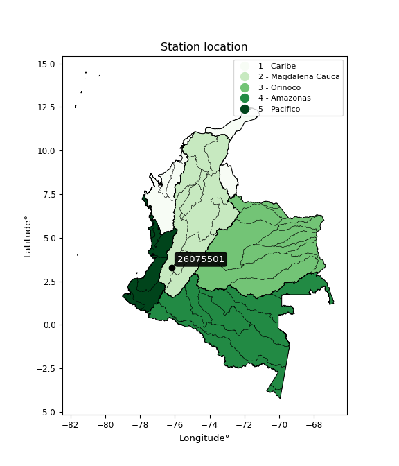

<div align="center">


</div>

# PMax24h Station (Rain): 26075501

Maximum Precipitation in 24 hours (PMax24h) is the greatest amount of rainfall for a specific duration that is meteorologically possible for a given location, acting as a "worst-case" scenario for extreme storms, crucial for designing safety-critical infrastructure like bridges, river deviations, dams, spillways, and nuclear plants to prevent catastrophic failure. The PMax24h is related with the Probable Maximum Precipitation (PMP) and it is calculated by hydrologists using meteorological data to determine the upper limit of extreme rainfall, often leading to the Probable Maximum Flood (PMF) for flood control design, and is increasingly being studied for climate change impacts. Probable Maximum Precipitation (PMP) is the theoretical upper limit of rainfall, a deterministic estimate for extreme events, while probability distributions (like GEV, Gumbel) describe the likelihood and frequency of various precipitation amounts, including rare ones, showing how often events occur, with PMP representing the extreme end of these distributions, used for critical infrastructure design to ensure safety against the worst conceivable weather, unlike standard statistical forecasts which cover typical probabilities.

The most common probability distributions in hydrology, used for analyzing floods, rainfall, and streamflow, include the Normal, Log-Normal, Gumbel, Gamma (including Log-Pearson Type III), and Generalized Extreme Value (GEV) distributions, often chosen based on the data´s skewness and whether modeling extremes or general conditions, with Gumbel and GEV popular for extreme events like floods, while the Normal distribution serves as a baseline, though often requiring transformations for skewed hydrological data. These distributions help in designing water infrastructure, managing water resources, and forecasting hydrologic events.

> Hydrological data often isn´t perfectly normal (it´s skewed), so different distributions are needed for different applications, such as: **Flood Frequency Analysis**: Using Gumbel, GEV, or Log-Pearson Type III for predicting extreme flood magnitudes and their return periods, **Rainfall Analysis**: Normal for annual totals, but Log-Normal, Weibull, or GEV for intensity or extreme daily rainfall, **Streamflow Modeling**: Gamma and Log-Normal for maximum flows, GEV for minimum flows, and Kappa for daily flows.

<div align="center">

</img>

</div>


## A. General information


### 1. General running parameters

• app_version: _v20260225_. • runtime: _2026-02-28 16:54:07.457399_. • Python version: _3.14.0_. • SciPy version: _1.16.3_. • Pandas version: _2.3.3_. • NumPy version: _2.3.5_. • Stations dataset (station_dataset_file): _dataset/pmax24h_in/automatic_colombia_2003_2025.csv_. • Stations catalog (station_catalog_file): _dataset/CNE.xls_. • Minimum year to eval til year_max (date_min): _1900_. • Maximum year to eval since year_min (date_max): _2025_. • Creates, save and include plots into reports (create_plot): _False_. • Plot only fit distributions with Δo > Δ (plot_only_fit): _True_. • Plot only simple graphs avoiding multiple CDFs and multiple Extreme values plots (plot_only_simple): _False_. • Eval low extreme values, if False, evaluates high extreme values (low_extreme): _False_. • Eval every SciPy distribution as logarithmic (pdist_logarithmic_on): _True_. • Standard deviation normalized (ddof): _1.0_. • Return periods to eval in years (Tr): _[2, 2.33, 5, 10, 15, 20, 25, 50, 75, 100, 200, 250, 500, 750, 1000]_. • Minimum data sample per station, 0 means any (minimum_sample): _5_. • Z-Score maximum threshold to adjust a value, 0 means disable (zscore_max): _3.5_. • Z-Score minimum threshold to adjust a value, 0 means disable (zscore_min): _-2.5_. • Avoid zeros, e.g. rain = 0 (avoid_zeros): _True_. • Avoid null values (avoid_nans): _True_. 

:file_folder:Table: [dataset.csv](../../dataset/pmax24h_in/automatic_colombia_2003_2025.csv)

> Delta Degrees of Freedom (DDOF): is a parameter used in the formulas for calculating variance and standard deviation. When ddof=0, the divisor is $N$ (the total number of observations) and this is used when your data set is the entire population. When ddof=1, the divisor is $N-1$ and this is used when your data set is a sample drawn from a larger population. Using $N-1$ provides an unbiased estimate of the population variance (known as Bessel´s correction).


### 2. Station info and location

|   id |   CODIGO | NOMBRE                     | CATEGORIA               | TECNOLOGIA                | ESTADO   | FECHA_INSTALACION   |   FECHA_SUSPENSION |   ALTITUD |   LATITUD |   LONGITUD | DEPARTAMENTO    | MUNICIPIO   | AREA_OPERATIVA                         | ENTIDAD                                    | AREA_HIDROGRAFICA   | ZONA_HIDROGRAFICA   | SUBZONA_HIDROGRAFICA                  |   CORRIENTE | Catalogo   |   Version |
|-----:|---------:|:---------------------------|:------------------------|:--------------------------|:---------|:--------------------|-------------------:|----------:|----------:|-----------:|:----------------|:------------|:---------------------------------------|:-------------------------------------------|:--------------------|:--------------------|:--------------------------------------|------------:|:-----------|----------:|
|    0 | 26075501 | FLORIDA  - AUT  [26075501] | Climatológica Principal | Automática con Telemetría | Activa   | 07/10/2013          |                nan |      1541 |   3.29147 |   -76.1774 | Valle Del Cauca | Florida     | Area Operativa 09 - Cauca-Valle-Caldas | CENTRO NACIONAL DE INVESTIGACIONES DE CAFE | Magdalena Cauca     | Cauca               | Río Guachal (Bolo - Fraile y Párraga) |         nan | CNE_OE     |  20251226 |

<div align="center">

Dynamic map: [:earth_americas:Google](http://maps.google.com/maps?q=3.291469444,-76.17735833) [:earth_americas:OSM](https://www.openstreetmap.org/#map=18/3.291469444/-76.17735833&layers=P) [:earth_americas:Bing](https://www.bing.com/maps?cp=3.291469444~-76.17735833&lvl=18) [:earth_americas:Apple](https://maps.apple.com/frame?center=3.291469444%2C-76.17735833&span=0.003%2C0.006)

</div>


<div align="center">

```geojson
{
  "type": "Feature",
  "geometry": {
    "type": "Point", 
    "coordinates": [-76.17735833, 3.291469444]
  }, 
  "properties": {
    "Name": "26075501"
  }
}
```

</div>


### 3. Discrete values table and plot

<div align="center">

|               |          0 |           1 |           2 |          3 |           4 |            5 |           6 |
|:--------------|-----------:|------------:|------------:|-----------:|------------:|-------------:|------------:|
| Date          | 2017       | 2018        | 2019        | 2020       | 2021        | 2022         | 2023        |
| Value         |    6.4     |   13.4      |   34.2      |  108.6     |   58.1      |   50.3       |   64.4      |
| Value_initial |    6.4     |   13.4      |   34.2      |  108.6     |   58.1      |   50.3       |   64.4      |
| count         |    7       |    7        |    7        |    7       |    7        |    7         |    7        |
| mean          |   47.9143  |   47.9143   |   47.9143   |   47.9143  |   47.9143   |   47.9143    |   47.9143   |
| std           |   34.5609  |   34.5609   |   34.5609   |   34.5609  |   34.5609   |   34.5609    |   34.5609   |
| zscore        |   -1.20119 |   -0.998652 |   -0.396815 |    1.75591 |    0.294718 |    0.0690293 |    0.477005 |


</div>


> The initial value (value_initial) correspond to the initial obtained or null completed value, and value (value) is adjusted only when the initial value is outside the valid range (outlier) definite through the Z-Score value. If Z-Score is active, values out of range or outliers are replaced with the station mean value. A Z-Score (or standard score) measures how many standard deviations a data point is from the mean of a dataset, indicating its relative position; positive scores mean above the mean, negative mean below, and a score of zero is exactly at the mean, allowing for comparison of values from different distributions. It´s calculated using the formula $z=(x–μ)/σ$, where $x$ is the data point, $μ$ is the mean, and $σ$ is the standard deviation, helping identify outliers and understand probability.
>
> <sub>**Note**: In this study, "completing" (filling gaps in) and "extending" (forecasting or lengthening the historical record) rainfall data series are avoided for certain critical analyses because they introduce artificial bias and uncertainty, which can distort the statistics of rare events (extremes), alter day-to-day variability, and compromise the integrity and homogeneity of the original data. Some reasons against Completing/Extending rainfall data are: **Distortion of Extremes and Variability**: The primary issue is that most gap-filling or extension methods rely on averaging or regression with nearby stations, which inherently smooths the data. Rainfall is highly variable in space and time, with a large percentage of zero values and occasional large storms. Infilling methods often underestimate the highest values and overestimate the lowest (zero) values, which severely distorts analyses focused on flood frequency, drought severity, and intensity-duration-frequency (IDF) curves, **Loss of Data Homogeneity**: Infilled or extended data are synthetic estimates, not actual measurements. Combining these estimates with observed data can violate the assumption of data homogeneity, which requires that the data properties do not change over time. Inhomogeneity can lead to incorrect conclusions about long-term trends or changes in climate patterns, **Propagation of Errors**: Errors and biases from the original data (e.g., wind-induced undercatch, instrument errors, site changes) or the data used for imputation can propagate through the analysis, leading to unreliable hydrological models and inaccurate predictions, **Compromised Statistical Integrity**: For statistical analyses, especially those involving the frequency of events, using artificial data can introduce time bias or autocorrelation that doesn´t exist in reality, making it difficult to assess the true probability of events, **Difficulty in Validation**: It is difficult to accurately validate the quality of filled or extended data, especially for past periods where ground-truth measurements are unavailable. The reliability of imputation techniques heavily depends on the density of the surrounding station network and the complexity of the local topography.</sub>


### 4. Active continuous probability distributions from SciPy (80 of 104 available)

A Probability Density Function (PDF) describes the relative likelihood of a continuous random variable falling within a specific range, where the total area under its curve equals 1, and the area over any interval gives the actual probability for that range. Unlike discrete probabilities (like rolling a die), a PDF shows density, not direct probability for a single point (which is zero), with higher points indicating higher likelihood, often visualized as a bell curve for normal distributions.

A log of a probability density function (log-PDF) is simply the logarithm of the PDF´s value, denoted as $log(f(x))$, useful for converting multiplication of probabilities into addition, improving numerical stability with tiny numbers, and connecting to information theory concepts like entropy. Instead of dealing with very small probabilities (e.g., 0.000001), log-PDFs use negative numbers (e.g., $log(0.00001) ≈ -11.51$ that are easier for computers to handle, preventing underflow errors and simplifying complex calculations. In this study, each active probability distribution from SciPy is also evaluated in the $log$ form.

[scipy.stats](https://docs.scipy.org/doc/scipy/reference/stats.html) is a Python´s powerful submodule within the SciPy library for comprehensive statistical analysis, offering over 130 probability distributions (like Normal, Poisson, etc.), functions for descriptive stats (mean, variance), hypothesis testing (t-tests, chi-square), random variable generation, and statistical tests, making it essential for data science, modeling, and research. It provides tools to explore, model, and draw conclusions from data efficiently, working seamlessly with [NumPy](https://numpy.org/).

<div align="center">

|   id | p_dist           |   n_parameter | fit_method   | label                                                                       | active   | ref                                                                                                      |
|-----:|:-----------------|--------------:|:-------------|:----------------------------------------------------------------------------|:---------|:---------------------------------------------------------------------------------------------------------|
|    0 | alpha            |             3 | MLE          | Alpha                                                                       | True     | [:mortar_board:](https://docs.scipy.org/doc/scipy/reference/generated/scipy.stats.alpha.html)            |
|    1 | anglit           |             2 | MM           | Anglit                                                                      | True     | [:mortar_board:](https://docs.scipy.org/doc/scipy/reference/generated/scipy.stats.anglit.html)           |
|    2 | arcsine          |             2 | MM           | Arcsine                                                                     | True     | [:mortar_board:](https://docs.scipy.org/doc/scipy/reference/generated/scipy.stats.arcsine.html)          |
|    3 | argus            |             3 | MLE          | Argus                                                                       | True     | [:mortar_board:](https://docs.scipy.org/doc/scipy/reference/generated/scipy.stats.argus.html)            |
|    4 | beta             |             4 | MLE          | Beta                                                                        | True     | [:mortar_board:](https://docs.scipy.org/doc/scipy/reference/generated/scipy.stats.beta.html)             |
|    5 | betaprime        |             4 | MLE          | Beta prime                                                                  | True     | [:mortar_board:](https://docs.scipy.org/doc/scipy/reference/generated/scipy.stats.betaprime.html)        |
|    6 | bradford         |             3 | MLE          | Bradford                                                                    | True     | [:mortar_board:](https://docs.scipy.org/doc/scipy/reference/generated/scipy.stats.bradford.html)         |
|    7 | burr             |             4 | MLE          | Burr (Type III)                                                             | True     | [:mortar_board:](https://docs.scipy.org/doc/scipy/reference/generated/scipy.stats.burr.html)             |
|    8 | burr12           |             4 | MLE          | Burr (Type III) 12                                                          | True     | [:mortar_board:](https://docs.scipy.org/doc/scipy/reference/generated/scipy.stats.burr12.html)           |
|    9 | cosine           |             2 | MLE          | Cosine                                                                      | True     | [:mortar_board:](https://docs.scipy.org/doc/scipy/reference/generated/scipy.stats.cosine.html)           |
|   10 | crystalball      |             4 | MLE          | Crystalball                                                                 | True     | [:mortar_board:](https://docs.scipy.org/doc/scipy/reference/generated/scipy.stats.crystalball.html)      |
|   11 | dgamma           |             3 | MLE          | Double gamma                                                                | True     | [:mortar_board:](https://docs.scipy.org/doc/scipy/reference/generated/scipy.stats.dgamma.html)           |
|   12 | dweibull         |             3 | MLE          | Double Weibull                                                              | True     | [:mortar_board:](https://docs.scipy.org/doc/scipy/reference/generated/scipy.stats.dweibull.html)         |
|   13 | erlang           |             3 | MLE          | Erlang                                                                      | True     | [:mortar_board:](https://docs.scipy.org/doc/scipy/reference/generated/scipy.stats.erlang.html)           |
|   14 | exponnorm        |             3 | MLE          | Exponentially modified Normal                                               | True     | [:mortar_board:](https://docs.scipy.org/doc/scipy/reference/generated/scipy.stats.exponnorm.html)        |
|   15 | exponpow         |             3 | MLE          | Exponential power                                                           | True     | [:mortar_board:](https://docs.scipy.org/doc/scipy/reference/generated/scipy.stats.exponpow.html)         |
|   16 | exponweib        |             4 | MLE          | Exponentiated Weibull                                                       | True     | [:mortar_board:](https://docs.scipy.org/doc/scipy/reference/generated/scipy.stats.exponweib.html)        |
|   17 | f                |             4 | MLE          | F                                                                           | True     | [:mortar_board:](https://docs.scipy.org/doc/scipy/reference/generated/scipy.stats.f.html)                |
|   18 | fatiguelife      |             3 | MLE          | Fatigue-life (Birnbaum-Saunders)                                            | True     | [:mortar_board:](https://docs.scipy.org/doc/scipy/reference/generated/scipy.stats.fatiguelife.html)      |
|   19 | foldnorm         |             3 | MM           | Fold Normal                                                                 | True     | [:mortar_board:](https://docs.scipy.org/doc/scipy/reference/generated/scipy.stats.foldnorm.html)         |
|   20 | gamma            |             3 | MLE          | Gamma                                                                       | True     | [:mortar_board:](https://docs.scipy.org/doc/scipy/reference/generated/scipy.stats.gamma.html)            |
|   21 | gausshyper       |             6 | MLE          | Gauss hypergeometric                                                        | True     | [:mortar_board:](https://docs.scipy.org/doc/scipy/reference/generated/scipy.stats.gausshyper.html)       |
|   22 | genexpon         |             5 | MLE          | Generalized exponential                                                     | True     | [:mortar_board:](https://docs.scipy.org/doc/scipy/reference/generated/scipy.stats.genexpon.html)         |
|   23 | genextreme       |             3 | MLE          | Generalized exponential                                                     | True     | [:mortar_board:](https://docs.scipy.org/doc/scipy/reference/generated/scipy.stats.genextreme.html)       |
|   24 | gengamma         |             4 | MLE          | Generalized gamma                                                           | True     | [:mortar_board:](https://docs.scipy.org/doc/scipy/reference/generated/scipy.stats.gengamma.html)         |
|   25 | genhalflogistic  |             3 | MLE          | Generalized half-logistic                                                   | True     | [:mortar_board:](https://docs.scipy.org/doc/scipy/reference/generated/scipy.stats.genhalflogistic.html)  |
|   26 | genlogistic      |             3 | MLE          | Generalized logistic                                                        | True     | [:mortar_board:](https://docs.scipy.org/doc/scipy/reference/generated/scipy.stats.genlogistic.html)      |
|   27 | gennorm          |             3 | MLE          | Generalized Normal                                                          | True     | [:mortar_board:](https://docs.scipy.org/doc/scipy/reference/generated/scipy.stats.gennorm.html)          |
|   28 | genpareto        |             3 | MLE          | Generalized Pareto                                                          | True     | [:mortar_board:](https://docs.scipy.org/doc/scipy/reference/generated/scipy.stats.genpareto.html)        |
|   29 | gompertz         |             3 | MLE          | Gompertz (or truncated Gumbel)                                              | True     | [:mortar_board:](https://docs.scipy.org/doc/scipy/reference/generated/scipy.stats.gompertz.html)         |
|   30 | gumbel_l         |             2 | MM           | Gumbel Left Skew                                                            | True     | [:mortar_board:](https://docs.scipy.org/doc/scipy/reference/generated/scipy.stats.gumbel_l.html)         |
|   31 | gumbel_r         |             2 | MM           | Gumbel Right Skew                                                           | True     | [:mortar_board:](https://docs.scipy.org/doc/scipy/reference/generated/scipy.stats.gumbel_r.html)         |
|   32 | halfgennorm      |             3 | MLE          | Upper half of a generalized normal                                          | True     | [:mortar_board:](https://docs.scipy.org/doc/scipy/reference/generated/scipy.stats.halfgennorm.html)      |
|   33 | halflogistic     |             2 | MM           | Half-logistic                                                               | True     | [:mortar_board:](https://docs.scipy.org/doc/scipy/reference/generated/scipy.stats.halflogistic.html)     |
|   34 | halfnorm         |             2 | MM           | Half Normal                                                                 | True     | [:mortar_board:](https://docs.scipy.org/doc/scipy/reference/generated/scipy.stats.halfnorm.html)         |
|   35 | hypsecant        |             2 | MM           | hyperbolic secant                                                           | True     | [:mortar_board:](https://docs.scipy.org/doc/scipy/reference/generated/scipy.stats.hypsecant.html)        |
|   36 | invgamma         |             3 | MLE          | Inverted gamma                                                              | True     | [:mortar_board:](https://docs.scipy.org/doc/scipy/reference/generated/scipy.stats.invgamma.html)         |
|   37 | invgauss         |             3 | MLE          | Inverse Gaussian                                                            | True     | [:mortar_board:](https://docs.scipy.org/doc/scipy/reference/generated/scipy.stats.invgauss.html)         |
|   38 | invweibull       |             3 | MLE          | Inverted Weibull                                                            | True     | [:mortar_board:](https://docs.scipy.org/doc/scipy/reference/generated/scipy.stats.invweibull.html)       |
|   39 | johnsonsb        |             4 | MLE          | Johnson SB                                                                  | True     | [:mortar_board:](https://docs.scipy.org/doc/scipy/reference/generated/scipy.stats.johnsonsb.html)        |
|   40 | johnsonsu        |             4 | MLE          | Johnson Su                                                                  | True     | [:mortar_board:](https://docs.scipy.org/doc/scipy/reference/generated/scipy.stats.johnsonsu.html)        |
|   41 | kappa3           |             3 | MLE          | Kappa 3                                                                     | True     | [:mortar_board:](https://docs.scipy.org/doc/scipy/reference/generated/scipy.stats.kappa3.html)           |
|   42 | kappa4           |             4 | MLE          | Kappa 4                                                                     | True     | [:mortar_board:](https://docs.scipy.org/doc/scipy/reference/generated/scipy.stats.kappa4.html)           |
|   43 | ksone            |             3 | MLE          | Kolmogorov-Smirnov one-sided test statistic distribution                    | True     | [:mortar_board:](https://docs.scipy.org/doc/scipy/reference/generated/scipy.stats.ksone.html)            |
|   44 | kstwobign        |             2 | MLE          | Limiting distribution of scaled Kolmogorov-Smirnov two-sided test statistic | True     | [:mortar_board:](https://docs.scipy.org/doc/scipy/reference/generated/scipy.stats.kstwobign.html)        |
|   45 | laplace          |             2 | MM           | Laplace                                                                     | True     | [:mortar_board:](https://docs.scipy.org/doc/scipy/reference/generated/scipy.stats.laplace.html)          |
|   46 | levy_l           |             2 | MLE          | Left-skewed Levy                                                            | True     | [:mortar_board:](https://docs.scipy.org/doc/scipy/reference/generated/scipy.stats.levy_l.html)           |
|   47 | loggamma         |             3 | MLE          | Log gamma                                                                   | True     | [:mortar_board:](https://docs.scipy.org/doc/scipy/reference/generated/scipy.stats.loggamma.html)         |
|   48 | logistic         |             2 | MM           | Logistic (or Sech-squared)                                                  | True     | [:mortar_board:](https://docs.scipy.org/doc/scipy/reference/generated/scipy.stats.logistic.html)         |
|   49 | loglaplace       |             3 | MLE          | Log-Laplace                                                                 | True     | [:mortar_board:](https://docs.scipy.org/doc/scipy/reference/generated/scipy.stats.loglaplace.html)       |
|   50 | lomax            |             3 | MLE          | Lomax (Pareto of the second kind)                                           | True     | [:mortar_board:](https://docs.scipy.org/doc/scipy/reference/generated/scipy.stats.lomax.html)            |
|   51 | maxwell          |             2 | MM           | Maxwell                                                                     | True     | [:mortar_board:](https://docs.scipy.org/doc/scipy/reference/generated/scipy.stats.maxwell.html)          |
|   52 | mielke           |             4 | MLE          | Mielke Beta-Kappa / Dagum                                                   | True     | [:mortar_board:](https://docs.scipy.org/doc/scipy/reference/generated/scipy.stats.mielke.html)           |
|   53 | moyal            |             2 | MM           | Moyal                                                                       | True     | [:mortar_board:](https://docs.scipy.org/doc/scipy/reference/generated/scipy.stats.moyal.html)            |
|   54 | nakagami         |             3 | MLE          | Nakagami                                                                    | True     | [:mortar_board:](https://docs.scipy.org/doc/scipy/reference/generated/scipy.stats.nakagami.html)         |
|   55 | ncf              |             5 | MLE          | Non-central F distribution                                                  | True     | [:mortar_board:](https://docs.scipy.org/doc/scipy/reference/generated/scipy.stats.ncf.html)              |
|   56 | nct              |             4 | MLE          | Non-central Student’s t                                                     | True     | [:mortar_board:](https://docs.scipy.org/doc/scipy/reference/generated/scipy.stats.nct.html)              |
|   57 | norm             |             2 | MM           | Normal                                                                      | True     | [:mortar_board:](https://docs.scipy.org/doc/scipy/reference/generated/scipy.stats.norm.html)             |
|   58 | pearson3         |             3 | MM           | Pearson type III                                                            | True     | [:mortar_board:](https://docs.scipy.org/doc/scipy/reference/generated/scipy.stats.pearson3.html)         |
|   59 | powerlaw         |             3 | MLE          | Power-function                                                              | True     | [:mortar_board:](https://docs.scipy.org/doc/scipy/reference/generated/scipy.stats.powerlaw.html)         |
|   60 | rayleigh         |             2 | MM           | Rayleigh                                                                    | True     | [:mortar_board:](https://docs.scipy.org/doc/scipy/reference/generated/scipy.stats.rayleigh.html)         |
|   61 | rdist            |             3 | MLE          | R-distributed (symmetric beta)                                              | True     | [:mortar_board:](https://docs.scipy.org/doc/scipy/reference/generated/scipy.stats.rdist.html)            |
|   62 | rice             |             3 | MLE          | Rice                                                                        | True     | [:mortar_board:](https://docs.scipy.org/doc/scipy/reference/generated/scipy.stats.rice.html)             |
|   63 | semicircular     |             2 | MM           | Semicircular                                                                | True     | [:mortar_board:](https://docs.scipy.org/doc/scipy/reference/generated/scipy.stats.semicircular.html)     |
|   64 | skewnorm         |             3 | MLE          | Skew normal                                                                 | True     | [:mortar_board:](https://docs.scipy.org/doc/scipy/reference/generated/scipy.stats.skewnorm.html)         |
|   65 | t                |             3 | MLE          | Student’s t                                                                 | True     | [:mortar_board:](https://docs.scipy.org/doc/scipy/reference/generated/scipy.stats.t.html)                |
|   66 | trapezoid        |             4 | MLE          | Trapezoid                                                                   | True     | [:mortar_board:](https://docs.scipy.org/doc/scipy/reference/generated/scipy.stats.trapezoid.html)        |
|   67 | triang           |             3 | MLE          | Triangular                                                                  | True     | [:mortar_board:](https://docs.scipy.org/doc/scipy/reference/generated/scipy.stats.triang.html)           |
|   68 | truncexpon       |             3 | MLE          | Truncated exponential                                                       | True     | [:mortar_board:](https://docs.scipy.org/doc/scipy/reference/generated/scipy.stats.truncexpon.html)       |
|   69 | truncnorm        |             4 | MLE          | Truncated normal                                                            | True     | [:mortar_board:](https://docs.scipy.org/doc/scipy/reference/generated/scipy.stats.truncnorm.html)        |
|   70 | truncpareto      |             4 | MLE          | Upper truncated Pareto                                                      | True     | [:mortar_board:](https://docs.scipy.org/doc/scipy/reference/generated/scipy.stats.truncpareto.html)      |
|   71 | truncweibull_min |             5 | MLE          | Doubly truncated Weibull minimum                                            | True     | [:mortar_board:](https://docs.scipy.org/doc/scipy/reference/generated/scipy.stats.truncweibull_min.html) |
|   72 | tukeylambda      |             3 | MLE          | Tukey-Lamdba                                                                | True     | [:mortar_board:](https://docs.scipy.org/doc/scipy/reference/generated/scipy.stats.tukeylambda.html)      |
|   73 | uniform          |             2 | MLE          | Uniform                                                                     | True     | [:mortar_board:](https://docs.scipy.org/doc/scipy/reference/generated/scipy.stats.uniform.html)          |
|   74 | vonmises         |             3 | MLE          | Von Mises                                                                   | True     | [:mortar_board:](https://docs.scipy.org/doc/scipy/reference/generated/scipy.stats.vonmises.html)         |
|   75 | vonmises_line    |             3 | MLE          | Von Mises line                                                              | True     | [:mortar_board:](https://docs.scipy.org/doc/scipy/reference/generated/scipy.stats.vonmises_line.html)    |
|   76 | wald             |             2 | MM           | Wald                                                                        | True     | [:mortar_board:](https://docs.scipy.org/doc/scipy/reference/generated/scipy.stats.wald.html)             |
|   77 | weibull_max      |             3 | MLE          | Weibull maximum                                                             | True     | [:mortar_board:](https://docs.scipy.org/doc/scipy/reference/generated/scipy.stats.weibull_max.html)      |
|   78 | weibull_min      |             3 | MLE          | Weibull minimum                                                             | True     | [:mortar_board:](https://docs.scipy.org/doc/scipy/reference/generated/scipy.stats.weibull_min.html)      |
|   79 | wrapcauchy       |             3 | MLE          | Wrapped  Cauchy                                                             | True     | [:mortar_board:](https://docs.scipy.org/doc/scipy/reference/generated/scipy.stats.wrapcauchy.html)       |

</div>

> **n_parameter:** # arguments & localization & scale.
>
> **Fit methods:** (MLE) maximum likelihood, (MM) L-moments.
>
>**Inactive** (With the only purpose of prevent loops, zero divisions, infinite values, over high estimated values or horizontal trending for recurrence intervals estimations, the follow distributions were disabled.)**:** lognorm, norminvgauss, powernorm, powerlognorm, cauchy, halfcauchy, foldcauchy, skewcauchy, chi2, expon, fisk, genhyperbolic, geninvgauss, gibrat, kstwo, laplace_asymmetric, levy, levy_stable, ncx2, pareto, rel_breitwigner, recipinvgauss, studentized_range, loguniform, 


## B. Probability (PDF) vs. Empirical (EDF) distributions functions

A continuous probability distribution (CPD) describes probabilities for variables that can take any value within a range (like rain any time), unlike discrete variables with specific outcomes (like temperature). It uses a Probability Density Function (PDF), a curve where the total area under it equals 1, and the probability of the variable falling within an interval (a to b) is found by calculating the area under the curve between those points. A key feature is that the probability of hitting any single exact value is zero, so probabilities are always expressed for ranges, e.g., $P(a ≤ X ≤ b)$.

<div align="center">

Distributions parameters from station values
|     |   station | p_dist              |   n |               loc |            scale | shape                  | shape1                 | shape2                | shape3             |
|----:|----------:|:--------------------|----:|------------------:|-----------------:|:-----------------------|:-----------------------|:----------------------|:-------------------|
|   0 |  26075501 | alpha               |   7 |      -0.0366194   |     14.9101      | 2.9837709144775965e-10 |                        |                       |                    |
|   1 |  26075501 | anglit              |   7 |      47.9143      |     93.6045      |                        |                        |                       |                    |
|   2 |  26075501 | arcsine             |   7 |       2.66345     |     90.5017      |                        |                        |                       |                    |
|   3 |  26075501 | argus               |   7 |     -25.9336      |    140.056       | 1.4510747008454122e-06 |                        |                       |                    |
|   4 |  26075501 | beta                |   7 |       6.4         |    183.471       | 0.8179372821453368     | 4.212674388125843      |                       |                    |
|   5 |  26075501 | betaprime           |   7 |       6.4         |    296.002       | 0.37131698713787015    | 3.155486111540892      |                       |                    |
|   6 |  26075501 | bradford            |   7 |       6.24567     |    102.354       | 3.3867074071973216     |                        |                       |                    |
|   7 |  26075501 | burr                |   7 |      -0.417783    |     84.7236      | 5.116690855570697      | 0.21396103942129696    |                       |                    |
|   8 |  26075501 | burr12              |   7 |      -0.223574    |      6.51727     | 252.1186445814452      | 0.0023596172481071776  |                       |                    |
|   9 |  26075501 | cosine              |   7 |      50.6796      |     27.255       |                        |                        |                       |                    |
|  10 |  26075501 | crystalball         |   7 |      47.9143      |     31.9972      | 6147.482121572922      | 385.4590996081529      |                       |                    |
|  11 |  26075501 | dgamma              |   7 |      42.5177      |     12.3763      | 2.134057786487137      |                        |                       |                    |
|  12 |  26075501 | dweibull            |   7 |      50.3         |     24.8618      | 0.6627897998076602     |                        |                       |                    |
|  13 |  26075501 | erlang              |   7 |       6.4         |     44.5063      | 0.7687052978523303     |                        |                       |                    |
|  14 |  26075501 | exponnorm           |   7 |      21.7572      |     20.6992      | 1.263675368392514      |                        |                       |                    |
|  15 |  26075501 | exponpow            |   7 |       6.4         |     75.5337      | 0.730417826511602      |                        |                       |                    |
|  16 |  26075501 | exponweib           |   7 |       6.4         |      9.96251     | 0.6848346792107989     | 0.5001138958354885     |                       |                    |
|  17 |  26075501 | f                   |   7 |       6.39997     |     45.6495      | 1.2901360583965045     | 5005.936842911925      |                       |                    |
|  18 |  26075501 | fatiguelife         |   7 |       6.4         |      0.000104362 | 503.1706443725393      |                        |                       |                    |
|  19 |  26075501 | foldnorm            |   7 |      -3.93079     |     36.5318      | 1.3346211949042388     |                        |                       |                    |
|  20 |  26075501 | gamma               |   7 |       6.4         |     42.5681      | 0.8147504301903623     |                        |                       |                    |
|  21 |  26075501 | gausshyper          |   7 |      -1.43418     |    110.034       | 1.0547144324169833     | 0.6627615587839352     | 1.1007588506010522    | 1.0285674564856209 |
|  22 |  26075501 | genexpon            |   7 |      -4.68416     |      2.08489     | 0.006440917010032015   | 0.16169422352339385    | 0.014187518297049548  |                    |
|  23 |  26075501 | genextreme          |   7 |       7.40706     |      6.15232     | -6.1091517517606375    |                        |                       |                    |
|  24 |  26075501 | gengamma            |   7 |       6.4         |     10.3124      | 1.8263804095713394     | 0.49219449679853267    |                       |                    |
|  25 |  26075501 | genhalflogistic     |   7 |      -3.93343     |    120.209       | 1.0682037902725503     |                        |                       |                    |
|  26 |  26075501 | genlogistic         |   7 |    -140.039       |     26.2984      | 713.1547207519438      |                        |                       |                    |
|  27 |  26075501 | gennorm             |   7 |      57.5         |     51.1004      | 1786843.1584881525     |                        |                       |                    |
|  28 |  26075501 | genpareto           |   7 |      -0.319682    |    120.49        | -1.1062243104386695    |                        |                       |                    |
|  29 |  26075501 | gompertz            |   7 |       6.4         |     85.0271      | 1.3232553787910186     |                        |                       |                    |
|  30 |  26075501 | gumbel_l            |   7 |      62.3147      |     24.9481      |                        |                        |                       |                    |
|  31 |  26075501 | gumbel_r            |   7 |      33.5139      |     24.9481      |                        |                        |                       |                    |
|  32 |  26075501 | halfgennorm         |   7 |       6.4         |      1.85918     | 0.3701814335353948     |                        |                       |                    |
|  33 |  26075501 | halflogistic        |   7 |       9.99024     |     27.3564      |                        |                        |                       |                    |
|  34 |  26075501 | halfnorm            |   7 |       5.56258     |     53.08        |                        |                        |                       |                    |
|  35 |  26075501 | hypsecant           |   7 |      47.9143      |     20.37        |                        |                        |                       |                    |
|  36 |  26075501 | invgamma            |   7 |     -77.8005      |   1888.13        | 16.003718320778848     |                        |                       |                    |
|  37 |  26075501 | invgauss            |   7 |     -28.6835      |    368.562       | 0.207828670159801      |                        |                       |                    |
|  38 |  26075501 | invweibull          |   7 |      -8.51446e+08 |      8.51447e+08 | 32338267.940178953     |                        |                       |                    |
|  39 |  26075501 | johnsonsb           |   7 |       6.4         |    102.2         | 1.3140641438038285     | 0.13545447072139769    |                       |                    |
|  40 |  26075501 | johnsonsu           |   7 |     -34.4432      |      3.56603     | -9.362678272222922     | 2.493556307175848      |                       |                    |
|  41 |  26075501 | kappa3              |   7 |       6.4         |     55.2308      | 4.769181239078602      |                        |                       |                    |
|  42 |  26075501 | kappa4              |   7 |      -3.80671     |    113.052       | 1.0992292563775992     | 0.997224415324315      |                       |                    |
|  43 |  26075501 | ksone               |   7 |      -3.82        |    122.64        | 1.0                    |                        |                       |                    |
|  44 |  26075501 | kstwobign           |   7 |     -59.1966      |    122.724       |                        |                        |                       |                    |
|  45 |  26075501 | laplace             |   7 |      47.9143      |     22.6254      |                        |                        |                       |                    |
|  46 |  26075501 | levy_l              |   7 |     115.432       |     30.4285      |                        |                        |                       |                    |
|  47 |  26075501 | loggamma            |   7 |   -7079.62        |   1031.2         | 1004.510954656912      |                        |                       |                    |
|  48 |  26075501 | logistic            |   7 |      47.9143      |     17.641       |                        |                        |                       |                    |
|  49 |  26075501 | loglaplace          |   7 |      -0.138077    |     50.438       | 1.4316902039850987     |                        |                       |                    |
|  50 |  26075501 | lomax               |   7 |       6.4         |   1590.06        | 38.1092609056857       |                        |                       |                    |
|  51 |  26075501 | maxwell             |   7 |     -27.9056      |     47.513       |                        |                        |                       |                    |
|  52 |  26075501 | mielke              |   7 |       6.3874      |     98.9657      | 0.7519348564184152     | 3.84307110530989       |                       |                    |
|  53 |  26075501 | moyal               |   7 |      29.6163      |     14.4038      |                        |                        |                       |                    |
|  54 |  26075501 | nakagami            |   7 |       6.4         |     85.7825      | 0.11849625914592131    |                        |                       |                    |
|  55 |  26075501 | ncf                 |   7 |       6.39922     |     31.3772      | 1.7869886540897322     | 16131.554680975947     | 0.8880132822153373    |                    |
|  56 |  26075501 | nct                 |   7 |     -90.5632      |     12.9861      | 12.65895489169844      | 9.99298270185545       |                       |                    |
|  57 |  26075501 | norm                |   7 |      47.9143      |     31.9972      |                        |                        |                       |                    |
|  58 |  26075501 | pearson3            |   7 |      47.9143      |     31.9971      | 0.4962624418186601     |                        |                       |                    |
|  59 |  26075501 | powerlaw            |   7 |       6.4         |    102.2         | 0.15432034869213843    |                        |                       |                    |
|  60 |  26075501 | rayleigh            |   7 |     -13.2982      |     48.8405      |                        |                        |                       |                    |
|  61 |  26075501 | rdist               |   7 |      -3.02722     |     61.1272      | 1.0443405293914068     |                        |                       |                    |
|  62 |  26075501 | rice                |   7 |      -8.95049     |     46.1379      | 0.0016704484373072028  |                        |                       |                    |
|  63 |  26075501 | semicircular        |   7 |      47.9143      |     63.9943      |                        |                        |                       |                    |
|  64 |  26075501 | skewnorm            |   7 |       6.39999     |     52.4133      | 47309262.598907374     |                        |                       |                    |
|  65 |  26075501 | t                   |   7 |      47.9135      |     31.9971      | 94696338.94765455      |                        |                       |                    |
|  66 |  26075501 | trapezoid           |   7 |      -4.011       |    122.64        | 1.0                    | 1.0                    |                       |                    |
|  67 |  26075501 | triang              |   7 |     -29.9551      |    140.697       | 0.999999999997486      |                        |                       |                    |
|  68 |  26075501 | truncexpon          |   7 |       0.462257    |    111.01        | 0.9741263096702337     |                        |                       |                    |
|  69 |  26075501 | truncnorm           |   7 |      47.9143      |     31.9972      | -297.4532689439356     | 55.98605330839662      |                       |                    |
|  70 |  26075501 | truncpareto         |   7 |       6.36353     |      0.0364701   | 0.16842188496278776    | 2803.294635300882      |                       |                    |
|  71 |  26075501 | truncweibull_min    |   7 |       0.581259    |    114.66        | 1.057553074348986      | 1.4043841560836784e-07 | 0.9420748624612756    |                    |
|  72 |  26075501 | tukeylambda         |   7 |      34.2747      |     31.9657      | 1.146765188555957      |                        |                       |                    |
|  73 |  26075501 | uniform             |   7 |       6.4         |    102.2         |                        |                        |                       |                    |
|  74 |  26075501 | vonmises            |   7 |       1.22143     |      1           | 1.6976695511622906     |                        |                       |                    |
|  75 |  26075501 | vonmises_line       |   7 |      57.5         |     16.2657      | 0.5819980017195536     |                        |                       |                    |
|  76 |  26075501 | wald                |   7 |      15.9171      |     31.9972      |                        |                        |                       |                    |
|  77 |  26075501 | weibull_max         |   7 |     108.6         |      1.70473     | 0.21145446290369146    |                        |                       |                    |
|  78 |  26075501 | weibull_min         |   7 |       6.4         |     53.9448      | 0.43060112926853955    |                        |                       |                    |
|  79 |  26075501 | wrapcauchy          |   7 |       6.39863     |     16.2659      | 2.8140828276000316e-05 |                        |                       |                    |
|  80 |  26075501 | logalpha            |   7 |     -17.6622      |    470.413       | 22.245929103021375     |                        |                       |                    |
|  81 |  26075501 | loganglit           |   7 |       3.54525     |      2.67449     |                        |                        |                       |                    |
|  82 |  26075501 | logarcsine          |   7 |       2.25233     |      2.58583     |                        |                        |                       |                    |
|  83 |  26075501 | logargus            |   7 |       1.05164     |      3.73645     | 1.7191338396700107     |                        |                       |                    |
|  84 |  26075501 | logbeta             |   7 |       1.60786     |      3.07981     | 1.0211476700699356     | 0.48630511201559745    |                       |                    |
|  85 |  26075501 | logbetaprime        |   7 |     -24.6325      |     13.1048      | 2805.986238618574      | 1306.3580969290465     |                       |                    |
|  86 |  26075501 | logbradford         |   7 |       1.85629     |      2.83145     | 1.0694612490180453     |                        |                       |                    |
|  87 |  26075501 | logburr             |   7 |       1.5191      |      3.22147     | 158.651311814336       | 0.01046126514422666    |                       |                    |
|  88 |  26075501 | logburr12           |   7 |    -811.773       |    824.015       | 1204.4857408912612     | 189798.58391066594     |                       |                    |
|  89 |  26075501 | logcosine           |   7 |       3.45098     |      0.763786    |                        |                        |                       |                    |
|  90 |  26075501 | logcrystalball      |   7 |       3.54525     |      0.914231    | 414.3282638023265      | 41.36300422979409      |                       |                    |
|  91 |  26075501 | logdgamma           |   7 |       3.91801     |      0.645763    | 0.5429358731257227     |                        |                       |                    |
|  92 |  26075501 | logdweibull         |   7 |       3.91801     |      0.71289     | 0.8395389078404887     |                        |                       |                    |
|  93 |  26075501 | logerlang           |   7 |     -12.0814      |      0.0557061   | 280.32502463111905     |                        |                       |                    |
|  94 |  26075501 | logexponnorm        |   7 |       3.54451     |      0.914229    | 0.0008010766126007581  |                        |                       |                    |
|  95 |  26075501 | logexponpow         |   7 |       1.8563      |      1.29278     | 0.42403593515824367    |                        |                       |                    |
|  96 |  26075501 | logexponweib        |   7 |       1.8563      |      2.71667     | 0.23545457168122438    | 3.3271410988684673     |                       |                    |
|  97 |  26075501 | logf                |   7 |    -610.225       |    613.769       | 2275513.192703617      | 1468139.0735468967     |                       |                    |
|  98 |  26075501 | logfatiguelife      |   7 |    -320.756       |    324.3         | 0.002810817796046078   |                        |                       |                    |
|  99 |  26075501 | logfoldnorm         |   7 |      -1.10587     |      0.875055    | 5.322279817323075      |                        |                       |                    |
| 100 |  26075501 | loggamma            |   7 |     -11.0669      |      0.0595154   | 245.46084847501623     |                        |                       |                    |
| 101 |  26075501 | loggausshyper       |   7 |       1.79533     |      2.89235     | 1.1541332087450316     | 0.9055740247941443     | 0.864962939485117     | 1.1384450954904652 |
| 102 |  26075501 | loggenexpon         |   7 |       1.85365     |      0.00716271  | 0.0015902209984930476  | 2.02078342797666       | 8.565919963441665e-06 |                    |
| 103 |  26075501 | loggenextreme       |   7 |       3.63945     |      1.222       | 1.1657867196979175     |                        |                       |                    |
| 104 |  26075501 | loggengamma         |   7 |       1.8563      |      1.17608     | 1.0893003610586962     | 0.7336477501488051     |                       |                    |
| 105 |  26075501 | loggenhalflogistic  |   7 |       1.84089     |      3.01025     | 1.0574226605098414     |                        |                       |                    |
| 106 |  26075501 | loggenlogistic      |   7 |       4.44221     |      0.187542    | 0.19760762049124375    |                        |                       |                    |
| 107 |  26075501 | loggennorm          |   7 |       3.91801     |      1.15736e-09 | 0.11541215081286196    |                        |                       |                    |
| 108 |  26075501 | loggenpareto        |   7 |      -0.00159293  |      7.39872     | -1.5777987626974581    |                        |                       |                    |
| 109 |  26075501 | loggompertz         |   7 |       1.8563      |      0.840667    | 0.0949104942897672     |                        |                       |                    |
| 110 |  26075501 | loggumbel_l         |   7 |       3.9567      |      0.712823    |                        |                        |                       |                    |
| 111 |  26075501 | loggumbel_r         |   7 |       3.1338      |      0.712823    |                        |                        |                       |                    |
| 112 |  26075501 | loghalfgennorm      |   7 |       1.85628     |      2.83174     | 69159.39745751303      |                        |                       |                    |
| 113 |  26075501 | loghalflogistic     |   7 |       2.46164     |      0.781657    |                        |                        |                       |                    |
| 114 |  26075501 | loghalfnorm         |   7 |       2.33511     |      1.51667     |                        |                        |                       |                    |
| 115 |  26075501 | loghypsecant        |   7 |       3.54525     |      0.582017    |                        |                        |                       |                    |
| 116 |  26075501 | loginvgamma         |   7 |     -15.7091      |   8025.03        | 418.1339524311818      |                        |                       |                    |
| 117 |  26075501 | loginvgauss         |   7 |      -5.26849     |    701.16        | 0.012544730830744193   |                        |                       |                    |
| 118 |  26075501 | loginvweibull       |   7 |      -6.17825e+07 |      6.17825e+07 | 64088570.90908511      |                        |                       |                    |
| 119 |  26075501 | logjohnsonsb        |   7 |       1.8563      |      2.83137     | 0.41243235820411456    | 0.2098363403967317     |                       |                    |
| 120 |  26075501 | logjohnsonsu        |   7 |       5.22204     |      0.0369696   | 7.705908324214992      | 1.7696661448966386     |                       |                    |
| 121 |  26075501 | logkappa3           |   7 |       1.85626     |      2.83126     | 38015.178597714286     |                        |                       |                    |
| 122 |  26075501 | logkappa4           |   7 |       1.59866     |      3.25797     | 1.0854922727366443     | 1.0546955597078362     |                       |                    |
| 123 |  26075501 | logksone            |   7 |       1.57316     |      3.39765     | 1.0                    |                        |                       |                    |
| 124 |  26075501 | logkstwobign        |   7 |      -0.303314    |      4.3896      |                        |                        |                       |                    |
| 125 |  26075501 | loglaplace          |   7 |       3.54525     |      0.646459    |                        |                        |                       |                    |
| 126 |  26075501 | loglevy_l           |   7 |       4.78898     |      0.449015    |                        |                        |                       |                    |
| 127 |  26075501 | logloggamma         |   7 |       4.56513     |      0.289849    | 0.29869040136437663    |                        |                       |                    |
| 128 |  26075501 | loglogistic         |   7 |       3.54525     |      0.504042    |                        |                        |                       |                    |
| 129 |  26075501 | logloglaplace       |   7 | -905888           | 905892           | 1353572.0073445519     |                        |                       |                    |
| 130 |  26075501 | loglomax            |   7 |       1.8563      |      3.03165e+13 | 11430562900426.783     |                        |                       |                    |
| 131 |  26075501 | logmaxwell          |   7 |       1.3789      |      1.35755     |                        |                        |                       |                    |
| 132 |  26075501 | logmielke           |   7 |       1.85628     |      2.9144      | 0.827627522290366      | 89.12982362098984      |                       |                    |
| 133 |  26075501 | logmoyal            |   7 |       3.02243     |      0.411548    |                        |                        |                       |                    |
| 134 |  26075501 | lognakagami         |   7 |       2.59525     |      1.17965     | 0.07084929287014383    |                        |                       |                    |
| 135 |  26075501 | logncf              |   7 |      -0.064057    |      3.90018     | 9.768256849628246      | 17.01090505915127      | 7.45832207416589e-10  |                    |
| 136 |  26075501 | lognct              |   7 |      46.8827      |      0.873798    | 13589.212496182488     | -49.592469485851296    |                       |                    |
| 137 |  26075501 | lognorm             |   7 |       3.54525     |      0.914231    |                        |                        |                       |                    |
| 138 |  26075501 | logpearson3         |   7 |       3.54525     |      0.914232    | -0.7022068101102732    |                        |                       |                    |
| 139 |  26075501 | logpowerlaw         |   7 |       1.8563      |      2.83137     | 0.17622039697931674    |                        |                       |                    |
| 140 |  26075501 | lograyleigh         |   7 |       1.79627     |      1.39548     |                        |                        |                       |                    |
| 141 |  26075501 | logrdist            |   7 |       2.90668     |      1.25843     | 1.0948530748515553     |                        |                       |                    |
| 142 |  26075501 | logrice             |   7 |       1.28543     |      0.999343    | 1.9875557483512685     |                        |                       |                    |
| 143 |  26075501 | logsemicircular     |   7 |       3.54525     |      1.82846     |                        |                        |                       |                    |
| 144 |  26075501 | logskewnorm         |   7 |       4.68767     |      1.46329     | -31152480.85709445     |                        |                       |                    |
| 145 |  26075501 | logt                |   7 |       3.54525     |      0.914231    | 31572203834.238518     |                        |                       |                    |
| 146 |  26075501 | logtrapezoid        |   7 |       0.959413    |      3.87875     | 1.0                    | 1.0                    |                       |                    |
| 147 |  26075501 | logtriang           |   7 |       1.12173     |      3.56597     | 0.9999979316658961     |                        |                       |                    |
| 148 |  26075501 | logtruncexpon       |   7 |       1.85629     |      3.8821      | 0.7293423348076636     |                        |                       |                    |
| 149 |  26075501 | logtruncnorm        |   7 |      -0.39515     |      2.29552     | 1.302713811437897      | 2.214238768844992      |                       |                    |
| 150 |  26075501 | logtruncpareto      |   7 |       1.85454     |      0.00175429  | 0.1679197128891433     | 1614.9705152587667     |                       |                    |
| 151 |  26075501 | logtruncweibull_min |   7 |       1.85565     |      4.51888     | 0.939918441587055      | 0.00014200941506469045 | 0.6267082871859935    |                    |
| 152 |  26075501 | logtukeylambda      |   7 |       3.01071     |      1.38191     | 1.1970730072130424     |                        |                       |                    |
| 153 |  26075501 | loguniform          |   7 |       1.8563      |      2.83137     |                        |                        |                       |                    |
| 154 |  26075501 | logvonmises         |   7 |      -2.62065     |      1           | 1.7219327116609948     |                        |                       |                    |
| 155 |  26075501 | logvonmises_line    |   7 |       3.2694      |      0.451454    | 1.2114181798413562e-05 |                        |                       |                    |
| 156 |  26075501 | logwald             |   7 |       2.63104     |      0.914212    |                        |                        |                       |                    |
| 157 |  26075501 | logweibull_max      |   7 |       4.68767     |      1.23025     | 0.9521290575298549     |                        |                       |                    |
| 158 |  26075501 | logweibull_min      |   7 |      -3.6836e+07  |      3.6836e+07  | 53803157.02974463      |                        |                       |                    |
| 159 |  26075501 | logwrapcauchy       |   7 |       1.85567     |      0.450727    | 0.19223510178233788    |                        |                       |                    |

</div>

> **loc** (Location parameter): This shifts the distribution along the x-axis. For many common distributions, like the normal (Gaussian) distribution, loc represents the mean $μ$. For others, like the uniform distribution, it might represent the minimum value, or for the beta distribution, the left end of the support interval.
>
> **scale** (Scale parameter): This determines the width or spread of the distribution. For the normal distribution, scale represents the standard deviation $σ$. For a uniform distribution, it defines the length of the interval (from $loc$ to $loc + scale$).
>
> **shape** (Shape parameters): Refers to parameters that define the specific form of a probability distribution, distinct from its location (loc) and scale (scale). These parameters are required arguments for most distribution functions. For example, a normal (Gaussian) distribution is fully defined by its location (mean) and scale (standard deviation), so it has no specific shape parameters beyond loc and scale. However, other distributions have intrinsic properties that need specification, as Gamma distribution that takes a shape parameter, often named $a$ or $alpha$.


### 0. Cumulative distribution values - CDF (160 evaluated)

Cumulative Distribution Function (CDF), denoted as $F$<sub>$X$</sub>$(x)$, is a function that gives the probability that a random variable $X$ will take a value less than or equal to a specific value, $x$ (i.e., $(P(X≥x)$. It essentially "accumulates" probabilities from a given point up to the far right (positive infinity), providing a complete picture of the distribution´s probabilities for both discrete (like rain) and continuous (like temperature) variables, helping to find probabilities over ranges or above certain values. Each station is evaluated separately ordering the $x$ values ascending, calculating the CDF and PDF values for the activated distributions and their logarithmic forms.

<div align="center">

CDF ordered by x ascending and calculating $log(f(x))$ separately
|   id |   Station |   date |     x |   count |    mean |     std |     zscore |   Value_initial |   station |   m |    alpha |   alpha_pdf |   anglit |   anglit_pdf |   arcsine |   arcsine_pdf |     argus |   argus_pdf |        beta |    beta_pdf |   betaprime |   betaprime_pdf |   bradford |   bradford_pdf |      burr |   burr_pdf |     burr12 |   burr12_pdf |    cosine |   cosine_pdf |   crystalball |   crystalball_pdf |   dgamma |   dgamma_pdf |   dweibull |   dweibull_pdf |      erlang |   erlang_pdf |   exponnorm |   exponnorm_pdf |    exponpow |   exponpow_pdf |   exponweib |   exponweib_pdf |           f |      f_pdf |   fatiguelife |   fatiguelife_pdf |   foldnorm |   foldnorm_pdf |       gamma |   gamma_pdf |   gausshyper |   gausshyper_pdf |   genexpon |   genexpon_pdf |   genextreme |   genextreme_pdf |    gengamma |   gengamma_pdf |   genhalflogistic |   genhalflogistic_pdf |   genlogistic |   genlogistic_pdf |     gennorm |   gennorm_pdf |   genpareto |   genpareto_pdf |    gompertz |   gompertz_pdf |   gumbel_l |   gumbel_l_pdf |   gumbel_r |   gumbel_r_pdf |   halfgennorm |   halfgennorm_pdf |   halflogistic |   halflogistic_pdf |   halfnorm |   halfnorm_pdf |   hypsecant |   hypsecant_pdf |   invgamma |   invgamma_pdf |   invgauss |   invgauss_pdf |   invweibull |   invweibull_pdf |   johnsonsb |   johnsonsb_pdf |   johnsonsu |   johnsonsu_pdf |      kappa3 |   kappa3_pdf |      kappa4 |   kappa4_pdf |     ksone |   ksone_pdf |   kstwobign |   kstwobign_pdf |   laplace |   laplace_pdf |   levy_l |   levy_l_pdf |   loggamma |   loggamma_pdf |   logistic |   logistic_pdf |   loglaplace |   loglaplace_pdf |       lomax |   lomax_pdf |   maxwell |   maxwell_pdf |     mielke |   mielke_pdf |     moyal |   moyal_pdf |    nakagami |   nakagami_pdf |         ncf |    ncf_pdf |       nct |    nct_pdf |      norm |   norm_pdf |   pearson3 |   pearson3_pdf |   powerlaw |   powerlaw_pdf |   rayleigh |   rayleigh_pdf |    rdist |       rdist_pdf |      rice |   rice_pdf |   semicircular |   semicircular_pdf |   skewnorm |   skewnorm_pdf |         t |      t_pdf |   trapezoid |   trapezoid_pdf |    triang |   triang_pdf |   truncexpon |   truncexpon_pdf |   truncnorm |   truncnorm_pdf |   truncpareto |   truncpareto_pdf |   truncweibull_min |   truncweibull_min_pdf |   tukeylambda |   tukeylambda_pdf |   uniform |   uniform_pdf |   vonmises |   vonmises_pdf |   vonmises_line |   vonmises_line_pdf |     wald |   wald_pdf |   weibull_max |   weibull_max_pdf |   weibull_min |   weibull_min_pdf |   wrapcauchy |   wrapcauchy_pdf |   logalpha |   logalpha_pdf |   loganglit |   loganglit_pdf |   logarcsine |   logarcsine_pdf |   logargus |   logargus_pdf |   logbeta |   logbeta_pdf |   logbetaprime |   logbetaprime_pdf |   logbradford |   logbradford_pdf |   logburr |   logburr_pdf |   logburr12 |   logburr12_pdf |   logcosine |   logcosine_pdf |   logcrystalball |   logcrystalball_pdf |   logdgamma |   logdgamma_pdf |   logdweibull |   logdweibull_pdf |   logerlang |   logerlang_pdf |   logexponnorm |   logexponnorm_pdf |   logexponpow |   logexponpow_pdf |   logexponweib |   logexponweib_pdf |      logf |   logf_pdf |   logfatiguelife |   logfatiguelife_pdf |   logfoldnorm |   logfoldnorm_pdf |   loggausshyper |   loggausshyper_pdf |   loggenexpon |   loggenexpon_pdf |   loggenextreme |   loggenextreme_pdf |   loggengamma |   loggengamma_pdf |   loggenhalflogistic |   loggenhalflogistic_pdf |   loggenlogistic |   loggenlogistic_pdf |   loggennorm |   loggennorm_pdf |   loggenpareto |   loggenpareto_pdf |   loggompertz |   loggompertz_pdf |   loggumbel_l |   loggumbel_l_pdf |   loggumbel_r |   loggumbel_r_pdf |   loghalfgennorm |   loghalfgennorm_pdf |   loghalflogistic |   loghalflogistic_pdf |   loghalfnorm |   loghalfnorm_pdf |   loghypsecant |   loghypsecant_pdf |   loginvgamma |   loginvgamma_pdf |   loginvgauss |   loginvgauss_pdf |   loginvweibull |   loginvweibull_pdf |   logjohnsonsb |   logjohnsonsb_pdf |   logjohnsonsu |   logjohnsonsu_pdf |   logkappa3 |   logkappa3_pdf |   logkappa4 |   logkappa4_pdf |   logksone |   logksone_pdf |   logkstwobign |   logkstwobign_pdf |   loglevy_l |   loglevy_l_pdf |   logloggamma |   logloggamma_pdf |   loglogistic |   loglogistic_pdf |   logloglaplace |   logloglaplace_pdf |    loglomax |   loglomax_pdf |   logmaxwell |   logmaxwell_pdf |   logmielke |   logmielke_pdf |    logmoyal |   logmoyal_pdf |   lognakagami |   lognakagami_pdf |   logncf |   logncf_pdf |    lognct |   lognct_pdf |   lognorm |   lognorm_pdf |   logpearson3 |   logpearson3_pdf |   logpowerlaw |   logpowerlaw_pdf |   lograyleigh |   lograyleigh_pdf |   logrdist |   logrdist_pdf |   logrice |   logrice_pdf |   logsemicircular |   logsemicircular_pdf |   logskewnorm |   logskewnorm_pdf |      logt |   logt_pdf |   logtrapezoid |   logtrapezoid_pdf |   logtriang |   logtriang_pdf |   logtruncexpon |   logtruncexpon_pdf |   logtruncnorm |   logtruncnorm_pdf |   logtruncpareto |   logtruncpareto_pdf |   logtruncweibull_min |   logtruncweibull_min_pdf |   logtukeylambda |   logtukeylambda_pdf |   loguniform |   loguniform_pdf |   logvonmises |   logvonmises_pdf |   logvonmises_line |   logvonmises_line_pdf |   logwald |   logwald_pdf |   logweibull_max |   logweibull_max_pdf |   logweibull_min |   logweibull_min_pdf |   logwrapcauchy |   logwrapcauchy_pdf |
|-----:|----------:|-------:|------:|--------:|--------:|--------:|-----------:|----------------:|----------:|----:|---------:|------------:|---------:|-------------:|----------:|--------------:|----------:|------------:|------------:|------------:|------------:|----------------:|-----------:|---------------:|----------:|-----------:|-----------:|-------------:|----------:|-------------:|--------------:|------------------:|---------:|-------------:|-----------:|---------------:|------------:|-------------:|------------:|----------------:|------------:|---------------:|------------:|----------------:|------------:|-----------:|--------------:|------------------:|-----------:|---------------:|------------:|------------:|-------------:|-----------------:|-----------:|---------------:|-------------:|-----------------:|------------:|---------------:|------------------:|----------------------:|--------------:|------------------:|------------:|--------------:|------------:|----------------:|------------:|---------------:|-----------:|---------------:|-----------:|---------------:|--------------:|------------------:|---------------:|-------------------:|-----------:|---------------:|------------:|----------------:|-----------:|---------------:|-----------:|---------------:|-------------:|-----------------:|------------:|----------------:|------------:|----------------:|------------:|-------------:|------------:|-------------:|----------:|------------:|------------:|----------------:|----------:|--------------:|---------:|-------------:|-----------:|---------------:|-----------:|---------------:|-------------:|-----------------:|------------:|------------:|----------:|--------------:|-----------:|-------------:|----------:|------------:|------------:|---------------:|------------:|-----------:|----------:|-----------:|----------:|-----------:|-----------:|---------------:|-----------:|---------------:|-----------:|---------------:|---------:|----------------:|----------:|-----------:|---------------:|-------------------:|-----------:|---------------:|----------:|-----------:|------------:|----------------:|----------:|-------------:|-------------:|-----------------:|------------:|----------------:|--------------:|------------------:|-------------------:|-----------------------:|--------------:|------------------:|----------:|--------------:|-----------:|---------------:|----------------:|--------------------:|---------:|-----------:|--------------:|------------------:|--------------:|------------------:|-------------:|-----------------:|-----------:|---------------:|------------:|----------------:|-------------:|-----------------:|-----------:|---------------:|----------:|--------------:|---------------:|-------------------:|--------------:|------------------:|----------:|--------------:|------------:|----------------:|------------:|----------------:|-----------------:|---------------------:|------------:|----------------:|--------------:|------------------:|------------:|----------------:|---------------:|-------------------:|--------------:|------------------:|---------------:|-------------------:|----------:|-----------:|-----------------:|---------------------:|--------------:|------------------:|----------------:|--------------------:|--------------:|------------------:|----------------:|--------------------:|--------------:|------------------:|---------------------:|-------------------------:|-----------------:|---------------------:|-------------:|-----------------:|---------------:|-------------------:|--------------:|------------------:|--------------:|------------------:|--------------:|------------------:|-----------------:|---------------------:|------------------:|----------------------:|--------------:|------------------:|---------------:|-------------------:|--------------:|------------------:|--------------:|------------------:|----------------:|--------------------:|---------------:|-------------------:|---------------:|-------------------:|------------:|----------------:|------------:|----------------:|-----------:|---------------:|---------------:|-------------------:|------------:|----------------:|--------------:|------------------:|--------------:|------------------:|----------------:|--------------------:|------------:|---------------:|-------------:|-----------------:|------------:|----------------:|------------:|---------------:|--------------:|------------------:|---------:|-------------:|----------:|-------------:|----------:|--------------:|--------------:|------------------:|--------------:|------------------:|--------------:|------------------:|-----------:|---------------:|----------:|--------------:|------------------:|----------------------:|--------------:|------------------:|----------:|-----------:|---------------:|-------------------:|------------:|----------------:|----------------:|--------------------:|---------------:|-------------------:|-----------------:|---------------------:|----------------------:|--------------------------:|-----------------:|---------------------:|-------------:|-----------------:|--------------:|------------------:|-------------------:|-----------------------:|----------:|--------------:|-----------------:|---------------------:|-----------------:|---------------------:|----------------:|--------------------:|
|    0 |  26075501 |   2017 |   6.4 |       7 | 47.9143 | 34.5609 | -1.20119   |             6.4 |  26075501 |   1 | 0.020534 | 0.0196296   | 0.112405 |   0.00674892 |  0.130263 |    0.0176784  | 0.0788712 |  0.00481149 | 2.34065e-14 | 21.5554     | 0.000251044 |   6121.06       | 0.00344483 |     0.0222646  | 0.0633758 | 0.0101766  | 0.00961842 |   0.0874721  | 0.0825057 |   0.00552519 |     0.0972405 |        0.0053736  | 0.119964 |   0.00690876 |   0.116387 |     0.00256142 | 1.57496e-13 | 136.31       |   0.0750485 |      0.00588825 | 4.30813e-13 |   354.291      | 3.18416e-06 |     1.22786e+09 | 8.12062e-05 | 1.91331    |     0.0400489 |       5.60879e+08 |  0.0935434 |     0.00923298 | 2.74472e-14 | 25.1781     |    0.0641856 |       0.00842595 |  0.0637404 |     0.00816784 |   0.00106995 |    150.29        | 3.04204e-11 |     0.728349   |         0.0450539 |            0.0045707  |     0.0660942 |        0.00681468 | 3.54728e-06 |    0.00978465 |   0.0559389 |      0.00835038 | 1.29214e-10 |     0.0155627  |   0.100869 |    0.00383201  |  0.0515705 |     0.00612859 |   1.42632e-11 |        0.128738   |      0         |         0          |  0.0125873 |     0.0150299  |   0.0824793 |      0.00400389 |  0.0654265 |     0.00678483 |  0.0568157 |     0.00787832 |    0.0659553 |       0.00681056 | 0.000364989 |     1.9464e+09  |    0.060627 |      0.00730431 | 1.04264e-10 |   0.0130486  | 3.05955e-15 |   0.2437     | 0.0833333 |  0.00815395 |   0.0624832 |      0.00727396 | 0.0798185 |    0.00352783 | 0.402695 |   0.0016812  |  0.0313924 |      0.0822428 |  0.0868047 |     0.0044935  |    0.0366711 |        0.0567262 | 5.75338e-11 |  0.0239672  | 0.0858166 |    0.00674571 | 0.00117795 |   0.0702972  | 0.0251736 |  0.00505957 | 7.76071e-05 |    2.07079e+10 | 4.64301e-05 | 0.0532522  | 0.0694246 | 0.00674017 | 0.0972405 | 0.0053736  |   0.082978 |     0.00620412 | 0.00232889 |    4.04642e+11 |  0.0781124 |     0.00761279 | 0.550777 |      0.00542773 | 0.0538437 | 0.00682289 |       0.118158 |         0.00757076 |   0        |     0.0152229  | 0.0972444 | 0.00537377 |  0.00720644 |      0.00138439 | 0.0667664 |   0.00367302 |    0.0836705 |       0.0137178  |   0.0972406 |      0.00537361 |      0        |       6.26287     |          0.0687222 |             0.0122252  |   7.10543e-15 |         0.0310234 | 0         |    0.00978474 |    1.11289 |      0.183412  |     1.31747e-07 |          0.00503227 | 0        | 0          |     0.0928828 |       0.000456692 |   5.92963e-08 |       2.87477e+07 |  1.34003e-05 |       0.00978515 |  0.0317983 |       0.088164 |   0.0234972 |        0.113275 |     0        |         0        |  0.0364743 |      0.0926944 | 0.0376898 |   0.158299    |       0.034006 |          0.0856637 |   3.79093e-06 |          0.519336 | 0.0236172 |      0.116243 |   0.0430437 |       0.0623298 |   0.0293567 |        0.105368 |        0.0323446 |            0.0792055 |  0.00661574 |     0.0114304   |     0.0436272 |         0.0433281 |   0.0323055 |       0.0836899 |      0.0323444 |          0.0792053 |   2.06556e-07 |       3.94457e+08 |    2.49533e-13 |         880.372    | 0.0329388 |  0.0802358 |        0.0317053 |             0.078549 |     0.0263634 |          0.069826 |       0.0152928 |            0.287008 |   0.000587965 |          0.222775 |       0.0958309 |           0.0680869 |   2.60899e-13 |       939.005     |            0.0025655 |                 0.167002 |        0.0655663 |            0.0690851 |    0.0749095 |        0.0211913 |       0.273675 |           0.162586 |   1.79936e-07 |          0.112899 |     0.0511628 |         0.0699067 |     0.0024727 |         0.0208218 |         0        |             0.353142 |         0         |              0        |      0        |          0        |      0.0349277 |          0.0598911 |      0.031811 |         0.0856519 |     0.0334857 |         0.0940456 |       0.0304036 |            0.11017  |    9.05766e-07 |       18031.9      |      0.0662531 |          0.0676571 | 1.39201e-05 |        0.353102 | 0.000976298 |        0.557676 |  0.0833333 |       0.294321 |       0.031158 |           0.132645 |    0.304417 |       0.0493056 |     0.0683222 |         0.0704014 |     0.0338686 |         0.0649182 |       0.0229663 |            0.034316 | 2.62043e-14 |       0.377041 |    0.0111461 |        0.0683232 | 3.85757e-05 |        2.35796  | 3.72748e-05 |    0.000811182 |    0          |       0           | 0.130329 |     0.174713 | 0.0323015 |    0.0787523 | 0.0323446 |     0.0792055 |     0.0479327 |         0.0784251 |    0.00145168 |        1.1521e+12 |   0.000924731 |         0.0307962 |   0.171143 |    0.461905    | 0.0243382 |     0.0908884 |         0.0125042 |              0.133391 |     0.0529984 |         0.0838719 | 0.0323446 |  0.0792054 |      0.0534675 |           0.119229 |   0.0424334 |        0.115533 |     2.91734e-06 |            0.497499 |    0           |           0        |         0        |          134.675     |             3.603e-06 |                  0.74536  |      7.10543e-15 |             0.72246  |     0        |         0.353185 |       1.03495 |         0.0563377 |         0.00182655 |               0.352534 |  0        |     0         |         0.109544 |            0.0814629 |        0.0448454 |            0.0640107 |     0.000328298 |            0.521174 |
|    1 |  26075501 |   2018 |  13.4 |       7 | 47.9143 | 34.5609 | -0.998652  |            13.4 |  26075501 |   2 | 0.267146 | 0.0356006   | 0.163799 |   0.00790759 |  0.223857 |    0.0108771  | 0.115944  |  0.00577355 | 0.222741    |  0.0242718  | 0.404239    |      0.0201885  | 0.143695   |     0.0180948  | 0.137336  | 0.01088    | 0.355093   |   0.0281613  | 0.126419  |   0.0070167  |     0.140368  |        0.00696856 | 0.177248 |   0.00952641 |   0.13638  |     0.00318246 | 0.244262    |   0.0245145  |   0.124778  |      0.00835041 | 0.175028    |     0.0180627  | 0.678443    |     0.021204    | 0.24058     | 0.0208667  |     0.696619  |       0.0128477   |  0.159611  |     0.00966942 | 0.228407    |  0.0242531  |    0.123064  |       0.00837314 |  0.129539  |     0.010506   |   0.482845   |      0.00822045  | 0.246527    |     0.023141   |         0.0781356 |            0.00488674 |     0.12459   |        0.00985266 | 0.5         |    0.00978467 |   0.114589  |      0.00840746 | 0.10734     |     0.0150843  |   0.131307 |    0.00490146  |  0.106517  |     0.00956146 |   0.290712    |        0.0251373  |      0.0622405 |         0.0182064  |  0.117383  |     0.0148688  |   0.115667  |      0.00555416 |  0.12349   |     0.00975648 |  0.125449  |     0.0115314  |    0.124424  |       0.00984857 | 0.831603    |     0.00522493  |    0.123767 |      0.0106253  | 0.0913398   |   0.0130484  | 0.0867204   |   0.0112692  | 0.140411  |  0.00815395 |   0.124724  |      0.0103962  | 0.10876   |    0.00480698 | 0.415003 |   0.00183945 |  0.154697  |      0.266882  |  0.123848  |     0.006151   |    0.115016  |        0.177918  | 0.15414     |  0.020184   | 0.139986  |    0.0086977  | 0.136637   |   0.0146505  | 0.079125  |  0.0104109  | 0.454192    |    0.0153663   | 0.150877    | 0.0182232  | 0.126787  | 0.00961545 | 0.140368  | 0.00696856 |   0.133798 |     0.0083093  | 0.661175   |    0.0145761   |  0.138782  |     0.00963906 | 0.589191 |      0.00556133 | 0.110713  | 0.00933711 |       0.17411  |         0.00837719 |   0.106245 |     0.0150878  | 0.140373  | 0.00696874 |  0.020155   |      0.0023152  | 0.0949528 |   0.00438024 |    0.17673   |       0.0128795  |   0.140368  |      0.00696856 |      0.797182 |       0.0133795   |          0.154128  |             0.0120993  |   0.133626    |         0.0181522 | 0.0684932 |    0.00978474 |    2.32626 |      0.411691  |     0.0358632   |          0.00530654 | 0        | 0          |     0.0962285 |       0.000500369 |   0.339705    |       0.0168591   |  0.0685093   |       0.0097851  |  0.164573  |       0.284081 |   0.173927  |        0.283454 |     0.237291 |         0.36295  |  0.142421  |      0.199261  | 0.166067  |   0.190382    |       0.158925 |          0.266665  |   0.338472    |          0.406014 | 0.162065  |      0.249943 |   0.123056  |       0.170317  |   0.178405  |        0.299091 |        0.149375  |            0.254323  |  0.0243315  |     0.0439674   |     0.093162  |         0.0993528 |   0.156766  |       0.268271  |      0.149375  |          0.254323  |   0.699072    |       0.299808    |    0.360069    |           0.379216 | 0.15076   |  0.255029  |        0.14863   |             0.254967 |     0.137266  |          0.250963 |       0.268552  |            0.353743 |   0.226939    |          0.364974 |       0.163773  |           0.121473  |   0.466749    |         0.351889  |            0.144555  |                 0.22126  |        0.142832  |            0.150489  |    0.0957715 |        0.0379807 |       0.400371 |           0.181628 |   0.125133    |          0.237894 |     0.137646  |         0.179155  |     0.118994  |         0.355348  |         0        |             0.353142 |         0.0852635 |              0.635017 |      0.136187 |          0.518395 |      0.122903  |          0.20596   |      0.160402 |         0.27659   |     0.171974  |         0.290362  |       0.197305  |            0.33218  |    0.576923    |           0.150434 |      0.143291  |          0.152314  | 0.260941    |        0.353102 | 0.278545    |        0.349368 |  0.300824  |       0.294321 |       0.224152 |           0.360272 |    0.349032 |       0.0742714 |     0.146276  |         0.150608  |     0.131844  |         0.227087  |       0.069281  |            0.103519 | 0.24317     |       0.285192 |    0.151201  |        0.315836  | 0.321217    |        0.359755 | 0.0928939   |    0.39698     |    0.00561015 |       1.79007e+12 | 0.275218 |     0.208009 | 0.14864   |    0.253044  | 0.149375  |     0.254323  |     0.14721   |         0.204535  |    0.789218   |        0.188206   |   0.151179    |         0.348262  |   0.415369 |    0.277008    | 0.155668  |     0.274959  |         0.184789  |              0.297491 |     0.152735  |         0.196157  | 0.149375  |  0.254323  |      0.177868  |           0.217464 |   0.17075   |        0.231757 |     0.334762    |            0.411267 |    3.21427e-06 |           0.897024 |         0.897172 |            0.115574  |             0.350733  |                  0.406886 |      0.327118    |             0.418955 |     0.260989 |         0.353185 |       1.11795 |         0.193232  |         0.262335   |               0.352539 |  0        |     0         |         0.1905   |            0.143732  |        0.1263    |            0.172301  |     0.320679    |            0.319641 |
|    2 |  26075501 |   2019 |  34.2 |       7 | 47.9143 | 34.5609 | -0.396815  |            34.2 |  26075501 |   3 | 0.663199 | 0.0092311   | 0.355575 |   0.0102279  |  0.401988 |    0.00738151 | 0.263353  |  0.00830595 | 0.584383    |  0.0126205  | 0.634612    |      0.00671219 | 0.442927   |     0.0116254  | 0.374548  | 0.0117246  | 0.628457   |   0.00642096 | 0.313293  |   0.0106436  |     0.334104  |        0.0113738  | 0.439612 |   0.0123514  |   0.236238 |     0.00729167 | 0.584747    |   0.0111666  |   0.365261  |      0.0137959  | 0.46157     |     0.0110372  | 0.866994    |     0.00413489  | 0.525213    | 0.00953234 |     0.847491  |       0.00434917  |  0.376888  |     0.0111136  | 0.574023    |  0.011524   |    0.293492  |       0.00802518 |  0.384995  |     0.012989   |   0.559376   |      0.00191339  | 0.539685    |     0.00901949 |         0.191301  |            0.0060611  |     0.388635  |        0.0139576  | 0.5         |    0.00978467 |   0.291464  |      0.00860886 | 0.400556    |     0.0129369  |   0.276769 |    0.00939336  |  0.377996  |     0.0147403  |   0.58573     |        0.00846644 |      0.415704  |         0.0151188  |  0.410468  |     0.0129958  |   0.300262  |      0.0126496  |  0.384758  |     0.0138666  |  0.411012  |     0.0139818  |    0.38835   |       0.013951   | 0.881143    |     0.00132988  |    0.398211 |      0.0139989  | 0.362149    |   0.0129244  | 0.304001    |   0.00994356 | 0.310013  |  0.00815395 |   0.39137   |      0.0136617  | 0.272725  |    0.0120539  | 0.459486 |   0.00249241 |  0.504404  |      0.42796   |  0.314878  |     0.0122289  |    0.490029  |        0.75802   | 0.483422    |  0.0121682  | 0.364972  |    0.0122109  | 0.384465   |   0.0103158  | 0.393716  |  0.0164199  | 0.629       |    0.00530282  | 0.448171    | 0.0113088  | 0.386068  | 0.0138826  | 0.334104  | 0.0113738  |   0.35896  |     0.012573   | 0.817987   |    0.00454072  |  0.376804  |     0.0124091  | 0.714061 |      0.00669575 | 0.354252  | 0.0130898  |       0.364621 |         0.00971694 |   0.404165 |     0.0132254  | 0.334112  | 0.011374   |  0.0970761  |      0.00508106 | 0.207917  |   0.0064817  |    0.421023  |       0.0106789  |   0.334104  |      0.0113738  |      0.912753 |       0.00268281  |          0.392612  |             0.0107401  |   0.498707    |         0.0173168 | 0.272016  |    0.00978474 |    5.94665 |      0.0867045 |     0.182593    |          0.00975832 | 0.42439  | 0.0245801  |     0.108379  |       0.000684474 |   0.528422    |       0.0054905   |  0.272034    |       0.00978452 |  0.520243  |       0.417242 |   0.495131  |        0.373885 |     0.496794 |         0.246208 |  0.413871  |      0.391925  | 0.373222  |   0.26196     |       0.505252 |          0.422802  |   0.674324    |          0.318024 | 0.458267  |      0.377811 |   0.408198  |       0.458639  |   0.533826  |        0.415575 |        0.494318  |            0.436325  |  0.149806   |     0.329506    |     0.275179  |         0.357624  |   0.507014  |       0.427668  |      0.494318  |          0.436326  |   0.87174     |       0.110628    |    0.669238    |           0.282519 | 0.494972  |  0.43415   |        0.494849  |             0.437633 |     0.491253  |          0.455796 |       0.593897  |            0.340459 |   0.571589    |          0.337497 |       0.337183  |           0.272131  |   0.693722    |         0.166208  |            0.402281  |                 0.343008 |        0.382756  |            0.400172  |    0.166949  |        0.16547   |       0.588445 |           0.225749 |   0.452227    |          0.454033 |     0.423797  |         0.445634  |     0.564502  |         0.452831  |         0        |             0.353142 |         0.594644  |              0.41348  |      0.570066 |          0.385271 |      0.492879  |          0.546771  |      0.514209 |         0.423312  |     0.524235  |         0.40461   |       0.54115   |            0.344701 |    0.688098    |           0.108529 |      0.387785  |          0.401059  | 0.591787    |        0.353102 | 0.598429    |        0.337493 |  0.576594  |       0.294321 |       0.570065 |           0.331708 |    0.44998  |       0.158702  |     0.381769  |         0.38491   |     0.493542  |         0.495908  |       0.280951  |            0.419794 | 0.468415    |       0.20041  |    0.527586  |        0.420294  | 0.6326      |        0.312396 | 0.590378    |    0.451424    |    0.830096   |       0.1204      | 0.464972 |     0.18948  | 0.493076  |    0.437107  | 0.494318  |     0.436325  |     0.447677  |         0.429719  |    0.911732   |        0.0958668  |   0.538718    |         0.411203  |   0.675465 |    0.306093    | 0.505686  |     0.423896  |         0.495466  |              0.348164 |     0.429749  |         0.399225  | 0.494317  |  0.436325  |      0.439979  |           0.342022 |   0.456939  |        0.379125 |     0.677131    |            0.323076 |    0.636506    |           0.484949 |         0.962569 |            0.0444813 |             0.684963  |                  0.313577 |      0.717456    |             0.421657 |     0.591913 |         0.353185 |       1.43891 |         0.464229  |         0.592656   |               0.352542 |  0.662358 |     0.445825  |         0.38984  |            0.302616  |        0.411733  |            0.455886  |     0.563283    |            0.250235 |
|    3 |  26075501 |   2022 |  50.3 |       7 | 47.9143 | 34.5609 |  0.0690293 |            50.3 |  26075501 |   4 | 0.767072 | 0.00449365  | 0.525476 |   0.0106694  |  0.51679  |    0.00704414 | 0.409653  |  0.00978065 | 0.749232    |  0.0081777  | 0.720298    |      0.0042442  | 0.608162   |     0.00910548 | 0.561747  | 0.0113069  | 0.704283   |   0.003482   | 0.495567  |   0.0116784  |     0.529718  |        0.0124334  | 0.553878 |   0.0119601  |   0.5      |  2324.82       | 0.727784    |   0.00699721 |   0.584628  |      0.0126701  | 0.616966    |     0.00840188 | 0.914384    |     0.00209116  | 0.651533    | 0.006456   |     0.901297  |       0.002552    |  0.557155  |     0.0110038  | 0.722068    |  0.0072542  |    0.421459  |       0.00790487 |  0.583884  |     0.0113587  |   0.583289   |      0.00117243  | 0.655121    |     0.00571093 |         0.298461  |            0.00731355 |     0.598964  |        0.0116696  | 0.5         |    0.00978467 |   0.431636  |      0.00881282 | 0.591102    |     0.0106642  |   0.460871 |    0.0133507   |  0.600342  |     0.0122786  |   0.691643    |        0.00512717 |      0.627178  |         0.0110878  |  0.600677  |     0.0105379  |   0.537195  |      0.0155198  |  0.595125  |     0.0117573  |  0.613419  |     0.0108862  |    0.598598  |       0.0116668  | 0.898958    |     0.000956463 |    0.605205 |      0.0113182  | 0.564747    |   0.0120212  | 0.460543    |   0.00953567 | 0.441292  |  0.00815395 |   0.596439  |      0.0114369  | 0.550038  |    0.0198875  | 0.505714 |   0.00331446 |  0.663237  |      0.384894  |  0.533758  |     0.014107   |    0.719101  |        0.434519  | 0.645801    |  0.00826107 | 0.561343  |    0.0117401  | 0.53825    |   0.00882795 | 0.625742  |  0.0119938  | 0.699564    |    0.00367315  | 0.603564    | 0.00817527 | 0.597704  | 0.0118649  | 0.529718  | 0.0124334  |   0.562302 |     0.0121455  | 0.877741   |    0.0030855   |  0.571649  |     0.0114205  | 0.844417 |      0.0106343  | 0.561585  | 0.0122028  |       0.523728 |         0.00994115 |   0.59773  |     0.0107192  | 0.529727  | 0.0124334  |  0.196115   |      0.00722193 | 0.325367  |   0.00810831 |    0.581066  |       0.00923715 |   0.529718  |      0.0124334  |      0.945559 |       0.00157397  |          0.555915  |             0.00954919 |   0.779506    |         0.0177233 | 0.42955   |    0.00978474 |    8.09871 |      0.161497  |     0.386105    |          0.0152377  | 0.696257 | 0.0111642  |     0.121184  |       0.000927616 |   0.599523    |       0.00359465  |  0.429561    |       0.0097841  |  0.672756  |       0.364576 |   0.637577  |        0.35947  |     0.593093 |         0.257113 |  0.582894  |      0.483262  | 0.48504   |   0.324006    |       0.66237  |          0.381446  |   0.791842    |          0.291972 | 0.613044  |      0.424136 |   0.604423  |       0.541724  |   0.68868   |        0.378998 |        0.658263  |            0.401564  |  0.5        |     2.93591e+06 |     0.5       |       145.072     |   0.665618  |       0.38403   |      0.658264  |          0.401565  |   0.907756    |       0.0782364   |    0.769842    |           0.237984 | 0.658038  |  0.399385  |        0.659121  |             0.401898 |     0.662369  |          0.417603 |       0.724712  |            0.338622 |   0.691686    |          0.282927 |       0.464296  |           0.397009  |   0.750238    |         0.128867  |            0.550068  |                 0.428466 |        0.568896  |            0.564908  |    0.500013  |      640.681     |       0.681876 |           0.261965 |   0.634928    |          0.478808 |     0.61216   |         0.515342  |     0.716898  |         0.334725  |         0        |             0.353142 |         0.731335  |              0.297541 |      0.703359 |          0.305158 |      0.691205  |          0.45117   |      0.669974 |         0.374488  |     0.67164   |         0.351889  |       0.662628  |            0.282878 |    0.732105    |           0.123312 |      0.568822  |          0.533102  | 0.728006    |        0.353102 | 0.728774    |        0.338921 |  0.690138  |       0.294321 |       0.686621 |           0.271398 |    0.527246 |       0.254148  |     0.558146  |         0.529348  |     0.676894  |         0.433909  |       0.5       |            0.747093 | 0.540377    |       0.173417 |    0.679005  |        0.357604  | 0.750916    |        0.301437 | 0.736214    |    0.30854     |    0.869182   |       0.0856683   | 0.534924 |     0.17275  | 0.657518  |    0.40322   | 0.658263  |     0.401564  |     0.621791  |         0.459759  |    0.945632   |        0.080826   |   0.685212    |         0.342974  |   0.811453 |    0.430614    | 0.663278  |     0.383005  |         0.628879  |              0.34086  |     0.5989    |         0.474825  | 0.658263  |  0.401564  |      0.581817  |           0.393306 |   0.614901  |        0.439801 |     0.795774    |            0.292514 |    0.798389    |           0.358667 |         0.977749 |            0.0349299 |             0.800214  |                  0.284571 |      0.883507    |             0.443809 |     0.728165 |         0.353185 |       1.61813 |         0.445453  |         0.728659   |               0.352539 |  0.791193 |     0.246285  |         0.527386 |            0.417428  |        0.606272  |            0.536034  |     0.66982     |            0.312154 |
|    4 |  26075501 |   2021 |  58.1 |       7 | 47.9143 | 34.5609 |  0.294718  |            58.1 |  26075501 |   5 | 0.797591 | 0.00340594  | 0.60796  |   0.0104312  |  0.572269 |    0.00721962 | 0.488001  |  0.0102816  | 0.806667    |  0.00659876 | 0.750506    |      0.00353502 | 0.675697   |     0.00824016 | 0.647174  | 0.0105233  | 0.728491   |   0.0027694  | 0.586129  |   0.0114639  |     0.624883  |        0.0118521  | 0.659567 |   0.0139949  |   0.685554 |     0.0123924  | 0.776914    |   0.00565437 |   0.676645  |      0.0108495  | 0.678338    |     0.00735297 | 0.928658    |     0.00159983  | 0.697844    | 0.00545615 |     0.919065  |       0.00202892  |  0.640625  |     0.0103327  | 0.772996    |  0.00585941 |    0.483176  |       0.00793108 |  0.667315  |     0.0099988  |   0.591654   |      0.000983145 | 0.695682    |     0.00473437 |         0.358408  |            0.00807818 |     0.683152  |        0.00989558 | 0.5         |    0.00978467 |   0.500841  |      0.00893521 | 0.669563    |     0.0094459  |   0.570254 |    0.0145481   |  0.688489  |     0.0103007  |   0.727807    |        0.00419285 |      0.706075  |         0.00916526 |  0.677717  |     0.0092104  |   0.65292   |      0.0138576  |  0.680197  |     0.0100281  |  0.691429  |     0.00912436 |    0.682774  |       0.00989544 | 0.906122    |     0.000888367 |    0.686595 |      0.00954391 | 0.654769    |   0.0109841  | 0.534346    |   0.00939236 | 0.504892  |  0.00815395 |   0.679557  |      0.0098573  | 0.681246  |    0.0140883  | 0.533706 |   0.00388783 |  0.716618  |      0.354706  |  0.640467  |     0.0130531  |    0.775249  |        0.347665  | 0.704588    |  0.00685723 | 0.649091  |    0.0106916  | 0.604364   |   0.00811778 | 0.709865  |  0.00961535 | 0.7263      |    0.00320354  | 0.662604    | 0.00699364 | 0.683555  | 0.0101155  | 0.624883  | 0.0118521  |   0.652699 |     0.0109558  | 0.900176   |    0.00268695  |  0.656485  |     0.0102819  | 1        | 116284          | 0.65215   | 0.0109566  |       0.600899 |         0.00982125 |   0.676059 |     0.00935883 | 0.624893  | 0.011852   |  0.256491   |      0.00825913 | 0.391685  |   0.00889635 |    0.650643  |       0.00861039 |   0.624883  |      0.0118521  |      0.956706 |       0.00130038  |          0.628202  |             0.00898884 |   0.920593    |         0.0186496 | 0.505871  |    0.00978474 |    9.64947 |      0.426148  |     0.509668    |          0.0161105  | 0.769822 | 0.0079263  |     0.129082  |       0.00110656  |   0.625388    |       0.0030635   |  0.505877    |       0.00978405 |  0.723138  |       0.333692 |   0.6885    |        0.346314 |     0.630924 |         0.268597 |  0.654744  |      0.512617  | 0.534269  |   0.360893    |       0.71532  |          0.352196  |   0.833302    |          0.283299 | 0.675391  |      0.440783 |   0.682538  |       0.537779  |   0.741548  |        0.353524 |        0.714103  |            0.371907  |  0.731016   |     0.751191    |     0.614992  |         0.585971  |   0.718862  |       0.353679  |      0.714104  |          0.371907  |   0.918354    |       0.0690065   |    0.802845    |           0.219748 | 0.713584  |  0.370022  |        0.714981  |             0.371862 |     0.720283  |          0.3845   |       0.773593  |            0.339768 |   0.730833    |          0.260062 |       0.526138  |           0.463355  |   0.767998    |         0.117739  |            0.614765  |                 0.470246 |        0.653832  |            0.608693  |    0.767988  |        0.465443  |       0.72106  |           0.282636 |   0.702968    |          0.462446 |     0.686345  |         0.510184  |     0.761944  |         0.290618  |         0        |             0.353142 |         0.771412  |              0.259016 |      0.745178 |          0.275093 |      0.751521  |          0.38487   |      0.721795 |         0.343629  |     0.720298  |         0.322574  |       0.701608  |            0.257916 |    0.750763    |           0.13661  |      0.648251  |          0.565867  | 0.77891     |        0.353102 | 0.777749    |        0.340686 |  0.732567  |       0.294321 |       0.724062 |           0.248074 |    0.568129 |       0.316778  |     0.637797  |         0.57312   |     0.736051  |         0.385444  |       0.596892  |            0.602319 | 0.564692    |       0.163999 |    0.728285  |        0.325584  | 0.794117    |        0.297946 | 0.77737     |    0.263348    |    0.880874   |       0.0768012   | 0.559343 |     0.166003 | 0.713605  |    0.373642  | 0.714104  |     0.371907  |     0.687391  |         0.447986  |    0.956962   |        0.0764489  |   0.7324      |         0.311371  |   0.884374 |    0.622421    | 0.716474  |     0.354039  |         0.67755   |              0.333969 |     0.669041  |         0.497657  | 0.714103  |  0.371907  |      0.639897  |           0.412471 |   0.679938  |        0.462475 |     0.83717     |            0.281851 |    0.847129    |           0.318118 |         0.982589 |            0.0322808 |             0.840518  |                  0.274666 |      0.948963    |             0.468042 |     0.77908  |         0.353185 |       1.68003 |         0.41129   |         0.779481   |               0.352538 |  0.823311 |     0.201172  |         0.591455 |            0.472809  |        0.683538  |            0.531818  |     0.717559    |            0.351671 |
|    5 |  26075501 |   2023 |  64.4 |       7 | 47.9143 | 34.5609 |  0.477005  |            64.4 |  26075501 |   6 | 0.817011 | 0.00278951  | 0.672502 |   0.0100273  |  0.618698 |    0.00755346 | 0.553711  |  0.0105578  | 0.84476     |  0.00552098 | 0.771316    |      0.00308669 | 0.725714   |     0.00765275 | 0.710613  | 0.00957098 | 0.744564   |   0.00235146 | 0.656899  |   0.0109545  |     0.696802  |        0.0109183  | 0.743398 |   0.0123631  |   0.748375 |     0.00812189 | 0.809694    |   0.00477923 |   0.739803  |      0.00919456 | 0.722194    |     0.00657946 | 0.937795    |     0.00131396  | 0.730067    | 0.00479183 |     0.930775  |       0.00170028  |  0.703285  |     0.00952427 | 0.806948    |  0.00494684 |    0.533352  |       0.00800728 |  0.726551  |     0.00879901 |   0.597472   |      0.000868472 | 0.723489    |     0.00411437 |         0.411511  |            0.00879663 |     0.740904  |        0.00844688 | 0.5         |    0.00978467 |   0.557486  |      0.00905027 | 0.725903    |     0.00843798 |   0.662833 |    0.0146929   |  0.748294  |     0.00869704 |   0.752327    |        0.00361274 |      0.759258  |         0.00774091 |  0.73234   |     0.00813206 |   0.733368  |      0.0116115  |  0.738823  |     0.00858829 |  0.744625  |     0.0077809  |    0.740531  |       0.00844861 | 0.911631    |     0.000865053 |    0.742261 |      0.0081407  | 0.720444    |   0.00982104 | 0.593196    |   0.00929211 | 0.556262  |  0.00815395 |   0.737547  |      0.00855618 | 0.758717  |    0.0106643  | 0.559993 |   0.00448034 |  0.751885  |      0.330086  |  0.71799   |     0.0114779  |    0.808336  |        0.296483  | 0.744707    |  0.00590332 | 0.713104  |    0.00960264 | 0.653604   |   0.00750777 | 0.764972  |  0.00791838 | 0.745503    |    0.00290198  | 0.703994    | 0.00616333 | 0.742638  | 0.00864472 | 0.696802  | 0.0109183  |   0.717949 |     0.00973116 | 0.916292   |    0.00243797  |  0.717877  |     0.00918946 | 1        |      0          | 0.717406  | 0.00973753 |       0.662169 |         0.0096123  |   0.731528 |     0.00825264 | 0.696811  | 0.0109182  |  0.311163   |      0.00909686 | 0.449737  |   0.00953285 |    0.703378  |       0.00813535 |   0.696802  |      0.0109183  |      0.964363 |       0.00113701  |          0.683443  |             0.00855016 |   1           |         0         | 0.567515  |    0.00978474 |   10.6566  |      0.42213   |     0.609312    |          0.0153066  | 0.81378  | 0.00612408 |     0.136636  |       0.00130109  |   0.6436      |       0.00272985  |  0.567516    |       0.00978409 |  0.756259  |       0.309534 |   0.723558  |        0.334447 |     0.659158 |         0.28054  |  0.708403  |      0.528999  | 0.573156  |   0.396163    |       0.750364 |          0.328258  |   0.862162    |          0.277415 | 0.721372  |      0.452475 |   0.737033  |       0.518516  |   0.776862  |        0.332116 |        0.75112   |            0.34676   |  0.793886   |     0.50066     |     0.668462  |         0.462792  |   0.754018  |       0.328961  |      0.751121  |          0.346761  |   0.925152    |       0.0631489   |    0.824776    |           0.206265 | 0.750421  |  0.345158  |        0.751981  |             0.346476 |     0.758451  |          0.356507 |       0.808659  |            0.341641 |   0.756752    |          0.243446 |       0.576722  |           0.52106   |   0.779743    |         0.110534  |            0.664916  |                 0.504816 |        0.717068  |            0.615167  |    0.804022  |        0.268102  |       0.751107 |           0.301875 |   0.749531    |          0.440753 |     0.738052  |         0.492279  |     0.790318  |         0.260903  |         0        |             0.353142 |         0.796753  |              0.233596 |      0.772411 |          0.254046 |      0.788667  |          0.33701   |      0.75592  |         0.319047  |     0.752348  |         0.299887  |       0.727249  |            0.240264 |    0.765528    |           0.15114  |      0.707122  |          0.575432  | 0.815261    |        0.353102 | 0.812914    |        0.34258  |  0.762867  |       0.294321 |       0.748754 |           0.231661 |    0.603768 |       0.378544  |     0.697853  |         0.591096  |     0.773782  |         0.34728   |       0.654366  |            0.516442 | 0.581265    |       0.157872 |    0.760561  |        0.301314  | 0.824668    |        0.295612 | 0.802969    |    0.234451    |    0.888493   |       0.0713136   | 0.576181 |     0.161107 | 0.750799  |    0.348462  | 0.75112   |     0.34676   |     0.73269   |         0.430826  |    0.964685   |        0.0736296  |   0.763254    |         0.287985  |   1        |    2.38901e+06 | 0.751715  |     0.330231  |         0.711612  |              0.327555 |     0.721009  |         0.511584  | 0.75112   |  0.346761  |      0.683065  |           0.426156 |   0.728382  |        0.478666 |     0.865804    |            0.274475 |    0.878483    |           0.291295 |         0.985825 |            0.0306073 |             0.868443  |                  0.267867 |      1           |             0.720902 |     0.81544  |         0.353185 |       1.72083 |         0.380715  |         0.815774   |               0.352537 |  0.842639 |     0.175054  |         0.64241  |            0.517982  |        0.737431  |            0.512848  |     0.755448    |            0.385031 |
|    6 |  26075501 |   2020 | 108.6 |       7 | 47.9143 | 34.5609 |  1.75591   |           108.6 |  26075501 |   7 | 0.890835 | 0.000998566 | 0.981327 |   0.00289231 |  1        |    0          | 0.978507  |  0.00572066 | 0.976775    |  0.00123393 | 0.864459    |      0.00142762 | 1          |     0.00510139 | 0.949304  | 0.00205773 | 0.812657   |   0.00102414 | 0.973547  |   0.00276571 |     0.971059  |        0.00206397 | 0.981662 |   0.00121747 |   0.913911 |     0.00172177 | 0.935771    |   0.00155292 |   0.95056   |      0.0018896  | 0.916285    |     0.00259691 | 0.972007    |     0.000441745 | 0.872893    | 0.00209884 |     0.975391  |       0.00055496  |  0.959566  |     0.00238003 | 0.936592    |  0.00157692 |    1         |    1131.71       |  0.95076   |     0.00220433 |   0.625355   |      0.000470187 | 0.845603    |     0.00183092 |         1         |            0.173692   |     0.945671  |        0.00200862 | 0.999997    |    0.00978464 |   1         |      0.282538   | 0.953984    |     0.00238234 |   0.998327 |    0.000428628 |  0.951889  |     0.00188129 |   0.858017    |        0.00156946 |      0.947045  |         0.00188448 |  0.947763  |     0.00228437 |   0.967665  |      0.00158464 |  0.946728  |     0.00200713 |  0.938842  |     0.0020503  |    0.945487  |       0.00201295 | 0.999352    |     3.77219     |    0.941973 |      0.00202218 | 0.953748    |   0.00188662 | 0.991641    |   0.00873606 | 0.916667  |  0.00815395 |   0.952438  |      0.00211946 | 0.965794  |    0.00151186 | 0.965179 |   0.0132919  |  0.888641  |      0.193463  |  0.968933  |     0.00170637 |    0.914595  |        0.132112  | 0.906887    |  0.00209687 | 0.95896   |    0.00223576 | 0.883503   |   0.00304845 | 0.948607  |  0.00178154 | 0.842844    |    0.00168057  | 0.883818    | 0.00249629 | 0.949327  | 0.00194574 | 0.971059  | 0.00206397 |   0.959157 |     0.0021232  | 1          |    0.00150998  |  0.955605  |     0.0022687  | 1        |      0          | 0.961057  | 0.00215049 |       0.992999 |         0.00315732 |   0.94881  |     0.00227453 | 0.971061  | 0.00206386 |  0.843135   |      0.0149743  | 0.969779  |   0.0139985  |    1         |       0.00546332 |   0.971059  |      0.00206397 |      1        |       0.000586735 |          1         |             0.00590338 |   1           |         0         | 1         |    0.00978474 |   17.7419  |      0.358893  |     1           |          0.00503227 | 0.948905 | 0.00135927 |     0.998946  |       1.56698e+10 |   0.731986    |       0.00148687  |  0.999999    |       0.00978515 |  0.884583  |       0.183265 |   0.877059  |        0.245556 |     0.844891 |         0.525798 |  0.97382   |      0.373763  | 1         |   2.50973e+07 |       0.886938 |          0.194275  |   0.999983    |          0.250956 | 0.972184  |      0.474889 |   0.944322  |       0.23723   |   0.916665  |        0.198304 |        0.894277  |            0.199884  |  0.931748   |     0.132613    |     0.827886  |         0.200215  |   0.89011   |       0.192125  |      0.894278  |          0.199884  |   0.951798    |       0.0405882   |    0.914007    |           0.134953 | 0.893185  |  0.199961  |        0.894796  |             0.199059 |     0.902942  |          0.19622  |       1         |            8.81615  |   0.862287    |          0.16203  |       1         |         151.996     |   0.829412    |         0.0814095 |            1         |                 4.88463  |        0.953847  |            0.213753  |    0.875058  |        0.0744173 |       1        |       94081.4      |   0.930014    |          0.229303 |     0.938479  |         0.240654  |     0.893103  |         0.141646  |         0.999885 |             0.353074 |         0.890414  |              0.132515 |      0.879131 |          0.157975 |      0.911165  |          0.15066   |      0.887921 |         0.187226  |     0.877901  |         0.18221   |       0.830926  |            0.159644 |    0.999999    |         353.872    |      0.959975  |          0.284846  | 0.999777    |        0.353029 | 1           |        2.06274  |  0.916667  |       0.294321 |       0.849354 |           0.155881 |    0.964732 |       0.90394   |     0.959563  |         0.283106  |     0.906066  |         0.168855  |       0.841686  |            0.236551 | 0.656148    |       0.129517 |    0.885455  |        0.179082  | 0.975703    |        0.265032 | 0.894795    |    0.127073    |    0.91991    |       0.0505536   | 0.653841 |     0.136226 | 0.894634  |    0.200624  | 0.894277  |     0.199884  |     0.915977  |         0.249534  |    1          |        0.0622385  |   0.883112    |         0.173553  |   1        |    0           | 0.889201  |     0.195361  |         0.870102  |              0.271848 |     1         |         0.545267  | 0.894277  |  0.199884  |      0.923906  |           0.495623 |   0.999987  |        0.560855 |     0.999999    |            0.239907 |    1           |           0.180583 |         1        |            0.0241218 |             1         |                  0.236461 |      1           |             0        |     1        |         0.353185 |       1.87365 |         0.205758  |         0.999994   |               0.352534 |  0.909438 |     0.0914043 |         1        |            4.10713   |        0.943228  |            0.237879  |     1           |            0.521174 |


</div>

An Empirical Distribution Function (EDF) is a step-function estimate of a true cumulative distribution function (CDF) based on observed sample data, representing the proportion of data points less than or equal to a given value. It is calculated by ordering your data and jumping up by $1/n$ (where $n$ is sample size) at each unique data point, allowing analysis without assuming an underlying population distribution, and it gets closer to the true CDF as the sample size grows. For the empirical probability calculations, the parameter $m$ correspond to the order number which means the position of the $x$ values in an ascending order list.

The Kolmogorov-Smirnov (K-S) test is a non-parametric statistical test used to determine if a sample data set comes from a specific theoretical distribution (one-sample) or if two different samples come from the same underlying distribution (two-sample), by comparing their cumulative distribution functions (CDFs). It calculates the maximum vertical difference (D statistic) between these functions, with a small p-value indicating a significant difference and rejection of the null hypothesis (that the data/samples match).


### 1. EDF California (1923)

California´s estimates the true probability distribution of water-related data (like rainfall, streamflow) using observed samples, crucial for risk assessment.

<div align="center">


$P=m/n$


</div>


**1.1. Empirical values**

<div align="center">

|                | 0                   | 1                  | 2                   | 3                  | 4                  | 5                  | 6              |
|:---------------|:--------------------|:-------------------|:--------------------|:-------------------|:-------------------|:-------------------|:---------------|
| date           | 2017                | 2018               | 2019                | 2022               | 2021               | 2023               | 2020           |
| x              | 6.4                 | 13.4               | 34.2                | 50.3               | 58.1               | 64.4               | 108.6          |
| m              | 1                   | 2                  | 3                   | 4                  | 5                  | 6                  | 7              |
| empirical_dist | edf_california      | edf_california     | edf_california      | edf_california     | edf_california     | edf_california     | edf_california |
| empirical      | 0.14285714285714285 | 0.2857142857142857 | 0.42857142857142855 | 0.5714285714285714 | 0.7142857142857143 | 0.8571428571428571 | 1.0            |
| empirical_tr   | 1.1666666666666665  | 1.4                | 1.75                | 2.333333333333333  | 3.5                | 6.999999999999997  | inf            |

</div>


**1.2. Kolmogorov-Smirnov fit test (sorted by Δ)**


<div align="center">

|                | 0                   | 1                   | 2                   | 3                   | 4                   | 5                   | 6                   | 7                   | 8                   | 9                   | 10                  | 11                  | 12                  | 13                  | 14                  | 15                  | 16                  | 17                  | 18                  | 19                  | 20                  | 21                  | 22                  | 23                  | 24                  | 25                  | 26                  | 27                  | 28                  | 29                  | 30                  | 31                  | 32                  | 33                  | 34                  | 35                  | 36                  | 37                  | 38                  | 39                  | 40                  | 41                  | 42                  | 43                  | 44                  | 45                  | 46                  | 47                  | 48                  | 49                  | 50                  | 51                  | 52                  | 53                  | 54                  | 55                  | 56                  | 57                  | 58                  | 59                  | 60                  | 61                  | 62                  | 63                  | 64                  | 65                  | 66                  | 67                  | 68                  | 69                  | 70                  | 71                  | 72                  | 73                  | 74                  | 75                  | 76                  | 77                  | 78                  | 79                  | 80                  | 81                  | 82                  | 83                  | 84                  | 85                  | 86                  | 87                  | 88                  | 89                  | 90                  | 91                  | 92                  | 93                  | 94                  | 95                  | 96                  | 97                  | 98                  | 99                  | 100                 | 101                 | 102                 | 103                 | 104                 | 105                 | 106                 | 107                 | 108                 | 109                 | 110                 | 111                 | 112                 | 113                 | 114                 | 115                 | 116                 | 117                 | 118                 | 119                 | 120                 | 121                 | 122                 | 123                 | 124                 | 125                 | 126                 | 127                 | 128                 | 129                 | 130                 | 131                 | 132                 | 133                 | 134                 | 135                 | 136                 | 137                 | 138                 | 139                 | 140                 | 141                 | 142                 | 143                 | 144                 | 145                 | 146                 | 147                 | 148                 | 149                 | 150                 | 151                 | 152                 | 153                 | 154                 | 155                 | 156                 | 157                 | 158                 | 159                 |
|:---------------|:--------------------|:--------------------|:--------------------|:--------------------|:--------------------|:--------------------|:--------------------|:--------------------|:--------------------|:--------------------|:--------------------|:--------------------|:--------------------|:--------------------|:--------------------|:--------------------|:--------------------|:--------------------|:--------------------|:--------------------|:--------------------|:--------------------|:--------------------|:--------------------|:--------------------|:--------------------|:--------------------|:--------------------|:--------------------|:--------------------|:--------------------|:--------------------|:--------------------|:--------------------|:--------------------|:--------------------|:--------------------|:--------------------|:--------------------|:--------------------|:--------------------|:--------------------|:--------------------|:--------------------|:--------------------|:--------------------|:--------------------|:--------------------|:--------------------|:--------------------|:--------------------|:--------------------|:--------------------|:--------------------|:--------------------|:--------------------|:--------------------|:--------------------|:--------------------|:--------------------|:--------------------|:--------------------|:--------------------|:--------------------|:--------------------|:--------------------|:--------------------|:--------------------|:--------------------|:--------------------|:--------------------|:--------------------|:--------------------|:--------------------|:--------------------|:--------------------|:--------------------|:--------------------|:--------------------|:--------------------|:--------------------|:--------------------|:--------------------|:--------------------|:--------------------|:--------------------|:--------------------|:--------------------|:--------------------|:--------------------|:--------------------|:--------------------|:--------------------|:--------------------|:--------------------|:--------------------|:--------------------|:--------------------|:--------------------|:--------------------|:--------------------|:--------------------|:--------------------|:--------------------|:--------------------|:--------------------|:--------------------|:--------------------|:--------------------|:--------------------|:--------------------|:--------------------|:--------------------|:--------------------|:--------------------|:--------------------|:--------------------|:--------------------|:--------------------|:--------------------|:--------------------|:--------------------|:--------------------|:--------------------|:--------------------|:--------------------|:--------------------|:--------------------|:--------------------|:--------------------|:--------------------|:--------------------|:--------------------|:--------------------|:--------------------|:--------------------|:--------------------|:--------------------|:--------------------|:--------------------|:--------------------|:--------------------|:--------------------|:--------------------|:--------------------|:--------------------|:--------------------|:--------------------|:--------------------|:--------------------|:--------------------|:--------------------|:--------------------|:--------------------|:--------------------|:--------------------|:--------------------|:--------------------|:--------------------|:--------------------|
| station        | 26075501            | 26075501            | 26075501            | 26075501            | 26075501            | 26075501            | 26075501            | 26075501            | 26075501            | 26075501            | 26075501            | 26075501            | 26075501            | 26075501            | 26075501            | 26075501            | 26075501            | 26075501            | 26075501            | 26075501            | 26075501            | 26075501            | 26075501            | 26075501            | 26075501            | 26075501            | 26075501            | 26075501            | 26075501            | 26075501            | 26075501            | 26075501            | 26075501            | 26075501            | 26075501            | 26075501            | 26075501            | 26075501            | 26075501            | 26075501            | 26075501            | 26075501            | 26075501            | 26075501            | 26075501            | 26075501            | 26075501            | 26075501            | 26075501            | 26075501            | 26075501            | 26075501            | 26075501            | 26075501            | 26075501            | 26075501            | 26075501            | 26075501            | 26075501            | 26075501            | 26075501            | 26075501            | 26075501            | 26075501            | 26075501            | 26075501            | 26075501            | 26075501            | 26075501            | 26075501            | 26075501            | 26075501            | 26075501            | 26075501            | 26075501            | 26075501            | 26075501            | 26075501            | 26075501            | 26075501            | 26075501            | 26075501            | 26075501            | 26075501            | 26075501            | 26075501            | 26075501            | 26075501            | 26075501            | 26075501            | 26075501            | 26075501            | 26075501            | 26075501            | 26075501            | 26075501            | 26075501            | 26075501            | 26075501            | 26075501            | 26075501            | 26075501            | 26075501            | 26075501            | 26075501            | 26075501            | 26075501            | 26075501            | 26075501            | 26075501            | 26075501            | 26075501            | 26075501            | 26075501            | 26075501            | 26075501            | 26075501            | 26075501            | 26075501            | 26075501            | 26075501            | 26075501            | 26075501            | 26075501            | 26075501            | 26075501            | 26075501            | 26075501            | 26075501            | 26075501            | 26075501            | 26075501            | 26075501            | 26075501            | 26075501            | 26075501            | 26075501            | 26075501            | 26075501            | 26075501            | 26075501            | 26075501            | 26075501            | 26075501            | 26075501            | 26075501            | 26075501            | 26075501            | 26075501            | 26075501            | 26075501            | 26075501            | 26075501            | 26075501            | 26075501            | 26075501            | 26075501            | 26075501            | 26075501            | 26075501            |
| empirical_dist | edf_california      | edf_california      | edf_california      | edf_california      | edf_california      | edf_california      | edf_california      | edf_california      | edf_california      | edf_california      | edf_california      | edf_california      | edf_california      | edf_california      | edf_california      | edf_california      | edf_california      | edf_california      | edf_california      | edf_california      | edf_california      | edf_california      | edf_california      | edf_california      | edf_california      | edf_california      | edf_california      | edf_california      | edf_california      | edf_california      | edf_california      | edf_california      | edf_california      | edf_california      | edf_california      | edf_california      | edf_california      | edf_california      | edf_california      | edf_california      | edf_california      | edf_california      | edf_california      | edf_california      | edf_california      | edf_california      | edf_california      | edf_california      | edf_california      | edf_california      | edf_california      | edf_california      | edf_california      | edf_california      | edf_california      | edf_california      | edf_california      | edf_california      | edf_california      | edf_california      | edf_california      | edf_california      | edf_california      | edf_california      | edf_california      | edf_california      | edf_california      | edf_california      | edf_california      | edf_california      | edf_california      | edf_california      | edf_california      | edf_california      | edf_california      | edf_california      | edf_california      | edf_california      | edf_california      | edf_california      | edf_california      | edf_california      | edf_california      | edf_california      | edf_california      | edf_california      | edf_california      | edf_california      | edf_california      | edf_california      | edf_california      | edf_california      | edf_california      | edf_california      | edf_california      | edf_california      | edf_california      | edf_california      | edf_california      | edf_california      | edf_california      | edf_california      | edf_california      | edf_california      | edf_california      | edf_california      | edf_california      | edf_california      | edf_california      | edf_california      | edf_california      | edf_california      | edf_california      | edf_california      | edf_california      | edf_california      | edf_california      | edf_california      | edf_california      | edf_california      | edf_california      | edf_california      | edf_california      | edf_california      | edf_california      | edf_california      | edf_california      | edf_california      | edf_california      | edf_california      | edf_california      | edf_california      | edf_california      | edf_california      | edf_california      | edf_california      | edf_california      | edf_california      | edf_california      | edf_california      | edf_california      | edf_california      | edf_california      | edf_california      | edf_california      | edf_california      | edf_california      | edf_california      | edf_california      | edf_california      | edf_california      | edf_california      | edf_california      | edf_california      | edf_california      | edf_california      | edf_california      | edf_california      | edf_california      | edf_california      |
| p_dist         | dgamma              | logcosine           | logalpha            | loginvgauss         | loginvgamma         | logbetaprime        | logtriang           | logerlang           | logrice             | loggamma            | loggamma            | loganglit           | logmaxwell          | logf                | logburr             | logskewnorm         | lognorm             | logcrystalball      | logt                | logexponnorm        | lognct              | logfatiguelife      | logpearson3         | lograyleigh         | bradford            | logwrapcauchy       | f                   | lomax               | exponpow            | loggenlogistic      | loggenexpon         | logsemicircular     | maxwell             | rayleigh            | logksone            | loggumbel_l         | burr                | logfoldnorm         | logargus            | loghalfnorm         | logjohnsonsu        | gamma               | logkstwobign        | pearson3            | ncf                 | truncexpon          | foldnorm            | loglogistic         | gengamma            | genexpon            | erlang              | halfgennorm         | nct                 | logloggamma         | logweibull_min      | loggenpareto        | invgauss            | t                   | truncnorm           | norm                | crystalball         | loggompertz         | exponnorm           | kstwobign           | genlogistic         | invweibull          | logistic            | johnsonsu           | invgamma            | logburr12           | loghypsecant        | logkappa3           | loguniform          | logvonmises_line    | loggausshyper       | loggumbel_r         | halfnorm            | loginvweibull       | logkappa4           | hypsecant           | loglaplace          | loglaplace          | truncweibull_min    | logtrapezoid        | rice                | laplace             | beta                | gompertz            | gumbel_r            | skewnorm            | anglit              | loggenhalflogistic  | dweibull            | logdweibull         | logmoyal            | gumbel_l            | kappa3              | semicircular        | logarcsine          | burr12              | cosine              | nakagami            | loghalflogistic     | mielke              | logmielke           | betaprime           | moyal               | tukeylambda         | logweibull_max      | logloglaplace       | halflogistic        | alpha               | arcsine             | logexponweib        | logbradford         | logrdist            | logtruncexpon       | vonmises_line       | loglevy_l           | logtruncweibull_min | loggennorm          | kappa4              | loggengamma         | weibull_min         | logdgamma           | loggenextreme       | logbeta             | logtruncnorm        | logwald             | wald                | wrapcauchy          | uniform             | logjohnsonsb        | levy_l              | genpareto           | ksone               | argus               | logtukeylambda      | gausshyper          | loglomax            | logncf              | gennorm             | genextreme          | powerlaw            | lognakagami         | triang              | rdist               | fatiguelife         | exponweib           | logexponpow         | genhalflogistic     | logpowerlaw         | truncpareto         | johnsonsb           | trapezoid           | logtruncpareto      | weibull_max         | loghalfgennorm      | logvonmises         | vonmises            |
| delta          | 0.11374527105549381 | 0.11725175057882009 | 0.12114135942250548 | 0.12209865675518705 | 0.12531195290823544 | 0.12678961677253936 | 0.128760803284115   | 0.12894817615330234 | 0.13004609071724751 | 0.13101696412981403 | 0.13101696412981403 | 0.13358439477605555 | 0.13451349930370882 | 0.13495457149868173 | 0.1357706616973382  | 0.13613430443342367 | 0.13633919619307894 | 0.13633922235968582 | 0.13633934063785674 | 0.1363394974519995  | 0.13707453489355226 | 0.13708465465911224 | 0.1385042818407324  | 0.14193241151040323 | 0.14201881490119228 | 0.14252884495475954 | 0.1427759366581416  | 0.1428571427996091  | 0.14285714285671203 | 0.14288254882315732 | 0.14301723816030393 | 0.145530992900888   | 0.14572792479834906 | 0.1469322191805959  | 0.14802300894340886 | 0.1480678260724946  | 0.14837785338336387 | 0.14844786282730021 | 0.1487394932922338  | 0.14952684025339788 | 0.1500213281033771  | 0.15063929954595523 | 0.15064573559721528 | 0.15191673841406741 | 0.15314861207154695 | 0.15376490487561967 | 0.1538574581644997  | 0.15387009214550432 | 0.15439667799962242 | 0.15617527966002184 | 0.15635531260819768 | 0.15715833116581296 | 0.15892732416887986 | 0.15929023893309902 | 0.15941473242497137 | 0.15987353543777943 | 0.16026480677665397 | 0.16033219296113754 | 0.16034097006445702 | 0.16034101361164388 | 0.1603410206736     | 0.16058105291733885 | 0.16093599553999333 | 0.1609900344647448  | 0.16112399249411882 | 0.1612907458302308  | 0.16186640626200705 | 0.16194771616748493 | 0.16222389360264733 | 0.16265803202015455 | 0.1628109483304343  | 0.16321541246248045 | 0.16334189644637637 | 0.1640849559522663  | 0.1653251432698543  | 0.16672053009136714 | 0.1683309497724918  | 0.16907424800657256 | 0.16985736451302785 | 0.17004709703115417 | 0.17069793497469013 | 0.17069793497469013 | 0.1737001479752549  | 0.1740781380123898  | 0.17500154231393464 | 0.1769544118579755  | 0.17780309164427666 | 0.17837463956817418 | 0.17919681653398514 | 0.17946958186029593 | 0.18464133415552986 | 0.19222646190206538 | 0.19233355397497034 | 0.19255232208015505 | 0.19282034879768226 | 0.19430957307187902 | 0.19437450157214903 | 0.19497433922850138 | 0.1979846284146901  | 0.1998852143745477  | 0.20024433393335273 | 0.20042873384629906 | 0.2004508199430663  | 0.20353861496159587 | 0.20402823842724999 | 0.20604094728057792 | 0.2065892904140817  | 0.2080769448407176  | 0.21473275066995834 | 0.21643332253406336 | 0.22347377123838483 | 0.2346276982098328  | 0.23844477784628137 | 0.24066695152156997 | 0.2457521561633394  | 0.24689349770476637 | 0.24855939244907582 | 0.24985109588776921 | 0.25337518560483996 | 0.25639122414556276 | 0.26162229316743746 | 0.26394699306263825 | 0.26515067804650566 | 0.268013884801534   | 0.27876579953109554 | 0.28042078709348317 | 0.2839868965531188  | 0.2857110714478773  | 0.2857142857142857  | 0.2857142857142857  | 0.28962653334593724 | 0.2896281800391388  | 0.29120842829477445 | 0.2971494192444052  | 0.29965689999715106 | 0.30088062622309186 | 0.30343152338107704 | 0.3120783871648791  | 0.32379086097967735 | 0.3438522534801143  | 0.34615870487552747 | 0.3571428571428571  | 0.37464477332694524 | 0.38941544314034765 | 0.40152484499719904 | 0.4074061496242336  | 0.40791980144604895 | 0.41891973856341574 | 0.438422423442075   | 0.44316895793242367 | 0.44563219652313385 | 0.5035035127767423  | 0.5114672410896234  | 0.5458885282982253  | 0.5459801122824497  | 0.6114582063922265  | 0.7205063577338289  | 0.8571428571428571  | 1.046702127533985   | 16.741947937170575  |
| deltao         | 0.48442053926100004 | 0.48442053926100004 | 0.48442053926100004 | 0.48442053926100004 | 0.48442053926100004 | 0.48442053926100004 | 0.48442053926100004 | 0.48442053926100004 | 0.48442053926100004 | 0.48442053926100004 | 0.48442053926100004 | 0.48442053926100004 | 0.48442053926100004 | 0.48442053926100004 | 0.48442053926100004 | 0.48442053926100004 | 0.48442053926100004 | 0.48442053926100004 | 0.48442053926100004 | 0.48442053926100004 | 0.48442053926100004 | 0.48442053926100004 | 0.48442053926100004 | 0.48442053926100004 | 0.48442053926100004 | 0.48442053926100004 | 0.48442053926100004 | 0.48442053926100004 | 0.48442053926100004 | 0.48442053926100004 | 0.48442053926100004 | 0.48442053926100004 | 0.48442053926100004 | 0.48442053926100004 | 0.48442053926100004 | 0.48442053926100004 | 0.48442053926100004 | 0.48442053926100004 | 0.48442053926100004 | 0.48442053926100004 | 0.48442053926100004 | 0.48442053926100004 | 0.48442053926100004 | 0.48442053926100004 | 0.48442053926100004 | 0.48442053926100004 | 0.48442053926100004 | 0.48442053926100004 | 0.48442053926100004 | 0.48442053926100004 | 0.48442053926100004 | 0.48442053926100004 | 0.48442053926100004 | 0.48442053926100004 | 0.48442053926100004 | 0.48442053926100004 | 0.48442053926100004 | 0.48442053926100004 | 0.48442053926100004 | 0.48442053926100004 | 0.48442053926100004 | 0.48442053926100004 | 0.48442053926100004 | 0.48442053926100004 | 0.48442053926100004 | 0.48442053926100004 | 0.48442053926100004 | 0.48442053926100004 | 0.48442053926100004 | 0.48442053926100004 | 0.48442053926100004 | 0.48442053926100004 | 0.48442053926100004 | 0.48442053926100004 | 0.48442053926100004 | 0.48442053926100004 | 0.48442053926100004 | 0.48442053926100004 | 0.48442053926100004 | 0.48442053926100004 | 0.48442053926100004 | 0.48442053926100004 | 0.48442053926100004 | 0.48442053926100004 | 0.48442053926100004 | 0.48442053926100004 | 0.48442053926100004 | 0.48442053926100004 | 0.48442053926100004 | 0.48442053926100004 | 0.48442053926100004 | 0.48442053926100004 | 0.48442053926100004 | 0.48442053926100004 | 0.48442053926100004 | 0.48442053926100004 | 0.48442053926100004 | 0.48442053926100004 | 0.48442053926100004 | 0.48442053926100004 | 0.48442053926100004 | 0.48442053926100004 | 0.48442053926100004 | 0.48442053926100004 | 0.48442053926100004 | 0.48442053926100004 | 0.48442053926100004 | 0.48442053926100004 | 0.48442053926100004 | 0.48442053926100004 | 0.48442053926100004 | 0.48442053926100004 | 0.48442053926100004 | 0.48442053926100004 | 0.48442053926100004 | 0.48442053926100004 | 0.48442053926100004 | 0.48442053926100004 | 0.48442053926100004 | 0.48442053926100004 | 0.48442053926100004 | 0.48442053926100004 | 0.48442053926100004 | 0.48442053926100004 | 0.48442053926100004 | 0.48442053926100004 | 0.48442053926100004 | 0.48442053926100004 | 0.48442053926100004 | 0.48442053926100004 | 0.48442053926100004 | 0.48442053926100004 | 0.48442053926100004 | 0.48442053926100004 | 0.48442053926100004 | 0.48442053926100004 | 0.48442053926100004 | 0.48442053926100004 | 0.48442053926100004 | 0.48442053926100004 | 0.48442053926100004 | 0.48442053926100004 | 0.48442053926100004 | 0.48442053926100004 | 0.48442053926100004 | 0.48442053926100004 | 0.48442053926100004 | 0.48442053926100004 | 0.48442053926100004 | 0.48442053926100004 | 0.48442053926100004 | 0.48442053926100004 | 0.48442053926100004 | 0.48442053926100004 | 0.48442053926100004 | 0.48442053926100004 | 0.48442053926100004 | 0.48442053926100004 | 0.48442053926100004 | 0.48442053926100004 |
| eval           | Δo > Δ              | Δo > Δ              | Δo > Δ              | Δo > Δ              | Δo > Δ              | Δo > Δ              | Δo > Δ              | Δo > Δ              | Δo > Δ              | Δo > Δ              | Δo > Δ              | Δo > Δ              | Δo > Δ              | Δo > Δ              | Δo > Δ              | Δo > Δ              | Δo > Δ              | Δo > Δ              | Δo > Δ              | Δo > Δ              | Δo > Δ              | Δo > Δ              | Δo > Δ              | Δo > Δ              | Δo > Δ              | Δo > Δ              | Δo > Δ              | Δo > Δ              | Δo > Δ              | Δo > Δ              | Δo > Δ              | Δo > Δ              | Δo > Δ              | Δo > Δ              | Δo > Δ              | Δo > Δ              | Δo > Δ              | Δo > Δ              | Δo > Δ              | Δo > Δ              | Δo > Δ              | Δo > Δ              | Δo > Δ              | Δo > Δ              | Δo > Δ              | Δo > Δ              | Δo > Δ              | Δo > Δ              | Δo > Δ              | Δo > Δ              | Δo > Δ              | Δo > Δ              | Δo > Δ              | Δo > Δ              | Δo > Δ              | Δo > Δ              | Δo > Δ              | Δo > Δ              | Δo > Δ              | Δo > Δ              | Δo > Δ              | Δo > Δ              | Δo > Δ              | Δo > Δ              | Δo > Δ              | Δo > Δ              | Δo > Δ              | Δo > Δ              | Δo > Δ              | Δo > Δ              | Δo > Δ              | Δo > Δ              | Δo > Δ              | Δo > Δ              | Δo > Δ              | Δo > Δ              | Δo > Δ              | Δo > Δ              | Δo > Δ              | Δo > Δ              | Δo > Δ              | Δo > Δ              | Δo > Δ              | Δo > Δ              | Δo > Δ              | Δo > Δ              | Δo > Δ              | Δo > Δ              | Δo > Δ              | Δo > Δ              | Δo > Δ              | Δo > Δ              | Δo > Δ              | Δo > Δ              | Δo > Δ              | Δo > Δ              | Δo > Δ              | Δo > Δ              | Δo > Δ              | Δo > Δ              | Δo > Δ              | Δo > Δ              | Δo > Δ              | Δo > Δ              | Δo > Δ              | Δo > Δ              | Δo > Δ              | Δo > Δ              | Δo > Δ              | Δo > Δ              | Δo > Δ              | Δo > Δ              | Δo > Δ              | Δo > Δ              | Δo > Δ              | Δo > Δ              | Δo > Δ              | Δo > Δ              | Δo > Δ              | Δo > Δ              | Δo > Δ              | Δo > Δ              | Δo > Δ              | Δo > Δ              | Δo > Δ              | Δo > Δ              | Δo > Δ              | Δo > Δ              | Δo > Δ              | Δo > Δ              | Δo > Δ              | Δo > Δ              | Δo > Δ              | Δo > Δ              | Δo > Δ              | Δo > Δ              | Δo > Δ              | Δo > Δ              | Δo > Δ              | Δo > Δ              | Δo > Δ              | Δo > Δ              | Δo > Δ              | Δo > Δ              | Δo > Δ              | Δo > Δ              | Δo > Δ              | Δo > Δ              | Δo > Δ              | Δo > Δ              | Δo > Δ              | Δo <= Δ             | Δo <= Δ             | Δo <= Δ             | Δo <= Δ             | Δo <= Δ             | Δo <= Δ             | Δo <= Δ             | Δo <= Δ             | Δo <= Δ             |
| fit            | 1                   | 1                   | 1                   | 1                   | 1                   | 1                   | 1                   | 1                   | 1                   | 1                   | 1                   | 1                   | 1                   | 1                   | 1                   | 1                   | 1                   | 1                   | 1                   | 1                   | 1                   | 1                   | 1                   | 1                   | 1                   | 1                   | 1                   | 1                   | 1                   | 1                   | 1                   | 1                   | 1                   | 1                   | 1                   | 1                   | 1                   | 1                   | 1                   | 1                   | 1                   | 1                   | 1                   | 1                   | 1                   | 1                   | 1                   | 1                   | 1                   | 1                   | 1                   | 1                   | 1                   | 1                   | 1                   | 1                   | 1                   | 1                   | 1                   | 1                   | 1                   | 1                   | 1                   | 1                   | 1                   | 1                   | 1                   | 1                   | 1                   | 1                   | 1                   | 1                   | 1                   | 1                   | 1                   | 1                   | 1                   | 1                   | 1                   | 1                   | 1                   | 1                   | 1                   | 1                   | 1                   | 1                   | 1                   | 1                   | 1                   | 1                   | 1                   | 1                   | 1                   | 1                   | 1                   | 1                   | 1                   | 1                   | 1                   | 1                   | 1                   | 1                   | 1                   | 1                   | 1                   | 1                   | 1                   | 1                   | 1                   | 1                   | 1                   | 1                   | 1                   | 1                   | 1                   | 1                   | 1                   | 1                   | 1                   | 1                   | 1                   | 1                   | 1                   | 1                   | 1                   | 1                   | 1                   | 1                   | 1                   | 1                   | 1                   | 1                   | 1                   | 1                   | 1                   | 1                   | 1                   | 1                   | 1                   | 1                   | 1                   | 1                   | 1                   | 1                   | 1                   | 1                   | 1                   | 1                   | 1                   | 1                   | 1                   | 0                   | 0                   | 0                   | 0                   | 0                   | 0                   | 0                   | 0                   | 0                   |
| n              | 7                   | 7                   | 7                   | 7                   | 7                   | 7                   | 7                   | 7                   | 7                   | 7                   | 7                   | 7                   | 7                   | 7                   | 7                   | 7                   | 7                   | 7                   | 7                   | 7                   | 7                   | 7                   | 7                   | 7                   | 7                   | 7                   | 7                   | 7                   | 7                   | 7                   | 7                   | 7                   | 7                   | 7                   | 7                   | 7                   | 7                   | 7                   | 7                   | 7                   | 7                   | 7                   | 7                   | 7                   | 7                   | 7                   | 7                   | 7                   | 7                   | 7                   | 7                   | 7                   | 7                   | 7                   | 7                   | 7                   | 7                   | 7                   | 7                   | 7                   | 7                   | 7                   | 7                   | 7                   | 7                   | 7                   | 7                   | 7                   | 7                   | 7                   | 7                   | 7                   | 7                   | 7                   | 7                   | 7                   | 7                   | 7                   | 7                   | 7                   | 7                   | 7                   | 7                   | 7                   | 7                   | 7                   | 7                   | 7                   | 7                   | 7                   | 7                   | 7                   | 7                   | 7                   | 7                   | 7                   | 7                   | 7                   | 7                   | 7                   | 7                   | 7                   | 7                   | 7                   | 7                   | 7                   | 7                   | 7                   | 7                   | 7                   | 7                   | 7                   | 7                   | 7                   | 7                   | 7                   | 7                   | 7                   | 7                   | 7                   | 7                   | 7                   | 7                   | 7                   | 7                   | 7                   | 7                   | 7                   | 7                   | 7                   | 7                   | 7                   | 7                   | 7                   | 7                   | 7                   | 7                   | 7                   | 7                   | 7                   | 7                   | 7                   | 7                   | 7                   | 7                   | 7                   | 7                   | 7                   | 7                   | 7                   | 7                   | 7                   | 7                   | 7                   | 7                   | 7                   | 7                   | 7                   | 7                   | 7                   |
| best_fit       | 1                   | 0                   | 0                   | 0                   | 0                   | 0                   | 0                   | 0                   | 0                   | 0                   | 0                   | 0                   | 0                   | 0                   | 0                   | 0                   | 0                   | 0                   | 0                   | 0                   | 0                   | 0                   | 0                   | 0                   | 0                   | 0                   | 0                   | 0                   | 0                   | 0                   | 0                   | 0                   | 0                   | 0                   | 0                   | 0                   | 0                   | 0                   | 0                   | 0                   | 0                   | 0                   | 0                   | 0                   | 0                   | 0                   | 0                   | 0                   | 0                   | 0                   | 0                   | 0                   | 0                   | 0                   | 0                   | 0                   | 0                   | 0                   | 0                   | 0                   | 0                   | 0                   | 0                   | 0                   | 0                   | 0                   | 0                   | 0                   | 0                   | 0                   | 0                   | 0                   | 0                   | 0                   | 0                   | 0                   | 0                   | 0                   | 0                   | 0                   | 0                   | 0                   | 0                   | 0                   | 0                   | 0                   | 0                   | 0                   | 0                   | 0                   | 0                   | 0                   | 0                   | 0                   | 0                   | 0                   | 0                   | 0                   | 0                   | 0                   | 0                   | 0                   | 0                   | 0                   | 0                   | 0                   | 0                   | 0                   | 0                   | 0                   | 0                   | 0                   | 0                   | 0                   | 0                   | 0                   | 0                   | 0                   | 0                   | 0                   | 0                   | 0                   | 0                   | 0                   | 0                   | 0                   | 0                   | 0                   | 0                   | 0                   | 0                   | 0                   | 0                   | 0                   | 0                   | 0                   | 0                   | 0                   | 0                   | 0                   | 0                   | 0                   | 0                   | 0                   | 0                   | 0                   | 0                   | 0                   | 0                   | 0                   | 0                   | 0                   | 0                   | 0                   | 0                   | 0                   | 0                   | 0                   | 0                   | 0                   |
| best_fit_sort  | 1                   | 2                   | 3                   | 4                   | 5                   | 6                   | 7                   | 8                   | 9                   | 10                  | 11                  | 12                  | 13                  | 14                  | 15                  | 16                  | 17                  | 18                  | 19                  | 20                  | 21                  | 22                  | 23                  | 24                  | 25                  | 26                  | 27                  | 28                  | 29                  | 30                  | 31                  | 32                  | 33                  | 34                  | 35                  | 36                  | 37                  | 38                  | 39                  | 40                  | 41                  | 42                  | 43                  | 44                  | 45                  | 46                  | 47                  | 48                  | 49                  | 50                  | 51                  | 52                  | 53                  | 54                  | 55                  | 56                  | 57                  | 58                  | 59                  | 60                  | 61                  | 62                  | 63                  | 64                  | 65                  | 66                  | 67                  | 68                  | 69                  | 70                  | 71                  | 72                  | 73                  | 74                  | 75                  | 76                  | 77                  | 78                  | 79                  | 80                  | 81                  | 82                  | 83                  | 84                  | 85                  | 86                  | 87                  | 88                  | 89                  | 90                  | 91                  | 92                  | 93                  | 94                  | 95                  | 96                  | 97                  | 98                  | 99                  | 100                 | 101                 | 102                 | 103                 | 104                 | 105                 | 106                 | 107                 | 108                 | 109                 | 110                 | 111                 | 112                 | 113                 | 114                 | 115                 | 116                 | 117                 | 118                 | 119                 | 120                 | 121                 | 122                 | 123                 | 124                 | 125                 | 126                 | 127                 | 128                 | 129                 | 130                 | 131                 | 132                 | 133                 | 134                 | 135                 | 136                 | 137                 | 138                 | 139                 | 140                 | 141                 | 142                 | 143                 | 144                 | 145                 | 146                 | 147                 | 148                 | 149                 | 150                 | 151                 | 152                 | 153                 | 154                 | 155                 | 156                 | 157                 | 158                 | 159                 | 160                 |

</div>


**1.3. Best fit**

<div align="center">

|   id |   station | empirical_dist   | p_dist   |    delta |   deltao | eval   |   fit |   n |   best_fit |   best_fit_sort |
|-----:|----------:|:-----------------|:---------|---------:|---------:|:-------|------:|----:|-----------:|----------------:|
|    0 |  26075501 | edf_california   | dgamma   | 0.113745 | 0.484421 | Δo > Δ |     1 |   7 |          1 |               1 |

</div>


### 2. EDF Hazen (1930)

Hazen method for plotting positions is a formula used to estimate the empirical cumulative probability distribution of flood events or other hydrological data. This formula often results in biased estimations, particularly when extrapolating to extreme events (high return periods).

<div align="center">


$P=(m-0.5)/n$


</div>


**2.1. Empirical values**

<div align="center">

|                | 0                   | 1                   | 2                   | 3         | 4                  | 5                  | 6                  |
|:---------------|:--------------------|:--------------------|:--------------------|:----------|:-------------------|:-------------------|:-------------------|
| date           | 2017                | 2018                | 2019                | 2022      | 2021               | 2023               | 2020               |
| x              | 6.4                 | 13.4                | 34.2                | 50.3      | 58.1               | 64.4               | 108.6              |
| m              | 1                   | 2                   | 3                   | 4         | 5                  | 6                  | 7                  |
| empirical_dist | edf_hazen           | edf_hazen           | edf_hazen           | edf_hazen | edf_hazen          | edf_hazen          | edf_hazen          |
| empirical      | 0.07142857142857142 | 0.21428571428571427 | 0.35714285714285715 | 0.5       | 0.6428571428571429 | 0.7857142857142857 | 0.9285714285714286 |
| empirical_tr   | 1.0769230769230769  | 1.2727272727272727  | 1.5555555555555558  | 2.0       | 2.8000000000000003 | 4.666666666666666  | 14.000000000000007 |

</div>


**2.2. Kolmogorov-Smirnov fit test (sorted by Δ)**


<div align="center">

|                | 0                   | 1                   | 2                   | 3                   | 4                   | 5                   | 6                   | 7                   | 8                   | 9                   | 10                  | 11                  | 12                  | 13                  | 14                  | 15                  | 16                  | 17                  | 18                  | 19                  | 20                  | 21                  | 22                  | 23                  | 24                  | 25                  | 26                  | 27                  | 28                  | 29                  | 30                  | 31                  | 32                  | 33                  | 34                  | 35                  | 36                  | 37                  | 38                  | 39                  | 40                  | 41                  | 42                  | 43                  | 44                  | 45                  | 46                  | 47                  | 48                  | 49                  | 50                  | 51                  | 52                  | 53                  | 54                  | 55                  | 56                  | 57                  | 58                  | 59                  | 60                  | 61                  | 62                  | 63                  | 64                  | 65                  | 66                  | 67                  | 68                  | 69                  | 70                  | 71                  | 72                  | 73                  | 74                  | 75                  | 76                  | 77                  | 78                  | 79                  | 80                  | 81                  | 82                  | 83                  | 84                  | 85                  | 86                  | 87                  | 88                  | 89                  | 90                  | 91                  | 92                  | 93                  | 94                  | 95                  | 96                  | 97                  | 98                  | 99                  | 100                 | 101                 | 102                 | 103                 | 104                 | 105                 | 106                 | 107                 | 108                 | 109                 | 110                 | 111                 | 112                 | 113                 | 114                 | 115                 | 116                 | 117                 | 118                 | 119                 | 120                 | 121                 | 122                 | 123                 | 124                 | 125                 | 126                 | 127                 | 128                 | 129                 | 130                 | 131                 | 132                 | 133                 | 134                 | 135                 | 136                 | 137                 | 138                 | 139                 | 140                 | 141                 | 142                 | 143                 | 144                 | 145                 | 146                 | 147                 | 148                 | 149                 | 150                 | 151                 | 152                 | 153                 | 154                 | 155                 | 156                 | 157                 | 158                 | 159                 |
|:---------------|:--------------------|:--------------------|:--------------------|:--------------------|:--------------------|:--------------------|:--------------------|:--------------------|:--------------------|:--------------------|:--------------------|:--------------------|:--------------------|:--------------------|:--------------------|:--------------------|:--------------------|:--------------------|:--------------------|:--------------------|:--------------------|:--------------------|:--------------------|:--------------------|:--------------------|:--------------------|:--------------------|:--------------------|:--------------------|:--------------------|:--------------------|:--------------------|:--------------------|:--------------------|:--------------------|:--------------------|:--------------------|:--------------------|:--------------------|:--------------------|:--------------------|:--------------------|:--------------------|:--------------------|:--------------------|:--------------------|:--------------------|:--------------------|:--------------------|:--------------------|:--------------------|:--------------------|:--------------------|:--------------------|:--------------------|:--------------------|:--------------------|:--------------------|:--------------------|:--------------------|:--------------------|:--------------------|:--------------------|:--------------------|:--------------------|:--------------------|:--------------------|:--------------------|:--------------------|:--------------------|:--------------------|:--------------------|:--------------------|:--------------------|:--------------------|:--------------------|:--------------------|:--------------------|:--------------------|:--------------------|:--------------------|:--------------------|:--------------------|:--------------------|:--------------------|:--------------------|:--------------------|:--------------------|:--------------------|:--------------------|:--------------------|:--------------------|:--------------------|:--------------------|:--------------------|:--------------------|:--------------------|:--------------------|:--------------------|:--------------------|:--------------------|:--------------------|:--------------------|:--------------------|:--------------------|:--------------------|:--------------------|:--------------------|:--------------------|:--------------------|:--------------------|:--------------------|:--------------------|:--------------------|:--------------------|:--------------------|:--------------------|:--------------------|:--------------------|:--------------------|:--------------------|:--------------------|:--------------------|:--------------------|:--------------------|:--------------------|:--------------------|:--------------------|:--------------------|:--------------------|:--------------------|:--------------------|:--------------------|:--------------------|:--------------------|:--------------------|:--------------------|:--------------------|:--------------------|:--------------------|:--------------------|:--------------------|:--------------------|:--------------------|:--------------------|:--------------------|:--------------------|:--------------------|:--------------------|:--------------------|:--------------------|:--------------------|:--------------------|:--------------------|:--------------------|:--------------------|:--------------------|:--------------------|:--------------------|:--------------------|
| station        | 26075501            | 26075501            | 26075501            | 26075501            | 26075501            | 26075501            | 26075501            | 26075501            | 26075501            | 26075501            | 26075501            | 26075501            | 26075501            | 26075501            | 26075501            | 26075501            | 26075501            | 26075501            | 26075501            | 26075501            | 26075501            | 26075501            | 26075501            | 26075501            | 26075501            | 26075501            | 26075501            | 26075501            | 26075501            | 26075501            | 26075501            | 26075501            | 26075501            | 26075501            | 26075501            | 26075501            | 26075501            | 26075501            | 26075501            | 26075501            | 26075501            | 26075501            | 26075501            | 26075501            | 26075501            | 26075501            | 26075501            | 26075501            | 26075501            | 26075501            | 26075501            | 26075501            | 26075501            | 26075501            | 26075501            | 26075501            | 26075501            | 26075501            | 26075501            | 26075501            | 26075501            | 26075501            | 26075501            | 26075501            | 26075501            | 26075501            | 26075501            | 26075501            | 26075501            | 26075501            | 26075501            | 26075501            | 26075501            | 26075501            | 26075501            | 26075501            | 26075501            | 26075501            | 26075501            | 26075501            | 26075501            | 26075501            | 26075501            | 26075501            | 26075501            | 26075501            | 26075501            | 26075501            | 26075501            | 26075501            | 26075501            | 26075501            | 26075501            | 26075501            | 26075501            | 26075501            | 26075501            | 26075501            | 26075501            | 26075501            | 26075501            | 26075501            | 26075501            | 26075501            | 26075501            | 26075501            | 26075501            | 26075501            | 26075501            | 26075501            | 26075501            | 26075501            | 26075501            | 26075501            | 26075501            | 26075501            | 26075501            | 26075501            | 26075501            | 26075501            | 26075501            | 26075501            | 26075501            | 26075501            | 26075501            | 26075501            | 26075501            | 26075501            | 26075501            | 26075501            | 26075501            | 26075501            | 26075501            | 26075501            | 26075501            | 26075501            | 26075501            | 26075501            | 26075501            | 26075501            | 26075501            | 26075501            | 26075501            | 26075501            | 26075501            | 26075501            | 26075501            | 26075501            | 26075501            | 26075501            | 26075501            | 26075501            | 26075501            | 26075501            | 26075501            | 26075501            | 26075501            | 26075501            | 26075501            | 26075501            |
| empirical_dist | edf_hazen           | edf_hazen           | edf_hazen           | edf_hazen           | edf_hazen           | edf_hazen           | edf_hazen           | edf_hazen           | edf_hazen           | edf_hazen           | edf_hazen           | edf_hazen           | edf_hazen           | edf_hazen           | edf_hazen           | edf_hazen           | edf_hazen           | edf_hazen           | edf_hazen           | edf_hazen           | edf_hazen           | edf_hazen           | edf_hazen           | edf_hazen           | edf_hazen           | edf_hazen           | edf_hazen           | edf_hazen           | edf_hazen           | edf_hazen           | edf_hazen           | edf_hazen           | edf_hazen           | edf_hazen           | edf_hazen           | edf_hazen           | edf_hazen           | edf_hazen           | edf_hazen           | edf_hazen           | edf_hazen           | edf_hazen           | edf_hazen           | edf_hazen           | edf_hazen           | edf_hazen           | edf_hazen           | edf_hazen           | edf_hazen           | edf_hazen           | edf_hazen           | edf_hazen           | edf_hazen           | edf_hazen           | edf_hazen           | edf_hazen           | edf_hazen           | edf_hazen           | edf_hazen           | edf_hazen           | edf_hazen           | edf_hazen           | edf_hazen           | edf_hazen           | edf_hazen           | edf_hazen           | edf_hazen           | edf_hazen           | edf_hazen           | edf_hazen           | edf_hazen           | edf_hazen           | edf_hazen           | edf_hazen           | edf_hazen           | edf_hazen           | edf_hazen           | edf_hazen           | edf_hazen           | edf_hazen           | edf_hazen           | edf_hazen           | edf_hazen           | edf_hazen           | edf_hazen           | edf_hazen           | edf_hazen           | edf_hazen           | edf_hazen           | edf_hazen           | edf_hazen           | edf_hazen           | edf_hazen           | edf_hazen           | edf_hazen           | edf_hazen           | edf_hazen           | edf_hazen           | edf_hazen           | edf_hazen           | edf_hazen           | edf_hazen           | edf_hazen           | edf_hazen           | edf_hazen           | edf_hazen           | edf_hazen           | edf_hazen           | edf_hazen           | edf_hazen           | edf_hazen           | edf_hazen           | edf_hazen           | edf_hazen           | edf_hazen           | edf_hazen           | edf_hazen           | edf_hazen           | edf_hazen           | edf_hazen           | edf_hazen           | edf_hazen           | edf_hazen           | edf_hazen           | edf_hazen           | edf_hazen           | edf_hazen           | edf_hazen           | edf_hazen           | edf_hazen           | edf_hazen           | edf_hazen           | edf_hazen           | edf_hazen           | edf_hazen           | edf_hazen           | edf_hazen           | edf_hazen           | edf_hazen           | edf_hazen           | edf_hazen           | edf_hazen           | edf_hazen           | edf_hazen           | edf_hazen           | edf_hazen           | edf_hazen           | edf_hazen           | edf_hazen           | edf_hazen           | edf_hazen           | edf_hazen           | edf_hazen           | edf_hazen           | edf_hazen           | edf_hazen           | edf_hazen           | edf_hazen           | edf_hazen           | edf_hazen           |
| p_dist         | loggenlogistic      | maxwell             | rayleigh            | burr                | logjohnsonsu        | pearson3            | truncexpon          | foldnorm            | dgamma              | logargus            | genexpon            | logloggamma         | t                   | truncnorm           | norm                | crystalball         | exponnorm           | logistic            | invgamma            | kstwobign           | nct                 | invweibull          | hypsecant           | logskewnorm         | genlogistic         | halfnorm            | truncweibull_min    | logtrapezoid        | ncf                 | rice                | logburr12           | johnsonsu           | laplace             | logweibull_min      | gompertz            | gumbel_r            | skewnorm            | bradford            | loggumbel_l         | logburr             | anglit              | invgauss            | logtriang           | exponpow            | loggenhalflogistic  | dweibull            | logdweibull         | logpearson3         | gumbel_l            | kappa3              | semicircular        | cosine              | mielke              | loggompertz         | moyal               | loganglit           | logsemicircular     | logarcsine          | logweibull_max      | logloglaplace       | lomax               | halflogistic        | lognct              | logf                | logt                | logcrystalball      | lognorm             | logexponnorm        | logfatiguelife      | logfoldnorm         | logbetaprime        | loggamma            | loggamma            | logrice             | logerlang           | arcsine             | f                   | loginvgamma         | loginvgauss         | logalpha            | loglogistic         | vonmises_line       | logmaxwell          | gengamma            | loginvweibull       | lograyleigh         | logcosine           | loggennorm          | loghypsecant        | kappa4              | weibull_min         | logwrapcauchy       | logdgamma           | loggenextreme       | logbeta             | logkstwobign        | loghalfnorm         | wald                | loggenexpon         | loggumbel_r         | wrapcauchy          | uniform             | loglaplace          | loglaplace          | logksone            | gamma               | erlang              | genpareto           | halfgennorm         | ksone               | loggenpareto        | argus               | loglevy_l           | logkappa3           | loguniform          | logvonmises_line    | logmoyal            | loggausshyper       | loghalflogistic     | logkappa4           | beta                | gausshyper          | burr12              | nakagami            | loglomax            | logncf              | logmielke           | betaprime           | tukeylambda         | gennorm             | logtruncnorm        | genextreme          | logwald             | alpha               | logexponweib        | logbradford         | logrdist            | logtruncexpon       | logtruncweibull_min | levy_l              | triang              | loggengamma         | logjohnsonsb        | genhalflogistic     | logtukeylambda      | powerlaw            | lognakagami         | trapezoid           | rdist               | fatiguelife         | exponweib           | logexponpow         | logpowerlaw         | truncpareto         | johnsonsb           | weibull_max         | logtruncpareto      | loghalfgennorm      | logvonmises         | vonmises            |
| delta          | 0.0714539773945859  | 0.07429935336977764 | 0.07550364775202448 | 0.07694928195479245 | 0.0785927566748057  | 0.08048816698549599 | 0.08233633344704827 | 0.0824288867359283  | 0.0824687745336467  | 0.08289368112501072 | 0.08474670823145042 | 0.08786166750452762 | 0.08890362153256615 | 0.08891239863588563 | 0.08891244218307248 | 0.08891244924502861 | 0.0895074241114219  | 0.09043783483343562 | 0.09512491812619195 | 0.09643903828530442 | 0.0977041070073037  | 0.09859758841564426 | 0.09861852560258273 | 0.09890011550623012 | 0.098964479470255   | 0.10067658805135704 | 0.10227157654668351 | 0.10264956658381841 | 0.103563773790046   | 0.10357297088536321 | 0.10442292620310267 | 0.10520494895337151 | 0.10552584042940409 | 0.1062717468094414  | 0.10694606813960275 | 0.10776824510541372 | 0.10804101043172451 | 0.10816157507677482 | 0.1121601225977813  | 0.11304366193550353 | 0.11321276272695846 | 0.11341939249484045 | 0.1149014978995172  | 0.11696597711792611 | 0.12079789047349399 | 0.12090498254639895 | 0.12112375065158362 | 0.12179129261306243 | 0.12288100164330762 | 0.12294593014357762 | 0.12354576779992998 | 0.12881576250478133 | 0.13211004353302447 | 0.13492834232213746 | 0.13516071898551027 | 0.13798822117036658 | 0.13832325013821756 | 0.13965153224685012 | 0.14330417924138694 | 0.14500475110549194 | 0.14580086444335705 | 0.1520451998098134  | 0.15751805144707542 | 0.1580382422269786  | 0.15826276314283994 | 0.15826312681079135 | 0.15826325499444227 | 0.1582636558615973  | 0.1591206212229037  | 0.16236873301827337 | 0.16236992050849497 | 0.1632371664625596  | 0.1632371664625596  | 0.16327780359108812 | 0.16561835695971394 | 0.16701620641770998 | 0.16806978574575032 | 0.16997379629448384 | 0.1716404788416952  | 0.17275615733285843 | 0.17689449579142025 | 0.17842252445919776 | 0.17900514829475256 | 0.18254191383592971 | 0.18400754293796523 | 0.18521202023256422 | 0.1886803220073915  | 0.19019372173886603 | 0.1912052161171831  | 0.19251842163406685 | 0.1965853133729626  | 0.20614059985591066 | 0.20733722810252414 | 0.20899221566491177 | 0.21255832512454742 | 0.21292246720152147 | 0.21292336786728366 | 0.21428571428571427 | 0.21444580958887532 | 0.21689766672436606 | 0.21819796191736585 | 0.21819960861056742 | 0.21910137310391775 | 0.21910137310391775 | 0.21945158037198026 | 0.22206787097452663 | 0.22778388403676908 | 0.22822832856857966 | 0.22858690259438436 | 0.22945205479452047 | 0.23130210686635083 | 0.23200295195250564 | 0.23298811215414125 | 0.23464398389105184 | 0.23477046787494776 | 0.2355135273808377  | 0.23621363614883073 | 0.2367537146984257  | 0.23750127425821804 | 0.24128593594159925 | 0.24923166307284805 | 0.25236228955110596 | 0.2713137858031191  | 0.27185730527487045 | 0.2724236820515429  | 0.27473013344695607 | 0.2754568098558214  | 0.2774695187091493  | 0.279505516269289   | 0.2857142857142857  | 0.2983885304192644  | 0.30321620189837384 | 0.305214884706179   | 0.3060562696384042  | 0.31209552295014137 | 0.3171807275919108  | 0.31832206913333777 | 0.3199879638776472  | 0.32781979557413415 | 0.3312660573124493  | 0.3359775781956622  | 0.33657924947507706 | 0.36263699972334584 | 0.37420362509456245 | 0.3835069585934505  | 0.46084401456891905 | 0.47295341642577043 | 0.47455154085387824 | 0.4793483728746204  | 0.49034830999198714 | 0.5098509948706464  | 0.514597529360995   | 0.5749320842053137  | 0.5828958125181948  | 0.6173170997267967  | 0.6490777863052575  | 0.6828867778207979  | 0.7857142857142857  | 1.1181306989625563  | 16.81337650859915   |
| deltao         | 0.48442053926100004 | 0.48442053926100004 | 0.48442053926100004 | 0.48442053926100004 | 0.48442053926100004 | 0.48442053926100004 | 0.48442053926100004 | 0.48442053926100004 | 0.48442053926100004 | 0.48442053926100004 | 0.48442053926100004 | 0.48442053926100004 | 0.48442053926100004 | 0.48442053926100004 | 0.48442053926100004 | 0.48442053926100004 | 0.48442053926100004 | 0.48442053926100004 | 0.48442053926100004 | 0.48442053926100004 | 0.48442053926100004 | 0.48442053926100004 | 0.48442053926100004 | 0.48442053926100004 | 0.48442053926100004 | 0.48442053926100004 | 0.48442053926100004 | 0.48442053926100004 | 0.48442053926100004 | 0.48442053926100004 | 0.48442053926100004 | 0.48442053926100004 | 0.48442053926100004 | 0.48442053926100004 | 0.48442053926100004 | 0.48442053926100004 | 0.48442053926100004 | 0.48442053926100004 | 0.48442053926100004 | 0.48442053926100004 | 0.48442053926100004 | 0.48442053926100004 | 0.48442053926100004 | 0.48442053926100004 | 0.48442053926100004 | 0.48442053926100004 | 0.48442053926100004 | 0.48442053926100004 | 0.48442053926100004 | 0.48442053926100004 | 0.48442053926100004 | 0.48442053926100004 | 0.48442053926100004 | 0.48442053926100004 | 0.48442053926100004 | 0.48442053926100004 | 0.48442053926100004 | 0.48442053926100004 | 0.48442053926100004 | 0.48442053926100004 | 0.48442053926100004 | 0.48442053926100004 | 0.48442053926100004 | 0.48442053926100004 | 0.48442053926100004 | 0.48442053926100004 | 0.48442053926100004 | 0.48442053926100004 | 0.48442053926100004 | 0.48442053926100004 | 0.48442053926100004 | 0.48442053926100004 | 0.48442053926100004 | 0.48442053926100004 | 0.48442053926100004 | 0.48442053926100004 | 0.48442053926100004 | 0.48442053926100004 | 0.48442053926100004 | 0.48442053926100004 | 0.48442053926100004 | 0.48442053926100004 | 0.48442053926100004 | 0.48442053926100004 | 0.48442053926100004 | 0.48442053926100004 | 0.48442053926100004 | 0.48442053926100004 | 0.48442053926100004 | 0.48442053926100004 | 0.48442053926100004 | 0.48442053926100004 | 0.48442053926100004 | 0.48442053926100004 | 0.48442053926100004 | 0.48442053926100004 | 0.48442053926100004 | 0.48442053926100004 | 0.48442053926100004 | 0.48442053926100004 | 0.48442053926100004 | 0.48442053926100004 | 0.48442053926100004 | 0.48442053926100004 | 0.48442053926100004 | 0.48442053926100004 | 0.48442053926100004 | 0.48442053926100004 | 0.48442053926100004 | 0.48442053926100004 | 0.48442053926100004 | 0.48442053926100004 | 0.48442053926100004 | 0.48442053926100004 | 0.48442053926100004 | 0.48442053926100004 | 0.48442053926100004 | 0.48442053926100004 | 0.48442053926100004 | 0.48442053926100004 | 0.48442053926100004 | 0.48442053926100004 | 0.48442053926100004 | 0.48442053926100004 | 0.48442053926100004 | 0.48442053926100004 | 0.48442053926100004 | 0.48442053926100004 | 0.48442053926100004 | 0.48442053926100004 | 0.48442053926100004 | 0.48442053926100004 | 0.48442053926100004 | 0.48442053926100004 | 0.48442053926100004 | 0.48442053926100004 | 0.48442053926100004 | 0.48442053926100004 | 0.48442053926100004 | 0.48442053926100004 | 0.48442053926100004 | 0.48442053926100004 | 0.48442053926100004 | 0.48442053926100004 | 0.48442053926100004 | 0.48442053926100004 | 0.48442053926100004 | 0.48442053926100004 | 0.48442053926100004 | 0.48442053926100004 | 0.48442053926100004 | 0.48442053926100004 | 0.48442053926100004 | 0.48442053926100004 | 0.48442053926100004 | 0.48442053926100004 | 0.48442053926100004 | 0.48442053926100004 | 0.48442053926100004 | 0.48442053926100004 |
| eval           | Δo > Δ              | Δo > Δ              | Δo > Δ              | Δo > Δ              | Δo > Δ              | Δo > Δ              | Δo > Δ              | Δo > Δ              | Δo > Δ              | Δo > Δ              | Δo > Δ              | Δo > Δ              | Δo > Δ              | Δo > Δ              | Δo > Δ              | Δo > Δ              | Δo > Δ              | Δo > Δ              | Δo > Δ              | Δo > Δ              | Δo > Δ              | Δo > Δ              | Δo > Δ              | Δo > Δ              | Δo > Δ              | Δo > Δ              | Δo > Δ              | Δo > Δ              | Δo > Δ              | Δo > Δ              | Δo > Δ              | Δo > Δ              | Δo > Δ              | Δo > Δ              | Δo > Δ              | Δo > Δ              | Δo > Δ              | Δo > Δ              | Δo > Δ              | Δo > Δ              | Δo > Δ              | Δo > Δ              | Δo > Δ              | Δo > Δ              | Δo > Δ              | Δo > Δ              | Δo > Δ              | Δo > Δ              | Δo > Δ              | Δo > Δ              | Δo > Δ              | Δo > Δ              | Δo > Δ              | Δo > Δ              | Δo > Δ              | Δo > Δ              | Δo > Δ              | Δo > Δ              | Δo > Δ              | Δo > Δ              | Δo > Δ              | Δo > Δ              | Δo > Δ              | Δo > Δ              | Δo > Δ              | Δo > Δ              | Δo > Δ              | Δo > Δ              | Δo > Δ              | Δo > Δ              | Δo > Δ              | Δo > Δ              | Δo > Δ              | Δo > Δ              | Δo > Δ              | Δo > Δ              | Δo > Δ              | Δo > Δ              | Δo > Δ              | Δo > Δ              | Δo > Δ              | Δo > Δ              | Δo > Δ              | Δo > Δ              | Δo > Δ              | Δo > Δ              | Δo > Δ              | Δo > Δ              | Δo > Δ              | Δo > Δ              | Δo > Δ              | Δo > Δ              | Δo > Δ              | Δo > Δ              | Δo > Δ              | Δo > Δ              | Δo > Δ              | Δo > Δ              | Δo > Δ              | Δo > Δ              | Δo > Δ              | Δo > Δ              | Δo > Δ              | Δo > Δ              | Δo > Δ              | Δo > Δ              | Δo > Δ              | Δo > Δ              | Δo > Δ              | Δo > Δ              | Δo > Δ              | Δo > Δ              | Δo > Δ              | Δo > Δ              | Δo > Δ              | Δo > Δ              | Δo > Δ              | Δo > Δ              | Δo > Δ              | Δo > Δ              | Δo > Δ              | Δo > Δ              | Δo > Δ              | Δo > Δ              | Δo > Δ              | Δo > Δ              | Δo > Δ              | Δo > Δ              | Δo > Δ              | Δo > Δ              | Δo > Δ              | Δo > Δ              | Δo > Δ              | Δo > Δ              | Δo > Δ              | Δo > Δ              | Δo > Δ              | Δo > Δ              | Δo > Δ              | Δo > Δ              | Δo > Δ              | Δo > Δ              | Δo > Δ              | Δo > Δ              | Δo > Δ              | Δo > Δ              | Δo > Δ              | Δo > Δ              | Δo > Δ              | Δo <= Δ             | Δo <= Δ             | Δo <= Δ             | Δo <= Δ             | Δo <= Δ             | Δo <= Δ             | Δo <= Δ             | Δo <= Δ             | Δo <= Δ             | Δo <= Δ             | Δo <= Δ             |
| fit            | 1                   | 1                   | 1                   | 1                   | 1                   | 1                   | 1                   | 1                   | 1                   | 1                   | 1                   | 1                   | 1                   | 1                   | 1                   | 1                   | 1                   | 1                   | 1                   | 1                   | 1                   | 1                   | 1                   | 1                   | 1                   | 1                   | 1                   | 1                   | 1                   | 1                   | 1                   | 1                   | 1                   | 1                   | 1                   | 1                   | 1                   | 1                   | 1                   | 1                   | 1                   | 1                   | 1                   | 1                   | 1                   | 1                   | 1                   | 1                   | 1                   | 1                   | 1                   | 1                   | 1                   | 1                   | 1                   | 1                   | 1                   | 1                   | 1                   | 1                   | 1                   | 1                   | 1                   | 1                   | 1                   | 1                   | 1                   | 1                   | 1                   | 1                   | 1                   | 1                   | 1                   | 1                   | 1                   | 1                   | 1                   | 1                   | 1                   | 1                   | 1                   | 1                   | 1                   | 1                   | 1                   | 1                   | 1                   | 1                   | 1                   | 1                   | 1                   | 1                   | 1                   | 1                   | 1                   | 1                   | 1                   | 1                   | 1                   | 1                   | 1                   | 1                   | 1                   | 1                   | 1                   | 1                   | 1                   | 1                   | 1                   | 1                   | 1                   | 1                   | 1                   | 1                   | 1                   | 1                   | 1                   | 1                   | 1                   | 1                   | 1                   | 1                   | 1                   | 1                   | 1                   | 1                   | 1                   | 1                   | 1                   | 1                   | 1                   | 1                   | 1                   | 1                   | 1                   | 1                   | 1                   | 1                   | 1                   | 1                   | 1                   | 1                   | 1                   | 1                   | 1                   | 1                   | 1                   | 1                   | 1                   | 0                   | 0                   | 0                   | 0                   | 0                   | 0                   | 0                   | 0                   | 0                   | 0                   | 0                   |
| n              | 7                   | 7                   | 7                   | 7                   | 7                   | 7                   | 7                   | 7                   | 7                   | 7                   | 7                   | 7                   | 7                   | 7                   | 7                   | 7                   | 7                   | 7                   | 7                   | 7                   | 7                   | 7                   | 7                   | 7                   | 7                   | 7                   | 7                   | 7                   | 7                   | 7                   | 7                   | 7                   | 7                   | 7                   | 7                   | 7                   | 7                   | 7                   | 7                   | 7                   | 7                   | 7                   | 7                   | 7                   | 7                   | 7                   | 7                   | 7                   | 7                   | 7                   | 7                   | 7                   | 7                   | 7                   | 7                   | 7                   | 7                   | 7                   | 7                   | 7                   | 7                   | 7                   | 7                   | 7                   | 7                   | 7                   | 7                   | 7                   | 7                   | 7                   | 7                   | 7                   | 7                   | 7                   | 7                   | 7                   | 7                   | 7                   | 7                   | 7                   | 7                   | 7                   | 7                   | 7                   | 7                   | 7                   | 7                   | 7                   | 7                   | 7                   | 7                   | 7                   | 7                   | 7                   | 7                   | 7                   | 7                   | 7                   | 7                   | 7                   | 7                   | 7                   | 7                   | 7                   | 7                   | 7                   | 7                   | 7                   | 7                   | 7                   | 7                   | 7                   | 7                   | 7                   | 7                   | 7                   | 7                   | 7                   | 7                   | 7                   | 7                   | 7                   | 7                   | 7                   | 7                   | 7                   | 7                   | 7                   | 7                   | 7                   | 7                   | 7                   | 7                   | 7                   | 7                   | 7                   | 7                   | 7                   | 7                   | 7                   | 7                   | 7                   | 7                   | 7                   | 7                   | 7                   | 7                   | 7                   | 7                   | 7                   | 7                   | 7                   | 7                   | 7                   | 7                   | 7                   | 7                   | 7                   | 7                   | 7                   |
| best_fit       | 1                   | 0                   | 0                   | 0                   | 0                   | 0                   | 0                   | 0                   | 0                   | 0                   | 0                   | 0                   | 0                   | 0                   | 0                   | 0                   | 0                   | 0                   | 0                   | 0                   | 0                   | 0                   | 0                   | 0                   | 0                   | 0                   | 0                   | 0                   | 0                   | 0                   | 0                   | 0                   | 0                   | 0                   | 0                   | 0                   | 0                   | 0                   | 0                   | 0                   | 0                   | 0                   | 0                   | 0                   | 0                   | 0                   | 0                   | 0                   | 0                   | 0                   | 0                   | 0                   | 0                   | 0                   | 0                   | 0                   | 0                   | 0                   | 0                   | 0                   | 0                   | 0                   | 0                   | 0                   | 0                   | 0                   | 0                   | 0                   | 0                   | 0                   | 0                   | 0                   | 0                   | 0                   | 0                   | 0                   | 0                   | 0                   | 0                   | 0                   | 0                   | 0                   | 0                   | 0                   | 0                   | 0                   | 0                   | 0                   | 0                   | 0                   | 0                   | 0                   | 0                   | 0                   | 0                   | 0                   | 0                   | 0                   | 0                   | 0                   | 0                   | 0                   | 0                   | 0                   | 0                   | 0                   | 0                   | 0                   | 0                   | 0                   | 0                   | 0                   | 0                   | 0                   | 0                   | 0                   | 0                   | 0                   | 0                   | 0                   | 0                   | 0                   | 0                   | 0                   | 0                   | 0                   | 0                   | 0                   | 0                   | 0                   | 0                   | 0                   | 0                   | 0                   | 0                   | 0                   | 0                   | 0                   | 0                   | 0                   | 0                   | 0                   | 0                   | 0                   | 0                   | 0                   | 0                   | 0                   | 0                   | 0                   | 0                   | 0                   | 0                   | 0                   | 0                   | 0                   | 0                   | 0                   | 0                   | 0                   |
| best_fit_sort  | 1                   | 2                   | 3                   | 4                   | 5                   | 6                   | 7                   | 8                   | 9                   | 10                  | 11                  | 12                  | 13                  | 14                  | 15                  | 16                  | 17                  | 18                  | 19                  | 20                  | 21                  | 22                  | 23                  | 24                  | 25                  | 26                  | 27                  | 28                  | 29                  | 30                  | 31                  | 32                  | 33                  | 34                  | 35                  | 36                  | 37                  | 38                  | 39                  | 40                  | 41                  | 42                  | 43                  | 44                  | 45                  | 46                  | 47                  | 48                  | 49                  | 50                  | 51                  | 52                  | 53                  | 54                  | 55                  | 56                  | 57                  | 58                  | 59                  | 60                  | 61                  | 62                  | 63                  | 64                  | 65                  | 66                  | 67                  | 68                  | 69                  | 70                  | 71                  | 72                  | 73                  | 74                  | 75                  | 76                  | 77                  | 78                  | 79                  | 80                  | 81                  | 82                  | 83                  | 84                  | 85                  | 86                  | 87                  | 88                  | 89                  | 90                  | 91                  | 92                  | 93                  | 94                  | 95                  | 96                  | 97                  | 98                  | 99                  | 100                 | 101                 | 102                 | 103                 | 104                 | 105                 | 106                 | 107                 | 108                 | 109                 | 110                 | 111                 | 112                 | 113                 | 114                 | 115                 | 116                 | 117                 | 118                 | 119                 | 120                 | 121                 | 122                 | 123                 | 124                 | 125                 | 126                 | 127                 | 128                 | 129                 | 130                 | 131                 | 132                 | 133                 | 134                 | 135                 | 136                 | 137                 | 138                 | 139                 | 140                 | 141                 | 142                 | 143                 | 144                 | 145                 | 146                 | 147                 | 148                 | 149                 | 150                 | 151                 | 152                 | 153                 | 154                 | 155                 | 156                 | 157                 | 158                 | 159                 | 160                 |

</div>


**2.3. Best fit**

<div align="center">

|   id |   station | empirical_dist   | p_dist         |    delta |   deltao | eval   |   fit |   n |   best_fit |   best_fit_sort |
|-----:|----------:|:-----------------|:---------------|---------:|---------:|:-------|------:|----:|-----------:|----------------:|
|    0 |  26075501 | edf_hazen        | loggenlogistic | 0.071454 | 0.484421 | Δo > Δ |     1 |   7 |          1 |               1 |

</div>


### 3. EDF Weibull (1939)

Weibull plotting position formula is an empirical method used to estimate the non-exceedance probability or plotting position for a set of observed data, is often recommended or widely used in practice, particularly in flood frequency analysis.

<div align="center">


$P=m/(n+1)$


</div>


**3.1. Empirical values**

<div align="center">

|                | 0                  | 1                  | 2           | 3           | 4                  | 5           | 6           |
|:---------------|:-------------------|:-------------------|:------------|:------------|:-------------------|:------------|:------------|
| date           | 2017               | 2018               | 2019        | 2022        | 2021               | 2023        | 2020        |
| x              | 6.4                | 13.4               | 34.2        | 50.3        | 58.1               | 64.4        | 108.6       |
| m              | 1                  | 2                  | 3           | 4           | 5                  | 6           | 7           |
| empirical_dist | edf_weibull        | edf_weibull        | edf_weibull | edf_weibull | edf_weibull        | edf_weibull | edf_weibull |
| empirical      | 0.125              | 0.25               | 0.375       | 0.5         | 0.625              | 0.75        | 0.875       |
| empirical_tr   | 1.1428571428571428 | 1.3333333333333333 | 1.6         | 2.0         | 2.6666666666666665 | 4.0         | 8.0         |

</div>


**3.2. Kolmogorov-Smirnov fit test (sorted by Δ)**


<div align="center">

|                | 0                   | 1                   | 2                   | 3                   | 4                   | 5                   | 6                   | 7                   | 8                   | 9                   | 10                  | 11                  | 12                  | 13                  | 14                  | 15                  | 16                  | 17                  | 18                  | 19                  | 20                  | 21                  | 22                  | 23                  | 24                  | 25                  | 26                  | 27                  | 28                  | 29                  | 30                  | 31                  | 32                  | 33                  | 34                  | 35                  | 36                  | 37                  | 38                  | 39                  | 40                  | 41                  | 42                  | 43                  | 44                  | 45                  | 46                  | 47                  | 48                  | 49                  | 50                  | 51                  | 52                  | 53                  | 54                  | 55                  | 56                  | 57                  | 58                  | 59                  | 60                  | 61                  | 62                  | 63                  | 64                  | 65                  | 66                  | 67                  | 68                  | 69                  | 70                  | 71                  | 72                  | 73                  | 74                  | 75                  | 76                  | 77                  | 78                  | 79                  | 80                  | 81                  | 82                  | 83                  | 84                  | 85                  | 86                  | 87                  | 88                  | 89                  | 90                  | 91                  | 92                  | 93                  | 94                  | 95                  | 96                  | 97                  | 98                  | 99                  | 100                 | 101                 | 102                 | 103                 | 104                 | 105                 | 106                 | 107                 | 108                 | 109                 | 110                 | 111                 | 112                 | 113                 | 114                 | 115                 | 116                 | 117                 | 118                 | 119                 | 120                 | 121                 | 122                 | 123                 | 124                 | 125                 | 126                 | 127                 | 128                 | 129                 | 130                 | 131                 | 132                 | 133                 | 134                 | 135                 | 136                 | 137                 | 138                 | 139                 | 140                 | 141                 | 142                 | 143                 | 144                 | 145                 | 146                 | 147                 | 148                 | 149                 | 150                 | 151                 | 152                 | 153                 | 154                 | 155                 | 156                 | 157                 | 158                 | 159                 |
|:---------------|:--------------------|:--------------------|:--------------------|:--------------------|:--------------------|:--------------------|:--------------------|:--------------------|:--------------------|:--------------------|:--------------------|:--------------------|:--------------------|:--------------------|:--------------------|:--------------------|:--------------------|:--------------------|:--------------------|:--------------------|:--------------------|:--------------------|:--------------------|:--------------------|:--------------------|:--------------------|:--------------------|:--------------------|:--------------------|:--------------------|:--------------------|:--------------------|:--------------------|:--------------------|:--------------------|:--------------------|:--------------------|:--------------------|:--------------------|:--------------------|:--------------------|:--------------------|:--------------------|:--------------------|:--------------------|:--------------------|:--------------------|:--------------------|:--------------------|:--------------------|:--------------------|:--------------------|:--------------------|:--------------------|:--------------------|:--------------------|:--------------------|:--------------------|:--------------------|:--------------------|:--------------------|:--------------------|:--------------------|:--------------------|:--------------------|:--------------------|:--------------------|:--------------------|:--------------------|:--------------------|:--------------------|:--------------------|:--------------------|:--------------------|:--------------------|:--------------------|:--------------------|:--------------------|:--------------------|:--------------------|:--------------------|:--------------------|:--------------------|:--------------------|:--------------------|:--------------------|:--------------------|:--------------------|:--------------------|:--------------------|:--------------------|:--------------------|:--------------------|:--------------------|:--------------------|:--------------------|:--------------------|:--------------------|:--------------------|:--------------------|:--------------------|:--------------------|:--------------------|:--------------------|:--------------------|:--------------------|:--------------------|:--------------------|:--------------------|:--------------------|:--------------------|:--------------------|:--------------------|:--------------------|:--------------------|:--------------------|:--------------------|:--------------------|:--------------------|:--------------------|:--------------------|:--------------------|:--------------------|:--------------------|:--------------------|:--------------------|:--------------------|:--------------------|:--------------------|:--------------------|:--------------------|:--------------------|:--------------------|:--------------------|:--------------------|:--------------------|:--------------------|:--------------------|:--------------------|:--------------------|:--------------------|:--------------------|:--------------------|:--------------------|:--------------------|:--------------------|:--------------------|:--------------------|:--------------------|:--------------------|:--------------------|:--------------------|:--------------------|:--------------------|:--------------------|:--------------------|:--------------------|:--------------------|:--------------------|:--------------------|
| station        | 26075501            | 26075501            | 26075501            | 26075501            | 26075501            | 26075501            | 26075501            | 26075501            | 26075501            | 26075501            | 26075501            | 26075501            | 26075501            | 26075501            | 26075501            | 26075501            | 26075501            | 26075501            | 26075501            | 26075501            | 26075501            | 26075501            | 26075501            | 26075501            | 26075501            | 26075501            | 26075501            | 26075501            | 26075501            | 26075501            | 26075501            | 26075501            | 26075501            | 26075501            | 26075501            | 26075501            | 26075501            | 26075501            | 26075501            | 26075501            | 26075501            | 26075501            | 26075501            | 26075501            | 26075501            | 26075501            | 26075501            | 26075501            | 26075501            | 26075501            | 26075501            | 26075501            | 26075501            | 26075501            | 26075501            | 26075501            | 26075501            | 26075501            | 26075501            | 26075501            | 26075501            | 26075501            | 26075501            | 26075501            | 26075501            | 26075501            | 26075501            | 26075501            | 26075501            | 26075501            | 26075501            | 26075501            | 26075501            | 26075501            | 26075501            | 26075501            | 26075501            | 26075501            | 26075501            | 26075501            | 26075501            | 26075501            | 26075501            | 26075501            | 26075501            | 26075501            | 26075501            | 26075501            | 26075501            | 26075501            | 26075501            | 26075501            | 26075501            | 26075501            | 26075501            | 26075501            | 26075501            | 26075501            | 26075501            | 26075501            | 26075501            | 26075501            | 26075501            | 26075501            | 26075501            | 26075501            | 26075501            | 26075501            | 26075501            | 26075501            | 26075501            | 26075501            | 26075501            | 26075501            | 26075501            | 26075501            | 26075501            | 26075501            | 26075501            | 26075501            | 26075501            | 26075501            | 26075501            | 26075501            | 26075501            | 26075501            | 26075501            | 26075501            | 26075501            | 26075501            | 26075501            | 26075501            | 26075501            | 26075501            | 26075501            | 26075501            | 26075501            | 26075501            | 26075501            | 26075501            | 26075501            | 26075501            | 26075501            | 26075501            | 26075501            | 26075501            | 26075501            | 26075501            | 26075501            | 26075501            | 26075501            | 26075501            | 26075501            | 26075501            | 26075501            | 26075501            | 26075501            | 26075501            | 26075501            | 26075501            |
| empirical_dist | edf_weibull         | edf_weibull         | edf_weibull         | edf_weibull         | edf_weibull         | edf_weibull         | edf_weibull         | edf_weibull         | edf_weibull         | edf_weibull         | edf_weibull         | edf_weibull         | edf_weibull         | edf_weibull         | edf_weibull         | edf_weibull         | edf_weibull         | edf_weibull         | edf_weibull         | edf_weibull         | edf_weibull         | edf_weibull         | edf_weibull         | edf_weibull         | edf_weibull         | edf_weibull         | edf_weibull         | edf_weibull         | edf_weibull         | edf_weibull         | edf_weibull         | edf_weibull         | edf_weibull         | edf_weibull         | edf_weibull         | edf_weibull         | edf_weibull         | edf_weibull         | edf_weibull         | edf_weibull         | edf_weibull         | edf_weibull         | edf_weibull         | edf_weibull         | edf_weibull         | edf_weibull         | edf_weibull         | edf_weibull         | edf_weibull         | edf_weibull         | edf_weibull         | edf_weibull         | edf_weibull         | edf_weibull         | edf_weibull         | edf_weibull         | edf_weibull         | edf_weibull         | edf_weibull         | edf_weibull         | edf_weibull         | edf_weibull         | edf_weibull         | edf_weibull         | edf_weibull         | edf_weibull         | edf_weibull         | edf_weibull         | edf_weibull         | edf_weibull         | edf_weibull         | edf_weibull         | edf_weibull         | edf_weibull         | edf_weibull         | edf_weibull         | edf_weibull         | edf_weibull         | edf_weibull         | edf_weibull         | edf_weibull         | edf_weibull         | edf_weibull         | edf_weibull         | edf_weibull         | edf_weibull         | edf_weibull         | edf_weibull         | edf_weibull         | edf_weibull         | edf_weibull         | edf_weibull         | edf_weibull         | edf_weibull         | edf_weibull         | edf_weibull         | edf_weibull         | edf_weibull         | edf_weibull         | edf_weibull         | edf_weibull         | edf_weibull         | edf_weibull         | edf_weibull         | edf_weibull         | edf_weibull         | edf_weibull         | edf_weibull         | edf_weibull         | edf_weibull         | edf_weibull         | edf_weibull         | edf_weibull         | edf_weibull         | edf_weibull         | edf_weibull         | edf_weibull         | edf_weibull         | edf_weibull         | edf_weibull         | edf_weibull         | edf_weibull         | edf_weibull         | edf_weibull         | edf_weibull         | edf_weibull         | edf_weibull         | edf_weibull         | edf_weibull         | edf_weibull         | edf_weibull         | edf_weibull         | edf_weibull         | edf_weibull         | edf_weibull         | edf_weibull         | edf_weibull         | edf_weibull         | edf_weibull         | edf_weibull         | edf_weibull         | edf_weibull         | edf_weibull         | edf_weibull         | edf_weibull         | edf_weibull         | edf_weibull         | edf_weibull         | edf_weibull         | edf_weibull         | edf_weibull         | edf_weibull         | edf_weibull         | edf_weibull         | edf_weibull         | edf_weibull         | edf_weibull         | edf_weibull         | edf_weibull         | edf_weibull         |
| p_dist         | logtrapezoid        | foldnorm            | logloggamma         | anglit              | dgamma              | logjohnsonsu        | loggenlogistic      | logargus            | t                   | truncnorm           | norm                | crystalball         | maxwell             | rayleigh            | loggumbel_l         | burr                | logburr             | pearson3            | semicircular        | genexpon            | logpearson3         | nct                 | gumbel_l            | cosine              | logweibull_min      | mielke              | invgauss            | ncf                 | logtriang           | logskewnorm         | bradford            | truncweibull_min    | truncexpon          | exponpow            | logweibull_max      | loggenhalflogistic  | logarcsine          | exponnorm           | kstwobign           | genlogistic         | invweibull          | logistic            | johnsonsu           | invgamma            | logburr12           | logsemicircular     | arcsine             | halfnorm            | hypsecant           | loggompertz         | loganglit           | dweibull            | rice                | laplace             | gompertz            | gumbel_r            | skewnorm            | lomax               | f                   | weibull_min         | logdweibull         | lognct              | logf                | logt                | logcrystalball      | lognorm             | logexponnorm        | kappa3              | logfatiguelife      | logfoldnorm         | logbetaprime        | loggamma            | loggamma            | logrice             | kappa4              | gengamma            | logerlang           | loginvweibull       | loginvgamma         | moyal               | loginvgauss         | logalpha            | loggenextreme       | logbeta             | loglogistic         | logmaxwell          | loglevy_l           | logloglaplace       | wrapcauchy          | uniform             | lograyleigh         | halflogistic        | logwrapcauchy       | logcosine           | loghypsecant        | genpareto           | ksone               | logkstwobign        | argus               | loggenexpon         | logksone            | loghalfnorm         | loggennorm          | halfgennorm         | loggenpareto        | vonmises_line       | gausshyper          | loggumbel_r         | loglomax            | loglaplace          | loglaplace          | logncf              | gamma               | loggausshyper       | logdgamma           | erlang              | logkappa3           | loguniform          | logvonmises_line    | logkappa4           | loghalflogistic     | logmoyal            | beta                | genextreme          | gennorm             | wald                | burr12              | nakagami            | logmielke           | betaprime           | levy_l              | alpha               | logwald             | logexponweib        | tukeylambda         | logtruncnorm        | logbradford         | triang              | logtruncexpon       | logtruncweibull_min | logrdist            | loggengamma         | logjohnsonsb        | genhalflogistic     | logtukeylambda      | rdist               | trapezoid           | powerlaw            | lognakagami         | fatiguelife         | exponweib           | logexponpow         | logpowerlaw         | truncpareto         | johnsonsb           | weibull_max         | logtruncpareto      | loghalfgennorm      | logvonmises         | vonmises            |
| delta          | 0.0818166115745409  | 0.0903892570439439  | 0.1037241523452663  | 0.10632716187978475 | 0.10666151704782023 | 0.10670851762824002 | 0.10716826310887162 | 0.10757889608023496 | 0.10962687463301951 | 0.10963186028609603 | 0.10963192087028473 | 0.10963192631302557 | 0.11001363908406336 | 0.1112179334663102  | 0.11235354035820891 | 0.11266356766907817 | 0.11304366193550353 | 0.11620245269978172 | 0.1179989541399139  | 0.12046099394573614 | 0.12179129261306243 | 0.12321303845459416 | 0.12332741889984133 | 0.12358098995138345 | 0.12370044671068567 | 0.12382204776590705 | 0.12455052106236827 | 0.1249535699490649  | 0.12498700131677276 | 0.12499986590190804 | 0.12499999983179122 | 0.12499999996286848 | 0.12499999999943501 | 0.12499999999956919 | 0.12499999999999611 | 0.12499999999999833 | 0.125               | 0.12522170982570763 | 0.1252757487504591  | 0.12540970677983312 | 0.1255764601159451  | 0.12615212054772135 | 0.12623343045319924 | 0.12650960788836163 | 0.12694374630586885 | 0.12887913575016308 | 0.13130192070342428 | 0.1326166640582061  | 0.13433281131686847 | 0.13492834232213746 | 0.1375771692182597  | 0.1387621254035418  | 0.13928725659964894 | 0.1412401261436898  | 0.14266035385388848 | 0.14348253081969944 | 0.14375529614601024 | 0.14580086444335705 | 0.1515325280487233  | 0.15342209185498068 | 0.15683803636586935 | 0.15751805144707542 | 0.1580382422269786  | 0.15826276314283994 | 0.15826312681079135 | 0.15826325499444227 | 0.1582636558615973  | 0.15866021585786333 | 0.1591206212229037  | 0.16236873301827337 | 0.16236992050849497 | 0.1632371664625596  | 0.1632371664625596  | 0.16327780359108812 | 0.1632795678618214  | 0.16468477097878687 | 0.16561835695971394 | 0.16615040008082238 | 0.16997379629448384 | 0.170875004699796   | 0.1716404788416952  | 0.17275615733285843 | 0.17327792995062608 | 0.17684403941026172 | 0.17689449579142025 | 0.17900514829475256 | 0.17941668358271268 | 0.18071903681977766 | 0.18248367620308015 | 0.18248532289628172 | 0.18521202023256422 | 0.18775948552409913 | 0.1882834569987678  | 0.1886803220073915  | 0.1912052161171831  | 0.19251404285429397 | 0.19373776908023477 | 0.19506532434437862 | 0.19628866623821994 | 0.19658866673173248 | 0.2015944375148374  | 0.20335941537643798 | 0.20805086459600888 | 0.2107297597372415  | 0.21344496400920798 | 0.21413681017348352 | 0.21664800383682026 | 0.21689766672436606 | 0.21885225348011428 | 0.21910137310391775 | 0.21910137310391775 | 0.22115870487552747 | 0.22206787097452663 | 0.22471190122460083 | 0.22566849836445382 | 0.22778388403676908 | 0.2280062186449997  | 0.22816502205732936 | 0.22865927520291474 | 0.2287737126567968  | 0.23133461217957463 | 0.23621363614883073 | 0.24923166307284805 | 0.24964477332694524 | 0.25                | 0.25                | 0.25345664294597625 | 0.2540001624177276  | 0.25759966699867853 | 0.25961237585200647 | 0.2776946287410207  | 0.28819912678126136 | 0.2911925776129246  | 0.2942383800929985  | 0.29559274759836995 | 0.2983885304192644  | 0.29932358473476794 | 0.3002632924813765  | 0.30213082102050437 | 0.3099626527169913  | 0.31145262302313825 | 0.3187221066179342  | 0.32692271400906014 | 0.33848933938027675 | 0.3835069585934505  | 0.4257769443031918  | 0.43883725513959254 | 0.4429868717117762  | 0.4550962735686276  | 0.4724911671348443  | 0.49199385201350354 | 0.4967403865038522  | 0.539217798491028   | 0.5471815268039091  | 0.581602814012511   | 0.6133635005909717  | 0.6471724921065122  | 0.75                | 1.1181306989625563  | 16.866947937170575  |
| deltao         | 0.48442053926100004 | 0.48442053926100004 | 0.48442053926100004 | 0.48442053926100004 | 0.48442053926100004 | 0.48442053926100004 | 0.48442053926100004 | 0.48442053926100004 | 0.48442053926100004 | 0.48442053926100004 | 0.48442053926100004 | 0.48442053926100004 | 0.48442053926100004 | 0.48442053926100004 | 0.48442053926100004 | 0.48442053926100004 | 0.48442053926100004 | 0.48442053926100004 | 0.48442053926100004 | 0.48442053926100004 | 0.48442053926100004 | 0.48442053926100004 | 0.48442053926100004 | 0.48442053926100004 | 0.48442053926100004 | 0.48442053926100004 | 0.48442053926100004 | 0.48442053926100004 | 0.48442053926100004 | 0.48442053926100004 | 0.48442053926100004 | 0.48442053926100004 | 0.48442053926100004 | 0.48442053926100004 | 0.48442053926100004 | 0.48442053926100004 | 0.48442053926100004 | 0.48442053926100004 | 0.48442053926100004 | 0.48442053926100004 | 0.48442053926100004 | 0.48442053926100004 | 0.48442053926100004 | 0.48442053926100004 | 0.48442053926100004 | 0.48442053926100004 | 0.48442053926100004 | 0.48442053926100004 | 0.48442053926100004 | 0.48442053926100004 | 0.48442053926100004 | 0.48442053926100004 | 0.48442053926100004 | 0.48442053926100004 | 0.48442053926100004 | 0.48442053926100004 | 0.48442053926100004 | 0.48442053926100004 | 0.48442053926100004 | 0.48442053926100004 | 0.48442053926100004 | 0.48442053926100004 | 0.48442053926100004 | 0.48442053926100004 | 0.48442053926100004 | 0.48442053926100004 | 0.48442053926100004 | 0.48442053926100004 | 0.48442053926100004 | 0.48442053926100004 | 0.48442053926100004 | 0.48442053926100004 | 0.48442053926100004 | 0.48442053926100004 | 0.48442053926100004 | 0.48442053926100004 | 0.48442053926100004 | 0.48442053926100004 | 0.48442053926100004 | 0.48442053926100004 | 0.48442053926100004 | 0.48442053926100004 | 0.48442053926100004 | 0.48442053926100004 | 0.48442053926100004 | 0.48442053926100004 | 0.48442053926100004 | 0.48442053926100004 | 0.48442053926100004 | 0.48442053926100004 | 0.48442053926100004 | 0.48442053926100004 | 0.48442053926100004 | 0.48442053926100004 | 0.48442053926100004 | 0.48442053926100004 | 0.48442053926100004 | 0.48442053926100004 | 0.48442053926100004 | 0.48442053926100004 | 0.48442053926100004 | 0.48442053926100004 | 0.48442053926100004 | 0.48442053926100004 | 0.48442053926100004 | 0.48442053926100004 | 0.48442053926100004 | 0.48442053926100004 | 0.48442053926100004 | 0.48442053926100004 | 0.48442053926100004 | 0.48442053926100004 | 0.48442053926100004 | 0.48442053926100004 | 0.48442053926100004 | 0.48442053926100004 | 0.48442053926100004 | 0.48442053926100004 | 0.48442053926100004 | 0.48442053926100004 | 0.48442053926100004 | 0.48442053926100004 | 0.48442053926100004 | 0.48442053926100004 | 0.48442053926100004 | 0.48442053926100004 | 0.48442053926100004 | 0.48442053926100004 | 0.48442053926100004 | 0.48442053926100004 | 0.48442053926100004 | 0.48442053926100004 | 0.48442053926100004 | 0.48442053926100004 | 0.48442053926100004 | 0.48442053926100004 | 0.48442053926100004 | 0.48442053926100004 | 0.48442053926100004 | 0.48442053926100004 | 0.48442053926100004 | 0.48442053926100004 | 0.48442053926100004 | 0.48442053926100004 | 0.48442053926100004 | 0.48442053926100004 | 0.48442053926100004 | 0.48442053926100004 | 0.48442053926100004 | 0.48442053926100004 | 0.48442053926100004 | 0.48442053926100004 | 0.48442053926100004 | 0.48442053926100004 | 0.48442053926100004 | 0.48442053926100004 | 0.48442053926100004 | 0.48442053926100004 | 0.48442053926100004 | 0.48442053926100004 |
| eval           | Δo > Δ              | Δo > Δ              | Δo > Δ              | Δo > Δ              | Δo > Δ              | Δo > Δ              | Δo > Δ              | Δo > Δ              | Δo > Δ              | Δo > Δ              | Δo > Δ              | Δo > Δ              | Δo > Δ              | Δo > Δ              | Δo > Δ              | Δo > Δ              | Δo > Δ              | Δo > Δ              | Δo > Δ              | Δo > Δ              | Δo > Δ              | Δo > Δ              | Δo > Δ              | Δo > Δ              | Δo > Δ              | Δo > Δ              | Δo > Δ              | Δo > Δ              | Δo > Δ              | Δo > Δ              | Δo > Δ              | Δo > Δ              | Δo > Δ              | Δo > Δ              | Δo > Δ              | Δo > Δ              | Δo > Δ              | Δo > Δ              | Δo > Δ              | Δo > Δ              | Δo > Δ              | Δo > Δ              | Δo > Δ              | Δo > Δ              | Δo > Δ              | Δo > Δ              | Δo > Δ              | Δo > Δ              | Δo > Δ              | Δo > Δ              | Δo > Δ              | Δo > Δ              | Δo > Δ              | Δo > Δ              | Δo > Δ              | Δo > Δ              | Δo > Δ              | Δo > Δ              | Δo > Δ              | Δo > Δ              | Δo > Δ              | Δo > Δ              | Δo > Δ              | Δo > Δ              | Δo > Δ              | Δo > Δ              | Δo > Δ              | Δo > Δ              | Δo > Δ              | Δo > Δ              | Δo > Δ              | Δo > Δ              | Δo > Δ              | Δo > Δ              | Δo > Δ              | Δo > Δ              | Δo > Δ              | Δo > Δ              | Δo > Δ              | Δo > Δ              | Δo > Δ              | Δo > Δ              | Δo > Δ              | Δo > Δ              | Δo > Δ              | Δo > Δ              | Δo > Δ              | Δo > Δ              | Δo > Δ              | Δo > Δ              | Δo > Δ              | Δo > Δ              | Δo > Δ              | Δo > Δ              | Δo > Δ              | Δo > Δ              | Δo > Δ              | Δo > Δ              | Δo > Δ              | Δo > Δ              | Δo > Δ              | Δo > Δ              | Δo > Δ              | Δo > Δ              | Δo > Δ              | Δo > Δ              | Δo > Δ              | Δo > Δ              | Δo > Δ              | Δo > Δ              | Δo > Δ              | Δo > Δ              | Δo > Δ              | Δo > Δ              | Δo > Δ              | Δo > Δ              | Δo > Δ              | Δo > Δ              | Δo > Δ              | Δo > Δ              | Δo > Δ              | Δo > Δ              | Δo > Δ              | Δo > Δ              | Δo > Δ              | Δo > Δ              | Δo > Δ              | Δo > Δ              | Δo > Δ              | Δo > Δ              | Δo > Δ              | Δo > Δ              | Δo > Δ              | Δo > Δ              | Δo > Δ              | Δo > Δ              | Δo > Δ              | Δo > Δ              | Δo > Δ              | Δo > Δ              | Δo > Δ              | Δo > Δ              | Δo > Δ              | Δo > Δ              | Δo > Δ              | Δo > Δ              | Δo > Δ              | Δo > Δ              | Δo > Δ              | Δo > Δ              | Δo <= Δ             | Δo <= Δ             | Δo <= Δ             | Δo <= Δ             | Δo <= Δ             | Δo <= Δ             | Δo <= Δ             | Δo <= Δ             | Δo <= Δ             | Δo <= Δ             |
| fit            | 1                   | 1                   | 1                   | 1                   | 1                   | 1                   | 1                   | 1                   | 1                   | 1                   | 1                   | 1                   | 1                   | 1                   | 1                   | 1                   | 1                   | 1                   | 1                   | 1                   | 1                   | 1                   | 1                   | 1                   | 1                   | 1                   | 1                   | 1                   | 1                   | 1                   | 1                   | 1                   | 1                   | 1                   | 1                   | 1                   | 1                   | 1                   | 1                   | 1                   | 1                   | 1                   | 1                   | 1                   | 1                   | 1                   | 1                   | 1                   | 1                   | 1                   | 1                   | 1                   | 1                   | 1                   | 1                   | 1                   | 1                   | 1                   | 1                   | 1                   | 1                   | 1                   | 1                   | 1                   | 1                   | 1                   | 1                   | 1                   | 1                   | 1                   | 1                   | 1                   | 1                   | 1                   | 1                   | 1                   | 1                   | 1                   | 1                   | 1                   | 1                   | 1                   | 1                   | 1                   | 1                   | 1                   | 1                   | 1                   | 1                   | 1                   | 1                   | 1                   | 1                   | 1                   | 1                   | 1                   | 1                   | 1                   | 1                   | 1                   | 1                   | 1                   | 1                   | 1                   | 1                   | 1                   | 1                   | 1                   | 1                   | 1                   | 1                   | 1                   | 1                   | 1                   | 1                   | 1                   | 1                   | 1                   | 1                   | 1                   | 1                   | 1                   | 1                   | 1                   | 1                   | 1                   | 1                   | 1                   | 1                   | 1                   | 1                   | 1                   | 1                   | 1                   | 1                   | 1                   | 1                   | 1                   | 1                   | 1                   | 1                   | 1                   | 1                   | 1                   | 1                   | 1                   | 1                   | 1                   | 1                   | 1                   | 0                   | 0                   | 0                   | 0                   | 0                   | 0                   | 0                   | 0                   | 0                   | 0                   |
| n              | 7                   | 7                   | 7                   | 7                   | 7                   | 7                   | 7                   | 7                   | 7                   | 7                   | 7                   | 7                   | 7                   | 7                   | 7                   | 7                   | 7                   | 7                   | 7                   | 7                   | 7                   | 7                   | 7                   | 7                   | 7                   | 7                   | 7                   | 7                   | 7                   | 7                   | 7                   | 7                   | 7                   | 7                   | 7                   | 7                   | 7                   | 7                   | 7                   | 7                   | 7                   | 7                   | 7                   | 7                   | 7                   | 7                   | 7                   | 7                   | 7                   | 7                   | 7                   | 7                   | 7                   | 7                   | 7                   | 7                   | 7                   | 7                   | 7                   | 7                   | 7                   | 7                   | 7                   | 7                   | 7                   | 7                   | 7                   | 7                   | 7                   | 7                   | 7                   | 7                   | 7                   | 7                   | 7                   | 7                   | 7                   | 7                   | 7                   | 7                   | 7                   | 7                   | 7                   | 7                   | 7                   | 7                   | 7                   | 7                   | 7                   | 7                   | 7                   | 7                   | 7                   | 7                   | 7                   | 7                   | 7                   | 7                   | 7                   | 7                   | 7                   | 7                   | 7                   | 7                   | 7                   | 7                   | 7                   | 7                   | 7                   | 7                   | 7                   | 7                   | 7                   | 7                   | 7                   | 7                   | 7                   | 7                   | 7                   | 7                   | 7                   | 7                   | 7                   | 7                   | 7                   | 7                   | 7                   | 7                   | 7                   | 7                   | 7                   | 7                   | 7                   | 7                   | 7                   | 7                   | 7                   | 7                   | 7                   | 7                   | 7                   | 7                   | 7                   | 7                   | 7                   | 7                   | 7                   | 7                   | 7                   | 7                   | 7                   | 7                   | 7                   | 7                   | 7                   | 7                   | 7                   | 7                   | 7                   | 7                   |
| best_fit       | 1                   | 0                   | 0                   | 0                   | 0                   | 0                   | 0                   | 0                   | 0                   | 0                   | 0                   | 0                   | 0                   | 0                   | 0                   | 0                   | 0                   | 0                   | 0                   | 0                   | 0                   | 0                   | 0                   | 0                   | 0                   | 0                   | 0                   | 0                   | 0                   | 0                   | 0                   | 0                   | 0                   | 0                   | 0                   | 0                   | 0                   | 0                   | 0                   | 0                   | 0                   | 0                   | 0                   | 0                   | 0                   | 0                   | 0                   | 0                   | 0                   | 0                   | 0                   | 0                   | 0                   | 0                   | 0                   | 0                   | 0                   | 0                   | 0                   | 0                   | 0                   | 0                   | 0                   | 0                   | 0                   | 0                   | 0                   | 0                   | 0                   | 0                   | 0                   | 0                   | 0                   | 0                   | 0                   | 0                   | 0                   | 0                   | 0                   | 0                   | 0                   | 0                   | 0                   | 0                   | 0                   | 0                   | 0                   | 0                   | 0                   | 0                   | 0                   | 0                   | 0                   | 0                   | 0                   | 0                   | 0                   | 0                   | 0                   | 0                   | 0                   | 0                   | 0                   | 0                   | 0                   | 0                   | 0                   | 0                   | 0                   | 0                   | 0                   | 0                   | 0                   | 0                   | 0                   | 0                   | 0                   | 0                   | 0                   | 0                   | 0                   | 0                   | 0                   | 0                   | 0                   | 0                   | 0                   | 0                   | 0                   | 0                   | 0                   | 0                   | 0                   | 0                   | 0                   | 0                   | 0                   | 0                   | 0                   | 0                   | 0                   | 0                   | 0                   | 0                   | 0                   | 0                   | 0                   | 0                   | 0                   | 0                   | 0                   | 0                   | 0                   | 0                   | 0                   | 0                   | 0                   | 0                   | 0                   | 0                   |
| best_fit_sort  | 1                   | 2                   | 3                   | 4                   | 5                   | 6                   | 7                   | 8                   | 9                   | 10                  | 11                  | 12                  | 13                  | 14                  | 15                  | 16                  | 17                  | 18                  | 19                  | 20                  | 21                  | 22                  | 23                  | 24                  | 25                  | 26                  | 27                  | 28                  | 29                  | 30                  | 31                  | 32                  | 33                  | 34                  | 35                  | 36                  | 37                  | 38                  | 39                  | 40                  | 41                  | 42                  | 43                  | 44                  | 45                  | 46                  | 47                  | 48                  | 49                  | 50                  | 51                  | 52                  | 53                  | 54                  | 55                  | 56                  | 57                  | 58                  | 59                  | 60                  | 61                  | 62                  | 63                  | 64                  | 65                  | 66                  | 67                  | 68                  | 69                  | 70                  | 71                  | 72                  | 73                  | 74                  | 75                  | 76                  | 77                  | 78                  | 79                  | 80                  | 81                  | 82                  | 83                  | 84                  | 85                  | 86                  | 87                  | 88                  | 89                  | 90                  | 91                  | 92                  | 93                  | 94                  | 95                  | 96                  | 97                  | 98                  | 99                  | 100                 | 101                 | 102                 | 103                 | 104                 | 105                 | 106                 | 107                 | 108                 | 109                 | 110                 | 111                 | 112                 | 113                 | 114                 | 115                 | 116                 | 117                 | 118                 | 119                 | 120                 | 121                 | 122                 | 123                 | 124                 | 125                 | 126                 | 127                 | 128                 | 129                 | 130                 | 131                 | 132                 | 133                 | 134                 | 135                 | 136                 | 137                 | 138                 | 139                 | 140                 | 141                 | 142                 | 143                 | 144                 | 145                 | 146                 | 147                 | 148                 | 149                 | 150                 | 151                 | 152                 | 153                 | 154                 | 155                 | 156                 | 157                 | 158                 | 159                 | 160                 |

</div>


**3.3. Best fit**

<div align="center">

|   id |   station | empirical_dist   | p_dist       |     delta |   deltao | eval   |   fit |   n |   best_fit |   best_fit_sort |
|-----:|----------:|:-----------------|:-------------|----------:|---------:|:-------|------:|----:|-----------:|----------------:|
|    0 |  26075501 | edf_weibull      | logtrapezoid | 0.0818166 | 0.484421 | Δo > Δ |     1 |   7 |          1 |               1 |

</div>


### 4. EDF Beard (1943)

The Beard formula (or Beard´s plotting position formula) in hydrology is used to estimate the empirical non-exceedance probability _(P)_ of a flood event (or other extreme hydrological data point) within a given dataset.

<div align="center">


$P=(m-0.31)/(n+0.38)$


</div>


**4.1. Empirical values**

<div align="center">

|                | 0                   | 1                   | 2                   | 3         | 4                  | 5                  | 6                  |
|:---------------|:--------------------|:--------------------|:--------------------|:----------|:-------------------|:-------------------|:-------------------|
| date           | 2017                | 2018                | 2019                | 2022      | 2021               | 2023               | 2020               |
| x              | 6.4                 | 13.4                | 34.2                | 50.3      | 58.1               | 64.4               | 108.6              |
| m              | 1                   | 2                   | 3                   | 4         | 5                  | 6                  | 7                  |
| empirical_dist | edf_beard           | edf_beard           | edf_beard           | edf_beard | edf_beard          | edf_beard          | edf_beard          |
| empirical      | 0.09349593495934959 | 0.22899728997289973 | 0.36449864498644985 | 0.5       | 0.6355013550135502 | 0.7710027100271003 | 0.9065040650406505 |
| empirical_tr   | 1.1031390134529149  | 1.29701230228471    | 1.5735607675906182  | 2.0       | 2.743494423791822  | 4.366863905325444  | 10.695652173913055 |

</div>


**4.2. Kolmogorov-Smirnov fit test (sorted by Δ)**


<div align="center">

|                | 0                   | 1                   | 2                   | 3                   | 4                   | 5                   | 6                   | 7                   | 8                   | 9                   | 10                  | 11                  | 12                  | 13                  | 14                  | 15                  | 16                  | 17                  | 18                  | 19                  | 20                  | 21                  | 22                  | 23                  | 24                  | 25                  | 26                  | 27                  | 28                  | 29                  | 30                  | 31                  | 32                  | 33                  | 34                  | 35                  | 36                  | 37                  | 38                  | 39                  | 40                  | 41                  | 42                  | 43                  | 44                  | 45                  | 46                  | 47                  | 48                  | 49                  | 50                  | 51                  | 52                  | 53                  | 54                  | 55                  | 56                  | 57                  | 58                  | 59                  | 60                  | 61                  | 62                  | 63                  | 64                  | 65                  | 66                  | 67                  | 68                  | 69                  | 70                  | 71                  | 72                  | 73                  | 74                  | 75                  | 76                  | 77                  | 78                  | 79                  | 80                  | 81                  | 82                  | 83                  | 84                  | 85                  | 86                  | 87                  | 88                  | 89                  | 90                  | 91                  | 92                  | 93                  | 94                  | 95                  | 96                  | 97                  | 98                  | 99                  | 100                 | 101                 | 102                 | 103                 | 104                 | 105                 | 106                 | 107                 | 108                 | 109                 | 110                 | 111                 | 112                 | 113                 | 114                 | 115                 | 116                 | 117                 | 118                 | 119                 | 120                 | 121                 | 122                 | 123                 | 124                 | 125                 | 126                 | 127                 | 128                 | 129                 | 130                 | 131                 | 132                 | 133                 | 134                 | 135                 | 136                 | 137                 | 138                 | 139                 | 140                 | 141                 | 142                 | 143                 | 144                 | 145                 | 146                 | 147                 | 148                 | 149                 | 150                 | 151                 | 152                 | 153                 | 154                 | 155                 | 156                 | 157                 | 158                 | 159                 |
|:---------------|:--------------------|:--------------------|:--------------------|:--------------------|:--------------------|:--------------------|:--------------------|:--------------------|:--------------------|:--------------------|:--------------------|:--------------------|:--------------------|:--------------------|:--------------------|:--------------------|:--------------------|:--------------------|:--------------------|:--------------------|:--------------------|:--------------------|:--------------------|:--------------------|:--------------------|:--------------------|:--------------------|:--------------------|:--------------------|:--------------------|:--------------------|:--------------------|:--------------------|:--------------------|:--------------------|:--------------------|:--------------------|:--------------------|:--------------------|:--------------------|:--------------------|:--------------------|:--------------------|:--------------------|:--------------------|:--------------------|:--------------------|:--------------------|:--------------------|:--------------------|:--------------------|:--------------------|:--------------------|:--------------------|:--------------------|:--------------------|:--------------------|:--------------------|:--------------------|:--------------------|:--------------------|:--------------------|:--------------------|:--------------------|:--------------------|:--------------------|:--------------------|:--------------------|:--------------------|:--------------------|:--------------------|:--------------------|:--------------------|:--------------------|:--------------------|:--------------------|:--------------------|:--------------------|:--------------------|:--------------------|:--------------------|:--------------------|:--------------------|:--------------------|:--------------------|:--------------------|:--------------------|:--------------------|:--------------------|:--------------------|:--------------------|:--------------------|:--------------------|:--------------------|:--------------------|:--------------------|:--------------------|:--------------------|:--------------------|:--------------------|:--------------------|:--------------------|:--------------------|:--------------------|:--------------------|:--------------------|:--------------------|:--------------------|:--------------------|:--------------------|:--------------------|:--------------------|:--------------------|:--------------------|:--------------------|:--------------------|:--------------------|:--------------------|:--------------------|:--------------------|:--------------------|:--------------------|:--------------------|:--------------------|:--------------------|:--------------------|:--------------------|:--------------------|:--------------------|:--------------------|:--------------------|:--------------------|:--------------------|:--------------------|:--------------------|:--------------------|:--------------------|:--------------------|:--------------------|:--------------------|:--------------------|:--------------------|:--------------------|:--------------------|:--------------------|:--------------------|:--------------------|:--------------------|:--------------------|:--------------------|:--------------------|:--------------------|:--------------------|:--------------------|:--------------------|:--------------------|:--------------------|:--------------------|:--------------------|:--------------------|
| station        | 26075501            | 26075501            | 26075501            | 26075501            | 26075501            | 26075501            | 26075501            | 26075501            | 26075501            | 26075501            | 26075501            | 26075501            | 26075501            | 26075501            | 26075501            | 26075501            | 26075501            | 26075501            | 26075501            | 26075501            | 26075501            | 26075501            | 26075501            | 26075501            | 26075501            | 26075501            | 26075501            | 26075501            | 26075501            | 26075501            | 26075501            | 26075501            | 26075501            | 26075501            | 26075501            | 26075501            | 26075501            | 26075501            | 26075501            | 26075501            | 26075501            | 26075501            | 26075501            | 26075501            | 26075501            | 26075501            | 26075501            | 26075501            | 26075501            | 26075501            | 26075501            | 26075501            | 26075501            | 26075501            | 26075501            | 26075501            | 26075501            | 26075501            | 26075501            | 26075501            | 26075501            | 26075501            | 26075501            | 26075501            | 26075501            | 26075501            | 26075501            | 26075501            | 26075501            | 26075501            | 26075501            | 26075501            | 26075501            | 26075501            | 26075501            | 26075501            | 26075501            | 26075501            | 26075501            | 26075501            | 26075501            | 26075501            | 26075501            | 26075501            | 26075501            | 26075501            | 26075501            | 26075501            | 26075501            | 26075501            | 26075501            | 26075501            | 26075501            | 26075501            | 26075501            | 26075501            | 26075501            | 26075501            | 26075501            | 26075501            | 26075501            | 26075501            | 26075501            | 26075501            | 26075501            | 26075501            | 26075501            | 26075501            | 26075501            | 26075501            | 26075501            | 26075501            | 26075501            | 26075501            | 26075501            | 26075501            | 26075501            | 26075501            | 26075501            | 26075501            | 26075501            | 26075501            | 26075501            | 26075501            | 26075501            | 26075501            | 26075501            | 26075501            | 26075501            | 26075501            | 26075501            | 26075501            | 26075501            | 26075501            | 26075501            | 26075501            | 26075501            | 26075501            | 26075501            | 26075501            | 26075501            | 26075501            | 26075501            | 26075501            | 26075501            | 26075501            | 26075501            | 26075501            | 26075501            | 26075501            | 26075501            | 26075501            | 26075501            | 26075501            | 26075501            | 26075501            | 26075501            | 26075501            | 26075501            | 26075501            |
| empirical_dist | edf_beard           | edf_beard           | edf_beard           | edf_beard           | edf_beard           | edf_beard           | edf_beard           | edf_beard           | edf_beard           | edf_beard           | edf_beard           | edf_beard           | edf_beard           | edf_beard           | edf_beard           | edf_beard           | edf_beard           | edf_beard           | edf_beard           | edf_beard           | edf_beard           | edf_beard           | edf_beard           | edf_beard           | edf_beard           | edf_beard           | edf_beard           | edf_beard           | edf_beard           | edf_beard           | edf_beard           | edf_beard           | edf_beard           | edf_beard           | edf_beard           | edf_beard           | edf_beard           | edf_beard           | edf_beard           | edf_beard           | edf_beard           | edf_beard           | edf_beard           | edf_beard           | edf_beard           | edf_beard           | edf_beard           | edf_beard           | edf_beard           | edf_beard           | edf_beard           | edf_beard           | edf_beard           | edf_beard           | edf_beard           | edf_beard           | edf_beard           | edf_beard           | edf_beard           | edf_beard           | edf_beard           | edf_beard           | edf_beard           | edf_beard           | edf_beard           | edf_beard           | edf_beard           | edf_beard           | edf_beard           | edf_beard           | edf_beard           | edf_beard           | edf_beard           | edf_beard           | edf_beard           | edf_beard           | edf_beard           | edf_beard           | edf_beard           | edf_beard           | edf_beard           | edf_beard           | edf_beard           | edf_beard           | edf_beard           | edf_beard           | edf_beard           | edf_beard           | edf_beard           | edf_beard           | edf_beard           | edf_beard           | edf_beard           | edf_beard           | edf_beard           | edf_beard           | edf_beard           | edf_beard           | edf_beard           | edf_beard           | edf_beard           | edf_beard           | edf_beard           | edf_beard           | edf_beard           | edf_beard           | edf_beard           | edf_beard           | edf_beard           | edf_beard           | edf_beard           | edf_beard           | edf_beard           | edf_beard           | edf_beard           | edf_beard           | edf_beard           | edf_beard           | edf_beard           | edf_beard           | edf_beard           | edf_beard           | edf_beard           | edf_beard           | edf_beard           | edf_beard           | edf_beard           | edf_beard           | edf_beard           | edf_beard           | edf_beard           | edf_beard           | edf_beard           | edf_beard           | edf_beard           | edf_beard           | edf_beard           | edf_beard           | edf_beard           | edf_beard           | edf_beard           | edf_beard           | edf_beard           | edf_beard           | edf_beard           | edf_beard           | edf_beard           | edf_beard           | edf_beard           | edf_beard           | edf_beard           | edf_beard           | edf_beard           | edf_beard           | edf_beard           | edf_beard           | edf_beard           | edf_beard           | edf_beard           | edf_beard           |
| p_dist         | foldnorm            | dgamma              | logloggamma         | logjohnsonsu        | loggenlogistic      | logargus            | logtrapezoid        | t                   | truncnorm           | norm                | crystalball         | maxwell             | rayleigh            | burr                | truncweibull_min    | truncexpon          | pearson3            | anglit              | logskewnorm         | genexpon            | nct                 | ncf                 | exponnorm           | kstwobign           | genlogistic         | invweibull          | logistic            | johnsonsu           | invgamma            | logburr12           | loggenhalflogistic  | logweibull_min      | bradford            | gumbel_l            | semicircular        | halfnorm            | loggumbel_l         | logburr             | hypsecant           | invgauss            | cosine              | logtriang           | exponpow            | mielke              | rice                | laplace             | gompertz            | logpearson3         | gumbel_r            | skewnorm            | dweibull            | logweibull_max      | logsemicircular     | logarcsine          | loggompertz         | logdweibull         | loganglit           | kappa3              | lomax               | moyal               | arcsine             | lognct              | logf                | logt                | logcrystalball      | lognorm             | logexponnorm        | logfatiguelife      | logloglaplace       | f                   | logfoldnorm         | logbetaprime        | loggamma            | loggamma            | logrice             | logerlang           | halflogistic        | loginvgamma         | loginvgauss         | logalpha            | weibull_min         | gengamma            | loginvweibull       | loglogistic         | kappa4              | logmaxwell          | lograyleigh         | logcosine           | loghypsecant        | vonmises_line       | loggenextreme       | loggennorm          | logbeta             | logwrapcauchy       | wrapcauchy          | uniform             | logkstwobign        | loghalfnorm         | loggenexpon         | loglevy_l           | logksone            | genpareto           | logdgamma           | ksone               | loggumbel_r         | argus               | loglaplace          | loglaplace          | halfgennorm         | gamma               | loggenpareto        | erlang              | logkappa3           | loguniform          | logvonmises_line    | wald                | loggausshyper       | loghalflogistic     | logkappa4           | logmoyal            | gausshyper          | beta                | loglomax            | logncf              | burr12              | nakagami            | logmielke           | betaprime           | gennorm             | genextreme          | tukeylambda         | logwald             | logtruncnorm        | alpha               | logexponweib        | levy_l              | logbradford         | logrdist            | logtruncexpon       | logtruncweibull_min | triang              | loggengamma         | logjohnsonsb        | genhalflogistic     | logtukeylambda      | powerlaw            | rdist               | trapezoid           | lognakagami         | fatiguelife         | exponweib           | logexponpow         | logpowerlaw         | truncpareto         | johnsonsb           | weibull_max         | logtruncpareto      | loghalfgennorm      | logvonmises         | vonmises            |
| delta          | 0.06938654701684363 | 0.07515745200716972 | 0.08272144231816603 | 0.08570580760113974 | 0.08616555308177135 | 0.08657618605313469 | 0.08793799089663301 | 0.08862416460591924 | 0.08862915025899576 | 0.08862921084318445 | 0.0886292162859253  | 0.08901092905696309 | 0.09021522343920993 | 0.0916608576419779  | 0.09349593492221797 | 0.0934959349587845  | 0.09519974267268144 | 0.09850118703977306 | 0.09890011550623012 | 0.09945828391863587 | 0.10221032842749389 | 0.103563773790046   | 0.10421899979860735 | 0.10427303872335882 | 0.10440699675273285 | 0.1045737500888448  | 0.10514941052062107 | 0.10523072042609896 | 0.10550689786126136 | 0.10594103627876858 | 0.10608631478630859 | 0.1062717468094414  | 0.10816157507677482 | 0.10816942595612222 | 0.10883419211274459 | 0.11161395403110581 | 0.1121601225977813  | 0.11304366193550353 | 0.11333010128976818 | 0.11341939249484045 | 0.11410418681759593 | 0.1149014978995172  | 0.11696597711792611 | 0.11739846784583907 | 0.11828454657254867 | 0.12023741611658954 | 0.1216576438267882  | 0.12179129261306243 | 0.12247982079259917 | 0.12275258611890996 | 0.12826077038999165 | 0.12859260355420155 | 0.13096746229462486 | 0.13229574440325742 | 0.13492834232213746 | 0.13583532633876907 | 0.1375771692182597  | 0.13765750583076308 | 0.14580086444335705 | 0.14987229467269572 | 0.15230463073052458 | 0.15751805144707542 | 0.1580382422269786  | 0.15826276314283994 | 0.15826312681079135 | 0.15826325499444227 | 0.1582636558615973  | 0.1591206212229037  | 0.1597163267926774  | 0.16071399790215762 | 0.16236873301827337 | 0.16236992050849497 | 0.1632371664625596  | 0.1632371664625596  | 0.16327780359108812 | 0.16561835695971394 | 0.16675677549699885 | 0.16997379629448384 | 0.1716404788416952  | 0.17275615733285843 | 0.1745179498421845  | 0.17518612599233702 | 0.17665175509437253 | 0.17689449579142025 | 0.17780684594688145 | 0.17900514829475256 | 0.18521202023256422 | 0.1886803220073915  | 0.1912052161171831  | 0.19313410014638321 | 0.19428063997772638 | 0.19754950958245873 | 0.19784674943736202 | 0.19878481201231796 | 0.20348638623018045 | 0.20348803292338202 | 0.20556667935792877 | 0.20556758002369097 | 0.20709002174528263 | 0.21092074862336307 | 0.21209579252838756 | 0.21351675288139427 | 0.21469301594611684 | 0.21474047910733507 | 0.21689766672436606 | 0.21729137626532025 | 0.21910137310391775 | 0.21910137310391775 | 0.22123111475079166 | 0.22206787097452663 | 0.22394631902275813 | 0.22778388403676908 | 0.2280062186449997  | 0.22816502205732936 | 0.22865927520291474 | 0.22899728997289973 | 0.229397926854833   | 0.23133461217957463 | 0.23393014809800655 | 0.23621363614883073 | 0.23765071386392056 | 0.24923166307284805 | 0.2503563185207648  | 0.252662769916178   | 0.2639579979595264  | 0.26450151743127776 | 0.2681010220122287  | 0.2701137308655566  | 0.2710027100271003  | 0.28114883836759574 | 0.28509139258481975 | 0.2978590968625863  | 0.2983885304192644  | 0.2987004817948115  | 0.30473973510654867 | 0.3091986937816711  | 0.3098249397483181  | 0.31145262302313825 | 0.3126321760340545  | 0.32046400773054146 | 0.3212660025084768  | 0.32922346163148436 | 0.34792542403616045 | 0.35949204940737706 | 0.3835069585934505  | 0.45348822672532635 | 0.4572810093438422  | 0.45983996516669284 | 0.46559762858217774 | 0.48299252214839444 | 0.5024952070270536  | 0.5072417415174024  | 0.5602205085181283  | 0.5681842368310094  | 0.6026055240396113  | 0.6343662106180721  | 0.6681752021336125  | 0.7710027100271003  | 1.1181306989625563  | 16.835443872129925  |
| deltao         | 0.48442053926100004 | 0.48442053926100004 | 0.48442053926100004 | 0.48442053926100004 | 0.48442053926100004 | 0.48442053926100004 | 0.48442053926100004 | 0.48442053926100004 | 0.48442053926100004 | 0.48442053926100004 | 0.48442053926100004 | 0.48442053926100004 | 0.48442053926100004 | 0.48442053926100004 | 0.48442053926100004 | 0.48442053926100004 | 0.48442053926100004 | 0.48442053926100004 | 0.48442053926100004 | 0.48442053926100004 | 0.48442053926100004 | 0.48442053926100004 | 0.48442053926100004 | 0.48442053926100004 | 0.48442053926100004 | 0.48442053926100004 | 0.48442053926100004 | 0.48442053926100004 | 0.48442053926100004 | 0.48442053926100004 | 0.48442053926100004 | 0.48442053926100004 | 0.48442053926100004 | 0.48442053926100004 | 0.48442053926100004 | 0.48442053926100004 | 0.48442053926100004 | 0.48442053926100004 | 0.48442053926100004 | 0.48442053926100004 | 0.48442053926100004 | 0.48442053926100004 | 0.48442053926100004 | 0.48442053926100004 | 0.48442053926100004 | 0.48442053926100004 | 0.48442053926100004 | 0.48442053926100004 | 0.48442053926100004 | 0.48442053926100004 | 0.48442053926100004 | 0.48442053926100004 | 0.48442053926100004 | 0.48442053926100004 | 0.48442053926100004 | 0.48442053926100004 | 0.48442053926100004 | 0.48442053926100004 | 0.48442053926100004 | 0.48442053926100004 | 0.48442053926100004 | 0.48442053926100004 | 0.48442053926100004 | 0.48442053926100004 | 0.48442053926100004 | 0.48442053926100004 | 0.48442053926100004 | 0.48442053926100004 | 0.48442053926100004 | 0.48442053926100004 | 0.48442053926100004 | 0.48442053926100004 | 0.48442053926100004 | 0.48442053926100004 | 0.48442053926100004 | 0.48442053926100004 | 0.48442053926100004 | 0.48442053926100004 | 0.48442053926100004 | 0.48442053926100004 | 0.48442053926100004 | 0.48442053926100004 | 0.48442053926100004 | 0.48442053926100004 | 0.48442053926100004 | 0.48442053926100004 | 0.48442053926100004 | 0.48442053926100004 | 0.48442053926100004 | 0.48442053926100004 | 0.48442053926100004 | 0.48442053926100004 | 0.48442053926100004 | 0.48442053926100004 | 0.48442053926100004 | 0.48442053926100004 | 0.48442053926100004 | 0.48442053926100004 | 0.48442053926100004 | 0.48442053926100004 | 0.48442053926100004 | 0.48442053926100004 | 0.48442053926100004 | 0.48442053926100004 | 0.48442053926100004 | 0.48442053926100004 | 0.48442053926100004 | 0.48442053926100004 | 0.48442053926100004 | 0.48442053926100004 | 0.48442053926100004 | 0.48442053926100004 | 0.48442053926100004 | 0.48442053926100004 | 0.48442053926100004 | 0.48442053926100004 | 0.48442053926100004 | 0.48442053926100004 | 0.48442053926100004 | 0.48442053926100004 | 0.48442053926100004 | 0.48442053926100004 | 0.48442053926100004 | 0.48442053926100004 | 0.48442053926100004 | 0.48442053926100004 | 0.48442053926100004 | 0.48442053926100004 | 0.48442053926100004 | 0.48442053926100004 | 0.48442053926100004 | 0.48442053926100004 | 0.48442053926100004 | 0.48442053926100004 | 0.48442053926100004 | 0.48442053926100004 | 0.48442053926100004 | 0.48442053926100004 | 0.48442053926100004 | 0.48442053926100004 | 0.48442053926100004 | 0.48442053926100004 | 0.48442053926100004 | 0.48442053926100004 | 0.48442053926100004 | 0.48442053926100004 | 0.48442053926100004 | 0.48442053926100004 | 0.48442053926100004 | 0.48442053926100004 | 0.48442053926100004 | 0.48442053926100004 | 0.48442053926100004 | 0.48442053926100004 | 0.48442053926100004 | 0.48442053926100004 | 0.48442053926100004 | 0.48442053926100004 | 0.48442053926100004 | 0.48442053926100004 |
| eval           | Δo > Δ              | Δo > Δ              | Δo > Δ              | Δo > Δ              | Δo > Δ              | Δo > Δ              | Δo > Δ              | Δo > Δ              | Δo > Δ              | Δo > Δ              | Δo > Δ              | Δo > Δ              | Δo > Δ              | Δo > Δ              | Δo > Δ              | Δo > Δ              | Δo > Δ              | Δo > Δ              | Δo > Δ              | Δo > Δ              | Δo > Δ              | Δo > Δ              | Δo > Δ              | Δo > Δ              | Δo > Δ              | Δo > Δ              | Δo > Δ              | Δo > Δ              | Δo > Δ              | Δo > Δ              | Δo > Δ              | Δo > Δ              | Δo > Δ              | Δo > Δ              | Δo > Δ              | Δo > Δ              | Δo > Δ              | Δo > Δ              | Δo > Δ              | Δo > Δ              | Δo > Δ              | Δo > Δ              | Δo > Δ              | Δo > Δ              | Δo > Δ              | Δo > Δ              | Δo > Δ              | Δo > Δ              | Δo > Δ              | Δo > Δ              | Δo > Δ              | Δo > Δ              | Δo > Δ              | Δo > Δ              | Δo > Δ              | Δo > Δ              | Δo > Δ              | Δo > Δ              | Δo > Δ              | Δo > Δ              | Δo > Δ              | Δo > Δ              | Δo > Δ              | Δo > Δ              | Δo > Δ              | Δo > Δ              | Δo > Δ              | Δo > Δ              | Δo > Δ              | Δo > Δ              | Δo > Δ              | Δo > Δ              | Δo > Δ              | Δo > Δ              | Δo > Δ              | Δo > Δ              | Δo > Δ              | Δo > Δ              | Δo > Δ              | Δo > Δ              | Δo > Δ              | Δo > Δ              | Δo > Δ              | Δo > Δ              | Δo > Δ              | Δo > Δ              | Δo > Δ              | Δo > Δ              | Δo > Δ              | Δo > Δ              | Δo > Δ              | Δo > Δ              | Δo > Δ              | Δo > Δ              | Δo > Δ              | Δo > Δ              | Δo > Δ              | Δo > Δ              | Δo > Δ              | Δo > Δ              | Δo > Δ              | Δo > Δ              | Δo > Δ              | Δo > Δ              | Δo > Δ              | Δo > Δ              | Δo > Δ              | Δo > Δ              | Δo > Δ              | Δo > Δ              | Δo > Δ              | Δo > Δ              | Δo > Δ              | Δo > Δ              | Δo > Δ              | Δo > Δ              | Δo > Δ              | Δo > Δ              | Δo > Δ              | Δo > Δ              | Δo > Δ              | Δo > Δ              | Δo > Δ              | Δo > Δ              | Δo > Δ              | Δo > Δ              | Δo > Δ              | Δo > Δ              | Δo > Δ              | Δo > Δ              | Δo > Δ              | Δo > Δ              | Δo > Δ              | Δo > Δ              | Δo > Δ              | Δo > Δ              | Δo > Δ              | Δo > Δ              | Δo > Δ              | Δo > Δ              | Δo > Δ              | Δo > Δ              | Δo > Δ              | Δo > Δ              | Δo > Δ              | Δo > Δ              | Δo > Δ              | Δo > Δ              | Δo > Δ              | Δo > Δ              | Δo <= Δ             | Δo <= Δ             | Δo <= Δ             | Δo <= Δ             | Δo <= Δ             | Δo <= Δ             | Δo <= Δ             | Δo <= Δ             | Δo <= Δ             | Δo <= Δ             |
| fit            | 1                   | 1                   | 1                   | 1                   | 1                   | 1                   | 1                   | 1                   | 1                   | 1                   | 1                   | 1                   | 1                   | 1                   | 1                   | 1                   | 1                   | 1                   | 1                   | 1                   | 1                   | 1                   | 1                   | 1                   | 1                   | 1                   | 1                   | 1                   | 1                   | 1                   | 1                   | 1                   | 1                   | 1                   | 1                   | 1                   | 1                   | 1                   | 1                   | 1                   | 1                   | 1                   | 1                   | 1                   | 1                   | 1                   | 1                   | 1                   | 1                   | 1                   | 1                   | 1                   | 1                   | 1                   | 1                   | 1                   | 1                   | 1                   | 1                   | 1                   | 1                   | 1                   | 1                   | 1                   | 1                   | 1                   | 1                   | 1                   | 1                   | 1                   | 1                   | 1                   | 1                   | 1                   | 1                   | 1                   | 1                   | 1                   | 1                   | 1                   | 1                   | 1                   | 1                   | 1                   | 1                   | 1                   | 1                   | 1                   | 1                   | 1                   | 1                   | 1                   | 1                   | 1                   | 1                   | 1                   | 1                   | 1                   | 1                   | 1                   | 1                   | 1                   | 1                   | 1                   | 1                   | 1                   | 1                   | 1                   | 1                   | 1                   | 1                   | 1                   | 1                   | 1                   | 1                   | 1                   | 1                   | 1                   | 1                   | 1                   | 1                   | 1                   | 1                   | 1                   | 1                   | 1                   | 1                   | 1                   | 1                   | 1                   | 1                   | 1                   | 1                   | 1                   | 1                   | 1                   | 1                   | 1                   | 1                   | 1                   | 1                   | 1                   | 1                   | 1                   | 1                   | 1                   | 1                   | 1                   | 1                   | 1                   | 0                   | 0                   | 0                   | 0                   | 0                   | 0                   | 0                   | 0                   | 0                   | 0                   |
| n              | 7                   | 7                   | 7                   | 7                   | 7                   | 7                   | 7                   | 7                   | 7                   | 7                   | 7                   | 7                   | 7                   | 7                   | 7                   | 7                   | 7                   | 7                   | 7                   | 7                   | 7                   | 7                   | 7                   | 7                   | 7                   | 7                   | 7                   | 7                   | 7                   | 7                   | 7                   | 7                   | 7                   | 7                   | 7                   | 7                   | 7                   | 7                   | 7                   | 7                   | 7                   | 7                   | 7                   | 7                   | 7                   | 7                   | 7                   | 7                   | 7                   | 7                   | 7                   | 7                   | 7                   | 7                   | 7                   | 7                   | 7                   | 7                   | 7                   | 7                   | 7                   | 7                   | 7                   | 7                   | 7                   | 7                   | 7                   | 7                   | 7                   | 7                   | 7                   | 7                   | 7                   | 7                   | 7                   | 7                   | 7                   | 7                   | 7                   | 7                   | 7                   | 7                   | 7                   | 7                   | 7                   | 7                   | 7                   | 7                   | 7                   | 7                   | 7                   | 7                   | 7                   | 7                   | 7                   | 7                   | 7                   | 7                   | 7                   | 7                   | 7                   | 7                   | 7                   | 7                   | 7                   | 7                   | 7                   | 7                   | 7                   | 7                   | 7                   | 7                   | 7                   | 7                   | 7                   | 7                   | 7                   | 7                   | 7                   | 7                   | 7                   | 7                   | 7                   | 7                   | 7                   | 7                   | 7                   | 7                   | 7                   | 7                   | 7                   | 7                   | 7                   | 7                   | 7                   | 7                   | 7                   | 7                   | 7                   | 7                   | 7                   | 7                   | 7                   | 7                   | 7                   | 7                   | 7                   | 7                   | 7                   | 7                   | 7                   | 7                   | 7                   | 7                   | 7                   | 7                   | 7                   | 7                   | 7                   | 7                   |
| best_fit       | 1                   | 0                   | 0                   | 0                   | 0                   | 0                   | 0                   | 0                   | 0                   | 0                   | 0                   | 0                   | 0                   | 0                   | 0                   | 0                   | 0                   | 0                   | 0                   | 0                   | 0                   | 0                   | 0                   | 0                   | 0                   | 0                   | 0                   | 0                   | 0                   | 0                   | 0                   | 0                   | 0                   | 0                   | 0                   | 0                   | 0                   | 0                   | 0                   | 0                   | 0                   | 0                   | 0                   | 0                   | 0                   | 0                   | 0                   | 0                   | 0                   | 0                   | 0                   | 0                   | 0                   | 0                   | 0                   | 0                   | 0                   | 0                   | 0                   | 0                   | 0                   | 0                   | 0                   | 0                   | 0                   | 0                   | 0                   | 0                   | 0                   | 0                   | 0                   | 0                   | 0                   | 0                   | 0                   | 0                   | 0                   | 0                   | 0                   | 0                   | 0                   | 0                   | 0                   | 0                   | 0                   | 0                   | 0                   | 0                   | 0                   | 0                   | 0                   | 0                   | 0                   | 0                   | 0                   | 0                   | 0                   | 0                   | 0                   | 0                   | 0                   | 0                   | 0                   | 0                   | 0                   | 0                   | 0                   | 0                   | 0                   | 0                   | 0                   | 0                   | 0                   | 0                   | 0                   | 0                   | 0                   | 0                   | 0                   | 0                   | 0                   | 0                   | 0                   | 0                   | 0                   | 0                   | 0                   | 0                   | 0                   | 0                   | 0                   | 0                   | 0                   | 0                   | 0                   | 0                   | 0                   | 0                   | 0                   | 0                   | 0                   | 0                   | 0                   | 0                   | 0                   | 0                   | 0                   | 0                   | 0                   | 0                   | 0                   | 0                   | 0                   | 0                   | 0                   | 0                   | 0                   | 0                   | 0                   | 0                   |
| best_fit_sort  | 1                   | 2                   | 3                   | 4                   | 5                   | 6                   | 7                   | 8                   | 9                   | 10                  | 11                  | 12                  | 13                  | 14                  | 15                  | 16                  | 17                  | 18                  | 19                  | 20                  | 21                  | 22                  | 23                  | 24                  | 25                  | 26                  | 27                  | 28                  | 29                  | 30                  | 31                  | 32                  | 33                  | 34                  | 35                  | 36                  | 37                  | 38                  | 39                  | 40                  | 41                  | 42                  | 43                  | 44                  | 45                  | 46                  | 47                  | 48                  | 49                  | 50                  | 51                  | 52                  | 53                  | 54                  | 55                  | 56                  | 57                  | 58                  | 59                  | 60                  | 61                  | 62                  | 63                  | 64                  | 65                  | 66                  | 67                  | 68                  | 69                  | 70                  | 71                  | 72                  | 73                  | 74                  | 75                  | 76                  | 77                  | 78                  | 79                  | 80                  | 81                  | 82                  | 83                  | 84                  | 85                  | 86                  | 87                  | 88                  | 89                  | 90                  | 91                  | 92                  | 93                  | 94                  | 95                  | 96                  | 97                  | 98                  | 99                  | 100                 | 101                 | 102                 | 103                 | 104                 | 105                 | 106                 | 107                 | 108                 | 109                 | 110                 | 111                 | 112                 | 113                 | 114                 | 115                 | 116                 | 117                 | 118                 | 119                 | 120                 | 121                 | 122                 | 123                 | 124                 | 125                 | 126                 | 127                 | 128                 | 129                 | 130                 | 131                 | 132                 | 133                 | 134                 | 135                 | 136                 | 137                 | 138                 | 139                 | 140                 | 141                 | 142                 | 143                 | 144                 | 145                 | 146                 | 147                 | 148                 | 149                 | 150                 | 151                 | 152                 | 153                 | 154                 | 155                 | 156                 | 157                 | 158                 | 159                 | 160                 |

</div>


**4.3. Best fit**

<div align="center">

|   id |   station | empirical_dist   | p_dist   |     delta |   deltao | eval   |   fit |   n |   best_fit |   best_fit_sort |
|-----:|----------:|:-----------------|:---------|----------:|---------:|:-------|------:|----:|-----------:|----------------:|
|    0 |  26075501 | edf_beard        | foldnorm | 0.0693865 | 0.484421 | Δo > Δ |     1 |   7 |          1 |               1 |

</div>


### 5. EDF Chegodayev (1955)

The Chegodayev formula is an empirical plotting position formula used in hydrological frequency analysis to estimate the exceedance probability or return period of a specific event from a set of observed data. It is primarily used for plotting observed data points on probability paper to fit a theoretical distribution, particularly for analyzing extreme events like maximum flood flows or rainfall intensities. The constant _b_ value in the generalized plotting position formula is 0.3.

<div align="center">


$P=(m-b)/(n+1-2b)$


</div>


**5.1. Empirical values**

<div align="center">

|                | 0                   | 1                   | 2                   | 3              | 4                  | 5                  | 6                  |
|:---------------|:--------------------|:--------------------|:--------------------|:---------------|:-------------------|:-------------------|:-------------------|
| date           | 2017                | 2018                | 2019                | 2022           | 2021               | 2023               | 2020               |
| x              | 6.4                 | 13.4                | 34.2                | 50.3           | 58.1               | 64.4               | 108.6              |
| m              | 1                   | 2                   | 3                   | 4              | 5                  | 6                  | 7                  |
| empirical_dist | edf_chegodayev      | edf_chegodayev      | edf_chegodayev      | edf_chegodayev | edf_chegodayev     | edf_chegodayev     | edf_chegodayev     |
| empirical      | 0.09459459459459459 | 0.22972972972972971 | 0.36486486486486486 | 0.5            | 0.6351351351351351 | 0.7702702702702703 | 0.9054054054054054 |
| empirical_tr   | 1.1044776119402986  | 1.2982456140350878  | 1.574468085106383   | 2.0            | 2.7407407407407405 | 4.352941176470589  | 10.571428571428568 |

</div>


**5.2. Kolmogorov-Smirnov fit test (sorted by Δ)**


<div align="center">

|                | 0                   | 1                   | 2                   | 3                   | 4                   | 5                   | 6                   | 7                   | 8                   | 9                   | 10                  | 11                  | 12                  | 13                  | 14                  | 15                  | 16                  | 17                  | 18                  | 19                  | 20                  | 21                  | 22                  | 23                  | 24                  | 25                  | 26                  | 27                  | 28                  | 29                  | 30                  | 31                  | 32                  | 33                  | 34                  | 35                  | 36                  | 37                  | 38                  | 39                  | 40                  | 41                  | 42                  | 43                  | 44                  | 45                  | 46                  | 47                  | 48                  | 49                  | 50                  | 51                  | 52                  | 53                  | 54                  | 55                  | 56                  | 57                  | 58                  | 59                  | 60                  | 61                  | 62                  | 63                  | 64                  | 65                  | 66                  | 67                  | 68                  | 69                  | 70                  | 71                  | 72                  | 73                  | 74                  | 75                  | 76                  | 77                  | 78                  | 79                  | 80                  | 81                  | 82                  | 83                  | 84                  | 85                  | 86                  | 87                  | 88                  | 89                  | 90                  | 91                  | 92                  | 93                  | 94                  | 95                  | 96                  | 97                  | 98                  | 99                  | 100                 | 101                 | 102                 | 103                 | 104                 | 105                 | 106                 | 107                 | 108                 | 109                 | 110                 | 111                 | 112                 | 113                 | 114                 | 115                 | 116                 | 117                 | 118                 | 119                 | 120                 | 121                 | 122                 | 123                 | 124                 | 125                 | 126                 | 127                 | 128                 | 129                 | 130                 | 131                 | 132                 | 133                 | 134                 | 135                 | 136                 | 137                 | 138                 | 139                 | 140                 | 141                 | 142                 | 143                 | 144                 | 145                 | 146                 | 147                 | 148                 | 149                 | 150                 | 151                 | 152                 | 153                 | 154                 | 155                 | 156                 | 157                 | 158                 | 159                 |
|:---------------|:--------------------|:--------------------|:--------------------|:--------------------|:--------------------|:--------------------|:--------------------|:--------------------|:--------------------|:--------------------|:--------------------|:--------------------|:--------------------|:--------------------|:--------------------|:--------------------|:--------------------|:--------------------|:--------------------|:--------------------|:--------------------|:--------------------|:--------------------|:--------------------|:--------------------|:--------------------|:--------------------|:--------------------|:--------------------|:--------------------|:--------------------|:--------------------|:--------------------|:--------------------|:--------------------|:--------------------|:--------------------|:--------------------|:--------------------|:--------------------|:--------------------|:--------------------|:--------------------|:--------------------|:--------------------|:--------------------|:--------------------|:--------------------|:--------------------|:--------------------|:--------------------|:--------------------|:--------------------|:--------------------|:--------------------|:--------------------|:--------------------|:--------------------|:--------------------|:--------------------|:--------------------|:--------------------|:--------------------|:--------------------|:--------------------|:--------------------|:--------------------|:--------------------|:--------------------|:--------------------|:--------------------|:--------------------|:--------------------|:--------------------|:--------------------|:--------------------|:--------------------|:--------------------|:--------------------|:--------------------|:--------------------|:--------------------|:--------------------|:--------------------|:--------------------|:--------------------|:--------------------|:--------------------|:--------------------|:--------------------|:--------------------|:--------------------|:--------------------|:--------------------|:--------------------|:--------------------|:--------------------|:--------------------|:--------------------|:--------------------|:--------------------|:--------------------|:--------------------|:--------------------|:--------------------|:--------------------|:--------------------|:--------------------|:--------------------|:--------------------|:--------------------|:--------------------|:--------------------|:--------------------|:--------------------|:--------------------|:--------------------|:--------------------|:--------------------|:--------------------|:--------------------|:--------------------|:--------------------|:--------------------|:--------------------|:--------------------|:--------------------|:--------------------|:--------------------|:--------------------|:--------------------|:--------------------|:--------------------|:--------------------|:--------------------|:--------------------|:--------------------|:--------------------|:--------------------|:--------------------|:--------------------|:--------------------|:--------------------|:--------------------|:--------------------|:--------------------|:--------------------|:--------------------|:--------------------|:--------------------|:--------------------|:--------------------|:--------------------|:--------------------|:--------------------|:--------------------|:--------------------|:--------------------|:--------------------|:--------------------|
| station        | 26075501            | 26075501            | 26075501            | 26075501            | 26075501            | 26075501            | 26075501            | 26075501            | 26075501            | 26075501            | 26075501            | 26075501            | 26075501            | 26075501            | 26075501            | 26075501            | 26075501            | 26075501            | 26075501            | 26075501            | 26075501            | 26075501            | 26075501            | 26075501            | 26075501            | 26075501            | 26075501            | 26075501            | 26075501            | 26075501            | 26075501            | 26075501            | 26075501            | 26075501            | 26075501            | 26075501            | 26075501            | 26075501            | 26075501            | 26075501            | 26075501            | 26075501            | 26075501            | 26075501            | 26075501            | 26075501            | 26075501            | 26075501            | 26075501            | 26075501            | 26075501            | 26075501            | 26075501            | 26075501            | 26075501            | 26075501            | 26075501            | 26075501            | 26075501            | 26075501            | 26075501            | 26075501            | 26075501            | 26075501            | 26075501            | 26075501            | 26075501            | 26075501            | 26075501            | 26075501            | 26075501            | 26075501            | 26075501            | 26075501            | 26075501            | 26075501            | 26075501            | 26075501            | 26075501            | 26075501            | 26075501            | 26075501            | 26075501            | 26075501            | 26075501            | 26075501            | 26075501            | 26075501            | 26075501            | 26075501            | 26075501            | 26075501            | 26075501            | 26075501            | 26075501            | 26075501            | 26075501            | 26075501            | 26075501            | 26075501            | 26075501            | 26075501            | 26075501            | 26075501            | 26075501            | 26075501            | 26075501            | 26075501            | 26075501            | 26075501            | 26075501            | 26075501            | 26075501            | 26075501            | 26075501            | 26075501            | 26075501            | 26075501            | 26075501            | 26075501            | 26075501            | 26075501            | 26075501            | 26075501            | 26075501            | 26075501            | 26075501            | 26075501            | 26075501            | 26075501            | 26075501            | 26075501            | 26075501            | 26075501            | 26075501            | 26075501            | 26075501            | 26075501            | 26075501            | 26075501            | 26075501            | 26075501            | 26075501            | 26075501            | 26075501            | 26075501            | 26075501            | 26075501            | 26075501            | 26075501            | 26075501            | 26075501            | 26075501            | 26075501            | 26075501            | 26075501            | 26075501            | 26075501            | 26075501            | 26075501            |
| empirical_dist | edf_chegodayev      | edf_chegodayev      | edf_chegodayev      | edf_chegodayev      | edf_chegodayev      | edf_chegodayev      | edf_chegodayev      | edf_chegodayev      | edf_chegodayev      | edf_chegodayev      | edf_chegodayev      | edf_chegodayev      | edf_chegodayev      | edf_chegodayev      | edf_chegodayev      | edf_chegodayev      | edf_chegodayev      | edf_chegodayev      | edf_chegodayev      | edf_chegodayev      | edf_chegodayev      | edf_chegodayev      | edf_chegodayev      | edf_chegodayev      | edf_chegodayev      | edf_chegodayev      | edf_chegodayev      | edf_chegodayev      | edf_chegodayev      | edf_chegodayev      | edf_chegodayev      | edf_chegodayev      | edf_chegodayev      | edf_chegodayev      | edf_chegodayev      | edf_chegodayev      | edf_chegodayev      | edf_chegodayev      | edf_chegodayev      | edf_chegodayev      | edf_chegodayev      | edf_chegodayev      | edf_chegodayev      | edf_chegodayev      | edf_chegodayev      | edf_chegodayev      | edf_chegodayev      | edf_chegodayev      | edf_chegodayev      | edf_chegodayev      | edf_chegodayev      | edf_chegodayev      | edf_chegodayev      | edf_chegodayev      | edf_chegodayev      | edf_chegodayev      | edf_chegodayev      | edf_chegodayev      | edf_chegodayev      | edf_chegodayev      | edf_chegodayev      | edf_chegodayev      | edf_chegodayev      | edf_chegodayev      | edf_chegodayev      | edf_chegodayev      | edf_chegodayev      | edf_chegodayev      | edf_chegodayev      | edf_chegodayev      | edf_chegodayev      | edf_chegodayev      | edf_chegodayev      | edf_chegodayev      | edf_chegodayev      | edf_chegodayev      | edf_chegodayev      | edf_chegodayev      | edf_chegodayev      | edf_chegodayev      | edf_chegodayev      | edf_chegodayev      | edf_chegodayev      | edf_chegodayev      | edf_chegodayev      | edf_chegodayev      | edf_chegodayev      | edf_chegodayev      | edf_chegodayev      | edf_chegodayev      | edf_chegodayev      | edf_chegodayev      | edf_chegodayev      | edf_chegodayev      | edf_chegodayev      | edf_chegodayev      | edf_chegodayev      | edf_chegodayev      | edf_chegodayev      | edf_chegodayev      | edf_chegodayev      | edf_chegodayev      | edf_chegodayev      | edf_chegodayev      | edf_chegodayev      | edf_chegodayev      | edf_chegodayev      | edf_chegodayev      | edf_chegodayev      | edf_chegodayev      | edf_chegodayev      | edf_chegodayev      | edf_chegodayev      | edf_chegodayev      | edf_chegodayev      | edf_chegodayev      | edf_chegodayev      | edf_chegodayev      | edf_chegodayev      | edf_chegodayev      | edf_chegodayev      | edf_chegodayev      | edf_chegodayev      | edf_chegodayev      | edf_chegodayev      | edf_chegodayev      | edf_chegodayev      | edf_chegodayev      | edf_chegodayev      | edf_chegodayev      | edf_chegodayev      | edf_chegodayev      | edf_chegodayev      | edf_chegodayev      | edf_chegodayev      | edf_chegodayev      | edf_chegodayev      | edf_chegodayev      | edf_chegodayev      | edf_chegodayev      | edf_chegodayev      | edf_chegodayev      | edf_chegodayev      | edf_chegodayev      | edf_chegodayev      | edf_chegodayev      | edf_chegodayev      | edf_chegodayev      | edf_chegodayev      | edf_chegodayev      | edf_chegodayev      | edf_chegodayev      | edf_chegodayev      | edf_chegodayev      | edf_chegodayev      | edf_chegodayev      | edf_chegodayev      | edf_chegodayev      | edf_chegodayev      | edf_chegodayev      |
| p_dist         | foldnorm            | dgamma              | logloggamma         | logjohnsonsu        | loggenlogistic      | logtrapezoid        | logargus            | t                   | truncnorm           | norm                | crystalball         | maxwell             | rayleigh            | burr                | truncweibull_min    | truncexpon          | pearson3            | anglit              | logskewnorm         | genexpon            | nct                 | ncf                 | exponnorm           | kstwobign           | genlogistic         | invweibull          | loggenhalflogistic  | logistic            | johnsonsu           | invgamma            | logweibull_min      | logburr12           | gumbel_l            | semicircular        | bradford            | loggumbel_l         | halfnorm            | logburr             | cosine              | invgauss            | hypsecant           | logtriang           | mielke              | exponpow            | rice                | laplace             | logpearson3         | gompertz            | gumbel_r            | skewnorm            | logweibull_max      | dweibull            | logsemicircular     | logarcsine          | loggompertz         | logdweibull         | loganglit           | kappa3              | lomax               | moyal               | arcsine             | lognct              | logf                | logt                | logcrystalball      | lognorm             | logexponnorm        | logfatiguelife      | f                   | logloglaplace       | logfoldnorm         | logbetaprime        | loggamma            | loggamma            | logrice             | logerlang           | halflogistic        | loginvgamma         | loginvgauss         | logalpha            | weibull_min         | gengamma            | loginvweibull       | loglogistic         | kappa4              | logmaxwell          | lograyleigh         | logcosine           | loghypsecant        | loggenextreme       | vonmises_line       | logbeta             | loggennorm          | logwrapcauchy       | wrapcauchy          | uniform             | logkstwobign        | loghalfnorm         | loggenexpon         | loglevy_l           | logksone            | genpareto           | ksone               | logdgamma           | argus               | loggumbel_r         | loglaplace          | loglaplace          | halfgennorm         | gamma               | loggenpareto        | erlang              | logkappa3           | loguniform          | logvonmises_line    | loggausshyper       | wald                | loghalflogistic     | logkappa4           | logmoyal            | gausshyper          | beta                | loglomax            | logncf              | burr12              | nakagami            | logmielke           | betaprime           | gennorm             | genextreme          | tukeylambda         | logwald             | alpha               | logtruncnorm        | logexponweib        | levy_l              | logbradford         | logrdist            | logtruncexpon       | logtruncweibull_min | triang              | loggengamma         | logjohnsonsb        | genhalflogistic     | logtukeylambda      | powerlaw            | rdist               | trapezoid           | lognakagami         | fatiguelife         | exponweib           | logexponpow         | logpowerlaw         | truncpareto         | johnsonsb           | weibull_max         | logtruncpareto      | loghalfgennorm      | logvonmises         | vonmises            |
| delta          | 0.07011898677367362 | 0.07625611164241486 | 0.08345388207499602 | 0.08643824735796973 | 0.08689799283860133 | 0.087205551139803   | 0.08730862580996468 | 0.08935660436274923 | 0.08936159001582575 | 0.08936165060001444 | 0.08936165604275528 | 0.08974336881379308 | 0.09094766319603992 | 0.09239329739880789 | 0.09459459455746311 | 0.09459459459402964 | 0.09593218242951143 | 0.09776874728294305 | 0.09890011550623012 | 0.10019072367546586 | 0.10294276818432388 | 0.103563773790046   | 0.10495143955543734 | 0.1050054784801888  | 0.10513943650956284 | 0.10530618984567479 | 0.10535387502947857 | 0.10588185027745106 | 0.10596316018292895 | 0.10623933761809135 | 0.1062717468094414  | 0.10667347603559857 | 0.1074369861992922  | 0.10810175235591457 | 0.10816157507677482 | 0.1121601225977813  | 0.1123463937879358  | 0.11304366193550353 | 0.11337174706076592 | 0.11341939249484045 | 0.11406254104659817 | 0.1149014978995172  | 0.11666602808900906 | 0.11696597711792611 | 0.11901698632937865 | 0.12096985587341953 | 0.12179129261306243 | 0.12239008358361819 | 0.12321226054942916 | 0.12348502587573995 | 0.12786016379737153 | 0.12862699026840665 | 0.13060124241620985 | 0.1319295245248424  | 0.13492834232213746 | 0.13656776609559906 | 0.1375771692182597  | 0.13838994558759304 | 0.14580086444335705 | 0.1506047344295257  | 0.15157219097369456 | 0.15751805144707542 | 0.1580382422269786  | 0.15826276314283994 | 0.15826312681079135 | 0.15826325499444227 | 0.1582636558615973  | 0.1591206212229037  | 0.16034777802374262 | 0.16044876654950738 | 0.16236873301827337 | 0.16236992050849497 | 0.1632371664625596  | 0.1632371664625596  | 0.16327780359108812 | 0.16561835695971394 | 0.16748921525382884 | 0.16997379629448384 | 0.1716404788416952  | 0.17275615733285843 | 0.17341929020693936 | 0.174819906113922   | 0.17628553521595752 | 0.17689449579142025 | 0.17707440619005144 | 0.17900514829475256 | 0.18521202023256422 | 0.1886803220073915  | 0.1912052161171831  | 0.19354820022089636 | 0.19386653990321323 | 0.197114309680532   | 0.19791572946087374 | 0.19841859213390295 | 0.20275394647335043 | 0.202755593166552   | 0.20520045947951376 | 0.20520136014527596 | 0.20672380186686762 | 0.2098220889881181  | 0.21172957264997255 | 0.21278431312456425 | 0.21400803935050505 | 0.21505923582453185 | 0.21655893650849023 | 0.21689766672436606 | 0.21910137310391775 | 0.21910137310391775 | 0.22086489487237665 | 0.22206787097452663 | 0.22358009914434313 | 0.22778388403676908 | 0.2280062186449997  | 0.22816502205732936 | 0.22865927520291474 | 0.229031706976418   | 0.22972972972972971 | 0.23133461217957463 | 0.23356392821959154 | 0.23621363614883073 | 0.23691827410709054 | 0.24923166307284805 | 0.24925765888551965 | 0.25156411028093284 | 0.2635917780811114  | 0.26413529755286275 | 0.2677348021338137  | 0.2697475109871416  | 0.2702702702702703  | 0.2800501787323506  | 0.28545761246323487 | 0.2974928769841713  | 0.2983342619163965  | 0.2983885304192644  | 0.30437351522813366 | 0.3081000341464261  | 0.3094587198699031  | 0.31145262302313825 | 0.3122659561556395  | 0.32009778785212645 | 0.3205335627516468  | 0.32885724175306935 | 0.34719298427933043 | 0.35875960965054704 | 0.3835069585934505  | 0.45312200684691134 | 0.4561823497085972  | 0.4591075254098628  | 0.4652314087037627  | 0.48262630226997943 | 0.5021289871486387  | 0.5068755216389873  | 0.5594880687612983  | 0.5674517970741794  | 0.6018730842827813  | 0.6336337708612421  | 0.6674427623767825  | 0.7702702702702703  | 1.1181306989625563  | 16.83654253176517   |
| deltao         | 0.48442053926100004 | 0.48442053926100004 | 0.48442053926100004 | 0.48442053926100004 | 0.48442053926100004 | 0.48442053926100004 | 0.48442053926100004 | 0.48442053926100004 | 0.48442053926100004 | 0.48442053926100004 | 0.48442053926100004 | 0.48442053926100004 | 0.48442053926100004 | 0.48442053926100004 | 0.48442053926100004 | 0.48442053926100004 | 0.48442053926100004 | 0.48442053926100004 | 0.48442053926100004 | 0.48442053926100004 | 0.48442053926100004 | 0.48442053926100004 | 0.48442053926100004 | 0.48442053926100004 | 0.48442053926100004 | 0.48442053926100004 | 0.48442053926100004 | 0.48442053926100004 | 0.48442053926100004 | 0.48442053926100004 | 0.48442053926100004 | 0.48442053926100004 | 0.48442053926100004 | 0.48442053926100004 | 0.48442053926100004 | 0.48442053926100004 | 0.48442053926100004 | 0.48442053926100004 | 0.48442053926100004 | 0.48442053926100004 | 0.48442053926100004 | 0.48442053926100004 | 0.48442053926100004 | 0.48442053926100004 | 0.48442053926100004 | 0.48442053926100004 | 0.48442053926100004 | 0.48442053926100004 | 0.48442053926100004 | 0.48442053926100004 | 0.48442053926100004 | 0.48442053926100004 | 0.48442053926100004 | 0.48442053926100004 | 0.48442053926100004 | 0.48442053926100004 | 0.48442053926100004 | 0.48442053926100004 | 0.48442053926100004 | 0.48442053926100004 | 0.48442053926100004 | 0.48442053926100004 | 0.48442053926100004 | 0.48442053926100004 | 0.48442053926100004 | 0.48442053926100004 | 0.48442053926100004 | 0.48442053926100004 | 0.48442053926100004 | 0.48442053926100004 | 0.48442053926100004 | 0.48442053926100004 | 0.48442053926100004 | 0.48442053926100004 | 0.48442053926100004 | 0.48442053926100004 | 0.48442053926100004 | 0.48442053926100004 | 0.48442053926100004 | 0.48442053926100004 | 0.48442053926100004 | 0.48442053926100004 | 0.48442053926100004 | 0.48442053926100004 | 0.48442053926100004 | 0.48442053926100004 | 0.48442053926100004 | 0.48442053926100004 | 0.48442053926100004 | 0.48442053926100004 | 0.48442053926100004 | 0.48442053926100004 | 0.48442053926100004 | 0.48442053926100004 | 0.48442053926100004 | 0.48442053926100004 | 0.48442053926100004 | 0.48442053926100004 | 0.48442053926100004 | 0.48442053926100004 | 0.48442053926100004 | 0.48442053926100004 | 0.48442053926100004 | 0.48442053926100004 | 0.48442053926100004 | 0.48442053926100004 | 0.48442053926100004 | 0.48442053926100004 | 0.48442053926100004 | 0.48442053926100004 | 0.48442053926100004 | 0.48442053926100004 | 0.48442053926100004 | 0.48442053926100004 | 0.48442053926100004 | 0.48442053926100004 | 0.48442053926100004 | 0.48442053926100004 | 0.48442053926100004 | 0.48442053926100004 | 0.48442053926100004 | 0.48442053926100004 | 0.48442053926100004 | 0.48442053926100004 | 0.48442053926100004 | 0.48442053926100004 | 0.48442053926100004 | 0.48442053926100004 | 0.48442053926100004 | 0.48442053926100004 | 0.48442053926100004 | 0.48442053926100004 | 0.48442053926100004 | 0.48442053926100004 | 0.48442053926100004 | 0.48442053926100004 | 0.48442053926100004 | 0.48442053926100004 | 0.48442053926100004 | 0.48442053926100004 | 0.48442053926100004 | 0.48442053926100004 | 0.48442053926100004 | 0.48442053926100004 | 0.48442053926100004 | 0.48442053926100004 | 0.48442053926100004 | 0.48442053926100004 | 0.48442053926100004 | 0.48442053926100004 | 0.48442053926100004 | 0.48442053926100004 | 0.48442053926100004 | 0.48442053926100004 | 0.48442053926100004 | 0.48442053926100004 | 0.48442053926100004 | 0.48442053926100004 | 0.48442053926100004 | 0.48442053926100004 |
| eval           | Δo > Δ              | Δo > Δ              | Δo > Δ              | Δo > Δ              | Δo > Δ              | Δo > Δ              | Δo > Δ              | Δo > Δ              | Δo > Δ              | Δo > Δ              | Δo > Δ              | Δo > Δ              | Δo > Δ              | Δo > Δ              | Δo > Δ              | Δo > Δ              | Δo > Δ              | Δo > Δ              | Δo > Δ              | Δo > Δ              | Δo > Δ              | Δo > Δ              | Δo > Δ              | Δo > Δ              | Δo > Δ              | Δo > Δ              | Δo > Δ              | Δo > Δ              | Δo > Δ              | Δo > Δ              | Δo > Δ              | Δo > Δ              | Δo > Δ              | Δo > Δ              | Δo > Δ              | Δo > Δ              | Δo > Δ              | Δo > Δ              | Δo > Δ              | Δo > Δ              | Δo > Δ              | Δo > Δ              | Δo > Δ              | Δo > Δ              | Δo > Δ              | Δo > Δ              | Δo > Δ              | Δo > Δ              | Δo > Δ              | Δo > Δ              | Δo > Δ              | Δo > Δ              | Δo > Δ              | Δo > Δ              | Δo > Δ              | Δo > Δ              | Δo > Δ              | Δo > Δ              | Δo > Δ              | Δo > Δ              | Δo > Δ              | Δo > Δ              | Δo > Δ              | Δo > Δ              | Δo > Δ              | Δo > Δ              | Δo > Δ              | Δo > Δ              | Δo > Δ              | Δo > Δ              | Δo > Δ              | Δo > Δ              | Δo > Δ              | Δo > Δ              | Δo > Δ              | Δo > Δ              | Δo > Δ              | Δo > Δ              | Δo > Δ              | Δo > Δ              | Δo > Δ              | Δo > Δ              | Δo > Δ              | Δo > Δ              | Δo > Δ              | Δo > Δ              | Δo > Δ              | Δo > Δ              | Δo > Δ              | Δo > Δ              | Δo > Δ              | Δo > Δ              | Δo > Δ              | Δo > Δ              | Δo > Δ              | Δo > Δ              | Δo > Δ              | Δo > Δ              | Δo > Δ              | Δo > Δ              | Δo > Δ              | Δo > Δ              | Δo > Δ              | Δo > Δ              | Δo > Δ              | Δo > Δ              | Δo > Δ              | Δo > Δ              | Δo > Δ              | Δo > Δ              | Δo > Δ              | Δo > Δ              | Δo > Δ              | Δo > Δ              | Δo > Δ              | Δo > Δ              | Δo > Δ              | Δo > Δ              | Δo > Δ              | Δo > Δ              | Δo > Δ              | Δo > Δ              | Δo > Δ              | Δo > Δ              | Δo > Δ              | Δo > Δ              | Δo > Δ              | Δo > Δ              | Δo > Δ              | Δo > Δ              | Δo > Δ              | Δo > Δ              | Δo > Δ              | Δo > Δ              | Δo > Δ              | Δo > Δ              | Δo > Δ              | Δo > Δ              | Δo > Δ              | Δo > Δ              | Δo > Δ              | Δo > Δ              | Δo > Δ              | Δo > Δ              | Δo > Δ              | Δo > Δ              | Δo > Δ              | Δo > Δ              | Δo > Δ              | Δo > Δ              | Δo <= Δ             | Δo <= Δ             | Δo <= Δ             | Δo <= Δ             | Δo <= Δ             | Δo <= Δ             | Δo <= Δ             | Δo <= Δ             | Δo <= Δ             | Δo <= Δ             |
| fit            | 1                   | 1                   | 1                   | 1                   | 1                   | 1                   | 1                   | 1                   | 1                   | 1                   | 1                   | 1                   | 1                   | 1                   | 1                   | 1                   | 1                   | 1                   | 1                   | 1                   | 1                   | 1                   | 1                   | 1                   | 1                   | 1                   | 1                   | 1                   | 1                   | 1                   | 1                   | 1                   | 1                   | 1                   | 1                   | 1                   | 1                   | 1                   | 1                   | 1                   | 1                   | 1                   | 1                   | 1                   | 1                   | 1                   | 1                   | 1                   | 1                   | 1                   | 1                   | 1                   | 1                   | 1                   | 1                   | 1                   | 1                   | 1                   | 1                   | 1                   | 1                   | 1                   | 1                   | 1                   | 1                   | 1                   | 1                   | 1                   | 1                   | 1                   | 1                   | 1                   | 1                   | 1                   | 1                   | 1                   | 1                   | 1                   | 1                   | 1                   | 1                   | 1                   | 1                   | 1                   | 1                   | 1                   | 1                   | 1                   | 1                   | 1                   | 1                   | 1                   | 1                   | 1                   | 1                   | 1                   | 1                   | 1                   | 1                   | 1                   | 1                   | 1                   | 1                   | 1                   | 1                   | 1                   | 1                   | 1                   | 1                   | 1                   | 1                   | 1                   | 1                   | 1                   | 1                   | 1                   | 1                   | 1                   | 1                   | 1                   | 1                   | 1                   | 1                   | 1                   | 1                   | 1                   | 1                   | 1                   | 1                   | 1                   | 1                   | 1                   | 1                   | 1                   | 1                   | 1                   | 1                   | 1                   | 1                   | 1                   | 1                   | 1                   | 1                   | 1                   | 1                   | 1                   | 1                   | 1                   | 1                   | 1                   | 0                   | 0                   | 0                   | 0                   | 0                   | 0                   | 0                   | 0                   | 0                   | 0                   |
| n              | 7                   | 7                   | 7                   | 7                   | 7                   | 7                   | 7                   | 7                   | 7                   | 7                   | 7                   | 7                   | 7                   | 7                   | 7                   | 7                   | 7                   | 7                   | 7                   | 7                   | 7                   | 7                   | 7                   | 7                   | 7                   | 7                   | 7                   | 7                   | 7                   | 7                   | 7                   | 7                   | 7                   | 7                   | 7                   | 7                   | 7                   | 7                   | 7                   | 7                   | 7                   | 7                   | 7                   | 7                   | 7                   | 7                   | 7                   | 7                   | 7                   | 7                   | 7                   | 7                   | 7                   | 7                   | 7                   | 7                   | 7                   | 7                   | 7                   | 7                   | 7                   | 7                   | 7                   | 7                   | 7                   | 7                   | 7                   | 7                   | 7                   | 7                   | 7                   | 7                   | 7                   | 7                   | 7                   | 7                   | 7                   | 7                   | 7                   | 7                   | 7                   | 7                   | 7                   | 7                   | 7                   | 7                   | 7                   | 7                   | 7                   | 7                   | 7                   | 7                   | 7                   | 7                   | 7                   | 7                   | 7                   | 7                   | 7                   | 7                   | 7                   | 7                   | 7                   | 7                   | 7                   | 7                   | 7                   | 7                   | 7                   | 7                   | 7                   | 7                   | 7                   | 7                   | 7                   | 7                   | 7                   | 7                   | 7                   | 7                   | 7                   | 7                   | 7                   | 7                   | 7                   | 7                   | 7                   | 7                   | 7                   | 7                   | 7                   | 7                   | 7                   | 7                   | 7                   | 7                   | 7                   | 7                   | 7                   | 7                   | 7                   | 7                   | 7                   | 7                   | 7                   | 7                   | 7                   | 7                   | 7                   | 7                   | 7                   | 7                   | 7                   | 7                   | 7                   | 7                   | 7                   | 7                   | 7                   | 7                   |
| best_fit       | 1                   | 0                   | 0                   | 0                   | 0                   | 0                   | 0                   | 0                   | 0                   | 0                   | 0                   | 0                   | 0                   | 0                   | 0                   | 0                   | 0                   | 0                   | 0                   | 0                   | 0                   | 0                   | 0                   | 0                   | 0                   | 0                   | 0                   | 0                   | 0                   | 0                   | 0                   | 0                   | 0                   | 0                   | 0                   | 0                   | 0                   | 0                   | 0                   | 0                   | 0                   | 0                   | 0                   | 0                   | 0                   | 0                   | 0                   | 0                   | 0                   | 0                   | 0                   | 0                   | 0                   | 0                   | 0                   | 0                   | 0                   | 0                   | 0                   | 0                   | 0                   | 0                   | 0                   | 0                   | 0                   | 0                   | 0                   | 0                   | 0                   | 0                   | 0                   | 0                   | 0                   | 0                   | 0                   | 0                   | 0                   | 0                   | 0                   | 0                   | 0                   | 0                   | 0                   | 0                   | 0                   | 0                   | 0                   | 0                   | 0                   | 0                   | 0                   | 0                   | 0                   | 0                   | 0                   | 0                   | 0                   | 0                   | 0                   | 0                   | 0                   | 0                   | 0                   | 0                   | 0                   | 0                   | 0                   | 0                   | 0                   | 0                   | 0                   | 0                   | 0                   | 0                   | 0                   | 0                   | 0                   | 0                   | 0                   | 0                   | 0                   | 0                   | 0                   | 0                   | 0                   | 0                   | 0                   | 0                   | 0                   | 0                   | 0                   | 0                   | 0                   | 0                   | 0                   | 0                   | 0                   | 0                   | 0                   | 0                   | 0                   | 0                   | 0                   | 0                   | 0                   | 0                   | 0                   | 0                   | 0                   | 0                   | 0                   | 0                   | 0                   | 0                   | 0                   | 0                   | 0                   | 0                   | 0                   | 0                   |
| best_fit_sort  | 1                   | 2                   | 3                   | 4                   | 5                   | 6                   | 7                   | 8                   | 9                   | 10                  | 11                  | 12                  | 13                  | 14                  | 15                  | 16                  | 17                  | 18                  | 19                  | 20                  | 21                  | 22                  | 23                  | 24                  | 25                  | 26                  | 27                  | 28                  | 29                  | 30                  | 31                  | 32                  | 33                  | 34                  | 35                  | 36                  | 37                  | 38                  | 39                  | 40                  | 41                  | 42                  | 43                  | 44                  | 45                  | 46                  | 47                  | 48                  | 49                  | 50                  | 51                  | 52                  | 53                  | 54                  | 55                  | 56                  | 57                  | 58                  | 59                  | 60                  | 61                  | 62                  | 63                  | 64                  | 65                  | 66                  | 67                  | 68                  | 69                  | 70                  | 71                  | 72                  | 73                  | 74                  | 75                  | 76                  | 77                  | 78                  | 79                  | 80                  | 81                  | 82                  | 83                  | 84                  | 85                  | 86                  | 87                  | 88                  | 89                  | 90                  | 91                  | 92                  | 93                  | 94                  | 95                  | 96                  | 97                  | 98                  | 99                  | 100                 | 101                 | 102                 | 103                 | 104                 | 105                 | 106                 | 107                 | 108                 | 109                 | 110                 | 111                 | 112                 | 113                 | 114                 | 115                 | 116                 | 117                 | 118                 | 119                 | 120                 | 121                 | 122                 | 123                 | 124                 | 125                 | 126                 | 127                 | 128                 | 129                 | 130                 | 131                 | 132                 | 133                 | 134                 | 135                 | 136                 | 137                 | 138                 | 139                 | 140                 | 141                 | 142                 | 143                 | 144                 | 145                 | 146                 | 147                 | 148                 | 149                 | 150                 | 151                 | 152                 | 153                 | 154                 | 155                 | 156                 | 157                 | 158                 | 159                 | 160                 |

</div>


**5.3. Best fit**

<div align="center">

|   id |   station | empirical_dist   | p_dist   |    delta |   deltao | eval   |   fit |   n |   best_fit |   best_fit_sort |
|-----:|----------:|:-----------------|:---------|---------:|---------:|:-------|------:|----:|-----------:|----------------:|
|    0 |  26075501 | edf_chegodayev   | foldnorm | 0.070119 | 0.484421 | Δo > Δ |     1 |   7 |          1 |               1 |

</div>


### 6. EDF Blom (1958)

The Blom formula is a specific "plotting position" formula used in hydrology and statistical analysis to estimate the empirical cumulative probability (or non-exceedance probability) of a data series. It is particularly recommended for data that are approximately normally distributed. The constant _a_ is set to 0.375 (or 3/8).

<div align="center">


$P=(m-a)/(n+1-2a)$


</div>


**6.1. Empirical values**

<div align="center">

|                | 0                   | 1                   | 2                  | 3        | 4                  | 5                  | 6                  |
|:---------------|:--------------------|:--------------------|:-------------------|:---------|:-------------------|:-------------------|:-------------------|
| date           | 2017                | 2018                | 2019               | 2022     | 2021               | 2023               | 2020               |
| x              | 6.4                 | 13.4                | 34.2               | 50.3     | 58.1               | 64.4               | 108.6              |
| m              | 1                   | 2                   | 3                  | 4        | 5                  | 6                  | 7                  |
| empirical_dist | edf_blom            | edf_blom            | edf_blom           | edf_blom | edf_blom           | edf_blom           | edf_blom           |
| empirical      | 0.08620689655172414 | 0.22413793103448276 | 0.3620689655172414 | 0.5      | 0.6379310344827587 | 0.7758620689655172 | 0.9137931034482759 |
| empirical_tr   | 1.0943396226415094  | 1.288888888888889   | 1.5675675675675675 | 2.0      | 2.7619047619047623 | 4.461538461538462  | 11.600000000000007 |

</div>


**6.2. Kolmogorov-Smirnov fit test (sorted by Δ)**


<div align="center">

|                | 0                   | 1                   | 2                   | 3                   | 4                   | 5                   | 6                   | 7                   | 8                   | 9                   | 10                  | 11                  | 12                  | 13                  | 14                  | 15                  | 16                  | 17                  | 18                  | 19                  | 20                  | 21                  | 22                  | 23                  | 24                  | 25                  | 26                  | 27                  | 28                  | 29                  | 30                  | 31                  | 32                  | 33                  | 34                  | 35                  | 36                  | 37                  | 38                  | 39                  | 40                  | 41                  | 42                  | 43                  | 44                  | 45                  | 46                  | 47                  | 48                  | 49                  | 50                  | 51                  | 52                  | 53                  | 54                  | 55                  | 56                  | 57                  | 58                  | 59                  | 60                  | 61                  | 62                  | 63                  | 64                  | 65                  | 66                  | 67                  | 68                  | 69                  | 70                  | 71                  | 72                  | 73                  | 74                  | 75                  | 76                  | 77                  | 78                  | 79                  | 80                  | 81                  | 82                  | 83                  | 84                  | 85                  | 86                  | 87                  | 88                  | 89                  | 90                  | 91                  | 92                  | 93                  | 94                  | 95                  | 96                  | 97                  | 98                  | 99                  | 100                 | 101                 | 102                 | 103                 | 104                 | 105                 | 106                 | 107                 | 108                 | 109                 | 110                 | 111                 | 112                 | 113                 | 114                 | 115                 | 116                 | 117                 | 118                 | 119                 | 120                 | 121                 | 122                 | 123                 | 124                 | 125                 | 126                 | 127                 | 128                 | 129                 | 130                 | 131                 | 132                 | 133                 | 134                 | 135                 | 136                 | 137                 | 138                 | 139                 | 140                 | 141                 | 142                 | 143                 | 144                 | 145                 | 146                 | 147                 | 148                 | 149                 | 150                 | 151                 | 152                 | 153                 | 154                 | 155                 | 156                 | 157                 | 158                 | 159                 |
|:---------------|:--------------------|:--------------------|:--------------------|:--------------------|:--------------------|:--------------------|:--------------------|:--------------------|:--------------------|:--------------------|:--------------------|:--------------------|:--------------------|:--------------------|:--------------------|:--------------------|:--------------------|:--------------------|:--------------------|:--------------------|:--------------------|:--------------------|:--------------------|:--------------------|:--------------------|:--------------------|:--------------------|:--------------------|:--------------------|:--------------------|:--------------------|:--------------------|:--------------------|:--------------------|:--------------------|:--------------------|:--------------------|:--------------------|:--------------------|:--------------------|:--------------------|:--------------------|:--------------------|:--------------------|:--------------------|:--------------------|:--------------------|:--------------------|:--------------------|:--------------------|:--------------------|:--------------------|:--------------------|:--------------------|:--------------------|:--------------------|:--------------------|:--------------------|:--------------------|:--------------------|:--------------------|:--------------------|:--------------------|:--------------------|:--------------------|:--------------------|:--------------------|:--------------------|:--------------------|:--------------------|:--------------------|:--------------------|:--------------------|:--------------------|:--------------------|:--------------------|:--------------------|:--------------------|:--------------------|:--------------------|:--------------------|:--------------------|:--------------------|:--------------------|:--------------------|:--------------------|:--------------------|:--------------------|:--------------------|:--------------------|:--------------------|:--------------------|:--------------------|:--------------------|:--------------------|:--------------------|:--------------------|:--------------------|:--------------------|:--------------------|:--------------------|:--------------------|:--------------------|:--------------------|:--------------------|:--------------------|:--------------------|:--------------------|:--------------------|:--------------------|:--------------------|:--------------------|:--------------------|:--------------------|:--------------------|:--------------------|:--------------------|:--------------------|:--------------------|:--------------------|:--------------------|:--------------------|:--------------------|:--------------------|:--------------------|:--------------------|:--------------------|:--------------------|:--------------------|:--------------------|:--------------------|:--------------------|:--------------------|:--------------------|:--------------------|:--------------------|:--------------------|:--------------------|:--------------------|:--------------------|:--------------------|:--------------------|:--------------------|:--------------------|:--------------------|:--------------------|:--------------------|:--------------------|:--------------------|:--------------------|:--------------------|:--------------------|:--------------------|:--------------------|:--------------------|:--------------------|:--------------------|:--------------------|:--------------------|:--------------------|
| station        | 26075501            | 26075501            | 26075501            | 26075501            | 26075501            | 26075501            | 26075501            | 26075501            | 26075501            | 26075501            | 26075501            | 26075501            | 26075501            | 26075501            | 26075501            | 26075501            | 26075501            | 26075501            | 26075501            | 26075501            | 26075501            | 26075501            | 26075501            | 26075501            | 26075501            | 26075501            | 26075501            | 26075501            | 26075501            | 26075501            | 26075501            | 26075501            | 26075501            | 26075501            | 26075501            | 26075501            | 26075501            | 26075501            | 26075501            | 26075501            | 26075501            | 26075501            | 26075501            | 26075501            | 26075501            | 26075501            | 26075501            | 26075501            | 26075501            | 26075501            | 26075501            | 26075501            | 26075501            | 26075501            | 26075501            | 26075501            | 26075501            | 26075501            | 26075501            | 26075501            | 26075501            | 26075501            | 26075501            | 26075501            | 26075501            | 26075501            | 26075501            | 26075501            | 26075501            | 26075501            | 26075501            | 26075501            | 26075501            | 26075501            | 26075501            | 26075501            | 26075501            | 26075501            | 26075501            | 26075501            | 26075501            | 26075501            | 26075501            | 26075501            | 26075501            | 26075501            | 26075501            | 26075501            | 26075501            | 26075501            | 26075501            | 26075501            | 26075501            | 26075501            | 26075501            | 26075501            | 26075501            | 26075501            | 26075501            | 26075501            | 26075501            | 26075501            | 26075501            | 26075501            | 26075501            | 26075501            | 26075501            | 26075501            | 26075501            | 26075501            | 26075501            | 26075501            | 26075501            | 26075501            | 26075501            | 26075501            | 26075501            | 26075501            | 26075501            | 26075501            | 26075501            | 26075501            | 26075501            | 26075501            | 26075501            | 26075501            | 26075501            | 26075501            | 26075501            | 26075501            | 26075501            | 26075501            | 26075501            | 26075501            | 26075501            | 26075501            | 26075501            | 26075501            | 26075501            | 26075501            | 26075501            | 26075501            | 26075501            | 26075501            | 26075501            | 26075501            | 26075501            | 26075501            | 26075501            | 26075501            | 26075501            | 26075501            | 26075501            | 26075501            | 26075501            | 26075501            | 26075501            | 26075501            | 26075501            | 26075501            |
| empirical_dist | edf_blom            | edf_blom            | edf_blom            | edf_blom            | edf_blom            | edf_blom            | edf_blom            | edf_blom            | edf_blom            | edf_blom            | edf_blom            | edf_blom            | edf_blom            | edf_blom            | edf_blom            | edf_blom            | edf_blom            | edf_blom            | edf_blom            | edf_blom            | edf_blom            | edf_blom            | edf_blom            | edf_blom            | edf_blom            | edf_blom            | edf_blom            | edf_blom            | edf_blom            | edf_blom            | edf_blom            | edf_blom            | edf_blom            | edf_blom            | edf_blom            | edf_blom            | edf_blom            | edf_blom            | edf_blom            | edf_blom            | edf_blom            | edf_blom            | edf_blom            | edf_blom            | edf_blom            | edf_blom            | edf_blom            | edf_blom            | edf_blom            | edf_blom            | edf_blom            | edf_blom            | edf_blom            | edf_blom            | edf_blom            | edf_blom            | edf_blom            | edf_blom            | edf_blom            | edf_blom            | edf_blom            | edf_blom            | edf_blom            | edf_blom            | edf_blom            | edf_blom            | edf_blom            | edf_blom            | edf_blom            | edf_blom            | edf_blom            | edf_blom            | edf_blom            | edf_blom            | edf_blom            | edf_blom            | edf_blom            | edf_blom            | edf_blom            | edf_blom            | edf_blom            | edf_blom            | edf_blom            | edf_blom            | edf_blom            | edf_blom            | edf_blom            | edf_blom            | edf_blom            | edf_blom            | edf_blom            | edf_blom            | edf_blom            | edf_blom            | edf_blom            | edf_blom            | edf_blom            | edf_blom            | edf_blom            | edf_blom            | edf_blom            | edf_blom            | edf_blom            | edf_blom            | edf_blom            | edf_blom            | edf_blom            | edf_blom            | edf_blom            | edf_blom            | edf_blom            | edf_blom            | edf_blom            | edf_blom            | edf_blom            | edf_blom            | edf_blom            | edf_blom            | edf_blom            | edf_blom            | edf_blom            | edf_blom            | edf_blom            | edf_blom            | edf_blom            | edf_blom            | edf_blom            | edf_blom            | edf_blom            | edf_blom            | edf_blom            | edf_blom            | edf_blom            | edf_blom            | edf_blom            | edf_blom            | edf_blom            | edf_blom            | edf_blom            | edf_blom            | edf_blom            | edf_blom            | edf_blom            | edf_blom            | edf_blom            | edf_blom            | edf_blom            | edf_blom            | edf_blom            | edf_blom            | edf_blom            | edf_blom            | edf_blom            | edf_blom            | edf_blom            | edf_blom            | edf_blom            | edf_blom            | edf_blom            | edf_blom            |
| p_dist         | foldnorm            | dgamma              | logloggamma         | logjohnsonsu        | loggenlogistic      | logargus            | t                   | truncnorm           | norm                | crystalball         | maxwell             | rayleigh            | truncexpon          | burr                | pearson3            | truncweibull_min    | logtrapezoid        | genexpon            | nct                 | logskewnorm         | exponnorm           | kstwobign           | genlogistic         | invweibull          | logistic            | invgamma            | anglit              | ncf                 | logburr12           | johnsonsu           | logweibull_min      | halfnorm            | bradford            | hypsecant           | loggenhalflogistic  | loggumbel_l         | gumbel_l            | logburr             | invgauss            | rice                | semicircular        | logtriang           | laplace             | gompertz            | exponpow            | gumbel_r            | skewnorm            | cosine              | logpearson3         | mielke              | dweibull            | logdweibull         | kappa3              | logsemicircular     | logweibull_max      | logarcsine          | loggompertz         | loganglit           | moyal               | lomax               | logloglaplace       | arcsine             | lognct              | logf                | logt                | logcrystalball      | lognorm             | logexponnorm        | logfatiguelife      | halflogistic        | logfoldnorm         | logbetaprime        | f                   | loggamma            | loggamma            | logrice             | logerlang           | loginvgamma         | loginvgauss         | logalpha            | loglogistic         | gengamma            | logmaxwell          | loginvweibull       | weibull_min         | kappa4              | lograyleigh         | vonmises_line       | logcosine           | loghypsecant        | loggennorm          | loggenextreme       | logwrapcauchy       | logbeta             | logkstwobign        | loghalfnorm         | wrapcauchy          | uniform             | loggenexpon         | logdgamma           | logksone            | loggumbel_r         | loglevy_l           | genpareto           | loglaplace          | loglaplace          | ksone               | gamma               | argus               | halfgennorm         | wald                | loggenpareto        | erlang              | logkappa3           | loguniform          | logvonmises_line    | loggausshyper       | loghalflogistic     | logmoyal            | logkappa4           | gausshyper          | beta                | loglomax            | logncf              | burr12              | nakagami            | logmielke           | betaprime           | gennorm             | tukeylambda         | genextreme          | logtruncnorm        | logwald             | alpha               | logexponweib        | logbradford         | logrdist            | logtruncexpon       | levy_l              | logtruncweibull_min | triang              | loggengamma         | logjohnsonsb        | genhalflogistic     | logtukeylambda      | powerlaw            | rdist               | trapezoid           | lognakagami         | fatiguelife         | exponweib           | logexponpow         | logpowerlaw         | truncpareto         | johnsonsb           | weibull_max         | logtruncpareto      | loghalfgennorm      | logvonmises         | vonmises            |
| delta          | 0.07257666998715984 | 0.07754266615926247 | 0.07800945075575916 | 0.08084644866272278 | 0.08130619414335438 | 0.08289368112501072 | 0.08376480566750227 | 0.0837697913205788  | 0.08376985190476749 | 0.08376985734750833 | 0.08415157011854613 | 0.08535586450079297 | 0.0862068965511591  | 0.08680149870356094 | 0.09034038373426448 | 0.09241935979791505 | 0.09279734983504995 | 0.09459892498021891 | 0.0977041070073037  | 0.09890011550623012 | 0.09935964086019039 | 0.09941367978494185 | 0.09954763781431589 | 0.09971439115042784 | 0.10029005158220411 | 0.10064753892284439 | 0.10336054597819    | 0.103563773790046   | 0.10442292620310267 | 0.10520494895337151 | 0.1062717468094414  | 0.10675459509268885 | 0.10816157507677482 | 0.10847074235135122 | 0.11094567372472552 | 0.1121601225977813  | 0.11302878489453916 | 0.11304366193550353 | 0.11341939249484045 | 0.1134251876341317  | 0.11369355105116152 | 0.1149014978995172  | 0.11537805717817258 | 0.11679828488837124 | 0.11696597711792611 | 0.1176204618541822  | 0.117893227180493   | 0.11896354575601287 | 0.12179129261306243 | 0.12225782678425601 | 0.12583109092078318 | 0.1309759674003521  | 0.1327981468923461  | 0.13339714176383333 | 0.13345196249261848 | 0.1347254238724659  | 0.13492834232213746 | 0.1375771692182597  | 0.14501293573427876 | 0.14580086444335705 | 0.15485696785426042 | 0.15716398966894152 | 0.15751805144707542 | 0.1580382422269786  | 0.15826276314283994 | 0.15826312681079135 | 0.15826325499444227 | 0.1582636558615973  | 0.1591206212229037  | 0.1618974165585819  | 0.16236873301827337 | 0.16236992050849497 | 0.1631436773713661  | 0.1632371664625596  | 0.1632371664625596  | 0.16327780359108812 | 0.16561835695971394 | 0.16997379629448384 | 0.1716404788416952  | 0.17275615733285843 | 0.17689449579142025 | 0.17761580546154548 | 0.17900514829475256 | 0.179081434563581   | 0.1818069882498099  | 0.1826662048852984  | 0.18521202023256422 | 0.18827474120796628 | 0.1886803220073915  | 0.1912052161171831  | 0.19511983011325026 | 0.1991399989161433  | 0.20121449148152643 | 0.20270610837577896 | 0.20799635882713724 | 0.20799725949289943 | 0.20834574516859738 | 0.20834739186179896 | 0.2095197012144911  | 0.21226333647690837 | 0.21452547199759603 | 0.21689766672436606 | 0.21820978703098853 | 0.2183761118198112  | 0.21910137310391775 | 0.21910137310391775 | 0.219599838045752   | 0.22206787097452663 | 0.22215073520373718 | 0.22366079422000013 | 0.22413793103448276 | 0.2263759984919666  | 0.22778388403676908 | 0.2297178755166676  | 0.22984435950056353 | 0.23058741900645346 | 0.23182760632404148 | 0.2325751658838338  | 0.23621363614883073 | 0.23635982756721502 | 0.2425100728023375  | 0.24923166307284805 | 0.2576453569283902  | 0.2599518083238034  | 0.26638767742873487 | 0.2669311969004862  | 0.27053070148143715 | 0.2725434103347651  | 0.27586206896551724 | 0.2826617131156113  | 0.28843787677522115 | 0.2983885304192644  | 0.3002887763317948  | 0.30113016126402    | 0.30716941457575714 | 0.31225461921752656 | 0.31339596075895354 | 0.315061855503263   | 0.31648773218929654 | 0.3228936871997499  | 0.32612536144689375 | 0.3316531411006928  | 0.3527847829745774  | 0.364351408345794   | 0.3835069585934505  | 0.4559179061945348  | 0.46457004775146765 | 0.4646993241051098  | 0.4680273080513862  | 0.4854222016176029  | 0.5049248864962621  | 0.5096714209866109  | 0.5650798674565453  | 0.5730435957694263  | 0.6074648829780283  | 0.639225569556489   | 0.6730345610720294  | 0.7758620689655172  | 1.1181306989625563  | 16.828154833722298  |
| deltao         | 0.48442053926100004 | 0.48442053926100004 | 0.48442053926100004 | 0.48442053926100004 | 0.48442053926100004 | 0.48442053926100004 | 0.48442053926100004 | 0.48442053926100004 | 0.48442053926100004 | 0.48442053926100004 | 0.48442053926100004 | 0.48442053926100004 | 0.48442053926100004 | 0.48442053926100004 | 0.48442053926100004 | 0.48442053926100004 | 0.48442053926100004 | 0.48442053926100004 | 0.48442053926100004 | 0.48442053926100004 | 0.48442053926100004 | 0.48442053926100004 | 0.48442053926100004 | 0.48442053926100004 | 0.48442053926100004 | 0.48442053926100004 | 0.48442053926100004 | 0.48442053926100004 | 0.48442053926100004 | 0.48442053926100004 | 0.48442053926100004 | 0.48442053926100004 | 0.48442053926100004 | 0.48442053926100004 | 0.48442053926100004 | 0.48442053926100004 | 0.48442053926100004 | 0.48442053926100004 | 0.48442053926100004 | 0.48442053926100004 | 0.48442053926100004 | 0.48442053926100004 | 0.48442053926100004 | 0.48442053926100004 | 0.48442053926100004 | 0.48442053926100004 | 0.48442053926100004 | 0.48442053926100004 | 0.48442053926100004 | 0.48442053926100004 | 0.48442053926100004 | 0.48442053926100004 | 0.48442053926100004 | 0.48442053926100004 | 0.48442053926100004 | 0.48442053926100004 | 0.48442053926100004 | 0.48442053926100004 | 0.48442053926100004 | 0.48442053926100004 | 0.48442053926100004 | 0.48442053926100004 | 0.48442053926100004 | 0.48442053926100004 | 0.48442053926100004 | 0.48442053926100004 | 0.48442053926100004 | 0.48442053926100004 | 0.48442053926100004 | 0.48442053926100004 | 0.48442053926100004 | 0.48442053926100004 | 0.48442053926100004 | 0.48442053926100004 | 0.48442053926100004 | 0.48442053926100004 | 0.48442053926100004 | 0.48442053926100004 | 0.48442053926100004 | 0.48442053926100004 | 0.48442053926100004 | 0.48442053926100004 | 0.48442053926100004 | 0.48442053926100004 | 0.48442053926100004 | 0.48442053926100004 | 0.48442053926100004 | 0.48442053926100004 | 0.48442053926100004 | 0.48442053926100004 | 0.48442053926100004 | 0.48442053926100004 | 0.48442053926100004 | 0.48442053926100004 | 0.48442053926100004 | 0.48442053926100004 | 0.48442053926100004 | 0.48442053926100004 | 0.48442053926100004 | 0.48442053926100004 | 0.48442053926100004 | 0.48442053926100004 | 0.48442053926100004 | 0.48442053926100004 | 0.48442053926100004 | 0.48442053926100004 | 0.48442053926100004 | 0.48442053926100004 | 0.48442053926100004 | 0.48442053926100004 | 0.48442053926100004 | 0.48442053926100004 | 0.48442053926100004 | 0.48442053926100004 | 0.48442053926100004 | 0.48442053926100004 | 0.48442053926100004 | 0.48442053926100004 | 0.48442053926100004 | 0.48442053926100004 | 0.48442053926100004 | 0.48442053926100004 | 0.48442053926100004 | 0.48442053926100004 | 0.48442053926100004 | 0.48442053926100004 | 0.48442053926100004 | 0.48442053926100004 | 0.48442053926100004 | 0.48442053926100004 | 0.48442053926100004 | 0.48442053926100004 | 0.48442053926100004 | 0.48442053926100004 | 0.48442053926100004 | 0.48442053926100004 | 0.48442053926100004 | 0.48442053926100004 | 0.48442053926100004 | 0.48442053926100004 | 0.48442053926100004 | 0.48442053926100004 | 0.48442053926100004 | 0.48442053926100004 | 0.48442053926100004 | 0.48442053926100004 | 0.48442053926100004 | 0.48442053926100004 | 0.48442053926100004 | 0.48442053926100004 | 0.48442053926100004 | 0.48442053926100004 | 0.48442053926100004 | 0.48442053926100004 | 0.48442053926100004 | 0.48442053926100004 | 0.48442053926100004 | 0.48442053926100004 | 0.48442053926100004 | 0.48442053926100004 |
| eval           | Δo > Δ              | Δo > Δ              | Δo > Δ              | Δo > Δ              | Δo > Δ              | Δo > Δ              | Δo > Δ              | Δo > Δ              | Δo > Δ              | Δo > Δ              | Δo > Δ              | Δo > Δ              | Δo > Δ              | Δo > Δ              | Δo > Δ              | Δo > Δ              | Δo > Δ              | Δo > Δ              | Δo > Δ              | Δo > Δ              | Δo > Δ              | Δo > Δ              | Δo > Δ              | Δo > Δ              | Δo > Δ              | Δo > Δ              | Δo > Δ              | Δo > Δ              | Δo > Δ              | Δo > Δ              | Δo > Δ              | Δo > Δ              | Δo > Δ              | Δo > Δ              | Δo > Δ              | Δo > Δ              | Δo > Δ              | Δo > Δ              | Δo > Δ              | Δo > Δ              | Δo > Δ              | Δo > Δ              | Δo > Δ              | Δo > Δ              | Δo > Δ              | Δo > Δ              | Δo > Δ              | Δo > Δ              | Δo > Δ              | Δo > Δ              | Δo > Δ              | Δo > Δ              | Δo > Δ              | Δo > Δ              | Δo > Δ              | Δo > Δ              | Δo > Δ              | Δo > Δ              | Δo > Δ              | Δo > Δ              | Δo > Δ              | Δo > Δ              | Δo > Δ              | Δo > Δ              | Δo > Δ              | Δo > Δ              | Δo > Δ              | Δo > Δ              | Δo > Δ              | Δo > Δ              | Δo > Δ              | Δo > Δ              | Δo > Δ              | Δo > Δ              | Δo > Δ              | Δo > Δ              | Δo > Δ              | Δo > Δ              | Δo > Δ              | Δo > Δ              | Δo > Δ              | Δo > Δ              | Δo > Δ              | Δo > Δ              | Δo > Δ              | Δo > Δ              | Δo > Δ              | Δo > Δ              | Δo > Δ              | Δo > Δ              | Δo > Δ              | Δo > Δ              | Δo > Δ              | Δo > Δ              | Δo > Δ              | Δo > Δ              | Δo > Δ              | Δo > Δ              | Δo > Δ              | Δo > Δ              | Δo > Δ              | Δo > Δ              | Δo > Δ              | Δo > Δ              | Δo > Δ              | Δo > Δ              | Δo > Δ              | Δo > Δ              | Δo > Δ              | Δo > Δ              | Δo > Δ              | Δo > Δ              | Δo > Δ              | Δo > Δ              | Δo > Δ              | Δo > Δ              | Δo > Δ              | Δo > Δ              | Δo > Δ              | Δo > Δ              | Δo > Δ              | Δo > Δ              | Δo > Δ              | Δo > Δ              | Δo > Δ              | Δo > Δ              | Δo > Δ              | Δo > Δ              | Δo > Δ              | Δo > Δ              | Δo > Δ              | Δo > Δ              | Δo > Δ              | Δo > Δ              | Δo > Δ              | Δo > Δ              | Δo > Δ              | Δo > Δ              | Δo > Δ              | Δo > Δ              | Δo > Δ              | Δo > Δ              | Δo > Δ              | Δo > Δ              | Δo > Δ              | Δo > Δ              | Δo > Δ              | Δo > Δ              | Δo > Δ              | Δo <= Δ             | Δo <= Δ             | Δo <= Δ             | Δo <= Δ             | Δo <= Δ             | Δo <= Δ             | Δo <= Δ             | Δo <= Δ             | Δo <= Δ             | Δo <= Δ             | Δo <= Δ             |
| fit            | 1                   | 1                   | 1                   | 1                   | 1                   | 1                   | 1                   | 1                   | 1                   | 1                   | 1                   | 1                   | 1                   | 1                   | 1                   | 1                   | 1                   | 1                   | 1                   | 1                   | 1                   | 1                   | 1                   | 1                   | 1                   | 1                   | 1                   | 1                   | 1                   | 1                   | 1                   | 1                   | 1                   | 1                   | 1                   | 1                   | 1                   | 1                   | 1                   | 1                   | 1                   | 1                   | 1                   | 1                   | 1                   | 1                   | 1                   | 1                   | 1                   | 1                   | 1                   | 1                   | 1                   | 1                   | 1                   | 1                   | 1                   | 1                   | 1                   | 1                   | 1                   | 1                   | 1                   | 1                   | 1                   | 1                   | 1                   | 1                   | 1                   | 1                   | 1                   | 1                   | 1                   | 1                   | 1                   | 1                   | 1                   | 1                   | 1                   | 1                   | 1                   | 1                   | 1                   | 1                   | 1                   | 1                   | 1                   | 1                   | 1                   | 1                   | 1                   | 1                   | 1                   | 1                   | 1                   | 1                   | 1                   | 1                   | 1                   | 1                   | 1                   | 1                   | 1                   | 1                   | 1                   | 1                   | 1                   | 1                   | 1                   | 1                   | 1                   | 1                   | 1                   | 1                   | 1                   | 1                   | 1                   | 1                   | 1                   | 1                   | 1                   | 1                   | 1                   | 1                   | 1                   | 1                   | 1                   | 1                   | 1                   | 1                   | 1                   | 1                   | 1                   | 1                   | 1                   | 1                   | 1                   | 1                   | 1                   | 1                   | 1                   | 1                   | 1                   | 1                   | 1                   | 1                   | 1                   | 1                   | 1                   | 0                   | 0                   | 0                   | 0                   | 0                   | 0                   | 0                   | 0                   | 0                   | 0                   | 0                   |
| n              | 7                   | 7                   | 7                   | 7                   | 7                   | 7                   | 7                   | 7                   | 7                   | 7                   | 7                   | 7                   | 7                   | 7                   | 7                   | 7                   | 7                   | 7                   | 7                   | 7                   | 7                   | 7                   | 7                   | 7                   | 7                   | 7                   | 7                   | 7                   | 7                   | 7                   | 7                   | 7                   | 7                   | 7                   | 7                   | 7                   | 7                   | 7                   | 7                   | 7                   | 7                   | 7                   | 7                   | 7                   | 7                   | 7                   | 7                   | 7                   | 7                   | 7                   | 7                   | 7                   | 7                   | 7                   | 7                   | 7                   | 7                   | 7                   | 7                   | 7                   | 7                   | 7                   | 7                   | 7                   | 7                   | 7                   | 7                   | 7                   | 7                   | 7                   | 7                   | 7                   | 7                   | 7                   | 7                   | 7                   | 7                   | 7                   | 7                   | 7                   | 7                   | 7                   | 7                   | 7                   | 7                   | 7                   | 7                   | 7                   | 7                   | 7                   | 7                   | 7                   | 7                   | 7                   | 7                   | 7                   | 7                   | 7                   | 7                   | 7                   | 7                   | 7                   | 7                   | 7                   | 7                   | 7                   | 7                   | 7                   | 7                   | 7                   | 7                   | 7                   | 7                   | 7                   | 7                   | 7                   | 7                   | 7                   | 7                   | 7                   | 7                   | 7                   | 7                   | 7                   | 7                   | 7                   | 7                   | 7                   | 7                   | 7                   | 7                   | 7                   | 7                   | 7                   | 7                   | 7                   | 7                   | 7                   | 7                   | 7                   | 7                   | 7                   | 7                   | 7                   | 7                   | 7                   | 7                   | 7                   | 7                   | 7                   | 7                   | 7                   | 7                   | 7                   | 7                   | 7                   | 7                   | 7                   | 7                   | 7                   |
| best_fit       | 1                   | 0                   | 0                   | 0                   | 0                   | 0                   | 0                   | 0                   | 0                   | 0                   | 0                   | 0                   | 0                   | 0                   | 0                   | 0                   | 0                   | 0                   | 0                   | 0                   | 0                   | 0                   | 0                   | 0                   | 0                   | 0                   | 0                   | 0                   | 0                   | 0                   | 0                   | 0                   | 0                   | 0                   | 0                   | 0                   | 0                   | 0                   | 0                   | 0                   | 0                   | 0                   | 0                   | 0                   | 0                   | 0                   | 0                   | 0                   | 0                   | 0                   | 0                   | 0                   | 0                   | 0                   | 0                   | 0                   | 0                   | 0                   | 0                   | 0                   | 0                   | 0                   | 0                   | 0                   | 0                   | 0                   | 0                   | 0                   | 0                   | 0                   | 0                   | 0                   | 0                   | 0                   | 0                   | 0                   | 0                   | 0                   | 0                   | 0                   | 0                   | 0                   | 0                   | 0                   | 0                   | 0                   | 0                   | 0                   | 0                   | 0                   | 0                   | 0                   | 0                   | 0                   | 0                   | 0                   | 0                   | 0                   | 0                   | 0                   | 0                   | 0                   | 0                   | 0                   | 0                   | 0                   | 0                   | 0                   | 0                   | 0                   | 0                   | 0                   | 0                   | 0                   | 0                   | 0                   | 0                   | 0                   | 0                   | 0                   | 0                   | 0                   | 0                   | 0                   | 0                   | 0                   | 0                   | 0                   | 0                   | 0                   | 0                   | 0                   | 0                   | 0                   | 0                   | 0                   | 0                   | 0                   | 0                   | 0                   | 0                   | 0                   | 0                   | 0                   | 0                   | 0                   | 0                   | 0                   | 0                   | 0                   | 0                   | 0                   | 0                   | 0                   | 0                   | 0                   | 0                   | 0                   | 0                   | 0                   |
| best_fit_sort  | 1                   | 2                   | 3                   | 4                   | 5                   | 6                   | 7                   | 8                   | 9                   | 10                  | 11                  | 12                  | 13                  | 14                  | 15                  | 16                  | 17                  | 18                  | 19                  | 20                  | 21                  | 22                  | 23                  | 24                  | 25                  | 26                  | 27                  | 28                  | 29                  | 30                  | 31                  | 32                  | 33                  | 34                  | 35                  | 36                  | 37                  | 38                  | 39                  | 40                  | 41                  | 42                  | 43                  | 44                  | 45                  | 46                  | 47                  | 48                  | 49                  | 50                  | 51                  | 52                  | 53                  | 54                  | 55                  | 56                  | 57                  | 58                  | 59                  | 60                  | 61                  | 62                  | 63                  | 64                  | 65                  | 66                  | 67                  | 68                  | 69                  | 70                  | 71                  | 72                  | 73                  | 74                  | 75                  | 76                  | 77                  | 78                  | 79                  | 80                  | 81                  | 82                  | 83                  | 84                  | 85                  | 86                  | 87                  | 88                  | 89                  | 90                  | 91                  | 92                  | 93                  | 94                  | 95                  | 96                  | 97                  | 98                  | 99                  | 100                 | 101                 | 102                 | 103                 | 104                 | 105                 | 106                 | 107                 | 108                 | 109                 | 110                 | 111                 | 112                 | 113                 | 114                 | 115                 | 116                 | 117                 | 118                 | 119                 | 120                 | 121                 | 122                 | 123                 | 124                 | 125                 | 126                 | 127                 | 128                 | 129                 | 130                 | 131                 | 132                 | 133                 | 134                 | 135                 | 136                 | 137                 | 138                 | 139                 | 140                 | 141                 | 142                 | 143                 | 144                 | 145                 | 146                 | 147                 | 148                 | 149                 | 150                 | 151                 | 152                 | 153                 | 154                 | 155                 | 156                 | 157                 | 158                 | 159                 | 160                 |

</div>


**6.3. Best fit**

<div align="center">

|   id |   station | empirical_dist   | p_dist   |     delta |   deltao | eval   |   fit |   n |   best_fit |   best_fit_sort |
|-----:|----------:|:-----------------|:---------|----------:|---------:|:-------|------:|----:|-----------:|----------------:|
|    0 |  26075501 | edf_blom         | foldnorm | 0.0725767 | 0.484421 | Δo > Δ |     1 |   7 |          1 |               1 |

</div>


### 7. EDF Tukey (1962)

In hydrology, the Tukey formula is used as a plotting position formula to estimate the empirical probability or frequency of a flood event (or other hydrological data). The formula parameter is given as _c=0.333_ (or 1/3).

<div align="center">


$P=(m-c)/(n+1-2c)$


</div>


**7.1. Empirical values**

<div align="center">

|                | 0                   | 1                   | 2                   | 3         | 4                  | 5                  | 6                  |
|:---------------|:--------------------|:--------------------|:--------------------|:----------|:-------------------|:-------------------|:-------------------|
| date           | 2017                | 2018                | 2019                | 2022      | 2021               | 2023               | 2020               |
| x              | 6.4                 | 13.4                | 34.2                | 50.3      | 58.1               | 64.4               | 108.6              |
| m              | 1                   | 2                   | 3                   | 4         | 5                  | 6                  | 7                  |
| empirical_dist | edf_tukey           | edf_tukey           | edf_tukey           | edf_tukey | edf_tukey          | edf_tukey          | edf_tukey          |
| empirical      | 0.09090909090909091 | 0.22727272727272727 | 0.36363636363636365 | 0.5       | 0.6363636363636364 | 0.7727272727272727 | 0.9090909090909091 |
| empirical_tr   | 1.1                 | 1.2941176470588236  | 1.5714285714285714  | 2.0       | 2.75               | 4.3999999999999995 | 10.999999999999996 |

</div>


**7.2. Kolmogorov-Smirnov fit test (sorted by Δ)**


<div align="center">

|                | 0                   | 1                   | 2                   | 3                   | 4                   | 5                   | 6                   | 7                   | 8                   | 9                   | 10                  | 11                  | 12                  | 13                  | 14                  | 15                  | 16                  | 17                  | 18                  | 19                  | 20                  | 21                  | 22                  | 23                  | 24                  | 25                  | 26                  | 27                  | 28                  | 29                  | 30                  | 31                  | 32                  | 33                  | 34                  | 35                  | 36                  | 37                  | 38                  | 39                  | 40                  | 41                  | 42                  | 43                  | 44                  | 45                  | 46                  | 47                  | 48                  | 49                  | 50                  | 51                  | 52                  | 53                  | 54                  | 55                  | 56                  | 57                  | 58                  | 59                  | 60                  | 61                  | 62                  | 63                  | 64                  | 65                  | 66                  | 67                  | 68                  | 69                  | 70                  | 71                  | 72                  | 73                  | 74                  | 75                  | 76                  | 77                  | 78                  | 79                  | 80                  | 81                  | 82                  | 83                  | 84                  | 85                  | 86                  | 87                  | 88                  | 89                  | 90                  | 91                  | 92                  | 93                  | 94                  | 95                  | 96                  | 97                  | 98                  | 99                  | 100                 | 101                 | 102                 | 103                 | 104                 | 105                 | 106                 | 107                 | 108                 | 109                 | 110                 | 111                 | 112                 | 113                 | 114                 | 115                 | 116                 | 117                 | 118                 | 119                 | 120                 | 121                 | 122                 | 123                 | 124                 | 125                 | 126                 | 127                 | 128                 | 129                 | 130                 | 131                 | 132                 | 133                 | 134                 | 135                 | 136                 | 137                 | 138                 | 139                 | 140                 | 141                 | 142                 | 143                 | 144                 | 145                 | 146                 | 147                 | 148                 | 149                 | 150                 | 151                 | 152                 | 153                 | 154                 | 155                 | 156                 | 157                 | 158                 | 159                 |
|:---------------|:--------------------|:--------------------|:--------------------|:--------------------|:--------------------|:--------------------|:--------------------|:--------------------|:--------------------|:--------------------|:--------------------|:--------------------|:--------------------|:--------------------|:--------------------|:--------------------|:--------------------|:--------------------|:--------------------|:--------------------|:--------------------|:--------------------|:--------------------|:--------------------|:--------------------|:--------------------|:--------------------|:--------------------|:--------------------|:--------------------|:--------------------|:--------------------|:--------------------|:--------------------|:--------------------|:--------------------|:--------------------|:--------------------|:--------------------|:--------------------|:--------------------|:--------------------|:--------------------|:--------------------|:--------------------|:--------------------|:--------------------|:--------------------|:--------------------|:--------------------|:--------------------|:--------------------|:--------------------|:--------------------|:--------------------|:--------------------|:--------------------|:--------------------|:--------------------|:--------------------|:--------------------|:--------------------|:--------------------|:--------------------|:--------------------|:--------------------|:--------------------|:--------------------|:--------------------|:--------------------|:--------------------|:--------------------|:--------------------|:--------------------|:--------------------|:--------------------|:--------------------|:--------------------|:--------------------|:--------------------|:--------------------|:--------------------|:--------------------|:--------------------|:--------------------|:--------------------|:--------------------|:--------------------|:--------------------|:--------------------|:--------------------|:--------------------|:--------------------|:--------------------|:--------------------|:--------------------|:--------------------|:--------------------|:--------------------|:--------------------|:--------------------|:--------------------|:--------------------|:--------------------|:--------------------|:--------------------|:--------------------|:--------------------|:--------------------|:--------------------|:--------------------|:--------------------|:--------------------|:--------------------|:--------------------|:--------------------|:--------------------|:--------------------|:--------------------|:--------------------|:--------------------|:--------------------|:--------------------|:--------------------|:--------------------|:--------------------|:--------------------|:--------------------|:--------------------|:--------------------|:--------------------|:--------------------|:--------------------|:--------------------|:--------------------|:--------------------|:--------------------|:--------------------|:--------------------|:--------------------|:--------------------|:--------------------|:--------------------|:--------------------|:--------------------|:--------------------|:--------------------|:--------------------|:--------------------|:--------------------|:--------------------|:--------------------|:--------------------|:--------------------|:--------------------|:--------------------|:--------------------|:--------------------|:--------------------|:--------------------|
| station        | 26075501            | 26075501            | 26075501            | 26075501            | 26075501            | 26075501            | 26075501            | 26075501            | 26075501            | 26075501            | 26075501            | 26075501            | 26075501            | 26075501            | 26075501            | 26075501            | 26075501            | 26075501            | 26075501            | 26075501            | 26075501            | 26075501            | 26075501            | 26075501            | 26075501            | 26075501            | 26075501            | 26075501            | 26075501            | 26075501            | 26075501            | 26075501            | 26075501            | 26075501            | 26075501            | 26075501            | 26075501            | 26075501            | 26075501            | 26075501            | 26075501            | 26075501            | 26075501            | 26075501            | 26075501            | 26075501            | 26075501            | 26075501            | 26075501            | 26075501            | 26075501            | 26075501            | 26075501            | 26075501            | 26075501            | 26075501            | 26075501            | 26075501            | 26075501            | 26075501            | 26075501            | 26075501            | 26075501            | 26075501            | 26075501            | 26075501            | 26075501            | 26075501            | 26075501            | 26075501            | 26075501            | 26075501            | 26075501            | 26075501            | 26075501            | 26075501            | 26075501            | 26075501            | 26075501            | 26075501            | 26075501            | 26075501            | 26075501            | 26075501            | 26075501            | 26075501            | 26075501            | 26075501            | 26075501            | 26075501            | 26075501            | 26075501            | 26075501            | 26075501            | 26075501            | 26075501            | 26075501            | 26075501            | 26075501            | 26075501            | 26075501            | 26075501            | 26075501            | 26075501            | 26075501            | 26075501            | 26075501            | 26075501            | 26075501            | 26075501            | 26075501            | 26075501            | 26075501            | 26075501            | 26075501            | 26075501            | 26075501            | 26075501            | 26075501            | 26075501            | 26075501            | 26075501            | 26075501            | 26075501            | 26075501            | 26075501            | 26075501            | 26075501            | 26075501            | 26075501            | 26075501            | 26075501            | 26075501            | 26075501            | 26075501            | 26075501            | 26075501            | 26075501            | 26075501            | 26075501            | 26075501            | 26075501            | 26075501            | 26075501            | 26075501            | 26075501            | 26075501            | 26075501            | 26075501            | 26075501            | 26075501            | 26075501            | 26075501            | 26075501            | 26075501            | 26075501            | 26075501            | 26075501            | 26075501            | 26075501            |
| empirical_dist | edf_tukey           | edf_tukey           | edf_tukey           | edf_tukey           | edf_tukey           | edf_tukey           | edf_tukey           | edf_tukey           | edf_tukey           | edf_tukey           | edf_tukey           | edf_tukey           | edf_tukey           | edf_tukey           | edf_tukey           | edf_tukey           | edf_tukey           | edf_tukey           | edf_tukey           | edf_tukey           | edf_tukey           | edf_tukey           | edf_tukey           | edf_tukey           | edf_tukey           | edf_tukey           | edf_tukey           | edf_tukey           | edf_tukey           | edf_tukey           | edf_tukey           | edf_tukey           | edf_tukey           | edf_tukey           | edf_tukey           | edf_tukey           | edf_tukey           | edf_tukey           | edf_tukey           | edf_tukey           | edf_tukey           | edf_tukey           | edf_tukey           | edf_tukey           | edf_tukey           | edf_tukey           | edf_tukey           | edf_tukey           | edf_tukey           | edf_tukey           | edf_tukey           | edf_tukey           | edf_tukey           | edf_tukey           | edf_tukey           | edf_tukey           | edf_tukey           | edf_tukey           | edf_tukey           | edf_tukey           | edf_tukey           | edf_tukey           | edf_tukey           | edf_tukey           | edf_tukey           | edf_tukey           | edf_tukey           | edf_tukey           | edf_tukey           | edf_tukey           | edf_tukey           | edf_tukey           | edf_tukey           | edf_tukey           | edf_tukey           | edf_tukey           | edf_tukey           | edf_tukey           | edf_tukey           | edf_tukey           | edf_tukey           | edf_tukey           | edf_tukey           | edf_tukey           | edf_tukey           | edf_tukey           | edf_tukey           | edf_tukey           | edf_tukey           | edf_tukey           | edf_tukey           | edf_tukey           | edf_tukey           | edf_tukey           | edf_tukey           | edf_tukey           | edf_tukey           | edf_tukey           | edf_tukey           | edf_tukey           | edf_tukey           | edf_tukey           | edf_tukey           | edf_tukey           | edf_tukey           | edf_tukey           | edf_tukey           | edf_tukey           | edf_tukey           | edf_tukey           | edf_tukey           | edf_tukey           | edf_tukey           | edf_tukey           | edf_tukey           | edf_tukey           | edf_tukey           | edf_tukey           | edf_tukey           | edf_tukey           | edf_tukey           | edf_tukey           | edf_tukey           | edf_tukey           | edf_tukey           | edf_tukey           | edf_tukey           | edf_tukey           | edf_tukey           | edf_tukey           | edf_tukey           | edf_tukey           | edf_tukey           | edf_tukey           | edf_tukey           | edf_tukey           | edf_tukey           | edf_tukey           | edf_tukey           | edf_tukey           | edf_tukey           | edf_tukey           | edf_tukey           | edf_tukey           | edf_tukey           | edf_tukey           | edf_tukey           | edf_tukey           | edf_tukey           | edf_tukey           | edf_tukey           | edf_tukey           | edf_tukey           | edf_tukey           | edf_tukey           | edf_tukey           | edf_tukey           | edf_tukey           | edf_tukey           | edf_tukey           |
| p_dist         | foldnorm            | dgamma              | logloggamma         | logjohnsonsu        | loggenlogistic      | logargus            | t                   | truncnorm           | norm                | crystalball         | maxwell             | rayleigh            | logtrapezoid        | burr                | truncweibull_min    | truncexpon          | pearson3            | genexpon            | logskewnorm         | anglit              | nct                 | exponnorm           | kstwobign           | genlogistic         | invweibull          | logistic            | ncf                 | invgamma            | logburr12           | johnsonsu           | logweibull_min      | loggenhalflogistic  | bradford            | halfnorm            | gumbel_l            | semicircular        | hypsecant           | loggumbel_l         | logburr             | invgauss            | logtriang           | cosine              | rice                | exponpow            | laplace             | mielke              | gompertz            | gumbel_r            | skewnorm            | logpearson3         | dweibull            | logweibull_max      | logsemicircular     | logarcsine          | logdweibull         | loggompertz         | kappa3              | loganglit           | lomax               | moyal               | arcsine             | lognct              | logloglaplace       | logf                | logt                | logcrystalball      | lognorm             | logexponnorm        | logfatiguelife      | f                   | logfoldnorm         | logbetaprime        | loggamma            | loggamma            | logrice             | halflogistic        | logerlang           | loginvgamma         | loginvgauss         | logalpha            | gengamma            | loglogistic         | weibull_min         | loginvweibull       | logmaxwell          | kappa4              | lograyleigh         | logcosine           | loghypsecant        | vonmises_line       | loggenextreme       | loggennorm          | logbeta             | logwrapcauchy       | wrapcauchy          | uniform             | logkstwobign        | loghalfnorm         | loggenexpon         | logksone            | loglevy_l           | logdgamma           | genpareto           | ksone               | loggumbel_r         | argus               | loglaplace          | loglaplace          | gamma               | halfgennorm         | loggenpareto        | wald                | erlang              | logkappa3           | loguniform          | logvonmises_line    | loggausshyper       | loghalflogistic     | logkappa4           | logmoyal            | gausshyper          | beta                | loglomax            | logncf              | burr12              | nakagami            | logmielke           | betaprime           | gennorm             | genextreme          | tukeylambda         | logtruncnorm        | logwald             | alpha               | logexponweib        | logbradford         | levy_l              | logrdist            | logtruncexpon       | logtruncweibull_min | triang              | loggengamma         | logjohnsonsb        | genhalflogistic     | logtukeylambda      | powerlaw            | rdist               | trapezoid           | lognakagami         | fatiguelife         | exponweib           | logexponpow         | logpowerlaw         | truncpareto         | johnsonsb           | weibull_max         | logtruncpareto      | loghalfgennorm      | logvonmises         | vonmises            |
| delta          | 0.0694418737489153  | 0.07597526804014021 | 0.08099687961799357 | 0.08398124490096728 | 0.08444099038159888 | 0.08485162335296223 | 0.08689960190574678 | 0.0869045875588233  | 0.08690464814301199 | 0.08690465358575283 | 0.08728636635679063 | 0.08849066073903747 | 0.08966255359680542 | 0.08993629494180544 | 0.09090909087195942 | 0.09090909090852595 | 0.09347517997250898 | 0.09773372121846341 | 0.09890011550623012 | 0.10022574973994547 | 0.10048576572732143 | 0.10249443709843489 | 0.10254847602318636 | 0.10268243405256039 | 0.10284918738867234 | 0.10342484782044861 | 0.103563773790046   | 0.1037823351610889  | 0.10442292620310267 | 0.10520494895337151 | 0.1062717468094414  | 0.107810877486481   | 0.10816157507677482 | 0.10988939133093335 | 0.10989398865629463 | 0.11055875481291699 | 0.11160553858959572 | 0.1121601225977813  | 0.11304366193550353 | 0.11341939249484045 | 0.1149014978995172  | 0.11582874951776834 | 0.1165599838723762  | 0.11696597711792611 | 0.11851285341641708 | 0.11912303054601148 | 0.11993308112661574 | 0.12075525809242671 | 0.1210280234187375  | 0.12179129261306243 | 0.12739848903990544 | 0.13031716625437395 | 0.13182974364471106 | 0.13315802575334362 | 0.13411076363859661 | 0.13492834232213746 | 0.13593294313059062 | 0.1375771692182597  | 0.14580086444335705 | 0.14814773197252326 | 0.154029193430697   | 0.15751805144707542 | 0.15799176409250493 | 0.1580382422269786  | 0.15826276314283994 | 0.15826312681079135 | 0.15826325499444227 | 0.1582636558615973  | 0.1591206212229037  | 0.16157627925224383 | 0.16236873301827337 | 0.16236992050849497 | 0.1632371664625596  | 0.1632371664625596  | 0.16327780359108812 | 0.1650322127968264  | 0.16561835695971394 | 0.16997379629448384 | 0.1716404788416952  | 0.17275615733285843 | 0.17604840734242322 | 0.17689449579142025 | 0.17710479389244305 | 0.17751403644445873 | 0.17900514829475256 | 0.17953140864705386 | 0.18521202023256422 | 0.1886803220073915  | 0.1912052161171831  | 0.19140953744621075 | 0.19600520267789878 | 0.19668722823237253 | 0.19957131213753443 | 0.19964709336240416 | 0.20521094893035285 | 0.20521259562355443 | 0.20642896070801497 | 0.20642986137377717 | 0.20795230309536883 | 0.21295807387847376 | 0.21350759267362177 | 0.21383073459603064 | 0.21524131558156667 | 0.21646504180750747 | 0.21689766672436606 | 0.21901593896549265 | 0.21910137310391775 | 0.21910137310391775 | 0.22206787097452663 | 0.22209339610087786 | 0.22480860037284434 | 0.22727272727272727 | 0.22778388403676908 | 0.22815047739754535 | 0.22827696138144127 | 0.2290200208873312  | 0.23026020820491921 | 0.23133461217957463 | 0.23479242944809275 | 0.23621363614883073 | 0.23937527656409296 | 0.24923166307284805 | 0.25294316257102334 | 0.25524961396643653 | 0.2648202793096126  | 0.26536379878136396 | 0.2689633033623149  | 0.2709760122156428  | 0.2727272727272727  | 0.2837356824178543  | 0.2842291112347336  | 0.2983885304192644  | 0.29872137821267253 | 0.2995627631448977  | 0.3056020164566349  | 0.3106872210984043  | 0.31178553783192975 | 0.3118285626398313  | 0.3134944573841407  | 0.32132628908062766 | 0.3229905652086492  | 0.33008574298157056 | 0.34964998673633285 | 0.36121661210754946 | 0.3835069585934505  | 0.45435050807541255 | 0.45986785339410086 | 0.46156452786686525 | 0.46645990993226394 | 0.48385480349848065 | 0.5033574883771399  | 0.5081040228674886  | 0.5619450712183007  | 0.5699087995311818  | 0.6043300867397837  | 0.6360907733182444  | 0.6698997648337849  | 0.7727272727272727  | 1.1181306989625563  | 16.832857028079665  |
| deltao         | 0.48442053926100004 | 0.48442053926100004 | 0.48442053926100004 | 0.48442053926100004 | 0.48442053926100004 | 0.48442053926100004 | 0.48442053926100004 | 0.48442053926100004 | 0.48442053926100004 | 0.48442053926100004 | 0.48442053926100004 | 0.48442053926100004 | 0.48442053926100004 | 0.48442053926100004 | 0.48442053926100004 | 0.48442053926100004 | 0.48442053926100004 | 0.48442053926100004 | 0.48442053926100004 | 0.48442053926100004 | 0.48442053926100004 | 0.48442053926100004 | 0.48442053926100004 | 0.48442053926100004 | 0.48442053926100004 | 0.48442053926100004 | 0.48442053926100004 | 0.48442053926100004 | 0.48442053926100004 | 0.48442053926100004 | 0.48442053926100004 | 0.48442053926100004 | 0.48442053926100004 | 0.48442053926100004 | 0.48442053926100004 | 0.48442053926100004 | 0.48442053926100004 | 0.48442053926100004 | 0.48442053926100004 | 0.48442053926100004 | 0.48442053926100004 | 0.48442053926100004 | 0.48442053926100004 | 0.48442053926100004 | 0.48442053926100004 | 0.48442053926100004 | 0.48442053926100004 | 0.48442053926100004 | 0.48442053926100004 | 0.48442053926100004 | 0.48442053926100004 | 0.48442053926100004 | 0.48442053926100004 | 0.48442053926100004 | 0.48442053926100004 | 0.48442053926100004 | 0.48442053926100004 | 0.48442053926100004 | 0.48442053926100004 | 0.48442053926100004 | 0.48442053926100004 | 0.48442053926100004 | 0.48442053926100004 | 0.48442053926100004 | 0.48442053926100004 | 0.48442053926100004 | 0.48442053926100004 | 0.48442053926100004 | 0.48442053926100004 | 0.48442053926100004 | 0.48442053926100004 | 0.48442053926100004 | 0.48442053926100004 | 0.48442053926100004 | 0.48442053926100004 | 0.48442053926100004 | 0.48442053926100004 | 0.48442053926100004 | 0.48442053926100004 | 0.48442053926100004 | 0.48442053926100004 | 0.48442053926100004 | 0.48442053926100004 | 0.48442053926100004 | 0.48442053926100004 | 0.48442053926100004 | 0.48442053926100004 | 0.48442053926100004 | 0.48442053926100004 | 0.48442053926100004 | 0.48442053926100004 | 0.48442053926100004 | 0.48442053926100004 | 0.48442053926100004 | 0.48442053926100004 | 0.48442053926100004 | 0.48442053926100004 | 0.48442053926100004 | 0.48442053926100004 | 0.48442053926100004 | 0.48442053926100004 | 0.48442053926100004 | 0.48442053926100004 | 0.48442053926100004 | 0.48442053926100004 | 0.48442053926100004 | 0.48442053926100004 | 0.48442053926100004 | 0.48442053926100004 | 0.48442053926100004 | 0.48442053926100004 | 0.48442053926100004 | 0.48442053926100004 | 0.48442053926100004 | 0.48442053926100004 | 0.48442053926100004 | 0.48442053926100004 | 0.48442053926100004 | 0.48442053926100004 | 0.48442053926100004 | 0.48442053926100004 | 0.48442053926100004 | 0.48442053926100004 | 0.48442053926100004 | 0.48442053926100004 | 0.48442053926100004 | 0.48442053926100004 | 0.48442053926100004 | 0.48442053926100004 | 0.48442053926100004 | 0.48442053926100004 | 0.48442053926100004 | 0.48442053926100004 | 0.48442053926100004 | 0.48442053926100004 | 0.48442053926100004 | 0.48442053926100004 | 0.48442053926100004 | 0.48442053926100004 | 0.48442053926100004 | 0.48442053926100004 | 0.48442053926100004 | 0.48442053926100004 | 0.48442053926100004 | 0.48442053926100004 | 0.48442053926100004 | 0.48442053926100004 | 0.48442053926100004 | 0.48442053926100004 | 0.48442053926100004 | 0.48442053926100004 | 0.48442053926100004 | 0.48442053926100004 | 0.48442053926100004 | 0.48442053926100004 | 0.48442053926100004 | 0.48442053926100004 | 0.48442053926100004 | 0.48442053926100004 | 0.48442053926100004 |
| eval           | Δo > Δ              | Δo > Δ              | Δo > Δ              | Δo > Δ              | Δo > Δ              | Δo > Δ              | Δo > Δ              | Δo > Δ              | Δo > Δ              | Δo > Δ              | Δo > Δ              | Δo > Δ              | Δo > Δ              | Δo > Δ              | Δo > Δ              | Δo > Δ              | Δo > Δ              | Δo > Δ              | Δo > Δ              | Δo > Δ              | Δo > Δ              | Δo > Δ              | Δo > Δ              | Δo > Δ              | Δo > Δ              | Δo > Δ              | Δo > Δ              | Δo > Δ              | Δo > Δ              | Δo > Δ              | Δo > Δ              | Δo > Δ              | Δo > Δ              | Δo > Δ              | Δo > Δ              | Δo > Δ              | Δo > Δ              | Δo > Δ              | Δo > Δ              | Δo > Δ              | Δo > Δ              | Δo > Δ              | Δo > Δ              | Δo > Δ              | Δo > Δ              | Δo > Δ              | Δo > Δ              | Δo > Δ              | Δo > Δ              | Δo > Δ              | Δo > Δ              | Δo > Δ              | Δo > Δ              | Δo > Δ              | Δo > Δ              | Δo > Δ              | Δo > Δ              | Δo > Δ              | Δo > Δ              | Δo > Δ              | Δo > Δ              | Δo > Δ              | Δo > Δ              | Δo > Δ              | Δo > Δ              | Δo > Δ              | Δo > Δ              | Δo > Δ              | Δo > Δ              | Δo > Δ              | Δo > Δ              | Δo > Δ              | Δo > Δ              | Δo > Δ              | Δo > Δ              | Δo > Δ              | Δo > Δ              | Δo > Δ              | Δo > Δ              | Δo > Δ              | Δo > Δ              | Δo > Δ              | Δo > Δ              | Δo > Δ              | Δo > Δ              | Δo > Δ              | Δo > Δ              | Δo > Δ              | Δo > Δ              | Δo > Δ              | Δo > Δ              | Δo > Δ              | Δo > Δ              | Δo > Δ              | Δo > Δ              | Δo > Δ              | Δo > Δ              | Δo > Δ              | Δo > Δ              | Δo > Δ              | Δo > Δ              | Δo > Δ              | Δo > Δ              | Δo > Δ              | Δo > Δ              | Δo > Δ              | Δo > Δ              | Δo > Δ              | Δo > Δ              | Δo > Δ              | Δo > Δ              | Δo > Δ              | Δo > Δ              | Δo > Δ              | Δo > Δ              | Δo > Δ              | Δo > Δ              | Δo > Δ              | Δo > Δ              | Δo > Δ              | Δo > Δ              | Δo > Δ              | Δo > Δ              | Δo > Δ              | Δo > Δ              | Δo > Δ              | Δo > Δ              | Δo > Δ              | Δo > Δ              | Δo > Δ              | Δo > Δ              | Δo > Δ              | Δo > Δ              | Δo > Δ              | Δo > Δ              | Δo > Δ              | Δo > Δ              | Δo > Δ              | Δo > Δ              | Δo > Δ              | Δo > Δ              | Δo > Δ              | Δo > Δ              | Δo > Δ              | Δo > Δ              | Δo > Δ              | Δo > Δ              | Δo > Δ              | Δo > Δ              | Δo > Δ              | Δo <= Δ             | Δo <= Δ             | Δo <= Δ             | Δo <= Δ             | Δo <= Δ             | Δo <= Δ             | Δo <= Δ             | Δo <= Δ             | Δo <= Δ             | Δo <= Δ             |
| fit            | 1                   | 1                   | 1                   | 1                   | 1                   | 1                   | 1                   | 1                   | 1                   | 1                   | 1                   | 1                   | 1                   | 1                   | 1                   | 1                   | 1                   | 1                   | 1                   | 1                   | 1                   | 1                   | 1                   | 1                   | 1                   | 1                   | 1                   | 1                   | 1                   | 1                   | 1                   | 1                   | 1                   | 1                   | 1                   | 1                   | 1                   | 1                   | 1                   | 1                   | 1                   | 1                   | 1                   | 1                   | 1                   | 1                   | 1                   | 1                   | 1                   | 1                   | 1                   | 1                   | 1                   | 1                   | 1                   | 1                   | 1                   | 1                   | 1                   | 1                   | 1                   | 1                   | 1                   | 1                   | 1                   | 1                   | 1                   | 1                   | 1                   | 1                   | 1                   | 1                   | 1                   | 1                   | 1                   | 1                   | 1                   | 1                   | 1                   | 1                   | 1                   | 1                   | 1                   | 1                   | 1                   | 1                   | 1                   | 1                   | 1                   | 1                   | 1                   | 1                   | 1                   | 1                   | 1                   | 1                   | 1                   | 1                   | 1                   | 1                   | 1                   | 1                   | 1                   | 1                   | 1                   | 1                   | 1                   | 1                   | 1                   | 1                   | 1                   | 1                   | 1                   | 1                   | 1                   | 1                   | 1                   | 1                   | 1                   | 1                   | 1                   | 1                   | 1                   | 1                   | 1                   | 1                   | 1                   | 1                   | 1                   | 1                   | 1                   | 1                   | 1                   | 1                   | 1                   | 1                   | 1                   | 1                   | 1                   | 1                   | 1                   | 1                   | 1                   | 1                   | 1                   | 1                   | 1                   | 1                   | 1                   | 1                   | 0                   | 0                   | 0                   | 0                   | 0                   | 0                   | 0                   | 0                   | 0                   | 0                   |
| n              | 7                   | 7                   | 7                   | 7                   | 7                   | 7                   | 7                   | 7                   | 7                   | 7                   | 7                   | 7                   | 7                   | 7                   | 7                   | 7                   | 7                   | 7                   | 7                   | 7                   | 7                   | 7                   | 7                   | 7                   | 7                   | 7                   | 7                   | 7                   | 7                   | 7                   | 7                   | 7                   | 7                   | 7                   | 7                   | 7                   | 7                   | 7                   | 7                   | 7                   | 7                   | 7                   | 7                   | 7                   | 7                   | 7                   | 7                   | 7                   | 7                   | 7                   | 7                   | 7                   | 7                   | 7                   | 7                   | 7                   | 7                   | 7                   | 7                   | 7                   | 7                   | 7                   | 7                   | 7                   | 7                   | 7                   | 7                   | 7                   | 7                   | 7                   | 7                   | 7                   | 7                   | 7                   | 7                   | 7                   | 7                   | 7                   | 7                   | 7                   | 7                   | 7                   | 7                   | 7                   | 7                   | 7                   | 7                   | 7                   | 7                   | 7                   | 7                   | 7                   | 7                   | 7                   | 7                   | 7                   | 7                   | 7                   | 7                   | 7                   | 7                   | 7                   | 7                   | 7                   | 7                   | 7                   | 7                   | 7                   | 7                   | 7                   | 7                   | 7                   | 7                   | 7                   | 7                   | 7                   | 7                   | 7                   | 7                   | 7                   | 7                   | 7                   | 7                   | 7                   | 7                   | 7                   | 7                   | 7                   | 7                   | 7                   | 7                   | 7                   | 7                   | 7                   | 7                   | 7                   | 7                   | 7                   | 7                   | 7                   | 7                   | 7                   | 7                   | 7                   | 7                   | 7                   | 7                   | 7                   | 7                   | 7                   | 7                   | 7                   | 7                   | 7                   | 7                   | 7                   | 7                   | 7                   | 7                   | 7                   |
| best_fit       | 1                   | 0                   | 0                   | 0                   | 0                   | 0                   | 0                   | 0                   | 0                   | 0                   | 0                   | 0                   | 0                   | 0                   | 0                   | 0                   | 0                   | 0                   | 0                   | 0                   | 0                   | 0                   | 0                   | 0                   | 0                   | 0                   | 0                   | 0                   | 0                   | 0                   | 0                   | 0                   | 0                   | 0                   | 0                   | 0                   | 0                   | 0                   | 0                   | 0                   | 0                   | 0                   | 0                   | 0                   | 0                   | 0                   | 0                   | 0                   | 0                   | 0                   | 0                   | 0                   | 0                   | 0                   | 0                   | 0                   | 0                   | 0                   | 0                   | 0                   | 0                   | 0                   | 0                   | 0                   | 0                   | 0                   | 0                   | 0                   | 0                   | 0                   | 0                   | 0                   | 0                   | 0                   | 0                   | 0                   | 0                   | 0                   | 0                   | 0                   | 0                   | 0                   | 0                   | 0                   | 0                   | 0                   | 0                   | 0                   | 0                   | 0                   | 0                   | 0                   | 0                   | 0                   | 0                   | 0                   | 0                   | 0                   | 0                   | 0                   | 0                   | 0                   | 0                   | 0                   | 0                   | 0                   | 0                   | 0                   | 0                   | 0                   | 0                   | 0                   | 0                   | 0                   | 0                   | 0                   | 0                   | 0                   | 0                   | 0                   | 0                   | 0                   | 0                   | 0                   | 0                   | 0                   | 0                   | 0                   | 0                   | 0                   | 0                   | 0                   | 0                   | 0                   | 0                   | 0                   | 0                   | 0                   | 0                   | 0                   | 0                   | 0                   | 0                   | 0                   | 0                   | 0                   | 0                   | 0                   | 0                   | 0                   | 0                   | 0                   | 0                   | 0                   | 0                   | 0                   | 0                   | 0                   | 0                   | 0                   |
| best_fit_sort  | 1                   | 2                   | 3                   | 4                   | 5                   | 6                   | 7                   | 8                   | 9                   | 10                  | 11                  | 12                  | 13                  | 14                  | 15                  | 16                  | 17                  | 18                  | 19                  | 20                  | 21                  | 22                  | 23                  | 24                  | 25                  | 26                  | 27                  | 28                  | 29                  | 30                  | 31                  | 32                  | 33                  | 34                  | 35                  | 36                  | 37                  | 38                  | 39                  | 40                  | 41                  | 42                  | 43                  | 44                  | 45                  | 46                  | 47                  | 48                  | 49                  | 50                  | 51                  | 52                  | 53                  | 54                  | 55                  | 56                  | 57                  | 58                  | 59                  | 60                  | 61                  | 62                  | 63                  | 64                  | 65                  | 66                  | 67                  | 68                  | 69                  | 70                  | 71                  | 72                  | 73                  | 74                  | 75                  | 76                  | 77                  | 78                  | 79                  | 80                  | 81                  | 82                  | 83                  | 84                  | 85                  | 86                  | 87                  | 88                  | 89                  | 90                  | 91                  | 92                  | 93                  | 94                  | 95                  | 96                  | 97                  | 98                  | 99                  | 100                 | 101                 | 102                 | 103                 | 104                 | 105                 | 106                 | 107                 | 108                 | 109                 | 110                 | 111                 | 112                 | 113                 | 114                 | 115                 | 116                 | 117                 | 118                 | 119                 | 120                 | 121                 | 122                 | 123                 | 124                 | 125                 | 126                 | 127                 | 128                 | 129                 | 130                 | 131                 | 132                 | 133                 | 134                 | 135                 | 136                 | 137                 | 138                 | 139                 | 140                 | 141                 | 142                 | 143                 | 144                 | 145                 | 146                 | 147                 | 148                 | 149                 | 150                 | 151                 | 152                 | 153                 | 154                 | 155                 | 156                 | 157                 | 158                 | 159                 | 160                 |

</div>


**7.3. Best fit**

<div align="center">

|   id |   station | empirical_dist   | p_dist   |     delta |   deltao | eval   |   fit |   n |   best_fit |   best_fit_sort |
|-----:|----------:|:-----------------|:---------|----------:|---------:|:-------|------:|----:|-----------:|----------------:|
|    0 |  26075501 | edf_tukey        | foldnorm | 0.0694419 | 0.484421 | Δo > Δ |     1 |   7 |          1 |               1 |

</div>


### 8. EDF Gringorten (1963)

Gringorten plotting position formula is essential for estimating the probability and return periods of extreme events like floods and heavy rainfall. The constant _a=0.44_.

<div align="center">


$P=(m-a)/(n+1-2a)$


</div>


**8.1. Empirical values**

<div align="center">

|                | 0                   | 1                   | 2                  | 3              | 4                  | 5                  | 6                  |
|:---------------|:--------------------|:--------------------|:-------------------|:---------------|:-------------------|:-------------------|:-------------------|
| date           | 2017                | 2018                | 2019               | 2022           | 2021               | 2023               | 2020               |
| x              | 6.4                 | 13.4                | 34.2               | 50.3           | 58.1               | 64.4               | 108.6              |
| m              | 1                   | 2                   | 3                  | 4              | 5                  | 6                  | 7                  |
| empirical_dist | edf_gringorten      | edf_gringorten      | edf_gringorten     | edf_gringorten | edf_gringorten     | edf_gringorten     | edf_gringorten     |
| empirical      | 0.07865168539325844 | 0.21910112359550563 | 0.3595505617977528 | 0.5            | 0.6404494382022471 | 0.7808988764044943 | 0.9213483146067415 |
| empirical_tr   | 1.0853658536585364  | 1.2805755395683454  | 1.5614035087719298 | 2.0            | 2.781249999999999  | 4.564102564102562  | 12.714285714285701 |

</div>


**8.2. Kolmogorov-Smirnov fit test (sorted by Δ)**


<div align="center">

|                | 0                   | 1                   | 2                   | 3                   | 4                   | 5                   | 6                   | 7                   | 8                   | 9                   | 10                  | 11                  | 12                  | 13                  | 14                  | 15                  | 16                  | 17                  | 18                  | 19                  | 20                  | 21                  | 22                  | 23                  | 24                  | 25                  | 26                  | 27                  | 28                  | 29                  | 30                  | 31                  | 32                  | 33                  | 34                  | 35                  | 36                  | 37                  | 38                  | 39                  | 40                  | 41                  | 42                  | 43                  | 44                  | 45                  | 46                  | 47                  | 48                  | 49                  | 50                  | 51                  | 52                  | 53                  | 54                  | 55                  | 56                  | 57                  | 58                  | 59                  | 60                  | 61                  | 62                  | 63                  | 64                  | 65                  | 66                  | 67                  | 68                  | 69                  | 70                  | 71                  | 72                  | 73                  | 74                  | 75                  | 76                  | 77                  | 78                  | 79                  | 80                  | 81                  | 82                  | 83                  | 84                  | 85                  | 86                  | 87                  | 88                  | 89                  | 90                  | 91                  | 92                  | 93                  | 94                  | 95                  | 96                  | 97                  | 98                  | 99                  | 100                 | 101                 | 102                 | 103                 | 104                 | 105                 | 106                 | 107                 | 108                 | 109                 | 110                 | 111                 | 112                 | 113                 | 114                 | 115                 | 116                 | 117                 | 118                 | 119                 | 120                 | 121                 | 122                 | 123                 | 124                 | 125                 | 126                 | 127                 | 128                 | 129                 | 130                 | 131                 | 132                 | 133                 | 134                 | 135                 | 136                 | 137                 | 138                 | 139                 | 140                 | 141                 | 142                 | 143                 | 144                 | 145                 | 146                 | 147                 | 148                 | 149                 | 150                 | 151                 | 152                 | 153                 | 154                 | 155                 | 156                 | 157                 | 158                 | 159                 |
|:---------------|:--------------------|:--------------------|:--------------------|:--------------------|:--------------------|:--------------------|:--------------------|:--------------------|:--------------------|:--------------------|:--------------------|:--------------------|:--------------------|:--------------------|:--------------------|:--------------------|:--------------------|:--------------------|:--------------------|:--------------------|:--------------------|:--------------------|:--------------------|:--------------------|:--------------------|:--------------------|:--------------------|:--------------------|:--------------------|:--------------------|:--------------------|:--------------------|:--------------------|:--------------------|:--------------------|:--------------------|:--------------------|:--------------------|:--------------------|:--------------------|:--------------------|:--------------------|:--------------------|:--------------------|:--------------------|:--------------------|:--------------------|:--------------------|:--------------------|:--------------------|:--------------------|:--------------------|:--------------------|:--------------------|:--------------------|:--------------------|:--------------------|:--------------------|:--------------------|:--------------------|:--------------------|:--------------------|:--------------------|:--------------------|:--------------------|:--------------------|:--------------------|:--------------------|:--------------------|:--------------------|:--------------------|:--------------------|:--------------------|:--------------------|:--------------------|:--------------------|:--------------------|:--------------------|:--------------------|:--------------------|:--------------------|:--------------------|:--------------------|:--------------------|:--------------------|:--------------------|:--------------------|:--------------------|:--------------------|:--------------------|:--------------------|:--------------------|:--------------------|:--------------------|:--------------------|:--------------------|:--------------------|:--------------------|:--------------------|:--------------------|:--------------------|:--------------------|:--------------------|:--------------------|:--------------------|:--------------------|:--------------------|:--------------------|:--------------------|:--------------------|:--------------------|:--------------------|:--------------------|:--------------------|:--------------------|:--------------------|:--------------------|:--------------------|:--------------------|:--------------------|:--------------------|:--------------------|:--------------------|:--------------------|:--------------------|:--------------------|:--------------------|:--------------------|:--------------------|:--------------------|:--------------------|:--------------------|:--------------------|:--------------------|:--------------------|:--------------------|:--------------------|:--------------------|:--------------------|:--------------------|:--------------------|:--------------------|:--------------------|:--------------------|:--------------------|:--------------------|:--------------------|:--------------------|:--------------------|:--------------------|:--------------------|:--------------------|:--------------------|:--------------------|:--------------------|:--------------------|:--------------------|:--------------------|:--------------------|:--------------------|
| station        | 26075501            | 26075501            | 26075501            | 26075501            | 26075501            | 26075501            | 26075501            | 26075501            | 26075501            | 26075501            | 26075501            | 26075501            | 26075501            | 26075501            | 26075501            | 26075501            | 26075501            | 26075501            | 26075501            | 26075501            | 26075501            | 26075501            | 26075501            | 26075501            | 26075501            | 26075501            | 26075501            | 26075501            | 26075501            | 26075501            | 26075501            | 26075501            | 26075501            | 26075501            | 26075501            | 26075501            | 26075501            | 26075501            | 26075501            | 26075501            | 26075501            | 26075501            | 26075501            | 26075501            | 26075501            | 26075501            | 26075501            | 26075501            | 26075501            | 26075501            | 26075501            | 26075501            | 26075501            | 26075501            | 26075501            | 26075501            | 26075501            | 26075501            | 26075501            | 26075501            | 26075501            | 26075501            | 26075501            | 26075501            | 26075501            | 26075501            | 26075501            | 26075501            | 26075501            | 26075501            | 26075501            | 26075501            | 26075501            | 26075501            | 26075501            | 26075501            | 26075501            | 26075501            | 26075501            | 26075501            | 26075501            | 26075501            | 26075501            | 26075501            | 26075501            | 26075501            | 26075501            | 26075501            | 26075501            | 26075501            | 26075501            | 26075501            | 26075501            | 26075501            | 26075501            | 26075501            | 26075501            | 26075501            | 26075501            | 26075501            | 26075501            | 26075501            | 26075501            | 26075501            | 26075501            | 26075501            | 26075501            | 26075501            | 26075501            | 26075501            | 26075501            | 26075501            | 26075501            | 26075501            | 26075501            | 26075501            | 26075501            | 26075501            | 26075501            | 26075501            | 26075501            | 26075501            | 26075501            | 26075501            | 26075501            | 26075501            | 26075501            | 26075501            | 26075501            | 26075501            | 26075501            | 26075501            | 26075501            | 26075501            | 26075501            | 26075501            | 26075501            | 26075501            | 26075501            | 26075501            | 26075501            | 26075501            | 26075501            | 26075501            | 26075501            | 26075501            | 26075501            | 26075501            | 26075501            | 26075501            | 26075501            | 26075501            | 26075501            | 26075501            | 26075501            | 26075501            | 26075501            | 26075501            | 26075501            | 26075501            |
| empirical_dist | edf_gringorten      | edf_gringorten      | edf_gringorten      | edf_gringorten      | edf_gringorten      | edf_gringorten      | edf_gringorten      | edf_gringorten      | edf_gringorten      | edf_gringorten      | edf_gringorten      | edf_gringorten      | edf_gringorten      | edf_gringorten      | edf_gringorten      | edf_gringorten      | edf_gringorten      | edf_gringorten      | edf_gringorten      | edf_gringorten      | edf_gringorten      | edf_gringorten      | edf_gringorten      | edf_gringorten      | edf_gringorten      | edf_gringorten      | edf_gringorten      | edf_gringorten      | edf_gringorten      | edf_gringorten      | edf_gringorten      | edf_gringorten      | edf_gringorten      | edf_gringorten      | edf_gringorten      | edf_gringorten      | edf_gringorten      | edf_gringorten      | edf_gringorten      | edf_gringorten      | edf_gringorten      | edf_gringorten      | edf_gringorten      | edf_gringorten      | edf_gringorten      | edf_gringorten      | edf_gringorten      | edf_gringorten      | edf_gringorten      | edf_gringorten      | edf_gringorten      | edf_gringorten      | edf_gringorten      | edf_gringorten      | edf_gringorten      | edf_gringorten      | edf_gringorten      | edf_gringorten      | edf_gringorten      | edf_gringorten      | edf_gringorten      | edf_gringorten      | edf_gringorten      | edf_gringorten      | edf_gringorten      | edf_gringorten      | edf_gringorten      | edf_gringorten      | edf_gringorten      | edf_gringorten      | edf_gringorten      | edf_gringorten      | edf_gringorten      | edf_gringorten      | edf_gringorten      | edf_gringorten      | edf_gringorten      | edf_gringorten      | edf_gringorten      | edf_gringorten      | edf_gringorten      | edf_gringorten      | edf_gringorten      | edf_gringorten      | edf_gringorten      | edf_gringorten      | edf_gringorten      | edf_gringorten      | edf_gringorten      | edf_gringorten      | edf_gringorten      | edf_gringorten      | edf_gringorten      | edf_gringorten      | edf_gringorten      | edf_gringorten      | edf_gringorten      | edf_gringorten      | edf_gringorten      | edf_gringorten      | edf_gringorten      | edf_gringorten      | edf_gringorten      | edf_gringorten      | edf_gringorten      | edf_gringorten      | edf_gringorten      | edf_gringorten      | edf_gringorten      | edf_gringorten      | edf_gringorten      | edf_gringorten      | edf_gringorten      | edf_gringorten      | edf_gringorten      | edf_gringorten      | edf_gringorten      | edf_gringorten      | edf_gringorten      | edf_gringorten      | edf_gringorten      | edf_gringorten      | edf_gringorten      | edf_gringorten      | edf_gringorten      | edf_gringorten      | edf_gringorten      | edf_gringorten      | edf_gringorten      | edf_gringorten      | edf_gringorten      | edf_gringorten      | edf_gringorten      | edf_gringorten      | edf_gringorten      | edf_gringorten      | edf_gringorten      | edf_gringorten      | edf_gringorten      | edf_gringorten      | edf_gringorten      | edf_gringorten      | edf_gringorten      | edf_gringorten      | edf_gringorten      | edf_gringorten      | edf_gringorten      | edf_gringorten      | edf_gringorten      | edf_gringorten      | edf_gringorten      | edf_gringorten      | edf_gringorten      | edf_gringorten      | edf_gringorten      | edf_gringorten      | edf_gringorten      | edf_gringorten      | edf_gringorten      | edf_gringorten      |
| p_dist         | logjohnsonsu        | loggenlogistic      | foldnorm            | maxwell             | dgamma              | rayleigh            | truncexpon          | burr                | logargus            | logloggamma         | t                   | truncnorm           | norm                | crystalball         | pearson3            | genexpon            | exponnorm           | logistic            | invgamma            | kstwobign           | truncweibull_min    | nct                 | logtrapezoid        | invweibull          | logskewnorm         | genlogistic         | halfnorm            | hypsecant           | ncf                 | logburr12           | johnsonsu           | logweibull_min      | bradford            | rice                | anglit              | laplace             | gompertz            | loggumbel_l         | gumbel_r            | skewnorm            | logburr             | invgauss            | logtriang           | loggenhalflogistic  | exponpow            | gumbel_l            | semicircular        | logpearson3         | dweibull            | cosine              | logdweibull         | mielke              | kappa3              | loggompertz         | logsemicircular     | logarcsine          | loganglit           | logweibull_max      | moyal               | lomax               | logloglaplace       | halflogistic        | lognct              | logf                | logt                | logcrystalball      | lognorm             | logexponnorm        | logfatiguelife      | arcsine             | logfoldnorm         | logbetaprime        | loggamma            | loggamma            | logrice             | logerlang           | f                   | loginvgamma         | loginvgauss         | logalpha            | loglogistic         | logmaxwell          | gengamma            | loginvweibull       | vonmises_line       | lograyleigh         | kappa4              | logcosine           | weibull_min         | loghypsecant        | loggennorm          | logwrapcauchy       | loggenextreme       | logbeta             | logdgamma           | logkstwobign        | loghalfnorm         | loggenexpon         | wrapcauchy          | uniform             | loggumbel_r         | logksone            | wald                | loglaplace          | loglaplace          | gamma               | genpareto           | ksone               | loglevy_l           | halfgennorm         | argus               | erlang              | loggenpareto        | logkappa3           | loguniform          | logvonmises_line    | loggausshyper       | loghalflogistic     | logmoyal            | logkappa4           | gausshyper          | beta                | loglomax            | logncf              | burr12              | nakagami            | logmielke           | betaprime           | tukeylambda         | gennorm             | genextreme          | logtruncnorm        | logwald             | alpha               | logexponweib        | logbradford         | logrdist            | logtruncexpon       | levy_l              | logtruncweibull_min | triang              | loggengamma         | logjohnsonsb        | genhalflogistic     | logtukeylambda      | powerlaw            | trapezoid           | lognakagami         | rdist               | fatiguelife         | exponweib           | logexponpow         | logpowerlaw         | truncpareto         | johnsonsb           | weibull_max         | logtruncpareto      | loghalfgennorm      | logvonmises         | vonmises            |
| delta          | 0.07580964122374564 | 0.07626938670437725 | 0.07761347742613689 | 0.07911476267956899 | 0.08006106987875106 | 0.08031905706181583 | 0.0810662113105618  | 0.0817646912645838  | 0.08289368112501072 | 0.08304625819473621 | 0.08408821222277474 | 0.08409698932609422 | 0.08409703287328107 | 0.0840970399352372  | 0.08530357629528734 | 0.08956211754124177 | 0.09432283342121325 | 0.09525324414322697 | 0.09561073148386726 | 0.09643903828530442 | 0.0974561672368921  | 0.0977041070073037  | 0.097834157274027   | 0.09859758841564426 | 0.09890011550623012 | 0.098964479470255   | 0.10171778765371171 | 0.10343393491237408 | 0.103563773790046   | 0.10442292620310267 | 0.10520494895337151 | 0.1062717468094414  | 0.10816157507677482 | 0.10838838019515457 | 0.10839735341716705 | 0.11034124973919544 | 0.1117614774493941  | 0.1121601225977813  | 0.11258365441520507 | 0.11285641974151586 | 0.11304366193550353 | 0.11341939249484045 | 0.1149014978995172  | 0.11598248116370258 | 0.11696597711792611 | 0.11806559233351621 | 0.11873035849013858 | 0.12179129261306243 | 0.1233126872012946  | 0.12400035319498992 | 0.12593915996137497 | 0.12729463422323306 | 0.12776133945336898 | 0.13492834232213746 | 0.1359155454833219  | 0.13724382759195447 | 0.1375771692182597  | 0.13848876993159553 | 0.13997612829530162 | 0.14580086444335705 | 0.1498201604152833  | 0.15686060911960475 | 0.15751805144707542 | 0.1580382422269786  | 0.15826276314283994 | 0.15826312681079135 | 0.15826325499444227 | 0.1582636558615973  | 0.1591206212229037  | 0.16220079710791857 | 0.16236873301827337 | 0.16236992050849497 | 0.1632371664625596  | 0.1632371664625596  | 0.16327780359108812 | 0.16561835695971394 | 0.16566208109085467 | 0.16997379629448384 | 0.1716404788416952  | 0.17275615733285843 | 0.17689449579142025 | 0.17900514829475256 | 0.18013420918103407 | 0.18159983828306958 | 0.18323793376898911 | 0.18521202023256422 | 0.18770301232427544 | 0.1886803220073915  | 0.18936219940827548 | 0.1912052161171831  | 0.19260142639376168 | 0.203732895201015   | 0.20417680635512037 | 0.207742915814756   | 0.2097449327574198  | 0.21051476254662582 | 0.21051566321238802 | 0.21203810493397968 | 0.21338255260757444 | 0.213384199300776   | 0.21689766672436606 | 0.2170438757170846  | 0.21910112359550563 | 0.21910137310391775 | 0.21910137310391775 | 0.22206787097452663 | 0.22341291925878826 | 0.22463664548472906 | 0.22576499818945422 | 0.2261791979394887  | 0.22718754264271424 | 0.22778388403676908 | 0.22889440221145518 | 0.2322362792361562  | 0.23236276322005212 | 0.23310582272594205 | 0.23434601004353006 | 0.2350935696033224  | 0.23621363614883073 | 0.2388782312867036  | 0.24754688024131455 | 0.24923166307284805 | 0.26520056808685577 | 0.26750701948226896 | 0.26890608114822345 | 0.2694496006199748  | 0.27304910520092573 | 0.2750618140542537  | 0.28014330939612286 | 0.2808988764044944  | 0.2959930879336867  | 0.2983885304192644  | 0.3028071800512834  | 0.30364856498350856 | 0.3096878182952457  | 0.31477302293701515 | 0.3159143644784421  | 0.31758025922275157 | 0.32404294334776224 | 0.3254120909192385  | 0.3311621688858708  | 0.3341715448201814  | 0.35782159041355455 | 0.36938821578477105 | 0.3835069585934505  | 0.4584363099140234  | 0.46973613154408683 | 0.4705457117708748  | 0.47212525890993334 | 0.4879406053370915  | 0.5074432902157507  | 0.5121898247060994  | 0.5701166748955224  | 0.5780804032084035  | 0.6125016904170054  | 0.6442623769954661  | 0.6780713685110066  | 0.7808988764044943  | 1.1181306989625563  | 16.820599622563833  |
| deltao         | 0.48442053926100004 | 0.48442053926100004 | 0.48442053926100004 | 0.48442053926100004 | 0.48442053926100004 | 0.48442053926100004 | 0.48442053926100004 | 0.48442053926100004 | 0.48442053926100004 | 0.48442053926100004 | 0.48442053926100004 | 0.48442053926100004 | 0.48442053926100004 | 0.48442053926100004 | 0.48442053926100004 | 0.48442053926100004 | 0.48442053926100004 | 0.48442053926100004 | 0.48442053926100004 | 0.48442053926100004 | 0.48442053926100004 | 0.48442053926100004 | 0.48442053926100004 | 0.48442053926100004 | 0.48442053926100004 | 0.48442053926100004 | 0.48442053926100004 | 0.48442053926100004 | 0.48442053926100004 | 0.48442053926100004 | 0.48442053926100004 | 0.48442053926100004 | 0.48442053926100004 | 0.48442053926100004 | 0.48442053926100004 | 0.48442053926100004 | 0.48442053926100004 | 0.48442053926100004 | 0.48442053926100004 | 0.48442053926100004 | 0.48442053926100004 | 0.48442053926100004 | 0.48442053926100004 | 0.48442053926100004 | 0.48442053926100004 | 0.48442053926100004 | 0.48442053926100004 | 0.48442053926100004 | 0.48442053926100004 | 0.48442053926100004 | 0.48442053926100004 | 0.48442053926100004 | 0.48442053926100004 | 0.48442053926100004 | 0.48442053926100004 | 0.48442053926100004 | 0.48442053926100004 | 0.48442053926100004 | 0.48442053926100004 | 0.48442053926100004 | 0.48442053926100004 | 0.48442053926100004 | 0.48442053926100004 | 0.48442053926100004 | 0.48442053926100004 | 0.48442053926100004 | 0.48442053926100004 | 0.48442053926100004 | 0.48442053926100004 | 0.48442053926100004 | 0.48442053926100004 | 0.48442053926100004 | 0.48442053926100004 | 0.48442053926100004 | 0.48442053926100004 | 0.48442053926100004 | 0.48442053926100004 | 0.48442053926100004 | 0.48442053926100004 | 0.48442053926100004 | 0.48442053926100004 | 0.48442053926100004 | 0.48442053926100004 | 0.48442053926100004 | 0.48442053926100004 | 0.48442053926100004 | 0.48442053926100004 | 0.48442053926100004 | 0.48442053926100004 | 0.48442053926100004 | 0.48442053926100004 | 0.48442053926100004 | 0.48442053926100004 | 0.48442053926100004 | 0.48442053926100004 | 0.48442053926100004 | 0.48442053926100004 | 0.48442053926100004 | 0.48442053926100004 | 0.48442053926100004 | 0.48442053926100004 | 0.48442053926100004 | 0.48442053926100004 | 0.48442053926100004 | 0.48442053926100004 | 0.48442053926100004 | 0.48442053926100004 | 0.48442053926100004 | 0.48442053926100004 | 0.48442053926100004 | 0.48442053926100004 | 0.48442053926100004 | 0.48442053926100004 | 0.48442053926100004 | 0.48442053926100004 | 0.48442053926100004 | 0.48442053926100004 | 0.48442053926100004 | 0.48442053926100004 | 0.48442053926100004 | 0.48442053926100004 | 0.48442053926100004 | 0.48442053926100004 | 0.48442053926100004 | 0.48442053926100004 | 0.48442053926100004 | 0.48442053926100004 | 0.48442053926100004 | 0.48442053926100004 | 0.48442053926100004 | 0.48442053926100004 | 0.48442053926100004 | 0.48442053926100004 | 0.48442053926100004 | 0.48442053926100004 | 0.48442053926100004 | 0.48442053926100004 | 0.48442053926100004 | 0.48442053926100004 | 0.48442053926100004 | 0.48442053926100004 | 0.48442053926100004 | 0.48442053926100004 | 0.48442053926100004 | 0.48442053926100004 | 0.48442053926100004 | 0.48442053926100004 | 0.48442053926100004 | 0.48442053926100004 | 0.48442053926100004 | 0.48442053926100004 | 0.48442053926100004 | 0.48442053926100004 | 0.48442053926100004 | 0.48442053926100004 | 0.48442053926100004 | 0.48442053926100004 | 0.48442053926100004 | 0.48442053926100004 | 0.48442053926100004 |
| eval           | Δo > Δ              | Δo > Δ              | Δo > Δ              | Δo > Δ              | Δo > Δ              | Δo > Δ              | Δo > Δ              | Δo > Δ              | Δo > Δ              | Δo > Δ              | Δo > Δ              | Δo > Δ              | Δo > Δ              | Δo > Δ              | Δo > Δ              | Δo > Δ              | Δo > Δ              | Δo > Δ              | Δo > Δ              | Δo > Δ              | Δo > Δ              | Δo > Δ              | Δo > Δ              | Δo > Δ              | Δo > Δ              | Δo > Δ              | Δo > Δ              | Δo > Δ              | Δo > Δ              | Δo > Δ              | Δo > Δ              | Δo > Δ              | Δo > Δ              | Δo > Δ              | Δo > Δ              | Δo > Δ              | Δo > Δ              | Δo > Δ              | Δo > Δ              | Δo > Δ              | Δo > Δ              | Δo > Δ              | Δo > Δ              | Δo > Δ              | Δo > Δ              | Δo > Δ              | Δo > Δ              | Δo > Δ              | Δo > Δ              | Δo > Δ              | Δo > Δ              | Δo > Δ              | Δo > Δ              | Δo > Δ              | Δo > Δ              | Δo > Δ              | Δo > Δ              | Δo > Δ              | Δo > Δ              | Δo > Δ              | Δo > Δ              | Δo > Δ              | Δo > Δ              | Δo > Δ              | Δo > Δ              | Δo > Δ              | Δo > Δ              | Δo > Δ              | Δo > Δ              | Δo > Δ              | Δo > Δ              | Δo > Δ              | Δo > Δ              | Δo > Δ              | Δo > Δ              | Δo > Δ              | Δo > Δ              | Δo > Δ              | Δo > Δ              | Δo > Δ              | Δo > Δ              | Δo > Δ              | Δo > Δ              | Δo > Δ              | Δo > Δ              | Δo > Δ              | Δo > Δ              | Δo > Δ              | Δo > Δ              | Δo > Δ              | Δo > Δ              | Δo > Δ              | Δo > Δ              | Δo > Δ              | Δo > Δ              | Δo > Δ              | Δo > Δ              | Δo > Δ              | Δo > Δ              | Δo > Δ              | Δo > Δ              | Δo > Δ              | Δo > Δ              | Δo > Δ              | Δo > Δ              | Δo > Δ              | Δo > Δ              | Δo > Δ              | Δo > Δ              | Δo > Δ              | Δo > Δ              | Δo > Δ              | Δo > Δ              | Δo > Δ              | Δo > Δ              | Δo > Δ              | Δo > Δ              | Δo > Δ              | Δo > Δ              | Δo > Δ              | Δo > Δ              | Δo > Δ              | Δo > Δ              | Δo > Δ              | Δo > Δ              | Δo > Δ              | Δo > Δ              | Δo > Δ              | Δo > Δ              | Δo > Δ              | Δo > Δ              | Δo > Δ              | Δo > Δ              | Δo > Δ              | Δo > Δ              | Δo > Δ              | Δo > Δ              | Δo > Δ              | Δo > Δ              | Δo > Δ              | Δo > Δ              | Δo > Δ              | Δo > Δ              | Δo > Δ              | Δo > Δ              | Δo > Δ              | Δo > Δ              | Δo > Δ              | Δo > Δ              | Δo <= Δ             | Δo <= Δ             | Δo <= Δ             | Δo <= Δ             | Δo <= Δ             | Δo <= Δ             | Δo <= Δ             | Δo <= Δ             | Δo <= Δ             | Δo <= Δ             | Δo <= Δ             |
| fit            | 1                   | 1                   | 1                   | 1                   | 1                   | 1                   | 1                   | 1                   | 1                   | 1                   | 1                   | 1                   | 1                   | 1                   | 1                   | 1                   | 1                   | 1                   | 1                   | 1                   | 1                   | 1                   | 1                   | 1                   | 1                   | 1                   | 1                   | 1                   | 1                   | 1                   | 1                   | 1                   | 1                   | 1                   | 1                   | 1                   | 1                   | 1                   | 1                   | 1                   | 1                   | 1                   | 1                   | 1                   | 1                   | 1                   | 1                   | 1                   | 1                   | 1                   | 1                   | 1                   | 1                   | 1                   | 1                   | 1                   | 1                   | 1                   | 1                   | 1                   | 1                   | 1                   | 1                   | 1                   | 1                   | 1                   | 1                   | 1                   | 1                   | 1                   | 1                   | 1                   | 1                   | 1                   | 1                   | 1                   | 1                   | 1                   | 1                   | 1                   | 1                   | 1                   | 1                   | 1                   | 1                   | 1                   | 1                   | 1                   | 1                   | 1                   | 1                   | 1                   | 1                   | 1                   | 1                   | 1                   | 1                   | 1                   | 1                   | 1                   | 1                   | 1                   | 1                   | 1                   | 1                   | 1                   | 1                   | 1                   | 1                   | 1                   | 1                   | 1                   | 1                   | 1                   | 1                   | 1                   | 1                   | 1                   | 1                   | 1                   | 1                   | 1                   | 1                   | 1                   | 1                   | 1                   | 1                   | 1                   | 1                   | 1                   | 1                   | 1                   | 1                   | 1                   | 1                   | 1                   | 1                   | 1                   | 1                   | 1                   | 1                   | 1                   | 1                   | 1                   | 1                   | 1                   | 1                   | 1                   | 1                   | 0                   | 0                   | 0                   | 0                   | 0                   | 0                   | 0                   | 0                   | 0                   | 0                   | 0                   |
| n              | 7                   | 7                   | 7                   | 7                   | 7                   | 7                   | 7                   | 7                   | 7                   | 7                   | 7                   | 7                   | 7                   | 7                   | 7                   | 7                   | 7                   | 7                   | 7                   | 7                   | 7                   | 7                   | 7                   | 7                   | 7                   | 7                   | 7                   | 7                   | 7                   | 7                   | 7                   | 7                   | 7                   | 7                   | 7                   | 7                   | 7                   | 7                   | 7                   | 7                   | 7                   | 7                   | 7                   | 7                   | 7                   | 7                   | 7                   | 7                   | 7                   | 7                   | 7                   | 7                   | 7                   | 7                   | 7                   | 7                   | 7                   | 7                   | 7                   | 7                   | 7                   | 7                   | 7                   | 7                   | 7                   | 7                   | 7                   | 7                   | 7                   | 7                   | 7                   | 7                   | 7                   | 7                   | 7                   | 7                   | 7                   | 7                   | 7                   | 7                   | 7                   | 7                   | 7                   | 7                   | 7                   | 7                   | 7                   | 7                   | 7                   | 7                   | 7                   | 7                   | 7                   | 7                   | 7                   | 7                   | 7                   | 7                   | 7                   | 7                   | 7                   | 7                   | 7                   | 7                   | 7                   | 7                   | 7                   | 7                   | 7                   | 7                   | 7                   | 7                   | 7                   | 7                   | 7                   | 7                   | 7                   | 7                   | 7                   | 7                   | 7                   | 7                   | 7                   | 7                   | 7                   | 7                   | 7                   | 7                   | 7                   | 7                   | 7                   | 7                   | 7                   | 7                   | 7                   | 7                   | 7                   | 7                   | 7                   | 7                   | 7                   | 7                   | 7                   | 7                   | 7                   | 7                   | 7                   | 7                   | 7                   | 7                   | 7                   | 7                   | 7                   | 7                   | 7                   | 7                   | 7                   | 7                   | 7                   | 7                   |
| best_fit       | 1                   | 0                   | 0                   | 0                   | 0                   | 0                   | 0                   | 0                   | 0                   | 0                   | 0                   | 0                   | 0                   | 0                   | 0                   | 0                   | 0                   | 0                   | 0                   | 0                   | 0                   | 0                   | 0                   | 0                   | 0                   | 0                   | 0                   | 0                   | 0                   | 0                   | 0                   | 0                   | 0                   | 0                   | 0                   | 0                   | 0                   | 0                   | 0                   | 0                   | 0                   | 0                   | 0                   | 0                   | 0                   | 0                   | 0                   | 0                   | 0                   | 0                   | 0                   | 0                   | 0                   | 0                   | 0                   | 0                   | 0                   | 0                   | 0                   | 0                   | 0                   | 0                   | 0                   | 0                   | 0                   | 0                   | 0                   | 0                   | 0                   | 0                   | 0                   | 0                   | 0                   | 0                   | 0                   | 0                   | 0                   | 0                   | 0                   | 0                   | 0                   | 0                   | 0                   | 0                   | 0                   | 0                   | 0                   | 0                   | 0                   | 0                   | 0                   | 0                   | 0                   | 0                   | 0                   | 0                   | 0                   | 0                   | 0                   | 0                   | 0                   | 0                   | 0                   | 0                   | 0                   | 0                   | 0                   | 0                   | 0                   | 0                   | 0                   | 0                   | 0                   | 0                   | 0                   | 0                   | 0                   | 0                   | 0                   | 0                   | 0                   | 0                   | 0                   | 0                   | 0                   | 0                   | 0                   | 0                   | 0                   | 0                   | 0                   | 0                   | 0                   | 0                   | 0                   | 0                   | 0                   | 0                   | 0                   | 0                   | 0                   | 0                   | 0                   | 0                   | 0                   | 0                   | 0                   | 0                   | 0                   | 0                   | 0                   | 0                   | 0                   | 0                   | 0                   | 0                   | 0                   | 0                   | 0                   | 0                   |
| best_fit_sort  | 1                   | 2                   | 3                   | 4                   | 5                   | 6                   | 7                   | 8                   | 9                   | 10                  | 11                  | 12                  | 13                  | 14                  | 15                  | 16                  | 17                  | 18                  | 19                  | 20                  | 21                  | 22                  | 23                  | 24                  | 25                  | 26                  | 27                  | 28                  | 29                  | 30                  | 31                  | 32                  | 33                  | 34                  | 35                  | 36                  | 37                  | 38                  | 39                  | 40                  | 41                  | 42                  | 43                  | 44                  | 45                  | 46                  | 47                  | 48                  | 49                  | 50                  | 51                  | 52                  | 53                  | 54                  | 55                  | 56                  | 57                  | 58                  | 59                  | 60                  | 61                  | 62                  | 63                  | 64                  | 65                  | 66                  | 67                  | 68                  | 69                  | 70                  | 71                  | 72                  | 73                  | 74                  | 75                  | 76                  | 77                  | 78                  | 79                  | 80                  | 81                  | 82                  | 83                  | 84                  | 85                  | 86                  | 87                  | 88                  | 89                  | 90                  | 91                  | 92                  | 93                  | 94                  | 95                  | 96                  | 97                  | 98                  | 99                  | 100                 | 101                 | 102                 | 103                 | 104                 | 105                 | 106                 | 107                 | 108                 | 109                 | 110                 | 111                 | 112                 | 113                 | 114                 | 115                 | 116                 | 117                 | 118                 | 119                 | 120                 | 121                 | 122                 | 123                 | 124                 | 125                 | 126                 | 127                 | 128                 | 129                 | 130                 | 131                 | 132                 | 133                 | 134                 | 135                 | 136                 | 137                 | 138                 | 139                 | 140                 | 141                 | 142                 | 143                 | 144                 | 145                 | 146                 | 147                 | 148                 | 149                 | 150                 | 151                 | 152                 | 153                 | 154                 | 155                 | 156                 | 157                 | 158                 | 159                 | 160                 |

</div>


**8.3. Best fit**

<div align="center">

|   id |   station | empirical_dist   | p_dist       |     delta |   deltao | eval   |   fit |   n |   best_fit |   best_fit_sort |
|-----:|----------:|:-----------------|:-------------|----------:|---------:|:-------|------:|----:|-----------:|----------------:|
|    0 |  26075501 | edf_gringorten   | logjohnsonsu | 0.0758096 | 0.484421 | Δo > Δ |     1 |   7 |          1 |               1 |

</div>


### 9. EDF Filliben (1975)

The specific values of the constants (0.3175) (often denoted as $alpha$) and (0.365) are derived from a method proposed by James J. Filliben in a 1975 paper. This particular formula is the mean value of the $i$-th order statistic of the normal distribution and is considered a robust and effective plotting position formula for the normal probability plot correlation coefficient test for normality.

<div align="center">


$P=(m-0.3175)/(n+0.365)$


</div>


**9.1. Empirical values**

<div align="center">

|                | 0                   | 1                   | 2                   | 3            | 4                  | 5                  | 6                  |
|:---------------|:--------------------|:--------------------|:--------------------|:-------------|:-------------------|:-------------------|:-------------------|
| date           | 2017                | 2018                | 2019                | 2022         | 2021               | 2023               | 2020               |
| x              | 6.4                 | 13.4                | 34.2                | 50.3         | 58.1               | 64.4               | 108.6              |
| m              | 1                   | 2                   | 3                   | 4            | 5                  | 6                  | 7                  |
| empirical_dist | edf_filliben        | edf_filliben        | edf_filliben        | edf_filliben | edf_filliben       | edf_filliben       | edf_filliben       |
| empirical      | 0.09266802443991853 | 0.22844534962661237 | 0.36422267481330617 | 0.5          | 0.6357773251866938 | 0.7715546503733877 | 0.9073319755600815 |
| empirical_tr   | 1.1021324354657687  | 1.2960844698636163  | 1.5728777362520021  | 2.0          | 2.7455731593662627 | 4.377414561664191  | 10.791208791208794 |

</div>


**9.2. Kolmogorov-Smirnov fit test (sorted by Δ)**


<div align="center">

|                | 0                   | 1                   | 2                   | 3                   | 4                   | 5                   | 6                   | 7                   | 8                   | 9                   | 10                  | 11                  | 12                  | 13                  | 14                  | 15                  | 16                  | 17                  | 18                  | 19                  | 20                  | 21                  | 22                  | 23                  | 24                  | 25                  | 26                  | 27                  | 28                  | 29                  | 30                  | 31                  | 32                  | 33                  | 34                  | 35                  | 36                  | 37                  | 38                  | 39                  | 40                  | 41                  | 42                  | 43                  | 44                  | 45                  | 46                  | 47                  | 48                  | 49                  | 50                  | 51                  | 52                  | 53                  | 54                  | 55                  | 56                  | 57                  | 58                  | 59                  | 60                  | 61                  | 62                  | 63                  | 64                  | 65                  | 66                  | 67                  | 68                  | 69                  | 70                  | 71                  | 72                  | 73                  | 74                  | 75                  | 76                  | 77                  | 78                  | 79                  | 80                  | 81                  | 82                  | 83                  | 84                  | 85                  | 86                  | 87                  | 88                  | 89                  | 90                  | 91                  | 92                  | 93                  | 94                  | 95                  | 96                  | 97                  | 98                  | 99                  | 100                 | 101                 | 102                 | 103                 | 104                 | 105                 | 106                 | 107                 | 108                 | 109                 | 110                 | 111                 | 112                 | 113                 | 114                 | 115                 | 116                 | 117                 | 118                 | 119                 | 120                 | 121                 | 122                 | 123                 | 124                 | 125                 | 126                 | 127                 | 128                 | 129                 | 130                 | 131                 | 132                 | 133                 | 134                 | 135                 | 136                 | 137                 | 138                 | 139                 | 140                 | 141                 | 142                 | 143                 | 144                 | 145                 | 146                 | 147                 | 148                 | 149                 | 150                 | 151                 | 152                 | 153                 | 154                 | 155                 | 156                 | 157                 | 158                 | 159                 |
|:---------------|:--------------------|:--------------------|:--------------------|:--------------------|:--------------------|:--------------------|:--------------------|:--------------------|:--------------------|:--------------------|:--------------------|:--------------------|:--------------------|:--------------------|:--------------------|:--------------------|:--------------------|:--------------------|:--------------------|:--------------------|:--------------------|:--------------------|:--------------------|:--------------------|:--------------------|:--------------------|:--------------------|:--------------------|:--------------------|:--------------------|:--------------------|:--------------------|:--------------------|:--------------------|:--------------------|:--------------------|:--------------------|:--------------------|:--------------------|:--------------------|:--------------------|:--------------------|:--------------------|:--------------------|:--------------------|:--------------------|:--------------------|:--------------------|:--------------------|:--------------------|:--------------------|:--------------------|:--------------------|:--------------------|:--------------------|:--------------------|:--------------------|:--------------------|:--------------------|:--------------------|:--------------------|:--------------------|:--------------------|:--------------------|:--------------------|:--------------------|:--------------------|:--------------------|:--------------------|:--------------------|:--------------------|:--------------------|:--------------------|:--------------------|:--------------------|:--------------------|:--------------------|:--------------------|:--------------------|:--------------------|:--------------------|:--------------------|:--------------------|:--------------------|:--------------------|:--------------------|:--------------------|:--------------------|:--------------------|:--------------------|:--------------------|:--------------------|:--------------------|:--------------------|:--------------------|:--------------------|:--------------------|:--------------------|:--------------------|:--------------------|:--------------------|:--------------------|:--------------------|:--------------------|:--------------------|:--------------------|:--------------------|:--------------------|:--------------------|:--------------------|:--------------------|:--------------------|:--------------------|:--------------------|:--------------------|:--------------------|:--------------------|:--------------------|:--------------------|:--------------------|:--------------------|:--------------------|:--------------------|:--------------------|:--------------------|:--------------------|:--------------------|:--------------------|:--------------------|:--------------------|:--------------------|:--------------------|:--------------------|:--------------------|:--------------------|:--------------------|:--------------------|:--------------------|:--------------------|:--------------------|:--------------------|:--------------------|:--------------------|:--------------------|:--------------------|:--------------------|:--------------------|:--------------------|:--------------------|:--------------------|:--------------------|:--------------------|:--------------------|:--------------------|:--------------------|:--------------------|:--------------------|:--------------------|:--------------------|:--------------------|
| station        | 26075501            | 26075501            | 26075501            | 26075501            | 26075501            | 26075501            | 26075501            | 26075501            | 26075501            | 26075501            | 26075501            | 26075501            | 26075501            | 26075501            | 26075501            | 26075501            | 26075501            | 26075501            | 26075501            | 26075501            | 26075501            | 26075501            | 26075501            | 26075501            | 26075501            | 26075501            | 26075501            | 26075501            | 26075501            | 26075501            | 26075501            | 26075501            | 26075501            | 26075501            | 26075501            | 26075501            | 26075501            | 26075501            | 26075501            | 26075501            | 26075501            | 26075501            | 26075501            | 26075501            | 26075501            | 26075501            | 26075501            | 26075501            | 26075501            | 26075501            | 26075501            | 26075501            | 26075501            | 26075501            | 26075501            | 26075501            | 26075501            | 26075501            | 26075501            | 26075501            | 26075501            | 26075501            | 26075501            | 26075501            | 26075501            | 26075501            | 26075501            | 26075501            | 26075501            | 26075501            | 26075501            | 26075501            | 26075501            | 26075501            | 26075501            | 26075501            | 26075501            | 26075501            | 26075501            | 26075501            | 26075501            | 26075501            | 26075501            | 26075501            | 26075501            | 26075501            | 26075501            | 26075501            | 26075501            | 26075501            | 26075501            | 26075501            | 26075501            | 26075501            | 26075501            | 26075501            | 26075501            | 26075501            | 26075501            | 26075501            | 26075501            | 26075501            | 26075501            | 26075501            | 26075501            | 26075501            | 26075501            | 26075501            | 26075501            | 26075501            | 26075501            | 26075501            | 26075501            | 26075501            | 26075501            | 26075501            | 26075501            | 26075501            | 26075501            | 26075501            | 26075501            | 26075501            | 26075501            | 26075501            | 26075501            | 26075501            | 26075501            | 26075501            | 26075501            | 26075501            | 26075501            | 26075501            | 26075501            | 26075501            | 26075501            | 26075501            | 26075501            | 26075501            | 26075501            | 26075501            | 26075501            | 26075501            | 26075501            | 26075501            | 26075501            | 26075501            | 26075501            | 26075501            | 26075501            | 26075501            | 26075501            | 26075501            | 26075501            | 26075501            | 26075501            | 26075501            | 26075501            | 26075501            | 26075501            | 26075501            |
| empirical_dist | edf_filliben        | edf_filliben        | edf_filliben        | edf_filliben        | edf_filliben        | edf_filliben        | edf_filliben        | edf_filliben        | edf_filliben        | edf_filliben        | edf_filliben        | edf_filliben        | edf_filliben        | edf_filliben        | edf_filliben        | edf_filliben        | edf_filliben        | edf_filliben        | edf_filliben        | edf_filliben        | edf_filliben        | edf_filliben        | edf_filliben        | edf_filliben        | edf_filliben        | edf_filliben        | edf_filliben        | edf_filliben        | edf_filliben        | edf_filliben        | edf_filliben        | edf_filliben        | edf_filliben        | edf_filliben        | edf_filliben        | edf_filliben        | edf_filliben        | edf_filliben        | edf_filliben        | edf_filliben        | edf_filliben        | edf_filliben        | edf_filliben        | edf_filliben        | edf_filliben        | edf_filliben        | edf_filliben        | edf_filliben        | edf_filliben        | edf_filliben        | edf_filliben        | edf_filliben        | edf_filliben        | edf_filliben        | edf_filliben        | edf_filliben        | edf_filliben        | edf_filliben        | edf_filliben        | edf_filliben        | edf_filliben        | edf_filliben        | edf_filliben        | edf_filliben        | edf_filliben        | edf_filliben        | edf_filliben        | edf_filliben        | edf_filliben        | edf_filliben        | edf_filliben        | edf_filliben        | edf_filliben        | edf_filliben        | edf_filliben        | edf_filliben        | edf_filliben        | edf_filliben        | edf_filliben        | edf_filliben        | edf_filliben        | edf_filliben        | edf_filliben        | edf_filliben        | edf_filliben        | edf_filliben        | edf_filliben        | edf_filliben        | edf_filliben        | edf_filliben        | edf_filliben        | edf_filliben        | edf_filliben        | edf_filliben        | edf_filliben        | edf_filliben        | edf_filliben        | edf_filliben        | edf_filliben        | edf_filliben        | edf_filliben        | edf_filliben        | edf_filliben        | edf_filliben        | edf_filliben        | edf_filliben        | edf_filliben        | edf_filliben        | edf_filliben        | edf_filliben        | edf_filliben        | edf_filliben        | edf_filliben        | edf_filliben        | edf_filliben        | edf_filliben        | edf_filliben        | edf_filliben        | edf_filliben        | edf_filliben        | edf_filliben        | edf_filliben        | edf_filliben        | edf_filliben        | edf_filliben        | edf_filliben        | edf_filliben        | edf_filliben        | edf_filliben        | edf_filliben        | edf_filliben        | edf_filliben        | edf_filliben        | edf_filliben        | edf_filliben        | edf_filliben        | edf_filliben        | edf_filliben        | edf_filliben        | edf_filliben        | edf_filliben        | edf_filliben        | edf_filliben        | edf_filliben        | edf_filliben        | edf_filliben        | edf_filliben        | edf_filliben        | edf_filliben        | edf_filliben        | edf_filliben        | edf_filliben        | edf_filliben        | edf_filliben        | edf_filliben        | edf_filliben        | edf_filliben        | edf_filliben        | edf_filliben        | edf_filliben        |
| p_dist         | foldnorm            | dgamma              | logloggamma         | logjohnsonsu        | loggenlogistic      | logargus            | t                   | truncnorm           | norm                | crystalball         | maxwell             | logtrapezoid        | rayleigh            | burr                | truncweibull_min    | truncexpon          | pearson3            | logskewnorm         | genexpon            | anglit              | nct                 | ncf                 | exponnorm           | kstwobign           | genlogistic         | invweibull          | logistic            | invgamma            | johnsonsu           | logburr12           | logweibull_min      | loggenhalflogistic  | bradford            | gumbel_l            | semicircular        | halfnorm            | loggumbel_l         | hypsecant           | logburr             | invgauss            | cosine              | logtriang           | exponpow            | rice                | mielke              | laplace             | gompertz            | logpearson3         | gumbel_r            | skewnorm            | dweibull            | logweibull_max      | logsemicircular     | logarcsine          | loggompertz         | logdweibull         | kappa3              | loganglit           | lomax               | moyal               | arcsine             | lognct              | logf                | logt                | logcrystalball      | lognorm             | logexponnorm        | logfatiguelife      | logloglaplace       | f                   | logfoldnorm         | logbetaprime        | loggamma            | loggamma            | logrice             | logerlang           | halflogistic        | loginvgamma         | loginvgauss         | logalpha            | weibull_min         | gengamma            | loglogistic         | loginvweibull       | kappa4              | logmaxwell          | lograyleigh         | logcosine           | loghypsecant        | vonmises_line       | loggenextreme       | loggennorm          | logbeta             | logwrapcauchy       | wrapcauchy          | uniform             | logkstwobign        | loghalfnorm         | loggenexpon         | loglevy_l           | logksone            | genpareto           | logdgamma           | ksone               | loggumbel_r         | argus               | loglaplace          | loglaplace          | halfgennorm         | gamma               | loggenpareto        | erlang              | logkappa3           | loguniform          | wald                | logvonmises_line    | loggausshyper       | loghalflogistic     | logkappa4           | logmoyal            | gausshyper          | beta                | loglomax            | logncf              | burr12              | nakagami            | logmielke           | betaprime           | gennorm             | genextreme          | tukeylambda         | logwald             | logtruncnorm        | alpha               | logexponweib        | levy_l              | logbradford         | logrdist            | logtruncexpon       | logtruncweibull_min | triang              | loggengamma         | logjohnsonsb        | genhalflogistic     | logtukeylambda      | powerlaw            | rdist               | trapezoid           | lognakagami         | fatiguelife         | exponweib           | logexponpow         | logpowerlaw         | truncpareto         | johnsonsb           | weibull_max         | logtruncpareto      | loghalfgennorm      | logvonmises         | vonmises            |
| delta          | 0.06883460667055627 | 0.07538895686319769 | 0.08216950197187867 | 0.08515386725485238 | 0.08561361273548398 | 0.08602424570684733 | 0.08807222425963188 | 0.0880772099127084  | 0.08807727049689709 | 0.08807727593963793 | 0.08845898871067573 | 0.08848993124292037 | 0.08966328309292257 | 0.09110891729569054 | 0.09266802440278699 | 0.09266802443935351 | 0.09464780232639408 | 0.09890011550623012 | 0.09890634357234851 | 0.09905312738606042 | 0.10165838808120653 | 0.103563773790046   | 0.10366705945231999 | 0.10372109837707146 | 0.10385505640644549 | 0.10402180974255744 | 0.10459747017433371 | 0.104954957514974   | 0.10520494895337151 | 0.10538909593248122 | 0.1062717468094414  | 0.10663825513259595 | 0.10816157507677482 | 0.10872136630240958 | 0.10938613245903195 | 0.11106201368481845 | 0.1121601225977813  | 0.11277816094348082 | 0.11304366193550353 | 0.11341939249484045 | 0.11465612716388329 | 0.1149014978995172  | 0.11696597711792611 | 0.1177326062262613  | 0.11795040819212643 | 0.11968547577030218 | 0.12110570348050084 | 0.12179129261306243 | 0.12192788044631181 | 0.1222006457726226  | 0.12798480021684797 | 0.1291445439004889  | 0.13124343246776854 | 0.1325717145764011  | 0.13492834232213746 | 0.13528338599248171 | 0.13710556548447572 | 0.1375771692182597  | 0.14580086444335705 | 0.14932035432640836 | 0.15285657107681194 | 0.15751805144707542 | 0.1580382422269786  | 0.15826276314283994 | 0.15826312681079135 | 0.15826325499444227 | 0.1582636558615973  | 0.1591206212229037  | 0.15916438644639003 | 0.1609899680753013  | 0.16236873301827337 | 0.16236992050849497 | 0.1632371664625596  | 0.1632371664625596  | 0.16327780359108812 | 0.16561835695971394 | 0.1662048351507115  | 0.16997379629448384 | 0.1716404788416952  | 0.17275615733285843 | 0.17534586036161548 | 0.1754620961654807  | 0.17689449579142025 | 0.1769277252675162  | 0.17835878629316881 | 0.17900514829475256 | 0.18521202023256422 | 0.1886803220073915  | 0.1912052161171831  | 0.19258215980009585 | 0.19483258032401374 | 0.19727353940931505 | 0.19839868978364938 | 0.19906078218546164 | 0.2040383265764678  | 0.20403997326966938 | 0.20584264953107245 | 0.20584355019683465 | 0.2073659919184263  | 0.21174865914279414 | 0.21237176270153124 | 0.21406869322768163 | 0.21441704577297316 | 0.21529241945362243 | 0.21689766672436606 | 0.2178433166116076  | 0.21910137310391775 | 0.21910137310391775 | 0.22150708492393534 | 0.22206787097452663 | 0.2242222891959018  | 0.22778388403676908 | 0.2280062186449997  | 0.22816502205732936 | 0.22844534962661237 | 0.22865927520291474 | 0.2296738970279767  | 0.23133461217957463 | 0.23420611827115023 | 0.23621363614883073 | 0.23820265421020792 | 0.24923166307284805 | 0.25118422904019577 | 0.25349068043560896 | 0.2642339681326701  | 0.26477748760442144 | 0.26837699218537237 | 0.2703897010387003  | 0.27155465037338766 | 0.28197674888702673 | 0.2848154224116761  | 0.29813506703573    | 0.2983885304192644  | 0.2989764519679552  | 0.30501570527969235 | 0.3100266043011022  | 0.3101009099214618  | 0.31145262302313825 | 0.3129081462071982  | 0.32073997790368514 | 0.32181794285476417 | 0.32949943180462804 | 0.3484773643824478  | 0.3600439897536644  | 0.3835069585934505  | 0.45376419689847003 | 0.4581089198632733  | 0.4603919055129802  | 0.4658735987553214  | 0.4832684923215381  | 0.5027711772001974  | 0.507517711690546   | 0.5607724488644157  | 0.5687361771772967  | 0.6031574643858987  | 0.6349181509643593  | 0.6687271424798998  | 0.7715546503733877  | 1.1181306989625563  | 16.834615961610496  |
| deltao         | 0.48442053926100004 | 0.48442053926100004 | 0.48442053926100004 | 0.48442053926100004 | 0.48442053926100004 | 0.48442053926100004 | 0.48442053926100004 | 0.48442053926100004 | 0.48442053926100004 | 0.48442053926100004 | 0.48442053926100004 | 0.48442053926100004 | 0.48442053926100004 | 0.48442053926100004 | 0.48442053926100004 | 0.48442053926100004 | 0.48442053926100004 | 0.48442053926100004 | 0.48442053926100004 | 0.48442053926100004 | 0.48442053926100004 | 0.48442053926100004 | 0.48442053926100004 | 0.48442053926100004 | 0.48442053926100004 | 0.48442053926100004 | 0.48442053926100004 | 0.48442053926100004 | 0.48442053926100004 | 0.48442053926100004 | 0.48442053926100004 | 0.48442053926100004 | 0.48442053926100004 | 0.48442053926100004 | 0.48442053926100004 | 0.48442053926100004 | 0.48442053926100004 | 0.48442053926100004 | 0.48442053926100004 | 0.48442053926100004 | 0.48442053926100004 | 0.48442053926100004 | 0.48442053926100004 | 0.48442053926100004 | 0.48442053926100004 | 0.48442053926100004 | 0.48442053926100004 | 0.48442053926100004 | 0.48442053926100004 | 0.48442053926100004 | 0.48442053926100004 | 0.48442053926100004 | 0.48442053926100004 | 0.48442053926100004 | 0.48442053926100004 | 0.48442053926100004 | 0.48442053926100004 | 0.48442053926100004 | 0.48442053926100004 | 0.48442053926100004 | 0.48442053926100004 | 0.48442053926100004 | 0.48442053926100004 | 0.48442053926100004 | 0.48442053926100004 | 0.48442053926100004 | 0.48442053926100004 | 0.48442053926100004 | 0.48442053926100004 | 0.48442053926100004 | 0.48442053926100004 | 0.48442053926100004 | 0.48442053926100004 | 0.48442053926100004 | 0.48442053926100004 | 0.48442053926100004 | 0.48442053926100004 | 0.48442053926100004 | 0.48442053926100004 | 0.48442053926100004 | 0.48442053926100004 | 0.48442053926100004 | 0.48442053926100004 | 0.48442053926100004 | 0.48442053926100004 | 0.48442053926100004 | 0.48442053926100004 | 0.48442053926100004 | 0.48442053926100004 | 0.48442053926100004 | 0.48442053926100004 | 0.48442053926100004 | 0.48442053926100004 | 0.48442053926100004 | 0.48442053926100004 | 0.48442053926100004 | 0.48442053926100004 | 0.48442053926100004 | 0.48442053926100004 | 0.48442053926100004 | 0.48442053926100004 | 0.48442053926100004 | 0.48442053926100004 | 0.48442053926100004 | 0.48442053926100004 | 0.48442053926100004 | 0.48442053926100004 | 0.48442053926100004 | 0.48442053926100004 | 0.48442053926100004 | 0.48442053926100004 | 0.48442053926100004 | 0.48442053926100004 | 0.48442053926100004 | 0.48442053926100004 | 0.48442053926100004 | 0.48442053926100004 | 0.48442053926100004 | 0.48442053926100004 | 0.48442053926100004 | 0.48442053926100004 | 0.48442053926100004 | 0.48442053926100004 | 0.48442053926100004 | 0.48442053926100004 | 0.48442053926100004 | 0.48442053926100004 | 0.48442053926100004 | 0.48442053926100004 | 0.48442053926100004 | 0.48442053926100004 | 0.48442053926100004 | 0.48442053926100004 | 0.48442053926100004 | 0.48442053926100004 | 0.48442053926100004 | 0.48442053926100004 | 0.48442053926100004 | 0.48442053926100004 | 0.48442053926100004 | 0.48442053926100004 | 0.48442053926100004 | 0.48442053926100004 | 0.48442053926100004 | 0.48442053926100004 | 0.48442053926100004 | 0.48442053926100004 | 0.48442053926100004 | 0.48442053926100004 | 0.48442053926100004 | 0.48442053926100004 | 0.48442053926100004 | 0.48442053926100004 | 0.48442053926100004 | 0.48442053926100004 | 0.48442053926100004 | 0.48442053926100004 | 0.48442053926100004 | 0.48442053926100004 | 0.48442053926100004 |
| eval           | Δo > Δ              | Δo > Δ              | Δo > Δ              | Δo > Δ              | Δo > Δ              | Δo > Δ              | Δo > Δ              | Δo > Δ              | Δo > Δ              | Δo > Δ              | Δo > Δ              | Δo > Δ              | Δo > Δ              | Δo > Δ              | Δo > Δ              | Δo > Δ              | Δo > Δ              | Δo > Δ              | Δo > Δ              | Δo > Δ              | Δo > Δ              | Δo > Δ              | Δo > Δ              | Δo > Δ              | Δo > Δ              | Δo > Δ              | Δo > Δ              | Δo > Δ              | Δo > Δ              | Δo > Δ              | Δo > Δ              | Δo > Δ              | Δo > Δ              | Δo > Δ              | Δo > Δ              | Δo > Δ              | Δo > Δ              | Δo > Δ              | Δo > Δ              | Δo > Δ              | Δo > Δ              | Δo > Δ              | Δo > Δ              | Δo > Δ              | Δo > Δ              | Δo > Δ              | Δo > Δ              | Δo > Δ              | Δo > Δ              | Δo > Δ              | Δo > Δ              | Δo > Δ              | Δo > Δ              | Δo > Δ              | Δo > Δ              | Δo > Δ              | Δo > Δ              | Δo > Δ              | Δo > Δ              | Δo > Δ              | Δo > Δ              | Δo > Δ              | Δo > Δ              | Δo > Δ              | Δo > Δ              | Δo > Δ              | Δo > Δ              | Δo > Δ              | Δo > Δ              | Δo > Δ              | Δo > Δ              | Δo > Δ              | Δo > Δ              | Δo > Δ              | Δo > Δ              | Δo > Δ              | Δo > Δ              | Δo > Δ              | Δo > Δ              | Δo > Δ              | Δo > Δ              | Δo > Δ              | Δo > Δ              | Δo > Δ              | Δo > Δ              | Δo > Δ              | Δo > Δ              | Δo > Δ              | Δo > Δ              | Δo > Δ              | Δo > Δ              | Δo > Δ              | Δo > Δ              | Δo > Δ              | Δo > Δ              | Δo > Δ              | Δo > Δ              | Δo > Δ              | Δo > Δ              | Δo > Δ              | Δo > Δ              | Δo > Δ              | Δo > Δ              | Δo > Δ              | Δo > Δ              | Δo > Δ              | Δo > Δ              | Δo > Δ              | Δo > Δ              | Δo > Δ              | Δo > Δ              | Δo > Δ              | Δo > Δ              | Δo > Δ              | Δo > Δ              | Δo > Δ              | Δo > Δ              | Δo > Δ              | Δo > Δ              | Δo > Δ              | Δo > Δ              | Δo > Δ              | Δo > Δ              | Δo > Δ              | Δo > Δ              | Δo > Δ              | Δo > Δ              | Δo > Δ              | Δo > Δ              | Δo > Δ              | Δo > Δ              | Δo > Δ              | Δo > Δ              | Δo > Δ              | Δo > Δ              | Δo > Δ              | Δo > Δ              | Δo > Δ              | Δo > Δ              | Δo > Δ              | Δo > Δ              | Δo > Δ              | Δo > Δ              | Δo > Δ              | Δo > Δ              | Δo > Δ              | Δo > Δ              | Δo > Δ              | Δo > Δ              | Δo > Δ              | Δo <= Δ             | Δo <= Δ             | Δo <= Δ             | Δo <= Δ             | Δo <= Δ             | Δo <= Δ             | Δo <= Δ             | Δo <= Δ             | Δo <= Δ             | Δo <= Δ             |
| fit            | 1                   | 1                   | 1                   | 1                   | 1                   | 1                   | 1                   | 1                   | 1                   | 1                   | 1                   | 1                   | 1                   | 1                   | 1                   | 1                   | 1                   | 1                   | 1                   | 1                   | 1                   | 1                   | 1                   | 1                   | 1                   | 1                   | 1                   | 1                   | 1                   | 1                   | 1                   | 1                   | 1                   | 1                   | 1                   | 1                   | 1                   | 1                   | 1                   | 1                   | 1                   | 1                   | 1                   | 1                   | 1                   | 1                   | 1                   | 1                   | 1                   | 1                   | 1                   | 1                   | 1                   | 1                   | 1                   | 1                   | 1                   | 1                   | 1                   | 1                   | 1                   | 1                   | 1                   | 1                   | 1                   | 1                   | 1                   | 1                   | 1                   | 1                   | 1                   | 1                   | 1                   | 1                   | 1                   | 1                   | 1                   | 1                   | 1                   | 1                   | 1                   | 1                   | 1                   | 1                   | 1                   | 1                   | 1                   | 1                   | 1                   | 1                   | 1                   | 1                   | 1                   | 1                   | 1                   | 1                   | 1                   | 1                   | 1                   | 1                   | 1                   | 1                   | 1                   | 1                   | 1                   | 1                   | 1                   | 1                   | 1                   | 1                   | 1                   | 1                   | 1                   | 1                   | 1                   | 1                   | 1                   | 1                   | 1                   | 1                   | 1                   | 1                   | 1                   | 1                   | 1                   | 1                   | 1                   | 1                   | 1                   | 1                   | 1                   | 1                   | 1                   | 1                   | 1                   | 1                   | 1                   | 1                   | 1                   | 1                   | 1                   | 1                   | 1                   | 1                   | 1                   | 1                   | 1                   | 1                   | 1                   | 1                   | 0                   | 0                   | 0                   | 0                   | 0                   | 0                   | 0                   | 0                   | 0                   | 0                   |
| n              | 7                   | 7                   | 7                   | 7                   | 7                   | 7                   | 7                   | 7                   | 7                   | 7                   | 7                   | 7                   | 7                   | 7                   | 7                   | 7                   | 7                   | 7                   | 7                   | 7                   | 7                   | 7                   | 7                   | 7                   | 7                   | 7                   | 7                   | 7                   | 7                   | 7                   | 7                   | 7                   | 7                   | 7                   | 7                   | 7                   | 7                   | 7                   | 7                   | 7                   | 7                   | 7                   | 7                   | 7                   | 7                   | 7                   | 7                   | 7                   | 7                   | 7                   | 7                   | 7                   | 7                   | 7                   | 7                   | 7                   | 7                   | 7                   | 7                   | 7                   | 7                   | 7                   | 7                   | 7                   | 7                   | 7                   | 7                   | 7                   | 7                   | 7                   | 7                   | 7                   | 7                   | 7                   | 7                   | 7                   | 7                   | 7                   | 7                   | 7                   | 7                   | 7                   | 7                   | 7                   | 7                   | 7                   | 7                   | 7                   | 7                   | 7                   | 7                   | 7                   | 7                   | 7                   | 7                   | 7                   | 7                   | 7                   | 7                   | 7                   | 7                   | 7                   | 7                   | 7                   | 7                   | 7                   | 7                   | 7                   | 7                   | 7                   | 7                   | 7                   | 7                   | 7                   | 7                   | 7                   | 7                   | 7                   | 7                   | 7                   | 7                   | 7                   | 7                   | 7                   | 7                   | 7                   | 7                   | 7                   | 7                   | 7                   | 7                   | 7                   | 7                   | 7                   | 7                   | 7                   | 7                   | 7                   | 7                   | 7                   | 7                   | 7                   | 7                   | 7                   | 7                   | 7                   | 7                   | 7                   | 7                   | 7                   | 7                   | 7                   | 7                   | 7                   | 7                   | 7                   | 7                   | 7                   | 7                   | 7                   |
| best_fit       | 1                   | 0                   | 0                   | 0                   | 0                   | 0                   | 0                   | 0                   | 0                   | 0                   | 0                   | 0                   | 0                   | 0                   | 0                   | 0                   | 0                   | 0                   | 0                   | 0                   | 0                   | 0                   | 0                   | 0                   | 0                   | 0                   | 0                   | 0                   | 0                   | 0                   | 0                   | 0                   | 0                   | 0                   | 0                   | 0                   | 0                   | 0                   | 0                   | 0                   | 0                   | 0                   | 0                   | 0                   | 0                   | 0                   | 0                   | 0                   | 0                   | 0                   | 0                   | 0                   | 0                   | 0                   | 0                   | 0                   | 0                   | 0                   | 0                   | 0                   | 0                   | 0                   | 0                   | 0                   | 0                   | 0                   | 0                   | 0                   | 0                   | 0                   | 0                   | 0                   | 0                   | 0                   | 0                   | 0                   | 0                   | 0                   | 0                   | 0                   | 0                   | 0                   | 0                   | 0                   | 0                   | 0                   | 0                   | 0                   | 0                   | 0                   | 0                   | 0                   | 0                   | 0                   | 0                   | 0                   | 0                   | 0                   | 0                   | 0                   | 0                   | 0                   | 0                   | 0                   | 0                   | 0                   | 0                   | 0                   | 0                   | 0                   | 0                   | 0                   | 0                   | 0                   | 0                   | 0                   | 0                   | 0                   | 0                   | 0                   | 0                   | 0                   | 0                   | 0                   | 0                   | 0                   | 0                   | 0                   | 0                   | 0                   | 0                   | 0                   | 0                   | 0                   | 0                   | 0                   | 0                   | 0                   | 0                   | 0                   | 0                   | 0                   | 0                   | 0                   | 0                   | 0                   | 0                   | 0                   | 0                   | 0                   | 0                   | 0                   | 0                   | 0                   | 0                   | 0                   | 0                   | 0                   | 0                   | 0                   |
| best_fit_sort  | 1                   | 2                   | 3                   | 4                   | 5                   | 6                   | 7                   | 8                   | 9                   | 10                  | 11                  | 12                  | 13                  | 14                  | 15                  | 16                  | 17                  | 18                  | 19                  | 20                  | 21                  | 22                  | 23                  | 24                  | 25                  | 26                  | 27                  | 28                  | 29                  | 30                  | 31                  | 32                  | 33                  | 34                  | 35                  | 36                  | 37                  | 38                  | 39                  | 40                  | 41                  | 42                  | 43                  | 44                  | 45                  | 46                  | 47                  | 48                  | 49                  | 50                  | 51                  | 52                  | 53                  | 54                  | 55                  | 56                  | 57                  | 58                  | 59                  | 60                  | 61                  | 62                  | 63                  | 64                  | 65                  | 66                  | 67                  | 68                  | 69                  | 70                  | 71                  | 72                  | 73                  | 74                  | 75                  | 76                  | 77                  | 78                  | 79                  | 80                  | 81                  | 82                  | 83                  | 84                  | 85                  | 86                  | 87                  | 88                  | 89                  | 90                  | 91                  | 92                  | 93                  | 94                  | 95                  | 96                  | 97                  | 98                  | 99                  | 100                 | 101                 | 102                 | 103                 | 104                 | 105                 | 106                 | 107                 | 108                 | 109                 | 110                 | 111                 | 112                 | 113                 | 114                 | 115                 | 116                 | 117                 | 118                 | 119                 | 120                 | 121                 | 122                 | 123                 | 124                 | 125                 | 126                 | 127                 | 128                 | 129                 | 130                 | 131                 | 132                 | 133                 | 134                 | 135                 | 136                 | 137                 | 138                 | 139                 | 140                 | 141                 | 142                 | 143                 | 144                 | 145                 | 146                 | 147                 | 148                 | 149                 | 150                 | 151                 | 152                 | 153                 | 154                 | 155                 | 156                 | 157                 | 158                 | 159                 | 160                 |

</div>


**9.3. Best fit**

<div align="center">

|   id |   station | empirical_dist   | p_dist   |     delta |   deltao | eval   |   fit |   n |   best_fit |   best_fit_sort |
|-----:|----------:|:-----------------|:---------|----------:|---------:|:-------|------:|----:|-----------:|----------------:|
|    0 |  26075501 | edf_filliben     | foldnorm | 0.0688346 | 0.484421 | Δo > Δ |     1 |   7 |          1 |               1 |

</div>


### 10. EDF Jenkinson (1977)

The Jenkinson formula in hydrology is an empirical plotting position formula used to estimate the non-exceedance probability _(P)_ or return period _(T)_ of a given ordered observation within a sample. It is a widely used method in the frequency analysis of extreme events such as floods and rainfall, as it provides a distribution-free way to plot data. _a≈0.31_ and _b≈0.38_ are constants derived to approximate the median of the probability distribution for the given rank.

<div align="center">


$P=(m-a)/(n+b)$


</div>


**10.1. Empirical values**

<div align="center">

|                | 0                   | 1                   | 2                   | 3             | 4                  | 5                  | 6                  |
|:---------------|:--------------------|:--------------------|:--------------------|:--------------|:-------------------|:-------------------|:-------------------|
| date           | 2017                | 2018                | 2019                | 2022          | 2021               | 2023               | 2020               |
| x              | 6.4                 | 13.4                | 34.2                | 50.3          | 58.1               | 64.4               | 108.6              |
| m              | 1                   | 2                   | 3                   | 4             | 5                  | 6                  | 7                  |
| empirical_dist | edf_jenkinson       | edf_jenkinson       | edf_jenkinson       | edf_jenkinson | edf_jenkinson      | edf_jenkinson      | edf_jenkinson      |
| empirical      | 0.09349593495934959 | 0.22899728997289973 | 0.36449864498644985 | 0.5           | 0.6355013550135502 | 0.7710027100271003 | 0.9065040650406505 |
| empirical_tr   | 1.1031390134529149  | 1.29701230228471    | 1.5735607675906182  | 2.0           | 2.743494423791822  | 4.366863905325444  | 10.695652173913055 |

</div>


**10.2. Kolmogorov-Smirnov fit test (sorted by Δ)**


<div align="center">

|                | 0                   | 1                   | 2                   | 3                   | 4                   | 5                   | 6                   | 7                   | 8                   | 9                   | 10                  | 11                  | 12                  | 13                  | 14                  | 15                  | 16                  | 17                  | 18                  | 19                  | 20                  | 21                  | 22                  | 23                  | 24                  | 25                  | 26                  | 27                  | 28                  | 29                  | 30                  | 31                  | 32                  | 33                  | 34                  | 35                  | 36                  | 37                  | 38                  | 39                  | 40                  | 41                  | 42                  | 43                  | 44                  | 45                  | 46                  | 47                  | 48                  | 49                  | 50                  | 51                  | 52                  | 53                  | 54                  | 55                  | 56                  | 57                  | 58                  | 59                  | 60                  | 61                  | 62                  | 63                  | 64                  | 65                  | 66                  | 67                  | 68                  | 69                  | 70                  | 71                  | 72                  | 73                  | 74                  | 75                  | 76                  | 77                  | 78                  | 79                  | 80                  | 81                  | 82                  | 83                  | 84                  | 85                  | 86                  | 87                  | 88                  | 89                  | 90                  | 91                  | 92                  | 93                  | 94                  | 95                  | 96                  | 97                  | 98                  | 99                  | 100                 | 101                 | 102                 | 103                 | 104                 | 105                 | 106                 | 107                 | 108                 | 109                 | 110                 | 111                 | 112                 | 113                 | 114                 | 115                 | 116                 | 117                 | 118                 | 119                 | 120                 | 121                 | 122                 | 123                 | 124                 | 125                 | 126                 | 127                 | 128                 | 129                 | 130                 | 131                 | 132                 | 133                 | 134                 | 135                 | 136                 | 137                 | 138                 | 139                 | 140                 | 141                 | 142                 | 143                 | 144                 | 145                 | 146                 | 147                 | 148                 | 149                 | 150                 | 151                 | 152                 | 153                 | 154                 | 155                 | 156                 | 157                 | 158                 | 159                 |
|:---------------|:--------------------|:--------------------|:--------------------|:--------------------|:--------------------|:--------------------|:--------------------|:--------------------|:--------------------|:--------------------|:--------------------|:--------------------|:--------------------|:--------------------|:--------------------|:--------------------|:--------------------|:--------------------|:--------------------|:--------------------|:--------------------|:--------------------|:--------------------|:--------------------|:--------------------|:--------------------|:--------------------|:--------------------|:--------------------|:--------------------|:--------------------|:--------------------|:--------------------|:--------------------|:--------------------|:--------------------|:--------------------|:--------------------|:--------------------|:--------------------|:--------------------|:--------------------|:--------------------|:--------------------|:--------------------|:--------------------|:--------------------|:--------------------|:--------------------|:--------------------|:--------------------|:--------------------|:--------------------|:--------------------|:--------------------|:--------------------|:--------------------|:--------------------|:--------------------|:--------------------|:--------------------|:--------------------|:--------------------|:--------------------|:--------------------|:--------------------|:--------------------|:--------------------|:--------------------|:--------------------|:--------------------|:--------------------|:--------------------|:--------------------|:--------------------|:--------------------|:--------------------|:--------------------|:--------------------|:--------------------|:--------------------|:--------------------|:--------------------|:--------------------|:--------------------|:--------------------|:--------------------|:--------------------|:--------------------|:--------------------|:--------------------|:--------------------|:--------------------|:--------------------|:--------------------|:--------------------|:--------------------|:--------------------|:--------------------|:--------------------|:--------------------|:--------------------|:--------------------|:--------------------|:--------------------|:--------------------|:--------------------|:--------------------|:--------------------|:--------------------|:--------------------|:--------------------|:--------------------|:--------------------|:--------------------|:--------------------|:--------------------|:--------------------|:--------------------|:--------------------|:--------------------|:--------------------|:--------------------|:--------------------|:--------------------|:--------------------|:--------------------|:--------------------|:--------------------|:--------------------|:--------------------|:--------------------|:--------------------|:--------------------|:--------------------|:--------------------|:--------------------|:--------------------|:--------------------|:--------------------|:--------------------|:--------------------|:--------------------|:--------------------|:--------------------|:--------------------|:--------------------|:--------------------|:--------------------|:--------------------|:--------------------|:--------------------|:--------------------|:--------------------|:--------------------|:--------------------|:--------------------|:--------------------|:--------------------|:--------------------|
| station        | 26075501            | 26075501            | 26075501            | 26075501            | 26075501            | 26075501            | 26075501            | 26075501            | 26075501            | 26075501            | 26075501            | 26075501            | 26075501            | 26075501            | 26075501            | 26075501            | 26075501            | 26075501            | 26075501            | 26075501            | 26075501            | 26075501            | 26075501            | 26075501            | 26075501            | 26075501            | 26075501            | 26075501            | 26075501            | 26075501            | 26075501            | 26075501            | 26075501            | 26075501            | 26075501            | 26075501            | 26075501            | 26075501            | 26075501            | 26075501            | 26075501            | 26075501            | 26075501            | 26075501            | 26075501            | 26075501            | 26075501            | 26075501            | 26075501            | 26075501            | 26075501            | 26075501            | 26075501            | 26075501            | 26075501            | 26075501            | 26075501            | 26075501            | 26075501            | 26075501            | 26075501            | 26075501            | 26075501            | 26075501            | 26075501            | 26075501            | 26075501            | 26075501            | 26075501            | 26075501            | 26075501            | 26075501            | 26075501            | 26075501            | 26075501            | 26075501            | 26075501            | 26075501            | 26075501            | 26075501            | 26075501            | 26075501            | 26075501            | 26075501            | 26075501            | 26075501            | 26075501            | 26075501            | 26075501            | 26075501            | 26075501            | 26075501            | 26075501            | 26075501            | 26075501            | 26075501            | 26075501            | 26075501            | 26075501            | 26075501            | 26075501            | 26075501            | 26075501            | 26075501            | 26075501            | 26075501            | 26075501            | 26075501            | 26075501            | 26075501            | 26075501            | 26075501            | 26075501            | 26075501            | 26075501            | 26075501            | 26075501            | 26075501            | 26075501            | 26075501            | 26075501            | 26075501            | 26075501            | 26075501            | 26075501            | 26075501            | 26075501            | 26075501            | 26075501            | 26075501            | 26075501            | 26075501            | 26075501            | 26075501            | 26075501            | 26075501            | 26075501            | 26075501            | 26075501            | 26075501            | 26075501            | 26075501            | 26075501            | 26075501            | 26075501            | 26075501            | 26075501            | 26075501            | 26075501            | 26075501            | 26075501            | 26075501            | 26075501            | 26075501            | 26075501            | 26075501            | 26075501            | 26075501            | 26075501            | 26075501            |
| empirical_dist | edf_jenkinson       | edf_jenkinson       | edf_jenkinson       | edf_jenkinson       | edf_jenkinson       | edf_jenkinson       | edf_jenkinson       | edf_jenkinson       | edf_jenkinson       | edf_jenkinson       | edf_jenkinson       | edf_jenkinson       | edf_jenkinson       | edf_jenkinson       | edf_jenkinson       | edf_jenkinson       | edf_jenkinson       | edf_jenkinson       | edf_jenkinson       | edf_jenkinson       | edf_jenkinson       | edf_jenkinson       | edf_jenkinson       | edf_jenkinson       | edf_jenkinson       | edf_jenkinson       | edf_jenkinson       | edf_jenkinson       | edf_jenkinson       | edf_jenkinson       | edf_jenkinson       | edf_jenkinson       | edf_jenkinson       | edf_jenkinson       | edf_jenkinson       | edf_jenkinson       | edf_jenkinson       | edf_jenkinson       | edf_jenkinson       | edf_jenkinson       | edf_jenkinson       | edf_jenkinson       | edf_jenkinson       | edf_jenkinson       | edf_jenkinson       | edf_jenkinson       | edf_jenkinson       | edf_jenkinson       | edf_jenkinson       | edf_jenkinson       | edf_jenkinson       | edf_jenkinson       | edf_jenkinson       | edf_jenkinson       | edf_jenkinson       | edf_jenkinson       | edf_jenkinson       | edf_jenkinson       | edf_jenkinson       | edf_jenkinson       | edf_jenkinson       | edf_jenkinson       | edf_jenkinson       | edf_jenkinson       | edf_jenkinson       | edf_jenkinson       | edf_jenkinson       | edf_jenkinson       | edf_jenkinson       | edf_jenkinson       | edf_jenkinson       | edf_jenkinson       | edf_jenkinson       | edf_jenkinson       | edf_jenkinson       | edf_jenkinson       | edf_jenkinson       | edf_jenkinson       | edf_jenkinson       | edf_jenkinson       | edf_jenkinson       | edf_jenkinson       | edf_jenkinson       | edf_jenkinson       | edf_jenkinson       | edf_jenkinson       | edf_jenkinson       | edf_jenkinson       | edf_jenkinson       | edf_jenkinson       | edf_jenkinson       | edf_jenkinson       | edf_jenkinson       | edf_jenkinson       | edf_jenkinson       | edf_jenkinson       | edf_jenkinson       | edf_jenkinson       | edf_jenkinson       | edf_jenkinson       | edf_jenkinson       | edf_jenkinson       | edf_jenkinson       | edf_jenkinson       | edf_jenkinson       | edf_jenkinson       | edf_jenkinson       | edf_jenkinson       | edf_jenkinson       | edf_jenkinson       | edf_jenkinson       | edf_jenkinson       | edf_jenkinson       | edf_jenkinson       | edf_jenkinson       | edf_jenkinson       | edf_jenkinson       | edf_jenkinson       | edf_jenkinson       | edf_jenkinson       | edf_jenkinson       | edf_jenkinson       | edf_jenkinson       | edf_jenkinson       | edf_jenkinson       | edf_jenkinson       | edf_jenkinson       | edf_jenkinson       | edf_jenkinson       | edf_jenkinson       | edf_jenkinson       | edf_jenkinson       | edf_jenkinson       | edf_jenkinson       | edf_jenkinson       | edf_jenkinson       | edf_jenkinson       | edf_jenkinson       | edf_jenkinson       | edf_jenkinson       | edf_jenkinson       | edf_jenkinson       | edf_jenkinson       | edf_jenkinson       | edf_jenkinson       | edf_jenkinson       | edf_jenkinson       | edf_jenkinson       | edf_jenkinson       | edf_jenkinson       | edf_jenkinson       | edf_jenkinson       | edf_jenkinson       | edf_jenkinson       | edf_jenkinson       | edf_jenkinson       | edf_jenkinson       | edf_jenkinson       | edf_jenkinson       | edf_jenkinson       |
| p_dist         | foldnorm            | dgamma              | logloggamma         | logjohnsonsu        | loggenlogistic      | logargus            | logtrapezoid        | t                   | truncnorm           | norm                | crystalball         | maxwell             | rayleigh            | burr                | truncweibull_min    | truncexpon          | pearson3            | anglit              | logskewnorm         | genexpon            | nct                 | ncf                 | exponnorm           | kstwobign           | genlogistic         | invweibull          | logistic            | johnsonsu           | invgamma            | logburr12           | loggenhalflogistic  | logweibull_min      | bradford            | gumbel_l            | semicircular        | halfnorm            | loggumbel_l         | logburr             | hypsecant           | invgauss            | cosine              | logtriang           | exponpow            | mielke              | rice                | laplace             | gompertz            | logpearson3         | gumbel_r            | skewnorm            | dweibull            | logweibull_max      | logsemicircular     | logarcsine          | loggompertz         | logdweibull         | loganglit           | kappa3              | lomax               | moyal               | arcsine             | lognct              | logf                | logt                | logcrystalball      | lognorm             | logexponnorm        | logfatiguelife      | logloglaplace       | f                   | logfoldnorm         | logbetaprime        | loggamma            | loggamma            | logrice             | logerlang           | halflogistic        | loginvgamma         | loginvgauss         | logalpha            | weibull_min         | gengamma            | loginvweibull       | loglogistic         | kappa4              | logmaxwell          | lograyleigh         | logcosine           | loghypsecant        | vonmises_line       | loggenextreme       | loggennorm          | logbeta             | logwrapcauchy       | wrapcauchy          | uniform             | logkstwobign        | loghalfnorm         | loggenexpon         | loglevy_l           | logksone            | genpareto           | logdgamma           | ksone               | loggumbel_r         | argus               | loglaplace          | loglaplace          | halfgennorm         | gamma               | loggenpareto        | erlang              | logkappa3           | loguniform          | logvonmises_line    | wald                | loggausshyper       | loghalflogistic     | logkappa4           | logmoyal            | gausshyper          | beta                | loglomax            | logncf              | burr12              | nakagami            | logmielke           | betaprime           | gennorm             | genextreme          | tukeylambda         | logwald             | logtruncnorm        | alpha               | logexponweib        | levy_l              | logbradford         | logrdist            | logtruncexpon       | logtruncweibull_min | triang              | loggengamma         | logjohnsonsb        | genhalflogistic     | logtukeylambda      | powerlaw            | rdist               | trapezoid           | lognakagami         | fatiguelife         | exponweib           | logexponpow         | logpowerlaw         | truncpareto         | johnsonsb           | weibull_max         | logtruncpareto      | loghalfgennorm      | logvonmises         | vonmises            |
| delta          | 0.06938654701684363 | 0.07515745200716972 | 0.08272144231816603 | 0.08570580760113974 | 0.08616555308177135 | 0.08657618605313469 | 0.08793799089663301 | 0.08862416460591924 | 0.08862915025899576 | 0.08862921084318445 | 0.0886292162859253  | 0.08901092905696309 | 0.09021522343920993 | 0.0916608576419779  | 0.09349593492221797 | 0.0934959349587845  | 0.09519974267268144 | 0.09850118703977306 | 0.09890011550623012 | 0.09945828391863587 | 0.10221032842749389 | 0.103563773790046   | 0.10421899979860735 | 0.10427303872335882 | 0.10440699675273285 | 0.1045737500888448  | 0.10514941052062107 | 0.10523072042609896 | 0.10550689786126136 | 0.10594103627876858 | 0.10608631478630859 | 0.1062717468094414  | 0.10816157507677482 | 0.10816942595612222 | 0.10883419211274459 | 0.11161395403110581 | 0.1121601225977813  | 0.11304366193550353 | 0.11333010128976818 | 0.11341939249484045 | 0.11410418681759593 | 0.1149014978995172  | 0.11696597711792611 | 0.11739846784583907 | 0.11828454657254867 | 0.12023741611658954 | 0.1216576438267882  | 0.12179129261306243 | 0.12247982079259917 | 0.12275258611890996 | 0.12826077038999165 | 0.12859260355420155 | 0.13096746229462486 | 0.13229574440325742 | 0.13492834232213746 | 0.13583532633876907 | 0.1375771692182597  | 0.13765750583076308 | 0.14580086444335705 | 0.14987229467269572 | 0.15230463073052458 | 0.15751805144707542 | 0.1580382422269786  | 0.15826276314283994 | 0.15826312681079135 | 0.15826325499444227 | 0.1582636558615973  | 0.1591206212229037  | 0.1597163267926774  | 0.16071399790215762 | 0.16236873301827337 | 0.16236992050849497 | 0.1632371664625596  | 0.1632371664625596  | 0.16327780359108812 | 0.16561835695971394 | 0.16675677549699885 | 0.16997379629448384 | 0.1716404788416952  | 0.17275615733285843 | 0.1745179498421845  | 0.17518612599233702 | 0.17665175509437253 | 0.17689449579142025 | 0.17780684594688145 | 0.17900514829475256 | 0.18521202023256422 | 0.1886803220073915  | 0.1912052161171831  | 0.19313410014638321 | 0.19428063997772638 | 0.19754950958245873 | 0.19784674943736202 | 0.19878481201231796 | 0.20348638623018045 | 0.20348803292338202 | 0.20556667935792877 | 0.20556758002369097 | 0.20709002174528263 | 0.21092074862336307 | 0.21209579252838756 | 0.21351675288139427 | 0.21469301594611684 | 0.21474047910733507 | 0.21689766672436606 | 0.21729137626532025 | 0.21910137310391775 | 0.21910137310391775 | 0.22123111475079166 | 0.22206787097452663 | 0.22394631902275813 | 0.22778388403676908 | 0.2280062186449997  | 0.22816502205732936 | 0.22865927520291474 | 0.22899728997289973 | 0.229397926854833   | 0.23133461217957463 | 0.23393014809800655 | 0.23621363614883073 | 0.23765071386392056 | 0.24923166307284805 | 0.2503563185207648  | 0.252662769916178   | 0.2639579979595264  | 0.26450151743127776 | 0.2681010220122287  | 0.2701137308655566  | 0.2710027100271003  | 0.28114883836759574 | 0.28509139258481975 | 0.2978590968625863  | 0.2983885304192644  | 0.2987004817948115  | 0.30473973510654867 | 0.3091986937816711  | 0.3098249397483181  | 0.31145262302313825 | 0.3126321760340545  | 0.32046400773054146 | 0.3212660025084768  | 0.32922346163148436 | 0.34792542403616045 | 0.35949204940737706 | 0.3835069585934505  | 0.45348822672532635 | 0.4572810093438422  | 0.45983996516669284 | 0.46559762858217774 | 0.48299252214839444 | 0.5024952070270536  | 0.5072417415174024  | 0.5602205085181283  | 0.5681842368310094  | 0.6026055240396113  | 0.6343662106180721  | 0.6681752021336125  | 0.7710027100271003  | 1.1181306989625563  | 16.835443872129925  |
| deltao         | 0.48442053926100004 | 0.48442053926100004 | 0.48442053926100004 | 0.48442053926100004 | 0.48442053926100004 | 0.48442053926100004 | 0.48442053926100004 | 0.48442053926100004 | 0.48442053926100004 | 0.48442053926100004 | 0.48442053926100004 | 0.48442053926100004 | 0.48442053926100004 | 0.48442053926100004 | 0.48442053926100004 | 0.48442053926100004 | 0.48442053926100004 | 0.48442053926100004 | 0.48442053926100004 | 0.48442053926100004 | 0.48442053926100004 | 0.48442053926100004 | 0.48442053926100004 | 0.48442053926100004 | 0.48442053926100004 | 0.48442053926100004 | 0.48442053926100004 | 0.48442053926100004 | 0.48442053926100004 | 0.48442053926100004 | 0.48442053926100004 | 0.48442053926100004 | 0.48442053926100004 | 0.48442053926100004 | 0.48442053926100004 | 0.48442053926100004 | 0.48442053926100004 | 0.48442053926100004 | 0.48442053926100004 | 0.48442053926100004 | 0.48442053926100004 | 0.48442053926100004 | 0.48442053926100004 | 0.48442053926100004 | 0.48442053926100004 | 0.48442053926100004 | 0.48442053926100004 | 0.48442053926100004 | 0.48442053926100004 | 0.48442053926100004 | 0.48442053926100004 | 0.48442053926100004 | 0.48442053926100004 | 0.48442053926100004 | 0.48442053926100004 | 0.48442053926100004 | 0.48442053926100004 | 0.48442053926100004 | 0.48442053926100004 | 0.48442053926100004 | 0.48442053926100004 | 0.48442053926100004 | 0.48442053926100004 | 0.48442053926100004 | 0.48442053926100004 | 0.48442053926100004 | 0.48442053926100004 | 0.48442053926100004 | 0.48442053926100004 | 0.48442053926100004 | 0.48442053926100004 | 0.48442053926100004 | 0.48442053926100004 | 0.48442053926100004 | 0.48442053926100004 | 0.48442053926100004 | 0.48442053926100004 | 0.48442053926100004 | 0.48442053926100004 | 0.48442053926100004 | 0.48442053926100004 | 0.48442053926100004 | 0.48442053926100004 | 0.48442053926100004 | 0.48442053926100004 | 0.48442053926100004 | 0.48442053926100004 | 0.48442053926100004 | 0.48442053926100004 | 0.48442053926100004 | 0.48442053926100004 | 0.48442053926100004 | 0.48442053926100004 | 0.48442053926100004 | 0.48442053926100004 | 0.48442053926100004 | 0.48442053926100004 | 0.48442053926100004 | 0.48442053926100004 | 0.48442053926100004 | 0.48442053926100004 | 0.48442053926100004 | 0.48442053926100004 | 0.48442053926100004 | 0.48442053926100004 | 0.48442053926100004 | 0.48442053926100004 | 0.48442053926100004 | 0.48442053926100004 | 0.48442053926100004 | 0.48442053926100004 | 0.48442053926100004 | 0.48442053926100004 | 0.48442053926100004 | 0.48442053926100004 | 0.48442053926100004 | 0.48442053926100004 | 0.48442053926100004 | 0.48442053926100004 | 0.48442053926100004 | 0.48442053926100004 | 0.48442053926100004 | 0.48442053926100004 | 0.48442053926100004 | 0.48442053926100004 | 0.48442053926100004 | 0.48442053926100004 | 0.48442053926100004 | 0.48442053926100004 | 0.48442053926100004 | 0.48442053926100004 | 0.48442053926100004 | 0.48442053926100004 | 0.48442053926100004 | 0.48442053926100004 | 0.48442053926100004 | 0.48442053926100004 | 0.48442053926100004 | 0.48442053926100004 | 0.48442053926100004 | 0.48442053926100004 | 0.48442053926100004 | 0.48442053926100004 | 0.48442053926100004 | 0.48442053926100004 | 0.48442053926100004 | 0.48442053926100004 | 0.48442053926100004 | 0.48442053926100004 | 0.48442053926100004 | 0.48442053926100004 | 0.48442053926100004 | 0.48442053926100004 | 0.48442053926100004 | 0.48442053926100004 | 0.48442053926100004 | 0.48442053926100004 | 0.48442053926100004 | 0.48442053926100004 | 0.48442053926100004 |
| eval           | Δo > Δ              | Δo > Δ              | Δo > Δ              | Δo > Δ              | Δo > Δ              | Δo > Δ              | Δo > Δ              | Δo > Δ              | Δo > Δ              | Δo > Δ              | Δo > Δ              | Δo > Δ              | Δo > Δ              | Δo > Δ              | Δo > Δ              | Δo > Δ              | Δo > Δ              | Δo > Δ              | Δo > Δ              | Δo > Δ              | Δo > Δ              | Δo > Δ              | Δo > Δ              | Δo > Δ              | Δo > Δ              | Δo > Δ              | Δo > Δ              | Δo > Δ              | Δo > Δ              | Δo > Δ              | Δo > Δ              | Δo > Δ              | Δo > Δ              | Δo > Δ              | Δo > Δ              | Δo > Δ              | Δo > Δ              | Δo > Δ              | Δo > Δ              | Δo > Δ              | Δo > Δ              | Δo > Δ              | Δo > Δ              | Δo > Δ              | Δo > Δ              | Δo > Δ              | Δo > Δ              | Δo > Δ              | Δo > Δ              | Δo > Δ              | Δo > Δ              | Δo > Δ              | Δo > Δ              | Δo > Δ              | Δo > Δ              | Δo > Δ              | Δo > Δ              | Δo > Δ              | Δo > Δ              | Δo > Δ              | Δo > Δ              | Δo > Δ              | Δo > Δ              | Δo > Δ              | Δo > Δ              | Δo > Δ              | Δo > Δ              | Δo > Δ              | Δo > Δ              | Δo > Δ              | Δo > Δ              | Δo > Δ              | Δo > Δ              | Δo > Δ              | Δo > Δ              | Δo > Δ              | Δo > Δ              | Δo > Δ              | Δo > Δ              | Δo > Δ              | Δo > Δ              | Δo > Δ              | Δo > Δ              | Δo > Δ              | Δo > Δ              | Δo > Δ              | Δo > Δ              | Δo > Δ              | Δo > Δ              | Δo > Δ              | Δo > Δ              | Δo > Δ              | Δo > Δ              | Δo > Δ              | Δo > Δ              | Δo > Δ              | Δo > Δ              | Δo > Δ              | Δo > Δ              | Δo > Δ              | Δo > Δ              | Δo > Δ              | Δo > Δ              | Δo > Δ              | Δo > Δ              | Δo > Δ              | Δo > Δ              | Δo > Δ              | Δo > Δ              | Δo > Δ              | Δo > Δ              | Δo > Δ              | Δo > Δ              | Δo > Δ              | Δo > Δ              | Δo > Δ              | Δo > Δ              | Δo > Δ              | Δo > Δ              | Δo > Δ              | Δo > Δ              | Δo > Δ              | Δo > Δ              | Δo > Δ              | Δo > Δ              | Δo > Δ              | Δo > Δ              | Δo > Δ              | Δo > Δ              | Δo > Δ              | Δo > Δ              | Δo > Δ              | Δo > Δ              | Δo > Δ              | Δo > Δ              | Δo > Δ              | Δo > Δ              | Δo > Δ              | Δo > Δ              | Δo > Δ              | Δo > Δ              | Δo > Δ              | Δo > Δ              | Δo > Δ              | Δo > Δ              | Δo > Δ              | Δo > Δ              | Δo > Δ              | Δo > Δ              | Δo > Δ              | Δo <= Δ             | Δo <= Δ             | Δo <= Δ             | Δo <= Δ             | Δo <= Δ             | Δo <= Δ             | Δo <= Δ             | Δo <= Δ             | Δo <= Δ             | Δo <= Δ             |
| fit            | 1                   | 1                   | 1                   | 1                   | 1                   | 1                   | 1                   | 1                   | 1                   | 1                   | 1                   | 1                   | 1                   | 1                   | 1                   | 1                   | 1                   | 1                   | 1                   | 1                   | 1                   | 1                   | 1                   | 1                   | 1                   | 1                   | 1                   | 1                   | 1                   | 1                   | 1                   | 1                   | 1                   | 1                   | 1                   | 1                   | 1                   | 1                   | 1                   | 1                   | 1                   | 1                   | 1                   | 1                   | 1                   | 1                   | 1                   | 1                   | 1                   | 1                   | 1                   | 1                   | 1                   | 1                   | 1                   | 1                   | 1                   | 1                   | 1                   | 1                   | 1                   | 1                   | 1                   | 1                   | 1                   | 1                   | 1                   | 1                   | 1                   | 1                   | 1                   | 1                   | 1                   | 1                   | 1                   | 1                   | 1                   | 1                   | 1                   | 1                   | 1                   | 1                   | 1                   | 1                   | 1                   | 1                   | 1                   | 1                   | 1                   | 1                   | 1                   | 1                   | 1                   | 1                   | 1                   | 1                   | 1                   | 1                   | 1                   | 1                   | 1                   | 1                   | 1                   | 1                   | 1                   | 1                   | 1                   | 1                   | 1                   | 1                   | 1                   | 1                   | 1                   | 1                   | 1                   | 1                   | 1                   | 1                   | 1                   | 1                   | 1                   | 1                   | 1                   | 1                   | 1                   | 1                   | 1                   | 1                   | 1                   | 1                   | 1                   | 1                   | 1                   | 1                   | 1                   | 1                   | 1                   | 1                   | 1                   | 1                   | 1                   | 1                   | 1                   | 1                   | 1                   | 1                   | 1                   | 1                   | 1                   | 1                   | 0                   | 0                   | 0                   | 0                   | 0                   | 0                   | 0                   | 0                   | 0                   | 0                   |
| n              | 7                   | 7                   | 7                   | 7                   | 7                   | 7                   | 7                   | 7                   | 7                   | 7                   | 7                   | 7                   | 7                   | 7                   | 7                   | 7                   | 7                   | 7                   | 7                   | 7                   | 7                   | 7                   | 7                   | 7                   | 7                   | 7                   | 7                   | 7                   | 7                   | 7                   | 7                   | 7                   | 7                   | 7                   | 7                   | 7                   | 7                   | 7                   | 7                   | 7                   | 7                   | 7                   | 7                   | 7                   | 7                   | 7                   | 7                   | 7                   | 7                   | 7                   | 7                   | 7                   | 7                   | 7                   | 7                   | 7                   | 7                   | 7                   | 7                   | 7                   | 7                   | 7                   | 7                   | 7                   | 7                   | 7                   | 7                   | 7                   | 7                   | 7                   | 7                   | 7                   | 7                   | 7                   | 7                   | 7                   | 7                   | 7                   | 7                   | 7                   | 7                   | 7                   | 7                   | 7                   | 7                   | 7                   | 7                   | 7                   | 7                   | 7                   | 7                   | 7                   | 7                   | 7                   | 7                   | 7                   | 7                   | 7                   | 7                   | 7                   | 7                   | 7                   | 7                   | 7                   | 7                   | 7                   | 7                   | 7                   | 7                   | 7                   | 7                   | 7                   | 7                   | 7                   | 7                   | 7                   | 7                   | 7                   | 7                   | 7                   | 7                   | 7                   | 7                   | 7                   | 7                   | 7                   | 7                   | 7                   | 7                   | 7                   | 7                   | 7                   | 7                   | 7                   | 7                   | 7                   | 7                   | 7                   | 7                   | 7                   | 7                   | 7                   | 7                   | 7                   | 7                   | 7                   | 7                   | 7                   | 7                   | 7                   | 7                   | 7                   | 7                   | 7                   | 7                   | 7                   | 7                   | 7                   | 7                   | 7                   |
| best_fit       | 1                   | 0                   | 0                   | 0                   | 0                   | 0                   | 0                   | 0                   | 0                   | 0                   | 0                   | 0                   | 0                   | 0                   | 0                   | 0                   | 0                   | 0                   | 0                   | 0                   | 0                   | 0                   | 0                   | 0                   | 0                   | 0                   | 0                   | 0                   | 0                   | 0                   | 0                   | 0                   | 0                   | 0                   | 0                   | 0                   | 0                   | 0                   | 0                   | 0                   | 0                   | 0                   | 0                   | 0                   | 0                   | 0                   | 0                   | 0                   | 0                   | 0                   | 0                   | 0                   | 0                   | 0                   | 0                   | 0                   | 0                   | 0                   | 0                   | 0                   | 0                   | 0                   | 0                   | 0                   | 0                   | 0                   | 0                   | 0                   | 0                   | 0                   | 0                   | 0                   | 0                   | 0                   | 0                   | 0                   | 0                   | 0                   | 0                   | 0                   | 0                   | 0                   | 0                   | 0                   | 0                   | 0                   | 0                   | 0                   | 0                   | 0                   | 0                   | 0                   | 0                   | 0                   | 0                   | 0                   | 0                   | 0                   | 0                   | 0                   | 0                   | 0                   | 0                   | 0                   | 0                   | 0                   | 0                   | 0                   | 0                   | 0                   | 0                   | 0                   | 0                   | 0                   | 0                   | 0                   | 0                   | 0                   | 0                   | 0                   | 0                   | 0                   | 0                   | 0                   | 0                   | 0                   | 0                   | 0                   | 0                   | 0                   | 0                   | 0                   | 0                   | 0                   | 0                   | 0                   | 0                   | 0                   | 0                   | 0                   | 0                   | 0                   | 0                   | 0                   | 0                   | 0                   | 0                   | 0                   | 0                   | 0                   | 0                   | 0                   | 0                   | 0                   | 0                   | 0                   | 0                   | 0                   | 0                   | 0                   |
| best_fit_sort  | 1                   | 2                   | 3                   | 4                   | 5                   | 6                   | 7                   | 8                   | 9                   | 10                  | 11                  | 12                  | 13                  | 14                  | 15                  | 16                  | 17                  | 18                  | 19                  | 20                  | 21                  | 22                  | 23                  | 24                  | 25                  | 26                  | 27                  | 28                  | 29                  | 30                  | 31                  | 32                  | 33                  | 34                  | 35                  | 36                  | 37                  | 38                  | 39                  | 40                  | 41                  | 42                  | 43                  | 44                  | 45                  | 46                  | 47                  | 48                  | 49                  | 50                  | 51                  | 52                  | 53                  | 54                  | 55                  | 56                  | 57                  | 58                  | 59                  | 60                  | 61                  | 62                  | 63                  | 64                  | 65                  | 66                  | 67                  | 68                  | 69                  | 70                  | 71                  | 72                  | 73                  | 74                  | 75                  | 76                  | 77                  | 78                  | 79                  | 80                  | 81                  | 82                  | 83                  | 84                  | 85                  | 86                  | 87                  | 88                  | 89                  | 90                  | 91                  | 92                  | 93                  | 94                  | 95                  | 96                  | 97                  | 98                  | 99                  | 100                 | 101                 | 102                 | 103                 | 104                 | 105                 | 106                 | 107                 | 108                 | 109                 | 110                 | 111                 | 112                 | 113                 | 114                 | 115                 | 116                 | 117                 | 118                 | 119                 | 120                 | 121                 | 122                 | 123                 | 124                 | 125                 | 126                 | 127                 | 128                 | 129                 | 130                 | 131                 | 132                 | 133                 | 134                 | 135                 | 136                 | 137                 | 138                 | 139                 | 140                 | 141                 | 142                 | 143                 | 144                 | 145                 | 146                 | 147                 | 148                 | 149                 | 150                 | 151                 | 152                 | 153                 | 154                 | 155                 | 156                 | 157                 | 158                 | 159                 | 160                 |

</div>


**10.3. Best fit**

<div align="center">

|   id |   station | empirical_dist   | p_dist   |     delta |   deltao | eval   |   fit |   n |   best_fit |   best_fit_sort |
|-----:|----------:|:-----------------|:---------|----------:|---------:|:-------|------:|----:|-----------:|----------------:|
|    0 |  26075501 | edf_jenkinson    | foldnorm | 0.0693865 | 0.484421 | Δo > Δ |     1 |   7 |          1 |               1 |

</div>


### 11. EDF Cunnane (1978)

Cunnane´s work in statistical hydrology has focused on the performance and evaluation of different probability distributions (such as GEV, Gumbel, Lognormal) for flood frequency estimation. _b_ is a constant, typically set to 0.4.

<div align="center">


$P=(m-b)/(n+1-2b)$


</div>


**11.1. Empirical values**

<div align="center">

|                | 0                   | 1                   | 2                  | 3           | 4                  | 5                  | 6                  |
|:---------------|:--------------------|:--------------------|:-------------------|:------------|:-------------------|:-------------------|:-------------------|
| date           | 2017                | 2018                | 2019               | 2022        | 2021               | 2023               | 2020               |
| x              | 6.4                 | 13.4                | 34.2               | 50.3        | 58.1               | 64.4               | 108.6              |
| m              | 1                   | 2                   | 3                  | 4           | 5                  | 6                  | 7                  |
| empirical_dist | edf_cunnane         | edf_cunnane         | edf_cunnane        | edf_cunnane | edf_cunnane        | edf_cunnane        | edf_cunnane        |
| empirical      | 0.08333333333333333 | 0.22222222222222224 | 0.3611111111111111 | 0.5         | 0.6388888888888888 | 0.7777777777777777 | 0.9166666666666666 |
| empirical_tr   | 1.090909090909091   | 1.2857142857142856  | 1.565217391304348  | 2.0         | 2.7692307692307687 | 4.499999999999998  | 11.999999999999995 |

</div>


**11.2. Kolmogorov-Smirnov fit test (sorted by Δ)**


<div align="center">

|                | 0                   | 1                   | 2                   | 3                   | 4                   | 5                   | 6                   | 7                   | 8                   | 9                   | 10                  | 11                  | 12                  | 13                  | 14                  | 15                  | 16                  | 17                  | 18                  | 19                  | 20                  | 21                  | 22                  | 23                  | 24                  | 25                  | 26                  | 27                  | 28                  | 29                  | 30                  | 31                  | 32                  | 33                  | 34                  | 35                  | 36                  | 37                  | 38                  | 39                  | 40                  | 41                  | 42                  | 43                  | 44                  | 45                  | 46                  | 47                  | 48                  | 49                  | 50                  | 51                  | 52                  | 53                  | 54                  | 55                  | 56                  | 57                  | 58                  | 59                  | 60                  | 61                  | 62                  | 63                  | 64                  | 65                  | 66                  | 67                  | 68                  | 69                  | 70                  | 71                  | 72                  | 73                  | 74                  | 75                  | 76                  | 77                  | 78                  | 79                  | 80                  | 81                  | 82                  | 83                  | 84                  | 85                  | 86                  | 87                  | 88                  | 89                  | 90                  | 91                  | 92                  | 93                  | 94                  | 95                  | 96                  | 97                  | 98                  | 99                  | 100                 | 101                 | 102                 | 103                 | 104                 | 105                 | 106                 | 107                 | 108                 | 109                 | 110                 | 111                 | 112                 | 113                 | 114                 | 115                 | 116                 | 117                 | 118                 | 119                 | 120                 | 121                 | 122                 | 123                 | 124                 | 125                 | 126                 | 127                 | 128                 | 129                 | 130                 | 131                 | 132                 | 133                 | 134                 | 135                 | 136                 | 137                 | 138                 | 139                 | 140                 | 141                 | 142                 | 143                 | 144                 | 145                 | 146                 | 147                 | 148                 | 149                 | 150                 | 151                 | 152                 | 153                 | 154                 | 155                 | 156                 | 157                 | 158                 | 159                 |
|:---------------|:--------------------|:--------------------|:--------------------|:--------------------|:--------------------|:--------------------|:--------------------|:--------------------|:--------------------|:--------------------|:--------------------|:--------------------|:--------------------|:--------------------|:--------------------|:--------------------|:--------------------|:--------------------|:--------------------|:--------------------|:--------------------|:--------------------|:--------------------|:--------------------|:--------------------|:--------------------|:--------------------|:--------------------|:--------------------|:--------------------|:--------------------|:--------------------|:--------------------|:--------------------|:--------------------|:--------------------|:--------------------|:--------------------|:--------------------|:--------------------|:--------------------|:--------------------|:--------------------|:--------------------|:--------------------|:--------------------|:--------------------|:--------------------|:--------------------|:--------------------|:--------------------|:--------------------|:--------------------|:--------------------|:--------------------|:--------------------|:--------------------|:--------------------|:--------------------|:--------------------|:--------------------|:--------------------|:--------------------|:--------------------|:--------------------|:--------------------|:--------------------|:--------------------|:--------------------|:--------------------|:--------------------|:--------------------|:--------------------|:--------------------|:--------------------|:--------------------|:--------------------|:--------------------|:--------------------|:--------------------|:--------------------|:--------------------|:--------------------|:--------------------|:--------------------|:--------------------|:--------------------|:--------------------|:--------------------|:--------------------|:--------------------|:--------------------|:--------------------|:--------------------|:--------------------|:--------------------|:--------------------|:--------------------|:--------------------|:--------------------|:--------------------|:--------------------|:--------------------|:--------------------|:--------------------|:--------------------|:--------------------|:--------------------|:--------------------|:--------------------|:--------------------|:--------------------|:--------------------|:--------------------|:--------------------|:--------------------|:--------------------|:--------------------|:--------------------|:--------------------|:--------------------|:--------------------|:--------------------|:--------------------|:--------------------|:--------------------|:--------------------|:--------------------|:--------------------|:--------------------|:--------------------|:--------------------|:--------------------|:--------------------|:--------------------|:--------------------|:--------------------|:--------------------|:--------------------|:--------------------|:--------------------|:--------------------|:--------------------|:--------------------|:--------------------|:--------------------|:--------------------|:--------------------|:--------------------|:--------------------|:--------------------|:--------------------|:--------------------|:--------------------|:--------------------|:--------------------|:--------------------|:--------------------|:--------------------|:--------------------|
| station        | 26075501            | 26075501            | 26075501            | 26075501            | 26075501            | 26075501            | 26075501            | 26075501            | 26075501            | 26075501            | 26075501            | 26075501            | 26075501            | 26075501            | 26075501            | 26075501            | 26075501            | 26075501            | 26075501            | 26075501            | 26075501            | 26075501            | 26075501            | 26075501            | 26075501            | 26075501            | 26075501            | 26075501            | 26075501            | 26075501            | 26075501            | 26075501            | 26075501            | 26075501            | 26075501            | 26075501            | 26075501            | 26075501            | 26075501            | 26075501            | 26075501            | 26075501            | 26075501            | 26075501            | 26075501            | 26075501            | 26075501            | 26075501            | 26075501            | 26075501            | 26075501            | 26075501            | 26075501            | 26075501            | 26075501            | 26075501            | 26075501            | 26075501            | 26075501            | 26075501            | 26075501            | 26075501            | 26075501            | 26075501            | 26075501            | 26075501            | 26075501            | 26075501            | 26075501            | 26075501            | 26075501            | 26075501            | 26075501            | 26075501            | 26075501            | 26075501            | 26075501            | 26075501            | 26075501            | 26075501            | 26075501            | 26075501            | 26075501            | 26075501            | 26075501            | 26075501            | 26075501            | 26075501            | 26075501            | 26075501            | 26075501            | 26075501            | 26075501            | 26075501            | 26075501            | 26075501            | 26075501            | 26075501            | 26075501            | 26075501            | 26075501            | 26075501            | 26075501            | 26075501            | 26075501            | 26075501            | 26075501            | 26075501            | 26075501            | 26075501            | 26075501            | 26075501            | 26075501            | 26075501            | 26075501            | 26075501            | 26075501            | 26075501            | 26075501            | 26075501            | 26075501            | 26075501            | 26075501            | 26075501            | 26075501            | 26075501            | 26075501            | 26075501            | 26075501            | 26075501            | 26075501            | 26075501            | 26075501            | 26075501            | 26075501            | 26075501            | 26075501            | 26075501            | 26075501            | 26075501            | 26075501            | 26075501            | 26075501            | 26075501            | 26075501            | 26075501            | 26075501            | 26075501            | 26075501            | 26075501            | 26075501            | 26075501            | 26075501            | 26075501            | 26075501            | 26075501            | 26075501            | 26075501            | 26075501            | 26075501            |
| empirical_dist | edf_cunnane         | edf_cunnane         | edf_cunnane         | edf_cunnane         | edf_cunnane         | edf_cunnane         | edf_cunnane         | edf_cunnane         | edf_cunnane         | edf_cunnane         | edf_cunnane         | edf_cunnane         | edf_cunnane         | edf_cunnane         | edf_cunnane         | edf_cunnane         | edf_cunnane         | edf_cunnane         | edf_cunnane         | edf_cunnane         | edf_cunnane         | edf_cunnane         | edf_cunnane         | edf_cunnane         | edf_cunnane         | edf_cunnane         | edf_cunnane         | edf_cunnane         | edf_cunnane         | edf_cunnane         | edf_cunnane         | edf_cunnane         | edf_cunnane         | edf_cunnane         | edf_cunnane         | edf_cunnane         | edf_cunnane         | edf_cunnane         | edf_cunnane         | edf_cunnane         | edf_cunnane         | edf_cunnane         | edf_cunnane         | edf_cunnane         | edf_cunnane         | edf_cunnane         | edf_cunnane         | edf_cunnane         | edf_cunnane         | edf_cunnane         | edf_cunnane         | edf_cunnane         | edf_cunnane         | edf_cunnane         | edf_cunnane         | edf_cunnane         | edf_cunnane         | edf_cunnane         | edf_cunnane         | edf_cunnane         | edf_cunnane         | edf_cunnane         | edf_cunnane         | edf_cunnane         | edf_cunnane         | edf_cunnane         | edf_cunnane         | edf_cunnane         | edf_cunnane         | edf_cunnane         | edf_cunnane         | edf_cunnane         | edf_cunnane         | edf_cunnane         | edf_cunnane         | edf_cunnane         | edf_cunnane         | edf_cunnane         | edf_cunnane         | edf_cunnane         | edf_cunnane         | edf_cunnane         | edf_cunnane         | edf_cunnane         | edf_cunnane         | edf_cunnane         | edf_cunnane         | edf_cunnane         | edf_cunnane         | edf_cunnane         | edf_cunnane         | edf_cunnane         | edf_cunnane         | edf_cunnane         | edf_cunnane         | edf_cunnane         | edf_cunnane         | edf_cunnane         | edf_cunnane         | edf_cunnane         | edf_cunnane         | edf_cunnane         | edf_cunnane         | edf_cunnane         | edf_cunnane         | edf_cunnane         | edf_cunnane         | edf_cunnane         | edf_cunnane         | edf_cunnane         | edf_cunnane         | edf_cunnane         | edf_cunnane         | edf_cunnane         | edf_cunnane         | edf_cunnane         | edf_cunnane         | edf_cunnane         | edf_cunnane         | edf_cunnane         | edf_cunnane         | edf_cunnane         | edf_cunnane         | edf_cunnane         | edf_cunnane         | edf_cunnane         | edf_cunnane         | edf_cunnane         | edf_cunnane         | edf_cunnane         | edf_cunnane         | edf_cunnane         | edf_cunnane         | edf_cunnane         | edf_cunnane         | edf_cunnane         | edf_cunnane         | edf_cunnane         | edf_cunnane         | edf_cunnane         | edf_cunnane         | edf_cunnane         | edf_cunnane         | edf_cunnane         | edf_cunnane         | edf_cunnane         | edf_cunnane         | edf_cunnane         | edf_cunnane         | edf_cunnane         | edf_cunnane         | edf_cunnane         | edf_cunnane         | edf_cunnane         | edf_cunnane         | edf_cunnane         | edf_cunnane         | edf_cunnane         | edf_cunnane         | edf_cunnane         |
| p_dist         | foldnorm            | dgamma              | logjohnsonsu        | loggenlogistic      | logloggamma         | t                   | truncnorm           | norm                | crystalball         | maxwell             | logargus            | truncexpon          | rayleigh            | burr                | pearson3            | genexpon            | truncweibull_min    | logtrapezoid        | exponnorm           | kstwobign           | nct                 | logistic            | invweibull          | invgamma            | logskewnorm         | genlogistic         | ncf                 | logburr12           | halfnorm            | johnsonsu           | anglit              | logweibull_min      | hypsecant           | bradford            | rice                | loggumbel_l         | loggenhalflogistic  | logburr             | invgauss            | laplace             | gompertz            | logtriang           | gumbel_l            | semicircular        | gumbel_r            | skewnorm            | exponpow            | cosine              | logpearson3         | mielke              | dweibull            | logdweibull         | kappa3              | logsemicircular     | loggompertz         | logweibull_max      | logarcsine          | loganglit           | moyal               | lomax               | logloglaplace       | lognct              | logf                | logt                | logcrystalball      | lognorm             | logexponnorm        | arcsine             | logfatiguelife      | halflogistic        | logfoldnorm         | logbetaprime        | loggamma            | loggamma            | logrice             | f                   | logerlang           | loginvgamma         | loginvgauss         | logalpha            | loglogistic         | gengamma            | logmaxwell          | loginvweibull       | kappa4              | weibull_min         | lograyleigh         | vonmises_line       | logcosine           | loghypsecant        | loggennorm          | loggenextreme       | logwrapcauchy       | logbeta             | logkstwobign        | loghalfnorm         | wrapcauchy          | uniform             | loggenexpon         | logdgamma           | logksone            | loggumbel_r         | loglaplace          | loglaplace          | genpareto           | loglevy_l           | ksone               | gamma               | wald                | argus               | halfgennorm         | loggenpareto        | erlang              | logkappa3           | loguniform          | logvonmises_line    | loggausshyper       | loghalflogistic     | logmoyal            | logkappa4           | gausshyper          | beta                | loglomax            | logncf              | burr12              | nakagami            | logmielke           | betaprime           | gennorm             | tukeylambda         | genextreme          | logtruncnorm        | logwald             | alpha               | logexponweib        | logbradford         | logrdist            | logtruncexpon       | levy_l              | logtruncweibull_min | triang              | loggengamma         | logjohnsonsb        | genhalflogistic     | logtukeylambda      | powerlaw            | trapezoid           | rdist               | lognakagami         | fatiguelife         | exponweib           | logexponpow         | logpowerlaw         | truncpareto         | johnsonsb           | weibull_max         | logtruncpareto      | loghalfgennorm      | logvonmises         | vonmises            |
| delta          | 0.07449237879942028 | 0.07850052056539275 | 0.07893073985046226 | 0.07939048533109386 | 0.0799251595680196  | 0.08184909685524175 | 0.08185408250831827 | 0.08185414309250696 | 0.0818541485352478  | 0.0822358613062856  | 0.08289368112501072 | 0.08333333333276838 | 0.08344015568853244 | 0.08488578989130041 | 0.08842467492200395 | 0.09268321616795838 | 0.09433506861017549 | 0.09471305864731039 | 0.09744393204792987 | 0.09749797097268133 | 0.0977041070073037  | 0.09837434276994358 | 0.09859758841564426 | 0.09873183011058387 | 0.09890011550623012 | 0.098964479470255   | 0.103563773790046   | 0.10442292620310267 | 0.10483888628042833 | 0.10520494895337151 | 0.10527625479045044 | 0.1062717468094414  | 0.1065550335390907  | 0.10816157507677482 | 0.11150947882187118 | 0.1121601225977813  | 0.11286138253698597 | 0.11304366193550353 | 0.11341939249484045 | 0.11346234836591206 | 0.11488257607611072 | 0.1149014978995172  | 0.1149444937067996  | 0.11560925986342196 | 0.11570475304192168 | 0.11597751836823247 | 0.11696597711792611 | 0.12087925456827331 | 0.12179129261306243 | 0.12417353559651645 | 0.1248732365146529  | 0.1290602585880916  | 0.1308824380800856  | 0.1343549961699636  | 0.13492834232213746 | 0.13536767130487892 | 0.13568327827859616 | 0.1375771692182597  | 0.14309722692201823 | 0.14580086444335705 | 0.1529412590419999  | 0.15751805144707542 | 0.1580382422269786  | 0.15826276314283994 | 0.15826312681079135 | 0.15826325499444227 | 0.1582636558615973  | 0.15907969848120196 | 0.1591206212229037  | 0.15998170774632137 | 0.16236873301827337 | 0.16236992050849497 | 0.1632371664625596  | 0.1632371664625596  | 0.16327780359108812 | 0.16410153177749637 | 0.16561835695971394 | 0.16997379629448384 | 0.1716404788416952  | 0.17275615733285843 | 0.17689449579142025 | 0.17857365986767576 | 0.17900514829475256 | 0.18003928896971128 | 0.18458191369755883 | 0.18468055146820062 | 0.18521202023256422 | 0.18635903239570573 | 0.1886803220073915  | 0.1912052161171831  | 0.19416197570712    | 0.20105570772840375 | 0.2021723458876567  | 0.2046218171880394  | 0.20895421323326752 | 0.2089551138990297  | 0.21026145398085783 | 0.2102631006740594  | 0.21047755562062137 | 0.2113054820707781  | 0.2154833264037263  | 0.21689766672436606 | 0.21910137310391775 | 0.21910137310391775 | 0.22029182063207164 | 0.22108335024937936 | 0.22151554685801245 | 0.22206787097452663 | 0.22222222222222224 | 0.22406644401599762 | 0.2246186486261304  | 0.22733385289809688 | 0.22778388403676908 | 0.2306757299227979  | 0.2308022139066938  | 0.23154527341258374 | 0.23278546073017176 | 0.2335330202899641  | 0.23621363614883073 | 0.2373176819733453  | 0.24442578161459794 | 0.24923166307284805 | 0.2605189201467809  | 0.2628253715421941  | 0.26734553183486515 | 0.2678890513066165  | 0.27148855588756743 | 0.27350126474089537 | 0.2777777777777778  | 0.2817038587094811  | 0.29131143999361186 | 0.2983885304192644  | 0.30124663073792507 | 0.30208801567015026 | 0.3081272689818874  | 0.31321247362365684 | 0.3143538151650838  | 0.31601970990939326 | 0.3193612954076874  | 0.3238515416058802  | 0.3280410702591542  | 0.3326109955068231  | 0.35470049178683793 | 0.36626711715805443 | 0.3835069585934505  | 0.4568757606006651  | 0.4666150329173702  | 0.4674436109698585  | 0.4689851624575165  | 0.4863800560237332  | 0.5058827409023925  | 0.510629275392741   | 0.5669955762688058  | 0.5749593045816869  | 0.6093805917902888  | 0.6411412783687493  | 0.67495026988429    | 0.7777777777777777  | 1.1181306989625563  | 16.825281270503908  |
| deltao         | 0.48442053926100004 | 0.48442053926100004 | 0.48442053926100004 | 0.48442053926100004 | 0.48442053926100004 | 0.48442053926100004 | 0.48442053926100004 | 0.48442053926100004 | 0.48442053926100004 | 0.48442053926100004 | 0.48442053926100004 | 0.48442053926100004 | 0.48442053926100004 | 0.48442053926100004 | 0.48442053926100004 | 0.48442053926100004 | 0.48442053926100004 | 0.48442053926100004 | 0.48442053926100004 | 0.48442053926100004 | 0.48442053926100004 | 0.48442053926100004 | 0.48442053926100004 | 0.48442053926100004 | 0.48442053926100004 | 0.48442053926100004 | 0.48442053926100004 | 0.48442053926100004 | 0.48442053926100004 | 0.48442053926100004 | 0.48442053926100004 | 0.48442053926100004 | 0.48442053926100004 | 0.48442053926100004 | 0.48442053926100004 | 0.48442053926100004 | 0.48442053926100004 | 0.48442053926100004 | 0.48442053926100004 | 0.48442053926100004 | 0.48442053926100004 | 0.48442053926100004 | 0.48442053926100004 | 0.48442053926100004 | 0.48442053926100004 | 0.48442053926100004 | 0.48442053926100004 | 0.48442053926100004 | 0.48442053926100004 | 0.48442053926100004 | 0.48442053926100004 | 0.48442053926100004 | 0.48442053926100004 | 0.48442053926100004 | 0.48442053926100004 | 0.48442053926100004 | 0.48442053926100004 | 0.48442053926100004 | 0.48442053926100004 | 0.48442053926100004 | 0.48442053926100004 | 0.48442053926100004 | 0.48442053926100004 | 0.48442053926100004 | 0.48442053926100004 | 0.48442053926100004 | 0.48442053926100004 | 0.48442053926100004 | 0.48442053926100004 | 0.48442053926100004 | 0.48442053926100004 | 0.48442053926100004 | 0.48442053926100004 | 0.48442053926100004 | 0.48442053926100004 | 0.48442053926100004 | 0.48442053926100004 | 0.48442053926100004 | 0.48442053926100004 | 0.48442053926100004 | 0.48442053926100004 | 0.48442053926100004 | 0.48442053926100004 | 0.48442053926100004 | 0.48442053926100004 | 0.48442053926100004 | 0.48442053926100004 | 0.48442053926100004 | 0.48442053926100004 | 0.48442053926100004 | 0.48442053926100004 | 0.48442053926100004 | 0.48442053926100004 | 0.48442053926100004 | 0.48442053926100004 | 0.48442053926100004 | 0.48442053926100004 | 0.48442053926100004 | 0.48442053926100004 | 0.48442053926100004 | 0.48442053926100004 | 0.48442053926100004 | 0.48442053926100004 | 0.48442053926100004 | 0.48442053926100004 | 0.48442053926100004 | 0.48442053926100004 | 0.48442053926100004 | 0.48442053926100004 | 0.48442053926100004 | 0.48442053926100004 | 0.48442053926100004 | 0.48442053926100004 | 0.48442053926100004 | 0.48442053926100004 | 0.48442053926100004 | 0.48442053926100004 | 0.48442053926100004 | 0.48442053926100004 | 0.48442053926100004 | 0.48442053926100004 | 0.48442053926100004 | 0.48442053926100004 | 0.48442053926100004 | 0.48442053926100004 | 0.48442053926100004 | 0.48442053926100004 | 0.48442053926100004 | 0.48442053926100004 | 0.48442053926100004 | 0.48442053926100004 | 0.48442053926100004 | 0.48442053926100004 | 0.48442053926100004 | 0.48442053926100004 | 0.48442053926100004 | 0.48442053926100004 | 0.48442053926100004 | 0.48442053926100004 | 0.48442053926100004 | 0.48442053926100004 | 0.48442053926100004 | 0.48442053926100004 | 0.48442053926100004 | 0.48442053926100004 | 0.48442053926100004 | 0.48442053926100004 | 0.48442053926100004 | 0.48442053926100004 | 0.48442053926100004 | 0.48442053926100004 | 0.48442053926100004 | 0.48442053926100004 | 0.48442053926100004 | 0.48442053926100004 | 0.48442053926100004 | 0.48442053926100004 | 0.48442053926100004 | 0.48442053926100004 | 0.48442053926100004 |
| eval           | Δo > Δ              | Δo > Δ              | Δo > Δ              | Δo > Δ              | Δo > Δ              | Δo > Δ              | Δo > Δ              | Δo > Δ              | Δo > Δ              | Δo > Δ              | Δo > Δ              | Δo > Δ              | Δo > Δ              | Δo > Δ              | Δo > Δ              | Δo > Δ              | Δo > Δ              | Δo > Δ              | Δo > Δ              | Δo > Δ              | Δo > Δ              | Δo > Δ              | Δo > Δ              | Δo > Δ              | Δo > Δ              | Δo > Δ              | Δo > Δ              | Δo > Δ              | Δo > Δ              | Δo > Δ              | Δo > Δ              | Δo > Δ              | Δo > Δ              | Δo > Δ              | Δo > Δ              | Δo > Δ              | Δo > Δ              | Δo > Δ              | Δo > Δ              | Δo > Δ              | Δo > Δ              | Δo > Δ              | Δo > Δ              | Δo > Δ              | Δo > Δ              | Δo > Δ              | Δo > Δ              | Δo > Δ              | Δo > Δ              | Δo > Δ              | Δo > Δ              | Δo > Δ              | Δo > Δ              | Δo > Δ              | Δo > Δ              | Δo > Δ              | Δo > Δ              | Δo > Δ              | Δo > Δ              | Δo > Δ              | Δo > Δ              | Δo > Δ              | Δo > Δ              | Δo > Δ              | Δo > Δ              | Δo > Δ              | Δo > Δ              | Δo > Δ              | Δo > Δ              | Δo > Δ              | Δo > Δ              | Δo > Δ              | Δo > Δ              | Δo > Δ              | Δo > Δ              | Δo > Δ              | Δo > Δ              | Δo > Δ              | Δo > Δ              | Δo > Δ              | Δo > Δ              | Δo > Δ              | Δo > Δ              | Δo > Δ              | Δo > Δ              | Δo > Δ              | Δo > Δ              | Δo > Δ              | Δo > Δ              | Δo > Δ              | Δo > Δ              | Δo > Δ              | Δo > Δ              | Δo > Δ              | Δo > Δ              | Δo > Δ              | Δo > Δ              | Δo > Δ              | Δo > Δ              | Δo > Δ              | Δo > Δ              | Δo > Δ              | Δo > Δ              | Δo > Δ              | Δo > Δ              | Δo > Δ              | Δo > Δ              | Δo > Δ              | Δo > Δ              | Δo > Δ              | Δo > Δ              | Δo > Δ              | Δo > Δ              | Δo > Δ              | Δo > Δ              | Δo > Δ              | Δo > Δ              | Δo > Δ              | Δo > Δ              | Δo > Δ              | Δo > Δ              | Δo > Δ              | Δo > Δ              | Δo > Δ              | Δo > Δ              | Δo > Δ              | Δo > Δ              | Δo > Δ              | Δo > Δ              | Δo > Δ              | Δo > Δ              | Δo > Δ              | Δo > Δ              | Δo > Δ              | Δo > Δ              | Δo > Δ              | Δo > Δ              | Δo > Δ              | Δo > Δ              | Δo > Δ              | Δo > Δ              | Δo > Δ              | Δo > Δ              | Δo > Δ              | Δo > Δ              | Δo > Δ              | Δo > Δ              | Δo > Δ              | Δo > Δ              | Δo <= Δ             | Δo <= Δ             | Δo <= Δ             | Δo <= Δ             | Δo <= Δ             | Δo <= Δ             | Δo <= Δ             | Δo <= Δ             | Δo <= Δ             | Δo <= Δ             | Δo <= Δ             |
| fit            | 1                   | 1                   | 1                   | 1                   | 1                   | 1                   | 1                   | 1                   | 1                   | 1                   | 1                   | 1                   | 1                   | 1                   | 1                   | 1                   | 1                   | 1                   | 1                   | 1                   | 1                   | 1                   | 1                   | 1                   | 1                   | 1                   | 1                   | 1                   | 1                   | 1                   | 1                   | 1                   | 1                   | 1                   | 1                   | 1                   | 1                   | 1                   | 1                   | 1                   | 1                   | 1                   | 1                   | 1                   | 1                   | 1                   | 1                   | 1                   | 1                   | 1                   | 1                   | 1                   | 1                   | 1                   | 1                   | 1                   | 1                   | 1                   | 1                   | 1                   | 1                   | 1                   | 1                   | 1                   | 1                   | 1                   | 1                   | 1                   | 1                   | 1                   | 1                   | 1                   | 1                   | 1                   | 1                   | 1                   | 1                   | 1                   | 1                   | 1                   | 1                   | 1                   | 1                   | 1                   | 1                   | 1                   | 1                   | 1                   | 1                   | 1                   | 1                   | 1                   | 1                   | 1                   | 1                   | 1                   | 1                   | 1                   | 1                   | 1                   | 1                   | 1                   | 1                   | 1                   | 1                   | 1                   | 1                   | 1                   | 1                   | 1                   | 1                   | 1                   | 1                   | 1                   | 1                   | 1                   | 1                   | 1                   | 1                   | 1                   | 1                   | 1                   | 1                   | 1                   | 1                   | 1                   | 1                   | 1                   | 1                   | 1                   | 1                   | 1                   | 1                   | 1                   | 1                   | 1                   | 1                   | 1                   | 1                   | 1                   | 1                   | 1                   | 1                   | 1                   | 1                   | 1                   | 1                   | 1                   | 1                   | 0                   | 0                   | 0                   | 0                   | 0                   | 0                   | 0                   | 0                   | 0                   | 0                   | 0                   |
| n              | 7                   | 7                   | 7                   | 7                   | 7                   | 7                   | 7                   | 7                   | 7                   | 7                   | 7                   | 7                   | 7                   | 7                   | 7                   | 7                   | 7                   | 7                   | 7                   | 7                   | 7                   | 7                   | 7                   | 7                   | 7                   | 7                   | 7                   | 7                   | 7                   | 7                   | 7                   | 7                   | 7                   | 7                   | 7                   | 7                   | 7                   | 7                   | 7                   | 7                   | 7                   | 7                   | 7                   | 7                   | 7                   | 7                   | 7                   | 7                   | 7                   | 7                   | 7                   | 7                   | 7                   | 7                   | 7                   | 7                   | 7                   | 7                   | 7                   | 7                   | 7                   | 7                   | 7                   | 7                   | 7                   | 7                   | 7                   | 7                   | 7                   | 7                   | 7                   | 7                   | 7                   | 7                   | 7                   | 7                   | 7                   | 7                   | 7                   | 7                   | 7                   | 7                   | 7                   | 7                   | 7                   | 7                   | 7                   | 7                   | 7                   | 7                   | 7                   | 7                   | 7                   | 7                   | 7                   | 7                   | 7                   | 7                   | 7                   | 7                   | 7                   | 7                   | 7                   | 7                   | 7                   | 7                   | 7                   | 7                   | 7                   | 7                   | 7                   | 7                   | 7                   | 7                   | 7                   | 7                   | 7                   | 7                   | 7                   | 7                   | 7                   | 7                   | 7                   | 7                   | 7                   | 7                   | 7                   | 7                   | 7                   | 7                   | 7                   | 7                   | 7                   | 7                   | 7                   | 7                   | 7                   | 7                   | 7                   | 7                   | 7                   | 7                   | 7                   | 7                   | 7                   | 7                   | 7                   | 7                   | 7                   | 7                   | 7                   | 7                   | 7                   | 7                   | 7                   | 7                   | 7                   | 7                   | 7                   | 7                   |
| best_fit       | 1                   | 0                   | 0                   | 0                   | 0                   | 0                   | 0                   | 0                   | 0                   | 0                   | 0                   | 0                   | 0                   | 0                   | 0                   | 0                   | 0                   | 0                   | 0                   | 0                   | 0                   | 0                   | 0                   | 0                   | 0                   | 0                   | 0                   | 0                   | 0                   | 0                   | 0                   | 0                   | 0                   | 0                   | 0                   | 0                   | 0                   | 0                   | 0                   | 0                   | 0                   | 0                   | 0                   | 0                   | 0                   | 0                   | 0                   | 0                   | 0                   | 0                   | 0                   | 0                   | 0                   | 0                   | 0                   | 0                   | 0                   | 0                   | 0                   | 0                   | 0                   | 0                   | 0                   | 0                   | 0                   | 0                   | 0                   | 0                   | 0                   | 0                   | 0                   | 0                   | 0                   | 0                   | 0                   | 0                   | 0                   | 0                   | 0                   | 0                   | 0                   | 0                   | 0                   | 0                   | 0                   | 0                   | 0                   | 0                   | 0                   | 0                   | 0                   | 0                   | 0                   | 0                   | 0                   | 0                   | 0                   | 0                   | 0                   | 0                   | 0                   | 0                   | 0                   | 0                   | 0                   | 0                   | 0                   | 0                   | 0                   | 0                   | 0                   | 0                   | 0                   | 0                   | 0                   | 0                   | 0                   | 0                   | 0                   | 0                   | 0                   | 0                   | 0                   | 0                   | 0                   | 0                   | 0                   | 0                   | 0                   | 0                   | 0                   | 0                   | 0                   | 0                   | 0                   | 0                   | 0                   | 0                   | 0                   | 0                   | 0                   | 0                   | 0                   | 0                   | 0                   | 0                   | 0                   | 0                   | 0                   | 0                   | 0                   | 0                   | 0                   | 0                   | 0                   | 0                   | 0                   | 0                   | 0                   | 0                   |
| best_fit_sort  | 1                   | 2                   | 3                   | 4                   | 5                   | 6                   | 7                   | 8                   | 9                   | 10                  | 11                  | 12                  | 13                  | 14                  | 15                  | 16                  | 17                  | 18                  | 19                  | 20                  | 21                  | 22                  | 23                  | 24                  | 25                  | 26                  | 27                  | 28                  | 29                  | 30                  | 31                  | 32                  | 33                  | 34                  | 35                  | 36                  | 37                  | 38                  | 39                  | 40                  | 41                  | 42                  | 43                  | 44                  | 45                  | 46                  | 47                  | 48                  | 49                  | 50                  | 51                  | 52                  | 53                  | 54                  | 55                  | 56                  | 57                  | 58                  | 59                  | 60                  | 61                  | 62                  | 63                  | 64                  | 65                  | 66                  | 67                  | 68                  | 69                  | 70                  | 71                  | 72                  | 73                  | 74                  | 75                  | 76                  | 77                  | 78                  | 79                  | 80                  | 81                  | 82                  | 83                  | 84                  | 85                  | 86                  | 87                  | 88                  | 89                  | 90                  | 91                  | 92                  | 93                  | 94                  | 95                  | 96                  | 97                  | 98                  | 99                  | 100                 | 101                 | 102                 | 103                 | 104                 | 105                 | 106                 | 107                 | 108                 | 109                 | 110                 | 111                 | 112                 | 113                 | 114                 | 115                 | 116                 | 117                 | 118                 | 119                 | 120                 | 121                 | 122                 | 123                 | 124                 | 125                 | 126                 | 127                 | 128                 | 129                 | 130                 | 131                 | 132                 | 133                 | 134                 | 135                 | 136                 | 137                 | 138                 | 139                 | 140                 | 141                 | 142                 | 143                 | 144                 | 145                 | 146                 | 147                 | 148                 | 149                 | 150                 | 151                 | 152                 | 153                 | 154                 | 155                 | 156                 | 157                 | 158                 | 159                 | 160                 |

</div>


**11.3. Best fit**

<div align="center">

|   id |   station | empirical_dist   | p_dist   |     delta |   deltao | eval   |   fit |   n |   best_fit |   best_fit_sort |
|-----:|----------:|:-----------------|:---------|----------:|---------:|:-------|------:|----:|-----------:|----------------:|
|    0 |  26075501 | edf_cunnane      | foldnorm | 0.0744924 | 0.484421 | Δo > Δ |     1 |   7 |          1 |               1 |

</div>


### 12. EDF Adamowski (1981)

The Adamowski formula in hydrology refers to a specific plotting position formula used for estimating the non-parametric empirical distribution of hydrological events (like flood peaks) to calculate their return periods. This formula provides an alternative to traditional parametric methods (like the Gumbel or Log Pearson Type III distributions). 

<div align="center">


$P=(m-0.25)/(n+0.5)$


</div>


**12.1. Empirical values**

<div align="center">

|                | 0                  | 1                   | 2                   | 3             | 4                  | 5                  | 6                  |
|:---------------|:-------------------|:--------------------|:--------------------|:--------------|:-------------------|:-------------------|:-------------------|
| date           | 2017               | 2018                | 2019                | 2022          | 2021               | 2023               | 2020               |
| x              | 6.4                | 13.4                | 34.2                | 50.3          | 58.1               | 64.4               | 108.6              |
| m              | 1                  | 2                   | 3                   | 4             | 5                  | 6                  | 7                  |
| empirical_dist | edf_adamowski      | edf_adamowski       | edf_adamowski       | edf_adamowski | edf_adamowski      | edf_adamowski      | edf_adamowski      |
| empirical      | 0.1                | 0.23333333333333334 | 0.36666666666666664 | 0.5           | 0.6333333333333333 | 0.7666666666666667 | 0.9                |
| empirical_tr   | 1.1111111111111112 | 1.3043478260869565  | 1.5789473684210527  | 2.0           | 2.727272727272727  | 4.2857142857142865 | 10.000000000000002 |

</div>


**12.2. Kolmogorov-Smirnov fit test (sorted by Δ)**


<div align="center">

|                | 0                   | 1                   | 2                   | 3                   | 4                   | 5                   | 6                   | 7                   | 8                   | 9                   | 10                  | 11                  | 12                  | 13                  | 14                  | 15                  | 16                  | 17                  | 18                  | 19                  | 20                  | 21                  | 22                  | 23                  | 24                  | 25                  | 26                  | 27                  | 28                  | 29                  | 30                  | 31                  | 32                  | 33                  | 34                  | 35                  | 36                  | 37                  | 38                  | 39                  | 40                  | 41                  | 42                  | 43                  | 44                  | 45                  | 46                  | 47                  | 48                  | 49                  | 50                  | 51                  | 52                  | 53                  | 54                  | 55                  | 56                  | 57                  | 58                  | 59                  | 60                  | 61                  | 62                  | 63                  | 64                  | 65                  | 66                  | 67                  | 68                  | 69                  | 70                  | 71                  | 72                  | 73                  | 74                  | 75                  | 76                  | 77                  | 78                  | 79                  | 80                  | 81                  | 82                  | 83                  | 84                  | 85                  | 86                  | 87                  | 88                  | 89                  | 90                  | 91                  | 92                  | 93                  | 94                  | 95                  | 96                  | 97                  | 98                  | 99                  | 100                 | 101                 | 102                 | 103                 | 104                 | 105                 | 106                 | 107                 | 108                 | 109                 | 110                 | 111                 | 112                 | 113                 | 114                 | 115                 | 116                 | 117                 | 118                 | 119                 | 120                 | 121                 | 122                 | 123                 | 124                 | 125                 | 126                 | 127                 | 128                 | 129                 | 130                 | 131                 | 132                 | 133                 | 134                 | 135                 | 136                 | 137                 | 138                 | 139                 | 140                 | 141                 | 142                 | 143                 | 144                 | 145                 | 146                 | 147                 | 148                 | 149                 | 150                 | 151                 | 152                 | 153                 | 154                 | 155                 | 156                 | 157                 | 158                 | 159                 |
|:---------------|:--------------------|:--------------------|:--------------------|:--------------------|:--------------------|:--------------------|:--------------------|:--------------------|:--------------------|:--------------------|:--------------------|:--------------------|:--------------------|:--------------------|:--------------------|:--------------------|:--------------------|:--------------------|:--------------------|:--------------------|:--------------------|:--------------------|:--------------------|:--------------------|:--------------------|:--------------------|:--------------------|:--------------------|:--------------------|:--------------------|:--------------------|:--------------------|:--------------------|:--------------------|:--------------------|:--------------------|:--------------------|:--------------------|:--------------------|:--------------------|:--------------------|:--------------------|:--------------------|:--------------------|:--------------------|:--------------------|:--------------------|:--------------------|:--------------------|:--------------------|:--------------------|:--------------------|:--------------------|:--------------------|:--------------------|:--------------------|:--------------------|:--------------------|:--------------------|:--------------------|:--------------------|:--------------------|:--------------------|:--------------------|:--------------------|:--------------------|:--------------------|:--------------------|:--------------------|:--------------------|:--------------------|:--------------------|:--------------------|:--------------------|:--------------------|:--------------------|:--------------------|:--------------------|:--------------------|:--------------------|:--------------------|:--------------------|:--------------------|:--------------------|:--------------------|:--------------------|:--------------------|:--------------------|:--------------------|:--------------------|:--------------------|:--------------------|:--------------------|:--------------------|:--------------------|:--------------------|:--------------------|:--------------------|:--------------------|:--------------------|:--------------------|:--------------------|:--------------------|:--------------------|:--------------------|:--------------------|:--------------------|:--------------------|:--------------------|:--------------------|:--------------------|:--------------------|:--------------------|:--------------------|:--------------------|:--------------------|:--------------------|:--------------------|:--------------------|:--------------------|:--------------------|:--------------------|:--------------------|:--------------------|:--------------------|:--------------------|:--------------------|:--------------------|:--------------------|:--------------------|:--------------------|:--------------------|:--------------------|:--------------------|:--------------------|:--------------------|:--------------------|:--------------------|:--------------------|:--------------------|:--------------------|:--------------------|:--------------------|:--------------------|:--------------------|:--------------------|:--------------------|:--------------------|:--------------------|:--------------------|:--------------------|:--------------------|:--------------------|:--------------------|:--------------------|:--------------------|:--------------------|:--------------------|:--------------------|:--------------------|
| station        | 26075501            | 26075501            | 26075501            | 26075501            | 26075501            | 26075501            | 26075501            | 26075501            | 26075501            | 26075501            | 26075501            | 26075501            | 26075501            | 26075501            | 26075501            | 26075501            | 26075501            | 26075501            | 26075501            | 26075501            | 26075501            | 26075501            | 26075501            | 26075501            | 26075501            | 26075501            | 26075501            | 26075501            | 26075501            | 26075501            | 26075501            | 26075501            | 26075501            | 26075501            | 26075501            | 26075501            | 26075501            | 26075501            | 26075501            | 26075501            | 26075501            | 26075501            | 26075501            | 26075501            | 26075501            | 26075501            | 26075501            | 26075501            | 26075501            | 26075501            | 26075501            | 26075501            | 26075501            | 26075501            | 26075501            | 26075501            | 26075501            | 26075501            | 26075501            | 26075501            | 26075501            | 26075501            | 26075501            | 26075501            | 26075501            | 26075501            | 26075501            | 26075501            | 26075501            | 26075501            | 26075501            | 26075501            | 26075501            | 26075501            | 26075501            | 26075501            | 26075501            | 26075501            | 26075501            | 26075501            | 26075501            | 26075501            | 26075501            | 26075501            | 26075501            | 26075501            | 26075501            | 26075501            | 26075501            | 26075501            | 26075501            | 26075501            | 26075501            | 26075501            | 26075501            | 26075501            | 26075501            | 26075501            | 26075501            | 26075501            | 26075501            | 26075501            | 26075501            | 26075501            | 26075501            | 26075501            | 26075501            | 26075501            | 26075501            | 26075501            | 26075501            | 26075501            | 26075501            | 26075501            | 26075501            | 26075501            | 26075501            | 26075501            | 26075501            | 26075501            | 26075501            | 26075501            | 26075501            | 26075501            | 26075501            | 26075501            | 26075501            | 26075501            | 26075501            | 26075501            | 26075501            | 26075501            | 26075501            | 26075501            | 26075501            | 26075501            | 26075501            | 26075501            | 26075501            | 26075501            | 26075501            | 26075501            | 26075501            | 26075501            | 26075501            | 26075501            | 26075501            | 26075501            | 26075501            | 26075501            | 26075501            | 26075501            | 26075501            | 26075501            | 26075501            | 26075501            | 26075501            | 26075501            | 26075501            | 26075501            |
| empirical_dist | edf_adamowski       | edf_adamowski       | edf_adamowski       | edf_adamowski       | edf_adamowski       | edf_adamowski       | edf_adamowski       | edf_adamowski       | edf_adamowski       | edf_adamowski       | edf_adamowski       | edf_adamowski       | edf_adamowski       | edf_adamowski       | edf_adamowski       | edf_adamowski       | edf_adamowski       | edf_adamowski       | edf_adamowski       | edf_adamowski       | edf_adamowski       | edf_adamowski       | edf_adamowski       | edf_adamowski       | edf_adamowski       | edf_adamowski       | edf_adamowski       | edf_adamowski       | edf_adamowski       | edf_adamowski       | edf_adamowski       | edf_adamowski       | edf_adamowski       | edf_adamowski       | edf_adamowski       | edf_adamowski       | edf_adamowski       | edf_adamowski       | edf_adamowski       | edf_adamowski       | edf_adamowski       | edf_adamowski       | edf_adamowski       | edf_adamowski       | edf_adamowski       | edf_adamowski       | edf_adamowski       | edf_adamowski       | edf_adamowski       | edf_adamowski       | edf_adamowski       | edf_adamowski       | edf_adamowski       | edf_adamowski       | edf_adamowski       | edf_adamowski       | edf_adamowski       | edf_adamowski       | edf_adamowski       | edf_adamowski       | edf_adamowski       | edf_adamowski       | edf_adamowski       | edf_adamowski       | edf_adamowski       | edf_adamowski       | edf_adamowski       | edf_adamowski       | edf_adamowski       | edf_adamowski       | edf_adamowski       | edf_adamowski       | edf_adamowski       | edf_adamowski       | edf_adamowski       | edf_adamowski       | edf_adamowski       | edf_adamowski       | edf_adamowski       | edf_adamowski       | edf_adamowski       | edf_adamowski       | edf_adamowski       | edf_adamowski       | edf_adamowski       | edf_adamowski       | edf_adamowski       | edf_adamowski       | edf_adamowski       | edf_adamowski       | edf_adamowski       | edf_adamowski       | edf_adamowski       | edf_adamowski       | edf_adamowski       | edf_adamowski       | edf_adamowski       | edf_adamowski       | edf_adamowski       | edf_adamowski       | edf_adamowski       | edf_adamowski       | edf_adamowski       | edf_adamowski       | edf_adamowski       | edf_adamowski       | edf_adamowski       | edf_adamowski       | edf_adamowski       | edf_adamowski       | edf_adamowski       | edf_adamowski       | edf_adamowski       | edf_adamowski       | edf_adamowski       | edf_adamowski       | edf_adamowski       | edf_adamowski       | edf_adamowski       | edf_adamowski       | edf_adamowski       | edf_adamowski       | edf_adamowski       | edf_adamowski       | edf_adamowski       | edf_adamowski       | edf_adamowski       | edf_adamowski       | edf_adamowski       | edf_adamowski       | edf_adamowski       | edf_adamowski       | edf_adamowski       | edf_adamowski       | edf_adamowski       | edf_adamowski       | edf_adamowski       | edf_adamowski       | edf_adamowski       | edf_adamowski       | edf_adamowski       | edf_adamowski       | edf_adamowski       | edf_adamowski       | edf_adamowski       | edf_adamowski       | edf_adamowski       | edf_adamowski       | edf_adamowski       | edf_adamowski       | edf_adamowski       | edf_adamowski       | edf_adamowski       | edf_adamowski       | edf_adamowski       | edf_adamowski       | edf_adamowski       | edf_adamowski       | edf_adamowski       | edf_adamowski       |
| p_dist         | foldnorm            | dgamma              | logtrapezoid        | logloggamma         | logjohnsonsu        | loggenlogistic      | logargus            | t                   | truncnorm           | norm                | crystalball         | maxwell             | anglit              | rayleigh            | burr                | pearson3            | logskewnorm         | truncweibull_min    | truncexpon          | loggenhalflogistic  | ncf                 | genexpon            | gumbel_l            | semicircular        | nct                 | logweibull_min      | bradford            | exponnorm           | kstwobign           | genlogistic         | invweibull          | logistic            | johnsonsu           | cosine              | invgamma            | logburr12           | loggumbel_l         | logburr             | mielke              | invgauss            | logtriang           | halfnorm            | exponpow            | hypsecant           | logpearson3         | rice                | logweibull_max      | laplace             | gompertz            | gumbel_r            | skewnorm            | logsemicircular     | logarcsine          | dweibull            | loggompertz         | loganglit           | logdweibull         | kappa3              | lomax               | arcsine             | moyal               | lognct              | logf                | logt                | logcrystalball      | lognorm             | logexponnorm        | f                   | logfatiguelife      | logfoldnorm         | logbetaprime        | loggamma            | loggamma            | logrice             | logloglaplace       | logerlang           | weibull_min         | loginvgamma         | halflogistic        | loginvgauss         | logalpha            | gengamma            | kappa4              | loginvweibull       | loglogistic         | logmaxwell          | lograyleigh         | logcosine           | loggenextreme       | loghypsecant        | logbeta             | logwrapcauchy       | vonmises_line       | wrapcauchy          | uniform             | loggennorm          | logkstwobign        | loghalfnorm         | loglevy_l           | loggenexpon         | genpareto           | logksone            | ksone               | argus               | logdgamma           | loggumbel_r         | halfgennorm         | loglaplace          | loglaplace          | loggenpareto        | gamma               | loggausshyper       | erlang              | logkappa3           | loguniform          | logvonmises_line    | loghalflogistic     | logkappa4           | gausshyper          | wald                | logmoyal            | loglomax            | logncf              | beta                | burr12              | nakagami            | logmielke           | gennorm             | betaprime           | genextreme          | tukeylambda         | logwald             | alpha               | logtruncnorm        | logexponweib        | levy_l              | logbradford         | logtruncexpon       | logrdist            | triang              | logtruncweibull_min | loggengamma         | logjohnsonsb        | genhalflogistic     | logtukeylambda      | rdist               | powerlaw            | trapezoid           | lognakagami         | fatiguelife         | exponweib           | logexponpow         | logpowerlaw         | truncpareto         | johnsonsb           | weibull_max         | logtruncpareto      | loghalfgennorm      | logvonmises         | vonmises            |
| delta          | 0.07372259037727724 | 0.08166151704782021 | 0.08360194753619943 | 0.08705748567859964 | 0.09004185096157336 | 0.09050159644220496 | 0.0909122294135683  | 0.09296020796635285 | 0.09296519361942937 | 0.09296525420361806 | 0.0929652596463589  | 0.0933469724173967  | 0.09416514367933948 | 0.09455126679964354 | 0.09599690100241151 | 0.09953578603311505 | 0.09999986590190801 | 0.09999999996286846 | 0.09999999999943499 | 0.101750271425875   | 0.103563773790046   | 0.10379432727906948 | 0.10383338259568864 | 0.104498148752311   | 0.1065463717879275  | 0.107033780044019   | 0.10816157507677482 | 0.10855504315904096 | 0.10860908208379243 | 0.10874304011316646 | 0.10890979344927841 | 0.10948545388105468 | 0.10956676378653257 | 0.10976814345716235 | 0.10984294122169497 | 0.11027707963920219 | 0.1121601225977813  | 0.11304366193550353 | 0.11306242448540549 | 0.11341939249484045 | 0.1149014978995172  | 0.11594999739153942 | 0.11696597711792611 | 0.1176661446502018  | 0.12179129261306243 | 0.12262058993298228 | 0.12425656019376796 | 0.12457345947702315 | 0.12599368718722181 | 0.12681586415303278 | 0.12708862947934357 | 0.12887913575016308 | 0.13012772272304063 | 0.13042879207020844 | 0.13492834232213746 | 0.1375771692182597  | 0.14017136969920269 | 0.14199354919119667 | 0.14580086444335705 | 0.147968587370091   | 0.15420833803312933 | 0.15751805144707542 | 0.1580382422269786  | 0.15826276314283994 | 0.15826312681079135 | 0.15826325499444227 | 0.1582636558615973  | 0.15854597622194083 | 0.1591206212229037  | 0.16236873301827337 | 0.16236992050849497 | 0.1632371664625596  | 0.1632371664625596  | 0.16327780359108812 | 0.164052370153111   | 0.16561835695971394 | 0.168013884801534   | 0.16997379629448384 | 0.17109281885743247 | 0.1716404788416952  | 0.17275615733285843 | 0.17301810431212022 | 0.17347080258644787 | 0.17448373341415574 | 0.17689449579142025 | 0.17900514829475256 | 0.18521202023256422 | 0.1886803220073915  | 0.1899445966172928  | 0.1912052161171831  | 0.19351070607692844 | 0.19661679033210117 | 0.19747014350681685 | 0.19915034286974687 | 0.19915198956294844 | 0.19971753126267552 | 0.20339865767771198 | 0.20339955834347417 | 0.20441668358271267 | 0.20492200006506583 | 0.20918070952096068 | 0.20992777084817077 | 0.21040443574690149 | 0.21295533290488666 | 0.21686103762633363 | 0.21689766672436606 | 0.21906309307057487 | 0.21910137310391775 | 0.21910137310391775 | 0.22177829734254134 | 0.22206787097452663 | 0.22722990517461622 | 0.22778388403676908 | 0.2280062186449997  | 0.22816502205732936 | 0.22865927520291474 | 0.23133461217957463 | 0.23176212641778976 | 0.23331467050348698 | 0.23333333333333334 | 0.23621363614883073 | 0.2438522534801143  | 0.2461587048755275  | 0.24923166307284805 | 0.2617899762793096  | 0.26233349575106096 | 0.2659330003320119  | 0.2666666666666667  | 0.26794570918533983 | 0.27464477332694526 | 0.28725941426503665 | 0.29569107518236953 | 0.2965324601145947  | 0.2983885304192644  | 0.3025717134263319  | 0.3026946287410207  | 0.3076569180681013  | 0.31046415435383773 | 0.31145262302313825 | 0.3169299591480432  | 0.31829598605032466 | 0.32705543995126757 | 0.3435893806757268  | 0.3551560060469435  | 0.3835069585934505  | 0.4507769443031918  | 0.45132020504510956 | 0.45550392180625926 | 0.46342960690196094 | 0.48082450046817765 | 0.500327185346837   | 0.5050737198371855  | 0.5558844651576946  | 0.5638481934705757  | 0.5982694806791777  | 0.6300301672576385  | 0.6638391587731789  | 0.7666666666666667  | 1.1181306989625563  | 16.841947937170577  |
| deltao         | 0.48442053926100004 | 0.48442053926100004 | 0.48442053926100004 | 0.48442053926100004 | 0.48442053926100004 | 0.48442053926100004 | 0.48442053926100004 | 0.48442053926100004 | 0.48442053926100004 | 0.48442053926100004 | 0.48442053926100004 | 0.48442053926100004 | 0.48442053926100004 | 0.48442053926100004 | 0.48442053926100004 | 0.48442053926100004 | 0.48442053926100004 | 0.48442053926100004 | 0.48442053926100004 | 0.48442053926100004 | 0.48442053926100004 | 0.48442053926100004 | 0.48442053926100004 | 0.48442053926100004 | 0.48442053926100004 | 0.48442053926100004 | 0.48442053926100004 | 0.48442053926100004 | 0.48442053926100004 | 0.48442053926100004 | 0.48442053926100004 | 0.48442053926100004 | 0.48442053926100004 | 0.48442053926100004 | 0.48442053926100004 | 0.48442053926100004 | 0.48442053926100004 | 0.48442053926100004 | 0.48442053926100004 | 0.48442053926100004 | 0.48442053926100004 | 0.48442053926100004 | 0.48442053926100004 | 0.48442053926100004 | 0.48442053926100004 | 0.48442053926100004 | 0.48442053926100004 | 0.48442053926100004 | 0.48442053926100004 | 0.48442053926100004 | 0.48442053926100004 | 0.48442053926100004 | 0.48442053926100004 | 0.48442053926100004 | 0.48442053926100004 | 0.48442053926100004 | 0.48442053926100004 | 0.48442053926100004 | 0.48442053926100004 | 0.48442053926100004 | 0.48442053926100004 | 0.48442053926100004 | 0.48442053926100004 | 0.48442053926100004 | 0.48442053926100004 | 0.48442053926100004 | 0.48442053926100004 | 0.48442053926100004 | 0.48442053926100004 | 0.48442053926100004 | 0.48442053926100004 | 0.48442053926100004 | 0.48442053926100004 | 0.48442053926100004 | 0.48442053926100004 | 0.48442053926100004 | 0.48442053926100004 | 0.48442053926100004 | 0.48442053926100004 | 0.48442053926100004 | 0.48442053926100004 | 0.48442053926100004 | 0.48442053926100004 | 0.48442053926100004 | 0.48442053926100004 | 0.48442053926100004 | 0.48442053926100004 | 0.48442053926100004 | 0.48442053926100004 | 0.48442053926100004 | 0.48442053926100004 | 0.48442053926100004 | 0.48442053926100004 | 0.48442053926100004 | 0.48442053926100004 | 0.48442053926100004 | 0.48442053926100004 | 0.48442053926100004 | 0.48442053926100004 | 0.48442053926100004 | 0.48442053926100004 | 0.48442053926100004 | 0.48442053926100004 | 0.48442053926100004 | 0.48442053926100004 | 0.48442053926100004 | 0.48442053926100004 | 0.48442053926100004 | 0.48442053926100004 | 0.48442053926100004 | 0.48442053926100004 | 0.48442053926100004 | 0.48442053926100004 | 0.48442053926100004 | 0.48442053926100004 | 0.48442053926100004 | 0.48442053926100004 | 0.48442053926100004 | 0.48442053926100004 | 0.48442053926100004 | 0.48442053926100004 | 0.48442053926100004 | 0.48442053926100004 | 0.48442053926100004 | 0.48442053926100004 | 0.48442053926100004 | 0.48442053926100004 | 0.48442053926100004 | 0.48442053926100004 | 0.48442053926100004 | 0.48442053926100004 | 0.48442053926100004 | 0.48442053926100004 | 0.48442053926100004 | 0.48442053926100004 | 0.48442053926100004 | 0.48442053926100004 | 0.48442053926100004 | 0.48442053926100004 | 0.48442053926100004 | 0.48442053926100004 | 0.48442053926100004 | 0.48442053926100004 | 0.48442053926100004 | 0.48442053926100004 | 0.48442053926100004 | 0.48442053926100004 | 0.48442053926100004 | 0.48442053926100004 | 0.48442053926100004 | 0.48442053926100004 | 0.48442053926100004 | 0.48442053926100004 | 0.48442053926100004 | 0.48442053926100004 | 0.48442053926100004 | 0.48442053926100004 | 0.48442053926100004 | 0.48442053926100004 | 0.48442053926100004 |
| eval           | Δo > Δ              | Δo > Δ              | Δo > Δ              | Δo > Δ              | Δo > Δ              | Δo > Δ              | Δo > Δ              | Δo > Δ              | Δo > Δ              | Δo > Δ              | Δo > Δ              | Δo > Δ              | Δo > Δ              | Δo > Δ              | Δo > Δ              | Δo > Δ              | Δo > Δ              | Δo > Δ              | Δo > Δ              | Δo > Δ              | Δo > Δ              | Δo > Δ              | Δo > Δ              | Δo > Δ              | Δo > Δ              | Δo > Δ              | Δo > Δ              | Δo > Δ              | Δo > Δ              | Δo > Δ              | Δo > Δ              | Δo > Δ              | Δo > Δ              | Δo > Δ              | Δo > Δ              | Δo > Δ              | Δo > Δ              | Δo > Δ              | Δo > Δ              | Δo > Δ              | Δo > Δ              | Δo > Δ              | Δo > Δ              | Δo > Δ              | Δo > Δ              | Δo > Δ              | Δo > Δ              | Δo > Δ              | Δo > Δ              | Δo > Δ              | Δo > Δ              | Δo > Δ              | Δo > Δ              | Δo > Δ              | Δo > Δ              | Δo > Δ              | Δo > Δ              | Δo > Δ              | Δo > Δ              | Δo > Δ              | Δo > Δ              | Δo > Δ              | Δo > Δ              | Δo > Δ              | Δo > Δ              | Δo > Δ              | Δo > Δ              | Δo > Δ              | Δo > Δ              | Δo > Δ              | Δo > Δ              | Δo > Δ              | Δo > Δ              | Δo > Δ              | Δo > Δ              | Δo > Δ              | Δo > Δ              | Δo > Δ              | Δo > Δ              | Δo > Δ              | Δo > Δ              | Δo > Δ              | Δo > Δ              | Δo > Δ              | Δo > Δ              | Δo > Δ              | Δo > Δ              | Δo > Δ              | Δo > Δ              | Δo > Δ              | Δo > Δ              | Δo > Δ              | Δo > Δ              | Δo > Δ              | Δo > Δ              | Δo > Δ              | Δo > Δ              | Δo > Δ              | Δo > Δ              | Δo > Δ              | Δo > Δ              | Δo > Δ              | Δo > Δ              | Δo > Δ              | Δo > Δ              | Δo > Δ              | Δo > Δ              | Δo > Δ              | Δo > Δ              | Δo > Δ              | Δo > Δ              | Δo > Δ              | Δo > Δ              | Δo > Δ              | Δo > Δ              | Δo > Δ              | Δo > Δ              | Δo > Δ              | Δo > Δ              | Δo > Δ              | Δo > Δ              | Δo > Δ              | Δo > Δ              | Δo > Δ              | Δo > Δ              | Δo > Δ              | Δo > Δ              | Δo > Δ              | Δo > Δ              | Δo > Δ              | Δo > Δ              | Δo > Δ              | Δo > Δ              | Δo > Δ              | Δo > Δ              | Δo > Δ              | Δo > Δ              | Δo > Δ              | Δo > Δ              | Δo > Δ              | Δo > Δ              | Δo > Δ              | Δo > Δ              | Δo > Δ              | Δo > Δ              | Δo > Δ              | Δo > Δ              | Δo > Δ              | Δo > Δ              | Δo > Δ              | Δo <= Δ             | Δo <= Δ             | Δo <= Δ             | Δo <= Δ             | Δo <= Δ             | Δo <= Δ             | Δo <= Δ             | Δo <= Δ             | Δo <= Δ             | Δo <= Δ             |
| fit            | 1                   | 1                   | 1                   | 1                   | 1                   | 1                   | 1                   | 1                   | 1                   | 1                   | 1                   | 1                   | 1                   | 1                   | 1                   | 1                   | 1                   | 1                   | 1                   | 1                   | 1                   | 1                   | 1                   | 1                   | 1                   | 1                   | 1                   | 1                   | 1                   | 1                   | 1                   | 1                   | 1                   | 1                   | 1                   | 1                   | 1                   | 1                   | 1                   | 1                   | 1                   | 1                   | 1                   | 1                   | 1                   | 1                   | 1                   | 1                   | 1                   | 1                   | 1                   | 1                   | 1                   | 1                   | 1                   | 1                   | 1                   | 1                   | 1                   | 1                   | 1                   | 1                   | 1                   | 1                   | 1                   | 1                   | 1                   | 1                   | 1                   | 1                   | 1                   | 1                   | 1                   | 1                   | 1                   | 1                   | 1                   | 1                   | 1                   | 1                   | 1                   | 1                   | 1                   | 1                   | 1                   | 1                   | 1                   | 1                   | 1                   | 1                   | 1                   | 1                   | 1                   | 1                   | 1                   | 1                   | 1                   | 1                   | 1                   | 1                   | 1                   | 1                   | 1                   | 1                   | 1                   | 1                   | 1                   | 1                   | 1                   | 1                   | 1                   | 1                   | 1                   | 1                   | 1                   | 1                   | 1                   | 1                   | 1                   | 1                   | 1                   | 1                   | 1                   | 1                   | 1                   | 1                   | 1                   | 1                   | 1                   | 1                   | 1                   | 1                   | 1                   | 1                   | 1                   | 1                   | 1                   | 1                   | 1                   | 1                   | 1                   | 1                   | 1                   | 1                   | 1                   | 1                   | 1                   | 1                   | 1                   | 1                   | 0                   | 0                   | 0                   | 0                   | 0                   | 0                   | 0                   | 0                   | 0                   | 0                   |
| n              | 7                   | 7                   | 7                   | 7                   | 7                   | 7                   | 7                   | 7                   | 7                   | 7                   | 7                   | 7                   | 7                   | 7                   | 7                   | 7                   | 7                   | 7                   | 7                   | 7                   | 7                   | 7                   | 7                   | 7                   | 7                   | 7                   | 7                   | 7                   | 7                   | 7                   | 7                   | 7                   | 7                   | 7                   | 7                   | 7                   | 7                   | 7                   | 7                   | 7                   | 7                   | 7                   | 7                   | 7                   | 7                   | 7                   | 7                   | 7                   | 7                   | 7                   | 7                   | 7                   | 7                   | 7                   | 7                   | 7                   | 7                   | 7                   | 7                   | 7                   | 7                   | 7                   | 7                   | 7                   | 7                   | 7                   | 7                   | 7                   | 7                   | 7                   | 7                   | 7                   | 7                   | 7                   | 7                   | 7                   | 7                   | 7                   | 7                   | 7                   | 7                   | 7                   | 7                   | 7                   | 7                   | 7                   | 7                   | 7                   | 7                   | 7                   | 7                   | 7                   | 7                   | 7                   | 7                   | 7                   | 7                   | 7                   | 7                   | 7                   | 7                   | 7                   | 7                   | 7                   | 7                   | 7                   | 7                   | 7                   | 7                   | 7                   | 7                   | 7                   | 7                   | 7                   | 7                   | 7                   | 7                   | 7                   | 7                   | 7                   | 7                   | 7                   | 7                   | 7                   | 7                   | 7                   | 7                   | 7                   | 7                   | 7                   | 7                   | 7                   | 7                   | 7                   | 7                   | 7                   | 7                   | 7                   | 7                   | 7                   | 7                   | 7                   | 7                   | 7                   | 7                   | 7                   | 7                   | 7                   | 7                   | 7                   | 7                   | 7                   | 7                   | 7                   | 7                   | 7                   | 7                   | 7                   | 7                   | 7                   |
| best_fit       | 1                   | 0                   | 0                   | 0                   | 0                   | 0                   | 0                   | 0                   | 0                   | 0                   | 0                   | 0                   | 0                   | 0                   | 0                   | 0                   | 0                   | 0                   | 0                   | 0                   | 0                   | 0                   | 0                   | 0                   | 0                   | 0                   | 0                   | 0                   | 0                   | 0                   | 0                   | 0                   | 0                   | 0                   | 0                   | 0                   | 0                   | 0                   | 0                   | 0                   | 0                   | 0                   | 0                   | 0                   | 0                   | 0                   | 0                   | 0                   | 0                   | 0                   | 0                   | 0                   | 0                   | 0                   | 0                   | 0                   | 0                   | 0                   | 0                   | 0                   | 0                   | 0                   | 0                   | 0                   | 0                   | 0                   | 0                   | 0                   | 0                   | 0                   | 0                   | 0                   | 0                   | 0                   | 0                   | 0                   | 0                   | 0                   | 0                   | 0                   | 0                   | 0                   | 0                   | 0                   | 0                   | 0                   | 0                   | 0                   | 0                   | 0                   | 0                   | 0                   | 0                   | 0                   | 0                   | 0                   | 0                   | 0                   | 0                   | 0                   | 0                   | 0                   | 0                   | 0                   | 0                   | 0                   | 0                   | 0                   | 0                   | 0                   | 0                   | 0                   | 0                   | 0                   | 0                   | 0                   | 0                   | 0                   | 0                   | 0                   | 0                   | 0                   | 0                   | 0                   | 0                   | 0                   | 0                   | 0                   | 0                   | 0                   | 0                   | 0                   | 0                   | 0                   | 0                   | 0                   | 0                   | 0                   | 0                   | 0                   | 0                   | 0                   | 0                   | 0                   | 0                   | 0                   | 0                   | 0                   | 0                   | 0                   | 0                   | 0                   | 0                   | 0                   | 0                   | 0                   | 0                   | 0                   | 0                   | 0                   |
| best_fit_sort  | 1                   | 2                   | 3                   | 4                   | 5                   | 6                   | 7                   | 8                   | 9                   | 10                  | 11                  | 12                  | 13                  | 14                  | 15                  | 16                  | 17                  | 18                  | 19                  | 20                  | 21                  | 22                  | 23                  | 24                  | 25                  | 26                  | 27                  | 28                  | 29                  | 30                  | 31                  | 32                  | 33                  | 34                  | 35                  | 36                  | 37                  | 38                  | 39                  | 40                  | 41                  | 42                  | 43                  | 44                  | 45                  | 46                  | 47                  | 48                  | 49                  | 50                  | 51                  | 52                  | 53                  | 54                  | 55                  | 56                  | 57                  | 58                  | 59                  | 60                  | 61                  | 62                  | 63                  | 64                  | 65                  | 66                  | 67                  | 68                  | 69                  | 70                  | 71                  | 72                  | 73                  | 74                  | 75                  | 76                  | 77                  | 78                  | 79                  | 80                  | 81                  | 82                  | 83                  | 84                  | 85                  | 86                  | 87                  | 88                  | 89                  | 90                  | 91                  | 92                  | 93                  | 94                  | 95                  | 96                  | 97                  | 98                  | 99                  | 100                 | 101                 | 102                 | 103                 | 104                 | 105                 | 106                 | 107                 | 108                 | 109                 | 110                 | 111                 | 112                 | 113                 | 114                 | 115                 | 116                 | 117                 | 118                 | 119                 | 120                 | 121                 | 122                 | 123                 | 124                 | 125                 | 126                 | 127                 | 128                 | 129                 | 130                 | 131                 | 132                 | 133                 | 134                 | 135                 | 136                 | 137                 | 138                 | 139                 | 140                 | 141                 | 142                 | 143                 | 144                 | 145                 | 146                 | 147                 | 148                 | 149                 | 150                 | 151                 | 152                 | 153                 | 154                 | 155                 | 156                 | 157                 | 158                 | 159                 | 160                 |

</div>


**12.3. Best fit**

<div align="center">

|   id |   station | empirical_dist   | p_dist   |     delta |   deltao | eval   |   fit |   n |   best_fit |   best_fit_sort |
|-----:|----------:|:-----------------|:---------|----------:|---------:|:-------|------:|----:|-----------:|----------------:|
|    0 |  26075501 | edf_adamowski    | foldnorm | 0.0737226 | 0.484421 | Δo > Δ |     1 |   7 |          1 |               1 |

</div>


## C. Best fit & Estimate extreme values for specific return periods - Tr

Best fit in probability distribution analysis means finding the theoretical distribution (like Normal, Poisson, Exponential, etc.) that most accurately mirrors your real-world data´s patterns (shape, center, spread) for better predictions, using methods like visual checks (Q-Q plots), goodness-of-fit tests (Kolmogorov-Smirnov, Chi-Squared), and information criteria (AIC) to score and select the simplest, most representative model.


### 1. Best fit (ordered by delta Δ)

:file_folder:Table: [bestfit_26075501.csv](table/bestfit_26075501.csv)

<div align="center">

|   id |   station | empirical_dist   | p_dist         |     delta |   deltao | eval   |   fit |   n |   best_fit |   best_fit_sort |
|-----:|----------:|:-----------------|:---------------|----------:|---------:|:-------|------:|----:|-----------:|----------------:|
|    0 |  26075501 | edf_filliben     | foldnorm       | 0.0688346 | 0.484421 | Δo > Δ |     1 |   7 |          1 |               1 |
|    1 |  26075501 | edf_jenkinson    | foldnorm       | 0.0693865 | 0.484421 | Δo > Δ |     1 |   7 |          1 |               2 |
|    2 |  26075501 | edf_beard        | foldnorm       | 0.0693865 | 0.484421 | Δo > Δ |     1 |   7 |          1 |               3 |
|    3 |  26075501 | edf_tukey        | foldnorm       | 0.0694419 | 0.484421 | Δo > Δ |     1 |   7 |          1 |               4 |
|    4 |  26075501 | edf_chegodayev   | foldnorm       | 0.070119  | 0.484421 | Δo > Δ |     1 |   7 |          1 |               5 |
|    5 |  26075501 | edf_hazen        | loggenlogistic | 0.071454  | 0.484421 | Δo > Δ |     1 |   7 |          1 |               6 |
|    6 |  26075501 | edf_blom         | foldnorm       | 0.0725767 | 0.484421 | Δo > Δ |     1 |   7 |          1 |               7 |
|    7 |  26075501 | edf_adamowski    | foldnorm       | 0.0737226 | 0.484421 | Δo > Δ |     1 |   7 |          1 |               8 |
|    8 |  26075501 | edf_cunnane      | foldnorm       | 0.0744924 | 0.484421 | Δo > Δ |     1 |   7 |          1 |               9 |
|    9 |  26075501 | edf_gringorten   | logjohnsonsu   | 0.0758096 | 0.484421 | Δo > Δ |     1 |   7 |          1 |              10 |
|   10 |  26075501 | edf_weibull      | logtrapezoid   | 0.0818166 | 0.484421 | Δo > Δ |     1 |   7 |          1 |              11 |
|   11 |  26075501 | edf_california   | dgamma         | 0.113745  | 0.484421 | Δo > Δ |     1 |   7 |          1 |              12 |

</div>


### 2. Extreme values and % difference analysis

In hydrology, a return period (or recurrence interval $Tr$) is the statistical average time between extreme events like floods or droughts of a specific magnitude, indicating how rare an event is, with a 100-year flood, for example, having a 1% chance of occurring in any given year, not that it happens exactly every century. It is a key tool for infrastructure design (like bridges or dams) and risk assessment, calculated from historical data to determine the probability of future events, although it is important to remember it is statistical average, and events can cluster or be missed.

The extreme value porcentage difference is evaluated as $pdiff = 1 - (ETrBf / ETr) * 100$, where _ETrBf_ correspond to the bestfit extreme value for a specific recurrence interval and _ETr_ correspond to the extreme value for one of the most used PDFsused in hydrology.

> risk_rate: assuming the return period as the project useful life.

:file_folder:Table: [extreme_26075501.csv](table/extreme_26075501.csv), all PDFs.  
:file_folder:Table: [extremepdiff_26075501.csv](table/extremepdiff_26075501.csv), % difference between bestfit and most used PDFs in Hydrology.

<div align="center">

Extreme values table for only best fit PDFs
|   id |      tr |   prob_l |     prob_g |      alpha |   anglit |   arcsine |    argus |     beta |   betaprime |   bradford |     burr |   burr12 |   cosine |   crystalball |   dgamma |   dweibull |   erlang |   exponnorm |   exponpow |   exponweib |        f |   fatiguelife |   foldnorm |    gamma |   gausshyper |   genexpon |       genextreme |   gengamma |   genhalflogistic |   genlogistic |   gennorm |   genpareto |   gompertz |   gumbel_l |   gumbel_r |   halfgennorm |   halflogistic |   halfnorm |   hypsecant |   invgamma |   invgauss |   invweibull |   johnsonsb |   johnsonsu |   kappa3 |   kappa4 |    ksone |   kstwobign |   laplace |   levy_l |   loggamma |   logistic |   loglaplace |    lomax |   maxwell |   mielke |    moyal |   nakagami |      ncf |      nct |     norm |   pearson3 |   powerlaw |   rayleigh |    rdist |     rice |   semicircular |   skewnorm |        t |   trapezoid |   triang |   truncexpon |   truncnorm |   truncpareto |   truncweibull_min |   tukeylambda |   uniform |   vonmises |   vonmises_line |     wald |   weibull_max |   weibull_min |   wrapcauchy |   logalpha |   loganglit |   logarcsine |   logargus |   logbeta |   logbetaprime |   logbradford |   logburr |   logburr12 |   logcosine |   logcrystalball |   logdgamma |   logdweibull |   logerlang |   logexponnorm |   logexponpow |   logexponweib |     logf |   logfatiguelife |   logfoldnorm |   loggausshyper |   loggenexpon |   loggenextreme |      loggengamma |   loggenhalflogistic |   loggenlogistic |      loggennorm |   loggenpareto |   loggompertz |   loggumbel_l |   loggumbel_r |   loghalfgennorm |   loghalflogistic |   loghalfnorm |   loghypsecant |   loginvgamma |   loginvgauss |   loginvweibull |   logjohnsonsb |   logjohnsonsu |   logkappa3 |   logkappa4 |   logksone |   logkstwobign |   loglevy_l |   logloggamma |   loglogistic |   logloglaplace |         loglomax |   logmaxwell |   logmielke |   logmoyal |   lognakagami |           logncf |   lognct |   lognorm |   logpearson3 |   logpowerlaw |   lograyleigh |   logrdist |   logrice |   logsemicircular |   logskewnorm |     logt |   logtrapezoid |   logtriang |   logtruncexpon |   logtruncnorm |   logtruncpareto |   logtruncweibull_min |   logtukeylambda |   loguniform |   logvonmises |   logvonmises_line |    logwald |   logweibull_max |   logweibull_min |   logwrapcauchy |   station |   n |   risk_rate |
|-----:|--------:|---------:|-----------:|-----------:|---------:|----------:|---------:|---------:|------------:|-----------:|---------:|---------:|---------:|--------------:|---------:|-----------:|---------:|------------:|-----------:|------------:|---------:|--------------:|-----------:|---------:|-------------:|-----------:|-----------------:|-----------:|------------------:|--------------:|----------:|------------:|-----------:|-----------:|-----------:|--------------:|---------------:|-----------:|------------:|-----------:|-----------:|-------------:|------------:|------------:|---------:|---------:|---------:|------------:|----------:|---------:|-----------:|-----------:|-------------:|---------:|----------:|---------:|---------:|-----------:|---------:|---------:|---------:|-----------:|-----------:|-----------:|---------:|---------:|---------------:|-----------:|---------:|------------:|---------:|-------------:|------------:|--------------:|-------------------:|--------------:|----------:|-----------:|----------------:|---------:|--------------:|--------------:|-------------:|-----------:|------------:|-------------:|-----------:|----------:|---------------:|--------------:|----------:|------------:|------------:|-----------------:|------------:|--------------:|------------:|---------------:|--------------:|---------------:|---------:|-----------------:|--------------:|----------------:|--------------:|----------------:|-----------------:|---------------------:|-----------------:|----------------:|---------------:|--------------:|--------------:|--------------:|-----------------:|------------------:|--------------:|---------------:|--------------:|--------------:|----------------:|---------------:|---------------:|------------:|------------:|-----------:|---------------:|------------:|--------------:|--------------:|----------------:|-----------------:|-------------:|------------:|-----------:|--------------:|-----------------:|---------:|----------:|--------------:|--------------:|--------------:|-----------:|----------:|------------------:|--------------:|---------:|---------------:|------------:|----------------:|---------------:|-----------------:|----------------------:|-----------------:|-------------:|--------------:|-------------------:|-----------:|-----------------:|-----------------:|----------------:|----------:|----:|------------:|
|    0 |    2    | 0.5      | 0.5        |    22.0691 |  47.9143 |   47.9143 |  59.2636 |  28.0617 |     19.4416 |    39.3224 |  44.9165 |  20.6733 |  50.6796 |       47.9143 |  42.5177 |    50.3    |  27.3968 |     43.8988 |    37.7916 |     8.43322 |  31.6462 |       6.4001  |    45.1639 |  28.3372 |      60.2189 |    43.2351 |     15.851       |    30.0953 |           73.7968 |       42.3588 |      57.5 |     58.0059 |    42.2151 |    53.1709 |    42.6577 |       25.6663 |        40.0443 |    41.3645 |     47.9143 |    42.6804 |    40.7956 |      42.3842 |     6.40626 |     41.6917 |  45.0197 |  54.4555 |  57.5    |     42.3663 |   47.9143 |  48.5466 |    33.85   |    47.9143 |      34.6483 |  35.5853 |   45.1777 |  46.0574 |  40.9606 |    16.9044 |  39.0114 |  42.5445 |  47.9143 |    45.2777 |    7.5449  |    44.2071 | -3.02722 |  45.3728 |        47.9143 |    41.7522 |  47.9135 |     82.7086 |  69.533  |      41.8535 |     47.9143 |       6.92326 |            44.5705 |       34.2747 |   57.5    |    1.22143 |         57.5    |  37.5421 |       108.299 |       29.43   |      57.4994 |    32.5853 |     34.6483 |      34.6482 |    42.0505 |   52.639  |        33.778  |       20.4382 |   38.121  |     41.2998 |     31.5314 |          34.6483 |     50.3    |       50.3    |     33.6439 |        34.6483 |       8.50952 |        19.8229 |  34.5983 |          34.6049 |       34.8625 |         25.993  |       27.8569 |         54.8134 |     14.7952      |              44.5566 |          44.2596 |    50.3         |        22.5741 |       37.9278 |       40.2633 |       29.8163 |          6.39988 |           27.6707 |       28.7342 |        34.6483 |       33.0728 |       32.2206 |         30.4301 |        9.06299 |        43.9797 |     6.39975 |     25.5589 |    26.3636 |        27.9218 |     44.7904 |       44.8659 |       34.6483 |         50.3    |     40.2329      |      32.0423 |     22.592  |    28.405  |       13.7481 |     41.3035      |  34.746  |   34.6483 |       38.5296 |       6.76476 |       31.1659 |    18.296  |   33.7445 |           34.6483 |       40.4755 |  34.6483 |        40.5325 |     38.2158 |         20.4786 |        26.4747 |          6.54378 |               19.7645 |          20.3017 |      26.3636 |     0.0727556 |            26.2956 |    25.762  |          47.0163 |          41.0676 |         26.3553 |  26075501 |   7 |    0.75     |
|    1 |    2.33 | 0.570815 | 0.429185   |    26.2667 |  54.5653 |   57.8985 |  66.0161 |  33.1404 |     26.034  |    46.3097 |  51.1042 |  26.7893 |  56.7684 |       53.6242 |  51.6619 |    51.7596 |  32.9759 |     49.2189 |    45.0464 |     9.7707  |  39.3114 |       7.24162 |    51.5459 |  33.9228 |      69.0525 |    49.1585 |     40.9264      |    37.8555 |           80.4571 |       47.9385 |      57.5 |     65.8705 |    48.4228 |    58.1386 |    47.9485 |       32.4931 |        45.4842 |    47.527  |     52.4839 |    48.2682 |    46.5334 |      47.9681 |     6.42335 |     47.346  |  50.8059 |  61.9962 |  66.1848 |     48.0999 |   51.3697 |  66.7485 |    39.9981 |    52.9451 |      38.2436 |  42.0874 |   51.1099 |  54.0605 |  45.9691 |    24.8    |  46.4467 |  48.0762 |  53.6242 |    51.0035 |    9.10107 |    50.2271 | 10.0728  |  51.0597 |        55.0476 |    47.8373 |  53.6234 |     88.6464 |  76.3451 |      49.1958 |     53.6242 |       7.29808 |            51.8698 |       38.3624 |   64.7373 |    1.37407 |         61.9254 |  41.2862 |       108.49  |       42.9698 |      64.7372 |    38.6622 |     41.8998 |      46.0864 |    49.0513 |   64.0195 |        39.9911 |       24.9957 |   45.4691 |     47.2609 |     37.3979 |          40.7882 |     51.0293 |       54.273  |     39.7554 |        40.7882 |       9.62031 |        24.6223 |  40.764  |          40.7194 |       40.7545 |         31.9607 |       34.1218 |         63.6693 |     18.9227      |              52.7576 |          50.471  |    50.4818      |        31.6005 |       44.0179 |       46.4037 |       34.6822 |          6.39988 |           32.3239 |       34.2666 |        39.4807 |       39.1489 |       38.4282 |         37.333  |       12.877   |        50.4882 |     6.39975 |     31.5137 |    33.535  |        34.2775 |     58.5914 |       51.5089 |       40.0044 |         55.7131 |     60.3245      |      37.9608 |     28.121  |    32.7751 |       14.3045 |     62.3006      |  40.8885 |   40.7882 |       45.0268 |       7.19824 |       37.0152 |    23.7602 |   39.9329 |           42.4812 |       47.3801 |  40.7882 |        48.906  |     45.4176 |         24.9372 |        30.0574 |          6.64221 |               24.1538 |          24.0791 |      32.2169 |     0.0846417 |            32.1455 |    28.6706 |          55.5708 |          47.0658 |         35.2394 |  26075501 |   7 |    0.729209 |
|    2 |    5    | 0.8      | 0.2        |    58.8157 |  78.0316 |   84.523  |  87.6761 |  57.1036 |     74.6882 |    74.6602 |  74.8077 |  97.2744 |  78.7101 |       74.8438 |  69.3564 |    72.0896 |  62.4243 |     71.6922 |    77.7399 |    22.7172  |  81.6129 |      25.1159  |    75.6003 |  63.0211 |      95.0742 |    73.688  |   9614.89        |    87.7412 |           97.8364 |       72.1748 |      57.5 |     90.2393 |    74.0668 |    74.1871 |    70.9345 |       79.9437 |        70.0984 |    73.5873 |     70.8138 |    72.3229 |    72.301  |      72.2267 |     9.43129 |     72.286  |  73.3973 |  87.0255 |  94.292  |     72.4551 |   68.6457 |  96.9047 |    75.2029 |    72.3698 |      62.6518 |  74.9899 |   74.4586 |  87.6951 |  69.1689 |    86.1603 |  83.1004 |  71.7347 |  74.8438 |    73.7873 |   30.4697  |    74.3276 | 45.6423  |  73.8267 |        79.3907 |    73.5704 |  74.843  |    105.682  |  95.8885 |      76.9615 |     74.8438 |      13.6144  |            78.8466 |       51.4539 |   88.16   |    1.96211 |         79.0701 |  62.2454 |       108.599 |      169.298  |      88.1607 |    74.8381 |     81.9219 |      98.6162 |    76.3824 |   97.3162 |        75.6547 |       51.7295 |   76.348  |     73.0688 |     69.1656 |          74.79   |     65.2081 |       95.6213 |     74.6984 |        74.7898 |      20.6545  |        57.3555 |  75.0122 |          74.5957 |       72.8118 |         62.7869 |       77.8419 |         90.4923 |     78.2025      |              82.1755 |          73.9705 |    63.4709      |        75.0093 |       72.5406 |       73.3999 |       66.8858 |          6.39988 |           65.3079 |       72.1539 |        66.6556 |       74.57   |       76.325  |         90.7471 |       78.5248  |        75.8176 |     6.39975 |     62.0148 |    73.0599 |        81.9108 |     91.4311 |       76.5936 |       69.6859 |         92.8738 |    457.1         |      73.9714 |     59.2596 |    63.5953 |       27.4155 |    424.687       |  74.8089 |   74.79   |       75.8505 |      14.2165  |       73.6951 |    48.9519 |   75.2199 |           85.1656 |       74.9597 |  74.7901 |        83.8202 |     74.5318 |         51.0333 |        50.5269 |          8.30305 |               50.2622 |          41.5281 |      61.6453 |     0.151572  |            61.5819 |    52.1807 |          84.1911 |          73.1097 |         71.9033 |  26075501 |   7 |    0.67232  |
|    3 |   10    | 0.9      | 0.1        |   118.616  |  91.3138 |   90.9504 |  98.1211 |  76.2472 |    139.361  |    90.3778 |  92.1326 | inf      |  91.9665 |       88.9203 |  81.7577 |   101.275  |  90.3913 |     90.144  |   102.764  |    44.1827  | 123.234  |      49.7958  |    91.6508 |  90.3615 |     103.729  |    91.9933 | 941174           |   147.9    |          103.755  |       91.9119 |      57.5 |    100.071  |    92.1066 |    83.1222 |    89.6562 |      142.803  |        90.5396 |    92.8714 |     85.4507 |    91.715  |    93.8091 |      91.985  |    51.3966  |     92.8896 |  90.2052 |  98.2088 | 106.556  |     90.9985 |   84.3285 | 104.185  |   115.441  |    86.6754 |      98.0701 | 105.434  |   90.8902 | 114.443  |  89.3679 |   150.537  | 115.565  |  90.7365 |  88.9203 |    90.2424 |   58.0346  |    91.5118 | 54.715   |  90.06   |        91.8815 |    92.6122 |  88.9195 |    112.336  | 103.522  |      91.6574 |     88.9203 |      29.8869  |            92.7867 |       56.9888 |   98.38   |    2.40042 |         90.8572 |  84.4881 |       108.6   |      380.628  |      98.3805 |   118.69   |    119.734  |     118.496  |    92.2747 |  105.774  |       116.512  |       73.9511 |   93.918  |     93.1388 |    100.283  |         111.819  |     89.6015 |      176.728  |    114.545  |       111.819  |      45.7391  |        98.3779 | 112.457  |         111.53   |      107.001  |         83.8094 |      141.151  |        100.647  |    350.185       |              95.6933 |          90.7347 |   169.891       |        95.9382 |       96.6424 |       94.7477 |      114.195  |          6.39988 |          117.117  |      125.187  |       101.266  |      116.164  |      123.781  |        187.073  |      103.895   |        92.3173 |     6.39975 |     82.8134 |   102.621  |       158.998  |    101.801  |       92.6229 |      104.872  |        147.693  |   2873.51        |     118.293  |     83.2889 |   113.258  |       76.4199 |   2349.76        | 111.601  |  111.819  |      102.193  |      30.3704  |      120.413  |    59.4969 |  115.011  |          121.692  |       90.3592 | 111.819  |       103.453  |     90.4413 |         73.0937 |        69.5094 |         13.7385  |               72.576  |          52.1953 |      81.821  |     0.23383   |            81.7796 |    98.5166 |          96.7294 |          93.4256 |         89.3303 |  26075501 |   7 |    0.651322 |
|    4 |   15    | 0.933333 | 0.0666667  |   178.203  |  96.9856 |   92.1763 | 102.092  |  86.2683 |    186.474  |    96.1551 | 101.915  | inf      |  98.005  |       95.9448 |  88.4851 |   121.846  | 107.06   |    100.776  |   115.777  |    61.1686  | 148.396  |      65.9369  |    99.667  | 106.586  |     105.941  |   101.7    |      1.2502e+07  |   189.328  |          105.516  |      103.047  |      57.5 |    103.154  |   101.12   |    87.1687 |   100.219  |      188.701  |       102.107  |   102.907  |     93.8039 |   102.63   |   106.024  |     103.132  |    88.0684  |    104.613  |  99.7831 | 101.971  | 110.644  |    100.843  |   93.5023 | 106.384  |   143.387  |    94.4698 |     127.46   | 123.501  |   99.3211 | 130.202  | 101.091  |   186.798  | 134.245  | 101.438  |  95.9448 |    98.8632 |   71.7564  |   100.366  | 56.5354  |  98.4241 |        96.7525 |   102.522  |  95.9439 |    114.47   | 105.972  |      97.0227 |     95.9448 |      43.2754  |            97.8236 |       58.7801 |  101.787  |    2.6476  |         96.0858 |  98.7714 |       108.6   |      551.811  |     101.787  |   150.502  |    140.798  |     122.72   |    98.7834 |  107.363  |       144.92   |       83.7991 |  100.427  |    103.962  |    118.773  |         136.672  |    109.923  |      259.879  |    142.173  |       136.672  |      73.8793  |       126.832  | 137.654  |         136.346  |      129.664  |         91.946  |      192.062  |        103.674  |    907.191       |             100.16   |         100.069  |   616.778       |       101.726  |      110.208  |      106.361  |      154.425  |          6.39988 |          162.993  |      166.76   |       128.563  |      145.634  |      158.941  |        281.365  |      106.906   |       100.148  |     6.39975 |     90.9794 |   114.927  |       226.107  |    105.159  |      100.306  |      131.032  |        193.737  |   8422.64        |     150.514  |     93.4665 |   158.319  |      145.123  |   6534.94        | 136.226  |  136.672  |      116.989  |      43.3973  |      155.075  |    62.0024 |  142.293  |          139.863  |       96.088  | 136.673  |       110.68   |     96.2337 |         83.0369 |        79.1183 |         20.136   |               82.6595 |          56.1749 |      89.9194 |     0.298492  |            89.8895 |   148.164  |         100.833  |         104.398  |         95.463  |  26075501 |   7 |    0.644736 |
|    5 |   20    | 0.95     | 0.05       |   237.738  | 100.322  |   92.608  | 104.272  |  92.8763 |    224.417  |    99.1523 | 108.941  | inf      | 101.718  |      100.545  |  93.1112 |   137.805  | 118.986  |    108.305  |   124.403  |    75.2182  | 166.513  |      77.8873  |   104.918  | 118.171  |     106.873  |   108.257  |      7.64705e+07 |   221.449  |          106.352  |      110.843  |      57.5 |    104.638  |   106.981  |    89.6875 |   107.615  |      225.499  |       110.212  |   109.597  |     99.6967 |   110.281  |   114.592  |     110.938  |   100.422   |    112.868  | 106.697  | 103.859  | 112.688  |    107.474  |  100.011  | 107.511  |   165.435  |    99.857  |     153.511  | 136.437  |  104.916  | 141.795  | 109.393  |   211.478  | 147.378  | 108.948  | 100.545  |   104.658  |   79.6992  |   106.251  | 57.1966  | 103.984  |        99.4543 |   109.128  | 100.544  |    115.524  | 107.18   |      99.8058 |    100.545  |      53.2302  |           100.426  |       59.6591 |  103.49   |    2.82409 |         98.9934 | 109.415  |       108.6   |      695.924  |     103.49   |   176.307  |    154.881  |     124.243  |   102.465  |  107.914  |       167.346  |       89.3068 |  103.822  |    111.325  |    131.8    |         155.87   |    127.765  |      344.872  |    163.945  |       155.87   |     103.977   |       148.89   | 157.146  |         155.529  |      147.047  |         96.1781 |      235.784  |        105.089  |   1836.19        |             102.363  |         106.728  |  2539.61        |       104.182  |      119.643  |      114.297  |      190.76   |          6.39988 |          205.467  |      201.891  |       152.138  |      169.179  |      187.819  |        374.439  |      107.741   |       105.084  |     6.39975 |     95.2842 |   121.623  |       286.633  |    106.921  |      105.215  |      152.836  |        234.871  |  18064           |     176.607  |     99.0543 |   200.702  |      227.332  |  13721.5         | 155.214  |  155.87   |      127.22   |      53.1244  |      183.471  |    62.9689 |  163.625  |          151.088  |       99.0786 | 155.87   |       114.429  |     99.2262 |         88.6471 |        84.93   |         26.456   |               88.3518 |          58.2288 |      94.2643 |     0.355321  |            94.2412 |   200.825  |         102.855  |         111.87   |         98.6232 |  26075501 |   7 |    0.641514 |
|    6 |   25    | 0.96     | 0.04       |   297.252  | 102.583  |   92.8083 | 105.677  |  97.7274 |    256.62   |   100.986  | 114.499  | inf      | 104.323  |      103.931  |  96.6335 |   150.91   | 128.284  |    114.143  |   130.787  |    87.2599  | 180.69   |      87.3825  |   108.783  | 127.194  |     107.365  |   113.185  |      3.08543e+08 |   247.904  |          106.839  |      116.848  |      57.5 |    105.505  |   111.264  |    91.4798 |   113.311  |      256.519  |       116.457  |   114.576  |    104.257  |   116.186  |   121.197  |     116.95   |   104.686   |    119.257  | 112.189  | 104.994  | 113.914  |    112.441  |  105.06   | 108.218  |   183.903  |   103.978  |     177.333  | 146.539  |  109.07   | 151.128  | 115.828  |   229.997  | 157.501  | 114.752  | 103.931  |   109.001  |   84.8455  |   110.623  | 57.5103  | 108.114  |       101.207  |   114.044  | 103.93   |    116.151  | 107.9    |     101.51   |    103.931  |      60.7068  |           102.015  |       60.1793 |  104.512  |    2.96255 |        100.825  | 117.941  |       108.6   |      821.121  |     104.512  |   198.371  |    165.217  |     124.956  |   104.881  |  108.166  |       186.136  |       92.8182 |  105.922  |    116.881  |    141.778  |         171.705  |    143.925  |      431.56   |    182.168  |       171.705  |     135.502   |       167.033  | 173.241  |         171.359  |      161.315  |         98.7498 |      274.641  |        105.9    |   3223.57        |             103.67   |         111.974  | 11070.4         |       105.474  |      126.864  |      120.303  |      224.479  |          6.39988 |          245.6    |      232.751  |       173.312  |      189.085  |      212.73   |        466.637  |      108.08    |       108.61   |     6.39975 |     97.9294 |   125.826  |       342.362  |    108.042  |      108.768  |      171.936  |        272.701  |  32647           |     198.862  |    102.597  |   241.214  |      319.622  |  24661.3         | 170.858  |  171.705  |      135.003  |      60.4734  |      207.886  |    63.4435 |  181.37   |          158.847  |      100.915  | 171.705  |       116.722  |    101.053  |         92.2429 |        88.8258 |         32.3174  |               92.0008 |          59.4759 |      96.9714 |     0.407411  |            96.9527 |   256.216  |         104.054  |         117.51   |        100.555  |  26075501 |   7 |    0.639603 |
|    7 |   50    | 0.98     | 0.02       |   594.727  | 108.149  |   93.0758 | 108.864  | 111.368  |    373.842  |   104.737  | 132.712  | inf      | 111.142  |      113.628  | 107.291  |   195.358  | 157.38   |    132.274  |   149.125  |   131.039   | 225.299  |     117.847   |   119.853  | 155.378  |     108.165  |   127.766  |      2.26761e+10 |   338.562  |          107.769  |      135.347  |      57.5 |    107.162  |   123.34   |    96.3453 |   130.86   |      367.096  |       135.696  |   129.045  |    118.397  |   134.49   |   141.555  |     135.47   |   108.168   |    139.125  | 130.303  | 107.27   | 116.367  |    127.028  |  120.743  | 109.809  |   249.631  |   116.57   |     277.583  | 178.296  |  121.117  | 182.662  | 135.805  |   284.183  | 188.634  | 132.793  | 113.628  |   121.796  |   96.0594  |   123.316  | 57.9435  | 120.104  |       105.211  |   128.332  | 113.628  |    117.396  | 109.328  |     104.998  |    113.628  |      80.2774  |           105.261  |       61.197  |  106.556  |    3.39579 |        104.648  | 145.777  |       108.6   |     1287.86   |     106.556  |   279.954  |    193.695  |     125.915  |   110.477  |  108.495  |       253.052  |      100.346  |  110.469  |    133.404  |    171.634  |         226.524  |    210.553  |      886.453  |    246.929  |       226.523  |     306.427   |       228.966  | 229.065  |         226.218  |      210.304  |        103.889  |      427.938  |        107.402  |  20097.7         |             106.228  |         129.053  |     1.9706e+07  |       107.543  |      148.827  |      138.245  |      370.623  |          6.39988 |          425.576  |      351.923  |       259.587  |      261.163  |      306.275  |        919.33   |      108.477   |       118.164  |     6.39975 |    103.321  |   134.674  |       576.854  |    110.61   |      118.66   |      246.383  |        433.665  | 205232           |     280.571  |    110.416  |   426.867  |      875.049  | 163533           | 224.891  |  226.523  |      158.331  |      79.9168  |      298.76   |    64.1286 |  243.703  |          178.1    |      104.688  | 226.524  |       121.411  |    104.779  |        100.002  |        97.7496 |         53.7114  |               99.8753 |          61.9824 |     102.621  |     0.626264  |           102.612  |   567.555  |         106.404  |         134.295  |        104.509  |  26075501 |   7 |    0.63583  |
|    8 |   75    | 0.986667 | 0.0133333  |   892.16   | 110.598  |   93.1254 | 110.128  | 118.424  |    456.076  |   106.012  | 144.239  | inf      | 114.398  |      118.832  | 113.371  |   223.793  | 174.522  |    142.88   |   158.95   |   161.114   | 251.716  |     136.194   |   125.794  | 171.956  |     108.364  |   135.874  |      2.75616e+11 |   397.475  |          108.063  |      146.099  |      57.5 |    107.682  |   129.683  |    98.8056 |   141.06   |      442.074  |       146.88   |   136.922  |    126.66   |   145.242  |   153.393  |     146.234  |   108.469   |    150.824  | 141.857  | 108.031  | 117.185  |    135.053  |  129.916  | 110.463  |   294.563  |   123.842  |     360.768  | 197.143  |  127.667  | 203.347  | 147.487  |   313.734  | 206.65   | 143.435  | 118.832  |   128.884  |  100.086   |   130.221  | 58.028   | 126.627  |       106.811  |   136.109  | 118.831  |    117.809  | 109.801  |     106.186  |    118.832  |      88.5567  |           106.363  |       61.5263 |  107.237  |    3.63383 |        105.957  | 162.905  |       108.6   |     1617.67   |     107.237  |   338.243  |    207.737  |     126.094  |   112.742  |  108.555  |       298.823  |      103.014  |  112.299  |    142.629  |    188.034  |         262.832  |    264.533  |     1370.24   |    291.126  |       262.831  |     490.335   |       269.019  | 266.117  |         262.597  |      242.464  |        105.562  |      544.917  |        107.855  |  61832.7         |             107.054  |         139.793  |     2.67579e+10 |       108.041  |      161.389  |      148.313  |      496.022  |          6.39988 |          585.816  |      440.748  |       328.714  |      311.423  |      374.235  |       1363.46   |      108.543   |       122.942  |   104.642   |    105.127  |   137.759  |       768.651  |    111.683  |      123.801  |      303.286  |        568.86   | 601561           |     338.312  |    113.574  |   596.009  |     1519.66   | 523136           | 260.589  |  262.832  |      171.383  |      88.2356  |      363.922  |    64.2704 |  285.649  |          186.428  |      105.977  | 262.832  |       123.004  |    106.043  |        102.77   |       101.123  |         66.2081  |              102.684  |          62.8116 |     104.577  |     0.795278  |           104.571  |   925.874  |         107.166  |         143.676  |        105.856  |  26075501 |   7 |    0.634587 |
|    9 |  100    | 0.99     | 0.01       |  1189.58   | 112.055  |   93.1428 | 110.833  | 123.053  |    521.42   |   106.654  | 152.894  | inf      | 116.439  |      122.351  | 117.63   |   244.985  | 186.728  |    150.405  |   165.574  |   184.449   | 270.577  |     149.396   |   129.811  | 183.752  |     108.447  |   141.471  |      1.61451e+12 |   441.883  |          108.206  |      153.709  |      57.5 |    107.932  |   133.912  |   100.415  |   148.279  |      500.03   |       154.796  |   142.288  |    132.521  |   152.917  |   161.772  |     153.853  |   108.542   |    159.18   | 150.576  | 108.412  | 117.594  |    140.551  |  136.425  | 110.846  |   329.657  |   128.977  |     434.506  | 210.637  |  132.129  | 219.232  | 155.775  |   333.843  | 219.356  | 151.054  | 122.351  |   133.766  |  102.156   |   134.926  | 58.0585  | 131.071  |       107.706  |   141.408  | 122.35   |    118.014  | 110.037  |     106.785  |    122.351  |      93.1004  |           106.918  |       61.6881 |  107.578  |    3.7834  |        106.616  | 175.394  |       108.6   |     1878.07   |     107.578  |   385.076  |    216.565  |     126.156  |   114.017  |  108.575  |       334.584  |      104.38   |  113.394  |    149.007  |    199.103  |         290.635  |    311.652  |     1877.16   |    325.608  |       290.633  |     681.743   |       299.127  | 294.525  |         290.475  |      266.959  |        106.38   |      642.517  |        108.068  | 140330           |             107.46   |         147.828  |     2.51548e+13 |       108.245  |      170.19   |      155.292  |      609.651  |        105.602   |          734.496  |      513.778  |       388.643  |      351.179  |      429.393  |       1802.15   |      108.566   |       126.033  |   105.634   |    106.025  |   139.328  |       935.714  |    112.315  |      127.215  |      351.209  |        689.64   |      1.29017e+06 |     384.306  |    115.458  |   755.261  |     2212.8    |      1.22765e+06 | 287.882  |  290.635  |      180.378  |      92.8243  |      416.278  |    64.3233 |  318.076  |          191.261  |      106.626  | 290.635  |       123.807  |    106.679  |        104.19   |       102.896  |         74.1689  |              104.125  |          63.2219 |     105.568  |     0.925494  |           105.564  |  1322.87   |         107.54   |         150.163  |        106.536  |  26075501 |   7 |    0.633968 |
|   10 |  200    | 0.995    | 0.005      |  2379.25   | 114.807  |   93.1595 | 112.059  | 133.039  |    706.335  |   107.623  | 175.629  | inf      | 120.59   |      130.334  | 127.74   |   299.312  | 216.264  |    168.536  |   180.496  |   247.469   | 316.36   |     181.711   |   138.925  | 212.267  |     108.546  |   154.501  |      1.13176e+14 |   557.708  |          108.413  |      172.004  |      57.5 |    108.29   |   143.314  |   103.913  |   165.634  |      656.396  |       173.827  |   154.56   |    146.642  |   171.638  |   181.925  |     172.17   |   108.591   |    179.558  | 173.641  | 108.985  | 118.207  |    153.216  |  152.108  | 111.57   |   426.331  |   141.293  |     680.141  | 243.571  |  142.335  | 262.329  | 175.743  |   379.695  | 249.733  | 169.722  | 130.334  |   145.108  |  105.334   |   145.69   | 58.089   | 141.24   |       109.268  |   153.526  | 130.333  |    118.322  | 110.39   |     107.689  |    130.334  |     100.478   |           107.756  |       61.9255 |  108.089  |    4.05235 |        107.607  | 206.502  |       108.6   |     2598.43   |     108.089  |   519.551  |    234.279  |     126.217  |   116.254  |  108.594  |       433.139  |      106.469  |  115.638  |    163.87   |    223.66   |         365.093  |    465.13   |     4079.66   |    420.454  |       365.091  |    1485.97    |       377.422  | 370.741  |         365.221  |      332.09   |        107.561  |      937.032  |        108.363  |      1.08544e+06 |             108.052  |         168.835  |     9.85718e+23 |       108.481  |      191.055  |      171.615  |     1001.02   |        107.108   |         1265.15   |      729.568  |       581.796  |      462.731  |      590      |       3524.04   |      108.59    |       132.619  |   107.141   |    107.352  |   141.715  |      1471.88   |    113.522  |      134.778  |      499.344  |       1096.71   |      8.1105e+06  |     514.436  |    119.3    |  1336.23   |     5208.75   |      1.064e+07   | 360.811  |  365.092  |      201.151  |     100.31    |      566.178  |    64.3784 |  406.056  |          199.988  |      107.609  | 365.093  |       125.018  |    107.637  |        106.366  |       105.673  |         89.0293  |              106.333  |          63.827  |     107.073  |     1.21953   |           107.072  |  3217.49   |         108.088  |         165.293  |        107.563  |  26075501 |   7 |    0.633042 |
|   11 |  250    | 0.996    | 0.004      |  2974.08   | 115.507  |   93.1615 | 112.346  | 135.931  |    775.211  |   107.818  | 183.579  | inf      | 121.727  |      132.773  | 130.956  |   317.739  | 225.806  |    174.373  |   185.021  |   269.799   | 331.186  |     192.242   |   141.71   | 221.471  |     108.562  |   158.577  |      4.43734e+14 |   597.635  |          108.452  |      177.886  |      57.5 |    108.358  |   146.132  |   104.942  |   171.214  |      711.896  |       179.945  |   158.335  |    151.188  |   177.748  |   188.407  |     178.058  |   108.595   |    186.203  | 181.758  | 109.1    | 118.329  |    157.135  |  157.157  | 111.759  |   461.424  |   145.247  |     785.683  | 254.301  |  145.477  | 277.847  | 182.171  |   393.752  | 259.448  | 175.843  | 132.773  |   148.649  |  105.98    |   149.003  | 58.0928  | 144.37   |       109.634  |   157.254  | 132.772  |    118.383  | 110.461  |     107.87   |    132.773  |     102.04    |           107.924  |       61.972  |  108.191  |    4.11209 |        107.805  | 216.793  |       108.6   |     2859.04   |     108.191  |   570.218  |    239.015  |     126.224  |   116.781  |  108.596  |       468.927  |      106.892  |  116.289  |    168.52   |    230.905  |         391.448  |    529.862  |     5263.95   |    454.835  |       391.446  |    1900.75    |       404.364  | 397.761  |         391.706  |      355.001  |        107.787  |     1052.53   |        108.417  |      2.14018e+06 |             108.167  |         176.151  |     5.1061e+28  |       108.516  |      197.679  |      176.736  |     1174.02   |        107.412   |         1506.83   |      812.674  |       662.485  |      503.9    |      651.235  |       4371.94   |      108.593   |       134.515  |   107.445   |    107.613  |   142.198  |      1693.38   |    113.838  |      137.042  |      559.07   |       1273.35   |      1.4658e+07  |     562.755  |    120.412  |  1605.64   |     6769.23   |      2.20522e+07 | 386.573  |  391.448  |      207.571  |     101.901   |      622.399  |    64.3856 |  437.552  |          202.092  |      107.806  | 391.448  |       125.261  |    107.83   |        106.809  |       106.246  |         92.5149  |              106.782  |          63.9456 |     107.377  |     1.29725   |           107.376  |  4317.34   |         108.195  |         170.028  |        107.77   |  26075501 |   7 |    0.632858 |
|   12 |  500    | 0.998    | 0.002      |  5948.21   | 117.244  |   93.1642 | 113.006  | 144.023  |   1023.46   |   108.209  | 210.507  | inf      | 124.755  |      140.007  | 140.846  |   377.734  | 255.529  |    192.503  |   198.324  |   345.497   | 377.471  |     225.279   |   149.97   | 250.126  |     108.587  |   170.92   |      3.08191e+16 |   729.81   |          108.53   |      196.141  |      57.5 |    108.487  |   154.334  |   107.892  |   188.531  |      900.857  |       198.934  |   169.592  |    165.307  |   197.04   |   208.539  |     196.335  |   108.599   |    207.146  | 209.436  | 109.329  | 118.575  |    168.881  |  172.84   | 112.245  |   584.233  |   157.511  |    1229.85   | 288.037  |  154.853  | 332.022  | 202.139  |   435.506  | 289.446  | 195.265  | 140.007  |   159.355  |  107.283   |   158.889  | 58.0981  | 153.709  |       110.478  |   168.369  | 140.006  |    118.506  | 110.602  |     108.235  |    140.007  |     105.257   |           108.262  |       62.063  |  108.396  |    4.23588 |        108.203  | 249.516  |       108.6   |     3760.64   |     108.396  |   754.671  |    251.173  |     126.234  |   117.997  |  108.599  |       594.215  |      107.746  |  118.194  |    182.594  |    251.352  |         481.33   |    797.012  |    11782.8    |    574.983  |       481.327  |    4023.68    |       493.518  | 490.056  |         482.129  |      432.664  |        108.221  |     1489.16   |        108.519  |      1.8711e+07  |             108.392  |         200.834  |     6.17397e+48 |       108.572  |      217.996  |      192.281  |     1925.61   |        108.022   |         2592.43   |     1120.99   |       991.706  |      650.499  |      876.815  |       8536.75   |      108.598   |       139.822  |   108.055   |    108.123  |   143.167  |      2577.55   |    114.659  |      143.628  |      793.665  |       2024.96   |      9.21462e+07 |     735.631  |    123.673  |  2840.7    |    14721.3    |      2.37643e+08 | 474.258  |  481.329  |      226.695  |     105.181   |      825.554  |    64.3959 |  546.166  |          207.022  |      108.202  | 481.33   |       125.749  |    108.216  |        107.7    |       107.41   |        100.099   |              107.686  |          64.1787 |     107.987  |     1.47504   |           107.987  | 10996.7    |         108.404  |         184.367  |        108.184  |  26075501 |   7 |    0.632489 |
|   13 |  750    | 0.998667 | 0.00133333 |  8922.34   | 118.012  |   93.1647 | 113.271  | 148.189  |   1196.3    |   108.339  | 227.986  | inf      | 126.222  |      144.026  | 146.571  |   414.682  | 272.968  |    203.109  |   205.631  |   394.217   | 404.687  |     244.799   |   154.558  | 266.927  |     108.593  |   177.945  |      3.67683e+17 |   812.819  |          108.554  |      206.812  |      57.5 |    108.528  |   158.789  |   109.469  |   198.655  |     1023.31   |       210.036  |   175.881  |    173.567  |   208.569  |   220.32   |     207.019  |   108.6     |    219.628  | 227.543  | 109.406  | 118.656  |    175.479  |  182.013  | 112.476  |   666.677  |   164.675  |    1598.4    | 308.057  |  160.097  | 368.449  | 213.82   |   458.724  | 306.879  | 206.944  | 144.026  |   165.436  |  107.72    |   164.418  | 58.0991  | 158.932  |       110.817  |   174.579  | 144.025  |    118.547  | 110.649  |     108.356  |    144.026  |     106.357   |           108.374  |       62.0927 |  108.464  |    4.27804 |        108.335  | 269.136  |       108.6   |     4354.19   |     108.464  |   884.318  |    256.751  |     126.235  |   118.488  |  108.6    |       678.357  |      108.032  |  119.263  |    190.592  |    261.901  |         539.896  |   1014.13   |    19052.4    |    655.508  |       539.893  |    6175.52    |       549.554  | 550.304  |         541.124  |      482.927  |        108.358  |     1808.3    |        108.549  |      6.92135e+07 |             108.465  |         216.784  |     2.13991e+65 |       108.585  |      229.714  |      201.142  |     2571.54   |        108.226   |         3560.1    |     1341.65   |      1255.66   |      750.921  |     1037.44   |      12623.7    |      108.599   |       142.571  |   108.259   |    108.289  |   143.492  |      3263.66   |    115.05   |      147.21   |      973.959  |       2656.25   |      2.70093e+08 |     854.536  |    125.511  |  3966.13   |    22653      |      1.03937e+09 | 531.259  |  539.896  |      237.319  |     106.305   |      966.819  |    64.3981 |  617.83   |          209.04   |      108.335  | 539.897  |       125.911  |    108.345  |        107.999  |       107.804  |        102.824   |              107.99   |          64.2546 |     108.191  |     1.54114   |           108.192  | 19262.6    |         108.472  |         192.52   |        108.323  |  26075501 |   7 |    0.632366 |
|   14 | 1000    | 0.999    | 0.001      | 11896.5    | 118.471  |   93.1649 | 113.42   | 150.915  |   1333.21   |   108.404  | 241.24   | inf      | 127.148  |      146.793  | 150.609  |   441.694  | 285.361  |    210.634  |   210.625  |   430.77    | 424.052  |     258.722   |   157.717  | 278.863  |     108.595  |   182.852  |      2.13396e+18 |   874.253  |          108.566  |      214.382  |      57.5 |    108.548  |   161.814  |   110.53   |   205.837  |     1115.68   |       217.91   |   180.224  |    179.427  |   216.869  |   228.684  |     214.598  |   108.6     |    228.594  | 241.34   | 109.444  | 118.697  |    180.05   |  188.522  | 112.622  |   730.385  |   169.756  |    1925.1    | 322.391  |  163.721  | 396.695  | 222.107  |   474.713  | 319.201  | 215.386  | 146.793  |   169.679  |  107.94    |   168.238  | 58.0995  | 162.541  |       111.008  |   178.867  | 146.792  |    118.568  | 110.672  |     108.417  |    146.793  |     106.912   |           108.431  |       62.1073 |  108.498  |    4.29923 |        108.401  | 283.249  |       108.6   |     4805.63   |     108.498  |   987.5    |    260.134  |     126.236  |   118.764  |  108.6    |       743.393  |      108.176  |  120.012  |    196.172  |    268.783  |         584.311  |   1204.15   |    26896.9    |    717.668  |       584.308  |    8331.13    |       591.082  | 596.046  |         585.901  |      520.888  |        108.424  |     2068.07   |        108.564  |      1.78092e+08 |             108.5    |         228.844  |     5.5784e+79  |       108.591  |      237.96   |      207.335  |     3157.21   |        108.328   |         4458.39   |     1518.92   |      1484.53   |      829.528  |     1166.29   |      16661      |      108.599   |       144.384  |   108.361   |    108.37   |   143.654  |      3843.38   |    115.297  |      149.645  |     1126.13   |       3220.22   |      5.79268e+08 |     947.772  |    126.803  |  5025.78   |    30467.4    |      3.08369e+09 | 574.424  |  584.311  |      244.61   |     106.873   |     1078.33   |    64.3989 |  672.595  |          210.182  |      108.401  | 584.312  |       125.993  |    108.409  |        108.149  |       108.002  |        104.227   |              108.142  |          64.292  |     108.293  |     1.57549   |           108.294  | 28829.6    |         108.506  |         198.209  |        108.392  |  26075501 |   7 |    0.632305 |


</div>


<sub>**APP DISCLAIMER**: NO WARRANTY - This software is provided by [github.com/rcfdtools](https://github.com/rcfdtools) "as is", without any express or implied warranty, including warranties of merchantability, fitness for a particular purpose, or non-infringement. There is no guarantee that the software will be error-free or operate without interruption. LIMITATION OF LIABILITY - Neither the authors nor copyright holders will be liable for claims or damages arising from the software or its use. You are responsible for determining if the software is appropriate for your use and assume all associated risks, including errors, legal compliance, and data loss. NO PROFESSIONAL ADVICE - The software provides general information and does not offer professional advice. It should not replace consultation with professional advisors.</sub>