<div align="center">


</div>

# Station (rain, Pmax24h): 26085160

Probable Maximum Precipitation (PMP) is the greatest amount of rainfall for a specific duration that is meteorologically possible for a given location, acting as a "worst-case" scenario for extreme storms, crucial for designing safety-critical infrastructure like bridges, river deviations, dams, spillways, and nuclear plants to prevent catastrophic failure. PMP is calculated by hydrologists using meteorological data to determine the upper limit of extreme rainfall, often leading to the Probable Maximum Flood (PMF) for flood control design, and is increasingly being studied for climate change impacts.

<div align="center">

</img>

</div>


## A. General information


### 1. General running parameters

• app_version: _v20251225_. • runtime: _2025-12-26 14:29:50.888910_. • Python version: _3.14.0_. • SciPy version: _1.16.3_. • Pandas version: _2.3.3_. • NumPy version: _2.3.5_. • Stations dataset (station_dataset_file): _dataset/pmax24h_in/automatic_colombia.csv_. • Stations catalog (station_catalog_file): _dataset/CNE_IDEAM.xls_. • Plot only fit distributions with Δo > Δ (plot_only_fit): _True_. • Eval low extreme values, if False, evaluates high extreme values (low_extreme): _False_. • Eval every SciPy distribution as logarithmic (pdist_logarithmic_on): _True_. • Standard deviation normalized (ddof): _1.0_. • Return periods to eval in years (Tr): _[2, 2.33, 5, 10, 15, 20, 25, 50, 75, 100, 200, 250, 500, 750, 1000]_. • Minimum data sample per station, 0 means any (minimum_sample): _5_. • Z-Score threshold to adjust a value, 0 means disable (zscore): _3.5_. • Avoid zeros, e.g. rain = 0 (avoid_zeros): _True_. • Avoid null values (avoid_nans): _True_. [:file_folder:Dataset file.](../../dataset/pmax24h_in/automatic_colombia.csv)


### 2. Station info and location

|   id |   CODIGO | NOMBRE                 | CATEGORIA               | TECNOLOGIA                | ESTADO   | FECHA_INSTALACION   |   FECHA_SUSPENSION |   ALTITUD |   LATITUD |   LONGITUD | DEPARTAMENTO    | MUNICIPIO   | AREA_OPERATIVA                         | ENTIDAD                                                     | AREA_HIDROGRAFICA   | ZONA_HIDROGRAFICA   | SUBZONA_HIDROGRAFICA               |   CORRIENTE | OBSERVACION                                                                                                                                   | SUBRED                                                   | Catalogo   |
|-----:|---------:|:-----------------------|:------------------------|:--------------------------|:---------|:--------------------|-------------------:|----------:|----------:|-----------:|:----------------|:------------|:---------------------------------------|:------------------------------------------------------------|:--------------------|:--------------------|:-----------------------------------|------------:|:----------------------------------------------------------------------------------------------------------------------------------------------|:---------------------------------------------------------|:-----------|
|    0 | 26085160 | SILOE - AUT [26085160] | Climatológica Principal | Automática con Telemetría | Activa   | 28/06/2005          |                nan |      1238 |    3.4255 |   -76.5606 | Valle Del Cauca | Cali        | Area Operativa 09 - Cauca-Valle-Caldas | INSTITUTO DE HIDROLOGIA METEOROLOGIA Y ESTUDIOS AMBIENTALES | Magdalena Cauca     | Cauca               | Ríos Lilí, Melendez y Canaveralejo |         nan | 22/08/2022$Migracion$Se Cambia Estado por orden de la Coordinación de Planeacion Operativa Decisión tomada en la Reunión de la RED 19/08/2022 | Radición Global,Radiación Ultravioleta,Radiación Visible | CNE_IDEAM  |

<div align="center">

Map location in: [:earth_americas:Google](http://maps.google.com/maps?q=3.4255,-76.56061111) [:earth_americas:OSM](https://www.openstreetmap.org/#map=18/3.4255/-76.56061111&layers=P) [:earth_americas:Bing](https://www.bing.com/maps?cp=3.4255~-76.56061111&lvl=18) [:earth_americas:Apple](https://maps.apple.com/frame?center=3.4255%2C-76.56061111&span=0.003%2C0.006)

</div>


<div align="center">

```geojson
{
  "type": "Feature",
  "geometry": {
    "type": "Point", 
    "coordinates": [-76.56061111, 3.4255]
  }, 
  "properties": {
    "Name": "26085160"
  }
}
```

</div>


### 3. Discrete values table and plot

|               |          0 |           1 |           2 |           3 |           4 |           5 |
|:--------------|-----------:|------------:|------------:|------------:|------------:|------------:|
| Date          | 2017       | 2018        | 2019        | 2020        | 2024        | 2025        |
| Value         |  127.8     |   76.6      |   43.7      |   45.1      |   18.6      |   13.6      |
| Value_initial |  127.8     |   76.6      |   43.7      |   45.1      |   18.6      |   13.6      |
| count         |    6       |    6        |    6        |    6        |    6        |    6        |
| mean          |   54.2333  |   54.2333   |   54.2333   |   54.2333   |   54.2333   |   54.2333   |
| std           |   42.4912  |   42.4912   |   42.4912   |   42.4912   |   42.4912   |   42.4912   |
| zscore        |    1.73134 |    0.526384 |   -0.247895 |   -0.214947 |   -0.838606 |   -0.956277 |

<div align="center">

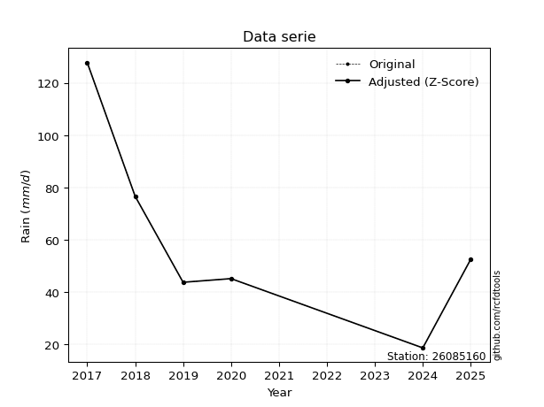</img>

</div>

> If Z-Score is active, values out of range or outliers are replaced with the station mean value.


### 4. Active continuous probability distributions from SciPy (45 of 104 available)

[scipy.stats](https://docs.scipy.org/doc/scipy/reference/stats.html) is a Python´s powerful submodule within the SciPy library for comprehensive statistical analysis, offering over 130 probability distributions (like Normal, Poisson), functions for descriptive stats (mean, variance), hypothesis testing (t-tests, chi-square), random variable generation, and statistical tests, making it essential for data science, modeling, and research. It provides tools to explore, model, and draw conclusions from data efficiently, working seamlessly with NumPy.

<div align="center">

|   id | p_dist             |   n_parameter | fit_method   | label                                                                       | active   | ref                                                                                                        |
|-----:|:-------------------|--------------:|:-------------|:----------------------------------------------------------------------------|:---------|:-----------------------------------------------------------------------------------------------------------|
|    0 | alpha              |             3 | MLE          | Alpha                                                                       | True     | [:mortar_board:](https://docs.scipy.org/doc/scipy/reference/generated/scipy.stats.alpha.html)              |
|    1 | betaprime          |             4 | MLE          | Beta prime                                                                  | True     | [:mortar_board:](https://docs.scipy.org/doc/scipy/reference/generated/scipy.stats.betaprime.html)          |
|    2 | chi2               |             3 | MLE          | Chi²                                                                        | True     | [:mortar_board:](https://docs.scipy.org/doc/scipy/reference/generated/scipy.stats.chi2.html)               |
|    3 | crystalball        |             4 | MLE          | Crystalball                                                                 | True     | [:mortar_board:](https://docs.scipy.org/doc/scipy/reference/generated/scipy.stats.crystalball.html)        |
|    4 | erlang             |             3 | MLE          | Erlang                                                                      | True     | [:mortar_board:](https://docs.scipy.org/doc/scipy/reference/generated/scipy.stats.erlang.html)             |
|    5 | expon              |             2 | MLE          | Exponential                                                                 | True     | [:mortar_board:](https://docs.scipy.org/doc/scipy/reference/generated/scipy.stats.expon.html)              |
|    6 | exponnorm          |             3 | MLE          | Exponentially modified Normal                                               | True     | [:mortar_board:](https://docs.scipy.org/doc/scipy/reference/generated/scipy.stats.exponnorm.html)          |
|    7 | f                  |             4 | MLE          | F                                                                           | True     | [:mortar_board:](https://docs.scipy.org/doc/scipy/reference/generated/scipy.stats.f.html)                  |
|    8 | fatiguelife        |             3 | MLE          | Fatigue-life (Birnbaum-Saunders)                                            | True     | [:mortar_board:](https://docs.scipy.org/doc/scipy/reference/generated/scipy.stats.fatiguelife.html)        |
|    9 | fisk               |             3 | MLE          | Fisk                                                                        | True     | [:mortar_board:](https://docs.scipy.org/doc/scipy/reference/generated/scipy.stats.fisk.html)               |
|   10 | gamma              |             3 | MLE          | Gamma                                                                       | True     | [:mortar_board:](https://docs.scipy.org/doc/scipy/reference/generated/scipy.stats.gamma.html)              |
|   11 | genexpon           |             5 | MLE          | Generalized exponential                                                     | True     | [:mortar_board:](https://docs.scipy.org/doc/scipy/reference/generated/scipy.stats.genexpon.html)           |
|   12 | genlogistic        |             3 | MLE          | Generalized logistic                                                        | True     | [:mortar_board:](https://docs.scipy.org/doc/scipy/reference/generated/scipy.stats.genlogistic.html)        |
|   13 | gibrat             |             2 | MM           | Gibrat                                                                      | True     | [:mortar_board:](https://docs.scipy.org/doc/scipy/reference/generated/scipy.stats.gibrat.html)             |
|   14 | gompertz           |             3 | MLE          | Gompertz (or truncated Gumbel)                                              | True     | [:mortar_board:](https://docs.scipy.org/doc/scipy/reference/generated/scipy.stats.gompertz.html)           |
|   15 | gumbel_l           |             2 | MM           | Gumbel Left Skew                                                            | True     | [:mortar_board:](https://docs.scipy.org/doc/scipy/reference/generated/scipy.stats.gumbel_l.html)           |
|   16 | gumbel_r           |             2 | MM           | Gumbel Right Skew                                                           | True     | [:mortar_board:](https://docs.scipy.org/doc/scipy/reference/generated/scipy.stats.gumbel_r.html)           |
|   17 | halflogistic       |             2 | MM           | Half-logistic                                                               | True     | [:mortar_board:](https://docs.scipy.org/doc/scipy/reference/generated/scipy.stats.halflogistic.html)       |
|   18 | halfnorm           |             2 | MM           | Half Normal                                                                 | True     | [:mortar_board:](https://docs.scipy.org/doc/scipy/reference/generated/scipy.stats.halfnorm.html)           |
|   19 | hypsecant          |             2 | MM           | hyperbolic secant                                                           | True     | [:mortar_board:](https://docs.scipy.org/doc/scipy/reference/generated/scipy.stats.hypsecant.html)          |
|   20 | invgamma           |             3 | MLE          | Inverted gamma                                                              | True     | [:mortar_board:](https://docs.scipy.org/doc/scipy/reference/generated/scipy.stats.invgamma.html)           |
|   21 | invgauss           |             3 | MLE          | Inverse Gaussian                                                            | True     | [:mortar_board:](https://docs.scipy.org/doc/scipy/reference/generated/scipy.stats.invgauss.html)           |
|   22 | invweibull         |             3 | MLE          | Inverted Weibull                                                            | True     | [:mortar_board:](https://docs.scipy.org/doc/scipy/reference/generated/scipy.stats.invweibull.html)         |
|   23 | johnsonsu          |             4 | MLE          | Johnson Su                                                                  | True     | [:mortar_board:](https://docs.scipy.org/doc/scipy/reference/generated/scipy.stats.johnsonsu.html)          |
|   24 | kstwobign          |             2 | MLE          | Limiting distribution of scaled Kolmogorov-Smirnov two-sided test statistic | True     | [:mortar_board:](https://docs.scipy.org/doc/scipy/reference/generated/scipy.stats.kstwobign.html)          |
|   25 | laplace            |             2 | MM           | Laplace                                                                     | True     | [:mortar_board:](https://docs.scipy.org/doc/scipy/reference/generated/scipy.stats.laplace.html)            |
|   26 | laplace_asymmetric |             3 | MLE          | Asymmetric Laplace                                                          | True     | [:mortar_board:](https://docs.scipy.org/doc/scipy/reference/generated/scipy.stats.laplace_asymmetric.html) |
|   27 | loggamma           |             3 | MLE          | Log gamma                                                                   | True     | [:mortar_board:](https://docs.scipy.org/doc/scipy/reference/generated/scipy.stats.loggamma.html)           |
|   28 | logistic           |             2 | MM           | Logistic (or Sech-squared)                                                  | True     | [:mortar_board:](https://docs.scipy.org/doc/scipy/reference/generated/scipy.stats.logistic.html)           |
|   29 | lognorm            |             3 | MLE          | Log Normal                                                                  | True     | [:mortar_board:](https://docs.scipy.org/doc/scipy/reference/generated/scipy.stats.lognorm.html)            |
|   30 | maxwell            |             2 | MM           | Maxwell                                                                     | True     | [:mortar_board:](https://docs.scipy.org/doc/scipy/reference/generated/scipy.stats.maxwell.html)            |
|   31 | mielke             |             4 | MLE          | Mielke Beta-Kappa / Dagum                                                   | True     | [:mortar_board:](https://docs.scipy.org/doc/scipy/reference/generated/scipy.stats.mielke.html)             |
|   32 | moyal              |             2 | MM           | Moyal                                                                       | True     | [:mortar_board:](https://docs.scipy.org/doc/scipy/reference/generated/scipy.stats.moyal.html)              |
|   33 | nakagami           |             3 | MLE          | Nakagami                                                                    | True     | [:mortar_board:](https://docs.scipy.org/doc/scipy/reference/generated/scipy.stats.nakagami.html)           |
|   34 | ncf                |             5 | MLE          | Non-central F distribution                                                  | True     | [:mortar_board:](https://docs.scipy.org/doc/scipy/reference/generated/scipy.stats.ncf.html)                |
|   35 | nct                |             4 | MLE          | Non-central Student’s t                                                     | True     | [:mortar_board:](https://docs.scipy.org/doc/scipy/reference/generated/scipy.stats.nct.html)                |
|   36 | norm               |             2 | MM           | Normal                                                                      | True     | [:mortar_board:](https://docs.scipy.org/doc/scipy/reference/generated/scipy.stats.norm.html)               |
|   37 | pareto             |             3 | MLE          | Pareto                                                                      | True     | [:mortar_board:](https://docs.scipy.org/doc/scipy/reference/generated/scipy.stats.pareto.html)             |
|   38 | pearson3           |             3 | MM           | Pearson type III                                                            | True     | [:mortar_board:](https://docs.scipy.org/doc/scipy/reference/generated/scipy.stats.pearson3.html)           |
|   39 | rayleigh           |             2 | MM           | Rayleigh                                                                    | True     | [:mortar_board:](https://docs.scipy.org/doc/scipy/reference/generated/scipy.stats.rayleigh.html)           |
|   40 | rice               |             3 | MLE          | Rice                                                                        | True     | [:mortar_board:](https://docs.scipy.org/doc/scipy/reference/generated/scipy.stats.rice.html)               |
|   41 | t                  |             3 | MLE          | Student’s t                                                                 | True     | [:mortar_board:](https://docs.scipy.org/doc/scipy/reference/generated/scipy.stats.t.html)                  |
|   42 | truncnorm          |             4 | MLE          | Truncated normal                                                            | True     | [:mortar_board:](https://docs.scipy.org/doc/scipy/reference/generated/scipy.stats.truncnorm.html)          |
|   43 | wald               |             2 | MM           | Wald                                                                        | True     | [:mortar_board:](https://docs.scipy.org/doc/scipy/reference/generated/scipy.stats.wald.html)               |
|   44 | weibull_min        |             3 | MLE          | Weibull minimum                                                             | True     | [:mortar_board:](https://docs.scipy.org/doc/scipy/reference/generated/scipy.stats.weibull_min.html)        |

</div>

> **n_parameter:** # arguments & localization & scale.
>
> **Fit methods:** (MLE) maximum likelihood, (MM) L-moments.
>
>**Inactive:** foldnorm, gennorm, norminvgauss, powernorm, powerlognorm, skewnorm, genextreme, anglit, arcsine, argus, beta, bradford, burr, burr12, cauchy, cosine, halfcauchy, foldcauchy, skewcauchy, wrapcauchy, dgamma, gengamma, exponweib, exponpow, truncexpon, gausshyper, genhalflogistic, genhyperbolic, geninvgauss, halfgennorm, johnsonsb, kappa4, kappa3, ksone, kstwo, loglaplace, levy, levy_l, levy_stable, ncx2, genpareto, truncpareto, lomax, powerlaw, rdist, rel_breitwigner, recipinvgauss, semicircular, studentized_range, trapezoid, triang, truncweibull_min, tukeylambda, uniform, loguniform, vonmises, vonmises_line, weibull_max, dweibull, 


## B. Probability distributions vs. Empirical distributions

A continuous probability distribution (CPD) describes probabilities for variables that can take any value within a range (like rain any time), unlike discrete variables with specific outcomes (like temperature). It uses a Probability Density Function (PDF), a curve where the total area under it equals 1, and the probability of the variable falling within an interval (a to b) is found by calculating the area under the curve between those points. A key feature is that the probability of hitting any single exact value is zero, so probabilities are always expressed for ranges, e.g., $P(a ≤ X ≤ b)$.

<div align="center">

Distributions parameters
|    |   station | p_dist                |   n |              loc |          scale | shape                  | shape1              | shape2                | shape3   |
|---:|----------:|:----------------------|----:|-----------------:|---------------:|:-----------------------|:--------------------|:----------------------|:---------|
|  0 |  26085160 | alpha                 |   6 |      2.03345     |   21.9343      | 5.372502893877249e-09  |                     |                       |          |
|  1 |  26085160 | betaprime             |   6 |     13.5999      |   86.3403      | 0.38986593748440007    | 1.7247039852928214  |                       |          |
|  2 |  26085160 | chi2                  |   6 |     13.6         |   16.709       | 1.5120198840211398     |                     |                       |          |
|  3 |  26085160 | crystalball           |   6 |     54.2333      |   38.7889      | 9879.687118459316      | 1108.0624422902279  |                       |          |
|  4 |  26085160 | erlang                |   6 |     13.6         |   64.5697      | 0.1432582977426366     |                     |                       |          |
|  5 |  26085160 | expon                 |   6 |     13.6         |   40.6333      |                        |                     |                       |          |
|  6 |  26085160 | exponnorm             |   6 |     13.5602      |    0.0113314   | 3562.735671777783      |                     |                       |          |
|  7 |  26085160 | f                     |   6 |     -0.283569    |   49.4259      | 4.7153220699537        | 22.82173821884362   |                       |          |
|  8 |  26085160 | fatiguelife           |   6 |     13.6         |    5.53016e-05 | 741.4508222416698      |                     |                       |          |
|  9 |  26085160 | fisk                  |   6 |     13.6         |   28.655       | 0.9166224108334581     |                     |                       |          |
| 10 |  26085160 | gamma                 |   6 |     13.6         |   49.5847      | 0.3739641874232388     |                     |                       |          |
| 11 |  26085160 | genexpon              |   6 |     13.6         |    7.80161     | 0.18305787624221947    | 6.196618657693799   | 0.0002919857437777846 |          |
| 12 |  26085160 | genlogistic           |   6 |   -171.416       |   28.0129      | 1690.2084893797419     |                     |                       |          |
| 13 |  26085160 | gibrat                |   6 |     24.6423      |   17.9479      |                        |                     |                       |          |
| 14 |  26085160 | gompertz              |   6 |     13.6         |  533.661       | 12.186766788615621     |                     |                       |          |
| 15 |  26085160 | gumbel_l              |   6 |     71.6904      |   30.2436      |                        |                     |                       |          |
| 16 |  26085160 | gumbel_r              |   6 |     36.7762      |   30.2436      |                        |                     |                       |          |
| 17 |  26085160 | halflogistic          |   6 |      8.25942     |   33.1632      |                        |                     |                       |          |
| 18 |  26085160 | halfnorm              |   6 |      2.89197     |   64.3469      |                        |                     |                       |          |
| 19 |  26085160 | hypsecant             |   6 |     54.2333      |   24.6938      |                        |                     |                       |          |
| 20 |  26085160 | invgamma              |   6 |     -3.61336     |   84.3827      | 2.3184514169936854     |                     |                       |          |
| 21 |  26085160 | invgauss              |   6 |      6.84754     |   32.8868      | 1.4408747196477827     |                     |                       |          |
| 22 |  26085160 | invweibull            |   6 |    -11.2063      |   41.2064      | 1.9439027393555355     |                     |                       |          |
| 23 |  26085160 | johnsonsu             |   6 |     13.6         |    7.35391e-11 | -1.461156442997948     | 0.08438552538705744 |                       |          |
| 24 |  26085160 | kstwobign             |   6 |    -62.2121      |  133.976       |                        |                     |                       |          |
| 25 |  26085160 | laplace               |   6 |     54.2333      |   27.4279      |                        |                     |                       |          |
| 26 |  26085160 | laplace_asymmetric    |   6 |     43.7         |   27.4398      | 0.8263151436363746     |                     |                       |          |
| 27 |  26085160 | loggamma              |   6 | -11402.6         | 1556.7         | 1572.1310160947069     |                     |                       |          |
| 28 |  26085160 | logistic              |   6 |     54.2333      |   21.3855      |                        |                     |                       |          |
| 29 |  26085160 | lognorm               |   6 |     13.6         |    0.0626706   | 13.983514697027536     |                     |                       |          |
| 30 |  26085160 | maxwell               |   6 |    -37.6802      |   57.5983      |                        |                     |                       |          |
| 31 |  26085160 | mielke                |   6 |     -0.504364    |    1.11997     | 169.3016864487371      | 1.4648027522885592  |                       |          |
| 32 |  26085160 | moyal                 |   6 |     32.0513      |   17.4612      |                        |                     |                       |          |
| 33 |  26085160 | nakagami              |   6 |     13.6         |   68.6839      | 0.18675992934303204    |                     |                       |          |
| 34 |  26085160 | ncf                   |   6 |     -0.000690114 |    3.60887e-05 | 3.3560737536120973e-06 | 6.068527452241362   | 3.4270676855696194    |          |
| 35 |  26085160 | nct                   |   6 |     -0.00546095  |    0.658149    | 1.2406071263535459     | 38.085215088149376  |                       |          |
| 36 |  26085160 | norm                  |   6 |     54.2333      |   38.7889      |                        |                     |                       |          |
| 37 |  26085160 | pareto                |   6 |     13.5028      |    0.0972028   | 0.20669863385090884    |                     |                       |          |
| 38 |  26085160 | pearson3              |   6 |     54.2333      |   38.789       | 0.8426498284886665     |                     |                       |          |
| 39 |  26085160 | rayleigh              |   6 |    -19.9722      |   59.2074      |                        |                     |                       |          |
| 40 |  26085160 | rice                  |   6 |     -8.70306     |   52.2761      | 0.0005514299968271625  |                     |                       |          |
| 41 |  26085160 | t                     |   6 |     54.2342      |   38.7906      | 16489982.768439367     |                     |                       |          |
| 42 |  26085160 | truncnorm             |   6 |     54.2333      |   38.7889      | -438.6526035336606     | 307.3676760809604   |                       |          |
| 43 |  26085160 | wald                  |   6 |     15.4444      |   38.789       |                        |                     |                       |          |
| 44 |  26085160 | weibull_min           |   6 |     13.6         |   41.6473      | 0.6741001258402493     |                     |                       |          |
| 45 |  26085160 | logalpha              |   6 |     -9.36794     |  218.745       | 16.770406215799667     |                     |                       |          |
| 46 |  26085160 | logbetaprime          |   6 |     -7.54723     |  153.283       | 230.554631093367       | 3135.901231030577   |                       |          |
| 47 |  26085160 | logchi2               |   6 |      2.61007     |    0.941819    | 1.0831396427886109     |                     |                       |          |
| 48 |  26085160 | logcrystalball        |   6 |      3.71809     |    0.767972    | 332.03396838454586     | 1.2588120324981502  |                       |          |
| 49 |  26085160 | logerlang             |   6 |    -25.2221      |    0.0203968   | 1418.8274103104523     |                     |                       |          |
| 50 |  26085160 | logexpon              |   6 |      2.61007     |    1.10802     |                        |                     |                       |          |
| 51 |  26085160 | logexponnorm          |   6 |      3.71739     |    0.767977    | 0.0009092085299694142  |                     |                       |          |
| 52 |  26085160 | logf                  |   6 |   -158.86        |  162.577       | 258597.34560727002     | 137248.0671548359   |                       |          |
| 53 |  26085160 | logfatiguelife        |   6 |    -53.5504      |   57.263       | 0.013395285749869361   |                     |                       |          |
| 54 |  26085160 | logfisk               |   6 |     -0.0162986   |    3.69723     | 7.7435860858987375     |                     |                       |          |
| 55 |  26085160 | loggamma              |   6 |    -24.8007      |    0.0207189   | 1376.4355972220178     |                     |                       |          |
| 56 |  26085160 | loggenexpon           |   6 |      2.61007     |    1.36137     | 0.9217613423077202     | 1.3842338439656419  | 0.43100476655910064   |          |
| 57 |  26085160 | loggenlogistic        |   6 |      0.0205654   |    0.695129    | 117.97321928229127     |                     |                       |          |
| 58 |  26085160 | loggibrat             |   6 |      3.13223     |    0.355345    |                        |                     |                       |          |
| 59 |  26085160 | loggompertz           |   6 |      2.61007     |    1.32953     | 0.5967095978272501     |                     |                       |          |
| 60 |  26085160 | loggumbel_l           |   6 |      4.06372     |    0.598785    |                        |                     |                       |          |
| 61 |  26085160 | loggumbel_r           |   6 |      3.37246     |    0.598785    |                        |                     |                       |          |
| 62 |  26085160 | loghalflogistic       |   6 |      2.80785     |    0.656602    |                        |                     |                       |          |
| 63 |  26085160 | loghalfnorm           |   6 |      2.70159     |    1.27399     |                        |                     |                       |          |
| 64 |  26085160 | loghypsecant          |   6 |      3.71809     |    0.488906    |                        |                     |                       |          |
| 65 |  26085160 | loginvgamma           |   6 |     -6.75516     | 1918.48        | 184.21424772789965     |                     |                       |          |
| 66 |  26085160 | loginvgauss           |   6 |     -0.778319    |  142.342       | 0.031532291135619006   |                     |                       |          |
| 67 |  26085160 | loginvweibull         |   6 |     -4.07425e+07 |    4.07425e+07 | 58290727.34988928      |                     |                       |          |
| 68 |  26085160 | logjohnsonsu          |   6 |  -1488.16        | 1259.95        | -2554.2192703081673    | 2539.6375728464573  |                       |          |
| 69 |  26085160 | logkstwobign          |   6 |      0.931324    |    3.17783     |                        |                     |                       |          |
| 70 |  26085160 | loglaplace            |   6 |      3.71809     |    0.543038    |                        |                     |                       |          |
| 71 |  26085160 | loglaplace_asymmetric |   6 |      3.80888     |    0.609513    | 1.0772366652117236     |                     |                       |          |
| 72 |  26085160 | logloggamma           |   6 |    -13.4071      |    4.71943     | 38.16114532229298      |                     |                       |          |
| 73 |  26085160 | loglogistic           |   6 |      3.71809     |    0.423405    |                        |                     |                       |          |
| 74 |  26085160 | loglognorm            |   6 |      2.61007     |    0.00301656  | 13.22825531302227      |                     |                       |          |
| 75 |  26085160 | logmaxwell            |   6 |      1.89832     |    1.14037     |                        |                     |                       |          |
| 76 |  26085160 | logmielke             |   6 |      2.61007     |    2.63948     | 0.5239509393335967     | 61.16951929252551   |                       |          |
| 77 |  26085160 | logmoyal              |   6 |      3.27891     |    0.345709    |                        |                     |                       |          |
| 78 |  26085160 | lognakagami           |   6 |      2.61007     |    1.37692     | 0.14753312972464977    |                     |                       |          |
| 79 |  26085160 | logncf                |   6 |     -9.55272     |    7.59606     | 847.9732240809558      | 1346.3023285014733  | 631.120058461986      |          |
| 80 |  26085160 | lognct                |   6 |    -32.6265      |    0.743152    | 17508.35446332056      | 48.903666140531186  |                       |          |
| 81 |  26085160 | lognorm               |   6 |      3.71809     |    0.767971    |                        |                     |                       |          |
| 82 |  26085160 | logpareto             |   6 |      2.60692     |    0.00315199  | 0.204458295960869      |                     |                       |          |
| 83 |  26085160 | logpearson3           |   6 |      3.71809     |    0.767971    | -0.06284567323573093   |                     |                       |          |
| 84 |  26085160 | lograyleigh           |   6 |      2.24891     |    1.17223     |                        |                     |                       |          |
| 85 |  26085160 | logrice               |   6 |      2.20228     |    0.918325    | 1.1932749961454152     |                     |                       |          |
| 86 |  26085160 | logt                  |   6 |      3.71809     |    0.767962    | 441629904.52637196     |                     |                       |          |
| 87 |  26085160 | logtruncnorm          |   6 |      3.27702     |    1.60095     | -0.25749608631254106   | 0.9828195898566452  |                       |          |
| 88 |  26085160 | logwald               |   6 |      2.95012     |    0.767963    |                        |                     |                       |          |
| 89 |  26085160 | logweibull_min        |   6 |      2.36877     |    1.50844     | 1.7434480284933693     |                     |                       |          |

</div>

> **loc** (Location parameter): This shifts the distribution along the x-axis. For many common distributions, like the normal (Gaussian) distribution, loc represents the mean $μ$. For others, like the uniform distribution, it might represent the minimum value, or for the beta distribution, the left end of the support interval.
>
> **scale** (Scale parameter): This determines the width or spread of the distribution. For the normal distribution, scale represents the standard deviation $σ$. For a uniform distribution, it defines the length of the interval (from $loc$ to $loc + scale$).
>
> **shape** (Shape parameters): Refers to parameters that define the specific form of a probability distribution, distinct from its location (loc) and scale (scale). These parameters are required arguments for most distribution functions. For example, a normal (Gaussian) distribution is fully defined by its location (mean) and scale (standard deviation), so it has no specific shape parameters beyond loc and scale. However, other distributions have intrinsic properties that need specification, as Gamma distribution that takes a shape parameter, often named $a$ or $alpha$.


### 0. Cumulative distribution values - CDF (90 evaluated)

> Ordered by x ascending and calculating $log(f(x))$ separately. 

|   id |   Station |   date |     x |   count |    mean |     std |    zscore |   Value_initial |   station |   m |     alpha |   alpha_pdf |   betaprime |   betaprime_pdf |        chi2 |      chi2_pdf |   crystalball |   crystalball_pdf |     erlang |   erlang_pdf |    expon |   expon_pdf |   exponnorm |   exponnorm_pdf |        f |      f_pdf |   fatiguelife |   fatiguelife_pdf |        fisk |   fisk_pdf |       gamma |   gamma_pdf |    genexpon |   genexpon_pdf |   genlogistic |   genlogistic_pdf |   gibrat |   gibrat_pdf |    gompertz |   gompertz_pdf |   gumbel_l |   gumbel_l_pdf |   gumbel_r |   gumbel_r_pdf |   halflogistic |   halflogistic_pdf |   halfnorm |   halfnorm_pdf |   hypsecant |   hypsecant_pdf |   invgamma |   invgamma_pdf |   invgauss |   invgauss_pdf |   invweibull |   invweibull_pdf |   johnsonsu |   johnsonsu_pdf |   kstwobign |   kstwobign_pdf |   laplace |   laplace_pdf |   laplace_asymmetric |   laplace_asymmetric_pdf |   loggamma |   loggamma_pdf |   logistic |   logistic_pdf |   lognorm |   lognorm_pdf |   maxwell |   maxwell_pdf |      mielke |   mielke_pdf |     moyal |   moyal_pdf |    nakagami |   nakagami_pdf |      ncf |    ncf_pdf |       nct |    nct_pdf |     norm |   norm_pdf |   pareto |   pareto_pdf |   pearson3 |   pearson3_pdf |   rayleigh |   rayleigh_pdf |      rice |   rice_pdf |        t |      t_pdf |   truncnorm |   truncnorm_pdf |       wald |   wald_pdf |   weibull_min |   weibull_min_pdf |   logalpha |   logalpha_pdf |   logbetaprime |   logbetaprime_pdf |     logchi2 |   logchi2_pdf |   logcrystalball |   logcrystalball_pdf |   logerlang |   logerlang_pdf |   logexpon |   logexpon_pdf |   logexponnorm |   logexponnorm_pdf |      logf |   logf_pdf |   logfatiguelife |   logfatiguelife_pdf |   logfisk |   logfisk_pdf |   loggenexpon |   loggenexpon_pdf |   loggenlogistic |   loggenlogistic_pdf |   loggibrat |   loggibrat_pdf |   loggompertz |   loggompertz_pdf |   loggumbel_l |   loggumbel_l_pdf |   loggumbel_r |   loggumbel_r_pdf |   loghalflogistic |   loghalflogistic_pdf |   loghalfnorm |   loghalfnorm_pdf |   loghypsecant |   loghypsecant_pdf |   loginvgamma |   loginvgamma_pdf |   loginvgauss |   loginvgauss_pdf |   loginvweibull |   loginvweibull_pdf |   logjohnsonsu |   logjohnsonsu_pdf |   logkstwobign |   logkstwobign_pdf |   loglaplace |   loglaplace_pdf |   loglaplace_asymmetric |   loglaplace_asymmetric_pdf |   logloggamma |   logloggamma_pdf |   loglogistic |   loglogistic_pdf |   loglognorm |   loglognorm_pdf |   logmaxwell |   logmaxwell_pdf |   logmielke |   logmielke_pdf |   logmoyal |   logmoyal_pdf |   lognakagami |   lognakagami_pdf |    logncf |   logncf_pdf |    lognct |   lognct_pdf |   logpareto |   logpareto_pdf |   logpearson3 |   logpearson3_pdf |   lograyleigh |   lograyleigh_pdf |   logrice |   logrice_pdf |      logt |   logt_pdf |   logtruncnorm |   logtruncnorm_pdf |   logwald |   logwald_pdf |   logweibull_min |   logweibull_min_pdf |
|-----:|----------:|-------:|------:|--------:|--------:|--------:|----------:|----------------:|----------:|----:|----------:|------------:|------------:|----------------:|------------:|--------------:|--------------:|------------------:|-----------:|-------------:|---------:|------------:|------------:|----------------:|---------:|-----------:|--------------:|------------------:|------------:|-----------:|------------:|------------:|------------:|---------------:|--------------:|------------------:|---------:|-------------:|------------:|---------------:|-----------:|---------------:|-----------:|---------------:|---------------:|-------------------:|-----------:|---------------:|------------:|----------------:|-----------:|---------------:|-----------:|---------------:|-------------:|-----------------:|------------:|----------------:|------------:|----------------:|----------:|--------------:|---------------------:|-------------------------:|-----------:|---------------:|-----------:|---------------:|----------:|--------------:|----------:|--------------:|------------:|-------------:|----------:|------------:|------------:|---------------:|---------:|-----------:|----------:|-----------:|---------:|-----------:|---------:|-------------:|-----------:|---------------:|-----------:|---------------:|----------:|-----------:|---------:|-----------:|------------:|----------------:|-----------:|-----------:|--------------:|------------------:|-----------:|---------------:|---------------:|-------------------:|------------:|--------------:|-----------------:|---------------------:|------------:|----------------:|-----------:|---------------:|---------------:|-------------------:|----------:|-----------:|-----------------:|---------------------:|----------:|--------------:|--------------:|------------------:|-----------------:|---------------------:|------------:|----------------:|--------------:|------------------:|--------------:|------------------:|--------------:|------------------:|------------------:|----------------------:|--------------:|------------------:|---------------:|-------------------:|--------------:|------------------:|--------------:|------------------:|----------------:|--------------------:|---------------:|-------------------:|---------------:|-------------------:|-------------:|-----------------:|------------------------:|----------------------------:|--------------:|------------------:|--------------:|------------------:|-------------:|-----------------:|-------------:|-----------------:|------------:|----------------:|-----------:|---------------:|--------------:|------------------:|----------:|-------------:|----------:|-------------:|------------:|----------------:|--------------:|------------------:|--------------:|------------------:|----------:|--------------:|----------:|-----------:|---------------:|-------------------:|----------:|--------------:|-----------------:|---------------------:|
|    0 |  26085160 |   2025 |  13.6 |       6 | 54.2333 | 42.4912 | -0.956277 |            13.6 |  26085160 |   1 | 0.0579136 |  0.0216651  |  0.00637703 |    24.1108      | 5.39953e-13 | 229.802       |      0.147423 |        0.00594174 | 0.00453544 |  3.65771e+11 | 0        |  0.0246103  | 0.000985267 |      0.0247405  | 0.088933 | 0.0118484  |     0.0262933 |       2.20672e+09 | 1.39215e-15 | 0.718368   | 7.96075e-07 | 1.67592e+08 | 1.03918e-09 |     0.0234641  |      0.10157  |        0.0082867  | 0        |  0           | 2.49291e-08 |     0.0228361  |   0.136272 |    0.00418381  |   0.116271 |     0.00827268 |      0.0803462 |         0.0149796  |   0.132167 |     0.0122292  |    0.121325 |      0.00479509 |  0.0657963 |     0.0145872  |  0.0526394 |     0.0217561  |    0.0684325 |       0.014382   |   0.0811831 |     1.32521e+08 |   0.0939911 |      0.00831378 |  0.113653 |    0.0041437  |             0.107579 |               0.0047446  |   0.073418 |       0.186033 |   0.130103 |     0.00529222 | 0.0745405 |      0.183462 |  0.148775 |    0.00738737 |   0.0612162 |   0.017546   | 0.0898599 |  0.00919583 | 5.05332e-07 |    1.06258e+08 | 0.359566 | 0.0118315  | 0.0563644 | 0.0196937  | 0.147423 | 0.00594174 | 0        |  2.12647     |   0.132852 |     0.00820282 |   0.148503 |     0.00815474 | 0.0869922 | 0.00745132 | 0.147429 | 0.00594163 |    0.147423 |      0.00594174 | 0          | 0          |    9.2245e-12 |     3500.55       |  0.0678755 |       0.199905 |      0.0693851 |           0.186722 | 3.87305e-09 |    4.7232e+06 |        0.0745406 |             0.183462 |   0.0733381 |        0.185897 |   0        |       0.902513 |      0.0745418 |           0.183463 | 0.0737134 |   0.18331  |        0.0733289 |             0.184965 | 0.0661021 |      0.182012 |   7.09015e-13 |          0.677082 |        0.0601839 |             0.240443 |    0        |       0         |   2.81137e-08 |          0.448811 |     0.0844617 |          0.134923 |     0.0280893 |          0.167582 |          0        |              0        |      0        |          0        |      0.0657779 |           0.133585 |     0.0679107 |          0.196976 |     0.0659513 |          0.216119 |       0.0599466 |            0.241372 |      0.0748745 |           0.183945 |      0.0570571 |           0.266519 |    0.0649879 |         0.119675 |               0.0865242 |                    0.131778 |      0.078415 |          0.176643 |     0.0680572 |          0.149799 |    0.0127541 |      5.60505e+12 |    0.0576076 |         0.22432  | 2.66527e-06 |    23036.1      | 0.00851433 |      0.0953298 |   2.16821e-05 |       1.44062e+10 | 0.0724088 |     0.192699 | 0.0744086 |     0.183871 |    0        |      64.8663    |     0.0760753 |          0.180912 |      0.046352 |          0.250644 | 0.0476799 |      0.230355 | 0.0745383 |   0.18346  |      0         |           0        |  0        |     0         |        0.0401228 |             0.284007 |
|    1 |  26085160 |   2024 |  18.6 |       6 | 54.2333 | 42.4912 | -0.838606 |            18.6 |  26085160 |   2 | 0.1855    |  0.0265424  |  0.413984   |     0.0296233   | 0.242517    |   0.0336407   |      0.17914  |        0.00674449 | 0.734061   |  0.0196517   | 0.115782 |  0.0217609  | 0.11736     |      0.0218634  | 0.153449 | 0.0137418  |     0.657458  |       0.0149017   | 0.167937    | 0.0256167  | 0.464253    | 0.0322521   | 0.11103     |     0.020991   |      0.147583 |        0.0100746  | 0        |  0           | 0.108382    |     0.0205528  |   0.158722 |    0.00480766  |   0.16139  |     0.0097331  |      0.154654  |         0.0147164  |   0.192858 |     0.0120357  |    0.147673 |      0.00576795 |  0.151398  |     0.0188655  |  0.177989  |     0.0257406  |    0.153075  |       0.0187368  |   0.758702  |     0.00526207  |   0.13996   |      0.0100135  |  0.13638  |    0.00497231 |             0.134121 |               0.0059152  |   0.15053  |       0.309819 |   0.158926 |     0.00625044 | 0.150311  |      0.304024 |  0.187802 |    0.00820541 |   0.165507  |   0.0226494  | 0.141595  |  0.0114015  | 0.297976    |    0.0222415   | 0.416087 | 0.0107804  | 0.176466  | 0.0259606  | 0.17914  | 0.00674449 | 0.558887 |  0.0178878   |   0.176661 |     0.00928501 |   0.191205 |     0.00889939 | 0.127499  | 0.00871709 | 0.179145 | 0.00674431 |    0.17914  |      0.00674449 | 0.00119313 | 0.00247802 |    0.213025   |        0.0254172  |  0.152303  |       0.341043 |      0.147608  |           0.316049 | 0.402312    |    0.624002   |        0.150312  |             0.304024 |   0.150411  |        0.309725 |   0.246156 |       0.680354 |      0.150313  |           0.304023 | 0.14957   |   0.304713 |        0.15001   |             0.308236 | 0.144791  |      0.326203 |   0.203285    |          0.61589  |        0.165473  |             0.424985 |    0        |       0         |   0.146529    |          0.484757 |     0.138306  |          0.214213 |     0.120303  |          0.42548  |          0.087588 |              0.755655 |      0.138073 |          0.616887 |      0.123662  |           0.246622 |     0.151126  |          0.336734 |     0.157849  |          0.370121 |       0.165602  |            0.426037 |      0.150785  |           0.304386 |      0.173053  |           0.458773 |    0.115672  |         0.213009 |               0.139389  |                    0.212293 |      0.15055  |          0.288026 |     0.132681  |          0.271789 |    0.637185  |      0.0905715   |    0.152363  |         0.377344 | 0.327267    |        0.547673 | 0.0943584  |      0.47642   |   0.52105     |       0.487797    | 0.152588  |     0.322099 | 0.150384  |     0.304891 |    0.610247 |       0.251984  |     0.150444  |          0.29778  |      0.152461 |          0.415866 | 0.144144  |      0.379635 | 0.150309  |   0.304024 |      0.0322177 |           0.554246 |  0        |     0         |        0.160226  |             0.461167 |
|    2 |  26085160 |   2019 |  43.7 |       6 | 54.2333 | 42.4912 | -0.247895 |            43.7 |  26085160 |   3 | 0.598594  |  0.0087763  |  0.725616   |     0.0059295   | 0.705469    |   0.0102437   |      0.392982 |        0.00991264 | 0.908736   |  0.00286197  | 0.523254 |  0.0117329  | 0.526013    |      0.0117409  | 0.500646 | 0.0120682  |     0.840136  |       0.00401936  | 0.511272    | 0.00760927 | 0.802759    | 0.00631918  | 0.513117    |     0.0118597  |      0.457818 |        0.0127657  | 0.523922 |  0.0208957   | 0.506939    |     0.0119129  |   0.327218 |    0.00881661  |   0.451409 |     0.0118717  |      0.488689  |         0.0114763  |   0.474042 |     0.0101409  |    0.368162 |      0.0118003  |  0.56267   |     0.0115134  |  0.603336  |     0.0100034  |    0.564185  |       0.0114328  |   0.80334   |     0.000776938 |   0.440375  |      0.0122586  |  0.340553 |    0.0124163  |             0.405751 |               0.0178951  |   0.534567 |       0.516317 |   0.379294 |     0.0110089  | 0.530754  |      0.517931 |  0.426818 |    0.0101921  |   0.589031  |   0.0103072  | 0.473763  |  0.012663   | 0.579442    |    0.00697612  | 0.628136 | 0.00643242 | 0.614194  | 0.00963513 | 0.392982 | 0.00991264 | 0.694615 |  0.00209035  |   0.444206 |     0.0109952  |   0.439122 |     0.0101875  | 0.394943  | 0.0116024  | 0.392978 | 0.00991218 |    0.392982 |      0.00991264 | 0.533496   | 0.0157262  |    0.552201   |        0.0080571  |  0.551657  |       0.50078  |      0.536288  |           0.514758 | 0.710478    |    0.216895   |        0.530754  |             0.517931 |   0.53453   |        0.516589 |   0.651279 |       0.314725 |      0.530753  |           0.517927 | 0.530667  |   0.517816 |        0.5336    |             0.517666 | 0.549673  |      0.505263 |   0.626546    |          0.370179 |        0.589025  |             0.447492 |    0.724529 |       0.517659  |   0.567843    |          0.466658 |     0.461985  |          0.556959 |     0.601364  |          0.510745 |          0.628101 |              0.461078 |      0.601555 |          0.438475 |      0.538488  |           0.646312 |     0.550991  |          0.507898 |     0.568413  |          0.487781 |       0.588744  |            0.446232 |      0.531086  |           0.517257 |      0.60115   |           0.43858  |    0.551692  |         0.825556 |               0.511944  |                    0.779702 |      0.520047 |          0.521051 |     0.534933  |          0.587569 |    0.673797  |      0.0233441   |    0.562321  |         0.488773 | 0.652141    |        0.292724 | 0.626741   |      0.498614  |   0.758823    |       0.174837    | 0.542058  |     0.50937  | 0.53135   |     0.51766  |    0.701743 |       0.0521015 |     0.52661   |          0.519145 |      0.5726   |          0.475395 | 0.553806  |      0.49589  | 0.530755  |   0.517937 |      0.511172  |           0.540883 |  0.697186 |     0.463388  |        0.58829   |             0.452229 |
|    3 |  26085160 |   2020 |  45.1 |       6 | 54.2333 | 42.4912 | -0.214947 |            45.1 |  26085160 |   4 | 0.610534  |  0.00828811 |  0.733701   |     0.00562336  | 0.719437    |   0.00971505  |      0.406925 |        0.0100038  | 0.912623   |  0.0026936   | 0.5394   |  0.0113355  | 0.542168    |      0.0113407  | 0.517331 | 0.0117661  |     0.845636  |       0.0038396   | 0.521678    | 0.00726111 | 0.811359    | 0.00597088  | 0.529454    |     0.0114813  |      0.475587 |        0.0126149  | 0.552068 |  0.0193345   | 0.523359    |     0.0115465  |   0.339733 |    0.00906255  |   0.467946 |     0.0117499  |      0.504589  |         0.0112382  |   0.488141 |     0.00999959 |    0.384865 |      0.0120562  |  0.578428  |     0.0110011  |  0.616996  |     0.00951692 |    0.579822  |       0.0109103  |   0.804402  |     0.000739975 |   0.45745   |      0.0121315  |  0.358387 |    0.0130665  |             0.430284 |               0.0171563  |   0.550809 |       0.513677 |   0.394823 |     0.0111729  | 0.547056  |      0.515858 |  0.441085 |    0.0101868  |   0.603084  |   0.00977445 | 0.491315  |  0.0124083  | 0.589053    |    0.00675713  | 0.63701  | 0.00624659 | 0.627297  | 0.00909078 | 0.406925 | 0.0100038  | 0.697462 |  0.0019791   |   0.459549 |     0.0109209  |   0.453357 |     0.0101472  | 0.411181  | 0.0115927  | 0.406921 | 0.0100033  |    0.406925 |      0.0100038  | 0.554884   | 0.0148373  |    0.563259   |        0.00774258 |  0.567366  |       0.495422 |      0.55247   |           0.511407 | 0.71722     |    0.210704   |        0.547056  |             0.515857 |   0.550781  |        0.513953 |   0.661064 |       0.305894 |      0.547055  |           0.515854 | 0.546964  |   0.515639 |        0.549887  |             0.515159 | 0.565484  |      0.497412 |   0.638078    |          0.361274 |        0.602986  |             0.437868 |    0.740236 |       0.479141  |   0.582481    |          0.461672 |     0.47972   |          0.567724 |     0.61726   |          0.497351 |          0.642422 |              0.447223 |      0.615237 |          0.429274 |      0.558776  |           0.639998 |     0.56693   |          0.502856 |     0.583687  |          0.480828 |       0.602665  |            0.436633 |      0.547366  |           0.515166 |      0.614834  |           0.429328 |    0.576984  |         0.778981 |               0.537131  |                    0.818062 |      0.536475 |          0.520686 |     0.553405  |          0.583715 |    0.674523  |      0.0227094   |    0.577639  |         0.482624 | 0.661313    |        0.289032 | 0.642191   |      0.481321  |   0.764269    |       0.170589    | 0.558064  |     0.505661 | 0.547643  |     0.5155   |    0.703359 |       0.0504596 |     0.542961  |          0.51773  |      0.587481 |          0.46831  | 0.569362  |      0.490645 | 0.547057  |   0.515864 |      0.528174  |           0.53746  |  0.711371 |     0.436575  |        0.602421  |             0.443955 |
|    4 |  26085160 |   2018 |  76.6 |       6 | 54.2333 | 42.4912 |  0.526384 |            76.6 |  26085160 |   5 | 0.768638  |  0.00301429 |  0.845444   |     0.00223241  | 0.902356    |   0.00319616  |      0.717904 |        0.00870967 | 0.962732   |  0.000913187 | 0.787848 |  0.00522114 | 0.790184    |      0.00519724 | 0.785429 | 0.00567212 |     0.924999  |       0.00161726  | 0.673074    | 0.00320156 | 0.924035    | 0.00204968  | 0.785015    |     0.00544659 |      0.785493 |        0.00676971 | 0.856099 |  0.00436425  | 0.782822    |     0.00558094 |   0.691568 |    0.0119957   |   0.764907 |     0.00677815 |      0.774056  |         0.00604341 |   0.74799  |     0.00643411 |    0.755442 |      0.00895765 |  0.797175  |     0.00415044 |  0.80663   |     0.00372625 |    0.794709  |       0.00404267 |   0.820151  |     0.000351287 |   0.766702  |      0.0071822  |  0.778784 |    0.00806534 |             0.779355 |               0.00664445 |   0.791361 |       0.368171 |   0.739983 |     0.00899714 | 0.79045   |      0.374803 |  0.73161  |    0.00761778 | nan         | nan          | 0.780054  |  0.00613615 | 0.749616    |    0.00389039  | 0.781918 | 0.00330375 | 0.797601  | 0.00314525 | 0.717904 | 0.00870967 | 0.737762 |  0.000859058 |   0.749842 |     0.0070638  |   0.735579 |     0.00728442 | 0.735881  | 0.0082444  | 0.717888 | 0.00870952 |    0.717904 |      0.00870967 | 0.825357   | 0.00467536 |    0.73335    |        0.00377135 |  0.791386  |       0.334261 |      0.789821  |           0.360952 | 0.806682    |    0.134488   |        0.79045   |             0.374803 |   0.791462  |        0.368325 |   0.789868 |       0.189647 |      0.790448  |           0.374802 | 0.789938  |   0.373829 |        0.791501  |             0.370102 | 0.780358  |      0.304771 |   0.792855    |          0.229023 |        0.789494  |             0.268181 |    0.8892   |       0.156681  |   0.796688    |          0.334852 |     0.794559  |          0.542984 |     0.819394  |          0.272577 |          0.822877 |              0.245867 |      0.801189 |          0.274312 |      0.825571  |           0.339185 |     0.795042  |          0.34031  |     0.796621  |          0.313047 |       0.788732  |            0.267813 |      0.790408  |           0.374302 |      0.799532  |           0.269732 |    0.840516  |         0.293689 |               0.818503  |                    0.320773 |      0.787876 |          0.394602 |     0.812376  |          0.359989 |    0.684422  |      0.0155482   |    0.794663  |         0.324584 | 0.80108     |        0.242823 | 0.829013   |      0.243478  |   0.839177    |       0.116819    | 0.791701  |     0.354238 | 0.790589  |     0.373764 |    0.724699 |       0.0325047 |     0.789425  |          0.382375 |      0.795856 |          0.310449 | 0.793148  |      0.338727 | 0.790454  |   0.374804 |      0.793077  |           0.455863 |  0.861893 |     0.178387  |        0.796574  |             0.286718 |
|    5 |  26085160 |   2017 | 127.8 |       6 | 54.2333 | 42.4912 |  1.73134  |           127.8 |  26085160 |   6 | 0.861548  |  0.00108975 |  0.91575    |     0.000832616 | 0.981131    |   0.000597331 |      0.971059 |        0.0017026  | 0.988224   |  0.00024824  | 0.939825 |  0.00148092 | 0.940973    |      0.00146211 | 0.943913 | 0.00143558 |     0.973696  |       0.000517511 | 0.780288    | 0.00137605 | 0.979384    | 0.000502947 | 0.94348     |     0.00151764 |      0.961923 |        0.00133305 | 0.959836 |  0.000838141 | 0.945412    |     0.00154403 |   0.998327 |    0.000353598 |   0.951889 |     0.0015519  |      0.947045  |         0.00155453 |   0.947762 |     0.0018844  |    0.967665 |      0.0013072  |  0.915546  |     0.00121519 |  0.919053  |     0.00123934 |    0.910212  |       0.00119748 |   0.833012  |     0.000184852 |   0.964198  |      0.00151596 |  0.965793 |    0.00124716 |             0.952784 |               0.00142185 |   0.928371 |       0.173235 |   0.968932 |     0.00140761 | 0.929827  |      0.175166 |  0.958959 |    0.00184431 | nan         | nan          | 0.948607  |  0.00146961 | 0.890683    |    0.00187141  | 0.891714 | 0.00133652 | 0.890994  | 0.00104259 | 0.971059 | 0.0017026  | 0.768068 |  0.000419434 |   0.953352 |     0.00170824 |   0.955604 |     0.00187148 | 0.966931  | 0.00165178 | 0.971052 | 0.00170286 |    0.971059 |      0.0017026  | 0.948905   | 0.00112128 |    0.861076   |        0.00161862 |  0.917093  |       0.16525  |      0.924637  |           0.172595 | 0.863522    |    0.0909966  |        0.929827  |             0.175166 |   0.928489  |        0.173166 |   0.867608 |       0.119486 |      0.929826  |           0.175168 | 0.92907   |   0.1753   |        0.929065  |             0.173402 | 0.893622  |      0.151254 |   0.885066    |          0.137188 |        0.892935  |             0.145396 |    0.942483 |       0.0670662 |   0.927294    |          0.175979 |     0.975783  |          0.150478 |     0.918765  |          0.130001 |          0.91468  |              0.124398 |      0.908345 |          0.151    |      0.937398  |           0.127221 |     0.922059  |          0.164448 |     0.914763  |          0.157565 |       0.892165  |            0.145646 |      0.929668  |           0.175182 |      0.904527  |           0.14816  |    0.937863  |         0.114425 |               0.926552  |                    0.12981  |      0.934335 |          0.180543 |     0.935503  |          0.142505 |    0.69136   |      0.0118812   |    0.917961  |         0.164371 | 0.917695    |        0.214607 | 0.917956   |      0.118241  |   0.889818    |       0.0830703   | 0.924178  |     0.170343 | 0.929597  |     0.174869 |    0.738896 |       0.0237948 |     0.931545  |          0.177381 |      0.914794 |          0.161315 | 0.921602  |      0.169224 | 0.92983   |   0.175163 |      1         |           0.350398 |  0.926171 |     0.0860077 |        0.907649  |             0.154552 |

An Empirical Distribution Function (EDF) is a step-function estimate of a true cumulative distribution function (CDF) based on observed sample data, representing the proportion of data points less than or equal to a given value. It is calculated by ordering your data and jumping up by $1/n$ (where $n$ is sample size) at each unique data point, allowing analysis without assuming an underlying population distribution, and it gets closer to the true CDF as the sample size grows.


### 1. Empirical - EDF California (1923)

California´s estimates the true probability distribution of water-related data (like rainfall, streamflow) using observed samples, crucial for risk assessment.

<div align="center">


$P=m/n$


</div>


**1.1. Empirical values**

<div align="center">

|                | 0                   | 1                  | 2              | 3                  | 4                  | 5              |
|:---------------|:--------------------|:-------------------|:---------------|:-------------------|:-------------------|:---------------|
| date           | 2025                | 2024               | 2019           | 2020               | 2018               | 2017           |
| x              | 13.6                | 18.6               | 43.7           | 45.1               | 76.6               | 127.8          |
| m              | 1                   | 2                  | 3              | 4                  | 5                  | 6              |
| empirical_dist | edf_california      | edf_california     | edf_california | edf_california     | edf_california     | edf_california |
| empirical      | 0.16666666666666666 | 0.3333333333333333 | 0.5            | 0.6666666666666666 | 0.8333333333333334 | 1.0            |
| empirical_tr   | 1.2                 | 1.4999999999999998 | 2.0            | 2.9999999999999996 | 6.000000000000002  | inf            |

</div>


**1.2. Kolmogorov-Smirnov fit test (sorted by Δ)**


<div align="center">

|                | 0                   | 1                   | 2                   | 3                  | 4                  | 5                  | 6                   | 7                   | 8                   | 9                   | 10                  | 11                  | 12                  | 13                 | 14                 | 15                 | 16                  | 17                  | 18                  | 19                 | 20                  | 21                 | 22                  | 23                 | 24                 | 25                 | 26                  | 27                  | 28                  | 29                  | 30                  | 31                  | 32                  | 33                  | 34                  | 35                  | 36                  | 37                  | 38                  | 39                  | 40                  | 41                 | 42                  | 43                  | 44                  | 45                    | 46                  | 47                  | 48                  | 49                 | 50                  | 51                  | 52                  | 53                 | 54                  | 55                  | 56                 | 57                 | 58                 | 59                  | 60                  | 61                 | 62                  | 63                  | 64                  | 65                 | 66                 | 67                  | 68                  | 69                 | 70                 | 71                 | 72                  | 73                 | 74                  | 75                 | 76                  | 77                  | 78                 | 79                  | 80                 | 81                | 82                 | 83                 | 84                 | 85                 | 86                 | 87                  | 88                  | 89                 |
|:---------------|:--------------------|:--------------------|:--------------------|:-------------------|:-------------------|:-------------------|:--------------------|:--------------------|:--------------------|:--------------------|:--------------------|:--------------------|:--------------------|:-------------------|:-------------------|:-------------------|:--------------------|:--------------------|:--------------------|:-------------------|:--------------------|:-------------------|:--------------------|:-------------------|:-------------------|:-------------------|:--------------------|:--------------------|:--------------------|:--------------------|:--------------------|:--------------------|:--------------------|:--------------------|:--------------------|:--------------------|:--------------------|:--------------------|:--------------------|:--------------------|:--------------------|:-------------------|:--------------------|:--------------------|:--------------------|:----------------------|:--------------------|:--------------------|:--------------------|:-------------------|:--------------------|:--------------------|:--------------------|:-------------------|:--------------------|:--------------------|:-------------------|:-------------------|:-------------------|:--------------------|:--------------------|:-------------------|:--------------------|:--------------------|:--------------------|:-------------------|:-------------------|:--------------------|:--------------------|:-------------------|:-------------------|:-------------------|:--------------------|:-------------------|:--------------------|:-------------------|:--------------------|:--------------------|:-------------------|:--------------------|:-------------------|:------------------|:-------------------|:-------------------|:-------------------|:-------------------|:-------------------|:--------------------|:--------------------|:-------------------|
| station        | 26085160            | 26085160            | 26085160            | 26085160           | 26085160           | 26085160           | 26085160            | 26085160            | 26085160            | 26085160            | 26085160            | 26085160            | 26085160            | 26085160           | 26085160           | 26085160           | 26085160            | 26085160            | 26085160            | 26085160           | 26085160            | 26085160           | 26085160            | 26085160           | 26085160           | 26085160           | 26085160            | 26085160            | 26085160            | 26085160            | 26085160            | 26085160            | 26085160            | 26085160            | 26085160            | 26085160            | 26085160            | 26085160            | 26085160            | 26085160            | 26085160            | 26085160           | 26085160            | 26085160            | 26085160            | 26085160              | 26085160            | 26085160            | 26085160            | 26085160           | 26085160            | 26085160            | 26085160            | 26085160           | 26085160            | 26085160            | 26085160           | 26085160           | 26085160           | 26085160            | 26085160            | 26085160           | 26085160            | 26085160            | 26085160            | 26085160           | 26085160           | 26085160            | 26085160            | 26085160           | 26085160           | 26085160           | 26085160            | 26085160           | 26085160            | 26085160           | 26085160            | 26085160            | 26085160           | 26085160            | 26085160           | 26085160          | 26085160           | 26085160           | 26085160           | 26085160           | 26085160           | 26085160            | 26085160            | 26085160           |
| empirical_dist | edf_california      | edf_california      | edf_california      | edf_california     | edf_california     | edf_california     | edf_california      | edf_california      | edf_california      | edf_california      | edf_california      | edf_california      | edf_california      | edf_california     | edf_california     | edf_california     | edf_california      | edf_california      | edf_california      | edf_california     | edf_california      | edf_california     | edf_california      | edf_california     | edf_california     | edf_california     | edf_california      | edf_california      | edf_california      | edf_california      | edf_california      | edf_california      | edf_california      | edf_california      | edf_california      | edf_california      | edf_california      | edf_california      | edf_california      | edf_california      | edf_california      | edf_california     | edf_california      | edf_california      | edf_california      | edf_california        | edf_california      | edf_california      | edf_california      | edf_california     | edf_california      | edf_california      | edf_california      | edf_california     | edf_california      | edf_california      | edf_california     | edf_california     | edf_california     | edf_california      | edf_california      | edf_california     | edf_california      | edf_california      | edf_california      | edf_california     | edf_california     | edf_california      | edf_california      | edf_california     | edf_california     | edf_california     | edf_california      | edf_california     | edf_california      | edf_california     | edf_california      | edf_california      | edf_california     | edf_california      | edf_california     | edf_california    | edf_california     | edf_california     | edf_california     | edf_california     | edf_california     | edf_california      | edf_california      | edf_california     |
| p_dist         | alpha               | invgauss            | nct                 | logkstwobign       | logmielke          | nakagami           | weibull_min         | loggenexpon         | logexpon            | loginvweibull       | mielke              | loggenlogistic      | logweibull_min      | loginvgauss        | halfnorm           | halflogistic       | f                   | invweibull          | logncf              | lograyleigh        | logmaxwell          | logalpha           | invgamma            | loginvgamma        | logjohnsonsu       | logloggamma        | loggamma            | loggamma            | logpearson3         | logerlang           | lognct              | logexponnorm        | logcrystalball      | lognorm             | lognorm             | logt                | logfatiguelife      | logf                | logbetaprime        | loggompertz         | logfisk             | logrice            | genlogistic         | moyal               | ncf                 | loglaplace_asymmetric | loggumbel_l         | loghalfnorm         | gumbel_r            | loglogistic        | chi2                | pearson3            | kstwobign           | loghypsecant       | logchi2             | loggumbel_r         | rayleigh           | exponnorm          | expon              | loglaplace          | fisk                | genexpon           | gompertz            | maxwell             | betaprime           | pareto             | laplace_asymmetric | logmoyal            | loghalflogistic     | rice               | lognakagami        | truncnorm          | norm                | crystalball        | t                   | logistic           | logpareto           | hypsecant           | logtruncnorm       | gamma               | laplace            | loglognorm        | gumbel_l           | wald               | gibrat             | logwald            | loggibrat          | fatiguelife         | erlang              | johnsonsu          |
| delta          | 0.14783304619319246 | 0.15534411430379486 | 0.15686736594045733 | 0.1602801329178633 | 0.1666640014006481 | 0.1666661613345559 | 0.16666666665744218 | 0.16666666666595764 | 0.16666666666666666 | 0.16773177699727213 | 0.16782626352011418 | 0.16786021957136207 | 0.17310772894527332 | 0.1754848119973131 | 0.1785258713427077 | 0.1786797422142878 | 0.17988454585559197 | 0.18025866163973409 | 0.18074516800641194 | 0.1808726620589469 | 0.18097000600291854 | 0.1810308180994623 | 0.18193560479427168 | 0.1822071998060716 | 0.1825488229291231 | 0.1827834527103367 | 0.18280370800979873 | 0.18280370800979873 | 0.18288927294292667 | 0.18292203146020763 | 0.18294925213219015 | 0.18302041816185144 | 0.18302179818123027 | 0.18302185734987791 | 0.18302185734987791 | 0.18302429975802775 | 0.18332374638430327 | 0.18376371678826667 | 0.18572557429833453 | 0.18680458909024794 | 0.18854226586549433 | 0.1891894633153557 | 0.19107970595603163 | 0.19173815047858397 | 0.19289903088341773 | 0.19394410057712896   | 0.19502717472110662 | 0.19526074589555514 | 0.19872064782519322 | 0.2006525354553887 | 0.20546942020556935 | 0.20711775502904056 | 0.20921640738145952 | 0.2096710417036454 | 0.21047823226335105 | 0.21303016509087536 | 0.2133092500655085 | 0.2159733484957091 | 0.2175512968201524 | 0.21766141666922734 | 0.21971219041449408 | 0.2223030205634075 | 0.22495147589852466 | 0.22558183086399414 | 0.22561647046390254 | 0.2319324001764369 | 0.2363831655439177 | 0.23897488774301962 | 0.24574531977587916 | 0.2554853098160619 | 0.2588234836020875 | 0.2597416649793315 | 0.25974169064526437 | 0.2597417032852785 | 0.25974603448974765 | 0.2718431696370394 | 0.27691348237666874 | 0.28180186245462924 | 0.3011156196187178 | 0.30275930998245615 | 0.3082794013072241 | 0.308639622237318 | 0.3269332281672809 | 0.3321402019184549 | 0.3333333333333333 | 0.3333333333333333 | 0.3333333333333333 | 0.34013647365883615 | 0.40873579009590155 | 0.4253685930421908 |
| deltao         | 0.530385761606      | 0.530385761606      | 0.530385761606      | 0.530385761606     | 0.530385761606     | 0.530385761606     | 0.530385761606      | 0.530385761606      | 0.530385761606      | 0.530385761606      | 0.530385761606      | 0.530385761606      | 0.530385761606      | 0.530385761606     | 0.530385761606     | 0.530385761606     | 0.530385761606      | 0.530385761606      | 0.530385761606      | 0.530385761606     | 0.530385761606      | 0.530385761606     | 0.530385761606      | 0.530385761606     | 0.530385761606     | 0.530385761606     | 0.530385761606      | 0.530385761606      | 0.530385761606      | 0.530385761606      | 0.530385761606      | 0.530385761606      | 0.530385761606      | 0.530385761606      | 0.530385761606      | 0.530385761606      | 0.530385761606      | 0.530385761606      | 0.530385761606      | 0.530385761606      | 0.530385761606      | 0.530385761606     | 0.530385761606      | 0.530385761606      | 0.530385761606      | 0.530385761606        | 0.530385761606      | 0.530385761606      | 0.530385761606      | 0.530385761606     | 0.530385761606      | 0.530385761606      | 0.530385761606      | 0.530385761606     | 0.530385761606      | 0.530385761606      | 0.530385761606     | 0.530385761606     | 0.530385761606     | 0.530385761606      | 0.530385761606      | 0.530385761606     | 0.530385761606      | 0.530385761606      | 0.530385761606      | 0.530385761606     | 0.530385761606     | 0.530385761606      | 0.530385761606      | 0.530385761606     | 0.530385761606     | 0.530385761606     | 0.530385761606      | 0.530385761606     | 0.530385761606      | 0.530385761606     | 0.530385761606      | 0.530385761606      | 0.530385761606     | 0.530385761606      | 0.530385761606     | 0.530385761606    | 0.530385761606     | 0.530385761606     | 0.530385761606     | 0.530385761606     | 0.530385761606     | 0.530385761606      | 0.530385761606      | 0.530385761606     |
| eval           | Δo > Δ              | Δo > Δ              | Δo > Δ              | Δo > Δ             | Δo > Δ             | Δo > Δ             | Δo > Δ              | Δo > Δ              | Δo > Δ              | Δo > Δ              | Δo > Δ              | Δo > Δ              | Δo > Δ              | Δo > Δ             | Δo > Δ             | Δo > Δ             | Δo > Δ              | Δo > Δ              | Δo > Δ              | Δo > Δ             | Δo > Δ              | Δo > Δ             | Δo > Δ              | Δo > Δ             | Δo > Δ             | Δo > Δ             | Δo > Δ              | Δo > Δ              | Δo > Δ              | Δo > Δ              | Δo > Δ              | Δo > Δ              | Δo > Δ              | Δo > Δ              | Δo > Δ              | Δo > Δ              | Δo > Δ              | Δo > Δ              | Δo > Δ              | Δo > Δ              | Δo > Δ              | Δo > Δ             | Δo > Δ              | Δo > Δ              | Δo > Δ              | Δo > Δ                | Δo > Δ              | Δo > Δ              | Δo > Δ              | Δo > Δ             | Δo > Δ              | Δo > Δ              | Δo > Δ              | Δo > Δ             | Δo > Δ              | Δo > Δ              | Δo > Δ             | Δo > Δ             | Δo > Δ             | Δo > Δ              | Δo > Δ              | Δo > Δ             | Δo > Δ              | Δo > Δ              | Δo > Δ              | Δo > Δ             | Δo > Δ             | Δo > Δ              | Δo > Δ              | Δo > Δ             | Δo > Δ             | Δo > Δ             | Δo > Δ              | Δo > Δ             | Δo > Δ              | Δo > Δ             | Δo > Δ              | Δo > Δ              | Δo > Δ             | Δo > Δ              | Δo > Δ             | Δo > Δ            | Δo > Δ             | Δo > Δ             | Δo > Δ             | Δo > Δ             | Δo > Δ             | Δo > Δ              | Δo > Δ              | Δo > Δ             |
| fit            | 1                   | 1                   | 1                   | 1                  | 1                  | 1                  | 1                   | 1                   | 1                   | 1                   | 1                   | 1                   | 1                   | 1                  | 1                  | 1                  | 1                   | 1                   | 1                   | 1                  | 1                   | 1                  | 1                   | 1                  | 1                  | 1                  | 1                   | 1                   | 1                   | 1                   | 1                   | 1                   | 1                   | 1                   | 1                   | 1                   | 1                   | 1                   | 1                   | 1                   | 1                   | 1                  | 1                   | 1                   | 1                   | 1                     | 1                   | 1                   | 1                   | 1                  | 1                   | 1                   | 1                   | 1                  | 1                   | 1                   | 1                  | 1                  | 1                  | 1                   | 1                   | 1                  | 1                   | 1                   | 1                   | 1                  | 1                  | 1                   | 1                   | 1                  | 1                  | 1                  | 1                   | 1                  | 1                   | 1                  | 1                   | 1                   | 1                  | 1                   | 1                  | 1                 | 1                  | 1                  | 1                  | 1                  | 1                  | 1                   | 1                   | 1                  |
| n              | 6                   | 6                   | 6                   | 6                  | 6                  | 6                  | 6                   | 6                   | 6                   | 6                   | 6                   | 6                   | 6                   | 6                  | 6                  | 6                  | 6                   | 6                   | 6                   | 6                  | 6                   | 6                  | 6                   | 6                  | 6                  | 6                  | 6                   | 6                   | 6                   | 6                   | 6                   | 6                   | 6                   | 6                   | 6                   | 6                   | 6                   | 6                   | 6                   | 6                   | 6                   | 6                  | 6                   | 6                   | 6                   | 6                     | 6                   | 6                   | 6                   | 6                  | 6                   | 6                   | 6                   | 6                  | 6                   | 6                   | 6                  | 6                  | 6                  | 6                   | 6                   | 6                  | 6                   | 6                   | 6                   | 6                  | 6                  | 6                   | 6                   | 6                  | 6                  | 6                  | 6                   | 6                  | 6                   | 6                  | 6                   | 6                   | 6                  | 6                   | 6                  | 6                 | 6                  | 6                  | 6                  | 6                  | 6                  | 6                   | 6                   | 6                  |
| best_fit       | 1                   | 0                   | 0                   | 0                  | 0                  | 0                  | 0                   | 0                   | 0                   | 0                   | 0                   | 0                   | 0                   | 0                  | 0                  | 0                  | 0                   | 0                   | 0                   | 0                  | 0                   | 0                  | 0                   | 0                  | 0                  | 0                  | 0                   | 0                   | 0                   | 0                   | 0                   | 0                   | 0                   | 0                   | 0                   | 0                   | 0                   | 0                   | 0                   | 0                   | 0                   | 0                  | 0                   | 0                   | 0                   | 0                     | 0                   | 0                   | 0                   | 0                  | 0                   | 0                   | 0                   | 0                  | 0                   | 0                   | 0                  | 0                  | 0                  | 0                   | 0                   | 0                  | 0                   | 0                   | 0                   | 0                  | 0                  | 0                   | 0                   | 0                  | 0                  | 0                  | 0                   | 0                  | 0                   | 0                  | 0                   | 0                   | 0                  | 0                   | 0                  | 0                 | 0                  | 0                  | 0                  | 0                  | 0                  | 0                   | 0                   | 0                  |
| best_fit_sort  | 1                   | 2                   | 3                   | 4                  | 5                  | 6                  | 7                   | 8                   | 9                   | 10                  | 11                  | 12                  | 13                  | 14                 | 15                 | 16                 | 17                  | 18                  | 19                  | 20                 | 21                  | 22                 | 23                  | 24                 | 25                 | 26                 | 27                  | 28                  | 29                  | 30                  | 31                  | 32                  | 33                  | 34                  | 35                  | 36                  | 37                  | 38                  | 39                  | 40                  | 41                  | 42                 | 43                  | 44                  | 45                  | 46                    | 47                  | 48                  | 49                  | 50                 | 51                  | 52                  | 53                  | 54                 | 55                  | 56                  | 57                 | 58                 | 59                 | 60                  | 61                  | 62                 | 63                  | 64                  | 65                  | 66                 | 67                 | 68                  | 69                  | 70                 | 71                 | 72                 | 73                  | 74                 | 75                  | 76                 | 77                  | 78                  | 79                 | 80                  | 81                 | 82                | 83                 | 84                 | 85                 | 86                 | 87                 | 88                  | 89                  | 90                 |

</div>


<div align="center">

</img>

</div>


**1.3. Best fit**

<div align="center">

|   id |   station | empirical_dist   | p_dist   |    delta |   deltao | eval   |   fit |   n |   best_fit |   best_fit_sort |
|-----:|----------:|:-----------------|:---------|---------:|---------:|:-------|------:|----:|-----------:|----------------:|
|    0 |  26085160 | edf_california   | alpha    | 0.147833 | 0.530386 | Δo > Δ |     1 |   6 |          1 |               1 |

</div>


<div align="center">

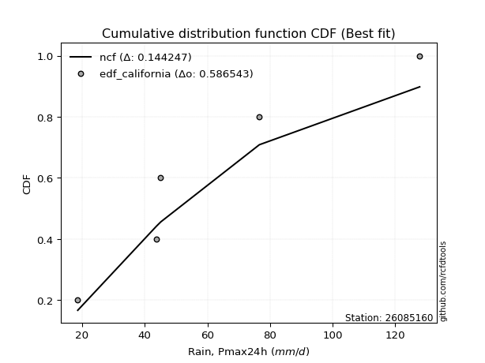</img>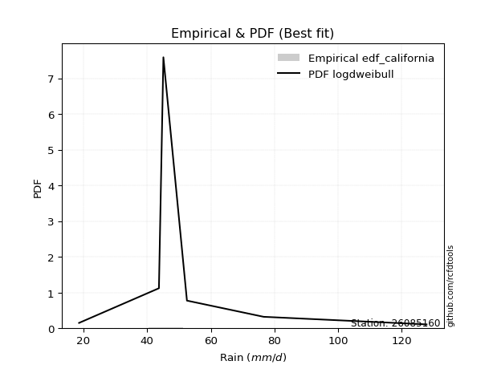</img>

</div>


### 2. Empirical - EDF Hazen (1930)

Hazen method for plotting positions is a formula used to estimate the empirical cumulative probability distribution of flood events or other hydrological data. This formula often results in biased estimations, particularly when extrapolating to extreme events (high return periods).

<div align="center">


$P=(m-0.5)/n$


</div>


**2.1. Empirical values**

<div align="center">

|                | 0                   | 1                  | 2                  | 3                  | 4         | 5                  |
|:---------------|:--------------------|:-------------------|:-------------------|:-------------------|:----------|:-------------------|
| date           | 2025                | 2024               | 2019               | 2020               | 2018      | 2017               |
| x              | 13.6                | 18.6               | 43.7               | 45.1               | 76.6      | 127.8              |
| m              | 1                   | 2                  | 3                  | 4                  | 5         | 6                  |
| empirical_dist | edf_hazen           | edf_hazen          | edf_hazen          | edf_hazen          | edf_hazen | edf_hazen          |
| empirical      | 0.08333333333333333 | 0.25               | 0.4166666666666667 | 0.5833333333333334 | 0.75      | 0.9166666666666666 |
| empirical_tr   | 1.090909090909091   | 1.3333333333333333 | 1.7142857142857144 | 2.4000000000000004 | 4.0       | 11.999999999999995 |

</div>


**2.2. Kolmogorov-Smirnov fit test (sorted by Δ)**


<div align="center">

|                | 0                   | 1                  | 2                   | 3                   | 4                   | 5                   | 6                   | 7                     | 8                  | 9                   | 10                  | 11                  | 12                  | 13                  | 14                  | 15                 | 16                  | 17                  | 18                  | 19                  | 20                  | 21                  | 22                  | 23                  | 24                 | 25                  | 26                  | 27                  | 28                  | 29                  | 30                 | 31                  | 32                 | 33                  | 34                  | 35                 | 36                 | 37                  | 38                 | 39                  | 40                  | 41                  | 42                  | 43                 | 44                 | 45                  | 46                  | 47                 | 48                  | 49                  | 50                  | 51                  | 52                  | 53                  | 54                  | 55                 | 56                  | 57                 | 58                  | 59                 | 60                  | 61                  | 62                  | 63                  | 64                  | 65                  | 66                 | 67                  | 68                  | 69                 | 70                  | 71                  | 72                  | 73                  | 74                 | 75             | 76                  | 77                  | 78                  | 79                  | 80                 | 81                 | 82                  | 83                 | 84                  | 85                  | 86                 | 87                  | 88                  | 89                 |
|:---------------|:--------------------|:-------------------|:--------------------|:--------------------|:--------------------|:--------------------|:--------------------|:----------------------|:-------------------|:--------------------|:--------------------|:--------------------|:--------------------|:--------------------|:--------------------|:-------------------|:--------------------|:--------------------|:--------------------|:--------------------|:--------------------|:--------------------|:--------------------|:--------------------|:-------------------|:--------------------|:--------------------|:--------------------|:--------------------|:--------------------|:-------------------|:--------------------|:-------------------|:--------------------|:--------------------|:-------------------|:-------------------|:--------------------|:-------------------|:--------------------|:--------------------|:--------------------|:--------------------|:-------------------|:-------------------|:--------------------|:--------------------|:-------------------|:--------------------|:--------------------|:--------------------|:--------------------|:--------------------|:--------------------|:--------------------|:-------------------|:--------------------|:-------------------|:--------------------|:-------------------|:--------------------|:--------------------|:--------------------|:--------------------|:--------------------|:--------------------|:-------------------|:--------------------|:--------------------|:-------------------|:--------------------|:--------------------|:--------------------|:--------------------|:-------------------|:---------------|:--------------------|:--------------------|:--------------------|:--------------------|:-------------------|:-------------------|:--------------------|:-------------------|:--------------------|:--------------------|:-------------------|:--------------------|:--------------------|:-------------------|
| station        | 26085160            | 26085160           | 26085160            | 26085160            | 26085160            | 26085160            | 26085160            | 26085160              | 26085160           | 26085160            | 26085160            | 26085160            | 26085160            | 26085160            | 26085160            | 26085160           | 26085160            | 26085160            | 26085160            | 26085160            | 26085160            | 26085160            | 26085160            | 26085160            | 26085160           | 26085160            | 26085160            | 26085160            | 26085160            | 26085160            | 26085160           | 26085160            | 26085160           | 26085160            | 26085160            | 26085160           | 26085160           | 26085160            | 26085160           | 26085160            | 26085160            | 26085160            | 26085160            | 26085160           | 26085160           | 26085160            | 26085160            | 26085160           | 26085160            | 26085160            | 26085160            | 26085160            | 26085160            | 26085160            | 26085160            | 26085160           | 26085160            | 26085160           | 26085160            | 26085160           | 26085160            | 26085160            | 26085160            | 26085160            | 26085160            | 26085160            | 26085160           | 26085160            | 26085160            | 26085160           | 26085160            | 26085160            | 26085160            | 26085160            | 26085160           | 26085160       | 26085160            | 26085160            | 26085160            | 26085160            | 26085160           | 26085160           | 26085160            | 26085160           | 26085160            | 26085160            | 26085160           | 26085160            | 26085160            | 26085160           |
| empirical_dist | edf_hazen           | edf_hazen          | edf_hazen           | edf_hazen           | edf_hazen           | edf_hazen           | edf_hazen           | edf_hazen             | edf_hazen          | edf_hazen           | edf_hazen           | edf_hazen           | edf_hazen           | edf_hazen           | edf_hazen           | edf_hazen          | edf_hazen           | edf_hazen           | edf_hazen           | edf_hazen           | edf_hazen           | edf_hazen           | edf_hazen           | edf_hazen           | edf_hazen          | edf_hazen           | edf_hazen           | edf_hazen           | edf_hazen           | edf_hazen           | edf_hazen          | edf_hazen           | edf_hazen          | edf_hazen           | edf_hazen           | edf_hazen          | edf_hazen          | edf_hazen           | edf_hazen          | edf_hazen           | edf_hazen           | edf_hazen           | edf_hazen           | edf_hazen          | edf_hazen          | edf_hazen           | edf_hazen           | edf_hazen          | edf_hazen           | edf_hazen           | edf_hazen           | edf_hazen           | edf_hazen           | edf_hazen           | edf_hazen           | edf_hazen          | edf_hazen           | edf_hazen          | edf_hazen           | edf_hazen          | edf_hazen           | edf_hazen           | edf_hazen           | edf_hazen           | edf_hazen           | edf_hazen           | edf_hazen          | edf_hazen           | edf_hazen           | edf_hazen          | edf_hazen           | edf_hazen           | edf_hazen           | edf_hazen           | edf_hazen          | edf_hazen      | edf_hazen           | edf_hazen           | edf_hazen           | edf_hazen           | edf_hazen          | edf_hazen          | edf_hazen           | edf_hazen          | edf_hazen           | edf_hazen           | edf_hazen          | edf_hazen           | edf_hazen           | edf_hazen          |
| p_dist         | halfnorm            | halflogistic       | f                   | logloggamma         | genlogistic         | moyal               | logpearson3         | loglaplace_asymmetric | loggumbel_l        | logf                | logexponnorm        | logcrystalball      | lognorm             | lognorm             | logt                | logjohnsonsu       | lognct              | gumbel_r            | logfatiguelife      | logerlang           | loggamma            | loggamma            | loglogistic         | logbetaprime        | pearson3           | logncf              | kstwobign           | loghypsecant        | rayleigh            | exponnorm           | logfisk            | expon               | loginvgamma        | logalpha            | loglaplace          | weibull_min        | fisk               | logrice             | genexpon           | gompertz            | maxwell             | logmaxwell          | invgamma            | invweibull         | loggompertz        | loginvgauss         | laplace_asymmetric  | lograyleigh        | nakagami            | logweibull_min      | loginvweibull       | rice                | loggenlogistic      | mielke              | truncnorm           | norm               | crystalball         | t                  | alpha               | logkstwobign       | loggumbel_r         | loghalfnorm         | invgauss            | logistic            | nct                 | hypsecant           | loggenexpon        | logmoyal            | loghalflogistic     | logtruncnorm       | laplace             | logexpon            | logmielke           | gumbel_l            | wald               | gibrat         | ncf                 | logwald             | chi2                | logchi2             | loggibrat          | pareto             | betaprime           | lognakagami        | logpareto           | gamma               | loglognorm         | fatiguelife         | erlang              | johnsonsu          |
| delta          | 0.09519253800937444 | 0.0953464088809545 | 0.09655121252225865 | 0.10338063333843944 | 0.10774637262269837 | 0.10840481714525066 | 0.10994326681804328 | 0.11061076724379565   | 0.1116938413877733 | 0.11400071198359513 | 0.11408640095818928 | 0.11408712618499878 | 0.11408720790528154 | 0.11408720790528154 | 0.11408849488346479 | 0.1144191590017018 | 0.11468366934232826 | 0.11538731449185996 | 0.11693323433604136 | 0.11786376677602212 | 0.11790016501894057 | 0.11790016501894057 | 0.11826680118602234 | 0.11962165518906226 | 0.1237844216957073 | 0.12539092193531204 | 0.12588307404812626 | 0.12633770837031208 | 0.12997591673217523 | 0.13264001516237578 | 0.1330061108180582 | 0.13421796348681908 | 0.1343246301041086 | 0.13499072448763522 | 0.13502544416246726 | 0.1355346320173217 | 0.1363788570811607 | 0.13713929557190802 | 0.1389696872300742 | 0.14161814256519134 | 0.14224849753066088 | 0.14565436242630764 | 0.14600350539899437 | 0.1475182174907294 | 0.1511761713815683 | 0.15174650988717892 | 0.15304983221058444 | 0.1559336053447256 | 0.16277496933808505 | 0.17162343609807146 | 0.17207759619997315 | 0.17215197648272862 | 0.17235862117164352 | 0.17236445035280618 | 0.17640833164599823 | 0.1764083573119311 | 0.17640836995194525 | 0.1764127011564144 | 0.18192728272727626 | 0.1844828812919504 | 0.18469779642622847 | 0.18488867467333664 | 0.18666901165111943 | 0.18850983630370616 | 0.19752744422560037 | 0.19846852912129598 | 0.2098788998217706 | 0.21007425501467197 | 0.21143403114698295 | 0.2177822862853845 | 0.22494606797389083 | 0.23461243298644702 | 0.23547429689575355 | 0.24359989483394762 | 0.2488068685851216 | 0.25           | 0.27623236421675107 | 0.28051973919939005 | 0.28880275353890267 | 0.29381156559668437 | 0.3078624719606126 | 0.3088868243985483 | 0.30894980379723586 | 0.3421568169354208 | 0.36024681571000206 | 0.38609264331578946 | 0.3871849226698083 | 0.42346980699216946 | 0.49206912342923487 | 0.5087019263755241 |
| deltao         | 0.530385761606      | 0.530385761606     | 0.530385761606      | 0.530385761606      | 0.530385761606      | 0.530385761606      | 0.530385761606      | 0.530385761606        | 0.530385761606     | 0.530385761606      | 0.530385761606      | 0.530385761606      | 0.530385761606      | 0.530385761606      | 0.530385761606      | 0.530385761606     | 0.530385761606      | 0.530385761606      | 0.530385761606      | 0.530385761606      | 0.530385761606      | 0.530385761606      | 0.530385761606      | 0.530385761606      | 0.530385761606     | 0.530385761606      | 0.530385761606      | 0.530385761606      | 0.530385761606      | 0.530385761606      | 0.530385761606     | 0.530385761606      | 0.530385761606     | 0.530385761606      | 0.530385761606      | 0.530385761606     | 0.530385761606     | 0.530385761606      | 0.530385761606     | 0.530385761606      | 0.530385761606      | 0.530385761606      | 0.530385761606      | 0.530385761606     | 0.530385761606     | 0.530385761606      | 0.530385761606      | 0.530385761606     | 0.530385761606      | 0.530385761606      | 0.530385761606      | 0.530385761606      | 0.530385761606      | 0.530385761606      | 0.530385761606      | 0.530385761606     | 0.530385761606      | 0.530385761606     | 0.530385761606      | 0.530385761606     | 0.530385761606      | 0.530385761606      | 0.530385761606      | 0.530385761606      | 0.530385761606      | 0.530385761606      | 0.530385761606     | 0.530385761606      | 0.530385761606      | 0.530385761606     | 0.530385761606      | 0.530385761606      | 0.530385761606      | 0.530385761606      | 0.530385761606     | 0.530385761606 | 0.530385761606      | 0.530385761606      | 0.530385761606      | 0.530385761606      | 0.530385761606     | 0.530385761606     | 0.530385761606      | 0.530385761606     | 0.530385761606      | 0.530385761606      | 0.530385761606     | 0.530385761606      | 0.530385761606      | 0.530385761606     |
| eval           | Δo > Δ              | Δo > Δ             | Δo > Δ              | Δo > Δ              | Δo > Δ              | Δo > Δ              | Δo > Δ              | Δo > Δ                | Δo > Δ             | Δo > Δ              | Δo > Δ              | Δo > Δ              | Δo > Δ              | Δo > Δ              | Δo > Δ              | Δo > Δ             | Δo > Δ              | Δo > Δ              | Δo > Δ              | Δo > Δ              | Δo > Δ              | Δo > Δ              | Δo > Δ              | Δo > Δ              | Δo > Δ             | Δo > Δ              | Δo > Δ              | Δo > Δ              | Δo > Δ              | Δo > Δ              | Δo > Δ             | Δo > Δ              | Δo > Δ             | Δo > Δ              | Δo > Δ              | Δo > Δ             | Δo > Δ             | Δo > Δ              | Δo > Δ             | Δo > Δ              | Δo > Δ              | Δo > Δ              | Δo > Δ              | Δo > Δ             | Δo > Δ             | Δo > Δ              | Δo > Δ              | Δo > Δ             | Δo > Δ              | Δo > Δ              | Δo > Δ              | Δo > Δ              | Δo > Δ              | Δo > Δ              | Δo > Δ              | Δo > Δ             | Δo > Δ              | Δo > Δ             | Δo > Δ              | Δo > Δ             | Δo > Δ              | Δo > Δ              | Δo > Δ              | Δo > Δ              | Δo > Δ              | Δo > Δ              | Δo > Δ             | Δo > Δ              | Δo > Δ              | Δo > Δ             | Δo > Δ              | Δo > Δ              | Δo > Δ              | Δo > Δ              | Δo > Δ             | Δo > Δ         | Δo > Δ              | Δo > Δ              | Δo > Δ              | Δo > Δ              | Δo > Δ             | Δo > Δ             | Δo > Δ              | Δo > Δ             | Δo > Δ              | Δo > Δ              | Δo > Δ             | Δo > Δ              | Δo > Δ              | Δo > Δ             |
| fit            | 1                   | 1                  | 1                   | 1                   | 1                   | 1                   | 1                   | 1                     | 1                  | 1                   | 1                   | 1                   | 1                   | 1                   | 1                   | 1                  | 1                   | 1                   | 1                   | 1                   | 1                   | 1                   | 1                   | 1                   | 1                  | 1                   | 1                   | 1                   | 1                   | 1                   | 1                  | 1                   | 1                  | 1                   | 1                   | 1                  | 1                  | 1                   | 1                  | 1                   | 1                   | 1                   | 1                   | 1                  | 1                  | 1                   | 1                   | 1                  | 1                   | 1                   | 1                   | 1                   | 1                   | 1                   | 1                   | 1                  | 1                   | 1                  | 1                   | 1                  | 1                   | 1                   | 1                   | 1                   | 1                   | 1                   | 1                  | 1                   | 1                   | 1                  | 1                   | 1                   | 1                   | 1                   | 1                  | 1              | 1                   | 1                   | 1                   | 1                   | 1                  | 1                  | 1                   | 1                  | 1                   | 1                   | 1                  | 1                   | 1                   | 1                  |
| n              | 6                   | 6                  | 6                   | 6                   | 6                   | 6                   | 6                   | 6                     | 6                  | 6                   | 6                   | 6                   | 6                   | 6                   | 6                   | 6                  | 6                   | 6                   | 6                   | 6                   | 6                   | 6                   | 6                   | 6                   | 6                  | 6                   | 6                   | 6                   | 6                   | 6                   | 6                  | 6                   | 6                  | 6                   | 6                   | 6                  | 6                  | 6                   | 6                  | 6                   | 6                   | 6                   | 6                   | 6                  | 6                  | 6                   | 6                   | 6                  | 6                   | 6                   | 6                   | 6                   | 6                   | 6                   | 6                   | 6                  | 6                   | 6                  | 6                   | 6                  | 6                   | 6                   | 6                   | 6                   | 6                   | 6                   | 6                  | 6                   | 6                   | 6                  | 6                   | 6                   | 6                   | 6                   | 6                  | 6              | 6                   | 6                   | 6                   | 6                   | 6                  | 6                  | 6                   | 6                  | 6                   | 6                   | 6                  | 6                   | 6                   | 6                  |
| best_fit       | 1                   | 0                  | 0                   | 0                   | 0                   | 0                   | 0                   | 0                     | 0                  | 0                   | 0                   | 0                   | 0                   | 0                   | 0                   | 0                  | 0                   | 0                   | 0                   | 0                   | 0                   | 0                   | 0                   | 0                   | 0                  | 0                   | 0                   | 0                   | 0                   | 0                   | 0                  | 0                   | 0                  | 0                   | 0                   | 0                  | 0                  | 0                   | 0                  | 0                   | 0                   | 0                   | 0                   | 0                  | 0                  | 0                   | 0                   | 0                  | 0                   | 0                   | 0                   | 0                   | 0                   | 0                   | 0                   | 0                  | 0                   | 0                  | 0                   | 0                  | 0                   | 0                   | 0                   | 0                   | 0                   | 0                   | 0                  | 0                   | 0                   | 0                  | 0                   | 0                   | 0                   | 0                   | 0                  | 0              | 0                   | 0                   | 0                   | 0                   | 0                  | 0                  | 0                   | 0                  | 0                   | 0                   | 0                  | 0                   | 0                   | 0                  |
| best_fit_sort  | 1                   | 2                  | 3                   | 4                   | 5                   | 6                   | 7                   | 8                     | 9                  | 10                  | 11                  | 12                  | 13                  | 14                  | 15                  | 16                 | 17                  | 18                  | 19                  | 20                  | 21                  | 22                  | 23                  | 24                  | 25                 | 26                  | 27                  | 28                  | 29                  | 30                  | 31                 | 32                  | 33                 | 34                  | 35                  | 36                 | 37                 | 38                  | 39                 | 40                  | 41                  | 42                  | 43                  | 44                 | 45                 | 46                  | 47                  | 48                 | 49                  | 50                  | 51                  | 52                  | 53                  | 54                  | 55                  | 56                 | 57                  | 58                 | 59                  | 60                 | 61                  | 62                  | 63                  | 64                  | 65                  | 66                  | 67                 | 68                  | 69                  | 70                 | 71                  | 72                  | 73                  | 74                  | 75                 | 76             | 77                  | 78                  | 79                  | 80                  | 81                 | 82                 | 83                  | 84                 | 85                  | 86                  | 87                 | 88                  | 89                  | 90                 |

</div>


<div align="center">

</img>

</div>


**2.3. Best fit**

<div align="center">

|   id |   station | empirical_dist   | p_dist   |     delta |   deltao | eval   |   fit |   n |   best_fit |   best_fit_sort |
|-----:|----------:|:-----------------|:---------|----------:|---------:|:-------|------:|----:|-----------:|----------------:|
|    0 |  26085160 | edf_hazen        | halfnorm | 0.0951925 | 0.530386 | Δo > Δ |     1 |   6 |          1 |               1 |

</div>


<div align="center">

</img>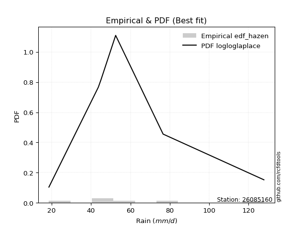</img>

</div>


### 3. Empirical - EDF Weibull (1939)

Weibull plotting position formula is an empirical method used to estimate the non-exceedance probability or plotting position for a set of observed data, is often recommended or widely used in practice, particularly in flood frequency analysis.

<div align="center">


$P=m/(n+1)$


</div>


**3.1. Empirical values**

<div align="center">

|                | 0                   | 1                  | 2                   | 3                  | 4                  | 5                  |
|:---------------|:--------------------|:-------------------|:--------------------|:-------------------|:-------------------|:-------------------|
| date           | 2025                | 2024               | 2019                | 2020               | 2018               | 2017               |
| x              | 13.6                | 18.6               | 43.7                | 45.1               | 76.6               | 127.8              |
| m              | 1                   | 2                  | 3                   | 4                  | 5                  | 6                  |
| empirical_dist | edf_weibull         | edf_weibull        | edf_weibull         | edf_weibull        | edf_weibull        | edf_weibull        |
| empirical      | 0.14285714285714285 | 0.2857142857142857 | 0.42857142857142855 | 0.5714285714285714 | 0.7142857142857143 | 0.8571428571428571 |
| empirical_tr   | 1.1666666666666665  | 1.4                | 1.75                | 2.333333333333333  | 3.5                | 6.999999999999997  |

</div>


**3.2. Kolmogorov-Smirnov fit test (sorted by Δ)**


<div align="center">

|                | 0                   | 1                   | 2                   | 3                   | 4                  | 5                  | 6                   | 7                   | 8                  | 9                   | 10                  | 11                | 12                 | 13                  | 14                 | 15                 | 16                  | 17                  | 18                  | 19                  | 20                  | 21                 | 22                 | 23                  | 24                  | 25                  | 26                  | 27                 | 28                  | 29                  | 30                 | 31                  | 32                  | 33                  | 34                  | 35                  | 36                  | 37                  | 38                    | 39                | 40                 | 41                 | 42                  | 43                 | 44                  | 45                  | 46                  | 47                 | 48                  | 49                  | 50                  | 51                  | 52                 | 53                  | 54                  | 55                 | 56                  | 57                  | 58                 | 59                  | 60                 | 61                  | 62                  | 63                  | 64                 | 65                | 66                  | 67                 | 68                  | 69                  | 70                  | 71                  | 72                 | 73                  | 74                 | 75                 | 76                 | 77                 | 78                 | 79                 | 80                 | 81                  | 82                | 83                  | 84                  | 85                 | 86                 | 87                 | 88                  | 89                |
|:---------------|:--------------------|:--------------------|:--------------------|:--------------------|:-------------------|:-------------------|:--------------------|:--------------------|:-------------------|:--------------------|:--------------------|:------------------|:-------------------|:--------------------|:-------------------|:-------------------|:--------------------|:--------------------|:--------------------|:--------------------|:--------------------|:-------------------|:-------------------|:--------------------|:--------------------|:--------------------|:--------------------|:-------------------|:--------------------|:--------------------|:-------------------|:--------------------|:--------------------|:--------------------|:--------------------|:--------------------|:--------------------|:--------------------|:----------------------|:------------------|:-------------------|:-------------------|:--------------------|:-------------------|:--------------------|:--------------------|:--------------------|:-------------------|:--------------------|:--------------------|:--------------------|:--------------------|:-------------------|:--------------------|:--------------------|:-------------------|:--------------------|:--------------------|:-------------------|:--------------------|:-------------------|:--------------------|:--------------------|:--------------------|:-------------------|:------------------|:--------------------|:-------------------|:--------------------|:--------------------|:--------------------|:--------------------|:-------------------|:--------------------|:-------------------|:-------------------|:-------------------|:-------------------|:-------------------|:-------------------|:-------------------|:--------------------|:------------------|:--------------------|:--------------------|:-------------------|:-------------------|:-------------------|:--------------------|:------------------|
| station        | 26085160            | 26085160            | 26085160            | 26085160            | 26085160           | 26085160           | 26085160            | 26085160            | 26085160           | 26085160            | 26085160            | 26085160          | 26085160           | 26085160            | 26085160           | 26085160           | 26085160            | 26085160            | 26085160            | 26085160            | 26085160            | 26085160           | 26085160           | 26085160            | 26085160            | 26085160            | 26085160            | 26085160           | 26085160            | 26085160            | 26085160           | 26085160            | 26085160            | 26085160            | 26085160            | 26085160            | 26085160            | 26085160            | 26085160              | 26085160          | 26085160           | 26085160           | 26085160            | 26085160           | 26085160            | 26085160            | 26085160            | 26085160           | 26085160            | 26085160            | 26085160            | 26085160            | 26085160           | 26085160            | 26085160            | 26085160           | 26085160            | 26085160            | 26085160           | 26085160            | 26085160           | 26085160            | 26085160            | 26085160            | 26085160           | 26085160          | 26085160            | 26085160           | 26085160            | 26085160            | 26085160            | 26085160            | 26085160           | 26085160            | 26085160           | 26085160           | 26085160           | 26085160           | 26085160           | 26085160           | 26085160           | 26085160            | 26085160          | 26085160            | 26085160            | 26085160           | 26085160           | 26085160           | 26085160            | 26085160          |
| empirical_dist | edf_weibull         | edf_weibull         | edf_weibull         | edf_weibull         | edf_weibull        | edf_weibull        | edf_weibull         | edf_weibull         | edf_weibull        | edf_weibull         | edf_weibull         | edf_weibull       | edf_weibull        | edf_weibull         | edf_weibull        | edf_weibull        | edf_weibull         | edf_weibull         | edf_weibull         | edf_weibull         | edf_weibull         | edf_weibull        | edf_weibull        | edf_weibull         | edf_weibull         | edf_weibull         | edf_weibull         | edf_weibull        | edf_weibull         | edf_weibull         | edf_weibull        | edf_weibull         | edf_weibull         | edf_weibull         | edf_weibull         | edf_weibull         | edf_weibull         | edf_weibull         | edf_weibull           | edf_weibull       | edf_weibull        | edf_weibull        | edf_weibull         | edf_weibull        | edf_weibull         | edf_weibull         | edf_weibull         | edf_weibull        | edf_weibull         | edf_weibull         | edf_weibull         | edf_weibull         | edf_weibull        | edf_weibull         | edf_weibull         | edf_weibull        | edf_weibull         | edf_weibull         | edf_weibull        | edf_weibull         | edf_weibull        | edf_weibull         | edf_weibull         | edf_weibull         | edf_weibull        | edf_weibull       | edf_weibull         | edf_weibull        | edf_weibull         | edf_weibull         | edf_weibull         | edf_weibull         | edf_weibull        | edf_weibull         | edf_weibull        | edf_weibull        | edf_weibull        | edf_weibull        | edf_weibull        | edf_weibull        | edf_weibull        | edf_weibull         | edf_weibull       | edf_weibull         | edf_weibull         | edf_weibull        | edf_weibull        | edf_weibull        | edf_weibull         | edf_weibull       |
| p_dist         | halfnorm            | pearson3            | rayleigh            | gumbel_r            | maxwell            | halflogistic       | f                   | logncf              | logalpha           | logmaxwell          | invgamma            | loginvgamma       | logjohnsonsu       | logloggamma         | loggamma           | loggamma           | logpearson3         | logerlang           | lognct              | logexponnorm        | logcrystalball      | lognorm            | lognorm            | logt                | invweibull          | logfatiguelife      | logf                | logbetaprime       | genlogistic         | loginvgauss         | logfisk            | logrice             | loggompertz         | weibull_min         | fisk                | lograyleigh         | moyal               | kstwobign           | loglaplace_asymmetric | loggumbel_l       | nakagami           | laplace_asymmetric | loglogistic         | logweibull_min     | loginvweibull       | rice                | loggenlogistic      | mielke             | loghypsecant        | truncnorm           | norm                | crystalball         | t                  | exponnorm           | expon               | alpha              | loglaplace          | logkstwobign        | loggumbel_r        | loghalfnorm         | genexpon           | invgauss            | logistic            | gompertz            | nct                | hypsecant         | loggenexpon         | logmoyal           | loghalflogistic     | laplace             | ncf                 | logexpon            | logmielke          | gumbel_l            | logtruncnorm       | pareto             | chi2               | logchi2            | wald               | gibrat             | logwald            | loggibrat           | betaprime         | logpareto           | lognakagami         | loglognorm         | gamma              | fatiguelife        | johnsonsu           | erlang            |
| delta          | 0.09285609437066408 | 0.11187965979094533 | 0.11807115482741326 | 0.12432431254389031 | 0.1303437356258989 | 0.1310606945952402 | 0.13226549823654435 | 0.13312612038736432 | 0.1334117704804147 | 0.13374960052154578 | 0.13431655717522406 | 0.134588152187024 | 0.1349297753100755 | 0.13516440509128907 | 0.1351846603907511 | 0.1351846603907511 | 0.13527022532387906 | 0.13530298384116002 | 0.13533020451314254 | 0.13540137054280382 | 0.13540275056218265 | 0.1354028097308303 | 0.1354028097308303 | 0.13540525213898014 | 0.13561345558596755 | 0.13570469876525565 | 0.13614466916921905 | 0.1381065266792869 | 0.13813157142029525 | 0.13984174798241705 | 0.1409232182464467 | 0.14157041569630807 | 0.14285711474347318 | 0.14285714284791837 | 0.14285714285714146 | 0.14402884343996375 | 0.14411910285953636 | 0.14575463553664175 | 0.14632505295808135   | 0.147408127102059 | 0.1508702074333232 | 0.1515935749875654 | 0.15303348783634108 | 0.1597186741933096 | 0.16017283429521129 | 0.16024721457796665 | 0.16045385926688166 | 0.1604596884480443 | 0.16205199408459778 | 0.16450356974123626 | 0.16450359540716913 | 0.16450360804718328 | 0.1645079392516524 | 0.16835430087666148 | 0.16993224920110478 | 0.1700225208225144 | 0.17004236905017972 | 0.17257811938718853 | 0.1727930345214666 | 0.17298391276857478 | 0.1746839729443599 | 0.17476424974635757 | 0.17660507439894418 | 0.17733242827947704 | 0.1856226823208385 | 0.186563767216534 | 0.19797413791700874 | 0.1981694931099101 | 0.19952926924222109 | 0.21304130606912886 | 0.21670855469294154 | 0.22270767108168515 | 0.2235695349909917 | 0.23169513292918564 | 0.2534965719996702 | 0.2731725386842626 | 0.2768979916341408 | 0.2819068036919225 | 0.2845211542994073 | 0.2857142857142857 | 0.2857142857142857 | 0.29595771005585075 | 0.297045041892474 | 0.32453252999571636 | 0.33025205503065896 | 0.3514706369555226 | 0.3741878814110276 | 0.4115650450874076 | 0.47298764066123844 | 0.480164361524473 |
| deltao         | 0.530385761606      | 0.530385761606      | 0.530385761606      | 0.530385761606      | 0.530385761606     | 0.530385761606     | 0.530385761606      | 0.530385761606      | 0.530385761606     | 0.530385761606      | 0.530385761606      | 0.530385761606    | 0.530385761606     | 0.530385761606      | 0.530385761606     | 0.530385761606     | 0.530385761606      | 0.530385761606      | 0.530385761606      | 0.530385761606      | 0.530385761606      | 0.530385761606     | 0.530385761606     | 0.530385761606      | 0.530385761606      | 0.530385761606      | 0.530385761606      | 0.530385761606     | 0.530385761606      | 0.530385761606      | 0.530385761606     | 0.530385761606      | 0.530385761606      | 0.530385761606      | 0.530385761606      | 0.530385761606      | 0.530385761606      | 0.530385761606      | 0.530385761606        | 0.530385761606    | 0.530385761606     | 0.530385761606     | 0.530385761606      | 0.530385761606     | 0.530385761606      | 0.530385761606      | 0.530385761606      | 0.530385761606     | 0.530385761606      | 0.530385761606      | 0.530385761606      | 0.530385761606      | 0.530385761606     | 0.530385761606      | 0.530385761606      | 0.530385761606     | 0.530385761606      | 0.530385761606      | 0.530385761606     | 0.530385761606      | 0.530385761606     | 0.530385761606      | 0.530385761606      | 0.530385761606      | 0.530385761606     | 0.530385761606    | 0.530385761606      | 0.530385761606     | 0.530385761606      | 0.530385761606      | 0.530385761606      | 0.530385761606      | 0.530385761606     | 0.530385761606      | 0.530385761606     | 0.530385761606     | 0.530385761606     | 0.530385761606     | 0.530385761606     | 0.530385761606     | 0.530385761606     | 0.530385761606      | 0.530385761606    | 0.530385761606      | 0.530385761606      | 0.530385761606     | 0.530385761606     | 0.530385761606     | 0.530385761606      | 0.530385761606    |
| eval           | Δo > Δ              | Δo > Δ              | Δo > Δ              | Δo > Δ              | Δo > Δ             | Δo > Δ             | Δo > Δ              | Δo > Δ              | Δo > Δ             | Δo > Δ              | Δo > Δ              | Δo > Δ            | Δo > Δ             | Δo > Δ              | Δo > Δ             | Δo > Δ             | Δo > Δ              | Δo > Δ              | Δo > Δ              | Δo > Δ              | Δo > Δ              | Δo > Δ             | Δo > Δ             | Δo > Δ              | Δo > Δ              | Δo > Δ              | Δo > Δ              | Δo > Δ             | Δo > Δ              | Δo > Δ              | Δo > Δ             | Δo > Δ              | Δo > Δ              | Δo > Δ              | Δo > Δ              | Δo > Δ              | Δo > Δ              | Δo > Δ              | Δo > Δ                | Δo > Δ            | Δo > Δ             | Δo > Δ             | Δo > Δ              | Δo > Δ             | Δo > Δ              | Δo > Δ              | Δo > Δ              | Δo > Δ             | Δo > Δ              | Δo > Δ              | Δo > Δ              | Δo > Δ              | Δo > Δ             | Δo > Δ              | Δo > Δ              | Δo > Δ             | Δo > Δ              | Δo > Δ              | Δo > Δ             | Δo > Δ              | Δo > Δ             | Δo > Δ              | Δo > Δ              | Δo > Δ              | Δo > Δ             | Δo > Δ            | Δo > Δ              | Δo > Δ             | Δo > Δ              | Δo > Δ              | Δo > Δ              | Δo > Δ              | Δo > Δ             | Δo > Δ              | Δo > Δ             | Δo > Δ             | Δo > Δ             | Δo > Δ             | Δo > Δ             | Δo > Δ             | Δo > Δ             | Δo > Δ              | Δo > Δ            | Δo > Δ              | Δo > Δ              | Δo > Δ             | Δo > Δ             | Δo > Δ             | Δo > Δ              | Δo > Δ            |
| fit            | 1                   | 1                   | 1                   | 1                   | 1                  | 1                  | 1                   | 1                   | 1                  | 1                   | 1                   | 1                 | 1                  | 1                   | 1                  | 1                  | 1                   | 1                   | 1                   | 1                   | 1                   | 1                  | 1                  | 1                   | 1                   | 1                   | 1                   | 1                  | 1                   | 1                   | 1                  | 1                   | 1                   | 1                   | 1                   | 1                   | 1                   | 1                   | 1                     | 1                 | 1                  | 1                  | 1                   | 1                  | 1                   | 1                   | 1                   | 1                  | 1                   | 1                   | 1                   | 1                   | 1                  | 1                   | 1                   | 1                  | 1                   | 1                   | 1                  | 1                   | 1                  | 1                   | 1                   | 1                   | 1                  | 1                 | 1                   | 1                  | 1                   | 1                   | 1                   | 1                   | 1                  | 1                   | 1                  | 1                  | 1                  | 1                  | 1                  | 1                  | 1                  | 1                   | 1                 | 1                   | 1                   | 1                  | 1                  | 1                  | 1                   | 1                 |
| n              | 6                   | 6                   | 6                   | 6                   | 6                  | 6                  | 6                   | 6                   | 6                  | 6                   | 6                   | 6                 | 6                  | 6                   | 6                  | 6                  | 6                   | 6                   | 6                   | 6                   | 6                   | 6                  | 6                  | 6                   | 6                   | 6                   | 6                   | 6                  | 6                   | 6                   | 6                  | 6                   | 6                   | 6                   | 6                   | 6                   | 6                   | 6                   | 6                     | 6                 | 6                  | 6                  | 6                   | 6                  | 6                   | 6                   | 6                   | 6                  | 6                   | 6                   | 6                   | 6                   | 6                  | 6                   | 6                   | 6                  | 6                   | 6                   | 6                  | 6                   | 6                  | 6                   | 6                   | 6                   | 6                  | 6                 | 6                   | 6                  | 6                   | 6                   | 6                   | 6                   | 6                  | 6                   | 6                  | 6                  | 6                  | 6                  | 6                  | 6                  | 6                  | 6                   | 6                 | 6                   | 6                   | 6                  | 6                  | 6                  | 6                   | 6                 |
| best_fit       | 1                   | 0                   | 0                   | 0                   | 0                  | 0                  | 0                   | 0                   | 0                  | 0                   | 0                   | 0                 | 0                  | 0                   | 0                  | 0                  | 0                   | 0                   | 0                   | 0                   | 0                   | 0                  | 0                  | 0                   | 0                   | 0                   | 0                   | 0                  | 0                   | 0                   | 0                  | 0                   | 0                   | 0                   | 0                   | 0                   | 0                   | 0                   | 0                     | 0                 | 0                  | 0                  | 0                   | 0                  | 0                   | 0                   | 0                   | 0                  | 0                   | 0                   | 0                   | 0                   | 0                  | 0                   | 0                   | 0                  | 0                   | 0                   | 0                  | 0                   | 0                  | 0                   | 0                   | 0                   | 0                  | 0                 | 0                   | 0                  | 0                   | 0                   | 0                   | 0                   | 0                  | 0                   | 0                  | 0                  | 0                  | 0                  | 0                  | 0                  | 0                  | 0                   | 0                 | 0                   | 0                   | 0                  | 0                  | 0                  | 0                   | 0                 |
| best_fit_sort  | 1                   | 2                   | 3                   | 4                   | 5                  | 6                  | 7                   | 8                   | 9                  | 10                  | 11                  | 12                | 13                 | 14                  | 15                 | 16                 | 17                  | 18                  | 19                  | 20                  | 21                  | 22                 | 23                 | 24                  | 25                  | 26                  | 27                  | 28                 | 29                  | 30                  | 31                 | 32                  | 33                  | 34                  | 35                  | 36                  | 37                  | 38                  | 39                    | 40                | 41                 | 42                 | 43                  | 44                 | 45                  | 46                  | 47                  | 48                 | 49                  | 50                  | 51                  | 52                  | 53                 | 54                  | 55                  | 56                 | 57                  | 58                  | 59                 | 60                  | 61                 | 62                  | 63                  | 64                  | 65                 | 66                | 67                  | 68                 | 69                  | 70                  | 71                  | 72                  | 73                 | 74                  | 75                 | 76                 | 77                 | 78                 | 79                 | 80                 | 81                 | 82                  | 83                | 84                  | 85                  | 86                 | 87                 | 88                 | 89                  | 90                |

</div>


<div align="center">

</img>

</div>


**3.3. Best fit**

<div align="center">

|   id |   station | empirical_dist   | p_dist   |     delta |   deltao | eval   |   fit |   n |   best_fit |   best_fit_sort |
|-----:|----------:|:-----------------|:---------|----------:|---------:|:-------|------:|----:|-----------:|----------------:|
|    0 |  26085160 | edf_weibull      | halfnorm | 0.0928561 | 0.530386 | Δo > Δ |     1 |   6 |          1 |               1 |

</div>


<div align="center">

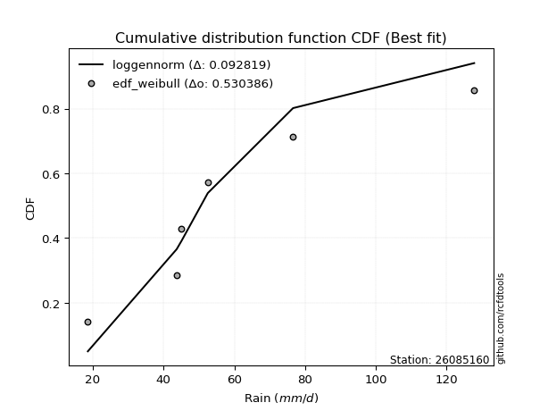</img>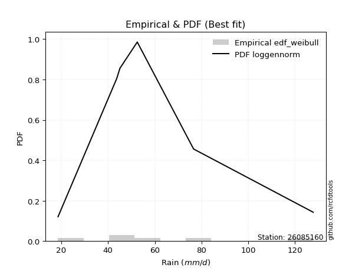</img>

</div>


### 4. Empirical - EDF Beard (1943)

The Beard formula (or Beard´s plotting position formula) in hydrology is used to estimate the empirical non-exceedance probability _(P)_ of a flood event (or other extreme hydrological data point) within a given dataset.

<div align="center">


$P=(m-0.31)/(n+0.38)$


</div>


**4.1. Empirical values**

<div align="center">

|                | 0                   | 1                   | 2                  | 3                  | 4                  | 5                  |
|:---------------|:--------------------|:--------------------|:-------------------|:-------------------|:-------------------|:-------------------|
| date           | 2025                | 2024                | 2019               | 2020               | 2018               | 2017               |
| x              | 13.6                | 18.6                | 43.7               | 45.1               | 76.6               | 127.8              |
| m              | 1                   | 2                   | 3                  | 4                  | 5                  | 6                  |
| empirical_dist | edf_beard           | edf_beard           | edf_beard          | edf_beard          | edf_beard          | edf_beard          |
| empirical      | 0.10815047021943573 | 0.26489028213166144 | 0.4216300940438871 | 0.5783699059561128 | 0.7351097178683387 | 0.8918495297805643 |
| empirical_tr   | 1.1212653778558874  | 1.3603411513859276  | 1.7289972899728996 | 2.3717472118959106 | 3.7751479289940844 | 9.246376811594207  |

</div>


**4.2. Kolmogorov-Smirnov fit test (sorted by Δ)**


<div align="center">

|                | 0                   | 1                   | 2                   | 3                   | 4                   | 5                   | 6                   | 7                   | 8                   | 9                  | 10                  | 11                  | 12                  | 13                  | 14                  | 15                  | 16                  | 17                  | 18                  | 19                  | 20                  | 21                  | 22                 | 23                 | 24                  | 25                  | 26                    | 27                  | 28                  | 29                  | 30                  | 31                  | 32                  | 33                 | 34                  | 35                 | 36                  | 37                  | 38                  | 39                  | 40                  | 41                  | 42                  | 43                  | 44                  | 45                  | 46                  | 47                  | 48                 | 49                  | 50                 | 51                  | 52                  | 53                  | 54                  | 55                  | 56                 | 57                  | 58                  | 59                  | 60                  | 61                 | 62                | 63                 | 64                  | 65                  | 66                  | 67                  | 68                 | 69                  | 70                  | 71                 | 72                  | 73                  | 74                  | 75                | 76                  | 77                 | 78                 | 79                 | 80                 | 81                 | 82                 | 83                 | 84                 | 85                  | 86                | 87                | 88                 | 89                 |
|:---------------|:--------------------|:--------------------|:--------------------|:--------------------|:--------------------|:--------------------|:--------------------|:--------------------|:--------------------|:-------------------|:--------------------|:--------------------|:--------------------|:--------------------|:--------------------|:--------------------|:--------------------|:--------------------|:--------------------|:--------------------|:--------------------|:--------------------|:-------------------|:-------------------|:--------------------|:--------------------|:----------------------|:--------------------|:--------------------|:--------------------|:--------------------|:--------------------|:--------------------|:-------------------|:--------------------|:-------------------|:--------------------|:--------------------|:--------------------|:--------------------|:--------------------|:--------------------|:--------------------|:--------------------|:--------------------|:--------------------|:--------------------|:--------------------|:-------------------|:--------------------|:-------------------|:--------------------|:--------------------|:--------------------|:--------------------|:--------------------|:-------------------|:--------------------|:--------------------|:--------------------|:--------------------|:-------------------|:------------------|:-------------------|:--------------------|:--------------------|:--------------------|:--------------------|:-------------------|:--------------------|:--------------------|:-------------------|:--------------------|:--------------------|:--------------------|:------------------|:--------------------|:-------------------|:-------------------|:-------------------|:-------------------|:-------------------|:-------------------|:-------------------|:-------------------|:--------------------|:------------------|:------------------|:-------------------|:-------------------|
| station        | 26085160            | 26085160            | 26085160            | 26085160            | 26085160            | 26085160            | 26085160            | 26085160            | 26085160            | 26085160           | 26085160            | 26085160            | 26085160            | 26085160            | 26085160            | 26085160            | 26085160            | 26085160            | 26085160            | 26085160            | 26085160            | 26085160            | 26085160           | 26085160           | 26085160            | 26085160            | 26085160              | 26085160            | 26085160            | 26085160            | 26085160            | 26085160            | 26085160            | 26085160           | 26085160            | 26085160           | 26085160            | 26085160            | 26085160            | 26085160            | 26085160            | 26085160            | 26085160            | 26085160            | 26085160            | 26085160            | 26085160            | 26085160            | 26085160           | 26085160            | 26085160           | 26085160            | 26085160            | 26085160            | 26085160            | 26085160            | 26085160           | 26085160            | 26085160            | 26085160            | 26085160            | 26085160           | 26085160          | 26085160           | 26085160            | 26085160            | 26085160            | 26085160            | 26085160           | 26085160            | 26085160            | 26085160           | 26085160            | 26085160            | 26085160            | 26085160          | 26085160            | 26085160           | 26085160           | 26085160           | 26085160           | 26085160           | 26085160           | 26085160           | 26085160           | 26085160            | 26085160          | 26085160          | 26085160           | 26085160           |
| empirical_dist | edf_beard           | edf_beard           | edf_beard           | edf_beard           | edf_beard           | edf_beard           | edf_beard           | edf_beard           | edf_beard           | edf_beard          | edf_beard           | edf_beard           | edf_beard           | edf_beard           | edf_beard           | edf_beard           | edf_beard           | edf_beard           | edf_beard           | edf_beard           | edf_beard           | edf_beard           | edf_beard          | edf_beard          | edf_beard           | edf_beard           | edf_beard             | edf_beard           | edf_beard           | edf_beard           | edf_beard           | edf_beard           | edf_beard           | edf_beard          | edf_beard           | edf_beard          | edf_beard           | edf_beard           | edf_beard           | edf_beard           | edf_beard           | edf_beard           | edf_beard           | edf_beard           | edf_beard           | edf_beard           | edf_beard           | edf_beard           | edf_beard          | edf_beard           | edf_beard          | edf_beard           | edf_beard           | edf_beard           | edf_beard           | edf_beard           | edf_beard          | edf_beard           | edf_beard           | edf_beard           | edf_beard           | edf_beard          | edf_beard         | edf_beard          | edf_beard           | edf_beard           | edf_beard           | edf_beard           | edf_beard          | edf_beard           | edf_beard           | edf_beard          | edf_beard           | edf_beard           | edf_beard           | edf_beard         | edf_beard           | edf_beard          | edf_beard          | edf_beard          | edf_beard          | edf_beard          | edf_beard          | edf_beard          | edf_beard          | edf_beard           | edf_beard         | edf_beard         | edf_beard          | edf_beard          |
| p_dist         | halfnorm            | halflogistic        | gumbel_r            | f                   | fisk                | logjohnsonsu        | logloggamma         | loggamma            | loggamma            | logpearson3        | logerlang           | lognct              | logexponnorm        | logcrystalball      | lognorm             | lognorm             | logt                | logfatiguelife      | logf                | logbetaprime        | genlogistic         | pearson3            | logncf             | moyal              | kstwobign           | rayleigh            | loglaplace_asymmetric | loggumbel_l         | logfisk             | loginvgamma         | logalpha            | weibull_min         | logrice             | loglogistic        | maxwell             | logmaxwell         | invgamma            | loghypsecant        | invweibull          | loggompertz         | loginvgauss         | exponnorm           | laplace_asymmetric  | expon               | loglaplace          | lograyleigh         | genexpon            | gompertz            | nakagami           | logweibull_min      | loginvweibull      | rice                | loggenlogistic      | mielke              | truncnorm           | norm                | crystalball        | t                   | alpha               | logkstwobign        | loggumbel_r         | loghalfnorm        | invgauss          | logistic           | nct                 | hypsecant           | loggenexpon         | logmoyal            | loghalflogistic    | laplace             | logexpon            | logmielke          | logtruncnorm        | gumbel_l            | ncf                 | wald              | gibrat              | logwald            | chi2               | logchi2            | pareto             | loggibrat          | betaprime          | lognakagami        | logpareto          | loglognorm          | gamma             | fatiguelife       | erlang             | johnsonsu          |
| delta          | 0.09022911063215389 | 0.11023669101261593 | 0.11042388711463941 | 0.11144149465392009 | 0.11156172019505839 | 0.11410577172745123 | 0.11434040150866481 | 0.11436065680812685 | 0.11436065680812685 | 0.1144462217412548 | 0.11447898025853576 | 0.11450620093051828 | 0.11457736696017956 | 0.11457874697955839 | 0.11457880614820604 | 0.11457880614820604 | 0.11458124855635587 | 0.11488069518263139 | 0.11532066558659479 | 0.11728252309666265 | 0.11730756783767099 | 0.11882099431848675 | 0.1204274945580916 | 0.1232950992769121 | 0.12493063195401749 | 0.12501248935495468 | 0.12550104937545709   | 0.12658412351943474 | 0.12804268344083775 | 0.12936120272688817 | 0.13002729711041477 | 0.13057120464010125 | 0.13217586819468757 | 0.1322094842537168 | 0.13728507015344033 | 0.1406909350490872 | 0.14104007802177393 | 0.14122799050197352 | 0.14255479011350897 | 0.14621274400434786 | 0.14678308250995847 | 0.14753029729403722 | 0.14808640483336388 | 0.14910824561848052 | 0.14921836546755546 | 0.15097017796750517 | 0.15385996936173563 | 0.15650842469685278 | 0.1578115419608646 | 0.16666000872085102 | 0.1671141688227527 | 0.16718854910550807 | 0.16739519379442308 | 0.16740102297558573 | 0.17144490426877768 | 0.17144492993471055 | 0.1714449425747247 | 0.17144927377919383 | 0.17696385535005582 | 0.17951945391472995 | 0.17973436904900802 | 0.1799252472961162 | 0.181705584273899 | 0.1835464089264856 | 0.19256401684837993 | 0.19350510174407543 | 0.20491547244455016 | 0.20511082763745153 | 0.2064706037697625 | 0.21998264059667028 | 0.22964900560922658 | 0.2305108695185331 | 0.23267256841704595 | 0.23863646745672706 | 0.25141522733064864 | 0.263697150716783 | 0.26489028213166144 | 0.2755563118221696 | 0.2838393261616822 | 0.2888481382194639 | 0.2939965422668869 | 0.3028990445833922 | 0.3039863764200154 | 0.3371933895582004 | 0.3453565335783406 | 0.37229464053814687 | 0.381129215938569 | 0.418506379614949 | 0.4871056960520144 | 0.4938116442438627 |
| deltao         | 0.530385761606      | 0.530385761606      | 0.530385761606      | 0.530385761606      | 0.530385761606      | 0.530385761606      | 0.530385761606      | 0.530385761606      | 0.530385761606      | 0.530385761606     | 0.530385761606      | 0.530385761606      | 0.530385761606      | 0.530385761606      | 0.530385761606      | 0.530385761606      | 0.530385761606      | 0.530385761606      | 0.530385761606      | 0.530385761606      | 0.530385761606      | 0.530385761606      | 0.530385761606     | 0.530385761606     | 0.530385761606      | 0.530385761606      | 0.530385761606        | 0.530385761606      | 0.530385761606      | 0.530385761606      | 0.530385761606      | 0.530385761606      | 0.530385761606      | 0.530385761606     | 0.530385761606      | 0.530385761606     | 0.530385761606      | 0.530385761606      | 0.530385761606      | 0.530385761606      | 0.530385761606      | 0.530385761606      | 0.530385761606      | 0.530385761606      | 0.530385761606      | 0.530385761606      | 0.530385761606      | 0.530385761606      | 0.530385761606     | 0.530385761606      | 0.530385761606     | 0.530385761606      | 0.530385761606      | 0.530385761606      | 0.530385761606      | 0.530385761606      | 0.530385761606     | 0.530385761606      | 0.530385761606      | 0.530385761606      | 0.530385761606      | 0.530385761606     | 0.530385761606    | 0.530385761606     | 0.530385761606      | 0.530385761606      | 0.530385761606      | 0.530385761606      | 0.530385761606     | 0.530385761606      | 0.530385761606      | 0.530385761606     | 0.530385761606      | 0.530385761606      | 0.530385761606      | 0.530385761606    | 0.530385761606      | 0.530385761606     | 0.530385761606     | 0.530385761606     | 0.530385761606     | 0.530385761606     | 0.530385761606     | 0.530385761606     | 0.530385761606     | 0.530385761606      | 0.530385761606    | 0.530385761606    | 0.530385761606     | 0.530385761606     |
| eval           | Δo > Δ              | Δo > Δ              | Δo > Δ              | Δo > Δ              | Δo > Δ              | Δo > Δ              | Δo > Δ              | Δo > Δ              | Δo > Δ              | Δo > Δ             | Δo > Δ              | Δo > Δ              | Δo > Δ              | Δo > Δ              | Δo > Δ              | Δo > Δ              | Δo > Δ              | Δo > Δ              | Δo > Δ              | Δo > Δ              | Δo > Δ              | Δo > Δ              | Δo > Δ             | Δo > Δ             | Δo > Δ              | Δo > Δ              | Δo > Δ                | Δo > Δ              | Δo > Δ              | Δo > Δ              | Δo > Δ              | Δo > Δ              | Δo > Δ              | Δo > Δ             | Δo > Δ              | Δo > Δ             | Δo > Δ              | Δo > Δ              | Δo > Δ              | Δo > Δ              | Δo > Δ              | Δo > Δ              | Δo > Δ              | Δo > Δ              | Δo > Δ              | Δo > Δ              | Δo > Δ              | Δo > Δ              | Δo > Δ             | Δo > Δ              | Δo > Δ             | Δo > Δ              | Δo > Δ              | Δo > Δ              | Δo > Δ              | Δo > Δ              | Δo > Δ             | Δo > Δ              | Δo > Δ              | Δo > Δ              | Δo > Δ              | Δo > Δ             | Δo > Δ            | Δo > Δ             | Δo > Δ              | Δo > Δ              | Δo > Δ              | Δo > Δ              | Δo > Δ             | Δo > Δ              | Δo > Δ              | Δo > Δ             | Δo > Δ              | Δo > Δ              | Δo > Δ              | Δo > Δ            | Δo > Δ              | Δo > Δ             | Δo > Δ             | Δo > Δ             | Δo > Δ             | Δo > Δ             | Δo > Δ             | Δo > Δ             | Δo > Δ             | Δo > Δ              | Δo > Δ            | Δo > Δ            | Δo > Δ             | Δo > Δ             |
| fit            | 1                   | 1                   | 1                   | 1                   | 1                   | 1                   | 1                   | 1                   | 1                   | 1                  | 1                   | 1                   | 1                   | 1                   | 1                   | 1                   | 1                   | 1                   | 1                   | 1                   | 1                   | 1                   | 1                  | 1                  | 1                   | 1                   | 1                     | 1                   | 1                   | 1                   | 1                   | 1                   | 1                   | 1                  | 1                   | 1                  | 1                   | 1                   | 1                   | 1                   | 1                   | 1                   | 1                   | 1                   | 1                   | 1                   | 1                   | 1                   | 1                  | 1                   | 1                  | 1                   | 1                   | 1                   | 1                   | 1                   | 1                  | 1                   | 1                   | 1                   | 1                   | 1                  | 1                 | 1                  | 1                   | 1                   | 1                   | 1                   | 1                  | 1                   | 1                   | 1                  | 1                   | 1                   | 1                   | 1                 | 1                   | 1                  | 1                  | 1                  | 1                  | 1                  | 1                  | 1                  | 1                  | 1                   | 1                 | 1                 | 1                  | 1                  |
| n              | 6                   | 6                   | 6                   | 6                   | 6                   | 6                   | 6                   | 6                   | 6                   | 6                  | 6                   | 6                   | 6                   | 6                   | 6                   | 6                   | 6                   | 6                   | 6                   | 6                   | 6                   | 6                   | 6                  | 6                  | 6                   | 6                   | 6                     | 6                   | 6                   | 6                   | 6                   | 6                   | 6                   | 6                  | 6                   | 6                  | 6                   | 6                   | 6                   | 6                   | 6                   | 6                   | 6                   | 6                   | 6                   | 6                   | 6                   | 6                   | 6                  | 6                   | 6                  | 6                   | 6                   | 6                   | 6                   | 6                   | 6                  | 6                   | 6                   | 6                   | 6                   | 6                  | 6                 | 6                  | 6                   | 6                   | 6                   | 6                   | 6                  | 6                   | 6                   | 6                  | 6                   | 6                   | 6                   | 6                 | 6                   | 6                  | 6                  | 6                  | 6                  | 6                  | 6                  | 6                  | 6                  | 6                   | 6                 | 6                 | 6                  | 6                  |
| best_fit       | 1                   | 0                   | 0                   | 0                   | 0                   | 0                   | 0                   | 0                   | 0                   | 0                  | 0                   | 0                   | 0                   | 0                   | 0                   | 0                   | 0                   | 0                   | 0                   | 0                   | 0                   | 0                   | 0                  | 0                  | 0                   | 0                   | 0                     | 0                   | 0                   | 0                   | 0                   | 0                   | 0                   | 0                  | 0                   | 0                  | 0                   | 0                   | 0                   | 0                   | 0                   | 0                   | 0                   | 0                   | 0                   | 0                   | 0                   | 0                   | 0                  | 0                   | 0                  | 0                   | 0                   | 0                   | 0                   | 0                   | 0                  | 0                   | 0                   | 0                   | 0                   | 0                  | 0                 | 0                  | 0                   | 0                   | 0                   | 0                   | 0                  | 0                   | 0                   | 0                  | 0                   | 0                   | 0                   | 0                 | 0                   | 0                  | 0                  | 0                  | 0                  | 0                  | 0                  | 0                  | 0                  | 0                   | 0                 | 0                 | 0                  | 0                  |
| best_fit_sort  | 1                   | 2                   | 3                   | 4                   | 5                   | 6                   | 7                   | 8                   | 9                   | 10                 | 11                  | 12                  | 13                  | 14                  | 15                  | 16                  | 17                  | 18                  | 19                  | 20                  | 21                  | 22                  | 23                 | 24                 | 25                  | 26                  | 27                    | 28                  | 29                  | 30                  | 31                  | 32                  | 33                  | 34                 | 35                  | 36                 | 37                  | 38                  | 39                  | 40                  | 41                  | 42                  | 43                  | 44                  | 45                  | 46                  | 47                  | 48                  | 49                 | 50                  | 51                 | 52                  | 53                  | 54                  | 55                  | 56                  | 57                 | 58                  | 59                  | 60                  | 61                  | 62                 | 63                | 64                 | 65                  | 66                  | 67                  | 68                  | 69                 | 70                  | 71                  | 72                 | 73                  | 74                  | 75                  | 76                | 77                  | 78                 | 79                 | 80                 | 81                 | 82                 | 83                 | 84                 | 85                 | 86                  | 87                | 88                | 89                 | 90                 |

</div>


<div align="center">

</img>

</div>


**4.3. Best fit**

<div align="center">

|   id |   station | empirical_dist   | p_dist   |     delta |   deltao | eval   |   fit |   n |   best_fit |   best_fit_sort |
|-----:|----------:|:-----------------|:---------|----------:|---------:|:-------|------:|----:|-----------:|----------------:|
|    0 |  26085160 | edf_beard        | halfnorm | 0.0902291 | 0.530386 | Δo > Δ |     1 |   6 |          1 |               1 |

</div>


<div align="center">

</img>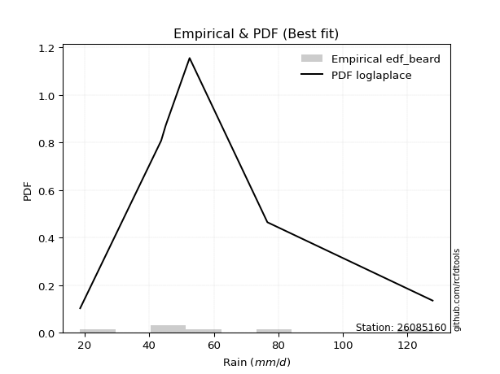</img>

</div>


### 5. Empirical - EDF Chegodayev (1955)

The Chegodayev formula is an empirical plotting position formula used in hydrological frequency analysis to estimate the exceedance probability or return period of a specific event from a set of observed data. It is primarily used for plotting observed data points on probability paper to fit a theoretical distribution, particularly for analyzing extreme events like maximum flood flows or rainfall intensities. The constant _b_ value in the generalized plotting position formula is 0.3.

<div align="center">


$P=(m-b)/(n+1-2b)$


</div>


**5.1. Empirical values**

<div align="center">

|                | 0                   | 1                  | 2                  | 3                  | 4                 | 5                 |
|:---------------|:--------------------|:-------------------|:-------------------|:-------------------|:------------------|:------------------|
| date           | 2025                | 2024               | 2019               | 2020               | 2018              | 2017              |
| x              | 13.6                | 18.6               | 43.7               | 45.1               | 76.6              | 127.8             |
| m              | 1                   | 2                  | 3                  | 4                  | 5                 | 6                 |
| empirical_dist | edf_chegodayev      | edf_chegodayev     | edf_chegodayev     | edf_chegodayev     | edf_chegodayev    | edf_chegodayev    |
| empirical      | 0.10937499999999999 | 0.265625           | 0.421875           | 0.578125           | 0.734375          | 0.890625          |
| empirical_tr   | 1.1228070175438596  | 1.3617021276595744 | 1.7297297297297298 | 2.3703703703703702 | 3.764705882352941 | 9.142857142857142 |

</div>


**5.2. Kolmogorov-Smirnov fit test (sorted by Δ)**


<div align="center">

|                | 0                   | 1                   | 2                   | 3                  | 4                   | 5                  | 6                   | 7                   | 8                   | 9                   | 10                  | 11                  | 12                  | 13                  | 14                 | 15                 | 16                  | 17                  | 18                  | 19                  | 20                  | 21                  | 22                  | 23                  | 24                  | 25                  | 26                    | 27                 | 28                  | 29                 | 30                 | 31                  | 32                 | 33                  | 34                 | 35                  | 36                  | 37                  | 38                 | 39                | 40                 | 41                  | 42                  | 43                  | 44                  | 45                 | 46                 | 47                  | 48                  | 49                  | 50                  | 51                  | 52                 | 53                  | 54                  | 55                  | 56                  | 57                  | 58                  | 59                  | 60                  | 61                  | 62                  | 63                 | 64                  | 65                 | 66                 | 67                  | 68                  | 69                  | 70                 | 71                  | 72                 | 73                  | 74                 | 75                 | 76             | 77                  | 78                  | 79                  | 80                 | 81                 | 82                  | 83                 | 84                  | 85                 | 86                  | 87                  | 88                  | 89                  |
|:---------------|:--------------------|:--------------------|:--------------------|:-------------------|:--------------------|:-------------------|:--------------------|:--------------------|:--------------------|:--------------------|:--------------------|:--------------------|:--------------------|:--------------------|:-------------------|:-------------------|:--------------------|:--------------------|:--------------------|:--------------------|:--------------------|:--------------------|:--------------------|:--------------------|:--------------------|:--------------------|:----------------------|:-------------------|:--------------------|:-------------------|:-------------------|:--------------------|:-------------------|:--------------------|:-------------------|:--------------------|:--------------------|:--------------------|:-------------------|:------------------|:-------------------|:--------------------|:--------------------|:--------------------|:--------------------|:-------------------|:-------------------|:--------------------|:--------------------|:--------------------|:--------------------|:--------------------|:-------------------|:--------------------|:--------------------|:--------------------|:--------------------|:--------------------|:--------------------|:--------------------|:--------------------|:--------------------|:--------------------|:-------------------|:--------------------|:-------------------|:-------------------|:--------------------|:--------------------|:--------------------|:-------------------|:--------------------|:-------------------|:--------------------|:-------------------|:-------------------|:---------------|:--------------------|:--------------------|:--------------------|:-------------------|:-------------------|:--------------------|:-------------------|:--------------------|:-------------------|:--------------------|:--------------------|:--------------------|:--------------------|
| station        | 26085160            | 26085160            | 26085160            | 26085160           | 26085160            | 26085160           | 26085160            | 26085160            | 26085160            | 26085160            | 26085160            | 26085160            | 26085160            | 26085160            | 26085160           | 26085160           | 26085160            | 26085160            | 26085160            | 26085160            | 26085160            | 26085160            | 26085160            | 26085160            | 26085160            | 26085160            | 26085160              | 26085160           | 26085160            | 26085160           | 26085160           | 26085160            | 26085160           | 26085160            | 26085160           | 26085160            | 26085160            | 26085160            | 26085160           | 26085160          | 26085160           | 26085160            | 26085160            | 26085160            | 26085160            | 26085160           | 26085160           | 26085160            | 26085160            | 26085160            | 26085160            | 26085160            | 26085160           | 26085160            | 26085160            | 26085160            | 26085160            | 26085160            | 26085160            | 26085160            | 26085160            | 26085160            | 26085160            | 26085160           | 26085160            | 26085160           | 26085160           | 26085160            | 26085160            | 26085160            | 26085160           | 26085160            | 26085160           | 26085160            | 26085160           | 26085160           | 26085160       | 26085160            | 26085160            | 26085160            | 26085160           | 26085160           | 26085160            | 26085160           | 26085160            | 26085160           | 26085160            | 26085160            | 26085160            | 26085160            |
| empirical_dist | edf_chegodayev      | edf_chegodayev      | edf_chegodayev      | edf_chegodayev     | edf_chegodayev      | edf_chegodayev     | edf_chegodayev      | edf_chegodayev      | edf_chegodayev      | edf_chegodayev      | edf_chegodayev      | edf_chegodayev      | edf_chegodayev      | edf_chegodayev      | edf_chegodayev     | edf_chegodayev     | edf_chegodayev      | edf_chegodayev      | edf_chegodayev      | edf_chegodayev      | edf_chegodayev      | edf_chegodayev      | edf_chegodayev      | edf_chegodayev      | edf_chegodayev      | edf_chegodayev      | edf_chegodayev        | edf_chegodayev     | edf_chegodayev      | edf_chegodayev     | edf_chegodayev     | edf_chegodayev      | edf_chegodayev     | edf_chegodayev      | edf_chegodayev     | edf_chegodayev      | edf_chegodayev      | edf_chegodayev      | edf_chegodayev     | edf_chegodayev    | edf_chegodayev     | edf_chegodayev      | edf_chegodayev      | edf_chegodayev      | edf_chegodayev      | edf_chegodayev     | edf_chegodayev     | edf_chegodayev      | edf_chegodayev      | edf_chegodayev      | edf_chegodayev      | edf_chegodayev      | edf_chegodayev     | edf_chegodayev      | edf_chegodayev      | edf_chegodayev      | edf_chegodayev      | edf_chegodayev      | edf_chegodayev      | edf_chegodayev      | edf_chegodayev      | edf_chegodayev      | edf_chegodayev      | edf_chegodayev     | edf_chegodayev      | edf_chegodayev     | edf_chegodayev     | edf_chegodayev      | edf_chegodayev      | edf_chegodayev      | edf_chegodayev     | edf_chegodayev      | edf_chegodayev     | edf_chegodayev      | edf_chegodayev     | edf_chegodayev     | edf_chegodayev | edf_chegodayev      | edf_chegodayev      | edf_chegodayev      | edf_chegodayev     | edf_chegodayev     | edf_chegodayev      | edf_chegodayev     | edf_chegodayev      | edf_chegodayev     | edf_chegodayev      | edf_chegodayev      | edf_chegodayev      | edf_chegodayev      |
| p_dist         | halfnorm            | gumbel_r            | fisk                | halflogistic       | f                   | logjohnsonsu       | logloggamma         | loggamma            | loggamma            | logpearson3         | logerlang           | lognct              | logexponnorm        | logcrystalball      | lognorm            | lognorm            | logt                | logfatiguelife      | logf                | logbetaprime        | genlogistic         | pearson3            | logncf              | moyal               | rayleigh            | kstwobign           | loglaplace_asymmetric | loggumbel_l        | logfisk             | loginvgamma        | logalpha           | weibull_min         | logrice            | loglogistic         | maxwell            | logmaxwell          | invgamma            | loghypsecant        | invweibull         | loggompertz       | loginvgauss        | laplace_asymmetric  | exponnorm           | expon               | loglaplace          | lograyleigh        | genexpon           | gompertz            | nakagami            | logweibull_min      | loginvweibull       | rice                | loggenlogistic     | mielke              | truncnorm           | norm                | crystalball         | t                   | alpha               | logkstwobign        | loggumbel_r         | loghalfnorm         | invgauss            | logistic           | nct                 | hypsecant          | loggenexpon        | logmoyal            | loghalflogistic     | laplace             | logexpon           | logmielke           | logtruncnorm       | gumbel_l            | ncf                | wald               | gibrat         | logwald             | chi2                | logchi2             | pareto             | loggibrat          | betaprime           | lognakagami        | logpareto           | loglognorm         | gamma               | fatiguelife         | erlang              | johnsonsu           |
| delta          | 0.08998420467604107 | 0.11017898115852659 | 0.11033719041449408 | 0.1109714088809545 | 0.11217621252225865 | 0.1148404895957898 | 0.11507511937700338 | 0.11509537467646541 | 0.11509537467646541 | 0.11518093960959336 | 0.11521369812687432 | 0.11524091879885684 | 0.11531208482851812 | 0.11531346484789695 | 0.1153135240165446 | 0.1153135240165446 | 0.11531596642469444 | 0.11561541305096995 | 0.11605538345493335 | 0.11801724096500121 | 0.11804228570600955 | 0.11857608836237393 | 0.12018258860197872 | 0.12402981714525066 | 0.12476758339884186 | 0.12566534982235605 | 0.12623576724379565   | 0.1273188413877733 | 0.12779777748472487 | 0.1291162967707753 | 0.1297823911543019 | 0.13032629868398837 | 0.1319309622385747 | 0.13294420212205538 | 0.1370401641973275 | 0.14044602909297432 | 0.14079517206566106 | 0.14196270837031208 | 0.1423098841573961 | 0.145967838048235 | 0.1465381765538456 | 0.14784149887725107 | 0.14826501516237578 | 0.14984296348681908 | 0.14995308333589402 | 0.1507252720113923 | 0.1545946872300742 | 0.15724314256519134 | 0.15756663600475174 | 0.16641510276473814 | 0.16686926286663983 | 0.16694364314939525 | 0.1671502878383102 | 0.16715611701947286 | 0.17119999831266486 | 0.17120002397859774 | 0.17120003661861188 | 0.17120436782308102 | 0.17671894939394295 | 0.17927454795861708 | 0.17948946309289515 | 0.17968034134000332 | 0.18146067831778612 | 0.1833015029703728 | 0.19231911089226705 | 0.1932601957879626 | 0.2046705664884373 | 0.20486592168133866 | 0.20622569781364963 | 0.21973773464055746 | 0.2294040996531137 | 0.23026596356242024 | 0.2334072862853845 | 0.23839156150061425 | 0.2501906975500844 | 0.2644318685851216 | 0.265625       | 0.27531140586605674 | 0.28359442020556935 | 0.28860323226335105 | 0.2932618243985483 | 0.3026541386272793 | 0.30374147046390254 | 0.3369484836020875 | 0.34462181571000206 | 0.3715599226698083 | 0.38088430998245615 | 0.41826147365883615 | 0.48686079009590155 | 0.49307692637552414 |
| deltao         | 0.530385761606      | 0.530385761606      | 0.530385761606      | 0.530385761606     | 0.530385761606      | 0.530385761606     | 0.530385761606      | 0.530385761606      | 0.530385761606      | 0.530385761606      | 0.530385761606      | 0.530385761606      | 0.530385761606      | 0.530385761606      | 0.530385761606     | 0.530385761606     | 0.530385761606      | 0.530385761606      | 0.530385761606      | 0.530385761606      | 0.530385761606      | 0.530385761606      | 0.530385761606      | 0.530385761606      | 0.530385761606      | 0.530385761606      | 0.530385761606        | 0.530385761606     | 0.530385761606      | 0.530385761606     | 0.530385761606     | 0.530385761606      | 0.530385761606     | 0.530385761606      | 0.530385761606     | 0.530385761606      | 0.530385761606      | 0.530385761606      | 0.530385761606     | 0.530385761606    | 0.530385761606     | 0.530385761606      | 0.530385761606      | 0.530385761606      | 0.530385761606      | 0.530385761606     | 0.530385761606     | 0.530385761606      | 0.530385761606      | 0.530385761606      | 0.530385761606      | 0.530385761606      | 0.530385761606     | 0.530385761606      | 0.530385761606      | 0.530385761606      | 0.530385761606      | 0.530385761606      | 0.530385761606      | 0.530385761606      | 0.530385761606      | 0.530385761606      | 0.530385761606      | 0.530385761606     | 0.530385761606      | 0.530385761606     | 0.530385761606     | 0.530385761606      | 0.530385761606      | 0.530385761606      | 0.530385761606     | 0.530385761606      | 0.530385761606     | 0.530385761606      | 0.530385761606     | 0.530385761606     | 0.530385761606 | 0.530385761606      | 0.530385761606      | 0.530385761606      | 0.530385761606     | 0.530385761606     | 0.530385761606      | 0.530385761606     | 0.530385761606      | 0.530385761606     | 0.530385761606      | 0.530385761606      | 0.530385761606      | 0.530385761606      |
| eval           | Δo > Δ              | Δo > Δ              | Δo > Δ              | Δo > Δ             | Δo > Δ              | Δo > Δ             | Δo > Δ              | Δo > Δ              | Δo > Δ              | Δo > Δ              | Δo > Δ              | Δo > Δ              | Δo > Δ              | Δo > Δ              | Δo > Δ             | Δo > Δ             | Δo > Δ              | Δo > Δ              | Δo > Δ              | Δo > Δ              | Δo > Δ              | Δo > Δ              | Δo > Δ              | Δo > Δ              | Δo > Δ              | Δo > Δ              | Δo > Δ                | Δo > Δ             | Δo > Δ              | Δo > Δ             | Δo > Δ             | Δo > Δ              | Δo > Δ             | Δo > Δ              | Δo > Δ             | Δo > Δ              | Δo > Δ              | Δo > Δ              | Δo > Δ             | Δo > Δ            | Δo > Δ             | Δo > Δ              | Δo > Δ              | Δo > Δ              | Δo > Δ              | Δo > Δ             | Δo > Δ             | Δo > Δ              | Δo > Δ              | Δo > Δ              | Δo > Δ              | Δo > Δ              | Δo > Δ             | Δo > Δ              | Δo > Δ              | Δo > Δ              | Δo > Δ              | Δo > Δ              | Δo > Δ              | Δo > Δ              | Δo > Δ              | Δo > Δ              | Δo > Δ              | Δo > Δ             | Δo > Δ              | Δo > Δ             | Δo > Δ             | Δo > Δ              | Δo > Δ              | Δo > Δ              | Δo > Δ             | Δo > Δ              | Δo > Δ             | Δo > Δ              | Δo > Δ             | Δo > Δ             | Δo > Δ         | Δo > Δ              | Δo > Δ              | Δo > Δ              | Δo > Δ             | Δo > Δ             | Δo > Δ              | Δo > Δ             | Δo > Δ              | Δo > Δ             | Δo > Δ              | Δo > Δ              | Δo > Δ              | Δo > Δ              |
| fit            | 1                   | 1                   | 1                   | 1                  | 1                   | 1                  | 1                   | 1                   | 1                   | 1                   | 1                   | 1                   | 1                   | 1                   | 1                  | 1                  | 1                   | 1                   | 1                   | 1                   | 1                   | 1                   | 1                   | 1                   | 1                   | 1                   | 1                     | 1                  | 1                   | 1                  | 1                  | 1                   | 1                  | 1                   | 1                  | 1                   | 1                   | 1                   | 1                  | 1                 | 1                  | 1                   | 1                   | 1                   | 1                   | 1                  | 1                  | 1                   | 1                   | 1                   | 1                   | 1                   | 1                  | 1                   | 1                   | 1                   | 1                   | 1                   | 1                   | 1                   | 1                   | 1                   | 1                   | 1                  | 1                   | 1                  | 1                  | 1                   | 1                   | 1                   | 1                  | 1                   | 1                  | 1                   | 1                  | 1                  | 1              | 1                   | 1                   | 1                   | 1                  | 1                  | 1                   | 1                  | 1                   | 1                  | 1                   | 1                   | 1                   | 1                   |
| n              | 6                   | 6                   | 6                   | 6                  | 6                   | 6                  | 6                   | 6                   | 6                   | 6                   | 6                   | 6                   | 6                   | 6                   | 6                  | 6                  | 6                   | 6                   | 6                   | 6                   | 6                   | 6                   | 6                   | 6                   | 6                   | 6                   | 6                     | 6                  | 6                   | 6                  | 6                  | 6                   | 6                  | 6                   | 6                  | 6                   | 6                   | 6                   | 6                  | 6                 | 6                  | 6                   | 6                   | 6                   | 6                   | 6                  | 6                  | 6                   | 6                   | 6                   | 6                   | 6                   | 6                  | 6                   | 6                   | 6                   | 6                   | 6                   | 6                   | 6                   | 6                   | 6                   | 6                   | 6                  | 6                   | 6                  | 6                  | 6                   | 6                   | 6                   | 6                  | 6                   | 6                  | 6                   | 6                  | 6                  | 6              | 6                   | 6                   | 6                   | 6                  | 6                  | 6                   | 6                  | 6                   | 6                  | 6                   | 6                   | 6                   | 6                   |
| best_fit       | 1                   | 0                   | 0                   | 0                  | 0                   | 0                  | 0                   | 0                   | 0                   | 0                   | 0                   | 0                   | 0                   | 0                   | 0                  | 0                  | 0                   | 0                   | 0                   | 0                   | 0                   | 0                   | 0                   | 0                   | 0                   | 0                   | 0                     | 0                  | 0                   | 0                  | 0                  | 0                   | 0                  | 0                   | 0                  | 0                   | 0                   | 0                   | 0                  | 0                 | 0                  | 0                   | 0                   | 0                   | 0                   | 0                  | 0                  | 0                   | 0                   | 0                   | 0                   | 0                   | 0                  | 0                   | 0                   | 0                   | 0                   | 0                   | 0                   | 0                   | 0                   | 0                   | 0                   | 0                  | 0                   | 0                  | 0                  | 0                   | 0                   | 0                   | 0                  | 0                   | 0                  | 0                   | 0                  | 0                  | 0              | 0                   | 0                   | 0                   | 0                  | 0                  | 0                   | 0                  | 0                   | 0                  | 0                   | 0                   | 0                   | 0                   |
| best_fit_sort  | 1                   | 2                   | 3                   | 4                  | 5                   | 6                  | 7                   | 8                   | 9                   | 10                  | 11                  | 12                  | 13                  | 14                  | 15                 | 16                 | 17                  | 18                  | 19                  | 20                  | 21                  | 22                  | 23                  | 24                  | 25                  | 26                  | 27                    | 28                 | 29                  | 30                 | 31                 | 32                  | 33                 | 34                  | 35                 | 36                  | 37                  | 38                  | 39                 | 40                | 41                 | 42                  | 43                  | 44                  | 45                  | 46                 | 47                 | 48                  | 49                  | 50                  | 51                  | 52                  | 53                 | 54                  | 55                  | 56                  | 57                  | 58                  | 59                  | 60                  | 61                  | 62                  | 63                  | 64                 | 65                  | 66                 | 67                 | 68                  | 69                  | 70                  | 71                 | 72                  | 73                 | 74                  | 75                 | 76                 | 77             | 78                  | 79                  | 80                  | 81                 | 82                 | 83                  | 84                 | 85                  | 86                 | 87                  | 88                  | 89                  | 90                  |

</div>


<div align="center">

</img>

</div>


**5.3. Best fit**

<div align="center">

|   id |   station | empirical_dist   | p_dist   |     delta |   deltao | eval   |   fit |   n |   best_fit |   best_fit_sort |
|-----:|----------:|:-----------------|:---------|----------:|---------:|:-------|------:|----:|-----------:|----------------:|
|    0 |  26085160 | edf_chegodayev   | halfnorm | 0.0899842 | 0.530386 | Δo > Δ |     1 |   6 |          1 |               1 |

</div>


<div align="center">

</img></img>

</div>


### 6. Empirical - EDF Blom (1958)

The Blom formula is a specific "plotting position" formula used in hydrology and statistical analysis to estimate the empirical cumulative probability (or non-exceedance probability) of a data series. It is particularly recommended for data that are approximately normally distributed. The constant _a_ is set to 0.375 (or 3/8).

<div align="center">


$P=(m-a)/(n+1-2a)$


</div>


**6.1. Empirical values**

<div align="center">

|                | 0                  | 1                  | 2                  | 3                 | 4                 | 5                  |
|:---------------|:-------------------|:-------------------|:-------------------|:------------------|:------------------|:-------------------|
| date           | 2025               | 2024               | 2019               | 2020              | 2018              | 2017               |
| x              | 13.6               | 18.6               | 43.7               | 45.1              | 76.6              | 127.8              |
| m              | 1                  | 2                  | 3                  | 4                 | 5                 | 6                  |
| empirical_dist | edf_blom           | edf_blom           | edf_blom           | edf_blom          | edf_blom          | edf_blom           |
| empirical      | 0.1                | 0.26               | 0.42               | 0.58              | 0.74              | 0.9                |
| empirical_tr   | 1.1111111111111112 | 1.3513513513513513 | 1.7241379310344827 | 2.380952380952381 | 3.846153846153846 | 10.000000000000002 |

</div>


**6.2. Kolmogorov-Smirnov fit test (sorted by Δ)**


<div align="center">

|                | 0                   | 1                  | 2                   | 3                   | 4                   | 5                   | 6                   | 7                   | 8                   | 9                   | 10                  | 11                 | 12                  | 13                  | 14                  | 15                  | 16                  | 17                  | 18                  | 19                  | 20                  | 21                 | 22                  | 23                    | 24                  | 25                  | 26                  | 27                  | 28                  | 29                 | 30                 | 31                  | 32                 | 33                  | 34                 | 35                  | 36                  | 37                 | 38                  | 39                 | 40                 | 41                  | 42                | 43                  | 44                 | 45                  | 46                  | 47                 | 48                  | 49                  | 50                  | 51                 | 52                  | 53                  | 54                  | 55                 | 56                  | 57                  | 58                  | 59                 | 60                  | 61                  | 62                  | 63                  | 64                  | 65                  | 66                 | 67                  | 68                  | 69                  | 70                  | 71                  | 72                  | 73                 | 74                 | 75                 | 76             | 77                  | 78                  | 79                  | 80                 | 81                 | 82                  | 83                 | 84                  | 85                 | 86                  | 87                  | 88                  | 89                  |
|:---------------|:--------------------|:-------------------|:--------------------|:--------------------|:--------------------|:--------------------|:--------------------|:--------------------|:--------------------|:--------------------|:--------------------|:-------------------|:--------------------|:--------------------|:--------------------|:--------------------|:--------------------|:--------------------|:--------------------|:--------------------|:--------------------|:-------------------|:--------------------|:----------------------|:--------------------|:--------------------|:--------------------|:--------------------|:--------------------|:-------------------|:-------------------|:--------------------|:-------------------|:--------------------|:-------------------|:--------------------|:--------------------|:-------------------|:--------------------|:-------------------|:-------------------|:--------------------|:------------------|:--------------------|:-------------------|:--------------------|:--------------------|:-------------------|:--------------------|:--------------------|:--------------------|:-------------------|:--------------------|:--------------------|:--------------------|:-------------------|:--------------------|:--------------------|:--------------------|:-------------------|:--------------------|:--------------------|:--------------------|:--------------------|:--------------------|:--------------------|:-------------------|:--------------------|:--------------------|:--------------------|:--------------------|:--------------------|:--------------------|:-------------------|:-------------------|:-------------------|:---------------|:--------------------|:--------------------|:--------------------|:-------------------|:-------------------|:--------------------|:-------------------|:--------------------|:-------------------|:--------------------|:--------------------|:--------------------|:--------------------|
| station        | 26085160            | 26085160           | 26085160            | 26085160            | 26085160            | 26085160            | 26085160            | 26085160            | 26085160            | 26085160            | 26085160            | 26085160           | 26085160            | 26085160            | 26085160            | 26085160            | 26085160            | 26085160            | 26085160            | 26085160            | 26085160            | 26085160           | 26085160            | 26085160              | 26085160            | 26085160            | 26085160            | 26085160            | 26085160            | 26085160           | 26085160           | 26085160            | 26085160           | 26085160            | 26085160           | 26085160            | 26085160            | 26085160           | 26085160            | 26085160           | 26085160           | 26085160            | 26085160          | 26085160            | 26085160           | 26085160            | 26085160            | 26085160           | 26085160            | 26085160            | 26085160            | 26085160           | 26085160            | 26085160            | 26085160            | 26085160           | 26085160            | 26085160            | 26085160            | 26085160           | 26085160            | 26085160            | 26085160            | 26085160            | 26085160            | 26085160            | 26085160           | 26085160            | 26085160            | 26085160            | 26085160            | 26085160            | 26085160            | 26085160           | 26085160           | 26085160           | 26085160       | 26085160            | 26085160            | 26085160            | 26085160           | 26085160           | 26085160            | 26085160           | 26085160            | 26085160           | 26085160            | 26085160            | 26085160            | 26085160            |
| empirical_dist | edf_blom            | edf_blom           | edf_blom            | edf_blom            | edf_blom            | edf_blom            | edf_blom            | edf_blom            | edf_blom            | edf_blom            | edf_blom            | edf_blom           | edf_blom            | edf_blom            | edf_blom            | edf_blom            | edf_blom            | edf_blom            | edf_blom            | edf_blom            | edf_blom            | edf_blom           | edf_blom            | edf_blom              | edf_blom            | edf_blom            | edf_blom            | edf_blom            | edf_blom            | edf_blom           | edf_blom           | edf_blom            | edf_blom           | edf_blom            | edf_blom           | edf_blom            | edf_blom            | edf_blom           | edf_blom            | edf_blom           | edf_blom           | edf_blom            | edf_blom          | edf_blom            | edf_blom           | edf_blom            | edf_blom            | edf_blom           | edf_blom            | edf_blom            | edf_blom            | edf_blom           | edf_blom            | edf_blom            | edf_blom            | edf_blom           | edf_blom            | edf_blom            | edf_blom            | edf_blom           | edf_blom            | edf_blom            | edf_blom            | edf_blom            | edf_blom            | edf_blom            | edf_blom           | edf_blom            | edf_blom            | edf_blom            | edf_blom            | edf_blom            | edf_blom            | edf_blom           | edf_blom           | edf_blom           | edf_blom       | edf_blom            | edf_blom            | edf_blom            | edf_blom           | edf_blom           | edf_blom            | edf_blom           | edf_blom            | edf_blom           | edf_blom            | edf_blom            | edf_blom            | edf_blom            |
| p_dist         | halfnorm            | halflogistic       | f                   | logloggamma         | logpearson3         | logf                | logexponnorm        | logcrystalball      | lognorm             | lognorm             | logt                | logjohnsonsu       | lognct              | gumbel_r            | genlogistic         | logfatiguelife      | logerlang           | loggamma            | loggamma            | logbetaprime        | moyal               | fisk               | pearson3            | loglaplace_asymmetric | loggumbel_l         | logncf              | kstwobign           | rayleigh            | loglogistic         | logfisk            | loginvgamma        | logalpha            | weibull_min        | logrice             | loghypsecant       | maxwell             | logmaxwell          | exponnorm          | invgamma            | invweibull         | expon              | loglaplace          | loggompertz       | loginvgauss         | genexpon           | laplace_asymmetric  | gompertz            | lograyleigh        | nakagami            | logweibull_min      | loginvweibull       | rice               | loggenlogistic      | mielke              | truncnorm           | norm               | crystalball         | t                   | alpha               | logkstwobign       | loggumbel_r         | loghalfnorm         | invgauss            | logistic            | nct                 | hypsecant           | loggenexpon        | logmoyal            | loghalflogistic     | laplace             | logtruncnorm        | logexpon            | logmielke           | gumbel_l           | wald               | ncf                | gibrat         | logwald             | chi2                | logchi2             | pareto             | loggibrat          | betaprime           | lognakagami        | logpareto           | loglognorm         | gamma               | fatiguelife         | erlang              | johnsonsu           |
| delta          | 0.09185920467604103 | 0.1053464088809545 | 0.10655121252225866 | 0.10945011937700339 | 0.10955593960959337 | 0.11066737865026183 | 0.11075306762485598 | 0.11075379285166548 | 0.11075387457194824 | 0.11075387457194824 | 0.11075516155013149 | 0.1110858256683685 | 0.11135033600899497 | 0.11205398115852655 | 0.11241728570600956 | 0.11359990100270806 | 0.11453043344268882 | 0.11456683168560727 | 0.11456683168560727 | 0.11628832185572896 | 0.11840481714525067 | 0.1197121904144941 | 0.12045108836237389 | 0.12061076724379566   | 0.12169384138777331 | 0.12205758860197874 | 0.12254974071479285 | 0.12664258339884182 | 0.12731920212205539 | 0.1296727774847249 | 0.1309912967707753 | 0.13165739115430192 | 0.1322012986839884 | 0.13380596223857472 | 0.1363377083703121 | 0.13891516419732747 | 0.14232102909297434 | 0.1426400151623758 | 0.14267017206566107 | 0.1441848841573961 | 0.1442179634868191 | 0.14432808333589403 | 0.147842838048235 | 0.14841317655384562 | 0.1489696872300742 | 0.14971649887725103 | 0.15161814256519135 | 0.1526002720113923 | 0.15944163600475175 | 0.16829010276473816 | 0.16874426286663985 | 0.1688186431493952 | 0.16902528783831022 | 0.16903111701947288 | 0.17307499831266482 | 0.1730750239785977 | 0.17307503661861184 | 0.17307936782308098 | 0.17859394939394296 | 0.1811495479586171 | 0.18136446309289517 | 0.18155534134000334 | 0.18333567831778613 | 0.18517650297037275 | 0.19419411089226707 | 0.19513519578796257 | 0.2065455664884373 | 0.20674092168133867 | 0.20810069781364965 | 0.22161273464055742 | 0.22778228628538452 | 0.23127909965311372 | 0.23214096356242025 | 0.2402665615006142 | 0.2588068685851216 | 0.2595656975500844 | 0.26           | 0.27718640586605675 | 0.28546942020556937 | 0.29047823226335107 | 0.2988868243985483 | 0.3045291386272793 | 0.30561647046390256 | 0.3388234836020875 | 0.35024681571000205 | 0.3771849226698083 | 0.38275930998245616 | 0.42013647365883616 | 0.48873579009590157 | 0.49870192637552413 |
| deltao         | 0.530385761606      | 0.530385761606     | 0.530385761606      | 0.530385761606      | 0.530385761606      | 0.530385761606      | 0.530385761606      | 0.530385761606      | 0.530385761606      | 0.530385761606      | 0.530385761606      | 0.530385761606     | 0.530385761606      | 0.530385761606      | 0.530385761606      | 0.530385761606      | 0.530385761606      | 0.530385761606      | 0.530385761606      | 0.530385761606      | 0.530385761606      | 0.530385761606     | 0.530385761606      | 0.530385761606        | 0.530385761606      | 0.530385761606      | 0.530385761606      | 0.530385761606      | 0.530385761606      | 0.530385761606     | 0.530385761606     | 0.530385761606      | 0.530385761606     | 0.530385761606      | 0.530385761606     | 0.530385761606      | 0.530385761606      | 0.530385761606     | 0.530385761606      | 0.530385761606     | 0.530385761606     | 0.530385761606      | 0.530385761606    | 0.530385761606      | 0.530385761606     | 0.530385761606      | 0.530385761606      | 0.530385761606     | 0.530385761606      | 0.530385761606      | 0.530385761606      | 0.530385761606     | 0.530385761606      | 0.530385761606      | 0.530385761606      | 0.530385761606     | 0.530385761606      | 0.530385761606      | 0.530385761606      | 0.530385761606     | 0.530385761606      | 0.530385761606      | 0.530385761606      | 0.530385761606      | 0.530385761606      | 0.530385761606      | 0.530385761606     | 0.530385761606      | 0.530385761606      | 0.530385761606      | 0.530385761606      | 0.530385761606      | 0.530385761606      | 0.530385761606     | 0.530385761606     | 0.530385761606     | 0.530385761606 | 0.530385761606      | 0.530385761606      | 0.530385761606      | 0.530385761606     | 0.530385761606     | 0.530385761606      | 0.530385761606     | 0.530385761606      | 0.530385761606     | 0.530385761606      | 0.530385761606      | 0.530385761606      | 0.530385761606      |
| eval           | Δo > Δ              | Δo > Δ             | Δo > Δ              | Δo > Δ              | Δo > Δ              | Δo > Δ              | Δo > Δ              | Δo > Δ              | Δo > Δ              | Δo > Δ              | Δo > Δ              | Δo > Δ             | Δo > Δ              | Δo > Δ              | Δo > Δ              | Δo > Δ              | Δo > Δ              | Δo > Δ              | Δo > Δ              | Δo > Δ              | Δo > Δ              | Δo > Δ             | Δo > Δ              | Δo > Δ                | Δo > Δ              | Δo > Δ              | Δo > Δ              | Δo > Δ              | Δo > Δ              | Δo > Δ             | Δo > Δ             | Δo > Δ              | Δo > Δ             | Δo > Δ              | Δo > Δ             | Δo > Δ              | Δo > Δ              | Δo > Δ             | Δo > Δ              | Δo > Δ             | Δo > Δ             | Δo > Δ              | Δo > Δ            | Δo > Δ              | Δo > Δ             | Δo > Δ              | Δo > Δ              | Δo > Δ             | Δo > Δ              | Δo > Δ              | Δo > Δ              | Δo > Δ             | Δo > Δ              | Δo > Δ              | Δo > Δ              | Δo > Δ             | Δo > Δ              | Δo > Δ              | Δo > Δ              | Δo > Δ             | Δo > Δ              | Δo > Δ              | Δo > Δ              | Δo > Δ              | Δo > Δ              | Δo > Δ              | Δo > Δ             | Δo > Δ              | Δo > Δ              | Δo > Δ              | Δo > Δ              | Δo > Δ              | Δo > Δ              | Δo > Δ             | Δo > Δ             | Δo > Δ             | Δo > Δ         | Δo > Δ              | Δo > Δ              | Δo > Δ              | Δo > Δ             | Δo > Δ             | Δo > Δ              | Δo > Δ             | Δo > Δ              | Δo > Δ             | Δo > Δ              | Δo > Δ              | Δo > Δ              | Δo > Δ              |
| fit            | 1                   | 1                  | 1                   | 1                   | 1                   | 1                   | 1                   | 1                   | 1                   | 1                   | 1                   | 1                  | 1                   | 1                   | 1                   | 1                   | 1                   | 1                   | 1                   | 1                   | 1                   | 1                  | 1                   | 1                     | 1                   | 1                   | 1                   | 1                   | 1                   | 1                  | 1                  | 1                   | 1                  | 1                   | 1                  | 1                   | 1                   | 1                  | 1                   | 1                  | 1                  | 1                   | 1                 | 1                   | 1                  | 1                   | 1                   | 1                  | 1                   | 1                   | 1                   | 1                  | 1                   | 1                   | 1                   | 1                  | 1                   | 1                   | 1                   | 1                  | 1                   | 1                   | 1                   | 1                   | 1                   | 1                   | 1                  | 1                   | 1                   | 1                   | 1                   | 1                   | 1                   | 1                  | 1                  | 1                  | 1              | 1                   | 1                   | 1                   | 1                  | 1                  | 1                   | 1                  | 1                   | 1                  | 1                   | 1                   | 1                   | 1                   |
| n              | 6                   | 6                  | 6                   | 6                   | 6                   | 6                   | 6                   | 6                   | 6                   | 6                   | 6                   | 6                  | 6                   | 6                   | 6                   | 6                   | 6                   | 6                   | 6                   | 6                   | 6                   | 6                  | 6                   | 6                     | 6                   | 6                   | 6                   | 6                   | 6                   | 6                  | 6                  | 6                   | 6                  | 6                   | 6                  | 6                   | 6                   | 6                  | 6                   | 6                  | 6                  | 6                   | 6                 | 6                   | 6                  | 6                   | 6                   | 6                  | 6                   | 6                   | 6                   | 6                  | 6                   | 6                   | 6                   | 6                  | 6                   | 6                   | 6                   | 6                  | 6                   | 6                   | 6                   | 6                   | 6                   | 6                   | 6                  | 6                   | 6                   | 6                   | 6                   | 6                   | 6                   | 6                  | 6                  | 6                  | 6              | 6                   | 6                   | 6                   | 6                  | 6                  | 6                   | 6                  | 6                   | 6                  | 6                   | 6                   | 6                   | 6                   |
| best_fit       | 1                   | 0                  | 0                   | 0                   | 0                   | 0                   | 0                   | 0                   | 0                   | 0                   | 0                   | 0                  | 0                   | 0                   | 0                   | 0                   | 0                   | 0                   | 0                   | 0                   | 0                   | 0                  | 0                   | 0                     | 0                   | 0                   | 0                   | 0                   | 0                   | 0                  | 0                  | 0                   | 0                  | 0                   | 0                  | 0                   | 0                   | 0                  | 0                   | 0                  | 0                  | 0                   | 0                 | 0                   | 0                  | 0                   | 0                   | 0                  | 0                   | 0                   | 0                   | 0                  | 0                   | 0                   | 0                   | 0                  | 0                   | 0                   | 0                   | 0                  | 0                   | 0                   | 0                   | 0                   | 0                   | 0                   | 0                  | 0                   | 0                   | 0                   | 0                   | 0                   | 0                   | 0                  | 0                  | 0                  | 0              | 0                   | 0                   | 0                   | 0                  | 0                  | 0                   | 0                  | 0                   | 0                  | 0                   | 0                   | 0                   | 0                   |
| best_fit_sort  | 1                   | 2                  | 3                   | 4                   | 5                   | 6                   | 7                   | 8                   | 9                   | 10                  | 11                  | 12                 | 13                  | 14                  | 15                  | 16                  | 17                  | 18                  | 19                  | 20                  | 21                  | 22                 | 23                  | 24                    | 25                  | 26                  | 27                  | 28                  | 29                  | 30                 | 31                 | 32                  | 33                 | 34                  | 35                 | 36                  | 37                  | 38                 | 39                  | 40                 | 41                 | 42                  | 43                | 44                  | 45                 | 46                  | 47                  | 48                 | 49                  | 50                  | 51                  | 52                 | 53                  | 54                  | 55                  | 56                 | 57                  | 58                  | 59                  | 60                 | 61                  | 62                  | 63                  | 64                  | 65                  | 66                  | 67                 | 68                  | 69                  | 70                  | 71                  | 72                  | 73                  | 74                 | 75                 | 76                 | 77             | 78                  | 79                  | 80                  | 81                 | 82                 | 83                  | 84                 | 85                  | 86                 | 87                  | 88                  | 89                  | 90                  |

</div>


<div align="center">

</img>

</div>


**6.3. Best fit**

<div align="center">

|   id |   station | empirical_dist   | p_dist   |     delta |   deltao | eval   |   fit |   n |   best_fit |   best_fit_sort |
|-----:|----------:|:-----------------|:---------|----------:|---------:|:-------|------:|----:|-----------:|----------------:|
|    0 |  26085160 | edf_blom         | halfnorm | 0.0918592 | 0.530386 | Δo > Δ |     1 |   6 |          1 |               1 |

</div>


<div align="center">

</img>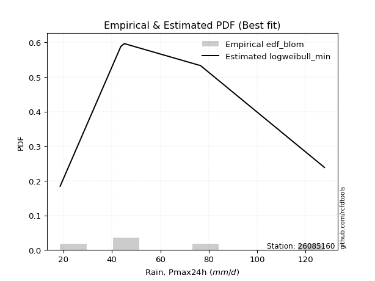</img>

</div>


### 7. Empirical - EDF Tukey (1962)

In hydrology, the Tukey formula is used as a plotting position formula to estimate the empirical probability or frequency of a flood event (or other hydrological data). The formula parameter is given as _c=0.333_ (or 1/3).

<div align="center">


$P=(m-c)/(n+1-2c)$


</div>


**7.1. Empirical values**

<div align="center">

|                | 0                   | 1                  | 2                   | 3                  | 4                  | 5                  |
|:---------------|:--------------------|:-------------------|:--------------------|:-------------------|:-------------------|:-------------------|
| date           | 2025                | 2024               | 2019                | 2020               | 2018               | 2017               |
| x              | 13.6                | 18.6               | 43.7                | 45.1               | 76.6               | 127.8              |
| m              | 1                   | 2                  | 3                   | 4                  | 5                  | 6                  |
| empirical_dist | edf_tukey           | edf_tukey          | edf_tukey           | edf_tukey          | edf_tukey          | edf_tukey          |
| empirical      | 0.10526315789473684 | 0.2631578947368421 | 0.42105263157894735 | 0.5789473684210527 | 0.7368421052631579 | 0.8947368421052632 |
| empirical_tr   | 1.1176470588235294  | 1.357142857142857  | 1.7272727272727273  | 2.375              | 3.7999999999999994 | 9.5                |

</div>


**7.2. Kolmogorov-Smirnov fit test (sorted by Δ)**


<div align="center">

|                | 0                   | 1                   | 2                   | 3                   | 4                   | 5                   | 6                   | 7                   | 8                   | 9                   | 10                  | 11                  | 12                  | 13                  | 14                  | 15                  | 16                  | 17                  | 18                  | 19                 | 20                  | 21                  | 22                  | 23                  | 24                  | 25                    | 26                  | 27                  | 28                  | 29                  | 30                  | 31                  | 32                  | 33                  | 34                  | 35                  | 36                  | 37                 | 38                  | 39                  | 40                  | 41                  | 42                  | 43                 | 44                  | 45                  | 46                  | 47                  | 48                 | 49                 | 50                 | 51                 | 52                  | 53                  | 54                 | 55                 | 56                  | 57                  | 58                 | 59                  | 60                 | 61                  | 62                  | 63                  | 64                 | 65                  | 66                  | 67                 | 68                 | 69                 | 70                  | 71                 | 72                 | 73                 | 74                  | 75                  | 76                 | 77                 | 78                | 79                 | 80                 | 81                  | 82                 | 83                  | 84                  | 85                 | 86                 | 87                 | 88                 | 89                  |
|:---------------|:--------------------|:--------------------|:--------------------|:--------------------|:--------------------|:--------------------|:--------------------|:--------------------|:--------------------|:--------------------|:--------------------|:--------------------|:--------------------|:--------------------|:--------------------|:--------------------|:--------------------|:--------------------|:--------------------|:-------------------|:--------------------|:--------------------|:--------------------|:--------------------|:--------------------|:----------------------|:--------------------|:--------------------|:--------------------|:--------------------|:--------------------|:--------------------|:--------------------|:--------------------|:--------------------|:--------------------|:--------------------|:-------------------|:--------------------|:--------------------|:--------------------|:--------------------|:--------------------|:-------------------|:--------------------|:--------------------|:--------------------|:--------------------|:-------------------|:-------------------|:-------------------|:-------------------|:--------------------|:--------------------|:-------------------|:-------------------|:--------------------|:--------------------|:-------------------|:--------------------|:-------------------|:--------------------|:--------------------|:--------------------|:-------------------|:--------------------|:--------------------|:-------------------|:-------------------|:-------------------|:--------------------|:-------------------|:-------------------|:-------------------|:--------------------|:--------------------|:-------------------|:-------------------|:------------------|:-------------------|:-------------------|:--------------------|:-------------------|:--------------------|:--------------------|:-------------------|:-------------------|:-------------------|:-------------------|:--------------------|
| station        | 26085160            | 26085160            | 26085160            | 26085160            | 26085160            | 26085160            | 26085160            | 26085160            | 26085160            | 26085160            | 26085160            | 26085160            | 26085160            | 26085160            | 26085160            | 26085160            | 26085160            | 26085160            | 26085160            | 26085160           | 26085160            | 26085160            | 26085160            | 26085160            | 26085160            | 26085160              | 26085160            | 26085160            | 26085160            | 26085160            | 26085160            | 26085160            | 26085160            | 26085160            | 26085160            | 26085160            | 26085160            | 26085160           | 26085160            | 26085160            | 26085160            | 26085160            | 26085160            | 26085160           | 26085160            | 26085160            | 26085160            | 26085160            | 26085160           | 26085160           | 26085160           | 26085160           | 26085160            | 26085160            | 26085160           | 26085160           | 26085160            | 26085160            | 26085160           | 26085160            | 26085160           | 26085160            | 26085160            | 26085160            | 26085160           | 26085160            | 26085160            | 26085160           | 26085160           | 26085160           | 26085160            | 26085160           | 26085160           | 26085160           | 26085160            | 26085160            | 26085160           | 26085160           | 26085160          | 26085160           | 26085160           | 26085160            | 26085160           | 26085160            | 26085160            | 26085160           | 26085160           | 26085160           | 26085160           | 26085160            |
| empirical_dist | edf_tukey           | edf_tukey           | edf_tukey           | edf_tukey           | edf_tukey           | edf_tukey           | edf_tukey           | edf_tukey           | edf_tukey           | edf_tukey           | edf_tukey           | edf_tukey           | edf_tukey           | edf_tukey           | edf_tukey           | edf_tukey           | edf_tukey           | edf_tukey           | edf_tukey           | edf_tukey          | edf_tukey           | edf_tukey           | edf_tukey           | edf_tukey           | edf_tukey           | edf_tukey             | edf_tukey           | edf_tukey           | edf_tukey           | edf_tukey           | edf_tukey           | edf_tukey           | edf_tukey           | edf_tukey           | edf_tukey           | edf_tukey           | edf_tukey           | edf_tukey          | edf_tukey           | edf_tukey           | edf_tukey           | edf_tukey           | edf_tukey           | edf_tukey          | edf_tukey           | edf_tukey           | edf_tukey           | edf_tukey           | edf_tukey          | edf_tukey          | edf_tukey          | edf_tukey          | edf_tukey           | edf_tukey           | edf_tukey          | edf_tukey          | edf_tukey           | edf_tukey           | edf_tukey          | edf_tukey           | edf_tukey          | edf_tukey           | edf_tukey           | edf_tukey           | edf_tukey          | edf_tukey           | edf_tukey           | edf_tukey          | edf_tukey          | edf_tukey          | edf_tukey           | edf_tukey          | edf_tukey          | edf_tukey          | edf_tukey           | edf_tukey           | edf_tukey          | edf_tukey          | edf_tukey         | edf_tukey          | edf_tukey          | edf_tukey           | edf_tukey          | edf_tukey           | edf_tukey           | edf_tukey          | edf_tukey          | edf_tukey          | edf_tukey          | edf_tukey           |
| p_dist         | halfnorm            | halflogistic        | f                   | gumbel_r            | logjohnsonsu        | logloggamma         | logpearson3         | lognct              | logexponnorm        | logcrystalball      | lognorm             | lognorm             | logt                | logfatiguelife      | logerlang           | loggamma            | loggamma            | logf                | fisk                | logbetaprime       | genlogistic         | pearson3            | logncf              | moyal               | kstwobign           | loglaplace_asymmetric | loggumbel_l         | rayleigh            | logfisk             | loginvgamma         | loglogistic         | logalpha            | weibull_min         | logrice             | maxwell             | loghypsecant        | logmaxwell          | invgamma           | invweibull          | exponnorm           | loggompertz         | loginvgauss         | expon               | loglaplace         | laplace_asymmetric  | lograyleigh         | genexpon            | gompertz            | nakagami           | logweibull_min     | loginvweibull      | rice               | loggenlogistic      | mielke              | truncnorm          | norm               | crystalball         | t                   | alpha              | logkstwobign        | loggumbel_r        | loghalfnorm         | invgauss            | logistic            | nct                | hypsecant           | loggenexpon         | logmoyal           | loghalflogistic    | laplace            | logexpon            | logtruncnorm       | logmielke          | gumbel_l           | ncf                 | wald                | gibrat             | logwald            | chi2              | logchi2            | pareto             | loggibrat           | betaprime          | lognakagami         | logpareto           | loglognorm         | gamma              | fatiguelife        | erlang             | johnsonsu           |
| delta          | 0.09080657309709372 | 0.10850430361779659 | 0.10970910725910074 | 0.11100134957957924 | 0.11237338433263189 | 0.11260801411384547 | 0.11271383434643545 | 0.11277381353569893 | 0.11284497956536022 | 0.11284635958473904 | 0.11284641875338669 | 0.11284641875338669 | 0.11284886116153653 | 0.11314830778781204 | 0.11347780186374146 | 0.11351420010665991 | 0.11351420010665991 | 0.11358827819177544 | 0.11444903251975724 | 0.1155501357018433 | 0.11557518044285164 | 0.11939845678342659 | 0.12100495702303138 | 0.12156271188209275 | 0.12319824455919814 | 0.12376866198063774   | 0.12485173612461539 | 0.12558995181989452 | 0.12862014590577753 | 0.12993866519182795 | 0.13047709685889747 | 0.13060475957535456 | 0.13114866710504103 | 0.13275333065962736 | 0.13786253261838016 | 0.13949560310715417 | 0.14126839751402698 | 0.1416175404867137 | 0.14313225257844875 | 0.14579790989921787 | 0.14679020646928764 | 0.14736054497489826 | 0.14737585822366117 | 0.1474859780727361 | 0.14866386729830372 | 0.15154764043244495 | 0.15212758196691628 | 0.15477603730203343 | 0.1583890044258044 | 0.1672374711857908 | 0.1676916312876925 | 0.1677660115704479 | 0.16797265625936286 | 0.16797848544052552 | 0.1720223667337175 | 0.1720223923996504 | 0.17202240503966454 | 0.17202673624413367 | 0.1775413178149956 | 0.18009691637966974 | 0.1803118315139478 | 0.18050270976105598 | 0.18228304673883877 | 0.18412387139142544 | 0.1931414793133197 | 0.19408256420901526 | 0.20549293490948994 | 0.2056882901023913 | 0.2070480662347023 | 0.2205601030616101 | 0.23022646807416636 | 0.2309401810222266 | 0.2310883319834729 | 0.2392139299216669 | 0.25430253965534755 | 0.26196476332196367 | 0.2631578947368421 | 0.2761337742871094 | 0.284416788626622 | 0.2894256006844037 | 0.2957289296617062 | 0.30347650704833196 | 0.3045638388849552 | 0.33777085202314017 | 0.34708892097315996 | 0.3740270279329662 | 0.3817066784035088 | 0.4190838420798888 | 0.4876831585169542 | 0.49554403163868205 |
| deltao         | 0.530385761606      | 0.530385761606      | 0.530385761606      | 0.530385761606      | 0.530385761606      | 0.530385761606      | 0.530385761606      | 0.530385761606      | 0.530385761606      | 0.530385761606      | 0.530385761606      | 0.530385761606      | 0.530385761606      | 0.530385761606      | 0.530385761606      | 0.530385761606      | 0.530385761606      | 0.530385761606      | 0.530385761606      | 0.530385761606     | 0.530385761606      | 0.530385761606      | 0.530385761606      | 0.530385761606      | 0.530385761606      | 0.530385761606        | 0.530385761606      | 0.530385761606      | 0.530385761606      | 0.530385761606      | 0.530385761606      | 0.530385761606      | 0.530385761606      | 0.530385761606      | 0.530385761606      | 0.530385761606      | 0.530385761606      | 0.530385761606     | 0.530385761606      | 0.530385761606      | 0.530385761606      | 0.530385761606      | 0.530385761606      | 0.530385761606     | 0.530385761606      | 0.530385761606      | 0.530385761606      | 0.530385761606      | 0.530385761606     | 0.530385761606     | 0.530385761606     | 0.530385761606     | 0.530385761606      | 0.530385761606      | 0.530385761606     | 0.530385761606     | 0.530385761606      | 0.530385761606      | 0.530385761606     | 0.530385761606      | 0.530385761606     | 0.530385761606      | 0.530385761606      | 0.530385761606      | 0.530385761606     | 0.530385761606      | 0.530385761606      | 0.530385761606     | 0.530385761606     | 0.530385761606     | 0.530385761606      | 0.530385761606     | 0.530385761606     | 0.530385761606     | 0.530385761606      | 0.530385761606      | 0.530385761606     | 0.530385761606     | 0.530385761606    | 0.530385761606     | 0.530385761606     | 0.530385761606      | 0.530385761606     | 0.530385761606      | 0.530385761606      | 0.530385761606     | 0.530385761606     | 0.530385761606     | 0.530385761606     | 0.530385761606      |
| eval           | Δo > Δ              | Δo > Δ              | Δo > Δ              | Δo > Δ              | Δo > Δ              | Δo > Δ              | Δo > Δ              | Δo > Δ              | Δo > Δ              | Δo > Δ              | Δo > Δ              | Δo > Δ              | Δo > Δ              | Δo > Δ              | Δo > Δ              | Δo > Δ              | Δo > Δ              | Δo > Δ              | Δo > Δ              | Δo > Δ             | Δo > Δ              | Δo > Δ              | Δo > Δ              | Δo > Δ              | Δo > Δ              | Δo > Δ                | Δo > Δ              | Δo > Δ              | Δo > Δ              | Δo > Δ              | Δo > Δ              | Δo > Δ              | Δo > Δ              | Δo > Δ              | Δo > Δ              | Δo > Δ              | Δo > Δ              | Δo > Δ             | Δo > Δ              | Δo > Δ              | Δo > Δ              | Δo > Δ              | Δo > Δ              | Δo > Δ             | Δo > Δ              | Δo > Δ              | Δo > Δ              | Δo > Δ              | Δo > Δ             | Δo > Δ             | Δo > Δ             | Δo > Δ             | Δo > Δ              | Δo > Δ              | Δo > Δ             | Δo > Δ             | Δo > Δ              | Δo > Δ              | Δo > Δ             | Δo > Δ              | Δo > Δ             | Δo > Δ              | Δo > Δ              | Δo > Δ              | Δo > Δ             | Δo > Δ              | Δo > Δ              | Δo > Δ             | Δo > Δ             | Δo > Δ             | Δo > Δ              | Δo > Δ             | Δo > Δ             | Δo > Δ             | Δo > Δ              | Δo > Δ              | Δo > Δ             | Δo > Δ             | Δo > Δ            | Δo > Δ             | Δo > Δ             | Δo > Δ              | Δo > Δ             | Δo > Δ              | Δo > Δ              | Δo > Δ             | Δo > Δ             | Δo > Δ             | Δo > Δ             | Δo > Δ              |
| fit            | 1                   | 1                   | 1                   | 1                   | 1                   | 1                   | 1                   | 1                   | 1                   | 1                   | 1                   | 1                   | 1                   | 1                   | 1                   | 1                   | 1                   | 1                   | 1                   | 1                  | 1                   | 1                   | 1                   | 1                   | 1                   | 1                     | 1                   | 1                   | 1                   | 1                   | 1                   | 1                   | 1                   | 1                   | 1                   | 1                   | 1                   | 1                  | 1                   | 1                   | 1                   | 1                   | 1                   | 1                  | 1                   | 1                   | 1                   | 1                   | 1                  | 1                  | 1                  | 1                  | 1                   | 1                   | 1                  | 1                  | 1                   | 1                   | 1                  | 1                   | 1                  | 1                   | 1                   | 1                   | 1                  | 1                   | 1                   | 1                  | 1                  | 1                  | 1                   | 1                  | 1                  | 1                  | 1                   | 1                   | 1                  | 1                  | 1                 | 1                  | 1                  | 1                   | 1                  | 1                   | 1                   | 1                  | 1                  | 1                  | 1                  | 1                   |
| n              | 6                   | 6                   | 6                   | 6                   | 6                   | 6                   | 6                   | 6                   | 6                   | 6                   | 6                   | 6                   | 6                   | 6                   | 6                   | 6                   | 6                   | 6                   | 6                   | 6                  | 6                   | 6                   | 6                   | 6                   | 6                   | 6                     | 6                   | 6                   | 6                   | 6                   | 6                   | 6                   | 6                   | 6                   | 6                   | 6                   | 6                   | 6                  | 6                   | 6                   | 6                   | 6                   | 6                   | 6                  | 6                   | 6                   | 6                   | 6                   | 6                  | 6                  | 6                  | 6                  | 6                   | 6                   | 6                  | 6                  | 6                   | 6                   | 6                  | 6                   | 6                  | 6                   | 6                   | 6                   | 6                  | 6                   | 6                   | 6                  | 6                  | 6                  | 6                   | 6                  | 6                  | 6                  | 6                   | 6                   | 6                  | 6                  | 6                 | 6                  | 6                  | 6                   | 6                  | 6                   | 6                   | 6                  | 6                  | 6                  | 6                  | 6                   |
| best_fit       | 1                   | 0                   | 0                   | 0                   | 0                   | 0                   | 0                   | 0                   | 0                   | 0                   | 0                   | 0                   | 0                   | 0                   | 0                   | 0                   | 0                   | 0                   | 0                   | 0                  | 0                   | 0                   | 0                   | 0                   | 0                   | 0                     | 0                   | 0                   | 0                   | 0                   | 0                   | 0                   | 0                   | 0                   | 0                   | 0                   | 0                   | 0                  | 0                   | 0                   | 0                   | 0                   | 0                   | 0                  | 0                   | 0                   | 0                   | 0                   | 0                  | 0                  | 0                  | 0                  | 0                   | 0                   | 0                  | 0                  | 0                   | 0                   | 0                  | 0                   | 0                  | 0                   | 0                   | 0                   | 0                  | 0                   | 0                   | 0                  | 0                  | 0                  | 0                   | 0                  | 0                  | 0                  | 0                   | 0                   | 0                  | 0                  | 0                 | 0                  | 0                  | 0                   | 0                  | 0                   | 0                   | 0                  | 0                  | 0                  | 0                  | 0                   |
| best_fit_sort  | 1                   | 2                   | 3                   | 4                   | 5                   | 6                   | 7                   | 8                   | 9                   | 10                  | 11                  | 12                  | 13                  | 14                  | 15                  | 16                  | 17                  | 18                  | 19                  | 20                 | 21                  | 22                  | 23                  | 24                  | 25                  | 26                    | 27                  | 28                  | 29                  | 30                  | 31                  | 32                  | 33                  | 34                  | 35                  | 36                  | 37                  | 38                 | 39                  | 40                  | 41                  | 42                  | 43                  | 44                 | 45                  | 46                  | 47                  | 48                  | 49                 | 50                 | 51                 | 52                 | 53                  | 54                  | 55                 | 56                 | 57                  | 58                  | 59                 | 60                  | 61                 | 62                  | 63                  | 64                  | 65                 | 66                  | 67                  | 68                 | 69                 | 70                 | 71                  | 72                 | 73                 | 74                 | 75                  | 76                  | 77                 | 78                 | 79                | 80                 | 81                 | 82                  | 83                 | 84                  | 85                  | 86                 | 87                 | 88                 | 89                 | 90                  |

</div>


<div align="center">

</img>

</div>


**7.3. Best fit**

<div align="center">

|   id |   station | empirical_dist   | p_dist   |     delta |   deltao | eval   |   fit |   n |   best_fit |   best_fit_sort |
|-----:|----------:|:-----------------|:---------|----------:|---------:|:-------|------:|----:|-----------:|----------------:|
|    0 |  26085160 | edf_tukey        | halfnorm | 0.0908066 | 0.530386 | Δo > Δ |     1 |   6 |          1 |               1 |

</div>


<div align="center">

</img></img>

</div>


### 8. Empirical - EDF Gringorten (1963)

Gringorten plotting position formula is essential for estimating the probability and return periods of extreme events like floods and heavy rainfall. The constant _a=0.44_.

<div align="center">


$P=(m-a)/(n+1-2a)$


</div>


**8.1. Empirical values**

<div align="center">

|                | 0                   | 1                  | 2                   | 3                  | 4                  | 5                  |
|:---------------|:--------------------|:-------------------|:--------------------|:-------------------|:-------------------|:-------------------|
| date           | 2025                | 2024               | 2019                | 2020               | 2018               | 2017               |
| x              | 13.6                | 18.6               | 43.7                | 45.1               | 76.6               | 127.8              |
| m              | 1                   | 2                  | 3                   | 4                  | 5                  | 6                  |
| empirical_dist | edf_gringorten      | edf_gringorten     | edf_gringorten      | edf_gringorten     | edf_gringorten     | edf_gringorten     |
| empirical      | 0.09150326797385622 | 0.2549019607843137 | 0.41830065359477125 | 0.5816993464052288 | 0.7450980392156862 | 0.9084967320261437 |
| empirical_tr   | 1.1007194244604317  | 1.3421052631578947 | 1.7191011235955058  | 2.3906250000000004 | 3.9230769230769216 | 10.928571428571415 |

</div>


**8.2. Kolmogorov-Smirnov fit test (sorted by Δ)**


<div align="center">

|                | 0                   | 1                  | 2                   | 3                   | 4                   | 5                   | 6                   | 7                   | 8                   | 9                   | 10                  | 11                  | 12                  | 13                 | 14                  | 15                  | 16                  | 17                    | 18                  | 19                | 20                | 21                  | 22                  | 23                  | 24                  | 25                  | 26                 | 27                  | 28                  | 29                 | 30                  | 31                  | 32                  | 33                  | 34                  | 35                 | 36                 | 37                  | 38                 | 39                 | 40                  | 41                 | 42                  | 43                  | 44                  | 45                  | 46                  | 47                  | 48                  | 49                 | 50                  | 51                  | 52                  | 53                 | 54                  | 55                  | 56                  | 57                  | 58                 | 59                  | 60                 | 61                  | 62                  | 63                 | 64                 | 65                 | 66                  | 67                 | 68                  | 69                  | 70                  | 71                  | 72                  | 73                  | 74                 | 75                 | 76                  | 77                 | 78                 | 79                 | 80                 | 81                  | 82                 | 83                  | 84                  | 85                 | 86                 | 87                 | 88                 | 89                 |
|:---------------|:--------------------|:-------------------|:--------------------|:--------------------|:--------------------|:--------------------|:--------------------|:--------------------|:--------------------|:--------------------|:--------------------|:--------------------|:--------------------|:-------------------|:--------------------|:--------------------|:--------------------|:----------------------|:--------------------|:------------------|:------------------|:--------------------|:--------------------|:--------------------|:--------------------|:--------------------|:-------------------|:--------------------|:--------------------|:-------------------|:--------------------|:--------------------|:--------------------|:--------------------|:--------------------|:-------------------|:-------------------|:--------------------|:-------------------|:-------------------|:--------------------|:-------------------|:--------------------|:--------------------|:--------------------|:--------------------|:--------------------|:--------------------|:--------------------|:-------------------|:--------------------|:--------------------|:--------------------|:-------------------|:--------------------|:--------------------|:--------------------|:--------------------|:-------------------|:--------------------|:-------------------|:--------------------|:--------------------|:-------------------|:-------------------|:-------------------|:--------------------|:-------------------|:--------------------|:--------------------|:--------------------|:--------------------|:--------------------|:--------------------|:-------------------|:-------------------|:--------------------|:-------------------|:-------------------|:-------------------|:-------------------|:--------------------|:-------------------|:--------------------|:--------------------|:-------------------|:-------------------|:-------------------|:-------------------|:-------------------|
| station        | 26085160            | 26085160           | 26085160            | 26085160            | 26085160            | 26085160            | 26085160            | 26085160            | 26085160            | 26085160            | 26085160            | 26085160            | 26085160            | 26085160           | 26085160            | 26085160            | 26085160            | 26085160              | 26085160            | 26085160          | 26085160          | 26085160            | 26085160            | 26085160            | 26085160            | 26085160            | 26085160           | 26085160            | 26085160            | 26085160           | 26085160            | 26085160            | 26085160            | 26085160            | 26085160            | 26085160           | 26085160           | 26085160            | 26085160           | 26085160           | 26085160            | 26085160           | 26085160            | 26085160            | 26085160            | 26085160            | 26085160            | 26085160            | 26085160            | 26085160           | 26085160            | 26085160            | 26085160            | 26085160           | 26085160            | 26085160            | 26085160            | 26085160            | 26085160           | 26085160            | 26085160           | 26085160            | 26085160            | 26085160           | 26085160           | 26085160           | 26085160            | 26085160           | 26085160            | 26085160            | 26085160            | 26085160            | 26085160            | 26085160            | 26085160           | 26085160           | 26085160            | 26085160           | 26085160           | 26085160           | 26085160           | 26085160            | 26085160           | 26085160            | 26085160            | 26085160           | 26085160           | 26085160           | 26085160           | 26085160           |
| empirical_dist | edf_gringorten      | edf_gringorten     | edf_gringorten      | edf_gringorten      | edf_gringorten      | edf_gringorten      | edf_gringorten      | edf_gringorten      | edf_gringorten      | edf_gringorten      | edf_gringorten      | edf_gringorten      | edf_gringorten      | edf_gringorten     | edf_gringorten      | edf_gringorten      | edf_gringorten      | edf_gringorten        | edf_gringorten      | edf_gringorten    | edf_gringorten    | edf_gringorten      | edf_gringorten      | edf_gringorten      | edf_gringorten      | edf_gringorten      | edf_gringorten     | edf_gringorten      | edf_gringorten      | edf_gringorten     | edf_gringorten      | edf_gringorten      | edf_gringorten      | edf_gringorten      | edf_gringorten      | edf_gringorten     | edf_gringorten     | edf_gringorten      | edf_gringorten     | edf_gringorten     | edf_gringorten      | edf_gringorten     | edf_gringorten      | edf_gringorten      | edf_gringorten      | edf_gringorten      | edf_gringorten      | edf_gringorten      | edf_gringorten      | edf_gringorten     | edf_gringorten      | edf_gringorten      | edf_gringorten      | edf_gringorten     | edf_gringorten      | edf_gringorten      | edf_gringorten      | edf_gringorten      | edf_gringorten     | edf_gringorten      | edf_gringorten     | edf_gringorten      | edf_gringorten      | edf_gringorten     | edf_gringorten     | edf_gringorten     | edf_gringorten      | edf_gringorten     | edf_gringorten      | edf_gringorten      | edf_gringorten      | edf_gringorten      | edf_gringorten      | edf_gringorten      | edf_gringorten     | edf_gringorten     | edf_gringorten      | edf_gringorten     | edf_gringorten     | edf_gringorten     | edf_gringorten     | edf_gringorten      | edf_gringorten     | edf_gringorten      | edf_gringorten      | edf_gringorten     | edf_gringorten     | edf_gringorten     | edf_gringorten     | edf_gringorten     |
| p_dist         | halfnorm            | halflogistic       | f                   | logloggamma         | genlogistic         | logpearson3         | logf                | logexponnorm        | logcrystalball      | lognorm             | lognorm             | logt                | logjohnsonsu        | lognct             | moyal               | gumbel_r            | logfatiguelife      | loglaplace_asymmetric | logerlang           | loggamma          | loggamma          | loggumbel_l         | logbetaprime        | pearson3            | loglogistic         | logncf              | kstwobign          | fisk                | rayleigh            | loghypsecant       | logfisk             | loginvgamma         | logalpha            | weibull_min         | logrice             | exponnorm          | expon              | loglaplace          | maxwell            | genexpon           | logmaxwell          | invgamma           | invweibull          | gompertz            | loggompertz         | loginvgauss         | laplace_asymmetric  | lograyleigh         | nakagami            | logweibull_min     | loginvweibull       | rice                | loggenlogistic      | mielke             | truncnorm           | norm                | crystalball         | t                   | alpha              | logkstwobign        | loggumbel_r        | loghalfnorm         | invgauss            | logistic           | nct                | hypsecant          | loggenexpon         | logmoyal           | loghalflogistic     | logtruncnorm        | laplace             | logexpon            | logmielke           | gumbel_l            | wald               | gibrat             | ncf                 | logwald            | chi2               | logchi2            | pareto             | loggibrat           | betaprime          | lognakagami         | logpareto           | loglognorm         | gamma              | fatiguelife        | erlang             | johnsonsu          |
| delta          | 0.09355855108126987 | 0.1002483696652682 | 0.10145317330657236 | 0.10435208016131708 | 0.10731924649032326 | 0.10830927988993871 | 0.11236672505549056 | 0.11245241403008471 | 0.11245313925689421 | 0.11245322097717697 | 0.11245322097717697 | 0.11245450795536022 | 0.11278517207359723 | 0.1130496824142237 | 0.11330677792956437 | 0.11375332756375539 | 0.11529924740793679 | 0.11551272802810936   | 0.11622977984791755 | 0.116266178090836 | 0.116266178090836 | 0.11659580217208701 | 0.11798766826095769 | 0.12215043476760273 | 0.12222116290636909 | 0.12375693500720747 | 0.1242490871200217 | 0.12820892244063775 | 0.12834192980407066 | 0.1312396691546258 | 0.13137212388995362 | 0.13269064317600404 | 0.13335673755953065 | 0.13390064508921712 | 0.13550530864380345 | 0.1375419759466895 | 0.1391199242711328 | 0.13923004412020773 | 0.1406145106025563 | 0.1438716480143879 | 0.14402037549820307 | 0.1443695184708898 | 0.14588423056262484 | 0.14652010334950505 | 0.14954218445346373 | 0.15011252295907435 | 0.15141584528247987 | 0.15429961841662104 | 0.16114098240998048 | 0.1699894491699669 | 0.17044360927186858 | 0.17051798955462405 | 0.17072463424353895 | 0.1707304634247016 | 0.17477434471789366 | 0.17477437038382654 | 0.17477438302384068 | 0.17477871422830982 | 0.1802932957991717 | 0.18284889436384583 | 0.1830638094981239 | 0.18325468774523207 | 0.18503502472301486 | 0.1868758493756016 | 0.1958934572974958 | 0.1968345421931914 | 0.20824491289366603 | 0.2084402680865674 | 0.20980004421887838 | 0.22268424706969822 | 0.22331208104578626 | 0.23297844605834245 | 0.23384030996764898 | 0.24196590790584305 | 0.2537088293694353 | 0.2549019607843137 | 0.26806242957622817 | 0.2788857522712855 | 0.2871687666107981 | 0.2921775786685798 | 0.3039848636142346 | 0.30622848503250805 | 0.3073158168691313 | 0.34052283000731626 | 0.35534485492568835 | 0.3822829618854946 | 0.3844586563876849 | 0.4218358200640649 | 0.4904351365011303 | 0.5037999655912104 |
| deltao         | 0.530385761606      | 0.530385761606     | 0.530385761606      | 0.530385761606      | 0.530385761606      | 0.530385761606      | 0.530385761606      | 0.530385761606      | 0.530385761606      | 0.530385761606      | 0.530385761606      | 0.530385761606      | 0.530385761606      | 0.530385761606     | 0.530385761606      | 0.530385761606      | 0.530385761606      | 0.530385761606        | 0.530385761606      | 0.530385761606    | 0.530385761606    | 0.530385761606      | 0.530385761606      | 0.530385761606      | 0.530385761606      | 0.530385761606      | 0.530385761606     | 0.530385761606      | 0.530385761606      | 0.530385761606     | 0.530385761606      | 0.530385761606      | 0.530385761606      | 0.530385761606      | 0.530385761606      | 0.530385761606     | 0.530385761606     | 0.530385761606      | 0.530385761606     | 0.530385761606     | 0.530385761606      | 0.530385761606     | 0.530385761606      | 0.530385761606      | 0.530385761606      | 0.530385761606      | 0.530385761606      | 0.530385761606      | 0.530385761606      | 0.530385761606     | 0.530385761606      | 0.530385761606      | 0.530385761606      | 0.530385761606     | 0.530385761606      | 0.530385761606      | 0.530385761606      | 0.530385761606      | 0.530385761606     | 0.530385761606      | 0.530385761606     | 0.530385761606      | 0.530385761606      | 0.530385761606     | 0.530385761606     | 0.530385761606     | 0.530385761606      | 0.530385761606     | 0.530385761606      | 0.530385761606      | 0.530385761606      | 0.530385761606      | 0.530385761606      | 0.530385761606      | 0.530385761606     | 0.530385761606     | 0.530385761606      | 0.530385761606     | 0.530385761606     | 0.530385761606     | 0.530385761606     | 0.530385761606      | 0.530385761606     | 0.530385761606      | 0.530385761606      | 0.530385761606     | 0.530385761606     | 0.530385761606     | 0.530385761606     | 0.530385761606     |
| eval           | Δo > Δ              | Δo > Δ             | Δo > Δ              | Δo > Δ              | Δo > Δ              | Δo > Δ              | Δo > Δ              | Δo > Δ              | Δo > Δ              | Δo > Δ              | Δo > Δ              | Δo > Δ              | Δo > Δ              | Δo > Δ             | Δo > Δ              | Δo > Δ              | Δo > Δ              | Δo > Δ                | Δo > Δ              | Δo > Δ            | Δo > Δ            | Δo > Δ              | Δo > Δ              | Δo > Δ              | Δo > Δ              | Δo > Δ              | Δo > Δ             | Δo > Δ              | Δo > Δ              | Δo > Δ             | Δo > Δ              | Δo > Δ              | Δo > Δ              | Δo > Δ              | Δo > Δ              | Δo > Δ             | Δo > Δ             | Δo > Δ              | Δo > Δ             | Δo > Δ             | Δo > Δ              | Δo > Δ             | Δo > Δ              | Δo > Δ              | Δo > Δ              | Δo > Δ              | Δo > Δ              | Δo > Δ              | Δo > Δ              | Δo > Δ             | Δo > Δ              | Δo > Δ              | Δo > Δ              | Δo > Δ             | Δo > Δ              | Δo > Δ              | Δo > Δ              | Δo > Δ              | Δo > Δ             | Δo > Δ              | Δo > Δ             | Δo > Δ              | Δo > Δ              | Δo > Δ             | Δo > Δ             | Δo > Δ             | Δo > Δ              | Δo > Δ             | Δo > Δ              | Δo > Δ              | Δo > Δ              | Δo > Δ              | Δo > Δ              | Δo > Δ              | Δo > Δ             | Δo > Δ             | Δo > Δ              | Δo > Δ             | Δo > Δ             | Δo > Δ             | Δo > Δ             | Δo > Δ              | Δo > Δ             | Δo > Δ              | Δo > Δ              | Δo > Δ             | Δo > Δ             | Δo > Δ             | Δo > Δ             | Δo > Δ             |
| fit            | 1                   | 1                  | 1                   | 1                   | 1                   | 1                   | 1                   | 1                   | 1                   | 1                   | 1                   | 1                   | 1                   | 1                  | 1                   | 1                   | 1                   | 1                     | 1                   | 1                 | 1                 | 1                   | 1                   | 1                   | 1                   | 1                   | 1                  | 1                   | 1                   | 1                  | 1                   | 1                   | 1                   | 1                   | 1                   | 1                  | 1                  | 1                   | 1                  | 1                  | 1                   | 1                  | 1                   | 1                   | 1                   | 1                   | 1                   | 1                   | 1                   | 1                  | 1                   | 1                   | 1                   | 1                  | 1                   | 1                   | 1                   | 1                   | 1                  | 1                   | 1                  | 1                   | 1                   | 1                  | 1                  | 1                  | 1                   | 1                  | 1                   | 1                   | 1                   | 1                   | 1                   | 1                   | 1                  | 1                  | 1                   | 1                  | 1                  | 1                  | 1                  | 1                   | 1                  | 1                   | 1                   | 1                  | 1                  | 1                  | 1                  | 1                  |
| n              | 6                   | 6                  | 6                   | 6                   | 6                   | 6                   | 6                   | 6                   | 6                   | 6                   | 6                   | 6                   | 6                   | 6                  | 6                   | 6                   | 6                   | 6                     | 6                   | 6                 | 6                 | 6                   | 6                   | 6                   | 6                   | 6                   | 6                  | 6                   | 6                   | 6                  | 6                   | 6                   | 6                   | 6                   | 6                   | 6                  | 6                  | 6                   | 6                  | 6                  | 6                   | 6                  | 6                   | 6                   | 6                   | 6                   | 6                   | 6                   | 6                   | 6                  | 6                   | 6                   | 6                   | 6                  | 6                   | 6                   | 6                   | 6                   | 6                  | 6                   | 6                  | 6                   | 6                   | 6                  | 6                  | 6                  | 6                   | 6                  | 6                   | 6                   | 6                   | 6                   | 6                   | 6                   | 6                  | 6                  | 6                   | 6                  | 6                  | 6                  | 6                  | 6                   | 6                  | 6                   | 6                   | 6                  | 6                  | 6                  | 6                  | 6                  |
| best_fit       | 1                   | 0                  | 0                   | 0                   | 0                   | 0                   | 0                   | 0                   | 0                   | 0                   | 0                   | 0                   | 0                   | 0                  | 0                   | 0                   | 0                   | 0                     | 0                   | 0                 | 0                 | 0                   | 0                   | 0                   | 0                   | 0                   | 0                  | 0                   | 0                   | 0                  | 0                   | 0                   | 0                   | 0                   | 0                   | 0                  | 0                  | 0                   | 0                  | 0                  | 0                   | 0                  | 0                   | 0                   | 0                   | 0                   | 0                   | 0                   | 0                   | 0                  | 0                   | 0                   | 0                   | 0                  | 0                   | 0                   | 0                   | 0                   | 0                  | 0                   | 0                  | 0                   | 0                   | 0                  | 0                  | 0                  | 0                   | 0                  | 0                   | 0                   | 0                   | 0                   | 0                   | 0                   | 0                  | 0                  | 0                   | 0                  | 0                  | 0                  | 0                  | 0                   | 0                  | 0                   | 0                   | 0                  | 0                  | 0                  | 0                  | 0                  |
| best_fit_sort  | 1                   | 2                  | 3                   | 4                   | 5                   | 6                   | 7                   | 8                   | 9                   | 10                  | 11                  | 12                  | 13                  | 14                 | 15                  | 16                  | 17                  | 18                    | 19                  | 20                | 21                | 22                  | 23                  | 24                  | 25                  | 26                  | 27                 | 28                  | 29                  | 30                 | 31                  | 32                  | 33                  | 34                  | 35                  | 36                 | 37                 | 38                  | 39                 | 40                 | 41                  | 42                 | 43                  | 44                  | 45                  | 46                  | 47                  | 48                  | 49                  | 50                 | 51                  | 52                  | 53                  | 54                 | 55                  | 56                  | 57                  | 58                  | 59                 | 60                  | 61                 | 62                  | 63                  | 64                 | 65                 | 66                 | 67                  | 68                 | 69                  | 70                  | 71                  | 72                  | 73                  | 74                  | 75                 | 76                 | 77                  | 78                 | 79                 | 80                 | 81                 | 82                  | 83                 | 84                  | 85                  | 86                 | 87                 | 88                 | 89                 | 90                 |

</div>


<div align="center">

</img>

</div>


**8.3. Best fit**

<div align="center">

|   id |   station | empirical_dist   | p_dist   |     delta |   deltao | eval   |   fit |   n |   best_fit |   best_fit_sort |
|-----:|----------:|:-----------------|:---------|----------:|---------:|:-------|------:|----:|-----------:|----------------:|
|    0 |  26085160 | edf_gringorten   | halfnorm | 0.0935586 | 0.530386 | Δo > Δ |     1 |   6 |          1 |               1 |

</div>


<div align="center">

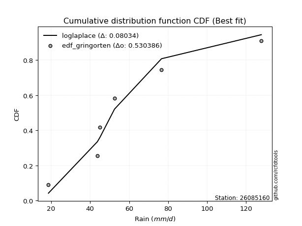</img>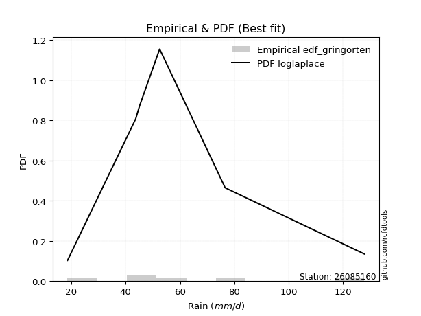</img>

</div>


### 9. Empirical - EDF Filliben (1975)

The specific values of the constants (0.3175) (often denoted as $alpha$) and (0.365) are derived from a method proposed by James J. Filliben in a 1975 paper. This particular formula is the mean value of the $i$-th order statistic of the normal distribution and is considered a robust and effective plotting position formula for the normal probability plot correlation coefficient test for normality.

<div align="center">


$P=(m-0.3175)/(n+0.365)$


</div>


**9.1. Empirical values**

<div align="center">

|                | 0                   | 1                   | 2                  | 3                  | 4                  | 5                  |
|:---------------|:--------------------|:--------------------|:-------------------|:-------------------|:-------------------|:-------------------|
| date           | 2025                | 2024                | 2019               | 2020               | 2018               | 2017               |
| x              | 13.6                | 18.6                | 43.7               | 45.1               | 76.6               | 127.8              |
| m              | 1                   | 2                   | 3                  | 4                  | 5                  | 6                  |
| empirical_dist | edf_filliben        | edf_filliben        | edf_filliben       | edf_filliben       | edf_filliben       | edf_filliben       |
| empirical      | 0.10722702278083267 | 0.26433621366849963 | 0.4214454045561665 | 0.5785545954438335 | 0.7356637863315004 | 0.8927729772191673 |
| empirical_tr   | 1.1201055873295205  | 1.3593166043780034  | 1.7284453496266123 | 2.3727865796831313 | 3.783060921248143  | 9.326007326007321  |

</div>


**9.2. Kolmogorov-Smirnov fit test (sorted by Δ)**


<div align="center">

|                | 0                   | 1                   | 2                   | 3                   | 4                   | 5                   | 6                   | 7                   | 8                   | 9                   | 10                  | 11                  | 12                  | 13                  | 14                  | 15                  | 16                  | 17                  | 18                  | 19                  | 20                  | 21                  | 22                 | 23                  | 24                  | 25                    | 26                  | 27                  | 28                  | 29                  | 30                  | 31                  | 32                | 33                  | 34                  | 35                 | 36                 | 37                  | 38                  | 39                  | 40                  | 41                 | 42                  | 43                 | 44                  | 45                  | 46                  | 47                  | 48                 | 49                  | 50                 | 51                  | 52                  | 53                  | 54                  | 55                 | 56                  | 57                 | 58                  | 59                  | 60                  | 61                 | 62                 | 63                  | 64                  | 65                  | 66                  | 67                  | 68                 | 69                  | 70                  | 71                  | 72                  | 73                  | 74                 | 75                 | 76                  | 77                 | 78                  | 79                 | 80                 | 81                 | 82                | 83                | 84                 | 85                 | 86                 | 87                 | 88                | 89                 |
|:---------------|:--------------------|:--------------------|:--------------------|:--------------------|:--------------------|:--------------------|:--------------------|:--------------------|:--------------------|:--------------------|:--------------------|:--------------------|:--------------------|:--------------------|:--------------------|:--------------------|:--------------------|:--------------------|:--------------------|:--------------------|:--------------------|:--------------------|:-------------------|:--------------------|:--------------------|:----------------------|:--------------------|:--------------------|:--------------------|:--------------------|:--------------------|:--------------------|:------------------|:--------------------|:--------------------|:-------------------|:-------------------|:--------------------|:--------------------|:--------------------|:--------------------|:-------------------|:--------------------|:-------------------|:--------------------|:--------------------|:--------------------|:--------------------|:-------------------|:--------------------|:-------------------|:--------------------|:--------------------|:--------------------|:--------------------|:-------------------|:--------------------|:-------------------|:--------------------|:--------------------|:--------------------|:-------------------|:-------------------|:--------------------|:--------------------|:--------------------|:--------------------|:--------------------|:-------------------|:--------------------|:--------------------|:--------------------|:--------------------|:--------------------|:-------------------|:-------------------|:--------------------|:-------------------|:--------------------|:-------------------|:-------------------|:-------------------|:------------------|:------------------|:-------------------|:-------------------|:-------------------|:-------------------|:------------------|:-------------------|
| station        | 26085160            | 26085160            | 26085160            | 26085160            | 26085160            | 26085160            | 26085160            | 26085160            | 26085160            | 26085160            | 26085160            | 26085160            | 26085160            | 26085160            | 26085160            | 26085160            | 26085160            | 26085160            | 26085160            | 26085160            | 26085160            | 26085160            | 26085160           | 26085160            | 26085160            | 26085160              | 26085160            | 26085160            | 26085160            | 26085160            | 26085160            | 26085160            | 26085160          | 26085160            | 26085160            | 26085160           | 26085160           | 26085160            | 26085160            | 26085160            | 26085160            | 26085160           | 26085160            | 26085160           | 26085160            | 26085160            | 26085160            | 26085160            | 26085160           | 26085160            | 26085160           | 26085160            | 26085160            | 26085160            | 26085160            | 26085160           | 26085160            | 26085160           | 26085160            | 26085160            | 26085160            | 26085160           | 26085160           | 26085160            | 26085160            | 26085160            | 26085160            | 26085160            | 26085160           | 26085160            | 26085160            | 26085160            | 26085160            | 26085160            | 26085160           | 26085160           | 26085160            | 26085160           | 26085160            | 26085160           | 26085160           | 26085160           | 26085160          | 26085160          | 26085160           | 26085160           | 26085160           | 26085160           | 26085160          | 26085160           |
| empirical_dist | edf_filliben        | edf_filliben        | edf_filliben        | edf_filliben        | edf_filliben        | edf_filliben        | edf_filliben        | edf_filliben        | edf_filliben        | edf_filliben        | edf_filliben        | edf_filliben        | edf_filliben        | edf_filliben        | edf_filliben        | edf_filliben        | edf_filliben        | edf_filliben        | edf_filliben        | edf_filliben        | edf_filliben        | edf_filliben        | edf_filliben       | edf_filliben        | edf_filliben        | edf_filliben          | edf_filliben        | edf_filliben        | edf_filliben        | edf_filliben        | edf_filliben        | edf_filliben        | edf_filliben      | edf_filliben        | edf_filliben        | edf_filliben       | edf_filliben       | edf_filliben        | edf_filliben        | edf_filliben        | edf_filliben        | edf_filliben       | edf_filliben        | edf_filliben       | edf_filliben        | edf_filliben        | edf_filliben        | edf_filliben        | edf_filliben       | edf_filliben        | edf_filliben       | edf_filliben        | edf_filliben        | edf_filliben        | edf_filliben        | edf_filliben       | edf_filliben        | edf_filliben       | edf_filliben        | edf_filliben        | edf_filliben        | edf_filliben       | edf_filliben       | edf_filliben        | edf_filliben        | edf_filliben        | edf_filliben        | edf_filliben        | edf_filliben       | edf_filliben        | edf_filliben        | edf_filliben        | edf_filliben        | edf_filliben        | edf_filliben       | edf_filliben       | edf_filliben        | edf_filliben       | edf_filliben        | edf_filliben       | edf_filliben       | edf_filliben       | edf_filliben      | edf_filliben      | edf_filliben       | edf_filliben       | edf_filliben       | edf_filliben       | edf_filliben      | edf_filliben       |
| p_dist         | halfnorm            | halflogistic        | gumbel_r            | f                   | fisk                | logjohnsonsu        | logloggamma         | loggamma            | loggamma            | logpearson3         | logerlang           | lognct              | logexponnorm        | logcrystalball      | lognorm             | lognorm             | logt                | logfatiguelife      | logf                | logbetaprime        | genlogistic         | pearson3            | logncf             | moyal               | kstwobign           | loglaplace_asymmetric | rayleigh            | loggumbel_l         | logfisk             | loginvgamma         | logalpha            | weibull_min         | loglogistic       | logrice             | maxwell             | loghypsecant       | logmaxwell         | invgamma            | invweibull          | loggompertz         | loginvgauss         | exponnorm          | laplace_asymmetric  | expon              | loglaplace          | lograyleigh         | genexpon            | gompertz            | nakagami           | logweibull_min      | loginvweibull      | rice                | loggenlogistic      | mielke              | truncnorm           | norm               | crystalball         | t                  | alpha               | logkstwobign        | loggumbel_r         | loghalfnorm        | invgauss           | logistic            | nct                 | hypsecant           | loggenexpon         | logmoyal            | loghalflogistic    | laplace             | logexpon            | logmielke           | logtruncnorm        | gumbel_l            | ncf                | wald               | gibrat              | logwald            | chi2                | logchi2            | pareto             | loggibrat          | betaprime         | lognakagami       | logpareto          | loglognorm         | gamma              | fatiguelife        | erlang            | johnsonsu          |
| delta          | 0.09041380011987454 | 0.10968262254945413 | 0.11060857660236006 | 0.11088742619075828 | 0.11248516763366134 | 0.11355170326428943 | 0.11378633304550301 | 0.11380658834496504 | 0.11380658834496504 | 0.11389215327809299 | 0.11392491179537395 | 0.11395213246735647 | 0.11402329849701776 | 0.11402467851639658 | 0.11402473768504423 | 0.11402473768504423 | 0.11402718009319407 | 0.11432662671946958 | 0.11476659712343298 | 0.11672845463350084 | 0.11675349937450918 | 0.11900568380620741 | 0.1206121840458122 | 0.12274103081375029 | 0.12437656349085568 | 0.12494698091229528   | 0.12519717884267534 | 0.12603005505627293 | 0.12822737292855835 | 0.12954589221460877 | 0.13021198659813538 | 0.13075589412782185 | 0.131655415790555 | 0.13236055768240818 | 0.13746975964116098 | 0.1406739220388117 | 0.1408756245368078 | 0.14122476750949453 | 0.14273947960122957 | 0.14639743349206846 | 0.14696777199767908 | 0.1469762288308754 | 0.14827109432108454 | 0.1485541771553187 | 0.14866429700439365 | 0.15115486745522577 | 0.15330590089857382 | 0.15595435623369097 | 0.1579962314485852 | 0.16684469820857162 | 0.1672988583104733 | 0.16737323859322872 | 0.16757988328214368 | 0.16758571246330634 | 0.17162959375649833 | 0.1716296194224312 | 0.17162963206244536 | 0.1716339632669145 | 0.17714854483777642 | 0.17970414340245056 | 0.17991905853672863 | 0.1801099367838368 | 0.1818902737616196 | 0.18373109841420626 | 0.19274870633610053 | 0.19368979123179608 | 0.20510016193227076 | 0.20529551712517213 | 0.2066552932574831 | 0.22016733008439093 | 0.22983369509694718 | 0.23069555900625371 | 0.23211849995388414 | 0.23882115694444772 | 0.2523386747692517 | 0.2631430822536212 | 0.26433621366849963 | 0.2757410013098902 | 0.28402401564940283 | 0.2890328277071845 | 0.2945506107300487 | 0.3030837340711128 | 0.304171065907736 | 0.337378079045921 | 0.3459106020415024 | 0.3728487090013087 | 0.3813139054262896 | 0.4186910691026696 | 0.487290385539735 | 0.4943657127070245 |
| deltao         | 0.530385761606      | 0.530385761606      | 0.530385761606      | 0.530385761606      | 0.530385761606      | 0.530385761606      | 0.530385761606      | 0.530385761606      | 0.530385761606      | 0.530385761606      | 0.530385761606      | 0.530385761606      | 0.530385761606      | 0.530385761606      | 0.530385761606      | 0.530385761606      | 0.530385761606      | 0.530385761606      | 0.530385761606      | 0.530385761606      | 0.530385761606      | 0.530385761606      | 0.530385761606     | 0.530385761606      | 0.530385761606      | 0.530385761606        | 0.530385761606      | 0.530385761606      | 0.530385761606      | 0.530385761606      | 0.530385761606      | 0.530385761606      | 0.530385761606    | 0.530385761606      | 0.530385761606      | 0.530385761606     | 0.530385761606     | 0.530385761606      | 0.530385761606      | 0.530385761606      | 0.530385761606      | 0.530385761606     | 0.530385761606      | 0.530385761606     | 0.530385761606      | 0.530385761606      | 0.530385761606      | 0.530385761606      | 0.530385761606     | 0.530385761606      | 0.530385761606     | 0.530385761606      | 0.530385761606      | 0.530385761606      | 0.530385761606      | 0.530385761606     | 0.530385761606      | 0.530385761606     | 0.530385761606      | 0.530385761606      | 0.530385761606      | 0.530385761606     | 0.530385761606     | 0.530385761606      | 0.530385761606      | 0.530385761606      | 0.530385761606      | 0.530385761606      | 0.530385761606     | 0.530385761606      | 0.530385761606      | 0.530385761606      | 0.530385761606      | 0.530385761606      | 0.530385761606     | 0.530385761606     | 0.530385761606      | 0.530385761606     | 0.530385761606      | 0.530385761606     | 0.530385761606     | 0.530385761606     | 0.530385761606    | 0.530385761606    | 0.530385761606     | 0.530385761606     | 0.530385761606     | 0.530385761606     | 0.530385761606    | 0.530385761606     |
| eval           | Δo > Δ              | Δo > Δ              | Δo > Δ              | Δo > Δ              | Δo > Δ              | Δo > Δ              | Δo > Δ              | Δo > Δ              | Δo > Δ              | Δo > Δ              | Δo > Δ              | Δo > Δ              | Δo > Δ              | Δo > Δ              | Δo > Δ              | Δo > Δ              | Δo > Δ              | Δo > Δ              | Δo > Δ              | Δo > Δ              | Δo > Δ              | Δo > Δ              | Δo > Δ             | Δo > Δ              | Δo > Δ              | Δo > Δ                | Δo > Δ              | Δo > Δ              | Δo > Δ              | Δo > Δ              | Δo > Δ              | Δo > Δ              | Δo > Δ            | Δo > Δ              | Δo > Δ              | Δo > Δ             | Δo > Δ             | Δo > Δ              | Δo > Δ              | Δo > Δ              | Δo > Δ              | Δo > Δ             | Δo > Δ              | Δo > Δ             | Δo > Δ              | Δo > Δ              | Δo > Δ              | Δo > Δ              | Δo > Δ             | Δo > Δ              | Δo > Δ             | Δo > Δ              | Δo > Δ              | Δo > Δ              | Δo > Δ              | Δo > Δ             | Δo > Δ              | Δo > Δ             | Δo > Δ              | Δo > Δ              | Δo > Δ              | Δo > Δ             | Δo > Δ             | Δo > Δ              | Δo > Δ              | Δo > Δ              | Δo > Δ              | Δo > Δ              | Δo > Δ             | Δo > Δ              | Δo > Δ              | Δo > Δ              | Δo > Δ              | Δo > Δ              | Δo > Δ             | Δo > Δ             | Δo > Δ              | Δo > Δ             | Δo > Δ              | Δo > Δ             | Δo > Δ             | Δo > Δ             | Δo > Δ            | Δo > Δ            | Δo > Δ             | Δo > Δ             | Δo > Δ             | Δo > Δ             | Δo > Δ            | Δo > Δ             |
| fit            | 1                   | 1                   | 1                   | 1                   | 1                   | 1                   | 1                   | 1                   | 1                   | 1                   | 1                   | 1                   | 1                   | 1                   | 1                   | 1                   | 1                   | 1                   | 1                   | 1                   | 1                   | 1                   | 1                  | 1                   | 1                   | 1                     | 1                   | 1                   | 1                   | 1                   | 1                   | 1                   | 1                 | 1                   | 1                   | 1                  | 1                  | 1                   | 1                   | 1                   | 1                   | 1                  | 1                   | 1                  | 1                   | 1                   | 1                   | 1                   | 1                  | 1                   | 1                  | 1                   | 1                   | 1                   | 1                   | 1                  | 1                   | 1                  | 1                   | 1                   | 1                   | 1                  | 1                  | 1                   | 1                   | 1                   | 1                   | 1                   | 1                  | 1                   | 1                   | 1                   | 1                   | 1                   | 1                  | 1                  | 1                   | 1                  | 1                   | 1                  | 1                  | 1                  | 1                 | 1                 | 1                  | 1                  | 1                  | 1                  | 1                 | 1                  |
| n              | 6                   | 6                   | 6                   | 6                   | 6                   | 6                   | 6                   | 6                   | 6                   | 6                   | 6                   | 6                   | 6                   | 6                   | 6                   | 6                   | 6                   | 6                   | 6                   | 6                   | 6                   | 6                   | 6                  | 6                   | 6                   | 6                     | 6                   | 6                   | 6                   | 6                   | 6                   | 6                   | 6                 | 6                   | 6                   | 6                  | 6                  | 6                   | 6                   | 6                   | 6                   | 6                  | 6                   | 6                  | 6                   | 6                   | 6                   | 6                   | 6                  | 6                   | 6                  | 6                   | 6                   | 6                   | 6                   | 6                  | 6                   | 6                  | 6                   | 6                   | 6                   | 6                  | 6                  | 6                   | 6                   | 6                   | 6                   | 6                   | 6                  | 6                   | 6                   | 6                   | 6                   | 6                   | 6                  | 6                  | 6                   | 6                  | 6                   | 6                  | 6                  | 6                  | 6                 | 6                 | 6                  | 6                  | 6                  | 6                  | 6                 | 6                  |
| best_fit       | 1                   | 0                   | 0                   | 0                   | 0                   | 0                   | 0                   | 0                   | 0                   | 0                   | 0                   | 0                   | 0                   | 0                   | 0                   | 0                   | 0                   | 0                   | 0                   | 0                   | 0                   | 0                   | 0                  | 0                   | 0                   | 0                     | 0                   | 0                   | 0                   | 0                   | 0                   | 0                   | 0                 | 0                   | 0                   | 0                  | 0                  | 0                   | 0                   | 0                   | 0                   | 0                  | 0                   | 0                  | 0                   | 0                   | 0                   | 0                   | 0                  | 0                   | 0                  | 0                   | 0                   | 0                   | 0                   | 0                  | 0                   | 0                  | 0                   | 0                   | 0                   | 0                  | 0                  | 0                   | 0                   | 0                   | 0                   | 0                   | 0                  | 0                   | 0                   | 0                   | 0                   | 0                   | 0                  | 0                  | 0                   | 0                  | 0                   | 0                  | 0                  | 0                  | 0                 | 0                 | 0                  | 0                  | 0                  | 0                  | 0                 | 0                  |
| best_fit_sort  | 1                   | 2                   | 3                   | 4                   | 5                   | 6                   | 7                   | 8                   | 9                   | 10                  | 11                  | 12                  | 13                  | 14                  | 15                  | 16                  | 17                  | 18                  | 19                  | 20                  | 21                  | 22                  | 23                 | 24                  | 25                  | 26                    | 27                  | 28                  | 29                  | 30                  | 31                  | 32                  | 33                | 34                  | 35                  | 36                 | 37                 | 38                  | 39                  | 40                  | 41                  | 42                 | 43                  | 44                 | 45                  | 46                  | 47                  | 48                  | 49                 | 50                  | 51                 | 52                  | 53                  | 54                  | 55                  | 56                 | 57                  | 58                 | 59                  | 60                  | 61                  | 62                 | 63                 | 64                  | 65                  | 66                  | 67                  | 68                  | 69                 | 70                  | 71                  | 72                  | 73                  | 74                  | 75                 | 76                 | 77                  | 78                 | 79                  | 80                 | 81                 | 82                 | 83                | 84                | 85                 | 86                 | 87                 | 88                 | 89                | 90                 |

</div>


<div align="center">

</img>

</div>


**9.3. Best fit**

<div align="center">

|   id |   station | empirical_dist   | p_dist   |     delta |   deltao | eval   |   fit |   n |   best_fit |   best_fit_sort |
|-----:|----------:|:-----------------|:---------|----------:|---------:|:-------|------:|----:|-----------:|----------------:|
|    0 |  26085160 | edf_filliben     | halfnorm | 0.0904138 | 0.530386 | Δo > Δ |     1 |   6 |          1 |               1 |

</div>


<div align="center">

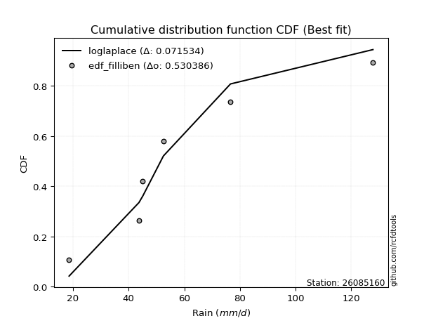</img>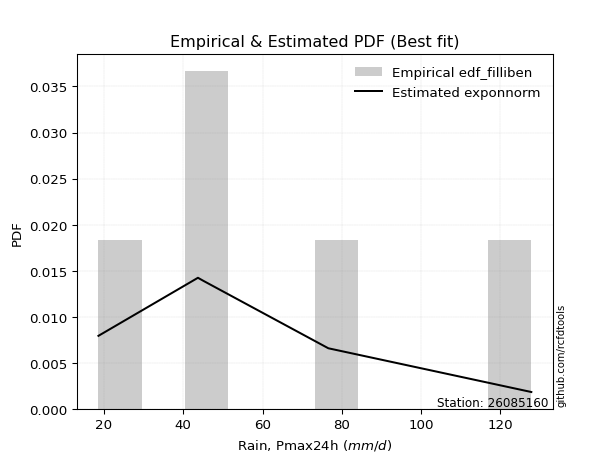</img>

</div>


### 10. Empirical - EDF Jenkinson (1977)

The Jenkinson formula in hydrology is an empirical plotting position formula used to estimate the non-exceedance probability _(P)_ or return period _(T)_ of a given ordered observation within a sample. It is a widely used method in the frequency analysis of extreme events such as floods and rainfall, as it provides a distribution-free way to plot data. _a≈0.31_ and _b≈0.38_ are constants derived to approximate the median of the probability distribution for the given rank.

<div align="center">


$P=(m-a)/(n+b)$


</div>


**10.1. Empirical values**

<div align="center">

|                | 0                   | 1                   | 2                  | 3                  | 4                  | 5                  |
|:---------------|:--------------------|:--------------------|:-------------------|:-------------------|:-------------------|:-------------------|
| date           | 2025                | 2024                | 2019               | 2020               | 2018               | 2017               |
| x              | 13.6                | 18.6                | 43.7               | 45.1               | 76.6               | 127.8              |
| m              | 1                   | 2                   | 3                  | 4                  | 5                  | 6                  |
| empirical_dist | edf_jenkinson       | edf_jenkinson       | edf_jenkinson      | edf_jenkinson      | edf_jenkinson      | edf_jenkinson      |
| empirical      | 0.10815047021943573 | 0.26489028213166144 | 0.4216300940438871 | 0.5783699059561128 | 0.7351097178683387 | 0.8918495297805643 |
| empirical_tr   | 1.1212653778558874  | 1.3603411513859276  | 1.7289972899728996 | 2.3717472118959106 | 3.7751479289940844 | 9.246376811594207  |

</div>


**10.2. Kolmogorov-Smirnov fit test (sorted by Δ)**


<div align="center">

|                | 0                   | 1                   | 2                   | 3                   | 4                   | 5                   | 6                   | 7                   | 8                   | 9                  | 10                  | 11                  | 12                  | 13                  | 14                  | 15                  | 16                  | 17                  | 18                  | 19                  | 20                  | 21                  | 22                 | 23                 | 24                  | 25                  | 26                    | 27                  | 28                  | 29                  | 30                  | 31                  | 32                  | 33                 | 34                  | 35                 | 36                  | 37                  | 38                  | 39                  | 40                  | 41                  | 42                  | 43                  | 44                  | 45                  | 46                  | 47                  | 48                 | 49                  | 50                 | 51                  | 52                  | 53                  | 54                  | 55                  | 56                 | 57                  | 58                  | 59                  | 60                  | 61                 | 62                | 63                 | 64                  | 65                  | 66                  | 67                  | 68                 | 69                  | 70                  | 71                 | 72                  | 73                  | 74                  | 75                | 76                  | 77                 | 78                 | 79                 | 80                 | 81                 | 82                 | 83                 | 84                 | 85                  | 86                | 87                | 88                 | 89                 |
|:---------------|:--------------------|:--------------------|:--------------------|:--------------------|:--------------------|:--------------------|:--------------------|:--------------------|:--------------------|:-------------------|:--------------------|:--------------------|:--------------------|:--------------------|:--------------------|:--------------------|:--------------------|:--------------------|:--------------------|:--------------------|:--------------------|:--------------------|:-------------------|:-------------------|:--------------------|:--------------------|:----------------------|:--------------------|:--------------------|:--------------------|:--------------------|:--------------------|:--------------------|:-------------------|:--------------------|:-------------------|:--------------------|:--------------------|:--------------------|:--------------------|:--------------------|:--------------------|:--------------------|:--------------------|:--------------------|:--------------------|:--------------------|:--------------------|:-------------------|:--------------------|:-------------------|:--------------------|:--------------------|:--------------------|:--------------------|:--------------------|:-------------------|:--------------------|:--------------------|:--------------------|:--------------------|:-------------------|:------------------|:-------------------|:--------------------|:--------------------|:--------------------|:--------------------|:-------------------|:--------------------|:--------------------|:-------------------|:--------------------|:--------------------|:--------------------|:------------------|:--------------------|:-------------------|:-------------------|:-------------------|:-------------------|:-------------------|:-------------------|:-------------------|:-------------------|:--------------------|:------------------|:------------------|:-------------------|:-------------------|
| station        | 26085160            | 26085160            | 26085160            | 26085160            | 26085160            | 26085160            | 26085160            | 26085160            | 26085160            | 26085160           | 26085160            | 26085160            | 26085160            | 26085160            | 26085160            | 26085160            | 26085160            | 26085160            | 26085160            | 26085160            | 26085160            | 26085160            | 26085160           | 26085160           | 26085160            | 26085160            | 26085160              | 26085160            | 26085160            | 26085160            | 26085160            | 26085160            | 26085160            | 26085160           | 26085160            | 26085160           | 26085160            | 26085160            | 26085160            | 26085160            | 26085160            | 26085160            | 26085160            | 26085160            | 26085160            | 26085160            | 26085160            | 26085160            | 26085160           | 26085160            | 26085160           | 26085160            | 26085160            | 26085160            | 26085160            | 26085160            | 26085160           | 26085160            | 26085160            | 26085160            | 26085160            | 26085160           | 26085160          | 26085160           | 26085160            | 26085160            | 26085160            | 26085160            | 26085160           | 26085160            | 26085160            | 26085160           | 26085160            | 26085160            | 26085160            | 26085160          | 26085160            | 26085160           | 26085160           | 26085160           | 26085160           | 26085160           | 26085160           | 26085160           | 26085160           | 26085160            | 26085160          | 26085160          | 26085160           | 26085160           |
| empirical_dist | edf_jenkinson       | edf_jenkinson       | edf_jenkinson       | edf_jenkinson       | edf_jenkinson       | edf_jenkinson       | edf_jenkinson       | edf_jenkinson       | edf_jenkinson       | edf_jenkinson      | edf_jenkinson       | edf_jenkinson       | edf_jenkinson       | edf_jenkinson       | edf_jenkinson       | edf_jenkinson       | edf_jenkinson       | edf_jenkinson       | edf_jenkinson       | edf_jenkinson       | edf_jenkinson       | edf_jenkinson       | edf_jenkinson      | edf_jenkinson      | edf_jenkinson       | edf_jenkinson       | edf_jenkinson         | edf_jenkinson       | edf_jenkinson       | edf_jenkinson       | edf_jenkinson       | edf_jenkinson       | edf_jenkinson       | edf_jenkinson      | edf_jenkinson       | edf_jenkinson      | edf_jenkinson       | edf_jenkinson       | edf_jenkinson       | edf_jenkinson       | edf_jenkinson       | edf_jenkinson       | edf_jenkinson       | edf_jenkinson       | edf_jenkinson       | edf_jenkinson       | edf_jenkinson       | edf_jenkinson       | edf_jenkinson      | edf_jenkinson       | edf_jenkinson      | edf_jenkinson       | edf_jenkinson       | edf_jenkinson       | edf_jenkinson       | edf_jenkinson       | edf_jenkinson      | edf_jenkinson       | edf_jenkinson       | edf_jenkinson       | edf_jenkinson       | edf_jenkinson      | edf_jenkinson     | edf_jenkinson      | edf_jenkinson       | edf_jenkinson       | edf_jenkinson       | edf_jenkinson       | edf_jenkinson      | edf_jenkinson       | edf_jenkinson       | edf_jenkinson      | edf_jenkinson       | edf_jenkinson       | edf_jenkinson       | edf_jenkinson     | edf_jenkinson       | edf_jenkinson      | edf_jenkinson      | edf_jenkinson      | edf_jenkinson      | edf_jenkinson      | edf_jenkinson      | edf_jenkinson      | edf_jenkinson      | edf_jenkinson       | edf_jenkinson     | edf_jenkinson     | edf_jenkinson      | edf_jenkinson      |
| p_dist         | halfnorm            | halflogistic        | gumbel_r            | f                   | fisk                | logjohnsonsu        | logloggamma         | loggamma            | loggamma            | logpearson3        | logerlang           | lognct              | logexponnorm        | logcrystalball      | lognorm             | lognorm             | logt                | logfatiguelife      | logf                | logbetaprime        | genlogistic         | pearson3            | logncf             | moyal              | kstwobign           | rayleigh            | loglaplace_asymmetric | loggumbel_l         | logfisk             | loginvgamma         | logalpha            | weibull_min         | logrice             | loglogistic        | maxwell             | logmaxwell         | invgamma            | loghypsecant        | invweibull          | loggompertz         | loginvgauss         | exponnorm           | laplace_asymmetric  | expon               | loglaplace          | lograyleigh         | genexpon            | gompertz            | nakagami           | logweibull_min      | loginvweibull      | rice                | loggenlogistic      | mielke              | truncnorm           | norm                | crystalball        | t                   | alpha               | logkstwobign        | loggumbel_r         | loghalfnorm        | invgauss          | logistic           | nct                 | hypsecant           | loggenexpon         | logmoyal            | loghalflogistic    | laplace             | logexpon            | logmielke          | logtruncnorm        | gumbel_l            | ncf                 | wald              | gibrat              | logwald            | chi2               | logchi2            | pareto             | loggibrat          | betaprime          | lognakagami        | logpareto          | loglognorm          | gamma             | fatiguelife       | erlang             | johnsonsu          |
| delta          | 0.09022911063215389 | 0.11023669101261593 | 0.11042388711463941 | 0.11144149465392009 | 0.11156172019505839 | 0.11410577172745123 | 0.11434040150866481 | 0.11436065680812685 | 0.11436065680812685 | 0.1144462217412548 | 0.11447898025853576 | 0.11450620093051828 | 0.11457736696017956 | 0.11457874697955839 | 0.11457880614820604 | 0.11457880614820604 | 0.11458124855635587 | 0.11488069518263139 | 0.11532066558659479 | 0.11728252309666265 | 0.11730756783767099 | 0.11882099431848675 | 0.1204274945580916 | 0.1232950992769121 | 0.12493063195401749 | 0.12501248935495468 | 0.12550104937545709   | 0.12658412351943474 | 0.12804268344083775 | 0.12936120272688817 | 0.13002729711041477 | 0.13057120464010125 | 0.13217586819468757 | 0.1322094842537168 | 0.13728507015344033 | 0.1406909350490872 | 0.14104007802177393 | 0.14122799050197352 | 0.14255479011350897 | 0.14621274400434786 | 0.14678308250995847 | 0.14753029729403722 | 0.14808640483336388 | 0.14910824561848052 | 0.14921836546755546 | 0.15097017796750517 | 0.15385996936173563 | 0.15650842469685278 | 0.1578115419608646 | 0.16666000872085102 | 0.1671141688227527 | 0.16718854910550807 | 0.16739519379442308 | 0.16740102297558573 | 0.17144490426877768 | 0.17144492993471055 | 0.1714449425747247 | 0.17144927377919383 | 0.17696385535005582 | 0.17951945391472995 | 0.17973436904900802 | 0.1799252472961162 | 0.181705584273899 | 0.1835464089264856 | 0.19256401684837993 | 0.19350510174407543 | 0.20491547244455016 | 0.20511082763745153 | 0.2064706037697625 | 0.21998264059667028 | 0.22964900560922658 | 0.2305108695185331 | 0.23267256841704595 | 0.23863646745672706 | 0.25141522733064864 | 0.263697150716783 | 0.26489028213166144 | 0.2755563118221696 | 0.2838393261616822 | 0.2888481382194639 | 0.2939965422668869 | 0.3028990445833922 | 0.3039863764200154 | 0.3371933895582004 | 0.3453565335783406 | 0.37229464053814687 | 0.381129215938569 | 0.418506379614949 | 0.4871056960520144 | 0.4938116442438627 |
| deltao         | 0.530385761606      | 0.530385761606      | 0.530385761606      | 0.530385761606      | 0.530385761606      | 0.530385761606      | 0.530385761606      | 0.530385761606      | 0.530385761606      | 0.530385761606     | 0.530385761606      | 0.530385761606      | 0.530385761606      | 0.530385761606      | 0.530385761606      | 0.530385761606      | 0.530385761606      | 0.530385761606      | 0.530385761606      | 0.530385761606      | 0.530385761606      | 0.530385761606      | 0.530385761606     | 0.530385761606     | 0.530385761606      | 0.530385761606      | 0.530385761606        | 0.530385761606      | 0.530385761606      | 0.530385761606      | 0.530385761606      | 0.530385761606      | 0.530385761606      | 0.530385761606     | 0.530385761606      | 0.530385761606     | 0.530385761606      | 0.530385761606      | 0.530385761606      | 0.530385761606      | 0.530385761606      | 0.530385761606      | 0.530385761606      | 0.530385761606      | 0.530385761606      | 0.530385761606      | 0.530385761606      | 0.530385761606      | 0.530385761606     | 0.530385761606      | 0.530385761606     | 0.530385761606      | 0.530385761606      | 0.530385761606      | 0.530385761606      | 0.530385761606      | 0.530385761606     | 0.530385761606      | 0.530385761606      | 0.530385761606      | 0.530385761606      | 0.530385761606     | 0.530385761606    | 0.530385761606     | 0.530385761606      | 0.530385761606      | 0.530385761606      | 0.530385761606      | 0.530385761606     | 0.530385761606      | 0.530385761606      | 0.530385761606     | 0.530385761606      | 0.530385761606      | 0.530385761606      | 0.530385761606    | 0.530385761606      | 0.530385761606     | 0.530385761606     | 0.530385761606     | 0.530385761606     | 0.530385761606     | 0.530385761606     | 0.530385761606     | 0.530385761606     | 0.530385761606      | 0.530385761606    | 0.530385761606    | 0.530385761606     | 0.530385761606     |
| eval           | Δo > Δ              | Δo > Δ              | Δo > Δ              | Δo > Δ              | Δo > Δ              | Δo > Δ              | Δo > Δ              | Δo > Δ              | Δo > Δ              | Δo > Δ             | Δo > Δ              | Δo > Δ              | Δo > Δ              | Δo > Δ              | Δo > Δ              | Δo > Δ              | Δo > Δ              | Δo > Δ              | Δo > Δ              | Δo > Δ              | Δo > Δ              | Δo > Δ              | Δo > Δ             | Δo > Δ             | Δo > Δ              | Δo > Δ              | Δo > Δ                | Δo > Δ              | Δo > Δ              | Δo > Δ              | Δo > Δ              | Δo > Δ              | Δo > Δ              | Δo > Δ             | Δo > Δ              | Δo > Δ             | Δo > Δ              | Δo > Δ              | Δo > Δ              | Δo > Δ              | Δo > Δ              | Δo > Δ              | Δo > Δ              | Δo > Δ              | Δo > Δ              | Δo > Δ              | Δo > Δ              | Δo > Δ              | Δo > Δ             | Δo > Δ              | Δo > Δ             | Δo > Δ              | Δo > Δ              | Δo > Δ              | Δo > Δ              | Δo > Δ              | Δo > Δ             | Δo > Δ              | Δo > Δ              | Δo > Δ              | Δo > Δ              | Δo > Δ             | Δo > Δ            | Δo > Δ             | Δo > Δ              | Δo > Δ              | Δo > Δ              | Δo > Δ              | Δo > Δ             | Δo > Δ              | Δo > Δ              | Δo > Δ             | Δo > Δ              | Δo > Δ              | Δo > Δ              | Δo > Δ            | Δo > Δ              | Δo > Δ             | Δo > Δ             | Δo > Δ             | Δo > Δ             | Δo > Δ             | Δo > Δ             | Δo > Δ             | Δo > Δ             | Δo > Δ              | Δo > Δ            | Δo > Δ            | Δo > Δ             | Δo > Δ             |
| fit            | 1                   | 1                   | 1                   | 1                   | 1                   | 1                   | 1                   | 1                   | 1                   | 1                  | 1                   | 1                   | 1                   | 1                   | 1                   | 1                   | 1                   | 1                   | 1                   | 1                   | 1                   | 1                   | 1                  | 1                  | 1                   | 1                   | 1                     | 1                   | 1                   | 1                   | 1                   | 1                   | 1                   | 1                  | 1                   | 1                  | 1                   | 1                   | 1                   | 1                   | 1                   | 1                   | 1                   | 1                   | 1                   | 1                   | 1                   | 1                   | 1                  | 1                   | 1                  | 1                   | 1                   | 1                   | 1                   | 1                   | 1                  | 1                   | 1                   | 1                   | 1                   | 1                  | 1                 | 1                  | 1                   | 1                   | 1                   | 1                   | 1                  | 1                   | 1                   | 1                  | 1                   | 1                   | 1                   | 1                 | 1                   | 1                  | 1                  | 1                  | 1                  | 1                  | 1                  | 1                  | 1                  | 1                   | 1                 | 1                 | 1                  | 1                  |
| n              | 6                   | 6                   | 6                   | 6                   | 6                   | 6                   | 6                   | 6                   | 6                   | 6                  | 6                   | 6                   | 6                   | 6                   | 6                   | 6                   | 6                   | 6                   | 6                   | 6                   | 6                   | 6                   | 6                  | 6                  | 6                   | 6                   | 6                     | 6                   | 6                   | 6                   | 6                   | 6                   | 6                   | 6                  | 6                   | 6                  | 6                   | 6                   | 6                   | 6                   | 6                   | 6                   | 6                   | 6                   | 6                   | 6                   | 6                   | 6                   | 6                  | 6                   | 6                  | 6                   | 6                   | 6                   | 6                   | 6                   | 6                  | 6                   | 6                   | 6                   | 6                   | 6                  | 6                 | 6                  | 6                   | 6                   | 6                   | 6                   | 6                  | 6                   | 6                   | 6                  | 6                   | 6                   | 6                   | 6                 | 6                   | 6                  | 6                  | 6                  | 6                  | 6                  | 6                  | 6                  | 6                  | 6                   | 6                 | 6                 | 6                  | 6                  |
| best_fit       | 1                   | 0                   | 0                   | 0                   | 0                   | 0                   | 0                   | 0                   | 0                   | 0                  | 0                   | 0                   | 0                   | 0                   | 0                   | 0                   | 0                   | 0                   | 0                   | 0                   | 0                   | 0                   | 0                  | 0                  | 0                   | 0                   | 0                     | 0                   | 0                   | 0                   | 0                   | 0                   | 0                   | 0                  | 0                   | 0                  | 0                   | 0                   | 0                   | 0                   | 0                   | 0                   | 0                   | 0                   | 0                   | 0                   | 0                   | 0                   | 0                  | 0                   | 0                  | 0                   | 0                   | 0                   | 0                   | 0                   | 0                  | 0                   | 0                   | 0                   | 0                   | 0                  | 0                 | 0                  | 0                   | 0                   | 0                   | 0                   | 0                  | 0                   | 0                   | 0                  | 0                   | 0                   | 0                   | 0                 | 0                   | 0                  | 0                  | 0                  | 0                  | 0                  | 0                  | 0                  | 0                  | 0                   | 0                 | 0                 | 0                  | 0                  |
| best_fit_sort  | 1                   | 2                   | 3                   | 4                   | 5                   | 6                   | 7                   | 8                   | 9                   | 10                 | 11                  | 12                  | 13                  | 14                  | 15                  | 16                  | 17                  | 18                  | 19                  | 20                  | 21                  | 22                  | 23                 | 24                 | 25                  | 26                  | 27                    | 28                  | 29                  | 30                  | 31                  | 32                  | 33                  | 34                 | 35                  | 36                 | 37                  | 38                  | 39                  | 40                  | 41                  | 42                  | 43                  | 44                  | 45                  | 46                  | 47                  | 48                  | 49                 | 50                  | 51                 | 52                  | 53                  | 54                  | 55                  | 56                  | 57                 | 58                  | 59                  | 60                  | 61                  | 62                 | 63                | 64                 | 65                  | 66                  | 67                  | 68                  | 69                 | 70                  | 71                  | 72                 | 73                  | 74                  | 75                  | 76                | 77                  | 78                 | 79                 | 80                 | 81                 | 82                 | 83                 | 84                 | 85                 | 86                  | 87                | 88                | 89                 | 90                 |

</div>


<div align="center">

</img>

</div>


**10.3. Best fit**

<div align="center">

|   id |   station | empirical_dist   | p_dist   |     delta |   deltao | eval   |   fit |   n |   best_fit |   best_fit_sort |
|-----:|----------:|:-----------------|:---------|----------:|---------:|:-------|------:|----:|-----------:|----------------:|
|    0 |  26085160 | edf_jenkinson    | halfnorm | 0.0902291 | 0.530386 | Δo > Δ |     1 |   6 |          1 |               1 |

</div>


<div align="center">

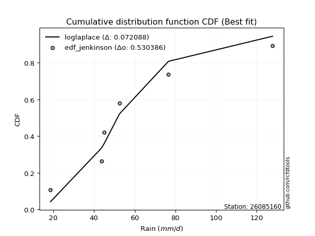</img></img>

</div>


### 11. Empirical - EDF Cunnane (1978)

Cunnane´s work in statistical hydrology has focused on the performance and evaluation of different probability distributions (such as GEV, Gumbel, Lognormal) for flood frequency estimation. _b_ is a constant, typically set to 0.4.

<div align="center">


$P=(m-b)/(n+1-2b)$


</div>


**11.1. Empirical values**

<div align="center">

|                | 0                  | 1                   | 2                   | 3                  | 4                  | 5                  |
|:---------------|:-------------------|:--------------------|:--------------------|:-------------------|:-------------------|:-------------------|
| date           | 2025               | 2024                | 2019                | 2020               | 2018               | 2017               |
| x              | 13.6               | 18.6                | 43.7                | 45.1               | 76.6               | 127.8              |
| m              | 1                  | 2                   | 3                   | 4                  | 5                  | 6                  |
| empirical_dist | edf_cunnane        | edf_cunnane         | edf_cunnane         | edf_cunnane        | edf_cunnane        | edf_cunnane        |
| empirical      | 0.0967741935483871 | 0.25806451612903225 | 0.41935483870967744 | 0.5806451612903226 | 0.7419354838709676 | 0.9032258064516128 |
| empirical_tr   | 1.1071428571428572 | 1.3478260869565217  | 1.7222222222222225  | 2.384615384615385  | 3.8749999999999982 | 10.333333333333318 |

</div>


**11.2. Kolmogorov-Smirnov fit test (sorted by Δ)**


<div align="center">

|                | 0                   | 1                   | 2                  | 3                   | 4                   | 5                  | 6                   | 7                   | 8                   | 9                   | 10                  | 11                  | 12                  | 13                  | 14                  | 15                  | 16                  | 17                  | 18                  | 19                  | 20                  | 21                    | 22                  | 23                  | 24                  | 25                  | 26                  | 27                  | 28                  | 29                  | 30                  | 31                  | 32                  | 33                  | 34                  | 35                  | 36                  | 37                  | 38                  | 39                 | 40                  | 41                  | 42                  | 43                  | 44                  | 45                 | 46                  | 47                  | 48                 | 49                 | 50                 | 51                  | 52                  | 53                  | 54                  | 55                  | 56                 | 57                  | 58                 | 59                  | 60                  | 61                 | 62                  | 63                 | 64                  | 65                  | 66                  | 67                  | 68                 | 69                  | 70                  | 71                  | 72                 | 73                  | 74                 | 75                  | 76                  | 77                 | 78                 | 79                 | 80                  | 81                  | 82                 | 83                 | 84                 | 85                  | 86                 | 87                 | 88                 | 89                 |
|:---------------|:--------------------|:--------------------|:-------------------|:--------------------|:--------------------|:-------------------|:--------------------|:--------------------|:--------------------|:--------------------|:--------------------|:--------------------|:--------------------|:--------------------|:--------------------|:--------------------|:--------------------|:--------------------|:--------------------|:--------------------|:--------------------|:----------------------|:--------------------|:--------------------|:--------------------|:--------------------|:--------------------|:--------------------|:--------------------|:--------------------|:--------------------|:--------------------|:--------------------|:--------------------|:--------------------|:--------------------|:--------------------|:--------------------|:--------------------|:-------------------|:--------------------|:--------------------|:--------------------|:--------------------|:--------------------|:-------------------|:--------------------|:--------------------|:-------------------|:-------------------|:-------------------|:--------------------|:--------------------|:--------------------|:--------------------|:--------------------|:-------------------|:--------------------|:-------------------|:--------------------|:--------------------|:-------------------|:--------------------|:-------------------|:--------------------|:--------------------|:--------------------|:--------------------|:-------------------|:--------------------|:--------------------|:--------------------|:-------------------|:--------------------|:-------------------|:--------------------|:--------------------|:-------------------|:-------------------|:-------------------|:--------------------|:--------------------|:-------------------|:-------------------|:-------------------|:--------------------|:-------------------|:-------------------|:-------------------|:-------------------|
| station        | 26085160            | 26085160            | 26085160           | 26085160            | 26085160            | 26085160           | 26085160            | 26085160            | 26085160            | 26085160            | 26085160            | 26085160            | 26085160            | 26085160            | 26085160            | 26085160            | 26085160            | 26085160            | 26085160            | 26085160            | 26085160            | 26085160              | 26085160            | 26085160            | 26085160            | 26085160            | 26085160            | 26085160            | 26085160            | 26085160            | 26085160            | 26085160            | 26085160            | 26085160            | 26085160            | 26085160            | 26085160            | 26085160            | 26085160            | 26085160           | 26085160            | 26085160            | 26085160            | 26085160            | 26085160            | 26085160           | 26085160            | 26085160            | 26085160           | 26085160           | 26085160           | 26085160            | 26085160            | 26085160            | 26085160            | 26085160            | 26085160           | 26085160            | 26085160           | 26085160            | 26085160            | 26085160           | 26085160            | 26085160           | 26085160            | 26085160            | 26085160            | 26085160            | 26085160           | 26085160            | 26085160            | 26085160            | 26085160           | 26085160            | 26085160           | 26085160            | 26085160            | 26085160           | 26085160           | 26085160           | 26085160            | 26085160            | 26085160           | 26085160           | 26085160           | 26085160            | 26085160           | 26085160           | 26085160           | 26085160           |
| empirical_dist | edf_cunnane         | edf_cunnane         | edf_cunnane        | edf_cunnane         | edf_cunnane         | edf_cunnane        | edf_cunnane         | edf_cunnane         | edf_cunnane         | edf_cunnane         | edf_cunnane         | edf_cunnane         | edf_cunnane         | edf_cunnane         | edf_cunnane         | edf_cunnane         | edf_cunnane         | edf_cunnane         | edf_cunnane         | edf_cunnane         | edf_cunnane         | edf_cunnane           | edf_cunnane         | edf_cunnane         | edf_cunnane         | edf_cunnane         | edf_cunnane         | edf_cunnane         | edf_cunnane         | edf_cunnane         | edf_cunnane         | edf_cunnane         | edf_cunnane         | edf_cunnane         | edf_cunnane         | edf_cunnane         | edf_cunnane         | edf_cunnane         | edf_cunnane         | edf_cunnane        | edf_cunnane         | edf_cunnane         | edf_cunnane         | edf_cunnane         | edf_cunnane         | edf_cunnane        | edf_cunnane         | edf_cunnane         | edf_cunnane        | edf_cunnane        | edf_cunnane        | edf_cunnane         | edf_cunnane         | edf_cunnane         | edf_cunnane         | edf_cunnane         | edf_cunnane        | edf_cunnane         | edf_cunnane        | edf_cunnane         | edf_cunnane         | edf_cunnane        | edf_cunnane         | edf_cunnane        | edf_cunnane         | edf_cunnane         | edf_cunnane         | edf_cunnane         | edf_cunnane        | edf_cunnane         | edf_cunnane         | edf_cunnane         | edf_cunnane        | edf_cunnane         | edf_cunnane        | edf_cunnane         | edf_cunnane         | edf_cunnane        | edf_cunnane        | edf_cunnane        | edf_cunnane         | edf_cunnane         | edf_cunnane        | edf_cunnane        | edf_cunnane        | edf_cunnane         | edf_cunnane        | edf_cunnane        | edf_cunnane        | edf_cunnane        |
| p_dist         | halfnorm            | halflogistic        | f                  | logloggamma         | logpearson3         | genlogistic        | logf                | logexponnorm        | logcrystalball      | lognorm             | lognorm             | logt                | logjohnsonsu        | lognct              | gumbel_r            | logfatiguelife      | logerlang           | loggamma            | loggamma            | moyal               | logbetaprime        | loglaplace_asymmetric | loggumbel_l         | pearson3            | logncf              | fisk                | kstwobign           | loglogistic         | rayleigh            | logfisk             | loginvgamma         | logalpha            | weibull_min         | loghypsecant        | logrice             | maxwell             | exponnorm           | expon               | loglaplace          | logmaxwell         | invgamma            | invweibull          | genexpon            | loggompertz         | loginvgauss         | gompertz           | laplace_asymmetric  | lograyleigh         | nakagami           | logweibull_min     | loginvweibull      | rice                | loggenlogistic      | mielke              | truncnorm           | norm                | crystalball        | t                   | alpha              | logkstwobign        | loggumbel_r         | loghalfnorm        | invgauss            | logistic           | nct                 | hypsecant           | loggenexpon         | logmoyal            | loghalflogistic    | laplace             | logtruncnorm        | logexpon            | logmielke          | gumbel_l            | wald               | gibrat              | ncf                 | logwald            | chi2               | logchi2            | pareto              | loggibrat           | betaprime          | lognakagami        | logpareto          | loglognorm          | gamma              | fatiguelife        | erlang             | johnsonsu          |
| delta          | 0.09250436596636369 | 0.10341092500998675 | 0.1046157286512909 | 0.10751463550603563 | 0.10762045573862561 | 0.1104818018350418 | 0.11131253994058438 | 0.11139822891517853 | 0.11139895414198803 | 0.11139903586227079 | 0.11139903586227079 | 0.11140032284045404 | 0.11173098695869105 | 0.11199549729931751 | 0.11269914244884921 | 0.11424506229303061 | 0.11517559473301137 | 0.11521199297592982 | 0.11521199297592982 | 0.11646933327428291 | 0.11693348314605151 | 0.1186752833728279    | 0.11975835751680555 | 0.12109624965269655 | 0.12270274989230129 | 0.12293799686610685 | 0.12319490200511551 | 0.12538371825108763 | 0.12728774468916448 | 0.13031793877504744 | 0.13163645806109786 | 0.13230255244462447 | 0.13284645997431094 | 0.13440222449934433 | 0.13445112352889727 | 0.13956032548765013 | 0.14070453129140803 | 0.14228247961585133 | 0.14239259946492627 | 0.1429661903832969 | 0.14331533335598362 | 0.14483004544771866 | 0.14703420335910644 | 0.14848799933855755 | 0.14905833784416817 | 0.1496826586942236 | 0.15036166016757369 | 0.15324543330171486 | 0.1600867972950743 | 0.1689352640550607 | 0.1693894241569624 | 0.16946380443971787 | 0.16967044912863277 | 0.16967627830979543 | 0.17372015960298748 | 0.17372018526892036 | 0.1737201979089345 | 0.17372452911340364 | 0.1792391106842655 | 0.18179470924893965 | 0.18200962438321772 | 0.1822005026303259 | 0.18398083960810868 | 0.1858216642606954 | 0.19483927218258962 | 0.19578035707828523 | 0.20719072777875985 | 0.20738608297166122 | 0.2087458591039722 | 0.22225789593088008 | 0.22584680241441676 | 0.23192426094343627 | 0.2327861248527428 | 0.24091172279093687 | 0.2568713847141538 | 0.25806451612903225 | 0.26279150400169726 | 0.2778315671563793 | 0.2861145814958919 | 0.2911233935536736 | 0.30082230826951606 | 0.30517429991760187 | 0.3062616317542251 | 0.3394686448924101 | 0.3521822995809698 | 0.37912040654077606 | 0.3834044712727787 | 0.4207816349491587 | 0.4893809513862241 | 0.5006374102464919 |
| deltao         | 0.530385761606      | 0.530385761606      | 0.530385761606     | 0.530385761606      | 0.530385761606      | 0.530385761606     | 0.530385761606      | 0.530385761606      | 0.530385761606      | 0.530385761606      | 0.530385761606      | 0.530385761606      | 0.530385761606      | 0.530385761606      | 0.530385761606      | 0.530385761606      | 0.530385761606      | 0.530385761606      | 0.530385761606      | 0.530385761606      | 0.530385761606      | 0.530385761606        | 0.530385761606      | 0.530385761606      | 0.530385761606      | 0.530385761606      | 0.530385761606      | 0.530385761606      | 0.530385761606      | 0.530385761606      | 0.530385761606      | 0.530385761606      | 0.530385761606      | 0.530385761606      | 0.530385761606      | 0.530385761606      | 0.530385761606      | 0.530385761606      | 0.530385761606      | 0.530385761606     | 0.530385761606      | 0.530385761606      | 0.530385761606      | 0.530385761606      | 0.530385761606      | 0.530385761606     | 0.530385761606      | 0.530385761606      | 0.530385761606     | 0.530385761606     | 0.530385761606     | 0.530385761606      | 0.530385761606      | 0.530385761606      | 0.530385761606      | 0.530385761606      | 0.530385761606     | 0.530385761606      | 0.530385761606     | 0.530385761606      | 0.530385761606      | 0.530385761606     | 0.530385761606      | 0.530385761606     | 0.530385761606      | 0.530385761606      | 0.530385761606      | 0.530385761606      | 0.530385761606     | 0.530385761606      | 0.530385761606      | 0.530385761606      | 0.530385761606     | 0.530385761606      | 0.530385761606     | 0.530385761606      | 0.530385761606      | 0.530385761606     | 0.530385761606     | 0.530385761606     | 0.530385761606      | 0.530385761606      | 0.530385761606     | 0.530385761606     | 0.530385761606     | 0.530385761606      | 0.530385761606     | 0.530385761606     | 0.530385761606     | 0.530385761606     |
| eval           | Δo > Δ              | Δo > Δ              | Δo > Δ             | Δo > Δ              | Δo > Δ              | Δo > Δ             | Δo > Δ              | Δo > Δ              | Δo > Δ              | Δo > Δ              | Δo > Δ              | Δo > Δ              | Δo > Δ              | Δo > Δ              | Δo > Δ              | Δo > Δ              | Δo > Δ              | Δo > Δ              | Δo > Δ              | Δo > Δ              | Δo > Δ              | Δo > Δ                | Δo > Δ              | Δo > Δ              | Δo > Δ              | Δo > Δ              | Δo > Δ              | Δo > Δ              | Δo > Δ              | Δo > Δ              | Δo > Δ              | Δo > Δ              | Δo > Δ              | Δo > Δ              | Δo > Δ              | Δo > Δ              | Δo > Δ              | Δo > Δ              | Δo > Δ              | Δo > Δ             | Δo > Δ              | Δo > Δ              | Δo > Δ              | Δo > Δ              | Δo > Δ              | Δo > Δ             | Δo > Δ              | Δo > Δ              | Δo > Δ             | Δo > Δ             | Δo > Δ             | Δo > Δ              | Δo > Δ              | Δo > Δ              | Δo > Δ              | Δo > Δ              | Δo > Δ             | Δo > Δ              | Δo > Δ             | Δo > Δ              | Δo > Δ              | Δo > Δ             | Δo > Δ              | Δo > Δ             | Δo > Δ              | Δo > Δ              | Δo > Δ              | Δo > Δ              | Δo > Δ             | Δo > Δ              | Δo > Δ              | Δo > Δ              | Δo > Δ             | Δo > Δ              | Δo > Δ             | Δo > Δ              | Δo > Δ              | Δo > Δ             | Δo > Δ             | Δo > Δ             | Δo > Δ              | Δo > Δ              | Δo > Δ             | Δo > Δ             | Δo > Δ             | Δo > Δ              | Δo > Δ             | Δo > Δ             | Δo > Δ             | Δo > Δ             |
| fit            | 1                   | 1                   | 1                  | 1                   | 1                   | 1                  | 1                   | 1                   | 1                   | 1                   | 1                   | 1                   | 1                   | 1                   | 1                   | 1                   | 1                   | 1                   | 1                   | 1                   | 1                   | 1                     | 1                   | 1                   | 1                   | 1                   | 1                   | 1                   | 1                   | 1                   | 1                   | 1                   | 1                   | 1                   | 1                   | 1                   | 1                   | 1                   | 1                   | 1                  | 1                   | 1                   | 1                   | 1                   | 1                   | 1                  | 1                   | 1                   | 1                  | 1                  | 1                  | 1                   | 1                   | 1                   | 1                   | 1                   | 1                  | 1                   | 1                  | 1                   | 1                   | 1                  | 1                   | 1                  | 1                   | 1                   | 1                   | 1                   | 1                  | 1                   | 1                   | 1                   | 1                  | 1                   | 1                  | 1                   | 1                   | 1                  | 1                  | 1                  | 1                   | 1                   | 1                  | 1                  | 1                  | 1                   | 1                  | 1                  | 1                  | 1                  |
| n              | 6                   | 6                   | 6                  | 6                   | 6                   | 6                  | 6                   | 6                   | 6                   | 6                   | 6                   | 6                   | 6                   | 6                   | 6                   | 6                   | 6                   | 6                   | 6                   | 6                   | 6                   | 6                     | 6                   | 6                   | 6                   | 6                   | 6                   | 6                   | 6                   | 6                   | 6                   | 6                   | 6                   | 6                   | 6                   | 6                   | 6                   | 6                   | 6                   | 6                  | 6                   | 6                   | 6                   | 6                   | 6                   | 6                  | 6                   | 6                   | 6                  | 6                  | 6                  | 6                   | 6                   | 6                   | 6                   | 6                   | 6                  | 6                   | 6                  | 6                   | 6                   | 6                  | 6                   | 6                  | 6                   | 6                   | 6                   | 6                   | 6                  | 6                   | 6                   | 6                   | 6                  | 6                   | 6                  | 6                   | 6                   | 6                  | 6                  | 6                  | 6                   | 6                   | 6                  | 6                  | 6                  | 6                   | 6                  | 6                  | 6                  | 6                  |
| best_fit       | 1                   | 0                   | 0                  | 0                   | 0                   | 0                  | 0                   | 0                   | 0                   | 0                   | 0                   | 0                   | 0                   | 0                   | 0                   | 0                   | 0                   | 0                   | 0                   | 0                   | 0                   | 0                     | 0                   | 0                   | 0                   | 0                   | 0                   | 0                   | 0                   | 0                   | 0                   | 0                   | 0                   | 0                   | 0                   | 0                   | 0                   | 0                   | 0                   | 0                  | 0                   | 0                   | 0                   | 0                   | 0                   | 0                  | 0                   | 0                   | 0                  | 0                  | 0                  | 0                   | 0                   | 0                   | 0                   | 0                   | 0                  | 0                   | 0                  | 0                   | 0                   | 0                  | 0                   | 0                  | 0                   | 0                   | 0                   | 0                   | 0                  | 0                   | 0                   | 0                   | 0                  | 0                   | 0                  | 0                   | 0                   | 0                  | 0                  | 0                  | 0                   | 0                   | 0                  | 0                  | 0                  | 0                   | 0                  | 0                  | 0                  | 0                  |
| best_fit_sort  | 1                   | 2                   | 3                  | 4                   | 5                   | 6                  | 7                   | 8                   | 9                   | 10                  | 11                  | 12                  | 13                  | 14                  | 15                  | 16                  | 17                  | 18                  | 19                  | 20                  | 21                  | 22                    | 23                  | 24                  | 25                  | 26                  | 27                  | 28                  | 29                  | 30                  | 31                  | 32                  | 33                  | 34                  | 35                  | 36                  | 37                  | 38                  | 39                  | 40                 | 41                  | 42                  | 43                  | 44                  | 45                  | 46                 | 47                  | 48                  | 49                 | 50                 | 51                 | 52                  | 53                  | 54                  | 55                  | 56                  | 57                 | 58                  | 59                 | 60                  | 61                  | 62                 | 63                  | 64                 | 65                  | 66                  | 67                  | 68                  | 69                 | 70                  | 71                  | 72                  | 73                 | 74                  | 75                 | 76                  | 77                  | 78                 | 79                 | 80                 | 81                  | 82                  | 83                 | 84                 | 85                 | 86                  | 87                 | 88                 | 89                 | 90                 |

</div>


<div align="center">

</img>

</div>


**11.3. Best fit**

<div align="center">

|   id |   station | empirical_dist   | p_dist   |     delta |   deltao | eval   |   fit |   n |   best_fit |   best_fit_sort |
|-----:|----------:|:-----------------|:---------|----------:|---------:|:-------|------:|----:|-----------:|----------------:|
|    0 |  26085160 | edf_cunnane      | halfnorm | 0.0925044 | 0.530386 | Δo > Δ |     1 |   6 |          1 |               1 |

</div>


<div align="center">

</img>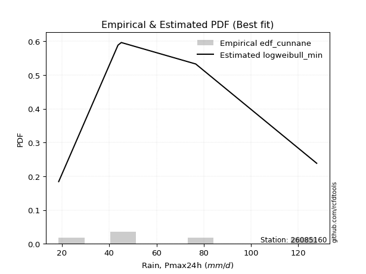</img>

</div>


### 12. Empirical - EDF Adamowski (1981)

The Adamowski formula in hydrology refers to a specific plotting position formula used for estimating the non-parametric empirical distribution of hydrological events (like flood peaks) to calculate their return periods. This formula provides an alternative to traditional parametric methods (like the Gumbel or Log Pearson Type III distributions). 

<div align="center">


$P=(m-0.25)/(n+0.5)$


</div>


**12.1. Empirical values**

<div align="center">

|                | 0                   | 1                  | 2                  | 3                  | 4                  | 5                  |
|:---------------|:--------------------|:-------------------|:-------------------|:-------------------|:-------------------|:-------------------|
| date           | 2025                | 2024               | 2019               | 2020               | 2018               | 2017               |
| x              | 13.6                | 18.6               | 43.7               | 45.1               | 76.6               | 127.8              |
| m              | 1                   | 2                  | 3                  | 4                  | 5                  | 6                  |
| empirical_dist | edf_adamowski       | edf_adamowski      | edf_adamowski      | edf_adamowski      | edf_adamowski      | edf_adamowski      |
| empirical      | 0.11538461538461539 | 0.2692307692307692 | 0.4230769230769231 | 0.5769230769230769 | 0.7307692307692307 | 0.8846153846153846 |
| empirical_tr   | 1.1304347826086958  | 1.3684210526315788 | 1.7333333333333334 | 2.3636363636363633 | 3.7142857142857135 | 8.666666666666664  |

</div>


**12.2. Kolmogorov-Smirnov fit test (sorted by Δ)**


<div align="center">

|                | 0                   | 1                   | 2                   | 3                 | 4                   | 5                  | 6                   | 7                  | 8                   | 9                   | 10                  | 11                  | 12                  | 13                  | 14                  | 15                  | 16                  | 17                  | 18                  | 19                  | 20                  | 21                  | 22                  | 23                  | 24                 | 25                  | 26                  | 27                  | 28                 | 29                  | 30                    | 31                  | 32                  | 33                  | 34                 | 35                  | 36                  | 37                  | 38                  | 39                  | 40                 | 41                  | 42                  | 43                | 44                 | 45                  | 46                  | 47                 | 48                  | 49                  | 50                  | 51                  | 52                  | 53                 | 54                  | 55                 | 56                  | 57                 | 58                  | 59                | 60                  | 61                  | 62                  | 63                  | 64                  | 65                  | 66                  | 67                  | 68                  | 69                  | 70                  | 71                  | 72                  | 73                  | 74                | 75                 | 76                 | 77                  | 78                 | 79                | 80                 | 81                  | 82                  | 83                  | 84                  | 85                 | 86                 | 87                 | 88                 | 89                 |
|:---------------|:--------------------|:--------------------|:--------------------|:------------------|:--------------------|:-------------------|:--------------------|:-------------------|:--------------------|:--------------------|:--------------------|:--------------------|:--------------------|:--------------------|:--------------------|:--------------------|:--------------------|:--------------------|:--------------------|:--------------------|:--------------------|:--------------------|:--------------------|:--------------------|:-------------------|:--------------------|:--------------------|:--------------------|:-------------------|:--------------------|:----------------------|:--------------------|:--------------------|:--------------------|:-------------------|:--------------------|:--------------------|:--------------------|:--------------------|:--------------------|:-------------------|:--------------------|:--------------------|:------------------|:-------------------|:--------------------|:--------------------|:-------------------|:--------------------|:--------------------|:--------------------|:--------------------|:--------------------|:-------------------|:--------------------|:-------------------|:--------------------|:-------------------|:--------------------|:------------------|:--------------------|:--------------------|:--------------------|:--------------------|:--------------------|:--------------------|:--------------------|:--------------------|:--------------------|:--------------------|:--------------------|:--------------------|:--------------------|:--------------------|:------------------|:-------------------|:-------------------|:--------------------|:-------------------|:------------------|:-------------------|:--------------------|:--------------------|:--------------------|:--------------------|:-------------------|:-------------------|:-------------------|:-------------------|:-------------------|
| station        | 26085160            | 26085160            | 26085160            | 26085160          | 26085160            | 26085160           | 26085160            | 26085160           | 26085160            | 26085160            | 26085160            | 26085160            | 26085160            | 26085160            | 26085160            | 26085160            | 26085160            | 26085160            | 26085160            | 26085160            | 26085160            | 26085160            | 26085160            | 26085160            | 26085160           | 26085160            | 26085160            | 26085160            | 26085160           | 26085160            | 26085160              | 26085160            | 26085160            | 26085160            | 26085160           | 26085160            | 26085160            | 26085160            | 26085160            | 26085160            | 26085160           | 26085160            | 26085160            | 26085160          | 26085160           | 26085160            | 26085160            | 26085160           | 26085160            | 26085160            | 26085160            | 26085160            | 26085160            | 26085160           | 26085160            | 26085160           | 26085160            | 26085160           | 26085160            | 26085160          | 26085160            | 26085160            | 26085160            | 26085160            | 26085160            | 26085160            | 26085160            | 26085160            | 26085160            | 26085160            | 26085160            | 26085160            | 26085160            | 26085160            | 26085160          | 26085160           | 26085160           | 26085160            | 26085160           | 26085160          | 26085160           | 26085160            | 26085160            | 26085160            | 26085160            | 26085160           | 26085160           | 26085160           | 26085160           | 26085160           |
| empirical_dist | edf_adamowski       | edf_adamowski       | edf_adamowski       | edf_adamowski     | edf_adamowski       | edf_adamowski      | edf_adamowski       | edf_adamowski      | edf_adamowski       | edf_adamowski       | edf_adamowski       | edf_adamowski       | edf_adamowski       | edf_adamowski       | edf_adamowski       | edf_adamowski       | edf_adamowski       | edf_adamowski       | edf_adamowski       | edf_adamowski       | edf_adamowski       | edf_adamowski       | edf_adamowski       | edf_adamowski       | edf_adamowski      | edf_adamowski       | edf_adamowski       | edf_adamowski       | edf_adamowski      | edf_adamowski       | edf_adamowski         | edf_adamowski       | edf_adamowski       | edf_adamowski       | edf_adamowski      | edf_adamowski       | edf_adamowski       | edf_adamowski       | edf_adamowski       | edf_adamowski       | edf_adamowski      | edf_adamowski       | edf_adamowski       | edf_adamowski     | edf_adamowski      | edf_adamowski       | edf_adamowski       | edf_adamowski      | edf_adamowski       | edf_adamowski       | edf_adamowski       | edf_adamowski       | edf_adamowski       | edf_adamowski      | edf_adamowski       | edf_adamowski      | edf_adamowski       | edf_adamowski      | edf_adamowski       | edf_adamowski     | edf_adamowski       | edf_adamowski       | edf_adamowski       | edf_adamowski       | edf_adamowski       | edf_adamowski       | edf_adamowski       | edf_adamowski       | edf_adamowski       | edf_adamowski       | edf_adamowski       | edf_adamowski       | edf_adamowski       | edf_adamowski       | edf_adamowski     | edf_adamowski      | edf_adamowski      | edf_adamowski       | edf_adamowski      | edf_adamowski     | edf_adamowski      | edf_adamowski       | edf_adamowski       | edf_adamowski       | edf_adamowski       | edf_adamowski      | edf_adamowski      | edf_adamowski      | edf_adamowski      | edf_adamowski      |
| p_dist         | halfnorm            | gumbel_r            | halflogistic        | fisk              | f                   | pearson3           | logjohnsonsu        | logloggamma        | loggamma            | loggamma            | logpearson3         | logerlang           | lognct              | logexponnorm        | logcrystalball      | lognorm             | lognorm             | logt                | logncf              | logfatiguelife      | logf                | logbetaprime        | genlogistic         | rayleigh            | logfisk            | moyal               | loginvgamma         | logalpha            | weibull_min        | kstwobign           | loglaplace_asymmetric | logrice             | loggumbel_l         | maxwell             | loglogistic        | logmaxwell          | invgamma            | invweibull          | loggompertz         | loginvgauss         | loghypsecant       | laplace_asymmetric  | lograyleigh         | exponnorm         | expon              | loglaplace          | nakagami            | genexpon           | gompertz            | logweibull_min      | loginvweibull       | rice                | loggenlogistic      | mielke             | truncnorm           | norm               | crystalball         | t                  | alpha               | logkstwobign      | loggumbel_r         | loghalfnorm         | invgauss            | logistic            | nct                 | hypsecant           | loggenexpon         | logmoyal            | loghalflogistic     | laplace             | logexpon            | logmielke           | logtruncnorm        | gumbel_l            | ncf               | wald               | gibrat             | logwald             | chi2               | logchi2           | pareto             | loggibrat           | betaprime           | lognakagami         | logpareto           | loglognorm         | gamma              | fatiguelife        | erlang             | johnsonsu          |
| delta          | 0.08878228159911794 | 0.10897705808160346 | 0.11457717811172372 | 0.115384615384614 | 0.11578198175302787 | 0.1173741652854508 | 0.11844625882655901 | 0.1186808886077726 | 0.11870114390723463 | 0.11870114390723463 | 0.11878670884036258 | 0.11881946735764354 | 0.11884668802962606 | 0.11891785405928734 | 0.11891923407866617 | 0.11891929324731382 | 0.11891929324731382 | 0.11892173565546366 | 0.11898066552505565 | 0.11922118228173917 | 0.11966115268570257 | 0.12162301019577043 | 0.12164805493677877 | 0.12356566032191874 | 0.1265958544078018 | 0.12763558637601988 | 0.12791437369385222 | 0.12858046807737883 | 0.1291243756070653 | 0.12927111905312527 | 0.12984153647456487   | 0.13072903916165163 | 0.13092461061854252 | 0.13583824112040438 | 0.1365499713528246 | 0.13924410601605125 | 0.13959324898873798 | 0.14110796108047302 | 0.14476591497131192 | 0.14533625347692253 | 0.1455684776010813 | 0.14663957580032794 | 0.14952334893446922 | 0.151870784393145 | 0.1534487327175883 | 0.15355885256666324 | 0.15636471292782866 | 0.1582004564608434 | 0.16084891179596056 | 0.16521317968781507 | 0.16566733978971676 | 0.16574172007247212 | 0.16594836476138713 | 0.1659541939425498 | 0.16999807523574173 | 0.1699981009016746 | 0.16999811354168876 | 0.1700024447461579 | 0.17551702631701988 | 0.178072624881694 | 0.17828754001597208 | 0.17847841826308025 | 0.18025875524086304 | 0.18209957989344966 | 0.19111718781534398 | 0.19205827271103948 | 0.20346864341151422 | 0.20366399860441559 | 0.20502377473672656 | 0.21853581156363433 | 0.22820217657619063 | 0.22906404048549717 | 0.23701305551615373 | 0.23718963842369112 | 0.244181082165469 | 0.2680376378158908 | 0.2692307692307692 | 0.27410948278913366 | 0.2823924971286463 | 0.287401309186428 | 0.2896560551677791 | 0.30145221555035623 | 0.30253954738697947 | 0.33574656052516444 | 0.34101604647923284 | 0.3679541534390391 | 0.3796823869055331 | 0.4170595505819131 | 0.4856588670189785 | 0.4894711571447549 |
| deltao         | 0.530385761606      | 0.530385761606      | 0.530385761606      | 0.530385761606    | 0.530385761606      | 0.530385761606     | 0.530385761606      | 0.530385761606     | 0.530385761606      | 0.530385761606      | 0.530385761606      | 0.530385761606      | 0.530385761606      | 0.530385761606      | 0.530385761606      | 0.530385761606      | 0.530385761606      | 0.530385761606      | 0.530385761606      | 0.530385761606      | 0.530385761606      | 0.530385761606      | 0.530385761606      | 0.530385761606      | 0.530385761606     | 0.530385761606      | 0.530385761606      | 0.530385761606      | 0.530385761606     | 0.530385761606      | 0.530385761606        | 0.530385761606      | 0.530385761606      | 0.530385761606      | 0.530385761606     | 0.530385761606      | 0.530385761606      | 0.530385761606      | 0.530385761606      | 0.530385761606      | 0.530385761606     | 0.530385761606      | 0.530385761606      | 0.530385761606    | 0.530385761606     | 0.530385761606      | 0.530385761606      | 0.530385761606     | 0.530385761606      | 0.530385761606      | 0.530385761606      | 0.530385761606      | 0.530385761606      | 0.530385761606     | 0.530385761606      | 0.530385761606     | 0.530385761606      | 0.530385761606     | 0.530385761606      | 0.530385761606    | 0.530385761606      | 0.530385761606      | 0.530385761606      | 0.530385761606      | 0.530385761606      | 0.530385761606      | 0.530385761606      | 0.530385761606      | 0.530385761606      | 0.530385761606      | 0.530385761606      | 0.530385761606      | 0.530385761606      | 0.530385761606      | 0.530385761606    | 0.530385761606     | 0.530385761606     | 0.530385761606      | 0.530385761606     | 0.530385761606    | 0.530385761606     | 0.530385761606      | 0.530385761606      | 0.530385761606      | 0.530385761606      | 0.530385761606     | 0.530385761606     | 0.530385761606     | 0.530385761606     | 0.530385761606     |
| eval           | Δo > Δ              | Δo > Δ              | Δo > Δ              | Δo > Δ            | Δo > Δ              | Δo > Δ             | Δo > Δ              | Δo > Δ             | Δo > Δ              | Δo > Δ              | Δo > Δ              | Δo > Δ              | Δo > Δ              | Δo > Δ              | Δo > Δ              | Δo > Δ              | Δo > Δ              | Δo > Δ              | Δo > Δ              | Δo > Δ              | Δo > Δ              | Δo > Δ              | Δo > Δ              | Δo > Δ              | Δo > Δ             | Δo > Δ              | Δo > Δ              | Δo > Δ              | Δo > Δ             | Δo > Δ              | Δo > Δ                | Δo > Δ              | Δo > Δ              | Δo > Δ              | Δo > Δ             | Δo > Δ              | Δo > Δ              | Δo > Δ              | Δo > Δ              | Δo > Δ              | Δo > Δ             | Δo > Δ              | Δo > Δ              | Δo > Δ            | Δo > Δ             | Δo > Δ              | Δo > Δ              | Δo > Δ             | Δo > Δ              | Δo > Δ              | Δo > Δ              | Δo > Δ              | Δo > Δ              | Δo > Δ             | Δo > Δ              | Δo > Δ             | Δo > Δ              | Δo > Δ             | Δo > Δ              | Δo > Δ            | Δo > Δ              | Δo > Δ              | Δo > Δ              | Δo > Δ              | Δo > Δ              | Δo > Δ              | Δo > Δ              | Δo > Δ              | Δo > Δ              | Δo > Δ              | Δo > Δ              | Δo > Δ              | Δo > Δ              | Δo > Δ              | Δo > Δ            | Δo > Δ             | Δo > Δ             | Δo > Δ              | Δo > Δ             | Δo > Δ            | Δo > Δ             | Δo > Δ              | Δo > Δ              | Δo > Δ              | Δo > Δ              | Δo > Δ             | Δo > Δ             | Δo > Δ             | Δo > Δ             | Δo > Δ             |
| fit            | 1                   | 1                   | 1                   | 1                 | 1                   | 1                  | 1                   | 1                  | 1                   | 1                   | 1                   | 1                   | 1                   | 1                   | 1                   | 1                   | 1                   | 1                   | 1                   | 1                   | 1                   | 1                   | 1                   | 1                   | 1                  | 1                   | 1                   | 1                   | 1                  | 1                   | 1                     | 1                   | 1                   | 1                   | 1                  | 1                   | 1                   | 1                   | 1                   | 1                   | 1                  | 1                   | 1                   | 1                 | 1                  | 1                   | 1                   | 1                  | 1                   | 1                   | 1                   | 1                   | 1                   | 1                  | 1                   | 1                  | 1                   | 1                  | 1                   | 1                 | 1                   | 1                   | 1                   | 1                   | 1                   | 1                   | 1                   | 1                   | 1                   | 1                   | 1                   | 1                   | 1                   | 1                   | 1                 | 1                  | 1                  | 1                   | 1                  | 1                 | 1                  | 1                   | 1                   | 1                   | 1                   | 1                  | 1                  | 1                  | 1                  | 1                  |
| n              | 6                   | 6                   | 6                   | 6                 | 6                   | 6                  | 6                   | 6                  | 6                   | 6                   | 6                   | 6                   | 6                   | 6                   | 6                   | 6                   | 6                   | 6                   | 6                   | 6                   | 6                   | 6                   | 6                   | 6                   | 6                  | 6                   | 6                   | 6                   | 6                  | 6                   | 6                     | 6                   | 6                   | 6                   | 6                  | 6                   | 6                   | 6                   | 6                   | 6                   | 6                  | 6                   | 6                   | 6                 | 6                  | 6                   | 6                   | 6                  | 6                   | 6                   | 6                   | 6                   | 6                   | 6                  | 6                   | 6                  | 6                   | 6                  | 6                   | 6                 | 6                   | 6                   | 6                   | 6                   | 6                   | 6                   | 6                   | 6                   | 6                   | 6                   | 6                   | 6                   | 6                   | 6                   | 6                 | 6                  | 6                  | 6                   | 6                  | 6                 | 6                  | 6                   | 6                   | 6                   | 6                   | 6                  | 6                  | 6                  | 6                  | 6                  |
| best_fit       | 1                   | 0                   | 0                   | 0                 | 0                   | 0                  | 0                   | 0                  | 0                   | 0                   | 0                   | 0                   | 0                   | 0                   | 0                   | 0                   | 0                   | 0                   | 0                   | 0                   | 0                   | 0                   | 0                   | 0                   | 0                  | 0                   | 0                   | 0                   | 0                  | 0                   | 0                     | 0                   | 0                   | 0                   | 0                  | 0                   | 0                   | 0                   | 0                   | 0                   | 0                  | 0                   | 0                   | 0                 | 0                  | 0                   | 0                   | 0                  | 0                   | 0                   | 0                   | 0                   | 0                   | 0                  | 0                   | 0                  | 0                   | 0                  | 0                   | 0                 | 0                   | 0                   | 0                   | 0                   | 0                   | 0                   | 0                   | 0                   | 0                   | 0                   | 0                   | 0                   | 0                   | 0                   | 0                 | 0                  | 0                  | 0                   | 0                  | 0                 | 0                  | 0                   | 0                   | 0                   | 0                   | 0                  | 0                  | 0                  | 0                  | 0                  |
| best_fit_sort  | 1                   | 2                   | 3                   | 4                 | 5                   | 6                  | 7                   | 8                  | 9                   | 10                  | 11                  | 12                  | 13                  | 14                  | 15                  | 16                  | 17                  | 18                  | 19                  | 20                  | 21                  | 22                  | 23                  | 24                  | 25                 | 26                  | 27                  | 28                  | 29                 | 30                  | 31                    | 32                  | 33                  | 34                  | 35                 | 36                  | 37                  | 38                  | 39                  | 40                  | 41                 | 42                  | 43                  | 44                | 45                 | 46                  | 47                  | 48                 | 49                  | 50                  | 51                  | 52                  | 53                  | 54                 | 55                  | 56                 | 57                  | 58                 | 59                  | 60                | 61                  | 62                  | 63                  | 64                  | 65                  | 66                  | 67                  | 68                  | 69                  | 70                  | 71                  | 72                  | 73                  | 74                  | 75                | 76                 | 77                 | 78                  | 79                 | 80                | 81                 | 82                  | 83                  | 84                  | 85                  | 86                 | 87                 | 88                 | 89                 | 90                 |

</div>


<div align="center">

</img>

</div>


**12.3. Best fit**

<div align="center">

|   id |   station | empirical_dist   | p_dist   |     delta |   deltao | eval   |   fit |   n |   best_fit |   best_fit_sort |
|-----:|----------:|:-----------------|:---------|----------:|---------:|:-------|------:|----:|-----------:|----------------:|
|    0 |  26085160 | edf_adamowski    | halfnorm | 0.0887823 | 0.530386 | Δo > Δ |     1 |   6 |          1 |               1 |

</div>


<div align="center">

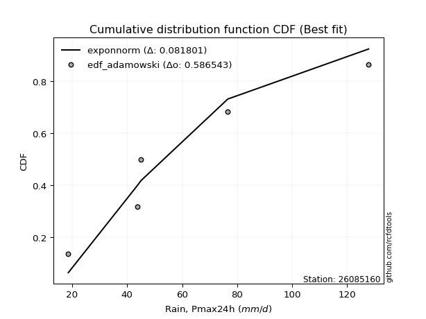</img></img>

</div>


## C. Best fit & Estimate extreme values for specific return periods - Tr


### 1. Best fit (ordered by delta Δ)

<div align="center">

|   id |   station | empirical_dist   | p_dist   |     delta |   deltao | eval   |   fit |   n |   best_fit |   best_fit_sort |
|-----:|----------:|:-----------------|:---------|----------:|---------:|:-------|------:|----:|-----------:|----------------:|
|    0 |  26085160 | edf_adamowski    | halfnorm | 0.0887823 | 0.530386 | Δo > Δ |     1 |   6 |          1 |               1 |
|    1 |  26085160 | edf_chegodayev   | halfnorm | 0.0899842 | 0.530386 | Δo > Δ |     1 |   6 |          1 |               2 |
|    2 |  26085160 | edf_jenkinson    | halfnorm | 0.0902291 | 0.530386 | Δo > Δ |     1 |   6 |          1 |               3 |
|    3 |  26085160 | edf_beard        | halfnorm | 0.0902291 | 0.530386 | Δo > Δ |     1 |   6 |          1 |               4 |
|    4 |  26085160 | edf_filliben     | halfnorm | 0.0904138 | 0.530386 | Δo > Δ |     1 |   6 |          1 |               5 |
|    5 |  26085160 | edf_tukey        | halfnorm | 0.0908066 | 0.530386 | Δo > Δ |     1 |   6 |          1 |               6 |
|    6 |  26085160 | edf_blom         | halfnorm | 0.0918592 | 0.530386 | Δo > Δ |     1 |   6 |          1 |               7 |
|    7 |  26085160 | edf_cunnane      | halfnorm | 0.0925044 | 0.530386 | Δo > Δ |     1 |   6 |          1 |               8 |
|    8 |  26085160 | edf_weibull      | halfnorm | 0.0928561 | 0.530386 | Δo > Δ |     1 |   6 |          1 |               9 |
|    9 |  26085160 | edf_gringorten   | halfnorm | 0.0935586 | 0.530386 | Δo > Δ |     1 |   6 |          1 |              10 |
|   10 |  26085160 | edf_hazen        | halfnorm | 0.0951925 | 0.530386 | Δo > Δ |     1 |   6 |          1 |              11 |
|   11 |  26085160 | edf_california   | alpha    | 0.147833  | 0.530386 | Δo > Δ |     1 |   6 |          1 |              12 |

</div>

:file_folder:Tables: [bestfit_26085160.csv](table/bestfit_26085160.csv) | [extreme_26085160.csv](table/extreme_26085160.csv)


### 2. Extreme values

In hydrology, a return period (or recurrence interval $Tr$) is the statistical average time between extreme events like floods or droughts of a specific magnitude, indicating how rare an event is, with a 100-year flood, for example, having a 1% chance of occurring in any given year, not that it happens exactly every century. It is a key tool for infrastructure design (like bridges or dams) and risk assessment, calculated from historical data to determine the probability of future events, although it is important to remember it is statistical average, and events can cluster or be missed.

> risk_rate: assuming the return period as the project useful life.

|   id |      tr |   prob_l |     prob_g |      alpha |   betaprime |     chi2 |   crystalball |   erlang |    expon |   exponnorm |        f |   fatiguelife |       fisk |    gamma |   genexpon |   genlogistic |   gibrat |   gompertz |   gumbel_l |   gumbel_r |   halflogistic |   halfnorm |   hypsecant |   invgamma |   invgauss |   invweibull |        johnsonsu |   kstwobign |   laplace |   laplace_asymmetric |   loggamma |   logistic |   lognorm |   maxwell |    mielke |    moyal |   nakagami |       ncf |       nct |     norm |           pareto |   pearson3 |   rayleigh |     rice |        t |   truncnorm |     wald |   weibull_min |   logalpha |   logbetaprime |     logchi2 |   logcrystalball |   logerlang |   logexpon |   logexponnorm |     logf |   logfatiguelife |   logfisk |   loggenexpon |   loggenlogistic |   loggibrat |   loggompertz |   loggumbel_l |   loggumbel_r |   loghalflogistic |   loghalfnorm |   loghypsecant |   loginvgamma |   loginvgauss |   loginvweibull |   logjohnsonsu |   logkstwobign |   loglaplace |   loglaplace_asymmetric |   logloggamma |   loglogistic |    loglognorm |   logmaxwell |   logmielke |   logmoyal |   lognakagami |   logncf |   lognct |        logpareto |   logpearson3 |   lograyleigh |   logrice |     logt |   logtruncnorm |    logwald |   logweibull_min |   station |   n |   risk_rate |
|-----:|--------:|---------:|-----------:|-----------:|------------:|---------:|--------------:|---------:|---------:|------------:|---------:|--------------:|-----------:|---------:|-----------:|--------------:|---------:|-----------:|-----------:|-----------:|---------------:|-----------:|------------:|-----------:|-----------:|-------------:|-----------------:|------------:|----------:|---------------------:|-----------:|-----------:|----------:|----------:|----------:|---------:|-----------:|----------:|----------:|---------:|-----------------:|-----------:|-----------:|---------:|---------:|------------:|---------:|--------------:|-----------:|---------------:|------------:|-----------------:|------------:|-----------:|---------------:|---------:|-----------------:|----------:|--------------:|-----------------:|------------:|--------------:|--------------:|--------------:|------------------:|--------------:|---------------:|--------------:|--------------:|----------------:|---------------:|---------------:|-------------:|------------------------:|--------------:|--------------:|--------------:|-------------:|------------:|-----------:|--------------:|---------:|---------:|-----------------:|--------------:|--------------:|----------:|---------:|---------------:|-----------:|-----------------:|----------:|----:|------------:|
|    0 |    2    | 0.5      | 0.5        |    34.5532 |     22.1976 |  28.9662 |       54.2333 |  13.922  |  41.7649 |     41.5431 |  43.6465 |       13.6001 |    42.255  |  19.8018 |    42.6079 |       47.0538 |  42.5902 |    43.1213 |    60.6057 |    47.8609 |        44.6929 |    46.2933 |     54.2333 |    38.684  |    34.9614 |      38.5502 |     13.6012      |     48.663  |   54.2333 |              49.4346 |    40.8791 |    54.2333 |   41.1856 |   50.9159 |   36.2478 |  45.8037 |    33.7151 |   27.0516 |   34.144  |  54.2333 |     16.2828      |    48.8468 |    49.7392 |  52.8473 |  54.2342 |     54.2333 |  41.6595 |       37.7801 |    39.471  |        40.7397 |     22.3451 |          41.1856 |     40.8834 |    29.3147 |        41.1856 |  41.1923 |          40.9615 |   39.6834 |       32.2062 |          36.2116 |     32.7064 |       37.8999 |       46.7238 |       36.3038 |           34.0965 |       35.1942 |        41.1856 |       39.5722 |       38.1137 |         36.2146 |        41.1561 |        35.2057 |      41.1856 |                 43.0279 |       42.0498 |       41.1856 |  13.6411      |      38.5673 |     27.4704 |    34.8548 |       17.8518 |  40.2586 |  41.1374 |    14.8863       |       41.5182 |       37.6793 |   39.2675 |  41.1855 |        42.8084 |    32.1093 |          36.2782 |  26085160 |   6 |    0.75     |
|    1 |    2.33 | 0.570815 | 0.429185   |    40.7284 |     26.4961 |  33.0998 |       61.1552 |  14.4171 |  47.9704 |     47.7085 |  49.8562 |       14.5683 |    52.7127 |  22.8189 |    48.8621 |       52.9957 |  46.0965 |    49.4118 |    66.6279 |    54.2748 |        51.2874 |    53.7638 |     59.7729 |    44.4157 |    40.6274 |      44.2856 |     13.6101      |     54.9223 |   58.4222 |              54.5061 |    46.8987 |    60.332  |   47.2349 |   58.1072 |   41.9899 |  51.8753 |    42.4811 |   35.5307 |   39.5816 |  61.1552 |     19.3229      |    55.7012 |    57.037  |  59.2907 |  61.1564 |     61.1552 |  46.1983 |       46.0895 |    45.4155 |        46.7549 |     26.5801 |          47.2349 |     46.9003 |    34.7197 |        47.235  |  47.2446 |          46.9779 |   45.5874 |       37.8908 |          41.9799 |     35.0576 |       43.9796 |       52.6404 |       41.2194 |           38.8521 |       40.8044 |        45.9597 |       45.4503 |       43.916  |         42.0009 |        47.2092 |        40.8406 |      44.7468 |                 47.0699 |       48.1839 |       46.4712 |  14.0418      |      44.4687 |     33.6269 |    39.3069 |       20.8595 |  46.2558 |  47.1825 |    16.5156       |       47.6029 |       43.5364 |   45.2338 |  47.2347 |        48.8578 |    35.1282 |          42.0609 |  26085160 |   6 |    0.729209 |
|    2 |    5    | 0.8      | 0.2        |    88.6113 |     60.1942 |  55.004  |       86.8789 |  23.2841 |  78.9968 |     78.5344 |  79.2586 |       35.1346 |   143.624  |  43.2672 |    79.4472 |       78.8082 |  66.2836 |    79.7969 |    86.0829 |    82.1399 |        81.1263 |    85.3558 |     81.9936 |    77.2873 |    74.86   |      77.9336 |     39.7128      |     81.5107 |   79.3653 |              79.8622 |    78.4423 |    83.8799 |   78.6045 |   86.412  |   79.2826 |  79.9995 |    90.9596 |   82.3824 |   77.3709 |  86.8789 |    247.531       |    84.3072 |    86.2532 |  85.0866 |  86.8812 |     86.8789 |  71.6064 |       97.9684 |    78.6289 |        78.8256 |     72.9571 |          78.6045 |     78.4195 |    80.9115 |        78.6049 |  78.7207 |          78.4021 |   81.9227 |       79.0643 |          79.7298 |     52.283  |       77.3648 |       77.3754 |       71.5646 |           70.1438 |       76.2694 |        71.3576 |       77.7333 |       77.4362 |         79.9717 |        78.6164 |        76.7331 |      67.7394 |                 72.506  |       79.0295 |       74.073  |   5.58841e+90 |      77.8812 |     76.2602 |    68.5953 |       56.6457 |  78.4394 |  78.5802 | 52662            |       78.7803 |       77.6367 |   78.1822 |  78.6037 |        77.7759 |    58.0931 |          77.5266 |  26085160 |   6 |    0.67232  |
|    3 |   10    | 0.9      | 0.1        |   176.584  |    111.334  |  75.8718 |      103.943  |  40.8395 | 107.162  |    106.517  | 105.5    |       63.5316 |   328.55   |  66.5839 |   106.296  |       99.8308 |  89.2946 |   105.957  |    96.9146 |   104.835  |       105.906  |   108.733  |     99.7374 |   116.459  |   114.313  |     119.932  |   4810.68        |    101.754  |   98.3769 |             102.88   |   110.714  |   101.222  |  110.198  |  106.331  |  132.717  | 104.486  |   132.969  |  134.329  |  137.132  | 103.943  |   6706.8         |   106.117  |   107.085  | 103.48   | 103.946  |    103.943  |  98.5704 |      157.122  |   116.139  |       112.505  |    205.165  |         110.198  |    110.653  |   174.404  |       110.199  | 110.562  |         110.402  |  133.484  |      143.48   |         134.375  |     82.4555 |      111.251  |       95.8823 |      112.162  |          114.568  |      121.16   |       101.393  |      113.231  |      117.086  |        135.123  |       110.272  |       124.027  |      98.6988 |                107.325  |      108.701  |      104.418  | inf           |     115.534  |    117.771  |   111.389  |      145.23   | 112.558  | 110.279  |     4.27029e+107 |      109.615  |      117.27   |  113.803  | 110.197  |        98.1353 |    99.0767 |         121.824  |  26085160 |   6 |    0.651322 |
|    4 |   15    | 0.933333 | 0.0666667  |   264.243  |    153.244  |  88.3251 |      112.459  |  54.3087 | 123.637  |    122.886  | 121.078  |       82.1037 |   523.614  |  81.4744 |   121.63   |      111.691  | 105.167  |   120.686  |   101.82   |   117.64   |       119.93   |   120.899  |    109.864  |   145.074  |   140.737  |     151.843  |  64701.4         |    112.501  |  109.498  |             116.344  |   131.62   |   110.671  |  130.435  |  116.552  |  177.385  | 118.697  |   155.622  |  170.199  |  190.732  | 112.459  |  47608.7         |   117.876  |   117.818  | 112.956  | 112.462  |    112.459  | 115.886  |      196.164  |   142.286  |       134.737  |    387.043  |         130.436  |    131.527  |   273.318  |       130.437  | 131.023  |         131.063  |  178.092  |      199.196  |         180.377  |    112.9    |      132.399  |      105.662  |      144.526  |          151.232  |      154.158  |       123.903  |      137.48   |      145.61   |        181.656  |       130.559  |       160.038  |     123.009  |                135      |      127.097  |      125.899  | inf           |     141.445  |    137.539  |   147.582  |      243.633  | 135.233  | 130.619  |   inf            |      129.108  |      145.037  |  137.584  | 130.433  |       106.714  |   139.59   |         154.449  |  26085160 |   6 |    0.644736 |
|    5 |   20    | 0.95     | 0.05       |   351.824  |    189.821  |  97.2403 |      118.035  |  64.9544 | 135.327  |    134.5    | 132.302  |       95.8541 |   725.258  |  92.4454 |   132.353  |      119.996  | 117.617  |   130.895  |   104.873  |   126.606  |       129.755  |   129.009  |    117.007  |   168.533  |   160.833  |     178.704  | 355424           |    119.741  |  117.388  |             125.897  |   147.46   |   117.202  |  145.662  |  123.335  |  217.299  | 128.761  |   170.868  |  198.565  |  240.806  | 118.035  | 191444           |   125.899  |   124.953  | 119.255  | 118.039  |    118.035  | 128.789  |      225.66   |   163.041  |       151.78   |    613.108  |         145.662  |    147.34   |   375.927  |       145.663  | 146.448  |         146.687  |  219.514  |      249.643  |         221.665  |    144.46   |      147.938  |      112.246  |      172.598  |          183.708  |      181.012  |       142.727  |      156.478  |      168.688  |        223.478  |       145.827  |       190.019  |     143.808  |                158.864  |      140.665  |      143.277  | inf           |     161.775  |    148.932  |   180.124  |      345.683  | 152.688  | 145.94   |   inf            |      143.656  |      167.041  |  155.899  | 145.659  |       111.443  |   180.218  |         181.11   |  26085160 |   6 |    0.641514 |
|    6 |   25    | 0.96     | 0.04       |   439.375  |    222.82   | 104.193  |      122.141  |  73.7322 | 144.394  |    143.509  | 141.126  |      106.779  |   931.843  | 101.148  |   140.585  |      126.392  | 127.996  |   138.681  |   107.046  |   133.511  |       137.325  |   135.044  |    122.536  |   188.796  |   177.135  |     202.374  |      1.24568e+06 |    125.163  |  123.509  |             133.307  |   160.355  |   122.197  |  157.995  |  128.37   |  254.048  | 136.562  |   182.256  |  222.426  |  288.442  | 122.141  | 563467           |   131.969  |   130.253  | 123.936  | 122.144  |    122.141  | 139.124  |      249.51   |   180.532  |       165.775  |    880.014  |         157.995  |    160.212  |   481.372  |       157.997  | 158.961  |         159.388  |  259.056  |      296.392  |         259.803  |    177.416  |      160.279  |      117.18   |      197.886  |          213.411  |      203.985  |       159.236  |      172.331  |      188.403  |        262.148  |       158.196  |       216.101  |     162.334  |                180.243  |      151.498  |      158.173  | inf           |     178.735  |    156.342  |   210.207  |      449.147  | 167.065  | 158.359  |   inf            |      155.37   |      185.524  |  170.973  | 157.992  |       114.44   |   221.138  |         204.011  |  26085160 |   6 |    0.639603 |
|    7 |   50    | 0.98     | 0.02       |   876.992  |    357.846  | 125.961  |      133.896  | 103.328  | 172.559  |    171.491  | 169.296  |      141.832  |  2014.1    | 129.045  |   165.697  |      146.097  | 164.583  |   162.168  |   112.944  |   154.785  |       160.648  |   152.585  |    139.677  |   265.534  |   231.353  |     295.492  |      4.51992e+07 |    141.087  |  142.52   |             156.325  |   204.043  |   137.462  |  199.399  |  142.975  |  410.98   | 160.779  |   215.448  |  308.461  |  504.815  | 133.896  |      1.6115e+07  |   150.134  |   145.64   | 137.521  | 133.9    |    133.896  | 172.868  |      328.658  |   243.672  |       213.926  |   2760.6    |         199.399  |    203.812  |  1037.59   |       199.402  | 201.076  |         202.307  |  443.718  |      497.121  |         423.664  |    366.089  |      200.105  |      131.695  |      301.534  |          338.664  |      288.684  |       223.577  |      228.517  |      261.337  |        428.614  |       199.736  |       315.274  |     236.526  |                266.8    |      186.941  |      213.984  | inf           |     238.663  |    173.094  |   339.53   |      964.654  | 216.807  | 200.111  |   inf            |      194.281  |      251.595  |  222.98   | 199.395  |       120.826  |   431.331  |         289.24   |  26085160 |   6 |    0.63583  |
|    8 |   75    | 0.986667 | 0.0133333  |  1314.55   |    466.242  | 138.792  |      140.204  | 121.941  | 189.034  |    187.86   | 186.378  |      162.943  |  3150.21   | 145.852  |   180.083  |      157.55   | 189.295  |   175.442  |   115.927  |   167.15   |       174.206  |   162.134  |    149.694  |   322.17   |   265.301  |     367.283  |      3.10478e+08 |    149.848  |  153.641  |             169.789  |   232.325  |   146.278  |  225.922  |  150.915  |  543.471  | 174.941  |   233.526  |  368.508  |  700.119  | 140.204  |      1.14592e+08 |   160.363  |   154.011  | 144.912  | 140.208  |    140.204  | 193.633  |      378.292  |   287.694  |       245.66   |   5451.65   |         225.922  |    232.031  |  1626.07   |       225.925  | 228.136  |         230.011  |  619.779  |      666.464  |         562.933  |    597.125  |      224.378  |      139.706  |      385.173  |          442.945  |      348.759  |       272.62   |      266.849  |      313.579  |        570.39   |       226.357  |       388.094  |     294.784  |                335.598  |      208.983  |      254.792  | inf           |     279.292  |    179.944  |   449.416  |     1463.08   | 249.802  | 226.902  |   inf            |      218.902  |      296.947  |  257.301  | 225.917  |       123.082  |   650.659  |         350.449  |  26085160 |   6 |    0.634587 |
|    9 |  100    | 0.99     | 0.01       |  1752.09   |    560.24   | 147.93   |      144.47   | 135.61   | 200.723  |    199.474  | 198.796  |      178.133  |  4322.45   | 157.953  |   190.161  |      165.656  | 208.437  |   184.664  |   117.878  |   175.901  |       183.802  |   168.638  |    156.799  |   368.767  |   290.269  |     428.033  |      1.14308e+09 |    155.851  |  161.532  |             179.343  |   253.698  |   152.502  |  245.834  |  156.323  |  662.286  | 184.988  |   245.831  |  416.186  |  882.917  | 144.47   |      4.60894e+08 |   167.475  |   159.714  | 149.947  | 144.475  |    144.47   | 208.772  |      414.915  |   322.577  |       269.913  |   8872.61   |         245.834  |    253.352  |  2236.53   |       245.837  | 248.489  |         250.908  |  793.334  |      817.698  |         688.363  |    872.294  |      242.008  |      145.208  |      458.041  |          535.627  |      396.696  |       313.801  |      296.798  |      355.669  |        698.247  |       246.346  |       447.478  |     344.627  |                394.922  |      225.229  |      288.208  | inf           |     310.857  |    184.032  |   548.327  |     1942.56   | 275.12   | 247.036  |   inf            |      237.245  |      332.442  |  283.528  | 245.828  |       124.235  |   878.067  |         399.724  |  26085160 |   6 |    0.633968 |
|   10 |  200    | 0.995    | 0.005      |  3502.21   |    863.109  | 170.05   |      154.147  | 169.831  | 228.888  |    227.457  | 229.816  |      215.314  |  9242.73   | 187.607  |   214.023  |      185.143  | 260.517  |   206.25   |   122.118  |   196.941  |       206.872  |   183.516  |    173.917  |   507.808  |   353.085  |     617.028  |      2.19809e+10 |    169.676  |  180.544  |             202.36   |   309.948  |   167.433  |  297.749  |  168.697  | 1065.2    | 209.195  |   273.92   |  551.28   | 1543.88   | 154.147  |      1.31817e+10 |   184.191  |   172.763  | 161.468  | 154.152  |    154.147  | 246.483  |      507.701  |   420.951  |       334.772  |  29036      |         297.749  |    309.455  |  4820.82   |       297.754  | 301.697  |         305.764  | 1491.75   |     1324.98   |        1116.45   |   2446.08   |      285.797  |      157.925  |      694.722  |          845.737  |      532.574  |       440.396  |      379.506  |      477.167  |       1135.48   |       298.481  |       621.144  |     502.135  |                584.571  |      266.508  |      387.338  | inf           |     397.149  |    192.375  |   885.488  |     3708.83   | 343.228  | 299.607  |   inf            |      284.55   |      430.444  |  353.574  | 297.741  |       125.997  |  1852.59   |         541.365  |  26085160 |   6 |    0.633042 |
|   11 |  250    | 0.996    | 0.004      |  4377.27   |    989.561  | 177.196  |      157.104  | 181.175  | 237.955  |    236.466  | 240.153  |      227.432  | 11799.5    | 197.282  |   221.584  |      191.408  | 279.204  |   213.018  |   123.366  |   203.705  |       214.289  |   188.093  |    179.428  |   562.142  |   374.026  |     693.629  |      5.42526e+10 |    173.955  |  186.664  |             209.77   |   329.566  |   172.227  |  315.703  |  172.505  | 1241      | 216.988  |   282.543  |  601.716  | 1848.14   | 157.104  |      3.87989e+10 |   189.462  |   176.779  | 165.015  | 157.11   |    157.104  | 258.959  |      538.884  |   457.48   |       357.722  |  42662.8    |         315.703  |    329.018  |  6173.04   |       315.708  | 320.143  |         324.852  | 1849.75   |     1543.62   |        1304.24   |   3541.17   |      300.269  |      161.875  |      794.273  |          979.511  |      583.088  |       491.162  |      409.636  |      523.201  |       1327.6    |       316.516  |       687.492  |     566.821  |                663.24   |      280.455  |      425.9    | inf           |     428.257  |    194.79   |  1033.21   |     4522.7    | 367.456  | 317.812  |   inf            |      300.749  |      466.073  |  378.312  | 315.694  |       126.354  |  2371.64   |         594.714  |  26085160 |   6 |    0.632858 |
|   12 |  500    | 0.998    | 0.002      |  8752.53   |   1505.08   | 199.465  |      165.874  | 217.238  | 266.12   |    264.448  | 273.436  |      265.445  | 25174.4    | 227.666  |   244.717  |      210.853  | 343.784  |   233.508  |   126.943  |   224.698  |       237.309  |   201.739  |    196.544  |   768.423  |   441.024  |     996.119  |      7.90704e+11 |    186.777  |  205.676  |             232.788  |   395.543  |   187.093  |  375.566  |  183.871  | 1993.63   | 241.195  |   308.195  |  784.165  | 3231.42   | 165.874  |      1.10966e+12 |   205.544  |   188.764  | 175.597  | 165.88   |    165.874  | 298.628  |      639.614  |   588.683  |       436.055  | 142120      |         375.566  |    394.797  | 13305.9    |       375.572  | 381.798  |         388.894  | 3755.24   |     2463.68   |        2113.08   |  12718.5    |      346.321  |      173.753  |     1203.6    |         1545.08   |      763.959  |       689.29   |      515.655  |      691.946  |       2156.64   |       376.667  |       931.866  |     825.88   |                981.74   |      325.881  |      571.655  | inf           |     536.33   |    201.898  |  1668.5    |     8156.72   | 450.605  | 378.595  |   inf            |      354.224  |      590.888  |  462.501  | 375.555  |       127.074  |  5201.6    |         788.533  |  26085160 |   6 |    0.632489 |
|   13 |  750    | 0.998667 | 0.00133333 | 13127.8    |   1917.97   | 212.532  |      170.746  | 238.83   | 282.596  |    280.817  | 293.773  |      287.904  | 39201.3    | 245.64   |   258.011  |      222.221  | 386.493  |   245.14   |   128.854  |   236.971  |       250.767  |   209.362  |    206.557  |   920.943  |   481.441  |    1229.96   |      3.50272e+12 |    193.981  |  216.797  |             246.252  |   437.878  |   195.778  |  413.595  |  190.228  | 2630.19   | 255.354  |   322.485  |  911.824  | 4480.6    | 170.746  |      7.89067e+12 |   214.772  |   195.466  | 181.514  | 170.752  |    170.746  | 322.412  |      701.149  |   679.626  |       487.193  | 288735      |         413.596  |    436.997  | 20852.5    |       413.603  | 421.08   |         429.876  | 5854.69   |     3224.89   |        2801.71   |  29625.7    |      373.996  |      180.455  |     1534.65   |         2016.83   |      888.425  |       840.416  |      587.379  |      811.594  |       2863.9    |       414.892  |      1105.49   |    1029.3    |               1234.9    |      353.964  |      678.913  | inf           |     608.264  |    205.923  |  2208.41   |    11325.8    | 505.236  | 417.271  |   inf            |      387.801  |      674.73   |  517.233  | 413.583  |       127.315  |  8330.01   |         924.239  |  26085160 |   6 |    0.632366 |
|   14 | 1000    | 0.999    | 0.001      | 17503      |   2275.73   | 221.82   |      174.1    | 254.339  | 294.285  |    292.431  | 308.611  |      303.925  | 53668.7    | 258.47   |   267.341  |      230.285  | 419.176  |   253.241  |   130.141  |   245.677  |       260.313  |   214.627  |    213.661  |  1046.51   |   510.608  |    1428.06   |      9.75992e+12 |    198.971  |  224.687  |             255.805  |   469.692  |   201.938  |  441.995  |  194.622  | 3201.44   | 265.401  |   332.337  | 1013.3    | 5649.95   | 174.1    |      3.17368e+13 |   221.249  |   200.097  | 185.603  | 174.106  |    174.1    | 339.521  |      745.934  |   751.432  |       526.042  | 478357      |         441.995  |    468.704  | 28680.9    |       442.003  | 450.466  |         460.621  | 8138.42   |     3897.24   |        3422.34   |  56584      |      393.947  |      185.111  |     1823.33   |         2436.41   |      986.031  |       967.337  |      643.124  |      907.394  |       3502.15   |       443.443  |      1244.41   |    1203.34   |               1453.19   |      374.582  |      766.965  | inf           |     663.546  |    208.765  |  2694.42   |    14200.1    | 546.909  | 446.181  |   inf            |      412.692  |      739.524  |  558.685  | 441.981  |       127.436  | 11688.4    |        1031.88   |  26085160 |   6 |    0.632305 |

<div align="center">

</img>

</div>


<div align="center">

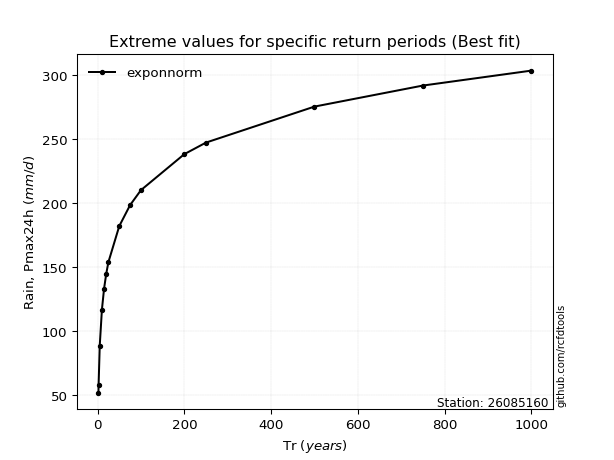</img>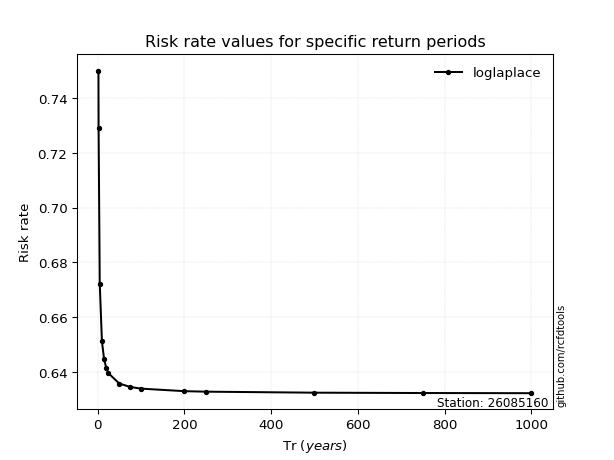</img>

</div>


<sub>**APP DISCLAIMER**: NO WARRANTY - This software is provided by [github.com/rcfdtools](https://github.com/rcfdtools) "as is", without any express or implied warranty, including warranties of merchantability, fitness for a particular purpose, or non-infringement. There is no guarantee that the software will be error-free or operate without interruption. LIMITATION OF LIABILITY - Neither the authors nor copyright holders will be liable for claims or damages arising from the software or its use. You are responsible for determining if the software is appropriate for your use and assume all associated risks, including errors, legal compliance, and data loss. NO PROFESSIONAL ADVICE - The software provides general information and does not offer professional advice. It should not replace consultation with professional advisors.</sub>