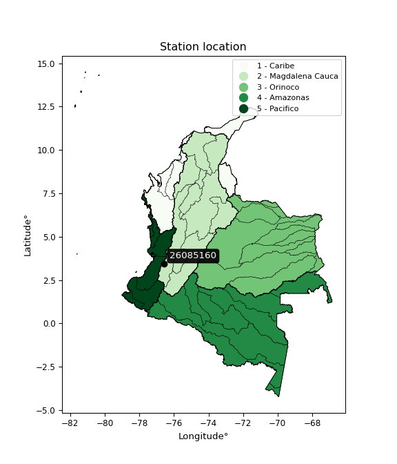

<div align="center">


</div>

# PMP Station (Rain, Pmax24h): 26085160

Probable Maximum Precipitation (PMP) is the greatest amount of rainfall for a specific duration that is meteorologically possible for a given location, acting as a "worst-case" scenario for extreme storms, crucial for designing safety-critical infrastructure like bridges, river deviations, dams, spillways, and nuclear plants to prevent catastrophic failure. PMP is calculated by hydrologists using meteorological data to determine the upper limit of extreme rainfall, often leading to the Probable Maximum Flood (PMF) for flood control design, and is increasingly being studied for climate change impacts. Probable Maximum Precipitation (PMP) is the theoretical upper limit of rainfall, a deterministic estimate for extreme events, while probability distributions (like GEV, Gumbel) describe the likelihood and frequency of various precipitation amounts, including rare ones, showing how often events occur, with PMP representing the extreme end of these distributions, used for critical infrastructure design to ensure safety against the worst conceivable weather, unlike standard statistical forecasts which cover typical probabilities.

The most common probability distributions in hydrology, used for analyzing floods, rainfall, and streamflow, include the Normal, Log-Normal, Gumbel, Gamma (including Log-Pearson Type III), and Generalized Extreme Value (GEV) distributions, often chosen based on the data´s skewness and whether modeling extremes or general conditions, with Gumbel and GEV popular for extreme events like floods, while the Normal distribution serves as a baseline, though often requiring transformations for skewed hydrological data. These distributions help in designing water infrastructure, managing water resources, and forecasting hydrologic events.

> Hydrological data often isn´t perfectly normal (it´s skewed), so different distributions are needed for different applications, such as: **Flood Frequency Analysis**: Using Gumbel, GEV, or Log-Pearson Type III for predicting extreme flood magnitudes and their return periods, **Rainfall Analysis**: Normal for annual totals, but Log-Normal, Weibull, or GEV for intensity or extreme daily rainfall, **Streamflow Modeling**: Gamma and Log-Normal for maximum flows, GEV for minimum flows, and Kappa for daily flows.

<div align="center">

</img>

</div>


## A. General information


### 1. General running parameters

• app_version: _v20260108_. • runtime: _2026-01-08 13:24:42.400241_. • Python version: _3.14.0_. • SciPy version: _1.16.3_. • Pandas version: _2.3.3_. • NumPy version: _2.3.5_. • Stations dataset (station_dataset_file): _dataset/pmax24h_in/automatic_colombia_2003_2024.csv_. • Stations catalog (station_catalog_file): _dataset/CNE.xls_. • Minimum year to eval til year_max (date_min): _1900_. • Maximum year to eval since year_min (date_max): _2024_. • Creates, save and include plots into reports (create_plot): _False_. • Plot only fit distributions with Δo > Δ (plot_only_fit): _True_. • Plot only simple graphs avoiding multiple CDFs and multiple Extreme values plots (plot_only_simple): _True_. • Eval low extreme values, if False, evaluates high extreme values (low_extreme): _False_. • Eval every SciPy distribution as logarithmic (pdist_logarithmic_on): _True_. • Standard deviation normalized (ddof): _1.0_. • Return periods to eval in years (Tr): _[2, 2.33, 5, 10, 15, 20, 25, 50, 75, 100, 200, 250, 500, 750, 1000]_. • Minimum data sample per station, 0 means any (minimum_sample): _5_. • Z-Score maximum threshold to adjust a value, 0 means disable (zscore_max): _3.5_. • Z-Score minimum threshold to adjust a value, 0 means disable (zscore_min): _-2.5_. • Avoid zeros, e.g. rain = 0 (avoid_zeros): _True_. • Avoid null values (avoid_nans): _True_. 

:file_folder:Table: [dataset.csv](../../dataset/pmax24h_in/automatic_colombia_2003_2024.csv)

> Delta Degrees of Freedom (DDOF): is a parameter used in the formulas for calculating variance and standard deviation. When ddof=0, the divisor is $N$ (the total number of observations) and this is used when your data set is the entire population. When ddof=1, the divisor is $N-1$ and this is used when your data set is a sample drawn from a larger population. Using $N-1$ provides an unbiased estimate of the population variance (known as Bessel´s correction).


### 2. Station info and location

|   id |   CODIGO | NOMBRE                 | CATEGORIA               | TECNOLOGIA                | ESTADO   | FECHA_INSTALACION   |   FECHA_SUSPENSION |   ALTITUD |   LATITUD |   LONGITUD | DEPARTAMENTO    | MUNICIPIO   | AREA_OPERATIVA                         | ENTIDAD                                                     | AREA_HIDROGRAFICA   | ZONA_HIDROGRAFICA   | SUBZONA_HIDROGRAFICA               |   CORRIENTE | Catalogo   |   Version |
|-----:|---------:|:-----------------------|:------------------------|:--------------------------|:---------|:--------------------|-------------------:|----------:|----------:|-----------:|:----------------|:------------|:---------------------------------------|:------------------------------------------------------------|:--------------------|:--------------------|:-----------------------------------|------------:|:-----------|----------:|
|    0 | 26085160 | SILOE - AUT [26085160] | Climatológica Principal | Automática con Telemetría | Activa   | 28/06/2005          |                nan |      1238 |    3.4255 |   -76.5606 | Valle Del Cauca | Cali        | Area Operativa 09 - Cauca-Valle-Caldas | INSTITUTO DE HIDROLOGIA METEOROLOGIA Y ESTUDIOS AMBIENTALES | Magdalena Cauca     | Cauca               | Ríos Lilí, Melendez y Canaveralejo |         nan | CNE_IDEAM  |  20251226 |

<div align="center">

Dynamic map: [:earth_americas:Google](http://maps.google.com/maps?q=3.4255,-76.56061111) [:earth_americas:OSM](https://www.openstreetmap.org/#map=18/3.4255/-76.56061111&layers=P) [:earth_americas:Bing](https://www.bing.com/maps?cp=3.4255~-76.56061111&lvl=18) [:earth_americas:Apple](https://maps.apple.com/frame?center=3.4255%2C-76.56061111&span=0.003%2C0.006)

</div>


<div align="center">

```geojson
{
  "type": "Feature",
  "geometry": {
    "type": "Point", 
    "coordinates": [-76.56061111, 3.4255]
  }, 
  "properties": {
    "Name": "26085160"
  }
}
```

</div>


### 3. Discrete values table and plot

<div align="center">

|               |          0 |           1 |           2 |           3 |          4 |
|:--------------|-----------:|------------:|------------:|------------:|-----------:|
| Date          | 2017       | 2018        | 2019        | 2020        | 2024       |
| Value         |  127.8     |   76.6      |   43.7      |   45.1      |   18.6     |
| Value_initial |  127.8     |   76.6      |   43.7      |   45.1      |   18.6     |
| count         |    5       |    5        |    5        |    5        |    5       |
| mean          |   62.36    |   62.36     |   62.36     |   62.36     |   62.36    |
| std           |   41.9709  |   41.9709   |   41.9709   |   41.9709   |   41.9709  |
| zscore        |    1.55918 |    0.339283 |   -0.444594 |   -0.411238 |   -1.04263 |


</div>


> The initial value (value_initial) correspond to the initial obtained or null completed value, and value (value) is adjusted only when the initial value is outside the valid range (outlier) definite through the Z-Score value. If Z-Score is active, values out of range or outliers are replaced with the station mean value. A Z-Score (or standard score) measures how many standard deviations a data point is from the mean of a dataset, indicating its relative position; positive scores mean above the mean, negative mean below, and a score of zero is exactly at the mean, allowing for comparison of values from different distributions. It´s calculated using the formula $z=(x–μ)/σ$, where $x$ is the data point, $μ$ is the mean, and $σ$ is the standard deviation, helping identify outliers and understand probability.
>
> <sub>**Note**: In this study, "completing" (filling gaps in) and "extending" (forecasting or lengthening the historical record) rainfall data series are avoided for certain critical analyses because they introduce artificial bias and uncertainty, which can distort the statistics of rare events (extremes), alter day-to-day variability, and compromise the integrity and homogeneity of the original data. Some reasons against Completing/Extending rainfall data are: **Distortion of Extremes and Variability**: The primary issue is that most gap-filling or extension methods rely on averaging or regression with nearby stations, which inherently smooths the data. Rainfall is highly variable in space and time, with a large percentage of zero values and occasional large storms. Infilling methods often underestimate the highest values and overestimate the lowest (zero) values, which severely distorts analyses focused on flood frequency, drought severity, and intensity-duration-frequency (IDF) curves, **Loss of Data Homogeneity**: Infilled or extended data are synthetic estimates, not actual measurements. Combining these estimates with observed data can violate the assumption of data homogeneity, which requires that the data properties do not change over time. Inhomogeneity can lead to incorrect conclusions about long-term trends or changes in climate patterns, **Propagation of Errors**: Errors and biases from the original data (e.g., wind-induced undercatch, instrument errors, site changes) or the data used for imputation can propagate through the analysis, leading to unreliable hydrological models and inaccurate predictions, **Compromised Statistical Integrity**: For statistical analyses, especially those involving the frequency of events, using artificial data can introduce time bias or autocorrelation that doesn´t exist in reality, making it difficult to assess the true probability of events, **Difficulty in Validation**: It is difficult to accurately validate the quality of filled or extended data, especially for past periods where ground-truth measurements are unavailable. The reliability of imputation techniques heavily depends on the density of the surrounding station network and the complexity of the local topography.</sub>


### 4. Active continuous probability distributions from SciPy (43 of 104 available)

A Probability Density Function (PDF) describes the relative likelihood of a continuous random variable falling within a specific range, where the total area under its curve equals 1, and the area over any interval gives the actual probability for that range. Unlike discrete probabilities (like rolling a die), a PDF shows density, not direct probability for a single point (which is zero), with higher points indicating higher likelihood, often visualized as a bell curve for normal distributions.

A log of a probability density function (log-PDF) is simply the logarithm of the PDF´s value, denoted as $log(f(x))$, useful for converting multiplication of probabilities into addition, improving numerical stability with tiny numbers, and connecting to information theory concepts like entropy. Instead of dealing with very small probabilities (e.g., 0.000001), log-PDFs use negative numbers (e.g., $log(0.00001) ≈ -11.51$ that are easier for computers to handle, preventing underflow errors and simplifying complex calculations. In this study, each active probability distribution from SciPy is also evaluated in the $log$ form.

[scipy.stats](https://docs.scipy.org/doc/scipy/reference/stats.html) is a Python´s powerful submodule within the SciPy library for comprehensive statistical analysis, offering over 130 probability distributions (like Normal, Poisson), functions for descriptive stats (mean, variance), hypothesis testing (t-tests, chi-square), random variable generation, and statistical tests, making it essential for data science, modeling, and research. It provides tools to explore, model, and draw conclusions from data efficiently, working seamlessly with NumPy.

<div align="center">

|   id | p_dist             |   n_parameter | fit_method   | label                                                                       | active   | ref                                                                                                        |
|-----:|:-------------------|--------------:|:-------------|:----------------------------------------------------------------------------|:---------|:-----------------------------------------------------------------------------------------------------------|
|    0 | alpha              |             3 | MLE          | Alpha                                                                       | True     | [:mortar_board:](https://docs.scipy.org/doc/scipy/reference/generated/scipy.stats.alpha.html)              |
|    1 | betaprime          |             4 | MLE          | Beta prime                                                                  | True     | [:mortar_board:](https://docs.scipy.org/doc/scipy/reference/generated/scipy.stats.betaprime.html)          |
|    2 | chi2               |             3 | MLE          | Chi²                                                                        | True     | [:mortar_board:](https://docs.scipy.org/doc/scipy/reference/generated/scipy.stats.chi2.html)               |
|    3 | crystalball        |             4 | MLE          | Crystalball                                                                 | True     | [:mortar_board:](https://docs.scipy.org/doc/scipy/reference/generated/scipy.stats.crystalball.html)        |
|    4 | erlang             |             3 | MLE          | Erlang                                                                      | True     | [:mortar_board:](https://docs.scipy.org/doc/scipy/reference/generated/scipy.stats.erlang.html)             |
|    5 | expon              |             2 | MLE          | Exponential                                                                 | True     | [:mortar_board:](https://docs.scipy.org/doc/scipy/reference/generated/scipy.stats.expon.html)              |
|    6 | exponnorm          |             3 | MLE          | Exponentially modified Normal                                               | True     | [:mortar_board:](https://docs.scipy.org/doc/scipy/reference/generated/scipy.stats.exponnorm.html)          |
|    7 | f                  |             4 | MLE          | F                                                                           | True     | [:mortar_board:](https://docs.scipy.org/doc/scipy/reference/generated/scipy.stats.f.html)                  |
|    8 | fatiguelife        |             3 | MLE          | Fatigue-life (Birnbaum-Saunders)                                            | True     | [:mortar_board:](https://docs.scipy.org/doc/scipy/reference/generated/scipy.stats.fatiguelife.html)        |
|    9 | fisk               |             3 | MLE          | Fisk                                                                        | True     | [:mortar_board:](https://docs.scipy.org/doc/scipy/reference/generated/scipy.stats.fisk.html)               |
|   10 | gamma              |             3 | MLE          | Gamma                                                                       | True     | [:mortar_board:](https://docs.scipy.org/doc/scipy/reference/generated/scipy.stats.gamma.html)              |
|   11 | genexpon           |             5 | MLE          | Generalized exponential                                                     | True     | [:mortar_board:](https://docs.scipy.org/doc/scipy/reference/generated/scipy.stats.genexpon.html)           |
|   12 | genlogistic        |             3 | MLE          | Generalized logistic                                                        | True     | [:mortar_board:](https://docs.scipy.org/doc/scipy/reference/generated/scipy.stats.genlogistic.html)        |
|   13 | gibrat             |             2 | MM           | Gibrat                                                                      | True     | [:mortar_board:](https://docs.scipy.org/doc/scipy/reference/generated/scipy.stats.gibrat.html)             |
|   14 | gompertz           |             3 | MLE          | Gompertz (or truncated Gumbel)                                              | True     | [:mortar_board:](https://docs.scipy.org/doc/scipy/reference/generated/scipy.stats.gompertz.html)           |
|   15 | gumbel_l           |             2 | MM           | Gumbel Left Skew                                                            | True     | [:mortar_board:](https://docs.scipy.org/doc/scipy/reference/generated/scipy.stats.gumbel_l.html)           |
|   16 | gumbel_r           |             2 | MM           | Gumbel Right Skew                                                           | True     | [:mortar_board:](https://docs.scipy.org/doc/scipy/reference/generated/scipy.stats.gumbel_r.html)           |
|   17 | halflogistic       |             2 | MM           | Half-logistic                                                               | True     | [:mortar_board:](https://docs.scipy.org/doc/scipy/reference/generated/scipy.stats.halflogistic.html)       |
|   18 | halfnorm           |             2 | MM           | Half Normal                                                                 | True     | [:mortar_board:](https://docs.scipy.org/doc/scipy/reference/generated/scipy.stats.halfnorm.html)           |
|   19 | hypsecant          |             2 | MM           | hyperbolic secant                                                           | True     | [:mortar_board:](https://docs.scipy.org/doc/scipy/reference/generated/scipy.stats.hypsecant.html)          |
|   20 | invgamma           |             3 | MLE          | Inverted gamma                                                              | True     | [:mortar_board:](https://docs.scipy.org/doc/scipy/reference/generated/scipy.stats.invgamma.html)           |
|   21 | invgauss           |             3 | MLE          | Inverse Gaussian                                                            | True     | [:mortar_board:](https://docs.scipy.org/doc/scipy/reference/generated/scipy.stats.invgauss.html)           |
|   22 | invweibull         |             3 | MLE          | Inverted Weibull                                                            | True     | [:mortar_board:](https://docs.scipy.org/doc/scipy/reference/generated/scipy.stats.invweibull.html)         |
|   23 | kstwobign          |             2 | MLE          | Limiting distribution of scaled Kolmogorov-Smirnov two-sided test statistic | True     | [:mortar_board:](https://docs.scipy.org/doc/scipy/reference/generated/scipy.stats.kstwobign.html)          |
|   24 | laplace            |             2 | MM           | Laplace                                                                     | True     | [:mortar_board:](https://docs.scipy.org/doc/scipy/reference/generated/scipy.stats.laplace.html)            |
|   25 | laplace_asymmetric |             3 | MLE          | Asymmetric Laplace                                                          | True     | [:mortar_board:](https://docs.scipy.org/doc/scipy/reference/generated/scipy.stats.laplace_asymmetric.html) |
|   26 | loggamma           |             3 | MLE          | Log gamma                                                                   | True     | [:mortar_board:](https://docs.scipy.org/doc/scipy/reference/generated/scipy.stats.loggamma.html)           |
|   27 | logistic           |             2 | MM           | Logistic (or Sech-squared)                                                  | True     | [:mortar_board:](https://docs.scipy.org/doc/scipy/reference/generated/scipy.stats.logistic.html)           |
|   28 | lognorm            |             3 | MLE          | Log Normal                                                                  | True     | [:mortar_board:](https://docs.scipy.org/doc/scipy/reference/generated/scipy.stats.lognorm.html)            |
|   29 | maxwell            |             2 | MM           | Maxwell                                                                     | True     | [:mortar_board:](https://docs.scipy.org/doc/scipy/reference/generated/scipy.stats.maxwell.html)            |
|   30 | mielke             |             4 | MLE          | Mielke Beta-Kappa / Dagum                                                   | True     | [:mortar_board:](https://docs.scipy.org/doc/scipy/reference/generated/scipy.stats.mielke.html)             |
|   31 | moyal              |             2 | MM           | Moyal                                                                       | True     | [:mortar_board:](https://docs.scipy.org/doc/scipy/reference/generated/scipy.stats.moyal.html)              |
|   32 | nakagami           |             3 | MLE          | Nakagami                                                                    | True     | [:mortar_board:](https://docs.scipy.org/doc/scipy/reference/generated/scipy.stats.nakagami.html)           |
|   33 | ncf                |             5 | MLE          | Non-central F distribution                                                  | True     | [:mortar_board:](https://docs.scipy.org/doc/scipy/reference/generated/scipy.stats.ncf.html)                |
|   34 | nct                |             4 | MLE          | Non-central Student’s t                                                     | True     | [:mortar_board:](https://docs.scipy.org/doc/scipy/reference/generated/scipy.stats.nct.html)                |
|   35 | norm               |             2 | MM           | Normal                                                                      | True     | [:mortar_board:](https://docs.scipy.org/doc/scipy/reference/generated/scipy.stats.norm.html)               |
|   36 | pearson3           |             3 | MM           | Pearson type III                                                            | True     | [:mortar_board:](https://docs.scipy.org/doc/scipy/reference/generated/scipy.stats.pearson3.html)           |
|   37 | rayleigh           |             2 | MM           | Rayleigh                                                                    | True     | [:mortar_board:](https://docs.scipy.org/doc/scipy/reference/generated/scipy.stats.rayleigh.html)           |
|   38 | rice               |             3 | MLE          | Rice                                                                        | True     | [:mortar_board:](https://docs.scipy.org/doc/scipy/reference/generated/scipy.stats.rice.html)               |
|   39 | t                  |             3 | MLE          | Student’s t                                                                 | True     | [:mortar_board:](https://docs.scipy.org/doc/scipy/reference/generated/scipy.stats.t.html)                  |
|   40 | truncnorm          |             4 | MLE          | Truncated normal                                                            | True     | [:mortar_board:](https://docs.scipy.org/doc/scipy/reference/generated/scipy.stats.truncnorm.html)          |
|   41 | wald               |             2 | MM           | Wald                                                                        | True     | [:mortar_board:](https://docs.scipy.org/doc/scipy/reference/generated/scipy.stats.wald.html)               |
|   42 | weibull_min        |             3 | MLE          | Weibull minimum                                                             | True     | [:mortar_board:](https://docs.scipy.org/doc/scipy/reference/generated/scipy.stats.weibull_min.html)        |

</div>

> **n_parameter:** # arguments & localization & scale.
>
> **Fit methods:** (MLE) maximum likelihood, (MM) L-moments.
>
>**Inactive** (With the only purpose of prevent loops, zero divisions, infinite values, over high estimated values or horizontal trending for recurrence intervals estimations, the follow distributions were disabled.)**:** foldnorm, gennorm, norminvgauss, powernorm, powerlognorm, skewnorm, genextreme, anglit, arcsine, argus, beta, bradford, burr, burr12, cauchy, cosine, halfcauchy, foldcauchy, skewcauchy, wrapcauchy, dgamma, gengamma, exponweib, exponpow, truncexpon, gausshyper, genhalflogistic, genhyperbolic, geninvgauss, halfgennorm, johnsonsb, johnsonsu, kappa4, kappa3, ksone, kstwo, loglaplace, levy, levy_l, levy_stable, ncx2, pareto, genpareto, truncpareto, lomax, powerlaw, rdist, rel_breitwigner, recipinvgauss, semicircular, studentized_range, trapezoid, triang, truncweibull_min, tukeylambda, uniform, loguniform, vonmises, vonmises_line, weibull_max, dweibull, 


## B. Probability (PDF) vs. Empirical (EDF) distributions functions

A continuous probability distribution (CPD) describes probabilities for variables that can take any value within a range (like rain any time), unlike discrete variables with specific outcomes (like temperature). It uses a Probability Density Function (PDF), a curve where the total area under it equals 1, and the probability of the variable falling within an interval (a to b) is found by calculating the area under the curve between those points. A key feature is that the probability of hitting any single exact value is zero, so probabilities are always expressed for ranges, e.g., $P(a ≤ X ≤ b)$.

<div align="center">

Distributions parameters from station values
|    |   station | p_dist                |   n |              loc |          scale | shape                  | shape1             | shape2                 | shape3   |
|---:|----------:|:----------------------|----:|-----------------:|---------------:|:-----------------------|:-------------------|:-----------------------|:---------|
|  0 |  26085160 | alpha                 |   5 |    -71.9528      |  493.146       | 3.942117659068742      |                    |                        |          |
|  1 |  26085160 | betaprime             |   5 |     -1.09051     |  222.618       | 3.546966716926546      | 13.415107868941078 |                        |          |
|  2 |  26085160 | chi2                  |   5 |     18.6         |   23.5288      | 1.2370045743745663     |                    |                        |          |
|  3 |  26085160 | crystalball           |   5 |     62.36        |   37.5399      | 2636.86796037426       | 12162.434597561076 |                        |          |
|  4 |  26085160 | erlang                |   5 |     18.6         |   35.5575      | 0.6776707368507078     |                    |                        |          |
|  5 |  26085160 | expon                 |   5 |     18.6         |   43.76        |                        |                    |                        |          |
|  6 |  26085160 | exponnorm             |   5 |     21.7495      |   10.9515      | 3.7082117483297923     |                    |                        |          |
|  7 |  26085160 | f                     |   5 |     18.5999      |   58.0739      | 0.9415900842666676     | 1011.4999318418937 |                        |          |
|  8 |  26085160 | fatiguelife           |   5 |     18.6         |    0.000241298 | 366.7310497813046      |                    |                        |          |
|  9 |  26085160 | fisk                  |   5 |      7.04047     |   44.157       | 2.191088611771031      |                    |                        |          |
| 10 |  26085160 | gamma                 |   5 |     18.6         |   39.0208      | 0.6242894171927107     |                    |                        |          |
| 11 |  26085160 | genexpon              |   5 |     18.5905      |    3.41279     | 0.06438797197328194    | 5.474382007916915  | 0.00022346050660755656 |          |
| 12 |  26085160 | genlogistic           |   5 |   -158.217       |   28.1916      | 1357.4288733254407     |                    |                        |          |
| 13 |  26085160 | gibrat                |   5 |     33.7218      |   17.3699      |                        |                    |                        |          |
| 14 |  26085160 | gompertz              |   5 |     18.6         |  164.19        | 2.9262675634202395     |                    |                        |          |
| 15 |  26085160 | gumbel_l              |   5 |     79.2549      |   29.2697      |                        |                    |                        |          |
| 16 |  26085160 | gumbel_r              |   5 |     45.4651      |   29.2697      |                        |                    |                        |          |
| 17 |  26085160 | halflogistic          |   5 |     17.8665      |   32.0953      |                        |                    |                        |          |
| 18 |  26085160 | halfnorm              |   5 |     12.6719      |   62.2748      |                        |                    |                        |          |
| 19 |  26085160 | hypsecant             |   5 |     62.36        |   23.8986      |                        |                    |                        |          |
| 20 |  26085160 | invgamma              |   5 |    -20.4569      |  362.755       | 5.3319633576476635     |                    |                        |          |
| 21 |  26085160 | invgauss              |   5 |     -0.859765    |  134.477       | 0.47011719314919664    |                    |                        |          |
| 22 |  26085160 | invweibull            |   5 |     18.6         |    1.96315     | 0.050494018634475855   |                    |                        |          |
| 23 |  26085160 | kstwobign             |   5 |    -54.4926      |  134.287       |                        |                    |                        |          |
| 24 |  26085160 | laplace               |   5 |     62.36        |   26.5447      |                        |                    |                        |          |
| 25 |  26085160 | laplace_asymmetric    |   5 |     43.7         |   23.4662      | 0.6785480556386394     |                    |                        |          |
| 26 |  26085160 | loggamma              |   5 | -10254.3         | 1421.73        | 1417.4894768430308     |                    |                        |          |
| 27 |  26085160 | logistic              |   5 |     62.36        |   20.6968      |                        |                    |                        |          |
| 28 |  26085160 | lognorm               |   5 |     18.6         |    0.0272286   | 14.843705078651718     |                    |                        |          |
| 29 |  26085160 | maxwell               |   5 |    -26.5937      |   55.7435      |                        |                    |                        |          |
| 30 |  26085160 | mielke                |   5 |     18.6         |   58.2493      | 0.5067848915600983     | 1.5853268316835811 |                        |          |
| 31 |  26085160 | moyal                 |   5 |     40.8923      |   16.8989      |                        |                    |                        |          |
| 32 |  26085160 | nakagami              |   5 |     43.7         |   30.0105      | 0.11491487939949008    |                    |                        |          |
| 33 |  26085160 | ncf                   |   5 |     -0.0288223   |    1.01312e-05 | 1.5878902116816064e-06 | 14.799789226277639 | 8.537875787366318      |          |
| 34 |  26085160 | nct                   |   5 |     -0.104677    |   17.7941      | 3.0516955610491703     | 2.6317876686056207 |                        |          |
| 35 |  26085160 | norm                  |   5 |     62.36        |   37.5399      |                        |                    |                        |          |
| 36 |  26085160 | pearson3              |   5 |     62.36        |   37.5399      | 0.7095667352179122     |                    |                        |          |
| 37 |  26085160 | rayleigh              |   5 |     -9.45598     |   57.3009      |                        |                    |                        |          |
| 38 |  26085160 | rice                  |   5 |     -0.634892    |   51.8536      | 0.00047286481152915044 |                    |                        |          |
| 39 |  26085160 | t                     |   5 |     62.3598      |   37.54        | 950124491.3269832      |                    |                        |          |
| 40 |  26085160 | truncnorm             |   5 |     62.36        |   37.5399      | -557.8004441560165     | 25.118320124194604 |                        |          |
| 41 |  26085160 | wald                  |   5 |     24.8202      |   37.5399      |                        |                    |                        |          |
| 42 |  26085160 | weibull_min           |   5 |     18.6         |   11.6655      | 0.2631716983515674     |                    |                        |          |
| 43 |  26085160 | logalpha              |   5 |    -10.1616      |  305.309       | 21.70507730599101      |                    |                        |          |
| 44 |  26085160 | logbetaprime          |   5 |     -0.332301    |   13.6834      | 56.82678622234285      | 183.51530560809027 |                        |          |
| 45 |  26085160 | logchi2               |   5 |      2.92316     |    0.998011    | 1.0367388004210265     |                    |                        |          |
| 46 |  26085160 | logcrystalball        |   5 |      3.93969     |    0.642718    | 250.9289831356332      | 6.749792568480604  |                        |          |
| 47 |  26085160 | logerlang             |   5 |     -9.87103     |    0.0304035   | 454.27681456614584     |                    |                        |          |
| 48 |  26085160 | logexpon              |   5 |      2.92316     |    1.01653     |                        |                    |                        |          |
| 49 |  26085160 | logexponnorm          |   5 |      3.93903     |    0.642716    | 0.0010324534771736441  |                    |                        |          |
| 50 |  26085160 | logf                  |   5 |   -310.292       |  314.23        | 1729989.3616450382     | 658845.1682835396  |                        |          |
| 51 |  26085160 | logfatiguelife        |   5 |   -105.695       |  109.632       | 0.005851371909162047   |                    |                        |          |
| 52 |  26085160 | logfisk               |   5 |     -1.57918e+07 |    1.57918e+07 | 41680018.50458388      |                    |                        |          |
| 53 |  26085160 | loggamma              |   5 |     -8.91387     |    0.0325217   | 395.1288839352578      |                    |                        |          |
| 54 |  26085160 | loggenexpon           |   5 |      2.9123      |    0.0189344   | 0.008982087988946865   | 3.2901731838093795 | 7.599068055442543e-05  |          |
| 55 |  26085160 | loggenlogistic        |   5 |      4.05534     |    0.354404    | 0.8378672249300141     |                    |                        |          |
| 56 |  26085160 | loggibrat             |   5 |      3.44936     |    0.297399    |                        |                    |                        |          |
| 57 |  26085160 | loggompertz           |   5 |      2.92316     |    0.861009    | 0.3097650577026576     |                    |                        |          |
| 58 |  26085160 | loggumbel_l           |   5 |      4.22895     |    0.501126    |                        |                    |                        |          |
| 59 |  26085160 | loggumbel_r           |   5 |      3.65043     |    0.501126    |                        |                    |                        |          |
| 60 |  26085160 | loghalflogistic       |   5 |      3.17793     |    0.5495      |                        |                    |                        |          |
| 61 |  26085160 | loghalfnorm           |   5 |      3.08895     |    1.06625     |                        |                    |                        |          |
| 62 |  26085160 | loghypsecant          |   5 |      3.93969     |    0.409167    |                        |                    |                        |          |
| 63 |  26085160 | loginvgamma           |   5 |     -8.62813     | 4714.3         | 376.1616828474481      |                    |                        |          |
| 64 |  26085160 | loginvgauss           |   5 |     -0.918135    |  251.774       | 0.019327812236942812   |                    |                        |          |
| 65 |  26085160 | loginvweibull         |   5 |     -3.99561e+07 |    3.99561e+07 | 64896847.95394911      |                    |                        |          |
| 66 |  26085160 | logkstwobign          |   5 |      1.45653     |    2.83648     |                        |                    |                        |          |
| 67 |  26085160 | loglaplace            |   5 |      3.93969     |    0.454471    |                        |                    |                        |          |
| 68 |  26085160 | loglaplace_asymmetric |   5 |      3.80888     |    0.484368    | 0.8739084057494291     |                    |                        |          |
| 69 |  26085160 | logloggamma           |   5 |      0.125889    |    1.83081     | 8.52429766577098       |                    |                        |          |
| 70 |  26085160 | loglogistic           |   5 |      3.93969     |    0.354349    |                        |                    |                        |          |
| 71 |  26085160 | loglognorm            |   5 |      2.92316     |    0.000982725 | 14.215895302665066     |                    |                        |          |
| 72 |  26085160 | logmaxwell            |   5 |      2.41672     |    0.954382    |                        |                    |                        |          |
| 73 |  26085160 | logmielke             |   5 |      2.92316     |    1.6936      | 0.4411706508484407     | 8.660054915263125  |                        |          |
| 74 |  26085160 | logmoyal              |   5 |      3.57214     |    0.289325    |                        |                    |                        |          |
| 75 |  26085160 | lognakagami           |   5 |      3.77735     |    0.602868    | 0.1313790930315747     |                    |                        |          |
| 76 |  26085160 | logncf                |   5 |     -5.64312     |    6.59201     | 948.4390223612895      | 669.9667494222531  | 426.22835055656424     |          |
| 77 |  26085160 | lognct                |   5 |    -26.9395      |    0.611112    | 12011.219990865677     | 50.52625268623663  |                        |          |
| 78 |  26085160 | lognorm               |   5 |      3.93969     |    0.642719    |                        |                    |                        |          |
| 79 |  26085160 | logpearson3           |   5 |      3.93969     |    0.642718    | -0.17922367522631677   |                    |                        |          |
| 80 |  26085160 | lograyleigh           |   5 |      2.71013     |    0.981046    |                        |                    |                        |          |
| 81 |  26085160 | logrice               |   5 |      2.54188     |    0.730161    | 1.5619678356391884     |                    |                        |          |
| 82 |  26085160 | logt                  |   5 |      3.93969     |    0.642719    | 2926725055.0072603     |                    |                        |          |
| 83 |  26085160 | logtruncnorm          |   5 |     -0.172967    |    1.37015     | 2.8831187536121643     | 3.6663433438956377 |                        |          |
| 84 |  26085160 | logwald               |   5 |      3.29692     |    0.642764    |                        |                    |                        |          |
| 85 |  26085160 | logweibull_min        |   5 |      1.85186     |    2.31857     | 3.737393484149909      |                    |                        |          |

</div>

> **loc** (Location parameter): This shifts the distribution along the x-axis. For many common distributions, like the normal (Gaussian) distribution, loc represents the mean $μ$. For others, like the uniform distribution, it might represent the minimum value, or for the beta distribution, the left end of the support interval.
>
> **scale** (Scale parameter): This determines the width or spread of the distribution. For the normal distribution, scale represents the standard deviation $σ$. For a uniform distribution, it defines the length of the interval (from $loc$ to $loc + scale$).
>
> **shape** (Shape parameters): Refers to parameters that define the specific form of a probability distribution, distinct from its location (loc) and scale (scale). These parameters are required arguments for most distribution functions. For example, a normal (Gaussian) distribution is fully defined by its location (mean) and scale (standard deviation), so it has no specific shape parameters beyond loc and scale. However, other distributions have intrinsic properties that need specification, as Gamma distribution that takes a shape parameter, often named $a$ or $alpha$.


### 0. Cumulative distribution values - CDF (86 evaluated)

Cumulative Distribution Function (CDF), denoted as $F$<sub>$X$</sub>$(x)$, is a function that gives the probability that a random variable $X$ will take a value less than or equal to a specific value, $x$ (i.e., $(P(X≥x)$. It essentially "accumulates" probabilities from a given point up to the far right (positive infinity), providing a complete picture of the distribution´s probabilities for both discrete (like rain) and continuous (like temperature) variables, helping to find probabilities over ranges or above certain values. Each station is evaluated separately ordering the $x$ values ascending, calculating the CDF and PDF values for the activated distributions and their logarithmic forms.

<div align="center">

CDF ordered by x ascending and calculating $log(f(x))$ separately
|   id |   Station |   date |     x |   count |   mean |     std |    zscore |   Value_initial |   station |   m |     alpha |   alpha_pdf |   betaprime |   betaprime_pdf |        chi2 |       chi2_pdf |   crystalball |   crystalball_pdf |      erlang |     erlang_pdf |    expon |   expon_pdf |   exponnorm |   exponnorm_pdf |          f |      f_pdf |   fatiguelife |   fatiguelife_pdf |      fisk |   fisk_pdf |       gamma |      gamma_pdf |    genexpon |   genexpon_pdf |   genlogistic |   genlogistic_pdf |   gibrat |   gibrat_pdf |    gompertz |   gompertz_pdf |   gumbel_l |   gumbel_l_pdf |   gumbel_r |   gumbel_r_pdf |   halflogistic |   halflogistic_pdf |   halfnorm |   halfnorm_pdf |   hypsecant |   hypsecant_pdf |   invgamma |   invgamma_pdf |   invgauss |   invgauss_pdf |   invweibull |   invweibull_pdf |   kstwobign |   kstwobign_pdf |   laplace |   laplace_pdf |   laplace_asymmetric |   laplace_asymmetric_pdf |   loggamma |   loggamma_pdf |   logistic |   logistic_pdf |   lognorm |   lognorm_pdf |   maxwell |   maxwell_pdf |      mielke |   mielke_pdf |     moyal |   moyal_pdf |    nakagami |   nakagami_pdf |      ncf |    ncf_pdf |       nct |    nct_pdf |     norm |   norm_pdf |   pearson3 |   pearson3_pdf |   rayleigh |   rayleigh_pdf |     rice |   rice_pdf |        t |      t_pdf |   truncnorm |   truncnorm_pdf |     wald |   wald_pdf |   weibull_min |   weibull_min_pdf |   logalpha |   logalpha_pdf |   logbetaprime |   logbetaprime_pdf |     logchi2 |   logchi2_pdf |   logcrystalball |   logcrystalball_pdf |   logerlang |   logerlang_pdf |   logexpon |   logexpon_pdf |   logexponnorm |   logexponnorm_pdf |      logf |   logf_pdf |   logfatiguelife |   logfatiguelife_pdf |   logfisk |   logfisk_pdf |   loggenexpon |   loggenexpon_pdf |   loggenlogistic |   loggenlogistic_pdf |   loggibrat |   loggibrat_pdf |   loggompertz |   loggompertz_pdf |   loggumbel_l |   loggumbel_l_pdf |   loggumbel_r |   loggumbel_r_pdf |   loghalflogistic |   loghalflogistic_pdf |   loghalfnorm |   loghalfnorm_pdf |   loghypsecant |   loghypsecant_pdf |   loginvgamma |   loginvgamma_pdf |   loginvgauss |   loginvgauss_pdf |   loginvweibull |   loginvweibull_pdf |   logkstwobign |   logkstwobign_pdf |   loglaplace |   loglaplace_pdf |   loglaplace_asymmetric |   loglaplace_asymmetric_pdf |   logloggamma |   logloggamma_pdf |   loglogistic |   loglogistic_pdf |   loglognorm |   loglognorm_pdf |   logmaxwell |   logmaxwell_pdf |   logmielke |   logmielke_pdf |   logmoyal |   logmoyal_pdf |   lognakagami |   lognakagami_pdf |    logncf |   logncf_pdf |   lognct |   lognct_pdf |   logpearson3 |   logpearson3_pdf |   lograyleigh |   lograyleigh_pdf |   logrice |   logrice_pdf |      logt |   logt_pdf |   logtruncnorm |   logtruncnorm_pdf |   logwald |   logwald_pdf |   logweibull_min |   logweibull_min_pdf |
|-----:|----------:|-------:|------:|--------:|-------:|--------:|----------:|----------------:|----------:|----:|----------:|------------:|------------:|----------------:|------------:|---------------:|--------------:|------------------:|------------:|---------------:|---------:|------------:|------------:|----------------:|-----------:|-----------:|--------------:|------------------:|----------:|-----------:|------------:|---------------:|------------:|---------------:|--------------:|------------------:|---------:|-------------:|------------:|---------------:|-----------:|---------------:|-----------:|---------------:|---------------:|-------------------:|-----------:|---------------:|------------:|----------------:|-----------:|---------------:|-----------:|---------------:|-------------:|-----------------:|------------:|----------------:|----------:|--------------:|---------------------:|-------------------------:|-----------:|---------------:|-----------:|---------------:|----------:|--------------:|----------:|--------------:|------------:|-------------:|----------:|------------:|------------:|---------------:|---------:|-----------:|----------:|-----------:|---------:|-----------:|-----------:|---------------:|-----------:|---------------:|---------:|-----------:|---------:|-----------:|------------:|----------------:|---------:|-----------:|--------------:|------------------:|-----------:|---------------:|---------------:|-------------------:|------------:|--------------:|-----------------:|---------------------:|------------:|----------------:|-----------:|---------------:|---------------:|-------------------:|----------:|-----------:|-----------------:|---------------------:|----------:|--------------:|--------------:|------------------:|-----------------:|---------------------:|------------:|----------------:|--------------:|------------------:|--------------:|------------------:|--------------:|------------------:|------------------:|----------------------:|--------------:|------------------:|---------------:|-------------------:|--------------:|------------------:|--------------:|------------------:|----------------:|--------------------:|---------------:|-------------------:|-------------:|-----------------:|------------------------:|----------------------------:|--------------:|------------------:|--------------:|------------------:|-------------:|-----------------:|-------------:|-----------------:|------------:|----------------:|-----------:|---------------:|--------------:|------------------:|----------:|-------------:|---------:|-------------:|--------------:|------------------:|--------------:|------------------:|----------:|--------------:|----------:|-----------:|---------------:|-------------------:|----------:|--------------:|-----------------:|---------------------:|
|    0 |  26085160 |   2024 |  18.6 |       5 |  62.36 | 41.9709 | -1.04263  |            18.6 |  26085160 |   1 | 0.0663154 |  0.00774498 |   0.0675329 |      0.00864792 | 1.19202e-10 | 20752.3        |      0.121869 |        0.00538702 | 1.58694e-11 | 3027.05        | 0        |  0.0228519  |   0.0633252 |      0.00796607 | 0.00119518 | 9.52015    |     0.0573266 |       1.25771e+08 | 0.0503743 | 0.00906737 | 1.07994e-10 | 18976.8        | 0.000178997 |     0.0188643  |     0.0772227 |        0.00700868 | 0        |   0          | 4.62221e-15 |     0.0178224  |   0.118296 |    0.00379251  |  0.0817665 |     0.00699474 |      0.0114261 |         0.0155766  |   0.075838 |     0.0127544  |    0.101154 |      0.00416173 |  0.0606191 |     0.00857054 |  0.0550422 |     0.0102933  |   0.00388201 |      3.06294e+11 |   0.0715739 |      0.00717618 | 0.0961653 |    0.00362277 |            0.0651754 |               0.00409318 |  0.0555067 |       0.183106 |   0.107711 |     0.00464369 | 0.0568694 |      0.177704 |  0.116803 |    0.00677301 | 1.61688e-05 | 400.462      | 0.0531159 |  0.00703581 | 0           |    0           | 0.166403 | 0.0106127  | 0.0624673 | 0.00733698 | 0.121869 | 0.00538702 |   0.104132 |     0.00690491 |   0.112961 |     0.00757959 | 0.066487 | 0.00667808 | 0.121871 | 0.00538706 |    0.121869 |      0.00538702 | 0        | 0          |   8.25125e-05 |       6.11196e+09 |  0.0517568 |       0.189041 |      0.0478134 |           0.191565 | 8.67397e-09 |   1.01248e+07 |        0.0568693 |             0.177704 |   0.0554005 |        0.181707 |   0        |       0.983739 |      0.0568687 |           0.177703 | 0.0568801 |   0.17822  |        0.0561398 |             0.177888 | 0.0616972 |      0.152793 |    0.00518081 |          0.479457 |        0.0665165 |             0.151064 |    0        |       0         |   3.74402e-10 |          0.35977  |     0.0711898 |          0.136879 |     0.0140019 |          0.119268 |          0        |              0        |      0        |          0        |      0.0529568 |           0.12883  |     0.0525822 |          0.185232 |     0.0504844 |          0.196475 |       0.0466354 |            0.23219  |       0.048027 |           0.269472 |    0.0534035 |         0.117507 |               0.0534272 |                    0.126218 |     0.0655883 |          0.167148 |     0.0537216 |          0.143462 |    0.0227747 |      8.55996e+12 |    0.0365472 |         0.204498 | 3.83328e-05 |  102346         | 0.00214352 |      0.0380679 |   0           |       0           | 0.0580602 |     0.195003 | 0.056566 |     0.178023 |     0.0615302 |          0.173088 |     0.0233002 |          0.216183 | 0.0407773 |      0.216197 | 0.0568704 |   0.177707 |    0           |           0        |  0        |      0        |        0.0542946 |             0.184176 |
|    1 |  26085160 |   2019 |  43.7 |       5 |  62.36 | 41.9709 | -0.444594 |            43.7 |  26085160 |   2 | 0.373779  |  0.0139666  |   0.37428   |      0.0131798  | 0.625035    |     0.01094    |      0.309569 |        0.00939214 | 0.670904    |    0.0116364   | 0.436497 |  0.0128771  |   0.398472  |      0.0142577  | 0.500686   | 0.00816235 |     0.81042   |       0.00474763  | 0.399461  | 0.014338   | 0.673466    |     0.011071   | 0.397595    |     0.0129528  |     0.349258  |        0.0130272  | 0.289673 |   0.0342871  | 0.383284    |     0.0128069  |   0.256799 |    0.0075359   |  0.345709  |     0.0125453  |      0.382043  |         0.0133048  |   0.381688 |     0.0113167  |    0.273441 |      0.0100855  |  0.389326  |     0.0140044  |  0.411775  |     0.0136373  |   0.41509    |      0.000734219 |   0.341158  |      0.0125592  | 0.247558  |    0.00932606 |            0.315269  |               0.0197997  |  0.40895   |       0.605945 |   0.288724 |     0.00992242 | 0.400293  |      0.601222 |  0.33838  |    0.0102775  | 0.605713    |   0.00968112 | 0.357425  |  0.0142255  | 0.000211403 |    6.83798e+09 | 0.441522 | 0.0102458  | 0.387331  | 0.0148938  | 0.309569 | 0.00939214 |   0.341155 |     0.0110966  |   0.349674 |     0.0105284  | 0.306159 | 0.0114406  | 0.309572 | 0.00939215 |    0.309569 |      0.00939214 | 0.367543 | 0.0233065  |   0.705778    |       0.00377413  |  0.421449  |       0.614694 |      0.431009  |           0.625704 | 0.632446    |   0.287244    |        0.400293  |             0.601222 |   0.406241  |        0.603286 |   0.568418 |       0.424565 |      0.400293  |           0.601224 | 0.400937  |   0.601245 |        0.401565  |             0.603746 | 0.385245  |      0.625079 |    0.488798   |          0.550364 |        0.378239  |             0.613993 |    0.538998 |       1.21051   |   0.40881     |          0.573594 |     0.333752  |          0.539902 |     0.460121  |          0.712748 |          0.497084 |              0.685084 |      0.481481 |          0.60753  |      0.376895  |           0.720487 |     0.414758  |          0.611451 |     0.425308  |          0.601947 |       0.465091  |            0.578278 |       0.48517  |           0.561447 |    0.349812  |         0.769712 |               0.401929  |                    0.94953  |     0.379347  |          0.576094 |     0.387426  |          0.669755 |    0.682983  |      0.029334    |    0.434316  |         0.61503  | 0.739264    |       0.380801  | 0.483031   |      0.756263  |   8.61133e-05 |       5.09514e+10 | 0.417883  |     0.593019 | 0.401045 |     0.602052 |     0.389537  |          0.5878   |     0.44661   |          0.613628 | 0.419469  |      0.60067  | 0.400296  |   0.601222 |    3.75472e-05 |           2.47139  |  0.544906 |      0.920372 |        0.39312   |             0.588301 |
|    2 |  26085160 |   2020 |  45.1 |       5 |  62.36 | 41.9709 | -0.411238 |            45.1 |  26085160 |   3 | 0.393249  |  0.0138421  |   0.392641  |      0.0130463  | 0.63997     |     0.0104017  |      0.322838 |        0.00956122 | 0.686739    |    0.0109931   | 0.45424  |  0.0124717  |   0.418199  |      0.0139202  | 0.511885   | 0.00784168 |     0.816906  |       0.00452192  | 0.419313  | 0.0140177  | 0.688536    |     0.0104652  | 0.415519    |     0.0126532  |     0.367512  |        0.0130445  | 0.336132 |   0.0320609  | 0.40103     |     0.0125449  |   0.267527 |    0.007791    |  0.363291  |     0.0125676  |      0.400513  |         0.0130796  |   0.397442 |     0.0111879  |    0.287829 |      0.0104683  |  0.40878   |     0.013783   |  0.430642  |     0.013314   |   0.41609    |      0.000695198 |   0.358743  |      0.0125568  | 0.260964  |    0.00983113 |            0.342435  |               0.0190142  |  0.428143  |       0.611087 |   0.302812 |     0.0102004  | 0.419363  |      0.607987 |  0.352824 |    0.0103544  | 0.618924    |   0.00919743 | 0.377268  |  0.0141156  | 0.407766    |    0.0669255   | 0.455753 | 0.010084   | 0.408037  | 0.0146792  | 0.322838 | 0.00956122 |   0.356736 |     0.0111584  |   0.364437 |     0.0105604  | 0.32224  | 0.0115283  | 0.32284  | 0.00956122 |    0.322838 |      0.00956122 | 0.39926  | 0.0220083  |   0.710911    |       0.0035629   |  0.440876  |       0.617193 |      0.450755  |           0.626431 | 0.641354    |   0.277848    |        0.419362  |             0.607987 |   0.425354  |        0.60867  |   0.5816   |       0.411596 |      0.419362  |           0.607989 | 0.420006  |   0.607888 |        0.420711  |             0.610284 | 0.405135  |      0.636083 |    0.506032   |          0.542634 |        0.397818  |             0.627477 |    0.575231 |       1.08985   |   0.426949    |          0.576736 |     0.351095  |          0.560001 |     0.482428  |          0.701727 |          0.518378 |              0.665409 |      0.500455 |          0.595779 |      0.399928  |           0.739816 |     0.434102  |          0.615148 |     0.444305  |          0.602654 |       0.483212  |            0.570811 |       0.502744 |           0.553008 |    0.374946  |         0.825016 |               0.433015  |                    1.02297  |     0.397692  |          0.58724  |     0.408746  |          0.682018 |    0.683891  |      0.0282552   |    0.453697  |         0.613907 | 0.751145    |       0.37278   | 0.506541   |      0.734578  |   0.375489    |       3.12777     | 0.436635  |     0.596114 | 0.420138 |     0.608656 |     0.408218  |          0.596846 |     0.465902  |          0.609736 | 0.438451  |      0.603082 | 0.419365  |   0.607987 |    0.0754348   |           2.31211  |  0.572815 |      0.850727 |        0.411798  |             0.596122 |
|    3 |  26085160 |   2018 |  76.6 |       5 |  62.36 | 41.9709 |  0.339283 |            76.6 |  26085160 |   4 | 0.733207  |  0.00734528 |   0.720936  |      0.00748753 | 0.84582     |     0.00395014 |      0.647779 |        0.00988944 | 0.890119    |    0.00352156  | 0.734306 |  0.00607161 |   0.731334  |      0.00661567 | 0.687117   | 0.00401284 |     0.909367  |       0.00188129  | 0.730213  | 0.00620547 | 0.884549    |     0.00347814 | 0.719433    |     0.00699956 |     0.720686  |        0.00837249 | 0.816902 |   0.00618537 | 0.710562    |     0.00734404 |   0.598796 |    0.0125185   |  0.708102  |     0.0083504  |      0.723517  |         0.00742357 |   0.695367 |     0.0075648  |    0.679346 |      0.0112604  |  0.734256  |     0.0069226  |  0.735243  |     0.0064937  |   0.430482   |      0.000315876 |   0.703621  |      0.00853296 | 0.707591  |    0.0110157  |            0.73554   |               0.00764712 |  0.736479  |       0.494933 |   0.665528 |     0.0107553  | 0.732586  |      0.511966 |  0.66965  |    0.00884084 | 0.80038     |   0.00350862 | 0.728091  |  0.00772624 | 0.830862    |    0.00512583  | 0.708547 | 0.00599766 | 0.745498  | 0.00678361 | 0.647779 | 0.00988944 |   0.684698 |     0.00867623 |   0.676237 |     0.00848568 | 0.670202 | 0.00947335 | 0.64778  | 0.0098894  |    0.647779 |      0.00988944 | 0.784676 | 0.00622677 |   0.782406    |       0.00150579  |  0.742026  |       0.469102 |      0.749626  |           0.455522 | 0.756626    |   0.170018    |        0.732586  |             0.511967 |   0.733695  |        0.497192 |   0.751527 |       0.244433 |      0.732587  |           0.511968 | 0.73273   |   0.510583 |        0.733899  |             0.509802 | 0.733799  |      0.515564 |    0.749579   |          0.367173 |        0.732619  |             0.537253 |    0.863305 |       0.246257  |   0.725666    |          0.510802 |     0.71194   |          0.71542  |     0.776246  |          0.392341 |          0.784173 |              0.350385 |      0.758807 |          0.376537 |      0.77036   |           0.513804 |     0.738725  |          0.480881 |     0.734311  |          0.450163 |       0.73517   |            0.367359 |       0.746831 |           0.360531 |    0.792139  |         0.45737  |               0.781976  |                    0.393365 |     0.721391  |          0.563063 |     0.755052  |          0.521938 |    0.695529  |      0.0173946   |    0.744431  |         0.446333 | 0.914913    |       0.235392  | 0.7903     |      0.353934  |   0.789864    |       0.33428     | 0.732051  |     0.470226 | 0.732988 |     0.510269 |     0.72659   |          0.537732 |     0.747837  |          0.426659 | 0.736817  |      0.476102 | 0.732588  |   0.511964 |    0.7979      |           0.697591 |  0.83312  |      0.267133 |        0.72723   |             0.532582 |
|    4 |  26085160 |   2017 | 127.8 |       5 |  62.36 | 41.9709 |  1.55918  |           127.8 |  26085160 |   5 | 0.929708  |  0.00166552 |   0.932884  |      0.00188204 | 0.956291    |     0.00104533 |      0.959352 |        0.00232569 | 0.977677    |    0.000680473 | 0.917539 |  0.00188439 |   0.92385   |      0.00187514 | 0.829145   | 0.00189601 |     0.9667    |       0.000622969 | 0.900639  | 0.0016237  | 0.973948    |     0.00073834 | 0.931797    |     0.00206629 |     0.948112  |        0.0017919  | 0.954427 |   0.00101784 | 0.93698     |     0.00218418 |   0.994761 |    0.000939973 |  0.94174   |     0.00193132 |      0.936967  |         0.00190203 |   0.9355   |     0.00231994 |    0.958878 |      0.00171591 |  0.925047  |     0.00172118 |  0.922475  |     0.00181085 |   0.442044   |      0.000166862 |   0.949832  |      0.00202845 | 0.957507  |    0.0016008  |            0.939829  |               0.0017399  |  0.919011  |       0.221734 |   0.959373 |     0.00188322 | 0.921768  |      0.227426 |  0.946684 |    0.00237032 | 0.904421    |   0.00113189 | 0.939078  |  0.00179902 | 0.967115    |    0.0011585   | 0.898111 | 0.00204601 | 0.924046  | 0.00155679 | 0.959352 | 0.00232569 |   0.943949 |     0.00218835 |   0.943237 |     0.00237288 | 0.95346  | 0.00222304 | 0.959352 | 0.00232568 |    0.959352 |      0.00232569 | 0.941715 | 0.00134426 |   0.834942    |       0.000716602 |  0.914272  |       0.212162 |      0.915438  |           0.203527 | 0.82791     |   0.113385    |        0.921768  |             0.227426 |   0.917734  |        0.224561 |   0.849827 |       0.147731 |      0.921769  |           0.227426 | 0.92144   |   0.227169 |        0.921879  |             0.225736 | 0.914118  |      0.207205 |    0.89203    |          0.196591 |        0.918993  |             0.208372 |    0.939422 |       0.0856604 |   0.925383    |          0.251768 |     0.968459  |          0.217553 |     0.912833  |          0.166131 |          0.909024 |              0.15803  |      0.901481 |          0.191166 |      0.931531  |           0.16605  |     0.915756  |          0.217102 |     0.902709  |          0.215735 |       0.874619  |            0.190308 |       0.885869 |           0.192471 |    0.932605  |         0.148294 |               0.913419  |                    0.156211 |     0.931662  |          0.2437   |     0.928924  |          0.186325 |    0.703086  |      0.0126307   |    0.910452  |         0.210493 | 0.985711    |       0.0555316 | 0.912573   |      0.150482  |   0.907458    |       0.153197    | 0.908292  |     0.222764 | 0.921463 |     0.226786 |     0.926711  |          0.236973 |     0.907438  |          0.205843 | 0.914936  |      0.222515 | 0.921769  |   0.227424 |    1           |           0.190132 |  0.922255 |      0.109034 |        0.926828  |             0.238482 |


</div>

An Empirical Distribution Function (EDF) is a step-function estimate of a true cumulative distribution function (CDF) based on observed sample data, representing the proportion of data points less than or equal to a given value. It is calculated by ordering your data and jumping up by $1/n$ (where $n$ is sample size) at each unique data point, allowing analysis without assuming an underlying population distribution, and it gets closer to the true CDF as the sample size grows. For the empirical probability calculations, the parameter $m$ correspond to the order number which means the position of the $x$ values in an ascending order list.

The Kolmogorov-Smirnov (K-S) test is a non-parametric statistical test used to determine if a sample data set comes from a specific theoretical distribution (one-sample) or if two different samples come from the same underlying distribution (two-sample), by comparing their cumulative distribution functions (CDFs). It calculates the maximum vertical difference (D statistic) between these functions, with a small p-value indicating a significant difference and rejection of the null hypothesis (that the data/samples match).


### 1. EDF California (1923)

California´s estimates the true probability distribution of water-related data (like rainfall, streamflow) using observed samples, crucial for risk assessment.

<div align="center">


$P=m/n$


</div>


**1.1. Empirical values**

<div align="center">

|                | 0              | 1                  | 2              | 3                 | 4              |
|:---------------|:---------------|:-------------------|:---------------|:------------------|:---------------|
| date           | 2024           | 2019               | 2020           | 2018              | 2017           |
| x              | 18.6           | 43.7               | 45.1           | 76.6              | 127.8          |
| m              | 1              | 2                  | 3              | 4                 | 5              |
| empirical_dist | edf_california | edf_california     | edf_california | edf_california    | edf_california |
| empirical      | 0.2            | 0.4                | 0.6            | 0.8               | 1.0            |
| empirical_tr   | 1.25           | 1.6666666666666667 | 2.5            | 5.000000000000001 | inf            |

</div>


**1.2. Kolmogorov-Smirnov fit test (sorted by Δ)**


<div align="center">

|                | 0                   | 1                   | 2                  | 3                   | 4                   | 5                   | 6                   | 7                  | 8                   | 9                  | 10                    | 11                 | 12                  | 13                  | 14                  | 15                  | 16                  | 17                  | 18                 | 19                  | 20                 | 21                 | 22                  | 23                  | 24                 | 25                  | 26                 | 27                  | 28                 | 29                  | 30                  | 31                 | 32                 | 33                  | 34                  | 35                  | 36                  | 37                  | 38                 | 39                  | 40                 | 41                 | 42                 | 43                 | 44                 | 45                 | 46                  | 47                 | 48                  | 49                  | 50                  | 51                  | 52                  | 53                  | 54                  | 55                 | 56                  | 57                 | 58                  | 59                 | 60                  | 61                 | 62                  | 63                 | 64                  | 65                 | 66                 | 67                 | 68                 | 69                 | 70                  | 71                  | 72                 | 73                 | 74                  | 75                 | 76                  | 77                 | 78                 | 79                 | 80                  | 81                 | 82                  | 83                  | 84                 | 85                 |
|:---------------|:--------------------|:--------------------|:-------------------|:--------------------|:--------------------|:--------------------|:--------------------|:-------------------|:--------------------|:-------------------|:----------------------|:-------------------|:--------------------|:--------------------|:--------------------|:--------------------|:--------------------|:--------------------|:-------------------|:--------------------|:-------------------|:-------------------|:--------------------|:--------------------|:-------------------|:--------------------|:-------------------|:--------------------|:-------------------|:--------------------|:--------------------|:-------------------|:-------------------|:--------------------|:--------------------|:--------------------|:--------------------|:--------------------|:-------------------|:--------------------|:-------------------|:-------------------|:-------------------|:-------------------|:-------------------|:-------------------|:--------------------|:-------------------|:--------------------|:--------------------|:--------------------|:--------------------|:--------------------|:--------------------|:--------------------|:-------------------|:--------------------|:-------------------|:--------------------|:-------------------|:--------------------|:-------------------|:--------------------|:-------------------|:--------------------|:-------------------|:-------------------|:-------------------|:-------------------|:-------------------|:--------------------|:--------------------|:-------------------|:-------------------|:--------------------|:-------------------|:--------------------|:-------------------|:-------------------|:-------------------|:--------------------|:-------------------|:--------------------|:--------------------|:-------------------|:-------------------|
| station        | 26085160            | 26085160            | 26085160           | 26085160            | 26085160            | 26085160            | 26085160            | 26085160           | 26085160            | 26085160           | 26085160              | 26085160           | 26085160            | 26085160            | 26085160            | 26085160            | 26085160            | 26085160            | 26085160           | 26085160            | 26085160           | 26085160           | 26085160            | 26085160            | 26085160           | 26085160            | 26085160           | 26085160            | 26085160           | 26085160            | 26085160            | 26085160           | 26085160           | 26085160            | 26085160            | 26085160            | 26085160            | 26085160            | 26085160           | 26085160            | 26085160           | 26085160           | 26085160           | 26085160           | 26085160           | 26085160           | 26085160            | 26085160           | 26085160            | 26085160            | 26085160            | 26085160            | 26085160            | 26085160            | 26085160            | 26085160           | 26085160            | 26085160           | 26085160            | 26085160           | 26085160            | 26085160           | 26085160            | 26085160           | 26085160            | 26085160           | 26085160           | 26085160           | 26085160           | 26085160           | 26085160            | 26085160            | 26085160           | 26085160           | 26085160            | 26085160           | 26085160            | 26085160           | 26085160           | 26085160           | 26085160            | 26085160           | 26085160            | 26085160            | 26085160           | 26085160           |
| empirical_dist | edf_california      | edf_california      | edf_california     | edf_california      | edf_california      | edf_california      | edf_california      | edf_california     | edf_california      | edf_california     | edf_california        | edf_california     | edf_california      | edf_california      | edf_california      | edf_california      | edf_california      | edf_california      | edf_california     | edf_california      | edf_california     | edf_california     | edf_california      | edf_california      | edf_california     | edf_california      | edf_california     | edf_california      | edf_california     | edf_california      | edf_california      | edf_california     | edf_california     | edf_california      | edf_california      | edf_california      | edf_california      | edf_california      | edf_california     | edf_california      | edf_california     | edf_california     | edf_california     | edf_california     | edf_california     | edf_california     | edf_california      | edf_california     | edf_california      | edf_california      | edf_california      | edf_california      | edf_california      | edf_california      | edf_california      | edf_california     | edf_california      | edf_california     | edf_california      | edf_california     | edf_california      | edf_california     | edf_california      | edf_california     | edf_california      | edf_california     | edf_california     | edf_california     | edf_california     | edf_california     | edf_california      | edf_california      | edf_california     | edf_california     | edf_california      | edf_california     | edf_california      | edf_california     | edf_california     | edf_california     | edf_california      | edf_california     | edf_california      | edf_california      | edf_california     | edf_california     |
| p_dist         | ncf                 | logkstwobign        | logbetaprime       | loginvweibull       | loginvgauss         | logalpha            | logrice             | logncf             | logmaxwell          | loginvgamma        | loglaplace_asymmetric | invgauss           | loggamma            | loggamma            | logerlang           | lograyleigh         | logfatiguelife      | lognct              | logf               | logt                | lognorm            | lognorm            | logcrystalball      | logexponnorm        | fisk               | exponnorm           | loggumbel_r        | logweibull_min      | invgamma           | loglogistic         | logpearson3         | nct                | loggenexpon        | logfisk             | logmoyal            | f                   | halflogistic        | genexpon            | loggompertz        | gompertz            | logwald            | logexpon           | expon              | loghalflogistic    | loggibrat          | loghalfnorm        | loghypsecant        | wald               | loggenlogistic      | logloggamma         | halfnorm            | mielke              | alpha               | betaprime           | moyal               | chi2               | loglaplace          | logchi2            | genlogistic         | rayleigh           | gumbel_r            | kstwobign          | pearson3            | maxwell            | loggumbel_l         | laplace_asymmetric | gibrat             | erlang             | gamma              | t                  | norm                | crystalball         | truncnorm          | rice               | loglognorm          | logistic           | weibull_min         | hypsecant          | gumbel_l           | laplace            | logmielke           | nakagami           | lognakagami         | fatiguelife         | logtruncnorm       | invweibull         |
| delta          | 0.14424650507516884 | 0.15197299168351114 | 0.1521866478088776 | 0.15336456449765387 | 0.15569536118366922 | 0.15912369599786486 | 0.16154850846790297 | 0.1633647847079528 | 0.16345278310937864 | 0.1658978375286035 | 0.16698461479324123   | 0.1693582083015885 | 0.17185692313648315 | 0.17185692313648315 | 0.17464587594937564 | 0.17669984515747622 | 0.17928926161081382 | 0.17986165519919173 | 0.1799944776467302 | 0.18063477640849712 | 0.1806373718997113 | 0.1806373718997113 | 0.18063761814538715 | 0.18063807882021043 | 0.1806869865735316 | 0.18180063969979798 | 0.1859980681422893 | 0.18820238455800153 | 0.1912198779442013 | 0.19125411432193712 | 0.19178187450240053 | 0.1919625846346068 | 0.1948191914139064 | 0.19486499191804468 | 0.19785647947566834 | 0.19880481763062016 | 0.19948672168180043 | 0.19982100317950321 | 0.199999999625598  | 0.19999999999999538 | 0.2                | 0.2                | 0.2                | 0.2                | 0.2                | 0.2                | 0.20007173240435383 | 0.2007395686018818 | 0.20218238292907909 | 0.20230793626263838 | 0.20255778823603238 | 0.20571296529093452 | 0.20675076163124256 | 0.20735927636077217 | 0.22273191884226784 | 0.2250350781732927 | 0.22505427722599392 | 0.2324458615443159 | 0.23248822631255256 | 0.2355628068654908 | 0.23670870427773777 | 0.241257433299297  | 0.24326435516460632 | 0.2471755395519729 | 0.24890527391634099 | 0.2575650497447123 | 0.2638681304192325 | 0.2709038543755896 | 0.2734661623699407 | 0.277159860655506  | 0.27716211852327244 | 0.27716212146862174 | 0.2771621477330596 | 0.2777601816236772 | 0.29691377194016677 | 0.2971883421418744 | 0.30577788316726606 | 0.3121705430333123 | 0.3324725056716681 | 0.3390355519705942 | 0.33926399190965406 | 0.3997885967722722 | 0.39991388670910366 | 0.41041985930542857 | 0.5245652251296785 | 0.5579561467828842 |
| deltao         | 0.5865427407550001  | 0.5865427407550001  | 0.5865427407550001 | 0.5865427407550001  | 0.5865427407550001  | 0.5865427407550001  | 0.5865427407550001  | 0.5865427407550001 | 0.5865427407550001  | 0.5865427407550001 | 0.5865427407550001    | 0.5865427407550001 | 0.5865427407550001  | 0.5865427407550001  | 0.5865427407550001  | 0.5865427407550001  | 0.5865427407550001  | 0.5865427407550001  | 0.5865427407550001 | 0.5865427407550001  | 0.5865427407550001 | 0.5865427407550001 | 0.5865427407550001  | 0.5865427407550001  | 0.5865427407550001 | 0.5865427407550001  | 0.5865427407550001 | 0.5865427407550001  | 0.5865427407550001 | 0.5865427407550001  | 0.5865427407550001  | 0.5865427407550001 | 0.5865427407550001 | 0.5865427407550001  | 0.5865427407550001  | 0.5865427407550001  | 0.5865427407550001  | 0.5865427407550001  | 0.5865427407550001 | 0.5865427407550001  | 0.5865427407550001 | 0.5865427407550001 | 0.5865427407550001 | 0.5865427407550001 | 0.5865427407550001 | 0.5865427407550001 | 0.5865427407550001  | 0.5865427407550001 | 0.5865427407550001  | 0.5865427407550001  | 0.5865427407550001  | 0.5865427407550001  | 0.5865427407550001  | 0.5865427407550001  | 0.5865427407550001  | 0.5865427407550001 | 0.5865427407550001  | 0.5865427407550001 | 0.5865427407550001  | 0.5865427407550001 | 0.5865427407550001  | 0.5865427407550001 | 0.5865427407550001  | 0.5865427407550001 | 0.5865427407550001  | 0.5865427407550001 | 0.5865427407550001 | 0.5865427407550001 | 0.5865427407550001 | 0.5865427407550001 | 0.5865427407550001  | 0.5865427407550001  | 0.5865427407550001 | 0.5865427407550001 | 0.5865427407550001  | 0.5865427407550001 | 0.5865427407550001  | 0.5865427407550001 | 0.5865427407550001 | 0.5865427407550001 | 0.5865427407550001  | 0.5865427407550001 | 0.5865427407550001  | 0.5865427407550001  | 0.5865427407550001 | 0.5865427407550001 |
| eval           | Δo > Δ              | Δo > Δ              | Δo > Δ             | Δo > Δ              | Δo > Δ              | Δo > Δ              | Δo > Δ              | Δo > Δ             | Δo > Δ              | Δo > Δ             | Δo > Δ                | Δo > Δ             | Δo > Δ              | Δo > Δ              | Δo > Δ              | Δo > Δ              | Δo > Δ              | Δo > Δ              | Δo > Δ             | Δo > Δ              | Δo > Δ             | Δo > Δ             | Δo > Δ              | Δo > Δ              | Δo > Δ             | Δo > Δ              | Δo > Δ             | Δo > Δ              | Δo > Δ             | Δo > Δ              | Δo > Δ              | Δo > Δ             | Δo > Δ             | Δo > Δ              | Δo > Δ              | Δo > Δ              | Δo > Δ              | Δo > Δ              | Δo > Δ             | Δo > Δ              | Δo > Δ             | Δo > Δ             | Δo > Δ             | Δo > Δ             | Δo > Δ             | Δo > Δ             | Δo > Δ              | Δo > Δ             | Δo > Δ              | Δo > Δ              | Δo > Δ              | Δo > Δ              | Δo > Δ              | Δo > Δ              | Δo > Δ              | Δo > Δ             | Δo > Δ              | Δo > Δ             | Δo > Δ              | Δo > Δ             | Δo > Δ              | Δo > Δ             | Δo > Δ              | Δo > Δ             | Δo > Δ              | Δo > Δ             | Δo > Δ             | Δo > Δ             | Δo > Δ             | Δo > Δ             | Δo > Δ              | Δo > Δ              | Δo > Δ             | Δo > Δ             | Δo > Δ              | Δo > Δ             | Δo > Δ              | Δo > Δ             | Δo > Δ             | Δo > Δ             | Δo > Δ              | Δo > Δ             | Δo > Δ              | Δo > Δ              | Δo > Δ             | Δo > Δ             |
| fit            | 1                   | 1                   | 1                  | 1                   | 1                   | 1                   | 1                   | 1                  | 1                   | 1                  | 1                     | 1                  | 1                   | 1                   | 1                   | 1                   | 1                   | 1                   | 1                  | 1                   | 1                  | 1                  | 1                   | 1                   | 1                  | 1                   | 1                  | 1                   | 1                  | 1                   | 1                   | 1                  | 1                  | 1                   | 1                   | 1                   | 1                   | 1                   | 1                  | 1                   | 1                  | 1                  | 1                  | 1                  | 1                  | 1                  | 1                   | 1                  | 1                   | 1                   | 1                   | 1                   | 1                   | 1                   | 1                   | 1                  | 1                   | 1                  | 1                   | 1                  | 1                   | 1                  | 1                   | 1                  | 1                   | 1                  | 1                  | 1                  | 1                  | 1                  | 1                   | 1                   | 1                  | 1                  | 1                   | 1                  | 1                   | 1                  | 1                  | 1                  | 1                   | 1                  | 1                   | 1                   | 1                  | 1                  |
| n              | 5                   | 5                   | 5                  | 5                   | 5                   | 5                   | 5                   | 5                  | 5                   | 5                  | 5                     | 5                  | 5                   | 5                   | 5                   | 5                   | 5                   | 5                   | 5                  | 5                   | 5                  | 5                  | 5                   | 5                   | 5                  | 5                   | 5                  | 5                   | 5                  | 5                   | 5                   | 5                  | 5                  | 5                   | 5                   | 5                   | 5                   | 5                   | 5                  | 5                   | 5                  | 5                  | 5                  | 5                  | 5                  | 5                  | 5                   | 5                  | 5                   | 5                   | 5                   | 5                   | 5                   | 5                   | 5                   | 5                  | 5                   | 5                  | 5                   | 5                  | 5                   | 5                  | 5                   | 5                  | 5                   | 5                  | 5                  | 5                  | 5                  | 5                  | 5                   | 5                   | 5                  | 5                  | 5                   | 5                  | 5                   | 5                  | 5                  | 5                  | 5                   | 5                  | 5                   | 5                   | 5                  | 5                  |
| best_fit       | 1                   | 0                   | 0                  | 0                   | 0                   | 0                   | 0                   | 0                  | 0                   | 0                  | 0                     | 0                  | 0                   | 0                   | 0                   | 0                   | 0                   | 0                   | 0                  | 0                   | 0                  | 0                  | 0                   | 0                   | 0                  | 0                   | 0                  | 0                   | 0                  | 0                   | 0                   | 0                  | 0                  | 0                   | 0                   | 0                   | 0                   | 0                   | 0                  | 0                   | 0                  | 0                  | 0                  | 0                  | 0                  | 0                  | 0                   | 0                  | 0                   | 0                   | 0                   | 0                   | 0                   | 0                   | 0                   | 0                  | 0                   | 0                  | 0                   | 0                  | 0                   | 0                  | 0                   | 0                  | 0                   | 0                  | 0                  | 0                  | 0                  | 0                  | 0                   | 0                   | 0                  | 0                  | 0                   | 0                  | 0                   | 0                  | 0                  | 0                  | 0                   | 0                  | 0                   | 0                   | 0                  | 0                  |
| best_fit_sort  | 1                   | 2                   | 3                  | 4                   | 5                   | 6                   | 7                   | 8                  | 9                   | 10                 | 11                    | 12                 | 13                  | 14                  | 15                  | 16                  | 17                  | 18                  | 19                 | 20                  | 21                 | 22                 | 23                  | 24                  | 25                 | 26                  | 27                 | 28                  | 29                 | 30                  | 31                  | 32                 | 33                 | 34                  | 35                  | 36                  | 37                  | 38                  | 39                 | 40                  | 41                 | 42                 | 43                 | 44                 | 45                 | 46                 | 47                  | 48                 | 49                  | 50                  | 51                  | 52                  | 53                  | 54                  | 55                  | 56                 | 57                  | 58                 | 59                  | 60                 | 61                  | 62                 | 63                  | 64                 | 65                  | 66                 | 67                 | 68                 | 69                 | 70                 | 71                  | 72                  | 73                 | 74                 | 75                  | 76                 | 77                  | 78                 | 79                 | 80                 | 81                  | 82                 | 83                  | 84                  | 85                 | 86                 |

</div>


<div align="center">

</img>

</div>


**1.3. Best fit**

<div align="center">

|   id |   station | empirical_dist   | p_dist   |    delta |   deltao | eval   |   fit |   n |   best_fit |   best_fit_sort |
|-----:|----------:|:-----------------|:---------|---------:|---------:|:-------|------:|----:|-----------:|----------------:|
|    0 |  26085160 | edf_california   | ncf      | 0.144247 | 0.586543 | Δo > Δ |     1 |   5 |          1 |               1 |

</div>


### 2. EDF Hazen (1930)

Hazen method for plotting positions is a formula used to estimate the empirical cumulative probability distribution of flood events or other hydrological data. This formula often results in biased estimations, particularly when extrapolating to extreme events (high return periods).

<div align="center">


$P=(m-0.5)/n$


</div>


**2.1. Empirical values**

<div align="center">

|                | 0                  | 1                  | 2         | 3                 | 4                  |
|:---------------|:-------------------|:-------------------|:----------|:------------------|:-------------------|
| date           | 2024               | 2019               | 2020      | 2018              | 2017               |
| x              | 18.6               | 43.7               | 45.1      | 76.6              | 127.8              |
| m              | 1                  | 2                  | 3         | 4                 | 5                  |
| empirical_dist | edf_hazen          | edf_hazen          | edf_hazen | edf_hazen         | edf_hazen          |
| empirical      | 0.1                | 0.3                | 0.5       | 0.7               | 0.9                |
| empirical_tr   | 1.1111111111111112 | 1.4285714285714286 | 2.0       | 3.333333333333333 | 10.000000000000002 |

</div>


**2.2. Kolmogorov-Smirnov fit test (sorted by Δ)**


<div align="center">

|                | 0                   | 1                   | 2                   | 3                   | 4                   | 5                  | 6                   | 7                   | 8                   | 9                   | 10                  | 11                  | 12                  | 13                  | 14                  | 15                  | 16                  | 17                  | 18                  | 19                  | 20                  | 21                    | 22                  | 23                 | 24                 | 25                  | 26                  | 27                 | 28                  | 29                  | 30                  | 31                  | 32                  | 33                 | 34                 | 35                 | 36                  | 37                  | 38                 | 39                  | 40                  | 41                  | 42                  | 43                  | 44                 | 45                  | 46                 | 47                  | 48                  | 49                  | 50                 | 51                 | 52                  | 53                  | 54                 | 55                  | 56                  | 57                  | 58                 | 59                  | 60                 | 61                  | 62                  | 63                  | 64                 | 65                  | 66                 | 67                  | 68                 | 69                  | 70                  | 71                  | 72                 | 73                  | 74                 | 75                  | 76                  | 77                  | 78                  | 79                  | 80                 | 81                 | 82                  | 83                 | 84                  | 85                 |
|:---------------|:--------------------|:--------------------|:--------------------|:--------------------|:--------------------|:-------------------|:--------------------|:--------------------|:--------------------|:--------------------|:--------------------|:--------------------|:--------------------|:--------------------|:--------------------|:--------------------|:--------------------|:--------------------|:--------------------|:--------------------|:--------------------|:----------------------|:--------------------|:-------------------|:-------------------|:--------------------|:--------------------|:-------------------|:--------------------|:--------------------|:--------------------|:--------------------|:--------------------|:-------------------|:-------------------|:-------------------|:--------------------|:--------------------|:-------------------|:--------------------|:--------------------|:--------------------|:--------------------|:--------------------|:-------------------|:--------------------|:-------------------|:--------------------|:--------------------|:--------------------|:-------------------|:-------------------|:--------------------|:--------------------|:-------------------|:--------------------|:--------------------|:--------------------|:-------------------|:--------------------|:-------------------|:--------------------|:--------------------|:--------------------|:-------------------|:--------------------|:-------------------|:--------------------|:-------------------|:--------------------|:--------------------|:--------------------|:-------------------|:--------------------|:-------------------|:--------------------|:--------------------|:--------------------|:--------------------|:--------------------|:-------------------|:-------------------|:--------------------|:-------------------|:--------------------|:-------------------|
| station        | 26085160            | 26085160            | 26085160            | 26085160            | 26085160            | 26085160           | 26085160            | 26085160            | 26085160            | 26085160            | 26085160            | 26085160            | 26085160            | 26085160            | 26085160            | 26085160            | 26085160            | 26085160            | 26085160            | 26085160            | 26085160            | 26085160              | 26085160            | 26085160           | 26085160           | 26085160            | 26085160            | 26085160           | 26085160            | 26085160            | 26085160            | 26085160            | 26085160            | 26085160           | 26085160           | 26085160           | 26085160            | 26085160            | 26085160           | 26085160            | 26085160            | 26085160            | 26085160            | 26085160            | 26085160           | 26085160            | 26085160           | 26085160            | 26085160            | 26085160            | 26085160           | 26085160           | 26085160            | 26085160            | 26085160           | 26085160            | 26085160            | 26085160            | 26085160           | 26085160            | 26085160           | 26085160            | 26085160            | 26085160            | 26085160           | 26085160            | 26085160           | 26085160            | 26085160           | 26085160            | 26085160            | 26085160            | 26085160           | 26085160            | 26085160           | 26085160            | 26085160            | 26085160            | 26085160            | 26085160            | 26085160           | 26085160           | 26085160            | 26085160           | 26085160            | 26085160           |
| empirical_dist | edf_hazen           | edf_hazen           | edf_hazen           | edf_hazen           | edf_hazen           | edf_hazen          | edf_hazen           | edf_hazen           | edf_hazen           | edf_hazen           | edf_hazen           | edf_hazen           | edf_hazen           | edf_hazen           | edf_hazen           | edf_hazen           | edf_hazen           | edf_hazen           | edf_hazen           | edf_hazen           | edf_hazen           | edf_hazen             | edf_hazen           | edf_hazen          | edf_hazen          | edf_hazen           | edf_hazen           | edf_hazen          | edf_hazen           | edf_hazen           | edf_hazen           | edf_hazen           | edf_hazen           | edf_hazen          | edf_hazen          | edf_hazen          | edf_hazen           | edf_hazen           | edf_hazen          | edf_hazen           | edf_hazen           | edf_hazen           | edf_hazen           | edf_hazen           | edf_hazen          | edf_hazen           | edf_hazen          | edf_hazen           | edf_hazen           | edf_hazen           | edf_hazen          | edf_hazen          | edf_hazen           | edf_hazen           | edf_hazen          | edf_hazen           | edf_hazen           | edf_hazen           | edf_hazen          | edf_hazen           | edf_hazen          | edf_hazen           | edf_hazen           | edf_hazen           | edf_hazen          | edf_hazen           | edf_hazen          | edf_hazen           | edf_hazen          | edf_hazen           | edf_hazen           | edf_hazen           | edf_hazen          | edf_hazen           | edf_hazen          | edf_hazen           | edf_hazen           | edf_hazen           | edf_hazen           | edf_hazen           | edf_hazen          | edf_hazen          | edf_hazen           | edf_hazen          | edf_hazen           | edf_hazen          |
| p_dist         | invgamma            | loglogistic         | logpearson3         | nct                 | logweibull_min      | logfisk            | exponnorm           | fisk                | halflogistic        | genexpon            | gompertz            | loghypsecant        | logexponnorm        | logcrystalball      | lognorm             | lognorm             | logt                | wald                | logf                | lognct              | logfatiguelife      | loglaplace_asymmetric | loggenlogistic      | logloggamma        | halfnorm           | logerlang           | alpha               | betaprime          | loggompertz         | loggamma            | loggamma            | invgauss            | loginvgamma         | logncf             | logrice            | logalpha           | moyal               | loglaplace          | loginvgauss        | logbetaprime        | genlogistic         | logmaxwell          | rayleigh            | expon               | gumbel_r           | kstwobign           | ncf                | pearson3            | lograyleigh         | maxwell             | loggumbel_l        | laplace_asymmetric | loggumbel_r         | gibrat              | loginvweibull      | t                   | norm                | crystalball         | truncnorm          | rice                | loghalfnorm        | logmoyal            | logkstwobign        | loggenexpon         | loghalflogistic    | logistic            | f                  | hypsecant           | gumbel_l           | loggibrat           | laplace             | logwald             | logexpon           | nakagami            | lognakagami        | mielke              | chi2                | logchi2             | erlang              | gamma               | loglognorm         | weibull_min        | logtruncnorm        | logmielke          | invweibull          | fatiguelife        |
| delta          | 0.09121987794420133 | 0.09125411432193714 | 0.09178187450240055 | 0.09196258463460683 | 0.09311972030783272 | 0.0948649919180447 | 0.09847164869354813 | 0.09946086826092676 | 0.09948672168180045 | 0.09982100317950321 | 0.09999999999999538 | 0.10007173240435385 | 0.10029254183683073 | 0.10029305838094521 | 0.10029330941665815 | 0.10029330941665815 | 0.10029589945573181 | 0.10073956860188182 | 0.10093741309241622 | 0.10104538256657786 | 0.10156536313286813 | 0.10192923979290863   | 0.10218238292907911 | 0.1023079362626384 | 0.1025577882360324 | 0.10624139672425165 | 0.10675076163124259 | 0.1073592763607722 | 0.10880981486420976 | 0.10895027677302849 | 0.10895027677302849 | 0.11177461129505228 | 0.11475838304439406 | 0.117882501122556  | 0.1194685965840595 | 0.1214490732426638 | 0.12273191884226786 | 0.12505427722599394 | 0.1253079272951142 | 0.13100851376772737 | 0.13248822631255258 | 0.13431638030569237 | 0.13556280686549083 | 0.13649731518934355 | 0.1367087042777378 | 0.14125743329929702 | 0.1415218815782408 | 0.14326435516460634 | 0.14660985381289787 | 0.14717553955197293 | 0.148905273916341  | 0.1575650497447123 | 0.16012052722547182 | 0.16386813041923254 | 0.1650911640743673 | 0.17715986065550604 | 0.17716211852327246 | 0.17716212146862176 | 0.1771621477330596 | 0.17776018162367724 | 0.1814814490184497 | 0.18303144273853894 | 0.18517043189692373 | 0.18879781016132607 | 0.1970840080586937 | 0.19718834214187442 | 0.2006856251190851 | 0.21217054303331234 | 0.2324725056716681 | 0.23899759428122097 | 0.23903555197059423 | 0.24490610198511903 | 0.2684175939774574 | 0.29978859677227215 | 0.2999138867091036 | 0.30571296529093456 | 0.32503507817329275 | 0.33244586154431593 | 0.37090385437558965 | 0.37346616236994074 | 0.3829830889697096 | 0.4057778831672661 | 0.42456522512967854 | 0.4392639919096541 | 0.45795614678288427 | 0.5104198593054285 |
| deltao         | 0.5865427407550001  | 0.5865427407550001  | 0.5865427407550001  | 0.5865427407550001  | 0.5865427407550001  | 0.5865427407550001 | 0.5865427407550001  | 0.5865427407550001  | 0.5865427407550001  | 0.5865427407550001  | 0.5865427407550001  | 0.5865427407550001  | 0.5865427407550001  | 0.5865427407550001  | 0.5865427407550001  | 0.5865427407550001  | 0.5865427407550001  | 0.5865427407550001  | 0.5865427407550001  | 0.5865427407550001  | 0.5865427407550001  | 0.5865427407550001    | 0.5865427407550001  | 0.5865427407550001 | 0.5865427407550001 | 0.5865427407550001  | 0.5865427407550001  | 0.5865427407550001 | 0.5865427407550001  | 0.5865427407550001  | 0.5865427407550001  | 0.5865427407550001  | 0.5865427407550001  | 0.5865427407550001 | 0.5865427407550001 | 0.5865427407550001 | 0.5865427407550001  | 0.5865427407550001  | 0.5865427407550001 | 0.5865427407550001  | 0.5865427407550001  | 0.5865427407550001  | 0.5865427407550001  | 0.5865427407550001  | 0.5865427407550001 | 0.5865427407550001  | 0.5865427407550001 | 0.5865427407550001  | 0.5865427407550001  | 0.5865427407550001  | 0.5865427407550001 | 0.5865427407550001 | 0.5865427407550001  | 0.5865427407550001  | 0.5865427407550001 | 0.5865427407550001  | 0.5865427407550001  | 0.5865427407550001  | 0.5865427407550001 | 0.5865427407550001  | 0.5865427407550001 | 0.5865427407550001  | 0.5865427407550001  | 0.5865427407550001  | 0.5865427407550001 | 0.5865427407550001  | 0.5865427407550001 | 0.5865427407550001  | 0.5865427407550001 | 0.5865427407550001  | 0.5865427407550001  | 0.5865427407550001  | 0.5865427407550001 | 0.5865427407550001  | 0.5865427407550001 | 0.5865427407550001  | 0.5865427407550001  | 0.5865427407550001  | 0.5865427407550001  | 0.5865427407550001  | 0.5865427407550001 | 0.5865427407550001 | 0.5865427407550001  | 0.5865427407550001 | 0.5865427407550001  | 0.5865427407550001 |
| eval           | Δo > Δ              | Δo > Δ              | Δo > Δ              | Δo > Δ              | Δo > Δ              | Δo > Δ             | Δo > Δ              | Δo > Δ              | Δo > Δ              | Δo > Δ              | Δo > Δ              | Δo > Δ              | Δo > Δ              | Δo > Δ              | Δo > Δ              | Δo > Δ              | Δo > Δ              | Δo > Δ              | Δo > Δ              | Δo > Δ              | Δo > Δ              | Δo > Δ                | Δo > Δ              | Δo > Δ             | Δo > Δ             | Δo > Δ              | Δo > Δ              | Δo > Δ             | Δo > Δ              | Δo > Δ              | Δo > Δ              | Δo > Δ              | Δo > Δ              | Δo > Δ             | Δo > Δ             | Δo > Δ             | Δo > Δ              | Δo > Δ              | Δo > Δ             | Δo > Δ              | Δo > Δ              | Δo > Δ              | Δo > Δ              | Δo > Δ              | Δo > Δ             | Δo > Δ              | Δo > Δ             | Δo > Δ              | Δo > Δ              | Δo > Δ              | Δo > Δ             | Δo > Δ             | Δo > Δ              | Δo > Δ              | Δo > Δ             | Δo > Δ              | Δo > Δ              | Δo > Δ              | Δo > Δ             | Δo > Δ              | Δo > Δ             | Δo > Δ              | Δo > Δ              | Δo > Δ              | Δo > Δ             | Δo > Δ              | Δo > Δ             | Δo > Δ              | Δo > Δ             | Δo > Δ              | Δo > Δ              | Δo > Δ              | Δo > Δ             | Δo > Δ              | Δo > Δ             | Δo > Δ              | Δo > Δ              | Δo > Δ              | Δo > Δ              | Δo > Δ              | Δo > Δ             | Δo > Δ             | Δo > Δ              | Δo > Δ             | Δo > Δ              | Δo > Δ             |
| fit            | 1                   | 1                   | 1                   | 1                   | 1                   | 1                  | 1                   | 1                   | 1                   | 1                   | 1                   | 1                   | 1                   | 1                   | 1                   | 1                   | 1                   | 1                   | 1                   | 1                   | 1                   | 1                     | 1                   | 1                  | 1                  | 1                   | 1                   | 1                  | 1                   | 1                   | 1                   | 1                   | 1                   | 1                  | 1                  | 1                  | 1                   | 1                   | 1                  | 1                   | 1                   | 1                   | 1                   | 1                   | 1                  | 1                   | 1                  | 1                   | 1                   | 1                   | 1                  | 1                  | 1                   | 1                   | 1                  | 1                   | 1                   | 1                   | 1                  | 1                   | 1                  | 1                   | 1                   | 1                   | 1                  | 1                   | 1                  | 1                   | 1                  | 1                   | 1                   | 1                   | 1                  | 1                   | 1                  | 1                   | 1                   | 1                   | 1                   | 1                   | 1                  | 1                  | 1                   | 1                  | 1                   | 1                  |
| n              | 5                   | 5                   | 5                   | 5                   | 5                   | 5                  | 5                   | 5                   | 5                   | 5                   | 5                   | 5                   | 5                   | 5                   | 5                   | 5                   | 5                   | 5                   | 5                   | 5                   | 5                   | 5                     | 5                   | 5                  | 5                  | 5                   | 5                   | 5                  | 5                   | 5                   | 5                   | 5                   | 5                   | 5                  | 5                  | 5                  | 5                   | 5                   | 5                  | 5                   | 5                   | 5                   | 5                   | 5                   | 5                  | 5                   | 5                  | 5                   | 5                   | 5                   | 5                  | 5                  | 5                   | 5                   | 5                  | 5                   | 5                   | 5                   | 5                  | 5                   | 5                  | 5                   | 5                   | 5                   | 5                  | 5                   | 5                  | 5                   | 5                  | 5                   | 5                   | 5                   | 5                  | 5                   | 5                  | 5                   | 5                   | 5                   | 5                   | 5                   | 5                  | 5                  | 5                   | 5                  | 5                   | 5                  |
| best_fit       | 1                   | 0                   | 0                   | 0                   | 0                   | 0                  | 0                   | 0                   | 0                   | 0                   | 0                   | 0                   | 0                   | 0                   | 0                   | 0                   | 0                   | 0                   | 0                   | 0                   | 0                   | 0                     | 0                   | 0                  | 0                  | 0                   | 0                   | 0                  | 0                   | 0                   | 0                   | 0                   | 0                   | 0                  | 0                  | 0                  | 0                   | 0                   | 0                  | 0                   | 0                   | 0                   | 0                   | 0                   | 0                  | 0                   | 0                  | 0                   | 0                   | 0                   | 0                  | 0                  | 0                   | 0                   | 0                  | 0                   | 0                   | 0                   | 0                  | 0                   | 0                  | 0                   | 0                   | 0                   | 0                  | 0                   | 0                  | 0                   | 0                  | 0                   | 0                   | 0                   | 0                  | 0                   | 0                  | 0                   | 0                   | 0                   | 0                   | 0                   | 0                  | 0                  | 0                   | 0                  | 0                   | 0                  |
| best_fit_sort  | 1                   | 2                   | 3                   | 4                   | 5                   | 6                  | 7                   | 8                   | 9                   | 10                  | 11                  | 12                  | 13                  | 14                  | 15                  | 16                  | 17                  | 18                  | 19                  | 20                  | 21                  | 22                    | 23                  | 24                 | 25                 | 26                  | 27                  | 28                 | 29                  | 30                  | 31                  | 32                  | 33                  | 34                 | 35                 | 36                 | 37                  | 38                  | 39                 | 40                  | 41                  | 42                  | 43                  | 44                  | 45                 | 46                  | 47                 | 48                  | 49                  | 50                  | 51                 | 52                 | 53                  | 54                  | 55                 | 56                  | 57                  | 58                  | 59                 | 60                  | 61                 | 62                  | 63                  | 64                  | 65                 | 66                  | 67                 | 68                  | 69                 | 70                  | 71                  | 72                  | 73                 | 74                  | 75                 | 76                  | 77                  | 78                  | 79                  | 80                  | 81                 | 82                 | 83                  | 84                 | 85                  | 86                 |

</div>


<div align="center">

</img>

</div>


**2.3. Best fit**

<div align="center">

|   id |   station | empirical_dist   | p_dist   |     delta |   deltao | eval   |   fit |   n |   best_fit |   best_fit_sort |
|-----:|----------:|:-----------------|:---------|----------:|---------:|:-------|------:|----:|-----------:|----------------:|
|    0 |  26085160 | edf_hazen        | invgamma | 0.0912199 | 0.586543 | Δo > Δ |     1 |   5 |          1 |               1 |

</div>


### 3. EDF Weibull (1939)

Weibull plotting position formula is an empirical method used to estimate the non-exceedance probability or plotting position for a set of observed data, is often recommended or widely used in practice, particularly in flood frequency analysis.

<div align="center">


$P=m/(n+1)$


</div>


**3.1. Empirical values**

<div align="center">

|                | 0                   | 1                  | 2           | 3                  | 4                  |
|:---------------|:--------------------|:-------------------|:------------|:-------------------|:-------------------|
| date           | 2024                | 2019               | 2020        | 2018               | 2017               |
| x              | 18.6                | 43.7               | 45.1        | 76.6               | 127.8              |
| m              | 1                   | 2                  | 3           | 4                  | 5                  |
| empirical_dist | edf_weibull         | edf_weibull        | edf_weibull | edf_weibull        | edf_weibull        |
| empirical      | 0.16666666666666666 | 0.3333333333333333 | 0.5         | 0.6666666666666666 | 0.8333333333333334 |
| empirical_tr   | 1.2                 | 1.4999999999999998 | 2.0         | 2.9999999999999996 | 6.000000000000002  |

</div>


**3.2. Kolmogorov-Smirnov fit test (sorted by Δ)**


<div align="center">

|                | 0                   | 1                  | 2                  | 3                   | 4                   | 5                   | 6                   | 7                   | 8                   | 9                  | 10                  | 11                  | 12                  | 13                  | 14                  | 15                  | 16                  | 17                  | 18                  | 19                  | 20                 | 21                 | 22                  | 23                 | 24                  | 25                  | 26                 | 27                  | 28                  | 29                    | 30                  | 31                  | 32                  | 33                  | 34                  | 35                 | 36                  | 37                  | 38                  | 39                  | 40                 | 41                  | 42                  | 43                  | 44                  | 45                 | 46                 | 47                  | 48                  | 49                 | 50                  | 51                 | 52                  | 53                  | 54                  | 55                  | 56                  | 57                  | 58                  | 59                  | 60                  | 61                  | 62                  | 63                  | 64                 | 65                  | 66                  | 67                  | 68                 | 69                  | 70                 | 71                  | 72                  | 73                  | 74                 | 75                 | 76                 | 77                  | 78                 | 79                 | 80                 | 81                  | 82                 | 83                  | 84                  | 85                 |
|:---------------|:--------------------|:-------------------|:-------------------|:--------------------|:--------------------|:--------------------|:--------------------|:--------------------|:--------------------|:-------------------|:--------------------|:--------------------|:--------------------|:--------------------|:--------------------|:--------------------|:--------------------|:--------------------|:--------------------|:--------------------|:-------------------|:-------------------|:--------------------|:-------------------|:--------------------|:--------------------|:-------------------|:--------------------|:--------------------|:----------------------|:--------------------|:--------------------|:--------------------|:--------------------|:--------------------|:-------------------|:--------------------|:--------------------|:--------------------|:--------------------|:-------------------|:--------------------|:--------------------|:--------------------|:--------------------|:-------------------|:-------------------|:--------------------|:--------------------|:-------------------|:--------------------|:-------------------|:--------------------|:--------------------|:--------------------|:--------------------|:--------------------|:--------------------|:--------------------|:--------------------|:--------------------|:--------------------|:--------------------|:--------------------|:-------------------|:--------------------|:--------------------|:--------------------|:-------------------|:--------------------|:-------------------|:--------------------|:--------------------|:--------------------|:-------------------|:-------------------|:-------------------|:--------------------|:-------------------|:-------------------|:-------------------|:--------------------|:-------------------|:--------------------|:--------------------|:-------------------|
| station        | 26085160            | 26085160           | 26085160           | 26085160            | 26085160            | 26085160            | 26085160            | 26085160            | 26085160            | 26085160           | 26085160            | 26085160            | 26085160            | 26085160            | 26085160            | 26085160            | 26085160            | 26085160            | 26085160            | 26085160            | 26085160           | 26085160           | 26085160            | 26085160           | 26085160            | 26085160            | 26085160           | 26085160            | 26085160            | 26085160              | 26085160            | 26085160            | 26085160            | 26085160            | 26085160            | 26085160           | 26085160            | 26085160            | 26085160            | 26085160            | 26085160           | 26085160            | 26085160            | 26085160            | 26085160            | 26085160           | 26085160           | 26085160            | 26085160            | 26085160           | 26085160            | 26085160           | 26085160            | 26085160            | 26085160            | 26085160            | 26085160            | 26085160            | 26085160            | 26085160            | 26085160            | 26085160            | 26085160            | 26085160            | 26085160           | 26085160            | 26085160            | 26085160            | 26085160           | 26085160            | 26085160           | 26085160            | 26085160            | 26085160            | 26085160           | 26085160           | 26085160           | 26085160            | 26085160           | 26085160           | 26085160           | 26085160            | 26085160           | 26085160            | 26085160            | 26085160           |
| empirical_dist | edf_weibull         | edf_weibull        | edf_weibull        | edf_weibull         | edf_weibull         | edf_weibull         | edf_weibull         | edf_weibull         | edf_weibull         | edf_weibull        | edf_weibull         | edf_weibull         | edf_weibull         | edf_weibull         | edf_weibull         | edf_weibull         | edf_weibull         | edf_weibull         | edf_weibull         | edf_weibull         | edf_weibull        | edf_weibull        | edf_weibull         | edf_weibull        | edf_weibull         | edf_weibull         | edf_weibull        | edf_weibull         | edf_weibull         | edf_weibull           | edf_weibull         | edf_weibull         | edf_weibull         | edf_weibull         | edf_weibull         | edf_weibull        | edf_weibull         | edf_weibull         | edf_weibull         | edf_weibull         | edf_weibull        | edf_weibull         | edf_weibull         | edf_weibull         | edf_weibull         | edf_weibull        | edf_weibull        | edf_weibull         | edf_weibull         | edf_weibull        | edf_weibull         | edf_weibull        | edf_weibull         | edf_weibull         | edf_weibull         | edf_weibull         | edf_weibull         | edf_weibull         | edf_weibull         | edf_weibull         | edf_weibull         | edf_weibull         | edf_weibull         | edf_weibull         | edf_weibull        | edf_weibull         | edf_weibull         | edf_weibull         | edf_weibull        | edf_weibull         | edf_weibull        | edf_weibull         | edf_weibull         | edf_weibull         | edf_weibull        | edf_weibull        | edf_weibull        | edf_weibull         | edf_weibull        | edf_weibull        | edf_weibull        | edf_weibull         | edf_weibull        | edf_weibull         | edf_weibull         | edf_weibull        |
| p_dist         | loggenlogistic      | logloggamma        | halfnorm           | exponnorm           | nct                 | logfisk             | logpearson3         | invgamma            | alpha               | betaprime          | ncf                 | logncf              | logf                | logt                | lognorm             | lognorm             | logcrystalball      | logexponnorm        | lognct              | logfatiguelife      | loggamma           | loggamma           | logerlang           | invgauss           | logweibull_min      | loglogistic         | loghypsecant       | loginvgamma         | logalpha            | loglaplace_asymmetric | loginvgauss         | fisk                | logbetaprime        | moyal               | loglaplace          | logrice            | logmaxwell          | loginvweibull       | genlogistic         | rayleigh            | gumbel_r           | kstwobign           | pearson3            | lograyleigh         | maxwell             | loggumbel_l        | logkstwobign       | loggumbel_r         | halflogistic        | laplace_asymmetric | loggenexpon         | logmoyal           | genexpon            | loggompertz         | gompertz            | loghalflogistic     | gibrat              | expon               | wald                | loghalfnorm         | f                   | t                   | norm                | crystalball         | truncnorm          | rice                | logistic            | loggibrat           | logwald            | hypsecant           | gumbel_l           | logexpon            | laplace             | mielke              | chi2               | logchi2            | nakagami           | lognakagami         | erlang             | gamma              | loglognorm         | weibull_min         | invweibull         | logmielke           | logtruncnorm        | fatiguelife        |
| delta          | 0.10218238292907911 | 0.1023079362626384 | 0.1025577882360324 | 0.10334145528189084 | 0.10419935809049385 | 0.10496942901393286 | 0.10513647029471361 | 0.10604756264836165 | 0.10675076163124259 | 0.1073592763607722 | 0.10818854824490748 | 0.10860650294583546 | 0.10978653316027229 | 0.10979626993072865 | 0.10979722308212253 | 0.10979722308212253 | 0.10979735756893774 | 0.10979799866715478 | 0.11010065993885396 | 0.11052686218684202 | 0.1111599454594037 | 0.1111599454594037 | 0.11126612402864089 | 0.1116244389795604 | 0.11237203976580191 | 0.11294504156024673 | 0.1137098454698202 | 0.11408449498662329 | 0.11490985357950362 | 0.11530887046494198   | 0.11618225976896956 | 0.11629233767135301 | 0.11885331447554426 | 0.12273191884226786 | 0.12547211104880351 | 0.125889363986278  | 0.13011944977604528 | 0.13175783074103398 | 0.13248822631255258 | 0.13556280686549083 | 0.1367087042777378 | 0.14125743329929702 | 0.14326435516460634 | 0.14336651182414284 | 0.14717553955197293 | 0.148905273916341  | 0.1518370985635904 | 0.15266473480895595 | 0.15524058242499056 | 0.1575650497447123 | 0.16148585808057303 | 0.164523146142335  | 0.16648766984616986 | 0.16666666629226465 | 0.16666666666666202 | 0.16666666666666666 | 0.16666666666666666 | 0.16666666666666666 | 0.16666666666666666 | 0.16666666666666666 | 0.16735229178575178 | 0.17715986065550604 | 0.17716211852327246 | 0.17716212146862176 | 0.1771621477330596 | 0.17776018162367724 | 0.19718834214187442 | 0.20566426094788764 | 0.2115727686517857 | 0.21217054303331234 | 0.2324725056716681 | 0.23508426064412408 | 0.23903555197059423 | 0.27237963195760123 | 0.2917017448399594 | 0.2991125282109826 | 0.3331219301056055 | 0.33324722004243695 | 0.3375705210422563 | 0.3401328290366074 | 0.3496497556363763 | 0.37244454983393277 | 0.3912894801162176 | 0.40593065857632077 | 0.42456522512967854 | 0.4770865259720953 |
| deltao         | 0.5865427407550001  | 0.5865427407550001 | 0.5865427407550001 | 0.5865427407550001  | 0.5865427407550001  | 0.5865427407550001  | 0.5865427407550001  | 0.5865427407550001  | 0.5865427407550001  | 0.5865427407550001 | 0.5865427407550001  | 0.5865427407550001  | 0.5865427407550001  | 0.5865427407550001  | 0.5865427407550001  | 0.5865427407550001  | 0.5865427407550001  | 0.5865427407550001  | 0.5865427407550001  | 0.5865427407550001  | 0.5865427407550001 | 0.5865427407550001 | 0.5865427407550001  | 0.5865427407550001 | 0.5865427407550001  | 0.5865427407550001  | 0.5865427407550001 | 0.5865427407550001  | 0.5865427407550001  | 0.5865427407550001    | 0.5865427407550001  | 0.5865427407550001  | 0.5865427407550001  | 0.5865427407550001  | 0.5865427407550001  | 0.5865427407550001 | 0.5865427407550001  | 0.5865427407550001  | 0.5865427407550001  | 0.5865427407550001  | 0.5865427407550001 | 0.5865427407550001  | 0.5865427407550001  | 0.5865427407550001  | 0.5865427407550001  | 0.5865427407550001 | 0.5865427407550001 | 0.5865427407550001  | 0.5865427407550001  | 0.5865427407550001 | 0.5865427407550001  | 0.5865427407550001 | 0.5865427407550001  | 0.5865427407550001  | 0.5865427407550001  | 0.5865427407550001  | 0.5865427407550001  | 0.5865427407550001  | 0.5865427407550001  | 0.5865427407550001  | 0.5865427407550001  | 0.5865427407550001  | 0.5865427407550001  | 0.5865427407550001  | 0.5865427407550001 | 0.5865427407550001  | 0.5865427407550001  | 0.5865427407550001  | 0.5865427407550001 | 0.5865427407550001  | 0.5865427407550001 | 0.5865427407550001  | 0.5865427407550001  | 0.5865427407550001  | 0.5865427407550001 | 0.5865427407550001 | 0.5865427407550001 | 0.5865427407550001  | 0.5865427407550001 | 0.5865427407550001 | 0.5865427407550001 | 0.5865427407550001  | 0.5865427407550001 | 0.5865427407550001  | 0.5865427407550001  | 0.5865427407550001 |
| eval           | Δo > Δ              | Δo > Δ             | Δo > Δ             | Δo > Δ              | Δo > Δ              | Δo > Δ              | Δo > Δ              | Δo > Δ              | Δo > Δ              | Δo > Δ             | Δo > Δ              | Δo > Δ              | Δo > Δ              | Δo > Δ              | Δo > Δ              | Δo > Δ              | Δo > Δ              | Δo > Δ              | Δo > Δ              | Δo > Δ              | Δo > Δ             | Δo > Δ             | Δo > Δ              | Δo > Δ             | Δo > Δ              | Δo > Δ              | Δo > Δ             | Δo > Δ              | Δo > Δ              | Δo > Δ                | Δo > Δ              | Δo > Δ              | Δo > Δ              | Δo > Δ              | Δo > Δ              | Δo > Δ             | Δo > Δ              | Δo > Δ              | Δo > Δ              | Δo > Δ              | Δo > Δ             | Δo > Δ              | Δo > Δ              | Δo > Δ              | Δo > Δ              | Δo > Δ             | Δo > Δ             | Δo > Δ              | Δo > Δ              | Δo > Δ             | Δo > Δ              | Δo > Δ             | Δo > Δ              | Δo > Δ              | Δo > Δ              | Δo > Δ              | Δo > Δ              | Δo > Δ              | Δo > Δ              | Δo > Δ              | Δo > Δ              | Δo > Δ              | Δo > Δ              | Δo > Δ              | Δo > Δ             | Δo > Δ              | Δo > Δ              | Δo > Δ              | Δo > Δ             | Δo > Δ              | Δo > Δ             | Δo > Δ              | Δo > Δ              | Δo > Δ              | Δo > Δ             | Δo > Δ             | Δo > Δ             | Δo > Δ              | Δo > Δ             | Δo > Δ             | Δo > Δ             | Δo > Δ              | Δo > Δ             | Δo > Δ              | Δo > Δ              | Δo > Δ             |
| fit            | 1                   | 1                  | 1                  | 1                   | 1                   | 1                   | 1                   | 1                   | 1                   | 1                  | 1                   | 1                   | 1                   | 1                   | 1                   | 1                   | 1                   | 1                   | 1                   | 1                   | 1                  | 1                  | 1                   | 1                  | 1                   | 1                   | 1                  | 1                   | 1                   | 1                     | 1                   | 1                   | 1                   | 1                   | 1                   | 1                  | 1                   | 1                   | 1                   | 1                   | 1                  | 1                   | 1                   | 1                   | 1                   | 1                  | 1                  | 1                   | 1                   | 1                  | 1                   | 1                  | 1                   | 1                   | 1                   | 1                   | 1                   | 1                   | 1                   | 1                   | 1                   | 1                   | 1                   | 1                   | 1                  | 1                   | 1                   | 1                   | 1                  | 1                   | 1                  | 1                   | 1                   | 1                   | 1                  | 1                  | 1                  | 1                   | 1                  | 1                  | 1                  | 1                   | 1                  | 1                   | 1                   | 1                  |
| n              | 5                   | 5                  | 5                  | 5                   | 5                   | 5                   | 5                   | 5                   | 5                   | 5                  | 5                   | 5                   | 5                   | 5                   | 5                   | 5                   | 5                   | 5                   | 5                   | 5                   | 5                  | 5                  | 5                   | 5                  | 5                   | 5                   | 5                  | 5                   | 5                   | 5                     | 5                   | 5                   | 5                   | 5                   | 5                   | 5                  | 5                   | 5                   | 5                   | 5                   | 5                  | 5                   | 5                   | 5                   | 5                   | 5                  | 5                  | 5                   | 5                   | 5                  | 5                   | 5                  | 5                   | 5                   | 5                   | 5                   | 5                   | 5                   | 5                   | 5                   | 5                   | 5                   | 5                   | 5                   | 5                  | 5                   | 5                   | 5                   | 5                  | 5                   | 5                  | 5                   | 5                   | 5                   | 5                  | 5                  | 5                  | 5                   | 5                  | 5                  | 5                  | 5                   | 5                  | 5                   | 5                   | 5                  |
| best_fit       | 1                   | 0                  | 0                  | 0                   | 0                   | 0                   | 0                   | 0                   | 0                   | 0                  | 0                   | 0                   | 0                   | 0                   | 0                   | 0                   | 0                   | 0                   | 0                   | 0                   | 0                  | 0                  | 0                   | 0                  | 0                   | 0                   | 0                  | 0                   | 0                   | 0                     | 0                   | 0                   | 0                   | 0                   | 0                   | 0                  | 0                   | 0                   | 0                   | 0                   | 0                  | 0                   | 0                   | 0                   | 0                   | 0                  | 0                  | 0                   | 0                   | 0                  | 0                   | 0                  | 0                   | 0                   | 0                   | 0                   | 0                   | 0                   | 0                   | 0                   | 0                   | 0                   | 0                   | 0                   | 0                  | 0                   | 0                   | 0                   | 0                  | 0                   | 0                  | 0                   | 0                   | 0                   | 0                  | 0                  | 0                  | 0                   | 0                  | 0                  | 0                  | 0                   | 0                  | 0                   | 0                   | 0                  |
| best_fit_sort  | 1                   | 2                  | 3                  | 4                   | 5                   | 6                   | 7                   | 8                   | 9                   | 10                 | 11                  | 12                  | 13                  | 14                  | 15                  | 16                  | 17                  | 18                  | 19                  | 20                  | 21                 | 22                 | 23                  | 24                 | 25                  | 26                  | 27                 | 28                  | 29                  | 30                    | 31                  | 32                  | 33                  | 34                  | 35                  | 36                 | 37                  | 38                  | 39                  | 40                  | 41                 | 42                  | 43                  | 44                  | 45                  | 46                 | 47                 | 48                  | 49                  | 50                 | 51                  | 52                 | 53                  | 54                  | 55                  | 56                  | 57                  | 58                  | 59                  | 60                  | 61                  | 62                  | 63                  | 64                  | 65                 | 66                  | 67                  | 68                  | 69                 | 70                  | 71                 | 72                  | 73                  | 74                  | 75                 | 76                 | 77                 | 78                  | 79                 | 80                 | 81                 | 82                  | 83                 | 84                  | 85                  | 86                 |

</div>


<div align="center">

</img>

</div>


**3.3. Best fit**

<div align="center">

|   id |   station | empirical_dist   | p_dist         |    delta |   deltao | eval   |   fit |   n |   best_fit |   best_fit_sort |
|-----:|----------:|:-----------------|:---------------|---------:|---------:|:-------|------:|----:|-----------:|----------------:|
|    0 |  26085160 | edf_weibull      | loggenlogistic | 0.102182 | 0.586543 | Δo > Δ |     1 |   5 |          1 |               1 |

</div>


### 4. EDF Beard (1943)

The Beard formula (or Beard´s plotting position formula) in hydrology is used to estimate the empirical non-exceedance probability _(P)_ of a flood event (or other extreme hydrological data point) within a given dataset.

<div align="center">


$P=(m-0.31)/(n+0.38)$


</div>


**4.1. Empirical values**

<div align="center">

|                | 0                   | 1                  | 2         | 3                  | 4                  |
|:---------------|:--------------------|:-------------------|:----------|:-------------------|:-------------------|
| date           | 2024                | 2019               | 2020      | 2018               | 2017               |
| x              | 18.6                | 43.7               | 45.1      | 76.6               | 127.8              |
| m              | 1                   | 2                  | 3         | 4                  | 5                  |
| empirical_dist | edf_beard           | edf_beard          | edf_beard | edf_beard          | edf_beard          |
| empirical      | 0.12825278810408922 | 0.3141263940520446 | 0.5       | 0.6858736059479554 | 0.8717472118959109 |
| empirical_tr   | 1.1471215351812367  | 1.4579945799457996 | 2.0       | 3.183431952662722  | 7.797101449275368  |

</div>


**4.2. Kolmogorov-Smirnov fit test (sorted by Δ)**


<div align="center">

|                | 0                  | 1                   | 2                  | 3                   | 4                   | 5                   | 6                   | 7                   | 8                   | 9                   | 10                  | 11                  | 12                  | 13                  | 14                  | 15                  | 16                  | 17                  | 18                 | 19                    | 20                  | 21                  | 22                  | 23                  | 24                 | 25                 | 26                  | 27                  | 28                  | 29                  | 30                 | 31                  | 32                  | 33                  | 34                  | 35                  | 36                  | 37                  | 38                  | 39                 | 40                  | 41                  | 42                  | 43                  | 44                  | 45                  | 46                 | 47                  | 48                  | 49                 | 50                  | 51                 | 52                  | 53                 | 54                  | 55                  | 56                 | 57                 | 58                  | 59                  | 60                  | 61                  | 62                 | 63                  | 64                  | 65                  | 66                  | 67                  | 68                  | 69                 | 70                 | 71                  | 72                  | 73                 | 74                 | 75                 | 76                  | 77                 | 78                 | 79                 | 80                 | 81                  | 82                  | 83                  | 84                 | 85                  |
|:---------------|:-------------------|:--------------------|:-------------------|:--------------------|:--------------------|:--------------------|:--------------------|:--------------------|:--------------------|:--------------------|:--------------------|:--------------------|:--------------------|:--------------------|:--------------------|:--------------------|:--------------------|:--------------------|:-------------------|:----------------------|:--------------------|:--------------------|:--------------------|:--------------------|:-------------------|:-------------------|:--------------------|:--------------------|:--------------------|:--------------------|:-------------------|:--------------------|:--------------------|:--------------------|:--------------------|:--------------------|:--------------------|:--------------------|:--------------------|:-------------------|:--------------------|:--------------------|:--------------------|:--------------------|:--------------------|:--------------------|:-------------------|:--------------------|:--------------------|:-------------------|:--------------------|:-------------------|:--------------------|:-------------------|:--------------------|:--------------------|:-------------------|:-------------------|:--------------------|:--------------------|:--------------------|:--------------------|:-------------------|:--------------------|:--------------------|:--------------------|:--------------------|:--------------------|:--------------------|:-------------------|:-------------------|:--------------------|:--------------------|:-------------------|:-------------------|:-------------------|:--------------------|:-------------------|:-------------------|:-------------------|:-------------------|:--------------------|:--------------------|:--------------------|:-------------------|:--------------------|
| station        | 26085160           | 26085160            | 26085160           | 26085160            | 26085160            | 26085160            | 26085160            | 26085160            | 26085160            | 26085160            | 26085160            | 26085160            | 26085160            | 26085160            | 26085160            | 26085160            | 26085160            | 26085160            | 26085160           | 26085160              | 26085160            | 26085160            | 26085160            | 26085160            | 26085160           | 26085160           | 26085160            | 26085160            | 26085160            | 26085160            | 26085160           | 26085160            | 26085160            | 26085160            | 26085160            | 26085160            | 26085160            | 26085160            | 26085160            | 26085160           | 26085160            | 26085160            | 26085160            | 26085160            | 26085160            | 26085160            | 26085160           | 26085160            | 26085160            | 26085160           | 26085160            | 26085160           | 26085160            | 26085160           | 26085160            | 26085160            | 26085160           | 26085160           | 26085160            | 26085160            | 26085160            | 26085160            | 26085160           | 26085160            | 26085160            | 26085160            | 26085160            | 26085160            | 26085160            | 26085160           | 26085160           | 26085160            | 26085160            | 26085160           | 26085160           | 26085160           | 26085160            | 26085160           | 26085160           | 26085160           | 26085160           | 26085160            | 26085160            | 26085160            | 26085160           | 26085160            |
| empirical_dist | edf_beard          | edf_beard           | edf_beard          | edf_beard           | edf_beard           | edf_beard           | edf_beard           | edf_beard           | edf_beard           | edf_beard           | edf_beard           | edf_beard           | edf_beard           | edf_beard           | edf_beard           | edf_beard           | edf_beard           | edf_beard           | edf_beard          | edf_beard             | edf_beard           | edf_beard           | edf_beard           | edf_beard           | edf_beard          | edf_beard          | edf_beard           | edf_beard           | edf_beard           | edf_beard           | edf_beard          | edf_beard           | edf_beard           | edf_beard           | edf_beard           | edf_beard           | edf_beard           | edf_beard           | edf_beard           | edf_beard          | edf_beard           | edf_beard           | edf_beard           | edf_beard           | edf_beard           | edf_beard           | edf_beard          | edf_beard           | edf_beard           | edf_beard          | edf_beard           | edf_beard          | edf_beard           | edf_beard          | edf_beard           | edf_beard           | edf_beard          | edf_beard          | edf_beard           | edf_beard           | edf_beard           | edf_beard           | edf_beard          | edf_beard           | edf_beard           | edf_beard           | edf_beard           | edf_beard           | edf_beard           | edf_beard          | edf_beard          | edf_beard           | edf_beard           | edf_beard          | edf_beard          | edf_beard          | edf_beard           | edf_beard          | edf_beard          | edf_beard          | edf_beard          | edf_beard           | edf_beard           | edf_beard           | edf_beard          | edf_beard           |
| p_dist         | exponnorm          | fisk                | logexponnorm       | logcrystalball      | lognorm             | lognorm             | logt                | logf                | lognct              | logfatiguelife      | logweibull_min      | invgamma            | loglogistic         | logpearson3         | nct                 | logerlang           | loggamma            | loggamma            | logfisk            | loglaplace_asymmetric | invgauss            | loghypsecant        | loginvgamma         | loggenlogistic      | logloggamma        | halfnorm           | logncf              | logrice             | alpha               | logalpha            | betaprime          | loginvgauss         | halflogistic        | logbetaprime        | logmaxwell          | moyal               | loglaplace          | ncf                 | genexpon            | loggompertz        | gompertz            | wald                | expon               | lograyleigh         | genlogistic         | rayleigh            | gumbel_r           | kstwobign           | pearson3            | loggumbel_r        | maxwell             | loggumbel_l        | loginvweibull       | laplace_asymmetric | gibrat              | loghalfnorm         | logmoyal           | logkstwobign       | loggenexpon         | t                   | norm                | crystalball         | truncnorm          | rice                | loghalflogistic     | f                   | logistic            | hypsecant           | loggibrat           | logwald            | gumbel_l           | laplace             | logexpon            | mielke             | chi2               | nakagami           | lognakagami         | logchi2            | erlang             | gamma              | loglognorm         | weibull_min         | logtruncnorm        | logmielke           | invweibull         | fatiguelife         |
| delta          | 0.0843452546415035 | 0.08533447420888213 | 0.0861661477847861 | 0.08616666432890058 | 0.08616691536461352 | 0.08616691536461352 | 0.08616950540368717 | 0.08681101904037158 | 0.08691898851453322 | 0.08743896908082349 | 0.08820238455800156 | 0.09121987794420133 | 0.09125411432193714 | 0.09178187450240055 | 0.09196258463460683 | 0.09211500267220701 | 0.09482388272098385 | 0.09482388272098385 | 0.0948649919180447 | 0.09610193118365318   | 0.09764821724300765 | 0.10007173240435385 | 0.10063198899234943 | 0.10218238292907911 | 0.1023079362626384 | 0.1025577882360324 | 0.10375610707051136 | 0.10534220253201487 | 0.10675076163124259 | 0.10732267919061916 | 0.1073592763607722 | 0.11118153324306956 | 0.11682670386241312 | 0.11688211971568274 | 0.12018998625364774 | 0.12273191884226786 | 0.12505427722599394 | 0.12739548752619617 | 0.12807379128359242 | 0.1282527877296872 | 0.12825278810408458 | 0.12825278810408922 | 0.12825278810408922 | 0.13248345976085324 | 0.13248822631255258 | 0.13556280686549083 | 0.1367087042777378 | 0.14125743329929702 | 0.14326435516460634 | 0.1459941331734272 | 0.14717553955197293 | 0.148905273916341  | 0.15096477002232267 | 0.1575650497447123 | 0.16386813041923254 | 0.16735505496640507 | 0.1689050486864943 | 0.1710440378448791 | 0.17467141610928144 | 0.17715986065550604 | 0.17716211852327246 | 0.17716212146862176 | 0.1771621477330596 | 0.17776018162367724 | 0.18295761400664906 | 0.18655923106704048 | 0.19718834214187442 | 0.21217054303331234 | 0.22487120022917634 | 0.2307797079330744 | 0.2324725056716681 | 0.23903555197059423 | 0.25429119992541277 | 0.2915865712388899 | 0.3109086841212481 | 0.3139149908243168 | 0.31404028076114826 | 0.3183194674922713 | 0.356777460323545  | 0.3593397683178961 | 0.368856694917665  | 0.39165148911522146 | 0.42456522512967854 | 0.42513759785760946 | 0.4297033586787951 | 0.49629346525338397 |
| deltao         | 0.5865427407550001 | 0.5865427407550001  | 0.5865427407550001 | 0.5865427407550001  | 0.5865427407550001  | 0.5865427407550001  | 0.5865427407550001  | 0.5865427407550001  | 0.5865427407550001  | 0.5865427407550001  | 0.5865427407550001  | 0.5865427407550001  | 0.5865427407550001  | 0.5865427407550001  | 0.5865427407550001  | 0.5865427407550001  | 0.5865427407550001  | 0.5865427407550001  | 0.5865427407550001 | 0.5865427407550001    | 0.5865427407550001  | 0.5865427407550001  | 0.5865427407550001  | 0.5865427407550001  | 0.5865427407550001 | 0.5865427407550001 | 0.5865427407550001  | 0.5865427407550001  | 0.5865427407550001  | 0.5865427407550001  | 0.5865427407550001 | 0.5865427407550001  | 0.5865427407550001  | 0.5865427407550001  | 0.5865427407550001  | 0.5865427407550001  | 0.5865427407550001  | 0.5865427407550001  | 0.5865427407550001  | 0.5865427407550001 | 0.5865427407550001  | 0.5865427407550001  | 0.5865427407550001  | 0.5865427407550001  | 0.5865427407550001  | 0.5865427407550001  | 0.5865427407550001 | 0.5865427407550001  | 0.5865427407550001  | 0.5865427407550001 | 0.5865427407550001  | 0.5865427407550001 | 0.5865427407550001  | 0.5865427407550001 | 0.5865427407550001  | 0.5865427407550001  | 0.5865427407550001 | 0.5865427407550001 | 0.5865427407550001  | 0.5865427407550001  | 0.5865427407550001  | 0.5865427407550001  | 0.5865427407550001 | 0.5865427407550001  | 0.5865427407550001  | 0.5865427407550001  | 0.5865427407550001  | 0.5865427407550001  | 0.5865427407550001  | 0.5865427407550001 | 0.5865427407550001 | 0.5865427407550001  | 0.5865427407550001  | 0.5865427407550001 | 0.5865427407550001 | 0.5865427407550001 | 0.5865427407550001  | 0.5865427407550001 | 0.5865427407550001 | 0.5865427407550001 | 0.5865427407550001 | 0.5865427407550001  | 0.5865427407550001  | 0.5865427407550001  | 0.5865427407550001 | 0.5865427407550001  |
| eval           | Δo > Δ             | Δo > Δ              | Δo > Δ             | Δo > Δ              | Δo > Δ              | Δo > Δ              | Δo > Δ              | Δo > Δ              | Δo > Δ              | Δo > Δ              | Δo > Δ              | Δo > Δ              | Δo > Δ              | Δo > Δ              | Δo > Δ              | Δo > Δ              | Δo > Δ              | Δo > Δ              | Δo > Δ             | Δo > Δ                | Δo > Δ              | Δo > Δ              | Δo > Δ              | Δo > Δ              | Δo > Δ             | Δo > Δ             | Δo > Δ              | Δo > Δ              | Δo > Δ              | Δo > Δ              | Δo > Δ             | Δo > Δ              | Δo > Δ              | Δo > Δ              | Δo > Δ              | Δo > Δ              | Δo > Δ              | Δo > Δ              | Δo > Δ              | Δo > Δ             | Δo > Δ              | Δo > Δ              | Δo > Δ              | Δo > Δ              | Δo > Δ              | Δo > Δ              | Δo > Δ             | Δo > Δ              | Δo > Δ              | Δo > Δ             | Δo > Δ              | Δo > Δ             | Δo > Δ              | Δo > Δ             | Δo > Δ              | Δo > Δ              | Δo > Δ             | Δo > Δ             | Δo > Δ              | Δo > Δ              | Δo > Δ              | Δo > Δ              | Δo > Δ             | Δo > Δ              | Δo > Δ              | Δo > Δ              | Δo > Δ              | Δo > Δ              | Δo > Δ              | Δo > Δ             | Δo > Δ             | Δo > Δ              | Δo > Δ              | Δo > Δ             | Δo > Δ             | Δo > Δ             | Δo > Δ              | Δo > Δ             | Δo > Δ             | Δo > Δ             | Δo > Δ             | Δo > Δ              | Δo > Δ              | Δo > Δ              | Δo > Δ             | Δo > Δ              |
| fit            | 1                  | 1                   | 1                  | 1                   | 1                   | 1                   | 1                   | 1                   | 1                   | 1                   | 1                   | 1                   | 1                   | 1                   | 1                   | 1                   | 1                   | 1                   | 1                  | 1                     | 1                   | 1                   | 1                   | 1                   | 1                  | 1                  | 1                   | 1                   | 1                   | 1                   | 1                  | 1                   | 1                   | 1                   | 1                   | 1                   | 1                   | 1                   | 1                   | 1                  | 1                   | 1                   | 1                   | 1                   | 1                   | 1                   | 1                  | 1                   | 1                   | 1                  | 1                   | 1                  | 1                   | 1                  | 1                   | 1                   | 1                  | 1                  | 1                   | 1                   | 1                   | 1                   | 1                  | 1                   | 1                   | 1                   | 1                   | 1                   | 1                   | 1                  | 1                  | 1                   | 1                   | 1                  | 1                  | 1                  | 1                   | 1                  | 1                  | 1                  | 1                  | 1                   | 1                   | 1                   | 1                  | 1                   |
| n              | 5                  | 5                   | 5                  | 5                   | 5                   | 5                   | 5                   | 5                   | 5                   | 5                   | 5                   | 5                   | 5                   | 5                   | 5                   | 5                   | 5                   | 5                   | 5                  | 5                     | 5                   | 5                   | 5                   | 5                   | 5                  | 5                  | 5                   | 5                   | 5                   | 5                   | 5                  | 5                   | 5                   | 5                   | 5                   | 5                   | 5                   | 5                   | 5                   | 5                  | 5                   | 5                   | 5                   | 5                   | 5                   | 5                   | 5                  | 5                   | 5                   | 5                  | 5                   | 5                  | 5                   | 5                  | 5                   | 5                   | 5                  | 5                  | 5                   | 5                   | 5                   | 5                   | 5                  | 5                   | 5                   | 5                   | 5                   | 5                   | 5                   | 5                  | 5                  | 5                   | 5                   | 5                  | 5                  | 5                  | 5                   | 5                  | 5                  | 5                  | 5                  | 5                   | 5                   | 5                   | 5                  | 5                   |
| best_fit       | 1                  | 0                   | 0                  | 0                   | 0                   | 0                   | 0                   | 0                   | 0                   | 0                   | 0                   | 0                   | 0                   | 0                   | 0                   | 0                   | 0                   | 0                   | 0                  | 0                     | 0                   | 0                   | 0                   | 0                   | 0                  | 0                  | 0                   | 0                   | 0                   | 0                   | 0                  | 0                   | 0                   | 0                   | 0                   | 0                   | 0                   | 0                   | 0                   | 0                  | 0                   | 0                   | 0                   | 0                   | 0                   | 0                   | 0                  | 0                   | 0                   | 0                  | 0                   | 0                  | 0                   | 0                  | 0                   | 0                   | 0                  | 0                  | 0                   | 0                   | 0                   | 0                   | 0                  | 0                   | 0                   | 0                   | 0                   | 0                   | 0                   | 0                  | 0                  | 0                   | 0                   | 0                  | 0                  | 0                  | 0                   | 0                  | 0                  | 0                  | 0                  | 0                   | 0                   | 0                   | 0                  | 0                   |
| best_fit_sort  | 1                  | 2                   | 3                  | 4                   | 5                   | 6                   | 7                   | 8                   | 9                   | 10                  | 11                  | 12                  | 13                  | 14                  | 15                  | 16                  | 17                  | 18                  | 19                 | 20                    | 21                  | 22                  | 23                  | 24                  | 25                 | 26                 | 27                  | 28                  | 29                  | 30                  | 31                 | 32                  | 33                  | 34                  | 35                  | 36                  | 37                  | 38                  | 39                  | 40                 | 41                  | 42                  | 43                  | 44                  | 45                  | 46                  | 47                 | 48                  | 49                  | 50                 | 51                  | 52                 | 53                  | 54                 | 55                  | 56                  | 57                 | 58                 | 59                  | 60                  | 61                  | 62                  | 63                 | 64                  | 65                  | 66                  | 67                  | 68                  | 69                  | 70                 | 71                 | 72                  | 73                  | 74                 | 75                 | 76                 | 77                  | 78                 | 79                 | 80                 | 81                 | 82                  | 83                  | 84                  | 85                 | 86                  |

</div>


<div align="center">

</img>

</div>


**4.3. Best fit**

<div align="center">

|   id |   station | empirical_dist   | p_dist    |     delta |   deltao | eval   |   fit |   n |   best_fit |   best_fit_sort |
|-----:|----------:|:-----------------|:----------|----------:|---------:|:-------|------:|----:|-----------:|----------------:|
|    0 |  26085160 | edf_beard        | exponnorm | 0.0843453 | 0.586543 | Δo > Δ |     1 |   5 |          1 |               1 |

</div>


### 5. EDF Chegodayev (1955)

The Chegodayev formula is an empirical plotting position formula used in hydrological frequency analysis to estimate the exceedance probability or return period of a specific event from a set of observed data. It is primarily used for plotting observed data points on probability paper to fit a theoretical distribution, particularly for analyzing extreme events like maximum flood flows or rainfall intensities. The constant _b_ value in the generalized plotting position formula is 0.3.

<div align="center">


$P=(m-b)/(n+1-2b)$


</div>


**5.1. Empirical values**

<div align="center">

|                | 0                   | 1                   | 2              | 3                  | 4                  |
|:---------------|:--------------------|:--------------------|:---------------|:-------------------|:-------------------|
| date           | 2024                | 2019                | 2020           | 2018               | 2017               |
| x              | 18.6                | 43.7                | 45.1           | 76.6               | 127.8              |
| m              | 1                   | 2                   | 3              | 4                  | 5                  |
| empirical_dist | edf_chegodayev      | edf_chegodayev      | edf_chegodayev | edf_chegodayev     | edf_chegodayev     |
| empirical      | 0.12962962962962962 | 0.31481481481481477 | 0.5            | 0.6851851851851851 | 0.8703703703703703 |
| empirical_tr   | 1.148936170212766   | 1.4594594594594594  | 2.0            | 3.1764705882352935 | 7.714285714285713  |

</div>


**5.2. Kolmogorov-Smirnov fit test (sorted by Δ)**


<div align="center">

|                | 0                   | 1                   | 2                   | 3                   | 4                   | 5                   | 6                   | 7                   | 8                   | 9                   | 10                  | 11                  | 12                  | 13                  | 14                  | 15                  | 16                 | 17                 | 18                 | 19                    | 20                 | 21                  | 22                  | 23                  | 24                 | 25                 | 26                  | 27                  | 28                  | 29                  | 30                 | 31                  | 32                 | 33                  | 34                  | 35                  | 36                  | 37                  | 38                  | 39                 | 40                 | 41                  | 42                  | 43                 | 44                  | 45                  | 46                 | 47                  | 48                  | 49                  | 50                  | 51                 | 52                  | 53                 | 54                  | 55                  | 56                  | 57                  | 58                 | 59                  | 60                  | 61                  | 62                 | 63                  | 64                 | 65                  | 66                  | 67                  | 68                 | 69                  | 70                 | 71                  | 72                 | 73                 | 74                  | 75                  | 76                 | 77                  | 78                  | 79                  | 80                  | 81                 | 82                 | 83                  | 84                 | 85                 |
|:---------------|:--------------------|:--------------------|:--------------------|:--------------------|:--------------------|:--------------------|:--------------------|:--------------------|:--------------------|:--------------------|:--------------------|:--------------------|:--------------------|:--------------------|:--------------------|:--------------------|:-------------------|:-------------------|:-------------------|:----------------------|:-------------------|:--------------------|:--------------------|:--------------------|:-------------------|:-------------------|:--------------------|:--------------------|:--------------------|:--------------------|:-------------------|:--------------------|:-------------------|:--------------------|:--------------------|:--------------------|:--------------------|:--------------------|:--------------------|:-------------------|:-------------------|:--------------------|:--------------------|:-------------------|:--------------------|:--------------------|:-------------------|:--------------------|:--------------------|:--------------------|:--------------------|:-------------------|:--------------------|:-------------------|:--------------------|:--------------------|:--------------------|:--------------------|:-------------------|:--------------------|:--------------------|:--------------------|:-------------------|:--------------------|:-------------------|:--------------------|:--------------------|:--------------------|:-------------------|:--------------------|:-------------------|:--------------------|:-------------------|:-------------------|:--------------------|:--------------------|:-------------------|:--------------------|:--------------------|:--------------------|:--------------------|:-------------------|:-------------------|:--------------------|:-------------------|:-------------------|
| station        | 26085160            | 26085160            | 26085160            | 26085160            | 26085160            | 26085160            | 26085160            | 26085160            | 26085160            | 26085160            | 26085160            | 26085160            | 26085160            | 26085160            | 26085160            | 26085160            | 26085160           | 26085160           | 26085160           | 26085160              | 26085160           | 26085160            | 26085160            | 26085160            | 26085160           | 26085160           | 26085160            | 26085160            | 26085160            | 26085160            | 26085160           | 26085160            | 26085160           | 26085160            | 26085160            | 26085160            | 26085160            | 26085160            | 26085160            | 26085160           | 26085160           | 26085160            | 26085160            | 26085160           | 26085160            | 26085160            | 26085160           | 26085160            | 26085160            | 26085160            | 26085160            | 26085160           | 26085160            | 26085160           | 26085160            | 26085160            | 26085160            | 26085160            | 26085160           | 26085160            | 26085160            | 26085160            | 26085160           | 26085160            | 26085160           | 26085160            | 26085160            | 26085160            | 26085160           | 26085160            | 26085160           | 26085160            | 26085160           | 26085160           | 26085160            | 26085160            | 26085160           | 26085160            | 26085160            | 26085160            | 26085160            | 26085160           | 26085160           | 26085160            | 26085160           | 26085160           |
| empirical_dist | edf_chegodayev      | edf_chegodayev      | edf_chegodayev      | edf_chegodayev      | edf_chegodayev      | edf_chegodayev      | edf_chegodayev      | edf_chegodayev      | edf_chegodayev      | edf_chegodayev      | edf_chegodayev      | edf_chegodayev      | edf_chegodayev      | edf_chegodayev      | edf_chegodayev      | edf_chegodayev      | edf_chegodayev     | edf_chegodayev     | edf_chegodayev     | edf_chegodayev        | edf_chegodayev     | edf_chegodayev      | edf_chegodayev      | edf_chegodayev      | edf_chegodayev     | edf_chegodayev     | edf_chegodayev      | edf_chegodayev      | edf_chegodayev      | edf_chegodayev      | edf_chegodayev     | edf_chegodayev      | edf_chegodayev     | edf_chegodayev      | edf_chegodayev      | edf_chegodayev      | edf_chegodayev      | edf_chegodayev      | edf_chegodayev      | edf_chegodayev     | edf_chegodayev     | edf_chegodayev      | edf_chegodayev      | edf_chegodayev     | edf_chegodayev      | edf_chegodayev      | edf_chegodayev     | edf_chegodayev      | edf_chegodayev      | edf_chegodayev      | edf_chegodayev      | edf_chegodayev     | edf_chegodayev      | edf_chegodayev     | edf_chegodayev      | edf_chegodayev      | edf_chegodayev      | edf_chegodayev      | edf_chegodayev     | edf_chegodayev      | edf_chegodayev      | edf_chegodayev      | edf_chegodayev     | edf_chegodayev      | edf_chegodayev     | edf_chegodayev      | edf_chegodayev      | edf_chegodayev      | edf_chegodayev     | edf_chegodayev      | edf_chegodayev     | edf_chegodayev      | edf_chegodayev     | edf_chegodayev     | edf_chegodayev      | edf_chegodayev      | edf_chegodayev     | edf_chegodayev      | edf_chegodayev      | edf_chegodayev      | edf_chegodayev      | edf_chegodayev     | edf_chegodayev     | edf_chegodayev      | edf_chegodayev     | edf_chegodayev     |
| p_dist         | exponnorm           | fisk                | logexponnorm        | logcrystalball      | lognorm             | lognorm             | logt                | logf                | lognct              | logfatiguelife      | logweibull_min      | invgamma            | loglogistic         | logerlang           | logpearson3         | nct                 | loggamma           | loggamma           | logfisk            | loglaplace_asymmetric | invgauss           | loginvgamma         | loghypsecant        | loggenlogistic      | logloggamma        | halfnorm           | logncf              | logrice             | logalpha            | alpha               | betaprime          | loginvgauss         | logbetaprime       | halflogistic        | logmaxwell          | moyal               | loglaplace          | ncf                 | genexpon            | loggompertz        | gompertz           | wald                | expon               | lograyleigh        | genlogistic         | rayleigh            | gumbel_r           | kstwobign           | pearson3            | loggumbel_r         | maxwell             | loggumbel_l        | loginvweibull       | laplace_asymmetric | gibrat              | loghalfnorm         | logmoyal            | logkstwobign        | loggenexpon        | t                   | norm                | crystalball         | truncnorm          | rice                | loghalflogistic    | f                   | logistic            | hypsecant           | loggibrat          | logwald             | gumbel_l           | laplace             | logexpon           | mielke             | chi2                | nakagami            | lognakagami        | logchi2             | erlang              | gamma               | loglognorm          | weibull_min        | logmielke          | logtruncnorm        | invweibull         | fatiguelife        |
| delta          | 0.08365683387873335 | 0.08464605344611198 | 0.08547772702201595 | 0.08547824356613043 | 0.08547849460184337 | 0.08547849460184337 | 0.08548108464091703 | 0.08612259827760144 | 0.08623056775176308 | 0.08675054831805334 | 0.08820238455800156 | 0.09121987794420133 | 0.09125411432193714 | 0.09142658190943687 | 0.09178187450240055 | 0.09196258463460683 | 0.0941354619582137 | 0.0941354619582137 | 0.0948649919180447 | 0.09679035194642349   | 0.0969597964802375 | 0.09994356822957928 | 0.10007173240435385 | 0.10218238292907911 | 0.1023079362626384 | 0.1025577882360324 | 0.10306768630774121 | 0.10465378176924472 | 0.10663425842784902 | 0.10675076163124259 | 0.1073592763607722 | 0.11049311248029942 | 0.1161936989529126 | 0.11820354538795352 | 0.11950156549087759 | 0.12273191884226786 | 0.12505427722599394 | 0.12670706676342602 | 0.12945063280913283 | 0.1296296292552276 | 0.129629629629625  | 0.12962962962962962 | 0.12962962962962962 | 0.1317950389980831 | 0.13248822631255258 | 0.13556280686549083 | 0.1367087042777378 | 0.14125743329929702 | 0.14326435516460634 | 0.14530571241065704 | 0.14717553955197293 | 0.148905273916341  | 0.15027634925955252 | 0.1575650497447123 | 0.16386813041923254 | 0.16666663420363492 | 0.16821662792372416 | 0.17035561708210895 | 0.1739829953465113 | 0.17715986065550604 | 0.17716211852327246 | 0.17716212146862176 | 0.1771621477330596 | 0.17776018162367724 | 0.1822691932438789 | 0.18587081030427033 | 0.19718834214187442 | 0.21217054303331234 | 0.2241827794664062 | 0.23009128717030425 | 0.2324725056716681 | 0.23903555197059423 | 0.2536027791626426 | 0.2908981504761198 | 0.31022026335847797 | 0.31460341158708693 | 0.3147287015239184 | 0.31763104672950115 | 0.35608903956077487 | 0.35865134755512595 | 0.36816827415489484 | 0.3909630683524513 | 0.4244491770948393 | 0.42456522512967854 | 0.4283265171532546 | 0.4956050444906138 |
| deltao         | 0.5865427407550001  | 0.5865427407550001  | 0.5865427407550001  | 0.5865427407550001  | 0.5865427407550001  | 0.5865427407550001  | 0.5865427407550001  | 0.5865427407550001  | 0.5865427407550001  | 0.5865427407550001  | 0.5865427407550001  | 0.5865427407550001  | 0.5865427407550001  | 0.5865427407550001  | 0.5865427407550001  | 0.5865427407550001  | 0.5865427407550001 | 0.5865427407550001 | 0.5865427407550001 | 0.5865427407550001    | 0.5865427407550001 | 0.5865427407550001  | 0.5865427407550001  | 0.5865427407550001  | 0.5865427407550001 | 0.5865427407550001 | 0.5865427407550001  | 0.5865427407550001  | 0.5865427407550001  | 0.5865427407550001  | 0.5865427407550001 | 0.5865427407550001  | 0.5865427407550001 | 0.5865427407550001  | 0.5865427407550001  | 0.5865427407550001  | 0.5865427407550001  | 0.5865427407550001  | 0.5865427407550001  | 0.5865427407550001 | 0.5865427407550001 | 0.5865427407550001  | 0.5865427407550001  | 0.5865427407550001 | 0.5865427407550001  | 0.5865427407550001  | 0.5865427407550001 | 0.5865427407550001  | 0.5865427407550001  | 0.5865427407550001  | 0.5865427407550001  | 0.5865427407550001 | 0.5865427407550001  | 0.5865427407550001 | 0.5865427407550001  | 0.5865427407550001  | 0.5865427407550001  | 0.5865427407550001  | 0.5865427407550001 | 0.5865427407550001  | 0.5865427407550001  | 0.5865427407550001  | 0.5865427407550001 | 0.5865427407550001  | 0.5865427407550001 | 0.5865427407550001  | 0.5865427407550001  | 0.5865427407550001  | 0.5865427407550001 | 0.5865427407550001  | 0.5865427407550001 | 0.5865427407550001  | 0.5865427407550001 | 0.5865427407550001 | 0.5865427407550001  | 0.5865427407550001  | 0.5865427407550001 | 0.5865427407550001  | 0.5865427407550001  | 0.5865427407550001  | 0.5865427407550001  | 0.5865427407550001 | 0.5865427407550001 | 0.5865427407550001  | 0.5865427407550001 | 0.5865427407550001 |
| eval           | Δo > Δ              | Δo > Δ              | Δo > Δ              | Δo > Δ              | Δo > Δ              | Δo > Δ              | Δo > Δ              | Δo > Δ              | Δo > Δ              | Δo > Δ              | Δo > Δ              | Δo > Δ              | Δo > Δ              | Δo > Δ              | Δo > Δ              | Δo > Δ              | Δo > Δ             | Δo > Δ             | Δo > Δ             | Δo > Δ                | Δo > Δ             | Δo > Δ              | Δo > Δ              | Δo > Δ              | Δo > Δ             | Δo > Δ             | Δo > Δ              | Δo > Δ              | Δo > Δ              | Δo > Δ              | Δo > Δ             | Δo > Δ              | Δo > Δ             | Δo > Δ              | Δo > Δ              | Δo > Δ              | Δo > Δ              | Δo > Δ              | Δo > Δ              | Δo > Δ             | Δo > Δ             | Δo > Δ              | Δo > Δ              | Δo > Δ             | Δo > Δ              | Δo > Δ              | Δo > Δ             | Δo > Δ              | Δo > Δ              | Δo > Δ              | Δo > Δ              | Δo > Δ             | Δo > Δ              | Δo > Δ             | Δo > Δ              | Δo > Δ              | Δo > Δ              | Δo > Δ              | Δo > Δ             | Δo > Δ              | Δo > Δ              | Δo > Δ              | Δo > Δ             | Δo > Δ              | Δo > Δ             | Δo > Δ              | Δo > Δ              | Δo > Δ              | Δo > Δ             | Δo > Δ              | Δo > Δ             | Δo > Δ              | Δo > Δ             | Δo > Δ             | Δo > Δ              | Δo > Δ              | Δo > Δ             | Δo > Δ              | Δo > Δ              | Δo > Δ              | Δo > Δ              | Δo > Δ             | Δo > Δ             | Δo > Δ              | Δo > Δ             | Δo > Δ             |
| fit            | 1                   | 1                   | 1                   | 1                   | 1                   | 1                   | 1                   | 1                   | 1                   | 1                   | 1                   | 1                   | 1                   | 1                   | 1                   | 1                   | 1                  | 1                  | 1                  | 1                     | 1                  | 1                   | 1                   | 1                   | 1                  | 1                  | 1                   | 1                   | 1                   | 1                   | 1                  | 1                   | 1                  | 1                   | 1                   | 1                   | 1                   | 1                   | 1                   | 1                  | 1                  | 1                   | 1                   | 1                  | 1                   | 1                   | 1                  | 1                   | 1                   | 1                   | 1                   | 1                  | 1                   | 1                  | 1                   | 1                   | 1                   | 1                   | 1                  | 1                   | 1                   | 1                   | 1                  | 1                   | 1                  | 1                   | 1                   | 1                   | 1                  | 1                   | 1                  | 1                   | 1                  | 1                  | 1                   | 1                   | 1                  | 1                   | 1                   | 1                   | 1                   | 1                  | 1                  | 1                   | 1                  | 1                  |
| n              | 5                   | 5                   | 5                   | 5                   | 5                   | 5                   | 5                   | 5                   | 5                   | 5                   | 5                   | 5                   | 5                   | 5                   | 5                   | 5                   | 5                  | 5                  | 5                  | 5                     | 5                  | 5                   | 5                   | 5                   | 5                  | 5                  | 5                   | 5                   | 5                   | 5                   | 5                  | 5                   | 5                  | 5                   | 5                   | 5                   | 5                   | 5                   | 5                   | 5                  | 5                  | 5                   | 5                   | 5                  | 5                   | 5                   | 5                  | 5                   | 5                   | 5                   | 5                   | 5                  | 5                   | 5                  | 5                   | 5                   | 5                   | 5                   | 5                  | 5                   | 5                   | 5                   | 5                  | 5                   | 5                  | 5                   | 5                   | 5                   | 5                  | 5                   | 5                  | 5                   | 5                  | 5                  | 5                   | 5                   | 5                  | 5                   | 5                   | 5                   | 5                   | 5                  | 5                  | 5                   | 5                  | 5                  |
| best_fit       | 1                   | 0                   | 0                   | 0                   | 0                   | 0                   | 0                   | 0                   | 0                   | 0                   | 0                   | 0                   | 0                   | 0                   | 0                   | 0                   | 0                  | 0                  | 0                  | 0                     | 0                  | 0                   | 0                   | 0                   | 0                  | 0                  | 0                   | 0                   | 0                   | 0                   | 0                  | 0                   | 0                  | 0                   | 0                   | 0                   | 0                   | 0                   | 0                   | 0                  | 0                  | 0                   | 0                   | 0                  | 0                   | 0                   | 0                  | 0                   | 0                   | 0                   | 0                   | 0                  | 0                   | 0                  | 0                   | 0                   | 0                   | 0                   | 0                  | 0                   | 0                   | 0                   | 0                  | 0                   | 0                  | 0                   | 0                   | 0                   | 0                  | 0                   | 0                  | 0                   | 0                  | 0                  | 0                   | 0                   | 0                  | 0                   | 0                   | 0                   | 0                   | 0                  | 0                  | 0                   | 0                  | 0                  |
| best_fit_sort  | 1                   | 2                   | 3                   | 4                   | 5                   | 6                   | 7                   | 8                   | 9                   | 10                  | 11                  | 12                  | 13                  | 14                  | 15                  | 16                  | 17                 | 18                 | 19                 | 20                    | 21                 | 22                  | 23                  | 24                  | 25                 | 26                 | 27                  | 28                  | 29                  | 30                  | 31                 | 32                  | 33                 | 34                  | 35                  | 36                  | 37                  | 38                  | 39                  | 40                 | 41                 | 42                  | 43                  | 44                 | 45                  | 46                  | 47                 | 48                  | 49                  | 50                  | 51                  | 52                 | 53                  | 54                 | 55                  | 56                  | 57                  | 58                  | 59                 | 60                  | 61                  | 62                  | 63                 | 64                  | 65                 | 66                  | 67                  | 68                  | 69                 | 70                  | 71                 | 72                  | 73                 | 74                 | 75                  | 76                  | 77                 | 78                  | 79                  | 80                  | 81                  | 82                 | 83                 | 84                  | 85                 | 86                 |

</div>


<div align="center">

</img>

</div>


**5.3. Best fit**

<div align="center">

|   id |   station | empirical_dist   | p_dist    |     delta |   deltao | eval   |   fit |   n |   best_fit |   best_fit_sort |
|-----:|----------:|:-----------------|:----------|----------:|---------:|:-------|------:|----:|-----------:|----------------:|
|    0 |  26085160 | edf_chegodayev   | exponnorm | 0.0836568 | 0.586543 | Δo > Δ |     1 |   5 |          1 |               1 |

</div>


### 6. EDF Blom (1958)

The Blom formula is a specific "plotting position" formula used in hydrology and statistical analysis to estimate the empirical cumulative probability (or non-exceedance probability) of a data series. It is particularly recommended for data that are approximately normally distributed. The constant _a_ is set to 0.375 (or 3/8).

<div align="center">


$P=(m-a)/(n+1-2a)$


</div>


**6.1. Empirical values**

<div align="center">

|                | 0                   | 1                   | 2        | 3                  | 4                  |
|:---------------|:--------------------|:--------------------|:---------|:-------------------|:-------------------|
| date           | 2024                | 2019                | 2020     | 2018               | 2017               |
| x              | 18.6                | 43.7                | 45.1     | 76.6               | 127.8              |
| m              | 1                   | 2                   | 3        | 4                  | 5                  |
| empirical_dist | edf_blom            | edf_blom            | edf_blom | edf_blom           | edf_blom           |
| empirical      | 0.11904761904761904 | 0.30952380952380953 | 0.5      | 0.6904761904761905 | 0.8809523809523809 |
| empirical_tr   | 1.135135135135135   | 1.4482758620689655  | 2.0      | 3.230769230769231  | 8.399999999999999  |

</div>


**6.2. Kolmogorov-Smirnov fit test (sorted by Δ)**


<div align="center">

|                | 0                   | 1                   | 2                   | 3                   | 4                   | 5                  | 6                  | 7                   | 8                   | 9                   | 10                  | 11                  | 12                  | 13                  | 14                  | 15                    | 16                 | 17                 | 18                  | 19                  | 20                  | 21                  | 22                  | 23                 | 24                 | 25                  | 26                  | 27                 | 28                  | 29                  | 30                  | 31                  | 32                  | 33                  | 34                  | 35                  | 36                  | 37                  | 38                  | 39                  | 40                  | 41                 | 42                  | 43                  | 44                  | 45                 | 46                  | 47                  | 48                  | 49                  | 50                 | 51                  | 52                  | 53                 | 54                  | 55                  | 56                 | 57                  | 58                  | 59                  | 60                  | 61                 | 62                  | 63                  | 64                  | 65                  | 66                  | 67                  | 68                  | 69                 | 70                  | 71                  | 72                  | 73                 | 74                 | 75                 | 76                 | 77                 | 78                 | 79                 | 80                  | 81                  | 82                  | 83                  | 84                 | 85                 |
|:---------------|:--------------------|:--------------------|:--------------------|:--------------------|:--------------------|:-------------------|:-------------------|:--------------------|:--------------------|:--------------------|:--------------------|:--------------------|:--------------------|:--------------------|:--------------------|:----------------------|:-------------------|:-------------------|:--------------------|:--------------------|:--------------------|:--------------------|:--------------------|:-------------------|:-------------------|:--------------------|:--------------------|:-------------------|:--------------------|:--------------------|:--------------------|:--------------------|:--------------------|:--------------------|:--------------------|:--------------------|:--------------------|:--------------------|:--------------------|:--------------------|:--------------------|:-------------------|:--------------------|:--------------------|:--------------------|:-------------------|:--------------------|:--------------------|:--------------------|:--------------------|:-------------------|:--------------------|:--------------------|:-------------------|:--------------------|:--------------------|:-------------------|:--------------------|:--------------------|:--------------------|:--------------------|:-------------------|:--------------------|:--------------------|:--------------------|:--------------------|:--------------------|:--------------------|:--------------------|:-------------------|:--------------------|:--------------------|:--------------------|:-------------------|:-------------------|:-------------------|:-------------------|:-------------------|:-------------------|:-------------------|:--------------------|:--------------------|:--------------------|:--------------------|:-------------------|:-------------------|
| station        | 26085160            | 26085160            | 26085160            | 26085160            | 26085160            | 26085160           | 26085160           | 26085160            | 26085160            | 26085160            | 26085160            | 26085160            | 26085160            | 26085160            | 26085160            | 26085160              | 26085160           | 26085160           | 26085160            | 26085160            | 26085160            | 26085160            | 26085160            | 26085160           | 26085160           | 26085160            | 26085160            | 26085160           | 26085160            | 26085160            | 26085160            | 26085160            | 26085160            | 26085160            | 26085160            | 26085160            | 26085160            | 26085160            | 26085160            | 26085160            | 26085160            | 26085160           | 26085160            | 26085160            | 26085160            | 26085160           | 26085160            | 26085160            | 26085160            | 26085160            | 26085160           | 26085160            | 26085160            | 26085160           | 26085160            | 26085160            | 26085160           | 26085160            | 26085160            | 26085160            | 26085160            | 26085160           | 26085160            | 26085160            | 26085160            | 26085160            | 26085160            | 26085160            | 26085160            | 26085160           | 26085160            | 26085160            | 26085160            | 26085160           | 26085160           | 26085160           | 26085160           | 26085160           | 26085160           | 26085160           | 26085160            | 26085160            | 26085160            | 26085160            | 26085160           | 26085160           |
| empirical_dist | edf_blom            | edf_blom            | edf_blom            | edf_blom            | edf_blom            | edf_blom           | edf_blom           | edf_blom            | edf_blom            | edf_blom            | edf_blom            | edf_blom            | edf_blom            | edf_blom            | edf_blom            | edf_blom              | edf_blom           | edf_blom           | edf_blom            | edf_blom            | edf_blom            | edf_blom            | edf_blom            | edf_blom           | edf_blom           | edf_blom            | edf_blom            | edf_blom           | edf_blom            | edf_blom            | edf_blom            | edf_blom            | edf_blom            | edf_blom            | edf_blom            | edf_blom            | edf_blom            | edf_blom            | edf_blom            | edf_blom            | edf_blom            | edf_blom           | edf_blom            | edf_blom            | edf_blom            | edf_blom           | edf_blom            | edf_blom            | edf_blom            | edf_blom            | edf_blom           | edf_blom            | edf_blom            | edf_blom           | edf_blom            | edf_blom            | edf_blom           | edf_blom            | edf_blom            | edf_blom            | edf_blom            | edf_blom           | edf_blom            | edf_blom            | edf_blom            | edf_blom            | edf_blom            | edf_blom            | edf_blom            | edf_blom           | edf_blom            | edf_blom            | edf_blom            | edf_blom           | edf_blom           | edf_blom           | edf_blom           | edf_blom           | edf_blom           | edf_blom           | edf_blom            | edf_blom            | edf_blom            | edf_blom            | edf_blom           | edf_blom           |
| p_dist         | logweibull_min      | exponnorm           | fisk                | logexponnorm        | logcrystalball      | lognorm            | lognorm            | logt                | invgamma            | loglogistic         | logf                | lognct              | logpearson3         | nct                 | logfatiguelife      | loglaplace_asymmetric | logfisk            | logerlang          | loggamma            | loggamma            | loghypsecant        | loggenlogistic      | invgauss            | logloggamma        | halfnorm           | loginvgamma         | alpha               | betaprime          | halflogistic        | logncf              | logrice             | logalpha            | loginvgauss         | genexpon            | loggompertz         | gompertz            | wald                | logbetaprime        | moyal               | logmaxwell          | loglaplace          | expon              | ncf                 | genlogistic         | rayleigh            | gumbel_r           | lograyleigh         | kstwobign           | pearson3            | maxwell             | loggumbel_l        | loggumbel_r         | loginvweibull       | laplace_asymmetric | gibrat              | loghalfnorm         | logmoyal           | logkstwobign        | t                   | norm                | crystalball         | truncnorm          | rice                | loggenexpon         | loghalflogistic     | f                   | logistic            | hypsecant           | loggibrat           | gumbel_l           | logwald             | laplace             | logexpon            | mielke             | nakagami           | lognakagami        | chi2               | logchi2            | erlang             | gamma              | loglognorm          | weibull_min         | logtruncnorm        | logmielke           | invweibull         | fatiguelife        |
| delta          | 0.08820238455800156 | 0.08894783916973859 | 0.08993705873711721 | 0.09076873231302118 | 0.09076924885713566 | 0.0907694998928486 | 0.0907694998928486 | 0.09077208993192226 | 0.09121987794420133 | 0.09125411432193714 | 0.09141360356860667 | 0.09152157304276831 | 0.09178187450240055 | 0.09196258463460683 | 0.09204155360905858 | 0.09240543026909909   | 0.0948649919180447 | 0.0967175872004421 | 0.09942646724921894 | 0.09942646724921894 | 0.10007173240435385 | 0.10218238292907911 | 0.10225080177124274 | 0.1023079362626384 | 0.1025577882360324 | 0.10523457352058452 | 0.10675076163124259 | 0.1073592763607722 | 0.10762153480594294 | 0.10835869159874645 | 0.10994478706024996 | 0.11192526371885425 | 0.11578411777130465 | 0.11886862222712224 | 0.11904761867321702 | 0.11904761904761442 | 0.11904761904761904 | 0.12148470424391783 | 0.12273191884226786 | 0.12479257078188283 | 0.12505427722599394 | 0.126973505665534  | 0.13199807205443126 | 0.13248822631255258 | 0.13556280686549083 | 0.1367087042777378 | 0.13708604428908833 | 0.14125743329929702 | 0.14326435516460634 | 0.14717553955197293 | 0.148905273916341  | 0.15059671770166227 | 0.15556735455055776 | 0.1575650497447123 | 0.16386813041923254 | 0.17195763949464016 | 0.1735076332147294 | 0.17564662237311418 | 0.17715986065550604 | 0.17716211852327246 | 0.17716212146862176 | 0.1771621477330596 | 0.17776018162367724 | 0.17927400063751653 | 0.18756019853488415 | 0.19116181559527556 | 0.19718834214187442 | 0.21217054303331234 | 0.22947378475741143 | 0.2324725056716681 | 0.23538229246130948 | 0.23903555197059423 | 0.25889378445364786 | 0.296189155767125  | 0.3093124062960817 | 0.3094376962329132 | 0.3155112686494832 | 0.3229220520205064 | 0.3613800448517801 | 0.3639423528461312 | 0.37345927944590007 | 0.39625407364345655 | 0.42456522512967854 | 0.42974018238584455 | 0.4389085277352652 | 0.5008960497816191 |
| deltao         | 0.5865427407550001  | 0.5865427407550001  | 0.5865427407550001  | 0.5865427407550001  | 0.5865427407550001  | 0.5865427407550001 | 0.5865427407550001 | 0.5865427407550001  | 0.5865427407550001  | 0.5865427407550001  | 0.5865427407550001  | 0.5865427407550001  | 0.5865427407550001  | 0.5865427407550001  | 0.5865427407550001  | 0.5865427407550001    | 0.5865427407550001 | 0.5865427407550001 | 0.5865427407550001  | 0.5865427407550001  | 0.5865427407550001  | 0.5865427407550001  | 0.5865427407550001  | 0.5865427407550001 | 0.5865427407550001 | 0.5865427407550001  | 0.5865427407550001  | 0.5865427407550001 | 0.5865427407550001  | 0.5865427407550001  | 0.5865427407550001  | 0.5865427407550001  | 0.5865427407550001  | 0.5865427407550001  | 0.5865427407550001  | 0.5865427407550001  | 0.5865427407550001  | 0.5865427407550001  | 0.5865427407550001  | 0.5865427407550001  | 0.5865427407550001  | 0.5865427407550001 | 0.5865427407550001  | 0.5865427407550001  | 0.5865427407550001  | 0.5865427407550001 | 0.5865427407550001  | 0.5865427407550001  | 0.5865427407550001  | 0.5865427407550001  | 0.5865427407550001 | 0.5865427407550001  | 0.5865427407550001  | 0.5865427407550001 | 0.5865427407550001  | 0.5865427407550001  | 0.5865427407550001 | 0.5865427407550001  | 0.5865427407550001  | 0.5865427407550001  | 0.5865427407550001  | 0.5865427407550001 | 0.5865427407550001  | 0.5865427407550001  | 0.5865427407550001  | 0.5865427407550001  | 0.5865427407550001  | 0.5865427407550001  | 0.5865427407550001  | 0.5865427407550001 | 0.5865427407550001  | 0.5865427407550001  | 0.5865427407550001  | 0.5865427407550001 | 0.5865427407550001 | 0.5865427407550001 | 0.5865427407550001 | 0.5865427407550001 | 0.5865427407550001 | 0.5865427407550001 | 0.5865427407550001  | 0.5865427407550001  | 0.5865427407550001  | 0.5865427407550001  | 0.5865427407550001 | 0.5865427407550001 |
| eval           | Δo > Δ              | Δo > Δ              | Δo > Δ              | Δo > Δ              | Δo > Δ              | Δo > Δ             | Δo > Δ             | Δo > Δ              | Δo > Δ              | Δo > Δ              | Δo > Δ              | Δo > Δ              | Δo > Δ              | Δo > Δ              | Δo > Δ              | Δo > Δ                | Δo > Δ             | Δo > Δ             | Δo > Δ              | Δo > Δ              | Δo > Δ              | Δo > Δ              | Δo > Δ              | Δo > Δ             | Δo > Δ             | Δo > Δ              | Δo > Δ              | Δo > Δ             | Δo > Δ              | Δo > Δ              | Δo > Δ              | Δo > Δ              | Δo > Δ              | Δo > Δ              | Δo > Δ              | Δo > Δ              | Δo > Δ              | Δo > Δ              | Δo > Δ              | Δo > Δ              | Δo > Δ              | Δo > Δ             | Δo > Δ              | Δo > Δ              | Δo > Δ              | Δo > Δ             | Δo > Δ              | Δo > Δ              | Δo > Δ              | Δo > Δ              | Δo > Δ             | Δo > Δ              | Δo > Δ              | Δo > Δ             | Δo > Δ              | Δo > Δ              | Δo > Δ             | Δo > Δ              | Δo > Δ              | Δo > Δ              | Δo > Δ              | Δo > Δ             | Δo > Δ              | Δo > Δ              | Δo > Δ              | Δo > Δ              | Δo > Δ              | Δo > Δ              | Δo > Δ              | Δo > Δ             | Δo > Δ              | Δo > Δ              | Δo > Δ              | Δo > Δ             | Δo > Δ             | Δo > Δ             | Δo > Δ             | Δo > Δ             | Δo > Δ             | Δo > Δ             | Δo > Δ              | Δo > Δ              | Δo > Δ              | Δo > Δ              | Δo > Δ             | Δo > Δ             |
| fit            | 1                   | 1                   | 1                   | 1                   | 1                   | 1                  | 1                  | 1                   | 1                   | 1                   | 1                   | 1                   | 1                   | 1                   | 1                   | 1                     | 1                  | 1                  | 1                   | 1                   | 1                   | 1                   | 1                   | 1                  | 1                  | 1                   | 1                   | 1                  | 1                   | 1                   | 1                   | 1                   | 1                   | 1                   | 1                   | 1                   | 1                   | 1                   | 1                   | 1                   | 1                   | 1                  | 1                   | 1                   | 1                   | 1                  | 1                   | 1                   | 1                   | 1                   | 1                  | 1                   | 1                   | 1                  | 1                   | 1                   | 1                  | 1                   | 1                   | 1                   | 1                   | 1                  | 1                   | 1                   | 1                   | 1                   | 1                   | 1                   | 1                   | 1                  | 1                   | 1                   | 1                   | 1                  | 1                  | 1                  | 1                  | 1                  | 1                  | 1                  | 1                   | 1                   | 1                   | 1                   | 1                  | 1                  |
| n              | 5                   | 5                   | 5                   | 5                   | 5                   | 5                  | 5                  | 5                   | 5                   | 5                   | 5                   | 5                   | 5                   | 5                   | 5                   | 5                     | 5                  | 5                  | 5                   | 5                   | 5                   | 5                   | 5                   | 5                  | 5                  | 5                   | 5                   | 5                  | 5                   | 5                   | 5                   | 5                   | 5                   | 5                   | 5                   | 5                   | 5                   | 5                   | 5                   | 5                   | 5                   | 5                  | 5                   | 5                   | 5                   | 5                  | 5                   | 5                   | 5                   | 5                   | 5                  | 5                   | 5                   | 5                  | 5                   | 5                   | 5                  | 5                   | 5                   | 5                   | 5                   | 5                  | 5                   | 5                   | 5                   | 5                   | 5                   | 5                   | 5                   | 5                  | 5                   | 5                   | 5                   | 5                  | 5                  | 5                  | 5                  | 5                  | 5                  | 5                  | 5                   | 5                   | 5                   | 5                   | 5                  | 5                  |
| best_fit       | 1                   | 0                   | 0                   | 0                   | 0                   | 0                  | 0                  | 0                   | 0                   | 0                   | 0                   | 0                   | 0                   | 0                   | 0                   | 0                     | 0                  | 0                  | 0                   | 0                   | 0                   | 0                   | 0                   | 0                  | 0                  | 0                   | 0                   | 0                  | 0                   | 0                   | 0                   | 0                   | 0                   | 0                   | 0                   | 0                   | 0                   | 0                   | 0                   | 0                   | 0                   | 0                  | 0                   | 0                   | 0                   | 0                  | 0                   | 0                   | 0                   | 0                   | 0                  | 0                   | 0                   | 0                  | 0                   | 0                   | 0                  | 0                   | 0                   | 0                   | 0                   | 0                  | 0                   | 0                   | 0                   | 0                   | 0                   | 0                   | 0                   | 0                  | 0                   | 0                   | 0                   | 0                  | 0                  | 0                  | 0                  | 0                  | 0                  | 0                  | 0                   | 0                   | 0                   | 0                   | 0                  | 0                  |
| best_fit_sort  | 1                   | 2                   | 3                   | 4                   | 5                   | 6                  | 7                  | 8                   | 9                   | 10                  | 11                  | 12                  | 13                  | 14                  | 15                  | 16                    | 17                 | 18                 | 19                  | 20                  | 21                  | 22                  | 23                  | 24                 | 25                 | 26                  | 27                  | 28                 | 29                  | 30                  | 31                  | 32                  | 33                  | 34                  | 35                  | 36                  | 37                  | 38                  | 39                  | 40                  | 41                  | 42                 | 43                  | 44                  | 45                  | 46                 | 47                  | 48                  | 49                  | 50                  | 51                 | 52                  | 53                  | 54                 | 55                  | 56                  | 57                 | 58                  | 59                  | 60                  | 61                  | 62                 | 63                  | 64                  | 65                  | 66                  | 67                  | 68                  | 69                  | 70                 | 71                  | 72                  | 73                  | 74                 | 75                 | 76                 | 77                 | 78                 | 79                 | 80                 | 81                  | 82                  | 83                  | 84                  | 85                 | 86                 |

</div>


<div align="center">

</img>

</div>


**6.3. Best fit**

<div align="center">

|   id |   station | empirical_dist   | p_dist         |     delta |   deltao | eval   |   fit |   n |   best_fit |   best_fit_sort |
|-----:|----------:|:-----------------|:---------------|----------:|---------:|:-------|------:|----:|-----------:|----------------:|
|    0 |  26085160 | edf_blom         | logweibull_min | 0.0882024 | 0.586543 | Δo > Δ |     1 |   5 |          1 |               1 |

</div>


### 7. EDF Tukey (1962)

In hydrology, the Tukey formula is used as a plotting position formula to estimate the empirical probability or frequency of a flood event (or other hydrological data). The formula parameter is given as _c=0.333_ (or 1/3).

<div align="center">


$P=(m-c)/(n+1-2c)$


</div>


**7.1. Empirical values**

<div align="center">

|                | 0                  | 1                  | 2         | 3         | 4         |
|:---------------|:-------------------|:-------------------|:----------|:----------|:----------|
| date           | 2024               | 2019               | 2020      | 2018      | 2017      |
| x              | 18.6               | 43.7               | 45.1      | 76.6      | 127.8     |
| m              | 1                  | 2                  | 3         | 4         | 5         |
| empirical_dist | edf_tukey          | edf_tukey          | edf_tukey | edf_tukey | edf_tukey |
| empirical      | 0.125              | 0.3125             | 0.5       | 0.6875    | 0.875     |
| empirical_tr   | 1.1428571428571428 | 1.4545454545454546 | 2.0       | 3.2       | 8.0       |

</div>


**7.2. Kolmogorov-Smirnov fit test (sorted by Δ)**


<div align="center">

|                | 0                   | 1                   | 2                   | 3                  | 4                   | 5                   | 6                  | 7                   | 8                  | 9                   | 10                  | 11                  | 12                  | 13                  | 14                  | 15                  | 16                    | 17                 | 18                  | 19                  | 20                  | 21                  | 22                  | 23                  | 24                 | 25                 | 26                  | 27                  | 28                 | 29                 | 30                  | 31                  | 32                 | 33                  | 34                  | 35                  | 36                 | 37                  | 38                  | 39                 | 40                 | 41                  | 42                 | 43                  | 44                  | 45                  | 46                 | 47                  | 48                  | 49                  | 50                 | 51                 | 52                 | 53                 | 54                  | 55                 | 56                  | 57                  | 58                  | 59                  | 60                  | 61                  | 62                 | 63                  | 64                  | 65                 | 66                  | 67                  | 68                  | 69                  | 70                 | 71                  | 72                 | 73                  | 74                  | 75                  | 76                  | 77                 | 78                  | 79                 | 80                 | 81                 | 82                  | 83                 | 84                  | 85                 |
|:---------------|:--------------------|:--------------------|:--------------------|:-------------------|:--------------------|:--------------------|:-------------------|:--------------------|:-------------------|:--------------------|:--------------------|:--------------------|:--------------------|:--------------------|:--------------------|:--------------------|:----------------------|:-------------------|:--------------------|:--------------------|:--------------------|:--------------------|:--------------------|:--------------------|:-------------------|:-------------------|:--------------------|:--------------------|:-------------------|:-------------------|:--------------------|:--------------------|:-------------------|:--------------------|:--------------------|:--------------------|:-------------------|:--------------------|:--------------------|:-------------------|:-------------------|:--------------------|:-------------------|:--------------------|:--------------------|:--------------------|:-------------------|:--------------------|:--------------------|:--------------------|:-------------------|:-------------------|:-------------------|:-------------------|:--------------------|:-------------------|:--------------------|:--------------------|:--------------------|:--------------------|:--------------------|:--------------------|:-------------------|:--------------------|:--------------------|:-------------------|:--------------------|:--------------------|:--------------------|:--------------------|:-------------------|:--------------------|:-------------------|:--------------------|:--------------------|:--------------------|:--------------------|:-------------------|:--------------------|:-------------------|:-------------------|:-------------------|:--------------------|:-------------------|:--------------------|:-------------------|
| station        | 26085160            | 26085160            | 26085160            | 26085160           | 26085160            | 26085160            | 26085160           | 26085160            | 26085160           | 26085160            | 26085160            | 26085160            | 26085160            | 26085160            | 26085160            | 26085160            | 26085160              | 26085160           | 26085160            | 26085160            | 26085160            | 26085160            | 26085160            | 26085160            | 26085160           | 26085160           | 26085160            | 26085160            | 26085160           | 26085160           | 26085160            | 26085160            | 26085160           | 26085160            | 26085160            | 26085160            | 26085160           | 26085160            | 26085160            | 26085160           | 26085160           | 26085160            | 26085160           | 26085160            | 26085160            | 26085160            | 26085160           | 26085160            | 26085160            | 26085160            | 26085160           | 26085160           | 26085160           | 26085160           | 26085160            | 26085160           | 26085160            | 26085160            | 26085160            | 26085160            | 26085160            | 26085160            | 26085160           | 26085160            | 26085160            | 26085160           | 26085160            | 26085160            | 26085160            | 26085160            | 26085160           | 26085160            | 26085160           | 26085160            | 26085160            | 26085160            | 26085160            | 26085160           | 26085160            | 26085160           | 26085160           | 26085160           | 26085160            | 26085160           | 26085160            | 26085160           |
| empirical_dist | edf_tukey           | edf_tukey           | edf_tukey           | edf_tukey          | edf_tukey           | edf_tukey           | edf_tukey          | edf_tukey           | edf_tukey          | edf_tukey           | edf_tukey           | edf_tukey           | edf_tukey           | edf_tukey           | edf_tukey           | edf_tukey           | edf_tukey             | edf_tukey          | edf_tukey           | edf_tukey           | edf_tukey           | edf_tukey           | edf_tukey           | edf_tukey           | edf_tukey          | edf_tukey          | edf_tukey           | edf_tukey           | edf_tukey          | edf_tukey          | edf_tukey           | edf_tukey           | edf_tukey          | edf_tukey           | edf_tukey           | edf_tukey           | edf_tukey          | edf_tukey           | edf_tukey           | edf_tukey          | edf_tukey          | edf_tukey           | edf_tukey          | edf_tukey           | edf_tukey           | edf_tukey           | edf_tukey          | edf_tukey           | edf_tukey           | edf_tukey           | edf_tukey          | edf_tukey          | edf_tukey          | edf_tukey          | edf_tukey           | edf_tukey          | edf_tukey           | edf_tukey           | edf_tukey           | edf_tukey           | edf_tukey           | edf_tukey           | edf_tukey          | edf_tukey           | edf_tukey           | edf_tukey          | edf_tukey           | edf_tukey           | edf_tukey           | edf_tukey           | edf_tukey          | edf_tukey           | edf_tukey          | edf_tukey           | edf_tukey           | edf_tukey           | edf_tukey           | edf_tukey          | edf_tukey           | edf_tukey          | edf_tukey          | edf_tukey          | edf_tukey           | edf_tukey          | edf_tukey           | edf_tukey          |
| p_dist         | exponnorm           | fisk                | logexponnorm        | logcrystalball     | lognorm             | lognorm             | logt               | logweibull_min      | logf               | lognct              | logfatiguelife      | invgamma            | loglogistic         | logpearson3         | nct                 | logerlang           | loglaplace_asymmetric | logfisk            | loggamma            | loggamma            | invgauss            | loghypsecant        | loggenlogistic      | loginvgamma         | logloggamma        | halfnorm           | logncf              | alpha               | logrice            | betaprime          | logalpha            | loginvgauss         | halflogistic       | logbetaprime        | logmaxwell          | moyal               | genexpon           | loggompertz         | gompertz            | wald               | expon              | loglaplace          | ncf                | genlogistic         | lograyleigh         | rayleigh            | gumbel_r           | kstwobign           | pearson3            | maxwell             | loggumbel_r        | loggumbel_l        | loginvweibull      | laplace_asymmetric | gibrat              | loghalfnorm        | logmoyal            | logkstwobign        | loggenexpon         | t                   | norm                | crystalball         | truncnorm          | rice                | loghalflogistic     | f                  | logistic            | hypsecant           | loggibrat           | logwald             | gumbel_l           | laplace             | logexpon           | mielke              | nakagami            | lognakagami         | chi2                | logchi2            | erlang              | gamma              | loglognorm         | weibull_min        | logtruncnorm        | logmielke          | invweibull          | fatiguelife        |
| delta          | 0.08597164869354812 | 0.08696086826092675 | 0.08779254183683072 | 0.0877930583809452 | 0.08779330941665814 | 0.08779330941665814 | 0.0877958994557318 | 0.08820238455800156 | 0.0884374130924162 | 0.08854538256657785 | 0.08906536313286811 | 0.09121987794420133 | 0.09125411432193714 | 0.09178187450240055 | 0.09196258463460683 | 0.09374139672425164 | 0.09447553713160861   | 0.0948649919180447 | 0.09645027677302848 | 0.09645027677302848 | 0.09927461129505227 | 0.10007173240435385 | 0.10218238292907911 | 0.10225838304439405 | 0.1023079362626384 | 0.1025577882360324 | 0.10538250112255598 | 0.10675076163124259 | 0.1069685965840595 | 0.1073592763607722 | 0.10894907324266379 | 0.11280792729511419 | 0.1135739157583239 | 0.11850851376772736 | 0.12181638030569236 | 0.12273191884226786 | 0.1248210031795032 | 0.12499999962559798 | 0.12499999999999538 | 0.125              | 0.125              | 0.12505427722599394 | 0.1290218815782408 | 0.13248822631255258 | 0.13410985381289786 | 0.13556280686549083 | 0.1367087042777378 | 0.14125743329929702 | 0.14326435516460634 | 0.14717553955197293 | 0.1476205272254718 | 0.148905273916341  | 0.1525911640743673 | 0.1575650497447123 | 0.16386813041923254 | 0.1689814490184497 | 0.17053144273853893 | 0.17267043189692372 | 0.17629781016132606 | 0.17715986065550604 | 0.17716211852327246 | 0.17716212146862176 | 0.1771621477330596 | 0.17776018162367724 | 0.18458400805869368 | 0.1881856251190851 | 0.19718834214187442 | 0.21217054303331234 | 0.22649759428122096 | 0.23240610198511902 | 0.2324725056716681 | 0.23903555197059423 | 0.2559175939774574 | 0.29321296529093455 | 0.31228859677227216 | 0.31241388670910364 | 0.31253507817329274 | 0.3199458615443159 | 0.35840385437558964 | 0.3609661623699407 | 0.3704830889697096 | 0.3932778831672661 | 0.42456522512967854 | 0.4267639919096541 | 0.43295614678288424 | 0.4979198593054286 |
| deltao         | 0.5865427407550001  | 0.5865427407550001  | 0.5865427407550001  | 0.5865427407550001 | 0.5865427407550001  | 0.5865427407550001  | 0.5865427407550001 | 0.5865427407550001  | 0.5865427407550001 | 0.5865427407550001  | 0.5865427407550001  | 0.5865427407550001  | 0.5865427407550001  | 0.5865427407550001  | 0.5865427407550001  | 0.5865427407550001  | 0.5865427407550001    | 0.5865427407550001 | 0.5865427407550001  | 0.5865427407550001  | 0.5865427407550001  | 0.5865427407550001  | 0.5865427407550001  | 0.5865427407550001  | 0.5865427407550001 | 0.5865427407550001 | 0.5865427407550001  | 0.5865427407550001  | 0.5865427407550001 | 0.5865427407550001 | 0.5865427407550001  | 0.5865427407550001  | 0.5865427407550001 | 0.5865427407550001  | 0.5865427407550001  | 0.5865427407550001  | 0.5865427407550001 | 0.5865427407550001  | 0.5865427407550001  | 0.5865427407550001 | 0.5865427407550001 | 0.5865427407550001  | 0.5865427407550001 | 0.5865427407550001  | 0.5865427407550001  | 0.5865427407550001  | 0.5865427407550001 | 0.5865427407550001  | 0.5865427407550001  | 0.5865427407550001  | 0.5865427407550001 | 0.5865427407550001 | 0.5865427407550001 | 0.5865427407550001 | 0.5865427407550001  | 0.5865427407550001 | 0.5865427407550001  | 0.5865427407550001  | 0.5865427407550001  | 0.5865427407550001  | 0.5865427407550001  | 0.5865427407550001  | 0.5865427407550001 | 0.5865427407550001  | 0.5865427407550001  | 0.5865427407550001 | 0.5865427407550001  | 0.5865427407550001  | 0.5865427407550001  | 0.5865427407550001  | 0.5865427407550001 | 0.5865427407550001  | 0.5865427407550001 | 0.5865427407550001  | 0.5865427407550001  | 0.5865427407550001  | 0.5865427407550001  | 0.5865427407550001 | 0.5865427407550001  | 0.5865427407550001 | 0.5865427407550001 | 0.5865427407550001 | 0.5865427407550001  | 0.5865427407550001 | 0.5865427407550001  | 0.5865427407550001 |
| eval           | Δo > Δ              | Δo > Δ              | Δo > Δ              | Δo > Δ             | Δo > Δ              | Δo > Δ              | Δo > Δ             | Δo > Δ              | Δo > Δ             | Δo > Δ              | Δo > Δ              | Δo > Δ              | Δo > Δ              | Δo > Δ              | Δo > Δ              | Δo > Δ              | Δo > Δ                | Δo > Δ             | Δo > Δ              | Δo > Δ              | Δo > Δ              | Δo > Δ              | Δo > Δ              | Δo > Δ              | Δo > Δ             | Δo > Δ             | Δo > Δ              | Δo > Δ              | Δo > Δ             | Δo > Δ             | Δo > Δ              | Δo > Δ              | Δo > Δ             | Δo > Δ              | Δo > Δ              | Δo > Δ              | Δo > Δ             | Δo > Δ              | Δo > Δ              | Δo > Δ             | Δo > Δ             | Δo > Δ              | Δo > Δ             | Δo > Δ              | Δo > Δ              | Δo > Δ              | Δo > Δ             | Δo > Δ              | Δo > Δ              | Δo > Δ              | Δo > Δ             | Δo > Δ             | Δo > Δ             | Δo > Δ             | Δo > Δ              | Δo > Δ             | Δo > Δ              | Δo > Δ              | Δo > Δ              | Δo > Δ              | Δo > Δ              | Δo > Δ              | Δo > Δ             | Δo > Δ              | Δo > Δ              | Δo > Δ             | Δo > Δ              | Δo > Δ              | Δo > Δ              | Δo > Δ              | Δo > Δ             | Δo > Δ              | Δo > Δ             | Δo > Δ              | Δo > Δ              | Δo > Δ              | Δo > Δ              | Δo > Δ             | Δo > Δ              | Δo > Δ             | Δo > Δ             | Δo > Δ             | Δo > Δ              | Δo > Δ             | Δo > Δ              | Δo > Δ             |
| fit            | 1                   | 1                   | 1                   | 1                  | 1                   | 1                   | 1                  | 1                   | 1                  | 1                   | 1                   | 1                   | 1                   | 1                   | 1                   | 1                   | 1                     | 1                  | 1                   | 1                   | 1                   | 1                   | 1                   | 1                   | 1                  | 1                  | 1                   | 1                   | 1                  | 1                  | 1                   | 1                   | 1                  | 1                   | 1                   | 1                   | 1                  | 1                   | 1                   | 1                  | 1                  | 1                   | 1                  | 1                   | 1                   | 1                   | 1                  | 1                   | 1                   | 1                   | 1                  | 1                  | 1                  | 1                  | 1                   | 1                  | 1                   | 1                   | 1                   | 1                   | 1                   | 1                   | 1                  | 1                   | 1                   | 1                  | 1                   | 1                   | 1                   | 1                   | 1                  | 1                   | 1                  | 1                   | 1                   | 1                   | 1                   | 1                  | 1                   | 1                  | 1                  | 1                  | 1                   | 1                  | 1                   | 1                  |
| n              | 5                   | 5                   | 5                   | 5                  | 5                   | 5                   | 5                  | 5                   | 5                  | 5                   | 5                   | 5                   | 5                   | 5                   | 5                   | 5                   | 5                     | 5                  | 5                   | 5                   | 5                   | 5                   | 5                   | 5                   | 5                  | 5                  | 5                   | 5                   | 5                  | 5                  | 5                   | 5                   | 5                  | 5                   | 5                   | 5                   | 5                  | 5                   | 5                   | 5                  | 5                  | 5                   | 5                  | 5                   | 5                   | 5                   | 5                  | 5                   | 5                   | 5                   | 5                  | 5                  | 5                  | 5                  | 5                   | 5                  | 5                   | 5                   | 5                   | 5                   | 5                   | 5                   | 5                  | 5                   | 5                   | 5                  | 5                   | 5                   | 5                   | 5                   | 5                  | 5                   | 5                  | 5                   | 5                   | 5                   | 5                   | 5                  | 5                   | 5                  | 5                  | 5                  | 5                   | 5                  | 5                   | 5                  |
| best_fit       | 1                   | 0                   | 0                   | 0                  | 0                   | 0                   | 0                  | 0                   | 0                  | 0                   | 0                   | 0                   | 0                   | 0                   | 0                   | 0                   | 0                     | 0                  | 0                   | 0                   | 0                   | 0                   | 0                   | 0                   | 0                  | 0                  | 0                   | 0                   | 0                  | 0                  | 0                   | 0                   | 0                  | 0                   | 0                   | 0                   | 0                  | 0                   | 0                   | 0                  | 0                  | 0                   | 0                  | 0                   | 0                   | 0                   | 0                  | 0                   | 0                   | 0                   | 0                  | 0                  | 0                  | 0                  | 0                   | 0                  | 0                   | 0                   | 0                   | 0                   | 0                   | 0                   | 0                  | 0                   | 0                   | 0                  | 0                   | 0                   | 0                   | 0                   | 0                  | 0                   | 0                  | 0                   | 0                   | 0                   | 0                   | 0                  | 0                   | 0                  | 0                  | 0                  | 0                   | 0                  | 0                   | 0                  |
| best_fit_sort  | 1                   | 2                   | 3                   | 4                  | 5                   | 6                   | 7                  | 8                   | 9                  | 10                  | 11                  | 12                  | 13                  | 14                  | 15                  | 16                  | 17                    | 18                 | 19                  | 20                  | 21                  | 22                  | 23                  | 24                  | 25                 | 26                 | 27                  | 28                  | 29                 | 30                 | 31                  | 32                  | 33                 | 34                  | 35                  | 36                  | 37                 | 38                  | 39                  | 40                 | 41                 | 42                  | 43                 | 44                  | 45                  | 46                  | 47                 | 48                  | 49                  | 50                  | 51                 | 52                 | 53                 | 54                 | 55                  | 56                 | 57                  | 58                  | 59                  | 60                  | 61                  | 62                  | 63                 | 64                  | 65                  | 66                 | 67                  | 68                  | 69                  | 70                  | 71                 | 72                  | 73                 | 74                  | 75                  | 76                  | 77                  | 78                 | 79                  | 80                 | 81                 | 82                 | 83                  | 84                 | 85                  | 86                 |

</div>


<div align="center">

</img>

</div>


**7.3. Best fit**

<div align="center">

|   id |   station | empirical_dist   | p_dist    |     delta |   deltao | eval   |   fit |   n |   best_fit |   best_fit_sort |
|-----:|----------:|:-----------------|:----------|----------:|---------:|:-------|------:|----:|-----------:|----------------:|
|    0 |  26085160 | edf_tukey        | exponnorm | 0.0859716 | 0.586543 | Δo > Δ |     1 |   5 |          1 |               1 |

</div>


### 8. EDF Gringorten (1963)

Gringorten plotting position formula is essential for estimating the probability and return periods of extreme events like floods and heavy rainfall. The constant _a=0.44_.

<div align="center">


$P=(m-a)/(n+1-2a)$


</div>


**8.1. Empirical values**

<div align="center">

|                | 0                   | 1                  | 2              | 3                 | 4                  |
|:---------------|:--------------------|:-------------------|:---------------|:------------------|:-------------------|
| date           | 2024                | 2019               | 2020           | 2018              | 2017               |
| x              | 18.6                | 43.7               | 45.1           | 76.6              | 127.8              |
| m              | 1                   | 2                  | 3              | 4                 | 5                  |
| empirical_dist | edf_gringorten      | edf_gringorten     | edf_gringorten | edf_gringorten    | edf_gringorten     |
| empirical      | 0.10937500000000001 | 0.3046875          | 0.5            | 0.6953125         | 0.8906249999999999 |
| empirical_tr   | 1.1228070175438596  | 1.4382022471910112 | 2.0            | 3.282051282051282 | 9.142857142857133  |

</div>


**8.2. Kolmogorov-Smirnov fit test (sorted by Δ)**


<div align="center">

|                | 0                   | 1                   | 2                   | 3                   | 4                   | 5                   | 6                   | 7                  | 8                   | 9                  | 10                  | 11                  | 12                 | 13                 | 14                  | 15                  | 16                    | 17                  | 18                  | 19                  | 20                  | 21                 | 22                 | 23                  | 24                  | 25                  | 26                  | 27                 | 28                  | 29                  | 30                  | 31                  | 32                  | 33                  | 34                 | 35                  | 36                  | 37                  | 38                  | 39                  | 40                  | 41                  | 42                  | 43                  | 44                 | 45                 | 46                  | 47                  | 48                  | 49                  | 50                 | 51                 | 52                 | 53                 | 54                  | 55                 | 56                  | 57                  | 58                  | 59                 | 60                  | 61                  | 62                  | 63                  | 64                  | 65                 | 66                  | 67                  | 68                 | 69                  | 70                  | 71                  | 72                 | 73                  | 74                  | 75                  | 76                  | 77                 | 78                  | 79                 | 80                 | 81                 | 82                  | 83                 | 84                  | 85                 |
|:---------------|:--------------------|:--------------------|:--------------------|:--------------------|:--------------------|:--------------------|:--------------------|:-------------------|:--------------------|:-------------------|:--------------------|:--------------------|:-------------------|:-------------------|:--------------------|:--------------------|:----------------------|:--------------------|:--------------------|:--------------------|:--------------------|:-------------------|:-------------------|:--------------------|:--------------------|:--------------------|:--------------------|:-------------------|:--------------------|:--------------------|:--------------------|:--------------------|:--------------------|:--------------------|:-------------------|:--------------------|:--------------------|:--------------------|:--------------------|:--------------------|:--------------------|:--------------------|:--------------------|:--------------------|:-------------------|:-------------------|:--------------------|:--------------------|:--------------------|:--------------------|:-------------------|:-------------------|:-------------------|:-------------------|:--------------------|:-------------------|:--------------------|:--------------------|:--------------------|:-------------------|:--------------------|:--------------------|:--------------------|:--------------------|:--------------------|:-------------------|:--------------------|:--------------------|:-------------------|:--------------------|:--------------------|:--------------------|:-------------------|:--------------------|:--------------------|:--------------------|:--------------------|:-------------------|:--------------------|:-------------------|:-------------------|:-------------------|:--------------------|:-------------------|:--------------------|:-------------------|
| station        | 26085160            | 26085160            | 26085160            | 26085160            | 26085160            | 26085160            | 26085160            | 26085160           | 26085160            | 26085160           | 26085160            | 26085160            | 26085160           | 26085160           | 26085160            | 26085160            | 26085160              | 26085160            | 26085160            | 26085160            | 26085160            | 26085160           | 26085160           | 26085160            | 26085160            | 26085160            | 26085160            | 26085160           | 26085160            | 26085160            | 26085160            | 26085160            | 26085160            | 26085160            | 26085160           | 26085160            | 26085160            | 26085160            | 26085160            | 26085160            | 26085160            | 26085160            | 26085160            | 26085160            | 26085160           | 26085160           | 26085160            | 26085160            | 26085160            | 26085160            | 26085160           | 26085160           | 26085160           | 26085160           | 26085160            | 26085160           | 26085160            | 26085160            | 26085160            | 26085160           | 26085160            | 26085160            | 26085160            | 26085160            | 26085160            | 26085160           | 26085160            | 26085160            | 26085160           | 26085160            | 26085160            | 26085160            | 26085160           | 26085160            | 26085160            | 26085160            | 26085160            | 26085160           | 26085160            | 26085160           | 26085160           | 26085160           | 26085160            | 26085160           | 26085160            | 26085160           |
| empirical_dist | edf_gringorten      | edf_gringorten      | edf_gringorten      | edf_gringorten      | edf_gringorten      | edf_gringorten      | edf_gringorten      | edf_gringorten     | edf_gringorten      | edf_gringorten     | edf_gringorten      | edf_gringorten      | edf_gringorten     | edf_gringorten     | edf_gringorten      | edf_gringorten      | edf_gringorten        | edf_gringorten      | edf_gringorten      | edf_gringorten      | edf_gringorten      | edf_gringorten     | edf_gringorten     | edf_gringorten      | edf_gringorten      | edf_gringorten      | edf_gringorten      | edf_gringorten     | edf_gringorten      | edf_gringorten      | edf_gringorten      | edf_gringorten      | edf_gringorten      | edf_gringorten      | edf_gringorten     | edf_gringorten      | edf_gringorten      | edf_gringorten      | edf_gringorten      | edf_gringorten      | edf_gringorten      | edf_gringorten      | edf_gringorten      | edf_gringorten      | edf_gringorten     | edf_gringorten     | edf_gringorten      | edf_gringorten      | edf_gringorten      | edf_gringorten      | edf_gringorten     | edf_gringorten     | edf_gringorten     | edf_gringorten     | edf_gringorten      | edf_gringorten     | edf_gringorten      | edf_gringorten      | edf_gringorten      | edf_gringorten     | edf_gringorten      | edf_gringorten      | edf_gringorten      | edf_gringorten      | edf_gringorten      | edf_gringorten     | edf_gringorten      | edf_gringorten      | edf_gringorten     | edf_gringorten      | edf_gringorten      | edf_gringorten      | edf_gringorten     | edf_gringorten      | edf_gringorten      | edf_gringorten      | edf_gringorten      | edf_gringorten     | edf_gringorten      | edf_gringorten     | edf_gringorten     | edf_gringorten     | edf_gringorten      | edf_gringorten     | edf_gringorten      | edf_gringorten     |
| p_dist         | logweibull_min      | invgamma            | loglogistic         | logpearson3         | nct                 | exponnorm           | fisk                | logfisk            | logexponnorm        | logcrystalball     | lognorm             | lognorm             | logt               | logf               | lognct              | logfatiguelife      | loglaplace_asymmetric | halflogistic        | loghypsecant        | logerlang           | loggenlogistic      | logloggamma        | halfnorm           | loggamma            | loggamma            | alpha               | invgauss            | betaprime          | genexpon            | loggompertz         | gompertz            | wald                | loginvgamma         | logncf              | logrice            | logalpha            | loginvgauss         | moyal               | loglaplace          | logbetaprime        | logmaxwell          | expon               | genlogistic         | rayleigh            | gumbel_r           | ncf                | kstwobign           | lograyleigh         | pearson3            | maxwell             | loggumbel_l        | loggumbel_r        | laplace_asymmetric | loginvweibull      | gibrat              | loghalfnorm        | t                   | norm                | crystalball         | truncnorm          | rice                | logmoyal            | logkstwobign        | loggenexpon         | loghalflogistic     | f                  | logistic            | hypsecant           | gumbel_l           | loggibrat           | laplace             | logwald             | logexpon           | mielke              | nakagami            | lognakagami         | chi2                | logchi2            | erlang              | gamma              | loglognorm         | weibull_min        | logtruncnorm        | logmielke          | invweibull          | fatiguelife        |
| delta          | 0.08843222030783271 | 0.09121987794420133 | 0.09125411432193714 | 0.09178187450240055 | 0.09196258463460683 | 0.09378414869354812 | 0.09477336826092675 | 0.0948649919180447 | 0.09560504183683072 | 0.0956055583809452 | 0.09560580941665814 | 0.09560580941665814 | 0.0956083994557318 | 0.0962499130924162 | 0.09635788256657785 | 0.09687786313286811 | 0.09724173979290862   | 0.09948672168180045 | 0.10007173240435385 | 0.10155389672425164 | 0.10218238292907911 | 0.1023079362626384 | 0.1025577882360324 | 0.10426277677302848 | 0.10426277677302848 | 0.10675076163124259 | 0.10708711129505227 | 0.1073592763607722 | 0.10919600317950322 | 0.10937499962559799 | 0.10937499999999539 | 0.10937500000000001 | 0.11007088304439405 | 0.11319500112255598 | 0.1147810965840595 | 0.11676157324266379 | 0.12062042729511419 | 0.12273191884226786 | 0.12505427722599394 | 0.12632101376772736 | 0.12962888030569236 | 0.13180981518934354 | 0.13248822631255258 | 0.13556280686549083 | 0.1367087042777378 | 0.1368343815782408 | 0.14125743329929702 | 0.14192235381289786 | 0.14326435516460634 | 0.14717553955197293 | 0.148905273916341  | 0.1554330272254718 | 0.1575650497447123 | 0.1604036640743673 | 0.16386813041923254 | 0.1767939490184497 | 0.17715986065550604 | 0.17716211852327246 | 0.17716212146862176 | 0.1771621477330596 | 0.17776018162367724 | 0.17834394273853893 | 0.18048293189692372 | 0.18411031016132606 | 0.19239650805869368 | 0.1959981251190851 | 0.19718834214187442 | 0.21217054303331234 | 0.2324725056716681 | 0.23431009428122096 | 0.23903555197059423 | 0.24021860198511902 | 0.2637300939774574 | 0.30102546529093455 | 0.30447609677227216 | 0.30460138670910364 | 0.32034757817329274 | 0.3277583615443159 | 0.36621635437558964 | 0.3687786623699407 | 0.3782955889697096 | 0.4010903831672661 | 0.42456522512967854 | 0.4345764919096541 | 0.44858114678288413 | 0.5057323593054286 |
| deltao         | 0.5865427407550001  | 0.5865427407550001  | 0.5865427407550001  | 0.5865427407550001  | 0.5865427407550001  | 0.5865427407550001  | 0.5865427407550001  | 0.5865427407550001 | 0.5865427407550001  | 0.5865427407550001 | 0.5865427407550001  | 0.5865427407550001  | 0.5865427407550001 | 0.5865427407550001 | 0.5865427407550001  | 0.5865427407550001  | 0.5865427407550001    | 0.5865427407550001  | 0.5865427407550001  | 0.5865427407550001  | 0.5865427407550001  | 0.5865427407550001 | 0.5865427407550001 | 0.5865427407550001  | 0.5865427407550001  | 0.5865427407550001  | 0.5865427407550001  | 0.5865427407550001 | 0.5865427407550001  | 0.5865427407550001  | 0.5865427407550001  | 0.5865427407550001  | 0.5865427407550001  | 0.5865427407550001  | 0.5865427407550001 | 0.5865427407550001  | 0.5865427407550001  | 0.5865427407550001  | 0.5865427407550001  | 0.5865427407550001  | 0.5865427407550001  | 0.5865427407550001  | 0.5865427407550001  | 0.5865427407550001  | 0.5865427407550001 | 0.5865427407550001 | 0.5865427407550001  | 0.5865427407550001  | 0.5865427407550001  | 0.5865427407550001  | 0.5865427407550001 | 0.5865427407550001 | 0.5865427407550001 | 0.5865427407550001 | 0.5865427407550001  | 0.5865427407550001 | 0.5865427407550001  | 0.5865427407550001  | 0.5865427407550001  | 0.5865427407550001 | 0.5865427407550001  | 0.5865427407550001  | 0.5865427407550001  | 0.5865427407550001  | 0.5865427407550001  | 0.5865427407550001 | 0.5865427407550001  | 0.5865427407550001  | 0.5865427407550001 | 0.5865427407550001  | 0.5865427407550001  | 0.5865427407550001  | 0.5865427407550001 | 0.5865427407550001  | 0.5865427407550001  | 0.5865427407550001  | 0.5865427407550001  | 0.5865427407550001 | 0.5865427407550001  | 0.5865427407550001 | 0.5865427407550001 | 0.5865427407550001 | 0.5865427407550001  | 0.5865427407550001 | 0.5865427407550001  | 0.5865427407550001 |
| eval           | Δo > Δ              | Δo > Δ              | Δo > Δ              | Δo > Δ              | Δo > Δ              | Δo > Δ              | Δo > Δ              | Δo > Δ             | Δo > Δ              | Δo > Δ             | Δo > Δ              | Δo > Δ              | Δo > Δ             | Δo > Δ             | Δo > Δ              | Δo > Δ              | Δo > Δ                | Δo > Δ              | Δo > Δ              | Δo > Δ              | Δo > Δ              | Δo > Δ             | Δo > Δ             | Δo > Δ              | Δo > Δ              | Δo > Δ              | Δo > Δ              | Δo > Δ             | Δo > Δ              | Δo > Δ              | Δo > Δ              | Δo > Δ              | Δo > Δ              | Δo > Δ              | Δo > Δ             | Δo > Δ              | Δo > Δ              | Δo > Δ              | Δo > Δ              | Δo > Δ              | Δo > Δ              | Δo > Δ              | Δo > Δ              | Δo > Δ              | Δo > Δ             | Δo > Δ             | Δo > Δ              | Δo > Δ              | Δo > Δ              | Δo > Δ              | Δo > Δ             | Δo > Δ             | Δo > Δ             | Δo > Δ             | Δo > Δ              | Δo > Δ             | Δo > Δ              | Δo > Δ              | Δo > Δ              | Δo > Δ             | Δo > Δ              | Δo > Δ              | Δo > Δ              | Δo > Δ              | Δo > Δ              | Δo > Δ             | Δo > Δ              | Δo > Δ              | Δo > Δ             | Δo > Δ              | Δo > Δ              | Δo > Δ              | Δo > Δ             | Δo > Δ              | Δo > Δ              | Δo > Δ              | Δo > Δ              | Δo > Δ             | Δo > Δ              | Δo > Δ             | Δo > Δ             | Δo > Δ             | Δo > Δ              | Δo > Δ             | Δo > Δ              | Δo > Δ             |
| fit            | 1                   | 1                   | 1                   | 1                   | 1                   | 1                   | 1                   | 1                  | 1                   | 1                  | 1                   | 1                   | 1                  | 1                  | 1                   | 1                   | 1                     | 1                   | 1                   | 1                   | 1                   | 1                  | 1                  | 1                   | 1                   | 1                   | 1                   | 1                  | 1                   | 1                   | 1                   | 1                   | 1                   | 1                   | 1                  | 1                   | 1                   | 1                   | 1                   | 1                   | 1                   | 1                   | 1                   | 1                   | 1                  | 1                  | 1                   | 1                   | 1                   | 1                   | 1                  | 1                  | 1                  | 1                  | 1                   | 1                  | 1                   | 1                   | 1                   | 1                  | 1                   | 1                   | 1                   | 1                   | 1                   | 1                  | 1                   | 1                   | 1                  | 1                   | 1                   | 1                   | 1                  | 1                   | 1                   | 1                   | 1                   | 1                  | 1                   | 1                  | 1                  | 1                  | 1                   | 1                  | 1                   | 1                  |
| n              | 5                   | 5                   | 5                   | 5                   | 5                   | 5                   | 5                   | 5                  | 5                   | 5                  | 5                   | 5                   | 5                  | 5                  | 5                   | 5                   | 5                     | 5                   | 5                   | 5                   | 5                   | 5                  | 5                  | 5                   | 5                   | 5                   | 5                   | 5                  | 5                   | 5                   | 5                   | 5                   | 5                   | 5                   | 5                  | 5                   | 5                   | 5                   | 5                   | 5                   | 5                   | 5                   | 5                   | 5                   | 5                  | 5                  | 5                   | 5                   | 5                   | 5                   | 5                  | 5                  | 5                  | 5                  | 5                   | 5                  | 5                   | 5                   | 5                   | 5                  | 5                   | 5                   | 5                   | 5                   | 5                   | 5                  | 5                   | 5                   | 5                  | 5                   | 5                   | 5                   | 5                  | 5                   | 5                   | 5                   | 5                   | 5                  | 5                   | 5                  | 5                  | 5                  | 5                   | 5                  | 5                   | 5                  |
| best_fit       | 1                   | 0                   | 0                   | 0                   | 0                   | 0                   | 0                   | 0                  | 0                   | 0                  | 0                   | 0                   | 0                  | 0                  | 0                   | 0                   | 0                     | 0                   | 0                   | 0                   | 0                   | 0                  | 0                  | 0                   | 0                   | 0                   | 0                   | 0                  | 0                   | 0                   | 0                   | 0                   | 0                   | 0                   | 0                  | 0                   | 0                   | 0                   | 0                   | 0                   | 0                   | 0                   | 0                   | 0                   | 0                  | 0                  | 0                   | 0                   | 0                   | 0                   | 0                  | 0                  | 0                  | 0                  | 0                   | 0                  | 0                   | 0                   | 0                   | 0                  | 0                   | 0                   | 0                   | 0                   | 0                   | 0                  | 0                   | 0                   | 0                  | 0                   | 0                   | 0                   | 0                  | 0                   | 0                   | 0                   | 0                   | 0                  | 0                   | 0                  | 0                  | 0                  | 0                   | 0                  | 0                   | 0                  |
| best_fit_sort  | 1                   | 2                   | 3                   | 4                   | 5                   | 6                   | 7                   | 8                  | 9                   | 10                 | 11                  | 12                  | 13                 | 14                 | 15                  | 16                  | 17                    | 18                  | 19                  | 20                  | 21                  | 22                 | 23                 | 24                  | 25                  | 26                  | 27                  | 28                 | 29                  | 30                  | 31                  | 32                  | 33                  | 34                  | 35                 | 36                  | 37                  | 38                  | 39                  | 40                  | 41                  | 42                  | 43                  | 44                  | 45                 | 46                 | 47                  | 48                  | 49                  | 50                  | 51                 | 52                 | 53                 | 54                 | 55                  | 56                 | 57                  | 58                  | 59                  | 60                 | 61                  | 62                  | 63                  | 64                  | 65                  | 66                 | 67                  | 68                  | 69                 | 70                  | 71                  | 72                  | 73                 | 74                  | 75                  | 76                  | 77                  | 78                 | 79                  | 80                 | 81                 | 82                 | 83                  | 84                 | 85                  | 86                 |

</div>


<div align="center">

</img>

</div>


**8.3. Best fit**

<div align="center">

|   id |   station | empirical_dist   | p_dist         |     delta |   deltao | eval   |   fit |   n |   best_fit |   best_fit_sort |
|-----:|----------:|:-----------------|:---------------|----------:|---------:|:-------|------:|----:|-----------:|----------------:|
|    0 |  26085160 | edf_gringorten   | logweibull_min | 0.0884322 | 0.586543 | Δo > Δ |     1 |   5 |          1 |               1 |

</div>


### 9. EDF Filliben (1975)

The specific values of the constants (0.3175) (often denoted as $alpha$) and (0.365) are derived from a method proposed by James J. Filliben in a 1975 paper. This particular formula is the mean value of the $i$-th order statistic of the normal distribution and is considered a robust and effective plotting position formula for the normal probability plot correlation coefficient test for normality.

<div align="center">


$P=(m-0.3175)/(n+0.365)$


</div>


**9.1. Empirical values**

<div align="center">

|                | 0                   | 1                  | 2            | 3                  | 4                  |
|:---------------|:--------------------|:-------------------|:-------------|:-------------------|:-------------------|
| date           | 2024                | 2019               | 2020         | 2018               | 2017               |
| x              | 18.6                | 43.7               | 45.1         | 76.6               | 127.8              |
| m              | 1                   | 2                  | 3            | 4                  | 5                  |
| empirical_dist | edf_filliben        | edf_filliben       | edf_filliben | edf_filliben       | edf_filliben       |
| empirical      | 0.12721342031686858 | 0.3136067101584343 | 0.5          | 0.6863932898415657 | 0.8727865796831314 |
| empirical_tr   | 1.1457554725040042  | 1.456890699253225  | 2.0          | 3.188707280832095  | 7.860805860805863  |

</div>


**9.2. Kolmogorov-Smirnov fit test (sorted by Δ)**


<div align="center">

|                | 0                   | 1                   | 2                   | 3                   | 4                   | 5                   | 6                   | 7                   | 8                   | 9                   | 10                  | 11                  | 12                  | 13                  | 14                  | 15                  | 16                 | 17                 | 18                 | 19                    | 20                 | 21                  | 22                  | 23                  | 24                 | 25                 | 26                 | 27                  | 28                  | 29                 | 30                  | 31                  | 32                  | 33                  | 34                  | 35                  | 36                  | 37                  | 38                  | 39                  | 40                  | 41                  | 42                  | 43                  | 44                  | 45                  | 46                 | 47                  | 48                  | 49                  | 50                  | 51                 | 52                  | 53                 | 54                  | 55                  | 56                  | 57                  | 58                 | 59                  | 60                  | 61                  | 62                 | 63                  | 64                 | 65                  | 66                  | 67                  | 68                  | 69                  | 70                 | 71                  | 72                 | 73                  | 74                  | 75                  | 76                 | 77                  | 78                  | 79                  | 80                  | 81                 | 82                  | 83                 | 84                 | 85                 |
|:---------------|:--------------------|:--------------------|:--------------------|:--------------------|:--------------------|:--------------------|:--------------------|:--------------------|:--------------------|:--------------------|:--------------------|:--------------------|:--------------------|:--------------------|:--------------------|:--------------------|:-------------------|:-------------------|:-------------------|:----------------------|:-------------------|:--------------------|:--------------------|:--------------------|:-------------------|:-------------------|:-------------------|:--------------------|:--------------------|:-------------------|:--------------------|:--------------------|:--------------------|:--------------------|:--------------------|:--------------------|:--------------------|:--------------------|:--------------------|:--------------------|:--------------------|:--------------------|:--------------------|:--------------------|:--------------------|:--------------------|:-------------------|:--------------------|:--------------------|:--------------------|:--------------------|:-------------------|:--------------------|:-------------------|:--------------------|:--------------------|:--------------------|:--------------------|:-------------------|:--------------------|:--------------------|:--------------------|:-------------------|:--------------------|:-------------------|:--------------------|:--------------------|:--------------------|:--------------------|:--------------------|:-------------------|:--------------------|:-------------------|:--------------------|:--------------------|:--------------------|:-------------------|:--------------------|:--------------------|:--------------------|:--------------------|:-------------------|:--------------------|:-------------------|:-------------------|:-------------------|
| station        | 26085160            | 26085160            | 26085160            | 26085160            | 26085160            | 26085160            | 26085160            | 26085160            | 26085160            | 26085160            | 26085160            | 26085160            | 26085160            | 26085160            | 26085160            | 26085160            | 26085160           | 26085160           | 26085160           | 26085160              | 26085160           | 26085160            | 26085160            | 26085160            | 26085160           | 26085160           | 26085160           | 26085160            | 26085160            | 26085160           | 26085160            | 26085160            | 26085160            | 26085160            | 26085160            | 26085160            | 26085160            | 26085160            | 26085160            | 26085160            | 26085160            | 26085160            | 26085160            | 26085160            | 26085160            | 26085160            | 26085160           | 26085160            | 26085160            | 26085160            | 26085160            | 26085160           | 26085160            | 26085160           | 26085160            | 26085160            | 26085160            | 26085160            | 26085160           | 26085160            | 26085160            | 26085160            | 26085160           | 26085160            | 26085160           | 26085160            | 26085160            | 26085160            | 26085160            | 26085160            | 26085160           | 26085160            | 26085160           | 26085160            | 26085160            | 26085160            | 26085160           | 26085160            | 26085160            | 26085160            | 26085160            | 26085160           | 26085160            | 26085160           | 26085160           | 26085160           |
| empirical_dist | edf_filliben        | edf_filliben        | edf_filliben        | edf_filliben        | edf_filliben        | edf_filliben        | edf_filliben        | edf_filliben        | edf_filliben        | edf_filliben        | edf_filliben        | edf_filliben        | edf_filliben        | edf_filliben        | edf_filliben        | edf_filliben        | edf_filliben       | edf_filliben       | edf_filliben       | edf_filliben          | edf_filliben       | edf_filliben        | edf_filliben        | edf_filliben        | edf_filliben       | edf_filliben       | edf_filliben       | edf_filliben        | edf_filliben        | edf_filliben       | edf_filliben        | edf_filliben        | edf_filliben        | edf_filliben        | edf_filliben        | edf_filliben        | edf_filliben        | edf_filliben        | edf_filliben        | edf_filliben        | edf_filliben        | edf_filliben        | edf_filliben        | edf_filliben        | edf_filliben        | edf_filliben        | edf_filliben       | edf_filliben        | edf_filliben        | edf_filliben        | edf_filliben        | edf_filliben       | edf_filliben        | edf_filliben       | edf_filliben        | edf_filliben        | edf_filliben        | edf_filliben        | edf_filliben       | edf_filliben        | edf_filliben        | edf_filliben        | edf_filliben       | edf_filliben        | edf_filliben       | edf_filliben        | edf_filliben        | edf_filliben        | edf_filliben        | edf_filliben        | edf_filliben       | edf_filliben        | edf_filliben       | edf_filliben        | edf_filliben        | edf_filliben        | edf_filliben       | edf_filliben        | edf_filliben        | edf_filliben        | edf_filliben        | edf_filliben       | edf_filliben        | edf_filliben       | edf_filliben       | edf_filliben       |
| p_dist         | exponnorm           | fisk                | logexponnorm        | logcrystalball      | lognorm             | lognorm             | logt                | logf                | lognct              | logfatiguelife      | logweibull_min      | invgamma            | loglogistic         | logpearson3         | nct                 | logerlang           | logfisk            | loggamma           | loggamma           | loglaplace_asymmetric | invgauss           | loghypsecant        | loginvgamma         | loggenlogistic      | logloggamma        | halfnorm           | logncf             | logrice             | alpha               | betaprime          | logalpha            | loginvgauss         | halflogistic        | logbetaprime        | logmaxwell          | moyal               | loglaplace          | genexpon            | loggompertz         | gompertz            | expon               | wald                | ncf                 | genlogistic         | lograyleigh         | rayleigh            | gumbel_r           | kstwobign           | pearson3            | loggumbel_r         | maxwell             | loggumbel_l        | loginvweibull       | laplace_asymmetric | gibrat              | loghalfnorm         | logmoyal            | logkstwobign        | loggenexpon        | t                   | norm                | crystalball         | truncnorm          | rice                | loghalflogistic    | f                   | logistic            | hypsecant           | loggibrat           | logwald             | gumbel_l           | laplace             | logexpon           | mielke              | chi2                | nakagami            | lognakagami        | logchi2             | erlang              | gamma               | loglognorm          | weibull_min        | logtruncnorm        | logmielke          | invweibull         | fatiguelife        |
| delta          | 0.08486493853511384 | 0.08585415810249247 | 0.08668583167839644 | 0.08668634822251092 | 0.08668659925822386 | 0.08668659925822386 | 0.08668918929729752 | 0.08733070293398193 | 0.08743867240814357 | 0.08795865297443384 | 0.08820238455800156 | 0.09121987794420133 | 0.09125411432193714 | 0.09178187450240055 | 0.09196258463460683 | 0.09263468656581736 | 0.0948649919180447 | 0.0953435666145942 | 0.0953435666145942 | 0.09558224729004294   | 0.098167901136618  | 0.10007173240435385 | 0.10115167288595978 | 0.10218238292907911 | 0.1023079362626384 | 0.1025577882360324 | 0.1042757909641217 | 0.10586188642562522 | 0.10675076163124259 | 0.1073592763607722 | 0.10784236308422951 | 0.11170121713667991 | 0.11578733607519248 | 0.11740180360929309 | 0.12070967014725809 | 0.12273191884226786 | 0.12505427722599394 | 0.12703442349637178 | 0.12721341994246657 | 0.12721342031686395 | 0.12721342031686858 | 0.12721342031686858 | 0.12791517141980652 | 0.13248822631255258 | 0.13300314365446358 | 0.13556280686549083 | 0.1367087042777378 | 0.14125743329929702 | 0.14326435516460634 | 0.14651381706703753 | 0.14717553955197293 | 0.148905273916341  | 0.15148445391593302 | 0.1575650497447123 | 0.16386813041923254 | 0.16787473886001542 | 0.16942473258010465 | 0.17156372173848944 | 0.1751911000028918 | 0.17715986065550604 | 0.17716211852327246 | 0.17716212146862176 | 0.1771621477330596 | 0.17776018162367724 | 0.1834772979002594 | 0.18707891496065082 | 0.19718834214187442 | 0.21217054303331234 | 0.22539088412278668 | 0.23129939182668474 | 0.2324725056716681 | 0.23903555197059423 | 0.2548108838190231 | 0.29210625513250027 | 0.31142836801485846 | 0.31339530693070644 | 0.3135205968675379 | 0.31883915138588165 | 0.35729714421715536 | 0.35985945221150645 | 0.36937637881127533 | 0.3921711730088318 | 0.42456522512967854 | 0.4256572817512198 | 0.4307427264660157 | 0.4968131491469943 |
| deltao         | 0.5865427407550001  | 0.5865427407550001  | 0.5865427407550001  | 0.5865427407550001  | 0.5865427407550001  | 0.5865427407550001  | 0.5865427407550001  | 0.5865427407550001  | 0.5865427407550001  | 0.5865427407550001  | 0.5865427407550001  | 0.5865427407550001  | 0.5865427407550001  | 0.5865427407550001  | 0.5865427407550001  | 0.5865427407550001  | 0.5865427407550001 | 0.5865427407550001 | 0.5865427407550001 | 0.5865427407550001    | 0.5865427407550001 | 0.5865427407550001  | 0.5865427407550001  | 0.5865427407550001  | 0.5865427407550001 | 0.5865427407550001 | 0.5865427407550001 | 0.5865427407550001  | 0.5865427407550001  | 0.5865427407550001 | 0.5865427407550001  | 0.5865427407550001  | 0.5865427407550001  | 0.5865427407550001  | 0.5865427407550001  | 0.5865427407550001  | 0.5865427407550001  | 0.5865427407550001  | 0.5865427407550001  | 0.5865427407550001  | 0.5865427407550001  | 0.5865427407550001  | 0.5865427407550001  | 0.5865427407550001  | 0.5865427407550001  | 0.5865427407550001  | 0.5865427407550001 | 0.5865427407550001  | 0.5865427407550001  | 0.5865427407550001  | 0.5865427407550001  | 0.5865427407550001 | 0.5865427407550001  | 0.5865427407550001 | 0.5865427407550001  | 0.5865427407550001  | 0.5865427407550001  | 0.5865427407550001  | 0.5865427407550001 | 0.5865427407550001  | 0.5865427407550001  | 0.5865427407550001  | 0.5865427407550001 | 0.5865427407550001  | 0.5865427407550001 | 0.5865427407550001  | 0.5865427407550001  | 0.5865427407550001  | 0.5865427407550001  | 0.5865427407550001  | 0.5865427407550001 | 0.5865427407550001  | 0.5865427407550001 | 0.5865427407550001  | 0.5865427407550001  | 0.5865427407550001  | 0.5865427407550001 | 0.5865427407550001  | 0.5865427407550001  | 0.5865427407550001  | 0.5865427407550001  | 0.5865427407550001 | 0.5865427407550001  | 0.5865427407550001 | 0.5865427407550001 | 0.5865427407550001 |
| eval           | Δo > Δ              | Δo > Δ              | Δo > Δ              | Δo > Δ              | Δo > Δ              | Δo > Δ              | Δo > Δ              | Δo > Δ              | Δo > Δ              | Δo > Δ              | Δo > Δ              | Δo > Δ              | Δo > Δ              | Δo > Δ              | Δo > Δ              | Δo > Δ              | Δo > Δ             | Δo > Δ             | Δo > Δ             | Δo > Δ                | Δo > Δ             | Δo > Δ              | Δo > Δ              | Δo > Δ              | Δo > Δ             | Δo > Δ             | Δo > Δ             | Δo > Δ              | Δo > Δ              | Δo > Δ             | Δo > Δ              | Δo > Δ              | Δo > Δ              | Δo > Δ              | Δo > Δ              | Δo > Δ              | Δo > Δ              | Δo > Δ              | Δo > Δ              | Δo > Δ              | Δo > Δ              | Δo > Δ              | Δo > Δ              | Δo > Δ              | Δo > Δ              | Δo > Δ              | Δo > Δ             | Δo > Δ              | Δo > Δ              | Δo > Δ              | Δo > Δ              | Δo > Δ             | Δo > Δ              | Δo > Δ             | Δo > Δ              | Δo > Δ              | Δo > Δ              | Δo > Δ              | Δo > Δ             | Δo > Δ              | Δo > Δ              | Δo > Δ              | Δo > Δ             | Δo > Δ              | Δo > Δ             | Δo > Δ              | Δo > Δ              | Δo > Δ              | Δo > Δ              | Δo > Δ              | Δo > Δ             | Δo > Δ              | Δo > Δ             | Δo > Δ              | Δo > Δ              | Δo > Δ              | Δo > Δ             | Δo > Δ              | Δo > Δ              | Δo > Δ              | Δo > Δ              | Δo > Δ             | Δo > Δ              | Δo > Δ             | Δo > Δ             | Δo > Δ             |
| fit            | 1                   | 1                   | 1                   | 1                   | 1                   | 1                   | 1                   | 1                   | 1                   | 1                   | 1                   | 1                   | 1                   | 1                   | 1                   | 1                   | 1                  | 1                  | 1                  | 1                     | 1                  | 1                   | 1                   | 1                   | 1                  | 1                  | 1                  | 1                   | 1                   | 1                  | 1                   | 1                   | 1                   | 1                   | 1                   | 1                   | 1                   | 1                   | 1                   | 1                   | 1                   | 1                   | 1                   | 1                   | 1                   | 1                   | 1                  | 1                   | 1                   | 1                   | 1                   | 1                  | 1                   | 1                  | 1                   | 1                   | 1                   | 1                   | 1                  | 1                   | 1                   | 1                   | 1                  | 1                   | 1                  | 1                   | 1                   | 1                   | 1                   | 1                   | 1                  | 1                   | 1                  | 1                   | 1                   | 1                   | 1                  | 1                   | 1                   | 1                   | 1                   | 1                  | 1                   | 1                  | 1                  | 1                  |
| n              | 5                   | 5                   | 5                   | 5                   | 5                   | 5                   | 5                   | 5                   | 5                   | 5                   | 5                   | 5                   | 5                   | 5                   | 5                   | 5                   | 5                  | 5                  | 5                  | 5                     | 5                  | 5                   | 5                   | 5                   | 5                  | 5                  | 5                  | 5                   | 5                   | 5                  | 5                   | 5                   | 5                   | 5                   | 5                   | 5                   | 5                   | 5                   | 5                   | 5                   | 5                   | 5                   | 5                   | 5                   | 5                   | 5                   | 5                  | 5                   | 5                   | 5                   | 5                   | 5                  | 5                   | 5                  | 5                   | 5                   | 5                   | 5                   | 5                  | 5                   | 5                   | 5                   | 5                  | 5                   | 5                  | 5                   | 5                   | 5                   | 5                   | 5                   | 5                  | 5                   | 5                  | 5                   | 5                   | 5                   | 5                  | 5                   | 5                   | 5                   | 5                   | 5                  | 5                   | 5                  | 5                  | 5                  |
| best_fit       | 1                   | 0                   | 0                   | 0                   | 0                   | 0                   | 0                   | 0                   | 0                   | 0                   | 0                   | 0                   | 0                   | 0                   | 0                   | 0                   | 0                  | 0                  | 0                  | 0                     | 0                  | 0                   | 0                   | 0                   | 0                  | 0                  | 0                  | 0                   | 0                   | 0                  | 0                   | 0                   | 0                   | 0                   | 0                   | 0                   | 0                   | 0                   | 0                   | 0                   | 0                   | 0                   | 0                   | 0                   | 0                   | 0                   | 0                  | 0                   | 0                   | 0                   | 0                   | 0                  | 0                   | 0                  | 0                   | 0                   | 0                   | 0                   | 0                  | 0                   | 0                   | 0                   | 0                  | 0                   | 0                  | 0                   | 0                   | 0                   | 0                   | 0                   | 0                  | 0                   | 0                  | 0                   | 0                   | 0                   | 0                  | 0                   | 0                   | 0                   | 0                   | 0                  | 0                   | 0                  | 0                  | 0                  |
| best_fit_sort  | 1                   | 2                   | 3                   | 4                   | 5                   | 6                   | 7                   | 8                   | 9                   | 10                  | 11                  | 12                  | 13                  | 14                  | 15                  | 16                  | 17                 | 18                 | 19                 | 20                    | 21                 | 22                  | 23                  | 24                  | 25                 | 26                 | 27                 | 28                  | 29                  | 30                 | 31                  | 32                  | 33                  | 34                  | 35                  | 36                  | 37                  | 38                  | 39                  | 40                  | 41                  | 42                  | 43                  | 44                  | 45                  | 46                  | 47                 | 48                  | 49                  | 50                  | 51                  | 52                 | 53                  | 54                 | 55                  | 56                  | 57                  | 58                  | 59                 | 60                  | 61                  | 62                  | 63                 | 64                  | 65                 | 66                  | 67                  | 68                  | 69                  | 70                  | 71                 | 72                  | 73                 | 74                  | 75                  | 76                  | 77                 | 78                  | 79                  | 80                  | 81                  | 82                 | 83                  | 84                 | 85                 | 86                 |

</div>


<div align="center">

</img>

</div>


**9.3. Best fit**

<div align="center">

|   id |   station | empirical_dist   | p_dist    |     delta |   deltao | eval   |   fit |   n |   best_fit |   best_fit_sort |
|-----:|----------:|:-----------------|:----------|----------:|---------:|:-------|------:|----:|-----------:|----------------:|
|    0 |  26085160 | edf_filliben     | exponnorm | 0.0848649 | 0.586543 | Δo > Δ |     1 |   5 |          1 |               1 |

</div>


### 10. EDF Jenkinson (1977)

The Jenkinson formula in hydrology is an empirical plotting position formula used to estimate the non-exceedance probability _(P)_ or return period _(T)_ of a given ordered observation within a sample. It is a widely used method in the frequency analysis of extreme events such as floods and rainfall, as it provides a distribution-free way to plot data. _a≈0.31_ and _b≈0.38_ are constants derived to approximate the median of the probability distribution for the given rank.

<div align="center">


$P=(m-a)/(n+b)$


</div>


**10.1. Empirical values**

<div align="center">

|                | 0                   | 1                  | 2             | 3                  | 4                  |
|:---------------|:--------------------|:-------------------|:--------------|:-------------------|:-------------------|
| date           | 2024                | 2019               | 2020          | 2018               | 2017               |
| x              | 18.6                | 43.7               | 45.1          | 76.6               | 127.8              |
| m              | 1                   | 2                  | 3             | 4                  | 5                  |
| empirical_dist | edf_jenkinson       | edf_jenkinson      | edf_jenkinson | edf_jenkinson      | edf_jenkinson      |
| empirical      | 0.12825278810408922 | 0.3141263940520446 | 0.5           | 0.6858736059479554 | 0.8717472118959109 |
| empirical_tr   | 1.1471215351812367  | 1.4579945799457996 | 2.0           | 3.183431952662722  | 7.797101449275368  |

</div>


**10.2. Kolmogorov-Smirnov fit test (sorted by Δ)**


<div align="center">

|                | 0                  | 1                   | 2                  | 3                   | 4                   | 5                   | 6                   | 7                   | 8                   | 9                   | 10                  | 11                  | 12                  | 13                  | 14                  | 15                  | 16                  | 17                  | 18                 | 19                    | 20                  | 21                  | 22                  | 23                  | 24                 | 25                 | 26                  | 27                  | 28                  | 29                  | 30                 | 31                  | 32                  | 33                  | 34                  | 35                  | 36                  | 37                  | 38                  | 39                 | 40                  | 41                  | 42                  | 43                  | 44                  | 45                  | 46                 | 47                  | 48                  | 49                 | 50                  | 51                 | 52                  | 53                 | 54                  | 55                  | 56                 | 57                 | 58                  | 59                  | 60                  | 61                  | 62                 | 63                  | 64                  | 65                  | 66                  | 67                  | 68                  | 69                 | 70                 | 71                  | 72                  | 73                 | 74                 | 75                 | 76                  | 77                 | 78                 | 79                 | 80                 | 81                  | 82                  | 83                  | 84                 | 85                  |
|:---------------|:-------------------|:--------------------|:-------------------|:--------------------|:--------------------|:--------------------|:--------------------|:--------------------|:--------------------|:--------------------|:--------------------|:--------------------|:--------------------|:--------------------|:--------------------|:--------------------|:--------------------|:--------------------|:-------------------|:----------------------|:--------------------|:--------------------|:--------------------|:--------------------|:-------------------|:-------------------|:--------------------|:--------------------|:--------------------|:--------------------|:-------------------|:--------------------|:--------------------|:--------------------|:--------------------|:--------------------|:--------------------|:--------------------|:--------------------|:-------------------|:--------------------|:--------------------|:--------------------|:--------------------|:--------------------|:--------------------|:-------------------|:--------------------|:--------------------|:-------------------|:--------------------|:-------------------|:--------------------|:-------------------|:--------------------|:--------------------|:-------------------|:-------------------|:--------------------|:--------------------|:--------------------|:--------------------|:-------------------|:--------------------|:--------------------|:--------------------|:--------------------|:--------------------|:--------------------|:-------------------|:-------------------|:--------------------|:--------------------|:-------------------|:-------------------|:-------------------|:--------------------|:-------------------|:-------------------|:-------------------|:-------------------|:--------------------|:--------------------|:--------------------|:-------------------|:--------------------|
| station        | 26085160           | 26085160            | 26085160           | 26085160            | 26085160            | 26085160            | 26085160            | 26085160            | 26085160            | 26085160            | 26085160            | 26085160            | 26085160            | 26085160            | 26085160            | 26085160            | 26085160            | 26085160            | 26085160           | 26085160              | 26085160            | 26085160            | 26085160            | 26085160            | 26085160           | 26085160           | 26085160            | 26085160            | 26085160            | 26085160            | 26085160           | 26085160            | 26085160            | 26085160            | 26085160            | 26085160            | 26085160            | 26085160            | 26085160            | 26085160           | 26085160            | 26085160            | 26085160            | 26085160            | 26085160            | 26085160            | 26085160           | 26085160            | 26085160            | 26085160           | 26085160            | 26085160           | 26085160            | 26085160           | 26085160            | 26085160            | 26085160           | 26085160           | 26085160            | 26085160            | 26085160            | 26085160            | 26085160           | 26085160            | 26085160            | 26085160            | 26085160            | 26085160            | 26085160            | 26085160           | 26085160           | 26085160            | 26085160            | 26085160           | 26085160           | 26085160           | 26085160            | 26085160           | 26085160           | 26085160           | 26085160           | 26085160            | 26085160            | 26085160            | 26085160           | 26085160            |
| empirical_dist | edf_jenkinson      | edf_jenkinson       | edf_jenkinson      | edf_jenkinson       | edf_jenkinson       | edf_jenkinson       | edf_jenkinson       | edf_jenkinson       | edf_jenkinson       | edf_jenkinson       | edf_jenkinson       | edf_jenkinson       | edf_jenkinson       | edf_jenkinson       | edf_jenkinson       | edf_jenkinson       | edf_jenkinson       | edf_jenkinson       | edf_jenkinson      | edf_jenkinson         | edf_jenkinson       | edf_jenkinson       | edf_jenkinson       | edf_jenkinson       | edf_jenkinson      | edf_jenkinson      | edf_jenkinson       | edf_jenkinson       | edf_jenkinson       | edf_jenkinson       | edf_jenkinson      | edf_jenkinson       | edf_jenkinson       | edf_jenkinson       | edf_jenkinson       | edf_jenkinson       | edf_jenkinson       | edf_jenkinson       | edf_jenkinson       | edf_jenkinson      | edf_jenkinson       | edf_jenkinson       | edf_jenkinson       | edf_jenkinson       | edf_jenkinson       | edf_jenkinson       | edf_jenkinson      | edf_jenkinson       | edf_jenkinson       | edf_jenkinson      | edf_jenkinson       | edf_jenkinson      | edf_jenkinson       | edf_jenkinson      | edf_jenkinson       | edf_jenkinson       | edf_jenkinson      | edf_jenkinson      | edf_jenkinson       | edf_jenkinson       | edf_jenkinson       | edf_jenkinson       | edf_jenkinson      | edf_jenkinson       | edf_jenkinson       | edf_jenkinson       | edf_jenkinson       | edf_jenkinson       | edf_jenkinson       | edf_jenkinson      | edf_jenkinson      | edf_jenkinson       | edf_jenkinson       | edf_jenkinson      | edf_jenkinson      | edf_jenkinson      | edf_jenkinson       | edf_jenkinson      | edf_jenkinson      | edf_jenkinson      | edf_jenkinson      | edf_jenkinson       | edf_jenkinson       | edf_jenkinson       | edf_jenkinson      | edf_jenkinson       |
| p_dist         | exponnorm          | fisk                | logexponnorm       | logcrystalball      | lognorm             | lognorm             | logt                | logf                | lognct              | logfatiguelife      | logweibull_min      | invgamma            | loglogistic         | logpearson3         | nct                 | logerlang           | loggamma            | loggamma            | logfisk            | loglaplace_asymmetric | invgauss            | loghypsecant        | loginvgamma         | loggenlogistic      | logloggamma        | halfnorm           | logncf              | logrice             | alpha               | logalpha            | betaprime          | loginvgauss         | halflogistic        | logbetaprime        | logmaxwell          | moyal               | loglaplace          | ncf                 | genexpon            | loggompertz        | gompertz            | wald                | expon               | lograyleigh         | genlogistic         | rayleigh            | gumbel_r           | kstwobign           | pearson3            | loggumbel_r        | maxwell             | loggumbel_l        | loginvweibull       | laplace_asymmetric | gibrat              | loghalfnorm         | logmoyal           | logkstwobign       | loggenexpon         | t                   | norm                | crystalball         | truncnorm          | rice                | loghalflogistic     | f                   | logistic            | hypsecant           | loggibrat           | logwald            | gumbel_l           | laplace             | logexpon            | mielke             | chi2               | nakagami           | lognakagami         | logchi2            | erlang             | gamma              | loglognorm         | weibull_min         | logtruncnorm        | logmielke           | invweibull         | fatiguelife         |
| delta          | 0.0843452546415035 | 0.08533447420888213 | 0.0861661477847861 | 0.08616666432890058 | 0.08616691536461352 | 0.08616691536461352 | 0.08616950540368717 | 0.08681101904037158 | 0.08691898851453322 | 0.08743896908082349 | 0.08820238455800156 | 0.09121987794420133 | 0.09125411432193714 | 0.09178187450240055 | 0.09196258463460683 | 0.09211500267220701 | 0.09482388272098385 | 0.09482388272098385 | 0.0948649919180447 | 0.09610193118365318   | 0.09764821724300765 | 0.10007173240435385 | 0.10063198899234943 | 0.10218238292907911 | 0.1023079362626384 | 0.1025577882360324 | 0.10375610707051136 | 0.10534220253201487 | 0.10675076163124259 | 0.10732267919061916 | 0.1073592763607722 | 0.11118153324306956 | 0.11682670386241312 | 0.11688211971568274 | 0.12018998625364774 | 0.12273191884226786 | 0.12505427722599394 | 0.12739548752619617 | 0.12807379128359242 | 0.1282527877296872 | 0.12825278810408458 | 0.12825278810408922 | 0.12825278810408922 | 0.13248345976085324 | 0.13248822631255258 | 0.13556280686549083 | 0.1367087042777378 | 0.14125743329929702 | 0.14326435516460634 | 0.1459941331734272 | 0.14717553955197293 | 0.148905273916341  | 0.15096477002232267 | 0.1575650497447123 | 0.16386813041923254 | 0.16735505496640507 | 0.1689050486864943 | 0.1710440378448791 | 0.17467141610928144 | 0.17715986065550604 | 0.17716211852327246 | 0.17716212146862176 | 0.1771621477330596 | 0.17776018162367724 | 0.18295761400664906 | 0.18655923106704048 | 0.19718834214187442 | 0.21217054303331234 | 0.22487120022917634 | 0.2307797079330744 | 0.2324725056716681 | 0.23903555197059423 | 0.25429119992541277 | 0.2915865712388899 | 0.3109086841212481 | 0.3139149908243168 | 0.31404028076114826 | 0.3183194674922713 | 0.356777460323545  | 0.3593397683178961 | 0.368856694917665  | 0.39165148911522146 | 0.42456522512967854 | 0.42513759785760946 | 0.4297033586787951 | 0.49629346525338397 |
| deltao         | 0.5865427407550001 | 0.5865427407550001  | 0.5865427407550001 | 0.5865427407550001  | 0.5865427407550001  | 0.5865427407550001  | 0.5865427407550001  | 0.5865427407550001  | 0.5865427407550001  | 0.5865427407550001  | 0.5865427407550001  | 0.5865427407550001  | 0.5865427407550001  | 0.5865427407550001  | 0.5865427407550001  | 0.5865427407550001  | 0.5865427407550001  | 0.5865427407550001  | 0.5865427407550001 | 0.5865427407550001    | 0.5865427407550001  | 0.5865427407550001  | 0.5865427407550001  | 0.5865427407550001  | 0.5865427407550001 | 0.5865427407550001 | 0.5865427407550001  | 0.5865427407550001  | 0.5865427407550001  | 0.5865427407550001  | 0.5865427407550001 | 0.5865427407550001  | 0.5865427407550001  | 0.5865427407550001  | 0.5865427407550001  | 0.5865427407550001  | 0.5865427407550001  | 0.5865427407550001  | 0.5865427407550001  | 0.5865427407550001 | 0.5865427407550001  | 0.5865427407550001  | 0.5865427407550001  | 0.5865427407550001  | 0.5865427407550001  | 0.5865427407550001  | 0.5865427407550001 | 0.5865427407550001  | 0.5865427407550001  | 0.5865427407550001 | 0.5865427407550001  | 0.5865427407550001 | 0.5865427407550001  | 0.5865427407550001 | 0.5865427407550001  | 0.5865427407550001  | 0.5865427407550001 | 0.5865427407550001 | 0.5865427407550001  | 0.5865427407550001  | 0.5865427407550001  | 0.5865427407550001  | 0.5865427407550001 | 0.5865427407550001  | 0.5865427407550001  | 0.5865427407550001  | 0.5865427407550001  | 0.5865427407550001  | 0.5865427407550001  | 0.5865427407550001 | 0.5865427407550001 | 0.5865427407550001  | 0.5865427407550001  | 0.5865427407550001 | 0.5865427407550001 | 0.5865427407550001 | 0.5865427407550001  | 0.5865427407550001 | 0.5865427407550001 | 0.5865427407550001 | 0.5865427407550001 | 0.5865427407550001  | 0.5865427407550001  | 0.5865427407550001  | 0.5865427407550001 | 0.5865427407550001  |
| eval           | Δo > Δ             | Δo > Δ              | Δo > Δ             | Δo > Δ              | Δo > Δ              | Δo > Δ              | Δo > Δ              | Δo > Δ              | Δo > Δ              | Δo > Δ              | Δo > Δ              | Δo > Δ              | Δo > Δ              | Δo > Δ              | Δo > Δ              | Δo > Δ              | Δo > Δ              | Δo > Δ              | Δo > Δ             | Δo > Δ                | Δo > Δ              | Δo > Δ              | Δo > Δ              | Δo > Δ              | Δo > Δ             | Δo > Δ             | Δo > Δ              | Δo > Δ              | Δo > Δ              | Δo > Δ              | Δo > Δ             | Δo > Δ              | Δo > Δ              | Δo > Δ              | Δo > Δ              | Δo > Δ              | Δo > Δ              | Δo > Δ              | Δo > Δ              | Δo > Δ             | Δo > Δ              | Δo > Δ              | Δo > Δ              | Δo > Δ              | Δo > Δ              | Δo > Δ              | Δo > Δ             | Δo > Δ              | Δo > Δ              | Δo > Δ             | Δo > Δ              | Δo > Δ             | Δo > Δ              | Δo > Δ             | Δo > Δ              | Δo > Δ              | Δo > Δ             | Δo > Δ             | Δo > Δ              | Δo > Δ              | Δo > Δ              | Δo > Δ              | Δo > Δ             | Δo > Δ              | Δo > Δ              | Δo > Δ              | Δo > Δ              | Δo > Δ              | Δo > Δ              | Δo > Δ             | Δo > Δ             | Δo > Δ              | Δo > Δ              | Δo > Δ             | Δo > Δ             | Δo > Δ             | Δo > Δ              | Δo > Δ             | Δo > Δ             | Δo > Δ             | Δo > Δ             | Δo > Δ              | Δo > Δ              | Δo > Δ              | Δo > Δ             | Δo > Δ              |
| fit            | 1                  | 1                   | 1                  | 1                   | 1                   | 1                   | 1                   | 1                   | 1                   | 1                   | 1                   | 1                   | 1                   | 1                   | 1                   | 1                   | 1                   | 1                   | 1                  | 1                     | 1                   | 1                   | 1                   | 1                   | 1                  | 1                  | 1                   | 1                   | 1                   | 1                   | 1                  | 1                   | 1                   | 1                   | 1                   | 1                   | 1                   | 1                   | 1                   | 1                  | 1                   | 1                   | 1                   | 1                   | 1                   | 1                   | 1                  | 1                   | 1                   | 1                  | 1                   | 1                  | 1                   | 1                  | 1                   | 1                   | 1                  | 1                  | 1                   | 1                   | 1                   | 1                   | 1                  | 1                   | 1                   | 1                   | 1                   | 1                   | 1                   | 1                  | 1                  | 1                   | 1                   | 1                  | 1                  | 1                  | 1                   | 1                  | 1                  | 1                  | 1                  | 1                   | 1                   | 1                   | 1                  | 1                   |
| n              | 5                  | 5                   | 5                  | 5                   | 5                   | 5                   | 5                   | 5                   | 5                   | 5                   | 5                   | 5                   | 5                   | 5                   | 5                   | 5                   | 5                   | 5                   | 5                  | 5                     | 5                   | 5                   | 5                   | 5                   | 5                  | 5                  | 5                   | 5                   | 5                   | 5                   | 5                  | 5                   | 5                   | 5                   | 5                   | 5                   | 5                   | 5                   | 5                   | 5                  | 5                   | 5                   | 5                   | 5                   | 5                   | 5                   | 5                  | 5                   | 5                   | 5                  | 5                   | 5                  | 5                   | 5                  | 5                   | 5                   | 5                  | 5                  | 5                   | 5                   | 5                   | 5                   | 5                  | 5                   | 5                   | 5                   | 5                   | 5                   | 5                   | 5                  | 5                  | 5                   | 5                   | 5                  | 5                  | 5                  | 5                   | 5                  | 5                  | 5                  | 5                  | 5                   | 5                   | 5                   | 5                  | 5                   |
| best_fit       | 1                  | 0                   | 0                  | 0                   | 0                   | 0                   | 0                   | 0                   | 0                   | 0                   | 0                   | 0                   | 0                   | 0                   | 0                   | 0                   | 0                   | 0                   | 0                  | 0                     | 0                   | 0                   | 0                   | 0                   | 0                  | 0                  | 0                   | 0                   | 0                   | 0                   | 0                  | 0                   | 0                   | 0                   | 0                   | 0                   | 0                   | 0                   | 0                   | 0                  | 0                   | 0                   | 0                   | 0                   | 0                   | 0                   | 0                  | 0                   | 0                   | 0                  | 0                   | 0                  | 0                   | 0                  | 0                   | 0                   | 0                  | 0                  | 0                   | 0                   | 0                   | 0                   | 0                  | 0                   | 0                   | 0                   | 0                   | 0                   | 0                   | 0                  | 0                  | 0                   | 0                   | 0                  | 0                  | 0                  | 0                   | 0                  | 0                  | 0                  | 0                  | 0                   | 0                   | 0                   | 0                  | 0                   |
| best_fit_sort  | 1                  | 2                   | 3                  | 4                   | 5                   | 6                   | 7                   | 8                   | 9                   | 10                  | 11                  | 12                  | 13                  | 14                  | 15                  | 16                  | 17                  | 18                  | 19                 | 20                    | 21                  | 22                  | 23                  | 24                  | 25                 | 26                 | 27                  | 28                  | 29                  | 30                  | 31                 | 32                  | 33                  | 34                  | 35                  | 36                  | 37                  | 38                  | 39                  | 40                 | 41                  | 42                  | 43                  | 44                  | 45                  | 46                  | 47                 | 48                  | 49                  | 50                 | 51                  | 52                 | 53                  | 54                 | 55                  | 56                  | 57                 | 58                 | 59                  | 60                  | 61                  | 62                  | 63                 | 64                  | 65                  | 66                  | 67                  | 68                  | 69                  | 70                 | 71                 | 72                  | 73                  | 74                 | 75                 | 76                 | 77                  | 78                 | 79                 | 80                 | 81                 | 82                  | 83                  | 84                  | 85                 | 86                  |

</div>


<div align="center">

</img>

</div>


**10.3. Best fit**

<div align="center">

|   id |   station | empirical_dist   | p_dist    |     delta |   deltao | eval   |   fit |   n |   best_fit |   best_fit_sort |
|-----:|----------:|:-----------------|:----------|----------:|---------:|:-------|------:|----:|-----------:|----------------:|
|    0 |  26085160 | edf_jenkinson    | exponnorm | 0.0843453 | 0.586543 | Δo > Δ |     1 |   5 |          1 |               1 |

</div>


### 11. EDF Cunnane (1978)

Cunnane´s work in statistical hydrology has focused on the performance and evaluation of different probability distributions (such as GEV, Gumbel, Lognormal) for flood frequency estimation. _b_ is a constant, typically set to 0.4.

<div align="center">


$P=(m-b)/(n+1-2b)$


</div>


**11.1. Empirical values**

<div align="center">

|                | 0                   | 1                  | 2           | 3                  | 4                  |
|:---------------|:--------------------|:-------------------|:------------|:-------------------|:-------------------|
| date           | 2024                | 2019               | 2020        | 2018               | 2017               |
| x              | 18.6                | 43.7               | 45.1        | 76.6               | 127.8              |
| m              | 1                   | 2                  | 3           | 4                  | 5                  |
| empirical_dist | edf_cunnane         | edf_cunnane        | edf_cunnane | edf_cunnane        | edf_cunnane        |
| empirical      | 0.11538461538461538 | 0.3076923076923077 | 0.5         | 0.6923076923076923 | 0.8846153846153845 |
| empirical_tr   | 1.1304347826086958  | 1.4444444444444444 | 2.0         | 3.25               | 8.666666666666655  |

</div>


**11.2. Kolmogorov-Smirnov fit test (sorted by Δ)**


<div align="center">

|                | 0                   | 1                   | 2                   | 3                   | 4                   | 5                   | 6                   | 7                   | 8                   | 9                   | 10                  | 11                  | 12                 | 13                  | 14                 | 15                    | 16                 | 17                  | 18                  | 19                  | 20                  | 21                  | 22                 | 23                 | 24                  | 25                  | 26                  | 27                  | 28                 | 29                  | 30                  | 31                  | 32                  | 33                  | 34                  | 35                  | 36                  | 37                  | 38                  | 39                  | 40                  | 41                  | 42                  | 43                  | 44                  | 45                 | 46                  | 47                  | 48                  | 49                  | 50                 | 51                 | 52                  | 53                 | 54                  | 55                  | 56                  | 57                  | 58                  | 59                  | 60                 | 61                 | 62                  | 63                  | 64                  | 65                 | 66                  | 67                  | 68                  | 69                 | 70                 | 71                  | 72                 | 73                  | 74                 | 75                  | 76                 | 77                 | 78                 | 79                 | 80                 | 81                 | 82                  | 83                 | 84                 | 85                 |
|:---------------|:--------------------|:--------------------|:--------------------|:--------------------|:--------------------|:--------------------|:--------------------|:--------------------|:--------------------|:--------------------|:--------------------|:--------------------|:-------------------|:--------------------|:-------------------|:----------------------|:-------------------|:--------------------|:--------------------|:--------------------|:--------------------|:--------------------|:-------------------|:-------------------|:--------------------|:--------------------|:--------------------|:--------------------|:-------------------|:--------------------|:--------------------|:--------------------|:--------------------|:--------------------|:--------------------|:--------------------|:--------------------|:--------------------|:--------------------|:--------------------|:--------------------|:--------------------|:--------------------|:--------------------|:--------------------|:-------------------|:--------------------|:--------------------|:--------------------|:--------------------|:-------------------|:-------------------|:--------------------|:-------------------|:--------------------|:--------------------|:--------------------|:--------------------|:--------------------|:--------------------|:-------------------|:-------------------|:--------------------|:--------------------|:--------------------|:-------------------|:--------------------|:--------------------|:--------------------|:-------------------|:-------------------|:--------------------|:-------------------|:--------------------|:-------------------|:--------------------|:-------------------|:-------------------|:-------------------|:-------------------|:-------------------|:-------------------|:--------------------|:-------------------|:-------------------|:-------------------|
| station        | 26085160            | 26085160            | 26085160            | 26085160            | 26085160            | 26085160            | 26085160            | 26085160            | 26085160            | 26085160            | 26085160            | 26085160            | 26085160           | 26085160            | 26085160           | 26085160              | 26085160           | 26085160            | 26085160            | 26085160            | 26085160            | 26085160            | 26085160           | 26085160           | 26085160            | 26085160            | 26085160            | 26085160            | 26085160           | 26085160            | 26085160            | 26085160            | 26085160            | 26085160            | 26085160            | 26085160            | 26085160            | 26085160            | 26085160            | 26085160            | 26085160            | 26085160            | 26085160            | 26085160            | 26085160            | 26085160           | 26085160            | 26085160            | 26085160            | 26085160            | 26085160           | 26085160           | 26085160            | 26085160           | 26085160            | 26085160            | 26085160            | 26085160            | 26085160            | 26085160            | 26085160           | 26085160           | 26085160            | 26085160            | 26085160            | 26085160           | 26085160            | 26085160            | 26085160            | 26085160           | 26085160           | 26085160            | 26085160           | 26085160            | 26085160           | 26085160            | 26085160           | 26085160           | 26085160           | 26085160           | 26085160           | 26085160           | 26085160            | 26085160           | 26085160           | 26085160           |
| empirical_dist | edf_cunnane         | edf_cunnane         | edf_cunnane         | edf_cunnane         | edf_cunnane         | edf_cunnane         | edf_cunnane         | edf_cunnane         | edf_cunnane         | edf_cunnane         | edf_cunnane         | edf_cunnane         | edf_cunnane        | edf_cunnane         | edf_cunnane        | edf_cunnane           | edf_cunnane        | edf_cunnane         | edf_cunnane         | edf_cunnane         | edf_cunnane         | edf_cunnane         | edf_cunnane        | edf_cunnane        | edf_cunnane         | edf_cunnane         | edf_cunnane         | edf_cunnane         | edf_cunnane        | edf_cunnane         | edf_cunnane         | edf_cunnane         | edf_cunnane         | edf_cunnane         | edf_cunnane         | edf_cunnane         | edf_cunnane         | edf_cunnane         | edf_cunnane         | edf_cunnane         | edf_cunnane         | edf_cunnane         | edf_cunnane         | edf_cunnane         | edf_cunnane         | edf_cunnane        | edf_cunnane         | edf_cunnane         | edf_cunnane         | edf_cunnane         | edf_cunnane        | edf_cunnane        | edf_cunnane         | edf_cunnane        | edf_cunnane         | edf_cunnane         | edf_cunnane         | edf_cunnane         | edf_cunnane         | edf_cunnane         | edf_cunnane        | edf_cunnane        | edf_cunnane         | edf_cunnane         | edf_cunnane         | edf_cunnane        | edf_cunnane         | edf_cunnane         | edf_cunnane         | edf_cunnane        | edf_cunnane        | edf_cunnane         | edf_cunnane        | edf_cunnane         | edf_cunnane        | edf_cunnane         | edf_cunnane        | edf_cunnane        | edf_cunnane        | edf_cunnane        | edf_cunnane        | edf_cunnane        | edf_cunnane         | edf_cunnane        | edf_cunnane        | edf_cunnane        |
| p_dist         | logweibull_min      | exponnorm           | invgamma            | loglogistic         | fisk                | logpearson3         | nct                 | logexponnorm        | logcrystalball      | lognorm             | lognorm             | logt                | logf               | lognct              | logfatiguelife     | loglaplace_asymmetric | logfisk            | logerlang           | loghypsecant        | loggamma            | loggamma            | loggenlogistic      | logloggamma        | halfnorm           | halflogistic        | invgauss            | alpha               | loginvgamma         | betaprime          | logncf              | logrice             | logalpha            | genexpon            | loggompertz         | gompertz            | wald                | loginvgauss         | moyal               | logbetaprime        | loglaplace          | logmaxwell          | expon               | genlogistic         | ncf                 | rayleigh            | gumbel_r           | lograyleigh         | kstwobign           | pearson3            | maxwell             | loggumbel_l        | loggumbel_r        | loginvweibull       | laplace_asymmetric | gibrat              | loghalfnorm         | logmoyal            | t                   | norm                | crystalball         | truncnorm          | logkstwobign       | rice                | loggenexpon         | loghalflogistic     | f                  | logistic            | hypsecant           | loggibrat           | gumbel_l           | logwald            | laplace             | logexpon           | mielke              | nakagami           | lognakagami         | chi2               | logchi2            | erlang             | gamma              | loglognorm         | weibull_min        | logtruncnorm        | logmielke          | invweibull         | fatiguelife        |
| delta          | 0.08820238455800156 | 0.09077934100124041 | 0.09121987794420133 | 0.09125411432193714 | 0.09176856056861904 | 0.09178187450240055 | 0.09196258463460683 | 0.09260023414452301 | 0.09260075068863749 | 0.09260100172435043 | 0.09260100172435043 | 0.09260359176342409 | 0.0932451054001085 | 0.09335307487427014 | 0.0938730554405604 | 0.09423693210060091   | 0.0948649919180447 | 0.09854908903194393 | 0.10007173240435385 | 0.10125796908072077 | 0.10125796908072077 | 0.10218238292907911 | 0.1023079362626384 | 0.1025577882360324 | 0.10395853114293928 | 0.10408230360274456 | 0.10675076163124259 | 0.10706607535208634 | 0.1073592763607722 | 0.11019019343024827 | 0.11177628889175178 | 0.11375676555035608 | 0.11520561856411858 | 0.11538461501021335 | 0.11538461538461076 | 0.11538461538461538 | 0.11761561960280648 | 0.12273191884226786 | 0.12331620607541965 | 0.12505427722599394 | 0.12662407261338465 | 0.12880500749703583 | 0.13248822631255258 | 0.13382957388593308 | 0.13556280686549083 | 0.1367087042777378 | 0.13891754612059015 | 0.14125743329929702 | 0.14326435516460634 | 0.14717553955197293 | 0.148905273916341  | 0.1524282195331641 | 0.15739885638205958 | 0.1575650497447123 | 0.16386813041923254 | 0.17378914132614198 | 0.17533913504623122 | 0.17715986065550604 | 0.17716211852327246 | 0.17716212146862176 | 0.1771621477330596 | 0.177478124204616  | 0.17776018162367724 | 0.18110550246901835 | 0.18939170036638597 | 0.1929933174267774 | 0.19718834214187442 | 0.21217054303331234 | 0.23130528658891325 | 0.2324725056716681 | 0.2372137942928113 | 0.23903555197059423 | 0.2607252862851497 | 0.29802065759862684 | 0.3074809044645799 | 0.30760619440141135 | 0.317342770480985  | 0.3247535538520082 | 0.3632115466832819 | 0.365773854677633  | 0.3752907812774019 | 0.3980855754749584 | 0.42456522512967854 | 0.4315716842173464 | 0.4425715313982687 | 0.5027275516131209 |
| deltao         | 0.5865427407550001  | 0.5865427407550001  | 0.5865427407550001  | 0.5865427407550001  | 0.5865427407550001  | 0.5865427407550001  | 0.5865427407550001  | 0.5865427407550001  | 0.5865427407550001  | 0.5865427407550001  | 0.5865427407550001  | 0.5865427407550001  | 0.5865427407550001 | 0.5865427407550001  | 0.5865427407550001 | 0.5865427407550001    | 0.5865427407550001 | 0.5865427407550001  | 0.5865427407550001  | 0.5865427407550001  | 0.5865427407550001  | 0.5865427407550001  | 0.5865427407550001 | 0.5865427407550001 | 0.5865427407550001  | 0.5865427407550001  | 0.5865427407550001  | 0.5865427407550001  | 0.5865427407550001 | 0.5865427407550001  | 0.5865427407550001  | 0.5865427407550001  | 0.5865427407550001  | 0.5865427407550001  | 0.5865427407550001  | 0.5865427407550001  | 0.5865427407550001  | 0.5865427407550001  | 0.5865427407550001  | 0.5865427407550001  | 0.5865427407550001  | 0.5865427407550001  | 0.5865427407550001  | 0.5865427407550001  | 0.5865427407550001  | 0.5865427407550001 | 0.5865427407550001  | 0.5865427407550001  | 0.5865427407550001  | 0.5865427407550001  | 0.5865427407550001 | 0.5865427407550001 | 0.5865427407550001  | 0.5865427407550001 | 0.5865427407550001  | 0.5865427407550001  | 0.5865427407550001  | 0.5865427407550001  | 0.5865427407550001  | 0.5865427407550001  | 0.5865427407550001 | 0.5865427407550001 | 0.5865427407550001  | 0.5865427407550001  | 0.5865427407550001  | 0.5865427407550001 | 0.5865427407550001  | 0.5865427407550001  | 0.5865427407550001  | 0.5865427407550001 | 0.5865427407550001 | 0.5865427407550001  | 0.5865427407550001 | 0.5865427407550001  | 0.5865427407550001 | 0.5865427407550001  | 0.5865427407550001 | 0.5865427407550001 | 0.5865427407550001 | 0.5865427407550001 | 0.5865427407550001 | 0.5865427407550001 | 0.5865427407550001  | 0.5865427407550001 | 0.5865427407550001 | 0.5865427407550001 |
| eval           | Δo > Δ              | Δo > Δ              | Δo > Δ              | Δo > Δ              | Δo > Δ              | Δo > Δ              | Δo > Δ              | Δo > Δ              | Δo > Δ              | Δo > Δ              | Δo > Δ              | Δo > Δ              | Δo > Δ             | Δo > Δ              | Δo > Δ             | Δo > Δ                | Δo > Δ             | Δo > Δ              | Δo > Δ              | Δo > Δ              | Δo > Δ              | Δo > Δ              | Δo > Δ             | Δo > Δ             | Δo > Δ              | Δo > Δ              | Δo > Δ              | Δo > Δ              | Δo > Δ             | Δo > Δ              | Δo > Δ              | Δo > Δ              | Δo > Δ              | Δo > Δ              | Δo > Δ              | Δo > Δ              | Δo > Δ              | Δo > Δ              | Δo > Δ              | Δo > Δ              | Δo > Δ              | Δo > Δ              | Δo > Δ              | Δo > Δ              | Δo > Δ              | Δo > Δ             | Δo > Δ              | Δo > Δ              | Δo > Δ              | Δo > Δ              | Δo > Δ             | Δo > Δ             | Δo > Δ              | Δo > Δ             | Δo > Δ              | Δo > Δ              | Δo > Δ              | Δo > Δ              | Δo > Δ              | Δo > Δ              | Δo > Δ             | Δo > Δ             | Δo > Δ              | Δo > Δ              | Δo > Δ              | Δo > Δ             | Δo > Δ              | Δo > Δ              | Δo > Δ              | Δo > Δ             | Δo > Δ             | Δo > Δ              | Δo > Δ             | Δo > Δ              | Δo > Δ             | Δo > Δ              | Δo > Δ             | Δo > Δ             | Δo > Δ             | Δo > Δ             | Δo > Δ             | Δo > Δ             | Δo > Δ              | Δo > Δ             | Δo > Δ             | Δo > Δ             |
| fit            | 1                   | 1                   | 1                   | 1                   | 1                   | 1                   | 1                   | 1                   | 1                   | 1                   | 1                   | 1                   | 1                  | 1                   | 1                  | 1                     | 1                  | 1                   | 1                   | 1                   | 1                   | 1                   | 1                  | 1                  | 1                   | 1                   | 1                   | 1                   | 1                  | 1                   | 1                   | 1                   | 1                   | 1                   | 1                   | 1                   | 1                   | 1                   | 1                   | 1                   | 1                   | 1                   | 1                   | 1                   | 1                   | 1                  | 1                   | 1                   | 1                   | 1                   | 1                  | 1                  | 1                   | 1                  | 1                   | 1                   | 1                   | 1                   | 1                   | 1                   | 1                  | 1                  | 1                   | 1                   | 1                   | 1                  | 1                   | 1                   | 1                   | 1                  | 1                  | 1                   | 1                  | 1                   | 1                  | 1                   | 1                  | 1                  | 1                  | 1                  | 1                  | 1                  | 1                   | 1                  | 1                  | 1                  |
| n              | 5                   | 5                   | 5                   | 5                   | 5                   | 5                   | 5                   | 5                   | 5                   | 5                   | 5                   | 5                   | 5                  | 5                   | 5                  | 5                     | 5                  | 5                   | 5                   | 5                   | 5                   | 5                   | 5                  | 5                  | 5                   | 5                   | 5                   | 5                   | 5                  | 5                   | 5                   | 5                   | 5                   | 5                   | 5                   | 5                   | 5                   | 5                   | 5                   | 5                   | 5                   | 5                   | 5                   | 5                   | 5                   | 5                  | 5                   | 5                   | 5                   | 5                   | 5                  | 5                  | 5                   | 5                  | 5                   | 5                   | 5                   | 5                   | 5                   | 5                   | 5                  | 5                  | 5                   | 5                   | 5                   | 5                  | 5                   | 5                   | 5                   | 5                  | 5                  | 5                   | 5                  | 5                   | 5                  | 5                   | 5                  | 5                  | 5                  | 5                  | 5                  | 5                  | 5                   | 5                  | 5                  | 5                  |
| best_fit       | 1                   | 0                   | 0                   | 0                   | 0                   | 0                   | 0                   | 0                   | 0                   | 0                   | 0                   | 0                   | 0                  | 0                   | 0                  | 0                     | 0                  | 0                   | 0                   | 0                   | 0                   | 0                   | 0                  | 0                  | 0                   | 0                   | 0                   | 0                   | 0                  | 0                   | 0                   | 0                   | 0                   | 0                   | 0                   | 0                   | 0                   | 0                   | 0                   | 0                   | 0                   | 0                   | 0                   | 0                   | 0                   | 0                  | 0                   | 0                   | 0                   | 0                   | 0                  | 0                  | 0                   | 0                  | 0                   | 0                   | 0                   | 0                   | 0                   | 0                   | 0                  | 0                  | 0                   | 0                   | 0                   | 0                  | 0                   | 0                   | 0                   | 0                  | 0                  | 0                   | 0                  | 0                   | 0                  | 0                   | 0                  | 0                  | 0                  | 0                  | 0                  | 0                  | 0                   | 0                  | 0                  | 0                  |
| best_fit_sort  | 1                   | 2                   | 3                   | 4                   | 5                   | 6                   | 7                   | 8                   | 9                   | 10                  | 11                  | 12                  | 13                 | 14                  | 15                 | 16                    | 17                 | 18                  | 19                  | 20                  | 21                  | 22                  | 23                 | 24                 | 25                  | 26                  | 27                  | 28                  | 29                 | 30                  | 31                  | 32                  | 33                  | 34                  | 35                  | 36                  | 37                  | 38                  | 39                  | 40                  | 41                  | 42                  | 43                  | 44                  | 45                  | 46                 | 47                  | 48                  | 49                  | 50                  | 51                 | 52                 | 53                  | 54                 | 55                  | 56                  | 57                  | 58                  | 59                  | 60                  | 61                 | 62                 | 63                  | 64                  | 65                  | 66                 | 67                  | 68                  | 69                  | 70                 | 71                 | 72                  | 73                 | 74                  | 75                 | 76                  | 77                 | 78                 | 79                 | 80                 | 81                 | 82                 | 83                  | 84                 | 85                 | 86                 |

</div>


<div align="center">

</img>

</div>


**11.3. Best fit**

<div align="center">

|   id |   station | empirical_dist   | p_dist         |     delta |   deltao | eval   |   fit |   n |   best_fit |   best_fit_sort |
|-----:|----------:|:-----------------|:---------------|----------:|---------:|:-------|------:|----:|-----------:|----------------:|
|    0 |  26085160 | edf_cunnane      | logweibull_min | 0.0882024 | 0.586543 | Δo > Δ |     1 |   5 |          1 |               1 |

</div>


### 12. EDF Adamowski (1981)

The Adamowski formula in hydrology refers to a specific plotting position formula used for estimating the non-parametric empirical distribution of hydrological events (like flood peaks) to calculate their return periods. This formula provides an alternative to traditional parametric methods (like the Gumbel or Log Pearson Type III distributions). 

<div align="center">


$P=(m-0.25)/(n+0.5)$


</div>


**12.1. Empirical values**

<div align="center">

|                | 0                   | 1                  | 2             | 3                  | 4                  |
|:---------------|:--------------------|:-------------------|:--------------|:-------------------|:-------------------|
| date           | 2024                | 2019               | 2020          | 2018               | 2017               |
| x              | 18.6                | 43.7               | 45.1          | 76.6               | 127.8              |
| m              | 1                   | 2                  | 3             | 4                  | 5                  |
| empirical_dist | edf_adamowski       | edf_adamowski      | edf_adamowski | edf_adamowski      | edf_adamowski      |
| empirical      | 0.13636363636363635 | 0.3181818181818182 | 0.5           | 0.6818181818181818 | 0.8636363636363636 |
| empirical_tr   | 1.1578947368421053  | 1.4666666666666666 | 2.0           | 3.1428571428571423 | 7.333333333333334  |

</div>


**12.2. Kolmogorov-Smirnov fit test (sorted by Δ)**


<div align="center">

|                | 0                  | 1                   | 2                   | 3                   | 4                   | 5                   | 6                   | 7                   | 8                   | 9                  | 10                  | 11                  | 12                 | 13                 | 14                  | 15                  | 16                  | 17                  | 18                 | 19                 | 20                  | 21                 | 22                  | 23                    | 24                  | 25                  | 26                 | 27                 | 28                  | 29                  | 30                  | 31                 | 32                  | 33                  | 34                  | 35                  | 36                  | 37                  | 38                  | 39                  | 40                  | 41                  | 42                  | 43                  | 44                  | 45                  | 46                 | 47                  | 48                  | 49                  | 50                  | 51                  | 52                 | 53                 | 54                  | 55                  | 56                  | 57                  | 58                  | 59                  | 60                  | 61                  | 62                 | 63                  | 64                 | 65                  | 66                  | 67                  | 68                  | 69                  | 70                 | 71                  | 72                 | 73                  | 74                  | 75                  | 76                  | 77                 | 78                  | 79                  | 80                  | 81                 | 82                 | 83                 | 84                  | 85                 |
|:---------------|:-------------------|:--------------------|:--------------------|:--------------------|:--------------------|:--------------------|:--------------------|:--------------------|:--------------------|:-------------------|:--------------------|:--------------------|:-------------------|:-------------------|:--------------------|:--------------------|:--------------------|:--------------------|:-------------------|:-------------------|:--------------------|:-------------------|:--------------------|:----------------------|:--------------------|:--------------------|:-------------------|:-------------------|:--------------------|:--------------------|:--------------------|:-------------------|:--------------------|:--------------------|:--------------------|:--------------------|:--------------------|:--------------------|:--------------------|:--------------------|:--------------------|:--------------------|:--------------------|:--------------------|:--------------------|:--------------------|:-------------------|:--------------------|:--------------------|:--------------------|:--------------------|:--------------------|:-------------------|:-------------------|:--------------------|:--------------------|:--------------------|:--------------------|:--------------------|:--------------------|:--------------------|:--------------------|:-------------------|:--------------------|:-------------------|:--------------------|:--------------------|:--------------------|:--------------------|:--------------------|:-------------------|:--------------------|:-------------------|:--------------------|:--------------------|:--------------------|:--------------------|:-------------------|:--------------------|:--------------------|:--------------------|:-------------------|:-------------------|:-------------------|:--------------------|:-------------------|
| station        | 26085160           | 26085160            | 26085160            | 26085160            | 26085160            | 26085160            | 26085160            | 26085160            | 26085160            | 26085160           | 26085160            | 26085160            | 26085160           | 26085160           | 26085160            | 26085160            | 26085160            | 26085160            | 26085160           | 26085160           | 26085160            | 26085160           | 26085160            | 26085160              | 26085160            | 26085160            | 26085160           | 26085160           | 26085160            | 26085160            | 26085160            | 26085160           | 26085160            | 26085160            | 26085160            | 26085160            | 26085160            | 26085160            | 26085160            | 26085160            | 26085160            | 26085160            | 26085160            | 26085160            | 26085160            | 26085160            | 26085160           | 26085160            | 26085160            | 26085160            | 26085160            | 26085160            | 26085160           | 26085160           | 26085160            | 26085160            | 26085160            | 26085160            | 26085160            | 26085160            | 26085160            | 26085160            | 26085160           | 26085160            | 26085160           | 26085160            | 26085160            | 26085160            | 26085160            | 26085160            | 26085160           | 26085160            | 26085160           | 26085160            | 26085160            | 26085160            | 26085160            | 26085160           | 26085160            | 26085160            | 26085160            | 26085160           | 26085160           | 26085160           | 26085160            | 26085160           |
| empirical_dist | edf_adamowski      | edf_adamowski       | edf_adamowski       | edf_adamowski       | edf_adamowski       | edf_adamowski       | edf_adamowski       | edf_adamowski       | edf_adamowski       | edf_adamowski      | edf_adamowski       | edf_adamowski       | edf_adamowski      | edf_adamowski      | edf_adamowski       | edf_adamowski       | edf_adamowski       | edf_adamowski       | edf_adamowski      | edf_adamowski      | edf_adamowski       | edf_adamowski      | edf_adamowski       | edf_adamowski         | edf_adamowski       | edf_adamowski       | edf_adamowski      | edf_adamowski      | edf_adamowski       | edf_adamowski       | edf_adamowski       | edf_adamowski      | edf_adamowski       | edf_adamowski       | edf_adamowski       | edf_adamowski       | edf_adamowski       | edf_adamowski       | edf_adamowski       | edf_adamowski       | edf_adamowski       | edf_adamowski       | edf_adamowski       | edf_adamowski       | edf_adamowski       | edf_adamowski       | edf_adamowski      | edf_adamowski       | edf_adamowski       | edf_adamowski       | edf_adamowski       | edf_adamowski       | edf_adamowski      | edf_adamowski      | edf_adamowski       | edf_adamowski       | edf_adamowski       | edf_adamowski       | edf_adamowski       | edf_adamowski       | edf_adamowski       | edf_adamowski       | edf_adamowski      | edf_adamowski       | edf_adamowski      | edf_adamowski       | edf_adamowski       | edf_adamowski       | edf_adamowski       | edf_adamowski       | edf_adamowski      | edf_adamowski       | edf_adamowski      | edf_adamowski       | edf_adamowski       | edf_adamowski       | edf_adamowski       | edf_adamowski      | edf_adamowski       | edf_adamowski       | edf_adamowski       | edf_adamowski      | edf_adamowski      | edf_adamowski      | edf_adamowski       | edf_adamowski      |
| p_dist         | exponnorm          | logexponnorm        | logcrystalball      | lognorm             | lognorm             | logt                | logf                | lognct              | logfatiguelife      | fisk               | logerlang           | logweibull_min      | loggamma           | loggamma           | invgamma            | loglogistic         | logpearson3         | nct                 | invgauss           | logfisk            | loginvgamma         | logncf             | loghypsecant        | loglaplace_asymmetric | logrice             | loggenlogistic      | logloggamma        | halfnorm           | logalpha            | alpha               | loginvgauss         | betaprime          | logbetaprime        | logmaxwell          | moyal               | ncf                 | halflogistic        | loglaplace          | lograyleigh         | genlogistic         | rayleigh            | genexpon            | loggompertz         | gompertz            | expon               | wald                | gumbel_r           | kstwobign           | loggumbel_r         | pearson3            | loginvweibull       | maxwell             | loggumbel_l        | laplace_asymmetric | loghalfnorm         | gibrat              | logmoyal            | logkstwobign        | loggenexpon         | t                   | norm                | crystalball         | truncnorm          | rice                | loghalflogistic    | f                   | logistic            | hypsecant           | loggibrat           | logwald             | gumbel_l           | laplace             | logexpon           | mielke              | chi2                | logchi2             | nakagami            | lognakagami        | erlang              | gamma               | loglognorm          | weibull_min        | logmielke          | invweibull         | logtruncnorm        | fatiguelife        |
| delta          | 0.081800639699798  | 0.08211072365501254 | 0.08211124019912702 | 0.08211149123483996 | 0.08211149123483996 | 0.08211408127391362 | 0.08275559491059803 | 0.08286356438475967 | 0.08338354495104994 | 0.0859893073683227 | 0.08805957854243346 | 0.08820238455800156 | 0.0907684585912103 | 0.0907684585912103 | 0.09121987794420133 | 0.09125411432193714 | 0.09178187450240055 | 0.09196258463460683 | 0.0935927931132341 | 0.0948649919180447 | 0.09657656486257588 | 0.0997006829407378 | 0.10007173240435385 | 0.10015735531342684   | 0.10128677840224132 | 0.10218238292907911 | 0.1023079362626384 | 0.1025577882360324 | 0.10326725506084561 | 0.10675076163124259 | 0.10712610911329601 | 0.1073592763607722 | 0.11282669558590919 | 0.11613456212387419 | 0.12273191884226786 | 0.12334006339642262 | 0.12493755212196025 | 0.12505427722599394 | 0.12842803563107968 | 0.13248822631255258 | 0.13556280686549083 | 0.13618463954313956 | 0.13636363598923434 | 0.13636363636363172 | 0.13636363636363635 | 0.13636363636363635 | 0.1367087042777378 | 0.14125743329929702 | 0.14193870904365363 | 0.14326435516460634 | 0.14690934589254911 | 0.14717553955197293 | 0.148905273916341  | 0.1575650497447123 | 0.16329963083663152 | 0.16386813041923254 | 0.16484962455672075 | 0.16698861371510554 | 0.17061599197950789 | 0.17715986065550604 | 0.17716211852327246 | 0.17716212146862176 | 0.1771621477330596 | 0.17776018162367724 | 0.1789021898768755 | 0.18250380693726692 | 0.19718834214187442 | 0.21217054303331234 | 0.22081577609940278 | 0.22672428380330084 | 0.2324725056716681 | 0.23903555197059423 | 0.2502357757956392 | 0.28753114710911637 | 0.30685325999147456 | 0.31426404336249775 | 0.31797041495409034 | 0.3180957048909218 | 0.35272203619377146 | 0.35528434418812255 | 0.36480127078789143 | 0.3875960649854479 | 0.4210821737278359 | 0.4215925104192479 | 0.42456522512967854 | 0.4922380411236104 |
| deltao         | 0.5865427407550001 | 0.5865427407550001  | 0.5865427407550001  | 0.5865427407550001  | 0.5865427407550001  | 0.5865427407550001  | 0.5865427407550001  | 0.5865427407550001  | 0.5865427407550001  | 0.5865427407550001 | 0.5865427407550001  | 0.5865427407550001  | 0.5865427407550001 | 0.5865427407550001 | 0.5865427407550001  | 0.5865427407550001  | 0.5865427407550001  | 0.5865427407550001  | 0.5865427407550001 | 0.5865427407550001 | 0.5865427407550001  | 0.5865427407550001 | 0.5865427407550001  | 0.5865427407550001    | 0.5865427407550001  | 0.5865427407550001  | 0.5865427407550001 | 0.5865427407550001 | 0.5865427407550001  | 0.5865427407550001  | 0.5865427407550001  | 0.5865427407550001 | 0.5865427407550001  | 0.5865427407550001  | 0.5865427407550001  | 0.5865427407550001  | 0.5865427407550001  | 0.5865427407550001  | 0.5865427407550001  | 0.5865427407550001  | 0.5865427407550001  | 0.5865427407550001  | 0.5865427407550001  | 0.5865427407550001  | 0.5865427407550001  | 0.5865427407550001  | 0.5865427407550001 | 0.5865427407550001  | 0.5865427407550001  | 0.5865427407550001  | 0.5865427407550001  | 0.5865427407550001  | 0.5865427407550001 | 0.5865427407550001 | 0.5865427407550001  | 0.5865427407550001  | 0.5865427407550001  | 0.5865427407550001  | 0.5865427407550001  | 0.5865427407550001  | 0.5865427407550001  | 0.5865427407550001  | 0.5865427407550001 | 0.5865427407550001  | 0.5865427407550001 | 0.5865427407550001  | 0.5865427407550001  | 0.5865427407550001  | 0.5865427407550001  | 0.5865427407550001  | 0.5865427407550001 | 0.5865427407550001  | 0.5865427407550001 | 0.5865427407550001  | 0.5865427407550001  | 0.5865427407550001  | 0.5865427407550001  | 0.5865427407550001 | 0.5865427407550001  | 0.5865427407550001  | 0.5865427407550001  | 0.5865427407550001 | 0.5865427407550001 | 0.5865427407550001 | 0.5865427407550001  | 0.5865427407550001 |
| eval           | Δo > Δ             | Δo > Δ              | Δo > Δ              | Δo > Δ              | Δo > Δ              | Δo > Δ              | Δo > Δ              | Δo > Δ              | Δo > Δ              | Δo > Δ             | Δo > Δ              | Δo > Δ              | Δo > Δ             | Δo > Δ             | Δo > Δ              | Δo > Δ              | Δo > Δ              | Δo > Δ              | Δo > Δ             | Δo > Δ             | Δo > Δ              | Δo > Δ             | Δo > Δ              | Δo > Δ                | Δo > Δ              | Δo > Δ              | Δo > Δ             | Δo > Δ             | Δo > Δ              | Δo > Δ              | Δo > Δ              | Δo > Δ             | Δo > Δ              | Δo > Δ              | Δo > Δ              | Δo > Δ              | Δo > Δ              | Δo > Δ              | Δo > Δ              | Δo > Δ              | Δo > Δ              | Δo > Δ              | Δo > Δ              | Δo > Δ              | Δo > Δ              | Δo > Δ              | Δo > Δ             | Δo > Δ              | Δo > Δ              | Δo > Δ              | Δo > Δ              | Δo > Δ              | Δo > Δ             | Δo > Δ             | Δo > Δ              | Δo > Δ              | Δo > Δ              | Δo > Δ              | Δo > Δ              | Δo > Δ              | Δo > Δ              | Δo > Δ              | Δo > Δ             | Δo > Δ              | Δo > Δ             | Δo > Δ              | Δo > Δ              | Δo > Δ              | Δo > Δ              | Δo > Δ              | Δo > Δ             | Δo > Δ              | Δo > Δ             | Δo > Δ              | Δo > Δ              | Δo > Δ              | Δo > Δ              | Δo > Δ             | Δo > Δ              | Δo > Δ              | Δo > Δ              | Δo > Δ             | Δo > Δ             | Δo > Δ             | Δo > Δ              | Δo > Δ             |
| fit            | 1                  | 1                   | 1                   | 1                   | 1                   | 1                   | 1                   | 1                   | 1                   | 1                  | 1                   | 1                   | 1                  | 1                  | 1                   | 1                   | 1                   | 1                   | 1                  | 1                  | 1                   | 1                  | 1                   | 1                     | 1                   | 1                   | 1                  | 1                  | 1                   | 1                   | 1                   | 1                  | 1                   | 1                   | 1                   | 1                   | 1                   | 1                   | 1                   | 1                   | 1                   | 1                   | 1                   | 1                   | 1                   | 1                   | 1                  | 1                   | 1                   | 1                   | 1                   | 1                   | 1                  | 1                  | 1                   | 1                   | 1                   | 1                   | 1                   | 1                   | 1                   | 1                   | 1                  | 1                   | 1                  | 1                   | 1                   | 1                   | 1                   | 1                   | 1                  | 1                   | 1                  | 1                   | 1                   | 1                   | 1                   | 1                  | 1                   | 1                   | 1                   | 1                  | 1                  | 1                  | 1                   | 1                  |
| n              | 5                  | 5                   | 5                   | 5                   | 5                   | 5                   | 5                   | 5                   | 5                   | 5                  | 5                   | 5                   | 5                  | 5                  | 5                   | 5                   | 5                   | 5                   | 5                  | 5                  | 5                   | 5                  | 5                   | 5                     | 5                   | 5                   | 5                  | 5                  | 5                   | 5                   | 5                   | 5                  | 5                   | 5                   | 5                   | 5                   | 5                   | 5                   | 5                   | 5                   | 5                   | 5                   | 5                   | 5                   | 5                   | 5                   | 5                  | 5                   | 5                   | 5                   | 5                   | 5                   | 5                  | 5                  | 5                   | 5                   | 5                   | 5                   | 5                   | 5                   | 5                   | 5                   | 5                  | 5                   | 5                  | 5                   | 5                   | 5                   | 5                   | 5                   | 5                  | 5                   | 5                  | 5                   | 5                   | 5                   | 5                   | 5                  | 5                   | 5                   | 5                   | 5                  | 5                  | 5                  | 5                   | 5                  |
| best_fit       | 1                  | 0                   | 0                   | 0                   | 0                   | 0                   | 0                   | 0                   | 0                   | 0                  | 0                   | 0                   | 0                  | 0                  | 0                   | 0                   | 0                   | 0                   | 0                  | 0                  | 0                   | 0                  | 0                   | 0                     | 0                   | 0                   | 0                  | 0                  | 0                   | 0                   | 0                   | 0                  | 0                   | 0                   | 0                   | 0                   | 0                   | 0                   | 0                   | 0                   | 0                   | 0                   | 0                   | 0                   | 0                   | 0                   | 0                  | 0                   | 0                   | 0                   | 0                   | 0                   | 0                  | 0                  | 0                   | 0                   | 0                   | 0                   | 0                   | 0                   | 0                   | 0                   | 0                  | 0                   | 0                  | 0                   | 0                   | 0                   | 0                   | 0                   | 0                  | 0                   | 0                  | 0                   | 0                   | 0                   | 0                   | 0                  | 0                   | 0                   | 0                   | 0                  | 0                  | 0                  | 0                   | 0                  |
| best_fit_sort  | 1                  | 2                   | 3                   | 4                   | 5                   | 6                   | 7                   | 8                   | 9                   | 10                 | 11                  | 12                  | 13                 | 14                 | 15                  | 16                  | 17                  | 18                  | 19                 | 20                 | 21                  | 22                 | 23                  | 24                    | 25                  | 26                  | 27                 | 28                 | 29                  | 30                  | 31                  | 32                 | 33                  | 34                  | 35                  | 36                  | 37                  | 38                  | 39                  | 40                  | 41                  | 42                  | 43                  | 44                  | 45                  | 46                  | 47                 | 48                  | 49                  | 50                  | 51                  | 52                  | 53                 | 54                 | 55                  | 56                  | 57                  | 58                  | 59                  | 60                  | 61                  | 62                  | 63                 | 64                  | 65                 | 66                  | 67                  | 68                  | 69                  | 70                  | 71                 | 72                  | 73                 | 74                  | 75                  | 76                  | 77                  | 78                 | 79                  | 80                  | 81                  | 82                 | 83                 | 84                 | 85                  | 86                 |

</div>


<div align="center">

</img>

</div>


**12.3. Best fit**

<div align="center">

|   id |   station | empirical_dist   | p_dist    |     delta |   deltao | eval   |   fit |   n |   best_fit |   best_fit_sort |
|-----:|----------:|:-----------------|:----------|----------:|---------:|:-------|------:|----:|-----------:|----------------:|
|    0 |  26085160 | edf_adamowski    | exponnorm | 0.0818006 | 0.586543 | Δo > Δ |     1 |   5 |          1 |               1 |

</div>


## C. Best fit & Estimate extreme values for specific return periods - Tr

Best fit in probability distribution analysis means finding the theoretical distribution (like Normal, Poisson, Exponential) that most accurately mirrors your real-world data´s patterns (shape, center, spread) for better predictions, using methods like visual checks (Q-Q plots), goodness-of-fit tests (Kolmogorov-Smirnov, Chi-Squared), and information criteria (AIC) to score and select the simplest, most representative model.


### 1. Best fit (ordered by delta Δ)

:file_folder:Table: [bestfit_26085160.csv](table/bestfit_26085160.csv)

<div align="center">

|   id |   station | empirical_dist   | p_dist         |     delta |   deltao | eval   |   fit |   n |   best_fit |   best_fit_sort |
|-----:|----------:|:-----------------|:---------------|----------:|---------:|:-------|------:|----:|-----------:|----------------:|
|    0 |  26085160 | edf_adamowski    | exponnorm      | 0.0818006 | 0.586543 | Δo > Δ |     1 |   5 |          1 |               1 |
|    1 |  26085160 | edf_chegodayev   | exponnorm      | 0.0836568 | 0.586543 | Δo > Δ |     1 |   5 |          1 |               2 |
|    2 |  26085160 | edf_jenkinson    | exponnorm      | 0.0843453 | 0.586543 | Δo > Δ |     1 |   5 |          1 |               3 |
|    3 |  26085160 | edf_beard        | exponnorm      | 0.0843453 | 0.586543 | Δo > Δ |     1 |   5 |          1 |               4 |
|    4 |  26085160 | edf_filliben     | exponnorm      | 0.0848649 | 0.586543 | Δo > Δ |     1 |   5 |          1 |               5 |
|    5 |  26085160 | edf_tukey        | exponnorm      | 0.0859716 | 0.586543 | Δo > Δ |     1 |   5 |          1 |               6 |
|    6 |  26085160 | edf_blom         | logweibull_min | 0.0882024 | 0.586543 | Δo > Δ |     1 |   5 |          1 |               7 |
|    7 |  26085160 | edf_cunnane      | logweibull_min | 0.0882024 | 0.586543 | Δo > Δ |     1 |   5 |          1 |               8 |
|    8 |  26085160 | edf_gringorten   | logweibull_min | 0.0884322 | 0.586543 | Δo > Δ |     1 |   5 |          1 |               9 |
|    9 |  26085160 | edf_hazen        | invgamma       | 0.0912199 | 0.586543 | Δo > Δ |     1 |   5 |          1 |              10 |
|   10 |  26085160 | edf_weibull      | loggenlogistic | 0.102182  | 0.586543 | Δo > Δ |     1 |   5 |          1 |              11 |
|   11 |  26085160 | edf_california   | ncf            | 0.144247  | 0.586543 | Δo > Δ |     1 |   5 |          1 |              12 |

</div>


### 2. Extreme values and % difference analysis

In hydrology, a return period (or recurrence interval $Tr$) is the statistical average time between extreme events like floods or droughts of a specific magnitude, indicating how rare an event is, with a 100-year flood, for example, having a 1% chance of occurring in any given year, not that it happens exactly every century. It is a key tool for infrastructure design (like bridges or dams) and risk assessment, calculated from historical data to determine the probability of future events, although it is important to remember it is statistical average, and events can cluster or be missed.

> risk_rate: assuming the return period as the project useful life.

:file_folder:Table: [extreme_26085160.csv](table/extreme_26085160.csv), all PDFs.  
:file_folder:Table: [extremepdiff_26085160.csv](table/extremepdiff_26085160.csv), % difference between bestfit and most used PDFs in Hydrology.

<div align="center">

Extreme values table for only best fit PDFs
|   id |      tr |   prob_l |     prob_g |    alpha |   betaprime |     chi2 |   crystalball |   erlang |    expon |   exponnorm |        f |   fatiguelife |      fisk |    gamma |   genexpon |   genlogistic |   gibrat |   gompertz |   gumbel_l |   gumbel_r |   halflogistic |   halfnorm |   hypsecant |   invgamma |   invgauss |       invweibull |   kstwobign |   laplace |   laplace_asymmetric |   loggamma |   logistic |   lognorm |   maxwell |    mielke |    moyal |   nakagami |      ncf |      nct |     norm |   pearson3 |   rayleigh |     rice |        t |   truncnorm |     wald |   weibull_min |   logalpha |   logbetaprime |          logchi2 |   logcrystalball |   logerlang |   logexpon |   logexponnorm |     logf |   logfatiguelife |   logfisk |   loggenexpon |   loggenlogistic |   loggibrat |   loggompertz |   loggumbel_l |   loggumbel_r |   loghalflogistic |   loghalfnorm |   loghypsecant |   loginvgamma |   loginvgauss |   loginvweibull |   logkstwobign |   loglaplace |   loglaplace_asymmetric |   logloggamma |   loglogistic |    loglognorm |   logmaxwell |   logmielke |   logmoyal |   lognakagami |   logncf |   lognct |   logpearson3 |   lograyleigh |   logrice |     logt |   logtruncnorm |   logwald |   logweibull_min |   station |   n |   risk_rate |
|-----:|--------:|---------:|-----------:|---------:|------------:|---------:|--------------:|---------:|---------:|------------:|---------:|--------------:|----------:|---------:|-----------:|--------------:|---------:|-----------:|-----------:|-----------:|---------------:|-----------:|------------:|-----------:|-----------:|-----------------:|------------:|----------:|---------------------:|-----------:|-----------:|----------:|----------:|----------:|---------:|-----------:|---------:|---------:|---------:|-----------:|-----------:|---------:|---------:|------------:|---------:|--------------:|-----------:|---------------:|-----------------:|-----------------:|------------:|-----------:|---------------:|---------:|-----------------:|----------:|--------------:|-----------------:|------------:|--------------:|--------------:|--------------:|------------------:|--------------:|---------------:|--------------:|--------------:|----------------:|---------------:|-------------:|------------------------:|--------------:|--------------:|--------------:|-------------:|------------:|-----------:|--------------:|---------:|---------:|--------------:|--------------:|----------:|---------:|---------------:|----------:|-----------------:|----------:|----:|------------:|
|    0 |    2    | 0.5      | 0.5        |  53.1422 |     53.7033 |  34.2447 |       62.36   |  32.3507 |  48.9321 |     51.3503 |  43.6161 |       18.6002 |   51.1974 |  31.7781 |    52.1897 |       55.4639 |  51.0918 |    53.5043 |    68.5272 |    56.1928 |        53.1268 |    54.6756 |     62.36   |    52.0565 |    50.5812 |   2806.64        |     56.6401 |   62.36   |              54.5735 |    50.6807 |    62.36   |   51.4027 |   59.1493 |   34.6164 |  54.2018 |    47.1017 |  49.6112 |  51.6691 |  62.36   |    57.9551 |    58.0106 |  60.4181 |  62.3598 |     62.36   |  50.1911 |       21.4978 |    49.6314 |        48.7987 |     30.2305      |          51.4027 |     50.9292 |    37.6287 |        51.4028 |  51.3533 |          51.2725 |   52.1652 |       44.6027 |          52.7677 |     42.3834 |       51.1477 |       57.1272 |       46.2519 |           43.8868 |       45.0656 |        51.4027 |       50.1809 |       49.4815 |         46.4555 |        44.877  |      51.4027 |                 48.3548 |       53.34   |       51.4027 |  18.6183      |      48.6534 |     26.4459 |    44.7019 |       48.0022 |  50.1446 |  51.3352 |       52.3986 |       47.714  |   49.9396 |  51.4025 |        56.9863 |   41.7345 |          52.1357 |  26085160 |   5 |    0.75     |
|    1 |    2.33 | 0.570815 | 0.429185   |  59.0731 |     60.003  |  39.1541 |       69.059  |  36.3687 |  55.6152 |     57.5734 |  53.4723 |       19.6339 |   57.3354 |  35.8832 |    58.9046 |       61.4441 |  54.4852 |    60.2902 |    74.3554 |    62.4002 |        59.5089 |    61.9056 |     67.7212 |    58.1261 |    56.8983 | 185944           |     62.914  |   66.4139 |              59.855  |    56.8943 |    68.2623 |   57.6497 |   66.1092 |   40.3204 |  60.0779 |    49.762  |  57.478  |  57.36   |  69.059  |    64.6307 |    65.0734 |  66.8095 |  69.0588 |     69.059  |  54.5837 |       24.7754 |    55.7696 |        54.7916 |     36.0517      |          57.6497 |     57.1883 |    43.9482 |        57.6497 |  57.6021 |          57.4945 |   58.1174 |       51.0119 |          58.7056 |     44.9189 |       57.7866 |       63.1217 |       51.4381 |           48.954  |       51.0042 |        56.3443 |       56.3625 |       55.8335 |         52.9351 |        51.2362 |      55.0972 |                 52.6261 |       59.6967 |       56.8686 |  18.8325      |      54.8104 |     29.9146 |    49.433  |       51.0692 |  56.5451 |  57.5769 |       58.7202 |       53.847  |   56.247  |  57.6494 |        60.1618 |   44.9944 |          58.4913 |  26085160 |   5 |    0.729209 |
|    2 |    5    | 0.8      | 0.2        |  87.0951 |     88.8206 |  66.5669 |       93.9544 |  58.2471 |  89.029  |     88.5862 | 113.802  |       41.5875 |   90.1739 |  58.7433 |    89.8026 |       87.4219 |  74.0223 |    90.5569 |    93.184  |    89.3679 |        88.387  |    92.4803 |     89.2263 |    87.578  |    88.0765 |      1.56243e+13 |     89.564  |   86.6827 |              86.2615 |    87.9755 |    91.0519 |   88.2891 |   93.5025 |   76.4918 |  87.2964 |    71.1051 |  94.8124 |  85.8035 |  93.9544 |    91.9819 |    93.3488 |  92.3969 |  93.9542 |     93.9544 |  79.1737 |       89.7581 |    87.5359 |        86.2579 |    101.988       |          88.2891 |     88.4809 |    95.5073 |        88.289  |  88.298  |          88.0921 |   88.2046 |       88.832  |          87.882  |     62.7627 |       89.4352 |       87.1322 |       81.6214 |           80.2623 |       86.0902 |        81.4238 |       87.9084 |       89.845  |         93.3476 |        89.9598 |      77.954  |                 80.3525 |       88.9738 |       84.009  |   2.00707e+68 |      87.6087 |     51.7244 |    78.7775 |       79.0223 |  89.6429 |  88.2573 |       88.717  |       87.3785 |   88.3905 |  88.2888 |        76.8318 |   68.5506 |          88.7015 |  26085160 |   5 |    0.67232  |
|    3 |   10    | 0.9      | 0.1        | 113.386  |    113.611  |  93.7805 |      110.469  |  79.5469 | 119.361  |    116.735  | 177.947  |       71.8997 |  127.408  |  81.3909 |   114.881  |      108.579  |  96.2923 |   113.907  |   103.667  |   111.333  |       112.369  |   115.105  |    106.399  |   115.49   |   116.965  |      4.44795e+19 |    109.855  |  105.082  |             110.233  |   118.097  |   107.836  |  117.14   |  112.78   |  124.03   | 110.994  |    93.8976 | 128.732  | 114.857  | 110.469  |   112.412  |   113.51   | 110.641  | 110.469  |    110.469  | 105.269  |      296.092  |   119.973  |       119.067  |    299.306       |         117.14   |    118.78   |   193.216  |       117.14   | 117.267  |         117.021  |  119.93   |      133.253  |         117.645  |     91.896  |      116.629  |      104.262  |      118.884  |          121.013  |      126.819  |       109.254  |      119.424  |      126.223  |        148.17   |       138.096  |     106.819  |                117.99   |      114.14   |      111.975  | inf           |     121.868  |     72.0922 |   118.198  |      121.929  | 123.284  | 117.242  |      115.59   |      123.399  |  119.987  | 117.139  |        91.7942 |  107.167  |         115.598  |  26085160 |   5 |    0.651322 |
|    4 |   15    | 0.933333 | 0.0666667  | 130.047  |    128.04   | 110.288  |      118.711  |  92.3686 | 137.104  |    133.201  | 217.903  |       91.7244 |  154.301  |  95.1178 |   128.551  |      120.515  | 111.653  |   126.169  |   108.414  |   123.725  |       125.941  |   126.879  |    116.199  |   132.945  |   134.282  |      1.94829e+23 |    120.627  |  115.845  |             124.255  |   137.008  |   116.98   |  134.891  |  122.672  |  161.567  | 124.748  |   106.79   | 149.261  | 134.277  | 118.711  |   123.311  |   123.898  | 120.042  | 118.711  |    118.711  | 122.027  |      532.541  |   141.132  |       140.784  |    581.228       |         134.891  |    137.787  |   291.773  |       134.891  | 135.118  |         134.873  |  141.785  |      164.538  |         137.765  |    119.541  |      132.056  |      113.09   |      146.983  |          152.666  |      155.143  |       129.213  |      139.65   |      150.698  |        192.295  |       173.379  |     128.433  |                147.722  |      128.687  |      130.953  | inf           |     144.357  |     83.2948 |   149.58   |      155.189  | 145.116  | 135.117  |      131.551  |      147.418  |  139.917  | 134.891  |        99.6827 |  142.781  |         131.455  |  26085160 |   5 |    0.644736 |
|    5 |   20    | 0.95     | 0.05       | 142.679  |    138.329  | 122.191  |      124.108  | 101.583  | 149.693  |    144.884  | 247.045  |      106.402  |  176.324  | 105.012  |   137.873  |      128.873  | 123.702  |   134.345  |   111.369  |   132.402  |       135.449  |   134.728  |    123.112  |   145.96   |   146.762  |      6.90771e+25 |    127.883  |  123.481  |             134.204  |   151.091  |   123.301  |  147.949  |  129.236  |  194.096  | 134.488  |   115.574  | 164.256  | 149.42   | 124.108  |   130.707  |   130.802  | 126.29   | 124.108  |    124.108  | 134.514  |      772.858  |   157.275  |       157.501  |    941.04        |         147.949  |    151.936  |   390.884  |       147.949  | 148.263  |         148.03   |  159.176  |      189.402  |         153.607  |    146.931  |      142.826  |      118.959  |      170.524  |          179.658  |      177.461  |       145.45   |      154.921  |      169.72   |        230.799  |       202.098  |     146.372  |                173.258  |      138.997  |      145.919  | inf           |     161.528  |     91.1172 |   176.724  |      182.777  | 161.708  | 148.285  |      143.04   |      165.916  |  154.782  | 147.949  |       104.662  |  176.819  |         142.815  |  26085160 |   5 |    0.641514 |
|    6 |   25    | 0.96     | 0.04       | 153.035  |    146.361  | 131.513  |      128.081  | 108.785  | 159.458  |    153.946  | 270.029  |      118.064  |  195.37   | 112.76   |   144.909  |      135.31   | 133.748  |   140.418  |   113.472  |   139.085  |       142.776  |   140.569  |    128.463  |   156.457  |   156.55   |      6.35708e+27 |    133.318  |  129.405  |             141.921  |   162.423  |   128.136  |  158.363  |  134.11   |  223.44   | 142.038  |   122.168  | 176.17   | 162.053  | 128.081  |   136.283  |   135.932  | 130.932  | 128.08   |    128.081  | 144.517  |     1009.61   |   170.497  |       171.282  |   1374.62        |         158.363  |    163.316  |   490.411  |       158.362  | 158.753  |         158.536  |  173.908  |      210.331  |         166.927  |    174.504  |      151.089  |      123.32   |      191.196  |          203.666  |      196.124  |       159.403  |      167.333  |      185.506  |        265.637  |       226.684  |     161.994  |                196.068  |      147.003  |      158.512  | inf           |     175.584  |     97.2215 |   201.109  |      206.62   | 175.256  | 158.797  |      152.061  |      181.148  |  166.751  | 158.363  |       108.116  |  209.849  |         151.7    |  26085160 |   5 |    0.639603 |
|    7 |   50    | 0.98     | 0.02       | 189.083  |    171.711  | 160.879  |      139.457  | 131.408  | 189.79   |    182.095  | 343.14   |      155.481  |  267.893  | 137.158  |   165.808  |      155.14   | 169.157  |   157.966  |   119.18   |   159.674  |       165.348  |   157.545  |    145.052  |   191.581  |   187.527  |      7.1314e+33  |    149.279  |  147.804  |             165.892  |   200.071  |   142.908  |  192.419  |  148.244  |  344.501  | 165.475  |   141.471  | 214.966  | 207.077  | 139.457  |   152.875  |   150.823  | 144.407  | 139.457  |    139.457  | 177.174  |     2097.87   |   215.871  |       219.125  |   4566.37        |         192.419  |    201.101  |   992.124  |       192.418  | 193.098  |         192.976  |  227.912  |      285.419  |         215.128  |    319.962  |      176.318  |      135.981  |      271.998  |          299.748  |      262.278  |       211.76   |      209.328  |      240.961  |        409.611  |       317.565  |     221.977  |                287.908  |      171.992  |      204.13   | inf           |     223.655  |    117.167  |   300.402  |      295.667  | 221.469  | 193.24   |      180.75   |      233.753  |  206.524  | 192.418  |       116.48   |  367.072  |         179.776  |  26085160 |   5 |    0.63583  |
|    8 |   75    | 0.986667 | 0.0133333  | 213.611  |    186.89   | 178.288  |      145.562  | 144.784  | 207.533  |    198.561  | 386.888  |      178.016  |  321.892  | 151.618  |   177.439  |      166.666  | 193.072  |   167.424  |   122.067  |   171.641  |       178.469  |   166.786  |    154.746  |   214.103  |   206.024  |      2.34217e+37 |    158.06   |  158.567  |             179.914  |   223.938  |   151.44   |  213.618  |  155.928  |  443.237  | 179.181  |   151.999  | 239.068  | 238.186  | 145.562  |   162.164  |   158.924  | 151.739  | 145.562  |    145.562  | 197.27   |     3043.11   |   245.75   |       251.051  |   9339.44        |         213.618  |    225.036  |  1498.19   |       213.617  | 214.506  |         214.475  |  266.44   |      337.17   |         249.029  |    481.868  |      190.804  |      142.87   |      333.845  |          375.251  |      307.239  |       249.993  |      236.522  |      278.447  |        526.856  |       382.286  |     266.893  |                360.457  |      186.738  |      236.237  | inf           |     255.103  |    130.096  |   379.85   |      359.45   | 251.67   | 214.727  |      198.04   |      268.531  |  231.723  | 213.617  |       119.842  |  517.83   |         196.569  |  26085160 |   5 |    0.634587 |
|    9 |  100    | 0.99     | 0.01       | 232.972  |    197.845  | 190.723  |      149.691  | 154.326  | 220.122  |    210.244  | 418.288  |      194.23   |  366.62   | 161.946  |   185.457  |      174.824  | 211.598  |   173.819  |   123.955  |   180.11   |       187.757  |   173.081  |    161.623  |   231.067  |   219.303  |      7.21807e+39 |    164.077  |  166.203  |             189.863  |   241.756  |   157.464  |  229.265  |  161.162  |  529.979  | 188.905  |   159.164  | 256.867  | 262.769  | 149.691  |   168.601  |   164.444  | 156.733  | 149.691  |    149.691  | 211.922  |     3883.2    |   268.601  |       275.669  |  15591.6         |         229.265  |    242.895  |  2007.11   |       229.264  | 230.322  |         230.371  |  297.504  |      377.774  |         276.12   |    661.737  |      200.975  |      147.563  |      385.942  |          439.922  |      342.206  |       281.229  |      257.098  |      307.58   |        629.601  |       434.091  |     304.171  |                422.767  |      197.271  |      261.902  | inf           |     279.019  |    140.101  |   448.656  |      410.553  | 274.65   | 230.608  |      210.548  |      295.144  |  250.517  | 229.264  |       121.662  |  665.487  |         208.662  |  26085160 |   5 |    0.633968 |
|   10 |  200    | 0.995    | 0.005      | 288.255  |    224.941  | 220.924  |      159.056  | 177.464  | 250.454  |    238.393  | 494.976  |      233.92   |  501.559  | 187.024  |   204.058  |      194.436  | 262.001  |   188.274  |   128.059  |   200.472  |       210.084  |   187.479  |    178.19   |   275.653  |   251.788  |      6.94632e+45 |    177.934  |  184.603  |             213.834  |   287.892  |   171.915  |  269.138  |  173.137  |  815.647  | 212.332  |   175.499  | 302.351  | 332.048  | 159.056  |   183.667  |   177.072  | 168.162  | 159.056  |    159.056  | 248.419  |     6602.5    |   329.87   |       342.453  |  54335.3         |         269.138  |    289.107  |  4060.48   |       269.137  | 270.672  |         270.979  |  387.593  |      490.283  |         353.699  |   1568.45   |      225.152  |      158.304  |      546.919  |          644.748  |      437.875  |       373.459  |      311.412  |      387.473  |        966.224  |       581.706  |     416.8    |                620.795  |      222.926  |      335.416  | inf           |     342.511  |    168.023  |   670.053  |      555.956  | 335.782  | 271.154  |      241.533  |      366.383  |  299.089  | 269.138  |       124.593  | 1243.16   |         238.432  |  26085160 |   5 |    0.633042 |
|   11 |  250    | 0.996    | 0.004      | 309.318  |    233.893  | 230.709  |      161.918  | 184.951  | 260.219  |    247.455  | 519.935  |      246.854  |  554.826  | 195.147  |   209.85   |      200.741  | 280.086  |   192.67   |   129.266  |   207.018  |       217.262  |   191.909  |    183.523  |   291.221  |   262.382  |      5.82517e+47 |    182.223  |  190.526  |             221.551  |   303.76   |   176.554  |  282.655  |  176.823  |  937.318  | 219.874  |   180.506  | 317.833  | 357.813  | 161.918  |   188.401  |   180.96   | 171.679  | 161.918  |    161.918  | 260.493  |     7719.84   |   351.625  |       366.415  |  81501.1         |         282.655  |    304.991  |  5094.36   |       282.653  | 284.365  |         284.775  |  421.948  |      531.316  |         382.956  |   2137.69   |      232.844  |      161.611  |      611.782  |          729.057  |      472.375  |       409.163  |      330.422  |      416.408  |       1108.86   |       636.861  |     461.286  |                702.524  |      231.273  |      363.143  | inf           |     364.824  |    178.447  |   762.407  |      610.126  | 357.328  | 284.923  |      251.77   |      391.598  |  315.76   | 282.654  |       125.211  | 1528.66   |         248.213  |  26085160 |   5 |    0.632858 |
|   12 |  500    | 0.998    | 0.002      | 388.821  |    262.476  | 261.262  |      170.406  | 208.307  | 290.551  |    275.604  | 598.173  |      287.431  |  759.35   | 220.512  |   227.295  |      220.31   | 342.586  |   205.618  |   132.728  |   227.336  |       239.541  |   205.115  |    200.088  |   343.786  |   295.68   |      5.44036e+53 |    195.075  |  208.926  |             245.522  |   356.42   |   190.941  |  326.862  |  187.823  | 1444.87   | 243.301  |   195.378  | 368.774  | 450.728  | 170.406  |   202.801  |   192.559  | 182.176  | 170.406  |    170.406  | 298.884  |    12088.9    |   426.238  |       449.477  | 289790           |         326.862  |    357.666  | 10306.1    |       326.86   | 329.2    |         330.002  |  549.091  |      675.523  |         489.975  |   6232.81   |      256.486  |      171.478  |      866.3    |         1067.62   |      592.229  |       543.338  |      394.652  |      517.651  |       1700.15   |       835.492  |     632.091  |               1031.59   |      257.5    |      464.576  | inf           |     440.426  |    216.724  |  1138.62   |      804.268  | 430.635  | 330.035  |      284.399  |      477.621  |  370.938  | 326.862  |       126.481  | 2949.8    |         279.228  |  26085160 |   5 |    0.632489 |
|   13 |  750    | 0.998667 | 0.00133333 | 448.552  |    279.775  | 279.233  |      175.121  | 222.029  | 308.294  |    292.07   | 644.38   |      311.406  |  912.556  | 235.429  |   237.148  |      231.75   | 383.92   |   212.744  |   134.578  |   239.213  |       252.565  |   212.493  |    209.778  |   377.754  |   315.41   |      1.68216e+57 |    202.295  |  219.688  |             259.544  |   389.715  |   199.347  |  354.342  |  193.976  | 1862.16   | 257.005  |   203.647  | 400.714  | 515.55   | 175.121  |   211.034  |   199.045  | 188.045  | 175.121  |    175.121  | 321.903  |    15365.4    |   475.282  |       504.748  | 612027           |         354.342  |    390.945  | 15563.2    |       354.34   | 357.105  |         358.19   |  640.43   |      772.75   |         565.841  |  12648.3    |      270.153  |      176.996  |     1061.66   |         1334.32   |      671.971  |       641.389  |      436.128  |      585.727  |       2182.69   |       973.138  |     759.99   |               1291.54   |      273.058  |      536.484  | inf           |     489.348  |    244.296  |  1439.71   |      937.886  | 478.352  | 358.134  |      304.079  |      533.716  |  405.705  | 354.342  |       126.915  | 4374.82   |         297.823  |  26085160 |   5 |    0.632366 |
|   14 | 1000    | 0.999    | 0.001      | 499.049  |    292.323  | 292.021  |      178.367  | 231.789  | 320.883  |    303.753  | 677.339  |      328.507  | 1039.76   | 246.044  |   243.996  |      239.865  | 415.551  |   217.619  |   135.823  |   247.638  |       261.803  |   217.589  |    216.654  |   403.433  |   329.512  |      5.03071e+59 |    207.297  |  227.325  |             269.493  |   414.514  |   205.308  |  374.593  |  198.228  | 2229.94   | 266.728  |   209.341  | 424.405  | 566.996  | 178.367  |   216.8    |   203.527  | 192.101  | 178.367  |    178.367  | 338.461  |    18057.8    |   512.729  |       547.275  |      1.04251e+06 |         374.593  |    415.72   | 20849.8    |       374.591  | 377.685  |         378.998  |  714.272  |      848.06   |         626.657  |  21738.6    |      279.782  |      180.81   |     1226.4    |         1562.98   |      733.227  |       721.51   |      467.437  |      638.443  |       2605.91   |      1081.58   |     866.142  |               1514.8    |      284.196  |      594.128  | inf           |     526.303  |    266.781  |  1700.47   |     1042.63   | 514.553  | 378.869  |      318.311  |      576.285  |  431.539  | 374.593  |       127.134  | 5808.8    |         311.223  |  26085160 |   5 |    0.632305 |


</div>


<div align="center">

</img>

</div>


<sub>**APP DISCLAIMER**: NO WARRANTY - This software is provided by [github.com/rcfdtools](https://github.com/rcfdtools) "as is", without any express or implied warranty, including warranties of merchantability, fitness for a particular purpose, or non-infringement. There is no guarantee that the software will be error-free or operate without interruption. LIMITATION OF LIABILITY - Neither the authors nor copyright holders will be liable for claims or damages arising from the software or its use. You are responsible for determining if the software is appropriate for your use and assume all associated risks, including errors, legal compliance, and data loss. NO PROFESSIONAL ADVICE - The software provides general information and does not offer professional advice. It should not replace consultation with professional advisors.</sub>