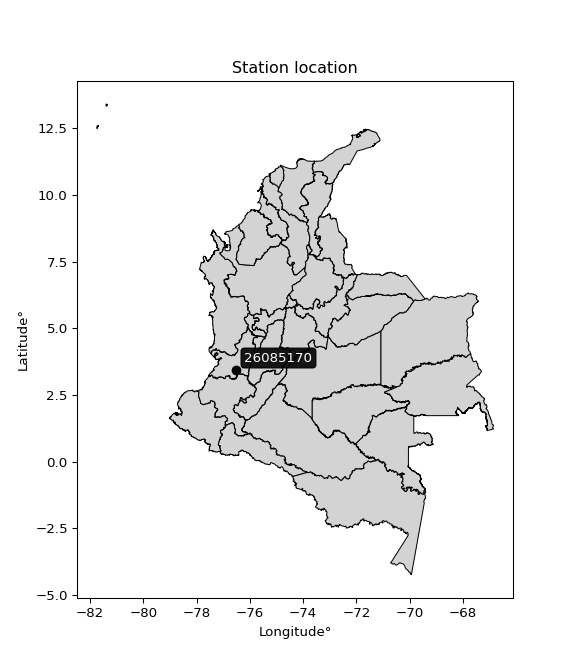

<div align="center">


</div>

# PMP Station (Rain, Pmax24h): 26085170

Probable Maximum Precipitation (PMP) is the greatest amount of rainfall for a specific duration that is meteorologically possible for a given location, acting as a "worst-case" scenario for extreme storms, crucial for designing safety-critical infrastructure like bridges, river deviations, dams, spillways, and nuclear plants to prevent catastrophic failure. PMP is calculated by hydrologists using meteorological data to determine the upper limit of extreme rainfall, often leading to the Probable Maximum Flood (PMF) for flood control design, and is increasingly being studied for climate change impacts. Probable Maximum Precipitation (PMP) is the theoretical upper limit of rainfall, a deterministic estimate for extreme events, while probability distributions (like GEV, Gumbel) describe the likelihood and frequency of various precipitation amounts, including rare ones, showing how often events occur, with PMP representing the extreme end of these distributions, used for critical infrastructure design to ensure safety against the worst conceivable weather, unlike standard statistical forecasts which cover typical probabilities.

The most common probability distributions in hydrology, used for analyzing floods, rainfall, and streamflow, include the Normal, Log-Normal, Gumbel, Gamma (including Log-Pearson Type III), and Generalized Extreme Value (GEV) distributions, often chosen based on the data´s skewness and whether modeling extremes or general conditions, with Gumbel and GEV popular for extreme events like floods, while the Normal distribution serves as a baseline, though often requiring transformations for skewed hydrological data. These distributions help in designing water infrastructure, managing water resources, and forecasting hydrologic events.

> Hydrological data often isn´t perfectly normal (it´s skewed), so different distributions are needed for different applications, such as: **Flood Frequency Analysis**: Using Gumbel, GEV, or Log-Pearson Type III for predicting extreme flood magnitudes and their return periods, **Rainfall Analysis**: Normal for annual totals, but Log-Normal, Weibull, or GEV for intensity or extreme daily rainfall, **Streamflow Modeling**: Gamma and Log-Normal for maximum flows, GEV for minimum flows, and Kappa for daily flows.

<div align="center">

</img>

</div>


## A. General information


### 1. General running parameters

• app_version: _v20260108_. • runtime: _2026-01-08 13:24:42.400241_. • Python version: _3.14.0_. • SciPy version: _1.16.3_. • Pandas version: _2.3.3_. • NumPy version: _2.3.5_. • Stations dataset (station_dataset_file): _dataset/pmax24h_in/automatic_colombia_2003_2024.csv_. • Stations catalog (station_catalog_file): _dataset/CNE.xls_. • Minimum year to eval til year_max (date_min): _1900_. • Maximum year to eval since year_min (date_max): _2024_. • Creates, save and include plots into reports (create_plot): _False_. • Plot only fit distributions with Δo > Δ (plot_only_fit): _True_. • Plot only simple graphs avoiding multiple CDFs and multiple Extreme values plots (plot_only_simple): _True_. • Eval low extreme values, if False, evaluates high extreme values (low_extreme): _False_. • Eval every SciPy distribution as logarithmic (pdist_logarithmic_on): _True_. • Standard deviation normalized (ddof): _1.0_. • Return periods to eval in years (Tr): _[2, 2.33, 5, 10, 15, 20, 25, 50, 75, 100, 200, 250, 500, 750, 1000]_. • Minimum data sample per station, 0 means any (minimum_sample): _5_. • Z-Score maximum threshold to adjust a value, 0 means disable (zscore_max): _3.5_. • Z-Score minimum threshold to adjust a value, 0 means disable (zscore_min): _-2.5_. • Avoid zeros, e.g. rain = 0 (avoid_zeros): _True_. • Avoid null values (avoid_nans): _True_. 

:file_folder:Table: [dataset.csv](../../dataset/pmax24h_in/automatic_colombia_2003_2024.csv)

> Delta Degrees of Freedom (DDOF): is a parameter used in the formulas for calculating variance and standard deviation. When ddof=0, the divisor is $N$ (the total number of observations) and this is used when your data set is the entire population. When ddof=1, the divisor is $N-1$ and this is used when your data set is a sample drawn from a larger population. Using $N-1$ provides an unbiased estimate of the population variance (known as Bessel´s correction).


### 2. Station info and location

|   id |   CODIGO | NOMBRE                                          | CATEGORIA               | TECNOLOGIA                              | ESTADO   | FECHA_INSTALACION   |   FECHA_SUSPENSION |   ALTITUD |   LATITUD |   LONGITUD | DEPARTAMENTO    | MUNICIPIO   | AREA_OPERATIVA                         | ENTIDAD                                                     | AREA_HIDROGRAFICA   | ZONA_HIDROGRAFICA   | SUBZONA_HIDROGRAFICA               |   CORRIENTE | Catalogo   |   Version |
|-----:|---------:|:------------------------------------------------|:------------------------|:----------------------------------------|:---------|:--------------------|-------------------:|----------:|----------:|-----------:|:----------------|:------------|:---------------------------------------|:------------------------------------------------------------|:--------------------|:--------------------|:-----------------------------------|------------:|:-----------|----------:|
|    0 | 26085170 | BASE AEREA MARCO FIDEL SUAREZ  - AUT [26085170] | Climatológica Principal | Automática con Telemetría, Convencional | Activa   | 23/11/2006          |                nan |       971 |   3.45441 |   -76.4999 | Valle Del Cauca | Cali        | Area Operativa 09 - Cauca-Valle-Caldas | INSTITUTO DE HIDROLOGIA METEOROLOGIA Y ESTUDIOS AMBIENTALES | Magdalena Cauca     | Cauca               | Ríos Lilí, Melendez y Canaveralejo |         nan | CNE_IDEAM  |  20251226 |

<div align="center">

Dynamic map: [:earth_americas:Google](http://maps.google.com/maps?q=3.454414,-76.499948) [:earth_americas:OSM](https://www.openstreetmap.org/#map=18/3.454414/-76.499948&layers=P) [:earth_americas:Bing](https://www.bing.com/maps?cp=3.454414~-76.499948&lvl=18) [:earth_americas:Apple](https://maps.apple.com/frame?center=3.454414%2C-76.499948&span=0.003%2C0.006)

</div>


<div align="center">

```geojson
{
  "type": "Feature",
  "geometry": {
    "type": "Point", 
    "coordinates": [-76.499948, 3.454414]
  }, 
  "properties": {
    "Name": "26085170"
  }
}
```

</div>


### 3. Discrete values table and plot

<div align="center">

|               |           0 |             1 |          2 |           3 |           4 |          5 |          6 |
|:--------------|------------:|--------------:|-----------:|------------:|------------:|-----------:|-----------:|
| Date          | 2017        | 2018          | 2019       | 2020        | 2021        | 2022       | 2024       |
| Value         |   39        |   34.8        |   52       |   44.4      |   45.9      |   15.7     |   11.6     |
| Value_initial |   39        |   34.8        |   52       |   44.4      |   45.9      |   15.7     |   11.6     |
| count         |    7        |    7          |    7       |    7        |    7        |    7       |    7       |
| mean          |   34.7714   |   34.7714     |   34.7714  |   34.7714   |   34.7714   |   34.7714  |   34.7714  |
| std           |   15.4483   |   15.4483     |   15.4483  |   15.4483   |   15.4483   |   15.4483  |   15.4483  |
| zscore        |    0.273725 |    0.00184949 |    1.11524 |    0.623278 |    0.720377 |   -1.23453 |   -1.49994 |


</div>


> The initial value (value_initial) correspond to the initial obtained or null completed value, and value (value) is adjusted only when the initial value is outside the valid range (outlier) definite through the Z-Score value. If Z-Score is active, values out of range or outliers are replaced with the station mean value. A Z-Score (or standard score) measures how many standard deviations a data point is from the mean of a dataset, indicating its relative position; positive scores mean above the mean, negative mean below, and a score of zero is exactly at the mean, allowing for comparison of values from different distributions. It´s calculated using the formula $z=(x–μ)/σ$, where $x$ is the data point, $μ$ is the mean, and $σ$ is the standard deviation, helping identify outliers and understand probability.
>
> <sub>**Note**: In this study, "completing" (filling gaps in) and "extending" (forecasting or lengthening the historical record) rainfall data series are avoided for certain critical analyses because they introduce artificial bias and uncertainty, which can distort the statistics of rare events (extremes), alter day-to-day variability, and compromise the integrity and homogeneity of the original data. Some reasons against Completing/Extending rainfall data are: **Distortion of Extremes and Variability**: The primary issue is that most gap-filling or extension methods rely on averaging or regression with nearby stations, which inherently smooths the data. Rainfall is highly variable in space and time, with a large percentage of zero values and occasional large storms. Infilling methods often underestimate the highest values and overestimate the lowest (zero) values, which severely distorts analyses focused on flood frequency, drought severity, and intensity-duration-frequency (IDF) curves, **Loss of Data Homogeneity**: Infilled or extended data are synthetic estimates, not actual measurements. Combining these estimates with observed data can violate the assumption of data homogeneity, which requires that the data properties do not change over time. Inhomogeneity can lead to incorrect conclusions about long-term trends or changes in climate patterns, **Propagation of Errors**: Errors and biases from the original data (e.g., wind-induced undercatch, instrument errors, site changes) or the data used for imputation can propagate through the analysis, leading to unreliable hydrological models and inaccurate predictions, **Compromised Statistical Integrity**: For statistical analyses, especially those involving the frequency of events, using artificial data can introduce time bias or autocorrelation that doesn´t exist in reality, making it difficult to assess the true probability of events, **Difficulty in Validation**: It is difficult to accurately validate the quality of filled or extended data, especially for past periods where ground-truth measurements are unavailable. The reliability of imputation techniques heavily depends on the density of the surrounding station network and the complexity of the local topography.</sub>


### 4. Active continuous probability distributions from SciPy (43 of 104 available)

A Probability Density Function (PDF) describes the relative likelihood of a continuous random variable falling within a specific range, where the total area under its curve equals 1, and the area over any interval gives the actual probability for that range. Unlike discrete probabilities (like rolling a die), a PDF shows density, not direct probability for a single point (which is zero), with higher points indicating higher likelihood, often visualized as a bell curve for normal distributions.

A log of a probability density function (log-PDF) is simply the logarithm of the PDF´s value, denoted as $log(f(x))$, useful for converting multiplication of probabilities into addition, improving numerical stability with tiny numbers, and connecting to information theory concepts like entropy. Instead of dealing with very small probabilities (e.g., 0.000001), log-PDFs use negative numbers (e.g., $log(0.00001) ≈ -11.51$ that are easier for computers to handle, preventing underflow errors and simplifying complex calculations. In this study, each active probability distribution from SciPy is also evaluated in the $log$ form.

[scipy.stats](https://docs.scipy.org/doc/scipy/reference/stats.html) is a Python´s powerful submodule within the SciPy library for comprehensive statistical analysis, offering over 130 probability distributions (like Normal, Poisson), functions for descriptive stats (mean, variance), hypothesis testing (t-tests, chi-square), random variable generation, and statistical tests, making it essential for data science, modeling, and research. It provides tools to explore, model, and draw conclusions from data efficiently, working seamlessly with NumPy.

<div align="center">

|   id | p_dist             |   n_parameter | fit_method   | label                                                                       | active   | ref                                                                                                        |
|-----:|:-------------------|--------------:|:-------------|:----------------------------------------------------------------------------|:---------|:-----------------------------------------------------------------------------------------------------------|
|    0 | alpha              |             3 | MLE          | Alpha                                                                       | True     | [:mortar_board:](https://docs.scipy.org/doc/scipy/reference/generated/scipy.stats.alpha.html)              |
|    1 | betaprime          |             4 | MLE          | Beta prime                                                                  | True     | [:mortar_board:](https://docs.scipy.org/doc/scipy/reference/generated/scipy.stats.betaprime.html)          |
|    2 | chi2               |             3 | MLE          | Chi²                                                                        | True     | [:mortar_board:](https://docs.scipy.org/doc/scipy/reference/generated/scipy.stats.chi2.html)               |
|    3 | crystalball        |             4 | MLE          | Crystalball                                                                 | True     | [:mortar_board:](https://docs.scipy.org/doc/scipy/reference/generated/scipy.stats.crystalball.html)        |
|    4 | erlang             |             3 | MLE          | Erlang                                                                      | True     | [:mortar_board:](https://docs.scipy.org/doc/scipy/reference/generated/scipy.stats.erlang.html)             |
|    5 | expon              |             2 | MLE          | Exponential                                                                 | True     | [:mortar_board:](https://docs.scipy.org/doc/scipy/reference/generated/scipy.stats.expon.html)              |
|    6 | exponnorm          |             3 | MLE          | Exponentially modified Normal                                               | True     | [:mortar_board:](https://docs.scipy.org/doc/scipy/reference/generated/scipy.stats.exponnorm.html)          |
|    7 | f                  |             4 | MLE          | F                                                                           | True     | [:mortar_board:](https://docs.scipy.org/doc/scipy/reference/generated/scipy.stats.f.html)                  |
|    8 | fatiguelife        |             3 | MLE          | Fatigue-life (Birnbaum-Saunders)                                            | True     | [:mortar_board:](https://docs.scipy.org/doc/scipy/reference/generated/scipy.stats.fatiguelife.html)        |
|    9 | fisk               |             3 | MLE          | Fisk                                                                        | True     | [:mortar_board:](https://docs.scipy.org/doc/scipy/reference/generated/scipy.stats.fisk.html)               |
|   10 | gamma              |             3 | MLE          | Gamma                                                                       | True     | [:mortar_board:](https://docs.scipy.org/doc/scipy/reference/generated/scipy.stats.gamma.html)              |
|   11 | genexpon           |             5 | MLE          | Generalized exponential                                                     | True     | [:mortar_board:](https://docs.scipy.org/doc/scipy/reference/generated/scipy.stats.genexpon.html)           |
|   12 | genlogistic        |             3 | MLE          | Generalized logistic                                                        | True     | [:mortar_board:](https://docs.scipy.org/doc/scipy/reference/generated/scipy.stats.genlogistic.html)        |
|   13 | gibrat             |             2 | MM           | Gibrat                                                                      | True     | [:mortar_board:](https://docs.scipy.org/doc/scipy/reference/generated/scipy.stats.gibrat.html)             |
|   14 | gompertz           |             3 | MLE          | Gompertz (or truncated Gumbel)                                              | True     | [:mortar_board:](https://docs.scipy.org/doc/scipy/reference/generated/scipy.stats.gompertz.html)           |
|   15 | gumbel_l           |             2 | MM           | Gumbel Left Skew                                                            | True     | [:mortar_board:](https://docs.scipy.org/doc/scipy/reference/generated/scipy.stats.gumbel_l.html)           |
|   16 | gumbel_r           |             2 | MM           | Gumbel Right Skew                                                           | True     | [:mortar_board:](https://docs.scipy.org/doc/scipy/reference/generated/scipy.stats.gumbel_r.html)           |
|   17 | halflogistic       |             2 | MM           | Half-logistic                                                               | True     | [:mortar_board:](https://docs.scipy.org/doc/scipy/reference/generated/scipy.stats.halflogistic.html)       |
|   18 | halfnorm           |             2 | MM           | Half Normal                                                                 | True     | [:mortar_board:](https://docs.scipy.org/doc/scipy/reference/generated/scipy.stats.halfnorm.html)           |
|   19 | hypsecant          |             2 | MM           | hyperbolic secant                                                           | True     | [:mortar_board:](https://docs.scipy.org/doc/scipy/reference/generated/scipy.stats.hypsecant.html)          |
|   20 | invgamma           |             3 | MLE          | Inverted gamma                                                              | True     | [:mortar_board:](https://docs.scipy.org/doc/scipy/reference/generated/scipy.stats.invgamma.html)           |
|   21 | invgauss           |             3 | MLE          | Inverse Gaussian                                                            | True     | [:mortar_board:](https://docs.scipy.org/doc/scipy/reference/generated/scipy.stats.invgauss.html)           |
|   22 | invweibull         |             3 | MLE          | Inverted Weibull                                                            | True     | [:mortar_board:](https://docs.scipy.org/doc/scipy/reference/generated/scipy.stats.invweibull.html)         |
|   23 | kstwobign          |             2 | MLE          | Limiting distribution of scaled Kolmogorov-Smirnov two-sided test statistic | True     | [:mortar_board:](https://docs.scipy.org/doc/scipy/reference/generated/scipy.stats.kstwobign.html)          |
|   24 | laplace            |             2 | MM           | Laplace                                                                     | True     | [:mortar_board:](https://docs.scipy.org/doc/scipy/reference/generated/scipy.stats.laplace.html)            |
|   25 | laplace_asymmetric |             3 | MLE          | Asymmetric Laplace                                                          | True     | [:mortar_board:](https://docs.scipy.org/doc/scipy/reference/generated/scipy.stats.laplace_asymmetric.html) |
|   26 | loggamma           |             3 | MLE          | Log gamma                                                                   | True     | [:mortar_board:](https://docs.scipy.org/doc/scipy/reference/generated/scipy.stats.loggamma.html)           |
|   27 | logistic           |             2 | MM           | Logistic (or Sech-squared)                                                  | True     | [:mortar_board:](https://docs.scipy.org/doc/scipy/reference/generated/scipy.stats.logistic.html)           |
|   28 | lognorm            |             3 | MLE          | Log Normal                                                                  | True     | [:mortar_board:](https://docs.scipy.org/doc/scipy/reference/generated/scipy.stats.lognorm.html)            |
|   29 | maxwell            |             2 | MM           | Maxwell                                                                     | True     | [:mortar_board:](https://docs.scipy.org/doc/scipy/reference/generated/scipy.stats.maxwell.html)            |
|   30 | mielke             |             4 | MLE          | Mielke Beta-Kappa / Dagum                                                   | True     | [:mortar_board:](https://docs.scipy.org/doc/scipy/reference/generated/scipy.stats.mielke.html)             |
|   31 | moyal              |             2 | MM           | Moyal                                                                       | True     | [:mortar_board:](https://docs.scipy.org/doc/scipy/reference/generated/scipy.stats.moyal.html)              |
|   32 | nakagami           |             3 | MLE          | Nakagami                                                                    | True     | [:mortar_board:](https://docs.scipy.org/doc/scipy/reference/generated/scipy.stats.nakagami.html)           |
|   33 | ncf                |             5 | MLE          | Non-central F distribution                                                  | True     | [:mortar_board:](https://docs.scipy.org/doc/scipy/reference/generated/scipy.stats.ncf.html)                |
|   34 | nct                |             4 | MLE          | Non-central Student’s t                                                     | True     | [:mortar_board:](https://docs.scipy.org/doc/scipy/reference/generated/scipy.stats.nct.html)                |
|   35 | norm               |             2 | MM           | Normal                                                                      | True     | [:mortar_board:](https://docs.scipy.org/doc/scipy/reference/generated/scipy.stats.norm.html)               |
|   36 | pearson3           |             3 | MM           | Pearson type III                                                            | True     | [:mortar_board:](https://docs.scipy.org/doc/scipy/reference/generated/scipy.stats.pearson3.html)           |
|   37 | rayleigh           |             2 | MM           | Rayleigh                                                                    | True     | [:mortar_board:](https://docs.scipy.org/doc/scipy/reference/generated/scipy.stats.rayleigh.html)           |
|   38 | rice               |             3 | MLE          | Rice                                                                        | True     | [:mortar_board:](https://docs.scipy.org/doc/scipy/reference/generated/scipy.stats.rice.html)               |
|   39 | t                  |             3 | MLE          | Student’s t                                                                 | True     | [:mortar_board:](https://docs.scipy.org/doc/scipy/reference/generated/scipy.stats.t.html)                  |
|   40 | truncnorm          |             4 | MLE          | Truncated normal                                                            | True     | [:mortar_board:](https://docs.scipy.org/doc/scipy/reference/generated/scipy.stats.truncnorm.html)          |
|   41 | wald               |             2 | MM           | Wald                                                                        | True     | [:mortar_board:](https://docs.scipy.org/doc/scipy/reference/generated/scipy.stats.wald.html)               |
|   42 | weibull_min        |             3 | MLE          | Weibull minimum                                                             | True     | [:mortar_board:](https://docs.scipy.org/doc/scipy/reference/generated/scipy.stats.weibull_min.html)        |

</div>

> **n_parameter:** # arguments & localization & scale.
>
> **Fit methods:** (MLE) maximum likelihood, (MM) L-moments.
>
>**Inactive** (With the only purpose of prevent loops, zero divisions, infinite values, over high estimated values or horizontal trending for recurrence intervals estimations, the follow distributions were disabled.)**:** foldnorm, gennorm, norminvgauss, powernorm, powerlognorm, skewnorm, genextreme, anglit, arcsine, argus, beta, bradford, burr, burr12, cauchy, cosine, halfcauchy, foldcauchy, skewcauchy, wrapcauchy, dgamma, gengamma, exponweib, exponpow, truncexpon, gausshyper, genhalflogistic, genhyperbolic, geninvgauss, halfgennorm, johnsonsb, johnsonsu, kappa4, kappa3, ksone, kstwo, loglaplace, levy, levy_l, levy_stable, ncx2, pareto, genpareto, truncpareto, lomax, powerlaw, rdist, rel_breitwigner, recipinvgauss, semicircular, studentized_range, trapezoid, triang, truncweibull_min, tukeylambda, uniform, loguniform, vonmises, vonmises_line, weibull_max, dweibull, 


## B. Probability (PDF) vs. Empirical (EDF) distributions functions

A continuous probability distribution (CPD) describes probabilities for variables that can take any value within a range (like rain any time), unlike discrete variables with specific outcomes (like temperature). It uses a Probability Density Function (PDF), a curve where the total area under it equals 1, and the probability of the variable falling within an interval (a to b) is found by calculating the area under the curve between those points. A key feature is that the probability of hitting any single exact value is zero, so probabilities are always expressed for ranges, e.g., $P(a ≤ X ≤ b)$.

<div align="center">

Distributions parameters from station values
|    |   station | p_dist                |   n |             loc |           scale | shape                  | shape1                | shape2                 | shape3   |
|---:|----------:|:----------------------|----:|----------------:|----------------:|:-----------------------|:----------------------|:-----------------------|:---------|
|  0 |  26085170 | alpha                 |   7 |  -284.603       |  6884.54        | 21.623064525361826     |                       |                        |          |
|  1 |  26085170 | betaprime             |   7 |  -398.682       | 20586.7         | 907.7245008527975      | 43112.79394491785     |                        |          |
|  2 |  26085170 | chi2                  |   7 |    11.6         |    11.4255      | 1.7496876131100239     |                       |                        |          |
|  3 |  26085170 | crystalball           |   7 |    34.7714      |    14.3023      | 2937.874639509644      | 2863.4450631006575    |                        |          |
|  4 |  26085170 | erlang                |   7 |  -165.234       |     1.06997     | 186.91432454619076     |                       |                        |          |
|  5 |  26085170 | expon                 |   7 |    11.6         |    23.1714      |                        |                       |                        |          |
|  6 |  26085170 | exponnorm             |   7 |    34.7617      |    14.3023      | 0.0006761391248845957  |                       |                        |          |
|  7 |  26085170 | f                     |   7 | -4949.81        |  4984.61        | 271267.32063577534     | 2239610.4392400514    |                        |          |
|  8 |  26085170 | fatiguelife           |   7 |    11.6         |     0.000101756 | 403.9647361152447      |                       |                        |          |
|  9 |  26085170 | fisk                  |   7 |    -2.68959e+09 |     2.68959e+09 | 332262213.28909326     |                       |                        |          |
| 10 |  26085170 | gamma                 |   7 |  -203.222       |     0.896065    | 265.4653472595846      |                       |                        |          |
| 11 |  26085170 | genexpon              |   7 |    11.6         |     3.0458      | 0.131487328154279      | 2.459413875727795e-07 | 3.1495735034320234     |          |
| 12 |  26085170 | genlogistic           |   7 |    52.0002      |     6.7577e-06  | 3.9164827475304763e-07 |                       |                        |          |
| 13 |  26085170 | gibrat                |   7 |    23.8606      |     6.61776     |                        |                       |                        |          |
| 14 |  26085170 | gompertz              |   7 |    11.6         |    14.7305      | 0.16796248885529313    |                       |                        |          |
| 15 |  26085170 | gumbel_l              |   7 |    41.2082      |    11.1515      |                        |                       |                        |          |
| 16 |  26085170 | gumbel_r              |   7 |    28.3346      |    11.1515      |                        |                       |                        |          |
| 17 |  26085170 | halflogistic          |   7 |    17.8198      |    12.228       |                        |                       |                        |          |
| 18 |  26085170 | halfnorm              |   7 |    15.8407      |    23.7261      |                        |                       |                        |          |
| 19 |  26085170 | hypsecant             |   7 |    34.7714      |     9.10514     |                        |                       |                        |          |
| 20 |  26085170 | invgamma              |   7 |  -148.124       | 26105.4         | 143.9616629518296      |                       |                        |          |
| 21 |  26085170 | invgauss              |   7 |   -64.2413      |  3864.27        | 0.025553699504162135   |                       |                        |          |
| 22 |  26085170 | invweibull            |   7 |    11.6         |     1.5708      | 0.060344055915849196   |                       |                        |          |
| 23 |  26085170 | kstwobign             |   7 |   -21.9749      |    64.5585      |                        |                       |                        |          |
| 24 |  26085170 | laplace               |   7 |    34.7714      |    10.1133      |                        |                       |                        |          |
| 25 |  26085170 | laplace_asymmetric    |   7 |    45.9         |     7.9191      | 1.922568517422662      |                       |                        |          |
| 26 |  26085170 | loggamma              |   7 |    52.0002      |     1.1291e-05  | 6.543035885042471e-07  |                       |                        |          |
| 27 |  26085170 | logistic              |   7 |    34.7714      |     7.88528     |                        |                       |                        |          |
| 28 |  26085170 | lognorm               |   7 |    11.6         |     0.111213    | 12.98900301468961      |                       |                        |          |
| 29 |  26085170 | maxwell               |   7 |     0.880938    |    21.2377      |                        |                       |                        |          |
| 30 |  26085170 | mielke                |   7 |    11.6         |    40.4652      | 0.6118728130754163     | 3041.620952981699     |                        |          |
| 31 |  26085170 | moyal                 |   7 |    26.5924      |     6.43831     |                        |                       |                        |          |
| 32 |  26085170 | nakagami              |   7 |    11.6         |    25.2924      | 0.3238499217400148     |                       |                        |          |
| 33 |  26085170 | ncf                   |   7 |     0.382622    |     1.74486e-06 | 9.209620372170535e-07  | 703.2317720070248     | 18.068532865302906     |          |
| 34 |  26085170 | nct                   |   7 |  -761.759       |    14.2382      | 145670.4891112856      | 55.94284677114736     |                        |          |
| 35 |  26085170 | norm                  |   7 |    34.7714      |    14.3023      |                        |                       |                        |          |
| 36 |  26085170 | pearson3              |   7 |    34.7714      |    14.3023      | -0.5819357165754088    |                       |                        |          |
| 37 |  26085170 | rayleigh              |   7 |     7.41026     |    21.8311      |                        |                       |                        |          |
| 38 |  26085170 | rice                  |   7 |     3.13346     |    16.1272      | 1.6232976958594765     |                       |                        |          |
| 39 |  26085170 | t                     |   7 |    34.7709      |    14.3017      | 10124530.860964164     |                       |                        |          |
| 40 |  26085170 | truncnorm             |   7 |    34.7714      |    14.3023      | -33.252757559935375    | 591.7562329927624     |                        |          |
| 41 |  26085170 | wald                  |   7 |    20.4691      |    14.3023      |                        |                       |                        |          |
| 42 |  26085170 | weibull_min           |   7 |    -6.74915e+08 |     6.74915e+08 | 62400739.08349717      |                       |                        |          |
| 43 |  26085170 | logalpha              |   7 |    -8.88375     |   262.983       | 21.436442656878228     |                       |                        |          |
| 44 |  26085170 | logbetaprime          |   7 |    -7.14728     |     7.70377     | 760.4056494360577      | 554.9225875210051     |                        |          |
| 45 |  26085170 | logchi2               |   7 |     2.45101     |     0.912292    | 1.102784627847194      |                       |                        |          |
| 46 |  26085170 | logcrystalball        |   7 |     3.42697     |     0.540567    | 14.55815981880167      | 134.0902246968442     |                        |          |
| 47 |  26085170 | logerlang             |   7 |    -5.4623      |     0.0359326   | 247.2827393498573      |                       |                        |          |
| 48 |  26085170 | logexpon              |   7 |     2.45101     |     0.975965    |                        |                       |                        |          |
| 49 |  26085170 | logexponnorm          |   7 |     3.42656     |     0.540564    | 0.0007492359808154122  |                       |                        |          |
| 50 |  26085170 | logf                  |   7 |  -272.671       |   276.099       | 1378176.0418946524     | 836706.4379143072     |                        |          |
| 51 |  26085170 | logfatiguelife        |   7 |  -231.869       |   235.297       | 0.00229476616713125    |                       |                        |          |
| 52 |  26085170 | logfisk               |   7 |    -4.00053e+07 |     4.00053e+07 | 126957249.04645187     |                       |                        |          |
| 53 |  26085170 | loggamma              |   7 |    -6.1197      |     0.0323475   | 295.0096638048019      |                       |                        |          |
| 54 |  26085170 | loggenexpon           |   7 |     2.32567     |     0.0456738   | 0.008331060255908743   | 8.625356566073883     | 0.0002573328126868398  |          |
| 55 |  26085170 | loggenlogistic        |   7 |     3.95127     |     5.5055e-07  | 1.0495261976958053e-06 |                       |                        |          |
| 56 |  26085170 | loggibrat             |   7 |     3.0146      |     0.250114    |                        |                       |                        |          |
| 57 |  26085170 | loggompertz           |   7 |     2.39375     |     0.418677    | 0.05254221381144491    |                       |                        |          |
| 58 |  26085170 | loggumbel_l           |   7 |     3.67025     |     0.421478    |                        |                       |                        |          |
| 59 |  26085170 | loggumbel_r           |   7 |     3.18369     |     0.421478    |                        |                       |                        |          |
| 60 |  26085170 | loghalflogistic       |   7 |     2.78631     |     0.462145    |                        |                       |                        |          |
| 61 |  26085170 | loghalfnorm           |   7 |     2.71146     |     0.896754    |                        |                       |                        |          |
| 62 |  26085170 | loghypsecant          |   7 |     3.42697     |     0.344135    |                        |                       |                        |          |
| 63 |  26085170 | loginvgamma           |   7 |    -8.26099     |  5203.54        | 446.7420627872531      |                       |                        |          |
| 64 |  26085170 | loginvgauss           |   7 |    -1.57511     |   358.541       | 0.013910622207434942   |                       |                        |          |
| 65 |  26085170 | loginvweibull         |   7 |    -1.15606e+08 |     1.15606e+08 | 201439085.77332157     |                       |                        |          |
| 66 |  26085170 | logkstwobign          |   7 |     1.15201     |     2.58924     |                        |                       |                        |          |
| 67 |  26085170 | loglaplace            |   7 |     3.42697     |     0.382238    |                        |                       |                        |          |
| 68 |  26085170 | loglaplace_asymmetric |   7 |     3.82647     |     0.228947    | 2.1995235674693987     |                       |                        |          |
| 69 |  26085170 | logloggamma           |   7 |     3.95209     |     4.57612e-06 | 8.719727175753998e-06  |                       |                        |          |
| 70 |  26085170 | loglogistic           |   7 |     3.42697     |     0.29803     |                        |                       |                        |          |
| 71 |  26085170 | loglognorm            |   7 |     2.45101     |     0.00651072  | 12.387066112529512     |                       |                        |          |
| 72 |  26085170 | logmaxwell            |   7 |     2.14606     |     0.802695    |                        |                       |                        |          |
| 73 |  26085170 | logmielke             |   7 |    -3.19127e+07 |     3.19127e+07 | 59202407.01528713      | 5496085736.74477      |                        |          |
| 74 |  26085170 | logmoyal              |   7 |     3.11784     |     0.24334     |                        |                       |                        |          |
| 75 |  26085170 | lognakagami           |   7 |  -221.17        |   224.596       | 42860.61971985901      |                       |                        |          |
| 76 |  26085170 | logncf                |   7 |    -4.60679     |     8.02171     | 515.4612054590793      | 1067.9563856818481    | 3.4586060762776285e-11 |          |
| 77 |  26085170 | lognct                |   7 |   -26.4782      |     0.479886    | 6753.356970671033      | 62.309396150775285    |                        |          |
| 78 |  26085170 | lognorm               |   7 |     3.42697     |     0.540566    |                        |                       |                        |          |
| 79 |  26085170 | logpearson3           |   7 |     3.42697     |     0.540566    | -0.8706920719903016    |                       |                        |          |
| 80 |  26085170 | lograyleigh           |   7 |     2.39284     |     0.82512     |                        |                       |                        |          |
| 81 |  26085170 | logrice               |   7 |     2.11632     |     0.594903    | 1.9181853234791255     |                       |                        |          |
| 82 |  26085170 | logt                  |   7 |     3.42697     |     0.540567    | 434084318.33510196     |                       |                        |          |
| 83 |  26085170 | logtruncnorm          |   7 |    -0.15542     |     1.37224     | 2.699995669157243      | 2.9926763053342027    |                        |          |
| 84 |  26085170 | logwald               |   7 |     2.88637     |     0.540593    |                        |                       |                        |          |
| 85 |  26085170 | logweibull_min        |   7 |    -1.29053e+08 |     1.29053e+08 | 346892099.7056688      |                       |                        |          |

</div>

> **loc** (Location parameter): This shifts the distribution along the x-axis. For many common distributions, like the normal (Gaussian) distribution, loc represents the mean $μ$. For others, like the uniform distribution, it might represent the minimum value, or for the beta distribution, the left end of the support interval.
>
> **scale** (Scale parameter): This determines the width or spread of the distribution. For the normal distribution, scale represents the standard deviation $σ$. For a uniform distribution, it defines the length of the interval (from $loc$ to $loc + scale$).
>
> **shape** (Shape parameters): Refers to parameters that define the specific form of a probability distribution, distinct from its location (loc) and scale (scale). These parameters are required arguments for most distribution functions. For example, a normal (Gaussian) distribution is fully defined by its location (mean) and scale (standard deviation), so it has no specific shape parameters beyond loc and scale. However, other distributions have intrinsic properties that need specification, as Gamma distribution that takes a shape parameter, often named $a$ or $alpha$.


### 0. Cumulative distribution values - CDF (86 evaluated)

Cumulative Distribution Function (CDF), denoted as $F$<sub>$X$</sub>$(x)$, is a function that gives the probability that a random variable $X$ will take a value less than or equal to a specific value, $x$ (i.e., $(P(X≥x)$. It essentially "accumulates" probabilities from a given point up to the far right (positive infinity), providing a complete picture of the distribution´s probabilities for both discrete (like rain) and continuous (like temperature) variables, helping to find probabilities over ranges or above certain values. Each station is evaluated separately ordering the $x$ values ascending, calculating the CDF and PDF values for the activated distributions and their logarithmic forms.

<div align="center">

CDF ordered by x ascending and calculating $log(f(x))$ separately
|   id |   Station |   date |    x |   count |    mean |     std |      zscore |   Value_initial |   station |   m |     alpha |   alpha_pdf |   betaprime |   betaprime_pdf |        chi2 |   chi2_pdf |   crystalball |   crystalball_pdf |    erlang |   erlang_pdf |    expon |   expon_pdf |   exponnorm |   exponnorm_pdf |         f |      f_pdf |   fatiguelife |   fatiguelife_pdf |      fisk |   fisk_pdf |     gamma |   gamma_pdf |    genexpon |   genexpon_pdf |   genlogistic |   genlogistic_pdf |   gibrat |   gibrat_pdf |    gompertz |   gompertz_pdf |   gumbel_l |   gumbel_l_pdf |   gumbel_r |   gumbel_r_pdf |   halflogistic |   halflogistic_pdf |   halfnorm |   halfnorm_pdf |   hypsecant |   hypsecant_pdf |   invgamma |   invgamma_pdf |   invgauss |   invgauss_pdf |   invweibull |   invweibull_pdf |   kstwobign |   kstwobign_pdf |   laplace |   laplace_pdf |   laplace_asymmetric |   laplace_asymmetric_pdf |   loggamma |   loggamma_pdf |   logistic |   logistic_pdf |   lognorm |   lognorm_pdf |   maxwell |   maxwell_pdf |      mielke |   mielke_pdf |      moyal |   moyal_pdf |    nakagami |   nakagami_pdf |       ncf |   ncf_pdf |       nct |    nct_pdf |      norm |   norm_pdf |   pearson3 |   pearson3_pdf |   rayleigh |   rayleigh_pdf |      rice |   rice_pdf |         t |      t_pdf |   truncnorm |   truncnorm_pdf |     wald |   wald_pdf |   weibull_min |   weibull_min_pdf |   logalpha |   logalpha_pdf |   logbetaprime |   logbetaprime_pdf |     logchi2 |   logchi2_pdf |   logcrystalball |   logcrystalball_pdf |   logerlang |   logerlang_pdf |   logexpon |   logexpon_pdf |   logexponnorm |   logexponnorm_pdf |      logf |   logf_pdf |   logfatiguelife |   logfatiguelife_pdf |   logfisk |   logfisk_pdf |   loggenexpon |   loggenexpon_pdf |   loggenlogistic |   loggenlogistic_pdf |   loggibrat |   loggibrat_pdf |   loggompertz |   loggompertz_pdf |   loggumbel_l |   loggumbel_l_pdf |   loggumbel_r |   loggumbel_r_pdf |   loghalflogistic |   loghalflogistic_pdf |   loghalfnorm |   loghalfnorm_pdf |   loghypsecant |   loghypsecant_pdf |   loginvgamma |   loginvgamma_pdf |   loginvgauss |   loginvgauss_pdf |   loginvweibull |   loginvweibull_pdf |   logkstwobign |   logkstwobign_pdf |   loglaplace |   loglaplace_pdf |   loglaplace_asymmetric |   loglaplace_asymmetric_pdf |   logloggamma |   logloggamma_pdf |   loglogistic |   loglogistic_pdf |   loglognorm |   loglognorm_pdf |   logmaxwell |   logmaxwell_pdf |   logmielke |   logmielke_pdf |    logmoyal |   logmoyal_pdf |   lognakagami |   lognakagami_pdf |    logncf |   logncf_pdf |    lognct |   lognct_pdf |   logpearson3 |   logpearson3_pdf |   lograyleigh |   lograyleigh_pdf |   logrice |   logrice_pdf |      logt |   logt_pdf |   logtruncnorm |   logtruncnorm_pdf |   logwald |   logwald_pdf |   logweibull_min |   logweibull_min_pdf |
|-----:|----------:|-------:|-----:|--------:|--------:|--------:|------------:|----------------:|----------:|----:|----------:|------------:|------------:|----------------:|------------:|-----------:|--------------:|------------------:|----------:|-------------:|---------:|------------:|------------:|----------------:|----------:|-----------:|--------------:|------------------:|----------:|-----------:|----------:|------------:|------------:|---------------:|--------------:|------------------:|---------:|-------------:|------------:|---------------:|-----------:|---------------:|-----------:|---------------:|---------------:|-------------------:|-----------:|---------------:|------------:|----------------:|-----------:|---------------:|-----------:|---------------:|-------------:|-----------------:|------------:|----------------:|----------:|--------------:|---------------------:|-------------------------:|-----------:|---------------:|-----------:|---------------:|----------:|--------------:|----------:|--------------:|------------:|-------------:|-----------:|------------:|------------:|---------------:|----------:|----------:|----------:|-----------:|----------:|-----------:|-----------:|---------------:|-----------:|---------------:|----------:|-----------:|----------:|-----------:|------------:|----------------:|---------:|-----------:|--------------:|------------------:|-----------:|---------------:|---------------:|-------------------:|------------:|--------------:|-----------------:|---------------------:|------------:|----------------:|-----------:|---------------:|---------------:|-------------------:|----------:|-----------:|-----------------:|---------------------:|----------:|--------------:|--------------:|------------------:|-----------------:|---------------------:|------------:|----------------:|--------------:|------------------:|--------------:|------------------:|--------------:|------------------:|------------------:|----------------------:|--------------:|------------------:|---------------:|-------------------:|--------------:|------------------:|--------------:|------------------:|----------------:|--------------------:|---------------:|-------------------:|-------------:|-----------------:|------------------------:|----------------------------:|--------------:|------------------:|--------------:|------------------:|-------------:|-----------------:|-------------:|-----------------:|------------:|----------------:|------------:|---------------:|--------------:|------------------:|----------:|-------------:|----------:|-------------:|--------------:|------------------:|--------------:|------------------:|----------:|--------------:|----------:|-----------:|---------------:|-------------------:|----------:|--------------:|-----------------:|---------------------:|
|    0 |  26085170 |   2024 | 11.6 |       7 | 34.7714 | 15.4483 | -1.49994    |            11.6 |  26085170 |   1 | 0.052658  |  0.00843335 |   0.0534333 |      0.00776418 | 8.46332e-15 | 4.16813    |     0.0526036 |        0.00750827 | 0.05217   |   0.00791864 | 0        |   0.0431566 |   0.0526044 |      0.00750835 | 0.0524772 | 0.00750482 |     0.0286948 |       3.60846e+08 | 0.0441442 | 0.00521269 | 0.0534344 |  0.00797247 | 1.39027e-07 |     0.0431701  |      0        |        0.00557477 | 0        |   0          | 8.84299e-09 |      0.0114024 |  0.0678785 |     0.00587552 |  0.0112806 |     0.0045366  |       0        |         0          |   0        |      0         |   0.0498616 |      0.00545384 |  0.0567105 |     0.00893295 |  0.0568644 |     0.00953413 |  0.000342648 |      9.28733e+10 |   0.0503605 |       0.0121834 | 0.0505729 |    0.00500065 |            0.0827181 |               0.00543304 |  0.0364586 |       0.154522 |  0.0502797 |     0.00605579 | 0.0355022 |      0.144623 | 0.031697  |    0.00842586 | 2.07142e-08 | 1131.29      | 0.00135659 |  0.00117225 | 2.67562e-11 |  9755.92       | 0.0485473 | 0.0106042 | 0.0527337 | 0.00752116 | 0.0526036 | 0.00750827 |  0.0652107 |     0.00688219 |  0.0182475 |     0.00863058 | 0.0376238 | 0.00903809 | 0.0525997 | 0.00750816 |   0.0526036 |      0.00750828 | 0        | 0          |     0.0616079 |        0.00551691 |  0.0387801 |       0.172002 |      0.0435683 |           0.173056 | 2.76593e-09 |   3.43425e+06 |        0.0355022 |             0.144623 |   0.0386748 |        0.160342 |   0        |       1.02463  |      0.0355025 |           0.144625 | 0.0351583 |   0.143869 |        0.0349114 |             0.143404 | 0.0331979 |      0.101857 |     0.0307352 |          0.306011 |         0        |             0.109174 |    0        |        0        |    0.00766997 |          0.142782 |     0.0539133 |          0.124403 |    0.00338626 |         0.0456991 |          0        |              0        |     0         |          0        |      0.0373015 |           0.108144 |     0.0350812 |          0.1571   |      0.038907 |          0.178773 |       0.0367672 |            0.211618 |       0.037147 |           0.251741 |    0.0389125 |         0.101802 |               0.053972  |                    0.107178 |     0.0572527 |          0.109094 |     0.0364486 |          0.117841 |    0.0071944 |      3.62912e+12 |    0.0139677 |         0.133477 |   0.0601887 |        0.111658 | 8.28453e-05 |     0.00279035 |     0.0360457 |          0.146144 | 0.0479055 |     0.183225 | 0.0359249 |     0.146987 |     0.0534216 |          0.137164 |    0.00248192 |         0.0852279 | 0.0267093 |      0.168388 | 0.0355022 |   0.144623 |    0           |            0       |  0        |      0        |        0.0377188 |            0.0994508 |
|    1 |  26085170 |   2022 | 15.7 |       7 | 34.7714 | 15.4483 | -1.23453    |            15.7 |  26085170 |   2 | 0.0964103 |  0.0130437  |   0.093309  |      0.0118302  | 0.214897    | 0.0416114  |     0.0911921 |        0.0114656  | 0.0930534 |   0.0121663  | 0.162172 |   0.0361578 |   0.0911932 |      0.0114657  | 0.0910528 | 0.0114622  |     0.690365  |       0.0213679   | 0.0711838 | 0.00816782 | 0.0944728 |  0.0121867  | 0.162218    |     0.0361672  |      0        |        0.00707007 | 0        |   0          | 0.0524767   |      0.0142713 |  0.0965431 |     0.00822538 |  0.0448264 |     0.0124812  |       0        |         0          |   0        |      0         |   0.0779895 |      0.00847999 |  0.10257   |     0.0135454  |  0.10586   |     0.0144413  |  0.389166    |      0.00540558  |   0.114748  |       0.0190209 | 0.0758551 |    0.00750055 |            0.108281  |               0.00711207 |  0.112214  |       0.360381 |  0.0817645 |     0.00952142 | 0.106462  |      0.33976  | 0.0782367 |    0.0143395  | 0.246386    |    0.03677   | 0.0198011  |  0.00956192 | 0.238396    |     0.0374193  | 0.103826  | 0.0163233 | 0.0913767 | 0.0114788  | 0.0911921 | 0.0114656  |  0.0991763 |     0.00980808 |  0.0695571 |     0.0161838  | 0.0843258 | 0.0137708  | 0.0911882 | 0.0114657  |   0.0911921 |      0.0114656  | 0        | 0          |     0.0887125 |        0.00782703 |  0.122695  |       0.394562 |      0.124525  |           0.372483 | 0.394308    |   0.644734    |        0.106462  |             0.33976  |   0.116089  |        0.364386 |   0.266633 |       0.751427 |      0.106464  |           0.339765 | 0.105875  |   0.338936 |        0.105547  |             0.339004 | 0.0823359 |      0.23978  |     0.160912  |          0.534698 |         0        |             0.194397 |    0        |        0        |    0.0690764  |          0.27598  |     0.107421  |          0.240661 |    0.0624133  |         0.410776  |          0        |              0        |     0.0375297 |          0.888763 |      0.089393  |           0.25636  |     0.113515  |          0.375984 |      0.126025 |          0.407254 |       0.142363  |            0.483566 |       0.161235 |           0.548471 |    0.0858941 |         0.224714 |               0.0984434 |                    0.19549  |     0.101919  |          0.194205 |     0.0945586 |          0.287278 |    0.621694  |      0.101422    |    0.0974118 |         0.427672 |   0.105526  |        0.195765 | 0.0345676   |     0.371371   |     0.107508  |          0.341329 | 0.131514  |     0.377904 | 0.10791   |     0.343859 |     0.112625  |          0.265012 |    0.0911868  |         0.481656  | 0.108546  |      0.381859 | 0.106462  |   0.33976  |    0           |            0       |  0        |      0        |        0.0830796 |            0.213772  |
|    2 |  26085170 |   2018 | 34.8 |       7 | 34.7714 | 15.4483 |  0.00184949 |            34.8 |  26085170 |   3 | 0.52736   |  0.0268587  |   0.505309  |      0.0274378  | 0.691393    | 0.0145211  |     0.500797  |        0.0278935  | 0.510833  |   0.0272541  | 0.632574 |   0.0158569 |   0.500798  |      0.0278934  | 0.500149  | 0.0278379  |     0.881397  |       0.00505396  | 0.447915  | 0.030549   | 0.512195  |  0.0272985  | 0.63269     |     0.0158569  |      0        |        0.0213879  | 0.692383 |   0.032141   | 0.474492    |      0.0289448 |  0.430445  |     0.0287498  |  0.571196  |     0.0286853  |       0.600747 |         0.0261328  |   0.575761 |      0.0244374 |   0.500999  |      0.0349592  |  0.530563  |     0.02601    |  0.539122  |     0.0251561  |  0.427401    |      0.000944969 |   0.578256  |       0.0223092 | 0.501411  |    0.0493005  |            0.379649  |               0.0249359  |  0.597173  |       0.690486 |  0.500906  |     0.0317045  | 0.589744  |      0.719255 | 0.533815  |    0.0267677  | 0.711501    |    0.018765  | 0.597038   |  0.0284859  | 0.688693    |     0.0156054  | 0.550832  | 0.0239862 | 0.500927  | 0.0278697  | 0.500797  | 0.0278935  |  0.462084  |     0.0277135  |  0.54481   |     0.0261596  | 0.51697   | 0.0269789  | 0.500811  | 0.0278947  |   0.500797  |      0.0278935  | 0.668898 | 0.0278101  |     0.419096  |        0.029173   |  0.6122    |       0.651651 |      0.592419  |           0.649412 | 0.697447    |   0.233749    |        0.589743  |             0.719255 |   0.596313  |        0.678859 |   0.675564 |       0.332426 |      0.589749  |           0.719256 | 0.588502  |   0.718656 |        0.589126  |             0.719959 | 0.528707  |      0.790763 |     0.638822  |          0.534616 |         0        |             0.886477 |    0.776485 |        0.558465 |    0.540788   |          0.911219 |     0.52815   |          0.84086  |    0.657242   |         0.654474  |          0.678234 |              0.584231 |     0.650032  |          0.574874 |      0.611115  |           0.86917  |     0.609112  |          0.683864 |      0.613821 |          0.634128 |       0.614444  |            0.521445 |       0.642142 |           0.502923 |    0.63724   |         0.949043 |               0.478233  |                    0.949679 |     0.464454  |          0.88501  |     0.601454  |          0.804306 |    0.660566  |      0.0269078   |    0.617151  |         0.658917 |   0.461999  |        0.857073 | 0.680477    |     0.620253   |     0.590215  |          0.716456 | 0.590376  |     0.62925  | 0.590846  |     0.712268 |     0.535021  |          0.784157 |    0.625716   |         0.635944  | 0.598574  |      0.687218 | 0.589743  |   0.719255 |    5.84648e-07 |            3.64352 |  0.74512  |      0.531772 |        0.521376  |            0.947968  |
|    3 |  26085170 |   2017 | 39   |       7 | 34.7714 | 15.4483 |  0.273725   |            39   |  26085170 |   4 | 0.636225  |  0.0246834  |   0.618388  |      0.0260515  | 0.746531    | 0.0118341  |     0.616254  |        0.0267007  | 0.622558  |   0.0256104  | 0.693486 |   0.0132281 |   0.616255  |      0.0267006  | 0.615374  | 0.0266489  |     0.900524  |       0.00409805  | 0.576825  | 0.030155   | 0.624161  |  0.0256767  | 0.6936      |     0.0132274  |      0        |        0.0272824  | 0.796036 |   0.0187108  | 0.597908    |      0.029454  |  0.559723  |     0.0323887  |  0.680947  |     0.0234649  |       0.699363 |         0.0208902  |   0.67099  |      0.0208842 |   0.642784  |      0.0315008  |  0.635777  |     0.0238291  |  0.640154  |     0.0227417  |  0.431046    |      0.000798882 |   0.665703  |       0.0192838 | 0.670859  |    0.0325455  |            0.500251  |               0.0328572  |  0.67311   |       0.638602 |  0.630942  |     0.0295302  | 0.669188  |      0.670602 | 0.641293  |    0.0241738  | 0.787754    |    0.0175914 | 0.702812   |  0.0219814  | 0.749119    |     0.0132158  | 0.646159  | 0.0212694 | 0.616276  | 0.0266745  | 0.616254  | 0.0267007  |  0.581878  |     0.0289308  |  0.648982  |     0.0232662  | 0.627209  | 0.0252158  | 0.616272  | 0.0267015  |   0.616254  |      0.0267007  | 0.763982 | 0.018286   |     0.551077  |        0.0332424  |  0.683368  |       0.594703 |      0.663972  |           0.603422 | 0.7227      |   0.210089    |        0.669188  |             0.670602 |   0.671017  |        0.628774 |   0.711315 |       0.295795 |      0.669193  |           0.670601 | 0.667894  |   0.670305 |        0.668641  |             0.671135 | 0.616935  |      0.749984 |     0.696963  |          0.485029 |         0        |             1.10155  |    0.82982  |        0.390203 |    0.645874   |          0.92249  |     0.626279  |          0.872723 |    0.725944   |         0.551647  |          0.739382 |              0.490446 |     0.711634  |          0.506396 |      0.703391  |           0.742471 |     0.683914  |          0.625636 |      0.682997 |          0.577649 |       0.670767  |            0.466736 |       0.696443 |           0.450044 |    0.730749  |         0.704407 |               0.599664  |                    1.19082  |     0.577081  |          1.09962  |     0.688658  |          0.719419 |    0.663478  |      0.0242982   |    0.688715  |         0.594916 |   0.570747  |        1.05881  | 0.744537    |     0.506593   |     0.669345  |          0.667937 | 0.659778  |     0.586123 | 0.66946   |     0.663207 |     0.625869  |          0.803975 |    0.694522   |         0.570162  | 0.674192  |      0.636389 | 0.669188  |   0.670602 |    0.371509    |            2.90173 |  0.797799 |      0.400521 |        0.63245   |            0.988853  |
|    4 |  26085170 |   2020 | 44.4 |       7 | 34.7714 | 15.4483 |  0.623278   |            44.4 |  26085170 |   5 | 0.757278  |  0.0198939  |   0.74816   |      0.0216181  | 0.802815    | 0.00913537 |     0.749596  |        0.0222376  | 0.749533  |   0.0210712  | 0.757205 |   0.0104782 |   0.749596  |      0.0222375  | 0.7485    | 0.0222129  |     0.920054  |       0.00318346  | 0.726483  | 0.0245474  | 0.751478  |  0.021123   | 0.757313    |     0.0104769  |      0        |        0.0373078  | 0.871306 |   0.0102276  | 0.750644    |      0.0263539 |  0.735889  |     0.0315325  |  0.78917   |     0.0167561  |       0.795728 |         0.014999   |   0.771297 |      0.0162962 |   0.787183  |      0.0216704  |  0.752805  |     0.0192949  |  0.751428  |     0.0183188  |  0.43498     |      0.000666179 |   0.758948  |       0.0152744 | 0.80703   |    0.0190809  |            0.713219  |               0.0468453  |  0.750816  |       0.556632 |  0.772254  |     0.0223046  | 0.750976  |      0.586638 | 0.759236  |    0.0193277  | 0.879412    |    0.0164051 | 0.801937   |  0.0150617  | 0.813032    |     0.010522   | 0.749718  | 0.0170187 | 0.74949   | 0.0222179  | 0.749596  | 0.0222376  |  0.733736  |     0.0265223  |  0.761988  |     0.0184727  | 0.75223   | 0.0207724  | 0.749616  | 0.0222376  |   0.749595  |      0.0222376  | 0.841866 | 0.0112553  |     0.732732  |        0.032606   |  0.755386  |       0.513996 |      0.737779  |           0.532221 | 0.748405    |   0.186957    |        0.750976  |             0.586638 |   0.747645  |        0.549982 |   0.747233 |       0.258991 |      0.750981  |           0.586634 | 0.749672  |   0.586795 |        0.750487  |             0.587007 | 0.708497  |      0.655423 |     0.755939  |          0.424045 |         0        |             1.41047  |    0.871944 |        0.268863 |    0.761664   |          0.84627  |     0.737848  |          0.83273  |    0.79021    |         0.441448  |          0.796664 |              0.395251 |     0.772307  |          0.429805 |      0.788527  |           0.570288 |     0.759621  |          0.539345 |      0.752971 |          0.49988  |       0.727189  |            0.403658 |       0.750908 |           0.390247 |    0.808213  |         0.501748 |               0.775793  |                    1.54057  |     0.73884   |          1.40785  |     0.773638  |          0.5876   |    0.666467  |      0.0218741   |    0.760436  |         0.509765 |   0.725975  |        1.34678  | 0.802872    |     0.396702   |     0.750818  |          0.584502 | 0.731651  |     0.519925 | 0.750329  |     0.58007  |     0.728783  |          0.772703 |    0.763135   |         0.487214  | 0.751719  |      0.556109 | 0.750976  |   0.586638 |    0.701924    |            2.22075 |  0.84256  |      0.296216 |        0.757877  |            0.923067  |
|    5 |  26085170 |   2021 | 45.9 |       7 | 34.7714 | 15.4483 |  0.720377   |            45.9 |  26085170 |   6 | 0.785979  |  0.018367   |   0.779422  |      0.0200491  | 0.816041    | 0.00850721 |     0.781744  |        0.020608   | 0.779987  |   0.019522   | 0.772424 |   0.0098214 |   0.781744  |      0.0206079  | 0.780619  | 0.0205939  |     0.924672  |       0.0029756   | 0.761724  | 0.0224219  | 0.782001  |  0.0195617  | 0.77253     |     0.00981992 |      0        |        0.0406963  | 0.885526 |   0.00877836 | 0.788971    |      0.024694  |  0.781959  |     0.0297801  |  0.813041  |     0.0150902  |       0.817154 |         0.013586   |   0.794819 |      0.0150719 |   0.817627  |      0.0189517  |  0.780681  |     0.0178692  |  0.777907  |     0.0169852  |  0.435957    |      0.000636756 |   0.781054  |       0.0142062 | 0.83363   |    0.0164507  |            0.787065  |               0.0516955  |  0.76892   |       0.533019 |  0.803972  |     0.0199867  | 0.770056  |      0.561646 | 0.787122  |    0.0178515  | 0.903806    |    0.0161229 | 0.823335   |  0.0134934  | 0.828302    |     0.00984299 | 0.774336  | 0.0158071 | 0.781611  | 0.0205915  | 0.781744  | 0.020608   |  0.772443  |     0.0250317  |  0.788644  |     0.0170691  | 0.782272  | 0.0192716  | 0.781764  | 0.0206078  |   0.781744  |      0.020608   | 0.857724 | 0.00992279 |     0.780367  |        0.0307808  |  0.772096  |       0.491769 |      0.755125  |           0.511778 | 0.754527    |   0.18158     |        0.770055  |             0.561646 |   0.765543  |        0.527287 |   0.755694 |       0.250323 |      0.77006   |           0.561642 | 0.768759  |   0.561931 |        0.769578  |             0.561986 | 0.729786  |      0.625812 |     0.769763  |          0.408097 |         0        |             1.5027   |    0.880485 |        0.245695 |    0.789202   |          0.810308 |     0.765111  |          0.807326 |    0.80444    |         0.415331  |          0.809426 |              0.373076 |     0.78627   |          0.410735 |      0.806763  |           0.527655 |     0.777141  |          0.515174 |      0.769229 |          0.4787   |       0.740338  |            0.38784  |       0.763625 |           0.375304 |    0.82418   |         0.459976 |               0.828706  |                    1.64565  |     0.787129  |          1.49986  |     0.792564  |          0.551643 |    0.667184  |      0.0213275   |    0.776994  |         0.486917 |   0.772131  |        1.43241  | 0.815638    |     0.371999   |     0.769829  |          0.559693 | 0.748613  |     0.50094  | 0.769197  |     0.555482 |     0.754161  |          0.75417  |    0.778961   |         0.465448  | 0.769813  |      0.532903 | 0.770055  |   0.561646 |    0.773191    |            2.07068 |  0.852045 |      0.275041 |        0.787924  |            0.88405   |
|    6 |  26085170 |   2019 | 52   |       7 | 34.7714 | 15.4483 |  1.11524    |            52   |  26085170 |   7 | 0.879008  |  0.0122258  |   0.88115   |      0.0133094  | 0.861131    | 0.006382   |     0.885821  |        0.0135024  | 0.879106  |   0.0130098  | 0.825097 |   0.0075482 |   0.885821  |      0.0135023  | 0.884746  | 0.0135311  |     0.940595  |       0.00228171  | 0.871661  | 0.0138198  | 0.881168  |  0.0129841  | 0.825193    |     0.00754643 |      0.999986 |        0.0579551  | 0.926109 |   0.00497359 | 0.912844    |      0.0154308 |  0.928065  |     0.0169782  |  0.887124  |     0.00952803 |       0.884836 |         0.00887574 |   0.872499 |      0.0105282 |   0.904751  |      0.0103056  |  0.871973  |     0.0121446  |  0.865238  |     0.0117439  |  0.439529    |      0.000539684 |   0.855318  |       0.0102603 | 0.908983  |    0.00899977 |            0.951573  |               0.0117568  |  0.829668  |       0.439942 |  0.898886  |     0.0115266  | 0.833942  |      0.461112 | 0.877906  |    0.0120147  | 0.999012    |    0.0150191 | 0.889436   |  0.00853122 | 0.880586    |     0.00737732 | 0.856306  | 0.0111773 | 0.885633  | 0.0135005  | 0.885821  | 0.0135024  |  0.900322  |     0.0163714  |  0.875803  |     0.0116198  | 0.880433  | 0.0129326  | 0.885838  | 0.0135015  |   0.885821  |      0.0135024  | 0.905583 | 0.00613174 |     0.93035   |        0.017157   |  0.82816   |       0.406762 |      0.813987  |           0.430966 | 0.776004    |   0.163099    |        0.833941  |             0.461112 |   0.825795  |        0.437701 |   0.785014 |       0.22028  |      0.833946  |           0.461107 | 0.83271   |   0.461871 |        0.833502  |             0.461399 | 0.800516  |      0.506779 |     0.816956  |          0.348536 |         0.999953 |             1.90623  |    0.906646 |        0.178139 |    0.879444   |          0.624316 |     0.857406  |          0.658962 |    0.850572   |         0.326617  |          0.851164 |              0.298089 |     0.833187  |          0.342154 |      0.86338   |           0.384918 |     0.835619  |          0.421875 |      0.823936 |          0.398191 |       0.785135  |            0.330935 |       0.807051 |           0.321383 |    0.873148  |         0.331866 |               0.948343  |                    0.496272 |     0.998402  |          1.90244  |     0.853101  |          0.420494 |    0.669728  |      0.019494    |    0.832372  |         0.40095  |   0.972432  |        1.66936  | 0.856817    |     0.291025   |     0.833519  |          0.459926 | 0.806474  |     0.425755 | 0.832432  |     0.456938 |     0.842115  |          0.645556 |    0.831968   |         0.384626  | 0.830625  |      0.440978 | 0.833941  |   0.461112 |    0.999998    |            1.58389 |  0.882103 |      0.210241 |        0.885686  |            0.666416  |


</div>

An Empirical Distribution Function (EDF) is a step-function estimate of a true cumulative distribution function (CDF) based on observed sample data, representing the proportion of data points less than or equal to a given value. It is calculated by ordering your data and jumping up by $1/n$ (where $n$ is sample size) at each unique data point, allowing analysis without assuming an underlying population distribution, and it gets closer to the true CDF as the sample size grows. For the empirical probability calculations, the parameter $m$ correspond to the order number which means the position of the $x$ values in an ascending order list.

The Kolmogorov-Smirnov (K-S) test is a non-parametric statistical test used to determine if a sample data set comes from a specific theoretical distribution (one-sample) or if two different samples come from the same underlying distribution (two-sample), by comparing their cumulative distribution functions (CDFs). It calculates the maximum vertical difference (D statistic) between these functions, with a small p-value indicating a significant difference and rejection of the null hypothesis (that the data/samples match).


### 1. EDF California (1923)

California´s estimates the true probability distribution of water-related data (like rainfall, streamflow) using observed samples, crucial for risk assessment.

<div align="center">


$P=m/n$


</div>


**1.1. Empirical values**

<div align="center">

|                | 0                   | 1                  | 2                   | 3                  | 4                  | 5                  | 6              |
|:---------------|:--------------------|:-------------------|:--------------------|:-------------------|:-------------------|:-------------------|:---------------|
| date           | 2024                | 2022               | 2018                | 2017               | 2020               | 2021               | 2019           |
| x              | 11.6                | 15.7               | 34.8                | 39.0               | 44.4               | 45.9               | 52.0           |
| m              | 1                   | 2                  | 3                   | 4                  | 5                  | 6                  | 7              |
| empirical_dist | edf_california      | edf_california     | edf_california      | edf_california     | edf_california     | edf_california     | edf_california |
| empirical      | 0.14285714285714285 | 0.2857142857142857 | 0.42857142857142855 | 0.5714285714285714 | 0.7142857142857143 | 0.8571428571428571 | 1.0            |
| empirical_tr   | 1.1666666666666665  | 1.4                | 1.75                | 2.333333333333333  | 3.5                | 6.999999999999997  | inf            |

</div>


**1.2. Kolmogorov-Smirnov fit test (sorted by Δ)**


<div align="center">

|                | 0                   | 1                   | 2                   | 3                   | 4                   | 5                   | 6                   | 7                   | 8                   | 9                   | 10                  | 11                  | 12                  | 13                  | 14                  | 15                  | 16                  | 17                  | 18                  | 19                  | 20                  | 21                  | 22                  | 23                  | 24                  | 25                  | 26                  | 27                    | 28                  | 29                  | 30                  | 31                  | 32                  | 33                  | 34                  | 35                  | 36                  | 37                  | 38                  | 39                  | 40                  | 41                  | 42                  | 43                  | 44                  | 45                  | 46                  | 47                  | 48                  | 49                  | 50                  | 51                  | 52                  | 53                  | 54                  | 55                  | 56                  | 57                  | 58                  | 59                  | 60                  | 61                  | 62                  | 63                  | 64                  | 65                  | 66                  | 67                  | 68                  | 69                  | 70                  | 71                  | 72                  | 73                  | 74                  | 75                  | 76                  | 77                  | 78                  | 79                  | 80                  | 81                  | 82                  | 83                  | 84                  | 85                  |
|:---------------|:--------------------|:--------------------|:--------------------|:--------------------|:--------------------|:--------------------|:--------------------|:--------------------|:--------------------|:--------------------|:--------------------|:--------------------|:--------------------|:--------------------|:--------------------|:--------------------|:--------------------|:--------------------|:--------------------|:--------------------|:--------------------|:--------------------|:--------------------|:--------------------|:--------------------|:--------------------|:--------------------|:----------------------|:--------------------|:--------------------|:--------------------|:--------------------|:--------------------|:--------------------|:--------------------|:--------------------|:--------------------|:--------------------|:--------------------|:--------------------|:--------------------|:--------------------|:--------------------|:--------------------|:--------------------|:--------------------|:--------------------|:--------------------|:--------------------|:--------------------|:--------------------|:--------------------|:--------------------|:--------------------|:--------------------|:--------------------|:--------------------|:--------------------|:--------------------|:--------------------|:--------------------|:--------------------|:--------------------|:--------------------|:--------------------|:--------------------|:--------------------|:--------------------|:--------------------|:--------------------|:--------------------|:--------------------|:--------------------|:--------------------|:--------------------|:--------------------|:--------------------|:--------------------|:--------------------|:--------------------|:--------------------|:--------------------|:--------------------|:--------------------|:--------------------|:--------------------|
| station        | 26085170            | 26085170            | 26085170            | 26085170            | 26085170            | 26085170            | 26085170            | 26085170            | 26085170            | 26085170            | 26085170            | 26085170            | 26085170            | 26085170            | 26085170            | 26085170            | 26085170            | 26085170            | 26085170            | 26085170            | 26085170            | 26085170            | 26085170            | 26085170            | 26085170            | 26085170            | 26085170            | 26085170              | 26085170            | 26085170            | 26085170            | 26085170            | 26085170            | 26085170            | 26085170            | 26085170            | 26085170            | 26085170            | 26085170            | 26085170            | 26085170            | 26085170            | 26085170            | 26085170            | 26085170            | 26085170            | 26085170            | 26085170            | 26085170            | 26085170            | 26085170            | 26085170            | 26085170            | 26085170            | 26085170            | 26085170            | 26085170            | 26085170            | 26085170            | 26085170            | 26085170            | 26085170            | 26085170            | 26085170            | 26085170            | 26085170            | 26085170            | 26085170            | 26085170            | 26085170            | 26085170            | 26085170            | 26085170            | 26085170            | 26085170            | 26085170            | 26085170            | 26085170            | 26085170            | 26085170            | 26085170            | 26085170            | 26085170            | 26085170            | 26085170            | 26085170            |
| empirical_dist | edf_california      | edf_california      | edf_california      | edf_california      | edf_california      | edf_california      | edf_california      | edf_california      | edf_california      | edf_california      | edf_california      | edf_california      | edf_california      | edf_california      | edf_california      | edf_california      | edf_california      | edf_california      | edf_california      | edf_california      | edf_california      | edf_california      | edf_california      | edf_california      | edf_california      | edf_california      | edf_california      | edf_california        | edf_california      | edf_california      | edf_california      | edf_california      | edf_california      | edf_california      | edf_california      | edf_california      | edf_california      | edf_california      | edf_california      | edf_california      | edf_california      | edf_california      | edf_california      | edf_california      | edf_california      | edf_california      | edf_california      | edf_california      | edf_california      | edf_california      | edf_california      | edf_california      | edf_california      | edf_california      | edf_california      | edf_california      | edf_california      | edf_california      | edf_california      | edf_california      | edf_california      | edf_california      | edf_california      | edf_california      | edf_california      | edf_california      | edf_california      | edf_california      | edf_california      | edf_california      | edf_california      | edf_california      | edf_california      | edf_california      | edf_california      | edf_california      | edf_california      | edf_california      | edf_california      | edf_california      | edf_california      | edf_california      | edf_california      | edf_california      | edf_california      | edf_california      |
| p_dist         | kstwobign           | logpearson3         | loggamma            | loggamma            | logerlang           | logrice             | laplace_asymmetric  | lognct              | lognakagami         | loggumbel_l         | logexponnorm        | lognorm             | lognorm             | logcrystalball      | logt                | logf                | invgauss            | logfatiguelife      | logmielke           | loginvgamma         | ncf                 | invgamma            | logalpha            | logloggamma         | loginvgauss         | logbetaprime        | pearson3            | loglaplace_asymmetric | logmaxwell          | gumbel_l            | alpha               | loglogistic         | gamma               | betaprime           | erlang              | logncf              | nct                 | exponnorm           | truncnorm           | crystalball         | norm                | t                   | f                   | loghypsecant        | weibull_min         | lograyleigh         | rice                | logweibull_min      | logfisk             | logistic            | expon               | genexpon            | maxwell             | hypsecant           | loglaplace          | laplace             | loggenexpon         | logkstwobign        | fisk                | loginvweibull       | rayleigh            | loggompertz         | loggumbel_r         | gompertz            | gumbel_r            | logexpon            | loghalfnorm         | logmoyal            | nakagami            | chi2                | moyal               | logchi2             | mielke              | halflogistic        | gibrat              | wald                | loghalflogistic     | halfnorm            | logwald             | loglognorm          | loggibrat           | logtruncnorm        | fatiguelife         | invweibull          | loggenlogistic      | genlogistic         |
| delta          | 0.17096592177434933 | 0.17308977436291603 | 0.17350007434703701 | 0.17350007434703701 | 0.17420519567323356 | 0.1771686525852849  | 0.17743299789704997 | 0.1778045115750701  | 0.17820675836807143 | 0.1782928425034055  | 0.17925073403420166 | 0.17925196944442562 | 0.17925196944442562 | 0.17925199740395892 | 0.17925202728169423 | 0.17983927913781506 | 0.17985422876676926 | 0.18016693019208252 | 0.18018872099159644 | 0.18054037932301564 | 0.1818881570725569  | 0.18314409809848525 | 0.18362899890778778 | 0.18379508066748906 | 0.18524908612670637 | 0.18601255983435483 | 0.1865379977228505  | 0.1872708549913786    | 0.18858001243609462 | 0.18917119576945773 | 0.18930399383696844 | 0.1911556646251635  | 0.1912415242971261  | 0.19240526891381612 | 0.1926608885731682  | 0.1935260377948823  | 0.19433757993805478 | 0.19452107828524517 | 0.1945221689561789  | 0.19452221306817913 | 0.19452221512533774 | 0.19452609183172098 | 0.19466152365631142 | 0.196321237104159   | 0.19700176060086858 | 0.19714423185774915 | 0.2013885297879816  | 0.20263465766793887 | 0.20337835982376662 | 0.20394980154918815 | 0.20400246284442397 | 0.20411809347365178 | 0.20747754892028214 | 0.20772480727792159 | 0.20866808094020534 | 0.2098591900241501  | 0.21025013529600162 | 0.21357059794421634 | 0.21453045165773665 | 0.2148646381286733  | 0.21615717866795575 | 0.21663793539520698 | 0.22867065461572017 | 0.2332376168727507  | 0.2408879322888786  | 0.24699267451064216 | 0.24818461791033425 | 0.2519058225348207  | 0.26012166941352727 | 0.2628216374708316  | 0.26591318100566064 | 0.2688754604641043  | 0.2829293229383481  | 0.2857142857142857  | 0.2857142857142857  | 0.2857142857142857  | 0.2857142857142857  | 0.2857142857142857  | 0.3165484541303342  | 0.33597930968393563 | 0.3479140611949811  | 0.4285708439233593  | 0.452825994420411   | 0.560471068199033   | 0.8571428571428571  | 0.8571428571428571  |
| deltao         | 0.48442053926100004 | 0.48442053926100004 | 0.48442053926100004 | 0.48442053926100004 | 0.48442053926100004 | 0.48442053926100004 | 0.48442053926100004 | 0.48442053926100004 | 0.48442053926100004 | 0.48442053926100004 | 0.48442053926100004 | 0.48442053926100004 | 0.48442053926100004 | 0.48442053926100004 | 0.48442053926100004 | 0.48442053926100004 | 0.48442053926100004 | 0.48442053926100004 | 0.48442053926100004 | 0.48442053926100004 | 0.48442053926100004 | 0.48442053926100004 | 0.48442053926100004 | 0.48442053926100004 | 0.48442053926100004 | 0.48442053926100004 | 0.48442053926100004 | 0.48442053926100004   | 0.48442053926100004 | 0.48442053926100004 | 0.48442053926100004 | 0.48442053926100004 | 0.48442053926100004 | 0.48442053926100004 | 0.48442053926100004 | 0.48442053926100004 | 0.48442053926100004 | 0.48442053926100004 | 0.48442053926100004 | 0.48442053926100004 | 0.48442053926100004 | 0.48442053926100004 | 0.48442053926100004 | 0.48442053926100004 | 0.48442053926100004 | 0.48442053926100004 | 0.48442053926100004 | 0.48442053926100004 | 0.48442053926100004 | 0.48442053926100004 | 0.48442053926100004 | 0.48442053926100004 | 0.48442053926100004 | 0.48442053926100004 | 0.48442053926100004 | 0.48442053926100004 | 0.48442053926100004 | 0.48442053926100004 | 0.48442053926100004 | 0.48442053926100004 | 0.48442053926100004 | 0.48442053926100004 | 0.48442053926100004 | 0.48442053926100004 | 0.48442053926100004 | 0.48442053926100004 | 0.48442053926100004 | 0.48442053926100004 | 0.48442053926100004 | 0.48442053926100004 | 0.48442053926100004 | 0.48442053926100004 | 0.48442053926100004 | 0.48442053926100004 | 0.48442053926100004 | 0.48442053926100004 | 0.48442053926100004 | 0.48442053926100004 | 0.48442053926100004 | 0.48442053926100004 | 0.48442053926100004 | 0.48442053926100004 | 0.48442053926100004 | 0.48442053926100004 | 0.48442053926100004 | 0.48442053926100004 |
| eval           | Δo > Δ              | Δo > Δ              | Δo > Δ              | Δo > Δ              | Δo > Δ              | Δo > Δ              | Δo > Δ              | Δo > Δ              | Δo > Δ              | Δo > Δ              | Δo > Δ              | Δo > Δ              | Δo > Δ              | Δo > Δ              | Δo > Δ              | Δo > Δ              | Δo > Δ              | Δo > Δ              | Δo > Δ              | Δo > Δ              | Δo > Δ              | Δo > Δ              | Δo > Δ              | Δo > Δ              | Δo > Δ              | Δo > Δ              | Δo > Δ              | Δo > Δ                | Δo > Δ              | Δo > Δ              | Δo > Δ              | Δo > Δ              | Δo > Δ              | Δo > Δ              | Δo > Δ              | Δo > Δ              | Δo > Δ              | Δo > Δ              | Δo > Δ              | Δo > Δ              | Δo > Δ              | Δo > Δ              | Δo > Δ              | Δo > Δ              | Δo > Δ              | Δo > Δ              | Δo > Δ              | Δo > Δ              | Δo > Δ              | Δo > Δ              | Δo > Δ              | Δo > Δ              | Δo > Δ              | Δo > Δ              | Δo > Δ              | Δo > Δ              | Δo > Δ              | Δo > Δ              | Δo > Δ              | Δo > Δ              | Δo > Δ              | Δo > Δ              | Δo > Δ              | Δo > Δ              | Δo > Δ              | Δo > Δ              | Δo > Δ              | Δo > Δ              | Δo > Δ              | Δo > Δ              | Δo > Δ              | Δo > Δ              | Δo > Δ              | Δo > Δ              | Δo > Δ              | Δo > Δ              | Δo > Δ              | Δo > Δ              | Δo > Δ              | Δo > Δ              | Δo > Δ              | Δo > Δ              | Δo > Δ              | Δo <= Δ             | Δo <= Δ             | Δo <= Δ             |
| fit            | 1                   | 1                   | 1                   | 1                   | 1                   | 1                   | 1                   | 1                   | 1                   | 1                   | 1                   | 1                   | 1                   | 1                   | 1                   | 1                   | 1                   | 1                   | 1                   | 1                   | 1                   | 1                   | 1                   | 1                   | 1                   | 1                   | 1                   | 1                     | 1                   | 1                   | 1                   | 1                   | 1                   | 1                   | 1                   | 1                   | 1                   | 1                   | 1                   | 1                   | 1                   | 1                   | 1                   | 1                   | 1                   | 1                   | 1                   | 1                   | 1                   | 1                   | 1                   | 1                   | 1                   | 1                   | 1                   | 1                   | 1                   | 1                   | 1                   | 1                   | 1                   | 1                   | 1                   | 1                   | 1                   | 1                   | 1                   | 1                   | 1                   | 1                   | 1                   | 1                   | 1                   | 1                   | 1                   | 1                   | 1                   | 1                   | 1                   | 1                   | 1                   | 1                   | 1                   | 0                   | 0                   | 0                   |
| n              | 7                   | 7                   | 7                   | 7                   | 7                   | 7                   | 7                   | 7                   | 7                   | 7                   | 7                   | 7                   | 7                   | 7                   | 7                   | 7                   | 7                   | 7                   | 7                   | 7                   | 7                   | 7                   | 7                   | 7                   | 7                   | 7                   | 7                   | 7                     | 7                   | 7                   | 7                   | 7                   | 7                   | 7                   | 7                   | 7                   | 7                   | 7                   | 7                   | 7                   | 7                   | 7                   | 7                   | 7                   | 7                   | 7                   | 7                   | 7                   | 7                   | 7                   | 7                   | 7                   | 7                   | 7                   | 7                   | 7                   | 7                   | 7                   | 7                   | 7                   | 7                   | 7                   | 7                   | 7                   | 7                   | 7                   | 7                   | 7                   | 7                   | 7                   | 7                   | 7                   | 7                   | 7                   | 7                   | 7                   | 7                   | 7                   | 7                   | 7                   | 7                   | 7                   | 7                   | 7                   | 7                   | 7                   |
| best_fit       | 1                   | 0                   | 0                   | 0                   | 0                   | 0                   | 0                   | 0                   | 0                   | 0                   | 0                   | 0                   | 0                   | 0                   | 0                   | 0                   | 0                   | 0                   | 0                   | 0                   | 0                   | 0                   | 0                   | 0                   | 0                   | 0                   | 0                   | 0                     | 0                   | 0                   | 0                   | 0                   | 0                   | 0                   | 0                   | 0                   | 0                   | 0                   | 0                   | 0                   | 0                   | 0                   | 0                   | 0                   | 0                   | 0                   | 0                   | 0                   | 0                   | 0                   | 0                   | 0                   | 0                   | 0                   | 0                   | 0                   | 0                   | 0                   | 0                   | 0                   | 0                   | 0                   | 0                   | 0                   | 0                   | 0                   | 0                   | 0                   | 0                   | 0                   | 0                   | 0                   | 0                   | 0                   | 0                   | 0                   | 0                   | 0                   | 0                   | 0                   | 0                   | 0                   | 0                   | 0                   | 0                   | 0                   |
| best_fit_sort  | 1                   | 2                   | 3                   | 4                   | 5                   | 6                   | 7                   | 8                   | 9                   | 10                  | 11                  | 12                  | 13                  | 14                  | 15                  | 16                  | 17                  | 18                  | 19                  | 20                  | 21                  | 22                  | 23                  | 24                  | 25                  | 26                  | 27                  | 28                    | 29                  | 30                  | 31                  | 32                  | 33                  | 34                  | 35                  | 36                  | 37                  | 38                  | 39                  | 40                  | 41                  | 42                  | 43                  | 44                  | 45                  | 46                  | 47                  | 48                  | 49                  | 50                  | 51                  | 52                  | 53                  | 54                  | 55                  | 56                  | 57                  | 58                  | 59                  | 60                  | 61                  | 62                  | 63                  | 64                  | 65                  | 66                  | 67                  | 68                  | 69                  | 70                  | 71                  | 72                  | 73                  | 74                  | 75                  | 76                  | 77                  | 78                  | 79                  | 80                  | 81                  | 82                  | 83                  | 84                  | 85                  | 86                  |

</div>


<div align="center">

</img>

</div>


**1.3. Best fit**

<div align="center">

|   id |   station | empirical_dist   | p_dist    |    delta |   deltao | eval   |   fit |   n |   best_fit |   best_fit_sort |
|-----:|----------:|:-----------------|:----------|---------:|---------:|:-------|------:|----:|-----------:|----------------:|
|    0 |  26085170 | edf_california   | kstwobign | 0.170966 | 0.484421 | Δo > Δ |     1 |   7 |          1 |               1 |

</div>


### 2. EDF Hazen (1930)

Hazen method for plotting positions is a formula used to estimate the empirical cumulative probability distribution of flood events or other hydrological data. This formula often results in biased estimations, particularly when extrapolating to extreme events (high return periods).

<div align="center">


$P=(m-0.5)/n$


</div>


**2.1. Empirical values**

<div align="center">

|                | 0                   | 1                   | 2                   | 3         | 4                  | 5                  | 6                  |
|:---------------|:--------------------|:--------------------|:--------------------|:----------|:-------------------|:-------------------|:-------------------|
| date           | 2024                | 2022                | 2018                | 2017      | 2020               | 2021               | 2019               |
| x              | 11.6                | 15.7                | 34.8                | 39.0      | 44.4               | 45.9               | 52.0               |
| m              | 1                   | 2                   | 3                   | 4         | 5                  | 6                  | 7                  |
| empirical_dist | edf_hazen           | edf_hazen           | edf_hazen           | edf_hazen | edf_hazen          | edf_hazen          | edf_hazen          |
| empirical      | 0.07142857142857142 | 0.21428571428571427 | 0.35714285714285715 | 0.5       | 0.6428571428571429 | 0.7857142857142857 | 0.9285714285714286 |
| empirical_tr   | 1.0769230769230769  | 1.2727272727272727  | 1.5555555555555558  | 2.0       | 2.8000000000000003 | 4.666666666666666  | 14.000000000000007 |

</div>


**2.2. Kolmogorov-Smirnov fit test (sorted by Δ)**


<div align="center">

|                | 0                   | 1                   | 2                   | 3                   | 4                   | 5                   | 6                     | 7                   | 8                   | 9                   | 10                  | 11                  | 12                  | 13                  | 14                  | 15                  | 16                  | 17                  | 18                  | 19                  | 20                  | 21                  | 22                  | 23                  | 24                  | 25                  | 26                  | 27                  | 28                  | 29                  | 30                  | 31                  | 32                  | 33                  | 34                  | 35                  | 36                  | 37                  | 38                  | 39                  | 40                  | 41                  | 42                  | 43                  | 44                  | 45                  | 46                  | 47                  | 48                  | 49                  | 50                  | 51                  | 52                  | 53                  | 54                  | 55                  | 56                  | 57                  | 58                  | 59                  | 60                  | 61                  | 62                  | 63                  | 64                  | 65                  | 66                  | 67                  | 68                  | 69                  | 70                  | 71                  | 72                  | 73                  | 74                  | 75                  | 76                  | 77                  | 78                  | 79                  | 80                  | 81                  | 82                  | 83                  | 84                  | 85                  |
|:---------------|:--------------------|:--------------------|:--------------------|:--------------------|:--------------------|:--------------------|:----------------------|:--------------------|:--------------------|:--------------------|:--------------------|:--------------------|:--------------------|:--------------------|:--------------------|:--------------------|:--------------------|:--------------------|:--------------------|:--------------------|:--------------------|:--------------------|:--------------------|:--------------------|:--------------------|:--------------------|:--------------------|:--------------------|:--------------------|:--------------------|:--------------------|:--------------------|:--------------------|:--------------------|:--------------------|:--------------------|:--------------------|:--------------------|:--------------------|:--------------------|:--------------------|:--------------------|:--------------------|:--------------------|:--------------------|:--------------------|:--------------------|:--------------------|:--------------------|:--------------------|:--------------------|:--------------------|:--------------------|:--------------------|:--------------------|:--------------------|:--------------------|:--------------------|:--------------------|:--------------------|:--------------------|:--------------------|:--------------------|:--------------------|:--------------------|:--------------------|:--------------------|:--------------------|:--------------------|:--------------------|:--------------------|:--------------------|:--------------------|:--------------------|:--------------------|:--------------------|:--------------------|:--------------------|:--------------------|:--------------------|:--------------------|:--------------------|:--------------------|:--------------------|:--------------------|:--------------------|
| station        | 26085170            | 26085170            | 26085170            | 26085170            | 26085170            | 26085170            | 26085170              | 26085170            | 26085170            | 26085170            | 26085170            | 26085170            | 26085170            | 26085170            | 26085170            | 26085170            | 26085170            | 26085170            | 26085170            | 26085170            | 26085170            | 26085170            | 26085170            | 26085170            | 26085170            | 26085170            | 26085170            | 26085170            | 26085170            | 26085170            | 26085170            | 26085170            | 26085170            | 26085170            | 26085170            | 26085170            | 26085170            | 26085170            | 26085170            | 26085170            | 26085170            | 26085170            | 26085170            | 26085170            | 26085170            | 26085170            | 26085170            | 26085170            | 26085170            | 26085170            | 26085170            | 26085170            | 26085170            | 26085170            | 26085170            | 26085170            | 26085170            | 26085170            | 26085170            | 26085170            | 26085170            | 26085170            | 26085170            | 26085170            | 26085170            | 26085170            | 26085170            | 26085170            | 26085170            | 26085170            | 26085170            | 26085170            | 26085170            | 26085170            | 26085170            | 26085170            | 26085170            | 26085170            | 26085170            | 26085170            | 26085170            | 26085170            | 26085170            | 26085170            | 26085170            | 26085170            |
| empirical_dist | edf_hazen           | edf_hazen           | edf_hazen           | edf_hazen           | edf_hazen           | edf_hazen           | edf_hazen             | edf_hazen           | edf_hazen           | edf_hazen           | edf_hazen           | edf_hazen           | edf_hazen           | edf_hazen           | edf_hazen           | edf_hazen           | edf_hazen           | edf_hazen           | edf_hazen           | edf_hazen           | edf_hazen           | edf_hazen           | edf_hazen           | edf_hazen           | edf_hazen           | edf_hazen           | edf_hazen           | edf_hazen           | edf_hazen           | edf_hazen           | edf_hazen           | edf_hazen           | edf_hazen           | edf_hazen           | edf_hazen           | edf_hazen           | edf_hazen           | edf_hazen           | edf_hazen           | edf_hazen           | edf_hazen           | edf_hazen           | edf_hazen           | edf_hazen           | edf_hazen           | edf_hazen           | edf_hazen           | edf_hazen           | edf_hazen           | edf_hazen           | edf_hazen           | edf_hazen           | edf_hazen           | edf_hazen           | edf_hazen           | edf_hazen           | edf_hazen           | edf_hazen           | edf_hazen           | edf_hazen           | edf_hazen           | edf_hazen           | edf_hazen           | edf_hazen           | edf_hazen           | edf_hazen           | edf_hazen           | edf_hazen           | edf_hazen           | edf_hazen           | edf_hazen           | edf_hazen           | edf_hazen           | edf_hazen           | edf_hazen           | edf_hazen           | edf_hazen           | edf_hazen           | edf_hazen           | edf_hazen           | edf_hazen           | edf_hazen           | edf_hazen           | edf_hazen           | edf_hazen           | edf_hazen           |
| p_dist         | laplace_asymmetric  | logmielke           | logloggamma         | pearson3            | gumbel_l            | weibull_min         | loglaplace_asymmetric | f                   | fisk                | truncnorm           | crystalball         | norm                | exponnorm           | t                   | logistic            | nct                 | hypsecant           | betaprime           | erlang              | gamma               | rice                | gompertz            | logweibull_min      | alpha               | laplace             | loggumbel_l         | logfisk             | invgamma            | maxwell             | logpearson3         | invgauss            | loggompertz         | rayleigh            | ncf                 | gumbel_r            | halfnorm            | kstwobign           | logf                | logfatiguelife      | logcrystalball      | logt                | lognorm             | lognorm             | logexponnorm        | lognakagami         | logncf              | lognct              | logbetaprime        | logerlang           | moyal               | loggamma            | loggamma            | logrice             | halflogistic        | loglogistic         | loginvgamma         | loghypsecant        | logalpha            | loginvgauss         | loginvweibull       | logmaxwell          | lograyleigh         | expon               | genexpon            | loglaplace          | loggenexpon         | logkstwobign        | loghalfnorm         | loggumbel_r         | wald                | logexpon            | loghalflogistic     | logmoyal            | nakagami            | chi2                | gibrat              | logchi2             | mielke              | logtruncnorm        | logwald             | loglognorm          | loggibrat           | invweibull          | fatiguelife         | loggenlogistic      | genlogistic         |
| delta          | 0.10600442646847855 | 0.108760149563025   | 0.11236650923891765 | 0.11510942629427909 | 0.11774262434088632 | 0.12557318917229715 | 0.13293550512468844   | 0.14300599684720944 | 0.14310188022916526 | 0.1436540891219989  | 0.14365409261800438 | 0.14365410056378863 | 0.14365559142035494 | 0.1436682252843718  | 0.1437629886602712  | 0.14378378863450475 | 0.14432605221550276 | 0.1481664778123804  | 0.15368986265012136 | 0.15505173907923403 | 0.1598275192310517  | 0.1618090454441793  | 0.16423290659324113 | 0.17021718708786276 | 0.17085878733637105 | 0.17100758376386277 | 0.1715645778396528  | 0.1734202144233819  | 0.17667231124151267 | 0.17787862400415394 | 0.18197897347839515 | 0.18364546115582364 | 0.18766665665464238 | 0.1936888025205295  | 0.21405318480691343 | 0.21861823850802914 | 0.2211128813242867  | 0.23135911296583794 | 0.2319834901409657  | 0.23260056237775134 | 0.23260059551475148 | 0.23260095665899244 | 0.23260095665899244 | 0.2326060644376166  | 0.23307223623232626 | 0.2332329777160676  | 0.2337029501481363  | 0.23527581108146373 | 0.23917039744711804 | 0.23989499165830347 | 0.24003001356843762 | 0.24003001356843762 | 0.24143145078404243 | 0.2436043569367346  | 0.24431080432545843 | 0.25196895075158704 | 0.25397220924558733 | 0.2550575703363592  | 0.25667765755527777 | 0.25730145308199776 | 0.260008583864666   | 0.26857280328632055 | 0.27543103427299537 | 0.2755466649022232  | 0.28009665236877673 | 0.281678706724573   | 0.28499916937278774 | 0.29288895102041085 | 0.30009922604429157 | 0.31175474512444773 | 0.31842124593921356 | 0.3210913750333481  | 0.3233343939633921  | 0.33155024084209866 | 0.334250208899403   | 0.33523973781775046 | 0.3403040318926757  | 0.3543578943669195  | 0.3571422724947879  | 0.3879770255589056  | 0.40740788111250703 | 0.4193426326235525  | 0.4890424967704616  | 0.5242545658489823  | 0.7857142857142857  | 0.7857142857142857  |
| deltao         | 0.48442053926100004 | 0.48442053926100004 | 0.48442053926100004 | 0.48442053926100004 | 0.48442053926100004 | 0.48442053926100004 | 0.48442053926100004   | 0.48442053926100004 | 0.48442053926100004 | 0.48442053926100004 | 0.48442053926100004 | 0.48442053926100004 | 0.48442053926100004 | 0.48442053926100004 | 0.48442053926100004 | 0.48442053926100004 | 0.48442053926100004 | 0.48442053926100004 | 0.48442053926100004 | 0.48442053926100004 | 0.48442053926100004 | 0.48442053926100004 | 0.48442053926100004 | 0.48442053926100004 | 0.48442053926100004 | 0.48442053926100004 | 0.48442053926100004 | 0.48442053926100004 | 0.48442053926100004 | 0.48442053926100004 | 0.48442053926100004 | 0.48442053926100004 | 0.48442053926100004 | 0.48442053926100004 | 0.48442053926100004 | 0.48442053926100004 | 0.48442053926100004 | 0.48442053926100004 | 0.48442053926100004 | 0.48442053926100004 | 0.48442053926100004 | 0.48442053926100004 | 0.48442053926100004 | 0.48442053926100004 | 0.48442053926100004 | 0.48442053926100004 | 0.48442053926100004 | 0.48442053926100004 | 0.48442053926100004 | 0.48442053926100004 | 0.48442053926100004 | 0.48442053926100004 | 0.48442053926100004 | 0.48442053926100004 | 0.48442053926100004 | 0.48442053926100004 | 0.48442053926100004 | 0.48442053926100004 | 0.48442053926100004 | 0.48442053926100004 | 0.48442053926100004 | 0.48442053926100004 | 0.48442053926100004 | 0.48442053926100004 | 0.48442053926100004 | 0.48442053926100004 | 0.48442053926100004 | 0.48442053926100004 | 0.48442053926100004 | 0.48442053926100004 | 0.48442053926100004 | 0.48442053926100004 | 0.48442053926100004 | 0.48442053926100004 | 0.48442053926100004 | 0.48442053926100004 | 0.48442053926100004 | 0.48442053926100004 | 0.48442053926100004 | 0.48442053926100004 | 0.48442053926100004 | 0.48442053926100004 | 0.48442053926100004 | 0.48442053926100004 | 0.48442053926100004 | 0.48442053926100004 |
| eval           | Δo > Δ              | Δo > Δ              | Δo > Δ              | Δo > Δ              | Δo > Δ              | Δo > Δ              | Δo > Δ                | Δo > Δ              | Δo > Δ              | Δo > Δ              | Δo > Δ              | Δo > Δ              | Δo > Δ              | Δo > Δ              | Δo > Δ              | Δo > Δ              | Δo > Δ              | Δo > Δ              | Δo > Δ              | Δo > Δ              | Δo > Δ              | Δo > Δ              | Δo > Δ              | Δo > Δ              | Δo > Δ              | Δo > Δ              | Δo > Δ              | Δo > Δ              | Δo > Δ              | Δo > Δ              | Δo > Δ              | Δo > Δ              | Δo > Δ              | Δo > Δ              | Δo > Δ              | Δo > Δ              | Δo > Δ              | Δo > Δ              | Δo > Δ              | Δo > Δ              | Δo > Δ              | Δo > Δ              | Δo > Δ              | Δo > Δ              | Δo > Δ              | Δo > Δ              | Δo > Δ              | Δo > Δ              | Δo > Δ              | Δo > Δ              | Δo > Δ              | Δo > Δ              | Δo > Δ              | Δo > Δ              | Δo > Δ              | Δo > Δ              | Δo > Δ              | Δo > Δ              | Δo > Δ              | Δo > Δ              | Δo > Δ              | Δo > Δ              | Δo > Δ              | Δo > Δ              | Δo > Δ              | Δo > Δ              | Δo > Δ              | Δo > Δ              | Δo > Δ              | Δo > Δ              | Δo > Δ              | Δo > Δ              | Δo > Δ              | Δo > Δ              | Δo > Δ              | Δo > Δ              | Δo > Δ              | Δo > Δ              | Δo > Δ              | Δo > Δ              | Δo > Δ              | Δo > Δ              | Δo <= Δ             | Δo <= Δ             | Δo <= Δ             | Δo <= Δ             |
| fit            | 1                   | 1                   | 1                   | 1                   | 1                   | 1                   | 1                     | 1                   | 1                   | 1                   | 1                   | 1                   | 1                   | 1                   | 1                   | 1                   | 1                   | 1                   | 1                   | 1                   | 1                   | 1                   | 1                   | 1                   | 1                   | 1                   | 1                   | 1                   | 1                   | 1                   | 1                   | 1                   | 1                   | 1                   | 1                   | 1                   | 1                   | 1                   | 1                   | 1                   | 1                   | 1                   | 1                   | 1                   | 1                   | 1                   | 1                   | 1                   | 1                   | 1                   | 1                   | 1                   | 1                   | 1                   | 1                   | 1                   | 1                   | 1                   | 1                   | 1                   | 1                   | 1                   | 1                   | 1                   | 1                   | 1                   | 1                   | 1                   | 1                   | 1                   | 1                   | 1                   | 1                   | 1                   | 1                   | 1                   | 1                   | 1                   | 1                   | 1                   | 1                   | 1                   | 0                   | 0                   | 0                   | 0                   |
| n              | 7                   | 7                   | 7                   | 7                   | 7                   | 7                   | 7                     | 7                   | 7                   | 7                   | 7                   | 7                   | 7                   | 7                   | 7                   | 7                   | 7                   | 7                   | 7                   | 7                   | 7                   | 7                   | 7                   | 7                   | 7                   | 7                   | 7                   | 7                   | 7                   | 7                   | 7                   | 7                   | 7                   | 7                   | 7                   | 7                   | 7                   | 7                   | 7                   | 7                   | 7                   | 7                   | 7                   | 7                   | 7                   | 7                   | 7                   | 7                   | 7                   | 7                   | 7                   | 7                   | 7                   | 7                   | 7                   | 7                   | 7                   | 7                   | 7                   | 7                   | 7                   | 7                   | 7                   | 7                   | 7                   | 7                   | 7                   | 7                   | 7                   | 7                   | 7                   | 7                   | 7                   | 7                   | 7                   | 7                   | 7                   | 7                   | 7                   | 7                   | 7                   | 7                   | 7                   | 7                   | 7                   | 7                   |
| best_fit       | 1                   | 0                   | 0                   | 0                   | 0                   | 0                   | 0                     | 0                   | 0                   | 0                   | 0                   | 0                   | 0                   | 0                   | 0                   | 0                   | 0                   | 0                   | 0                   | 0                   | 0                   | 0                   | 0                   | 0                   | 0                   | 0                   | 0                   | 0                   | 0                   | 0                   | 0                   | 0                   | 0                   | 0                   | 0                   | 0                   | 0                   | 0                   | 0                   | 0                   | 0                   | 0                   | 0                   | 0                   | 0                   | 0                   | 0                   | 0                   | 0                   | 0                   | 0                   | 0                   | 0                   | 0                   | 0                   | 0                   | 0                   | 0                   | 0                   | 0                   | 0                   | 0                   | 0                   | 0                   | 0                   | 0                   | 0                   | 0                   | 0                   | 0                   | 0                   | 0                   | 0                   | 0                   | 0                   | 0                   | 0                   | 0                   | 0                   | 0                   | 0                   | 0                   | 0                   | 0                   | 0                   | 0                   |
| best_fit_sort  | 1                   | 2                   | 3                   | 4                   | 5                   | 6                   | 7                     | 8                   | 9                   | 10                  | 11                  | 12                  | 13                  | 14                  | 15                  | 16                  | 17                  | 18                  | 19                  | 20                  | 21                  | 22                  | 23                  | 24                  | 25                  | 26                  | 27                  | 28                  | 29                  | 30                  | 31                  | 32                  | 33                  | 34                  | 35                  | 36                  | 37                  | 38                  | 39                  | 40                  | 41                  | 42                  | 43                  | 44                  | 45                  | 46                  | 47                  | 48                  | 49                  | 50                  | 51                  | 52                  | 53                  | 54                  | 55                  | 56                  | 57                  | 58                  | 59                  | 60                  | 61                  | 62                  | 63                  | 64                  | 65                  | 66                  | 67                  | 68                  | 69                  | 70                  | 71                  | 72                  | 73                  | 74                  | 75                  | 76                  | 77                  | 78                  | 79                  | 80                  | 81                  | 82                  | 83                  | 84                  | 85                  | 86                  |

</div>


<div align="center">

</img>

</div>


**2.3. Best fit**

<div align="center">

|   id |   station | empirical_dist   | p_dist             |    delta |   deltao | eval   |   fit |   n |   best_fit |   best_fit_sort |
|-----:|----------:|:-----------------|:-------------------|---------:|---------:|:-------|------:|----:|-----------:|----------------:|
|    0 |  26085170 | edf_hazen        | laplace_asymmetric | 0.106004 | 0.484421 | Δo > Δ |     1 |   7 |          1 |               1 |

</div>


### 3. EDF Weibull (1939)

Weibull plotting position formula is an empirical method used to estimate the non-exceedance probability or plotting position for a set of observed data, is often recommended or widely used in practice, particularly in flood frequency analysis.

<div align="center">


$P=m/(n+1)$


</div>


**3.1. Empirical values**

<div align="center">

|                | 0                  | 1                  | 2           | 3           | 4                  | 5           | 6           |
|:---------------|:-------------------|:-------------------|:------------|:------------|:-------------------|:------------|:------------|
| date           | 2024               | 2022               | 2018        | 2017        | 2020               | 2021        | 2019        |
| x              | 11.6               | 15.7               | 34.8        | 39.0        | 44.4               | 45.9        | 52.0        |
| m              | 1                  | 2                  | 3           | 4           | 5                  | 6           | 7           |
| empirical_dist | edf_weibull        | edf_weibull        | edf_weibull | edf_weibull | edf_weibull        | edf_weibull | edf_weibull |
| empirical      | 0.125              | 0.25               | 0.375       | 0.5         | 0.625              | 0.75        | 0.875       |
| empirical_tr   | 1.1428571428571428 | 1.3333333333333333 | 1.6         | 2.0         | 2.6666666666666665 | 4.0         | 8.0         |

</div>


**3.2. Kolmogorov-Smirnov fit test (sorted by Δ)**


<div align="center">

|                | 0                   | 1                   | 2                   | 3                   | 4                     | 5                   | 6                   | 7                   | 8                   | 9                   | 10                  | 11                  | 12                  | 13                  | 14                  | 15                  | 16                  | 17                  | 18                  | 19                  | 20                  | 21                  | 22                  | 23                  | 24                  | 25                  | 26                  | 27                  | 28                  | 29                  | 30                  | 31                  | 32                  | 33                  | 34                  | 35                  | 36                  | 37                  | 38                  | 39                  | 40                  | 41                  | 42                  | 43                  | 44                  | 45                  | 46                  | 47                  | 48                  | 49                  | 50                  | 51                  | 52                  | 53                  | 54                  | 55                  | 56                  | 57                  | 58                  | 59                  | 60                  | 61                  | 62                  | 63                  | 64                  | 65                  | 66                  | 67                  | 68                  | 69                  | 70                  | 71                  | 72                  | 73                  | 74                  | 75                  | 76                  | 77                  | 78                  | 79                  | 80                  | 81                  | 82                  | 83                  | 84                  | 85                  |
|:---------------|:--------------------|:--------------------|:--------------------|:--------------------|:----------------------|:--------------------|:--------------------|:--------------------|:--------------------|:--------------------|:--------------------|:--------------------|:--------------------|:--------------------|:--------------------|:--------------------|:--------------------|:--------------------|:--------------------|:--------------------|:--------------------|:--------------------|:--------------------|:--------------------|:--------------------|:--------------------|:--------------------|:--------------------|:--------------------|:--------------------|:--------------------|:--------------------|:--------------------|:--------------------|:--------------------|:--------------------|:--------------------|:--------------------|:--------------------|:--------------------|:--------------------|:--------------------|:--------------------|:--------------------|:--------------------|:--------------------|:--------------------|:--------------------|:--------------------|:--------------------|:--------------------|:--------------------|:--------------------|:--------------------|:--------------------|:--------------------|:--------------------|:--------------------|:--------------------|:--------------------|:--------------------|:--------------------|:--------------------|:--------------------|:--------------------|:--------------------|:--------------------|:--------------------|:--------------------|:--------------------|:--------------------|:--------------------|:--------------------|:--------------------|:--------------------|:--------------------|:--------------------|:--------------------|:--------------------|:--------------------|:--------------------|:--------------------|:--------------------|:--------------------|:--------------------|:--------------------|
| station        | 26085170            | 26085170            | 26085170            | 26085170            | 26085170              | 26085170            | 26085170            | 26085170            | 26085170            | 26085170            | 26085170            | 26085170            | 26085170            | 26085170            | 26085170            | 26085170            | 26085170            | 26085170            | 26085170            | 26085170            | 26085170            | 26085170            | 26085170            | 26085170            | 26085170            | 26085170            | 26085170            | 26085170            | 26085170            | 26085170            | 26085170            | 26085170            | 26085170            | 26085170            | 26085170            | 26085170            | 26085170            | 26085170            | 26085170            | 26085170            | 26085170            | 26085170            | 26085170            | 26085170            | 26085170            | 26085170            | 26085170            | 26085170            | 26085170            | 26085170            | 26085170            | 26085170            | 26085170            | 26085170            | 26085170            | 26085170            | 26085170            | 26085170            | 26085170            | 26085170            | 26085170            | 26085170            | 26085170            | 26085170            | 26085170            | 26085170            | 26085170            | 26085170            | 26085170            | 26085170            | 26085170            | 26085170            | 26085170            | 26085170            | 26085170            | 26085170            | 26085170            | 26085170            | 26085170            | 26085170            | 26085170            | 26085170            | 26085170            | 26085170            | 26085170            | 26085170            |
| empirical_dist | edf_weibull         | edf_weibull         | edf_weibull         | edf_weibull         | edf_weibull           | edf_weibull         | edf_weibull         | edf_weibull         | edf_weibull         | edf_weibull         | edf_weibull         | edf_weibull         | edf_weibull         | edf_weibull         | edf_weibull         | edf_weibull         | edf_weibull         | edf_weibull         | edf_weibull         | edf_weibull         | edf_weibull         | edf_weibull         | edf_weibull         | edf_weibull         | edf_weibull         | edf_weibull         | edf_weibull         | edf_weibull         | edf_weibull         | edf_weibull         | edf_weibull         | edf_weibull         | edf_weibull         | edf_weibull         | edf_weibull         | edf_weibull         | edf_weibull         | edf_weibull         | edf_weibull         | edf_weibull         | edf_weibull         | edf_weibull         | edf_weibull         | edf_weibull         | edf_weibull         | edf_weibull         | edf_weibull         | edf_weibull         | edf_weibull         | edf_weibull         | edf_weibull         | edf_weibull         | edf_weibull         | edf_weibull         | edf_weibull         | edf_weibull         | edf_weibull         | edf_weibull         | edf_weibull         | edf_weibull         | edf_weibull         | edf_weibull         | edf_weibull         | edf_weibull         | edf_weibull         | edf_weibull         | edf_weibull         | edf_weibull         | edf_weibull         | edf_weibull         | edf_weibull         | edf_weibull         | edf_weibull         | edf_weibull         | edf_weibull         | edf_weibull         | edf_weibull         | edf_weibull         | edf_weibull         | edf_weibull         | edf_weibull         | edf_weibull         | edf_weibull         | edf_weibull         | edf_weibull         | edf_weibull         |
| p_dist         | laplace_asymmetric  | logmielke           | logloggamma         | pearson3            | loglaplace_asymmetric | loggumbel_l         | gumbel_l            | alpha               | gamma               | invgamma            | betaprime           | erlang              | nct                 | exponnorm           | truncnorm           | crystalball         | norm                | t                   | f                   | logpearson3         | weibull_min         | invgauss            | rice                | logweibull_min      | logfisk             | logistic            | maxwell             | hypsecant           | ncf                 | fisk                | rayleigh            | loggompertz         | laplace             | gompertz            | kstwobign           | gumbel_r            | logf                | logfatiguelife      | logcrystalball      | logt                | lognorm             | lognorm             | logexponnorm        | lognakagami         | logncf              | lognct              | logbetaprime        | logerlang           | loggamma            | loggamma            | logrice             | loglogistic         | moyal               | loginvgamma         | loghypsecant        | logalpha            | loginvgauss         | loginvweibull       | logmaxwell          | halfnorm            | halflogistic        | lograyleigh         | expon               | genexpon            | loglaplace          | loggenexpon         | logkstwobign        | loghalfnorm         | loggumbel_r         | wald                | logexpon            | loghalflogistic     | logmoyal            | nakagami            | chi2                | gibrat              | logchi2             | mielke              | logwald             | loglognorm          | logtruncnorm        | loggibrat           | invweibull          | fatiguelife         | loggenlogistic      | genlogistic         |
| delta          | 0.14171871218276427 | 0.14447443527731074 | 0.14808079495320337 | 0.15082371200856481 | 0.1515565692770929    | 0.15315044090671992 | 0.15345691005517204 | 0.15358970812268274 | 0.1555272385828404  | 0.15556307156623905 | 0.15669098319953043 | 0.1569466028588825  | 0.15862329422376908 | 0.15880679257095948 | 0.1588078832418932  | 0.15880792735389343 | 0.15880792941105204 | 0.15881180611743528 | 0.15894723794202573 | 0.1600214811470111  | 0.16128747488658288 | 0.1641218306212523  | 0.1656742440736959  | 0.16692037195365317 | 0.16766407410948092 | 0.16823551583490245 | 0.17176326320599644 | 0.1720105215636359  | 0.17583165966338665 | 0.17881616594345096 | 0.18044289295367005 | 0.18092364968092128 | 0.18202999245018603 | 0.19752333115846502 | 0.20325573846714384 | 0.2051736465745929  | 0.2135019701086951  | 0.21412634728382285 | 0.2147434195206085  | 0.21474345265760864 | 0.2147438138018496  | 0.2147438138018496  | 0.21474892158047376 | 0.2152150933751834  | 0.21537583485892475 | 0.21584580729099345 | 0.21741866822432088 | 0.2213132545899752  | 0.22217287071129477 | 0.22217287071129477 | 0.22357430792689958 | 0.22645366146831558 | 0.23019889529137497 | 0.2341118078944442  | 0.23611506638844448 | 0.23720042747921632 | 0.23882051469813492 | 0.2394443102248549  | 0.24215144100752317 | 0.25                | 0.25                | 0.2507156604291777  | 0.2575738914158525  | 0.25768952204508033 | 0.2622395095116339  | 0.26382156386743016 | 0.2671420265156449  | 0.275031808163268   | 0.2822420831871487  | 0.2938976022673049  | 0.3005641030820707  | 0.30323423217620527 | 0.30547725110624924 | 0.3136930979849558  | 0.31639306604226014 | 0.3173825949606076  | 0.32244688903553287 | 0.33650075150977665 | 0.37011988270176277 | 0.37169359539822133 | 0.37499941535193076 | 0.40148548976640963 | 0.435471068199033   | 0.5063974229918395  | 0.75                | 0.75                |
| deltao         | 0.48442053926100004 | 0.48442053926100004 | 0.48442053926100004 | 0.48442053926100004 | 0.48442053926100004   | 0.48442053926100004 | 0.48442053926100004 | 0.48442053926100004 | 0.48442053926100004 | 0.48442053926100004 | 0.48442053926100004 | 0.48442053926100004 | 0.48442053926100004 | 0.48442053926100004 | 0.48442053926100004 | 0.48442053926100004 | 0.48442053926100004 | 0.48442053926100004 | 0.48442053926100004 | 0.48442053926100004 | 0.48442053926100004 | 0.48442053926100004 | 0.48442053926100004 | 0.48442053926100004 | 0.48442053926100004 | 0.48442053926100004 | 0.48442053926100004 | 0.48442053926100004 | 0.48442053926100004 | 0.48442053926100004 | 0.48442053926100004 | 0.48442053926100004 | 0.48442053926100004 | 0.48442053926100004 | 0.48442053926100004 | 0.48442053926100004 | 0.48442053926100004 | 0.48442053926100004 | 0.48442053926100004 | 0.48442053926100004 | 0.48442053926100004 | 0.48442053926100004 | 0.48442053926100004 | 0.48442053926100004 | 0.48442053926100004 | 0.48442053926100004 | 0.48442053926100004 | 0.48442053926100004 | 0.48442053926100004 | 0.48442053926100004 | 0.48442053926100004 | 0.48442053926100004 | 0.48442053926100004 | 0.48442053926100004 | 0.48442053926100004 | 0.48442053926100004 | 0.48442053926100004 | 0.48442053926100004 | 0.48442053926100004 | 0.48442053926100004 | 0.48442053926100004 | 0.48442053926100004 | 0.48442053926100004 | 0.48442053926100004 | 0.48442053926100004 | 0.48442053926100004 | 0.48442053926100004 | 0.48442053926100004 | 0.48442053926100004 | 0.48442053926100004 | 0.48442053926100004 | 0.48442053926100004 | 0.48442053926100004 | 0.48442053926100004 | 0.48442053926100004 | 0.48442053926100004 | 0.48442053926100004 | 0.48442053926100004 | 0.48442053926100004 | 0.48442053926100004 | 0.48442053926100004 | 0.48442053926100004 | 0.48442053926100004 | 0.48442053926100004 | 0.48442053926100004 | 0.48442053926100004 |
| eval           | Δo > Δ              | Δo > Δ              | Δo > Δ              | Δo > Δ              | Δo > Δ                | Δo > Δ              | Δo > Δ              | Δo > Δ              | Δo > Δ              | Δo > Δ              | Δo > Δ              | Δo > Δ              | Δo > Δ              | Δo > Δ              | Δo > Δ              | Δo > Δ              | Δo > Δ              | Δo > Δ              | Δo > Δ              | Δo > Δ              | Δo > Δ              | Δo > Δ              | Δo > Δ              | Δo > Δ              | Δo > Δ              | Δo > Δ              | Δo > Δ              | Δo > Δ              | Δo > Δ              | Δo > Δ              | Δo > Δ              | Δo > Δ              | Δo > Δ              | Δo > Δ              | Δo > Δ              | Δo > Δ              | Δo > Δ              | Δo > Δ              | Δo > Δ              | Δo > Δ              | Δo > Δ              | Δo > Δ              | Δo > Δ              | Δo > Δ              | Δo > Δ              | Δo > Δ              | Δo > Δ              | Δo > Δ              | Δo > Δ              | Δo > Δ              | Δo > Δ              | Δo > Δ              | Δo > Δ              | Δo > Δ              | Δo > Δ              | Δo > Δ              | Δo > Δ              | Δo > Δ              | Δo > Δ              | Δo > Δ              | Δo > Δ              | Δo > Δ              | Δo > Δ              | Δo > Δ              | Δo > Δ              | Δo > Δ              | Δo > Δ              | Δo > Δ              | Δo > Δ              | Δo > Δ              | Δo > Δ              | Δo > Δ              | Δo > Δ              | Δo > Δ              | Δo > Δ              | Δo > Δ              | Δo > Δ              | Δo > Δ              | Δo > Δ              | Δo > Δ              | Δo > Δ              | Δo > Δ              | Δo > Δ              | Δo <= Δ             | Δo <= Δ             | Δo <= Δ             |
| fit            | 1                   | 1                   | 1                   | 1                   | 1                     | 1                   | 1                   | 1                   | 1                   | 1                   | 1                   | 1                   | 1                   | 1                   | 1                   | 1                   | 1                   | 1                   | 1                   | 1                   | 1                   | 1                   | 1                   | 1                   | 1                   | 1                   | 1                   | 1                   | 1                   | 1                   | 1                   | 1                   | 1                   | 1                   | 1                   | 1                   | 1                   | 1                   | 1                   | 1                   | 1                   | 1                   | 1                   | 1                   | 1                   | 1                   | 1                   | 1                   | 1                   | 1                   | 1                   | 1                   | 1                   | 1                   | 1                   | 1                   | 1                   | 1                   | 1                   | 1                   | 1                   | 1                   | 1                   | 1                   | 1                   | 1                   | 1                   | 1                   | 1                   | 1                   | 1                   | 1                   | 1                   | 1                   | 1                   | 1                   | 1                   | 1                   | 1                   | 1                   | 1                   | 1                   | 1                   | 0                   | 0                   | 0                   |
| n              | 7                   | 7                   | 7                   | 7                   | 7                     | 7                   | 7                   | 7                   | 7                   | 7                   | 7                   | 7                   | 7                   | 7                   | 7                   | 7                   | 7                   | 7                   | 7                   | 7                   | 7                   | 7                   | 7                   | 7                   | 7                   | 7                   | 7                   | 7                   | 7                   | 7                   | 7                   | 7                   | 7                   | 7                   | 7                   | 7                   | 7                   | 7                   | 7                   | 7                   | 7                   | 7                   | 7                   | 7                   | 7                   | 7                   | 7                   | 7                   | 7                   | 7                   | 7                   | 7                   | 7                   | 7                   | 7                   | 7                   | 7                   | 7                   | 7                   | 7                   | 7                   | 7                   | 7                   | 7                   | 7                   | 7                   | 7                   | 7                   | 7                   | 7                   | 7                   | 7                   | 7                   | 7                   | 7                   | 7                   | 7                   | 7                   | 7                   | 7                   | 7                   | 7                   | 7                   | 7                   | 7                   | 7                   |
| best_fit       | 1                   | 0                   | 0                   | 0                   | 0                     | 0                   | 0                   | 0                   | 0                   | 0                   | 0                   | 0                   | 0                   | 0                   | 0                   | 0                   | 0                   | 0                   | 0                   | 0                   | 0                   | 0                   | 0                   | 0                   | 0                   | 0                   | 0                   | 0                   | 0                   | 0                   | 0                   | 0                   | 0                   | 0                   | 0                   | 0                   | 0                   | 0                   | 0                   | 0                   | 0                   | 0                   | 0                   | 0                   | 0                   | 0                   | 0                   | 0                   | 0                   | 0                   | 0                   | 0                   | 0                   | 0                   | 0                   | 0                   | 0                   | 0                   | 0                   | 0                   | 0                   | 0                   | 0                   | 0                   | 0                   | 0                   | 0                   | 0                   | 0                   | 0                   | 0                   | 0                   | 0                   | 0                   | 0                   | 0                   | 0                   | 0                   | 0                   | 0                   | 0                   | 0                   | 0                   | 0                   | 0                   | 0                   |
| best_fit_sort  | 1                   | 2                   | 3                   | 4                   | 5                     | 6                   | 7                   | 8                   | 9                   | 10                  | 11                  | 12                  | 13                  | 14                  | 15                  | 16                  | 17                  | 18                  | 19                  | 20                  | 21                  | 22                  | 23                  | 24                  | 25                  | 26                  | 27                  | 28                  | 29                  | 30                  | 31                  | 32                  | 33                  | 34                  | 35                  | 36                  | 37                  | 38                  | 39                  | 40                  | 41                  | 42                  | 43                  | 44                  | 45                  | 46                  | 47                  | 48                  | 49                  | 50                  | 51                  | 52                  | 53                  | 54                  | 55                  | 56                  | 57                  | 58                  | 59                  | 60                  | 61                  | 62                  | 63                  | 64                  | 65                  | 66                  | 67                  | 68                  | 69                  | 70                  | 71                  | 72                  | 73                  | 74                  | 75                  | 76                  | 77                  | 78                  | 79                  | 80                  | 81                  | 82                  | 83                  | 84                  | 85                  | 86                  |

</div>


<div align="center">

</img>

</div>


**3.3. Best fit**

<div align="center">

|   id |   station | empirical_dist   | p_dist             |    delta |   deltao | eval   |   fit |   n |   best_fit |   best_fit_sort |
|-----:|----------:|:-----------------|:-------------------|---------:|---------:|:-------|------:|----:|-----------:|----------------:|
|    0 |  26085170 | edf_weibull      | laplace_asymmetric | 0.141719 | 0.484421 | Δo > Δ |     1 |   7 |          1 |               1 |

</div>


### 4. EDF Beard (1943)

The Beard formula (or Beard´s plotting position formula) in hydrology is used to estimate the empirical non-exceedance probability _(P)_ of a flood event (or other extreme hydrological data point) within a given dataset.

<div align="center">


$P=(m-0.31)/(n+0.38)$


</div>


**4.1. Empirical values**

<div align="center">

|                | 0                   | 1                   | 2                   | 3         | 4                  | 5                  | 6                  |
|:---------------|:--------------------|:--------------------|:--------------------|:----------|:-------------------|:-------------------|:-------------------|
| date           | 2024                | 2022                | 2018                | 2017      | 2020               | 2021               | 2019               |
| x              | 11.6                | 15.7                | 34.8                | 39.0      | 44.4               | 45.9               | 52.0               |
| m              | 1                   | 2                   | 3                   | 4         | 5                  | 6                  | 7                  |
| empirical_dist | edf_beard           | edf_beard           | edf_beard           | edf_beard | edf_beard          | edf_beard          | edf_beard          |
| empirical      | 0.09349593495934959 | 0.22899728997289973 | 0.36449864498644985 | 0.5       | 0.6355013550135502 | 0.7710027100271003 | 0.9065040650406505 |
| empirical_tr   | 1.1031390134529149  | 1.29701230228471    | 1.5735607675906182  | 2.0       | 2.743494423791822  | 4.366863905325444  | 10.695652173913055 |

</div>


**4.2. Kolmogorov-Smirnov fit test (sorted by Δ)**


<div align="center">

|                | 0                   | 1                   | 2                   | 3                   | 4                   | 5                   | 6                   | 7                   | 8                   | 9                   | 10                  | 11                  | 12                  | 13                    | 14                  | 15                  | 16                  | 17                  | 18                  | 19                  | 20                  | 21                  | 22                  | 23                  | 24                  | 25                  | 26                  | 27                  | 28                  | 29                  | 30                  | 31                  | 32                  | 33                  | 34                  | 35                  | 36                  | 37                  | 38                  | 39                  | 40                  | 41                  | 42                  | 43                  | 44                  | 45                  | 46                  | 47                  | 48                  | 49                  | 50                  | 51                  | 52                  | 53                  | 54                  | 55                  | 56                  | 57                  | 58                  | 59                  | 60                  | 61                  | 62                  | 63                  | 64                  | 65                  | 66                  | 67                  | 68                  | 69                  | 70                  | 71                  | 72                  | 73                  | 74                  | 75                  | 76                  | 77                  | 78                  | 79                  | 80                  | 81                  | 82                  | 83                  | 84                  | 85                  |
|:---------------|:--------------------|:--------------------|:--------------------|:--------------------|:--------------------|:--------------------|:--------------------|:--------------------|:--------------------|:--------------------|:--------------------|:--------------------|:--------------------|:----------------------|:--------------------|:--------------------|:--------------------|:--------------------|:--------------------|:--------------------|:--------------------|:--------------------|:--------------------|:--------------------|:--------------------|:--------------------|:--------------------|:--------------------|:--------------------|:--------------------|:--------------------|:--------------------|:--------------------|:--------------------|:--------------------|:--------------------|:--------------------|:--------------------|:--------------------|:--------------------|:--------------------|:--------------------|:--------------------|:--------------------|:--------------------|:--------------------|:--------------------|:--------------------|:--------------------|:--------------------|:--------------------|:--------------------|:--------------------|:--------------------|:--------------------|:--------------------|:--------------------|:--------------------|:--------------------|:--------------------|:--------------------|:--------------------|:--------------------|:--------------------|:--------------------|:--------------------|:--------------------|:--------------------|:--------------------|:--------------------|:--------------------|:--------------------|:--------------------|:--------------------|:--------------------|:--------------------|:--------------------|:--------------------|:--------------------|:--------------------|:--------------------|:--------------------|:--------------------|:--------------------|:--------------------|:--------------------|
| station        | 26085170            | 26085170            | 26085170            | 26085170            | 26085170            | 26085170            | 26085170            | 26085170            | 26085170            | 26085170            | 26085170            | 26085170            | 26085170            | 26085170              | 26085170            | 26085170            | 26085170            | 26085170            | 26085170            | 26085170            | 26085170            | 26085170            | 26085170            | 26085170            | 26085170            | 26085170            | 26085170            | 26085170            | 26085170            | 26085170            | 26085170            | 26085170            | 26085170            | 26085170            | 26085170            | 26085170            | 26085170            | 26085170            | 26085170            | 26085170            | 26085170            | 26085170            | 26085170            | 26085170            | 26085170            | 26085170            | 26085170            | 26085170            | 26085170            | 26085170            | 26085170            | 26085170            | 26085170            | 26085170            | 26085170            | 26085170            | 26085170            | 26085170            | 26085170            | 26085170            | 26085170            | 26085170            | 26085170            | 26085170            | 26085170            | 26085170            | 26085170            | 26085170            | 26085170            | 26085170            | 26085170            | 26085170            | 26085170            | 26085170            | 26085170            | 26085170            | 26085170            | 26085170            | 26085170            | 26085170            | 26085170            | 26085170            | 26085170            | 26085170            | 26085170            | 26085170            |
| empirical_dist | edf_beard           | edf_beard           | edf_beard           | edf_beard           | edf_beard           | edf_beard           | edf_beard           | edf_beard           | edf_beard           | edf_beard           | edf_beard           | edf_beard           | edf_beard           | edf_beard             | edf_beard           | edf_beard           | edf_beard           | edf_beard           | edf_beard           | edf_beard           | edf_beard           | edf_beard           | edf_beard           | edf_beard           | edf_beard           | edf_beard           | edf_beard           | edf_beard           | edf_beard           | edf_beard           | edf_beard           | edf_beard           | edf_beard           | edf_beard           | edf_beard           | edf_beard           | edf_beard           | edf_beard           | edf_beard           | edf_beard           | edf_beard           | edf_beard           | edf_beard           | edf_beard           | edf_beard           | edf_beard           | edf_beard           | edf_beard           | edf_beard           | edf_beard           | edf_beard           | edf_beard           | edf_beard           | edf_beard           | edf_beard           | edf_beard           | edf_beard           | edf_beard           | edf_beard           | edf_beard           | edf_beard           | edf_beard           | edf_beard           | edf_beard           | edf_beard           | edf_beard           | edf_beard           | edf_beard           | edf_beard           | edf_beard           | edf_beard           | edf_beard           | edf_beard           | edf_beard           | edf_beard           | edf_beard           | edf_beard           | edf_beard           | edf_beard           | edf_beard           | edf_beard           | edf_beard           | edf_beard           | edf_beard           | edf_beard           | edf_beard           |
| p_dist         | laplace_asymmetric  | logmielke           | logloggamma         | pearson3            | gumbel_l            | nct                 | exponnorm           | truncnorm           | crystalball         | norm                | t                   | f                   | weibull_min         | loglaplace_asymmetric | betaprime           | erlang              | logistic            | gamma               | hypsecant           | rice                | logweibull_min      | fisk                | alpha               | loggumbel_l         | logfisk             | invgamma            | maxwell             | logpearson3         | laplace             | invgauss            | loggompertz         | gompertz            | rayleigh            | ncf                 | gumbel_r            | kstwobign           | logf                | logfatiguelife      | logcrystalball      | logt                | lognorm             | lognorm             | logexponnorm        | lognakagami         | logncf              | lognct              | logbetaprime        | halfnorm            | logerlang           | moyal               | loggamma            | loggamma            | logrice             | halflogistic        | loglogistic         | loginvgamma         | loghypsecant        | logalpha            | loginvgauss         | loginvweibull       | logmaxwell          | lograyleigh         | expon               | genexpon            | loglaplace          | loggenexpon         | logkstwobign        | loghalfnorm         | loggumbel_r         | wald                | logexpon            | loghalflogistic     | logmoyal            | nakagami            | chi2                | gibrat              | logchi2             | mielke              | logtruncnorm        | logwald             | loglognorm          | loggibrat           | invweibull          | fatiguelife         | loggenlogistic      | genlogistic         |
| delta          | 0.120716002155664   | 0.12347172525021045 | 0.12707808492610312 | 0.12982100198146454 | 0.1324542000280718  | 0.1376205841966688  | 0.13780408254385923 | 0.1378051732147929  | 0.13780521732679316 | 0.13780521938395177 | 0.13780909609033498 | 0.13794452791492545 | 0.1402847648594826  | 0.14029129296828113   | 0.1408106899687877  | 0.14633407480652866 | 0.14723280580780218 | 0.14769595123564133 | 0.15168184005909546 | 0.152471731387459   | 0.15687711874964844 | 0.1578134559163507  | 0.16286139924427007 | 0.16365179592027007 | 0.1642087899960601  | 0.1660644265797892  | 0.16931652339791997 | 0.17052283616056124 | 0.17152863743663582 | 0.17462318563480245 | 0.17628967331223094 | 0.17652062113136474 | 0.18031086881104968 | 0.1863330146769368  | 0.20669739696332073 | 0.213757093480694   | 0.22400332512224524 | 0.224627702297373   | 0.22524477453415864 | 0.2252448076711588  | 0.22524516881539974 | 0.22524516881539974 | 0.2252502765940239  | 0.22571644838873356 | 0.2258771898724749  | 0.2263471623045436  | 0.22792002323787103 | 0.22899728997289973 | 0.23181460960352535 | 0.23253920381471077 | 0.23267422572484492 | 0.23267422572484492 | 0.23407566294044974 | 0.2362485690931419  | 0.23695501648186573 | 0.24461316290799434 | 0.24661642140199463 | 0.24770178249276648 | 0.24932186971168507 | 0.24994566523840506 | 0.2526527960210733  | 0.26121701544272785 | 0.26807524642940267 | 0.2681908770586305  | 0.27274086452518403 | 0.2743229188809803  | 0.27764338152919504 | 0.28553316317681815 | 0.29274343820069887 | 0.30439895728085503 | 0.31106545809562086 | 0.3137355871897554  | 0.3159786061197994  | 0.32419445299850597 | 0.3268944210558103  | 0.32788394997415776 | 0.332948244049083   | 0.3470021065233268  | 0.3644980603383806  | 0.3806212377153129  | 0.39269630542532163 | 0.4119868447799598  | 0.4669751332396835  | 0.5168987780053897  | 0.7710027100271003  | 0.7710027100271003  |
| deltao         | 0.48442053926100004 | 0.48442053926100004 | 0.48442053926100004 | 0.48442053926100004 | 0.48442053926100004 | 0.48442053926100004 | 0.48442053926100004 | 0.48442053926100004 | 0.48442053926100004 | 0.48442053926100004 | 0.48442053926100004 | 0.48442053926100004 | 0.48442053926100004 | 0.48442053926100004   | 0.48442053926100004 | 0.48442053926100004 | 0.48442053926100004 | 0.48442053926100004 | 0.48442053926100004 | 0.48442053926100004 | 0.48442053926100004 | 0.48442053926100004 | 0.48442053926100004 | 0.48442053926100004 | 0.48442053926100004 | 0.48442053926100004 | 0.48442053926100004 | 0.48442053926100004 | 0.48442053926100004 | 0.48442053926100004 | 0.48442053926100004 | 0.48442053926100004 | 0.48442053926100004 | 0.48442053926100004 | 0.48442053926100004 | 0.48442053926100004 | 0.48442053926100004 | 0.48442053926100004 | 0.48442053926100004 | 0.48442053926100004 | 0.48442053926100004 | 0.48442053926100004 | 0.48442053926100004 | 0.48442053926100004 | 0.48442053926100004 | 0.48442053926100004 | 0.48442053926100004 | 0.48442053926100004 | 0.48442053926100004 | 0.48442053926100004 | 0.48442053926100004 | 0.48442053926100004 | 0.48442053926100004 | 0.48442053926100004 | 0.48442053926100004 | 0.48442053926100004 | 0.48442053926100004 | 0.48442053926100004 | 0.48442053926100004 | 0.48442053926100004 | 0.48442053926100004 | 0.48442053926100004 | 0.48442053926100004 | 0.48442053926100004 | 0.48442053926100004 | 0.48442053926100004 | 0.48442053926100004 | 0.48442053926100004 | 0.48442053926100004 | 0.48442053926100004 | 0.48442053926100004 | 0.48442053926100004 | 0.48442053926100004 | 0.48442053926100004 | 0.48442053926100004 | 0.48442053926100004 | 0.48442053926100004 | 0.48442053926100004 | 0.48442053926100004 | 0.48442053926100004 | 0.48442053926100004 | 0.48442053926100004 | 0.48442053926100004 | 0.48442053926100004 | 0.48442053926100004 | 0.48442053926100004 |
| eval           | Δo > Δ              | Δo > Δ              | Δo > Δ              | Δo > Δ              | Δo > Δ              | Δo > Δ              | Δo > Δ              | Δo > Δ              | Δo > Δ              | Δo > Δ              | Δo > Δ              | Δo > Δ              | Δo > Δ              | Δo > Δ                | Δo > Δ              | Δo > Δ              | Δo > Δ              | Δo > Δ              | Δo > Δ              | Δo > Δ              | Δo > Δ              | Δo > Δ              | Δo > Δ              | Δo > Δ              | Δo > Δ              | Δo > Δ              | Δo > Δ              | Δo > Δ              | Δo > Δ              | Δo > Δ              | Δo > Δ              | Δo > Δ              | Δo > Δ              | Δo > Δ              | Δo > Δ              | Δo > Δ              | Δo > Δ              | Δo > Δ              | Δo > Δ              | Δo > Δ              | Δo > Δ              | Δo > Δ              | Δo > Δ              | Δo > Δ              | Δo > Δ              | Δo > Δ              | Δo > Δ              | Δo > Δ              | Δo > Δ              | Δo > Δ              | Δo > Δ              | Δo > Δ              | Δo > Δ              | Δo > Δ              | Δo > Δ              | Δo > Δ              | Δo > Δ              | Δo > Δ              | Δo > Δ              | Δo > Δ              | Δo > Δ              | Δo > Δ              | Δo > Δ              | Δo > Δ              | Δo > Δ              | Δo > Δ              | Δo > Δ              | Δo > Δ              | Δo > Δ              | Δo > Δ              | Δo > Δ              | Δo > Δ              | Δo > Δ              | Δo > Δ              | Δo > Δ              | Δo > Δ              | Δo > Δ              | Δo > Δ              | Δo > Δ              | Δo > Δ              | Δo > Δ              | Δo > Δ              | Δo > Δ              | Δo <= Δ             | Δo <= Δ             | Δo <= Δ             |
| fit            | 1                   | 1                   | 1                   | 1                   | 1                   | 1                   | 1                   | 1                   | 1                   | 1                   | 1                   | 1                   | 1                   | 1                     | 1                   | 1                   | 1                   | 1                   | 1                   | 1                   | 1                   | 1                   | 1                   | 1                   | 1                   | 1                   | 1                   | 1                   | 1                   | 1                   | 1                   | 1                   | 1                   | 1                   | 1                   | 1                   | 1                   | 1                   | 1                   | 1                   | 1                   | 1                   | 1                   | 1                   | 1                   | 1                   | 1                   | 1                   | 1                   | 1                   | 1                   | 1                   | 1                   | 1                   | 1                   | 1                   | 1                   | 1                   | 1                   | 1                   | 1                   | 1                   | 1                   | 1                   | 1                   | 1                   | 1                   | 1                   | 1                   | 1                   | 1                   | 1                   | 1                   | 1                   | 1                   | 1                   | 1                   | 1                   | 1                   | 1                   | 1                   | 1                   | 1                   | 0                   | 0                   | 0                   |
| n              | 7                   | 7                   | 7                   | 7                   | 7                   | 7                   | 7                   | 7                   | 7                   | 7                   | 7                   | 7                   | 7                   | 7                     | 7                   | 7                   | 7                   | 7                   | 7                   | 7                   | 7                   | 7                   | 7                   | 7                   | 7                   | 7                   | 7                   | 7                   | 7                   | 7                   | 7                   | 7                   | 7                   | 7                   | 7                   | 7                   | 7                   | 7                   | 7                   | 7                   | 7                   | 7                   | 7                   | 7                   | 7                   | 7                   | 7                   | 7                   | 7                   | 7                   | 7                   | 7                   | 7                   | 7                   | 7                   | 7                   | 7                   | 7                   | 7                   | 7                   | 7                   | 7                   | 7                   | 7                   | 7                   | 7                   | 7                   | 7                   | 7                   | 7                   | 7                   | 7                   | 7                   | 7                   | 7                   | 7                   | 7                   | 7                   | 7                   | 7                   | 7                   | 7                   | 7                   | 7                   | 7                   | 7                   |
| best_fit       | 1                   | 0                   | 0                   | 0                   | 0                   | 0                   | 0                   | 0                   | 0                   | 0                   | 0                   | 0                   | 0                   | 0                     | 0                   | 0                   | 0                   | 0                   | 0                   | 0                   | 0                   | 0                   | 0                   | 0                   | 0                   | 0                   | 0                   | 0                   | 0                   | 0                   | 0                   | 0                   | 0                   | 0                   | 0                   | 0                   | 0                   | 0                   | 0                   | 0                   | 0                   | 0                   | 0                   | 0                   | 0                   | 0                   | 0                   | 0                   | 0                   | 0                   | 0                   | 0                   | 0                   | 0                   | 0                   | 0                   | 0                   | 0                   | 0                   | 0                   | 0                   | 0                   | 0                   | 0                   | 0                   | 0                   | 0                   | 0                   | 0                   | 0                   | 0                   | 0                   | 0                   | 0                   | 0                   | 0                   | 0                   | 0                   | 0                   | 0                   | 0                   | 0                   | 0                   | 0                   | 0                   | 0                   |
| best_fit_sort  | 1                   | 2                   | 3                   | 4                   | 5                   | 6                   | 7                   | 8                   | 9                   | 10                  | 11                  | 12                  | 13                  | 14                    | 15                  | 16                  | 17                  | 18                  | 19                  | 20                  | 21                  | 22                  | 23                  | 24                  | 25                  | 26                  | 27                  | 28                  | 29                  | 30                  | 31                  | 32                  | 33                  | 34                  | 35                  | 36                  | 37                  | 38                  | 39                  | 40                  | 41                  | 42                  | 43                  | 44                  | 45                  | 46                  | 47                  | 48                  | 49                  | 50                  | 51                  | 52                  | 53                  | 54                  | 55                  | 56                  | 57                  | 58                  | 59                  | 60                  | 61                  | 62                  | 63                  | 64                  | 65                  | 66                  | 67                  | 68                  | 69                  | 70                  | 71                  | 72                  | 73                  | 74                  | 75                  | 76                  | 77                  | 78                  | 79                  | 80                  | 81                  | 82                  | 83                  | 84                  | 85                  | 86                  |

</div>


<div align="center">

</img>

</div>


**4.3. Best fit**

<div align="center">

|   id |   station | empirical_dist   | p_dist             |    delta |   deltao | eval   |   fit |   n |   best_fit |   best_fit_sort |
|-----:|----------:|:-----------------|:-------------------|---------:|---------:|:-------|------:|----:|-----------:|----------------:|
|    0 |  26085170 | edf_beard        | laplace_asymmetric | 0.120716 | 0.484421 | Δo > Δ |     1 |   7 |          1 |               1 |

</div>


### 5. EDF Chegodayev (1955)

The Chegodayev formula is an empirical plotting position formula used in hydrological frequency analysis to estimate the exceedance probability or return period of a specific event from a set of observed data. It is primarily used for plotting observed data points on probability paper to fit a theoretical distribution, particularly for analyzing extreme events like maximum flood flows or rainfall intensities. The constant _b_ value in the generalized plotting position formula is 0.3.

<div align="center">


$P=(m-b)/(n+1-2b)$


</div>


**5.1. Empirical values**

<div align="center">

|                | 0                   | 1                   | 2                   | 3              | 4                  | 5                  | 6                  |
|:---------------|:--------------------|:--------------------|:--------------------|:---------------|:-------------------|:-------------------|:-------------------|
| date           | 2024                | 2022                | 2018                | 2017           | 2020               | 2021               | 2019               |
| x              | 11.6                | 15.7                | 34.8                | 39.0           | 44.4               | 45.9               | 52.0               |
| m              | 1                   | 2                   | 3                   | 4              | 5                  | 6                  | 7                  |
| empirical_dist | edf_chegodayev      | edf_chegodayev      | edf_chegodayev      | edf_chegodayev | edf_chegodayev     | edf_chegodayev     | edf_chegodayev     |
| empirical      | 0.09459459459459459 | 0.22972972972972971 | 0.36486486486486486 | 0.5            | 0.6351351351351351 | 0.7702702702702703 | 0.9054054054054054 |
| empirical_tr   | 1.1044776119402986  | 1.2982456140350878  | 1.574468085106383   | 2.0            | 2.7407407407407405 | 4.352941176470589  | 10.571428571428568 |

</div>


**5.2. Kolmogorov-Smirnov fit test (sorted by Δ)**


<div align="center">

|                | 0                   | 1                   | 2                   | 3                   | 4                   | 5                   | 6                   | 7                   | 8                   | 9                   | 10                  | 11                  | 12                  | 13                    | 14                  | 15                  | 16                  | 17                  | 18                  | 19                  | 20                  | 21                  | 22                  | 23                  | 24                  | 25                  | 26                  | 27                  | 28                  | 29                  | 30                  | 31                  | 32                  | 33                  | 34                  | 35                  | 36                  | 37                  | 38                  | 39                  | 40                  | 41                  | 42                  | 43                  | 44                  | 45                  | 46                  | 47                  | 48                  | 49                  | 50                  | 51                  | 52                  | 53                  | 54                  | 55                  | 56                  | 57                  | 58                  | 59                  | 60                  | 61                  | 62                  | 63                  | 64                  | 65                  | 66                  | 67                  | 68                  | 69                  | 70                  | 71                  | 72                  | 73                  | 74                  | 75                  | 76                  | 77                  | 78                  | 79                  | 80                  | 81                  | 82                  | 83                  | 84                  | 85                  |
|:---------------|:--------------------|:--------------------|:--------------------|:--------------------|:--------------------|:--------------------|:--------------------|:--------------------|:--------------------|:--------------------|:--------------------|:--------------------|:--------------------|:----------------------|:--------------------|:--------------------|:--------------------|:--------------------|:--------------------|:--------------------|:--------------------|:--------------------|:--------------------|:--------------------|:--------------------|:--------------------|:--------------------|:--------------------|:--------------------|:--------------------|:--------------------|:--------------------|:--------------------|:--------------------|:--------------------|:--------------------|:--------------------|:--------------------|:--------------------|:--------------------|:--------------------|:--------------------|:--------------------|:--------------------|:--------------------|:--------------------|:--------------------|:--------------------|:--------------------|:--------------------|:--------------------|:--------------------|:--------------------|:--------------------|:--------------------|:--------------------|:--------------------|:--------------------|:--------------------|:--------------------|:--------------------|:--------------------|:--------------------|:--------------------|:--------------------|:--------------------|:--------------------|:--------------------|:--------------------|:--------------------|:--------------------|:--------------------|:--------------------|:--------------------|:--------------------|:--------------------|:--------------------|:--------------------|:--------------------|:--------------------|:--------------------|:--------------------|:--------------------|:--------------------|:--------------------|:--------------------|
| station        | 26085170            | 26085170            | 26085170            | 26085170            | 26085170            | 26085170            | 26085170            | 26085170            | 26085170            | 26085170            | 26085170            | 26085170            | 26085170            | 26085170              | 26085170            | 26085170            | 26085170            | 26085170            | 26085170            | 26085170            | 26085170            | 26085170            | 26085170            | 26085170            | 26085170            | 26085170            | 26085170            | 26085170            | 26085170            | 26085170            | 26085170            | 26085170            | 26085170            | 26085170            | 26085170            | 26085170            | 26085170            | 26085170            | 26085170            | 26085170            | 26085170            | 26085170            | 26085170            | 26085170            | 26085170            | 26085170            | 26085170            | 26085170            | 26085170            | 26085170            | 26085170            | 26085170            | 26085170            | 26085170            | 26085170            | 26085170            | 26085170            | 26085170            | 26085170            | 26085170            | 26085170            | 26085170            | 26085170            | 26085170            | 26085170            | 26085170            | 26085170            | 26085170            | 26085170            | 26085170            | 26085170            | 26085170            | 26085170            | 26085170            | 26085170            | 26085170            | 26085170            | 26085170            | 26085170            | 26085170            | 26085170            | 26085170            | 26085170            | 26085170            | 26085170            | 26085170            |
| empirical_dist | edf_chegodayev      | edf_chegodayev      | edf_chegodayev      | edf_chegodayev      | edf_chegodayev      | edf_chegodayev      | edf_chegodayev      | edf_chegodayev      | edf_chegodayev      | edf_chegodayev      | edf_chegodayev      | edf_chegodayev      | edf_chegodayev      | edf_chegodayev        | edf_chegodayev      | edf_chegodayev      | edf_chegodayev      | edf_chegodayev      | edf_chegodayev      | edf_chegodayev      | edf_chegodayev      | edf_chegodayev      | edf_chegodayev      | edf_chegodayev      | edf_chegodayev      | edf_chegodayev      | edf_chegodayev      | edf_chegodayev      | edf_chegodayev      | edf_chegodayev      | edf_chegodayev      | edf_chegodayev      | edf_chegodayev      | edf_chegodayev      | edf_chegodayev      | edf_chegodayev      | edf_chegodayev      | edf_chegodayev      | edf_chegodayev      | edf_chegodayev      | edf_chegodayev      | edf_chegodayev      | edf_chegodayev      | edf_chegodayev      | edf_chegodayev      | edf_chegodayev      | edf_chegodayev      | edf_chegodayev      | edf_chegodayev      | edf_chegodayev      | edf_chegodayev      | edf_chegodayev      | edf_chegodayev      | edf_chegodayev      | edf_chegodayev      | edf_chegodayev      | edf_chegodayev      | edf_chegodayev      | edf_chegodayev      | edf_chegodayev      | edf_chegodayev      | edf_chegodayev      | edf_chegodayev      | edf_chegodayev      | edf_chegodayev      | edf_chegodayev      | edf_chegodayev      | edf_chegodayev      | edf_chegodayev      | edf_chegodayev      | edf_chegodayev      | edf_chegodayev      | edf_chegodayev      | edf_chegodayev      | edf_chegodayev      | edf_chegodayev      | edf_chegodayev      | edf_chegodayev      | edf_chegodayev      | edf_chegodayev      | edf_chegodayev      | edf_chegodayev      | edf_chegodayev      | edf_chegodayev      | edf_chegodayev      | edf_chegodayev      |
| p_dist         | laplace_asymmetric  | logmielke           | logloggamma         | pearson3            | gumbel_l            | nct                 | exponnorm           | truncnorm           | crystalball         | norm                | t                   | f                   | betaprime           | loglaplace_asymmetric | weibull_min         | erlang              | gamma               | logistic            | hypsecant           | rice                | logweibull_min      | fisk                | alpha               | loggumbel_l         | logfisk             | invgamma            | maxwell             | logpearson3         | laplace             | invgauss            | loggompertz         | gompertz            | rayleigh            | ncf                 | gumbel_r            | kstwobign           | logf                | logfatiguelife      | logcrystalball      | logt                | lognorm             | lognorm             | logexponnorm        | lognakagami         | logncf              | lognct              | logbetaprime        | halfnorm            | logerlang           | moyal               | loggamma            | loggamma            | logrice             | halflogistic        | loglogistic         | loginvgamma         | loghypsecant        | logalpha            | loginvgauss         | loginvweibull       | logmaxwell          | lograyleigh         | expon               | genexpon            | loglaplace          | loggenexpon         | logkstwobign        | loghalfnorm         | loggumbel_r         | wald                | logexpon            | loghalflogistic     | logmoyal            | nakagami            | chi2                | gibrat              | logchi2             | mielke              | logtruncnorm        | logwald             | loglognorm          | loggibrat           | invweibull          | fatiguelife         | loggenlogistic      | genlogistic         |
| delta          | 0.12144844191249399 | 0.12420416500704044 | 0.12781052468293308 | 0.13055344173829453 | 0.13318663978490175 | 0.1383530239534988  | 0.1385365223006892  | 0.13853761297162293 | 0.13853765708362314 | 0.13853765914078175 | 0.138541535847165   | 0.13867696767175544 | 0.1404444700903727  | 0.14065751284669625   | 0.1410172046163126  | 0.14596785492811365 | 0.14732973135722632 | 0.14796524556463217 | 0.15204805993751058 | 0.152105511509044   | 0.15651089887123343 | 0.15854589567318067 | 0.16249517936585506 | 0.16328557604185506 | 0.16384257011764508 | 0.1656982067013742  | 0.16895030351950496 | 0.17015661628214623 | 0.17189485731505094 | 0.17425696575638744 | 0.17592345343381594 | 0.17725306088819473 | 0.17994464893263468 | 0.1859667947985218  | 0.20633117708490573 | 0.21339087360227899 | 0.22363710524383024 | 0.224261482418958   | 0.22487855465574363 | 0.22487858779274378 | 0.22487894893698473 | 0.22487894893698473 | 0.2248840567156089  | 0.22535022851031855 | 0.2255109699940599  | 0.2259809424261286  | 0.22755380335945602 | 0.22972972972972971 | 0.23144838972511034 | 0.23217298393629576 | 0.2323080058464299  | 0.2323080058464299  | 0.23370944306203473 | 0.2358823492147269  | 0.23658879660345072 | 0.24424694302957933 | 0.24625020152357963 | 0.24733556261435147 | 0.24895564983327007 | 0.24957944535999005 | 0.2522865761426583  | 0.26085079556431284 | 0.26770902655098766 | 0.2678246571802155  | 0.272374644646769   | 0.2739566990025653  | 0.27727716165078004 | 0.28516694329840314 | 0.29237721832228386 | 0.30403273740244    | 0.31069923821720585 | 0.3133693673113404  | 0.3156123862413844  | 0.32382823312009096 | 0.3265282011773953  | 0.32751773009574275 | 0.332582024170668   | 0.3466358866449118  | 0.3648642802167956  | 0.3802550178368979  | 0.3919638656684916  | 0.4116206249015448  | 0.46587647360443835 | 0.5165325581269746  | 0.7702702702702703  | 0.7702702702702703  |
| deltao         | 0.48442053926100004 | 0.48442053926100004 | 0.48442053926100004 | 0.48442053926100004 | 0.48442053926100004 | 0.48442053926100004 | 0.48442053926100004 | 0.48442053926100004 | 0.48442053926100004 | 0.48442053926100004 | 0.48442053926100004 | 0.48442053926100004 | 0.48442053926100004 | 0.48442053926100004   | 0.48442053926100004 | 0.48442053926100004 | 0.48442053926100004 | 0.48442053926100004 | 0.48442053926100004 | 0.48442053926100004 | 0.48442053926100004 | 0.48442053926100004 | 0.48442053926100004 | 0.48442053926100004 | 0.48442053926100004 | 0.48442053926100004 | 0.48442053926100004 | 0.48442053926100004 | 0.48442053926100004 | 0.48442053926100004 | 0.48442053926100004 | 0.48442053926100004 | 0.48442053926100004 | 0.48442053926100004 | 0.48442053926100004 | 0.48442053926100004 | 0.48442053926100004 | 0.48442053926100004 | 0.48442053926100004 | 0.48442053926100004 | 0.48442053926100004 | 0.48442053926100004 | 0.48442053926100004 | 0.48442053926100004 | 0.48442053926100004 | 0.48442053926100004 | 0.48442053926100004 | 0.48442053926100004 | 0.48442053926100004 | 0.48442053926100004 | 0.48442053926100004 | 0.48442053926100004 | 0.48442053926100004 | 0.48442053926100004 | 0.48442053926100004 | 0.48442053926100004 | 0.48442053926100004 | 0.48442053926100004 | 0.48442053926100004 | 0.48442053926100004 | 0.48442053926100004 | 0.48442053926100004 | 0.48442053926100004 | 0.48442053926100004 | 0.48442053926100004 | 0.48442053926100004 | 0.48442053926100004 | 0.48442053926100004 | 0.48442053926100004 | 0.48442053926100004 | 0.48442053926100004 | 0.48442053926100004 | 0.48442053926100004 | 0.48442053926100004 | 0.48442053926100004 | 0.48442053926100004 | 0.48442053926100004 | 0.48442053926100004 | 0.48442053926100004 | 0.48442053926100004 | 0.48442053926100004 | 0.48442053926100004 | 0.48442053926100004 | 0.48442053926100004 | 0.48442053926100004 | 0.48442053926100004 |
| eval           | Δo > Δ              | Δo > Δ              | Δo > Δ              | Δo > Δ              | Δo > Δ              | Δo > Δ              | Δo > Δ              | Δo > Δ              | Δo > Δ              | Δo > Δ              | Δo > Δ              | Δo > Δ              | Δo > Δ              | Δo > Δ                | Δo > Δ              | Δo > Δ              | Δo > Δ              | Δo > Δ              | Δo > Δ              | Δo > Δ              | Δo > Δ              | Δo > Δ              | Δo > Δ              | Δo > Δ              | Δo > Δ              | Δo > Δ              | Δo > Δ              | Δo > Δ              | Δo > Δ              | Δo > Δ              | Δo > Δ              | Δo > Δ              | Δo > Δ              | Δo > Δ              | Δo > Δ              | Δo > Δ              | Δo > Δ              | Δo > Δ              | Δo > Δ              | Δo > Δ              | Δo > Δ              | Δo > Δ              | Δo > Δ              | Δo > Δ              | Δo > Δ              | Δo > Δ              | Δo > Δ              | Δo > Δ              | Δo > Δ              | Δo > Δ              | Δo > Δ              | Δo > Δ              | Δo > Δ              | Δo > Δ              | Δo > Δ              | Δo > Δ              | Δo > Δ              | Δo > Δ              | Δo > Δ              | Δo > Δ              | Δo > Δ              | Δo > Δ              | Δo > Δ              | Δo > Δ              | Δo > Δ              | Δo > Δ              | Δo > Δ              | Δo > Δ              | Δo > Δ              | Δo > Δ              | Δo > Δ              | Δo > Δ              | Δo > Δ              | Δo > Δ              | Δo > Δ              | Δo > Δ              | Δo > Δ              | Δo > Δ              | Δo > Δ              | Δo > Δ              | Δo > Δ              | Δo > Δ              | Δo > Δ              | Δo <= Δ             | Δo <= Δ             | Δo <= Δ             |
| fit            | 1                   | 1                   | 1                   | 1                   | 1                   | 1                   | 1                   | 1                   | 1                   | 1                   | 1                   | 1                   | 1                   | 1                     | 1                   | 1                   | 1                   | 1                   | 1                   | 1                   | 1                   | 1                   | 1                   | 1                   | 1                   | 1                   | 1                   | 1                   | 1                   | 1                   | 1                   | 1                   | 1                   | 1                   | 1                   | 1                   | 1                   | 1                   | 1                   | 1                   | 1                   | 1                   | 1                   | 1                   | 1                   | 1                   | 1                   | 1                   | 1                   | 1                   | 1                   | 1                   | 1                   | 1                   | 1                   | 1                   | 1                   | 1                   | 1                   | 1                   | 1                   | 1                   | 1                   | 1                   | 1                   | 1                   | 1                   | 1                   | 1                   | 1                   | 1                   | 1                   | 1                   | 1                   | 1                   | 1                   | 1                   | 1                   | 1                   | 1                   | 1                   | 1                   | 1                   | 0                   | 0                   | 0                   |
| n              | 7                   | 7                   | 7                   | 7                   | 7                   | 7                   | 7                   | 7                   | 7                   | 7                   | 7                   | 7                   | 7                   | 7                     | 7                   | 7                   | 7                   | 7                   | 7                   | 7                   | 7                   | 7                   | 7                   | 7                   | 7                   | 7                   | 7                   | 7                   | 7                   | 7                   | 7                   | 7                   | 7                   | 7                   | 7                   | 7                   | 7                   | 7                   | 7                   | 7                   | 7                   | 7                   | 7                   | 7                   | 7                   | 7                   | 7                   | 7                   | 7                   | 7                   | 7                   | 7                   | 7                   | 7                   | 7                   | 7                   | 7                   | 7                   | 7                   | 7                   | 7                   | 7                   | 7                   | 7                   | 7                   | 7                   | 7                   | 7                   | 7                   | 7                   | 7                   | 7                   | 7                   | 7                   | 7                   | 7                   | 7                   | 7                   | 7                   | 7                   | 7                   | 7                   | 7                   | 7                   | 7                   | 7                   |
| best_fit       | 1                   | 0                   | 0                   | 0                   | 0                   | 0                   | 0                   | 0                   | 0                   | 0                   | 0                   | 0                   | 0                   | 0                     | 0                   | 0                   | 0                   | 0                   | 0                   | 0                   | 0                   | 0                   | 0                   | 0                   | 0                   | 0                   | 0                   | 0                   | 0                   | 0                   | 0                   | 0                   | 0                   | 0                   | 0                   | 0                   | 0                   | 0                   | 0                   | 0                   | 0                   | 0                   | 0                   | 0                   | 0                   | 0                   | 0                   | 0                   | 0                   | 0                   | 0                   | 0                   | 0                   | 0                   | 0                   | 0                   | 0                   | 0                   | 0                   | 0                   | 0                   | 0                   | 0                   | 0                   | 0                   | 0                   | 0                   | 0                   | 0                   | 0                   | 0                   | 0                   | 0                   | 0                   | 0                   | 0                   | 0                   | 0                   | 0                   | 0                   | 0                   | 0                   | 0                   | 0                   | 0                   | 0                   |
| best_fit_sort  | 1                   | 2                   | 3                   | 4                   | 5                   | 6                   | 7                   | 8                   | 9                   | 10                  | 11                  | 12                  | 13                  | 14                    | 15                  | 16                  | 17                  | 18                  | 19                  | 20                  | 21                  | 22                  | 23                  | 24                  | 25                  | 26                  | 27                  | 28                  | 29                  | 30                  | 31                  | 32                  | 33                  | 34                  | 35                  | 36                  | 37                  | 38                  | 39                  | 40                  | 41                  | 42                  | 43                  | 44                  | 45                  | 46                  | 47                  | 48                  | 49                  | 50                  | 51                  | 52                  | 53                  | 54                  | 55                  | 56                  | 57                  | 58                  | 59                  | 60                  | 61                  | 62                  | 63                  | 64                  | 65                  | 66                  | 67                  | 68                  | 69                  | 70                  | 71                  | 72                  | 73                  | 74                  | 75                  | 76                  | 77                  | 78                  | 79                  | 80                  | 81                  | 82                  | 83                  | 84                  | 85                  | 86                  |

</div>


<div align="center">

</img>

</div>


**5.3. Best fit**

<div align="center">

|   id |   station | empirical_dist   | p_dist             |    delta |   deltao | eval   |   fit |   n |   best_fit |   best_fit_sort |
|-----:|----------:|:-----------------|:-------------------|---------:|---------:|:-------|------:|----:|-----------:|----------------:|
|    0 |  26085170 | edf_chegodayev   | laplace_asymmetric | 0.121448 | 0.484421 | Δo > Δ |     1 |   7 |          1 |               1 |

</div>


### 6. EDF Blom (1958)

The Blom formula is a specific "plotting position" formula used in hydrology and statistical analysis to estimate the empirical cumulative probability (or non-exceedance probability) of a data series. It is particularly recommended for data that are approximately normally distributed. The constant _a_ is set to 0.375 (or 3/8).

<div align="center">


$P=(m-a)/(n+1-2a)$


</div>


**6.1. Empirical values**

<div align="center">

|                | 0                   | 1                   | 2                  | 3        | 4                  | 5                  | 6                  |
|:---------------|:--------------------|:--------------------|:-------------------|:---------|:-------------------|:-------------------|:-------------------|
| date           | 2024                | 2022                | 2018               | 2017     | 2020               | 2021               | 2019               |
| x              | 11.6                | 15.7                | 34.8               | 39.0     | 44.4               | 45.9               | 52.0               |
| m              | 1                   | 2                   | 3                  | 4        | 5                  | 6                  | 7                  |
| empirical_dist | edf_blom            | edf_blom            | edf_blom           | edf_blom | edf_blom           | edf_blom           | edf_blom           |
| empirical      | 0.08620689655172414 | 0.22413793103448276 | 0.3620689655172414 | 0.5      | 0.6379310344827587 | 0.7758620689655172 | 0.9137931034482759 |
| empirical_tr   | 1.0943396226415094  | 1.288888888888889   | 1.5675675675675675 | 2.0      | 2.7619047619047623 | 4.461538461538462  | 11.600000000000007 |

</div>


**6.2. Kolmogorov-Smirnov fit test (sorted by Δ)**


<div align="center">

|                | 0                   | 1                   | 2                   | 3                   | 4                   | 5                   | 6                     | 7                   | 8                   | 9                   | 10                  | 11                  | 12                  | 13                  | 14                  | 15                  | 16                  | 17                  | 18                  | 19                  | 20                  | 21                  | 22                  | 23                  | 24                  | 25                  | 26                  | 27                  | 28                  | 29                  | 30                  | 31                  | 32                  | 33                  | 34                  | 35                  | 36                  | 37                  | 38                  | 39                  | 40                  | 41                  | 42                  | 43                  | 44                  | 45                  | 46                  | 47                  | 48                  | 49                  | 50                  | 51                  | 52                  | 53                  | 54                  | 55                  | 56                  | 57                  | 58                  | 59                  | 60                  | 61                  | 62                  | 63                  | 64                  | 65                  | 66                  | 67                  | 68                  | 69                  | 70                  | 71                  | 72                  | 73                  | 74                  | 75                  | 76                  | 77                  | 78                  | 79                  | 80                  | 81                  | 82                  | 83                  | 84                  | 85                  |
|:---------------|:--------------------|:--------------------|:--------------------|:--------------------|:--------------------|:--------------------|:----------------------|:--------------------|:--------------------|:--------------------|:--------------------|:--------------------|:--------------------|:--------------------|:--------------------|:--------------------|:--------------------|:--------------------|:--------------------|:--------------------|:--------------------|:--------------------|:--------------------|:--------------------|:--------------------|:--------------------|:--------------------|:--------------------|:--------------------|:--------------------|:--------------------|:--------------------|:--------------------|:--------------------|:--------------------|:--------------------|:--------------------|:--------------------|:--------------------|:--------------------|:--------------------|:--------------------|:--------------------|:--------------------|:--------------------|:--------------------|:--------------------|:--------------------|:--------------------|:--------------------|:--------------------|:--------------------|:--------------------|:--------------------|:--------------------|:--------------------|:--------------------|:--------------------|:--------------------|:--------------------|:--------------------|:--------------------|:--------------------|:--------------------|:--------------------|:--------------------|:--------------------|:--------------------|:--------------------|:--------------------|:--------------------|:--------------------|:--------------------|:--------------------|:--------------------|:--------------------|:--------------------|:--------------------|:--------------------|:--------------------|:--------------------|:--------------------|:--------------------|:--------------------|:--------------------|:--------------------|
| station        | 26085170            | 26085170            | 26085170            | 26085170            | 26085170            | 26085170            | 26085170              | 26085170            | 26085170            | 26085170            | 26085170            | 26085170            | 26085170            | 26085170            | 26085170            | 26085170            | 26085170            | 26085170            | 26085170            | 26085170            | 26085170            | 26085170            | 26085170            | 26085170            | 26085170            | 26085170            | 26085170            | 26085170            | 26085170            | 26085170            | 26085170            | 26085170            | 26085170            | 26085170            | 26085170            | 26085170            | 26085170            | 26085170            | 26085170            | 26085170            | 26085170            | 26085170            | 26085170            | 26085170            | 26085170            | 26085170            | 26085170            | 26085170            | 26085170            | 26085170            | 26085170            | 26085170            | 26085170            | 26085170            | 26085170            | 26085170            | 26085170            | 26085170            | 26085170            | 26085170            | 26085170            | 26085170            | 26085170            | 26085170            | 26085170            | 26085170            | 26085170            | 26085170            | 26085170            | 26085170            | 26085170            | 26085170            | 26085170            | 26085170            | 26085170            | 26085170            | 26085170            | 26085170            | 26085170            | 26085170            | 26085170            | 26085170            | 26085170            | 26085170            | 26085170            | 26085170            |
| empirical_dist | edf_blom            | edf_blom            | edf_blom            | edf_blom            | edf_blom            | edf_blom            | edf_blom              | edf_blom            | edf_blom            | edf_blom            | edf_blom            | edf_blom            | edf_blom            | edf_blom            | edf_blom            | edf_blom            | edf_blom            | edf_blom            | edf_blom            | edf_blom            | edf_blom            | edf_blom            | edf_blom            | edf_blom            | edf_blom            | edf_blom            | edf_blom            | edf_blom            | edf_blom            | edf_blom            | edf_blom            | edf_blom            | edf_blom            | edf_blom            | edf_blom            | edf_blom            | edf_blom            | edf_blom            | edf_blom            | edf_blom            | edf_blom            | edf_blom            | edf_blom            | edf_blom            | edf_blom            | edf_blom            | edf_blom            | edf_blom            | edf_blom            | edf_blom            | edf_blom            | edf_blom            | edf_blom            | edf_blom            | edf_blom            | edf_blom            | edf_blom            | edf_blom            | edf_blom            | edf_blom            | edf_blom            | edf_blom            | edf_blom            | edf_blom            | edf_blom            | edf_blom            | edf_blom            | edf_blom            | edf_blom            | edf_blom            | edf_blom            | edf_blom            | edf_blom            | edf_blom            | edf_blom            | edf_blom            | edf_blom            | edf_blom            | edf_blom            | edf_blom            | edf_blom            | edf_blom            | edf_blom            | edf_blom            | edf_blom            | edf_blom            |
| p_dist         | laplace_asymmetric  | logmielke           | logloggamma         | pearson3            | gumbel_l            | weibull_min         | loglaplace_asymmetric | f                   | truncnorm           | crystalball         | norm                | exponnorm           | t                   | nct                 | logistic            | betaprime           | erlang              | hypsecant           | gamma               | fisk                | rice                | logweibull_min      | alpha               | loggumbel_l         | logfisk             | invgamma            | laplace             | gompertz            | maxwell             | logpearson3         | invgauss            | loggompertz         | rayleigh            | ncf                 | gumbel_r            | kstwobign           | halfnorm            | logf                | logfatiguelife      | logcrystalball      | logt                | lognorm             | lognorm             | logexponnorm        | lognakagami         | logncf              | lognct              | logbetaprime        | logerlang           | moyal               | loggamma            | loggamma            | logrice             | halflogistic        | loglogistic         | loginvgamma         | loghypsecant        | logalpha            | loginvgauss         | loginvweibull       | logmaxwell          | lograyleigh         | expon               | genexpon            | loglaplace          | loggenexpon         | logkstwobign        | loghalfnorm         | loggumbel_r         | wald                | logexpon            | loghalflogistic     | logmoyal            | nakagami            | chi2                | gibrat              | logchi2             | mielke              | logtruncnorm        | logwald             | loglognorm          | loggibrat           | invweibull          | fatiguelife         | loggenlogistic      | genlogistic         |
| delta          | 0.11585664321724704 | 0.11861236631179349 | 0.12221872598768614 | 0.12496164304304758 | 0.1275948410896548  | 0.13542540592106564 | 0.13786161349907267   | 0.1380798884728252  | 0.13872798074761467 | 0.13872798424362015 | 0.1387279921894044  | 0.13872948304597071 | 0.13874211690998756 | 0.13885768026012052 | 0.14237344686938522 | 0.14324036943799617 | 0.14876375427573713 | 0.149252160589887   | 0.1501256307048498  | 0.15295409697793372 | 0.15490141085666748 | 0.1593067982188569  | 0.16529107871347853 | 0.16608147538947854 | 0.16663846946526856 | 0.16849410604899767 | 0.17085878733637105 | 0.17166126219294778 | 0.17174620286712844 | 0.1729525156297697  | 0.17705286510401091 | 0.1787193527814394  | 0.18274054828025815 | 0.18876269414614527 | 0.2091270764325292  | 0.21618677294990246 | 0.22413793103448276 | 0.2264330045914537  | 0.22705738176658147 | 0.2276744540033671  | 0.22767448714036725 | 0.2276748482846082  | 0.2276748482846082  | 0.22767995606323238 | 0.22814612785794203 | 0.22830686934168337 | 0.22877684177375207 | 0.2303497027070795  | 0.2342442890727338  | 0.23496888328391924 | 0.2351039051940534  | 0.2351039051940534  | 0.2365053424096582  | 0.23867824856235037 | 0.2393846959510742  | 0.2470428423772028  | 0.2490461008712031  | 0.25013146196197494 | 0.25175154918089354 | 0.2523753447076135  | 0.2550824754902818  | 0.2636466949119363  | 0.27050492589861114 | 0.27062055652783895 | 0.2751705439943925  | 0.2767525983501888  | 0.2800730609984035  | 0.2879628426460266  | 0.29517311766990734 | 0.3068286367500635  | 0.31349513756482933 | 0.3161652666589639  | 0.31840828558900786 | 0.32662413246771443 | 0.32932410052501876 | 0.33031362944336623 | 0.3353779235182915  | 0.34943178599253527 | 0.36206838086917215 | 0.3830509171845214  | 0.39755566436373857 | 0.41441652424916825 | 0.4742641716473089  | 0.5193284574745982  | 0.7758620689655172  | 0.7758620689655172  |
| deltao         | 0.48442053926100004 | 0.48442053926100004 | 0.48442053926100004 | 0.48442053926100004 | 0.48442053926100004 | 0.48442053926100004 | 0.48442053926100004   | 0.48442053926100004 | 0.48442053926100004 | 0.48442053926100004 | 0.48442053926100004 | 0.48442053926100004 | 0.48442053926100004 | 0.48442053926100004 | 0.48442053926100004 | 0.48442053926100004 | 0.48442053926100004 | 0.48442053926100004 | 0.48442053926100004 | 0.48442053926100004 | 0.48442053926100004 | 0.48442053926100004 | 0.48442053926100004 | 0.48442053926100004 | 0.48442053926100004 | 0.48442053926100004 | 0.48442053926100004 | 0.48442053926100004 | 0.48442053926100004 | 0.48442053926100004 | 0.48442053926100004 | 0.48442053926100004 | 0.48442053926100004 | 0.48442053926100004 | 0.48442053926100004 | 0.48442053926100004 | 0.48442053926100004 | 0.48442053926100004 | 0.48442053926100004 | 0.48442053926100004 | 0.48442053926100004 | 0.48442053926100004 | 0.48442053926100004 | 0.48442053926100004 | 0.48442053926100004 | 0.48442053926100004 | 0.48442053926100004 | 0.48442053926100004 | 0.48442053926100004 | 0.48442053926100004 | 0.48442053926100004 | 0.48442053926100004 | 0.48442053926100004 | 0.48442053926100004 | 0.48442053926100004 | 0.48442053926100004 | 0.48442053926100004 | 0.48442053926100004 | 0.48442053926100004 | 0.48442053926100004 | 0.48442053926100004 | 0.48442053926100004 | 0.48442053926100004 | 0.48442053926100004 | 0.48442053926100004 | 0.48442053926100004 | 0.48442053926100004 | 0.48442053926100004 | 0.48442053926100004 | 0.48442053926100004 | 0.48442053926100004 | 0.48442053926100004 | 0.48442053926100004 | 0.48442053926100004 | 0.48442053926100004 | 0.48442053926100004 | 0.48442053926100004 | 0.48442053926100004 | 0.48442053926100004 | 0.48442053926100004 | 0.48442053926100004 | 0.48442053926100004 | 0.48442053926100004 | 0.48442053926100004 | 0.48442053926100004 | 0.48442053926100004 |
| eval           | Δo > Δ              | Δo > Δ              | Δo > Δ              | Δo > Δ              | Δo > Δ              | Δo > Δ              | Δo > Δ                | Δo > Δ              | Δo > Δ              | Δo > Δ              | Δo > Δ              | Δo > Δ              | Δo > Δ              | Δo > Δ              | Δo > Δ              | Δo > Δ              | Δo > Δ              | Δo > Δ              | Δo > Δ              | Δo > Δ              | Δo > Δ              | Δo > Δ              | Δo > Δ              | Δo > Δ              | Δo > Δ              | Δo > Δ              | Δo > Δ              | Δo > Δ              | Δo > Δ              | Δo > Δ              | Δo > Δ              | Δo > Δ              | Δo > Δ              | Δo > Δ              | Δo > Δ              | Δo > Δ              | Δo > Δ              | Δo > Δ              | Δo > Δ              | Δo > Δ              | Δo > Δ              | Δo > Δ              | Δo > Δ              | Δo > Δ              | Δo > Δ              | Δo > Δ              | Δo > Δ              | Δo > Δ              | Δo > Δ              | Δo > Δ              | Δo > Δ              | Δo > Δ              | Δo > Δ              | Δo > Δ              | Δo > Δ              | Δo > Δ              | Δo > Δ              | Δo > Δ              | Δo > Δ              | Δo > Δ              | Δo > Δ              | Δo > Δ              | Δo > Δ              | Δo > Δ              | Δo > Δ              | Δo > Δ              | Δo > Δ              | Δo > Δ              | Δo > Δ              | Δo > Δ              | Δo > Δ              | Δo > Δ              | Δo > Δ              | Δo > Δ              | Δo > Δ              | Δo > Δ              | Δo > Δ              | Δo > Δ              | Δo > Δ              | Δo > Δ              | Δo > Δ              | Δo > Δ              | Δo > Δ              | Δo <= Δ             | Δo <= Δ             | Δo <= Δ             |
| fit            | 1                   | 1                   | 1                   | 1                   | 1                   | 1                   | 1                     | 1                   | 1                   | 1                   | 1                   | 1                   | 1                   | 1                   | 1                   | 1                   | 1                   | 1                   | 1                   | 1                   | 1                   | 1                   | 1                   | 1                   | 1                   | 1                   | 1                   | 1                   | 1                   | 1                   | 1                   | 1                   | 1                   | 1                   | 1                   | 1                   | 1                   | 1                   | 1                   | 1                   | 1                   | 1                   | 1                   | 1                   | 1                   | 1                   | 1                   | 1                   | 1                   | 1                   | 1                   | 1                   | 1                   | 1                   | 1                   | 1                   | 1                   | 1                   | 1                   | 1                   | 1                   | 1                   | 1                   | 1                   | 1                   | 1                   | 1                   | 1                   | 1                   | 1                   | 1                   | 1                   | 1                   | 1                   | 1                   | 1                   | 1                   | 1                   | 1                   | 1                   | 1                   | 1                   | 1                   | 0                   | 0                   | 0                   |
| n              | 7                   | 7                   | 7                   | 7                   | 7                   | 7                   | 7                     | 7                   | 7                   | 7                   | 7                   | 7                   | 7                   | 7                   | 7                   | 7                   | 7                   | 7                   | 7                   | 7                   | 7                   | 7                   | 7                   | 7                   | 7                   | 7                   | 7                   | 7                   | 7                   | 7                   | 7                   | 7                   | 7                   | 7                   | 7                   | 7                   | 7                   | 7                   | 7                   | 7                   | 7                   | 7                   | 7                   | 7                   | 7                   | 7                   | 7                   | 7                   | 7                   | 7                   | 7                   | 7                   | 7                   | 7                   | 7                   | 7                   | 7                   | 7                   | 7                   | 7                   | 7                   | 7                   | 7                   | 7                   | 7                   | 7                   | 7                   | 7                   | 7                   | 7                   | 7                   | 7                   | 7                   | 7                   | 7                   | 7                   | 7                   | 7                   | 7                   | 7                   | 7                   | 7                   | 7                   | 7                   | 7                   | 7                   |
| best_fit       | 1                   | 0                   | 0                   | 0                   | 0                   | 0                   | 0                     | 0                   | 0                   | 0                   | 0                   | 0                   | 0                   | 0                   | 0                   | 0                   | 0                   | 0                   | 0                   | 0                   | 0                   | 0                   | 0                   | 0                   | 0                   | 0                   | 0                   | 0                   | 0                   | 0                   | 0                   | 0                   | 0                   | 0                   | 0                   | 0                   | 0                   | 0                   | 0                   | 0                   | 0                   | 0                   | 0                   | 0                   | 0                   | 0                   | 0                   | 0                   | 0                   | 0                   | 0                   | 0                   | 0                   | 0                   | 0                   | 0                   | 0                   | 0                   | 0                   | 0                   | 0                   | 0                   | 0                   | 0                   | 0                   | 0                   | 0                   | 0                   | 0                   | 0                   | 0                   | 0                   | 0                   | 0                   | 0                   | 0                   | 0                   | 0                   | 0                   | 0                   | 0                   | 0                   | 0                   | 0                   | 0                   | 0                   |
| best_fit_sort  | 1                   | 2                   | 3                   | 4                   | 5                   | 6                   | 7                     | 8                   | 9                   | 10                  | 11                  | 12                  | 13                  | 14                  | 15                  | 16                  | 17                  | 18                  | 19                  | 20                  | 21                  | 22                  | 23                  | 24                  | 25                  | 26                  | 27                  | 28                  | 29                  | 30                  | 31                  | 32                  | 33                  | 34                  | 35                  | 36                  | 37                  | 38                  | 39                  | 40                  | 41                  | 42                  | 43                  | 44                  | 45                  | 46                  | 47                  | 48                  | 49                  | 50                  | 51                  | 52                  | 53                  | 54                  | 55                  | 56                  | 57                  | 58                  | 59                  | 60                  | 61                  | 62                  | 63                  | 64                  | 65                  | 66                  | 67                  | 68                  | 69                  | 70                  | 71                  | 72                  | 73                  | 74                  | 75                  | 76                  | 77                  | 78                  | 79                  | 80                  | 81                  | 82                  | 83                  | 84                  | 85                  | 86                  |

</div>


<div align="center">

</img>

</div>


**6.3. Best fit**

<div align="center">

|   id |   station | empirical_dist   | p_dist             |    delta |   deltao | eval   |   fit |   n |   best_fit |   best_fit_sort |
|-----:|----------:|:-----------------|:-------------------|---------:|---------:|:-------|------:|----:|-----------:|----------------:|
|    0 |  26085170 | edf_blom         | laplace_asymmetric | 0.115857 | 0.484421 | Δo > Δ |     1 |   7 |          1 |               1 |

</div>


### 7. EDF Tukey (1962)

In hydrology, the Tukey formula is used as a plotting position formula to estimate the empirical probability or frequency of a flood event (or other hydrological data). The formula parameter is given as _c=0.333_ (or 1/3).

<div align="center">


$P=(m-c)/(n+1-2c)$


</div>


**7.1. Empirical values**

<div align="center">

|                | 0                   | 1                   | 2                   | 3         | 4                  | 5                  | 6                  |
|:---------------|:--------------------|:--------------------|:--------------------|:----------|:-------------------|:-------------------|:-------------------|
| date           | 2024                | 2022                | 2018                | 2017      | 2020               | 2021               | 2019               |
| x              | 11.6                | 15.7                | 34.8                | 39.0      | 44.4               | 45.9               | 52.0               |
| m              | 1                   | 2                   | 3                   | 4         | 5                  | 6                  | 7                  |
| empirical_dist | edf_tukey           | edf_tukey           | edf_tukey           | edf_tukey | edf_tukey          | edf_tukey          | edf_tukey          |
| empirical      | 0.09090909090909091 | 0.22727272727272727 | 0.36363636363636365 | 0.5       | 0.6363636363636364 | 0.7727272727272727 | 0.9090909090909091 |
| empirical_tr   | 1.1                 | 1.2941176470588236  | 1.5714285714285714  | 2.0       | 2.75               | 4.3999999999999995 | 10.999999999999996 |

</div>


**7.2. Kolmogorov-Smirnov fit test (sorted by Δ)**


<div align="center">

|                | 0                   | 1                   | 2                   | 3                   | 4                   | 5                   | 6                   | 7                   | 8                   | 9                   | 10                  | 11                  | 12                  | 13                    | 14                  | 15                  | 16                  | 17                  | 18                  | 19                  | 20                  | 21                  | 22                  | 23                  | 24                  | 25                  | 26                  | 27                  | 28                  | 29                  | 30                  | 31                  | 32                  | 33                  | 34                  | 35                  | 36                  | 37                  | 38                  | 39                  | 40                  | 41                  | 42                  | 43                  | 44                  | 45                  | 46                  | 47                  | 48                  | 49                  | 50                  | 51                  | 52                  | 53                  | 54                  | 55                  | 56                  | 57                  | 58                  | 59                  | 60                  | 61                  | 62                  | 63                  | 64                  | 65                  | 66                  | 67                  | 68                  | 69                  | 70                  | 71                  | 72                  | 73                  | 74                  | 75                  | 76                  | 77                  | 78                  | 79                  | 80                  | 81                  | 82                  | 83                  | 84                  | 85                  |
|:---------------|:--------------------|:--------------------|:--------------------|:--------------------|:--------------------|:--------------------|:--------------------|:--------------------|:--------------------|:--------------------|:--------------------|:--------------------|:--------------------|:----------------------|:--------------------|:--------------------|:--------------------|:--------------------|:--------------------|:--------------------|:--------------------|:--------------------|:--------------------|:--------------------|:--------------------|:--------------------|:--------------------|:--------------------|:--------------------|:--------------------|:--------------------|:--------------------|:--------------------|:--------------------|:--------------------|:--------------------|:--------------------|:--------------------|:--------------------|:--------------------|:--------------------|:--------------------|:--------------------|:--------------------|:--------------------|:--------------------|:--------------------|:--------------------|:--------------------|:--------------------|:--------------------|:--------------------|:--------------------|:--------------------|:--------------------|:--------------------|:--------------------|:--------------------|:--------------------|:--------------------|:--------------------|:--------------------|:--------------------|:--------------------|:--------------------|:--------------------|:--------------------|:--------------------|:--------------------|:--------------------|:--------------------|:--------------------|:--------------------|:--------------------|:--------------------|:--------------------|:--------------------|:--------------------|:--------------------|:--------------------|:--------------------|:--------------------|:--------------------|:--------------------|:--------------------|:--------------------|
| station        | 26085170            | 26085170            | 26085170            | 26085170            | 26085170            | 26085170            | 26085170            | 26085170            | 26085170            | 26085170            | 26085170            | 26085170            | 26085170            | 26085170              | 26085170            | 26085170            | 26085170            | 26085170            | 26085170            | 26085170            | 26085170            | 26085170            | 26085170            | 26085170            | 26085170            | 26085170            | 26085170            | 26085170            | 26085170            | 26085170            | 26085170            | 26085170            | 26085170            | 26085170            | 26085170            | 26085170            | 26085170            | 26085170            | 26085170            | 26085170            | 26085170            | 26085170            | 26085170            | 26085170            | 26085170            | 26085170            | 26085170            | 26085170            | 26085170            | 26085170            | 26085170            | 26085170            | 26085170            | 26085170            | 26085170            | 26085170            | 26085170            | 26085170            | 26085170            | 26085170            | 26085170            | 26085170            | 26085170            | 26085170            | 26085170            | 26085170            | 26085170            | 26085170            | 26085170            | 26085170            | 26085170            | 26085170            | 26085170            | 26085170            | 26085170            | 26085170            | 26085170            | 26085170            | 26085170            | 26085170            | 26085170            | 26085170            | 26085170            | 26085170            | 26085170            | 26085170            |
| empirical_dist | edf_tukey           | edf_tukey           | edf_tukey           | edf_tukey           | edf_tukey           | edf_tukey           | edf_tukey           | edf_tukey           | edf_tukey           | edf_tukey           | edf_tukey           | edf_tukey           | edf_tukey           | edf_tukey             | edf_tukey           | edf_tukey           | edf_tukey           | edf_tukey           | edf_tukey           | edf_tukey           | edf_tukey           | edf_tukey           | edf_tukey           | edf_tukey           | edf_tukey           | edf_tukey           | edf_tukey           | edf_tukey           | edf_tukey           | edf_tukey           | edf_tukey           | edf_tukey           | edf_tukey           | edf_tukey           | edf_tukey           | edf_tukey           | edf_tukey           | edf_tukey           | edf_tukey           | edf_tukey           | edf_tukey           | edf_tukey           | edf_tukey           | edf_tukey           | edf_tukey           | edf_tukey           | edf_tukey           | edf_tukey           | edf_tukey           | edf_tukey           | edf_tukey           | edf_tukey           | edf_tukey           | edf_tukey           | edf_tukey           | edf_tukey           | edf_tukey           | edf_tukey           | edf_tukey           | edf_tukey           | edf_tukey           | edf_tukey           | edf_tukey           | edf_tukey           | edf_tukey           | edf_tukey           | edf_tukey           | edf_tukey           | edf_tukey           | edf_tukey           | edf_tukey           | edf_tukey           | edf_tukey           | edf_tukey           | edf_tukey           | edf_tukey           | edf_tukey           | edf_tukey           | edf_tukey           | edf_tukey           | edf_tukey           | edf_tukey           | edf_tukey           | edf_tukey           | edf_tukey           | edf_tukey           |
| p_dist         | laplace_asymmetric  | logmielke           | logloggamma         | pearson3            | gumbel_l            | f                   | truncnorm           | crystalball         | norm                | exponnorm           | t                   | nct                 | weibull_min         | loglaplace_asymmetric | betaprime           | logistic            | erlang              | gamma               | hypsecant           | rice                | fisk                | logweibull_min      | alpha               | loggumbel_l         | logfisk             | invgamma            | maxwell             | laplace             | logpearson3         | gompertz            | invgauss            | loggompertz         | rayleigh            | ncf                 | gumbel_r            | kstwobign           | logf                | logfatiguelife      | logcrystalball      | logt                | lognorm             | lognorm             | logexponnorm        | lognakagami         | logncf              | lognct              | halfnorm            | logbetaprime        | logerlang           | moyal               | loggamma            | loggamma            | logrice             | halflogistic        | loglogistic         | loginvgamma         | loghypsecant        | logalpha            | loginvgauss         | loginvweibull       | logmaxwell          | lograyleigh         | expon               | genexpon            | loglaplace          | loggenexpon         | logkstwobign        | loghalfnorm         | loggumbel_r         | wald                | logexpon            | loghalflogistic     | logmoyal            | nakagami            | chi2                | gibrat              | logchi2             | mielke              | logtruncnorm        | logwald             | loglognorm          | loggibrat           | invweibull          | fatiguelife         | loggenlogistic      | genlogistic         |
| delta          | 0.11899143945549154 | 0.121747162550038   | 0.12535352222593066 | 0.12809643928129208 | 0.13072963732789933 | 0.13651249035370294 | 0.1371605826284924  | 0.13716058612449789 | 0.13716059407028214 | 0.13716208492684845 | 0.1371747187908653  | 0.13729028214099825 | 0.13856020215931014 | 0.139429011618195     | 0.1416729713188739  | 0.14550824310762972 | 0.14719635615661486 | 0.14855823258572753 | 0.15081955870900932 | 0.1533340127375452  | 0.15608889321617825 | 0.15773940009973464 | 0.16372368059435627 | 0.16451407727035627 | 0.1650710713461463  | 0.1669267079298754  | 0.17017880474800617 | 0.17085878733637105 | 0.17138511751064744 | 0.17479605843119228 | 0.17548546698488865 | 0.17715195466231715 | 0.1811731501611359  | 0.187195296027023   | 0.20755967831340694 | 0.2146193748307802  | 0.22486560647233145 | 0.2254899836474592  | 0.22610705588424485 | 0.226107089021245   | 0.22610745016548595 | 0.22610745016548595 | 0.22611255794411012 | 0.22657872973881976 | 0.2267394712225611  | 0.2272094436546298  | 0.22727272727272727 | 0.22878230458795723 | 0.23267689095361155 | 0.23340148516479697 | 0.23353650707493112 | 0.23353650707493112 | 0.23493794429053594 | 0.2371108504432281  | 0.23781729783195193 | 0.24547544425808054 | 0.24747870275208084 | 0.24856406384285268 | 0.2501841510617713  | 0.25080794658849126 | 0.2535150773711595  | 0.26207929679281405 | 0.26893752777948887 | 0.2690531584087167  | 0.27360314587527024 | 0.2751852002310665  | 0.27850566287928125 | 0.28639544452690435 | 0.29360571955078507 | 0.30526123863094123 | 0.31192773944570706 | 0.3145978685398416  | 0.3168408874698856  | 0.32505673434859217 | 0.3277567024058965  | 0.32874623132424396 | 0.3338105253991692  | 0.347864387873413   | 0.3636357789882944  | 0.3814835190653991  | 0.39442086812549404 | 0.412849126130046   | 0.46956197728994203 | 0.5177610593554759  | 0.7727272727272727  | 0.7727272727272727  |
| deltao         | 0.48442053926100004 | 0.48442053926100004 | 0.48442053926100004 | 0.48442053926100004 | 0.48442053926100004 | 0.48442053926100004 | 0.48442053926100004 | 0.48442053926100004 | 0.48442053926100004 | 0.48442053926100004 | 0.48442053926100004 | 0.48442053926100004 | 0.48442053926100004 | 0.48442053926100004   | 0.48442053926100004 | 0.48442053926100004 | 0.48442053926100004 | 0.48442053926100004 | 0.48442053926100004 | 0.48442053926100004 | 0.48442053926100004 | 0.48442053926100004 | 0.48442053926100004 | 0.48442053926100004 | 0.48442053926100004 | 0.48442053926100004 | 0.48442053926100004 | 0.48442053926100004 | 0.48442053926100004 | 0.48442053926100004 | 0.48442053926100004 | 0.48442053926100004 | 0.48442053926100004 | 0.48442053926100004 | 0.48442053926100004 | 0.48442053926100004 | 0.48442053926100004 | 0.48442053926100004 | 0.48442053926100004 | 0.48442053926100004 | 0.48442053926100004 | 0.48442053926100004 | 0.48442053926100004 | 0.48442053926100004 | 0.48442053926100004 | 0.48442053926100004 | 0.48442053926100004 | 0.48442053926100004 | 0.48442053926100004 | 0.48442053926100004 | 0.48442053926100004 | 0.48442053926100004 | 0.48442053926100004 | 0.48442053926100004 | 0.48442053926100004 | 0.48442053926100004 | 0.48442053926100004 | 0.48442053926100004 | 0.48442053926100004 | 0.48442053926100004 | 0.48442053926100004 | 0.48442053926100004 | 0.48442053926100004 | 0.48442053926100004 | 0.48442053926100004 | 0.48442053926100004 | 0.48442053926100004 | 0.48442053926100004 | 0.48442053926100004 | 0.48442053926100004 | 0.48442053926100004 | 0.48442053926100004 | 0.48442053926100004 | 0.48442053926100004 | 0.48442053926100004 | 0.48442053926100004 | 0.48442053926100004 | 0.48442053926100004 | 0.48442053926100004 | 0.48442053926100004 | 0.48442053926100004 | 0.48442053926100004 | 0.48442053926100004 | 0.48442053926100004 | 0.48442053926100004 | 0.48442053926100004 |
| eval           | Δo > Δ              | Δo > Δ              | Δo > Δ              | Δo > Δ              | Δo > Δ              | Δo > Δ              | Δo > Δ              | Δo > Δ              | Δo > Δ              | Δo > Δ              | Δo > Δ              | Δo > Δ              | Δo > Δ              | Δo > Δ                | Δo > Δ              | Δo > Δ              | Δo > Δ              | Δo > Δ              | Δo > Δ              | Δo > Δ              | Δo > Δ              | Δo > Δ              | Δo > Δ              | Δo > Δ              | Δo > Δ              | Δo > Δ              | Δo > Δ              | Δo > Δ              | Δo > Δ              | Δo > Δ              | Δo > Δ              | Δo > Δ              | Δo > Δ              | Δo > Δ              | Δo > Δ              | Δo > Δ              | Δo > Δ              | Δo > Δ              | Δo > Δ              | Δo > Δ              | Δo > Δ              | Δo > Δ              | Δo > Δ              | Δo > Δ              | Δo > Δ              | Δo > Δ              | Δo > Δ              | Δo > Δ              | Δo > Δ              | Δo > Δ              | Δo > Δ              | Δo > Δ              | Δo > Δ              | Δo > Δ              | Δo > Δ              | Δo > Δ              | Δo > Δ              | Δo > Δ              | Δo > Δ              | Δo > Δ              | Δo > Δ              | Δo > Δ              | Δo > Δ              | Δo > Δ              | Δo > Δ              | Δo > Δ              | Δo > Δ              | Δo > Δ              | Δo > Δ              | Δo > Δ              | Δo > Δ              | Δo > Δ              | Δo > Δ              | Δo > Δ              | Δo > Δ              | Δo > Δ              | Δo > Δ              | Δo > Δ              | Δo > Δ              | Δo > Δ              | Δo > Δ              | Δo > Δ              | Δo > Δ              | Δo <= Δ             | Δo <= Δ             | Δo <= Δ             |
| fit            | 1                   | 1                   | 1                   | 1                   | 1                   | 1                   | 1                   | 1                   | 1                   | 1                   | 1                   | 1                   | 1                   | 1                     | 1                   | 1                   | 1                   | 1                   | 1                   | 1                   | 1                   | 1                   | 1                   | 1                   | 1                   | 1                   | 1                   | 1                   | 1                   | 1                   | 1                   | 1                   | 1                   | 1                   | 1                   | 1                   | 1                   | 1                   | 1                   | 1                   | 1                   | 1                   | 1                   | 1                   | 1                   | 1                   | 1                   | 1                   | 1                   | 1                   | 1                   | 1                   | 1                   | 1                   | 1                   | 1                   | 1                   | 1                   | 1                   | 1                   | 1                   | 1                   | 1                   | 1                   | 1                   | 1                   | 1                   | 1                   | 1                   | 1                   | 1                   | 1                   | 1                   | 1                   | 1                   | 1                   | 1                   | 1                   | 1                   | 1                   | 1                   | 1                   | 1                   | 0                   | 0                   | 0                   |
| n              | 7                   | 7                   | 7                   | 7                   | 7                   | 7                   | 7                   | 7                   | 7                   | 7                   | 7                   | 7                   | 7                   | 7                     | 7                   | 7                   | 7                   | 7                   | 7                   | 7                   | 7                   | 7                   | 7                   | 7                   | 7                   | 7                   | 7                   | 7                   | 7                   | 7                   | 7                   | 7                   | 7                   | 7                   | 7                   | 7                   | 7                   | 7                   | 7                   | 7                   | 7                   | 7                   | 7                   | 7                   | 7                   | 7                   | 7                   | 7                   | 7                   | 7                   | 7                   | 7                   | 7                   | 7                   | 7                   | 7                   | 7                   | 7                   | 7                   | 7                   | 7                   | 7                   | 7                   | 7                   | 7                   | 7                   | 7                   | 7                   | 7                   | 7                   | 7                   | 7                   | 7                   | 7                   | 7                   | 7                   | 7                   | 7                   | 7                   | 7                   | 7                   | 7                   | 7                   | 7                   | 7                   | 7                   |
| best_fit       | 1                   | 0                   | 0                   | 0                   | 0                   | 0                   | 0                   | 0                   | 0                   | 0                   | 0                   | 0                   | 0                   | 0                     | 0                   | 0                   | 0                   | 0                   | 0                   | 0                   | 0                   | 0                   | 0                   | 0                   | 0                   | 0                   | 0                   | 0                   | 0                   | 0                   | 0                   | 0                   | 0                   | 0                   | 0                   | 0                   | 0                   | 0                   | 0                   | 0                   | 0                   | 0                   | 0                   | 0                   | 0                   | 0                   | 0                   | 0                   | 0                   | 0                   | 0                   | 0                   | 0                   | 0                   | 0                   | 0                   | 0                   | 0                   | 0                   | 0                   | 0                   | 0                   | 0                   | 0                   | 0                   | 0                   | 0                   | 0                   | 0                   | 0                   | 0                   | 0                   | 0                   | 0                   | 0                   | 0                   | 0                   | 0                   | 0                   | 0                   | 0                   | 0                   | 0                   | 0                   | 0                   | 0                   |
| best_fit_sort  | 1                   | 2                   | 3                   | 4                   | 5                   | 6                   | 7                   | 8                   | 9                   | 10                  | 11                  | 12                  | 13                  | 14                    | 15                  | 16                  | 17                  | 18                  | 19                  | 20                  | 21                  | 22                  | 23                  | 24                  | 25                  | 26                  | 27                  | 28                  | 29                  | 30                  | 31                  | 32                  | 33                  | 34                  | 35                  | 36                  | 37                  | 38                  | 39                  | 40                  | 41                  | 42                  | 43                  | 44                  | 45                  | 46                  | 47                  | 48                  | 49                  | 50                  | 51                  | 52                  | 53                  | 54                  | 55                  | 56                  | 57                  | 58                  | 59                  | 60                  | 61                  | 62                  | 63                  | 64                  | 65                  | 66                  | 67                  | 68                  | 69                  | 70                  | 71                  | 72                  | 73                  | 74                  | 75                  | 76                  | 77                  | 78                  | 79                  | 80                  | 81                  | 82                  | 83                  | 84                  | 85                  | 86                  |

</div>


<div align="center">

</img>

</div>


**7.3. Best fit**

<div align="center">

|   id |   station | empirical_dist   | p_dist             |    delta |   deltao | eval   |   fit |   n |   best_fit |   best_fit_sort |
|-----:|----------:|:-----------------|:-------------------|---------:|---------:|:-------|------:|----:|-----------:|----------------:|
|    0 |  26085170 | edf_tukey        | laplace_asymmetric | 0.118991 | 0.484421 | Δo > Δ |     1 |   7 |          1 |               1 |

</div>


### 8. EDF Gringorten (1963)

Gringorten plotting position formula is essential for estimating the probability and return periods of extreme events like floods and heavy rainfall. The constant _a=0.44_.

<div align="center">


$P=(m-a)/(n+1-2a)$


</div>


**8.1. Empirical values**

<div align="center">

|                | 0                   | 1                   | 2                  | 3              | 4                  | 5                  | 6                  |
|:---------------|:--------------------|:--------------------|:-------------------|:---------------|:-------------------|:-------------------|:-------------------|
| date           | 2024                | 2022                | 2018               | 2017           | 2020               | 2021               | 2019               |
| x              | 11.6                | 15.7                | 34.8               | 39.0           | 44.4               | 45.9               | 52.0               |
| m              | 1                   | 2                   | 3                  | 4              | 5                  | 6                  | 7                  |
| empirical_dist | edf_gringorten      | edf_gringorten      | edf_gringorten     | edf_gringorten | edf_gringorten     | edf_gringorten     | edf_gringorten     |
| empirical      | 0.07865168539325844 | 0.21910112359550563 | 0.3595505617977528 | 0.5            | 0.6404494382022471 | 0.7808988764044943 | 0.9213483146067415 |
| empirical_tr   | 1.0853658536585364  | 1.2805755395683454  | 1.5614035087719298 | 2.0            | 2.781249999999999  | 4.564102564102562  | 12.714285714285701 |

</div>


**8.2. Kolmogorov-Smirnov fit test (sorted by Δ)**


<div align="center">

|                | 0                   | 1                   | 2                   | 3                   | 4                   | 5                   | 6                     | 7                   | 8                   | 9                   | 10                  | 11                  | 12                  | 13                  | 14                  | 15                  | 16                  | 17                  | 18                  | 19                  | 20                  | 21                  | 22                  | 23                  | 24                  | 25                  | 26                  | 27                  | 28                  | 29                  | 30                  | 31                  | 32                  | 33                  | 34                  | 35                  | 36                  | 37                  | 38                  | 39                  | 40                  | 41                  | 42                  | 43                  | 44                  | 45                  | 46                  | 47                  | 48                  | 49                  | 50                  | 51                  | 52                  | 53                  | 54                  | 55                  | 56                  | 57                  | 58                  | 59                  | 60                  | 61                  | 62                  | 63                  | 64                  | 65                  | 66                  | 67                  | 68                  | 69                  | 70                  | 71                  | 72                  | 73                  | 74                  | 75                  | 76                  | 77                  | 78                  | 79                  | 80                  | 81                  | 82                  | 83                  | 84                  | 85                  |
|:---------------|:--------------------|:--------------------|:--------------------|:--------------------|:--------------------|:--------------------|:----------------------|:--------------------|:--------------------|:--------------------|:--------------------|:--------------------|:--------------------|:--------------------|:--------------------|:--------------------|:--------------------|:--------------------|:--------------------|:--------------------|:--------------------|:--------------------|:--------------------|:--------------------|:--------------------|:--------------------|:--------------------|:--------------------|:--------------------|:--------------------|:--------------------|:--------------------|:--------------------|:--------------------|:--------------------|:--------------------|:--------------------|:--------------------|:--------------------|:--------------------|:--------------------|:--------------------|:--------------------|:--------------------|:--------------------|:--------------------|:--------------------|:--------------------|:--------------------|:--------------------|:--------------------|:--------------------|:--------------------|:--------------------|:--------------------|:--------------------|:--------------------|:--------------------|:--------------------|:--------------------|:--------------------|:--------------------|:--------------------|:--------------------|:--------------------|:--------------------|:--------------------|:--------------------|:--------------------|:--------------------|:--------------------|:--------------------|:--------------------|:--------------------|:--------------------|:--------------------|:--------------------|:--------------------|:--------------------|:--------------------|:--------------------|:--------------------|:--------------------|:--------------------|:--------------------|:--------------------|
| station        | 26085170            | 26085170            | 26085170            | 26085170            | 26085170            | 26085170            | 26085170              | 26085170            | 26085170            | 26085170            | 26085170            | 26085170            | 26085170            | 26085170            | 26085170            | 26085170            | 26085170            | 26085170            | 26085170            | 26085170            | 26085170            | 26085170            | 26085170            | 26085170            | 26085170            | 26085170            | 26085170            | 26085170            | 26085170            | 26085170            | 26085170            | 26085170            | 26085170            | 26085170            | 26085170            | 26085170            | 26085170            | 26085170            | 26085170            | 26085170            | 26085170            | 26085170            | 26085170            | 26085170            | 26085170            | 26085170            | 26085170            | 26085170            | 26085170            | 26085170            | 26085170            | 26085170            | 26085170            | 26085170            | 26085170            | 26085170            | 26085170            | 26085170            | 26085170            | 26085170            | 26085170            | 26085170            | 26085170            | 26085170            | 26085170            | 26085170            | 26085170            | 26085170            | 26085170            | 26085170            | 26085170            | 26085170            | 26085170            | 26085170            | 26085170            | 26085170            | 26085170            | 26085170            | 26085170            | 26085170            | 26085170            | 26085170            | 26085170            | 26085170            | 26085170            | 26085170            |
| empirical_dist | edf_gringorten      | edf_gringorten      | edf_gringorten      | edf_gringorten      | edf_gringorten      | edf_gringorten      | edf_gringorten        | edf_gringorten      | edf_gringorten      | edf_gringorten      | edf_gringorten      | edf_gringorten      | edf_gringorten      | edf_gringorten      | edf_gringorten      | edf_gringorten      | edf_gringorten      | edf_gringorten      | edf_gringorten      | edf_gringorten      | edf_gringorten      | edf_gringorten      | edf_gringorten      | edf_gringorten      | edf_gringorten      | edf_gringorten      | edf_gringorten      | edf_gringorten      | edf_gringorten      | edf_gringorten      | edf_gringorten      | edf_gringorten      | edf_gringorten      | edf_gringorten      | edf_gringorten      | edf_gringorten      | edf_gringorten      | edf_gringorten      | edf_gringorten      | edf_gringorten      | edf_gringorten      | edf_gringorten      | edf_gringorten      | edf_gringorten      | edf_gringorten      | edf_gringorten      | edf_gringorten      | edf_gringorten      | edf_gringorten      | edf_gringorten      | edf_gringorten      | edf_gringorten      | edf_gringorten      | edf_gringorten      | edf_gringorten      | edf_gringorten      | edf_gringorten      | edf_gringorten      | edf_gringorten      | edf_gringorten      | edf_gringorten      | edf_gringorten      | edf_gringorten      | edf_gringorten      | edf_gringorten      | edf_gringorten      | edf_gringorten      | edf_gringorten      | edf_gringorten      | edf_gringorten      | edf_gringorten      | edf_gringorten      | edf_gringorten      | edf_gringorten      | edf_gringorten      | edf_gringorten      | edf_gringorten      | edf_gringorten      | edf_gringorten      | edf_gringorten      | edf_gringorten      | edf_gringorten      | edf_gringorten      | edf_gringorten      | edf_gringorten      | edf_gringorten      |
| p_dist         | laplace_asymmetric  | logmielke           | logloggamma         | pearson3            | gumbel_l            | weibull_min         | loglaplace_asymmetric | f                   | truncnorm           | crystalball         | norm                | exponnorm           | t                   | logistic            | nct                 | betaprime           | hypsecant           | fisk                | erlang              | gamma               | rice                | logweibull_min      | gompertz            | alpha               | loggumbel_l         | logfisk             | laplace             | invgamma            | maxwell             | logpearson3         | invgauss            | loggompertz         | rayleigh            | ncf                 | gumbel_r            | kstwobign           | halfnorm            | logf                | logfatiguelife      | logcrystalball      | logt                | lognorm             | lognorm             | logexponnorm        | lognakagami         | logncf              | lognct              | logbetaprime        | logerlang           | moyal               | loggamma            | loggamma            | logrice             | halflogistic        | loglogistic         | loginvgamma         | loghypsecant        | logalpha            | loginvgauss         | loginvweibull       | logmaxwell          | lograyleigh         | expon               | genexpon            | loglaplace          | loggenexpon         | logkstwobign        | loghalfnorm         | loggumbel_r         | wald                | logexpon            | loghalflogistic     | logmoyal            | nakagami            | chi2                | gibrat              | logchi2             | mielke              | logtruncnorm        | logwald             | loglognorm          | loggibrat           | invweibull          | fatiguelife         | loggenlogistic      | genlogistic         |
| delta          | 0.1108198357782699  | 0.11357555887281635 | 0.117181918548709   | 0.11992483560407044 | 0.12255803365067768 | 0.1303885984820885  | 0.13534320977958425   | 0.1405982921923138  | 0.14124638446710325 | 0.14124638796310873 | 0.14124639590889299 | 0.1412478867654593  | 0.14126052062947614 | 0.14135528400537556 | 0.1413760839796091  | 0.14575877315748476 | 0.14673375687039858 | 0.1479172895389566  | 0.1512821579952257  | 0.15264403442433838 | 0.15741981457615606 | 0.1618252019383455  | 0.16662445475397064 | 0.16780948243296712 | 0.16859987910896712 | 0.16915687318475714 | 0.17085878733637105 | 0.17101250976848625 | 0.17426460658661702 | 0.1754709193492583  | 0.1795712688234995  | 0.181237756500928   | 0.18525895199974673 | 0.19128109786563385 | 0.21164548015201778 | 0.21870517666939104 | 0.21910112359550563 | 0.2289514083109423  | 0.22957578548607005 | 0.2301928577228557  | 0.23019289085985584 | 0.2301932520040968  | 0.2301932520040968  | 0.23019835978272096 | 0.2306645315774306  | 0.23082527306117195 | 0.23129524549324065 | 0.23286810642656808 | 0.2367626927922224  | 0.23748728700340782 | 0.23762230891354197 | 0.23762230891354197 | 0.23902374612914679 | 0.24119665228183895 | 0.24190309967056278 | 0.2495612460966914  | 0.2515645045906917  | 0.2526498656814635  | 0.2542699529003821  | 0.2548937484271021  | 0.2576008792097704  | 0.2661650986314249  | 0.2730233296180997  | 0.27313896024732753 | 0.2776889477138811  | 0.27927100206967737 | 0.2825914647178921  | 0.2904812463655152  | 0.2976915213893959  | 0.3093470404695521  | 0.3160135412843179  | 0.31868367037845247 | 0.32092668930849644 | 0.329142536187203   | 0.33184250424450734 | 0.3328320331628548  | 0.33789632723778007 | 0.35195018971202385 | 0.35954997714968356 | 0.38556932090400997 | 0.40259247180271573 | 0.41693492796865683 | 0.48181938280577447 | 0.5218468611940867  | 0.7808988764044943  | 0.7808988764044943  |
| deltao         | 0.48442053926100004 | 0.48442053926100004 | 0.48442053926100004 | 0.48442053926100004 | 0.48442053926100004 | 0.48442053926100004 | 0.48442053926100004   | 0.48442053926100004 | 0.48442053926100004 | 0.48442053926100004 | 0.48442053926100004 | 0.48442053926100004 | 0.48442053926100004 | 0.48442053926100004 | 0.48442053926100004 | 0.48442053926100004 | 0.48442053926100004 | 0.48442053926100004 | 0.48442053926100004 | 0.48442053926100004 | 0.48442053926100004 | 0.48442053926100004 | 0.48442053926100004 | 0.48442053926100004 | 0.48442053926100004 | 0.48442053926100004 | 0.48442053926100004 | 0.48442053926100004 | 0.48442053926100004 | 0.48442053926100004 | 0.48442053926100004 | 0.48442053926100004 | 0.48442053926100004 | 0.48442053926100004 | 0.48442053926100004 | 0.48442053926100004 | 0.48442053926100004 | 0.48442053926100004 | 0.48442053926100004 | 0.48442053926100004 | 0.48442053926100004 | 0.48442053926100004 | 0.48442053926100004 | 0.48442053926100004 | 0.48442053926100004 | 0.48442053926100004 | 0.48442053926100004 | 0.48442053926100004 | 0.48442053926100004 | 0.48442053926100004 | 0.48442053926100004 | 0.48442053926100004 | 0.48442053926100004 | 0.48442053926100004 | 0.48442053926100004 | 0.48442053926100004 | 0.48442053926100004 | 0.48442053926100004 | 0.48442053926100004 | 0.48442053926100004 | 0.48442053926100004 | 0.48442053926100004 | 0.48442053926100004 | 0.48442053926100004 | 0.48442053926100004 | 0.48442053926100004 | 0.48442053926100004 | 0.48442053926100004 | 0.48442053926100004 | 0.48442053926100004 | 0.48442053926100004 | 0.48442053926100004 | 0.48442053926100004 | 0.48442053926100004 | 0.48442053926100004 | 0.48442053926100004 | 0.48442053926100004 | 0.48442053926100004 | 0.48442053926100004 | 0.48442053926100004 | 0.48442053926100004 | 0.48442053926100004 | 0.48442053926100004 | 0.48442053926100004 | 0.48442053926100004 | 0.48442053926100004 |
| eval           | Δo > Δ              | Δo > Δ              | Δo > Δ              | Δo > Δ              | Δo > Δ              | Δo > Δ              | Δo > Δ                | Δo > Δ              | Δo > Δ              | Δo > Δ              | Δo > Δ              | Δo > Δ              | Δo > Δ              | Δo > Δ              | Δo > Δ              | Δo > Δ              | Δo > Δ              | Δo > Δ              | Δo > Δ              | Δo > Δ              | Δo > Δ              | Δo > Δ              | Δo > Δ              | Δo > Δ              | Δo > Δ              | Δo > Δ              | Δo > Δ              | Δo > Δ              | Δo > Δ              | Δo > Δ              | Δo > Δ              | Δo > Δ              | Δo > Δ              | Δo > Δ              | Δo > Δ              | Δo > Δ              | Δo > Δ              | Δo > Δ              | Δo > Δ              | Δo > Δ              | Δo > Δ              | Δo > Δ              | Δo > Δ              | Δo > Δ              | Δo > Δ              | Δo > Δ              | Δo > Δ              | Δo > Δ              | Δo > Δ              | Δo > Δ              | Δo > Δ              | Δo > Δ              | Δo > Δ              | Δo > Δ              | Δo > Δ              | Δo > Δ              | Δo > Δ              | Δo > Δ              | Δo > Δ              | Δo > Δ              | Δo > Δ              | Δo > Δ              | Δo > Δ              | Δo > Δ              | Δo > Δ              | Δo > Δ              | Δo > Δ              | Δo > Δ              | Δo > Δ              | Δo > Δ              | Δo > Δ              | Δo > Δ              | Δo > Δ              | Δo > Δ              | Δo > Δ              | Δo > Δ              | Δo > Δ              | Δo > Δ              | Δo > Δ              | Δo > Δ              | Δo > Δ              | Δo > Δ              | Δo > Δ              | Δo <= Δ             | Δo <= Δ             | Δo <= Δ             |
| fit            | 1                   | 1                   | 1                   | 1                   | 1                   | 1                   | 1                     | 1                   | 1                   | 1                   | 1                   | 1                   | 1                   | 1                   | 1                   | 1                   | 1                   | 1                   | 1                   | 1                   | 1                   | 1                   | 1                   | 1                   | 1                   | 1                   | 1                   | 1                   | 1                   | 1                   | 1                   | 1                   | 1                   | 1                   | 1                   | 1                   | 1                   | 1                   | 1                   | 1                   | 1                   | 1                   | 1                   | 1                   | 1                   | 1                   | 1                   | 1                   | 1                   | 1                   | 1                   | 1                   | 1                   | 1                   | 1                   | 1                   | 1                   | 1                   | 1                   | 1                   | 1                   | 1                   | 1                   | 1                   | 1                   | 1                   | 1                   | 1                   | 1                   | 1                   | 1                   | 1                   | 1                   | 1                   | 1                   | 1                   | 1                   | 1                   | 1                   | 1                   | 1                   | 1                   | 1                   | 0                   | 0                   | 0                   |
| n              | 7                   | 7                   | 7                   | 7                   | 7                   | 7                   | 7                     | 7                   | 7                   | 7                   | 7                   | 7                   | 7                   | 7                   | 7                   | 7                   | 7                   | 7                   | 7                   | 7                   | 7                   | 7                   | 7                   | 7                   | 7                   | 7                   | 7                   | 7                   | 7                   | 7                   | 7                   | 7                   | 7                   | 7                   | 7                   | 7                   | 7                   | 7                   | 7                   | 7                   | 7                   | 7                   | 7                   | 7                   | 7                   | 7                   | 7                   | 7                   | 7                   | 7                   | 7                   | 7                   | 7                   | 7                   | 7                   | 7                   | 7                   | 7                   | 7                   | 7                   | 7                   | 7                   | 7                   | 7                   | 7                   | 7                   | 7                   | 7                   | 7                   | 7                   | 7                   | 7                   | 7                   | 7                   | 7                   | 7                   | 7                   | 7                   | 7                   | 7                   | 7                   | 7                   | 7                   | 7                   | 7                   | 7                   |
| best_fit       | 1                   | 0                   | 0                   | 0                   | 0                   | 0                   | 0                     | 0                   | 0                   | 0                   | 0                   | 0                   | 0                   | 0                   | 0                   | 0                   | 0                   | 0                   | 0                   | 0                   | 0                   | 0                   | 0                   | 0                   | 0                   | 0                   | 0                   | 0                   | 0                   | 0                   | 0                   | 0                   | 0                   | 0                   | 0                   | 0                   | 0                   | 0                   | 0                   | 0                   | 0                   | 0                   | 0                   | 0                   | 0                   | 0                   | 0                   | 0                   | 0                   | 0                   | 0                   | 0                   | 0                   | 0                   | 0                   | 0                   | 0                   | 0                   | 0                   | 0                   | 0                   | 0                   | 0                   | 0                   | 0                   | 0                   | 0                   | 0                   | 0                   | 0                   | 0                   | 0                   | 0                   | 0                   | 0                   | 0                   | 0                   | 0                   | 0                   | 0                   | 0                   | 0                   | 0                   | 0                   | 0                   | 0                   |
| best_fit_sort  | 1                   | 2                   | 3                   | 4                   | 5                   | 6                   | 7                     | 8                   | 9                   | 10                  | 11                  | 12                  | 13                  | 14                  | 15                  | 16                  | 17                  | 18                  | 19                  | 20                  | 21                  | 22                  | 23                  | 24                  | 25                  | 26                  | 27                  | 28                  | 29                  | 30                  | 31                  | 32                  | 33                  | 34                  | 35                  | 36                  | 37                  | 38                  | 39                  | 40                  | 41                  | 42                  | 43                  | 44                  | 45                  | 46                  | 47                  | 48                  | 49                  | 50                  | 51                  | 52                  | 53                  | 54                  | 55                  | 56                  | 57                  | 58                  | 59                  | 60                  | 61                  | 62                  | 63                  | 64                  | 65                  | 66                  | 67                  | 68                  | 69                  | 70                  | 71                  | 72                  | 73                  | 74                  | 75                  | 76                  | 77                  | 78                  | 79                  | 80                  | 81                  | 82                  | 83                  | 84                  | 85                  | 86                  |

</div>


<div align="center">

</img>

</div>


**8.3. Best fit**

<div align="center">

|   id |   station | empirical_dist   | p_dist             |   delta |   deltao | eval   |   fit |   n |   best_fit |   best_fit_sort |
|-----:|----------:|:-----------------|:-------------------|--------:|---------:|:-------|------:|----:|-----------:|----------------:|
|    0 |  26085170 | edf_gringorten   | laplace_asymmetric | 0.11082 | 0.484421 | Δo > Δ |     1 |   7 |          1 |               1 |

</div>


### 9. EDF Filliben (1975)

The specific values of the constants (0.3175) (often denoted as $alpha$) and (0.365) are derived from a method proposed by James J. Filliben in a 1975 paper. This particular formula is the mean value of the $i$-th order statistic of the normal distribution and is considered a robust and effective plotting position formula for the normal probability plot correlation coefficient test for normality.

<div align="center">


$P=(m-0.3175)/(n+0.365)$


</div>


**9.1. Empirical values**

<div align="center">

|                | 0                   | 1                   | 2                   | 3            | 4                  | 5                  | 6                  |
|:---------------|:--------------------|:--------------------|:--------------------|:-------------|:-------------------|:-------------------|:-------------------|
| date           | 2024                | 2022                | 2018                | 2017         | 2020               | 2021               | 2019               |
| x              | 11.6                | 15.7                | 34.8                | 39.0         | 44.4               | 45.9               | 52.0               |
| m              | 1                   | 2                   | 3                   | 4            | 5                  | 6                  | 7                  |
| empirical_dist | edf_filliben        | edf_filliben        | edf_filliben        | edf_filliben | edf_filliben       | edf_filliben       | edf_filliben       |
| empirical      | 0.09266802443991853 | 0.22844534962661237 | 0.36422267481330617 | 0.5          | 0.6357773251866938 | 0.7715546503733877 | 0.9073319755600815 |
| empirical_tr   | 1.1021324354657687  | 1.2960844698636163  | 1.5728777362520021  | 2.0          | 2.7455731593662627 | 4.377414561664191  | 10.791208791208794 |

</div>


**9.2. Kolmogorov-Smirnov fit test (sorted by Δ)**


<div align="center">

|                | 0                   | 1                   | 2                   | 3                   | 4                   | 5                   | 6                   | 7                   | 8                   | 9                   | 10                  | 11                  | 12                  | 13                    | 14                  | 15                  | 16                  | 17                  | 18                  | 19                  | 20                  | 21                  | 22                  | 23                  | 24                  | 25                  | 26                  | 27                  | 28                  | 29                  | 30                  | 31                  | 32                  | 33                  | 34                  | 35                  | 36                  | 37                  | 38                  | 39                  | 40                  | 41                  | 42                  | 43                  | 44                  | 45                  | 46                  | 47                  | 48                  | 49                  | 50                  | 51                  | 52                  | 53                  | 54                  | 55                  | 56                  | 57                  | 58                  | 59                  | 60                  | 61                  | 62                  | 63                  | 64                  | 65                  | 66                  | 67                  | 68                  | 69                  | 70                  | 71                  | 72                  | 73                  | 74                  | 75                  | 76                  | 77                  | 78                  | 79                  | 80                  | 81                  | 82                  | 83                  | 84                  | 85                  |
|:---------------|:--------------------|:--------------------|:--------------------|:--------------------|:--------------------|:--------------------|:--------------------|:--------------------|:--------------------|:--------------------|:--------------------|:--------------------|:--------------------|:----------------------|:--------------------|:--------------------|:--------------------|:--------------------|:--------------------|:--------------------|:--------------------|:--------------------|:--------------------|:--------------------|:--------------------|:--------------------|:--------------------|:--------------------|:--------------------|:--------------------|:--------------------|:--------------------|:--------------------|:--------------------|:--------------------|:--------------------|:--------------------|:--------------------|:--------------------|:--------------------|:--------------------|:--------------------|:--------------------|:--------------------|:--------------------|:--------------------|:--------------------|:--------------------|:--------------------|:--------------------|:--------------------|:--------------------|:--------------------|:--------------------|:--------------------|:--------------------|:--------------------|:--------------------|:--------------------|:--------------------|:--------------------|:--------------------|:--------------------|:--------------------|:--------------------|:--------------------|:--------------------|:--------------------|:--------------------|:--------------------|:--------------------|:--------------------|:--------------------|:--------------------|:--------------------|:--------------------|:--------------------|:--------------------|:--------------------|:--------------------|:--------------------|:--------------------|:--------------------|:--------------------|:--------------------|:--------------------|
| station        | 26085170            | 26085170            | 26085170            | 26085170            | 26085170            | 26085170            | 26085170            | 26085170            | 26085170            | 26085170            | 26085170            | 26085170            | 26085170            | 26085170              | 26085170            | 26085170            | 26085170            | 26085170            | 26085170            | 26085170            | 26085170            | 26085170            | 26085170            | 26085170            | 26085170            | 26085170            | 26085170            | 26085170            | 26085170            | 26085170            | 26085170            | 26085170            | 26085170            | 26085170            | 26085170            | 26085170            | 26085170            | 26085170            | 26085170            | 26085170            | 26085170            | 26085170            | 26085170            | 26085170            | 26085170            | 26085170            | 26085170            | 26085170            | 26085170            | 26085170            | 26085170            | 26085170            | 26085170            | 26085170            | 26085170            | 26085170            | 26085170            | 26085170            | 26085170            | 26085170            | 26085170            | 26085170            | 26085170            | 26085170            | 26085170            | 26085170            | 26085170            | 26085170            | 26085170            | 26085170            | 26085170            | 26085170            | 26085170            | 26085170            | 26085170            | 26085170            | 26085170            | 26085170            | 26085170            | 26085170            | 26085170            | 26085170            | 26085170            | 26085170            | 26085170            | 26085170            |
| empirical_dist | edf_filliben        | edf_filliben        | edf_filliben        | edf_filliben        | edf_filliben        | edf_filliben        | edf_filliben        | edf_filliben        | edf_filliben        | edf_filliben        | edf_filliben        | edf_filliben        | edf_filliben        | edf_filliben          | edf_filliben        | edf_filliben        | edf_filliben        | edf_filliben        | edf_filliben        | edf_filliben        | edf_filliben        | edf_filliben        | edf_filliben        | edf_filliben        | edf_filliben        | edf_filliben        | edf_filliben        | edf_filliben        | edf_filliben        | edf_filliben        | edf_filliben        | edf_filliben        | edf_filliben        | edf_filliben        | edf_filliben        | edf_filliben        | edf_filliben        | edf_filliben        | edf_filliben        | edf_filliben        | edf_filliben        | edf_filliben        | edf_filliben        | edf_filliben        | edf_filliben        | edf_filliben        | edf_filliben        | edf_filliben        | edf_filliben        | edf_filliben        | edf_filliben        | edf_filliben        | edf_filliben        | edf_filliben        | edf_filliben        | edf_filliben        | edf_filliben        | edf_filliben        | edf_filliben        | edf_filliben        | edf_filliben        | edf_filliben        | edf_filliben        | edf_filliben        | edf_filliben        | edf_filliben        | edf_filliben        | edf_filliben        | edf_filliben        | edf_filliben        | edf_filliben        | edf_filliben        | edf_filliben        | edf_filliben        | edf_filliben        | edf_filliben        | edf_filliben        | edf_filliben        | edf_filliben        | edf_filliben        | edf_filliben        | edf_filliben        | edf_filliben        | edf_filliben        | edf_filliben        | edf_filliben        |
| p_dist         | laplace_asymmetric  | logmielke           | logloggamma         | pearson3            | gumbel_l            | nct                 | exponnorm           | truncnorm           | crystalball         | norm                | t                   | f                   | weibull_min         | loglaplace_asymmetric | betaprime           | erlang              | logistic            | gamma               | hypsecant           | rice                | logweibull_min      | fisk                | alpha               | loggumbel_l         | logfisk             | invgamma            | maxwell             | logpearson3         | laplace             | invgauss            | gompertz            | loggompertz         | rayleigh            | ncf                 | gumbel_r            | kstwobign           | logf                | logfatiguelife      | logcrystalball      | logt                | lognorm             | lognorm             | logexponnorm        | lognakagami         | logncf              | lognct              | logbetaprime        | halfnorm            | logerlang           | moyal               | loggamma            | loggamma            | logrice             | halflogistic        | loglogistic         | loginvgamma         | loghypsecant        | logalpha            | loginvgauss         | loginvweibull       | logmaxwell          | lograyleigh         | expon               | genexpon            | loglaplace          | loggenexpon         | logkstwobign        | loghalfnorm         | loggumbel_r         | wald                | logexpon            | loghalflogistic     | logmoyal            | nakagami            | chi2                | gibrat              | logchi2             | mielke              | logtruncnorm        | logwald             | loglognorm          | loggibrat           | invweibull          | fatiguelife         | loggenlogistic      | genlogistic         |
| delta          | 0.12016406180937664 | 0.1229197849039231  | 0.12652614457981576 | 0.12926906163517718 | 0.13190225968178443 | 0.13706864385038145 | 0.13725214219757187 | 0.13725323286850555 | 0.1372532769805058  | 0.1372532790376644  | 0.13725715574404762 | 0.1373925875686381  | 0.13973282451319524 | 0.1400153227951375    | 0.14108666014193139 | 0.14661004497967234 | 0.14668086546151482 | 0.147971921408785   | 0.15140586988595184 | 0.1527477015606027  | 0.15715308892279212 | 0.15726151557006335 | 0.16313736941741375 | 0.16392776609341375 | 0.16448476016920377 | 0.16634039675293288 | 0.16959249357106365 | 0.17079880633370492 | 0.1712526672634922  | 0.17489915580794613 | 0.17596868078507738 | 0.17656564348537462 | 0.18058683898419337 | 0.18660898485008048 | 0.20697336713646441 | 0.21403306365383767 | 0.22427929529538893 | 0.22490367247051668 | 0.22552074470730232 | 0.22552077784430247 | 0.22552113898854342 | 0.22552113898854342 | 0.2255262467671676  | 0.22599241856187724 | 0.22615316004561858 | 0.22662313247768728 | 0.2281959934110147  | 0.22844534962661237 | 0.23209057977666903 | 0.23281517398785445 | 0.2329501958979886  | 0.2329501958979886  | 0.23435163311359342 | 0.23652453926628558 | 0.2372309866550094  | 0.24488913308113802 | 0.24689239157513831 | 0.24797775266591016 | 0.24959783988482875 | 0.25022163541154874 | 0.252928766194217   | 0.26149298561587153 | 0.26835121660254635 | 0.26846684723177416 | 0.2730168346983277  | 0.274598889054124   | 0.2779193517023387  | 0.28580913334996183 | 0.29301940837384255 | 0.3046749274539987  | 0.31134142826876454 | 0.3140115573628991  | 0.31625457629294307 | 0.32447042317164965 | 0.32717039122895397 | 0.32815992014730144 | 0.3332242142222267  | 0.3472780766964705  | 0.36422209016523693 | 0.3808972078884566  | 0.393248245771609   | 0.41226281495310346 | 0.46780304375911447 | 0.5171747481785334  | 0.7715546503733877  | 0.7715546503733877  |
| deltao         | 0.48442053926100004 | 0.48442053926100004 | 0.48442053926100004 | 0.48442053926100004 | 0.48442053926100004 | 0.48442053926100004 | 0.48442053926100004 | 0.48442053926100004 | 0.48442053926100004 | 0.48442053926100004 | 0.48442053926100004 | 0.48442053926100004 | 0.48442053926100004 | 0.48442053926100004   | 0.48442053926100004 | 0.48442053926100004 | 0.48442053926100004 | 0.48442053926100004 | 0.48442053926100004 | 0.48442053926100004 | 0.48442053926100004 | 0.48442053926100004 | 0.48442053926100004 | 0.48442053926100004 | 0.48442053926100004 | 0.48442053926100004 | 0.48442053926100004 | 0.48442053926100004 | 0.48442053926100004 | 0.48442053926100004 | 0.48442053926100004 | 0.48442053926100004 | 0.48442053926100004 | 0.48442053926100004 | 0.48442053926100004 | 0.48442053926100004 | 0.48442053926100004 | 0.48442053926100004 | 0.48442053926100004 | 0.48442053926100004 | 0.48442053926100004 | 0.48442053926100004 | 0.48442053926100004 | 0.48442053926100004 | 0.48442053926100004 | 0.48442053926100004 | 0.48442053926100004 | 0.48442053926100004 | 0.48442053926100004 | 0.48442053926100004 | 0.48442053926100004 | 0.48442053926100004 | 0.48442053926100004 | 0.48442053926100004 | 0.48442053926100004 | 0.48442053926100004 | 0.48442053926100004 | 0.48442053926100004 | 0.48442053926100004 | 0.48442053926100004 | 0.48442053926100004 | 0.48442053926100004 | 0.48442053926100004 | 0.48442053926100004 | 0.48442053926100004 | 0.48442053926100004 | 0.48442053926100004 | 0.48442053926100004 | 0.48442053926100004 | 0.48442053926100004 | 0.48442053926100004 | 0.48442053926100004 | 0.48442053926100004 | 0.48442053926100004 | 0.48442053926100004 | 0.48442053926100004 | 0.48442053926100004 | 0.48442053926100004 | 0.48442053926100004 | 0.48442053926100004 | 0.48442053926100004 | 0.48442053926100004 | 0.48442053926100004 | 0.48442053926100004 | 0.48442053926100004 | 0.48442053926100004 |
| eval           | Δo > Δ              | Δo > Δ              | Δo > Δ              | Δo > Δ              | Δo > Δ              | Δo > Δ              | Δo > Δ              | Δo > Δ              | Δo > Δ              | Δo > Δ              | Δo > Δ              | Δo > Δ              | Δo > Δ              | Δo > Δ                | Δo > Δ              | Δo > Δ              | Δo > Δ              | Δo > Δ              | Δo > Δ              | Δo > Δ              | Δo > Δ              | Δo > Δ              | Δo > Δ              | Δo > Δ              | Δo > Δ              | Δo > Δ              | Δo > Δ              | Δo > Δ              | Δo > Δ              | Δo > Δ              | Δo > Δ              | Δo > Δ              | Δo > Δ              | Δo > Δ              | Δo > Δ              | Δo > Δ              | Δo > Δ              | Δo > Δ              | Δo > Δ              | Δo > Δ              | Δo > Δ              | Δo > Δ              | Δo > Δ              | Δo > Δ              | Δo > Δ              | Δo > Δ              | Δo > Δ              | Δo > Δ              | Δo > Δ              | Δo > Δ              | Δo > Δ              | Δo > Δ              | Δo > Δ              | Δo > Δ              | Δo > Δ              | Δo > Δ              | Δo > Δ              | Δo > Δ              | Δo > Δ              | Δo > Δ              | Δo > Δ              | Δo > Δ              | Δo > Δ              | Δo > Δ              | Δo > Δ              | Δo > Δ              | Δo > Δ              | Δo > Δ              | Δo > Δ              | Δo > Δ              | Δo > Δ              | Δo > Δ              | Δo > Δ              | Δo > Δ              | Δo > Δ              | Δo > Δ              | Δo > Δ              | Δo > Δ              | Δo > Δ              | Δo > Δ              | Δo > Δ              | Δo > Δ              | Δo > Δ              | Δo <= Δ             | Δo <= Δ             | Δo <= Δ             |
| fit            | 1                   | 1                   | 1                   | 1                   | 1                   | 1                   | 1                   | 1                   | 1                   | 1                   | 1                   | 1                   | 1                   | 1                     | 1                   | 1                   | 1                   | 1                   | 1                   | 1                   | 1                   | 1                   | 1                   | 1                   | 1                   | 1                   | 1                   | 1                   | 1                   | 1                   | 1                   | 1                   | 1                   | 1                   | 1                   | 1                   | 1                   | 1                   | 1                   | 1                   | 1                   | 1                   | 1                   | 1                   | 1                   | 1                   | 1                   | 1                   | 1                   | 1                   | 1                   | 1                   | 1                   | 1                   | 1                   | 1                   | 1                   | 1                   | 1                   | 1                   | 1                   | 1                   | 1                   | 1                   | 1                   | 1                   | 1                   | 1                   | 1                   | 1                   | 1                   | 1                   | 1                   | 1                   | 1                   | 1                   | 1                   | 1                   | 1                   | 1                   | 1                   | 1                   | 1                   | 0                   | 0                   | 0                   |
| n              | 7                   | 7                   | 7                   | 7                   | 7                   | 7                   | 7                   | 7                   | 7                   | 7                   | 7                   | 7                   | 7                   | 7                     | 7                   | 7                   | 7                   | 7                   | 7                   | 7                   | 7                   | 7                   | 7                   | 7                   | 7                   | 7                   | 7                   | 7                   | 7                   | 7                   | 7                   | 7                   | 7                   | 7                   | 7                   | 7                   | 7                   | 7                   | 7                   | 7                   | 7                   | 7                   | 7                   | 7                   | 7                   | 7                   | 7                   | 7                   | 7                   | 7                   | 7                   | 7                   | 7                   | 7                   | 7                   | 7                   | 7                   | 7                   | 7                   | 7                   | 7                   | 7                   | 7                   | 7                   | 7                   | 7                   | 7                   | 7                   | 7                   | 7                   | 7                   | 7                   | 7                   | 7                   | 7                   | 7                   | 7                   | 7                   | 7                   | 7                   | 7                   | 7                   | 7                   | 7                   | 7                   | 7                   |
| best_fit       | 1                   | 0                   | 0                   | 0                   | 0                   | 0                   | 0                   | 0                   | 0                   | 0                   | 0                   | 0                   | 0                   | 0                     | 0                   | 0                   | 0                   | 0                   | 0                   | 0                   | 0                   | 0                   | 0                   | 0                   | 0                   | 0                   | 0                   | 0                   | 0                   | 0                   | 0                   | 0                   | 0                   | 0                   | 0                   | 0                   | 0                   | 0                   | 0                   | 0                   | 0                   | 0                   | 0                   | 0                   | 0                   | 0                   | 0                   | 0                   | 0                   | 0                   | 0                   | 0                   | 0                   | 0                   | 0                   | 0                   | 0                   | 0                   | 0                   | 0                   | 0                   | 0                   | 0                   | 0                   | 0                   | 0                   | 0                   | 0                   | 0                   | 0                   | 0                   | 0                   | 0                   | 0                   | 0                   | 0                   | 0                   | 0                   | 0                   | 0                   | 0                   | 0                   | 0                   | 0                   | 0                   | 0                   |
| best_fit_sort  | 1                   | 2                   | 3                   | 4                   | 5                   | 6                   | 7                   | 8                   | 9                   | 10                  | 11                  | 12                  | 13                  | 14                    | 15                  | 16                  | 17                  | 18                  | 19                  | 20                  | 21                  | 22                  | 23                  | 24                  | 25                  | 26                  | 27                  | 28                  | 29                  | 30                  | 31                  | 32                  | 33                  | 34                  | 35                  | 36                  | 37                  | 38                  | 39                  | 40                  | 41                  | 42                  | 43                  | 44                  | 45                  | 46                  | 47                  | 48                  | 49                  | 50                  | 51                  | 52                  | 53                  | 54                  | 55                  | 56                  | 57                  | 58                  | 59                  | 60                  | 61                  | 62                  | 63                  | 64                  | 65                  | 66                  | 67                  | 68                  | 69                  | 70                  | 71                  | 72                  | 73                  | 74                  | 75                  | 76                  | 77                  | 78                  | 79                  | 80                  | 81                  | 82                  | 83                  | 84                  | 85                  | 86                  |

</div>


<div align="center">

</img>

</div>


**9.3. Best fit**

<div align="center">

|   id |   station | empirical_dist   | p_dist             |    delta |   deltao | eval   |   fit |   n |   best_fit |   best_fit_sort |
|-----:|----------:|:-----------------|:-------------------|---------:|---------:|:-------|------:|----:|-----------:|----------------:|
|    0 |  26085170 | edf_filliben     | laplace_asymmetric | 0.120164 | 0.484421 | Δo > Δ |     1 |   7 |          1 |               1 |

</div>


### 10. EDF Jenkinson (1977)

The Jenkinson formula in hydrology is an empirical plotting position formula used to estimate the non-exceedance probability _(P)_ or return period _(T)_ of a given ordered observation within a sample. It is a widely used method in the frequency analysis of extreme events such as floods and rainfall, as it provides a distribution-free way to plot data. _a≈0.31_ and _b≈0.38_ are constants derived to approximate the median of the probability distribution for the given rank.

<div align="center">


$P=(m-a)/(n+b)$


</div>


**10.1. Empirical values**

<div align="center">

|                | 0                   | 1                   | 2                   | 3             | 4                  | 5                  | 6                  |
|:---------------|:--------------------|:--------------------|:--------------------|:--------------|:-------------------|:-------------------|:-------------------|
| date           | 2024                | 2022                | 2018                | 2017          | 2020               | 2021               | 2019               |
| x              | 11.6                | 15.7                | 34.8                | 39.0          | 44.4               | 45.9               | 52.0               |
| m              | 1                   | 2                   | 3                   | 4             | 5                  | 6                  | 7                  |
| empirical_dist | edf_jenkinson       | edf_jenkinson       | edf_jenkinson       | edf_jenkinson | edf_jenkinson      | edf_jenkinson      | edf_jenkinson      |
| empirical      | 0.09349593495934959 | 0.22899728997289973 | 0.36449864498644985 | 0.5           | 0.6355013550135502 | 0.7710027100271003 | 0.9065040650406505 |
| empirical_tr   | 1.1031390134529149  | 1.29701230228471    | 1.5735607675906182  | 2.0           | 2.743494423791822  | 4.366863905325444  | 10.695652173913055 |

</div>


**10.2. Kolmogorov-Smirnov fit test (sorted by Δ)**


<div align="center">

|                | 0                   | 1                   | 2                   | 3                   | 4                   | 5                   | 6                   | 7                   | 8                   | 9                   | 10                  | 11                  | 12                  | 13                    | 14                  | 15                  | 16                  | 17                  | 18                  | 19                  | 20                  | 21                  | 22                  | 23                  | 24                  | 25                  | 26                  | 27                  | 28                  | 29                  | 30                  | 31                  | 32                  | 33                  | 34                  | 35                  | 36                  | 37                  | 38                  | 39                  | 40                  | 41                  | 42                  | 43                  | 44                  | 45                  | 46                  | 47                  | 48                  | 49                  | 50                  | 51                  | 52                  | 53                  | 54                  | 55                  | 56                  | 57                  | 58                  | 59                  | 60                  | 61                  | 62                  | 63                  | 64                  | 65                  | 66                  | 67                  | 68                  | 69                  | 70                  | 71                  | 72                  | 73                  | 74                  | 75                  | 76                  | 77                  | 78                  | 79                  | 80                  | 81                  | 82                  | 83                  | 84                  | 85                  |
|:---------------|:--------------------|:--------------------|:--------------------|:--------------------|:--------------------|:--------------------|:--------------------|:--------------------|:--------------------|:--------------------|:--------------------|:--------------------|:--------------------|:----------------------|:--------------------|:--------------------|:--------------------|:--------------------|:--------------------|:--------------------|:--------------------|:--------------------|:--------------------|:--------------------|:--------------------|:--------------------|:--------------------|:--------------------|:--------------------|:--------------------|:--------------------|:--------------------|:--------------------|:--------------------|:--------------------|:--------------------|:--------------------|:--------------------|:--------------------|:--------------------|:--------------------|:--------------------|:--------------------|:--------------------|:--------------------|:--------------------|:--------------------|:--------------------|:--------------------|:--------------------|:--------------------|:--------------------|:--------------------|:--------------------|:--------------------|:--------------------|:--------------------|:--------------------|:--------------------|:--------------------|:--------------------|:--------------------|:--------------------|:--------------------|:--------------------|:--------------------|:--------------------|:--------------------|:--------------------|:--------------------|:--------------------|:--------------------|:--------------------|:--------------------|:--------------------|:--------------------|:--------------------|:--------------------|:--------------------|:--------------------|:--------------------|:--------------------|:--------------------|:--------------------|:--------------------|:--------------------|
| station        | 26085170            | 26085170            | 26085170            | 26085170            | 26085170            | 26085170            | 26085170            | 26085170            | 26085170            | 26085170            | 26085170            | 26085170            | 26085170            | 26085170              | 26085170            | 26085170            | 26085170            | 26085170            | 26085170            | 26085170            | 26085170            | 26085170            | 26085170            | 26085170            | 26085170            | 26085170            | 26085170            | 26085170            | 26085170            | 26085170            | 26085170            | 26085170            | 26085170            | 26085170            | 26085170            | 26085170            | 26085170            | 26085170            | 26085170            | 26085170            | 26085170            | 26085170            | 26085170            | 26085170            | 26085170            | 26085170            | 26085170            | 26085170            | 26085170            | 26085170            | 26085170            | 26085170            | 26085170            | 26085170            | 26085170            | 26085170            | 26085170            | 26085170            | 26085170            | 26085170            | 26085170            | 26085170            | 26085170            | 26085170            | 26085170            | 26085170            | 26085170            | 26085170            | 26085170            | 26085170            | 26085170            | 26085170            | 26085170            | 26085170            | 26085170            | 26085170            | 26085170            | 26085170            | 26085170            | 26085170            | 26085170            | 26085170            | 26085170            | 26085170            | 26085170            | 26085170            |
| empirical_dist | edf_jenkinson       | edf_jenkinson       | edf_jenkinson       | edf_jenkinson       | edf_jenkinson       | edf_jenkinson       | edf_jenkinson       | edf_jenkinson       | edf_jenkinson       | edf_jenkinson       | edf_jenkinson       | edf_jenkinson       | edf_jenkinson       | edf_jenkinson         | edf_jenkinson       | edf_jenkinson       | edf_jenkinson       | edf_jenkinson       | edf_jenkinson       | edf_jenkinson       | edf_jenkinson       | edf_jenkinson       | edf_jenkinson       | edf_jenkinson       | edf_jenkinson       | edf_jenkinson       | edf_jenkinson       | edf_jenkinson       | edf_jenkinson       | edf_jenkinson       | edf_jenkinson       | edf_jenkinson       | edf_jenkinson       | edf_jenkinson       | edf_jenkinson       | edf_jenkinson       | edf_jenkinson       | edf_jenkinson       | edf_jenkinson       | edf_jenkinson       | edf_jenkinson       | edf_jenkinson       | edf_jenkinson       | edf_jenkinson       | edf_jenkinson       | edf_jenkinson       | edf_jenkinson       | edf_jenkinson       | edf_jenkinson       | edf_jenkinson       | edf_jenkinson       | edf_jenkinson       | edf_jenkinson       | edf_jenkinson       | edf_jenkinson       | edf_jenkinson       | edf_jenkinson       | edf_jenkinson       | edf_jenkinson       | edf_jenkinson       | edf_jenkinson       | edf_jenkinson       | edf_jenkinson       | edf_jenkinson       | edf_jenkinson       | edf_jenkinson       | edf_jenkinson       | edf_jenkinson       | edf_jenkinson       | edf_jenkinson       | edf_jenkinson       | edf_jenkinson       | edf_jenkinson       | edf_jenkinson       | edf_jenkinson       | edf_jenkinson       | edf_jenkinson       | edf_jenkinson       | edf_jenkinson       | edf_jenkinson       | edf_jenkinson       | edf_jenkinson       | edf_jenkinson       | edf_jenkinson       | edf_jenkinson       | edf_jenkinson       |
| p_dist         | laplace_asymmetric  | logmielke           | logloggamma         | pearson3            | gumbel_l            | nct                 | exponnorm           | truncnorm           | crystalball         | norm                | t                   | f                   | weibull_min         | loglaplace_asymmetric | betaprime           | erlang              | logistic            | gamma               | hypsecant           | rice                | logweibull_min      | fisk                | alpha               | loggumbel_l         | logfisk             | invgamma            | maxwell             | logpearson3         | laplace             | invgauss            | loggompertz         | gompertz            | rayleigh            | ncf                 | gumbel_r            | kstwobign           | logf                | logfatiguelife      | logcrystalball      | logt                | lognorm             | lognorm             | logexponnorm        | lognakagami         | logncf              | lognct              | logbetaprime        | halfnorm            | logerlang           | moyal               | loggamma            | loggamma            | logrice             | halflogistic        | loglogistic         | loginvgamma         | loghypsecant        | logalpha            | loginvgauss         | loginvweibull       | logmaxwell          | lograyleigh         | expon               | genexpon            | loglaplace          | loggenexpon         | logkstwobign        | loghalfnorm         | loggumbel_r         | wald                | logexpon            | loghalflogistic     | logmoyal            | nakagami            | chi2                | gibrat              | logchi2             | mielke              | logtruncnorm        | logwald             | loglognorm          | loggibrat           | invweibull          | fatiguelife         | loggenlogistic      | genlogistic         |
| delta          | 0.120716002155664   | 0.12347172525021045 | 0.12707808492610312 | 0.12982100198146454 | 0.1324542000280718  | 0.1376205841966688  | 0.13780408254385923 | 0.1378051732147929  | 0.13780521732679316 | 0.13780521938395177 | 0.13780909609033498 | 0.13794452791492545 | 0.1402847648594826  | 0.14029129296828113   | 0.1408106899687877  | 0.14633407480652866 | 0.14723280580780218 | 0.14769595123564133 | 0.15168184005909546 | 0.152471731387459   | 0.15687711874964844 | 0.1578134559163507  | 0.16286139924427007 | 0.16365179592027007 | 0.1642087899960601  | 0.1660644265797892  | 0.16931652339791997 | 0.17052283616056124 | 0.17152863743663582 | 0.17462318563480245 | 0.17628967331223094 | 0.17652062113136474 | 0.18031086881104968 | 0.1863330146769368  | 0.20669739696332073 | 0.213757093480694   | 0.22400332512224524 | 0.224627702297373   | 0.22524477453415864 | 0.2252448076711588  | 0.22524516881539974 | 0.22524516881539974 | 0.2252502765940239  | 0.22571644838873356 | 0.2258771898724749  | 0.2263471623045436  | 0.22792002323787103 | 0.22899728997289973 | 0.23181460960352535 | 0.23253920381471077 | 0.23267422572484492 | 0.23267422572484492 | 0.23407566294044974 | 0.2362485690931419  | 0.23695501648186573 | 0.24461316290799434 | 0.24661642140199463 | 0.24770178249276648 | 0.24932186971168507 | 0.24994566523840506 | 0.2526527960210733  | 0.26121701544272785 | 0.26807524642940267 | 0.2681908770586305  | 0.27274086452518403 | 0.2743229188809803  | 0.27764338152919504 | 0.28553316317681815 | 0.29274343820069887 | 0.30439895728085503 | 0.31106545809562086 | 0.3137355871897554  | 0.3159786061197994  | 0.32419445299850597 | 0.3268944210558103  | 0.32788394997415776 | 0.332948244049083   | 0.3470021065233268  | 0.3644980603383806  | 0.3806212377153129  | 0.39269630542532163 | 0.4119868447799598  | 0.4669751332396835  | 0.5168987780053897  | 0.7710027100271003  | 0.7710027100271003  |
| deltao         | 0.48442053926100004 | 0.48442053926100004 | 0.48442053926100004 | 0.48442053926100004 | 0.48442053926100004 | 0.48442053926100004 | 0.48442053926100004 | 0.48442053926100004 | 0.48442053926100004 | 0.48442053926100004 | 0.48442053926100004 | 0.48442053926100004 | 0.48442053926100004 | 0.48442053926100004   | 0.48442053926100004 | 0.48442053926100004 | 0.48442053926100004 | 0.48442053926100004 | 0.48442053926100004 | 0.48442053926100004 | 0.48442053926100004 | 0.48442053926100004 | 0.48442053926100004 | 0.48442053926100004 | 0.48442053926100004 | 0.48442053926100004 | 0.48442053926100004 | 0.48442053926100004 | 0.48442053926100004 | 0.48442053926100004 | 0.48442053926100004 | 0.48442053926100004 | 0.48442053926100004 | 0.48442053926100004 | 0.48442053926100004 | 0.48442053926100004 | 0.48442053926100004 | 0.48442053926100004 | 0.48442053926100004 | 0.48442053926100004 | 0.48442053926100004 | 0.48442053926100004 | 0.48442053926100004 | 0.48442053926100004 | 0.48442053926100004 | 0.48442053926100004 | 0.48442053926100004 | 0.48442053926100004 | 0.48442053926100004 | 0.48442053926100004 | 0.48442053926100004 | 0.48442053926100004 | 0.48442053926100004 | 0.48442053926100004 | 0.48442053926100004 | 0.48442053926100004 | 0.48442053926100004 | 0.48442053926100004 | 0.48442053926100004 | 0.48442053926100004 | 0.48442053926100004 | 0.48442053926100004 | 0.48442053926100004 | 0.48442053926100004 | 0.48442053926100004 | 0.48442053926100004 | 0.48442053926100004 | 0.48442053926100004 | 0.48442053926100004 | 0.48442053926100004 | 0.48442053926100004 | 0.48442053926100004 | 0.48442053926100004 | 0.48442053926100004 | 0.48442053926100004 | 0.48442053926100004 | 0.48442053926100004 | 0.48442053926100004 | 0.48442053926100004 | 0.48442053926100004 | 0.48442053926100004 | 0.48442053926100004 | 0.48442053926100004 | 0.48442053926100004 | 0.48442053926100004 | 0.48442053926100004 |
| eval           | Δo > Δ              | Δo > Δ              | Δo > Δ              | Δo > Δ              | Δo > Δ              | Δo > Δ              | Δo > Δ              | Δo > Δ              | Δo > Δ              | Δo > Δ              | Δo > Δ              | Δo > Δ              | Δo > Δ              | Δo > Δ                | Δo > Δ              | Δo > Δ              | Δo > Δ              | Δo > Δ              | Δo > Δ              | Δo > Δ              | Δo > Δ              | Δo > Δ              | Δo > Δ              | Δo > Δ              | Δo > Δ              | Δo > Δ              | Δo > Δ              | Δo > Δ              | Δo > Δ              | Δo > Δ              | Δo > Δ              | Δo > Δ              | Δo > Δ              | Δo > Δ              | Δo > Δ              | Δo > Δ              | Δo > Δ              | Δo > Δ              | Δo > Δ              | Δo > Δ              | Δo > Δ              | Δo > Δ              | Δo > Δ              | Δo > Δ              | Δo > Δ              | Δo > Δ              | Δo > Δ              | Δo > Δ              | Δo > Δ              | Δo > Δ              | Δo > Δ              | Δo > Δ              | Δo > Δ              | Δo > Δ              | Δo > Δ              | Δo > Δ              | Δo > Δ              | Δo > Δ              | Δo > Δ              | Δo > Δ              | Δo > Δ              | Δo > Δ              | Δo > Δ              | Δo > Δ              | Δo > Δ              | Δo > Δ              | Δo > Δ              | Δo > Δ              | Δo > Δ              | Δo > Δ              | Δo > Δ              | Δo > Δ              | Δo > Δ              | Δo > Δ              | Δo > Δ              | Δo > Δ              | Δo > Δ              | Δo > Δ              | Δo > Δ              | Δo > Δ              | Δo > Δ              | Δo > Δ              | Δo > Δ              | Δo <= Δ             | Δo <= Δ             | Δo <= Δ             |
| fit            | 1                   | 1                   | 1                   | 1                   | 1                   | 1                   | 1                   | 1                   | 1                   | 1                   | 1                   | 1                   | 1                   | 1                     | 1                   | 1                   | 1                   | 1                   | 1                   | 1                   | 1                   | 1                   | 1                   | 1                   | 1                   | 1                   | 1                   | 1                   | 1                   | 1                   | 1                   | 1                   | 1                   | 1                   | 1                   | 1                   | 1                   | 1                   | 1                   | 1                   | 1                   | 1                   | 1                   | 1                   | 1                   | 1                   | 1                   | 1                   | 1                   | 1                   | 1                   | 1                   | 1                   | 1                   | 1                   | 1                   | 1                   | 1                   | 1                   | 1                   | 1                   | 1                   | 1                   | 1                   | 1                   | 1                   | 1                   | 1                   | 1                   | 1                   | 1                   | 1                   | 1                   | 1                   | 1                   | 1                   | 1                   | 1                   | 1                   | 1                   | 1                   | 1                   | 1                   | 0                   | 0                   | 0                   |
| n              | 7                   | 7                   | 7                   | 7                   | 7                   | 7                   | 7                   | 7                   | 7                   | 7                   | 7                   | 7                   | 7                   | 7                     | 7                   | 7                   | 7                   | 7                   | 7                   | 7                   | 7                   | 7                   | 7                   | 7                   | 7                   | 7                   | 7                   | 7                   | 7                   | 7                   | 7                   | 7                   | 7                   | 7                   | 7                   | 7                   | 7                   | 7                   | 7                   | 7                   | 7                   | 7                   | 7                   | 7                   | 7                   | 7                   | 7                   | 7                   | 7                   | 7                   | 7                   | 7                   | 7                   | 7                   | 7                   | 7                   | 7                   | 7                   | 7                   | 7                   | 7                   | 7                   | 7                   | 7                   | 7                   | 7                   | 7                   | 7                   | 7                   | 7                   | 7                   | 7                   | 7                   | 7                   | 7                   | 7                   | 7                   | 7                   | 7                   | 7                   | 7                   | 7                   | 7                   | 7                   | 7                   | 7                   |
| best_fit       | 1                   | 0                   | 0                   | 0                   | 0                   | 0                   | 0                   | 0                   | 0                   | 0                   | 0                   | 0                   | 0                   | 0                     | 0                   | 0                   | 0                   | 0                   | 0                   | 0                   | 0                   | 0                   | 0                   | 0                   | 0                   | 0                   | 0                   | 0                   | 0                   | 0                   | 0                   | 0                   | 0                   | 0                   | 0                   | 0                   | 0                   | 0                   | 0                   | 0                   | 0                   | 0                   | 0                   | 0                   | 0                   | 0                   | 0                   | 0                   | 0                   | 0                   | 0                   | 0                   | 0                   | 0                   | 0                   | 0                   | 0                   | 0                   | 0                   | 0                   | 0                   | 0                   | 0                   | 0                   | 0                   | 0                   | 0                   | 0                   | 0                   | 0                   | 0                   | 0                   | 0                   | 0                   | 0                   | 0                   | 0                   | 0                   | 0                   | 0                   | 0                   | 0                   | 0                   | 0                   | 0                   | 0                   |
| best_fit_sort  | 1                   | 2                   | 3                   | 4                   | 5                   | 6                   | 7                   | 8                   | 9                   | 10                  | 11                  | 12                  | 13                  | 14                    | 15                  | 16                  | 17                  | 18                  | 19                  | 20                  | 21                  | 22                  | 23                  | 24                  | 25                  | 26                  | 27                  | 28                  | 29                  | 30                  | 31                  | 32                  | 33                  | 34                  | 35                  | 36                  | 37                  | 38                  | 39                  | 40                  | 41                  | 42                  | 43                  | 44                  | 45                  | 46                  | 47                  | 48                  | 49                  | 50                  | 51                  | 52                  | 53                  | 54                  | 55                  | 56                  | 57                  | 58                  | 59                  | 60                  | 61                  | 62                  | 63                  | 64                  | 65                  | 66                  | 67                  | 68                  | 69                  | 70                  | 71                  | 72                  | 73                  | 74                  | 75                  | 76                  | 77                  | 78                  | 79                  | 80                  | 81                  | 82                  | 83                  | 84                  | 85                  | 86                  |

</div>


<div align="center">

</img>

</div>


**10.3. Best fit**

<div align="center">

|   id |   station | empirical_dist   | p_dist             |    delta |   deltao | eval   |   fit |   n |   best_fit |   best_fit_sort |
|-----:|----------:|:-----------------|:-------------------|---------:|---------:|:-------|------:|----:|-----------:|----------------:|
|    0 |  26085170 | edf_jenkinson    | laplace_asymmetric | 0.120716 | 0.484421 | Δo > Δ |     1 |   7 |          1 |               1 |

</div>


### 11. EDF Cunnane (1978)

Cunnane´s work in statistical hydrology has focused on the performance and evaluation of different probability distributions (such as GEV, Gumbel, Lognormal) for flood frequency estimation. _b_ is a constant, typically set to 0.4.

<div align="center">


$P=(m-b)/(n+1-2b)$


</div>


**11.1. Empirical values**

<div align="center">

|                | 0                   | 1                   | 2                  | 3           | 4                  | 5                  | 6                  |
|:---------------|:--------------------|:--------------------|:-------------------|:------------|:-------------------|:-------------------|:-------------------|
| date           | 2024                | 2022                | 2018               | 2017        | 2020               | 2021               | 2019               |
| x              | 11.6                | 15.7                | 34.8               | 39.0        | 44.4               | 45.9               | 52.0               |
| m              | 1                   | 2                   | 3                  | 4           | 5                  | 6                  | 7                  |
| empirical_dist | edf_cunnane         | edf_cunnane         | edf_cunnane        | edf_cunnane | edf_cunnane        | edf_cunnane        | edf_cunnane        |
| empirical      | 0.08333333333333333 | 0.22222222222222224 | 0.3611111111111111 | 0.5         | 0.6388888888888888 | 0.7777777777777777 | 0.9166666666666666 |
| empirical_tr   | 1.090909090909091   | 1.2857142857142856  | 1.565217391304348  | 2.0         | 2.7692307692307687 | 4.499999999999998  | 11.999999999999995 |

</div>


**11.2. Kolmogorov-Smirnov fit test (sorted by Δ)**


<div align="center">

|                | 0                   | 1                   | 2                   | 3                   | 4                   | 5                   | 6                     | 7                   | 8                   | 9                   | 10                  | 11                  | 12                  | 13                  | 14                  | 15                  | 16                  | 17                  | 18                  | 19                  | 20                  | 21                  | 22                  | 23                  | 24                  | 25                  | 26                  | 27                  | 28                  | 29                  | 30                  | 31                  | 32                  | 33                  | 34                  | 35                  | 36                  | 37                  | 38                  | 39                  | 40                  | 41                  | 42                  | 43                  | 44                  | 45                  | 46                  | 47                  | 48                  | 49                  | 50                  | 51                  | 52                  | 53                  | 54                  | 55                  | 56                  | 57                  | 58                  | 59                  | 60                  | 61                  | 62                  | 63                  | 64                  | 65                  | 66                  | 67                  | 68                  | 69                  | 70                  | 71                  | 72                  | 73                  | 74                  | 75                  | 76                  | 77                  | 78                  | 79                  | 80                  | 81                  | 82                  | 83                  | 84                  | 85                  |
|:---------------|:--------------------|:--------------------|:--------------------|:--------------------|:--------------------|:--------------------|:----------------------|:--------------------|:--------------------|:--------------------|:--------------------|:--------------------|:--------------------|:--------------------|:--------------------|:--------------------|:--------------------|:--------------------|:--------------------|:--------------------|:--------------------|:--------------------|:--------------------|:--------------------|:--------------------|:--------------------|:--------------------|:--------------------|:--------------------|:--------------------|:--------------------|:--------------------|:--------------------|:--------------------|:--------------------|:--------------------|:--------------------|:--------------------|:--------------------|:--------------------|:--------------------|:--------------------|:--------------------|:--------------------|:--------------------|:--------------------|:--------------------|:--------------------|:--------------------|:--------------------|:--------------------|:--------------------|:--------------------|:--------------------|:--------------------|:--------------------|:--------------------|:--------------------|:--------------------|:--------------------|:--------------------|:--------------------|:--------------------|:--------------------|:--------------------|:--------------------|:--------------------|:--------------------|:--------------------|:--------------------|:--------------------|:--------------------|:--------------------|:--------------------|:--------------------|:--------------------|:--------------------|:--------------------|:--------------------|:--------------------|:--------------------|:--------------------|:--------------------|:--------------------|:--------------------|:--------------------|
| station        | 26085170            | 26085170            | 26085170            | 26085170            | 26085170            | 26085170            | 26085170              | 26085170            | 26085170            | 26085170            | 26085170            | 26085170            | 26085170            | 26085170            | 26085170            | 26085170            | 26085170            | 26085170            | 26085170            | 26085170            | 26085170            | 26085170            | 26085170            | 26085170            | 26085170            | 26085170            | 26085170            | 26085170            | 26085170            | 26085170            | 26085170            | 26085170            | 26085170            | 26085170            | 26085170            | 26085170            | 26085170            | 26085170            | 26085170            | 26085170            | 26085170            | 26085170            | 26085170            | 26085170            | 26085170            | 26085170            | 26085170            | 26085170            | 26085170            | 26085170            | 26085170            | 26085170            | 26085170            | 26085170            | 26085170            | 26085170            | 26085170            | 26085170            | 26085170            | 26085170            | 26085170            | 26085170            | 26085170            | 26085170            | 26085170            | 26085170            | 26085170            | 26085170            | 26085170            | 26085170            | 26085170            | 26085170            | 26085170            | 26085170            | 26085170            | 26085170            | 26085170            | 26085170            | 26085170            | 26085170            | 26085170            | 26085170            | 26085170            | 26085170            | 26085170            | 26085170            |
| empirical_dist | edf_cunnane         | edf_cunnane         | edf_cunnane         | edf_cunnane         | edf_cunnane         | edf_cunnane         | edf_cunnane           | edf_cunnane         | edf_cunnane         | edf_cunnane         | edf_cunnane         | edf_cunnane         | edf_cunnane         | edf_cunnane         | edf_cunnane         | edf_cunnane         | edf_cunnane         | edf_cunnane         | edf_cunnane         | edf_cunnane         | edf_cunnane         | edf_cunnane         | edf_cunnane         | edf_cunnane         | edf_cunnane         | edf_cunnane         | edf_cunnane         | edf_cunnane         | edf_cunnane         | edf_cunnane         | edf_cunnane         | edf_cunnane         | edf_cunnane         | edf_cunnane         | edf_cunnane         | edf_cunnane         | edf_cunnane         | edf_cunnane         | edf_cunnane         | edf_cunnane         | edf_cunnane         | edf_cunnane         | edf_cunnane         | edf_cunnane         | edf_cunnane         | edf_cunnane         | edf_cunnane         | edf_cunnane         | edf_cunnane         | edf_cunnane         | edf_cunnane         | edf_cunnane         | edf_cunnane         | edf_cunnane         | edf_cunnane         | edf_cunnane         | edf_cunnane         | edf_cunnane         | edf_cunnane         | edf_cunnane         | edf_cunnane         | edf_cunnane         | edf_cunnane         | edf_cunnane         | edf_cunnane         | edf_cunnane         | edf_cunnane         | edf_cunnane         | edf_cunnane         | edf_cunnane         | edf_cunnane         | edf_cunnane         | edf_cunnane         | edf_cunnane         | edf_cunnane         | edf_cunnane         | edf_cunnane         | edf_cunnane         | edf_cunnane         | edf_cunnane         | edf_cunnane         | edf_cunnane         | edf_cunnane         | edf_cunnane         | edf_cunnane         | edf_cunnane         |
| p_dist         | laplace_asymmetric  | logmielke           | logloggamma         | pearson3            | gumbel_l            | weibull_min         | loglaplace_asymmetric | f                   | truncnorm           | crystalball         | norm                | exponnorm           | t                   | nct                 | logistic            | betaprime           | hypsecant           | erlang              | fisk                | gamma               | rice                | logweibull_min      | alpha               | loggumbel_l         | logfisk             | invgamma            | gompertz            | laplace             | maxwell             | logpearson3         | invgauss            | loggompertz         | rayleigh            | ncf                 | gumbel_r            | kstwobign           | halfnorm            | logf                | logfatiguelife      | logcrystalball      | logt                | lognorm             | lognorm             | logexponnorm        | lognakagami         | logncf              | lognct              | logbetaprime        | logerlang           | moyal               | loggamma            | loggamma            | logrice             | halflogistic        | loglogistic         | loginvgamma         | loghypsecant        | logalpha            | loginvgauss         | loginvweibull       | logmaxwell          | lograyleigh         | expon               | genexpon            | loglaplace          | loggenexpon         | logkstwobign        | loghalfnorm         | loggumbel_r         | wald                | logexpon            | loghalflogistic     | logmoyal            | nakagami            | chi2                | gibrat              | logchi2             | mielke              | logtruncnorm        | logwald             | loglognorm          | loggibrat           | invweibull          | fatiguelife         | loggenlogistic      | genlogistic         |
| delta          | 0.11394093440498651 | 0.11669665749953297 | 0.12030301717542562 | 0.12304593423078705 | 0.1256791322773943  | 0.13350969710880511 | 0.1369037590929425    | 0.13903774287895548 | 0.13968583515374494 | 0.13968583864975043 | 0.13968584659553468 | 0.139687337452101   | 0.13969997131611783 | 0.1398155346662508  | 0.1404577380571247  | 0.14419822384412645 | 0.14829430618375683 | 0.1497216086818674  | 0.15103838816567322 | 0.15108348511098008 | 0.15585926526279775 | 0.16026465262498718 | 0.1662489331196088  | 0.16703932979560882 | 0.16759632387139883 | 0.16945196045512795 | 0.16974555338068725 | 0.17085878733637105 | 0.17270405727325872 | 0.17391037003589999 | 0.1780107195101412  | 0.1796772071875697  | 0.18369840268638843 | 0.18972054855227555 | 0.21008493083865948 | 0.21714462735603274 | 0.22222222222222224 | 0.227390858997584   | 0.22801523617271174 | 0.2286323084094974  | 0.22863234154649753 | 0.2286327026907385  | 0.2286327026907385  | 0.22863781046936266 | 0.2291039822640723  | 0.22926472374781365 | 0.22973469617988235 | 0.23130755711320977 | 0.2352021434788641  | 0.23592673769004952 | 0.23606175960018366 | 0.23606175960018366 | 0.23746319681578848 | 0.23963610296848065 | 0.24034255035720448 | 0.24800069678333309 | 0.2500039552773334  | 0.2510893163681052  | 0.2527094035870238  | 0.2533331991137438  | 0.25604032989641207 | 0.2646045493180666  | 0.2714627803047414  | 0.2715784109339692  | 0.2761283984005228  | 0.27771045275631906 | 0.2810309154045338  | 0.2889206970521569  | 0.2961309720760376  | 0.3077864911561938  | 0.3144529919709596  | 0.31712312106509416 | 0.31936613999513813 | 0.3275819868738447  | 0.33028195493114904 | 0.3312714838494965  | 0.33633577792442176 | 0.35038964039866555 | 0.36111052646304187 | 0.38400877159065167 | 0.3994713731759991  | 0.4153743786552985  | 0.4771377348656996  | 0.5202863118807284  | 0.7777777777777777  | 0.7777777777777777  |
| deltao         | 0.48442053926100004 | 0.48442053926100004 | 0.48442053926100004 | 0.48442053926100004 | 0.48442053926100004 | 0.48442053926100004 | 0.48442053926100004   | 0.48442053926100004 | 0.48442053926100004 | 0.48442053926100004 | 0.48442053926100004 | 0.48442053926100004 | 0.48442053926100004 | 0.48442053926100004 | 0.48442053926100004 | 0.48442053926100004 | 0.48442053926100004 | 0.48442053926100004 | 0.48442053926100004 | 0.48442053926100004 | 0.48442053926100004 | 0.48442053926100004 | 0.48442053926100004 | 0.48442053926100004 | 0.48442053926100004 | 0.48442053926100004 | 0.48442053926100004 | 0.48442053926100004 | 0.48442053926100004 | 0.48442053926100004 | 0.48442053926100004 | 0.48442053926100004 | 0.48442053926100004 | 0.48442053926100004 | 0.48442053926100004 | 0.48442053926100004 | 0.48442053926100004 | 0.48442053926100004 | 0.48442053926100004 | 0.48442053926100004 | 0.48442053926100004 | 0.48442053926100004 | 0.48442053926100004 | 0.48442053926100004 | 0.48442053926100004 | 0.48442053926100004 | 0.48442053926100004 | 0.48442053926100004 | 0.48442053926100004 | 0.48442053926100004 | 0.48442053926100004 | 0.48442053926100004 | 0.48442053926100004 | 0.48442053926100004 | 0.48442053926100004 | 0.48442053926100004 | 0.48442053926100004 | 0.48442053926100004 | 0.48442053926100004 | 0.48442053926100004 | 0.48442053926100004 | 0.48442053926100004 | 0.48442053926100004 | 0.48442053926100004 | 0.48442053926100004 | 0.48442053926100004 | 0.48442053926100004 | 0.48442053926100004 | 0.48442053926100004 | 0.48442053926100004 | 0.48442053926100004 | 0.48442053926100004 | 0.48442053926100004 | 0.48442053926100004 | 0.48442053926100004 | 0.48442053926100004 | 0.48442053926100004 | 0.48442053926100004 | 0.48442053926100004 | 0.48442053926100004 | 0.48442053926100004 | 0.48442053926100004 | 0.48442053926100004 | 0.48442053926100004 | 0.48442053926100004 | 0.48442053926100004 |
| eval           | Δo > Δ              | Δo > Δ              | Δo > Δ              | Δo > Δ              | Δo > Δ              | Δo > Δ              | Δo > Δ                | Δo > Δ              | Δo > Δ              | Δo > Δ              | Δo > Δ              | Δo > Δ              | Δo > Δ              | Δo > Δ              | Δo > Δ              | Δo > Δ              | Δo > Δ              | Δo > Δ              | Δo > Δ              | Δo > Δ              | Δo > Δ              | Δo > Δ              | Δo > Δ              | Δo > Δ              | Δo > Δ              | Δo > Δ              | Δo > Δ              | Δo > Δ              | Δo > Δ              | Δo > Δ              | Δo > Δ              | Δo > Δ              | Δo > Δ              | Δo > Δ              | Δo > Δ              | Δo > Δ              | Δo > Δ              | Δo > Δ              | Δo > Δ              | Δo > Δ              | Δo > Δ              | Δo > Δ              | Δo > Δ              | Δo > Δ              | Δo > Δ              | Δo > Δ              | Δo > Δ              | Δo > Δ              | Δo > Δ              | Δo > Δ              | Δo > Δ              | Δo > Δ              | Δo > Δ              | Δo > Δ              | Δo > Δ              | Δo > Δ              | Δo > Δ              | Δo > Δ              | Δo > Δ              | Δo > Δ              | Δo > Δ              | Δo > Δ              | Δo > Δ              | Δo > Δ              | Δo > Δ              | Δo > Δ              | Δo > Δ              | Δo > Δ              | Δo > Δ              | Δo > Δ              | Δo > Δ              | Δo > Δ              | Δo > Δ              | Δo > Δ              | Δo > Δ              | Δo > Δ              | Δo > Δ              | Δo > Δ              | Δo > Δ              | Δo > Δ              | Δo > Δ              | Δo > Δ              | Δo > Δ              | Δo <= Δ             | Δo <= Δ             | Δo <= Δ             |
| fit            | 1                   | 1                   | 1                   | 1                   | 1                   | 1                   | 1                     | 1                   | 1                   | 1                   | 1                   | 1                   | 1                   | 1                   | 1                   | 1                   | 1                   | 1                   | 1                   | 1                   | 1                   | 1                   | 1                   | 1                   | 1                   | 1                   | 1                   | 1                   | 1                   | 1                   | 1                   | 1                   | 1                   | 1                   | 1                   | 1                   | 1                   | 1                   | 1                   | 1                   | 1                   | 1                   | 1                   | 1                   | 1                   | 1                   | 1                   | 1                   | 1                   | 1                   | 1                   | 1                   | 1                   | 1                   | 1                   | 1                   | 1                   | 1                   | 1                   | 1                   | 1                   | 1                   | 1                   | 1                   | 1                   | 1                   | 1                   | 1                   | 1                   | 1                   | 1                   | 1                   | 1                   | 1                   | 1                   | 1                   | 1                   | 1                   | 1                   | 1                   | 1                   | 1                   | 1                   | 0                   | 0                   | 0                   |
| n              | 7                   | 7                   | 7                   | 7                   | 7                   | 7                   | 7                     | 7                   | 7                   | 7                   | 7                   | 7                   | 7                   | 7                   | 7                   | 7                   | 7                   | 7                   | 7                   | 7                   | 7                   | 7                   | 7                   | 7                   | 7                   | 7                   | 7                   | 7                   | 7                   | 7                   | 7                   | 7                   | 7                   | 7                   | 7                   | 7                   | 7                   | 7                   | 7                   | 7                   | 7                   | 7                   | 7                   | 7                   | 7                   | 7                   | 7                   | 7                   | 7                   | 7                   | 7                   | 7                   | 7                   | 7                   | 7                   | 7                   | 7                   | 7                   | 7                   | 7                   | 7                   | 7                   | 7                   | 7                   | 7                   | 7                   | 7                   | 7                   | 7                   | 7                   | 7                   | 7                   | 7                   | 7                   | 7                   | 7                   | 7                   | 7                   | 7                   | 7                   | 7                   | 7                   | 7                   | 7                   | 7                   | 7                   |
| best_fit       | 1                   | 0                   | 0                   | 0                   | 0                   | 0                   | 0                     | 0                   | 0                   | 0                   | 0                   | 0                   | 0                   | 0                   | 0                   | 0                   | 0                   | 0                   | 0                   | 0                   | 0                   | 0                   | 0                   | 0                   | 0                   | 0                   | 0                   | 0                   | 0                   | 0                   | 0                   | 0                   | 0                   | 0                   | 0                   | 0                   | 0                   | 0                   | 0                   | 0                   | 0                   | 0                   | 0                   | 0                   | 0                   | 0                   | 0                   | 0                   | 0                   | 0                   | 0                   | 0                   | 0                   | 0                   | 0                   | 0                   | 0                   | 0                   | 0                   | 0                   | 0                   | 0                   | 0                   | 0                   | 0                   | 0                   | 0                   | 0                   | 0                   | 0                   | 0                   | 0                   | 0                   | 0                   | 0                   | 0                   | 0                   | 0                   | 0                   | 0                   | 0                   | 0                   | 0                   | 0                   | 0                   | 0                   |
| best_fit_sort  | 1                   | 2                   | 3                   | 4                   | 5                   | 6                   | 7                     | 8                   | 9                   | 10                  | 11                  | 12                  | 13                  | 14                  | 15                  | 16                  | 17                  | 18                  | 19                  | 20                  | 21                  | 22                  | 23                  | 24                  | 25                  | 26                  | 27                  | 28                  | 29                  | 30                  | 31                  | 32                  | 33                  | 34                  | 35                  | 36                  | 37                  | 38                  | 39                  | 40                  | 41                  | 42                  | 43                  | 44                  | 45                  | 46                  | 47                  | 48                  | 49                  | 50                  | 51                  | 52                  | 53                  | 54                  | 55                  | 56                  | 57                  | 58                  | 59                  | 60                  | 61                  | 62                  | 63                  | 64                  | 65                  | 66                  | 67                  | 68                  | 69                  | 70                  | 71                  | 72                  | 73                  | 74                  | 75                  | 76                  | 77                  | 78                  | 79                  | 80                  | 81                  | 82                  | 83                  | 84                  | 85                  | 86                  |

</div>


<div align="center">

</img>

</div>


**11.3. Best fit**

<div align="center">

|   id |   station | empirical_dist   | p_dist             |    delta |   deltao | eval   |   fit |   n |   best_fit |   best_fit_sort |
|-----:|----------:|:-----------------|:-------------------|---------:|---------:|:-------|------:|----:|-----------:|----------------:|
|    0 |  26085170 | edf_cunnane      | laplace_asymmetric | 0.113941 | 0.484421 | Δo > Δ |     1 |   7 |          1 |               1 |

</div>


### 12. EDF Adamowski (1981)

The Adamowski formula in hydrology refers to a specific plotting position formula used for estimating the non-parametric empirical distribution of hydrological events (like flood peaks) to calculate their return periods. This formula provides an alternative to traditional parametric methods (like the Gumbel or Log Pearson Type III distributions). 

<div align="center">


$P=(m-0.25)/(n+0.5)$


</div>


**12.1. Empirical values**

<div align="center">

|                | 0                  | 1                   | 2                   | 3             | 4                  | 5                  | 6                  |
|:---------------|:-------------------|:--------------------|:--------------------|:--------------|:-------------------|:-------------------|:-------------------|
| date           | 2024               | 2022                | 2018                | 2017          | 2020               | 2021               | 2019               |
| x              | 11.6               | 15.7                | 34.8                | 39.0          | 44.4               | 45.9               | 52.0               |
| m              | 1                  | 2                   | 3                   | 4             | 5                  | 6                  | 7                  |
| empirical_dist | edf_adamowski      | edf_adamowski       | edf_adamowski       | edf_adamowski | edf_adamowski      | edf_adamowski      | edf_adamowski      |
| empirical      | 0.1                | 0.23333333333333334 | 0.36666666666666664 | 0.5           | 0.6333333333333333 | 0.7666666666666667 | 0.9                |
| empirical_tr   | 1.1111111111111112 | 1.3043478260869565  | 1.5789473684210527  | 2.0           | 2.727272727272727  | 4.2857142857142865 | 10.000000000000002 |

</div>


**12.2. Kolmogorov-Smirnov fit test (sorted by Δ)**


<div align="center">

|                | 0                   | 1                   | 2                   | 3                   | 4                   | 5                   | 6                   | 7                   | 8                   | 9                   | 10                  | 11                  | 12                  | 13                    | 14                  | 15                  | 16                  | 17                  | 18                  | 19                  | 20                  | 21                  | 22                  | 23                  | 24                  | 25                  | 26                  | 27                  | 28                  | 29                  | 30                  | 31                  | 32                  | 33                  | 34                  | 35                  | 36                  | 37                  | 38                  | 39                  | 40                  | 41                  | 42                  | 43                  | 44                  | 45                  | 46                  | 47                  | 48                  | 49                  | 50                  | 51                  | 52                  | 53                  | 54                  | 55                  | 56                  | 57                  | 58                  | 59                  | 60                  | 61                  | 62                  | 63                  | 64                  | 65                  | 66                  | 67                  | 68                  | 69                  | 70                  | 71                  | 72                  | 73                  | 74                  | 75                  | 76                  | 77                  | 78                  | 79                  | 80                  | 81                  | 82                  | 83                  | 84                  | 85                  |
|:---------------|:--------------------|:--------------------|:--------------------|:--------------------|:--------------------|:--------------------|:--------------------|:--------------------|:--------------------|:--------------------|:--------------------|:--------------------|:--------------------|:----------------------|:--------------------|:--------------------|:--------------------|:--------------------|:--------------------|:--------------------|:--------------------|:--------------------|:--------------------|:--------------------|:--------------------|:--------------------|:--------------------|:--------------------|:--------------------|:--------------------|:--------------------|:--------------------|:--------------------|:--------------------|:--------------------|:--------------------|:--------------------|:--------------------|:--------------------|:--------------------|:--------------------|:--------------------|:--------------------|:--------------------|:--------------------|:--------------------|:--------------------|:--------------------|:--------------------|:--------------------|:--------------------|:--------------------|:--------------------|:--------------------|:--------------------|:--------------------|:--------------------|:--------------------|:--------------------|:--------------------|:--------------------|:--------------------|:--------------------|:--------------------|:--------------------|:--------------------|:--------------------|:--------------------|:--------------------|:--------------------|:--------------------|:--------------------|:--------------------|:--------------------|:--------------------|:--------------------|:--------------------|:--------------------|:--------------------|:--------------------|:--------------------|:--------------------|:--------------------|:--------------------|:--------------------|:--------------------|
| station        | 26085170            | 26085170            | 26085170            | 26085170            | 26085170            | 26085170            | 26085170            | 26085170            | 26085170            | 26085170            | 26085170            | 26085170            | 26085170            | 26085170              | 26085170            | 26085170            | 26085170            | 26085170            | 26085170            | 26085170            | 26085170            | 26085170            | 26085170            | 26085170            | 26085170            | 26085170            | 26085170            | 26085170            | 26085170            | 26085170            | 26085170            | 26085170            | 26085170            | 26085170            | 26085170            | 26085170            | 26085170            | 26085170            | 26085170            | 26085170            | 26085170            | 26085170            | 26085170            | 26085170            | 26085170            | 26085170            | 26085170            | 26085170            | 26085170            | 26085170            | 26085170            | 26085170            | 26085170            | 26085170            | 26085170            | 26085170            | 26085170            | 26085170            | 26085170            | 26085170            | 26085170            | 26085170            | 26085170            | 26085170            | 26085170            | 26085170            | 26085170            | 26085170            | 26085170            | 26085170            | 26085170            | 26085170            | 26085170            | 26085170            | 26085170            | 26085170            | 26085170            | 26085170            | 26085170            | 26085170            | 26085170            | 26085170            | 26085170            | 26085170            | 26085170            | 26085170            |
| empirical_dist | edf_adamowski       | edf_adamowski       | edf_adamowski       | edf_adamowski       | edf_adamowski       | edf_adamowski       | edf_adamowski       | edf_adamowski       | edf_adamowski       | edf_adamowski       | edf_adamowski       | edf_adamowski       | edf_adamowski       | edf_adamowski         | edf_adamowski       | edf_adamowski       | edf_adamowski       | edf_adamowski       | edf_adamowski       | edf_adamowski       | edf_adamowski       | edf_adamowski       | edf_adamowski       | edf_adamowski       | edf_adamowski       | edf_adamowski       | edf_adamowski       | edf_adamowski       | edf_adamowski       | edf_adamowski       | edf_adamowski       | edf_adamowski       | edf_adamowski       | edf_adamowski       | edf_adamowski       | edf_adamowski       | edf_adamowski       | edf_adamowski       | edf_adamowski       | edf_adamowski       | edf_adamowski       | edf_adamowski       | edf_adamowski       | edf_adamowski       | edf_adamowski       | edf_adamowski       | edf_adamowski       | edf_adamowski       | edf_adamowski       | edf_adamowski       | edf_adamowski       | edf_adamowski       | edf_adamowski       | edf_adamowski       | edf_adamowski       | edf_adamowski       | edf_adamowski       | edf_adamowski       | edf_adamowski       | edf_adamowski       | edf_adamowski       | edf_adamowski       | edf_adamowski       | edf_adamowski       | edf_adamowski       | edf_adamowski       | edf_adamowski       | edf_adamowski       | edf_adamowski       | edf_adamowski       | edf_adamowski       | edf_adamowski       | edf_adamowski       | edf_adamowski       | edf_adamowski       | edf_adamowski       | edf_adamowski       | edf_adamowski       | edf_adamowski       | edf_adamowski       | edf_adamowski       | edf_adamowski       | edf_adamowski       | edf_adamowski       | edf_adamowski       | edf_adamowski       |
| p_dist         | laplace_asymmetric  | logmielke           | logloggamma         | pearson3            | gumbel_l            | betaprime           | nct                 | exponnorm           | truncnorm           | crystalball         | norm                | t                   | f                   | loglaplace_asymmetric | erlang              | weibull_min         | gamma               | rice                | logistic            | logweibull_min      | hypsecant           | alpha               | loggumbel_l         | logfisk             | fisk                | invgamma            | maxwell             | logpearson3         | invgauss            | laplace             | loggompertz         | rayleigh            | gompertz            | ncf                 | gumbel_r            | kstwobign           | logf                | logfatiguelife      | logcrystalball      | logt                | lognorm             | lognorm             | logexponnorm        | lognakagami         | logncf              | lognct              | logbetaprime        | logerlang           | moyal               | loggamma            | loggamma            | logrice             | halfnorm            | halflogistic        | loglogistic         | loginvgamma         | loghypsecant        | logalpha            | loginvgauss         | loginvweibull       | logmaxwell          | lograyleigh         | expon               | genexpon            | loglaplace          | loggenexpon         | logkstwobign        | loghalfnorm         | loggumbel_r         | wald                | logexpon            | loghalflogistic     | logmoyal            | nakagami            | chi2                | gibrat              | logchi2             | mielke              | logtruncnorm        | logwald             | loglognorm          | loggibrat           | invweibull          | fatiguelife         | loggenlogistic      | genlogistic         |
| delta          | 0.1250520455160976  | 0.12780776861064408 | 0.1314141282865367  | 0.13415704534189815 | 0.13679024338850537 | 0.14002431653286376 | 0.14195662755710242 | 0.1421401259042928  | 0.14214121657522655 | 0.14214126068722677 | 0.14214126274438538 | 0.14214513945076862 | 0.14228057127535906 | 0.14245931464849804   | 0.14416605312631187 | 0.1446208082199162  | 0.14552792955542454 | 0.15030370970724222 | 0.1515688491682358  | 0.15470909706943164 | 0.15534385489696922 | 0.16069337756405327 | 0.16148377424005328 | 0.1620407683158433  | 0.1621494992767843  | 0.1638964048995724  | 0.16714850171770318 | 0.16835481448034445 | 0.17245516395458566 | 0.17369665911685273 | 0.17412165163201415 | 0.1781428471308329  | 0.18085666449179835 | 0.18416499299672    | 0.20452937528310394 | 0.2115890718004772  | 0.22183530344202845 | 0.2224596806171562  | 0.22307675285394185 | 0.223076785990942   | 0.22307714713518295 | 0.22307714713518295 | 0.22308225491380712 | 0.22354842670851677 | 0.2237091681922581  | 0.2241791406243268  | 0.22575200155765424 | 0.22964658792330855 | 0.23037118213449398 | 0.23050620404462813 | 0.23050620404462813 | 0.23190764126023294 | 0.23333333333333334 | 0.2340805474129251  | 0.23478699480164894 | 0.24244514122777755 | 0.24444839972177784 | 0.24553376081254968 | 0.24715384803146828 | 0.24777764355818827 | 0.25048477434085653 | 0.25904899376251106 | 0.2659072247491859  | 0.2660228553784137  | 0.27057284284496724 | 0.2721548972007635  | 0.27547535984897825 | 0.28336514149660136 | 0.2905754165204821  | 0.30223093560063824 | 0.30889743641540407 | 0.3115675655095386  | 0.3138105844395826  | 0.3220264313182892  | 0.3247263993755935  | 0.32571592829394097 | 0.33078022236886623 | 0.34483408484311    | 0.3666660820185974  | 0.37845321603509613 | 0.388360262064888   | 0.409818823099743   | 0.460471068199033   | 0.5147307563251728  | 0.7666666666666667  | 0.7666666666666667  |
| deltao         | 0.48442053926100004 | 0.48442053926100004 | 0.48442053926100004 | 0.48442053926100004 | 0.48442053926100004 | 0.48442053926100004 | 0.48442053926100004 | 0.48442053926100004 | 0.48442053926100004 | 0.48442053926100004 | 0.48442053926100004 | 0.48442053926100004 | 0.48442053926100004 | 0.48442053926100004   | 0.48442053926100004 | 0.48442053926100004 | 0.48442053926100004 | 0.48442053926100004 | 0.48442053926100004 | 0.48442053926100004 | 0.48442053926100004 | 0.48442053926100004 | 0.48442053926100004 | 0.48442053926100004 | 0.48442053926100004 | 0.48442053926100004 | 0.48442053926100004 | 0.48442053926100004 | 0.48442053926100004 | 0.48442053926100004 | 0.48442053926100004 | 0.48442053926100004 | 0.48442053926100004 | 0.48442053926100004 | 0.48442053926100004 | 0.48442053926100004 | 0.48442053926100004 | 0.48442053926100004 | 0.48442053926100004 | 0.48442053926100004 | 0.48442053926100004 | 0.48442053926100004 | 0.48442053926100004 | 0.48442053926100004 | 0.48442053926100004 | 0.48442053926100004 | 0.48442053926100004 | 0.48442053926100004 | 0.48442053926100004 | 0.48442053926100004 | 0.48442053926100004 | 0.48442053926100004 | 0.48442053926100004 | 0.48442053926100004 | 0.48442053926100004 | 0.48442053926100004 | 0.48442053926100004 | 0.48442053926100004 | 0.48442053926100004 | 0.48442053926100004 | 0.48442053926100004 | 0.48442053926100004 | 0.48442053926100004 | 0.48442053926100004 | 0.48442053926100004 | 0.48442053926100004 | 0.48442053926100004 | 0.48442053926100004 | 0.48442053926100004 | 0.48442053926100004 | 0.48442053926100004 | 0.48442053926100004 | 0.48442053926100004 | 0.48442053926100004 | 0.48442053926100004 | 0.48442053926100004 | 0.48442053926100004 | 0.48442053926100004 | 0.48442053926100004 | 0.48442053926100004 | 0.48442053926100004 | 0.48442053926100004 | 0.48442053926100004 | 0.48442053926100004 | 0.48442053926100004 | 0.48442053926100004 |
| eval           | Δo > Δ              | Δo > Δ              | Δo > Δ              | Δo > Δ              | Δo > Δ              | Δo > Δ              | Δo > Δ              | Δo > Δ              | Δo > Δ              | Δo > Δ              | Δo > Δ              | Δo > Δ              | Δo > Δ              | Δo > Δ                | Δo > Δ              | Δo > Δ              | Δo > Δ              | Δo > Δ              | Δo > Δ              | Δo > Δ              | Δo > Δ              | Δo > Δ              | Δo > Δ              | Δo > Δ              | Δo > Δ              | Δo > Δ              | Δo > Δ              | Δo > Δ              | Δo > Δ              | Δo > Δ              | Δo > Δ              | Δo > Δ              | Δo > Δ              | Δo > Δ              | Δo > Δ              | Δo > Δ              | Δo > Δ              | Δo > Δ              | Δo > Δ              | Δo > Δ              | Δo > Δ              | Δo > Δ              | Δo > Δ              | Δo > Δ              | Δo > Δ              | Δo > Δ              | Δo > Δ              | Δo > Δ              | Δo > Δ              | Δo > Δ              | Δo > Δ              | Δo > Δ              | Δo > Δ              | Δo > Δ              | Δo > Δ              | Δo > Δ              | Δo > Δ              | Δo > Δ              | Δo > Δ              | Δo > Δ              | Δo > Δ              | Δo > Δ              | Δo > Δ              | Δo > Δ              | Δo > Δ              | Δo > Δ              | Δo > Δ              | Δo > Δ              | Δo > Δ              | Δo > Δ              | Δo > Δ              | Δo > Δ              | Δo > Δ              | Δo > Δ              | Δo > Δ              | Δo > Δ              | Δo > Δ              | Δo > Δ              | Δo > Δ              | Δo > Δ              | Δo > Δ              | Δo > Δ              | Δo > Δ              | Δo <= Δ             | Δo <= Δ             | Δo <= Δ             |
| fit            | 1                   | 1                   | 1                   | 1                   | 1                   | 1                   | 1                   | 1                   | 1                   | 1                   | 1                   | 1                   | 1                   | 1                     | 1                   | 1                   | 1                   | 1                   | 1                   | 1                   | 1                   | 1                   | 1                   | 1                   | 1                   | 1                   | 1                   | 1                   | 1                   | 1                   | 1                   | 1                   | 1                   | 1                   | 1                   | 1                   | 1                   | 1                   | 1                   | 1                   | 1                   | 1                   | 1                   | 1                   | 1                   | 1                   | 1                   | 1                   | 1                   | 1                   | 1                   | 1                   | 1                   | 1                   | 1                   | 1                   | 1                   | 1                   | 1                   | 1                   | 1                   | 1                   | 1                   | 1                   | 1                   | 1                   | 1                   | 1                   | 1                   | 1                   | 1                   | 1                   | 1                   | 1                   | 1                   | 1                   | 1                   | 1                   | 1                   | 1                   | 1                   | 1                   | 1                   | 0                   | 0                   | 0                   |
| n              | 7                   | 7                   | 7                   | 7                   | 7                   | 7                   | 7                   | 7                   | 7                   | 7                   | 7                   | 7                   | 7                   | 7                     | 7                   | 7                   | 7                   | 7                   | 7                   | 7                   | 7                   | 7                   | 7                   | 7                   | 7                   | 7                   | 7                   | 7                   | 7                   | 7                   | 7                   | 7                   | 7                   | 7                   | 7                   | 7                   | 7                   | 7                   | 7                   | 7                   | 7                   | 7                   | 7                   | 7                   | 7                   | 7                   | 7                   | 7                   | 7                   | 7                   | 7                   | 7                   | 7                   | 7                   | 7                   | 7                   | 7                   | 7                   | 7                   | 7                   | 7                   | 7                   | 7                   | 7                   | 7                   | 7                   | 7                   | 7                   | 7                   | 7                   | 7                   | 7                   | 7                   | 7                   | 7                   | 7                   | 7                   | 7                   | 7                   | 7                   | 7                   | 7                   | 7                   | 7                   | 7                   | 7                   |
| best_fit       | 1                   | 0                   | 0                   | 0                   | 0                   | 0                   | 0                   | 0                   | 0                   | 0                   | 0                   | 0                   | 0                   | 0                     | 0                   | 0                   | 0                   | 0                   | 0                   | 0                   | 0                   | 0                   | 0                   | 0                   | 0                   | 0                   | 0                   | 0                   | 0                   | 0                   | 0                   | 0                   | 0                   | 0                   | 0                   | 0                   | 0                   | 0                   | 0                   | 0                   | 0                   | 0                   | 0                   | 0                   | 0                   | 0                   | 0                   | 0                   | 0                   | 0                   | 0                   | 0                   | 0                   | 0                   | 0                   | 0                   | 0                   | 0                   | 0                   | 0                   | 0                   | 0                   | 0                   | 0                   | 0                   | 0                   | 0                   | 0                   | 0                   | 0                   | 0                   | 0                   | 0                   | 0                   | 0                   | 0                   | 0                   | 0                   | 0                   | 0                   | 0                   | 0                   | 0                   | 0                   | 0                   | 0                   |
| best_fit_sort  | 1                   | 2                   | 3                   | 4                   | 5                   | 6                   | 7                   | 8                   | 9                   | 10                  | 11                  | 12                  | 13                  | 14                    | 15                  | 16                  | 17                  | 18                  | 19                  | 20                  | 21                  | 22                  | 23                  | 24                  | 25                  | 26                  | 27                  | 28                  | 29                  | 30                  | 31                  | 32                  | 33                  | 34                  | 35                  | 36                  | 37                  | 38                  | 39                  | 40                  | 41                  | 42                  | 43                  | 44                  | 45                  | 46                  | 47                  | 48                  | 49                  | 50                  | 51                  | 52                  | 53                  | 54                  | 55                  | 56                  | 57                  | 58                  | 59                  | 60                  | 61                  | 62                  | 63                  | 64                  | 65                  | 66                  | 67                  | 68                  | 69                  | 70                  | 71                  | 72                  | 73                  | 74                  | 75                  | 76                  | 77                  | 78                  | 79                  | 80                  | 81                  | 82                  | 83                  | 84                  | 85                  | 86                  |

</div>


<div align="center">

</img>

</div>


**12.3. Best fit**

<div align="center">

|   id |   station | empirical_dist   | p_dist             |    delta |   deltao | eval   |   fit |   n |   best_fit |   best_fit_sort |
|-----:|----------:|:-----------------|:-------------------|---------:|---------:|:-------|------:|----:|-----------:|----------------:|
|    0 |  26085170 | edf_adamowski    | laplace_asymmetric | 0.125052 | 0.484421 | Δo > Δ |     1 |   7 |          1 |               1 |

</div>


## C. Best fit & Estimate extreme values for specific return periods - Tr

Best fit in probability distribution analysis means finding the theoretical distribution (like Normal, Poisson, Exponential) that most accurately mirrors your real-world data´s patterns (shape, center, spread) for better predictions, using methods like visual checks (Q-Q plots), goodness-of-fit tests (Kolmogorov-Smirnov, Chi-Squared), and information criteria (AIC) to score and select the simplest, most representative model.


### 1. Best fit (ordered by delta Δ)

:file_folder:Table: [bestfit_26085170.csv](table/bestfit_26085170.csv)

<div align="center">

|   id |   station | empirical_dist   | p_dist             |    delta |   deltao | eval   |   fit |   n |   best_fit |   best_fit_sort |
|-----:|----------:|:-----------------|:-------------------|---------:|---------:|:-------|------:|----:|-----------:|----------------:|
|    0 |  26085170 | edf_hazen        | laplace_asymmetric | 0.106004 | 0.484421 | Δo > Δ |     1 |   7 |          1 |               1 |
|    1 |  26085170 | edf_gringorten   | laplace_asymmetric | 0.11082  | 0.484421 | Δo > Δ |     1 |   7 |          1 |               2 |
|    2 |  26085170 | edf_cunnane      | laplace_asymmetric | 0.113941 | 0.484421 | Δo > Δ |     1 |   7 |          1 |               3 |
|    3 |  26085170 | edf_blom         | laplace_asymmetric | 0.115857 | 0.484421 | Δo > Δ |     1 |   7 |          1 |               4 |
|    4 |  26085170 | edf_tukey        | laplace_asymmetric | 0.118991 | 0.484421 | Δo > Δ |     1 |   7 |          1 |               5 |
|    5 |  26085170 | edf_filliben     | laplace_asymmetric | 0.120164 | 0.484421 | Δo > Δ |     1 |   7 |          1 |               6 |
|    6 |  26085170 | edf_beard        | laplace_asymmetric | 0.120716 | 0.484421 | Δo > Δ |     1 |   7 |          1 |               7 |
|    7 |  26085170 | edf_jenkinson    | laplace_asymmetric | 0.120716 | 0.484421 | Δo > Δ |     1 |   7 |          1 |               8 |
|    8 |  26085170 | edf_chegodayev   | laplace_asymmetric | 0.121448 | 0.484421 | Δo > Δ |     1 |   7 |          1 |               9 |
|    9 |  26085170 | edf_adamowski    | laplace_asymmetric | 0.125052 | 0.484421 | Δo > Δ |     1 |   7 |          1 |              10 |
|   10 |  26085170 | edf_weibull      | laplace_asymmetric | 0.141719 | 0.484421 | Δo > Δ |     1 |   7 |          1 |              11 |
|   11 |  26085170 | edf_california   | kstwobign          | 0.170966 | 0.484421 | Δo > Δ |     1 |   7 |          1 |              12 |

</div>


### 2. Extreme values and % difference analysis

In hydrology, a return period (or recurrence interval $Tr$) is the statistical average time between extreme events like floods or droughts of a specific magnitude, indicating how rare an event is, with a 100-year flood, for example, having a 1% chance of occurring in any given year, not that it happens exactly every century. It is a key tool for infrastructure design (like bridges or dams) and risk assessment, calculated from historical data to determine the probability of future events, although it is important to remember it is statistical average, and events can cluster or be missed.

> risk_rate: assuming the return period as the project useful life.

:file_folder:Table: [extreme_26085170.csv](table/extreme_26085170.csv), all PDFs.  
:file_folder:Table: [extremepdiff_26085170.csv](table/extremepdiff_26085170.csv), % difference between bestfit and most used PDFs in Hydrology.

<div align="center">

Extreme values table for only best fit PDFs
|   id |      tr |   prob_l |     prob_g |   alpha |   betaprime |     chi2 |   crystalball |   erlang |    expon |   exponnorm |       f |   fatiguelife |    fisk |   gamma |   genexpon |   genlogistic |   gibrat |   gompertz |   gumbel_l |   gumbel_r |   halflogistic |   halfnorm |   hypsecant |   invgamma |   invgauss |      invweibull |   kstwobign |   laplace |   laplace_asymmetric |   loggamma |   logistic |   lognorm |   maxwell |   mielke |    moyal |   nakagami |      ncf |     nct |    norm |   pearson3 |   rayleigh |    rice |       t |   truncnorm |     wald |   weibull_min |   logalpha |   logbetaprime |     logchi2 |   logcrystalball |   logerlang |   logexpon |   logexponnorm |     logf |   logfatiguelife |   logfisk |   loggenexpon |   loggenlogistic |   loggibrat |   loggompertz |   loggumbel_l |   loggumbel_r |   loghalflogistic |   loghalfnorm |   loghypsecant |   loginvgamma |   loginvgauss |   loginvweibull |   logkstwobign |   loglaplace |   loglaplace_asymmetric |   logloggamma |   loglogistic |    loglognorm |   logmaxwell |   logmielke |   logmoyal |   lognakagami |   logncf |   lognct |   logpearson3 |   lograyleigh |   logrice |     logt |   logtruncnorm |   logwald |   logweibull_min |   station |   n |   risk_rate |
|-----:|--------:|---------:|-----------:|--------:|------------:|---------:|--------------:|---------:|---------:|------------:|--------:|--------------:|--------:|--------:|-----------:|--------------:|---------:|-----------:|-----------:|-----------:|---------------:|-----------:|------------:|-----------:|-----------:|----------------:|------------:|----------:|---------------------:|-----------:|-----------:|----------:|----------:|---------:|---------:|-----------:|---------:|--------:|--------:|-----------:|-----------:|--------:|--------:|------------:|---------:|--------------:|-----------:|---------------:|------------:|-----------------:|------------:|-----------:|---------------:|---------:|-----------------:|----------:|--------------:|-----------------:|------------:|--------------:|--------------:|--------------:|------------------:|--------------:|---------------:|--------------:|--------------:|----------------:|---------------:|-------------:|------------------------:|--------------:|--------------:|--------------:|-------------:|------------:|-----------:|--------------:|---------:|---------:|--------------:|--------------:|----------:|---------:|---------------:|----------:|-----------------:|----------:|----:|------------:|
|    0 |    2    | 0.5      | 0.5        | 33.7862 |     34.6065 |  24.6853 |       34.7714 |  34.4029 |  27.6612 |     34.7714 | 34.7947 |       11.6001 | 36.4926 | 34.3537 |    27.6562 |           inf |  30.4783 |    35.6767 |    37.1211 |    32.4218 |        31.2537 |    31.8437 |     34.7714 |    33.6322 |    33.2619 |   693.788       |     31.452  |   34.7714 |              38.9924 |    30.3367 |    34.7714 |   30.7832 |   33.5482 |  11.6    |  31.6632 |    24.8559 |  32.7247 | 34.7668 | 34.7714 |    36.1514 |    33.1144 | 34.1723 | 34.7709 |     34.7714 |  30.1352 |       37.4371 |    29.4968 |        30.2906 |     19.0636 |          30.7833 |     30.3029 |    22.8167 |        30.783  |  30.8315 |          30.813  |   33.562  |       27.3649 |              inf |     26.1727 |       33.2606 |       33.6421 |       28.1674 |           26.9511 |       27.5587 |        30.7832 |       29.8284 |       29.3123 |         28.4198 |        26.9718 |      30.7832 |                 35.5888 |       36.1732 |       30.7832 |  11.6758      |      29.3924 |     36.3148 |    27.3713 |       30.7497 |  30.2517 |  30.7046 |       33.2639 |       28.9144 |   30.2581 |  30.7833 |        40.8525 |   25.835  |          34.0175 |  26085170 |   7 |    0.75     |
|    1 |    2.33 | 0.570815 | 0.429185   | 36.4356 |     37.2055 |  27.8509 |       37.3237 |  37.022  |  31.2    |     37.3236 | 37.3525 |       12.129  | 38.8011 | 36.9666 |    31.1938 |           inf |  31.7712 |    38.0818 |    39.3416 |    34.7867 |        33.6852 |    34.5983 |     36.814  |    36.3652 |    36.0743 | 22931.1         |     34.4682 |   36.3159 |              41.009  |    33.5079 |    37.0201 |   33.9007 |   36.1998 |  11.6    |  33.902  |    28.162  |  35.6413 | 37.3213 | 37.3237 |    38.6176 |    35.8052 | 36.8163 | 37.3231 |     37.3237 |  31.8088 |       39.5908 |    32.6964 |        33.6699 |     22.6203 |          33.9007 |     33.528  |    26.4841 |        33.9004 |  33.958  |          33.9304 |   36.7176 |       30.8078 |              inf |     27.4833 |       35.9591 |       36.5873 |       30.8011 |           29.5452 |       30.5825 |        33.2539 |       32.9325 |       32.563  |         32.0981 |        30.44   |      32.6337 |                 38.0436 |       38.7772 |       33.514  |  12.3096      |      32.4908 |     39.0025 |    29.7881 |       33.8752 |  33.7422 |  33.8404 |       36.4112 |       32.0098 |   33.4348 |  33.9007 |        41.9956 |   27.522  |          36.6332 |  26085170 |   7 |    0.729209 |
|    2 |    5    | 0.8      | 0.2        | 46.6805 |     46.9566 |  44.0941 |       46.8086 |  46.9555 |  48.893  |     46.8085 | 46.8666 |       23.3622 | 47.7144 | 46.8446 |    48.8813 |           inf |  39.2146 |    46.3517 |    46.5151 |    45.0612 |        44.6875 |    46.247  |     45.0072 |    47.0145 |    47.2484 |     9.79821e+10 |     47.2802 |   44.0381 |              46.1581 |    48.7799 |    45.7028 |   48.5174 |   46.6364 |  11.6    |  44.272  |    43.1938 |  47.5962 | 46.8161 | 46.8086 |    47.0303 |    46.5778 | 46.8437 | 46.8075 |     46.8086 |  41.1773 |       46.5483 |    48.6972 |        50.3781 |     60.8401 |          48.5174 |     49.1535 |    55.7993 |        48.517  |  48.6371 |          48.5605 |   51.9471 |       49.6055 |              inf |     36.412  |       46.522  |       47.9821 |       45.4166 |           44.7791 |       47.4987 |        45.3241 |       48.0551 |       49.0971 |         54.4651 |        50.887  |      43.694  |                 45.0923 |       46.2924 |       46.5314 |   2.23958e+96 |      48.2027 |     46.7857 |    44.0819 |       48.548  |  51.2237 |  48.6293 |       48.8663 |       48.0962 |   48.6896 |  48.5174 |        46.5065 |   39.2163 |          46.5381 |  26085170 |   7 |    0.67232  |
|    3 |   10    | 0.9      | 0.1        | 53.8452 |     53.5064 |  59.1662 |       53.1006 |  53.7205 |  64.9542 |     53.1006 | 53.1855 |       38.8724 | 54.2787 | 53.5439 |    64.9374 |           inf |  47.6993 |    51.2023 |    50.5089 |    53.4295 |        53.8244 |    54.8667 |     51.5497 |    54.5337 |    55.3203 |     2.46576e+16 |     57.0349 |   51.0481 |              49.0132 |    62.9115 |    52.0972 |   61.5429 |   53.9811 |  45.6643 |  53.3007 |    54.8232 |  56.5089 | 53.116  | 53.1006 |    51.9803 |    54.259  | 53.6124 | 53.0993 |     53.1006 |  51.1195 |       50.422  |    64.3505 |        66.4017 |    166.826  |          61.5429 |     63.7275 |   109.755  |        61.5423 |  61.7436 |          61.6166 |   67.0713 |       69.7478 |              inf |     50.1776 |       53.8321 |       55.8004 |       62.3128 |           63.2479 |       65.7918 |        58.0392 |       62.3021 |       65.6301 |         83.7831 |        75.2516 |      56.9492 |                 48.5448 |       49.2441 |       59.2526 | inf           |      63.6255 |     49.8525 |    62.01   |       61.6448 |  68.2755 |  61.9177 |       57.4012 |       64.2972 |   62.6618 |  61.5429 |        49.0125 |   57.1045 |          53.1709 |  26085170 |   7 |    0.651322 |
|    4 |   15    | 0.933333 | 0.0666667  | 57.5378 |     56.7992 |  68.0643 |       56.2404 |  57.1492 |  74.3494 |     56.2404 | 56.3409 |       49.0164 | 57.8552 | 56.9311 |    74.3297 |           inf |  53.5516 |    53.4408 |    52.3177 |    58.1509 |        58.9951 |    59.3524 |     55.2835 |    58.4301 |    59.5545 |     2.74815e+19 |     62.2134 |   55.1487 |              50.6833 |    71.5412 |    55.5811 |   69.2974 |   57.7496 |  47.7503 |  58.5405 |    60.9385 |  61.2536 | 56.2602 | 56.2404 |    54.2699 |    58.2166 | 57.0138 | 56.239  |     56.2404 |  57.5039 |       52.1763 |    74.2943 |        76.4212 |    309.557  |          69.2974 |     72.6725 |   163.036  |        69.2967 |  69.5568 |          69.3973 |   77.0907 |       83.1562 |              inf |     62.5993 |       57.534  |       59.7484 |       74.4862 |           76.8982 |       77.9475 |        66.8358 |       71.1173 |       76.2779 |        106.827  |        92.6226 |      66.4961 |                 50.6375 |       50.193  |       67.5919 | inf           |      73.365  |     50.8399 |    75.5912 |       69.4497 |  79.0554 |  69.8729 |       61.6144 |       74.6715 |   71.1129 |  69.2974 |        49.9474 |   72.6897 |          56.4781 |  26085170 |   7 |    0.644736 |
|    5 |   20    | 0.95     | 0.05       | 59.9999 |     58.9643 |  74.4038 |       58.2967 |  59.4136 |  81.0154 |     58.2967 | 58.4081 |       56.5267 | 60.3272 | 59.1652 |    80.9936 |           inf |  58.1423 |    54.8452 |    53.4435 |    61.4567 |        62.6178 |    62.343  |     57.9175 |    61.0357 |    62.4039 |     3.73708e+21 |     65.7019 |   58.0581 |              51.8683 |    77.8691 |    57.9892 |   74.8977 |   60.2506 |  48.8113 |  62.2515 |    65.0273 |  64.469  | 58.3195 | 58.2966 |    55.7059 |    60.8472 | 59.2483 | 58.2951 |     58.2967 |  62.2616 |       53.2683 |    81.7659 |        83.8724 |    484.369  |          74.8978 |     79.2508 |   215.883  |        74.8969 |  75.2039 |          75.0201 |   84.8776 |       93.4728 |              inf |     74.4595 |       59.9722 |       62.3457 |       84.3992 |           88.1818 |       87.2756 |        73.8321 |       77.6346 |       84.3417 |        126.639  |       106.532  |      74.2254 |                 52.1767 |       50.6614 |       74.0323 | inf           |      80.6384 |     51.3294 |    86.973  |       75.0899 |  87.1237 |  75.6373 |       64.3297 |       82.4771 |   77.2701 |  74.8977 |        50.4364 |   87.0105 |          58.6397 |  26085170 |   7 |    0.641514 |
|    6 |   25    | 0.96     | 0.04       | 61.8351 |     60.5626 |  79.3336 |       59.8103 |  61.0903 |  86.186  |     59.8103 | 59.9302 |       62.494  | 62.2182 | 60.8179 |    86.1625 |           inf |  61.9693 |    55.8492 |    54.2447 |    64.003  |        65.409  |    64.5682 |     59.956  |    62.9817 |    64.5407 |     1.64393e+23 |     68.3149 |   60.3148 |              52.7874 |    82.9064 |    59.8313 |   79.3075 |   62.1074 |  49.4536 |  65.1278 |    68.073  |  66.8909 | 59.8354 | 59.8103 |    56.7315 |    62.8016 | 60.8963 | 59.8087 |     59.8103 |  66.0724 |       54.0453 |    87.8206 |        89.8638 |    688.443  |          79.3076 |     84.4984 |   268.41   |        79.3066 |  79.6531 |          79.4496 |   91.3615 |      101.962  |              inf |     86.0473 |       61.7726 |       64.2624 |       92.9255 |           97.9923 |       94.9332 |        79.7455 |       82.8541 |       90.9121 |        144.371  |       118.302  |      80.8342 |                 53.4028 |       50.9406 |       79.3704 | inf           |      86.5006 |     51.6242 |    96.9613 |       79.5329 |  93.641  |  80.1872 |       66.2985 |       88.8003 |   82.1479 |  79.3075 |        50.7372 |  100.491  |          60.2281 |  26085170 |   7 |    0.639603 |
|    7 |   50    | 0.98     | 0.02       | 67.2002 |     65.1605 |  94.7032 |       64.1448 |  65.9371 | 102.247  |     64.1448 | 64.291  |       81.6397 | 67.996  | 65.5886 |   102.219  |           inf |  75.4598 |    58.5919 |    56.4195 |    71.847  |        74.0089 |    71.0359 |     66.2762 |    68.6887 |    70.8473 |     1.89786e+28 |     75.9879 |   67.3248 |              55.6425 |    99.3433 |    65.4595 |   93.4249 |   67.4923 |  50.7509 |  74.0573 |    76.9337 |  74.0863 | 64.1768 | 64.1448 |    59.5233 |    68.475  | 65.6286 | 64.143  |     64.1448 |  78.5146 |       56.1546 |   108.221  |       109.762  |   2092.25   |          93.425  |    101.683  |   527.951  |        93.4238 |  93.9108 |          93.6419 |  114.404  |      131.248  |              inf |    143.274  |       66.9481 |       69.7678 |      124.994  |          135.628  |      121.223  |       101.263  |      100.073  |      113.257  |        216.171  |       160.932  |     105.356  |                 57.3982 |       51.4948 |       98.1846 | inf           |     106.025  |     52.2447 |   135.885  |       93.7669 | 115.458  |  94.8141 |       71.7569 |      110.037  |   97.9217 |  93.425  |        51.3563 |  160.831  |          64.7603 |  26085170 |   7 |    0.63583  |
|    8 |   75    | 0.986667 | 0.0133333  | 70.1481 |     67.6403 | 103.726  |       66.4706 |  68.5658 | 111.642  |     66.4706 | 66.632  |       93.1701 | 71.3331 | 68.1716 |   111.611  |           inf |  84.5713 |    59.9876 |    57.5192 |    76.4062 |        79.008  |    74.5567 |     69.9697 |    71.8351 |    74.3479 |     1.66231e+31 |     80.2095 |   71.4254 |              57.3126 |   109.56   |    68.7102 |  102.009  |   70.42   |  51.1872 |  79.279  |    81.7577 |  78.1071 | 66.5065 | 66.4706 |    60.9348 |    71.5615 | 68.1748 | 66.4687 |     66.4706 |  86.171  |       57.2213 |   121.385  |       122.381  |   4053.09   |         102.009  |    112.407  |   784.247  |       102.008  | 102.59   |         102.28   |  130.274  |      150.588  |              inf |    202.173  |       69.7338 |       72.7289 |      148.5    |          163.834  |      138.476  |       116.433  |      110.913  |      127.823  |        273.337  |       190.623  |     123.018  |                 59.8725 |       51.6783 |      111.02   | inf           |     118.431  |     52.4886 |   165.532  |      102.429  | 129.419  | 103.751  |       74.5533 |      123.653  |  107.62   | 102.009  |        51.5681 |  214.809  |          67.1804 |  26085170 |   7 |    0.634587 |
|    9 |  100    | 0.99     | 0.01       | 72.1701 |     69.3227 | 110.139  |       68.0436 |  70.3548 | 118.308  |     68.0436 | 68.2158 |      101.467  | 73.6891 | 69.928  |   118.275  |           inf |  91.6296 |    60.9033 |    58.2385 |    79.6331 |        82.5463 |    76.9551 |     72.5897 |    73.9976 |    76.7625 |     2.01032e+33 |     83.102  |   74.3348 |              58.4976 |   117.098  |    71.0052 |  108.258  |   72.4141 |  51.406  |  82.9837 |    85.043  |  80.8905 | 68.0823 | 68.0436 |    61.8559 |    73.6643 | 69.8995 | 68.0416 |     68.0436 |  91.7532 |       57.919  |   131.33   |       131.809  |   6505.43   |         108.258  |    120.339  |  1038.46   |       108.257  | 108.913  |         108.572  |  142.787  |      165.377  |              inf |    263.984  |       71.6203 |       74.7333 |      167.762  |          187.275  |      151.616  |       128.553  |      118.977  |      138.893  |        322.716  |       214.071  |     137.317  |                 61.6924 |       51.7699 |      121.08   | inf           |     127.702  |     52.6332 |   190.411  |      108.738  | 139.906  | 110.276  |       76.3844 |      133.882  |  114.727  | 108.258  |        51.675  |  265.268  |          68.8121 |  26085170 |   7 |    0.633968 |
|   10 |  200    | 0.995    | 0.005      | 76.8431 |     73.154  | 125.625  |       71.6118 |  74.4461 | 134.37   |     71.6118 | 71.8097 |      121.775  | 79.3407 | 73.9396 |   134.331  |           inf | 110.833  |    62.9007 |    59.8021 |    87.3907 |        91.0528 |    82.4407 |     78.9014 |    79.0079 |    82.3826 |     2.04142e+38 |     89.7641 |   81.3447 |              61.3527 |   136.312  |    76.5106 |  123.888  |   76.9765 |  51.7351 |  91.9093 |    92.5518 |  87.3964 | 71.6569 | 71.6118 |    63.8474 |    78.4757 | 73.8184 | 71.6096 |     71.6118 | 105.658  |       59.4354 |   157.551  |       156.26   |  20573.9    |         123.888  |    140.625  |  2042.6    |       123.886  | 124.743  |         124.322  |  177.924  |      204.932  |              inf |    545.473  |       75.9035 |       79.2828 |      224.922  |          258.287  |      186.547  |       163.187  |      139.772  |      168.317  |        481.07   |       279.64   |     178.974  |                 66.308  |       51.9069 |      149.087  | inf           |     151.736  |     52.9263 |   266.81   |      124.528  | 167.311  | 126.664  |       80.3393 |      160.582  |  132.661  | 123.888  |        51.8367 |  448.679  |          72.4967 |  26085170 |   7 |    0.633042 |
|   11 |  250    | 0.996    | 0.004      | 78.2957 |     74.3291 | 130.619  |       72.7022 |  75.7056 | 139.54   |     72.7022 | 72.9084 |      128.394  | 81.1552 | 75.1733 |   139.5    |           inf | 117.723  |    63.4901 |    60.2621 |    89.8847 |        93.7875 |    84.1283 |     80.9333 |    80.5688 |    84.1402 |     8.30811e+39 |     91.8259 |   83.6015 |              62.2718 |   142.83   |    78.2781 |  129.1    |   78.3809 |  51.801  |  94.7827 |    94.86   |  89.4382 | 72.7494 | 72.7022 |    64.4293 |    79.9568 | 75.0177 | 72.7    |     72.7022 | 110.258  |       59.8816 |   166.724  |       164.685  |  29893      |         129.101  |    147.527  |  2539.59   |       129.099  | 130.028  |         129.579  |  190.945  |      218.923  |              inf |    707.728  |       77.213  |       80.6734 |      247.155  |          286.411  |      198.834  |       176.212  |      146.902  |      178.682  |        546.953  |       303.747  |     194.91   |                 67.8662 |       51.9343 |      159.387  | inf           |     160.007  |     53.0104 |   297.418  |      129.797  | 176.818  | 132.149  |       81.4894 |      169.828  |  138.688  | 129.1    |        51.8693 |  533.884  |          73.6179 |  26085170 |   7 |    0.632858 |
|   12 |  500    | 0.998    | 0.002      | 82.6728 |     77.8254 | 146.155  |       75.9358 |  79.4663 | 155.601  |     75.9359 | 76.1676 |      149.156  | 86.7823 | 78.8528 |   155.556  |           inf | 141.535  |    65.1835 |    61.5809 |    97.6255 |       102.276  |    89.1599 |     87.2445 |    85.2817 |    89.4642 |     8.2277e+44  |     98.0046 |   90.6114 |              65.1269 |   164.175  |    83.7596 |  145.883  |   82.5717 |  51.933  | 103.708  |   101.736  |  95.6418 | 75.9893 | 75.9358 |    66.0837 |    84.3758 | 78.5785 | 75.9335 |     75.9358 | 124.885  |       61.1607 |   197.73   |       192.711  |  96134.7    |         145.884  |    170.197  |  4995.27   |       145.881  | 147.056  |         146.518  |  237.706  |      266.621  |              inf |   1740.66   |       81.0966 |       84.7964 |      331.154  |          394.739  |      240.482  |       223.683  |      170.507  |      213.948  |        814.631  |       389.164  |     254.038  |                 72.9436 |       51.989  |      196.078  | inf           |     187.469  |     53.2547 |   416.748  |      146.772  | 208.658  | 149.878  |       84.7294 |      200.699  |  158.241  | 145.884  |        51.9345 |  928.004  |          76.9291 |  26085170 |   7 |    0.632489 |
|   13 |  750    | 0.998667 | 0.00133333 | 85.1502 |     79.7752 | 155.257  |       77.7321 |  81.5719 | 164.997  |     77.7322 | 77.9787 |      161.423  | 90.0698 | 80.9106 |   164.948  |           inf | 157.282  |    66.0908 |    62.2857 |   102.151  |       107.238  |    91.9708 |     90.9364 |    87.9553 |    92.495  |     6.85175e+47 |    101.476  |   94.712  |              66.797  |   177.469  |    86.962  |  156.132  |   84.9156 |  51.9771 | 108.929  |   105.574  |  99.1848 | 77.7893 | 77.7321 |    66.9576 |    86.8469 | 80.5592 | 77.7297 |     77.7322 | 133.655  |       61.8443 |   217.774  |       210.487  | 191273      |         156.132  |    184.365  |  7420.24   |       156.13   | 157.466  |         156.871  |  270.159  |      297.703  |              inf |   3156.42   |       83.2533 |       87.0856 |      392.925  |          476.164  |      267.438  |       257.177  |      185.399  |      236.914  |       1028.26   |       447.292  |     296.625  |                 76.088  |       52.0072 |      221.307  | inf           |     204.835  |     53.3901 |   507.661  |      157.145  | 229.01   | 160.751  |       86.4155 |      220.347  |  170.282  | 156.132  |        51.9563 | 1292.73   |          78.7594 |  26085170 |   7 |    0.632366 |
|   14 | 1000    | 0.999    | 0.001      | 86.8755 |     81.1208 | 161.72   |       78.9689 |  83.0285 | 171.663  |     78.969  | 79.226  |      170.174  | 92.4012 | 82.3331 |   171.612  |           inf | 169.333  |    66.7022 |    62.7601 |   105.361  |       110.757  |    93.9121 |     93.5558 |    89.8195 |    94.6124 |     8.08057e+49 |    103.88   |   97.6214 |              67.982  |   187.282  |    89.2331 |  163.604  |   86.5357 |  51.9992 | 112.633  |   108.223  | 101.665  | 79.0286 | 78.9689 |    67.5408 |    88.5546 | 81.9239 | 78.9665 |     78.9689 | 139.963  |       62.3044 |   232.922  |       223.758  | 312194      |         163.604  |    194.844  |  9825.49   |       163.601  | 165.059  |         164.423  |  295.825  |      321.28   |              inf |   4977.35   |       84.7377 |       88.6611 |      443.608  |          543.914  |      287.798  |       283.941  |      196.481  |      254.345  |       1212.96   |       492.58   |     331.103  |                 78.4009 |       52.0164 |      241.143  | inf           |     217.769  |     53.4843 |   583.954  |      164.711  | 244.278  | 168.699  |       87.5281 |      235.037  |  179.106  | 163.604  |        51.9673 | 1640.83   |          80.0158 |  26085170 |   7 |    0.632305 |


</div>


<div align="center">

</img>

</div>


<sub>**APP DISCLAIMER**: NO WARRANTY - This software is provided by [github.com/rcfdtools](https://github.com/rcfdtools) "as is", without any express or implied warranty, including warranties of merchantability, fitness for a particular purpose, or non-infringement. There is no guarantee that the software will be error-free or operate without interruption. LIMITATION OF LIABILITY - Neither the authors nor copyright holders will be liable for claims or damages arising from the software or its use. You are responsible for determining if the software is appropriate for your use and assume all associated risks, including errors, legal compliance, and data loss. NO PROFESSIONAL ADVICE - The software provides general information and does not offer professional advice. It should not replace consultation with professional advisors.</sub>