<div align="center">


</div>

# PMax24h Station (Rain): 26085170

Maximum Precipitation in 24 hours (PMax24h) is the greatest amount of rainfall for a specific duration that is meteorologically possible for a given location, acting as a "worst-case" scenario for extreme storms, crucial for designing safety-critical infrastructure like bridges, river deviations, dams, spillways, and nuclear plants to prevent catastrophic failure. The PMax24h is related with the Probable Maximum Precipitation (PMP) and it is calculated by hydrologists using meteorological data to determine the upper limit of extreme rainfall, often leading to the Probable Maximum Flood (PMF) for flood control design, and is increasingly being studied for climate change impacts. Probable Maximum Precipitation (PMP) is the theoretical upper limit of rainfall, a deterministic estimate for extreme events, while probability distributions (like GEV, Gumbel) describe the likelihood and frequency of various precipitation amounts, including rare ones, showing how often events occur, with PMP representing the extreme end of these distributions, used for critical infrastructure design to ensure safety against the worst conceivable weather, unlike standard statistical forecasts which cover typical probabilities.

The most common probability distributions in hydrology, used for analyzing floods, rainfall, and streamflow, include the Normal, Log-Normal, Gumbel, Gamma (including Log-Pearson Type III), and Generalized Extreme Value (GEV) distributions, often chosen based on the data´s skewness and whether modeling extremes or general conditions, with Gumbel and GEV popular for extreme events like floods, while the Normal distribution serves as a baseline, though often requiring transformations for skewed hydrological data. These distributions help in designing water infrastructure, managing water resources, and forecasting hydrologic events.

> Hydrological data often isn´t perfectly normal (it´s skewed), so different distributions are needed for different applications, such as: **Flood Frequency Analysis**: Using Gumbel, GEV, or Log-Pearson Type III for predicting extreme flood magnitudes and their return periods, **Rainfall Analysis**: Normal for annual totals, but Log-Normal, Weibull, or GEV for intensity or extreme daily rainfall, **Streamflow Modeling**: Gamma and Log-Normal for maximum flows, GEV for minimum flows, and Kappa for daily flows.

<div align="center">

</img>

</div>


## A. General information


### 1. General running parameters

• app_version: _v20260312_. • runtime: _2026-03-12 07:15:23.203550_. • Python version: _3.14.0_. • SciPy version: _1.16.3_. • Pandas version: _2.3.3_. • NumPy version: _2.3.5_. • Stations dataset (station_dataset_file): _dataset/pmax24h_in/automatic_colombia_2003_2025.csv_. • Stations catalog (station_catalog_file): _dataset/CNE.xls_. • Minimum year to eval til year_max (date_min): _1900_. • Maximum year to eval since year_min (date_max): _2025_. • Creates, save and include plots into reports (create_plot): _True_. • Plot only fit distributions with Δo > Δ (plot_only_fit): _True_. • Plot only simple graphs avoiding multiple CDFs and multiple Extreme values plots (plot_only_simple): _True_. • Eval low extreme values, if False, evaluates high extreme values (low_extreme): _False_. • Eval every SciPy distribution as logarithmic (pdist_logarithmic_on): _True_. • Standard deviation normalized (ddof): _1.0_. • Return periods to eval in years (Tr): _[2, 2.33, 5, 10, 15, 20, 25, 50, 75, 100, 200, 250, 500, 750, 1000]_. • Minimum data sample per station, 0 means any (minimum_sample): _5_. • Z-Score maximum threshold to adjust a value, 0 means disable (zscore_max): _3.5_. • Z-Score minimum threshold to adjust a value, 0 means disable (zscore_min): _-2.5_. • Avoid zeros, e.g. rain = 0 (avoid_zeros): _True_. • Avoid null values (avoid_nans): _True_. 

:file_folder:Table: [dataset.csv](../../dataset/pmax24h_in/automatic_colombia_2003_2025.csv)

> Delta Degrees of Freedom (DDOF): is a parameter used in the formulas for calculating variance and standard deviation. When ddof=0, the divisor is $N$ (the total number of observations) and this is used when your data set is the entire population. When ddof=1, the divisor is $N-1$ and this is used when your data set is a sample drawn from a larger population. Using $N-1$ provides an unbiased estimate of the population variance (known as Bessel´s correction).


### 2. Station info and location

|   id |   CODIGO | NOMBRE                                          | CATEGORIA               | TECNOLOGIA                              | ESTADO   | FECHA_INSTALACION   |   FECHA_SUSPENSION |   ALTITUD |   LATITUD |   LONGITUD | DEPARTAMENTO    | MUNICIPIO   | AREA_OPERATIVA                         | ENTIDAD                                                     | AREA_HIDROGRAFICA   | ZONA_HIDROGRAFICA   | SUBZONA_HIDROGRAFICA               |   CORRIENTE | Catalogo   |   Version |
|-----:|---------:|:------------------------------------------------|:------------------------|:----------------------------------------|:---------|:--------------------|-------------------:|----------:|----------:|-----------:|:----------------|:------------|:---------------------------------------|:------------------------------------------------------------|:--------------------|:--------------------|:-----------------------------------|------------:|:-----------|----------:|
|    0 | 26085170 | BASE AEREA MARCO FIDEL SUAREZ  - AUT [26085170] | Climatológica Principal | Automática con Telemetría, Convencional | Activa   | 23/11/2006          |                nan |       971 |   3.45441 |   -76.4999 | Valle Del Cauca | Cali        | Area Operativa 09 - Cauca-Valle-Caldas | INSTITUTO DE HIDROLOGIA METEOROLOGIA Y ESTUDIOS AMBIENTALES | Magdalena Cauca     | Cauca               | Ríos Lilí, Melendez y Canaveralejo |         nan | CNE_IDEAM  |  20251226 |

<div align="center">

Dynamic map: [:earth_americas:Google](http://maps.google.com/maps?q=3.454414,-76.499948) [:earth_americas:OSM](https://www.openstreetmap.org/#map=18/3.454414/-76.499948&layers=P) [:earth_americas:Bing](https://www.bing.com/maps?cp=3.454414~-76.499948&lvl=18) [:earth_americas:Apple](https://maps.apple.com/frame?center=3.454414%2C-76.499948&span=0.003%2C0.006)

</div>


<div align="center">

```geojson
{
  "type": "Feature",
  "geometry": {
    "type": "Point", 
    "coordinates": [-76.499948, 3.454414]
  }, 
  "properties": {
    "Name": "26085170"
  }
}
```

</div>


### 3. Discrete values table and plot

<div align="center">

|               |           0 |           1 |          2 |          3 |           4 |           5 |          6 |          7 |
|:--------------|------------:|------------:|-----------:|-----------:|------------:|------------:|-----------:|-----------:|
| Date          | 2017        | 2018        | 2019       | 2020       | 2021        | 2022        | 2024       | 2025       |
| Value         |   39        |   34.8      |   52       |   44.4     |   45.9      |   15.7      |   11.6     |    9       |
| Value_initial |   39        |   34.8      |   52       |   44.4     |   45.9      |   15.7      |   11.6     |    9       |
| count         |    8        |    8        |    8       |    8       |    8        |    8        |    8       |    8       |
| mean          |   31.55     |   31.55     |   31.55    |   31.55    |   31.55     |   31.55     |   31.55    |   31.55    |
| std           |   16.9581   |   16.9581   |   16.9581  |   16.9581  |   16.9581   |   16.9581   |   16.9581  |   16.9581  |
| zscore        |    0.439318 |    0.191649 |    1.20591 |    0.75775 |    0.846203 |   -0.934657 |   -1.17643 |   -1.32975 |


</div>


<div align="center">

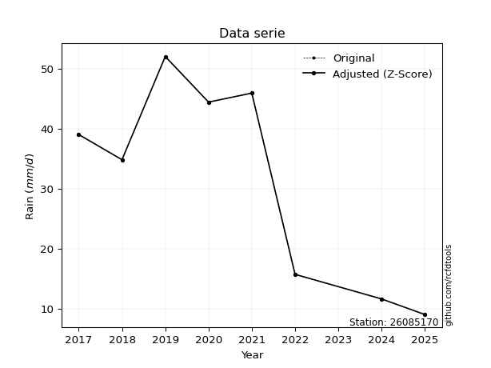</img>

</div>


> The initial value (value_initial) correspond to the initial obtained or null completed value, and value (value) is adjusted only when the initial value is outside the valid range (outlier) definite through the Z-Score value. If Z-Score is active, values out of range or outliers are replaced with the station mean value. A Z-Score (or standard score) measures how many standard deviations a data point is from the mean of a dataset, indicating its relative position; positive scores mean above the mean, negative mean below, and a score of zero is exactly at the mean, allowing for comparison of values from different distributions. It´s calculated using the formula $z=(x–μ)/σ$, where $x$ is the data point, $μ$ is the mean, and $σ$ is the standard deviation, helping identify outliers and understand probability.
>
> <sub>**Note**: In this study, "completing" (filling gaps in) and "extending" (forecasting or lengthening the historical record) rainfall data series are avoided for certain critical analyses because they introduce artificial bias and uncertainty, which can distort the statistics of rare events (extremes), alter day-to-day variability, and compromise the integrity and homogeneity of the original data. Some reasons against Completing/Extending rainfall data are: **Distortion of Extremes and Variability**: The primary issue is that most gap-filling or extension methods rely on averaging or regression with nearby stations, which inherently smooths the data. Rainfall is highly variable in space and time, with a large percentage of zero values and occasional large storms. Infilling methods often underestimate the highest values and overestimate the lowest (zero) values, which severely distorts analyses focused on flood frequency, drought severity, and intensity-duration-frequency (IDF) curves, **Loss of Data Homogeneity**: Infilled or extended data are synthetic estimates, not actual measurements. Combining these estimates with observed data can violate the assumption of data homogeneity, which requires that the data properties do not change over time. Inhomogeneity can lead to incorrect conclusions about long-term trends or changes in climate patterns, **Propagation of Errors**: Errors and biases from the original data (e.g., wind-induced undercatch, instrument errors, site changes) or the data used for imputation can propagate through the analysis, leading to unreliable hydrological models and inaccurate predictions, **Compromised Statistical Integrity**: For statistical analyses, especially those involving the frequency of events, using artificial data can introduce time bias or autocorrelation that doesn´t exist in reality, making it difficult to assess the true probability of events, **Difficulty in Validation**: It is difficult to accurately validate the quality of filled or extended data, especially for past periods where ground-truth measurements are unavailable. The reliability of imputation techniques heavily depends on the density of the surrounding station network and the complexity of the local topography.</sub>


### 4. Active continuous probability distributions from SciPy (80 of 104 available)

A Probability Density Function (PDF) describes the relative likelihood of a continuous random variable falling within a specific range, where the total area under its curve equals 1, and the area over any interval gives the actual probability for that range. Unlike discrete probabilities (like rolling a die), a PDF shows density, not direct probability for a single point (which is zero), with higher points indicating higher likelihood, often visualized as a bell curve for normal distributions.

A log of a probability density function (log-PDF) is simply the logarithm of the PDF´s value, denoted as $log(f(x))$, useful for converting multiplication of probabilities into addition, improving numerical stability with tiny numbers, and connecting to information theory concepts like entropy. Instead of dealing with very small probabilities (e.g., 0.000001), log-PDFs use negative numbers (e.g., $log(0.00001) ≈ -11.51$ that are easier for computers to handle, preventing underflow errors and simplifying complex calculations. In this study, each active probability distribution from SciPy is also evaluated in the $log$ form.

[scipy.stats](https://docs.scipy.org/doc/scipy/reference/stats.html) is a Python´s powerful submodule within the SciPy library for comprehensive statistical analysis, offering over 130 probability distributions (like Normal, Poisson, etc.), functions for descriptive stats (mean, variance), hypothesis testing (t-tests, chi-square), random variable generation, and statistical tests, making it essential for data science, modeling, and research. It provides tools to explore, model, and draw conclusions from data efficiently, working seamlessly with [NumPy](https://numpy.org/).

<div align="center">

|   id | p_dist           |   n_parameter | fit_method   | label                                                                       | active   | ref                                                                                                      |
|-----:|:-----------------|--------------:|:-------------|:----------------------------------------------------------------------------|:---------|:---------------------------------------------------------------------------------------------------------|
|    0 | alpha            |             3 | MLE          | Alpha                                                                       | True     | [:mortar_board:](https://docs.scipy.org/doc/scipy/reference/generated/scipy.stats.alpha.html)            |
|    1 | anglit           |             2 | MM           | Anglit                                                                      | True     | [:mortar_board:](https://docs.scipy.org/doc/scipy/reference/generated/scipy.stats.anglit.html)           |
|    2 | arcsine          |             2 | MM           | Arcsine                                                                     | True     | [:mortar_board:](https://docs.scipy.org/doc/scipy/reference/generated/scipy.stats.arcsine.html)          |
|    3 | argus            |             3 | MLE          | Argus                                                                       | True     | [:mortar_board:](https://docs.scipy.org/doc/scipy/reference/generated/scipy.stats.argus.html)            |
|    4 | beta             |             4 | MLE          | Beta                                                                        | True     | [:mortar_board:](https://docs.scipy.org/doc/scipy/reference/generated/scipy.stats.beta.html)             |
|    5 | betaprime        |             4 | MLE          | Beta prime                                                                  | True     | [:mortar_board:](https://docs.scipy.org/doc/scipy/reference/generated/scipy.stats.betaprime.html)        |
|    6 | bradford         |             3 | MLE          | Bradford                                                                    | True     | [:mortar_board:](https://docs.scipy.org/doc/scipy/reference/generated/scipy.stats.bradford.html)         |
|    7 | burr             |             4 | MLE          | Burr (Type III)                                                             | True     | [:mortar_board:](https://docs.scipy.org/doc/scipy/reference/generated/scipy.stats.burr.html)             |
|    8 | burr12           |             4 | MLE          | Burr (Type III) 12                                                          | True     | [:mortar_board:](https://docs.scipy.org/doc/scipy/reference/generated/scipy.stats.burr12.html)           |
|    9 | cosine           |             2 | MLE          | Cosine                                                                      | True     | [:mortar_board:](https://docs.scipy.org/doc/scipy/reference/generated/scipy.stats.cosine.html)           |
|   10 | crystalball      |             4 | MLE          | Crystalball                                                                 | True     | [:mortar_board:](https://docs.scipy.org/doc/scipy/reference/generated/scipy.stats.crystalball.html)      |
|   11 | dgamma           |             3 | MLE          | Double gamma                                                                | True     | [:mortar_board:](https://docs.scipy.org/doc/scipy/reference/generated/scipy.stats.dgamma.html)           |
|   12 | dweibull         |             3 | MLE          | Double Weibull                                                              | True     | [:mortar_board:](https://docs.scipy.org/doc/scipy/reference/generated/scipy.stats.dweibull.html)         |
|   13 | erlang           |             3 | MLE          | Erlang                                                                      | True     | [:mortar_board:](https://docs.scipy.org/doc/scipy/reference/generated/scipy.stats.erlang.html)           |
|   14 | exponnorm        |             3 | MLE          | Exponentially modified Normal                                               | True     | [:mortar_board:](https://docs.scipy.org/doc/scipy/reference/generated/scipy.stats.exponnorm.html)        |
|   15 | exponpow         |             3 | MLE          | Exponential power                                                           | True     | [:mortar_board:](https://docs.scipy.org/doc/scipy/reference/generated/scipy.stats.exponpow.html)         |
|   16 | exponweib        |             4 | MLE          | Exponentiated Weibull                                                       | True     | [:mortar_board:](https://docs.scipy.org/doc/scipy/reference/generated/scipy.stats.exponweib.html)        |
|   17 | f                |             4 | MLE          | F                                                                           | True     | [:mortar_board:](https://docs.scipy.org/doc/scipy/reference/generated/scipy.stats.f.html)                |
|   18 | fatiguelife      |             3 | MLE          | Fatigue-life (Birnbaum-Saunders)                                            | True     | [:mortar_board:](https://docs.scipy.org/doc/scipy/reference/generated/scipy.stats.fatiguelife.html)      |
|   19 | foldnorm         |             3 | MM           | Fold Normal                                                                 | True     | [:mortar_board:](https://docs.scipy.org/doc/scipy/reference/generated/scipy.stats.foldnorm.html)         |
|   20 | gamma            |             3 | MLE          | Gamma                                                                       | True     | [:mortar_board:](https://docs.scipy.org/doc/scipy/reference/generated/scipy.stats.gamma.html)            |
|   21 | gausshyper       |             6 | MLE          | Gauss hypergeometric                                                        | True     | [:mortar_board:](https://docs.scipy.org/doc/scipy/reference/generated/scipy.stats.gausshyper.html)       |
|   22 | genexpon         |             5 | MLE          | Generalized exponential                                                     | True     | [:mortar_board:](https://docs.scipy.org/doc/scipy/reference/generated/scipy.stats.genexpon.html)         |
|   23 | genextreme       |             3 | MLE          | Generalized exponential                                                     | True     | [:mortar_board:](https://docs.scipy.org/doc/scipy/reference/generated/scipy.stats.genextreme.html)       |
|   24 | gengamma         |             4 | MLE          | Generalized gamma                                                           | True     | [:mortar_board:](https://docs.scipy.org/doc/scipy/reference/generated/scipy.stats.gengamma.html)         |
|   25 | genhalflogistic  |             3 | MLE          | Generalized half-logistic                                                   | True     | [:mortar_board:](https://docs.scipy.org/doc/scipy/reference/generated/scipy.stats.genhalflogistic.html)  |
|   26 | genlogistic      |             3 | MLE          | Generalized logistic                                                        | True     | [:mortar_board:](https://docs.scipy.org/doc/scipy/reference/generated/scipy.stats.genlogistic.html)      |
|   27 | gennorm          |             3 | MLE          | Generalized Normal                                                          | True     | [:mortar_board:](https://docs.scipy.org/doc/scipy/reference/generated/scipy.stats.gennorm.html)          |
|   28 | genpareto        |             3 | MLE          | Generalized Pareto                                                          | True     | [:mortar_board:](https://docs.scipy.org/doc/scipy/reference/generated/scipy.stats.genpareto.html)        |
|   29 | gompertz         |             3 | MLE          | Gompertz (or truncated Gumbel)                                              | True     | [:mortar_board:](https://docs.scipy.org/doc/scipy/reference/generated/scipy.stats.gompertz.html)         |
|   30 | gumbel_l         |             2 | MM           | Gumbel Left Skew                                                            | True     | [:mortar_board:](https://docs.scipy.org/doc/scipy/reference/generated/scipy.stats.gumbel_l.html)         |
|   31 | gumbel_r         |             2 | MM           | Gumbel Right Skew                                                           | True     | [:mortar_board:](https://docs.scipy.org/doc/scipy/reference/generated/scipy.stats.gumbel_r.html)         |
|   32 | halfgennorm      |             3 | MLE          | Upper half of a generalized normal                                          | True     | [:mortar_board:](https://docs.scipy.org/doc/scipy/reference/generated/scipy.stats.halfgennorm.html)      |
|   33 | halflogistic     |             2 | MM           | Half-logistic                                                               | True     | [:mortar_board:](https://docs.scipy.org/doc/scipy/reference/generated/scipy.stats.halflogistic.html)     |
|   34 | halfnorm         |             2 | MM           | Half Normal                                                                 | True     | [:mortar_board:](https://docs.scipy.org/doc/scipy/reference/generated/scipy.stats.halfnorm.html)         |
|   35 | hypsecant        |             2 | MM           | hyperbolic secant                                                           | True     | [:mortar_board:](https://docs.scipy.org/doc/scipy/reference/generated/scipy.stats.hypsecant.html)        |
|   36 | invgamma         |             3 | MLE          | Inverted gamma                                                              | True     | [:mortar_board:](https://docs.scipy.org/doc/scipy/reference/generated/scipy.stats.invgamma.html)         |
|   37 | invgauss         |             3 | MLE          | Inverse Gaussian                                                            | True     | [:mortar_board:](https://docs.scipy.org/doc/scipy/reference/generated/scipy.stats.invgauss.html)         |
|   38 | invweibull       |             3 | MLE          | Inverted Weibull                                                            | True     | [:mortar_board:](https://docs.scipy.org/doc/scipy/reference/generated/scipy.stats.invweibull.html)       |
|   39 | johnsonsb        |             4 | MLE          | Johnson SB                                                                  | True     | [:mortar_board:](https://docs.scipy.org/doc/scipy/reference/generated/scipy.stats.johnsonsb.html)        |
|   40 | johnsonsu        |             4 | MLE          | Johnson Su                                                                  | True     | [:mortar_board:](https://docs.scipy.org/doc/scipy/reference/generated/scipy.stats.johnsonsu.html)        |
|   41 | kappa3           |             3 | MLE          | Kappa 3                                                                     | True     | [:mortar_board:](https://docs.scipy.org/doc/scipy/reference/generated/scipy.stats.kappa3.html)           |
|   42 | kappa4           |             4 | MLE          | Kappa 4                                                                     | True     | [:mortar_board:](https://docs.scipy.org/doc/scipy/reference/generated/scipy.stats.kappa4.html)           |
|   43 | ksone            |             3 | MLE          | Kolmogorov-Smirnov one-sided test statistic distribution                    | True     | [:mortar_board:](https://docs.scipy.org/doc/scipy/reference/generated/scipy.stats.ksone.html)            |
|   44 | kstwobign        |             2 | MLE          | Limiting distribution of scaled Kolmogorov-Smirnov two-sided test statistic | True     | [:mortar_board:](https://docs.scipy.org/doc/scipy/reference/generated/scipy.stats.kstwobign.html)        |
|   45 | laplace          |             2 | MM           | Laplace                                                                     | True     | [:mortar_board:](https://docs.scipy.org/doc/scipy/reference/generated/scipy.stats.laplace.html)          |
|   46 | levy_l           |             2 | MLE          | Left-skewed Levy                                                            | True     | [:mortar_board:](https://docs.scipy.org/doc/scipy/reference/generated/scipy.stats.levy_l.html)           |
|   47 | loggamma         |             3 | MLE          | Log gamma                                                                   | True     | [:mortar_board:](https://docs.scipy.org/doc/scipy/reference/generated/scipy.stats.loggamma.html)         |
|   48 | logistic         |             2 | MM           | Logistic (or Sech-squared)                                                  | True     | [:mortar_board:](https://docs.scipy.org/doc/scipy/reference/generated/scipy.stats.logistic.html)         |
|   49 | loglaplace       |             3 | MLE          | Log-Laplace                                                                 | True     | [:mortar_board:](https://docs.scipy.org/doc/scipy/reference/generated/scipy.stats.loglaplace.html)       |
|   50 | lomax            |             3 | MLE          | Lomax (Pareto of the second kind)                                           | True     | [:mortar_board:](https://docs.scipy.org/doc/scipy/reference/generated/scipy.stats.lomax.html)            |
|   51 | maxwell          |             2 | MM           | Maxwell                                                                     | True     | [:mortar_board:](https://docs.scipy.org/doc/scipy/reference/generated/scipy.stats.maxwell.html)          |
|   52 | mielke           |             4 | MLE          | Mielke Beta-Kappa / Dagum                                                   | True     | [:mortar_board:](https://docs.scipy.org/doc/scipy/reference/generated/scipy.stats.mielke.html)           |
|   53 | moyal            |             2 | MM           | Moyal                                                                       | True     | [:mortar_board:](https://docs.scipy.org/doc/scipy/reference/generated/scipy.stats.moyal.html)            |
|   54 | nakagami         |             3 | MLE          | Nakagami                                                                    | True     | [:mortar_board:](https://docs.scipy.org/doc/scipy/reference/generated/scipy.stats.nakagami.html)         |
|   55 | ncf              |             5 | MLE          | Non-central F distribution                                                  | True     | [:mortar_board:](https://docs.scipy.org/doc/scipy/reference/generated/scipy.stats.ncf.html)              |
|   56 | nct              |             4 | MLE          | Non-central Student’s t                                                     | True     | [:mortar_board:](https://docs.scipy.org/doc/scipy/reference/generated/scipy.stats.nct.html)              |
|   57 | norm             |             2 | MM           | Normal                                                                      | True     | [:mortar_board:](https://docs.scipy.org/doc/scipy/reference/generated/scipy.stats.norm.html)             |
|   58 | pearson3         |             3 | MM           | Pearson type III                                                            | True     | [:mortar_board:](https://docs.scipy.org/doc/scipy/reference/generated/scipy.stats.pearson3.html)         |
|   59 | powerlaw         |             3 | MLE          | Power-function                                                              | True     | [:mortar_board:](https://docs.scipy.org/doc/scipy/reference/generated/scipy.stats.powerlaw.html)         |
|   60 | rayleigh         |             2 | MM           | Rayleigh                                                                    | True     | [:mortar_board:](https://docs.scipy.org/doc/scipy/reference/generated/scipy.stats.rayleigh.html)         |
|   61 | rdist            |             3 | MLE          | R-distributed (symmetric beta)                                              | True     | [:mortar_board:](https://docs.scipy.org/doc/scipy/reference/generated/scipy.stats.rdist.html)            |
|   62 | rice             |             3 | MLE          | Rice                                                                        | True     | [:mortar_board:](https://docs.scipy.org/doc/scipy/reference/generated/scipy.stats.rice.html)             |
|   63 | semicircular     |             2 | MM           | Semicircular                                                                | True     | [:mortar_board:](https://docs.scipy.org/doc/scipy/reference/generated/scipy.stats.semicircular.html)     |
|   64 | skewnorm         |             3 | MLE          | Skew normal                                                                 | True     | [:mortar_board:](https://docs.scipy.org/doc/scipy/reference/generated/scipy.stats.skewnorm.html)         |
|   65 | t                |             3 | MLE          | Student’s t                                                                 | True     | [:mortar_board:](https://docs.scipy.org/doc/scipy/reference/generated/scipy.stats.t.html)                |
|   66 | trapezoid        |             4 | MLE          | Trapezoid                                                                   | True     | [:mortar_board:](https://docs.scipy.org/doc/scipy/reference/generated/scipy.stats.trapezoid.html)        |
|   67 | triang           |             3 | MLE          | Triangular                                                                  | True     | [:mortar_board:](https://docs.scipy.org/doc/scipy/reference/generated/scipy.stats.triang.html)           |
|   68 | truncexpon       |             3 | MLE          | Truncated exponential                                                       | True     | [:mortar_board:](https://docs.scipy.org/doc/scipy/reference/generated/scipy.stats.truncexpon.html)       |
|   69 | truncnorm        |             4 | MLE          | Truncated normal                                                            | True     | [:mortar_board:](https://docs.scipy.org/doc/scipy/reference/generated/scipy.stats.truncnorm.html)        |
|   70 | truncpareto      |             4 | MLE          | Upper truncated Pareto                                                      | True     | [:mortar_board:](https://docs.scipy.org/doc/scipy/reference/generated/scipy.stats.truncpareto.html)      |
|   71 | truncweibull_min |             5 | MLE          | Doubly truncated Weibull minimum                                            | True     | [:mortar_board:](https://docs.scipy.org/doc/scipy/reference/generated/scipy.stats.truncweibull_min.html) |
|   72 | tukeylambda      |             3 | MLE          | Tukey-Lamdba                                                                | True     | [:mortar_board:](https://docs.scipy.org/doc/scipy/reference/generated/scipy.stats.tukeylambda.html)      |
|   73 | uniform          |             2 | MLE          | Uniform                                                                     | True     | [:mortar_board:](https://docs.scipy.org/doc/scipy/reference/generated/scipy.stats.uniform.html)          |
|   74 | vonmises         |             3 | MLE          | Von Mises                                                                   | True     | [:mortar_board:](https://docs.scipy.org/doc/scipy/reference/generated/scipy.stats.vonmises.html)         |
|   75 | vonmises_line    |             3 | MLE          | Von Mises line                                                              | True     | [:mortar_board:](https://docs.scipy.org/doc/scipy/reference/generated/scipy.stats.vonmises_line.html)    |
|   76 | wald             |             2 | MM           | Wald                                                                        | True     | [:mortar_board:](https://docs.scipy.org/doc/scipy/reference/generated/scipy.stats.wald.html)             |
|   77 | weibull_max      |             3 | MLE          | Weibull maximum                                                             | True     | [:mortar_board:](https://docs.scipy.org/doc/scipy/reference/generated/scipy.stats.weibull_max.html)      |
|   78 | weibull_min      |             3 | MLE          | Weibull minimum                                                             | True     | [:mortar_board:](https://docs.scipy.org/doc/scipy/reference/generated/scipy.stats.weibull_min.html)      |
|   79 | wrapcauchy       |             3 | MLE          | Wrapped  Cauchy                                                             | True     | [:mortar_board:](https://docs.scipy.org/doc/scipy/reference/generated/scipy.stats.wrapcauchy.html)       |

</div>

> **n_parameter:** # arguments & localization & scale.
>
> **Fit methods:** (MLE) maximum likelihood, (MM) L-moments.
>
>**Inactive** (With the only purpose of prevent loops, zero divisions, infinite values, over high estimated values or horizontal trending for recurrence intervals estimations, the follow distributions were disabled.)**:** lognorm, norminvgauss, powernorm, powerlognorm, cauchy, halfcauchy, foldcauchy, skewcauchy, chi2, expon, fisk, genhyperbolic, geninvgauss, gibrat, kstwo, laplace_asymmetric, levy, levy_stable, ncx2, pareto, rel_breitwigner, recipinvgauss, studentized_range, loguniform, 


## B. Probability (PDF) vs. Empirical (EDF) distributions functions

A continuous probability distribution (CPD) describes probabilities for variables that can take any value within a range (like rain any time), unlike discrete variables with specific outcomes (like temperature). It uses a Probability Density Function (PDF), a curve where the total area under it equals 1, and the probability of the variable falling within an interval (a to b) is found by calculating the area under the curve between those points. A key feature is that the probability of hitting any single exact value is zero, so probabilities are always expressed for ranges, e.g., $P(a ≤ X ≤ b)$.

<div align="center">

Distributions parameters from station values
|     |   station | p_dist              |   n |               loc |            scale | shape                  | shape1                | shape2                 | shape3            |
|----:|----------:|:--------------------|----:|------------------:|-----------------:|:-----------------------|:----------------------|:-----------------------|:------------------|
|   0 |  26085170 | alpha               |   8 |    -207.365       |   3477.17        | 14.639631384162413     |                       |                        |                   |
|   1 |  26085170 | anglit              |   8 |      31.55        |     46.4052      |                        |                       |                        |                   |
|   2 |  26085170 | arcsine             |   8 |       9.11654     |     44.8669      |                        |                       |                        |                   |
|   3 |  26085170 | argus               |   8 |      -5.01265     |     58.9853      | 1.266618988443625      |                       |                        |                   |
|   4 |  26085170 | beta                |   8 |       4.77972     |     47.2203      | 0.378653418465996      | 0.2903191262230964    |                        |                   |
|   5 |  26085170 | betaprime           |   8 |    -281.454       |  10275.6         | 388.50674021019313     | 12755.804652964893    |                        |                   |
|   6 |  26085170 | bradford            |   8 |       8.99998     |     43.0001      | 0.9939604123219736     |                       |                        |                   |
|   7 |  26085170 | burr                |   8 |      -1.70909     |     54.1372      | 437.946472590481       | 0.003544457262116214  |                        |                   |
|   8 |  26085170 | burr12              |   8 |      -2.38216     |     11.283       | 451.3041502147579      | 0.00232164255760914   |                        |                   |
|   9 |  26085170 | cosine              |   8 |      30.9656      |     12.5536      |                        |                       |                        |                   |
|  10 |  26085170 | crystalball         |   8 |      31.55        |     15.8628      | 3370.4769758723646     | 22.837389745496324    |                        |                   |
|  11 |  26085170 | dgamma              |   8 |      36.5285      |      9.10188     | 1.5134273948380752     |                       |                        |                   |
|  12 |  26085170 | dweibull            |   8 |      36.1989      |     15.0021      | 1.3878393105542202     |                       |                        |                   |
|  13 |  26085170 | erlang              |   8 |    -217.256       |      1.0335      | 240.69753983155158     |                       |                        |                   |
|  14 |  26085170 | exponnorm           |   8 |      31.5354      |     15.8629      | 0.0009207128942580294  |                       |                        |                   |
|  15 |  26085170 | exponpow            |   8 |      -9.95421e+10 |      9.95421e+10 | 1532156929.4338927     |                       |                        |                   |
|  16 |  26085170 | exponweib           |   8 |       9           |      0.114334    | 2.1612543388255947     | 0.19488769959430421   |                        |                   |
|  17 |  26085170 | f                   |   8 |   -4529.64        |   4561.18        | 339780.41305910423     | 317570.39403549605    |                        |                   |
|  18 |  26085170 | fatiguelife         |   8 |       9           |      0.000254893 | 283.6003748867008      |                       |                        |                   |
|  19 |  26085170 | foldnorm            |   8 |     -86.8091      |     15.3701      | 7.7084624889722555     |                       |                        |                   |
|  20 |  26085170 | gamma               |   8 |    -220.25        |      1.01467     | 248.06909542554624     |                       |                        |                   |
|  21 |  26085170 | gausshyper          |   8 |       9           |     43.4209      | 0.903597290242562      | 0.9336584087272743    | 1.0431324037509269     | 1.083067906095565 |
|  22 |  26085170 | genexpon            |   8 |       9           |      1.87878     | 0.08352042350165939    | 2.179522150812103e-06 | 1.019227849644879      |                   |
|  23 |  26085170 | genextreme          |   8 |      31.1733      |     23.9279      | 1.1489070232976983     |                       |                        |                   |
|  24 |  26085170 | gengamma            |   8 |   -1259.33        |   1193.3         | 9.16011662121726       | 27.51387840314415     |                        |                   |
|  25 |  26085170 | genhalflogistic     |   8 |      -2.82989     |     64.046       | 1.1680856503603139     |                       |                        |                   |
|  26 |  26085170 | genlogistic         |   8 |      52.0001      |      6.88706e-06 | 3.361422124557671e-07  |                       |                        |                   |
|  27 |  26085170 | gennorm             |   8 |      30.5         |     21.5002      | 1253509.1553103672     |                       |                        |                   |
|  28 |  26085170 | genpareto           |   8 |      -0.360648    |     79.3708      | -1.5158491645541279    |                       |                        |                   |
|  29 |  26085170 | gompertz            |   8 |       9           |     21.6545      | 0.38671156262468154    |                       |                        |                   |
|  30 |  26085170 | gumbel_l            |   8 |      38.6891      |     12.3682      |                        |                       |                        |                   |
|  31 |  26085170 | gumbel_r            |   8 |      24.4109      |     12.3682      |                        |                       |                        |                   |
|  32 |  26085170 | halfgennorm         |   8 |       9           |      0.303552    | 0.30714003124881406    |                       |                        |                   |
|  33 |  26085170 | halflogistic        |   8 |      12.7488      |     13.5622      |                        |                       |                        |                   |
|  34 |  26085170 | halfnorm            |   8 |      10.5538      |     26.3148      |                        |                       |                        |                   |
|  35 |  26085170 | hypsecant           |   8 |      31.55        |     10.0986      |                        |                       |                        |                   |
|  36 |  26085170 | invgamma            |   8 |    -119.691       |  12286.5         | 82.363287981572        |                       |                        |                   |
|  37 |  26085170 | invgauss            |   8 |     -47.7344      |   1709.69        | 0.04645272427458541    |                       |                        |                   |
|  38 |  26085170 | invweibull          |   8 |       9           |      1.40028     | 0.0503731509000227     |                       |                        |                   |
|  39 |  26085170 | johnsonsb           |   8 |       9           |     43           | 0.209922781138556      | 0.0929770105254295    |                        |                   |
|  40 |  26085170 | johnsonsu           |   8 |      59.688       |      0.305607    | 7.916241968181396      | 1.5734796995901048    |                        |                   |
|  41 |  26085170 | kappa3              |   8 |       9           |     42.9669      | 2721.038193292487      |                       |                        |                   |
|  42 |  26085170 | kappa4              |   8 |       4.18098     |     49.3729      | 1.108351598785215      | 1.031353115808373     |                        |                   |
|  43 |  26085170 | ksone               |   8 |       4.07474     |     54.9505      | 1.0                    |                       |                        |                   |
|  44 |  26085170 | kstwobign           |   8 |     -26.4551      |     65.9442      |                        |                       |                        |                   |
|  45 |  26085170 | laplace             |   8 |      31.55        |     11.2167      |                        |                       |                        |                   |
|  46 |  26085170 | levy_l              |   8 |      53.6617      |      7.74936     |                        |                       |                        |                   |
|  47 |  26085170 | loggamma            |   8 |      52.0002      |      8.87858e-06 | 4.331432479506238e-07  |                       |                        |                   |
|  48 |  26085170 | logistic            |   8 |      31.55        |      8.74565     |                        |                       |                        |                   |
|  49 |  26085170 | loglaplace          |   8 |      -0.0848065   |     34.8848      | 1.8752529206228674     |                       |                        |                   |
|  50 |  26085170 | lomax               |   8 |       9           |   6942.8         | 308.53047242397486     |                       |                        |                   |
|  51 |  26085170 | maxwell             |   8 |      -6.03829     |     23.555       |                        |                       |                        |                   |
|  52 |  26085170 | mielke              |   8 |    -237.334       |    162.189       | 93209.26662535488      | 18.0456970703583      |                        |                   |
|  53 |  26085170 | moyal               |   8 |      22.4786      |      7.14079     |                        |                       |                        |                   |
|  54 |  26085170 | nakagami            |   8 |       9           |     27.6425      | 0.29425541203736494    |                       |                        |                   |
|  55 |  26085170 | ncf                 |   8 |       0.124856    |      3.9321e-06  | 1.8959739643748639e-06 | 46.709728680278715    | 14.686694628752619     |                   |
|  56 |  26085170 | nct                 |   8 |    -839.169       |     15.8126      | 227576.1218492213      | 55.064567590727194    |                        |                   |
|  57 |  26085170 | norm                |   8 |      31.55        |     15.8628      |                        |                       |                        |                   |
|  58 |  26085170 | pearson3            |   8 |      31.55        |     15.8629      | -0.29161018614108347   |                       |                        |                   |
|  59 |  26085170 | powerlaw            |   8 |       9           |     43           | 0.18345048066277053    |                       |                        |                   |
|  60 |  26085170 | rayleigh            |   8 |       1.20344     |     24.213       |                        |                       |                        |                   |
|  61 |  26085170 | rdist               |   8 |       7.01837     |      8.68163     | 1.3835233264161662     |                       |                        |                   |
|  62 |  26085170 | rice                |   8 |       0.102762    |     18.6814      | 1.2468560324488884     |                       |                        |                   |
|  63 |  26085170 | semicircular        |   8 |      31.55        |     31.7257      |                        |                       |                        |                   |
|  64 |  26085170 | skewnorm            |   8 |      52           |     25.8853      | -15679445.79109937     |                       |                        |                   |
|  65 |  26085170 | t                   |   8 |      31.5501      |     15.8629      | 2480876646.067546      |                       |                        |                   |
|  66 |  26085170 | trapezoid           |   8 |     -13.9828      |     67.3004      | 1.0                    | 1.0                   |                        |                   |
|  67 |  26085170 | triang              |   8 |      -5.55787     |     57.5592      | 0.9999776270351166     |                       |                        |                   |
|  68 |  26085170 | truncexpon          |   8 |       8.88512     |     52.8243      | 0.8161940176234542     |                       |                        |                   |
|  69 |  26085170 | truncnorm           |   8 |      31.55        |     15.8628      | -118.8432871257532     | 621.929124160891      |                        |                   |
|  70 |  26085170 | truncpareto         |   8 |      -4.29497e+09 |      4.29497e+09 | 33352395.42904555      | 1.0000000100117163    |                        |                   |
|  71 |  26085170 | truncweibull_min    |   8 |       8.97802     |     53.0815      | 1.0110339343962178     | 0.0004140028622508118 | 0.8104889877472382     |                   |
|  72 |  26085170 | tukeylambda         |   8 |      30.4741      |     23.9107      | 1.1107850171872822     |                       |                        |                   |
|  73 |  26085170 | uniform             |   8 |       9           |     43           |                        |                       |                        |                   |
|  74 |  26085170 | vonmises            |   8 |       2.12323     |      1           | 0.8472717299961756     |                       |                        |                   |
|  75 |  26085170 | vonmises_line       |   8 |      30.5         |      6.84367     | 5.005954789572306e-05  |                       |                        |                   |
|  76 |  26085170 | wald                |   8 |      15.6872      |     15.8628      |                        |                       |                        |                   |
|  77 |  26085170 | weibull_max         |   8 |      52           |      1.46761     | 0.29405063486119964    |                       |                        |                   |
|  78 |  26085170 | weibull_min         |   8 |      -4.37734e+08 |      4.37734e+08 | 34251347.78091778      |                       |                        |                   |
|  79 |  26085170 | wrapcauchy          |   8 |       9           |      6.84366     | 0.4218340830995476     |                       |                        |                   |
|  80 |  26085170 | logalpha            |   8 |     -12.6421      |    373.457       | 23.520879319311092     |                       |                        |                   |
|  81 |  26085170 | loganglit           |   8 |       3.27325     |      1.89833     |                        |                       |                        |                   |
|  82 |  26085170 | logarcsine          |   8 |       2.35554     |      1.83543     |                        |                       |                        |                   |
|  83 |  26085170 | logargus            |   8 |       1.53211     |      2.47824     | 2.13750841687082       |                       |                        |                   |
|  84 |  26085170 | logbeta             |   8 |       2.06524     |      1.886       | 0.3059608263973921     | 0.17348611418353405   |                        |                   |
|  85 |  26085170 | logbetaprime        |   8 |     -11.8905      |     14.9858      | 1034.9484602315933     | 1023.7876635682846    |                        |                   |
|  86 |  26085170 | logbradford         |   8 |       2.1972      |      1.75406     | 1.045352535520131      |                       |                        |                   |
|  87 |  26085170 | logburr             |   8 | -635405           | 635409           | 139810197.8656273      | 0.006576082373872756  |                        |                   |
|  88 |  26085170 | logburr12           |   8 |    -790.996       |    800.709       | 1695.2559106858307     | 465375.44725415076    |                        |                   |
|  89 |  26085170 | logcosine           |   8 |       3.22055     |      0.51931     |                        |                       |                        |                   |
|  90 |  26085170 | logcrystalball      |   8 |       3.27325     |      0.648915    | 3484.1330548391597     | 40.994996597954255    |                        |                   |
|  91 |  26085170 | logdgamma           |   8 |       3.66356     |      0.696316    | 0.7660850328434639     |                       |                        |                   |
|  92 |  26085170 | logdweibull         |   8 |       3.66356     |      0.504998    | 0.8758915077164384     |                       |                        |                   |
|  93 |  26085170 | logerlang           |   8 |      -6.25775     |      0.0465506   | 204.72168801270016     |                       |                        |                   |
|  94 |  26085170 | logexponnorm        |   8 |       3.27302     |      0.648908    | 0.00036189817372307286 |                       |                        |                   |
|  95 |  26085170 | logexponpow         |   8 |       2.19722     |      2.97114     | 0.21383789905798437    |                       |                        |                   |
|  96 |  26085170 | logexponweib        |   8 |       2.19722     |      1.01296     | 0.8829101051845214     | 1.0546183286762982    |                        |                   |
|  97 |  26085170 | logf                |   8 |    -476.732       |    480.003       | 3711325.034816662      | 1535351.6988410244    |                        |                   |
|  98 |  26085170 | logfatiguelife      |   8 |    -227.134       |    230.406       | 0.0028165342118079894  |                       |                        |                   |
|  99 |  26085170 | logfoldnorm         |   8 |      -0.356554    |      0.63163     | 5.750160176012063      |                       |                        |                   |
| 100 |  26085170 | loggamma            |   8 |      -7.03029     |      0.0426811   | 241.18694498811067     |                       |                        |                   |
| 101 |  26085170 | loggausshyper       |   8 |       2.12798     |      1.82327     | 1.02357070170261       | 0.908523687469398     | 1.0620605324115067     | 1.024830467091196 |
| 102 |  26085170 | loggenexpon         |   8 |       2.19634     |      0.019599    | 0.008358339324120143   | 5.086979601227982     | 5.1747775503567224e-05 |                   |
| 103 |  26085170 | loggenextreme       |   8 |       3.29485     |      0.839687    | 1.279235552879792      |                       |                        |                   |
| 104 |  26085170 | loggengamma         |   8 |       2.19722     |      1.99269     | 0.07472431867470644    | 8.925793363078043     |                        |                   |
| 105 |  26085170 | loggenhalflogistic  |   8 |       2.0058      |      2.12207     | 1.0907917340103732     |                       |                        |                   |
| 106 |  26085170 | loggenlogistic      |   8 |       3.95125     |      1.94243e-07 | 2.857400953251741e-07  |                       |                        |                   |
| 107 |  26085170 | loggennorm          |   8 |       3.66356     |      0.0619824   | 0.45208130817791414    |                       |                        |                   |
| 108 |  26085170 | loggenpareto        |   8 |      -0.00362036  |     12.7187      | -3.2159595305718867    |                       |                        |                   |
| 109 |  26085170 | loggompertz         |   8 |       2.19722     |      0.625516    | 0.13578575775283266    |                       |                        |                   |
| 110 |  26085170 | loggumbel_l         |   8 |       3.5653      |      0.505957    |                        |                       |                        |                   |
| 111 |  26085170 | loggumbel_r         |   8 |       2.98121     |      0.505957    |                        |                       |                        |                   |
| 112 |  26085170 | loghalfgennorm      |   8 |       2.19722     |      1.7552      | 9629.746576130943      |                       |                        |                   |
| 113 |  26085170 | loghalflogistic     |   8 |       2.50416     |      0.554784    |                        |                       |                        |                   |
| 114 |  26085170 | loghalfnorm         |   8 |       2.41432     |      1.07651     |                        |                       |                        |                   |
| 115 |  26085170 | loghypsecant        |   8 |       3.27325     |      0.413112    |                        |                       |                        |                   |
| 116 |  26085170 | loginvgamma         |   8 |      -9.17035     |   4378.69        | 352.7980033554088      |                       |                        |                   |
| 117 |  26085170 | loginvgauss         |   8 |      -2.61112     |    438.122       | 0.013423347378244105   |                       |                        |                   |
| 118 |  26085170 | loginvweibull       |   8 |      -3.0283e+07  |      3.0283e+07  | 46933308.76204127      |                       |                        |                   |
| 119 |  26085170 | logjohnsonsb        |   8 |       2.19722     |      1.75402     | -0.4131415625008986    | 0.1585822025756179    |                        |                   |
| 120 |  26085170 | logjohnsonsu        |   8 |       3.98763     |      0.000871183 | 5.4467305421608785     | 0.8010336116908403    |                        |                   |
| 121 |  26085170 | logkappa3           |   8 |       2.17938     |      1.76001     | 314.2145275899993      |                       |                        |                   |
| 122 |  26085170 | logkappa4           |   8 |       1.9942      |      2.18771     | 1.1029351156823688     | 1.117856258214501     |                        |                   |
| 123 |  26085170 | logksone            |   8 |       2.1493      |      2.24791     | 1.0                    |                       |                        |                   |
| 124 |  26085170 | logkstwobign        |   8 |       0.727516    |      2.89561     |                        |                       |                        |                   |
| 125 |  26085170 | loglaplace          |   8 |       3.27325     |      0.458852    |                        |                       |                        |                   |
| 126 |  26085170 | loglevy_l           |   8 |       3.99076     |      0.182666    |                        |                       |                        |                   |
| 127 |  26085170 | logloggamma         |   8 |       3.95142     |      1.48628e-05 | 2.1915837198125857e-05 |                       |                        |                   |
| 128 |  26085170 | loglogistic         |   8 |       3.27325     |      0.357766    |                        |                       |                        |                   |
| 129 |  26085170 | logloglaplace       |   8 |      -4.06585e+07 |      4.06586e+07 | 75650911.94548716      |                       |                        |                   |
| 130 |  26085170 | loglomax            |   8 |       2.19722     |  35233.7         | 33351.078925534806     |                       |                        |                   |
| 131 |  26085170 | logmaxwell          |   8 |       1.7356      |      0.963583    |                        |                       |                        |                   |
| 132 |  26085170 | logmielke           |   8 |      -8.05588e+06 |      8.05588e+06 | 11672449.954244876     | 1663044258.0420008    |                        |                   |
| 133 |  26085170 | logmoyal            |   8 |       2.90216     |      0.292114    |                        |                       |                        |                   |
| 134 |  26085170 | lognakagami         |   8 |       2.19722     |      1.26602     | 0.4823873363120995     |                       |                        |                   |
| 135 |  26085170 | logncf              |   8 |     -12.4733      |     14.4392      | 1174.0805049742096     | 27361.836247612013    | 106.1872544621325      |                   |
| 136 |  26085170 | lognct              |   8 |      26.3613      |      0.611378    | 5997.934028590833      | -37.75939959686729    |                        |                   |
| 137 |  26085170 | lognorm             |   8 |       3.27325     |      0.648915    |                        |                       |                        |                   |
| 138 |  26085170 | logpearson3         |   8 |       3.27325     |      0.648914    | -0.5671811105859952    |                       |                        |                   |
| 139 |  26085170 | logpowerlaw         |   8 |       2.19722     |      1.75402     | 0.20201460874517924    |                       |                        |                   |
| 140 |  26085170 | lograyleigh         |   8 |       2.03184     |      0.990503    |                        |                       |                        |                   |
| 141 |  26085170 | logrdist            |   8 |       3.07423     |      0.87701     | 1.1058950206697862     |                       |                        |                   |
| 142 |  26085170 | logrice             |   8 |       1.84761     |      0.736086    | 1.5900753809283565     |                       |                        |                   |
| 143 |  26085170 | logsemicircular     |   8 |       3.27325     |      1.29783     |                        |                       |                        |                   |
| 144 |  26085170 | logskewnorm         |   8 |       3.95124     |      0.938377    | -12872390.77715123     |                       |                        |                   |
| 145 |  26085170 | logt                |   8 |       3.27326     |      0.648914    | 627863640.6069293      |                       |                        |                   |
| 146 |  26085170 | logtrapezoid        |   8 |       1.43784     |      2.75311     | 1.0                    | 1.0                   |                        |                   |
| 147 |  26085170 | logtriang           |   8 |       1.76656     |      2.18468     | 0.9999999198392355     |                       |                        |                   |
| 148 |  26085170 | logtruncexpon       |   8 |       2.19722     |      1.8547      | 0.9457780206533438     |                       |                        |                   |
| 149 |  26085170 | logtruncnorm        |   8 |       1.1974      |      1.27096     | 1.2244691090376958     | 23.552209889671637    |                        |                   |
| 150 |  26085170 | logtruncpareto      |   8 |       2.19687     |      0.000357864 | 0.1433810021046487     | 4902.3553692212045    |                        |                   |
| 151 |  26085170 | logtruncweibull_min |   8 |       2.17168     |      2.1417      | 1.1186226387328113     | 4.984623984471689e-11 | 0.8309124931536569     |                   |
| 152 |  26085170 | logtukeylambda      |   8 |       3.07423     |      1.00573     | 1.1467727598732302     |                       |                        |                   |
| 153 |  26085170 | loguniform          |   8 |       2.19722     |      1.75402     |                        |                       |                        |                   |
| 154 |  26085170 | logvonmises         |   8 |      -2.97973     |      1           | 2.887817623026345      |                       |                        |                   |
| 155 |  26085170 | logvonmises_line    |   8 |       3.05809     |      0.284304    | 8.21535805066835e-06   |                       |                        |                   |
| 156 |  26085170 | logwald             |   8 |       2.62436     |      0.648894    |                        |                       |                        |                   |
| 157 |  26085170 | logweibull_max      |   8 |       3.95124     |      0.542581    | 0.5947643641832006     |                       |                        |                   |
| 158 |  26085170 | logweibull_min      |   8 |      -6.13083e+07 |      6.13083e+07 | 128015739.67883423     |                       |                        |                   |
| 159 |  26085170 | logwrapcauchy       |   8 |       2.19722     |      0.279161    | 0.5                    |                       |                        |                   |

</div>

> **loc** (Location parameter): This shifts the distribution along the x-axis. For many common distributions, like the normal (Gaussian) distribution, loc represents the mean $μ$. For others, like the uniform distribution, it might represent the minimum value, or for the beta distribution, the left end of the support interval.
>
> **scale** (Scale parameter): This determines the width or spread of the distribution. For the normal distribution, scale represents the standard deviation $σ$. For a uniform distribution, it defines the length of the interval (from $loc$ to $loc + scale$).
>
> **shape** (Shape parameters): Refers to parameters that define the specific form of a probability distribution, distinct from its location (loc) and scale (scale). These parameters are required arguments for most distribution functions. For example, a normal (Gaussian) distribution is fully defined by its location (mean) and scale (standard deviation), so it has no specific shape parameters beyond loc and scale. However, other distributions have intrinsic properties that need specification, as Gamma distribution that takes a shape parameter, often named $a$ or $alpha$.


### 0. Cumulative distribution values - CDF (160 evaluated)

Cumulative Distribution Function (CDF), denoted as $F$<sub>$X$</sub>$(x)$, is a function that gives the probability that a random variable $X$ will take a value less than or equal to a specific value, $x$ (i.e., $(P(X≥x)$. It essentially "accumulates" probabilities from a given point up to the far right (positive infinity), providing a complete picture of the distribution´s probabilities for both discrete (like rain) and continuous (like temperature) variables, helping to find probabilities over ranges or above certain values. Each station is evaluated separately ordering the $x$ values ascending, calculating the CDF and PDF values for the activated distributions and their logarithmic forms.

<div align="center">

CDF ordered by x ascending and calculating $log(f(x))$ separately
|   id |   Station |   date |    x |   count |   mean |     std |    zscore |   Value_initial |   station |   m |     alpha |   alpha_pdf |   anglit |   anglit_pdf |   arcsine |   arcsine_pdf |     argus |   argus_pdf |     beta |    beta_pdf |   betaprime |   betaprime_pdf |    bradford |   bradford_pdf |      burr |    burr_pdf |     burr12 |   burr12_pdf |    cosine |   cosine_pdf |   crystalball |   crystalball_pdf |    dgamma |   dgamma_pdf |   dweibull |   dweibull_pdf |    erlang |   erlang_pdf |   exponnorm |   exponnorm_pdf |   exponpow |   exponpow_pdf |   exponweib |   exponweib_pdf |         f |      f_pdf |   fatiguelife |   fatiguelife_pdf |   foldnorm |   foldnorm_pdf |     gamma |   gamma_pdf |   gausshyper |   gausshyper_pdf |    genexpon |   genexpon_pdf |   genextreme |   genextreme_pdf |   gengamma |   gengamma_pdf |   genhalflogistic |   genhalflogistic_pdf |   genlogistic |   genlogistic_pdf |     gennorm |   gennorm_pdf |   genpareto |   genpareto_pdf |    gompertz |   gompertz_pdf |   gumbel_l |   gumbel_l_pdf |   gumbel_r |   gumbel_r_pdf |   halfgennorm |   halfgennorm_pdf |   halflogistic |   halflogistic_pdf |   halfnorm |   halfnorm_pdf |   hypsecant |   hypsecant_pdf |   invgamma |   invgamma_pdf |   invgauss |   invgauss_pdf |   invweibull |   invweibull_pdf |   johnsonsb |   johnsonsb_pdf |   johnsonsu |   johnsonsu_pdf |      kappa3 |   kappa3_pdf |      kappa4 |   kappa4_pdf |     ksone |   ksone_pdf |   kstwobign |   kstwobign_pdf |   laplace |   laplace_pdf |   levy_l |   levy_l_pdf |   loggamma |   loggamma_pdf |   logistic |   logistic_pdf |   loglaplace |   loglaplace_pdf |       lomax |   lomax_pdf |   maxwell |   maxwell_pdf |   mielke |   mielke_pdf |     moyal |   moyal_pdf |    nakagami |   nakagami_pdf |       ncf |    ncf_pdf |      nct |    nct_pdf |      norm |   norm_pdf |   pearson3 |   pearson3_pdf |    powerlaw |   powerlaw_pdf |   rayleigh |   rayleigh_pdf |    rdist |    rdist_pdf |      rice |   rice_pdf |   semicircular |   semicircular_pdf |   skewnorm |   skewnorm_pdf |         t |      t_pdf |   trapezoid |   trapezoid_pdf |    triang |   triang_pdf |   truncexpon |   truncexpon_pdf |   truncnorm |   truncnorm_pdf |   truncpareto |   truncpareto_pdf |   truncweibull_min |   truncweibull_min_pdf |   tukeylambda |   tukeylambda_pdf |   uniform |   uniform_pdf |   vonmises |   vonmises_pdf |   vonmises_line |   vonmises_line_pdf |         wald |     wald_pdf |   weibull_max |   weibull_max_pdf |   weibull_min |   weibull_min_pdf |   wrapcauchy |   wrapcauchy_pdf |   logalpha |   logalpha_pdf |   loganglit |   loganglit_pdf |   logarcsine |   logarcsine_pdf |   logargus |   logargus_pdf |   logbeta |   logbeta_pdf |   logbetaprime |   logbetaprime_pdf |   logbradford |   logbradford_pdf |   logburr |   logburr_pdf |   logburr12 |   logburr12_pdf |   logcosine |   logcosine_pdf |   logcrystalball |   logcrystalball_pdf |   logdgamma |   logdgamma_pdf |   logdweibull |   logdweibull_pdf |   logerlang |   logerlang_pdf |   logexponnorm |   logexponnorm_pdf |   logexponpow |   logexponpow_pdf |   logexponweib |   logexponweib_pdf |      logf |   logf_pdf |   logfatiguelife |   logfatiguelife_pdf |   logfoldnorm |   logfoldnorm_pdf |   loggausshyper |   loggausshyper_pdf |   loggenexpon |   loggenexpon_pdf |   loggenextreme |   loggenextreme_pdf |   loggengamma |   loggengamma_pdf |   loggenhalflogistic |   loggenhalflogistic_pdf |   loggenlogistic |   loggenlogistic_pdf |   loggennorm |   loggennorm_pdf |   loggenpareto |   loggenpareto_pdf |   loggompertz |   loggompertz_pdf |   loggumbel_l |   loggumbel_l_pdf |   loggumbel_r |   loggumbel_r_pdf |   loghalfgennorm |   loghalfgennorm_pdf |   loghalflogistic |   loghalflogistic_pdf |   loghalfnorm |   loghalfnorm_pdf |   loghypsecant |   loghypsecant_pdf |   loginvgamma |   loginvgamma_pdf |   loginvgauss |   loginvgauss_pdf |   loginvweibull |   loginvweibull_pdf |   logjohnsonsb |   logjohnsonsb_pdf |   logjohnsonsu |   logjohnsonsu_pdf |   logkappa3 |   logkappa3_pdf |   logkappa4 |   logkappa4_pdf |   logksone |   logksone_pdf |   logkstwobign |   logkstwobign_pdf |   loglevy_l |   loglevy_l_pdf |   logloggamma |   logloggamma_pdf |   loglogistic |   loglogistic_pdf |   logloglaplace |   logloglaplace_pdf |   loglomax |   loglomax_pdf |   logmaxwell |   logmaxwell_pdf |   logmielke |   logmielke_pdf |    logmoyal |   logmoyal_pdf |   lognakagami |   lognakagami_pdf |    logncf |   logncf_pdf |   lognct |   lognct_pdf |   lognorm |   lognorm_pdf |   logpearson3 |   logpearson3_pdf |   logpowerlaw |   logpowerlaw_pdf |   lograyleigh |   lograyleigh_pdf |    logrdist |   logrdist_pdf |   logrice |   logrice_pdf |   logsemicircular |   logsemicircular_pdf |   logskewnorm |   logskewnorm_pdf |      logt |   logt_pdf |   logtrapezoid |   logtrapezoid_pdf |   logtriang |   logtriang_pdf |   logtruncexpon |   logtruncexpon_pdf |   logtruncnorm |   logtruncnorm_pdf |   logtruncpareto |   logtruncpareto_pdf |   logtruncweibull_min |   logtruncweibull_min_pdf |   logtukeylambda |   logtukeylambda_pdf |   loguniform |   loguniform_pdf |   logvonmises |   logvonmises_pdf |   logvonmises_line |   logvonmises_line_pdf |   logwald |   logwald_pdf |   logweibull_max |   logweibull_max_pdf |   logweibull_min |   logweibull_min_pdf |   logwrapcauchy |   logwrapcauchy_pdf |
|-----:|----------:|-------:|-----:|--------:|-------:|--------:|----------:|----------------:|----------:|----:|----------:|------------:|---------:|-------------:|----------:|--------------:|----------:|------------:|---------:|------------:|------------:|----------------:|------------:|---------------:|----------:|------------:|-----------:|-------------:|----------:|-------------:|--------------:|------------------:|----------:|-------------:|-----------:|---------------:|----------:|-------------:|------------:|----------------:|-----------:|---------------:|------------:|----------------:|----------:|-----------:|--------------:|------------------:|-----------:|---------------:|----------:|------------:|-------------:|-----------------:|------------:|---------------:|-------------:|-----------------:|-----------:|---------------:|------------------:|----------------------:|--------------:|------------------:|------------:|--------------:|------------:|----------------:|------------:|---------------:|-----------:|---------------:|-----------:|---------------:|--------------:|------------------:|---------------:|-------------------:|-----------:|---------------:|------------:|----------------:|-----------:|---------------:|-----------:|---------------:|-------------:|-----------------:|------------:|----------------:|------------:|----------------:|------------:|-------------:|------------:|-------------:|----------:|------------:|------------:|----------------:|----------:|--------------:|---------:|-------------:|-----------:|---------------:|-----------:|---------------:|-------------:|-----------------:|------------:|------------:|----------:|--------------:|---------:|-------------:|----------:|------------:|------------:|---------------:|----------:|-----------:|---------:|-----------:|----------:|-----------:|-----------:|---------------:|------------:|---------------:|-----------:|---------------:|---------:|-------------:|----------:|-----------:|---------------:|-------------------:|-----------:|---------------:|----------:|-----------:|------------:|----------------:|----------:|-------------:|-------------:|-----------------:|------------:|----------------:|--------------:|------------------:|-------------------:|-----------------------:|--------------:|------------------:|----------:|--------------:|-----------:|---------------:|----------------:|--------------------:|-------------:|-------------:|--------------:|------------------:|--------------:|------------------:|-------------:|-----------------:|-----------:|---------------:|------------:|----------------:|-------------:|-----------------:|-----------:|---------------:|----------:|--------------:|---------------:|-------------------:|--------------:|------------------:|----------:|--------------:|------------:|----------------:|------------:|----------------:|-----------------:|---------------------:|------------:|----------------:|--------------:|------------------:|------------:|----------------:|---------------:|-------------------:|--------------:|------------------:|---------------:|-------------------:|----------:|-----------:|-----------------:|---------------------:|--------------:|------------------:|----------------:|--------------------:|--------------:|------------------:|----------------:|--------------------:|--------------:|------------------:|---------------------:|-------------------------:|-----------------:|---------------------:|-------------:|-----------------:|---------------:|-------------------:|--------------:|------------------:|--------------:|------------------:|--------------:|------------------:|-----------------:|---------------------:|------------------:|----------------------:|--------------:|------------------:|---------------:|-------------------:|--------------:|------------------:|--------------:|------------------:|----------------:|--------------------:|---------------:|-------------------:|---------------:|-------------------:|------------:|----------------:|------------:|----------------:|-----------:|---------------:|---------------:|-------------------:|------------:|----------------:|--------------:|------------------:|--------------:|------------------:|----------------:|--------------------:|-----------:|---------------:|-------------:|-----------------:|------------:|----------------:|------------:|---------------:|--------------:|------------------:|----------:|-------------:|---------:|-------------:|----------:|--------------:|--------------:|------------------:|--------------:|------------------:|--------------:|------------------:|------------:|---------------:|----------:|--------------:|------------------:|----------------------:|--------------:|------------------:|----------:|-----------:|---------------:|-------------------:|------------:|----------------:|----------------:|--------------------:|---------------:|-------------------:|-----------------:|---------------------:|----------------------:|--------------------------:|-----------------:|---------------------:|-------------:|-----------------:|--------------:|------------------:|-------------------:|-----------------------:|----------:|--------------:|-----------------:|---------------------:|-----------------:|---------------------:|----------------:|--------------------:|
|    0 |  26085170 |   2025 |  9   |       8 |  31.55 | 16.9581 | -1.32975  |             9   |  26085170 |   1 | 0.0761871 |  0.0106408  | 0.087028 |    0.0121485 |  0        |     0         | 0.0605496 |   0.0087112 | 0.200198 | 0.0188524   |   0.0783183 |      0.00955369 | 7.49211e-07 |      0.0334945 | 0.0808337 | nan         | 0.00916826 |   0.0894833  | 0.0649069 |    0.0104215 |     0.0775769 |        0.00915609 | 0.0556249 |   0.00531261 |  0.0509588 |     0.00593779 | 0.0768465 |    0.0095816 |    0.077578 |      0.00915616 |   0.503831 |     0.00689895 | 1.52341e-06 |     3.60857e+08 | 0.0778742 | 0.00919507 |      0.053263 |       7.19429e+07 |  0.0701095 |     0.00874618 | 0.0766251 |  0.00958344 |  2.16636e-15 |        1.10208   | 8.60953e-08 |     0.0444546  |     0.152667 |       0.00580808 |  0.0841919 |     0.00852569 |          0.103658 |            0.00984771 |      0        |        0.00598436 | 5.22135e-06 |     0.0232556 |    0.121844 |       0.0134725 | 2.79451e-10 |      0.0178582 |  0.0866885 |     0.00669599 |  0.0309175 |     0.00869024 |    5.6066e-15 |        0.394522   |       0        |          0         |  0         |     0          |   0.0679912 |      0.00668165 |  0.0791869 |     0.0109313  |  0.0706987 |     0.0112899  |   0.00359395 |      5.73633e+11 | 0.000487448 |     9.08564e+10 |    0.111858 |      0.00590742 | 1.07632e-12 |    0.0232062 | 4.02827e-15 |    0.737259  | 0.0896308 |   0.0181982 |    0.065328 |       0.0138848 | 0.0669682 |    0.00597039 | 0.322991 |   0.00341164 |  0.0498125 |       0.166901 |  0.0705399 |     0.00749676 |    0.0479216 |         0.104438 | 1.51532e-12 |  0.0444389  | 0.0613315 |    0.0112611  |      nan |          nan | 0.0101797 |  0.00528663 | 2.29627e-10 | 76076          | 0.0590743 | 0.0132589  | 0.077618 | 0.00916151 | 0.0775769 |  0.0091561 |  0.0835513 |      0.0085444 | 0.000987094 |    1.01941e+11 |  0.0505206 |     0.0126267  | 0.590884 |    0.0463726 | 0.0514432 |  0.0114043 |      0.0891957 |          0.014115  |   0.096678 |     0.00775654 | 0.0775768 | 0.00915607 |    0.116619 |       0.0101484 | 0.06397   |   0.00878838 |   0.00389384 |        0.033859  |   0.0775769 |      0.00915609 |    2.6087e-08 |         0.0273542 |        6.04345e-08 |              0.0315288 |    0.00150847 |         0.0281307 | 0         |     0.0232558 |    1.67691 |      0.270484  |     1.04078e-06 |           0.0232546 | 0            | 0            |     0.0672193 |       0.00124102  |     0.0901003 |        0.00672248 |  3.56738e-08 |        0.057191  |  0.0498933 |       0.174616 |   0.0470174 |        0.223012 |     0        |         0        |  0.0383986 |       0.122933 |  0.173566 |   0.4213      |      0.0496899 |           0.165211 |   1.87577e-05 |          0.832836 | 0.0775358 |      0.11219  |   0.0516849 |        0.107559 |   0.0397698 |        0.187195 |         0.048639 |             0.155472 |   0.0392207 |       0.0609692 |     0.0392822 |         0.05969   |   0.0489224 |        0.16486  |      0.0486364 |           0.155467 |    0.00041297 |       1.98853e+11 |    5.00659e-15 |          10.4974   | 0.0493946 |   0.157203 |        0.0485833 |             0.15605  |     0.0439107 |          0.147133 |       0.0474754 |            0.689091 |   0.000375502 |          0.42691  |        0.115764 |            0.111244 |   3.77879e-11 |      56753.4      |            0.0474434 |                 0.260745 |         0        |             0.111439 |    0.0508684 |        0.0503206 |       0.223387 |        0.137676    |   2.81518e-09 |          0.217078 |     0.0647502 |          0.12374  |    0.00901264 |          0.083884 |         0        |             0.569771 |          0        |              0        |     0         |          0        |      0.0469775 |           0.113304 |     0.0453135 |          0.162198 |     0.0458656 |          0.173955 |        0.043575 |            0.211601 |    5.03769e-10 |        1.12688e+06 |       0.111447 |          0.0849198 |  0.00995462 |        0.557874 | 3.42315e-15 |       14.2574   |  0.0213202 |       0.444858 |      0.0411007 |           0.239874 |    0.250376 |       0.0674619 |     0.0752736 |          0.110994 |     0.0470822 |          0.125405 |       0.0350533 |           0.0652216 | 2.1678e-08 |       0.946566 |    0.02731   |         0.169441 |    0.077203 |        0.111862 | 0.000831359 |      0.0171345 |   9.75842e-16 |          2.12     | 0.0492984 |     0.161891 | 0.04863  |     0.154425 |  0.048639 |      0.155472 |     0.0613175 |          0.144677 |   0.000706751 |       3.21498e+11 |     0.0138428 |          0.166237 | 1.00003e-09 |    2.83956e+06 | 0.032289  |      0.186886 |         0.0413016 |              0.274255 |     0.0615943 |          0.148206 | 0.0486382 |   0.15547  |      0.0760801 |           0.200374 |   0.0388592 |        0.180463 |     7.39093e-07 |            0.881541 |    0           |           0        |         0        |          568.882     |             0.0126329 |                  0.551196 |      7.10543e-15 |             0.986036 |     0        |         0.570119 |       1.04787 |          0.130166 |          0.0180836 |               0.559802 | 0         |      0        |         0.134065 |          0.0913478   |        0.0551227 |             0.111868 |        0        |            1.71036  |
|    1 |  26085170 |   2024 | 11.6 |       8 |  31.55 | 16.9581 | -1.17643  |            11.6 |  26085170 |   2 | 0.107419  |  0.013406   | 0.121138 |    0.0140626 |  0.151194 |     0.0310258 | 0.085376  |   0.0103905 | 0.242962 | 0.0146239   |   0.106162  |      0.0118963  | 0.0845698   |      0.0315956 | 0.113272  |   0.0132112 | 0.201267   |   0.0598538  | 0.0953915 |    0.0130351 |     0.104258  |        0.0114043  | 0.0711999 |   0.00671807 |  0.0685966 |     0.00768749 | 0.104828  |    0.0119757 |    0.104259 |      0.0114043  |   0.521991 |     0.00706948 | 0.687658    |     0.0387421   | 0.10466   | 0.0114448  |      0.639113 |       0.0256458   |  0.0958075 |     0.0110653  | 0.104625  |  0.0119887  |  0.106285    |        0.0357715 | 0.109154    |     0.039603   |     0.168607 |       0.00646657 |  0.108815  |     0.0104526  |          0.12999  |            0.0104163  |      0        |        0.00679406 | 0.5         |     0.0232556 |    0.157243 |       0.0137615 | 0.0481367   |      0.0191671 |  0.105859  |     0.00808906 |  0.0597652 |     0.0136138  |    0.25079    |        0.0570337  |       0        |          0         |  0.0317135 |     0.0302968  |   0.0877326 |      0.00857802 |  0.111143  |     0.0136655  |  0.104041  |     0.0143618  |   0.379345   |      0.00712398  | 0.481997    |     0.015169    |    0.128428 |      0.00686365 | 0.0603361   |    0.0232062 | 0.0773414   |    0.0268644 | 0.136946  |   0.0181982 |    0.106901 |       0.018004  | 0.0844378 |    0.00752784 | 0.332244 |   0.00371284 |  0.107764  |       0.295299 |  0.0926975 |     0.00961674 |    0.0833162 |         0.181575 | 0.109097    |  0.039576   | 0.0946378 |    0.0143498  |      nan |          nan | 0.0321965 |  0.0120699  | 0.193105    |     0.0436216  | 0.0987624 | 0.0171953  | 0.104314 | 0.0114104  | 0.104258  |  0.0114043 |  0.108228  |      0.0104743 | 0.597677    |    0.0421708   |  0.0880616 |     0.0161717  | 0.715743 |    0.0504426 | 0.0850911 |  0.0144431 |      0.1279    |          0.0156025 |   0.118587 |     0.00911887 | 0.104258  | 0.0114042  |    0.144497 |       0.0112965 | 0.0888603 |   0.010358   |   0.0897959  |        0.0322328 |   0.104258  |      0.0114043  |    0.0704079  |         0.0268075 |        0.083515    |              0.0316982 |    0.0666842  |         0.0241299 | 0.0604651 |     0.0232558 |    2.00299 |      0.0574979 |     0.0604631   |           0.0232547 | 0            | 0            |     0.0705995 |       0.0013621   |     0.109279  |        0.0080655  |  0.140594    |        0.0484686 |  0.110717  |       0.309704 |   0.119037  |        0.341175 |     0.14648  |         0.781004 |  0.0777368 |       0.190149 |  0.248204 |   0.227721    |      0.106946  |           0.291422 |   0.196842    |          0.723424 | 0.111938  |      0.161969 |   0.0872343 |        0.178006 |   0.105627  |        0.333692 |         0.102558 |             0.275472 |   0.0583227 |       0.0917698 |     0.0580227 |         0.0902706 |   0.106251  |        0.292428 |      0.102554  |           0.275467 |    0.553195   |       0.401695    |    0.249224    |           0.812317 | 0.103786  |   0.277353 |        0.102745  |             0.276809 |     0.0959095 |          0.269474 |       0.215519  |            0.632277 |   0.122625    |          0.527239 |        0.148342 |            0.147498 |   0.262953    |          0.69108  |            0.118558  |                 0.301245 |         0        |             0.161871 |    0.0660657 |        0.0709877 |       0.260226 |        0.15333     |   0.0656868   |          0.304304 |     0.104652  |          0.195619 |    0.0577458  |          0.32547  |         0        |             0.569771 |          0        |              0        |     0.0271851 |          0.740746 |      0.0864551 |           0.206714 |     0.102651  |          0.295525 |     0.107506  |          0.316803 |        0.120708 |            0.395549 |    0.24355     |        0.228936    |       0.136446 |          0.114012  |  0.151532   |        0.557874 | 0.157786    |        0.568496 |  0.134217  |       0.444858 |      0.129437  |           0.447957 |    0.269479 |       0.084101  |     0.109436  |          0.161368 |     0.0912651 |          0.231816 |       0.0562083 |           0.104583  | 0.213545   |       0.744427 |    0.0924987 |         0.346485 |    0.111514 |        0.161576 | 0.0304201   |      0.283995  |   0.167423    |          0.628199 | 0.105429  |     0.286096 | 0.102165 |     0.273551 |  0.102558 |      0.275472 |     0.108776  |          0.234335 |   0.676696    |       0.538664    |     0.0856503 |          0.390648 | 0.233555    |    0.532585    | 0.0979213 |      0.330921 |         0.125566  |              0.379519 |     0.109874  |          0.23688  | 0.102557  |   0.27547  |      0.135428  |           0.267338 |   0.0981513 |        0.286807 |     0.209088    |            0.768808 |    0           |           0        |         0.865986 |            0.312493  |             0.174973  |                  0.665437 |      0.152912    |             0.573073 |     0.144685 |         0.570119 |       1.09369 |          0.238783 |          0.160151  |               0.559804 | 0         |      0        |         0.160242 |          0.116323    |        0.0918277 |             0.182656 |        0.309451 |            0.672807 |
|    2 |  26085170 |   2022 | 15.7 |       8 |  31.55 | 16.9581 | -0.934657 |            15.7 |  26085170 |   3 | 0.17144   |  0.0177795  | 0.184394 |    0.0167139 |  0.250258 |     0.0200501 | 0.133498  |   0.0130957 | 0.296224 | 0.0117767   |   0.16296   |      0.01583    | 0.208645    |      0.0290027 | 0.171854  |   0.0153234 | 0.389914   |   0.0353513  | 0.157219  |    0.017082  |     0.158851  |        0.0152663  | 0.104369  |   0.00961188 |  0.106947  |     0.011167   | 0.162122  |    0.0159904 |    0.158853 |      0.0152663  |   0.551505 |     0.00732412 | 0.778077    |     0.0133132   | 0.159408  | 0.0152991  |      0.716223 |       0.0144548   |  0.149387  |     0.0151283  | 0.162017  |  0.0160259  |  0.239455    |        0.0298821 | 0.257589    |     0.0330045  |     0.19753  |       0.00768169 |  0.158564  |     0.0138813  |          0.174724 |            0.011432   |      0        |        0.00829922 | 0.5         |     0.0232556 |    0.214686 |       0.0142719 | 0.130839    |      0.02115   |  0.14433   |     0.0107836  |  0.132335  |     0.0216391  |    0.416574   |        0.029697   |       0.108375 |          0.0364342 |  0.155048  |     0.0297464  |   0.130643  |      0.0125766  |  0.175993  |     0.0179092  |  0.172496  |     0.0189136  |   0.396859   |      0.00275749  | 0.521062    |     0.00654888  |    0.1602   |      0.00871032 | 0.155482    |    0.0232062 | 0.181944    |    0.0245659 | 0.211559  |   0.0181982 |    0.19155  |       0.0228923 | 0.121698  |    0.0108497  | 0.348597 |   0.00428743 |  0.223267  |       0.465986 |  0.140357  |     0.0137962  |    0.161134  |         0.351167 | 0.2574      |  0.0329685  | 0.162934  |    0.0188451  |      nan |          nan | 0.107959  |  0.024673   | 0.335959    |     0.0291179  | 0.179927  | 0.0220627  | 0.158934 | 0.0152729  | 0.158851  |  0.0152663 |  0.158057  |      0.0138961 | 0.711022    |    0.0194683   |  0.164083  |     0.0206695  | 1        | 2462.28      | 0.153294  |  0.0186985 |      0.195724  |          0.0173827 |   0.160813 |     0.0115306  | 0.158851  | 0.0152662  |    0.194524 |       0.0131069 | 0.136402  |   0.0128331  |   0.216952   |        0.0298257 |   0.158851  |      0.0152663  |    0.178587   |         0.0259674 |        0.209415    |              0.0296852 |    0.163501   |         0.0232522 | 0.155814  |     0.0232558 |    2.77742 |      0.210233  |     0.155808    |           0.0232551 | 1.06685e-270 | 5.15544e-266 |     0.0766412 |       0.0015947   |     0.147426  |        0.0106402  |  0.292481    |        0.0270287 |  0.230772  |       0.479319 |   0.239758  |        0.4498   |     0.308421 |         0.420792 |  0.151067  |       0.301345 |  0.308801 |   0.183531    |      0.220878  |           0.459688 |   0.400243    |          0.625435 | 0.173448  |      0.25097  |   0.159901  |        0.312622 |   0.232331  |        0.497205 |         0.21165  |             0.446172 |   0.0943364 |       0.151579  |     0.0936704 |         0.151018  |   0.220752  |        0.462326 |      0.211645  |           0.44617  |    0.63636    |       0.196477    |    0.457424    |           0.579923 | 0.213338  |   0.447101 |        0.21234   |             0.448007 |     0.204388  |          0.449029 |       0.396824  |            0.568308 |   0.291109    |          0.572867 |        0.201884 |            0.210854 |   0.443902    |          0.532079 |            0.218804  |                 0.364432 |         0        |             0.252654 |    0.0932812 |        0.113235  |       0.310282 |        0.179083    |   0.17694     |          0.43489  |     0.182135  |          0.325004 |    0.208484   |          0.646064 |         0        |             0.569771 |          0.221145 |              0.857176 |     0.247408  |          0.705253 |      0.176334  |           0.405344 |     0.219142  |          0.471605 |     0.230593  |          0.490587 |        0.266406 |            0.546133 |    0.29643     |        0.144343    |       0.178599 |          0.169503  |  0.320376   |        0.557874 | 0.324703    |        0.540484 |  0.268855  |       0.444858 |      0.288316  |           0.574797 |    0.299215 |       0.115098  |     0.170992  |          0.252136 |     0.189644  |          0.429553 |       0.0987112 |           0.183666  | 0.409449   |       0.558987 |    0.226854  |         0.528965 |    0.172894 |        0.250512 | 0.197257    |      0.766875  |   0.348732    |          0.567592 | 0.217779  |     0.45542  | 0.210638 |     0.444303 |  0.21165  |      0.446172 |     0.200427  |          0.376493 |   0.792997    |       0.287898    |     0.233202  |          0.564155 | 0.372683    |    0.414677    | 0.223035  |      0.490038 |         0.252109  |              0.449499 |     0.201875  |          0.376602 | 0.211648  |   0.44617  |      0.228425  |           0.347198 |   0.204147  |        0.413632 |     0.423779    |            0.653053 |    1.07412e-06 |           1.34364  |         0.924899 |            0.127461  |             0.3733    |                  0.637225 |      0.323081    |             0.555003 |     0.317235 |         0.570119 |       1.19229 |          0.418722 |          0.329579  |               0.559808 | 0.0630924 |      1.38316  |         0.201611 |          0.160346    |        0.165739  |             0.315665 |        0.4324   |            0.257585 |
|    3 |  26085170 |   2018 | 34.8 |       8 |  31.55 | 16.9581 |  0.191649 |            34.8 |  26085170 |   4 | 0.610634  |  0.0227389  | 0.569807 |    0.0213383 |  0.546277 |     0.0143404 | 0.50769   |   0.0258948 | 0.493168 | 0.0106744   |   0.586806  |      0.0239883  | 0.677757    |      0.0209816 | 0.542517  |   0.0230666 | 0.71335    |   0.00807759 | 0.596473  |    0.0247692 |     0.581168  |        0.0246271  | 0.473072  |   0.0218348  |  0.481763  |     0.0177586  | 0.58943   |    0.0240385 |    0.581168 |      0.024627   |   0.699865 |     0.00804247 | 0.882067    |     0.0024751   | 0.581     | 0.0245215  |      0.869029 |       0.00462293  |  0.580671  |     0.0254233  | 0.590665  |  0.0241002  |  0.689045    |        0.0192771 | 0.682398    |     0.0141192  |     0.428871 |       0.0183735  |  0.564252  |     0.0254044  |          0.459163 |            0.0196398  |      0        |        0.0210814  | 0.5         |     0.0232556 |    0.520209 |       0.0184021 | 0.587809    |      0.024231  |  0.518184  |     0.0284454  |  0.649393  |     0.0226673  |    0.700436   |        0.00787754 |       0.671223 |          0.020257  |  0.643153  |     0.0198331  |   0.600717  |      0.0299555  |  0.609926  |     0.0222718  |  0.612656  |     0.0216521  |   0.421688   |      0.000710932 | 0.597786    |     0.00348571  |    0.461152 |      0.0251005  | 0.59872     |    0.0232062 | 0.619298    |    0.0220056 | 0.559144  |   0.0181982 |    0.645908 |       0.0196115 | 0.625773  |    0.0333633  | 0.478463 |   0.0110397  |  0.673155  |       0.534345 |  0.591849  |     0.027621   |    0.726224  |         0.596655 | 0.681585    |  0.0140976  | 0.609279  |    0.0226523  |      nan |          nan | 0.673024  |  0.0215678  | 0.705244    |     0.0131643  | 0.63106   | 0.0198273  | 0.581277 | 0.0246209  | 0.581168  |  0.0246271 |  0.562854  |      0.0253296 | 0.910546    |    0.00647442  |  0.618114  |     0.0218842  | 1        |    0         | 0.599857  |  0.0233149 |      0.565101  |          0.0199608 |   0.506389 |     0.0247179  | 0.581166  | 0.0246271  |    0.525409 |       0.0215408 | 0.491629  |   0.0243635  |   0.695      |        0.0207759 |   0.581168  |      0.0246271  |    0.639536   |         0.0223879 |        0.690159    |              0.0210452 |    0.597742   |         0.0226235 | 0.6       |     0.0232558 |    5.82541 |      0.173522  |     0.600005    |           0.0232567 | 0.738698     | 0.0186874    |     0.127183  |       0.00448371  |     0.508799  |        0.0273235  |  0.541814    |        0.0102756 |  0.675854  |       0.512137 |   0.643535  |        0.504605 |     0.597369 |         0.363736 |  0.587867  |       0.8667   |  0.466555 |   0.265632    |      0.666892  |           0.534003 |   0.826064    |          0.461159 | 0.548717  |      0.793965 |   0.614385  |        0.784015 |   0.695084  |        0.553452 |         0.664905 |             0.561482 |   0.373727  |       0.77293   |     0.381146  |         0.795244  |   0.66852   |        0.534316 |      0.664904  |           0.561489 |    0.735046   |       0.0824286   |    0.768745    |           0.249101 | 0.665461  |   0.558627 |        0.665983  |             0.560069 |     0.667897  |          0.574811 |       0.803867  |            0.472615 |   0.699976    |          0.405696 |        0.506049 |            0.67088  |   0.800919    |          0.383604 |            0.618888  |                 0.704167 |         0        |             0.814769 |    0.341473  |        0.88116   |       0.508944 |        0.380188    |   0.64797     |          0.663985 |     0.620721  |          0.726751 |    0.722412   |          0.464267 |         0        |             0.569771 |          0.736239 |              0.41273  |     0.708396  |          0.425021 |      0.698635  |           0.625298 |     0.670653  |          0.529951 |     0.677053  |          0.503888 |        0.680288 |            0.406167 |    0.4127      |        0.199391    |       0.463728 |          0.72657   |  0.764419   |        0.557874 | 0.754107    |        0.556081 |  0.622943  |       0.444858 |      0.701789  |           0.397446 |    0.480092 |       0.473103  |     0.552964  |          0.81537  |     0.684056  |          0.604092 |       0.434062  |           0.807632  | 0.721992   |       0.263143 |    0.684913  |         0.498844 |    0.547831 |        0.793772 | 0.741291    |      0.426966  |   0.716802    |          0.348227 | 0.666437  |     0.543214 | 0.66464  |     0.564952 |  0.664905 |      0.561482 |     0.636331  |          0.629273 |   0.948825    |       0.141731    |     0.690877  |          0.47822  | 0.694236    |    0.454366    | 0.67342   |      0.524721 |         0.634533  |              0.479276 |     0.66865   |          0.775862 | 0.664904  |   0.561484 |      0.588365  |           0.557223 |   0.666121  |        0.747169 |     0.846423    |            0.425175 |    0.70917     |           0.512958 |         0.984054 |            0.0461931 |             0.821285  |                  0.483763 |      0.763299    |             0.561592 |     0.771025 |         0.570119 |       1.65328 |          0.587408 |          0.775163  |               0.559805 | 0.795234  |      0.338828 |         0.433364 |          0.536629    |        0.61517   |             0.767353 |        0.615748 |            0.382364 |
|    4 |  26085170 |   2017 | 39   |       8 |  31.55 | 16.9581 |  0.439318 |            39   |  26085170 |   5 | 0.700471  |  0.0199046  | 0.657798 |    0.020448  |  0.607755 |     0.0150428 | 0.621154  |   0.0280136 | 0.540474 | 0.0120031   |   0.683269  |      0.0217339  | 0.763304    |      0.0197787 | 0.642423  |   0.0244963 | 0.743756   |   0.00648791 | 0.696908  |    0.0228469 |     0.680698  |        0.0225233  | 0.544101  |   0.0241786  |  0.546398  |     0.0218875  | 0.685905  |    0.0216922 |    0.680698 |      0.0225232  |   0.73364  |     0.0080266  | 0.89146     |     0.0020234   | 0.680086  | 0.0224219  |      0.8868   |       0.00386972  |  0.683273  |     0.0231662  | 0.687338  |  0.0217236  |  0.767519    |        0.0181375 | 0.736492    |     0.0117145  |     0.515038 |       0.0228803  |  0.668722  |     0.0240361  |          0.548398 |            0.0230245  |      0        |        0.0258778  | 0.5         |     0.0232556 |    0.601119 |       0.0202415 | 0.686118    |      0.0224013 |  0.641366  |     0.0297345  |  0.735348  |     0.0182771  |    0.730585   |        0.00654337 |       0.74774  |          0.0162542 |  0.720301  |     0.0169041  |   0.716032  |      0.0245353  |  0.697979  |     0.0195332  |  0.697754  |     0.0187835  |   0.424453   |      0.000610752 | 0.613202    |     0.00392391  |    0.576627 |      0.0297779  | 0.696186    |    0.0232062 | 0.711385    |    0.0218621 | 0.635577  |   0.0181982 |    0.721965 |       0.0166034 | 0.742654  |    0.0229431  | 0.532781 |   0.0151878  |  0.731322  |       0.485086 |  0.700956  |     0.0239681  |    0.786425  |         0.465454 | 0.735601    |  0.0116991  | 0.698906  |    0.0199058  |      nan |          nan | 0.753156  |  0.0167218  | 0.756548    |     0.0113044  | 0.707922  | 0.0167623  | 0.680776 | 0.0225151  | 0.680698  |  0.0225233 |  0.667097  |      0.0240084 | 0.936091    |    0.00572421  |  0.704285  |     0.0190645  | 1        |    0         | 0.692755  |  0.0207701 |      0.648109  |          0.0195053 |   0.615515 |     0.0271718  | 0.680696  | 0.0225233  |    0.619775 |       0.0233954 | 0.59928   |   0.0268989  |   0.77888    |        0.019188  |   0.680698  |      0.0225233  |    0.732049   |         0.0216695 |        0.775202    |              0.0194706 |    0.69301    |         0.0227598 | 0.697674  |     0.0232558 |    6.26479 |      0.238519  |     0.697682    |           0.0232562 | 0.804585     | 0.0130954    |     0.149693  |       0.00643048  |     0.627491  |        0.0287832  |  0.590116    |        0.0131814 |  0.731486  |       0.463154 |   0.69986   |        0.482864 |     0.639834 |         0.38324  |  0.692091  |       0.959049 |  0.500219 |   0.332474    |      0.72512   |           0.486468 |   0.877646    |          0.444448 | 0.64707   |      0.936277 |   0.703335  |        0.769043 |   0.755662  |        0.508034 |         0.72624  |             0.513054 |   0.5       |    2136.69      |     0.5       |        58.793     |   0.726745  |        0.486131 |      0.726239  |           0.51306  |    0.744053   |       0.0758304   |    0.79548     |           0.220733 | 0.726481  |   0.510417 |        0.727137  |             0.511326 |     0.730561  |          0.522935 |       0.857539  |            0.470347 |   0.743955    |          0.366147 |        0.591707 |            0.843704 |   0.843405    |          0.361185 |            0.704484  |                 0.802582 |         0        |             0.963451 |    0.5       |        3.28713   |       0.557338 |        0.478463    |   0.7219      |          0.629348 |     0.703098  |          0.712598 |    0.771366   |          0.395766 |         0        |             0.569771 |          0.77982  |              0.353184 |     0.754136  |          0.378006 |      0.763957  |           0.520433 |     0.728274  |          0.480043 |     0.731703  |          0.454358 |        0.724063 |            0.362322 |    0.438464    |        0.259923    |       0.559737 |          0.975041  |  0.827986   |        0.557874 | 0.81826     |        0.571169 |  0.673632  |       0.444858 |      0.744671  |           0.355388 |    0.545044 |       0.689121  |     0.654132  |          0.964546 |     0.748563  |          0.526088 |       0.534077  |           0.866915  | 0.750415   |       0.236239 |    0.738894  |         0.44788  |    0.646172 |        0.936261 | 0.785895    |      0.357549  |   0.754594    |          0.315242 | 0.725702  |     0.495311 | 0.72637  |     0.516466 |  0.72624  |      0.513054 |     0.706585  |          0.600092 |   0.964458    |       0.132872    |     0.742544  |          0.42819  | 0.748808    |    0.508725    | 0.730589  |      0.477363 |         0.688531  |              0.467818 |     0.759167  |          0.811247 | 0.726239  |   0.513056 |      0.65357   |           0.587289 |   0.753977  |        0.794916 |     0.893411    |            0.39984  |    0.762958    |           0.43279  |         0.989078 |            0.0421133 |             0.875129  |                  0.461402 |      0.827718    |             0.569757 |     0.835987 |         0.570119 |       1.71722 |          0.532481 |          0.838949  |               0.559804 | 0.829798  |      0.270951 |         0.503756 |          0.714107    |        0.70224   |             0.753221 |        0.669346 |            0.581255 |
|    5 |  26085170 |   2020 | 44.4 |       8 |  31.55 | 16.9581 |  0.75775  |            44.4 |  26085170 |   6 | 0.7963    |  0.0155274  | 0.762969 |    0.0183282 |  0.694145 |     0.0173103 | 0.776326  |   0.0289806 | 0.614316 | 0.01604     |   0.78947   |      0.0174169  | 0.866357    |      0.018421  | 0.779457  |   0.0262407 | 0.774658   |   0.00504692 | 0.809944  |    0.0187632 |     0.79105   |        0.0181148  | 0.682355  |   0.0242144  |  0.675561  |     0.0237464  | 0.791645  |    0.0172977 |    0.79105  |      0.0181148  |   0.776632 |     0.00786871 | 0.90122     |     0.00161657  | 0.78998   | 0.0180514  |      0.905586 |       0.00312277  |  0.796222  |     0.01842    | 0.793131  |  0.0172863  |  0.862413    |        0.0170945 | 0.79273     |     0.00921435 |     0.659779 |       0.0314222  |  0.788302  |     0.0198713  |          0.688903 |            0.0295925  |      0        |        0.0336814  | 0.5         |     0.0232556 |    0.720071 |       0.0242985 | 0.797383    |      0.0185559 |  0.795427  |     0.0262465  |  0.81983   |     0.0131681  |    0.762332   |        0.00528394 |       0.823273 |          0.0118794 |  0.801628  |     0.0132589  |   0.826113  |      0.0163752  |  0.792287  |     0.0153406  |  0.788208  |     0.014705   |   0.427483   |      0.000516954 | 0.637946    |     0.00557035  |    0.748302 |      0.0328173  | 0.8215      |    0.0232062 | 0.829307    |    0.0218537 | 0.733847  |   0.0181982 |    0.801469 |       0.0129011 | 0.840985  |    0.0141766  | 0.639662 |   0.025931   |  0.790101  |       0.42036  |  0.812951  |     0.0173871  |    0.839005  |         0.350865 | 0.791776    |  0.00920631 | 0.795182  |    0.0156876  |      nan |          nan | 0.829402  |  0.0117616  | 0.811816    |     0.00921735 | 0.78802   | 0.0129662  | 0.791083 | 0.0181069  | 0.79105   |  0.0181148 |  0.786762  |      0.0199312 | 0.96495     |    0.00500058  |  0.796352  |     0.0150048  | 1        |    0         | 0.793777  |  0.0165302 |      0.750618  |          0.0183467 |   0.769061 |     0.0295235  | 0.791048  | 0.0181149  |    0.752548 |       0.0257798 | 0.753336  |   0.0301588  |   0.877375   |        0.0173234 |   0.79105   |      0.0181148  |    0.846645   |         0.0207796 |        0.875237    |              0.0176093 |    0.816822   |         0.023152  | 0.823256  |     0.0232558 |    7.11008 |      0.11959   |     0.823263    |           0.0232553 | 0.862177     | 0.00861516   |     0.197532  |       0.0123953   |     0.778369  |        0.0261298  |  0.684688    |        0.0238021 |  0.787573  |       0.401148 |   0.76042   |        0.449686 |     0.691746 |         0.420943 |  0.820738  |       1.00888  |  0.553072 |   0.51682     |      0.784193  |           0.42346  |   0.934125    |          0.426844 | 0.780623  |      1.12952  |   0.798583  |        0.688405 |   0.817553  |        0.444729 |         0.788526 |             0.445954 |   0.638114  |       0.733141  |     0.631064  |         0.75751   |   0.785734  |        0.422529 |      0.788526  |           0.445958 |    0.75346    |       0.0694187   |    0.82222     |           0.19231  | 0.788454  |   0.443807 |        0.789189  |             0.444107 |     0.79384   |          0.451339 |       0.918848  |            0.477918 |   0.788511    |          0.32115  |        0.720017 |            1.17013  |   0.888118    |          0.326359 |            0.818027  |                 0.959767 |         0        |             1.16594  |    0.671849  |        0.813985  |       0.632592 |        0.723052    |   0.799286    |          0.558859 |     0.791772  |          0.645777 |    0.817994   |          0.324801 |         0        |             0.569771 |          0.82162  |              0.292853 |     0.799777  |          0.326316 |      0.823826  |           0.405014 |     0.786409  |          0.415651 |     0.786677  |          0.392986 |        0.767904 |            0.314298 |    0.481497    |        0.439567    |       0.712159 |          1.40561   |  0.90033    |        0.557874 | 0.894125    |        0.602888 |  0.731321  |       0.444858 |      0.787743  |           0.309321 |    0.663782 |       1.22322   |     0.79197   |          1.1678   |     0.810526  |          0.429258 |       0.633962  |           0.681064  | 0.779245   |       0.20895  |    0.792997  |         0.386214 |    0.77974  |        1.12979  | 0.827762    |      0.29019   |   0.793101    |          0.278896 | 0.785841  |     0.430907 | 0.789071 |     0.448862 |  0.788526 |      0.445954 |     0.780826  |          0.540514 |   0.981111    |       0.124183    |     0.794262  |          0.369369 | 0.82198     |    0.640284    | 0.788552  |      0.415571 |         0.748069  |              0.449434 |     0.866284  |          0.838312 | 0.788525  |   0.445956 |      0.731947  |           0.621507 |   0.860583  |        0.849256 |     0.94349     |            0.372839 |    0.813791    |           0.353212 |         0.99428  |            0.0382251 |             0.933345  |                  0.436567 |      0.902555    |             0.586406 |     0.909919 |         0.570119 |       1.78145 |          0.456352 |          0.911543  |               0.559802 | 0.860978  |      0.212781 |         0.618724 |          1.11815     |        0.795709  |             0.677488 |        0.771657 |            1.05332  |
|    6 |  26085170 |   2021 | 45.9 |       8 |  31.55 | 16.9581 |  0.846203 |            45.9 |  26085170 |   7 | 0.818662  |  0.0142908  | 0.789893 |    0.0175577 |  0.720929 |     0.0184597 | 0.819551  |   0.0285851 | 0.639973 | 0.0183206   |   0.814595  |      0.0160788  | 0.893728    |      0.0180763 | 0.81917   |   0.0267088 | 0.781988   |   0.00473106 | 0.837072  |    0.017394  |     0.817169  |        0.0167042  | 0.717389  |   0.0224592  |  0.710386  |     0.0226244  | 0.816583  |    0.0159488 |    0.817169 |      0.0167041  |   0.788381 |     0.0077939  | 0.903577    |     0.00152724  | 0.816015  | 0.0166555  |      0.910138 |       0.00294877  |  0.822724  |     0.016909   | 0.818043  |  0.0159269  |  0.88791     |        0.0169111 | 0.806101    |     0.00861995 |     0.709339 |       0.034759   |  0.816998  |     0.0183738  |          0.735212 |            0.0322416  |      0        |        0.0362398  | 0.5         |     0.0232556 |    0.757865 |       0.0261862 | 0.824247    |      0.0172501 |  0.833279  |     0.0241482  |  0.838644  |     0.0119318  |    0.770042   |        0.00499953 |       0.8403   |          0.0108351 |  0.820794  |     0.0123016  |   0.84916   |      0.014384   |  0.814408  |     0.0141566  |  0.809426  |     0.0135896  |   0.428243   |      0.000495783 | 0.647015    |     0.00659917  |    0.797186 |      0.0322099  | 0.856309    |    0.0232062 | 0.862123    |    0.0219068 | 0.761144  |   0.0181982 |    0.8201   |       0.0119469 | 0.860889  |    0.0124021  | 0.682306 |   0.0311751  |  0.803779  |       0.40296  |  0.837646  |     0.01555    |    0.850251  |         0.326356 | 0.805136    |  0.00861376 | 0.81781   |    0.0144847  |      nan |          nan | 0.846187  |  0.0106356  | 0.825245    |     0.00869065 | 0.806734  | 0.0119936  | 0.817191 | 0.0166968  | 0.817169  |  0.0167042 |  0.815565  |      0.0184557 | 0.972324    |    0.00483397  |  0.81801   |     0.0138747  | 1        |    0         | 0.81763   |  0.0152719 |      0.777808  |          0.0178964 |   0.8137   |     0.0299798  | 0.817168  | 0.0167042  |    0.791715 |       0.0264422 | 0.799253  |   0.0310644  |   0.902994   |        0.0168384 |   0.817169  |      0.0167042  |    0.877633   |         0.020539  |        0.901285    |              0.0171232 |    0.851685   |         0.0233409 | 0.85814   |     0.0232558 |    7.43612 |      0.307143  |     0.858146    |           0.0232551 | 0.874412     | 0.00771814   |     0.218642  |       0.0160236   |     0.816288  |        0.0243566  |  0.724467    |        0.0295113 |  0.800629  |       0.384774 |   0.775199  |        0.439808 |     0.705955 |         0.434716 |  0.85415   |       1.00018  |  0.571832 |   0.619927    |      0.797981  |           0.406438 |   0.948235    |          0.422555 | 0.819068  |      1.18515  |   0.820943  |        0.656896 |   0.832036  |        0.426959 |         0.803037 |             0.427466 |   0.661259  |       0.662662  |     0.655051  |         0.688489  |   0.799489  |        0.405386 |      0.803037  |           0.427471 |    0.755741   |       0.0679333   |    0.828498    |           0.185628 | 0.802897  |   0.425474 |        0.803639  |             0.425629 |     0.80851   |          0.431691 |       0.934814  |            0.483622 |   0.798993    |          0.309791 |        0.760998 |            1.30213  |   0.89878     |          0.315228 |            0.8508    |                 1.01442  |         0        |             1.22434  |    0.696904  |        0.699441  |       0.658597 |        0.85078     |   0.817479    |          0.535929 |     0.812808  |          0.61994  |    0.828506   |          0.308066 |         0.928296 |             0.569771 |          0.831114 |              0.278712 |     0.810406  |          0.313518 |      0.836829  |           0.377907 |     0.799934  |          0.398501 |     0.799468  |          0.37695  |        0.77815  |            0.302507 |    0.497729    |        0.545841    |       0.761102 |          1.54127   |  0.918866   |        0.557874 | 0.914374    |        0.616657 |  0.746101  |       0.444858 |      0.797831  |           0.297959 |    0.708314 |       1.4685    |     0.831737  |          1.22643  |     0.824379  |          0.404674 |       0.655906  |           0.640235  | 0.786079   |       0.202481 |    0.805564  |         0.370259 |    0.818196 |        1.18551  | 0.837147    |      0.274846  |   0.802217    |          0.269849 | 0.799868  |     0.413397 | 0.803675 |     0.430184 |  0.803037 |      0.427466 |     0.798469  |          0.52122  |   0.985203    |       0.122158    |     0.806285  |          0.354344 | 0.844265    |    0.70503     | 0.802084  |      0.398956 |         0.762908  |              0.443731 |     0.894215  |          0.842797 | 0.803036  |   0.427468 |      0.752743  |           0.630274 |   0.889031  |        0.863179 |     0.955768    |            0.366219 |    0.825217    |           0.334733 |         0.995535 |            0.0373353 |             0.947746  |                  0.430324 |      0.922149    |             0.593377 |     0.928861 |         0.570119 |       1.79627 |          0.435602 |          0.930143  |               0.559802 | 0.86784   |      0.200395 |         0.658887 |          1.31028     |        0.817737  |             0.647858 |        0.809509 |            1.22785  |
|    7 |  26085170 |   2019 | 52   |       8 |  31.55 | 16.9581 |  1.20591  |            52   |  26085170 |   8 | 0.891245  |  0.00964031 | 0.885805 |    0.0137075 |  0.865141 |     0.0345139 | 0.974145  |   0.0189211 | 0.999985 | 8.27023e+08 |   0.89609   |      0.0107195  | 0.999999    |      0.016798  | 0.987646  |   0.0276888 | 0.807539   |   0.0037081  | 0.924956  |    0.0113522 |     0.901331  |        0.0109556  | 0.830849  |   0.0148634  |  0.829295  |     0.0161129  | 0.897255  |    0.0105901 |    0.901331 |      0.0109556  |   0.834655 |     0.00733562 | 0.911953    |     0.00123609  | 0.90007   | 0.0109676  |      0.926228 |       0.002354    |  0.907027  |     0.0108229  | 0.898478  |  0.010538   |  0.991706    |        0.0184578 | 0.852156    |     0.00657253 |     1        |       4.88574    |  0.909116  |     0.0118022  |          1        |            6.17132    |      0.999995 |        0.0488076  | 0.999995    |     0.0232555 |    1        |    3386.46      | 0.911983    |      0.0114497 |  0.946793  |     0.01262    |  0.898114  |     0.00780308 |    0.797497   |        0.00405187 |       0.895115 |          0.0073281 |  0.884747  |     0.00877141 |   0.916456  |      0.0081782  |  0.886757  |     0.00968569 |  0.879318  |     0.00945277 |   0.43104    |      0.000424943 | 0.948897    |  1020.66        |    0.959968 |      0.0176345  | 0.997866    |    0.0231369 | 0.998639    |    0.0249134 | 0.872153  |   0.0181982 |    0.882101 |       0.008503  | 0.919244  |    0.00719965 | 0.969192 |   0.0503544  |  0.849943  |       0.337004 |  0.912     |     0.00917666 |    0.885906  |         0.248652 | 0.851174    |  0.00657294 | 0.891796  |    0.00988118 |      nan |          nan | 0.899294  |  0.00701387 | 0.87221     |     0.00676392 | 0.868914  | 0.00853031 | 0.901318 | 0.0109516  | 0.901331  |  0.0109556 |  0.90836   |      0.0119277 | 1           |    0.00426629  |  0.889262  |     0.00959467 | 1        |    0         | 0.895423  |  0.0103198 |      0.879836  |          0.0153414 |   1        |     0.0308239  | 0.901331  | 0.0109556  |    0.961227 |       0.0291357 | 0.999978  |   0.0347469  |   1          |        0.015002  |   0.901332  |      0.0109556  |    1          |         0.0195888 |        1           |              0.0152763 |    1          |         0.0407198 | 1         |     0.0232558 |    8.38099 |      0.293518  |     1           |           0.0232546 | 0.912674     | 0.00505078   |     0.999924  |       1.56656e+09 |     0.934838  |        0.0139239  |  1           |        0.057191  |  0.844804  |       0.323474 |   0.827545  |        0.398007 |     0.764599 |         0.514659 |  0.9686    |       0.753762 |  0.998838 |   9.62955e+11 |      0.844655  |           0.341632 |   0.999991    |          0.407192 | 0.980793  |      1.34481  |   0.894017  |        0.50728  |   0.880963  |        0.356437 |         0.851944 |             0.356188 |   0.731836  |       0.484947  |     0.728562  |         0.504848  |   0.846009  |        0.340243 |      0.851945  |           0.356191 |    0.763893   |       0.0628379   |    0.850186    |           0.162512 | 0.851594  |   0.35483  |        0.852325  |             0.354512 |     0.857683  |          0.356328 |       1         |            9.87094  |   0.835037    |          0.268283 |        1        |         3618.26     |   0.935057    |          0.263543 |            1         |                20.0561   |         0.999988 |             1.47102  |    0.766243  |        0.444302  |       1        |        7.74606e+09 |   0.878321    |          0.436157 |     0.882847  |          0.4965   |    0.863283   |          0.250839 |         0.999391 |             0.568863 |          0.862796 |              0.230344 |     0.846619  |          0.267492 |      0.878164  |           0.287774 |     0.845622  |          0.333942 |     0.842766  |          0.317361 |        0.813239 |            0.260558 |    0.985623    |    43550           |       0.971411 |          1.43895   |  0.988395   |        0.543585 | 0.999967    |        1.54401  |  0.80161   |       0.444858 |      0.832436  |           0.257247 |    0.968446 |       2.15178   |     0.999753  |          1.47417  |     0.869333  |          0.317508 |       0.727198  |           0.507587  | 0.809909   |       0.179924 |    0.848063  |         0.311301 |    0.979944 |        1.34069  | 0.868144    |      0.223626  |   0.833821    |          0.237035 | 0.847282  |     0.346459 | 0.85287  |     0.358044 |  0.851944 |      0.356188 |     0.85844   |          0.437388 |   1           |       0.115172    |     0.847035  |          0.299258 | 0.999976    |  808.043       | 0.847926  |      0.335779 |         0.816757  |              0.418271 |     1         |          0.850281 | 0.851943  |   0.35619  |      0.833442  |           0.663199 |   1         |        0.915466 |     0.999961    |            0.342392 |    0.862959    |           0.271899 |         1        |            0.0343149 |             1         |                  0.407351 |      1           |             0.986036 |     1        |         0.570119 |       1.84571 |          0.357008 |          0.999994  |               0.559802 | 0.890279  |      0.160997 |         1        |          1.42452e+06 |        0.890187  |             0.50651  |        1        |            1.71036  |


</div>

An Empirical Distribution Function (EDF) is a step-function estimate of a true cumulative distribution function (CDF) based on observed sample data, representing the proportion of data points less than or equal to a given value. It is calculated by ordering your data and jumping up by $1/n$ (where $n$ is sample size) at each unique data point, allowing analysis without assuming an underlying population distribution, and it gets closer to the true CDF as the sample size grows. For the empirical probability calculations, the parameter $m$ correspond to the order number which means the position of the $x$ values in an ascending order list.

The Kolmogorov-Smirnov (K-S) test is a non-parametric statistical test used to determine if a sample data set comes from a specific theoretical distribution (one-sample) or if two different samples come from the same underlying distribution (two-sample), by comparing their cumulative distribution functions (CDFs). It calculates the maximum vertical difference (D statistic) between these functions, with a small p-value indicating a significant difference and rejection of the null hypothesis (that the data/samples match).


### 1. EDF California (1923)

California´s estimates the true probability distribution of water-related data (like rainfall, streamflow) using observed samples, crucial for risk assessment.

<div align="center">


$P=m/n$


</div>


**1.1. Empirical values**

<div align="center">

|                | 0                  | 1                  | 2              | 3              | 4                  | 5              | 6              | 7              |
|:---------------|:-------------------|:-------------------|:---------------|:---------------|:-------------------|:---------------|:---------------|:---------------|
| date           | 2025               | 2024               | 2022           | 2018           | 2017               | 2020           | 2021           | 2019           |
| x              | 9.0                | 11.6               | 15.7           | 34.8           | 39.0               | 44.4           | 45.9           | 52.0           |
| m              | 1                  | 2                  | 3              | 4              | 5                  | 6              | 7              | 8              |
| empirical_dist | edf_california     | edf_california     | edf_california | edf_california | edf_california     | edf_california | edf_california | edf_california |
| empirical      | 0.125              | 0.25               | 0.375          | 0.5            | 0.625              | 0.75           | 0.875          | 1.0            |
| empirical_tr   | 1.1428571428571428 | 1.3333333333333333 | 1.6            | 2.0            | 2.6666666666666665 | 4.0            | 8.0            | inf            |

</div>


**1.2. Kolmogorov-Smirnov fit test (sorted by Δ)**


<div align="center">

|                | 0                  | 1                   | 2                  | 3                   | 4                  | 5                   | 6                   | 7                   | 8                   | 9                   | 10                  | 11                  | 12                  | 13                  | 14                  | 15                  | 16                 | 17                  | 18                  | 19                 | 20                  | 21                 | 22                  | 23                  | 24                 | 25                 | 26                  | 27                  | 28                  | 29                  | 30                 | 31                 | 32                  | 33                  | 34                  | 35                 | 36                  | 37                  | 38                  | 39                 | 40                  | 41                 | 42                  | 43                  | 44                  | 45                  | 46                 | 47                  | 48                 | 49                  | 50                  | 51                  | 52                 | 53                 | 54                 | 55                  | 56                  | 57                  | 58                  | 59                  | 60                 | 61                 | 62                 | 63                  | 64                  | 65                 | 66                  | 67                  | 68                  | 69                  | 70                  | 71                  | 72                  | 73                 | 74                  | 75                  | 76                  | 77                 | 78                  | 79                 | 80                 | 81                 | 82                 | 83                 | 84                 | 85                  | 86                 | 87                  | 88                 | 89                 | 90                 | 91                  | 92                 | 93                  | 94                  | 95                 | 96                 | 97                  | 98                  | 99                  | 100                 | 101                 | 102                 | 103                 | 104                 | 105                 | 106                 | 107                 | 108                 | 109                 | 110                | 111                | 112                 | 113                 | 114                | 115                 | 116                 | 117                | 118                 | 119                 | 120                 | 121                | 122                 | 123                 | 124                | 125                | 126                 | 127                | 128                 | 129                | 130                | 131                | 132                | 133                | 134                | 135                | 136                 | 137                | 138                 | 139                | 140                 | 141                 | 142                | 143                | 144                 | 145                | 146                 | 147                | 148                 | 149                | 150                | 151                | 152                | 153                | 154                | 155                | 156                | 157                | 158                | 159                |
|:---------------|:-------------------|:--------------------|:-------------------|:--------------------|:-------------------|:--------------------|:--------------------|:--------------------|:--------------------|:--------------------|:--------------------|:--------------------|:--------------------|:--------------------|:--------------------|:--------------------|:-------------------|:--------------------|:--------------------|:-------------------|:--------------------|:-------------------|:--------------------|:--------------------|:-------------------|:-------------------|:--------------------|:--------------------|:--------------------|:--------------------|:-------------------|:-------------------|:--------------------|:--------------------|:--------------------|:-------------------|:--------------------|:--------------------|:--------------------|:-------------------|:--------------------|:-------------------|:--------------------|:--------------------|:--------------------|:--------------------|:-------------------|:--------------------|:-------------------|:--------------------|:--------------------|:--------------------|:-------------------|:-------------------|:-------------------|:--------------------|:--------------------|:--------------------|:--------------------|:--------------------|:-------------------|:-------------------|:-------------------|:--------------------|:--------------------|:-------------------|:--------------------|:--------------------|:--------------------|:--------------------|:--------------------|:--------------------|:--------------------|:-------------------|:--------------------|:--------------------|:--------------------|:-------------------|:--------------------|:-------------------|:-------------------|:-------------------|:-------------------|:-------------------|:-------------------|:--------------------|:-------------------|:--------------------|:-------------------|:-------------------|:-------------------|:--------------------|:-------------------|:--------------------|:--------------------|:-------------------|:-------------------|:--------------------|:--------------------|:--------------------|:--------------------|:--------------------|:--------------------|:--------------------|:--------------------|:--------------------|:--------------------|:--------------------|:--------------------|:--------------------|:-------------------|:-------------------|:--------------------|:--------------------|:-------------------|:--------------------|:--------------------|:-------------------|:--------------------|:--------------------|:--------------------|:-------------------|:--------------------|:--------------------|:-------------------|:-------------------|:--------------------|:-------------------|:--------------------|:-------------------|:-------------------|:-------------------|:-------------------|:-------------------|:-------------------|:-------------------|:--------------------|:-------------------|:--------------------|:-------------------|:--------------------|:--------------------|:-------------------|:-------------------|:--------------------|:-------------------|:--------------------|:-------------------|:--------------------|:-------------------|:-------------------|:-------------------|:-------------------|:-------------------|:-------------------|:-------------------|:-------------------|:-------------------|:-------------------|:-------------------|
| station        | 26085170           | 26085170            | 26085170           | 26085170            | 26085170           | 26085170            | 26085170            | 26085170            | 26085170            | 26085170            | 26085170            | 26085170            | 26085170            | 26085170            | 26085170            | 26085170            | 26085170           | 26085170            | 26085170            | 26085170           | 26085170            | 26085170           | 26085170            | 26085170            | 26085170           | 26085170           | 26085170            | 26085170            | 26085170            | 26085170            | 26085170           | 26085170           | 26085170            | 26085170            | 26085170            | 26085170           | 26085170            | 26085170            | 26085170            | 26085170           | 26085170            | 26085170           | 26085170            | 26085170            | 26085170            | 26085170            | 26085170           | 26085170            | 26085170           | 26085170            | 26085170            | 26085170            | 26085170           | 26085170           | 26085170           | 26085170            | 26085170            | 26085170            | 26085170            | 26085170            | 26085170           | 26085170           | 26085170           | 26085170            | 26085170            | 26085170           | 26085170            | 26085170            | 26085170            | 26085170            | 26085170            | 26085170            | 26085170            | 26085170           | 26085170            | 26085170            | 26085170            | 26085170           | 26085170            | 26085170           | 26085170           | 26085170           | 26085170           | 26085170           | 26085170           | 26085170            | 26085170           | 26085170            | 26085170           | 26085170           | 26085170           | 26085170            | 26085170           | 26085170            | 26085170            | 26085170           | 26085170           | 26085170            | 26085170            | 26085170            | 26085170            | 26085170            | 26085170            | 26085170            | 26085170            | 26085170            | 26085170            | 26085170            | 26085170            | 26085170            | 26085170           | 26085170           | 26085170            | 26085170            | 26085170           | 26085170            | 26085170            | 26085170           | 26085170            | 26085170            | 26085170            | 26085170           | 26085170            | 26085170            | 26085170           | 26085170           | 26085170            | 26085170           | 26085170            | 26085170           | 26085170           | 26085170           | 26085170           | 26085170           | 26085170           | 26085170           | 26085170            | 26085170           | 26085170            | 26085170           | 26085170            | 26085170            | 26085170           | 26085170           | 26085170            | 26085170           | 26085170            | 26085170           | 26085170            | 26085170           | 26085170           | 26085170           | 26085170           | 26085170           | 26085170           | 26085170           | 26085170           | 26085170           | 26085170           | 26085170           |
| empirical_dist | edf_california     | edf_california      | edf_california     | edf_california      | edf_california     | edf_california      | edf_california      | edf_california      | edf_california      | edf_california      | edf_california      | edf_california      | edf_california      | edf_california      | edf_california      | edf_california      | edf_california     | edf_california      | edf_california      | edf_california     | edf_california      | edf_california     | edf_california      | edf_california      | edf_california     | edf_california     | edf_california      | edf_california      | edf_california      | edf_california      | edf_california     | edf_california     | edf_california      | edf_california      | edf_california      | edf_california     | edf_california      | edf_california      | edf_california      | edf_california     | edf_california      | edf_california     | edf_california      | edf_california      | edf_california      | edf_california      | edf_california     | edf_california      | edf_california     | edf_california      | edf_california      | edf_california      | edf_california     | edf_california     | edf_california     | edf_california      | edf_california      | edf_california      | edf_california      | edf_california      | edf_california     | edf_california     | edf_california     | edf_california      | edf_california      | edf_california     | edf_california      | edf_california      | edf_california      | edf_california      | edf_california      | edf_california      | edf_california      | edf_california     | edf_california      | edf_california      | edf_california      | edf_california     | edf_california      | edf_california     | edf_california     | edf_california     | edf_california     | edf_california     | edf_california     | edf_california      | edf_california     | edf_california      | edf_california     | edf_california     | edf_california     | edf_california      | edf_california     | edf_california      | edf_california      | edf_california     | edf_california     | edf_california      | edf_california      | edf_california      | edf_california      | edf_california      | edf_california      | edf_california      | edf_california      | edf_california      | edf_california      | edf_california      | edf_california      | edf_california      | edf_california     | edf_california     | edf_california      | edf_california      | edf_california     | edf_california      | edf_california      | edf_california     | edf_california      | edf_california      | edf_california      | edf_california     | edf_california      | edf_california      | edf_california     | edf_california     | edf_california      | edf_california     | edf_california      | edf_california     | edf_california     | edf_california     | edf_california     | edf_california     | edf_california     | edf_california     | edf_california      | edf_california     | edf_california      | edf_california     | edf_california      | edf_california      | edf_california     | edf_california     | edf_california      | edf_california     | edf_california      | edf_california     | edf_california      | edf_california     | edf_california     | edf_california     | edf_california     | edf_california     | edf_california     | edf_california     | edf_california     | edf_california     | edf_california     | edf_california     |
| p_dist         | logwrapcauchy      | wrapcauchy          | arcsine            | loggenhalflogistic  | genpareto          | ksone               | lognct              | logt                | logexponnorm        | logcrystalball      | lognorm             | logf                | logfatiguelife      | logncf              | logtrapezoid        | loglevy_l           | logbetaprime       | logerlang           | logfoldnorm         | loginvgamma        | logtriang           | loganglit          | loggenextreme       | logskewnorm         | loggamma           | loggamma           | logrice             | logpearson3         | logalpha            | loginvgauss         | genextreme         | bradford           | semicircular        | trapezoid           | lomax               | genexpon           | logsemicircular     | kstwobign           | logmaxwell          | loglogistic        | loginvweibull       | gausshyper         | truncweibull_min    | anglit              | lograyleigh         | loggumbel_l         | kappa4             | logrdist            | truncexpon         | ncf                 | logcosine           | logjohnsonsu        | truncpareto        | levy_l             | loggompertz        | logksone            | loghypsecant        | invgamma            | loggenexpon         | genhalflogistic     | logburr            | logkstwobign       | logmielke          | halfgennorm         | invgauss            | burr               | alpha               | logloggamma         | nakagami            | logweibull_min      | rayleigh            | tukeylambda         | betaprime           | maxwell            | erlang              | gamma               | burr12              | skewnorm           | johnsonsu           | logburr12          | f                  | nct                | logweibull_max     | exponnorm          | norm               | crystalball         | truncnorm          | t                   | loggenpareto       | gengamma           | lognakagami        | pearson3            | cosine             | uniform             | vonmises_line       | kappa3             | halfnorm           | rice                | loglomax            | loggumbel_r         | loghalfnorm         | logargus            | foldnorm            | loglaplace          | loglaplace          | weibull_min         | gumbel_l            | johnsonsb           | logistic            | beta                | logarcsine         | triang             | logmoyal            | argus               | gumbel_r           | gompertz            | hypsecant           | loghalflogistic    | laplace             | logkappa4           | logtukeylambda      | logkappa3          | halflogistic        | moyal               | dweibull           | logexponweib       | dgamma              | loguniform         | logvonmises_line    | logloglaplace      | logdgamma          | logdweibull        | loggennorm         | loggengamma        | logbeta            | logexponpow        | loggausshyper       | logwald            | logtruncweibull_min | logbradford        | logtruncexpon       | logtruncnorm        | gennorm            | wald               | logjohnsonsb        | exponpow           | fatiguelife         | powerlaw           | exponweib           | logpowerlaw        | invweibull         | logtruncpareto     | rdist              | weibull_max        | loghalfgennorm     | genlogistic        | loggenlogistic     | logvonmises        | vonmises           | mielke             |
| delta          | 0.125              | 0.15053251655200217 | 0.1540711545763992 | 0.15619569754849869 | 0.160314097568165  | 0.16344129367413537 | 0.16463976709686068 | 0.16490373366349842 | 0.16490385964868848 | 0.16490532754462262 | 0.16490533576427935 | 0.16546106024808993 | 0.16598347949048942 | 0.16643718025154597 | 0.16655827544308155 | 0.16668635808031773 | 0.1668921728053866 | 0.16851981074664713 | 0.17061235648265766 | 0.1706528792210965 | 0.17085277187652273 | 0.1724551932350824 | 0.17311569765295376 | 0.17312499683353672 | 0.1731545424887757 | 0.1731545424887757 | 0.17341957314436407 | 0.17457251022864148 | 0.17585426116800296 | 0.17705260678080603 | 0.177469653010515  | 0.1777574082216541 | 0.17927555875489531 | 0.18047579935725677 | 0.18158486552287623 | 0.182398187516156  | 0.18324321464466864 | 0.18344975629290683 | 0.18491313590990976 | 0.1853558669598463 | 0.18676108420274173 | 0.1890453674820224 | 0.19015876228187778 | 0.19060550595282116 | 0.19087700717753964 | 0.19286533479291418 | 0.1930564034280755 | 0.19423639571945495 | 0.1949998337636678 | 0.19507325125310007 | 0.19508361993665913 | 0.19640068921342474 | 0.1964127685624185 | 0.1979912022788095 | 0.1980603914735654 | 0.19838988349881892 | 0.19866573425050618 | 0.19900728805117776 | 0.19997631743132271 | 0.20027555034864855 | 0.2015524935442958 | 0.2017891034418482 | 0.2021061475385608 | 0.20250330296444563 | 0.20250415539258776 | 0.2031457063067947 | 0.20356026777375086 | 0.20400751856361027 | 0.20524442980585933 | 0.20926064356493587 | 0.21091703995346128 | 0.21149925890140508 | 0.21203956800048246 | 0.2120656235836437 | 0.21287807380797455 | 0.21298295758883656 | 0.21335001927687403 | 0.2141868784072823 | 0.21480019185508192 | 0.2150986747424926 | 0.2155918198105885 | 0.2160658930954432 | 0.2161127026161046 | 0.216147193083718  | 0.2161486586070105 | 0.21614866526436077 | 0.2161487063393437 | 0.21614899992353126 | 0.2164034694332886 | 0.2164358877496331 | 0.2168021577540442 | 0.21694263790340218 | 0.2177808886874053 | 0.21918604651162793 | 0.21919178580408494 | 0.2195184130642239 | 0.2199521904080044 | 0.22170623590915742 | 0.22199193523307303 | 0.22241189177359322 | 0.22281485032083026 | 0.22393336266494757 | 0.22561251693837492 | 0.22622372488732412 | 0.22622372488732412 | 0.22757356599332007 | 0.23066956867048666 | 0.23199675171244433 | 0.23464325199047073 | 0.23502658233915397 | 0.2354006806555008 | 0.2385981379729042 | 0.24129063388119654 | 0.24150154836093807 | 0.2426652862970642 | 0.24416128940252035 | 0.24435660223910427 | 0.25               | 0.25330229792635794 | 0.25410671487258507 | 0.26329869160371544 | 0.2644194337584962 | 0.26662521284922724 | 0.26704096372394637 | 0.2680534916283607 | 0.2687448376699728 | 0.27063132948408525 | 0.271025114631373  | 0.27516283136192476 | 0.2762888248608394 | 0.2806636316585952 | 0.2813295640353103 | 0.2817187929249363 | 0.3009185133256004 | 0.3031680390079845 | 0.3031945017798694 | 0.30386693559859146 | 0.3119075982270158 | 0.3212852384435597  | 0.3260638117004273 | 0.34642294015847164 | 0.37499892588110173 | 0.375              | 0.375              | 0.37727076470693627 | 0.3788308871518109 | 0.38911298886922985 | 0.4105456842086277 | 0.43765759879472277 | 0.4488251595966565 | 0.5689601118495721 | 0.615985785442489  | 0.6249999999931385 | 0.6563582167513276 | 0.75               | 0.875              | 0.875              | 1.1532820352322297 | 7.380987010942761  | nan                |
| deltao         | 0.4472608134160001 | 0.4472608134160001  | 0.4472608134160001 | 0.4472608134160001  | 0.4472608134160001 | 0.4472608134160001  | 0.4472608134160001  | 0.4472608134160001  | 0.4472608134160001  | 0.4472608134160001  | 0.4472608134160001  | 0.4472608134160001  | 0.4472608134160001  | 0.4472608134160001  | 0.4472608134160001  | 0.4472608134160001  | 0.4472608134160001 | 0.4472608134160001  | 0.4472608134160001  | 0.4472608134160001 | 0.4472608134160001  | 0.4472608134160001 | 0.4472608134160001  | 0.4472608134160001  | 0.4472608134160001 | 0.4472608134160001 | 0.4472608134160001  | 0.4472608134160001  | 0.4472608134160001  | 0.4472608134160001  | 0.4472608134160001 | 0.4472608134160001 | 0.4472608134160001  | 0.4472608134160001  | 0.4472608134160001  | 0.4472608134160001 | 0.4472608134160001  | 0.4472608134160001  | 0.4472608134160001  | 0.4472608134160001 | 0.4472608134160001  | 0.4472608134160001 | 0.4472608134160001  | 0.4472608134160001  | 0.4472608134160001  | 0.4472608134160001  | 0.4472608134160001 | 0.4472608134160001  | 0.4472608134160001 | 0.4472608134160001  | 0.4472608134160001  | 0.4472608134160001  | 0.4472608134160001 | 0.4472608134160001 | 0.4472608134160001 | 0.4472608134160001  | 0.4472608134160001  | 0.4472608134160001  | 0.4472608134160001  | 0.4472608134160001  | 0.4472608134160001 | 0.4472608134160001 | 0.4472608134160001 | 0.4472608134160001  | 0.4472608134160001  | 0.4472608134160001 | 0.4472608134160001  | 0.4472608134160001  | 0.4472608134160001  | 0.4472608134160001  | 0.4472608134160001  | 0.4472608134160001  | 0.4472608134160001  | 0.4472608134160001 | 0.4472608134160001  | 0.4472608134160001  | 0.4472608134160001  | 0.4472608134160001 | 0.4472608134160001  | 0.4472608134160001 | 0.4472608134160001 | 0.4472608134160001 | 0.4472608134160001 | 0.4472608134160001 | 0.4472608134160001 | 0.4472608134160001  | 0.4472608134160001 | 0.4472608134160001  | 0.4472608134160001 | 0.4472608134160001 | 0.4472608134160001 | 0.4472608134160001  | 0.4472608134160001 | 0.4472608134160001  | 0.4472608134160001  | 0.4472608134160001 | 0.4472608134160001 | 0.4472608134160001  | 0.4472608134160001  | 0.4472608134160001  | 0.4472608134160001  | 0.4472608134160001  | 0.4472608134160001  | 0.4472608134160001  | 0.4472608134160001  | 0.4472608134160001  | 0.4472608134160001  | 0.4472608134160001  | 0.4472608134160001  | 0.4472608134160001  | 0.4472608134160001 | 0.4472608134160001 | 0.4472608134160001  | 0.4472608134160001  | 0.4472608134160001 | 0.4472608134160001  | 0.4472608134160001  | 0.4472608134160001 | 0.4472608134160001  | 0.4472608134160001  | 0.4472608134160001  | 0.4472608134160001 | 0.4472608134160001  | 0.4472608134160001  | 0.4472608134160001 | 0.4472608134160001 | 0.4472608134160001  | 0.4472608134160001 | 0.4472608134160001  | 0.4472608134160001 | 0.4472608134160001 | 0.4472608134160001 | 0.4472608134160001 | 0.4472608134160001 | 0.4472608134160001 | 0.4472608134160001 | 0.4472608134160001  | 0.4472608134160001 | 0.4472608134160001  | 0.4472608134160001 | 0.4472608134160001  | 0.4472608134160001  | 0.4472608134160001 | 0.4472608134160001 | 0.4472608134160001  | 0.4472608134160001 | 0.4472608134160001  | 0.4472608134160001 | 0.4472608134160001  | 0.4472608134160001 | 0.4472608134160001 | 0.4472608134160001 | 0.4472608134160001 | 0.4472608134160001 | 0.4472608134160001 | 0.4472608134160001 | 0.4472608134160001 | 0.4472608134160001 | 0.4472608134160001 | 0.4472608134160001 |
| eval           | Δo > Δ             | Δo > Δ              | Δo > Δ             | Δo > Δ              | Δo > Δ             | Δo > Δ              | Δo > Δ              | Δo > Δ              | Δo > Δ              | Δo > Δ              | Δo > Δ              | Δo > Δ              | Δo > Δ              | Δo > Δ              | Δo > Δ              | Δo > Δ              | Δo > Δ             | Δo > Δ              | Δo > Δ              | Δo > Δ             | Δo > Δ              | Δo > Δ             | Δo > Δ              | Δo > Δ              | Δo > Δ             | Δo > Δ             | Δo > Δ              | Δo > Δ              | Δo > Δ              | Δo > Δ              | Δo > Δ             | Δo > Δ             | Δo > Δ              | Δo > Δ              | Δo > Δ              | Δo > Δ             | Δo > Δ              | Δo > Δ              | Δo > Δ              | Δo > Δ             | Δo > Δ              | Δo > Δ             | Δo > Δ              | Δo > Δ              | Δo > Δ              | Δo > Δ              | Δo > Δ             | Δo > Δ              | Δo > Δ             | Δo > Δ              | Δo > Δ              | Δo > Δ              | Δo > Δ             | Δo > Δ             | Δo > Δ             | Δo > Δ              | Δo > Δ              | Δo > Δ              | Δo > Δ              | Δo > Δ              | Δo > Δ             | Δo > Δ             | Δo > Δ             | Δo > Δ              | Δo > Δ              | Δo > Δ             | Δo > Δ              | Δo > Δ              | Δo > Δ              | Δo > Δ              | Δo > Δ              | Δo > Δ              | Δo > Δ              | Δo > Δ             | Δo > Δ              | Δo > Δ              | Δo > Δ              | Δo > Δ             | Δo > Δ              | Δo > Δ             | Δo > Δ             | Δo > Δ             | Δo > Δ             | Δo > Δ             | Δo > Δ             | Δo > Δ              | Δo > Δ             | Δo > Δ              | Δo > Δ             | Δo > Δ             | Δo > Δ             | Δo > Δ              | Δo > Δ             | Δo > Δ              | Δo > Δ              | Δo > Δ             | Δo > Δ             | Δo > Δ              | Δo > Δ              | Δo > Δ              | Δo > Δ              | Δo > Δ              | Δo > Δ              | Δo > Δ              | Δo > Δ              | Δo > Δ              | Δo > Δ              | Δo > Δ              | Δo > Δ              | Δo > Δ              | Δo > Δ             | Δo > Δ             | Δo > Δ              | Δo > Δ              | Δo > Δ             | Δo > Δ              | Δo > Δ              | Δo > Δ             | Δo > Δ              | Δo > Δ              | Δo > Δ              | Δo > Δ             | Δo > Δ              | Δo > Δ              | Δo > Δ             | Δo > Δ             | Δo > Δ              | Δo > Δ             | Δo > Δ              | Δo > Δ             | Δo > Δ             | Δo > Δ             | Δo > Δ             | Δo > Δ             | Δo > Δ             | Δo > Δ             | Δo > Δ              | Δo > Δ             | Δo > Δ              | Δo > Δ             | Δo > Δ              | Δo > Δ              | Δo > Δ             | Δo > Δ             | Δo > Δ              | Δo > Δ             | Δo > Δ              | Δo > Δ             | Δo > Δ              | Δo <= Δ            | Δo <= Δ            | Δo <= Δ            | Δo <= Δ            | Δo <= Δ            | Δo <= Δ            | Δo <= Δ            | Δo <= Δ            | Δo <= Δ            | Δo <= Δ            | Δo <= Δ            |
| fit            | 1                  | 1                   | 1                  | 1                   | 1                  | 1                   | 1                   | 1                   | 1                   | 1                   | 1                   | 1                   | 1                   | 1                   | 1                   | 1                   | 1                  | 1                   | 1                   | 1                  | 1                   | 1                  | 1                   | 1                   | 1                  | 1                  | 1                   | 1                   | 1                   | 1                   | 1                  | 1                  | 1                   | 1                   | 1                   | 1                  | 1                   | 1                   | 1                   | 1                  | 1                   | 1                  | 1                   | 1                   | 1                   | 1                   | 1                  | 1                   | 1                  | 1                   | 1                   | 1                   | 1                  | 1                  | 1                  | 1                   | 1                   | 1                   | 1                   | 1                   | 1                  | 1                  | 1                  | 1                   | 1                   | 1                  | 1                   | 1                   | 1                   | 1                   | 1                   | 1                   | 1                   | 1                  | 1                   | 1                   | 1                   | 1                  | 1                   | 1                  | 1                  | 1                  | 1                  | 1                  | 1                  | 1                   | 1                  | 1                   | 1                  | 1                  | 1                  | 1                   | 1                  | 1                   | 1                   | 1                  | 1                  | 1                   | 1                   | 1                   | 1                   | 1                   | 1                   | 1                   | 1                   | 1                   | 1                   | 1                   | 1                   | 1                   | 1                  | 1                  | 1                   | 1                   | 1                  | 1                   | 1                   | 1                  | 1                   | 1                   | 1                   | 1                  | 1                   | 1                   | 1                  | 1                  | 1                   | 1                  | 1                   | 1                  | 1                  | 1                  | 1                  | 1                  | 1                  | 1                  | 1                   | 1                  | 1                   | 1                  | 1                   | 1                   | 1                  | 1                  | 1                   | 1                  | 1                   | 1                  | 1                   | 0                  | 0                  | 0                  | 0                  | 0                  | 0                  | 0                  | 0                  | 0                  | 0                  | 0                  |
| n              | 8                  | 8                   | 8                  | 8                   | 8                  | 8                   | 8                   | 8                   | 8                   | 8                   | 8                   | 8                   | 8                   | 8                   | 8                   | 8                   | 8                  | 8                   | 8                   | 8                  | 8                   | 8                  | 8                   | 8                   | 8                  | 8                  | 8                   | 8                   | 8                   | 8                   | 8                  | 8                  | 8                   | 8                   | 8                   | 8                  | 8                   | 8                   | 8                   | 8                  | 8                   | 8                  | 8                   | 8                   | 8                   | 8                   | 8                  | 8                   | 8                  | 8                   | 8                   | 8                   | 8                  | 8                  | 8                  | 8                   | 8                   | 8                   | 8                   | 8                   | 8                  | 8                  | 8                  | 8                   | 8                   | 8                  | 8                   | 8                   | 8                   | 8                   | 8                   | 8                   | 8                   | 8                  | 8                   | 8                   | 8                   | 8                  | 8                   | 8                  | 8                  | 8                  | 8                  | 8                  | 8                  | 8                   | 8                  | 8                   | 8                  | 8                  | 8                  | 8                   | 8                  | 8                   | 8                   | 8                  | 8                  | 8                   | 8                   | 8                   | 8                   | 8                   | 8                   | 8                   | 8                   | 8                   | 8                   | 8                   | 8                   | 8                   | 8                  | 8                  | 8                   | 8                   | 8                  | 8                   | 8                   | 8                  | 8                   | 8                   | 8                   | 8                  | 8                   | 8                   | 8                  | 8                  | 8                   | 8                  | 8                   | 8                  | 8                  | 8                  | 8                  | 8                  | 8                  | 8                  | 8                   | 8                  | 8                   | 8                  | 8                   | 8                   | 8                  | 8                  | 8                   | 8                  | 8                   | 8                  | 8                   | 8                  | 8                  | 8                  | 8                  | 8                  | 8                  | 8                  | 8                  | 8                  | 8                  | 8                  |
| best_fit       | 1                  | 0                   | 0                  | 0                   | 0                  | 0                   | 0                   | 0                   | 0                   | 0                   | 0                   | 0                   | 0                   | 0                   | 0                   | 0                   | 0                  | 0                   | 0                   | 0                  | 0                   | 0                  | 0                   | 0                   | 0                  | 0                  | 0                   | 0                   | 0                   | 0                   | 0                  | 0                  | 0                   | 0                   | 0                   | 0                  | 0                   | 0                   | 0                   | 0                  | 0                   | 0                  | 0                   | 0                   | 0                   | 0                   | 0                  | 0                   | 0                  | 0                   | 0                   | 0                   | 0                  | 0                  | 0                  | 0                   | 0                   | 0                   | 0                   | 0                   | 0                  | 0                  | 0                  | 0                   | 0                   | 0                  | 0                   | 0                   | 0                   | 0                   | 0                   | 0                   | 0                   | 0                  | 0                   | 0                   | 0                   | 0                  | 0                   | 0                  | 0                  | 0                  | 0                  | 0                  | 0                  | 0                   | 0                  | 0                   | 0                  | 0                  | 0                  | 0                   | 0                  | 0                   | 0                   | 0                  | 0                  | 0                   | 0                   | 0                   | 0                   | 0                   | 0                   | 0                   | 0                   | 0                   | 0                   | 0                   | 0                   | 0                   | 0                  | 0                  | 0                   | 0                   | 0                  | 0                   | 0                   | 0                  | 0                   | 0                   | 0                   | 0                  | 0                   | 0                   | 0                  | 0                  | 0                   | 0                  | 0                   | 0                  | 0                  | 0                  | 0                  | 0                  | 0                  | 0                  | 0                   | 0                  | 0                   | 0                  | 0                   | 0                   | 0                  | 0                  | 0                   | 0                  | 0                   | 0                  | 0                   | 0                  | 0                  | 0                  | 0                  | 0                  | 0                  | 0                  | 0                  | 0                  | 0                  | 0                  |
| best_fit_sort  | 1                  | 2                   | 3                  | 4                   | 5                  | 6                   | 7                   | 8                   | 9                   | 10                  | 11                  | 12                  | 13                  | 14                  | 15                  | 16                  | 17                 | 18                  | 19                  | 20                 | 21                  | 22                 | 23                  | 24                  | 25                 | 26                 | 27                  | 28                  | 29                  | 30                  | 31                 | 32                 | 33                  | 34                  | 35                  | 36                 | 37                  | 38                  | 39                  | 40                 | 41                  | 42                 | 43                  | 44                  | 45                  | 46                  | 47                 | 48                  | 49                 | 50                  | 51                  | 52                  | 53                 | 54                 | 55                 | 56                  | 57                  | 58                  | 59                  | 60                  | 61                 | 62                 | 63                 | 64                  | 65                  | 66                 | 67                  | 68                  | 69                  | 70                  | 71                  | 72                  | 73                  | 74                 | 75                  | 76                  | 77                  | 78                 | 79                  | 80                 | 81                 | 82                 | 83                 | 84                 | 85                 | 86                  | 87                 | 88                  | 89                 | 90                 | 91                 | 92                  | 93                 | 94                  | 95                  | 96                 | 97                 | 98                  | 99                  | 100                 | 101                 | 102                 | 103                 | 104                 | 105                 | 106                 | 107                 | 108                 | 109                 | 110                 | 111                | 112                | 113                 | 114                 | 115                | 116                 | 117                 | 118                | 119                 | 120                 | 121                 | 122                | 123                 | 124                 | 125                | 126                | 127                 | 128                | 129                 | 130                | 131                | 132                | 133                | 134                | 135                | 136                | 137                 | 138                | 139                 | 140                | 141                 | 142                 | 143                | 144                | 145                 | 146                | 147                 | 148                | 149                 | 150                | 151                | 152                | 153                | 154                | 155                | 156                | 157                | 158                | 159                | 160                |

</div>


**1.3. Best fit**

<div align="center">

|   id |   station | empirical_dist   | p_dist        |   delta |   deltao | eval   |   fit |   n |   best_fit |   best_fit_sort |
|-----:|----------:|:-----------------|:--------------|--------:|---------:|:-------|------:|----:|-----------:|----------------:|
|    0 |  26085170 | edf_california   | logwrapcauchy |   0.125 | 0.447261 | Δo > Δ |     1 |   8 |          1 |               1 |

</div>


<div align="center">

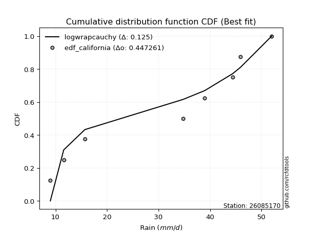</img></img>

</div>


### 2. EDF Hazen (1930)

Hazen method for plotting positions is a formula used to estimate the empirical cumulative probability distribution of flood events or other hydrological data. This formula often results in biased estimations, particularly when extrapolating to extreme events (high return periods).

<div align="center">


$P=(m-0.5)/n$


</div>


**2.1. Empirical values**

<div align="center">

|                | 0                  | 1                  | 2                  | 3                  | 4                  | 5         | 6                 | 7         |
|:---------------|:-------------------|:-------------------|:-------------------|:-------------------|:-------------------|:----------|:------------------|:----------|
| date           | 2025               | 2024               | 2022               | 2018               | 2017               | 2020      | 2021              | 2019      |
| x              | 9.0                | 11.6               | 15.7               | 34.8               | 39.0               | 44.4      | 45.9              | 52.0      |
| m              | 1                  | 2                  | 3                  | 4                  | 5                  | 6         | 7                 | 8         |
| empirical_dist | edf_hazen          | edf_hazen          | edf_hazen          | edf_hazen          | edf_hazen          | edf_hazen | edf_hazen         | edf_hazen |
| empirical      | 0.0625             | 0.1875             | 0.3125             | 0.4375             | 0.5625             | 0.6875    | 0.8125            | 0.9375    |
| empirical_tr   | 1.0666666666666667 | 1.2307692307692308 | 1.4545454545454546 | 1.7777777777777777 | 2.2857142857142856 | 3.2       | 5.333333333333333 | 16.0      |

</div>


**2.2. Kolmogorov-Smirnov fit test (sorted by Δ)**


<div align="center">

|                | 0                  | 1                   | 2                   | 3                   | 4                   | 5                   | 6                   | 7                   | 8                  | 9                   | 10                  | 11                 | 12                 | 13                 | 14                  | 15                  | 16                  | 17                 | 18                  | 19                  | 20                 | 21                  | 22                 | 23                 | 24                 | 25                 | 26                  | 27                 | 28                  | 29                 | 30                  | 31                  | 32                 | 33                  | 34                  | 35                  | 36                  | 37                  | 38                  | 39                  | 40                  | 41                  | 42                  | 43                  | 44                 | 45                  | 46                 | 47                  | 48                  | 49                 | 50                  | 51                  | 52                  | 53                  | 54                  | 55                  | 56                  | 57                 | 58                  | 59                 | 60                 | 61                  | 62                  | 63                  | 64                  | 65                  | 66                  | 67                  | 68                  | 69                 | 70                  | 71                  | 72                 | 73                  | 74                 | 75                 | 76                  | 77                 | 78                  | 79                  | 80                  | 81                  | 82                  | 83                  | 84                  | 85                  | 86                  | 87                 | 88                  | 89                  | 90                  | 91                 | 92                 | 93                 | 94                 | 95                 | 96                  | 97                  | 98                  | 99                 | 100                | 101                 | 102                 | 103                | 104                 | 105                 | 106                | 107                | 108                 | 109                 | 110                | 111                | 112                | 113                | 114                | 115                | 116                | 117                 | 118                | 119                | 120                | 121                 | 122                | 123                | 124                | 125                | 126                 | 127                 | 128                 | 129                | 130                | 131                 | 132                 | 133                 | 134                | 135                | 136                | 137                 | 138                 | 139                | 140                | 141                 | 142                 | 143                | 144                 | 145                | 146                 | 147                | 148                | 149                | 150                | 151                | 152                | 153                | 154                | 155                | 156                | 157                | 158                | 159                |
|:---------------|:-------------------|:--------------------|:--------------------|:--------------------|:--------------------|:--------------------|:--------------------|:--------------------|:-------------------|:--------------------|:--------------------|:-------------------|:-------------------|:-------------------|:--------------------|:--------------------|:--------------------|:-------------------|:--------------------|:--------------------|:-------------------|:--------------------|:-------------------|:-------------------|:-------------------|:-------------------|:--------------------|:-------------------|:--------------------|:-------------------|:--------------------|:--------------------|:-------------------|:--------------------|:--------------------|:--------------------|:--------------------|:--------------------|:--------------------|:--------------------|:--------------------|:--------------------|:--------------------|:--------------------|:-------------------|:--------------------|:-------------------|:--------------------|:--------------------|:-------------------|:--------------------|:--------------------|:--------------------|:--------------------|:--------------------|:--------------------|:--------------------|:-------------------|:--------------------|:-------------------|:-------------------|:--------------------|:--------------------|:--------------------|:--------------------|:--------------------|:--------------------|:--------------------|:--------------------|:-------------------|:--------------------|:--------------------|:-------------------|:--------------------|:-------------------|:-------------------|:--------------------|:-------------------|:--------------------|:--------------------|:--------------------|:--------------------|:--------------------|:--------------------|:--------------------|:--------------------|:--------------------|:-------------------|:--------------------|:--------------------|:--------------------|:-------------------|:-------------------|:-------------------|:-------------------|:-------------------|:--------------------|:--------------------|:--------------------|:-------------------|:-------------------|:--------------------|:--------------------|:-------------------|:--------------------|:--------------------|:-------------------|:-------------------|:--------------------|:--------------------|:-------------------|:-------------------|:-------------------|:-------------------|:-------------------|:-------------------|:-------------------|:--------------------|:-------------------|:-------------------|:-------------------|:--------------------|:-------------------|:-------------------|:-------------------|:-------------------|:--------------------|:--------------------|:--------------------|:-------------------|:-------------------|:--------------------|:--------------------|:--------------------|:-------------------|:-------------------|:-------------------|:--------------------|:--------------------|:-------------------|:-------------------|:--------------------|:--------------------|:-------------------|:--------------------|:-------------------|:--------------------|:-------------------|:-------------------|:-------------------|:-------------------|:-------------------|:-------------------|:-------------------|:-------------------|:-------------------|:-------------------|:-------------------|:-------------------|:-------------------|
| station        | 26085170           | 26085170            | 26085170            | 26085170            | 26085170            | 26085170            | 26085170            | 26085170            | 26085170           | 26085170            | 26085170            | 26085170           | 26085170           | 26085170           | 26085170            | 26085170            | 26085170            | 26085170           | 26085170            | 26085170            | 26085170           | 26085170            | 26085170           | 26085170           | 26085170           | 26085170           | 26085170            | 26085170           | 26085170            | 26085170           | 26085170            | 26085170            | 26085170           | 26085170            | 26085170            | 26085170            | 26085170            | 26085170            | 26085170            | 26085170            | 26085170            | 26085170            | 26085170            | 26085170            | 26085170           | 26085170            | 26085170           | 26085170            | 26085170            | 26085170           | 26085170            | 26085170            | 26085170            | 26085170            | 26085170            | 26085170            | 26085170            | 26085170           | 26085170            | 26085170           | 26085170           | 26085170            | 26085170            | 26085170            | 26085170            | 26085170            | 26085170            | 26085170            | 26085170            | 26085170           | 26085170            | 26085170            | 26085170           | 26085170            | 26085170           | 26085170           | 26085170            | 26085170           | 26085170            | 26085170            | 26085170            | 26085170            | 26085170            | 26085170            | 26085170            | 26085170            | 26085170            | 26085170           | 26085170            | 26085170            | 26085170            | 26085170           | 26085170           | 26085170           | 26085170           | 26085170           | 26085170            | 26085170            | 26085170            | 26085170           | 26085170           | 26085170            | 26085170            | 26085170           | 26085170            | 26085170            | 26085170           | 26085170           | 26085170            | 26085170            | 26085170           | 26085170           | 26085170           | 26085170           | 26085170           | 26085170           | 26085170           | 26085170            | 26085170           | 26085170           | 26085170           | 26085170            | 26085170           | 26085170           | 26085170           | 26085170           | 26085170            | 26085170            | 26085170            | 26085170           | 26085170           | 26085170            | 26085170            | 26085170            | 26085170           | 26085170           | 26085170           | 26085170            | 26085170            | 26085170           | 26085170           | 26085170            | 26085170            | 26085170           | 26085170            | 26085170           | 26085170            | 26085170           | 26085170           | 26085170           | 26085170           | 26085170           | 26085170           | 26085170           | 26085170           | 26085170           | 26085170           | 26085170           | 26085170           | 26085170           |
| empirical_dist | edf_hazen          | edf_hazen           | edf_hazen           | edf_hazen           | edf_hazen           | edf_hazen           | edf_hazen           | edf_hazen           | edf_hazen          | edf_hazen           | edf_hazen           | edf_hazen          | edf_hazen          | edf_hazen          | edf_hazen           | edf_hazen           | edf_hazen           | edf_hazen          | edf_hazen           | edf_hazen           | edf_hazen          | edf_hazen           | edf_hazen          | edf_hazen          | edf_hazen          | edf_hazen          | edf_hazen           | edf_hazen          | edf_hazen           | edf_hazen          | edf_hazen           | edf_hazen           | edf_hazen          | edf_hazen           | edf_hazen           | edf_hazen           | edf_hazen           | edf_hazen           | edf_hazen           | edf_hazen           | edf_hazen           | edf_hazen           | edf_hazen           | edf_hazen           | edf_hazen          | edf_hazen           | edf_hazen          | edf_hazen           | edf_hazen           | edf_hazen          | edf_hazen           | edf_hazen           | edf_hazen           | edf_hazen           | edf_hazen           | edf_hazen           | edf_hazen           | edf_hazen          | edf_hazen           | edf_hazen          | edf_hazen          | edf_hazen           | edf_hazen           | edf_hazen           | edf_hazen           | edf_hazen           | edf_hazen           | edf_hazen           | edf_hazen           | edf_hazen          | edf_hazen           | edf_hazen           | edf_hazen          | edf_hazen           | edf_hazen          | edf_hazen          | edf_hazen           | edf_hazen          | edf_hazen           | edf_hazen           | edf_hazen           | edf_hazen           | edf_hazen           | edf_hazen           | edf_hazen           | edf_hazen           | edf_hazen           | edf_hazen          | edf_hazen           | edf_hazen           | edf_hazen           | edf_hazen          | edf_hazen          | edf_hazen          | edf_hazen          | edf_hazen          | edf_hazen           | edf_hazen           | edf_hazen           | edf_hazen          | edf_hazen          | edf_hazen           | edf_hazen           | edf_hazen          | edf_hazen           | edf_hazen           | edf_hazen          | edf_hazen          | edf_hazen           | edf_hazen           | edf_hazen          | edf_hazen          | edf_hazen          | edf_hazen          | edf_hazen          | edf_hazen          | edf_hazen          | edf_hazen           | edf_hazen          | edf_hazen          | edf_hazen          | edf_hazen           | edf_hazen          | edf_hazen          | edf_hazen          | edf_hazen          | edf_hazen           | edf_hazen           | edf_hazen           | edf_hazen          | edf_hazen          | edf_hazen           | edf_hazen           | edf_hazen           | edf_hazen          | edf_hazen          | edf_hazen          | edf_hazen           | edf_hazen           | edf_hazen          | edf_hazen          | edf_hazen           | edf_hazen           | edf_hazen          | edf_hazen           | edf_hazen          | edf_hazen           | edf_hazen          | edf_hazen          | edf_hazen          | edf_hazen          | edf_hazen          | edf_hazen          | edf_hazen          | edf_hazen          | edf_hazen          | edf_hazen          | edf_hazen          | edf_hazen          | edf_hazen          |
| p_dist         | genpareto          | wrapcauchy          | arcsine             | loggenextreme       | genextreme          | trapezoid           | ksone               | semicircular        | anglit             | logjohnsonsu        | genhalflogistic     | logburr            | logmielke          | burr               | logloggamma         | betaprime           | logtrapezoid        | skewnorm           | erlang              | johnsonsu           | f                  | gamma               | nct                | logweibull_max     | exponnorm          | norm               | crystalball         | truncnorm          | t                   | gengamma           | pearson3            | cosine              | tukeylambda        | loggenpareto        | kappa3              | logargus            | rice                | uniform             | vonmises_line       | foldnorm            | weibull_min         | gumbel_l            | maxwell             | logistic            | invgamma           | beta                | logarcsine         | alpha               | invgauss            | triang             | logburr12           | logweibull_min      | logwrapcauchy       | argus               | rayleigh            | loggenhalflogistic  | gompertz            | kappa4             | hypsecant           | loggumbel_l        | logksone           | loglevy_l           | laplace             | ncf                 | logsemicircular     | logpearson3         | truncpareto         | dweibull            | halfnorm            | loganglit          | dgamma              | kstwobign           | loggompertz        | gumbel_r            | logloglaplace      | logdgamma          | logdweibull         | loggennorm         | lognct              | logt                | logexponnorm        | logcrystalball      | lognorm             | logf                | logfatiguelife      | logtriang           | logncf              | logbetaprime       | logfoldnorm         | logerlang           | logskewnorm         | loginvgamma        | halflogistic       | moyal              | loggamma           | loggamma           | logrice             | logalpha            | loginvgauss         | bradford           | logbeta            | loginvweibull       | lomax               | genexpon           | loglogistic         | logmaxwell          | gausshyper         | truncweibull_min   | lograyleigh         | logrdist            | truncexpon         | logcosine          | levy_l             | loghypsecant       | loggenexpon        | halfgennorm        | logkstwobign       | nakagami            | loghalfnorm        | burr12             | lognakagami        | loglomax            | loggumbel_r        | loglaplace         | loglaplace         | johnsonsb          | loghalflogistic     | logmoyal            | logtruncnorm        | wald               | gennorm            | logjohnsonsb        | logkappa4           | logtukeylambda      | logkappa3          | logexponweib       | loguniform         | logvonmises_line    | logwald             | loggengamma        | logexponpow        | loggausshyper       | logtruncweibull_min | logbradford        | logtruncexpon       | exponpow           | fatiguelife         | powerlaw           | exponweib          | invweibull         | logpowerlaw        | weibull_max        | logtruncpareto     | rdist              | loghalfgennorm     | genlogistic        | loggenlogistic     | logvonmises        | vonmises           | mielke             |
| delta          | 0.097814097568165  | 0.10431398258936042 | 0.10877736007686112 | 0.11061569765295376 | 0.11496965301051501 | 0.11797579935725677 | 0.12164411384485418 | 0.12760147454400939 | 0.1323065163070749 | 0.13390068921342474 | 0.13777555034864855 | 0.1390524935442958 | 0.1396061475385608 | 0.1406457063067947 | 0.14150751856361027 | 0.14953956800048246 | 0.15086489447720508 | 0.1516868784072823 | 0.15192999083148873 | 0.15230019185508192 | 0.1530918198105885 | 0.15316473780381212 | 0.1535658930954432 | 0.1536127026161046 | 0.153647193083718  | 0.1536486586070105 | 0.15364866526436077 | 0.1536487063393437 | 0.15364899992353126 | 0.1539358877496331 | 0.15444263790340218 | 0.15897290706880574 | 0.1602424553061681 | 0.16088691703394883 | 0.16122014073469626 | 0.16143336266494757 | 0.16235652790057187 | 0.16249999999999998 | 0.16250507779044687 | 0.16311251693837492 | 0.16507356599332007 | 0.16816956867048666 | 0.17177884294168588 | 0.17214325199047073 | 0.1724262203163921 | 0.17252658233915397 | 0.1729006806555008 | 0.17313375472358417 | 0.17515580283716026 | 0.1760981379729042 | 0.17688525012827827 | 0.17767023158101636 | 0.17824793199110478 | 0.17900154836093807 | 0.18061380122819892 | 0.18138793564662203 | 0.18166128940252035 | 0.1817977656033648 | 0.18185660223910427 | 0.1832207366158085 | 0.1854433275900076 | 0.18787576102670833 | 0.19080229792635792 | 0.19356036305101454 | 0.19703280167126924 | 0.19883098472578775 | 0.20203607885924557 | 0.20555349162836067 | 0.20565278367007422 | 0.2060346044881689 | 0.20813132948408525 | 0.20840750900219973 | 0.2104699009480292 | 0.21189342084240503 | 0.2137888248608394 | 0.2181636316585952 | 0.21882956403531026 | 0.2192187929249363 | 0.22713976709686068 | 0.22740373366349842 | 0.22740385964868848 | 0.22740532754462262 | 0.22740533576427935 | 0.22796106024808993 | 0.22848347949048942 | 0.22862084884647438 | 0.22893718025154597 | 0.2293921728053866 | 0.23039653046720432 | 0.23101981074664713 | 0.23115022375800076 | 0.2331528792210965 | 0.2337233393403686 | 0.2355241787912441 | 0.2356545424887757 | 0.2356545424887757 | 0.23591957314436407 | 0.23835426116800296 | 0.23955260678080603 | 0.2402574082216541 | 0.2406680390079845 | 0.24278784802508036 | 0.24408486552287623 | 0.244898187516156  | 0.24655619593863543 | 0.24741313590990976 | 0.2515453674820224 | 0.2526587622818778 | 0.25337700717753964 | 0.25673639571945495 | 0.2574998337636678 | 0.2575836199366591 | 0.2604912022788095 | 0.2611351252207422 | 0.2624763174313227 | 0.262936186390633  | 0.2642891034418482 | 0.26774442980585933 | 0.2708956956140999 | 0.275850019276874  | 0.2793021577540442 | 0.28449193523307303 | 0.2849118917735932 | 0.2887237248873241 | 0.2887237248873241 | 0.2944967517124443 | 0.29873939701002505 | 0.30379063388119654 | 0.31249892588110173 | 0.3125             | 0.3125             | 0.31477076470693627 | 0.31660671487258507 | 0.32579869160371544 | 0.3269194337584962 | 0.3312448376699728 | 0.333525114631373  | 0.33766283136192476 | 0.35773432523933624 | 0.3634185133256004 | 0.3656945017798694 | 0.36636693559859146 | 0.3837852384435597  | 0.3885638117004273 | 0.40892294015847164 | 0.4413308871518109 | 0.45161298886922985 | 0.4730456842086277 | 0.5001575987947228 | 0.5064601118495721 | 0.5113251595966565 | 0.5938582167513276 | 0.678485785442489  | 0.6874999999931385 | 0.6875             | 0.8125             | 0.8125             | 1.2157820352322297 | 7.443487010942761  | nan                |
| deltao         | 0.4472608134160001 | 0.4472608134160001  | 0.4472608134160001  | 0.4472608134160001  | 0.4472608134160001  | 0.4472608134160001  | 0.4472608134160001  | 0.4472608134160001  | 0.4472608134160001 | 0.4472608134160001  | 0.4472608134160001  | 0.4472608134160001 | 0.4472608134160001 | 0.4472608134160001 | 0.4472608134160001  | 0.4472608134160001  | 0.4472608134160001  | 0.4472608134160001 | 0.4472608134160001  | 0.4472608134160001  | 0.4472608134160001 | 0.4472608134160001  | 0.4472608134160001 | 0.4472608134160001 | 0.4472608134160001 | 0.4472608134160001 | 0.4472608134160001  | 0.4472608134160001 | 0.4472608134160001  | 0.4472608134160001 | 0.4472608134160001  | 0.4472608134160001  | 0.4472608134160001 | 0.4472608134160001  | 0.4472608134160001  | 0.4472608134160001  | 0.4472608134160001  | 0.4472608134160001  | 0.4472608134160001  | 0.4472608134160001  | 0.4472608134160001  | 0.4472608134160001  | 0.4472608134160001  | 0.4472608134160001  | 0.4472608134160001 | 0.4472608134160001  | 0.4472608134160001 | 0.4472608134160001  | 0.4472608134160001  | 0.4472608134160001 | 0.4472608134160001  | 0.4472608134160001  | 0.4472608134160001  | 0.4472608134160001  | 0.4472608134160001  | 0.4472608134160001  | 0.4472608134160001  | 0.4472608134160001 | 0.4472608134160001  | 0.4472608134160001 | 0.4472608134160001 | 0.4472608134160001  | 0.4472608134160001  | 0.4472608134160001  | 0.4472608134160001  | 0.4472608134160001  | 0.4472608134160001  | 0.4472608134160001  | 0.4472608134160001  | 0.4472608134160001 | 0.4472608134160001  | 0.4472608134160001  | 0.4472608134160001 | 0.4472608134160001  | 0.4472608134160001 | 0.4472608134160001 | 0.4472608134160001  | 0.4472608134160001 | 0.4472608134160001  | 0.4472608134160001  | 0.4472608134160001  | 0.4472608134160001  | 0.4472608134160001  | 0.4472608134160001  | 0.4472608134160001  | 0.4472608134160001  | 0.4472608134160001  | 0.4472608134160001 | 0.4472608134160001  | 0.4472608134160001  | 0.4472608134160001  | 0.4472608134160001 | 0.4472608134160001 | 0.4472608134160001 | 0.4472608134160001 | 0.4472608134160001 | 0.4472608134160001  | 0.4472608134160001  | 0.4472608134160001  | 0.4472608134160001 | 0.4472608134160001 | 0.4472608134160001  | 0.4472608134160001  | 0.4472608134160001 | 0.4472608134160001  | 0.4472608134160001  | 0.4472608134160001 | 0.4472608134160001 | 0.4472608134160001  | 0.4472608134160001  | 0.4472608134160001 | 0.4472608134160001 | 0.4472608134160001 | 0.4472608134160001 | 0.4472608134160001 | 0.4472608134160001 | 0.4472608134160001 | 0.4472608134160001  | 0.4472608134160001 | 0.4472608134160001 | 0.4472608134160001 | 0.4472608134160001  | 0.4472608134160001 | 0.4472608134160001 | 0.4472608134160001 | 0.4472608134160001 | 0.4472608134160001  | 0.4472608134160001  | 0.4472608134160001  | 0.4472608134160001 | 0.4472608134160001 | 0.4472608134160001  | 0.4472608134160001  | 0.4472608134160001  | 0.4472608134160001 | 0.4472608134160001 | 0.4472608134160001 | 0.4472608134160001  | 0.4472608134160001  | 0.4472608134160001 | 0.4472608134160001 | 0.4472608134160001  | 0.4472608134160001  | 0.4472608134160001 | 0.4472608134160001  | 0.4472608134160001 | 0.4472608134160001  | 0.4472608134160001 | 0.4472608134160001 | 0.4472608134160001 | 0.4472608134160001 | 0.4472608134160001 | 0.4472608134160001 | 0.4472608134160001 | 0.4472608134160001 | 0.4472608134160001 | 0.4472608134160001 | 0.4472608134160001 | 0.4472608134160001 | 0.4472608134160001 |
| eval           | Δo > Δ             | Δo > Δ              | Δo > Δ              | Δo > Δ              | Δo > Δ              | Δo > Δ              | Δo > Δ              | Δo > Δ              | Δo > Δ             | Δo > Δ              | Δo > Δ              | Δo > Δ             | Δo > Δ             | Δo > Δ             | Δo > Δ              | Δo > Δ              | Δo > Δ              | Δo > Δ             | Δo > Δ              | Δo > Δ              | Δo > Δ             | Δo > Δ              | Δo > Δ             | Δo > Δ             | Δo > Δ             | Δo > Δ             | Δo > Δ              | Δo > Δ             | Δo > Δ              | Δo > Δ             | Δo > Δ              | Δo > Δ              | Δo > Δ             | Δo > Δ              | Δo > Δ              | Δo > Δ              | Δo > Δ              | Δo > Δ              | Δo > Δ              | Δo > Δ              | Δo > Δ              | Δo > Δ              | Δo > Δ              | Δo > Δ              | Δo > Δ             | Δo > Δ              | Δo > Δ             | Δo > Δ              | Δo > Δ              | Δo > Δ             | Δo > Δ              | Δo > Δ              | Δo > Δ              | Δo > Δ              | Δo > Δ              | Δo > Δ              | Δo > Δ              | Δo > Δ             | Δo > Δ              | Δo > Δ             | Δo > Δ             | Δo > Δ              | Δo > Δ              | Δo > Δ              | Δo > Δ              | Δo > Δ              | Δo > Δ              | Δo > Δ              | Δo > Δ              | Δo > Δ             | Δo > Δ              | Δo > Δ              | Δo > Δ             | Δo > Δ              | Δo > Δ             | Δo > Δ             | Δo > Δ              | Δo > Δ             | Δo > Δ              | Δo > Δ              | Δo > Δ              | Δo > Δ              | Δo > Δ              | Δo > Δ              | Δo > Δ              | Δo > Δ              | Δo > Δ              | Δo > Δ             | Δo > Δ              | Δo > Δ              | Δo > Δ              | Δo > Δ             | Δo > Δ             | Δo > Δ             | Δo > Δ             | Δo > Δ             | Δo > Δ              | Δo > Δ              | Δo > Δ              | Δo > Δ             | Δo > Δ             | Δo > Δ              | Δo > Δ              | Δo > Δ             | Δo > Δ              | Δo > Δ              | Δo > Δ             | Δo > Δ             | Δo > Δ              | Δo > Δ              | Δo > Δ             | Δo > Δ             | Δo > Δ             | Δo > Δ             | Δo > Δ             | Δo > Δ             | Δo > Δ             | Δo > Δ              | Δo > Δ             | Δo > Δ             | Δo > Δ             | Δo > Δ              | Δo > Δ             | Δo > Δ             | Δo > Δ             | Δo > Δ             | Δo > Δ              | Δo > Δ              | Δo > Δ              | Δo > Δ             | Δo > Δ             | Δo > Δ              | Δo > Δ              | Δo > Δ              | Δo > Δ             | Δo > Δ             | Δo > Δ             | Δo > Δ              | Δo > Δ              | Δo > Δ             | Δo > Δ             | Δo > Δ              | Δo > Δ              | Δo > Δ             | Δo > Δ              | Δo > Δ             | Δo <= Δ             | Δo <= Δ            | Δo <= Δ            | Δo <= Δ            | Δo <= Δ            | Δo <= Δ            | Δo <= Δ            | Δo <= Δ            | Δo <= Δ            | Δo <= Δ            | Δo <= Δ            | Δo <= Δ            | Δo <= Δ            | Δo <= Δ            |
| fit            | 1                  | 1                   | 1                   | 1                   | 1                   | 1                   | 1                   | 1                   | 1                  | 1                   | 1                   | 1                  | 1                  | 1                  | 1                   | 1                   | 1                   | 1                  | 1                   | 1                   | 1                  | 1                   | 1                  | 1                  | 1                  | 1                  | 1                   | 1                  | 1                   | 1                  | 1                   | 1                   | 1                  | 1                   | 1                   | 1                   | 1                   | 1                   | 1                   | 1                   | 1                   | 1                   | 1                   | 1                   | 1                  | 1                   | 1                  | 1                   | 1                   | 1                  | 1                   | 1                   | 1                   | 1                   | 1                   | 1                   | 1                   | 1                  | 1                   | 1                  | 1                  | 1                   | 1                   | 1                   | 1                   | 1                   | 1                   | 1                   | 1                   | 1                  | 1                   | 1                   | 1                  | 1                   | 1                  | 1                  | 1                   | 1                  | 1                   | 1                   | 1                   | 1                   | 1                   | 1                   | 1                   | 1                   | 1                   | 1                  | 1                   | 1                   | 1                   | 1                  | 1                  | 1                  | 1                  | 1                  | 1                   | 1                   | 1                   | 1                  | 1                  | 1                   | 1                   | 1                  | 1                   | 1                   | 1                  | 1                  | 1                   | 1                   | 1                  | 1                  | 1                  | 1                  | 1                  | 1                  | 1                  | 1                   | 1                  | 1                  | 1                  | 1                   | 1                  | 1                  | 1                  | 1                  | 1                   | 1                   | 1                   | 1                  | 1                  | 1                   | 1                   | 1                   | 1                  | 1                  | 1                  | 1                   | 1                   | 1                  | 1                  | 1                   | 1                   | 1                  | 1                   | 1                  | 0                   | 0                  | 0                  | 0                  | 0                  | 0                  | 0                  | 0                  | 0                  | 0                  | 0                  | 0                  | 0                  | 0                  |
| n              | 8                  | 8                   | 8                   | 8                   | 8                   | 8                   | 8                   | 8                   | 8                  | 8                   | 8                   | 8                  | 8                  | 8                  | 8                   | 8                   | 8                   | 8                  | 8                   | 8                   | 8                  | 8                   | 8                  | 8                  | 8                  | 8                  | 8                   | 8                  | 8                   | 8                  | 8                   | 8                   | 8                  | 8                   | 8                   | 8                   | 8                   | 8                   | 8                   | 8                   | 8                   | 8                   | 8                   | 8                   | 8                  | 8                   | 8                  | 8                   | 8                   | 8                  | 8                   | 8                   | 8                   | 8                   | 8                   | 8                   | 8                   | 8                  | 8                   | 8                  | 8                  | 8                   | 8                   | 8                   | 8                   | 8                   | 8                   | 8                   | 8                   | 8                  | 8                   | 8                   | 8                  | 8                   | 8                  | 8                  | 8                   | 8                  | 8                   | 8                   | 8                   | 8                   | 8                   | 8                   | 8                   | 8                   | 8                   | 8                  | 8                   | 8                   | 8                   | 8                  | 8                  | 8                  | 8                  | 8                  | 8                   | 8                   | 8                   | 8                  | 8                  | 8                   | 8                   | 8                  | 8                   | 8                   | 8                  | 8                  | 8                   | 8                   | 8                  | 8                  | 8                  | 8                  | 8                  | 8                  | 8                  | 8                   | 8                  | 8                  | 8                  | 8                   | 8                  | 8                  | 8                  | 8                  | 8                   | 8                   | 8                   | 8                  | 8                  | 8                   | 8                   | 8                   | 8                  | 8                  | 8                  | 8                   | 8                   | 8                  | 8                  | 8                   | 8                   | 8                  | 8                   | 8                  | 8                   | 8                  | 8                  | 8                  | 8                  | 8                  | 8                  | 8                  | 8                  | 8                  | 8                  | 8                  | 8                  | 8                  |
| best_fit       | 1                  | 0                   | 0                   | 0                   | 0                   | 0                   | 0                   | 0                   | 0                  | 0                   | 0                   | 0                  | 0                  | 0                  | 0                   | 0                   | 0                   | 0                  | 0                   | 0                   | 0                  | 0                   | 0                  | 0                  | 0                  | 0                  | 0                   | 0                  | 0                   | 0                  | 0                   | 0                   | 0                  | 0                   | 0                   | 0                   | 0                   | 0                   | 0                   | 0                   | 0                   | 0                   | 0                   | 0                   | 0                  | 0                   | 0                  | 0                   | 0                   | 0                  | 0                   | 0                   | 0                   | 0                   | 0                   | 0                   | 0                   | 0                  | 0                   | 0                  | 0                  | 0                   | 0                   | 0                   | 0                   | 0                   | 0                   | 0                   | 0                   | 0                  | 0                   | 0                   | 0                  | 0                   | 0                  | 0                  | 0                   | 0                  | 0                   | 0                   | 0                   | 0                   | 0                   | 0                   | 0                   | 0                   | 0                   | 0                  | 0                   | 0                   | 0                   | 0                  | 0                  | 0                  | 0                  | 0                  | 0                   | 0                   | 0                   | 0                  | 0                  | 0                   | 0                   | 0                  | 0                   | 0                   | 0                  | 0                  | 0                   | 0                   | 0                  | 0                  | 0                  | 0                  | 0                  | 0                  | 0                  | 0                   | 0                  | 0                  | 0                  | 0                   | 0                  | 0                  | 0                  | 0                  | 0                   | 0                   | 0                   | 0                  | 0                  | 0                   | 0                   | 0                   | 0                  | 0                  | 0                  | 0                   | 0                   | 0                  | 0                  | 0                   | 0                   | 0                  | 0                   | 0                  | 0                   | 0                  | 0                  | 0                  | 0                  | 0                  | 0                  | 0                  | 0                  | 0                  | 0                  | 0                  | 0                  | 0                  |
| best_fit_sort  | 1                  | 2                   | 3                   | 4                   | 5                   | 6                   | 7                   | 8                   | 9                  | 10                  | 11                  | 12                 | 13                 | 14                 | 15                  | 16                  | 17                  | 18                 | 19                  | 20                  | 21                 | 22                  | 23                 | 24                 | 25                 | 26                 | 27                  | 28                 | 29                  | 30                 | 31                  | 32                  | 33                 | 34                  | 35                  | 36                  | 37                  | 38                  | 39                  | 40                  | 41                  | 42                  | 43                  | 44                  | 45                 | 46                  | 47                 | 48                  | 49                  | 50                 | 51                  | 52                  | 53                  | 54                  | 55                  | 56                  | 57                  | 58                 | 59                  | 60                 | 61                 | 62                  | 63                  | 64                  | 65                  | 66                  | 67                  | 68                  | 69                  | 70                 | 71                  | 72                  | 73                 | 74                  | 75                 | 76                 | 77                  | 78                 | 79                  | 80                  | 81                  | 82                  | 83                  | 84                  | 85                  | 86                  | 87                  | 88                 | 89                  | 90                  | 91                  | 92                 | 93                 | 94                 | 95                 | 96                 | 97                  | 98                  | 99                  | 100                | 101                | 102                 | 103                 | 104                | 105                 | 106                 | 107                | 108                | 109                 | 110                 | 111                | 112                | 113                | 114                | 115                | 116                | 117                | 118                 | 119                | 120                | 121                | 122                 | 123                | 124                | 125                | 126                | 127                 | 128                 | 129                 | 130                | 131                | 132                 | 133                 | 134                 | 135                | 136                | 137                | 138                 | 139                 | 140                | 141                | 142                 | 143                 | 144                | 145                 | 146                | 147                 | 148                | 149                | 150                | 151                | 152                | 153                | 154                | 155                | 156                | 157                | 158                | 159                | 160                |

</div>


**2.3. Best fit**

<div align="center">

|   id |   station | empirical_dist   | p_dist    |     delta |   deltao | eval   |   fit |   n |   best_fit |   best_fit_sort |
|-----:|----------:|:-----------------|:----------|----------:|---------:|:-------|------:|----:|-----------:|----------------:|
|    0 |  26085170 | edf_hazen        | genpareto | 0.0978141 | 0.447261 | Δo > Δ |     1 |   8 |          1 |               1 |

</div>


<div align="center">

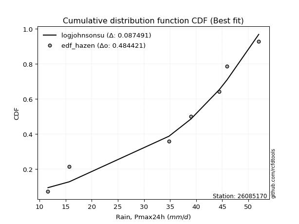</img></img>

</div>


### 3. EDF Weibull (1939)

Weibull plotting position formula is an empirical method used to estimate the non-exceedance probability or plotting position for a set of observed data, is often recommended or widely used in practice, particularly in flood frequency analysis.

<div align="center">


$P=m/(n+1)$


</div>


**3.1. Empirical values**

<div align="center">

|                | 0                  | 1                  | 2                  | 3                  | 4                  | 5                  | 6                  | 7                  |
|:---------------|:-------------------|:-------------------|:-------------------|:-------------------|:-------------------|:-------------------|:-------------------|:-------------------|
| date           | 2025               | 2024               | 2022               | 2018               | 2017               | 2020               | 2021               | 2019               |
| x              | 9.0                | 11.6               | 15.7               | 34.8               | 39.0               | 44.4               | 45.9               | 52.0               |
| m              | 1                  | 2                  | 3                  | 4                  | 5                  | 6                  | 7                  | 8                  |
| empirical_dist | edf_weibull        | edf_weibull        | edf_weibull        | edf_weibull        | edf_weibull        | edf_weibull        | edf_weibull        | edf_weibull        |
| empirical      | 0.1111111111111111 | 0.2222222222222222 | 0.3333333333333333 | 0.4444444444444444 | 0.5555555555555556 | 0.6666666666666666 | 0.7777777777777778 | 0.8888888888888888 |
| empirical_tr   | 1.125              | 1.2857142857142856 | 1.4999999999999998 | 1.7999999999999998 | 2.25               | 2.9999999999999996 | 4.5                | 8.999999999999996  |

</div>


**3.2. Kolmogorov-Smirnov fit test (sorted by Δ)**


<div align="center">

|                | 0                  | 1                  | 2                   | 3                   | 4                   | 5                   | 6                   | 7                   | 8                   | 9                   | 10                 | 11                  | 12                  | 13                  | 14                 | 15                  | 16                  | 17                  | 18                 | 19                  | 20                  | 21                  | 22                  | 23                  | 24                 | 25                  | 26                 | 27                  | 28                  | 29                  | 30                  | 31                 | 32                  | 33                  | 34                 | 35                  | 36                 | 37                  | 38                 | 39                 | 40                 | 41                 | 42                  | 43                  | 44                  | 45                 | 46                  | 47                 | 48                  | 49                  | 50                  | 51                  | 52                  | 53                  | 54                  | 55                  | 56                  | 57                  | 58                  | 59                  | 60                  | 61                  | 62                 | 63                 | 64                  | 65                  | 66                 | 67                  | 68                  | 69                  | 70                 | 71                 | 72                  | 73                 | 74                  | 75                 | 76                  | 77                 | 78                  | 79                 | 80                 | 81                  | 82                  | 83                  | 84                 | 85                 | 86                  | 87                 | 88                 | 89                  | 90                  | 91                 | 92                 | 93                  | 94                  | 95                  | 96                 | 97                  | 98                 | 99                  | 100                | 101                 | 102                 | 103                | 104                 | 105                | 106                 | 107                 | 108                 | 109                 | 110                 | 111                | 112                | 113                | 114                | 115                 | 116                | 117                | 118                | 119                 | 120                | 121                | 122                | 123                | 124                | 125                 | 126                | 127                | 128                 | 129                | 130                 | 131                | 132                 | 133                | 134                | 135                 | 136                | 137                 | 138                | 139                | 140                 | 141                 | 142                 | 143                | 144                | 145                | 146                 | 147                | 148                 | 149                | 150                | 151                | 152                | 153                | 154                | 155                | 156                | 157                | 158                | 159                |
|:---------------|:-------------------|:-------------------|:--------------------|:--------------------|:--------------------|:--------------------|:--------------------|:--------------------|:--------------------|:--------------------|:-------------------|:--------------------|:--------------------|:--------------------|:-------------------|:--------------------|:--------------------|:--------------------|:-------------------|:--------------------|:--------------------|:--------------------|:--------------------|:--------------------|:-------------------|:--------------------|:-------------------|:--------------------|:--------------------|:--------------------|:--------------------|:-------------------|:--------------------|:--------------------|:-------------------|:--------------------|:-------------------|:--------------------|:-------------------|:-------------------|:-------------------|:-------------------|:--------------------|:--------------------|:--------------------|:-------------------|:--------------------|:-------------------|:--------------------|:--------------------|:--------------------|:--------------------|:--------------------|:--------------------|:--------------------|:--------------------|:--------------------|:--------------------|:--------------------|:--------------------|:--------------------|:--------------------|:-------------------|:-------------------|:--------------------|:--------------------|:-------------------|:--------------------|:--------------------|:--------------------|:-------------------|:-------------------|:--------------------|:-------------------|:--------------------|:-------------------|:--------------------|:-------------------|:--------------------|:-------------------|:-------------------|:--------------------|:--------------------|:--------------------|:-------------------|:-------------------|:--------------------|:-------------------|:-------------------|:--------------------|:--------------------|:-------------------|:-------------------|:--------------------|:--------------------|:--------------------|:-------------------|:--------------------|:-------------------|:--------------------|:-------------------|:--------------------|:--------------------|:-------------------|:--------------------|:-------------------|:--------------------|:--------------------|:--------------------|:--------------------|:--------------------|:-------------------|:-------------------|:-------------------|:-------------------|:--------------------|:-------------------|:-------------------|:-------------------|:--------------------|:-------------------|:-------------------|:-------------------|:-------------------|:-------------------|:--------------------|:-------------------|:-------------------|:--------------------|:-------------------|:--------------------|:-------------------|:--------------------|:-------------------|:-------------------|:--------------------|:-------------------|:--------------------|:-------------------|:-------------------|:--------------------|:--------------------|:--------------------|:-------------------|:-------------------|:-------------------|:--------------------|:-------------------|:--------------------|:-------------------|:-------------------|:-------------------|:-------------------|:-------------------|:-------------------|:-------------------|:-------------------|:-------------------|:-------------------|:-------------------|
| station        | 26085170           | 26085170           | 26085170            | 26085170            | 26085170            | 26085170            | 26085170            | 26085170            | 26085170            | 26085170            | 26085170           | 26085170            | 26085170            | 26085170            | 26085170           | 26085170            | 26085170            | 26085170            | 26085170           | 26085170            | 26085170            | 26085170            | 26085170            | 26085170            | 26085170           | 26085170            | 26085170           | 26085170            | 26085170            | 26085170            | 26085170            | 26085170           | 26085170            | 26085170            | 26085170           | 26085170            | 26085170           | 26085170            | 26085170           | 26085170           | 26085170           | 26085170           | 26085170            | 26085170            | 26085170            | 26085170           | 26085170            | 26085170           | 26085170            | 26085170            | 26085170            | 26085170            | 26085170            | 26085170            | 26085170            | 26085170            | 26085170            | 26085170            | 26085170            | 26085170            | 26085170            | 26085170            | 26085170           | 26085170           | 26085170            | 26085170            | 26085170           | 26085170            | 26085170            | 26085170            | 26085170           | 26085170           | 26085170            | 26085170           | 26085170            | 26085170           | 26085170            | 26085170           | 26085170            | 26085170           | 26085170           | 26085170            | 26085170            | 26085170            | 26085170           | 26085170           | 26085170            | 26085170           | 26085170           | 26085170            | 26085170            | 26085170           | 26085170           | 26085170            | 26085170            | 26085170            | 26085170           | 26085170            | 26085170           | 26085170            | 26085170           | 26085170            | 26085170            | 26085170           | 26085170            | 26085170           | 26085170            | 26085170            | 26085170            | 26085170            | 26085170            | 26085170           | 26085170           | 26085170           | 26085170           | 26085170            | 26085170           | 26085170           | 26085170           | 26085170            | 26085170           | 26085170           | 26085170           | 26085170           | 26085170           | 26085170            | 26085170           | 26085170           | 26085170            | 26085170           | 26085170            | 26085170           | 26085170            | 26085170           | 26085170           | 26085170            | 26085170           | 26085170            | 26085170           | 26085170           | 26085170            | 26085170            | 26085170            | 26085170           | 26085170           | 26085170           | 26085170            | 26085170           | 26085170            | 26085170           | 26085170           | 26085170           | 26085170           | 26085170           | 26085170           | 26085170           | 26085170           | 26085170           | 26085170           | 26085170           |
| empirical_dist | edf_weibull        | edf_weibull        | edf_weibull         | edf_weibull         | edf_weibull         | edf_weibull         | edf_weibull         | edf_weibull         | edf_weibull         | edf_weibull         | edf_weibull        | edf_weibull         | edf_weibull         | edf_weibull         | edf_weibull        | edf_weibull         | edf_weibull         | edf_weibull         | edf_weibull        | edf_weibull         | edf_weibull         | edf_weibull         | edf_weibull         | edf_weibull         | edf_weibull        | edf_weibull         | edf_weibull        | edf_weibull         | edf_weibull         | edf_weibull         | edf_weibull         | edf_weibull        | edf_weibull         | edf_weibull         | edf_weibull        | edf_weibull         | edf_weibull        | edf_weibull         | edf_weibull        | edf_weibull        | edf_weibull        | edf_weibull        | edf_weibull         | edf_weibull         | edf_weibull         | edf_weibull        | edf_weibull         | edf_weibull        | edf_weibull         | edf_weibull         | edf_weibull         | edf_weibull         | edf_weibull         | edf_weibull         | edf_weibull         | edf_weibull         | edf_weibull         | edf_weibull         | edf_weibull         | edf_weibull         | edf_weibull         | edf_weibull         | edf_weibull        | edf_weibull        | edf_weibull         | edf_weibull         | edf_weibull        | edf_weibull         | edf_weibull         | edf_weibull         | edf_weibull        | edf_weibull        | edf_weibull         | edf_weibull        | edf_weibull         | edf_weibull        | edf_weibull         | edf_weibull        | edf_weibull         | edf_weibull        | edf_weibull        | edf_weibull         | edf_weibull         | edf_weibull         | edf_weibull        | edf_weibull        | edf_weibull         | edf_weibull        | edf_weibull        | edf_weibull         | edf_weibull         | edf_weibull        | edf_weibull        | edf_weibull         | edf_weibull         | edf_weibull         | edf_weibull        | edf_weibull         | edf_weibull        | edf_weibull         | edf_weibull        | edf_weibull         | edf_weibull         | edf_weibull        | edf_weibull         | edf_weibull        | edf_weibull         | edf_weibull         | edf_weibull         | edf_weibull         | edf_weibull         | edf_weibull        | edf_weibull        | edf_weibull        | edf_weibull        | edf_weibull         | edf_weibull        | edf_weibull        | edf_weibull        | edf_weibull         | edf_weibull        | edf_weibull        | edf_weibull        | edf_weibull        | edf_weibull        | edf_weibull         | edf_weibull        | edf_weibull        | edf_weibull         | edf_weibull        | edf_weibull         | edf_weibull        | edf_weibull         | edf_weibull        | edf_weibull        | edf_weibull         | edf_weibull        | edf_weibull         | edf_weibull        | edf_weibull        | edf_weibull         | edf_weibull         | edf_weibull         | edf_weibull        | edf_weibull        | edf_weibull        | edf_weibull         | edf_weibull        | edf_weibull         | edf_weibull        | edf_weibull        | edf_weibull        | edf_weibull        | edf_weibull        | edf_weibull        | edf_weibull        | edf_weibull        | edf_weibull        | edf_weibull        | edf_weibull        |
| p_dist         | wrapcauchy         | arcsine            | genpareto           | loggenpareto        | ksone               | loggenextreme       | logweibull_max      | genextreme          | semicircular        | beta                | trapezoid          | loglevy_l           | logtrapezoid        | anglit              | logarcsine         | logjohnsonsu        | genhalflogistic     | logburr             | logmielke          | burr                | logloggamma         | invgamma            | alpha               | invgauss            | tukeylambda        | betaprime           | maxwell            | logweibull_min      | erlang              | logwrapcauchy       | gamma               | skewnorm           | johnsonsu           | logburr12           | rayleigh           | f                   | nct                | loggenhalflogistic  | exponnorm          | norm               | crystalball        | truncnorm          | t                   | gengamma            | kappa4              | pearson3           | cosine              | loggumbel_l        | uniform             | vonmises_line       | kappa3              | logksone            | rice                | logargus            | foldnorm            | weibull_min         | ncf                 | gumbel_l            | logsemicircular     | logpearson3         | logistic            | truncpareto         | triang             | halfnorm           | loganglit           | argus               | kstwobign          | gompertz            | hypsecant           | loggompertz         | gumbel_r           | logbeta            | laplace             | levy_l             | lognct              | logt               | logexponnorm        | logcrystalball     | lognorm             | logf               | logfatiguelife     | logtriang           | logncf              | logbetaprime        | logfoldnorm        | logerlang          | logskewnorm         | loginvgamma        | dweibull           | halflogistic        | moyal               | loggamma           | loggamma           | dgamma              | logrice             | logalpha            | loginvgauss        | bradford            | logloglaplace      | loginvweibull       | lomax              | genexpon            | logdgamma           | loglogistic        | logdweibull         | loggennorm         | logmaxwell          | gausshyper          | truncweibull_min    | lograyleigh         | logrdist            | truncexpon         | logcosine          | loghypsecant       | loggenexpon        | halfgennorm         | logkstwobign       | johnsonsb          | nakagami           | loghalfnorm         | burr12             | lognakagami        | loglomax           | gennorm            | loggumbel_r        | logjohnsonsb        | loglaplace         | loglaplace         | loghalflogistic     | logmoyal           | logkappa4           | logtukeylambda     | logkappa3           | logexponweib       | loguniform         | logvonmises_line    | logexponpow        | logtruncnorm        | wald               | logwald            | loggengamma         | loggausshyper       | logtruncweibull_min | logbradford        | exponpow           | logtruncexpon      | fatiguelife         | invweibull         | exponweib           | powerlaw           | logpowerlaw        | weibull_max        | logtruncpareto     | rdist              | loghalfgennorm     | genlogistic        | loggenlogistic     | logvonmises        | vonmises           | mielke             |
| delta          | 0.1111110760388484 | 0.1111111111111111 | 0.11864743090149832 | 0.11918124721106638 | 0.12177462700746869 | 0.13144903098628707 | 0.13172255477076397 | 0.13580298634384833 | 0.13760889208822863 | 0.13780436011693176 | 0.1388091326905901 | 0.13926464991559723 | 0.14392045003276066 | 0.14893883928615448 | 0.1529245541138745 | 0.15473402254675805 | 0.15860888368198187 | 0.15988582687762912 | 0.1604394808718941 | 0.16147903964012802 | 0.16234085189694358 | 0.16548177587194768 | 0.16618931027913975 | 0.16821135839271584 | 0.1698325922347384 | 0.17037290133381577 | 0.170398956916977  | 0.17072578713657194 | 0.17121140714130786 | 0.17130348754666036 | 0.17131629092216988 | 0.1725202117406156 | 0.17313352518841524 | 0.17343200807582593 | 0.1736693567837545 | 0.17392515314392182 | 0.1743992264287765 | 0.17444349120217761 | 0.1744805264170513 | 0.1744819919403438 | 0.1744819985976941 | 0.174482039672677  | 0.17448233325686457 | 0.17476922108296641 | 0.17485332115892038 | 0.1752759712367355 | 0.17611422202073862 | 0.1762762921713641 | 0.17751937984496124 | 0.17752511913741825 | 0.17785174639755721 | 0.17849888314556317 | 0.18003956924249073 | 0.18226669599828088 | 0.18394585027170823 | 0.18590689932665339 | 0.18661591860657012 | 0.18900290200381997 | 0.19008835722682482 | 0.19188654028134333 | 0.19297658532380405 | 0.19509163441480115 | 0.1969314713062375 | 0.1987083392256298 | 0.19909016004372448 | 0.19983488169427138 | 0.2014630645577553 | 0.20249462273585367 | 0.20268993557243759 | 0.20352545650358478 | 0.2049489763979606 | 0.2059458167857623 | 0.21163563125969123 | 0.2118800911676984 | 0.22019532265241626 | 0.220459289219054  | 0.22045941520424406 | 0.2204608831001782 | 0.22046089131983493 | 0.2210166158036455 | 0.221539035046045  | 0.22167640440202996 | 0.22199273580710155 | 0.22244772836094218 | 0.2234520860227599 | 0.2240753663022027 | 0.22420577931355634 | 0.2262084347766521 | 0.226386824961694  | 0.22677889489592418 | 0.22857973434679968 | 0.2287100980443313 | 0.2287100980443313 | 0.22896466281741856 | 0.22897512869991965 | 0.23140981672355854 | 0.2326081623363616 | 0.23331296377720967 | 0.2346221581941727 | 0.23584340358063594 | 0.2371404210784318 | 0.23795374307171158 | 0.23899696499192852 | 0.239611751494191  | 0.23966289736864357 | 0.2400521262582696 | 0.24046869146546535 | 0.24460092303757797 | 0.24571431783743336 | 0.24643256273309522 | 0.24979195127501053 | 0.2505553893192234 | 0.2506391754922147 | 0.2541906807762978 | 0.2555318729868783 | 0.25599174194618857 | 0.2573446589974038 | 0.2597745294902221 | 0.2607999853614149 | 0.26395125116965545 | 0.2689055748324296 | 0.2723577133095998 | 0.2775474907886286 | 0.2777777777777778 | 0.2779674473291488 | 0.28004854248471406 | 0.2817792804428797 | 0.2817792804428797 | 0.29179495256558063 | 0.2968461894367521 | 0.30966227042814065 | 0.318854247159271  | 0.31997498931405177 | 0.3243003932255284 | 0.3265806701869286 | 0.33071838691748034 | 0.3309722795576472 | 0.33333225921443504 | 0.3333333333333333 | 0.3507898807948918 | 0.35647406888115596 | 0.35942249115414704 | 0.3768407939991153  | 0.3816193672559829 | 0.3927197760406998 | 0.4019784957140272 | 0.42458423685588953 | 0.4578490007384609 | 0.46543537657250056 | 0.4661012397641833 | 0.5043807151522121 | 0.5591359945291053 | 0.6437635632202668 | 0.6666666666598051 | 0.6666666666666666 | 0.7777777777777778 | 0.7777777777777778 | 1.2088375907877853 | 7.492098122053871  | nan                |
| deltao         | 0.4472608134160001 | 0.4472608134160001 | 0.4472608134160001  | 0.4472608134160001  | 0.4472608134160001  | 0.4472608134160001  | 0.4472608134160001  | 0.4472608134160001  | 0.4472608134160001  | 0.4472608134160001  | 0.4472608134160001 | 0.4472608134160001  | 0.4472608134160001  | 0.4472608134160001  | 0.4472608134160001 | 0.4472608134160001  | 0.4472608134160001  | 0.4472608134160001  | 0.4472608134160001 | 0.4472608134160001  | 0.4472608134160001  | 0.4472608134160001  | 0.4472608134160001  | 0.4472608134160001  | 0.4472608134160001 | 0.4472608134160001  | 0.4472608134160001 | 0.4472608134160001  | 0.4472608134160001  | 0.4472608134160001  | 0.4472608134160001  | 0.4472608134160001 | 0.4472608134160001  | 0.4472608134160001  | 0.4472608134160001 | 0.4472608134160001  | 0.4472608134160001 | 0.4472608134160001  | 0.4472608134160001 | 0.4472608134160001 | 0.4472608134160001 | 0.4472608134160001 | 0.4472608134160001  | 0.4472608134160001  | 0.4472608134160001  | 0.4472608134160001 | 0.4472608134160001  | 0.4472608134160001 | 0.4472608134160001  | 0.4472608134160001  | 0.4472608134160001  | 0.4472608134160001  | 0.4472608134160001  | 0.4472608134160001  | 0.4472608134160001  | 0.4472608134160001  | 0.4472608134160001  | 0.4472608134160001  | 0.4472608134160001  | 0.4472608134160001  | 0.4472608134160001  | 0.4472608134160001  | 0.4472608134160001 | 0.4472608134160001 | 0.4472608134160001  | 0.4472608134160001  | 0.4472608134160001 | 0.4472608134160001  | 0.4472608134160001  | 0.4472608134160001  | 0.4472608134160001 | 0.4472608134160001 | 0.4472608134160001  | 0.4472608134160001 | 0.4472608134160001  | 0.4472608134160001 | 0.4472608134160001  | 0.4472608134160001 | 0.4472608134160001  | 0.4472608134160001 | 0.4472608134160001 | 0.4472608134160001  | 0.4472608134160001  | 0.4472608134160001  | 0.4472608134160001 | 0.4472608134160001 | 0.4472608134160001  | 0.4472608134160001 | 0.4472608134160001 | 0.4472608134160001  | 0.4472608134160001  | 0.4472608134160001 | 0.4472608134160001 | 0.4472608134160001  | 0.4472608134160001  | 0.4472608134160001  | 0.4472608134160001 | 0.4472608134160001  | 0.4472608134160001 | 0.4472608134160001  | 0.4472608134160001 | 0.4472608134160001  | 0.4472608134160001  | 0.4472608134160001 | 0.4472608134160001  | 0.4472608134160001 | 0.4472608134160001  | 0.4472608134160001  | 0.4472608134160001  | 0.4472608134160001  | 0.4472608134160001  | 0.4472608134160001 | 0.4472608134160001 | 0.4472608134160001 | 0.4472608134160001 | 0.4472608134160001  | 0.4472608134160001 | 0.4472608134160001 | 0.4472608134160001 | 0.4472608134160001  | 0.4472608134160001 | 0.4472608134160001 | 0.4472608134160001 | 0.4472608134160001 | 0.4472608134160001 | 0.4472608134160001  | 0.4472608134160001 | 0.4472608134160001 | 0.4472608134160001  | 0.4472608134160001 | 0.4472608134160001  | 0.4472608134160001 | 0.4472608134160001  | 0.4472608134160001 | 0.4472608134160001 | 0.4472608134160001  | 0.4472608134160001 | 0.4472608134160001  | 0.4472608134160001 | 0.4472608134160001 | 0.4472608134160001  | 0.4472608134160001  | 0.4472608134160001  | 0.4472608134160001 | 0.4472608134160001 | 0.4472608134160001 | 0.4472608134160001  | 0.4472608134160001 | 0.4472608134160001  | 0.4472608134160001 | 0.4472608134160001 | 0.4472608134160001 | 0.4472608134160001 | 0.4472608134160001 | 0.4472608134160001 | 0.4472608134160001 | 0.4472608134160001 | 0.4472608134160001 | 0.4472608134160001 | 0.4472608134160001 |
| eval           | Δo > Δ             | Δo > Δ             | Δo > Δ              | Δo > Δ              | Δo > Δ              | Δo > Δ              | Δo > Δ              | Δo > Δ              | Δo > Δ              | Δo > Δ              | Δo > Δ             | Δo > Δ              | Δo > Δ              | Δo > Δ              | Δo > Δ             | Δo > Δ              | Δo > Δ              | Δo > Δ              | Δo > Δ             | Δo > Δ              | Δo > Δ              | Δo > Δ              | Δo > Δ              | Δo > Δ              | Δo > Δ             | Δo > Δ              | Δo > Δ             | Δo > Δ              | Δo > Δ              | Δo > Δ              | Δo > Δ              | Δo > Δ             | Δo > Δ              | Δo > Δ              | Δo > Δ             | Δo > Δ              | Δo > Δ             | Δo > Δ              | Δo > Δ             | Δo > Δ             | Δo > Δ             | Δo > Δ             | Δo > Δ              | Δo > Δ              | Δo > Δ              | Δo > Δ             | Δo > Δ              | Δo > Δ             | Δo > Δ              | Δo > Δ              | Δo > Δ              | Δo > Δ              | Δo > Δ              | Δo > Δ              | Δo > Δ              | Δo > Δ              | Δo > Δ              | Δo > Δ              | Δo > Δ              | Δo > Δ              | Δo > Δ              | Δo > Δ              | Δo > Δ             | Δo > Δ             | Δo > Δ              | Δo > Δ              | Δo > Δ             | Δo > Δ              | Δo > Δ              | Δo > Δ              | Δo > Δ             | Δo > Δ             | Δo > Δ              | Δo > Δ             | Δo > Δ              | Δo > Δ             | Δo > Δ              | Δo > Δ             | Δo > Δ              | Δo > Δ             | Δo > Δ             | Δo > Δ              | Δo > Δ              | Δo > Δ              | Δo > Δ             | Δo > Δ             | Δo > Δ              | Δo > Δ             | Δo > Δ             | Δo > Δ              | Δo > Δ              | Δo > Δ             | Δo > Δ             | Δo > Δ              | Δo > Δ              | Δo > Δ              | Δo > Δ             | Δo > Δ              | Δo > Δ             | Δo > Δ              | Δo > Δ             | Δo > Δ              | Δo > Δ              | Δo > Δ             | Δo > Δ              | Δo > Δ             | Δo > Δ              | Δo > Δ              | Δo > Δ              | Δo > Δ              | Δo > Δ              | Δo > Δ             | Δo > Δ             | Δo > Δ             | Δo > Δ             | Δo > Δ              | Δo > Δ             | Δo > Δ             | Δo > Δ             | Δo > Δ              | Δo > Δ             | Δo > Δ             | Δo > Δ             | Δo > Δ             | Δo > Δ             | Δo > Δ              | Δo > Δ             | Δo > Δ             | Δo > Δ              | Δo > Δ             | Δo > Δ              | Δo > Δ             | Δo > Δ              | Δo > Δ             | Δo > Δ             | Δo > Δ              | Δo > Δ             | Δo > Δ              | Δo > Δ             | Δo > Δ             | Δo > Δ              | Δo > Δ              | Δo > Δ              | Δo > Δ             | Δo > Δ             | Δo > Δ             | Δo > Δ              | Δo <= Δ            | Δo <= Δ             | Δo <= Δ            | Δo <= Δ            | Δo <= Δ            | Δo <= Δ            | Δo <= Δ            | Δo <= Δ            | Δo <= Δ            | Δo <= Δ            | Δo <= Δ            | Δo <= Δ            | Δo <= Δ            |
| fit            | 1                  | 1                  | 1                   | 1                   | 1                   | 1                   | 1                   | 1                   | 1                   | 1                   | 1                  | 1                   | 1                   | 1                   | 1                  | 1                   | 1                   | 1                   | 1                  | 1                   | 1                   | 1                   | 1                   | 1                   | 1                  | 1                   | 1                  | 1                   | 1                   | 1                   | 1                   | 1                  | 1                   | 1                   | 1                  | 1                   | 1                  | 1                   | 1                  | 1                  | 1                  | 1                  | 1                   | 1                   | 1                   | 1                  | 1                   | 1                  | 1                   | 1                   | 1                   | 1                   | 1                   | 1                   | 1                   | 1                   | 1                   | 1                   | 1                   | 1                   | 1                   | 1                   | 1                  | 1                  | 1                   | 1                   | 1                  | 1                   | 1                   | 1                   | 1                  | 1                  | 1                   | 1                  | 1                   | 1                  | 1                   | 1                  | 1                   | 1                  | 1                  | 1                   | 1                   | 1                   | 1                  | 1                  | 1                   | 1                  | 1                  | 1                   | 1                   | 1                  | 1                  | 1                   | 1                   | 1                   | 1                  | 1                   | 1                  | 1                   | 1                  | 1                   | 1                   | 1                  | 1                   | 1                  | 1                   | 1                   | 1                   | 1                   | 1                   | 1                  | 1                  | 1                  | 1                  | 1                   | 1                  | 1                  | 1                  | 1                   | 1                  | 1                  | 1                  | 1                  | 1                  | 1                   | 1                  | 1                  | 1                   | 1                  | 1                   | 1                  | 1                   | 1                  | 1                  | 1                   | 1                  | 1                   | 1                  | 1                  | 1                   | 1                   | 1                   | 1                  | 1                  | 1                  | 1                   | 0                  | 0                   | 0                  | 0                  | 0                  | 0                  | 0                  | 0                  | 0                  | 0                  | 0                  | 0                  | 0                  |
| n              | 8                  | 8                  | 8                   | 8                   | 8                   | 8                   | 8                   | 8                   | 8                   | 8                   | 8                  | 8                   | 8                   | 8                   | 8                  | 8                   | 8                   | 8                   | 8                  | 8                   | 8                   | 8                   | 8                   | 8                   | 8                  | 8                   | 8                  | 8                   | 8                   | 8                   | 8                   | 8                  | 8                   | 8                   | 8                  | 8                   | 8                  | 8                   | 8                  | 8                  | 8                  | 8                  | 8                   | 8                   | 8                   | 8                  | 8                   | 8                  | 8                   | 8                   | 8                   | 8                   | 8                   | 8                   | 8                   | 8                   | 8                   | 8                   | 8                   | 8                   | 8                   | 8                   | 8                  | 8                  | 8                   | 8                   | 8                  | 8                   | 8                   | 8                   | 8                  | 8                  | 8                   | 8                  | 8                   | 8                  | 8                   | 8                  | 8                   | 8                  | 8                  | 8                   | 8                   | 8                   | 8                  | 8                  | 8                   | 8                  | 8                  | 8                   | 8                   | 8                  | 8                  | 8                   | 8                   | 8                   | 8                  | 8                   | 8                  | 8                   | 8                  | 8                   | 8                   | 8                  | 8                   | 8                  | 8                   | 8                   | 8                   | 8                   | 8                   | 8                  | 8                  | 8                  | 8                  | 8                   | 8                  | 8                  | 8                  | 8                   | 8                  | 8                  | 8                  | 8                  | 8                  | 8                   | 8                  | 8                  | 8                   | 8                  | 8                   | 8                  | 8                   | 8                  | 8                  | 8                   | 8                  | 8                   | 8                  | 8                  | 8                   | 8                   | 8                   | 8                  | 8                  | 8                  | 8                   | 8                  | 8                   | 8                  | 8                  | 8                  | 8                  | 8                  | 8                  | 8                  | 8                  | 8                  | 8                  | 8                  |
| best_fit       | 1                  | 0                  | 0                   | 0                   | 0                   | 0                   | 0                   | 0                   | 0                   | 0                   | 0                  | 0                   | 0                   | 0                   | 0                  | 0                   | 0                   | 0                   | 0                  | 0                   | 0                   | 0                   | 0                   | 0                   | 0                  | 0                   | 0                  | 0                   | 0                   | 0                   | 0                   | 0                  | 0                   | 0                   | 0                  | 0                   | 0                  | 0                   | 0                  | 0                  | 0                  | 0                  | 0                   | 0                   | 0                   | 0                  | 0                   | 0                  | 0                   | 0                   | 0                   | 0                   | 0                   | 0                   | 0                   | 0                   | 0                   | 0                   | 0                   | 0                   | 0                   | 0                   | 0                  | 0                  | 0                   | 0                   | 0                  | 0                   | 0                   | 0                   | 0                  | 0                  | 0                   | 0                  | 0                   | 0                  | 0                   | 0                  | 0                   | 0                  | 0                  | 0                   | 0                   | 0                   | 0                  | 0                  | 0                   | 0                  | 0                  | 0                   | 0                   | 0                  | 0                  | 0                   | 0                   | 0                   | 0                  | 0                   | 0                  | 0                   | 0                  | 0                   | 0                   | 0                  | 0                   | 0                  | 0                   | 0                   | 0                   | 0                   | 0                   | 0                  | 0                  | 0                  | 0                  | 0                   | 0                  | 0                  | 0                  | 0                   | 0                  | 0                  | 0                  | 0                  | 0                  | 0                   | 0                  | 0                  | 0                   | 0                  | 0                   | 0                  | 0                   | 0                  | 0                  | 0                   | 0                  | 0                   | 0                  | 0                  | 0                   | 0                   | 0                   | 0                  | 0                  | 0                  | 0                   | 0                  | 0                   | 0                  | 0                  | 0                  | 0                  | 0                  | 0                  | 0                  | 0                  | 0                  | 0                  | 0                  |
| best_fit_sort  | 1                  | 2                  | 3                   | 4                   | 5                   | 6                   | 7                   | 8                   | 9                   | 10                  | 11                 | 12                  | 13                  | 14                  | 15                 | 16                  | 17                  | 18                  | 19                 | 20                  | 21                  | 22                  | 23                  | 24                  | 25                 | 26                  | 27                 | 28                  | 29                  | 30                  | 31                  | 32                 | 33                  | 34                  | 35                 | 36                  | 37                 | 38                  | 39                 | 40                 | 41                 | 42                 | 43                  | 44                  | 45                  | 46                 | 47                  | 48                 | 49                  | 50                  | 51                  | 52                  | 53                  | 54                  | 55                  | 56                  | 57                  | 58                  | 59                  | 60                  | 61                  | 62                  | 63                 | 64                 | 65                  | 66                  | 67                 | 68                  | 69                  | 70                  | 71                 | 72                 | 73                  | 74                 | 75                  | 76                 | 77                  | 78                 | 79                  | 80                 | 81                 | 82                  | 83                  | 84                  | 85                 | 86                 | 87                  | 88                 | 89                 | 90                  | 91                  | 92                 | 93                 | 94                  | 95                  | 96                  | 97                 | 98                  | 99                 | 100                 | 101                | 102                 | 103                 | 104                | 105                 | 106                | 107                 | 108                 | 109                 | 110                 | 111                 | 112                | 113                | 114                | 115                | 116                 | 117                | 118                | 119                | 120                 | 121                | 122                | 123                | 124                | 125                | 126                 | 127                | 128                | 129                 | 130                | 131                 | 132                | 133                 | 134                | 135                | 136                 | 137                | 138                 | 139                | 140                | 141                 | 142                 | 143                 | 144                | 145                | 146                | 147                 | 148                | 149                 | 150                | 151                | 152                | 153                | 154                | 155                | 156                | 157                | 158                | 159                | 160                |

</div>


**3.3. Best fit**

<div align="center">

|   id |   station | empirical_dist   | p_dist     |    delta |   deltao | eval   |   fit |   n |   best_fit |   best_fit_sort |
|-----:|----------:|:-----------------|:-----------|---------:|---------:|:-------|------:|----:|-----------:|----------------:|
|    0 |  26085170 | edf_weibull      | wrapcauchy | 0.111111 | 0.447261 | Δo > Δ |     1 |   8 |          1 |               1 |

</div>


<div align="center">

</img></img>

</div>


### 4. EDF Beard (1943)

The Beard formula (or Beard´s plotting position formula) in hydrology is used to estimate the empirical non-exceedance probability _(P)_ of a flood event (or other extreme hydrological data point) within a given dataset.

<div align="center">


$P=(m-0.31)/(n+0.38)$


</div>


**4.1. Empirical values**

<div align="center">

|                | 0                   | 1                   | 2                  | 3                   | 4                  | 5                  | 6                  | 7                  |
|:---------------|:--------------------|:--------------------|:-------------------|:--------------------|:-------------------|:-------------------|:-------------------|:-------------------|
| date           | 2025                | 2024                | 2022               | 2018                | 2017               | 2020               | 2021               | 2019               |
| x              | 9.0                 | 11.6                | 15.7               | 34.8                | 39.0               | 44.4               | 45.9               | 52.0               |
| m              | 1                   | 2                   | 3                  | 4                   | 5                  | 6                  | 7                  | 8                  |
| empirical_dist | edf_beard           | edf_beard           | edf_beard          | edf_beard           | edf_beard          | edf_beard          | edf_beard          | edf_beard          |
| empirical      | 0.08233890214797135 | 0.20167064439140808 | 0.3210023866348448 | 0.44033412887828155 | 0.5596658711217184 | 0.6789976133651551 | 0.7983293556085919 | 0.9176610978520287 |
| empirical_tr   | 1.0897269180754225  | 1.2526158445440956  | 1.4727592267135323 | 1.7867803837953091  | 2.2710027100271004 | 3.115241635687732  | 4.958579881656804  | 12.144927536231886 |

</div>


**4.2. Kolmogorov-Smirnov fit test (sorted by Δ)**


<div align="center">

|                | 0                   | 1                   | 2                   | 3                   | 4                   | 5                   | 6                   | 7                  | 8                   | 9                   | 10                  | 11                  | 12                  | 13                  | 14                  | 15                 | 16                  | 17                  | 18                  | 19                 | 20                  | 21                  | 22                  | 23                  | 24                 | 25                  | 26                  | 27                 | 28                 | 29                 | 30                 | 31                 | 32                  | 33                  | 34                 | 35                  | 36                  | 37                  | 38                  | 39                  | 40                  | 41                  | 42                  | 43                  | 44                  | 45                  | 46                 | 47                 | 48                  | 49                 | 50                  | 51                  | 52                  | 53                  | 54                  | 55                  | 56                  | 57                  | 58                 | 59                  | 60                  | 61                 | 62                 | 63                 | 64                 | 65                  | 66                  | 67                  | 68                  | 69                  | 70                  | 71                  | 72                 | 73                  | 74                 | 75                  | 76                  | 77                  | 78                  | 79                 | 80                  | 81                  | 82                  | 83                  | 84                  | 85                  | 86                  | 87                  | 88                  | 89                 | 90                  | 91                 | 92                  | 93                  | 94                  | 95                  | 96                  | 97                  | 98                 | 99                  | 100                 | 101                | 102                 | 103                 | 104                 | 105                 | 106                 | 107                 | 108                 | 109                | 110                | 111                 | 112                | 113                | 114                 | 115                 | 116                 | 117                | 118                | 119                | 120                 | 121                 | 122                | 123                 | 124                 | 125                 | 126                | 127                | 128                 | 129                | 130                | 131                 | 132                | 133                | 134                 | 135                 | 136                 | 137                | 138                | 139                | 140                 | 141                | 142                 | 143                 | 144                | 145                 | 146                 | 147                 | 148                | 149                | 150                | 151                | 152                | 153                | 154                | 155                | 156                | 157                | 158                | 159                |
|:---------------|:--------------------|:--------------------|:--------------------|:--------------------|:--------------------|:--------------------|:--------------------|:-------------------|:--------------------|:--------------------|:--------------------|:--------------------|:--------------------|:--------------------|:--------------------|:-------------------|:--------------------|:--------------------|:--------------------|:-------------------|:--------------------|:--------------------|:--------------------|:--------------------|:-------------------|:--------------------|:--------------------|:-------------------|:-------------------|:-------------------|:-------------------|:-------------------|:--------------------|:--------------------|:-------------------|:--------------------|:--------------------|:--------------------|:--------------------|:--------------------|:--------------------|:--------------------|:--------------------|:--------------------|:--------------------|:--------------------|:-------------------|:-------------------|:--------------------|:-------------------|:--------------------|:--------------------|:--------------------|:--------------------|:--------------------|:--------------------|:--------------------|:--------------------|:-------------------|:--------------------|:--------------------|:-------------------|:-------------------|:-------------------|:-------------------|:--------------------|:--------------------|:--------------------|:--------------------|:--------------------|:--------------------|:--------------------|:-------------------|:--------------------|:-------------------|:--------------------|:--------------------|:--------------------|:--------------------|:-------------------|:--------------------|:--------------------|:--------------------|:--------------------|:--------------------|:--------------------|:--------------------|:--------------------|:--------------------|:-------------------|:--------------------|:-------------------|:--------------------|:--------------------|:--------------------|:--------------------|:--------------------|:--------------------|:-------------------|:--------------------|:--------------------|:-------------------|:--------------------|:--------------------|:--------------------|:--------------------|:--------------------|:--------------------|:--------------------|:-------------------|:-------------------|:--------------------|:-------------------|:-------------------|:--------------------|:--------------------|:--------------------|:-------------------|:-------------------|:-------------------|:--------------------|:--------------------|:-------------------|:--------------------|:--------------------|:--------------------|:-------------------|:-------------------|:--------------------|:-------------------|:-------------------|:--------------------|:-------------------|:-------------------|:--------------------|:--------------------|:--------------------|:-------------------|:-------------------|:-------------------|:--------------------|:-------------------|:--------------------|:--------------------|:-------------------|:--------------------|:--------------------|:--------------------|:-------------------|:-------------------|:-------------------|:-------------------|:-------------------|:-------------------|:-------------------|:-------------------|:-------------------|:-------------------|:-------------------|:-------------------|
| station        | 26085170            | 26085170            | 26085170            | 26085170            | 26085170            | 26085170            | 26085170            | 26085170           | 26085170            | 26085170            | 26085170            | 26085170            | 26085170            | 26085170            | 26085170            | 26085170           | 26085170            | 26085170            | 26085170            | 26085170           | 26085170            | 26085170            | 26085170            | 26085170            | 26085170           | 26085170            | 26085170            | 26085170           | 26085170           | 26085170           | 26085170           | 26085170           | 26085170            | 26085170            | 26085170           | 26085170            | 26085170            | 26085170            | 26085170            | 26085170            | 26085170            | 26085170            | 26085170            | 26085170            | 26085170            | 26085170            | 26085170           | 26085170           | 26085170            | 26085170           | 26085170            | 26085170            | 26085170            | 26085170            | 26085170            | 26085170            | 26085170            | 26085170            | 26085170           | 26085170            | 26085170            | 26085170           | 26085170           | 26085170           | 26085170           | 26085170            | 26085170            | 26085170            | 26085170            | 26085170            | 26085170            | 26085170            | 26085170           | 26085170            | 26085170           | 26085170            | 26085170            | 26085170            | 26085170            | 26085170           | 26085170            | 26085170            | 26085170            | 26085170            | 26085170            | 26085170            | 26085170            | 26085170            | 26085170            | 26085170           | 26085170            | 26085170           | 26085170            | 26085170            | 26085170            | 26085170            | 26085170            | 26085170            | 26085170           | 26085170            | 26085170            | 26085170           | 26085170            | 26085170            | 26085170            | 26085170            | 26085170            | 26085170            | 26085170            | 26085170           | 26085170           | 26085170            | 26085170           | 26085170           | 26085170            | 26085170            | 26085170            | 26085170           | 26085170           | 26085170           | 26085170            | 26085170            | 26085170           | 26085170            | 26085170            | 26085170            | 26085170           | 26085170           | 26085170            | 26085170           | 26085170           | 26085170            | 26085170           | 26085170           | 26085170            | 26085170            | 26085170            | 26085170           | 26085170           | 26085170           | 26085170            | 26085170           | 26085170            | 26085170            | 26085170           | 26085170            | 26085170            | 26085170            | 26085170           | 26085170           | 26085170           | 26085170           | 26085170           | 26085170           | 26085170           | 26085170           | 26085170           | 26085170           | 26085170           | 26085170           |
| empirical_dist | edf_beard           | edf_beard           | edf_beard           | edf_beard           | edf_beard           | edf_beard           | edf_beard           | edf_beard          | edf_beard           | edf_beard           | edf_beard           | edf_beard           | edf_beard           | edf_beard           | edf_beard           | edf_beard          | edf_beard           | edf_beard           | edf_beard           | edf_beard          | edf_beard           | edf_beard           | edf_beard           | edf_beard           | edf_beard          | edf_beard           | edf_beard           | edf_beard          | edf_beard          | edf_beard          | edf_beard          | edf_beard          | edf_beard           | edf_beard           | edf_beard          | edf_beard           | edf_beard           | edf_beard           | edf_beard           | edf_beard           | edf_beard           | edf_beard           | edf_beard           | edf_beard           | edf_beard           | edf_beard           | edf_beard          | edf_beard          | edf_beard           | edf_beard          | edf_beard           | edf_beard           | edf_beard           | edf_beard           | edf_beard           | edf_beard           | edf_beard           | edf_beard           | edf_beard          | edf_beard           | edf_beard           | edf_beard          | edf_beard          | edf_beard          | edf_beard          | edf_beard           | edf_beard           | edf_beard           | edf_beard           | edf_beard           | edf_beard           | edf_beard           | edf_beard          | edf_beard           | edf_beard          | edf_beard           | edf_beard           | edf_beard           | edf_beard           | edf_beard          | edf_beard           | edf_beard           | edf_beard           | edf_beard           | edf_beard           | edf_beard           | edf_beard           | edf_beard           | edf_beard           | edf_beard          | edf_beard           | edf_beard          | edf_beard           | edf_beard           | edf_beard           | edf_beard           | edf_beard           | edf_beard           | edf_beard          | edf_beard           | edf_beard           | edf_beard          | edf_beard           | edf_beard           | edf_beard           | edf_beard           | edf_beard           | edf_beard           | edf_beard           | edf_beard          | edf_beard          | edf_beard           | edf_beard          | edf_beard          | edf_beard           | edf_beard           | edf_beard           | edf_beard          | edf_beard          | edf_beard          | edf_beard           | edf_beard           | edf_beard          | edf_beard           | edf_beard           | edf_beard           | edf_beard          | edf_beard          | edf_beard           | edf_beard          | edf_beard          | edf_beard           | edf_beard          | edf_beard          | edf_beard           | edf_beard           | edf_beard           | edf_beard          | edf_beard          | edf_beard          | edf_beard           | edf_beard          | edf_beard           | edf_beard           | edf_beard          | edf_beard           | edf_beard           | edf_beard           | edf_beard          | edf_beard          | edf_beard          | edf_beard          | edf_beard          | edf_beard          | edf_beard          | edf_beard          | edf_beard          | edf_beard          | edf_beard          | edf_beard          |
| p_dist         | wrapcauchy          | arcsine             | genpareto           | ksone               | loggenextreme       | genextreme          | semicircular        | trapezoid          | anglit              | logweibull_max      | loggenpareto        | logjohnsonsu        | genhalflogistic     | logburr             | logtrapezoid        | logmielke          | burr                | logloggamma         | logarcsine          | tukeylambda        | betaprime           | beta                | erlang              | gamma               | skewnorm           | johnsonsu           | f                   | nct                | exponnorm          | norm               | crystalball        | truncnorm          | t                   | gengamma            | pearson3           | cosine              | uniform             | vonmises_line       | kappa3              | rice                | loglevy_l           | maxwell             | invgamma            | logargus            | alpha               | foldnorm            | invgauss           | weibull_min        | logburr12           | logweibull_min     | logwrapcauchy       | gumbel_l            | rayleigh            | loggenhalflogistic  | kappa4              | loggumbel_l         | logistic            | logksone            | triang             | argus               | gompertz            | hypsecant          | ncf                | logsemicircular    | logpearson3        | truncpareto         | laplace             | halfnorm            | loganglit           | kstwobign           | loggompertz         | gumbel_r            | dweibull           | dgamma              | logloglaplace      | lognct              | logt                | logexponnorm        | logcrystalball      | lognorm            | logf                | logfatiguelife      | logtriang           | logncf              | logbeta             | logbetaprime        | logdgamma           | logdweibull         | logfoldnorm         | loggennorm         | logerlang           | logskewnorm        | loginvgamma         | halflogistic        | moyal               | loggamma            | loggamma            | logrice             | logalpha           | loginvgauss         | bradford            | loginvweibull      | levy_l              | lomax               | genexpon            | loglogistic         | logmaxwell          | gausshyper          | truncweibull_min    | lograyleigh        | logrdist           | truncexpon          | logcosine          | loghypsecant       | loggenexpon         | halfgennorm         | logkstwobign        | nakagami           | loghalfnorm        | burr12             | lognakagami         | johnsonsb           | loglomax           | loggumbel_r         | loglaplace          | loglaplace          | loghalflogistic    | gennorm            | logjohnsonsb        | logmoyal           | logkappa4          | logtruncnorm        | wald               | logtukeylambda     | logkappa3           | logexponweib        | loguniform          | logvonmises_line   | logexponpow        | logwald            | loggengamma         | loggausshyper      | logtruncweibull_min | logbradford         | logtruncexpon      | exponpow            | fatiguelife         | powerlaw            | exponweib          | invweibull         | logpowerlaw        | weibull_max        | logtruncpareto     | rdist              | loghalfgennorm     | genlogistic        | loggenlogistic     | logvonmises        | vonmises           | mielke             |
| delta          | 0.10147985371107887 | 0.10594323119857957 | 0.10631648420300982 | 0.11880998496657263 | 0.11911808428779858 | 0.12347203964535983 | 0.12527794538974013 | 0.1264781859921016 | 0.13660789258766598 | 0.13944205822469646 | 0.14104801488597749 | 0.14240307584826956 | 0.14627793698349337 | 0.14755488017914062 | 0.14803076559892353 | 0.1481085341734056 | 0.14914809294163953 | 0.15000990519845508 | 0.15703486968003738 | 0.1575016455362499 | 0.15804195463532728 | 0.15835593794774583 | 0.15888046044281937 | 0.15898534422368138 | 0.1601892650421271 | 0.16080257848992674 | 0.16159420644543332 | 0.162068279730288  | 0.1621495797185628 | 0.1621510452418553 | 0.1621510518992056 | 0.1621510929741885 | 0.16215138655837608 | 0.16243827438447792 | 0.162945024538247  | 0.16378327532225012 | 0.16518843314647275 | 0.16519417243892975 | 0.16552079969906872 | 0.16770862254400223 | 0.16803685887873698 | 0.16894471406340433 | 0.16959209143811055 | 0.16993574929979238 | 0.17029962584530262 | 0.17161490357321973 | 0.1723216739588787 | 0.1735759526281649 | 0.17405112124999672 | 0.1748361027027348 | 0.17541380311282323 | 0.17667195530533147 | 0.17777967234991737 | 0.17855380676834048 | 0.17896363672508325 | 0.18038660773752696 | 0.18064563862531555 | 0.18260919871172604 | 0.184600524607749  | 0.18750393499578288 | 0.19016367603736517 | 0.1903589888739491 | 0.190726234172733  | 0.1941986727929877 | 0.1959968558475062 | 0.19920194998096402 | 0.19930468456120273 | 0.20281865479179267 | 0.20320047560988735 | 0.20557338012391818 | 0.20763577206974765 | 0.20905929196412348 | 0.2140558782632055 | 0.21663371611893006 | 0.2222912114956842 | 0.22430563821857913 | 0.22456960478521687 | 0.22456973077040693 | 0.22457119866634107 | 0.2245712068859978 | 0.22512693136980838 | 0.22564935061220787 | 0.22578671996819283 | 0.22610305137326442 | 0.22649739461657636 | 0.22655804392710505 | 0.22666601829344002 | 0.22733195067015508 | 0.22756240158892277 | 0.2277211795597811 | 0.22818568186836558 | 0.2283160948797192 | 0.23031875034281496 | 0.23088921046208705 | 0.23269004991296255 | 0.23282041361049416 | 0.23282041361049416 | 0.23308544426608252 | 0.2355201322897214 | 0.23671847790252448 | 0.23742327934337254 | 0.2399537191467988 | 0.24065230013083816 | 0.24125073664459468 | 0.24206405863787445 | 0.24372206706035388 | 0.24457900703162821 | 0.24871123860374084 | 0.24982463340359623 | 0.2505428782992581 | 0.2539022668411734 | 0.25466570488538626 | 0.2547494910583776 | 0.2583009963424607 | 0.25964218855304116 | 0.26010205751235144 | 0.26145497456356664 | 0.2649103009275778 | 0.2680615667358183 | 0.2730158903985925 | 0.27646802887576266 | 0.28032610732103624 | 0.2816578063547915 | 0.28207776289531167 | 0.28588959600904257 | 0.28588959600904257 | 0.2959052681317435 | 0.2983293556085919 | 0.30060012031552813 | 0.300956505002915  | 0.3137725859943035 | 0.32100131251594655 | 0.3210023866348448 | 0.3229645627254339 | 0.32408530488021464 | 0.32841070879169126 | 0.33069098575309147 | 0.3348287024836432 | 0.3515238573884613 | 0.3549001963610547 | 0.36058438444731883 | 0.3635328067203099 | 0.38095110956527817 | 0.38572968282214576 | 0.4060888112801901 | 0.42149198500383955 | 0.43744234447782177 | 0.47021155533034614 | 0.4859869544033147 | 0.4866212097016007 | 0.508491030718375  | 0.5796875723599194 | 0.664315141051081  | 0.6789976133582937 | 0.6789976133651551 | 0.7983293556085919 | 0.7983293556085919 | 1.2129479063539481 | 7.463325913090732  | nan                |
| deltao         | 0.4472608134160001  | 0.4472608134160001  | 0.4472608134160001  | 0.4472608134160001  | 0.4472608134160001  | 0.4472608134160001  | 0.4472608134160001  | 0.4472608134160001 | 0.4472608134160001  | 0.4472608134160001  | 0.4472608134160001  | 0.4472608134160001  | 0.4472608134160001  | 0.4472608134160001  | 0.4472608134160001  | 0.4472608134160001 | 0.4472608134160001  | 0.4472608134160001  | 0.4472608134160001  | 0.4472608134160001 | 0.4472608134160001  | 0.4472608134160001  | 0.4472608134160001  | 0.4472608134160001  | 0.4472608134160001 | 0.4472608134160001  | 0.4472608134160001  | 0.4472608134160001 | 0.4472608134160001 | 0.4472608134160001 | 0.4472608134160001 | 0.4472608134160001 | 0.4472608134160001  | 0.4472608134160001  | 0.4472608134160001 | 0.4472608134160001  | 0.4472608134160001  | 0.4472608134160001  | 0.4472608134160001  | 0.4472608134160001  | 0.4472608134160001  | 0.4472608134160001  | 0.4472608134160001  | 0.4472608134160001  | 0.4472608134160001  | 0.4472608134160001  | 0.4472608134160001 | 0.4472608134160001 | 0.4472608134160001  | 0.4472608134160001 | 0.4472608134160001  | 0.4472608134160001  | 0.4472608134160001  | 0.4472608134160001  | 0.4472608134160001  | 0.4472608134160001  | 0.4472608134160001  | 0.4472608134160001  | 0.4472608134160001 | 0.4472608134160001  | 0.4472608134160001  | 0.4472608134160001 | 0.4472608134160001 | 0.4472608134160001 | 0.4472608134160001 | 0.4472608134160001  | 0.4472608134160001  | 0.4472608134160001  | 0.4472608134160001  | 0.4472608134160001  | 0.4472608134160001  | 0.4472608134160001  | 0.4472608134160001 | 0.4472608134160001  | 0.4472608134160001 | 0.4472608134160001  | 0.4472608134160001  | 0.4472608134160001  | 0.4472608134160001  | 0.4472608134160001 | 0.4472608134160001  | 0.4472608134160001  | 0.4472608134160001  | 0.4472608134160001  | 0.4472608134160001  | 0.4472608134160001  | 0.4472608134160001  | 0.4472608134160001  | 0.4472608134160001  | 0.4472608134160001 | 0.4472608134160001  | 0.4472608134160001 | 0.4472608134160001  | 0.4472608134160001  | 0.4472608134160001  | 0.4472608134160001  | 0.4472608134160001  | 0.4472608134160001  | 0.4472608134160001 | 0.4472608134160001  | 0.4472608134160001  | 0.4472608134160001 | 0.4472608134160001  | 0.4472608134160001  | 0.4472608134160001  | 0.4472608134160001  | 0.4472608134160001  | 0.4472608134160001  | 0.4472608134160001  | 0.4472608134160001 | 0.4472608134160001 | 0.4472608134160001  | 0.4472608134160001 | 0.4472608134160001 | 0.4472608134160001  | 0.4472608134160001  | 0.4472608134160001  | 0.4472608134160001 | 0.4472608134160001 | 0.4472608134160001 | 0.4472608134160001  | 0.4472608134160001  | 0.4472608134160001 | 0.4472608134160001  | 0.4472608134160001  | 0.4472608134160001  | 0.4472608134160001 | 0.4472608134160001 | 0.4472608134160001  | 0.4472608134160001 | 0.4472608134160001 | 0.4472608134160001  | 0.4472608134160001 | 0.4472608134160001 | 0.4472608134160001  | 0.4472608134160001  | 0.4472608134160001  | 0.4472608134160001 | 0.4472608134160001 | 0.4472608134160001 | 0.4472608134160001  | 0.4472608134160001 | 0.4472608134160001  | 0.4472608134160001  | 0.4472608134160001 | 0.4472608134160001  | 0.4472608134160001  | 0.4472608134160001  | 0.4472608134160001 | 0.4472608134160001 | 0.4472608134160001 | 0.4472608134160001 | 0.4472608134160001 | 0.4472608134160001 | 0.4472608134160001 | 0.4472608134160001 | 0.4472608134160001 | 0.4472608134160001 | 0.4472608134160001 | 0.4472608134160001 |
| eval           | Δo > Δ              | Δo > Δ              | Δo > Δ              | Δo > Δ              | Δo > Δ              | Δo > Δ              | Δo > Δ              | Δo > Δ             | Δo > Δ              | Δo > Δ              | Δo > Δ              | Δo > Δ              | Δo > Δ              | Δo > Δ              | Δo > Δ              | Δo > Δ             | Δo > Δ              | Δo > Δ              | Δo > Δ              | Δo > Δ             | Δo > Δ              | Δo > Δ              | Δo > Δ              | Δo > Δ              | Δo > Δ             | Δo > Δ              | Δo > Δ              | Δo > Δ             | Δo > Δ             | Δo > Δ             | Δo > Δ             | Δo > Δ             | Δo > Δ              | Δo > Δ              | Δo > Δ             | Δo > Δ              | Δo > Δ              | Δo > Δ              | Δo > Δ              | Δo > Δ              | Δo > Δ              | Δo > Δ              | Δo > Δ              | Δo > Δ              | Δo > Δ              | Δo > Δ              | Δo > Δ             | Δo > Δ             | Δo > Δ              | Δo > Δ             | Δo > Δ              | Δo > Δ              | Δo > Δ              | Δo > Δ              | Δo > Δ              | Δo > Δ              | Δo > Δ              | Δo > Δ              | Δo > Δ             | Δo > Δ              | Δo > Δ              | Δo > Δ             | Δo > Δ             | Δo > Δ             | Δo > Δ             | Δo > Δ              | Δo > Δ              | Δo > Δ              | Δo > Δ              | Δo > Δ              | Δo > Δ              | Δo > Δ              | Δo > Δ             | Δo > Δ              | Δo > Δ             | Δo > Δ              | Δo > Δ              | Δo > Δ              | Δo > Δ              | Δo > Δ             | Δo > Δ              | Δo > Δ              | Δo > Δ              | Δo > Δ              | Δo > Δ              | Δo > Δ              | Δo > Δ              | Δo > Δ              | Δo > Δ              | Δo > Δ             | Δo > Δ              | Δo > Δ             | Δo > Δ              | Δo > Δ              | Δo > Δ              | Δo > Δ              | Δo > Δ              | Δo > Δ              | Δo > Δ             | Δo > Δ              | Δo > Δ              | Δo > Δ             | Δo > Δ              | Δo > Δ              | Δo > Δ              | Δo > Δ              | Δo > Δ              | Δo > Δ              | Δo > Δ              | Δo > Δ             | Δo > Δ             | Δo > Δ              | Δo > Δ             | Δo > Δ             | Δo > Δ              | Δo > Δ              | Δo > Δ              | Δo > Δ             | Δo > Δ             | Δo > Δ             | Δo > Δ              | Δo > Δ              | Δo > Δ             | Δo > Δ              | Δo > Δ              | Δo > Δ              | Δo > Δ             | Δo > Δ             | Δo > Δ              | Δo > Δ             | Δo > Δ             | Δo > Δ              | Δo > Δ             | Δo > Δ             | Δo > Δ              | Δo > Δ              | Δo > Δ              | Δo > Δ             | Δo > Δ             | Δo > Δ             | Δo > Δ              | Δo > Δ             | Δo > Δ              | Δo > Δ              | Δo > Δ             | Δo > Δ              | Δo > Δ              | Δo <= Δ             | Δo <= Δ            | Δo <= Δ            | Δo <= Δ            | Δo <= Δ            | Δo <= Δ            | Δo <= Δ            | Δo <= Δ            | Δo <= Δ            | Δo <= Δ            | Δo <= Δ            | Δo <= Δ            | Δo <= Δ            |
| fit            | 1                   | 1                   | 1                   | 1                   | 1                   | 1                   | 1                   | 1                  | 1                   | 1                   | 1                   | 1                   | 1                   | 1                   | 1                   | 1                  | 1                   | 1                   | 1                   | 1                  | 1                   | 1                   | 1                   | 1                   | 1                  | 1                   | 1                   | 1                  | 1                  | 1                  | 1                  | 1                  | 1                   | 1                   | 1                  | 1                   | 1                   | 1                   | 1                   | 1                   | 1                   | 1                   | 1                   | 1                   | 1                   | 1                   | 1                  | 1                  | 1                   | 1                  | 1                   | 1                   | 1                   | 1                   | 1                   | 1                   | 1                   | 1                   | 1                  | 1                   | 1                   | 1                  | 1                  | 1                  | 1                  | 1                   | 1                   | 1                   | 1                   | 1                   | 1                   | 1                   | 1                  | 1                   | 1                  | 1                   | 1                   | 1                   | 1                   | 1                  | 1                   | 1                   | 1                   | 1                   | 1                   | 1                   | 1                   | 1                   | 1                   | 1                  | 1                   | 1                  | 1                   | 1                   | 1                   | 1                   | 1                   | 1                   | 1                  | 1                   | 1                   | 1                  | 1                   | 1                   | 1                   | 1                   | 1                   | 1                   | 1                   | 1                  | 1                  | 1                   | 1                  | 1                  | 1                   | 1                   | 1                   | 1                  | 1                  | 1                  | 1                   | 1                   | 1                  | 1                   | 1                   | 1                   | 1                  | 1                  | 1                   | 1                  | 1                  | 1                   | 1                  | 1                  | 1                   | 1                   | 1                   | 1                  | 1                  | 1                  | 1                   | 1                  | 1                   | 1                   | 1                  | 1                   | 1                   | 0                   | 0                  | 0                  | 0                  | 0                  | 0                  | 0                  | 0                  | 0                  | 0                  | 0                  | 0                  | 0                  |
| n              | 8                   | 8                   | 8                   | 8                   | 8                   | 8                   | 8                   | 8                  | 8                   | 8                   | 8                   | 8                   | 8                   | 8                   | 8                   | 8                  | 8                   | 8                   | 8                   | 8                  | 8                   | 8                   | 8                   | 8                   | 8                  | 8                   | 8                   | 8                  | 8                  | 8                  | 8                  | 8                  | 8                   | 8                   | 8                  | 8                   | 8                   | 8                   | 8                   | 8                   | 8                   | 8                   | 8                   | 8                   | 8                   | 8                   | 8                  | 8                  | 8                   | 8                  | 8                   | 8                   | 8                   | 8                   | 8                   | 8                   | 8                   | 8                   | 8                  | 8                   | 8                   | 8                  | 8                  | 8                  | 8                  | 8                   | 8                   | 8                   | 8                   | 8                   | 8                   | 8                   | 8                  | 8                   | 8                  | 8                   | 8                   | 8                   | 8                   | 8                  | 8                   | 8                   | 8                   | 8                   | 8                   | 8                   | 8                   | 8                   | 8                   | 8                  | 8                   | 8                  | 8                   | 8                   | 8                   | 8                   | 8                   | 8                   | 8                  | 8                   | 8                   | 8                  | 8                   | 8                   | 8                   | 8                   | 8                   | 8                   | 8                   | 8                  | 8                  | 8                   | 8                  | 8                  | 8                   | 8                   | 8                   | 8                  | 8                  | 8                  | 8                   | 8                   | 8                  | 8                   | 8                   | 8                   | 8                  | 8                  | 8                   | 8                  | 8                  | 8                   | 8                  | 8                  | 8                   | 8                   | 8                   | 8                  | 8                  | 8                  | 8                   | 8                  | 8                   | 8                   | 8                  | 8                   | 8                   | 8                   | 8                  | 8                  | 8                  | 8                  | 8                  | 8                  | 8                  | 8                  | 8                  | 8                  | 8                  | 8                  |
| best_fit       | 1                   | 0                   | 0                   | 0                   | 0                   | 0                   | 0                   | 0                  | 0                   | 0                   | 0                   | 0                   | 0                   | 0                   | 0                   | 0                  | 0                   | 0                   | 0                   | 0                  | 0                   | 0                   | 0                   | 0                   | 0                  | 0                   | 0                   | 0                  | 0                  | 0                  | 0                  | 0                  | 0                   | 0                   | 0                  | 0                   | 0                   | 0                   | 0                   | 0                   | 0                   | 0                   | 0                   | 0                   | 0                   | 0                   | 0                  | 0                  | 0                   | 0                  | 0                   | 0                   | 0                   | 0                   | 0                   | 0                   | 0                   | 0                   | 0                  | 0                   | 0                   | 0                  | 0                  | 0                  | 0                  | 0                   | 0                   | 0                   | 0                   | 0                   | 0                   | 0                   | 0                  | 0                   | 0                  | 0                   | 0                   | 0                   | 0                   | 0                  | 0                   | 0                   | 0                   | 0                   | 0                   | 0                   | 0                   | 0                   | 0                   | 0                  | 0                   | 0                  | 0                   | 0                   | 0                   | 0                   | 0                   | 0                   | 0                  | 0                   | 0                   | 0                  | 0                   | 0                   | 0                   | 0                   | 0                   | 0                   | 0                   | 0                  | 0                  | 0                   | 0                  | 0                  | 0                   | 0                   | 0                   | 0                  | 0                  | 0                  | 0                   | 0                   | 0                  | 0                   | 0                   | 0                   | 0                  | 0                  | 0                   | 0                  | 0                  | 0                   | 0                  | 0                  | 0                   | 0                   | 0                   | 0                  | 0                  | 0                  | 0                   | 0                  | 0                   | 0                   | 0                  | 0                   | 0                   | 0                   | 0                  | 0                  | 0                  | 0                  | 0                  | 0                  | 0                  | 0                  | 0                  | 0                  | 0                  | 0                  |
| best_fit_sort  | 1                   | 2                   | 3                   | 4                   | 5                   | 6                   | 7                   | 8                  | 9                   | 10                  | 11                  | 12                  | 13                  | 14                  | 15                  | 16                 | 17                  | 18                  | 19                  | 20                 | 21                  | 22                  | 23                  | 24                  | 25                 | 26                  | 27                  | 28                 | 29                 | 30                 | 31                 | 32                 | 33                  | 34                  | 35                 | 36                  | 37                  | 38                  | 39                  | 40                  | 41                  | 42                  | 43                  | 44                  | 45                  | 46                  | 47                 | 48                 | 49                  | 50                 | 51                  | 52                  | 53                  | 54                  | 55                  | 56                  | 57                  | 58                  | 59                 | 60                  | 61                  | 62                 | 63                 | 64                 | 65                 | 66                  | 67                  | 68                  | 69                  | 70                  | 71                  | 72                  | 73                 | 74                  | 75                 | 76                  | 77                  | 78                  | 79                  | 80                 | 81                  | 82                  | 83                  | 84                  | 85                  | 86                  | 87                  | 88                  | 89                  | 90                 | 91                  | 92                 | 93                  | 94                  | 95                  | 96                  | 97                  | 98                  | 99                 | 100                 | 101                 | 102                | 103                 | 104                 | 105                 | 106                 | 107                 | 108                 | 109                 | 110                | 111                | 112                 | 113                | 114                | 115                 | 116                 | 117                 | 118                | 119                | 120                | 121                 | 122                 | 123                | 124                 | 125                 | 126                 | 127                | 128                | 129                 | 130                | 131                | 132                 | 133                | 134                | 135                 | 136                 | 137                 | 138                | 139                | 140                | 141                 | 142                | 143                 | 144                 | 145                | 146                 | 147                 | 148                 | 149                | 150                | 151                | 152                | 153                | 154                | 155                | 156                | 157                | 158                | 159                | 160                |

</div>


**4.3. Best fit**

<div align="center">

|   id |   station | empirical_dist   | p_dist     |   delta |   deltao | eval   |   fit |   n |   best_fit |   best_fit_sort |
|-----:|----------:|:-----------------|:-----------|--------:|---------:|:-------|------:|----:|-----------:|----------------:|
|    0 |  26085170 | edf_beard        | wrapcauchy | 0.10148 | 0.447261 | Δo > Δ |     1 |   8 |          1 |               1 |

</div>


<div align="center">

</img>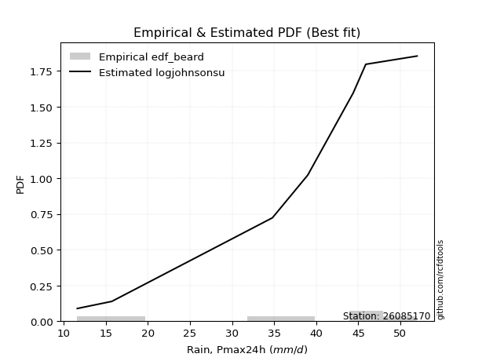</img>

</div>


### 5. EDF Chegodayev (1955)

The Chegodayev formula is an empirical plotting position formula used in hydrological frequency analysis to estimate the exceedance probability or return period of a specific event from a set of observed data. It is primarily used for plotting observed data points on probability paper to fit a theoretical distribution, particularly for analyzing extreme events like maximum flood flows or rainfall intensities. The constant _b_ value in the generalized plotting position formula is 0.3.

<div align="center">


$P=(m-b)/(n+1-2b)$


</div>


**5.1. Empirical values**

<div align="center">

|                | 0                   | 1                   | 2                   | 3                   | 4                  | 5                  | 6                  | 7                  |
|:---------------|:--------------------|:--------------------|:--------------------|:--------------------|:-------------------|:-------------------|:-------------------|:-------------------|
| date           | 2025                | 2024                | 2022                | 2018                | 2017               | 2020               | 2021               | 2019               |
| x              | 9.0                 | 11.6                | 15.7                | 34.8                | 39.0               | 44.4               | 45.9               | 52.0               |
| m              | 1                   | 2                   | 3                   | 4                   | 5                  | 6                  | 7                  | 8                  |
| empirical_dist | edf_chegodayev      | edf_chegodayev      | edf_chegodayev      | edf_chegodayev      | edf_chegodayev     | edf_chegodayev     | edf_chegodayev     | edf_chegodayev     |
| empirical      | 0.08333333333333333 | 0.20238095238095236 | 0.32142857142857145 | 0.44047619047619047 | 0.5595238095238095 | 0.6785714285714286 | 0.7976190476190476 | 0.9166666666666666 |
| empirical_tr   | 1.090909090909091   | 1.253731343283582   | 1.4736842105263157  | 1.7872340425531914  | 2.27027027027027   | 3.1111111111111116 | 4.941176470588234  | 11.999999999999995 |

</div>


**5.2. Kolmogorov-Smirnov fit test (sorted by Δ)**


<div align="center">

|                | 0                   | 1                   | 2                   | 3                   | 4                   | 5                   | 6                   | 7                   | 8                   | 9                   | 10                 | 11                 | 12                 | 13                  | 14                  | 15                  | 16                  | 17                  | 18                  | 19                  | 20                  | 21                 | 22                 | 23                  | 24                  | 25                  | 26                  | 27                  | 28                  | 29                  | 30                  | 31                  | 32                 | 33                  | 34                  | 35                  | 36                  | 37                 | 38                  | 39                  | 40                  | 41                  | 42                  | 43                 | 44                  | 45                  | 46                 | 47                 | 48                  | 49                 | 50                  | 51                 | 52                  | 53                  | 54                  | 55                  | 56                  | 57                  | 58                  | 59                  | 60                  | 61                 | 62                  | 63                  | 64                  | 65                 | 66                  | 67                  | 68                  | 69                  | 70                  | 71                  | 72                  | 73                 | 74                  | 75                 | 76                  | 77                 | 78                  | 79                  | 80                  | 81                  | 82                 | 83                  | 84                 | 85                  | 86                  | 87                  | 88                 | 89                  | 90                  | 91                 | 92                  | 93                  | 94                  | 95                  | 96                  | 97                 | 98                 | 99                  | 100                 | 101                | 102                | 103                 | 104                 | 105                 | 106                | 107                 | 108                 | 109                 | 110                | 111                 | 112                 | 113                 | 114                 | 115                | 116                 | 117                 | 118                | 119                 | 120                 | 121                 | 122                 | 123                 | 124                 | 125                 | 126                | 127                 | 128                 | 129                 | 130                | 131                | 132                 | 133                | 134                | 135                 | 136                 | 137                | 138                 | 139                 | 140                | 141                | 142                 | 143                 | 144                 | 145                | 146                | 147                | 148                 | 149                | 150                | 151                | 152                | 153                | 154                | 155                | 156                | 157                | 158                | 159                |
|:---------------|:--------------------|:--------------------|:--------------------|:--------------------|:--------------------|:--------------------|:--------------------|:--------------------|:--------------------|:--------------------|:-------------------|:-------------------|:-------------------|:--------------------|:--------------------|:--------------------|:--------------------|:--------------------|:--------------------|:--------------------|:--------------------|:-------------------|:-------------------|:--------------------|:--------------------|:--------------------|:--------------------|:--------------------|:--------------------|:--------------------|:--------------------|:--------------------|:-------------------|:--------------------|:--------------------|:--------------------|:--------------------|:-------------------|:--------------------|:--------------------|:--------------------|:--------------------|:--------------------|:-------------------|:--------------------|:--------------------|:-------------------|:-------------------|:--------------------|:-------------------|:--------------------|:-------------------|:--------------------|:--------------------|:--------------------|:--------------------|:--------------------|:--------------------|:--------------------|:--------------------|:--------------------|:-------------------|:--------------------|:--------------------|:--------------------|:-------------------|:--------------------|:--------------------|:--------------------|:--------------------|:--------------------|:--------------------|:--------------------|:-------------------|:--------------------|:-------------------|:--------------------|:-------------------|:--------------------|:--------------------|:--------------------|:--------------------|:-------------------|:--------------------|:-------------------|:--------------------|:--------------------|:--------------------|:-------------------|:--------------------|:--------------------|:-------------------|:--------------------|:--------------------|:--------------------|:--------------------|:--------------------|:-------------------|:-------------------|:--------------------|:--------------------|:-------------------|:-------------------|:--------------------|:--------------------|:--------------------|:-------------------|:--------------------|:--------------------|:--------------------|:-------------------|:--------------------|:--------------------|:--------------------|:--------------------|:-------------------|:--------------------|:--------------------|:-------------------|:--------------------|:--------------------|:--------------------|:--------------------|:--------------------|:--------------------|:--------------------|:-------------------|:--------------------|:--------------------|:--------------------|:-------------------|:-------------------|:--------------------|:-------------------|:-------------------|:--------------------|:--------------------|:-------------------|:--------------------|:--------------------|:-------------------|:-------------------|:--------------------|:--------------------|:--------------------|:-------------------|:-------------------|:-------------------|:--------------------|:-------------------|:-------------------|:-------------------|:-------------------|:-------------------|:-------------------|:-------------------|:-------------------|:-------------------|:-------------------|:-------------------|
| station        | 26085170            | 26085170            | 26085170            | 26085170            | 26085170            | 26085170            | 26085170            | 26085170            | 26085170            | 26085170            | 26085170           | 26085170           | 26085170           | 26085170            | 26085170            | 26085170            | 26085170            | 26085170            | 26085170            | 26085170            | 26085170            | 26085170           | 26085170           | 26085170            | 26085170            | 26085170            | 26085170            | 26085170            | 26085170            | 26085170            | 26085170            | 26085170            | 26085170           | 26085170            | 26085170            | 26085170            | 26085170            | 26085170           | 26085170            | 26085170            | 26085170            | 26085170            | 26085170            | 26085170           | 26085170            | 26085170            | 26085170           | 26085170           | 26085170            | 26085170           | 26085170            | 26085170           | 26085170            | 26085170            | 26085170            | 26085170            | 26085170            | 26085170            | 26085170            | 26085170            | 26085170            | 26085170           | 26085170            | 26085170            | 26085170            | 26085170           | 26085170            | 26085170            | 26085170            | 26085170            | 26085170            | 26085170            | 26085170            | 26085170           | 26085170            | 26085170           | 26085170            | 26085170           | 26085170            | 26085170            | 26085170            | 26085170            | 26085170           | 26085170            | 26085170           | 26085170            | 26085170            | 26085170            | 26085170           | 26085170            | 26085170            | 26085170           | 26085170            | 26085170            | 26085170            | 26085170            | 26085170            | 26085170           | 26085170           | 26085170            | 26085170            | 26085170           | 26085170           | 26085170            | 26085170            | 26085170            | 26085170           | 26085170            | 26085170            | 26085170            | 26085170           | 26085170            | 26085170            | 26085170            | 26085170            | 26085170           | 26085170            | 26085170            | 26085170           | 26085170            | 26085170            | 26085170            | 26085170            | 26085170            | 26085170            | 26085170            | 26085170           | 26085170            | 26085170            | 26085170            | 26085170           | 26085170           | 26085170            | 26085170           | 26085170           | 26085170            | 26085170            | 26085170           | 26085170            | 26085170            | 26085170           | 26085170           | 26085170            | 26085170            | 26085170            | 26085170           | 26085170           | 26085170           | 26085170            | 26085170           | 26085170           | 26085170           | 26085170           | 26085170           | 26085170           | 26085170           | 26085170           | 26085170           | 26085170           | 26085170           |
| empirical_dist | edf_chegodayev      | edf_chegodayev      | edf_chegodayev      | edf_chegodayev      | edf_chegodayev      | edf_chegodayev      | edf_chegodayev      | edf_chegodayev      | edf_chegodayev      | edf_chegodayev      | edf_chegodayev     | edf_chegodayev     | edf_chegodayev     | edf_chegodayev      | edf_chegodayev      | edf_chegodayev      | edf_chegodayev      | edf_chegodayev      | edf_chegodayev      | edf_chegodayev      | edf_chegodayev      | edf_chegodayev     | edf_chegodayev     | edf_chegodayev      | edf_chegodayev      | edf_chegodayev      | edf_chegodayev      | edf_chegodayev      | edf_chegodayev      | edf_chegodayev      | edf_chegodayev      | edf_chegodayev      | edf_chegodayev     | edf_chegodayev      | edf_chegodayev      | edf_chegodayev      | edf_chegodayev      | edf_chegodayev     | edf_chegodayev      | edf_chegodayev      | edf_chegodayev      | edf_chegodayev      | edf_chegodayev      | edf_chegodayev     | edf_chegodayev      | edf_chegodayev      | edf_chegodayev     | edf_chegodayev     | edf_chegodayev      | edf_chegodayev     | edf_chegodayev      | edf_chegodayev     | edf_chegodayev      | edf_chegodayev      | edf_chegodayev      | edf_chegodayev      | edf_chegodayev      | edf_chegodayev      | edf_chegodayev      | edf_chegodayev      | edf_chegodayev      | edf_chegodayev     | edf_chegodayev      | edf_chegodayev      | edf_chegodayev      | edf_chegodayev     | edf_chegodayev      | edf_chegodayev      | edf_chegodayev      | edf_chegodayev      | edf_chegodayev      | edf_chegodayev      | edf_chegodayev      | edf_chegodayev     | edf_chegodayev      | edf_chegodayev     | edf_chegodayev      | edf_chegodayev     | edf_chegodayev      | edf_chegodayev      | edf_chegodayev      | edf_chegodayev      | edf_chegodayev     | edf_chegodayev      | edf_chegodayev     | edf_chegodayev      | edf_chegodayev      | edf_chegodayev      | edf_chegodayev     | edf_chegodayev      | edf_chegodayev      | edf_chegodayev     | edf_chegodayev      | edf_chegodayev      | edf_chegodayev      | edf_chegodayev      | edf_chegodayev      | edf_chegodayev     | edf_chegodayev     | edf_chegodayev      | edf_chegodayev      | edf_chegodayev     | edf_chegodayev     | edf_chegodayev      | edf_chegodayev      | edf_chegodayev      | edf_chegodayev     | edf_chegodayev      | edf_chegodayev      | edf_chegodayev      | edf_chegodayev     | edf_chegodayev      | edf_chegodayev      | edf_chegodayev      | edf_chegodayev      | edf_chegodayev     | edf_chegodayev      | edf_chegodayev      | edf_chegodayev     | edf_chegodayev      | edf_chegodayev      | edf_chegodayev      | edf_chegodayev      | edf_chegodayev      | edf_chegodayev      | edf_chegodayev      | edf_chegodayev     | edf_chegodayev      | edf_chegodayev      | edf_chegodayev      | edf_chegodayev     | edf_chegodayev     | edf_chegodayev      | edf_chegodayev     | edf_chegodayev     | edf_chegodayev      | edf_chegodayev      | edf_chegodayev     | edf_chegodayev      | edf_chegodayev      | edf_chegodayev     | edf_chegodayev     | edf_chegodayev      | edf_chegodayev      | edf_chegodayev      | edf_chegodayev     | edf_chegodayev     | edf_chegodayev     | edf_chegodayev      | edf_chegodayev     | edf_chegodayev     | edf_chegodayev     | edf_chegodayev     | edf_chegodayev     | edf_chegodayev     | edf_chegodayev     | edf_chegodayev     | edf_chegodayev     | edf_chegodayev     | edf_chegodayev     |
| p_dist         | wrapcauchy          | arcsine             | genpareto           | ksone               | loggenextreme       | genextreme          | semicircular        | trapezoid           | anglit              | logweibull_max      | loggenpareto       | logjohnsonsu       | genhalflogistic    | logtrapezoid        | logburr             | logmielke           | burr                | logloggamma         | logarcsine          | beta                | tukeylambda         | betaprime          | erlang             | gamma               | skewnorm            | johnsonsu           | f                   | nct                 | exponnorm           | norm                | crystalball         | truncnorm           | t                  | gengamma            | pearson3            | cosine              | uniform             | vonmises_line      | kappa3              | loglevy_l           | rice                | maxwell             | invgamma            | alpha              | logargus            | foldnorm            | invgauss           | logburr12          | weibull_min         | logweibull_min     | logwrapcauchy       | gumbel_l           | rayleigh            | loggenhalflogistic  | kappa4              | loggumbel_l         | logistic            | logksone            | triang              | argus               | ncf                 | gompertz           | hypsecant           | logsemicircular     | logpearson3         | truncpareto        | laplace             | halfnorm            | loganglit           | kstwobign           | loggompertz         | gumbel_r            | dweibull            | dgamma             | logloglaplace       | lognct             | logt                | logexponnorm       | logcrystalball      | lognorm             | logf                | logfatiguelife      | logtriang          | logbeta             | logncf             | logbetaprime        | logdgamma           | logfoldnorm         | logdweibull        | logerlang           | loggennorm          | logskewnorm        | loginvgamma         | halflogistic        | moyal               | loggamma            | loggamma            | logrice            | logalpha           | loginvgauss         | bradford            | levy_l             | loginvweibull      | lomax               | genexpon            | loglogistic         | logmaxwell         | gausshyper          | truncweibull_min    | lograyleigh         | logrdist           | truncexpon          | logcosine           | loghypsecant        | loggenexpon         | halfgennorm        | logkstwobign        | nakagami            | loghalfnorm        | burr12              | lognakagami         | johnsonsb           | loglomax            | loggumbel_r         | loglaplace          | loglaplace          | loghalflogistic    | gennorm             | logjohnsonsb        | logmoyal            | logkappa4          | logtruncnorm       | wald                | logtukeylambda     | logkappa3          | logexponweib        | loguniform          | logvonmises_line   | logexponpow         | logwald             | loggengamma        | loggausshyper      | logtruncweibull_min | logbradford         | logtruncexpon       | exponpow           | fatiguelife        | powerlaw           | exponweib           | invweibull         | logpowerlaw        | weibull_max        | logtruncpareto     | rdist              | loghalfgennorm     | genlogistic        | loggenlogistic     | logvonmises        | vonmises           | mielke             |
| delta          | 0.10133779211316996 | 0.10580116960067065 | 0.10674266899673646 | 0.11866792336866372 | 0.11954426908152521 | 0.12389822443908646 | 0.12570413018346677 | 0.12690437078582822 | 0.13703407738139262 | 0.13873175023515216 | 0.1400535837006155 | 0.1428292606419962 | 0.14670412177722   | 0.14788870400101461 | 0.14798106497286725 | 0.14853471896713225 | 0.14957427773536616 | 0.15043608999218172 | 0.15689280808212847 | 0.15764562995820153 | 0.15792783032997654 | 0.1584681394290539 | 0.159306645236546  | 0.15941152901740802 | 0.16061544983585374 | 0.16122876328365338 | 0.16202039123915996 | 0.16249446452401464 | 0.16257576451228944 | 0.16257723003558194 | 0.16257723669293223 | 0.16257727776791514 | 0.1625775713521027 | 0.16286445917820455 | 0.16337120933197363 | 0.16420946011597676 | 0.16561461794019938 | 0.1656203572326564 | 0.16594698449279535 | 0.16704242769337502 | 0.16813480733772887 | 0.16880265246549542 | 0.16945002984020163 | 0.1701575642473937 | 0.17036193409351902 | 0.17204108836694637 | 0.1721796123609698 | 0.1739090596520878 | 0.17400213742189152 | 0.1746940411048259 | 0.17527174151491431 | 0.1770981400990581 | 0.17763761075200846 | 0.17841174517043157 | 0.17882157512717434 | 0.18024454613961804 | 0.18107182341904218 | 0.18246713711381712 | 0.18502670940147564 | 0.18793011978950952 | 0.19058417257482407 | 0.1905898608310918 | 0.19078517366767572 | 0.19405661119507878 | 0.19585479424959729 | 0.1990598883830551 | 0.19973086935492937 | 0.20267659319388376 | 0.20305841401197844 | 0.20543131852600927 | 0.20749371047183873 | 0.20891723036621457 | 0.21448206305693213 | 0.2170599009126567 | 0.22271739628941084 | 0.2241635766206702 | 0.22442754318730795 | 0.224427669172498  | 0.22442913706843215 | 0.22442914528808888 | 0.22498486977189947 | 0.22550728901429895 | 0.2256446583702839 | 0.22578708662703206 | 0.2259609897753555 | 0.22641598232919613 | 0.22709220308716666 | 0.22742033999101385 | 0.2277581354638817 | 0.22804362027045666 | 0.22814736435350774 | 0.2281740332818103 | 0.23017668874490604 | 0.23074714886417813 | 0.23254798831505363 | 0.23267835201258524 | 0.23267835201258524 | 0.2329433826681736 | 0.2353780706918125 | 0.23657641630461557 | 0.23728121774546362 | 0.2396578689454762 | 0.2398116575488899 | 0.24110867504668576 | 0.24192199703996553 | 0.24358000546244496 | 0.2444369454337193 | 0.24856917700583192 | 0.24968257180568731 | 0.25040081670134917 | 0.2537602052432645 | 0.25452364328747734 | 0.25460742946046866 | 0.25815893474455176 | 0.25950012695513225 | 0.2599599959144425 | 0.26131291296565773 | 0.26476823932966886 | 0.2679195051379094 | 0.27287382880068356 | 0.27632596727785375 | 0.27961579933149194 | 0.28151574475688257 | 0.28193570129740275 | 0.28574753441113365 | 0.28574753441113365 | 0.2957632065338346 | 0.29761904761904767 | 0.29988981232598383 | 0.30081444340500607 | 0.3136305243963946 | 0.3214274973096732 | 0.32142857142857145 | 0.322822501127525  | 0.3239432432823057 | 0.32826864719378235 | 0.33054892415518256 | 0.3346866408857343 | 0.35081354939891707 | 0.35475813476314577 | 0.3604423228494099 | 0.363390745122401  | 0.38080904796736925 | 0.38558762122423684 | 0.40594674968228117 | 0.4204975538184776 | 0.4367320364882775 | 0.4700694937324372 | 0.48527664641377044 | 0.4856267785162387 | 0.508348969120466  | 0.5789772643703751 | 0.6636048330615367 | 0.678571428564567  | 0.6785714285714286 | 0.7976190476190476 | 0.7976190476190476 | 1.2128058447560393 | 7.464320344276094  | nan                |
| deltao         | 0.4472608134160001  | 0.4472608134160001  | 0.4472608134160001  | 0.4472608134160001  | 0.4472608134160001  | 0.4472608134160001  | 0.4472608134160001  | 0.4472608134160001  | 0.4472608134160001  | 0.4472608134160001  | 0.4472608134160001 | 0.4472608134160001 | 0.4472608134160001 | 0.4472608134160001  | 0.4472608134160001  | 0.4472608134160001  | 0.4472608134160001  | 0.4472608134160001  | 0.4472608134160001  | 0.4472608134160001  | 0.4472608134160001  | 0.4472608134160001 | 0.4472608134160001 | 0.4472608134160001  | 0.4472608134160001  | 0.4472608134160001  | 0.4472608134160001  | 0.4472608134160001  | 0.4472608134160001  | 0.4472608134160001  | 0.4472608134160001  | 0.4472608134160001  | 0.4472608134160001 | 0.4472608134160001  | 0.4472608134160001  | 0.4472608134160001  | 0.4472608134160001  | 0.4472608134160001 | 0.4472608134160001  | 0.4472608134160001  | 0.4472608134160001  | 0.4472608134160001  | 0.4472608134160001  | 0.4472608134160001 | 0.4472608134160001  | 0.4472608134160001  | 0.4472608134160001 | 0.4472608134160001 | 0.4472608134160001  | 0.4472608134160001 | 0.4472608134160001  | 0.4472608134160001 | 0.4472608134160001  | 0.4472608134160001  | 0.4472608134160001  | 0.4472608134160001  | 0.4472608134160001  | 0.4472608134160001  | 0.4472608134160001  | 0.4472608134160001  | 0.4472608134160001  | 0.4472608134160001 | 0.4472608134160001  | 0.4472608134160001  | 0.4472608134160001  | 0.4472608134160001 | 0.4472608134160001  | 0.4472608134160001  | 0.4472608134160001  | 0.4472608134160001  | 0.4472608134160001  | 0.4472608134160001  | 0.4472608134160001  | 0.4472608134160001 | 0.4472608134160001  | 0.4472608134160001 | 0.4472608134160001  | 0.4472608134160001 | 0.4472608134160001  | 0.4472608134160001  | 0.4472608134160001  | 0.4472608134160001  | 0.4472608134160001 | 0.4472608134160001  | 0.4472608134160001 | 0.4472608134160001  | 0.4472608134160001  | 0.4472608134160001  | 0.4472608134160001 | 0.4472608134160001  | 0.4472608134160001  | 0.4472608134160001 | 0.4472608134160001  | 0.4472608134160001  | 0.4472608134160001  | 0.4472608134160001  | 0.4472608134160001  | 0.4472608134160001 | 0.4472608134160001 | 0.4472608134160001  | 0.4472608134160001  | 0.4472608134160001 | 0.4472608134160001 | 0.4472608134160001  | 0.4472608134160001  | 0.4472608134160001  | 0.4472608134160001 | 0.4472608134160001  | 0.4472608134160001  | 0.4472608134160001  | 0.4472608134160001 | 0.4472608134160001  | 0.4472608134160001  | 0.4472608134160001  | 0.4472608134160001  | 0.4472608134160001 | 0.4472608134160001  | 0.4472608134160001  | 0.4472608134160001 | 0.4472608134160001  | 0.4472608134160001  | 0.4472608134160001  | 0.4472608134160001  | 0.4472608134160001  | 0.4472608134160001  | 0.4472608134160001  | 0.4472608134160001 | 0.4472608134160001  | 0.4472608134160001  | 0.4472608134160001  | 0.4472608134160001 | 0.4472608134160001 | 0.4472608134160001  | 0.4472608134160001 | 0.4472608134160001 | 0.4472608134160001  | 0.4472608134160001  | 0.4472608134160001 | 0.4472608134160001  | 0.4472608134160001  | 0.4472608134160001 | 0.4472608134160001 | 0.4472608134160001  | 0.4472608134160001  | 0.4472608134160001  | 0.4472608134160001 | 0.4472608134160001 | 0.4472608134160001 | 0.4472608134160001  | 0.4472608134160001 | 0.4472608134160001 | 0.4472608134160001 | 0.4472608134160001 | 0.4472608134160001 | 0.4472608134160001 | 0.4472608134160001 | 0.4472608134160001 | 0.4472608134160001 | 0.4472608134160001 | 0.4472608134160001 |
| eval           | Δo > Δ              | Δo > Δ              | Δo > Δ              | Δo > Δ              | Δo > Δ              | Δo > Δ              | Δo > Δ              | Δo > Δ              | Δo > Δ              | Δo > Δ              | Δo > Δ             | Δo > Δ             | Δo > Δ             | Δo > Δ              | Δo > Δ              | Δo > Δ              | Δo > Δ              | Δo > Δ              | Δo > Δ              | Δo > Δ              | Δo > Δ              | Δo > Δ             | Δo > Δ             | Δo > Δ              | Δo > Δ              | Δo > Δ              | Δo > Δ              | Δo > Δ              | Δo > Δ              | Δo > Δ              | Δo > Δ              | Δo > Δ              | Δo > Δ             | Δo > Δ              | Δo > Δ              | Δo > Δ              | Δo > Δ              | Δo > Δ             | Δo > Δ              | Δo > Δ              | Δo > Δ              | Δo > Δ              | Δo > Δ              | Δo > Δ             | Δo > Δ              | Δo > Δ              | Δo > Δ             | Δo > Δ             | Δo > Δ              | Δo > Δ             | Δo > Δ              | Δo > Δ             | Δo > Δ              | Δo > Δ              | Δo > Δ              | Δo > Δ              | Δo > Δ              | Δo > Δ              | Δo > Δ              | Δo > Δ              | Δo > Δ              | Δo > Δ             | Δo > Δ              | Δo > Δ              | Δo > Δ              | Δo > Δ             | Δo > Δ              | Δo > Δ              | Δo > Δ              | Δo > Δ              | Δo > Δ              | Δo > Δ              | Δo > Δ              | Δo > Δ             | Δo > Δ              | Δo > Δ             | Δo > Δ              | Δo > Δ             | Δo > Δ              | Δo > Δ              | Δo > Δ              | Δo > Δ              | Δo > Δ             | Δo > Δ              | Δo > Δ             | Δo > Δ              | Δo > Δ              | Δo > Δ              | Δo > Δ             | Δo > Δ              | Δo > Δ              | Δo > Δ             | Δo > Δ              | Δo > Δ              | Δo > Δ              | Δo > Δ              | Δo > Δ              | Δo > Δ             | Δo > Δ             | Δo > Δ              | Δo > Δ              | Δo > Δ             | Δo > Δ             | Δo > Δ              | Δo > Δ              | Δo > Δ              | Δo > Δ             | Δo > Δ              | Δo > Δ              | Δo > Δ              | Δo > Δ             | Δo > Δ              | Δo > Δ              | Δo > Δ              | Δo > Δ              | Δo > Δ             | Δo > Δ              | Δo > Δ              | Δo > Δ             | Δo > Δ              | Δo > Δ              | Δo > Δ              | Δo > Δ              | Δo > Δ              | Δo > Δ              | Δo > Δ              | Δo > Δ             | Δo > Δ              | Δo > Δ              | Δo > Δ              | Δo > Δ             | Δo > Δ             | Δo > Δ              | Δo > Δ             | Δo > Δ             | Δo > Δ              | Δo > Δ              | Δo > Δ             | Δo > Δ              | Δo > Δ              | Δo > Δ             | Δo > Δ             | Δo > Δ              | Δo > Δ              | Δo > Δ              | Δo > Δ             | Δo > Δ             | Δo <= Δ            | Δo <= Δ             | Δo <= Δ            | Δo <= Δ            | Δo <= Δ            | Δo <= Δ            | Δo <= Δ            | Δo <= Δ            | Δo <= Δ            | Δo <= Δ            | Δo <= Δ            | Δo <= Δ            | Δo <= Δ            |
| fit            | 1                   | 1                   | 1                   | 1                   | 1                   | 1                   | 1                   | 1                   | 1                   | 1                   | 1                  | 1                  | 1                  | 1                   | 1                   | 1                   | 1                   | 1                   | 1                   | 1                   | 1                   | 1                  | 1                  | 1                   | 1                   | 1                   | 1                   | 1                   | 1                   | 1                   | 1                   | 1                   | 1                  | 1                   | 1                   | 1                   | 1                   | 1                  | 1                   | 1                   | 1                   | 1                   | 1                   | 1                  | 1                   | 1                   | 1                  | 1                  | 1                   | 1                  | 1                   | 1                  | 1                   | 1                   | 1                   | 1                   | 1                   | 1                   | 1                   | 1                   | 1                   | 1                  | 1                   | 1                   | 1                   | 1                  | 1                   | 1                   | 1                   | 1                   | 1                   | 1                   | 1                   | 1                  | 1                   | 1                  | 1                   | 1                  | 1                   | 1                   | 1                   | 1                   | 1                  | 1                   | 1                  | 1                   | 1                   | 1                   | 1                  | 1                   | 1                   | 1                  | 1                   | 1                   | 1                   | 1                   | 1                   | 1                  | 1                  | 1                   | 1                   | 1                  | 1                  | 1                   | 1                   | 1                   | 1                  | 1                   | 1                   | 1                   | 1                  | 1                   | 1                   | 1                   | 1                   | 1                  | 1                   | 1                   | 1                  | 1                   | 1                   | 1                   | 1                   | 1                   | 1                   | 1                   | 1                  | 1                   | 1                   | 1                   | 1                  | 1                  | 1                   | 1                  | 1                  | 1                   | 1                   | 1                  | 1                   | 1                   | 1                  | 1                  | 1                   | 1                   | 1                   | 1                  | 1                  | 0                  | 0                   | 0                  | 0                  | 0                  | 0                  | 0                  | 0                  | 0                  | 0                  | 0                  | 0                  | 0                  |
| n              | 8                   | 8                   | 8                   | 8                   | 8                   | 8                   | 8                   | 8                   | 8                   | 8                   | 8                  | 8                  | 8                  | 8                   | 8                   | 8                   | 8                   | 8                   | 8                   | 8                   | 8                   | 8                  | 8                  | 8                   | 8                   | 8                   | 8                   | 8                   | 8                   | 8                   | 8                   | 8                   | 8                  | 8                   | 8                   | 8                   | 8                   | 8                  | 8                   | 8                   | 8                   | 8                   | 8                   | 8                  | 8                   | 8                   | 8                  | 8                  | 8                   | 8                  | 8                   | 8                  | 8                   | 8                   | 8                   | 8                   | 8                   | 8                   | 8                   | 8                   | 8                   | 8                  | 8                   | 8                   | 8                   | 8                  | 8                   | 8                   | 8                   | 8                   | 8                   | 8                   | 8                   | 8                  | 8                   | 8                  | 8                   | 8                  | 8                   | 8                   | 8                   | 8                   | 8                  | 8                   | 8                  | 8                   | 8                   | 8                   | 8                  | 8                   | 8                   | 8                  | 8                   | 8                   | 8                   | 8                   | 8                   | 8                  | 8                  | 8                   | 8                   | 8                  | 8                  | 8                   | 8                   | 8                   | 8                  | 8                   | 8                   | 8                   | 8                  | 8                   | 8                   | 8                   | 8                   | 8                  | 8                   | 8                   | 8                  | 8                   | 8                   | 8                   | 8                   | 8                   | 8                   | 8                   | 8                  | 8                   | 8                   | 8                   | 8                  | 8                  | 8                   | 8                  | 8                  | 8                   | 8                   | 8                  | 8                   | 8                   | 8                  | 8                  | 8                   | 8                   | 8                   | 8                  | 8                  | 8                  | 8                   | 8                  | 8                  | 8                  | 8                  | 8                  | 8                  | 8                  | 8                  | 8                  | 8                  | 8                  |
| best_fit       | 1                   | 0                   | 0                   | 0                   | 0                   | 0                   | 0                   | 0                   | 0                   | 0                   | 0                  | 0                  | 0                  | 0                   | 0                   | 0                   | 0                   | 0                   | 0                   | 0                   | 0                   | 0                  | 0                  | 0                   | 0                   | 0                   | 0                   | 0                   | 0                   | 0                   | 0                   | 0                   | 0                  | 0                   | 0                   | 0                   | 0                   | 0                  | 0                   | 0                   | 0                   | 0                   | 0                   | 0                  | 0                   | 0                   | 0                  | 0                  | 0                   | 0                  | 0                   | 0                  | 0                   | 0                   | 0                   | 0                   | 0                   | 0                   | 0                   | 0                   | 0                   | 0                  | 0                   | 0                   | 0                   | 0                  | 0                   | 0                   | 0                   | 0                   | 0                   | 0                   | 0                   | 0                  | 0                   | 0                  | 0                   | 0                  | 0                   | 0                   | 0                   | 0                   | 0                  | 0                   | 0                  | 0                   | 0                   | 0                   | 0                  | 0                   | 0                   | 0                  | 0                   | 0                   | 0                   | 0                   | 0                   | 0                  | 0                  | 0                   | 0                   | 0                  | 0                  | 0                   | 0                   | 0                   | 0                  | 0                   | 0                   | 0                   | 0                  | 0                   | 0                   | 0                   | 0                   | 0                  | 0                   | 0                   | 0                  | 0                   | 0                   | 0                   | 0                   | 0                   | 0                   | 0                   | 0                  | 0                   | 0                   | 0                   | 0                  | 0                  | 0                   | 0                  | 0                  | 0                   | 0                   | 0                  | 0                   | 0                   | 0                  | 0                  | 0                   | 0                   | 0                   | 0                  | 0                  | 0                  | 0                   | 0                  | 0                  | 0                  | 0                  | 0                  | 0                  | 0                  | 0                  | 0                  | 0                  | 0                  |
| best_fit_sort  | 1                   | 2                   | 3                   | 4                   | 5                   | 6                   | 7                   | 8                   | 9                   | 10                  | 11                 | 12                 | 13                 | 14                  | 15                  | 16                  | 17                  | 18                  | 19                  | 20                  | 21                  | 22                 | 23                 | 24                  | 25                  | 26                  | 27                  | 28                  | 29                  | 30                  | 31                  | 32                  | 33                 | 34                  | 35                  | 36                  | 37                  | 38                 | 39                  | 40                  | 41                  | 42                  | 43                  | 44                 | 45                  | 46                  | 47                 | 48                 | 49                  | 50                 | 51                  | 52                 | 53                  | 54                  | 55                  | 56                  | 57                  | 58                  | 59                  | 60                  | 61                  | 62                 | 63                  | 64                  | 65                  | 66                 | 67                  | 68                  | 69                  | 70                  | 71                  | 72                  | 73                  | 74                 | 75                  | 76                 | 77                  | 78                 | 79                  | 80                  | 81                  | 82                  | 83                 | 84                  | 85                 | 86                  | 87                  | 88                  | 89                 | 90                  | 91                  | 92                 | 93                  | 94                  | 95                  | 96                  | 97                  | 98                 | 99                 | 100                 | 101                 | 102                | 103                | 104                 | 105                 | 106                 | 107                | 108                 | 109                 | 110                 | 111                | 112                 | 113                 | 114                 | 115                 | 116                | 117                 | 118                 | 119                | 120                 | 121                 | 122                 | 123                 | 124                 | 125                 | 126                 | 127                | 128                 | 129                 | 130                 | 131                | 132                | 133                 | 134                | 135                | 136                 | 137                 | 138                | 139                 | 140                 | 141                | 142                | 143                 | 144                 | 145                 | 146                | 147                | 148                | 149                 | 150                | 151                | 152                | 153                | 154                | 155                | 156                | 157                | 158                | 159                | 160                |

</div>


**5.3. Best fit**

<div align="center">

|   id |   station | empirical_dist   | p_dist     |    delta |   deltao | eval   |   fit |   n |   best_fit |   best_fit_sort |
|-----:|----------:|:-----------------|:-----------|---------:|---------:|:-------|------:|----:|-----------:|----------------:|
|    0 |  26085170 | edf_chegodayev   | wrapcauchy | 0.101338 | 0.447261 | Δo > Δ |     1 |   8 |          1 |               1 |

</div>


<div align="center">

</img>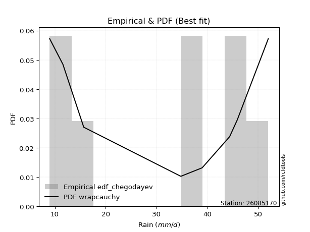</img>

</div>


### 6. EDF Blom (1958)

The Blom formula is a specific "plotting position" formula used in hydrology and statistical analysis to estimate the empirical cumulative probability (or non-exceedance probability) of a data series. It is particularly recommended for data that are approximately normally distributed. The constant _a_ is set to 0.375 (or 3/8).

<div align="center">


$P=(m-a)/(n+1-2a)$


</div>


**6.1. Empirical values**

<div align="center">

|                | 0                   | 1                   | 2                  | 3                  | 4                  | 5                  | 6                 | 7                  |
|:---------------|:--------------------|:--------------------|:-------------------|:-------------------|:-------------------|:-------------------|:------------------|:-------------------|
| date           | 2025                | 2024                | 2022               | 2018               | 2017               | 2020               | 2021              | 2019               |
| x              | 9.0                 | 11.6                | 15.7               | 34.8               | 39.0               | 44.4               | 45.9              | 52.0               |
| m              | 1                   | 2                   | 3                  | 4                  | 5                  | 6                  | 7                 | 8                  |
| empirical_dist | edf_blom            | edf_blom            | edf_blom           | edf_blom           | edf_blom           | edf_blom           | edf_blom          | edf_blom           |
| empirical      | 0.07575757575757576 | 0.19696969696969696 | 0.3181818181818182 | 0.4393939393939394 | 0.5606060606060606 | 0.6818181818181818 | 0.803030303030303 | 0.9242424242424242 |
| empirical_tr   | 1.0819672131147542  | 1.2452830188679247  | 1.4666666666666666 | 1.783783783783784  | 2.275862068965517  | 3.1428571428571423 | 5.076923076923076 | 13.199999999999992 |

</div>


**6.2. Kolmogorov-Smirnov fit test (sorted by Δ)**


<div align="center">

|                | 0                   | 1                   | 2                   | 3                   | 4                   | 5                   | 6                   | 7                  | 8                   | 9                   | 10                  | 11                  | 12                  | 13                  | 14                 | 15                  | 16                  | 17                 | 18                  | 19                  | 20                  | 21                  | 22                 | 23                 | 24                  | 25                  | 26                  | 27                  | 28                  | 29                  | 30                  | 31                  | 32                 | 33                  | 34                  | 35                 | 36                  | 37                  | 38                  | 39                 | 40                  | 41                 | 42                 | 43                 | 44                  | 45                  | 46                  | 47                  | 48                 | 49                  | 50                  | 51                 | 52                 | 53                  | 54                  | 55                 | 56                  | 57                  | 58                 | 59                  | 60                  | 61                  | 62                  | 63                  | 64                 | 65                  | 66                  | 67                  | 68                 | 69                  | 70                 | 71                  | 72                  | 73                  | 74                  | 75                  | 76                  | 77                  | 78                 | 79                  | 80                  | 81                  | 82                  | 83                  | 84                  | 85                  | 86                  | 87                 | 88                  | 89                  | 90                  | 91                  | 92                  | 93                 | 94                 | 95                  | 96                  | 97                  | 98                  | 99                  | 100                | 101                 | 102                 | 103                | 104                 | 105                 | 106                 | 107                | 108                | 109                 | 110                 | 111                | 112                 | 113                 | 114                | 115                | 116                | 117                 | 118                | 119                 | 120                | 121                 | 122                | 123                 | 124                | 125                | 126                 | 127                 | 128                 | 129                 | 130                | 131                | 132                | 133                 | 134                | 135                | 136                 | 137                | 138                 | 139                 | 140                | 141                 | 142                 | 143                | 144                 | 145                 | 146                | 147                | 148                | 149                 | 150                | 151                | 152                | 153                | 154                | 155                | 156                | 157                | 158                | 159                |
|:---------------|:--------------------|:--------------------|:--------------------|:--------------------|:--------------------|:--------------------|:--------------------|:-------------------|:--------------------|:--------------------|:--------------------|:--------------------|:--------------------|:--------------------|:-------------------|:--------------------|:--------------------|:-------------------|:--------------------|:--------------------|:--------------------|:--------------------|:-------------------|:-------------------|:--------------------|:--------------------|:--------------------|:--------------------|:--------------------|:--------------------|:--------------------|:--------------------|:-------------------|:--------------------|:--------------------|:-------------------|:--------------------|:--------------------|:--------------------|:-------------------|:--------------------|:-------------------|:-------------------|:-------------------|:--------------------|:--------------------|:--------------------|:--------------------|:-------------------|:--------------------|:--------------------|:-------------------|:-------------------|:--------------------|:--------------------|:-------------------|:--------------------|:--------------------|:-------------------|:--------------------|:--------------------|:--------------------|:--------------------|:--------------------|:-------------------|:--------------------|:--------------------|:--------------------|:-------------------|:--------------------|:-------------------|:--------------------|:--------------------|:--------------------|:--------------------|:--------------------|:--------------------|:--------------------|:-------------------|:--------------------|:--------------------|:--------------------|:--------------------|:--------------------|:--------------------|:--------------------|:--------------------|:-------------------|:--------------------|:--------------------|:--------------------|:--------------------|:--------------------|:-------------------|:-------------------|:--------------------|:--------------------|:--------------------|:--------------------|:--------------------|:-------------------|:--------------------|:--------------------|:-------------------|:--------------------|:--------------------|:--------------------|:-------------------|:-------------------|:--------------------|:--------------------|:-------------------|:--------------------|:--------------------|:-------------------|:-------------------|:-------------------|:--------------------|:-------------------|:--------------------|:-------------------|:--------------------|:-------------------|:--------------------|:-------------------|:-------------------|:--------------------|:--------------------|:--------------------|:--------------------|:-------------------|:-------------------|:-------------------|:--------------------|:-------------------|:-------------------|:--------------------|:-------------------|:--------------------|:--------------------|:-------------------|:--------------------|:--------------------|:-------------------|:--------------------|:--------------------|:-------------------|:-------------------|:-------------------|:--------------------|:-------------------|:-------------------|:-------------------|:-------------------|:-------------------|:-------------------|:-------------------|:-------------------|:-------------------|:-------------------|
| station        | 26085170            | 26085170            | 26085170            | 26085170            | 26085170            | 26085170            | 26085170            | 26085170           | 26085170            | 26085170            | 26085170            | 26085170            | 26085170            | 26085170            | 26085170           | 26085170            | 26085170            | 26085170           | 26085170            | 26085170            | 26085170            | 26085170            | 26085170           | 26085170           | 26085170            | 26085170            | 26085170            | 26085170            | 26085170            | 26085170            | 26085170            | 26085170            | 26085170           | 26085170            | 26085170            | 26085170           | 26085170            | 26085170            | 26085170            | 26085170           | 26085170            | 26085170           | 26085170           | 26085170           | 26085170            | 26085170            | 26085170            | 26085170            | 26085170           | 26085170            | 26085170            | 26085170           | 26085170           | 26085170            | 26085170            | 26085170           | 26085170            | 26085170            | 26085170           | 26085170            | 26085170            | 26085170            | 26085170            | 26085170            | 26085170           | 26085170            | 26085170            | 26085170            | 26085170           | 26085170            | 26085170           | 26085170            | 26085170            | 26085170            | 26085170            | 26085170            | 26085170            | 26085170            | 26085170           | 26085170            | 26085170            | 26085170            | 26085170            | 26085170            | 26085170            | 26085170            | 26085170            | 26085170           | 26085170            | 26085170            | 26085170            | 26085170            | 26085170            | 26085170           | 26085170           | 26085170            | 26085170            | 26085170            | 26085170            | 26085170            | 26085170           | 26085170            | 26085170            | 26085170           | 26085170            | 26085170            | 26085170            | 26085170           | 26085170           | 26085170            | 26085170            | 26085170           | 26085170            | 26085170            | 26085170           | 26085170           | 26085170           | 26085170            | 26085170           | 26085170            | 26085170           | 26085170            | 26085170           | 26085170            | 26085170           | 26085170           | 26085170            | 26085170            | 26085170            | 26085170            | 26085170           | 26085170           | 26085170           | 26085170            | 26085170           | 26085170           | 26085170            | 26085170           | 26085170            | 26085170            | 26085170           | 26085170            | 26085170            | 26085170           | 26085170            | 26085170            | 26085170           | 26085170           | 26085170           | 26085170            | 26085170           | 26085170           | 26085170           | 26085170           | 26085170           | 26085170           | 26085170           | 26085170           | 26085170           | 26085170           |
| empirical_dist | edf_blom            | edf_blom            | edf_blom            | edf_blom            | edf_blom            | edf_blom            | edf_blom            | edf_blom           | edf_blom            | edf_blom            | edf_blom            | edf_blom            | edf_blom            | edf_blom            | edf_blom           | edf_blom            | edf_blom            | edf_blom           | edf_blom            | edf_blom            | edf_blom            | edf_blom            | edf_blom           | edf_blom           | edf_blom            | edf_blom            | edf_blom            | edf_blom            | edf_blom            | edf_blom            | edf_blom            | edf_blom            | edf_blom           | edf_blom            | edf_blom            | edf_blom           | edf_blom            | edf_blom            | edf_blom            | edf_blom           | edf_blom            | edf_blom           | edf_blom           | edf_blom           | edf_blom            | edf_blom            | edf_blom            | edf_blom            | edf_blom           | edf_blom            | edf_blom            | edf_blom           | edf_blom           | edf_blom            | edf_blom            | edf_blom           | edf_blom            | edf_blom            | edf_blom           | edf_blom            | edf_blom            | edf_blom            | edf_blom            | edf_blom            | edf_blom           | edf_blom            | edf_blom            | edf_blom            | edf_blom           | edf_blom            | edf_blom           | edf_blom            | edf_blom            | edf_blom            | edf_blom            | edf_blom            | edf_blom            | edf_blom            | edf_blom           | edf_blom            | edf_blom            | edf_blom            | edf_blom            | edf_blom            | edf_blom            | edf_blom            | edf_blom            | edf_blom           | edf_blom            | edf_blom            | edf_blom            | edf_blom            | edf_blom            | edf_blom           | edf_blom           | edf_blom            | edf_blom            | edf_blom            | edf_blom            | edf_blom            | edf_blom           | edf_blom            | edf_blom            | edf_blom           | edf_blom            | edf_blom            | edf_blom            | edf_blom           | edf_blom           | edf_blom            | edf_blom            | edf_blom           | edf_blom            | edf_blom            | edf_blom           | edf_blom           | edf_blom           | edf_blom            | edf_blom           | edf_blom            | edf_blom           | edf_blom            | edf_blom           | edf_blom            | edf_blom           | edf_blom           | edf_blom            | edf_blom            | edf_blom            | edf_blom            | edf_blom           | edf_blom           | edf_blom           | edf_blom            | edf_blom           | edf_blom           | edf_blom            | edf_blom           | edf_blom            | edf_blom            | edf_blom           | edf_blom            | edf_blom            | edf_blom           | edf_blom            | edf_blom            | edf_blom           | edf_blom           | edf_blom           | edf_blom            | edf_blom           | edf_blom           | edf_blom           | edf_blom           | edf_blom           | edf_blom           | edf_blom           | edf_blom           | edf_blom           | edf_blom           |
| p_dist         | wrapcauchy          | genpareto           | arcsine             | loggenextreme       | ksone               | genextreme          | trapezoid           | semicircular       | anglit              | logjohnsonsu        | genhalflogistic     | logweibull_max      | logburr             | logmielke           | burr               | logloggamma         | loggenpareto        | logtrapezoid       | betaprime           | erlang              | gamma               | skewnorm            | johnsonsu          | tukeylambda        | f                   | nct                 | exponnorm           | norm                | crystalball         | truncnorm           | t                   | gengamma            | logarcsine         | pearson3            | cosine              | uniform            | vonmises_line       | kappa3              | beta                | rice               | logargus            | foldnorm           | maxwell            | invgamma           | weibull_min         | alpha               | invgauss            | gumbel_l            | loglevy_l          | logburr12           | logweibull_min      | logwrapcauchy      | logistic           | rayleigh            | loggenhalflogistic  | kappa4             | loggumbel_l         | triang              | logksone           | argus               | gompertz            | hypsecant           | ncf                 | logsemicircular     | laplace            | logpearson3         | truncpareto         | halfnorm            | loganglit          | kstwobign           | loggompertz        | gumbel_r            | dweibull            | dgamma              | logloglaplace       | logdgamma           | logdweibull         | loggennorm          | lognct             | logt                | logexponnorm        | logcrystalball      | lognorm             | logf                | logfatiguelife      | logtriang           | logncf              | logbetaprime       | logfoldnorm         | logerlang           | logskewnorm         | logbeta             | loginvgamma         | halflogistic       | moyal              | loggamma            | loggamma            | logrice             | logalpha            | loginvgauss         | bradford           | loginvweibull       | lomax               | genexpon           | loglogistic         | logmaxwell          | levy_l              | gausshyper         | truncweibull_min   | lograyleigh         | logrdist            | truncexpon         | logcosine           | loghypsecant        | loggenexpon        | halfgennorm        | logkstwobign       | nakagami            | loghalfnorm        | burr12              | lognakagami        | loglomax            | loggumbel_r        | johnsonsb           | loglaplace         | loglaplace         | loghalflogistic     | logmoyal            | gennorm             | logjohnsonsb        | logkappa4          | logtruncnorm       | wald               | logtukeylambda      | logkappa3          | logexponweib       | loguniform          | logvonmises_line   | logwald             | logexponpow         | loggengamma        | loggausshyper       | logtruncweibull_min | logbradford        | logtruncexpon       | exponpow            | fatiguelife        | powerlaw           | exponweib          | invweibull          | logpowerlaw        | weibull_max        | logtruncpareto     | rdist              | loghalfgennorm     | genlogistic        | loggenlogistic     | logvonmises        | vonmises           | mielke             |
| delta          | 0.10242004319542103 | 0.10349591574998318 | 0.10688342068292173 | 0.11629751583477194 | 0.11975017445091479 | 0.12065147119233319 | 0.12365761753907495 | 0.12570753515007   | 0.13378732413463934 | 0.13958250739524292 | 0.14345736853046673 | 0.14414300564640758 | 0.14473431172611398 | 0.14528796572037897 | 0.1463275244886129 | 0.14718933674542845 | 0.14762934127637306 | 0.1489709550832657 | 0.15522138618230064 | 0.15605989198979273 | 0.15616477577065474 | 0.15736869658910047 | 0.1579820100369001 | 0.1583485159122287 | 0.15877363799240668 | 0.15924771127726137 | 0.15932901126553617 | 0.15933047678882867 | 0.15933048344617895 | 0.15933052452116186 | 0.15933081810534944 | 0.15961770593145128 | 0.159643104897925  | 0.16012445608522036 | 0.16096270686922348 | 0.1623678646934461 | 0.16237360398590311 | 0.16270023124604208 | 0.16305688536945695 | 0.1648880540909756 | 0.16711518084676574 | 0.1687943351201931 | 0.1698849035477465 | 0.1705322809224527 | 0.17075538417513825 | 0.17123981532964477 | 0.17326186344322086 | 0.17385138685230483 | 0.1746181852691326 | 0.17499131073433888 | 0.17577629218707697 | 0.1763539925971654 | 0.1778250701722889 | 0.17871986183425953 | 0.17949399625268264 | 0.1799038262094254 | 0.18132679722186912 | 0.18177995615472237 | 0.1835493881960682 | 0.18468336654275624 | 0.18734310758433853 | 0.18753842042092245 | 0.19166642365707515 | 0.19513886227732985 | 0.1964841161081761 | 0.19693704533184836 | 0.20014213946530618 | 0.20375884427613483 | 0.2041406650942295 | 0.20651356960826034 | 0.2085759615540898 | 0.20999948144846564 | 0.21123530981017885 | 0.21381314766590342 | 0.21947064304265756 | 0.22384544984041338 | 0.22451138221712844 | 0.22490061110675447 | 0.2252458277029213 | 0.22550979426955903 | 0.22550992025474909 | 0.22551138815068322 | 0.22551139637033996 | 0.22606712085415054 | 0.22658954009655002 | 0.22672690945253499 | 0.22704324085760658 | 0.2274982334114472 | 0.22850259107326493 | 0.22912587135270773 | 0.22925628436406137 | 0.23119834203828749 | 0.23125893982715712 | 0.2318293999464292 | 0.2336302393973047 | 0.23376060309483632 | 0.23376060309483632 | 0.23402563375042468 | 0.23646032177406356 | 0.23765866738686664 | 0.2383634688277147 | 0.24089390863114096 | 0.24219092612893683 | 0.2430042481222166 | 0.24466225654469603 | 0.24551919651597037 | 0.24723362652123376 | 0.249651428088083  | 0.2507648228879384 | 0.25148306778360024 | 0.25484245632551555 | 0.2556058943697284 | 0.25568968054271973 | 0.25924118582680283 | 0.2605823780373833 | 0.2610422469966936 | 0.2623951640479088 | 0.26585049041191994 | 0.2690017562201605 | 0.27395607988293463 | 0.2774082183601048 | 0.28259799583913364 | 0.2830179523796538 | 0.28502705474274737 | 0.2868297854933847 | 0.2868297854933847 | 0.29684545761608566 | 0.30189669448725714 | 0.30303030303030304 | 0.30530106773723925 | 0.3147127754786457 | 0.3181807440629199 | 0.3181818181818182 | 0.32390475220977605 | 0.3250254943645568 | 0.3293508982760334 | 0.33163117523743363 | 0.3357688919679854 | 0.35584038584539684 | 0.35622480481017244 | 0.361524573931661  | 0.36447299620465207 | 0.3818912990496203  | 0.3866698723064879 | 0.40702900076453224 | 0.42807331139423516 | 0.4421432918995329 | 0.4711517448146883 | 0.4906879018250258 | 0.49320253609199627 | 0.5094312202027171 | 0.5843885197816305 | 0.669016088472792  | 0.6818181818113203 | 0.6818181818181818 | 0.803030303030303  | 0.803030303030303  | 1.2138880958382903 | 7.456744586700337  | nan                |
| deltao         | 0.4472608134160001  | 0.4472608134160001  | 0.4472608134160001  | 0.4472608134160001  | 0.4472608134160001  | 0.4472608134160001  | 0.4472608134160001  | 0.4472608134160001 | 0.4472608134160001  | 0.4472608134160001  | 0.4472608134160001  | 0.4472608134160001  | 0.4472608134160001  | 0.4472608134160001  | 0.4472608134160001 | 0.4472608134160001  | 0.4472608134160001  | 0.4472608134160001 | 0.4472608134160001  | 0.4472608134160001  | 0.4472608134160001  | 0.4472608134160001  | 0.4472608134160001 | 0.4472608134160001 | 0.4472608134160001  | 0.4472608134160001  | 0.4472608134160001  | 0.4472608134160001  | 0.4472608134160001  | 0.4472608134160001  | 0.4472608134160001  | 0.4472608134160001  | 0.4472608134160001 | 0.4472608134160001  | 0.4472608134160001  | 0.4472608134160001 | 0.4472608134160001  | 0.4472608134160001  | 0.4472608134160001  | 0.4472608134160001 | 0.4472608134160001  | 0.4472608134160001 | 0.4472608134160001 | 0.4472608134160001 | 0.4472608134160001  | 0.4472608134160001  | 0.4472608134160001  | 0.4472608134160001  | 0.4472608134160001 | 0.4472608134160001  | 0.4472608134160001  | 0.4472608134160001 | 0.4472608134160001 | 0.4472608134160001  | 0.4472608134160001  | 0.4472608134160001 | 0.4472608134160001  | 0.4472608134160001  | 0.4472608134160001 | 0.4472608134160001  | 0.4472608134160001  | 0.4472608134160001  | 0.4472608134160001  | 0.4472608134160001  | 0.4472608134160001 | 0.4472608134160001  | 0.4472608134160001  | 0.4472608134160001  | 0.4472608134160001 | 0.4472608134160001  | 0.4472608134160001 | 0.4472608134160001  | 0.4472608134160001  | 0.4472608134160001  | 0.4472608134160001  | 0.4472608134160001  | 0.4472608134160001  | 0.4472608134160001  | 0.4472608134160001 | 0.4472608134160001  | 0.4472608134160001  | 0.4472608134160001  | 0.4472608134160001  | 0.4472608134160001  | 0.4472608134160001  | 0.4472608134160001  | 0.4472608134160001  | 0.4472608134160001 | 0.4472608134160001  | 0.4472608134160001  | 0.4472608134160001  | 0.4472608134160001  | 0.4472608134160001  | 0.4472608134160001 | 0.4472608134160001 | 0.4472608134160001  | 0.4472608134160001  | 0.4472608134160001  | 0.4472608134160001  | 0.4472608134160001  | 0.4472608134160001 | 0.4472608134160001  | 0.4472608134160001  | 0.4472608134160001 | 0.4472608134160001  | 0.4472608134160001  | 0.4472608134160001  | 0.4472608134160001 | 0.4472608134160001 | 0.4472608134160001  | 0.4472608134160001  | 0.4472608134160001 | 0.4472608134160001  | 0.4472608134160001  | 0.4472608134160001 | 0.4472608134160001 | 0.4472608134160001 | 0.4472608134160001  | 0.4472608134160001 | 0.4472608134160001  | 0.4472608134160001 | 0.4472608134160001  | 0.4472608134160001 | 0.4472608134160001  | 0.4472608134160001 | 0.4472608134160001 | 0.4472608134160001  | 0.4472608134160001  | 0.4472608134160001  | 0.4472608134160001  | 0.4472608134160001 | 0.4472608134160001 | 0.4472608134160001 | 0.4472608134160001  | 0.4472608134160001 | 0.4472608134160001 | 0.4472608134160001  | 0.4472608134160001 | 0.4472608134160001  | 0.4472608134160001  | 0.4472608134160001 | 0.4472608134160001  | 0.4472608134160001  | 0.4472608134160001 | 0.4472608134160001  | 0.4472608134160001  | 0.4472608134160001 | 0.4472608134160001 | 0.4472608134160001 | 0.4472608134160001  | 0.4472608134160001 | 0.4472608134160001 | 0.4472608134160001 | 0.4472608134160001 | 0.4472608134160001 | 0.4472608134160001 | 0.4472608134160001 | 0.4472608134160001 | 0.4472608134160001 | 0.4472608134160001 |
| eval           | Δo > Δ              | Δo > Δ              | Δo > Δ              | Δo > Δ              | Δo > Δ              | Δo > Δ              | Δo > Δ              | Δo > Δ             | Δo > Δ              | Δo > Δ              | Δo > Δ              | Δo > Δ              | Δo > Δ              | Δo > Δ              | Δo > Δ             | Δo > Δ              | Δo > Δ              | Δo > Δ             | Δo > Δ              | Δo > Δ              | Δo > Δ              | Δo > Δ              | Δo > Δ             | Δo > Δ             | Δo > Δ              | Δo > Δ              | Δo > Δ              | Δo > Δ              | Δo > Δ              | Δo > Δ              | Δo > Δ              | Δo > Δ              | Δo > Δ             | Δo > Δ              | Δo > Δ              | Δo > Δ             | Δo > Δ              | Δo > Δ              | Δo > Δ              | Δo > Δ             | Δo > Δ              | Δo > Δ             | Δo > Δ             | Δo > Δ             | Δo > Δ              | Δo > Δ              | Δo > Δ              | Δo > Δ              | Δo > Δ             | Δo > Δ              | Δo > Δ              | Δo > Δ             | Δo > Δ             | Δo > Δ              | Δo > Δ              | Δo > Δ             | Δo > Δ              | Δo > Δ              | Δo > Δ             | Δo > Δ              | Δo > Δ              | Δo > Δ              | Δo > Δ              | Δo > Δ              | Δo > Δ             | Δo > Δ              | Δo > Δ              | Δo > Δ              | Δo > Δ             | Δo > Δ              | Δo > Δ             | Δo > Δ              | Δo > Δ              | Δo > Δ              | Δo > Δ              | Δo > Δ              | Δo > Δ              | Δo > Δ              | Δo > Δ             | Δo > Δ              | Δo > Δ              | Δo > Δ              | Δo > Δ              | Δo > Δ              | Δo > Δ              | Δo > Δ              | Δo > Δ              | Δo > Δ             | Δo > Δ              | Δo > Δ              | Δo > Δ              | Δo > Δ              | Δo > Δ              | Δo > Δ             | Δo > Δ             | Δo > Δ              | Δo > Δ              | Δo > Δ              | Δo > Δ              | Δo > Δ              | Δo > Δ             | Δo > Δ              | Δo > Δ              | Δo > Δ             | Δo > Δ              | Δo > Δ              | Δo > Δ              | Δo > Δ             | Δo > Δ             | Δo > Δ              | Δo > Δ              | Δo > Δ             | Δo > Δ              | Δo > Δ              | Δo > Δ             | Δo > Δ             | Δo > Δ             | Δo > Δ              | Δo > Δ             | Δo > Δ              | Δo > Δ             | Δo > Δ              | Δo > Δ             | Δo > Δ              | Δo > Δ             | Δo > Δ             | Δo > Δ              | Δo > Δ              | Δo > Δ              | Δo > Δ              | Δo > Δ             | Δo > Δ             | Δo > Δ             | Δo > Δ              | Δo > Δ             | Δo > Δ             | Δo > Δ              | Δo > Δ             | Δo > Δ              | Δo > Δ              | Δo > Δ             | Δo > Δ              | Δo > Δ              | Δo > Δ             | Δo > Δ              | Δo > Δ              | Δo > Δ             | Δo <= Δ            | Δo <= Δ            | Δo <= Δ             | Δo <= Δ            | Δo <= Δ            | Δo <= Δ            | Δo <= Δ            | Δo <= Δ            | Δo <= Δ            | Δo <= Δ            | Δo <= Δ            | Δo <= Δ            | Δo <= Δ            |
| fit            | 1                   | 1                   | 1                   | 1                   | 1                   | 1                   | 1                   | 1                  | 1                   | 1                   | 1                   | 1                   | 1                   | 1                   | 1                  | 1                   | 1                   | 1                  | 1                   | 1                   | 1                   | 1                   | 1                  | 1                  | 1                   | 1                   | 1                   | 1                   | 1                   | 1                   | 1                   | 1                   | 1                  | 1                   | 1                   | 1                  | 1                   | 1                   | 1                   | 1                  | 1                   | 1                  | 1                  | 1                  | 1                   | 1                   | 1                   | 1                   | 1                  | 1                   | 1                   | 1                  | 1                  | 1                   | 1                   | 1                  | 1                   | 1                   | 1                  | 1                   | 1                   | 1                   | 1                   | 1                   | 1                  | 1                   | 1                   | 1                   | 1                  | 1                   | 1                  | 1                   | 1                   | 1                   | 1                   | 1                   | 1                   | 1                   | 1                  | 1                   | 1                   | 1                   | 1                   | 1                   | 1                   | 1                   | 1                   | 1                  | 1                   | 1                   | 1                   | 1                   | 1                   | 1                  | 1                  | 1                   | 1                   | 1                   | 1                   | 1                   | 1                  | 1                   | 1                   | 1                  | 1                   | 1                   | 1                   | 1                  | 1                  | 1                   | 1                   | 1                  | 1                   | 1                   | 1                  | 1                  | 1                  | 1                   | 1                  | 1                   | 1                  | 1                   | 1                  | 1                   | 1                  | 1                  | 1                   | 1                   | 1                   | 1                   | 1                  | 1                  | 1                  | 1                   | 1                  | 1                  | 1                   | 1                  | 1                   | 1                   | 1                  | 1                   | 1                   | 1                  | 1                   | 1                   | 1                  | 0                  | 0                  | 0                   | 0                  | 0                  | 0                  | 0                  | 0                  | 0                  | 0                  | 0                  | 0                  | 0                  |
| n              | 8                   | 8                   | 8                   | 8                   | 8                   | 8                   | 8                   | 8                  | 8                   | 8                   | 8                   | 8                   | 8                   | 8                   | 8                  | 8                   | 8                   | 8                  | 8                   | 8                   | 8                   | 8                   | 8                  | 8                  | 8                   | 8                   | 8                   | 8                   | 8                   | 8                   | 8                   | 8                   | 8                  | 8                   | 8                   | 8                  | 8                   | 8                   | 8                   | 8                  | 8                   | 8                  | 8                  | 8                  | 8                   | 8                   | 8                   | 8                   | 8                  | 8                   | 8                   | 8                  | 8                  | 8                   | 8                   | 8                  | 8                   | 8                   | 8                  | 8                   | 8                   | 8                   | 8                   | 8                   | 8                  | 8                   | 8                   | 8                   | 8                  | 8                   | 8                  | 8                   | 8                   | 8                   | 8                   | 8                   | 8                   | 8                   | 8                  | 8                   | 8                   | 8                   | 8                   | 8                   | 8                   | 8                   | 8                   | 8                  | 8                   | 8                   | 8                   | 8                   | 8                   | 8                  | 8                  | 8                   | 8                   | 8                   | 8                   | 8                   | 8                  | 8                   | 8                   | 8                  | 8                   | 8                   | 8                   | 8                  | 8                  | 8                   | 8                   | 8                  | 8                   | 8                   | 8                  | 8                  | 8                  | 8                   | 8                  | 8                   | 8                  | 8                   | 8                  | 8                   | 8                  | 8                  | 8                   | 8                   | 8                   | 8                   | 8                  | 8                  | 8                  | 8                   | 8                  | 8                  | 8                   | 8                  | 8                   | 8                   | 8                  | 8                   | 8                   | 8                  | 8                   | 8                   | 8                  | 8                  | 8                  | 8                   | 8                  | 8                  | 8                  | 8                  | 8                  | 8                  | 8                  | 8                  | 8                  | 8                  |
| best_fit       | 1                   | 0                   | 0                   | 0                   | 0                   | 0                   | 0                   | 0                  | 0                   | 0                   | 0                   | 0                   | 0                   | 0                   | 0                  | 0                   | 0                   | 0                  | 0                   | 0                   | 0                   | 0                   | 0                  | 0                  | 0                   | 0                   | 0                   | 0                   | 0                   | 0                   | 0                   | 0                   | 0                  | 0                   | 0                   | 0                  | 0                   | 0                   | 0                   | 0                  | 0                   | 0                  | 0                  | 0                  | 0                   | 0                   | 0                   | 0                   | 0                  | 0                   | 0                   | 0                  | 0                  | 0                   | 0                   | 0                  | 0                   | 0                   | 0                  | 0                   | 0                   | 0                   | 0                   | 0                   | 0                  | 0                   | 0                   | 0                   | 0                  | 0                   | 0                  | 0                   | 0                   | 0                   | 0                   | 0                   | 0                   | 0                   | 0                  | 0                   | 0                   | 0                   | 0                   | 0                   | 0                   | 0                   | 0                   | 0                  | 0                   | 0                   | 0                   | 0                   | 0                   | 0                  | 0                  | 0                   | 0                   | 0                   | 0                   | 0                   | 0                  | 0                   | 0                   | 0                  | 0                   | 0                   | 0                   | 0                  | 0                  | 0                   | 0                   | 0                  | 0                   | 0                   | 0                  | 0                  | 0                  | 0                   | 0                  | 0                   | 0                  | 0                   | 0                  | 0                   | 0                  | 0                  | 0                   | 0                   | 0                   | 0                   | 0                  | 0                  | 0                  | 0                   | 0                  | 0                  | 0                   | 0                  | 0                   | 0                   | 0                  | 0                   | 0                   | 0                  | 0                   | 0                   | 0                  | 0                  | 0                  | 0                   | 0                  | 0                  | 0                  | 0                  | 0                  | 0                  | 0                  | 0                  | 0                  | 0                  |
| best_fit_sort  | 1                   | 2                   | 3                   | 4                   | 5                   | 6                   | 7                   | 8                  | 9                   | 10                  | 11                  | 12                  | 13                  | 14                  | 15                 | 16                  | 17                  | 18                 | 19                  | 20                  | 21                  | 22                  | 23                 | 24                 | 25                  | 26                  | 27                  | 28                  | 29                  | 30                  | 31                  | 32                  | 33                 | 34                  | 35                  | 36                 | 37                  | 38                  | 39                  | 40                 | 41                  | 42                 | 43                 | 44                 | 45                  | 46                  | 47                  | 48                  | 49                 | 50                  | 51                  | 52                 | 53                 | 54                  | 55                  | 56                 | 57                  | 58                  | 59                 | 60                  | 61                  | 62                  | 63                  | 64                  | 65                 | 66                  | 67                  | 68                  | 69                 | 70                  | 71                 | 72                  | 73                  | 74                  | 75                  | 76                  | 77                  | 78                  | 79                 | 80                  | 81                  | 82                  | 83                  | 84                  | 85                  | 86                  | 87                  | 88                 | 89                  | 90                  | 91                  | 92                  | 93                  | 94                 | 95                 | 96                  | 97                  | 98                  | 99                  | 100                 | 101                | 102                 | 103                 | 104                | 105                 | 106                 | 107                 | 108                | 109                | 110                 | 111                 | 112                | 113                 | 114                 | 115                | 116                | 117                | 118                 | 119                | 120                 | 121                | 122                 | 123                | 124                 | 125                | 126                | 127                 | 128                 | 129                 | 130                 | 131                | 132                | 133                | 134                 | 135                | 136                | 137                 | 138                | 139                 | 140                 | 141                | 142                 | 143                 | 144                | 145                 | 146                 | 147                | 148                | 149                | 150                 | 151                | 152                | 153                | 154                | 155                | 156                | 157                | 158                | 159                | 160                |

</div>


**6.3. Best fit**

<div align="center">

|   id |   station | empirical_dist   | p_dist     |   delta |   deltao | eval   |   fit |   n |   best_fit |   best_fit_sort |
|-----:|----------:|:-----------------|:-----------|--------:|---------:|:-------|------:|----:|-----------:|----------------:|
|    0 |  26085170 | edf_blom         | wrapcauchy | 0.10242 | 0.447261 | Δo > Δ |     1 |   8 |          1 |               1 |

</div>


<div align="center">

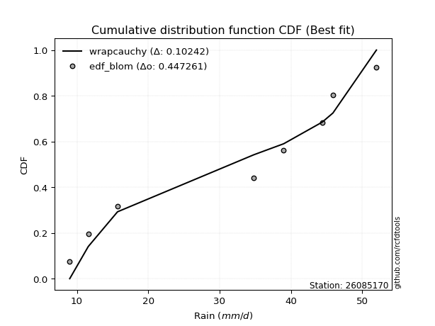</img></img>

</div>


### 7. EDF Tukey (1962)

In hydrology, the Tukey formula is used as a plotting position formula to estimate the empirical probability or frequency of a flood event (or other hydrological data). The formula parameter is given as _c=0.333_ (or 1/3).

<div align="center">


$P=(m-c)/(n+1-2c)$


</div>


**7.1. Empirical values**

<div align="center">

|                | 0                  | 1         | 2                  | 3                  | 4                 | 5                  | 6                 | 7                  |
|:---------------|:-------------------|:----------|:-------------------|:-------------------|:------------------|:-------------------|:------------------|:-------------------|
| date           | 2025               | 2024      | 2022               | 2018               | 2017              | 2020               | 2021              | 2019               |
| x              | 9.0                | 11.6      | 15.7               | 34.8               | 39.0              | 44.4               | 45.9              | 52.0               |
| m              | 1                  | 2         | 3                  | 4                  | 5                 | 6                  | 7                 | 8                  |
| empirical_dist | edf_tukey          | edf_tukey | edf_tukey          | edf_tukey          | edf_tukey         | edf_tukey          | edf_tukey         | edf_tukey          |
| empirical      | 0.08               | 0.2       | 0.32               | 0.44               | 0.56              | 0.68               | 0.8               | 0.92               |
| empirical_tr   | 1.0869565217391304 | 1.25      | 1.4705882352941178 | 1.7857142857142856 | 2.272727272727273 | 3.1250000000000004 | 5.000000000000001 | 12.500000000000007 |

</div>


**7.2. Kolmogorov-Smirnov fit test (sorted by Δ)**


<div align="center">

|                | 0                   | 1                   | 2                   | 3                   | 4                   | 5                   | 6                   | 7                   | 8                   | 9                   | 10                  | 11                  | 12                  | 13                 | 14                 | 15                  | 16                  | 17                  | 18                  | 19                  | 20                 | 21                  | 22                  | 23                 | 24                  | 25                 | 26                 | 27                 | 28                 | 29                 | 30                  | 31                 | 32                  | 33                 | 34                 | 35                 | 36                  | 37                  | 38                 | 39                  | 40                  | 41                  | 42                 | 43                  | 44                  | 45                  | 46                  | 47                  | 48                  | 49                  | 50                  | 51                  | 52                  | 53                  | 54                 | 55                  | 56                 | 57                 | 58                 | 59                  | 60                  | 61                  | 62                  | 63                  | 64                  | 65                  | 66                  | 67                  | 68                 | 69                  | 70                 | 71                  | 72                  | 73                  | 74                 | 75                  | 76                  | 77                  | 78                 | 79                  | 80                  | 81                 | 82                  | 83                  | 84                  | 85                  | 86                 | 87                 | 88                  | 89                  | 90                  | 91                  | 92                 | 93                 | 94                 | 95                 | 96                 | 97                  | 98                  | 99                  | 100                | 101                 | 102                 | 103                | 104                | 105                 | 106                 | 107                 | 108                | 109                 | 110                 | 111                | 112                | 113                | 114                | 115                | 116                | 117                | 118                 | 119                | 120                | 121                 | 122                | 123                | 124                | 125                | 126                 | 127                 | 128                 | 129                | 130                 | 131                 | 132                | 133                 | 134                | 135                | 136                | 137                 | 138                | 139                 | 140                | 141                 | 142                 | 143                | 144                 | 145                | 146                 | 147                | 148                 | 149                | 150                | 151                | 152                | 153                | 154                | 155                | 156                | 157                | 158                | 159                |
|:---------------|:--------------------|:--------------------|:--------------------|:--------------------|:--------------------|:--------------------|:--------------------|:--------------------|:--------------------|:--------------------|:--------------------|:--------------------|:--------------------|:-------------------|:-------------------|:--------------------|:--------------------|:--------------------|:--------------------|:--------------------|:-------------------|:--------------------|:--------------------|:-------------------|:--------------------|:-------------------|:-------------------|:-------------------|:-------------------|:-------------------|:--------------------|:-------------------|:--------------------|:-------------------|:-------------------|:-------------------|:--------------------|:--------------------|:-------------------|:--------------------|:--------------------|:--------------------|:-------------------|:--------------------|:--------------------|:--------------------|:--------------------|:--------------------|:--------------------|:--------------------|:--------------------|:--------------------|:--------------------|:--------------------|:-------------------|:--------------------|:-------------------|:-------------------|:-------------------|:--------------------|:--------------------|:--------------------|:--------------------|:--------------------|:--------------------|:--------------------|:--------------------|:--------------------|:-------------------|:--------------------|:-------------------|:--------------------|:--------------------|:--------------------|:-------------------|:--------------------|:--------------------|:--------------------|:-------------------|:--------------------|:--------------------|:-------------------|:--------------------|:--------------------|:--------------------|:--------------------|:-------------------|:-------------------|:--------------------|:--------------------|:--------------------|:--------------------|:-------------------|:-------------------|:-------------------|:-------------------|:-------------------|:--------------------|:--------------------|:--------------------|:-------------------|:--------------------|:--------------------|:-------------------|:-------------------|:--------------------|:--------------------|:--------------------|:-------------------|:--------------------|:--------------------|:-------------------|:-------------------|:-------------------|:-------------------|:-------------------|:-------------------|:-------------------|:--------------------|:-------------------|:-------------------|:--------------------|:-------------------|:-------------------|:-------------------|:-------------------|:--------------------|:--------------------|:--------------------|:-------------------|:--------------------|:--------------------|:-------------------|:--------------------|:-------------------|:-------------------|:-------------------|:--------------------|:-------------------|:--------------------|:-------------------|:--------------------|:--------------------|:-------------------|:--------------------|:-------------------|:--------------------|:-------------------|:--------------------|:-------------------|:-------------------|:-------------------|:-------------------|:-------------------|:-------------------|:-------------------|:-------------------|:-------------------|:-------------------|:-------------------|
| station        | 26085170            | 26085170            | 26085170            | 26085170            | 26085170            | 26085170            | 26085170            | 26085170            | 26085170            | 26085170            | 26085170            | 26085170            | 26085170            | 26085170           | 26085170           | 26085170            | 26085170            | 26085170            | 26085170            | 26085170            | 26085170           | 26085170            | 26085170            | 26085170           | 26085170            | 26085170           | 26085170           | 26085170           | 26085170           | 26085170           | 26085170            | 26085170           | 26085170            | 26085170           | 26085170           | 26085170           | 26085170            | 26085170            | 26085170           | 26085170            | 26085170            | 26085170            | 26085170           | 26085170            | 26085170            | 26085170            | 26085170            | 26085170            | 26085170            | 26085170            | 26085170            | 26085170            | 26085170            | 26085170            | 26085170           | 26085170            | 26085170           | 26085170           | 26085170           | 26085170            | 26085170            | 26085170            | 26085170            | 26085170            | 26085170            | 26085170            | 26085170            | 26085170            | 26085170           | 26085170            | 26085170           | 26085170            | 26085170            | 26085170            | 26085170           | 26085170            | 26085170            | 26085170            | 26085170           | 26085170            | 26085170            | 26085170           | 26085170            | 26085170            | 26085170            | 26085170            | 26085170           | 26085170           | 26085170            | 26085170            | 26085170            | 26085170            | 26085170           | 26085170           | 26085170           | 26085170           | 26085170           | 26085170            | 26085170            | 26085170            | 26085170           | 26085170            | 26085170            | 26085170           | 26085170           | 26085170            | 26085170            | 26085170            | 26085170           | 26085170            | 26085170            | 26085170           | 26085170           | 26085170           | 26085170           | 26085170           | 26085170           | 26085170           | 26085170            | 26085170           | 26085170           | 26085170            | 26085170           | 26085170           | 26085170           | 26085170           | 26085170            | 26085170            | 26085170            | 26085170           | 26085170            | 26085170            | 26085170           | 26085170            | 26085170           | 26085170           | 26085170           | 26085170            | 26085170           | 26085170            | 26085170           | 26085170            | 26085170            | 26085170           | 26085170            | 26085170           | 26085170            | 26085170           | 26085170            | 26085170           | 26085170           | 26085170           | 26085170           | 26085170           | 26085170           | 26085170           | 26085170           | 26085170           | 26085170           | 26085170           |
| empirical_dist | edf_tukey           | edf_tukey           | edf_tukey           | edf_tukey           | edf_tukey           | edf_tukey           | edf_tukey           | edf_tukey           | edf_tukey           | edf_tukey           | edf_tukey           | edf_tukey           | edf_tukey           | edf_tukey          | edf_tukey          | edf_tukey           | edf_tukey           | edf_tukey           | edf_tukey           | edf_tukey           | edf_tukey          | edf_tukey           | edf_tukey           | edf_tukey          | edf_tukey           | edf_tukey          | edf_tukey          | edf_tukey          | edf_tukey          | edf_tukey          | edf_tukey           | edf_tukey          | edf_tukey           | edf_tukey          | edf_tukey          | edf_tukey          | edf_tukey           | edf_tukey           | edf_tukey          | edf_tukey           | edf_tukey           | edf_tukey           | edf_tukey          | edf_tukey           | edf_tukey           | edf_tukey           | edf_tukey           | edf_tukey           | edf_tukey           | edf_tukey           | edf_tukey           | edf_tukey           | edf_tukey           | edf_tukey           | edf_tukey          | edf_tukey           | edf_tukey          | edf_tukey          | edf_tukey          | edf_tukey           | edf_tukey           | edf_tukey           | edf_tukey           | edf_tukey           | edf_tukey           | edf_tukey           | edf_tukey           | edf_tukey           | edf_tukey          | edf_tukey           | edf_tukey          | edf_tukey           | edf_tukey           | edf_tukey           | edf_tukey          | edf_tukey           | edf_tukey           | edf_tukey           | edf_tukey          | edf_tukey           | edf_tukey           | edf_tukey          | edf_tukey           | edf_tukey           | edf_tukey           | edf_tukey           | edf_tukey          | edf_tukey          | edf_tukey           | edf_tukey           | edf_tukey           | edf_tukey           | edf_tukey          | edf_tukey          | edf_tukey          | edf_tukey          | edf_tukey          | edf_tukey           | edf_tukey           | edf_tukey           | edf_tukey          | edf_tukey           | edf_tukey           | edf_tukey          | edf_tukey          | edf_tukey           | edf_tukey           | edf_tukey           | edf_tukey          | edf_tukey           | edf_tukey           | edf_tukey          | edf_tukey          | edf_tukey          | edf_tukey          | edf_tukey          | edf_tukey          | edf_tukey          | edf_tukey           | edf_tukey          | edf_tukey          | edf_tukey           | edf_tukey          | edf_tukey          | edf_tukey          | edf_tukey          | edf_tukey           | edf_tukey           | edf_tukey           | edf_tukey          | edf_tukey           | edf_tukey           | edf_tukey          | edf_tukey           | edf_tukey          | edf_tukey          | edf_tukey          | edf_tukey           | edf_tukey          | edf_tukey           | edf_tukey          | edf_tukey           | edf_tukey           | edf_tukey          | edf_tukey           | edf_tukey          | edf_tukey           | edf_tukey          | edf_tukey           | edf_tukey          | edf_tukey          | edf_tukey          | edf_tukey          | edf_tukey          | edf_tukey          | edf_tukey          | edf_tukey          | edf_tukey          | edf_tukey          | edf_tukey          |
| p_dist         | wrapcauchy          | genpareto           | arcsine             | loggenextreme       | ksone               | genextreme          | semicircular        | trapezoid           | anglit              | logweibull_max      | logjohnsonsu        | loggenpareto        | genhalflogistic     | logburr            | logmielke          | burr                | logtrapezoid        | logloggamma         | betaprime           | logarcsine          | tukeylambda        | erlang              | gamma               | skewnorm           | johnsonsu           | beta               | f                  | nct                | exponnorm          | norm               | crystalball         | truncnorm          | t                   | gengamma           | pearson3           | cosine             | uniform             | vonmises_line       | kappa3             | rice                | logargus            | maxwell             | invgamma           | loglevy_l           | foldnorm            | alpha               | weibull_min         | invgauss            | logburr12           | logweibull_min      | gumbel_l            | logwrapcauchy       | rayleigh            | loggenhalflogistic  | kappa4             | logistic            | loggumbel_l        | logksone           | triang             | argus               | gompertz            | hypsecant           | ncf                 | logsemicircular     | logpearson3         | laplace             | truncpareto         | halfnorm            | loganglit          | kstwobign           | loggompertz        | gumbel_r            | dweibull            | dgamma              | logloglaplace      | lognct              | logt                | logexponnorm        | logcrystalball     | lognorm             | logf                | logdgamma          | logfatiguelife      | logtriang           | logdweibull         | logncf              | loggennorm         | logbetaprime       | logfoldnorm         | logbeta             | logerlang           | logskewnorm         | loginvgamma        | halflogistic       | moyal              | loggamma           | loggamma           | logrice             | logalpha            | loginvgauss         | bradford           | loginvweibull       | lomax               | genexpon           | levy_l             | loglogistic         | logmaxwell          | gausshyper          | truncweibull_min   | lograyleigh         | logrdist            | truncexpon         | logcosine          | loghypsecant       | loggenexpon        | halfgennorm        | logkstwobign       | nakagami           | loghalfnorm         | burr12             | lognakagami        | loglomax            | johnsonsb          | loggumbel_r        | loglaplace         | loglaplace         | loghalflogistic     | gennorm             | logmoyal            | logjohnsonsb       | logkappa4           | logtruncnorm        | wald               | logtukeylambda      | logkappa3          | logexponweib       | loguniform         | logvonmises_line    | logexponpow        | logwald             | loggengamma        | loggausshyper       | logtruncweibull_min | logbradford        | logtruncexpon       | exponpow           | fatiguelife         | powerlaw           | exponweib           | invweibull         | logpowerlaw        | weibull_max        | logtruncpareto     | rdist              | loghalfgennorm     | genlogistic        | loggenlogistic     | logvonmises        | vonmises           | mielke             |
| delta          | 0.10181398258936042 | 0.10531409756816501 | 0.10627736007686112 | 0.11811569765295377 | 0.11914411384485418 | 0.12246965301051502 | 0.12510147454400938 | 0.12547579935725678 | 0.13560550595282117 | 0.14111270261610465 | 0.14140068921342475 | 0.14338691703394885 | 0.14527555034864856 | 0.1465524935442958 | 0.1471061475385608 | 0.14814570630679472 | 0.14836489447720508 | 0.14900751856361028 | 0.15703956800048247 | 0.15736899855831893 | 0.1577424553061681 | 0.15787807380797456 | 0.15798295758883657 | 0.1591868784072823 | 0.15980019185508193 | 0.160026582339154  | 0.1605918198105885 | 0.1610658930954432 | 0.161147193083718  | 0.1611486586070105 | 0.16114866526436078 | 0.1611487063393437 | 0.16114899992353127 | 0.1614358877496331 | 0.1619426379034022 | 0.1627808886874053 | 0.16418604651162794 | 0.16419178580408494 | 0.1645184130642239 | 0.16670623590915742 | 0.16893336266494757 | 0.16927884294168588 | 0.1699262203163921 | 0.17037576102670832 | 0.17061251693837493 | 0.17063375472358416 | 0.17257356599332008 | 0.17265580283716025 | 0.17438525012827827 | 0.17517023158101636 | 0.17566956867048666 | 0.17574793199110478 | 0.17811380122819892 | 0.17888793564662203 | 0.1792977656033648 | 0.17964325199047074 | 0.1807207366158085 | 0.1829433275900076 | 0.1835981379729042 | 0.18650154836093807 | 0.18916128940252036 | 0.18935660223910428 | 0.19106036305101454 | 0.19453280167126924 | 0.19633098472578775 | 0.19830229792635792 | 0.19953607885924557 | 0.20315278367007422 | 0.2035346044881689 | 0.20590750900219973 | 0.2079699009480292 | 0.20939342084240503 | 0.21305349162836068 | 0.21563132948408525 | 0.2212888248608394 | 0.22463976709686068 | 0.22490373366349842 | 0.22490385964868848 | 0.2249053275446226 | 0.22490533576427935 | 0.22546106024808993 | 0.2256636316585952 | 0.22598347949048941 | 0.22612084884647438 | 0.22632956403531027 | 0.22643718025154597 | 0.2267187929249363 | 0.2268921728053866 | 0.22789653046720432 | 0.22816803900798455 | 0.22851981074664712 | 0.22865022375800076 | 0.2306528792210965 | 0.2312233393403686 | 0.2330241787912441 | 0.2331545424887757 | 0.2331545424887757 | 0.23341957314436407 | 0.23585426116800295 | 0.23705260678080603 | 0.2377574082216541 | 0.24028784802508035 | 0.24158486552287622 | 0.242398187516156  | 0.2429912022788095 | 0.24405619593863542 | 0.24491313590990976 | 0.24904536748202238 | 0.2501587622818778 | 0.25087700717753963 | 0.25423639571945494 | 0.2549998337636678 | 0.2550836199366591 | 0.2586351252207422 | 0.2599763174313227 | 0.260436186390633  | 0.2617891034418482 | 0.2652444298058593 | 0.26839569561409987 | 0.273350019276874  | 0.2768021577540442 | 0.28199193523307303 | 0.2819967517124443 | 0.2824118917735932 | 0.2862237248873241 | 0.2862237248873241 | 0.29623939701002505 | 0.30000000000000004 | 0.30129063388119653 | 0.3022707647069363 | 0.31410671487258507 | 0.31999892588110174 | 0.32               | 0.32329869160371544 | 0.3244194337584962 | 0.3287448376699728 | 0.331025114631373  | 0.33516283136192476 | 0.3531945017798694 | 0.35523432523933623 | 0.3609185133256004 | 0.36386693559859146 | 0.3812852384435597  | 0.3860638117004273 | 0.40642294015847164 | 0.4238308871518109 | 0.43911298886922984 | 0.4705456842086277 | 0.48765759879472276 | 0.4889601118495721 | 0.5088251595966564 | 0.5813582167513276 | 0.6659857854424891 | 0.6799999999931385 | 0.68               | 0.8                | 0.8                | 1.2132820352322298 | 7.460987010942761  | nan                |
| deltao         | 0.4472608134160001  | 0.4472608134160001  | 0.4472608134160001  | 0.4472608134160001  | 0.4472608134160001  | 0.4472608134160001  | 0.4472608134160001  | 0.4472608134160001  | 0.4472608134160001  | 0.4472608134160001  | 0.4472608134160001  | 0.4472608134160001  | 0.4472608134160001  | 0.4472608134160001 | 0.4472608134160001 | 0.4472608134160001  | 0.4472608134160001  | 0.4472608134160001  | 0.4472608134160001  | 0.4472608134160001  | 0.4472608134160001 | 0.4472608134160001  | 0.4472608134160001  | 0.4472608134160001 | 0.4472608134160001  | 0.4472608134160001 | 0.4472608134160001 | 0.4472608134160001 | 0.4472608134160001 | 0.4472608134160001 | 0.4472608134160001  | 0.4472608134160001 | 0.4472608134160001  | 0.4472608134160001 | 0.4472608134160001 | 0.4472608134160001 | 0.4472608134160001  | 0.4472608134160001  | 0.4472608134160001 | 0.4472608134160001  | 0.4472608134160001  | 0.4472608134160001  | 0.4472608134160001 | 0.4472608134160001  | 0.4472608134160001  | 0.4472608134160001  | 0.4472608134160001  | 0.4472608134160001  | 0.4472608134160001  | 0.4472608134160001  | 0.4472608134160001  | 0.4472608134160001  | 0.4472608134160001  | 0.4472608134160001  | 0.4472608134160001 | 0.4472608134160001  | 0.4472608134160001 | 0.4472608134160001 | 0.4472608134160001 | 0.4472608134160001  | 0.4472608134160001  | 0.4472608134160001  | 0.4472608134160001  | 0.4472608134160001  | 0.4472608134160001  | 0.4472608134160001  | 0.4472608134160001  | 0.4472608134160001  | 0.4472608134160001 | 0.4472608134160001  | 0.4472608134160001 | 0.4472608134160001  | 0.4472608134160001  | 0.4472608134160001  | 0.4472608134160001 | 0.4472608134160001  | 0.4472608134160001  | 0.4472608134160001  | 0.4472608134160001 | 0.4472608134160001  | 0.4472608134160001  | 0.4472608134160001 | 0.4472608134160001  | 0.4472608134160001  | 0.4472608134160001  | 0.4472608134160001  | 0.4472608134160001 | 0.4472608134160001 | 0.4472608134160001  | 0.4472608134160001  | 0.4472608134160001  | 0.4472608134160001  | 0.4472608134160001 | 0.4472608134160001 | 0.4472608134160001 | 0.4472608134160001 | 0.4472608134160001 | 0.4472608134160001  | 0.4472608134160001  | 0.4472608134160001  | 0.4472608134160001 | 0.4472608134160001  | 0.4472608134160001  | 0.4472608134160001 | 0.4472608134160001 | 0.4472608134160001  | 0.4472608134160001  | 0.4472608134160001  | 0.4472608134160001 | 0.4472608134160001  | 0.4472608134160001  | 0.4472608134160001 | 0.4472608134160001 | 0.4472608134160001 | 0.4472608134160001 | 0.4472608134160001 | 0.4472608134160001 | 0.4472608134160001 | 0.4472608134160001  | 0.4472608134160001 | 0.4472608134160001 | 0.4472608134160001  | 0.4472608134160001 | 0.4472608134160001 | 0.4472608134160001 | 0.4472608134160001 | 0.4472608134160001  | 0.4472608134160001  | 0.4472608134160001  | 0.4472608134160001 | 0.4472608134160001  | 0.4472608134160001  | 0.4472608134160001 | 0.4472608134160001  | 0.4472608134160001 | 0.4472608134160001 | 0.4472608134160001 | 0.4472608134160001  | 0.4472608134160001 | 0.4472608134160001  | 0.4472608134160001 | 0.4472608134160001  | 0.4472608134160001  | 0.4472608134160001 | 0.4472608134160001  | 0.4472608134160001 | 0.4472608134160001  | 0.4472608134160001 | 0.4472608134160001  | 0.4472608134160001 | 0.4472608134160001 | 0.4472608134160001 | 0.4472608134160001 | 0.4472608134160001 | 0.4472608134160001 | 0.4472608134160001 | 0.4472608134160001 | 0.4472608134160001 | 0.4472608134160001 | 0.4472608134160001 |
| eval           | Δo > Δ              | Δo > Δ              | Δo > Δ              | Δo > Δ              | Δo > Δ              | Δo > Δ              | Δo > Δ              | Δo > Δ              | Δo > Δ              | Δo > Δ              | Δo > Δ              | Δo > Δ              | Δo > Δ              | Δo > Δ             | Δo > Δ             | Δo > Δ              | Δo > Δ              | Δo > Δ              | Δo > Δ              | Δo > Δ              | Δo > Δ             | Δo > Δ              | Δo > Δ              | Δo > Δ             | Δo > Δ              | Δo > Δ             | Δo > Δ             | Δo > Δ             | Δo > Δ             | Δo > Δ             | Δo > Δ              | Δo > Δ             | Δo > Δ              | Δo > Δ             | Δo > Δ             | Δo > Δ             | Δo > Δ              | Δo > Δ              | Δo > Δ             | Δo > Δ              | Δo > Δ              | Δo > Δ              | Δo > Δ             | Δo > Δ              | Δo > Δ              | Δo > Δ              | Δo > Δ              | Δo > Δ              | Δo > Δ              | Δo > Δ              | Δo > Δ              | Δo > Δ              | Δo > Δ              | Δo > Δ              | Δo > Δ             | Δo > Δ              | Δo > Δ             | Δo > Δ             | Δo > Δ             | Δo > Δ              | Δo > Δ              | Δo > Δ              | Δo > Δ              | Δo > Δ              | Δo > Δ              | Δo > Δ              | Δo > Δ              | Δo > Δ              | Δo > Δ             | Δo > Δ              | Δo > Δ             | Δo > Δ              | Δo > Δ              | Δo > Δ              | Δo > Δ             | Δo > Δ              | Δo > Δ              | Δo > Δ              | Δo > Δ             | Δo > Δ              | Δo > Δ              | Δo > Δ             | Δo > Δ              | Δo > Δ              | Δo > Δ              | Δo > Δ              | Δo > Δ             | Δo > Δ             | Δo > Δ              | Δo > Δ              | Δo > Δ              | Δo > Δ              | Δo > Δ             | Δo > Δ             | Δo > Δ             | Δo > Δ             | Δo > Δ             | Δo > Δ              | Δo > Δ              | Δo > Δ              | Δo > Δ             | Δo > Δ              | Δo > Δ              | Δo > Δ             | Δo > Δ             | Δo > Δ              | Δo > Δ              | Δo > Δ              | Δo > Δ             | Δo > Δ              | Δo > Δ              | Δo > Δ             | Δo > Δ             | Δo > Δ             | Δo > Δ             | Δo > Δ             | Δo > Δ             | Δo > Δ             | Δo > Δ              | Δo > Δ             | Δo > Δ             | Δo > Δ              | Δo > Δ             | Δo > Δ             | Δo > Δ             | Δo > Δ             | Δo > Δ              | Δo > Δ              | Δo > Δ              | Δo > Δ             | Δo > Δ              | Δo > Δ              | Δo > Δ             | Δo > Δ              | Δo > Δ             | Δo > Δ             | Δo > Δ             | Δo > Δ              | Δo > Δ             | Δo > Δ              | Δo > Δ             | Δo > Δ              | Δo > Δ              | Δo > Δ             | Δo > Δ              | Δo > Δ             | Δo > Δ              | Δo <= Δ            | Δo <= Δ             | Δo <= Δ            | Δo <= Δ            | Δo <= Δ            | Δo <= Δ            | Δo <= Δ            | Δo <= Δ            | Δo <= Δ            | Δo <= Δ            | Δo <= Δ            | Δo <= Δ            | Δo <= Δ            |
| fit            | 1                   | 1                   | 1                   | 1                   | 1                   | 1                   | 1                   | 1                   | 1                   | 1                   | 1                   | 1                   | 1                   | 1                  | 1                  | 1                   | 1                   | 1                   | 1                   | 1                   | 1                  | 1                   | 1                   | 1                  | 1                   | 1                  | 1                  | 1                  | 1                  | 1                  | 1                   | 1                  | 1                   | 1                  | 1                  | 1                  | 1                   | 1                   | 1                  | 1                   | 1                   | 1                   | 1                  | 1                   | 1                   | 1                   | 1                   | 1                   | 1                   | 1                   | 1                   | 1                   | 1                   | 1                   | 1                  | 1                   | 1                  | 1                  | 1                  | 1                   | 1                   | 1                   | 1                   | 1                   | 1                   | 1                   | 1                   | 1                   | 1                  | 1                   | 1                  | 1                   | 1                   | 1                   | 1                  | 1                   | 1                   | 1                   | 1                  | 1                   | 1                   | 1                  | 1                   | 1                   | 1                   | 1                   | 1                  | 1                  | 1                   | 1                   | 1                   | 1                   | 1                  | 1                  | 1                  | 1                  | 1                  | 1                   | 1                   | 1                   | 1                  | 1                   | 1                   | 1                  | 1                  | 1                   | 1                   | 1                   | 1                  | 1                   | 1                   | 1                  | 1                  | 1                  | 1                  | 1                  | 1                  | 1                  | 1                   | 1                  | 1                  | 1                   | 1                  | 1                  | 1                  | 1                  | 1                   | 1                   | 1                   | 1                  | 1                   | 1                   | 1                  | 1                   | 1                  | 1                  | 1                  | 1                   | 1                  | 1                   | 1                  | 1                   | 1                   | 1                  | 1                   | 1                  | 1                   | 0                  | 0                   | 0                  | 0                  | 0                  | 0                  | 0                  | 0                  | 0                  | 0                  | 0                  | 0                  | 0                  |
| n              | 8                   | 8                   | 8                   | 8                   | 8                   | 8                   | 8                   | 8                   | 8                   | 8                   | 8                   | 8                   | 8                   | 8                  | 8                  | 8                   | 8                   | 8                   | 8                   | 8                   | 8                  | 8                   | 8                   | 8                  | 8                   | 8                  | 8                  | 8                  | 8                  | 8                  | 8                   | 8                  | 8                   | 8                  | 8                  | 8                  | 8                   | 8                   | 8                  | 8                   | 8                   | 8                   | 8                  | 8                   | 8                   | 8                   | 8                   | 8                   | 8                   | 8                   | 8                   | 8                   | 8                   | 8                   | 8                  | 8                   | 8                  | 8                  | 8                  | 8                   | 8                   | 8                   | 8                   | 8                   | 8                   | 8                   | 8                   | 8                   | 8                  | 8                   | 8                  | 8                   | 8                   | 8                   | 8                  | 8                   | 8                   | 8                   | 8                  | 8                   | 8                   | 8                  | 8                   | 8                   | 8                   | 8                   | 8                  | 8                  | 8                   | 8                   | 8                   | 8                   | 8                  | 8                  | 8                  | 8                  | 8                  | 8                   | 8                   | 8                   | 8                  | 8                   | 8                   | 8                  | 8                  | 8                   | 8                   | 8                   | 8                  | 8                   | 8                   | 8                  | 8                  | 8                  | 8                  | 8                  | 8                  | 8                  | 8                   | 8                  | 8                  | 8                   | 8                  | 8                  | 8                  | 8                  | 8                   | 8                   | 8                   | 8                  | 8                   | 8                   | 8                  | 8                   | 8                  | 8                  | 8                  | 8                   | 8                  | 8                   | 8                  | 8                   | 8                   | 8                  | 8                   | 8                  | 8                   | 8                  | 8                   | 8                  | 8                  | 8                  | 8                  | 8                  | 8                  | 8                  | 8                  | 8                  | 8                  | 8                  |
| best_fit       | 1                   | 0                   | 0                   | 0                   | 0                   | 0                   | 0                   | 0                   | 0                   | 0                   | 0                   | 0                   | 0                   | 0                  | 0                  | 0                   | 0                   | 0                   | 0                   | 0                   | 0                  | 0                   | 0                   | 0                  | 0                   | 0                  | 0                  | 0                  | 0                  | 0                  | 0                   | 0                  | 0                   | 0                  | 0                  | 0                  | 0                   | 0                   | 0                  | 0                   | 0                   | 0                   | 0                  | 0                   | 0                   | 0                   | 0                   | 0                   | 0                   | 0                   | 0                   | 0                   | 0                   | 0                   | 0                  | 0                   | 0                  | 0                  | 0                  | 0                   | 0                   | 0                   | 0                   | 0                   | 0                   | 0                   | 0                   | 0                   | 0                  | 0                   | 0                  | 0                   | 0                   | 0                   | 0                  | 0                   | 0                   | 0                   | 0                  | 0                   | 0                   | 0                  | 0                   | 0                   | 0                   | 0                   | 0                  | 0                  | 0                   | 0                   | 0                   | 0                   | 0                  | 0                  | 0                  | 0                  | 0                  | 0                   | 0                   | 0                   | 0                  | 0                   | 0                   | 0                  | 0                  | 0                   | 0                   | 0                   | 0                  | 0                   | 0                   | 0                  | 0                  | 0                  | 0                  | 0                  | 0                  | 0                  | 0                   | 0                  | 0                  | 0                   | 0                  | 0                  | 0                  | 0                  | 0                   | 0                   | 0                   | 0                  | 0                   | 0                   | 0                  | 0                   | 0                  | 0                  | 0                  | 0                   | 0                  | 0                   | 0                  | 0                   | 0                   | 0                  | 0                   | 0                  | 0                   | 0                  | 0                   | 0                  | 0                  | 0                  | 0                  | 0                  | 0                  | 0                  | 0                  | 0                  | 0                  | 0                  |
| best_fit_sort  | 1                   | 2                   | 3                   | 4                   | 5                   | 6                   | 7                   | 8                   | 9                   | 10                  | 11                  | 12                  | 13                  | 14                 | 15                 | 16                  | 17                  | 18                  | 19                  | 20                  | 21                 | 22                  | 23                  | 24                 | 25                  | 26                 | 27                 | 28                 | 29                 | 30                 | 31                  | 32                 | 33                  | 34                 | 35                 | 36                 | 37                  | 38                  | 39                 | 40                  | 41                  | 42                  | 43                 | 44                  | 45                  | 46                  | 47                  | 48                  | 49                  | 50                  | 51                  | 52                  | 53                  | 54                  | 55                 | 56                  | 57                 | 58                 | 59                 | 60                  | 61                  | 62                  | 63                  | 64                  | 65                  | 66                  | 67                  | 68                  | 69                 | 70                  | 71                 | 72                  | 73                  | 74                  | 75                 | 76                  | 77                  | 78                  | 79                 | 80                  | 81                  | 82                 | 83                  | 84                  | 85                  | 86                  | 87                 | 88                 | 89                  | 90                  | 91                  | 92                  | 93                 | 94                 | 95                 | 96                 | 97                 | 98                  | 99                  | 100                 | 101                | 102                 | 103                 | 104                | 105                | 106                 | 107                 | 108                 | 109                | 110                 | 111                 | 112                | 113                | 114                | 115                | 116                | 117                | 118                | 119                 | 120                | 121                | 122                 | 123                | 124                | 125                | 126                | 127                 | 128                 | 129                 | 130                | 131                 | 132                 | 133                | 134                 | 135                | 136                | 137                | 138                 | 139                | 140                 | 141                | 142                 | 143                 | 144                | 145                 | 146                | 147                 | 148                | 149                 | 150                | 151                | 152                | 153                | 154                | 155                | 156                | 157                | 158                | 159                | 160                |

</div>


**7.3. Best fit**

<div align="center">

|   id |   station | empirical_dist   | p_dist     |    delta |   deltao | eval   |   fit |   n |   best_fit |   best_fit_sort |
|-----:|----------:|:-----------------|:-----------|---------:|---------:|:-------|------:|----:|-----------:|----------------:|
|    0 |  26085170 | edf_tukey        | wrapcauchy | 0.101814 | 0.447261 | Δo > Δ |     1 |   8 |          1 |               1 |

</div>


<div align="center">

</img>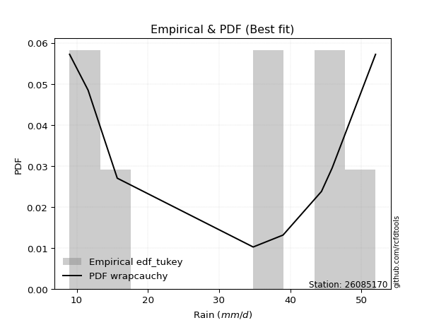</img>

</div>


### 8. EDF Gringorten (1963)

Gringorten plotting position formula is essential for estimating the probability and return periods of extreme events like floods and heavy rainfall. The constant _a=0.44_.

<div align="center">


$P=(m-a)/(n+1-2a)$


</div>


**8.1. Empirical values**

<div align="center">

|                | 0                   | 1                   | 2                  | 3                  | 4                  | 5                  | 6                  | 7                  |
|:---------------|:--------------------|:--------------------|:-------------------|:-------------------|:-------------------|:-------------------|:-------------------|:-------------------|
| date           | 2025                | 2024                | 2022               | 2018               | 2017               | 2020               | 2021               | 2019               |
| x              | 9.0                 | 11.6                | 15.7               | 34.8               | 39.0               | 44.4               | 45.9               | 52.0               |
| m              | 1                   | 2                   | 3                  | 4                  | 5                  | 6                  | 7                  | 8                  |
| empirical_dist | edf_gringorten      | edf_gringorten      | edf_gringorten     | edf_gringorten     | edf_gringorten     | edf_gringorten     | edf_gringorten     | edf_gringorten     |
| empirical      | 0.06896551724137932 | 0.19211822660098524 | 0.3152709359605912 | 0.4384236453201971 | 0.5615763546798029 | 0.6847290640394089 | 0.8078817733990148 | 0.9310344827586208 |
| empirical_tr   | 1.0740740740740742  | 1.2378048780487805  | 1.460431654676259  | 1.780701754385965  | 2.2808988764044944 | 3.1718750000000004 | 5.205128205128205  | 14.500000000000018 |

</div>


**8.2. Kolmogorov-Smirnov fit test (sorted by Δ)**


<div align="center">

|                | 0                  | 1                  | 2                  | 3                   | 4                  | 5                   | 6                   | 7                   | 8                  | 9                   | 10                  | 11                 | 12                  | 13                 | 14                  | 15                 | 16                  | 17                  | 18                  | 19                  | 20                  | 21                  | 22                  | 23                 | 24                  | 25                  | 26                  | 27                  | 28                  | 29                  | 30                 | 31                  | 32                 | 33                  | 34                  | 35                  | 36                  | 37                 | 38                  | 39                 | 40                  | 41                  | 42                  | 43                  | 44                  | 45                  | 46                  | 47                  | 48                  | 49                  | 50                  | 51                  | 52                  | 53                 | 54                  | 55                  | 56                 | 57                  | 58                 | 59                  | 60                  | 61                  | 62                  | 63                 | 64                  | 65                  | 66                  | 67                 | 68                  | 69                 | 70                  | 71                  | 72                  | 73                  | 74                  | 75                 | 76                  | 77                  | 78                  | 79                 | 80                  | 81                 | 82                  | 83                 | 84                 | 85                  | 86                  | 87                  | 88                 | 89                 | 90                  | 91                 | 92                  | 93                  | 94                 | 95                 | 96                  | 97                 | 98                  | 99                 | 100                 | 101                 | 102                | 103                 | 104                | 105                 | 106                 | 107                 | 108                | 109                 | 110                | 111                | 112                | 113                | 114                | 115                 | 116                | 117                | 118                 | 119                | 120                | 121                | 122                | 123                | 124                | 125                 | 126                 | 127                | 128                | 129                 | 130                | 131                | 132                 | 133                | 134                | 135                | 136                | 137                 | 138                | 139                | 140                 | 141                 | 142                 | 143                | 144                | 145                 | 146                 | 147                | 148                 | 149                 | 150                | 151                | 152                | 153                | 154                | 155                | 156                | 157                | 158                | 159                |
|:---------------|:-------------------|:-------------------|:-------------------|:--------------------|:-------------------|:--------------------|:--------------------|:--------------------|:-------------------|:--------------------|:--------------------|:-------------------|:--------------------|:-------------------|:--------------------|:-------------------|:--------------------|:--------------------|:--------------------|:--------------------|:--------------------|:--------------------|:--------------------|:-------------------|:--------------------|:--------------------|:--------------------|:--------------------|:--------------------|:--------------------|:-------------------|:--------------------|:-------------------|:--------------------|:--------------------|:--------------------|:--------------------|:-------------------|:--------------------|:-------------------|:--------------------|:--------------------|:--------------------|:--------------------|:--------------------|:--------------------|:--------------------|:--------------------|:--------------------|:--------------------|:--------------------|:--------------------|:--------------------|:-------------------|:--------------------|:--------------------|:-------------------|:--------------------|:-------------------|:--------------------|:--------------------|:--------------------|:--------------------|:-------------------|:--------------------|:--------------------|:--------------------|:-------------------|:--------------------|:-------------------|:--------------------|:--------------------|:--------------------|:--------------------|:--------------------|:-------------------|:--------------------|:--------------------|:--------------------|:-------------------|:--------------------|:-------------------|:--------------------|:-------------------|:-------------------|:--------------------|:--------------------|:--------------------|:-------------------|:-------------------|:--------------------|:-------------------|:--------------------|:--------------------|:-------------------|:-------------------|:--------------------|:-------------------|:--------------------|:-------------------|:--------------------|:--------------------|:-------------------|:--------------------|:-------------------|:--------------------|:--------------------|:--------------------|:-------------------|:--------------------|:-------------------|:-------------------|:-------------------|:-------------------|:-------------------|:--------------------|:-------------------|:-------------------|:--------------------|:-------------------|:-------------------|:-------------------|:-------------------|:-------------------|:-------------------|:--------------------|:--------------------|:-------------------|:-------------------|:--------------------|:-------------------|:-------------------|:--------------------|:-------------------|:-------------------|:-------------------|:-------------------|:--------------------|:-------------------|:-------------------|:--------------------|:--------------------|:--------------------|:-------------------|:-------------------|:--------------------|:--------------------|:-------------------|:--------------------|:--------------------|:-------------------|:-------------------|:-------------------|:-------------------|:-------------------|:-------------------|:-------------------|:-------------------|:-------------------|:-------------------|
| station        | 26085170           | 26085170           | 26085170           | 26085170            | 26085170           | 26085170            | 26085170            | 26085170            | 26085170           | 26085170            | 26085170            | 26085170           | 26085170            | 26085170           | 26085170            | 26085170           | 26085170            | 26085170            | 26085170            | 26085170            | 26085170            | 26085170            | 26085170            | 26085170           | 26085170            | 26085170            | 26085170            | 26085170            | 26085170            | 26085170            | 26085170           | 26085170            | 26085170           | 26085170            | 26085170            | 26085170            | 26085170            | 26085170           | 26085170            | 26085170           | 26085170            | 26085170            | 26085170            | 26085170            | 26085170            | 26085170            | 26085170            | 26085170            | 26085170            | 26085170            | 26085170            | 26085170            | 26085170            | 26085170           | 26085170            | 26085170            | 26085170           | 26085170            | 26085170           | 26085170            | 26085170            | 26085170            | 26085170            | 26085170           | 26085170            | 26085170            | 26085170            | 26085170           | 26085170            | 26085170           | 26085170            | 26085170            | 26085170            | 26085170            | 26085170            | 26085170           | 26085170            | 26085170            | 26085170            | 26085170           | 26085170            | 26085170           | 26085170            | 26085170           | 26085170           | 26085170            | 26085170            | 26085170            | 26085170           | 26085170           | 26085170            | 26085170           | 26085170            | 26085170            | 26085170           | 26085170           | 26085170            | 26085170           | 26085170            | 26085170           | 26085170            | 26085170            | 26085170           | 26085170            | 26085170           | 26085170            | 26085170            | 26085170            | 26085170           | 26085170            | 26085170           | 26085170           | 26085170           | 26085170           | 26085170           | 26085170            | 26085170           | 26085170           | 26085170            | 26085170           | 26085170           | 26085170           | 26085170           | 26085170           | 26085170           | 26085170            | 26085170            | 26085170           | 26085170           | 26085170            | 26085170           | 26085170           | 26085170            | 26085170           | 26085170           | 26085170           | 26085170           | 26085170            | 26085170           | 26085170           | 26085170            | 26085170            | 26085170            | 26085170           | 26085170           | 26085170            | 26085170            | 26085170           | 26085170            | 26085170            | 26085170           | 26085170           | 26085170           | 26085170           | 26085170           | 26085170           | 26085170           | 26085170           | 26085170           | 26085170           |
| empirical_dist | edf_gringorten     | edf_gringorten     | edf_gringorten     | edf_gringorten      | edf_gringorten     | edf_gringorten      | edf_gringorten      | edf_gringorten      | edf_gringorten     | edf_gringorten      | edf_gringorten      | edf_gringorten     | edf_gringorten      | edf_gringorten     | edf_gringorten      | edf_gringorten     | edf_gringorten      | edf_gringorten      | edf_gringorten      | edf_gringorten      | edf_gringorten      | edf_gringorten      | edf_gringorten      | edf_gringorten     | edf_gringorten      | edf_gringorten      | edf_gringorten      | edf_gringorten      | edf_gringorten      | edf_gringorten      | edf_gringorten     | edf_gringorten      | edf_gringorten     | edf_gringorten      | edf_gringorten      | edf_gringorten      | edf_gringorten      | edf_gringorten     | edf_gringorten      | edf_gringorten     | edf_gringorten      | edf_gringorten      | edf_gringorten      | edf_gringorten      | edf_gringorten      | edf_gringorten      | edf_gringorten      | edf_gringorten      | edf_gringorten      | edf_gringorten      | edf_gringorten      | edf_gringorten      | edf_gringorten      | edf_gringorten     | edf_gringorten      | edf_gringorten      | edf_gringorten     | edf_gringorten      | edf_gringorten     | edf_gringorten      | edf_gringorten      | edf_gringorten      | edf_gringorten      | edf_gringorten     | edf_gringorten      | edf_gringorten      | edf_gringorten      | edf_gringorten     | edf_gringorten      | edf_gringorten     | edf_gringorten      | edf_gringorten      | edf_gringorten      | edf_gringorten      | edf_gringorten      | edf_gringorten     | edf_gringorten      | edf_gringorten      | edf_gringorten      | edf_gringorten     | edf_gringorten      | edf_gringorten     | edf_gringorten      | edf_gringorten     | edf_gringorten     | edf_gringorten      | edf_gringorten      | edf_gringorten      | edf_gringorten     | edf_gringorten     | edf_gringorten      | edf_gringorten     | edf_gringorten      | edf_gringorten      | edf_gringorten     | edf_gringorten     | edf_gringorten      | edf_gringorten     | edf_gringorten      | edf_gringorten     | edf_gringorten      | edf_gringorten      | edf_gringorten     | edf_gringorten      | edf_gringorten     | edf_gringorten      | edf_gringorten      | edf_gringorten      | edf_gringorten     | edf_gringorten      | edf_gringorten     | edf_gringorten     | edf_gringorten     | edf_gringorten     | edf_gringorten     | edf_gringorten      | edf_gringorten     | edf_gringorten     | edf_gringorten      | edf_gringorten     | edf_gringorten     | edf_gringorten     | edf_gringorten     | edf_gringorten     | edf_gringorten     | edf_gringorten      | edf_gringorten      | edf_gringorten     | edf_gringorten     | edf_gringorten      | edf_gringorten     | edf_gringorten     | edf_gringorten      | edf_gringorten     | edf_gringorten     | edf_gringorten     | edf_gringorten     | edf_gringorten      | edf_gringorten     | edf_gringorten     | edf_gringorten      | edf_gringorten      | edf_gringorten      | edf_gringorten     | edf_gringorten     | edf_gringorten      | edf_gringorten      | edf_gringorten     | edf_gringorten      | edf_gringorten      | edf_gringorten     | edf_gringorten     | edf_gringorten     | edf_gringorten     | edf_gringorten     | edf_gringorten     | edf_gringorten     | edf_gringorten     | edf_gringorten     | edf_gringorten     |
| p_dist         | genpareto          | wrapcauchy         | arcsine            | loggenextreme       | genextreme         | ksone               | trapezoid           | semicircular        | anglit             | logjohnsonsu        | genhalflogistic     | logburr            | logmielke           | burr               | logloggamma         | logweibull_max     | logtrapezoid        | betaprime           | erlang              | gamma               | loggenpareto        | skewnorm            | johnsonsu           | f                  | nct                 | exponnorm           | norm                | crystalball         | truncnorm           | t                   | gengamma           | pearson3            | cosine             | tukeylambda         | kappa3              | uniform             | vonmises_line       | rice               | logargus            | foldnorm           | logarcsine          | weibull_min         | beta                | maxwell             | gumbel_l            | invgamma            | alpha               | invgauss            | logistic            | logburr12           | logweibull_min      | logwrapcauchy       | triang              | rayleigh           | loggenhalflogistic  | kappa4              | loglevy_l          | argus               | loggumbel_l        | gompertz            | logksone            | hypsecant           | ncf                 | laplace            | logsemicircular     | logpearson3         | truncpareto         | halfnorm           | loganglit           | kstwobign          | dweibull            | loggompertz         | dgamma              | gumbel_r            | logloglaplace       | logdgamma          | logdweibull         | loggennorm          | lognct              | logt               | logexponnorm        | logcrystalball     | lognorm             | logf               | logfatiguelife     | logtriang           | logncf              | logbetaprime        | logfoldnorm        | logerlang          | logskewnorm         | loginvgamma        | halflogistic        | moyal               | loggamma           | loggamma           | logrice             | logbeta            | logalpha            | loginvgauss        | bradford            | loginvweibull       | lomax              | genexpon            | loglogistic        | logmaxwell          | gausshyper          | truncweibull_min    | lograyleigh        | levy_l              | logrdist           | truncexpon         | logcosine          | loghypsecant       | loggenexpon        | halfgennorm         | logkstwobign       | nakagami           | loghalfnorm         | burr12             | lognakagami        | loglomax           | loggumbel_r        | loglaplace         | loglaplace         | johnsonsb           | loghalflogistic     | logmoyal           | gennorm            | logjohnsonsb        | logtruncnorm       | wald               | logkappa4           | logtukeylambda     | logkappa3          | logexponweib       | loguniform         | logvonmises_line    | logwald            | logexponpow        | loggengamma         | loggausshyper       | logtruncweibull_min | logbradford        | logtruncexpon      | exponpow            | fatiguelife         | powerlaw           | exponweib           | invweibull          | logpowerlaw        | weibull_max        | logtruncpareto     | rdist              | loghalfgennorm     | genlogistic        | loggenlogistic     | logvonmises        | vonmises           | mielke             |
| delta          | 0.1005850335287562 | 0.1033903372691633 | 0.107853714756664  | 0.11338663361354495 | 0.1177405889711062 | 0.12072046852465707 | 0.12074673531784796 | 0.12667782922381227 | 0.1313828709868778 | 0.13667162517401593 | 0.14054648630923974 | 0.141823429504887  | 0.14237708349915199 | 0.1434166422673859 | 0.14427845452420146 | 0.1489944760151194 | 0.14994124915700796 | 0.15231050396107365 | 0.15314900976856574 | 0.15325389354942776 | 0.15442139979256952 | 0.15445781436787348 | 0.15507112781567312 | 0.1558627557711797 | 0.15633682905603438 | 0.15641812904430918 | 0.15641959456760168 | 0.15641960122495197 | 0.15641964229993488 | 0.15641993588412245 | 0.1567068237102243 | 0.15721357386399337 | 0.1580518246479965 | 0.15931880998597098 | 0.16029649541449914 | 0.16157635467980286 | 0.16158143247024975 | 0.1619771718697486 | 0.16420429862553876 | 0.1658834528989661 | 0.16643516341412157 | 0.16784450195391126 | 0.16790835573816876 | 0.17085519762148876 | 0.17094050463107785 | 0.17150257499619498 | 0.17221010940338705 | 0.17423215751696314 | 0.17491418795106192 | 0.17596160480808115 | 0.17674658626081924 | 0.17732428667090766 | 0.17886907393349538 | 0.1796901559080018 | 0.18046429032642491 | 0.18087412028316768 | 0.181410243785329  | 0.18177248432152926 | 0.1822970912956114 | 0.18443222536311155 | 0.18451968226981047 | 0.18462753819969546 | 0.19263671773081742 | 0.1935732338869491 | 0.19610915635107212 | 0.19790733940559063 | 0.20111243353904845 | 0.2047291383498771 | 0.20511095916797178 | 0.2074838636820026 | 0.20832442758895187 | 0.20954625562783208 | 0.21090226544467644 | 0.21096977552220791 | 0.21655976082143058 | 0.2209345676191864 | 0.22160049999590145 | 0.22198972888552748 | 0.22621612177666356 | 0.2264800883433013 | 0.22648021432849136 | 0.2264816822244255 | 0.22648169044408223 | 0.2270374149278928 | 0.2275598341702923 | 0.22769720352627726 | 0.22801353493134885 | 0.22846852748518948 | 0.2294728851470072 | 0.23009616542645   | 0.23022657843780364 | 0.2322292339008994 | 0.23279969402017148 | 0.23460053347104698 | 0.2347308971685786 | 0.2347308971685786 | 0.23499592782416695 | 0.2360498124069993 | 0.23743061584780584 | 0.2386289614606089 | 0.23933376290145697 | 0.24186420270488324 | 0.2431612202026791 | 0.24397454219595888 | 0.2456325506184383 | 0.24648949058971265 | 0.25062172216182527 | 0.25173511696168066 | 0.2524533618573425 | 0.25402568503743017 | 0.2558127503992578 | 0.2565761884434707 | 0.256659974616462  | 0.2602114799005451 | 0.2615526721111256 | 0.26201254107043587 | 0.2633654581216511 | 0.2668207844856622 | 0.26997205029390275 | 0.2749263739566769 | 0.2783785124338471 | 0.2835682899128759 | 0.2839882464533961 | 0.287800079567127  | 0.287800079567127  | 0.28987852511145906 | 0.29781575168982793 | 0.3028669885609994 | 0.3078817733990148 | 0.31015253810595106 | 0.3152698618416929 | 0.3152709359605912 | 0.31568306955238795 | 0.3248750462835183 | 0.3259957884382991 | 0.3303211923497757 | 0.3326014693111759 | 0.33673918604172765 | 0.3568106799191391 | 0.3610762751788842 | 0.36249486800540326 | 0.36544329027839434 | 0.3828615931233626  | 0.3876401663802302 | 0.4079992948382745 | 0.43486536991043157 | 0.44699476226824464 | 0.4721220388884306 | 0.49553937219373756 | 0.49999459460819284 | 0.5104015142764593 | 0.5892399901503423 | 0.6738675588415038 | 0.6847290640325473 | 0.6847290640394089 | 0.8078817733990148 | 0.8078817733990148 | 1.2148583899120327 | 7.44995252818414   | nan                |
| deltao         | 0.4472608134160001 | 0.4472608134160001 | 0.4472608134160001 | 0.4472608134160001  | 0.4472608134160001 | 0.4472608134160001  | 0.4472608134160001  | 0.4472608134160001  | 0.4472608134160001 | 0.4472608134160001  | 0.4472608134160001  | 0.4472608134160001 | 0.4472608134160001  | 0.4472608134160001 | 0.4472608134160001  | 0.4472608134160001 | 0.4472608134160001  | 0.4472608134160001  | 0.4472608134160001  | 0.4472608134160001  | 0.4472608134160001  | 0.4472608134160001  | 0.4472608134160001  | 0.4472608134160001 | 0.4472608134160001  | 0.4472608134160001  | 0.4472608134160001  | 0.4472608134160001  | 0.4472608134160001  | 0.4472608134160001  | 0.4472608134160001 | 0.4472608134160001  | 0.4472608134160001 | 0.4472608134160001  | 0.4472608134160001  | 0.4472608134160001  | 0.4472608134160001  | 0.4472608134160001 | 0.4472608134160001  | 0.4472608134160001 | 0.4472608134160001  | 0.4472608134160001  | 0.4472608134160001  | 0.4472608134160001  | 0.4472608134160001  | 0.4472608134160001  | 0.4472608134160001  | 0.4472608134160001  | 0.4472608134160001  | 0.4472608134160001  | 0.4472608134160001  | 0.4472608134160001  | 0.4472608134160001  | 0.4472608134160001 | 0.4472608134160001  | 0.4472608134160001  | 0.4472608134160001 | 0.4472608134160001  | 0.4472608134160001 | 0.4472608134160001  | 0.4472608134160001  | 0.4472608134160001  | 0.4472608134160001  | 0.4472608134160001 | 0.4472608134160001  | 0.4472608134160001  | 0.4472608134160001  | 0.4472608134160001 | 0.4472608134160001  | 0.4472608134160001 | 0.4472608134160001  | 0.4472608134160001  | 0.4472608134160001  | 0.4472608134160001  | 0.4472608134160001  | 0.4472608134160001 | 0.4472608134160001  | 0.4472608134160001  | 0.4472608134160001  | 0.4472608134160001 | 0.4472608134160001  | 0.4472608134160001 | 0.4472608134160001  | 0.4472608134160001 | 0.4472608134160001 | 0.4472608134160001  | 0.4472608134160001  | 0.4472608134160001  | 0.4472608134160001 | 0.4472608134160001 | 0.4472608134160001  | 0.4472608134160001 | 0.4472608134160001  | 0.4472608134160001  | 0.4472608134160001 | 0.4472608134160001 | 0.4472608134160001  | 0.4472608134160001 | 0.4472608134160001  | 0.4472608134160001 | 0.4472608134160001  | 0.4472608134160001  | 0.4472608134160001 | 0.4472608134160001  | 0.4472608134160001 | 0.4472608134160001  | 0.4472608134160001  | 0.4472608134160001  | 0.4472608134160001 | 0.4472608134160001  | 0.4472608134160001 | 0.4472608134160001 | 0.4472608134160001 | 0.4472608134160001 | 0.4472608134160001 | 0.4472608134160001  | 0.4472608134160001 | 0.4472608134160001 | 0.4472608134160001  | 0.4472608134160001 | 0.4472608134160001 | 0.4472608134160001 | 0.4472608134160001 | 0.4472608134160001 | 0.4472608134160001 | 0.4472608134160001  | 0.4472608134160001  | 0.4472608134160001 | 0.4472608134160001 | 0.4472608134160001  | 0.4472608134160001 | 0.4472608134160001 | 0.4472608134160001  | 0.4472608134160001 | 0.4472608134160001 | 0.4472608134160001 | 0.4472608134160001 | 0.4472608134160001  | 0.4472608134160001 | 0.4472608134160001 | 0.4472608134160001  | 0.4472608134160001  | 0.4472608134160001  | 0.4472608134160001 | 0.4472608134160001 | 0.4472608134160001  | 0.4472608134160001  | 0.4472608134160001 | 0.4472608134160001  | 0.4472608134160001  | 0.4472608134160001 | 0.4472608134160001 | 0.4472608134160001 | 0.4472608134160001 | 0.4472608134160001 | 0.4472608134160001 | 0.4472608134160001 | 0.4472608134160001 | 0.4472608134160001 | 0.4472608134160001 |
| eval           | Δo > Δ             | Δo > Δ             | Δo > Δ             | Δo > Δ              | Δo > Δ             | Δo > Δ              | Δo > Δ              | Δo > Δ              | Δo > Δ             | Δo > Δ              | Δo > Δ              | Δo > Δ             | Δo > Δ              | Δo > Δ             | Δo > Δ              | Δo > Δ             | Δo > Δ              | Δo > Δ              | Δo > Δ              | Δo > Δ              | Δo > Δ              | Δo > Δ              | Δo > Δ              | Δo > Δ             | Δo > Δ              | Δo > Δ              | Δo > Δ              | Δo > Δ              | Δo > Δ              | Δo > Δ              | Δo > Δ             | Δo > Δ              | Δo > Δ             | Δo > Δ              | Δo > Δ              | Δo > Δ              | Δo > Δ              | Δo > Δ             | Δo > Δ              | Δo > Δ             | Δo > Δ              | Δo > Δ              | Δo > Δ              | Δo > Δ              | Δo > Δ              | Δo > Δ              | Δo > Δ              | Δo > Δ              | Δo > Δ              | Δo > Δ              | Δo > Δ              | Δo > Δ              | Δo > Δ              | Δo > Δ             | Δo > Δ              | Δo > Δ              | Δo > Δ             | Δo > Δ              | Δo > Δ             | Δo > Δ              | Δo > Δ              | Δo > Δ              | Δo > Δ              | Δo > Δ             | Δo > Δ              | Δo > Δ              | Δo > Δ              | Δo > Δ             | Δo > Δ              | Δo > Δ             | Δo > Δ              | Δo > Δ              | Δo > Δ              | Δo > Δ              | Δo > Δ              | Δo > Δ             | Δo > Δ              | Δo > Δ              | Δo > Δ              | Δo > Δ             | Δo > Δ              | Δo > Δ             | Δo > Δ              | Δo > Δ             | Δo > Δ             | Δo > Δ              | Δo > Δ              | Δo > Δ              | Δo > Δ             | Δo > Δ             | Δo > Δ              | Δo > Δ             | Δo > Δ              | Δo > Δ              | Δo > Δ             | Δo > Δ             | Δo > Δ              | Δo > Δ             | Δo > Δ              | Δo > Δ             | Δo > Δ              | Δo > Δ              | Δo > Δ             | Δo > Δ              | Δo > Δ             | Δo > Δ              | Δo > Δ              | Δo > Δ              | Δo > Δ             | Δo > Δ              | Δo > Δ             | Δo > Δ             | Δo > Δ             | Δo > Δ             | Δo > Δ             | Δo > Δ              | Δo > Δ             | Δo > Δ             | Δo > Δ              | Δo > Δ             | Δo > Δ             | Δo > Δ             | Δo > Δ             | Δo > Δ             | Δo > Δ             | Δo > Δ              | Δo > Δ              | Δo > Δ             | Δo > Δ             | Δo > Δ              | Δo > Δ             | Δo > Δ             | Δo > Δ              | Δo > Δ             | Δo > Δ             | Δo > Δ             | Δo > Δ             | Δo > Δ              | Δo > Δ             | Δo > Δ             | Δo > Δ              | Δo > Δ              | Δo > Δ              | Δo > Δ             | Δo > Δ             | Δo > Δ              | Δo > Δ              | Δo <= Δ            | Δo <= Δ             | Δo <= Δ             | Δo <= Δ            | Δo <= Δ            | Δo <= Δ            | Δo <= Δ            | Δo <= Δ            | Δo <= Δ            | Δo <= Δ            | Δo <= Δ            | Δo <= Δ            | Δo <= Δ            |
| fit            | 1                  | 1                  | 1                  | 1                   | 1                  | 1                   | 1                   | 1                   | 1                  | 1                   | 1                   | 1                  | 1                   | 1                  | 1                   | 1                  | 1                   | 1                   | 1                   | 1                   | 1                   | 1                   | 1                   | 1                  | 1                   | 1                   | 1                   | 1                   | 1                   | 1                   | 1                  | 1                   | 1                  | 1                   | 1                   | 1                   | 1                   | 1                  | 1                   | 1                  | 1                   | 1                   | 1                   | 1                   | 1                   | 1                   | 1                   | 1                   | 1                   | 1                   | 1                   | 1                   | 1                   | 1                  | 1                   | 1                   | 1                  | 1                   | 1                  | 1                   | 1                   | 1                   | 1                   | 1                  | 1                   | 1                   | 1                   | 1                  | 1                   | 1                  | 1                   | 1                   | 1                   | 1                   | 1                   | 1                  | 1                   | 1                   | 1                   | 1                  | 1                   | 1                  | 1                   | 1                  | 1                  | 1                   | 1                   | 1                   | 1                  | 1                  | 1                   | 1                  | 1                   | 1                   | 1                  | 1                  | 1                   | 1                  | 1                   | 1                  | 1                   | 1                   | 1                  | 1                   | 1                  | 1                   | 1                   | 1                   | 1                  | 1                   | 1                  | 1                  | 1                  | 1                  | 1                  | 1                   | 1                  | 1                  | 1                   | 1                  | 1                  | 1                  | 1                  | 1                  | 1                  | 1                   | 1                   | 1                  | 1                  | 1                   | 1                  | 1                  | 1                   | 1                  | 1                  | 1                  | 1                  | 1                   | 1                  | 1                  | 1                   | 1                   | 1                   | 1                  | 1                  | 1                   | 1                   | 0                  | 0                   | 0                   | 0                  | 0                  | 0                  | 0                  | 0                  | 0                  | 0                  | 0                  | 0                  | 0                  |
| n              | 8                  | 8                  | 8                  | 8                   | 8                  | 8                   | 8                   | 8                   | 8                  | 8                   | 8                   | 8                  | 8                   | 8                  | 8                   | 8                  | 8                   | 8                   | 8                   | 8                   | 8                   | 8                   | 8                   | 8                  | 8                   | 8                   | 8                   | 8                   | 8                   | 8                   | 8                  | 8                   | 8                  | 8                   | 8                   | 8                   | 8                   | 8                  | 8                   | 8                  | 8                   | 8                   | 8                   | 8                   | 8                   | 8                   | 8                   | 8                   | 8                   | 8                   | 8                   | 8                   | 8                   | 8                  | 8                   | 8                   | 8                  | 8                   | 8                  | 8                   | 8                   | 8                   | 8                   | 8                  | 8                   | 8                   | 8                   | 8                  | 8                   | 8                  | 8                   | 8                   | 8                   | 8                   | 8                   | 8                  | 8                   | 8                   | 8                   | 8                  | 8                   | 8                  | 8                   | 8                  | 8                  | 8                   | 8                   | 8                   | 8                  | 8                  | 8                   | 8                  | 8                   | 8                   | 8                  | 8                  | 8                   | 8                  | 8                   | 8                  | 8                   | 8                   | 8                  | 8                   | 8                  | 8                   | 8                   | 8                   | 8                  | 8                   | 8                  | 8                  | 8                  | 8                  | 8                  | 8                   | 8                  | 8                  | 8                   | 8                  | 8                  | 8                  | 8                  | 8                  | 8                  | 8                   | 8                   | 8                  | 8                  | 8                   | 8                  | 8                  | 8                   | 8                  | 8                  | 8                  | 8                  | 8                   | 8                  | 8                  | 8                   | 8                   | 8                   | 8                  | 8                  | 8                   | 8                   | 8                  | 8                   | 8                   | 8                  | 8                  | 8                  | 8                  | 8                  | 8                  | 8                  | 8                  | 8                  | 8                  |
| best_fit       | 1                  | 0                  | 0                  | 0                   | 0                  | 0                   | 0                   | 0                   | 0                  | 0                   | 0                   | 0                  | 0                   | 0                  | 0                   | 0                  | 0                   | 0                   | 0                   | 0                   | 0                   | 0                   | 0                   | 0                  | 0                   | 0                   | 0                   | 0                   | 0                   | 0                   | 0                  | 0                   | 0                  | 0                   | 0                   | 0                   | 0                   | 0                  | 0                   | 0                  | 0                   | 0                   | 0                   | 0                   | 0                   | 0                   | 0                   | 0                   | 0                   | 0                   | 0                   | 0                   | 0                   | 0                  | 0                   | 0                   | 0                  | 0                   | 0                  | 0                   | 0                   | 0                   | 0                   | 0                  | 0                   | 0                   | 0                   | 0                  | 0                   | 0                  | 0                   | 0                   | 0                   | 0                   | 0                   | 0                  | 0                   | 0                   | 0                   | 0                  | 0                   | 0                  | 0                   | 0                  | 0                  | 0                   | 0                   | 0                   | 0                  | 0                  | 0                   | 0                  | 0                   | 0                   | 0                  | 0                  | 0                   | 0                  | 0                   | 0                  | 0                   | 0                   | 0                  | 0                   | 0                  | 0                   | 0                   | 0                   | 0                  | 0                   | 0                  | 0                  | 0                  | 0                  | 0                  | 0                   | 0                  | 0                  | 0                   | 0                  | 0                  | 0                  | 0                  | 0                  | 0                  | 0                   | 0                   | 0                  | 0                  | 0                   | 0                  | 0                  | 0                   | 0                  | 0                  | 0                  | 0                  | 0                   | 0                  | 0                  | 0                   | 0                   | 0                   | 0                  | 0                  | 0                   | 0                   | 0                  | 0                   | 0                   | 0                  | 0                  | 0                  | 0                  | 0                  | 0                  | 0                  | 0                  | 0                  | 0                  |
| best_fit_sort  | 1                  | 2                  | 3                  | 4                   | 5                  | 6                   | 7                   | 8                   | 9                  | 10                  | 11                  | 12                 | 13                  | 14                 | 15                  | 16                 | 17                  | 18                  | 19                  | 20                  | 21                  | 22                  | 23                  | 24                 | 25                  | 26                  | 27                  | 28                  | 29                  | 30                  | 31                 | 32                  | 33                 | 34                  | 35                  | 36                  | 37                  | 38                 | 39                  | 40                 | 41                  | 42                  | 43                  | 44                  | 45                  | 46                  | 47                  | 48                  | 49                  | 50                  | 51                  | 52                  | 53                  | 54                 | 55                  | 56                  | 57                 | 58                  | 59                 | 60                  | 61                  | 62                  | 63                  | 64                 | 65                  | 66                  | 67                  | 68                 | 69                  | 70                 | 71                  | 72                  | 73                  | 74                  | 75                  | 76                 | 77                  | 78                  | 79                  | 80                 | 81                  | 82                 | 83                  | 84                 | 85                 | 86                  | 87                  | 88                  | 89                 | 90                 | 91                  | 92                 | 93                  | 94                  | 95                 | 96                 | 97                  | 98                 | 99                  | 100                | 101                 | 102                 | 103                | 104                 | 105                | 106                 | 107                 | 108                 | 109                | 110                 | 111                | 112                | 113                | 114                | 115                | 116                 | 117                | 118                | 119                 | 120                | 121                | 122                | 123                | 124                | 125                | 126                 | 127                 | 128                | 129                | 130                 | 131                | 132                | 133                 | 134                | 135                | 136                | 137                | 138                 | 139                | 140                | 141                 | 142                 | 143                 | 144                | 145                | 146                 | 147                 | 148                | 149                 | 150                 | 151                | 152                | 153                | 154                | 155                | 156                | 157                | 158                | 159                | 160                |

</div>


**8.3. Best fit**

<div align="center">

|   id |   station | empirical_dist   | p_dist    |    delta |   deltao | eval   |   fit |   n |   best_fit |   best_fit_sort |
|-----:|----------:|:-----------------|:----------|---------:|---------:|:-------|------:|----:|-----------:|----------------:|
|    0 |  26085170 | edf_gringorten   | genpareto | 0.100585 | 0.447261 | Δo > Δ |     1 |   8 |          1 |               1 |

</div>


<div align="center">

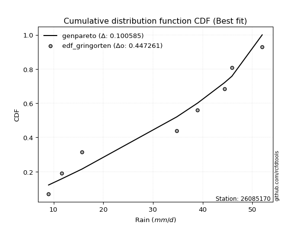</img>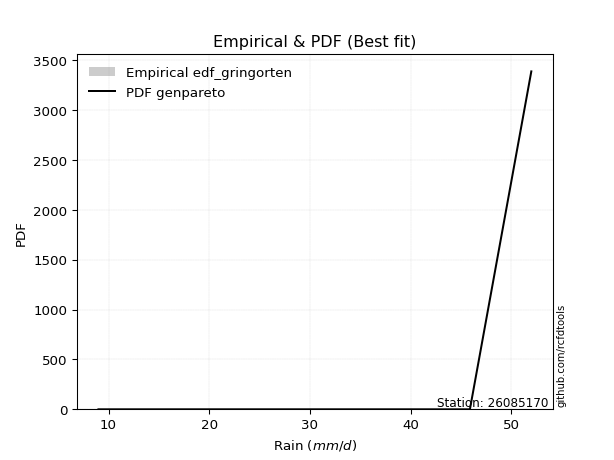</img>

</div>


### 9. EDF Filliben (1975)

The specific values of the constants (0.3175) (often denoted as $alpha$) and (0.365) are derived from a method proposed by James J. Filliben in a 1975 paper. This particular formula is the mean value of the $i$-th order statistic of the normal distribution and is considered a robust and effective plotting position formula for the normal probability plot correlation coefficient test for normality.

<div align="center">


$P=(m-0.3175)/(n+0.365)$


</div>


**9.1. Empirical values**

<div align="center">

|                | 0                  | 1                   | 2                  | 3                   | 4                  | 5                  | 6                  | 7                  |
|:---------------|:-------------------|:--------------------|:-------------------|:--------------------|:-------------------|:-------------------|:-------------------|:-------------------|
| date           | 2025               | 2024                | 2022               | 2018                | 2017               | 2020               | 2021               | 2019               |
| x              | 9.0                | 11.6                | 15.7               | 34.8                | 39.0               | 44.4               | 45.9               | 52.0               |
| m              | 1                  | 2                   | 3                  | 4                   | 5                  | 6                  | 7                  | 8                  |
| empirical_dist | edf_filliben       | edf_filliben        | edf_filliben       | edf_filliben        | edf_filliben       | edf_filliben       | edf_filliben       | edf_filliben       |
| empirical      | 0.0815899581589958 | 0.20113568439928273 | 0.3206814106395696 | 0.44022713687985654 | 0.5597728631201434 | 0.6793185893604303 | 0.7988643156007172 | 0.9184100418410042 |
| empirical_tr   | 1.0888382687927107 | 1.2517770295548074  | 1.4720633523977125 | 1.7864388681260008  | 2.271554650373387  | 3.118359739049394  | 4.971768202080237  | 12.256410256410254 |

</div>


**9.2. Kolmogorov-Smirnov fit test (sorted by Δ)**


<div align="center">

|                | 0                   | 1                   | 2                   | 3                   | 4                   | 5                   | 6                   | 7                  | 8                   | 9                   | 10                  | 11                  | 12                  | 13                  | 14                 | 15                  | 16                  | 17                 | 18                 | 19                  | 20                  | 21                  | 22                  | 23                 | 24                 | 25                  | 26                  | 27                 | 28                 | 29                 | 30                 | 31                 | 32                  | 33                  | 34                 | 35                  | 36                  | 37                  | 38                  | 39                  | 40                  | 41                  | 42                  | 43                  | 44                  | 45                  | 46                  | 47                 | 48                  | 49                  | 50                  | 51                  | 52                  | 53                 | 54                  | 55                  | 56                  | 57                  | 58                 | 59                 | 60                  | 61                 | 62                 | 63                 | 64                 | 65                  | 66                  | 67                  | 68                  | 69                 | 70                  | 71                 | 72                 | 73                  | 74                 | 75                  | 76                  | 77                  | 78                  | 79                 | 80                 | 81                  | 82                  | 83                  | 84                  | 85                  | 86                  | 87                  | 88                 | 89                  | 90                  | 91                  | 92                  | 93                  | 94                  | 95                  | 96                  | 97                  | 98                  | 99                 | 100                 | 101                 | 102                | 103                | 104                 | 105                 | 106                 | 107                 | 108                 | 109                | 110                | 111                 | 112                | 113                | 114                | 115                 | 116                 | 117                | 118                 | 119                | 120                 | 121                | 122                | 123                | 124                | 125                | 126                | 127                 | 128                | 129                | 130                 | 131                 | 132                | 133                | 134                 | 135                | 136                | 137                | 138                 | 139                | 140                 | 141                | 142                 | 143                 | 144                | 145                 | 146                | 147                 | 148                | 149                 | 150                | 151                | 152                | 153                | 154                | 155                | 156                | 157                | 158                | 159                |
|:---------------|:--------------------|:--------------------|:--------------------|:--------------------|:--------------------|:--------------------|:--------------------|:-------------------|:--------------------|:--------------------|:--------------------|:--------------------|:--------------------|:--------------------|:-------------------|:--------------------|:--------------------|:-------------------|:-------------------|:--------------------|:--------------------|:--------------------|:--------------------|:-------------------|:-------------------|:--------------------|:--------------------|:-------------------|:-------------------|:-------------------|:-------------------|:-------------------|:--------------------|:--------------------|:-------------------|:--------------------|:--------------------|:--------------------|:--------------------|:--------------------|:--------------------|:--------------------|:--------------------|:--------------------|:--------------------|:--------------------|:--------------------|:-------------------|:--------------------|:--------------------|:--------------------|:--------------------|:--------------------|:-------------------|:--------------------|:--------------------|:--------------------|:--------------------|:-------------------|:-------------------|:--------------------|:-------------------|:-------------------|:-------------------|:-------------------|:--------------------|:--------------------|:--------------------|:--------------------|:-------------------|:--------------------|:-------------------|:-------------------|:--------------------|:-------------------|:--------------------|:--------------------|:--------------------|:--------------------|:-------------------|:-------------------|:--------------------|:--------------------|:--------------------|:--------------------|:--------------------|:--------------------|:--------------------|:-------------------|:--------------------|:--------------------|:--------------------|:--------------------|:--------------------|:--------------------|:--------------------|:--------------------|:--------------------|:--------------------|:-------------------|:--------------------|:--------------------|:-------------------|:-------------------|:--------------------|:--------------------|:--------------------|:--------------------|:--------------------|:-------------------|:-------------------|:--------------------|:-------------------|:-------------------|:-------------------|:--------------------|:--------------------|:-------------------|:--------------------|:-------------------|:--------------------|:-------------------|:-------------------|:-------------------|:-------------------|:-------------------|:-------------------|:--------------------|:-------------------|:-------------------|:--------------------|:--------------------|:-------------------|:-------------------|:--------------------|:-------------------|:-------------------|:-------------------|:--------------------|:-------------------|:--------------------|:-------------------|:--------------------|:--------------------|:-------------------|:--------------------|:-------------------|:--------------------|:-------------------|:--------------------|:-------------------|:-------------------|:-------------------|:-------------------|:-------------------|:-------------------|:-------------------|:-------------------|:-------------------|:-------------------|
| station        | 26085170            | 26085170            | 26085170            | 26085170            | 26085170            | 26085170            | 26085170            | 26085170           | 26085170            | 26085170            | 26085170            | 26085170            | 26085170            | 26085170            | 26085170           | 26085170            | 26085170            | 26085170           | 26085170           | 26085170            | 26085170            | 26085170            | 26085170            | 26085170           | 26085170           | 26085170            | 26085170            | 26085170           | 26085170           | 26085170           | 26085170           | 26085170           | 26085170            | 26085170            | 26085170           | 26085170            | 26085170            | 26085170            | 26085170            | 26085170            | 26085170            | 26085170            | 26085170            | 26085170            | 26085170            | 26085170            | 26085170            | 26085170           | 26085170            | 26085170            | 26085170            | 26085170            | 26085170            | 26085170           | 26085170            | 26085170            | 26085170            | 26085170            | 26085170           | 26085170           | 26085170            | 26085170           | 26085170           | 26085170           | 26085170           | 26085170            | 26085170            | 26085170            | 26085170            | 26085170           | 26085170            | 26085170           | 26085170           | 26085170            | 26085170           | 26085170            | 26085170            | 26085170            | 26085170            | 26085170           | 26085170           | 26085170            | 26085170            | 26085170            | 26085170            | 26085170            | 26085170            | 26085170            | 26085170           | 26085170            | 26085170            | 26085170            | 26085170            | 26085170            | 26085170            | 26085170            | 26085170            | 26085170            | 26085170            | 26085170           | 26085170            | 26085170            | 26085170           | 26085170           | 26085170            | 26085170            | 26085170            | 26085170            | 26085170            | 26085170           | 26085170           | 26085170            | 26085170           | 26085170           | 26085170           | 26085170            | 26085170            | 26085170           | 26085170            | 26085170           | 26085170            | 26085170           | 26085170           | 26085170           | 26085170           | 26085170           | 26085170           | 26085170            | 26085170           | 26085170           | 26085170            | 26085170            | 26085170           | 26085170           | 26085170            | 26085170           | 26085170           | 26085170           | 26085170            | 26085170           | 26085170            | 26085170           | 26085170            | 26085170            | 26085170           | 26085170            | 26085170           | 26085170            | 26085170           | 26085170            | 26085170           | 26085170           | 26085170           | 26085170           | 26085170           | 26085170           | 26085170           | 26085170           | 26085170           | 26085170           |
| empirical_dist | edf_filliben        | edf_filliben        | edf_filliben        | edf_filliben        | edf_filliben        | edf_filliben        | edf_filliben        | edf_filliben       | edf_filliben        | edf_filliben        | edf_filliben        | edf_filliben        | edf_filliben        | edf_filliben        | edf_filliben       | edf_filliben        | edf_filliben        | edf_filliben       | edf_filliben       | edf_filliben        | edf_filliben        | edf_filliben        | edf_filliben        | edf_filliben       | edf_filliben       | edf_filliben        | edf_filliben        | edf_filliben       | edf_filliben       | edf_filliben       | edf_filliben       | edf_filliben       | edf_filliben        | edf_filliben        | edf_filliben       | edf_filliben        | edf_filliben        | edf_filliben        | edf_filliben        | edf_filliben        | edf_filliben        | edf_filliben        | edf_filliben        | edf_filliben        | edf_filliben        | edf_filliben        | edf_filliben        | edf_filliben       | edf_filliben        | edf_filliben        | edf_filliben        | edf_filliben        | edf_filliben        | edf_filliben       | edf_filliben        | edf_filliben        | edf_filliben        | edf_filliben        | edf_filliben       | edf_filliben       | edf_filliben        | edf_filliben       | edf_filliben       | edf_filliben       | edf_filliben       | edf_filliben        | edf_filliben        | edf_filliben        | edf_filliben        | edf_filliben       | edf_filliben        | edf_filliben       | edf_filliben       | edf_filliben        | edf_filliben       | edf_filliben        | edf_filliben        | edf_filliben        | edf_filliben        | edf_filliben       | edf_filliben       | edf_filliben        | edf_filliben        | edf_filliben        | edf_filliben        | edf_filliben        | edf_filliben        | edf_filliben        | edf_filliben       | edf_filliben        | edf_filliben        | edf_filliben        | edf_filliben        | edf_filliben        | edf_filliben        | edf_filliben        | edf_filliben        | edf_filliben        | edf_filliben        | edf_filliben       | edf_filliben        | edf_filliben        | edf_filliben       | edf_filliben       | edf_filliben        | edf_filliben        | edf_filliben        | edf_filliben        | edf_filliben        | edf_filliben       | edf_filliben       | edf_filliben        | edf_filliben       | edf_filliben       | edf_filliben       | edf_filliben        | edf_filliben        | edf_filliben       | edf_filliben        | edf_filliben       | edf_filliben        | edf_filliben       | edf_filliben       | edf_filliben       | edf_filliben       | edf_filliben       | edf_filliben       | edf_filliben        | edf_filliben       | edf_filliben       | edf_filliben        | edf_filliben        | edf_filliben       | edf_filliben       | edf_filliben        | edf_filliben       | edf_filliben       | edf_filliben       | edf_filliben        | edf_filliben       | edf_filliben        | edf_filliben       | edf_filliben        | edf_filliben        | edf_filliben       | edf_filliben        | edf_filliben       | edf_filliben        | edf_filliben       | edf_filliben        | edf_filliben       | edf_filliben       | edf_filliben       | edf_filliben       | edf_filliben       | edf_filliben       | edf_filliben       | edf_filliben       | edf_filliben       | edf_filliben       |
| p_dist         | wrapcauchy          | genpareto           | arcsine             | loggenextreme       | ksone               | genextreme          | semicircular        | trapezoid          | anglit              | logweibull_max      | loggenpareto        | logjohnsonsu        | genhalflogistic     | logburr             | logmielke          | logtrapezoid        | burr                | logloggamma        | logarcsine         | tukeylambda         | betaprime           | erlang              | gamma               | beta               | skewnorm           | johnsonsu           | f                   | nct                | exponnorm          | norm               | crystalball        | truncnorm          | t                   | gengamma            | pearson3           | cosine              | uniform             | vonmises_line       | kappa3              | rice                | loglevy_l           | maxwell             | logargus            | invgamma            | alpha               | foldnorm            | invgauss            | weibull_min        | logburr12           | logweibull_min      | logwrapcauchy       | gumbel_l            | rayleigh            | loggenhalflogistic | kappa4              | logistic            | loggumbel_l         | logksone            | triang             | argus              | gompertz            | hypsecant          | ncf                | logsemicircular    | logpearson3        | laplace             | truncpareto         | halfnorm            | loganglit           | kstwobign          | loggompertz         | gumbel_r           | dweibull           | dgamma              | logloglaplace      | lognct              | logt                | logexponnorm        | logcrystalball      | lognorm            | logf               | logfatiguelife      | logtriang           | logncf              | logdgamma           | logbetaprime        | logdweibull         | logbeta             | loggennorm         | logfoldnorm         | logerlang           | logskewnorm         | loginvgamma         | halflogistic        | moyal               | loggamma            | loggamma            | logrice             | logalpha            | loginvgauss        | bradford            | loginvweibull       | lomax              | levy_l             | genexpon            | loglogistic         | logmaxwell          | gausshyper          | truncweibull_min    | lograyleigh        | logrdist           | truncexpon          | logcosine          | loghypsecant       | loggenexpon        | halfgennorm         | logkstwobign        | nakagami           | loghalfnorm         | burr12             | lognakagami         | johnsonsb          | loglomax           | loggumbel_r        | loglaplace         | loglaplace         | loghalflogistic    | gennorm             | logmoyal           | logjohnsonsb       | logkappa4           | logtruncnorm        | wald               | logtukeylambda     | logkappa3           | logexponweib       | loguniform         | logvonmises_line   | logexponpow         | logwald            | loggengamma         | loggausshyper      | logtruncweibull_min | logbradford         | logtruncexpon      | exponpow            | fatiguelife        | powerlaw            | exponweib          | invweibull          | logpowerlaw        | weibull_max        | logtruncpareto     | rdist              | loghalfgennorm     | genlogistic        | loggenlogistic     | logvonmises        | vonmises           | mielke             |
| delta          | 0.10158684570950388 | 0.10599550820773462 | 0.10605022319700458 | 0.11879710829252338 | 0.11891697696499764 | 0.12315106365008463 | 0.12495696939446493 | 0.1261572099968264 | 0.13628691659239078 | 0.13997701821682185 | 0.14179695887495303 | 0.14208209985299436 | 0.14595696098821817 | 0.14723390418386542 | 0.1477875581781304 | 0.14813775759734854 | 0.14882711694636433 | 0.1496889292031799 | 0.1571418616784624 | 0.15751531842631156 | 0.15772097864005208 | 0.15855948444754417 | 0.15866436822840618 | 0.1588908979398712 | 0.1598682890468519 | 0.16048160249465154 | 0.16127323045015812 | 0.1617473037350128 | 0.1618286037232876 | 0.1618300692465801 | 0.1618300759039304 | 0.1618301169789133 | 0.16183041056310088 | 0.16211729838920272 | 0.1626240485429718 | 0.16346229932697492 | 0.16486745715119755 | 0.16487319644365456 | 0.16519982370379352 | 0.16738764654872704 | 0.16878580286771253 | 0.16905170606182934 | 0.16961477330451719 | 0.16969908343653556 | 0.17040661784372763 | 0.17129392757794454 | 0.17242866595730372 | 0.1732549766328897 | 0.17415811324842173 | 0.17494309470115982 | 0.17552079511124824 | 0.17635097931005628 | 0.17788666434834238 | 0.1786607987667655 | 0.17907062872350826 | 0.18032466263004035 | 0.18049359973595197 | 0.18271619071015105 | 0.1842795486124738 | 0.1871829590005077 | 0.18984270004208997 | 0.1900380128786739 | 0.190833226171158  | 0.1943056647914127 | 0.1961038478459312 | 0.19898370856592754 | 0.19930894197938903 | 0.20292564679021768 | 0.20330746760831236 | 0.2056803721223432 | 0.20774276406817266 | 0.2091662839625485 | 0.2137349022679303 | 0.21631274012365487 | 0.221970235500409  | 0.22441263021700414 | 0.22467659678364188 | 0.22467672276883194 | 0.22467819066476608 | 0.2246781988844228 | 0.2252339233682334 | 0.22575634261063288 | 0.22589371196661784 | 0.22621004337168943 | 0.22634504229816482 | 0.22666503592553006 | 0.22701097467487988 | 0.22703235460870175 | 0.2274002035645059 | 0.22766939358734778 | 0.22829267386679059 | 0.22842308687814422 | 0.23042574234123997 | 0.23099620246051206 | 0.23279704191138756 | 0.23292740560891917 | 0.23292740560891917 | 0.23319243626450753 | 0.23562712428814642 | 0.2368254699009495 | 0.23753027134179755 | 0.24006071114522382 | 0.2413577286430197 | 0.2414012441198137 | 0.24217105063629946 | 0.24382905905877889 | 0.24468599903005323 | 0.24881823060216585 | 0.24993162540202124 | 0.2506498702976831 | 0.2540092588395984 | 0.25477269688381127 | 0.2548564830568026 | 0.2584079883408857 | 0.2597491805514662 | 0.26020904951077645 | 0.26156196656199165 | 0.2650172929260028 | 0.26816855873424333 | 0.2731228823970175 | 0.27657502087418767 | 0.2808610673131616 | 0.2817647983532165 | 0.2821847548937367 | 0.2859965880074676 | 0.2859965880074676 | 0.2960122601301685 | 0.29886431560071725 | 0.30106349700134   | 0.3011350803076535 | 0.31387957799272853 | 0.32068033652067135 | 0.3206814106395696 | 0.3230715547238589 | 0.32419229687863965 | 0.3285177007901163 | 0.3307979777515165 | 0.3349356944820682 | 0.35205881738058664 | 0.3550071883594797 | 0.36069137644574384 | 0.3636397987187349 | 0.3810581015637032  | 0.38583667482057077 | 0.4061958032786151 | 0.42224092899281507 | 0.4379773044699471 | 0.47031854732877115 | 0.48652191439544   | 0.48737015369057624 | 0.5085980227167999 | 0.5802225323520448 | 0.6648501010432063 | 0.6793185893535689 | 0.6793185893604303 | 0.7988643156007172 | 0.7988643156007172 | 1.2130548983523732 | 7.4625769691017565 | nan                |
| deltao         | 0.4472608134160001  | 0.4472608134160001  | 0.4472608134160001  | 0.4472608134160001  | 0.4472608134160001  | 0.4472608134160001  | 0.4472608134160001  | 0.4472608134160001 | 0.4472608134160001  | 0.4472608134160001  | 0.4472608134160001  | 0.4472608134160001  | 0.4472608134160001  | 0.4472608134160001  | 0.4472608134160001 | 0.4472608134160001  | 0.4472608134160001  | 0.4472608134160001 | 0.4472608134160001 | 0.4472608134160001  | 0.4472608134160001  | 0.4472608134160001  | 0.4472608134160001  | 0.4472608134160001 | 0.4472608134160001 | 0.4472608134160001  | 0.4472608134160001  | 0.4472608134160001 | 0.4472608134160001 | 0.4472608134160001 | 0.4472608134160001 | 0.4472608134160001 | 0.4472608134160001  | 0.4472608134160001  | 0.4472608134160001 | 0.4472608134160001  | 0.4472608134160001  | 0.4472608134160001  | 0.4472608134160001  | 0.4472608134160001  | 0.4472608134160001  | 0.4472608134160001  | 0.4472608134160001  | 0.4472608134160001  | 0.4472608134160001  | 0.4472608134160001  | 0.4472608134160001  | 0.4472608134160001 | 0.4472608134160001  | 0.4472608134160001  | 0.4472608134160001  | 0.4472608134160001  | 0.4472608134160001  | 0.4472608134160001 | 0.4472608134160001  | 0.4472608134160001  | 0.4472608134160001  | 0.4472608134160001  | 0.4472608134160001 | 0.4472608134160001 | 0.4472608134160001  | 0.4472608134160001 | 0.4472608134160001 | 0.4472608134160001 | 0.4472608134160001 | 0.4472608134160001  | 0.4472608134160001  | 0.4472608134160001  | 0.4472608134160001  | 0.4472608134160001 | 0.4472608134160001  | 0.4472608134160001 | 0.4472608134160001 | 0.4472608134160001  | 0.4472608134160001 | 0.4472608134160001  | 0.4472608134160001  | 0.4472608134160001  | 0.4472608134160001  | 0.4472608134160001 | 0.4472608134160001 | 0.4472608134160001  | 0.4472608134160001  | 0.4472608134160001  | 0.4472608134160001  | 0.4472608134160001  | 0.4472608134160001  | 0.4472608134160001  | 0.4472608134160001 | 0.4472608134160001  | 0.4472608134160001  | 0.4472608134160001  | 0.4472608134160001  | 0.4472608134160001  | 0.4472608134160001  | 0.4472608134160001  | 0.4472608134160001  | 0.4472608134160001  | 0.4472608134160001  | 0.4472608134160001 | 0.4472608134160001  | 0.4472608134160001  | 0.4472608134160001 | 0.4472608134160001 | 0.4472608134160001  | 0.4472608134160001  | 0.4472608134160001  | 0.4472608134160001  | 0.4472608134160001  | 0.4472608134160001 | 0.4472608134160001 | 0.4472608134160001  | 0.4472608134160001 | 0.4472608134160001 | 0.4472608134160001 | 0.4472608134160001  | 0.4472608134160001  | 0.4472608134160001 | 0.4472608134160001  | 0.4472608134160001 | 0.4472608134160001  | 0.4472608134160001 | 0.4472608134160001 | 0.4472608134160001 | 0.4472608134160001 | 0.4472608134160001 | 0.4472608134160001 | 0.4472608134160001  | 0.4472608134160001 | 0.4472608134160001 | 0.4472608134160001  | 0.4472608134160001  | 0.4472608134160001 | 0.4472608134160001 | 0.4472608134160001  | 0.4472608134160001 | 0.4472608134160001 | 0.4472608134160001 | 0.4472608134160001  | 0.4472608134160001 | 0.4472608134160001  | 0.4472608134160001 | 0.4472608134160001  | 0.4472608134160001  | 0.4472608134160001 | 0.4472608134160001  | 0.4472608134160001 | 0.4472608134160001  | 0.4472608134160001 | 0.4472608134160001  | 0.4472608134160001 | 0.4472608134160001 | 0.4472608134160001 | 0.4472608134160001 | 0.4472608134160001 | 0.4472608134160001 | 0.4472608134160001 | 0.4472608134160001 | 0.4472608134160001 | 0.4472608134160001 |
| eval           | Δo > Δ              | Δo > Δ              | Δo > Δ              | Δo > Δ              | Δo > Δ              | Δo > Δ              | Δo > Δ              | Δo > Δ             | Δo > Δ              | Δo > Δ              | Δo > Δ              | Δo > Δ              | Δo > Δ              | Δo > Δ              | Δo > Δ             | Δo > Δ              | Δo > Δ              | Δo > Δ             | Δo > Δ             | Δo > Δ              | Δo > Δ              | Δo > Δ              | Δo > Δ              | Δo > Δ             | Δo > Δ             | Δo > Δ              | Δo > Δ              | Δo > Δ             | Δo > Δ             | Δo > Δ             | Δo > Δ             | Δo > Δ             | Δo > Δ              | Δo > Δ              | Δo > Δ             | Δo > Δ              | Δo > Δ              | Δo > Δ              | Δo > Δ              | Δo > Δ              | Δo > Δ              | Δo > Δ              | Δo > Δ              | Δo > Δ              | Δo > Δ              | Δo > Δ              | Δo > Δ              | Δo > Δ             | Δo > Δ              | Δo > Δ              | Δo > Δ              | Δo > Δ              | Δo > Δ              | Δo > Δ             | Δo > Δ              | Δo > Δ              | Δo > Δ              | Δo > Δ              | Δo > Δ             | Δo > Δ             | Δo > Δ              | Δo > Δ             | Δo > Δ             | Δo > Δ             | Δo > Δ             | Δo > Δ              | Δo > Δ              | Δo > Δ              | Δo > Δ              | Δo > Δ             | Δo > Δ              | Δo > Δ             | Δo > Δ             | Δo > Δ              | Δo > Δ             | Δo > Δ              | Δo > Δ              | Δo > Δ              | Δo > Δ              | Δo > Δ             | Δo > Δ             | Δo > Δ              | Δo > Δ              | Δo > Δ              | Δo > Δ              | Δo > Δ              | Δo > Δ              | Δo > Δ              | Δo > Δ             | Δo > Δ              | Δo > Δ              | Δo > Δ              | Δo > Δ              | Δo > Δ              | Δo > Δ              | Δo > Δ              | Δo > Δ              | Δo > Δ              | Δo > Δ              | Δo > Δ             | Δo > Δ              | Δo > Δ              | Δo > Δ             | Δo > Δ             | Δo > Δ              | Δo > Δ              | Δo > Δ              | Δo > Δ              | Δo > Δ              | Δo > Δ             | Δo > Δ             | Δo > Δ              | Δo > Δ             | Δo > Δ             | Δo > Δ             | Δo > Δ              | Δo > Δ              | Δo > Δ             | Δo > Δ              | Δo > Δ             | Δo > Δ              | Δo > Δ             | Δo > Δ             | Δo > Δ             | Δo > Δ             | Δo > Δ             | Δo > Δ             | Δo > Δ              | Δo > Δ             | Δo > Δ             | Δo > Δ              | Δo > Δ              | Δo > Δ             | Δo > Δ             | Δo > Δ              | Δo > Δ             | Δo > Δ             | Δo > Δ             | Δo > Δ              | Δo > Δ             | Δo > Δ              | Δo > Δ             | Δo > Δ              | Δo > Δ              | Δo > Δ             | Δo > Δ              | Δo > Δ             | Δo <= Δ             | Δo <= Δ            | Δo <= Δ             | Δo <= Δ            | Δo <= Δ            | Δo <= Δ            | Δo <= Δ            | Δo <= Δ            | Δo <= Δ            | Δo <= Δ            | Δo <= Δ            | Δo <= Δ            | Δo <= Δ            |
| fit            | 1                   | 1                   | 1                   | 1                   | 1                   | 1                   | 1                   | 1                  | 1                   | 1                   | 1                   | 1                   | 1                   | 1                   | 1                  | 1                   | 1                   | 1                  | 1                  | 1                   | 1                   | 1                   | 1                   | 1                  | 1                  | 1                   | 1                   | 1                  | 1                  | 1                  | 1                  | 1                  | 1                   | 1                   | 1                  | 1                   | 1                   | 1                   | 1                   | 1                   | 1                   | 1                   | 1                   | 1                   | 1                   | 1                   | 1                   | 1                  | 1                   | 1                   | 1                   | 1                   | 1                   | 1                  | 1                   | 1                   | 1                   | 1                   | 1                  | 1                  | 1                   | 1                  | 1                  | 1                  | 1                  | 1                   | 1                   | 1                   | 1                   | 1                  | 1                   | 1                  | 1                  | 1                   | 1                  | 1                   | 1                   | 1                   | 1                   | 1                  | 1                  | 1                   | 1                   | 1                   | 1                   | 1                   | 1                   | 1                   | 1                  | 1                   | 1                   | 1                   | 1                   | 1                   | 1                   | 1                   | 1                   | 1                   | 1                   | 1                  | 1                   | 1                   | 1                  | 1                  | 1                   | 1                   | 1                   | 1                   | 1                   | 1                  | 1                  | 1                   | 1                  | 1                  | 1                  | 1                   | 1                   | 1                  | 1                   | 1                  | 1                   | 1                  | 1                  | 1                  | 1                  | 1                  | 1                  | 1                   | 1                  | 1                  | 1                   | 1                   | 1                  | 1                  | 1                   | 1                  | 1                  | 1                  | 1                   | 1                  | 1                   | 1                  | 1                   | 1                   | 1                  | 1                   | 1                  | 0                   | 0                  | 0                   | 0                  | 0                  | 0                  | 0                  | 0                  | 0                  | 0                  | 0                  | 0                  | 0                  |
| n              | 8                   | 8                   | 8                   | 8                   | 8                   | 8                   | 8                   | 8                  | 8                   | 8                   | 8                   | 8                   | 8                   | 8                   | 8                  | 8                   | 8                   | 8                  | 8                  | 8                   | 8                   | 8                   | 8                   | 8                  | 8                  | 8                   | 8                   | 8                  | 8                  | 8                  | 8                  | 8                  | 8                   | 8                   | 8                  | 8                   | 8                   | 8                   | 8                   | 8                   | 8                   | 8                   | 8                   | 8                   | 8                   | 8                   | 8                   | 8                  | 8                   | 8                   | 8                   | 8                   | 8                   | 8                  | 8                   | 8                   | 8                   | 8                   | 8                  | 8                  | 8                   | 8                  | 8                  | 8                  | 8                  | 8                   | 8                   | 8                   | 8                   | 8                  | 8                   | 8                  | 8                  | 8                   | 8                  | 8                   | 8                   | 8                   | 8                   | 8                  | 8                  | 8                   | 8                   | 8                   | 8                   | 8                   | 8                   | 8                   | 8                  | 8                   | 8                   | 8                   | 8                   | 8                   | 8                   | 8                   | 8                   | 8                   | 8                   | 8                  | 8                   | 8                   | 8                  | 8                  | 8                   | 8                   | 8                   | 8                   | 8                   | 8                  | 8                  | 8                   | 8                  | 8                  | 8                  | 8                   | 8                   | 8                  | 8                   | 8                  | 8                   | 8                  | 8                  | 8                  | 8                  | 8                  | 8                  | 8                   | 8                  | 8                  | 8                   | 8                   | 8                  | 8                  | 8                   | 8                  | 8                  | 8                  | 8                   | 8                  | 8                   | 8                  | 8                   | 8                   | 8                  | 8                   | 8                  | 8                   | 8                  | 8                   | 8                  | 8                  | 8                  | 8                  | 8                  | 8                  | 8                  | 8                  | 8                  | 8                  |
| best_fit       | 1                   | 0                   | 0                   | 0                   | 0                   | 0                   | 0                   | 0                  | 0                   | 0                   | 0                   | 0                   | 0                   | 0                   | 0                  | 0                   | 0                   | 0                  | 0                  | 0                   | 0                   | 0                   | 0                   | 0                  | 0                  | 0                   | 0                   | 0                  | 0                  | 0                  | 0                  | 0                  | 0                   | 0                   | 0                  | 0                   | 0                   | 0                   | 0                   | 0                   | 0                   | 0                   | 0                   | 0                   | 0                   | 0                   | 0                   | 0                  | 0                   | 0                   | 0                   | 0                   | 0                   | 0                  | 0                   | 0                   | 0                   | 0                   | 0                  | 0                  | 0                   | 0                  | 0                  | 0                  | 0                  | 0                   | 0                   | 0                   | 0                   | 0                  | 0                   | 0                  | 0                  | 0                   | 0                  | 0                   | 0                   | 0                   | 0                   | 0                  | 0                  | 0                   | 0                   | 0                   | 0                   | 0                   | 0                   | 0                   | 0                  | 0                   | 0                   | 0                   | 0                   | 0                   | 0                   | 0                   | 0                   | 0                   | 0                   | 0                  | 0                   | 0                   | 0                  | 0                  | 0                   | 0                   | 0                   | 0                   | 0                   | 0                  | 0                  | 0                   | 0                  | 0                  | 0                  | 0                   | 0                   | 0                  | 0                   | 0                  | 0                   | 0                  | 0                  | 0                  | 0                  | 0                  | 0                  | 0                   | 0                  | 0                  | 0                   | 0                   | 0                  | 0                  | 0                   | 0                  | 0                  | 0                  | 0                   | 0                  | 0                   | 0                  | 0                   | 0                   | 0                  | 0                   | 0                  | 0                   | 0                  | 0                   | 0                  | 0                  | 0                  | 0                  | 0                  | 0                  | 0                  | 0                  | 0                  | 0                  |
| best_fit_sort  | 1                   | 2                   | 3                   | 4                   | 5                   | 6                   | 7                   | 8                  | 9                   | 10                  | 11                  | 12                  | 13                  | 14                  | 15                 | 16                  | 17                  | 18                 | 19                 | 20                  | 21                  | 22                  | 23                  | 24                 | 25                 | 26                  | 27                  | 28                 | 29                 | 30                 | 31                 | 32                 | 33                  | 34                  | 35                 | 36                  | 37                  | 38                  | 39                  | 40                  | 41                  | 42                  | 43                  | 44                  | 45                  | 46                  | 47                  | 48                 | 49                  | 50                  | 51                  | 52                  | 53                  | 54                 | 55                  | 56                  | 57                  | 58                  | 59                 | 60                 | 61                  | 62                 | 63                 | 64                 | 65                 | 66                  | 67                  | 68                  | 69                  | 70                 | 71                  | 72                 | 73                 | 74                  | 75                 | 76                  | 77                  | 78                  | 79                  | 80                 | 81                 | 82                  | 83                  | 84                  | 85                  | 86                  | 87                  | 88                  | 89                 | 90                  | 91                  | 92                  | 93                  | 94                  | 95                  | 96                  | 97                  | 98                  | 99                  | 100                | 101                 | 102                 | 103                | 104                | 105                 | 106                 | 107                 | 108                 | 109                 | 110                | 111                | 112                 | 113                | 114                | 115                | 116                 | 117                 | 118                | 119                 | 120                | 121                 | 122                | 123                | 124                | 125                | 126                | 127                | 128                 | 129                | 130                | 131                 | 132                 | 133                | 134                | 135                 | 136                | 137                | 138                | 139                 | 140                | 141                 | 142                | 143                 | 144                 | 145                | 146                 | 147                | 148                 | 149                | 150                 | 151                | 152                | 153                | 154                | 155                | 156                | 157                | 158                | 159                | 160                |

</div>


**9.3. Best fit**

<div align="center">

|   id |   station | empirical_dist   | p_dist     |    delta |   deltao | eval   |   fit |   n |   best_fit |   best_fit_sort |
|-----:|----------:|:-----------------|:-----------|---------:|---------:|:-------|------:|----:|-----------:|----------------:|
|    0 |  26085170 | edf_filliben     | wrapcauchy | 0.101587 | 0.447261 | Δo > Δ |     1 |   8 |          1 |               1 |

</div>


<div align="center">

</img></img>

</div>


### 10. EDF Jenkinson (1977)

The Jenkinson formula in hydrology is an empirical plotting position formula used to estimate the non-exceedance probability _(P)_ or return period _(T)_ of a given ordered observation within a sample. It is a widely used method in the frequency analysis of extreme events such as floods and rainfall, as it provides a distribution-free way to plot data. _a≈0.31_ and _b≈0.38_ are constants derived to approximate the median of the probability distribution for the given rank.

<div align="center">


$P=(m-a)/(n+b)$


</div>


**10.1. Empirical values**

<div align="center">

|                | 0                   | 1                   | 2                  | 3                   | 4                  | 5                  | 6                  | 7                  |
|:---------------|:--------------------|:--------------------|:-------------------|:--------------------|:-------------------|:-------------------|:-------------------|:-------------------|
| date           | 2025                | 2024                | 2022               | 2018                | 2017               | 2020               | 2021               | 2019               |
| x              | 9.0                 | 11.6                | 15.7               | 34.8                | 39.0               | 44.4               | 45.9               | 52.0               |
| m              | 1                   | 2                   | 3                  | 4                   | 5                  | 6                  | 7                  | 8                  |
| empirical_dist | edf_jenkinson       | edf_jenkinson       | edf_jenkinson      | edf_jenkinson       | edf_jenkinson      | edf_jenkinson      | edf_jenkinson      | edf_jenkinson      |
| empirical      | 0.08233890214797135 | 0.20167064439140808 | 0.3210023866348448 | 0.44033412887828155 | 0.5596658711217184 | 0.6789976133651551 | 0.7983293556085919 | 0.9176610978520287 |
| empirical_tr   | 1.0897269180754225  | 1.2526158445440956  | 1.4727592267135323 | 1.7867803837953091  | 2.2710027100271004 | 3.115241635687732  | 4.958579881656804  | 12.144927536231886 |

</div>


**10.2. Kolmogorov-Smirnov fit test (sorted by Δ)**


<div align="center">

|                | 0                   | 1                   | 2                   | 3                   | 4                   | 5                   | 6                   | 7                  | 8                   | 9                   | 10                  | 11                  | 12                  | 13                  | 14                  | 15                 | 16                  | 17                  | 18                  | 19                 | 20                  | 21                  | 22                  | 23                  | 24                 | 25                  | 26                  | 27                 | 28                 | 29                 | 30                 | 31                 | 32                  | 33                  | 34                 | 35                  | 36                  | 37                  | 38                  | 39                  | 40                  | 41                  | 42                  | 43                  | 44                  | 45                  | 46                 | 47                 | 48                  | 49                 | 50                  | 51                  | 52                  | 53                  | 54                  | 55                  | 56                  | 57                  | 58                 | 59                  | 60                  | 61                 | 62                 | 63                 | 64                 | 65                  | 66                  | 67                  | 68                  | 69                  | 70                  | 71                  | 72                 | 73                  | 74                 | 75                  | 76                  | 77                  | 78                  | 79                 | 80                  | 81                  | 82                  | 83                  | 84                  | 85                  | 86                  | 87                  | 88                  | 89                 | 90                  | 91                 | 92                  | 93                  | 94                  | 95                  | 96                  | 97                  | 98                 | 99                  | 100                 | 101                | 102                 | 103                 | 104                 | 105                 | 106                 | 107                 | 108                 | 109                | 110                | 111                 | 112                | 113                | 114                 | 115                 | 116                 | 117                | 118                | 119                | 120                 | 121                 | 122                | 123                 | 124                 | 125                 | 126                | 127                | 128                 | 129                | 130                | 131                 | 132                | 133                | 134                 | 135                 | 136                 | 137                | 138                | 139                | 140                 | 141                | 142                 | 143                 | 144                | 145                 | 146                 | 147                 | 148                | 149                | 150                | 151                | 152                | 153                | 154                | 155                | 156                | 157                | 158                | 159                |
|:---------------|:--------------------|:--------------------|:--------------------|:--------------------|:--------------------|:--------------------|:--------------------|:-------------------|:--------------------|:--------------------|:--------------------|:--------------------|:--------------------|:--------------------|:--------------------|:-------------------|:--------------------|:--------------------|:--------------------|:-------------------|:--------------------|:--------------------|:--------------------|:--------------------|:-------------------|:--------------------|:--------------------|:-------------------|:-------------------|:-------------------|:-------------------|:-------------------|:--------------------|:--------------------|:-------------------|:--------------------|:--------------------|:--------------------|:--------------------|:--------------------|:--------------------|:--------------------|:--------------------|:--------------------|:--------------------|:--------------------|:-------------------|:-------------------|:--------------------|:-------------------|:--------------------|:--------------------|:--------------------|:--------------------|:--------------------|:--------------------|:--------------------|:--------------------|:-------------------|:--------------------|:--------------------|:-------------------|:-------------------|:-------------------|:-------------------|:--------------------|:--------------------|:--------------------|:--------------------|:--------------------|:--------------------|:--------------------|:-------------------|:--------------------|:-------------------|:--------------------|:--------------------|:--------------------|:--------------------|:-------------------|:--------------------|:--------------------|:--------------------|:--------------------|:--------------------|:--------------------|:--------------------|:--------------------|:--------------------|:-------------------|:--------------------|:-------------------|:--------------------|:--------------------|:--------------------|:--------------------|:--------------------|:--------------------|:-------------------|:--------------------|:--------------------|:-------------------|:--------------------|:--------------------|:--------------------|:--------------------|:--------------------|:--------------------|:--------------------|:-------------------|:-------------------|:--------------------|:-------------------|:-------------------|:--------------------|:--------------------|:--------------------|:-------------------|:-------------------|:-------------------|:--------------------|:--------------------|:-------------------|:--------------------|:--------------------|:--------------------|:-------------------|:-------------------|:--------------------|:-------------------|:-------------------|:--------------------|:-------------------|:-------------------|:--------------------|:--------------------|:--------------------|:-------------------|:-------------------|:-------------------|:--------------------|:-------------------|:--------------------|:--------------------|:-------------------|:--------------------|:--------------------|:--------------------|:-------------------|:-------------------|:-------------------|:-------------------|:-------------------|:-------------------|:-------------------|:-------------------|:-------------------|:-------------------|:-------------------|:-------------------|
| station        | 26085170            | 26085170            | 26085170            | 26085170            | 26085170            | 26085170            | 26085170            | 26085170           | 26085170            | 26085170            | 26085170            | 26085170            | 26085170            | 26085170            | 26085170            | 26085170           | 26085170            | 26085170            | 26085170            | 26085170           | 26085170            | 26085170            | 26085170            | 26085170            | 26085170           | 26085170            | 26085170            | 26085170           | 26085170           | 26085170           | 26085170           | 26085170           | 26085170            | 26085170            | 26085170           | 26085170            | 26085170            | 26085170            | 26085170            | 26085170            | 26085170            | 26085170            | 26085170            | 26085170            | 26085170            | 26085170            | 26085170           | 26085170           | 26085170            | 26085170           | 26085170            | 26085170            | 26085170            | 26085170            | 26085170            | 26085170            | 26085170            | 26085170            | 26085170           | 26085170            | 26085170            | 26085170           | 26085170           | 26085170           | 26085170           | 26085170            | 26085170            | 26085170            | 26085170            | 26085170            | 26085170            | 26085170            | 26085170           | 26085170            | 26085170           | 26085170            | 26085170            | 26085170            | 26085170            | 26085170           | 26085170            | 26085170            | 26085170            | 26085170            | 26085170            | 26085170            | 26085170            | 26085170            | 26085170            | 26085170           | 26085170            | 26085170           | 26085170            | 26085170            | 26085170            | 26085170            | 26085170            | 26085170            | 26085170           | 26085170            | 26085170            | 26085170           | 26085170            | 26085170            | 26085170            | 26085170            | 26085170            | 26085170            | 26085170            | 26085170           | 26085170           | 26085170            | 26085170           | 26085170           | 26085170            | 26085170            | 26085170            | 26085170           | 26085170           | 26085170           | 26085170            | 26085170            | 26085170           | 26085170            | 26085170            | 26085170            | 26085170           | 26085170           | 26085170            | 26085170           | 26085170           | 26085170            | 26085170           | 26085170           | 26085170            | 26085170            | 26085170            | 26085170           | 26085170           | 26085170           | 26085170            | 26085170           | 26085170            | 26085170            | 26085170           | 26085170            | 26085170            | 26085170            | 26085170           | 26085170           | 26085170           | 26085170           | 26085170           | 26085170           | 26085170           | 26085170           | 26085170           | 26085170           | 26085170           | 26085170           |
| empirical_dist | edf_jenkinson       | edf_jenkinson       | edf_jenkinson       | edf_jenkinson       | edf_jenkinson       | edf_jenkinson       | edf_jenkinson       | edf_jenkinson      | edf_jenkinson       | edf_jenkinson       | edf_jenkinson       | edf_jenkinson       | edf_jenkinson       | edf_jenkinson       | edf_jenkinson       | edf_jenkinson      | edf_jenkinson       | edf_jenkinson       | edf_jenkinson       | edf_jenkinson      | edf_jenkinson       | edf_jenkinson       | edf_jenkinson       | edf_jenkinson       | edf_jenkinson      | edf_jenkinson       | edf_jenkinson       | edf_jenkinson      | edf_jenkinson      | edf_jenkinson      | edf_jenkinson      | edf_jenkinson      | edf_jenkinson       | edf_jenkinson       | edf_jenkinson      | edf_jenkinson       | edf_jenkinson       | edf_jenkinson       | edf_jenkinson       | edf_jenkinson       | edf_jenkinson       | edf_jenkinson       | edf_jenkinson       | edf_jenkinson       | edf_jenkinson       | edf_jenkinson       | edf_jenkinson      | edf_jenkinson      | edf_jenkinson       | edf_jenkinson      | edf_jenkinson       | edf_jenkinson       | edf_jenkinson       | edf_jenkinson       | edf_jenkinson       | edf_jenkinson       | edf_jenkinson       | edf_jenkinson       | edf_jenkinson      | edf_jenkinson       | edf_jenkinson       | edf_jenkinson      | edf_jenkinson      | edf_jenkinson      | edf_jenkinson      | edf_jenkinson       | edf_jenkinson       | edf_jenkinson       | edf_jenkinson       | edf_jenkinson       | edf_jenkinson       | edf_jenkinson       | edf_jenkinson      | edf_jenkinson       | edf_jenkinson      | edf_jenkinson       | edf_jenkinson       | edf_jenkinson       | edf_jenkinson       | edf_jenkinson      | edf_jenkinson       | edf_jenkinson       | edf_jenkinson       | edf_jenkinson       | edf_jenkinson       | edf_jenkinson       | edf_jenkinson       | edf_jenkinson       | edf_jenkinson       | edf_jenkinson      | edf_jenkinson       | edf_jenkinson      | edf_jenkinson       | edf_jenkinson       | edf_jenkinson       | edf_jenkinson       | edf_jenkinson       | edf_jenkinson       | edf_jenkinson      | edf_jenkinson       | edf_jenkinson       | edf_jenkinson      | edf_jenkinson       | edf_jenkinson       | edf_jenkinson       | edf_jenkinson       | edf_jenkinson       | edf_jenkinson       | edf_jenkinson       | edf_jenkinson      | edf_jenkinson      | edf_jenkinson       | edf_jenkinson      | edf_jenkinson      | edf_jenkinson       | edf_jenkinson       | edf_jenkinson       | edf_jenkinson      | edf_jenkinson      | edf_jenkinson      | edf_jenkinson       | edf_jenkinson       | edf_jenkinson      | edf_jenkinson       | edf_jenkinson       | edf_jenkinson       | edf_jenkinson      | edf_jenkinson      | edf_jenkinson       | edf_jenkinson      | edf_jenkinson      | edf_jenkinson       | edf_jenkinson      | edf_jenkinson      | edf_jenkinson       | edf_jenkinson       | edf_jenkinson       | edf_jenkinson      | edf_jenkinson      | edf_jenkinson      | edf_jenkinson       | edf_jenkinson      | edf_jenkinson       | edf_jenkinson       | edf_jenkinson      | edf_jenkinson       | edf_jenkinson       | edf_jenkinson       | edf_jenkinson      | edf_jenkinson      | edf_jenkinson      | edf_jenkinson      | edf_jenkinson      | edf_jenkinson      | edf_jenkinson      | edf_jenkinson      | edf_jenkinson      | edf_jenkinson      | edf_jenkinson      | edf_jenkinson      |
| p_dist         | wrapcauchy          | arcsine             | genpareto           | ksone               | loggenextreme       | genextreme          | semicircular        | trapezoid          | anglit              | logweibull_max      | loggenpareto        | logjohnsonsu        | genhalflogistic     | logburr             | logtrapezoid        | logmielke          | burr                | logloggamma         | logarcsine          | tukeylambda        | betaprime           | beta                | erlang              | gamma               | skewnorm           | johnsonsu           | f                   | nct                | exponnorm          | norm               | crystalball        | truncnorm          | t                   | gengamma            | pearson3           | cosine              | uniform             | vonmises_line       | kappa3              | rice                | loglevy_l           | maxwell             | invgamma            | logargus            | alpha               | foldnorm            | invgauss           | weibull_min        | logburr12           | logweibull_min     | logwrapcauchy       | gumbel_l            | rayleigh            | loggenhalflogistic  | kappa4              | loggumbel_l         | logistic            | logksone            | triang             | argus               | gompertz            | hypsecant          | ncf                | logsemicircular    | logpearson3        | truncpareto         | laplace             | halfnorm            | loganglit           | kstwobign           | loggompertz         | gumbel_r            | dweibull           | dgamma              | logloglaplace      | lognct              | logt                | logexponnorm        | logcrystalball      | lognorm            | logf                | logfatiguelife      | logtriang           | logncf              | logbeta             | logbetaprime        | logdgamma           | logdweibull         | logfoldnorm         | loggennorm         | logerlang           | logskewnorm        | loginvgamma         | halflogistic        | moyal               | loggamma            | loggamma            | logrice             | logalpha           | loginvgauss         | bradford            | loginvweibull      | levy_l              | lomax               | genexpon            | loglogistic         | logmaxwell          | gausshyper          | truncweibull_min    | lograyleigh        | logrdist           | truncexpon          | logcosine          | loghypsecant       | loggenexpon         | halfgennorm         | logkstwobign        | nakagami           | loghalfnorm        | burr12             | lognakagami         | johnsonsb           | loglomax           | loggumbel_r         | loglaplace          | loglaplace          | loghalflogistic    | gennorm            | logjohnsonsb        | logmoyal           | logkappa4          | logtruncnorm        | wald               | logtukeylambda     | logkappa3           | logexponweib        | loguniform          | logvonmises_line   | logexponpow        | logwald            | loggengamma         | loggausshyper      | logtruncweibull_min | logbradford         | logtruncexpon      | exponpow            | fatiguelife         | powerlaw            | exponweib          | invweibull         | logpowerlaw        | weibull_max        | logtruncpareto     | rdist              | loghalfgennorm     | genlogistic        | loggenlogistic     | logvonmises        | vonmises           | mielke             |
| delta          | 0.10147985371107887 | 0.10594323119857957 | 0.10631648420300982 | 0.11880998496657263 | 0.11911808428779858 | 0.12347203964535983 | 0.12527794538974013 | 0.1264781859921016 | 0.13660789258766598 | 0.13944205822469646 | 0.14104801488597749 | 0.14240307584826956 | 0.14627793698349337 | 0.14755488017914062 | 0.14803076559892353 | 0.1481085341734056 | 0.14914809294163953 | 0.15000990519845508 | 0.15703486968003738 | 0.1575016455362499 | 0.15804195463532728 | 0.15835593794774583 | 0.15888046044281937 | 0.15898534422368138 | 0.1601892650421271 | 0.16080257848992674 | 0.16159420644543332 | 0.162068279730288  | 0.1621495797185628 | 0.1621510452418553 | 0.1621510518992056 | 0.1621510929741885 | 0.16215138655837608 | 0.16243827438447792 | 0.162945024538247  | 0.16378327532225012 | 0.16518843314647275 | 0.16519417243892975 | 0.16552079969906872 | 0.16770862254400223 | 0.16803685887873698 | 0.16894471406340433 | 0.16959209143811055 | 0.16993574929979238 | 0.17029962584530262 | 0.17161490357321973 | 0.1723216739588787 | 0.1735759526281649 | 0.17405112124999672 | 0.1748361027027348 | 0.17541380311282323 | 0.17667195530533147 | 0.17777967234991737 | 0.17855380676834048 | 0.17896363672508325 | 0.18038660773752696 | 0.18064563862531555 | 0.18260919871172604 | 0.184600524607749  | 0.18750393499578288 | 0.19016367603736517 | 0.1903589888739491 | 0.190726234172733  | 0.1941986727929877 | 0.1959968558475062 | 0.19920194998096402 | 0.19930468456120273 | 0.20281865479179267 | 0.20320047560988735 | 0.20557338012391818 | 0.20763577206974765 | 0.20905929196412348 | 0.2140558782632055 | 0.21663371611893006 | 0.2222912114956842 | 0.22430563821857913 | 0.22456960478521687 | 0.22456973077040693 | 0.22457119866634107 | 0.2245712068859978 | 0.22512693136980838 | 0.22564935061220787 | 0.22578671996819283 | 0.22610305137326442 | 0.22649739461657636 | 0.22655804392710505 | 0.22666601829344002 | 0.22733195067015508 | 0.22756240158892277 | 0.2277211795597811 | 0.22818568186836558 | 0.2283160948797192 | 0.23031875034281496 | 0.23088921046208705 | 0.23269004991296255 | 0.23282041361049416 | 0.23282041361049416 | 0.23308544426608252 | 0.2355201322897214 | 0.23671847790252448 | 0.23742327934337254 | 0.2399537191467988 | 0.24065230013083816 | 0.24125073664459468 | 0.24206405863787445 | 0.24372206706035388 | 0.24457900703162821 | 0.24871123860374084 | 0.24982463340359623 | 0.2505428782992581 | 0.2539022668411734 | 0.25466570488538626 | 0.2547494910583776 | 0.2583009963424607 | 0.25964218855304116 | 0.26010205751235144 | 0.26145497456356664 | 0.2649103009275778 | 0.2680615667358183 | 0.2730158903985925 | 0.27646802887576266 | 0.28032610732103624 | 0.2816578063547915 | 0.28207776289531167 | 0.28588959600904257 | 0.28588959600904257 | 0.2959052681317435 | 0.2983293556085919 | 0.30060012031552813 | 0.300956505002915  | 0.3137725859943035 | 0.32100131251594655 | 0.3210023866348448 | 0.3229645627254339 | 0.32408530488021464 | 0.32841070879169126 | 0.33069098575309147 | 0.3348287024836432 | 0.3515238573884613 | 0.3549001963610547 | 0.36058438444731883 | 0.3635328067203099 | 0.38095110956527817 | 0.38572968282214576 | 0.4060888112801901 | 0.42149198500383955 | 0.43744234447782177 | 0.47021155533034614 | 0.4859869544033147 | 0.4866212097016007 | 0.508491030718375  | 0.5796875723599194 | 0.664315141051081  | 0.6789976133582937 | 0.6789976133651551 | 0.7983293556085919 | 0.7983293556085919 | 1.2129479063539481 | 7.463325913090732  | nan                |
| deltao         | 0.4472608134160001  | 0.4472608134160001  | 0.4472608134160001  | 0.4472608134160001  | 0.4472608134160001  | 0.4472608134160001  | 0.4472608134160001  | 0.4472608134160001 | 0.4472608134160001  | 0.4472608134160001  | 0.4472608134160001  | 0.4472608134160001  | 0.4472608134160001  | 0.4472608134160001  | 0.4472608134160001  | 0.4472608134160001 | 0.4472608134160001  | 0.4472608134160001  | 0.4472608134160001  | 0.4472608134160001 | 0.4472608134160001  | 0.4472608134160001  | 0.4472608134160001  | 0.4472608134160001  | 0.4472608134160001 | 0.4472608134160001  | 0.4472608134160001  | 0.4472608134160001 | 0.4472608134160001 | 0.4472608134160001 | 0.4472608134160001 | 0.4472608134160001 | 0.4472608134160001  | 0.4472608134160001  | 0.4472608134160001 | 0.4472608134160001  | 0.4472608134160001  | 0.4472608134160001  | 0.4472608134160001  | 0.4472608134160001  | 0.4472608134160001  | 0.4472608134160001  | 0.4472608134160001  | 0.4472608134160001  | 0.4472608134160001  | 0.4472608134160001  | 0.4472608134160001 | 0.4472608134160001 | 0.4472608134160001  | 0.4472608134160001 | 0.4472608134160001  | 0.4472608134160001  | 0.4472608134160001  | 0.4472608134160001  | 0.4472608134160001  | 0.4472608134160001  | 0.4472608134160001  | 0.4472608134160001  | 0.4472608134160001 | 0.4472608134160001  | 0.4472608134160001  | 0.4472608134160001 | 0.4472608134160001 | 0.4472608134160001 | 0.4472608134160001 | 0.4472608134160001  | 0.4472608134160001  | 0.4472608134160001  | 0.4472608134160001  | 0.4472608134160001  | 0.4472608134160001  | 0.4472608134160001  | 0.4472608134160001 | 0.4472608134160001  | 0.4472608134160001 | 0.4472608134160001  | 0.4472608134160001  | 0.4472608134160001  | 0.4472608134160001  | 0.4472608134160001 | 0.4472608134160001  | 0.4472608134160001  | 0.4472608134160001  | 0.4472608134160001  | 0.4472608134160001  | 0.4472608134160001  | 0.4472608134160001  | 0.4472608134160001  | 0.4472608134160001  | 0.4472608134160001 | 0.4472608134160001  | 0.4472608134160001 | 0.4472608134160001  | 0.4472608134160001  | 0.4472608134160001  | 0.4472608134160001  | 0.4472608134160001  | 0.4472608134160001  | 0.4472608134160001 | 0.4472608134160001  | 0.4472608134160001  | 0.4472608134160001 | 0.4472608134160001  | 0.4472608134160001  | 0.4472608134160001  | 0.4472608134160001  | 0.4472608134160001  | 0.4472608134160001  | 0.4472608134160001  | 0.4472608134160001 | 0.4472608134160001 | 0.4472608134160001  | 0.4472608134160001 | 0.4472608134160001 | 0.4472608134160001  | 0.4472608134160001  | 0.4472608134160001  | 0.4472608134160001 | 0.4472608134160001 | 0.4472608134160001 | 0.4472608134160001  | 0.4472608134160001  | 0.4472608134160001 | 0.4472608134160001  | 0.4472608134160001  | 0.4472608134160001  | 0.4472608134160001 | 0.4472608134160001 | 0.4472608134160001  | 0.4472608134160001 | 0.4472608134160001 | 0.4472608134160001  | 0.4472608134160001 | 0.4472608134160001 | 0.4472608134160001  | 0.4472608134160001  | 0.4472608134160001  | 0.4472608134160001 | 0.4472608134160001 | 0.4472608134160001 | 0.4472608134160001  | 0.4472608134160001 | 0.4472608134160001  | 0.4472608134160001  | 0.4472608134160001 | 0.4472608134160001  | 0.4472608134160001  | 0.4472608134160001  | 0.4472608134160001 | 0.4472608134160001 | 0.4472608134160001 | 0.4472608134160001 | 0.4472608134160001 | 0.4472608134160001 | 0.4472608134160001 | 0.4472608134160001 | 0.4472608134160001 | 0.4472608134160001 | 0.4472608134160001 | 0.4472608134160001 |
| eval           | Δo > Δ              | Δo > Δ              | Δo > Δ              | Δo > Δ              | Δo > Δ              | Δo > Δ              | Δo > Δ              | Δo > Δ             | Δo > Δ              | Δo > Δ              | Δo > Δ              | Δo > Δ              | Δo > Δ              | Δo > Δ              | Δo > Δ              | Δo > Δ             | Δo > Δ              | Δo > Δ              | Δo > Δ              | Δo > Δ             | Δo > Δ              | Δo > Δ              | Δo > Δ              | Δo > Δ              | Δo > Δ             | Δo > Δ              | Δo > Δ              | Δo > Δ             | Δo > Δ             | Δo > Δ             | Δo > Δ             | Δo > Δ             | Δo > Δ              | Δo > Δ              | Δo > Δ             | Δo > Δ              | Δo > Δ              | Δo > Δ              | Δo > Δ              | Δo > Δ              | Δo > Δ              | Δo > Δ              | Δo > Δ              | Δo > Δ              | Δo > Δ              | Δo > Δ              | Δo > Δ             | Δo > Δ             | Δo > Δ              | Δo > Δ             | Δo > Δ              | Δo > Δ              | Δo > Δ              | Δo > Δ              | Δo > Δ              | Δo > Δ              | Δo > Δ              | Δo > Δ              | Δo > Δ             | Δo > Δ              | Δo > Δ              | Δo > Δ             | Δo > Δ             | Δo > Δ             | Δo > Δ             | Δo > Δ              | Δo > Δ              | Δo > Δ              | Δo > Δ              | Δo > Δ              | Δo > Δ              | Δo > Δ              | Δo > Δ             | Δo > Δ              | Δo > Δ             | Δo > Δ              | Δo > Δ              | Δo > Δ              | Δo > Δ              | Δo > Δ             | Δo > Δ              | Δo > Δ              | Δo > Δ              | Δo > Δ              | Δo > Δ              | Δo > Δ              | Δo > Δ              | Δo > Δ              | Δo > Δ              | Δo > Δ             | Δo > Δ              | Δo > Δ             | Δo > Δ              | Δo > Δ              | Δo > Δ              | Δo > Δ              | Δo > Δ              | Δo > Δ              | Δo > Δ             | Δo > Δ              | Δo > Δ              | Δo > Δ             | Δo > Δ              | Δo > Δ              | Δo > Δ              | Δo > Δ              | Δo > Δ              | Δo > Δ              | Δo > Δ              | Δo > Δ             | Δo > Δ             | Δo > Δ              | Δo > Δ             | Δo > Δ             | Δo > Δ              | Δo > Δ              | Δo > Δ              | Δo > Δ             | Δo > Δ             | Δo > Δ             | Δo > Δ              | Δo > Δ              | Δo > Δ             | Δo > Δ              | Δo > Δ              | Δo > Δ              | Δo > Δ             | Δo > Δ             | Δo > Δ              | Δo > Δ             | Δo > Δ             | Δo > Δ              | Δo > Δ             | Δo > Δ             | Δo > Δ              | Δo > Δ              | Δo > Δ              | Δo > Δ             | Δo > Δ             | Δo > Δ             | Δo > Δ              | Δo > Δ             | Δo > Δ              | Δo > Δ              | Δo > Δ             | Δo > Δ              | Δo > Δ              | Δo <= Δ             | Δo <= Δ            | Δo <= Δ            | Δo <= Δ            | Δo <= Δ            | Δo <= Δ            | Δo <= Δ            | Δo <= Δ            | Δo <= Δ            | Δo <= Δ            | Δo <= Δ            | Δo <= Δ            | Δo <= Δ            |
| fit            | 1                   | 1                   | 1                   | 1                   | 1                   | 1                   | 1                   | 1                  | 1                   | 1                   | 1                   | 1                   | 1                   | 1                   | 1                   | 1                  | 1                   | 1                   | 1                   | 1                  | 1                   | 1                   | 1                   | 1                   | 1                  | 1                   | 1                   | 1                  | 1                  | 1                  | 1                  | 1                  | 1                   | 1                   | 1                  | 1                   | 1                   | 1                   | 1                   | 1                   | 1                   | 1                   | 1                   | 1                   | 1                   | 1                   | 1                  | 1                  | 1                   | 1                  | 1                   | 1                   | 1                   | 1                   | 1                   | 1                   | 1                   | 1                   | 1                  | 1                   | 1                   | 1                  | 1                  | 1                  | 1                  | 1                   | 1                   | 1                   | 1                   | 1                   | 1                   | 1                   | 1                  | 1                   | 1                  | 1                   | 1                   | 1                   | 1                   | 1                  | 1                   | 1                   | 1                   | 1                   | 1                   | 1                   | 1                   | 1                   | 1                   | 1                  | 1                   | 1                  | 1                   | 1                   | 1                   | 1                   | 1                   | 1                   | 1                  | 1                   | 1                   | 1                  | 1                   | 1                   | 1                   | 1                   | 1                   | 1                   | 1                   | 1                  | 1                  | 1                   | 1                  | 1                  | 1                   | 1                   | 1                   | 1                  | 1                  | 1                  | 1                   | 1                   | 1                  | 1                   | 1                   | 1                   | 1                  | 1                  | 1                   | 1                  | 1                  | 1                   | 1                  | 1                  | 1                   | 1                   | 1                   | 1                  | 1                  | 1                  | 1                   | 1                  | 1                   | 1                   | 1                  | 1                   | 1                   | 0                   | 0                  | 0                  | 0                  | 0                  | 0                  | 0                  | 0                  | 0                  | 0                  | 0                  | 0                  | 0                  |
| n              | 8                   | 8                   | 8                   | 8                   | 8                   | 8                   | 8                   | 8                  | 8                   | 8                   | 8                   | 8                   | 8                   | 8                   | 8                   | 8                  | 8                   | 8                   | 8                   | 8                  | 8                   | 8                   | 8                   | 8                   | 8                  | 8                   | 8                   | 8                  | 8                  | 8                  | 8                  | 8                  | 8                   | 8                   | 8                  | 8                   | 8                   | 8                   | 8                   | 8                   | 8                   | 8                   | 8                   | 8                   | 8                   | 8                   | 8                  | 8                  | 8                   | 8                  | 8                   | 8                   | 8                   | 8                   | 8                   | 8                   | 8                   | 8                   | 8                  | 8                   | 8                   | 8                  | 8                  | 8                  | 8                  | 8                   | 8                   | 8                   | 8                   | 8                   | 8                   | 8                   | 8                  | 8                   | 8                  | 8                   | 8                   | 8                   | 8                   | 8                  | 8                   | 8                   | 8                   | 8                   | 8                   | 8                   | 8                   | 8                   | 8                   | 8                  | 8                   | 8                  | 8                   | 8                   | 8                   | 8                   | 8                   | 8                   | 8                  | 8                   | 8                   | 8                  | 8                   | 8                   | 8                   | 8                   | 8                   | 8                   | 8                   | 8                  | 8                  | 8                   | 8                  | 8                  | 8                   | 8                   | 8                   | 8                  | 8                  | 8                  | 8                   | 8                   | 8                  | 8                   | 8                   | 8                   | 8                  | 8                  | 8                   | 8                  | 8                  | 8                   | 8                  | 8                  | 8                   | 8                   | 8                   | 8                  | 8                  | 8                  | 8                   | 8                  | 8                   | 8                   | 8                  | 8                   | 8                   | 8                   | 8                  | 8                  | 8                  | 8                  | 8                  | 8                  | 8                  | 8                  | 8                  | 8                  | 8                  | 8                  |
| best_fit       | 1                   | 0                   | 0                   | 0                   | 0                   | 0                   | 0                   | 0                  | 0                   | 0                   | 0                   | 0                   | 0                   | 0                   | 0                   | 0                  | 0                   | 0                   | 0                   | 0                  | 0                   | 0                   | 0                   | 0                   | 0                  | 0                   | 0                   | 0                  | 0                  | 0                  | 0                  | 0                  | 0                   | 0                   | 0                  | 0                   | 0                   | 0                   | 0                   | 0                   | 0                   | 0                   | 0                   | 0                   | 0                   | 0                   | 0                  | 0                  | 0                   | 0                  | 0                   | 0                   | 0                   | 0                   | 0                   | 0                   | 0                   | 0                   | 0                  | 0                   | 0                   | 0                  | 0                  | 0                  | 0                  | 0                   | 0                   | 0                   | 0                   | 0                   | 0                   | 0                   | 0                  | 0                   | 0                  | 0                   | 0                   | 0                   | 0                   | 0                  | 0                   | 0                   | 0                   | 0                   | 0                   | 0                   | 0                   | 0                   | 0                   | 0                  | 0                   | 0                  | 0                   | 0                   | 0                   | 0                   | 0                   | 0                   | 0                  | 0                   | 0                   | 0                  | 0                   | 0                   | 0                   | 0                   | 0                   | 0                   | 0                   | 0                  | 0                  | 0                   | 0                  | 0                  | 0                   | 0                   | 0                   | 0                  | 0                  | 0                  | 0                   | 0                   | 0                  | 0                   | 0                   | 0                   | 0                  | 0                  | 0                   | 0                  | 0                  | 0                   | 0                  | 0                  | 0                   | 0                   | 0                   | 0                  | 0                  | 0                  | 0                   | 0                  | 0                   | 0                   | 0                  | 0                   | 0                   | 0                   | 0                  | 0                  | 0                  | 0                  | 0                  | 0                  | 0                  | 0                  | 0                  | 0                  | 0                  | 0                  |
| best_fit_sort  | 1                   | 2                   | 3                   | 4                   | 5                   | 6                   | 7                   | 8                  | 9                   | 10                  | 11                  | 12                  | 13                  | 14                  | 15                  | 16                 | 17                  | 18                  | 19                  | 20                 | 21                  | 22                  | 23                  | 24                  | 25                 | 26                  | 27                  | 28                 | 29                 | 30                 | 31                 | 32                 | 33                  | 34                  | 35                 | 36                  | 37                  | 38                  | 39                  | 40                  | 41                  | 42                  | 43                  | 44                  | 45                  | 46                  | 47                 | 48                 | 49                  | 50                 | 51                  | 52                  | 53                  | 54                  | 55                  | 56                  | 57                  | 58                  | 59                 | 60                  | 61                  | 62                 | 63                 | 64                 | 65                 | 66                  | 67                  | 68                  | 69                  | 70                  | 71                  | 72                  | 73                 | 74                  | 75                 | 76                  | 77                  | 78                  | 79                  | 80                 | 81                  | 82                  | 83                  | 84                  | 85                  | 86                  | 87                  | 88                  | 89                  | 90                 | 91                  | 92                 | 93                  | 94                  | 95                  | 96                  | 97                  | 98                  | 99                 | 100                 | 101                 | 102                | 103                 | 104                 | 105                 | 106                 | 107                 | 108                 | 109                 | 110                | 111                | 112                 | 113                | 114                | 115                 | 116                 | 117                 | 118                | 119                | 120                | 121                 | 122                 | 123                | 124                 | 125                 | 126                 | 127                | 128                | 129                 | 130                | 131                | 132                 | 133                | 134                | 135                 | 136                 | 137                 | 138                | 139                | 140                | 141                 | 142                | 143                 | 144                 | 145                | 146                 | 147                 | 148                 | 149                | 150                | 151                | 152                | 153                | 154                | 155                | 156                | 157                | 158                | 159                | 160                |

</div>


**10.3. Best fit**

<div align="center">

|   id |   station | empirical_dist   | p_dist     |   delta |   deltao | eval   |   fit |   n |   best_fit |   best_fit_sort |
|-----:|----------:|:-----------------|:-----------|--------:|---------:|:-------|------:|----:|-----------:|----------------:|
|    0 |  26085170 | edf_jenkinson    | wrapcauchy | 0.10148 | 0.447261 | Δo > Δ |     1 |   8 |          1 |               1 |

</div>


<div align="center">

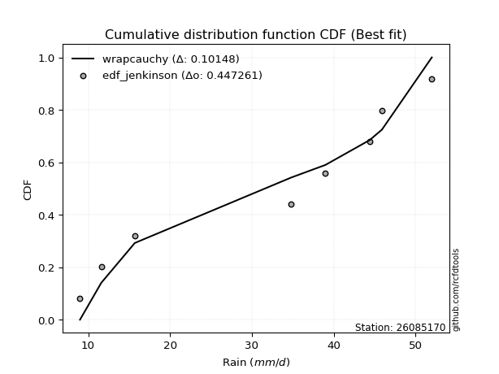</img></img>

</div>


### 11. EDF Cunnane (1978)

Cunnane´s work in statistical hydrology has focused on the performance and evaluation of different probability distributions (such as GEV, Gumbel, Lognormal) for flood frequency estimation. _b_ is a constant, typically set to 0.4.

<div align="center">


$P=(m-b)/(n+1-2b)$


</div>


**11.1. Empirical values**

<div align="center">

|                | 0                   | 1                   | 2                  | 3                  | 4                  | 5                  | 6                  | 7                  |
|:---------------|:--------------------|:--------------------|:-------------------|:-------------------|:-------------------|:-------------------|:-------------------|:-------------------|
| date           | 2025                | 2024                | 2022               | 2018               | 2017               | 2020               | 2021               | 2019               |
| x              | 9.0                 | 11.6                | 15.7               | 34.8               | 39.0               | 44.4               | 45.9               | 52.0               |
| m              | 1                   | 2                   | 3                  | 4                  | 5                  | 6                  | 7                  | 8                  |
| empirical_dist | edf_cunnane         | edf_cunnane         | edf_cunnane        | edf_cunnane        | edf_cunnane        | edf_cunnane        | edf_cunnane        | edf_cunnane        |
| empirical      | 0.07317073170731708 | 0.19512195121951223 | 0.3170731707317074 | 0.4390243902439025 | 0.5609756097560976 | 0.6829268292682927 | 0.8048780487804879 | 0.926829268292683  |
| empirical_tr   | 1.0789473684210527  | 1.2424242424242424  | 1.4642857142857144 | 1.782608695652174  | 2.277777777777778  | 3.153846153846154  | 5.125000000000001  | 13.666666666666675 |

</div>


**11.2. Kolmogorov-Smirnov fit test (sorted by Δ)**


<div align="center">

|                | 0                   | 1                   | 2                   | 3                   | 4                   | 5                   | 6                   | 7                  | 8                   | 9                   | 10                  | 11                  | 12                  | 13                 | 14                  | 15                  | 16                  | 17                  | 18                  | 19                  | 20                  | 21                  | 22                 | 23                  | 24                  | 25                  | 26                  | 27                  | 28                  | 29                  | 30                  | 31                 | 32                  | 33                  | 34                 | 35                  | 36                  | 37                  | 38                 | 39                  | 40                  | 41                 | 42                  | 43                 | 44                 | 45                  | 46                  | 47                  | 48                  | 49                  | 50                 | 51                  | 52                  | 53                  | 54                  | 55                 | 56                  | 57                  | 58                  | 59                 | 60                  | 61                  | 62                  | 63                 | 64                  | 65                  | 66                  | 67                  | 68                 | 69                  | 70                 | 71                  | 72                  | 73                  | 74                  | 75                  | 76                  | 77                  | 78                  | 79                  | 80                  | 81                  | 82                  | 83                  | 84                  | 85                  | 86                  | 87                 | 88                  | 89                  | 90                  | 91                 | 92                 | 93                  | 94                 | 95                 | 96                 | 97                  | 98                  | 99                  | 100                | 101                 | 102                 | 103                | 104                 | 105                 | 106                 | 107                | 108                | 109                 | 110                 | 111                | 112                 | 113                 | 114                | 115                | 116                | 117                 | 118                | 119                 | 120                | 121                 | 122                | 123                | 124                | 125                | 126                 | 127                 | 128                 | 129                | 130                | 131                | 132                | 133                 | 134                | 135                | 136                | 137                 | 138                 | 139                 | 140                | 141                 | 142                 | 143                | 144                 | 145                | 146                | 147                | 148                | 149                 | 150                | 151                | 152                | 153                | 154                | 155                | 156                | 157                | 158                | 159                |
|:---------------|:--------------------|:--------------------|:--------------------|:--------------------|:--------------------|:--------------------|:--------------------|:-------------------|:--------------------|:--------------------|:--------------------|:--------------------|:--------------------|:-------------------|:--------------------|:--------------------|:--------------------|:--------------------|:--------------------|:--------------------|:--------------------|:--------------------|:-------------------|:--------------------|:--------------------|:--------------------|:--------------------|:--------------------|:--------------------|:--------------------|:--------------------|:-------------------|:--------------------|:--------------------|:-------------------|:--------------------|:--------------------|:--------------------|:-------------------|:--------------------|:--------------------|:-------------------|:--------------------|:-------------------|:-------------------|:--------------------|:--------------------|:--------------------|:--------------------|:--------------------|:-------------------|:--------------------|:--------------------|:--------------------|:--------------------|:-------------------|:--------------------|:--------------------|:--------------------|:-------------------|:--------------------|:--------------------|:--------------------|:-------------------|:--------------------|:--------------------|:--------------------|:--------------------|:-------------------|:--------------------|:-------------------|:--------------------|:--------------------|:--------------------|:--------------------|:--------------------|:--------------------|:--------------------|:--------------------|:--------------------|:--------------------|:--------------------|:--------------------|:--------------------|:--------------------|:--------------------|:--------------------|:-------------------|:--------------------|:--------------------|:--------------------|:-------------------|:-------------------|:--------------------|:-------------------|:-------------------|:-------------------|:--------------------|:--------------------|:--------------------|:-------------------|:--------------------|:--------------------|:-------------------|:--------------------|:--------------------|:--------------------|:-------------------|:-------------------|:--------------------|:--------------------|:-------------------|:--------------------|:--------------------|:-------------------|:-------------------|:-------------------|:--------------------|:-------------------|:--------------------|:-------------------|:--------------------|:-------------------|:-------------------|:-------------------|:-------------------|:--------------------|:--------------------|:--------------------|:-------------------|:-------------------|:-------------------|:-------------------|:--------------------|:-------------------|:-------------------|:-------------------|:--------------------|:--------------------|:--------------------|:-------------------|:--------------------|:--------------------|:-------------------|:--------------------|:-------------------|:-------------------|:-------------------|:-------------------|:--------------------|:-------------------|:-------------------|:-------------------|:-------------------|:-------------------|:-------------------|:-------------------|:-------------------|:-------------------|:-------------------|
| station        | 26085170            | 26085170            | 26085170            | 26085170            | 26085170            | 26085170            | 26085170            | 26085170           | 26085170            | 26085170            | 26085170            | 26085170            | 26085170            | 26085170           | 26085170            | 26085170            | 26085170            | 26085170            | 26085170            | 26085170            | 26085170            | 26085170            | 26085170           | 26085170            | 26085170            | 26085170            | 26085170            | 26085170            | 26085170            | 26085170            | 26085170            | 26085170           | 26085170            | 26085170            | 26085170           | 26085170            | 26085170            | 26085170            | 26085170           | 26085170            | 26085170            | 26085170           | 26085170            | 26085170           | 26085170           | 26085170            | 26085170            | 26085170            | 26085170            | 26085170            | 26085170           | 26085170            | 26085170            | 26085170            | 26085170            | 26085170           | 26085170            | 26085170            | 26085170            | 26085170           | 26085170            | 26085170            | 26085170            | 26085170           | 26085170            | 26085170            | 26085170            | 26085170            | 26085170           | 26085170            | 26085170           | 26085170            | 26085170            | 26085170            | 26085170            | 26085170            | 26085170            | 26085170            | 26085170            | 26085170            | 26085170            | 26085170            | 26085170            | 26085170            | 26085170            | 26085170            | 26085170            | 26085170           | 26085170            | 26085170            | 26085170            | 26085170           | 26085170           | 26085170            | 26085170           | 26085170           | 26085170           | 26085170            | 26085170            | 26085170            | 26085170           | 26085170            | 26085170            | 26085170           | 26085170            | 26085170            | 26085170            | 26085170           | 26085170           | 26085170            | 26085170            | 26085170           | 26085170            | 26085170            | 26085170           | 26085170           | 26085170           | 26085170            | 26085170           | 26085170            | 26085170           | 26085170            | 26085170           | 26085170           | 26085170           | 26085170           | 26085170            | 26085170            | 26085170            | 26085170           | 26085170           | 26085170           | 26085170           | 26085170            | 26085170           | 26085170           | 26085170           | 26085170            | 26085170            | 26085170            | 26085170           | 26085170            | 26085170            | 26085170           | 26085170            | 26085170           | 26085170           | 26085170           | 26085170           | 26085170            | 26085170           | 26085170           | 26085170           | 26085170           | 26085170           | 26085170           | 26085170           | 26085170           | 26085170           | 26085170           |
| empirical_dist | edf_cunnane         | edf_cunnane         | edf_cunnane         | edf_cunnane         | edf_cunnane         | edf_cunnane         | edf_cunnane         | edf_cunnane        | edf_cunnane         | edf_cunnane         | edf_cunnane         | edf_cunnane         | edf_cunnane         | edf_cunnane        | edf_cunnane         | edf_cunnane         | edf_cunnane         | edf_cunnane         | edf_cunnane         | edf_cunnane         | edf_cunnane         | edf_cunnane         | edf_cunnane        | edf_cunnane         | edf_cunnane         | edf_cunnane         | edf_cunnane         | edf_cunnane         | edf_cunnane         | edf_cunnane         | edf_cunnane         | edf_cunnane        | edf_cunnane         | edf_cunnane         | edf_cunnane        | edf_cunnane         | edf_cunnane         | edf_cunnane         | edf_cunnane        | edf_cunnane         | edf_cunnane         | edf_cunnane        | edf_cunnane         | edf_cunnane        | edf_cunnane        | edf_cunnane         | edf_cunnane         | edf_cunnane         | edf_cunnane         | edf_cunnane         | edf_cunnane        | edf_cunnane         | edf_cunnane         | edf_cunnane         | edf_cunnane         | edf_cunnane        | edf_cunnane         | edf_cunnane         | edf_cunnane         | edf_cunnane        | edf_cunnane         | edf_cunnane         | edf_cunnane         | edf_cunnane        | edf_cunnane         | edf_cunnane         | edf_cunnane         | edf_cunnane         | edf_cunnane        | edf_cunnane         | edf_cunnane        | edf_cunnane         | edf_cunnane         | edf_cunnane         | edf_cunnane         | edf_cunnane         | edf_cunnane         | edf_cunnane         | edf_cunnane         | edf_cunnane         | edf_cunnane         | edf_cunnane         | edf_cunnane         | edf_cunnane         | edf_cunnane         | edf_cunnane         | edf_cunnane         | edf_cunnane        | edf_cunnane         | edf_cunnane         | edf_cunnane         | edf_cunnane        | edf_cunnane        | edf_cunnane         | edf_cunnane        | edf_cunnane        | edf_cunnane        | edf_cunnane         | edf_cunnane         | edf_cunnane         | edf_cunnane        | edf_cunnane         | edf_cunnane         | edf_cunnane        | edf_cunnane         | edf_cunnane         | edf_cunnane         | edf_cunnane        | edf_cunnane        | edf_cunnane         | edf_cunnane         | edf_cunnane        | edf_cunnane         | edf_cunnane         | edf_cunnane        | edf_cunnane        | edf_cunnane        | edf_cunnane         | edf_cunnane        | edf_cunnane         | edf_cunnane        | edf_cunnane         | edf_cunnane        | edf_cunnane        | edf_cunnane        | edf_cunnane        | edf_cunnane         | edf_cunnane         | edf_cunnane         | edf_cunnane        | edf_cunnane        | edf_cunnane        | edf_cunnane        | edf_cunnane         | edf_cunnane        | edf_cunnane        | edf_cunnane        | edf_cunnane         | edf_cunnane         | edf_cunnane         | edf_cunnane        | edf_cunnane         | edf_cunnane         | edf_cunnane        | edf_cunnane         | edf_cunnane        | edf_cunnane        | edf_cunnane        | edf_cunnane        | edf_cunnane         | edf_cunnane        | edf_cunnane        | edf_cunnane        | edf_cunnane        | edf_cunnane        | edf_cunnane        | edf_cunnane        | edf_cunnane        | edf_cunnane        | edf_cunnane        |
| p_dist         | genpareto           | wrapcauchy          | arcsine             | loggenextreme       | genextreme          | ksone               | trapezoid           | semicircular       | anglit              | logjohnsonsu        | genhalflogistic     | logburr             | logmielke           | burr               | logweibull_max      | logloggamma         | logtrapezoid        | loggenpareto        | betaprime           | erlang              | gamma               | skewnorm            | johnsonsu          | f                   | nct                 | exponnorm           | norm                | crystalball         | truncnorm           | t                   | gengamma            | tukeylambda        | pearson3            | cosine              | uniform            | vonmises_line       | kappa3              | logarcsine          | rice               | beta                | logargus            | foldnorm           | weibull_min         | maxwell            | invgamma           | alpha               | gumbel_l            | invgauss            | logburr12           | logweibull_min      | logistic           | logwrapcauchy       | loglevy_l           | rayleigh            | loggenhalflogistic  | kappa4             | triang              | loggumbel_l         | argus               | logksone           | gompertz            | hypsecant           | ncf                 | laplace            | logsemicircular     | logpearson3         | truncpareto         | halfnorm            | loganglit          | kstwobign           | loggompertz        | dweibull            | gumbel_r            | dgamma              | logloglaplace       | logdgamma           | logdweibull         | loggennorm          | lognct              | logt                | logexponnorm        | logcrystalball      | lognorm             | logf                | logfatiguelife      | logtriang           | logncf              | logbetaprime       | logfoldnorm         | logerlang           | logskewnorm         | loginvgamma        | halflogistic       | logbeta             | moyal              | loggamma           | loggamma           | logrice             | logalpha            | loginvgauss         | bradford           | loginvweibull       | lomax               | genexpon           | loglogistic         | logmaxwell          | levy_l              | gausshyper         | truncweibull_min   | lograyleigh         | logrdist            | truncexpon         | logcosine           | loghypsecant        | loggenexpon        | halfgennorm        | logkstwobign       | nakagami            | loghalfnorm        | burr12              | lognakagami        | loglomax            | loggumbel_r        | johnsonsb          | loglaplace         | loglaplace         | loghalflogistic     | logmoyal            | gennorm             | logjohnsonsb       | logkappa4          | logtruncnorm       | wald               | logtukeylambda      | logkappa3          | logexponweib       | loguniform         | logvonmises_line    | logwald             | logexponpow         | loggengamma        | loggausshyper       | logtruncweibull_min | logbradford        | logtruncexpon       | exponpow           | fatiguelife        | powerlaw           | exponweib          | invweibull          | logpowerlaw        | weibull_max        | logtruncpareto     | rdist              | loghalfgennorm     | genlogistic        | loggenlogistic     | logvonmises        | vonmises           | mielke             |
| delta          | 0.10238726829987238 | 0.10278959234545793 | 0.10725296983295862 | 0.11518886838466114 | 0.11954282374222239 | 0.12011972360095169 | 0.12254897008896415 | 0.1260770843001069 | 0.13267867668452854 | 0.13847385994513212 | 0.14234872108035593 | 0.14362566427600318 | 0.14417931827026817 | 0.1452188770385021 | 0.14599075139659246 | 0.14608068929531765 | 0.14934050423330258 | 0.15021618532663175 | 0.15411273873218984 | 0.15495124453968193 | 0.15505612832054394 | 0.15626004913898967 | 0.1568733625867893 | 0.15766499054229588 | 0.15813906382715057 | 0.15822036381542537 | 0.15822182933871787 | 0.15822183599606815 | 0.15822187707105106 | 0.15822217065523864 | 0.15850905848134048 | 0.1587180650622656 | 0.15901580863510956 | 0.15985405941911268 | 0.1612592172433353 | 0.16126495653579231 | 0.16159158379593128 | 0.16222994894818377 | 0.1637794066408648 | 0.16490463111964182 | 0.16600653339665494 | 0.1676856876700823 | 0.16964673672502745 | 0.1702544526977834 | 0.1709018300724896 | 0.17160936447968167 | 0.17274273940219403 | 0.17363141259325776 | 0.17536085988437577 | 0.17614584133711386 | 0.1767164227221781 | 0.17672354174720228 | 0.17720502931939125 | 0.17908941098429643 | 0.17986354540271954 | 0.1802733753594623 | 0.18067130870461157 | 0.18169634637190601 | 0.18357471909264544 | 0.1839189373461051 | 0.18623446013422773 | 0.18642977297081165 | 0.19203597280711204 | 0.1953754686580653 | 0.19550841142736675 | 0.19730659448188526 | 0.20051168861534308 | 0.20412839342617173 | 0.2045102142442664 | 0.20688311875829724 | 0.2089455107041267 | 0.21012666236006805 | 0.21036903059850254 | 0.21270450021579262 | 0.21836199559254676 | 0.22273680239030258 | 0.22340273476701764 | 0.22379196365664367 | 0.22561537685295818 | 0.22587934341959592 | 0.22587946940478598 | 0.22588093730072012 | 0.22588094552037685 | 0.22643667000418743 | 0.22695908924658692 | 0.22709645860257188 | 0.22741279000764347 | 0.2278677825614841 | 0.22887214022330182 | 0.22949542050274463 | 0.22962583351409827 | 0.231628488977194  | 0.2321989490964661 | 0.23304608778847236 | 0.2339997885473416 | 0.2341301522448732 | 0.2341301522448732 | 0.23439518290046157 | 0.23682987092410046 | 0.23802821653690354 | 0.2387330179777516 | 0.24126345778117786 | 0.24256047527897373 | 0.2433737972722535 | 0.24503180569473293 | 0.24588874566600727 | 0.24982047057149243 | 0.2500209772381199 | 0.2511343720379753 | 0.25185261693363714 | 0.25521200547555245 | 0.2559754435197653 | 0.25605922969275663 | 0.25961073497683973 | 0.2609519271874202 | 0.2614117961467305 | 0.2627647131979457 | 0.26622003956195683 | 0.2693713053701974 | 0.27432562903297153 | 0.2777777675101417 | 0.28296754498917054 | 0.2833875015296907 | 0.2868748004929321 | 0.2871993346434216 | 0.2871993346434216 | 0.29721500676612256 | 0.30226624363729404 | 0.30487804878048785 | 0.3071488134874241 | 0.3150823246286826 | 0.3170720966128091 | 0.3170731707317074 | 0.32427430135981294 | 0.3253950435145937 | 0.3297204474260703 | 0.3320007243874705 | 0.33613844111802227 | 0.35620993499543374 | 0.35807255056035714 | 0.3618941230816979 | 0.36484254535468896 | 0.3822608481996572  | 0.3870394214565248 | 0.40739854991456914 | 0.4306601554444938 | 0.4439910376497176 | 0.4715212939647252 | 0.4925356475752105 | 0.49578938014225504 | 0.509800769352754  | 0.5862362655318154 | 0.6708638342229768 | 0.6829268292614311 | 0.6829268292682927 | 0.8048780487804879 | 0.8048780487804879 | 1.2142576449883271 | 7.454157742650078  | nan                |
| deltao         | 0.4472608134160001  | 0.4472608134160001  | 0.4472608134160001  | 0.4472608134160001  | 0.4472608134160001  | 0.4472608134160001  | 0.4472608134160001  | 0.4472608134160001 | 0.4472608134160001  | 0.4472608134160001  | 0.4472608134160001  | 0.4472608134160001  | 0.4472608134160001  | 0.4472608134160001 | 0.4472608134160001  | 0.4472608134160001  | 0.4472608134160001  | 0.4472608134160001  | 0.4472608134160001  | 0.4472608134160001  | 0.4472608134160001  | 0.4472608134160001  | 0.4472608134160001 | 0.4472608134160001  | 0.4472608134160001  | 0.4472608134160001  | 0.4472608134160001  | 0.4472608134160001  | 0.4472608134160001  | 0.4472608134160001  | 0.4472608134160001  | 0.4472608134160001 | 0.4472608134160001  | 0.4472608134160001  | 0.4472608134160001 | 0.4472608134160001  | 0.4472608134160001  | 0.4472608134160001  | 0.4472608134160001 | 0.4472608134160001  | 0.4472608134160001  | 0.4472608134160001 | 0.4472608134160001  | 0.4472608134160001 | 0.4472608134160001 | 0.4472608134160001  | 0.4472608134160001  | 0.4472608134160001  | 0.4472608134160001  | 0.4472608134160001  | 0.4472608134160001 | 0.4472608134160001  | 0.4472608134160001  | 0.4472608134160001  | 0.4472608134160001  | 0.4472608134160001 | 0.4472608134160001  | 0.4472608134160001  | 0.4472608134160001  | 0.4472608134160001 | 0.4472608134160001  | 0.4472608134160001  | 0.4472608134160001  | 0.4472608134160001 | 0.4472608134160001  | 0.4472608134160001  | 0.4472608134160001  | 0.4472608134160001  | 0.4472608134160001 | 0.4472608134160001  | 0.4472608134160001 | 0.4472608134160001  | 0.4472608134160001  | 0.4472608134160001  | 0.4472608134160001  | 0.4472608134160001  | 0.4472608134160001  | 0.4472608134160001  | 0.4472608134160001  | 0.4472608134160001  | 0.4472608134160001  | 0.4472608134160001  | 0.4472608134160001  | 0.4472608134160001  | 0.4472608134160001  | 0.4472608134160001  | 0.4472608134160001  | 0.4472608134160001 | 0.4472608134160001  | 0.4472608134160001  | 0.4472608134160001  | 0.4472608134160001 | 0.4472608134160001 | 0.4472608134160001  | 0.4472608134160001 | 0.4472608134160001 | 0.4472608134160001 | 0.4472608134160001  | 0.4472608134160001  | 0.4472608134160001  | 0.4472608134160001 | 0.4472608134160001  | 0.4472608134160001  | 0.4472608134160001 | 0.4472608134160001  | 0.4472608134160001  | 0.4472608134160001  | 0.4472608134160001 | 0.4472608134160001 | 0.4472608134160001  | 0.4472608134160001  | 0.4472608134160001 | 0.4472608134160001  | 0.4472608134160001  | 0.4472608134160001 | 0.4472608134160001 | 0.4472608134160001 | 0.4472608134160001  | 0.4472608134160001 | 0.4472608134160001  | 0.4472608134160001 | 0.4472608134160001  | 0.4472608134160001 | 0.4472608134160001 | 0.4472608134160001 | 0.4472608134160001 | 0.4472608134160001  | 0.4472608134160001  | 0.4472608134160001  | 0.4472608134160001 | 0.4472608134160001 | 0.4472608134160001 | 0.4472608134160001 | 0.4472608134160001  | 0.4472608134160001 | 0.4472608134160001 | 0.4472608134160001 | 0.4472608134160001  | 0.4472608134160001  | 0.4472608134160001  | 0.4472608134160001 | 0.4472608134160001  | 0.4472608134160001  | 0.4472608134160001 | 0.4472608134160001  | 0.4472608134160001 | 0.4472608134160001 | 0.4472608134160001 | 0.4472608134160001 | 0.4472608134160001  | 0.4472608134160001 | 0.4472608134160001 | 0.4472608134160001 | 0.4472608134160001 | 0.4472608134160001 | 0.4472608134160001 | 0.4472608134160001 | 0.4472608134160001 | 0.4472608134160001 | 0.4472608134160001 |
| eval           | Δo > Δ              | Δo > Δ              | Δo > Δ              | Δo > Δ              | Δo > Δ              | Δo > Δ              | Δo > Δ              | Δo > Δ             | Δo > Δ              | Δo > Δ              | Δo > Δ              | Δo > Δ              | Δo > Δ              | Δo > Δ             | Δo > Δ              | Δo > Δ              | Δo > Δ              | Δo > Δ              | Δo > Δ              | Δo > Δ              | Δo > Δ              | Δo > Δ              | Δo > Δ             | Δo > Δ              | Δo > Δ              | Δo > Δ              | Δo > Δ              | Δo > Δ              | Δo > Δ              | Δo > Δ              | Δo > Δ              | Δo > Δ             | Δo > Δ              | Δo > Δ              | Δo > Δ             | Δo > Δ              | Δo > Δ              | Δo > Δ              | Δo > Δ             | Δo > Δ              | Δo > Δ              | Δo > Δ             | Δo > Δ              | Δo > Δ             | Δo > Δ             | Δo > Δ              | Δo > Δ              | Δo > Δ              | Δo > Δ              | Δo > Δ              | Δo > Δ             | Δo > Δ              | Δo > Δ              | Δo > Δ              | Δo > Δ              | Δo > Δ             | Δo > Δ              | Δo > Δ              | Δo > Δ              | Δo > Δ             | Δo > Δ              | Δo > Δ              | Δo > Δ              | Δo > Δ             | Δo > Δ              | Δo > Δ              | Δo > Δ              | Δo > Δ              | Δo > Δ             | Δo > Δ              | Δo > Δ             | Δo > Δ              | Δo > Δ              | Δo > Δ              | Δo > Δ              | Δo > Δ              | Δo > Δ              | Δo > Δ              | Δo > Δ              | Δo > Δ              | Δo > Δ              | Δo > Δ              | Δo > Δ              | Δo > Δ              | Δo > Δ              | Δo > Δ              | Δo > Δ              | Δo > Δ             | Δo > Δ              | Δo > Δ              | Δo > Δ              | Δo > Δ             | Δo > Δ             | Δo > Δ              | Δo > Δ             | Δo > Δ             | Δo > Δ             | Δo > Δ              | Δo > Δ              | Δo > Δ              | Δo > Δ             | Δo > Δ              | Δo > Δ              | Δo > Δ             | Δo > Δ              | Δo > Δ              | Δo > Δ              | Δo > Δ             | Δo > Δ             | Δo > Δ              | Δo > Δ              | Δo > Δ             | Δo > Δ              | Δo > Δ              | Δo > Δ             | Δo > Δ             | Δo > Δ             | Δo > Δ              | Δo > Δ             | Δo > Δ              | Δo > Δ             | Δo > Δ              | Δo > Δ             | Δo > Δ             | Δo > Δ             | Δo > Δ             | Δo > Δ              | Δo > Δ              | Δo > Δ              | Δo > Δ             | Δo > Δ             | Δo > Δ             | Δo > Δ             | Δo > Δ              | Δo > Δ             | Δo > Δ             | Δo > Δ             | Δo > Δ              | Δo > Δ              | Δo > Δ              | Δo > Δ             | Δo > Δ              | Δo > Δ              | Δo > Δ             | Δo > Δ              | Δo > Δ             | Δo > Δ             | Δo <= Δ            | Δo <= Δ            | Δo <= Δ             | Δo <= Δ            | Δo <= Δ            | Δo <= Δ            | Δo <= Δ            | Δo <= Δ            | Δo <= Δ            | Δo <= Δ            | Δo <= Δ            | Δo <= Δ            | Δo <= Δ            |
| fit            | 1                   | 1                   | 1                   | 1                   | 1                   | 1                   | 1                   | 1                  | 1                   | 1                   | 1                   | 1                   | 1                   | 1                  | 1                   | 1                   | 1                   | 1                   | 1                   | 1                   | 1                   | 1                   | 1                  | 1                   | 1                   | 1                   | 1                   | 1                   | 1                   | 1                   | 1                   | 1                  | 1                   | 1                   | 1                  | 1                   | 1                   | 1                   | 1                  | 1                   | 1                   | 1                  | 1                   | 1                  | 1                  | 1                   | 1                   | 1                   | 1                   | 1                   | 1                  | 1                   | 1                   | 1                   | 1                   | 1                  | 1                   | 1                   | 1                   | 1                  | 1                   | 1                   | 1                   | 1                  | 1                   | 1                   | 1                   | 1                   | 1                  | 1                   | 1                  | 1                   | 1                   | 1                   | 1                   | 1                   | 1                   | 1                   | 1                   | 1                   | 1                   | 1                   | 1                   | 1                   | 1                   | 1                   | 1                   | 1                  | 1                   | 1                   | 1                   | 1                  | 1                  | 1                   | 1                  | 1                  | 1                  | 1                   | 1                   | 1                   | 1                  | 1                   | 1                   | 1                  | 1                   | 1                   | 1                   | 1                  | 1                  | 1                   | 1                   | 1                  | 1                   | 1                   | 1                  | 1                  | 1                  | 1                   | 1                  | 1                   | 1                  | 1                   | 1                  | 1                  | 1                  | 1                  | 1                   | 1                   | 1                   | 1                  | 1                  | 1                  | 1                  | 1                   | 1                  | 1                  | 1                  | 1                   | 1                   | 1                   | 1                  | 1                   | 1                   | 1                  | 1                   | 1                  | 1                  | 0                  | 0                  | 0                   | 0                  | 0                  | 0                  | 0                  | 0                  | 0                  | 0                  | 0                  | 0                  | 0                  |
| n              | 8                   | 8                   | 8                   | 8                   | 8                   | 8                   | 8                   | 8                  | 8                   | 8                   | 8                   | 8                   | 8                   | 8                  | 8                   | 8                   | 8                   | 8                   | 8                   | 8                   | 8                   | 8                   | 8                  | 8                   | 8                   | 8                   | 8                   | 8                   | 8                   | 8                   | 8                   | 8                  | 8                   | 8                   | 8                  | 8                   | 8                   | 8                   | 8                  | 8                   | 8                   | 8                  | 8                   | 8                  | 8                  | 8                   | 8                   | 8                   | 8                   | 8                   | 8                  | 8                   | 8                   | 8                   | 8                   | 8                  | 8                   | 8                   | 8                   | 8                  | 8                   | 8                   | 8                   | 8                  | 8                   | 8                   | 8                   | 8                   | 8                  | 8                   | 8                  | 8                   | 8                   | 8                   | 8                   | 8                   | 8                   | 8                   | 8                   | 8                   | 8                   | 8                   | 8                   | 8                   | 8                   | 8                   | 8                   | 8                  | 8                   | 8                   | 8                   | 8                  | 8                  | 8                   | 8                  | 8                  | 8                  | 8                   | 8                   | 8                   | 8                  | 8                   | 8                   | 8                  | 8                   | 8                   | 8                   | 8                  | 8                  | 8                   | 8                   | 8                  | 8                   | 8                   | 8                  | 8                  | 8                  | 8                   | 8                  | 8                   | 8                  | 8                   | 8                  | 8                  | 8                  | 8                  | 8                   | 8                   | 8                   | 8                  | 8                  | 8                  | 8                  | 8                   | 8                  | 8                  | 8                  | 8                   | 8                   | 8                   | 8                  | 8                   | 8                   | 8                  | 8                   | 8                  | 8                  | 8                  | 8                  | 8                   | 8                  | 8                  | 8                  | 8                  | 8                  | 8                  | 8                  | 8                  | 8                  | 8                  |
| best_fit       | 1                   | 0                   | 0                   | 0                   | 0                   | 0                   | 0                   | 0                  | 0                   | 0                   | 0                   | 0                   | 0                   | 0                  | 0                   | 0                   | 0                   | 0                   | 0                   | 0                   | 0                   | 0                   | 0                  | 0                   | 0                   | 0                   | 0                   | 0                   | 0                   | 0                   | 0                   | 0                  | 0                   | 0                   | 0                  | 0                   | 0                   | 0                   | 0                  | 0                   | 0                   | 0                  | 0                   | 0                  | 0                  | 0                   | 0                   | 0                   | 0                   | 0                   | 0                  | 0                   | 0                   | 0                   | 0                   | 0                  | 0                   | 0                   | 0                   | 0                  | 0                   | 0                   | 0                   | 0                  | 0                   | 0                   | 0                   | 0                   | 0                  | 0                   | 0                  | 0                   | 0                   | 0                   | 0                   | 0                   | 0                   | 0                   | 0                   | 0                   | 0                   | 0                   | 0                   | 0                   | 0                   | 0                   | 0                   | 0                  | 0                   | 0                   | 0                   | 0                  | 0                  | 0                   | 0                  | 0                  | 0                  | 0                   | 0                   | 0                   | 0                  | 0                   | 0                   | 0                  | 0                   | 0                   | 0                   | 0                  | 0                  | 0                   | 0                   | 0                  | 0                   | 0                   | 0                  | 0                  | 0                  | 0                   | 0                  | 0                   | 0                  | 0                   | 0                  | 0                  | 0                  | 0                  | 0                   | 0                   | 0                   | 0                  | 0                  | 0                  | 0                  | 0                   | 0                  | 0                  | 0                  | 0                   | 0                   | 0                   | 0                  | 0                   | 0                   | 0                  | 0                   | 0                  | 0                  | 0                  | 0                  | 0                   | 0                  | 0                  | 0                  | 0                  | 0                  | 0                  | 0                  | 0                  | 0                  | 0                  |
| best_fit_sort  | 1                   | 2                   | 3                   | 4                   | 5                   | 6                   | 7                   | 8                  | 9                   | 10                  | 11                  | 12                  | 13                  | 14                 | 15                  | 16                  | 17                  | 18                  | 19                  | 20                  | 21                  | 22                  | 23                 | 24                  | 25                  | 26                  | 27                  | 28                  | 29                  | 30                  | 31                  | 32                 | 33                  | 34                  | 35                 | 36                  | 37                  | 38                  | 39                 | 40                  | 41                  | 42                 | 43                  | 44                 | 45                 | 46                  | 47                  | 48                  | 49                  | 50                  | 51                 | 52                  | 53                  | 54                  | 55                  | 56                 | 57                  | 58                  | 59                  | 60                 | 61                  | 62                  | 63                  | 64                 | 65                  | 66                  | 67                  | 68                  | 69                 | 70                  | 71                 | 72                  | 73                  | 74                  | 75                  | 76                  | 77                  | 78                  | 79                  | 80                  | 81                  | 82                  | 83                  | 84                  | 85                  | 86                  | 87                  | 88                 | 89                  | 90                  | 91                  | 92                 | 93                 | 94                  | 95                 | 96                 | 97                 | 98                  | 99                  | 100                 | 101                | 102                 | 103                 | 104                | 105                 | 106                 | 107                 | 108                | 109                | 110                 | 111                 | 112                | 113                 | 114                 | 115                | 116                | 117                | 118                 | 119                | 120                 | 121                | 122                 | 123                | 124                | 125                | 126                | 127                 | 128                 | 129                 | 130                | 131                | 132                | 133                | 134                 | 135                | 136                | 137                | 138                 | 139                 | 140                 | 141                | 142                 | 143                 | 144                | 145                 | 146                | 147                | 148                | 149                | 150                 | 151                | 152                | 153                | 154                | 155                | 156                | 157                | 158                | 159                | 160                |

</div>


**11.3. Best fit**

<div align="center">

|   id |   station | empirical_dist   | p_dist    |    delta |   deltao | eval   |   fit |   n |   best_fit |   best_fit_sort |
|-----:|----------:|:-----------------|:----------|---------:|---------:|:-------|------:|----:|-----------:|----------------:|
|    0 |  26085170 | edf_cunnane      | genpareto | 0.102387 | 0.447261 | Δo > Δ |     1 |   8 |          1 |               1 |

</div>


<div align="center">

</img></img>

</div>


### 12. EDF Adamowski (1981)

The Adamowski formula in hydrology refers to a specific plotting position formula used for estimating the non-parametric empirical distribution of hydrological events (like flood peaks) to calculate their return periods. This formula provides an alternative to traditional parametric methods (like the Gumbel or Log Pearson Type III distributions). 

<div align="center">


$P=(m-0.25)/(n+0.5)$


</div>


**12.1. Empirical values**

<div align="center">

|                | 0                   | 1                   | 2                  | 3                  | 4                  | 5                  | 6                  | 7                  |
|:---------------|:--------------------|:--------------------|:-------------------|:-------------------|:-------------------|:-------------------|:-------------------|:-------------------|
| date           | 2025                | 2024                | 2022               | 2018               | 2017               | 2020               | 2021               | 2019               |
| x              | 9.0                 | 11.6                | 15.7               | 34.8               | 39.0               | 44.4               | 45.9               | 52.0               |
| m              | 1                   | 2                   | 3                  | 4                  | 5                  | 6                  | 7                  | 8                  |
| empirical_dist | edf_adamowski       | edf_adamowski       | edf_adamowski      | edf_adamowski      | edf_adamowski      | edf_adamowski      | edf_adamowski      | edf_adamowski      |
| empirical      | 0.08823529411764706 | 0.20588235294117646 | 0.3235294117647059 | 0.4411764705882353 | 0.5588235294117647 | 0.6764705882352942 | 0.7941176470588235 | 0.9117647058823529 |
| empirical_tr   | 1.096774193548387   | 1.259259259259259   | 1.4782608695652173 | 1.7894736842105263 | 2.2666666666666666 | 3.0909090909090913 | 4.857142857142856  | 11.33333333333333  |

</div>


**12.2. Kolmogorov-Smirnov fit test (sorted by Δ)**


<div align="center">

|                | 0                   | 1                   | 2                  | 3                  | 4                   | 5                  | 6                  | 7                   | 8                   | 9                   | 10                  | 11                  | 12                 | 13                  | 14                 | 15                 | 16                 | 17                  | 18                  | 19                  | 20                  | 21                  | 22                  | 23                  | 24                  | 25                 | 26                  | 27                 | 28                 | 29                 | 30                 | 31                  | 32                 | 33                  | 34                 | 35                  | 36                 | 37                  | 38                  | 39                 | 40                 | 41                  | 42                  | 43                  | 44                  | 45                  | 46                 | 47                  | 48                  | 49                 | 50                  | 51                  | 52                  | 53                  | 54                  | 55                  | 56                 | 57                  | 58                 | 59                  | 60                  | 61                  | 62                  | 63                  | 64                  | 65                 | 66                  | 67                  | 68                  | 69                  | 70                  | 71                  | 72                  | 73                  | 74                  | 75                 | 76                  | 77                 | 78                  | 79                  | 80                  | 81                  | 82                 | 83                 | 84                 | 85                  | 86                  | 87                  | 88                  | 89                 | 90                  | 91                  | 92                  | 93                 | 94                  | 95                  | 96                  | 97                 | 98                  | 99                  | 100                 | 101                | 102                 | 103                 | 104                 | 105                 | 106                 | 107                | 108                | 109                 | 110                 | 111                | 112                 | 113                 | 114                 | 115                | 116                | 117                 | 118                | 119                 | 120                 | 121                 | 122                 | 123                 | 124                 | 125                 | 126                 | 127                | 128                 | 129                 | 130                | 131                 | 132                | 133                 | 134                | 135                 | 136                 | 137                | 138                 | 139                 | 140                | 141                | 142                 | 143                | 144                 | 145                | 146                | 147                | 148                | 149                | 150                | 151                | 152                | 153                | 154                | 155                | 156                | 157                | 158                | 159                |
|:---------------|:--------------------|:--------------------|:-------------------|:-------------------|:--------------------|:-------------------|:-------------------|:--------------------|:--------------------|:--------------------|:--------------------|:--------------------|:-------------------|:--------------------|:-------------------|:-------------------|:-------------------|:--------------------|:--------------------|:--------------------|:--------------------|:--------------------|:--------------------|:--------------------|:--------------------|:-------------------|:--------------------|:-------------------|:-------------------|:-------------------|:-------------------|:--------------------|:-------------------|:--------------------|:-------------------|:--------------------|:-------------------|:--------------------|:--------------------|:-------------------|:-------------------|:--------------------|:--------------------|:--------------------|:--------------------|:--------------------|:-------------------|:--------------------|:--------------------|:-------------------|:--------------------|:--------------------|:--------------------|:--------------------|:--------------------|:--------------------|:-------------------|:--------------------|:-------------------|:--------------------|:--------------------|:--------------------|:--------------------|:--------------------|:--------------------|:-------------------|:--------------------|:--------------------|:--------------------|:--------------------|:--------------------|:--------------------|:--------------------|:--------------------|:--------------------|:-------------------|:--------------------|:-------------------|:--------------------|:--------------------|:--------------------|:--------------------|:-------------------|:-------------------|:-------------------|:--------------------|:--------------------|:--------------------|:--------------------|:-------------------|:--------------------|:--------------------|:--------------------|:-------------------|:--------------------|:--------------------|:--------------------|:-------------------|:--------------------|:--------------------|:--------------------|:-------------------|:--------------------|:--------------------|:--------------------|:--------------------|:--------------------|:-------------------|:-------------------|:--------------------|:--------------------|:-------------------|:--------------------|:--------------------|:--------------------|:-------------------|:-------------------|:--------------------|:-------------------|:--------------------|:--------------------|:--------------------|:--------------------|:--------------------|:--------------------|:--------------------|:--------------------|:-------------------|:--------------------|:--------------------|:-------------------|:--------------------|:-------------------|:--------------------|:-------------------|:--------------------|:--------------------|:-------------------|:--------------------|:--------------------|:-------------------|:-------------------|:--------------------|:-------------------|:--------------------|:-------------------|:-------------------|:-------------------|:-------------------|:-------------------|:-------------------|:-------------------|:-------------------|:-------------------|:-------------------|:-------------------|:-------------------|:-------------------|:-------------------|:-------------------|
| station        | 26085170            | 26085170            | 26085170           | 26085170           | 26085170            | 26085170           | 26085170           | 26085170            | 26085170            | 26085170            | 26085170            | 26085170            | 26085170           | 26085170            | 26085170           | 26085170           | 26085170           | 26085170            | 26085170            | 26085170            | 26085170            | 26085170            | 26085170            | 26085170            | 26085170            | 26085170           | 26085170            | 26085170           | 26085170           | 26085170           | 26085170           | 26085170            | 26085170           | 26085170            | 26085170           | 26085170            | 26085170           | 26085170            | 26085170            | 26085170           | 26085170           | 26085170            | 26085170            | 26085170            | 26085170            | 26085170            | 26085170           | 26085170            | 26085170            | 26085170           | 26085170            | 26085170            | 26085170            | 26085170            | 26085170            | 26085170            | 26085170           | 26085170            | 26085170           | 26085170            | 26085170            | 26085170            | 26085170            | 26085170            | 26085170            | 26085170           | 26085170            | 26085170            | 26085170            | 26085170            | 26085170            | 26085170            | 26085170            | 26085170            | 26085170            | 26085170           | 26085170            | 26085170           | 26085170            | 26085170            | 26085170            | 26085170            | 26085170           | 26085170           | 26085170           | 26085170            | 26085170            | 26085170            | 26085170            | 26085170           | 26085170            | 26085170            | 26085170            | 26085170           | 26085170            | 26085170            | 26085170            | 26085170           | 26085170            | 26085170            | 26085170            | 26085170           | 26085170            | 26085170            | 26085170            | 26085170            | 26085170            | 26085170           | 26085170           | 26085170            | 26085170            | 26085170           | 26085170            | 26085170            | 26085170            | 26085170           | 26085170           | 26085170            | 26085170           | 26085170            | 26085170            | 26085170            | 26085170            | 26085170            | 26085170            | 26085170            | 26085170            | 26085170           | 26085170            | 26085170            | 26085170           | 26085170            | 26085170           | 26085170            | 26085170           | 26085170            | 26085170            | 26085170           | 26085170            | 26085170            | 26085170           | 26085170           | 26085170            | 26085170           | 26085170            | 26085170           | 26085170           | 26085170           | 26085170           | 26085170           | 26085170           | 26085170           | 26085170           | 26085170           | 26085170           | 26085170           | 26085170           | 26085170           | 26085170           | 26085170           |
| empirical_dist | edf_adamowski       | edf_adamowski       | edf_adamowski      | edf_adamowski      | edf_adamowski       | edf_adamowski      | edf_adamowski      | edf_adamowski       | edf_adamowski       | edf_adamowski       | edf_adamowski       | edf_adamowski       | edf_adamowski      | edf_adamowski       | edf_adamowski      | edf_adamowski      | edf_adamowski      | edf_adamowski       | edf_adamowski       | edf_adamowski       | edf_adamowski       | edf_adamowski       | edf_adamowski       | edf_adamowski       | edf_adamowski       | edf_adamowski      | edf_adamowski       | edf_adamowski      | edf_adamowski      | edf_adamowski      | edf_adamowski      | edf_adamowski       | edf_adamowski      | edf_adamowski       | edf_adamowski      | edf_adamowski       | edf_adamowski      | edf_adamowski       | edf_adamowski       | edf_adamowski      | edf_adamowski      | edf_adamowski       | edf_adamowski       | edf_adamowski       | edf_adamowski       | edf_adamowski       | edf_adamowski      | edf_adamowski       | edf_adamowski       | edf_adamowski      | edf_adamowski       | edf_adamowski       | edf_adamowski       | edf_adamowski       | edf_adamowski       | edf_adamowski       | edf_adamowski      | edf_adamowski       | edf_adamowski      | edf_adamowski       | edf_adamowski       | edf_adamowski       | edf_adamowski       | edf_adamowski       | edf_adamowski       | edf_adamowski      | edf_adamowski       | edf_adamowski       | edf_adamowski       | edf_adamowski       | edf_adamowski       | edf_adamowski       | edf_adamowski       | edf_adamowski       | edf_adamowski       | edf_adamowski      | edf_adamowski       | edf_adamowski      | edf_adamowski       | edf_adamowski       | edf_adamowski       | edf_adamowski       | edf_adamowski      | edf_adamowski      | edf_adamowski      | edf_adamowski       | edf_adamowski       | edf_adamowski       | edf_adamowski       | edf_adamowski      | edf_adamowski       | edf_adamowski       | edf_adamowski       | edf_adamowski      | edf_adamowski       | edf_adamowski       | edf_adamowski       | edf_adamowski      | edf_adamowski       | edf_adamowski       | edf_adamowski       | edf_adamowski      | edf_adamowski       | edf_adamowski       | edf_adamowski       | edf_adamowski       | edf_adamowski       | edf_adamowski      | edf_adamowski      | edf_adamowski       | edf_adamowski       | edf_adamowski      | edf_adamowski       | edf_adamowski       | edf_adamowski       | edf_adamowski      | edf_adamowski      | edf_adamowski       | edf_adamowski      | edf_adamowski       | edf_adamowski       | edf_adamowski       | edf_adamowski       | edf_adamowski       | edf_adamowski       | edf_adamowski       | edf_adamowski       | edf_adamowski      | edf_adamowski       | edf_adamowski       | edf_adamowski      | edf_adamowski       | edf_adamowski      | edf_adamowski       | edf_adamowski      | edf_adamowski       | edf_adamowski       | edf_adamowski      | edf_adamowski       | edf_adamowski       | edf_adamowski      | edf_adamowski      | edf_adamowski       | edf_adamowski      | edf_adamowski       | edf_adamowski      | edf_adamowski      | edf_adamowski      | edf_adamowski      | edf_adamowski      | edf_adamowski      | edf_adamowski      | edf_adamowski      | edf_adamowski      | edf_adamowski      | edf_adamowski      | edf_adamowski      | edf_adamowski      | edf_adamowski      | edf_adamowski      |
| p_dist         | wrapcauchy          | arcsine             | genpareto          | ksone              | loggenextreme       | genextreme         | semicircular       | trapezoid           | logweibull_max      | loggenpareto        | anglit              | logjohnsonsu        | logtrapezoid       | genhalflogistic     | logburr            | logmielke          | burr               | logloggamma         | beta                | logarcsine          | tukeylambda         | betaprime           | erlang              | gamma               | loglevy_l           | skewnorm           | johnsonsu           | f                  | nct                | exponnorm          | norm               | crystalball         | truncnorm          | t                   | gengamma           | pearson3            | cosine             | uniform             | vonmises_line       | kappa3             | maxwell            | invgamma            | alpha               | rice                | invgauss            | logargus            | logburr12          | logweibull_min      | foldnorm            | logwrapcauchy      | weibull_min         | rayleigh            | loggenhalflogistic  | kappa4              | gumbel_l            | loggumbel_l         | logksone           | logistic            | triang             | ncf                 | argus               | gompertz            | hypsecant           | logsemicircular     | logpearson3         | truncpareto        | laplace             | halfnorm            | loganglit           | kstwobign           | loggompertz         | gumbel_r            | dweibull            | dgamma              | logbeta             | lognct             | logt                | logexponnorm       | logcrystalball      | lognorm             | logf                | logfatiguelife      | logloglaplace      | logtriang          | logncf             | logbetaprime        | logfoldnorm         | logerlang           | logskewnorm         | logdgamma          | loginvgamma         | logdweibull         | halflogistic        | loggennorm         | moyal               | loggamma            | loggamma            | logrice            | logalpha            | levy_l              | loginvgauss         | bradford           | loginvweibull       | lomax               | genexpon            | loglogistic         | logmaxwell          | gausshyper         | truncweibull_min   | lograyleigh         | logrdist            | truncexpon         | logcosine           | loghypsecant        | loggenexpon         | halfgennorm        | logkstwobign       | nakagami            | loghalfnorm        | burr12              | lognakagami         | johnsonsb           | loglomax            | loggumbel_r         | loglaplace          | loglaplace          | gennorm             | loghalflogistic    | logjohnsonsb        | logmoyal            | logkappa4          | logtukeylambda      | logkappa3          | logtruncnorm        | wald               | logexponweib        | loguniform          | logvonmises_line   | logexponpow         | logwald             | loggengamma        | loggausshyper      | logtruncweibull_min | logbradford        | logtruncexpon       | exponpow           | fatiguelife        | powerlaw           | invweibull         | exponweib          | logpowerlaw        | weibull_max        | logtruncpareto     | rdist              | loghalfgennorm     | genlogistic        | loggenlogistic     | logvonmises        | vonmises           | mielke             |
| delta          | 0.10063751200112514 | 0.10510088948862584 | 0.1088435093328709 | 0.1179676432566189 | 0.12164510941765966 | 0.1259990647752209 | 0.1278049705196012 | 0.12900521112196267 | 0.13523034967492809 | 0.13552111649211207 | 0.13913491771752706 | 0.14493010097813064 | 0.1471884238889698 | 0.14880496211335445 | 0.1500819053090017 | 0.1506355593032667 | 0.1516751180715006 | 0.15253693032831617 | 0.15414422939797745 | 0.15619252797008365 | 0.16002867066611098 | 0.16056897976518836 | 0.16140748557268045 | 0.16151236935354246 | 0.16214046690906125 | 0.1627162901719882 | 0.16332960361978782 | 0.1641212315752944 | 0.1645953048601491 | 0.1646766048484239 | 0.1646780703717164 | 0.16467807702906667 | 0.1646781181040496 | 0.16467841168823716 | 0.164965299514339  | 0.16547204966810808 | 0.1663103004521112 | 0.16771545827633383 | 0.16772119756879084 | 0.1680478248289298 | 0.1681023723534506 | 0.16874974972815682 | 0.16945728413534888 | 0.17023564767386332 | 0.17147933224892498 | 0.17246277442965346 | 0.173208779540043  | 0.17399376099278108 | 0.17414192870308082 | 0.1745714614028695 | 0.17610297775802597 | 0.17693733063996364 | 0.17771146505838675 | 0.17812129501512952 | 0.17919898043519256 | 0.17954426602757323 | 0.1817668570017723 | 0.18317266375517663 | 0.1871275497376101 | 0.18988389246277926 | 0.19003096012564397 | 0.19269070116722625 | 0.19288601400381017 | 0.19335633108303396 | 0.19515451413755247 | 0.1983596082710103 | 0.20183170969106382 | 0.20197631308183894 | 0.20235813389993362 | 0.20473103841396445 | 0.20679343035979392 | 0.20821695025416975 | 0.21658290339306657 | 0.21916074124879115 | 0.22228568606680799 | 0.2234632965086254 | 0.22372726307526314 | 0.2237273890604532 | 0.22372885695638733 | 0.22372886517604407 | 0.22428458965985465 | 0.22480700890225414 | 0.2248182366255453 | 0.2249443782582391 | 0.2252607096633107 | 0.22571570221715131 | 0.22672005987896904 | 0.22734334015841184 | 0.22747375316976548 | 0.2291930434233011 | 0.22947640863286123 | 0.22985897580001616 | 0.23004686875213332 | 0.2302482046896422 | 0.23184770820300882 | 0.23197807190054043 | 0.23197807190054043 | 0.2322431025561288 | 0.23467779057976768 | 0.23475590816116243 | 0.23587613619257075 | 0.2365809376334188 | 0.23911137743684507 | 0.24040839493464095 | 0.24122171692792072 | 0.24287972535040014 | 0.24373666532167448 | 0.2478688968937871 | 0.2489822916936425 | 0.24970053658930436 | 0.25305992513121967 | 0.2538233631754325 | 0.25390714934842384 | 0.25745865463250694 | 0.25879984684308743 | 0.2592597158023977 | 0.2606126328536129 | 0.26406795921762405 | 0.2672192250258646 | 0.27217354868863874 | 0.27562568716580893 | 0.27611439877126787 | 0.28081546464483775 | 0.28123542118535794 | 0.28504725429908884 | 0.28504725429908884 | 0.29411764705882354 | 0.2950629264217898 | 0.29638841176575975 | 0.30011416329296126 | 0.3129302442843498 | 0.32212222101548016 | 0.3232429631702609 | 0.32352833764580763 | 0.3235294117647059 | 0.32756836708173753 | 0.32984864404313774 | 0.3339863607736895 | 0.34731214883869294 | 0.35405785465110096 | 0.3597420427373651 | 0.3626904650103562 | 0.38010876785532444 | 0.384887341112192  | 0.40524646957023636 | 0.4155955930341638 | 0.4332306359280534 | 0.4693692136203924 | 0.480724817731925  | 0.4817752458535463 | 0.5076486890084212 | 0.575475863810151  | 0.6601034325013126 | 0.6764705882284325 | 0.6764705882352942 | 0.7941176470588235 | 0.7941176470588235 | 1.2121055646439944 | 7.469222305060407  | nan                |
| deltao         | 0.4472608134160001  | 0.4472608134160001  | 0.4472608134160001 | 0.4472608134160001 | 0.4472608134160001  | 0.4472608134160001 | 0.4472608134160001 | 0.4472608134160001  | 0.4472608134160001  | 0.4472608134160001  | 0.4472608134160001  | 0.4472608134160001  | 0.4472608134160001 | 0.4472608134160001  | 0.4472608134160001 | 0.4472608134160001 | 0.4472608134160001 | 0.4472608134160001  | 0.4472608134160001  | 0.4472608134160001  | 0.4472608134160001  | 0.4472608134160001  | 0.4472608134160001  | 0.4472608134160001  | 0.4472608134160001  | 0.4472608134160001 | 0.4472608134160001  | 0.4472608134160001 | 0.4472608134160001 | 0.4472608134160001 | 0.4472608134160001 | 0.4472608134160001  | 0.4472608134160001 | 0.4472608134160001  | 0.4472608134160001 | 0.4472608134160001  | 0.4472608134160001 | 0.4472608134160001  | 0.4472608134160001  | 0.4472608134160001 | 0.4472608134160001 | 0.4472608134160001  | 0.4472608134160001  | 0.4472608134160001  | 0.4472608134160001  | 0.4472608134160001  | 0.4472608134160001 | 0.4472608134160001  | 0.4472608134160001  | 0.4472608134160001 | 0.4472608134160001  | 0.4472608134160001  | 0.4472608134160001  | 0.4472608134160001  | 0.4472608134160001  | 0.4472608134160001  | 0.4472608134160001 | 0.4472608134160001  | 0.4472608134160001 | 0.4472608134160001  | 0.4472608134160001  | 0.4472608134160001  | 0.4472608134160001  | 0.4472608134160001  | 0.4472608134160001  | 0.4472608134160001 | 0.4472608134160001  | 0.4472608134160001  | 0.4472608134160001  | 0.4472608134160001  | 0.4472608134160001  | 0.4472608134160001  | 0.4472608134160001  | 0.4472608134160001  | 0.4472608134160001  | 0.4472608134160001 | 0.4472608134160001  | 0.4472608134160001 | 0.4472608134160001  | 0.4472608134160001  | 0.4472608134160001  | 0.4472608134160001  | 0.4472608134160001 | 0.4472608134160001 | 0.4472608134160001 | 0.4472608134160001  | 0.4472608134160001  | 0.4472608134160001  | 0.4472608134160001  | 0.4472608134160001 | 0.4472608134160001  | 0.4472608134160001  | 0.4472608134160001  | 0.4472608134160001 | 0.4472608134160001  | 0.4472608134160001  | 0.4472608134160001  | 0.4472608134160001 | 0.4472608134160001  | 0.4472608134160001  | 0.4472608134160001  | 0.4472608134160001 | 0.4472608134160001  | 0.4472608134160001  | 0.4472608134160001  | 0.4472608134160001  | 0.4472608134160001  | 0.4472608134160001 | 0.4472608134160001 | 0.4472608134160001  | 0.4472608134160001  | 0.4472608134160001 | 0.4472608134160001  | 0.4472608134160001  | 0.4472608134160001  | 0.4472608134160001 | 0.4472608134160001 | 0.4472608134160001  | 0.4472608134160001 | 0.4472608134160001  | 0.4472608134160001  | 0.4472608134160001  | 0.4472608134160001  | 0.4472608134160001  | 0.4472608134160001  | 0.4472608134160001  | 0.4472608134160001  | 0.4472608134160001 | 0.4472608134160001  | 0.4472608134160001  | 0.4472608134160001 | 0.4472608134160001  | 0.4472608134160001 | 0.4472608134160001  | 0.4472608134160001 | 0.4472608134160001  | 0.4472608134160001  | 0.4472608134160001 | 0.4472608134160001  | 0.4472608134160001  | 0.4472608134160001 | 0.4472608134160001 | 0.4472608134160001  | 0.4472608134160001 | 0.4472608134160001  | 0.4472608134160001 | 0.4472608134160001 | 0.4472608134160001 | 0.4472608134160001 | 0.4472608134160001 | 0.4472608134160001 | 0.4472608134160001 | 0.4472608134160001 | 0.4472608134160001 | 0.4472608134160001 | 0.4472608134160001 | 0.4472608134160001 | 0.4472608134160001 | 0.4472608134160001 | 0.4472608134160001 |
| eval           | Δo > Δ              | Δo > Δ              | Δo > Δ             | Δo > Δ             | Δo > Δ              | Δo > Δ             | Δo > Δ             | Δo > Δ              | Δo > Δ              | Δo > Δ              | Δo > Δ              | Δo > Δ              | Δo > Δ             | Δo > Δ              | Δo > Δ             | Δo > Δ             | Δo > Δ             | Δo > Δ              | Δo > Δ              | Δo > Δ              | Δo > Δ              | Δo > Δ              | Δo > Δ              | Δo > Δ              | Δo > Δ              | Δo > Δ             | Δo > Δ              | Δo > Δ             | Δo > Δ             | Δo > Δ             | Δo > Δ             | Δo > Δ              | Δo > Δ             | Δo > Δ              | Δo > Δ             | Δo > Δ              | Δo > Δ             | Δo > Δ              | Δo > Δ              | Δo > Δ             | Δo > Δ             | Δo > Δ              | Δo > Δ              | Δo > Δ              | Δo > Δ              | Δo > Δ              | Δo > Δ             | Δo > Δ              | Δo > Δ              | Δo > Δ             | Δo > Δ              | Δo > Δ              | Δo > Δ              | Δo > Δ              | Δo > Δ              | Δo > Δ              | Δo > Δ             | Δo > Δ              | Δo > Δ             | Δo > Δ              | Δo > Δ              | Δo > Δ              | Δo > Δ              | Δo > Δ              | Δo > Δ              | Δo > Δ             | Δo > Δ              | Δo > Δ              | Δo > Δ              | Δo > Δ              | Δo > Δ              | Δo > Δ              | Δo > Δ              | Δo > Δ              | Δo > Δ              | Δo > Δ             | Δo > Δ              | Δo > Δ             | Δo > Δ              | Δo > Δ              | Δo > Δ              | Δo > Δ              | Δo > Δ             | Δo > Δ             | Δo > Δ             | Δo > Δ              | Δo > Δ              | Δo > Δ              | Δo > Δ              | Δo > Δ             | Δo > Δ              | Δo > Δ              | Δo > Δ              | Δo > Δ             | Δo > Δ              | Δo > Δ              | Δo > Δ              | Δo > Δ             | Δo > Δ              | Δo > Δ              | Δo > Δ              | Δo > Δ             | Δo > Δ              | Δo > Δ              | Δo > Δ              | Δo > Δ              | Δo > Δ              | Δo > Δ             | Δo > Δ             | Δo > Δ              | Δo > Δ              | Δo > Δ             | Δo > Δ              | Δo > Δ              | Δo > Δ              | Δo > Δ             | Δo > Δ             | Δo > Δ              | Δo > Δ             | Δo > Δ              | Δo > Δ              | Δo > Δ              | Δo > Δ              | Δo > Δ              | Δo > Δ              | Δo > Δ              | Δo > Δ              | Δo > Δ             | Δo > Δ              | Δo > Δ              | Δo > Δ             | Δo > Δ              | Δo > Δ             | Δo > Δ              | Δo > Δ             | Δo > Δ              | Δo > Δ              | Δo > Δ             | Δo > Δ              | Δo > Δ              | Δo > Δ             | Δo > Δ             | Δo > Δ              | Δo > Δ             | Δo > Δ              | Δo > Δ             | Δo > Δ             | Δo <= Δ            | Δo <= Δ            | Δo <= Δ            | Δo <= Δ            | Δo <= Δ            | Δo <= Δ            | Δo <= Δ            | Δo <= Δ            | Δo <= Δ            | Δo <= Δ            | Δo <= Δ            | Δo <= Δ            | Δo <= Δ            |
| fit            | 1                   | 1                   | 1                  | 1                  | 1                   | 1                  | 1                  | 1                   | 1                   | 1                   | 1                   | 1                   | 1                  | 1                   | 1                  | 1                  | 1                  | 1                   | 1                   | 1                   | 1                   | 1                   | 1                   | 1                   | 1                   | 1                  | 1                   | 1                  | 1                  | 1                  | 1                  | 1                   | 1                  | 1                   | 1                  | 1                   | 1                  | 1                   | 1                   | 1                  | 1                  | 1                   | 1                   | 1                   | 1                   | 1                   | 1                  | 1                   | 1                   | 1                  | 1                   | 1                   | 1                   | 1                   | 1                   | 1                   | 1                  | 1                   | 1                  | 1                   | 1                   | 1                   | 1                   | 1                   | 1                   | 1                  | 1                   | 1                   | 1                   | 1                   | 1                   | 1                   | 1                   | 1                   | 1                   | 1                  | 1                   | 1                  | 1                   | 1                   | 1                   | 1                   | 1                  | 1                  | 1                  | 1                   | 1                   | 1                   | 1                   | 1                  | 1                   | 1                   | 1                   | 1                  | 1                   | 1                   | 1                   | 1                  | 1                   | 1                   | 1                   | 1                  | 1                   | 1                   | 1                   | 1                   | 1                   | 1                  | 1                  | 1                   | 1                   | 1                  | 1                   | 1                   | 1                   | 1                  | 1                  | 1                   | 1                  | 1                   | 1                   | 1                   | 1                   | 1                   | 1                   | 1                   | 1                   | 1                  | 1                   | 1                   | 1                  | 1                   | 1                  | 1                   | 1                  | 1                   | 1                   | 1                  | 1                   | 1                   | 1                  | 1                  | 1                   | 1                  | 1                   | 1                  | 1                  | 0                  | 0                  | 0                  | 0                  | 0                  | 0                  | 0                  | 0                  | 0                  | 0                  | 0                  | 0                  | 0                  |
| n              | 8                   | 8                   | 8                  | 8                  | 8                   | 8                  | 8                  | 8                   | 8                   | 8                   | 8                   | 8                   | 8                  | 8                   | 8                  | 8                  | 8                  | 8                   | 8                   | 8                   | 8                   | 8                   | 8                   | 8                   | 8                   | 8                  | 8                   | 8                  | 8                  | 8                  | 8                  | 8                   | 8                  | 8                   | 8                  | 8                   | 8                  | 8                   | 8                   | 8                  | 8                  | 8                   | 8                   | 8                   | 8                   | 8                   | 8                  | 8                   | 8                   | 8                  | 8                   | 8                   | 8                   | 8                   | 8                   | 8                   | 8                  | 8                   | 8                  | 8                   | 8                   | 8                   | 8                   | 8                   | 8                   | 8                  | 8                   | 8                   | 8                   | 8                   | 8                   | 8                   | 8                   | 8                   | 8                   | 8                  | 8                   | 8                  | 8                   | 8                   | 8                   | 8                   | 8                  | 8                  | 8                  | 8                   | 8                   | 8                   | 8                   | 8                  | 8                   | 8                   | 8                   | 8                  | 8                   | 8                   | 8                   | 8                  | 8                   | 8                   | 8                   | 8                  | 8                   | 8                   | 8                   | 8                   | 8                   | 8                  | 8                  | 8                   | 8                   | 8                  | 8                   | 8                   | 8                   | 8                  | 8                  | 8                   | 8                  | 8                   | 8                   | 8                   | 8                   | 8                   | 8                   | 8                   | 8                   | 8                  | 8                   | 8                   | 8                  | 8                   | 8                  | 8                   | 8                  | 8                   | 8                   | 8                  | 8                   | 8                   | 8                  | 8                  | 8                   | 8                  | 8                   | 8                  | 8                  | 8                  | 8                  | 8                  | 8                  | 8                  | 8                  | 8                  | 8                  | 8                  | 8                  | 8                  | 8                  | 8                  |
| best_fit       | 1                   | 0                   | 0                  | 0                  | 0                   | 0                  | 0                  | 0                   | 0                   | 0                   | 0                   | 0                   | 0                  | 0                   | 0                  | 0                  | 0                  | 0                   | 0                   | 0                   | 0                   | 0                   | 0                   | 0                   | 0                   | 0                  | 0                   | 0                  | 0                  | 0                  | 0                  | 0                   | 0                  | 0                   | 0                  | 0                   | 0                  | 0                   | 0                   | 0                  | 0                  | 0                   | 0                   | 0                   | 0                   | 0                   | 0                  | 0                   | 0                   | 0                  | 0                   | 0                   | 0                   | 0                   | 0                   | 0                   | 0                  | 0                   | 0                  | 0                   | 0                   | 0                   | 0                   | 0                   | 0                   | 0                  | 0                   | 0                   | 0                   | 0                   | 0                   | 0                   | 0                   | 0                   | 0                   | 0                  | 0                   | 0                  | 0                   | 0                   | 0                   | 0                   | 0                  | 0                  | 0                  | 0                   | 0                   | 0                   | 0                   | 0                  | 0                   | 0                   | 0                   | 0                  | 0                   | 0                   | 0                   | 0                  | 0                   | 0                   | 0                   | 0                  | 0                   | 0                   | 0                   | 0                   | 0                   | 0                  | 0                  | 0                   | 0                   | 0                  | 0                   | 0                   | 0                   | 0                  | 0                  | 0                   | 0                  | 0                   | 0                   | 0                   | 0                   | 0                   | 0                   | 0                   | 0                   | 0                  | 0                   | 0                   | 0                  | 0                   | 0                  | 0                   | 0                  | 0                   | 0                   | 0                  | 0                   | 0                   | 0                  | 0                  | 0                   | 0                  | 0                   | 0                  | 0                  | 0                  | 0                  | 0                  | 0                  | 0                  | 0                  | 0                  | 0                  | 0                  | 0                  | 0                  | 0                  | 0                  |
| best_fit_sort  | 1                   | 2                   | 3                  | 4                  | 5                   | 6                  | 7                  | 8                   | 9                   | 10                  | 11                  | 12                  | 13                 | 14                  | 15                 | 16                 | 17                 | 18                  | 19                  | 20                  | 21                  | 22                  | 23                  | 24                  | 25                  | 26                 | 27                  | 28                 | 29                 | 30                 | 31                 | 32                  | 33                 | 34                  | 35                 | 36                  | 37                 | 38                  | 39                  | 40                 | 41                 | 42                  | 43                  | 44                  | 45                  | 46                  | 47                 | 48                  | 49                  | 50                 | 51                  | 52                  | 53                  | 54                  | 55                  | 56                  | 57                 | 58                  | 59                 | 60                  | 61                  | 62                  | 63                  | 64                  | 65                  | 66                 | 67                  | 68                  | 69                  | 70                  | 71                  | 72                  | 73                  | 74                  | 75                  | 76                 | 77                  | 78                 | 79                  | 80                  | 81                  | 82                  | 83                 | 84                 | 85                 | 86                  | 87                  | 88                  | 89                  | 90                 | 91                  | 92                  | 93                  | 94                 | 95                  | 96                  | 97                  | 98                 | 99                  | 100                 | 101                 | 102                | 103                 | 104                 | 105                 | 106                 | 107                 | 108                | 109                | 110                 | 111                 | 112                | 113                 | 114                 | 115                 | 116                | 117                | 118                 | 119                | 120                 | 121                 | 122                 | 123                 | 124                 | 125                 | 126                 | 127                 | 128                | 129                 | 130                 | 131                | 132                 | 133                | 134                 | 135                | 136                 | 137                 | 138                | 139                 | 140                 | 141                | 142                | 143                 | 144                | 145                 | 146                | 147                | 148                | 149                | 150                | 151                | 152                | 153                | 154                | 155                | 156                | 157                | 158                | 159                | 160                |

</div>


**12.3. Best fit**

<div align="center">

|   id |   station | empirical_dist   | p_dist     |    delta |   deltao | eval   |   fit |   n |   best_fit |   best_fit_sort |
|-----:|----------:|:-----------------|:-----------|---------:|---------:|:-------|------:|----:|-----------:|----------------:|
|    0 |  26085170 | edf_adamowski    | wrapcauchy | 0.100638 | 0.447261 | Δo > Δ |     1 |   8 |          1 |               1 |

</div>


<div align="center">

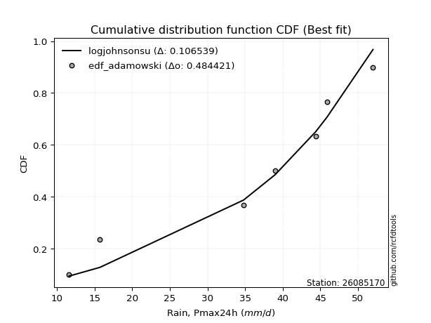</img>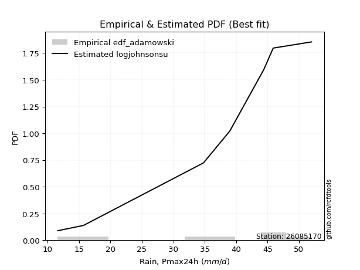</img>

</div>


## C. Best fit & Estimate extreme values for specific return periods - Tr

Best fit in probability distribution analysis means finding the theoretical distribution (like Normal, Poisson, Exponential, etc.) that most accurately mirrors your real-world data´s patterns (shape, center, spread) for better predictions, using methods like visual checks (Q-Q plots), goodness-of-fit tests (Kolmogorov-Smirnov, Chi-Squared), and information criteria (AIC) to score and select the simplest, most representative model.


### 1. Best fit (ordered by delta Δ)

:file_folder:Table: [bestfit_26085170.csv](table/bestfit_26085170.csv)

<div align="center">

|   id |   station | empirical_dist   | p_dist        |     delta |   deltao | eval   |   fit |   n |   best_fit |   best_fit_sort |
|-----:|----------:|:-----------------|:--------------|----------:|---------:|:-------|------:|----:|-----------:|----------------:|
|    0 |  26085170 | edf_hazen        | genpareto     | 0.0978141 | 0.447261 | Δo > Δ |     1 |   8 |          1 |               1 |
|    1 |  26085170 | edf_gringorten   | genpareto     | 0.100585  | 0.447261 | Δo > Δ |     1 |   8 |          1 |               2 |
|    2 |  26085170 | edf_adamowski    | wrapcauchy    | 0.100638  | 0.447261 | Δo > Δ |     1 |   8 |          1 |               3 |
|    3 |  26085170 | edf_chegodayev   | wrapcauchy    | 0.101338  | 0.447261 | Δo > Δ |     1 |   8 |          1 |               4 |
|    4 |  26085170 | edf_beard        | wrapcauchy    | 0.10148   | 0.447261 | Δo > Δ |     1 |   8 |          1 |               5 |
|    5 |  26085170 | edf_jenkinson    | wrapcauchy    | 0.10148   | 0.447261 | Δo > Δ |     1 |   8 |          1 |               6 |
|    6 |  26085170 | edf_filliben     | wrapcauchy    | 0.101587  | 0.447261 | Δo > Δ |     1 |   8 |          1 |               7 |
|    7 |  26085170 | edf_tukey        | wrapcauchy    | 0.101814  | 0.447261 | Δo > Δ |     1 |   8 |          1 |               8 |
|    8 |  26085170 | edf_cunnane      | genpareto     | 0.102387  | 0.447261 | Δo > Δ |     1 |   8 |          1 |               9 |
|    9 |  26085170 | edf_blom         | wrapcauchy    | 0.10242   | 0.447261 | Δo > Δ |     1 |   8 |          1 |              10 |
|   10 |  26085170 | edf_weibull      | wrapcauchy    | 0.111111  | 0.447261 | Δo > Δ |     1 |   8 |          1 |              11 |
|   11 |  26085170 | edf_california   | logwrapcauchy | 0.125     | 0.447261 | Δo > Δ |     1 |   8 |          1 |              12 |

</div>


### 2. Extreme values and % difference analysis

In hydrology, a return period (or recurrence interval $Tr$) is the statistical average time between extreme events like floods or droughts of a specific magnitude, indicating how rare an event is, with a 100-year flood, for example, having a 1% chance of occurring in any given year, not that it happens exactly every century. It is a key tool for infrastructure design (like bridges or dams) and risk assessment, calculated from historical data to determine the probability of future events, although it is important to remember it is statistical average, and events can cluster or be missed.

The extreme value porcentage difference is evaluated as $pdiff = 1 - (ETrBf / ETr) * 100$, where _ETrBf_ correspond to the bestfit extreme value for a specific recurrence interval and _ETr_ correspond to the extreme value for one of the most used PDFsused in hydrology.

> risk_rate: assuming the return period as the project useful life.

:file_folder:Table: [extreme_26085170.csv](table/extreme_26085170.csv), all PDFs.  
:file_folder:Table: [extremepdiff_26085170.csv](table/extremepdiff_26085170.csv), % difference between bestfit and most used PDFs in Hydrology.

<div align="center">

Extreme values table for only best fit PDFs
|   id |      tr |   prob_l |     prob_g |   alpha |   anglit |   arcsine |   argus |    beta |   betaprime |   bradford |    burr |   burr12 |   cosine |   crystalball |   dgamma |   dweibull |   erlang |   exponnorm |   exponpow |   exponweib |       f |   fatiguelife |   foldnorm |   gamma |   gausshyper |   genexpon |   genextreme |   gengamma |   genhalflogistic |   genlogistic |   gennorm |   genpareto |   gompertz |   gumbel_l |   gumbel_r |   halfgennorm |   halflogistic |   halfnorm |   hypsecant |   invgamma |   invgauss |       invweibull |   johnsonsb |   johnsonsu |   kappa3 |   kappa4 |   ksone |   kstwobign |   laplace |   levy_l |   loggamma |   logistic |   loglaplace |    lomax |   maxwell |   mielke |    moyal |   nakagami |      ncf |     nct |    norm |   pearson3 |   powerlaw |   rayleigh |    rdist |    rice |   semicircular |   skewnorm |       t |   trapezoid |   triang |   truncexpon |   truncnorm |   truncpareto |   truncweibull_min |   tukeylambda |   uniform |   vonmises |   vonmises_line |     wald |   weibull_max |   weibull_min |   wrapcauchy |   logalpha |   loganglit |   logarcsine |   logargus |   logbeta |   logbetaprime |   logbradford |   logburr |   logburr12 |   logcosine |   logcrystalball |   logdgamma |   logdweibull |   logerlang |   logexponnorm |      logexponpow |   logexponweib |     logf |   logfatiguelife |   logfoldnorm |   loggausshyper |   loggenexpon |   loggenextreme |   loggengamma |   loggenhalflogistic |   loggenlogistic |   loggennorm |   loggenpareto |   loggompertz |   loggumbel_l |   loggumbel_r |   loghalfgennorm |   loghalflogistic |   loghalfnorm |   loghypsecant |   loginvgamma |   loginvgauss |   loginvweibull |   logjohnsonsb |   logjohnsonsu |   logkappa3 |   logkappa4 |   logksone |   logkstwobign |   loglevy_l |   logloggamma |   loglogistic |   logloglaplace |   loglomax |   logmaxwell |   logmielke |   logmoyal |   lognakagami |   logncf |   lognct |   lognorm |   logpearson3 |   logpowerlaw |   lograyleigh |   logrdist |   logrice |   logsemicircular |   logskewnorm |     logt |   logtrapezoid |   logtriang |   logtruncexpon |   logtruncnorm |   logtruncpareto |   logtruncweibull_min |   logtukeylambda |   loguniform |   logvonmises |   logvonmises_line |   logwald |   logweibull_max |   logweibull_min |   logwrapcauchy |   station |   n |   risk_rate |
|-----:|--------:|---------:|-----------:|--------:|---------:|----------:|--------:|--------:|------------:|-----------:|--------:|---------:|---------:|--------------:|---------:|-----------:|---------:|------------:|-----------:|------------:|--------:|--------------:|-----------:|--------:|-------------:|-----------:|-------------:|-----------:|------------------:|--------------:|----------:|------------:|-----------:|-----------:|-----------:|--------------:|---------------:|-----------:|------------:|-----------:|-----------:|-----------------:|------------:|------------:|---------:|---------:|--------:|------------:|----------:|---------:|-----------:|-----------:|-------------:|---------:|----------:|---------:|---------:|-----------:|---------:|--------:|--------:|-----------:|-----------:|-----------:|---------:|--------:|---------------:|-----------:|--------:|------------:|---------:|-------------:|------------:|--------------:|-------------------:|--------------:|----------:|-----------:|----------------:|---------:|--------------:|--------------:|-------------:|-----------:|------------:|-------------:|-----------:|----------:|---------------:|--------------:|----------:|------------:|------------:|-----------------:|------------:|--------------:|------------:|---------------:|-----------------:|---------------:|---------:|-----------------:|--------------:|----------------:|--------------:|----------------:|--------------:|---------------------:|-----------------:|-------------:|---------------:|--------------:|--------------:|--------------:|-----------------:|------------------:|--------------:|---------------:|--------------:|--------------:|----------------:|---------------:|---------------:|------------:|------------:|-----------:|---------------:|------------:|--------------:|--------------:|----------------:|-----------:|-------------:|------------:|-----------:|--------------:|---------:|---------:|----------:|--------------:|--------------:|--------------:|-----------:|----------:|------------------:|--------------:|---------:|---------------:|------------:|----------------:|---------------:|-----------------:|----------------------:|-----------------:|-------------:|--------------:|-------------------:|----------:|-----------------:|-----------------:|----------------:|----------:|----:|------------:|
|    0 |    2    | 0.5      | 0.5        | 30.1522 |  31.55   |   31.55   | 34.502  | 35.4358 |     31.2527 |    26.827  | 32.9301 |  19.4819 |  30.9656 |       31.55   |  36.5285 |    36.1989 |  31.1603 |     31.55   |    8.44321 |     9.42784 | 31.5437 |       9.00025 |    31.6705 | 31.1213 |      25.7556 |    24.5919 |      38.3308 |    32.2727 |           36.8051 |           inf |      30.5 |     33.69   |    31.2372 |    34.156  |    28.944  |       19.0444 |        27.6484 |    28.3029 |     31.55   |    30.0892 |    29.8893 |   2032.59        |     13.0712 |     36.296  |   9      |  29.4157 | 31.55   |     28.1186 |   31.55   |  36.6277 |    25.7802 |    31.55   |      26.397  |  24.6153 |   30.1933 |  28.4938 |  28.1027 |    22.4316 |  28.7956 | 31.545  | 31.55   |    32.32   |    9.98296 |    29.7121 |  7.01837 | 30.6626 |        31.55   |    34.5407 | 31.5501 |     33.6058 |  35.1421 |      26.1607 |     31.55   |       28.7135 |            26.4409 |       30.4741 |   30.5    |    2.12323 |         30.5    |  26.4079 |       51.578  |       34.4768 |      30.5    |    25.422  |     26.397  |      26.397  |    31.2568 |   38.9743 |        26.0177 |       18.5226 |   32.6342 |     29.9777 |     25.042  |          26.397  |     39      |       39      |     25.9625 |        26.3972 |     10.4361      |        16.9478 |  26.3408 |          26.3416 |       26.4543 |         18.9276 |       22.7994 |         34.485  |       17.5027 |              28.914  |              inf |      39      |        33.9746 |       27.9054 |       29.3666 |       23.7278 |          8.99998 |           22.5032 |       23.1135 |        26.397  |       25.8603 |       25.2992 |         23.8223 |        46.0884 |        36.4768 |     21.6638 |     21.771  |    26.397  |        22.7336 |     36.2065 |       32.5031 |       26.397  |         37.5482 |    18.7184 |      24.9719 |     32.6735 |    22.925  |       20.8507 |  26.1392 |  26.4431 |   26.397  |       28.0585 |       9.52543 |       24.4852 |    21.6333 |   25.6455 |           26.397  |       27.6139 |  26.3971 |        29.5058 |     27.4226 |         17.7114 |        25.1898 |          9.0635  |               19.2598 |          21.6333 |      21.6333 |     0.0508064 |            21.2868 |   21.3897 |          38.7939 |          29.8494 |         21.6333 |  26085170 |   8 |    0.75     |
|    1 |    2.33 | 0.570815 | 0.429185   | 33.0832 |  34.8473 |   36.4998 | 37.177  | 41.4063 |     34.1367 |    29.8866 | 36.0157 |  22.9128 |  33.7701 |       34.3807 |  40.0625 |    40.0725 |  34.0303 |     34.3807 |   18.3095  |     9.84347 | 34.3857 |       9.65335 |    34.4133 | 33.9817 |      28.9656 |    28.0272 |      41.2867 |    35.0585 |           39.9545 |           inf |      30.5 |     37.4739 |    34.1016 |    36.6188 |    31.567  |       22.9798 |        30.3452 |    31.358  |     33.8154 |    33.0784 |    32.9153 | 136323           |     26.8955 |     38.8042 |   9      |  32.6023 | 35.4413 |     31.1995 |   33.263  |  41.2633 |    29.0277 |    34.0441 |      28.3132 |  28.0605 |   33.1342 |  31.6364 |  30.5857 |    26.0956 |  31.9083 | 34.3762 | 34.3807 |    35.1145 |   11.0235  |    32.6966 |  8.56574 | 33.5694 |        35.0864 |    37.3269 | 34.3808 |     36.8642 |  37.9289 |      29.1373 |     34.3807 |       31.7665 |            29.4062 |       33.6092 |   33.5451 |    2.35138 |         33.5449 |  28.2641 |       51.7949 |       37.0216 |      37.4488 |    28.7029 |     30.2089 |      32.3217 |    34.1151 |   45.8244 |        29.3246 |       20.9834 |   35.7627 |     32.9097 |     28.1225 |          29.6378 |     41.0383 |       41.3742 |     29.2504 |        29.638  |     12.1631      |        19.5517 |  29.5881 |          29.5766 |       29.6106 |         21.6532 |       26.1614 |         38.0201 |       20.2569 |              32.4198 |              inf |      40.4462 |        40.0765 |       31.0189 |       32.4794 |       26.4154 |          8.99998 |           25.1278 |       26.1905 |        28.9603 |       29.1231 |       28.5771 |         27.3156 |        49.9073 |        39.4389 |     24.5959 |     24.8493 |    30.952  |        26.0268 |     40.387  |       35.558  |       29.2325 |         40.7601 |    21.9958 |      28.1644 |     35.8012 |    25.376  |       24.1963 |  29.422  |  29.6762 |   29.6378 |       31.3851 |      10.0396  |       27.6647 |    25.9234 |   28.9231 |           30.5059 |       30.5488 |  29.6379 |        33.713  |     30.4821 |         19.9594 |        27.6875 |          9.11375 |               21.7154 |          24.6024 |      24.4944 |     0.05678   |            24.1573 |   23.077  |          42.3571 |          32.836  |         30.1787 |  26085170 |   8 |    0.729209 |
|    2 |    5    | 0.8      | 0.2        | 44.6398 |  46.4809 |   49.699  | 45.219  | 51.1477 |     45.0142 |    40.879  | 45.1792 |  50.0418 |  43.8764 |       44.9005 |  50.0714 |    50.2851 |  44.8892 |     44.9005 |   47.3991  |    17.6157  | 44.9632 |      23.5218  |    44.6063 | 44.8016 |      40.8115 |    45.2032 |      48.2829 |    44.9974 |           47.789  |           inf |      30.5 |     47.4347 |    44.5415 |    44.575  |    42.9625 |       52.6241 |        42.548  |    44.2776 |     42.9026 |    44.9095 |    45.219  |      1.19679e+13 |     51.9519 |     45.9875 |  43.4735 |  43.0581 | 48.0352 |     44.2865 |   41.8278 |  48.9433 |    45.4742 |    43.674  |      40.1931 |  45.3115 |   44.7096 |  45.7263 |  42.0871 |    43.1488 |  45.3467 | 44.8989 | 44.9005 |    45.0752 |   21.7411  |    44.6446 | 13.1856  | 44.7801 |        47.1547 |    45.4421 | 44.9006 |     46.2125 |  45.924  |      40.1123 |     44.9005 |       42.1746 |            40.2889 |       43.6722 |   43.4    |    3.24552 |         43.3997 |  38.6548 |       51.9911 |       45.2427 |      48.0681 |    45.8251 |     48.6204 |      55.462  |    43.4967 |   51.9161 |        46.1293 |       32.905  |   45.1588 |     44.4916 |     42.7189 |          45.5765 |     61.4532 |       61.5956 |     45.958  |        45.5765 |    103.72        |        39.8158 |  45.5899 |          45.5114 |       45.0157 |         34.5165 |       46.0498 |         47.2236 |       34.7168 |              43.5616 |              inf |      56.6814 |        50.8507 |       44.4568 |       44.9736 |       42.1027 |          8.99998 |           41.3945 |       44.4304 |        41.9997 |       45.9075 |       45.9649 |         49.4988 |        51.9666 |        47.0359 |     37.0918 |     37.7675 |    51.8121 |        46.2368 |     48.4019 |       44.7048 |       43.3463 |         61.4414 |    49.2819 |      45.2219 |     45.193  |    40.6218 |       45.526  |  45.9147 |  45.5117 |   45.5765 |       46.0353 |      16.0935  |       45.1019 |    42.8388 |   45.6616 |           49.9791 |       40.9974 |  45.5766 |        49.4174 |     41.2892 |         31.2971 |        42.7499 |         10.1025  |               33.315  |          37.1416 |      36.6143 |     0.0864581 |            36.3788 |   35.3001 |          49.7829 |          44.6832 |         45.5396 |  26085170 |   8 |    0.67232  |
|    3 |   10    | 0.9      | 0.1        | 52.9393 |  53.0656 |   52.8855 | 48.811  | 51.9211 |     52.37   |    46.2477 | 48.8755 | inf      |  49.9823 |       51.8791 |  57.8205 |    57.3372 |  52.2619 |     51.8791 |   61.6678  |    43.6563  | 51.9936 |      42.6705  |    51.368  | 52.1453 |      46.6163 |    60.795  |      50.4305 |    51.2527 |           50.2408 |           inf |      30.5 |     50.4035 |    50.9958 |    49.0046 |    52.2439 |       95.5217 |        52.6818 |    53.8378 |     50.159  |    53.4369 |    54.3625 |      3.53071e+19 |     51.9996 |     49.3301 |  47.7827 |  47.6249 | 53.5302 |     54.2505 |   49.6026 |  50.7974 |    61.6773 |    50.7662 |      55.2433 |  61.0084 |   52.8557 |  57.7457 |  52.101  |    56.5264 |  56.1085 | 51.8802 | 51.8791 |    51.3197 |   33.2126  |    53.1638 | 14.7603  | 52.451  |        53.3471 |    48.7472 | 51.8791 |     49.864  |  49.0469 |      45.7225 |     51.8791 |       46.9936 |            45.825  |       47.9547 |   47.7    |    3.91614 |         47.6998 |  49.6818 |       51.9993 |       49.8198 |      50.202  |    63.4704 |     63.6507 |      63.1839 |    48.0906 |   51.9985 |        62.7657 |       41.0283 |   48.9885 |     52.6271 |     54.9941 |          60.6349 |     93.4321 |       93.039  |     62.4953 |        60.6347 |   8301.6         |        75.3889 |  60.747  |          60.6008 |       59.4351 |         42.675  |       69.5034 |         50.1165 |       46.0784 |              48.0802 |              inf |      91.5534 |        51.8751 |       54.8016 |       53.9082 |       61.5466 |          8.99998 |           62.6579 |       65.695  |        56.515  |       62.848  |       64.2925 |         80.3305 |        51.9979 |        49.8335 |     44.3738 |     44.8335 |    64.8719 |        71.6146 |     50.5642 |       48.4222 |       57.9363 |         89.1764 |   102.501  |      63.1063 |     49.0202 |    61.1878 |       72.7716 |  61.9743 |  60.386  |   60.6349 |       57.7189 |      25.4932  |       63.9069 |    49.1357 |   62.1626 |           64.3878 |       46.216  |  60.635  |        57.3788 |     46.4852 |         39.6509 |        60.7447 |         13.36    |               41.1856 |          44.2069 |      43.6342 |     0.116137  |            43.4938 |   55.4211 |          51.3623 |          53.0439 |         48.9602 |  26085170 |   8 |    0.651322 |
|    4 |   15    | 0.933333 | 0.0666667  | 57.2888 |  55.8775 |   53.4932 | 50.1296 | 51.9805 |     56.0828 |    48.1212 | 50.0746 | inf      |  52.7637 |       55.3615 |  62.153  |    61.052  |  55.9918 |     55.3615 |   67.6782  |    75.7565  | 55.5061 |      55.1942  |    54.7423 | 55.8598 |      48.6005 |    69.9157 |      51.035  |    54.2798 |           50.9265 |           inf |      30.5 |     51.1366 |    54.0368 |    51.0107 |    57.4804 |      128.53   |        58.4167 |    58.813  |     54.3002 |    57.9118 |    59.2368 |      1.57795e+23 |     52      |     50.6796 |  49.2191 |  49.1325 | 55.3619 |     59.5403 |   54.1506 |  51.3575 |    71.9594 |    54.6303 |      66.5394 |  70.2069 |   57.0353 |  64.7507 |  57.9125 |    63.5831 |  62.1108 | 55.3644 | 55.3615 |    54.3295 |   38.5214  |    57.5533 | 15.1747  | 56.3246 |        55.7619 |    49.8347 | 55.3616 |     51.0356 |  50.0489 |      47.7332 |     55.3615 |       48.6409 |            47.8051 |       49.3489 |   49.1333 |    4.25878 |         49.1332 |  56.7628 |       51.9998 |       51.8927 |      50.8199 |    75.0379 |     71.4099 |      64.7745 |    49.8436 |   51.9999 |        73.3583 |       44.3178 |   50.2354 |     56.7862 |     61.6998 |          69.9184 |    120.463  |      119.974  |     73.0223 |        69.9181 | 334282           |       109.162  |  70.1072 |          69.9187 |       68.2754 |         45.7596 |       86.0663 |         50.8957 |       51.663  |              49.4929 |              inf |     130.022  |        51.9661 |       60.3366 |       58.5188 |       76.2494 |         46.3076  |           79.2244 |       80.5235 |        66.9477 |       73.791  |       76.4903 |        105.566  |        51.9995 |        50.7855 |     47.1059 |     47.3143 |    69.9195 |        90.3391 |     51.2362 |       49.6313 |       67.8579 |        110.889  |   157.317  |      74.8737 |     50.2662 |    77.6093 |       92.9053 |  72.0823 |  69.5199 |   69.9184 |       64.0997 |      31.3051  |       76.4771 |    50.5972 |   72.5898 |           71.0732 |       48.0743 |  69.9185 |        60.1958 |     48.2871 |         43.2153 |        73.522  |         16.8537  |               44.3988 |          46.7698 |      46.2615 |     0.135789  |            46.1623 |   74.0412 |          51.6861 |          57.3285 |         49.9864 |  26085170 |   8 |    0.644736 |
|    5 |   20    | 0.95     | 0.05       | 60.2167 |  57.5315 |   53.7073 | 50.8427 | 51.9927 |     58.5294 |    49.0743 | 50.6684 | inf      |  54.4741 |       57.6421 |  65.1706 |    63.5607 |  58.4529 |     57.6421 |   71.2808  |   110.214   | 57.8078 |      64.4664  |    56.952  | 58.3105 |      49.5914 |    76.3868 |      51.3136 |    56.2293 |           51.2405 |           inf |      30.5 |     51.4417 |    55.9616 |    52.2594 |    61.1469 |      155.785  |        62.4347 |    62.1299 |     57.2216 |    60.9256 |    62.5452 |      5.67403e+25 |     52      |     51.4667 |  49.9373 |  49.8802 | 56.2777 |     63.1036 |   57.3775 |  51.6444 |    79.6654 |    57.301  |      75.929  |  76.7407 |   59.8092 |  69.7542 |  62.0284 |    68.3052 |  66.2904 | 57.6462 | 57.6421 |    56.2626 |   41.5116  |    60.4709 | 15.3528  | 58.8743 |        57.1014 |    50.3768 | 57.6422 |     51.6135 |  50.5432 |      48.768  |     57.6421 |       49.4725 |            48.8234 |       50.0355 |   49.85   |    4.46887 |         49.8499 |  62.0396 |       51.9999 |       53.183  |      51.1197 |    83.8856 |     76.409  |      65.3441 |    50.8068 |   52      |        81.3134 |       46.0922 |   50.8538 |     59.5397 |     66.2237 |          76.7553 |    144.637  |      144.348  |     80.9266 |        76.7548 |      7.53287e+06 |       141.755  |  77.0073 |          76.7877 |       74.7656 |         47.3523 |       99.2509 |         51.2417 |       55.2226 |              50.1729 |              inf |     171.975  |        51.9865 |       64.0854 |       61.5856 |       88.588  |         47.6822  |           93.3773 |       92.226  |        75.4462 |       82.0846 |       85.9046 |        127.818  |        51.9998 |        51.2888 |     48.5345 |     48.556  |    72.5888 |       105.64   |     51.5838 |       50.2306 |       75.6919 |        129.431  |   213.195  |      83.8707 |     50.8841 |    91.8408 |      109.34   |  79.6198 |  76.2308 |   76.7553 |       68.4628 |      35.0904  |       86.1717 |    51.1601 |   80.3752 |           75.0762 |       49.0285 |  76.7554 |        61.636  |     49.2016 |         45.1858 |        83.7235 |         20.0316  |               46.1413 |          48.0814 |      47.6338 |     0.151138  |            47.5573 |   91.8794 |          51.8091 |          60.1685 |         50.491  |  26085170 |   8 |    0.641514 |
|    6 |   25    | 0.96     | 0.04       | 62.4139 |  58.6525 |   53.8066 | 51.2985 | 51.9966 |     60.3382 |    49.6514 | 51.0229 | inf      |  55.6736 |       59.3209 |  67.4859 |    65.4464 |  60.2739 |     59.3209 |   73.7807  |   145.621   | 59.5029 |      71.8335  |    58.5786 | 60.1236 |      50.1826 |    81.4063 |      51.472  |    57.6483 |           51.4183 |           inf |      30.5 |     51.6019 |    57.3451 |    53.148  |    63.971  |      179.231  |        65.5304 |    64.5979 |     59.4825 |    63.1875 |    65.0407 |      5.2787e+27  |     52      |     52.0018 |  50.3682 |  50.3258 | 56.8272 |     65.7727 |   59.8804 |  51.8244 |    85.8936 |    59.3441 |      84.1153 |  81.8129 |   61.8686 |  73.6646 |  65.2186 |    71.8238 |  69.4999 | 59.3259 | 59.3209 |    57.6666 |   43.4213  |    62.6385 | 15.4483  | 60.7571 |        57.9703 |    50.7018 | 59.321  |     51.9579 |  50.8377 |      49.3988 |     59.3209 |       49.974  |            49.4438 |       50.4429 |   50.28   |    4.60941 |         50.2799 |  66.2661 |       52      |       54.1011 |      51.2975 |    91.1444 |     79.9944 |      65.6101 |    51.4283 |   52      |        87.7527 |       47.2014 |   51.2235 |     61.5801 |     69.5925 |          82.2118 |    166.875  |      166.999  |     87.3237 |        82.2112 |      1.10829e+08 |       173.471  |  82.5182 |          82.2739 |       79.9343 |         48.3169 |      110.361  |         51.4327 |       57.7861 |              50.57   |              inf |     217.392  |        51.9934 |       66.9049 |       63.8654 |       99.4372 |         48.5264  |          105.983  |      102.023  |        82.7571 |       88.8435 |       93.6782 |        148.108  |        51.9999 |        51.6082 |     49.4123 |     49.2948 |    74.239  |       118.775  |     51.8032 |       50.5886 |       82.2901 |        145.923  |   269.878  |      91.2424 |     51.2538 |   104.644  |      123.428  |  85.6899 |  81.5776 |   82.2118 |       71.7627 |      37.7248  |       94.1621 |    51.437  |   86.648  |           77.7928 |       49.6094 |  82.2119 |        62.5104 |     49.7547 |         46.4352 |        92.3382 |         22.8029  |               47.2343 |          48.8748 |      48.4767 |     0.164024  |            48.4145 |  109.221  |          51.8699 |          62.2747 |         50.7924 |  26085170 |   8 |    0.639603 |
|    7 |   50    | 0.98     | 0.02       | 68.9101 |  61.4118 |   53.9392 | 52.3205 | 51.9997 |     65.5542 |    50.8176 | 51.7285 | inf      |  58.8145 |       64.1283 |  74.5692 |    71.0306 |  65.5325 |     64.1284 |   80.3069  |   322.349   | 64.3605 |      95.4706  |    63.2367 | 65.3589 |      51.3459 |    96.9981 |      51.7647 |    61.6375 |           51.7442 |           inf |      30.5 |     51.8608 |    61.1527 |    55.56   |    72.6709 |      265.716  |        75.0686 |    71.7713 |     66.4923 |    69.8753 |    72.4747 |      6.12296e+33 |     52      |     53.3496 |  51.2301 |  51.207  | 57.9263 |     73.6104 |   67.6553 |  52.2298 |   106.749  |    65.5865 |     115.612  |  97.5919 |   67.841  |  86.0265 |  75.1223 |    82.0629 |  79.3541 | 64.1363 | 64.1283 |    61.5984 |   47.516   |    68.931  | 15.6074  | 66.1725 |        59.9553 |    51.3511 | 64.1284 |     52.6412 |  51.4222 |      50.6834 |     64.1283 |       50.983  |            50.7066 |       51.2432 |   51.14   |    4.92231 |         51.14   |  80.0659 |       52      |       56.5935 |      51.6499 |   116.12   |     89.5532 |      65.967  |    52.8381 |   52      |       109.373  |       49.526  |   51.9694 |     67.4788 |     79.2485 |         100.079  |    261.52   |      265.584  |    108.795  |       100.078  |      1.97703e+12 |       323.541  | 100.585  |         100.261  |       96.7982 |         50.2388 |      150.297  |         51.7686 |       64.8506 |              51.3311 |              inf |     495.846  |        51.9993 |       75.2458 |       70.4886 |      141.942  |         50.26    |          156.563  |      136.819  |       110.241  |      111.818  |      120.729  |        233.178  |        52      |        52.3277 |     51.2164 |     50.7346 |    77.6528 |       167.568  |     52.3006 |       51.301  |      106.231  |        211.793  |   561.338  |     116.494  |     52.0022 |   156.915  |      175.556  | 105.885  |  99.0337 |  100.079  |       81.5914 |      44.0056  |      121.806  |    51.8384 |  107.519  |           84.3734 |       50.791  | 100.079  |        64.2824 |     50.8707 |         49.0992 |       123.426  |         31.9772  |               49.5347 |          50.465  |      50.2074 |     0.211249  |            50.1755 |  192.073  |          51.9601 |          68.3713 |         51.3948 |  26085170 |   8 |    0.63583  |
|    8 |   75    | 0.986667 | 0.0133333  | 72.5264 |  62.6261 |   53.9638 | 52.7215 | 51.9999 |     68.3753 |    51.21   | 51.9648 | inf      |  60.3145 |       66.7078 |  78.6535 |    74.1392 |  68.3809 |     66.7079 |   83.4662  |   489.931   | 66.9691 |     109.706   |    65.7361 | 68.1943 |      51.7225 |   106.119  |      51.8529 |    63.734  |           51.8413 |           inf |      30.5 |     51.9247 |    63.1045 |    56.7798 |    77.7276 |      326.518  |        80.6132 |    75.6762 |     70.5888 |    73.5972 |    76.6435 |      2.05041e+37 |     52      |     53.9727 |  51.5174 |  51.4959 | 58.2926 |     77.9226 |   72.2032 |  52.3963 |   120.088  |    69.1918 |     139.252  | 106.839  |   71.0882 |  93.4362 |  80.9138 |    87.6374 |  85.0754 | 66.7176 | 66.7078 |    63.6543 |   48.9661  |    72.3543 | 15.6485  | 69.0908 |        60.7483 |    51.5674 | 66.7079 |     52.8674 |  51.6156 |      51.1186 |     66.7078 |       51.3211 |            51.1342 |       51.5035 |   51.4267 |    5.0344  |         51.4266 |  88.5577 |       52      |       57.8539 |      51.7667 |   132.61   |     94.1143 |      66.0334 |    53.3975 |   52      |       123.245  |       50.3338 |   52.2353 |     70.6739 |     84.3216 |         111.217  |    341.053  |      350.793  |    122.565  |       111.216  |      1.55628e+15 |       464.724  | 111.864  |         111.491  |      107.269  |         50.8638 |      177.878  |         51.8627 |       68.4775 |              51.5707 |              inf |     859.313  |        51.9998 |       79.8759 |       74.095  |      174.561  |         50.8516  |          196.423  |      160.518  |       130.353  |      126.774  |      138.816  |        303.567  |        52      |        52.618  |     51.8359 |     51.1922 |    78.8253 |       202.5    |     52.5063 |       51.5374 |      123.112  |        263.361  |   861.547  |     133.043  |     52.2719 |   198.864  |      212.67   | 118.705  | 109.878  |  111.217  |       87.0727 |      46.455   |      140.116  |    51.9223 |  120.759  |           87.1553 |       51.1909 | 111.217  |        64.8801 |     51.2456 |         50.0397 |       144.994  |         36.8758  |               50.3373 |          50.9906 |      50.798  |     0.245783  |            50.7766 |  271.848  |          51.9799 |          71.678  |         51.596  |  26085170 |   8 |    0.634587 |
|    9 |  100    | 0.99     | 0.01       | 75.0264 |  63.3482 |   53.9724 | 52.9442 | 52      |     70.2921 |    51.4068 | 52.0861 | inf      |  61.2546 |       68.4525 |  81.5304 |    76.2858 |  70.3182 |     68.4526 |   85.4831  |   647.415   | 68.7342 |     119.949   |    67.4266 | 70.1226 |      51.907  |   112.59   |      51.8945 |    65.135  |           51.8868 |           inf |      30.5 |     51.9513 |    64.3899 |    57.5776 |    81.3065 |      374.526  |        84.5376 |    78.3363 |     73.4946 |    76.1694 |    79.5359 |      6.40644e+39 |     52      |     54.3591 |  51.661  |  51.6389 | 58.4758 |     80.8772 |   75.4301 |  52.4937 |   130.1    |    71.7373 |     158.903  | 113.406  |   73.2999 |  98.7829 |  85.0227 |    91.4335 |  89.1288 | 68.4635 | 68.4525 |    65.0238 |   49.7076  |    74.6865 | 15.666   | 71.0691 |        61.1924 |    51.6756 | 68.4526 |     52.9803 |  51.7121 |      51.3376 |     68.4525 |       51.4905 |            51.3494 |       51.6318 |   51.57   |    5.09144 |         51.57   |  94.749  |       52      |       58.6783 |      51.8251 |   145.238  |     96.9359 |      66.0567 |    53.7098 |   52      |       133.678  |       50.7441 |   52.3822 |     72.8452 |     87.6655 |         119.445  |    412.151  |      428.527  |    132.917  |       119.444  |      2.61007e+17 |       600.251  | 120.202  |         119.794  |      114.986  |         51.169  |      199.543  |         51.9051 |       70.8699 |              51.6866 |              inf |    1308.28   |        51.9999 |       83.0656 |       76.5532 |      202.084  |         51.1499  |          230.627  |      178.972  |       146.806  |      138.126  |      152.776  |        365.883  |        52      |        52.7843 |     52.155  |     51.4132 |    79.4181 |       230.552  |     52.627  |       51.6554 |      136.623  |        307.397  |  1167.58   |     145.642  |     52.4224 |   235.263  |      242.351  | 128.284  | 117.873  |  119.445  |       90.8517 |      47.7565  |      154.142  |    51.9538 |  130.642  |           88.753  |       51.392  | 119.445  |        65.1802 |     51.4337 |         50.5204 |       161.988  |         39.8706  |               50.7457 |          51.2509 |      51.0959 |     0.274612  |            51.0799 |  350.202  |          51.9877 |          73.9269 |         51.6968 |  26085170 |   8 |    0.633968 |
|   10 |  200    | 0.995    | 0.005      | 80.8663 |  64.7125 |   53.9807 | 53.3295 | 52      |     74.6668 |    51.7029 | 52.2879 | inf      |  63.1662 |       72.41   |  88.4041 |    81.2857 |  74.7446 |     72.4101 |   89.7354  |  1200.2     | 72.7408 |     145.021   |    71.2611 | 74.528  |      52.1758 |   128.182  |      51.9526 |    68.2636 |           51.9498 |           inf |      30.5 |     51.983  |    67.2055 |    59.3118 |    89.9106 |      507.816  |        93.9722 |    84.4204 |     80.495  |    82.1733 |    86.3186 |      6.37246e+45 |     52      |     55.1418 |  51.8765 |  51.8503 | 58.7505 |     87.6823 |   83.2049 |  52.6782 |   156.221  |    77.8434 |     218.403  | 129.257  |   78.36   | 111.993  |  94.9222 |   100.108  |  98.9097 | 72.424  | 72.41   |    68.0677 |   50.841   |    80.0229 | 15.6875  | 75.5682 |        61.9665 |    51.8378 | 72.4101 |     53.1491 |  51.8566 |      51.6678 |     72.41   |       51.745  |            51.6737 |       51.8206 |   51.785  |    5.17786 |         51.785  | 110.171  |       52      |       60.4701 |      51.9126 |   179.156  |    102.499  |      66.0791 |    54.2527 |   52      |       160.974  |       51.3677 |   52.6568 |     77.798  |     94.8792 |         140.435  |    652.14   |      699.945  |    159.989  |       140.433  |      2.05e+23    |      1108.45   | 141.5    |         141.005  |      134.611  |         51.6103 |      259.676  |         51.961  |       76.1296 |              51.853  |              inf |    3992.87   |        52      |       90.4671 |       82.1811 |      287.338  |         51.6008  |          339.252  |      229.55   |       195.486  |      168.222  |      190.671  |        573.168  |        52      |        53.0879 |     52.681  |     51.7293 |    80.3158 |       310.842  |     52.8563 |       51.8322 |      175.39   |        446.157  |  2428.61   |     179.137  |     52.7069 |   352.719  |      326.744  | 153.11   | 138.208  |  140.435  |       99.6065 |      49.8121  |      191.746  |    51.9868 |  156.213  |           91.6088 |       51.6951 | 140.435  |        65.6321 |     51.7164 |         51.2549 |       209.364  |         45.2505  |               51.3673 |          51.6351 |      51.5459 |     0.365292  |            51.5381 |  658.105  |          51.9962 |          79.0614 |         51.8482 |  26085170 |   8 |    0.633042 |
|   11 |  250    | 0.996    | 0.004      | 82.6995 |  65.0597 |   53.9817 | 53.4194 | 52      |     76.011  |    51.7623 | 52.3365 | inf      |  63.6902 |       73.6194 |  90.6021 |    82.8494 |  76.1061 |     73.6195 |   90.9531  |  1443.04    | 73.9659 |     153.193   |    72.433  | 75.883  |      52.2278 |   133.201  |      51.9633 |    69.2062 |           51.9613 |           inf |      30.5 |     51.9879 |    68.0392 |    59.822  |    92.6767 |      556.29   |        97.0053 |    86.2921 |     82.7486 |    84.0563 |    88.4537 |      5.40103e+47 |     52      |     55.3574 |  51.9196 |  51.892  | 58.8055 |     89.7883 |   85.7079 |  52.7262 |   165.265  |    79.8037 |     241.951  | 134.367  |   79.9177 | 116.35   |  98.1091 |   102.774  | 102.07   | 73.6343 | 73.6194 |    68.9807 |   51.0707  |    81.6656 | 15.691   | 76.946  |        62.1482 |    51.8702 | 73.6195 |     53.1829 |  51.8854 |      51.734  |     73.6194 |       51.796  |            51.7388 |       51.8577 |   51.828  |    5.19522 |         51.828  | 115.273  |       52      |       60.9974 |      51.9301 |   191.215  |    103.966  |      66.0818 |    54.3798 |   52      |       170.45   |       51.4936 |   52.7307 |     79.3184 |     96.9584 |         147.558  |    756.464  |      821.62   |    169.382  |       147.556  |      2.28949e+25 |      1349.22   | 148.734  |         148.211  |      141.252  |         51.6949 |      281.637  |         51.9707 |       77.694  |              51.8848 |              inf |    5898.86   |        52      |       92.7733 |       83.9144 |      321.762  |         51.6914  |          384.067  |      247.817  |       214.364  |      178.798  |      204.27   |        662.144  |        52      |        53.1636 |     52.8062 |     51.7891 |    80.4965 |       340.959  |     52.9162 |       51.8675 |      190.035  |        503.005  |  3074.37   |     190.923  |     52.7843 |   401.835  |      358.2    | 161.655  | 145.09   |  147.558  |      102.325  |      50.2387  |      205.074  |    51.9912 |  164.997  |           92.2919 |       51.756  | 147.558  |        65.7227 |     51.7731 |         51.4038 |       226.738  |         46.4781  |               51.493  |          51.7106 |      51.6364 |     0.403038  |            51.6303 |  810.839  |          51.9974 |          80.6389 |         51.8785 |  26085170 |   8 |    0.632858 |
|   12 |  500    | 0.998    | 0.002      | 88.2754 |  65.9205 |   53.983  | 53.6255 | 52      |     80.0177 |    51.8811 | 52.4621 | inf      |  65.0847 |       77.2058 |  97.3918 |    87.5837 |  80.1684 |     77.206  |   94.3619  |  2461.74    | 77.6008 |     178.826   |    75.908  | 79.9252 |      52.3289 |   148.793  |      51.9835 |    71.9657 |           51.9828 |           inf |      30.5 |     51.9958 |    70.4414 |    61.2846 |   101.262  |      725.258  |       106.419  |    91.8728 |     89.7485 |    89.778  |    94.9603 |      5.21339e+53 |     52      |     55.9385 |  52.0058 |  51.9742 | 58.9154 |     96.0996 |   93.4827 |  52.8502 |   195.481  |    85.8833 |     332.549  | 150.264  |   84.5658 | 130.219  | 108.008  |   110.715  | 111.947  | 77.2238 | 77.2058 |    71.6413 |   51.5333  |    86.5668 | 15.6967  | 81.0394 |        62.5663 |    51.9351 | 77.206  |     53.2503 |  51.9431 |      51.8669 |     77.2058 |       51.8979 |            51.8692 |       51.9306 |   51.914  |    5.23    |         51.914  | 131.496  |       52      |       62.5087 |      51.965  |   232.619  |    107.692  |      66.0854 |    54.6719 |   52      |       202.192  |       51.7466 |   52.9368 |     83.8439 |    102.716  |         170.875  |   1201.49   |     1360.6    |    200.83   |       170.873  |      1.40141e+32 |      2478.31   | 172.442  |         171.83   |      162.935  |         51.8574 |      358.923  |         51.9879 |       82.2267 |              51.9459 |              inf |   21839      |        52      |       99.7289 |       89.0887 |      457.155  |         51.8732  |          564.488  |      311.372  |       285.438  |      214.669  |      251.403  |       1036.26   |        52      |        53.3507 |     53.1255 |     51.9032 |    80.8592 |       449.839  |     53.071  |       51.9381 |      243.693  |        730.063  |  6394.91   |     230.906  |     53.0014 |   602.446  |      471.126  | 190.034  | 167.561  |  170.875  |      110.478  |      51.1083  |      250.603  |    51.9975 |  194.098  |           93.8843 |       51.8779 | 170.875  |        65.9042 |     51.8865 |         51.7035 |       288.145  |         49.1094  |               51.7456 |          51.859  |      51.8179 |     0.554775  |            51.8151 | 1574.48   |          51.9992 |          85.3378 |         51.9392 |  26085170 |   8 |    0.632489 |
|   13 |  750    | 0.998667 | 0.00133333 | 91.4665 |  66.3017 |   53.9833 | 53.7081 | 52      |     82.2567 |    51.9207 | 52.5249 | inf      |  65.7605 |       79.1982 | 101.341  |    90.2755 |  82.4409 |     79.1983 |   96.1351  |  3285.81    | 79.6214 |     193.971   |    77.8384 | 82.1864 |      52.3613 |   157.914  |      51.9896 |    73.4759 |           51.9893 |           inf |      30.5 |     51.9977 |    71.7322 |    62.0664 |   106.281  |      837.641  |       111.923  |    94.9904 |     93.8431 |    93.048  |    98.6893 |      1.64337e+57 |     52      |     56.2272 |  52.0349 |  52.0011 | 58.952  |     99.6451 |   98.0307 |  52.909  |   214.734  |    89.4352 |     400.548  | 159.58   |   87.1655 | 138.578  | 113.799  |   115.145  | 117.778  | 79.2179 | 79.1982 |    73.0893 |   51.6884  |    89.3075 | 15.6982  | 83.3176 |        62.7346 |    51.9568 | 79.1983 |     53.2727 |  51.9623 |      51.9112 |     79.1982 |       51.932  |            51.9128 |       51.9543 |   51.9427 |    5.24161 |         51.9427 | 141.222  |       52      |       63.3165 |      51.9767 |   259.861  |    109.384  |      66.0861 |    54.7894 |   52      |       222.48   |       51.8312 |   53.0472 |     86.3677 |    105.628  |         185.385  |   1576.53   |     1835.39   |    220.915  |       185.382  |      2.47239e+36 |      3531.08   | 187.213  |         186.548  |      176.387  |         51.9087 |      411.11   |         51.9928 |       84.6811 |              51.9653 |              inf |   50271.1    |        52      |      103.666  |       91.9836 |      561.347  |         51.9339  |          707.014  |      353.728  |       337.488  |      237.936  |      282.744  |       1346.43   |        52      |        53.4342 |     53.2835 |     51.9388 |    80.9805 |       525.617  |     53.1447 |       51.9617 |      281.803  |        907.822  |  9815.26   |     256.816  |     53.1184 |   763.477  |      549.058  | 207.99   | 181.501  |  185.385  |      115.052  |      51.403   |      280.335  |    51.9988 |  212.453  |           94.5329 |       51.9185 | 185.385  |        65.9647 |     51.9243 |         51.804  |       329.823  |         50.0426  |               51.8302 |          51.9073 |      51.8785 |     0.665107  |            51.8768 | 2343.9    |          51.9996 |          87.9603 |         51.9595 |  26085170 |   8 |    0.632366 |
|   14 | 1000    | 0.999    | 0.001      | 93.704  |  66.5288 |   53.9833 | 53.7545 | 52      |     83.8037 |    51.9405 | 52.5668 | inf      |  66.1868 |       80.5699 | 104.134  |    92.1542 |  84.0122 |     80.57   |   97.31    |  3995.36    | 81.013  |     204.774   |    79.1676 | 83.7496 |      52.3771 |   164.385  |      51.9926 |    74.5064 |           51.9924 |           inf |      30.5 |     51.9985 |    72.6035 |    62.5925 |   109.841  |      923.741  |       115.827  |    97.1435 |     96.7483 |    95.3384 |   101.305  |      4.98239e+59 |     52      |     56.413  |  52.0499 |  52.0144 | 58.9703 |    102.101  |  101.258  |  52.946  |   229.143  |    91.954  |     457.071  | 166.197  |   88.9622 | 144.623  | 117.908  |   118.203  | 121.945  | 80.5909 | 80.5699 |    74.0738 |   51.7661  |    91.2015 | 15.6988  | 84.8879 |        62.8292 |    51.9676 | 80.57   |     53.284  |  51.9719 |      51.9334 |     80.5699 |       51.949  |            51.9346 |       51.9661 |   51.957  |    5.24741 |         51.957  | 148.219  |       52      |       63.8601 |      51.9825 |   280.673  |    110.406  |      66.0863 |    54.8553 |   52      |       237.695  |       51.8737 |   53.123  |     88.1089 |    107.507  |         196.085  |   1912.43   |     2273.7    |    235.97   |       196.082  |      3.31468e+39 |      4536.24   | 198.113  |         197.411  |      186.29   |         51.9335 |      451.569  |         51.995  |       86.3467 |              51.9746 |              inf |   93648.4    |        52      |      106.405  |       93.9848 |      649.355  |         51.9643  |          829.434  |      386.297  |       380.077  |      255.548  |      306.842  |       1621.23   |        52      |        53.4846 |     53.3882 |     51.9559 |    81.0412 |       585.478  |     53.191  |       51.9734 |      312.39   |       1059.62   | 13302.1    |     276.404  |     53.1988 |   903.21   |      610.28   | 221.371  | 191.762  |  196.085  |      118.213  |      51.5513  |      302.919  |    51.9993 |  226.1    |           94.8993 |       51.9389 | 196.085  |        65.995  |     51.9432 |         51.8544 |       362.242  |         50.5204  |               51.8726 |          51.9312 |      51.9089 |     0.746541  |            51.9077 | 3120.6    |          51.9997 |          89.7707 |         51.9696 |  26085170 |   8 |    0.632305 |


</div>


<div align="center">

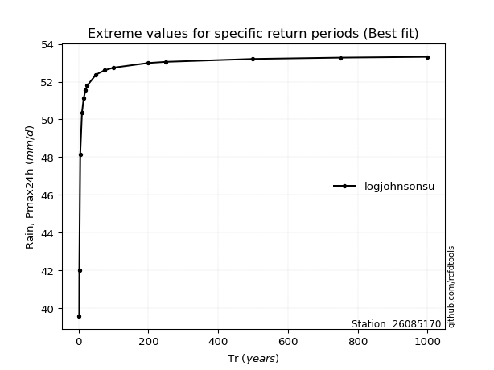</img>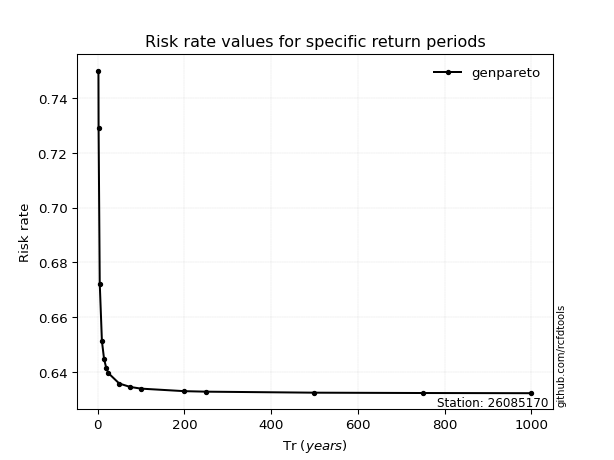</img>

</div>


<sub>**APP DISCLAIMER**: NO WARRANTY - This software is provided by [github.com/rcfdtools](https://github.com/rcfdtools) "as is", without any express or implied warranty, including warranties of merchantability, fitness for a particular purpose, or non-infringement. There is no guarantee that the software will be error-free or operate without interruption. LIMITATION OF LIABILITY - Neither the authors nor copyright holders will be liable for claims or damages arising from the software or its use. You are responsible for determining if the software is appropriate for your use and assume all associated risks, including errors, legal compliance, and data loss. NO PROFESSIONAL ADVICE - The software provides general information and does not offer professional advice. It should not replace consultation with professional advisors.</sub>