<div align="center">


</div>

# Station (rain, Pmax24h): 26085501

Probable Maximum Precipitation (PMP) is the greatest amount of rainfall for a specific duration that is meteorologically possible for a given location, acting as a "worst-case" scenario for extreme storms, crucial for designing safety-critical infrastructure like bridges, river deviations, dams, spillways, and nuclear plants to prevent catastrophic failure. PMP is calculated by hydrologists using meteorological data to determine the upper limit of extreme rainfall, often leading to the Probable Maximum Flood (PMF) for flood control design, and is increasingly being studied for climate change impacts.

<div align="center">

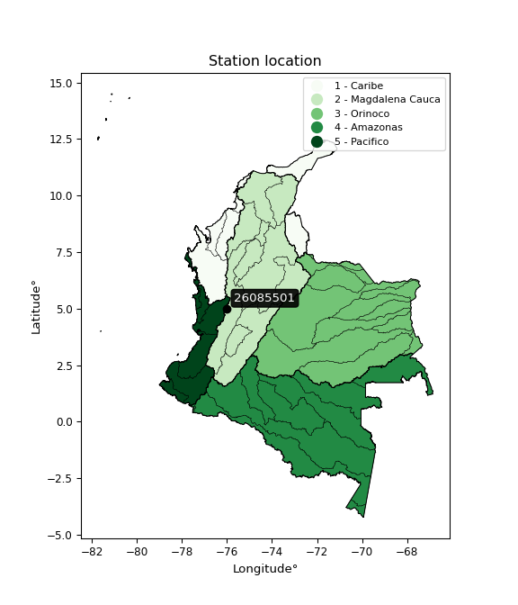</img>

</div>


## A. General information


### 1. General running parameters

• app_version: _v20251225_. • runtime: _2025-12-26 14:29:50.888910_. • Python version: _3.14.0_. • SciPy version: _1.16.3_. • Pandas version: _2.3.3_. • NumPy version: _2.3.5_. • Stations dataset (station_dataset_file): _dataset/pmax24h_in/automatic_colombia.csv_. • Stations catalog (station_catalog_file): _dataset/CNE_IDEAM.xls_. • Plot only fit distributions with Δo > Δ (plot_only_fit): _True_. • Eval low extreme values, if False, evaluates high extreme values (low_extreme): _False_. • Eval every SciPy distribution as logarithmic (pdist_logarithmic_on): _True_. • Standard deviation normalized (ddof): _1.0_. • Return periods to eval in years (Tr): _[2, 2.33, 5, 10, 15, 20, 25, 50, 75, 100, 200, 250, 500, 750, 1000]_. • Minimum data sample per station, 0 means any (minimum_sample): _5_. • Z-Score threshold to adjust a value, 0 means disable (zscore): _3.5_. • Avoid zeros, e.g. rain = 0 (avoid_zeros): _True_. • Avoid null values (avoid_nans): _True_. [:file_folder:Dataset file.](../../dataset/pmax24h_in/automatic_colombia.csv)


### 2. Station info and location

|   id |   CODIGO | NOMBRE                      | CATEGORIA               | TECNOLOGIA                | ESTADO   | FECHA_INSTALACION   |   FECHA_SUSPENSION |   ALTITUD |   LATITUD |   LONGITUD | DEPARTAMENTO   | MUNICIPIO   | AREA_OPERATIVA                         | ENTIDAD                                    | AREA_HIDROGRAFICA   | ZONA_HIDROGRAFICA   | SUBZONA_HIDROGRAFICA                                |   CORRIENTE | OBSERVACION                                                                                                                                                                                                                                                   |   SUBRED | Catalogo   |
|-----:|---------:|:----------------------------|:------------------------|:--------------------------|:---------|:--------------------|-------------------:|----------:|----------:|-----------:|:---------------|:------------|:---------------------------------------|:-------------------------------------------|:--------------------|:--------------------|:----------------------------------------------------|------------:|:--------------------------------------------------------------------------------------------------------------------------------------------------------------------------------------------------------------------------------------------------------------|---------:|:-----------|
|    0 | 26085501 | LA CELIA  - AUT  [26085501] | Climatológica Principal | Automática con Telemetría | Activa   | 01/09/2013          |                nan |      1588 |   5.00133 |    -75.998 | Risaralda      | La Celia    | Area Operativa 09 - Cauca-Valle-Caldas | CENTRO NACIONAL DE INVESTIGACIONES DE CAFE | Magdalena Cauca     | Cauca               | Rios Pescador - RUT - Chanco - Catarina y Cañaveral |         nan | Mediante orfeo 20191040002573 se hace entrega del archivo Excel que contiene el catálogo de estaciones automáticas de Cenicafé, el cual comprende 103 estaciones, con el fin de que se actualice su metadata en el Catálogo Nacional de estaciones del IDEAM. |      nan | CNE_OE     |

<div align="center">

Map location in: [:earth_americas:Google](http://maps.google.com/maps?q=5.001330556,-75.998) [:earth_americas:OSM](https://www.openstreetmap.org/#map=18/5.001330556/-75.998&layers=P) [:earth_americas:Bing](https://www.bing.com/maps?cp=5.001330556~-75.998&lvl=18) [:earth_americas:Apple](https://maps.apple.com/frame?center=5.001330556%2C-75.998&span=0.003%2C0.006)

</div>


<div align="center">

```geojson
{
  "type": "Feature",
  "geometry": {
    "type": "Point", 
    "coordinates": [-75.998, 5.001330556]
  }, 
  "properties": {
    "Name": "26085501"
  }
}
```

</div>


### 3. Discrete values table and plot

|               |          0 |          1 |          2 |            3 |           4 |            5 |           6 |
|:--------------|-----------:|-----------:|-----------:|-------------:|------------:|-------------:|------------:|
| Date          | 2017       | 2018       | 2019       | 2020         | 2021        | 2022         | 2023        |
| Value         |   39       |   90.8     |   94.7     |   67.8       |   60.4      |   69.7       |   59.3      |
| Value_initial |   39       |   90.8     |   94.7     |   67.8       |   60.4      |   69.7       |   59.3      |
| count         |    7       |    7       |    7       |    7         |    7        |    7         |    7        |
| mean          |   68.8143  |   68.8143  |   68.8143  |   68.8143    |   68.8143   |   68.8143    |   68.8143   |
| std           |   19.1723  |   19.1723  |   19.1723  |   19.1723    |   19.1723   |   19.1723    |   19.1723   |
| zscore        |   -1.55507 |    1.14674 |    1.35016 |   -0.0529036 |   -0.438877 |    0.0461975 |   -0.496251 |

<div align="center">

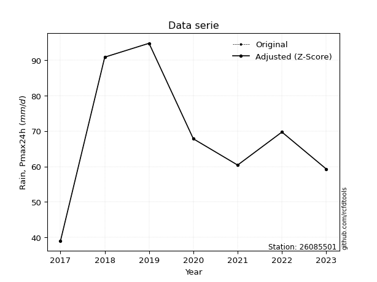</img>

</div>

> If Z-Score is active, values out of range or outliers are replaced with the station mean value.


### 4. Active continuous probability distributions from SciPy (45 of 104 available)

[scipy.stats](https://docs.scipy.org/doc/scipy/reference/stats.html) is a Python´s powerful submodule within the SciPy library for comprehensive statistical analysis, offering over 130 probability distributions (like Normal, Poisson), functions for descriptive stats (mean, variance), hypothesis testing (t-tests, chi-square), random variable generation, and statistical tests, making it essential for data science, modeling, and research. It provides tools to explore, model, and draw conclusions from data efficiently, working seamlessly with NumPy.

<div align="center">

|   id | p_dist             |   n_parameter | fit_method   | label                                                                       | active   | ref                                                                                                        |
|-----:|:-------------------|--------------:|:-------------|:----------------------------------------------------------------------------|:---------|:-----------------------------------------------------------------------------------------------------------|
|    0 | alpha              |             3 | MLE          | Alpha                                                                       | True     | [:mortar_board:](https://docs.scipy.org/doc/scipy/reference/generated/scipy.stats.alpha.html)              |
|    1 | betaprime          |             4 | MLE          | Beta prime                                                                  | True     | [:mortar_board:](https://docs.scipy.org/doc/scipy/reference/generated/scipy.stats.betaprime.html)          |
|    2 | chi2               |             3 | MLE          | Chi²                                                                        | True     | [:mortar_board:](https://docs.scipy.org/doc/scipy/reference/generated/scipy.stats.chi2.html)               |
|    3 | crystalball        |             4 | MLE          | Crystalball                                                                 | True     | [:mortar_board:](https://docs.scipy.org/doc/scipy/reference/generated/scipy.stats.crystalball.html)        |
|    4 | erlang             |             3 | MLE          | Erlang                                                                      | True     | [:mortar_board:](https://docs.scipy.org/doc/scipy/reference/generated/scipy.stats.erlang.html)             |
|    5 | expon              |             2 | MLE          | Exponential                                                                 | True     | [:mortar_board:](https://docs.scipy.org/doc/scipy/reference/generated/scipy.stats.expon.html)              |
|    6 | exponnorm          |             3 | MLE          | Exponentially modified Normal                                               | True     | [:mortar_board:](https://docs.scipy.org/doc/scipy/reference/generated/scipy.stats.exponnorm.html)          |
|    7 | f                  |             4 | MLE          | F                                                                           | True     | [:mortar_board:](https://docs.scipy.org/doc/scipy/reference/generated/scipy.stats.f.html)                  |
|    8 | fatiguelife        |             3 | MLE          | Fatigue-life (Birnbaum-Saunders)                                            | True     | [:mortar_board:](https://docs.scipy.org/doc/scipy/reference/generated/scipy.stats.fatiguelife.html)        |
|    9 | fisk               |             3 | MLE          | Fisk                                                                        | True     | [:mortar_board:](https://docs.scipy.org/doc/scipy/reference/generated/scipy.stats.fisk.html)               |
|   10 | gamma              |             3 | MLE          | Gamma                                                                       | True     | [:mortar_board:](https://docs.scipy.org/doc/scipy/reference/generated/scipy.stats.gamma.html)              |
|   11 | genexpon           |             5 | MLE          | Generalized exponential                                                     | True     | [:mortar_board:](https://docs.scipy.org/doc/scipy/reference/generated/scipy.stats.genexpon.html)           |
|   12 | genlogistic        |             3 | MLE          | Generalized logistic                                                        | True     | [:mortar_board:](https://docs.scipy.org/doc/scipy/reference/generated/scipy.stats.genlogistic.html)        |
|   13 | gibrat             |             2 | MM           | Gibrat                                                                      | True     | [:mortar_board:](https://docs.scipy.org/doc/scipy/reference/generated/scipy.stats.gibrat.html)             |
|   14 | gompertz           |             3 | MLE          | Gompertz (or truncated Gumbel)                                              | True     | [:mortar_board:](https://docs.scipy.org/doc/scipy/reference/generated/scipy.stats.gompertz.html)           |
|   15 | gumbel_l           |             2 | MM           | Gumbel Left Skew                                                            | True     | [:mortar_board:](https://docs.scipy.org/doc/scipy/reference/generated/scipy.stats.gumbel_l.html)           |
|   16 | gumbel_r           |             2 | MM           | Gumbel Right Skew                                                           | True     | [:mortar_board:](https://docs.scipy.org/doc/scipy/reference/generated/scipy.stats.gumbel_r.html)           |
|   17 | halflogistic       |             2 | MM           | Half-logistic                                                               | True     | [:mortar_board:](https://docs.scipy.org/doc/scipy/reference/generated/scipy.stats.halflogistic.html)       |
|   18 | halfnorm           |             2 | MM           | Half Normal                                                                 | True     | [:mortar_board:](https://docs.scipy.org/doc/scipy/reference/generated/scipy.stats.halfnorm.html)           |
|   19 | hypsecant          |             2 | MM           | hyperbolic secant                                                           | True     | [:mortar_board:](https://docs.scipy.org/doc/scipy/reference/generated/scipy.stats.hypsecant.html)          |
|   20 | invgamma           |             3 | MLE          | Inverted gamma                                                              | True     | [:mortar_board:](https://docs.scipy.org/doc/scipy/reference/generated/scipy.stats.invgamma.html)           |
|   21 | invgauss           |             3 | MLE          | Inverse Gaussian                                                            | True     | [:mortar_board:](https://docs.scipy.org/doc/scipy/reference/generated/scipy.stats.invgauss.html)           |
|   22 | invweibull         |             3 | MLE          | Inverted Weibull                                                            | True     | [:mortar_board:](https://docs.scipy.org/doc/scipy/reference/generated/scipy.stats.invweibull.html)         |
|   23 | johnsonsu          |             4 | MLE          | Johnson Su                                                                  | True     | [:mortar_board:](https://docs.scipy.org/doc/scipy/reference/generated/scipy.stats.johnsonsu.html)          |
|   24 | kstwobign          |             2 | MLE          | Limiting distribution of scaled Kolmogorov-Smirnov two-sided test statistic | True     | [:mortar_board:](https://docs.scipy.org/doc/scipy/reference/generated/scipy.stats.kstwobign.html)          |
|   25 | laplace            |             2 | MM           | Laplace                                                                     | True     | [:mortar_board:](https://docs.scipy.org/doc/scipy/reference/generated/scipy.stats.laplace.html)            |
|   26 | laplace_asymmetric |             3 | MLE          | Asymmetric Laplace                                                          | True     | [:mortar_board:](https://docs.scipy.org/doc/scipy/reference/generated/scipy.stats.laplace_asymmetric.html) |
|   27 | loggamma           |             3 | MLE          | Log gamma                                                                   | True     | [:mortar_board:](https://docs.scipy.org/doc/scipy/reference/generated/scipy.stats.loggamma.html)           |
|   28 | logistic           |             2 | MM           | Logistic (or Sech-squared)                                                  | True     | [:mortar_board:](https://docs.scipy.org/doc/scipy/reference/generated/scipy.stats.logistic.html)           |
|   29 | lognorm            |             3 | MLE          | Log Normal                                                                  | True     | [:mortar_board:](https://docs.scipy.org/doc/scipy/reference/generated/scipy.stats.lognorm.html)            |
|   30 | maxwell            |             2 | MM           | Maxwell                                                                     | True     | [:mortar_board:](https://docs.scipy.org/doc/scipy/reference/generated/scipy.stats.maxwell.html)            |
|   31 | mielke             |             4 | MLE          | Mielke Beta-Kappa / Dagum                                                   | True     | [:mortar_board:](https://docs.scipy.org/doc/scipy/reference/generated/scipy.stats.mielke.html)             |
|   32 | moyal              |             2 | MM           | Moyal                                                                       | True     | [:mortar_board:](https://docs.scipy.org/doc/scipy/reference/generated/scipy.stats.moyal.html)              |
|   33 | nakagami           |             3 | MLE          | Nakagami                                                                    | True     | [:mortar_board:](https://docs.scipy.org/doc/scipy/reference/generated/scipy.stats.nakagami.html)           |
|   34 | ncf                |             5 | MLE          | Non-central F distribution                                                  | True     | [:mortar_board:](https://docs.scipy.org/doc/scipy/reference/generated/scipy.stats.ncf.html)                |
|   35 | nct                |             4 | MLE          | Non-central Student’s t                                                     | True     | [:mortar_board:](https://docs.scipy.org/doc/scipy/reference/generated/scipy.stats.nct.html)                |
|   36 | norm               |             2 | MM           | Normal                                                                      | True     | [:mortar_board:](https://docs.scipy.org/doc/scipy/reference/generated/scipy.stats.norm.html)               |
|   37 | pareto             |             3 | MLE          | Pareto                                                                      | True     | [:mortar_board:](https://docs.scipy.org/doc/scipy/reference/generated/scipy.stats.pareto.html)             |
|   38 | pearson3           |             3 | MM           | Pearson type III                                                            | True     | [:mortar_board:](https://docs.scipy.org/doc/scipy/reference/generated/scipy.stats.pearson3.html)           |
|   39 | rayleigh           |             2 | MM           | Rayleigh                                                                    | True     | [:mortar_board:](https://docs.scipy.org/doc/scipy/reference/generated/scipy.stats.rayleigh.html)           |
|   40 | rice               |             3 | MLE          | Rice                                                                        | True     | [:mortar_board:](https://docs.scipy.org/doc/scipy/reference/generated/scipy.stats.rice.html)               |
|   41 | t                  |             3 | MLE          | Student’s t                                                                 | True     | [:mortar_board:](https://docs.scipy.org/doc/scipy/reference/generated/scipy.stats.t.html)                  |
|   42 | truncnorm          |             4 | MLE          | Truncated normal                                                            | True     | [:mortar_board:](https://docs.scipy.org/doc/scipy/reference/generated/scipy.stats.truncnorm.html)          |
|   43 | wald               |             2 | MM           | Wald                                                                        | True     | [:mortar_board:](https://docs.scipy.org/doc/scipy/reference/generated/scipy.stats.wald.html)               |
|   44 | weibull_min        |             3 | MLE          | Weibull minimum                                                             | True     | [:mortar_board:](https://docs.scipy.org/doc/scipy/reference/generated/scipy.stats.weibull_min.html)        |

</div>

> **n_parameter:** # arguments & localization & scale.
>
> **Fit methods:** (MLE) maximum likelihood, (MM) L-moments.
>
>**Inactive:** foldnorm, gennorm, norminvgauss, powernorm, powerlognorm, skewnorm, genextreme, anglit, arcsine, argus, beta, bradford, burr, burr12, cauchy, cosine, halfcauchy, foldcauchy, skewcauchy, wrapcauchy, dgamma, gengamma, exponweib, exponpow, truncexpon, gausshyper, genhalflogistic, genhyperbolic, geninvgauss, halfgennorm, johnsonsb, kappa4, kappa3, ksone, kstwo, loglaplace, levy, levy_l, levy_stable, ncx2, genpareto, truncpareto, lomax, powerlaw, rdist, rel_breitwigner, recipinvgauss, semicircular, studentized_range, trapezoid, triang, truncweibull_min, tukeylambda, uniform, loguniform, vonmises, vonmises_line, weibull_max, dweibull, 


## B. Probability distributions vs. Empirical distributions

A continuous probability distribution (CPD) describes probabilities for variables that can take any value within a range (like rain any time), unlike discrete variables with specific outcomes (like temperature). It uses a Probability Density Function (PDF), a curve where the total area under it equals 1, and the probability of the variable falling within an interval (a to b) is found by calculating the area under the curve between those points. A key feature is that the probability of hitting any single exact value is zero, so probabilities are always expressed for ranges, e.g., $P(a ≤ X ≤ b)$.

<div align="center">

Distributions parameters
|    |   station | p_dist                |   n |              loc |           scale | shape                  | shape1               | shape2                | shape3   |
|---:|----------:|:----------------------|----:|-----------------:|----------------:|:-----------------------|:---------------------|:----------------------|:---------|
|  0 |  26085501 | alpha                 |   7 |   -237.065       |  5178.97        | 16.98938480602537      |                      |                       |          |
|  1 |  26085501 | betaprime             |   7 |    -22.9032      |  2392.66        | 25.871040592499583     | 675.5679244104701    |                       |          |
|  2 |  26085501 | chi2                  |   7 |     39           |    22.3011      | 1.4410463362926902     |                      |                       |          |
|  3 |  26085501 | crystalball           |   7 |     68.8143      |    17.7501      | 4154.849886332604      | 6678.549684359572    |                       |          |
|  4 |  26085501 | erlang                |   7 | -98690.2         |     0.00319079  | 30951245.502493117     |                      |                       |          |
|  5 |  26085501 | expon                 |   7 |     39           |    29.8143      |                        |                      |                       |          |
|  6 |  26085501 | exponnorm             |   7 |     68.7711      |    17.7501      | 0.002432064749787252   |                      |                       |          |
|  7 |  26085501 | f                     |   7 |   -647.328       |   716.107       | 3344.0219809885803     | 108738.63035452706   |                       |          |
|  8 |  26085501 | fatiguelife           |   7 |     39           |     8.02972e-05 | 538.5433308242043      |                      |                       |          |
|  9 |  26085501 | fisk                  |   7 |   -185.985       |   254.143       | 24.46777318424777      |                      |                       |          |
| 10 |  26085501 | gamma                 |   7 | -98682.9         |     0.00319068  | 30950025.141819865     |                      |                       |          |
| 11 |  26085501 | genexpon              |   7 |     39           |     2.04819     | 0.07308624168550842    | 5.79309553703216e-06 | 1.246260765057831     |          |
| 12 |  26085501 | genlogistic           |   7 |     60.5986      |    11.8924      | 1.6031631694533097     |                      |                       |          |
| 13 |  26085501 | gibrat                |   7 |     55.2732      |     8.2131      |                        |                      |                       |          |
| 14 |  26085501 | gompertz              |   7 |     44.6921      |     1.86368     | 1.1897764478793875e-11 |                      |                       |          |
| 15 |  26085501 | gumbel_l              |   7 |     76.8028      |    13.8397      |                        |                      |                       |          |
| 16 |  26085501 | gumbel_r              |   7 |     60.8258      |    13.8397      |                        |                      |                       |          |
| 17 |  26085501 | halflogistic          |   7 |     47.7763      |    15.1757      |                        |                      |                       |          |
| 18 |  26085501 | halfnorm              |   7 |     45.32        |    29.4457      |                        |                      |                       |          |
| 19 |  26085501 | hypsecant             |   7 |     68.8143      |    11.3001      |                        |                      |                       |          |
| 20 |  26085501 | invgamma              |   7 |   -127.58        | 23550           | 120.94521120588854     |                      |                       |          |
| 21 |  26085501 | invgauss              |   7 |     -8.98046     |  1365.5         | 0.05674305667076261    |                      |                       |          |
| 22 |  26085501 | invweibull            |   7 |     39           |     1.48104     | 0.05176375871402256    |                      |                       |          |
| 23 |  26085501 | johnsonsu             |   7 |      6.61023e+06 |     1.22581e+07 | 404874.8390934325      | 784581.3401056376    |                       |          |
| 24 |  26085501 | kstwobign             |   7 |      0.795101    |    77.8979      |                        |                      |                       |          |
| 25 |  26085501 | laplace               |   7 |     68.8143      |    12.5512      |                        |                      |                       |          |
| 26 |  26085501 | laplace_asymmetric    |   7 |     67.8         |    13.7576      | 0.9638163259598096     |                      |                       |          |
| 27 |  26085501 | loggamma              |   7 |  -2824.37        |   448.168       | 636.693259856288       |                      |                       |          |
| 28 |  26085501 | logistic              |   7 |     68.8143      |     9.78616     |                        |                      |                       |          |
| 29 |  26085501 | lognorm               |   7 |     39           |     0.18659     | 12.619707672672323     |                      |                       |          |
| 30 |  26085501 | maxwell               |   7 |     26.7539      |    26.3574      |                        |                      |                       |          |
| 31 |  26085501 | mielke                |   7 |     -0.348883    |    75.8147      | 4.7224010802302825     | 8.007935040957223    |                       |          |
| 32 |  26085501 | moyal                 |   7 |     58.6636      |     7.99036     |                        |                      |                       |          |
| 33 |  26085501 | nakagami              |   7 |     59.3         |    13.5665      | 0.18082834608506126    |                      |                       |          |
| 34 |  26085501 | ncf                   |   7 |     -1.43405     |     0.00486228  | 0.004508201087034353   | 409.0288090254398    | 64.83334462970127     |          |
| 35 |  26085501 | nct                   |   7 |   -514.137       |    17.7168      | 130182.80018406108     | 32.90344119609948    |                       |          |
| 36 |  26085501 | norm                  |   7 |     68.8143      |    17.7501      |                        |                      |                       |          |
| 37 |  26085501 | pareto                |   7 |     38.9691      |     0.0308763   | 0.16787051652920448    |                      |                       |          |
| 38 |  26085501 | pearson3              |   7 |     68.8143      |    17.7501      | 0.0003246029113398466  |                      |                       |          |
| 39 |  26085501 | rayleigh              |   7 |     34.8573      |    27.0938      |                        |                      |                       |          |
| 40 |  26085501 | rice                  |   7 |     29.7892      |    20.1748      | 1.5861265596056504     |                      |                       |          |
| 41 |  26085501 | t                     |   7 |     68.8145      |    17.7507      | 31797462.573918104     |                      |                       |          |
| 42 |  26085501 | truncnorm             |   7 |     68.8143      |    17.7501      | -38.093466601953594    | 876.6668393419711    |                       |          |
| 43 |  26085501 | wald                  |   7 |     51.0642      |    17.7501      |                        |                      |                       |          |
| 44 |  26085501 | weibull_min           |   7 |     21.9864      |    52.5781      | 2.9222718648992965     |                      |                       |          |
| 45 |  26085501 | logalpha              |   7 |     -4.55766     |   267.868       | 30.62976932919257      |                      |                       |          |
| 46 |  26085501 | logbetaprime          |   7 |     -4.05419     |     8.10076     | 818.6099951867936      | 805.0370247705348    |                       |          |
| 47 |  26085501 | logchi2               |   7 |      3.66356     |     0.931745    | 1.131286199981684      |                      |                       |          |
| 48 |  26085501 | logcrystalball        |   7 |      4.19533     |     0.275603    | 124.51249421999711     | 1.1872100825333733   |                       |          |
| 49 |  26085501 | logerlang             |   7 |     -0.54316     |     0.0169842   | 278.9827951876234      |                      |                       |          |
| 50 |  26085501 | logexpon              |   7 |      3.66356     |     0.531766    |                        |                      |                       |          |
| 51 |  26085501 | logexponnorm          |   7 |      4.19508     |     0.275602    | 0.0008890686410751995  |                      |                       |          |
| 52 |  26085501 | logf                  |   7 |    -59.6089      |    63.8029      | 117542.96186502634     | 1177223.460510091    |                       |          |
| 53 |  26085501 | logfatiguelife        |   7 |    -74.7757      |    78.9705      | 0.003495861682197317   |                      |                       |          |
| 54 |  26085501 | logfisk               |   7 |     -8.30442e+06 |     8.30443e+06 | 53015360.362530574     |                      |                       |          |
| 55 |  26085501 | loggamma              |   7 |     -0.463787    |     0.0173134   | 269.08903259064596     |                      |                       |          |
| 56 |  26085501 | loggenexpon           |   7 |      3.65697     |     0.00215989  | 0.0012870439730800825  | 3.35386470335213     | 5.137828509092583e-06 |          |
| 57 |  26085501 | loggenlogistic        |   7 |      4.32459     |     0.125262    | 0.5868324139477418     |                      |                       |          |
| 58 |  26085501 | loggibrat             |   7 |      3.98505     |     0.127536    |                        |                      |                       |          |
| 59 |  26085501 | loggompertz           |   7 |      3.66356     |     0.282331    | 0.11452112410040544    |                      |                       |          |
| 60 |  26085501 | loggumbel_l           |   7 |      4.31936     |     0.214886    |                        |                      |                       |          |
| 61 |  26085501 | loggumbel_r           |   7 |      4.07129     |     0.214886    |                        |                      |                       |          |
| 62 |  26085501 | loghalflogistic       |   7 |      3.86863     |     0.235663    |                        |                      |                       |          |
| 63 |  26085501 | loghalfnorm           |   7 |      3.83058     |     0.457144    |                        |                      |                       |          |
| 64 |  26085501 | loghypsecant          |   7 |      4.19533     |     0.175454    |                        |                      |                       |          |
| 65 |  26085501 | loginvgamma           |   7 |     -0.926424    |  1631.11        | 319.75164235774787     |                      |                       |          |
| 66 |  26085501 | loginvgauss           |   7 |      1.64768     |   191.066       | 0.013322079809713928   |                      |                       |          |
| 67 |  26085501 | loginvweibull         |   7 |     -2.48102e+07 |     2.48102e+07 | 85270735.81427279      |                      |                       |          |
| 68 |  26085501 | logjohnsonsu          |   7 |      4.98642     |     0.059698    | 9.10527414389325       | 2.830623638501006    |                       |          |
| 69 |  26085501 | logkstwobign          |   7 |      3.01265     |     1.35352     |                        |                      |                       |          |
| 70 |  26085501 | loglaplace            |   7 |      4.19533     |     0.19488     |                        |                      |                       |          |
| 71 |  26085501 | loglaplace_asymmetric |   7 |      4.21656     |     0.207262    | 1.0524987233631218     |                      |                       |          |
| 72 |  26085501 | logloggamma           |   7 |      4.23077     |     0.27201     | 1.3349333031410993     |                      |                       |          |
| 73 |  26085501 | loglogistic           |   7 |      4.19533     |     0.151947    |                        |                      |                       |          |
| 74 |  26085501 | loglognorm            |   7 |      3.66356     |     0.00410363  | 12.191064796054864     |                      |                       |          |
| 75 |  26085501 | logmaxwell            |   7 |      3.54227     |     0.409246    |                        |                      |                       |          |
| 76 |  26085501 | logmielke             |   7 |     -0.251945    |     4.61221     | 18.847307687030096     | 39.11638014355664    |                       |          |
| 77 |  26085501 | logmoyal              |   7 |      4.03772     |     0.124065    |                        |                      |                       |          |
| 78 |  26085501 | lognakagami           |   7 |      4.08261     |     0.376242    | 0.24164858410585555    |                      |                       |          |
| 79 |  26085501 | logncf                |   7 |    -64.0754      |    36.4813      | 306807.8533469344      | 176903.93705644918   | 267346.7669862017     |          |
| 80 |  26085501 | lognct                |   7 |    -11.7222      |     0.208264    | 3688.4581032747246     | 76.41776221693658    |                       |          |
| 81 |  26085501 | lognorm               |   7 |      4.19533     |     0.275602    |                        |                      |                       |          |
| 82 |  26085501 | logpareto             |   7 |      3.66299     |     0.000569614 | 0.16783103678815506    |                      |                       |          |
| 83 |  26085501 | logpearson3           |   7 |      4.19533     |     0.275602    | -0.5245688663860862    |                      |                       |          |
| 84 |  26085501 | lograyleigh           |   7 |      3.66808     |     0.420684    |                        |                      |                       |          |
| 85 |  26085501 | logrice               |   7 |      3.48142     |     0.297338    | 2.15035293548197       |                      |                       |          |
| 86 |  26085501 | logt                  |   7 |      4.19533     |     0.275602    | 2960080127.048314      |                      |                       |          |
| 87 |  26085501 | logtruncnorm          |   7 |     -0.140822    |     1.53966     | 2.4709167474001523     | 3.047119615558394    |                       |          |
| 88 |  26085501 | logwald               |   7 |      3.91971     |     0.275619    |                        |                      |                       |          |
| 89 |  26085501 | logweibull_min        |   7 |      1.25924     |     3.05701     | 13.024683397065289     |                      |                       |          |

</div>

> **loc** (Location parameter): This shifts the distribution along the x-axis. For many common distributions, like the normal (Gaussian) distribution, loc represents the mean $μ$. For others, like the uniform distribution, it might represent the minimum value, or for the beta distribution, the left end of the support interval.
>
> **scale** (Scale parameter): This determines the width or spread of the distribution. For the normal distribution, scale represents the standard deviation $σ$. For a uniform distribution, it defines the length of the interval (from $loc$ to $loc + scale$).
>
> **shape** (Shape parameters): Refers to parameters that define the specific form of a probability distribution, distinct from its location (loc) and scale (scale). These parameters are required arguments for most distribution functions. For example, a normal (Gaussian) distribution is fully defined by its location (mean) and scale (standard deviation), so it has no specific shape parameters beyond loc and scale. However, other distributions have intrinsic properties that need specification, as Gamma distribution that takes a shape parameter, often named $a$ or $alpha$.


### 0. Cumulative distribution values - CDF (90 evaluated)

> Ordered by x ascending and calculating $log(f(x))$ separately. 

|   id |   Station |   date |    x |   count |    mean |     std |     zscore |   Value_initial |   station |   m |     alpha |   alpha_pdf |   betaprime |   betaprime_pdf |        chi2 |     chi2_pdf |   crystalball |   crystalball_pdf |    erlang |   erlang_pdf |    expon |   expon_pdf |   exponnorm |   exponnorm_pdf |         f |      f_pdf |   fatiguelife |   fatiguelife_pdf |      fisk |   fisk_pdf |     gamma |   gamma_pdf |    genexpon |   genexpon_pdf |   genlogistic |   genlogistic_pdf |   gibrat |   gibrat_pdf |    gompertz |   gompertz_pdf |   gumbel_l |   gumbel_l_pdf |   gumbel_r |   gumbel_r_pdf |   halflogistic |   halflogistic_pdf |   halfnorm |   halfnorm_pdf |   hypsecant |   hypsecant_pdf |   invgamma |   invgamma_pdf |   invgauss |   invgauss_pdf |   invweibull |   invweibull_pdf |   johnsonsu |   johnsonsu_pdf |   kstwobign |   kstwobign_pdf |   laplace |   laplace_pdf |   laplace_asymmetric |   laplace_asymmetric_pdf |   loggamma |   loggamma_pdf |   logistic |   logistic_pdf |   lognorm |   lognorm_pdf |   maxwell |   maxwell_pdf |    mielke |   mielke_pdf |       moyal |   moyal_pdf |    nakagami |   nakagami_pdf |      ncf |    ncf_pdf |       nct |    nct_pdf |      norm |   norm_pdf |   pareto |   pareto_pdf |   pearson3 |   pearson3_pdf |   rayleigh |   rayleigh_pdf |      rice |   rice_pdf |         t |      t_pdf |   truncnorm |   truncnorm_pdf |     wald |   wald_pdf |   weibull_min |   weibull_min_pdf |   logalpha |   logalpha_pdf |   logbetaprime |   logbetaprime_pdf |     logchi2 |   logchi2_pdf |   logcrystalball |   logcrystalball_pdf |   logerlang |   logerlang_pdf |   logexpon |   logexpon_pdf |   logexponnorm |   logexponnorm_pdf |      logf |   logf_pdf |   logfatiguelife |   logfatiguelife_pdf |   logfisk |   logfisk_pdf |   loggenexpon |   loggenexpon_pdf |   loggenlogistic |   loggenlogistic_pdf |   loggibrat |   loggibrat_pdf |   loggompertz |   loggompertz_pdf |   loggumbel_l |   loggumbel_l_pdf |   loggumbel_r |   loggumbel_r_pdf |   loghalflogistic |   loghalflogistic_pdf |   loghalfnorm |   loghalfnorm_pdf |   loghypsecant |   loghypsecant_pdf |   loginvgamma |   loginvgamma_pdf |   loginvgauss |   loginvgauss_pdf |   loginvweibull |   loginvweibull_pdf |   logjohnsonsu |   logjohnsonsu_pdf |   logkstwobign |   logkstwobign_pdf |   loglaplace |   loglaplace_pdf |   loglaplace_asymmetric |   loglaplace_asymmetric_pdf |   logloggamma |   logloggamma_pdf |   loglogistic |   loglogistic_pdf |   loglognorm |   loglognorm_pdf |   logmaxwell |   logmaxwell_pdf |   logmielke |   logmielke_pdf |    logmoyal |   logmoyal_pdf |   lognakagami |   lognakagami_pdf |    logncf |   logncf_pdf |    lognct |   lognct_pdf |   logpareto |   logpareto_pdf |   logpearson3 |   logpearson3_pdf |   lograyleigh |   lograyleigh_pdf |   logrice |   logrice_pdf |      logt |   logt_pdf |   logtruncnorm |   logtruncnorm_pdf |   logwald |   logwald_pdf |   logweibull_min |   logweibull_min_pdf |
|-----:|----------:|-------:|-----:|--------:|--------:|--------:|-----------:|----------------:|----------:|----:|----------:|------------:|------------:|----------------:|------------:|-------------:|--------------:|------------------:|----------:|-------------:|---------:|------------:|------------:|----------------:|----------:|-----------:|--------------:|------------------:|----------:|-----------:|----------:|------------:|------------:|---------------:|--------------:|------------------:|---------:|-------------:|------------:|---------------:|-----------:|---------------:|-----------:|---------------:|---------------:|-------------------:|-----------:|---------------:|------------:|----------------:|-----------:|---------------:|-----------:|---------------:|-------------:|-----------------:|------------:|----------------:|------------:|----------------:|----------:|--------------:|---------------------:|-------------------------:|-----------:|---------------:|-----------:|---------------:|----------:|--------------:|----------:|--------------:|----------:|-------------:|------------:|------------:|------------:|---------------:|---------:|-----------:|----------:|-----------:|----------:|-----------:|---------:|-------------:|-----------:|---------------:|-----------:|---------------:|----------:|-----------:|----------:|-----------:|------------:|----------------:|---------:|-----------:|--------------:|------------------:|-----------:|---------------:|---------------:|-------------------:|------------:|--------------:|-----------------:|---------------------:|------------:|----------------:|-----------:|---------------:|---------------:|-------------------:|----------:|-----------:|-----------------:|---------------------:|----------:|--------------:|--------------:|------------------:|-----------------:|---------------------:|------------:|----------------:|--------------:|------------------:|--------------:|------------------:|--------------:|------------------:|------------------:|----------------------:|--------------:|------------------:|---------------:|-------------------:|--------------:|------------------:|--------------:|------------------:|----------------:|--------------------:|---------------:|-------------------:|---------------:|-------------------:|-------------:|-----------------:|------------------------:|----------------------------:|--------------:|------------------:|--------------:|------------------:|-------------:|-----------------:|-------------:|-----------------:|------------:|----------------:|------------:|---------------:|--------------:|------------------:|----------:|-------------:|----------:|-------------:|------------:|----------------:|--------------:|------------------:|--------------:|------------------:|----------:|--------------:|----------:|-----------:|---------------:|-------------------:|----------:|--------------:|-----------------:|---------------------:|
|    0 |  26085501 |   2017 | 39   |       7 | 68.8143 | 19.1723 | -1.55507   |            39   |  26085501 |   1 | 0.0383164 |  0.00565451 |   0.0374666 |      0.0058444  | 4.53964e-12 | 460.341      |     0.0465111 |        0.00548373 | 0.0465123 |   0.00548448 | 0        |  0.033541   |   0.0465112 |      0.00548372 | 0.0453705 | 0.00552519 |      0.105974 |       6.42947e+08 | 0.0482552 | 0.00499466 | 0.0465124 |  0.00548479 | 1.21341e-06 |     0.0356833  |     0.0427149 |        0.00495267 | 0        |   0          | 0           |    0           |  0.0630482 |     0.00440887 | 0.00790226 |     0.00276391 |       0        |         0          |   0        |     0          |   0.0454249 |      0.00400624 |  0.0365576 |     0.0055714  |  0.0269086 |     0.00563671 |   0.00404342 |      1.62326e+11 |   0.0465153 |      0.00548398 |   0.0302727 |      0.00733565 | 0.0464883 |    0.00370389 |            0.0548774 |               0.00413862 |  0.0269787 |       0.237846 |  0.0453655 |     0.00442538 | 0.0268362 |      0.225019 |  0.025012 |    0.0058661  | 0.0450425 |   0.00537754 | 0.000619798 | 0.000488343 | 0           |    0           | 0.034309 | 0.00566855 | 0.0465448 | 0.00548807 | 0.0465111 | 0.00548373 | 0        |  5.43687     |  0.0465016 |     0.00548382 |  0.0116217 |     0.00557791 | 0.0299844 | 0.00658096 | 0.0465152 | 0.00548394 |   0.0465111 |      0.00548373 | 0        | 0          |     0.0363122 |        0.00612239 |  0.0254253 |       0.234928 |       0.094661 |           0.439944 | 1.63529e-09 |    2.0829e+06 |        0.0268363 |             0.225019 |    0.026879 |        0.237042 |   0        |       1.88053  |      0.0268364 |           0.22502  | 0.0270114 |   0.227286 |        0.0267539 |             0.225581 | 0.0295673 |      0.183176 |    0.00399813 |          0.61774  |        0.0450577 |             0.210016 |    0        |        0        |   9.77053e-09 |          0.405628 |     0.0461711 |          0.209825 |    0.00127003 |         0.0394138 |          0        |              0        |      0        |          0        |      0.0307101 |           0.174761 |     0.0261579 |          0.245013 |     0.0243512 |          0.247812 |       0.0225869 |            0.294245 |      0.0517424 |           0.226558 |      0.0251358 |           0.373379 |    0.0326526 |         0.167552 |               0.0416555 |                    0.190955 |     0.0483345 |          0.224786 |     0.0293215 |          0.187313 |   0.00716479 |      3.67408e+12 |   0.00674497 |         0.163908 |   0.0456256 |        0.219257 | 6.26234e-06 |    0.000538236 |   0           |       0           | 0.0267778 |     0.225793 | 0.0268648 |     0.22879  |    0        |     294.64      |     0.0392106 |          0.234781 |      0        |          0        |  0.020771 |      0.250917 | 0.0268363 |   0.22502  |    8.96278e-06 |           2.19193  |  0        |      0        |         0.042853 |             0.227096 |
|    1 |  26085501 |   2023 | 59.3 |       7 | 68.8143 | 19.1723 | -0.496251  |            59.3 |  26085501 |   2 | 0.313635  |  0.0209074  |   0.319095  |      0.0209515  | 0.518259    |   0.013991   |     0.295975  |        0.019468   | 0.295998  |   0.0194683  | 0.493829 |  0.0169774  |   0.295975  |      0.0194679  | 0.298839  | 0.0196998  |      0.824753 |       0.00593311  | 0.295652  | 0.0207726  | 0.29602   |  0.01947    | 0.515397    |     0.0172936  |     0.30085   |        0.0213842  | 0.238    |   0.0768481  | 3.01565e-08 |    1.61875e-08 |  0.245975  |     0.0153821  | 0.327406   |     0.0264143  |       0.362426 |         0.0286197  |   0.36505  |     0.0242087  |   0.258993  |      0.0204731  |  0.31381   |     0.0211551  |  0.3383    |     0.0226914  |   0.417584   |      0.000929869 |   0.29598   |      0.0194676  |   0.374594  |      0.0216048  | 0.234293  |    0.0186669  |            0.253672  |               0.0191308  |  0.352427  |       1.32881  |  0.274438  |     0.0203473  | 0.341273  |      1.33139  |  0.323424 |    0.0215347  | 0.297258  |   0.0205259  | 0.336572    | 0.0302361   | 2.36499e-06 |    1.20375e+08 | 0.31832  | 0.0213113  | 0.296124  | 0.0194712  | 0.295975  | 0.019468   | 0.663603 |  0.0027776   |  0.295988  |     0.0194695  |  0.334316  |     0.0221656  | 0.313812  | 0.0203076  | 0.295977  | 0.0194674  |   0.295975  |      0.019468   | 0.332473 | 0.0521781  |     0.307247  |        0.0199157  |  0.354758  |       1.3355   |       0.40225  |           0.957848 | 0.446351    |    0.520717   |        0.341273  |             1.33138  |    0.352009 |        1.32941  |   0.54526  |       0.85515  |      0.341274  |           1.33139  | 0.343535  |   1.33444  |        0.342121  |             1.33228  | 0.30664   |      1.35731  |    0.444621   |          1.20365  |        0.297291  |             1.21651  |    0.394356 |        3.94518  |   0.32342     |          1.21073  |     0.282716  |          1.10915  |    0.387245   |         1.70964   |          0.425181 |              1.73812  |      0.418578 |          1.49929  |      0.308274  |           1.49495  |     0.364826  |          1.34969  |     0.371631  |          1.34796  |       0.40745   |            1.25731  |      0.290625  |           1.0708   |      0.44033   |           1.21343  |    0.280397  |         1.43882  |               0.284407  |                    1.30376  |     0.294724  |          1.11425  |     0.322605  |          1.4382   |   0.64783    |      0.0726669   |   0.372648   |         1.42159  |   0.297925  |        1.19048  | 0.403992    |    1.8944      |   6.66211e-08 |       3.62515e+07 | 0.341933  |     1.33017  | 0.344242  |     1.32804  |    0.669796 |       0.132069  |     0.31489   |          1.20217  |      0.384598 |          1.44146  |  0.352333 |      1.33425  | 0.341274  |   1.33139  |    0.66184     |           1.07814  |  0.439605 |      2.76521  |         0.298843 |             1.14834  |
|    2 |  26085501 |   2021 | 60.4 |       7 | 68.8143 | 19.1723 | -0.438877  |            60.4 |  26085501 |   3 | 0.336895  |  0.0213699  |   0.342369  |      0.0213514  | 0.533349    |   0.0134503  |     0.317735  |        0.0200869  | 0.317759  |   0.020087   | 0.512164 |  0.0163625  |   0.317735  |      0.0200869  | 0.320844  | 0.0202981  |      0.831118 |       0.00564374  | 0.318948  | 0.0215715  | 0.317783  |  0.0200887  | 0.534051    |     0.0166279  |     0.32476   |        0.0220725  | 0.318733 |   0.0696369  | 5.4424e-08  |    2.92088e-08 |  0.263382  |     0.0162701  | 0.356563   |     0.0265687  |       0.393486 |         0.0278461  |   0.391439 |     0.0237666  |   0.282263  |      0.0218316  |  0.337344  |     0.0216198  |  0.363389  |     0.0229072  |   0.41858    |      0.000881764 |   0.31774   |      0.0200865  |   0.398297  |      0.021479   | 0.255753  |    0.0203767  |            0.275613  |               0.0207856  |  0.377106  |       1.35569  |  0.297378  |     0.021351   | 0.366062  |      1.36516  |  0.347288 |    0.02184    | 0.32026   |   0.0212852  | 0.369697    | 0.0299517   | 0.320323    |    0.105209    | 0.341991 | 0.0217135  | 0.317887  | 0.0200893  | 0.317735  | 0.0200869  | 0.666566 |  0.00261183  |  0.31775   |     0.0200883  |  0.358786  |     0.0223116  | 0.336383  | 0.020721   | 0.317737  | 0.0200863  |   0.317735  |      0.0200869  | 0.387344 | 0.0475889  |     0.329418  |        0.0203856  |  0.379537  |       1.35989  |       0.419929 |           0.965501 | 0.455786    |    0.506082   |        0.366061  |             1.36516  |    0.3767   |        1.35649  |   0.560709 |       0.826098 |      0.366063  |           1.36516  | 0.368373  |   1.36744  |        0.366922  |             1.36553  | 0.332136  |      1.41611  |    0.466641   |          1.1921   |        0.32028   |             1.28488  |    0.46201  |        3.42548  |   0.346026    |          1.24899  |     0.303687  |          1.17287  |    0.418564   |         1.69642   |          0.45659  |              1.67936  |      0.445825 |          1.46524  |      0.336546  |           1.58023  |     0.389838  |          1.37105  |     0.39656   |          1.36376  |       0.430471  |            1.24703  |      0.310818  |           1.12658  |      0.462484  |           1.19676  |    0.30813   |         1.58113  |               0.309409  |                    1.41837  |     0.315725  |          1.17098  |     0.349585  |          1.49641  |   0.649136   |      0.0695202   |   0.398872   |         1.43099  |   0.320414  |        1.25662  | 0.43838     |    1.84554     |   0.181581    |       4.77246     | 0.366693  |     1.36328  | 0.368948  |     1.35953  |    0.672163 |       0.12562   |     0.337426  |          1.24964  |      0.411092 |          1.44057  |  0.377111 |      1.36106  | 0.366062  |   1.36516  |    0.681335    |           1.04333  |  0.487787 |      2.4823   |         0.320455 |             1.20326  |
|    3 |  26085501 |   2020 | 67.8 |       7 | 68.8143 | 19.1723 | -0.0529036 |            67.8 |  26085501 |   4 | 0.500658  |  0.0222299  |   0.504567  |      0.0218564  | 0.62128     |   0.0104865  |     0.477216  |        0.0224388  | 0.477234  |   0.0224371  | 0.61939  |  0.012766   |   0.477215  |      0.0224388  | 0.481147  | 0.0224331  |      0.866942 |       0.00415029  | 0.491362  | 0.0240957  | 0.477269  |  0.0224385  | 0.642191    |     0.0127688  |     0.497471  |        0.0236779  | 0.663539 |   0.0291321  | 2.88607e-06 |    1.54859e-06 |  0.406538  |     0.0223746  | 0.546537   |     0.0238583  |       0.578183 |         0.0219332  |   0.554798 |     0.0202468  |   0.471467  |      0.0280557  |  0.50282   |     0.0224245  |  0.531596  |     0.0218959  |   0.424178   |      0.000653834 |   0.477217  |      0.0224383  |   0.549989  |      0.0191653  | 0.461184  |    0.0367441  |            0.481581  |               0.0363188  |  0.538217  |       1.39381  |  0.474112  |     0.0254778  | 0.530707  |      1.44324  |  0.511029 |    0.0218354  | 0.49036   |   0.0238309  | 0.572374    | 0.0240349   | 0.664004    |    0.0265997   | 0.506632 | 0.0221271  | 0.477364  | 0.0224352  | 0.477216  | 0.0224388  | 0.682762 |  0.00184715  |  0.477237  |     0.022439   |  0.522495  |     0.0214288  | 0.495492  | 0.0217561  | 0.477212  | 0.0224381  |   0.477216  |      0.0224388  | 0.644293 | 0.0245069  |     0.487614  |        0.0218545  |  0.540143  |       1.38104  |       0.532434 |           0.968401 | 0.509627    |    0.429596   |        0.530706  |             1.44324  |    0.537966 |        1.39558  |   0.646521 |       0.664726 |      0.530707  |           1.44324  | 0.532967  |   1.44009  |        0.531408  |             1.4402   | 0.509818  |      1.59538  |    0.598086   |          1.06968  |        0.490292  |             1.61513  |    0.724485 |        1.44263  |   0.502144    |          1.4318   |     0.461934  |          1.55189  |    0.601318   |         1.42331   |          0.628058 |              1.28476  |      0.601515 |          1.22204  |      0.53843   |           1.801    |     0.55056   |          1.37207  |     0.554583  |          1.33509  |       0.567468  |            1.10501  |      0.460708  |           1.45535  |      0.592565  |           1.04289  |    0.551617  |         2.30081  |               0.525561  |                    2.40925  |     0.470359  |          1.48659  |     0.53488   |          1.6373   |   0.656239   |      0.0545774   |   0.562277   |         1.36202  |   0.487121  |        1.5928   | 0.626696    |    1.38954     |   0.471457    |       1.6595      | 0.530891  |     1.43765  | 0.532144  |     1.42466  |    0.684798 |       0.0955628 |     0.495953  |          1.46453  |      0.572557 |          1.32474  |  0.538986 |      1.4025   | 0.530707  |   1.44324  |    0.790168    |           0.846031 |  0.697144 |      1.29137  |         0.477597 |             1.49393  |
|    4 |  26085501 |   2022 | 69.7 |       7 | 68.8143 | 19.1723 |  0.0461975 |            69.7 |  26085501 |   5 | 0.542552  |  0.0218304  |   0.545699  |      0.0214053  | 0.640612    |   0.00987138 |     0.519899  |        0.0224475  | 0.519913  |   0.0224454  | 0.642889 |  0.0119779  |   0.519898  |      0.0224475  | 0.523757  | 0.0223775  |      0.874546 |       0.00385913  | 0.536919  | 0.0237934  | 0.519951  |  0.0224466  | 0.665648    |     0.0119317  |     0.542058  |        0.0232001  | 0.713405 |   0.0235951  | 7.99953e-06 |    4.29232e-06 |  0.450401  |     0.0237701  | 0.590578   |     0.0224737  |       0.61835  |         0.0203497  |   0.592309 |     0.0192335  |   0.524924  |      0.0280825  |  0.545057  |     0.0219963  |  0.57245   |     0.0210792  |   0.425381   |      0.000613077 |   0.519899  |      0.022447   |   0.585594  |      0.0183023  | 0.534068  |    0.0371224  |            0.546191  |               0.0317924  |  0.576426  |       1.36908  |  0.522611  |     0.025494   | 0.570375  |      1.42495  |  0.552046 |    0.02131    | 0.535463  |   0.023582   | 0.616179    | 0.0220726   | 0.710542    |    0.0225749   | 0.548237 | 0.0216316  | 0.520038  | 0.0224424  | 0.519899  | 0.0224475  | 0.686142 |  0.00171448  |  0.51992   |     0.0224473  |  0.562599  |     0.0207612  | 0.536627  | 0.0215089  | 0.519894  | 0.0224468  |   0.519899  |      0.0224475  | 0.687286 | 0.0208676  |     0.529043  |        0.0217194  |  0.577952  |       1.35296  |       0.559061 |           0.957735 | 0.521288    |    0.414399   |        0.570374  |             1.42495  |    0.576226 |        1.37096  |   0.664424 |       0.63106  |      0.570375  |           1.42495  | 0.572532  |   1.42063  |        0.570983  |             1.42125  | 0.553721  |      1.57757  |    0.627115   |          1.03044  |        0.535382  |             1.64325  |    0.760836 |        1.19732  |   0.54203     |          1.45255  |     0.505813  |          1.62097  |    0.639387   |         1.33076   |          0.662268 |              1.19111  |      0.634423 |          1.1591   |      0.58754   |           1.74603  |     0.588062  |          1.33975  |     0.591     |          1.29858  |       0.597364  |            1.05781  |      0.501802  |           1.51655  |      0.620776  |           0.998283 |    0.610904  |         1.99659  |               0.587687  |                    2.09377  |     0.512191  |          1.53821  |     0.579724  |          1.60348  |   0.65771    |      0.0518955   |   0.599326   |         1.31753  |   0.531689  |        1.62804  | 0.663479    |    1.27278     |   0.514815    |       1.48535     | 0.570397  |     1.41882  | 0.57127   |     1.40443  |    0.687365 |       0.0902773 |     0.536749  |          1.48517  |      0.608492 |          1.27451  |  0.577452 |      1.37901  | 0.570375  |   1.42495  |    0.812965    |           0.803995 |  0.730369 |      1.11804  |         0.519511 |             1.53669  |
|    5 |  26085501 |   2018 | 90.8 |       7 | 68.8143 | 19.1723 |  1.14674   |            90.8 |  26085501 |   6 | 0.883635  |  0.00943029 |   0.879986  |      0.00938163 | 0.794903    |   0.00531411 |     0.892257  |        0.0104367  | 0.892229  |   0.0104363  | 0.824027 |  0.00590232 |   0.892257  |      0.0104367  | 0.891297  | 0.01027    |      0.932071 |       0.00188865  | 0.889743  | 0.0086721  | 0.892258  |  0.0104348  | 0.842533    |     0.00561939 |     0.88537   |        0.00872843 | 0.928479 |   0.00384227 | 0.483512    |    0.183103    |  0.936033  |     0.0127076  | 0.891672   |     0.00738717 |       0.88908  |         0.00690368 |   0.877542 |     0.00822039 |   0.90964   |      0.00788943 |  0.886299  |     0.0093338  |  0.882859  |     0.00839225 |   0.435207   |      0.00036181  |   0.892252  |      0.0104368  |   0.861542  |      0.00820656 | 0.913259  |    0.00691098 |            0.89651   |               0.00725019 |  0.864463  |       0.733996 |  0.904358  |     0.00883846 | 0.872209  |      0.758503 |  0.883647 |    0.00933431 | 0.885604  |   0.00854213 | 0.893512    | 0.00662384  | 0.951485    |    0.00466845  | 0.882536 | 0.00925031 | 0.892242  | 0.0104324  | 0.892257  | 0.0104367  | 0.712509 |  0.000931129 |  0.892252  |     0.0104357  |  0.88136   |     0.0090414  | 0.885997  | 0.0100031  | 0.892249  | 0.010437   |   0.892258  |      0.0104367  | 0.908513 | 0.00476344 |     0.888691  |        0.0103776  |  0.8609    |       0.722161 |       0.782438 |           0.691946 | 0.615267    |    0.305482   |        0.872208  |             0.758505 |    0.864662 |        0.734621 |   0.795917 |       0.383784 |      0.872209  |           0.758502 | 0.872646  |   0.752884 |        0.871733  |             0.756171 | 0.870346  |      0.720394 |    0.842173   |          0.59005  |        0.885588  |             0.775924 |    0.921075 |        0.281036 |   0.885859    |          0.923721 |     0.910463  |          1.00548  |    0.877537   |         0.533481  |          0.875914 |              0.493872 |      0.862003 |          0.580938 |      0.89425   |           0.591699 |     0.865015  |          0.699352 |     0.858225  |          0.682055 |       0.81252   |            0.57978  |      0.893451  |           1.0804   |      0.826359  |           0.566057 |    0.899838  |         0.513969 |               0.892355  |                    0.54663  |     0.892006  |          1.00141  |     0.887165  |          0.658803 |   0.668947   |      0.0351959   |   0.865849   |         0.669015 |   0.884613  |        0.786816 | 0.880864    |    0.476555    |   0.783591    |       0.690334    | 0.870924  |     0.757229 | 0.868502  |     0.752536 |    0.706435 |       0.0582608 |     0.881971  |          0.909917 |      0.864157 |          0.645214 |  0.868342 |      0.739627 | 0.872209  |   0.758503 |    0.980394    |           0.485729 |  0.899417 |      0.342461 |         0.890782 |             0.969423 |
|    6 |  26085501 |   2019 | 94.7 |       7 | 68.8143 | 19.1723 |  1.35016   |            94.7 |  26085501 |   7 | 0.916059  |  0.00725323 |   0.912402  |      0.00729292 | 0.814548    |   0.00477139 |     0.927627  |        0.0077605  | 0.927598  |   0.00776087 | 0.845604 |  0.0051786  |   0.927626  |      0.00776052 | 0.926177  | 0.00767615 |      0.939011 |       0.00167504  | 0.919121  | 0.00648011 | 0.927621  |  0.00775935 | 0.862992    |     0.00488929 |     0.915184  |        0.00663543 | 0.941643 |   0.00295629 | 0.995279    |    0.0135661   |  0.973862  |     0.00688291 | 0.917135   |     0.00573222 |       0.913125 |         0.00547592 |   0.906455 |     0.00664109 |   0.935799  |      0.00564303 |  0.91833   |     0.00715034 |  0.911949  |     0.0065775  |   0.436567   |      0.000336262 |   0.927622  |      0.00776069 |   0.890674  |      0.00676409 | 0.936426  |    0.00506516 |            0.921252  |               0.00551684 |  0.892878  |       0.61851  |  0.933711  |     0.00632477 | 0.901386  |      0.630317 |  0.9159   |    0.0072531  | 0.914542  |   0.00638711 | 0.916475    | 0.00520746  | 0.967013    |    0.0033534   | 0.914436 | 0.00716191 | 0.927599  | 0.0077583  | 0.927627  | 0.0077605  | 0.715989 |  0.000855487 |  0.927618  |     0.00775997 |  0.912772  |     0.00711092 | 0.920334  | 0.00765327 | 0.927619  | 0.00776088 |   0.927627  |      0.0077605  | 0.925093 | 0.00378345 |     0.924166  |        0.0078606  |  0.888917  |       0.611407 |       0.810332 |           0.634411 | 0.627836    |    0.292431   |        0.901385  |             0.63032  |    0.893097 |        0.618803 |   0.811435 |       0.354601 |      0.901386  |           0.630317 | 0.901609  |   0.6258   |        0.900833  |             0.628994 | 0.897752  |      0.586005 |    0.865573   |          0.523402 |        0.914536  |             0.605041 |    0.931835 |        0.232556 |   0.920921    |          0.742759 |     0.946855  |          0.725805 |    0.898152   |         0.448961  |          0.895131 |              0.421664 |      0.88481  |          0.504697 |      0.916496  |           0.470489 |     0.892126  |          0.591194 |     0.884785  |          0.582225 |       0.835542  |            0.515971 |      0.933671  |           0.829018 |      0.848904  |           0.50675  |    0.919279  |         0.414207 |               0.913055  |                    0.441516 |     0.929348  |          0.773651 |     0.912046  |          0.527934 |   0.67039    |      0.0334689   |   0.891845   |         0.568533 |   0.913916  |        0.611178 | 0.899329    |    0.403559    |   0.811049    |       0.616676    | 0.900079  |     0.630516 | 0.897529  |     0.62913  |    0.708817 |       0.0550506 |     0.91657   |          0.735318 |      0.889308 |          0.55206  |  0.896923 |      0.620752 | 0.901386  |   0.630317 |    0.999999    |           0.447105 |  0.912693 |      0.290616 |         0.927064 |             0.755647 |

An Empirical Distribution Function (EDF) is a step-function estimate of a true cumulative distribution function (CDF) based on observed sample data, representing the proportion of data points less than or equal to a given value. It is calculated by ordering your data and jumping up by $1/n$ (where $n$ is sample size) at each unique data point, allowing analysis without assuming an underlying population distribution, and it gets closer to the true CDF as the sample size grows.


### 1. Empirical - EDF California (1923)

California´s estimates the true probability distribution of water-related data (like rainfall, streamflow) using observed samples, crucial for risk assessment.

<div align="center">


$P=m/n$


</div>


**1.1. Empirical values**

<div align="center">

|                | 0                   | 1                  | 2                   | 3                  | 4                  | 5                  | 6              |
|:---------------|:--------------------|:-------------------|:--------------------|:-------------------|:-------------------|:-------------------|:---------------|
| date           | 2017                | 2023               | 2021                | 2020               | 2022               | 2018               | 2019           |
| x              | 39.0                | 59.3               | 60.4                | 67.8               | 69.7               | 90.8               | 94.7           |
| m              | 1                   | 2                  | 3                   | 4                  | 5                  | 6                  | 7              |
| empirical_dist | edf_california      | edf_california     | edf_california      | edf_california     | edf_california     | edf_california     | edf_california |
| empirical      | 0.14285714285714285 | 0.2857142857142857 | 0.42857142857142855 | 0.5714285714285714 | 0.7142857142857143 | 0.8571428571428571 | 1.0            |
| empirical_tr   | 1.1666666666666665  | 1.4                | 1.75                | 2.333333333333333  | 3.5                | 6.999999999999997  | inf            |

</div>


**1.2. Kolmogorov-Smirnov fit test (sorted by Δ)**


<div align="center">

|                | 0                   | 1                   | 2                   | 3                     | 4                   | 5                   | 6                   | 7                   | 8                   | 9                   | 10                  | 11                  | 12                  | 13                  | 14                  | 15                  | 16                  | 17                  | 18                  | 19                  | 20                  | 21                  | 22                  | 23                  | 24                  | 25                  | 26                  | 27                  | 28                  | 29                  | 30                  | 31                  | 32                  | 33                  | 34                  | 35                  | 36                  | 37                  | 38                  | 39                  | 40                  | 41                  | 42                  | 43                  | 44                  | 45                  | 46                  | 47                  | 48                  | 49                  | 50                  | 51                  | 52                  | 53                  | 54                  | 55                  | 56                  | 57                  | 58                  | 59                  | 60                  | 61                  | 62                  | 63                  | 64                  | 65                  | 66                  | 67                  | 68                  | 69                  | 70                  | 71                  | 72                  | 73                  | 74                  | 75                  | 76                  | 77                  | 78                  | 79                  | 80                  | 81                  | 82                  | 83                  | 84                  | 85                  | 86                  | 87                  | 88                  | 89                  |
|:---------------|:--------------------|:--------------------|:--------------------|:----------------------|:--------------------|:--------------------|:--------------------|:--------------------|:--------------------|:--------------------|:--------------------|:--------------------|:--------------------|:--------------------|:--------------------|:--------------------|:--------------------|:--------------------|:--------------------|:--------------------|:--------------------|:--------------------|:--------------------|:--------------------|:--------------------|:--------------------|:--------------------|:--------------------|:--------------------|:--------------------|:--------------------|:--------------------|:--------------------|:--------------------|:--------------------|:--------------------|:--------------------|:--------------------|:--------------------|:--------------------|:--------------------|:--------------------|:--------------------|:--------------------|:--------------------|:--------------------|:--------------------|:--------------------|:--------------------|:--------------------|:--------------------|:--------------------|:--------------------|:--------------------|:--------------------|:--------------------|:--------------------|:--------------------|:--------------------|:--------------------|:--------------------|:--------------------|:--------------------|:--------------------|:--------------------|:--------------------|:--------------------|:--------------------|:--------------------|:--------------------|:--------------------|:--------------------|:--------------------|:--------------------|:--------------------|:--------------------|:--------------------|:--------------------|:--------------------|:--------------------|:--------------------|:--------------------|:--------------------|:--------------------|:--------------------|:--------------------|:--------------------|:--------------------|:--------------------|:--------------------|
| station        | 26085501            | 26085501            | 26085501            | 26085501              | 26085501            | 26085501            | 26085501            | 26085501            | 26085501            | 26085501            | 26085501            | 26085501            | 26085501            | 26085501            | 26085501            | 26085501            | 26085501            | 26085501            | 26085501            | 26085501            | 26085501            | 26085501            | 26085501            | 26085501            | 26085501            | 26085501            | 26085501            | 26085501            | 26085501            | 26085501            | 26085501            | 26085501            | 26085501            | 26085501            | 26085501            | 26085501            | 26085501            | 26085501            | 26085501            | 26085501            | 26085501            | 26085501            | 26085501            | 26085501            | 26085501            | 26085501            | 26085501            | 26085501            | 26085501            | 26085501            | 26085501            | 26085501            | 26085501            | 26085501            | 26085501            | 26085501            | 26085501            | 26085501            | 26085501            | 26085501            | 26085501            | 26085501            | 26085501            | 26085501            | 26085501            | 26085501            | 26085501            | 26085501            | 26085501            | 26085501            | 26085501            | 26085501            | 26085501            | 26085501            | 26085501            | 26085501            | 26085501            | 26085501            | 26085501            | 26085501            | 26085501            | 26085501            | 26085501            | 26085501            | 26085501            | 26085501            | 26085501            | 26085501            | 26085501            | 26085501            |
| empirical_dist | edf_california      | edf_california      | edf_california      | edf_california        | edf_california      | edf_california      | edf_california      | edf_california      | edf_california      | edf_california      | edf_california      | edf_california      | edf_california      | edf_california      | edf_california      | edf_california      | edf_california      | edf_california      | edf_california      | edf_california      | edf_california      | edf_california      | edf_california      | edf_california      | edf_california      | edf_california      | edf_california      | edf_california      | edf_california      | edf_california      | edf_california      | edf_california      | edf_california      | edf_california      | edf_california      | edf_california      | edf_california      | edf_california      | edf_california      | edf_california      | edf_california      | edf_california      | edf_california      | edf_california      | edf_california      | edf_california      | edf_california      | edf_california      | edf_california      | edf_california      | edf_california      | edf_california      | edf_california      | edf_california      | edf_california      | edf_california      | edf_california      | edf_california      | edf_california      | edf_california      | edf_california      | edf_california      | edf_california      | edf_california      | edf_california      | edf_california      | edf_california      | edf_california      | edf_california      | edf_california      | edf_california      | edf_california      | edf_california      | edf_california      | edf_california      | edf_california      | edf_california      | edf_california      | edf_california      | edf_california      | edf_california      | edf_california      | edf_california      | edf_california      | edf_california      | edf_california      | edf_california      | edf_california      | edf_california      | edf_california      |
| p_dist         | loglaplace          | loginvgauss         | loginvgamma         | loglaplace_asymmetric | loghypsecant        | kstwobign           | loglogistic         | gumbel_r            | logmaxwell          | logalpha            | logrice             | loggamma            | loggamma            | logerlang           | loggumbel_r         | logf                | invgauss            | moyal               | logmoyal            | loghalflogistic     | gibrat              | halfnorm            | lograyleigh         | wald                | halflogistic        | loghalfnorm         | lognct              | logfatiguelife      | logncf              | logexponnorm        | logt                | lognorm             | lognorm             | logcrystalball      | rayleigh            | loggibrat           | logwald             | logkstwobign        | loggenexpon         | logfisk             | maxwell             | loginvweibull       | ncf                 | laplace_asymmetric  | betaprime           | invgamma            | alpha               | genlogistic         | loggompertz         | fisk                | logpearson3         | rice                | mielke              | loggenlogistic      | laplace             | logmielke           | weibull_min         | hypsecant           | logbetaprime        | f                   | logistic            | nct                 | gamma               | pearson3            | erlang              | johnsonsu           | truncnorm           | norm                | crystalball         | exponnorm           | t                   | logweibull_min      | logloggamma         | expon               | loggumbel_l         | logjohnsonsu        | genexpon            | chi2                | logexpon            | gumbel_l            | nakagami            | lognakagami         | loglognorm          | logchi2             | logtruncnorm        | pareto              | logpareto           | fatiguelife         | invweibull          | gompertz            |
| delta          | 0.12044151204157455 | 0.12328533102059647 | 0.1262241735740074  | 0.12659898328713293   | 0.12674588369535789 | 0.12869177432822088 | 0.13456189106182925 | 0.13495488139424075 | 0.13611217211873092 | 0.13633410175991856 | 0.13683362053406767 | 0.13785942022184283 | 0.13785942022184283 | 0.13805962209994616 | 0.1415871096511517  | 0.14175381323037184 | 0.14183580367701132 | 0.14223734439122254 | 0.1428508805213575  | 0.14285714285714285 | 0.14285714285714285 | 0.14285714285714285 | 0.14285714285714285 | 0.14285714285714285 | 0.14285714285714285 | 0.14285714285714285 | 0.1430153902621133  | 0.14330230268330435 | 0.14388860772037393 | 0.14391045459642537 | 0.1439105824494603  | 0.14391058456051087 | 0.14391058456051087 | 0.14391172699355326 | 0.1516870161201812  | 0.1530559305275172  | 0.15389093744232074 | 0.15461551543606744 | 0.1589066073398302  | 0.16056439210081086 | 0.16223922207373365 | 0.16445797518786587 | 0.16604855318740852 | 0.16809436628081476 | 0.16858641829702214 | 0.16922860425102904 | 0.17173327099835844 | 0.1722274543828678  | 0.17225617797860882 | 0.17736687306651522 | 0.1775368396845739  | 0.17765904342884176 | 0.17882223387545237 | 0.17890408287518167 | 0.1802179433737653  | 0.18259721097611536 | 0.18524296730459378 | 0.1893616994033227  | 0.18966818230267934 | 0.19052828893531748 | 0.1916744332192193  | 0.1942474903190491  | 0.1943350550581815  | 0.19436565371300107 | 0.19437292706470977 | 0.19438698146155853 | 0.19438705251566069 | 0.19438713350324155 | 0.19438714674443813 | 0.1943876479423563  | 0.19439181617286472 | 0.1947749248111953  | 0.20209517435754332 | 0.20811518308989996 | 0.2084725002911334  | 0.2124837690317548  | 0.22968266144430138 | 0.2325446501930135  | 0.2595458235192857  | 0.26388463743478086 | 0.2857119207223645  | 0.28571421909323536 | 0.3621153529039022  | 0.37216353848124883 | 0.37612571834205244 | 0.377888966108164   | 0.3840814606297239  | 0.5390386528192003  | 0.5634332755723438  | 0.7142777147520535  |
| deltao         | 0.48442053926100004 | 0.48442053926100004 | 0.48442053926100004 | 0.48442053926100004   | 0.48442053926100004 | 0.48442053926100004 | 0.48442053926100004 | 0.48442053926100004 | 0.48442053926100004 | 0.48442053926100004 | 0.48442053926100004 | 0.48442053926100004 | 0.48442053926100004 | 0.48442053926100004 | 0.48442053926100004 | 0.48442053926100004 | 0.48442053926100004 | 0.48442053926100004 | 0.48442053926100004 | 0.48442053926100004 | 0.48442053926100004 | 0.48442053926100004 | 0.48442053926100004 | 0.48442053926100004 | 0.48442053926100004 | 0.48442053926100004 | 0.48442053926100004 | 0.48442053926100004 | 0.48442053926100004 | 0.48442053926100004 | 0.48442053926100004 | 0.48442053926100004 | 0.48442053926100004 | 0.48442053926100004 | 0.48442053926100004 | 0.48442053926100004 | 0.48442053926100004 | 0.48442053926100004 | 0.48442053926100004 | 0.48442053926100004 | 0.48442053926100004 | 0.48442053926100004 | 0.48442053926100004 | 0.48442053926100004 | 0.48442053926100004 | 0.48442053926100004 | 0.48442053926100004 | 0.48442053926100004 | 0.48442053926100004 | 0.48442053926100004 | 0.48442053926100004 | 0.48442053926100004 | 0.48442053926100004 | 0.48442053926100004 | 0.48442053926100004 | 0.48442053926100004 | 0.48442053926100004 | 0.48442053926100004 | 0.48442053926100004 | 0.48442053926100004 | 0.48442053926100004 | 0.48442053926100004 | 0.48442053926100004 | 0.48442053926100004 | 0.48442053926100004 | 0.48442053926100004 | 0.48442053926100004 | 0.48442053926100004 | 0.48442053926100004 | 0.48442053926100004 | 0.48442053926100004 | 0.48442053926100004 | 0.48442053926100004 | 0.48442053926100004 | 0.48442053926100004 | 0.48442053926100004 | 0.48442053926100004 | 0.48442053926100004 | 0.48442053926100004 | 0.48442053926100004 | 0.48442053926100004 | 0.48442053926100004 | 0.48442053926100004 | 0.48442053926100004 | 0.48442053926100004 | 0.48442053926100004 | 0.48442053926100004 | 0.48442053926100004 | 0.48442053926100004 | 0.48442053926100004 |
| eval           | Δo > Δ              | Δo > Δ              | Δo > Δ              | Δo > Δ                | Δo > Δ              | Δo > Δ              | Δo > Δ              | Δo > Δ              | Δo > Δ              | Δo > Δ              | Δo > Δ              | Δo > Δ              | Δo > Δ              | Δo > Δ              | Δo > Δ              | Δo > Δ              | Δo > Δ              | Δo > Δ              | Δo > Δ              | Δo > Δ              | Δo > Δ              | Δo > Δ              | Δo > Δ              | Δo > Δ              | Δo > Δ              | Δo > Δ              | Δo > Δ              | Δo > Δ              | Δo > Δ              | Δo > Δ              | Δo > Δ              | Δo > Δ              | Δo > Δ              | Δo > Δ              | Δo > Δ              | Δo > Δ              | Δo > Δ              | Δo > Δ              | Δo > Δ              | Δo > Δ              | Δo > Δ              | Δo > Δ              | Δo > Δ              | Δo > Δ              | Δo > Δ              | Δo > Δ              | Δo > Δ              | Δo > Δ              | Δo > Δ              | Δo > Δ              | Δo > Δ              | Δo > Δ              | Δo > Δ              | Δo > Δ              | Δo > Δ              | Δo > Δ              | Δo > Δ              | Δo > Δ              | Δo > Δ              | Δo > Δ              | Δo > Δ              | Δo > Δ              | Δo > Δ              | Δo > Δ              | Δo > Δ              | Δo > Δ              | Δo > Δ              | Δo > Δ              | Δo > Δ              | Δo > Δ              | Δo > Δ              | Δo > Δ              | Δo > Δ              | Δo > Δ              | Δo > Δ              | Δo > Δ              | Δo > Δ              | Δo > Δ              | Δo > Δ              | Δo > Δ              | Δo > Δ              | Δo > Δ              | Δo > Δ              | Δo > Δ              | Δo > Δ              | Δo > Δ              | Δo > Δ              | Δo <= Δ             | Δo <= Δ             | Δo <= Δ             |
| fit            | 1                   | 1                   | 1                   | 1                     | 1                   | 1                   | 1                   | 1                   | 1                   | 1                   | 1                   | 1                   | 1                   | 1                   | 1                   | 1                   | 1                   | 1                   | 1                   | 1                   | 1                   | 1                   | 1                   | 1                   | 1                   | 1                   | 1                   | 1                   | 1                   | 1                   | 1                   | 1                   | 1                   | 1                   | 1                   | 1                   | 1                   | 1                   | 1                   | 1                   | 1                   | 1                   | 1                   | 1                   | 1                   | 1                   | 1                   | 1                   | 1                   | 1                   | 1                   | 1                   | 1                   | 1                   | 1                   | 1                   | 1                   | 1                   | 1                   | 1                   | 1                   | 1                   | 1                   | 1                   | 1                   | 1                   | 1                   | 1                   | 1                   | 1                   | 1                   | 1                   | 1                   | 1                   | 1                   | 1                   | 1                   | 1                   | 1                   | 1                   | 1                   | 1                   | 1                   | 1                   | 1                   | 1                   | 1                   | 0                   | 0                   | 0                   |
| n              | 7                   | 7                   | 7                   | 7                     | 7                   | 7                   | 7                   | 7                   | 7                   | 7                   | 7                   | 7                   | 7                   | 7                   | 7                   | 7                   | 7                   | 7                   | 7                   | 7                   | 7                   | 7                   | 7                   | 7                   | 7                   | 7                   | 7                   | 7                   | 7                   | 7                   | 7                   | 7                   | 7                   | 7                   | 7                   | 7                   | 7                   | 7                   | 7                   | 7                   | 7                   | 7                   | 7                   | 7                   | 7                   | 7                   | 7                   | 7                   | 7                   | 7                   | 7                   | 7                   | 7                   | 7                   | 7                   | 7                   | 7                   | 7                   | 7                   | 7                   | 7                   | 7                   | 7                   | 7                   | 7                   | 7                   | 7                   | 7                   | 7                   | 7                   | 7                   | 7                   | 7                   | 7                   | 7                   | 7                   | 7                   | 7                   | 7                   | 7                   | 7                   | 7                   | 7                   | 7                   | 7                   | 7                   | 7                   | 7                   | 7                   | 7                   |
| best_fit       | 1                   | 0                   | 0                   | 0                     | 0                   | 0                   | 0                   | 0                   | 0                   | 0                   | 0                   | 0                   | 0                   | 0                   | 0                   | 0                   | 0                   | 0                   | 0                   | 0                   | 0                   | 0                   | 0                   | 0                   | 0                   | 0                   | 0                   | 0                   | 0                   | 0                   | 0                   | 0                   | 0                   | 0                   | 0                   | 0                   | 0                   | 0                   | 0                   | 0                   | 0                   | 0                   | 0                   | 0                   | 0                   | 0                   | 0                   | 0                   | 0                   | 0                   | 0                   | 0                   | 0                   | 0                   | 0                   | 0                   | 0                   | 0                   | 0                   | 0                   | 0                   | 0                   | 0                   | 0                   | 0                   | 0                   | 0                   | 0                   | 0                   | 0                   | 0                   | 0                   | 0                   | 0                   | 0                   | 0                   | 0                   | 0                   | 0                   | 0                   | 0                   | 0                   | 0                   | 0                   | 0                   | 0                   | 0                   | 0                   | 0                   | 0                   |
| best_fit_sort  | 1                   | 2                   | 3                   | 4                     | 5                   | 6                   | 7                   | 8                   | 9                   | 10                  | 11                  | 12                  | 13                  | 14                  | 15                  | 16                  | 17                  | 18                  | 19                  | 20                  | 21                  | 22                  | 23                  | 24                  | 25                  | 26                  | 27                  | 28                  | 29                  | 30                  | 31                  | 32                  | 33                  | 34                  | 35                  | 36                  | 37                  | 38                  | 39                  | 40                  | 41                  | 42                  | 43                  | 44                  | 45                  | 46                  | 47                  | 48                  | 49                  | 50                  | 51                  | 52                  | 53                  | 54                  | 55                  | 56                  | 57                  | 58                  | 59                  | 60                  | 61                  | 62                  | 63                  | 64                  | 65                  | 66                  | 67                  | 68                  | 69                  | 70                  | 71                  | 72                  | 73                  | 74                  | 75                  | 76                  | 77                  | 78                  | 79                  | 80                  | 81                  | 82                  | 83                  | 84                  | 85                  | 86                  | 87                  | 88                  | 89                  | 90                  |

</div>


<div align="center">

</img>

</div>


**1.3. Best fit**

<div align="center">

|   id |   station | empirical_dist   | p_dist     |    delta |   deltao | eval   |   fit |   n |   best_fit |   best_fit_sort |
|-----:|----------:|:-----------------|:-----------|---------:|---------:|:-------|------:|----:|-----------:|----------------:|
|    0 |  26085501 | edf_california   | loglaplace | 0.120442 | 0.484421 | Δo > Δ |     1 |   7 |          1 |               1 |

</div>


<div align="center">

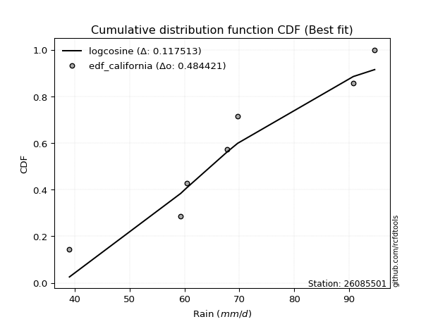</img>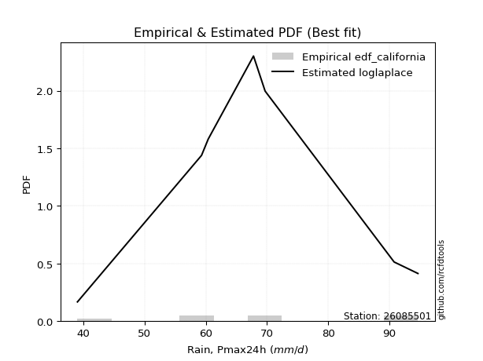</img>

</div>


### 2. Empirical - EDF Hazen (1930)

Hazen method for plotting positions is a formula used to estimate the empirical cumulative probability distribution of flood events or other hydrological data. This formula often results in biased estimations, particularly when extrapolating to extreme events (high return periods).

<div align="center">


$P=(m-0.5)/n$


</div>


**2.1. Empirical values**

<div align="center">

|                | 0                   | 1                   | 2                   | 3         | 4                  | 5                  | 6                  |
|:---------------|:--------------------|:--------------------|:--------------------|:----------|:-------------------|:-------------------|:-------------------|
| date           | 2017                | 2023                | 2021                | 2020      | 2022               | 2018               | 2019               |
| x              | 39.0                | 59.3                | 60.4                | 67.8      | 69.7               | 90.8               | 94.7               |
| m              | 1                   | 2                   | 3                   | 4         | 5                  | 6                  | 7                  |
| empirical_dist | edf_hazen           | edf_hazen           | edf_hazen           | edf_hazen | edf_hazen          | edf_hazen          | edf_hazen          |
| empirical      | 0.07142857142857142 | 0.21428571428571427 | 0.35714285714285715 | 0.5       | 0.6428571428571429 | 0.7857142857142857 | 0.9285714285714286 |
| empirical_tr   | 1.0769230769230769  | 1.2727272727272727  | 1.5555555555555558  | 2.0       | 2.8000000000000003 | 4.666666666666666  | 14.000000000000007 |

</div>


**2.2. Kolmogorov-Smirnov fit test (sorted by Δ)**


<div align="center">

|                | 0                   | 1                   | 2                   | 3                   | 4                   | 5                   | 6                   | 7                   | 8                   | 9                     | 10                  | 11                  | 12                  | 13                  | 14                  | 15                  | 16                  | 17                  | 18                  | 19                  | 20                  | 21                  | 22                  | 23                  | 24                  | 25                  | 26                  | 27                  | 28                  | 29                  | 30                  | 31                  | 32                  | 33                  | 34                  | 35                  | 36                  | 37                  | 38                  | 39                  | 40                  | 41                  | 42                  | 43                  | 44                  | 45                  | 46                  | 47                  | 48                  | 49                  | 50                  | 51                  | 52                  | 53                  | 54                  | 55                  | 56                  | 57                  | 58                  | 59                  | 60                  | 61                  | 62                  | 63                  | 64                  | 65                  | 66                  | 67                  | 68                  | 69                  | 70                  | 71                  | 72                  | 73                  | 74                  | 75                  | 76                  | 77                  | 78                  | 79                  | 80                  | 81                  | 82                  | 83                  | 84                  | 85                  | 86                  | 87                  | 88                  | 89                  |
|:---------------|:--------------------|:--------------------|:--------------------|:--------------------|:--------------------|:--------------------|:--------------------|:--------------------|:--------------------|:----------------------|:--------------------|:--------------------|:--------------------|:--------------------|:--------------------|:--------------------|:--------------------|:--------------------|:--------------------|:--------------------|:--------------------|:--------------------|:--------------------|:--------------------|:--------------------|:--------------------|:--------------------|:--------------------|:--------------------|:--------------------|:--------------------|:--------------------|:--------------------|:--------------------|:--------------------|:--------------------|:--------------------|:--------------------|:--------------------|:--------------------|:--------------------|:--------------------|:--------------------|:--------------------|:--------------------|:--------------------|:--------------------|:--------------------|:--------------------|:--------------------|:--------------------|:--------------------|:--------------------|:--------------------|:--------------------|:--------------------|:--------------------|:--------------------|:--------------------|:--------------------|:--------------------|:--------------------|:--------------------|:--------------------|:--------------------|:--------------------|:--------------------|:--------------------|:--------------------|:--------------------|:--------------------|:--------------------|:--------------------|:--------------------|:--------------------|:--------------------|:--------------------|:--------------------|:--------------------|:--------------------|:--------------------|:--------------------|:--------------------|:--------------------|:--------------------|:--------------------|:--------------------|:--------------------|:--------------------|:--------------------|
| station        | 26085501            | 26085501            | 26085501            | 26085501            | 26085501            | 26085501            | 26085501            | 26085501            | 26085501            | 26085501              | 26085501            | 26085501            | 26085501            | 26085501            | 26085501            | 26085501            | 26085501            | 26085501            | 26085501            | 26085501            | 26085501            | 26085501            | 26085501            | 26085501            | 26085501            | 26085501            | 26085501            | 26085501            | 26085501            | 26085501            | 26085501            | 26085501            | 26085501            | 26085501            | 26085501            | 26085501            | 26085501            | 26085501            | 26085501            | 26085501            | 26085501            | 26085501            | 26085501            | 26085501            | 26085501            | 26085501            | 26085501            | 26085501            | 26085501            | 26085501            | 26085501            | 26085501            | 26085501            | 26085501            | 26085501            | 26085501            | 26085501            | 26085501            | 26085501            | 26085501            | 26085501            | 26085501            | 26085501            | 26085501            | 26085501            | 26085501            | 26085501            | 26085501            | 26085501            | 26085501            | 26085501            | 26085501            | 26085501            | 26085501            | 26085501            | 26085501            | 26085501            | 26085501            | 26085501            | 26085501            | 26085501            | 26085501            | 26085501            | 26085501            | 26085501            | 26085501            | 26085501            | 26085501            | 26085501            | 26085501            |
| empirical_dist | edf_hazen           | edf_hazen           | edf_hazen           | edf_hazen           | edf_hazen           | edf_hazen           | edf_hazen           | edf_hazen           | edf_hazen           | edf_hazen             | edf_hazen           | edf_hazen           | edf_hazen           | edf_hazen           | edf_hazen           | edf_hazen           | edf_hazen           | edf_hazen           | edf_hazen           | edf_hazen           | edf_hazen           | edf_hazen           | edf_hazen           | edf_hazen           | edf_hazen           | edf_hazen           | edf_hazen           | edf_hazen           | edf_hazen           | edf_hazen           | edf_hazen           | edf_hazen           | edf_hazen           | edf_hazen           | edf_hazen           | edf_hazen           | edf_hazen           | edf_hazen           | edf_hazen           | edf_hazen           | edf_hazen           | edf_hazen           | edf_hazen           | edf_hazen           | edf_hazen           | edf_hazen           | edf_hazen           | edf_hazen           | edf_hazen           | edf_hazen           | edf_hazen           | edf_hazen           | edf_hazen           | edf_hazen           | edf_hazen           | edf_hazen           | edf_hazen           | edf_hazen           | edf_hazen           | edf_hazen           | edf_hazen           | edf_hazen           | edf_hazen           | edf_hazen           | edf_hazen           | edf_hazen           | edf_hazen           | edf_hazen           | edf_hazen           | edf_hazen           | edf_hazen           | edf_hazen           | edf_hazen           | edf_hazen           | edf_hazen           | edf_hazen           | edf_hazen           | edf_hazen           | edf_hazen           | edf_hazen           | edf_hazen           | edf_hazen           | edf_hazen           | edf_hazen           | edf_hazen           | edf_hazen           | edf_hazen           | edf_hazen           | edf_hazen           | edf_hazen           |
| p_dist         | logfisk             | alpha               | invgamma            | genlogistic         | ncf                 | betaprime           | fisk                | logpearson3         | rice                | loglaplace_asymmetric | mielke              | loggenlogistic      | loglogistic         | loghypsecant        | loggompertz         | maxwell             | laplace_asymmetric  | logmielke           | gumbel_r            | weibull_min         | loglaplace          | f                   | rayleigh            | logistic            | moyal               | nct                 | gamma               | pearson3            | erlang              | johnsonsu           | truncnorm           | norm                | crystalball         | exponnorm           | t                   | logweibull_min      | hypsecant           | invgauss            | logcrystalball      | lognorm             | lognorm             | logt                | logexponnorm        | laplace             | logncf              | logfatiguelife      | logf                | lognct              | logloggamma         | loggumbel_l         | logerlang           | logrice             | loggamma            | loggamma            | logalpha            | logjohnsonsu        | wald                | halflogistic        | loginvgamma         | halfnorm            | loginvgauss         | logmaxwell          | kstwobign           | gibrat              | lograyleigh         | loggumbel_r         | logbetaprime        | logmoyal            | gumbel_l            | loginvweibull       | loghalfnorm         | loghalflogistic     | nakagami            | lognakagami         | loggibrat           | logwald             | logkstwobign        | loggenexpon         | expon               | logchi2             | genexpon            | chi2                | logexpon            | loglognorm          | logtruncnorm        | pareto              | logpareto           | invweibull          | fatiguelife         | gompertz            |
| delta          | 0.09235384696808716 | 0.10030469956978705 | 0.1005842631863223  | 0.1007988829542964  | 0.10403408407433809 | 0.1048093139115199  | 0.10593830163794382 | 0.1061082682560025  | 0.10623047200027036 | 0.10664117519074112   | 0.10739366244688098 | 0.10747551144661027 | 0.10831910064387937 | 0.10853534261750564 | 0.1091338071717676  | 0.10913839785187665 | 0.11079560675984224 | 0.11116863954754397 | 0.11312049351249279 | 0.11381439587602238 | 0.11412332156742278 | 0.11909971750674608 | 0.12003014762408729 | 0.12024586179064789 | 0.12228604908735377 | 0.12281891889047769 | 0.1229064836296101  | 0.12293708228442968 | 0.12294435563613837 | 0.12295841003298713 | 0.12295848108708929 | 0.12295856207467015 | 0.12295857531586674 | 0.1229590765137849  | 0.12296324474429332 | 0.1233463533826239  | 0.12392578671481014 | 0.12401455993603924 | 0.12698693120379448 | 0.12698759556156206 | 0.12698759556156206 | 0.12698779130014162 | 0.12698796187187097 | 0.1275443765696186  | 0.12764724106512002 | 0.1278355129582399  | 0.12924883525546718 | 0.1299562080668589  | 0.13066660292897192 | 0.137043928862562   | 0.13772293526155302 | 0.13804743288781332 | 0.1381416504192798  | 0.1381416504192798  | 0.1404721566973837  | 0.1410551976031834  | 0.14429316632470512 | 0.14814053948499292 | 0.15054015717242206 | 0.15076434244790557 | 0.1573451152513836  | 0.1583625236263637  | 0.16030848766778646 | 0.16353946581801182 | 0.1703125518073366  | 0.17295924182975372 | 0.1879646146805459  | 0.18970635225190338 | 0.19245606600620946 | 0.1931644738926516  | 0.20429276037725283 | 0.2108950392727387  | 0.21428334929379309 | 0.2142856476646639  | 0.2244845019560886  | 0.22531950887089217 | 0.22604408686463887 | 0.23033517876840162 | 0.27954375451847135 | 0.30073496705267744 | 0.3011112328728728  | 0.3039732216215849  | 0.3309743949478571  | 0.4335439243324736  | 0.44755428977062384 | 0.4493175375367354  | 0.4555100320582953  | 0.4920047041437724  | 0.6104672242477717  | 0.6428491433234821  |
| deltao         | 0.48442053926100004 | 0.48442053926100004 | 0.48442053926100004 | 0.48442053926100004 | 0.48442053926100004 | 0.48442053926100004 | 0.48442053926100004 | 0.48442053926100004 | 0.48442053926100004 | 0.48442053926100004   | 0.48442053926100004 | 0.48442053926100004 | 0.48442053926100004 | 0.48442053926100004 | 0.48442053926100004 | 0.48442053926100004 | 0.48442053926100004 | 0.48442053926100004 | 0.48442053926100004 | 0.48442053926100004 | 0.48442053926100004 | 0.48442053926100004 | 0.48442053926100004 | 0.48442053926100004 | 0.48442053926100004 | 0.48442053926100004 | 0.48442053926100004 | 0.48442053926100004 | 0.48442053926100004 | 0.48442053926100004 | 0.48442053926100004 | 0.48442053926100004 | 0.48442053926100004 | 0.48442053926100004 | 0.48442053926100004 | 0.48442053926100004 | 0.48442053926100004 | 0.48442053926100004 | 0.48442053926100004 | 0.48442053926100004 | 0.48442053926100004 | 0.48442053926100004 | 0.48442053926100004 | 0.48442053926100004 | 0.48442053926100004 | 0.48442053926100004 | 0.48442053926100004 | 0.48442053926100004 | 0.48442053926100004 | 0.48442053926100004 | 0.48442053926100004 | 0.48442053926100004 | 0.48442053926100004 | 0.48442053926100004 | 0.48442053926100004 | 0.48442053926100004 | 0.48442053926100004 | 0.48442053926100004 | 0.48442053926100004 | 0.48442053926100004 | 0.48442053926100004 | 0.48442053926100004 | 0.48442053926100004 | 0.48442053926100004 | 0.48442053926100004 | 0.48442053926100004 | 0.48442053926100004 | 0.48442053926100004 | 0.48442053926100004 | 0.48442053926100004 | 0.48442053926100004 | 0.48442053926100004 | 0.48442053926100004 | 0.48442053926100004 | 0.48442053926100004 | 0.48442053926100004 | 0.48442053926100004 | 0.48442053926100004 | 0.48442053926100004 | 0.48442053926100004 | 0.48442053926100004 | 0.48442053926100004 | 0.48442053926100004 | 0.48442053926100004 | 0.48442053926100004 | 0.48442053926100004 | 0.48442053926100004 | 0.48442053926100004 | 0.48442053926100004 | 0.48442053926100004 |
| eval           | Δo > Δ              | Δo > Δ              | Δo > Δ              | Δo > Δ              | Δo > Δ              | Δo > Δ              | Δo > Δ              | Δo > Δ              | Δo > Δ              | Δo > Δ                | Δo > Δ              | Δo > Δ              | Δo > Δ              | Δo > Δ              | Δo > Δ              | Δo > Δ              | Δo > Δ              | Δo > Δ              | Δo > Δ              | Δo > Δ              | Δo > Δ              | Δo > Δ              | Δo > Δ              | Δo > Δ              | Δo > Δ              | Δo > Δ              | Δo > Δ              | Δo > Δ              | Δo > Δ              | Δo > Δ              | Δo > Δ              | Δo > Δ              | Δo > Δ              | Δo > Δ              | Δo > Δ              | Δo > Δ              | Δo > Δ              | Δo > Δ              | Δo > Δ              | Δo > Δ              | Δo > Δ              | Δo > Δ              | Δo > Δ              | Δo > Δ              | Δo > Δ              | Δo > Δ              | Δo > Δ              | Δo > Δ              | Δo > Δ              | Δo > Δ              | Δo > Δ              | Δo > Δ              | Δo > Δ              | Δo > Δ              | Δo > Δ              | Δo > Δ              | Δo > Δ              | Δo > Δ              | Δo > Δ              | Δo > Δ              | Δo > Δ              | Δo > Δ              | Δo > Δ              | Δo > Δ              | Δo > Δ              | Δo > Δ              | Δo > Δ              | Δo > Δ              | Δo > Δ              | Δo > Δ              | Δo > Δ              | Δo > Δ              | Δo > Δ              | Δo > Δ              | Δo > Δ              | Δo > Δ              | Δo > Δ              | Δo > Δ              | Δo > Δ              | Δo > Δ              | Δo > Δ              | Δo > Δ              | Δo > Δ              | Δo > Δ              | Δo > Δ              | Δo > Δ              | Δo > Δ              | Δo <= Δ             | Δo <= Δ             | Δo <= Δ             |
| fit            | 1                   | 1                   | 1                   | 1                   | 1                   | 1                   | 1                   | 1                   | 1                   | 1                     | 1                   | 1                   | 1                   | 1                   | 1                   | 1                   | 1                   | 1                   | 1                   | 1                   | 1                   | 1                   | 1                   | 1                   | 1                   | 1                   | 1                   | 1                   | 1                   | 1                   | 1                   | 1                   | 1                   | 1                   | 1                   | 1                   | 1                   | 1                   | 1                   | 1                   | 1                   | 1                   | 1                   | 1                   | 1                   | 1                   | 1                   | 1                   | 1                   | 1                   | 1                   | 1                   | 1                   | 1                   | 1                   | 1                   | 1                   | 1                   | 1                   | 1                   | 1                   | 1                   | 1                   | 1                   | 1                   | 1                   | 1                   | 1                   | 1                   | 1                   | 1                   | 1                   | 1                   | 1                   | 1                   | 1                   | 1                   | 1                   | 1                   | 1                   | 1                   | 1                   | 1                   | 1                   | 1                   | 1                   | 1                   | 0                   | 0                   | 0                   |
| n              | 7                   | 7                   | 7                   | 7                   | 7                   | 7                   | 7                   | 7                   | 7                   | 7                     | 7                   | 7                   | 7                   | 7                   | 7                   | 7                   | 7                   | 7                   | 7                   | 7                   | 7                   | 7                   | 7                   | 7                   | 7                   | 7                   | 7                   | 7                   | 7                   | 7                   | 7                   | 7                   | 7                   | 7                   | 7                   | 7                   | 7                   | 7                   | 7                   | 7                   | 7                   | 7                   | 7                   | 7                   | 7                   | 7                   | 7                   | 7                   | 7                   | 7                   | 7                   | 7                   | 7                   | 7                   | 7                   | 7                   | 7                   | 7                   | 7                   | 7                   | 7                   | 7                   | 7                   | 7                   | 7                   | 7                   | 7                   | 7                   | 7                   | 7                   | 7                   | 7                   | 7                   | 7                   | 7                   | 7                   | 7                   | 7                   | 7                   | 7                   | 7                   | 7                   | 7                   | 7                   | 7                   | 7                   | 7                   | 7                   | 7                   | 7                   |
| best_fit       | 1                   | 0                   | 0                   | 0                   | 0                   | 0                   | 0                   | 0                   | 0                   | 0                     | 0                   | 0                   | 0                   | 0                   | 0                   | 0                   | 0                   | 0                   | 0                   | 0                   | 0                   | 0                   | 0                   | 0                   | 0                   | 0                   | 0                   | 0                   | 0                   | 0                   | 0                   | 0                   | 0                   | 0                   | 0                   | 0                   | 0                   | 0                   | 0                   | 0                   | 0                   | 0                   | 0                   | 0                   | 0                   | 0                   | 0                   | 0                   | 0                   | 0                   | 0                   | 0                   | 0                   | 0                   | 0                   | 0                   | 0                   | 0                   | 0                   | 0                   | 0                   | 0                   | 0                   | 0                   | 0                   | 0                   | 0                   | 0                   | 0                   | 0                   | 0                   | 0                   | 0                   | 0                   | 0                   | 0                   | 0                   | 0                   | 0                   | 0                   | 0                   | 0                   | 0                   | 0                   | 0                   | 0                   | 0                   | 0                   | 0                   | 0                   |
| best_fit_sort  | 1                   | 2                   | 3                   | 4                   | 5                   | 6                   | 7                   | 8                   | 9                   | 10                    | 11                  | 12                  | 13                  | 14                  | 15                  | 16                  | 17                  | 18                  | 19                  | 20                  | 21                  | 22                  | 23                  | 24                  | 25                  | 26                  | 27                  | 28                  | 29                  | 30                  | 31                  | 32                  | 33                  | 34                  | 35                  | 36                  | 37                  | 38                  | 39                  | 40                  | 41                  | 42                  | 43                  | 44                  | 45                  | 46                  | 47                  | 48                  | 49                  | 50                  | 51                  | 52                  | 53                  | 54                  | 55                  | 56                  | 57                  | 58                  | 59                  | 60                  | 61                  | 62                  | 63                  | 64                  | 65                  | 66                  | 67                  | 68                  | 69                  | 70                  | 71                  | 72                  | 73                  | 74                  | 75                  | 76                  | 77                  | 78                  | 79                  | 80                  | 81                  | 82                  | 83                  | 84                  | 85                  | 86                  | 87                  | 88                  | 89                  | 90                  |

</div>


<div align="center">

</img>

</div>


**2.3. Best fit**

<div align="center">

|   id |   station | empirical_dist   | p_dist   |     delta |   deltao | eval   |   fit |   n |   best_fit |   best_fit_sort |
|-----:|----------:|:-----------------|:---------|----------:|---------:|:-------|------:|----:|-----------:|----------------:|
|    0 |  26085501 | edf_hazen        | logfisk  | 0.0923538 | 0.484421 | Δo > Δ |     1 |   7 |          1 |               1 |

</div>


<div align="center">

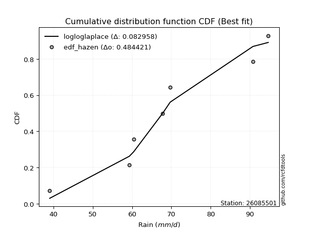</img>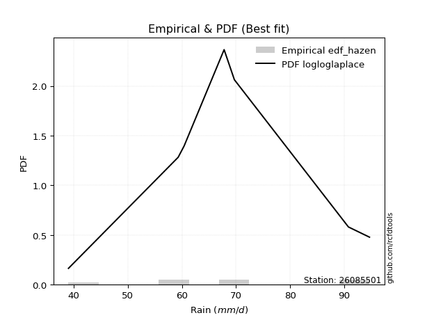</img>

</div>


### 3. Empirical - EDF Weibull (1939)

Weibull plotting position formula is an empirical method used to estimate the non-exceedance probability or plotting position for a set of observed data, is often recommended or widely used in practice, particularly in flood frequency analysis.

<div align="center">


$P=m/(n+1)$


</div>


**3.1. Empirical values**

<div align="center">

|                | 0                  | 1                  | 2           | 3           | 4                  | 5           | 6           |
|:---------------|:-------------------|:-------------------|:------------|:------------|:-------------------|:------------|:------------|
| date           | 2017               | 2023               | 2021        | 2020        | 2022               | 2018        | 2019        |
| x              | 39.0               | 59.3               | 60.4        | 67.8        | 69.7               | 90.8        | 94.7        |
| m              | 1                  | 2                  | 3           | 4           | 5                  | 6           | 7           |
| empirical_dist | edf_weibull        | edf_weibull        | edf_weibull | edf_weibull | edf_weibull        | edf_weibull | edf_weibull |
| empirical      | 0.125              | 0.25               | 0.375       | 0.5         | 0.625              | 0.75        | 0.875       |
| empirical_tr   | 1.1428571428571428 | 1.3333333333333333 | 1.6         | 2.0         | 2.6666666666666665 | 4.0         | 8.0         |

</div>


**3.2. Kolmogorov-Smirnov fit test (sorted by Δ)**


<div align="center">

|                | 0                   | 1                   | 2                   | 3                   | 4                   | 5                   | 6                   | 7                   | 8                   | 9                   | 10                  | 11                  | 12                  | 13                  | 14                  | 15                  | 16                  | 17                  | 18                  | 19                  | 20                  | 21                  | 22                  | 23                  | 24                  | 25                  | 26                  | 27                  | 28                  | 29                  | 30                  | 31                  | 32                  | 33                  | 34                  | 35                  | 36                  | 37                  | 38                  | 39                  | 40                  | 41                  | 42                  | 43                  | 44                  | 45                  | 46                  | 47                  | 48                  | 49                  | 50                  | 51                  | 52                  | 53                  | 54                    | 55                  | 56                  | 57                  | 58                  | 59                  | 60                  | 61                  | 62                  | 63                  | 64                  | 65                  | 66                  | 67                  | 68                  | 69                  | 70                  | 71                  | 72                  | 73                  | 74                  | 75                  | 76                  | 77                  | 78                  | 79                  | 80                  | 81                  | 82                  | 83                  | 84                  | 85                  | 86                  | 87                  | 88                  | 89                  |
|:---------------|:--------------------|:--------------------|:--------------------|:--------------------|:--------------------|:--------------------|:--------------------|:--------------------|:--------------------|:--------------------|:--------------------|:--------------------|:--------------------|:--------------------|:--------------------|:--------------------|:--------------------|:--------------------|:--------------------|:--------------------|:--------------------|:--------------------|:--------------------|:--------------------|:--------------------|:--------------------|:--------------------|:--------------------|:--------------------|:--------------------|:--------------------|:--------------------|:--------------------|:--------------------|:--------------------|:--------------------|:--------------------|:--------------------|:--------------------|:--------------------|:--------------------|:--------------------|:--------------------|:--------------------|:--------------------|:--------------------|:--------------------|:--------------------|:--------------------|:--------------------|:--------------------|:--------------------|:--------------------|:--------------------|:----------------------|:--------------------|:--------------------|:--------------------|:--------------------|:--------------------|:--------------------|:--------------------|:--------------------|:--------------------|:--------------------|:--------------------|:--------------------|:--------------------|:--------------------|:--------------------|:--------------------|:--------------------|:--------------------|:--------------------|:--------------------|:--------------------|:--------------------|:--------------------|:--------------------|:--------------------|:--------------------|:--------------------|:--------------------|:--------------------|:--------------------|:--------------------|:--------------------|:--------------------|:--------------------|:--------------------|
| station        | 26085501            | 26085501            | 26085501            | 26085501            | 26085501            | 26085501            | 26085501            | 26085501            | 26085501            | 26085501            | 26085501            | 26085501            | 26085501            | 26085501            | 26085501            | 26085501            | 26085501            | 26085501            | 26085501            | 26085501            | 26085501            | 26085501            | 26085501            | 26085501            | 26085501            | 26085501            | 26085501            | 26085501            | 26085501            | 26085501            | 26085501            | 26085501            | 26085501            | 26085501            | 26085501            | 26085501            | 26085501            | 26085501            | 26085501            | 26085501            | 26085501            | 26085501            | 26085501            | 26085501            | 26085501            | 26085501            | 26085501            | 26085501            | 26085501            | 26085501            | 26085501            | 26085501            | 26085501            | 26085501            | 26085501              | 26085501            | 26085501            | 26085501            | 26085501            | 26085501            | 26085501            | 26085501            | 26085501            | 26085501            | 26085501            | 26085501            | 26085501            | 26085501            | 26085501            | 26085501            | 26085501            | 26085501            | 26085501            | 26085501            | 26085501            | 26085501            | 26085501            | 26085501            | 26085501            | 26085501            | 26085501            | 26085501            | 26085501            | 26085501            | 26085501            | 26085501            | 26085501            | 26085501            | 26085501            | 26085501            |
| empirical_dist | edf_weibull         | edf_weibull         | edf_weibull         | edf_weibull         | edf_weibull         | edf_weibull         | edf_weibull         | edf_weibull         | edf_weibull         | edf_weibull         | edf_weibull         | edf_weibull         | edf_weibull         | edf_weibull         | edf_weibull         | edf_weibull         | edf_weibull         | edf_weibull         | edf_weibull         | edf_weibull         | edf_weibull         | edf_weibull         | edf_weibull         | edf_weibull         | edf_weibull         | edf_weibull         | edf_weibull         | edf_weibull         | edf_weibull         | edf_weibull         | edf_weibull         | edf_weibull         | edf_weibull         | edf_weibull         | edf_weibull         | edf_weibull         | edf_weibull         | edf_weibull         | edf_weibull         | edf_weibull         | edf_weibull         | edf_weibull         | edf_weibull         | edf_weibull         | edf_weibull         | edf_weibull         | edf_weibull         | edf_weibull         | edf_weibull         | edf_weibull         | edf_weibull         | edf_weibull         | edf_weibull         | edf_weibull         | edf_weibull           | edf_weibull         | edf_weibull         | edf_weibull         | edf_weibull         | edf_weibull         | edf_weibull         | edf_weibull         | edf_weibull         | edf_weibull         | edf_weibull         | edf_weibull         | edf_weibull         | edf_weibull         | edf_weibull         | edf_weibull         | edf_weibull         | edf_weibull         | edf_weibull         | edf_weibull         | edf_weibull         | edf_weibull         | edf_weibull         | edf_weibull         | edf_weibull         | edf_weibull         | edf_weibull         | edf_weibull         | edf_weibull         | edf_weibull         | edf_weibull         | edf_weibull         | edf_weibull         | edf_weibull         | edf_weibull         | edf_weibull         |
| p_dist         | logalpha            | loggamma            | loggamma            | logerlang           | loginvgamma         | logrice             | lognct              | logfisk             | logncf              | loginvgauss         | logfatiguelife      | logcrystalball      | logt                | logexponnorm        | lognorm             | lognorm             | logf                | logmaxwell          | kstwobign           | halfnorm            | betaprime           | rayleigh            | logpearson3         | ncf                 | invgauss            | alpha               | maxwell             | lograyleigh         | logmielke           | genlogistic         | loggenlogistic      | mielke              | loggompertz         | rice                | invgamma            | loglogistic         | loggumbel_r         | weibull_min         | halflogistic        | fisk                | logweibull_min      | f                   | gumbel_r            | logloggamma         | erlang              | nct                 | t                   | pearson3            | johnsonsu           | exponnorm           | crystalball         | norm                | truncnorm           | gamma               | loglaplace_asymmetric | logjohnsonsu        | moyal               | loghypsecant        | laplace_asymmetric  | loglaplace          | logbetaprime        | logmoyal            | logistic            | loginvweibull       | wald                | hypsecant           | loggumbel_l         | laplace             | loghalfnorm         | loghalflogistic     | gibrat              | gumbel_l            | logkstwobign        | loggenexpon         | logwald             | loggibrat           | expon               | logchi2             | nakagami            | lognakagami         | genexpon            | chi2                | logexpon            | loglognorm          | logtruncnorm        | pareto              | logpareto           | invweibull          | fatiguelife         | gompertz            |
| delta          | 0.11089986467711355 | 0.11446300602835269 | 0.11446300602835269 | 0.11466203501161787 | 0.11501537584540378 | 0.11834187557954057 | 0.11850188299715425 | 0.1203458897169446  | 0.12092441314707714 | 0.12163082953709786 | 0.12173343969435013 | 0.12220836444497896 | 0.12220916881177557 | 0.12220918916207368 | 0.12220934837578112 | 0.12220934837578112 | 0.1226463671467638  | 0.12264823791207796 | 0.12459420195350074 | 0.12754206612227703 | 0.12998580697084383 | 0.1313598872771844  | 0.13197124190246512 | 0.13253590923654723 | 0.13285897587511608 | 0.1336345276307923  | 0.1336472727444301  | 0.13459826609305087 | 0.13461336481046748 | 0.13537003524094837 | 0.13558752530841012 | 0.1356041163664462  | 0.135858506795138   | 0.13599729724961096 | 0.136298548900608   | 0.13716488311330732 | 0.137244956115468   | 0.13869133502106146 | 0.1390801626082726  | 0.1397426410532715  | 0.14078234035100035 | 0.14129717386695295 | 0.14167206284506417 | 0.14200643212389807 | 0.14222855361687692 | 0.14224241842308494 | 0.1422485093414836  | 0.14225193758969068 | 0.14225227505863314 | 0.14225700126355567 | 0.14225743368600507 | 0.1422574389811544  | 0.1422575011421623  | 0.1422581376572838  | 0.14235546090502682   | 0.1434507361925733  | 0.14351168705530082 | 0.14424962833179134 | 0.14650989247412793 | 0.14983760728170847 | 0.15225032896626017 | 0.15399206653761766 | 0.1543580418014665  | 0.15745018817836587 | 0.15851298988631035 | 0.15964007242909584 | 0.16046254913446134 | 0.1632586622839043  | 0.1685784746629671  | 0.17518075355845297 | 0.17847923887541173 | 0.1860333188341684  | 0.19032980115035314 | 0.1946208930541159  | 0.19714411169224078 | 0.2244845019560886  | 0.24382946880418566 | 0.24716353848124883 | 0.2499976350080788  | 0.24999993337894963 | 0.2653969471585871  | 0.2682589359072992  | 0.2952601092335714  | 0.3978296386181879  | 0.41184000405633814 | 0.4136032518224497  | 0.4197957463440096  | 0.4384332755723438  | 0.574752938533486   | 0.6249920004663392  |
| deltao         | 0.48442053926100004 | 0.48442053926100004 | 0.48442053926100004 | 0.48442053926100004 | 0.48442053926100004 | 0.48442053926100004 | 0.48442053926100004 | 0.48442053926100004 | 0.48442053926100004 | 0.48442053926100004 | 0.48442053926100004 | 0.48442053926100004 | 0.48442053926100004 | 0.48442053926100004 | 0.48442053926100004 | 0.48442053926100004 | 0.48442053926100004 | 0.48442053926100004 | 0.48442053926100004 | 0.48442053926100004 | 0.48442053926100004 | 0.48442053926100004 | 0.48442053926100004 | 0.48442053926100004 | 0.48442053926100004 | 0.48442053926100004 | 0.48442053926100004 | 0.48442053926100004 | 0.48442053926100004 | 0.48442053926100004 | 0.48442053926100004 | 0.48442053926100004 | 0.48442053926100004 | 0.48442053926100004 | 0.48442053926100004 | 0.48442053926100004 | 0.48442053926100004 | 0.48442053926100004 | 0.48442053926100004 | 0.48442053926100004 | 0.48442053926100004 | 0.48442053926100004 | 0.48442053926100004 | 0.48442053926100004 | 0.48442053926100004 | 0.48442053926100004 | 0.48442053926100004 | 0.48442053926100004 | 0.48442053926100004 | 0.48442053926100004 | 0.48442053926100004 | 0.48442053926100004 | 0.48442053926100004 | 0.48442053926100004 | 0.48442053926100004   | 0.48442053926100004 | 0.48442053926100004 | 0.48442053926100004 | 0.48442053926100004 | 0.48442053926100004 | 0.48442053926100004 | 0.48442053926100004 | 0.48442053926100004 | 0.48442053926100004 | 0.48442053926100004 | 0.48442053926100004 | 0.48442053926100004 | 0.48442053926100004 | 0.48442053926100004 | 0.48442053926100004 | 0.48442053926100004 | 0.48442053926100004 | 0.48442053926100004 | 0.48442053926100004 | 0.48442053926100004 | 0.48442053926100004 | 0.48442053926100004 | 0.48442053926100004 | 0.48442053926100004 | 0.48442053926100004 | 0.48442053926100004 | 0.48442053926100004 | 0.48442053926100004 | 0.48442053926100004 | 0.48442053926100004 | 0.48442053926100004 | 0.48442053926100004 | 0.48442053926100004 | 0.48442053926100004 | 0.48442053926100004 |
| eval           | Δo > Δ              | Δo > Δ              | Δo > Δ              | Δo > Δ              | Δo > Δ              | Δo > Δ              | Δo > Δ              | Δo > Δ              | Δo > Δ              | Δo > Δ              | Δo > Δ              | Δo > Δ              | Δo > Δ              | Δo > Δ              | Δo > Δ              | Δo > Δ              | Δo > Δ              | Δo > Δ              | Δo > Δ              | Δo > Δ              | Δo > Δ              | Δo > Δ              | Δo > Δ              | Δo > Δ              | Δo > Δ              | Δo > Δ              | Δo > Δ              | Δo > Δ              | Δo > Δ              | Δo > Δ              | Δo > Δ              | Δo > Δ              | Δo > Δ              | Δo > Δ              | Δo > Δ              | Δo > Δ              | Δo > Δ              | Δo > Δ              | Δo > Δ              | Δo > Δ              | Δo > Δ              | Δo > Δ              | Δo > Δ              | Δo > Δ              | Δo > Δ              | Δo > Δ              | Δo > Δ              | Δo > Δ              | Δo > Δ              | Δo > Δ              | Δo > Δ              | Δo > Δ              | Δo > Δ              | Δo > Δ              | Δo > Δ                | Δo > Δ              | Δo > Δ              | Δo > Δ              | Δo > Δ              | Δo > Δ              | Δo > Δ              | Δo > Δ              | Δo > Δ              | Δo > Δ              | Δo > Δ              | Δo > Δ              | Δo > Δ              | Δo > Δ              | Δo > Δ              | Δo > Δ              | Δo > Δ              | Δo > Δ              | Δo > Δ              | Δo > Δ              | Δo > Δ              | Δo > Δ              | Δo > Δ              | Δo > Δ              | Δo > Δ              | Δo > Δ              | Δo > Δ              | Δo > Δ              | Δo > Δ              | Δo > Δ              | Δo > Δ              | Δo > Δ              | Δo > Δ              | Δo > Δ              | Δo <= Δ             | Δo <= Δ             |
| fit            | 1                   | 1                   | 1                   | 1                   | 1                   | 1                   | 1                   | 1                   | 1                   | 1                   | 1                   | 1                   | 1                   | 1                   | 1                   | 1                   | 1                   | 1                   | 1                   | 1                   | 1                   | 1                   | 1                   | 1                   | 1                   | 1                   | 1                   | 1                   | 1                   | 1                   | 1                   | 1                   | 1                   | 1                   | 1                   | 1                   | 1                   | 1                   | 1                   | 1                   | 1                   | 1                   | 1                   | 1                   | 1                   | 1                   | 1                   | 1                   | 1                   | 1                   | 1                   | 1                   | 1                   | 1                   | 1                     | 1                   | 1                   | 1                   | 1                   | 1                   | 1                   | 1                   | 1                   | 1                   | 1                   | 1                   | 1                   | 1                   | 1                   | 1                   | 1                   | 1                   | 1                   | 1                   | 1                   | 1                   | 1                   | 1                   | 1                   | 1                   | 1                   | 1                   | 1                   | 1                   | 1                   | 1                   | 1                   | 1                   | 0                   | 0                   |
| n              | 7                   | 7                   | 7                   | 7                   | 7                   | 7                   | 7                   | 7                   | 7                   | 7                   | 7                   | 7                   | 7                   | 7                   | 7                   | 7                   | 7                   | 7                   | 7                   | 7                   | 7                   | 7                   | 7                   | 7                   | 7                   | 7                   | 7                   | 7                   | 7                   | 7                   | 7                   | 7                   | 7                   | 7                   | 7                   | 7                   | 7                   | 7                   | 7                   | 7                   | 7                   | 7                   | 7                   | 7                   | 7                   | 7                   | 7                   | 7                   | 7                   | 7                   | 7                   | 7                   | 7                   | 7                   | 7                     | 7                   | 7                   | 7                   | 7                   | 7                   | 7                   | 7                   | 7                   | 7                   | 7                   | 7                   | 7                   | 7                   | 7                   | 7                   | 7                   | 7                   | 7                   | 7                   | 7                   | 7                   | 7                   | 7                   | 7                   | 7                   | 7                   | 7                   | 7                   | 7                   | 7                   | 7                   | 7                   | 7                   | 7                   | 7                   |
| best_fit       | 1                   | 0                   | 0                   | 0                   | 0                   | 0                   | 0                   | 0                   | 0                   | 0                   | 0                   | 0                   | 0                   | 0                   | 0                   | 0                   | 0                   | 0                   | 0                   | 0                   | 0                   | 0                   | 0                   | 0                   | 0                   | 0                   | 0                   | 0                   | 0                   | 0                   | 0                   | 0                   | 0                   | 0                   | 0                   | 0                   | 0                   | 0                   | 0                   | 0                   | 0                   | 0                   | 0                   | 0                   | 0                   | 0                   | 0                   | 0                   | 0                   | 0                   | 0                   | 0                   | 0                   | 0                   | 0                     | 0                   | 0                   | 0                   | 0                   | 0                   | 0                   | 0                   | 0                   | 0                   | 0                   | 0                   | 0                   | 0                   | 0                   | 0                   | 0                   | 0                   | 0                   | 0                   | 0                   | 0                   | 0                   | 0                   | 0                   | 0                   | 0                   | 0                   | 0                   | 0                   | 0                   | 0                   | 0                   | 0                   | 0                   | 0                   |
| best_fit_sort  | 1                   | 2                   | 3                   | 4                   | 5                   | 6                   | 7                   | 8                   | 9                   | 10                  | 11                  | 12                  | 13                  | 14                  | 15                  | 16                  | 17                  | 18                  | 19                  | 20                  | 21                  | 22                  | 23                  | 24                  | 25                  | 26                  | 27                  | 28                  | 29                  | 30                  | 31                  | 32                  | 33                  | 34                  | 35                  | 36                  | 37                  | 38                  | 39                  | 40                  | 41                  | 42                  | 43                  | 44                  | 45                  | 46                  | 47                  | 48                  | 49                  | 50                  | 51                  | 52                  | 53                  | 54                  | 55                    | 56                  | 57                  | 58                  | 59                  | 60                  | 61                  | 62                  | 63                  | 64                  | 65                  | 66                  | 67                  | 68                  | 69                  | 70                  | 71                  | 72                  | 73                  | 74                  | 75                  | 76                  | 77                  | 78                  | 79                  | 80                  | 81                  | 82                  | 83                  | 84                  | 85                  | 86                  | 87                  | 88                  | 89                  | 90                  |

</div>


<div align="center">

</img>

</div>


**3.3. Best fit**

<div align="center">

|   id |   station | empirical_dist   | p_dist   |   delta |   deltao | eval   |   fit |   n |   best_fit |   best_fit_sort |
|-----:|----------:|:-----------------|:---------|--------:|---------:|:-------|------:|----:|-----------:|----------------:|
|    0 |  26085501 | edf_weibull      | logalpha |  0.1109 | 0.484421 | Δo > Δ |     1 |   7 |          1 |               1 |

</div>


<div align="center">

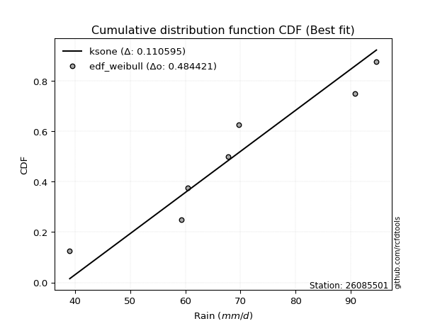</img>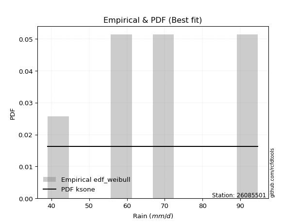</img>

</div>


### 4. Empirical - EDF Beard (1943)

The Beard formula (or Beard´s plotting position formula) in hydrology is used to estimate the empirical non-exceedance probability _(P)_ of a flood event (or other extreme hydrological data point) within a given dataset.

<div align="center">


$P=(m-0.31)/(n+0.38)$


</div>


**4.1. Empirical values**

<div align="center">

|                | 0                   | 1                   | 2                   | 3         | 4                  | 5                  | 6                  |
|:---------------|:--------------------|:--------------------|:--------------------|:----------|:-------------------|:-------------------|:-------------------|
| date           | 2017                | 2023                | 2021                | 2020      | 2022               | 2018               | 2019               |
| x              | 39.0                | 59.3                | 60.4                | 67.8      | 69.7               | 90.8               | 94.7               |
| m              | 1                   | 2                   | 3                   | 4         | 5                  | 6                  | 7                  |
| empirical_dist | edf_beard           | edf_beard           | edf_beard           | edf_beard | edf_beard          | edf_beard          | edf_beard          |
| empirical      | 0.09349593495934959 | 0.22899728997289973 | 0.36449864498644985 | 0.5       | 0.6355013550135502 | 0.7710027100271003 | 0.9065040650406505 |
| empirical_tr   | 1.1031390134529149  | 1.29701230228471    | 1.5735607675906182  | 2.0       | 2.743494423791822  | 4.366863905325444  | 10.695652173913055 |

</div>


**4.2. Kolmogorov-Smirnov fit test (sorted by Δ)**


<div align="center">

|                | 0                   | 1                   | 2                   | 3                   | 4                   | 5                   | 6                   | 7                   | 8                   | 9                   | 10                  | 11                  | 12                  | 13                  | 14                  | 15                  | 16                  | 17                  | 18                  | 19                  | 20                  | 21                  | 22                  | 23                  | 24                  | 25                  | 26                  | 27                  | 28                  | 29                  | 30                  | 31                  | 32                  | 33                  | 34                  | 35                  | 36                  | 37                  | 38                  | 39                  | 40                    | 41                  | 42                  | 43                  | 44                  | 45                  | 46                  | 47                  | 48                  | 49                  | 50                  | 51                  | 52                  | 53                  | 54                  | 55                  | 56                  | 57                  | 58                  | 59                  | 60                  | 61                  | 62                  | 63                  | 64                  | 65                  | 66                  | 67                  | 68                  | 69                  | 70                  | 71                  | 72                  | 73                  | 74                  | 75                  | 76                  | 77                  | 78                  | 79                  | 80                  | 81                  | 82                  | 83                  | 84                  | 85                  | 86                  | 87                  | 88                  | 89                  |
|:---------------|:--------------------|:--------------------|:--------------------|:--------------------|:--------------------|:--------------------|:--------------------|:--------------------|:--------------------|:--------------------|:--------------------|:--------------------|:--------------------|:--------------------|:--------------------|:--------------------|:--------------------|:--------------------|:--------------------|:--------------------|:--------------------|:--------------------|:--------------------|:--------------------|:--------------------|:--------------------|:--------------------|:--------------------|:--------------------|:--------------------|:--------------------|:--------------------|:--------------------|:--------------------|:--------------------|:--------------------|:--------------------|:--------------------|:--------------------|:--------------------|:----------------------|:--------------------|:--------------------|:--------------------|:--------------------|:--------------------|:--------------------|:--------------------|:--------------------|:--------------------|:--------------------|:--------------------|:--------------------|:--------------------|:--------------------|:--------------------|:--------------------|:--------------------|:--------------------|:--------------------|:--------------------|:--------------------|:--------------------|:--------------------|:--------------------|:--------------------|:--------------------|:--------------------|:--------------------|:--------------------|:--------------------|:--------------------|:--------------------|:--------------------|:--------------------|:--------------------|:--------------------|:--------------------|:--------------------|:--------------------|:--------------------|:--------------------|:--------------------|:--------------------|:--------------------|:--------------------|:--------------------|:--------------------|:--------------------|:--------------------|
| station        | 26085501            | 26085501            | 26085501            | 26085501            | 26085501            | 26085501            | 26085501            | 26085501            | 26085501            | 26085501            | 26085501            | 26085501            | 26085501            | 26085501            | 26085501            | 26085501            | 26085501            | 26085501            | 26085501            | 26085501            | 26085501            | 26085501            | 26085501            | 26085501            | 26085501            | 26085501            | 26085501            | 26085501            | 26085501            | 26085501            | 26085501            | 26085501            | 26085501            | 26085501            | 26085501            | 26085501            | 26085501            | 26085501            | 26085501            | 26085501            | 26085501              | 26085501            | 26085501            | 26085501            | 26085501            | 26085501            | 26085501            | 26085501            | 26085501            | 26085501            | 26085501            | 26085501            | 26085501            | 26085501            | 26085501            | 26085501            | 26085501            | 26085501            | 26085501            | 26085501            | 26085501            | 26085501            | 26085501            | 26085501            | 26085501            | 26085501            | 26085501            | 26085501            | 26085501            | 26085501            | 26085501            | 26085501            | 26085501            | 26085501            | 26085501            | 26085501            | 26085501            | 26085501            | 26085501            | 26085501            | 26085501            | 26085501            | 26085501            | 26085501            | 26085501            | 26085501            | 26085501            | 26085501            | 26085501            | 26085501            |
| empirical_dist | edf_beard           | edf_beard           | edf_beard           | edf_beard           | edf_beard           | edf_beard           | edf_beard           | edf_beard           | edf_beard           | edf_beard           | edf_beard           | edf_beard           | edf_beard           | edf_beard           | edf_beard           | edf_beard           | edf_beard           | edf_beard           | edf_beard           | edf_beard           | edf_beard           | edf_beard           | edf_beard           | edf_beard           | edf_beard           | edf_beard           | edf_beard           | edf_beard           | edf_beard           | edf_beard           | edf_beard           | edf_beard           | edf_beard           | edf_beard           | edf_beard           | edf_beard           | edf_beard           | edf_beard           | edf_beard           | edf_beard           | edf_beard             | edf_beard           | edf_beard           | edf_beard           | edf_beard           | edf_beard           | edf_beard           | edf_beard           | edf_beard           | edf_beard           | edf_beard           | edf_beard           | edf_beard           | edf_beard           | edf_beard           | edf_beard           | edf_beard           | edf_beard           | edf_beard           | edf_beard           | edf_beard           | edf_beard           | edf_beard           | edf_beard           | edf_beard           | edf_beard           | edf_beard           | edf_beard           | edf_beard           | edf_beard           | edf_beard           | edf_beard           | edf_beard           | edf_beard           | edf_beard           | edf_beard           | edf_beard           | edf_beard           | edf_beard           | edf_beard           | edf_beard           | edf_beard           | edf_beard           | edf_beard           | edf_beard           | edf_beard           | edf_beard           | edf_beard           | edf_beard           | edf_beard           |
| p_dist         | logfisk             | betaprime           | rayleigh            | logpearson3         | ncf                 | invgauss            | logcrystalball      | lognorm             | lognorm             | logt                | logexponnorm        | alpha               | maxwell             | logncf              | logfatiguelife      | logmielke           | genlogistic         | logf                | loggenlogistic      | mielke              | loggompertz         | rice                | lognct              | invgamma            | loglogistic         | weibull_min         | fisk                | logweibull_min      | f                   | gumbel_r            | erlang              | nct                 | t                   | pearson3            | johnsonsu           | exponnorm           | crystalball         | norm                | truncnorm           | gamma               | loglaplace_asymmetric | moyal               | logerlang           | loghypsecant        | logloggamma         | logrice             | loggamma            | loggamma            | laplace_asymmetric  | logalpha            | loglaplace          | logistic            | halflogistic        | logjohnsonsu        | loginvgamma         | halfnorm            | hypsecant           | loggumbel_l         | laplace             | loginvgauss         | logmaxwell          | wald                | kstwobign           | lograyleigh         | loggumbel_r         | gibrat              | logbetaprime        | logmoyal            | loginvweibull       | gumbel_l            | loghalfnorm         | loghalflogistic     | logwald             | logkstwobign        | loggenexpon         | loggibrat           | nakagami            | lognakagami         | expon               | logchi2             | genexpon            | chi2                | logexpon            | loglognorm          | logtruncnorm        | pareto              | logpareto           | invweibull          | fatiguelife         | gompertz            |
| delta          | 0.0993431796898443  | 0.10898309694374353 | 0.1103571772500841  | 0.11096853187536482 | 0.11153319920944693 | 0.11185626584801578 | 0.11227535551660903 | 0.1122760198743766  | 0.1122760198743766  | 0.11227621561295617 | 0.11227638618468552 | 0.11263181760369201 | 0.11264456271732981 | 0.11293566537793456 | 0.11312393727105444 | 0.11361065478336718 | 0.11436732521384807 | 0.11453725956828173 | 0.11458481528130982 | 0.1146014063393459  | 0.1148557967680377  | 0.11499458722251066 | 0.11524463237967345 | 0.1152958388735077  | 0.11616217308620702 | 0.11768862499396116 | 0.1187399310261712  | 0.11977963032390004 | 0.12029446383985265 | 0.12066935281796387 | 0.12122584358977662 | 0.12123970839598464 | 0.12124579931438328 | 0.12124922756259038 | 0.12124956503153284 | 0.12125429123645537 | 0.12125472365890477 | 0.12125472895405409 | 0.12125479111506199 | 0.12125542763018349 | 0.12135275087792652   | 0.12250897702820052 | 0.12301135957436757 | 0.12324691830469103 | 0.12331081508537922 | 0.12333585720062787 | 0.12343007473209436 | 0.12343007473209436 | 0.12550718244702763 | 0.12576058101019824 | 0.12883489725460817 | 0.1333553317743662  | 0.13342896379780747 | 0.13369940975959071 | 0.1358285814852366  | 0.13605276676072012 | 0.13863736240199553 | 0.13945983910736104 | 0.14225595225680399 | 0.14263353956419814 | 0.14365094793917824 | 0.14429316632470512 | 0.145596911980601   | 0.15560097612015114 | 0.15824766614256827 | 0.16353946581801182 | 0.17325303899336045 | 0.17499477656471793 | 0.17845289820546614 | 0.18510027816261676 | 0.18958118469006738 | 0.19618346358555325 | 0.2106079331837067  | 0.2113325111774534  | 0.21562360308121617 | 0.2244845019560886  | 0.22899492498097854 | 0.22899722335184935 | 0.26483217883128596 | 0.27866760352189934 | 0.2863996571856874  | 0.2892616459343995  | 0.3162628192606717  | 0.4188323486452882  | 0.43284271408343844 | 0.43460596184955    | 0.4407984563711099  | 0.4699373406129943  | 0.5957556485605863  | 0.6354933554798894  |
| deltao         | 0.48442053926100004 | 0.48442053926100004 | 0.48442053926100004 | 0.48442053926100004 | 0.48442053926100004 | 0.48442053926100004 | 0.48442053926100004 | 0.48442053926100004 | 0.48442053926100004 | 0.48442053926100004 | 0.48442053926100004 | 0.48442053926100004 | 0.48442053926100004 | 0.48442053926100004 | 0.48442053926100004 | 0.48442053926100004 | 0.48442053926100004 | 0.48442053926100004 | 0.48442053926100004 | 0.48442053926100004 | 0.48442053926100004 | 0.48442053926100004 | 0.48442053926100004 | 0.48442053926100004 | 0.48442053926100004 | 0.48442053926100004 | 0.48442053926100004 | 0.48442053926100004 | 0.48442053926100004 | 0.48442053926100004 | 0.48442053926100004 | 0.48442053926100004 | 0.48442053926100004 | 0.48442053926100004 | 0.48442053926100004 | 0.48442053926100004 | 0.48442053926100004 | 0.48442053926100004 | 0.48442053926100004 | 0.48442053926100004 | 0.48442053926100004   | 0.48442053926100004 | 0.48442053926100004 | 0.48442053926100004 | 0.48442053926100004 | 0.48442053926100004 | 0.48442053926100004 | 0.48442053926100004 | 0.48442053926100004 | 0.48442053926100004 | 0.48442053926100004 | 0.48442053926100004 | 0.48442053926100004 | 0.48442053926100004 | 0.48442053926100004 | 0.48442053926100004 | 0.48442053926100004 | 0.48442053926100004 | 0.48442053926100004 | 0.48442053926100004 | 0.48442053926100004 | 0.48442053926100004 | 0.48442053926100004 | 0.48442053926100004 | 0.48442053926100004 | 0.48442053926100004 | 0.48442053926100004 | 0.48442053926100004 | 0.48442053926100004 | 0.48442053926100004 | 0.48442053926100004 | 0.48442053926100004 | 0.48442053926100004 | 0.48442053926100004 | 0.48442053926100004 | 0.48442053926100004 | 0.48442053926100004 | 0.48442053926100004 | 0.48442053926100004 | 0.48442053926100004 | 0.48442053926100004 | 0.48442053926100004 | 0.48442053926100004 | 0.48442053926100004 | 0.48442053926100004 | 0.48442053926100004 | 0.48442053926100004 | 0.48442053926100004 | 0.48442053926100004 | 0.48442053926100004 |
| eval           | Δo > Δ              | Δo > Δ              | Δo > Δ              | Δo > Δ              | Δo > Δ              | Δo > Δ              | Δo > Δ              | Δo > Δ              | Δo > Δ              | Δo > Δ              | Δo > Δ              | Δo > Δ              | Δo > Δ              | Δo > Δ              | Δo > Δ              | Δo > Δ              | Δo > Δ              | Δo > Δ              | Δo > Δ              | Δo > Δ              | Δo > Δ              | Δo > Δ              | Δo > Δ              | Δo > Δ              | Δo > Δ              | Δo > Δ              | Δo > Δ              | Δo > Δ              | Δo > Δ              | Δo > Δ              | Δo > Δ              | Δo > Δ              | Δo > Δ              | Δo > Δ              | Δo > Δ              | Δo > Δ              | Δo > Δ              | Δo > Δ              | Δo > Δ              | Δo > Δ              | Δo > Δ                | Δo > Δ              | Δo > Δ              | Δo > Δ              | Δo > Δ              | Δo > Δ              | Δo > Δ              | Δo > Δ              | Δo > Δ              | Δo > Δ              | Δo > Δ              | Δo > Δ              | Δo > Δ              | Δo > Δ              | Δo > Δ              | Δo > Δ              | Δo > Δ              | Δo > Δ              | Δo > Δ              | Δo > Δ              | Δo > Δ              | Δo > Δ              | Δo > Δ              | Δo > Δ              | Δo > Δ              | Δo > Δ              | Δo > Δ              | Δo > Δ              | Δo > Δ              | Δo > Δ              | Δo > Δ              | Δo > Δ              | Δo > Δ              | Δo > Δ              | Δo > Δ              | Δo > Δ              | Δo > Δ              | Δo > Δ              | Δo > Δ              | Δo > Δ              | Δo > Δ              | Δo > Δ              | Δo > Δ              | Δo > Δ              | Δo > Δ              | Δo > Δ              | Δo > Δ              | Δo > Δ              | Δo <= Δ             | Δo <= Δ             |
| fit            | 1                   | 1                   | 1                   | 1                   | 1                   | 1                   | 1                   | 1                   | 1                   | 1                   | 1                   | 1                   | 1                   | 1                   | 1                   | 1                   | 1                   | 1                   | 1                   | 1                   | 1                   | 1                   | 1                   | 1                   | 1                   | 1                   | 1                   | 1                   | 1                   | 1                   | 1                   | 1                   | 1                   | 1                   | 1                   | 1                   | 1                   | 1                   | 1                   | 1                   | 1                     | 1                   | 1                   | 1                   | 1                   | 1                   | 1                   | 1                   | 1                   | 1                   | 1                   | 1                   | 1                   | 1                   | 1                   | 1                   | 1                   | 1                   | 1                   | 1                   | 1                   | 1                   | 1                   | 1                   | 1                   | 1                   | 1                   | 1                   | 1                   | 1                   | 1                   | 1                   | 1                   | 1                   | 1                   | 1                   | 1                   | 1                   | 1                   | 1                   | 1                   | 1                   | 1                   | 1                   | 1                   | 1                   | 1                   | 1                   | 0                   | 0                   |
| n              | 7                   | 7                   | 7                   | 7                   | 7                   | 7                   | 7                   | 7                   | 7                   | 7                   | 7                   | 7                   | 7                   | 7                   | 7                   | 7                   | 7                   | 7                   | 7                   | 7                   | 7                   | 7                   | 7                   | 7                   | 7                   | 7                   | 7                   | 7                   | 7                   | 7                   | 7                   | 7                   | 7                   | 7                   | 7                   | 7                   | 7                   | 7                   | 7                   | 7                   | 7                     | 7                   | 7                   | 7                   | 7                   | 7                   | 7                   | 7                   | 7                   | 7                   | 7                   | 7                   | 7                   | 7                   | 7                   | 7                   | 7                   | 7                   | 7                   | 7                   | 7                   | 7                   | 7                   | 7                   | 7                   | 7                   | 7                   | 7                   | 7                   | 7                   | 7                   | 7                   | 7                   | 7                   | 7                   | 7                   | 7                   | 7                   | 7                   | 7                   | 7                   | 7                   | 7                   | 7                   | 7                   | 7                   | 7                   | 7                   | 7                   | 7                   |
| best_fit       | 1                   | 0                   | 0                   | 0                   | 0                   | 0                   | 0                   | 0                   | 0                   | 0                   | 0                   | 0                   | 0                   | 0                   | 0                   | 0                   | 0                   | 0                   | 0                   | 0                   | 0                   | 0                   | 0                   | 0                   | 0                   | 0                   | 0                   | 0                   | 0                   | 0                   | 0                   | 0                   | 0                   | 0                   | 0                   | 0                   | 0                   | 0                   | 0                   | 0                   | 0                     | 0                   | 0                   | 0                   | 0                   | 0                   | 0                   | 0                   | 0                   | 0                   | 0                   | 0                   | 0                   | 0                   | 0                   | 0                   | 0                   | 0                   | 0                   | 0                   | 0                   | 0                   | 0                   | 0                   | 0                   | 0                   | 0                   | 0                   | 0                   | 0                   | 0                   | 0                   | 0                   | 0                   | 0                   | 0                   | 0                   | 0                   | 0                   | 0                   | 0                   | 0                   | 0                   | 0                   | 0                   | 0                   | 0                   | 0                   | 0                   | 0                   |
| best_fit_sort  | 1                   | 2                   | 3                   | 4                   | 5                   | 6                   | 7                   | 8                   | 9                   | 10                  | 11                  | 12                  | 13                  | 14                  | 15                  | 16                  | 17                  | 18                  | 19                  | 20                  | 21                  | 22                  | 23                  | 24                  | 25                  | 26                  | 27                  | 28                  | 29                  | 30                  | 31                  | 32                  | 33                  | 34                  | 35                  | 36                  | 37                  | 38                  | 39                  | 40                  | 41                    | 42                  | 43                  | 44                  | 45                  | 46                  | 47                  | 48                  | 49                  | 50                  | 51                  | 52                  | 53                  | 54                  | 55                  | 56                  | 57                  | 58                  | 59                  | 60                  | 61                  | 62                  | 63                  | 64                  | 65                  | 66                  | 67                  | 68                  | 69                  | 70                  | 71                  | 72                  | 73                  | 74                  | 75                  | 76                  | 77                  | 78                  | 79                  | 80                  | 81                  | 82                  | 83                  | 84                  | 85                  | 86                  | 87                  | 88                  | 89                  | 90                  |

</div>


<div align="center">

</img>

</div>


**4.3. Best fit**

<div align="center">

|   id |   station | empirical_dist   | p_dist   |     delta |   deltao | eval   |   fit |   n |   best_fit |   best_fit_sort |
|-----:|----------:|:-----------------|:---------|----------:|---------:|:-------|------:|----:|-----------:|----------------:|
|    0 |  26085501 | edf_beard        | logfisk  | 0.0993432 | 0.484421 | Δo > Δ |     1 |   7 |          1 |               1 |

</div>


<div align="center">

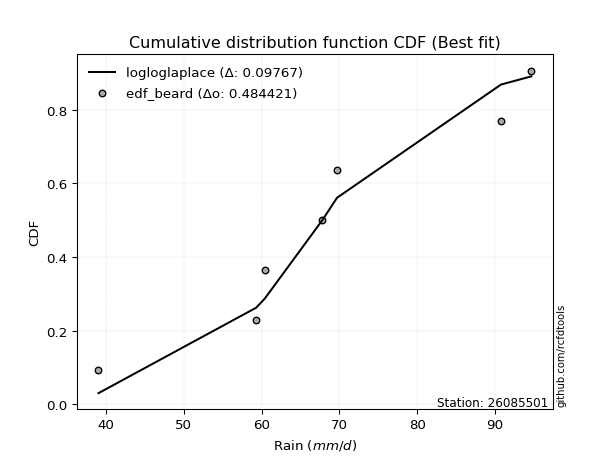</img>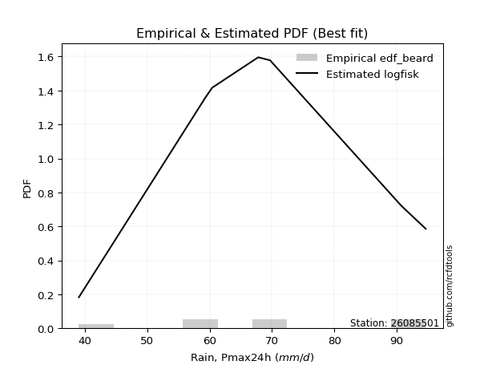</img>

</div>


### 5. Empirical - EDF Chegodayev (1955)

The Chegodayev formula is an empirical plotting position formula used in hydrological frequency analysis to estimate the exceedance probability or return period of a specific event from a set of observed data. It is primarily used for plotting observed data points on probability paper to fit a theoretical distribution, particularly for analyzing extreme events like maximum flood flows or rainfall intensities. The constant _b_ value in the generalized plotting position formula is 0.3.

<div align="center">


$P=(m-b)/(n+1-2b)$


</div>


**5.1. Empirical values**

<div align="center">

|                | 0                   | 1                   | 2                   | 3              | 4                  | 5                  | 6                  |
|:---------------|:--------------------|:--------------------|:--------------------|:---------------|:-------------------|:-------------------|:-------------------|
| date           | 2017                | 2023                | 2021                | 2020           | 2022               | 2018               | 2019               |
| x              | 39.0                | 59.3                | 60.4                | 67.8           | 69.7               | 90.8               | 94.7               |
| m              | 1                   | 2                   | 3                   | 4              | 5                  | 6                  | 7                  |
| empirical_dist | edf_chegodayev      | edf_chegodayev      | edf_chegodayev      | edf_chegodayev | edf_chegodayev     | edf_chegodayev     | edf_chegodayev     |
| empirical      | 0.09459459459459459 | 0.22972972972972971 | 0.36486486486486486 | 0.5            | 0.6351351351351351 | 0.7702702702702703 | 0.9054054054054054 |
| empirical_tr   | 1.1044776119402986  | 1.2982456140350878  | 1.574468085106383   | 2.0            | 2.7407407407407405 | 4.352941176470589  | 10.571428571428568 |

</div>


**5.2. Kolmogorov-Smirnov fit test (sorted by Δ)**


<div align="center">

|                | 0                   | 1                   | 2                   | 3                   | 4                   | 5                   | 6                   | 7                   | 8                   | 9                   | 10                  | 11                  | 12                  | 13                  | 14                  | 15                  | 16                  | 17                  | 18                  | 19                  | 20                  | 21                  | 22                  | 23                  | 24                  | 25                  | 26                  | 27                  | 28                  | 29                  | 30                  | 31                  | 32                  | 33                  | 34                  | 35                  | 36                  | 37                  | 38                  | 39                  | 40                    | 41                  | 42                  | 43                  | 44                  | 45                  | 46                  | 47                  | 48                  | 49                  | 50                  | 51                  | 52                  | 53                  | 54                  | 55                  | 56                  | 57                  | 58                  | 59                  | 60                  | 61                  | 62                  | 63                  | 64                  | 65                  | 66                  | 67                  | 68                  | 69                  | 70                  | 71                  | 72                  | 73                  | 74                  | 75                  | 76                  | 77                  | 78                  | 79                  | 80                  | 81                  | 82                  | 83                  | 84                  | 85                  | 86                  | 87                  | 88                  | 89                  |
|:---------------|:--------------------|:--------------------|:--------------------|:--------------------|:--------------------|:--------------------|:--------------------|:--------------------|:--------------------|:--------------------|:--------------------|:--------------------|:--------------------|:--------------------|:--------------------|:--------------------|:--------------------|:--------------------|:--------------------|:--------------------|:--------------------|:--------------------|:--------------------|:--------------------|:--------------------|:--------------------|:--------------------|:--------------------|:--------------------|:--------------------|:--------------------|:--------------------|:--------------------|:--------------------|:--------------------|:--------------------|:--------------------|:--------------------|:--------------------|:--------------------|:----------------------|:--------------------|:--------------------|:--------------------|:--------------------|:--------------------|:--------------------|:--------------------|:--------------------|:--------------------|:--------------------|:--------------------|:--------------------|:--------------------|:--------------------|:--------------------|:--------------------|:--------------------|:--------------------|:--------------------|:--------------------|:--------------------|:--------------------|:--------------------|:--------------------|:--------------------|:--------------------|:--------------------|:--------------------|:--------------------|:--------------------|:--------------------|:--------------------|:--------------------|:--------------------|:--------------------|:--------------------|:--------------------|:--------------------|:--------------------|:--------------------|:--------------------|:--------------------|:--------------------|:--------------------|:--------------------|:--------------------|:--------------------|:--------------------|:--------------------|
| station        | 26085501            | 26085501            | 26085501            | 26085501            | 26085501            | 26085501            | 26085501            | 26085501            | 26085501            | 26085501            | 26085501            | 26085501            | 26085501            | 26085501            | 26085501            | 26085501            | 26085501            | 26085501            | 26085501            | 26085501            | 26085501            | 26085501            | 26085501            | 26085501            | 26085501            | 26085501            | 26085501            | 26085501            | 26085501            | 26085501            | 26085501            | 26085501            | 26085501            | 26085501            | 26085501            | 26085501            | 26085501            | 26085501            | 26085501            | 26085501            | 26085501              | 26085501            | 26085501            | 26085501            | 26085501            | 26085501            | 26085501            | 26085501            | 26085501            | 26085501            | 26085501            | 26085501            | 26085501            | 26085501            | 26085501            | 26085501            | 26085501            | 26085501            | 26085501            | 26085501            | 26085501            | 26085501            | 26085501            | 26085501            | 26085501            | 26085501            | 26085501            | 26085501            | 26085501            | 26085501            | 26085501            | 26085501            | 26085501            | 26085501            | 26085501            | 26085501            | 26085501            | 26085501            | 26085501            | 26085501            | 26085501            | 26085501            | 26085501            | 26085501            | 26085501            | 26085501            | 26085501            | 26085501            | 26085501            | 26085501            |
| empirical_dist | edf_chegodayev      | edf_chegodayev      | edf_chegodayev      | edf_chegodayev      | edf_chegodayev      | edf_chegodayev      | edf_chegodayev      | edf_chegodayev      | edf_chegodayev      | edf_chegodayev      | edf_chegodayev      | edf_chegodayev      | edf_chegodayev      | edf_chegodayev      | edf_chegodayev      | edf_chegodayev      | edf_chegodayev      | edf_chegodayev      | edf_chegodayev      | edf_chegodayev      | edf_chegodayev      | edf_chegodayev      | edf_chegodayev      | edf_chegodayev      | edf_chegodayev      | edf_chegodayev      | edf_chegodayev      | edf_chegodayev      | edf_chegodayev      | edf_chegodayev      | edf_chegodayev      | edf_chegodayev      | edf_chegodayev      | edf_chegodayev      | edf_chegodayev      | edf_chegodayev      | edf_chegodayev      | edf_chegodayev      | edf_chegodayev      | edf_chegodayev      | edf_chegodayev        | edf_chegodayev      | edf_chegodayev      | edf_chegodayev      | edf_chegodayev      | edf_chegodayev      | edf_chegodayev      | edf_chegodayev      | edf_chegodayev      | edf_chegodayev      | edf_chegodayev      | edf_chegodayev      | edf_chegodayev      | edf_chegodayev      | edf_chegodayev      | edf_chegodayev      | edf_chegodayev      | edf_chegodayev      | edf_chegodayev      | edf_chegodayev      | edf_chegodayev      | edf_chegodayev      | edf_chegodayev      | edf_chegodayev      | edf_chegodayev      | edf_chegodayev      | edf_chegodayev      | edf_chegodayev      | edf_chegodayev      | edf_chegodayev      | edf_chegodayev      | edf_chegodayev      | edf_chegodayev      | edf_chegodayev      | edf_chegodayev      | edf_chegodayev      | edf_chegodayev      | edf_chegodayev      | edf_chegodayev      | edf_chegodayev      | edf_chegodayev      | edf_chegodayev      | edf_chegodayev      | edf_chegodayev      | edf_chegodayev      | edf_chegodayev      | edf_chegodayev      | edf_chegodayev      | edf_chegodayev      | edf_chegodayev      |
| p_dist         | logfisk             | betaprime           | rayleigh            | logcrystalball      | lognorm             | lognorm             | logt                | logexponnorm        | logpearson3         | logncf              | ncf                 | logfatiguelife      | invgauss            | alpha               | maxwell             | logf                | logmielke           | lognct              | genlogistic         | loggenlogistic      | mielke              | loggompertz         | rice                | invgamma            | loglogistic         | weibull_min         | fisk                | logweibull_min      | f                   | gumbel_r            | erlang              | nct                 | t                   | pearson3            | johnsonsu           | exponnorm           | crystalball         | norm                | truncnorm           | gamma               | loglaplace_asymmetric | logerlang           | logrice             | loggamma            | loggamma            | logloggamma         | moyal               | loghypsecant        | logalpha            | laplace_asymmetric  | loglaplace          | halflogistic        | logjohnsonsu        | logistic            | loginvgamma         | halfnorm            | hypsecant           | loggumbel_l         | loginvgauss         | logmaxwell          | laplace             | wald                | kstwobign           | lograyleigh         | loggumbel_r         | gibrat              | logbetaprime        | logmoyal            | loginvweibull       | gumbel_l            | loghalfnorm         | loghalflogistic     | logwald             | logkstwobign        | loggenexpon         | loggibrat           | nakagami            | lognakagami         | expon               | logchi2             | genexpon            | chi2                | logexpon            | loglognorm          | logtruncnorm        | pareto              | logpareto           | invweibull          | fatiguelife         | gompertz            |
| delta          | 0.10007561944667431 | 0.10971553670057355 | 0.11108961700691411 | 0.11154291575977904 | 0.11154358011754661 | 0.11154358011754661 | 0.11154377585612618 | 0.11154394642785553 | 0.11170097163219483 | 0.11220322562110457 | 0.11226563896627695 | 0.11239149751422445 | 0.1125887056048458  | 0.11336425736052202 | 0.11337700247415983 | 0.11380481981145174 | 0.1143430945401972  | 0.11451219262284346 | 0.11509976497067809 | 0.11531725503813983 | 0.11533384609617592 | 0.11558823652486772 | 0.11572702697934067 | 0.11602827863033771 | 0.11689461284303704 | 0.11842106475079117 | 0.11947237078300121 | 0.12051207008073006 | 0.12102690359668267 | 0.12140179257479389 | 0.12195828334660663 | 0.12197214815281465 | 0.1219782390712133  | 0.1219816673194204  | 0.12198200478836285 | 0.12198673099328539 | 0.12198716341573479 | 0.12198716871088411 | 0.121987230871892   | 0.1219878673870135  | 0.12208519063475654   | 0.12227891981753758 | 0.12260341744379788 | 0.12269763497526437 | 0.12269763497526437 | 0.1229445952069641  | 0.12324141678503053 | 0.12397935806152105 | 0.12502814125336825 | 0.12623962220385765 | 0.1295673370114382  | 0.13269652404097748 | 0.1333331898811756  | 0.13408777153119622 | 0.13509614172840662 | 0.13532032700389013 | 0.13936980215882555 | 0.14019227886419106 | 0.14190109980736815 | 0.14291850818234825 | 0.142988392013634   | 0.14429316632470512 | 0.14486447222377102 | 0.15486853636332115 | 0.15751522638573828 | 0.16353946581801182 | 0.17252059923653046 | 0.17426233680788794 | 0.17772045844863615 | 0.18473405828420164 | 0.1888487449332374  | 0.19545102382872326 | 0.20987549342687672 | 0.21060007142062342 | 0.21489116332438618 | 0.2244845019560886  | 0.22972736473780853 | 0.22972966310867934 | 0.26409973907445594 | 0.2775689438866542  | 0.28566721742885737 | 0.2885292061775695  | 0.31553037950384166 | 0.41809990888845816 | 0.4321102743266084  | 0.43387352209272    | 0.4400660166142799  | 0.46883868097774917 | 0.5950232088037563  | 0.6351271356014743  |
| deltao         | 0.48442053926100004 | 0.48442053926100004 | 0.48442053926100004 | 0.48442053926100004 | 0.48442053926100004 | 0.48442053926100004 | 0.48442053926100004 | 0.48442053926100004 | 0.48442053926100004 | 0.48442053926100004 | 0.48442053926100004 | 0.48442053926100004 | 0.48442053926100004 | 0.48442053926100004 | 0.48442053926100004 | 0.48442053926100004 | 0.48442053926100004 | 0.48442053926100004 | 0.48442053926100004 | 0.48442053926100004 | 0.48442053926100004 | 0.48442053926100004 | 0.48442053926100004 | 0.48442053926100004 | 0.48442053926100004 | 0.48442053926100004 | 0.48442053926100004 | 0.48442053926100004 | 0.48442053926100004 | 0.48442053926100004 | 0.48442053926100004 | 0.48442053926100004 | 0.48442053926100004 | 0.48442053926100004 | 0.48442053926100004 | 0.48442053926100004 | 0.48442053926100004 | 0.48442053926100004 | 0.48442053926100004 | 0.48442053926100004 | 0.48442053926100004   | 0.48442053926100004 | 0.48442053926100004 | 0.48442053926100004 | 0.48442053926100004 | 0.48442053926100004 | 0.48442053926100004 | 0.48442053926100004 | 0.48442053926100004 | 0.48442053926100004 | 0.48442053926100004 | 0.48442053926100004 | 0.48442053926100004 | 0.48442053926100004 | 0.48442053926100004 | 0.48442053926100004 | 0.48442053926100004 | 0.48442053926100004 | 0.48442053926100004 | 0.48442053926100004 | 0.48442053926100004 | 0.48442053926100004 | 0.48442053926100004 | 0.48442053926100004 | 0.48442053926100004 | 0.48442053926100004 | 0.48442053926100004 | 0.48442053926100004 | 0.48442053926100004 | 0.48442053926100004 | 0.48442053926100004 | 0.48442053926100004 | 0.48442053926100004 | 0.48442053926100004 | 0.48442053926100004 | 0.48442053926100004 | 0.48442053926100004 | 0.48442053926100004 | 0.48442053926100004 | 0.48442053926100004 | 0.48442053926100004 | 0.48442053926100004 | 0.48442053926100004 | 0.48442053926100004 | 0.48442053926100004 | 0.48442053926100004 | 0.48442053926100004 | 0.48442053926100004 | 0.48442053926100004 | 0.48442053926100004 |
| eval           | Δo > Δ              | Δo > Δ              | Δo > Δ              | Δo > Δ              | Δo > Δ              | Δo > Δ              | Δo > Δ              | Δo > Δ              | Δo > Δ              | Δo > Δ              | Δo > Δ              | Δo > Δ              | Δo > Δ              | Δo > Δ              | Δo > Δ              | Δo > Δ              | Δo > Δ              | Δo > Δ              | Δo > Δ              | Δo > Δ              | Δo > Δ              | Δo > Δ              | Δo > Δ              | Δo > Δ              | Δo > Δ              | Δo > Δ              | Δo > Δ              | Δo > Δ              | Δo > Δ              | Δo > Δ              | Δo > Δ              | Δo > Δ              | Δo > Δ              | Δo > Δ              | Δo > Δ              | Δo > Δ              | Δo > Δ              | Δo > Δ              | Δo > Δ              | Δo > Δ              | Δo > Δ                | Δo > Δ              | Δo > Δ              | Δo > Δ              | Δo > Δ              | Δo > Δ              | Δo > Δ              | Δo > Δ              | Δo > Δ              | Δo > Δ              | Δo > Δ              | Δo > Δ              | Δo > Δ              | Δo > Δ              | Δo > Δ              | Δo > Δ              | Δo > Δ              | Δo > Δ              | Δo > Δ              | Δo > Δ              | Δo > Δ              | Δo > Δ              | Δo > Δ              | Δo > Δ              | Δo > Δ              | Δo > Δ              | Δo > Δ              | Δo > Δ              | Δo > Δ              | Δo > Δ              | Δo > Δ              | Δo > Δ              | Δo > Δ              | Δo > Δ              | Δo > Δ              | Δo > Δ              | Δo > Δ              | Δo > Δ              | Δo > Δ              | Δo > Δ              | Δo > Δ              | Δo > Δ              | Δo > Δ              | Δo > Δ              | Δo > Δ              | Δo > Δ              | Δo > Δ              | Δo > Δ              | Δo <= Δ             | Δo <= Δ             |
| fit            | 1                   | 1                   | 1                   | 1                   | 1                   | 1                   | 1                   | 1                   | 1                   | 1                   | 1                   | 1                   | 1                   | 1                   | 1                   | 1                   | 1                   | 1                   | 1                   | 1                   | 1                   | 1                   | 1                   | 1                   | 1                   | 1                   | 1                   | 1                   | 1                   | 1                   | 1                   | 1                   | 1                   | 1                   | 1                   | 1                   | 1                   | 1                   | 1                   | 1                   | 1                     | 1                   | 1                   | 1                   | 1                   | 1                   | 1                   | 1                   | 1                   | 1                   | 1                   | 1                   | 1                   | 1                   | 1                   | 1                   | 1                   | 1                   | 1                   | 1                   | 1                   | 1                   | 1                   | 1                   | 1                   | 1                   | 1                   | 1                   | 1                   | 1                   | 1                   | 1                   | 1                   | 1                   | 1                   | 1                   | 1                   | 1                   | 1                   | 1                   | 1                   | 1                   | 1                   | 1                   | 1                   | 1                   | 1                   | 1                   | 0                   | 0                   |
| n              | 7                   | 7                   | 7                   | 7                   | 7                   | 7                   | 7                   | 7                   | 7                   | 7                   | 7                   | 7                   | 7                   | 7                   | 7                   | 7                   | 7                   | 7                   | 7                   | 7                   | 7                   | 7                   | 7                   | 7                   | 7                   | 7                   | 7                   | 7                   | 7                   | 7                   | 7                   | 7                   | 7                   | 7                   | 7                   | 7                   | 7                   | 7                   | 7                   | 7                   | 7                     | 7                   | 7                   | 7                   | 7                   | 7                   | 7                   | 7                   | 7                   | 7                   | 7                   | 7                   | 7                   | 7                   | 7                   | 7                   | 7                   | 7                   | 7                   | 7                   | 7                   | 7                   | 7                   | 7                   | 7                   | 7                   | 7                   | 7                   | 7                   | 7                   | 7                   | 7                   | 7                   | 7                   | 7                   | 7                   | 7                   | 7                   | 7                   | 7                   | 7                   | 7                   | 7                   | 7                   | 7                   | 7                   | 7                   | 7                   | 7                   | 7                   |
| best_fit       | 1                   | 0                   | 0                   | 0                   | 0                   | 0                   | 0                   | 0                   | 0                   | 0                   | 0                   | 0                   | 0                   | 0                   | 0                   | 0                   | 0                   | 0                   | 0                   | 0                   | 0                   | 0                   | 0                   | 0                   | 0                   | 0                   | 0                   | 0                   | 0                   | 0                   | 0                   | 0                   | 0                   | 0                   | 0                   | 0                   | 0                   | 0                   | 0                   | 0                   | 0                     | 0                   | 0                   | 0                   | 0                   | 0                   | 0                   | 0                   | 0                   | 0                   | 0                   | 0                   | 0                   | 0                   | 0                   | 0                   | 0                   | 0                   | 0                   | 0                   | 0                   | 0                   | 0                   | 0                   | 0                   | 0                   | 0                   | 0                   | 0                   | 0                   | 0                   | 0                   | 0                   | 0                   | 0                   | 0                   | 0                   | 0                   | 0                   | 0                   | 0                   | 0                   | 0                   | 0                   | 0                   | 0                   | 0                   | 0                   | 0                   | 0                   |
| best_fit_sort  | 1                   | 2                   | 3                   | 4                   | 5                   | 6                   | 7                   | 8                   | 9                   | 10                  | 11                  | 12                  | 13                  | 14                  | 15                  | 16                  | 17                  | 18                  | 19                  | 20                  | 21                  | 22                  | 23                  | 24                  | 25                  | 26                  | 27                  | 28                  | 29                  | 30                  | 31                  | 32                  | 33                  | 34                  | 35                  | 36                  | 37                  | 38                  | 39                  | 40                  | 41                    | 42                  | 43                  | 44                  | 45                  | 46                  | 47                  | 48                  | 49                  | 50                  | 51                  | 52                  | 53                  | 54                  | 55                  | 56                  | 57                  | 58                  | 59                  | 60                  | 61                  | 62                  | 63                  | 64                  | 65                  | 66                  | 67                  | 68                  | 69                  | 70                  | 71                  | 72                  | 73                  | 74                  | 75                  | 76                  | 77                  | 78                  | 79                  | 80                  | 81                  | 82                  | 83                  | 84                  | 85                  | 86                  | 87                  | 88                  | 89                  | 90                  |

</div>


<div align="center">

</img>

</div>


**5.3. Best fit**

<div align="center">

|   id |   station | empirical_dist   | p_dist   |    delta |   deltao | eval   |   fit |   n |   best_fit |   best_fit_sort |
|-----:|----------:|:-----------------|:---------|---------:|---------:|:-------|------:|----:|-----------:|----------------:|
|    0 |  26085501 | edf_chegodayev   | logfisk  | 0.100076 | 0.484421 | Δo > Δ |     1 |   7 |          1 |               1 |

</div>


<div align="center">

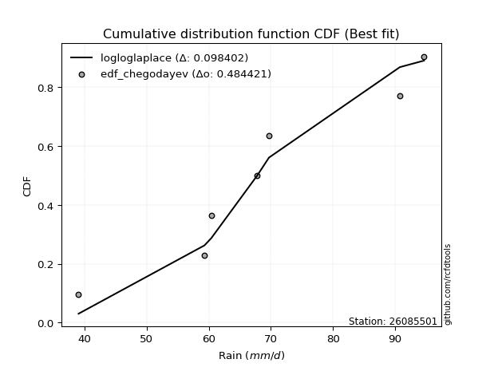</img></img>

</div>


### 6. Empirical - EDF Blom (1958)

The Blom formula is a specific "plotting position" formula used in hydrology and statistical analysis to estimate the empirical cumulative probability (or non-exceedance probability) of a data series. It is particularly recommended for data that are approximately normally distributed. The constant _a_ is set to 0.375 (or 3/8).

<div align="center">


$P=(m-a)/(n+1-2a)$


</div>


**6.1. Empirical values**

<div align="center">

|                | 0                   | 1                   | 2                  | 3        | 4                  | 5                  | 6                  |
|:---------------|:--------------------|:--------------------|:-------------------|:---------|:-------------------|:-------------------|:-------------------|
| date           | 2017                | 2023                | 2021               | 2020     | 2022               | 2018               | 2019               |
| x              | 39.0                | 59.3                | 60.4               | 67.8     | 69.7               | 90.8               | 94.7               |
| m              | 1                   | 2                   | 3                  | 4        | 5                  | 6                  | 7                  |
| empirical_dist | edf_blom            | edf_blom            | edf_blom           | edf_blom | edf_blom           | edf_blom           | edf_blom           |
| empirical      | 0.08620689655172414 | 0.22413793103448276 | 0.3620689655172414 | 0.5      | 0.6379310344827587 | 0.7758620689655172 | 0.9137931034482759 |
| empirical_tr   | 1.0943396226415094  | 1.288888888888889   | 1.5675675675675675 | 2.0      | 2.7619047619047623 | 4.461538461538462  | 11.600000000000007 |

</div>


**6.2. Kolmogorov-Smirnov fit test (sorted by Δ)**


<div align="center">

|                | 0                   | 1                   | 2                   | 3                   | 4                   | 5                   | 6                   | 7                   | 8                   | 9                   | 10                  | 11                  | 12                  | 13                  | 14                  | 15                  | 16                  | 17                  | 18                  | 19                  | 20                    | 21                  | 22                  | 23                  | 24                  | 25                  | 26                  | 27                  | 28                  | 29                  | 30                  | 31                  | 32                  | 33                  | 34                  | 35                  | 36                  | 37                  | 38                  | 39                  | 40                  | 41                  | 42                  | 43                  | 44                  | 45                  | 46                  | 47                  | 48                  | 49                  | 50                  | 51                  | 52                  | 53                  | 54                  | 55                  | 56                  | 57                  | 58                  | 59                  | 60                  | 61                  | 62                  | 63                  | 64                  | 65                  | 66                  | 67                  | 68                  | 69                  | 70                  | 71                  | 72                  | 73                  | 74                  | 75                  | 76                  | 77                  | 78                  | 79                  | 80                  | 81                  | 82                  | 83                  | 84                  | 85                  | 86                  | 87                  | 88                  | 89                  |
|:---------------|:--------------------|:--------------------|:--------------------|:--------------------|:--------------------|:--------------------|:--------------------|:--------------------|:--------------------|:--------------------|:--------------------|:--------------------|:--------------------|:--------------------|:--------------------|:--------------------|:--------------------|:--------------------|:--------------------|:--------------------|:----------------------|:--------------------|:--------------------|:--------------------|:--------------------|:--------------------|:--------------------|:--------------------|:--------------------|:--------------------|:--------------------|:--------------------|:--------------------|:--------------------|:--------------------|:--------------------|:--------------------|:--------------------|:--------------------|:--------------------|:--------------------|:--------------------|:--------------------|:--------------------|:--------------------|:--------------------|:--------------------|:--------------------|:--------------------|:--------------------|:--------------------|:--------------------|:--------------------|:--------------------|:--------------------|:--------------------|:--------------------|:--------------------|:--------------------|:--------------------|:--------------------|:--------------------|:--------------------|:--------------------|:--------------------|:--------------------|:--------------------|:--------------------|:--------------------|:--------------------|:--------------------|:--------------------|:--------------------|:--------------------|:--------------------|:--------------------|:--------------------|:--------------------|:--------------------|:--------------------|:--------------------|:--------------------|:--------------------|:--------------------|:--------------------|:--------------------|:--------------------|:--------------------|:--------------------|:--------------------|
| station        | 26085501            | 26085501            | 26085501            | 26085501            | 26085501            | 26085501            | 26085501            | 26085501            | 26085501            | 26085501            | 26085501            | 26085501            | 26085501            | 26085501            | 26085501            | 26085501            | 26085501            | 26085501            | 26085501            | 26085501            | 26085501              | 26085501            | 26085501            | 26085501            | 26085501            | 26085501            | 26085501            | 26085501            | 26085501            | 26085501            | 26085501            | 26085501            | 26085501            | 26085501            | 26085501            | 26085501            | 26085501            | 26085501            | 26085501            | 26085501            | 26085501            | 26085501            | 26085501            | 26085501            | 26085501            | 26085501            | 26085501            | 26085501            | 26085501            | 26085501            | 26085501            | 26085501            | 26085501            | 26085501            | 26085501            | 26085501            | 26085501            | 26085501            | 26085501            | 26085501            | 26085501            | 26085501            | 26085501            | 26085501            | 26085501            | 26085501            | 26085501            | 26085501            | 26085501            | 26085501            | 26085501            | 26085501            | 26085501            | 26085501            | 26085501            | 26085501            | 26085501            | 26085501            | 26085501            | 26085501            | 26085501            | 26085501            | 26085501            | 26085501            | 26085501            | 26085501            | 26085501            | 26085501            | 26085501            | 26085501            |
| empirical_dist | edf_blom            | edf_blom            | edf_blom            | edf_blom            | edf_blom            | edf_blom            | edf_blom            | edf_blom            | edf_blom            | edf_blom            | edf_blom            | edf_blom            | edf_blom            | edf_blom            | edf_blom            | edf_blom            | edf_blom            | edf_blom            | edf_blom            | edf_blom            | edf_blom              | edf_blom            | edf_blom            | edf_blom            | edf_blom            | edf_blom            | edf_blom            | edf_blom            | edf_blom            | edf_blom            | edf_blom            | edf_blom            | edf_blom            | edf_blom            | edf_blom            | edf_blom            | edf_blom            | edf_blom            | edf_blom            | edf_blom            | edf_blom            | edf_blom            | edf_blom            | edf_blom            | edf_blom            | edf_blom            | edf_blom            | edf_blom            | edf_blom            | edf_blom            | edf_blom            | edf_blom            | edf_blom            | edf_blom            | edf_blom            | edf_blom            | edf_blom            | edf_blom            | edf_blom            | edf_blom            | edf_blom            | edf_blom            | edf_blom            | edf_blom            | edf_blom            | edf_blom            | edf_blom            | edf_blom            | edf_blom            | edf_blom            | edf_blom            | edf_blom            | edf_blom            | edf_blom            | edf_blom            | edf_blom            | edf_blom            | edf_blom            | edf_blom            | edf_blom            | edf_blom            | edf_blom            | edf_blom            | edf_blom            | edf_blom            | edf_blom            | edf_blom            | edf_blom            | edf_blom            | edf_blom            |
| p_dist         | logfisk             | betaprime           | logpearson3         | ncf                 | alpha               | maxwell             | logmielke           | genlogistic         | loggenlogistic      | mielke              | loggompertz         | rice                | rayleigh            | invgamma            | loglogistic         | weibull_min         | fisk                | invgauss            | f                   | gumbel_r            | loglaplace_asymmetric | logcrystalball      | lognorm             | lognorm             | logt                | logexponnorm        | moyal               | logncf              | nct                 | gamma               | logfatiguelife      | pearson3            | erlang              | johnsonsu           | truncnorm           | norm                | crystalball         | exponnorm           | t                   | loghypsecant        | logweibull_min      | logf                | lognct              | laplace_asymmetric  | loglaplace          | logloggamma         | logerlang           | logrice             | loggamma            | loggamma            | logistic            | logalpha            | hypsecant           | loggumbel_l         | logjohnsonsu        | laplace             | halflogistic        | loginvgamma         | halfnorm            | wald                | loginvgauss         | logmaxwell          | kstwobign           | lograyleigh         | loggumbel_r         | gibrat              | logbetaprime        | logmoyal            | loginvweibull       | gumbel_l            | loghalfnorm         | loghalflogistic     | logwald             | logkstwobign        | loggenexpon         | nakagami            | lognakagami         | loggibrat           | expon               | logchi2             | genexpon            | chi2                | logexpon            | loglognorm          | logtruncnorm        | pareto              | logpareto           | invweibull          | fatiguelife         | gompertz            |
| delta          | 0.09448382075142736 | 0.1041237380053266  | 0.10610917293694788 | 0.10667384027103    | 0.10777245866527507 | 0.10778520377891287 | 0.10875129584495025 | 0.10950796627543113 | 0.10972545634289288 | 0.10974204740092897 | 0.10999643782962076 | 0.11013522828409372 | 0.1101779308753188  | 0.11043647993509076 | 0.11130281414779009 | 0.11282926605554422 | 0.11388057208775426 | 0.11416234318727075 | 0.11543510490143571 | 0.11580999387954694 | 0.11649339193950958   | 0.11713471445502599 | 0.11713537881279357 | 0.11713537881279357 | 0.11713557455137313 | 0.11713574512310249 | 0.11764961808978358 | 0.11779502431635153 | 0.11789281051609346 | 0.11798037525522587 | 0.1179832962094714  | 0.11801097391004545 | 0.11801824726175414 | 0.1180323016586029  | 0.11803237271270506 | 0.11803245370028592 | 0.1180324669414825  | 0.11803296813940067 | 0.11803713636990909 | 0.1183875593662741  | 0.11842024500823967 | 0.11939661850669869 | 0.12010399131809041 | 0.1206478235086107  | 0.12397553831619124 | 0.1257404945545877  | 0.12787071851278453 | 0.12819521613904483 | 0.12828943367051132 | 0.12828943367051132 | 0.12849597283594927 | 0.1306199399486152  | 0.1337780034635786  | 0.1346004801689441  | 0.13612908922879918 | 0.13739659331838705 | 0.13828832273622443 | 0.14068794042365357 | 0.14091212569913708 | 0.14429316632470512 | 0.1474928985026151  | 0.1485103068775952  | 0.15045627091901798 | 0.1604603350585681  | 0.16310702508098524 | 0.16353946581801182 | 0.1781123979317774  | 0.1798541355031349  | 0.1833122571438831  | 0.18752995763182523 | 0.19444054362848434 | 0.2010428225239702  | 0.21546729212212368 | 0.21619187011587038 | 0.22048296201963313 | 0.22413556604256157 | 0.2241378644134324  | 0.2244845019560886  | 0.2696915377697029  | 0.28595664192952475 | 0.2912590161241043  | 0.29412100487281645 | 0.3211221781990886  | 0.4236917075837051  | 0.4377020730218554  | 0.43946532078796696 | 0.44565781530952686 | 0.4772263790206197  | 0.6006150074990032  | 0.6379230349490979  |
| deltao         | 0.48442053926100004 | 0.48442053926100004 | 0.48442053926100004 | 0.48442053926100004 | 0.48442053926100004 | 0.48442053926100004 | 0.48442053926100004 | 0.48442053926100004 | 0.48442053926100004 | 0.48442053926100004 | 0.48442053926100004 | 0.48442053926100004 | 0.48442053926100004 | 0.48442053926100004 | 0.48442053926100004 | 0.48442053926100004 | 0.48442053926100004 | 0.48442053926100004 | 0.48442053926100004 | 0.48442053926100004 | 0.48442053926100004   | 0.48442053926100004 | 0.48442053926100004 | 0.48442053926100004 | 0.48442053926100004 | 0.48442053926100004 | 0.48442053926100004 | 0.48442053926100004 | 0.48442053926100004 | 0.48442053926100004 | 0.48442053926100004 | 0.48442053926100004 | 0.48442053926100004 | 0.48442053926100004 | 0.48442053926100004 | 0.48442053926100004 | 0.48442053926100004 | 0.48442053926100004 | 0.48442053926100004 | 0.48442053926100004 | 0.48442053926100004 | 0.48442053926100004 | 0.48442053926100004 | 0.48442053926100004 | 0.48442053926100004 | 0.48442053926100004 | 0.48442053926100004 | 0.48442053926100004 | 0.48442053926100004 | 0.48442053926100004 | 0.48442053926100004 | 0.48442053926100004 | 0.48442053926100004 | 0.48442053926100004 | 0.48442053926100004 | 0.48442053926100004 | 0.48442053926100004 | 0.48442053926100004 | 0.48442053926100004 | 0.48442053926100004 | 0.48442053926100004 | 0.48442053926100004 | 0.48442053926100004 | 0.48442053926100004 | 0.48442053926100004 | 0.48442053926100004 | 0.48442053926100004 | 0.48442053926100004 | 0.48442053926100004 | 0.48442053926100004 | 0.48442053926100004 | 0.48442053926100004 | 0.48442053926100004 | 0.48442053926100004 | 0.48442053926100004 | 0.48442053926100004 | 0.48442053926100004 | 0.48442053926100004 | 0.48442053926100004 | 0.48442053926100004 | 0.48442053926100004 | 0.48442053926100004 | 0.48442053926100004 | 0.48442053926100004 | 0.48442053926100004 | 0.48442053926100004 | 0.48442053926100004 | 0.48442053926100004 | 0.48442053926100004 | 0.48442053926100004 |
| eval           | Δo > Δ              | Δo > Δ              | Δo > Δ              | Δo > Δ              | Δo > Δ              | Δo > Δ              | Δo > Δ              | Δo > Δ              | Δo > Δ              | Δo > Δ              | Δo > Δ              | Δo > Δ              | Δo > Δ              | Δo > Δ              | Δo > Δ              | Δo > Δ              | Δo > Δ              | Δo > Δ              | Δo > Δ              | Δo > Δ              | Δo > Δ                | Δo > Δ              | Δo > Δ              | Δo > Δ              | Δo > Δ              | Δo > Δ              | Δo > Δ              | Δo > Δ              | Δo > Δ              | Δo > Δ              | Δo > Δ              | Δo > Δ              | Δo > Δ              | Δo > Δ              | Δo > Δ              | Δo > Δ              | Δo > Δ              | Δo > Δ              | Δo > Δ              | Δo > Δ              | Δo > Δ              | Δo > Δ              | Δo > Δ              | Δo > Δ              | Δo > Δ              | Δo > Δ              | Δo > Δ              | Δo > Δ              | Δo > Δ              | Δo > Δ              | Δo > Δ              | Δo > Δ              | Δo > Δ              | Δo > Δ              | Δo > Δ              | Δo > Δ              | Δo > Δ              | Δo > Δ              | Δo > Δ              | Δo > Δ              | Δo > Δ              | Δo > Δ              | Δo > Δ              | Δo > Δ              | Δo > Δ              | Δo > Δ              | Δo > Δ              | Δo > Δ              | Δo > Δ              | Δo > Δ              | Δo > Δ              | Δo > Δ              | Δo > Δ              | Δo > Δ              | Δo > Δ              | Δo > Δ              | Δo > Δ              | Δo > Δ              | Δo > Δ              | Δo > Δ              | Δo > Δ              | Δo > Δ              | Δo > Δ              | Δo > Δ              | Δo > Δ              | Δo > Δ              | Δo > Δ              | Δo > Δ              | Δo <= Δ             | Δo <= Δ             |
| fit            | 1                   | 1                   | 1                   | 1                   | 1                   | 1                   | 1                   | 1                   | 1                   | 1                   | 1                   | 1                   | 1                   | 1                   | 1                   | 1                   | 1                   | 1                   | 1                   | 1                   | 1                     | 1                   | 1                   | 1                   | 1                   | 1                   | 1                   | 1                   | 1                   | 1                   | 1                   | 1                   | 1                   | 1                   | 1                   | 1                   | 1                   | 1                   | 1                   | 1                   | 1                   | 1                   | 1                   | 1                   | 1                   | 1                   | 1                   | 1                   | 1                   | 1                   | 1                   | 1                   | 1                   | 1                   | 1                   | 1                   | 1                   | 1                   | 1                   | 1                   | 1                   | 1                   | 1                   | 1                   | 1                   | 1                   | 1                   | 1                   | 1                   | 1                   | 1                   | 1                   | 1                   | 1                   | 1                   | 1                   | 1                   | 1                   | 1                   | 1                   | 1                   | 1                   | 1                   | 1                   | 1                   | 1                   | 1                   | 1                   | 0                   | 0                   |
| n              | 7                   | 7                   | 7                   | 7                   | 7                   | 7                   | 7                   | 7                   | 7                   | 7                   | 7                   | 7                   | 7                   | 7                   | 7                   | 7                   | 7                   | 7                   | 7                   | 7                   | 7                     | 7                   | 7                   | 7                   | 7                   | 7                   | 7                   | 7                   | 7                   | 7                   | 7                   | 7                   | 7                   | 7                   | 7                   | 7                   | 7                   | 7                   | 7                   | 7                   | 7                   | 7                   | 7                   | 7                   | 7                   | 7                   | 7                   | 7                   | 7                   | 7                   | 7                   | 7                   | 7                   | 7                   | 7                   | 7                   | 7                   | 7                   | 7                   | 7                   | 7                   | 7                   | 7                   | 7                   | 7                   | 7                   | 7                   | 7                   | 7                   | 7                   | 7                   | 7                   | 7                   | 7                   | 7                   | 7                   | 7                   | 7                   | 7                   | 7                   | 7                   | 7                   | 7                   | 7                   | 7                   | 7                   | 7                   | 7                   | 7                   | 7                   |
| best_fit       | 1                   | 0                   | 0                   | 0                   | 0                   | 0                   | 0                   | 0                   | 0                   | 0                   | 0                   | 0                   | 0                   | 0                   | 0                   | 0                   | 0                   | 0                   | 0                   | 0                   | 0                     | 0                   | 0                   | 0                   | 0                   | 0                   | 0                   | 0                   | 0                   | 0                   | 0                   | 0                   | 0                   | 0                   | 0                   | 0                   | 0                   | 0                   | 0                   | 0                   | 0                   | 0                   | 0                   | 0                   | 0                   | 0                   | 0                   | 0                   | 0                   | 0                   | 0                   | 0                   | 0                   | 0                   | 0                   | 0                   | 0                   | 0                   | 0                   | 0                   | 0                   | 0                   | 0                   | 0                   | 0                   | 0                   | 0                   | 0                   | 0                   | 0                   | 0                   | 0                   | 0                   | 0                   | 0                   | 0                   | 0                   | 0                   | 0                   | 0                   | 0                   | 0                   | 0                   | 0                   | 0                   | 0                   | 0                   | 0                   | 0                   | 0                   |
| best_fit_sort  | 1                   | 2                   | 3                   | 4                   | 5                   | 6                   | 7                   | 8                   | 9                   | 10                  | 11                  | 12                  | 13                  | 14                  | 15                  | 16                  | 17                  | 18                  | 19                  | 20                  | 21                    | 22                  | 23                  | 24                  | 25                  | 26                  | 27                  | 28                  | 29                  | 30                  | 31                  | 32                  | 33                  | 34                  | 35                  | 36                  | 37                  | 38                  | 39                  | 40                  | 41                  | 42                  | 43                  | 44                  | 45                  | 46                  | 47                  | 48                  | 49                  | 50                  | 51                  | 52                  | 53                  | 54                  | 55                  | 56                  | 57                  | 58                  | 59                  | 60                  | 61                  | 62                  | 63                  | 64                  | 65                  | 66                  | 67                  | 68                  | 69                  | 70                  | 71                  | 72                  | 73                  | 74                  | 75                  | 76                  | 77                  | 78                  | 79                  | 80                  | 81                  | 82                  | 83                  | 84                  | 85                  | 86                  | 87                  | 88                  | 89                  | 90                  |

</div>


<div align="center">

</img>

</div>


**6.3. Best fit**

<div align="center">

|   id |   station | empirical_dist   | p_dist   |     delta |   deltao | eval   |   fit |   n |   best_fit |   best_fit_sort |
|-----:|----------:|:-----------------|:---------|----------:|---------:|:-------|------:|----:|-----------:|----------------:|
|    0 |  26085501 | edf_blom         | logfisk  | 0.0944838 | 0.484421 | Δo > Δ |     1 |   7 |          1 |               1 |

</div>


<div align="center">

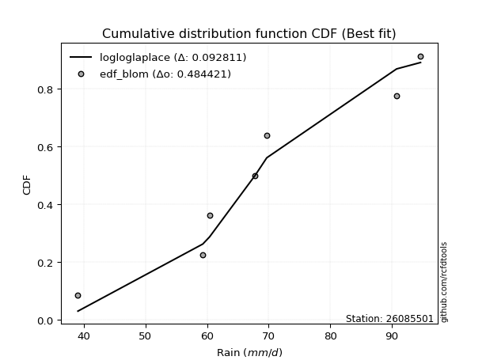</img></img>

</div>


### 7. Empirical - EDF Tukey (1962)

In hydrology, the Tukey formula is used as a plotting position formula to estimate the empirical probability or frequency of a flood event (or other hydrological data). The formula parameter is given as _c=0.333_ (or 1/3).

<div align="center">


$P=(m-c)/(n+1-2c)$


</div>


**7.1. Empirical values**

<div align="center">

|                | 0                   | 1                   | 2                   | 3         | 4                  | 5                  | 6                  |
|:---------------|:--------------------|:--------------------|:--------------------|:----------|:-------------------|:-------------------|:-------------------|
| date           | 2017                | 2023                | 2021                | 2020      | 2022               | 2018               | 2019               |
| x              | 39.0                | 59.3                | 60.4                | 67.8      | 69.7               | 90.8               | 94.7               |
| m              | 1                   | 2                   | 3                   | 4         | 5                  | 6                  | 7                  |
| empirical_dist | edf_tukey           | edf_tukey           | edf_tukey           | edf_tukey | edf_tukey          | edf_tukey          | edf_tukey          |
| empirical      | 0.09090909090909091 | 0.22727272727272727 | 0.36363636363636365 | 0.5       | 0.6363636363636364 | 0.7727272727272727 | 0.9090909090909091 |
| empirical_tr   | 1.1                 | 1.2941176470588236  | 1.5714285714285714  | 2.0       | 2.75               | 4.3999999999999995 | 10.999999999999996 |

</div>


**7.2. Kolmogorov-Smirnov fit test (sorted by Δ)**


<div align="center">

|                | 0                   | 1                   | 2                   | 3                   | 4                   | 5                   | 6                   | 7                   | 8                   | 9                   | 10                  | 11                  | 12                  | 13                  | 14                  | 15                  | 16                  | 17                  | 18                  | 19                  | 20                  | 21                  | 22                  | 23                  | 24                  | 25                  | 26                  | 27                  | 28                  | 29                  | 30                  | 31                  | 32                  | 33                  | 34                  | 35                  | 36                  | 37                  | 38                  | 39                  | 40                    | 41                  | 42                  | 43                  | 44                  | 45                  | 46                  | 47                  | 48                  | 49                  | 50                  | 51                  | 52                  | 53                  | 54                  | 55                  | 56                  | 57                  | 58                  | 59                  | 60                  | 61                  | 62                  | 63                  | 64                  | 65                  | 66                  | 67                  | 68                  | 69                  | 70                  | 71                  | 72                  | 73                  | 74                  | 75                  | 76                  | 77                  | 78                  | 79                  | 80                  | 81                  | 82                  | 83                  | 84                  | 85                  | 86                  | 87                  | 88                  | 89                  |
|:---------------|:--------------------|:--------------------|:--------------------|:--------------------|:--------------------|:--------------------|:--------------------|:--------------------|:--------------------|:--------------------|:--------------------|:--------------------|:--------------------|:--------------------|:--------------------|:--------------------|:--------------------|:--------------------|:--------------------|:--------------------|:--------------------|:--------------------|:--------------------|:--------------------|:--------------------|:--------------------|:--------------------|:--------------------|:--------------------|:--------------------|:--------------------|:--------------------|:--------------------|:--------------------|:--------------------|:--------------------|:--------------------|:--------------------|:--------------------|:--------------------|:----------------------|:--------------------|:--------------------|:--------------------|:--------------------|:--------------------|:--------------------|:--------------------|:--------------------|:--------------------|:--------------------|:--------------------|:--------------------|:--------------------|:--------------------|:--------------------|:--------------------|:--------------------|:--------------------|:--------------------|:--------------------|:--------------------|:--------------------|:--------------------|:--------------------|:--------------------|:--------------------|:--------------------|:--------------------|:--------------------|:--------------------|:--------------------|:--------------------|:--------------------|:--------------------|:--------------------|:--------------------|:--------------------|:--------------------|:--------------------|:--------------------|:--------------------|:--------------------|:--------------------|:--------------------|:--------------------|:--------------------|:--------------------|:--------------------|:--------------------|
| station        | 26085501            | 26085501            | 26085501            | 26085501            | 26085501            | 26085501            | 26085501            | 26085501            | 26085501            | 26085501            | 26085501            | 26085501            | 26085501            | 26085501            | 26085501            | 26085501            | 26085501            | 26085501            | 26085501            | 26085501            | 26085501            | 26085501            | 26085501            | 26085501            | 26085501            | 26085501            | 26085501            | 26085501            | 26085501            | 26085501            | 26085501            | 26085501            | 26085501            | 26085501            | 26085501            | 26085501            | 26085501            | 26085501            | 26085501            | 26085501            | 26085501              | 26085501            | 26085501            | 26085501            | 26085501            | 26085501            | 26085501            | 26085501            | 26085501            | 26085501            | 26085501            | 26085501            | 26085501            | 26085501            | 26085501            | 26085501            | 26085501            | 26085501            | 26085501            | 26085501            | 26085501            | 26085501            | 26085501            | 26085501            | 26085501            | 26085501            | 26085501            | 26085501            | 26085501            | 26085501            | 26085501            | 26085501            | 26085501            | 26085501            | 26085501            | 26085501            | 26085501            | 26085501            | 26085501            | 26085501            | 26085501            | 26085501            | 26085501            | 26085501            | 26085501            | 26085501            | 26085501            | 26085501            | 26085501            | 26085501            |
| empirical_dist | edf_tukey           | edf_tukey           | edf_tukey           | edf_tukey           | edf_tukey           | edf_tukey           | edf_tukey           | edf_tukey           | edf_tukey           | edf_tukey           | edf_tukey           | edf_tukey           | edf_tukey           | edf_tukey           | edf_tukey           | edf_tukey           | edf_tukey           | edf_tukey           | edf_tukey           | edf_tukey           | edf_tukey           | edf_tukey           | edf_tukey           | edf_tukey           | edf_tukey           | edf_tukey           | edf_tukey           | edf_tukey           | edf_tukey           | edf_tukey           | edf_tukey           | edf_tukey           | edf_tukey           | edf_tukey           | edf_tukey           | edf_tukey           | edf_tukey           | edf_tukey           | edf_tukey           | edf_tukey           | edf_tukey             | edf_tukey           | edf_tukey           | edf_tukey           | edf_tukey           | edf_tukey           | edf_tukey           | edf_tukey           | edf_tukey           | edf_tukey           | edf_tukey           | edf_tukey           | edf_tukey           | edf_tukey           | edf_tukey           | edf_tukey           | edf_tukey           | edf_tukey           | edf_tukey           | edf_tukey           | edf_tukey           | edf_tukey           | edf_tukey           | edf_tukey           | edf_tukey           | edf_tukey           | edf_tukey           | edf_tukey           | edf_tukey           | edf_tukey           | edf_tukey           | edf_tukey           | edf_tukey           | edf_tukey           | edf_tukey           | edf_tukey           | edf_tukey           | edf_tukey           | edf_tukey           | edf_tukey           | edf_tukey           | edf_tukey           | edf_tukey           | edf_tukey           | edf_tukey           | edf_tukey           | edf_tukey           | edf_tukey           | edf_tukey           | edf_tukey           |
| p_dist         | logfisk             | betaprime           | rayleigh            | logpearson3         | ncf                 | alpha               | maxwell             | invgauss            | logmielke           | genlogistic         | loggenlogistic      | mielke              | loggompertz         | rice                | invgamma            | logcrystalball      | lognorm             | lognorm             | logt                | logexponnorm        | loglogistic         | logncf              | logfatiguelife      | weibull_min         | logf                | lognct              | fisk                | logweibull_min      | f                   | gumbel_r            | erlang              | nct                 | t                   | pearson3            | johnsonsu           | exponnorm           | crystalball         | norm                | truncnorm           | gamma               | loglaplace_asymmetric | moyal               | loghypsecant        | laplace_asymmetric  | logloggamma         | logerlang           | logrice             | loggamma            | loggamma            | loglaplace          | logalpha            | logistic            | logjohnsonsu        | halflogistic        | hypsecant           | loginvgamma         | loggumbel_l         | halfnorm            | laplace             | wald                | loginvgauss         | logmaxwell          | kstwobign           | lograyleigh         | loggumbel_r         | gibrat              | logbetaprime        | logmoyal            | loginvweibull       | gumbel_l            | loghalfnorm         | loghalflogistic     | logwald             | logkstwobign        | loggenexpon         | loggibrat           | nakagami            | lognakagami         | expon               | logchi2             | genexpon            | chi2                | logexpon            | loglognorm          | logtruncnorm        | pareto              | logpareto           | invweibull          | fatiguelife         | gompertz            |
| delta          | 0.09761861698967189 | 0.10725853424357112 | 0.10863261454991169 | 0.10924396917519241 | 0.10980863650927453 | 0.1109072549035196  | 0.1109200000171574  | 0.11102754694902625 | 0.11188609208319478 | 0.11264276251367566 | 0.11286025258113741 | 0.1128768436391735  | 0.1131312340678653  | 0.11327002452233825 | 0.11357127617333529 | 0.11399991821678149 | 0.11400058257454906 | 0.11400058257454906 | 0.11400077831312863 | 0.11400094888485798 | 0.11443761038603462 | 0.11466022807810702 | 0.1148484999712269  | 0.11596406229378875 | 0.11626182226845419 | 0.1169691950798459  | 0.11701536832599879 | 0.11805506762372764 | 0.11856990113968024 | 0.11894479011779147 | 0.11950128088960421 | 0.11951514569581223 | 0.11952123661421088 | 0.11952466486241797 | 0.11952500233136043 | 0.11952972853628296 | 0.11953016095873237 | 0.11953016625388169 | 0.11953022841488958 | 0.11953086493001108 | 0.11962818817775411   | 0.12078441432802811 | 0.12152235560451863 | 0.12378261974685523 | 0.12417309643546537 | 0.12473592227454003 | 0.12506041990080033 | 0.12515463743226682 | 0.12515463743226682 | 0.12711033455443577 | 0.1274851437103707  | 0.1316307690741938  | 0.13456169110967686 | 0.13515352649797993 | 0.13691279970182313 | 0.13755314418540907 | 0.13773527640718863 | 0.13777732946089258 | 0.14053138955663158 | 0.14429316632470512 | 0.1443581022643706  | 0.1453755106393507  | 0.14732147468077347 | 0.1573255388203236  | 0.15997222884274073 | 0.16353946581801182 | 0.1749776016935329  | 0.1767193392648904  | 0.1801774609056386  | 0.1859625595127029  | 0.19130574739023984 | 0.1979080262857257  | 0.21233249588387917 | 0.21305707387762587 | 0.21734816578138863 | 0.2244845019560886  | 0.22727036228080608 | 0.2272726606516769  | 0.26655674153145836 | 0.2812544475721579  | 0.2881242198858598  | 0.2909862086345719  | 0.3179873819608441  | 0.4205569113454606  | 0.43456727678361085 | 0.43633052454972243 | 0.44252301907128233 | 0.47252418466325286 | 0.5974802112607587  | 0.6363556368299755  |
| deltao         | 0.48442053926100004 | 0.48442053926100004 | 0.48442053926100004 | 0.48442053926100004 | 0.48442053926100004 | 0.48442053926100004 | 0.48442053926100004 | 0.48442053926100004 | 0.48442053926100004 | 0.48442053926100004 | 0.48442053926100004 | 0.48442053926100004 | 0.48442053926100004 | 0.48442053926100004 | 0.48442053926100004 | 0.48442053926100004 | 0.48442053926100004 | 0.48442053926100004 | 0.48442053926100004 | 0.48442053926100004 | 0.48442053926100004 | 0.48442053926100004 | 0.48442053926100004 | 0.48442053926100004 | 0.48442053926100004 | 0.48442053926100004 | 0.48442053926100004 | 0.48442053926100004 | 0.48442053926100004 | 0.48442053926100004 | 0.48442053926100004 | 0.48442053926100004 | 0.48442053926100004 | 0.48442053926100004 | 0.48442053926100004 | 0.48442053926100004 | 0.48442053926100004 | 0.48442053926100004 | 0.48442053926100004 | 0.48442053926100004 | 0.48442053926100004   | 0.48442053926100004 | 0.48442053926100004 | 0.48442053926100004 | 0.48442053926100004 | 0.48442053926100004 | 0.48442053926100004 | 0.48442053926100004 | 0.48442053926100004 | 0.48442053926100004 | 0.48442053926100004 | 0.48442053926100004 | 0.48442053926100004 | 0.48442053926100004 | 0.48442053926100004 | 0.48442053926100004 | 0.48442053926100004 | 0.48442053926100004 | 0.48442053926100004 | 0.48442053926100004 | 0.48442053926100004 | 0.48442053926100004 | 0.48442053926100004 | 0.48442053926100004 | 0.48442053926100004 | 0.48442053926100004 | 0.48442053926100004 | 0.48442053926100004 | 0.48442053926100004 | 0.48442053926100004 | 0.48442053926100004 | 0.48442053926100004 | 0.48442053926100004 | 0.48442053926100004 | 0.48442053926100004 | 0.48442053926100004 | 0.48442053926100004 | 0.48442053926100004 | 0.48442053926100004 | 0.48442053926100004 | 0.48442053926100004 | 0.48442053926100004 | 0.48442053926100004 | 0.48442053926100004 | 0.48442053926100004 | 0.48442053926100004 | 0.48442053926100004 | 0.48442053926100004 | 0.48442053926100004 | 0.48442053926100004 |
| eval           | Δo > Δ              | Δo > Δ              | Δo > Δ              | Δo > Δ              | Δo > Δ              | Δo > Δ              | Δo > Δ              | Δo > Δ              | Δo > Δ              | Δo > Δ              | Δo > Δ              | Δo > Δ              | Δo > Δ              | Δo > Δ              | Δo > Δ              | Δo > Δ              | Δo > Δ              | Δo > Δ              | Δo > Δ              | Δo > Δ              | Δo > Δ              | Δo > Δ              | Δo > Δ              | Δo > Δ              | Δo > Δ              | Δo > Δ              | Δo > Δ              | Δo > Δ              | Δo > Δ              | Δo > Δ              | Δo > Δ              | Δo > Δ              | Δo > Δ              | Δo > Δ              | Δo > Δ              | Δo > Δ              | Δo > Δ              | Δo > Δ              | Δo > Δ              | Δo > Δ              | Δo > Δ                | Δo > Δ              | Δo > Δ              | Δo > Δ              | Δo > Δ              | Δo > Δ              | Δo > Δ              | Δo > Δ              | Δo > Δ              | Δo > Δ              | Δo > Δ              | Δo > Δ              | Δo > Δ              | Δo > Δ              | Δo > Δ              | Δo > Δ              | Δo > Δ              | Δo > Δ              | Δo > Δ              | Δo > Δ              | Δo > Δ              | Δo > Δ              | Δo > Δ              | Δo > Δ              | Δo > Δ              | Δo > Δ              | Δo > Δ              | Δo > Δ              | Δo > Δ              | Δo > Δ              | Δo > Δ              | Δo > Δ              | Δo > Δ              | Δo > Δ              | Δo > Δ              | Δo > Δ              | Δo > Δ              | Δo > Δ              | Δo > Δ              | Δo > Δ              | Δo > Δ              | Δo > Δ              | Δo > Δ              | Δo > Δ              | Δo > Δ              | Δo > Δ              | Δo > Δ              | Δo > Δ              | Δo <= Δ             | Δo <= Δ             |
| fit            | 1                   | 1                   | 1                   | 1                   | 1                   | 1                   | 1                   | 1                   | 1                   | 1                   | 1                   | 1                   | 1                   | 1                   | 1                   | 1                   | 1                   | 1                   | 1                   | 1                   | 1                   | 1                   | 1                   | 1                   | 1                   | 1                   | 1                   | 1                   | 1                   | 1                   | 1                   | 1                   | 1                   | 1                   | 1                   | 1                   | 1                   | 1                   | 1                   | 1                   | 1                     | 1                   | 1                   | 1                   | 1                   | 1                   | 1                   | 1                   | 1                   | 1                   | 1                   | 1                   | 1                   | 1                   | 1                   | 1                   | 1                   | 1                   | 1                   | 1                   | 1                   | 1                   | 1                   | 1                   | 1                   | 1                   | 1                   | 1                   | 1                   | 1                   | 1                   | 1                   | 1                   | 1                   | 1                   | 1                   | 1                   | 1                   | 1                   | 1                   | 1                   | 1                   | 1                   | 1                   | 1                   | 1                   | 1                   | 1                   | 0                   | 0                   |
| n              | 7                   | 7                   | 7                   | 7                   | 7                   | 7                   | 7                   | 7                   | 7                   | 7                   | 7                   | 7                   | 7                   | 7                   | 7                   | 7                   | 7                   | 7                   | 7                   | 7                   | 7                   | 7                   | 7                   | 7                   | 7                   | 7                   | 7                   | 7                   | 7                   | 7                   | 7                   | 7                   | 7                   | 7                   | 7                   | 7                   | 7                   | 7                   | 7                   | 7                   | 7                     | 7                   | 7                   | 7                   | 7                   | 7                   | 7                   | 7                   | 7                   | 7                   | 7                   | 7                   | 7                   | 7                   | 7                   | 7                   | 7                   | 7                   | 7                   | 7                   | 7                   | 7                   | 7                   | 7                   | 7                   | 7                   | 7                   | 7                   | 7                   | 7                   | 7                   | 7                   | 7                   | 7                   | 7                   | 7                   | 7                   | 7                   | 7                   | 7                   | 7                   | 7                   | 7                   | 7                   | 7                   | 7                   | 7                   | 7                   | 7                   | 7                   |
| best_fit       | 1                   | 0                   | 0                   | 0                   | 0                   | 0                   | 0                   | 0                   | 0                   | 0                   | 0                   | 0                   | 0                   | 0                   | 0                   | 0                   | 0                   | 0                   | 0                   | 0                   | 0                   | 0                   | 0                   | 0                   | 0                   | 0                   | 0                   | 0                   | 0                   | 0                   | 0                   | 0                   | 0                   | 0                   | 0                   | 0                   | 0                   | 0                   | 0                   | 0                   | 0                     | 0                   | 0                   | 0                   | 0                   | 0                   | 0                   | 0                   | 0                   | 0                   | 0                   | 0                   | 0                   | 0                   | 0                   | 0                   | 0                   | 0                   | 0                   | 0                   | 0                   | 0                   | 0                   | 0                   | 0                   | 0                   | 0                   | 0                   | 0                   | 0                   | 0                   | 0                   | 0                   | 0                   | 0                   | 0                   | 0                   | 0                   | 0                   | 0                   | 0                   | 0                   | 0                   | 0                   | 0                   | 0                   | 0                   | 0                   | 0                   | 0                   |
| best_fit_sort  | 1                   | 2                   | 3                   | 4                   | 5                   | 6                   | 7                   | 8                   | 9                   | 10                  | 11                  | 12                  | 13                  | 14                  | 15                  | 16                  | 17                  | 18                  | 19                  | 20                  | 21                  | 22                  | 23                  | 24                  | 25                  | 26                  | 27                  | 28                  | 29                  | 30                  | 31                  | 32                  | 33                  | 34                  | 35                  | 36                  | 37                  | 38                  | 39                  | 40                  | 41                    | 42                  | 43                  | 44                  | 45                  | 46                  | 47                  | 48                  | 49                  | 50                  | 51                  | 52                  | 53                  | 54                  | 55                  | 56                  | 57                  | 58                  | 59                  | 60                  | 61                  | 62                  | 63                  | 64                  | 65                  | 66                  | 67                  | 68                  | 69                  | 70                  | 71                  | 72                  | 73                  | 74                  | 75                  | 76                  | 77                  | 78                  | 79                  | 80                  | 81                  | 82                  | 83                  | 84                  | 85                  | 86                  | 87                  | 88                  | 89                  | 90                  |

</div>


<div align="center">

</img>

</div>


**7.3. Best fit**

<div align="center">

|   id |   station | empirical_dist   | p_dist   |     delta |   deltao | eval   |   fit |   n |   best_fit |   best_fit_sort |
|-----:|----------:|:-----------------|:---------|----------:|---------:|:-------|------:|----:|-----------:|----------------:|
|    0 |  26085501 | edf_tukey        | logfisk  | 0.0976186 | 0.484421 | Δo > Δ |     1 |   7 |          1 |               1 |

</div>


<div align="center">

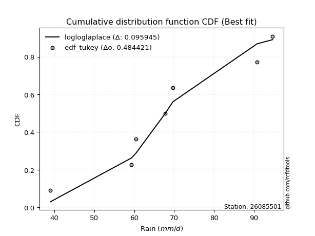</img></img>

</div>


### 8. Empirical - EDF Gringorten (1963)

Gringorten plotting position formula is essential for estimating the probability and return periods of extreme events like floods and heavy rainfall. The constant _a=0.44_.

<div align="center">


$P=(m-a)/(n+1-2a)$


</div>


**8.1. Empirical values**

<div align="center">

|                | 0                   | 1                   | 2                  | 3              | 4                  | 5                  | 6                  |
|:---------------|:--------------------|:--------------------|:-------------------|:---------------|:-------------------|:-------------------|:-------------------|
| date           | 2017                | 2023                | 2021               | 2020           | 2022               | 2018               | 2019               |
| x              | 39.0                | 59.3                | 60.4               | 67.8           | 69.7               | 90.8               | 94.7               |
| m              | 1                   | 2                   | 3                  | 4              | 5                  | 6                  | 7                  |
| empirical_dist | edf_gringorten      | edf_gringorten      | edf_gringorten     | edf_gringorten | edf_gringorten     | edf_gringorten     | edf_gringorten     |
| empirical      | 0.07865168539325844 | 0.21910112359550563 | 0.3595505617977528 | 0.5            | 0.6404494382022471 | 0.7808988764044943 | 0.9213483146067415 |
| empirical_tr   | 1.0853658536585364  | 1.2805755395683454  | 1.5614035087719298 | 2.0            | 2.781249999999999  | 4.564102564102562  | 12.714285714285701 |

</div>


**8.2. Kolmogorov-Smirnov fit test (sorted by Δ)**


<div align="center">

|                | 0                   | 1                   | 2                   | 3                   | 4                   | 5                   | 6                   | 7                   | 8                   | 9                   | 10                  | 11                  | 12                  | 13                  | 14                  | 15                  | 16                  | 17                    | 18                  | 19                  | 20                  | 21                  | 22                  | 23                  | 24                  | 25                  | 26                  | 27                  | 28                  | 29                  | 30                  | 31                  | 32                  | 33                  | 34                  | 35                  | 36                  | 37                  | 38                  | 39                  | 40                  | 41                  | 42                  | 43                  | 44                  | 45                  | 46                  | 47                  | 48                  | 49                  | 50                  | 51                  | 52                  | 53                  | 54                  | 55                  | 56                  | 57                  | 58                  | 59                  | 60                  | 61                  | 62                  | 63                  | 64                  | 65                  | 66                  | 67                  | 68                  | 69                  | 70                  | 71                  | 72                  | 73                  | 74                  | 75                  | 76                  | 77                  | 78                  | 79                  | 80                  | 81                  | 82                  | 83                  | 84                  | 85                  | 86                  | 87                  | 88                  | 89                  |
|:---------------|:--------------------|:--------------------|:--------------------|:--------------------|:--------------------|:--------------------|:--------------------|:--------------------|:--------------------|:--------------------|:--------------------|:--------------------|:--------------------|:--------------------|:--------------------|:--------------------|:--------------------|:----------------------|:--------------------|:--------------------|:--------------------|:--------------------|:--------------------|:--------------------|:--------------------|:--------------------|:--------------------|:--------------------|:--------------------|:--------------------|:--------------------|:--------------------|:--------------------|:--------------------|:--------------------|:--------------------|:--------------------|:--------------------|:--------------------|:--------------------|:--------------------|:--------------------|:--------------------|:--------------------|:--------------------|:--------------------|:--------------------|:--------------------|:--------------------|:--------------------|:--------------------|:--------------------|:--------------------|:--------------------|:--------------------|:--------------------|:--------------------|:--------------------|:--------------------|:--------------------|:--------------------|:--------------------|:--------------------|:--------------------|:--------------------|:--------------------|:--------------------|:--------------------|:--------------------|:--------------------|:--------------------|:--------------------|:--------------------|:--------------------|:--------------------|:--------------------|:--------------------|:--------------------|:--------------------|:--------------------|:--------------------|:--------------------|:--------------------|:--------------------|:--------------------|:--------------------|:--------------------|:--------------------|:--------------------|:--------------------|
| station        | 26085501            | 26085501            | 26085501            | 26085501            | 26085501            | 26085501            | 26085501            | 26085501            | 26085501            | 26085501            | 26085501            | 26085501            | 26085501            | 26085501            | 26085501            | 26085501            | 26085501            | 26085501              | 26085501            | 26085501            | 26085501            | 26085501            | 26085501            | 26085501            | 26085501            | 26085501            | 26085501            | 26085501            | 26085501            | 26085501            | 26085501            | 26085501            | 26085501            | 26085501            | 26085501            | 26085501            | 26085501            | 26085501            | 26085501            | 26085501            | 26085501            | 26085501            | 26085501            | 26085501            | 26085501            | 26085501            | 26085501            | 26085501            | 26085501            | 26085501            | 26085501            | 26085501            | 26085501            | 26085501            | 26085501            | 26085501            | 26085501            | 26085501            | 26085501            | 26085501            | 26085501            | 26085501            | 26085501            | 26085501            | 26085501            | 26085501            | 26085501            | 26085501            | 26085501            | 26085501            | 26085501            | 26085501            | 26085501            | 26085501            | 26085501            | 26085501            | 26085501            | 26085501            | 26085501            | 26085501            | 26085501            | 26085501            | 26085501            | 26085501            | 26085501            | 26085501            | 26085501            | 26085501            | 26085501            | 26085501            |
| empirical_dist | edf_gringorten      | edf_gringorten      | edf_gringorten      | edf_gringorten      | edf_gringorten      | edf_gringorten      | edf_gringorten      | edf_gringorten      | edf_gringorten      | edf_gringorten      | edf_gringorten      | edf_gringorten      | edf_gringorten      | edf_gringorten      | edf_gringorten      | edf_gringorten      | edf_gringorten      | edf_gringorten        | edf_gringorten      | edf_gringorten      | edf_gringorten      | edf_gringorten      | edf_gringorten      | edf_gringorten      | edf_gringorten      | edf_gringorten      | edf_gringorten      | edf_gringorten      | edf_gringorten      | edf_gringorten      | edf_gringorten      | edf_gringorten      | edf_gringorten      | edf_gringorten      | edf_gringorten      | edf_gringorten      | edf_gringorten      | edf_gringorten      | edf_gringorten      | edf_gringorten      | edf_gringorten      | edf_gringorten      | edf_gringorten      | edf_gringorten      | edf_gringorten      | edf_gringorten      | edf_gringorten      | edf_gringorten      | edf_gringorten      | edf_gringorten      | edf_gringorten      | edf_gringorten      | edf_gringorten      | edf_gringorten      | edf_gringorten      | edf_gringorten      | edf_gringorten      | edf_gringorten      | edf_gringorten      | edf_gringorten      | edf_gringorten      | edf_gringorten      | edf_gringorten      | edf_gringorten      | edf_gringorten      | edf_gringorten      | edf_gringorten      | edf_gringorten      | edf_gringorten      | edf_gringorten      | edf_gringorten      | edf_gringorten      | edf_gringorten      | edf_gringorten      | edf_gringorten      | edf_gringorten      | edf_gringorten      | edf_gringorten      | edf_gringorten      | edf_gringorten      | edf_gringorten      | edf_gringorten      | edf_gringorten      | edf_gringorten      | edf_gringorten      | edf_gringorten      | edf_gringorten      | edf_gringorten      | edf_gringorten      | edf_gringorten      |
| p_dist         | logfisk             | betaprime           | ncf                 | alpha               | logpearson3         | maxwell             | genlogistic         | loggompertz         | mielke              | loggenlogistic      | rice                | invgamma            | loglogistic         | logmielke           | fisk                | gumbel_r            | weibull_min         | loglaplace_asymmetric | loghypsecant        | rayleigh            | laplace_asymmetric  | f                   | moyal               | loglaplace          | invgauss            | nct                 | gamma               | pearson3            | erlang              | johnsonsu           | truncnorm           | norm                | crystalball         | exponnorm           | t                   | logweibull_min      | logcrystalball      | lognorm             | lognorm             | logt                | logexponnorm        | logncf              | logfatiguelife      | logistic            | logf                | lognct              | logloggamma         | hypsecant           | laplace             | logerlang           | logrice             | loggamma            | loggamma            | loggumbel_l         | logalpha            | logjohnsonsu        | halflogistic        | wald                | loginvgamma         | halfnorm            | loginvgauss         | logmaxwell          | kstwobign           | gibrat              | lograyleigh         | loggumbel_r         | logbetaprime        | logmoyal            | loginvweibull       | gumbel_l            | loghalfnorm         | loghalflogistic     | nakagami            | lognakagami         | logwald             | logkstwobign        | loggibrat           | loggenexpon         | expon               | logchi2             | genexpon            | chi2                | logexpon            | loglognorm          | logtruncnorm        | pareto              | logpareto           | invweibull          | fatiguelife         | gompertz            |
| delta          | 0.08944701331245031 | 0.09999390460172855 | 0.10163703283205294 | 0.10273565122629802 | 0.10370056360110669 | 0.1043229885420853  | 0.10447115883645408 | 0.10495963039064371 | 0.10498595779198516 | 0.10506780679171446 | 0.10509842084511667 | 0.1053996724961137  | 0.10626600670881303 | 0.10876093489264815 | 0.10884376464877721 | 0.11077318644056988 | 0.11140669122112656 | 0.11145658450053253   | 0.11335075192729704 | 0.11521473831429593 | 0.11561101606963364 | 0.11669201285185027 | 0.11747063977756242 | 0.11893873087721418 | 0.11919915062624789 | 0.12041121423558188 | 0.12049877897471428 | 0.12052937762953386 | 0.12053665098124255 | 0.12055070537809132 | 0.12055077643219347 | 0.12055085741977434 | 0.12055087066097092 | 0.12055137185888909 | 0.1205555400893975  | 0.12093864872772808 | 0.12217152189400313 | 0.1221721862517707  | 0.1221721862517707  | 0.12217238199035027 | 0.12217255256207962 | 0.12283183175532866 | 0.12302010364844854 | 0.12345916539697221 | 0.12443342594567583 | 0.12514079875706755 | 0.1282588982740761  | 0.12874119602460155 | 0.13235978587941    | 0.13290752595176167 | 0.13323202357802197 | 0.13332624110948846 | 0.13332624110948846 | 0.1346362242076662  | 0.13565674738759234 | 0.1386474929482876  | 0.14332513017520157 | 0.14429316632470512 | 0.1457247478626307  | 0.14594893313811422 | 0.15252970594159224 | 0.15354711431657234 | 0.1554930783579951  | 0.16353946581801182 | 0.16549714249754524 | 0.16814383251996237 | 0.18314920537075455 | 0.18489094294211203 | 0.18834906458286024 | 0.19004836135131364 | 0.19947735106746148 | 0.20607962996294735 | 0.21909875860358444 | 0.21910105697445525 | 0.2205040995611008  | 0.2212286775548475  | 0.2244845019560886  | 0.22551976945861027 | 0.27472834520868006 | 0.2935118530879903  | 0.2962958235630815  | 0.2991578123117936  | 0.3261589856380658  | 0.4287285150226823  | 0.44273888046083254 | 0.4445021282269441  | 0.450694622748504   | 0.4847815901790853  | 0.6056518149379804  | 0.6404414386685863  |
| deltao         | 0.48442053926100004 | 0.48442053926100004 | 0.48442053926100004 | 0.48442053926100004 | 0.48442053926100004 | 0.48442053926100004 | 0.48442053926100004 | 0.48442053926100004 | 0.48442053926100004 | 0.48442053926100004 | 0.48442053926100004 | 0.48442053926100004 | 0.48442053926100004 | 0.48442053926100004 | 0.48442053926100004 | 0.48442053926100004 | 0.48442053926100004 | 0.48442053926100004   | 0.48442053926100004 | 0.48442053926100004 | 0.48442053926100004 | 0.48442053926100004 | 0.48442053926100004 | 0.48442053926100004 | 0.48442053926100004 | 0.48442053926100004 | 0.48442053926100004 | 0.48442053926100004 | 0.48442053926100004 | 0.48442053926100004 | 0.48442053926100004 | 0.48442053926100004 | 0.48442053926100004 | 0.48442053926100004 | 0.48442053926100004 | 0.48442053926100004 | 0.48442053926100004 | 0.48442053926100004 | 0.48442053926100004 | 0.48442053926100004 | 0.48442053926100004 | 0.48442053926100004 | 0.48442053926100004 | 0.48442053926100004 | 0.48442053926100004 | 0.48442053926100004 | 0.48442053926100004 | 0.48442053926100004 | 0.48442053926100004 | 0.48442053926100004 | 0.48442053926100004 | 0.48442053926100004 | 0.48442053926100004 | 0.48442053926100004 | 0.48442053926100004 | 0.48442053926100004 | 0.48442053926100004 | 0.48442053926100004 | 0.48442053926100004 | 0.48442053926100004 | 0.48442053926100004 | 0.48442053926100004 | 0.48442053926100004 | 0.48442053926100004 | 0.48442053926100004 | 0.48442053926100004 | 0.48442053926100004 | 0.48442053926100004 | 0.48442053926100004 | 0.48442053926100004 | 0.48442053926100004 | 0.48442053926100004 | 0.48442053926100004 | 0.48442053926100004 | 0.48442053926100004 | 0.48442053926100004 | 0.48442053926100004 | 0.48442053926100004 | 0.48442053926100004 | 0.48442053926100004 | 0.48442053926100004 | 0.48442053926100004 | 0.48442053926100004 | 0.48442053926100004 | 0.48442053926100004 | 0.48442053926100004 | 0.48442053926100004 | 0.48442053926100004 | 0.48442053926100004 | 0.48442053926100004 |
| eval           | Δo > Δ              | Δo > Δ              | Δo > Δ              | Δo > Δ              | Δo > Δ              | Δo > Δ              | Δo > Δ              | Δo > Δ              | Δo > Δ              | Δo > Δ              | Δo > Δ              | Δo > Δ              | Δo > Δ              | Δo > Δ              | Δo > Δ              | Δo > Δ              | Δo > Δ              | Δo > Δ                | Δo > Δ              | Δo > Δ              | Δo > Δ              | Δo > Δ              | Δo > Δ              | Δo > Δ              | Δo > Δ              | Δo > Δ              | Δo > Δ              | Δo > Δ              | Δo > Δ              | Δo > Δ              | Δo > Δ              | Δo > Δ              | Δo > Δ              | Δo > Δ              | Δo > Δ              | Δo > Δ              | Δo > Δ              | Δo > Δ              | Δo > Δ              | Δo > Δ              | Δo > Δ              | Δo > Δ              | Δo > Δ              | Δo > Δ              | Δo > Δ              | Δo > Δ              | Δo > Δ              | Δo > Δ              | Δo > Δ              | Δo > Δ              | Δo > Δ              | Δo > Δ              | Δo > Δ              | Δo > Δ              | Δo > Δ              | Δo > Δ              | Δo > Δ              | Δo > Δ              | Δo > Δ              | Δo > Δ              | Δo > Δ              | Δo > Δ              | Δo > Δ              | Δo > Δ              | Δo > Δ              | Δo > Δ              | Δo > Δ              | Δo > Δ              | Δo > Δ              | Δo > Δ              | Δo > Δ              | Δo > Δ              | Δo > Δ              | Δo > Δ              | Δo > Δ              | Δo > Δ              | Δo > Δ              | Δo > Δ              | Δo > Δ              | Δo > Δ              | Δo > Δ              | Δo > Δ              | Δo > Δ              | Δo > Δ              | Δo > Δ              | Δo > Δ              | Δo > Δ              | Δo <= Δ             | Δo <= Δ             | Δo <= Δ             |
| fit            | 1                   | 1                   | 1                   | 1                   | 1                   | 1                   | 1                   | 1                   | 1                   | 1                   | 1                   | 1                   | 1                   | 1                   | 1                   | 1                   | 1                   | 1                     | 1                   | 1                   | 1                   | 1                   | 1                   | 1                   | 1                   | 1                   | 1                   | 1                   | 1                   | 1                   | 1                   | 1                   | 1                   | 1                   | 1                   | 1                   | 1                   | 1                   | 1                   | 1                   | 1                   | 1                   | 1                   | 1                   | 1                   | 1                   | 1                   | 1                   | 1                   | 1                   | 1                   | 1                   | 1                   | 1                   | 1                   | 1                   | 1                   | 1                   | 1                   | 1                   | 1                   | 1                   | 1                   | 1                   | 1                   | 1                   | 1                   | 1                   | 1                   | 1                   | 1                   | 1                   | 1                   | 1                   | 1                   | 1                   | 1                   | 1                   | 1                   | 1                   | 1                   | 1                   | 1                   | 1                   | 1                   | 1                   | 1                   | 0                   | 0                   | 0                   |
| n              | 7                   | 7                   | 7                   | 7                   | 7                   | 7                   | 7                   | 7                   | 7                   | 7                   | 7                   | 7                   | 7                   | 7                   | 7                   | 7                   | 7                   | 7                     | 7                   | 7                   | 7                   | 7                   | 7                   | 7                   | 7                   | 7                   | 7                   | 7                   | 7                   | 7                   | 7                   | 7                   | 7                   | 7                   | 7                   | 7                   | 7                   | 7                   | 7                   | 7                   | 7                   | 7                   | 7                   | 7                   | 7                   | 7                   | 7                   | 7                   | 7                   | 7                   | 7                   | 7                   | 7                   | 7                   | 7                   | 7                   | 7                   | 7                   | 7                   | 7                   | 7                   | 7                   | 7                   | 7                   | 7                   | 7                   | 7                   | 7                   | 7                   | 7                   | 7                   | 7                   | 7                   | 7                   | 7                   | 7                   | 7                   | 7                   | 7                   | 7                   | 7                   | 7                   | 7                   | 7                   | 7                   | 7                   | 7                   | 7                   | 7                   | 7                   |
| best_fit       | 1                   | 0                   | 0                   | 0                   | 0                   | 0                   | 0                   | 0                   | 0                   | 0                   | 0                   | 0                   | 0                   | 0                   | 0                   | 0                   | 0                   | 0                     | 0                   | 0                   | 0                   | 0                   | 0                   | 0                   | 0                   | 0                   | 0                   | 0                   | 0                   | 0                   | 0                   | 0                   | 0                   | 0                   | 0                   | 0                   | 0                   | 0                   | 0                   | 0                   | 0                   | 0                   | 0                   | 0                   | 0                   | 0                   | 0                   | 0                   | 0                   | 0                   | 0                   | 0                   | 0                   | 0                   | 0                   | 0                   | 0                   | 0                   | 0                   | 0                   | 0                   | 0                   | 0                   | 0                   | 0                   | 0                   | 0                   | 0                   | 0                   | 0                   | 0                   | 0                   | 0                   | 0                   | 0                   | 0                   | 0                   | 0                   | 0                   | 0                   | 0                   | 0                   | 0                   | 0                   | 0                   | 0                   | 0                   | 0                   | 0                   | 0                   |
| best_fit_sort  | 1                   | 2                   | 3                   | 4                   | 5                   | 6                   | 7                   | 8                   | 9                   | 10                  | 11                  | 12                  | 13                  | 14                  | 15                  | 16                  | 17                  | 18                    | 19                  | 20                  | 21                  | 22                  | 23                  | 24                  | 25                  | 26                  | 27                  | 28                  | 29                  | 30                  | 31                  | 32                  | 33                  | 34                  | 35                  | 36                  | 37                  | 38                  | 39                  | 40                  | 41                  | 42                  | 43                  | 44                  | 45                  | 46                  | 47                  | 48                  | 49                  | 50                  | 51                  | 52                  | 53                  | 54                  | 55                  | 56                  | 57                  | 58                  | 59                  | 60                  | 61                  | 62                  | 63                  | 64                  | 65                  | 66                  | 67                  | 68                  | 69                  | 70                  | 71                  | 72                  | 73                  | 74                  | 75                  | 76                  | 77                  | 78                  | 79                  | 80                  | 81                  | 82                  | 83                  | 84                  | 85                  | 86                  | 87                  | 88                  | 89                  | 90                  |

</div>


<div align="center">

</img>

</div>


**8.3. Best fit**

<div align="center">

|   id |   station | empirical_dist   | p_dist   |    delta |   deltao | eval   |   fit |   n |   best_fit |   best_fit_sort |
|-----:|----------:|:-----------------|:---------|---------:|---------:|:-------|------:|----:|-----------:|----------------:|
|    0 |  26085501 | edf_gringorten   | logfisk  | 0.089447 | 0.484421 | Δo > Δ |     1 |   7 |          1 |               1 |

</div>


<div align="center">

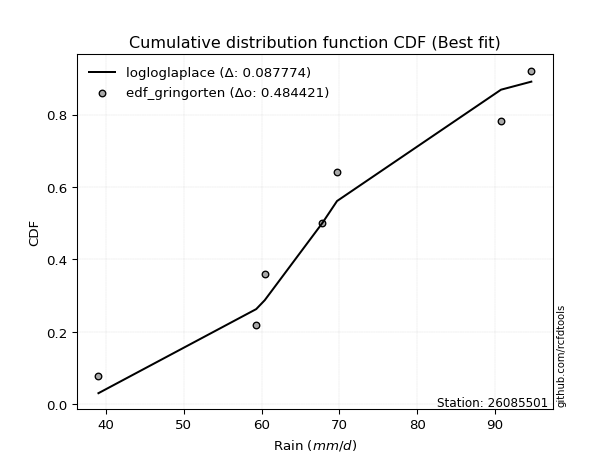</img>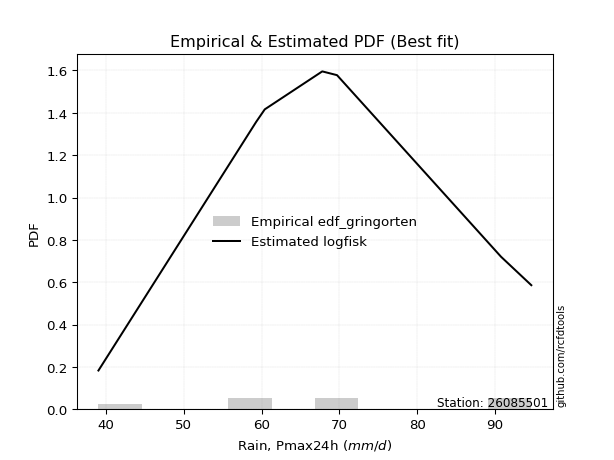</img>

</div>


### 9. Empirical - EDF Filliben (1975)

The specific values of the constants (0.3175) (often denoted as $alpha$) and (0.365) are derived from a method proposed by James J. Filliben in a 1975 paper. This particular formula is the mean value of the $i$-th order statistic of the normal distribution and is considered a robust and effective plotting position formula for the normal probability plot correlation coefficient test for normality.

<div align="center">


$P=(m-0.3175)/(n+0.365)$


</div>


**9.1. Empirical values**

<div align="center">

|                | 0                   | 1                   | 2                   | 3            | 4                  | 5                  | 6                  |
|:---------------|:--------------------|:--------------------|:--------------------|:-------------|:-------------------|:-------------------|:-------------------|
| date           | 2017                | 2023                | 2021                | 2020         | 2022               | 2018               | 2019               |
| x              | 39.0                | 59.3                | 60.4                | 67.8         | 69.7               | 90.8               | 94.7               |
| m              | 1                   | 2                   | 3                   | 4            | 5                  | 6                  | 7                  |
| empirical_dist | edf_filliben        | edf_filliben        | edf_filliben        | edf_filliben | edf_filliben       | edf_filliben       | edf_filliben       |
| empirical      | 0.09266802443991853 | 0.22844534962661237 | 0.36422267481330617 | 0.5          | 0.6357773251866938 | 0.7715546503733877 | 0.9073319755600815 |
| empirical_tr   | 1.1021324354657687  | 1.2960844698636163  | 1.5728777362520021  | 2.0          | 2.7455731593662627 | 4.377414561664191  | 10.791208791208794 |

</div>


**9.2. Kolmogorov-Smirnov fit test (sorted by Δ)**


<div align="center">

|                | 0                   | 1                   | 2                   | 3                   | 4                   | 5                   | 6                   | 7                   | 8                   | 9                   | 10                  | 11                  | 12                  | 13                  | 14                  | 15                  | 16                  | 17                  | 18                  | 19                  | 20                  | 21                  | 22                  | 23                  | 24                  | 25                  | 26                  | 27                  | 28                  | 29                  | 30                  | 31                  | 32                  | 33                  | 34                  | 35                  | 36                  | 37                  | 38                  | 39                  | 40                    | 41                  | 42                  | 43                  | 44                  | 45                  | 46                  | 47                  | 48                  | 49                  | 50                  | 51                  | 52                  | 53                  | 54                  | 55                  | 56                  | 57                  | 58                  | 59                  | 60                  | 61                  | 62                  | 63                  | 64                  | 65                  | 66                  | 67                  | 68                  | 69                  | 70                  | 71                  | 72                  | 73                  | 74                  | 75                  | 76                  | 77                  | 78                  | 79                  | 80                  | 81                  | 82                  | 83                  | 84                  | 85                  | 86                  | 87                  | 88                  | 89                  |
|:---------------|:--------------------|:--------------------|:--------------------|:--------------------|:--------------------|:--------------------|:--------------------|:--------------------|:--------------------|:--------------------|:--------------------|:--------------------|:--------------------|:--------------------|:--------------------|:--------------------|:--------------------|:--------------------|:--------------------|:--------------------|:--------------------|:--------------------|:--------------------|:--------------------|:--------------------|:--------------------|:--------------------|:--------------------|:--------------------|:--------------------|:--------------------|:--------------------|:--------------------|:--------------------|:--------------------|:--------------------|:--------------------|:--------------------|:--------------------|:--------------------|:----------------------|:--------------------|:--------------------|:--------------------|:--------------------|:--------------------|:--------------------|:--------------------|:--------------------|:--------------------|:--------------------|:--------------------|:--------------------|:--------------------|:--------------------|:--------------------|:--------------------|:--------------------|:--------------------|:--------------------|:--------------------|:--------------------|:--------------------|:--------------------|:--------------------|:--------------------|:--------------------|:--------------------|:--------------------|:--------------------|:--------------------|:--------------------|:--------------------|:--------------------|:--------------------|:--------------------|:--------------------|:--------------------|:--------------------|:--------------------|:--------------------|:--------------------|:--------------------|:--------------------|:--------------------|:--------------------|:--------------------|:--------------------|:--------------------|:--------------------|
| station        | 26085501            | 26085501            | 26085501            | 26085501            | 26085501            | 26085501            | 26085501            | 26085501            | 26085501            | 26085501            | 26085501            | 26085501            | 26085501            | 26085501            | 26085501            | 26085501            | 26085501            | 26085501            | 26085501            | 26085501            | 26085501            | 26085501            | 26085501            | 26085501            | 26085501            | 26085501            | 26085501            | 26085501            | 26085501            | 26085501            | 26085501            | 26085501            | 26085501            | 26085501            | 26085501            | 26085501            | 26085501            | 26085501            | 26085501            | 26085501            | 26085501              | 26085501            | 26085501            | 26085501            | 26085501            | 26085501            | 26085501            | 26085501            | 26085501            | 26085501            | 26085501            | 26085501            | 26085501            | 26085501            | 26085501            | 26085501            | 26085501            | 26085501            | 26085501            | 26085501            | 26085501            | 26085501            | 26085501            | 26085501            | 26085501            | 26085501            | 26085501            | 26085501            | 26085501            | 26085501            | 26085501            | 26085501            | 26085501            | 26085501            | 26085501            | 26085501            | 26085501            | 26085501            | 26085501            | 26085501            | 26085501            | 26085501            | 26085501            | 26085501            | 26085501            | 26085501            | 26085501            | 26085501            | 26085501            | 26085501            |
| empirical_dist | edf_filliben        | edf_filliben        | edf_filliben        | edf_filliben        | edf_filliben        | edf_filliben        | edf_filliben        | edf_filliben        | edf_filliben        | edf_filliben        | edf_filliben        | edf_filliben        | edf_filliben        | edf_filliben        | edf_filliben        | edf_filliben        | edf_filliben        | edf_filliben        | edf_filliben        | edf_filliben        | edf_filliben        | edf_filliben        | edf_filliben        | edf_filliben        | edf_filliben        | edf_filliben        | edf_filliben        | edf_filliben        | edf_filliben        | edf_filliben        | edf_filliben        | edf_filliben        | edf_filliben        | edf_filliben        | edf_filliben        | edf_filliben        | edf_filliben        | edf_filliben        | edf_filliben        | edf_filliben        | edf_filliben          | edf_filliben        | edf_filliben        | edf_filliben        | edf_filliben        | edf_filliben        | edf_filliben        | edf_filliben        | edf_filliben        | edf_filliben        | edf_filliben        | edf_filliben        | edf_filliben        | edf_filliben        | edf_filliben        | edf_filliben        | edf_filliben        | edf_filliben        | edf_filliben        | edf_filliben        | edf_filliben        | edf_filliben        | edf_filliben        | edf_filliben        | edf_filliben        | edf_filliben        | edf_filliben        | edf_filliben        | edf_filliben        | edf_filliben        | edf_filliben        | edf_filliben        | edf_filliben        | edf_filliben        | edf_filliben        | edf_filliben        | edf_filliben        | edf_filliben        | edf_filliben        | edf_filliben        | edf_filliben        | edf_filliben        | edf_filliben        | edf_filliben        | edf_filliben        | edf_filliben        | edf_filliben        | edf_filliben        | edf_filliben        | edf_filliben        |
| p_dist         | logfisk             | betaprime           | rayleigh            | logpearson3         | ncf                 | invgauss            | alpha               | maxwell             | logcrystalball      | lognorm             | lognorm             | logt                | logexponnorm        | logmielke           | logncf              | logfatiguelife      | genlogistic         | loggenlogistic      | mielke              | loggompertz         | rice                | invgamma            | logf                | loglogistic         | lognct              | weibull_min         | fisk                | logweibull_min      | f                   | gumbel_r            | erlang              | nct                 | t                   | pearson3            | johnsonsu           | exponnorm           | crystalball         | norm                | truncnorm           | gamma               | loglaplace_asymmetric | moyal               | loghypsecant        | logerlang           | logloggamma         | logrice             | loggamma            | loggamma            | laplace_asymmetric  | logalpha            | loglaplace          | logistic            | logjohnsonsu        | halflogistic        | loginvgamma         | halfnorm            | hypsecant           | loggumbel_l         | laplace             | loginvgauss         | logmaxwell          | wald                | kstwobign           | lograyleigh         | loggumbel_r         | gibrat              | logbetaprime        | logmoyal            | loginvweibull       | gumbel_l            | loghalfnorm         | loghalflogistic     | logwald             | logkstwobign        | loggenexpon         | loggibrat           | nakagami            | lognakagami         | expon               | logchi2             | genexpon            | chi2                | logexpon            | loglognorm          | logtruncnorm        | pareto              | logpareto           | invweibull          | fatiguelife         | gompertz            |
| delta          | 0.09879123934355694 | 0.10843115659745617 | 0.10980523690379673 | 0.11041659152907746 | 0.11098125886315957 | 0.11130432550172842 | 0.11207987725740465 | 0.11209262237104245 | 0.11282729586289639 | 0.11282796022066396 | 0.11282796022066396 | 0.11282815595924353 | 0.11282832653097288 | 0.11305871443707982 | 0.11348760572422192 | 0.1136758776173418  | 0.11381538486756071 | 0.11403287493502245 | 0.11404946599305854 | 0.11430385642175034 | 0.1144426468762233  | 0.11474389852722033 | 0.11508919991456909 | 0.11561023273991966 | 0.1157965727259608  | 0.1171366846476738  | 0.11818799067988384 | 0.11922768997761268 | 0.11974252349356529 | 0.12011741247167651 | 0.12067390324348926 | 0.12068776804969727 | 0.12069385896809592 | 0.12069728721630302 | 0.12069762468524547 | 0.12070235089016801 | 0.12070278331261741 | 0.12070278860776673 | 0.12070285076877463 | 0.12070348728389613 | 0.12080081053163916   | 0.12195703668191316 | 0.12269497795840367 | 0.12356329992065493 | 0.12358678525852285 | 0.12388779754691523 | 0.12398201507838172 | 0.12398201507838172 | 0.12495524210074027 | 0.1263125213564856  | 0.1282829569083208  | 0.13280339142807884 | 0.13397537993273434 | 0.13398090414409483 | 0.13638052183152397 | 0.13660470710700748 | 0.13808542205570817 | 0.13890789876107368 | 0.14170401191051663 | 0.1431854799104855  | 0.1442028882854656  | 0.14429316632470512 | 0.14614885232688837 | 0.1561529164664385  | 0.15879960648885563 | 0.16353946581801182 | 0.1738049793396478  | 0.1755467169110053  | 0.1790048385517535  | 0.18537624833576039 | 0.19013312503635474 | 0.1967354039318406  | 0.21115987352999407 | 0.21188445152374077 | 0.21617554342750353 | 0.2244845019560886  | 0.22844298463469118 | 0.228445283005562   | 0.2653841191775733  | 0.27949551404133033 | 0.28695159753197474 | 0.2898135862806869  | 0.31681475960695904 | 0.41938428899157554 | 0.4333946544297258  | 0.4351579021958374  | 0.4413503967173973  | 0.4707652511324253  | 0.5963075889068736  | 0.635769325653033   |
| deltao         | 0.48442053926100004 | 0.48442053926100004 | 0.48442053926100004 | 0.48442053926100004 | 0.48442053926100004 | 0.48442053926100004 | 0.48442053926100004 | 0.48442053926100004 | 0.48442053926100004 | 0.48442053926100004 | 0.48442053926100004 | 0.48442053926100004 | 0.48442053926100004 | 0.48442053926100004 | 0.48442053926100004 | 0.48442053926100004 | 0.48442053926100004 | 0.48442053926100004 | 0.48442053926100004 | 0.48442053926100004 | 0.48442053926100004 | 0.48442053926100004 | 0.48442053926100004 | 0.48442053926100004 | 0.48442053926100004 | 0.48442053926100004 | 0.48442053926100004 | 0.48442053926100004 | 0.48442053926100004 | 0.48442053926100004 | 0.48442053926100004 | 0.48442053926100004 | 0.48442053926100004 | 0.48442053926100004 | 0.48442053926100004 | 0.48442053926100004 | 0.48442053926100004 | 0.48442053926100004 | 0.48442053926100004 | 0.48442053926100004 | 0.48442053926100004   | 0.48442053926100004 | 0.48442053926100004 | 0.48442053926100004 | 0.48442053926100004 | 0.48442053926100004 | 0.48442053926100004 | 0.48442053926100004 | 0.48442053926100004 | 0.48442053926100004 | 0.48442053926100004 | 0.48442053926100004 | 0.48442053926100004 | 0.48442053926100004 | 0.48442053926100004 | 0.48442053926100004 | 0.48442053926100004 | 0.48442053926100004 | 0.48442053926100004 | 0.48442053926100004 | 0.48442053926100004 | 0.48442053926100004 | 0.48442053926100004 | 0.48442053926100004 | 0.48442053926100004 | 0.48442053926100004 | 0.48442053926100004 | 0.48442053926100004 | 0.48442053926100004 | 0.48442053926100004 | 0.48442053926100004 | 0.48442053926100004 | 0.48442053926100004 | 0.48442053926100004 | 0.48442053926100004 | 0.48442053926100004 | 0.48442053926100004 | 0.48442053926100004 | 0.48442053926100004 | 0.48442053926100004 | 0.48442053926100004 | 0.48442053926100004 | 0.48442053926100004 | 0.48442053926100004 | 0.48442053926100004 | 0.48442053926100004 | 0.48442053926100004 | 0.48442053926100004 | 0.48442053926100004 | 0.48442053926100004 |
| eval           | Δo > Δ              | Δo > Δ              | Δo > Δ              | Δo > Δ              | Δo > Δ              | Δo > Δ              | Δo > Δ              | Δo > Δ              | Δo > Δ              | Δo > Δ              | Δo > Δ              | Δo > Δ              | Δo > Δ              | Δo > Δ              | Δo > Δ              | Δo > Δ              | Δo > Δ              | Δo > Δ              | Δo > Δ              | Δo > Δ              | Δo > Δ              | Δo > Δ              | Δo > Δ              | Δo > Δ              | Δo > Δ              | Δo > Δ              | Δo > Δ              | Δo > Δ              | Δo > Δ              | Δo > Δ              | Δo > Δ              | Δo > Δ              | Δo > Δ              | Δo > Δ              | Δo > Δ              | Δo > Δ              | Δo > Δ              | Δo > Δ              | Δo > Δ              | Δo > Δ              | Δo > Δ                | Δo > Δ              | Δo > Δ              | Δo > Δ              | Δo > Δ              | Δo > Δ              | Δo > Δ              | Δo > Δ              | Δo > Δ              | Δo > Δ              | Δo > Δ              | Δo > Δ              | Δo > Δ              | Δo > Δ              | Δo > Δ              | Δo > Δ              | Δo > Δ              | Δo > Δ              | Δo > Δ              | Δo > Δ              | Δo > Δ              | Δo > Δ              | Δo > Δ              | Δo > Δ              | Δo > Δ              | Δo > Δ              | Δo > Δ              | Δo > Δ              | Δo > Δ              | Δo > Δ              | Δo > Δ              | Δo > Δ              | Δo > Δ              | Δo > Δ              | Δo > Δ              | Δo > Δ              | Δo > Δ              | Δo > Δ              | Δo > Δ              | Δo > Δ              | Δo > Δ              | Δo > Δ              | Δo > Δ              | Δo > Δ              | Δo > Δ              | Δo > Δ              | Δo > Δ              | Δo > Δ              | Δo <= Δ             | Δo <= Δ             |
| fit            | 1                   | 1                   | 1                   | 1                   | 1                   | 1                   | 1                   | 1                   | 1                   | 1                   | 1                   | 1                   | 1                   | 1                   | 1                   | 1                   | 1                   | 1                   | 1                   | 1                   | 1                   | 1                   | 1                   | 1                   | 1                   | 1                   | 1                   | 1                   | 1                   | 1                   | 1                   | 1                   | 1                   | 1                   | 1                   | 1                   | 1                   | 1                   | 1                   | 1                   | 1                     | 1                   | 1                   | 1                   | 1                   | 1                   | 1                   | 1                   | 1                   | 1                   | 1                   | 1                   | 1                   | 1                   | 1                   | 1                   | 1                   | 1                   | 1                   | 1                   | 1                   | 1                   | 1                   | 1                   | 1                   | 1                   | 1                   | 1                   | 1                   | 1                   | 1                   | 1                   | 1                   | 1                   | 1                   | 1                   | 1                   | 1                   | 1                   | 1                   | 1                   | 1                   | 1                   | 1                   | 1                   | 1                   | 1                   | 1                   | 0                   | 0                   |
| n              | 7                   | 7                   | 7                   | 7                   | 7                   | 7                   | 7                   | 7                   | 7                   | 7                   | 7                   | 7                   | 7                   | 7                   | 7                   | 7                   | 7                   | 7                   | 7                   | 7                   | 7                   | 7                   | 7                   | 7                   | 7                   | 7                   | 7                   | 7                   | 7                   | 7                   | 7                   | 7                   | 7                   | 7                   | 7                   | 7                   | 7                   | 7                   | 7                   | 7                   | 7                     | 7                   | 7                   | 7                   | 7                   | 7                   | 7                   | 7                   | 7                   | 7                   | 7                   | 7                   | 7                   | 7                   | 7                   | 7                   | 7                   | 7                   | 7                   | 7                   | 7                   | 7                   | 7                   | 7                   | 7                   | 7                   | 7                   | 7                   | 7                   | 7                   | 7                   | 7                   | 7                   | 7                   | 7                   | 7                   | 7                   | 7                   | 7                   | 7                   | 7                   | 7                   | 7                   | 7                   | 7                   | 7                   | 7                   | 7                   | 7                   | 7                   |
| best_fit       | 1                   | 0                   | 0                   | 0                   | 0                   | 0                   | 0                   | 0                   | 0                   | 0                   | 0                   | 0                   | 0                   | 0                   | 0                   | 0                   | 0                   | 0                   | 0                   | 0                   | 0                   | 0                   | 0                   | 0                   | 0                   | 0                   | 0                   | 0                   | 0                   | 0                   | 0                   | 0                   | 0                   | 0                   | 0                   | 0                   | 0                   | 0                   | 0                   | 0                   | 0                     | 0                   | 0                   | 0                   | 0                   | 0                   | 0                   | 0                   | 0                   | 0                   | 0                   | 0                   | 0                   | 0                   | 0                   | 0                   | 0                   | 0                   | 0                   | 0                   | 0                   | 0                   | 0                   | 0                   | 0                   | 0                   | 0                   | 0                   | 0                   | 0                   | 0                   | 0                   | 0                   | 0                   | 0                   | 0                   | 0                   | 0                   | 0                   | 0                   | 0                   | 0                   | 0                   | 0                   | 0                   | 0                   | 0                   | 0                   | 0                   | 0                   |
| best_fit_sort  | 1                   | 2                   | 3                   | 4                   | 5                   | 6                   | 7                   | 8                   | 9                   | 10                  | 11                  | 12                  | 13                  | 14                  | 15                  | 16                  | 17                  | 18                  | 19                  | 20                  | 21                  | 22                  | 23                  | 24                  | 25                  | 26                  | 27                  | 28                  | 29                  | 30                  | 31                  | 32                  | 33                  | 34                  | 35                  | 36                  | 37                  | 38                  | 39                  | 40                  | 41                    | 42                  | 43                  | 44                  | 45                  | 46                  | 47                  | 48                  | 49                  | 50                  | 51                  | 52                  | 53                  | 54                  | 55                  | 56                  | 57                  | 58                  | 59                  | 60                  | 61                  | 62                  | 63                  | 64                  | 65                  | 66                  | 67                  | 68                  | 69                  | 70                  | 71                  | 72                  | 73                  | 74                  | 75                  | 76                  | 77                  | 78                  | 79                  | 80                  | 81                  | 82                  | 83                  | 84                  | 85                  | 86                  | 87                  | 88                  | 89                  | 90                  |

</div>


<div align="center">

</img>

</div>


**9.3. Best fit**

<div align="center">

|   id |   station | empirical_dist   | p_dist   |     delta |   deltao | eval   |   fit |   n |   best_fit |   best_fit_sort |
|-----:|----------:|:-----------------|:---------|----------:|---------:|:-------|------:|----:|-----------:|----------------:|
|    0 |  26085501 | edf_filliben     | logfisk  | 0.0987912 | 0.484421 | Δo > Δ |     1 |   7 |          1 |               1 |

</div>


<div align="center">

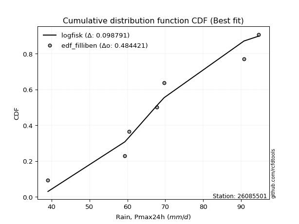</img>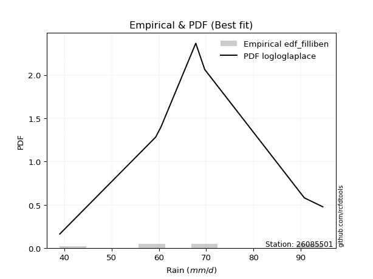</img>

</div>


### 10. Empirical - EDF Jenkinson (1977)

The Jenkinson formula in hydrology is an empirical plotting position formula used to estimate the non-exceedance probability _(P)_ or return period _(T)_ of a given ordered observation within a sample. It is a widely used method in the frequency analysis of extreme events such as floods and rainfall, as it provides a distribution-free way to plot data. _a≈0.31_ and _b≈0.38_ are constants derived to approximate the median of the probability distribution for the given rank.

<div align="center">


$P=(m-a)/(n+b)$


</div>


**10.1. Empirical values**

<div align="center">

|                | 0                   | 1                   | 2                   | 3             | 4                  | 5                  | 6                  |
|:---------------|:--------------------|:--------------------|:--------------------|:--------------|:-------------------|:-------------------|:-------------------|
| date           | 2017                | 2023                | 2021                | 2020          | 2022               | 2018               | 2019               |
| x              | 39.0                | 59.3                | 60.4                | 67.8          | 69.7               | 90.8               | 94.7               |
| m              | 1                   | 2                   | 3                   | 4             | 5                  | 6                  | 7                  |
| empirical_dist | edf_jenkinson       | edf_jenkinson       | edf_jenkinson       | edf_jenkinson | edf_jenkinson      | edf_jenkinson      | edf_jenkinson      |
| empirical      | 0.09349593495934959 | 0.22899728997289973 | 0.36449864498644985 | 0.5           | 0.6355013550135502 | 0.7710027100271003 | 0.9065040650406505 |
| empirical_tr   | 1.1031390134529149  | 1.29701230228471    | 1.5735607675906182  | 2.0           | 2.743494423791822  | 4.366863905325444  | 10.695652173913055 |

</div>


**10.2. Kolmogorov-Smirnov fit test (sorted by Δ)**


<div align="center">

|                | 0                   | 1                   | 2                   | 3                   | 4                   | 5                   | 6                   | 7                   | 8                   | 9                   | 10                  | 11                  | 12                  | 13                  | 14                  | 15                  | 16                  | 17                  | 18                  | 19                  | 20                  | 21                  | 22                  | 23                  | 24                  | 25                  | 26                  | 27                  | 28                  | 29                  | 30                  | 31                  | 32                  | 33                  | 34                  | 35                  | 36                  | 37                  | 38                  | 39                  | 40                    | 41                  | 42                  | 43                  | 44                  | 45                  | 46                  | 47                  | 48                  | 49                  | 50                  | 51                  | 52                  | 53                  | 54                  | 55                  | 56                  | 57                  | 58                  | 59                  | 60                  | 61                  | 62                  | 63                  | 64                  | 65                  | 66                  | 67                  | 68                  | 69                  | 70                  | 71                  | 72                  | 73                  | 74                  | 75                  | 76                  | 77                  | 78                  | 79                  | 80                  | 81                  | 82                  | 83                  | 84                  | 85                  | 86                  | 87                  | 88                  | 89                  |
|:---------------|:--------------------|:--------------------|:--------------------|:--------------------|:--------------------|:--------------------|:--------------------|:--------------------|:--------------------|:--------------------|:--------------------|:--------------------|:--------------------|:--------------------|:--------------------|:--------------------|:--------------------|:--------------------|:--------------------|:--------------------|:--------------------|:--------------------|:--------------------|:--------------------|:--------------------|:--------------------|:--------------------|:--------------------|:--------------------|:--------------------|:--------------------|:--------------------|:--------------------|:--------------------|:--------------------|:--------------------|:--------------------|:--------------------|:--------------------|:--------------------|:----------------------|:--------------------|:--------------------|:--------------------|:--------------------|:--------------------|:--------------------|:--------------------|:--------------------|:--------------------|:--------------------|:--------------------|:--------------------|:--------------------|:--------------------|:--------------------|:--------------------|:--------------------|:--------------------|:--------------------|:--------------------|:--------------------|:--------------------|:--------------------|:--------------------|:--------------------|:--------------------|:--------------------|:--------------------|:--------------------|:--------------------|:--------------------|:--------------------|:--------------------|:--------------------|:--------------------|:--------------------|:--------------------|:--------------------|:--------------------|:--------------------|:--------------------|:--------------------|:--------------------|:--------------------|:--------------------|:--------------------|:--------------------|:--------------------|:--------------------|
| station        | 26085501            | 26085501            | 26085501            | 26085501            | 26085501            | 26085501            | 26085501            | 26085501            | 26085501            | 26085501            | 26085501            | 26085501            | 26085501            | 26085501            | 26085501            | 26085501            | 26085501            | 26085501            | 26085501            | 26085501            | 26085501            | 26085501            | 26085501            | 26085501            | 26085501            | 26085501            | 26085501            | 26085501            | 26085501            | 26085501            | 26085501            | 26085501            | 26085501            | 26085501            | 26085501            | 26085501            | 26085501            | 26085501            | 26085501            | 26085501            | 26085501              | 26085501            | 26085501            | 26085501            | 26085501            | 26085501            | 26085501            | 26085501            | 26085501            | 26085501            | 26085501            | 26085501            | 26085501            | 26085501            | 26085501            | 26085501            | 26085501            | 26085501            | 26085501            | 26085501            | 26085501            | 26085501            | 26085501            | 26085501            | 26085501            | 26085501            | 26085501            | 26085501            | 26085501            | 26085501            | 26085501            | 26085501            | 26085501            | 26085501            | 26085501            | 26085501            | 26085501            | 26085501            | 26085501            | 26085501            | 26085501            | 26085501            | 26085501            | 26085501            | 26085501            | 26085501            | 26085501            | 26085501            | 26085501            | 26085501            |
| empirical_dist | edf_jenkinson       | edf_jenkinson       | edf_jenkinson       | edf_jenkinson       | edf_jenkinson       | edf_jenkinson       | edf_jenkinson       | edf_jenkinson       | edf_jenkinson       | edf_jenkinson       | edf_jenkinson       | edf_jenkinson       | edf_jenkinson       | edf_jenkinson       | edf_jenkinson       | edf_jenkinson       | edf_jenkinson       | edf_jenkinson       | edf_jenkinson       | edf_jenkinson       | edf_jenkinson       | edf_jenkinson       | edf_jenkinson       | edf_jenkinson       | edf_jenkinson       | edf_jenkinson       | edf_jenkinson       | edf_jenkinson       | edf_jenkinson       | edf_jenkinson       | edf_jenkinson       | edf_jenkinson       | edf_jenkinson       | edf_jenkinson       | edf_jenkinson       | edf_jenkinson       | edf_jenkinson       | edf_jenkinson       | edf_jenkinson       | edf_jenkinson       | edf_jenkinson         | edf_jenkinson       | edf_jenkinson       | edf_jenkinson       | edf_jenkinson       | edf_jenkinson       | edf_jenkinson       | edf_jenkinson       | edf_jenkinson       | edf_jenkinson       | edf_jenkinson       | edf_jenkinson       | edf_jenkinson       | edf_jenkinson       | edf_jenkinson       | edf_jenkinson       | edf_jenkinson       | edf_jenkinson       | edf_jenkinson       | edf_jenkinson       | edf_jenkinson       | edf_jenkinson       | edf_jenkinson       | edf_jenkinson       | edf_jenkinson       | edf_jenkinson       | edf_jenkinson       | edf_jenkinson       | edf_jenkinson       | edf_jenkinson       | edf_jenkinson       | edf_jenkinson       | edf_jenkinson       | edf_jenkinson       | edf_jenkinson       | edf_jenkinson       | edf_jenkinson       | edf_jenkinson       | edf_jenkinson       | edf_jenkinson       | edf_jenkinson       | edf_jenkinson       | edf_jenkinson       | edf_jenkinson       | edf_jenkinson       | edf_jenkinson       | edf_jenkinson       | edf_jenkinson       | edf_jenkinson       | edf_jenkinson       |
| p_dist         | logfisk             | betaprime           | rayleigh            | logpearson3         | ncf                 | invgauss            | logcrystalball      | lognorm             | lognorm             | logt                | logexponnorm        | alpha               | maxwell             | logncf              | logfatiguelife      | logmielke           | genlogistic         | logf                | loggenlogistic      | mielke              | loggompertz         | rice                | lognct              | invgamma            | loglogistic         | weibull_min         | fisk                | logweibull_min      | f                   | gumbel_r            | erlang              | nct                 | t                   | pearson3            | johnsonsu           | exponnorm           | crystalball         | norm                | truncnorm           | gamma               | loglaplace_asymmetric | moyal               | logerlang           | loghypsecant        | logloggamma         | logrice             | loggamma            | loggamma            | laplace_asymmetric  | logalpha            | loglaplace          | logistic            | halflogistic        | logjohnsonsu        | loginvgamma         | halfnorm            | hypsecant           | loggumbel_l         | laplace             | loginvgauss         | logmaxwell          | wald                | kstwobign           | lograyleigh         | loggumbel_r         | gibrat              | logbetaprime        | logmoyal            | loginvweibull       | gumbel_l            | loghalfnorm         | loghalflogistic     | logwald             | logkstwobign        | loggenexpon         | loggibrat           | nakagami            | lognakagami         | expon               | logchi2             | genexpon            | chi2                | logexpon            | loglognorm          | logtruncnorm        | pareto              | logpareto           | invweibull          | fatiguelife         | gompertz            |
| delta          | 0.0993431796898443  | 0.10898309694374353 | 0.1103571772500841  | 0.11096853187536482 | 0.11153319920944693 | 0.11185626584801578 | 0.11227535551660903 | 0.1122760198743766  | 0.1122760198743766  | 0.11227621561295617 | 0.11227638618468552 | 0.11263181760369201 | 0.11264456271732981 | 0.11293566537793456 | 0.11312393727105444 | 0.11361065478336718 | 0.11436732521384807 | 0.11453725956828173 | 0.11458481528130982 | 0.1146014063393459  | 0.1148557967680377  | 0.11499458722251066 | 0.11524463237967345 | 0.1152958388735077  | 0.11616217308620702 | 0.11768862499396116 | 0.1187399310261712  | 0.11977963032390004 | 0.12029446383985265 | 0.12066935281796387 | 0.12122584358977662 | 0.12123970839598464 | 0.12124579931438328 | 0.12124922756259038 | 0.12124956503153284 | 0.12125429123645537 | 0.12125472365890477 | 0.12125472895405409 | 0.12125479111506199 | 0.12125542763018349 | 0.12135275087792652   | 0.12250897702820052 | 0.12301135957436757 | 0.12324691830469103 | 0.12331081508537922 | 0.12333585720062787 | 0.12343007473209436 | 0.12343007473209436 | 0.12550718244702763 | 0.12576058101019824 | 0.12883489725460817 | 0.1333553317743662  | 0.13342896379780747 | 0.13369940975959071 | 0.1358285814852366  | 0.13605276676072012 | 0.13863736240199553 | 0.13945983910736104 | 0.14225595225680399 | 0.14263353956419814 | 0.14365094793917824 | 0.14429316632470512 | 0.145596911980601   | 0.15560097612015114 | 0.15824766614256827 | 0.16353946581801182 | 0.17325303899336045 | 0.17499477656471793 | 0.17845289820546614 | 0.18510027816261676 | 0.18958118469006738 | 0.19618346358555325 | 0.2106079331837067  | 0.2113325111774534  | 0.21562360308121617 | 0.2244845019560886  | 0.22899492498097854 | 0.22899722335184935 | 0.26483217883128596 | 0.27866760352189934 | 0.2863996571856874  | 0.2892616459343995  | 0.3162628192606717  | 0.4188323486452882  | 0.43284271408343844 | 0.43460596184955    | 0.4407984563711099  | 0.4699373406129943  | 0.5957556485605863  | 0.6354933554798894  |
| deltao         | 0.48442053926100004 | 0.48442053926100004 | 0.48442053926100004 | 0.48442053926100004 | 0.48442053926100004 | 0.48442053926100004 | 0.48442053926100004 | 0.48442053926100004 | 0.48442053926100004 | 0.48442053926100004 | 0.48442053926100004 | 0.48442053926100004 | 0.48442053926100004 | 0.48442053926100004 | 0.48442053926100004 | 0.48442053926100004 | 0.48442053926100004 | 0.48442053926100004 | 0.48442053926100004 | 0.48442053926100004 | 0.48442053926100004 | 0.48442053926100004 | 0.48442053926100004 | 0.48442053926100004 | 0.48442053926100004 | 0.48442053926100004 | 0.48442053926100004 | 0.48442053926100004 | 0.48442053926100004 | 0.48442053926100004 | 0.48442053926100004 | 0.48442053926100004 | 0.48442053926100004 | 0.48442053926100004 | 0.48442053926100004 | 0.48442053926100004 | 0.48442053926100004 | 0.48442053926100004 | 0.48442053926100004 | 0.48442053926100004 | 0.48442053926100004   | 0.48442053926100004 | 0.48442053926100004 | 0.48442053926100004 | 0.48442053926100004 | 0.48442053926100004 | 0.48442053926100004 | 0.48442053926100004 | 0.48442053926100004 | 0.48442053926100004 | 0.48442053926100004 | 0.48442053926100004 | 0.48442053926100004 | 0.48442053926100004 | 0.48442053926100004 | 0.48442053926100004 | 0.48442053926100004 | 0.48442053926100004 | 0.48442053926100004 | 0.48442053926100004 | 0.48442053926100004 | 0.48442053926100004 | 0.48442053926100004 | 0.48442053926100004 | 0.48442053926100004 | 0.48442053926100004 | 0.48442053926100004 | 0.48442053926100004 | 0.48442053926100004 | 0.48442053926100004 | 0.48442053926100004 | 0.48442053926100004 | 0.48442053926100004 | 0.48442053926100004 | 0.48442053926100004 | 0.48442053926100004 | 0.48442053926100004 | 0.48442053926100004 | 0.48442053926100004 | 0.48442053926100004 | 0.48442053926100004 | 0.48442053926100004 | 0.48442053926100004 | 0.48442053926100004 | 0.48442053926100004 | 0.48442053926100004 | 0.48442053926100004 | 0.48442053926100004 | 0.48442053926100004 | 0.48442053926100004 |
| eval           | Δo > Δ              | Δo > Δ              | Δo > Δ              | Δo > Δ              | Δo > Δ              | Δo > Δ              | Δo > Δ              | Δo > Δ              | Δo > Δ              | Δo > Δ              | Δo > Δ              | Δo > Δ              | Δo > Δ              | Δo > Δ              | Δo > Δ              | Δo > Δ              | Δo > Δ              | Δo > Δ              | Δo > Δ              | Δo > Δ              | Δo > Δ              | Δo > Δ              | Δo > Δ              | Δo > Δ              | Δo > Δ              | Δo > Δ              | Δo > Δ              | Δo > Δ              | Δo > Δ              | Δo > Δ              | Δo > Δ              | Δo > Δ              | Δo > Δ              | Δo > Δ              | Δo > Δ              | Δo > Δ              | Δo > Δ              | Δo > Δ              | Δo > Δ              | Δo > Δ              | Δo > Δ                | Δo > Δ              | Δo > Δ              | Δo > Δ              | Δo > Δ              | Δo > Δ              | Δo > Δ              | Δo > Δ              | Δo > Δ              | Δo > Δ              | Δo > Δ              | Δo > Δ              | Δo > Δ              | Δo > Δ              | Δo > Δ              | Δo > Δ              | Δo > Δ              | Δo > Δ              | Δo > Δ              | Δo > Δ              | Δo > Δ              | Δo > Δ              | Δo > Δ              | Δo > Δ              | Δo > Δ              | Δo > Δ              | Δo > Δ              | Δo > Δ              | Δo > Δ              | Δo > Δ              | Δo > Δ              | Δo > Δ              | Δo > Δ              | Δo > Δ              | Δo > Δ              | Δo > Δ              | Δo > Δ              | Δo > Δ              | Δo > Δ              | Δo > Δ              | Δo > Δ              | Δo > Δ              | Δo > Δ              | Δo > Δ              | Δo > Δ              | Δo > Δ              | Δo > Δ              | Δo > Δ              | Δo <= Δ             | Δo <= Δ             |
| fit            | 1                   | 1                   | 1                   | 1                   | 1                   | 1                   | 1                   | 1                   | 1                   | 1                   | 1                   | 1                   | 1                   | 1                   | 1                   | 1                   | 1                   | 1                   | 1                   | 1                   | 1                   | 1                   | 1                   | 1                   | 1                   | 1                   | 1                   | 1                   | 1                   | 1                   | 1                   | 1                   | 1                   | 1                   | 1                   | 1                   | 1                   | 1                   | 1                   | 1                   | 1                     | 1                   | 1                   | 1                   | 1                   | 1                   | 1                   | 1                   | 1                   | 1                   | 1                   | 1                   | 1                   | 1                   | 1                   | 1                   | 1                   | 1                   | 1                   | 1                   | 1                   | 1                   | 1                   | 1                   | 1                   | 1                   | 1                   | 1                   | 1                   | 1                   | 1                   | 1                   | 1                   | 1                   | 1                   | 1                   | 1                   | 1                   | 1                   | 1                   | 1                   | 1                   | 1                   | 1                   | 1                   | 1                   | 1                   | 1                   | 0                   | 0                   |
| n              | 7                   | 7                   | 7                   | 7                   | 7                   | 7                   | 7                   | 7                   | 7                   | 7                   | 7                   | 7                   | 7                   | 7                   | 7                   | 7                   | 7                   | 7                   | 7                   | 7                   | 7                   | 7                   | 7                   | 7                   | 7                   | 7                   | 7                   | 7                   | 7                   | 7                   | 7                   | 7                   | 7                   | 7                   | 7                   | 7                   | 7                   | 7                   | 7                   | 7                   | 7                     | 7                   | 7                   | 7                   | 7                   | 7                   | 7                   | 7                   | 7                   | 7                   | 7                   | 7                   | 7                   | 7                   | 7                   | 7                   | 7                   | 7                   | 7                   | 7                   | 7                   | 7                   | 7                   | 7                   | 7                   | 7                   | 7                   | 7                   | 7                   | 7                   | 7                   | 7                   | 7                   | 7                   | 7                   | 7                   | 7                   | 7                   | 7                   | 7                   | 7                   | 7                   | 7                   | 7                   | 7                   | 7                   | 7                   | 7                   | 7                   | 7                   |
| best_fit       | 1                   | 0                   | 0                   | 0                   | 0                   | 0                   | 0                   | 0                   | 0                   | 0                   | 0                   | 0                   | 0                   | 0                   | 0                   | 0                   | 0                   | 0                   | 0                   | 0                   | 0                   | 0                   | 0                   | 0                   | 0                   | 0                   | 0                   | 0                   | 0                   | 0                   | 0                   | 0                   | 0                   | 0                   | 0                   | 0                   | 0                   | 0                   | 0                   | 0                   | 0                     | 0                   | 0                   | 0                   | 0                   | 0                   | 0                   | 0                   | 0                   | 0                   | 0                   | 0                   | 0                   | 0                   | 0                   | 0                   | 0                   | 0                   | 0                   | 0                   | 0                   | 0                   | 0                   | 0                   | 0                   | 0                   | 0                   | 0                   | 0                   | 0                   | 0                   | 0                   | 0                   | 0                   | 0                   | 0                   | 0                   | 0                   | 0                   | 0                   | 0                   | 0                   | 0                   | 0                   | 0                   | 0                   | 0                   | 0                   | 0                   | 0                   |
| best_fit_sort  | 1                   | 2                   | 3                   | 4                   | 5                   | 6                   | 7                   | 8                   | 9                   | 10                  | 11                  | 12                  | 13                  | 14                  | 15                  | 16                  | 17                  | 18                  | 19                  | 20                  | 21                  | 22                  | 23                  | 24                  | 25                  | 26                  | 27                  | 28                  | 29                  | 30                  | 31                  | 32                  | 33                  | 34                  | 35                  | 36                  | 37                  | 38                  | 39                  | 40                  | 41                    | 42                  | 43                  | 44                  | 45                  | 46                  | 47                  | 48                  | 49                  | 50                  | 51                  | 52                  | 53                  | 54                  | 55                  | 56                  | 57                  | 58                  | 59                  | 60                  | 61                  | 62                  | 63                  | 64                  | 65                  | 66                  | 67                  | 68                  | 69                  | 70                  | 71                  | 72                  | 73                  | 74                  | 75                  | 76                  | 77                  | 78                  | 79                  | 80                  | 81                  | 82                  | 83                  | 84                  | 85                  | 86                  | 87                  | 88                  | 89                  | 90                  |

</div>


<div align="center">

</img>

</div>


**10.3. Best fit**

<div align="center">

|   id |   station | empirical_dist   | p_dist   |     delta |   deltao | eval   |   fit |   n |   best_fit |   best_fit_sort |
|-----:|----------:|:-----------------|:---------|----------:|---------:|:-------|------:|----:|-----------:|----------------:|
|    0 |  26085501 | edf_jenkinson    | logfisk  | 0.0993432 | 0.484421 | Δo > Δ |     1 |   7 |          1 |               1 |

</div>


<div align="center">

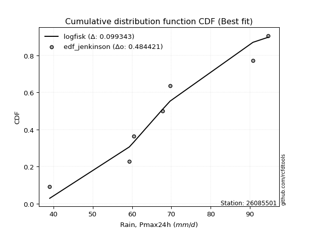</img>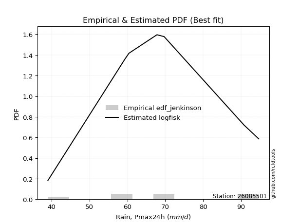</img>

</div>


### 11. Empirical - EDF Cunnane (1978)

Cunnane´s work in statistical hydrology has focused on the performance and evaluation of different probability distributions (such as GEV, Gumbel, Lognormal) for flood frequency estimation. _b_ is a constant, typically set to 0.4.

<div align="center">


$P=(m-b)/(n+1-2b)$


</div>


**11.1. Empirical values**

<div align="center">

|                | 0                   | 1                   | 2                  | 3           | 4                  | 5                  | 6                  |
|:---------------|:--------------------|:--------------------|:-------------------|:------------|:-------------------|:-------------------|:-------------------|
| date           | 2017                | 2023                | 2021               | 2020        | 2022               | 2018               | 2019               |
| x              | 39.0                | 59.3                | 60.4               | 67.8        | 69.7               | 90.8               | 94.7               |
| m              | 1                   | 2                   | 3                  | 4           | 5                  | 6                  | 7                  |
| empirical_dist | edf_cunnane         | edf_cunnane         | edf_cunnane        | edf_cunnane | edf_cunnane        | edf_cunnane        | edf_cunnane        |
| empirical      | 0.08333333333333333 | 0.22222222222222224 | 0.3611111111111111 | 0.5         | 0.6388888888888888 | 0.7777777777777777 | 0.9166666666666666 |
| empirical_tr   | 1.090909090909091   | 1.2857142857142856  | 1.565217391304348  | 2.0         | 2.7692307692307687 | 4.499999999999998  | 11.999999999999995 |

</div>


**11.2. Kolmogorov-Smirnov fit test (sorted by Δ)**


<div align="center">

|                | 0                   | 1                   | 2                   | 3                   | 4                   | 5                   | 6                   | 7                   | 8                   | 9                   | 10                  | 11                  | 12                  | 13                  | 14                  | 15                  | 16                  | 17                  | 18                    | 19                  | 20                  | 21                  | 22                  | 23                  | 24                  | 25                  | 26                  | 27                  | 28                  | 29                  | 30                  | 31                  | 32                  | 33                  | 34                  | 35                  | 36                  | 37                  | 38                  | 39                  | 40                  | 41                  | 42                  | 43                  | 44                  | 45                  | 46                  | 47                  | 48                  | 49                  | 50                  | 51                  | 52                  | 53                  | 54                  | 55                  | 56                  | 57                  | 58                  | 59                  | 60                  | 61                  | 62                  | 63                  | 64                  | 65                  | 66                  | 67                  | 68                  | 69                  | 70                  | 71                  | 72                  | 73                  | 74                  | 75                  | 76                  | 77                  | 78                  | 79                  | 80                  | 81                  | 82                  | 83                  | 84                  | 85                  | 86                  | 87                  | 88                  | 89                  |
|:---------------|:--------------------|:--------------------|:--------------------|:--------------------|:--------------------|:--------------------|:--------------------|:--------------------|:--------------------|:--------------------|:--------------------|:--------------------|:--------------------|:--------------------|:--------------------|:--------------------|:--------------------|:--------------------|:----------------------|:--------------------|:--------------------|:--------------------|:--------------------|:--------------------|:--------------------|:--------------------|:--------------------|:--------------------|:--------------------|:--------------------|:--------------------|:--------------------|:--------------------|:--------------------|:--------------------|:--------------------|:--------------------|:--------------------|:--------------------|:--------------------|:--------------------|:--------------------|:--------------------|:--------------------|:--------------------|:--------------------|:--------------------|:--------------------|:--------------------|:--------------------|:--------------------|:--------------------|:--------------------|:--------------------|:--------------------|:--------------------|:--------------------|:--------------------|:--------------------|:--------------------|:--------------------|:--------------------|:--------------------|:--------------------|:--------------------|:--------------------|:--------------------|:--------------------|:--------------------|:--------------------|:--------------------|:--------------------|:--------------------|:--------------------|:--------------------|:--------------------|:--------------------|:--------------------|:--------------------|:--------------------|:--------------------|:--------------------|:--------------------|:--------------------|:--------------------|:--------------------|:--------------------|:--------------------|:--------------------|:--------------------|
| station        | 26085501            | 26085501            | 26085501            | 26085501            | 26085501            | 26085501            | 26085501            | 26085501            | 26085501            | 26085501            | 26085501            | 26085501            | 26085501            | 26085501            | 26085501            | 26085501            | 26085501            | 26085501            | 26085501              | 26085501            | 26085501            | 26085501            | 26085501            | 26085501            | 26085501            | 26085501            | 26085501            | 26085501            | 26085501            | 26085501            | 26085501            | 26085501            | 26085501            | 26085501            | 26085501            | 26085501            | 26085501            | 26085501            | 26085501            | 26085501            | 26085501            | 26085501            | 26085501            | 26085501            | 26085501            | 26085501            | 26085501            | 26085501            | 26085501            | 26085501            | 26085501            | 26085501            | 26085501            | 26085501            | 26085501            | 26085501            | 26085501            | 26085501            | 26085501            | 26085501            | 26085501            | 26085501            | 26085501            | 26085501            | 26085501            | 26085501            | 26085501            | 26085501            | 26085501            | 26085501            | 26085501            | 26085501            | 26085501            | 26085501            | 26085501            | 26085501            | 26085501            | 26085501            | 26085501            | 26085501            | 26085501            | 26085501            | 26085501            | 26085501            | 26085501            | 26085501            | 26085501            | 26085501            | 26085501            | 26085501            |
| empirical_dist | edf_cunnane         | edf_cunnane         | edf_cunnane         | edf_cunnane         | edf_cunnane         | edf_cunnane         | edf_cunnane         | edf_cunnane         | edf_cunnane         | edf_cunnane         | edf_cunnane         | edf_cunnane         | edf_cunnane         | edf_cunnane         | edf_cunnane         | edf_cunnane         | edf_cunnane         | edf_cunnane         | edf_cunnane           | edf_cunnane         | edf_cunnane         | edf_cunnane         | edf_cunnane         | edf_cunnane         | edf_cunnane         | edf_cunnane         | edf_cunnane         | edf_cunnane         | edf_cunnane         | edf_cunnane         | edf_cunnane         | edf_cunnane         | edf_cunnane         | edf_cunnane         | edf_cunnane         | edf_cunnane         | edf_cunnane         | edf_cunnane         | edf_cunnane         | edf_cunnane         | edf_cunnane         | edf_cunnane         | edf_cunnane         | edf_cunnane         | edf_cunnane         | edf_cunnane         | edf_cunnane         | edf_cunnane         | edf_cunnane         | edf_cunnane         | edf_cunnane         | edf_cunnane         | edf_cunnane         | edf_cunnane         | edf_cunnane         | edf_cunnane         | edf_cunnane         | edf_cunnane         | edf_cunnane         | edf_cunnane         | edf_cunnane         | edf_cunnane         | edf_cunnane         | edf_cunnane         | edf_cunnane         | edf_cunnane         | edf_cunnane         | edf_cunnane         | edf_cunnane         | edf_cunnane         | edf_cunnane         | edf_cunnane         | edf_cunnane         | edf_cunnane         | edf_cunnane         | edf_cunnane         | edf_cunnane         | edf_cunnane         | edf_cunnane         | edf_cunnane         | edf_cunnane         | edf_cunnane         | edf_cunnane         | edf_cunnane         | edf_cunnane         | edf_cunnane         | edf_cunnane         | edf_cunnane         | edf_cunnane         | edf_cunnane         |
| p_dist         | logfisk             | betaprime           | logpearson3         | ncf                 | alpha               | maxwell             | logmielke           | genlogistic         | loggenlogistic      | mielke              | loggompertz         | rice                | invgamma            | loglogistic         | weibull_min         | fisk                | rayleigh            | gumbel_r            | loglaplace_asymmetric | f                   | moyal               | invgauss            | loghypsecant        | laplace_asymmetric  | nct                 | gamma               | pearson3            | erlang              | johnsonsu           | truncnorm           | norm                | crystalball         | exponnorm           | t                   | logcrystalball      | lognorm             | lognorm             | logt                | logexponnorm        | logweibull_min      | logncf              | logfatiguelife      | logf                | lognct              | loglaplace          | logistic            | logloggamma         | logerlang           | logrice             | loggamma            | loggamma            | hypsecant           | logalpha            | loggumbel_l         | laplace             | logjohnsonsu        | halflogistic        | loginvgamma         | halfnorm            | wald                | loginvgauss         | logmaxwell          | kstwobign           | lograyleigh         | gibrat              | loggumbel_r         | logbetaprime        | logmoyal            | loginvweibull       | gumbel_l            | loghalfnorm         | loghalflogistic     | logwald             | logkstwobign        | nakagami            | lognakagami         | loggenexpon         | loggibrat           | expon               | logchi2             | genexpon            | chi2                | logexpon            | loglognorm          | logtruncnorm        | pareto              | logpareto           | invweibull          | fatiguelife         | gompertz            |
| delta          | 0.09256811193916692 | 0.10220802919306615 | 0.10419346412468744 | 0.10475813145876955 | 0.10585674985301463 | 0.10586949496665243 | 0.1072003855792899  | 0.10759225746317069 | 0.10780974753063244 | 0.10782633858866852 | 0.10808072901736032 | 0.10821951947183328 | 0.10852077112283032 | 0.10938710533552964 | 0.11091355724328378 | 0.11196486327549382 | 0.11209363968757932 | 0.1138942850672865  | 0.11457768312724914   | 0.11513146353849202 | 0.11573390927752314 | 0.11607805199953128 | 0.11647185055401366 | 0.11873211469635025 | 0.11885066492222363 | 0.11893822966135603 | 0.11896882831617561 | 0.1189761016678843  | 0.11899015606473307 | 0.11899022711883522 | 0.11899030810641609 | 0.11899032134761267 | 0.11899082254553084 | 0.11899499077603926 | 0.11905042326728651 | 0.11905108762505409 | 0.11905108762505409 | 0.11905128336363366 | 0.11905145393536301 | 0.11937809941436983 | 0.11971073312861205 | 0.11989900502173192 | 0.12131232731895922 | 0.12201970013035093 | 0.1220598295039308  | 0.12658026402368883 | 0.12669834896071785 | 0.12978642732504506 | 0.13011092495130536 | 0.13020514248277185 | 0.13020514248277185 | 0.13186229465131816 | 0.13253564876087573 | 0.13307567489430794 | 0.1354808845061266  | 0.13708694363492935 | 0.14020403154848496 | 0.1426036492359141  | 0.1428278345113976  | 0.14429316632470512 | 0.14940860731487562 | 0.15042601568985572 | 0.1523719797312785  | 0.16237604387082863 | 0.16353946581801182 | 0.16502273389324576 | 0.18002810674403794 | 0.18176984431539542 | 0.18522796595614363 | 0.1884878120379554  | 0.19635625244074487 | 0.20295853133623074 | 0.2173830009343842  | 0.2181075789281309  | 0.22221985723030105 | 0.22222215560117187 | 0.22239867083189366 | 0.2244845019560886  | 0.27160724658196345 | 0.28883020514791546 | 0.29317472493636487 | 0.296036713685077   | 0.32303788701134917 | 0.42560741639596567 | 0.43961778183411593 | 0.4413810296002275  | 0.4475735241217874  | 0.4800999422390104  | 0.6025307163112638  | 0.638880889355228   |
| deltao         | 0.48442053926100004 | 0.48442053926100004 | 0.48442053926100004 | 0.48442053926100004 | 0.48442053926100004 | 0.48442053926100004 | 0.48442053926100004 | 0.48442053926100004 | 0.48442053926100004 | 0.48442053926100004 | 0.48442053926100004 | 0.48442053926100004 | 0.48442053926100004 | 0.48442053926100004 | 0.48442053926100004 | 0.48442053926100004 | 0.48442053926100004 | 0.48442053926100004 | 0.48442053926100004   | 0.48442053926100004 | 0.48442053926100004 | 0.48442053926100004 | 0.48442053926100004 | 0.48442053926100004 | 0.48442053926100004 | 0.48442053926100004 | 0.48442053926100004 | 0.48442053926100004 | 0.48442053926100004 | 0.48442053926100004 | 0.48442053926100004 | 0.48442053926100004 | 0.48442053926100004 | 0.48442053926100004 | 0.48442053926100004 | 0.48442053926100004 | 0.48442053926100004 | 0.48442053926100004 | 0.48442053926100004 | 0.48442053926100004 | 0.48442053926100004 | 0.48442053926100004 | 0.48442053926100004 | 0.48442053926100004 | 0.48442053926100004 | 0.48442053926100004 | 0.48442053926100004 | 0.48442053926100004 | 0.48442053926100004 | 0.48442053926100004 | 0.48442053926100004 | 0.48442053926100004 | 0.48442053926100004 | 0.48442053926100004 | 0.48442053926100004 | 0.48442053926100004 | 0.48442053926100004 | 0.48442053926100004 | 0.48442053926100004 | 0.48442053926100004 | 0.48442053926100004 | 0.48442053926100004 | 0.48442053926100004 | 0.48442053926100004 | 0.48442053926100004 | 0.48442053926100004 | 0.48442053926100004 | 0.48442053926100004 | 0.48442053926100004 | 0.48442053926100004 | 0.48442053926100004 | 0.48442053926100004 | 0.48442053926100004 | 0.48442053926100004 | 0.48442053926100004 | 0.48442053926100004 | 0.48442053926100004 | 0.48442053926100004 | 0.48442053926100004 | 0.48442053926100004 | 0.48442053926100004 | 0.48442053926100004 | 0.48442053926100004 | 0.48442053926100004 | 0.48442053926100004 | 0.48442053926100004 | 0.48442053926100004 | 0.48442053926100004 | 0.48442053926100004 | 0.48442053926100004 |
| eval           | Δo > Δ              | Δo > Δ              | Δo > Δ              | Δo > Δ              | Δo > Δ              | Δo > Δ              | Δo > Δ              | Δo > Δ              | Δo > Δ              | Δo > Δ              | Δo > Δ              | Δo > Δ              | Δo > Δ              | Δo > Δ              | Δo > Δ              | Δo > Δ              | Δo > Δ              | Δo > Δ              | Δo > Δ                | Δo > Δ              | Δo > Δ              | Δo > Δ              | Δo > Δ              | Δo > Δ              | Δo > Δ              | Δo > Δ              | Δo > Δ              | Δo > Δ              | Δo > Δ              | Δo > Δ              | Δo > Δ              | Δo > Δ              | Δo > Δ              | Δo > Δ              | Δo > Δ              | Δo > Δ              | Δo > Δ              | Δo > Δ              | Δo > Δ              | Δo > Δ              | Δo > Δ              | Δo > Δ              | Δo > Δ              | Δo > Δ              | Δo > Δ              | Δo > Δ              | Δo > Δ              | Δo > Δ              | Δo > Δ              | Δo > Δ              | Δo > Δ              | Δo > Δ              | Δo > Δ              | Δo > Δ              | Δo > Δ              | Δo > Δ              | Δo > Δ              | Δo > Δ              | Δo > Δ              | Δo > Δ              | Δo > Δ              | Δo > Δ              | Δo > Δ              | Δo > Δ              | Δo > Δ              | Δo > Δ              | Δo > Δ              | Δo > Δ              | Δo > Δ              | Δo > Δ              | Δo > Δ              | Δo > Δ              | Δo > Δ              | Δo > Δ              | Δo > Δ              | Δo > Δ              | Δo > Δ              | Δo > Δ              | Δo > Δ              | Δo > Δ              | Δo > Δ              | Δo > Δ              | Δo > Δ              | Δo > Δ              | Δo > Δ              | Δo > Δ              | Δo > Δ              | Δo > Δ              | Δo <= Δ             | Δo <= Δ             |
| fit            | 1                   | 1                   | 1                   | 1                   | 1                   | 1                   | 1                   | 1                   | 1                   | 1                   | 1                   | 1                   | 1                   | 1                   | 1                   | 1                   | 1                   | 1                   | 1                     | 1                   | 1                   | 1                   | 1                   | 1                   | 1                   | 1                   | 1                   | 1                   | 1                   | 1                   | 1                   | 1                   | 1                   | 1                   | 1                   | 1                   | 1                   | 1                   | 1                   | 1                   | 1                   | 1                   | 1                   | 1                   | 1                   | 1                   | 1                   | 1                   | 1                   | 1                   | 1                   | 1                   | 1                   | 1                   | 1                   | 1                   | 1                   | 1                   | 1                   | 1                   | 1                   | 1                   | 1                   | 1                   | 1                   | 1                   | 1                   | 1                   | 1                   | 1                   | 1                   | 1                   | 1                   | 1                   | 1                   | 1                   | 1                   | 1                   | 1                   | 1                   | 1                   | 1                   | 1                   | 1                   | 1                   | 1                   | 1                   | 1                   | 0                   | 0                   |
| n              | 7                   | 7                   | 7                   | 7                   | 7                   | 7                   | 7                   | 7                   | 7                   | 7                   | 7                   | 7                   | 7                   | 7                   | 7                   | 7                   | 7                   | 7                   | 7                     | 7                   | 7                   | 7                   | 7                   | 7                   | 7                   | 7                   | 7                   | 7                   | 7                   | 7                   | 7                   | 7                   | 7                   | 7                   | 7                   | 7                   | 7                   | 7                   | 7                   | 7                   | 7                   | 7                   | 7                   | 7                   | 7                   | 7                   | 7                   | 7                   | 7                   | 7                   | 7                   | 7                   | 7                   | 7                   | 7                   | 7                   | 7                   | 7                   | 7                   | 7                   | 7                   | 7                   | 7                   | 7                   | 7                   | 7                   | 7                   | 7                   | 7                   | 7                   | 7                   | 7                   | 7                   | 7                   | 7                   | 7                   | 7                   | 7                   | 7                   | 7                   | 7                   | 7                   | 7                   | 7                   | 7                   | 7                   | 7                   | 7                   | 7                   | 7                   |
| best_fit       | 1                   | 0                   | 0                   | 0                   | 0                   | 0                   | 0                   | 0                   | 0                   | 0                   | 0                   | 0                   | 0                   | 0                   | 0                   | 0                   | 0                   | 0                   | 0                     | 0                   | 0                   | 0                   | 0                   | 0                   | 0                   | 0                   | 0                   | 0                   | 0                   | 0                   | 0                   | 0                   | 0                   | 0                   | 0                   | 0                   | 0                   | 0                   | 0                   | 0                   | 0                   | 0                   | 0                   | 0                   | 0                   | 0                   | 0                   | 0                   | 0                   | 0                   | 0                   | 0                   | 0                   | 0                   | 0                   | 0                   | 0                   | 0                   | 0                   | 0                   | 0                   | 0                   | 0                   | 0                   | 0                   | 0                   | 0                   | 0                   | 0                   | 0                   | 0                   | 0                   | 0                   | 0                   | 0                   | 0                   | 0                   | 0                   | 0                   | 0                   | 0                   | 0                   | 0                   | 0                   | 0                   | 0                   | 0                   | 0                   | 0                   | 0                   |
| best_fit_sort  | 1                   | 2                   | 3                   | 4                   | 5                   | 6                   | 7                   | 8                   | 9                   | 10                  | 11                  | 12                  | 13                  | 14                  | 15                  | 16                  | 17                  | 18                  | 19                    | 20                  | 21                  | 22                  | 23                  | 24                  | 25                  | 26                  | 27                  | 28                  | 29                  | 30                  | 31                  | 32                  | 33                  | 34                  | 35                  | 36                  | 37                  | 38                  | 39                  | 40                  | 41                  | 42                  | 43                  | 44                  | 45                  | 46                  | 47                  | 48                  | 49                  | 50                  | 51                  | 52                  | 53                  | 54                  | 55                  | 56                  | 57                  | 58                  | 59                  | 60                  | 61                  | 62                  | 63                  | 64                  | 65                  | 66                  | 67                  | 68                  | 69                  | 70                  | 71                  | 72                  | 73                  | 74                  | 75                  | 76                  | 77                  | 78                  | 79                  | 80                  | 81                  | 82                  | 83                  | 84                  | 85                  | 86                  | 87                  | 88                  | 89                  | 90                  |

</div>


<div align="center">

</img>

</div>


**11.3. Best fit**

<div align="center">

|   id |   station | empirical_dist   | p_dist   |     delta |   deltao | eval   |   fit |   n |   best_fit |   best_fit_sort |
|-----:|----------:|:-----------------|:---------|----------:|---------:|:-------|------:|----:|-----------:|----------------:|
|    0 |  26085501 | edf_cunnane      | logfisk  | 0.0925681 | 0.484421 | Δo > Δ |     1 |   7 |          1 |               1 |

</div>


<div align="center">

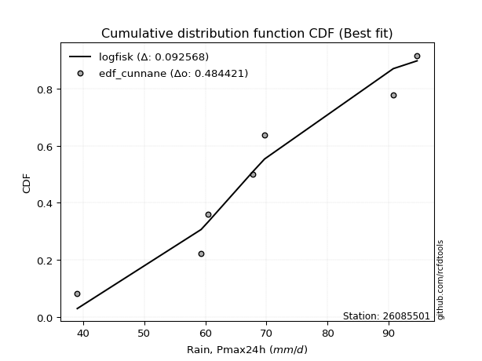</img>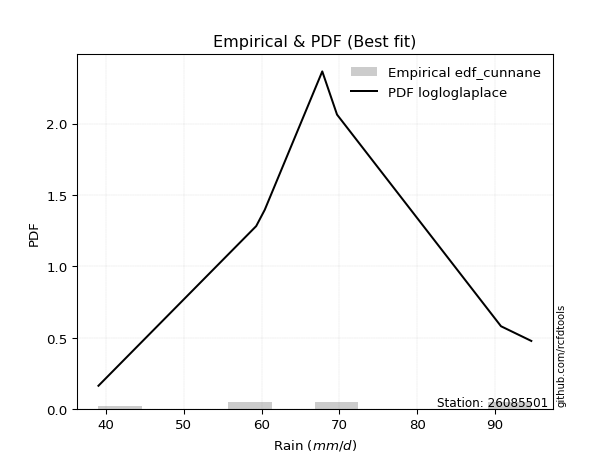</img>

</div>


### 12. Empirical - EDF Adamowski (1981)

The Adamowski formula in hydrology refers to a specific plotting position formula used for estimating the non-parametric empirical distribution of hydrological events (like flood peaks) to calculate their return periods. This formula provides an alternative to traditional parametric methods (like the Gumbel or Log Pearson Type III distributions). 

<div align="center">


$P=(m-0.25)/(n+0.5)$


</div>


**12.1. Empirical values**

<div align="center">

|                | 0                  | 1                   | 2                   | 3             | 4                  | 5                  | 6                  |
|:---------------|:-------------------|:--------------------|:--------------------|:--------------|:-------------------|:-------------------|:-------------------|
| date           | 2017               | 2023                | 2021                | 2020          | 2022               | 2018               | 2019               |
| x              | 39.0               | 59.3                | 60.4                | 67.8          | 69.7               | 90.8               | 94.7               |
| m              | 1                  | 2                   | 3                   | 4             | 5                  | 6                  | 7                  |
| empirical_dist | edf_adamowski      | edf_adamowski       | edf_adamowski       | edf_adamowski | edf_adamowski      | edf_adamowski      | edf_adamowski      |
| empirical      | 0.1                | 0.23333333333333334 | 0.36666666666666664 | 0.5           | 0.6333333333333333 | 0.7666666666666667 | 0.9                |
| empirical_tr   | 1.1111111111111112 | 1.3043478260869565  | 1.5789473684210527  | 2.0           | 2.727272727272727  | 4.2857142857142865 | 10.000000000000002 |

</div>


**12.2. Kolmogorov-Smirnov fit test (sorted by Δ)**


<div align="center">

|                | 0                   | 1                   | 2                   | 3                   | 4                   | 5                   | 6                   | 7                   | 8                   | 9                   | 10                  | 11                  | 12                  | 13                  | 14                  | 15                  | 16                  | 17                  | 18                  | 19                  | 20                  | 21                  | 22                  | 23                  | 24                  | 25                  | 26                  | 27                  | 28                  | 29                  | 30                  | 31                  | 32                  | 33                  | 34                  | 35                  | 36                  | 37                  | 38                  | 39                  | 40                  | 41                  | 42                  | 43                  | 44                  | 45                  | 46                    | 47                  | 48                  | 49                  | 50                  | 51                  | 52                  | 53                  | 54                  | 55                  | 56                  | 57                  | 58                  | 59                  | 60                  | 61                  | 62                  | 63                  | 64                  | 65                  | 66                  | 67                  | 68                  | 69                  | 70                  | 71                  | 72                  | 73                  | 74                  | 75                  | 76                  | 77                  | 78                  | 79                  | 80                  | 81                  | 82                  | 83                  | 84                  | 85                  | 86                  | 87                  | 88                  | 89                  |
|:---------------|:--------------------|:--------------------|:--------------------|:--------------------|:--------------------|:--------------------|:--------------------|:--------------------|:--------------------|:--------------------|:--------------------|:--------------------|:--------------------|:--------------------|:--------------------|:--------------------|:--------------------|:--------------------|:--------------------|:--------------------|:--------------------|:--------------------|:--------------------|:--------------------|:--------------------|:--------------------|:--------------------|:--------------------|:--------------------|:--------------------|:--------------------|:--------------------|:--------------------|:--------------------|:--------------------|:--------------------|:--------------------|:--------------------|:--------------------|:--------------------|:--------------------|:--------------------|:--------------------|:--------------------|:--------------------|:--------------------|:----------------------|:--------------------|:--------------------|:--------------------|:--------------------|:--------------------|:--------------------|:--------------------|:--------------------|:--------------------|:--------------------|:--------------------|:--------------------|:--------------------|:--------------------|:--------------------|:--------------------|:--------------------|:--------------------|:--------------------|:--------------------|:--------------------|:--------------------|:--------------------|:--------------------|:--------------------|:--------------------|:--------------------|:--------------------|:--------------------|:--------------------|:--------------------|:--------------------|:--------------------|:--------------------|:--------------------|:--------------------|:--------------------|:--------------------|:--------------------|:--------------------|:--------------------|:--------------------|:--------------------|
| station        | 26085501            | 26085501            | 26085501            | 26085501            | 26085501            | 26085501            | 26085501            | 26085501            | 26085501            | 26085501            | 26085501            | 26085501            | 26085501            | 26085501            | 26085501            | 26085501            | 26085501            | 26085501            | 26085501            | 26085501            | 26085501            | 26085501            | 26085501            | 26085501            | 26085501            | 26085501            | 26085501            | 26085501            | 26085501            | 26085501            | 26085501            | 26085501            | 26085501            | 26085501            | 26085501            | 26085501            | 26085501            | 26085501            | 26085501            | 26085501            | 26085501            | 26085501            | 26085501            | 26085501            | 26085501            | 26085501            | 26085501              | 26085501            | 26085501            | 26085501            | 26085501            | 26085501            | 26085501            | 26085501            | 26085501            | 26085501            | 26085501            | 26085501            | 26085501            | 26085501            | 26085501            | 26085501            | 26085501            | 26085501            | 26085501            | 26085501            | 26085501            | 26085501            | 26085501            | 26085501            | 26085501            | 26085501            | 26085501            | 26085501            | 26085501            | 26085501            | 26085501            | 26085501            | 26085501            | 26085501            | 26085501            | 26085501            | 26085501            | 26085501            | 26085501            | 26085501            | 26085501            | 26085501            | 26085501            | 26085501            |
| empirical_dist | edf_adamowski       | edf_adamowski       | edf_adamowski       | edf_adamowski       | edf_adamowski       | edf_adamowski       | edf_adamowski       | edf_adamowski       | edf_adamowski       | edf_adamowski       | edf_adamowski       | edf_adamowski       | edf_adamowski       | edf_adamowski       | edf_adamowski       | edf_adamowski       | edf_adamowski       | edf_adamowski       | edf_adamowski       | edf_adamowski       | edf_adamowski       | edf_adamowski       | edf_adamowski       | edf_adamowski       | edf_adamowski       | edf_adamowski       | edf_adamowski       | edf_adamowski       | edf_adamowski       | edf_adamowski       | edf_adamowski       | edf_adamowski       | edf_adamowski       | edf_adamowski       | edf_adamowski       | edf_adamowski       | edf_adamowski       | edf_adamowski       | edf_adamowski       | edf_adamowski       | edf_adamowski       | edf_adamowski       | edf_adamowski       | edf_adamowski       | edf_adamowski       | edf_adamowski       | edf_adamowski         | edf_adamowski       | edf_adamowski       | edf_adamowski       | edf_adamowski       | edf_adamowski       | edf_adamowski       | edf_adamowski       | edf_adamowski       | edf_adamowski       | edf_adamowski       | edf_adamowski       | edf_adamowski       | edf_adamowski       | edf_adamowski       | edf_adamowski       | edf_adamowski       | edf_adamowski       | edf_adamowski       | edf_adamowski       | edf_adamowski       | edf_adamowski       | edf_adamowski       | edf_adamowski       | edf_adamowski       | edf_adamowski       | edf_adamowski       | edf_adamowski       | edf_adamowski       | edf_adamowski       | edf_adamowski       | edf_adamowski       | edf_adamowski       | edf_adamowski       | edf_adamowski       | edf_adamowski       | edf_adamowski       | edf_adamowski       | edf_adamowski       | edf_adamowski       | edf_adamowski       | edf_adamowski       | edf_adamowski       | edf_adamowski       |
| p_dist         | logfisk             | logcrystalball      | lognorm             | lognorm             | logt                | logexponnorm        | logncf              | logfatiguelife      | logf                | lognct              | betaprime           | rayleigh            | logpearson3         | ncf                 | invgauss            | alpha               | maxwell             | logmielke           | logerlang           | genlogistic         | loggenlogistic      | mielke              | logrice             | loggamma            | loggamma            | loggompertz         | rice                | invgamma            | loglogistic         | logalpha            | weibull_min         | fisk                | logweibull_min      | f                   | gumbel_r            | logloggamma         | erlang              | nct                 | t                   | pearson3            | johnsonsu           | exponnorm           | crystalball         | norm                | truncnorm           | gamma               | loglaplace_asymmetric | moyal               | loghypsecant        | halflogistic        | laplace_asymmetric  | loginvgamma         | logjohnsonsu        | halfnorm            | loglaplace          | logistic            | loginvgauss         | logmaxwell          | kstwobign           | hypsecant           | loggumbel_l         | wald                | laplace             | lograyleigh         | loggumbel_r         | gibrat              | logbetaprime        | logmoyal            | loginvweibull       | gumbel_l            | loghalfnorm         | loghalflogistic     | logwald             | logkstwobign        | loggenexpon         | loggibrat           | nakagami            | lognakagami         | expon               | logchi2             | genexpon            | chi2                | logexpon            | loglognorm          | logtruncnorm        | pareto              | logpareto           | invweibull          | fatiguelife         | gompertz            |
| delta          | 0.10367922305027788 | 0.10793931215617542 | 0.10793997651394299 | 0.10793997651394299 | 0.10794017225252256 | 0.10794034282425191 | 0.10859962201750095 | 0.10878789391062083 | 0.11020121620784812 | 0.11090858901923983 | 0.11331914030417711 | 0.11469322061051768 | 0.1153045752357984  | 0.11586924256988052 | 0.11619230920844936 | 0.11696786096412559 | 0.1169806060777634  | 0.11794669814380077 | 0.11867531621393396 | 0.11870336857428165 | 0.1189208586417434  | 0.11893744969977949 | 0.11899981384019426 | 0.11909403137166075 | 0.11909403137166075 | 0.11919184012847128 | 0.11933063058294424 | 0.11963188223394128 | 0.1204982164466406  | 0.12142453764976463 | 0.12202466835439474 | 0.12307597438660478 | 0.12411567368433363 | 0.12463050720028623 | 0.12500539617839745 | 0.12533976545723136 | 0.1255618869502102  | 0.12557575175641822 | 0.12558184267481687 | 0.12558527092302396 | 0.12558560839196642 | 0.12559033459688895 | 0.12559076701933836 | 0.12559077231448768 | 0.12559083447549557 | 0.12559147099061707 | 0.1256887942383601    | 0.1268450203886341  | 0.12758296166512462 | 0.12909292043737386 | 0.12984322580746122 | 0.131492538124803   | 0.1315313880793738  | 0.1317167234002865  | 0.13317094061504176 | 0.1376913751347998  | 0.13829749620376453 | 0.13931490457874462 | 0.1412608686201674  | 0.14297340576242912 | 0.14379588246779462 | 0.14429316632470512 | 0.14659199561723757 | 0.15126493275971753 | 0.15391162278213466 | 0.16353946581801182 | 0.16891699563292684 | 0.17065873320428432 | 0.17411685484503253 | 0.18293225648239986 | 0.18524514132963377 | 0.19184742022511964 | 0.2062718898232731  | 0.2069964678170198  | 0.21128755972078256 | 0.2244845019560886  | 0.23333096834141215 | 0.23333326671228297 | 0.2604961354708523  | 0.27216353848124886 | 0.28206361382525375 | 0.2849256025739659  | 0.31192677590023804 | 0.41449630528485454 | 0.4285066707230048  | 0.4302699184891164  | 0.4364624130106763  | 0.4634332755723438  | 0.5914196052001526  | 0.6333253337996725  |
| deltao         | 0.48442053926100004 | 0.48442053926100004 | 0.48442053926100004 | 0.48442053926100004 | 0.48442053926100004 | 0.48442053926100004 | 0.48442053926100004 | 0.48442053926100004 | 0.48442053926100004 | 0.48442053926100004 | 0.48442053926100004 | 0.48442053926100004 | 0.48442053926100004 | 0.48442053926100004 | 0.48442053926100004 | 0.48442053926100004 | 0.48442053926100004 | 0.48442053926100004 | 0.48442053926100004 | 0.48442053926100004 | 0.48442053926100004 | 0.48442053926100004 | 0.48442053926100004 | 0.48442053926100004 | 0.48442053926100004 | 0.48442053926100004 | 0.48442053926100004 | 0.48442053926100004 | 0.48442053926100004 | 0.48442053926100004 | 0.48442053926100004 | 0.48442053926100004 | 0.48442053926100004 | 0.48442053926100004 | 0.48442053926100004 | 0.48442053926100004 | 0.48442053926100004 | 0.48442053926100004 | 0.48442053926100004 | 0.48442053926100004 | 0.48442053926100004 | 0.48442053926100004 | 0.48442053926100004 | 0.48442053926100004 | 0.48442053926100004 | 0.48442053926100004 | 0.48442053926100004   | 0.48442053926100004 | 0.48442053926100004 | 0.48442053926100004 | 0.48442053926100004 | 0.48442053926100004 | 0.48442053926100004 | 0.48442053926100004 | 0.48442053926100004 | 0.48442053926100004 | 0.48442053926100004 | 0.48442053926100004 | 0.48442053926100004 | 0.48442053926100004 | 0.48442053926100004 | 0.48442053926100004 | 0.48442053926100004 | 0.48442053926100004 | 0.48442053926100004 | 0.48442053926100004 | 0.48442053926100004 | 0.48442053926100004 | 0.48442053926100004 | 0.48442053926100004 | 0.48442053926100004 | 0.48442053926100004 | 0.48442053926100004 | 0.48442053926100004 | 0.48442053926100004 | 0.48442053926100004 | 0.48442053926100004 | 0.48442053926100004 | 0.48442053926100004 | 0.48442053926100004 | 0.48442053926100004 | 0.48442053926100004 | 0.48442053926100004 | 0.48442053926100004 | 0.48442053926100004 | 0.48442053926100004 | 0.48442053926100004 | 0.48442053926100004 | 0.48442053926100004 | 0.48442053926100004 |
| eval           | Δo > Δ              | Δo > Δ              | Δo > Δ              | Δo > Δ              | Δo > Δ              | Δo > Δ              | Δo > Δ              | Δo > Δ              | Δo > Δ              | Δo > Δ              | Δo > Δ              | Δo > Δ              | Δo > Δ              | Δo > Δ              | Δo > Δ              | Δo > Δ              | Δo > Δ              | Δo > Δ              | Δo > Δ              | Δo > Δ              | Δo > Δ              | Δo > Δ              | Δo > Δ              | Δo > Δ              | Δo > Δ              | Δo > Δ              | Δo > Δ              | Δo > Δ              | Δo > Δ              | Δo > Δ              | Δo > Δ              | Δo > Δ              | Δo > Δ              | Δo > Δ              | Δo > Δ              | Δo > Δ              | Δo > Δ              | Δo > Δ              | Δo > Δ              | Δo > Δ              | Δo > Δ              | Δo > Δ              | Δo > Δ              | Δo > Δ              | Δo > Δ              | Δo > Δ              | Δo > Δ                | Δo > Δ              | Δo > Δ              | Δo > Δ              | Δo > Δ              | Δo > Δ              | Δo > Δ              | Δo > Δ              | Δo > Δ              | Δo > Δ              | Δo > Δ              | Δo > Δ              | Δo > Δ              | Δo > Δ              | Δo > Δ              | Δo > Δ              | Δo > Δ              | Δo > Δ              | Δo > Δ              | Δo > Δ              | Δo > Δ              | Δo > Δ              | Δo > Δ              | Δo > Δ              | Δo > Δ              | Δo > Δ              | Δo > Δ              | Δo > Δ              | Δo > Δ              | Δo > Δ              | Δo > Δ              | Δo > Δ              | Δo > Δ              | Δo > Δ              | Δo > Δ              | Δo > Δ              | Δo > Δ              | Δo > Δ              | Δo > Δ              | Δo > Δ              | Δo > Δ              | Δo > Δ              | Δo <= Δ             | Δo <= Δ             |
| fit            | 1                   | 1                   | 1                   | 1                   | 1                   | 1                   | 1                   | 1                   | 1                   | 1                   | 1                   | 1                   | 1                   | 1                   | 1                   | 1                   | 1                   | 1                   | 1                   | 1                   | 1                   | 1                   | 1                   | 1                   | 1                   | 1                   | 1                   | 1                   | 1                   | 1                   | 1                   | 1                   | 1                   | 1                   | 1                   | 1                   | 1                   | 1                   | 1                   | 1                   | 1                   | 1                   | 1                   | 1                   | 1                   | 1                   | 1                     | 1                   | 1                   | 1                   | 1                   | 1                   | 1                   | 1                   | 1                   | 1                   | 1                   | 1                   | 1                   | 1                   | 1                   | 1                   | 1                   | 1                   | 1                   | 1                   | 1                   | 1                   | 1                   | 1                   | 1                   | 1                   | 1                   | 1                   | 1                   | 1                   | 1                   | 1                   | 1                   | 1                   | 1                   | 1                   | 1                   | 1                   | 1                   | 1                   | 1                   | 1                   | 0                   | 0                   |
| n              | 7                   | 7                   | 7                   | 7                   | 7                   | 7                   | 7                   | 7                   | 7                   | 7                   | 7                   | 7                   | 7                   | 7                   | 7                   | 7                   | 7                   | 7                   | 7                   | 7                   | 7                   | 7                   | 7                   | 7                   | 7                   | 7                   | 7                   | 7                   | 7                   | 7                   | 7                   | 7                   | 7                   | 7                   | 7                   | 7                   | 7                   | 7                   | 7                   | 7                   | 7                   | 7                   | 7                   | 7                   | 7                   | 7                   | 7                     | 7                   | 7                   | 7                   | 7                   | 7                   | 7                   | 7                   | 7                   | 7                   | 7                   | 7                   | 7                   | 7                   | 7                   | 7                   | 7                   | 7                   | 7                   | 7                   | 7                   | 7                   | 7                   | 7                   | 7                   | 7                   | 7                   | 7                   | 7                   | 7                   | 7                   | 7                   | 7                   | 7                   | 7                   | 7                   | 7                   | 7                   | 7                   | 7                   | 7                   | 7                   | 7                   | 7                   |
| best_fit       | 1                   | 0                   | 0                   | 0                   | 0                   | 0                   | 0                   | 0                   | 0                   | 0                   | 0                   | 0                   | 0                   | 0                   | 0                   | 0                   | 0                   | 0                   | 0                   | 0                   | 0                   | 0                   | 0                   | 0                   | 0                   | 0                   | 0                   | 0                   | 0                   | 0                   | 0                   | 0                   | 0                   | 0                   | 0                   | 0                   | 0                   | 0                   | 0                   | 0                   | 0                   | 0                   | 0                   | 0                   | 0                   | 0                   | 0                     | 0                   | 0                   | 0                   | 0                   | 0                   | 0                   | 0                   | 0                   | 0                   | 0                   | 0                   | 0                   | 0                   | 0                   | 0                   | 0                   | 0                   | 0                   | 0                   | 0                   | 0                   | 0                   | 0                   | 0                   | 0                   | 0                   | 0                   | 0                   | 0                   | 0                   | 0                   | 0                   | 0                   | 0                   | 0                   | 0                   | 0                   | 0                   | 0                   | 0                   | 0                   | 0                   | 0                   |
| best_fit_sort  | 1                   | 2                   | 3                   | 4                   | 5                   | 6                   | 7                   | 8                   | 9                   | 10                  | 11                  | 12                  | 13                  | 14                  | 15                  | 16                  | 17                  | 18                  | 19                  | 20                  | 21                  | 22                  | 23                  | 24                  | 25                  | 26                  | 27                  | 28                  | 29                  | 30                  | 31                  | 32                  | 33                  | 34                  | 35                  | 36                  | 37                  | 38                  | 39                  | 40                  | 41                  | 42                  | 43                  | 44                  | 45                  | 46                  | 47                    | 48                  | 49                  | 50                  | 51                  | 52                  | 53                  | 54                  | 55                  | 56                  | 57                  | 58                  | 59                  | 60                  | 61                  | 62                  | 63                  | 64                  | 65                  | 66                  | 67                  | 68                  | 69                  | 70                  | 71                  | 72                  | 73                  | 74                  | 75                  | 76                  | 77                  | 78                  | 79                  | 80                  | 81                  | 82                  | 83                  | 84                  | 85                  | 86                  | 87                  | 88                  | 89                  | 90                  |

</div>


<div align="center">

</img>

</div>


**12.3. Best fit**

<div align="center">

|   id |   station | empirical_dist   | p_dist   |    delta |   deltao | eval   |   fit |   n |   best_fit |   best_fit_sort |
|-----:|----------:|:-----------------|:---------|---------:|---------:|:-------|------:|----:|-----------:|----------------:|
|    0 |  26085501 | edf_adamowski    | logfisk  | 0.103679 | 0.484421 | Δo > Δ |     1 |   7 |          1 |               1 |

</div>


<div align="center">

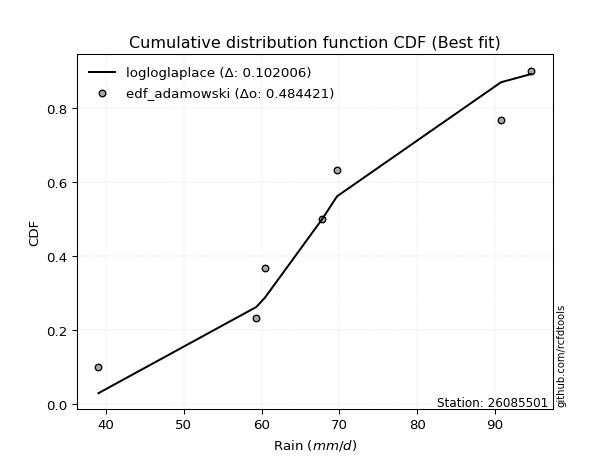</img>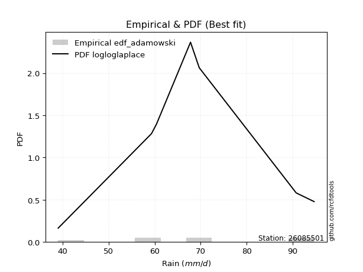</img>

</div>


## C. Best fit & Estimate extreme values for specific return periods - Tr


### 1. Best fit (ordered by delta Δ)

<div align="center">

|   id |   station | empirical_dist   | p_dist     |     delta |   deltao | eval   |   fit |   n |   best_fit |   best_fit_sort |
|-----:|----------:|:-----------------|:-----------|----------:|---------:|:-------|------:|----:|-----------:|----------------:|
|    0 |  26085501 | edf_gringorten   | logfisk    | 0.089447  | 0.484421 | Δo > Δ |     1 |   7 |          1 |               1 |
|    1 |  26085501 | edf_hazen        | logfisk    | 0.0923538 | 0.484421 | Δo > Δ |     1 |   7 |          1 |               2 |
|    2 |  26085501 | edf_cunnane      | logfisk    | 0.0925681 | 0.484421 | Δo > Δ |     1 |   7 |          1 |               3 |
|    3 |  26085501 | edf_blom         | logfisk    | 0.0944838 | 0.484421 | Δo > Δ |     1 |   7 |          1 |               4 |
|    4 |  26085501 | edf_tukey        | logfisk    | 0.0976186 | 0.484421 | Δo > Δ |     1 |   7 |          1 |               5 |
|    5 |  26085501 | edf_filliben     | logfisk    | 0.0987912 | 0.484421 | Δo > Δ |     1 |   7 |          1 |               6 |
|    6 |  26085501 | edf_beard        | logfisk    | 0.0993432 | 0.484421 | Δo > Δ |     1 |   7 |          1 |               7 |
|    7 |  26085501 | edf_jenkinson    | logfisk    | 0.0993432 | 0.484421 | Δo > Δ |     1 |   7 |          1 |               8 |
|    8 |  26085501 | edf_chegodayev   | logfisk    | 0.100076  | 0.484421 | Δo > Δ |     1 |   7 |          1 |               9 |
|    9 |  26085501 | edf_adamowski    | logfisk    | 0.103679  | 0.484421 | Δo > Δ |     1 |   7 |          1 |              10 |
|   10 |  26085501 | edf_weibull      | logalpha   | 0.1109    | 0.484421 | Δo > Δ |     1 |   7 |          1 |              11 |
|   11 |  26085501 | edf_california   | loglaplace | 0.120442  | 0.484421 | Δo > Δ |     1 |   7 |          1 |              12 |

</div>

:file_folder:Tables: [bestfit_26085501.csv](table/bestfit_26085501.csv) | [extreme_26085501.csv](table/extreme_26085501.csv)


### 2. Extreme values

In hydrology, a return period (or recurrence interval $Tr$) is the statistical average time between extreme events like floods or droughts of a specific magnitude, indicating how rare an event is, with a 100-year flood, for example, having a 1% chance of occurring in any given year, not that it happens exactly every century. It is a key tool for infrastructure design (like bridges or dams) and risk assessment, calculated from historical data to determine the probability of future events, although it is important to remember it is statistical average, and events can cluster or be missed.

> risk_rate: assuming the return period as the project useful life.

|   id |      tr |   prob_l |     prob_g |    alpha |   betaprime |     chi2 |   crystalball |   erlang |    expon |   exponnorm |        f |   fatiguelife |     fisk |    gamma |   genexpon |   genlogistic |   gibrat |   gompertz |   gumbel_l |   gumbel_r |   halflogistic |   halfnorm |   hypsecant |   invgamma |   invgauss |       invweibull |   johnsonsu |   kstwobign |   laplace |   laplace_asymmetric |   loggamma |   logistic |   lognorm |   maxwell |   mielke |    moyal |   nakagami |      ncf |      nct |     norm |           pareto |   pearson3 |   rayleigh |     rice |        t |   truncnorm |     wald |   weibull_min |   logalpha |   logbetaprime |          logchi2 |   logcrystalball |   logerlang |   logexpon |   logexponnorm |     logf |   logfatiguelife |   logfisk |   loggenexpon |   loggenlogistic |   loggibrat |   loggompertz |   loggumbel_l |   loggumbel_r |   loghalflogistic |   loghalfnorm |   loghypsecant |   loginvgamma |   loginvgauss |   loginvweibull |   logjohnsonsu |   logkstwobign |   loglaplace |   loglaplace_asymmetric |   logloggamma |   loglogistic |    loglognorm |   logmaxwell |   logmielke |   logmoyal |   lognakagami |   logncf |   lognct |         logpareto |   logpearson3 |   lograyleigh |   logrice |     logt |   logtruncnorm |   logwald |   logweibull_min |   station |   n |   risk_rate |
|-----:|--------:|---------:|-----------:|---------:|------------:|---------:|--------------:|---------:|---------:|------------:|---------:|--------------:|---------:|---------:|-----------:|--------------:|---------:|-----------:|-----------:|-----------:|---------------:|-----------:|------------:|-----------:|-----------:|-----------------:|------------:|------------:|----------:|---------------------:|-----------:|-----------:|----------:|----------:|---------:|---------:|-----------:|---------:|---------:|---------:|-----------------:|-----------:|-----------:|---------:|---------:|------------:|---------:|--------------:|-----------:|---------------:|-----------------:|-----------------:|------------:|-----------:|---------------:|---------:|-----------------:|----------:|--------------:|-----------------:|------------:|--------------:|--------------:|--------------:|------------------:|--------------:|---------------:|--------------:|--------------:|----------------:|---------------:|---------------:|-------------:|------------------------:|--------------:|--------------:|--------------:|-------------:|------------:|-----------:|--------------:|---------:|---------:|------------------:|--------------:|--------------:|----------:|---------:|---------------:|----------:|-----------------:|----------:|----:|------------:|
|    0 |    2    | 0.5      | 0.5        |  67.7704 |     67.5912 |  58.0251 |       68.8143 |  68.8136 |  59.6657 |     68.8143 |  68.6401 |       39.0001 |  68.1587 |  68.8119 |    58.4235 |       67.9069 |  63.4863 |    90.8893 |    71.7304 |    65.8982 |        64.4485 |    65.1808 |     68.8143 |    67.6743 |    66.3735 |   1799.29        |     68.8143 |     65.2613 |   68.8143 |              68.3164 |    65.9753 |    68.8143 |   66.3755 |   67.2962 |  68.2047 |  64.9568 |    63.0885 |  67.5007 |  68.8079 |  68.8143 |     40.8871      |    68.8133 |    66.7578 |  68.0073 |  68.8145 |     68.8143 |  63.0604 |       68.3669 |    65.8704 |        65.5761 |     66.3192      |          66.3755 |     65.9892 |    56.3822 |        66.3755 |  66.2692 |          66.3406 |   67.3842 |       62.1299 |          68.2077 |     61.1048 |       67.6985 |       69.4499 |       63.4372 |           62.0245 |       62.7351 |        66.3755 |       65.3713 |       65.1215 |         63.9367 |        69.6172 |        62.3514 |      66.3755 |                 67.0666 |       69.1474 |       66.3755 |  39.1604      |      64.8292 |     68.3481 |    62.5167 |       69.021  |  66.3618 |  66.2915 |     40.3831       |       67.9874 |       64.2895 |   65.9497 |  66.3755 |        51.9057 |   60.7023 |          68.8157 |  26085501 |   7 |    0.75     |
|    1 |    2.33 | 0.570815 | 0.429185   |  71.0063 |     70.8836 |  63.3305 |       71.9818 |  71.9814 |  64.219  |     71.9818 |  71.8175 |       39.7418 |  71.1381 |  71.9796 |    62.7031 |       70.9522 |  65.0908 |    91.2604 |    74.4861 |    68.8333 |        67.4662 |    68.5994 |     71.3493 |    70.8809 |    69.6225 | 105936           |     71.9819 |     68.9007 |   70.7311 |              70.4963 |    69.4154 |    71.6051 |   69.7215 |   70.587  |  71.2129 |  67.7352 |    64.8003 |  70.7524 |  71.9761 |  71.9818 |     43.7329      |    71.9809 |    70.0973 |  71.3023 |  71.9821 |     71.9818 |  65.1374 |       71.6374 |    69.3342 |        70.5634 |     79.3219      |          69.7216 |     69.4259 |    61.1522 |        69.7215 |  69.6159 |          69.6918 |   70.4625 |       66.1192 |          71.2168 |     62.6464 |       71.091  |       72.486  |       66.3951 |           65.0003 |       66.1546 |        69.0401 |       68.814  |       68.634  |         68.0062 |        72.8631 |        66.4216 |      68.3807 |                 69.1517 |       72.3634 |       69.3149 |  40.4352      |      68.2278 |     71.389  |    65.2727 |       72.5796 |  69.7206 |  69.6774 |     42.5628       |       71.3131 |       67.711  |   69.366  |  69.7215 |        54.8129 |   62.6919 |          72.0398 |  26085501 |   7 |    0.729209 |
|    2 |    5    | 0.8      | 0.2        |  83.6584 |     83.8439 |  91.7722 |       83.7532 |  83.7545 |  86.9842 |     83.7532 |  83.7102 |       55.496  |  82.9736 |  83.752  |    84.0999 |       83.2122 |  74.3286 |    92.4593 |    83.3889 |    81.5845 |        81.1207 |    83.0562 |     81.5176 |    83.4308 |    82.958  |      5.68804e+12 |     83.7535 |     84.36   |   80.3149 |              81.3956 |    84.1195 |    82.3808 |   83.7035 |   83.5395 |  83.1873 |  80.6051 |    74.4326 |  83.6006 |  83.7513 |  83.7532 |    489.133       |    83.7529 |    83.4668 |  83.8138 |  83.7538 |     83.7532 |  76.7644 |       83.8634 |    84.3332 |        93.1962 |    221.524       |          83.7036 |     84.1083 |    91.7811 |        83.7035 |  83.6237 |          83.721  |   83.727  |       85.0469 |          83.191  |     72.3094 |       83.8588 |       83.2314 |       80.9319 |           80.3533 |       82.8006 |        80.8479 |       83.7869 |       84.241  |         88.9143 |        84.3468 |        86.8895 |      79.3521 |                 80.3722 |       84.0529 |       81.9387 |   3.27717e+52 |      83.4263 |     83.3543 |    79.7105 |       93.0574 |  83.7915 |  83.9422 | 160568            |       84.0535 |       83.3324 |   83.8384 |  83.7035 |        68.6012 |   75.0964 |          83.9328 |  26085501 |   7 |    0.67232  |
|    3 |   10    | 0.9      | 0.1        |  92.6409 |     93.0896 | 119.122  |       91.562  |  91.5649 | 107.65   |     91.562  |  91.6735 |       77.2486 |  92.037  |  91.5621 |   103.523  |       92.5809 |  84.8586 |    93.1268 |    88.3456 |    91.9702 |        92.4602 |    93.7538 |     89.6373 |    92.3435 |    92.9815 |      1.1246e+19  |     91.5625 |     96.1302 |   89.0147 |              91.2897 |    95.8252 |    90.3167 |   94.4931 |   92.6548 |  92.599  |  91.8103 |    82.8624 |  92.8108 |  91.5638 |  91.562  |  28002.9         |    91.5626 |    92.9996 |  92.2676 |  91.5629 |     91.562  |  89.1033 |       91.9312 |    96.5029 |       112.664  |    627.153       |          94.4932 |     95.7892 |   132.688  |        94.4931 |  94.4582 |          94.575  |   95.0675 |      101.916  |          92.6005 |     85.1545 |       92.2542 |       89.8899 |       95.0939 |           95.825  |       97.7601 |        91.711  |       96.0072 |       97.3501 |        110.611  |        91.3613 |       106.607  |      90.8287 |                 92.1268 |       91.5439 |       92.6835 | inf           |      96.1101 |     92.7044 |    94.8581 |      113.884  |  94.6881 |  95.076  |      2.29571e+226 |       92.7081 |       96.6265 |   95.1758 |  94.4931 |        78.6596 |   90.9553 |          91.6902 |  26085501 |   7 |    0.651322 |
|    4 |   15    | 0.933333 | 0.0666667  |  97.3143 |     97.9022 | 135.504  |       95.4587 |  95.4627 | 119.739  |     95.4588 |  95.6695 |       91.4752 |  97.1031 |  95.4596 |   114.885  |       97.7521 |  92.1217 |    93.4291 |    90.5903 |    97.8298 |        98.8774 |    99.3209 |     94.2711 |    96.9783 |    98.3591 |      4.01021e+22 |     95.4594 |    102.379  |   94.1038 |              97.0773 |   102.349  |    94.6405 |  100.387  |   97.3317 |  98.0329 |  98.3133 |    87.4183 |  97.6194 |  95.4628 |  95.4587 | 313056           |    95.46   |    97.9113 |  96.5172 |  95.4597 |     95.4587 |  97.0268 |       95.9231 |   103.375  |       124.047  |   1184.97        |         100.387  |    102.297  |   164.615  |       100.387  | 100.385  |         100.514  |  101.88   |      111.904  |          98.0332 |     95.3211 |       96.3831 |       93.0781 |      104.151  |          105.866  |      106.585  |        98.5526 |      102.934  |      104.918  |        125.111  |        94.6615 |       118.834  |      98.2969 |                 99.7844 |       95.1983 |       99.1195 | inf           |     103.349  |     98.1262 |   104.936  |      126.792  | 100.654  | 101.203  |    inf            |       97.046  |      104.284  |  101.419  | 100.387  |        83.0887 |  102.863  |          95.5123 |  26085501 |   7 |    0.644736 |
|    5 |   20    | 0.95     | 0.05       | 100.447  |    101.127  | 147.252  |       98.0106 |  98.0153 | 128.316  |     98.0107 |  98.2944 |      102.008  | 100.658  |  98.012  |   122.947  |      101.344  |  97.8191 |    93.6172 |    91.9876 |   101.932  |       103.373  |   103.032  |     97.5401 |   100.084  |   102.022  |      1.23114e+25 |     98.0113 |    106.588  |   97.7146 |             101.184  |   106.894  |    97.629  |  104.444  |  100.436  | 101.938  | 102.919  |    90.4861 | 100.847  |  98.0162 |  98.0106 |      1.73714e+06 |    98.0123 |   101.176  |  99.3092 |  98.0117 |     98.0106 | 102.931  |       98.5221 |   108.199  |       132.193  |   1877.73        |         104.444  |    106.828  |   191.826  |       104.444  | 104.469  |         104.606  |  106.872  |      119.089  |         101.938  |    104.139  |       99.0607 |       95.1195 |      111.002  |          113.522  |      112.907  |       103.684  |      107.807  |      110.299  |        136.381  |        96.7481 |       127.851  |     103.965  |                105.6    |       97.5609 |      103.827  | inf           |     108.452  |    102.043  |   112.715  |      136.257  | 104.767  | 105.439  |    inf            |       99.8844 |      109.706  |  105.736  | 104.444  |        85.5947 |  112.74   |          97.9968 |  26085501 |   7 |    0.641514 |
|    6 |   25    | 0.96     | 0.04       | 102.791  |    103.538  | 156.422  |       99.8892 |  99.8943 | 134.968  |     99.8892 | 100.231  |      110.377  | 103.408  |  99.891  |   129.2    |      104.098  | 102.569  |    93.7511 |    92.9819 |   105.093  |       106.837  |   105.794  |    100.07   |   102.407  |   104.79   |      1.01404e+27 |     99.8899 |    109.741  |  100.515  |             104.369  |   110.385  |    99.9152 |  107.535  |  102.74   | 105.015  | 106.489  |    92.7779 | 103.263  |  99.896  |  99.8892 |      6.56323e+06 |    99.8912 |   103.602  | 101.369  |  99.8903 |     99.8892 | 107.661  |      100.427  |   111.927  |       138.571  |   2694.89        |         107.536  |    110.309  |   215.994  |       107.536  | 107.583  |         107.726  |  110.855  |      124.728  |         105.014  |    112.11   |      101.018  |       96.5994 |      116.584  |          119.796  |      117.853  |       107.838  |      111.578  |      114.494  |        145.75   |        98.2461 |       135.05   |     108.586  |                110.344  |       99.2847 |      107.579  | inf           |     112.402  |    105.145  |   119.139  |      143.773  | 107.903  | 108.677  |    inf            |      101.97   |      113.917  |  109.035  | 107.536  |        87.209  |  121.331  |          99.8161 |  26085501 |   7 |    0.639603 |
|    7 |   50    | 0.98     | 0.02       | 109.687  |    110.619  | 185.176  |      105.269  | 105.275  | 155.634  |    105.269  | 105.795  |      137.228  | 111.975  | 105.272  |   148.623  |      112.54   | 119.311  |    94.1146 |    95.6809 |   114.828  |       117.511  |   113.821  |    107.914  |   109.233  |   113.069  |      8.08297e+32 |    105.269  |    118.999  |  109.215  |             114.263  |   121.113  |   106.9    |  116.903  |  109.423  | 114.942  | 117.571  |    99.4597 | 110.373  | 105.279  | 105.269  |      4.07702e+08 |   105.272  |   110.643  | 107.283  | 105.27   |    105.269  | 123.102  |      105.841  |   123.497  |       158.81   |   8437.38        |         116.903  |    121.003  |   312.262  |       116.903  | 117.028  |         117.193  |  123.969  |      142.675  |         114.942  |    145.396  |      106.552  |      100.734  |      135.608  |          141.391  |      133.494  |       121.805  |      123.314  |      127.719  |        178.851  |       102.356  |       158.621  |     124.291  |                126.482  |      104.15   |      119.903  | inf           |     124.692  |    115.254  |   141.508  |      168.103  | 117.422  | 118.539  |    inf            |      107.908  |      127.077  |  119.078  | 116.903  |        90.7264 |  154.207  |         104.981  |  26085501 |   7 |    0.63583  |
|    8 |   75    | 0.986667 | 0.0133333  | 113.504  |    114.528  | 202.146  |      108.155  | 108.163  | 167.723  |    108.155  | 108.792  |      153.399  | 117.037  | 108.159  |   159.985  |      117.427  | 130.619  |    94.2984 |    97.0458 |   120.486  |       123.715  |   118.19   |    112.498  |   113.007  |   117.729  |      2.17649e+36 |    108.156  |    124.093  |  114.304  |             120.051  |   127.351  |   110.935  |  122.262  |  113.056  | 121.068  | 124.051  |   103.099  | 114.307  | 108.168  | 108.155  |      4.56366e+09 |   108.159  |   114.473  | 110.466  | 108.156  |    108.155  | 132.605  |      108.719  |   130.303  |       171.009  |  16627.9         |         122.262  |    127.219  |   387.4    |       122.262  | 122.437  |         122.615  |  132.238  |      153.512  |         121.069  |    173.306  |      109.478  |      102.891  |      148.06   |          155.691  |      142.864  |       130.79   |      130.239  |      135.636  |        201.444  |       104.452  |       173.301  |     134.51   |                136.996  |      106.717  |      127.654  | inf           |     131.929  |    121.581  |   156.488  |      183.039  | 122.877  | 124.215  |    inf            |      111.064  |      134.865  |  124.852  | 122.262  |        91.9955 |  178.724  |         107.725  |  26085501 |   7 |    0.634587 |
|    9 |  100    | 0.99     | 0.01       | 116.134  |    117.215  | 214.241  |      110.107  | 110.116  | 176.3    |    110.107  | 110.823  |      165.035  | 120.664  | 110.112  |   168.047  |      120.881  | 139.379  |    94.4186 |    97.9385 |   124.491  |       128.106  |   121.167  |    115.749  |   115.605  |   120.97   |      5.82789e+38 |    110.108  |    127.583  |  117.915  |             124.157  |   131.775  |   113.783  |  126.024  |  115.531  | 125.581  | 128.649  |   105.576  | 117.016  | 110.122  | 110.107  |      2.53262e+10 |   110.112  |   117.083  | 112.622  | 110.109  |    110.107  | 139.532  |      110.655  |   135.165  |       179.85   |  27013.5         |         126.025  |    131.626  |   451.437  |       126.024  | 126.238  |         126.426  |  138.407  |      161.367  |         125.584  |    198.558  |      111.439  |      104.327  |      157.559  |          166.678  |      149.621  |       137.562  |      135.194  |      141.352  |        219.138  |       105.826  |       184.135  |     142.267  |                144.981  |      108.436  |      133.426  | inf           |     137.098  |    126.286  |   168.068  |      193.961  | 126.713  | 128.215  |    inf            |      113.183  |      140.442  |  128.92   | 126.024  |        92.6501 |  199.023  |         109.57   |  26085501 |   7 |    0.633968 |
|   10 |  200    | 0.995    | 0.005      | 122.247  |    123.444  | 243.541  |      114.536  | 114.546  | 196.966  |    114.536  | 115.446  |      193.517  | 129.54   | 114.542  |   187.47   |      129.173  | 163.211  |    94.6799 |    99.879  |   134.118  |       138.663  |   127.975  |    123.583  |   121.636  |   128.591  |      4.00015e+44 |    114.537  |    135.622  |  126.615  |             134.051  |   142.463  |   120.615  |  134.994  |  121.194  | 137.084  | 139.726  |   111.23   | 123.307  | 114.554  | 114.536  |      1.57325e+12 |   114.541  |   123.054  | 117.521  | 114.537  |    114.536  | 156.789  |      115.013  |   147.034  |       201.845  |  87938.6         |         134.995  |    142.271  |   652.642  |       134.994  | 135.309  |         135.52   |  154.403  |      180.897  |         137.092  |    287.481  |      115.835  |      107.518  |      182.964  |          196.371  |      166.301  |       155.353  |      147.32   |      155.509  |        268.302  |       108.817  |       211.738  |     162.843  |                166.184  |      112.287  |      148.359  | inf           |     149.696  |    138.461  |   199.609  |      221.415  | 135.869  | 137.799  |    inf            |      117.934  |      154.086  |  138.655  | 134.994  |        93.6584 |  260.181  |         113.723  |  26085501 |   7 |    0.633042 |
|   11 |  250    | 0.996    | 0.004      | 124.158  |    125.384  | 253.014  |      115.889  | 115.9    | 203.618  |    115.889  | 116.862  |      202.799  | 132.444  | 115.895  |   193.723  |      131.836  | 171.763  |    94.7568 |   100.45   |   137.214  |       142.057  |   130.069  |    126.104  |   123.518  |   130.996  |      3.00917e+46 |    115.89   |    138.11   |  129.416  |             137.236  |   145.921  |   122.809  |  137.861  |  122.936  | 140.991  | 143.292  |   112.966  | 125.27   | 115.908  | 115.889  |      5.94412e+12 |   115.895  |   124.892  | 119.02   | 115.89   |    115.889  | 162.498  |      116.335  |   150.909  |       209.149  | 128959           |         137.861  |    145.714  |   734.866  |       137.861  | 138.21   |         138.429  |  159.92   |      187.375  |         141.002  |    328.305  |      117.163  |      108.476  |      191.972  |          206.998  |      171.797  |       161.557  |      151.289  |      160.193  |        286.341  |       109.696  |       221.091  |     170.08   |                173.65   |      113.45   |      153.499  | inf           |     153.803  |    142.657  |   210.973  |      230.605  | 138.799  | 140.876  |    inf            |      119.368  |      158.547  |  141.777  | 137.861  |        93.8641 |  284.298  |         114.983  |  26085501 |   7 |    0.632858 |
|   12 |  500    | 0.998    | 0.002      | 129.945  |    131.241  | 282.546  |      119.902  | 119.914  | 224.284  |    119.902  | 121.073  |      231.918  | 141.62   | 119.91   |   213.146  |      140.099  | 201.315  |    94.9772 |   102.087  |   146.82   |       152.591  |   136.314  |    133.937  |   129.212  |   138.342  |      2.00593e+52 |    119.903  |    145.565  |  138.115  |             147.13   |   156.741  |   129.612  |  146.724  |  128.138  | 153.822  | 154.369  |   118.128  | 131.207  | 119.925  | 119.902  |      3.69245e+14 |   119.909  |   130.377  | 123.472  | 119.904  |    119.902  | 180.651  |      120.232  |   163.152  |       232.592  | 426751           |         146.725  |    156.485  |  1062.39   |       146.724  | 147.19   |         147.434  |  178.317  |      208.125  |         153.843  |    519.486  |      121.064  |      111.268  |      222.853  |          243.787  |      189.287  |       182.449  |      163.852  |      175.178  |        350.427  |       112.209  |       251.669  |     194.679  |                199.046  |      116.863  |      170.599  | inf           |     166.739  |    156.656  |   250.566  |      260.283  | 147.872  | 150.433  |    inf            |      123.565  |      172.639  |  151.462  | 146.724  |        94.2794 |  376.868  |         118.697  |  26085501 |   7 |    0.632489 |
|   13 |  750    | 0.998667 | 0.00133333 | 133.241  |    134.561  | 299.885  |      122.131  | 122.145  | 236.373  |    122.131  | 123.42   |      249.122  | 147.103  | 122.14   |   224.508  |      144.927  | 220.859  |    95.095  |   102.961  |   152.436  |       158.749  |   139.803  |    138.519  |   132.448  |   142.562  |      5.09263e+55 |    122.133  |    149.753  |  143.205  |             152.918  |   163.138  |   133.586  |  151.892  |  131.047  | 161.848  | 160.849  |   121.004  | 134.581  | 122.157  | 122.131  |      4.13319e+15 |   122.139  |   133.443  | 125.948  | 122.133  |    122.131  | 191.535  |      122.38   |   170.471  |       246.862  | 863317           |         151.892  |    162.852  |  1318.03   |       151.892  | 152.431  |         152.691  |  190.03   |      220.719  |         161.877  |    703.683  |      123.205  |      112.789  |      243.158  |          268.252  |      199.821  |       195.902  |      171.381  |      184.271  |        394.343  |       113.546  |       270.667  |     210.686  |                215.591  |      118.736  |      181.459  | inf           |     174.442  |    165.584  |   277.086  |      278.459  | 153.17   | 156.035  |    inf            |      125.856  |      181.059  |  157.131  | 151.892  |        94.419  |  446.259  |         120.746  |  26085501 |   7 |    0.632366 |
|   14 | 1000    | 0.999    | 0.001      | 135.545  |    136.876  | 312.213  |      123.666  | 123.68   | 244.95   |    123.666  | 125.038  |      261.395  | 151.047  | 123.676  |   232.57   |      148.352  | 235.815  |    95.1742 |   103.55   |   156.42   |       163.118  |   142.212  |    141.77   |   134.708  |   145.527  |      1.32427e+58 |    123.668  |    152.655  |  146.815  |             157.024  |   167.711  |   136.405  |  155.556  |  133.057  | 167.79   | 165.446  |   122.986  | 136.935  | 123.693  | 123.666  |      2.29373e+16 |   123.675  |   135.563  | 127.654  | 123.668  |    123.666  | 199.364  |      123.852  |   175.741  |       257.249  |      1.42577e+06 |         155.556  |    167.403  |  1535.9    |       155.556  | 156.149  |         156.42   |  198.8    |      229.866  |         167.826  |    887.644  |      124.668  |      113.825  |      258.673  |          287.081  |      207.437  |       206.044  |      176.81   |      190.877  |        428.793  |       114.442  |       284.663  |     222.835  |                228.157  |      120.016  |      189.576  | inf           |     179.974  |    172.28   |   297.588  |      291.732  | 156.93   | 160.019  |    inf            |      127.416  |      187.116  |  161.158  | 155.556  |        94.4891 |  503.946  |         122.15   |  26085501 |   7 |    0.632305 |

<div align="center">

</img>

</div>


<div align="center">

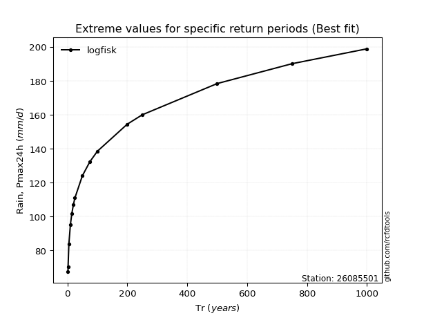</img>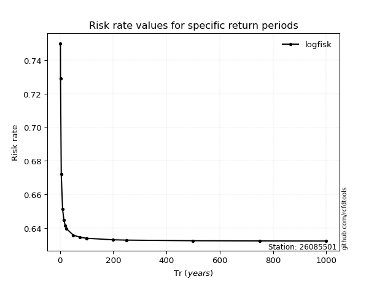</img>

</div>


<sub>**APP DISCLAIMER**: NO WARRANTY - This software is provided by [github.com/rcfdtools](https://github.com/rcfdtools) "as is", without any express or implied warranty, including warranties of merchantability, fitness for a particular purpose, or non-infringement. There is no guarantee that the software will be error-free or operate without interruption. LIMITATION OF LIABILITY - Neither the authors nor copyright holders will be liable for claims or damages arising from the software or its use. You are responsible for determining if the software is appropriate for your use and assume all associated risks, including errors, legal compliance, and data loss. NO PROFESSIONAL ADVICE - The software provides general information and does not offer professional advice. It should not replace consultation with professional advisors.</sub>