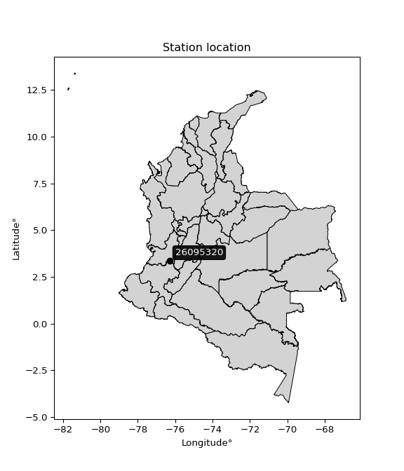

<div align="center">


</div>

# PMP Station (Rain, Pmax24h): 26095320

Probable Maximum Precipitation (PMP) is the greatest amount of rainfall for a specific duration that is meteorologically possible for a given location, acting as a "worst-case" scenario for extreme storms, crucial for designing safety-critical infrastructure like bridges, river deviations, dams, spillways, and nuclear plants to prevent catastrophic failure. PMP is calculated by hydrologists using meteorological data to determine the upper limit of extreme rainfall, often leading to the Probable Maximum Flood (PMF) for flood control design, and is increasingly being studied for climate change impacts. Probable Maximum Precipitation (PMP) is the theoretical upper limit of rainfall, a deterministic estimate for extreme events, while probability distributions (like GEV, Gumbel) describe the likelihood and frequency of various precipitation amounts, including rare ones, showing how often events occur, with PMP representing the extreme end of these distributions, used for critical infrastructure design to ensure safety against the worst conceivable weather, unlike standard statistical forecasts which cover typical probabilities.

The most common probability distributions in hydrology, used for analyzing floods, rainfall, and streamflow, include the Normal, Log-Normal, Gumbel, Gamma (including Log-Pearson Type III), and Generalized Extreme Value (GEV) distributions, often chosen based on the data´s skewness and whether modeling extremes or general conditions, with Gumbel and GEV popular for extreme events like floods, while the Normal distribution serves as a baseline, though often requiring transformations for skewed hydrological data. These distributions help in designing water infrastructure, managing water resources, and forecasting hydrologic events.

> Hydrological data often isn´t perfectly normal (it´s skewed), so different distributions are needed for different applications, such as: **Flood Frequency Analysis**: Using Gumbel, GEV, or Log-Pearson Type III for predicting extreme flood magnitudes and their return periods, **Rainfall Analysis**: Normal for annual totals, but Log-Normal, Weibull, or GEV for intensity or extreme daily rainfall, **Streamflow Modeling**: Gamma and Log-Normal for maximum flows, GEV for minimum flows, and Kappa for daily flows.

<div align="center">

</img>

</div>


## A. General information


### 1. General running parameters

• app_version: _v20260113_. • runtime: _2026-01-17 18:24:04.630693_. • Python version: _3.14.0_. • SciPy version: _1.16.3_. • Pandas version: _2.3.3_. • NumPy version: _2.3.5_. • Stations dataset (station_dataset_file): _dataset/pmax24h_in/automatic_colombia_2003_2025.csv_. • Stations catalog (station_catalog_file): _dataset/CNE.xls_. • Minimum year to eval til year_max (date_min): _1900_. • Maximum year to eval since year_min (date_max): _2025_. • Creates, save and include plots into reports (create_plot): _False_. • Plot only fit distributions with Δo > Δ (plot_only_fit): _True_. • Plot only simple graphs avoiding multiple CDFs and multiple Extreme values plots (plot_only_simple): _True_. • Eval low extreme values, if False, evaluates high extreme values (low_extreme): _False_. • Eval every SciPy distribution as logarithmic (pdist_logarithmic_on): _True_. • Standard deviation normalized (ddof): _1.0_. • Return periods to eval in years (Tr): _[2, 2.33, 5, 10, 15, 20, 25, 50, 75, 100, 200, 250, 500, 750, 1000]_. • Minimum data sample per station, 0 means any (minimum_sample): _5_. • Z-Score maximum threshold to adjust a value, 0 means disable (zscore_max): _3.5_. • Z-Score minimum threshold to adjust a value, 0 means disable (zscore_min): _-2.5_. • Avoid zeros, e.g. rain = 0 (avoid_zeros): _True_. • Avoid null values (avoid_nans): _True_. 

:file_folder:Table: [dataset.csv](../../dataset/pmax24h_in/automatic_colombia_2003_2025.csv)

> Delta Degrees of Freedom (DDOF): is a parameter used in the formulas for calculating variance and standard deviation. When ddof=0, the divisor is $N$ (the total number of observations) and this is used when your data set is the entire population. When ddof=1, the divisor is $N-1$ and this is used when your data set is a sample drawn from a larger population. Using $N-1$ provides an unbiased estimate of the population variance (known as Bessel´s correction).


### 2. Station info and location

|   id |   CODIGO | NOMBRE                      | CATEGORIA     | TECNOLOGIA   | ESTADO   | FECHA_INSTALACION   |   FECHA_SUSPENSION |   ALTITUD |   LATITUD |   LONGITUD | DEPARTAMENTO    | MUNICIPIO   | AREA_OPERATIVA                         | ENTIDAD                                                     | AREA_HIDROGRAFICA   | ZONA_HIDROGRAFICA   | SUBZONA_HIDROGRAFICA                  |   CORRIENTE | Catalogo   |   Version |
|-----:|---------:|:----------------------------|:--------------|:-------------|:---------|:--------------------|-------------------:|----------:|----------:|-----------:|:----------------|:------------|:---------------------------------------|:------------------------------------------------------------|:--------------------|:--------------------|:--------------------------------------|------------:|:-----------|----------:|
|    0 | 26095320 | EL VINCULO - AUT [26095320] | Pluviométrica | Convencional | Activa   | 24/06/2005          |                nan |       980 |   3.36042 |      -76.3 | Valle Del Cauca | Florida     | Area Operativa 09 - Cauca-Valle-Caldas | INSTITUTO DE HIDROLOGIA METEOROLOGIA Y ESTUDIOS AMBIENTALES | Magdalena Cauca     | Cauca               | Río Guachal (Bolo - Fraile y Párraga) |         nan | CNE_IDEAM  |  20251226 |

<div align="center">

Dynamic map: [:earth_americas:Google](http://maps.google.com/maps?q=3.360416667,-76.300005556) [:earth_americas:OSM](https://www.openstreetmap.org/#map=18/3.360416667/-76.300005556&layers=P) [:earth_americas:Bing](https://www.bing.com/maps?cp=3.360416667~-76.300005556&lvl=18) [:earth_americas:Apple](https://maps.apple.com/frame?center=3.360416667%2C-76.300005556&span=0.003%2C0.006)

</div>


<div align="center">

```geojson
{
  "type": "Feature",
  "geometry": {
    "type": "Point", 
    "coordinates": [-76.300005556, 3.360416667]
  }, 
  "properties": {
    "Name": "26095320"
  }
}
```

</div>


### 3. Discrete values table and plot

<div align="center">

|               |           0 |          1 |           2 |          3 |           4 |          5 |
|:--------------|------------:|-----------:|------------:|-----------:|------------:|-----------:|
| Date          | 2017        | 2018       | 2019        | 2020       | 2021        | 2022       |
| Value         |   36.1      |   57.6     |   36.4      |    0.4     |   39.1      |    3.5     |
| Value_initial |   36.1      |   57.6     |   36.4      |    0.4     |   39.1      |    3.5     |
| count         |    6        |    6       |    6        |    6       |    6        |    6       |
| mean          |   28.85     |   28.85    |   28.85     |   28.85    |   28.85     |   28.85    |
| std           |   22.3303   |   22.3303  |   22.3303   |   22.3303  |   22.3303   |   22.3303  |
| zscore        |    0.324671 |    1.28749 |    0.338105 |   -1.27405 |    0.459017 |   -1.13523 |


</div>


> The initial value (value_initial) correspond to the initial obtained or null completed value, and value (value) is adjusted only when the initial value is outside the valid range (outlier) definite through the Z-Score value. If Z-Score is active, values out of range or outliers are replaced with the station mean value. A Z-Score (or standard score) measures how many standard deviations a data point is from the mean of a dataset, indicating its relative position; positive scores mean above the mean, negative mean below, and a score of zero is exactly at the mean, allowing for comparison of values from different distributions. It´s calculated using the formula $z=(x–μ)/σ$, where $x$ is the data point, $μ$ is the mean, and $σ$ is the standard deviation, helping identify outliers and understand probability.
>
> <sub>**Note**: In this study, "completing" (filling gaps in) and "extending" (forecasting or lengthening the historical record) rainfall data series are avoided for certain critical analyses because they introduce artificial bias and uncertainty, which can distort the statistics of rare events (extremes), alter day-to-day variability, and compromise the integrity and homogeneity of the original data. Some reasons against Completing/Extending rainfall data are: **Distortion of Extremes and Variability**: The primary issue is that most gap-filling or extension methods rely on averaging or regression with nearby stations, which inherently smooths the data. Rainfall is highly variable in space and time, with a large percentage of zero values and occasional large storms. Infilling methods often underestimate the highest values and overestimate the lowest (zero) values, which severely distorts analyses focused on flood frequency, drought severity, and intensity-duration-frequency (IDF) curves, **Loss of Data Homogeneity**: Infilled or extended data are synthetic estimates, not actual measurements. Combining these estimates with observed data can violate the assumption of data homogeneity, which requires that the data properties do not change over time. Inhomogeneity can lead to incorrect conclusions about long-term trends or changes in climate patterns, **Propagation of Errors**: Errors and biases from the original data (e.g., wind-induced undercatch, instrument errors, site changes) or the data used for imputation can propagate through the analysis, leading to unreliable hydrological models and inaccurate predictions, **Compromised Statistical Integrity**: For statistical analyses, especially those involving the frequency of events, using artificial data can introduce time bias or autocorrelation that doesn´t exist in reality, making it difficult to assess the true probability of events, **Difficulty in Validation**: It is difficult to accurately validate the quality of filled or extended data, especially for past periods where ground-truth measurements are unavailable. The reliability of imputation techniques heavily depends on the density of the surrounding station network and the complexity of the local topography.</sub>


### 4. Active continuous probability distributions from SciPy (80 of 104 available)

A Probability Density Function (PDF) describes the relative likelihood of a continuous random variable falling within a specific range, where the total area under its curve equals 1, and the area over any interval gives the actual probability for that range. Unlike discrete probabilities (like rolling a die), a PDF shows density, not direct probability for a single point (which is zero), with higher points indicating higher likelihood, often visualized as a bell curve for normal distributions.

A log of a probability density function (log-PDF) is simply the logarithm of the PDF´s value, denoted as $log(f(x))$, useful for converting multiplication of probabilities into addition, improving numerical stability with tiny numbers, and connecting to information theory concepts like entropy. Instead of dealing with very small probabilities (e.g., 0.000001), log-PDFs use negative numbers (e.g., $log(0.00001) ≈ -11.51$ that are easier for computers to handle, preventing underflow errors and simplifying complex calculations. In this study, each active probability distribution from SciPy is also evaluated in the $log$ form.

[scipy.stats](https://docs.scipy.org/doc/scipy/reference/stats.html) is a Python´s powerful submodule within the SciPy library for comprehensive statistical analysis, offering over 130 probability distributions (like Normal, Poisson), functions for descriptive stats (mean, variance), hypothesis testing (t-tests, chi-square), random variable generation, and statistical tests, making it essential for data science, modeling, and research. It provides tools to explore, model, and draw conclusions from data efficiently, working seamlessly with NumPy.

<div align="center">

|   id | p_dist           |   n_parameter | fit_method   | label                                                                       | active   | ref                                                                                                      |
|-----:|:-----------------|--------------:|:-------------|:----------------------------------------------------------------------------|:---------|:---------------------------------------------------------------------------------------------------------|
|    0 | alpha            |             3 | MLE          | Alpha                                                                       | True     | [:mortar_board:](https://docs.scipy.org/doc/scipy/reference/generated/scipy.stats.alpha.html)            |
|    1 | anglit           |             2 | MM           | Anglit                                                                      | True     | [:mortar_board:](https://docs.scipy.org/doc/scipy/reference/generated/scipy.stats.anglit.html)           |
|    2 | arcsine          |             2 | MM           | Arcsine                                                                     | True     | [:mortar_board:](https://docs.scipy.org/doc/scipy/reference/generated/scipy.stats.arcsine.html)          |
|    3 | argus            |             3 | MLE          | Argus                                                                       | True     | [:mortar_board:](https://docs.scipy.org/doc/scipy/reference/generated/scipy.stats.argus.html)            |
|    4 | beta             |             4 | MLE          | Beta                                                                        | True     | [:mortar_board:](https://docs.scipy.org/doc/scipy/reference/generated/scipy.stats.beta.html)             |
|    5 | betaprime        |             4 | MLE          | Beta prime                                                                  | True     | [:mortar_board:](https://docs.scipy.org/doc/scipy/reference/generated/scipy.stats.betaprime.html)        |
|    6 | bradford         |             3 | MLE          | Bradford                                                                    | True     | [:mortar_board:](https://docs.scipy.org/doc/scipy/reference/generated/scipy.stats.bradford.html)         |
|    7 | burr             |             4 | MLE          | Burr (Type III)                                                             | True     | [:mortar_board:](https://docs.scipy.org/doc/scipy/reference/generated/scipy.stats.burr.html)             |
|    8 | burr12           |             4 | MLE          | Burr (Type III) 12                                                          | True     | [:mortar_board:](https://docs.scipy.org/doc/scipy/reference/generated/scipy.stats.burr12.html)           |
|    9 | cosine           |             2 | MLE          | Cosine                                                                      | True     | [:mortar_board:](https://docs.scipy.org/doc/scipy/reference/generated/scipy.stats.cosine.html)           |
|   10 | crystalball      |             4 | MLE          | Crystalball                                                                 | True     | [:mortar_board:](https://docs.scipy.org/doc/scipy/reference/generated/scipy.stats.crystalball.html)      |
|   11 | dgamma           |             3 | MLE          | Double gamma                                                                | True     | [:mortar_board:](https://docs.scipy.org/doc/scipy/reference/generated/scipy.stats.dgamma.html)           |
|   12 | dweibull         |             3 | MLE          | Double Weibull                                                              | True     | [:mortar_board:](https://docs.scipy.org/doc/scipy/reference/generated/scipy.stats.dweibull.html)         |
|   13 | erlang           |             3 | MLE          | Erlang                                                                      | True     | [:mortar_board:](https://docs.scipy.org/doc/scipy/reference/generated/scipy.stats.erlang.html)           |
|   14 | exponnorm        |             3 | MLE          | Exponentially modified Normal                                               | True     | [:mortar_board:](https://docs.scipy.org/doc/scipy/reference/generated/scipy.stats.exponnorm.html)        |
|   15 | exponpow         |             3 | MLE          | Exponential power                                                           | True     | [:mortar_board:](https://docs.scipy.org/doc/scipy/reference/generated/scipy.stats.exponpow.html)         |
|   16 | exponweib        |             4 | MLE          | Exponentiated Weibull                                                       | True     | [:mortar_board:](https://docs.scipy.org/doc/scipy/reference/generated/scipy.stats.exponweib.html)        |
|   17 | f                |             4 | MLE          | F                                                                           | True     | [:mortar_board:](https://docs.scipy.org/doc/scipy/reference/generated/scipy.stats.f.html)                |
|   18 | fatiguelife      |             3 | MLE          | Fatigue-life (Birnbaum-Saunders)                                            | True     | [:mortar_board:](https://docs.scipy.org/doc/scipy/reference/generated/scipy.stats.fatiguelife.html)      |
|   19 | foldnorm         |             3 | MM           | Fold Normal                                                                 | True     | [:mortar_board:](https://docs.scipy.org/doc/scipy/reference/generated/scipy.stats.foldnorm.html)         |
|   20 | gamma            |             3 | MLE          | Gamma                                                                       | True     | [:mortar_board:](https://docs.scipy.org/doc/scipy/reference/generated/scipy.stats.gamma.html)            |
|   21 | gausshyper       |             6 | MLE          | Gauss hypergeometric                                                        | True     | [:mortar_board:](https://docs.scipy.org/doc/scipy/reference/generated/scipy.stats.gausshyper.html)       |
|   22 | genexpon         |             5 | MLE          | Generalized exponential                                                     | True     | [:mortar_board:](https://docs.scipy.org/doc/scipy/reference/generated/scipy.stats.genexpon.html)         |
|   23 | genextreme       |             3 | MLE          | Generalized exponential                                                     | True     | [:mortar_board:](https://docs.scipy.org/doc/scipy/reference/generated/scipy.stats.genextreme.html)       |
|   24 | gengamma         |             4 | MLE          | Generalized gamma                                                           | True     | [:mortar_board:](https://docs.scipy.org/doc/scipy/reference/generated/scipy.stats.gengamma.html)         |
|   25 | genhalflogistic  |             3 | MLE          | Generalized half-logistic                                                   | True     | [:mortar_board:](https://docs.scipy.org/doc/scipy/reference/generated/scipy.stats.genhalflogistic.html)  |
|   26 | genlogistic      |             3 | MLE          | Generalized logistic                                                        | True     | [:mortar_board:](https://docs.scipy.org/doc/scipy/reference/generated/scipy.stats.genlogistic.html)      |
|   27 | gennorm          |             3 | MLE          | Generalized Normal                                                          | True     | [:mortar_board:](https://docs.scipy.org/doc/scipy/reference/generated/scipy.stats.gennorm.html)          |
|   28 | genpareto        |             3 | MLE          | Generalized Pareto                                                          | True     | [:mortar_board:](https://docs.scipy.org/doc/scipy/reference/generated/scipy.stats.genpareto.html)        |
|   29 | gompertz         |             3 | MLE          | Gompertz (or truncated Gumbel)                                              | True     | [:mortar_board:](https://docs.scipy.org/doc/scipy/reference/generated/scipy.stats.gompertz.html)         |
|   30 | gumbel_l         |             2 | MM           | Gumbel Left Skew                                                            | True     | [:mortar_board:](https://docs.scipy.org/doc/scipy/reference/generated/scipy.stats.gumbel_l.html)         |
|   31 | gumbel_r         |             2 | MM           | Gumbel Right Skew                                                           | True     | [:mortar_board:](https://docs.scipy.org/doc/scipy/reference/generated/scipy.stats.gumbel_r.html)         |
|   32 | halfgennorm      |             3 | MLE          | Upper half of a generalized normal                                          | True     | [:mortar_board:](https://docs.scipy.org/doc/scipy/reference/generated/scipy.stats.halfgennorm.html)      |
|   33 | halflogistic     |             2 | MM           | Half-logistic                                                               | True     | [:mortar_board:](https://docs.scipy.org/doc/scipy/reference/generated/scipy.stats.halflogistic.html)     |
|   34 | halfnorm         |             2 | MM           | Half Normal                                                                 | True     | [:mortar_board:](https://docs.scipy.org/doc/scipy/reference/generated/scipy.stats.halfnorm.html)         |
|   35 | hypsecant        |             2 | MM           | hyperbolic secant                                                           | True     | [:mortar_board:](https://docs.scipy.org/doc/scipy/reference/generated/scipy.stats.hypsecant.html)        |
|   36 | invgamma         |             3 | MLE          | Inverted gamma                                                              | True     | [:mortar_board:](https://docs.scipy.org/doc/scipy/reference/generated/scipy.stats.invgamma.html)         |
|   37 | invgauss         |             3 | MLE          | Inverse Gaussian                                                            | True     | [:mortar_board:](https://docs.scipy.org/doc/scipy/reference/generated/scipy.stats.invgauss.html)         |
|   38 | invweibull       |             3 | MLE          | Inverted Weibull                                                            | True     | [:mortar_board:](https://docs.scipy.org/doc/scipy/reference/generated/scipy.stats.invweibull.html)       |
|   39 | johnsonsb        |             4 | MLE          | Johnson SB                                                                  | True     | [:mortar_board:](https://docs.scipy.org/doc/scipy/reference/generated/scipy.stats.johnsonsb.html)        |
|   40 | johnsonsu        |             4 | MLE          | Johnson Su                                                                  | True     | [:mortar_board:](https://docs.scipy.org/doc/scipy/reference/generated/scipy.stats.johnsonsu.html)        |
|   41 | kappa3           |             3 | MLE          | Kappa 3                                                                     | True     | [:mortar_board:](https://docs.scipy.org/doc/scipy/reference/generated/scipy.stats.kappa3.html)           |
|   42 | kappa4           |             4 | MLE          | Kappa 4                                                                     | True     | [:mortar_board:](https://docs.scipy.org/doc/scipy/reference/generated/scipy.stats.kappa4.html)           |
|   43 | ksone            |             3 | MLE          | Kolmogorov-Smirnov one-sided test statistic distribution                    | True     | [:mortar_board:](https://docs.scipy.org/doc/scipy/reference/generated/scipy.stats.ksone.html)            |
|   44 | kstwobign        |             2 | MLE          | Limiting distribution of scaled Kolmogorov-Smirnov two-sided test statistic | True     | [:mortar_board:](https://docs.scipy.org/doc/scipy/reference/generated/scipy.stats.kstwobign.html)        |
|   45 | laplace          |             2 | MM           | Laplace                                                                     | True     | [:mortar_board:](https://docs.scipy.org/doc/scipy/reference/generated/scipy.stats.laplace.html)          |
|   46 | levy_l           |             2 | MLE          | Left-skewed Levy                                                            | True     | [:mortar_board:](https://docs.scipy.org/doc/scipy/reference/generated/scipy.stats.levy_l.html)           |
|   47 | loggamma         |             3 | MLE          | Log gamma                                                                   | True     | [:mortar_board:](https://docs.scipy.org/doc/scipy/reference/generated/scipy.stats.loggamma.html)         |
|   48 | logistic         |             2 | MM           | Logistic (or Sech-squared)                                                  | True     | [:mortar_board:](https://docs.scipy.org/doc/scipy/reference/generated/scipy.stats.logistic.html)         |
|   49 | loglaplace       |             3 | MLE          | Log-Laplace                                                                 | True     | [:mortar_board:](https://docs.scipy.org/doc/scipy/reference/generated/scipy.stats.loglaplace.html)       |
|   50 | lomax            |             3 | MLE          | Lomax (Pareto of the second kind)                                           | True     | [:mortar_board:](https://docs.scipy.org/doc/scipy/reference/generated/scipy.stats.lomax.html)            |
|   51 | maxwell          |             2 | MM           | Maxwell                                                                     | True     | [:mortar_board:](https://docs.scipy.org/doc/scipy/reference/generated/scipy.stats.maxwell.html)          |
|   52 | mielke           |             4 | MLE          | Mielke Beta-Kappa / Dagum                                                   | True     | [:mortar_board:](https://docs.scipy.org/doc/scipy/reference/generated/scipy.stats.mielke.html)           |
|   53 | moyal            |             2 | MM           | Moyal                                                                       | True     | [:mortar_board:](https://docs.scipy.org/doc/scipy/reference/generated/scipy.stats.moyal.html)            |
|   54 | nakagami         |             3 | MLE          | Nakagami                                                                    | True     | [:mortar_board:](https://docs.scipy.org/doc/scipy/reference/generated/scipy.stats.nakagami.html)         |
|   55 | ncf              |             5 | MLE          | Non-central F distribution                                                  | True     | [:mortar_board:](https://docs.scipy.org/doc/scipy/reference/generated/scipy.stats.ncf.html)              |
|   56 | nct              |             4 | MLE          | Non-central Student’s t                                                     | True     | [:mortar_board:](https://docs.scipy.org/doc/scipy/reference/generated/scipy.stats.nct.html)              |
|   57 | norm             |             2 | MM           | Normal                                                                      | True     | [:mortar_board:](https://docs.scipy.org/doc/scipy/reference/generated/scipy.stats.norm.html)             |
|   58 | pearson3         |             3 | MM           | Pearson type III                                                            | True     | [:mortar_board:](https://docs.scipy.org/doc/scipy/reference/generated/scipy.stats.pearson3.html)         |
|   59 | powerlaw         |             3 | MLE          | Power-function                                                              | True     | [:mortar_board:](https://docs.scipy.org/doc/scipy/reference/generated/scipy.stats.powerlaw.html)         |
|   60 | rayleigh         |             2 | MM           | Rayleigh                                                                    | True     | [:mortar_board:](https://docs.scipy.org/doc/scipy/reference/generated/scipy.stats.rayleigh.html)         |
|   61 | rdist            |             3 | MLE          | R-distributed (symmetric beta)                                              | True     | [:mortar_board:](https://docs.scipy.org/doc/scipy/reference/generated/scipy.stats.rdist.html)            |
|   62 | rice             |             3 | MLE          | Rice                                                                        | True     | [:mortar_board:](https://docs.scipy.org/doc/scipy/reference/generated/scipy.stats.rice.html)             |
|   63 | semicircular     |             2 | MM           | Semicircular                                                                | True     | [:mortar_board:](https://docs.scipy.org/doc/scipy/reference/generated/scipy.stats.semicircular.html)     |
|   64 | skewnorm         |             3 | MLE          | Skew normal                                                                 | True     | [:mortar_board:](https://docs.scipy.org/doc/scipy/reference/generated/scipy.stats.skewnorm.html)         |
|   65 | t                |             3 | MLE          | Student’s t                                                                 | True     | [:mortar_board:](https://docs.scipy.org/doc/scipy/reference/generated/scipy.stats.t.html)                |
|   66 | trapezoid        |             4 | MLE          | Trapezoid                                                                   | True     | [:mortar_board:](https://docs.scipy.org/doc/scipy/reference/generated/scipy.stats.trapezoid.html)        |
|   67 | triang           |             3 | MLE          | Triangular                                                                  | True     | [:mortar_board:](https://docs.scipy.org/doc/scipy/reference/generated/scipy.stats.triang.html)           |
|   68 | truncexpon       |             3 | MLE          | Truncated exponential                                                       | True     | [:mortar_board:](https://docs.scipy.org/doc/scipy/reference/generated/scipy.stats.truncexpon.html)       |
|   69 | truncnorm        |             4 | MLE          | Truncated normal                                                            | True     | [:mortar_board:](https://docs.scipy.org/doc/scipy/reference/generated/scipy.stats.truncnorm.html)        |
|   70 | truncpareto      |             4 | MLE          | Upper truncated Pareto                                                      | True     | [:mortar_board:](https://docs.scipy.org/doc/scipy/reference/generated/scipy.stats.truncpareto.html)      |
|   71 | truncweibull_min |             5 | MLE          | Doubly truncated Weibull minimum                                            | True     | [:mortar_board:](https://docs.scipy.org/doc/scipy/reference/generated/scipy.stats.truncweibull_min.html) |
|   72 | tukeylambda      |             3 | MLE          | Tukey-Lamdba                                                                | True     | [:mortar_board:](https://docs.scipy.org/doc/scipy/reference/generated/scipy.stats.tukeylambda.html)      |
|   73 | uniform          |             2 | MLE          | Uniform                                                                     | True     | [:mortar_board:](https://docs.scipy.org/doc/scipy/reference/generated/scipy.stats.uniform.html)          |
|   74 | vonmises         |             3 | MLE          | Von Mises                                                                   | True     | [:mortar_board:](https://docs.scipy.org/doc/scipy/reference/generated/scipy.stats.vonmises.html)         |
|   75 | vonmises_line    |             3 | MLE          | Von Mises line                                                              | True     | [:mortar_board:](https://docs.scipy.org/doc/scipy/reference/generated/scipy.stats.vonmises_line.html)    |
|   76 | wald             |             2 | MM           | Wald                                                                        | True     | [:mortar_board:](https://docs.scipy.org/doc/scipy/reference/generated/scipy.stats.wald.html)             |
|   77 | weibull_max      |             3 | MLE          | Weibull maximum                                                             | True     | [:mortar_board:](https://docs.scipy.org/doc/scipy/reference/generated/scipy.stats.weibull_max.html)      |
|   78 | weibull_min      |             3 | MLE          | Weibull minimum                                                             | True     | [:mortar_board:](https://docs.scipy.org/doc/scipy/reference/generated/scipy.stats.weibull_min.html)      |
|   79 | wrapcauchy       |             3 | MLE          | Wrapped  Cauchy                                                             | True     | [:mortar_board:](https://docs.scipy.org/doc/scipy/reference/generated/scipy.stats.wrapcauchy.html)       |

</div>

> **n_parameter:** # arguments & localization & scale.
>
> **Fit methods:** (MLE) maximum likelihood, (MM) L-moments.
>
>**Inactive** (With the only purpose of prevent loops, zero divisions, infinite values, over high estimated values or horizontal trending for recurrence intervals estimations, the follow distributions were disabled.)**:** lognorm, norminvgauss, powernorm, powerlognorm, cauchy, halfcauchy, foldcauchy, skewcauchy, chi2, expon, fisk, genhyperbolic, geninvgauss, gibrat, kstwo, laplace_asymmetric, levy, levy_stable, ncx2, pareto, rel_breitwigner, recipinvgauss, studentized_range, loguniform, 


## B. Probability (PDF) vs. Empirical (EDF) distributions functions

A continuous probability distribution (CPD) describes probabilities for variables that can take any value within a range (like rain any time), unlike discrete variables with specific outcomes (like temperature). It uses a Probability Density Function (PDF), a curve where the total area under it equals 1, and the probability of the variable falling within an interval (a to b) is found by calculating the area under the curve between those points. A key feature is that the probability of hitting any single exact value is zero, so probabilities are always expressed for ranges, e.g., $P(a ≤ X ≤ b)$.

<div align="center">

Distributions parameters from station values
|     |   station | p_dist              |   n |            loc |           scale | shape                  | shape1                 | shape2               | shape3             |
|----:|----------:|:--------------------|----:|---------------:|----------------:|:-----------------------|:-----------------------|:---------------------|:-------------------|
|   0 |  26095320 | alpha               |   6 |   -9.56001     |    18.5865      | 2.194020151475899e-06  |                        |                      |                    |
|   1 |  26095320 | anglit              |   6 |   28.85        |    59.6334      |                        |                        |                      |                    |
|   2 |  26095320 | arcsine             |   6 |    0.0216864   |    57.6566      |                        |                        |                      |                    |
|   3 |  26095320 | argus               |   6 |  -16.7008      |    78.0068      | 0.5183969205830827     |                        |                      |                    |
|   4 |  26095320 | beta                |   6 |   -5.50861     |    63.1086      | 0.7732239596079375     | 0.6391296247726319     |                      |                    |
|   5 |  26095320 | betaprime           |   6 |    0.4         |    94.9941      | 0.7322303470422422     | 2.5758993554724556     |                      |                    |
|   6 |  26095320 | bradford            |   6 |    0.399997    |    57.2203      | 2.6874307304714535     |                        |                      |                    |
|   7 |  26095320 | burr                |   6 |    0.399999    |    63.8429      | 39.37707028756111      | 0.010041029869494005   |                      |                    |
|   8 |  26095320 | burr12              |   6 |    0.4         |   567.512       | 0.7417786039751478     | 10.301061063594132     |                      |                    |
|   9 |  26095320 | cosine              |   6 |   28.2903      |    16.4516      |                        |                        |                      |                    |
|  10 |  26095320 | crystalball         |   6 |   28.85        |    20.3847      | 2860.5348310412382     | 13.61728379884881      |                      |                    |
|  11 |  26095320 | dgamma              |   6 |   36.1         |    15.4032      | 0.6464903206472095     |                        |                      |                    |
|  12 |  26095320 | dweibull            |   6 |   36.4         |    15.9909      | 0.5343658337366506     |                        |                      |                    |
|  13 |  26095320 | erlang              |   6 | -315.999       |     1.23902     | 278.2422614869937      |                        |                      |                    |
|  14 |  26095320 | exponnorm           |   6 |   28.836       |    20.3846      | 0.000683970286279513   |                        |                      |                    |
|  15 |  26095320 | exponpow            |   6 |    0.4         |    37.8136      | 0.5342422362903372     |                        |                      |                    |
|  16 |  26095320 | exponweib           |   6 |    0.4         |     5.39447     | 1.4457755246746233     | 0.3444108247784343     |                      |                    |
|  17 |  26095320 | f                   |   6 |    0.4         |    22.0921      | 0.8471945214675485     | 48.50761178902158      |                      |                    |
|  18 |  26095320 | fatiguelife         |   6 |    0.4         |     5.81487e-06 | 2018.3946783595616     |                        |                      |                    |
|  19 |  26095320 | foldnorm            |   6 | -123.697       |    19.6952      | 7.753319438573989      |                        |                      |                    |
|  20 |  26095320 | gamma               |   6 | -316.334       |     1.22747     | 281.12388849138324     |                        |                      |                    |
|  21 |  26095320 | gausshyper          |   6 |   -2.49508     |    60.0951      | 1.0087557882096858     | 0.6092936681662063     | 1.1274507025431624   | 1.3343416387497822 |
|  22 |  26095320 | genexpon            |   6 |    0.399987    |     1.77531     | 0.0624747683426498     | 1.1992053979591237e-07 | 0.8078951136594719   |                    |
|  23 |  26095320 | genextreme          |   6 |   25.6288      |    23.6061      | 0.6675900903373584     |                        |                      |                    |
|  24 |  26095320 | gengamma            |   6 |    0.4         |     3.0412      | 1.5478313854156551     | 0.42004732624228625    |                      |                    |
|  25 |  26095320 | genhalflogistic     |   6 |   -5.48546     |    66.2504      | 1.0501694589746382     |                        |                      |                    |
|  26 |  26095320 | genlogistic         |   6 |   45.967       |     6.63401     | 0.3311809774596668     |                        |                      |                    |
|  27 |  26095320 | gennorm             |   6 |   36.4         |     0.814234    | 0.4231134025691993     |                        |                      |                    |
|  28 |  26095320 | genpareto           |   6 |   -0.0178899   |    91.1289      | -1.5816082719788653    |                        |                      |                    |
|  29 |  26095320 | gompertz            |   6 |    0.4         |    30.4414      | 0.4719405037459826     |                        |                      |                    |
|  30 |  26095320 | gumbel_l            |   6 |   38.0242      |    15.8939      |                        |                        |                      |                    |
|  31 |  26095320 | gumbel_r            |   6 |   19.6758      |    15.8939      |                        |                        |                      |                    |
|  32 |  26095320 | halfgennorm         |   6 |    0.4         |     0.692903    | 0.3355404141525582     |                        |                      |                    |
|  33 |  26095320 | halflogistic        |   6 |    4.68937     |    17.4282      |                        |                        |                      |                    |
|  34 |  26095320 | halfnorm            |   6 |    1.86866     |    33.8161      |                        |                        |                      |                    |
|  35 |  26095320 | hypsecant           |   6 |   28.85        |    12.9773      |                        |                        |                      |                    |
|  36 |  26095320 | invgamma            |   6 | -199.041       | 26570.9         | 117.33295823905047     |                        |                      |                    |
|  37 |  26095320 | invgauss            |   6 |  -87.0135      |  3306.49        | 0.03503592363164132    |                        |                      |                    |
|  38 |  26095320 | invweibull          |   6 |    0.4         |     2.57326     | 0.04974888358141208    |                        |                      |                    |
|  39 |  26095320 | johnsonsb           |   6 |   -4.53876     |    62.1388      | -0.6637412739294237    | 0.14255592247758575    |                      |                    |
|  40 |  26095320 | johnsonsu           |   6 |   36.345       |     0.140228    | 0.14566721061485186    | 0.22159062958169387    |                      |                    |
|  41 |  26095320 | kappa3              |   6 |    0.399846    |    57.2001      | 2063392.9884932893     |                        |                      |                    |
|  42 |  26095320 | kappa4              |   6 |   -6.32616     |    67.9344      | 1.1102692707506816     | 1.060457951999548      |                      |                    |
|  43 |  26095320 | ksone               |   6 |   -6.45733     |    70.6147      | 1.0                    |                        |                      |                    |
|  44 |  26095320 | kstwobign           |   6 |  -46.6742      |    85.9205      |                        |                        |                      |                    |
|  45 |  26095320 | laplace             |   6 |   28.85        |    14.4142      |                        |                        |                      |                    |
|  46 |  26095320 | levy_l              |   6 |   60.3132      |    11.2545      |                        |                        |                      |                    |
|  47 |  26095320 | loggamma            |   6 |   25.5073      |    23.0595      | 1.6222340889305333     |                        |                      |                    |
|  48 |  26095320 | logistic            |   6 |   28.85        |    11.2387      |                        |                        |                      |                    |
|  49 |  26095320 | loglaplace          |   6 |    0.4         |    35.3924      | 0.8495441262270378     |                        |                      |                    |
|  50 |  26095320 | lomax               |   6 |    0.4         |     2.15847e+12 | 71767312930.98993      |                        |                      |                    |
|  51 |  26095320 | maxwell             |   6 |  -19.4532      |    30.2695      |                        |                        |                      |                    |
|  52 |  26095320 | mielke              |   6 |    0.4         |    58.4088      | 0.5868859626808035     | 38.02010078820482      |                      |                    |
|  53 |  26095320 | moyal               |   6 |   17.1927      |     9.17634     |                        |                        |                      |                    |
|  54 |  26095320 | nakagami            |   6 |    0.4         |    41.4514      | 0.0959739431206185     |                        |                      |                    |
|  55 |  26095320 | ncf                 |   6 |    0.4         |     8.22035     | 0.8240843029308895     | 167.52984346756267     | 2.0982678051650048   |                    |
|  56 |  26095320 | nct                 |   6 |   -0.491257    |     0.0389081   | 0.38097664345306753    | 54.73617564758532      |                      |                    |
|  57 |  26095320 | norm                |   6 |   28.85        |    20.3847      |                        |                        |                      |                    |
|  58 |  26095320 | pearson3            |   6 |   28.85        |    20.3847      | -0.26888750838879916   |                        |                      |                    |
|  59 |  26095320 | powerlaw            |   6 |    0.4         |    57.2         | 0.13124276469966886    |                        |                      |                    |
|  60 |  26095320 | rayleigh            |   6 |  -10.1471      |    31.1152      |                        |                        |                      |                    |
|  61 |  26095320 | rdist               |   6 |   29.0109      |    28.6109      | 0.9728001527929138     |                        |                      |                    |
|  62 |  26095320 | rice                |   6 |  -12.1367      |    23.7941      | 1.3042943690223403     |                        |                      |                    |
|  63 |  26095320 | semicircular        |   6 |   28.85        |    40.7694      |                        |                        |                      |                    |
|  64 |  26095320 | skewnorm            |   6 |   53.8093      |    32.2258      | -3.4976734724593763    |                        |                      |                    |
|  65 |  26095320 | t                   |   6 |   28.8506      |    20.3843      | 17564.76697595317      |                        |                      |                    |
|  66 |  26095320 | trapezoid           |   6 |  -28.8516      |    86.4849      | 1.0                    | 1.0                    |                      |                    |
|  67 |  26095320 | triang              |   6 |  -28.8368      |    86.437       | 0.9999997542895982     |                        |                      |                    |
|  68 |  26095320 | truncexpon          |   6 |   -1.35635     |    70.2885      | 0.8387765324461585     |                        |                      |                    |
|  69 |  26095320 | truncnorm           |   6 |    0.998129    |    13.1005      | -2.3362977406500605    | 4.3205787123453        |                      |                    |
|  70 |  26095320 | truncpareto         |   6 |    0.323866    |     0.0761339   | 0.20760835172698508    | 752.3074344328518      |                      |                    |
|  71 |  26095320 | truncweibull_min    |   6 |   -1.40248     |    71.8976      | 1.0343613056784569     | 0.0008187143164327059  | 0.8206456607479926   |                    |
|  72 |  26095320 | tukeylambda         |   6 |   29.0553      |    30.339       | 1.0587557120985074     |                        |                      |                    |
|  73 |  26095320 | uniform             |   6 |    0.4         |    57.2         |                        |                        |                      |                    |
|  74 |  26095320 | vonmises            |   6 |   -0.0791449   |     1           | 0.3010081626928488     |                        |                      |                    |
|  75 |  26095320 | vonmises_line       |   6 |   28.685       |     9.20393     | 1.5120975045681732e-05 |                        |                      |                    |
|  76 |  26095320 | wald                |   6 |    8.46526     |    20.3847      |                        |                        |                      |                    |
|  77 |  26095320 | weibull_max         |   6 |   57.6         |     1.61617     | 0.26399601686192825    |                        |                      |                    |
|  78 |  26095320 | weibull_min         |   6 |  -61.6439      |    98.5665      | 5.316291253698353      |                        |                      |                    |
|  79 |  26095320 | wrapcauchy          |   6 |    0.399999    |     9.10366     | 0.39153102863459616    |                        |                      |                    |
|  80 |  26095320 | logalpha            |   6 |   -2.43655     |     3.13477     | 0.002374951677295827   |                        |                      |                    |
|  81 |  26095320 | loganglit           |   6 |    2.5395      |     5.25605     |                        |                        |                      |                    |
|  82 |  26095320 | logarcsine          |   6 |   -0.00144415  |     5.08188     |                        |                        |                      |                    |
|  83 |  26095320 | logargus            |   6 |   -3.12748     |     7.32415     | 2.766607543794583      |                        |                      |                    |
|  84 |  26095320 | logbeta             |   6 |   -1.50798     |     5.56151     | 0.40962883382597337    | 0.14998258817599563    |                      |                    |
|  85 |  26095320 | logbetaprime        |   6 |   -0.916291    |     1.59953     | 0.6708587350756705     | 0.19069160985946823    |                      |                    |
|  86 |  26095320 | logbradford         |   6 |   -0.921457    |     5.31245     | 2.337249901009005e-05  |                        |                      |                    |
|  87 |  26095320 | logburr             |   6 |   -0.916291    |     0.643793    | 0.1057410036663981     | 1.7304254280128841     |                      |                    |
|  88 |  26095320 | logburr12           |   6 |   -0.916291    |     1.69536     | 0.8408253053297573     | 0.9712375714647078     |                      |                    |
|  89 |  26095320 | logcosine           |   6 |    2.26779     |     1.51208     |                        |                        |                      |                    |
|  90 |  26095320 | logcrystalball      |   6 |    2.5395      |     1.79669     | 7.741759783616947      | 518.5652031832349      |                      |                    |
|  91 |  26095320 | logdgamma           |   6 |    3.58629     |     0.997598    | 0.7878976511528069     |                        |                      |                    |
|  92 |  26095320 | logdweibull         |   6 |    3.59457     |     1.52414     | 0.5678871312297527     |                        |                      |                    |
|  93 |  26095320 | logerlang           |   6 |  -25.9581      |     0.121371    | 234.6450153906893      |                        |                      |                    |
|  94 |  26095320 | logexponnorm        |   6 |    2.53847     |     1.79669     | 0.0005713246319098751  |                        |                      |                    |
|  95 |  26095320 | logexponpow         |   6 |   -0.916291    |     2.37994     | 0.1464037703650452     |                        |                      |                    |
|  96 |  26095320 | logexponweib        |   6 |   -0.916291    |     1.84266     | 1.6686911046034716     | 0.10152742558158867    |                      |                    |
|  97 |  26095320 | logf                |   6 |   -0.916291    |     1.10619     | 1.131575349384842      | 1.1176560609816553     |                      |                    |
|  98 |  26095320 | logfatiguelife      |   6 | -769.628       |   772.15        | 0.002320014646492218   |                        |                      |                    |
|  99 |  26095320 | logfoldnorm         |   6 |   -9.69362     |     1.52523     | 8.063926836521333      |                        |                      |                    |
| 100 |  26095320 | loggamma            |   6 |  -26.3723      |     0.121611    | 237.87126110720504     |                        |                      |                    |
| 101 |  26095320 | loggausshyper       |   6 |   -1.36351     |     5.41703     | 1.4138082543983388     | 0.6173557660250787     | 0.8821887141353244   | 1.2221111966193274 |
| 102 |  26095320 | loggenexpon         |   6 |   -0.916291    |     0.11389     | 0.012679471145275296   | 2.8902191208598182     | 0.000364432703534756 |                    |
| 103 |  26095320 | loggenextreme       |   6 |    2.7392      |     1.49402     | 1.1367220133248375     |                        |                      |                    |
| 104 |  26095320 | loggengamma         |   6 |   -0.916291    |     1.94278     | 1.5128448961062726     | 0.11244392849682702    |                      |                    |
| 105 |  26095320 | loggenhalflogistic  |   6 |   -1.45692     |     6.47418     | 1.1748935441422108     |                        |                      |                    |
| 106 |  26095320 | loggenlogistic      |   6 |    4.0536      |     6.18185e-06 | 4.065383425807129e-06  |                        |                      |                    |
| 107 |  26095320 | loggennorm          |   6 |    3.59457     |     0.00014647  | 0.2093246083234256     |                        |                      |                    |
| 108 |  26095320 | loggenpareto        |   6 |   -0.916291    |     1.35528     | 0.489628540835525      |                        |                      |                    |
| 109 |  26095320 | loggompertz         |   6 |   -0.916291    |     1.23406     | 0.03416995578769435    |                        |                      |                    |
| 110 |  26095320 | loggumbel_l         |   6 |    3.3481      |     1.40088     |                        |                        |                      |                    |
| 111 |  26095320 | loggumbel_r         |   6 |    1.73089     |     1.40088     |                        |                        |                      |                    |
| 112 |  26095320 | loghalfgennorm      |   6 |   -0.916291    |     2.03063     | 0.7610694455306724     |                        |                      |                    |
| 113 |  26095320 | loghalflogistic     |   6 |    0.410021    |     1.53609     |                        |                        |                      |                    |
| 114 |  26095320 | loghalfnorm         |   6 |    0.161404    |     2.9805      |                        |                        |                      |                    |
| 115 |  26095320 | loghypsecant        |   6 |    2.5395      |     1.14381     |                        |                        |                      |                    |
| 116 |  26095320 | loginvgamma         |   6 |  -35.3488      | 15617           | 413.1975161746402      |                        |                      |                    |
| 117 |  26095320 | loginvgauss         |   6 |  -14.4589      |  1305.29        | 0.013025214894082999   |                        |                      |                    |
| 118 |  26095320 | loginvweibull       |   6 |   -1.48647e+07 |     1.48647e+07 | 7472462.65115802       |                        |                      |                    |
| 119 |  26095320 | logjohnsonsb        |   6 |   -4.65869     |     8.71221     | -0.8215710010738478    | 0.09744891918985558    |                      |                    |
| 120 |  26095320 | logjohnsonsu        |   6 |    4.05352     |     4.52572e-13 | 3.492291378895905      | 0.1341393101363453     |                      |                    |
| 121 |  26095320 | logkappa3           |   6 |   -0.916291    |     1.7314      | 0.9141877935536686     |                        |                      |                    |
| 122 |  26095320 | logkappa4           |   6 |   -1.3243      |     5.67509     | 1.0776325843309817     | 1.0547199814621393     |                      |                    |
| 123 |  26095320 | logksone            |   6 |   -1.41327     |     5.96378     | 1.0                    |                        |                      |                    |
| 124 |  26095320 | logkstwobign        |   6 |   -5.41542     |     9.06923     |                        |                        |                      |                    |
| 125 |  26095320 | loglaplace          |   6 |    2.5395      |     1.27045     |                        |                        |                      |                    |
| 126 |  26095320 | loglevy_l           |   6 |    4.12377     |     0.289619    |                        |                        |                      |                    |
| 127 |  26095320 | logloggamma         |   6 |    4.0536      |     3.30806e-06 | 2.1773301458561926e-06 |                        |                      |                    |
| 128 |  26095320 | loglogistic         |   6 |    2.5395      |     0.99057     |                        |                        |                      |                    |
| 129 |  26095320 | logloglaplace       |   6 |   -0.916291    |     1.83587     | 0.5748781078056323     |                        |                      |                    |
| 130 |  26095320 | loglomax            |   6 |   -0.916292    |     1.3968      | 0.8164078088906384     |                        |                      |                    |
| 131 |  26095320 | logmaxwell          |   6 |   -1.71792     |     2.66794     |                        |                        |                      |                    |
| 132 |  26095320 | logmielke           |   6 |   -0.916291    |     1.86716     | 0.4003935626251206     | 0.17561656635477324    |                      |                    |
| 133 |  26095320 | logmoyal            |   6 |    1.51203     |     0.808797    |                        |                        |                      |                    |
| 134 |  26095320 | lognakagami         |   6 | -923.318       |   925.857       | 65974.45256497887      |                        |                      |                    |
| 135 |  26095320 | logncf              |   6 |   -0.916291    |     1.08707     | 1.038530554855532      | 1.1559730894805935     | 1.1123505022864681   |                    |
| 136 |  26095320 | lognct              |   6 | -114.527       |     1.76094     | 50578.430016799684     | 66.47812276717869      |                      |                    |
| 137 |  26095320 | lognorm             |   6 |    2.5395      |     1.79669     |                        |                        |                      |                    |
| 138 |  26095320 | logpearson3         |   6 |    2.5395      |     1.7967      | -1.0396591197874105    |                        |                      |                    |
| 139 |  26095320 | logpowerlaw         |   6 |   -0.916291    |     4.96981     | 0.15210646110788248    |                        |                      |                    |
| 140 |  26095320 | lograyleigh         |   6 |   -0.897637    |     2.74244     |                        |                        |                      |                    |
| 141 |  26095320 | logrdist            |   6 |   -0.480673    |     1.73344     | 1.1822974718116337     |                        |                      |                    |
| 142 |  26095320 | logrice             |   6 |   -2.21389     |     1.93741     | 2.208961093215472      |                        |                      |                    |
| 143 |  26095320 | logsemicircular     |   6 |    2.5395      |     3.59339     |                        |                        |                      |                    |
| 144 |  26095320 | logskewnorm         |   6 |    4.05352     |     2.34943     | -11757378.0313498      |                        |                      |                    |
| 145 |  26095320 | logt                |   6 |    2.5395      |     1.7967      | 1439977950.0479445     |                        |                      |                    |
| 146 |  26095320 | logtrapezoid        |   6 |   -2.66944     |     7.62273     | 1.0                    | 1.0                    |                      |                    |
| 147 |  26095320 | logtriang           |   6 |   -1.93382     |     5.98735     | 0.9999999971457091     |                        |                      |                    |
| 148 |  26095320 | logtruncexpon       |   6 |   -0.916362    |     9.06064     | 0.5485136505860584     |                        |                      |                    |
| 149 |  26095320 | logtruncnorm        |   6 |    1.8609      |     7.06898     | -0.39341891721853      | 0.31017534920179135    |                      |                    |
| 150 |  26095320 | logtruncpareto      |   6 |   -0.927268    |     0.0109776   | 5.976906891962147e-09  | 464.12542133602847     |                      |                    |
| 151 |  26095320 | logtruncweibull_min |   6 |   -1.22985     |     7.57248     | 1.5103333140824655     | 0.0015883680705233555  | 0.697707040572376    |                    |
| 152 |  26095320 | logtukeylambda      |   6 |    0.216883    |     1.62928     | 1.437802356687742      |                        |                      |                    |
| 153 |  26095320 | loguniform          |   6 |   -0.916291    |     4.96981     |                        |                        |                      |                    |
| 154 |  26095320 | logvonmises         |   6 |   -2.43751     |     1           | 1.2093055345435841     |                        |                      |                    |
| 155 |  26095320 | logvonmises_line    |   6 |    3.02132     |     1.25338     | 0.9580372399650616     |                        |                      |                    |
| 156 |  26095320 | logwald             |   6 |    0.74277     |     1.79672     |                        |                        |                      |                    |
| 157 |  26095320 | logweibull_max      |   6 |    4.05352     |     1.62509     | 0.5392110871307905     |                        |                      |                    |
| 158 |  26095320 | logweibull_min      |   6 |   -1.7941e+08  |     1.7941e+08  | 156942500.14420477     |                        |                      |                    |
| 159 |  26095320 | logwrapcauchy       |   6 |   -0.917178    |     0.791112    | 0.6672022842034218     |                        |                      |                    |

</div>

> **loc** (Location parameter): This shifts the distribution along the x-axis. For many common distributions, like the normal (Gaussian) distribution, loc represents the mean $μ$. For others, like the uniform distribution, it might represent the minimum value, or for the beta distribution, the left end of the support interval.
>
> **scale** (Scale parameter): This determines the width or spread of the distribution. For the normal distribution, scale represents the standard deviation $σ$. For a uniform distribution, it defines the length of the interval (from $loc$ to $loc + scale$).
>
> **shape** (Shape parameters): Refers to parameters that define the specific form of a probability distribution, distinct from its location (loc) and scale (scale). These parameters are required arguments for most distribution functions. For example, a normal (Gaussian) distribution is fully defined by its location (mean) and scale (standard deviation), so it has no specific shape parameters beyond loc and scale. However, other distributions have intrinsic properties that need specification, as Gamma distribution that takes a shape parameter, often named $a$ or $alpha$.


### 0. Cumulative distribution values - CDF (160 evaluated)

Cumulative Distribution Function (CDF), denoted as $F$<sub>$X$</sub>$(x)$, is a function that gives the probability that a random variable $X$ will take a value less than or equal to a specific value, $x$ (i.e., $(P(X≥x)$. It essentially "accumulates" probabilities from a given point up to the far right (positive infinity), providing a complete picture of the distribution´s probabilities for both discrete (like rain) and continuous (like temperature) variables, helping to find probabilities over ranges or above certain values. Each station is evaluated separately ordering the $x$ values ascending, calculating the CDF and PDF values for the activated distributions and their logarithmic forms.

<div align="center">

CDF ordered by x ascending and calculating $log(f(x))$ separately
|   id |   Station |   date |    x |   count |   mean |     std |    zscore |   Value_initial |   station |   m |     alpha |   alpha_pdf |    anglit |   anglit_pdf |   arcsine |   arcsine_pdf |     argus |   argus_pdf |     beta |     beta_pdf |   betaprime |   betaprime_pdf |    bradford |   bradford_pdf |        burr |     burr_pdf |      burr12 |    burr12_pdf |   cosine |   cosine_pdf |   crystalball |   crystalball_pdf |    dgamma |    dgamma_pdf |   dweibull |    dweibull_pdf |    erlang |   erlang_pdf |   exponnorm |   exponnorm_pdf |    exponpow |   exponpow_pdf |   exponweib |   exponweib_pdf |           f |      f_pdf |   fatiguelife |   fatiguelife_pdf |   foldnorm |   foldnorm_pdf |     gamma |   gamma_pdf |   gausshyper |   gausshyper_pdf |    genexpon |   genexpon_pdf |   genextreme |   genextreme_pdf |    gengamma |    gengamma_pdf |   genhalflogistic |   genhalflogistic_pdf |   genlogistic |   genlogistic_pdf |   gennorm |   gennorm_pdf |   genpareto |   genpareto_pdf |    gompertz |   gompertz_pdf |   gumbel_l |   gumbel_l_pdf |   gumbel_r |   gumbel_r_pdf |   halfgennorm |   halfgennorm_pdf |   halflogistic |   halflogistic_pdf |   halfnorm |   halfnorm_pdf |   hypsecant |   hypsecant_pdf |   invgamma |   invgamma_pdf |   invgauss |   invgauss_pdf |   invweibull |   invweibull_pdf |   johnsonsb |   johnsonsb_pdf |   johnsonsu |   johnsonsu_pdf |      kappa3 |   kappa3_pdf |      kappa4 |   kappa4_pdf |     ksone |   ksone_pdf |   kstwobign |   kstwobign_pdf |   laplace |   laplace_pdf |   levy_l |   levy_l_pdf |   loggamma |   loggamma_pdf |   logistic |   logistic_pdf |   loglaplace |   loglaplace_pdf |       lomax |   lomax_pdf |   maxwell |   maxwell_pdf |      mielke |   mielke_pdf |     moyal |   moyal_pdf |    nakagami |   nakagami_pdf |         ncf |     ncf_pdf |       nct |    nct_pdf |      norm |   norm_pdf |   pearson3 |   pearson3_pdf |   powerlaw |   powerlaw_pdf |   rayleigh |   rayleigh_pdf |       rdist |   rdist_pdf |      rice |   rice_pdf |   semicircular |   semicircular_pdf |   skewnorm |   skewnorm_pdf |         t |      t_pdf |   trapezoid |   trapezoid_pdf |   triang |   triang_pdf |   truncexpon |   truncexpon_pdf |   truncnorm |   truncnorm_pdf |   truncpareto |   truncpareto_pdf |   truncweibull_min |   truncweibull_min_pdf |   tukeylambda |   tukeylambda_pdf |   uniform |   uniform_pdf |   vonmises |   vonmises_pdf |   vonmises_line |   vonmises_line_pdf |     wald |   wald_pdf |   weibull_max |   weibull_max_pdf |   weibull_min |   weibull_min_pdf |   wrapcauchy |   wrapcauchy_pdf |   logalpha |   logalpha_pdf |   loganglit |   loganglit_pdf |   logarcsine |   logarcsine_pdf |   logargus |   logargus_pdf |   logbeta |   logbeta_pdf |   logbetaprime |   logbetaprime_pdf |   logbradford |   logbradford_pdf |    logburr |   logburr_pdf |   logburr12 |   logburr12_pdf |   logcosine |   logcosine_pdf |   logcrystalball |   logcrystalball_pdf |   logdgamma |   logdgamma_pdf |   logdweibull |   logdweibull_pdf |   logerlang |   logerlang_pdf |   logexponnorm |   logexponnorm_pdf |   logexponpow |   logexponpow_pdf |   logexponweib |   logexponweib_pdf |        logf |    logf_pdf |   logfatiguelife |   logfatiguelife_pdf |   logfoldnorm |   logfoldnorm_pdf |   loggausshyper |   loggausshyper_pdf |   loggenexpon |   loggenexpon_pdf |   loggenextreme |   loggenextreme_pdf |   loggengamma |   loggengamma_pdf |   loggenhalflogistic |   loggenhalflogistic_pdf |   loggenlogistic |   loggenlogistic_pdf |   loggennorm |   loggennorm_pdf |   loggenpareto |   loggenpareto_pdf |   loggompertz |   loggompertz_pdf |   loggumbel_l |   loggumbel_l_pdf |   loggumbel_r |   loggumbel_r_pdf |   loghalfgennorm |   loghalfgennorm_pdf |   loghalflogistic |   loghalflogistic_pdf |   loghalfnorm |   loghalfnorm_pdf |   loghypsecant |   loghypsecant_pdf |   loginvgamma |   loginvgamma_pdf |   loginvgauss |   loginvgauss_pdf |   loginvweibull |   loginvweibull_pdf |   logjohnsonsb |   logjohnsonsb_pdf |   logjohnsonsu |   logjohnsonsu_pdf |   logkappa3 |   logkappa3_pdf |   logkappa4 |   logkappa4_pdf |   logksone |   logksone_pdf |   logkstwobign |   logkstwobign_pdf |   loglevy_l |   loglevy_l_pdf |   logloggamma |   logloggamma_pdf |   loglogistic |   loglogistic_pdf |   logloglaplace |   logloglaplace_pdf |    loglomax |   loglomax_pdf |   logmaxwell |   logmaxwell_pdf |   logmielke |   logmielke_pdf |    logmoyal |   logmoyal_pdf |   lognakagami |   lognakagami_pdf |      logncf |   logncf_pdf |    lognct |   lognct_pdf |   lognorm |   lognorm_pdf |   logpearson3 |   logpearson3_pdf |   logpowerlaw |   logpowerlaw_pdf |   lograyleigh |   lograyleigh_pdf |   logrdist |   logrdist_pdf |   logrice |   logrice_pdf |   logsemicircular |   logsemicircular_pdf |   logskewnorm |   logskewnorm_pdf |     logt |   logt_pdf |   logtrapezoid |   logtrapezoid_pdf |   logtriang |   logtriang_pdf |   logtruncexpon |   logtruncexpon_pdf |   logtruncnorm |   logtruncnorm_pdf |   logtruncpareto |   logtruncpareto_pdf |   logtruncweibull_min |   logtruncweibull_min_pdf |   logtukeylambda |   logtukeylambda_pdf |   loguniform |   loguniform_pdf |   logvonmises |   logvonmises_pdf |   logvonmises_line |   logvonmises_line_pdf |   logwald |   logwald_pdf |   logweibull_max |   logweibull_max_pdf |   logweibull_min |   logweibull_min_pdf |   logwrapcauchy |   logwrapcauchy_pdf |
|-----:|----------:|-------:|-----:|--------:|-------:|--------:|----------:|----------------:|----------:|----:|----------:|------------:|----------:|-------------:|----------:|--------------:|----------:|------------:|---------:|-------------:|------------:|----------------:|------------:|---------------:|------------:|-------------:|------------:|--------------:|---------:|-------------:|--------------:|------------------:|----------:|--------------:|-----------:|----------------:|----------:|-------------:|------------:|----------------:|------------:|---------------:|------------:|----------------:|------------:|-----------:|--------------:|------------------:|-----------:|---------------:|----------:|------------:|-------------:|-----------------:|------------:|---------------:|-------------:|-----------------:|------------:|----------------:|------------------:|----------------------:|--------------:|------------------:|----------:|--------------:|------------:|----------------:|------------:|---------------:|-----------:|---------------:|-----------:|---------------:|--------------:|------------------:|---------------:|-------------------:|-----------:|---------------:|------------:|----------------:|-----------:|---------------:|-----------:|---------------:|-------------:|-----------------:|------------:|----------------:|------------:|----------------:|------------:|-------------:|------------:|-------------:|----------:|------------:|------------:|----------------:|----------:|--------------:|---------:|-------------:|-----------:|---------------:|-----------:|---------------:|-------------:|-----------------:|------------:|------------:|----------:|--------------:|------------:|-------------:|----------:|------------:|------------:|---------------:|------------:|------------:|----------:|-----------:|----------:|-----------:|-----------:|---------------:|-----------:|---------------:|-----------:|---------------:|------------:|------------:|----------:|-----------:|---------------:|-------------------:|-----------:|---------------:|----------:|-----------:|------------:|----------------:|---------:|-------------:|-------------:|-----------------:|------------:|----------------:|--------------:|------------------:|-------------------:|-----------------------:|--------------:|------------------:|----------:|--------------:|-----------:|---------------:|----------------:|--------------------:|---------:|-----------:|--------------:|------------------:|--------------:|------------------:|-------------:|-----------------:|-----------:|---------------:|------------:|----------------:|-------------:|-----------------:|-----------:|---------------:|----------:|--------------:|---------------:|-------------------:|--------------:|------------------:|-----------:|--------------:|------------:|----------------:|------------:|----------------:|-----------------:|---------------------:|------------:|----------------:|--------------:|------------------:|------------:|----------------:|---------------:|-------------------:|--------------:|------------------:|---------------:|-------------------:|------------:|------------:|-----------------:|---------------------:|--------------:|------------------:|----------------:|--------------------:|--------------:|------------------:|----------------:|--------------------:|--------------:|------------------:|---------------------:|-------------------------:|-----------------:|---------------------:|-------------:|-----------------:|---------------:|-------------------:|--------------:|------------------:|--------------:|------------------:|--------------:|------------------:|-----------------:|---------------------:|------------------:|----------------------:|--------------:|------------------:|---------------:|-------------------:|--------------:|------------------:|--------------:|------------------:|----------------:|--------------------:|---------------:|-------------------:|---------------:|-------------------:|------------:|----------------:|------------:|----------------:|-----------:|---------------:|---------------:|-------------------:|------------:|----------------:|--------------:|------------------:|--------------:|------------------:|----------------:|--------------------:|------------:|---------------:|-------------:|-----------------:|------------:|----------------:|------------:|---------------:|--------------:|------------------:|------------:|-------------:|----------:|-------------:|----------:|--------------:|--------------:|------------------:|--------------:|------------------:|--------------:|------------------:|-----------:|---------------:|----------:|--------------:|------------------:|----------------------:|--------------:|------------------:|---------:|-----------:|---------------:|-------------------:|------------:|----------------:|----------------:|--------------------:|---------------:|-------------------:|-----------------:|---------------------:|----------------------:|--------------------------:|-----------------:|---------------------:|-------------:|-----------------:|--------------:|------------------:|-------------------:|-----------------------:|----------:|--------------:|-----------------:|---------------------:|-----------------:|---------------------:|----------------:|--------------------:|
|    0 |  26095320 |   2020 |  0.4 |       6 |  28.85 | 22.3303 | -1.27405  |             0.4 |  26095320 |   1 | 0.0620256 |  0.0262077  | 0.0920848 |   0.00969744 | 0.0516247 |     0.06838   | 0.0676631 |  0.00784098 | 0.110961 |    0.0148175 | 1.55911e-13 |   1028.29       | 9.38453e-08 |     0.0359915  | 0.000809758 | nan          | 8.16528e-14 | 1091.1        | 0.072263 |   0.00847285 |     0.0814092 |        0.00738984 | 0.0235583 |    0.0017071  |   0.106885 |      0.00244781 | 0.0821115 |   0.00776875 |    0.081409 |      0.00738985 | 2.96972e-10 |    2.85807e+06 | 3.47694e-09 |     3.11885e+07 | 2.73522e-08 | 2.0872e+08 |      0.103582 |       1.26591e+11 |  0.0731925 |     0.00705461 | 0.0812946 |  0.00774237 |     0.051325 |        0.0174416 | 4.44503e-07 |     0.035191   |     0.106412 |       0.00589413 | 9.52061e-12 | 111508          |         0.0465951 |            0.00830559 |      0.102784 |        0.00512582 | 0.0329445 |    0.00148858 |  0.00459183 |       0.0110029 | 2.94034e-12 |     0.0155032  |   0.089482 |     0.00537021 |  0.0346373 |     0.00732855 |   2.78924e-13 |        0.246529   |       0        |         0          |  0         |     0          |   0.0707922 |      0.00541022 |  0.0754569 |     0.00805964 |  0.0773226 |     0.00898369 |   0.00117423 |      7.10028e+12 |    0.155548 |     0.00748941  |    0.108048 |      0.00114436 | 2.68849e-06 |    0.0174824 | 4.26562e-15 |    0.569152  | 0.0971091 |   0.0141614 |   0.0750704 |       0.0115138 | 0.0694672 |    0.00481937 | 0.335286 |   0.00262724 |  0.0281438 |      0.0374756 |  0.0736834 |     0.00607315 |    0.0329335 |        0.0259226 | 4.14692e-14 |  0.0332492  | 0.0660598 |    0.00914473 | 8.24421e-07 | 192.553      | 0.0125327 |  0.00480779 | 0.000310822 |    1.07477e+12 | 2.30325e-08 | 1.70963e+08 | 0.0434179 | 0.158997   | 0.0814092 | 0.00738984 |  0.0867576 |     0.006914   | 0.00432436 |    1.02239e+13 |  0.0558312 |     0.0102858  | 7.80928e-09 | 1.19581e+06 | 0.058616  | 0.00923411 |      0.0950494 |          0.0111846 |  0.0974496 |     0.00627015 | 0.0814099 | 0.00738931 |    0.114398 |      0.00782166 | 0.114409 |   0.00782639 |    0.0434657 |        0.0244398 |    0.4767   |     0.03072     |      0        |        3.64964    |          0.0380854 |              0.0222685 |   7.10543e-15 |         0.0287249 | 0         |     0.0174825 |   0.599611 |       0.203256 |       0.0108936 |           0.0172918 | 0        | 0          |     0.0770017 |       0.000911187 |     0.0818201 |        0.00671586 |   2.0161e-08 |       0.0399814  |  0.0393608 |      0.129522  |   0.0162721 |       0.0481426 |     0        |         0        |  0.0206813 |      0.0216544 |  0.118299 |   0.0876687   |    3.64969e-12 |      22053.4       |   0.000972445 |          0.188239 | 0.00125794 |   2.02952e+12 | 2.39625e-14 |     181.48      |   0.0279389 |       0.0515952 |        0.0272141 |            0.0349217 |  0.00325019 |      0.00338729 |     0.0784727 |         0.0182948 |   0.0282649 |        0.037962 |      0.0272137 |          0.0349214 |    0.00406496 |       5.36038e+12 |     0.00175339 |        2.64558e+12 | 5.94278e-10 | 3.02854e+06 |        0.0271978 |            0.0351641 |     0.0104675 |         0.0181846 |       0.0265286 |           0.0821547 |   2.83365e-08 |          0.11133  |        0.039865 |           0.0227383 |    0.00127475 |       1.94162e+12 |            0.0439173 |                0.0854659 |         0        |            0.0250353 |    0.0273756 |       0.00689312 |    8.99618e-10 |          0.737852  |   1.06832e-09 |         0.0276891 |     0.0465227 |         0.0324249 |    0.00133729 |        0.00631677 |      5.04094e-10 |            0.418552  |          0        |              0        |      0        |          0        |      0.0310032 |          0.0270623 |     0.0261691 |         0.0369863 |      0.025958 |         0.0393436 |       0.0309139 |            0.054027 |       0.197881 |        0.0126978   |       0.264833 |        0.00883783  | 1.37897e-08 |       0.637123  | 1.56595e-15 |        2.49558  |  0.0833333 |       0.167679 |      0.0336076 |          0.0674215 |    0.189449 |       0.0184371 |     0.0379634 |         0.0249871 |     0.0296358 |         0.0290313 |     2.37328e-10 |         1.22889e+06 | 4.57571e-07 |      0.584485  |    0.0070222 |        0.0258078 | 3.17619e-07 |     1.14385e+09 | 7.22182e-06 |    9.39903e-05 |     0.0276184 |         0.0352879 | 1.87783e-09 |  8.78285e+06 | 0.0272816 |    0.0350332 | 0.0272141 |     0.0349217 |     0.0474537 |         0.0348852 |    0.00293282 |       4.01812e+12 |      0        |          0        |    0.40953 |       0.211426 | 0.0225616 |     0.0391782 |        0.00447172 |             0.0485572 |     0.0344021 |         0.0362517 | 0.027214 |  0.0349216 |      0.0528952 |          0.0603431 |   0.0288821 |       0.0567688 |     1.86714e-05 |            0.261413 |    0.000737783 |           0.19013  |       6.0504e-09 |           14.8359    |              0.018304 |                 0.0884516 |      1.41291e-10 |             0.613738 |     0        |         0.201215 |      0.905307 |         0.120669  |         8.3635e-10 |              0.0391931 |  0        |     0         |         0.160876 |           0.0318917  |        0.0243791 |             0.021064 |     0.000894449 |           1.00783   |
|    1 |  26095320 |   2022 |  3.5 |       6 |  28.85 | 22.3303 | -1.13523  |             3.5 |  26095320 |   2 | 0.154689  |  0.0315823  | 0.124295  |   0.0110649  | 0.157982  |     0.0231875 | 0.0940742 |  0.00919291 | 0.155051 |    0.0137394 | 0.164325    |      0.0364966  | 0.104163    |     0.0314173  | 0.302385    |   0.0385674  | 0.192491    |    0.0408856  | 0.101346 |   0.0102922  |     0.106827  |        0.00903212 | 0.0295174 |    0.00215581 |   0.114919 |      0.00274451 | 0.108846  |   0.00949968 |    0.106827 |      0.00903214 | 0.259622    |    0.0436146   | 0.435061    |     0.0449418   | 0.3336      | 0.0436844  |      0.641229 |       0.0218026   |  0.0976566 |     0.00875744 | 0.107962  |  0.00948331 |     0.104256 |        0.0167156 | 0.103353    |     0.031554   |     0.126068 |       0.00680262 | 0.41321     |      0.0563353  |         0.0730275 |            0.00875369 |      0.119963 |        0.00597882 | 0.0380114 |    0.00179243 |  0.0390493  |       0.0112307 | 0.0493339   |     0.0163184  |   0.10768  |     0.00639631 |  0.0628548 |     0.0109422  |   0.234495    |        0.0471987  |       0        |         0          |  0.0384763 |     0.0235674  |   0.0896684 |      0.00681861 |  0.103397  |     0.00998246 |  0.108482  |     0.0111228  |   0.371288   |      0.00590349  |    0.174757 |     0.00524589  |    0.111804 |      0.00128345 | 0.054198    |    0.0174824 | 0.0686174   |    0.0199682 | 0.141009  |   0.0141614 |   0.115218  |       0.0143192 | 0.0861354 |    0.00597575 | 0.343739 |   0.00283063 |  0.247147  |      0.173636  |  0.0948671 |     0.00764035 |    0.181598  |        0.142939  | 0.0979384   |  0.0299929  | 0.097871  |    0.0113697  | 0.178506    |   0.0337943  | 0.0349674 |  0.00992338 | 0.509376    |    0.0315245   | 0.195228    | 0.0295881   | 0.381978  | 0.0563583  | 0.106827  | 0.00903212 |  0.110368  |     0.00834223 | 0.682091   |    0.0288772   |  0.0917039 |     0.0128033  | 0.153993    | 0.0246333   | 0.0905295 | 0.0113345  |      0.131396  |          0.0122295 |  0.118489  |     0.00731995 | 0.106826  | 0.0090315  |    0.13993  |      0.00865058 | 0.139958 |   0.00865623 |    0.117583  |        0.0233854 |    0.57156  |     0.0301964   |      0.721525 |        0.0403215  |          0.107123  |              0.0221417 |   0.0568801   |         0.0178985 | 0.0541958 |     0.0174825 |   1.05087  |       0.118475 |       0.0644982 |           0.0172918 | 0        | 0          |     0.0799392 |       0.000985547 |     0.104721  |        0.00808218 |   0.119244   |       0.0356517  |  0.39607   |      0.128095  |   0.264855  |       0.167904  |     0.330976 |         0.145277 |  0.131346  |      0.100007  |  0.253776 |   0.0574958   |    0.225133    |          0.0457957 |   0.409272    |          0.188237 | 0.335586   |   0.0132469   | 0.541144    |       0.0952946 |   0.29417   |       0.187673  |        0.236944  |            0.171815  |  0.0319734  |      0.034251   |     0.139545  |         0.0431868 |   0.251207  |        0.176633 |      0.236943  |          0.171815  |    0.813971   |       0.0332199   |     0.472657   |        0.0212773   | 0.6122      | 0.0747086   |        0.239114  |            0.173472  |     0.18753   |         0.176489  |       0.294522  |           0.153636  |   0.350832    |          0.186217 |        0.142902 |           0.0873295 |    0.427951   |       0.0216429   |            0.280299  |                0.14001   |         0        |            0.104243  |    0.0535904 |       0.021035   |    0.693276    |          0.126886  |   0.151238    |         0.136281  |     0.200752  |         0.127847  |    0.24493    |        0.245963   |      0.520898    |            0.146252  |          0.267635 |              0.302187 |      0.285759 |          0.250343 |      0.199855  |          0.163471  |     0.250706  |         0.17864   |      0.262456 |         0.182211  |       0.310856  |            0.182586 |       0.226996 |        0.015456    |       0.290615 |        0.0164106   | 0.544233    |       0.107037  | 0.446278    |        0.194052 |  0.447038  |       0.167679 |      0.347975  |          0.185996  |    0.249221 |       0.0419631 |     0.158265  |         0.104169  |     0.214336  |         0.169999  |     0.545711    |         0.120403    | 0.534738    |      0.106523  |    0.25653   |        0.19948   | 0.212137    |     0.019322    | 0.240459    |    0.290718    |     0.238082  |         0.171812  | 0.480934    |  0.0826536   | 0.237416  |    0.171938  | 0.236944  |     0.171815  |     0.208327  |         0.128689  |    0.881518   |       0.0618171   |      0.264659 |          0.210249 |    1       |  389473        | 0.247096  |     0.176211  |        0.277007   |             0.165416  |     0.233221  |         0.166874  | 0.236943 |  0.171815  |      0.264752  |          0.135002  |   0.283258  |       0.177782  |     0.504274    |            0.20576  |    0.432041    |           0.204625 |       0.861743   |            0.0747064 |              0.384449 |                 0.21293   |      0.949279    |             0.491578 |     0.436446 |         0.201215 |      1.01978  |         0.0405005 |         0.136452   |              0.118979  |  0.14842  |     0.594904  |         0.261551 |           0.0675319  |        0.15176   |             0.122129 |     0.48717     |           0.0417294 |
|    2 |  26095320 |   2017 | 36.1 |       6 |  28.85 | 22.3303 |  0.324671 |            36.1 |  26095320 |   3 | 0.683962  |  0.00654763 | 0.620382  |   0.0162758  | 0.58092   |     0.0114082 | 0.586326  |  0.0193     | 0.570821 |    0.0135485 | 0.673715    |      0.00734227 | 0.754512    |     0.0134462  | 0.79467     |   0.00880117 | 0.712137    |    0.00701568 | 0.648298 |   0.0182785  |     0.638952  |        0.0183712  | 0.5       | 6156.14       |   0.443692 |      0.0944239  | 0.645489  |   0.0177515  |    0.638954 |      0.0183713  | 0.805487    |    0.00744434  | 0.794609    |     0.00366239  | 0.793694    | 0.00570867 |      0.890202 |       0.00322869  |  0.640654  |     0.0189835  | 0.646222  |  0.0178132  |     0.57984  |        0.0139608 | 0.715301    |     0.0100189  |     0.553798 |       0.0196965  | 0.860507    |      0.00393806 |         0.471896  |            0.0172135  |      0.571179 |        0.0232584  | 0.459034  |    0.11119    |  0.463816   |       0.015768  | 0.65105     |     0.0174784  |   0.587688 |     0.0229836  |  0.700608  |     0.0156841  |   0.727356    |        0.00577784 |       0.716854 |         0.0139464  |  0.688595  |     0.0141353  |   0.669241  |      0.0211422  |  0.645859  |     0.0169184  |  0.662553  |     0.0159287  |   0.41588    |      0.000508464 |    0.283329 |     0.00343232  |    0.441248 |      0.309781   | 0.624123    |    0.0174824 | 0.632263    |    0.0164718 | 0.60267   |   0.0141614 |   0.688663  |       0.013803  | 0.697636  |    0.0209769  | 0.504615 |   0.00890356 |  0.7139    |      0.177141  |  0.655904  |     0.0200819  |    0.780653  |        0.172652  | 0.694863    |  0.0101456  | 0.661746  |    0.016479   | 0.749062    |   0.0123141  | 0.721145  |  0.0145599  | 0.809299    |    0.0040773   | 0.689455    | 0.00912364  | 0.732028  | 0.00278853 | 0.638952  | 0.0183712  |  0.62418   |     0.0192245  | 0.940007   |    0.00345572  |  0.668647  |     0.0158281  | 0.57821     | 0.0112753   | 0.653112  | 0.0171452  |      0.61261   |          0.0153663 |  0.580712  |     0.0207081  | 0.638942  | 0.0183714  |    0.564026 |      0.0173676  | 0.564395 |   0.0173829  |    0.727588  |        0.0147068 |    0.996284 |     0.000848998 |      0.96527  |        0.00216522 |          0.716481  |              0.0151724 |   0.620992    |         0.0171941 | 0.624126  |     0.0174825 |   6.21066  |       0.158008 |       0.628222  |           0.0172922 | 0.779055 | 0.0118336  |     0.138036  |       0.00335636  |     0.615735  |        0.0199894  |   0.556601   |       0.00865625 |  0.603242  |      0.060177  |   0.693935  |       0.175362  |     0.63516  |         0.137482 |  0.733259  |      0.484651  |  0.453542 |   0.183511    |    0.301109    |          0.0237739 |   0.848527    |          0.188236 | 0.356784   |   0.00650664  | 0.683909    |       0.0398161 |   0.760629  |       0.172968  |        0.719927  |            0.187381  |  0.5        |    767.213      |     0.4748    |         1.6849    |   0.721633  |        0.176165 |      0.719926  |          0.187381  |    0.864351   |       0.0145155   |     0.506789   |        0.0104973   | 0.720833    | 0.0296523   |        0.723627  |            0.186463  |     0.739862  |         0.212725  |       0.767373  |           0.3084    |   0.732989    |          0.126653 |        0.668593 |           0.506792  |    0.46291    |       0.0108255   |            0.781856  |                0.354043  |         0        |            0.483635  |    0.44659   |       4.042      |    0.860869    |          0.039083  |   0.721591    |         0.296181  |     0.694357  |         0.258617  |    0.76648    |        0.145511   |      0.755053    |            0.0669294 |          0.775461 |              0.129765 |      0.749484 |          0.138332 |      0.757519  |          0.192077  |     0.72056   |         0.173836  |      0.718965 |         0.164076  |       0.696609  |            0.126603 |       0.293964 |        0.0759177   |       0.37776  |        0.109115    | 0.702176    |       0.0430722 | 0.900463    |        0.201599 |  0.838322  |       0.167679 |      0.721935  |          0.120736  |    0.537091 |       0.416176  |     0.735226  |         0.483919  |     0.742071  |         0.193224  |     0.701472    |         0.0381153   | 0.691542    |      0.0426871 |    0.733379  |        0.163811  | 0.243921    |     0.0100088   | 0.781477    |    0.131662    |     0.719826  |         0.186761  | 0.609919    |  0.0375714   | 0.719915  |    0.187004  | 0.719927  |     0.187381  |     0.682879  |         0.251355  |    0.985095   |       0.0332785   |      0.737272 |          0.156636 |    1       |       0        | 0.721063  |     0.179853  |        0.682797   |             0.16948   |     0.842365  |         0.332958  | 0.719925 |  0.187381  |      0.673496  |          0.215321  |   0.850017  |       0.307971  |     0.927574    |            0.159041 |    0.907669    |           0.199356 |       0.980266   |            0.0360829 |              0.899981 |                 0.216992  |      1           |             0        |     0.905986 |         0.201215 |      1.40253  |         0.365755  |         0.645749   |              0.241986  |  0.82644  |     0.100182  |         0.600122 |           0.353645   |        0.718452  |             0.31216  |     0.684851    |           0.331427  |
|    3 |  26095320 |   2019 | 36.4 |       6 |  28.85 | 22.3303 |  0.338105 |            36.4 |  26095320 |   4 | 0.685914  |  0.0064694  | 0.625258  |   0.0162344  | 0.584348  |     0.0114409 | 0.59212   |  0.0193295  | 0.574892 |    0.0135953 | 0.675907    |      0.00727048 | 0.758535    |     0.0133758  | 0.797304    |   0.00875675 | 0.714231    |    0.00694469 | 0.65377  |   0.0181965  |     0.644449  |        0.0182733  | 0.543231  |    0.0920646  |   0.5      | 235225          | 0.650799  |   0.0176451  |    0.644451 |      0.0182734  | 0.807708    |    0.00736263  | 0.795701    |     0.00362379  | 0.795398    | 0.00564896 |      0.891166 |       0.00319492  |  0.646333  |     0.0188774  | 0.65155   |  0.0177056  |     0.584031 |        0.0139821 | 0.71829     |     0.00991366 |     0.559721 |       0.0197873  | 0.861681    |      0.00388784 |         0.47708   |            0.0173466  |      0.57817  |        0.0233441  | 0.5       |    0.214106   |  0.468558   |       0.0158497 | 0.65628     |     0.017387   |   0.594591 |     0.0230294  |  0.705284  |     0.0154936  |   0.72908     |        0.00571718 |       0.721012 |         0.0137748  |  0.692817  |     0.0140083  |   0.675546  |      0.0208917  |  0.650917  |     0.0168022  |  0.667313  |     0.0158023  |   0.416031   |      0.000504201 |    0.284363 |     0.00346142  |    0.591161 |      0.571462   | 0.629368    |    0.0174824 | 0.637204    |    0.0164708 | 0.606918  |   0.0141614 |   0.692785  |       0.0136759 | 0.703864  |    0.0205448  | 0.507308 |   0.00904522 |  0.715364  |      0.176676  |  0.661903  |     0.0199123  |    0.782077  |        0.171531  | 0.697892    |  0.0100449  | 0.666672  |    0.0163564  | 0.75275     |   0.0122716  | 0.725482  |  0.0143532  | 0.810517    |    0.00404496  | 0.692181    | 0.00905012  | 0.73286   | 0.00275729 | 0.644449  | 0.0182733  |  0.629937  |     0.0191566  | 0.94104    |    0.00343068  |  0.673377  |     0.0157034  | 0.581597    | 0.0113082   | 0.658239  | 0.0170324  |      0.617217  |          0.015345  |  0.586933  |     0.0207682  | 0.644439  | 0.0182735  |    0.569248 |      0.0174478  | 0.569622 |   0.0174632  |    0.731991  |        0.0146441 |    0.996531 |     0.000798262 |      0.965916 |        0.00214349 |          0.721024  |              0.0151127 |   0.62615     |         0.0171967 | 0.629371  |     0.0174825 |   6.26023  |       0.17257  |       0.63341   |           0.0172922 | 0.782571 | 0.011604   |     0.139051  |       0.00341621  |     0.621725  |        0.0199398  |   0.559212   |       0.00875063 |  0.60374   |      0.0600341 |   0.695386  |       0.175129  |     0.636299 |         0.137705 |  0.737276  |      0.485929  |  0.455071 |   0.186141    |    0.301305    |          0.0237318 |   0.850085    |          0.188236 | 0.356838   |   0.00649499  | 0.684238    |       0.0397204 |   0.762058  |       0.172526  |        0.721475  |            0.186877  |  0.512303   |      1.16585    |     0.5       |    962321         |   0.723089  |        0.175682 |      0.721475  |          0.186877  |    0.864471   |       0.0144842   |     0.506876   |        0.0104786   | 0.721078    | 0.0295794   |        0.725168  |            0.185949  |     0.741619  |         0.211981  |       0.769933  |           0.31049   |   0.734036    |          0.126332 |        0.672804 |           0.511082  |    0.463      |       0.0108065   |            0.784795  |                0.356158  |         0        |            0.486275  |    0.5       |      41.2484     |    0.861192    |          0.038948  |   0.724039    |         0.295552  |     0.696496  |         0.258328  |    0.767682   |        0.144881   |      0.755607    |            0.066758  |          0.776532 |              0.129223 |      0.750627 |          0.137891 |      0.759104  |          0.191072  |     0.721997  |         0.173351  |      0.720321 |         0.163618  |       0.697655  |            0.126267 |       0.294598 |        0.077286    |       0.378672 |        0.111165    | 0.702532    |       0.0429627 | 0.902132    |        0.201755 |  0.83971   |       0.167679 |      0.722933  |          0.120424  |    0.540568 |       0.424185  |     0.739242  |         0.486562  |     0.743667  |         0.192441  |     0.701786    |         0.0380053   | 0.691895    |      0.0425785 |    0.734732  |        0.163312  | 0.244004    |     0.00999207  | 0.782564    |    0.131041    |     0.72137   |         0.18626   | 0.61023     |  0.0374894   | 0.721461  |    0.186501  | 0.721475  |     0.186877  |     0.684959  |         0.251247  |    0.98537    |       0.0332267   |      0.738566 |          0.156152 |    1       |       0        | 0.722549  |     0.179372  |        0.684199   |             0.169355  |     0.845121  |         0.333189  | 0.721474 |  0.186877  |      0.67528   |          0.215606  |   0.852568  |       0.308432  |     0.92889     |            0.158896 |    0.909319    |           0.199299 |       0.980564   |            0.0360169 |              0.901776 |                 0.216897  |      1           |             0        |     0.907652 |         0.201215 |      1.40556  |         0.36668   |         0.647749   |              0.241316  |  0.827267 |     0.0996081 |         0.603068 |           0.35832    |        0.721033  |             0.311546 |     0.687626    |           0.339195  |
|    4 |  26095320 |   2021 | 39.1 |       6 |  28.85 | 22.3303 |  0.459017 |            39.1 |  26095320 |   5 | 0.702486  |  0.00582253 | 0.668518  |   0.015788   | 0.615708  |     0.0118135 | 0.644582  |  0.0195024  | 0.612226 |    0.0140795 | 0.694705    |      0.00666563 | 0.793825    |     0.0127738  | 0.820431    |   0.0083821  | 0.73216     |    0.0063485  | 0.701785 |   0.017334   |     0.692457  |        0.0172466  | 0.679112  |    0.0342339  |   0.660299 |      0.0259878  | 0.697032  |   0.0165665  |    0.692459 |      0.0172466  | 0.826634    |    0.00666915  | 0.805043    |     0.00330426  | 0.80996     | 0.00514807 |      0.8994   |       0.00291076  |  0.695859  |     0.0177627  | 0.697929  |  0.0166144  |     0.622101 |        0.0142377 | 0.743825    |     0.00901507 |     0.614144 |       0.0204896  | 0.871605    |      0.00347452 |         0.525609  |            0.018626   |      0.641805 |        0.0236425  | 0.693284  |    0.0406914  |  0.512417   |       0.0166639 | 0.702025    |     0.0164709  |   0.657002 |     0.0230918  |  0.744825  |     0.0138059  |   0.743819    |        0.00521227 |       0.756171 |         0.0122849  |  0.729101  |     0.0128704  |   0.728732  |      0.0184633  |  0.694787  |     0.0156701  |  0.708392  |     0.0146125  |   0.417344   |      0.000468814 |    0.294115 |     0.00378063  |    0.831292 |      0.0202278  | 0.67657     |    0.0174824 | 0.681676    |    0.0164753 | 0.645154  |   0.0141614 |   0.72817   |       0.0125373 | 0.75445   |    0.0170354  | 0.533622 |   0.0105065  |  0.72786   |      0.172579  |  0.713415  |     0.018192   |    0.794012  |        0.162137  | 0.723831    |  0.00918235 | 0.709281  |    0.0151875  | 0.785387    |   0.0119104  | 0.761811  |  0.0125858  | 0.821063    |    0.00377261  | 0.715745    | 0.00841134  | 0.739949  | 0.00250125 | 0.692457  | 0.0172466  |  0.680657  |     0.0183586  | 0.950014   |    0.00322177  |  0.714218  |     0.0145369  | 0.612603    | 0.0116846   | 0.702768  | 0.0159267  |      0.658353  |          0.0151136 |  0.643526  |     0.0210785  | 0.692448  | 0.0172467  |    0.617332 |      0.0181697  | 0.617748 |   0.018186   |    0.77078   |        0.0140923 |    0.998174 |     0.000447758 |      0.971456 |        0.00196458 |          0.761109  |              0.0145831 |   0.672618    |         0.0172258 | 0.676573  |     0.0174825 |   6.78299  |       0.159914 |       0.680099  |           0.0172922 | 0.811332 | 0.00976581 |     0.149088  |       0.00404909  |     0.674755  |        0.0192774  |   0.584221   |       0.00985596 |  0.607992  |      0.0588186 |   0.707843  |       0.17304   |     0.646225 |         0.139762 |  0.772397  |      0.495184  |  0.469308 |   0.213226    |    0.30299     |          0.0233735 |   0.863554    |          0.188235 | 0.357299   |   0.00639596  | 0.687051    |       0.038908  |   0.774264  |       0.168621  |        0.734688  |            0.182412  |  0.571115   |      0.670979   |     0.58071   |         0.585824  |   0.735508  |        0.171426 |      0.734688  |          0.182413  |    0.865497   |       0.0142187   |     0.50762    |        0.0103194   | 0.723173    | 0.0289617   |        0.738311  |            0.181403  |     0.756554  |         0.205404  |       0.792857  |           0.33104   |   0.742976    |          0.123557 |        0.710771 |           0.551042  |    0.463767   |       0.0106455   |            0.810973  |                0.376052  |         0        |            0.509704  |    0.671532  |       1.07124    |    0.863938    |          0.0378059 |   0.744975    |         0.289434  |     0.71488   |         0.255398  |    0.777855   |        0.139491   |      0.760331    |            0.0652975 |          0.785613 |              0.124606 |      0.760357 |          0.134092 |      0.772466  |          0.182413  |     0.734249  |         0.169093  |      0.731886 |         0.159614  |       0.706586  |            0.123365 |       0.300611 |        0.091615    |       0.387349 |        0.132591    | 0.705573    |       0.0420338 | 0.916621    |        0.203274 |  0.851708  |       0.167679 |      0.731453  |          0.117734  |    0.573687 |       0.505371  |     0.77489   |         0.510025  |     0.757193  |         0.185602  |     0.704472    |         0.0370749   | 0.694909    |      0.0416575 |    0.746263  |        0.158961  | 0.244714    |     0.00984998  | 0.791751    |    0.125776    |     0.73454   |         0.181823  | 0.612888    |  0.0367925   | 0.734647  |    0.182046  | 0.734688  |     0.182412  |     0.702895  |         0.249972  |    0.987731   |       0.0327863   |      0.749589 |          0.15195  |    1       |       0        | 0.735233  |     0.175122  |        0.696278   |             0.168231  |     0.869029  |         0.335022  | 0.734687 |  0.182413  |      0.690795  |          0.218069  |   0.87478   |       0.312424  |     0.940215    |            0.157646 |    0.923561    |           0.198795 |       0.983121   |            0.0354558 |              0.917267 |                 0.21606   |      1           |             0        |     0.922049 |         0.201215 |      1.43206  |         0.373522  |         0.664802   |              0.235231  |  0.834221 |     0.0948095 |         0.630302 |           0.404923   |        0.743115  |             0.305416 |     0.714565    |           0.417161  |
|    5 |  26095320 |   2018 | 57.6 |       6 |  28.85 | 22.3303 |  1.28749  |            57.6 |  26095320 |   6 | 0.781973  |  0.00316435 | 0.910804  |   0.00955931 | 0.976532  |     0.1499    | 0.969623  |  0.0119361  | 1        | 4782.39      | 0.789513    |      0.00391025 | 0.999802    |     0.00976312 | 0.957362    |   0.00653131 | 0.821815    |    0.00367001 | 0.939178 |   0.00765014 |     0.920785  |        0.00723882 | 0.932577  |    0.00513433 |   0.843668 |      0.00458132 | 0.916006  |   0.00707342 |    0.920786 |      0.00723875 | 0.916383    |    0.00339181  | 0.852014    |     0.00195935  | 0.8819      | 0.00290279 |      0.939895 |       0.00162026  |  0.926728  |     0.00706051 | 0.916962  |  0.00704264 |     1        |    12408.4       | 0.866403    |     0.00470141 |     0.970625 |       0.0127913  | 0.918083    |      0.0018033  |         1         |            0.174597   |      0.948484 |        0.00698894 | 0.930196  |    0.00403569 |  1          |    8079.04      | 0.927043    |     0.00740516 |   0.967513 |     0.00700466 |  0.912115  |     0.00527904 |   0.817456    |        0.00303672 |       0.908341 |         0.00501818 |  0.900662  |     0.00606757 |   0.930813  |      0.00528953 |  0.902604  |     0.00697021 |  0.90065   |     0.00651792 |   0.424424   |      0.000316358 |    0.999998 |     2.36841e+08 |    0.921009 |      0.00153505 | 0.999994    |    0.0174823 | 0.997001    |    0.0209215 | 0.907139  |   0.0141614 |   0.894886  |       0.0059363 | 0.931964  |    0.0047201  | 0.958318 |   0.0376365  |  0.790139  |      0.148506  |  0.928118  |     0.00593621 |    0.848151  |        0.119524  | 0.850708    |  0.0049638  | 0.909542  |    0.0066897  | 0.982136    |   0.00694229 | 0.911923  |  0.00477962 | 0.877787    |    0.00249167  | 0.8374      | 0.00500003  | 0.77528   | 0.00147345 | 0.920785  | 0.00723882 |  0.928582  |     0.00770115 | 1          |    0.00229445  |  0.906549  |     0.00653928 | 0.986325    | 0.305726    | 0.914065  | 0.00696273 |      0.908289  |          0.0110715 |  0.950609  |     0.00836938 | 0.920776  | 0.00723885 |    0.99923  |      0.0231165  | 0.999997 |   0.0231382  |    1         |        0.0108311 |    1        |     2.71832e-06 |      1        |        0.00122657 |          1         |              0.0113593 |   0.997802    |         0.0194135 | 1         |     0.0174825 |   9.72413  |       0.176912 |       0.999999  |           0.0172918 | 0.921791 | 0.00346162 |     0.999838  |       6.02245e+09 |     0.936218  |        0.00782643 |   1          |       0.0399814  |  0.629584  |      0.0528032 |   0.772382  |       0.159547  |     0.703186 |         0.155988 |  0.958499  |      0.405508  |  0.996815 |   7.73589e+11 |    0.311693    |          0.0215964 |   0.936476    |          0.188235 | 0.35968    |   0.00590859  | 0.701332    |       0.0349347 |   0.835172  |       0.145255  |        0.800294  |            0.155683  |  0.743382   |      0.312822   |     0.698491  |         0.188703  |   0.797193  |        0.146627 |      0.800294  |          0.155683  |    0.870747   |       0.0129181   |     0.511462   |        0.00953584  | 0.733793    | 0.0259578   |        0.803456  |            0.15434   |     0.828754  |         0.166689  |       1         |      152903         |   0.787926    |          0.108519 |        1        |          55.5418    |    0.467734   |       0.00985219  |            1         |               73.2538    |         0.999951 |            0.657596  |    0.831736  |       0.188405   |    0.877488    |          0.0323366 |   0.847852    |         0.236357  |     0.80883   |         0.225793  |    0.826527   |        0.11241    |      0.784183    |            0.0580082 |          0.829324 |              0.101629 |      0.808399 |          0.114119 |      0.834398  |          0.138337  |     0.795062  |         0.144528  |      0.789375 |         0.136985  |       0.751374  |            0.107971 |       0.996436 |        5.38063e+11 |       0.999279 |        1.49276e+08 | 0.720953    |       0.0375023 | 0.99922     |        0.260682 |  0.916667  |       0.167679 |      0.774284  |          0.103489  |    0.957696 |       1.46759   |     0.999949  |         0.658157  |     0.821778  |         0.147853  |     0.717944    |         0.0326266   | 0.710151    |      0.0371681 |    0.803188  |        0.134834  | 0.24839     |     0.00914779  | 0.835381    |    0.100311    |     0.799951  |         0.155274  | 0.626459    |  0.0333632   | 0.800125  |    0.155393  | 0.800294  |     0.155683  |     0.796825  |         0.231592  |    1          |       0.0306061   |      0.804013 |          0.129021 |    1       |       0        | 0.798309  |     0.150031  |        0.760069   |             0.160671  |     1         |         0.339608  | 0.800293 |  0.155683  |      0.777858  |          0.231403  |   1         |       0.334038  |     1           |            0.151048 |    1           |           0.195738 |       0.996308   |            0.0326981 |              1        |                 0.21089   |      1           |             0        |     1        |         0.201215 |      1.57848  |         0.37107   |         0.74858    |              0.195909  |  0.866548 |     0.0732116 |         1        |           3.5778e+06 |        0.85153   |             0.247723 |     1           |           1.00784   |


</div>

An Empirical Distribution Function (EDF) is a step-function estimate of a true cumulative distribution function (CDF) based on observed sample data, representing the proportion of data points less than or equal to a given value. It is calculated by ordering your data and jumping up by $1/n$ (where $n$ is sample size) at each unique data point, allowing analysis without assuming an underlying population distribution, and it gets closer to the true CDF as the sample size grows. For the empirical probability calculations, the parameter $m$ correspond to the order number which means the position of the $x$ values in an ascending order list.

The Kolmogorov-Smirnov (K-S) test is a non-parametric statistical test used to determine if a sample data set comes from a specific theoretical distribution (one-sample) or if two different samples come from the same underlying distribution (two-sample), by comparing their cumulative distribution functions (CDFs). It calculates the maximum vertical difference (D statistic) between these functions, with a small p-value indicating a significant difference and rejection of the null hypothesis (that the data/samples match).


### 1. EDF California (1923)

California´s estimates the true probability distribution of water-related data (like rainfall, streamflow) using observed samples, crucial for risk assessment.

<div align="center">


$P=m/n$


</div>


**1.1. Empirical values**

<div align="center">

|                | 0                   | 1                  | 2              | 3                  | 4                  | 5              |
|:---------------|:--------------------|:-------------------|:---------------|:-------------------|:-------------------|:---------------|
| date           | 2020                | 2022               | 2017           | 2019               | 2021               | 2018           |
| x              | 0.4                 | 3.5                | 36.1           | 36.4               | 39.1               | 57.6           |
| m              | 1                   | 2                  | 3              | 4                  | 5                  | 6              |
| empirical_dist | edf_california      | edf_california     | edf_california | edf_california     | edf_california     | edf_california |
| empirical      | 0.16666666666666666 | 0.3333333333333333 | 0.5            | 0.6666666666666666 | 0.8333333333333334 | 1.0            |
| empirical_tr   | 1.2                 | 1.4999999999999998 | 2.0            | 2.9999999999999996 | 6.000000000000002  | inf            |

</div>


**1.2. Kolmogorov-Smirnov fit test (sorted by Δ)**


<div align="center">

|                | 0                   | 1                   | 2                   | 3                   | 4                   | 5                   | 6                  | 7                   | 8                   | 9                   | 10                  | 11                | 12                  | 13                  | 14                  | 15                  | 16                  | 17                  | 18                 | 19                  | 20                  | 21                 | 22                  | 23                  | 24                  | 25                  | 26                  | 27                  | 28                  | 29                 | 30                  | 31                  | 32                | 33                  | 34                  | 35                  | 36                  | 37                  | 38                  | 39                  | 40                 | 41                  | 42                 | 43                 | 44                 | 45                | 46                  | 47                 | 48                  | 49                  | 50                 | 51                 | 52                  | 53                  | 54                  | 55                  | 56                  | 57                  | 58                 | 59                | 60                  | 61                 | 62                  | 63                 | 64                  | 65                  | 66                  | 67                 | 68                  | 69                  | 70                  | 71                  | 72                  | 73                  | 74                 | 75                 | 76                  | 77                 | 78                 | 79                  | 80                 | 81                 | 82                 | 83                  | 84                 | 85                  | 86                 | 87                 | 88                 | 89                 | 90                  | 91                 | 92                  | 93                 | 94                 | 95                 | 96                 | 97                  | 98                  | 99                  | 100                | 101                | 102                | 103                | 104                 | 105                | 106                 | 107                 | 108                | 109                | 110                 | 111                 | 112                | 113                 | 114                 | 115                 | 116                | 117                 | 118                 | 119                 | 120                 | 121                 | 122                | 123                | 124                 | 125                 | 126                 | 127                 | 128               | 129                 | 130                 | 131                | 132                 | 133                 | 134                 | 135                 | 136                | 137                 | 138                 | 139                | 140                 | 141                 | 142                 | 143                | 144                | 145                | 146                | 147                | 148                | 149                | 150                | 151                | 152                | 153                | 154                | 155                | 156                | 157                | 158               | 159               |
|:---------------|:--------------------|:--------------------|:--------------------|:--------------------|:--------------------|:--------------------|:-------------------|:--------------------|:--------------------|:--------------------|:--------------------|:------------------|:--------------------|:--------------------|:--------------------|:--------------------|:--------------------|:--------------------|:-------------------|:--------------------|:--------------------|:-------------------|:--------------------|:--------------------|:--------------------|:--------------------|:--------------------|:--------------------|:--------------------|:-------------------|:--------------------|:--------------------|:------------------|:--------------------|:--------------------|:--------------------|:--------------------|:--------------------|:--------------------|:--------------------|:-------------------|:--------------------|:-------------------|:-------------------|:-------------------|:------------------|:--------------------|:-------------------|:--------------------|:--------------------|:-------------------|:-------------------|:--------------------|:--------------------|:--------------------|:--------------------|:--------------------|:--------------------|:-------------------|:------------------|:--------------------|:-------------------|:--------------------|:-------------------|:--------------------|:--------------------|:--------------------|:-------------------|:--------------------|:--------------------|:--------------------|:--------------------|:--------------------|:--------------------|:-------------------|:-------------------|:--------------------|:-------------------|:-------------------|:--------------------|:-------------------|:-------------------|:-------------------|:--------------------|:-------------------|:--------------------|:-------------------|:-------------------|:-------------------|:-------------------|:--------------------|:-------------------|:--------------------|:-------------------|:-------------------|:-------------------|:-------------------|:--------------------|:--------------------|:--------------------|:-------------------|:-------------------|:-------------------|:-------------------|:--------------------|:-------------------|:--------------------|:--------------------|:-------------------|:-------------------|:--------------------|:--------------------|:-------------------|:--------------------|:--------------------|:--------------------|:-------------------|:--------------------|:--------------------|:--------------------|:--------------------|:--------------------|:-------------------|:-------------------|:--------------------|:--------------------|:--------------------|:--------------------|:------------------|:--------------------|:--------------------|:-------------------|:--------------------|:--------------------|:--------------------|:--------------------|:-------------------|:--------------------|:--------------------|:-------------------|:--------------------|:--------------------|:--------------------|:-------------------|:-------------------|:-------------------|:-------------------|:-------------------|:-------------------|:-------------------|:-------------------|:-------------------|:-------------------|:-------------------|:-------------------|:-------------------|:-------------------|:-------------------|:------------------|:------------------|
| station        | 26095320            | 26095320            | 26095320            | 26095320            | 26095320            | 26095320            | 26095320           | 26095320            | 26095320            | 26095320            | 26095320            | 26095320          | 26095320            | 26095320            | 26095320            | 26095320            | 26095320            | 26095320            | 26095320           | 26095320            | 26095320            | 26095320           | 26095320            | 26095320            | 26095320            | 26095320            | 26095320            | 26095320            | 26095320            | 26095320           | 26095320            | 26095320            | 26095320          | 26095320            | 26095320            | 26095320            | 26095320            | 26095320            | 26095320            | 26095320            | 26095320           | 26095320            | 26095320           | 26095320           | 26095320           | 26095320          | 26095320            | 26095320           | 26095320            | 26095320            | 26095320           | 26095320           | 26095320            | 26095320            | 26095320            | 26095320            | 26095320            | 26095320            | 26095320           | 26095320          | 26095320            | 26095320           | 26095320            | 26095320           | 26095320            | 26095320            | 26095320            | 26095320           | 26095320            | 26095320            | 26095320            | 26095320            | 26095320            | 26095320            | 26095320           | 26095320           | 26095320            | 26095320           | 26095320           | 26095320            | 26095320           | 26095320           | 26095320           | 26095320            | 26095320           | 26095320            | 26095320           | 26095320           | 26095320           | 26095320           | 26095320            | 26095320           | 26095320            | 26095320           | 26095320           | 26095320           | 26095320           | 26095320            | 26095320            | 26095320            | 26095320           | 26095320           | 26095320           | 26095320           | 26095320            | 26095320           | 26095320            | 26095320            | 26095320           | 26095320           | 26095320            | 26095320            | 26095320           | 26095320            | 26095320            | 26095320            | 26095320           | 26095320            | 26095320            | 26095320            | 26095320            | 26095320            | 26095320           | 26095320           | 26095320            | 26095320            | 26095320            | 26095320            | 26095320          | 26095320            | 26095320            | 26095320           | 26095320            | 26095320            | 26095320            | 26095320            | 26095320           | 26095320            | 26095320            | 26095320           | 26095320            | 26095320            | 26095320            | 26095320           | 26095320           | 26095320           | 26095320           | 26095320           | 26095320           | 26095320           | 26095320           | 26095320           | 26095320           | 26095320           | 26095320           | 26095320           | 26095320           | 26095320           | 26095320          | 26095320          |
| empirical_dist | edf_california      | edf_california      | edf_california      | edf_california      | edf_california      | edf_california      | edf_california     | edf_california      | edf_california      | edf_california      | edf_california      | edf_california    | edf_california      | edf_california      | edf_california      | edf_california      | edf_california      | edf_california      | edf_california     | edf_california      | edf_california      | edf_california     | edf_california      | edf_california      | edf_california      | edf_california      | edf_california      | edf_california      | edf_california      | edf_california     | edf_california      | edf_california      | edf_california    | edf_california      | edf_california      | edf_california      | edf_california      | edf_california      | edf_california      | edf_california      | edf_california     | edf_california      | edf_california     | edf_california     | edf_california     | edf_california    | edf_california      | edf_california     | edf_california      | edf_california      | edf_california     | edf_california     | edf_california      | edf_california      | edf_california      | edf_california      | edf_california      | edf_california      | edf_california     | edf_california    | edf_california      | edf_california     | edf_california      | edf_california     | edf_california      | edf_california      | edf_california      | edf_california     | edf_california      | edf_california      | edf_california      | edf_california      | edf_california      | edf_california      | edf_california     | edf_california     | edf_california      | edf_california     | edf_california     | edf_california      | edf_california     | edf_california     | edf_california     | edf_california      | edf_california     | edf_california      | edf_california     | edf_california     | edf_california     | edf_california     | edf_california      | edf_california     | edf_california      | edf_california     | edf_california     | edf_california     | edf_california     | edf_california      | edf_california      | edf_california      | edf_california     | edf_california     | edf_california     | edf_california     | edf_california      | edf_california     | edf_california      | edf_california      | edf_california     | edf_california     | edf_california      | edf_california      | edf_california     | edf_california      | edf_california      | edf_california      | edf_california     | edf_california      | edf_california      | edf_california      | edf_california      | edf_california      | edf_california     | edf_california     | edf_california      | edf_california      | edf_california      | edf_california      | edf_california    | edf_california      | edf_california      | edf_california     | edf_california      | edf_california      | edf_california      | edf_california      | edf_california     | edf_california      | edf_california      | edf_california     | edf_california      | edf_california      | edf_california      | edf_california     | edf_california     | edf_california     | edf_california     | edf_california     | edf_california     | edf_california     | edf_california     | edf_california     | edf_california     | edf_california     | edf_california     | edf_california     | edf_california     | edf_california     | edf_california    | edf_california    |
| p_dist         | logwrapcauchy       | ncf                 | loggenextreme       | ksone               | loggumbel_l         | semicircular        | logweibull_max     | logpearson3         | anglit              | betaprime           | burr12              | genlogistic       | loggamma            | loggamma            | skewnorm            | triang              | trapezoid           | arcsine             | alpha              | kstwobign           | dweibull            | logweibull_min     | loginvgauss         | genextreme          | lognakagami         | lognct              | logt                | logexponnorm        | lognorm             | logcrystalball     | loginvgamma         | rdist               | logrice           | beta                | johnsonsu           | loggompertz         | logerlang           | logtrapezoid        | pearson3            | logfatiguelife      | erlang             | invgauss            | gamma              | gumbel_l           | logkstwobign       | truncweibull_min  | norm                | crystalball        | exponnorm           | t                   | halfgennorm        | truncexpon         | loganglit           | weibull_min         | gausshyper          | invgamma            | genexpon            | cosine              | nct                | loggenexpon       | logargus            | logmaxwell         | logloggamma         | lomax              | maxwell             | foldnorm            | lograyleigh         | logistic           | argus               | logfoldnorm         | logsemicircular     | rayleigh            | loglogistic         | rice                | hypsecant          | laplace            | loginvweibull       | mielke             | wrapcauchy         | loghalfnorm         | logvonmises_line   | bradford           | loghalfgennorm     | loghypsecant        | loglevy_l          | logcosine           | kappa4             | loggumbel_r        | loggausshyper      | vonmises_line      | gumbel_r            | loghalflogistic    | tukeylambda         | logf               | logkappa3          | kappa3             | uniform            | loggennorm          | loglaplace          | loglaplace          | logmoyal           | loggenhalflogistic | logloglaplace      | gompertz           | loglomax            | f                  | exponweib           | burr                | halfnorm           | gennorm            | logarcsine          | moyal               | logburr12          | levy_l              | logdgamma           | logdweibull         | dgamma             | exponpow            | genhalflogistic     | nakagami            | genpareto           | logwald             | wald               | halflogistic       | logksone            | logskewnorm         | logbradford         | logtriang           | gengamma          | loggenpareto        | logbeta             | logalpha           | logncf              | fatiguelife         | logtruncweibull_min | logkappa4           | loguniform         | logtruncnorm        | logtruncexpon       | powerlaw           | logjohnsonsu        | truncpareto         | logexponpow         | logexponweib       | truncnorm          | logtruncpareto     | loggengamma        | logjohnsonsb       | johnsonsb          | logpowerlaw        | invweibull         | logtukeylambda     | logburr            | logrdist           | weibull_max        | logbetaprime       | logmielke          | loggenlogistic     | logvonmises       | vonmises          |
| delta          | 0.18485134990668695 | 0.18945515786125278 | 0.19043140689669996 | 0.19232395264607227 | 0.19435712415657447 | 0.20193686638318098 | 0.2030311716658273 | 0.20317536588701945 | 0.20903790422163776 | 0.21048656326703097 | 0.21213670405605045 | 0.213370532322608 | 0.21389980304975809 | 0.21389980304975809 | 0.21484482736662763 | 0.21558486164664026 | 0.21600122008715106 | 0.21762580935266873 | 0.2180274850412841 | 0.21811507527058574 | 0.21841395189222382 | 0.2184524213726664 | 0.21896541357863974 | 0.21918908653212044 | 0.21982618100288953 | 0.21991543121612855 | 0.21992508621112528 | 0.21992615628015455 | 0.21992658319698266 | 0.2199265858135101 | 0.22056008154907258 | 0.22073023225956612 | 0.221062803420921 | 0.22110739230101484 | 0.22152944822477838 | 0.22159055720028598 | 0.22163321816740378 | 0.22214208088626808 | 0.22296560294758316 | 0.22362660210220298 | 0.2244869859583499 | 0.22485142696775084 | 0.2253710997400498 | 0.2256535367950095 | 0.2257157370022701 | 0.226210221977396 | 0.22650624003185005 | 0.2265062470919384 | 0.22650643205511584 | 0.22650731036367427 | 0.2273558641138247 | 0.2275882600261624 | 0.22761783429509352 | 0.22861189996636455 | 0.22907725998334277 | 0.22993666012104091 | 0.22998067013044443 | 0.23198718500685495 | 0.2320277988667806 | 0.232988720464961 | 0.23325925946313697 | 0.2333788764207103 | 0.23522646986508666 | 0.2353949315615104 | 0.23546235325160159 | 0.23567676435731016 | 0.23727200505888746 | 0.2384662132168185 | 0.23925913368393598 | 0.23986185933900972 | 0.23993113378196795 | 0.24162945619633203 | 0.24207127221060476 | 0.24280383336720132 | 0.2436649762508264 | 0.2471979383173184 | 0.24862595740073845 | 0.2490621262098126 | 0.2491127272248842 | 0.24948393324904306 | 0.2514197031430888 | 0.2545117052202178 | 0.2550534140393482 | 0.25751878689501617 | 0.2596464237622821 | 0.26062874544213344 | 0.2647159282953061 | 0.2664799535716661 | 0.2673725381873546 | 0.2688351207018166 | 0.27047852677605666 | 0.2754606065745542 | 0.27645318745366626 | 0.2788670408745039 | 0.2790466843798186 | 0.2791353256019128 | 0.2791375291375291 | 0.27974294249139364 | 0.28065317534316303 | 0.28065317534316303 | 0.2814769362664339 | 0.2818564413544875 | 0.2820564211088641 | 0.2839994612398499 | 0.28984851804518197 | 0.2936943279647658 | 0.29460852776353286 | 0.29467003941830994 | 0.2948570182544514 | 0.2953219119514856 | 0.29681353872513594 | 0.29836594588414533 | 0.2986678949809882 | 0.29971160417711074 | 0.30135993543790685 | 0.30150929738227195 | 0.3038159657608687 | 0.30548684693676087 | 0.30772477964807055 | 0.30929867891831586 | 0.32091588237300595 | 0.32644028417765714 | 0.3333333333333333 | 0.3333333333333333 | 0.33832205655108605 | 0.34236463264716266 | 0.34852705218289226 | 0.35001727407976413 | 0.360507105731134 | 0.36086931213542983 | 0.36402516516779576 | 0.3704164968364715 | 0.37354110542426744 | 0.39020203561099975 | 0.3999810138150739  | 0.40046279489463565 | 0.4059864678613032 | 0.40766911519795235 | 0.42757431277290114 | 0.4400067146337352 | 0.44598454308500185 | 0.46526980338079893 | 0.48063781395582655 | 0.4885379203687682 | 0.4962841174490158 | 0.5284098262395183 | 0.5322663699743869 | 0.5327218866832395 | 0.5392185277925895 | 0.5481844166936507 | 0.5755764138380953 | 0.6159456794438565 | 0.6403203555097403 | 0.6666666664130789 | 0.6842452838530048 | 0.6883072484751865 | 0.7516100405174985 | 0.8333333333333334 | 0.902530268676599 | 8.724127897758272 |
| deltao         | 0.530385761606      | 0.530385761606      | 0.530385761606      | 0.530385761606      | 0.530385761606      | 0.530385761606      | 0.530385761606     | 0.530385761606      | 0.530385761606      | 0.530385761606      | 0.530385761606      | 0.530385761606    | 0.530385761606      | 0.530385761606      | 0.530385761606      | 0.530385761606      | 0.530385761606      | 0.530385761606      | 0.530385761606     | 0.530385761606      | 0.530385761606      | 0.530385761606     | 0.530385761606      | 0.530385761606      | 0.530385761606      | 0.530385761606      | 0.530385761606      | 0.530385761606      | 0.530385761606      | 0.530385761606     | 0.530385761606      | 0.530385761606      | 0.530385761606    | 0.530385761606      | 0.530385761606      | 0.530385761606      | 0.530385761606      | 0.530385761606      | 0.530385761606      | 0.530385761606      | 0.530385761606     | 0.530385761606      | 0.530385761606     | 0.530385761606     | 0.530385761606     | 0.530385761606    | 0.530385761606      | 0.530385761606     | 0.530385761606      | 0.530385761606      | 0.530385761606     | 0.530385761606     | 0.530385761606      | 0.530385761606      | 0.530385761606      | 0.530385761606      | 0.530385761606      | 0.530385761606      | 0.530385761606     | 0.530385761606    | 0.530385761606      | 0.530385761606     | 0.530385761606      | 0.530385761606     | 0.530385761606      | 0.530385761606      | 0.530385761606      | 0.530385761606     | 0.530385761606      | 0.530385761606      | 0.530385761606      | 0.530385761606      | 0.530385761606      | 0.530385761606      | 0.530385761606     | 0.530385761606     | 0.530385761606      | 0.530385761606     | 0.530385761606     | 0.530385761606      | 0.530385761606     | 0.530385761606     | 0.530385761606     | 0.530385761606      | 0.530385761606     | 0.530385761606      | 0.530385761606     | 0.530385761606     | 0.530385761606     | 0.530385761606     | 0.530385761606      | 0.530385761606     | 0.530385761606      | 0.530385761606     | 0.530385761606     | 0.530385761606     | 0.530385761606     | 0.530385761606      | 0.530385761606      | 0.530385761606      | 0.530385761606     | 0.530385761606     | 0.530385761606     | 0.530385761606     | 0.530385761606      | 0.530385761606     | 0.530385761606      | 0.530385761606      | 0.530385761606     | 0.530385761606     | 0.530385761606      | 0.530385761606      | 0.530385761606     | 0.530385761606      | 0.530385761606      | 0.530385761606      | 0.530385761606     | 0.530385761606      | 0.530385761606      | 0.530385761606      | 0.530385761606      | 0.530385761606      | 0.530385761606     | 0.530385761606     | 0.530385761606      | 0.530385761606      | 0.530385761606      | 0.530385761606      | 0.530385761606    | 0.530385761606      | 0.530385761606      | 0.530385761606     | 0.530385761606      | 0.530385761606      | 0.530385761606      | 0.530385761606      | 0.530385761606     | 0.530385761606      | 0.530385761606      | 0.530385761606     | 0.530385761606      | 0.530385761606      | 0.530385761606      | 0.530385761606     | 0.530385761606     | 0.530385761606     | 0.530385761606     | 0.530385761606     | 0.530385761606     | 0.530385761606     | 0.530385761606     | 0.530385761606     | 0.530385761606     | 0.530385761606     | 0.530385761606     | 0.530385761606     | 0.530385761606     | 0.530385761606     | 0.530385761606    | 0.530385761606    |
| eval           | Δo > Δ              | Δo > Δ              | Δo > Δ              | Δo > Δ              | Δo > Δ              | Δo > Δ              | Δo > Δ             | Δo > Δ              | Δo > Δ              | Δo > Δ              | Δo > Δ              | Δo > Δ            | Δo > Δ              | Δo > Δ              | Δo > Δ              | Δo > Δ              | Δo > Δ              | Δo > Δ              | Δo > Δ             | Δo > Δ              | Δo > Δ              | Δo > Δ             | Δo > Δ              | Δo > Δ              | Δo > Δ              | Δo > Δ              | Δo > Δ              | Δo > Δ              | Δo > Δ              | Δo > Δ             | Δo > Δ              | Δo > Δ              | Δo > Δ            | Δo > Δ              | Δo > Δ              | Δo > Δ              | Δo > Δ              | Δo > Δ              | Δo > Δ              | Δo > Δ              | Δo > Δ             | Δo > Δ              | Δo > Δ             | Δo > Δ             | Δo > Δ             | Δo > Δ            | Δo > Δ              | Δo > Δ             | Δo > Δ              | Δo > Δ              | Δo > Δ             | Δo > Δ             | Δo > Δ              | Δo > Δ              | Δo > Δ              | Δo > Δ              | Δo > Δ              | Δo > Δ              | Δo > Δ             | Δo > Δ            | Δo > Δ              | Δo > Δ             | Δo > Δ              | Δo > Δ             | Δo > Δ              | Δo > Δ              | Δo > Δ              | Δo > Δ             | Δo > Δ              | Δo > Δ              | Δo > Δ              | Δo > Δ              | Δo > Δ              | Δo > Δ              | Δo > Δ             | Δo > Δ             | Δo > Δ              | Δo > Δ             | Δo > Δ             | Δo > Δ              | Δo > Δ             | Δo > Δ             | Δo > Δ             | Δo > Δ              | Δo > Δ             | Δo > Δ              | Δo > Δ             | Δo > Δ             | Δo > Δ             | Δo > Δ             | Δo > Δ              | Δo > Δ             | Δo > Δ              | Δo > Δ             | Δo > Δ             | Δo > Δ             | Δo > Δ             | Δo > Δ              | Δo > Δ              | Δo > Δ              | Δo > Δ             | Δo > Δ             | Δo > Δ             | Δo > Δ             | Δo > Δ              | Δo > Δ             | Δo > Δ              | Δo > Δ              | Δo > Δ             | Δo > Δ             | Δo > Δ              | Δo > Δ              | Δo > Δ             | Δo > Δ              | Δo > Δ              | Δo > Δ              | Δo > Δ             | Δo > Δ              | Δo > Δ              | Δo > Δ              | Δo > Δ              | Δo > Δ              | Δo > Δ             | Δo > Δ             | Δo > Δ              | Δo > Δ              | Δo > Δ              | Δo > Δ              | Δo > Δ            | Δo > Δ              | Δo > Δ              | Δo > Δ             | Δo > Δ              | Δo > Δ              | Δo > Δ              | Δo > Δ              | Δo > Δ             | Δo > Δ              | Δo > Δ              | Δo > Δ             | Δo > Δ              | Δo > Δ              | Δo > Δ              | Δo > Δ             | Δo > Δ             | Δo > Δ             | Δo <= Δ            | Δo <= Δ            | Δo <= Δ            | Δo <= Δ            | Δo <= Δ            | Δo <= Δ            | Δo <= Δ            | Δo <= Δ            | Δo <= Δ            | Δo <= Δ            | Δo <= Δ            | Δo <= Δ            | Δo <= Δ           | Δo <= Δ           |
| fit            | 1                   | 1                   | 1                   | 1                   | 1                   | 1                   | 1                  | 1                   | 1                   | 1                   | 1                   | 1                 | 1                   | 1                   | 1                   | 1                   | 1                   | 1                   | 1                  | 1                   | 1                   | 1                  | 1                   | 1                   | 1                   | 1                   | 1                   | 1                   | 1                   | 1                  | 1                   | 1                   | 1                 | 1                   | 1                   | 1                   | 1                   | 1                   | 1                   | 1                   | 1                  | 1                   | 1                  | 1                  | 1                  | 1                 | 1                   | 1                  | 1                   | 1                   | 1                  | 1                  | 1                   | 1                   | 1                   | 1                   | 1                   | 1                   | 1                  | 1                 | 1                   | 1                  | 1                   | 1                  | 1                   | 1                   | 1                   | 1                  | 1                   | 1                   | 1                   | 1                   | 1                   | 1                   | 1                  | 1                  | 1                   | 1                  | 1                  | 1                   | 1                  | 1                  | 1                  | 1                   | 1                  | 1                   | 1                  | 1                  | 1                  | 1                  | 1                   | 1                  | 1                   | 1                  | 1                  | 1                  | 1                  | 1                   | 1                   | 1                   | 1                  | 1                  | 1                  | 1                  | 1                   | 1                  | 1                   | 1                   | 1                  | 1                  | 1                   | 1                   | 1                  | 1                   | 1                   | 1                   | 1                  | 1                   | 1                   | 1                   | 1                   | 1                   | 1                  | 1                  | 1                   | 1                   | 1                   | 1                   | 1                 | 1                   | 1                   | 1                  | 1                   | 1                   | 1                   | 1                   | 1                  | 1                   | 1                   | 1                  | 1                   | 1                   | 1                   | 1                  | 1                  | 1                  | 0                  | 0                  | 0                  | 0                  | 0                  | 0                  | 0                  | 0                  | 0                  | 0                  | 0                  | 0                  | 0                 | 0                 |
| n              | 6                   | 6                   | 6                   | 6                   | 6                   | 6                   | 6                  | 6                   | 6                   | 6                   | 6                   | 6                 | 6                   | 6                   | 6                   | 6                   | 6                   | 6                   | 6                  | 6                   | 6                   | 6                  | 6                   | 6                   | 6                   | 6                   | 6                   | 6                   | 6                   | 6                  | 6                   | 6                   | 6                 | 6                   | 6                   | 6                   | 6                   | 6                   | 6                   | 6                   | 6                  | 6                   | 6                  | 6                  | 6                  | 6                 | 6                   | 6                  | 6                   | 6                   | 6                  | 6                  | 6                   | 6                   | 6                   | 6                   | 6                   | 6                   | 6                  | 6                 | 6                   | 6                  | 6                   | 6                  | 6                   | 6                   | 6                   | 6                  | 6                   | 6                   | 6                   | 6                   | 6                   | 6                   | 6                  | 6                  | 6                   | 6                  | 6                  | 6                   | 6                  | 6                  | 6                  | 6                   | 6                  | 6                   | 6                  | 6                  | 6                  | 6                  | 6                   | 6                  | 6                   | 6                  | 6                  | 6                  | 6                  | 6                   | 6                   | 6                   | 6                  | 6                  | 6                  | 6                  | 6                   | 6                  | 6                   | 6                   | 6                  | 6                  | 6                   | 6                   | 6                  | 6                   | 6                   | 6                   | 6                  | 6                   | 6                   | 6                   | 6                   | 6                   | 6                  | 6                  | 6                   | 6                   | 6                   | 6                   | 6                 | 6                   | 6                   | 6                  | 6                   | 6                   | 6                   | 6                   | 6                  | 6                   | 6                   | 6                  | 6                   | 6                   | 6                   | 6                  | 6                  | 6                  | 6                  | 6                  | 6                  | 6                  | 6                  | 6                  | 6                  | 6                  | 6                  | 6                  | 6                  | 6                  | 6                 | 6                 |
| best_fit       | 1                   | 0                   | 0                   | 0                   | 0                   | 0                   | 0                  | 0                   | 0                   | 0                   | 0                   | 0                 | 0                   | 0                   | 0                   | 0                   | 0                   | 0                   | 0                  | 0                   | 0                   | 0                  | 0                   | 0                   | 0                   | 0                   | 0                   | 0                   | 0                   | 0                  | 0                   | 0                   | 0                 | 0                   | 0                   | 0                   | 0                   | 0                   | 0                   | 0                   | 0                  | 0                   | 0                  | 0                  | 0                  | 0                 | 0                   | 0                  | 0                   | 0                   | 0                  | 0                  | 0                   | 0                   | 0                   | 0                   | 0                   | 0                   | 0                  | 0                 | 0                   | 0                  | 0                   | 0                  | 0                   | 0                   | 0                   | 0                  | 0                   | 0                   | 0                   | 0                   | 0                   | 0                   | 0                  | 0                  | 0                   | 0                  | 0                  | 0                   | 0                  | 0                  | 0                  | 0                   | 0                  | 0                   | 0                  | 0                  | 0                  | 0                  | 0                   | 0                  | 0                   | 0                  | 0                  | 0                  | 0                  | 0                   | 0                   | 0                   | 0                  | 0                  | 0                  | 0                  | 0                   | 0                  | 0                   | 0                   | 0                  | 0                  | 0                   | 0                   | 0                  | 0                   | 0                   | 0                   | 0                  | 0                   | 0                   | 0                   | 0                   | 0                   | 0                  | 0                  | 0                   | 0                   | 0                   | 0                   | 0                 | 0                   | 0                   | 0                  | 0                   | 0                   | 0                   | 0                   | 0                  | 0                   | 0                   | 0                  | 0                   | 0                   | 0                   | 0                  | 0                  | 0                  | 0                  | 0                  | 0                  | 0                  | 0                  | 0                  | 0                  | 0                  | 0                  | 0                  | 0                  | 0                  | 0                 | 0                 |
| best_fit_sort  | 1                   | 2                   | 3                   | 4                   | 5                   | 6                   | 7                  | 8                   | 9                   | 10                  | 11                  | 12                | 13                  | 14                  | 15                  | 16                  | 17                  | 18                  | 19                 | 20                  | 21                  | 22                 | 23                  | 24                  | 25                  | 26                  | 27                  | 28                  | 29                  | 30                 | 31                  | 32                  | 33                | 34                  | 35                  | 36                  | 37                  | 38                  | 39                  | 40                  | 41                 | 42                  | 43                 | 44                 | 45                 | 46                | 47                  | 48                 | 49                  | 50                  | 51                 | 52                 | 53                  | 54                  | 55                  | 56                  | 57                  | 58                  | 59                 | 60                | 61                  | 62                 | 63                  | 64                 | 65                  | 66                  | 67                  | 68                 | 69                  | 70                  | 71                  | 72                  | 73                  | 74                  | 75                 | 76                 | 77                  | 78                 | 79                 | 80                  | 81                 | 82                 | 83                 | 84                  | 85                 | 86                  | 87                 | 88                 | 89                 | 90                 | 91                  | 92                 | 93                  | 94                 | 95                 | 96                 | 97                 | 98                  | 99                  | 100                 | 101                | 102                | 103                | 104                | 105                 | 106                | 107                 | 108                 | 109                | 110                | 111                 | 112                 | 113                | 114                 | 115                 | 116                 | 117                | 118                 | 119                 | 120                 | 121                 | 122                 | 123                | 124                | 125                 | 126                 | 127                 | 128                 | 129               | 130                 | 131                 | 132                | 133                 | 134                 | 135                 | 136                 | 137                | 138                 | 139                 | 140                | 141                 | 142                 | 143                 | 144                | 145                | 146                | 147                | 148                | 149                | 150                | 151                | 152                | 153                | 154                | 155                | 156                | 157                | 158                | 159               | 160               |

</div>


**1.3. Best fit**

<div align="center">

|   id |   station | empirical_dist   | p_dist        |    delta |   deltao | eval   |   fit |   n |   best_fit |   best_fit_sort |
|-----:|----------:|:-----------------|:--------------|---------:|---------:|:-------|------:|----:|-----------:|----------------:|
|    0 |  26095320 | edf_california   | logwrapcauchy | 0.184851 | 0.530386 | Δo > Δ |     1 |   6 |          1 |               1 |

</div>


### 2. EDF Hazen (1930)

Hazen method for plotting positions is a formula used to estimate the empirical cumulative probability distribution of flood events or other hydrological data. This formula often results in biased estimations, particularly when extrapolating to extreme events (high return periods).

<div align="center">


$P=(m-0.5)/n$


</div>


**2.1. Empirical values**

<div align="center">

|                | 0                   | 1                  | 2                  | 3                  | 4         | 5                  |
|:---------------|:--------------------|:-------------------|:-------------------|:-------------------|:----------|:-------------------|
| date           | 2020                | 2022               | 2017               | 2019               | 2021      | 2018               |
| x              | 0.4                 | 3.5                | 36.1               | 36.4               | 39.1      | 57.6               |
| m              | 1                   | 2                  | 3                  | 4                  | 5         | 6                  |
| empirical_dist | edf_hazen           | edf_hazen          | edf_hazen          | edf_hazen          | edf_hazen | edf_hazen          |
| empirical      | 0.08333333333333333 | 0.25               | 0.4166666666666667 | 0.5833333333333334 | 0.75      | 0.9166666666666666 |
| empirical_tr   | 1.090909090909091   | 1.3333333333333333 | 1.7142857142857144 | 2.4000000000000004 | 4.0       | 11.999999999999995 |

</div>


**2.2. Kolmogorov-Smirnov fit test (sorted by Δ)**


<div align="center">

|                | 0                  | 1                  | 2                   | 3                   | 4                   | 5                   | 6                   | 7                   | 8                   | 9                   | 10                  | 11                  | 12                  | 13                  | 14                  | 15                 | 16                  | 17                  | 18                  | 19                  | 20                  | 21                  | 22                  | 23                  | 24                 | 25                  | 26                 | 27                 | 28                 | 29                  | 30                  | 31                 | 32                  | 33                  | 34               | 35                  | 36                  | 37                  | 38                 | 39                  | 40                  | 41                  | 42                  | 43                 | 44                  | 45                  | 46                  | 47                 | 48                  | 49                  | 50                 | 51                  | 52                 | 53                  | 54                  | 55                 | 56                | 57                  | 58                  | 59                  | 60                  | 61                 | 62                  | 63                 | 64                | 65                 | 66                 | 67                  | 68                  | 69                 | 70                 | 71                  | 72                  | 73                  | 74                  | 75                  | 76                 | 77                 | 78                  | 79                 | 80                 | 81                 | 82                  | 83                  | 84                  | 85                 | 86                  | 87                | 88                 | 89                 | 90                 | 91                 | 92                 | 93                 | 94                  | 95                 | 96                | 97                 | 98                 | 99                 | 100                | 101                | 102              | 103                | 104                 | 105                | 106                | 107                 | 108                 | 109                 | 110                | 111                 | 112                | 113                 | 114                | 115                 | 116                 | 117                | 118                 | 119                 | 120                | 121                | 122                | 123                 | 124                 | 125                | 126                | 127                | 128                 | 129                 | 130               | 131                | 132                 | 133                | 134                 | 135                 | 136                | 137                | 138                 | 139                 | 140                 | 141                 | 142                 | 143                 | 144                | 145                | 146                | 147                | 148                | 149               | 150                | 151                | 152                | 153                | 154                | 155                | 156                | 157            | 158                | 159               |
|:---------------|:-------------------|:-------------------|:--------------------|:--------------------|:--------------------|:--------------------|:--------------------|:--------------------|:--------------------|:--------------------|:--------------------|:--------------------|:--------------------|:--------------------|:--------------------|:-------------------|:--------------------|:--------------------|:--------------------|:--------------------|:--------------------|:--------------------|:--------------------|:--------------------|:-------------------|:--------------------|:-------------------|:-------------------|:-------------------|:--------------------|:--------------------|:-------------------|:--------------------|:--------------------|:-----------------|:--------------------|:--------------------|:--------------------|:-------------------|:--------------------|:--------------------|:--------------------|:--------------------|:-------------------|:--------------------|:--------------------|:--------------------|:-------------------|:--------------------|:--------------------|:-------------------|:--------------------|:-------------------|:--------------------|:--------------------|:-------------------|:------------------|:--------------------|:--------------------|:--------------------|:--------------------|:-------------------|:--------------------|:-------------------|:------------------|:-------------------|:-------------------|:--------------------|:--------------------|:-------------------|:-------------------|:--------------------|:--------------------|:--------------------|:--------------------|:--------------------|:-------------------|:-------------------|:--------------------|:-------------------|:-------------------|:-------------------|:--------------------|:--------------------|:--------------------|:-------------------|:--------------------|:------------------|:-------------------|:-------------------|:-------------------|:-------------------|:-------------------|:-------------------|:--------------------|:-------------------|:------------------|:-------------------|:-------------------|:-------------------|:-------------------|:-------------------|:-----------------|:-------------------|:--------------------|:-------------------|:-------------------|:--------------------|:--------------------|:--------------------|:-------------------|:--------------------|:-------------------|:--------------------|:-------------------|:--------------------|:--------------------|:-------------------|:--------------------|:--------------------|:-------------------|:-------------------|:-------------------|:--------------------|:--------------------|:-------------------|:-------------------|:-------------------|:--------------------|:--------------------|:------------------|:-------------------|:--------------------|:-------------------|:--------------------|:--------------------|:-------------------|:-------------------|:--------------------|:--------------------|:--------------------|:--------------------|:--------------------|:--------------------|:-------------------|:-------------------|:-------------------|:-------------------|:-------------------|:------------------|:-------------------|:-------------------|:-------------------|:-------------------|:-------------------|:-------------------|:-------------------|:---------------|:-------------------|:------------------|
| station        | 26095320           | 26095320           | 26095320            | 26095320            | 26095320            | 26095320            | 26095320            | 26095320            | 26095320            | 26095320            | 26095320            | 26095320            | 26095320            | 26095320            | 26095320            | 26095320           | 26095320            | 26095320            | 26095320            | 26095320            | 26095320            | 26095320            | 26095320            | 26095320            | 26095320           | 26095320            | 26095320           | 26095320           | 26095320           | 26095320            | 26095320            | 26095320           | 26095320            | 26095320            | 26095320         | 26095320            | 26095320            | 26095320            | 26095320           | 26095320            | 26095320            | 26095320            | 26095320            | 26095320           | 26095320            | 26095320            | 26095320            | 26095320           | 26095320            | 26095320            | 26095320           | 26095320            | 26095320           | 26095320            | 26095320            | 26095320           | 26095320          | 26095320            | 26095320            | 26095320            | 26095320            | 26095320           | 26095320            | 26095320           | 26095320          | 26095320           | 26095320           | 26095320            | 26095320            | 26095320           | 26095320           | 26095320            | 26095320            | 26095320            | 26095320            | 26095320            | 26095320           | 26095320           | 26095320            | 26095320           | 26095320           | 26095320           | 26095320            | 26095320            | 26095320            | 26095320           | 26095320            | 26095320          | 26095320           | 26095320           | 26095320           | 26095320           | 26095320           | 26095320           | 26095320            | 26095320           | 26095320          | 26095320           | 26095320           | 26095320           | 26095320           | 26095320           | 26095320         | 26095320           | 26095320            | 26095320           | 26095320           | 26095320            | 26095320            | 26095320            | 26095320           | 26095320            | 26095320           | 26095320            | 26095320           | 26095320            | 26095320            | 26095320           | 26095320            | 26095320            | 26095320           | 26095320           | 26095320           | 26095320            | 26095320            | 26095320           | 26095320           | 26095320           | 26095320            | 26095320            | 26095320          | 26095320           | 26095320            | 26095320           | 26095320            | 26095320            | 26095320           | 26095320           | 26095320            | 26095320            | 26095320            | 26095320            | 26095320            | 26095320            | 26095320           | 26095320           | 26095320           | 26095320           | 26095320           | 26095320          | 26095320           | 26095320           | 26095320           | 26095320           | 26095320           | 26095320           | 26095320           | 26095320       | 26095320           | 26095320          |
| empirical_dist | edf_hazen          | edf_hazen          | edf_hazen           | edf_hazen           | edf_hazen           | edf_hazen           | edf_hazen           | edf_hazen           | edf_hazen           | edf_hazen           | edf_hazen           | edf_hazen           | edf_hazen           | edf_hazen           | edf_hazen           | edf_hazen          | edf_hazen           | edf_hazen           | edf_hazen           | edf_hazen           | edf_hazen           | edf_hazen           | edf_hazen           | edf_hazen           | edf_hazen          | edf_hazen           | edf_hazen          | edf_hazen          | edf_hazen          | edf_hazen           | edf_hazen           | edf_hazen          | edf_hazen           | edf_hazen           | edf_hazen        | edf_hazen           | edf_hazen           | edf_hazen           | edf_hazen          | edf_hazen           | edf_hazen           | edf_hazen           | edf_hazen           | edf_hazen          | edf_hazen           | edf_hazen           | edf_hazen           | edf_hazen          | edf_hazen           | edf_hazen           | edf_hazen          | edf_hazen           | edf_hazen          | edf_hazen           | edf_hazen           | edf_hazen          | edf_hazen         | edf_hazen           | edf_hazen           | edf_hazen           | edf_hazen           | edf_hazen          | edf_hazen           | edf_hazen          | edf_hazen         | edf_hazen          | edf_hazen          | edf_hazen           | edf_hazen           | edf_hazen          | edf_hazen          | edf_hazen           | edf_hazen           | edf_hazen           | edf_hazen           | edf_hazen           | edf_hazen          | edf_hazen          | edf_hazen           | edf_hazen          | edf_hazen          | edf_hazen          | edf_hazen           | edf_hazen           | edf_hazen           | edf_hazen          | edf_hazen           | edf_hazen         | edf_hazen          | edf_hazen          | edf_hazen          | edf_hazen          | edf_hazen          | edf_hazen          | edf_hazen           | edf_hazen          | edf_hazen         | edf_hazen          | edf_hazen          | edf_hazen          | edf_hazen          | edf_hazen          | edf_hazen        | edf_hazen          | edf_hazen           | edf_hazen          | edf_hazen          | edf_hazen           | edf_hazen           | edf_hazen           | edf_hazen          | edf_hazen           | edf_hazen          | edf_hazen           | edf_hazen          | edf_hazen           | edf_hazen           | edf_hazen          | edf_hazen           | edf_hazen           | edf_hazen          | edf_hazen          | edf_hazen          | edf_hazen           | edf_hazen           | edf_hazen          | edf_hazen          | edf_hazen          | edf_hazen           | edf_hazen           | edf_hazen         | edf_hazen          | edf_hazen           | edf_hazen          | edf_hazen           | edf_hazen           | edf_hazen          | edf_hazen          | edf_hazen           | edf_hazen           | edf_hazen           | edf_hazen           | edf_hazen           | edf_hazen           | edf_hazen          | edf_hazen          | edf_hazen          | edf_hazen          | edf_hazen          | edf_hazen         | edf_hazen          | edf_hazen          | edf_hazen          | edf_hazen          | edf_hazen          | edf_hazen          | edf_hazen          | edf_hazen      | edf_hazen          | edf_hazen         |
| p_dist         | dweibull           | genextreme         | johnsonsu           | trapezoid           | triang              | beta                | genlogistic         | rdist               | gausshyper          | skewnorm            | arcsine             | wrapcauchy          | argus               | gumbel_l            | loglevy_l           | logweibull_max     | ksone               | semicircular        | loggennorm          | weibull_min         | anglit              | tukeylambda         | kappa3              | uniform             | pearson3           | vonmises_line       | gennorm            | kappa4             | logdgamma          | logdweibull         | logarcsine          | dgamma             | t                   | norm                | crystalball      | exponnorm           | foldnorm            | genhalflogistic     | erlang             | logvonmises_line    | invgamma            | gamma               | cosine              | gompertz           | rice                | genpareto           | logistic            | maxwell            | invgauss            | loggenextreme       | levy_l             | rayleigh            | hypsecant          | logtrapezoid        | betaprime           | logsemicircular    | logpearson3       | alpha               | logwrapcauchy       | halfnorm            | kstwobign           | ncf                | loganglit           | loggumbel_l        | lomax             | loginvweibull      | logbeta            | laplace             | gumbel_r            | loglomax           | logalpha           | logncf              | logburr12           | logkappa3           | burr12              | logloglaplace       | loggamma           | loggamma           | genexpon            | truncweibull_min   | halflogistic       | logweibull_min     | loginvgauss         | lognakagami         | lognct              | logt               | logexponnorm        | lognorm           | logcrystalball     | loginvgamma        | logrice            | moyal              | loggompertz        | logerlang          | logkstwobign        | logfatiguelife     | halfgennorm       | truncexpon         | nct                | loggenexpon        | logargus           | logmaxwell         | logloggamma      | lograyleigh        | logfoldnorm         | loglogistic        | mielke             | loghalfnorm         | bradford            | loghalfgennorm      | loghypsecant       | logcosine           | loggumbel_r        | loggausshyper       | loghalflogistic    | logf                | wald                | logjohnsonsu       | loglaplace          | loglaplace          | logmoyal           | loggenhalflogistic | f                  | exponweib           | burr                | exponpow           | nakagami           | logexponweib       | logwald             | logksone            | logskewnorm       | logbradford        | logtriang           | gengamma           | loggenpareto        | loggengamma         | logjohnsonsb       | johnsonsb          | fatiguelife         | logtruncweibull_min | logkappa4           | loguniform          | logtruncnorm        | invweibull          | logtruncexpon      | powerlaw           | truncpareto        | logburr            | logexponpow        | truncnorm         | weibull_max        | logbetaprime       | logtruncpareto     | logpowerlaw        | logmielke          | logtukeylambda     | logrdist           | loggenlogistic | logvonmises        | vonmises          |
| delta          | 0.1350806185588905 | 0.1371317223043384 | 0.13819611489144507 | 0.14735946405317019 | 0.14772851967431938 | 0.15415416410362676 | 0.15451283071903882 | 0.16154293621846177 | 0.16317326444105856 | 0.16404523049750536 | 0.16425351835467156 | 0.16577939389155083 | 0.16965889711417076 | 0.17102181029228208 | 0.17631309042894872 | 0.1834549374717585 | 0.18600323432021143 | 0.19594355851439776 | 0.19640960915806033 | 0.19906849603906368 | 0.20371509562864226 | 0.20432499988002678 | 0.20745631120210833 | 0.20745920745920748 | 0.2075131141632099 | 0.21155530646194937 | 0.2119885786181523 | 0.2155958857880947 | 0.2180266021045735 | 0.21817596404893858 | 0.21849373263927202 | 0.2204826324275354 | 0.22227561007831637 | 0.22228534546582174 | 0.22228535164669 | 0.22228727190755554 | 0.22398703005318682 | 0.22439144631473718 | 0.2288227175328535 | 0.22908268218126732 | 0.22919222786078458 | 0.22955511804647327 | 0.23163161784801484 | 0.2343834628213381 | 0.23644557189504195 | 0.23758254903967257 | 0.23923739309860653 | 0.2450797541803285 | 0.24588658251993784 | 0.25192589574826846 | 0.2519522759759482 | 0.25198082184914833 | 0.2525746180313126 | 0.25682973021526084 | 0.25704845374129576 | 0.2661306568741532 | 0.266212562757938 | 0.26729513139419964 | 0.26818468324002026 | 0.27192873280206725 | 0.27199682653438445 | 0.2727884911945861 | 0.27726883160225674 | 0.2776904574899078 | 0.278196774994322 | 0.2799419824565293 | 0.2806918318344624 | 0.28096970520975756 | 0.28394095498813915 | 0.2847378859773887 | 0.2870831635031381 | 0.29020777209093407 | 0.29114448869320997 | 0.29423346613252344 | 0.29547003738938377 | 0.29571100223581837 | 0.2972331363830914 | 0.2972331363830914 | 0.29863397403882236 | 0.2998141080070255 | 0.3001876228163319 | 0.3017857547059997 | 0.30229874691197306 | 0.30315951433622285 | 0.30324876454946187 | 0.3032584195444586 | 0.30325948961348786 | 0.303259916530316 | 0.3032599191468434 | 0.3038934148824059 | 0.3043961367542543 | 0.3044785108743649 | 0.3049238905336193 | 0.3049665515007371 | 0.30526832916985797 | 0.3069599354355363 | 0.310689197447158 | 0.3109215933594957 | 0.3153611322001139 | 0.3163220537982943 | 0.3165925927964703 | 0.3167122097540436 | 0.31855980319842 | 0.3206053383922208 | 0.32319519267234303 | 0.3254046055439381 | 0.3323954595431459 | 0.33281726658237637 | 0.33784503855355114 | 0.33838674737268154 | 0.3408521202283495 | 0.34396207877546675 | 0.3498132869049994 | 0.35070587152068794 | 0.3587939399078875 | 0.36220037420783724 | 0.36238835644780604 | 0.3626512097516685 | 0.36398650867649635 | 0.36398650867649635 | 0.3648102695997672 | 0.3651897746878208 | 0.3770276612980991 | 0.37794186109686617 | 0.37800337275164325 | 0.3888201802700942 | 0.3926320122516492 | 0.4052045870354348 | 0.40977361751099045 | 0.42165538988441936 | 0.425697965980496 | 0.4318603855162256 | 0.43335060741309744 | 0.4438404390644673 | 0.44420264546876315 | 0.44893303664105355 | 0.4493885533499061 | 0.4558851944592561 | 0.47353536894433307 | 0.4833143471484072  | 0.48379612822796897 | 0.48931980119463653 | 0.49100244853128566 | 0.49224308050476195 | 0.5109076461062345 | 0.5233400479670685 | 0.5486031367141322 | 0.5569870221764068 | 0.5639711472891599 | 0.579617450782349 | 0.6009119505196714 | 0.6049739151418532 | 0.6117431595728516 | 0.6315177500269841 | 0.6682767071841651 | 0.6992790127771897 | 0.7499999997464122 | 0.75           | 0.9858636020099323 | 8.807461231091606 |
| deltao         | 0.530385761606     | 0.530385761606     | 0.530385761606      | 0.530385761606      | 0.530385761606      | 0.530385761606      | 0.530385761606      | 0.530385761606      | 0.530385761606      | 0.530385761606      | 0.530385761606      | 0.530385761606      | 0.530385761606      | 0.530385761606      | 0.530385761606      | 0.530385761606     | 0.530385761606      | 0.530385761606      | 0.530385761606      | 0.530385761606      | 0.530385761606      | 0.530385761606      | 0.530385761606      | 0.530385761606      | 0.530385761606     | 0.530385761606      | 0.530385761606     | 0.530385761606     | 0.530385761606     | 0.530385761606      | 0.530385761606      | 0.530385761606     | 0.530385761606      | 0.530385761606      | 0.530385761606   | 0.530385761606      | 0.530385761606      | 0.530385761606      | 0.530385761606     | 0.530385761606      | 0.530385761606      | 0.530385761606      | 0.530385761606      | 0.530385761606     | 0.530385761606      | 0.530385761606      | 0.530385761606      | 0.530385761606     | 0.530385761606      | 0.530385761606      | 0.530385761606     | 0.530385761606      | 0.530385761606     | 0.530385761606      | 0.530385761606      | 0.530385761606     | 0.530385761606    | 0.530385761606      | 0.530385761606      | 0.530385761606      | 0.530385761606      | 0.530385761606     | 0.530385761606      | 0.530385761606     | 0.530385761606    | 0.530385761606     | 0.530385761606     | 0.530385761606      | 0.530385761606      | 0.530385761606     | 0.530385761606     | 0.530385761606      | 0.530385761606      | 0.530385761606      | 0.530385761606      | 0.530385761606      | 0.530385761606     | 0.530385761606     | 0.530385761606      | 0.530385761606     | 0.530385761606     | 0.530385761606     | 0.530385761606      | 0.530385761606      | 0.530385761606      | 0.530385761606     | 0.530385761606      | 0.530385761606    | 0.530385761606     | 0.530385761606     | 0.530385761606     | 0.530385761606     | 0.530385761606     | 0.530385761606     | 0.530385761606      | 0.530385761606     | 0.530385761606    | 0.530385761606     | 0.530385761606     | 0.530385761606     | 0.530385761606     | 0.530385761606     | 0.530385761606   | 0.530385761606     | 0.530385761606      | 0.530385761606     | 0.530385761606     | 0.530385761606      | 0.530385761606      | 0.530385761606      | 0.530385761606     | 0.530385761606      | 0.530385761606     | 0.530385761606      | 0.530385761606     | 0.530385761606      | 0.530385761606      | 0.530385761606     | 0.530385761606      | 0.530385761606      | 0.530385761606     | 0.530385761606     | 0.530385761606     | 0.530385761606      | 0.530385761606      | 0.530385761606     | 0.530385761606     | 0.530385761606     | 0.530385761606      | 0.530385761606      | 0.530385761606    | 0.530385761606     | 0.530385761606      | 0.530385761606     | 0.530385761606      | 0.530385761606      | 0.530385761606     | 0.530385761606     | 0.530385761606      | 0.530385761606      | 0.530385761606      | 0.530385761606      | 0.530385761606      | 0.530385761606      | 0.530385761606     | 0.530385761606     | 0.530385761606     | 0.530385761606     | 0.530385761606     | 0.530385761606    | 0.530385761606     | 0.530385761606     | 0.530385761606     | 0.530385761606     | 0.530385761606     | 0.530385761606     | 0.530385761606     | 0.530385761606 | 0.530385761606     | 0.530385761606    |
| eval           | Δo > Δ             | Δo > Δ             | Δo > Δ              | Δo > Δ              | Δo > Δ              | Δo > Δ              | Δo > Δ              | Δo > Δ              | Δo > Δ              | Δo > Δ              | Δo > Δ              | Δo > Δ              | Δo > Δ              | Δo > Δ              | Δo > Δ              | Δo > Δ             | Δo > Δ              | Δo > Δ              | Δo > Δ              | Δo > Δ              | Δo > Δ              | Δo > Δ              | Δo > Δ              | Δo > Δ              | Δo > Δ             | Δo > Δ              | Δo > Δ             | Δo > Δ             | Δo > Δ             | Δo > Δ              | Δo > Δ              | Δo > Δ             | Δo > Δ              | Δo > Δ              | Δo > Δ           | Δo > Δ              | Δo > Δ              | Δo > Δ              | Δo > Δ             | Δo > Δ              | Δo > Δ              | Δo > Δ              | Δo > Δ              | Δo > Δ             | Δo > Δ              | Δo > Δ              | Δo > Δ              | Δo > Δ             | Δo > Δ              | Δo > Δ              | Δo > Δ             | Δo > Δ              | Δo > Δ             | Δo > Δ              | Δo > Δ              | Δo > Δ             | Δo > Δ            | Δo > Δ              | Δo > Δ              | Δo > Δ              | Δo > Δ              | Δo > Δ             | Δo > Δ              | Δo > Δ             | Δo > Δ            | Δo > Δ             | Δo > Δ             | Δo > Δ              | Δo > Δ              | Δo > Δ             | Δo > Δ             | Δo > Δ              | Δo > Δ              | Δo > Δ              | Δo > Δ              | Δo > Δ              | Δo > Δ             | Δo > Δ             | Δo > Δ              | Δo > Δ             | Δo > Δ             | Δo > Δ             | Δo > Δ              | Δo > Δ              | Δo > Δ              | Δo > Δ             | Δo > Δ              | Δo > Δ            | Δo > Δ             | Δo > Δ             | Δo > Δ             | Δo > Δ             | Δo > Δ             | Δo > Δ             | Δo > Δ              | Δo > Δ             | Δo > Δ            | Δo > Δ             | Δo > Δ             | Δo > Δ             | Δo > Δ             | Δo > Δ             | Δo > Δ           | Δo > Δ             | Δo > Δ              | Δo > Δ             | Δo > Δ             | Δo > Δ              | Δo > Δ              | Δo > Δ              | Δo > Δ             | Δo > Δ              | Δo > Δ             | Δo > Δ              | Δo > Δ             | Δo > Δ              | Δo > Δ              | Δo > Δ             | Δo > Δ              | Δo > Δ              | Δo > Δ             | Δo > Δ             | Δo > Δ             | Δo > Δ              | Δo > Δ              | Δo > Δ             | Δo > Δ             | Δo > Δ             | Δo > Δ              | Δo > Δ              | Δo > Δ            | Δo > Δ             | Δo > Δ              | Δo > Δ             | Δo > Δ              | Δo > Δ              | Δo > Δ             | Δo > Δ             | Δo > Δ              | Δo > Δ              | Δo > Δ              | Δo > Δ              | Δo > Δ              | Δo > Δ              | Δo > Δ             | Δo > Δ             | Δo <= Δ            | Δo <= Δ            | Δo <= Δ            | Δo <= Δ           | Δo <= Δ            | Δo <= Δ            | Δo <= Δ            | Δo <= Δ            | Δo <= Δ            | Δo <= Δ            | Δo <= Δ            | Δo <= Δ        | Δo <= Δ            | Δo <= Δ           |
| fit            | 1                  | 1                  | 1                   | 1                   | 1                   | 1                   | 1                   | 1                   | 1                   | 1                   | 1                   | 1                   | 1                   | 1                   | 1                   | 1                  | 1                   | 1                   | 1                   | 1                   | 1                   | 1                   | 1                   | 1                   | 1                  | 1                   | 1                  | 1                  | 1                  | 1                   | 1                   | 1                  | 1                   | 1                   | 1                | 1                   | 1                   | 1                   | 1                  | 1                   | 1                   | 1                   | 1                   | 1                  | 1                   | 1                   | 1                   | 1                  | 1                   | 1                   | 1                  | 1                   | 1                  | 1                   | 1                   | 1                  | 1                 | 1                   | 1                   | 1                   | 1                   | 1                  | 1                   | 1                  | 1                 | 1                  | 1                  | 1                   | 1                   | 1                  | 1                  | 1                   | 1                   | 1                   | 1                   | 1                   | 1                  | 1                  | 1                   | 1                  | 1                  | 1                  | 1                   | 1                   | 1                   | 1                  | 1                   | 1                 | 1                  | 1                  | 1                  | 1                  | 1                  | 1                  | 1                   | 1                  | 1                 | 1                  | 1                  | 1                  | 1                  | 1                  | 1                | 1                  | 1                   | 1                  | 1                  | 1                   | 1                   | 1                   | 1                  | 1                   | 1                  | 1                   | 1                  | 1                   | 1                   | 1                  | 1                   | 1                   | 1                  | 1                  | 1                  | 1                   | 1                   | 1                  | 1                  | 1                  | 1                   | 1                   | 1                 | 1                  | 1                   | 1                  | 1                   | 1                   | 1                  | 1                  | 1                   | 1                   | 1                   | 1                   | 1                   | 1                   | 1                  | 1                  | 0                  | 0                  | 0                  | 0                 | 0                  | 0                  | 0                  | 0                  | 0                  | 0                  | 0                  | 0              | 0                  | 0                 |
| n              | 6                  | 6                  | 6                   | 6                   | 6                   | 6                   | 6                   | 6                   | 6                   | 6                   | 6                   | 6                   | 6                   | 6                   | 6                   | 6                  | 6                   | 6                   | 6                   | 6                   | 6                   | 6                   | 6                   | 6                   | 6                  | 6                   | 6                  | 6                  | 6                  | 6                   | 6                   | 6                  | 6                   | 6                   | 6                | 6                   | 6                   | 6                   | 6                  | 6                   | 6                   | 6                   | 6                   | 6                  | 6                   | 6                   | 6                   | 6                  | 6                   | 6                   | 6                  | 6                   | 6                  | 6                   | 6                   | 6                  | 6                 | 6                   | 6                   | 6                   | 6                   | 6                  | 6                   | 6                  | 6                 | 6                  | 6                  | 6                   | 6                   | 6                  | 6                  | 6                   | 6                   | 6                   | 6                   | 6                   | 6                  | 6                  | 6                   | 6                  | 6                  | 6                  | 6                   | 6                   | 6                   | 6                  | 6                   | 6                 | 6                  | 6                  | 6                  | 6                  | 6                  | 6                  | 6                   | 6                  | 6                 | 6                  | 6                  | 6                  | 6                  | 6                  | 6                | 6                  | 6                   | 6                  | 6                  | 6                   | 6                   | 6                   | 6                  | 6                   | 6                  | 6                   | 6                  | 6                   | 6                   | 6                  | 6                   | 6                   | 6                  | 6                  | 6                  | 6                   | 6                   | 6                  | 6                  | 6                  | 6                   | 6                   | 6                 | 6                  | 6                   | 6                  | 6                   | 6                   | 6                  | 6                  | 6                   | 6                   | 6                   | 6                   | 6                   | 6                   | 6                  | 6                  | 6                  | 6                  | 6                  | 6                 | 6                  | 6                  | 6                  | 6                  | 6                  | 6                  | 6                  | 6              | 6                  | 6                 |
| best_fit       | 1                  | 0                  | 0                   | 0                   | 0                   | 0                   | 0                   | 0                   | 0                   | 0                   | 0                   | 0                   | 0                   | 0                   | 0                   | 0                  | 0                   | 0                   | 0                   | 0                   | 0                   | 0                   | 0                   | 0                   | 0                  | 0                   | 0                  | 0                  | 0                  | 0                   | 0                   | 0                  | 0                   | 0                   | 0                | 0                   | 0                   | 0                   | 0                  | 0                   | 0                   | 0                   | 0                   | 0                  | 0                   | 0                   | 0                   | 0                  | 0                   | 0                   | 0                  | 0                   | 0                  | 0                   | 0                   | 0                  | 0                 | 0                   | 0                   | 0                   | 0                   | 0                  | 0                   | 0                  | 0                 | 0                  | 0                  | 0                   | 0                   | 0                  | 0                  | 0                   | 0                   | 0                   | 0                   | 0                   | 0                  | 0                  | 0                   | 0                  | 0                  | 0                  | 0                   | 0                   | 0                   | 0                  | 0                   | 0                 | 0                  | 0                  | 0                  | 0                  | 0                  | 0                  | 0                   | 0                  | 0                 | 0                  | 0                  | 0                  | 0                  | 0                  | 0                | 0                  | 0                   | 0                  | 0                  | 0                   | 0                   | 0                   | 0                  | 0                   | 0                  | 0                   | 0                  | 0                   | 0                   | 0                  | 0                   | 0                   | 0                  | 0                  | 0                  | 0                   | 0                   | 0                  | 0                  | 0                  | 0                   | 0                   | 0                 | 0                  | 0                   | 0                  | 0                   | 0                   | 0                  | 0                  | 0                   | 0                   | 0                   | 0                   | 0                   | 0                   | 0                  | 0                  | 0                  | 0                  | 0                  | 0                 | 0                  | 0                  | 0                  | 0                  | 0                  | 0                  | 0                  | 0              | 0                  | 0                 |
| best_fit_sort  | 1                  | 2                  | 3                   | 4                   | 5                   | 6                   | 7                   | 8                   | 9                   | 10                  | 11                  | 12                  | 13                  | 14                  | 15                  | 16                 | 17                  | 18                  | 19                  | 20                  | 21                  | 22                  | 23                  | 24                  | 25                 | 26                  | 27                 | 28                 | 29                 | 30                  | 31                  | 32                 | 33                  | 34                  | 35               | 36                  | 37                  | 38                  | 39                 | 40                  | 41                  | 42                  | 43                  | 44                 | 45                  | 46                  | 47                  | 48                 | 49                  | 50                  | 51                 | 52                  | 53                 | 54                  | 55                  | 56                 | 57                | 58                  | 59                  | 60                  | 61                  | 62                 | 63                  | 64                 | 65                | 66                 | 67                 | 68                  | 69                  | 70                 | 71                 | 72                  | 73                  | 74                  | 75                  | 76                  | 77                 | 78                 | 79                  | 80                 | 81                 | 82                 | 83                  | 84                  | 85                  | 86                 | 87                  | 88                | 89                 | 90                 | 91                 | 92                 | 93                 | 94                 | 95                  | 96                 | 97                | 98                 | 99                 | 100                | 101                | 102                | 103              | 104                | 105                 | 106                | 107                | 108                 | 109                 | 110                 | 111                | 112                 | 113                | 114                 | 115                | 116                 | 117                 | 118                | 119                 | 120                 | 121                | 122                | 123                | 124                 | 125                 | 126                | 127                | 128                | 129                 | 130                 | 131               | 132                | 133                 | 134                | 135                 | 136                 | 137                | 138                | 139                 | 140                 | 141                 | 142                 | 143                 | 144                 | 145                | 146                | 147                | 148                | 149                | 150               | 151                | 152                | 153                | 154                | 155                | 156                | 157                | 158            | 159                | 160               |

</div>


**2.3. Best fit**

<div align="center">

|   id |   station | empirical_dist   | p_dist   |    delta |   deltao | eval   |   fit |   n |   best_fit |   best_fit_sort |
|-----:|----------:|:-----------------|:---------|---------:|---------:|:-------|------:|----:|-----------:|----------------:|
|    0 |  26095320 | edf_hazen        | dweibull | 0.135081 | 0.530386 | Δo > Δ |     1 |   6 |          1 |               1 |

</div>


### 3. EDF Weibull (1939)

Weibull plotting position formula is an empirical method used to estimate the non-exceedance probability or plotting position for a set of observed data, is often recommended or widely used in practice, particularly in flood frequency analysis.

<div align="center">


$P=m/(n+1)$


</div>


**3.1. Empirical values**

<div align="center">

|                | 0                   | 1                  | 2                   | 3                  | 4                  | 5                  |
|:---------------|:--------------------|:-------------------|:--------------------|:-------------------|:-------------------|:-------------------|
| date           | 2020                | 2022               | 2017                | 2019               | 2021               | 2018               |
| x              | 0.4                 | 3.5                | 36.1                | 36.4               | 39.1               | 57.6               |
| m              | 1                   | 2                  | 3                   | 4                  | 5                  | 6                  |
| empirical_dist | edf_weibull         | edf_weibull        | edf_weibull         | edf_weibull        | edf_weibull        | edf_weibull        |
| empirical      | 0.14285714285714285 | 0.2857142857142857 | 0.42857142857142855 | 0.5714285714285714 | 0.7142857142857143 | 0.8571428571428571 |
| empirical_tr   | 1.1666666666666665  | 1.4                | 1.75                | 2.333333333333333  | 3.5                | 6.999999999999997  |

</div>


**3.2. Kolmogorov-Smirnov fit test (sorted by Δ)**


<div align="center">

|                | 0                   | 1                   | 2                   | 3                  | 4                  | 5                  | 6                   | 7                   | 8                   | 9                   | 10                  | 11                 | 12                  | 13                  | 14                  | 15                  | 16                  | 17                 | 18                  | 19                  | 20                 | 21                  | 22                  | 23                  | 24                 | 25                  | 26                  | 27                  | 28                  | 29                  | 30                  | 31                  | 32                  | 33                  | 34                 | 35                  | 36                  | 37                 | 38                  | 39                  | 40                  | 41                  | 42                  | 43                 | 44                  | 45                  | 46                  | 47                 | 48                 | 49                  | 50                  | 51                  | 52                 | 53                 | 54                  | 55                | 56                 | 57                  | 58                 | 59                 | 60                  | 61                 | 62                 | 63                 | 64                 | 65                  | 66                  | 67                 | 68                 | 69                  | 70                  | 71                 | 72                 | 73                 | 74                | 75                 | 76                  | 77                  | 78                 | 79                  | 80               | 81                  | 82                 | 83                | 84              | 85                  | 86                | 87                 | 88                  | 89                  | 90                  | 91                  | 92                  | 93                  | 94                 | 95                  | 96                  | 97                  | 98                  | 99                  | 100                | 101                 | 102                | 103                | 104                 | 105                | 106                 | 107                | 108                | 109                | 110                 | 111                | 112                | 113                | 114                 | 115                | 116                | 117                 | 118                | 119                | 120                | 121                 | 122                 | 123                 | 124                | 125                | 126                | 127                | 128               | 129                | 130                | 131                | 132                | 133                | 134                 | 135                | 136                 | 137                | 138                | 139                | 140                 | 141                | 142                 | 143                | 144                 | 145                | 146                | 147                | 148                | 149                | 150                | 151                | 152                | 153                | 154                | 155               | 156                | 157                | 158                | 159               |
|:---------------|:--------------------|:--------------------|:--------------------|:-------------------|:-------------------|:-------------------|:--------------------|:--------------------|:--------------------|:--------------------|:--------------------|:-------------------|:--------------------|:--------------------|:--------------------|:--------------------|:--------------------|:-------------------|:--------------------|:--------------------|:-------------------|:--------------------|:--------------------|:--------------------|:-------------------|:--------------------|:--------------------|:--------------------|:--------------------|:--------------------|:--------------------|:--------------------|:--------------------|:--------------------|:-------------------|:--------------------|:--------------------|:-------------------|:--------------------|:--------------------|:--------------------|:--------------------|:--------------------|:-------------------|:--------------------|:--------------------|:--------------------|:-------------------|:-------------------|:--------------------|:--------------------|:--------------------|:-------------------|:-------------------|:--------------------|:------------------|:-------------------|:--------------------|:-------------------|:-------------------|:--------------------|:-------------------|:-------------------|:-------------------|:-------------------|:--------------------|:--------------------|:-------------------|:-------------------|:--------------------|:--------------------|:-------------------|:-------------------|:-------------------|:------------------|:-------------------|:--------------------|:--------------------|:-------------------|:--------------------|:-----------------|:--------------------|:-------------------|:------------------|:----------------|:--------------------|:------------------|:-------------------|:--------------------|:--------------------|:--------------------|:--------------------|:--------------------|:--------------------|:-------------------|:--------------------|:--------------------|:--------------------|:--------------------|:--------------------|:-------------------|:--------------------|:-------------------|:-------------------|:--------------------|:-------------------|:--------------------|:-------------------|:-------------------|:-------------------|:--------------------|:-------------------|:-------------------|:-------------------|:--------------------|:-------------------|:-------------------|:--------------------|:-------------------|:-------------------|:-------------------|:--------------------|:--------------------|:--------------------|:-------------------|:-------------------|:-------------------|:-------------------|:------------------|:-------------------|:-------------------|:-------------------|:-------------------|:-------------------|:--------------------|:-------------------|:--------------------|:-------------------|:-------------------|:-------------------|:--------------------|:-------------------|:--------------------|:-------------------|:--------------------|:-------------------|:-------------------|:-------------------|:-------------------|:-------------------|:-------------------|:-------------------|:-------------------|:-------------------|:-------------------|:------------------|:-------------------|:-------------------|:-------------------|:------------------|
| station        | 26095320            | 26095320            | 26095320            | 26095320           | 26095320           | 26095320           | 26095320            | 26095320            | 26095320            | 26095320            | 26095320            | 26095320           | 26095320            | 26095320            | 26095320            | 26095320            | 26095320            | 26095320           | 26095320            | 26095320            | 26095320           | 26095320            | 26095320            | 26095320            | 26095320           | 26095320            | 26095320            | 26095320            | 26095320            | 26095320            | 26095320            | 26095320            | 26095320            | 26095320            | 26095320           | 26095320            | 26095320            | 26095320           | 26095320            | 26095320            | 26095320            | 26095320            | 26095320            | 26095320           | 26095320            | 26095320            | 26095320            | 26095320           | 26095320           | 26095320            | 26095320            | 26095320            | 26095320           | 26095320           | 26095320            | 26095320          | 26095320           | 26095320            | 26095320           | 26095320           | 26095320            | 26095320           | 26095320           | 26095320           | 26095320           | 26095320            | 26095320            | 26095320           | 26095320           | 26095320            | 26095320            | 26095320           | 26095320           | 26095320           | 26095320          | 26095320           | 26095320            | 26095320            | 26095320           | 26095320            | 26095320         | 26095320            | 26095320           | 26095320          | 26095320        | 26095320            | 26095320          | 26095320           | 26095320            | 26095320            | 26095320            | 26095320            | 26095320            | 26095320            | 26095320           | 26095320            | 26095320            | 26095320            | 26095320            | 26095320            | 26095320           | 26095320            | 26095320           | 26095320           | 26095320            | 26095320           | 26095320            | 26095320           | 26095320           | 26095320           | 26095320            | 26095320           | 26095320           | 26095320           | 26095320            | 26095320           | 26095320           | 26095320            | 26095320           | 26095320           | 26095320           | 26095320            | 26095320            | 26095320            | 26095320           | 26095320           | 26095320           | 26095320           | 26095320          | 26095320           | 26095320           | 26095320           | 26095320           | 26095320           | 26095320            | 26095320           | 26095320            | 26095320           | 26095320           | 26095320           | 26095320            | 26095320           | 26095320            | 26095320           | 26095320            | 26095320           | 26095320           | 26095320           | 26095320           | 26095320           | 26095320           | 26095320           | 26095320           | 26095320           | 26095320           | 26095320          | 26095320           | 26095320           | 26095320           | 26095320          |
| empirical_dist | edf_weibull         | edf_weibull         | edf_weibull         | edf_weibull        | edf_weibull        | edf_weibull        | edf_weibull         | edf_weibull         | edf_weibull         | edf_weibull         | edf_weibull         | edf_weibull        | edf_weibull         | edf_weibull         | edf_weibull         | edf_weibull         | edf_weibull         | edf_weibull        | edf_weibull         | edf_weibull         | edf_weibull        | edf_weibull         | edf_weibull         | edf_weibull         | edf_weibull        | edf_weibull         | edf_weibull         | edf_weibull         | edf_weibull         | edf_weibull         | edf_weibull         | edf_weibull         | edf_weibull         | edf_weibull         | edf_weibull        | edf_weibull         | edf_weibull         | edf_weibull        | edf_weibull         | edf_weibull         | edf_weibull         | edf_weibull         | edf_weibull         | edf_weibull        | edf_weibull         | edf_weibull         | edf_weibull         | edf_weibull        | edf_weibull        | edf_weibull         | edf_weibull         | edf_weibull         | edf_weibull        | edf_weibull        | edf_weibull         | edf_weibull       | edf_weibull        | edf_weibull         | edf_weibull        | edf_weibull        | edf_weibull         | edf_weibull        | edf_weibull        | edf_weibull        | edf_weibull        | edf_weibull         | edf_weibull         | edf_weibull        | edf_weibull        | edf_weibull         | edf_weibull         | edf_weibull        | edf_weibull        | edf_weibull        | edf_weibull       | edf_weibull        | edf_weibull         | edf_weibull         | edf_weibull        | edf_weibull         | edf_weibull      | edf_weibull         | edf_weibull        | edf_weibull       | edf_weibull     | edf_weibull         | edf_weibull       | edf_weibull        | edf_weibull         | edf_weibull         | edf_weibull         | edf_weibull         | edf_weibull         | edf_weibull         | edf_weibull        | edf_weibull         | edf_weibull         | edf_weibull         | edf_weibull         | edf_weibull         | edf_weibull        | edf_weibull         | edf_weibull        | edf_weibull        | edf_weibull         | edf_weibull        | edf_weibull         | edf_weibull        | edf_weibull        | edf_weibull        | edf_weibull         | edf_weibull        | edf_weibull        | edf_weibull        | edf_weibull         | edf_weibull        | edf_weibull        | edf_weibull         | edf_weibull        | edf_weibull        | edf_weibull        | edf_weibull         | edf_weibull         | edf_weibull         | edf_weibull        | edf_weibull        | edf_weibull        | edf_weibull        | edf_weibull       | edf_weibull        | edf_weibull        | edf_weibull        | edf_weibull        | edf_weibull        | edf_weibull         | edf_weibull        | edf_weibull         | edf_weibull        | edf_weibull        | edf_weibull        | edf_weibull         | edf_weibull        | edf_weibull         | edf_weibull        | edf_weibull         | edf_weibull        | edf_weibull        | edf_weibull        | edf_weibull        | edf_weibull        | edf_weibull        | edf_weibull        | edf_weibull        | edf_weibull        | edf_weibull        | edf_weibull       | edf_weibull        | edf_weibull        | edf_weibull        | edf_weibull       |
| p_dist         | loglevy_l           | beta                | triang              | trapezoid          | rdist              | arcsine            | logdweibull         | genextreme          | genlogistic         | wrapcauchy          | skewnorm            | dweibull           | logweibull_max      | johnsonsu           | ksone               | gumbel_l            | gausshyper          | semicircular       | weibull_min         | argus               | anglit             | levy_l              | pearson3            | logarcsine          | t                  | norm                | crystalball         | exponnorm           | foldnorm            | genhalflogistic     | erlang              | kappa4              | logvonmises_line    | invgamma            | gamma              | cosine              | vonmises_line       | rice               | logistic            | logalpha            | tukeylambda         | logncf              | kappa3              | uniform            | loggennorm          | maxwell             | invgauss            | gompertz           | loggenextreme      | rayleigh            | hypsecant           | logtrapezoid        | logbeta            | betaprime          | genpareto           | gennorm           | logdgamma          | logsemicircular     | logpearson3        | alpha              | logburr12           | dgamma             | logwrapcauchy      | halfnorm           | kstwobign          | ncf                 | loglomax            | loganglit          | loggumbel_l        | lomax               | loginvweibull       | laplace            | gumbel_r           | logloglaplace      | logkappa3         | burr12             | loggamma            | loggamma            | genexpon           | truncweibull_min    | halflogistic     | logweibull_min      | loginvgauss        | lognakagami       | lognct          | logt                | logexponnorm      | lognorm            | logcrystalball      | loginvgamma         | logrice             | moyal               | loggompertz         | logerlang           | logkstwobign       | logfatiguelife      | halfgennorm         | truncexpon          | nct                 | loggenexpon         | logargus           | logmaxwell          | logloggamma        | lograyleigh        | logfoldnorm         | loglogistic        | mielke              | loghalfnorm        | bradford           | loghalfgennorm     | logf                | logjohnsonsu       | loghypsecant       | logcosine          | loggumbel_r         | loggausshyper      | logexponweib       | loghalflogistic     | wald               | loglaplace         | loglaplace         | logmoyal            | loggenhalflogistic  | f                   | exponweib          | burr               | exponpow           | nakagami           | loggengamma       | logwald            | logksone           | logjohnsonsb       | logskewnorm        | logbradford        | johnsonsb           | logtriang          | gengamma            | loggenpareto       | invweibull         | fatiguelife        | logtruncweibull_min | logkappa4          | loguniform          | logtruncnorm       | logburr             | logtruncexpon      | powerlaw           | logexponpow        | truncpareto        | logbetaprime       | weibull_max        | truncnorm          | logtruncpareto     | logpowerlaw        | logmielke          | logtukeylambda    | logrdist           | loggenlogistic     | logvonmises        | vonmises          |
| delta          | 0.14059880471466302 | 0.14285714280471584 | 0.14575676085245026 | 0.1457840542404897 | 0.1496381743136999 | 0.1523487564499097 | 0.15865215452512904 | 0.15964661152740572 | 0.16575148470356038 | 0.16647022023648986 | 0.16722577974758002 | 0.1707949042731762 | 0.17155017556699664 | 0.17391040060573076 | 0.17409847241544957 | 0.17803448917596187 | 0.18145821236429516 | 0.1840387966096359 | 0.18716373413430182 | 0.19164008606488836 | 0.1918103337238804 | 0.19242846645213868 | 0.19560835225844803 | 0.20658897073451016 | 0.2103708481735545 | 0.21038058356105988 | 0.21038058974192814 | 0.21038251000279368 | 0.21208226814842496 | 0.21268674295271062 | 0.21691795562809163 | 0.21709688067625849 | 0.21717792027650545 | 0.21728746595602272 | 0.2176503561417114 | 0.21972685594325297 | 0.22121607308276897 | 0.2245408099902801 | 0.22733263119384467 | 0.22755935397932858 | 0.22883413983461864 | 0.23068396256712453 | 0.23151627798286517 | 0.2315184815184815 | 0.23212389487234603 | 0.23317499227556665 | 0.23398182061517597 | 0.2363804136208023 | 0.2400211338435066 | 0.24007605994438647 | 0.24066985612655073 | 0.24492496831049898 | 0.2449775461201767 | 0.2451436918365339 | 0.24666496796521672 | 0.247702864332438 | 0.2537408878188592 | 0.25422589496939135 | 0.2543078008531761 | 0.2553903694894378 | 0.25543020297892427 | 0.2561969181418211 | 0.2562799213352584 | 0.2600239708973054 | 0.2600920646296226 | 0.26088372928982423 | 0.26297082050418347 | 0.2653640696974949 | 0.2657856955851459 | 0.26629201308956013 | 0.26803722055176743 | 0.2690649433049957 | 0.2720361930833773 | 0.2729000838554548 | 0.273604676240409 | 0.2835652754846219 | 0.28532837447832954 | 0.28532837447832954 | 0.2867292121340605 | 0.28790934610226365 | 0.28828286091157 | 0.28988099280123786 | 0.2903939850072112 | 0.291254752431461 | 0.2913440026447 | 0.29135365763969673 | 0.291354727708726 | 0.2913551546255541 | 0.29135515724208155 | 0.29198865297764404 | 0.29249137484949245 | 0.29257374896960303 | 0.29301912862885743 | 0.29306178959597523 | 0.2933635672650961 | 0.29505517353077443 | 0.29878443554239614 | 0.29901683145473384 | 0.30345637029535205 | 0.30441729189353245 | 0.3046878308917084 | 0.30480744784928177 | 0.3066550412936581 | 0.3087005764874589 | 0.31129043076758117 | 0.3134998436391762 | 0.32049069763838406 | 0.3209125046776145 | 0.3259402766487893 | 0.3264819854679197 | 0.32648608849355154 | 0.3269369240373828 | 0.3289473583235876 | 0.3320573168707049 | 0.33790852500023755 | 0.3388011096159261 | 0.3456807775116253 | 0.34688917800312563 | 0.3504835945430442 | 0.3520817467717345 | 0.3520817467717345 | 0.35290550769500534 | 0.35328501278305896 | 0.36512289939333725 | 0.3660370991921043 | 0.3660986108468814 | 0.3769154183653323 | 0.3807272503468873 | 0.389409227117244 | 0.3978688556062286 | 0.4097506279796575 | 0.4136742676356204 | 0.4137932040757341 | 0.4199556236114637 | 0.42017090874497043 | 0.4214458455083356 | 0.43193567715970543 | 0.4322978835640013 | 0.4327192709809524 | 0.4616306070395712 | 0.47140958524364535 | 0.4718913663232071 | 0.47741503928987467 | 0.4790976866265238 | 0.49746321265259735 | 0.4990028842014726 | 0.5114352860623066 | 0.5282568615748742 | 0.5366983748093703 | 0.5454501056180436 | 0.5651976648053857 | 0.5677126888775872 | 0.5760288738585659 | 0.5958034643126984 | 0.6087528976603556 | 0.663564727062904 | 0.7142857140321265 | 0.7142857142857143 | 0.9739588401051704 | 8.866985040615415 |
| deltao         | 0.530385761606      | 0.530385761606      | 0.530385761606      | 0.530385761606     | 0.530385761606     | 0.530385761606     | 0.530385761606      | 0.530385761606      | 0.530385761606      | 0.530385761606      | 0.530385761606      | 0.530385761606     | 0.530385761606      | 0.530385761606      | 0.530385761606      | 0.530385761606      | 0.530385761606      | 0.530385761606     | 0.530385761606      | 0.530385761606      | 0.530385761606     | 0.530385761606      | 0.530385761606      | 0.530385761606      | 0.530385761606     | 0.530385761606      | 0.530385761606      | 0.530385761606      | 0.530385761606      | 0.530385761606      | 0.530385761606      | 0.530385761606      | 0.530385761606      | 0.530385761606      | 0.530385761606     | 0.530385761606      | 0.530385761606      | 0.530385761606     | 0.530385761606      | 0.530385761606      | 0.530385761606      | 0.530385761606      | 0.530385761606      | 0.530385761606     | 0.530385761606      | 0.530385761606      | 0.530385761606      | 0.530385761606     | 0.530385761606     | 0.530385761606      | 0.530385761606      | 0.530385761606      | 0.530385761606     | 0.530385761606     | 0.530385761606      | 0.530385761606    | 0.530385761606     | 0.530385761606      | 0.530385761606     | 0.530385761606     | 0.530385761606      | 0.530385761606     | 0.530385761606     | 0.530385761606     | 0.530385761606     | 0.530385761606      | 0.530385761606      | 0.530385761606     | 0.530385761606     | 0.530385761606      | 0.530385761606      | 0.530385761606     | 0.530385761606     | 0.530385761606     | 0.530385761606    | 0.530385761606     | 0.530385761606      | 0.530385761606      | 0.530385761606     | 0.530385761606      | 0.530385761606   | 0.530385761606      | 0.530385761606     | 0.530385761606    | 0.530385761606  | 0.530385761606      | 0.530385761606    | 0.530385761606     | 0.530385761606      | 0.530385761606      | 0.530385761606      | 0.530385761606      | 0.530385761606      | 0.530385761606      | 0.530385761606     | 0.530385761606      | 0.530385761606      | 0.530385761606      | 0.530385761606      | 0.530385761606      | 0.530385761606     | 0.530385761606      | 0.530385761606     | 0.530385761606     | 0.530385761606      | 0.530385761606     | 0.530385761606      | 0.530385761606     | 0.530385761606     | 0.530385761606     | 0.530385761606      | 0.530385761606     | 0.530385761606     | 0.530385761606     | 0.530385761606      | 0.530385761606     | 0.530385761606     | 0.530385761606      | 0.530385761606     | 0.530385761606     | 0.530385761606     | 0.530385761606      | 0.530385761606      | 0.530385761606      | 0.530385761606     | 0.530385761606     | 0.530385761606     | 0.530385761606     | 0.530385761606    | 0.530385761606     | 0.530385761606     | 0.530385761606     | 0.530385761606     | 0.530385761606     | 0.530385761606      | 0.530385761606     | 0.530385761606      | 0.530385761606     | 0.530385761606     | 0.530385761606     | 0.530385761606      | 0.530385761606     | 0.530385761606      | 0.530385761606     | 0.530385761606      | 0.530385761606     | 0.530385761606     | 0.530385761606     | 0.530385761606     | 0.530385761606     | 0.530385761606     | 0.530385761606     | 0.530385761606     | 0.530385761606     | 0.530385761606     | 0.530385761606    | 0.530385761606     | 0.530385761606     | 0.530385761606     | 0.530385761606    |
| eval           | Δo > Δ              | Δo > Δ              | Δo > Δ              | Δo > Δ             | Δo > Δ             | Δo > Δ             | Δo > Δ              | Δo > Δ              | Δo > Δ              | Δo > Δ              | Δo > Δ              | Δo > Δ             | Δo > Δ              | Δo > Δ              | Δo > Δ              | Δo > Δ              | Δo > Δ              | Δo > Δ             | Δo > Δ              | Δo > Δ              | Δo > Δ             | Δo > Δ              | Δo > Δ              | Δo > Δ              | Δo > Δ             | Δo > Δ              | Δo > Δ              | Δo > Δ              | Δo > Δ              | Δo > Δ              | Δo > Δ              | Δo > Δ              | Δo > Δ              | Δo > Δ              | Δo > Δ             | Δo > Δ              | Δo > Δ              | Δo > Δ             | Δo > Δ              | Δo > Δ              | Δo > Δ              | Δo > Δ              | Δo > Δ              | Δo > Δ             | Δo > Δ              | Δo > Δ              | Δo > Δ              | Δo > Δ             | Δo > Δ             | Δo > Δ              | Δo > Δ              | Δo > Δ              | Δo > Δ             | Δo > Δ             | Δo > Δ              | Δo > Δ            | Δo > Δ             | Δo > Δ              | Δo > Δ             | Δo > Δ             | Δo > Δ              | Δo > Δ             | Δo > Δ             | Δo > Δ             | Δo > Δ             | Δo > Δ              | Δo > Δ              | Δo > Δ             | Δo > Δ             | Δo > Δ              | Δo > Δ              | Δo > Δ             | Δo > Δ             | Δo > Δ             | Δo > Δ            | Δo > Δ             | Δo > Δ              | Δo > Δ              | Δo > Δ             | Δo > Δ              | Δo > Δ           | Δo > Δ              | Δo > Δ             | Δo > Δ            | Δo > Δ          | Δo > Δ              | Δo > Δ            | Δo > Δ             | Δo > Δ              | Δo > Δ              | Δo > Δ              | Δo > Δ              | Δo > Δ              | Δo > Δ              | Δo > Δ             | Δo > Δ              | Δo > Δ              | Δo > Δ              | Δo > Δ              | Δo > Δ              | Δo > Δ             | Δo > Δ              | Δo > Δ             | Δo > Δ             | Δo > Δ              | Δo > Δ             | Δo > Δ              | Δo > Δ             | Δo > Δ             | Δo > Δ             | Δo > Δ              | Δo > Δ             | Δo > Δ             | Δo > Δ             | Δo > Δ              | Δo > Δ             | Δo > Δ             | Δo > Δ              | Δo > Δ             | Δo > Δ             | Δo > Δ             | Δo > Δ              | Δo > Δ              | Δo > Δ              | Δo > Δ             | Δo > Δ             | Δo > Δ             | Δo > Δ             | Δo > Δ            | Δo > Δ             | Δo > Δ             | Δo > Δ             | Δo > Δ             | Δo > Δ             | Δo > Δ              | Δo > Δ             | Δo > Δ              | Δo > Δ             | Δo > Δ             | Δo > Δ             | Δo > Δ              | Δo > Δ             | Δo > Δ              | Δo > Δ             | Δo > Δ              | Δo > Δ             | Δo > Δ             | Δo > Δ             | Δo <= Δ            | Δo <= Δ            | Δo <= Δ            | Δo <= Δ            | Δo <= Δ            | Δo <= Δ            | Δo <= Δ            | Δo <= Δ           | Δo <= Δ            | Δo <= Δ            | Δo <= Δ            | Δo <= Δ           |
| fit            | 1                   | 1                   | 1                   | 1                  | 1                  | 1                  | 1                   | 1                   | 1                   | 1                   | 1                   | 1                  | 1                   | 1                   | 1                   | 1                   | 1                   | 1                  | 1                   | 1                   | 1                  | 1                   | 1                   | 1                   | 1                  | 1                   | 1                   | 1                   | 1                   | 1                   | 1                   | 1                   | 1                   | 1                   | 1                  | 1                   | 1                   | 1                  | 1                   | 1                   | 1                   | 1                   | 1                   | 1                  | 1                   | 1                   | 1                   | 1                  | 1                  | 1                   | 1                   | 1                   | 1                  | 1                  | 1                   | 1                 | 1                  | 1                   | 1                  | 1                  | 1                   | 1                  | 1                  | 1                  | 1                  | 1                   | 1                   | 1                  | 1                  | 1                   | 1                   | 1                  | 1                  | 1                  | 1                 | 1                  | 1                   | 1                   | 1                  | 1                   | 1                | 1                   | 1                  | 1                 | 1               | 1                   | 1                 | 1                  | 1                   | 1                   | 1                   | 1                   | 1                   | 1                   | 1                  | 1                   | 1                   | 1                   | 1                   | 1                   | 1                  | 1                   | 1                  | 1                  | 1                   | 1                  | 1                   | 1                  | 1                  | 1                  | 1                   | 1                  | 1                  | 1                  | 1                   | 1                  | 1                  | 1                   | 1                  | 1                  | 1                  | 1                   | 1                   | 1                   | 1                  | 1                  | 1                  | 1                  | 1                 | 1                  | 1                  | 1                  | 1                  | 1                  | 1                   | 1                  | 1                   | 1                  | 1                  | 1                  | 1                   | 1                  | 1                   | 1                  | 1                   | 1                  | 1                  | 1                  | 0                  | 0                  | 0                  | 0                  | 0                  | 0                  | 0                  | 0                 | 0                  | 0                  | 0                  | 0                 |
| n              | 6                   | 6                   | 6                   | 6                  | 6                  | 6                  | 6                   | 6                   | 6                   | 6                   | 6                   | 6                  | 6                   | 6                   | 6                   | 6                   | 6                   | 6                  | 6                   | 6                   | 6                  | 6                   | 6                   | 6                   | 6                  | 6                   | 6                   | 6                   | 6                   | 6                   | 6                   | 6                   | 6                   | 6                   | 6                  | 6                   | 6                   | 6                  | 6                   | 6                   | 6                   | 6                   | 6                   | 6                  | 6                   | 6                   | 6                   | 6                  | 6                  | 6                   | 6                   | 6                   | 6                  | 6                  | 6                   | 6                 | 6                  | 6                   | 6                  | 6                  | 6                   | 6                  | 6                  | 6                  | 6                  | 6                   | 6                   | 6                  | 6                  | 6                   | 6                   | 6                  | 6                  | 6                  | 6                 | 6                  | 6                   | 6                   | 6                  | 6                   | 6                | 6                   | 6                  | 6                 | 6               | 6                   | 6                 | 6                  | 6                   | 6                   | 6                   | 6                   | 6                   | 6                   | 6                  | 6                   | 6                   | 6                   | 6                   | 6                   | 6                  | 6                   | 6                  | 6                  | 6                   | 6                  | 6                   | 6                  | 6                  | 6                  | 6                   | 6                  | 6                  | 6                  | 6                   | 6                  | 6                  | 6                   | 6                  | 6                  | 6                  | 6                   | 6                   | 6                   | 6                  | 6                  | 6                  | 6                  | 6                 | 6                  | 6                  | 6                  | 6                  | 6                  | 6                   | 6                  | 6                   | 6                  | 6                  | 6                  | 6                   | 6                  | 6                   | 6                  | 6                   | 6                  | 6                  | 6                  | 6                  | 6                  | 6                  | 6                  | 6                  | 6                  | 6                  | 6                 | 6                  | 6                  | 6                  | 6                 |
| best_fit       | 1                   | 0                   | 0                   | 0                  | 0                  | 0                  | 0                   | 0                   | 0                   | 0                   | 0                   | 0                  | 0                   | 0                   | 0                   | 0                   | 0                   | 0                  | 0                   | 0                   | 0                  | 0                   | 0                   | 0                   | 0                  | 0                   | 0                   | 0                   | 0                   | 0                   | 0                   | 0                   | 0                   | 0                   | 0                  | 0                   | 0                   | 0                  | 0                   | 0                   | 0                   | 0                   | 0                   | 0                  | 0                   | 0                   | 0                   | 0                  | 0                  | 0                   | 0                   | 0                   | 0                  | 0                  | 0                   | 0                 | 0                  | 0                   | 0                  | 0                  | 0                   | 0                  | 0                  | 0                  | 0                  | 0                   | 0                   | 0                  | 0                  | 0                   | 0                   | 0                  | 0                  | 0                  | 0                 | 0                  | 0                   | 0                   | 0                  | 0                   | 0                | 0                   | 0                  | 0                 | 0               | 0                   | 0                 | 0                  | 0                   | 0                   | 0                   | 0                   | 0                   | 0                   | 0                  | 0                   | 0                   | 0                   | 0                   | 0                   | 0                  | 0                   | 0                  | 0                  | 0                   | 0                  | 0                   | 0                  | 0                  | 0                  | 0                   | 0                  | 0                  | 0                  | 0                   | 0                  | 0                  | 0                   | 0                  | 0                  | 0                  | 0                   | 0                   | 0                   | 0                  | 0                  | 0                  | 0                  | 0                 | 0                  | 0                  | 0                  | 0                  | 0                  | 0                   | 0                  | 0                   | 0                  | 0                  | 0                  | 0                   | 0                  | 0                   | 0                  | 0                   | 0                  | 0                  | 0                  | 0                  | 0                  | 0                  | 0                  | 0                  | 0                  | 0                  | 0                 | 0                  | 0                  | 0                  | 0                 |
| best_fit_sort  | 1                   | 2                   | 3                   | 4                  | 5                  | 6                  | 7                   | 8                   | 9                   | 10                  | 11                  | 12                 | 13                  | 14                  | 15                  | 16                  | 17                  | 18                 | 19                  | 20                  | 21                 | 22                  | 23                  | 24                  | 25                 | 26                  | 27                  | 28                  | 29                  | 30                  | 31                  | 32                  | 33                  | 34                  | 35                 | 36                  | 37                  | 38                 | 39                  | 40                  | 41                  | 42                  | 43                  | 44                 | 45                  | 46                  | 47                  | 48                 | 49                 | 50                  | 51                  | 52                  | 53                 | 54                 | 55                  | 56                | 57                 | 58                  | 59                 | 60                 | 61                  | 62                 | 63                 | 64                 | 65                 | 66                  | 67                  | 68                 | 69                 | 70                  | 71                  | 72                 | 73                 | 74                 | 75                | 76                 | 77                  | 78                  | 79                 | 80                  | 81               | 82                  | 83                 | 84                | 85              | 86                  | 87                | 88                 | 89                  | 90                  | 91                  | 92                  | 93                  | 94                  | 95                 | 96                  | 97                  | 98                  | 99                  | 100                 | 101                | 102                 | 103                | 104                | 105                 | 106                | 107                 | 108                | 109                | 110                | 111                 | 112                | 113                | 114                | 115                 | 116                | 117                | 118                 | 119                | 120                | 121                | 122                 | 123                 | 124                 | 125                | 126                | 127                | 128                | 129               | 130                | 131                | 132                | 133                | 134                | 135                 | 136                | 137                 | 138                | 139                | 140                | 141                 | 142                | 143                 | 144                | 145                 | 146                | 147                | 148                | 149                | 150                | 151                | 152                | 153                | 154                | 155                | 156               | 157                | 158                | 159                | 160               |

</div>


**3.3. Best fit**

<div align="center">

|   id |   station | empirical_dist   | p_dist    |    delta |   deltao | eval   |   fit |   n |   best_fit |   best_fit_sort |
|-----:|----------:|:-----------------|:----------|---------:|---------:|:-------|------:|----:|-----------:|----------------:|
|    0 |  26095320 | edf_weibull      | loglevy_l | 0.140599 | 0.530386 | Δo > Δ |     1 |   6 |          1 |               1 |

</div>


### 4. EDF Beard (1943)

The Beard formula (or Beard´s plotting position formula) in hydrology is used to estimate the empirical non-exceedance probability _(P)_ of a flood event (or other extreme hydrological data point) within a given dataset.

<div align="center">


$P=(m-0.31)/(n+0.38)$


</div>


**4.1. Empirical values**

<div align="center">

|                | 0                   | 1                   | 2                  | 3                  | 4                  | 5                  |
|:---------------|:--------------------|:--------------------|:-------------------|:-------------------|:-------------------|:-------------------|
| date           | 2020                | 2022                | 2017               | 2019               | 2021               | 2018               |
| x              | 0.4                 | 3.5                 | 36.1               | 36.4               | 39.1               | 57.6               |
| m              | 1                   | 2                   | 3                  | 4                  | 5                  | 6                  |
| empirical_dist | edf_beard           | edf_beard           | edf_beard          | edf_beard          | edf_beard          | edf_beard          |
| empirical      | 0.10815047021943573 | 0.26489028213166144 | 0.4216300940438871 | 0.5783699059561128 | 0.7351097178683387 | 0.8918495297805643 |
| empirical_tr   | 1.1212653778558874  | 1.3603411513859276  | 1.7289972899728996 | 2.3717472118959106 | 3.7751479289940844 | 9.246376811594207  |

</div>


**4.2. Kolmogorov-Smirnov fit test (sorted by Δ)**


<div align="center">

|                | 0                   | 1                   | 2                   | 3                   | 4                   | 5                   | 6                  | 7                  | 8                   | 9                   | 10                  | 11                 | 12                 | 13                  | 14                 | 15                  | 16                | 17                  | 18                  | 19                  | 20                  | 21                  | 22                  | 23                  | 24                  | 25                  | 26                 | 27                  | 28                  | 29                  | 30                  | 31                 | 32                  | 33                 | 34                  | 35                  | 36                  | 37                  | 38                  | 39                  | 40                 | 41                  | 42                  | 43                  | 44                 | 45                  | 46                 | 47                  | 48                  | 49                 | 50                  | 51                 | 52                  | 53                 | 54                 | 55                 | 56                  | 57                 | 58                 | 59                 | 60                  | 61                  | 62                 | 63                | 64                  | 65                 | 66                 | 67                  | 68                  | 69                  | 70                 | 71                  | 72                 | 73                  | 74                  | 75                 | 76                  | 77                  | 78                 | 79                 | 80                  | 81                 | 82                 | 83                 | 84                 | 85                  | 86                 | 87                  | 88                | 89                  | 90                  | 91                  | 92                  | 93                  | 94                 | 95                  | 96                  | 97                  | 98                  | 99                  | 100                 | 101                | 102                 | 103                 | 104                | 105                 | 106                | 107                 | 108                | 109                | 110                 | 111                | 112                 | 113                | 114                | 115                 | 116                 | 117                | 118                | 119                | 120                 | 121                | 122                | 123                 | 124                | 125                | 126                 | 127                 | 128              | 129                | 130                 | 131                 | 132                 | 133               | 134                 | 135                 | 136                | 137                | 138                 | 139                | 140                 | 141                | 142                | 143                | 144               | 145                | 146                | 147                | 148                | 149                | 150                | 151                | 152                | 153                | 154                | 155                | 156                | 157                | 158               | 159               |
|:---------------|:--------------------|:--------------------|:--------------------|:--------------------|:--------------------|:--------------------|:-------------------|:-------------------|:--------------------|:--------------------|:--------------------|:-------------------|:-------------------|:--------------------|:-------------------|:--------------------|:------------------|:--------------------|:--------------------|:--------------------|:--------------------|:--------------------|:--------------------|:--------------------|:--------------------|:--------------------|:-------------------|:--------------------|:--------------------|:--------------------|:--------------------|:-------------------|:--------------------|:-------------------|:--------------------|:--------------------|:--------------------|:--------------------|:--------------------|:--------------------|:-------------------|:--------------------|:--------------------|:--------------------|:-------------------|:--------------------|:-------------------|:--------------------|:--------------------|:-------------------|:--------------------|:-------------------|:--------------------|:-------------------|:-------------------|:-------------------|:--------------------|:-------------------|:-------------------|:-------------------|:--------------------|:--------------------|:-------------------|:------------------|:--------------------|:-------------------|:-------------------|:--------------------|:--------------------|:--------------------|:-------------------|:--------------------|:-------------------|:--------------------|:--------------------|:-------------------|:--------------------|:--------------------|:-------------------|:-------------------|:--------------------|:-------------------|:-------------------|:-------------------|:-------------------|:--------------------|:-------------------|:--------------------|:------------------|:--------------------|:--------------------|:--------------------|:--------------------|:--------------------|:-------------------|:--------------------|:--------------------|:--------------------|:--------------------|:--------------------|:--------------------|:-------------------|:--------------------|:--------------------|:-------------------|:--------------------|:-------------------|:--------------------|:-------------------|:-------------------|:--------------------|:-------------------|:--------------------|:-------------------|:-------------------|:--------------------|:--------------------|:-------------------|:-------------------|:-------------------|:--------------------|:-------------------|:-------------------|:--------------------|:-------------------|:-------------------|:--------------------|:--------------------|:-----------------|:-------------------|:--------------------|:--------------------|:--------------------|:------------------|:--------------------|:--------------------|:-------------------|:-------------------|:--------------------|:-------------------|:--------------------|:-------------------|:-------------------|:-------------------|:------------------|:-------------------|:-------------------|:-------------------|:-------------------|:-------------------|:-------------------|:-------------------|:-------------------|:-------------------|:-------------------|:-------------------|:-------------------|:-------------------|:------------------|:------------------|
| station        | 26095320            | 26095320            | 26095320            | 26095320            | 26095320            | 26095320            | 26095320           | 26095320           | 26095320            | 26095320            | 26095320            | 26095320           | 26095320           | 26095320            | 26095320           | 26095320            | 26095320          | 26095320            | 26095320            | 26095320            | 26095320            | 26095320            | 26095320            | 26095320            | 26095320            | 26095320            | 26095320           | 26095320            | 26095320            | 26095320            | 26095320            | 26095320           | 26095320            | 26095320           | 26095320            | 26095320            | 26095320            | 26095320            | 26095320            | 26095320            | 26095320           | 26095320            | 26095320            | 26095320            | 26095320           | 26095320            | 26095320           | 26095320            | 26095320            | 26095320           | 26095320            | 26095320           | 26095320            | 26095320           | 26095320           | 26095320           | 26095320            | 26095320           | 26095320           | 26095320           | 26095320            | 26095320            | 26095320           | 26095320          | 26095320            | 26095320           | 26095320           | 26095320            | 26095320            | 26095320            | 26095320           | 26095320            | 26095320           | 26095320            | 26095320            | 26095320           | 26095320            | 26095320            | 26095320           | 26095320           | 26095320            | 26095320           | 26095320           | 26095320           | 26095320           | 26095320            | 26095320           | 26095320            | 26095320          | 26095320            | 26095320            | 26095320            | 26095320            | 26095320            | 26095320           | 26095320            | 26095320            | 26095320            | 26095320            | 26095320            | 26095320            | 26095320           | 26095320            | 26095320            | 26095320           | 26095320            | 26095320           | 26095320            | 26095320           | 26095320           | 26095320            | 26095320           | 26095320            | 26095320           | 26095320           | 26095320            | 26095320            | 26095320           | 26095320           | 26095320           | 26095320            | 26095320           | 26095320           | 26095320            | 26095320           | 26095320           | 26095320            | 26095320            | 26095320         | 26095320           | 26095320            | 26095320            | 26095320            | 26095320          | 26095320            | 26095320            | 26095320           | 26095320           | 26095320            | 26095320           | 26095320            | 26095320           | 26095320           | 26095320           | 26095320          | 26095320           | 26095320           | 26095320           | 26095320           | 26095320           | 26095320           | 26095320           | 26095320           | 26095320           | 26095320           | 26095320           | 26095320           | 26095320           | 26095320          | 26095320          |
| empirical_dist | edf_beard           | edf_beard           | edf_beard           | edf_beard           | edf_beard           | edf_beard           | edf_beard          | edf_beard          | edf_beard           | edf_beard           | edf_beard           | edf_beard          | edf_beard          | edf_beard           | edf_beard          | edf_beard           | edf_beard         | edf_beard           | edf_beard           | edf_beard           | edf_beard           | edf_beard           | edf_beard           | edf_beard           | edf_beard           | edf_beard           | edf_beard          | edf_beard           | edf_beard           | edf_beard           | edf_beard           | edf_beard          | edf_beard           | edf_beard          | edf_beard           | edf_beard           | edf_beard           | edf_beard           | edf_beard           | edf_beard           | edf_beard          | edf_beard           | edf_beard           | edf_beard           | edf_beard          | edf_beard           | edf_beard          | edf_beard           | edf_beard           | edf_beard          | edf_beard           | edf_beard          | edf_beard           | edf_beard          | edf_beard          | edf_beard          | edf_beard           | edf_beard          | edf_beard          | edf_beard          | edf_beard           | edf_beard           | edf_beard          | edf_beard         | edf_beard           | edf_beard          | edf_beard          | edf_beard           | edf_beard           | edf_beard           | edf_beard          | edf_beard           | edf_beard          | edf_beard           | edf_beard           | edf_beard          | edf_beard           | edf_beard           | edf_beard          | edf_beard          | edf_beard           | edf_beard          | edf_beard          | edf_beard          | edf_beard          | edf_beard           | edf_beard          | edf_beard           | edf_beard         | edf_beard           | edf_beard           | edf_beard           | edf_beard           | edf_beard           | edf_beard          | edf_beard           | edf_beard           | edf_beard           | edf_beard           | edf_beard           | edf_beard           | edf_beard          | edf_beard           | edf_beard           | edf_beard          | edf_beard           | edf_beard          | edf_beard           | edf_beard          | edf_beard          | edf_beard           | edf_beard          | edf_beard           | edf_beard          | edf_beard          | edf_beard           | edf_beard           | edf_beard          | edf_beard          | edf_beard          | edf_beard           | edf_beard          | edf_beard          | edf_beard           | edf_beard          | edf_beard          | edf_beard           | edf_beard           | edf_beard        | edf_beard          | edf_beard           | edf_beard           | edf_beard           | edf_beard         | edf_beard           | edf_beard           | edf_beard          | edf_beard          | edf_beard           | edf_beard          | edf_beard           | edf_beard          | edf_beard          | edf_beard          | edf_beard         | edf_beard          | edf_beard          | edf_beard          | edf_beard          | edf_beard          | edf_beard          | edf_beard          | edf_beard          | edf_beard          | edf_beard          | edf_beard          | edf_beard          | edf_beard          | edf_beard         | edf_beard         |
| p_dist         | genextreme          | trapezoid           | triang              | beta                | genlogistic         | dweibull            | wrapcauchy         | johnsonsu          | rdist               | skewnorm            | arcsine             | gausshyper         | loglevy_l          | gumbel_l            | argus              | logweibull_max      | ksone             | semicircular        | logdweibull         | weibull_min         | anglit              | pearson3            | vonmises_line       | tukeylambda         | genhalflogistic     | kappa4              | kappa3             | uniform             | loggennorm          | logarcsine          | t                   | norm               | crystalball         | exponnorm          | foldnorm            | erlang              | logvonmises_line    | invgamma            | gamma               | genpareto           | cosine             | gennorm             | levy_l              | gompertz            | rice               | logdgamma           | logistic           | dgamma              | maxwell             | invgauss           | loggenextreme       | rayleigh           | hypsecant           | logtrapezoid       | betaprime          | logsemicircular    | logpearson3         | logalpha           | alpha              | logwrapcauchy      | logncf              | logbeta             | halfnorm           | kstwobign         | ncf                 | loglomax           | loganglit          | loggumbel_l         | lomax               | loginvweibull       | laplace            | logburr12           | gumbel_r           | logkappa3           | logloglaplace       | burr12             | loggamma            | loggamma            | genexpon           | truncweibull_min   | halflogistic        | logweibull_min     | loginvgauss        | lognakagami        | lognct             | logt                | logexponnorm       | lognorm             | logcrystalball    | loginvgamma         | logrice             | moyal               | loggompertz         | logerlang           | logkstwobign       | logfatiguelife      | halfgennorm         | truncexpon          | nct                 | loggenexpon         | logargus            | logmaxwell         | logloggamma         | lograyleigh         | logfoldnorm        | loglogistic         | mielke             | loghalfnorm         | bradford           | loghalfgennorm     | loghypsecant        | logcosine          | loggumbel_r         | loggausshyper      | logf               | logjohnsonsu        | loghalflogistic     | wald               | loglaplace         | loglaplace         | logmoyal            | loggenhalflogistic | f                  | exponweib           | burr               | logexponweib       | exponpow            | nakagami            | logwald          | logksone           | logskewnorm         | loggengamma         | logbradford         | logtriang         | logjohnsonsb        | gengamma            | loggenpareto       | johnsonsb          | invweibull          | fatiguelife        | logtruncweibull_min | logkappa4          | loguniform         | logtruncnorm       | logtruncexpon     | powerlaw           | logburr            | truncpareto        | logexponpow        | truncnorm          | logbetaprime       | weibull_max        | logtruncpareto     | logpowerlaw        | logmielke          | logtukeylambda     | logrdist           | loggenlogistic     | logvonmises       | vonmises          |
| delta          | 0.13882260794478146 | 0.14239603667594974 | 0.14276509229709894 | 0.14919073672640631 | 0.14954940334181838 | 0.14997090069055194 | 0.1508891117598895 | 0.1530863970231065 | 0.15657950884124133 | 0.15908180312028491 | 0.15929009097745112 | 0.1606342087816709 | 0.1614228082972874 | 0.16605838291506164 | 0.1708160824822641 | 0.17849151009453806 | 0.181039806942991 | 0.19098013113717732 | 0.19335882716283626 | 0.19410506866184324 | 0.19875166825142182 | 0.20254968678598945 | 0.20659187908472892 | 0.20801013625199438 | 0.20950116418307585 | 0.21063245841087425 | 0.2106922744002409 | 0.21069447793585724 | 0.21129989128972176 | 0.21353030526205158 | 0.21731218270109592 | 0.2173219180886013 | 0.21732192426946956 | 0.2173238445303351 | 0.21902360267596638 | 0.22385929015563305 | 0.22411925480404687 | 0.22422880048356414 | 0.22459169066925283 | 0.22584096438259246 | 0.2266681904707944 | 0.22687886074981373 | 0.22713513908984578 | 0.22942003544411765 | 0.2314821445178215 | 0.23291688423623494 | 0.2342739657213861 | 0.23537291455919684 | 0.24011632680310807 | 0.2409231551427174 | 0.24696246837104802 | 0.2470173944719279 | 0.24761119065409215 | 0.2518663028380404 | 0.2520850263640753 | 0.2611672294969328 | 0.26124913538071753 | 0.2622660266170358 | 0.2623317040169792 | 0.2632212558627998 | 0.26539063520483175 | 0.26580154970280107 | 0.2669653054248468 | 0.267033399157164 | 0.26782506381736565 | 0.2699121550317249 | 0.2723054042250363 | 0.27272703011268734 | 0.27323334761710155 | 0.27497855507930885 | 0.2760062778325371 | 0.27625420656154853 | 0.2789775276109187 | 0.28054601076795044 | 0.28082072010415693 | 0.2905066100121633 | 0.29226970900587096 | 0.29226970900587096 | 0.2936705466616019 | 0.2948506806298051 | 0.29522419543911144 | 0.2968223273287793 | 0.2973353195347526 | 0.2981960869590024 | 0.2982853371722414 | 0.29829499216723815 | 0.2982960622362674 | 0.29829648915309553 | 0.298296491769623 | 0.29892998750518546 | 0.29943270937703387 | 0.29951508349714445 | 0.29996046315639885 | 0.30000312412351665 | 0.3003049017926375 | 0.30199650805831585 | 0.30572577006993756 | 0.30595816598227527 | 0.31039770482289347 | 0.31135862642107387 | 0.31162916541924984 | 0.3117487823768232 | 0.31359637582119954 | 0.31564191101500033 | 0.3182317652951226 | 0.32044117816671763 | 0.3274320321659255 | 0.32785383920515593 | 0.3328816111763307 | 0.3334233199954611 | 0.33588869285112904 | 0.3389986513982463 | 0.34484985952777897 | 0.3457424441434675 | 0.3473100920761758 | 0.34776092762000715 | 0.35383051253066705 | 0.3574249290705856 | 0.3590230812992759 | 0.3590230812992759 | 0.35984684222254676 | 0.3602263473106004 | 0.3720642339208787 | 0.37297843371964573 | 0.3730399453744228 | 0.3803874501493325 | 0.38385675289287374 | 0.38766858487442873 | 0.40481019013377 | 0.4166919625071989 | 0.42073453860327553 | 0.42411589975495123 | 0.42689695813900513 | 0.428387180035877 | 0.43449827121824475 | 0.43887701168724685 | 0.4392392180915427 | 0.4409949123275948 | 0.46742594361865963 | 0.4685719415671126 | 0.47835091977118677 | 0.4788327008507485 | 0.4843563738174161 | 0.4860390211540652 | 0.505944218729014 | 0.5183766205898481 | 0.5321698852903045 | 0.5436397093369119 | 0.5490808651574984 | 0.5746540234051287 | 0.5801567782557508 | 0.5860216683880101 | 0.5968528774411902 | 0.6166274678953226 | 0.6434595702980628 | 0.6843887306455283 | 0.7351097176147507 | 0.7351097178683387 | 0.980900174632712 | 8.832278367977707 |
| deltao         | 0.530385761606      | 0.530385761606      | 0.530385761606      | 0.530385761606      | 0.530385761606      | 0.530385761606      | 0.530385761606     | 0.530385761606     | 0.530385761606      | 0.530385761606      | 0.530385761606      | 0.530385761606     | 0.530385761606     | 0.530385761606      | 0.530385761606     | 0.530385761606      | 0.530385761606    | 0.530385761606      | 0.530385761606      | 0.530385761606      | 0.530385761606      | 0.530385761606      | 0.530385761606      | 0.530385761606      | 0.530385761606      | 0.530385761606      | 0.530385761606     | 0.530385761606      | 0.530385761606      | 0.530385761606      | 0.530385761606      | 0.530385761606     | 0.530385761606      | 0.530385761606     | 0.530385761606      | 0.530385761606      | 0.530385761606      | 0.530385761606      | 0.530385761606      | 0.530385761606      | 0.530385761606     | 0.530385761606      | 0.530385761606      | 0.530385761606      | 0.530385761606     | 0.530385761606      | 0.530385761606     | 0.530385761606      | 0.530385761606      | 0.530385761606     | 0.530385761606      | 0.530385761606     | 0.530385761606      | 0.530385761606     | 0.530385761606     | 0.530385761606     | 0.530385761606      | 0.530385761606     | 0.530385761606     | 0.530385761606     | 0.530385761606      | 0.530385761606      | 0.530385761606     | 0.530385761606    | 0.530385761606      | 0.530385761606     | 0.530385761606     | 0.530385761606      | 0.530385761606      | 0.530385761606      | 0.530385761606     | 0.530385761606      | 0.530385761606     | 0.530385761606      | 0.530385761606      | 0.530385761606     | 0.530385761606      | 0.530385761606      | 0.530385761606     | 0.530385761606     | 0.530385761606      | 0.530385761606     | 0.530385761606     | 0.530385761606     | 0.530385761606     | 0.530385761606      | 0.530385761606     | 0.530385761606      | 0.530385761606    | 0.530385761606      | 0.530385761606      | 0.530385761606      | 0.530385761606      | 0.530385761606      | 0.530385761606     | 0.530385761606      | 0.530385761606      | 0.530385761606      | 0.530385761606      | 0.530385761606      | 0.530385761606      | 0.530385761606     | 0.530385761606      | 0.530385761606      | 0.530385761606     | 0.530385761606      | 0.530385761606     | 0.530385761606      | 0.530385761606     | 0.530385761606     | 0.530385761606      | 0.530385761606     | 0.530385761606      | 0.530385761606     | 0.530385761606     | 0.530385761606      | 0.530385761606      | 0.530385761606     | 0.530385761606     | 0.530385761606     | 0.530385761606      | 0.530385761606     | 0.530385761606     | 0.530385761606      | 0.530385761606     | 0.530385761606     | 0.530385761606      | 0.530385761606      | 0.530385761606   | 0.530385761606     | 0.530385761606      | 0.530385761606      | 0.530385761606      | 0.530385761606    | 0.530385761606      | 0.530385761606      | 0.530385761606     | 0.530385761606     | 0.530385761606      | 0.530385761606     | 0.530385761606      | 0.530385761606     | 0.530385761606     | 0.530385761606     | 0.530385761606    | 0.530385761606     | 0.530385761606     | 0.530385761606     | 0.530385761606     | 0.530385761606     | 0.530385761606     | 0.530385761606     | 0.530385761606     | 0.530385761606     | 0.530385761606     | 0.530385761606     | 0.530385761606     | 0.530385761606     | 0.530385761606    | 0.530385761606    |
| eval           | Δo > Δ              | Δo > Δ              | Δo > Δ              | Δo > Δ              | Δo > Δ              | Δo > Δ              | Δo > Δ             | Δo > Δ             | Δo > Δ              | Δo > Δ              | Δo > Δ              | Δo > Δ             | Δo > Δ             | Δo > Δ              | Δo > Δ             | Δo > Δ              | Δo > Δ            | Δo > Δ              | Δo > Δ              | Δo > Δ              | Δo > Δ              | Δo > Δ              | Δo > Δ              | Δo > Δ              | Δo > Δ              | Δo > Δ              | Δo > Δ             | Δo > Δ              | Δo > Δ              | Δo > Δ              | Δo > Δ              | Δo > Δ             | Δo > Δ              | Δo > Δ             | Δo > Δ              | Δo > Δ              | Δo > Δ              | Δo > Δ              | Δo > Δ              | Δo > Δ              | Δo > Δ             | Δo > Δ              | Δo > Δ              | Δo > Δ              | Δo > Δ             | Δo > Δ              | Δo > Δ             | Δo > Δ              | Δo > Δ              | Δo > Δ             | Δo > Δ              | Δo > Δ             | Δo > Δ              | Δo > Δ             | Δo > Δ             | Δo > Δ             | Δo > Δ              | Δo > Δ             | Δo > Δ             | Δo > Δ             | Δo > Δ              | Δo > Δ              | Δo > Δ             | Δo > Δ            | Δo > Δ              | Δo > Δ             | Δo > Δ             | Δo > Δ              | Δo > Δ              | Δo > Δ              | Δo > Δ             | Δo > Δ              | Δo > Δ             | Δo > Δ              | Δo > Δ              | Δo > Δ             | Δo > Δ              | Δo > Δ              | Δo > Δ             | Δo > Δ             | Δo > Δ              | Δo > Δ             | Δo > Δ             | Δo > Δ             | Δo > Δ             | Δo > Δ              | Δo > Δ             | Δo > Δ              | Δo > Δ            | Δo > Δ              | Δo > Δ              | Δo > Δ              | Δo > Δ              | Δo > Δ              | Δo > Δ             | Δo > Δ              | Δo > Δ              | Δo > Δ              | Δo > Δ              | Δo > Δ              | Δo > Δ              | Δo > Δ             | Δo > Δ              | Δo > Δ              | Δo > Δ             | Δo > Δ              | Δo > Δ             | Δo > Δ              | Δo > Δ             | Δo > Δ             | Δo > Δ              | Δo > Δ             | Δo > Δ              | Δo > Δ             | Δo > Δ             | Δo > Δ              | Δo > Δ              | Δo > Δ             | Δo > Δ             | Δo > Δ             | Δo > Δ              | Δo > Δ             | Δo > Δ             | Δo > Δ              | Δo > Δ             | Δo > Δ             | Δo > Δ              | Δo > Δ              | Δo > Δ           | Δo > Δ             | Δo > Δ              | Δo > Δ              | Δo > Δ              | Δo > Δ            | Δo > Δ              | Δo > Δ              | Δo > Δ             | Δo > Δ             | Δo > Δ              | Δo > Δ             | Δo > Δ              | Δo > Δ             | Δo > Δ             | Δo > Δ             | Δo > Δ            | Δo > Δ             | Δo <= Δ            | Δo <= Δ            | Δo <= Δ            | Δo <= Δ            | Δo <= Δ            | Δo <= Δ            | Δo <= Δ            | Δo <= Δ            | Δo <= Δ            | Δo <= Δ            | Δo <= Δ            | Δo <= Δ            | Δo <= Δ           | Δo <= Δ           |
| fit            | 1                   | 1                   | 1                   | 1                   | 1                   | 1                   | 1                  | 1                  | 1                   | 1                   | 1                   | 1                  | 1                  | 1                   | 1                  | 1                   | 1                 | 1                   | 1                   | 1                   | 1                   | 1                   | 1                   | 1                   | 1                   | 1                   | 1                  | 1                   | 1                   | 1                   | 1                   | 1                  | 1                   | 1                  | 1                   | 1                   | 1                   | 1                   | 1                   | 1                   | 1                  | 1                   | 1                   | 1                   | 1                  | 1                   | 1                  | 1                   | 1                   | 1                  | 1                   | 1                  | 1                   | 1                  | 1                  | 1                  | 1                   | 1                  | 1                  | 1                  | 1                   | 1                   | 1                  | 1                 | 1                   | 1                  | 1                  | 1                   | 1                   | 1                   | 1                  | 1                   | 1                  | 1                   | 1                   | 1                  | 1                   | 1                   | 1                  | 1                  | 1                   | 1                  | 1                  | 1                  | 1                  | 1                   | 1                  | 1                   | 1                 | 1                   | 1                   | 1                   | 1                   | 1                   | 1                  | 1                   | 1                   | 1                   | 1                   | 1                   | 1                   | 1                  | 1                   | 1                   | 1                  | 1                   | 1                  | 1                   | 1                  | 1                  | 1                   | 1                  | 1                   | 1                  | 1                  | 1                   | 1                   | 1                  | 1                  | 1                  | 1                   | 1                  | 1                  | 1                   | 1                  | 1                  | 1                   | 1                   | 1                | 1                  | 1                   | 1                   | 1                   | 1                 | 1                   | 1                   | 1                  | 1                  | 1                   | 1                  | 1                   | 1                  | 1                  | 1                  | 1                 | 1                  | 0                  | 0                  | 0                  | 0                  | 0                  | 0                  | 0                  | 0                  | 0                  | 0                  | 0                  | 0                  | 0                 | 0                 |
| n              | 6                   | 6                   | 6                   | 6                   | 6                   | 6                   | 6                  | 6                  | 6                   | 6                   | 6                   | 6                  | 6                  | 6                   | 6                  | 6                   | 6                 | 6                   | 6                   | 6                   | 6                   | 6                   | 6                   | 6                   | 6                   | 6                   | 6                  | 6                   | 6                   | 6                   | 6                   | 6                  | 6                   | 6                  | 6                   | 6                   | 6                   | 6                   | 6                   | 6                   | 6                  | 6                   | 6                   | 6                   | 6                  | 6                   | 6                  | 6                   | 6                   | 6                  | 6                   | 6                  | 6                   | 6                  | 6                  | 6                  | 6                   | 6                  | 6                  | 6                  | 6                   | 6                   | 6                  | 6                 | 6                   | 6                  | 6                  | 6                   | 6                   | 6                   | 6                  | 6                   | 6                  | 6                   | 6                   | 6                  | 6                   | 6                   | 6                  | 6                  | 6                   | 6                  | 6                  | 6                  | 6                  | 6                   | 6                  | 6                   | 6                 | 6                   | 6                   | 6                   | 6                   | 6                   | 6                  | 6                   | 6                   | 6                   | 6                   | 6                   | 6                   | 6                  | 6                   | 6                   | 6                  | 6                   | 6                  | 6                   | 6                  | 6                  | 6                   | 6                  | 6                   | 6                  | 6                  | 6                   | 6                   | 6                  | 6                  | 6                  | 6                   | 6                  | 6                  | 6                   | 6                  | 6                  | 6                   | 6                   | 6                | 6                  | 6                   | 6                   | 6                   | 6                 | 6                   | 6                   | 6                  | 6                  | 6                   | 6                  | 6                   | 6                  | 6                  | 6                  | 6                 | 6                  | 6                  | 6                  | 6                  | 6                  | 6                  | 6                  | 6                  | 6                  | 6                  | 6                  | 6                  | 6                  | 6                 | 6                 |
| best_fit       | 1                   | 0                   | 0                   | 0                   | 0                   | 0                   | 0                  | 0                  | 0                   | 0                   | 0                   | 0                  | 0                  | 0                   | 0                  | 0                   | 0                 | 0                   | 0                   | 0                   | 0                   | 0                   | 0                   | 0                   | 0                   | 0                   | 0                  | 0                   | 0                   | 0                   | 0                   | 0                  | 0                   | 0                  | 0                   | 0                   | 0                   | 0                   | 0                   | 0                   | 0                  | 0                   | 0                   | 0                   | 0                  | 0                   | 0                  | 0                   | 0                   | 0                  | 0                   | 0                  | 0                   | 0                  | 0                  | 0                  | 0                   | 0                  | 0                  | 0                  | 0                   | 0                   | 0                  | 0                 | 0                   | 0                  | 0                  | 0                   | 0                   | 0                   | 0                  | 0                   | 0                  | 0                   | 0                   | 0                  | 0                   | 0                   | 0                  | 0                  | 0                   | 0                  | 0                  | 0                  | 0                  | 0                   | 0                  | 0                   | 0                 | 0                   | 0                   | 0                   | 0                   | 0                   | 0                  | 0                   | 0                   | 0                   | 0                   | 0                   | 0                   | 0                  | 0                   | 0                   | 0                  | 0                   | 0                  | 0                   | 0                  | 0                  | 0                   | 0                  | 0                   | 0                  | 0                  | 0                   | 0                   | 0                  | 0                  | 0                  | 0                   | 0                  | 0                  | 0                   | 0                  | 0                  | 0                   | 0                   | 0                | 0                  | 0                   | 0                   | 0                   | 0                 | 0                   | 0                   | 0                  | 0                  | 0                   | 0                  | 0                   | 0                  | 0                  | 0                  | 0                 | 0                  | 0                  | 0                  | 0                  | 0                  | 0                  | 0                  | 0                  | 0                  | 0                  | 0                  | 0                  | 0                  | 0                 | 0                 |
| best_fit_sort  | 1                   | 2                   | 3                   | 4                   | 5                   | 6                   | 7                  | 8                  | 9                   | 10                  | 11                  | 12                 | 13                 | 14                  | 15                 | 16                  | 17                | 18                  | 19                  | 20                  | 21                  | 22                  | 23                  | 24                  | 25                  | 26                  | 27                 | 28                  | 29                  | 30                  | 31                  | 32                 | 33                  | 34                 | 35                  | 36                  | 37                  | 38                  | 39                  | 40                  | 41                 | 42                  | 43                  | 44                  | 45                 | 46                  | 47                 | 48                  | 49                  | 50                 | 51                  | 52                 | 53                  | 54                 | 55                 | 56                 | 57                  | 58                 | 59                 | 60                 | 61                  | 62                  | 63                 | 64                | 65                  | 66                 | 67                 | 68                  | 69                  | 70                  | 71                 | 72                  | 73                 | 74                  | 75                  | 76                 | 77                  | 78                  | 79                 | 80                 | 81                  | 82                 | 83                 | 84                 | 85                 | 86                  | 87                 | 88                  | 89                | 90                  | 91                  | 92                  | 93                  | 94                  | 95                 | 96                  | 97                  | 98                  | 99                  | 100                 | 101                 | 102                | 103                 | 104                 | 105                | 106                 | 107                | 108                 | 109                | 110                | 111                 | 112                | 113                 | 114                | 115                | 116                 | 117                 | 118                | 119                | 120                | 121                 | 122                | 123                | 124                 | 125                | 126                | 127                 | 128                 | 129              | 130                | 131                 | 132                 | 133                 | 134               | 135                 | 136                 | 137                | 138                | 139                 | 140                | 141                 | 142                | 143                | 144                | 145               | 146                | 147                | 148                | 149                | 150                | 151                | 152                | 153                | 154                | 155                | 156                | 157                | 158                | 159               | 160               |

</div>


**4.3. Best fit**

<div align="center">

|   id |   station | empirical_dist   | p_dist     |    delta |   deltao | eval   |   fit |   n |   best_fit |   best_fit_sort |
|-----:|----------:|:-----------------|:-----------|---------:|---------:|:-------|------:|----:|-----------:|----------------:|
|    0 |  26095320 | edf_beard        | genextreme | 0.138823 | 0.530386 | Δo > Δ |     1 |   6 |          1 |               1 |

</div>


### 5. EDF Chegodayev (1955)

The Chegodayev formula is an empirical plotting position formula used in hydrological frequency analysis to estimate the exceedance probability or return period of a specific event from a set of observed data. It is primarily used for plotting observed data points on probability paper to fit a theoretical distribution, particularly for analyzing extreme events like maximum flood flows or rainfall intensities. The constant _b_ value in the generalized plotting position formula is 0.3.

<div align="center">


$P=(m-b)/(n+1-2b)$


</div>


**5.1. Empirical values**

<div align="center">

|                | 0                   | 1                  | 2                  | 3                  | 4                 | 5                 |
|:---------------|:--------------------|:-------------------|:-------------------|:-------------------|:------------------|:------------------|
| date           | 2020                | 2022               | 2017               | 2019               | 2021              | 2018              |
| x              | 0.4                 | 3.5                | 36.1               | 36.4               | 39.1              | 57.6              |
| m              | 1                   | 2                  | 3                  | 4                  | 5                 | 6                 |
| empirical_dist | edf_chegodayev      | edf_chegodayev     | edf_chegodayev     | edf_chegodayev     | edf_chegodayev    | edf_chegodayev    |
| empirical      | 0.10937499999999999 | 0.265625           | 0.421875           | 0.578125           | 0.734375          | 0.890625          |
| empirical_tr   | 1.1228070175438596  | 1.3617021276595744 | 1.7297297297297298 | 2.3703703703703702 | 3.764705882352941 | 9.142857142857142 |

</div>


**5.2. Kolmogorov-Smirnov fit test (sorted by Δ)**


<div align="center">

|                | 0                   | 1                   | 2                   | 3                   | 4                  | 5                   | 6                  | 7                   | 8                   | 9                   | 10                  | 11                  | 12                  | 13                  | 14                  | 15                 | 16                  | 17                  | 18                  | 19                  | 20                  | 21                  | 22                  | 23                  | 24                  | 25                  | 26                  | 27                 | 28                  | 29                 | 30                  | 31                  | 32                  | 33                  | 34                 | 35                  | 36                | 37                  | 38                  | 39                  | 40                  | 41                  | 42                 | 43                  | 44                  | 45                 | 46                  | 47                 | 48                 | 49                  | 50                  | 51                | 52                  | 53                  | 54                  | 55                 | 56                  | 57                 | 58                 | 59                  | 60                  | 61                 | 62                  | 63                  | 64                 | 65                | 66                 | 67                  | 68                 | 69                | 70                  | 71                  | 72                  | 73                  | 74                  | 75                  | 76                 | 77                 | 78                  | 79                 | 80                  | 81                 | 82                  | 83                  | 84                  | 85                 | 86                  | 87                  | 88                 | 89                 | 90                | 91                 | 92                | 93                 | 94                  | 95                | 96                 | 97                 | 98                 | 99                | 100                 | 101                | 102                 | 103                 | 104                | 105                 | 106                | 107                 | 108                | 109                | 110                 | 111                 | 112                | 113                | 114                 | 115                | 116                | 117                | 118                 | 119                 | 120                | 121                | 122                | 123                 | 124                 | 125                | 126                 | 127                 | 128                 | 129                 | 130                 | 131                | 132                 | 133                 | 134                | 135               | 136                 | 137                | 138                | 139                 | 140                 | 141                 | 142                | 143                 | 144                | 145                | 146                | 147                | 148                | 149                | 150                | 151                | 152                | 153                | 154                | 155                | 156                | 157            | 158               | 159               |
|:---------------|:--------------------|:--------------------|:--------------------|:--------------------|:-------------------|:--------------------|:-------------------|:--------------------|:--------------------|:--------------------|:--------------------|:--------------------|:--------------------|:--------------------|:--------------------|:-------------------|:--------------------|:--------------------|:--------------------|:--------------------|:--------------------|:--------------------|:--------------------|:--------------------|:--------------------|:--------------------|:--------------------|:-------------------|:--------------------|:-------------------|:--------------------|:--------------------|:--------------------|:--------------------|:-------------------|:--------------------|:------------------|:--------------------|:--------------------|:--------------------|:--------------------|:--------------------|:-------------------|:--------------------|:--------------------|:-------------------|:--------------------|:-------------------|:-------------------|:--------------------|:--------------------|:------------------|:--------------------|:--------------------|:--------------------|:-------------------|:--------------------|:-------------------|:-------------------|:--------------------|:--------------------|:-------------------|:--------------------|:--------------------|:-------------------|:------------------|:-------------------|:--------------------|:-------------------|:------------------|:--------------------|:--------------------|:--------------------|:--------------------|:--------------------|:--------------------|:-------------------|:-------------------|:--------------------|:-------------------|:--------------------|:-------------------|:--------------------|:--------------------|:--------------------|:-------------------|:--------------------|:--------------------|:-------------------|:-------------------|:------------------|:-------------------|:------------------|:-------------------|:--------------------|:------------------|:-------------------|:-------------------|:-------------------|:------------------|:--------------------|:-------------------|:--------------------|:--------------------|:-------------------|:--------------------|:-------------------|:--------------------|:-------------------|:-------------------|:--------------------|:--------------------|:-------------------|:-------------------|:--------------------|:-------------------|:-------------------|:-------------------|:--------------------|:--------------------|:-------------------|:-------------------|:-------------------|:--------------------|:--------------------|:-------------------|:--------------------|:--------------------|:--------------------|:--------------------|:--------------------|:-------------------|:--------------------|:--------------------|:-------------------|:------------------|:--------------------|:-------------------|:-------------------|:--------------------|:--------------------|:--------------------|:-------------------|:--------------------|:-------------------|:-------------------|:-------------------|:-------------------|:-------------------|:-------------------|:-------------------|:-------------------|:-------------------|:-------------------|:-------------------|:-------------------|:-------------------|:---------------|:------------------|:------------------|
| station        | 26095320            | 26095320            | 26095320            | 26095320            | 26095320           | 26095320            | 26095320           | 26095320            | 26095320            | 26095320            | 26095320            | 26095320            | 26095320            | 26095320            | 26095320            | 26095320           | 26095320            | 26095320            | 26095320            | 26095320            | 26095320            | 26095320            | 26095320            | 26095320            | 26095320            | 26095320            | 26095320            | 26095320           | 26095320            | 26095320           | 26095320            | 26095320            | 26095320            | 26095320            | 26095320           | 26095320            | 26095320          | 26095320            | 26095320            | 26095320            | 26095320            | 26095320            | 26095320           | 26095320            | 26095320            | 26095320           | 26095320            | 26095320           | 26095320           | 26095320            | 26095320            | 26095320          | 26095320            | 26095320            | 26095320            | 26095320           | 26095320            | 26095320           | 26095320           | 26095320            | 26095320            | 26095320           | 26095320            | 26095320            | 26095320           | 26095320          | 26095320           | 26095320            | 26095320           | 26095320          | 26095320            | 26095320            | 26095320            | 26095320            | 26095320            | 26095320            | 26095320           | 26095320           | 26095320            | 26095320           | 26095320            | 26095320           | 26095320            | 26095320            | 26095320            | 26095320           | 26095320            | 26095320            | 26095320           | 26095320           | 26095320          | 26095320           | 26095320          | 26095320           | 26095320            | 26095320          | 26095320           | 26095320           | 26095320           | 26095320          | 26095320            | 26095320           | 26095320            | 26095320            | 26095320           | 26095320            | 26095320           | 26095320            | 26095320           | 26095320           | 26095320            | 26095320            | 26095320           | 26095320           | 26095320            | 26095320           | 26095320           | 26095320           | 26095320            | 26095320            | 26095320           | 26095320           | 26095320           | 26095320            | 26095320            | 26095320           | 26095320            | 26095320            | 26095320            | 26095320            | 26095320            | 26095320           | 26095320            | 26095320            | 26095320           | 26095320          | 26095320            | 26095320           | 26095320           | 26095320            | 26095320            | 26095320            | 26095320           | 26095320            | 26095320           | 26095320           | 26095320           | 26095320           | 26095320           | 26095320           | 26095320           | 26095320           | 26095320           | 26095320           | 26095320           | 26095320           | 26095320           | 26095320       | 26095320          | 26095320          |
| empirical_dist | edf_chegodayev      | edf_chegodayev      | edf_chegodayev      | edf_chegodayev      | edf_chegodayev     | edf_chegodayev      | edf_chegodayev     | edf_chegodayev      | edf_chegodayev      | edf_chegodayev      | edf_chegodayev      | edf_chegodayev      | edf_chegodayev      | edf_chegodayev      | edf_chegodayev      | edf_chegodayev     | edf_chegodayev      | edf_chegodayev      | edf_chegodayev      | edf_chegodayev      | edf_chegodayev      | edf_chegodayev      | edf_chegodayev      | edf_chegodayev      | edf_chegodayev      | edf_chegodayev      | edf_chegodayev      | edf_chegodayev     | edf_chegodayev      | edf_chegodayev     | edf_chegodayev      | edf_chegodayev      | edf_chegodayev      | edf_chegodayev      | edf_chegodayev     | edf_chegodayev      | edf_chegodayev    | edf_chegodayev      | edf_chegodayev      | edf_chegodayev      | edf_chegodayev      | edf_chegodayev      | edf_chegodayev     | edf_chegodayev      | edf_chegodayev      | edf_chegodayev     | edf_chegodayev      | edf_chegodayev     | edf_chegodayev     | edf_chegodayev      | edf_chegodayev      | edf_chegodayev    | edf_chegodayev      | edf_chegodayev      | edf_chegodayev      | edf_chegodayev     | edf_chegodayev      | edf_chegodayev     | edf_chegodayev     | edf_chegodayev      | edf_chegodayev      | edf_chegodayev     | edf_chegodayev      | edf_chegodayev      | edf_chegodayev     | edf_chegodayev    | edf_chegodayev     | edf_chegodayev      | edf_chegodayev     | edf_chegodayev    | edf_chegodayev      | edf_chegodayev      | edf_chegodayev      | edf_chegodayev      | edf_chegodayev      | edf_chegodayev      | edf_chegodayev     | edf_chegodayev     | edf_chegodayev      | edf_chegodayev     | edf_chegodayev      | edf_chegodayev     | edf_chegodayev      | edf_chegodayev      | edf_chegodayev      | edf_chegodayev     | edf_chegodayev      | edf_chegodayev      | edf_chegodayev     | edf_chegodayev     | edf_chegodayev    | edf_chegodayev     | edf_chegodayev    | edf_chegodayev     | edf_chegodayev      | edf_chegodayev    | edf_chegodayev     | edf_chegodayev     | edf_chegodayev     | edf_chegodayev    | edf_chegodayev      | edf_chegodayev     | edf_chegodayev      | edf_chegodayev      | edf_chegodayev     | edf_chegodayev      | edf_chegodayev     | edf_chegodayev      | edf_chegodayev     | edf_chegodayev     | edf_chegodayev      | edf_chegodayev      | edf_chegodayev     | edf_chegodayev     | edf_chegodayev      | edf_chegodayev     | edf_chegodayev     | edf_chegodayev     | edf_chegodayev      | edf_chegodayev      | edf_chegodayev     | edf_chegodayev     | edf_chegodayev     | edf_chegodayev      | edf_chegodayev      | edf_chegodayev     | edf_chegodayev      | edf_chegodayev      | edf_chegodayev      | edf_chegodayev      | edf_chegodayev      | edf_chegodayev     | edf_chegodayev      | edf_chegodayev      | edf_chegodayev     | edf_chegodayev    | edf_chegodayev      | edf_chegodayev     | edf_chegodayev     | edf_chegodayev      | edf_chegodayev      | edf_chegodayev      | edf_chegodayev     | edf_chegodayev      | edf_chegodayev     | edf_chegodayev     | edf_chegodayev     | edf_chegodayev     | edf_chegodayev     | edf_chegodayev     | edf_chegodayev     | edf_chegodayev     | edf_chegodayev     | edf_chegodayev     | edf_chegodayev     | edf_chegodayev     | edf_chegodayev     | edf_chegodayev | edf_chegodayev    | edf_chegodayev    |
| p_dist         | genextreme          | trapezoid           | triang              | beta                | genlogistic        | wrapcauchy          | dweibull           | johnsonsu           | rdist               | skewnorm            | arcsine             | loglevy_l           | gausshyper          | gumbel_l            | argus               | logweibull_max     | ksone               | semicircular        | logdweibull         | weibull_min         | anglit              | pearson3            | vonmises_line       | tukeylambda         | genhalflogistic     | kappa4              | kappa3              | uniform            | loggennorm          | logarcsine         | t                   | norm                | crystalball         | exponnorm           | foldnorm           | erlang              | logvonmises_line  | invgamma            | gamma               | levy_l              | cosine              | genpareto           | gennorm            | gompertz            | rice                | logdgamma          | logistic            | dgamma             | maxwell            | invgauss            | loggenextreme       | rayleigh          | hypsecant           | logtrapezoid        | betaprime           | logsemicircular    | logpearson3         | logalpha           | alpha              | logwrapcauchy       | logncf              | logbeta            | halfnorm            | kstwobign           | ncf                | loglomax          | loganglit          | loggumbel_l         | lomax              | loginvweibull     | logburr12           | laplace             | gumbel_r            | logloglaplace       | logkappa3           | burr12              | loggamma           | loggamma           | genexpon            | truncweibull_min   | halflogistic        | logweibull_min     | loginvgauss         | lognakagami         | lognct              | logt               | logexponnorm        | lognorm             | logcrystalball     | loginvgamma        | logrice           | moyal              | loggompertz       | logerlang          | logkstwobign        | logfatiguelife    | halfgennorm        | truncexpon         | nct                | loggenexpon       | logargus            | logmaxwell         | logloggamma         | lograyleigh         | logfoldnorm        | loglogistic         | mielke             | loghalfnorm         | bradford           | loghalfgennorm     | loghypsecant        | logcosine           | loggumbel_r        | loggausshyper      | logf                | logjohnsonsu       | loghalflogistic    | wald               | loglaplace          | loglaplace          | logmoyal           | loggenhalflogistic | f                  | exponweib           | burr                | logexponweib       | exponpow            | nakagami            | logwald             | logksone            | logskewnorm         | loggengamma        | logbradford         | logtriang           | logjohnsonsb       | gengamma          | loggenpareto        | johnsonsb          | invweibull         | fatiguelife         | logtruncweibull_min | logkappa4           | loguniform         | logtruncnorm        | logtruncexpon      | powerlaw           | logburr            | truncpareto        | logexponpow        | truncnorm          | logbetaprime       | weibull_max        | logtruncpareto     | logpowerlaw        | logmielke          | logtukeylambda     | logrdist           | loggenlogistic | logvonmises       | vonmises          |
| delta          | 0.13955732581312003 | 0.14215113071983687 | 0.14252018634098607 | 0.14894583077029344 | 0.1493044973857055 | 0.15015439389155083 | 0.1507056185588905 | 0.15382111489144507 | 0.15633460288512846 | 0.15883689716417204 | 0.15904518502133824 | 0.16068809042894872 | 0.16136892665000946 | 0.16581347695894877 | 0.17155080035060266 | 0.1782466041384252 | 0.18079490098687812 | 0.19073522518106445 | 0.19213429738227195 | 0.19386016270573037 | 0.19850676229530895 | 0.20230478082987657 | 0.20634697312861605 | 0.20874485412033295 | 0.20876644631473718 | 0.21038755245476137 | 0.21142699226857947 | 0.2114291958041958 | 0.21203460915806033 | 0.2132853993059387 | 0.21706727674498305 | 0.21707701213248842 | 0.21707701831335668 | 0.21707893857422222 | 0.2187786967198535 | 0.22361438419952018 | 0.223874348847934 | 0.22398389452745127 | 0.22434678471313996 | 0.22591060930928153 | 0.22642328451468152 | 0.22657568225093103 | 0.2276135786181523 | 0.22917512948800478 | 0.23123723856170864 | 0.2336516021045735 | 0.23402905976527322 | 0.2361076324275354 | 0.2398714208469952 | 0.24067824918660452 | 0.24671756241493514 | 0.246772488515815 | 0.24736628469797928 | 0.25162139688192753 | 0.25184012040796244 | 0.2609223235408199 | 0.26100422942460466 | 0.2610414968364715 | 0.2620867980608663 | 0.26297634990668695 | 0.26416610542426744 | 0.2650668318344624 | 0.26672039946873394 | 0.26678849320105114 | 0.2675801578612528 | 0.269667249075612 | 0.2720604982689234 | 0.27248212415657447 | 0.2729884416609887 | 0.274733649123196 | 0.27551948869320997 | 0.27576137187642424 | 0.27873262165480583 | 0.28008600223581837 | 0.28030110481183756 | 0.29026170405605045 | 0.2920248030497581 | 0.2920248030497581 | 0.29342564070548904 | 0.2946057746736922 | 0.29497928948299856 | 0.2965774213726664 | 0.29709041357863974 | 0.29795118100288953 | 0.29804043121612855 | 0.2980500862111253 | 0.29805115628015455 | 0.29805158319698266 | 0.2980515858135101 | 0.2986850815490726 | 0.299187803420921 | 0.2992701775410316 | 0.299715557200286 | 0.2997582181674038 | 0.30005999583652465 | 0.301751602102203 | 0.3054808641138247 | 0.3057132600261624 | 0.3101527988667806 | 0.311113720464961 | 0.31138425946313697 | 0.3115038764207103 | 0.31335146986508666 | 0.31539700505888746 | 0.3179868593390097 | 0.32019627221060476 | 0.3271871262098126 | 0.32760893324904306 | 0.3326367052202178 | 0.3331784140393482 | 0.33564378689501617 | 0.33875374544213344 | 0.3446049535716661 | 0.3454975381873546 | 0.34657537420783724 | 0.3470262097516685 | 0.3535856065745542 | 0.3571800231144727 | 0.35877817534316303 | 0.35877817534316303 | 0.3596019362664339 | 0.3599814413544875 | 0.3718193279647658 | 0.37273352776353286 | 0.37279503941830994 | 0.3791629203687682 | 0.38361184693676087 | 0.38742367891831586 | 0.40456528417765714 | 0.41644705655108605 | 0.42048963264716266 | 0.4228913699743869 | 0.42665205218289226 | 0.42814227407976413 | 0.4337635533499061 | 0.438632105731134 | 0.43899431213542983 | 0.4402601944592561 | 0.4662014138380953 | 0.46832703561099975 | 0.4781060138150739  | 0.47858779489463565 | 0.4841114678613032 | 0.48579411519795235 | 0.5056993127729011 | 0.5181317146337352 | 0.5309453555097403 | 0.5433948033807989 | 0.5483461472891599 | 0.5744091174490158 | 0.5789322484751865 | 0.5852869505196714 | 0.5961181595728516 | 0.6158927500269841 | 0.6422350405174985 | 0.6836540127771897 | 0.7343749997464122 | 0.734375       | 0.980655268676599 | 8.833502897758272 |
| deltao         | 0.530385761606      | 0.530385761606      | 0.530385761606      | 0.530385761606      | 0.530385761606     | 0.530385761606      | 0.530385761606     | 0.530385761606      | 0.530385761606      | 0.530385761606      | 0.530385761606      | 0.530385761606      | 0.530385761606      | 0.530385761606      | 0.530385761606      | 0.530385761606     | 0.530385761606      | 0.530385761606      | 0.530385761606      | 0.530385761606      | 0.530385761606      | 0.530385761606      | 0.530385761606      | 0.530385761606      | 0.530385761606      | 0.530385761606      | 0.530385761606      | 0.530385761606     | 0.530385761606      | 0.530385761606     | 0.530385761606      | 0.530385761606      | 0.530385761606      | 0.530385761606      | 0.530385761606     | 0.530385761606      | 0.530385761606    | 0.530385761606      | 0.530385761606      | 0.530385761606      | 0.530385761606      | 0.530385761606      | 0.530385761606     | 0.530385761606      | 0.530385761606      | 0.530385761606     | 0.530385761606      | 0.530385761606     | 0.530385761606     | 0.530385761606      | 0.530385761606      | 0.530385761606    | 0.530385761606      | 0.530385761606      | 0.530385761606      | 0.530385761606     | 0.530385761606      | 0.530385761606     | 0.530385761606     | 0.530385761606      | 0.530385761606      | 0.530385761606     | 0.530385761606      | 0.530385761606      | 0.530385761606     | 0.530385761606    | 0.530385761606     | 0.530385761606      | 0.530385761606     | 0.530385761606    | 0.530385761606      | 0.530385761606      | 0.530385761606      | 0.530385761606      | 0.530385761606      | 0.530385761606      | 0.530385761606     | 0.530385761606     | 0.530385761606      | 0.530385761606     | 0.530385761606      | 0.530385761606     | 0.530385761606      | 0.530385761606      | 0.530385761606      | 0.530385761606     | 0.530385761606      | 0.530385761606      | 0.530385761606     | 0.530385761606     | 0.530385761606    | 0.530385761606     | 0.530385761606    | 0.530385761606     | 0.530385761606      | 0.530385761606    | 0.530385761606     | 0.530385761606     | 0.530385761606     | 0.530385761606    | 0.530385761606      | 0.530385761606     | 0.530385761606      | 0.530385761606      | 0.530385761606     | 0.530385761606      | 0.530385761606     | 0.530385761606      | 0.530385761606     | 0.530385761606     | 0.530385761606      | 0.530385761606      | 0.530385761606     | 0.530385761606     | 0.530385761606      | 0.530385761606     | 0.530385761606     | 0.530385761606     | 0.530385761606      | 0.530385761606      | 0.530385761606     | 0.530385761606     | 0.530385761606     | 0.530385761606      | 0.530385761606      | 0.530385761606     | 0.530385761606      | 0.530385761606      | 0.530385761606      | 0.530385761606      | 0.530385761606      | 0.530385761606     | 0.530385761606      | 0.530385761606      | 0.530385761606     | 0.530385761606    | 0.530385761606      | 0.530385761606     | 0.530385761606     | 0.530385761606      | 0.530385761606      | 0.530385761606      | 0.530385761606     | 0.530385761606      | 0.530385761606     | 0.530385761606     | 0.530385761606     | 0.530385761606     | 0.530385761606     | 0.530385761606     | 0.530385761606     | 0.530385761606     | 0.530385761606     | 0.530385761606     | 0.530385761606     | 0.530385761606     | 0.530385761606     | 0.530385761606 | 0.530385761606    | 0.530385761606    |
| eval           | Δo > Δ              | Δo > Δ              | Δo > Δ              | Δo > Δ              | Δo > Δ             | Δo > Δ              | Δo > Δ             | Δo > Δ              | Δo > Δ              | Δo > Δ              | Δo > Δ              | Δo > Δ              | Δo > Δ              | Δo > Δ              | Δo > Δ              | Δo > Δ             | Δo > Δ              | Δo > Δ              | Δo > Δ              | Δo > Δ              | Δo > Δ              | Δo > Δ              | Δo > Δ              | Δo > Δ              | Δo > Δ              | Δo > Δ              | Δo > Δ              | Δo > Δ             | Δo > Δ              | Δo > Δ             | Δo > Δ              | Δo > Δ              | Δo > Δ              | Δo > Δ              | Δo > Δ             | Δo > Δ              | Δo > Δ            | Δo > Δ              | Δo > Δ              | Δo > Δ              | Δo > Δ              | Δo > Δ              | Δo > Δ             | Δo > Δ              | Δo > Δ              | Δo > Δ             | Δo > Δ              | Δo > Δ             | Δo > Δ             | Δo > Δ              | Δo > Δ              | Δo > Δ            | Δo > Δ              | Δo > Δ              | Δo > Δ              | Δo > Δ             | Δo > Δ              | Δo > Δ             | Δo > Δ             | Δo > Δ              | Δo > Δ              | Δo > Δ             | Δo > Δ              | Δo > Δ              | Δo > Δ             | Δo > Δ            | Δo > Δ             | Δo > Δ              | Δo > Δ             | Δo > Δ            | Δo > Δ              | Δo > Δ              | Δo > Δ              | Δo > Δ              | Δo > Δ              | Δo > Δ              | Δo > Δ             | Δo > Δ             | Δo > Δ              | Δo > Δ             | Δo > Δ              | Δo > Δ             | Δo > Δ              | Δo > Δ              | Δo > Δ              | Δo > Δ             | Δo > Δ              | Δo > Δ              | Δo > Δ             | Δo > Δ             | Δo > Δ            | Δo > Δ             | Δo > Δ            | Δo > Δ             | Δo > Δ              | Δo > Δ            | Δo > Δ             | Δo > Δ             | Δo > Δ             | Δo > Δ            | Δo > Δ              | Δo > Δ             | Δo > Δ              | Δo > Δ              | Δo > Δ             | Δo > Δ              | Δo > Δ             | Δo > Δ              | Δo > Δ             | Δo > Δ             | Δo > Δ              | Δo > Δ              | Δo > Δ             | Δo > Δ             | Δo > Δ              | Δo > Δ             | Δo > Δ             | Δo > Δ             | Δo > Δ              | Δo > Δ              | Δo > Δ             | Δo > Δ             | Δo > Δ             | Δo > Δ              | Δo > Δ              | Δo > Δ             | Δo > Δ              | Δo > Δ              | Δo > Δ              | Δo > Δ              | Δo > Δ              | Δo > Δ             | Δo > Δ              | Δo > Δ              | Δo > Δ             | Δo > Δ            | Δo > Δ              | Δo > Δ             | Δo > Δ             | Δo > Δ              | Δo > Δ              | Δo > Δ              | Δo > Δ             | Δo > Δ              | Δo > Δ             | Δo > Δ             | Δo <= Δ            | Δo <= Δ            | Δo <= Δ            | Δo <= Δ            | Δo <= Δ            | Δo <= Δ            | Δo <= Δ            | Δo <= Δ            | Δo <= Δ            | Δo <= Δ            | Δo <= Δ            | Δo <= Δ        | Δo <= Δ           | Δo <= Δ           |
| fit            | 1                   | 1                   | 1                   | 1                   | 1                  | 1                   | 1                  | 1                   | 1                   | 1                   | 1                   | 1                   | 1                   | 1                   | 1                   | 1                  | 1                   | 1                   | 1                   | 1                   | 1                   | 1                   | 1                   | 1                   | 1                   | 1                   | 1                   | 1                  | 1                   | 1                  | 1                   | 1                   | 1                   | 1                   | 1                  | 1                   | 1                 | 1                   | 1                   | 1                   | 1                   | 1                   | 1                  | 1                   | 1                   | 1                  | 1                   | 1                  | 1                  | 1                   | 1                   | 1                 | 1                   | 1                   | 1                   | 1                  | 1                   | 1                  | 1                  | 1                   | 1                   | 1                  | 1                   | 1                   | 1                  | 1                 | 1                  | 1                   | 1                  | 1                 | 1                   | 1                   | 1                   | 1                   | 1                   | 1                   | 1                  | 1                  | 1                   | 1                  | 1                   | 1                  | 1                   | 1                   | 1                   | 1                  | 1                   | 1                   | 1                  | 1                  | 1                 | 1                  | 1                 | 1                  | 1                   | 1                 | 1                  | 1                  | 1                  | 1                 | 1                   | 1                  | 1                   | 1                   | 1                  | 1                   | 1                  | 1                   | 1                  | 1                  | 1                   | 1                   | 1                  | 1                  | 1                   | 1                  | 1                  | 1                  | 1                   | 1                   | 1                  | 1                  | 1                  | 1                   | 1                   | 1                  | 1                   | 1                   | 1                   | 1                   | 1                   | 1                  | 1                   | 1                   | 1                  | 1                 | 1                   | 1                  | 1                  | 1                   | 1                   | 1                   | 1                  | 1                   | 1                  | 1                  | 0                  | 0                  | 0                  | 0                  | 0                  | 0                  | 0                  | 0                  | 0                  | 0                  | 0                  | 0              | 0                 | 0                 |
| n              | 6                   | 6                   | 6                   | 6                   | 6                  | 6                   | 6                  | 6                   | 6                   | 6                   | 6                   | 6                   | 6                   | 6                   | 6                   | 6                  | 6                   | 6                   | 6                   | 6                   | 6                   | 6                   | 6                   | 6                   | 6                   | 6                   | 6                   | 6                  | 6                   | 6                  | 6                   | 6                   | 6                   | 6                   | 6                  | 6                   | 6                 | 6                   | 6                   | 6                   | 6                   | 6                   | 6                  | 6                   | 6                   | 6                  | 6                   | 6                  | 6                  | 6                   | 6                   | 6                 | 6                   | 6                   | 6                   | 6                  | 6                   | 6                  | 6                  | 6                   | 6                   | 6                  | 6                   | 6                   | 6                  | 6                 | 6                  | 6                   | 6                  | 6                 | 6                   | 6                   | 6                   | 6                   | 6                   | 6                   | 6                  | 6                  | 6                   | 6                  | 6                   | 6                  | 6                   | 6                   | 6                   | 6                  | 6                   | 6                   | 6                  | 6                  | 6                 | 6                  | 6                 | 6                  | 6                   | 6                 | 6                  | 6                  | 6                  | 6                 | 6                   | 6                  | 6                   | 6                   | 6                  | 6                   | 6                  | 6                   | 6                  | 6                  | 6                   | 6                   | 6                  | 6                  | 6                   | 6                  | 6                  | 6                  | 6                   | 6                   | 6                  | 6                  | 6                  | 6                   | 6                   | 6                  | 6                   | 6                   | 6                   | 6                   | 6                   | 6                  | 6                   | 6                   | 6                  | 6                 | 6                   | 6                  | 6                  | 6                   | 6                   | 6                   | 6                  | 6                   | 6                  | 6                  | 6                  | 6                  | 6                  | 6                  | 6                  | 6                  | 6                  | 6                  | 6                  | 6                  | 6                  | 6              | 6                 | 6                 |
| best_fit       | 1                   | 0                   | 0                   | 0                   | 0                  | 0                   | 0                  | 0                   | 0                   | 0                   | 0                   | 0                   | 0                   | 0                   | 0                   | 0                  | 0                   | 0                   | 0                   | 0                   | 0                   | 0                   | 0                   | 0                   | 0                   | 0                   | 0                   | 0                  | 0                   | 0                  | 0                   | 0                   | 0                   | 0                   | 0                  | 0                   | 0                 | 0                   | 0                   | 0                   | 0                   | 0                   | 0                  | 0                   | 0                   | 0                  | 0                   | 0                  | 0                  | 0                   | 0                   | 0                 | 0                   | 0                   | 0                   | 0                  | 0                   | 0                  | 0                  | 0                   | 0                   | 0                  | 0                   | 0                   | 0                  | 0                 | 0                  | 0                   | 0                  | 0                 | 0                   | 0                   | 0                   | 0                   | 0                   | 0                   | 0                  | 0                  | 0                   | 0                  | 0                   | 0                  | 0                   | 0                   | 0                   | 0                  | 0                   | 0                   | 0                  | 0                  | 0                 | 0                  | 0                 | 0                  | 0                   | 0                 | 0                  | 0                  | 0                  | 0                 | 0                   | 0                  | 0                   | 0                   | 0                  | 0                   | 0                  | 0                   | 0                  | 0                  | 0                   | 0                   | 0                  | 0                  | 0                   | 0                  | 0                  | 0                  | 0                   | 0                   | 0                  | 0                  | 0                  | 0                   | 0                   | 0                  | 0                   | 0                   | 0                   | 0                   | 0                   | 0                  | 0                   | 0                   | 0                  | 0                 | 0                   | 0                  | 0                  | 0                   | 0                   | 0                   | 0                  | 0                   | 0                  | 0                  | 0                  | 0                  | 0                  | 0                  | 0                  | 0                  | 0                  | 0                  | 0                  | 0                  | 0                  | 0              | 0                 | 0                 |
| best_fit_sort  | 1                   | 2                   | 3                   | 4                   | 5                  | 6                   | 7                  | 8                   | 9                   | 10                  | 11                  | 12                  | 13                  | 14                  | 15                  | 16                 | 17                  | 18                  | 19                  | 20                  | 21                  | 22                  | 23                  | 24                  | 25                  | 26                  | 27                  | 28                 | 29                  | 30                 | 31                  | 32                  | 33                  | 34                  | 35                 | 36                  | 37                | 38                  | 39                  | 40                  | 41                  | 42                  | 43                 | 44                  | 45                  | 46                 | 47                  | 48                 | 49                 | 50                  | 51                  | 52                | 53                  | 54                  | 55                  | 56                 | 57                  | 58                 | 59                 | 60                  | 61                  | 62                 | 63                  | 64                  | 65                 | 66                | 67                 | 68                  | 69                 | 70                | 71                  | 72                  | 73                  | 74                  | 75                  | 76                  | 77                 | 78                 | 79                  | 80                 | 81                  | 82                 | 83                  | 84                  | 85                  | 86                 | 87                  | 88                  | 89                 | 90                 | 91                | 92                 | 93                | 94                 | 95                  | 96                | 97                 | 98                 | 99                 | 100               | 101                 | 102                | 103                 | 104                 | 105                | 106                 | 107                | 108                 | 109                | 110                | 111                 | 112                 | 113                | 114                | 115                 | 116                | 117                | 118                | 119                 | 120                 | 121                | 122                | 123                | 124                 | 125                 | 126                | 127                 | 128                 | 129                 | 130                 | 131                 | 132                | 133                 | 134                 | 135                | 136               | 137                 | 138                | 139                | 140                 | 141                 | 142                 | 143                | 144                 | 145                | 146                | 147                | 148                | 149                | 150                | 151                | 152                | 153                | 154                | 155                | 156                | 157                | 158            | 159               | 160               |

</div>


**5.3. Best fit**

<div align="center">

|   id |   station | empirical_dist   | p_dist     |    delta |   deltao | eval   |   fit |   n |   best_fit |   best_fit_sort |
|-----:|----------:|:-----------------|:-----------|---------:|---------:|:-------|------:|----:|-----------:|----------------:|
|    0 |  26095320 | edf_chegodayev   | genextreme | 0.139557 | 0.530386 | Δo > Δ |     1 |   6 |          1 |               1 |

</div>


### 6. EDF Blom (1958)

The Blom formula is a specific "plotting position" formula used in hydrology and statistical analysis to estimate the empirical cumulative probability (or non-exceedance probability) of a data series. It is particularly recommended for data that are approximately normally distributed. The constant _a_ is set to 0.375 (or 3/8).

<div align="center">


$P=(m-a)/(n+1-2a)$


</div>


**6.1. Empirical values**

<div align="center">

|                | 0                  | 1                  | 2                  | 3                 | 4                 | 5                  |
|:---------------|:-------------------|:-------------------|:-------------------|:------------------|:------------------|:-------------------|
| date           | 2020               | 2022               | 2017               | 2019              | 2021              | 2018               |
| x              | 0.4                | 3.5                | 36.1               | 36.4              | 39.1              | 57.6               |
| m              | 1                  | 2                  | 3                  | 4                 | 5                 | 6                  |
| empirical_dist | edf_blom           | edf_blom           | edf_blom           | edf_blom          | edf_blom          | edf_blom           |
| empirical      | 0.1                | 0.26               | 0.42               | 0.58              | 0.74              | 0.9                |
| empirical_tr   | 1.1111111111111112 | 1.3513513513513513 | 1.7241379310344827 | 2.380952380952381 | 3.846153846153846 | 10.000000000000002 |

</div>


**6.2. Kolmogorov-Smirnov fit test (sorted by Δ)**


<div align="center">

|                | 0                   | 1                  | 2                   | 3                  | 4                   | 5                   | 6                   | 7                   | 8                   | 9                   | 10                  | 11                  | 12                 | 13                  | 14                  | 15                 | 16                  | 17                  | 18                  | 19                  | 20                  | 21                  | 22                 | 23                  | 24                  | 25                  | 26                  | 27                 | 28                  | 29                  | 30                  | 31                  | 32                 | 33                  | 34                  | 35                 | 36                 | 37                  | 38                  | 39                  | 40                  | 41                 | 42                  | 43                  | 44                 | 45                  | 46                  | 47                  | 48                 | 49                  | 50                  | 51                  | 52                 | 53                  | 54                  | 55                 | 56                 | 57                  | 58                  | 59                  | 60                  | 61                 | 62                 | 63                 | 64                  | 65                  | 66                 | 67                 | 68                 | 69                | 70                  | 71                  | 72                  | 73                 | 74                  | 75                  | 76                 | 77                 | 78                  | 79                 | 80                 | 81                 | 82                  | 83                  | 84                  | 85                 | 86                  | 87                 | 88                 | 89                 | 90                | 91                 | 92                | 93                 | 94                  | 95                | 96                 | 97                 | 98                 | 99                | 100               | 101                 | 102                | 103                | 104                 | 105                | 106                | 107                 | 108                 | 109                 | 110                | 111                 | 112                | 113                 | 114                 | 115                 | 116                | 117                 | 118                 | 119                 | 120                | 121                | 122                | 123                | 124                 | 125                | 126                | 127                | 128                 | 129                 | 130                | 131                | 132                 | 133                 | 134                 | 135               | 136                 | 137                | 138                 | 139                 | 140                 | 141                 | 142                 | 143                 | 144                | 145                | 146                | 147               | 148                | 149                | 150                | 151                | 152                | 153                | 154                | 155                | 156                | 157            | 158                | 159               |
|:---------------|:--------------------|:-------------------|:--------------------|:-------------------|:--------------------|:--------------------|:--------------------|:--------------------|:--------------------|:--------------------|:--------------------|:--------------------|:-------------------|:--------------------|:--------------------|:-------------------|:--------------------|:--------------------|:--------------------|:--------------------|:--------------------|:--------------------|:-------------------|:--------------------|:--------------------|:--------------------|:--------------------|:-------------------|:--------------------|:--------------------|:--------------------|:--------------------|:-------------------|:--------------------|:--------------------|:-------------------|:-------------------|:--------------------|:--------------------|:--------------------|:--------------------|:-------------------|:--------------------|:--------------------|:-------------------|:--------------------|:--------------------|:--------------------|:-------------------|:--------------------|:--------------------|:--------------------|:-------------------|:--------------------|:--------------------|:-------------------|:-------------------|:--------------------|:--------------------|:--------------------|:--------------------|:-------------------|:-------------------|:-------------------|:--------------------|:--------------------|:-------------------|:-------------------|:-------------------|:------------------|:--------------------|:--------------------|:--------------------|:-------------------|:--------------------|:--------------------|:-------------------|:-------------------|:--------------------|:-------------------|:-------------------|:-------------------|:--------------------|:--------------------|:--------------------|:-------------------|:--------------------|:-------------------|:-------------------|:-------------------|:------------------|:-------------------|:------------------|:-------------------|:--------------------|:------------------|:-------------------|:-------------------|:-------------------|:------------------|:------------------|:--------------------|:-------------------|:-------------------|:--------------------|:-------------------|:-------------------|:--------------------|:--------------------|:--------------------|:-------------------|:--------------------|:-------------------|:--------------------|:--------------------|:--------------------|:-------------------|:--------------------|:--------------------|:--------------------|:-------------------|:-------------------|:-------------------|:-------------------|:--------------------|:-------------------|:-------------------|:-------------------|:--------------------|:--------------------|:-------------------|:-------------------|:--------------------|:--------------------|:--------------------|:------------------|:--------------------|:-------------------|:--------------------|:--------------------|:--------------------|:--------------------|:--------------------|:--------------------|:-------------------|:-------------------|:-------------------|:------------------|:-------------------|:-------------------|:-------------------|:-------------------|:-------------------|:-------------------|:-------------------|:-------------------|:-------------------|:---------------|:-------------------|:------------------|
| station        | 26095320            | 26095320           | 26095320            | 26095320           | 26095320            | 26095320            | 26095320            | 26095320            | 26095320            | 26095320            | 26095320            | 26095320            | 26095320           | 26095320            | 26095320            | 26095320           | 26095320            | 26095320            | 26095320            | 26095320            | 26095320            | 26095320            | 26095320           | 26095320            | 26095320            | 26095320            | 26095320            | 26095320           | 26095320            | 26095320            | 26095320            | 26095320            | 26095320           | 26095320            | 26095320            | 26095320           | 26095320           | 26095320            | 26095320            | 26095320            | 26095320            | 26095320           | 26095320            | 26095320            | 26095320           | 26095320            | 26095320            | 26095320            | 26095320           | 26095320            | 26095320            | 26095320            | 26095320           | 26095320            | 26095320            | 26095320           | 26095320           | 26095320            | 26095320            | 26095320            | 26095320            | 26095320           | 26095320           | 26095320           | 26095320            | 26095320            | 26095320           | 26095320           | 26095320           | 26095320          | 26095320            | 26095320            | 26095320            | 26095320           | 26095320            | 26095320            | 26095320           | 26095320           | 26095320            | 26095320           | 26095320           | 26095320           | 26095320            | 26095320            | 26095320            | 26095320           | 26095320            | 26095320           | 26095320           | 26095320           | 26095320          | 26095320           | 26095320          | 26095320           | 26095320            | 26095320          | 26095320           | 26095320           | 26095320           | 26095320          | 26095320          | 26095320            | 26095320           | 26095320           | 26095320            | 26095320           | 26095320           | 26095320            | 26095320            | 26095320            | 26095320           | 26095320            | 26095320           | 26095320            | 26095320            | 26095320            | 26095320           | 26095320            | 26095320            | 26095320            | 26095320           | 26095320           | 26095320           | 26095320           | 26095320            | 26095320           | 26095320           | 26095320           | 26095320            | 26095320            | 26095320           | 26095320           | 26095320            | 26095320            | 26095320            | 26095320          | 26095320            | 26095320           | 26095320            | 26095320            | 26095320            | 26095320            | 26095320            | 26095320            | 26095320           | 26095320           | 26095320           | 26095320          | 26095320           | 26095320           | 26095320           | 26095320           | 26095320           | 26095320           | 26095320           | 26095320           | 26095320           | 26095320       | 26095320           | 26095320          |
| empirical_dist | edf_blom            | edf_blom           | edf_blom            | edf_blom           | edf_blom            | edf_blom            | edf_blom            | edf_blom            | edf_blom            | edf_blom            | edf_blom            | edf_blom            | edf_blom           | edf_blom            | edf_blom            | edf_blom           | edf_blom            | edf_blom            | edf_blom            | edf_blom            | edf_blom            | edf_blom            | edf_blom           | edf_blom            | edf_blom            | edf_blom            | edf_blom            | edf_blom           | edf_blom            | edf_blom            | edf_blom            | edf_blom            | edf_blom           | edf_blom            | edf_blom            | edf_blom           | edf_blom           | edf_blom            | edf_blom            | edf_blom            | edf_blom            | edf_blom           | edf_blom            | edf_blom            | edf_blom           | edf_blom            | edf_blom            | edf_blom            | edf_blom           | edf_blom            | edf_blom            | edf_blom            | edf_blom           | edf_blom            | edf_blom            | edf_blom           | edf_blom           | edf_blom            | edf_blom            | edf_blom            | edf_blom            | edf_blom           | edf_blom           | edf_blom           | edf_blom            | edf_blom            | edf_blom           | edf_blom           | edf_blom           | edf_blom          | edf_blom            | edf_blom            | edf_blom            | edf_blom           | edf_blom            | edf_blom            | edf_blom           | edf_blom           | edf_blom            | edf_blom           | edf_blom           | edf_blom           | edf_blom            | edf_blom            | edf_blom            | edf_blom           | edf_blom            | edf_blom           | edf_blom           | edf_blom           | edf_blom          | edf_blom           | edf_blom          | edf_blom           | edf_blom            | edf_blom          | edf_blom           | edf_blom           | edf_blom           | edf_blom          | edf_blom          | edf_blom            | edf_blom           | edf_blom           | edf_blom            | edf_blom           | edf_blom           | edf_blom            | edf_blom            | edf_blom            | edf_blom           | edf_blom            | edf_blom           | edf_blom            | edf_blom            | edf_blom            | edf_blom           | edf_blom            | edf_blom            | edf_blom            | edf_blom           | edf_blom           | edf_blom           | edf_blom           | edf_blom            | edf_blom           | edf_blom           | edf_blom           | edf_blom            | edf_blom            | edf_blom           | edf_blom           | edf_blom            | edf_blom            | edf_blom            | edf_blom          | edf_blom            | edf_blom           | edf_blom            | edf_blom            | edf_blom            | edf_blom            | edf_blom            | edf_blom            | edf_blom           | edf_blom           | edf_blom           | edf_blom          | edf_blom           | edf_blom           | edf_blom           | edf_blom           | edf_blom           | edf_blom           | edf_blom           | edf_blom           | edf_blom           | edf_blom       | edf_blom           | edf_blom          |
| p_dist         | genextreme          | trapezoid          | triang              | dweibull           | johnsonsu           | beta                | genlogistic         | wrapcauchy          | rdist               | gausshyper          | skewnorm            | arcsine             | loglevy_l          | argus               | gumbel_l            | logweibull_max     | ksone               | semicircular        | weibull_min         | anglit              | logdweibull         | tukeylambda         | pearson3           | kappa3              | uniform             | loggennorm          | vonmises_line       | kappa4             | genhalflogistic     | logarcsine          | t                   | norm                | crystalball        | exponnorm           | foldnorm            | gennorm            | erlang             | logvonmises_line    | invgamma            | gamma               | genpareto           | logdgamma          | cosine              | dgamma              | gompertz           | rice                | levy_l              | logistic            | maxwell            | invgauss            | loggenextreme       | rayleigh            | hypsecant          | logtrapezoid        | betaprime           | logsemicircular    | logpearson3        | alpha               | logwrapcauchy       | halfnorm            | kstwobign           | ncf                | logalpha           | logbeta            | logncf              | loganglit           | loggumbel_l        | loglomax           | lomax              | loginvweibull     | laplace             | gumbel_r            | logburr12           | logkappa3          | logloglaplace       | burr12              | loggamma           | loggamma           | genexpon            | truncweibull_min   | halflogistic       | logweibull_min     | loginvgauss         | lognakagami         | lognct              | logt               | logexponnorm        | lognorm            | logcrystalball     | loginvgamma        | logrice           | moyal              | loggompertz       | logerlang          | logkstwobign        | logfatiguelife    | halfgennorm        | truncexpon         | nct                | loggenexpon       | logargus          | logmaxwell          | logloggamma        | lograyleigh        | logfoldnorm         | loglogistic        | mielke             | loghalfnorm         | bradford            | loghalfgennorm      | loghypsecant       | logcosine           | loggumbel_r        | loggausshyper       | logf                | logjohnsonsu        | loghalflogistic    | wald                | loglaplace          | loglaplace          | logmoyal           | loggenhalflogistic | f                  | exponweib          | burr                | exponpow           | logexponweib       | nakagami           | logwald             | logksone            | logskewnorm        | logbradford        | logtriang           | loggengamma         | logjohnsonsb        | gengamma          | loggenpareto        | johnsonsb          | fatiguelife         | invweibull          | logtruncweibull_min | logkappa4           | loguniform          | logtruncnorm        | logtruncexpon      | powerlaw           | logburr            | truncpareto       | logexponpow        | truncnorm          | logbetaprime       | weibull_max        | logtruncpareto     | logpowerlaw        | logmielke          | logtukeylambda     | logrdist           | loggenlogistic | logvonmises        | vonmises          |
| delta          | 0.13393232581312003 | 0.1440261307198369 | 0.14439518634098608 | 0.1450806185588905 | 0.14819611489144507 | 0.15082083077029346 | 0.15117949738570552 | 0.15577939389155082 | 0.15820960288512848 | 0.15983993110772526 | 0.16071189716417206 | 0.16092018502133826 | 0.1663130904289487 | 0.16632556378083746 | 0.16768847695894878 | 0.1801216041384252 | 0.18266990098687813 | 0.19261022518106446 | 0.19573516270573038 | 0.20038176229530896 | 0.20150929738227197 | 0.20311985412033295 | 0.2041797808298766 | 0.20580199226857948 | 0.20580419580419582 | 0.20640960915806034 | 0.20822197312861607 | 0.2122625524547614 | 0.21439144631473717 | 0.21516039930593872 | 0.21894227674498307 | 0.21895201213248844 | 0.2189520183133567 | 0.21895393857422224 | 0.22065369671985352 | 0.2219885786181523 | 0.2254893841995202 | 0.22574934884793402 | 0.22585889452745128 | 0.22622178471313997 | 0.22758254903967257 | 0.2280266021045735 | 0.22829828451468154 | 0.23048263242753542 | 0.2310501294880048 | 0.23311223856170865 | 0.23528560930928152 | 0.23590405976527323 | 0.2417464208469952 | 0.24255324918660454 | 0.24859256241493516 | 0.24864748851581503 | 0.2492412846979793 | 0.25349639688192754 | 0.25371512040796246 | 0.2627973235408199 | 0.2628792294246047 | 0.26396179806086634 | 0.26485134990668696 | 0.26859539946873395 | 0.26866349320105115 | 0.2694551578612528 | 0.2704164968364715 | 0.2706918318344624 | 0.27354110542426746 | 0.27393549826892344 | 0.2743571241565745 | 0.2747378859773887 | 0.2748634416609887 | 0.276608649123196 | 0.27763637187642426 | 0.28060762165480585 | 0.28114448869320996 | 0.2842334661325234 | 0.28571100223581836 | 0.29213670405605047 | 0.2938998030497581 | 0.2938998030497581 | 0.29530064070548906 | 0.2964807746736922 | 0.2968542894829986 | 0.2984524213726664 | 0.29896541357863976 | 0.29982618100288955 | 0.29991543121612857 | 0.2999250862111253 | 0.29992615628015457 | 0.2999265831969827 | 0.2999265858135101 | 0.3005600815490726 | 0.301062803420921 | 0.3011451775410316 | 0.301590557200286 | 0.3016332181674038 | 0.30193499583652467 | 0.303626602102203 | 0.3073558641138247 | 0.3075882600261624 | 0.3120277988667806 | 0.312988720464961 | 0.313259259463137 | 0.31337887642071033 | 0.3152264698650867 | 0.3172720050588875 | 0.31986185933900974 | 0.3220712722106048 | 0.3290621262098126 | 0.32948393324904307 | 0.33451170522021784 | 0.33505341403934824 | 0.3375187868950162 | 0.34062874544213345 | 0.3464799535716661 | 0.34737253818735464 | 0.35220037420783723 | 0.35265120975166847 | 0.3554606065745542 | 0.35905502311447274 | 0.36065317534316305 | 0.36065317534316305 | 0.3614769362664339 | 0.3618564413544875 | 0.3736943279647658 | 0.3746085277635329 | 0.37467003941830995 | 0.3854868469367609 | 0.3885379203687682 | 0.3892986789183159 | 0.40644028417765715 | 0.41832205655108606 | 0.4223646326471627 | 0.4285270521828923 | 0.43001727407976414 | 0.43226636997438694 | 0.43938855334990606 | 0.440507105731134 | 0.44086931213542985 | 0.4458851944592561 | 0.47020203561099977 | 0.47557641383809535 | 0.4799810138150739  | 0.48046279489463567 | 0.48598646786130323 | 0.48766911519795236 | 0.5075743127729011 | 0.5200067146337353 | 0.5403203555097402 | 0.545269803380799 | 0.5539711472891599 | 0.5762841174490159 | 0.5883072484751866 | 0.5909119505196714 | 0.6017431595728516 | 0.6215177500269841 | 0.6516100405174985 | 0.6892790127771897 | 0.7399999997464122 | 0.74           | 0.9825302686765991 | 8.824127897758272 |
| deltao         | 0.530385761606      | 0.530385761606     | 0.530385761606      | 0.530385761606     | 0.530385761606      | 0.530385761606      | 0.530385761606      | 0.530385761606      | 0.530385761606      | 0.530385761606      | 0.530385761606      | 0.530385761606      | 0.530385761606     | 0.530385761606      | 0.530385761606      | 0.530385761606     | 0.530385761606      | 0.530385761606      | 0.530385761606      | 0.530385761606      | 0.530385761606      | 0.530385761606      | 0.530385761606     | 0.530385761606      | 0.530385761606      | 0.530385761606      | 0.530385761606      | 0.530385761606     | 0.530385761606      | 0.530385761606      | 0.530385761606      | 0.530385761606      | 0.530385761606     | 0.530385761606      | 0.530385761606      | 0.530385761606     | 0.530385761606     | 0.530385761606      | 0.530385761606      | 0.530385761606      | 0.530385761606      | 0.530385761606     | 0.530385761606      | 0.530385761606      | 0.530385761606     | 0.530385761606      | 0.530385761606      | 0.530385761606      | 0.530385761606     | 0.530385761606      | 0.530385761606      | 0.530385761606      | 0.530385761606     | 0.530385761606      | 0.530385761606      | 0.530385761606     | 0.530385761606     | 0.530385761606      | 0.530385761606      | 0.530385761606      | 0.530385761606      | 0.530385761606     | 0.530385761606     | 0.530385761606     | 0.530385761606      | 0.530385761606      | 0.530385761606     | 0.530385761606     | 0.530385761606     | 0.530385761606    | 0.530385761606      | 0.530385761606      | 0.530385761606      | 0.530385761606     | 0.530385761606      | 0.530385761606      | 0.530385761606     | 0.530385761606     | 0.530385761606      | 0.530385761606     | 0.530385761606     | 0.530385761606     | 0.530385761606      | 0.530385761606      | 0.530385761606      | 0.530385761606     | 0.530385761606      | 0.530385761606     | 0.530385761606     | 0.530385761606     | 0.530385761606    | 0.530385761606     | 0.530385761606    | 0.530385761606     | 0.530385761606      | 0.530385761606    | 0.530385761606     | 0.530385761606     | 0.530385761606     | 0.530385761606    | 0.530385761606    | 0.530385761606      | 0.530385761606     | 0.530385761606     | 0.530385761606      | 0.530385761606     | 0.530385761606     | 0.530385761606      | 0.530385761606      | 0.530385761606      | 0.530385761606     | 0.530385761606      | 0.530385761606     | 0.530385761606      | 0.530385761606      | 0.530385761606      | 0.530385761606     | 0.530385761606      | 0.530385761606      | 0.530385761606      | 0.530385761606     | 0.530385761606     | 0.530385761606     | 0.530385761606     | 0.530385761606      | 0.530385761606     | 0.530385761606     | 0.530385761606     | 0.530385761606      | 0.530385761606      | 0.530385761606     | 0.530385761606     | 0.530385761606      | 0.530385761606      | 0.530385761606      | 0.530385761606    | 0.530385761606      | 0.530385761606     | 0.530385761606      | 0.530385761606      | 0.530385761606      | 0.530385761606      | 0.530385761606      | 0.530385761606      | 0.530385761606     | 0.530385761606     | 0.530385761606     | 0.530385761606    | 0.530385761606     | 0.530385761606     | 0.530385761606     | 0.530385761606     | 0.530385761606     | 0.530385761606     | 0.530385761606     | 0.530385761606     | 0.530385761606     | 0.530385761606 | 0.530385761606     | 0.530385761606    |
| eval           | Δo > Δ              | Δo > Δ             | Δo > Δ              | Δo > Δ             | Δo > Δ              | Δo > Δ              | Δo > Δ              | Δo > Δ              | Δo > Δ              | Δo > Δ              | Δo > Δ              | Δo > Δ              | Δo > Δ             | Δo > Δ              | Δo > Δ              | Δo > Δ             | Δo > Δ              | Δo > Δ              | Δo > Δ              | Δo > Δ              | Δo > Δ              | Δo > Δ              | Δo > Δ             | Δo > Δ              | Δo > Δ              | Δo > Δ              | Δo > Δ              | Δo > Δ             | Δo > Δ              | Δo > Δ              | Δo > Δ              | Δo > Δ              | Δo > Δ             | Δo > Δ              | Δo > Δ              | Δo > Δ             | Δo > Δ             | Δo > Δ              | Δo > Δ              | Δo > Δ              | Δo > Δ              | Δo > Δ             | Δo > Δ              | Δo > Δ              | Δo > Δ             | Δo > Δ              | Δo > Δ              | Δo > Δ              | Δo > Δ             | Δo > Δ              | Δo > Δ              | Δo > Δ              | Δo > Δ             | Δo > Δ              | Δo > Δ              | Δo > Δ             | Δo > Δ             | Δo > Δ              | Δo > Δ              | Δo > Δ              | Δo > Δ              | Δo > Δ             | Δo > Δ             | Δo > Δ             | Δo > Δ              | Δo > Δ              | Δo > Δ             | Δo > Δ             | Δo > Δ             | Δo > Δ            | Δo > Δ              | Δo > Δ              | Δo > Δ              | Δo > Δ             | Δo > Δ              | Δo > Δ              | Δo > Δ             | Δo > Δ             | Δo > Δ              | Δo > Δ             | Δo > Δ             | Δo > Δ             | Δo > Δ              | Δo > Δ              | Δo > Δ              | Δo > Δ             | Δo > Δ              | Δo > Δ             | Δo > Δ             | Δo > Δ             | Δo > Δ            | Δo > Δ             | Δo > Δ            | Δo > Δ             | Δo > Δ              | Δo > Δ            | Δo > Δ             | Δo > Δ             | Δo > Δ             | Δo > Δ            | Δo > Δ            | Δo > Δ              | Δo > Δ             | Δo > Δ             | Δo > Δ              | Δo > Δ             | Δo > Δ             | Δo > Δ              | Δo > Δ              | Δo > Δ              | Δo > Δ             | Δo > Δ              | Δo > Δ             | Δo > Δ              | Δo > Δ              | Δo > Δ              | Δo > Δ             | Δo > Δ              | Δo > Δ              | Δo > Δ              | Δo > Δ             | Δo > Δ             | Δo > Δ             | Δo > Δ             | Δo > Δ              | Δo > Δ             | Δo > Δ             | Δo > Δ             | Δo > Δ              | Δo > Δ              | Δo > Δ             | Δo > Δ             | Δo > Δ              | Δo > Δ              | Δo > Δ              | Δo > Δ            | Δo > Δ              | Δo > Δ             | Δo > Δ              | Δo > Δ              | Δo > Δ              | Δo > Δ              | Δo > Δ              | Δo > Δ              | Δo > Δ             | Δo > Δ             | Δo <= Δ            | Δo <= Δ           | Δo <= Δ            | Δo <= Δ            | Δo <= Δ            | Δo <= Δ            | Δo <= Δ            | Δo <= Δ            | Δo <= Δ            | Δo <= Δ            | Δo <= Δ            | Δo <= Δ        | Δo <= Δ            | Δo <= Δ           |
| fit            | 1                   | 1                  | 1                   | 1                  | 1                   | 1                   | 1                   | 1                   | 1                   | 1                   | 1                   | 1                   | 1                  | 1                   | 1                   | 1                  | 1                   | 1                   | 1                   | 1                   | 1                   | 1                   | 1                  | 1                   | 1                   | 1                   | 1                   | 1                  | 1                   | 1                   | 1                   | 1                   | 1                  | 1                   | 1                   | 1                  | 1                  | 1                   | 1                   | 1                   | 1                   | 1                  | 1                   | 1                   | 1                  | 1                   | 1                   | 1                   | 1                  | 1                   | 1                   | 1                   | 1                  | 1                   | 1                   | 1                  | 1                  | 1                   | 1                   | 1                   | 1                   | 1                  | 1                  | 1                  | 1                   | 1                   | 1                  | 1                  | 1                  | 1                 | 1                   | 1                   | 1                   | 1                  | 1                   | 1                   | 1                  | 1                  | 1                   | 1                  | 1                  | 1                  | 1                   | 1                   | 1                   | 1                  | 1                   | 1                  | 1                  | 1                  | 1                 | 1                  | 1                 | 1                  | 1                   | 1                 | 1                  | 1                  | 1                  | 1                 | 1                 | 1                   | 1                  | 1                  | 1                   | 1                  | 1                  | 1                   | 1                   | 1                   | 1                  | 1                   | 1                  | 1                   | 1                   | 1                   | 1                  | 1                   | 1                   | 1                   | 1                  | 1                  | 1                  | 1                  | 1                   | 1                  | 1                  | 1                  | 1                   | 1                   | 1                  | 1                  | 1                   | 1                   | 1                   | 1                 | 1                   | 1                  | 1                   | 1                   | 1                   | 1                   | 1                   | 1                   | 1                  | 1                  | 0                  | 0                 | 0                  | 0                  | 0                  | 0                  | 0                  | 0                  | 0                  | 0                  | 0                  | 0              | 0                  | 0                 |
| n              | 6                   | 6                  | 6                   | 6                  | 6                   | 6                   | 6                   | 6                   | 6                   | 6                   | 6                   | 6                   | 6                  | 6                   | 6                   | 6                  | 6                   | 6                   | 6                   | 6                   | 6                   | 6                   | 6                  | 6                   | 6                   | 6                   | 6                   | 6                  | 6                   | 6                   | 6                   | 6                   | 6                  | 6                   | 6                   | 6                  | 6                  | 6                   | 6                   | 6                   | 6                   | 6                  | 6                   | 6                   | 6                  | 6                   | 6                   | 6                   | 6                  | 6                   | 6                   | 6                   | 6                  | 6                   | 6                   | 6                  | 6                  | 6                   | 6                   | 6                   | 6                   | 6                  | 6                  | 6                  | 6                   | 6                   | 6                  | 6                  | 6                  | 6                 | 6                   | 6                   | 6                   | 6                  | 6                   | 6                   | 6                  | 6                  | 6                   | 6                  | 6                  | 6                  | 6                   | 6                   | 6                   | 6                  | 6                   | 6                  | 6                  | 6                  | 6                 | 6                  | 6                 | 6                  | 6                   | 6                 | 6                  | 6                  | 6                  | 6                 | 6                 | 6                   | 6                  | 6                  | 6                   | 6                  | 6                  | 6                   | 6                   | 6                   | 6                  | 6                   | 6                  | 6                   | 6                   | 6                   | 6                  | 6                   | 6                   | 6                   | 6                  | 6                  | 6                  | 6                  | 6                   | 6                  | 6                  | 6                  | 6                   | 6                   | 6                  | 6                  | 6                   | 6                   | 6                   | 6                 | 6                   | 6                  | 6                   | 6                   | 6                   | 6                   | 6                   | 6                   | 6                  | 6                  | 6                  | 6                 | 6                  | 6                  | 6                  | 6                  | 6                  | 6                  | 6                  | 6                  | 6                  | 6              | 6                  | 6                 |
| best_fit       | 1                   | 0                  | 0                   | 0                  | 0                   | 0                   | 0                   | 0                   | 0                   | 0                   | 0                   | 0                   | 0                  | 0                   | 0                   | 0                  | 0                   | 0                   | 0                   | 0                   | 0                   | 0                   | 0                  | 0                   | 0                   | 0                   | 0                   | 0                  | 0                   | 0                   | 0                   | 0                   | 0                  | 0                   | 0                   | 0                  | 0                  | 0                   | 0                   | 0                   | 0                   | 0                  | 0                   | 0                   | 0                  | 0                   | 0                   | 0                   | 0                  | 0                   | 0                   | 0                   | 0                  | 0                   | 0                   | 0                  | 0                  | 0                   | 0                   | 0                   | 0                   | 0                  | 0                  | 0                  | 0                   | 0                   | 0                  | 0                  | 0                  | 0                 | 0                   | 0                   | 0                   | 0                  | 0                   | 0                   | 0                  | 0                  | 0                   | 0                  | 0                  | 0                  | 0                   | 0                   | 0                   | 0                  | 0                   | 0                  | 0                  | 0                  | 0                 | 0                  | 0                 | 0                  | 0                   | 0                 | 0                  | 0                  | 0                  | 0                 | 0                 | 0                   | 0                  | 0                  | 0                   | 0                  | 0                  | 0                   | 0                   | 0                   | 0                  | 0                   | 0                  | 0                   | 0                   | 0                   | 0                  | 0                   | 0                   | 0                   | 0                  | 0                  | 0                  | 0                  | 0                   | 0                  | 0                  | 0                  | 0                   | 0                   | 0                  | 0                  | 0                   | 0                   | 0                   | 0                 | 0                   | 0                  | 0                   | 0                   | 0                   | 0                   | 0                   | 0                   | 0                  | 0                  | 0                  | 0                 | 0                  | 0                  | 0                  | 0                  | 0                  | 0                  | 0                  | 0                  | 0                  | 0              | 0                  | 0                 |
| best_fit_sort  | 1                   | 2                  | 3                   | 4                  | 5                   | 6                   | 7                   | 8                   | 9                   | 10                  | 11                  | 12                  | 13                 | 14                  | 15                  | 16                 | 17                  | 18                  | 19                  | 20                  | 21                  | 22                  | 23                 | 24                  | 25                  | 26                  | 27                  | 28                 | 29                  | 30                  | 31                  | 32                  | 33                 | 34                  | 35                  | 36                 | 37                 | 38                  | 39                  | 40                  | 41                  | 42                 | 43                  | 44                  | 45                 | 46                  | 47                  | 48                  | 49                 | 50                  | 51                  | 52                  | 53                 | 54                  | 55                  | 56                 | 57                 | 58                  | 59                  | 60                  | 61                  | 62                 | 63                 | 64                 | 65                  | 66                  | 67                 | 68                 | 69                 | 70                | 71                  | 72                  | 73                  | 74                 | 75                  | 76                  | 77                 | 78                 | 79                  | 80                 | 81                 | 82                 | 83                  | 84                  | 85                  | 86                 | 87                  | 88                 | 89                 | 90                 | 91                | 92                 | 93                | 94                 | 95                  | 96                | 97                 | 98                 | 99                 | 100               | 101               | 102                 | 103                | 104                | 105                 | 106                | 107                | 108                 | 109                 | 110                 | 111                | 112                 | 113                | 114                 | 115                 | 116                 | 117                | 118                 | 119                 | 120                 | 121                | 122                | 123                | 124                | 125                 | 126                | 127                | 128                | 129                 | 130                 | 131                | 132                | 133                 | 134                 | 135                 | 136               | 137                 | 138                | 139                 | 140                 | 141                 | 142                 | 143                 | 144                 | 145                | 146                | 147                | 148               | 149                | 150                | 151                | 152                | 153                | 154                | 155                | 156                | 157                | 158            | 159                | 160               |

</div>


**6.3. Best fit**

<div align="center">

|   id |   station | empirical_dist   | p_dist     |    delta |   deltao | eval   |   fit |   n |   best_fit |   best_fit_sort |
|-----:|----------:|:-----------------|:-----------|---------:|---------:|:-------|------:|----:|-----------:|----------------:|
|    0 |  26095320 | edf_blom         | genextreme | 0.133932 | 0.530386 | Δo > Δ |     1 |   6 |          1 |               1 |

</div>


### 7. EDF Tukey (1962)

In hydrology, the Tukey formula is used as a plotting position formula to estimate the empirical probability or frequency of a flood event (or other hydrological data). The formula parameter is given as _c=0.333_ (or 1/3).

<div align="center">


$P=(m-c)/(n+1-2c)$


</div>


**7.1. Empirical values**

<div align="center">

|                | 0                   | 1                  | 2                   | 3                  | 4                  | 5                  |
|:---------------|:--------------------|:-------------------|:--------------------|:-------------------|:-------------------|:-------------------|
| date           | 2020                | 2022               | 2017                | 2019               | 2021               | 2018               |
| x              | 0.4                 | 3.5                | 36.1                | 36.4               | 39.1               | 57.6               |
| m              | 1                   | 2                  | 3                   | 4                  | 5                  | 6                  |
| empirical_dist | edf_tukey           | edf_tukey          | edf_tukey           | edf_tukey          | edf_tukey          | edf_tukey          |
| empirical      | 0.10526315789473684 | 0.2631578947368421 | 0.42105263157894735 | 0.5789473684210527 | 0.7368421052631579 | 0.8947368421052632 |
| empirical_tr   | 1.1176470588235294  | 1.357142857142857  | 1.7272727272727273  | 2.375              | 3.7999999999999994 | 9.5                |

</div>


**7.2. Kolmogorov-Smirnov fit test (sorted by Δ)**


<div align="center">

|                | 0                   | 1                   | 2                   | 3                  | 4                  | 5                   | 6                   | 7                   | 8                   | 9                   | 10                 | 11                 | 12                  | 13                  | 14                  | 15                  | 16                  | 17                 | 18                  | 19                 | 20                 | 21                  | 22                  | 23                 | 24                  | 25                 | 26                  | 27                  | 28                  | 29                  | 30                 | 31                  | 32                  | 33                  | 34                  | 35                  | 36                  | 37                  | 38                  | 39                  | 40                 | 41                  | 42                  | 43                 | 44                 | 45                 | 46                 | 47                  | 48                  | 49                  | 50                 | 51                  | 52                  | 53                 | 54                 | 55                  | 56                 | 57                | 58                 | 59                  | 60                  | 61                 | 62                 | 63                 | 64                  | 65                 | 66                 | 67                 | 68                  | 69                  | 70                 | 71                 | 72                 | 73                 | 74                 | 75                 | 76                  | 77                  | 78                 | 79                  | 80                 | 81                  | 82                 | 83                 | 84                 | 85                  | 86                 | 87                 | 88                  | 89                  | 90                  | 91                  | 92                  | 93                  | 94                 | 95                  | 96                  | 97                  | 98                  | 99                  | 100                | 101                 | 102                | 103                | 104                | 105                | 106                 | 107                | 108                | 109                | 110                | 111                | 112                 | 113                | 114                 | 115                 | 116                 | 117                | 118                | 119                | 120                 | 121                 | 122                 | 123                | 124                | 125                 | 126                | 127                | 128                | 129                | 130                | 131                | 132                | 133                | 134                | 135                 | 136                | 137               | 138                | 139                | 140                 | 141                | 142                 | 143               | 144                | 145                | 146                | 147                | 148                | 149                | 150                | 151                | 152                | 153                | 154                | 155                | 156                | 157                | 158                | 159               |
|:---------------|:--------------------|:--------------------|:--------------------|:-------------------|:-------------------|:--------------------|:--------------------|:--------------------|:--------------------|:--------------------|:-------------------|:-------------------|:--------------------|:--------------------|:--------------------|:--------------------|:--------------------|:-------------------|:--------------------|:-------------------|:-------------------|:--------------------|:--------------------|:-------------------|:--------------------|:-------------------|:--------------------|:--------------------|:--------------------|:--------------------|:-------------------|:--------------------|:--------------------|:--------------------|:--------------------|:--------------------|:--------------------|:--------------------|:--------------------|:--------------------|:-------------------|:--------------------|:--------------------|:-------------------|:-------------------|:-------------------|:-------------------|:--------------------|:--------------------|:--------------------|:-------------------|:--------------------|:--------------------|:-------------------|:-------------------|:--------------------|:-------------------|:------------------|:-------------------|:--------------------|:--------------------|:-------------------|:-------------------|:-------------------|:--------------------|:-------------------|:-------------------|:-------------------|:--------------------|:--------------------|:-------------------|:-------------------|:-------------------|:-------------------|:-------------------|:-------------------|:--------------------|:--------------------|:-------------------|:--------------------|:-------------------|:--------------------|:-------------------|:-------------------|:-------------------|:--------------------|:-------------------|:-------------------|:--------------------|:--------------------|:--------------------|:--------------------|:--------------------|:--------------------|:-------------------|:--------------------|:--------------------|:--------------------|:--------------------|:--------------------|:-------------------|:--------------------|:-------------------|:-------------------|:-------------------|:-------------------|:--------------------|:-------------------|:-------------------|:-------------------|:-------------------|:-------------------|:--------------------|:-------------------|:--------------------|:--------------------|:--------------------|:-------------------|:-------------------|:-------------------|:--------------------|:--------------------|:--------------------|:-------------------|:-------------------|:--------------------|:-------------------|:-------------------|:-------------------|:-------------------|:-------------------|:-------------------|:-------------------|:-------------------|:-------------------|:--------------------|:-------------------|:------------------|:-------------------|:-------------------|:--------------------|:-------------------|:--------------------|:------------------|:-------------------|:-------------------|:-------------------|:-------------------|:-------------------|:-------------------|:-------------------|:-------------------|:-------------------|:-------------------|:-------------------|:-------------------|:-------------------|:-------------------|:-------------------|:------------------|
| station        | 26095320            | 26095320            | 26095320            | 26095320           | 26095320           | 26095320            | 26095320            | 26095320            | 26095320            | 26095320            | 26095320           | 26095320           | 26095320            | 26095320            | 26095320            | 26095320            | 26095320            | 26095320           | 26095320            | 26095320           | 26095320           | 26095320            | 26095320            | 26095320           | 26095320            | 26095320           | 26095320            | 26095320            | 26095320            | 26095320            | 26095320           | 26095320            | 26095320            | 26095320            | 26095320            | 26095320            | 26095320            | 26095320            | 26095320            | 26095320            | 26095320           | 26095320            | 26095320            | 26095320           | 26095320           | 26095320           | 26095320           | 26095320            | 26095320            | 26095320            | 26095320           | 26095320            | 26095320            | 26095320           | 26095320           | 26095320            | 26095320           | 26095320          | 26095320           | 26095320            | 26095320            | 26095320           | 26095320           | 26095320           | 26095320            | 26095320           | 26095320           | 26095320           | 26095320            | 26095320            | 26095320           | 26095320           | 26095320           | 26095320           | 26095320           | 26095320           | 26095320            | 26095320            | 26095320           | 26095320            | 26095320           | 26095320            | 26095320           | 26095320           | 26095320           | 26095320            | 26095320           | 26095320           | 26095320            | 26095320            | 26095320            | 26095320            | 26095320            | 26095320            | 26095320           | 26095320            | 26095320            | 26095320            | 26095320            | 26095320            | 26095320           | 26095320            | 26095320           | 26095320           | 26095320           | 26095320           | 26095320            | 26095320           | 26095320           | 26095320           | 26095320           | 26095320           | 26095320            | 26095320           | 26095320            | 26095320            | 26095320            | 26095320           | 26095320           | 26095320           | 26095320            | 26095320            | 26095320            | 26095320           | 26095320           | 26095320            | 26095320           | 26095320           | 26095320           | 26095320           | 26095320           | 26095320           | 26095320           | 26095320           | 26095320           | 26095320            | 26095320           | 26095320          | 26095320           | 26095320           | 26095320            | 26095320           | 26095320            | 26095320          | 26095320           | 26095320           | 26095320           | 26095320           | 26095320           | 26095320           | 26095320           | 26095320           | 26095320           | 26095320           | 26095320           | 26095320           | 26095320           | 26095320           | 26095320           | 26095320          |
| empirical_dist | edf_tukey           | edf_tukey           | edf_tukey           | edf_tukey          | edf_tukey          | edf_tukey           | edf_tukey           | edf_tukey           | edf_tukey           | edf_tukey           | edf_tukey          | edf_tukey          | edf_tukey           | edf_tukey           | edf_tukey           | edf_tukey           | edf_tukey           | edf_tukey          | edf_tukey           | edf_tukey          | edf_tukey          | edf_tukey           | edf_tukey           | edf_tukey          | edf_tukey           | edf_tukey          | edf_tukey           | edf_tukey           | edf_tukey           | edf_tukey           | edf_tukey          | edf_tukey           | edf_tukey           | edf_tukey           | edf_tukey           | edf_tukey           | edf_tukey           | edf_tukey           | edf_tukey           | edf_tukey           | edf_tukey          | edf_tukey           | edf_tukey           | edf_tukey          | edf_tukey          | edf_tukey          | edf_tukey          | edf_tukey           | edf_tukey           | edf_tukey           | edf_tukey          | edf_tukey           | edf_tukey           | edf_tukey          | edf_tukey          | edf_tukey           | edf_tukey          | edf_tukey         | edf_tukey          | edf_tukey           | edf_tukey           | edf_tukey          | edf_tukey          | edf_tukey          | edf_tukey           | edf_tukey          | edf_tukey          | edf_tukey          | edf_tukey           | edf_tukey           | edf_tukey          | edf_tukey          | edf_tukey          | edf_tukey          | edf_tukey          | edf_tukey          | edf_tukey           | edf_tukey           | edf_tukey          | edf_tukey           | edf_tukey          | edf_tukey           | edf_tukey          | edf_tukey          | edf_tukey          | edf_tukey           | edf_tukey          | edf_tukey          | edf_tukey           | edf_tukey           | edf_tukey           | edf_tukey           | edf_tukey           | edf_tukey           | edf_tukey          | edf_tukey           | edf_tukey           | edf_tukey           | edf_tukey           | edf_tukey           | edf_tukey          | edf_tukey           | edf_tukey          | edf_tukey          | edf_tukey          | edf_tukey          | edf_tukey           | edf_tukey          | edf_tukey          | edf_tukey          | edf_tukey          | edf_tukey          | edf_tukey           | edf_tukey          | edf_tukey           | edf_tukey           | edf_tukey           | edf_tukey          | edf_tukey          | edf_tukey          | edf_tukey           | edf_tukey           | edf_tukey           | edf_tukey          | edf_tukey          | edf_tukey           | edf_tukey          | edf_tukey          | edf_tukey          | edf_tukey          | edf_tukey          | edf_tukey          | edf_tukey          | edf_tukey          | edf_tukey          | edf_tukey           | edf_tukey          | edf_tukey         | edf_tukey          | edf_tukey          | edf_tukey           | edf_tukey          | edf_tukey           | edf_tukey         | edf_tukey          | edf_tukey          | edf_tukey          | edf_tukey          | edf_tukey          | edf_tukey          | edf_tukey          | edf_tukey          | edf_tukey          | edf_tukey          | edf_tukey          | edf_tukey          | edf_tukey          | edf_tukey          | edf_tukey          | edf_tukey         |
| p_dist         | genextreme          | trapezoid           | triang              | dweibull           | beta               | genlogistic         | johnsonsu           | wrapcauchy          | rdist               | gausshyper          | skewnorm           | arcsine            | loglevy_l           | gumbel_l            | argus               | logweibull_max      | ksone               | semicircular       | weibull_min         | logdweibull        | anglit             | pearson3            | tukeylambda         | vonmises_line      | kappa3              | uniform            | loggennorm          | kappa4              | genhalflogistic     | logarcsine          | t                  | norm                | crystalball         | exponnorm           | foldnorm            | genpareto           | erlang              | logvonmises_line    | invgamma            | gennorm             | gamma              | cosine              | gompertz            | levy_l             | logdgamma          | rice               | dgamma             | logistic            | maxwell             | invgauss            | loggenextreme      | rayleigh            | hypsecant           | logtrapezoid       | betaprime          | logsemicircular     | logpearson3        | alpha             | logwrapcauchy      | logalpha            | logbeta             | halfnorm           | kstwobign          | logncf             | ncf                 | loglomax           | loganglit          | loggumbel_l        | lomax               | loginvweibull       | laplace            | logburr12          | gumbel_r           | logkappa3          | logloglaplace      | burr12             | loggamma            | loggamma            | genexpon           | truncweibull_min    | halflogistic       | logweibull_min      | loginvgauss        | lognakagami        | lognct             | logt                | logexponnorm       | lognorm            | logcrystalball      | loginvgamma         | logrice             | moyal               | loggompertz         | logerlang           | logkstwobign       | logfatiguelife      | halfgennorm         | truncexpon          | nct                 | loggenexpon         | logargus           | logmaxwell          | logloggamma        | lograyleigh        | logfoldnorm        | loglogistic        | mielke              | loghalfnorm        | bradford           | loghalfgennorm     | loghypsecant       | logcosine          | loggumbel_r         | loggausshyper      | logf                | logjohnsonsu        | loghalflogistic     | wald               | loglaplace         | loglaplace         | logmoyal            | loggenhalflogistic  | f                   | exponweib          | burr               | logexponweib        | exponpow           | nakagami           | logwald            | logksone           | logskewnorm        | loggengamma        | logbradford        | logtriang          | logjohnsonsb       | gengamma            | loggenpareto       | johnsonsb         | fatiguelife        | invweibull         | logtruncweibull_min | logkappa4          | loguniform          | logtruncnorm      | logtruncexpon      | powerlaw           | logburr            | truncpareto        | logexponpow        | truncnorm          | logbetaprime       | weibull_max        | logtruncpareto     | logpowerlaw        | logmielke          | logtukeylambda     | logrdist           | loggenlogistic     | logvonmises        | vonmises          |
| delta          | 0.13709022054996212 | 0.14297349914088953 | 0.14334255476203872 | 0.1482385132957326 | 0.1497681991913461 | 0.15012686580675816 | 0.15135400962828716 | 0.15262149915470868 | 0.15715697130618111 | 0.15890182138685155 | 0.1596592655852247 | 0.1598675534423909 | 0.16315519569210657 | 0.16663584538000142 | 0.16908369508744475 | 0.17906897255947785 | 0.18161726940793077 | 0.1915575936021171 | 0.19468253112678302 | 0.1962461394875351 | 0.1993291307163616 | 0.20312714925092923 | 0.20627774885717504 | 0.2071693415496687 | 0.20895988700542156 | 0.2089620905410379 | 0.20956750389490242 | 0.21120992087581403 | 0.21123355157789503 | 0.21410776772699136 | 0.2178896451660357 | 0.21789938055354108 | 0.21789938673440934 | 0.21790130699527488 | 0.21960106514090616 | 0.22442465430283043 | 0.22443675262057283 | 0.22469671726898666 | 0.22480626294850392 | 0.22514647335499438 | 0.2251691531341926 | 0.22724565293573418 | 0.22999749790905744 | 0.2300224514145447 | 0.2311844968414156 | 0.2320596069827613 | 0.2336405271643775 | 0.23485142818632587 | 0.24069378926804785 | 0.24150061760765718 | 0.2475399308359878 | 0.24759485693686767 | 0.24818865311903193 | 0.2524437653029802 | 0.2526624888290151 | 0.26174469196187256 | 0.2618265978456573 | 0.262909166481919 | 0.2637987183277396 | 0.26515333894173465 | 0.26753393709762024 | 0.2675427678897866 | 0.2676108616221038 | 0.2682779475295306 | 0.26840252628230543 | 0.2715799912405466 | 0.2728828666899761 | 0.2733044925776271 | 0.27381081008204133 | 0.27555601754424863 | 0.2765837402974769 | 0.2779865939563679 | 0.2795549900758585 | 0.2811234732328902 | 0.2825531074989763 | 0.2910840724771031 | 0.29284717147081074 | 0.29284717147081074 | 0.2942480091265417 | 0.29542814309474486 | 0.2958016579040512 | 0.29739978979371906 | 0.2979127819996924 | 0.2987735494239422 | 0.2988627996371812 | 0.29887245463217793 | 0.2988735247012072 | 0.2988739516180353 | 0.29887395423456276 | 0.29950744997012524 | 0.30001017184197365 | 0.30009254596208423 | 0.30053792562133863 | 0.30058058658845643 | 0.3008823642575773 | 0.30257397052325563 | 0.30630323253487735 | 0.30653562844721505 | 0.31097516728783325 | 0.31193608888601365 | 0.3122066278841896 | 0.31232624484176297 | 0.3141738382861393 | 0.3162193734799401 | 0.3188092277600624 | 0.3210186406316574 | 0.32800949463086526 | 0.3284313016700957 | 0.3334590736412705 | 0.3340007824604009 | 0.3364661553160688 | 0.3395761138631861 | 0.34542732199271875 | 0.3463199066084073 | 0.34904247947099515 | 0.34949331501482633 | 0.35440797499560683 | 0.3580023915355254 | 0.3596005437642157 | 0.3596005437642157 | 0.36042430468748654 | 0.36080380977554016 | 0.37264169638581846 | 0.3735558961845855 | 0.3736174078393626 | 0.38327476247403136 | 0.3844342153578135 | 0.3882460473393685 | 0.4053876525987098 | 0.4172694249721387 | 0.4213120010682153 | 0.4270032120796501 | 0.4274744206039449 | 0.4289646425008168 | 0.4362306586130639 | 0.43945447415218664 | 0.4398166805564825 | 0.442727299722414 | 0.4691494040320524 | 0.4703132559433585 | 0.47892838223612655 | 0.4794101633156883 | 0.48493383628235587 | 0.486616483619005 | 0.5065216811939538 | 0.5189540830547879 | 0.5350571976150034 | 0.5442171718018516 | 0.5508132525523177 | 0.5752314858700684 | 0.5830440905804497 | 0.5877540557828292 | 0.5985852648360095 | 0.6183598552901419 | 0.6463468826227616 | 0.6861211180403477 | 0.7368421050095701 | 0.7368421052631579 | 0.9814776370976517 | 8.829391055653009 |
| deltao         | 0.530385761606      | 0.530385761606      | 0.530385761606      | 0.530385761606     | 0.530385761606     | 0.530385761606      | 0.530385761606      | 0.530385761606      | 0.530385761606      | 0.530385761606      | 0.530385761606     | 0.530385761606     | 0.530385761606      | 0.530385761606      | 0.530385761606      | 0.530385761606      | 0.530385761606      | 0.530385761606     | 0.530385761606      | 0.530385761606     | 0.530385761606     | 0.530385761606      | 0.530385761606      | 0.530385761606     | 0.530385761606      | 0.530385761606     | 0.530385761606      | 0.530385761606      | 0.530385761606      | 0.530385761606      | 0.530385761606     | 0.530385761606      | 0.530385761606      | 0.530385761606      | 0.530385761606      | 0.530385761606      | 0.530385761606      | 0.530385761606      | 0.530385761606      | 0.530385761606      | 0.530385761606     | 0.530385761606      | 0.530385761606      | 0.530385761606     | 0.530385761606     | 0.530385761606     | 0.530385761606     | 0.530385761606      | 0.530385761606      | 0.530385761606      | 0.530385761606     | 0.530385761606      | 0.530385761606      | 0.530385761606     | 0.530385761606     | 0.530385761606      | 0.530385761606     | 0.530385761606    | 0.530385761606     | 0.530385761606      | 0.530385761606      | 0.530385761606     | 0.530385761606     | 0.530385761606     | 0.530385761606      | 0.530385761606     | 0.530385761606     | 0.530385761606     | 0.530385761606      | 0.530385761606      | 0.530385761606     | 0.530385761606     | 0.530385761606     | 0.530385761606     | 0.530385761606     | 0.530385761606     | 0.530385761606      | 0.530385761606      | 0.530385761606     | 0.530385761606      | 0.530385761606     | 0.530385761606      | 0.530385761606     | 0.530385761606     | 0.530385761606     | 0.530385761606      | 0.530385761606     | 0.530385761606     | 0.530385761606      | 0.530385761606      | 0.530385761606      | 0.530385761606      | 0.530385761606      | 0.530385761606      | 0.530385761606     | 0.530385761606      | 0.530385761606      | 0.530385761606      | 0.530385761606      | 0.530385761606      | 0.530385761606     | 0.530385761606      | 0.530385761606     | 0.530385761606     | 0.530385761606     | 0.530385761606     | 0.530385761606      | 0.530385761606     | 0.530385761606     | 0.530385761606     | 0.530385761606     | 0.530385761606     | 0.530385761606      | 0.530385761606     | 0.530385761606      | 0.530385761606      | 0.530385761606      | 0.530385761606     | 0.530385761606     | 0.530385761606     | 0.530385761606      | 0.530385761606      | 0.530385761606      | 0.530385761606     | 0.530385761606     | 0.530385761606      | 0.530385761606     | 0.530385761606     | 0.530385761606     | 0.530385761606     | 0.530385761606     | 0.530385761606     | 0.530385761606     | 0.530385761606     | 0.530385761606     | 0.530385761606      | 0.530385761606     | 0.530385761606    | 0.530385761606     | 0.530385761606     | 0.530385761606      | 0.530385761606     | 0.530385761606      | 0.530385761606    | 0.530385761606     | 0.530385761606     | 0.530385761606     | 0.530385761606     | 0.530385761606     | 0.530385761606     | 0.530385761606     | 0.530385761606     | 0.530385761606     | 0.530385761606     | 0.530385761606     | 0.530385761606     | 0.530385761606     | 0.530385761606     | 0.530385761606     | 0.530385761606    |
| eval           | Δo > Δ              | Δo > Δ              | Δo > Δ              | Δo > Δ             | Δo > Δ             | Δo > Δ              | Δo > Δ              | Δo > Δ              | Δo > Δ              | Δo > Δ              | Δo > Δ             | Δo > Δ             | Δo > Δ              | Δo > Δ              | Δo > Δ              | Δo > Δ              | Δo > Δ              | Δo > Δ             | Δo > Δ              | Δo > Δ             | Δo > Δ             | Δo > Δ              | Δo > Δ              | Δo > Δ             | Δo > Δ              | Δo > Δ             | Δo > Δ              | Δo > Δ              | Δo > Δ              | Δo > Δ              | Δo > Δ             | Δo > Δ              | Δo > Δ              | Δo > Δ              | Δo > Δ              | Δo > Δ              | Δo > Δ              | Δo > Δ              | Δo > Δ              | Δo > Δ              | Δo > Δ             | Δo > Δ              | Δo > Δ              | Δo > Δ             | Δo > Δ             | Δo > Δ             | Δo > Δ             | Δo > Δ              | Δo > Δ              | Δo > Δ              | Δo > Δ             | Δo > Δ              | Δo > Δ              | Δo > Δ             | Δo > Δ             | Δo > Δ              | Δo > Δ             | Δo > Δ            | Δo > Δ             | Δo > Δ              | Δo > Δ              | Δo > Δ             | Δo > Δ             | Δo > Δ             | Δo > Δ              | Δo > Δ             | Δo > Δ             | Δo > Δ             | Δo > Δ              | Δo > Δ              | Δo > Δ             | Δo > Δ             | Δo > Δ             | Δo > Δ             | Δo > Δ             | Δo > Δ             | Δo > Δ              | Δo > Δ              | Δo > Δ             | Δo > Δ              | Δo > Δ             | Δo > Δ              | Δo > Δ             | Δo > Δ             | Δo > Δ             | Δo > Δ              | Δo > Δ             | Δo > Δ             | Δo > Δ              | Δo > Δ              | Δo > Δ              | Δo > Δ              | Δo > Δ              | Δo > Δ              | Δo > Δ             | Δo > Δ              | Δo > Δ              | Δo > Δ              | Δo > Δ              | Δo > Δ              | Δo > Δ             | Δo > Δ              | Δo > Δ             | Δo > Δ             | Δo > Δ             | Δo > Δ             | Δo > Δ              | Δo > Δ             | Δo > Δ             | Δo > Δ             | Δo > Δ             | Δo > Δ             | Δo > Δ              | Δo > Δ             | Δo > Δ              | Δo > Δ              | Δo > Δ              | Δo > Δ             | Δo > Δ             | Δo > Δ             | Δo > Δ              | Δo > Δ              | Δo > Δ              | Δo > Δ             | Δo > Δ             | Δo > Δ              | Δo > Δ             | Δo > Δ             | Δo > Δ             | Δo > Δ             | Δo > Δ             | Δo > Δ             | Δo > Δ             | Δo > Δ             | Δo > Δ             | Δo > Δ              | Δo > Δ             | Δo > Δ            | Δo > Δ             | Δo > Δ             | Δo > Δ              | Δo > Δ             | Δo > Δ              | Δo > Δ            | Δo > Δ             | Δo > Δ             | Δo <= Δ            | Δo <= Δ            | Δo <= Δ            | Δo <= Δ            | Δo <= Δ            | Δo <= Δ            | Δo <= Δ            | Δo <= Δ            | Δo <= Δ            | Δo <= Δ            | Δo <= Δ            | Δo <= Δ            | Δo <= Δ            | Δo <= Δ           |
| fit            | 1                   | 1                   | 1                   | 1                  | 1                  | 1                   | 1                   | 1                   | 1                   | 1                   | 1                  | 1                  | 1                   | 1                   | 1                   | 1                   | 1                   | 1                  | 1                   | 1                  | 1                  | 1                   | 1                   | 1                  | 1                   | 1                  | 1                   | 1                   | 1                   | 1                   | 1                  | 1                   | 1                   | 1                   | 1                   | 1                   | 1                   | 1                   | 1                   | 1                   | 1                  | 1                   | 1                   | 1                  | 1                  | 1                  | 1                  | 1                   | 1                   | 1                   | 1                  | 1                   | 1                   | 1                  | 1                  | 1                   | 1                  | 1                 | 1                  | 1                   | 1                   | 1                  | 1                  | 1                  | 1                   | 1                  | 1                  | 1                  | 1                   | 1                   | 1                  | 1                  | 1                  | 1                  | 1                  | 1                  | 1                   | 1                   | 1                  | 1                   | 1                  | 1                   | 1                  | 1                  | 1                  | 1                   | 1                  | 1                  | 1                   | 1                   | 1                   | 1                   | 1                   | 1                   | 1                  | 1                   | 1                   | 1                   | 1                   | 1                   | 1                  | 1                   | 1                  | 1                  | 1                  | 1                  | 1                   | 1                  | 1                  | 1                  | 1                  | 1                  | 1                   | 1                  | 1                   | 1                   | 1                   | 1                  | 1                  | 1                  | 1                   | 1                   | 1                   | 1                  | 1                  | 1                   | 1                  | 1                  | 1                  | 1                  | 1                  | 1                  | 1                  | 1                  | 1                  | 1                   | 1                  | 1                 | 1                  | 1                  | 1                   | 1                  | 1                   | 1                 | 1                  | 1                  | 0                  | 0                  | 0                  | 0                  | 0                  | 0                  | 0                  | 0                  | 0                  | 0                  | 0                  | 0                  | 0                  | 0                 |
| n              | 6                   | 6                   | 6                   | 6                  | 6                  | 6                   | 6                   | 6                   | 6                   | 6                   | 6                  | 6                  | 6                   | 6                   | 6                   | 6                   | 6                   | 6                  | 6                   | 6                  | 6                  | 6                   | 6                   | 6                  | 6                   | 6                  | 6                   | 6                   | 6                   | 6                   | 6                  | 6                   | 6                   | 6                   | 6                   | 6                   | 6                   | 6                   | 6                   | 6                   | 6                  | 6                   | 6                   | 6                  | 6                  | 6                  | 6                  | 6                   | 6                   | 6                   | 6                  | 6                   | 6                   | 6                  | 6                  | 6                   | 6                  | 6                 | 6                  | 6                   | 6                   | 6                  | 6                  | 6                  | 6                   | 6                  | 6                  | 6                  | 6                   | 6                   | 6                  | 6                  | 6                  | 6                  | 6                  | 6                  | 6                   | 6                   | 6                  | 6                   | 6                  | 6                   | 6                  | 6                  | 6                  | 6                   | 6                  | 6                  | 6                   | 6                   | 6                   | 6                   | 6                   | 6                   | 6                  | 6                   | 6                   | 6                   | 6                   | 6                   | 6                  | 6                   | 6                  | 6                  | 6                  | 6                  | 6                   | 6                  | 6                  | 6                  | 6                  | 6                  | 6                   | 6                  | 6                   | 6                   | 6                   | 6                  | 6                  | 6                  | 6                   | 6                   | 6                   | 6                  | 6                  | 6                   | 6                  | 6                  | 6                  | 6                  | 6                  | 6                  | 6                  | 6                  | 6                  | 6                   | 6                  | 6                 | 6                  | 6                  | 6                   | 6                  | 6                   | 6                 | 6                  | 6                  | 6                  | 6                  | 6                  | 6                  | 6                  | 6                  | 6                  | 6                  | 6                  | 6                  | 6                  | 6                  | 6                  | 6                 |
| best_fit       | 1                   | 0                   | 0                   | 0                  | 0                  | 0                   | 0                   | 0                   | 0                   | 0                   | 0                  | 0                  | 0                   | 0                   | 0                   | 0                   | 0                   | 0                  | 0                   | 0                  | 0                  | 0                   | 0                   | 0                  | 0                   | 0                  | 0                   | 0                   | 0                   | 0                   | 0                  | 0                   | 0                   | 0                   | 0                   | 0                   | 0                   | 0                   | 0                   | 0                   | 0                  | 0                   | 0                   | 0                  | 0                  | 0                  | 0                  | 0                   | 0                   | 0                   | 0                  | 0                   | 0                   | 0                  | 0                  | 0                   | 0                  | 0                 | 0                  | 0                   | 0                   | 0                  | 0                  | 0                  | 0                   | 0                  | 0                  | 0                  | 0                   | 0                   | 0                  | 0                  | 0                  | 0                  | 0                  | 0                  | 0                   | 0                   | 0                  | 0                   | 0                  | 0                   | 0                  | 0                  | 0                  | 0                   | 0                  | 0                  | 0                   | 0                   | 0                   | 0                   | 0                   | 0                   | 0                  | 0                   | 0                   | 0                   | 0                   | 0                   | 0                  | 0                   | 0                  | 0                  | 0                  | 0                  | 0                   | 0                  | 0                  | 0                  | 0                  | 0                  | 0                   | 0                  | 0                   | 0                   | 0                   | 0                  | 0                  | 0                  | 0                   | 0                   | 0                   | 0                  | 0                  | 0                   | 0                  | 0                  | 0                  | 0                  | 0                  | 0                  | 0                  | 0                  | 0                  | 0                   | 0                  | 0                 | 0                  | 0                  | 0                   | 0                  | 0                   | 0                 | 0                  | 0                  | 0                  | 0                  | 0                  | 0                  | 0                  | 0                  | 0                  | 0                  | 0                  | 0                  | 0                  | 0                  | 0                  | 0                 |
| best_fit_sort  | 1                   | 2                   | 3                   | 4                  | 5                  | 6                   | 7                   | 8                   | 9                   | 10                  | 11                 | 12                 | 13                  | 14                  | 15                  | 16                  | 17                  | 18                 | 19                  | 20                 | 21                 | 22                  | 23                  | 24                 | 25                  | 26                 | 27                  | 28                  | 29                  | 30                  | 31                 | 32                  | 33                  | 34                  | 35                  | 36                  | 37                  | 38                  | 39                  | 40                  | 41                 | 42                  | 43                  | 44                 | 45                 | 46                 | 47                 | 48                  | 49                  | 50                  | 51                 | 52                  | 53                  | 54                 | 55                 | 56                  | 57                 | 58                | 59                 | 60                  | 61                  | 62                 | 63                 | 64                 | 65                  | 66                 | 67                 | 68                 | 69                  | 70                  | 71                 | 72                 | 73                 | 74                 | 75                 | 76                 | 77                  | 78                  | 79                 | 80                  | 81                 | 82                  | 83                 | 84                 | 85                 | 86                  | 87                 | 88                 | 89                  | 90                  | 91                  | 92                  | 93                  | 94                  | 95                 | 96                  | 97                  | 98                  | 99                  | 100                 | 101                | 102                 | 103                | 104                | 105                | 106                | 107                 | 108                | 109                | 110                | 111                | 112                | 113                 | 114                | 115                 | 116                 | 117                 | 118                | 119                | 120                | 121                 | 122                 | 123                 | 124                | 125                | 126                 | 127                | 128                | 129                | 130                | 131                | 132                | 133                | 134                | 135                | 136                 | 137                | 138               | 139                | 140                | 141                 | 142                | 143                 | 144               | 145                | 146                | 147                | 148                | 149                | 150                | 151                | 152                | 153                | 154                | 155                | 156                | 157                | 158                | 159                | 160               |

</div>


**7.3. Best fit**

<div align="center">

|   id |   station | empirical_dist   | p_dist     |   delta |   deltao | eval   |   fit |   n |   best_fit |   best_fit_sort |
|-----:|----------:|:-----------------|:-----------|--------:|---------:|:-------|------:|----:|-----------:|----------------:|
|    0 |  26095320 | edf_tukey        | genextreme | 0.13709 | 0.530386 | Δo > Δ |     1 |   6 |          1 |               1 |

</div>


### 8. EDF Gringorten (1963)

Gringorten plotting position formula is essential for estimating the probability and return periods of extreme events like floods and heavy rainfall. The constant _a=0.44_.

<div align="center">


$P=(m-a)/(n+1-2a)$


</div>


**8.1. Empirical values**

<div align="center">

|                | 0                   | 1                  | 2                   | 3                  | 4                  | 5                  |
|:---------------|:--------------------|:-------------------|:--------------------|:-------------------|:-------------------|:-------------------|
| date           | 2020                | 2022               | 2017                | 2019               | 2021               | 2018               |
| x              | 0.4                 | 3.5                | 36.1                | 36.4               | 39.1               | 57.6               |
| m              | 1                   | 2                  | 3                   | 4                  | 5                  | 6                  |
| empirical_dist | edf_gringorten      | edf_gringorten     | edf_gringorten      | edf_gringorten     | edf_gringorten     | edf_gringorten     |
| empirical      | 0.09150326797385622 | 0.2549019607843137 | 0.41830065359477125 | 0.5816993464052288 | 0.7450980392156862 | 0.9084967320261437 |
| empirical_tr   | 1.1007194244604317  | 1.3421052631578947 | 1.7191011235955058  | 2.3906250000000004 | 3.9230769230769216 | 10.928571428571415 |

</div>


**8.2. Kolmogorov-Smirnov fit test (sorted by Δ)**


<div align="center">

|                | 0                   | 1                  | 2                   | 3                   | 4                  | 5                  | 6                   | 7                  | 8                 | 9                 | 10                 | 11                | 12                 | 13                  | 14                 | 15                  | 16                  | 17                 | 18                 | 19                  | 20                 | 21                 | 22                  | 23                  | 24                  | 25                 | 26                  | 27                  | 28                  | 29                | 30                  | 31                 | 32                  | 33                  | 34                  | 35                  | 36                 | 37                  | 38                  | 39                  | 40               | 41                 | 42                  | 43                  | 44                  | 45                  | 46                  | 47                  | 48                 | 49                  | 50                 | 51                  | 52                | 53                 | 54                 | 55                  | 56                 | 57                  | 58                 | 59                 | 60                 | 61                 | 62                  | 63                  | 64                 | 65                 | 66                 | 67                  | 68                | 69                | 70                 | 71                 | 72                  | 73                 | 74                  | 75                 | 76                  | 77                  | 78                 | 79                  | 80                 | 81                  | 82                 | 83                 | 84                 | 85                | 86                 | 87                 | 88                  | 89                  | 90                  | 91                 | 92                 | 93                 | 94                 | 95                 | 96                  | 97                  | 98                  | 99                  | 100                | 101                 | 102                | 103                | 104                 | 105                | 106                 | 107                | 108                 | 109                 | 110                | 111                | 112                 | 113                 | 114                | 115                 | 116                 | 117                 | 118                | 119                | 120                 | 121                 | 122                 | 123                | 124                | 125                | 126                | 127                 | 128                | 129                | 130                | 131               | 132                | 133                | 134                | 135                | 136                 | 137                | 138                | 139                 | 140                | 141               | 142                 | 143                | 144              | 145                | 146                | 147               | 148                | 149                | 150                | 151                | 152                | 153                | 154                | 155               | 156                | 157                | 158                | 159               |
|:---------------|:--------------------|:-------------------|:--------------------|:--------------------|:-------------------|:-------------------|:--------------------|:-------------------|:------------------|:------------------|:-------------------|:------------------|:-------------------|:--------------------|:-------------------|:--------------------|:--------------------|:-------------------|:-------------------|:--------------------|:-------------------|:-------------------|:--------------------|:--------------------|:--------------------|:-------------------|:--------------------|:--------------------|:--------------------|:------------------|:--------------------|:-------------------|:--------------------|:--------------------|:--------------------|:--------------------|:-------------------|:--------------------|:--------------------|:--------------------|:-----------------|:-------------------|:--------------------|:--------------------|:--------------------|:--------------------|:--------------------|:--------------------|:-------------------|:--------------------|:-------------------|:--------------------|:------------------|:-------------------|:-------------------|:--------------------|:-------------------|:--------------------|:-------------------|:-------------------|:-------------------|:-------------------|:--------------------|:--------------------|:-------------------|:-------------------|:-------------------|:--------------------|:------------------|:------------------|:-------------------|:-------------------|:--------------------|:-------------------|:--------------------|:-------------------|:--------------------|:--------------------|:-------------------|:--------------------|:-------------------|:--------------------|:-------------------|:-------------------|:-------------------|:------------------|:-------------------|:-------------------|:--------------------|:--------------------|:--------------------|:-------------------|:-------------------|:-------------------|:-------------------|:-------------------|:--------------------|:--------------------|:--------------------|:--------------------|:-------------------|:--------------------|:-------------------|:-------------------|:--------------------|:-------------------|:--------------------|:-------------------|:--------------------|:--------------------|:-------------------|:-------------------|:--------------------|:--------------------|:-------------------|:--------------------|:--------------------|:--------------------|:-------------------|:-------------------|:--------------------|:--------------------|:--------------------|:-------------------|:-------------------|:-------------------|:-------------------|:--------------------|:-------------------|:-------------------|:-------------------|:------------------|:-------------------|:-------------------|:-------------------|:-------------------|:--------------------|:-------------------|:-------------------|:--------------------|:-------------------|:------------------|:--------------------|:-------------------|:-----------------|:-------------------|:-------------------|:------------------|:-------------------|:-------------------|:-------------------|:-------------------|:-------------------|:-------------------|:-------------------|:------------------|:-------------------|:-------------------|:-------------------|:------------------|
| station        | 26095320            | 26095320           | 26095320            | 26095320            | 26095320           | 26095320           | 26095320            | 26095320           | 26095320          | 26095320          | 26095320           | 26095320          | 26095320           | 26095320            | 26095320           | 26095320            | 26095320            | 26095320           | 26095320           | 26095320            | 26095320           | 26095320           | 26095320            | 26095320            | 26095320            | 26095320           | 26095320            | 26095320            | 26095320            | 26095320          | 26095320            | 26095320           | 26095320            | 26095320            | 26095320            | 26095320            | 26095320           | 26095320            | 26095320            | 26095320            | 26095320         | 26095320           | 26095320            | 26095320            | 26095320            | 26095320            | 26095320            | 26095320            | 26095320           | 26095320            | 26095320           | 26095320            | 26095320          | 26095320           | 26095320           | 26095320            | 26095320           | 26095320            | 26095320           | 26095320           | 26095320           | 26095320           | 26095320            | 26095320            | 26095320           | 26095320           | 26095320           | 26095320            | 26095320          | 26095320          | 26095320           | 26095320           | 26095320            | 26095320           | 26095320            | 26095320           | 26095320            | 26095320            | 26095320           | 26095320            | 26095320           | 26095320            | 26095320           | 26095320           | 26095320           | 26095320          | 26095320           | 26095320           | 26095320            | 26095320            | 26095320            | 26095320           | 26095320           | 26095320           | 26095320           | 26095320           | 26095320            | 26095320            | 26095320            | 26095320            | 26095320           | 26095320            | 26095320           | 26095320           | 26095320            | 26095320           | 26095320            | 26095320           | 26095320            | 26095320            | 26095320           | 26095320           | 26095320            | 26095320            | 26095320           | 26095320            | 26095320            | 26095320            | 26095320           | 26095320           | 26095320            | 26095320            | 26095320            | 26095320           | 26095320           | 26095320           | 26095320           | 26095320            | 26095320           | 26095320           | 26095320           | 26095320          | 26095320           | 26095320           | 26095320           | 26095320           | 26095320            | 26095320           | 26095320           | 26095320            | 26095320           | 26095320          | 26095320            | 26095320           | 26095320         | 26095320           | 26095320           | 26095320          | 26095320           | 26095320           | 26095320           | 26095320           | 26095320           | 26095320           | 26095320           | 26095320          | 26095320           | 26095320           | 26095320           | 26095320          |
| empirical_dist | edf_gringorten      | edf_gringorten     | edf_gringorten      | edf_gringorten      | edf_gringorten     | edf_gringorten     | edf_gringorten      | edf_gringorten     | edf_gringorten    | edf_gringorten    | edf_gringorten     | edf_gringorten    | edf_gringorten     | edf_gringorten      | edf_gringorten     | edf_gringorten      | edf_gringorten      | edf_gringorten     | edf_gringorten     | edf_gringorten      | edf_gringorten     | edf_gringorten     | edf_gringorten      | edf_gringorten      | edf_gringorten      | edf_gringorten     | edf_gringorten      | edf_gringorten      | edf_gringorten      | edf_gringorten    | edf_gringorten      | edf_gringorten     | edf_gringorten      | edf_gringorten      | edf_gringorten      | edf_gringorten      | edf_gringorten     | edf_gringorten      | edf_gringorten      | edf_gringorten      | edf_gringorten   | edf_gringorten     | edf_gringorten      | edf_gringorten      | edf_gringorten      | edf_gringorten      | edf_gringorten      | edf_gringorten      | edf_gringorten     | edf_gringorten      | edf_gringorten     | edf_gringorten      | edf_gringorten    | edf_gringorten     | edf_gringorten     | edf_gringorten      | edf_gringorten     | edf_gringorten      | edf_gringorten     | edf_gringorten     | edf_gringorten     | edf_gringorten     | edf_gringorten      | edf_gringorten      | edf_gringorten     | edf_gringorten     | edf_gringorten     | edf_gringorten      | edf_gringorten    | edf_gringorten    | edf_gringorten     | edf_gringorten     | edf_gringorten      | edf_gringorten     | edf_gringorten      | edf_gringorten     | edf_gringorten      | edf_gringorten      | edf_gringorten     | edf_gringorten      | edf_gringorten     | edf_gringorten      | edf_gringorten     | edf_gringorten     | edf_gringorten     | edf_gringorten    | edf_gringorten     | edf_gringorten     | edf_gringorten      | edf_gringorten      | edf_gringorten      | edf_gringorten     | edf_gringorten     | edf_gringorten     | edf_gringorten     | edf_gringorten     | edf_gringorten      | edf_gringorten      | edf_gringorten      | edf_gringorten      | edf_gringorten     | edf_gringorten      | edf_gringorten     | edf_gringorten     | edf_gringorten      | edf_gringorten     | edf_gringorten      | edf_gringorten     | edf_gringorten      | edf_gringorten      | edf_gringorten     | edf_gringorten     | edf_gringorten      | edf_gringorten      | edf_gringorten     | edf_gringorten      | edf_gringorten      | edf_gringorten      | edf_gringorten     | edf_gringorten     | edf_gringorten      | edf_gringorten      | edf_gringorten      | edf_gringorten     | edf_gringorten     | edf_gringorten     | edf_gringorten     | edf_gringorten      | edf_gringorten     | edf_gringorten     | edf_gringorten     | edf_gringorten    | edf_gringorten     | edf_gringorten     | edf_gringorten     | edf_gringorten     | edf_gringorten      | edf_gringorten     | edf_gringorten     | edf_gringorten      | edf_gringorten     | edf_gringorten    | edf_gringorten      | edf_gringorten     | edf_gringorten   | edf_gringorten     | edf_gringorten     | edf_gringorten    | edf_gringorten     | edf_gringorten     | edf_gringorten     | edf_gringorten     | edf_gringorten     | edf_gringorten     | edf_gringorten     | edf_gringorten    | edf_gringorten     | edf_gringorten     | edf_gringorten     | edf_gringorten    |
| p_dist         | genextreme          | dweibull           | johnsonsu           | trapezoid           | triang             | beta               | genlogistic         | rdist              | wrapcauchy        | gausshyper        | skewnorm           | arcsine           | argus              | gumbel_l            | loglevy_l          | logweibull_max      | ksone               | semicircular       | weibull_min        | loggennorm          | anglit             | tukeylambda        | kappa3              | uniform             | pearson3            | vonmises_line      | logdweibull         | kappa4              | logarcsine          | gennorm           | genhalflogistic     | t                  | norm                | crystalball         | exponnorm           | foldnorm            | logdgamma          | dgamma              | erlang              | logvonmises_line    | invgamma         | gamma              | cosine              | genpareto           | gompertz            | rice                | logistic            | maxwell             | levy_l             | invgauss            | loggenextreme      | rayleigh            | hypsecant         | logtrapezoid       | betaprime          | logsemicircular     | logpearson3        | alpha               | logwrapcauchy      | halfnorm           | kstwobign          | ncf                | loganglit           | logbeta             | loggumbel_l        | lomax              | loginvweibull      | logalpha            | laplace           | loglomax          | logncf             | gumbel_r           | logburr12           | logkappa3          | logloglaplace       | burr12             | loggamma            | loggamma            | genexpon           | truncweibull_min    | halflogistic       | logweibull_min      | loginvgauss        | lognakagami        | lognct             | logt              | logexponnorm       | lognorm            | logcrystalball      | loginvgamma         | logrice             | moyal              | loggompertz        | logerlang          | logkstwobign       | logfatiguelife     | halfgennorm         | truncexpon          | nct                 | loggenexpon         | logargus           | logmaxwell          | logloggamma        | lograyleigh        | logfoldnorm         | loglogistic        | mielke              | loghalfnorm        | bradford            | loghalfgennorm      | loghypsecant       | logcosine          | loggumbel_r         | loggausshyper       | loghalflogistic    | logf                | logjohnsonsu        | wald                | loglaplace         | loglaplace         | logmoyal            | loggenhalflogistic  | f                   | exponweib          | burr               | exponpow           | nakagami           | logexponweib        | logwald            | logksone           | logskewnorm        | logbradford       | logtriang          | loggengamma        | gengamma           | loggenpareto       | logjohnsonsb        | johnsonsb          | fatiguelife        | logtruncweibull_min | logkappa4          | invweibull        | loguniform          | logtruncnorm       | logtruncexpon    | powerlaw           | truncpareto        | logburr           | logexponpow        | truncnorm          | weibull_max        | logbetaprime       | logtruncpareto     | logpowerlaw        | logmielke          | logtukeylambda    | logrdist           | loggenlogistic     | logvonmises        | vonmises          |
| delta          | 0.13549773537623383 | 0.1399825793432042 | 0.14309807567575877 | 0.14572547712506562 | 0.1460945327462148 | 0.1525201771755222 | 0.15287884379093425 | 0.1599089492903572 | 0.160877433107237 | 0.161539277512954 | 0.1624112435694008 | 0.162619531426567 | 0.1680249101860662 | 0.16938782336417751 | 0.1714111296446349 | 0.18182095054365394 | 0.18436924739210686 | 0.1943095715862932 | 0.1974345091109591 | 0.20131156994237404 | 0.2020811087005377 | 0.2026910129519222 | 0.20582232427400377 | 0.20582522053110291 | 0.20587912723510532 | 0.2099213195338448 | 0.21000602940841562 | 0.21396189885999012 | 0.21685974571116745 | 0.216890539402466 | 0.21948948553042336 | 0.2206416231502118 | 0.22065135853771717 | 0.22065136471858543 | 0.22065328497945097 | 0.22235304312508225 | 0.2229285628888872 | 0.22538459321184912 | 0.22718873060474892 | 0.22744869525316275 | 0.22755824093268 | 0.2279211311183687 | 0.22999763091991027 | 0.23268058825535876 | 0.23274947589323353 | 0.23481158496693738 | 0.23760340617050196 | 0.24344576725222394 | 0.2437823413354253 | 0.24425259559183327 | 0.2502919088201639 | 0.25034683492104376 | 0.250940631103208 | 0.2551957432871563 | 0.2554144668131912 | 0.26449666994604865 | 0.2645785758298334 | 0.26566114446609507 | 0.2665506963119157 | 0.2702947458739627 | 0.2703628396062799 | 0.2711545042664815 | 0.27563484467415217 | 0.27578987105014857 | 0.2760564705618032 | 0.2765627880662174 | 0.2783079955284247 | 0.27891322886261516 | 0.279335718281653 | 0.279835925193075 | 0.2820378374504111 | 0.2823069680600346 | 0.28624252790889626 | 0.2893315053482097 | 0.29080904145150466 | 0.2938360504612792 | 0.29559914945498683 | 0.29559914945498683 | 0.2969999871107178 | 0.29818012107892095 | 0.2985536358882273 | 0.30015176777789515 | 0.3006647599838685 | 0.3015255274081183 | 0.3016147776213573 | 0.301624432616354 | 0.3016255026853833 | 0.3016259296022114 | 0.30162593221873885 | 0.30225942795430133 | 0.30276214982614974 | 0.3028445239462603 | 0.3032899036055147 | 0.3033325645726325 | 0.3036343422417534 | 0.3053259485074317 | 0.30905521051905344 | 0.30928760643139114 | 0.31372714527200934 | 0.31468806687018974 | 0.3149586058683657 | 0.31507822282593906 | 0.3169258162703154 | 0.3189713514641162 | 0.32156120574423847 | 0.3237706186158335 | 0.33076147261504135 | 0.3311832796542718 | 0.33621105162544657 | 0.33675276044457697 | 0.3392181333002449 | 0.3423280918473622 | 0.34817929997689484 | 0.34907188459258337 | 0.3571599529797829 | 0.35729841342352353 | 0.35774924896735466 | 0.36075436951970147 | 0.3623525217483918 | 0.3623525217483918 | 0.36317628267166263 | 0.36355578775971625 | 0.37539367436999455 | 0.3763078741687616 | 0.3763693858235387 | 0.3871861933419896 | 0.3909980253235446 | 0.39703465239491187 | 0.4081396305828859 | 0.4200214029563148 | 0.4240639790523914 | 0.430226398588121 | 0.4317166204849929 | 0.4407631020005306 | 0.4422064521363627 | 0.4425686585406586 | 0.44448659256559225 | 0.4509832336749423 | 0.4719013820162285 | 0.48168036022030264 | 0.4821621412998644 | 0.484073145864239 | 0.48768581426653196 | 0.4893684616031811 | 0.50927365917813 | 0.5217060610389639 | 0.5469691497860276 | 0.548817087535884 | 0.5590691865048462 | 0.5779834638542445 | 0.5960099897353576 | 0.5968039805013302 | 0.6068411987885379 | 0.6266157892426704 | 0.6601067725436421 | 0.694377051992876 | 0.7450980389620985 | 0.7450980392156862 | 0.9842296150818277 | 8.815631165732128 |
| deltao         | 0.530385761606      | 0.530385761606     | 0.530385761606      | 0.530385761606      | 0.530385761606     | 0.530385761606     | 0.530385761606      | 0.530385761606     | 0.530385761606    | 0.530385761606    | 0.530385761606     | 0.530385761606    | 0.530385761606     | 0.530385761606      | 0.530385761606     | 0.530385761606      | 0.530385761606      | 0.530385761606     | 0.530385761606     | 0.530385761606      | 0.530385761606     | 0.530385761606     | 0.530385761606      | 0.530385761606      | 0.530385761606      | 0.530385761606     | 0.530385761606      | 0.530385761606      | 0.530385761606      | 0.530385761606    | 0.530385761606      | 0.530385761606     | 0.530385761606      | 0.530385761606      | 0.530385761606      | 0.530385761606      | 0.530385761606     | 0.530385761606      | 0.530385761606      | 0.530385761606      | 0.530385761606   | 0.530385761606     | 0.530385761606      | 0.530385761606      | 0.530385761606      | 0.530385761606      | 0.530385761606      | 0.530385761606      | 0.530385761606     | 0.530385761606      | 0.530385761606     | 0.530385761606      | 0.530385761606    | 0.530385761606     | 0.530385761606     | 0.530385761606      | 0.530385761606     | 0.530385761606      | 0.530385761606     | 0.530385761606     | 0.530385761606     | 0.530385761606     | 0.530385761606      | 0.530385761606      | 0.530385761606     | 0.530385761606     | 0.530385761606     | 0.530385761606      | 0.530385761606    | 0.530385761606    | 0.530385761606     | 0.530385761606     | 0.530385761606      | 0.530385761606     | 0.530385761606      | 0.530385761606     | 0.530385761606      | 0.530385761606      | 0.530385761606     | 0.530385761606      | 0.530385761606     | 0.530385761606      | 0.530385761606     | 0.530385761606     | 0.530385761606     | 0.530385761606    | 0.530385761606     | 0.530385761606     | 0.530385761606      | 0.530385761606      | 0.530385761606      | 0.530385761606     | 0.530385761606     | 0.530385761606     | 0.530385761606     | 0.530385761606     | 0.530385761606      | 0.530385761606      | 0.530385761606      | 0.530385761606      | 0.530385761606     | 0.530385761606      | 0.530385761606     | 0.530385761606     | 0.530385761606      | 0.530385761606     | 0.530385761606      | 0.530385761606     | 0.530385761606      | 0.530385761606      | 0.530385761606     | 0.530385761606     | 0.530385761606      | 0.530385761606      | 0.530385761606     | 0.530385761606      | 0.530385761606      | 0.530385761606      | 0.530385761606     | 0.530385761606     | 0.530385761606      | 0.530385761606      | 0.530385761606      | 0.530385761606     | 0.530385761606     | 0.530385761606     | 0.530385761606     | 0.530385761606      | 0.530385761606     | 0.530385761606     | 0.530385761606     | 0.530385761606    | 0.530385761606     | 0.530385761606     | 0.530385761606     | 0.530385761606     | 0.530385761606      | 0.530385761606     | 0.530385761606     | 0.530385761606      | 0.530385761606     | 0.530385761606    | 0.530385761606      | 0.530385761606     | 0.530385761606   | 0.530385761606     | 0.530385761606     | 0.530385761606    | 0.530385761606     | 0.530385761606     | 0.530385761606     | 0.530385761606     | 0.530385761606     | 0.530385761606     | 0.530385761606     | 0.530385761606    | 0.530385761606     | 0.530385761606     | 0.530385761606     | 0.530385761606    |
| eval           | Δo > Δ              | Δo > Δ             | Δo > Δ              | Δo > Δ              | Δo > Δ             | Δo > Δ             | Δo > Δ              | Δo > Δ             | Δo > Δ            | Δo > Δ            | Δo > Δ             | Δo > Δ            | Δo > Δ             | Δo > Δ              | Δo > Δ             | Δo > Δ              | Δo > Δ              | Δo > Δ             | Δo > Δ             | Δo > Δ              | Δo > Δ             | Δo > Δ             | Δo > Δ              | Δo > Δ              | Δo > Δ              | Δo > Δ             | Δo > Δ              | Δo > Δ              | Δo > Δ              | Δo > Δ            | Δo > Δ              | Δo > Δ             | Δo > Δ              | Δo > Δ              | Δo > Δ              | Δo > Δ              | Δo > Δ             | Δo > Δ              | Δo > Δ              | Δo > Δ              | Δo > Δ           | Δo > Δ             | Δo > Δ              | Δo > Δ              | Δo > Δ              | Δo > Δ              | Δo > Δ              | Δo > Δ              | Δo > Δ             | Δo > Δ              | Δo > Δ             | Δo > Δ              | Δo > Δ            | Δo > Δ             | Δo > Δ             | Δo > Δ              | Δo > Δ             | Δo > Δ              | Δo > Δ             | Δo > Δ             | Δo > Δ             | Δo > Δ             | Δo > Δ              | Δo > Δ              | Δo > Δ             | Δo > Δ             | Δo > Δ             | Δo > Δ              | Δo > Δ            | Δo > Δ            | Δo > Δ             | Δo > Δ             | Δo > Δ              | Δo > Δ             | Δo > Δ              | Δo > Δ             | Δo > Δ              | Δo > Δ              | Δo > Δ             | Δo > Δ              | Δo > Δ             | Δo > Δ              | Δo > Δ             | Δo > Δ             | Δo > Δ             | Δo > Δ            | Δo > Δ             | Δo > Δ             | Δo > Δ              | Δo > Δ              | Δo > Δ              | Δo > Δ             | Δo > Δ             | Δo > Δ             | Δo > Δ             | Δo > Δ             | Δo > Δ              | Δo > Δ              | Δo > Δ              | Δo > Δ              | Δo > Δ             | Δo > Δ              | Δo > Δ             | Δo > Δ             | Δo > Δ              | Δo > Δ             | Δo > Δ              | Δo > Δ             | Δo > Δ              | Δo > Δ              | Δo > Δ             | Δo > Δ             | Δo > Δ              | Δo > Δ              | Δo > Δ             | Δo > Δ              | Δo > Δ              | Δo > Δ              | Δo > Δ             | Δo > Δ             | Δo > Δ              | Δo > Δ              | Δo > Δ              | Δo > Δ             | Δo > Δ             | Δo > Δ             | Δo > Δ             | Δo > Δ              | Δo > Δ             | Δo > Δ             | Δo > Δ             | Δo > Δ            | Δo > Δ             | Δo > Δ             | Δo > Δ             | Δo > Δ             | Δo > Δ              | Δo > Δ             | Δo > Δ             | Δo > Δ              | Δo > Δ             | Δo > Δ            | Δo > Δ              | Δo > Δ             | Δo > Δ           | Δo > Δ             | Δo <= Δ            | Δo <= Δ           | Δo <= Δ            | Δo <= Δ            | Δo <= Δ            | Δo <= Δ            | Δo <= Δ            | Δo <= Δ            | Δo <= Δ            | Δo <= Δ           | Δo <= Δ            | Δo <= Δ            | Δo <= Δ            | Δo <= Δ           |
| fit            | 1                   | 1                  | 1                   | 1                   | 1                  | 1                  | 1                   | 1                  | 1                 | 1                 | 1                  | 1                 | 1                  | 1                   | 1                  | 1                   | 1                   | 1                  | 1                  | 1                   | 1                  | 1                  | 1                   | 1                   | 1                   | 1                  | 1                   | 1                   | 1                   | 1                 | 1                   | 1                  | 1                   | 1                   | 1                   | 1                   | 1                  | 1                   | 1                   | 1                   | 1                | 1                  | 1                   | 1                   | 1                   | 1                   | 1                   | 1                   | 1                  | 1                   | 1                  | 1                   | 1                 | 1                  | 1                  | 1                   | 1                  | 1                   | 1                  | 1                  | 1                  | 1                  | 1                   | 1                   | 1                  | 1                  | 1                  | 1                   | 1                 | 1                 | 1                  | 1                  | 1                   | 1                  | 1                   | 1                  | 1                   | 1                   | 1                  | 1                   | 1                  | 1                   | 1                  | 1                  | 1                  | 1                 | 1                  | 1                  | 1                   | 1                   | 1                   | 1                  | 1                  | 1                  | 1                  | 1                  | 1                   | 1                   | 1                   | 1                   | 1                  | 1                   | 1                  | 1                  | 1                   | 1                  | 1                   | 1                  | 1                   | 1                   | 1                  | 1                  | 1                   | 1                   | 1                  | 1                   | 1                   | 1                   | 1                  | 1                  | 1                   | 1                   | 1                   | 1                  | 1                  | 1                  | 1                  | 1                   | 1                  | 1                  | 1                  | 1                 | 1                  | 1                  | 1                  | 1                  | 1                   | 1                  | 1                  | 1                   | 1                  | 1                 | 1                   | 1                  | 1                | 1                  | 0                  | 0                 | 0                  | 0                  | 0                  | 0                  | 0                  | 0                  | 0                  | 0                 | 0                  | 0                  | 0                  | 0                 |
| n              | 6                   | 6                  | 6                   | 6                   | 6                  | 6                  | 6                   | 6                  | 6                 | 6                 | 6                  | 6                 | 6                  | 6                   | 6                  | 6                   | 6                   | 6                  | 6                  | 6                   | 6                  | 6                  | 6                   | 6                   | 6                   | 6                  | 6                   | 6                   | 6                   | 6                 | 6                   | 6                  | 6                   | 6                   | 6                   | 6                   | 6                  | 6                   | 6                   | 6                   | 6                | 6                  | 6                   | 6                   | 6                   | 6                   | 6                   | 6                   | 6                  | 6                   | 6                  | 6                   | 6                 | 6                  | 6                  | 6                   | 6                  | 6                   | 6                  | 6                  | 6                  | 6                  | 6                   | 6                   | 6                  | 6                  | 6                  | 6                   | 6                 | 6                 | 6                  | 6                  | 6                   | 6                  | 6                   | 6                  | 6                   | 6                   | 6                  | 6                   | 6                  | 6                   | 6                  | 6                  | 6                  | 6                 | 6                  | 6                  | 6                   | 6                   | 6                   | 6                  | 6                  | 6                  | 6                  | 6                  | 6                   | 6                   | 6                   | 6                   | 6                  | 6                   | 6                  | 6                  | 6                   | 6                  | 6                   | 6                  | 6                   | 6                   | 6                  | 6                  | 6                   | 6                   | 6                  | 6                   | 6                   | 6                   | 6                  | 6                  | 6                   | 6                   | 6                   | 6                  | 6                  | 6                  | 6                  | 6                   | 6                  | 6                  | 6                  | 6                 | 6                  | 6                  | 6                  | 6                  | 6                   | 6                  | 6                  | 6                   | 6                  | 6                 | 6                   | 6                  | 6                | 6                  | 6                  | 6                 | 6                  | 6                  | 6                  | 6                  | 6                  | 6                  | 6                  | 6                 | 6                  | 6                  | 6                  | 6                 |
| best_fit       | 1                   | 0                  | 0                   | 0                   | 0                  | 0                  | 0                   | 0                  | 0                 | 0                 | 0                  | 0                 | 0                  | 0                   | 0                  | 0                   | 0                   | 0                  | 0                  | 0                   | 0                  | 0                  | 0                   | 0                   | 0                   | 0                  | 0                   | 0                   | 0                   | 0                 | 0                   | 0                  | 0                   | 0                   | 0                   | 0                   | 0                  | 0                   | 0                   | 0                   | 0                | 0                  | 0                   | 0                   | 0                   | 0                   | 0                   | 0                   | 0                  | 0                   | 0                  | 0                   | 0                 | 0                  | 0                  | 0                   | 0                  | 0                   | 0                  | 0                  | 0                  | 0                  | 0                   | 0                   | 0                  | 0                  | 0                  | 0                   | 0                 | 0                 | 0                  | 0                  | 0                   | 0                  | 0                   | 0                  | 0                   | 0                   | 0                  | 0                   | 0                  | 0                   | 0                  | 0                  | 0                  | 0                 | 0                  | 0                  | 0                   | 0                   | 0                   | 0                  | 0                  | 0                  | 0                  | 0                  | 0                   | 0                   | 0                   | 0                   | 0                  | 0                   | 0                  | 0                  | 0                   | 0                  | 0                   | 0                  | 0                   | 0                   | 0                  | 0                  | 0                   | 0                   | 0                  | 0                   | 0                   | 0                   | 0                  | 0                  | 0                   | 0                   | 0                   | 0                  | 0                  | 0                  | 0                  | 0                   | 0                  | 0                  | 0                  | 0                 | 0                  | 0                  | 0                  | 0                  | 0                   | 0                  | 0                  | 0                   | 0                  | 0                 | 0                   | 0                  | 0                | 0                  | 0                  | 0                 | 0                  | 0                  | 0                  | 0                  | 0                  | 0                  | 0                  | 0                 | 0                  | 0                  | 0                  | 0                 |
| best_fit_sort  | 1                   | 2                  | 3                   | 4                   | 5                  | 6                  | 7                   | 8                  | 9                 | 10                | 11                 | 12                | 13                 | 14                  | 15                 | 16                  | 17                  | 18                 | 19                 | 20                  | 21                 | 22                 | 23                  | 24                  | 25                  | 26                 | 27                  | 28                  | 29                  | 30                | 31                  | 32                 | 33                  | 34                  | 35                  | 36                  | 37                 | 38                  | 39                  | 40                  | 41               | 42                 | 43                  | 44                  | 45                  | 46                  | 47                  | 48                  | 49                 | 50                  | 51                 | 52                  | 53                | 54                 | 55                 | 56                  | 57                 | 58                  | 59                 | 60                 | 61                 | 62                 | 63                  | 64                  | 65                 | 66                 | 67                 | 68                  | 69                | 70                | 71                 | 72                 | 73                  | 74                 | 75                  | 76                 | 77                  | 78                  | 79                 | 80                  | 81                 | 82                  | 83                 | 84                 | 85                 | 86                | 87                 | 88                 | 89                  | 90                  | 91                  | 92                 | 93                 | 94                 | 95                 | 96                 | 97                  | 98                  | 99                  | 100                 | 101                | 102                 | 103                | 104                | 105                 | 106                | 107                 | 108                | 109                 | 110                 | 111                | 112                | 113                 | 114                 | 115                | 116                 | 117                 | 118                 | 119                | 120                | 121                 | 122                 | 123                 | 124                | 125                | 126                | 127                | 128                 | 129                | 130                | 131                | 132               | 133                | 134                | 135                | 136                | 137                 | 138                | 139                | 140                 | 141                | 142               | 143                 | 144                | 145              | 146                | 147                | 148               | 149                | 150                | 151                | 152                | 153                | 154                | 155                | 156               | 157                | 158                | 159                | 160               |

</div>


**8.3. Best fit**

<div align="center">

|   id |   station | empirical_dist   | p_dist     |    delta |   deltao | eval   |   fit |   n |   best_fit |   best_fit_sort |
|-----:|----------:|:-----------------|:-----------|---------:|---------:|:-------|------:|----:|-----------:|----------------:|
|    0 |  26095320 | edf_gringorten   | genextreme | 0.135498 | 0.530386 | Δo > Δ |     1 |   6 |          1 |               1 |

</div>


### 9. EDF Filliben (1975)

The specific values of the constants (0.3175) (often denoted as $alpha$) and (0.365) are derived from a method proposed by James J. Filliben in a 1975 paper. This particular formula is the mean value of the $i$-th order statistic of the normal distribution and is considered a robust and effective plotting position formula for the normal probability plot correlation coefficient test for normality.

<div align="center">


$P=(m-0.3175)/(n+0.365)$


</div>


**9.1. Empirical values**

<div align="center">

|                | 0                   | 1                   | 2                  | 3                  | 4                  | 5                  |
|:---------------|:--------------------|:--------------------|:-------------------|:-------------------|:-------------------|:-------------------|
| date           | 2020                | 2022                | 2017               | 2019               | 2021               | 2018               |
| x              | 0.4                 | 3.5                 | 36.1               | 36.4               | 39.1               | 57.6               |
| m              | 1                   | 2                   | 3                  | 4                  | 5                  | 6                  |
| empirical_dist | edf_filliben        | edf_filliben        | edf_filliben       | edf_filliben       | edf_filliben       | edf_filliben       |
| empirical      | 0.10722702278083267 | 0.26433621366849963 | 0.4214454045561665 | 0.5785545954438335 | 0.7356637863315004 | 0.8927729772191673 |
| empirical_tr   | 1.1201055873295205  | 1.3593166043780034  | 1.7284453496266123 | 2.3727865796831313 | 3.783060921248143  | 9.326007326007321  |

</div>


**9.2. Kolmogorov-Smirnov fit test (sorted by Δ)**


<div align="center">

|                | 0                   | 1                   | 2                   | 3                   | 4                   | 5                   | 6                   | 7                  | 8                   | 9                   | 10                  | 11                 | 12                  | 13                  | 14                 | 15                  | 16                 | 17                  | 18                 | 19                  | 20                  | 21                  | 22                  | 23                  | 24                 | 25                 | 26                  | 27                  | 28                  | 29                  | 30                  | 31                 | 32                  | 33                 | 34                  | 35                  | 36                  | 37                  | 38                  | 39                  | 40                  | 41                | 42                  | 43                  | 44                 | 45                  | 46                 | 47                  | 48                  | 49                | 50                  | 51                 | 52                  | 53                | 54                 | 55                 | 56                  | 57                 | 58                  | 59                 | 60                 | 61                 | 62                 | 63                 | 64                  | 65                  | 66                 | 67                  | 68                  | 69                  | 70                 | 71                  | 72                 | 73                  | 74                  | 75                 | 76                  | 77                  | 78                 | 79                 | 80                  | 81                 | 82                 | 83                | 84                  | 85                  | 86                | 87                  | 88                 | 89                  | 90                  | 91                  | 92                  | 93                  | 94                 | 95                  | 96                  | 97                  | 98                 | 99                  | 100                 | 101                | 102                 | 103                 | 104                | 105                 | 106                | 107                 | 108                | 109                | 110                 | 111                | 112                 | 113                | 114                | 115                | 116                 | 117                | 118                | 119                | 120                 | 121                | 122                | 123                 | 124                | 125                 | 126                 | 127                 | 128                | 129                | 130                 | 131                | 132                 | 133                | 134                | 135                 | 136                | 137                 | 138                | 139                 | 140                 | 141                 | 142                | 143                | 144                | 145                | 146                | 147                | 148                | 149                | 150                | 151                | 152                | 153                | 154                | 155              | 156                | 157                | 158                | 159               |
|:---------------|:--------------------|:--------------------|:--------------------|:--------------------|:--------------------|:--------------------|:--------------------|:-------------------|:--------------------|:--------------------|:--------------------|:-------------------|:--------------------|:--------------------|:-------------------|:--------------------|:-------------------|:--------------------|:-------------------|:--------------------|:--------------------|:--------------------|:--------------------|:--------------------|:-------------------|:-------------------|:--------------------|:--------------------|:--------------------|:--------------------|:--------------------|:-------------------|:--------------------|:-------------------|:--------------------|:--------------------|:--------------------|:--------------------|:--------------------|:--------------------|:--------------------|:------------------|:--------------------|:--------------------|:-------------------|:--------------------|:-------------------|:--------------------|:--------------------|:------------------|:--------------------|:-------------------|:--------------------|:------------------|:-------------------|:-------------------|:--------------------|:-------------------|:--------------------|:-------------------|:-------------------|:-------------------|:-------------------|:-------------------|:--------------------|:--------------------|:-------------------|:--------------------|:--------------------|:--------------------|:-------------------|:--------------------|:-------------------|:--------------------|:--------------------|:-------------------|:--------------------|:--------------------|:-------------------|:-------------------|:--------------------|:-------------------|:-------------------|:------------------|:--------------------|:--------------------|:------------------|:--------------------|:-------------------|:--------------------|:--------------------|:--------------------|:--------------------|:--------------------|:-------------------|:--------------------|:--------------------|:--------------------|:-------------------|:--------------------|:--------------------|:-------------------|:--------------------|:--------------------|:-------------------|:--------------------|:-------------------|:--------------------|:-------------------|:-------------------|:--------------------|:-------------------|:--------------------|:-------------------|:-------------------|:-------------------|:--------------------|:-------------------|:-------------------|:-------------------|:--------------------|:-------------------|:-------------------|:--------------------|:-------------------|:--------------------|:--------------------|:--------------------|:-------------------|:-------------------|:--------------------|:-------------------|:--------------------|:-------------------|:-------------------|:--------------------|:-------------------|:--------------------|:-------------------|:--------------------|:--------------------|:--------------------|:-------------------|:-------------------|:-------------------|:-------------------|:-------------------|:-------------------|:-------------------|:-------------------|:-------------------|:-------------------|:-------------------|:-------------------|:-------------------|:-----------------|:-------------------|:-------------------|:-------------------|:------------------|
| station        | 26095320            | 26095320            | 26095320            | 26095320            | 26095320            | 26095320            | 26095320            | 26095320           | 26095320            | 26095320            | 26095320            | 26095320           | 26095320            | 26095320            | 26095320           | 26095320            | 26095320           | 26095320            | 26095320           | 26095320            | 26095320            | 26095320            | 26095320            | 26095320            | 26095320           | 26095320           | 26095320            | 26095320            | 26095320            | 26095320            | 26095320            | 26095320           | 26095320            | 26095320           | 26095320            | 26095320            | 26095320            | 26095320            | 26095320            | 26095320            | 26095320            | 26095320          | 26095320            | 26095320            | 26095320           | 26095320            | 26095320           | 26095320            | 26095320            | 26095320          | 26095320            | 26095320           | 26095320            | 26095320          | 26095320           | 26095320           | 26095320            | 26095320           | 26095320            | 26095320           | 26095320           | 26095320           | 26095320           | 26095320           | 26095320            | 26095320            | 26095320           | 26095320            | 26095320            | 26095320            | 26095320           | 26095320            | 26095320           | 26095320            | 26095320            | 26095320           | 26095320            | 26095320            | 26095320           | 26095320           | 26095320            | 26095320           | 26095320           | 26095320          | 26095320            | 26095320            | 26095320          | 26095320            | 26095320           | 26095320            | 26095320            | 26095320            | 26095320            | 26095320            | 26095320           | 26095320            | 26095320            | 26095320            | 26095320           | 26095320            | 26095320            | 26095320           | 26095320            | 26095320            | 26095320           | 26095320            | 26095320           | 26095320            | 26095320           | 26095320           | 26095320            | 26095320           | 26095320            | 26095320           | 26095320           | 26095320           | 26095320            | 26095320           | 26095320           | 26095320           | 26095320            | 26095320           | 26095320           | 26095320            | 26095320           | 26095320            | 26095320            | 26095320            | 26095320           | 26095320           | 26095320            | 26095320           | 26095320            | 26095320           | 26095320           | 26095320            | 26095320           | 26095320            | 26095320           | 26095320            | 26095320            | 26095320            | 26095320           | 26095320           | 26095320           | 26095320           | 26095320           | 26095320           | 26095320           | 26095320           | 26095320           | 26095320           | 26095320           | 26095320           | 26095320           | 26095320         | 26095320           | 26095320           | 26095320           | 26095320          |
| empirical_dist | edf_filliben        | edf_filliben        | edf_filliben        | edf_filliben        | edf_filliben        | edf_filliben        | edf_filliben        | edf_filliben       | edf_filliben        | edf_filliben        | edf_filliben        | edf_filliben       | edf_filliben        | edf_filliben        | edf_filliben       | edf_filliben        | edf_filliben       | edf_filliben        | edf_filliben       | edf_filliben        | edf_filliben        | edf_filliben        | edf_filliben        | edf_filliben        | edf_filliben       | edf_filliben       | edf_filliben        | edf_filliben        | edf_filliben        | edf_filliben        | edf_filliben        | edf_filliben       | edf_filliben        | edf_filliben       | edf_filliben        | edf_filliben        | edf_filliben        | edf_filliben        | edf_filliben        | edf_filliben        | edf_filliben        | edf_filliben      | edf_filliben        | edf_filliben        | edf_filliben       | edf_filliben        | edf_filliben       | edf_filliben        | edf_filliben        | edf_filliben      | edf_filliben        | edf_filliben       | edf_filliben        | edf_filliben      | edf_filliben       | edf_filliben       | edf_filliben        | edf_filliben       | edf_filliben        | edf_filliben       | edf_filliben       | edf_filliben       | edf_filliben       | edf_filliben       | edf_filliben        | edf_filliben        | edf_filliben       | edf_filliben        | edf_filliben        | edf_filliben        | edf_filliben       | edf_filliben        | edf_filliben       | edf_filliben        | edf_filliben        | edf_filliben       | edf_filliben        | edf_filliben        | edf_filliben       | edf_filliben       | edf_filliben        | edf_filliben       | edf_filliben       | edf_filliben      | edf_filliben        | edf_filliben        | edf_filliben      | edf_filliben        | edf_filliben       | edf_filliben        | edf_filliben        | edf_filliben        | edf_filliben        | edf_filliben        | edf_filliben       | edf_filliben        | edf_filliben        | edf_filliben        | edf_filliben       | edf_filliben        | edf_filliben        | edf_filliben       | edf_filliben        | edf_filliben        | edf_filliben       | edf_filliben        | edf_filliben       | edf_filliben        | edf_filliben       | edf_filliben       | edf_filliben        | edf_filliben       | edf_filliben        | edf_filliben       | edf_filliben       | edf_filliben       | edf_filliben        | edf_filliben       | edf_filliben       | edf_filliben       | edf_filliben        | edf_filliben       | edf_filliben       | edf_filliben        | edf_filliben       | edf_filliben        | edf_filliben        | edf_filliben        | edf_filliben       | edf_filliben       | edf_filliben        | edf_filliben       | edf_filliben        | edf_filliben       | edf_filliben       | edf_filliben        | edf_filliben       | edf_filliben        | edf_filliben       | edf_filliben        | edf_filliben        | edf_filliben        | edf_filliben       | edf_filliben       | edf_filliben       | edf_filliben       | edf_filliben       | edf_filliben       | edf_filliben       | edf_filliben       | edf_filliben       | edf_filliben       | edf_filliben       | edf_filliben       | edf_filliben       | edf_filliben     | edf_filliben       | edf_filliben       | edf_filliben       | edf_filliben      |
| p_dist         | genextreme          | trapezoid           | triang              | beta                | dweibull            | genlogistic         | wrapcauchy          | johnsonsu          | rdist               | skewnorm            | arcsine             | gausshyper         | loglevy_l           | gumbel_l            | argus              | logweibull_max      | ksone              | semicircular        | logdweibull        | weibull_min         | anglit              | pearson3            | vonmises_line       | tukeylambda         | genhalflogistic    | kappa3             | uniform             | loggennorm          | kappa4              | logarcsine          | t                   | norm               | crystalball         | exponnorm          | foldnorm            | erlang              | logvonmises_line    | invgamma            | gamma               | genpareto           | gennorm             | cosine            | levy_l              | gompertz            | rice               | logdgamma           | logistic           | dgamma              | maxwell             | invgauss          | loggenextreme       | rayleigh           | hypsecant           | logtrapezoid      | betaprime          | logsemicircular    | logpearson3         | alpha              | logalpha            | logwrapcauchy      | logncf             | logbeta            | halfnorm           | kstwobign          | ncf                 | loglomax            | loganglit          | loggumbel_l         | lomax               | loginvweibull       | laplace            | logburr12           | gumbel_r           | logkappa3           | logloglaplace       | burr12             | loggamma            | loggamma            | genexpon           | truncweibull_min   | halflogistic        | logweibull_min     | loginvgauss        | lognakagami       | lognct              | logt                | logexponnorm      | lognorm             | logcrystalball     | loginvgamma         | logrice             | moyal               | loggompertz         | logerlang           | logkstwobign       | logfatiguelife      | halfgennorm         | truncexpon          | nct                | loggenexpon         | logargus            | logmaxwell         | logloggamma         | lograyleigh         | logfoldnorm        | loglogistic         | mielke             | loghalfnorm         | bradford           | loghalfgennorm     | loghypsecant        | logcosine          | loggumbel_r         | loggausshyper      | logf               | logjohnsonsu       | loghalflogistic     | wald               | loglaplace         | loglaplace         | logmoyal            | loggenhalflogistic | f                  | exponweib           | burr               | logexponweib        | exponpow            | nakagami            | logwald            | logksone           | logskewnorm         | loggengamma        | logbradford         | logtriang          | logjohnsonsb       | gengamma            | loggenpareto       | johnsonsb           | invweibull         | fatiguelife         | logtruncweibull_min | logkappa4           | loguniform         | logtruncnorm       | logtruncexpon      | powerlaw           | logburr            | truncpareto        | logexponpow        | truncnorm          | logbetaprime       | weibull_max        | logtruncpareto     | logpowerlaw        | logmielke          | logtukeylambda   | logrdist           | loggenlogistic     | logvonmises        | vonmises          |
| delta          | 0.13826853948161966 | 0.14258072616367035 | 0.14294978178481954 | 0.14937542621412692 | 0.14941683222739013 | 0.14973409282953898 | 0.15144318022305125 | 0.1525323285599447 | 0.15676419832896193 | 0.15926649260800552 | 0.15947478046517172 | 0.1600801403185091 | 0.16197687676044914 | 0.16624307240278224 | 0.1702620140191023 | 0.17867619958225867 | 0.1812244964307116 | 0.19116482062489792 | 0.1942822746014392 | 0.19428975814956384 | 0.19893635773914242 | 0.20273437627371005 | 0.20677656857244953 | 0.20745606778883258 | 0.2100552326462376 | 0.2101382059370791 | 0.21014040947269544 | 0.21074582282655996 | 0.21081714789859485 | 0.21371499474977218 | 0.21749687218881653 | 0.2175066075763219 | 0.21750661375719016 | 0.2175085340180557 | 0.21920829216368698 | 0.22404397964335365 | 0.22430394429176748 | 0.22441348997128474 | 0.22477638015697343 | 0.22528689591943066 | 0.22632479228665192 | 0.226852879958515 | 0.22805858652844885 | 0.22960472493183826 | 0.2316668340055421 | 0.23236281577307313 | 0.2344586552091067 | 0.23481884609603504 | 0.24030101629082867 | 0.241107844630438 | 0.24714715785876862 | 0.2472020839596485 | 0.24779588014181275 | 0.252050992325761 | 0.2522697158517959 | 0.2613519189846534 | 0.26143382486843814 | 0.2625163935046998 | 0.26318947405563875 | 0.2634059453505204 | 0.2663140826434347 | 0.2663556181659628 | 0.2671499949125674 | 0.2672180886448846 | 0.26800975330508625 | 0.27040167230888906 | 0.2724900937127569 | 0.27291171960040794 | 0.27341803710482215 | 0.27516324456702945 | 0.2761909673202577 | 0.27680827502471034 | 0.2791622170986393 | 0.28073070025567104 | 0.28137478856731873 | 0.2906912994998839 | 0.29245439849359156 | 0.29245439849359156 | 0.2938552361493225 | 0.2950353701175257 | 0.29540888492683204 | 0.2970070168164999 | 0.2975200090224732 | 0.298380776446723 | 0.29847002665996203 | 0.29847968165495875 | 0.298480751723988 | 0.29848117864081614 | 0.2984811812573436 | 0.29911467699290606 | 0.29961739886475447 | 0.29969977298486505 | 0.30014515264411945 | 0.30018781361123725 | 0.3004895912803581 | 0.30218119754603645 | 0.30591045955765817 | 0.30614285546999587 | 0.3105823943106141 | 0.31154331590879447 | 0.31181385490697044 | 0.3119334718645438 | 0.31378106530892014 | 0.31582660050272093 | 0.3184164547828432 | 0.32062586765443823 | 0.3276167216536461 | 0.32803852869287653 | 0.3330663006640513 | 0.3336080094831817 | 0.33607338233884965 | 0.3391833408859669 | 0.34503454901549957 | 0.3459271336311881 | 0.3478641605393376 | 0.3483149960831689 | 0.35401520201838765 | 0.3576096185583062 | 0.3592077707869965 | 0.3592077707869965 | 0.36003153171026736 | 0.360411036798321  | 0.3722489234085993 | 0.37316312320736633 | 0.3732246348621434 | 0.38131089758793546 | 0.38404144238059434 | 0.38785327436214934 | 0.4049948796214906 | 0.4168766519949195 | 0.42091922809099613 | 0.4250393471935542 | 0.42708164762672574 | 0.4285718695235976 | 0.4350523396814065 | 0.43906170117496746 | 0.4394239075792633 | 0.44154898079075655 | 0.4683493910572626 | 0.46875663105483323 | 0.47853560925890737 | 0.47901739033846913 | 0.4845410633051367 | 0.4862237106417858 | 0.5061289082167346 | 0.5185613100775687 | 0.5330933327289076 | 0.5438243988246324 | 0.5496349336206603 | 0.5748387128928493 | 0.5810802256943538 | 0.5865757368511718 | 0.5974069459043521 | 0.6171815363584845 | 0.6443830177366657 | 0.68494279910869 | 0.7356637860779125 | 0.7356637863315004 | 0.9810848641204325 | 8.831354920539106 |
| deltao         | 0.530385761606      | 0.530385761606      | 0.530385761606      | 0.530385761606      | 0.530385761606      | 0.530385761606      | 0.530385761606      | 0.530385761606     | 0.530385761606      | 0.530385761606      | 0.530385761606      | 0.530385761606     | 0.530385761606      | 0.530385761606      | 0.530385761606     | 0.530385761606      | 0.530385761606     | 0.530385761606      | 0.530385761606     | 0.530385761606      | 0.530385761606      | 0.530385761606      | 0.530385761606      | 0.530385761606      | 0.530385761606     | 0.530385761606     | 0.530385761606      | 0.530385761606      | 0.530385761606      | 0.530385761606      | 0.530385761606      | 0.530385761606     | 0.530385761606      | 0.530385761606     | 0.530385761606      | 0.530385761606      | 0.530385761606      | 0.530385761606      | 0.530385761606      | 0.530385761606      | 0.530385761606      | 0.530385761606    | 0.530385761606      | 0.530385761606      | 0.530385761606     | 0.530385761606      | 0.530385761606     | 0.530385761606      | 0.530385761606      | 0.530385761606    | 0.530385761606      | 0.530385761606     | 0.530385761606      | 0.530385761606    | 0.530385761606     | 0.530385761606     | 0.530385761606      | 0.530385761606     | 0.530385761606      | 0.530385761606     | 0.530385761606     | 0.530385761606     | 0.530385761606     | 0.530385761606     | 0.530385761606      | 0.530385761606      | 0.530385761606     | 0.530385761606      | 0.530385761606      | 0.530385761606      | 0.530385761606     | 0.530385761606      | 0.530385761606     | 0.530385761606      | 0.530385761606      | 0.530385761606     | 0.530385761606      | 0.530385761606      | 0.530385761606     | 0.530385761606     | 0.530385761606      | 0.530385761606     | 0.530385761606     | 0.530385761606    | 0.530385761606      | 0.530385761606      | 0.530385761606    | 0.530385761606      | 0.530385761606     | 0.530385761606      | 0.530385761606      | 0.530385761606      | 0.530385761606      | 0.530385761606      | 0.530385761606     | 0.530385761606      | 0.530385761606      | 0.530385761606      | 0.530385761606     | 0.530385761606      | 0.530385761606      | 0.530385761606     | 0.530385761606      | 0.530385761606      | 0.530385761606     | 0.530385761606      | 0.530385761606     | 0.530385761606      | 0.530385761606     | 0.530385761606     | 0.530385761606      | 0.530385761606     | 0.530385761606      | 0.530385761606     | 0.530385761606     | 0.530385761606     | 0.530385761606      | 0.530385761606     | 0.530385761606     | 0.530385761606     | 0.530385761606      | 0.530385761606     | 0.530385761606     | 0.530385761606      | 0.530385761606     | 0.530385761606      | 0.530385761606      | 0.530385761606      | 0.530385761606     | 0.530385761606     | 0.530385761606      | 0.530385761606     | 0.530385761606      | 0.530385761606     | 0.530385761606     | 0.530385761606      | 0.530385761606     | 0.530385761606      | 0.530385761606     | 0.530385761606      | 0.530385761606      | 0.530385761606      | 0.530385761606     | 0.530385761606     | 0.530385761606     | 0.530385761606     | 0.530385761606     | 0.530385761606     | 0.530385761606     | 0.530385761606     | 0.530385761606     | 0.530385761606     | 0.530385761606     | 0.530385761606     | 0.530385761606     | 0.530385761606   | 0.530385761606     | 0.530385761606     | 0.530385761606     | 0.530385761606    |
| eval           | Δo > Δ              | Δo > Δ              | Δo > Δ              | Δo > Δ              | Δo > Δ              | Δo > Δ              | Δo > Δ              | Δo > Δ             | Δo > Δ              | Δo > Δ              | Δo > Δ              | Δo > Δ             | Δo > Δ              | Δo > Δ              | Δo > Δ             | Δo > Δ              | Δo > Δ             | Δo > Δ              | Δo > Δ             | Δo > Δ              | Δo > Δ              | Δo > Δ              | Δo > Δ              | Δo > Δ              | Δo > Δ             | Δo > Δ             | Δo > Δ              | Δo > Δ              | Δo > Δ              | Δo > Δ              | Δo > Δ              | Δo > Δ             | Δo > Δ              | Δo > Δ             | Δo > Δ              | Δo > Δ              | Δo > Δ              | Δo > Δ              | Δo > Δ              | Δo > Δ              | Δo > Δ              | Δo > Δ            | Δo > Δ              | Δo > Δ              | Δo > Δ             | Δo > Δ              | Δo > Δ             | Δo > Δ              | Δo > Δ              | Δo > Δ            | Δo > Δ              | Δo > Δ             | Δo > Δ              | Δo > Δ            | Δo > Δ             | Δo > Δ             | Δo > Δ              | Δo > Δ             | Δo > Δ              | Δo > Δ             | Δo > Δ             | Δo > Δ             | Δo > Δ             | Δo > Δ             | Δo > Δ              | Δo > Δ              | Δo > Δ             | Δo > Δ              | Δo > Δ              | Δo > Δ              | Δo > Δ             | Δo > Δ              | Δo > Δ             | Δo > Δ              | Δo > Δ              | Δo > Δ             | Δo > Δ              | Δo > Δ              | Δo > Δ             | Δo > Δ             | Δo > Δ              | Δo > Δ             | Δo > Δ             | Δo > Δ            | Δo > Δ              | Δo > Δ              | Δo > Δ            | Δo > Δ              | Δo > Δ             | Δo > Δ              | Δo > Δ              | Δo > Δ              | Δo > Δ              | Δo > Δ              | Δo > Δ             | Δo > Δ              | Δo > Δ              | Δo > Δ              | Δo > Δ             | Δo > Δ              | Δo > Δ              | Δo > Δ             | Δo > Δ              | Δo > Δ              | Δo > Δ             | Δo > Δ              | Δo > Δ             | Δo > Δ              | Δo > Δ             | Δo > Δ             | Δo > Δ              | Δo > Δ             | Δo > Δ              | Δo > Δ             | Δo > Δ             | Δo > Δ             | Δo > Δ              | Δo > Δ             | Δo > Δ             | Δo > Δ             | Δo > Δ              | Δo > Δ             | Δo > Δ             | Δo > Δ              | Δo > Δ             | Δo > Δ              | Δo > Δ              | Δo > Δ              | Δo > Δ             | Δo > Δ             | Δo > Δ              | Δo > Δ             | Δo > Δ              | Δo > Δ             | Δo > Δ             | Δo > Δ              | Δo > Δ             | Δo > Δ              | Δo > Δ             | Δo > Δ              | Δo > Δ              | Δo > Δ              | Δo > Δ             | Δo > Δ             | Δo > Δ             | Δo > Δ             | Δo <= Δ            | Δo <= Δ            | Δo <= Δ            | Δo <= Δ            | Δo <= Δ            | Δo <= Δ            | Δo <= Δ            | Δo <= Δ            | Δo <= Δ            | Δo <= Δ          | Δo <= Δ            | Δo <= Δ            | Δo <= Δ            | Δo <= Δ           |
| fit            | 1                   | 1                   | 1                   | 1                   | 1                   | 1                   | 1                   | 1                  | 1                   | 1                   | 1                   | 1                  | 1                   | 1                   | 1                  | 1                   | 1                  | 1                   | 1                  | 1                   | 1                   | 1                   | 1                   | 1                   | 1                  | 1                  | 1                   | 1                   | 1                   | 1                   | 1                   | 1                  | 1                   | 1                  | 1                   | 1                   | 1                   | 1                   | 1                   | 1                   | 1                   | 1                 | 1                   | 1                   | 1                  | 1                   | 1                  | 1                   | 1                   | 1                 | 1                   | 1                  | 1                   | 1                 | 1                  | 1                  | 1                   | 1                  | 1                   | 1                  | 1                  | 1                  | 1                  | 1                  | 1                   | 1                   | 1                  | 1                   | 1                   | 1                   | 1                  | 1                   | 1                  | 1                   | 1                   | 1                  | 1                   | 1                   | 1                  | 1                  | 1                   | 1                  | 1                  | 1                 | 1                   | 1                   | 1                 | 1                   | 1                  | 1                   | 1                   | 1                   | 1                   | 1                   | 1                  | 1                   | 1                   | 1                   | 1                  | 1                   | 1                   | 1                  | 1                   | 1                   | 1                  | 1                   | 1                  | 1                   | 1                  | 1                  | 1                   | 1                  | 1                   | 1                  | 1                  | 1                  | 1                   | 1                  | 1                  | 1                  | 1                   | 1                  | 1                  | 1                   | 1                  | 1                   | 1                   | 1                   | 1                  | 1                  | 1                   | 1                  | 1                   | 1                  | 1                  | 1                   | 1                  | 1                   | 1                  | 1                   | 1                   | 1                   | 1                  | 1                  | 1                  | 1                  | 0                  | 0                  | 0                  | 0                  | 0                  | 0                  | 0                  | 0                  | 0                  | 0                | 0                  | 0                  | 0                  | 0                 |
| n              | 6                   | 6                   | 6                   | 6                   | 6                   | 6                   | 6                   | 6                  | 6                   | 6                   | 6                   | 6                  | 6                   | 6                   | 6                  | 6                   | 6                  | 6                   | 6                  | 6                   | 6                   | 6                   | 6                   | 6                   | 6                  | 6                  | 6                   | 6                   | 6                   | 6                   | 6                   | 6                  | 6                   | 6                  | 6                   | 6                   | 6                   | 6                   | 6                   | 6                   | 6                   | 6                 | 6                   | 6                   | 6                  | 6                   | 6                  | 6                   | 6                   | 6                 | 6                   | 6                  | 6                   | 6                 | 6                  | 6                  | 6                   | 6                  | 6                   | 6                  | 6                  | 6                  | 6                  | 6                  | 6                   | 6                   | 6                  | 6                   | 6                   | 6                   | 6                  | 6                   | 6                  | 6                   | 6                   | 6                  | 6                   | 6                   | 6                  | 6                  | 6                   | 6                  | 6                  | 6                 | 6                   | 6                   | 6                 | 6                   | 6                  | 6                   | 6                   | 6                   | 6                   | 6                   | 6                  | 6                   | 6                   | 6                   | 6                  | 6                   | 6                   | 6                  | 6                   | 6                   | 6                  | 6                   | 6                  | 6                   | 6                  | 6                  | 6                   | 6                  | 6                   | 6                  | 6                  | 6                  | 6                   | 6                  | 6                  | 6                  | 6                   | 6                  | 6                  | 6                   | 6                  | 6                   | 6                   | 6                   | 6                  | 6                  | 6                   | 6                  | 6                   | 6                  | 6                  | 6                   | 6                  | 6                   | 6                  | 6                   | 6                   | 6                   | 6                  | 6                  | 6                  | 6                  | 6                  | 6                  | 6                  | 6                  | 6                  | 6                  | 6                  | 6                  | 6                  | 6                | 6                  | 6                  | 6                  | 6                 |
| best_fit       | 1                   | 0                   | 0                   | 0                   | 0                   | 0                   | 0                   | 0                  | 0                   | 0                   | 0                   | 0                  | 0                   | 0                   | 0                  | 0                   | 0                  | 0                   | 0                  | 0                   | 0                   | 0                   | 0                   | 0                   | 0                  | 0                  | 0                   | 0                   | 0                   | 0                   | 0                   | 0                  | 0                   | 0                  | 0                   | 0                   | 0                   | 0                   | 0                   | 0                   | 0                   | 0                 | 0                   | 0                   | 0                  | 0                   | 0                  | 0                   | 0                   | 0                 | 0                   | 0                  | 0                   | 0                 | 0                  | 0                  | 0                   | 0                  | 0                   | 0                  | 0                  | 0                  | 0                  | 0                  | 0                   | 0                   | 0                  | 0                   | 0                   | 0                   | 0                  | 0                   | 0                  | 0                   | 0                   | 0                  | 0                   | 0                   | 0                  | 0                  | 0                   | 0                  | 0                  | 0                 | 0                   | 0                   | 0                 | 0                   | 0                  | 0                   | 0                   | 0                   | 0                   | 0                   | 0                  | 0                   | 0                   | 0                   | 0                  | 0                   | 0                   | 0                  | 0                   | 0                   | 0                  | 0                   | 0                  | 0                   | 0                  | 0                  | 0                   | 0                  | 0                   | 0                  | 0                  | 0                  | 0                   | 0                  | 0                  | 0                  | 0                   | 0                  | 0                  | 0                   | 0                  | 0                   | 0                   | 0                   | 0                  | 0                  | 0                   | 0                  | 0                   | 0                  | 0                  | 0                   | 0                  | 0                   | 0                  | 0                   | 0                   | 0                   | 0                  | 0                  | 0                  | 0                  | 0                  | 0                  | 0                  | 0                  | 0                  | 0                  | 0                  | 0                  | 0                  | 0                | 0                  | 0                  | 0                  | 0                 |
| best_fit_sort  | 1                   | 2                   | 3                   | 4                   | 5                   | 6                   | 7                   | 8                  | 9                   | 10                  | 11                  | 12                 | 13                  | 14                  | 15                 | 16                  | 17                 | 18                  | 19                 | 20                  | 21                  | 22                  | 23                  | 24                  | 25                 | 26                 | 27                  | 28                  | 29                  | 30                  | 31                  | 32                 | 33                  | 34                 | 35                  | 36                  | 37                  | 38                  | 39                  | 40                  | 41                  | 42                | 43                  | 44                  | 45                 | 46                  | 47                 | 48                  | 49                  | 50                | 51                  | 52                 | 53                  | 54                | 55                 | 56                 | 57                  | 58                 | 59                  | 60                 | 61                 | 62                 | 63                 | 64                 | 65                  | 66                  | 67                 | 68                  | 69                  | 70                  | 71                 | 72                  | 73                 | 74                  | 75                  | 76                 | 77                  | 78                  | 79                 | 80                 | 81                  | 82                 | 83                 | 84                | 85                  | 86                  | 87                | 88                  | 89                 | 90                  | 91                  | 92                  | 93                  | 94                  | 95                 | 96                  | 97                  | 98                  | 99                 | 100                 | 101                 | 102                | 103                 | 104                 | 105                | 106                 | 107                | 108                 | 109                | 110                | 111                 | 112                | 113                 | 114                | 115                | 116                | 117                 | 118                | 119                | 120                | 121                 | 122                | 123                | 124                 | 125                | 126                 | 127                 | 128                 | 129                | 130                | 131                 | 132                | 133                 | 134                | 135                | 136                 | 137                | 138                 | 139                | 140                 | 141                 | 142                 | 143                | 144                | 145                | 146                | 147                | 148                | 149                | 150                | 151                | 152                | 153                | 154                | 155                | 156              | 157                | 158                | 159                | 160               |

</div>


**9.3. Best fit**

<div align="center">

|   id |   station | empirical_dist   | p_dist     |    delta |   deltao | eval   |   fit |   n |   best_fit |   best_fit_sort |
|-----:|----------:|:-----------------|:-----------|---------:|---------:|:-------|------:|----:|-----------:|----------------:|
|    0 |  26095320 | edf_filliben     | genextreme | 0.138269 | 0.530386 | Δo > Δ |     1 |   6 |          1 |               1 |

</div>


### 10. EDF Jenkinson (1977)

The Jenkinson formula in hydrology is an empirical plotting position formula used to estimate the non-exceedance probability _(P)_ or return period _(T)_ of a given ordered observation within a sample. It is a widely used method in the frequency analysis of extreme events such as floods and rainfall, as it provides a distribution-free way to plot data. _a≈0.31_ and _b≈0.38_ are constants derived to approximate the median of the probability distribution for the given rank.

<div align="center">


$P=(m-a)/(n+b)$


</div>


**10.1. Empirical values**

<div align="center">

|                | 0                   | 1                   | 2                  | 3                  | 4                  | 5                  |
|:---------------|:--------------------|:--------------------|:-------------------|:-------------------|:-------------------|:-------------------|
| date           | 2020                | 2022                | 2017               | 2019               | 2021               | 2018               |
| x              | 0.4                 | 3.5                 | 36.1               | 36.4               | 39.1               | 57.6               |
| m              | 1                   | 2                   | 3                  | 4                  | 5                  | 6                  |
| empirical_dist | edf_jenkinson       | edf_jenkinson       | edf_jenkinson      | edf_jenkinson      | edf_jenkinson      | edf_jenkinson      |
| empirical      | 0.10815047021943573 | 0.26489028213166144 | 0.4216300940438871 | 0.5783699059561128 | 0.7351097178683387 | 0.8918495297805643 |
| empirical_tr   | 1.1212653778558874  | 1.3603411513859276  | 1.7289972899728996 | 2.3717472118959106 | 3.7751479289940844 | 9.246376811594207  |

</div>


**10.2. Kolmogorov-Smirnov fit test (sorted by Δ)**


<div align="center">

|                | 0                   | 1                   | 2                   | 3                   | 4                   | 5                   | 6                  | 7                  | 8                   | 9                   | 10                  | 11                 | 12                 | 13                  | 14                 | 15                  | 16                | 17                  | 18                  | 19                  | 20                  | 21                  | 22                  | 23                  | 24                  | 25                  | 26                 | 27                  | 28                  | 29                  | 30                  | 31                 | 32                  | 33                 | 34                  | 35                  | 36                  | 37                  | 38                  | 39                  | 40                 | 41                  | 42                  | 43                  | 44                 | 45                  | 46                 | 47                  | 48                  | 49                 | 50                  | 51                 | 52                  | 53                 | 54                 | 55                 | 56                  | 57                 | 58                 | 59                 | 60                  | 61                  | 62                 | 63                | 64                  | 65                 | 66                 | 67                  | 68                  | 69                  | 70                 | 71                  | 72                 | 73                  | 74                  | 75                 | 76                  | 77                  | 78                 | 79                 | 80                  | 81                 | 82                 | 83                 | 84                 | 85                  | 86                 | 87                  | 88                | 89                  | 90                  | 91                  | 92                  | 93                  | 94                 | 95                  | 96                  | 97                  | 98                  | 99                  | 100                 | 101                | 102                 | 103                 | 104                | 105                 | 106                | 107                 | 108                | 109                | 110                 | 111                | 112                 | 113                | 114                | 115                 | 116                 | 117                | 118                | 119                | 120                 | 121                | 122                | 123                 | 124                | 125                | 126                 | 127                 | 128              | 129                | 130                 | 131                 | 132                 | 133               | 134                 | 135                 | 136                | 137                | 138                 | 139                | 140                 | 141                | 142                | 143                | 144               | 145                | 146                | 147                | 148                | 149                | 150                | 151                | 152                | 153                | 154                | 155                | 156                | 157                | 158               | 159               |
|:---------------|:--------------------|:--------------------|:--------------------|:--------------------|:--------------------|:--------------------|:-------------------|:-------------------|:--------------------|:--------------------|:--------------------|:-------------------|:-------------------|:--------------------|:-------------------|:--------------------|:------------------|:--------------------|:--------------------|:--------------------|:--------------------|:--------------------|:--------------------|:--------------------|:--------------------|:--------------------|:-------------------|:--------------------|:--------------------|:--------------------|:--------------------|:-------------------|:--------------------|:-------------------|:--------------------|:--------------------|:--------------------|:--------------------|:--------------------|:--------------------|:-------------------|:--------------------|:--------------------|:--------------------|:-------------------|:--------------------|:-------------------|:--------------------|:--------------------|:-------------------|:--------------------|:-------------------|:--------------------|:-------------------|:-------------------|:-------------------|:--------------------|:-------------------|:-------------------|:-------------------|:--------------------|:--------------------|:-------------------|:------------------|:--------------------|:-------------------|:-------------------|:--------------------|:--------------------|:--------------------|:-------------------|:--------------------|:-------------------|:--------------------|:--------------------|:-------------------|:--------------------|:--------------------|:-------------------|:-------------------|:--------------------|:-------------------|:-------------------|:-------------------|:-------------------|:--------------------|:-------------------|:--------------------|:------------------|:--------------------|:--------------------|:--------------------|:--------------------|:--------------------|:-------------------|:--------------------|:--------------------|:--------------------|:--------------------|:--------------------|:--------------------|:-------------------|:--------------------|:--------------------|:-------------------|:--------------------|:-------------------|:--------------------|:-------------------|:-------------------|:--------------------|:-------------------|:--------------------|:-------------------|:-------------------|:--------------------|:--------------------|:-------------------|:-------------------|:-------------------|:--------------------|:-------------------|:-------------------|:--------------------|:-------------------|:-------------------|:--------------------|:--------------------|:-----------------|:-------------------|:--------------------|:--------------------|:--------------------|:------------------|:--------------------|:--------------------|:-------------------|:-------------------|:--------------------|:-------------------|:--------------------|:-------------------|:-------------------|:-------------------|:------------------|:-------------------|:-------------------|:-------------------|:-------------------|:-------------------|:-------------------|:-------------------|:-------------------|:-------------------|:-------------------|:-------------------|:-------------------|:-------------------|:------------------|:------------------|
| station        | 26095320            | 26095320            | 26095320            | 26095320            | 26095320            | 26095320            | 26095320           | 26095320           | 26095320            | 26095320            | 26095320            | 26095320           | 26095320           | 26095320            | 26095320           | 26095320            | 26095320          | 26095320            | 26095320            | 26095320            | 26095320            | 26095320            | 26095320            | 26095320            | 26095320            | 26095320            | 26095320           | 26095320            | 26095320            | 26095320            | 26095320            | 26095320           | 26095320            | 26095320           | 26095320            | 26095320            | 26095320            | 26095320            | 26095320            | 26095320            | 26095320           | 26095320            | 26095320            | 26095320            | 26095320           | 26095320            | 26095320           | 26095320            | 26095320            | 26095320           | 26095320            | 26095320           | 26095320            | 26095320           | 26095320           | 26095320           | 26095320            | 26095320           | 26095320           | 26095320           | 26095320            | 26095320            | 26095320           | 26095320          | 26095320            | 26095320           | 26095320           | 26095320            | 26095320            | 26095320            | 26095320           | 26095320            | 26095320           | 26095320            | 26095320            | 26095320           | 26095320            | 26095320            | 26095320           | 26095320           | 26095320            | 26095320           | 26095320           | 26095320           | 26095320           | 26095320            | 26095320           | 26095320            | 26095320          | 26095320            | 26095320            | 26095320            | 26095320            | 26095320            | 26095320           | 26095320            | 26095320            | 26095320            | 26095320            | 26095320            | 26095320            | 26095320           | 26095320            | 26095320            | 26095320           | 26095320            | 26095320           | 26095320            | 26095320           | 26095320           | 26095320            | 26095320           | 26095320            | 26095320           | 26095320           | 26095320            | 26095320            | 26095320           | 26095320           | 26095320           | 26095320            | 26095320           | 26095320           | 26095320            | 26095320           | 26095320           | 26095320            | 26095320            | 26095320         | 26095320           | 26095320            | 26095320            | 26095320            | 26095320          | 26095320            | 26095320            | 26095320           | 26095320           | 26095320            | 26095320           | 26095320            | 26095320           | 26095320           | 26095320           | 26095320          | 26095320           | 26095320           | 26095320           | 26095320           | 26095320           | 26095320           | 26095320           | 26095320           | 26095320           | 26095320           | 26095320           | 26095320           | 26095320           | 26095320          | 26095320          |
| empirical_dist | edf_jenkinson       | edf_jenkinson       | edf_jenkinson       | edf_jenkinson       | edf_jenkinson       | edf_jenkinson       | edf_jenkinson      | edf_jenkinson      | edf_jenkinson       | edf_jenkinson       | edf_jenkinson       | edf_jenkinson      | edf_jenkinson      | edf_jenkinson       | edf_jenkinson      | edf_jenkinson       | edf_jenkinson     | edf_jenkinson       | edf_jenkinson       | edf_jenkinson       | edf_jenkinson       | edf_jenkinson       | edf_jenkinson       | edf_jenkinson       | edf_jenkinson       | edf_jenkinson       | edf_jenkinson      | edf_jenkinson       | edf_jenkinson       | edf_jenkinson       | edf_jenkinson       | edf_jenkinson      | edf_jenkinson       | edf_jenkinson      | edf_jenkinson       | edf_jenkinson       | edf_jenkinson       | edf_jenkinson       | edf_jenkinson       | edf_jenkinson       | edf_jenkinson      | edf_jenkinson       | edf_jenkinson       | edf_jenkinson       | edf_jenkinson      | edf_jenkinson       | edf_jenkinson      | edf_jenkinson       | edf_jenkinson       | edf_jenkinson      | edf_jenkinson       | edf_jenkinson      | edf_jenkinson       | edf_jenkinson      | edf_jenkinson      | edf_jenkinson      | edf_jenkinson       | edf_jenkinson      | edf_jenkinson      | edf_jenkinson      | edf_jenkinson       | edf_jenkinson       | edf_jenkinson      | edf_jenkinson     | edf_jenkinson       | edf_jenkinson      | edf_jenkinson      | edf_jenkinson       | edf_jenkinson       | edf_jenkinson       | edf_jenkinson      | edf_jenkinson       | edf_jenkinson      | edf_jenkinson       | edf_jenkinson       | edf_jenkinson      | edf_jenkinson       | edf_jenkinson       | edf_jenkinson      | edf_jenkinson      | edf_jenkinson       | edf_jenkinson      | edf_jenkinson      | edf_jenkinson      | edf_jenkinson      | edf_jenkinson       | edf_jenkinson      | edf_jenkinson       | edf_jenkinson     | edf_jenkinson       | edf_jenkinson       | edf_jenkinson       | edf_jenkinson       | edf_jenkinson       | edf_jenkinson      | edf_jenkinson       | edf_jenkinson       | edf_jenkinson       | edf_jenkinson       | edf_jenkinson       | edf_jenkinson       | edf_jenkinson      | edf_jenkinson       | edf_jenkinson       | edf_jenkinson      | edf_jenkinson       | edf_jenkinson      | edf_jenkinson       | edf_jenkinson      | edf_jenkinson      | edf_jenkinson       | edf_jenkinson      | edf_jenkinson       | edf_jenkinson      | edf_jenkinson      | edf_jenkinson       | edf_jenkinson       | edf_jenkinson      | edf_jenkinson      | edf_jenkinson      | edf_jenkinson       | edf_jenkinson      | edf_jenkinson      | edf_jenkinson       | edf_jenkinson      | edf_jenkinson      | edf_jenkinson       | edf_jenkinson       | edf_jenkinson    | edf_jenkinson      | edf_jenkinson       | edf_jenkinson       | edf_jenkinson       | edf_jenkinson     | edf_jenkinson       | edf_jenkinson       | edf_jenkinson      | edf_jenkinson      | edf_jenkinson       | edf_jenkinson      | edf_jenkinson       | edf_jenkinson      | edf_jenkinson      | edf_jenkinson      | edf_jenkinson     | edf_jenkinson      | edf_jenkinson      | edf_jenkinson      | edf_jenkinson      | edf_jenkinson      | edf_jenkinson      | edf_jenkinson      | edf_jenkinson      | edf_jenkinson      | edf_jenkinson      | edf_jenkinson      | edf_jenkinson      | edf_jenkinson      | edf_jenkinson     | edf_jenkinson     |
| p_dist         | genextreme          | trapezoid           | triang              | beta                | genlogistic         | dweibull            | wrapcauchy         | johnsonsu          | rdist               | skewnorm            | arcsine             | gausshyper         | loglevy_l          | gumbel_l            | argus              | logweibull_max      | ksone             | semicircular        | logdweibull         | weibull_min         | anglit              | pearson3            | vonmises_line       | tukeylambda         | genhalflogistic     | kappa4              | kappa3             | uniform             | loggennorm          | logarcsine          | t                   | norm               | crystalball         | exponnorm          | foldnorm            | erlang              | logvonmises_line    | invgamma            | gamma               | genpareto           | cosine             | gennorm             | levy_l              | gompertz            | rice               | logdgamma           | logistic           | dgamma              | maxwell             | invgauss           | loggenextreme       | rayleigh           | hypsecant           | logtrapezoid       | betaprime          | logsemicircular    | logpearson3         | logalpha           | alpha              | logwrapcauchy      | logncf              | logbeta             | halfnorm           | kstwobign         | ncf                 | loglomax           | loganglit          | loggumbel_l         | lomax               | loginvweibull       | laplace            | logburr12           | gumbel_r           | logkappa3           | logloglaplace       | burr12             | loggamma            | loggamma            | genexpon           | truncweibull_min   | halflogistic        | logweibull_min     | loginvgauss        | lognakagami        | lognct             | logt                | logexponnorm       | lognorm             | logcrystalball    | loginvgamma         | logrice             | moyal               | loggompertz         | logerlang           | logkstwobign       | logfatiguelife      | halfgennorm         | truncexpon          | nct                 | loggenexpon         | logargus            | logmaxwell         | logloggamma         | lograyleigh         | logfoldnorm        | loglogistic         | mielke             | loghalfnorm         | bradford           | loghalfgennorm     | loghypsecant        | logcosine          | loggumbel_r         | loggausshyper      | logf               | logjohnsonsu        | loghalflogistic     | wald               | loglaplace         | loglaplace         | logmoyal            | loggenhalflogistic | f                  | exponweib           | burr               | logexponweib       | exponpow            | nakagami            | logwald          | logksone           | logskewnorm         | loggengamma         | logbradford         | logtriang         | logjohnsonsb        | gengamma            | loggenpareto       | johnsonsb          | invweibull          | fatiguelife        | logtruncweibull_min | logkappa4          | loguniform         | logtruncnorm       | logtruncexpon     | powerlaw           | logburr            | truncpareto        | logexponpow        | truncnorm          | logbetaprime       | weibull_max        | logtruncpareto     | logpowerlaw        | logmielke          | logtukeylambda     | logrdist           | loggenlogistic     | logvonmises       | vonmises          |
| delta          | 0.13882260794478146 | 0.14239603667594974 | 0.14276509229709894 | 0.14919073672640631 | 0.14954940334181838 | 0.14997090069055194 | 0.1508891117598895 | 0.1530863970231065 | 0.15657950884124133 | 0.15908180312028491 | 0.15929009097745112 | 0.1606342087816709 | 0.1614228082972874 | 0.16605838291506164 | 0.1708160824822641 | 0.17849151009453806 | 0.181039806942991 | 0.19098013113717732 | 0.19335882716283626 | 0.19410506866184324 | 0.19875166825142182 | 0.20254968678598945 | 0.20659187908472892 | 0.20801013625199438 | 0.20950116418307585 | 0.21063245841087425 | 0.2106922744002409 | 0.21069447793585724 | 0.21129989128972176 | 0.21353030526205158 | 0.21731218270109592 | 0.2173219180886013 | 0.21732192426946956 | 0.2173238445303351 | 0.21902360267596638 | 0.22385929015563305 | 0.22411925480404687 | 0.22422880048356414 | 0.22459169066925283 | 0.22584096438259246 | 0.2266681904707944 | 0.22687886074981373 | 0.22713513908984578 | 0.22942003544411765 | 0.2314821445178215 | 0.23291688423623494 | 0.2342739657213861 | 0.23537291455919684 | 0.24011632680310807 | 0.2409231551427174 | 0.24696246837104802 | 0.2470173944719279 | 0.24761119065409215 | 0.2518663028380404 | 0.2520850263640753 | 0.2611672294969328 | 0.26124913538071753 | 0.2622660266170358 | 0.2623317040169792 | 0.2632212558627998 | 0.26539063520483175 | 0.26580154970280107 | 0.2669653054248468 | 0.267033399157164 | 0.26782506381736565 | 0.2699121550317249 | 0.2723054042250363 | 0.27272703011268734 | 0.27323334761710155 | 0.27497855507930885 | 0.2760062778325371 | 0.27625420656154853 | 0.2789775276109187 | 0.28054601076795044 | 0.28082072010415693 | 0.2905066100121633 | 0.29226970900587096 | 0.29226970900587096 | 0.2936705466616019 | 0.2948506806298051 | 0.29522419543911144 | 0.2968223273287793 | 0.2973353195347526 | 0.2981960869590024 | 0.2982853371722414 | 0.29829499216723815 | 0.2982960622362674 | 0.29829648915309553 | 0.298296491769623 | 0.29892998750518546 | 0.29943270937703387 | 0.29951508349714445 | 0.29996046315639885 | 0.30000312412351665 | 0.3003049017926375 | 0.30199650805831585 | 0.30572577006993756 | 0.30595816598227527 | 0.31039770482289347 | 0.31135862642107387 | 0.31162916541924984 | 0.3117487823768232 | 0.31359637582119954 | 0.31564191101500033 | 0.3182317652951226 | 0.32044117816671763 | 0.3274320321659255 | 0.32785383920515593 | 0.3328816111763307 | 0.3334233199954611 | 0.33588869285112904 | 0.3389986513982463 | 0.34484985952777897 | 0.3457424441434675 | 0.3473100920761758 | 0.34776092762000715 | 0.35383051253066705 | 0.3574249290705856 | 0.3590230812992759 | 0.3590230812992759 | 0.35984684222254676 | 0.3602263473106004 | 0.3720642339208787 | 0.37297843371964573 | 0.3730399453744228 | 0.3803874501493325 | 0.38385675289287374 | 0.38766858487442873 | 0.40481019013377 | 0.4166919625071989 | 0.42073453860327553 | 0.42411589975495123 | 0.42689695813900513 | 0.428387180035877 | 0.43449827121824475 | 0.43887701168724685 | 0.4392392180915427 | 0.4409949123275948 | 0.46742594361865963 | 0.4685719415671126 | 0.47835091977118677 | 0.4788327008507485 | 0.4843563738174161 | 0.4860390211540652 | 0.505944218729014 | 0.5183766205898481 | 0.5321698852903045 | 0.5436397093369119 | 0.5490808651574984 | 0.5746540234051287 | 0.5801567782557508 | 0.5860216683880101 | 0.5968528774411902 | 0.6166274678953226 | 0.6434595702980628 | 0.6843887306455283 | 0.7351097176147507 | 0.7351097178683387 | 0.980900174632712 | 8.832278367977707 |
| deltao         | 0.530385761606      | 0.530385761606      | 0.530385761606      | 0.530385761606      | 0.530385761606      | 0.530385761606      | 0.530385761606     | 0.530385761606     | 0.530385761606      | 0.530385761606      | 0.530385761606      | 0.530385761606     | 0.530385761606     | 0.530385761606      | 0.530385761606     | 0.530385761606      | 0.530385761606    | 0.530385761606      | 0.530385761606      | 0.530385761606      | 0.530385761606      | 0.530385761606      | 0.530385761606      | 0.530385761606      | 0.530385761606      | 0.530385761606      | 0.530385761606     | 0.530385761606      | 0.530385761606      | 0.530385761606      | 0.530385761606      | 0.530385761606     | 0.530385761606      | 0.530385761606     | 0.530385761606      | 0.530385761606      | 0.530385761606      | 0.530385761606      | 0.530385761606      | 0.530385761606      | 0.530385761606     | 0.530385761606      | 0.530385761606      | 0.530385761606      | 0.530385761606     | 0.530385761606      | 0.530385761606     | 0.530385761606      | 0.530385761606      | 0.530385761606     | 0.530385761606      | 0.530385761606     | 0.530385761606      | 0.530385761606     | 0.530385761606     | 0.530385761606     | 0.530385761606      | 0.530385761606     | 0.530385761606     | 0.530385761606     | 0.530385761606      | 0.530385761606      | 0.530385761606     | 0.530385761606    | 0.530385761606      | 0.530385761606     | 0.530385761606     | 0.530385761606      | 0.530385761606      | 0.530385761606      | 0.530385761606     | 0.530385761606      | 0.530385761606     | 0.530385761606      | 0.530385761606      | 0.530385761606     | 0.530385761606      | 0.530385761606      | 0.530385761606     | 0.530385761606     | 0.530385761606      | 0.530385761606     | 0.530385761606     | 0.530385761606     | 0.530385761606     | 0.530385761606      | 0.530385761606     | 0.530385761606      | 0.530385761606    | 0.530385761606      | 0.530385761606      | 0.530385761606      | 0.530385761606      | 0.530385761606      | 0.530385761606     | 0.530385761606      | 0.530385761606      | 0.530385761606      | 0.530385761606      | 0.530385761606      | 0.530385761606      | 0.530385761606     | 0.530385761606      | 0.530385761606      | 0.530385761606     | 0.530385761606      | 0.530385761606     | 0.530385761606      | 0.530385761606     | 0.530385761606     | 0.530385761606      | 0.530385761606     | 0.530385761606      | 0.530385761606     | 0.530385761606     | 0.530385761606      | 0.530385761606      | 0.530385761606     | 0.530385761606     | 0.530385761606     | 0.530385761606      | 0.530385761606     | 0.530385761606     | 0.530385761606      | 0.530385761606     | 0.530385761606     | 0.530385761606      | 0.530385761606      | 0.530385761606   | 0.530385761606     | 0.530385761606      | 0.530385761606      | 0.530385761606      | 0.530385761606    | 0.530385761606      | 0.530385761606      | 0.530385761606     | 0.530385761606     | 0.530385761606      | 0.530385761606     | 0.530385761606      | 0.530385761606     | 0.530385761606     | 0.530385761606     | 0.530385761606    | 0.530385761606     | 0.530385761606     | 0.530385761606     | 0.530385761606     | 0.530385761606     | 0.530385761606     | 0.530385761606     | 0.530385761606     | 0.530385761606     | 0.530385761606     | 0.530385761606     | 0.530385761606     | 0.530385761606     | 0.530385761606    | 0.530385761606    |
| eval           | Δo > Δ              | Δo > Δ              | Δo > Δ              | Δo > Δ              | Δo > Δ              | Δo > Δ              | Δo > Δ             | Δo > Δ             | Δo > Δ              | Δo > Δ              | Δo > Δ              | Δo > Δ             | Δo > Δ             | Δo > Δ              | Δo > Δ             | Δo > Δ              | Δo > Δ            | Δo > Δ              | Δo > Δ              | Δo > Δ              | Δo > Δ              | Δo > Δ              | Δo > Δ              | Δo > Δ              | Δo > Δ              | Δo > Δ              | Δo > Δ             | Δo > Δ              | Δo > Δ              | Δo > Δ              | Δo > Δ              | Δo > Δ             | Δo > Δ              | Δo > Δ             | Δo > Δ              | Δo > Δ              | Δo > Δ              | Δo > Δ              | Δo > Δ              | Δo > Δ              | Δo > Δ             | Δo > Δ              | Δo > Δ              | Δo > Δ              | Δo > Δ             | Δo > Δ              | Δo > Δ             | Δo > Δ              | Δo > Δ              | Δo > Δ             | Δo > Δ              | Δo > Δ             | Δo > Δ              | Δo > Δ             | Δo > Δ             | Δo > Δ             | Δo > Δ              | Δo > Δ             | Δo > Δ             | Δo > Δ             | Δo > Δ              | Δo > Δ              | Δo > Δ             | Δo > Δ            | Δo > Δ              | Δo > Δ             | Δo > Δ             | Δo > Δ              | Δo > Δ              | Δo > Δ              | Δo > Δ             | Δo > Δ              | Δo > Δ             | Δo > Δ              | Δo > Δ              | Δo > Δ             | Δo > Δ              | Δo > Δ              | Δo > Δ             | Δo > Δ             | Δo > Δ              | Δo > Δ             | Δo > Δ             | Δo > Δ             | Δo > Δ             | Δo > Δ              | Δo > Δ             | Δo > Δ              | Δo > Δ            | Δo > Δ              | Δo > Δ              | Δo > Δ              | Δo > Δ              | Δo > Δ              | Δo > Δ             | Δo > Δ              | Δo > Δ              | Δo > Δ              | Δo > Δ              | Δo > Δ              | Δo > Δ              | Δo > Δ             | Δo > Δ              | Δo > Δ              | Δo > Δ             | Δo > Δ              | Δo > Δ             | Δo > Δ              | Δo > Δ             | Δo > Δ             | Δo > Δ              | Δo > Δ             | Δo > Δ              | Δo > Δ             | Δo > Δ             | Δo > Δ              | Δo > Δ              | Δo > Δ             | Δo > Δ             | Δo > Δ             | Δo > Δ              | Δo > Δ             | Δo > Δ             | Δo > Δ              | Δo > Δ             | Δo > Δ             | Δo > Δ              | Δo > Δ              | Δo > Δ           | Δo > Δ             | Δo > Δ              | Δo > Δ              | Δo > Δ              | Δo > Δ            | Δo > Δ              | Δo > Δ              | Δo > Δ             | Δo > Δ             | Δo > Δ              | Δo > Δ             | Δo > Δ              | Δo > Δ             | Δo > Δ             | Δo > Δ             | Δo > Δ            | Δo > Δ             | Δo <= Δ            | Δo <= Δ            | Δo <= Δ            | Δo <= Δ            | Δo <= Δ            | Δo <= Δ            | Δo <= Δ            | Δo <= Δ            | Δo <= Δ            | Δo <= Δ            | Δo <= Δ            | Δo <= Δ            | Δo <= Δ           | Δo <= Δ           |
| fit            | 1                   | 1                   | 1                   | 1                   | 1                   | 1                   | 1                  | 1                  | 1                   | 1                   | 1                   | 1                  | 1                  | 1                   | 1                  | 1                   | 1                 | 1                   | 1                   | 1                   | 1                   | 1                   | 1                   | 1                   | 1                   | 1                   | 1                  | 1                   | 1                   | 1                   | 1                   | 1                  | 1                   | 1                  | 1                   | 1                   | 1                   | 1                   | 1                   | 1                   | 1                  | 1                   | 1                   | 1                   | 1                  | 1                   | 1                  | 1                   | 1                   | 1                  | 1                   | 1                  | 1                   | 1                  | 1                  | 1                  | 1                   | 1                  | 1                  | 1                  | 1                   | 1                   | 1                  | 1                 | 1                   | 1                  | 1                  | 1                   | 1                   | 1                   | 1                  | 1                   | 1                  | 1                   | 1                   | 1                  | 1                   | 1                   | 1                  | 1                  | 1                   | 1                  | 1                  | 1                  | 1                  | 1                   | 1                  | 1                   | 1                 | 1                   | 1                   | 1                   | 1                   | 1                   | 1                  | 1                   | 1                   | 1                   | 1                   | 1                   | 1                   | 1                  | 1                   | 1                   | 1                  | 1                   | 1                  | 1                   | 1                  | 1                  | 1                   | 1                  | 1                   | 1                  | 1                  | 1                   | 1                   | 1                  | 1                  | 1                  | 1                   | 1                  | 1                  | 1                   | 1                  | 1                  | 1                   | 1                   | 1                | 1                  | 1                   | 1                   | 1                   | 1                 | 1                   | 1                   | 1                  | 1                  | 1                   | 1                  | 1                   | 1                  | 1                  | 1                  | 1                 | 1                  | 0                  | 0                  | 0                  | 0                  | 0                  | 0                  | 0                  | 0                  | 0                  | 0                  | 0                  | 0                  | 0                 | 0                 |
| n              | 6                   | 6                   | 6                   | 6                   | 6                   | 6                   | 6                  | 6                  | 6                   | 6                   | 6                   | 6                  | 6                  | 6                   | 6                  | 6                   | 6                 | 6                   | 6                   | 6                   | 6                   | 6                   | 6                   | 6                   | 6                   | 6                   | 6                  | 6                   | 6                   | 6                   | 6                   | 6                  | 6                   | 6                  | 6                   | 6                   | 6                   | 6                   | 6                   | 6                   | 6                  | 6                   | 6                   | 6                   | 6                  | 6                   | 6                  | 6                   | 6                   | 6                  | 6                   | 6                  | 6                   | 6                  | 6                  | 6                  | 6                   | 6                  | 6                  | 6                  | 6                   | 6                   | 6                  | 6                 | 6                   | 6                  | 6                  | 6                   | 6                   | 6                   | 6                  | 6                   | 6                  | 6                   | 6                   | 6                  | 6                   | 6                   | 6                  | 6                  | 6                   | 6                  | 6                  | 6                  | 6                  | 6                   | 6                  | 6                   | 6                 | 6                   | 6                   | 6                   | 6                   | 6                   | 6                  | 6                   | 6                   | 6                   | 6                   | 6                   | 6                   | 6                  | 6                   | 6                   | 6                  | 6                   | 6                  | 6                   | 6                  | 6                  | 6                   | 6                  | 6                   | 6                  | 6                  | 6                   | 6                   | 6                  | 6                  | 6                  | 6                   | 6                  | 6                  | 6                   | 6                  | 6                  | 6                   | 6                   | 6                | 6                  | 6                   | 6                   | 6                   | 6                 | 6                   | 6                   | 6                  | 6                  | 6                   | 6                  | 6                   | 6                  | 6                  | 6                  | 6                 | 6                  | 6                  | 6                  | 6                  | 6                  | 6                  | 6                  | 6                  | 6                  | 6                  | 6                  | 6                  | 6                  | 6                 | 6                 |
| best_fit       | 1                   | 0                   | 0                   | 0                   | 0                   | 0                   | 0                  | 0                  | 0                   | 0                   | 0                   | 0                  | 0                  | 0                   | 0                  | 0                   | 0                 | 0                   | 0                   | 0                   | 0                   | 0                   | 0                   | 0                   | 0                   | 0                   | 0                  | 0                   | 0                   | 0                   | 0                   | 0                  | 0                   | 0                  | 0                   | 0                   | 0                   | 0                   | 0                   | 0                   | 0                  | 0                   | 0                   | 0                   | 0                  | 0                   | 0                  | 0                   | 0                   | 0                  | 0                   | 0                  | 0                   | 0                  | 0                  | 0                  | 0                   | 0                  | 0                  | 0                  | 0                   | 0                   | 0                  | 0                 | 0                   | 0                  | 0                  | 0                   | 0                   | 0                   | 0                  | 0                   | 0                  | 0                   | 0                   | 0                  | 0                   | 0                   | 0                  | 0                  | 0                   | 0                  | 0                  | 0                  | 0                  | 0                   | 0                  | 0                   | 0                 | 0                   | 0                   | 0                   | 0                   | 0                   | 0                  | 0                   | 0                   | 0                   | 0                   | 0                   | 0                   | 0                  | 0                   | 0                   | 0                  | 0                   | 0                  | 0                   | 0                  | 0                  | 0                   | 0                  | 0                   | 0                  | 0                  | 0                   | 0                   | 0                  | 0                  | 0                  | 0                   | 0                  | 0                  | 0                   | 0                  | 0                  | 0                   | 0                   | 0                | 0                  | 0                   | 0                   | 0                   | 0                 | 0                   | 0                   | 0                  | 0                  | 0                   | 0                  | 0                   | 0                  | 0                  | 0                  | 0                 | 0                  | 0                  | 0                  | 0                  | 0                  | 0                  | 0                  | 0                  | 0                  | 0                  | 0                  | 0                  | 0                  | 0                 | 0                 |
| best_fit_sort  | 1                   | 2                   | 3                   | 4                   | 5                   | 6                   | 7                  | 8                  | 9                   | 10                  | 11                  | 12                 | 13                 | 14                  | 15                 | 16                  | 17                | 18                  | 19                  | 20                  | 21                  | 22                  | 23                  | 24                  | 25                  | 26                  | 27                 | 28                  | 29                  | 30                  | 31                  | 32                 | 33                  | 34                 | 35                  | 36                  | 37                  | 38                  | 39                  | 40                  | 41                 | 42                  | 43                  | 44                  | 45                 | 46                  | 47                 | 48                  | 49                  | 50                 | 51                  | 52                 | 53                  | 54                 | 55                 | 56                 | 57                  | 58                 | 59                 | 60                 | 61                  | 62                  | 63                 | 64                | 65                  | 66                 | 67                 | 68                  | 69                  | 70                  | 71                 | 72                  | 73                 | 74                  | 75                  | 76                 | 77                  | 78                  | 79                 | 80                 | 81                  | 82                 | 83                 | 84                 | 85                 | 86                  | 87                 | 88                  | 89                | 90                  | 91                  | 92                  | 93                  | 94                  | 95                 | 96                  | 97                  | 98                  | 99                  | 100                 | 101                 | 102                | 103                 | 104                 | 105                | 106                 | 107                | 108                 | 109                | 110                | 111                 | 112                | 113                 | 114                | 115                | 116                 | 117                 | 118                | 119                | 120                | 121                 | 122                | 123                | 124                 | 125                | 126                | 127                 | 128                 | 129              | 130                | 131                 | 132                 | 133                 | 134               | 135                 | 136                 | 137                | 138                | 139                 | 140                | 141                 | 142                | 143                | 144                | 145               | 146                | 147                | 148                | 149                | 150                | 151                | 152                | 153                | 154                | 155                | 156                | 157                | 158                | 159               | 160               |

</div>


**10.3. Best fit**

<div align="center">

|   id |   station | empirical_dist   | p_dist     |    delta |   deltao | eval   |   fit |   n |   best_fit |   best_fit_sort |
|-----:|----------:|:-----------------|:-----------|---------:|---------:|:-------|------:|----:|-----------:|----------------:|
|    0 |  26095320 | edf_jenkinson    | genextreme | 0.138823 | 0.530386 | Δo > Δ |     1 |   6 |          1 |               1 |

</div>


### 11. EDF Cunnane (1978)

Cunnane´s work in statistical hydrology has focused on the performance and evaluation of different probability distributions (such as GEV, Gumbel, Lognormal) for flood frequency estimation. _b_ is a constant, typically set to 0.4.

<div align="center">


$P=(m-b)/(n+1-2b)$


</div>


**11.1. Empirical values**

<div align="center">

|                | 0                  | 1                   | 2                   | 3                  | 4                  | 5                  |
|:---------------|:-------------------|:--------------------|:--------------------|:-------------------|:-------------------|:-------------------|
| date           | 2020               | 2022                | 2017                | 2019               | 2021               | 2018               |
| x              | 0.4                | 3.5                 | 36.1                | 36.4               | 39.1               | 57.6               |
| m              | 1                  | 2                   | 3                   | 4                  | 5                  | 6                  |
| empirical_dist | edf_cunnane        | edf_cunnane         | edf_cunnane         | edf_cunnane        | edf_cunnane        | edf_cunnane        |
| empirical      | 0.0967741935483871 | 0.25806451612903225 | 0.41935483870967744 | 0.5806451612903226 | 0.7419354838709676 | 0.9032258064516128 |
| empirical_tr   | 1.1071428571428572 | 1.3478260869565217  | 1.7222222222222225  | 2.384615384615385  | 3.8749999999999982 | 10.333333333333318 |

</div>


**11.2. Kolmogorov-Smirnov fit test (sorted by Δ)**


<div align="center">

|                | 0                   | 1                   | 2                   | 3                   | 4                   | 5                 | 6                   | 7                   | 8                   | 9                  | 10                 | 11                 | 12               | 13                  | 14                  | 15                  | 16                  | 17                  | 18                  | 19                 | 20                  | 21                  | 22                 | 23                  | 24                  | 25                  | 26                  | 27                  | 28                  | 29                 | 30                  | 31                | 32                  | 33                 | 34                  | 35                  | 36                  | 37                  | 38                  | 39                  | 40                  | 41                  | 42                 | 43                 | 44                  | 45                 | 46                  | 47                  | 48                  | 49                  | 50                 | 51                  | 52                  | 53                 | 54                | 55                  | 56                 | 57                 | 58                 | 59                 | 60                 | 61                  | 62                  | 63                  | 64                | 65                  | 66                  | 67                  | 68                 | 69                  | 70                 | 71                 | 72                 | 73                 | 74                 | 75                | 76                  | 77                  | 78                 | 79                  | 80                  | 81                  | 82                 | 83                 | 84                 | 85                  | 86                 | 87                 | 88                  | 89                  | 90                  | 91                  | 92                  | 93                  | 94                 | 95                  | 96                  | 97                  | 98                  | 99                  | 100                 | 101                | 102                | 103              | 104                | 105                | 106                 | 107                | 108                | 109                | 110                 | 111               | 112                 | 113                | 114               | 115                | 116                 | 117                | 118                | 119                | 120                 | 121                | 122                 | 123                | 124                | 125                 | 126                | 127                 | 128                | 129                | 130                | 131                | 132                | 133                | 134                 | 135                | 136                | 137                 | 138                | 139                | 140                 | 141                | 142                | 143                | 144                | 145                | 146                | 147                | 148                | 149                | 150                | 151               | 152                | 153                | 154                | 155                | 156                | 157                | 158                | 159              |
|:---------------|:--------------------|:--------------------|:--------------------|:--------------------|:--------------------|:------------------|:--------------------|:--------------------|:--------------------|:-------------------|:-------------------|:-------------------|:-----------------|:--------------------|:--------------------|:--------------------|:--------------------|:--------------------|:--------------------|:-------------------|:--------------------|:--------------------|:-------------------|:--------------------|:--------------------|:--------------------|:--------------------|:--------------------|:--------------------|:-------------------|:--------------------|:------------------|:--------------------|:-------------------|:--------------------|:--------------------|:--------------------|:--------------------|:--------------------|:--------------------|:--------------------|:--------------------|:-------------------|:-------------------|:--------------------|:-------------------|:--------------------|:--------------------|:--------------------|:--------------------|:-------------------|:--------------------|:--------------------|:-------------------|:------------------|:--------------------|:-------------------|:-------------------|:-------------------|:-------------------|:-------------------|:--------------------|:--------------------|:--------------------|:------------------|:--------------------|:--------------------|:--------------------|:-------------------|:--------------------|:-------------------|:-------------------|:-------------------|:-------------------|:-------------------|:------------------|:--------------------|:--------------------|:-------------------|:--------------------|:--------------------|:--------------------|:-------------------|:-------------------|:-------------------|:--------------------|:-------------------|:-------------------|:--------------------|:--------------------|:--------------------|:--------------------|:--------------------|:--------------------|:-------------------|:--------------------|:--------------------|:--------------------|:--------------------|:--------------------|:--------------------|:-------------------|:-------------------|:-----------------|:-------------------|:-------------------|:--------------------|:-------------------|:-------------------|:-------------------|:--------------------|:------------------|:--------------------|:-------------------|:------------------|:-------------------|:--------------------|:-------------------|:-------------------|:-------------------|:--------------------|:-------------------|:--------------------|:-------------------|:-------------------|:--------------------|:-------------------|:--------------------|:-------------------|:-------------------|:-------------------|:-------------------|:-------------------|:-------------------|:--------------------|:-------------------|:-------------------|:--------------------|:-------------------|:-------------------|:--------------------|:-------------------|:-------------------|:-------------------|:-------------------|:-------------------|:-------------------|:-------------------|:-------------------|:-------------------|:-------------------|:------------------|:-------------------|:-------------------|:-------------------|:-------------------|:-------------------|:-------------------|:-------------------|:-----------------|
| station        | 26095320            | 26095320            | 26095320            | 26095320            | 26095320            | 26095320          | 26095320            | 26095320            | 26095320            | 26095320           | 26095320           | 26095320           | 26095320         | 26095320            | 26095320            | 26095320            | 26095320            | 26095320            | 26095320            | 26095320           | 26095320            | 26095320            | 26095320           | 26095320            | 26095320            | 26095320            | 26095320            | 26095320            | 26095320            | 26095320           | 26095320            | 26095320          | 26095320            | 26095320           | 26095320            | 26095320            | 26095320            | 26095320            | 26095320            | 26095320            | 26095320            | 26095320            | 26095320           | 26095320           | 26095320            | 26095320           | 26095320            | 26095320            | 26095320            | 26095320            | 26095320           | 26095320            | 26095320            | 26095320           | 26095320          | 26095320            | 26095320           | 26095320           | 26095320           | 26095320           | 26095320           | 26095320            | 26095320            | 26095320            | 26095320          | 26095320            | 26095320            | 26095320            | 26095320           | 26095320            | 26095320           | 26095320           | 26095320           | 26095320           | 26095320           | 26095320          | 26095320            | 26095320            | 26095320           | 26095320            | 26095320            | 26095320            | 26095320           | 26095320           | 26095320           | 26095320            | 26095320           | 26095320           | 26095320            | 26095320            | 26095320            | 26095320            | 26095320            | 26095320            | 26095320           | 26095320            | 26095320            | 26095320            | 26095320            | 26095320            | 26095320            | 26095320           | 26095320           | 26095320         | 26095320           | 26095320           | 26095320            | 26095320           | 26095320           | 26095320           | 26095320            | 26095320          | 26095320            | 26095320           | 26095320          | 26095320           | 26095320            | 26095320           | 26095320           | 26095320           | 26095320            | 26095320           | 26095320            | 26095320           | 26095320           | 26095320            | 26095320           | 26095320            | 26095320           | 26095320           | 26095320           | 26095320           | 26095320           | 26095320           | 26095320            | 26095320           | 26095320           | 26095320            | 26095320           | 26095320           | 26095320            | 26095320           | 26095320           | 26095320           | 26095320           | 26095320           | 26095320           | 26095320           | 26095320           | 26095320           | 26095320           | 26095320          | 26095320           | 26095320           | 26095320           | 26095320           | 26095320           | 26095320           | 26095320           | 26095320         |
| empirical_dist | edf_cunnane         | edf_cunnane         | edf_cunnane         | edf_cunnane         | edf_cunnane         | edf_cunnane       | edf_cunnane         | edf_cunnane         | edf_cunnane         | edf_cunnane        | edf_cunnane        | edf_cunnane        | edf_cunnane      | edf_cunnane         | edf_cunnane         | edf_cunnane         | edf_cunnane         | edf_cunnane         | edf_cunnane         | edf_cunnane        | edf_cunnane         | edf_cunnane         | edf_cunnane        | edf_cunnane         | edf_cunnane         | edf_cunnane         | edf_cunnane         | edf_cunnane         | edf_cunnane         | edf_cunnane        | edf_cunnane         | edf_cunnane       | edf_cunnane         | edf_cunnane        | edf_cunnane         | edf_cunnane         | edf_cunnane         | edf_cunnane         | edf_cunnane         | edf_cunnane         | edf_cunnane         | edf_cunnane         | edf_cunnane        | edf_cunnane        | edf_cunnane         | edf_cunnane        | edf_cunnane         | edf_cunnane         | edf_cunnane         | edf_cunnane         | edf_cunnane        | edf_cunnane         | edf_cunnane         | edf_cunnane        | edf_cunnane       | edf_cunnane         | edf_cunnane        | edf_cunnane        | edf_cunnane        | edf_cunnane        | edf_cunnane        | edf_cunnane         | edf_cunnane         | edf_cunnane         | edf_cunnane       | edf_cunnane         | edf_cunnane         | edf_cunnane         | edf_cunnane        | edf_cunnane         | edf_cunnane        | edf_cunnane        | edf_cunnane        | edf_cunnane        | edf_cunnane        | edf_cunnane       | edf_cunnane         | edf_cunnane         | edf_cunnane        | edf_cunnane         | edf_cunnane         | edf_cunnane         | edf_cunnane        | edf_cunnane        | edf_cunnane        | edf_cunnane         | edf_cunnane        | edf_cunnane        | edf_cunnane         | edf_cunnane         | edf_cunnane         | edf_cunnane         | edf_cunnane         | edf_cunnane         | edf_cunnane        | edf_cunnane         | edf_cunnane         | edf_cunnane         | edf_cunnane         | edf_cunnane         | edf_cunnane         | edf_cunnane        | edf_cunnane        | edf_cunnane      | edf_cunnane        | edf_cunnane        | edf_cunnane         | edf_cunnane        | edf_cunnane        | edf_cunnane        | edf_cunnane         | edf_cunnane       | edf_cunnane         | edf_cunnane        | edf_cunnane       | edf_cunnane        | edf_cunnane         | edf_cunnane        | edf_cunnane        | edf_cunnane        | edf_cunnane         | edf_cunnane        | edf_cunnane         | edf_cunnane        | edf_cunnane        | edf_cunnane         | edf_cunnane        | edf_cunnane         | edf_cunnane        | edf_cunnane        | edf_cunnane        | edf_cunnane        | edf_cunnane        | edf_cunnane        | edf_cunnane         | edf_cunnane        | edf_cunnane        | edf_cunnane         | edf_cunnane        | edf_cunnane        | edf_cunnane         | edf_cunnane        | edf_cunnane        | edf_cunnane        | edf_cunnane        | edf_cunnane        | edf_cunnane        | edf_cunnane        | edf_cunnane        | edf_cunnane        | edf_cunnane        | edf_cunnane       | edf_cunnane        | edf_cunnane        | edf_cunnane        | edf_cunnane        | edf_cunnane        | edf_cunnane        | edf_cunnane        | edf_cunnane      |
| p_dist         | genextreme          | dweibull            | trapezoid           | triang              | johnsonsu           | beta              | genlogistic         | wrapcauchy          | rdist               | gausshyper         | skewnorm           | arcsine            | argus            | loglevy_l           | gumbel_l            | logweibull_max      | ksone               | semicircular        | weibull_min         | anglit             | tukeylambda         | loggennorm          | logdweibull        | kappa3              | uniform             | pearson3            | vonmises_line       | kappa4              | logarcsine          | genhalflogistic    | t                   | norm              | crystalball         | exponnorm          | gennorm             | foldnorm            | logdgamma           | erlang              | logvonmises_line    | invgamma            | gamma               | dgamma              | cosine             | genpareto          | gompertz            | rice               | logistic            | levy_l              | maxwell             | invgauss            | loggenextreme      | rayleigh            | hypsecant           | logtrapezoid       | betaprime         | logsemicircular     | logpearson3        | alpha              | logwrapcauchy      | halfnorm           | kstwobign          | ncf                 | logbeta             | logalpha            | loganglit         | loggumbel_l         | lomax               | loglomax            | logncf             | loginvweibull       | laplace            | gumbel_r           | logburr12          | logkappa3          | logloglaplace      | burr12            | loggamma            | loggamma            | genexpon           | truncweibull_min    | halflogistic        | logweibull_min      | loginvgauss        | lognakagami        | lognct             | logt                | logexponnorm       | lognorm            | logcrystalball      | loginvgamma         | logrice             | moyal               | loggompertz         | logerlang           | logkstwobign       | logfatiguelife      | halfgennorm         | truncexpon          | nct                 | loggenexpon         | logargus            | logmaxwell         | logloggamma        | lograyleigh      | logfoldnorm        | loglogistic        | mielke              | loghalfnorm        | bradford           | loghalfgennorm     | loghypsecant        | logcosine         | loggumbel_r         | loggausshyper      | logf              | logjohnsonsu       | loghalflogistic     | wald               | loglaplace         | loglaplace         | logmoyal            | loggenhalflogistic | f                   | exponweib          | burr               | exponpow            | nakagami           | logexponweib        | logwald            | logksone           | logskewnorm        | logbradford        | logtriang          | loggengamma        | gengamma            | logjohnsonsb       | loggenpareto       | johnsonsb           | fatiguelife        | invweibull         | logtruncweibull_min | logkappa4          | loguniform         | logtruncnorm       | logtruncexpon      | powerlaw           | logburr            | truncpareto        | logexponpow        | truncnorm          | logbetaprime       | weibull_max       | logtruncpareto     | logpowerlaw        | logmielke          | logtukeylambda     | logrdist           | loggenlogistic     | logvonmises        | vonmises         |
| delta          | 0.13444355026132765 | 0.14314513468792275 | 0.14467129201015944 | 0.14504034763130863 | 0.14626063102047732 | 0.151465992060616 | 0.15182465867602807 | 0.15771487776251847 | 0.15885476417545102 | 0.1604850923980478 | 0.1613570584544946 | 0.1615653463116608 | 0.16697072507116 | 0.16824857429991635 | 0.16833363824927133 | 0.18076676542874776 | 0.18331506227720068 | 0.19325538647138701 | 0.19638032399605293 | 0.2010269235856315 | 0.20163682783701603 | 0.20447412528709258 | 0.2047351038338847 | 0.20476813915909758 | 0.20477103541619673 | 0.20482494212019914 | 0.20886713441893862 | 0.21290771374508394 | 0.21580556059626127 | 0.2163269301857048 | 0.21958743803530562 | 0.219597173422811 | 0.21959717960367925 | 0.2195990998645448 | 0.22005309474718454 | 0.22129885801017607 | 0.22609111823360575 | 0.22613454548984274 | 0.22639451013825657 | 0.22650405581777383 | 0.22686694600346252 | 0.22854714855656766 | 0.2289434458050041 | 0.2295180329106402 | 0.23169529077832735 | 0.2337573998520312 | 0.23654922105559578 | 0.23851141576089444 | 0.24239158213731776 | 0.24319841047692708 | 0.2492377237052577 | 0.24929264980613758 | 0.24988644598830184 | 0.2541415581722501 | 0.254360281698285 | 0.26344248483114246 | 0.2635243907149272 | 0.2646069593511889 | 0.2654965111970095 | 0.2692405607590565 | 0.2693086544913737 | 0.27010031915157534 | 0.27262731570543003 | 0.27364230328808425 | 0.274580659559246 | 0.27500228544689703 | 0.27550860295131124 | 0.27667336984835644 | 0.2767669118758802 | 0.27725381041351854 | 0.2782815331667468 | 0.2812527829451284 | 0.2830799725641777 | 0.2861689500034912 | 0.2876464861067861 | 0.292781865346373 | 0.29454496434008065 | 0.29454496434008065 | 0.2959458019958116 | 0.29712593596401476 | 0.29749945077332113 | 0.29909758266298897 | 0.2996105748689623 | 0.3004713422932121 | 0.3005605925064511 | 0.30057024750144784 | 0.3005713175704771 | 0.3005717444873052 | 0.30057174710383266 | 0.30120524283939515 | 0.30170796471124356 | 0.30179033883135414 | 0.30223571849060854 | 0.30227837945772634 | 0.3025801571268472 | 0.30427176339252554 | 0.30800102540414726 | 0.30823342131648496 | 0.31267296015710316 | 0.31363388175528356 | 0.31390442075345953 | 0.3140240377110329 | 0.3158716311554092 | 0.31791716634921 | 0.3205070206293323 | 0.3227164335009273 | 0.32970728750013517 | 0.3301290945393656 | 0.3351568665105404 | 0.3356985753296708 | 0.33816394818533874 | 0.341273906732456 | 0.34712511486198866 | 0.3480176994776772 | 0.354135858078805 | 0.3545866936226361 | 0.35610576786487674 | 0.3597001844047953 | 0.3612983366334856 | 0.3612983366334856 | 0.36212209755675645 | 0.3625016026448101 | 0.37433948925508836 | 0.3752536890538554 | 0.3753152007086325 | 0.38613200822708343 | 0.3899438402086384 | 0.39176372682038096 | 0.4070854454679797 | 0.4189672178414086 | 0.4230097939374852 | 0.4291722134732148 | 0.4306624353700867 | 0.4354921764259997 | 0.44115226702145655 | 0.4413240372208737 | 0.4415144734257524 | 0.44782067833022376 | 0.4708471969013223 | 0.4788022202897081 | 0.48062617510539646 | 0.4811079561849582 | 0.4866316291516258 | 0.4883142764882749 | 0.5082194740632238 | 0.5206518759240577 | 0.5435461619613531 | 0.5459149646711214 | 0.5559066311601276 | 0.5769292787393383 | 0.5915330549267993 | 0.592847434390639 | 0.6036786434438194 | 0.6234532338979518 | 0.6548358469691112 | 0.6912144966481575 | 0.7419354836173799 | 0.7419354838709676 | 0.9831754299669215 | 8.82090209130666 |
| deltao         | 0.530385761606      | 0.530385761606      | 0.530385761606      | 0.530385761606      | 0.530385761606      | 0.530385761606    | 0.530385761606      | 0.530385761606      | 0.530385761606      | 0.530385761606     | 0.530385761606     | 0.530385761606     | 0.530385761606   | 0.530385761606      | 0.530385761606      | 0.530385761606      | 0.530385761606      | 0.530385761606      | 0.530385761606      | 0.530385761606     | 0.530385761606      | 0.530385761606      | 0.530385761606     | 0.530385761606      | 0.530385761606      | 0.530385761606      | 0.530385761606      | 0.530385761606      | 0.530385761606      | 0.530385761606     | 0.530385761606      | 0.530385761606    | 0.530385761606      | 0.530385761606     | 0.530385761606      | 0.530385761606      | 0.530385761606      | 0.530385761606      | 0.530385761606      | 0.530385761606      | 0.530385761606      | 0.530385761606      | 0.530385761606     | 0.530385761606     | 0.530385761606      | 0.530385761606     | 0.530385761606      | 0.530385761606      | 0.530385761606      | 0.530385761606      | 0.530385761606     | 0.530385761606      | 0.530385761606      | 0.530385761606     | 0.530385761606    | 0.530385761606      | 0.530385761606     | 0.530385761606     | 0.530385761606     | 0.530385761606     | 0.530385761606     | 0.530385761606      | 0.530385761606      | 0.530385761606      | 0.530385761606    | 0.530385761606      | 0.530385761606      | 0.530385761606      | 0.530385761606     | 0.530385761606      | 0.530385761606     | 0.530385761606     | 0.530385761606     | 0.530385761606     | 0.530385761606     | 0.530385761606    | 0.530385761606      | 0.530385761606      | 0.530385761606     | 0.530385761606      | 0.530385761606      | 0.530385761606      | 0.530385761606     | 0.530385761606     | 0.530385761606     | 0.530385761606      | 0.530385761606     | 0.530385761606     | 0.530385761606      | 0.530385761606      | 0.530385761606      | 0.530385761606      | 0.530385761606      | 0.530385761606      | 0.530385761606     | 0.530385761606      | 0.530385761606      | 0.530385761606      | 0.530385761606      | 0.530385761606      | 0.530385761606      | 0.530385761606     | 0.530385761606     | 0.530385761606   | 0.530385761606     | 0.530385761606     | 0.530385761606      | 0.530385761606     | 0.530385761606     | 0.530385761606     | 0.530385761606      | 0.530385761606    | 0.530385761606      | 0.530385761606     | 0.530385761606    | 0.530385761606     | 0.530385761606      | 0.530385761606     | 0.530385761606     | 0.530385761606     | 0.530385761606      | 0.530385761606     | 0.530385761606      | 0.530385761606     | 0.530385761606     | 0.530385761606      | 0.530385761606     | 0.530385761606      | 0.530385761606     | 0.530385761606     | 0.530385761606     | 0.530385761606     | 0.530385761606     | 0.530385761606     | 0.530385761606      | 0.530385761606     | 0.530385761606     | 0.530385761606      | 0.530385761606     | 0.530385761606     | 0.530385761606      | 0.530385761606     | 0.530385761606     | 0.530385761606     | 0.530385761606     | 0.530385761606     | 0.530385761606     | 0.530385761606     | 0.530385761606     | 0.530385761606     | 0.530385761606     | 0.530385761606    | 0.530385761606     | 0.530385761606     | 0.530385761606     | 0.530385761606     | 0.530385761606     | 0.530385761606     | 0.530385761606     | 0.530385761606   |
| eval           | Δo > Δ              | Δo > Δ              | Δo > Δ              | Δo > Δ              | Δo > Δ              | Δo > Δ            | Δo > Δ              | Δo > Δ              | Δo > Δ              | Δo > Δ             | Δo > Δ             | Δo > Δ             | Δo > Δ           | Δo > Δ              | Δo > Δ              | Δo > Δ              | Δo > Δ              | Δo > Δ              | Δo > Δ              | Δo > Δ             | Δo > Δ              | Δo > Δ              | Δo > Δ             | Δo > Δ              | Δo > Δ              | Δo > Δ              | Δo > Δ              | Δo > Δ              | Δo > Δ              | Δo > Δ             | Δo > Δ              | Δo > Δ            | Δo > Δ              | Δo > Δ             | Δo > Δ              | Δo > Δ              | Δo > Δ              | Δo > Δ              | Δo > Δ              | Δo > Δ              | Δo > Δ              | Δo > Δ              | Δo > Δ             | Δo > Δ             | Δo > Δ              | Δo > Δ             | Δo > Δ              | Δo > Δ              | Δo > Δ              | Δo > Δ              | Δo > Δ             | Δo > Δ              | Δo > Δ              | Δo > Δ             | Δo > Δ            | Δo > Δ              | Δo > Δ             | Δo > Δ             | Δo > Δ             | Δo > Δ             | Δo > Δ             | Δo > Δ              | Δo > Δ              | Δo > Δ              | Δo > Δ            | Δo > Δ              | Δo > Δ              | Δo > Δ              | Δo > Δ             | Δo > Δ              | Δo > Δ             | Δo > Δ             | Δo > Δ             | Δo > Δ             | Δo > Δ             | Δo > Δ            | Δo > Δ              | Δo > Δ              | Δo > Δ             | Δo > Δ              | Δo > Δ              | Δo > Δ              | Δo > Δ             | Δo > Δ             | Δo > Δ             | Δo > Δ              | Δo > Δ             | Δo > Δ             | Δo > Δ              | Δo > Δ              | Δo > Δ              | Δo > Δ              | Δo > Δ              | Δo > Δ              | Δo > Δ             | Δo > Δ              | Δo > Δ              | Δo > Δ              | Δo > Δ              | Δo > Δ              | Δo > Δ              | Δo > Δ             | Δo > Δ             | Δo > Δ           | Δo > Δ             | Δo > Δ             | Δo > Δ              | Δo > Δ             | Δo > Δ             | Δo > Δ             | Δo > Δ              | Δo > Δ            | Δo > Δ              | Δo > Δ             | Δo > Δ            | Δo > Δ             | Δo > Δ              | Δo > Δ             | Δo > Δ             | Δo > Δ             | Δo > Δ              | Δo > Δ             | Δo > Δ              | Δo > Δ             | Δo > Δ             | Δo > Δ              | Δo > Δ             | Δo > Δ              | Δo > Δ             | Δo > Δ             | Δo > Δ             | Δo > Δ             | Δo > Δ             | Δo > Δ             | Δo > Δ              | Δo > Δ             | Δo > Δ             | Δo > Δ              | Δo > Δ             | Δo > Δ             | Δo > Δ              | Δo > Δ             | Δo > Δ             | Δo > Δ             | Δo > Δ             | Δo > Δ             | Δo <= Δ            | Δo <= Δ            | Δo <= Δ            | Δo <= Δ            | Δo <= Δ            | Δo <= Δ           | Δo <= Δ            | Δo <= Δ            | Δo <= Δ            | Δo <= Δ            | Δo <= Δ            | Δo <= Δ            | Δo <= Δ            | Δo <= Δ          |
| fit            | 1                   | 1                   | 1                   | 1                   | 1                   | 1                 | 1                   | 1                   | 1                   | 1                  | 1                  | 1                  | 1                | 1                   | 1                   | 1                   | 1                   | 1                   | 1                   | 1                  | 1                   | 1                   | 1                  | 1                   | 1                   | 1                   | 1                   | 1                   | 1                   | 1                  | 1                   | 1                 | 1                   | 1                  | 1                   | 1                   | 1                   | 1                   | 1                   | 1                   | 1                   | 1                   | 1                  | 1                  | 1                   | 1                  | 1                   | 1                   | 1                   | 1                   | 1                  | 1                   | 1                   | 1                  | 1                 | 1                   | 1                  | 1                  | 1                  | 1                  | 1                  | 1                   | 1                   | 1                   | 1                 | 1                   | 1                   | 1                   | 1                  | 1                   | 1                  | 1                  | 1                  | 1                  | 1                  | 1                 | 1                   | 1                   | 1                  | 1                   | 1                   | 1                   | 1                  | 1                  | 1                  | 1                   | 1                  | 1                  | 1                   | 1                   | 1                   | 1                   | 1                   | 1                   | 1                  | 1                   | 1                   | 1                   | 1                   | 1                   | 1                   | 1                  | 1                  | 1                | 1                  | 1                  | 1                   | 1                  | 1                  | 1                  | 1                   | 1                 | 1                   | 1                  | 1                 | 1                  | 1                   | 1                  | 1                  | 1                  | 1                   | 1                  | 1                   | 1                  | 1                  | 1                   | 1                  | 1                   | 1                  | 1                  | 1                  | 1                  | 1                  | 1                  | 1                   | 1                  | 1                  | 1                   | 1                  | 1                  | 1                   | 1                  | 1                  | 1                  | 1                  | 1                  | 0                  | 0                  | 0                  | 0                  | 0                  | 0                 | 0                  | 0                  | 0                  | 0                  | 0                  | 0                  | 0                  | 0                |
| n              | 6                   | 6                   | 6                   | 6                   | 6                   | 6                 | 6                   | 6                   | 6                   | 6                  | 6                  | 6                  | 6                | 6                   | 6                   | 6                   | 6                   | 6                   | 6                   | 6                  | 6                   | 6                   | 6                  | 6                   | 6                   | 6                   | 6                   | 6                   | 6                   | 6                  | 6                   | 6                 | 6                   | 6                  | 6                   | 6                   | 6                   | 6                   | 6                   | 6                   | 6                   | 6                   | 6                  | 6                  | 6                   | 6                  | 6                   | 6                   | 6                   | 6                   | 6                  | 6                   | 6                   | 6                  | 6                 | 6                   | 6                  | 6                  | 6                  | 6                  | 6                  | 6                   | 6                   | 6                   | 6                 | 6                   | 6                   | 6                   | 6                  | 6                   | 6                  | 6                  | 6                  | 6                  | 6                  | 6                 | 6                   | 6                   | 6                  | 6                   | 6                   | 6                   | 6                  | 6                  | 6                  | 6                   | 6                  | 6                  | 6                   | 6                   | 6                   | 6                   | 6                   | 6                   | 6                  | 6                   | 6                   | 6                   | 6                   | 6                   | 6                   | 6                  | 6                  | 6                | 6                  | 6                  | 6                   | 6                  | 6                  | 6                  | 6                   | 6                 | 6                   | 6                  | 6                 | 6                  | 6                   | 6                  | 6                  | 6                  | 6                   | 6                  | 6                   | 6                  | 6                  | 6                   | 6                  | 6                   | 6                  | 6                  | 6                  | 6                  | 6                  | 6                  | 6                   | 6                  | 6                  | 6                   | 6                  | 6                  | 6                   | 6                  | 6                  | 6                  | 6                  | 6                  | 6                  | 6                  | 6                  | 6                  | 6                  | 6                 | 6                  | 6                  | 6                  | 6                  | 6                  | 6                  | 6                  | 6                |
| best_fit       | 1                   | 0                   | 0                   | 0                   | 0                   | 0                 | 0                   | 0                   | 0                   | 0                  | 0                  | 0                  | 0                | 0                   | 0                   | 0                   | 0                   | 0                   | 0                   | 0                  | 0                   | 0                   | 0                  | 0                   | 0                   | 0                   | 0                   | 0                   | 0                   | 0                  | 0                   | 0                 | 0                   | 0                  | 0                   | 0                   | 0                   | 0                   | 0                   | 0                   | 0                   | 0                   | 0                  | 0                  | 0                   | 0                  | 0                   | 0                   | 0                   | 0                   | 0                  | 0                   | 0                   | 0                  | 0                 | 0                   | 0                  | 0                  | 0                  | 0                  | 0                  | 0                   | 0                   | 0                   | 0                 | 0                   | 0                   | 0                   | 0                  | 0                   | 0                  | 0                  | 0                  | 0                  | 0                  | 0                 | 0                   | 0                   | 0                  | 0                   | 0                   | 0                   | 0                  | 0                  | 0                  | 0                   | 0                  | 0                  | 0                   | 0                   | 0                   | 0                   | 0                   | 0                   | 0                  | 0                   | 0                   | 0                   | 0                   | 0                   | 0                   | 0                  | 0                  | 0                | 0                  | 0                  | 0                   | 0                  | 0                  | 0                  | 0                   | 0                 | 0                   | 0                  | 0                 | 0                  | 0                   | 0                  | 0                  | 0                  | 0                   | 0                  | 0                   | 0                  | 0                  | 0                   | 0                  | 0                   | 0                  | 0                  | 0                  | 0                  | 0                  | 0                  | 0                   | 0                  | 0                  | 0                   | 0                  | 0                  | 0                   | 0                  | 0                  | 0                  | 0                  | 0                  | 0                  | 0                  | 0                  | 0                  | 0                  | 0                 | 0                  | 0                  | 0                  | 0                  | 0                  | 0                  | 0                  | 0                |
| best_fit_sort  | 1                   | 2                   | 3                   | 4                   | 5                   | 6                 | 7                   | 8                   | 9                   | 10                 | 11                 | 12                 | 13               | 14                  | 15                  | 16                  | 17                  | 18                  | 19                  | 20                 | 21                  | 22                  | 23                 | 24                  | 25                  | 26                  | 27                  | 28                  | 29                  | 30                 | 31                  | 32                | 33                  | 34                 | 35                  | 36                  | 37                  | 38                  | 39                  | 40                  | 41                  | 42                  | 43                 | 44                 | 45                  | 46                 | 47                  | 48                  | 49                  | 50                  | 51                 | 52                  | 53                  | 54                 | 55                | 56                  | 57                 | 58                 | 59                 | 60                 | 61                 | 62                  | 63                  | 64                  | 65                | 66                  | 67                  | 68                  | 69                 | 70                  | 71                 | 72                 | 73                 | 74                 | 75                 | 76                | 77                  | 78                  | 79                 | 80                  | 81                  | 82                  | 83                 | 84                 | 85                 | 86                  | 87                 | 88                 | 89                  | 90                  | 91                  | 92                  | 93                  | 94                  | 95                 | 96                  | 97                  | 98                  | 99                  | 100                 | 101                 | 102                | 103                | 104              | 105                | 106                | 107                 | 108                | 109                | 110                | 111                 | 112               | 113                 | 114                | 115               | 116                | 117                 | 118                | 119                | 120                | 121                 | 122                | 123                 | 124                | 125                | 126                 | 127                | 128                 | 129                | 130                | 131                | 132                | 133                | 134                | 135                 | 136                | 137                | 138                 | 139                | 140                | 141                 | 142                | 143                | 144                | 145                | 146                | 147                | 148                | 149                | 150                | 151                | 152               | 153                | 154                | 155                | 156                | 157                | 158                | 159                | 160              |

</div>


**11.3. Best fit**

<div align="center">

|   id |   station | empirical_dist   | p_dist     |    delta |   deltao | eval   |   fit |   n |   best_fit |   best_fit_sort |
|-----:|----------:|:-----------------|:-----------|---------:|---------:|:-------|------:|----:|-----------:|----------------:|
|    0 |  26095320 | edf_cunnane      | genextreme | 0.134444 | 0.530386 | Δo > Δ |     1 |   6 |          1 |               1 |

</div>


### 12. EDF Adamowski (1981)

The Adamowski formula in hydrology refers to a specific plotting position formula used for estimating the non-parametric empirical distribution of hydrological events (like flood peaks) to calculate their return periods. This formula provides an alternative to traditional parametric methods (like the Gumbel or Log Pearson Type III distributions). 

<div align="center">


$P=(m-0.25)/(n+0.5)$


</div>


**12.1. Empirical values**

<div align="center">

|                | 0                   | 1                  | 2                  | 3                  | 4                  | 5                  |
|:---------------|:--------------------|:-------------------|:-------------------|:-------------------|:-------------------|:-------------------|
| date           | 2020                | 2022               | 2017               | 2019               | 2021               | 2018               |
| x              | 0.4                 | 3.5                | 36.1               | 36.4               | 39.1               | 57.6               |
| m              | 1                   | 2                  | 3                  | 4                  | 5                  | 6                  |
| empirical_dist | edf_adamowski       | edf_adamowski      | edf_adamowski      | edf_adamowski      | edf_adamowski      | edf_adamowski      |
| empirical      | 0.11538461538461539 | 0.2692307692307692 | 0.4230769230769231 | 0.5769230769230769 | 0.7307692307692307 | 0.8846153846153846 |
| empirical_tr   | 1.1304347826086958  | 1.3684210526315788 | 1.7333333333333334 | 2.3636363636363633 | 3.7142857142857135 | 8.666666666666664  |

</div>


**12.2. Kolmogorov-Smirnov fit test (sorted by Δ)**


<div align="center">

|                | 0                  | 1                 | 2                   | 3                   | 4                  | 5                   | 6                   | 7                  | 8                   | 9                   | 10                  | 11                  | 12                 | 13                  | 14                  | 15                  | 16                  | 17                  | 18                  | 19                 | 20                  | 21                 | 22                  | 23                 | 24                 | 25                  | 26                  | 27                 | 28                  | 29                  | 30                  | 31                  | 32                 | 33                  | 34                  | 35                  | 36                 | 37                  | 38                 | 39                  | 40                  | 41                 | 42                  | 43                  | 44                 | 45                  | 46                  | 47                  | 48                  | 49                  | 50                  | 51                  | 52                 | 53                  | 54                  | 55                  | 56                | 57                  | 58                 | 59                  | 60                 | 61                 | 62                  | 63                  | 64                 | 65                  | 66                  | 67                 | 68                 | 69                  | 70                 | 71                  | 72                  | 73                  | 74                 | 75                 | 76                | 77                | 78                  | 79                 | 80                 | 81                  | 82                  | 83                  | 84                 | 85                 | 86                 | 87                 | 88                | 89                 | 90                 | 91                 | 92                 | 93                 | 94                 | 95                 | 96                 | 97                 | 98                 | 99                 | 100                | 101                 | 102                | 103                | 104                 | 105                | 106                 | 107              | 108                 | 109                 | 110                | 111                 | 112               | 113               | 114                | 115                 | 116                | 117                 | 118                 | 119                 | 120                | 121                 | 122                | 123                | 124                 | 125                | 126                | 127                | 128                 | 129               | 130                | 131                | 132                | 133                 | 134                | 135                 | 136                | 137                 | 138                | 139                | 140                 | 141                | 142                 | 143                | 144                | 145                | 146                | 147                | 148                | 149                | 150                | 151                | 152                | 153                | 154               | 155                | 156               | 157                | 158                | 159               |
|:---------------|:-------------------|:------------------|:--------------------|:--------------------|:-------------------|:--------------------|:--------------------|:-------------------|:--------------------|:--------------------|:--------------------|:--------------------|:-------------------|:--------------------|:--------------------|:--------------------|:--------------------|:--------------------|:--------------------|:-------------------|:--------------------|:-------------------|:--------------------|:-------------------|:-------------------|:--------------------|:--------------------|:-------------------|:--------------------|:--------------------|:--------------------|:--------------------|:-------------------|:--------------------|:--------------------|:--------------------|:-------------------|:--------------------|:-------------------|:--------------------|:--------------------|:-------------------|:--------------------|:--------------------|:-------------------|:--------------------|:--------------------|:--------------------|:--------------------|:--------------------|:--------------------|:--------------------|:-------------------|:--------------------|:--------------------|:--------------------|:------------------|:--------------------|:-------------------|:--------------------|:-------------------|:-------------------|:--------------------|:--------------------|:-------------------|:--------------------|:--------------------|:-------------------|:-------------------|:--------------------|:-------------------|:--------------------|:--------------------|:--------------------|:-------------------|:-------------------|:------------------|:------------------|:--------------------|:-------------------|:-------------------|:--------------------|:--------------------|:--------------------|:-------------------|:-------------------|:-------------------|:-------------------|:------------------|:-------------------|:-------------------|:-------------------|:-------------------|:-------------------|:-------------------|:-------------------|:-------------------|:-------------------|:-------------------|:-------------------|:-------------------|:--------------------|:-------------------|:-------------------|:--------------------|:-------------------|:--------------------|:-----------------|:--------------------|:--------------------|:-------------------|:--------------------|:------------------|:------------------|:-------------------|:--------------------|:-------------------|:--------------------|:--------------------|:--------------------|:-------------------|:--------------------|:-------------------|:-------------------|:--------------------|:-------------------|:-------------------|:-------------------|:--------------------|:------------------|:-------------------|:-------------------|:-------------------|:--------------------|:-------------------|:--------------------|:-------------------|:--------------------|:-------------------|:-------------------|:--------------------|:-------------------|:--------------------|:-------------------|:-------------------|:-------------------|:-------------------|:-------------------|:-------------------|:-------------------|:-------------------|:-------------------|:-------------------|:-------------------|:------------------|:-------------------|:------------------|:-------------------|:-------------------|:------------------|
| station        | 26095320           | 26095320          | 26095320            | 26095320            | 26095320           | 26095320            | 26095320            | 26095320           | 26095320            | 26095320            | 26095320            | 26095320            | 26095320           | 26095320            | 26095320            | 26095320            | 26095320            | 26095320            | 26095320            | 26095320           | 26095320            | 26095320           | 26095320            | 26095320           | 26095320           | 26095320            | 26095320            | 26095320           | 26095320            | 26095320            | 26095320            | 26095320            | 26095320           | 26095320            | 26095320            | 26095320            | 26095320           | 26095320            | 26095320           | 26095320            | 26095320            | 26095320           | 26095320            | 26095320            | 26095320           | 26095320            | 26095320            | 26095320            | 26095320            | 26095320            | 26095320            | 26095320            | 26095320           | 26095320            | 26095320            | 26095320            | 26095320          | 26095320            | 26095320           | 26095320            | 26095320           | 26095320           | 26095320            | 26095320            | 26095320           | 26095320            | 26095320            | 26095320           | 26095320           | 26095320            | 26095320           | 26095320            | 26095320            | 26095320            | 26095320           | 26095320           | 26095320          | 26095320          | 26095320            | 26095320           | 26095320           | 26095320            | 26095320            | 26095320            | 26095320           | 26095320           | 26095320           | 26095320           | 26095320          | 26095320           | 26095320           | 26095320           | 26095320           | 26095320           | 26095320           | 26095320           | 26095320           | 26095320           | 26095320           | 26095320           | 26095320           | 26095320            | 26095320           | 26095320           | 26095320            | 26095320           | 26095320            | 26095320         | 26095320            | 26095320            | 26095320           | 26095320            | 26095320          | 26095320          | 26095320           | 26095320            | 26095320           | 26095320            | 26095320            | 26095320            | 26095320           | 26095320            | 26095320           | 26095320           | 26095320            | 26095320           | 26095320           | 26095320           | 26095320            | 26095320          | 26095320           | 26095320           | 26095320           | 26095320            | 26095320           | 26095320            | 26095320           | 26095320            | 26095320           | 26095320           | 26095320            | 26095320           | 26095320            | 26095320           | 26095320           | 26095320           | 26095320           | 26095320           | 26095320           | 26095320           | 26095320           | 26095320           | 26095320           | 26095320           | 26095320          | 26095320           | 26095320          | 26095320           | 26095320           | 26095320          |
| empirical_dist | edf_adamowski      | edf_adamowski     | edf_adamowski       | edf_adamowski       | edf_adamowski      | edf_adamowski       | edf_adamowski       | edf_adamowski      | edf_adamowski       | edf_adamowski       | edf_adamowski       | edf_adamowski       | edf_adamowski      | edf_adamowski       | edf_adamowski       | edf_adamowski       | edf_adamowski       | edf_adamowski       | edf_adamowski       | edf_adamowski      | edf_adamowski       | edf_adamowski      | edf_adamowski       | edf_adamowski      | edf_adamowski      | edf_adamowski       | edf_adamowski       | edf_adamowski      | edf_adamowski       | edf_adamowski       | edf_adamowski       | edf_adamowski       | edf_adamowski      | edf_adamowski       | edf_adamowski       | edf_adamowski       | edf_adamowski      | edf_adamowski       | edf_adamowski      | edf_adamowski       | edf_adamowski       | edf_adamowski      | edf_adamowski       | edf_adamowski       | edf_adamowski      | edf_adamowski       | edf_adamowski       | edf_adamowski       | edf_adamowski       | edf_adamowski       | edf_adamowski       | edf_adamowski       | edf_adamowski      | edf_adamowski       | edf_adamowski       | edf_adamowski       | edf_adamowski     | edf_adamowski       | edf_adamowski      | edf_adamowski       | edf_adamowski      | edf_adamowski      | edf_adamowski       | edf_adamowski       | edf_adamowski      | edf_adamowski       | edf_adamowski       | edf_adamowski      | edf_adamowski      | edf_adamowski       | edf_adamowski      | edf_adamowski       | edf_adamowski       | edf_adamowski       | edf_adamowski      | edf_adamowski      | edf_adamowski     | edf_adamowski     | edf_adamowski       | edf_adamowski      | edf_adamowski      | edf_adamowski       | edf_adamowski       | edf_adamowski       | edf_adamowski      | edf_adamowski      | edf_adamowski      | edf_adamowski      | edf_adamowski     | edf_adamowski      | edf_adamowski      | edf_adamowski      | edf_adamowski      | edf_adamowski      | edf_adamowski      | edf_adamowski      | edf_adamowski      | edf_adamowski      | edf_adamowski      | edf_adamowski      | edf_adamowski      | edf_adamowski       | edf_adamowski      | edf_adamowski      | edf_adamowski       | edf_adamowski      | edf_adamowski       | edf_adamowski    | edf_adamowski       | edf_adamowski       | edf_adamowski      | edf_adamowski       | edf_adamowski     | edf_adamowski     | edf_adamowski      | edf_adamowski       | edf_adamowski      | edf_adamowski       | edf_adamowski       | edf_adamowski       | edf_adamowski      | edf_adamowski       | edf_adamowski      | edf_adamowski      | edf_adamowski       | edf_adamowski      | edf_adamowski      | edf_adamowski      | edf_adamowski       | edf_adamowski     | edf_adamowski      | edf_adamowski      | edf_adamowski      | edf_adamowski       | edf_adamowski      | edf_adamowski       | edf_adamowski      | edf_adamowski       | edf_adamowski      | edf_adamowski      | edf_adamowski       | edf_adamowski      | edf_adamowski       | edf_adamowski      | edf_adamowski      | edf_adamowski      | edf_adamowski      | edf_adamowski      | edf_adamowski      | edf_adamowski      | edf_adamowski      | edf_adamowski      | edf_adamowski      | edf_adamowski      | edf_adamowski     | edf_adamowski      | edf_adamowski     | edf_adamowski      | edf_adamowski      | edf_adamowski     |
| p_dist         | trapezoid          | triang            | genextreme          | beta                | genlogistic        | wrapcauchy          | dweibull            | rdist              | loglevy_l           | johnsonsu           | skewnorm            | arcsine             | gumbel_l           | gausshyper          | argus               | logweibull_max      | ksone               | logdweibull         | semicircular        | weibull_min        | anglit              | pearson3           | vonmises_line       | genhalflogistic    | kappa4             | logarcsine          | tukeylambda         | kappa3             | uniform             | loggennorm          | t                   | norm                | crystalball        | exponnorm           | foldnorm            | levy_l              | erlang             | logvonmises_line    | invgamma           | gamma               | cosine              | gompertz           | rice                | genpareto           | gennorm            | logistic            | logdgamma           | maxwell             | invgauss            | dgamma              | loggenextreme       | rayleigh            | hypsecant          | logtrapezoid        | betaprime           | logalpha            | logncf            | logsemicircular     | logpearson3        | alpha               | logbeta            | logwrapcauchy      | halfnorm            | kstwobign           | ncf                | loglomax            | loganglit           | loggumbel_l        | lomax              | logburr12           | loginvweibull      | laplace             | gumbel_r            | logloglaplace       | logkappa3          | burr12             | loggamma          | loggamma          | genexpon            | truncweibull_min   | halflogistic       | logweibull_min      | loginvgauss         | lognakagami         | lognct             | logt               | logexponnorm       | lognorm            | logcrystalball    | loginvgamma        | logrice            | moyal              | loggompertz        | logerlang          | logkstwobign       | logfatiguelife     | halfgennorm        | truncexpon         | nct                | loggenexpon        | logargus           | logmaxwell          | logloggamma        | lograyleigh        | logfoldnorm         | loglogistic        | mielke              | loghalfnorm      | bradford            | loghalfgennorm      | loghypsecant       | logcosine           | logf              | loggumbel_r       | logjohnsonsu       | loggausshyper       | loghalflogistic    | wald                | loglaplace          | loglaplace          | logmoyal           | loggenhalflogistic  | f                  | exponweib          | burr                | logexponweib       | exponpow           | nakagami           | logwald             | logksone          | loggengamma        | logskewnorm        | logbradford        | logtriang           | logjohnsonsb       | johnsonsb           | gengamma           | loggenpareto        | invweibull         | fatiguelife        | logtruncweibull_min | logkappa4          | loguniform          | logtruncnorm       | logtruncexpon      | powerlaw           | logburr            | truncpareto        | logexponpow        | logbetaprime       | truncnorm          | weibull_max        | logtruncpareto     | logpowerlaw        | logmielke         | logtukeylambda     | logrdist          | loggenlogistic     | logvonmises        | vonmises          |
| delta          | 0.1409492076429138 | 0.141318263264063 | 0.14316309504388924 | 0.14774390769337037 | 0.1492679682200439 | 0.14998670375297338 | 0.15431138778965972 | 0.1551326798082054 | 0.15708232119817944 | 0.15742688412221428 | 0.15763497408724897 | 0.15784326194441517 | 0.1646115538820257 | 0.16497469588077868 | 0.17515656958137188 | 0.17704468106150212 | 0.17959297790995504 | 0.18612468199765653 | 0.18953330210414138 | 0.1926582396288073 | 0.19730483921838587 | 0.2011028577529535 | 0.20514505005169298 | 0.2051606770839679 | 0.2091856293778383 | 0.21208347622901563 | 0.21235062335110216 | 0.2150327614993487 | 0.21503496503496503 | 0.21564037838882955 | 0.21586535366805998 | 0.21587508905556535 | 0.2158750952364336 | 0.21587701549729915 | 0.21757677364293043 | 0.21990099392466614 | 0.2224124611225971 | 0.22267242577101093 | 0.2227819714505282 | 0.22314486163621688 | 0.22522136143775845 | 0.2279732064110817 | 0.23003531548478556 | 0.23018145148170024 | 0.2312193478489215 | 0.23282713668835014 | 0.23725737133534272 | 0.23866949777007213 | 0.23947632610968145 | 0.23971340165830463 | 0.24551563933801207 | 0.24557056543889194 | 0.2461643616210562 | 0.25041947380500446 | 0.25063819733103937 | 0.25503188145185607 | 0.258156490039652 | 0.25972040046389683 | 0.2598023063476816 | 0.26088487498394325 | 0.2614610626036931 | 0.2617744268297639 | 0.26551847639181086 | 0.26558657012412806 | 0.2663782347843297 | 0.26846532599868894 | 0.27085857519200035 | 0.2712802010796514 | 0.2717865185840656 | 0.27191371946244075 | 0.2735317260462729 | 0.27455944879950117 | 0.27753069857788276 | 0.27839458934996025 | 0.2790991817349145 | 0.2890597809791274 | 0.290822879972835 | 0.290822879972835 | 0.29222371762856597 | 0.2934038515967691 | 0.2937773664060755 | 0.29537549829574333 | 0.29588849050171667 | 0.29674925792596646 | 0.2968385081392055 | 0.2968481631342022 | 0.2968492332032315 | 0.2968496601200596 | 0.296849662736587 | 0.2974831584721495 | 0.2979858803439979 | 0.2980682544641085 | 0.2985136341233629 | 0.2985562950904807 | 0.2988580727596016 | 0.3005496790252799 | 0.3042789410369016 | 0.3045113369492393 | 0.3089508757898575 | 0.3099117973880379 | 0.3101823363862139 | 0.31030195334378724 | 0.3121495467881636 | 0.3141950819819644 | 0.31678493626208665 | 0.3189943491336817 | 0.32598520313288953 | 0.32640701017212 | 0.33143478214329475 | 0.33197649096242515 | 0.3344418638180931 | 0.33755182236521036 | 0.342969604977068 | 0.343403030494743 | 0.3434204405208992 | 0.34429561511043155 | 0.3523836834976311 | 0.35597810003754965 | 0.35757625226623996 | 0.35757625226623996 | 0.3584000131895108 | 0.35877951827756444 | 0.3706174048878427 | 0.3715316046866098 | 0.37159311634138686 | 0.3731533049841528 | 0.3824099238598378 | 0.3862217558413928 | 0.40336336110073406 | 0.415245133474163 | 0.4168817545897715 | 0.4192877095702396 | 0.4254501291059692 | 0.42694035100284106 | 0.4301577841191368 | 0.43665442522848685 | 0.4374301826542109 | 0.43779238905850676 | 0.4601917984534799 | 0.4671251125340767 | 0.4769040907381508  | 0.4773858718177126 | 0.48290954478438014 | 0.4845921921210293 | 0.5044973896959781 | 0.5169297915568121 | 0.5249357401251249 | 0.5421928803038758 | 0.5447403780583906 | 0.5729226330905711 | 0.5732071943720927 | 0.5816811812889021 | 0.5925123903420824 | 0.6122869807962148 | 0.636225425132883 | 0.6800482435464206 | 0.730769230515643 | 0.7307692307692307 | 0.9794533455996759 | 8.839512513142887 |
| deltao         | 0.530385761606     | 0.530385761606    | 0.530385761606      | 0.530385761606      | 0.530385761606     | 0.530385761606      | 0.530385761606      | 0.530385761606     | 0.530385761606      | 0.530385761606      | 0.530385761606      | 0.530385761606      | 0.530385761606     | 0.530385761606      | 0.530385761606      | 0.530385761606      | 0.530385761606      | 0.530385761606      | 0.530385761606      | 0.530385761606     | 0.530385761606      | 0.530385761606     | 0.530385761606      | 0.530385761606     | 0.530385761606     | 0.530385761606      | 0.530385761606      | 0.530385761606     | 0.530385761606      | 0.530385761606      | 0.530385761606      | 0.530385761606      | 0.530385761606     | 0.530385761606      | 0.530385761606      | 0.530385761606      | 0.530385761606     | 0.530385761606      | 0.530385761606     | 0.530385761606      | 0.530385761606      | 0.530385761606     | 0.530385761606      | 0.530385761606      | 0.530385761606     | 0.530385761606      | 0.530385761606      | 0.530385761606      | 0.530385761606      | 0.530385761606      | 0.530385761606      | 0.530385761606      | 0.530385761606     | 0.530385761606      | 0.530385761606      | 0.530385761606      | 0.530385761606    | 0.530385761606      | 0.530385761606     | 0.530385761606      | 0.530385761606     | 0.530385761606     | 0.530385761606      | 0.530385761606      | 0.530385761606     | 0.530385761606      | 0.530385761606      | 0.530385761606     | 0.530385761606     | 0.530385761606      | 0.530385761606     | 0.530385761606      | 0.530385761606      | 0.530385761606      | 0.530385761606     | 0.530385761606     | 0.530385761606    | 0.530385761606    | 0.530385761606      | 0.530385761606     | 0.530385761606     | 0.530385761606      | 0.530385761606      | 0.530385761606      | 0.530385761606     | 0.530385761606     | 0.530385761606     | 0.530385761606     | 0.530385761606    | 0.530385761606     | 0.530385761606     | 0.530385761606     | 0.530385761606     | 0.530385761606     | 0.530385761606     | 0.530385761606     | 0.530385761606     | 0.530385761606     | 0.530385761606     | 0.530385761606     | 0.530385761606     | 0.530385761606      | 0.530385761606     | 0.530385761606     | 0.530385761606      | 0.530385761606     | 0.530385761606      | 0.530385761606   | 0.530385761606      | 0.530385761606      | 0.530385761606     | 0.530385761606      | 0.530385761606    | 0.530385761606    | 0.530385761606     | 0.530385761606      | 0.530385761606     | 0.530385761606      | 0.530385761606      | 0.530385761606      | 0.530385761606     | 0.530385761606      | 0.530385761606     | 0.530385761606     | 0.530385761606      | 0.530385761606     | 0.530385761606     | 0.530385761606     | 0.530385761606      | 0.530385761606    | 0.530385761606     | 0.530385761606     | 0.530385761606     | 0.530385761606      | 0.530385761606     | 0.530385761606      | 0.530385761606     | 0.530385761606      | 0.530385761606     | 0.530385761606     | 0.530385761606      | 0.530385761606     | 0.530385761606      | 0.530385761606     | 0.530385761606     | 0.530385761606     | 0.530385761606     | 0.530385761606     | 0.530385761606     | 0.530385761606     | 0.530385761606     | 0.530385761606     | 0.530385761606     | 0.530385761606     | 0.530385761606    | 0.530385761606     | 0.530385761606    | 0.530385761606     | 0.530385761606     | 0.530385761606    |
| eval           | Δo > Δ             | Δo > Δ            | Δo > Δ              | Δo > Δ              | Δo > Δ             | Δo > Δ              | Δo > Δ              | Δo > Δ             | Δo > Δ              | Δo > Δ              | Δo > Δ              | Δo > Δ              | Δo > Δ             | Δo > Δ              | Δo > Δ              | Δo > Δ              | Δo > Δ              | Δo > Δ              | Δo > Δ              | Δo > Δ             | Δo > Δ              | Δo > Δ             | Δo > Δ              | Δo > Δ             | Δo > Δ             | Δo > Δ              | Δo > Δ              | Δo > Δ             | Δo > Δ              | Δo > Δ              | Δo > Δ              | Δo > Δ              | Δo > Δ             | Δo > Δ              | Δo > Δ              | Δo > Δ              | Δo > Δ             | Δo > Δ              | Δo > Δ             | Δo > Δ              | Δo > Δ              | Δo > Δ             | Δo > Δ              | Δo > Δ              | Δo > Δ             | Δo > Δ              | Δo > Δ              | Δo > Δ              | Δo > Δ              | Δo > Δ              | Δo > Δ              | Δo > Δ              | Δo > Δ             | Δo > Δ              | Δo > Δ              | Δo > Δ              | Δo > Δ            | Δo > Δ              | Δo > Δ             | Δo > Δ              | Δo > Δ             | Δo > Δ             | Δo > Δ              | Δo > Δ              | Δo > Δ             | Δo > Δ              | Δo > Δ              | Δo > Δ             | Δo > Δ             | Δo > Δ              | Δo > Δ             | Δo > Δ              | Δo > Δ              | Δo > Δ              | Δo > Δ             | Δo > Δ             | Δo > Δ            | Δo > Δ            | Δo > Δ              | Δo > Δ             | Δo > Δ             | Δo > Δ              | Δo > Δ              | Δo > Δ              | Δo > Δ             | Δo > Δ             | Δo > Δ             | Δo > Δ             | Δo > Δ            | Δo > Δ             | Δo > Δ             | Δo > Δ             | Δo > Δ             | Δo > Δ             | Δo > Δ             | Δo > Δ             | Δo > Δ             | Δo > Δ             | Δo > Δ             | Δo > Δ             | Δo > Δ             | Δo > Δ              | Δo > Δ             | Δo > Δ             | Δo > Δ              | Δo > Δ             | Δo > Δ              | Δo > Δ           | Δo > Δ              | Δo > Δ              | Δo > Δ             | Δo > Δ              | Δo > Δ            | Δo > Δ            | Δo > Δ             | Δo > Δ              | Δo > Δ             | Δo > Δ              | Δo > Δ              | Δo > Δ              | Δo > Δ             | Δo > Δ              | Δo > Δ             | Δo > Δ             | Δo > Δ              | Δo > Δ             | Δo > Δ             | Δo > Δ             | Δo > Δ              | Δo > Δ            | Δo > Δ             | Δo > Δ             | Δo > Δ             | Δo > Δ              | Δo > Δ             | Δo > Δ              | Δo > Δ             | Δo > Δ              | Δo > Δ             | Δo > Δ             | Δo > Δ              | Δo > Δ             | Δo > Δ              | Δo > Δ             | Δo > Δ             | Δo > Δ             | Δo > Δ             | Δo <= Δ            | Δo <= Δ            | Δo <= Δ            | Δo <= Δ            | Δo <= Δ            | Δo <= Δ            | Δo <= Δ            | Δo <= Δ           | Δo <= Δ            | Δo <= Δ           | Δo <= Δ            | Δo <= Δ            | Δo <= Δ           |
| fit            | 1                  | 1                 | 1                   | 1                   | 1                  | 1                   | 1                   | 1                  | 1                   | 1                   | 1                   | 1                   | 1                  | 1                   | 1                   | 1                   | 1                   | 1                   | 1                   | 1                  | 1                   | 1                  | 1                   | 1                  | 1                  | 1                   | 1                   | 1                  | 1                   | 1                   | 1                   | 1                   | 1                  | 1                   | 1                   | 1                   | 1                  | 1                   | 1                  | 1                   | 1                   | 1                  | 1                   | 1                   | 1                  | 1                   | 1                   | 1                   | 1                   | 1                   | 1                   | 1                   | 1                  | 1                   | 1                   | 1                   | 1                 | 1                   | 1                  | 1                   | 1                  | 1                  | 1                   | 1                   | 1                  | 1                   | 1                   | 1                  | 1                  | 1                   | 1                  | 1                   | 1                   | 1                   | 1                  | 1                  | 1                 | 1                 | 1                   | 1                  | 1                  | 1                   | 1                   | 1                   | 1                  | 1                  | 1                  | 1                  | 1                 | 1                  | 1                  | 1                  | 1                  | 1                  | 1                  | 1                  | 1                  | 1                  | 1                  | 1                  | 1                  | 1                   | 1                  | 1                  | 1                   | 1                  | 1                   | 1                | 1                   | 1                   | 1                  | 1                   | 1                 | 1                 | 1                  | 1                   | 1                  | 1                   | 1                   | 1                   | 1                  | 1                   | 1                  | 1                  | 1                   | 1                  | 1                  | 1                  | 1                   | 1                 | 1                  | 1                  | 1                  | 1                   | 1                  | 1                   | 1                  | 1                   | 1                  | 1                  | 1                   | 1                  | 1                   | 1                  | 1                  | 1                  | 1                  | 0                  | 0                  | 0                  | 0                  | 0                  | 0                  | 0                  | 0                 | 0                  | 0                 | 0                  | 0                  | 0                 |
| n              | 6                  | 6                 | 6                   | 6                   | 6                  | 6                   | 6                   | 6                  | 6                   | 6                   | 6                   | 6                   | 6                  | 6                   | 6                   | 6                   | 6                   | 6                   | 6                   | 6                  | 6                   | 6                  | 6                   | 6                  | 6                  | 6                   | 6                   | 6                  | 6                   | 6                   | 6                   | 6                   | 6                  | 6                   | 6                   | 6                   | 6                  | 6                   | 6                  | 6                   | 6                   | 6                  | 6                   | 6                   | 6                  | 6                   | 6                   | 6                   | 6                   | 6                   | 6                   | 6                   | 6                  | 6                   | 6                   | 6                   | 6                 | 6                   | 6                  | 6                   | 6                  | 6                  | 6                   | 6                   | 6                  | 6                   | 6                   | 6                  | 6                  | 6                   | 6                  | 6                   | 6                   | 6                   | 6                  | 6                  | 6                 | 6                 | 6                   | 6                  | 6                  | 6                   | 6                   | 6                   | 6                  | 6                  | 6                  | 6                  | 6                 | 6                  | 6                  | 6                  | 6                  | 6                  | 6                  | 6                  | 6                  | 6                  | 6                  | 6                  | 6                  | 6                   | 6                  | 6                  | 6                   | 6                  | 6                   | 6                | 6                   | 6                   | 6                  | 6                   | 6                 | 6                 | 6                  | 6                   | 6                  | 6                   | 6                   | 6                   | 6                  | 6                   | 6                  | 6                  | 6                   | 6                  | 6                  | 6                  | 6                   | 6                 | 6                  | 6                  | 6                  | 6                   | 6                  | 6                   | 6                  | 6                   | 6                  | 6                  | 6                   | 6                  | 6                   | 6                  | 6                  | 6                  | 6                  | 6                  | 6                  | 6                  | 6                  | 6                  | 6                  | 6                  | 6                 | 6                  | 6                 | 6                  | 6                  | 6                 |
| best_fit       | 1                  | 0                 | 0                   | 0                   | 0                  | 0                   | 0                   | 0                  | 0                   | 0                   | 0                   | 0                   | 0                  | 0                   | 0                   | 0                   | 0                   | 0                   | 0                   | 0                  | 0                   | 0                  | 0                   | 0                  | 0                  | 0                   | 0                   | 0                  | 0                   | 0                   | 0                   | 0                   | 0                  | 0                   | 0                   | 0                   | 0                  | 0                   | 0                  | 0                   | 0                   | 0                  | 0                   | 0                   | 0                  | 0                   | 0                   | 0                   | 0                   | 0                   | 0                   | 0                   | 0                  | 0                   | 0                   | 0                   | 0                 | 0                   | 0                  | 0                   | 0                  | 0                  | 0                   | 0                   | 0                  | 0                   | 0                   | 0                  | 0                  | 0                   | 0                  | 0                   | 0                   | 0                   | 0                  | 0                  | 0                 | 0                 | 0                   | 0                  | 0                  | 0                   | 0                   | 0                   | 0                  | 0                  | 0                  | 0                  | 0                 | 0                  | 0                  | 0                  | 0                  | 0                  | 0                  | 0                  | 0                  | 0                  | 0                  | 0                  | 0                  | 0                   | 0                  | 0                  | 0                   | 0                  | 0                   | 0                | 0                   | 0                   | 0                  | 0                   | 0                 | 0                 | 0                  | 0                   | 0                  | 0                   | 0                   | 0                   | 0                  | 0                   | 0                  | 0                  | 0                   | 0                  | 0                  | 0                  | 0                   | 0                 | 0                  | 0                  | 0                  | 0                   | 0                  | 0                   | 0                  | 0                   | 0                  | 0                  | 0                   | 0                  | 0                   | 0                  | 0                  | 0                  | 0                  | 0                  | 0                  | 0                  | 0                  | 0                  | 0                  | 0                  | 0                 | 0                  | 0                 | 0                  | 0                  | 0                 |
| best_fit_sort  | 1                  | 2                 | 3                   | 4                   | 5                  | 6                   | 7                   | 8                  | 9                   | 10                  | 11                  | 12                  | 13                 | 14                  | 15                  | 16                  | 17                  | 18                  | 19                  | 20                 | 21                  | 22                 | 23                  | 24                 | 25                 | 26                  | 27                  | 28                 | 29                  | 30                  | 31                  | 32                  | 33                 | 34                  | 35                  | 36                  | 37                 | 38                  | 39                 | 40                  | 41                  | 42                 | 43                  | 44                  | 45                 | 46                  | 47                  | 48                  | 49                  | 50                  | 51                  | 52                  | 53                 | 54                  | 55                  | 56                  | 57                | 58                  | 59                 | 60                  | 61                 | 62                 | 63                  | 64                  | 65                 | 66                  | 67                  | 68                 | 69                 | 70                  | 71                 | 72                  | 73                  | 74                  | 75                 | 76                 | 77                | 78                | 79                  | 80                 | 81                 | 82                  | 83                  | 84                  | 85                 | 86                 | 87                 | 88                 | 89                | 90                 | 91                 | 92                 | 93                 | 94                 | 95                 | 96                 | 97                 | 98                 | 99                 | 100                | 101                | 102                 | 103                | 104                | 105                 | 106                | 107                 | 108              | 109                 | 110                 | 111                | 112                 | 113               | 114               | 115                | 116                 | 117                | 118                 | 119                 | 120                 | 121                | 122                 | 123                | 124                | 125                 | 126                | 127                | 128                | 129                 | 130               | 131                | 132                | 133                | 134                 | 135                | 136                 | 137                | 138                 | 139                | 140                | 141                 | 142                | 143                 | 144                | 145                | 146                | 147                | 148                | 149                | 150                | 151                | 152                | 153                | 154                | 155               | 156                | 157               | 158                | 159                | 160               |

</div>


**12.3. Best fit**

<div align="center">

|   id |   station | empirical_dist   | p_dist    |    delta |   deltao | eval   |   fit |   n |   best_fit |   best_fit_sort |
|-----:|----------:|:-----------------|:----------|---------:|---------:|:-------|------:|----:|-----------:|----------------:|
|    0 |  26095320 | edf_adamowski    | trapezoid | 0.140949 | 0.530386 | Δo > Δ |     1 |   6 |          1 |               1 |

</div>


## C. Best fit & Estimate extreme values for specific return periods - Tr

Best fit in probability distribution analysis means finding the theoretical distribution (like Normal, Poisson, Exponential) that most accurately mirrors your real-world data´s patterns (shape, center, spread) for better predictions, using methods like visual checks (Q-Q plots), goodness-of-fit tests (Kolmogorov-Smirnov, Chi-Squared), and information criteria (AIC) to score and select the simplest, most representative model.


### 1. Best fit (ordered by delta Δ)

:file_folder:Table: [bestfit_26095320.csv](table/bestfit_26095320.csv)

<div align="center">

|   id |   station | empirical_dist   | p_dist        |    delta |   deltao | eval   |   fit |   n |   best_fit |   best_fit_sort |
|-----:|----------:|:-----------------|:--------------|---------:|---------:|:-------|------:|----:|-----------:|----------------:|
|    0 |  26095320 | edf_blom         | genextreme    | 0.133932 | 0.530386 | Δo > Δ |     1 |   6 |          1 |               1 |
|    1 |  26095320 | edf_cunnane      | genextreme    | 0.134444 | 0.530386 | Δo > Δ |     1 |   6 |          1 |               2 |
|    2 |  26095320 | edf_hazen        | dweibull      | 0.135081 | 0.530386 | Δo > Δ |     1 |   6 |          1 |               3 |
|    3 |  26095320 | edf_gringorten   | genextreme    | 0.135498 | 0.530386 | Δo > Δ |     1 |   6 |          1 |               4 |
|    4 |  26095320 | edf_tukey        | genextreme    | 0.13709  | 0.530386 | Δo > Δ |     1 |   6 |          1 |               5 |
|    5 |  26095320 | edf_filliben     | genextreme    | 0.138269 | 0.530386 | Δo > Δ |     1 |   6 |          1 |               6 |
|    6 |  26095320 | edf_beard        | genextreme    | 0.138823 | 0.530386 | Δo > Δ |     1 |   6 |          1 |               7 |
|    7 |  26095320 | edf_jenkinson    | genextreme    | 0.138823 | 0.530386 | Δo > Δ |     1 |   6 |          1 |               8 |
|    8 |  26095320 | edf_chegodayev   | genextreme    | 0.139557 | 0.530386 | Δo > Δ |     1 |   6 |          1 |               9 |
|    9 |  26095320 | edf_weibull      | loglevy_l     | 0.140599 | 0.530386 | Δo > Δ |     1 |   6 |          1 |              10 |
|   10 |  26095320 | edf_adamowski    | trapezoid     | 0.140949 | 0.530386 | Δo > Δ |     1 |   6 |          1 |              11 |
|   11 |  26095320 | edf_california   | logwrapcauchy | 0.184851 | 0.530386 | Δo > Δ |     1 |   6 |          1 |              12 |

</div>


### 2. Extreme values and % difference analysis

In hydrology, a return period (or recurrence interval $Tr$) is the statistical average time between extreme events like floods or droughts of a specific magnitude, indicating how rare an event is, with a 100-year flood, for example, having a 1% chance of occurring in any given year, not that it happens exactly every century. It is a key tool for infrastructure design (like bridges or dams) and risk assessment, calculated from historical data to determine the probability of future events, although it is important to remember it is statistical average, and events can cluster or be missed.

The extreme value porcentage difference is evaluated as $pdiff = 1 - (ETrBf / ETr) * 100$, where _ETrBf_ correspond to the bestfit extreme value for a specific recurrence interval and _ETr_ correspond to the extreme value for one of the most used PDFsused in hydrology.

> risk_rate: assuming the return period as the project useful life.

:file_folder:Table: [extreme_26095320.csv](table/extreme_26095320.csv), all PDFs.  
:file_folder:Table: [extremepdiff_26095320.csv](table/extremepdiff_26095320.csv), % difference between bestfit and most used PDFs in Hydrology.

<div align="center">

Extreme values table for only best fit PDFs
|   id |      tr |   prob_l |     prob_g |      alpha |   anglit |   arcsine |   argus |    beta |   betaprime |   bradford |    burr |   burr12 |   cosine |   crystalball |   dgamma |   dweibull |   erlang |   exponnorm |   exponpow |   exponweib |         f |   fatiguelife |   foldnorm |   gamma |   gausshyper |   genexpon |   genextreme |   gengamma |   genhalflogistic |   genlogistic |   gennorm |   genpareto |   gompertz |   gumbel_l |   gumbel_r |   halfgennorm |   halflogistic |   halfnorm |   hypsecant |   invgamma |   invgauss |       invweibull |   johnsonsb |   johnsonsu |   kappa3 |   kappa4 |   ksone |   kstwobign |   laplace |   levy_l |   loggamma |   logistic |   loglaplace |    lomax |   maxwell |   mielke |    moyal |   nakagami |      ncf |              nct |    norm |   pearson3 |   powerlaw |   rayleigh |   rdist |    rice |   semicircular |   skewnorm |       t |   trapezoid |   triang |   truncexpon |   truncnorm |   truncpareto |   truncweibull_min |   tukeylambda |   uniform |   vonmises |   vonmises_line |     wald |   weibull_max |   weibull_min |   wrapcauchy |         logalpha |   loganglit |   logarcsine |   logargus |   logbeta |   logbetaprime |   logbradford |        logburr |       logburr12 |   logcosine |   logcrystalball |   logdgamma |     logdweibull |   logerlang |   logexponnorm |     logexponpow |   logexponweib |            logf |   logfatiguelife |   logfoldnorm |   loggausshyper |   loggenexpon |   loggenextreme |    loggengamma |   loggenhalflogistic |   loggenlogistic |       loggennorm |    loggenpareto |   loggompertz |   loggumbel_l |   loggumbel_r |   loghalfgennorm |   loghalflogistic |   loghalfnorm |   loghypsecant |   loginvgamma |   loginvgauss |    loginvweibull |   logjohnsonsb |   logjohnsonsu |       logkappa3 |   logkappa4 |   logksone |   logkstwobign |   loglevy_l |   logloggamma |   loglogistic |   logloglaplace |        loglomax |   logmaxwell |      logmielke |    logmoyal |   lognakagami |         logncf |    lognct |   lognorm |   logpearson3 |   logpowerlaw |   lograyleigh |   logrdist |   logrice |   logsemicircular |   logskewnorm |      logt |   logtrapezoid |   logtriang |   logtruncexpon |   logtruncnorm |   logtruncpareto |   logtruncweibull_min |   logtukeylambda |   loguniform |   logvonmises |   logvonmises_line |          logwald |   logweibull_max |   logweibull_min |   logwrapcauchy |   station |   n |   risk_rate |
|-----:|--------:|---------:|-----------:|-----------:|---------:|----------:|--------:|--------:|------------:|-----------:|--------:|---------:|---------:|--------------:|---------:|-----------:|---------:|------------:|-----------:|------------:|----------:|--------------:|-----------:|--------:|-------------:|-----------:|-------------:|-----------:|------------------:|--------------:|----------:|------------:|-----------:|-----------:|-----------:|--------------:|---------------:|-----------:|------------:|-----------:|-----------:|-----------------:|------------:|------------:|---------:|---------:|--------:|------------:|----------:|---------:|-----------:|-----------:|-------------:|---------:|----------:|---------:|---------:|-----------:|---------:|-----------------:|--------:|-----------:|-----------:|-----------:|--------:|--------:|---------------:|-----------:|--------:|------------:|---------:|-------------:|------------:|--------------:|-------------------:|--------------:|----------:|-----------:|----------------:|---------:|--------------:|--------------:|-------------:|-----------------:|------------:|-------------:|-----------:|----------:|---------------:|--------------:|---------------:|----------------:|------------:|-----------------:|------------:|----------------:|------------:|---------------:|----------------:|---------------:|----------------:|-----------------:|--------------:|----------------:|--------------:|----------------:|---------------:|---------------------:|-----------------:|-----------------:|----------------:|--------------:|--------------:|--------------:|-----------------:|------------------:|--------------:|---------------:|--------------:|--------------:|-----------------:|---------------:|---------------:|----------------:|------------:|-----------:|---------------:|------------:|--------------:|--------------:|----------------:|----------------:|-------------:|---------------:|------------:|--------------:|---------------:|----------:|----------:|--------------:|--------------:|--------------:|-----------:|----------:|------------------:|--------------:|----------:|---------------:|------------:|----------------:|---------------:|-----------------:|----------------------:|-----------------:|-------------:|--------------:|-------------------:|-----------------:|-----------------:|-----------------:|----------------:|----------:|----:|------------:|
|    0 |    2    | 0.5      | 0.5        |    17.9964 |  28.85   |   28.85   | 31.5568 | 30.7335 |     18.9578 |    19.9942 | 11.46   |  16.0214 |  28.2903 |       28.85   |  36.1    |    36.4    |  28.3352 |     28.8499 |    11.784  |     5.26894 |   9.07467 |      0.400006 |    29.0057 | 28.327  |      30.3286 |    20.0967 |      33.3035 |    5.38048 |           37.6992 |       32.9555 |   36.4    |     38.3493 |    27.9099 |    32.1989 |    25.5011 |       13.1115 |        23.8362 |    24.6773 |     28.85   |    28.0616 |    26.8433 |   4074.62        |     57.015  |     36.246  | 0.399846 |  28.0942 | 28.85   |     24.4314 |   28.85   |  35.5745 |    12.3644 |    28.85   |      12.6733 |  21.247  |   27.1066 |  18.3288 |  24.42   |    3.21389 |  19.5693 |      6.57736     | 28.85   |    29.7625 |   0.690876 |    26.4882 | 29.0109 | 27.7642 |        28.85   |    32.1001 | 28.8506 |     32.3025 |  32.2833 |      22.1136 |     1.15789 |       1.04836 |            23.0079 |       29.0553 |   29      | -0.0791449 |         28.685  |  22.2421 |       57.1968 |       30.3562 |      29      |     9.06996      |     12.6733 |      12.6733 |    20.9143 |   44.2553 |    1.85449e+13 |       5.66753 |   3.82904e+225 |    2.37033      |     9.65805 |          12.6733 |     36.1    |    36.4         |     11.9478 |        12.6733 |    0.412096     |   19.7408      |    1.22134      |          12.4547 |       13.5406 |         11.5869 |       7.91919 |         24.2163 | 5452.54        |              12.6518 |         inf      |     36.4         |     1.2241      |       17.4176 |       17.0247 |       9.43407 |      3.04509     |            8.1465 |        8.7734 |        12.6733 |       11.9062 |       11.3914 |      9.88973     |        57.4907 |        55.0181 |    2.40792      |     4.61872 |    4.8     |        8.08516 |     32.6927 |       20.0954 |       12.6733 |    2.50823      |    2.59018      |      10.8681 |   2.30315e+293 |      8.5766 |       12.6363 |   4.46295      |   12.652  |   12.6733 |       17.2075 |      0.421414 |       10.2917 |   0.618367 |   12.1578 |           12.6733 |       11.8089 |   12.6734 |        15.1901 |     9.97288 |         3.42812 |        4.87602 |         0.501189 |               5.95742 |          1.2422  |      4.8     |     0.0873786 |            20.5184 |      7.07852     |          25.2796 |          18.1083 |         4.79787 |  26095320 |   6 |    0.75     |
|    1 |    2.33 | 0.570815 | 0.429185   |    23.229  |  33.0872 |   35.2108 | 35.2946 | 36.0996 |     24.6739 |    23.9525 | 15.8614 |  21.0394 |  31.9656 |       32.4877 |  36.7526 |    36.8749 |  32.034  |     32.4876 |    15.5268 |     8.18929 |  12.8483  |      1.15439  |    32.5203 | 32.0102 |      35.4526 |    24.4364 |      36.9584 |    7.57372 |           41.4498 |       36.0843 |   37.002  |     42.4803 |    31.6595 |    35.3637 |    28.8718 |       17.8584 |        27.3018 |    28.6033 |     31.7612 |    31.8489 |    30.6936 | 289338           |     57.4316 |     36.3658 | 0.399846 |  32.3729 | 33.8506 |     28.4456 |   31.0513 |  42.3068 |    17.2971 |    32.055  |      15.387  |  25.8403 |   30.8859 |  22.8683 |  27.6108 |    6.01386 |  24.9366 |     10.1055      | 32.4877 |    33.3584 |   1.19804  |    30.3234 | 35.4422 | 31.5041 |        33.3945 |    35.6209 | 32.4882 |     36.4897 |  36.4683 |      26.175  |     3.47536 |       1.43213 |            27.0539 |       33.18   |   33.0506 |  0.259577  |         32.7802 |  24.6274 |       57.4194 |       33.8674 |      37.6927 |    21.8883       |     18.4112 |      22.2009 |    25.1302 |   52.2901 |    4.54047e+30 |       8.25614 | inf            |    4.90337      |    13.5392  |          17.4636 |     39.0825 |    38.4854      |     16.6653 |        17.4636 |    0.435077     |    1.08479e+07 |    2.16514      |          17.1473 |       17.7764 |         16.4366 |      11.9759  |         29.1555 |    1.14209e+16 |              17.35   |         inf      |     36.8817      |     1.65527     |       22.0364 |       22.5021 |      12.6977  |      5.03912     |           11.0568 |       12.4007 |        16.3805 |       16.6297 |       16.1164 |     15.08        |        57.5825 |        56.9058 |    4.56179      |     6.66435 |    7.32244 |       12.3511  |     38.8768 |       24.5751 |       16.8102 |    4.3851       |    5.06987      |      15.1642 | inf            |     11.362  |       17.4303 |  14.4791       |   17.4421 |   17.4636 |       23.0836 |      0.453071 |       14.4308 |   0.870641 |   16.9093 |           18.9167 |       15.2069 |   17.4637 |        21.9707 |    13.3265  |         4.865   |        6.88398 |         0.570093 |               8.19585 |          1.4727  |      6.82475 |     0.105372  |            26.8212 |      8.73469     |          33.0423 |          22.7371 |        18.3488  |  26095320 |   6 |    0.729209 |
|    2 |    5    | 0.8      | 0.2        |    63.8037 |  48.0371 |   52.1726 | 47.1495 | 50.8352 |     60.3807 |    39.5854 | 36.7087 |  52.0952 |  45.21   |       46.0062 |  44.0819 |    49.9776 |  46.0111 |     46.006  |    35.3728 |    37.6115  |  37.2265  |     17.1798   |    45.5815 | 45.9271 |      50.5179 |    46.1343 |      47.9981 |   24.5212  |           51.3221 |       46.2265 |   42.9613 |     53.0808 |    45.573  |    45.5879 |    43.5157 |       52.2477 |        42.983  |    45.2057 |     43.4388 |    46.6838 |    46.166  |      3.19566e+13 |     57.5984 |     37.963  | 0.399846 |  46.2557 | 50.0344 |     45.497  |   42.0576 |  53.4606 |    61.616  |    44.4301 |      40.5933 |  48.8053 |   45.7608 |  40.3349 |  42.3908 |   33.8869  |  50.825  |     78.3912      | 46.0062 |    46.2178 |  10.847    |    45.6774 | 52.3876 | 45.8824 |        48.9029 |    46.7776 | 46.0068 |     48.5028 |  48.4747 |      41.2047 |    12.1149  |       6.44082 |            41.8152 |       46.467  |   46.16   |  1.50896   |         46.0339 |  37.98   |       57.5945 |       46.1527 |      51.9993 | 20265.7          |     68.7608 |      99.0035 |    41.3301 |   57.5654 |  inf           |      27.8963  | inf            | 5134.31         |    45.7366  |          57.4913 |     70.9724 |   134.458       |     58.7184 |        57.4913 |    2.39521      |  inf           | 2660.85         |          56.3313 |       48.8795 |         39.9438 |      64.5262  |         45.3594 |  inf           |              37.9626 |         inf      |     50.1313      |    11.0527      |       47.6363 |       55.4101 |      46.1603  |     76.5579      |           44.0425 |       53.5746 |        45.8485 |       59.618  |       62.3298 |     94.2715      |        57.6    |        57.595  | 1161.91         |    21.7489  |   28.7245  |       74.7077  |     51.8018 |       41.0411 |       50.0347 | 3365.75         | 2245.26         |      56.2612 | inf            |     41.8034 |       57.6181 |   1.74628e+07  |   57.5537 |   57.4913 |       58.397  |      1.25835  |       55.8482 |   2.30365  |   58.2545 |           74.2136 |       31.763  |   57.4917 |        63.3413 |    30.6129  |        16.7381  |       21.1296  |         1.75926  |              22.8825  |          2.52698 |     21.3182  |     0.218775  |            76.6305 |     28.3383      |          52.0851 |          47.4352 |        45.8623  |  26095320 |   6 |    0.67232  |
|    3 |   10    | 0.9      | 0.1        |   138.349  |  56.4989 |   56.2674 | 52.7852 | 55.2895 |    104.493  |    48.0153 | 49.3085 |  88.1927 |  53.2119 |       54.974  |  52.5017 |    75.3618 |  55.4858 |     54.9739 |    53.1552 |    92.3037  |  64.4613  |     39.3067   |    54.2461 | 55.3601 |      55.2548 |    65.8309 |      53.1173 |   48.9187  |           54.7357 |       52.4816 |   51.7969 |     56.0901 |    54.3234 |    51.2802 |    55.4429 |       99.932  |        56.0057 |    57.4912 |     52.7637 |    57.2304 |    57.5005 |      1.13655e+20 |     57.5999 |     48.1483 | 0.399846 |  52.1952 | 57.0959 |     58.4795 |   52.0487 |  56.1534 |   145.995  |    53.5439 |      97.9263 |  69.6524 |   56.229  |  49.2117 |  55.2592 |   67.4262  |  73.2062 |    486.093       | 54.974  |    54.3172 |  26.03     |    56.625  | 56.3313 | 55.6945 |        56.8606 |    52.9254 | 54.9751 |     53.1952 |  53.1645 |      48.9254 |    17.8596  |      16.7814  |            49.2868 |       52.183  |   51.88   |  2.22359   |         51.8169 |  52.1504 |       57.5997 |       53.6649 |      55.0304 |     5.71194e+09  |    144.959  |     142.034  |    50.5679 |   57.5997 |  inf           |      47.4531  | inf            |    3.89232e+10  |    95.4263  |         126.729  |    130.56   |  1233.93        |    138.116  |       126.729  | 1219.07         |  inf           |    4.44387e+13  |         124.124  |       95.6171 |         51.1209 |     218.004   |         52.0248 |  inf           |              48.4352 |         inf      |    107.517       |   129.322       |       73.5395 |       91.5131 |     132.076   |   1145.53        |          138.788  |      158.206  |       104.296  |      143.518  |      161.833  |    419.463       |        57.6    |        57.5998 |    9.15321e+07  |    36.0172  |   52.1501  |      294.104   |     55.5187 |       49.0835 |      111.721  |    5.11048e+12  |    1.50164e+09  |     141.552  | inf            |    129.955  |      127.392  |   3.04284e+26  |  127.134  |  126.729  |       94.7427 |      4.80562  |      146.576  |   3.06587  |  133.258  |          149.655  |       42.8751 |  126.731  |        95.786  |    42.3628  |        30.4033  |       34.7385  |         6.23392  |              36.1032  |          3.15634 |     35.0418  |     0.383221  |           170.495  |     98.8094      |          56.1765 |          71.4347 |        51.9897  |  26095320 |   6 |    0.651322 |
|    4 |   15    | 0.933333 | 0.0666667  |   212.629  |  60.1122 |   57.0483 | 54.9128 | 56.3719 |    136.619  |    51.0788 | 54.0219 | 112.708  |  56.8568 |       59.4492 |  57.7482 |    95.7264 |  60.2748 |     59.449  |    63.1295 |   139.967   |  81.8952  |     53.7781   |    58.5698 | 60.1276 |      56.3854 |    77.3528 |      55.0554 |   67.3668  |           55.7628 |       55.6706 |   58.4022 |     56.8049 |    58.4755 |    53.8581 |    62.1721 |      135.705  |        63.3753 |    63.8845 |     58.0853 |    62.7185 |    63.4938 |      5.64451e+23 |     57.6    |     68.1343 | 0.399846 |  54.1239 | 59.4497 |     65.3716 |   57.8931 |  56.9669 |   225.886  |    58.5095 |     163.914  |  81.8471 |   61.6002 |  52.3464 |  62.7274 |   86.9574  |  85.9655 |   1410           | 59.4492 |    58.2324 |  34.2137   |    62.2658 | 57.0586 | 60.6445 |        59.9638 |    55.7474 | 59.4506 |     54.7008 |  54.6692 |      51.6996 |    20.7284  |      24.4115  |            51.9546 |       54.0628 |   53.7867 |  2.49281   |         53.7446 |  61.25   |       57.5999 |       57.2371 |      55.9126 |     1.5392e+15   |    199.324  |     152.156  |    54.3177 |   57.6    |  inf           |      56.6463  | inf            |    2.58646e+18  |   133.401   |         188.009  |    188.671  |  6822.98        |    212.917  |       188.009  |    1.43248e+06  |  inf           |    9.6019e+28   |         184.164  |      133.646  |         54.1425 |     409.593   |         54.0878 |  inf           |              51.8356 |         inf      |    226.554       |   844.866       |       89.593  |      114.858  |     239.005   |   6077.41        |          265.733  |      277.937  |       166.714  |      224.661  |      265.139  |    973.791       |        57.6    |        57.6    |    1.35719e+13  |    42.4326  |   63.6194  |      608.758   |     56.6932 |       51.8719 |      173.065  |    1.36625e+26  |    5.30962e+15  |     227.256  | inf            |    250.995  |      189.291  |   3.0954e+54   |  188.839  |  188.009  |      116.378  |      9.40526  |      240.98   |   3.27309  |  201.687  |          196.733  |       47.3227 |  188.011  |       109.379  |    47.0167  |        37.4339  |       41.0718  |        11.6609   |              42.125   |          3.38705 |     41.3553  |     0.525302  |           261.121  |    220.353       |          56.9464 |          85.9874 |        53.8623  |  26095320 |   6 |    0.644736 |
|    5 |   20    | 0.95     | 0.05       |   286.843  |  62.2378 |   57.3234 | 56.0771 | 56.8162 |    162.756  |    52.6612 | 56.484  | 131.642  |  59.0983 |       62.3798 |  61.5632 |   112.558  |  63.433  |     62.3796 |    69.9902 |   181.9     |  94.8084  |     64.4924   |    61.4014 | 63.2716 |      56.8402 |    85.5276 |      56.1208 |   82.39    |           56.254  |       57.8198 |   63.7288 |     57.0955 |    61.1119 |    55.4628 |    66.8837 |      164.825  |        68.5387 |    68.147  |     61.8395 |    66.3972 |    67.5443 |      2.18522e+26 |     57.6    |     97.1658 | 0.399846 |  55.0707 | 60.6266 |     70.0143 |   62.0398 |  57.3834 |   301.275  |    61.9416 |     236.235  |  90.4994 |   65.1648 |  53.9724 |  68.0165 |  100.367   |  94.9067 |   3000.83        | 62.3798 |    60.7511 |  39.0956   |    66.015  | 57.3095 | 63.9015 |        61.685  |    57.5276 | 62.3815 |     55.4435 |  55.4115 |      53.1289 |    22.6077  |      29.8148  |            53.3257 |       54.9944 |   54.74   |  2.63227   |         54.7085 |  68.031  |       57.6    |       59.5163 |      56.341  |     4.10218e+20  |    240.394  |     155.89   |    56.4311 |   57.6    |  inf           |      61.8906  | inf            |    7.79991e+26  |   163.921   |         243.422  |    245.808  | 27297.2         |    283.297  |       243.422  |    1.4926e+09   |  inf           |    9.86243e+48  |         238.487  |      166.412  |         55.405  |     623.495   |         55.0701 |  inf           |              53.4675 |         inf      |    453.75        |  4088.09        |      101.331  |      132.308  |     362.044   |  20554.8         |          418.879  |      404.676  |       232.1    |      302.372  |      368.716  |   1756.19        |        57.6    |        57.6    |    3.04083e+18  |    45.9925  |   70.2679  |      993.747   |     57.3042 |       53.2857 |      234.198  |    2.32732e+43  |    6.19966e+22  |     311.145  | inf            |    400.058  |      245.345  |   2.09497e+90  |  244.708  |  243.422  |      131.558  |     13.8866   |      335.346  |   3.35846  |  264.694  |          228.961  |       49.7096 |  243.424  |       116.778  |    49.4974  |        41.6128  |       44.6764  |        16.7909   |              45.5261  |          3.50513 |     44.9267  |     0.652338  |           342.869  |    400.579       |          57.2219 |          96.5068 |        54.7905  |  26095320 |   6 |    0.641514 |
|    6 |   25    | 0.96     | 0.04       |   361.031  |  63.6783 |   57.451  | 56.8264 | 57.0469 |    185.172  |    53.6273 | 58.0056 | 147.223  |  60.6703 |       64.5372 |  64.5642 |   126.95   |  65.769  |     64.537  |    75.1875 |   219.478   | 105.104   |     73.0053   |    63.4857 | 65.597  |      57.0724 |    91.8685 |      56.8091 |   95.1721  |           56.5409 |       59.4419 |   68.227  |     57.2455 |    63.0104 |    56.6047 |    70.5129 |      189.63   |        72.5168 |    71.3185 |     64.7449 |    69.149  |    70.5906 |      2.15196e+28 |     57.6    |    134.401  | 0.399846 |  55.6309 | 61.3327 |     73.492  |   65.2562 |  57.6449 |   372.831  |    64.5671 |     313.664  |  97.2107 |   67.8111 |  54.9898 |  72.1161 |  110.466   | 101.789  |   5390.7         | 64.5372 |    62.5826 |  42.3095   |    68.8006 | 57.4243 | 66.3059 |        62.8016 |    58.8085 | 64.5391 |     55.886  |  55.8537 |      54.0007 |    23.9914  |      33.763   |            54.1609 |       55.5498 |   55.312  |  2.71718   |         55.2868 |  73.4624 |       57.6    |       61.1648 |      56.5953 |     1.0885e+26   |    272.937  |     157.653  |    57.8146 |   57.6    |  inf           |      65.2674  | inf            |    7.71722e+35  |   189.401   |         294.402  |    302.248  | 88042.7         |    349.963  |       294.401  |    1.12547e+12  |  inf           |    2.52836e+73  |         288.488  |      195.564  |         56.0617 |     852.337   |         55.6385 |  inf           |              54.4121 |         inf      |    866.125       | 16337.9         |      110.618  |      146.317  |     498.519   |  53882.7         |          594.79   |      535.185  |       299.841  |      376.976  |      471.581  |   2765.91        |        57.6    |        57.6    |    9.29552e+23  |    48.2402  |   74.586   |     1434.48    |     57.6911 |       54.1403 |      295.178  |    1.32699e+64  |    1.87219e+30  |     392.881  | inf            |    574.182  |      296.965  |   2.39753e+133 |  296.154  |  294.402  |      143.144  |     17.8807   |      428.668  |   3.40224  |  323.407  |          252.642  |       51.1975 |  294.405  |       121.423  |    51.0371  |        44.3674  |       46.9954  |        21.2889   |              47.7056  |          3.5765  |     47.2159  |     0.765607  |           413.785  |    646.54        |          57.3522 |         104.767  |        55.3475  |  26095320 |   6 |    0.639603 |
|    7 |   50    | 0.98     | 0.02       |   731.856  |  67.2241 |   57.6214 | 58.5215 | 57.4129 |    268.734  |    55.5977 | 61.2843 | 200.759  |  64.7865 |       70.715  |  74.0656 |   178.954  |  72.511  |     70.7148 |    90.6582 |   367.372   | 138.475   |    100.319    |    69.4546 | 72.3082 |      57.4305 |   111.565  |      58.3754 |  141.333   |           57.094  |       64.318  |   84.2544 |     57.4816 |    68.2495 |    59.7043 |    81.6928 |      279.622  |        84.7741 |    80.5367 |     73.7529 |    77.2411 |    79.6232 |      2.97418e+34 |     57.6    |    421.331  | 0.399846 |  56.725  | 62.745  |     83.7039 |   75.2474 |  58.2336 |   689.887  |    72.5889 |     756.675  | 118.058  |   75.4861 |  57.3017 |  84.843  |  140.105   | 122.927  |  33253.1         | 70.715  |    67.7214 |  49.4392   |    76.8867 | 57.5742 | 73.2193 |        65.3525 |    62.3594 | 70.7179 |     56.7641 |  56.7314 |      55.7773 |    27.9542  |      43.7601  |            55.8602 |       56.6488 |   56.456  |  2.88904   |         56.4434 |  91.196  |       57.6    |       65.7535 |      57.0992 |     1.40385e+53  |    373.071  |     160.039  |    61.0108 |   57.6    |  inf           |      72.5839  | inf            |    2.17906e+86  |   276.493   |         507.479  |    578.091  |     5.58609e+06 |    644.298  |       507.478  |    2.11931e+24  |  inf           |    3.63895e+255 |         497.681  |      310.482  |         57.0948 |    2116.41    |         56.7098 |  inf           |              56.1824 |         inf      |  13026.2         |     3.64952e+06 |      140.394  |      192.285  |    1335.45    |      1.18406e+06 |         1752.05   |     1206.04   |       663.289  |      715.109  |      969.187  |  11208           |        57.6    |        57.6    |    5.55956e+52  |    52.961   |   84.0346  |     4215.26    |     58.5717 |       55.8632 |      598.613  |    1.12059e+215 |    1.26109e+72  |     772.765  | inf            |   1762.85   |      513.113  | inf            |  511.55   |  507.479  |      177.601  |     31.0436   |      874.261  |   3.46939  |  574.493  |          316.336  |       54.3055 |  507.485  |       131.194  |    54.2361  |        50.5051  |       52.017   |        35.8353   |              52.4045  |          3.71927 |     52.1501  |     1.16187   |           639.92   |   3086.16        |          57.5327 |         130.933  |        56.4668  |  26095320 |   6 |    0.63583  |
|    8 |   75    | 0.986667 | 0.0133333  |  1102.63   |  68.7847 |   57.653  | 59.1922 | 57.5008 |    329.195  |    56.2661 | 62.5913 | 235.815  |  66.7522 |       74.0299 |  79.7212 |   214.393  |  76.1608 |     74.0296 |    99.2594 |   478.05    | 158.882   |    116.768    |    72.6573 | 75.9411 |      57.5128 |   123.087  |      58.9997 |  172.985   |           57.2706 |       67.0988 |   95.0831 |     57.5376 |    70.9423 |    61.2718 |    88.1909 |      341.789  |        91.8992 |    85.5547 |     79.0171 |    81.7165 |    84.6626 |      1.10276e+38 |     57.6    |    838.301  | 0.399846 |  57.0778 | 63.2158 |     89.3225 |   81.0918 |  58.4755 |   962.852  |    77.222  |    1266.56   | 130.252  |   79.6589 |  58.3096 |  92.2854 |  156.292   | 135.16   |  96393.2         | 74.0299 |    70.4146 |  52.039    |    81.2859 | 57.6011 | 76.9439 |        66.3715 |    64.2042 | 74.0334 |     57.0548 |  57.0219 |      56.3796 |    30.0806  |      47.8717  |            56.4356 |       57.0098 |   56.8373 |  2.94675   |         56.829  | 102.108  |       57.6    |       68.1389 |      57.2664 |     1.7948e+80   |    428.082  |     160.485  |    62.3013 |   57.6    |  inf           |      75.2006  | inf            |    1.43331e+143 |   331.244   |         679.681  |    847.737  |     8.95422e+07 |    896.776  |       679.679  |    1.16633e+34  |  inf           |  inf            |         666.947  |      397.88   |         57.3375 |    3475.03    |         57.0391 |  inf           |              56.7189 |         inf      | 113247           |     2.26318e+08 |      158.405  |      220.772  |    2367.92    |      7.68581e+06 |         3283.07   |     1876.9    |      1054.89   |     1013.75   |     1440.48   |  25277.8         |        57.6    |        57.6    |    9.96848e+82  |    54.5842  |   87.443   |     7627.59    |     58.9375 |       56.4416 |      900.52   |  inf            |    1.3245e+119  |    1116.28   | inf            |   3397.03   |      688.131  | inf            |  685.95   |  679.681  |      196.431  |     37.8543   |     1288.35   |   3.48455  |  782.332  |          346.063  |       55.3823 |  679.689  |       134.599  |    55.3387  |        52.7561  |       53.8124  |        43.2596   |              54.0784  |          3.76638 |     53.9069  |     1.38038   |           751.917  |   8074.84        |          57.5684 |         146.558  |        56.8426  |  26095320 |   6 |    0.634587 |
|    9 |  100    | 0.99     | 0.01       |  1473.39   |  69.7126 |   57.6641 | 59.5662 | 57.5367 |    378.274  |    56.6024 | 63.3689 | 262.439  |  67.9842 |       76.2719 |  83.7681 |   241.743  |  78.6421 |     76.2716 |   105.174  |   568.469   | 173.728   |    128.604    |    74.8235 | 78.4108 |      57.5456 |   131.262  |      59.3491 |  197.58    |           57.3569 |       69.0524 |  103.423  |     57.5604 |    72.718  |    62.297  |    92.79   |      390.372  |        96.9422 |    88.9732 |     82.7513 |    84.7979 |    88.149  |      3.70305e+40 |     57.6    |   1353.72   | 0.399846 |  57.2506 | 63.4512 |     93.1721 |   85.2385 |  58.6169 |  1207.9    |    80.493  |    1825.38   | 138.905  |   82.5011 |  58.941  |  97.5656 |  167.307   | 143.794  | 205112           | 76.2719 |    72.2109 |  53.3832   |    84.283  | 57.6103 | 79.4682 |        66.9422 |    65.4317 | 76.2759 |     57.1998 |  57.1669 |      56.6827 |    31.5188  |      50.1034  |            56.7249 |       57.1887 |   57.028  |  2.97565   |         57.0217 | 110.065  |       57.6    |       69.7232 |      57.3498 |     2.28959e+107 |    464.566  |     160.642  |    63.0273 |   57.6    |  inf           |      76.5442  | inf            |    3.29992e+204 |   370.96    |         828.182  |   1113.68   |     7.44925e+08 |   1122.93   |       828.179  |    1.61251e+42  |  inf           |  inf            |         813.038  |      470.55   |         57.4351 |    4873.58    |         57.1958 |  inf           |              56.9715 |         inf      | 709411           |     7.25242e+09 |      171.426  |      241.651  |    3551.52    |      2.97492e+07 |         5120.54   |     2536.84   |      1466.04   |     1286.45   |     1890.63   |  44949.9         |        57.6    |        57.6    |    1.75843e+114 |    55.3987  |   89.1987  |    11451.4     |     59.1523 |       56.7315 |     1201.45   |  inf            |    7.38984e+169 |    1434.07   | inf            |   5410.21   |      839.24   | inf            |  836.526  |  828.182  |      209.125  |     41.9198   |     1677.85   |   3.49049  |  964.21   |          363.914  |       55.9287 |  828.192  |       136.33   |    55.897   |        53.9232  |       54.7343  |        47.6695   |              54.9367  |          3.78971 |     54.8074  |     1.51313   |           816.841  |  16281.3         |          57.5815 |         157.774  |        57.0311  |  26095320 |   6 |    0.633968 |
|   10 |  200    | 0.995    | 0.005      |  2956.4    |  71.4657 |   57.6748 | 60.2155 | 57.5786 |    521.758  |    57.1097 | 64.9517 | 332.849  |  70.4893 |       81.3575 |  93.6132 |   315.048  |  84.3088 |     81.3572 |   118.83   |   830.512   | 210.679   |    157.576    |    79.7371 | 84.0511 |      57.5826 |   150.959  |      59.9583 |  264.302   |           57.4829 |       73.7181 |  125.785  |     57.5868 |    76.6137 |    64.5255 |   103.847  |      523.392  |       109.066  |    96.7916 |     91.7473 |    91.9548 |    96.2941 |      4.38037e+46 |     57.6    |   4097.67   | 0.399846 |  57.5028 | 63.8043 |    102.039  |   95.2296 |  58.8848 |  2027.81   |    88.3397 |    4403.51   | 159.752  |   89.0037 |  60.2993 | 110.287  |  192.413   | 164.475  |      1.26516e+06 | 81.3575 |    76.211  |  55.4566   |    91.1405 | 57.619  | 85.2081 |        67.937  |    68.1635 | 81.3628 |     57.4168 |  57.3838 |      57.1399 |    34.7801  |      53.693   |            57.1612 |       57.454  |   57.314  |  3.01904   |         57.3109 | 129.883  |       57.6    |       73.2339 |      57.4749 |     6.03052e+215 |    542.191  |     160.793  |    64.2986 |   57.6    |  inf           |      78.6046  | inf            |  inf            |   467.005   |        1296.57   |   2156.51   |     2.01788e+11 |   1877.28   |      1296.56   |    1.67847e+66  |  inf           |  inf            |        1274.42   |      688.433  |         57.5463 |   10578.4     |         57.4163 |  inf           |              57.3216 |         inf      |      1.9205e+08  |     3.10097e+14 |      203.566  |      294.098  |    9411.33    |      8.4417e+08  |        14907.3    |     5053.22   |      3239.66   |     2223.08   |     3545.17   | 179362           |        57.6    |        57.6    |    3.94731e+245 |    56.6126  |   91.8985  |    29195.3     |     59.5616 |       57.1674 |     2399.18   |  inf            |  inf            |    2543.77   | inf            |  16602.5    |     1316.65   | inf            | 1312.28   | 1296.57   |      237.331  |     49.0292   |     3070.77   |   3.49705  | 1549.89   |          397.265  |       56.7582 | 1296.58   |       138.963  |    56.7432  |        55.728   |       56.1481  |        55.3501   |              56.2515  |          3.82425 |     56.1863  |     1.74594   |           926.641  |  93390.1         |          57.5949 |         185.201  |        57.3149  |  26095320 |   6 |    0.633042 |
|   11 |  250    | 0.996    | 0.004      |  3697.89   |  71.9119 |   57.676  | 60.3674 | 57.5849 |    576.811  |    57.2115 | 65.4081 | 357.485  |  71.1761 |       82.9116 |  96.8066 |   340.848  |  86.0511 |     82.9114 |   123.058  |   929.102   | 222.916   |    167.018    |    81.2387 | 85.7852 |      57.5879 |   157.299  |      60.1013 |  288.072   |           57.5074 |       75.2118 |  133.672  |     57.5907 |    77.7687 |    65.1812 |   107.401  |      571.2    |       112.964  |    99.1969 |     94.6432 |    94.1894 |    98.8497 |      3.92533e+48 |     57.6    |   5765.51   | 0.399846 |  57.5517 | 63.8749 |    104.783  |   98.4461 |  58.9546 |  2378.16   |    90.8588 |    5846.81   | 166.463  |   91.0053 |  60.7068 | 114.382  |  200.104   | 171.103  |      2.27257e+06 | 82.9116 |    77.4128 |  55.8796   |    93.2515 | 57.62   | 86.9658 |        68.1704 |    68.9853 | 82.9173 |     57.4602 |  57.4271 |      57.2317 |    35.7763  |      54.448   |            57.2487 |       57.5064 |   57.3712 |  3.02772   |         57.3687 | 136.439  |       57.6    |       74.2846 |      57.4999 |     9.77745e+269 |    563.938  |     160.811  |    64.5979 |   57.6    |  inf           |      79.0233  | inf            |  inf            |   497.432   |        1486.91   |   2670.04   |     1.4176e+12  |   2198.79   |      1486.9    |    2.10711e+75  |  inf           |  inf            |        1462.14   |      773.327  |         57.5626 |   13432.2     |         57.4575 |  inf           |              57.3858 |         inf      |      1.73528e+09 |     2.23491e+16 |      214.129  |      311.595  |   12874.1     |      2.53923e+09 |        21018.2    |     6246.52   |      4181.67   |     2632.46   |     4310.35   | 279861           |        57.6    |        57.6    |  inf            |    56.8521  |   92.4482  |    39003.2     |     59.6686 |       57.2547 |     2995.65   |  inf            |  inf            |    3034.58   | inf            |  23819.6    |     1510.94   | inf            | 1505.91   | 1486.91   |      245.689  |     50.6165   |     3698.7    |   3.49798  | 1792.04   |          405.522  |       56.9256 | 1486.93   |       139.495  |    56.9137  |        56.097   |       56.4354  |        57.0604   |              56.5185  |          3.83106 |     56.4663  |     1.79763   |           950.491  | 166445           |          57.5966 |         194.144  |        57.3718  |  26095320 |   6 |    0.632858 |
|   12 |  500    | 0.998    | 0.002      |  7405.37   |  73.0182 |   57.6777 | 60.7163 | 57.5949 |    781.706  |    57.4156 | 66.7407 | 440.517  |  73.0036 |       87.5205 | 106.787  |   427.724  |  91.2474 |     87.5201 |   135.716  |  1283.44    | 261.952   |    196.638    |    85.6916 | 90.9569 |      57.5961 |   176.996  |      60.4305 |  369.202   |           57.5553 |       79.837  |  160.337  |     57.5969 |    81.1002 |    67.0608 |   118.434  |      735.952  |       125.062  |   106.368  |    103.638  |   100.95   |   106.615  |      4.5042e+54  |     57.6    |  15929.4    | 0.399846 |  57.6472 | 64.0161 |    113.006  |  108.437  |  59.1346 |  3826      |    98.6714 |   14104.7    | 187.31   |   96.9784 |  61.9264 | 127.104  |  222.934   | 191.628  |      1.40175e+07 | 87.5205 |    80.9207 |  56.7341   |    99.5498 | 57.6213 | 92.1868 |        68.7078 |    71.3914 | 87.5276 |     57.5468 |  57.5136 |      57.4156 |    38.7278  |      55.9971  |            57.4241 |       57.6102 |   57.4856 |  3.04508   |         57.4844 | 157.286  |       57.6    |       77.3422 |      57.55   |   inf            |    621.696  |     160.835  |    65.2885 |   57.6    |  inf           |      79.8674  | inf            |  inf            |   588.413   |        2232.05   |   5195.48   |     9.40555e+14 |   3523.98   |      2232.04   |    9.12658e+107 |  inf           |  inf            |        2197.95   |     1091.76   |         57.5878 |   27413.3     |         57.5352 |  inf           |              57.5051 |          57.4292 |      6.74248e+12 |     4.00203e+23 |      247.565  |      367.738  |   34043.3     |      8.34003e+10 |        61048.3    |    11752.9    |      9240.09   |     4368.26   |     7766.41   |      1.11336e+06 |        57.6    |        57.6    |  inf            |    57.323   |   93.5575  |    92909.7     |     59.9457 |       57.4295 |     5964.11   |  inf            |  inf            |    5137.33   | inf            |  73093.9    |     2272.65   | inf            | 2265.1    | 2232.05   |      269.453  |     53.976    |     6443.73   |   3.49937  | 2757.08   |          425.192  |       57.2618 | 2232.08   |       140.564  |    57.256   |        56.843   |       57.0146  |        60.6753   |              57.0565  |          3.84453 |     57.0303  |     1.90628   |          1000.16   |      1.04538e+06 |          57.5991 |         222.248  |        57.4858  |  26095320 |   6 |    0.632489 |
|   13 |  750    | 0.998667 | 0.00133333 | 11112.8    |  73.508  |   57.6781 | 60.8565 | 57.5973 |    929.782  |    57.4838 | 67.4861 | 493.897  |  73.8892 |       90.0807 | 112.661  |   483.216  |  94.1529 |     90.0804 |   142.809  |  1526.66    | 285.49    |    214.138    |    88.1652 | 93.8486 |      57.598  |   188.518  |      60.563  |  421.875   |           57.5708 |       82.5357 |  177.472  |     57.5984 |    82.8923 |    68.0653 |   124.884  |      844.155  |       132.134  |   110.375  |    108.9    |   104.795  |   111.05   |      1.57085e+58 |     57.6    |  28049.7    | 0.399846 |  57.678  | 64.0632 |    117.625  |  114.282  |  59.2201 |  4991.98   |   103.236  |   23609.1    | 199.505  |  100.319  |  62.6226 | 134.545  |  235.617   | 203.6    |      4.06332e+07 | 90.0807 |    82.8333 |  57.0214   |   103.072  | 57.6216 | 95.0923 |        68.9241 |    72.7099 | 90.0888 |     57.5756 |  57.5425 |      57.477  |    40.3646  |      56.5253  |            57.4827 |       57.6443 |   57.5237 |  3.05087   |         57.5229 | 169.786  |       57.6    |       79.0044 |      57.5667 |   inf            |    649.122  |     160.84   |    65.567  |   57.6    |  inf           |      80.1508  | inf            |  inf            |   638.311   |        2797.09   |   7679.22   |     5.70067e+16 |   4588.17   |      2797.07   |    1.46882e+130 |  inf           |  inf            |        2756.76   |     1322.27   |         57.5937 |   40870.1     |         57.5592 |  inf           |              57.5411 |          57.4875 |      2.59691e+15 |     1.3704e+29  |      267.536  |      401.783  |   60105.9     |      6.74386e+11 |       113864      |    16730.2    |     14692.4    |     5807.22   |    10836.4    |      2.49584e+06 |        57.6    |        57.6    |  inf            |    57.476   |   93.9302  |   151296       |     60.0776 |       57.4878 |     8917.92   |  inf            |  inf            |    6896.31   | inf            | 140840      |     2851.2    | inf            | 2841.82   | 2797.09   |      281.87   |     55.1535   |     8789.25   |   3.49968  | 3503.24   |          433.375  |       57.3744 | 2797.12   |       140.922  |    57.3705  |        57.0942  |       57.209   |        61.9408   |              57.2371  |          3.84896 |     57.2196  |     1.94407   |          1017.31   |      3.14586e+06 |          57.5996 |         238.9    |        57.5239  |  26095320 |   6 |    0.632366 |
|   14 | 1000    | 0.999    | 0.001      | 14820.3    |  73.7999 |   57.6782 | 60.9351 | 57.5983 |   1049.92   |    57.5179 | 68.0074 | 534.046  |  74.4479 |       91.8434 | 116.844  |   524.659  |  96.1613 |     91.8431 |   147.712  |  1716.35    | 302.5     |    226.622    |    89.8684 | 95.8474 |      57.5988 |   196.693  |      60.6375 |  461.628   |           57.5784 |       84.4487 |  190.324  |     57.599  |    84.1028 |    68.7414 |   129.459  |      926.424  |       137.151  |   113.141  |    112.634  |   107.48   |   114.156  |      5.11656e+60 |     57.6    |  41421.4    | 0.399846 |  57.693  | 64.0867 |    120.826  |  118.428  |  59.2738 |  6000      |   106.473  |   34025.9    | 208.157  |  102.628  |  63.1135 | 139.825  |  244.346   | 212.084  |      8.64619e+07 | 91.8434 |    84.1353 |  57.1656   |   105.506  | 57.6217 | 97.0948 |        69.0456 |    73.611  | 91.8523 |     57.59   |  57.5569 |      57.5077 |    41.4895  |      56.7917  |            57.512  |       57.6612 |   57.5428 |  3.05376   |         57.5422 | 178.777  |       57.6    |       80.1343 |      57.575  |   inf            |    666.04   |     160.841  |    65.7237 |   57.6    |  inf           |      80.2929  | inf            |  inf            |   671.942   |        3267.24   |  10137.6    |     1.19824e+18 |   5506.6    |      3267.22   |    2.15023e+147 |  inf           |  inf            |        3222.2    |     1508.69   |         57.596  |   53869.6     |         57.5705 |  inf           |              57.558  |          57.5167 |      3.10302e+17 |     6.1112e+33  |      281.881  |      426.453  |   89958.5     |      3.03257e+12 |       177181      |    21350.6    |     20417.3    |     7075.05   |    13664.1    |      4.42483e+06 |        57.6    |        57.6    |  inf            |    57.5511  |   94.1171  |   212098       |     60.1607 |       57.5169 |    11862.3    |  inf            |  inf            |    8452.82   | inf            | 224298      |     3333.09   | inf            | 3322.24   | 3267.24   |      290.049  |     55.7535   |    10892.2    |   3.49981  | 4131.61   |          438.041  |       57.4307 | 3267.28   |       141.101  |    57.4278  |        57.2202  |       57.3065  |        62.5855   |              57.3276  |          3.85115 |     57.3144  |     1.96326   |          1025.99   |      6.94885e+06 |          57.5997 |         250.804  |        57.5429  |  26095320 |   6 |    0.632305 |


</div>


<sub>**APP DISCLAIMER**: NO WARRANTY - This software is provided by [github.com/rcfdtools](https://github.com/rcfdtools) "as is", without any express or implied warranty, including warranties of merchantability, fitness for a particular purpose, or non-infringement. There is no guarantee that the software will be error-free or operate without interruption. LIMITATION OF LIABILITY - Neither the authors nor copyright holders will be liable for claims or damages arising from the software or its use. You are responsible for determining if the software is appropriate for your use and assume all associated risks, including errors, legal compliance, and data loss. NO PROFESSIONAL ADVICE - The software provides general information and does not offer professional advice. It should not replace consultation with professional advisors.</sub>