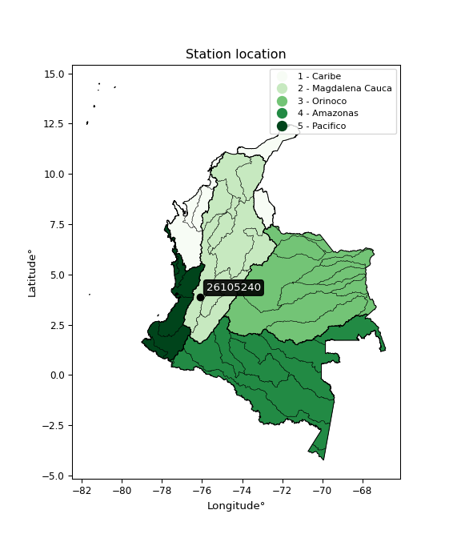

<div align="center">


</div>

# PMax24h Station (Rain, Pmax24h): 26105240

Maximum Precipitation in 24 hours (PMax24h) is the greatest amount of rainfall for a specific duration that is meteorologically possible for a given location, acting as a "worst-case" scenario for extreme storms, crucial for designing safety-critical infrastructure like bridges, river deviations, dams, spillways, and nuclear plants to prevent catastrophic failure. The PMax24h is related with the Probable Maximum Precipitation (PMP) and it is calculated by hydrologists using meteorological data to determine the upper limit of extreme rainfall, often leading to the Probable Maximum Flood (PMF) for flood control design, and is increasingly being studied for climate change impacts. Probable Maximum Precipitation (PMP) is the theoretical upper limit of rainfall, a deterministic estimate for extreme events, while probability distributions (like GEV, Gumbel) describe the likelihood and frequency of various precipitation amounts, including rare ones, showing how often events occur, with PMP representing the extreme end of these distributions, used for critical infrastructure design to ensure safety against the worst conceivable weather, unlike standard statistical forecasts which cover typical probabilities.

The most common probability distributions in hydrology, used for analyzing floods, rainfall, and streamflow, include the Normal, Log-Normal, Gumbel, Gamma (including Log-Pearson Type III), and Generalized Extreme Value (GEV) distributions, often chosen based on the data´s skewness and whether modeling extremes or general conditions, with Gumbel and GEV popular for extreme events like floods, while the Normal distribution serves as a baseline, though often requiring transformations for skewed hydrological data. These distributions help in designing water infrastructure, managing water resources, and forecasting hydrologic events.

> Hydrological data often isn´t perfectly normal (it´s skewed), so different distributions are needed for different applications, such as: **Flood Frequency Analysis**: Using Gumbel, GEV, or Log-Pearson Type III for predicting extreme flood magnitudes and their return periods, **Rainfall Analysis**: Normal for annual totals, but Log-Normal, Weibull, or GEV for intensity or extreme daily rainfall, **Streamflow Modeling**: Gamma and Log-Normal for maximum flows, GEV for minimum flows, and Kappa for daily flows.

<div align="center">

</img>

</div>


## A. General information


### 1. General running parameters

• app_version: _v20260225_. • runtime: _2026-02-27 14:50:08.749431_. • Python version: _3.14.0_. • SciPy version: _1.16.3_. • Pandas version: _2.3.3_. • NumPy version: _2.3.5_. • Stations dataset (station_dataset_file): _dataset/pmax24h_in/automatic_colombia_2003_2025.csv_. • Stations catalog (station_catalog_file): _dataset/CNE.xls_. • Minimum year to eval til year_max (date_min): _1900_. • Maximum year to eval since year_min (date_max): _2025_. • Creates, save and include plots into reports (create_plot): _False_. • Plot only fit distributions with Δo > Δ (plot_only_fit): _True_. • Plot only simple graphs avoiding multiple CDFs and multiple Extreme values plots (plot_only_simple): _False_. • Eval low extreme values, if False, evaluates high extreme values (low_extreme): _False_. • Eval every SciPy distribution as logarithmic (pdist_logarithmic_on): _True_. • Standard deviation normalized (ddof): _1.0_. • Return periods to eval in years (Tr): _[2, 2.33, 5, 10, 15, 20, 25, 50, 75, 100, 200, 250, 500, 750, 1000]_. • Minimum data sample per station, 0 means any (minimum_sample): _5_. • Z-Score maximum threshold to adjust a value, 0 means disable (zscore_max): _3.5_. • Z-Score minimum threshold to adjust a value, 0 means disable (zscore_min): _-2.5_. • Avoid zeros, e.g. rain = 0 (avoid_zeros): _True_. • Avoid null values (avoid_nans): _True_. 

:file_folder:Table: [dataset.csv](../../dataset/pmax24h_in/automatic_colombia_2003_2025.csv)

> Delta Degrees of Freedom (DDOF): is a parameter used in the formulas for calculating variance and standard deviation. When ddof=0, the divisor is $N$ (the total number of observations) and this is used when your data set is the entire population. When ddof=1, the divisor is $N-1$ and this is used when your data set is a sample drawn from a larger population. Using $N-1$ provides an unbiased estimate of the population variance (known as Bessel´s correction).


### 2. Station info and location

|   id |   CODIGO | NOMBRE                     | CATEGORIA               | TECNOLOGIA                | ESTADO           | FECHA_INSTALACION   |   FECHA_SUSPENSION |   ALTITUD |   LATITUD |   LONGITUD | DEPARTAMENTO    | MUNICIPIO   | AREA_OPERATIVA                         | ENTIDAD                                                     | AREA_HIDROGRAFICA   | ZONA_HIDROGRAFICA   | SUBZONA_HIDROGRAFICA   |   CORRIENTE | Catalogo   |   Version |
|-----:|---------:|:---------------------------|:------------------------|:--------------------------|:-----------------|:--------------------|-------------------:|----------:|----------:|-----------:|:----------------|:------------|:---------------------------------------|:------------------------------------------------------------|:--------------------|:--------------------|:-----------------------|------------:|:-----------|----------:|
|    0 | 26105240 | EL PLACER - AUT [26105240] | Climatológica Principal | Automática con Telemetría | En Mantenimiento | 30/06/2005          |                nan |      2200 |   3.87911 |   -76.1006 | Valle Del Cauca | Buga        | Area Operativa 09 - Cauca-Valle-Caldas | INSTITUTO DE HIDROLOGIA METEOROLOGIA Y ESTUDIOS AMBIENTALES | Magdalena Cauca     | Cauca               | Ríos Tulua y Morales   |         nan | CNE_IDEAM  |  20251226 |

<div align="center">

Dynamic map: [:earth_americas:Google](http://maps.google.com/maps?q=3.879111111,-76.100555556) [:earth_americas:OSM](https://www.openstreetmap.org/#map=18/3.879111111/-76.100555556&layers=P) [:earth_americas:Bing](https://www.bing.com/maps?cp=3.879111111~-76.100555556&lvl=18) [:earth_americas:Apple](https://maps.apple.com/frame?center=3.879111111%2C-76.100555556&span=0.003%2C0.006)

</div>


<div align="center">

```geojson
{
  "type": "Feature",
  "geometry": {
    "type": "Point", 
    "coordinates": [-76.100555556, 3.879111111]
  }, 
  "properties": {
    "Name": "26105240"
  }
}
```

</div>


### 3. Discrete values table and plot

<div align="center">

|               |           0 |           1 |           2 |          3 |          4 |
|:--------------|------------:|------------:|------------:|-----------:|-----------:|
| Date          | 2017        | 2018        | 2019        | 2020       | 2025       |
| Value         |   48.6      |   52.6      |   35.3      |   21.7     |   73.6     |
| Value_initial |   48.6      |   52.6      |   35.3      |   21.7     |   73.6     |
| count         |    5        |    5        |    5        |    5       |    5       |
| mean          |   46.36     |   46.36     |   46.36     |   46.36    |   46.36    |
| std           |   19.4706   |   19.4706   |   19.4706   |   19.4706  |   19.4706  |
| zscore        |    0.115045 |    0.320484 |   -0.568037 |   -1.26653 |    1.39903 |


</div>


> The initial value (value_initial) correspond to the initial obtained or null completed value, and value (value) is adjusted only when the initial value is outside the valid range (outlier) definite through the Z-Score value. If Z-Score is active, values out of range or outliers are replaced with the station mean value. A Z-Score (or standard score) measures how many standard deviations a data point is from the mean of a dataset, indicating its relative position; positive scores mean above the mean, negative mean below, and a score of zero is exactly at the mean, allowing for comparison of values from different distributions. It´s calculated using the formula $z=(x–μ)/σ$, where $x$ is the data point, $μ$ is the mean, and $σ$ is the standard deviation, helping identify outliers and understand probability.
>
> <sub>**Note**: In this study, "completing" (filling gaps in) and "extending" (forecasting or lengthening the historical record) rainfall data series are avoided for certain critical analyses because they introduce artificial bias and uncertainty, which can distort the statistics of rare events (extremes), alter day-to-day variability, and compromise the integrity and homogeneity of the original data. Some reasons against Completing/Extending rainfall data are: **Distortion of Extremes and Variability**: The primary issue is that most gap-filling or extension methods rely on averaging or regression with nearby stations, which inherently smooths the data. Rainfall is highly variable in space and time, with a large percentage of zero values and occasional large storms. Infilling methods often underestimate the highest values and overestimate the lowest (zero) values, which severely distorts analyses focused on flood frequency, drought severity, and intensity-duration-frequency (IDF) curves, **Loss of Data Homogeneity**: Infilled or extended data are synthetic estimates, not actual measurements. Combining these estimates with observed data can violate the assumption of data homogeneity, which requires that the data properties do not change over time. Inhomogeneity can lead to incorrect conclusions about long-term trends or changes in climate patterns, **Propagation of Errors**: Errors and biases from the original data (e.g., wind-induced undercatch, instrument errors, site changes) or the data used for imputation can propagate through the analysis, leading to unreliable hydrological models and inaccurate predictions, **Compromised Statistical Integrity**: For statistical analyses, especially those involving the frequency of events, using artificial data can introduce time bias or autocorrelation that doesn´t exist in reality, making it difficult to assess the true probability of events, **Difficulty in Validation**: It is difficult to accurately validate the quality of filled or extended data, especially for past periods where ground-truth measurements are unavailable. The reliability of imputation techniques heavily depends on the density of the surrounding station network and the complexity of the local topography.</sub>


### 4. Active continuous probability distributions from SciPy (80 of 104 available)

A Probability Density Function (PDF) describes the relative likelihood of a continuous random variable falling within a specific range, where the total area under its curve equals 1, and the area over any interval gives the actual probability for that range. Unlike discrete probabilities (like rolling a die), a PDF shows density, not direct probability for a single point (which is zero), with higher points indicating higher likelihood, often visualized as a bell curve for normal distributions.

A log of a probability density function (log-PDF) is simply the logarithm of the PDF´s value, denoted as $log(f(x))$, useful for converting multiplication of probabilities into addition, improving numerical stability with tiny numbers, and connecting to information theory concepts like entropy. Instead of dealing with very small probabilities (e.g., 0.000001), log-PDFs use negative numbers (e.g., $log(0.00001) ≈ -11.51$ that are easier for computers to handle, preventing underflow errors and simplifying complex calculations. In this study, each active probability distribution from SciPy is also evaluated in the $log$ form.

[scipy.stats](https://docs.scipy.org/doc/scipy/reference/stats.html) is a Python´s powerful submodule within the SciPy library for comprehensive statistical analysis, offering over 130 probability distributions (like Normal, Poisson, etc.), functions for descriptive stats (mean, variance), hypothesis testing (t-tests, chi-square), random variable generation, and statistical tests, making it essential for data science, modeling, and research. It provides tools to explore, model, and draw conclusions from data efficiently, working seamlessly with [NumPy](https://numpy.org/).

<div align="center">

|   id | p_dist           |   n_parameter | fit_method   | label                                                                       | active   | ref                                                                                                      |
|-----:|:-----------------|--------------:|:-------------|:----------------------------------------------------------------------------|:---------|:---------------------------------------------------------------------------------------------------------|
|    0 | alpha            |             3 | MLE          | Alpha                                                                       | True     | [:mortar_board:](https://docs.scipy.org/doc/scipy/reference/generated/scipy.stats.alpha.html)            |
|    1 | anglit           |             2 | MM           | Anglit                                                                      | True     | [:mortar_board:](https://docs.scipy.org/doc/scipy/reference/generated/scipy.stats.anglit.html)           |
|    2 | arcsine          |             2 | MM           | Arcsine                                                                     | True     | [:mortar_board:](https://docs.scipy.org/doc/scipy/reference/generated/scipy.stats.arcsine.html)          |
|    3 | argus            |             3 | MLE          | Argus                                                                       | True     | [:mortar_board:](https://docs.scipy.org/doc/scipy/reference/generated/scipy.stats.argus.html)            |
|    4 | beta             |             4 | MLE          | Beta                                                                        | True     | [:mortar_board:](https://docs.scipy.org/doc/scipy/reference/generated/scipy.stats.beta.html)             |
|    5 | betaprime        |             4 | MLE          | Beta prime                                                                  | True     | [:mortar_board:](https://docs.scipy.org/doc/scipy/reference/generated/scipy.stats.betaprime.html)        |
|    6 | bradford         |             3 | MLE          | Bradford                                                                    | True     | [:mortar_board:](https://docs.scipy.org/doc/scipy/reference/generated/scipy.stats.bradford.html)         |
|    7 | burr             |             4 | MLE          | Burr (Type III)                                                             | True     | [:mortar_board:](https://docs.scipy.org/doc/scipy/reference/generated/scipy.stats.burr.html)             |
|    8 | burr12           |             4 | MLE          | Burr (Type III) 12                                                          | True     | [:mortar_board:](https://docs.scipy.org/doc/scipy/reference/generated/scipy.stats.burr12.html)           |
|    9 | cosine           |             2 | MLE          | Cosine                                                                      | True     | [:mortar_board:](https://docs.scipy.org/doc/scipy/reference/generated/scipy.stats.cosine.html)           |
|   10 | crystalball      |             4 | MLE          | Crystalball                                                                 | True     | [:mortar_board:](https://docs.scipy.org/doc/scipy/reference/generated/scipy.stats.crystalball.html)      |
|   11 | dgamma           |             3 | MLE          | Double gamma                                                                | True     | [:mortar_board:](https://docs.scipy.org/doc/scipy/reference/generated/scipy.stats.dgamma.html)           |
|   12 | dweibull         |             3 | MLE          | Double Weibull                                                              | True     | [:mortar_board:](https://docs.scipy.org/doc/scipy/reference/generated/scipy.stats.dweibull.html)         |
|   13 | erlang           |             3 | MLE          | Erlang                                                                      | True     | [:mortar_board:](https://docs.scipy.org/doc/scipy/reference/generated/scipy.stats.erlang.html)           |
|   14 | exponnorm        |             3 | MLE          | Exponentially modified Normal                                               | True     | [:mortar_board:](https://docs.scipy.org/doc/scipy/reference/generated/scipy.stats.exponnorm.html)        |
|   15 | exponpow         |             3 | MLE          | Exponential power                                                           | True     | [:mortar_board:](https://docs.scipy.org/doc/scipy/reference/generated/scipy.stats.exponpow.html)         |
|   16 | exponweib        |             4 | MLE          | Exponentiated Weibull                                                       | True     | [:mortar_board:](https://docs.scipy.org/doc/scipy/reference/generated/scipy.stats.exponweib.html)        |
|   17 | f                |             4 | MLE          | F                                                                           | True     | [:mortar_board:](https://docs.scipy.org/doc/scipy/reference/generated/scipy.stats.f.html)                |
|   18 | fatiguelife      |             3 | MLE          | Fatigue-life (Birnbaum-Saunders)                                            | True     | [:mortar_board:](https://docs.scipy.org/doc/scipy/reference/generated/scipy.stats.fatiguelife.html)      |
|   19 | foldnorm         |             3 | MM           | Fold Normal                                                                 | True     | [:mortar_board:](https://docs.scipy.org/doc/scipy/reference/generated/scipy.stats.foldnorm.html)         |
|   20 | gamma            |             3 | MLE          | Gamma                                                                       | True     | [:mortar_board:](https://docs.scipy.org/doc/scipy/reference/generated/scipy.stats.gamma.html)            |
|   21 | gausshyper       |             6 | MLE          | Gauss hypergeometric                                                        | True     | [:mortar_board:](https://docs.scipy.org/doc/scipy/reference/generated/scipy.stats.gausshyper.html)       |
|   22 | genexpon         |             5 | MLE          | Generalized exponential                                                     | True     | [:mortar_board:](https://docs.scipy.org/doc/scipy/reference/generated/scipy.stats.genexpon.html)         |
|   23 | genextreme       |             3 | MLE          | Generalized exponential                                                     | True     | [:mortar_board:](https://docs.scipy.org/doc/scipy/reference/generated/scipy.stats.genextreme.html)       |
|   24 | gengamma         |             4 | MLE          | Generalized gamma                                                           | True     | [:mortar_board:](https://docs.scipy.org/doc/scipy/reference/generated/scipy.stats.gengamma.html)         |
|   25 | genhalflogistic  |             3 | MLE          | Generalized half-logistic                                                   | True     | [:mortar_board:](https://docs.scipy.org/doc/scipy/reference/generated/scipy.stats.genhalflogistic.html)  |
|   26 | genlogistic      |             3 | MLE          | Generalized logistic                                                        | True     | [:mortar_board:](https://docs.scipy.org/doc/scipy/reference/generated/scipy.stats.genlogistic.html)      |
|   27 | gennorm          |             3 | MLE          | Generalized Normal                                                          | True     | [:mortar_board:](https://docs.scipy.org/doc/scipy/reference/generated/scipy.stats.gennorm.html)          |
|   28 | genpareto        |             3 | MLE          | Generalized Pareto                                                          | True     | [:mortar_board:](https://docs.scipy.org/doc/scipy/reference/generated/scipy.stats.genpareto.html)        |
|   29 | gompertz         |             3 | MLE          | Gompertz (or truncated Gumbel)                                              | True     | [:mortar_board:](https://docs.scipy.org/doc/scipy/reference/generated/scipy.stats.gompertz.html)         |
|   30 | gumbel_l         |             2 | MM           | Gumbel Left Skew                                                            | True     | [:mortar_board:](https://docs.scipy.org/doc/scipy/reference/generated/scipy.stats.gumbel_l.html)         |
|   31 | gumbel_r         |             2 | MM           | Gumbel Right Skew                                                           | True     | [:mortar_board:](https://docs.scipy.org/doc/scipy/reference/generated/scipy.stats.gumbel_r.html)         |
|   32 | halfgennorm      |             3 | MLE          | Upper half of a generalized normal                                          | True     | [:mortar_board:](https://docs.scipy.org/doc/scipy/reference/generated/scipy.stats.halfgennorm.html)      |
|   33 | halflogistic     |             2 | MM           | Half-logistic                                                               | True     | [:mortar_board:](https://docs.scipy.org/doc/scipy/reference/generated/scipy.stats.halflogistic.html)     |
|   34 | halfnorm         |             2 | MM           | Half Normal                                                                 | True     | [:mortar_board:](https://docs.scipy.org/doc/scipy/reference/generated/scipy.stats.halfnorm.html)         |
|   35 | hypsecant        |             2 | MM           | hyperbolic secant                                                           | True     | [:mortar_board:](https://docs.scipy.org/doc/scipy/reference/generated/scipy.stats.hypsecant.html)        |
|   36 | invgamma         |             3 | MLE          | Inverted gamma                                                              | True     | [:mortar_board:](https://docs.scipy.org/doc/scipy/reference/generated/scipy.stats.invgamma.html)         |
|   37 | invgauss         |             3 | MLE          | Inverse Gaussian                                                            | True     | [:mortar_board:](https://docs.scipy.org/doc/scipy/reference/generated/scipy.stats.invgauss.html)         |
|   38 | invweibull       |             3 | MLE          | Inverted Weibull                                                            | True     | [:mortar_board:](https://docs.scipy.org/doc/scipy/reference/generated/scipy.stats.invweibull.html)       |
|   39 | johnsonsb        |             4 | MLE          | Johnson SB                                                                  | True     | [:mortar_board:](https://docs.scipy.org/doc/scipy/reference/generated/scipy.stats.johnsonsb.html)        |
|   40 | johnsonsu        |             4 | MLE          | Johnson Su                                                                  | True     | [:mortar_board:](https://docs.scipy.org/doc/scipy/reference/generated/scipy.stats.johnsonsu.html)        |
|   41 | kappa3           |             3 | MLE          | Kappa 3                                                                     | True     | [:mortar_board:](https://docs.scipy.org/doc/scipy/reference/generated/scipy.stats.kappa3.html)           |
|   42 | kappa4           |             4 | MLE          | Kappa 4                                                                     | True     | [:mortar_board:](https://docs.scipy.org/doc/scipy/reference/generated/scipy.stats.kappa4.html)           |
|   43 | ksone            |             3 | MLE          | Kolmogorov-Smirnov one-sided test statistic distribution                    | True     | [:mortar_board:](https://docs.scipy.org/doc/scipy/reference/generated/scipy.stats.ksone.html)            |
|   44 | kstwobign        |             2 | MLE          | Limiting distribution of scaled Kolmogorov-Smirnov two-sided test statistic | True     | [:mortar_board:](https://docs.scipy.org/doc/scipy/reference/generated/scipy.stats.kstwobign.html)        |
|   45 | laplace          |             2 | MM           | Laplace                                                                     | True     | [:mortar_board:](https://docs.scipy.org/doc/scipy/reference/generated/scipy.stats.laplace.html)          |
|   46 | levy_l           |             2 | MLE          | Left-skewed Levy                                                            | True     | [:mortar_board:](https://docs.scipy.org/doc/scipy/reference/generated/scipy.stats.levy_l.html)           |
|   47 | loggamma         |             3 | MLE          | Log gamma                                                                   | True     | [:mortar_board:](https://docs.scipy.org/doc/scipy/reference/generated/scipy.stats.loggamma.html)         |
|   48 | logistic         |             2 | MM           | Logistic (or Sech-squared)                                                  | True     | [:mortar_board:](https://docs.scipy.org/doc/scipy/reference/generated/scipy.stats.logistic.html)         |
|   49 | loglaplace       |             3 | MLE          | Log-Laplace                                                                 | True     | [:mortar_board:](https://docs.scipy.org/doc/scipy/reference/generated/scipy.stats.loglaplace.html)       |
|   50 | lomax            |             3 | MLE          | Lomax (Pareto of the second kind)                                           | True     | [:mortar_board:](https://docs.scipy.org/doc/scipy/reference/generated/scipy.stats.lomax.html)            |
|   51 | maxwell          |             2 | MM           | Maxwell                                                                     | True     | [:mortar_board:](https://docs.scipy.org/doc/scipy/reference/generated/scipy.stats.maxwell.html)          |
|   52 | mielke           |             4 | MLE          | Mielke Beta-Kappa / Dagum                                                   | True     | [:mortar_board:](https://docs.scipy.org/doc/scipy/reference/generated/scipy.stats.mielke.html)           |
|   53 | moyal            |             2 | MM           | Moyal                                                                       | True     | [:mortar_board:](https://docs.scipy.org/doc/scipy/reference/generated/scipy.stats.moyal.html)            |
|   54 | nakagami         |             3 | MLE          | Nakagami                                                                    | True     | [:mortar_board:](https://docs.scipy.org/doc/scipy/reference/generated/scipy.stats.nakagami.html)         |
|   55 | ncf              |             5 | MLE          | Non-central F distribution                                                  | True     | [:mortar_board:](https://docs.scipy.org/doc/scipy/reference/generated/scipy.stats.ncf.html)              |
|   56 | nct              |             4 | MLE          | Non-central Student’s t                                                     | True     | [:mortar_board:](https://docs.scipy.org/doc/scipy/reference/generated/scipy.stats.nct.html)              |
|   57 | norm             |             2 | MM           | Normal                                                                      | True     | [:mortar_board:](https://docs.scipy.org/doc/scipy/reference/generated/scipy.stats.norm.html)             |
|   58 | pearson3         |             3 | MM           | Pearson type III                                                            | True     | [:mortar_board:](https://docs.scipy.org/doc/scipy/reference/generated/scipy.stats.pearson3.html)         |
|   59 | powerlaw         |             3 | MLE          | Power-function                                                              | True     | [:mortar_board:](https://docs.scipy.org/doc/scipy/reference/generated/scipy.stats.powerlaw.html)         |
|   60 | rayleigh         |             2 | MM           | Rayleigh                                                                    | True     | [:mortar_board:](https://docs.scipy.org/doc/scipy/reference/generated/scipy.stats.rayleigh.html)         |
|   61 | rdist            |             3 | MLE          | R-distributed (symmetric beta)                                              | True     | [:mortar_board:](https://docs.scipy.org/doc/scipy/reference/generated/scipy.stats.rdist.html)            |
|   62 | rice             |             3 | MLE          | Rice                                                                        | True     | [:mortar_board:](https://docs.scipy.org/doc/scipy/reference/generated/scipy.stats.rice.html)             |
|   63 | semicircular     |             2 | MM           | Semicircular                                                                | True     | [:mortar_board:](https://docs.scipy.org/doc/scipy/reference/generated/scipy.stats.semicircular.html)     |
|   64 | skewnorm         |             3 | MLE          | Skew normal                                                                 | True     | [:mortar_board:](https://docs.scipy.org/doc/scipy/reference/generated/scipy.stats.skewnorm.html)         |
|   65 | t                |             3 | MLE          | Student’s t                                                                 | True     | [:mortar_board:](https://docs.scipy.org/doc/scipy/reference/generated/scipy.stats.t.html)                |
|   66 | trapezoid        |             4 | MLE          | Trapezoid                                                                   | True     | [:mortar_board:](https://docs.scipy.org/doc/scipy/reference/generated/scipy.stats.trapezoid.html)        |
|   67 | triang           |             3 | MLE          | Triangular                                                                  | True     | [:mortar_board:](https://docs.scipy.org/doc/scipy/reference/generated/scipy.stats.triang.html)           |
|   68 | truncexpon       |             3 | MLE          | Truncated exponential                                                       | True     | [:mortar_board:](https://docs.scipy.org/doc/scipy/reference/generated/scipy.stats.truncexpon.html)       |
|   69 | truncnorm        |             4 | MLE          | Truncated normal                                                            | True     | [:mortar_board:](https://docs.scipy.org/doc/scipy/reference/generated/scipy.stats.truncnorm.html)        |
|   70 | truncpareto      |             4 | MLE          | Upper truncated Pareto                                                      | True     | [:mortar_board:](https://docs.scipy.org/doc/scipy/reference/generated/scipy.stats.truncpareto.html)      |
|   71 | truncweibull_min |             5 | MLE          | Doubly truncated Weibull minimum                                            | True     | [:mortar_board:](https://docs.scipy.org/doc/scipy/reference/generated/scipy.stats.truncweibull_min.html) |
|   72 | tukeylambda      |             3 | MLE          | Tukey-Lamdba                                                                | True     | [:mortar_board:](https://docs.scipy.org/doc/scipy/reference/generated/scipy.stats.tukeylambda.html)      |
|   73 | uniform          |             2 | MLE          | Uniform                                                                     | True     | [:mortar_board:](https://docs.scipy.org/doc/scipy/reference/generated/scipy.stats.uniform.html)          |
|   74 | vonmises         |             3 | MLE          | Von Mises                                                                   | True     | [:mortar_board:](https://docs.scipy.org/doc/scipy/reference/generated/scipy.stats.vonmises.html)         |
|   75 | vonmises_line    |             3 | MLE          | Von Mises line                                                              | True     | [:mortar_board:](https://docs.scipy.org/doc/scipy/reference/generated/scipy.stats.vonmises_line.html)    |
|   76 | wald             |             2 | MM           | Wald                                                                        | True     | [:mortar_board:](https://docs.scipy.org/doc/scipy/reference/generated/scipy.stats.wald.html)             |
|   77 | weibull_max      |             3 | MLE          | Weibull maximum                                                             | True     | [:mortar_board:](https://docs.scipy.org/doc/scipy/reference/generated/scipy.stats.weibull_max.html)      |
|   78 | weibull_min      |             3 | MLE          | Weibull minimum                                                             | True     | [:mortar_board:](https://docs.scipy.org/doc/scipy/reference/generated/scipy.stats.weibull_min.html)      |
|   79 | wrapcauchy       |             3 | MLE          | Wrapped  Cauchy                                                             | True     | [:mortar_board:](https://docs.scipy.org/doc/scipy/reference/generated/scipy.stats.wrapcauchy.html)       |

</div>

> **n_parameter:** # arguments & localization & scale.
>
> **Fit methods:** (MLE) maximum likelihood, (MM) L-moments.
>
>**Inactive** (With the only purpose of prevent loops, zero divisions, infinite values, over high estimated values or horizontal trending for recurrence intervals estimations, the follow distributions were disabled.)**:** lognorm, norminvgauss, powernorm, powerlognorm, cauchy, halfcauchy, foldcauchy, skewcauchy, chi2, expon, fisk, genhyperbolic, geninvgauss, gibrat, kstwo, laplace_asymmetric, levy, levy_stable, ncx2, pareto, rel_breitwigner, recipinvgauss, studentized_range, loguniform, 


## B. Probability (PDF) vs. Empirical (EDF) distributions functions

A continuous probability distribution (CPD) describes probabilities for variables that can take any value within a range (like rain any time), unlike discrete variables with specific outcomes (like temperature). It uses a Probability Density Function (PDF), a curve where the total area under it equals 1, and the probability of the variable falling within an interval (a to b) is found by calculating the area under the curve between those points. A key feature is that the probability of hitting any single exact value is zero, so probabilities are always expressed for ranges, e.g., $P(a ≤ X ≤ b)$.

<div align="center">

Distributions parameters from station values
|     |   station | p_dist              |   n |             loc |          scale | shape                  | shape1                | shape2                 | shape3             |
|----:|----------:|:--------------------|----:|----------------:|---------------:|:-----------------------|:----------------------|:-----------------------|:-------------------|
|   0 |  26105240 | alpha               |   5 |  -215.03        | 3923.97        | 15.080625408269007     |                       |                        |                    |
|   1 |  26105240 | anglit              |   5 |    46.36        |   50.9458      |                        |                       |                        |                    |
|   2 |  26105240 | arcsine             |   5 |    21.7315      |   49.2571      |                        |                       |                        |                    |
|   3 |  26105240 | argus               |   5 |     7.39604     |   69.9811      | 1.3211861432103356e-06 |                       |                        |                    |
|   4 |  26105240 | beta                |   5 |    21.7         |   56.1836      | 0.7507443564531213     | 1.1938002282330036    |                        |                    |
|   5 |  26105240 | betaprime           |   5 |   -11.1125      | 2792.91        | 10.793804797483215     | 526.2386797987898     |                        |                    |
|   6 |  26105240 | bradford            |   5 |    21.7         |   51.9         | 1.055849804249502      |                       |                        |                    |
|   7 |  26105240 | burr                |   5 |    21.6971      |   50.0323      | 10.048499968884029     | 0.05637977009377414   |                        |                    |
|   8 |  26105240 | burr12              |   5 |    -3.91964     |   25.4459      | 637.1604840911809      | 0.0025510881500814546 |                        |                    |
|   9 |  26105240 | cosine              |   5 |    46.7939      |   14.398       |                        |                       |                        |                    |
|  10 |  26105240 | crystalball         |   5 |    46.36        |   17.415       | 3119.3427541738506     | 3604.9468454579246    |                        |                    |
|  11 |  26105240 | dgamma              |   5 |    48.6         |   12.9653      | 0.8818349365100508     |                       |                        |                    |
|  12 |  26105240 | dweibull            |   5 |    48.6         |   16.7433      | 0.794067657268798      |                       |                        |                    |
|  13 |  26105240 | erlang              |   5 |   -52.2078      |    3.09208     | 31.87304002960228      |                       |                        |                    |
|  14 |  26105240 | exponnorm           |   5 |    43.5241      |   17.1828      | 0.16504595092664537    |                       |                        |                    |
|  15 |  26105240 | exponpow            |   5 |    21.7         |   37.9508      | 0.9916195969083167     |                       |                        |                    |
|  16 |  26105240 | exponweib           |   5 |    21.7         |    1.02662     | 1.3207358506459705     | 0.2212354162743589    |                        |                    |
|  17 |  26105240 | f                   |   5 |    -4.97525     |   51.3291      | 16.25840744941346      | 101469.20859335613    |                        |                    |
|  18 |  26105240 | fatiguelife         |   5 |    21.7         |    6.97138e-06 | 1834.4738421008356     |                       |                        |                    |
|  19 |  26105240 | foldnorm            |   5 |     8.57289     |   17.9144      | 2.096247736956646      |                       |                        |                    |
|  20 |  26105240 | gamma               |   5 |   -73.5687      |    2.52881     | 47.38874685188668      |                       |                        |                    |
|  21 |  26105240 | gausshyper          |   5 |    21.7         |   53.3854      | 0.9241054338123639     | 0.9636910964757397    | 1.0580894086030201     | 1.0709223031745858 |
|  22 |  26105240 | genexpon            |   5 |    21.7         |    4.50441     | 0.1553127011487075     | 0.03711160462495939   | 0.42043901097169023    |                    |
|  23 |  26105240 | genextreme          |   5 |    22.4702      |    4.96964     | -6.4527694933061905    |                       |                        |                    |
|  24 |  26105240 | gengamma            |   5 |    21.7         |    1.15442     | 1.2475050988791225     | 0.30210479260128953   |                        |                    |
|  25 |  26105240 | genhalflogistic     |   5 |    16.5454      |   59.8808      | 1.0495354480744492     |                       |                        |                    |
|  26 |  26105240 | genlogistic         |   5 |   -40.3968      |   15.3384      | 164.27980622825066     |                       |                        |                    |
|  27 |  26105240 | gennorm             |   5 |    48.6         |   13.1483      | 0.9728685083818873     |                       |                        |                    |
|  28 |  26105240 | genpareto           |   5 |    -0.138385    |  111.123       | -1.5069841780912756    |                       |                        |                    |
|  29 |  26105240 | gompertz            |   5 |    21.7         |   32.0298      | 0.6642446560090449     |                       |                        |                    |
|  30 |  26105240 | gumbel_l            |   5 |    54.1977      |   13.5784      |                        |                       |                        |                    |
|  31 |  26105240 | gumbel_r            |   5 |    38.5223      |   13.5784      |                        |                       |                        |                    |
|  32 |  26105240 | halfgennorm         |   5 |    21.7         |    1.1317      | 0.36520120372446796    |                       |                        |                    |
|  33 |  26105240 | halflogistic        |   5 |    25.7192      |   14.8892      |                        |                       |                        |                    |
|  34 |  26105240 | halfnorm            |   5 |    23.3093      |   28.8897      |                        |                       |                        |                    |
|  35 |  26105240 | hypsecant           |   5 |    46.36        |   11.0867      |                        |                       |                        |                    |
|  36 |  26105240 | invgamma            |   5 |   -97.7053      | 9766.51        | 68.78083137174562      |                       |                        |                    |
|  37 |  26105240 | invgauss            |   5 |   -34.7132      | 1634.52        | 0.049548741692521575   |                       |                        |                    |
|  38 |  26105240 | invweibull          |   5 |    21.7         |    1.69667     | 0.0686977690039755     |                       |                        |                    |
|  39 |  26105240 | johnsonsb           |   5 |    21.7         |   51.9039      | 0.1883455699622627     | 0.13968967208935806   |                        |                    |
|  40 |  26105240 | johnsonsu           |   5 |   -84.7497      |   37.6758      | -15.238196753320963    | 7.805143118626788     |                        |                    |
|  41 |  26105240 | kappa3              |   5 |    21.7         |   51.8923      | 10660.59742736863      |                       |                        |                    |
|  42 |  26105240 | kappa4              |   5 |    16.6283      |   59.1436      | 1.0939660552426569     | 1.0375961403875755    |                        |                    |
|  43 |  26105240 | ksone               |   5 |    16.1963      |   60.3273      | 1.0                    |                       |                        |                    |
|  44 |  26105240 | kstwobign           |   5 |   -15.8175      |   71.0868      |                        |                       |                        |                    |
|  45 |  26105240 | laplace             |   5 |    46.36        |   12.3143      |                        |                       |                        |                    |
|  46 |  26105240 | levy_l              |   5 |    76.128       |    9.66636     |                        |                       |                        |                    |
|  47 |  26105240 | loggamma            |   5 | -4430.06        |  626.192       | 1272.8939946345        |                       |                        |                    |
|  48 |  26105240 | logistic            |   5 |    46.36        |    9.6014      |                        |                       |                        |                    |
|  49 |  26105240 | loglaplace          |   5 |    -0.188828    |   48.7888      | 3.1011081529042412     |                       |                        |                    |
|  50 |  26105240 | lomax               |   5 |    21.7         |  579.991       | 23.511059167235672     |                       |                        |                    |
|  51 |  26105240 | maxwell             |   5 |     5.09375     |   25.8598      |                        |                       |                        |                    |
|  52 |  26105240 | mielke              |   5 |    -0.483856    |   60.588       | 2.529858664994684      | 7.300468264067863     |                        |                    |
|  53 |  26105240 | moyal               |   5 |    36.401       |    7.83951     |                        |                       |                        |                    |
|  54 |  26105240 | nakagami            |   5 |    35.3         |   15.9104      | 0.14608355949725577    |                       |                        |                    |
|  55 |  26105240 | ncf                 |   5 |    -0.387034    |    1.06635e-06 | 8.077946136246652e-07  | 62.1122639569291      | 34.3763381189478       |                    |
|  56 |  26105240 | nct                 |   5 |  -480.928       |   17.3716      | 93739.60697497724      | 30.35312163458189     |                        |                    |
|  57 |  26105240 | norm                |   5 |    46.36        |   17.415       |                        |                       |                        |                    |
|  58 |  26105240 | pearson3            |   5 |    46.36        |   17.415       | 0.15594413007436742    |                       |                        |                    |
|  59 |  26105240 | powerlaw            |   5 |    21.7         |   51.9         | 0.12583242058247351    |                       |                        |                    |
|  60 |  26105240 | rayleigh            |   5 |    13.0441      |   26.5823      |                        |                       |                        |                    |
|  61 |  26105240 | rdist               |   5 |    17.4824      |   31.1176      | 1.0250599895945265     |                       |                        |                    |
|  62 |  26105240 | rice                |   5 |    12.7158      |   21.5629      | 1.0424692760381193     |                       |                        |                    |
|  63 |  26105240 | semicircular        |   5 |    46.36        |   34.83        |                        |                       |                        |                    |
|  64 |  26105240 | skewnorm            |   5 |    29.3411      |   24.3501      | 1.7499219632526155     |                       |                        |                    |
|  65 |  26105240 | t                   |   5 |    46.3598      |   17.4157      | 4843591.493594977      |                       |                        |                    |
|  66 |  26105240 | trapezoid           |   5 |    16.51        |   62.28        | 1.0                    | 1.0                   |                        |                    |
|  67 |  26105240 | triang              |   5 |     3.32513     |   70.2749      | 0.999999999949913      |                       |                        |                    |
|  68 |  26105240 | truncexpon          |   5 |    21.6983      |   50.2117      | 1.0336573837878085     |                       |                        |                    |
|  69 |  26105240 | truncnorm           |   5 |    46.36        |   17.415       | -657.1280802128185     | 2274.0578148048457    |                        |                    |
|  70 |  26105240 | truncpareto         |   5 |   -66.2612      |   87.9612      | 1.511975976139206e-07  | 1.5900326112265826    |                        |                    |
|  71 |  26105240 | truncweibull_min    |   5 |    21.6201      |   53.4274      | 0.6495589179557164     | 0.0014948245394667636 | 0.9729058590922155     |                    |
|  72 |  26105240 | tukeylambda         |   5 |    47.6512      |   29.8475      | 1.1501401912889149     |                       |                        |                    |
|  73 |  26105240 | uniform             |   5 |    21.7         |   51.9         |                        |                       |                        |                    |
|  74 |  26105240 | vonmises            |   5 |    -2.59771     |    1           | 1.6566426546733097     |                       |                        |                    |
|  75 |  26105240 | vonmises_line       |   5 |    47.6738      |    8.26773     | 5.385542185264294e-05  |                       |                        |                    |
|  76 |  26105240 | wald                |   5 |    28.945       |   17.415       |                        |                       |                        |                    |
|  77 |  26105240 | weibull_max         |   5 |    73.6         |    1.53649     | 0.24807262953433018    |                       |                        |                    |
|  78 |  26105240 | weibull_min         |   5 |    17.5523      |   31.9007      | 1.5884107815349648     |                       |                        |                    |
|  79 |  26105240 | wrapcauchy          |   5 |    21.7         |    8.26016     | 0.039891059851997035   |                       |                        |                    |
|  80 |  26105240 | logalpha            |   5 |    -6.11703     |  229.463       | 23.279704798862504     |                       |                        |                    |
|  81 |  26105240 | loganglit           |   5 |     3.75724     |    1.20688     |                        |                       |                        |                    |
|  82 |  26105240 | logarcsine          |   5 |     3.17378     |    1.1669      |                        |                       |                        |                    |
|  83 |  26105240 | logargus            |   5 |     2.73031     |    1.6383      | 1.2640828585808874     |                       |                        |                    |
|  84 |  26105240 | logbeta             |   5 |     2.83845     |    1.46019     | 1.5090230123830155     | 0.8298670668945348    |                        |                    |
|  85 |  26105240 | logbetaprime        |   5 |    -8.24632     |   57.5809      | 983.8503204633712      | 4721.186729274499     |                        |                    |
|  86 |  26105240 | logbradford         |   5 |     3.07731     |    1.22134     | 1.0183124887315094     |                       |                        |                    |
|  87 |  26105240 | logburr             |   5 |     0.318302    |    3.86152     | 32.77234213028551      | 0.22366753695252584   |                        |                    |
|  88 |  26105240 | logburr12           |   5 |    -1.61096     |    8.33962     | 15.968892753279178     | 662.315351209875      |                        |                    |
|  89 |  26105240 | logcosine           |   5 |     3.73154     |    0.341602    |                        |                       |                        |                    |
|  90 |  26105240 | logcrystalball      |   5 |     3.75724     |    0.412553    | 4434.713466561779      | 57.21639429409596     |                        |                    |
|  91 |  26105240 | logdgamma           |   5 |     3.88362     |    0.261965    | 0.9204531128539489     |                       |                        |                    |
|  92 |  26105240 | logdweibull         |   5 |     3.88362     |    0.334668    | 0.6133742045207105     |                       |                        |                    |
|  93 |  26105240 | logerlang           |   5 |    -3.06414     |    0.0259289   | 262.8949927193687      |                       |                        |                    |
|  94 |  26105240 | logexponnorm        |   5 |     3.75691     |    0.412551    | 0.0007910615644325977  |                       |                        |                    |
|  95 |  26105240 | logexponpow         |   5 |     3.07731     |    1.1335      | 0.9096101720550743     |                       |                        |                    |
|  96 |  26105240 | logexponweib        |   5 |     3.07731     |    0.803791    | 0.2587294842581196     | 1.2856985263603748    |                        |                    |
|  97 |  26105240 | logf                |   5 |  -359.491       |  363.248       | 5047321.938963445      | 2229165.3957664925    |                        |                    |
|  98 |  26105240 | logfatiguelife      |   5 |  -102.339       |  106.096       | 0.003880439133149279   |                       |                        |                    |
|  99 |  26105240 | logfoldnorm         |   5 |     3.18941     |    0.518525    | 0.8935649500216906     |                       |                        |                    |
| 100 |  26105240 | loggamma            |   5 |    -2.51973     |    0.0277782   | 225.81689667832393     |                       |                        |                    |
| 101 |  26105240 | loggausshyper       |   5 |     2.99099     |    1.30766     | 1.1330315231475196     | 0.797948007583701     | 1.0972527508524244     | 1.094220666896309  |
| 102 |  26105240 | loggenexpon         |   5 |     3.0758      |    0.0265369   | 0.01871753497006374    | 5.700951248365994     | 0.0002009663319721624  |                    |
| 103 |  26105240 | loggenextreme       |   5 |     3.7434      |    0.602105    | 1.0843989506666964     |                       |                        |                    |
| 104 |  26105240 | loggengamma         |   5 |     3.07731     |    0.946914    | 0.3644911583959414     | 2.017358825820386     |                        |                    |
| 105 |  26105240 | loggenhalflogistic  |   5 |     2.99684     |    1.40632     | 1.0802856220823616     |                       |                        |                    |
| 106 |  26105240 | loggenlogistic      |   5 |     4.09964     |    0.137154    | 0.34092954053156677    |                       |                        |                    |
| 107 |  26105240 | loggennorm          |   5 |     3.88362     |    0.301484    | 0.9462858920996409     |                       |                        |                    |
| 108 |  26105240 | loggenpareto        |   5 |    -0.00159588  |    8.00697     | -1.8619820673649532    |                       |                        |                    |
| 109 |  26105240 | loggompertz         |   5 |     3.07731     |    1.03593     | 0.9763945400659322     |                       |                        |                    |
| 110 |  26105240 | loggumbel_l         |   5 |     3.94291     |    0.321667    |                        |                       |                        |                    |
| 111 |  26105240 | loggumbel_r         |   5 |     3.57157     |    0.321667    |                        |                       |                        |                    |
| 112 |  26105240 | loghalfgennorm      |   5 |     3.07731     |    1.22281     | 5977.0542940406085     |                       |                        |                    |
| 113 |  26105240 | loghalflogistic     |   5 |     3.26824     |    0.352733    |                        |                       |                        |                    |
| 114 |  26105240 | loghalfnorm         |   5 |     3.21119     |    0.684367    |                        |                       |                        |                    |
| 115 |  26105240 | loghypsecant        |   5 |     3.75724     |    0.26264     |                        |                       |                        |                    |
| 116 |  26105240 | loginvgamma         |   5 |    -5.36303     | 4325.45        | 475.3211690238795      |                       |                        |                    |
| 117 |  26105240 | loginvgauss         |   5 |     0.183031    |  248.183       | 0.014392835068560539   |                       |                        |                    |
| 118 |  26105240 | loginvweibull       |   5 |    -3.12857e+07 |    3.12857e+07 | 74805020.3464963       |                       |                        |                    |
| 119 |  26105240 | logjohnsonsb        |   5 |     3.07638     |    1.22227     | -1.3616375893083743    | 0.1693219835986109    |                        |                    |
| 120 |  26105240 | logjohnsonsu        |   5 |     4.8865      |    0.0819229   | 8.690551845350818      | 2.67442583226587      |                        |                    |
| 121 |  26105240 | logkappa3           |   5 |     3.07731     |    1.21941     | 1021.203419570289      |                       |                        |                    |
| 122 |  26105240 | logkappa4           |   5 |     2.99927     |    1.335       | 1.0621271660528455     | 1.027415939668229     |                        |                    |
| 123 |  26105240 | logksone            |   5 |     3.04267     |    1.42913     | 1.0                    |                       |                        |                    |
| 124 |  26105240 | logkstwobign        |   5 |     2.1046      |    1.88509     |                        |                       |                        |                    |
| 125 |  26105240 | loglaplace          |   5 |     3.75724     |    0.291719    |                        |                       |                        |                    |
| 126 |  26105240 | loglevy_l           |   5 |     4.3436      |    0.171723    |                        |                       |                        |                    |
| 127 |  26105240 | logloggamma         |   5 |     3.96407     |    0.334212    | 0.9751490070006368     |                       |                        |                    |
| 128 |  26105240 | loglogistic         |   5 |     3.75724     |    0.227453    |                        |                       |                        |                    |
| 129 |  26105240 | logloglaplace       |   5 |    -0.167226    |    4.05085     | 12.053597606327912     |                       |                        |                    |
| 130 |  26105240 | loglomax            |   5 |     3.07731     |   24.8472      | 36.879748301808945     |                       |                        |                    |
| 131 |  26105240 | logmaxwell          |   5 |     2.77966     |    0.612606    |                        |                       |                        |                    |
| 132 |  26105240 | logmielke           |   5 |     3.07731     |    1.37435     | 0.6405125315052445     | 32.34628293132177     |                        |                    |
| 133 |  26105240 | logmoyal            |   5 |     3.52131     |    0.185714    |                        |                       |                        |                    |
| 134 |  26105240 | lognakagami         |   5 |     3.56388     |    0.39001     | 0.28919337772286396    |                       |                        |                    |
| 135 |  26105240 | logncf              |   5 |    -3.66083     |    7.41143     | 605.0262030052809      | 1287.2964957764582    | 1.4973530889270875e-09 |                    |
| 136 |  26105240 | lognct              |   5 |    -1.25645     |    0.0194297   | 68.57208781749421      | 255.0328975172119     |                        |                    |
| 137 |  26105240 | lognorm             |   5 |     3.75724     |    0.412553    |                        |                       |                        |                    |
| 138 |  26105240 | logpearson3         |   5 |     3.75724     |    0.412554    | -0.43341976638929336   |                       |                        |                    |
| 139 |  26105240 | logpowerlaw         |   5 |     3.07731     |    1.22133     | 0.1343809787058868     |                       |                        |                    |
| 140 |  26105240 | lograyleigh         |   5 |     2.968       |    0.629721    |                        |                       |                        |                    |
| 141 |  26105240 | logrdist            |   5 |     4.1761      |    0.612213    | 1.1724115207462937     |                       |                        |                    |
| 142 |  26105240 | logrice             |   5 |     2.81809     |    0.460646    | 1.7200605614170563     |                       |                        |                    |
| 143 |  26105240 | logsemicircular     |   5 |     3.75724     |    0.825107    |                        |                       |                        |                    |
| 144 |  26105240 | logskewnorm         |   5 |     4.29865     |    0.680709    | -22674790.777752623    |                       |                        |                    |
| 145 |  26105240 | logt                |   5 |     3.75723     |    0.412551    | 83385693.59842113      |                       |                        |                    |
| 146 |  26105240 | logtrapezoid        |   5 |     2.59036     |    1.75032     | 1.0                    | 1.0                   |                        |                    |
| 147 |  26105240 | logtriang           |   5 |     2.7275      |    1.57116     | 0.9999933224883402     |                       |                        |                    |
| 148 |  26105240 | logtruncexpon       |   5 |     3.07731     |    1.55899     | 0.7834159346020317     |                       |                        |                    |
| 149 |  26105240 | logtruncnorm        |   5 |    -0.108487    |    1.01154     | 3.9465488248230063     | 4.35683450888914      |                        |                    |
| 150 |  26105240 | logtruncpareto      |   5 |     3.07053     |    0.00678682  | 0.2611092283306636     | 180.95651256111353    |                        |                    |
| 151 |  26105240 | logtruncweibull_min |   5 |     3.07518     |    1.6366      | 0.7833665545450847     | 0.0013034282871705826 | 0.7475647489364621     |                    |
| 152 |  26105240 | logtukeylambda      |   5 |     3.68726     |    0.678857    | 1.110354479985466      |                       |                        |                    |
| 153 |  26105240 | loguniform          |   5 |     3.07731     |    1.22133     |                        |                       |                        |                    |
| 154 |  26105240 | logvonmises         |   5 |    -2.5206      |    1           | 6.344798684373738      |                       |                        |                    |
| 155 |  26105240 | logvonmises_line    |   5 |     3.67518     |    0.198455    | 0.00034724546950277643 |                       |                        |                    |
| 156 |  26105240 | logwald             |   5 |     3.34463     |    0.412601    |                        |                       |                        |                    |
| 157 |  26105240 | logweibull_max      |   5 |     4.29865     |    0.753278    | 0.3698275622372762     |                       |                        |                    |
| 158 |  26105240 | logweibull_min      |   5 |    -0.964824    |    4.9051      | 14.046572751680586     |                       |                        |                    |
| 159 |  26105240 | logwrapcauchy       |   5 |     3.07731     |    0.194381    | 0.5                    |                       |                        |                    |

</div>

> **loc** (Location parameter): This shifts the distribution along the x-axis. For many common distributions, like the normal (Gaussian) distribution, loc represents the mean $μ$. For others, like the uniform distribution, it might represent the minimum value, or for the beta distribution, the left end of the support interval.
>
> **scale** (Scale parameter): This determines the width or spread of the distribution. For the normal distribution, scale represents the standard deviation $σ$. For a uniform distribution, it defines the length of the interval (from $loc$ to $loc + scale$).
>
> **shape** (Shape parameters): Refers to parameters that define the specific form of a probability distribution, distinct from its location (loc) and scale (scale). These parameters are required arguments for most distribution functions. For example, a normal (Gaussian) distribution is fully defined by its location (mean) and scale (standard deviation), so it has no specific shape parameters beyond loc and scale. However, other distributions have intrinsic properties that need specification, as Gamma distribution that takes a shape parameter, often named $a$ or $alpha$.


### 0. Cumulative distribution values - CDF (160 evaluated)

Cumulative Distribution Function (CDF), denoted as $F$<sub>$X$</sub>$(x)$, is a function that gives the probability that a random variable $X$ will take a value less than or equal to a specific value, $x$ (i.e., $(P(X≥x)$. It essentially "accumulates" probabilities from a given point up to the far right (positive infinity), providing a complete picture of the distribution´s probabilities for both discrete (like rain) and continuous (like temperature) variables, helping to find probabilities over ranges or above certain values. Each station is evaluated separately ordering the $x$ values ascending, calculating the CDF and PDF values for the activated distributions and their logarithmic forms.

<div align="center">

CDF ordered by x ascending and calculating $log(f(x))$ separately
|   id |   Station |   date |    x |   count |   mean |     std |    zscore |   Value_initial |   station |   m |     alpha |   alpha_pdf |    anglit |   anglit_pdf |   arcsine |   arcsine_pdf |     argus |   argus_pdf |        beta |     beta_pdf |   betaprime |   betaprime_pdf |    bradford |   bradford_pdf |       burr |   burr_pdf |    burr12 |   burr12_pdf |    cosine |   cosine_pdf |   crystalball |   crystalball_pdf |    dgamma |   dgamma_pdf |   dweibull |   dweibull_pdf |    erlang |   erlang_pdf |   exponnorm |   exponnorm_pdf |    exponpow |   exponpow_pdf |   exponweib |   exponweib_pdf |         f |      f_pdf |   fatiguelife |   fatiguelife_pdf |   foldnorm |   foldnorm_pdf |     gamma |   gamma_pdf |   gausshyper |   gausshyper_pdf |    genexpon |   genexpon_pdf |   genextreme |   genextreme_pdf |    gengamma |   gengamma_pdf |   genhalflogistic |   genhalflogistic_pdf |   genlogistic |   genlogistic_pdf |   gennorm |   gennorm_pdf |   genpareto |   genpareto_pdf |    gompertz |   gompertz_pdf |   gumbel_l |   gumbel_l_pdf |   gumbel_r |   gumbel_r_pdf |   halfgennorm |   halfgennorm_pdf |   halflogistic |   halflogistic_pdf |   halfnorm |   halfnorm_pdf |   hypsecant |   hypsecant_pdf |   invgamma |   invgamma_pdf |   invgauss |   invgauss_pdf |   invweibull |   invweibull_pdf |   johnsonsb |   johnsonsb_pdf |   johnsonsu |   johnsonsu_pdf |      kappa3 |   kappa3_pdf |   kappa4 |   kappa4_pdf |     ksone |   ksone_pdf |   kstwobign |   kstwobign_pdf |   laplace |   laplace_pdf |   levy_l |   levy_l_pdf |   loggamma |   loggamma_pdf |   logistic |   logistic_pdf |   loglaplace |   loglaplace_pdf |       lomax |   lomax_pdf |   maxwell |   maxwell_pdf |    mielke |   mielke_pdf |     moyal |   moyal_pdf |    nakagami |   nakagami_pdf |       ncf |    ncf_pdf |       nct |    nct_pdf |      norm |   norm_pdf |   pearson3 |   pearson3_pdf |   powerlaw |   powerlaw_pdf |   rayleigh |   rayleigh_pdf |    rdist |      rdist_pdf |      rice |   rice_pdf |   semicircular |   semicircular_pdf |   skewnorm |   skewnorm_pdf |         t |      t_pdf |   trapezoid |   trapezoid_pdf |    triang |   triang_pdf |   truncexpon |   truncexpon_pdf |   truncnorm |   truncnorm_pdf |   truncpareto |   truncpareto_pdf |   truncweibull_min |   truncweibull_min_pdf |   tukeylambda |   tukeylambda_pdf |   uniform |   uniform_pdf |   vonmises |   vonmises_pdf |   vonmises_line |   vonmises_line_pdf |     wald |   wald_pdf |   weibull_max |   weibull_max_pdf |   weibull_min |   weibull_min_pdf |   wrapcauchy |   wrapcauchy_pdf |   logalpha |   logalpha_pdf |   loganglit |   loganglit_pdf |   logarcsine |   logarcsine_pdf |   logargus |   logargus_pdf |   logbeta |   logbeta_pdf |   logbetaprime |   logbetaprime_pdf |   logbradford |   logbradford_pdf |   logburr |   logburr_pdf |   logburr12 |   logburr12_pdf |   logcosine |   logcosine_pdf |   logcrystalball |   logcrystalball_pdf |   logdgamma |   logdgamma_pdf |   logdweibull |   logdweibull_pdf |   logerlang |   logerlang_pdf |   logexponnorm |   logexponnorm_pdf |   logexponpow |   logexponpow_pdf |   logexponweib |   logexponweib_pdf |      logf |   logf_pdf |   logfatiguelife |   logfatiguelife_pdf |   logfoldnorm |   logfoldnorm_pdf |   loggausshyper |   loggausshyper_pdf |   loggenexpon |   loggenexpon_pdf |   loggenextreme |   loggenextreme_pdf |   loggengamma |   loggengamma_pdf |   loggenhalflogistic |   loggenhalflogistic_pdf |   loggenlogistic |   loggenlogistic_pdf |   loggennorm |   loggennorm_pdf |   loggenpareto |   loggenpareto_pdf |   loggompertz |   loggompertz_pdf |   loggumbel_l |   loggumbel_l_pdf |   loggumbel_r |   loggumbel_r_pdf |   loghalfgennorm |   loghalfgennorm_pdf |   loghalflogistic |   loghalflogistic_pdf |   loghalfnorm |   loghalfnorm_pdf |   loghypsecant |   loghypsecant_pdf |   loginvgamma |   loginvgamma_pdf |   loginvgauss |   loginvgauss_pdf |   loginvweibull |   loginvweibull_pdf |   logjohnsonsb |   logjohnsonsb_pdf |   logjohnsonsu |   logjohnsonsu_pdf |   logkappa3 |   logkappa3_pdf |   logkappa4 |   logkappa4_pdf |   logksone |   logksone_pdf |   logkstwobign |   logkstwobign_pdf |   loglevy_l |   loglevy_l_pdf |   logloggamma |   logloggamma_pdf |   loglogistic |   loglogistic_pdf |   logloglaplace |   logloglaplace_pdf |   loglomax |   loglomax_pdf |   logmaxwell |   logmaxwell_pdf |   logmielke |   logmielke_pdf |    logmoyal |   logmoyal_pdf |   lognakagami |   lognakagami_pdf |    logncf |   logncf_pdf |    lognct |   lognct_pdf |   lognorm |   lognorm_pdf |   logpearson3 |   logpearson3_pdf |   logpowerlaw |   logpowerlaw_pdf |   lograyleigh |   lograyleigh_pdf |    logrdist |   logrdist_pdf |   logrice |   logrice_pdf |   logsemicircular |   logsemicircular_pdf |   logskewnorm |   logskewnorm_pdf |      logt |   logt_pdf |   logtrapezoid |   logtrapezoid_pdf |   logtriang |   logtriang_pdf |   logtruncexpon |   logtruncexpon_pdf |   logtruncnorm |   logtruncnorm_pdf |   logtruncpareto |   logtruncpareto_pdf |   logtruncweibull_min |   logtruncweibull_min_pdf |   logtukeylambda |   logtukeylambda_pdf |   loguniform |   loguniform_pdf |   logvonmises |   logvonmises_pdf |   logvonmises_line |   logvonmises_line_pdf |   logwald |   logwald_pdf |   logweibull_max |   logweibull_max_pdf |   logweibull_min |   logweibull_min_pdf |   logwrapcauchy |   logwrapcauchy_pdf |
|-----:|----------:|-------:|-----:|--------:|-------:|--------:|----------:|----------------:|----------:|----:|----------:|------------:|----------:|-------------:|----------:|--------------:|----------:|------------:|------------:|-------------:|------------:|----------------:|------------:|---------------:|-----------:|-----------:|----------:|-------------:|----------:|-------------:|--------------:|------------------:|----------:|-------------:|-----------:|---------------:|----------:|-------------:|------------:|----------------:|------------:|---------------:|------------:|----------------:|----------:|-----------:|--------------:|------------------:|-----------:|---------------:|----------:|------------:|-------------:|-----------------:|------------:|---------------:|-------------:|-----------------:|------------:|---------------:|------------------:|----------------------:|--------------:|------------------:|----------:|--------------:|------------:|----------------:|------------:|---------------:|-----------:|---------------:|-----------:|---------------:|--------------:|------------------:|---------------:|-------------------:|-----------:|---------------:|------------:|----------------:|-----------:|---------------:|-----------:|---------------:|-------------:|-----------------:|------------:|----------------:|------------:|----------------:|------------:|-------------:|---------:|-------------:|----------:|------------:|------------:|----------------:|----------:|--------------:|---------:|-------------:|-----------:|---------------:|-----------:|---------------:|-------------:|-----------------:|------------:|------------:|----------:|--------------:|----------:|-------------:|----------:|------------:|------------:|---------------:|----------:|-----------:|----------:|-----------:|----------:|-----------:|-----------:|---------------:|-----------:|---------------:|-----------:|---------------:|---------:|---------------:|----------:|-----------:|---------------:|-------------------:|-----------:|---------------:|----------:|-----------:|------------:|----------------:|----------:|-------------:|-------------:|-----------------:|------------:|----------------:|--------------:|------------------:|-------------------:|-----------------------:|--------------:|------------------:|----------:|--------------:|-----------:|---------------:|----------------:|--------------------:|---------:|-----------:|--------------:|------------------:|--------------:|------------------:|-------------:|-----------------:|-----------:|---------------:|------------:|----------------:|-------------:|-----------------:|-----------:|---------------:|----------:|--------------:|---------------:|-------------------:|--------------:|------------------:|----------:|--------------:|------------:|----------------:|------------:|----------------:|-----------------:|---------------------:|------------:|----------------:|--------------:|------------------:|------------:|----------------:|---------------:|-------------------:|--------------:|------------------:|---------------:|-------------------:|----------:|-----------:|-----------------:|---------------------:|--------------:|------------------:|----------------:|--------------------:|--------------:|------------------:|----------------:|--------------------:|--------------:|------------------:|---------------------:|-------------------------:|-----------------:|---------------------:|-------------:|-----------------:|---------------:|-------------------:|--------------:|------------------:|--------------:|------------------:|--------------:|------------------:|-----------------:|---------------------:|------------------:|----------------------:|--------------:|------------------:|---------------:|-------------------:|--------------:|------------------:|--------------:|------------------:|----------------:|--------------------:|---------------:|-------------------:|---------------:|-------------------:|------------:|----------------:|------------:|----------------:|-----------:|---------------:|---------------:|-------------------:|------------:|----------------:|--------------:|------------------:|--------------:|------------------:|----------------:|--------------------:|-----------:|---------------:|-------------:|-----------------:|------------:|----------------:|------------:|---------------:|--------------:|------------------:|----------:|-------------:|----------:|-------------:|----------:|--------------:|--------------:|------------------:|--------------:|------------------:|--------------:|------------------:|------------:|---------------:|----------:|--------------:|------------------:|----------------------:|--------------:|------------------:|----------:|-----------:|---------------:|-------------------:|------------:|----------------:|----------------:|--------------------:|---------------:|-------------------:|-----------------:|---------------------:|----------------------:|--------------------------:|-----------------:|---------------------:|-------------:|-----------------:|--------------:|------------------:|-------------------:|-----------------------:|----------:|--------------:|-----------------:|---------------------:|-----------------:|---------------------:|----------------:|--------------------:|
|    0 |  26105240 |   2020 | 21.7 |       5 |  46.36 | 19.4706 | -1.26653  |            21.7 |  26105240 |   1 | 0.0674441 |  0.00913555 | 0.0880986 |   0.011127   |  0        |     0         | 0.0620084 |  0.00857727 | 7.97576e-13 | 168.54       |   0.0593464 |      0.00983551 | 1.27429e-07 |      0.0282284 | 0.00400237 | 0.773572   | 0.0110343 |   0.0619351  | 0.0658091 |   0.00916121 |     0.0783848 |        0.00840585 | 0.0510198 |    0.0040997 |   0.116449 |     0.00500895 | 0.0681145 |   0.00913754 |   0.0781544 |      0.00841644 | 1.27546e-16 |     0.0356001  |  5.9491e-05 |      4.8913e+09 | 0.0593567 | 0.0102413  |     0.0316214 |       1.09938e+11 |  0.0840314 |     0.00919776 | 0.0705217 |  0.00904719 |  1.61452e-15 |        0.419983  | 3.93974e-09 |     0.0344802  |   0.00079936 |    367.34        | 3.00061e-06 |    3.18304e+08 |         0.0450799 |            0.00916056 |     0.0583161 |        0.0107118  | 0.0703183 |    0.00505173 |    0.207887 |       0.0101277 | 3.98963e-13 |     0.0207384  |  0.0872788 |     0.00613872 |   0.031688 |     0.00805551 |   6.87289e-13 |        0.202567   |       0        |         0          |   0        |     0          |   0.0685809 |      0.00613811 |  0.0643445 |     0.00926099 |  0.0625737 |     0.0100282  |  3.73304e-05 |      7.35974e+09 | 2.70785e-07 |     5.53338e+07 |   0.0684355 |      0.00912048 | 5.91435e-08 |    0.0192539 | 0        |    0.398085  | 0.0912302 |   0.0165762 |   0.0566364 |      0.0118628  |  0.067495 |    0.00548104 | 0.326555 |   0.00282646 |   0.048608 |       0.2607   |  0.0712016 |     0.00688774 |    0.0486116 |         0.166638 | 2.55443e-08 |  0.0405369  | 0.0623258 |    0.0103529  | 0.0787043 |   0.00896963 | 0.0106524 |  0.00498314 | 0           |    0           | 0.0564978 | 0.0102021  | 0.0783621 | 0.00840806 | 0.0783848 | 0.00840585 |  0.0741544 |     0.00871386 | 0.00924631 |    3.27492e+11 |  0.0516358 |     0.0116173  | 0.544019 |      0.0105003 | 0.0494166 | 0.0107803  |      0.0904387 |          0.0129079 |  0.0682052 |     0.0090915  | 0.0783948 | 0.00840633 |  0.00694444 |      0.00267609 | 0.0683673 |   0.00744139 |  5.16983e-05 |        0.0309097 |   0.0783848 |      0.00840585 |      0        |         0.0245144 |         4.6672e-11 |             0.191677   |   7.10543e-15 |         0.0332538 |  0        |     0.0192678 |    4.17683 |       0.266844 |     7.21438e-07 |           0.0192491 | 0        | 0          |     0.0912192 |       0.00104402  |     0.0383892 |        0.0144157  |  3.53722e-09 |        0.0208689 |  0.0467449 |       0.265275 |   0.0484911 |        0.355961 |     0        |         0        |  0.0481198 |       0.279112 | 0.0522595 |      0.334327 |      0.0509714 |           0.260547 |   3.79087e-06 |          1.18726  | 0.0850685 |      0.226005 |   0.0648938 |        0.213694 |   0.0453805 |        0.308613 |        0.0496674 |             0.248666 |    0.019602 |       0.0763592 |     0.0899901 |          0.117397 |   0.0503508 |        0.264507 |      0.0496667 |           0.248664 |   9.67564e-15 |         19.8182   |    8.40551e-06 |         6.2962e+09 | 0.0497681 |   0.249252 |        0.0487995 |             0.247285 |      0        |          0        |       0.0572645 |            0.730115 |    0.00106884 |          0.707046 |        0.126345 |            0.197352 |   6.01555e-12 |       9960.36     |            0.0295232 |                 0.378633 |        0.0787531 |             0.195647 |    0.0437262 |         0.127971 |       0.49136  |         0.223666   |   4.21903e-07 |          0.942528 |     0.0655668 |          0.197001 |    0.00957626 |          0.138388 |          0       |             0.817869 |          0        |              0        |      0        |          0        |      0.0477266 |           0.181039 |     0.0467903 |          0.25908  |     0.0445191 |          0.272642 |       0.0467204 |            0.342231 |     0.00498967 |        2.61632     |      0.0747157 |           0.208435 |  1.1821e-12 |        0.814523 | 2.34749e-05 |        1.45495  |  0.0242383 |       0.699728 |      0.0472233 |           0.401341 |    0.287317 |        0.108413 |     0.0734181 |          0.20667  |     0.0479117 |          0.200552 |       0.0344418 |            0.127953 | 2.4942e-12 |       1.48426  |    0.0284355 |         0.273247 |  1.1969e-10 |   172630        | 0.000950366 |      0.0301691 |   0           |       0           | 0.0885901 |     0.337554 | 0.0449332 |     0.279647 | 0.0496674 |      0.248666 |     0.0599574 |          0.235723 |    0.00841866 |       2.54748e+12 |     0.0149542 |          0.271543 | 0           |    0           |  0.037312 |      0.296516 |         0.0431126 |              0.43711  |     0.0727803 |          0.234392 | 0.0496672 |   0.248667 |      0.0774002 |           0.317896 |   0.0495724 |        0.283421 |     3.68948e-06 |            1.18095  |    0           |           0        |      1.49495e-16 |           51.8051    |           2.05768e-06 |                  3.69314  |        0.0014772 |             0.990658 |     0        |         0.818778 |       1.04908 |          0.234781 |          0.0205194 |               0.801692 |  0        |      0        |         0.302495 |          0.109522    |        0.0638725 |             0.214715 |        0        |            2.45633  |
|    1 |  26105240 |   2019 | 35.3 |       5 |  46.36 | 19.4706 | -0.568037 |            35.3 |  26105240 |   2 | 0.276066  |  0.0209337  | 0.289664  |   0.0178074  |  0.351754 |     0.014465  | 0.228739  |  0.0156757  | 0.390083    |   0.020856   |   0.287146  |      0.0222779  | 0.338927    |      0.0221108 | 0.478144   | 0.0199136  | 0.505006  |   0.0205149  | 0.258965  |   0.0187688  |     0.262687  |        0.0187242  | 0.154054  |    0.012719  |   0.21739  |     0.0108105  | 0.274774  |   0.0206726  |   0.262878  |      0.0187684  | 0.353004    |     0.0244759  |  0.781679   |      0.00609831 | 0.292828  | 0.0224134  |     0.776783  |       0.00835721  |  0.272652  |     0.0185884  | 0.273731  |  0.020381   |  0.359895    |        0.021595  | 0.404       |     0.0240808  |   0.526845   |      0.00384728  | 0.823833    |    0.00754768  |         0.187625  |            0.0120008  |     0.308234  |        0.0235659  | 0.187867  |    0.0136679  |    0.352536 |       0.0112178 | 0.296281    |     0.022314   |  0.22014   |     0.0142804  |   0.28144  |     0.0262784  |   0.517078    |        0.0169748  |       0.311076 |         0.0303318  |   0.321894 |     0.025339   |   0.224915  |      0.0186404  |  0.278148  |     0.0213772  |  0.291621  |     0.0222196  |  0.420309    |      0.00184024  | 0.517428    |     0.00554725  |   0.27514   |      0.0207038  | 0.261854    |    0.0192539 | 0.285452 |    0.0192974 | 0.316667  |   0.0165762 |   0.320728  |      0.0236652  |  0.203662 |    0.0165387  | 0.373442 |   0.00422369 |   0.331574 |       0.887064 |  0.240139  |     0.0190048  |    0.257702  |         0.88339  | 0.420122    |  0.0229679  | 0.286101  |    0.0212805  | 0.26196   |   0.0181321  | 0.283386  |  0.0307064  | 2.64644e-05 |    1.08819e+09 | 0.294808  | 0.0229496  | 0.262729  | 0.0187303  | 0.262687  | 0.0187242  |  0.267702  |     0.0195541  | 0.844914   |    0.00781746  |  0.295658  |     0.0221843  | 0.697093 |      0.0126295 | 0.280018  | 0.0215328  |      0.301297  |          0.0173319 |  0.278105  |     0.0211716  | 0.262699  | 0.0187239  |  0.0910241  |      0.00968857 | 0.207022  |   0.0129491  |  0.368304    |        0.0235757 |   0.262687  |      0.0187242  |      0.310004 |         0.0212317 |         0.529667   |             0.0212266  |   0.269293    |         0.0188732 |  0.262042 |     0.0192678 |    6.59039 |       0.445358 |     0.261794    |           0.0192502 | 0.234681 | 0.0597986  |     0.108541  |       0.00156117  |     0.325648  |        0.0237797  |  0.274659    |        0.0190916 |  0.33618   |       0.893208 |   0.342519  |        0.786409 |     0.392481 |         0.57824  |  0.284952  |       0.700747 | 0.292514  |      0.64165  |      0.32824   |           0.870004 |   0.484902    |          0.844611 | 0.279578  |      0.629308 |   0.277223  |        0.723931 |   0.346875  |        0.87682  |        0.319651  |             0.866428 |    0.13242  |       0.526588  |     0.189087  |          0.352724 |   0.332827  |        0.880588 |      0.319651  |           0.866431 |   0.445346    |          0.763641 |    0.793054    |         0.412371   | 0.319994  |   0.866144 |        0.319228  |             0.869328 |      0.378887 |          0.966731 |       0.421306  |            0.731037 |    0.415978   |          0.87484  |        0.273959 |            0.445189 |   0.644179    |          0.801792 |            0.258709  |                 0.587758 |        0.262229  |             0.638981 |    0.185603  |         0.561952 |       0.612843 |         0.282986   |   0.443091    |          0.839584 |     0.264936  |          0.703371 |    0.359095   |          1.14334  |          0       |             0.817869 |          0.396148 |              1.19505  |      0.393694 |          1.02089  |      0.284349  |           0.944301 |     0.331623  |          0.891847 |     0.344704  |          0.910082 |       0.383996  |            0.878778 |     0.0762006  |        0.0827818   |      0.272614  |           0.670523 |  0.396323   |        0.814523 | 0.412269    |        0.80359  |  0.364705  |       0.699728 |      0.413236  |           0.88278  |    0.361142 |        0.215079 |     0.271825  |          0.678076 |     0.299416  |          0.922241 |       0.185592  |            0.599566 | 0.510915   |       0.711988 |    0.349369  |         0.940638 |  0.514232   |        0.676925 | 0.372549    |      1.28714   |   1.76666e-09 |       2.30092e+06 | 0.360551  |     0.740733 | 0.35107   |     0.915891 | 0.319651  |      0.866428 |     0.299649  |          0.788904 |    0.883669   |       0.244051    |     0.360911  |          0.960345 | 3.02838e-10 |    1.30592e+06 |  0.335576 |      0.886785 |         0.352193  |              0.750077 |     0.280407  |          0.6546   | 0.319653  |   0.866434 |      0.309357  |           0.635542 |   0.283385  |        0.677641 |     0.493592    |            0.86434  |    0           |           0        |      0.906825    |            0.232715  |           0.581616    |                  0.776338 |        0.401845  |             0.796616 |     0.398393 |         0.818778 |       1.31244 |          0.867988 |          0.410711  |               0.802204 |  0.391913 |      2.03013  |         0.371265 |          0.185157    |        0.278051  |             0.72955  |        0.465073 |            0.299109 |
|    2 |  26105240 |   2017 | 48.6 |       5 |  46.36 | 19.4706 |  0.115045 |            48.6 |  26105240 |   3 | 0.577788  |  0.0220945  | 0.543912  |   0.0195528  |  0.528991 |     0.0129782 | 0.471921  |  0.0204016  | 0.634578    |   0.0163638  |   0.592517  |      0.0213631  | 0.605642    |      0.0182442 | 0.703557   | 0.0147868  | 0.692062  |   0.00953049 | 0.539876  |   0.022021   |     0.551173  |        0.0227192  | 0.5       |    2.26258   |   0.5      |    34.7239     | 0.574214  |   0.0221018  |   0.551733  |      0.0227176  | 0.645037    |     0.0189358  |  0.835151   |      0.00273039 | 0.594747  | 0.0208546  |     0.857868  |       0.00447562  |  0.554916  |     0.0220599  | 0.571991  |  0.0222422  |  0.613759    |        0.0170153 | 0.65632     |     0.0144518  |   0.561823   |      0.00186617  | 0.887048    |    0.00304707  |         0.374025  |            0.0163902  |     0.609254  |        0.0196528  | 0.5       |    0.0375727  |    0.512154 |       0.0129489 | 0.582783    |     0.020039   |  0.484264  |     0.0251502  |   0.621218 |     0.0217805  |   0.675317    |        0.00841839 |       0.64598  |         0.0195682  |   0.618655 |     0.0188271  |   0.563879  |      0.0281347  |  0.581797  |     0.0219094  |  0.594102  |     0.0210389  |  0.437321    |      0.000923724 | 0.578695    |     0.00421651  |   0.574789  |      0.022075   | 0.517931    |    0.0192539 | 0.535618 |    0.0184723 | 0.537131  |   0.0165762 |   0.615748  |      0.0191642  |  0.583159 |    0.0338503  | 0.446535 |   0.0072049  |   0.63036  |       0.891793 |  0.558062  |     0.0256868  |    0.675801  |         1.11134  | 0.655586    |  0.0133426  | 0.581486  |    0.0212103  | 0.548711  |   0.0232774  | 0.646017  |  0.0210335  | 0.757146    |    0.0152111   | 0.599555  | 0.0206694  | 0.55126   | 0.0227186  | 0.551173  | 0.0227192  |  0.561262  |     0.0224835  | 0.920631   |    0.00430651  |  0.591213  |     0.0205696  | 1        | 317085         | 0.5773    | 0.021396   |      0.540914  |          0.0182401 |  0.581332  |     0.0219731  | 0.551176  | 0.0227183  |  0.265486   |      0.0165464  | 0.415063  |   0.0183353  |  0.64377     |        0.0180896 |   0.551173  |      0.0227192  |      0.575366 |         0.0187732 |         0.751232   |             0.0133082  |   0.517638    |         0.0185906 |  0.518304 |     0.0192678 |    8.84758 |       0.235623 |     0.51783     |           0.0192512 | 0.71483  | 0.0189662  |     0.135655  |       0.00268901  |     0.616289  |        0.0188036  |  0.516902    |        0.0177982 |  0.631153  |       0.865386 |   0.603958  |        0.810473 |     0.569504 |         0.558834 |  0.553192  |       0.966379 | 0.529894  |      0.851591 |      0.624374  |           0.894526 |   0.732188    |          0.709966 | 0.548388  |      1.05062  |   0.570598  |        1.05431  |   0.639398  |        0.886399 |        0.620333  |             0.922678 |    0.5      |      27.1271    |     0.5       |     517570        |   0.629513  |        0.887045 |      0.620333  |           0.922681 |   0.661264    |          0.58379  |    0.888636    |         0.212859   | 0.620322  |   0.921054 |        0.620587  |             0.923302 |      0.659137 |          0.760449 |       0.652768  |            0.725217 |    0.666984   |          0.67123  |        0.465527 |            0.790881 |   0.839985    |          0.44191  |            0.484698  |                 0.853219 |        0.548209  |             1.12899  |    0.500003  |         1.61745  |       0.715124 |         0.368646   |   0.683382    |          0.649921 |     0.564685  |          1.12553  |    0.684523   |          0.806603 |          0       |             0.817869 |          0.702543 |              0.717871 |      0.674176 |          0.719468 |      0.647586  |           1.08401  |     0.630119  |          0.885369 |     0.638704  |          0.845347 |       0.640439  |            0.682353 |     0.105835   |        0.112972    |      0.553024  |           1.05097  |  0.656759   |        0.814523 | 0.666842    |        0.791917 |  0.588437  |       0.699728 |      0.664761  |           0.66166  |    0.458807 |        0.439702 |     0.556148  |          1.06218  |     0.635449  |          1.01847  |       0.5       |            1.48779  | 0.692035   |       0.442734 |    0.644982  |         0.833917 |  0.710657   |        0.564527 | 0.706158    |      0.754334  |   0.663909    |       1.03143     | 0.604024  |     0.733984 | 0.642864  |     0.828162 | 0.620333  |      0.922678 |     0.595101  |          0.98228  |    0.945729   |       0.157617    |     0.652533  |          0.802298 | 0.32455     |    0.645186    |  0.629812 |      0.874366 |         0.597133  |              0.762455 |     0.542067  |          0.97333  | 0.620336  |   0.92268  |      0.545936  |           0.844276 |   0.541469  |        0.936695 |     0.743458    |            0.704065 |    3.21229e-06 |           4.95103  |      0.960603    |            0.123933  |           0.795077    |                  0.577096 |        0.656384  |             0.799101 |     0.66019  |         0.818778 |       1.61721 |          0.938804 |          0.667211  |               0.802107 |  0.766753 |      0.624745 |         0.448362 |          0.320491    |        0.572344  |             1.05243  |        0.55777  |            0.344059 |
|    3 |  26105240 |   2018 | 52.6 |       5 |  46.36 | 19.4706 |  0.320484 |            52.6 |  26105240 |   4 | 0.662282  |  0.0200216  | 0.621262  |   0.0190427  |  0.581537 |     0.0133604 | 0.555135  |  0.0211387  | 0.69801     |   0.0153644  |   0.67341   |      0.0189951  | 0.676765    |      0.0173326 | 0.760782   | 0.0138379  | 0.726695  |   0.00785999 | 0.626634  |   0.0212212  |     0.639945  |        0.0214836  | 0.661168  |    0.030035  |   0.637223 |     0.0231047  | 0.658994  |   0.0201535  |   0.640456  |      0.0214613  | 0.716507    |     0.0167738  |  0.845181   |      0.00230536 | 0.673592  | 0.0184936  |     0.874443  |       0.00383466  |  0.641095  |     0.0208623  | 0.657531  |  0.0203836  |  0.679845    |        0.0160512 | 0.709655    |     0.0122696  |   0.56875    |      0.00160967  | 0.898089    |    0.00250196  |         0.44316   |            0.0182305  |     0.68256   |        0.016975   | 0.628687  |    0.027442   |    0.565454 |       0.0137312 | 0.65999     |     0.018503   |  0.588932  |     0.0269131  |   0.701455 |     0.0183184  |   0.706319    |        0.00713662 |       0.717608 |         0.0162883  |   0.689359 |     0.0165189  |   0.670383  |      0.024695   |  0.665275  |     0.0197118  |  0.673687  |     0.0186721  |  0.440762    |      0.000802795 | 0.595716    |     0.00432783  |   0.659395  |      0.0200938  | 0.594947    |    0.0192539 | 0.609277 |    0.0183655 | 0.603436  |   0.0165762 |   0.687559  |      0.0167242  |  0.698769 |    0.024462   | 0.478459 |   0.00885012 |   0.69809  |       0.817141 |  0.656989  |     0.023471   |    0.752792  |         0.847419 | 0.704877    |  0.0113582  | 0.662637  |    0.0192634  | 0.639966  |   0.0220871  | 0.721931  |  0.0169989  | 0.810671    |    0.0117667   | 0.677277  | 0.0181315  | 0.640025  | 0.0214804  | 0.639945  | 0.0214836  |  0.648385  |     0.0209136  | 0.936831   |    0.00381501  |  0.669503  |     0.018501   | 1        |      0         | 0.659365  | 0.0195333  |      0.613441  |          0.0179822 |  0.66508   |     0.0197819  | 0.639945  | 0.0214828  |  0.335797   |      0.0186089  | 0.491644  |   0.0199552  |  0.713321    |        0.0167045 |   0.639945  |      0.0214836  |      0.649181 |         0.0181414 |         0.801632   |             0.0119372  |   0.592061    |         0.01863   |  0.595376 |     0.0192678 |    9.07835 |       0.125973 |     0.594835    |           0.019251  | 0.779694 | 0.0138027  |     0.147625  |       0.0033362   |     0.686886  |        0.0164781  |  0.588442    |        0.0180212 |  0.696706  |       0.789118 |   0.666986  |        0.781006 |     0.614561 |         0.582911 |  0.631578  |       1.01334  | 0.599744  |      0.916177 |      0.692517  |           0.82464  |   0.787262    |          0.683031 | 0.634172  |      1.10904  |   0.654207  |        1.05121  |   0.70738   |        0.829136 |        0.690782  |             0.854204 |    0.648861 |       1.47463   |     0.669101  |          1.0593   |   0.696934  |        0.814096 |      0.690783  |           0.854207 |   0.70559     |          0.537006 |    0.904255    |         0.182927   | 0.690645  |   0.852649 |        0.691053  |             0.853995 |      0.716468 |          0.688268 |       0.710461  |            0.734862 |    0.71749    |          0.60555  |        0.533048 |            0.920618 |   0.872081    |          0.370967 |            0.555959  |                 0.95193  |        0.639349  |             1.16131  |    0.611043  |         1.22014  |       0.745703 |         0.406553   |   0.732536    |          0.592581 |     0.654761  |          1.14146  |    0.743483   |          0.685105 |          0       |             0.817869 |          0.754972 |              0.60955  |      0.727852 |          0.637963 |      0.726937  |           0.916779 |     0.697284  |          0.809475 |     0.702509  |          0.765497 |       0.691549  |            0.609851 |     0.115583   |        0.135402    |      0.637662  |           1.08126  |  0.721182   |        0.814523 | 0.72947     |        0.791968 |  0.64378   |       0.699728 |      0.714346  |           0.592178 |    0.498072 |        0.561357 |     0.641395  |          1.0846   |     0.711647  |          0.90219  |       0.603954  |            1.15589  | 0.725086   |       0.394004 |    0.707805  |         0.752592 |  0.754552   |        0.545852 | 0.760588    |      0.624869  |   0.737822    |       0.843413    | 0.660472  |     0.691235 | 0.705226  |     0.74654  | 0.690782  |      0.854204 |     0.67156   |          0.944596 |    0.957697   |       0.145353    |     0.712806  |          0.72041  | 0.374138    |    0.611511    |  0.69632  |      0.80399  |         0.656886  |              0.747252 |     0.62166   |          1.03775  | 0.690786  |   0.854204 |      0.614754  |           0.89591  |   0.618089  |        1.00078  |     0.797756    |            0.669237 |    0.336621    |           3.62538  |      0.969845    |            0.110242  |           0.839283    |                  0.541385 |        0.719747  |             0.803465 |     0.724949 |         0.818778 |       1.6888  |          0.866436 |          0.730647  |               0.802002 |  0.810372 |      0.485456 |         0.476246 |          0.38894     |        0.655689  |             1.04649  |        0.588258 |            0.436526 |
|    4 |  26105240 |   2025 | 73.6 |       5 |  46.36 | 19.4706 |  1.39903  |            73.6 |  26105240 |   5 | 0.93129   |  0.0062344  | 0.938449  |   0.00943504 |  1        |     0         | 0.96596   |  0.0131434  | 0.965969    |   0.00957094 |   0.926669  |      0.00605449 | 1           |      0.0137308 | 0.9708     | 0.00433206 | 0.836463  |   0.00342908 | 0.948777  |   0.00788256 |     0.941111  |        0.00674076 | 0.940554  |    0.004788  |   0.873557 |     0.0055215  | 0.932499  |   0.00636037 |   0.940897  |      0.0067257  | 0.945618    |     0.00554381 |  0.879849   |      0.0012008  | 0.922094  | 0.00610232 |     0.931539  |       0.00189126  |  0.937441  |     0.00687018 | 0.934733  |  0.00637524 |  0.979626    |        0.0133364 | 0.881109    |     0.00507121 |   0.594082   |      0.000923745 | 0.933562    |    0.00114581  |         1         |            0.189129   |     0.907361  |        0.00574916 | 0.91939   |    0.00579937 |    1        |    2097.44      | 0.932355    |     0.00709134 |  0.984612  |     0.00473055 |   0.92726  |     0.0051573  |   0.812178    |        0.0035524  |       0.92285  |         0.00498175 |   0.918278 |     0.00606976 |   0.945579  |      0.00488474 |  0.928992  |     0.00617723 |  0.923408  |     0.00606124 |  0.453583    |      0.000474653 | 0.935124    |     4.54245     |   0.931445  |      0.0063358  | 0.999279    |    0.0192451 | 0.999332 |    0.0222582 | 0.951537  |   0.0165762 |   0.915531  |      0.00597726 |  0.945263 |    0.00444501 | 0.949466 |   0.0456109  |   0.901992 |       0.391906 |  0.944647  |     0.00544595 |    0.921846  |         0.267909 | 0.86668     |  0.00496052 | 0.928672  |    0.00648032 | 0.930682  |   0.00595037 | 0.92571   |  0.00472448 | 0.953089    |    0.00341754  | 0.917934  | 0.00592812 | 0.941097  | 0.00673879 | 0.941111  | 0.00674076 |  0.937053  |     0.00657819 | 1          |    0.00242452  |  0.925337  |     0.00639848 | 1        |      0         | 0.9311    | 0.00658509 |      0.940979  |          0.0113903 |  0.93089   |     0.00627668 | 0.941105  | 0.00674101 |  0.840278   |      0.029437   | 1         |   0.0284597  |  1           |        0.0109951 |   0.941111  |      0.00674076 |      1        |         0.0154175 |         1          |             0.00752217 |   0.999934    |         0.0271133 |  1        |     0.0192678 |   12.8135  |       0.278551 |     0.999083    |           0.0192491 | 0.93183  | 0.00346237 |     0.99967   |       5.75952e+09 |     0.913517  |        0.00599949 |  0.999998    |        0.0208689 |  0.894197  |       0.386731 |   0.890792  |        0.516868 |     0.878427 |         1.46376  |  0.963324  |       0.748752 | 1         |    422.283    |      0.900197  |           0.402448 |   0.999999    |          0.588245 | 0.931953  |      0.463851 |   0.932822  |        0.489203 |   0.92274   |        0.424337 |        0.905297  |             0.408745 |    0.909216 |       0.358509  |     0.840266  |          0.269386 |   0.900858  |        0.394069 |      0.905298  |           0.408744 |   0.852818    |          0.342104 |    0.94982     |         0.0975288  | 0.904882  |   0.40881  |        0.905229  |             0.407731 |      0.892341 |          0.361911 |       1         |          721.522    |    0.874468   |          0.337134 |        1        |           28.9785   |   0.956448    |          0.153438 |            1         |                21.8109   |        0.930738  |             0.439231 |    0.86073   |         0.417987 |       1        |         3.0375e+06 |   0.888963    |          0.340238 |     0.951297  |          0.45756  |    0.900943   |          0.292168 |          0.99889 |             0.817267 |          0.897769 |              0.275011 |      0.887938 |          0.329896 |      0.919408  |           0.303585 |     0.899261  |          0.390297 |     0.893162  |          0.374492 |       0.847733  |            0.334832 |     0.999999   |        3.26941e+09 |      0.939837  |           0.537902 |  0.994799   |        0.810556 | 1           |        1.99645  |  0.878839  |       0.699728 |      0.866873  |           0.328491 |    0.949362 |        2.56841  |     0.937215  |          0.514825 |     0.915314  |          0.340793 |       0.845696  |            0.416475 | 0.829605   |       0.241062 |    0.89538   |         0.370209 |  0.926782   |        0.475591 | 0.901839    |      0.262942  |   0.922348    |       0.316032    | 0.849852  |     0.42389  | 0.890669  |     0.36568  | 0.905297  |      0.408745 |     0.917495  |          0.461881 |    1          |       0.110028    |     0.892744  |          0.359904 | 0.571429    |    0.589492    |  0.899443 |      0.397703 |         0.885436  |              0.582231 |     1         |          1.17214  | 0.905299  |   0.40874  |      0.952552  |           1.11521  |   0.999993  |        1.27295  |     1           |            0.539509 |    1           |           0.901423 |      1           |            0.0736758 |           1           |                  0.423085 |        1         |             1.4337   |     1        |         0.818778 |       1.90396 |          0.403846 |          0.999997  |               0.80169  |  0.914496 |      0.189512 |         0.999997 |          1.25471e+09 |        0.932292  |             0.486523 |        1        |            2.45633  |


</div>

An Empirical Distribution Function (EDF) is a step-function estimate of a true cumulative distribution function (CDF) based on observed sample data, representing the proportion of data points less than or equal to a given value. It is calculated by ordering your data and jumping up by $1/n$ (where $n$ is sample size) at each unique data point, allowing analysis without assuming an underlying population distribution, and it gets closer to the true CDF as the sample size grows. For the empirical probability calculations, the parameter $m$ correspond to the order number which means the position of the $x$ values in an ascending order list.

The Kolmogorov-Smirnov (K-S) test is a non-parametric statistical test used to determine if a sample data set comes from a specific theoretical distribution (one-sample) or if two different samples come from the same underlying distribution (two-sample), by comparing their cumulative distribution functions (CDFs). It calculates the maximum vertical difference (D statistic) between these functions, with a small p-value indicating a significant difference and rejection of the null hypothesis (that the data/samples match).


### 1. EDF California (1923)

California´s estimates the true probability distribution of water-related data (like rainfall, streamflow) using observed samples, crucial for risk assessment.

<div align="center">


$P=m/n$


</div>


**1.1. Empirical values**

<div align="center">

|                | 0              | 1                  | 2              | 3                 | 4              |
|:---------------|:---------------|:-------------------|:---------------|:------------------|:---------------|
| date           | 2020           | 2019               | 2017           | 2018              | 2025           |
| x              | 21.7           | 35.3               | 48.6           | 52.6              | 73.6           |
| m              | 1              | 2                  | 3              | 4                 | 5              |
| empirical_dist | edf_california | edf_california     | edf_california | edf_california    | edf_california |
| empirical      | 0.2            | 0.4                | 0.6            | 0.8               | 1.0            |
| empirical_tr   | 1.25           | 1.6666666666666667 | 2.5            | 5.000000000000001 | inf            |

</div>


**1.2. Kolmogorov-Smirnov fit test (sorted by Δ)**


<div align="center">

|                | 0                   | 1                  | 2                   | 3                   | 4                   | 5                   | 6                   | 7                   | 8                   | 9                  | 10                 | 11                  | 12                  | 13                  | 14                  | 15                 | 16                  | 17                 | 18                  | 19                  | 20                  | 21                 | 22                 | 23                 | 24                  | 25                  | 26                  | 27                  | 28                  | 29                 | 30                 | 31                  | 32                  | 33                  | 34                 | 35                  | 36                  | 37                  | 38                  | 39                  | 40                 | 41                  | 42                  | 43                  | 44                  | 45                  | 46                 | 47                 | 48                  | 49                 | 50                  | 51                 | 52                  | 53                 | 54                  | 55                 | 56                  | 57                  | 58                  | 59                  | 60                  | 61                 | 62                 | 63                 | 64                  | 65                  | 66                 | 67                 | 68                  | 69                  | 70                 | 71                  | 72                  | 73                 | 74                  | 75                  | 76                  | 77                 | 78                  | 79                  | 80                  | 81                 | 82                  | 83                  | 84                  | 85                 | 86                  | 87                  | 88                  | 89                  | 90                  | 91                  | 92                 | 93                 | 94                 | 95                 | 96                  | 97                  | 98                  | 99                  | 100                | 101                 | 102                | 103                | 104                | 105                | 106                | 107                | 108                | 109                | 110                | 111                | 112                | 113                 | 114                 | 115                 | 116                 | 117                 | 118                 | 119                 | 120                 | 121                | 122                 | 123                | 124                | 125                 | 126                 | 127                | 128                 | 129                | 130                 | 131                | 132                | 133                 | 134                 | 135                 | 136                 | 137                 | 138                 | 139                | 140                 | 141                | 142                 | 143                | 144                 | 145                 | 146                | 147                 | 148                | 149                | 150                | 151                | 152                | 153                | 154                | 155                | 156                | 157                | 158                | 159                |
|:---------------|:--------------------|:-------------------|:--------------------|:--------------------|:--------------------|:--------------------|:--------------------|:--------------------|:--------------------|:-------------------|:-------------------|:--------------------|:--------------------|:--------------------|:--------------------|:-------------------|:--------------------|:-------------------|:--------------------|:--------------------|:--------------------|:-------------------|:-------------------|:-------------------|:--------------------|:--------------------|:--------------------|:--------------------|:--------------------|:-------------------|:-------------------|:--------------------|:--------------------|:--------------------|:-------------------|:--------------------|:--------------------|:--------------------|:--------------------|:--------------------|:-------------------|:--------------------|:--------------------|:--------------------|:--------------------|:--------------------|:-------------------|:-------------------|:--------------------|:-------------------|:--------------------|:-------------------|:--------------------|:-------------------|:--------------------|:-------------------|:--------------------|:--------------------|:--------------------|:--------------------|:--------------------|:-------------------|:-------------------|:-------------------|:--------------------|:--------------------|:-------------------|:-------------------|:--------------------|:--------------------|:-------------------|:--------------------|:--------------------|:-------------------|:--------------------|:--------------------|:--------------------|:-------------------|:--------------------|:--------------------|:--------------------|:-------------------|:--------------------|:--------------------|:--------------------|:-------------------|:--------------------|:--------------------|:--------------------|:--------------------|:--------------------|:--------------------|:-------------------|:-------------------|:-------------------|:-------------------|:--------------------|:--------------------|:--------------------|:--------------------|:-------------------|:--------------------|:-------------------|:-------------------|:-------------------|:-------------------|:-------------------|:-------------------|:-------------------|:-------------------|:-------------------|:-------------------|:-------------------|:--------------------|:--------------------|:--------------------|:--------------------|:--------------------|:--------------------|:--------------------|:--------------------|:-------------------|:--------------------|:-------------------|:-------------------|:--------------------|:--------------------|:-------------------|:--------------------|:-------------------|:--------------------|:-------------------|:-------------------|:--------------------|:--------------------|:--------------------|:--------------------|:--------------------|:--------------------|:-------------------|:--------------------|:-------------------|:--------------------|:-------------------|:--------------------|:--------------------|:-------------------|:--------------------|:-------------------|:-------------------|:-------------------|:-------------------|:-------------------|:-------------------|:-------------------|:-------------------|:-------------------|:-------------------|:-------------------|:-------------------|
| station        | 26105240            | 26105240           | 26105240            | 26105240            | 26105240            | 26105240            | 26105240            | 26105240            | 26105240            | 26105240           | 26105240           | 26105240            | 26105240            | 26105240            | 26105240            | 26105240           | 26105240            | 26105240           | 26105240            | 26105240            | 26105240            | 26105240           | 26105240           | 26105240           | 26105240            | 26105240            | 26105240            | 26105240            | 26105240            | 26105240           | 26105240           | 26105240            | 26105240            | 26105240            | 26105240           | 26105240            | 26105240            | 26105240            | 26105240            | 26105240            | 26105240           | 26105240            | 26105240            | 26105240            | 26105240            | 26105240            | 26105240           | 26105240           | 26105240            | 26105240           | 26105240            | 26105240           | 26105240            | 26105240           | 26105240            | 26105240           | 26105240            | 26105240            | 26105240            | 26105240            | 26105240            | 26105240           | 26105240           | 26105240           | 26105240            | 26105240            | 26105240           | 26105240           | 26105240            | 26105240            | 26105240           | 26105240            | 26105240            | 26105240           | 26105240            | 26105240            | 26105240            | 26105240           | 26105240            | 26105240            | 26105240            | 26105240           | 26105240            | 26105240            | 26105240            | 26105240           | 26105240            | 26105240            | 26105240            | 26105240            | 26105240            | 26105240            | 26105240           | 26105240           | 26105240           | 26105240           | 26105240            | 26105240            | 26105240            | 26105240            | 26105240           | 26105240            | 26105240           | 26105240           | 26105240           | 26105240           | 26105240           | 26105240           | 26105240           | 26105240           | 26105240           | 26105240           | 26105240           | 26105240            | 26105240            | 26105240            | 26105240            | 26105240            | 26105240            | 26105240            | 26105240            | 26105240           | 26105240            | 26105240           | 26105240           | 26105240            | 26105240            | 26105240           | 26105240            | 26105240           | 26105240            | 26105240           | 26105240           | 26105240            | 26105240            | 26105240            | 26105240            | 26105240            | 26105240            | 26105240           | 26105240            | 26105240           | 26105240            | 26105240           | 26105240            | 26105240            | 26105240           | 26105240            | 26105240           | 26105240           | 26105240           | 26105240           | 26105240           | 26105240           | 26105240           | 26105240           | 26105240           | 26105240           | 26105240           | 26105240           |
| empirical_dist | edf_california      | edf_california     | edf_california      | edf_california      | edf_california      | edf_california      | edf_california      | edf_california      | edf_california      | edf_california     | edf_california     | edf_california      | edf_california      | edf_california      | edf_california      | edf_california     | edf_california      | edf_california     | edf_california      | edf_california      | edf_california      | edf_california     | edf_california     | edf_california     | edf_california      | edf_california      | edf_california      | edf_california      | edf_california      | edf_california     | edf_california     | edf_california      | edf_california      | edf_california      | edf_california     | edf_california      | edf_california      | edf_california      | edf_california      | edf_california      | edf_california     | edf_california      | edf_california      | edf_california      | edf_california      | edf_california      | edf_california     | edf_california     | edf_california      | edf_california     | edf_california      | edf_california     | edf_california      | edf_california     | edf_california      | edf_california     | edf_california      | edf_california      | edf_california      | edf_california      | edf_california      | edf_california     | edf_california     | edf_california     | edf_california      | edf_california      | edf_california     | edf_california     | edf_california      | edf_california      | edf_california     | edf_california      | edf_california      | edf_california     | edf_california      | edf_california      | edf_california      | edf_california     | edf_california      | edf_california      | edf_california      | edf_california     | edf_california      | edf_california      | edf_california      | edf_california     | edf_california      | edf_california      | edf_california      | edf_california      | edf_california      | edf_california      | edf_california     | edf_california     | edf_california     | edf_california     | edf_california      | edf_california      | edf_california      | edf_california      | edf_california     | edf_california      | edf_california     | edf_california     | edf_california     | edf_california     | edf_california     | edf_california     | edf_california     | edf_california     | edf_california     | edf_california     | edf_california     | edf_california      | edf_california      | edf_california      | edf_california      | edf_california      | edf_california      | edf_california      | edf_california      | edf_california     | edf_california      | edf_california     | edf_california     | edf_california      | edf_california      | edf_california     | edf_california      | edf_california     | edf_california      | edf_california     | edf_california     | edf_california      | edf_california      | edf_california      | edf_california      | edf_california      | edf_california      | edf_california     | edf_california      | edf_california     | edf_california      | edf_california     | edf_california      | edf_california      | edf_california     | edf_california      | edf_california     | edf_california     | edf_california     | edf_california     | edf_california     | edf_california     | edf_california     | edf_california     | edf_california     | edf_california     | edf_california     | edf_california     |
| p_dist         | skewnorm            | invgamma           | invgauss            | maxwell             | alpha               | logpearson3         | johnsonsu           | f                   | betaprime           | erlang             | genlogistic        | gamma               | loggausshyper       | kstwobign           | ncf                 | logweibull_min     | loggumbel_l         | logburr12          | rayleigh            | logbetaprime        | logerlang           | logncf             | logf               | logcrystalball     | lognorm             | logt                | logexponnorm        | rice                | logfatiguelife      | loglaplace         | loglaplace         | loggamma            | loggamma            | loganglit           | pearson3           | loglogistic         | loghypsecant        | logkstwobign        | loginvgamma         | logalpha            | loginvweibull      | logcosine           | lognct              | loginvgauss         | logsemicircular     | logloggamma         | foldnorm           | exponnorm          | logistic            | nct                | mielke              | norm               | crystalball         | truncnorm          | t                   | loggenlogistic     | weibull_min         | logjohnsonsu        | logrice             | logburr             | gumbel_r            | logargus           | logmaxwell         | cosine             | hypsecant           | logksone            | logskewnorm        | anglit             | logvonmises_line    | logtriang           | dweibull           | lograyleigh         | logtrapezoid        | semicircular       | burr12              | moyal               | loggumbel_r         | burr               | laplace             | ksone               | logtukeylambda      | loggenexpon        | logmoyal            | truncexpon          | logkappa4           | logbradford        | logtruncexpon       | logtruncweibull_min | loggompertz         | bradford            | lomax               | genexpon            | logmielke          | truncweibull_min   | loglomax           | logkappa3          | beta                | halfgennorm         | gompertz            | logexponpow         | gausshyper         | exponpow            | halflogistic       | wald               | logfoldnorm        | logwald            | loguniform         | halfnorm           | kappa4             | truncpareto        | loghalfnorm        | loghalflogistic    | logarcsine         | logbeta             | johnsonsb           | uniform             | kappa3              | vonmises_line       | tukeylambda         | logdweibull         | gumbel_l            | wrapcauchy         | logwrapcauchy       | gennorm            | loggennorm         | logloglaplace       | arcsine             | genpareto          | loggenhalflogistic  | loggengamma        | argus               | dgamma             | loggenextreme      | logdgamma           | loggenpareto        | loglevy_l           | triang              | levy_l              | logweibull_max      | genhalflogistic    | fatiguelife         | exponweib          | logexponweib        | nakagami           | rdist               | lognakagami         | genextreme         | gengamma            | logrdist           | powerlaw           | trapezoid          | logpowerlaw        | logtruncpareto     | invweibull         | logtruncnorm       | weibull_max        | logjohnsonsb       | loghalfgennorm     | logvonmises        | vonmises           |
| delta          | 0.13492018143204065 | 0.1356555124867034 | 0.13742634522395564 | 0.13767423031486992 | 0.13771804995834525 | 0.14004263307318518 | 0.14060520754997874 | 0.14064333071343108 | 0.14065361229766957 | 0.1410061797713934 | 0.141683862388022  | 0.14246918119006802 | 0.14273548926712618 | 0.14336355837184267 | 0.14350218557645905 | 0.1443109029709484 | 0.14523886263774277 | 0.1457930733210815 | 0.14836415924636553 | 0.14902855660547545 | 0.14964920447854874 | 0.150147527409479  | 0.1502318556874458 | 0.1503325541171193 | 0.15033256941047743 | 0.15033276458679973 | 0.15033329422996244 | 0.15058340035970097 | 0.15120046049231767 | 0.1513884382965318 | 0.1513884382965318 | 0.15139201548984685 | 0.15139201548984685 | 0.15150892472803168 | 0.15161530224177   | 0.15208833357228055 | 0.15227344315531524 | 0.15277671695983513 | 0.15320974515115673 | 0.15325510935394054 | 0.153279599592693  | 0.15461946134405163 | 0.15506676619018625 | 0.15548093791324868 | 0.15688741694969488 | 0.15860516595344387 | 0.1589046499515756 | 0.1595439228680362 | 0.15986068761391425 | 0.1599754444057664 | 0.16003425142932082 | 0.1600550328349052 | 0.16005504452921282 | 0.1600550483310803 | 0.16005545907123897 | 0.1606511215116071 | 0.16161077854168251 | 0.16233788128480764 | 0.16268802446698852 | 0.16582807414411005 | 0.16831200665922177 | 0.1684218203533665 | 0.1715644744474549 | 0.1733655072247161 | 0.17508506334648521 | 0.17576167802747272 | 0.1783395694046639 | 0.1787383190539883 | 0.17948063988746538 | 0.18191120887715528 | 0.1826099571110505 | 0.18504576000842435 | 0.18524565501007373 | 0.1865589455088561 | 0.18896572447430227 | 0.18934761872258488 | 0.19042374176690346 | 0.1959976283544902 | 0.19633775384022922 | 0.19656432270059998 | 0.19852280221087854 | 0.1989311581418694 | 0.19904963421402763 | 0.19994830167082267 | 0.19997652509558841 | 0.1999962091302325 | 0.19999631051776673 | 0.19999794231740278 | 0.19999957809684502 | 0.19999987257076698 | 0.19999997445568052 | 0.19999999606025765 | 0.1999999998803099 | 0.199999999953328  | 0.1999999999975058 | 0.1999999999988179 | 0.19999999999920243 | 0.19999999999931273 | 0.19999999999960105 | 0.19999999999999032 | 0.1999999999999984 | 0.19999999999999987 | 0.2                | 0.2                | 0.2                | 0.2                | 0.2                | 0.2                | 0.2                | 0.2                | 0.2                | 0.2                | 0.2                | 0.20025647440201155 | 0.20428449607613464 | 0.20462427745664735 | 0.20505321496307016 | 0.20516527365766546 | 0.20793897733072275 | 0.21091302653512137 | 0.21106844677931613 | 0.2115576679694875 | 0.21174217374182447 | 0.2121332742122943 | 0.2143972366074261 | 0.21440839760495278 | 0.21846277497949518 | 0.2345460408701301 | 0.24404069493665925 | 0.2441789392178355 | 0.24486525822447802 | 0.2459464532022776 | 0.2669515894850085 | 0.26757978090576334 | 0.29136026021574946 | 0.30192762102892035 | 0.30835587380102475 | 0.32154132602746155 | 0.32375370972678236 | 0.3568397379344483 | 0.37678324145955966 | 0.3816785751941655 | 0.39305357876099645 | 0.3999735355605028 | 0.39999999572533096 | 0.39999999823334126 | 0.4059182441233057 | 0.42383295632183937 | 0.428571166347415  | 0.4449135681164782 | 0.4642031975675764 | 0.4836688140996892 | 0.5068252174703293 | 0.5464174339437107 | 0.5999967877125688 | 0.6523751551276896 | 0.6844171538238284 | 0.8                | 1.0172104282009915 | 11.813480749574078 |
| deltao         | 0.5865427407550001  | 0.5865427407550001 | 0.5865427407550001  | 0.5865427407550001  | 0.5865427407550001  | 0.5865427407550001  | 0.5865427407550001  | 0.5865427407550001  | 0.5865427407550001  | 0.5865427407550001 | 0.5865427407550001 | 0.5865427407550001  | 0.5865427407550001  | 0.5865427407550001  | 0.5865427407550001  | 0.5865427407550001 | 0.5865427407550001  | 0.5865427407550001 | 0.5865427407550001  | 0.5865427407550001  | 0.5865427407550001  | 0.5865427407550001 | 0.5865427407550001 | 0.5865427407550001 | 0.5865427407550001  | 0.5865427407550001  | 0.5865427407550001  | 0.5865427407550001  | 0.5865427407550001  | 0.5865427407550001 | 0.5865427407550001 | 0.5865427407550001  | 0.5865427407550001  | 0.5865427407550001  | 0.5865427407550001 | 0.5865427407550001  | 0.5865427407550001  | 0.5865427407550001  | 0.5865427407550001  | 0.5865427407550001  | 0.5865427407550001 | 0.5865427407550001  | 0.5865427407550001  | 0.5865427407550001  | 0.5865427407550001  | 0.5865427407550001  | 0.5865427407550001 | 0.5865427407550001 | 0.5865427407550001  | 0.5865427407550001 | 0.5865427407550001  | 0.5865427407550001 | 0.5865427407550001  | 0.5865427407550001 | 0.5865427407550001  | 0.5865427407550001 | 0.5865427407550001  | 0.5865427407550001  | 0.5865427407550001  | 0.5865427407550001  | 0.5865427407550001  | 0.5865427407550001 | 0.5865427407550001 | 0.5865427407550001 | 0.5865427407550001  | 0.5865427407550001  | 0.5865427407550001 | 0.5865427407550001 | 0.5865427407550001  | 0.5865427407550001  | 0.5865427407550001 | 0.5865427407550001  | 0.5865427407550001  | 0.5865427407550001 | 0.5865427407550001  | 0.5865427407550001  | 0.5865427407550001  | 0.5865427407550001 | 0.5865427407550001  | 0.5865427407550001  | 0.5865427407550001  | 0.5865427407550001 | 0.5865427407550001  | 0.5865427407550001  | 0.5865427407550001  | 0.5865427407550001 | 0.5865427407550001  | 0.5865427407550001  | 0.5865427407550001  | 0.5865427407550001  | 0.5865427407550001  | 0.5865427407550001  | 0.5865427407550001 | 0.5865427407550001 | 0.5865427407550001 | 0.5865427407550001 | 0.5865427407550001  | 0.5865427407550001  | 0.5865427407550001  | 0.5865427407550001  | 0.5865427407550001 | 0.5865427407550001  | 0.5865427407550001 | 0.5865427407550001 | 0.5865427407550001 | 0.5865427407550001 | 0.5865427407550001 | 0.5865427407550001 | 0.5865427407550001 | 0.5865427407550001 | 0.5865427407550001 | 0.5865427407550001 | 0.5865427407550001 | 0.5865427407550001  | 0.5865427407550001  | 0.5865427407550001  | 0.5865427407550001  | 0.5865427407550001  | 0.5865427407550001  | 0.5865427407550001  | 0.5865427407550001  | 0.5865427407550001 | 0.5865427407550001  | 0.5865427407550001 | 0.5865427407550001 | 0.5865427407550001  | 0.5865427407550001  | 0.5865427407550001 | 0.5865427407550001  | 0.5865427407550001 | 0.5865427407550001  | 0.5865427407550001 | 0.5865427407550001 | 0.5865427407550001  | 0.5865427407550001  | 0.5865427407550001  | 0.5865427407550001  | 0.5865427407550001  | 0.5865427407550001  | 0.5865427407550001 | 0.5865427407550001  | 0.5865427407550001 | 0.5865427407550001  | 0.5865427407550001 | 0.5865427407550001  | 0.5865427407550001  | 0.5865427407550001 | 0.5865427407550001  | 0.5865427407550001 | 0.5865427407550001 | 0.5865427407550001 | 0.5865427407550001 | 0.5865427407550001 | 0.5865427407550001 | 0.5865427407550001 | 0.5865427407550001 | 0.5865427407550001 | 0.5865427407550001 | 0.5865427407550001 | 0.5865427407550001 |
| eval           | Δo > Δ              | Δo > Δ             | Δo > Δ              | Δo > Δ              | Δo > Δ              | Δo > Δ              | Δo > Δ              | Δo > Δ              | Δo > Δ              | Δo > Δ             | Δo > Δ             | Δo > Δ              | Δo > Δ              | Δo > Δ              | Δo > Δ              | Δo > Δ             | Δo > Δ              | Δo > Δ             | Δo > Δ              | Δo > Δ              | Δo > Δ              | Δo > Δ             | Δo > Δ             | Δo > Δ             | Δo > Δ              | Δo > Δ              | Δo > Δ              | Δo > Δ              | Δo > Δ              | Δo > Δ             | Δo > Δ             | Δo > Δ              | Δo > Δ              | Δo > Δ              | Δo > Δ             | Δo > Δ              | Δo > Δ              | Δo > Δ              | Δo > Δ              | Δo > Δ              | Δo > Δ             | Δo > Δ              | Δo > Δ              | Δo > Δ              | Δo > Δ              | Δo > Δ              | Δo > Δ             | Δo > Δ             | Δo > Δ              | Δo > Δ             | Δo > Δ              | Δo > Δ             | Δo > Δ              | Δo > Δ             | Δo > Δ              | Δo > Δ             | Δo > Δ              | Δo > Δ              | Δo > Δ              | Δo > Δ              | Δo > Δ              | Δo > Δ             | Δo > Δ             | Δo > Δ             | Δo > Δ              | Δo > Δ              | Δo > Δ             | Δo > Δ             | Δo > Δ              | Δo > Δ              | Δo > Δ             | Δo > Δ              | Δo > Δ              | Δo > Δ             | Δo > Δ              | Δo > Δ              | Δo > Δ              | Δo > Δ             | Δo > Δ              | Δo > Δ              | Δo > Δ              | Δo > Δ             | Δo > Δ              | Δo > Δ              | Δo > Δ              | Δo > Δ             | Δo > Δ              | Δo > Δ              | Δo > Δ              | Δo > Δ              | Δo > Δ              | Δo > Δ              | Δo > Δ             | Δo > Δ             | Δo > Δ             | Δo > Δ             | Δo > Δ              | Δo > Δ              | Δo > Δ              | Δo > Δ              | Δo > Δ             | Δo > Δ              | Δo > Δ             | Δo > Δ             | Δo > Δ             | Δo > Δ             | Δo > Δ             | Δo > Δ             | Δo > Δ             | Δo > Δ             | Δo > Δ             | Δo > Δ             | Δo > Δ             | Δo > Δ              | Δo > Δ              | Δo > Δ              | Δo > Δ              | Δo > Δ              | Δo > Δ              | Δo > Δ              | Δo > Δ              | Δo > Δ             | Δo > Δ              | Δo > Δ             | Δo > Δ             | Δo > Δ              | Δo > Δ              | Δo > Δ             | Δo > Δ              | Δo > Δ             | Δo > Δ              | Δo > Δ             | Δo > Δ             | Δo > Δ              | Δo > Δ              | Δo > Δ              | Δo > Δ              | Δo > Δ              | Δo > Δ              | Δo > Δ             | Δo > Δ              | Δo > Δ             | Δo > Δ              | Δo > Δ             | Δo > Δ              | Δo > Δ              | Δo > Δ             | Δo > Δ              | Δo > Δ             | Δo > Δ             | Δo > Δ             | Δo > Δ             | Δo > Δ             | Δo > Δ             | Δo <= Δ            | Δo <= Δ            | Δo <= Δ            | Δo <= Δ            | Δo <= Δ            | Δo <= Δ            |
| fit            | 1                   | 1                  | 1                   | 1                   | 1                   | 1                   | 1                   | 1                   | 1                   | 1                  | 1                  | 1                   | 1                   | 1                   | 1                   | 1                  | 1                   | 1                  | 1                   | 1                   | 1                   | 1                  | 1                  | 1                  | 1                   | 1                   | 1                   | 1                   | 1                   | 1                  | 1                  | 1                   | 1                   | 1                   | 1                  | 1                   | 1                   | 1                   | 1                   | 1                   | 1                  | 1                   | 1                   | 1                   | 1                   | 1                   | 1                  | 1                  | 1                   | 1                  | 1                   | 1                  | 1                   | 1                  | 1                   | 1                  | 1                   | 1                   | 1                   | 1                   | 1                   | 1                  | 1                  | 1                  | 1                   | 1                   | 1                  | 1                  | 1                   | 1                   | 1                  | 1                   | 1                   | 1                  | 1                   | 1                   | 1                   | 1                  | 1                   | 1                   | 1                   | 1                  | 1                   | 1                   | 1                   | 1                  | 1                   | 1                   | 1                   | 1                   | 1                   | 1                   | 1                  | 1                  | 1                  | 1                  | 1                   | 1                   | 1                   | 1                   | 1                  | 1                   | 1                  | 1                  | 1                  | 1                  | 1                  | 1                  | 1                  | 1                  | 1                  | 1                  | 1                  | 1                   | 1                   | 1                   | 1                   | 1                   | 1                   | 1                   | 1                   | 1                  | 1                   | 1                  | 1                  | 1                   | 1                   | 1                  | 1                   | 1                  | 1                   | 1                  | 1                  | 1                   | 1                   | 1                   | 1                   | 1                   | 1                   | 1                  | 1                   | 1                  | 1                   | 1                  | 1                   | 1                   | 1                  | 1                   | 1                  | 1                  | 1                  | 1                  | 1                  | 1                  | 0                  | 0                  | 0                  | 0                  | 0                  | 0                  |
| n              | 5                   | 5                  | 5                   | 5                   | 5                   | 5                   | 5                   | 5                   | 5                   | 5                  | 5                  | 5                   | 5                   | 5                   | 5                   | 5                  | 5                   | 5                  | 5                   | 5                   | 5                   | 5                  | 5                  | 5                  | 5                   | 5                   | 5                   | 5                   | 5                   | 5                  | 5                  | 5                   | 5                   | 5                   | 5                  | 5                   | 5                   | 5                   | 5                   | 5                   | 5                  | 5                   | 5                   | 5                   | 5                   | 5                   | 5                  | 5                  | 5                   | 5                  | 5                   | 5                  | 5                   | 5                  | 5                   | 5                  | 5                   | 5                   | 5                   | 5                   | 5                   | 5                  | 5                  | 5                  | 5                   | 5                   | 5                  | 5                  | 5                   | 5                   | 5                  | 5                   | 5                   | 5                  | 5                   | 5                   | 5                   | 5                  | 5                   | 5                   | 5                   | 5                  | 5                   | 5                   | 5                   | 5                  | 5                   | 5                   | 5                   | 5                   | 5                   | 5                   | 5                  | 5                  | 5                  | 5                  | 5                   | 5                   | 5                   | 5                   | 5                  | 5                   | 5                  | 5                  | 5                  | 5                  | 5                  | 5                  | 5                  | 5                  | 5                  | 5                  | 5                  | 5                   | 5                   | 5                   | 5                   | 5                   | 5                   | 5                   | 5                   | 5                  | 5                   | 5                  | 5                  | 5                   | 5                   | 5                  | 5                   | 5                  | 5                   | 5                  | 5                  | 5                   | 5                   | 5                   | 5                   | 5                   | 5                   | 5                  | 5                   | 5                  | 5                   | 5                  | 5                   | 5                   | 5                  | 5                   | 5                  | 5                  | 5                  | 5                  | 5                  | 5                  | 5                  | 5                  | 5                  | 5                  | 5                  | 5                  |
| best_fit       | 1                   | 0                  | 0                   | 0                   | 0                   | 0                   | 0                   | 0                   | 0                   | 0                  | 0                  | 0                   | 0                   | 0                   | 0                   | 0                  | 0                   | 0                  | 0                   | 0                   | 0                   | 0                  | 0                  | 0                  | 0                   | 0                   | 0                   | 0                   | 0                   | 0                  | 0                  | 0                   | 0                   | 0                   | 0                  | 0                   | 0                   | 0                   | 0                   | 0                   | 0                  | 0                   | 0                   | 0                   | 0                   | 0                   | 0                  | 0                  | 0                   | 0                  | 0                   | 0                  | 0                   | 0                  | 0                   | 0                  | 0                   | 0                   | 0                   | 0                   | 0                   | 0                  | 0                  | 0                  | 0                   | 0                   | 0                  | 0                  | 0                   | 0                   | 0                  | 0                   | 0                   | 0                  | 0                   | 0                   | 0                   | 0                  | 0                   | 0                   | 0                   | 0                  | 0                   | 0                   | 0                   | 0                  | 0                   | 0                   | 0                   | 0                   | 0                   | 0                   | 0                  | 0                  | 0                  | 0                  | 0                   | 0                   | 0                   | 0                   | 0                  | 0                   | 0                  | 0                  | 0                  | 0                  | 0                  | 0                  | 0                  | 0                  | 0                  | 0                  | 0                  | 0                   | 0                   | 0                   | 0                   | 0                   | 0                   | 0                   | 0                   | 0                  | 0                   | 0                  | 0                  | 0                   | 0                   | 0                  | 0                   | 0                  | 0                   | 0                  | 0                  | 0                   | 0                   | 0                   | 0                   | 0                   | 0                   | 0                  | 0                   | 0                  | 0                   | 0                  | 0                   | 0                   | 0                  | 0                   | 0                  | 0                  | 0                  | 0                  | 0                  | 0                  | 0                  | 0                  | 0                  | 0                  | 0                  | 0                  |
| best_fit_sort  | 1                   | 2                  | 3                   | 4                   | 5                   | 6                   | 7                   | 8                   | 9                   | 10                 | 11                 | 12                  | 13                  | 14                  | 15                  | 16                 | 17                  | 18                 | 19                  | 20                  | 21                  | 22                 | 23                 | 24                 | 25                  | 26                  | 27                  | 28                  | 29                  | 30                 | 31                 | 32                  | 33                  | 34                  | 35                 | 36                  | 37                  | 38                  | 39                  | 40                  | 41                 | 42                  | 43                  | 44                  | 45                  | 46                  | 47                 | 48                 | 49                  | 50                 | 51                  | 52                 | 53                  | 54                 | 55                  | 56                 | 57                  | 58                  | 59                  | 60                  | 61                  | 62                 | 63                 | 64                 | 65                  | 66                  | 67                 | 68                 | 69                  | 70                  | 71                 | 72                  | 73                  | 74                 | 75                  | 76                  | 77                  | 78                 | 79                  | 80                  | 81                  | 82                 | 83                  | 84                  | 85                  | 86                 | 87                  | 88                  | 89                  | 90                  | 91                  | 92                  | 93                 | 94                 | 95                 | 96                 | 97                  | 98                  | 99                  | 100                 | 101                | 102                 | 103                | 104                | 105                | 106                | 107                | 108                | 109                | 110                | 111                | 112                | 113                | 114                 | 115                 | 116                 | 117                 | 118                 | 119                 | 120                 | 121                 | 122                | 123                 | 124                | 125                | 126                 | 127                 | 128                | 129                 | 130                | 131                 | 132                | 133                | 134                 | 135                 | 136                 | 137                 | 138                 | 139                 | 140                | 141                 | 142                | 143                 | 144                | 145                 | 146                 | 147                | 148                 | 149                | 150                | 151                | 152                | 153                | 154                | 155                | 156                | 157                | 158                | 159                | 160                |

</div>


**1.3. Best fit**

<div align="center">

|   id |   station | empirical_dist   | p_dist   |   delta |   deltao | eval   |   fit |   n |   best_fit |   best_fit_sort |
|-----:|----------:|:-----------------|:---------|--------:|---------:|:-------|------:|----:|-----------:|----------------:|
|    0 |  26105240 | edf_california   | skewnorm | 0.13492 | 0.586543 | Δo > Δ |     1 |   5 |          1 |               1 |

</div>


### 2. EDF Hazen (1930)

Hazen method for plotting positions is a formula used to estimate the empirical cumulative probability distribution of flood events or other hydrological data. This formula often results in biased estimations, particularly when extrapolating to extreme events (high return periods).

<div align="center">


$P=(m-0.5)/n$


</div>


**2.1. Empirical values**

<div align="center">

|                | 0                  | 1                  | 2         | 3                 | 4                  |
|:---------------|:-------------------|:-------------------|:----------|:------------------|:-------------------|
| date           | 2020               | 2019               | 2017      | 2018              | 2025               |
| x              | 21.7               | 35.3               | 48.6      | 52.6              | 73.6               |
| m              | 1                  | 2                  | 3         | 4                 | 5                  |
| empirical_dist | edf_hazen          | edf_hazen          | edf_hazen | edf_hazen         | edf_hazen          |
| empirical      | 0.1                | 0.3                | 0.5       | 0.7               | 0.9                |
| empirical_tr   | 1.1111111111111112 | 1.4285714285714286 | 2.0       | 3.333333333333333 | 10.000000000000002 |

</div>


**2.2. Kolmogorov-Smirnov fit test (sorted by Δ)**


<div align="center">

|                | 0                   | 1                    | 2                    | 3                   | 4                  | 5                   | 6                  | 7                   | 8                   | 9                   | 10                  | 11                   | 12                  | 13                  | 14                  | 15                  | 16                  | 17                  | 18                  | 19                  | 20                  | 21                  | 22                  | 23                  | 24                  | 25                 | 26                  | 27                 | 28                  | 29                  | 30                  | 31                  | 32                 | 33                  | 34                  | 35                  | 36                  | 37                  | 38                  | 39                  | 40                  | 41                 | 42                  | 43                  | 44                  | 45                 | 46                 | 47                 | 48                  | 49                  | 50                  | 51                  | 52                  | 53                  | 54                  | 55                  | 56                 | 57                  | 58                  | 59                 | 60                  | 61                  | 62                  | 63                  | 64                  | 65                 | 66                  | 67                  | 68                  | 69                  | 70                  | 71                  | 72                  | 73                  | 74                  | 75                  | 76                  | 77                  | 78                  | 79                 | 80                 | 81                  | 82                 | 83                  | 84                 | 85                  | 86                  | 87                 | 88                 | 89                 | 90                  | 91                  | 92                 | 93                  | 94                  | 95                 | 96                  | 97                 | 98                 | 99                  | 100                | 101                 | 102                 | 103                 | 104                 | 105                 | 106                | 107                 | 108                 | 109                 | 110                 | 111                 | 112                 | 113                | 114                | 115                 | 116                 | 117                | 118                | 119                 | 120                 | 121                 | 122                | 123                 | 124                 | 125                 | 126                 | 127                 | 128                | 129                 | 130                 | 131                 | 132                 | 133                 | 134                 | 135                | 136                 | 137                 | 138                 | 139                | 140                | 141                | 142                 | 143                | 144                 | 145                | 146                | 147                | 148                | 149                 | 150                 | 151                | 152                | 153                | 154                | 155                | 156                | 157                | 158                | 159                |
|:---------------|:--------------------|:---------------------|:---------------------|:--------------------|:-------------------|:--------------------|:-------------------|:--------------------|:--------------------|:--------------------|:--------------------|:---------------------|:--------------------|:--------------------|:--------------------|:--------------------|:--------------------|:--------------------|:--------------------|:--------------------|:--------------------|:--------------------|:--------------------|:--------------------|:--------------------|:-------------------|:--------------------|:-------------------|:--------------------|:--------------------|:--------------------|:--------------------|:-------------------|:--------------------|:--------------------|:--------------------|:--------------------|:--------------------|:--------------------|:--------------------|:--------------------|:-------------------|:--------------------|:--------------------|:--------------------|:-------------------|:-------------------|:-------------------|:--------------------|:--------------------|:--------------------|:--------------------|:--------------------|:--------------------|:--------------------|:--------------------|:-------------------|:--------------------|:--------------------|:-------------------|:--------------------|:--------------------|:--------------------|:--------------------|:--------------------|:-------------------|:--------------------|:--------------------|:--------------------|:--------------------|:--------------------|:--------------------|:--------------------|:--------------------|:--------------------|:--------------------|:--------------------|:--------------------|:--------------------|:-------------------|:-------------------|:--------------------|:-------------------|:--------------------|:-------------------|:--------------------|:--------------------|:-------------------|:-------------------|:-------------------|:--------------------|:--------------------|:-------------------|:--------------------|:--------------------|:-------------------|:--------------------|:-------------------|:-------------------|:--------------------|:-------------------|:--------------------|:--------------------|:--------------------|:--------------------|:--------------------|:-------------------|:--------------------|:--------------------|:--------------------|:--------------------|:--------------------|:--------------------|:-------------------|:-------------------|:--------------------|:--------------------|:-------------------|:-------------------|:--------------------|:--------------------|:--------------------|:-------------------|:--------------------|:--------------------|:--------------------|:--------------------|:--------------------|:-------------------|:--------------------|:--------------------|:--------------------|:--------------------|:--------------------|:--------------------|:-------------------|:--------------------|:--------------------|:--------------------|:-------------------|:-------------------|:-------------------|:--------------------|:-------------------|:--------------------|:-------------------|:-------------------|:-------------------|:-------------------|:--------------------|:--------------------|:-------------------|:-------------------|:-------------------|:-------------------|:-------------------|:-------------------|:-------------------|:-------------------|:-------------------|
| station        | 26105240            | 26105240             | 26105240             | 26105240            | 26105240           | 26105240            | 26105240           | 26105240            | 26105240            | 26105240            | 26105240            | 26105240             | 26105240            | 26105240            | 26105240            | 26105240            | 26105240            | 26105240            | 26105240            | 26105240            | 26105240            | 26105240            | 26105240            | 26105240            | 26105240            | 26105240           | 26105240            | 26105240           | 26105240            | 26105240            | 26105240            | 26105240            | 26105240           | 26105240            | 26105240            | 26105240            | 26105240            | 26105240            | 26105240            | 26105240            | 26105240            | 26105240           | 26105240            | 26105240            | 26105240            | 26105240           | 26105240           | 26105240           | 26105240            | 26105240            | 26105240            | 26105240            | 26105240            | 26105240            | 26105240            | 26105240            | 26105240           | 26105240            | 26105240            | 26105240           | 26105240            | 26105240            | 26105240            | 26105240            | 26105240            | 26105240           | 26105240            | 26105240            | 26105240            | 26105240            | 26105240            | 26105240            | 26105240            | 26105240            | 26105240            | 26105240            | 26105240            | 26105240            | 26105240            | 26105240           | 26105240           | 26105240            | 26105240           | 26105240            | 26105240           | 26105240            | 26105240            | 26105240           | 26105240           | 26105240           | 26105240            | 26105240            | 26105240           | 26105240            | 26105240            | 26105240           | 26105240            | 26105240           | 26105240           | 26105240            | 26105240           | 26105240            | 26105240            | 26105240            | 26105240            | 26105240            | 26105240           | 26105240            | 26105240            | 26105240            | 26105240            | 26105240            | 26105240            | 26105240           | 26105240           | 26105240            | 26105240            | 26105240           | 26105240           | 26105240            | 26105240            | 26105240            | 26105240           | 26105240            | 26105240            | 26105240            | 26105240            | 26105240            | 26105240           | 26105240            | 26105240            | 26105240            | 26105240            | 26105240            | 26105240            | 26105240           | 26105240            | 26105240            | 26105240            | 26105240           | 26105240           | 26105240           | 26105240            | 26105240           | 26105240            | 26105240           | 26105240           | 26105240           | 26105240           | 26105240            | 26105240            | 26105240           | 26105240           | 26105240           | 26105240           | 26105240           | 26105240           | 26105240           | 26105240           | 26105240           |
| empirical_dist | edf_hazen           | edf_hazen            | edf_hazen            | edf_hazen           | edf_hazen          | edf_hazen           | edf_hazen          | edf_hazen           | edf_hazen           | edf_hazen           | edf_hazen           | edf_hazen            | edf_hazen           | edf_hazen           | edf_hazen           | edf_hazen           | edf_hazen           | edf_hazen           | edf_hazen           | edf_hazen           | edf_hazen           | edf_hazen           | edf_hazen           | edf_hazen           | edf_hazen           | edf_hazen          | edf_hazen           | edf_hazen          | edf_hazen           | edf_hazen           | edf_hazen           | edf_hazen           | edf_hazen          | edf_hazen           | edf_hazen           | edf_hazen           | edf_hazen           | edf_hazen           | edf_hazen           | edf_hazen           | edf_hazen           | edf_hazen          | edf_hazen           | edf_hazen           | edf_hazen           | edf_hazen          | edf_hazen          | edf_hazen          | edf_hazen           | edf_hazen           | edf_hazen           | edf_hazen           | edf_hazen           | edf_hazen           | edf_hazen           | edf_hazen           | edf_hazen          | edf_hazen           | edf_hazen           | edf_hazen          | edf_hazen           | edf_hazen           | edf_hazen           | edf_hazen           | edf_hazen           | edf_hazen          | edf_hazen           | edf_hazen           | edf_hazen           | edf_hazen           | edf_hazen           | edf_hazen           | edf_hazen           | edf_hazen           | edf_hazen           | edf_hazen           | edf_hazen           | edf_hazen           | edf_hazen           | edf_hazen          | edf_hazen          | edf_hazen           | edf_hazen          | edf_hazen           | edf_hazen          | edf_hazen           | edf_hazen           | edf_hazen          | edf_hazen          | edf_hazen          | edf_hazen           | edf_hazen           | edf_hazen          | edf_hazen           | edf_hazen           | edf_hazen          | edf_hazen           | edf_hazen          | edf_hazen          | edf_hazen           | edf_hazen          | edf_hazen           | edf_hazen           | edf_hazen           | edf_hazen           | edf_hazen           | edf_hazen          | edf_hazen           | edf_hazen           | edf_hazen           | edf_hazen           | edf_hazen           | edf_hazen           | edf_hazen          | edf_hazen          | edf_hazen           | edf_hazen           | edf_hazen          | edf_hazen          | edf_hazen           | edf_hazen           | edf_hazen           | edf_hazen          | edf_hazen           | edf_hazen           | edf_hazen           | edf_hazen           | edf_hazen           | edf_hazen          | edf_hazen           | edf_hazen           | edf_hazen           | edf_hazen           | edf_hazen           | edf_hazen           | edf_hazen          | edf_hazen           | edf_hazen           | edf_hazen           | edf_hazen          | edf_hazen          | edf_hazen          | edf_hazen           | edf_hazen          | edf_hazen           | edf_hazen          | edf_hazen          | edf_hazen          | edf_hazen          | edf_hazen           | edf_hazen           | edf_hazen          | edf_hazen          | edf_hazen          | edf_hazen          | edf_hazen          | edf_hazen          | edf_hazen          | edf_hazen          | edf_hazen          |
| p_dist         | logloggamma         | foldnorm             | exponnorm            | logistic            | nct                | mielke              | norm               | crystalball         | truncnorm           | t                   | loggenlogistic      | pearson3             | logjohnsonsu        | loggumbel_l         | logburr             | logargus            | logburr12           | gamma               | logweibull_min      | cosine              | erlang              | johnsonsu           | hypsecant           | rice                | alpha               | anglit             | skewnorm            | maxwell            | invgamma            | dweibull            | logtrapezoid        | semicircular        | logksone           | rayleigh            | betaprime           | invgauss            | f                   | logpearson3         | laplace             | ksone               | logsemicircular     | ncf                | logtriang           | logskewnorm         | gompertz            | truncpareto        | kappa4             | logarcsine         | logbeta             | loganglit           | logncf              | uniform             | kappa3              | vonmises_line       | bradford            | tukeylambda         | genlogistic        | logdweibull         | gumbel_l            | wrapcauchy         | gennorm             | gausshyper          | loggennorm          | logloglaplace       | kstwobign           | weibull_min        | arcsine             | halfnorm            | logf                | logcrystalball      | lognorm             | logexponnorm        | logt                | logfatiguelife      | gumbel_r            | logbetaprime        | logerlang           | logrice             | loginvgamma         | loggamma           | loggamma           | logalpha            | genpareto          | beta                | loglogistic        | loginvgauss         | logcosine           | loginvweibull      | lognct             | truncexpon         | loggenhalflogistic  | argus               | logmaxwell         | exponpow            | dgamma              | halflogistic       | moyal               | loghypsecant       | lograyleigh        | loggausshyper       | lomax              | genexpon            | logtukeylambda      | logkappa3           | logfoldnorm         | loguniform          | logexponpow        | logkstwobign        | logwrapcauchy       | logkappa4           | loggenextreme       | loggenexpon         | logvonmises_line    | logdgamma          | loghalfnorm        | loglaplace          | loglaplace          | loggompertz        | loggumbel_r        | loglevy_l           | loghalflogistic     | burr                | burr12             | logmoyal            | triang              | loglomax            | logmielke           | wald                | halfgennorm        | johnsonsb           | logweibull_max      | levy_l              | logbradford         | logtruncexpon       | truncweibull_min    | genhalflogistic    | logwald             | logtruncweibull_min | nakagami            | lognakagami        | genextreme         | logrdist           | loggengamma         | trapezoid          | loggenpareto        | invweibull         | fatiguelife        | exponweib          | logexponweib       | logtruncnorm        | rdist               | gengamma           | powerlaw           | weibull_max        | logpowerlaw        | logjohnsonsb       | logtruncpareto     | loghalfgennorm     | logvonmises        | vonmises           |
| delta          | 0.05860516595344378 | 0.058904649951575516 | 0.059543922868036114 | 0.05986068761391422 | 0.0599754444057663 | 0.06003425142932073 | 0.0600550328349051 | 0.06005504452921273 | 0.06005504833108022 | 0.06005545907123888 | 0.06065112151160701 | 0.061262283771204795 | 0.06233788128480755 | 0.06468508858610078 | 0.06582807414410996 | 0.06842182035336641 | 0.07059803155761335 | 0.07199061796055262 | 0.07234421893716636 | 0.07336550722471602 | 0.07421355551901776 | 0.07478942498630259 | 0.07508506334648518 | 0.07729996711323062 | 0.07778755387220149 | 0.0787383190539882 | 0.08133160341480594 | 0.0814859852995985 | 0.08179680048448834 | 0.08260995711105046 | 0.08524565501007364 | 0.08655894550885601 | 0.0884369106156766 | 0.09121309982419956 | 0.09251654326402914 | 0.09410184088040352 | 0.09474746340722462 | 0.09510108967940645 | 0.09633775384022919 | 0.09656432270059989 | 0.09713295579959358 | 0.0995550032468836 | 0.09999331817775337 | 0.09999980751478676 | 0.09999999999960105 | 0.1                | 0.1                | 0.1                | 0.10025647440201146 | 0.10395830718448695 | 0.10402404154781186 | 0.10462427745664726 | 0.10505321496307007 | 0.10516527365766537 | 0.10564246003802757 | 0.10793897733072266 | 0.1092540401869837 | 0.11091302653512133 | 0.11106844677931604 | 0.1115576679694874 | 0.11213327421229427 | 0.11375886691683634 | 0.11439723660742607 | 0.11440839760495275 | 0.11574789448559608 | 0.1162886665897036 | 0.11846277497949509 | 0.11865506837471829 | 0.12032191212865628 | 0.12033260370976173 | 0.12033260522213818 | 0.12033304351167384 | 0.12033592947660554 | 0.12058743237594738 | 0.12121789266028582 | 0.12437417878868773 | 0.12951301643512225 | 0.12981182553395865 | 0.13011911458757708 | 0.1303596484255405 | 0.1303596484255405 | 0.13115278130505936 | 0.13454604087013   | 0.13457758206228188 | 0.1354490280556765 | 0.13870434091153794 | 0.13939778109940093 | 0.140439122568767  | 0.1428644552278986 | 0.143770076050043  | 0.14404069493665916 | 0.14486525822447793 | 0.1449823241410837 | 0.14503673658599214 | 0.14594645320227756 | 0.1459802227760939 | 0.14601738553618326 | 0.1475860694367941 | 0.15253254965814   | 0.15276752583519304 | 0.1555863672957084 | 0.15631956363986443 | 0.15638447033168035 | 0.15675889942208332 | 0.15913692984991468 | 0.16018966602901497 | 0.1612639285409876 | 0.16476094349286585 | 0.16507269183016282 | 0.16684187807212925 | 0.16695158948500843 | 0.16698370575770038 | 0.16721054052108775 | 0.1675797809057633 | 0.1741758231899564 | 0.17580101207056453 | 0.17580101207056453 | 0.1833823201053576 | 0.1845226337781457 | 0.20192762102892026 | 0.20254305835733044 | 0.20355722401170118 | 0.205006236381106  | 0.20615835368836755 | 0.20835587380102466 | 0.21091459729309597 | 0.21423191550039705 | 0.21483027150342815 | 0.2170779196517782 | 0.21742801604110112 | 0.22375370972678227 | 0.22655511089591637 | 0.23218813940891203 | 0.24345818988918577 | 0.25123168742973667 | 0.2568397379344482 | 0.26675277925936924 | 0.29507651944598345 | 0.29997353556050277 | 0.2999999982333412 | 0.3059182441233057 | 0.328571166347415  | 0.34417893921783554 | 0.3642031975675763 | 0.39136026021574943 | 0.4464174339437107 | 0.4767832414595597 | 0.4816785751941655 | 0.4930535787609965 | 0.49999678771256884 | 0.49999999572533094 | 0.5238329563218393 | 0.5449135681164783 | 0.5523751551276895 | 0.5836688140996893 | 0.5844171538238283 | 0.6068252174703292 | 0.7                | 1.1172104282009914 | 11.913480749574077 |
| deltao         | 0.5865427407550001  | 0.5865427407550001   | 0.5865427407550001   | 0.5865427407550001  | 0.5865427407550001 | 0.5865427407550001  | 0.5865427407550001 | 0.5865427407550001  | 0.5865427407550001  | 0.5865427407550001  | 0.5865427407550001  | 0.5865427407550001   | 0.5865427407550001  | 0.5865427407550001  | 0.5865427407550001  | 0.5865427407550001  | 0.5865427407550001  | 0.5865427407550001  | 0.5865427407550001  | 0.5865427407550001  | 0.5865427407550001  | 0.5865427407550001  | 0.5865427407550001  | 0.5865427407550001  | 0.5865427407550001  | 0.5865427407550001 | 0.5865427407550001  | 0.5865427407550001 | 0.5865427407550001  | 0.5865427407550001  | 0.5865427407550001  | 0.5865427407550001  | 0.5865427407550001 | 0.5865427407550001  | 0.5865427407550001  | 0.5865427407550001  | 0.5865427407550001  | 0.5865427407550001  | 0.5865427407550001  | 0.5865427407550001  | 0.5865427407550001  | 0.5865427407550001 | 0.5865427407550001  | 0.5865427407550001  | 0.5865427407550001  | 0.5865427407550001 | 0.5865427407550001 | 0.5865427407550001 | 0.5865427407550001  | 0.5865427407550001  | 0.5865427407550001  | 0.5865427407550001  | 0.5865427407550001  | 0.5865427407550001  | 0.5865427407550001  | 0.5865427407550001  | 0.5865427407550001 | 0.5865427407550001  | 0.5865427407550001  | 0.5865427407550001 | 0.5865427407550001  | 0.5865427407550001  | 0.5865427407550001  | 0.5865427407550001  | 0.5865427407550001  | 0.5865427407550001 | 0.5865427407550001  | 0.5865427407550001  | 0.5865427407550001  | 0.5865427407550001  | 0.5865427407550001  | 0.5865427407550001  | 0.5865427407550001  | 0.5865427407550001  | 0.5865427407550001  | 0.5865427407550001  | 0.5865427407550001  | 0.5865427407550001  | 0.5865427407550001  | 0.5865427407550001 | 0.5865427407550001 | 0.5865427407550001  | 0.5865427407550001 | 0.5865427407550001  | 0.5865427407550001 | 0.5865427407550001  | 0.5865427407550001  | 0.5865427407550001 | 0.5865427407550001 | 0.5865427407550001 | 0.5865427407550001  | 0.5865427407550001  | 0.5865427407550001 | 0.5865427407550001  | 0.5865427407550001  | 0.5865427407550001 | 0.5865427407550001  | 0.5865427407550001 | 0.5865427407550001 | 0.5865427407550001  | 0.5865427407550001 | 0.5865427407550001  | 0.5865427407550001  | 0.5865427407550001  | 0.5865427407550001  | 0.5865427407550001  | 0.5865427407550001 | 0.5865427407550001  | 0.5865427407550001  | 0.5865427407550001  | 0.5865427407550001  | 0.5865427407550001  | 0.5865427407550001  | 0.5865427407550001 | 0.5865427407550001 | 0.5865427407550001  | 0.5865427407550001  | 0.5865427407550001 | 0.5865427407550001 | 0.5865427407550001  | 0.5865427407550001  | 0.5865427407550001  | 0.5865427407550001 | 0.5865427407550001  | 0.5865427407550001  | 0.5865427407550001  | 0.5865427407550001  | 0.5865427407550001  | 0.5865427407550001 | 0.5865427407550001  | 0.5865427407550001  | 0.5865427407550001  | 0.5865427407550001  | 0.5865427407550001  | 0.5865427407550001  | 0.5865427407550001 | 0.5865427407550001  | 0.5865427407550001  | 0.5865427407550001  | 0.5865427407550001 | 0.5865427407550001 | 0.5865427407550001 | 0.5865427407550001  | 0.5865427407550001 | 0.5865427407550001  | 0.5865427407550001 | 0.5865427407550001 | 0.5865427407550001 | 0.5865427407550001 | 0.5865427407550001  | 0.5865427407550001  | 0.5865427407550001 | 0.5865427407550001 | 0.5865427407550001 | 0.5865427407550001 | 0.5865427407550001 | 0.5865427407550001 | 0.5865427407550001 | 0.5865427407550001 | 0.5865427407550001 |
| eval           | Δo > Δ              | Δo > Δ               | Δo > Δ               | Δo > Δ              | Δo > Δ             | Δo > Δ              | Δo > Δ             | Δo > Δ              | Δo > Δ              | Δo > Δ              | Δo > Δ              | Δo > Δ               | Δo > Δ              | Δo > Δ              | Δo > Δ              | Δo > Δ              | Δo > Δ              | Δo > Δ              | Δo > Δ              | Δo > Δ              | Δo > Δ              | Δo > Δ              | Δo > Δ              | Δo > Δ              | Δo > Δ              | Δo > Δ             | Δo > Δ              | Δo > Δ             | Δo > Δ              | Δo > Δ              | Δo > Δ              | Δo > Δ              | Δo > Δ             | Δo > Δ              | Δo > Δ              | Δo > Δ              | Δo > Δ              | Δo > Δ              | Δo > Δ              | Δo > Δ              | Δo > Δ              | Δo > Δ             | Δo > Δ              | Δo > Δ              | Δo > Δ              | Δo > Δ             | Δo > Δ             | Δo > Δ             | Δo > Δ              | Δo > Δ              | Δo > Δ              | Δo > Δ              | Δo > Δ              | Δo > Δ              | Δo > Δ              | Δo > Δ              | Δo > Δ             | Δo > Δ              | Δo > Δ              | Δo > Δ             | Δo > Δ              | Δo > Δ              | Δo > Δ              | Δo > Δ              | Δo > Δ              | Δo > Δ             | Δo > Δ              | Δo > Δ              | Δo > Δ              | Δo > Δ              | Δo > Δ              | Δo > Δ              | Δo > Δ              | Δo > Δ              | Δo > Δ              | Δo > Δ              | Δo > Δ              | Δo > Δ              | Δo > Δ              | Δo > Δ             | Δo > Δ             | Δo > Δ              | Δo > Δ             | Δo > Δ              | Δo > Δ             | Δo > Δ              | Δo > Δ              | Δo > Δ             | Δo > Δ             | Δo > Δ             | Δo > Δ              | Δo > Δ              | Δo > Δ             | Δo > Δ              | Δo > Δ              | Δo > Δ             | Δo > Δ              | Δo > Δ             | Δo > Δ             | Δo > Δ              | Δo > Δ             | Δo > Δ              | Δo > Δ              | Δo > Δ              | Δo > Δ              | Δo > Δ              | Δo > Δ             | Δo > Δ              | Δo > Δ              | Δo > Δ              | Δo > Δ              | Δo > Δ              | Δo > Δ              | Δo > Δ             | Δo > Δ             | Δo > Δ              | Δo > Δ              | Δo > Δ             | Δo > Δ             | Δo > Δ              | Δo > Δ              | Δo > Δ              | Δo > Δ             | Δo > Δ              | Δo > Δ              | Δo > Δ              | Δo > Δ              | Δo > Δ              | Δo > Δ             | Δo > Δ              | Δo > Δ              | Δo > Δ              | Δo > Δ              | Δo > Δ              | Δo > Δ              | Δo > Δ             | Δo > Δ              | Δo > Δ              | Δo > Δ              | Δo > Δ             | Δo > Δ             | Δo > Δ             | Δo > Δ              | Δo > Δ             | Δo > Δ              | Δo > Δ             | Δo > Δ             | Δo > Δ             | Δo > Δ             | Δo > Δ              | Δo > Δ              | Δo > Δ             | Δo > Δ             | Δo > Δ             | Δo > Δ             | Δo > Δ             | Δo <= Δ            | Δo <= Δ            | Δo <= Δ            | Δo <= Δ            |
| fit            | 1                   | 1                    | 1                    | 1                   | 1                  | 1                   | 1                  | 1                   | 1                   | 1                   | 1                   | 1                    | 1                   | 1                   | 1                   | 1                   | 1                   | 1                   | 1                   | 1                   | 1                   | 1                   | 1                   | 1                   | 1                   | 1                  | 1                   | 1                  | 1                   | 1                   | 1                   | 1                   | 1                  | 1                   | 1                   | 1                   | 1                   | 1                   | 1                   | 1                   | 1                   | 1                  | 1                   | 1                   | 1                   | 1                  | 1                  | 1                  | 1                   | 1                   | 1                   | 1                   | 1                   | 1                   | 1                   | 1                   | 1                  | 1                   | 1                   | 1                  | 1                   | 1                   | 1                   | 1                   | 1                   | 1                  | 1                   | 1                   | 1                   | 1                   | 1                   | 1                   | 1                   | 1                   | 1                   | 1                   | 1                   | 1                   | 1                   | 1                  | 1                  | 1                   | 1                  | 1                   | 1                  | 1                   | 1                   | 1                  | 1                  | 1                  | 1                   | 1                   | 1                  | 1                   | 1                   | 1                  | 1                   | 1                  | 1                  | 1                   | 1                  | 1                   | 1                   | 1                   | 1                   | 1                   | 1                  | 1                   | 1                   | 1                   | 1                   | 1                   | 1                   | 1                  | 1                  | 1                   | 1                   | 1                  | 1                  | 1                   | 1                   | 1                   | 1                  | 1                   | 1                   | 1                   | 1                   | 1                   | 1                  | 1                   | 1                   | 1                   | 1                   | 1                   | 1                   | 1                  | 1                   | 1                   | 1                   | 1                  | 1                  | 1                  | 1                   | 1                  | 1                   | 1                  | 1                  | 1                  | 1                  | 1                   | 1                   | 1                  | 1                  | 1                  | 1                  | 1                  | 0                  | 0                  | 0                  | 0                  |
| n              | 5                   | 5                    | 5                    | 5                   | 5                  | 5                   | 5                  | 5                   | 5                   | 5                   | 5                   | 5                    | 5                   | 5                   | 5                   | 5                   | 5                   | 5                   | 5                   | 5                   | 5                   | 5                   | 5                   | 5                   | 5                   | 5                  | 5                   | 5                  | 5                   | 5                   | 5                   | 5                   | 5                  | 5                   | 5                   | 5                   | 5                   | 5                   | 5                   | 5                   | 5                   | 5                  | 5                   | 5                   | 5                   | 5                  | 5                  | 5                  | 5                   | 5                   | 5                   | 5                   | 5                   | 5                   | 5                   | 5                   | 5                  | 5                   | 5                   | 5                  | 5                   | 5                   | 5                   | 5                   | 5                   | 5                  | 5                   | 5                   | 5                   | 5                   | 5                   | 5                   | 5                   | 5                   | 5                   | 5                   | 5                   | 5                   | 5                   | 5                  | 5                  | 5                   | 5                  | 5                   | 5                  | 5                   | 5                   | 5                  | 5                  | 5                  | 5                   | 5                   | 5                  | 5                   | 5                   | 5                  | 5                   | 5                  | 5                  | 5                   | 5                  | 5                   | 5                   | 5                   | 5                   | 5                   | 5                  | 5                   | 5                   | 5                   | 5                   | 5                   | 5                   | 5                  | 5                  | 5                   | 5                   | 5                  | 5                  | 5                   | 5                   | 5                   | 5                  | 5                   | 5                   | 5                   | 5                   | 5                   | 5                  | 5                   | 5                   | 5                   | 5                   | 5                   | 5                   | 5                  | 5                   | 5                   | 5                   | 5                  | 5                  | 5                  | 5                   | 5                  | 5                   | 5                  | 5                  | 5                  | 5                  | 5                   | 5                   | 5                  | 5                  | 5                  | 5                  | 5                  | 5                  | 5                  | 5                  | 5                  |
| best_fit       | 1                   | 0                    | 0                    | 0                   | 0                  | 0                   | 0                  | 0                   | 0                   | 0                   | 0                   | 0                    | 0                   | 0                   | 0                   | 0                   | 0                   | 0                   | 0                   | 0                   | 0                   | 0                   | 0                   | 0                   | 0                   | 0                  | 0                   | 0                  | 0                   | 0                   | 0                   | 0                   | 0                  | 0                   | 0                   | 0                   | 0                   | 0                   | 0                   | 0                   | 0                   | 0                  | 0                   | 0                   | 0                   | 0                  | 0                  | 0                  | 0                   | 0                   | 0                   | 0                   | 0                   | 0                   | 0                   | 0                   | 0                  | 0                   | 0                   | 0                  | 0                   | 0                   | 0                   | 0                   | 0                   | 0                  | 0                   | 0                   | 0                   | 0                   | 0                   | 0                   | 0                   | 0                   | 0                   | 0                   | 0                   | 0                   | 0                   | 0                  | 0                  | 0                   | 0                  | 0                   | 0                  | 0                   | 0                   | 0                  | 0                  | 0                  | 0                   | 0                   | 0                  | 0                   | 0                   | 0                  | 0                   | 0                  | 0                  | 0                   | 0                  | 0                   | 0                   | 0                   | 0                   | 0                   | 0                  | 0                   | 0                   | 0                   | 0                   | 0                   | 0                   | 0                  | 0                  | 0                   | 0                   | 0                  | 0                  | 0                   | 0                   | 0                   | 0                  | 0                   | 0                   | 0                   | 0                   | 0                   | 0                  | 0                   | 0                   | 0                   | 0                   | 0                   | 0                   | 0                  | 0                   | 0                   | 0                   | 0                  | 0                  | 0                  | 0                   | 0                  | 0                   | 0                  | 0                  | 0                  | 0                  | 0                   | 0                   | 0                  | 0                  | 0                  | 0                  | 0                  | 0                  | 0                  | 0                  | 0                  |
| best_fit_sort  | 1                   | 2                    | 3                    | 4                   | 5                  | 6                   | 7                  | 8                   | 9                   | 10                  | 11                  | 12                   | 13                  | 14                  | 15                  | 16                  | 17                  | 18                  | 19                  | 20                  | 21                  | 22                  | 23                  | 24                  | 25                  | 26                 | 27                  | 28                 | 29                  | 30                  | 31                  | 32                  | 33                 | 34                  | 35                  | 36                  | 37                  | 38                  | 39                  | 40                  | 41                  | 42                 | 43                  | 44                  | 45                  | 46                 | 47                 | 48                 | 49                  | 50                  | 51                  | 52                  | 53                  | 54                  | 55                  | 56                  | 57                 | 58                  | 59                  | 60                 | 61                  | 62                  | 63                  | 64                  | 65                  | 66                 | 67                  | 68                  | 69                  | 70                  | 71                  | 72                  | 73                  | 74                  | 75                  | 76                  | 77                  | 78                  | 79                  | 80                 | 81                 | 82                  | 83                 | 84                  | 85                 | 86                  | 87                  | 88                 | 89                 | 90                 | 91                  | 92                  | 93                 | 94                  | 95                  | 96                 | 97                  | 98                 | 99                 | 100                 | 101                | 102                 | 103                 | 104                 | 105                 | 106                 | 107                | 108                 | 109                 | 110                 | 111                 | 112                 | 113                 | 114                | 115                | 116                 | 117                 | 118                | 119                | 120                 | 121                 | 122                 | 123                | 124                 | 125                 | 126                 | 127                 | 128                 | 129                | 130                 | 131                 | 132                 | 133                 | 134                 | 135                 | 136                | 137                 | 138                 | 139                 | 140                | 141                | 142                | 143                 | 144                | 145                 | 146                | 147                | 148                | 149                | 150                 | 151                 | 152                | 153                | 154                | 155                | 156                | 157                | 158                | 159                | 160                |

</div>


**2.3. Best fit**

<div align="center">

|   id |   station | empirical_dist   | p_dist      |     delta |   deltao | eval   |   fit |   n |   best_fit |   best_fit_sort |
|-----:|----------:|:-----------------|:------------|----------:|---------:|:-------|------:|----:|-----------:|----------------:|
|    0 |  26105240 | edf_hazen        | logloggamma | 0.0586052 | 0.586543 | Δo > Δ |     1 |   5 |          1 |               1 |

</div>


### 3. EDF Weibull (1939)

Weibull plotting position formula is an empirical method used to estimate the non-exceedance probability or plotting position for a set of observed data, is often recommended or widely used in practice, particularly in flood frequency analysis.

<div align="center">


$P=m/(n+1)$


</div>


**3.1. Empirical values**

<div align="center">

|                | 0                   | 1                  | 2           | 3                  | 4                  |
|:---------------|:--------------------|:-------------------|:------------|:-------------------|:-------------------|
| date           | 2020                | 2019               | 2017        | 2018               | 2025               |
| x              | 21.7                | 35.3               | 48.6        | 52.6               | 73.6               |
| m              | 1                   | 2                  | 3           | 4                  | 5                  |
| empirical_dist | edf_weibull         | edf_weibull        | edf_weibull | edf_weibull        | edf_weibull        |
| empirical      | 0.16666666666666666 | 0.3333333333333333 | 0.5         | 0.6666666666666666 | 0.8333333333333334 |
| empirical_tr   | 1.2                 | 1.4999999999999998 | 2.0         | 2.9999999999999996 | 6.000000000000002  |

</div>


**3.2. Kolmogorov-Smirnov fit test (sorted by Δ)**


<div align="center">

|                | 0                   | 1                   | 2                   | 3                   | 4                   | 5                   | 6                   | 7                   | 8                   | 9                   | 10                  | 11                  | 12                  | 13                  | 14                 | 15                  | 16                  | 17                  | 18                  | 19                  | 20                  | 21                  | 22                  | 23                  | 24                  | 25                  | 26                  | 27                  | 28                 | 29                 | 30                  | 31                  | 32                  | 33                  | 34                  | 35                  | 36                  | 37                  | 38                  | 39                  | 40                  | 41                  | 42                  | 43                  | 44                  | 45                  | 46                  | 47                  | 48                  | 49                  | 50                  | 51                  | 52                  | 53                  | 54                 | 55                  | 56                 | 57                 | 58                  | 59                  | 60                  | 61                 | 62                  | 63                  | 64                 | 65                  | 66                 | 67                  | 68                 | 69                 | 70                 | 71                 | 72                  | 73                  | 74                 | 75                  | 76                  | 77                  | 78                 | 79                  | 80                  | 81                  | 82                  | 83                 | 84                  | 85                  | 86                  | 87                  | 88                  | 89                 | 90                  | 91                  | 92                  | 93                  | 94                 | 95                  | 96                  | 97                  | 98                  | 99                  | 100                 | 101                 | 102                 | 103                 | 104                 | 105                 | 106                 | 107                 | 108                | 109                 | 110                 | 111                 | 112                 | 113                | 114                 | 115                 | 116                 | 117                 | 118                | 119                 | 120                | 121                | 122                 | 123                 | 124                 | 125                 | 126                 | 127                 | 128                 | 129                 | 130                | 131                 | 132                 | 133                 | 134                 | 135                 | 136                 | 137                 | 138                 | 139                | 140                 | 141                | 142                 | 143                 | 144                 | 145                 | 146                 | 147                | 148                 | 149                | 150                 | 151                 | 152                | 153                | 154                | 155                | 156                | 157                | 158                | 159                |
|:---------------|:--------------------|:--------------------|:--------------------|:--------------------|:--------------------|:--------------------|:--------------------|:--------------------|:--------------------|:--------------------|:--------------------|:--------------------|:--------------------|:--------------------|:-------------------|:--------------------|:--------------------|:--------------------|:--------------------|:--------------------|:--------------------|:--------------------|:--------------------|:--------------------|:--------------------|:--------------------|:--------------------|:--------------------|:-------------------|:-------------------|:--------------------|:--------------------|:--------------------|:--------------------|:--------------------|:--------------------|:--------------------|:--------------------|:--------------------|:--------------------|:--------------------|:--------------------|:--------------------|:--------------------|:--------------------|:--------------------|:--------------------|:--------------------|:--------------------|:--------------------|:--------------------|:--------------------|:--------------------|:--------------------|:-------------------|:--------------------|:-------------------|:-------------------|:--------------------|:--------------------|:--------------------|:-------------------|:--------------------|:--------------------|:-------------------|:--------------------|:-------------------|:--------------------|:-------------------|:-------------------|:-------------------|:-------------------|:--------------------|:--------------------|:-------------------|:--------------------|:--------------------|:--------------------|:-------------------|:--------------------|:--------------------|:--------------------|:--------------------|:-------------------|:--------------------|:--------------------|:--------------------|:--------------------|:--------------------|:-------------------|:--------------------|:--------------------|:--------------------|:--------------------|:-------------------|:--------------------|:--------------------|:--------------------|:--------------------|:--------------------|:--------------------|:--------------------|:--------------------|:--------------------|:--------------------|:--------------------|:--------------------|:--------------------|:-------------------|:--------------------|:--------------------|:--------------------|:--------------------|:-------------------|:--------------------|:--------------------|:--------------------|:--------------------|:-------------------|:--------------------|:-------------------|:-------------------|:--------------------|:--------------------|:--------------------|:--------------------|:--------------------|:--------------------|:--------------------|:--------------------|:-------------------|:--------------------|:--------------------|:--------------------|:--------------------|:--------------------|:--------------------|:--------------------|:--------------------|:-------------------|:--------------------|:-------------------|:--------------------|:--------------------|:--------------------|:--------------------|:--------------------|:-------------------|:--------------------|:-------------------|:--------------------|:--------------------|:-------------------|:-------------------|:-------------------|:-------------------|:-------------------|:-------------------|:-------------------|:-------------------|
| station        | 26105240            | 26105240            | 26105240            | 26105240            | 26105240            | 26105240            | 26105240            | 26105240            | 26105240            | 26105240            | 26105240            | 26105240            | 26105240            | 26105240            | 26105240           | 26105240            | 26105240            | 26105240            | 26105240            | 26105240            | 26105240            | 26105240            | 26105240            | 26105240            | 26105240            | 26105240            | 26105240            | 26105240            | 26105240           | 26105240           | 26105240            | 26105240            | 26105240            | 26105240            | 26105240            | 26105240            | 26105240            | 26105240            | 26105240            | 26105240            | 26105240            | 26105240            | 26105240            | 26105240            | 26105240            | 26105240            | 26105240            | 26105240            | 26105240            | 26105240            | 26105240            | 26105240            | 26105240            | 26105240            | 26105240           | 26105240            | 26105240           | 26105240           | 26105240            | 26105240            | 26105240            | 26105240           | 26105240            | 26105240            | 26105240           | 26105240            | 26105240           | 26105240            | 26105240           | 26105240           | 26105240           | 26105240           | 26105240            | 26105240            | 26105240           | 26105240            | 26105240            | 26105240            | 26105240           | 26105240            | 26105240            | 26105240            | 26105240            | 26105240           | 26105240            | 26105240            | 26105240            | 26105240            | 26105240            | 26105240           | 26105240            | 26105240            | 26105240            | 26105240            | 26105240           | 26105240            | 26105240            | 26105240            | 26105240            | 26105240            | 26105240            | 26105240            | 26105240            | 26105240            | 26105240            | 26105240            | 26105240            | 26105240            | 26105240           | 26105240            | 26105240            | 26105240            | 26105240            | 26105240           | 26105240            | 26105240            | 26105240            | 26105240            | 26105240           | 26105240            | 26105240           | 26105240           | 26105240            | 26105240            | 26105240            | 26105240            | 26105240            | 26105240            | 26105240            | 26105240            | 26105240           | 26105240            | 26105240            | 26105240            | 26105240            | 26105240            | 26105240            | 26105240            | 26105240            | 26105240           | 26105240            | 26105240           | 26105240            | 26105240            | 26105240            | 26105240            | 26105240            | 26105240           | 26105240            | 26105240           | 26105240            | 26105240            | 26105240           | 26105240           | 26105240           | 26105240           | 26105240           | 26105240           | 26105240           | 26105240           |
| empirical_dist | edf_weibull         | edf_weibull         | edf_weibull         | edf_weibull         | edf_weibull         | edf_weibull         | edf_weibull         | edf_weibull         | edf_weibull         | edf_weibull         | edf_weibull         | edf_weibull         | edf_weibull         | edf_weibull         | edf_weibull        | edf_weibull         | edf_weibull         | edf_weibull         | edf_weibull         | edf_weibull         | edf_weibull         | edf_weibull         | edf_weibull         | edf_weibull         | edf_weibull         | edf_weibull         | edf_weibull         | edf_weibull         | edf_weibull        | edf_weibull        | edf_weibull         | edf_weibull         | edf_weibull         | edf_weibull         | edf_weibull         | edf_weibull         | edf_weibull         | edf_weibull         | edf_weibull         | edf_weibull         | edf_weibull         | edf_weibull         | edf_weibull         | edf_weibull         | edf_weibull         | edf_weibull         | edf_weibull         | edf_weibull         | edf_weibull         | edf_weibull         | edf_weibull         | edf_weibull         | edf_weibull         | edf_weibull         | edf_weibull        | edf_weibull         | edf_weibull        | edf_weibull        | edf_weibull         | edf_weibull         | edf_weibull         | edf_weibull        | edf_weibull         | edf_weibull         | edf_weibull        | edf_weibull         | edf_weibull        | edf_weibull         | edf_weibull        | edf_weibull        | edf_weibull        | edf_weibull        | edf_weibull         | edf_weibull         | edf_weibull        | edf_weibull         | edf_weibull         | edf_weibull         | edf_weibull        | edf_weibull         | edf_weibull         | edf_weibull         | edf_weibull         | edf_weibull        | edf_weibull         | edf_weibull         | edf_weibull         | edf_weibull         | edf_weibull         | edf_weibull        | edf_weibull         | edf_weibull         | edf_weibull         | edf_weibull         | edf_weibull        | edf_weibull         | edf_weibull         | edf_weibull         | edf_weibull         | edf_weibull         | edf_weibull         | edf_weibull         | edf_weibull         | edf_weibull         | edf_weibull         | edf_weibull         | edf_weibull         | edf_weibull         | edf_weibull        | edf_weibull         | edf_weibull         | edf_weibull         | edf_weibull         | edf_weibull        | edf_weibull         | edf_weibull         | edf_weibull         | edf_weibull         | edf_weibull        | edf_weibull         | edf_weibull        | edf_weibull        | edf_weibull         | edf_weibull         | edf_weibull         | edf_weibull         | edf_weibull         | edf_weibull         | edf_weibull         | edf_weibull         | edf_weibull        | edf_weibull         | edf_weibull         | edf_weibull         | edf_weibull         | edf_weibull         | edf_weibull         | edf_weibull         | edf_weibull         | edf_weibull        | edf_weibull         | edf_weibull        | edf_weibull         | edf_weibull         | edf_weibull         | edf_weibull         | edf_weibull         | edf_weibull        | edf_weibull         | edf_weibull        | edf_weibull         | edf_weibull         | edf_weibull        | edf_weibull        | edf_weibull        | edf_weibull        | edf_weibull        | edf_weibull        | edf_weibull        | edf_weibull        |
| p_dist         | mielke              | loggenlogistic      | johnsonsu           | skewnorm            | logburr             | erlang              | alpha               | gamma               | logburr12           | invgamma            | logweibull_min      | pearson3            | logloggamma         | logncf              | invgauss           | foldnorm            | maxwell             | anglit              | logjohnsonsu        | logpearson3         | f                   | betaprime           | exponnorm           | semicircular        | nct                 | t                   | truncnorm           | crystalball         | norm               | genlogistic        | ncf                 | logistic            | hypsecant           | rayleigh            | cosine              | kstwobign           | dweibull            | rice                | loggumbel_l         | loganglit           | ksone               | logtrapezoid        | logf                | logcrystalball      | lognorm             | logexponnorm        | logt                | logfatiguelife      | logsemicircular     | logbetaprime        | weibull_min         | logerlang           | laplace             | logrice             | logargus           | loginvgamma         | loggamma           | loggamma           | logalpha            | argus               | gumbel_r            | loglogistic        | loginvgauss         | logcosine           | loginvweibull      | logksone            | lognct             | logdweibull         | logmaxwell         | gennorm            | loghypsecant       | loggennorm         | logloglaplace       | gumbel_l            | lograyleigh        | moyal               | logkstwobign        | logtriang           | vonmises_line      | logskewnorm         | bradford            | kappa3              | lomax               | genexpon           | wrapcauchy          | genpareto           | truncexpon          | logkappa3           | beta                | gompertz           | logbeta             | logexponpow         | logtukeylambda      | tukeylambda         | loggenhalflogistic | gausshyper          | exponpow            | loggenextreme       | halfnorm            | arcsine             | kappa4              | halflogistic        | logarcsine          | logfoldnorm         | uniform             | truncpareto         | logwrapcauchy       | loguniform          | loggausshyper      | logkappa4           | loggenexpon         | logvonmises_line    | loglevy_l           | loghalfnorm        | triang              | loglaplace          | loglaplace          | dgamma              | loggompertz        | halfgennorm         | johnsonsb          | loggumbel_r        | levy_l              | logweibull_max      | loglomax            | burr12              | logdgamma           | loghalflogistic     | burr                | logmoyal            | logmielke          | wald                | genhalflogistic     | logbradford         | genextreme          | logtruncexpon       | truncweibull_min    | logwald             | logtruncweibull_min | loggenpareto       | trapezoid           | nakagami           | lognakagami         | logrdist            | loggengamma         | invweibull          | fatiguelife         | exponweib          | logexponweib        | gengamma           | logtruncnorm        | rdist               | powerlaw           | weibull_max        | logpowerlaw        | logjohnsonsb       | logtruncpareto     | loghalfgennorm     | logvonmises        | vonmises           |
| delta          | 0.09734832143578465 | 0.09740472234919784 | 0.09823115263104697 | 0.09846151515696819 | 0.09861982160550253 | 0.09916560813302333 | 0.09922259927236639 | 0.10139938564438677 | 0.10177287968735335 | 0.10232217915337005 | 0.10279415823300535 | 0.10371928593223145 | 0.10388170718269107 | 0.10402404154781186 | 0.1040930118906223 | 0.10410741076627017 | 0.10434089698153656 | 0.10511581045854124 | 0.10650370290350697 | 0.10670929973985183 | 0.10730999738009772 | 0.10732027896433621 | 0.10756384616642611 | 0.10764582719882942 | 0.10776329077477176 | 0.10777195693204056 | 0.10777764323208994 | 0.10777764437396065 | 0.107777649934656  | 0.1092540401869837 | 0.11016885224312568 | 0.11131403991536815 | 0.11224607178889257 | 0.11503082591303218 | 0.11544318164014011 | 0.11574789448559608 | 0.11594329044438378 | 0.11725006702636762 | 0.11796341734026405 | 0.11817559139469833 | 0.11820318103135508 | 0.11921822725571829 | 0.12032191212865628 | 0.12033260370976173 | 0.12033260522213818 | 0.12033304351167384 | 0.12033592947660554 | 0.12058743237594738 | 0.12355408361636153 | 0.12437417878868773 | 0.12827744520834916 | 0.12951301643512225 | 0.12967108717356252 | 0.12981182553395865 | 0.1299903558397969 | 0.13011911458757708 | 0.1303596484255405 | 0.1303596484255405 | 0.13115278130505936 | 0.13262629424864503 | 0.13497867332588842 | 0.1354490280556765 | 0.13870434091153794 | 0.13939778109940093 | 0.140439122568767  | 0.14242834469413937 | 0.1428644552278986 | 0.14424635986845466 | 0.1449823241410837 | 0.1454666075456276 | 0.1475860694367941 | 0.1477305699407594 | 0.14774173093828608 | 0.15127823777367655 | 0.15253254965814   | 0.15601428538925152 | 0.16476094349286585 | 0.16665998484442002 | 0.1666659452283269 | 0.16666647418145342 | 0.16666653923743363 | 0.16666660752311674 | 0.16666664112234716 | 0.1666666627269243 | 0.16666666312944542 | 0.16666666664079033 | 0.16666666665950225 | 0.16666666666548455 | 0.16666666666586907 | 0.1666666666662677 | 0.16666666666658414 | 0.16666666666665697 | 0.16666666666665952 | 0.16666666666665955 | 0.1666666666666632 | 0.16666666666666505 | 0.16666666666666652 | 0.16666666666666663 | 0.16666666666666666 | 0.16666666666666666 | 0.16666666666666666 | 0.16666666666666666 | 0.16666666666666666 | 0.16666666666666666 | 0.16666666666666666 | 0.16666666666666666 | 0.16666666666666666 | 0.16666666666666666 | 0.166666666669398  | 0.16684187807212925 | 0.16698370575770038 | 0.16721054052108775 | 0.16859428769558693 | 0.1741758231899564 | 0.17502254046769133 | 0.17580101207056453 | 0.17580101207056453 | 0.17927978653561089 | 0.1833823201053576 | 0.18374458631844487 | 0.1840946827077678 | 0.1845226337781457 | 0.18820799269412813 | 0.19042037639344894 | 0.19203499542656444 | 0.19206231073254565 | 0.20091311423909664 | 0.20254305835733044 | 0.20355722401170118 | 0.20615835368836755 | 0.2106565932921488 | 0.21483027150342815 | 0.22350640460111487 | 0.23218813940891203 | 0.23925157745663905 | 0.24345818988918577 | 0.25123168742973667 | 0.26675277925936924 | 0.29507651944598345 | 0.3246935935490828 | 0.33086986423424297 | 0.3333068688938361 | 0.33333333156667455 | 0.33333333303049556 | 0.33998498987223624 | 0.37975076727704404 | 0.44344990812622637 | 0.4483452418608322 | 0.45972024542766315 | 0.4904996229885061 | 0.49999678771256884 | 0.49999999572533094 | 0.5115802347831448 | 0.5190418217943562 | 0.5503354807663559 | 0.551083820490495  | 0.573491884136996  | 0.6666666666666666 | 1.1172104282009914 | 11.980147416240744 |
| deltao         | 0.5865427407550001  | 0.5865427407550001  | 0.5865427407550001  | 0.5865427407550001  | 0.5865427407550001  | 0.5865427407550001  | 0.5865427407550001  | 0.5865427407550001  | 0.5865427407550001  | 0.5865427407550001  | 0.5865427407550001  | 0.5865427407550001  | 0.5865427407550001  | 0.5865427407550001  | 0.5865427407550001 | 0.5865427407550001  | 0.5865427407550001  | 0.5865427407550001  | 0.5865427407550001  | 0.5865427407550001  | 0.5865427407550001  | 0.5865427407550001  | 0.5865427407550001  | 0.5865427407550001  | 0.5865427407550001  | 0.5865427407550001  | 0.5865427407550001  | 0.5865427407550001  | 0.5865427407550001 | 0.5865427407550001 | 0.5865427407550001  | 0.5865427407550001  | 0.5865427407550001  | 0.5865427407550001  | 0.5865427407550001  | 0.5865427407550001  | 0.5865427407550001  | 0.5865427407550001  | 0.5865427407550001  | 0.5865427407550001  | 0.5865427407550001  | 0.5865427407550001  | 0.5865427407550001  | 0.5865427407550001  | 0.5865427407550001  | 0.5865427407550001  | 0.5865427407550001  | 0.5865427407550001  | 0.5865427407550001  | 0.5865427407550001  | 0.5865427407550001  | 0.5865427407550001  | 0.5865427407550001  | 0.5865427407550001  | 0.5865427407550001 | 0.5865427407550001  | 0.5865427407550001 | 0.5865427407550001 | 0.5865427407550001  | 0.5865427407550001  | 0.5865427407550001  | 0.5865427407550001 | 0.5865427407550001  | 0.5865427407550001  | 0.5865427407550001 | 0.5865427407550001  | 0.5865427407550001 | 0.5865427407550001  | 0.5865427407550001 | 0.5865427407550001 | 0.5865427407550001 | 0.5865427407550001 | 0.5865427407550001  | 0.5865427407550001  | 0.5865427407550001 | 0.5865427407550001  | 0.5865427407550001  | 0.5865427407550001  | 0.5865427407550001 | 0.5865427407550001  | 0.5865427407550001  | 0.5865427407550001  | 0.5865427407550001  | 0.5865427407550001 | 0.5865427407550001  | 0.5865427407550001  | 0.5865427407550001  | 0.5865427407550001  | 0.5865427407550001  | 0.5865427407550001 | 0.5865427407550001  | 0.5865427407550001  | 0.5865427407550001  | 0.5865427407550001  | 0.5865427407550001 | 0.5865427407550001  | 0.5865427407550001  | 0.5865427407550001  | 0.5865427407550001  | 0.5865427407550001  | 0.5865427407550001  | 0.5865427407550001  | 0.5865427407550001  | 0.5865427407550001  | 0.5865427407550001  | 0.5865427407550001  | 0.5865427407550001  | 0.5865427407550001  | 0.5865427407550001 | 0.5865427407550001  | 0.5865427407550001  | 0.5865427407550001  | 0.5865427407550001  | 0.5865427407550001 | 0.5865427407550001  | 0.5865427407550001  | 0.5865427407550001  | 0.5865427407550001  | 0.5865427407550001 | 0.5865427407550001  | 0.5865427407550001 | 0.5865427407550001 | 0.5865427407550001  | 0.5865427407550001  | 0.5865427407550001  | 0.5865427407550001  | 0.5865427407550001  | 0.5865427407550001  | 0.5865427407550001  | 0.5865427407550001  | 0.5865427407550001 | 0.5865427407550001  | 0.5865427407550001  | 0.5865427407550001  | 0.5865427407550001  | 0.5865427407550001  | 0.5865427407550001  | 0.5865427407550001  | 0.5865427407550001  | 0.5865427407550001 | 0.5865427407550001  | 0.5865427407550001 | 0.5865427407550001  | 0.5865427407550001  | 0.5865427407550001  | 0.5865427407550001  | 0.5865427407550001  | 0.5865427407550001 | 0.5865427407550001  | 0.5865427407550001 | 0.5865427407550001  | 0.5865427407550001  | 0.5865427407550001 | 0.5865427407550001 | 0.5865427407550001 | 0.5865427407550001 | 0.5865427407550001 | 0.5865427407550001 | 0.5865427407550001 | 0.5865427407550001 |
| eval           | Δo > Δ              | Δo > Δ              | Δo > Δ              | Δo > Δ              | Δo > Δ              | Δo > Δ              | Δo > Δ              | Δo > Δ              | Δo > Δ              | Δo > Δ              | Δo > Δ              | Δo > Δ              | Δo > Δ              | Δo > Δ              | Δo > Δ             | Δo > Δ              | Δo > Δ              | Δo > Δ              | Δo > Δ              | Δo > Δ              | Δo > Δ              | Δo > Δ              | Δo > Δ              | Δo > Δ              | Δo > Δ              | Δo > Δ              | Δo > Δ              | Δo > Δ              | Δo > Δ             | Δo > Δ             | Δo > Δ              | Δo > Δ              | Δo > Δ              | Δo > Δ              | Δo > Δ              | Δo > Δ              | Δo > Δ              | Δo > Δ              | Δo > Δ              | Δo > Δ              | Δo > Δ              | Δo > Δ              | Δo > Δ              | Δo > Δ              | Δo > Δ              | Δo > Δ              | Δo > Δ              | Δo > Δ              | Δo > Δ              | Δo > Δ              | Δo > Δ              | Δo > Δ              | Δo > Δ              | Δo > Δ              | Δo > Δ             | Δo > Δ              | Δo > Δ             | Δo > Δ             | Δo > Δ              | Δo > Δ              | Δo > Δ              | Δo > Δ             | Δo > Δ              | Δo > Δ              | Δo > Δ             | Δo > Δ              | Δo > Δ             | Δo > Δ              | Δo > Δ             | Δo > Δ             | Δo > Δ             | Δo > Δ             | Δo > Δ              | Δo > Δ              | Δo > Δ             | Δo > Δ              | Δo > Δ              | Δo > Δ              | Δo > Δ             | Δo > Δ              | Δo > Δ              | Δo > Δ              | Δo > Δ              | Δo > Δ             | Δo > Δ              | Δo > Δ              | Δo > Δ              | Δo > Δ              | Δo > Δ              | Δo > Δ             | Δo > Δ              | Δo > Δ              | Δo > Δ              | Δo > Δ              | Δo > Δ             | Δo > Δ              | Δo > Δ              | Δo > Δ              | Δo > Δ              | Δo > Δ              | Δo > Δ              | Δo > Δ              | Δo > Δ              | Δo > Δ              | Δo > Δ              | Δo > Δ              | Δo > Δ              | Δo > Δ              | Δo > Δ             | Δo > Δ              | Δo > Δ              | Δo > Δ              | Δo > Δ              | Δo > Δ             | Δo > Δ              | Δo > Δ              | Δo > Δ              | Δo > Δ              | Δo > Δ             | Δo > Δ              | Δo > Δ             | Δo > Δ             | Δo > Δ              | Δo > Δ              | Δo > Δ              | Δo > Δ              | Δo > Δ              | Δo > Δ              | Δo > Δ              | Δo > Δ              | Δo > Δ             | Δo > Δ              | Δo > Δ              | Δo > Δ              | Δo > Δ              | Δo > Δ              | Δo > Δ              | Δo > Δ              | Δo > Δ              | Δo > Δ             | Δo > Δ              | Δo > Δ             | Δo > Δ              | Δo > Δ              | Δo > Δ              | Δo > Δ              | Δo > Δ              | Δo > Δ             | Δo > Δ              | Δo > Δ             | Δo > Δ              | Δo > Δ              | Δo > Δ             | Δo > Δ             | Δo > Δ             | Δo > Δ             | Δo > Δ             | Δo <= Δ            | Δo <= Δ            | Δo <= Δ            |
| fit            | 1                   | 1                   | 1                   | 1                   | 1                   | 1                   | 1                   | 1                   | 1                   | 1                   | 1                   | 1                   | 1                   | 1                   | 1                  | 1                   | 1                   | 1                   | 1                   | 1                   | 1                   | 1                   | 1                   | 1                   | 1                   | 1                   | 1                   | 1                   | 1                  | 1                  | 1                   | 1                   | 1                   | 1                   | 1                   | 1                   | 1                   | 1                   | 1                   | 1                   | 1                   | 1                   | 1                   | 1                   | 1                   | 1                   | 1                   | 1                   | 1                   | 1                   | 1                   | 1                   | 1                   | 1                   | 1                  | 1                   | 1                  | 1                  | 1                   | 1                   | 1                   | 1                  | 1                   | 1                   | 1                  | 1                   | 1                  | 1                   | 1                  | 1                  | 1                  | 1                  | 1                   | 1                   | 1                  | 1                   | 1                   | 1                   | 1                  | 1                   | 1                   | 1                   | 1                   | 1                  | 1                   | 1                   | 1                   | 1                   | 1                   | 1                  | 1                   | 1                   | 1                   | 1                   | 1                  | 1                   | 1                   | 1                   | 1                   | 1                   | 1                   | 1                   | 1                   | 1                   | 1                   | 1                   | 1                   | 1                   | 1                  | 1                   | 1                   | 1                   | 1                   | 1                  | 1                   | 1                   | 1                   | 1                   | 1                  | 1                   | 1                  | 1                  | 1                   | 1                   | 1                   | 1                   | 1                   | 1                   | 1                   | 1                   | 1                  | 1                   | 1                   | 1                   | 1                   | 1                   | 1                   | 1                   | 1                   | 1                  | 1                   | 1                  | 1                   | 1                   | 1                   | 1                   | 1                   | 1                  | 1                   | 1                  | 1                   | 1                   | 1                  | 1                  | 1                  | 1                  | 1                  | 0                  | 0                  | 0                  |
| n              | 5                   | 5                   | 5                   | 5                   | 5                   | 5                   | 5                   | 5                   | 5                   | 5                   | 5                   | 5                   | 5                   | 5                   | 5                  | 5                   | 5                   | 5                   | 5                   | 5                   | 5                   | 5                   | 5                   | 5                   | 5                   | 5                   | 5                   | 5                   | 5                  | 5                  | 5                   | 5                   | 5                   | 5                   | 5                   | 5                   | 5                   | 5                   | 5                   | 5                   | 5                   | 5                   | 5                   | 5                   | 5                   | 5                   | 5                   | 5                   | 5                   | 5                   | 5                   | 5                   | 5                   | 5                   | 5                  | 5                   | 5                  | 5                  | 5                   | 5                   | 5                   | 5                  | 5                   | 5                   | 5                  | 5                   | 5                  | 5                   | 5                  | 5                  | 5                  | 5                  | 5                   | 5                   | 5                  | 5                   | 5                   | 5                   | 5                  | 5                   | 5                   | 5                   | 5                   | 5                  | 5                   | 5                   | 5                   | 5                   | 5                   | 5                  | 5                   | 5                   | 5                   | 5                   | 5                  | 5                   | 5                   | 5                   | 5                   | 5                   | 5                   | 5                   | 5                   | 5                   | 5                   | 5                   | 5                   | 5                   | 5                  | 5                   | 5                   | 5                   | 5                   | 5                  | 5                   | 5                   | 5                   | 5                   | 5                  | 5                   | 5                  | 5                  | 5                   | 5                   | 5                   | 5                   | 5                   | 5                   | 5                   | 5                   | 5                  | 5                   | 5                   | 5                   | 5                   | 5                   | 5                   | 5                   | 5                   | 5                  | 5                   | 5                  | 5                   | 5                   | 5                   | 5                   | 5                   | 5                  | 5                   | 5                  | 5                   | 5                   | 5                  | 5                  | 5                  | 5                  | 5                  | 5                  | 5                  | 5                  |
| best_fit       | 1                   | 0                   | 0                   | 0                   | 0                   | 0                   | 0                   | 0                   | 0                   | 0                   | 0                   | 0                   | 0                   | 0                   | 0                  | 0                   | 0                   | 0                   | 0                   | 0                   | 0                   | 0                   | 0                   | 0                   | 0                   | 0                   | 0                   | 0                   | 0                  | 0                  | 0                   | 0                   | 0                   | 0                   | 0                   | 0                   | 0                   | 0                   | 0                   | 0                   | 0                   | 0                   | 0                   | 0                   | 0                   | 0                   | 0                   | 0                   | 0                   | 0                   | 0                   | 0                   | 0                   | 0                   | 0                  | 0                   | 0                  | 0                  | 0                   | 0                   | 0                   | 0                  | 0                   | 0                   | 0                  | 0                   | 0                  | 0                   | 0                  | 0                  | 0                  | 0                  | 0                   | 0                   | 0                  | 0                   | 0                   | 0                   | 0                  | 0                   | 0                   | 0                   | 0                   | 0                  | 0                   | 0                   | 0                   | 0                   | 0                   | 0                  | 0                   | 0                   | 0                   | 0                   | 0                  | 0                   | 0                   | 0                   | 0                   | 0                   | 0                   | 0                   | 0                   | 0                   | 0                   | 0                   | 0                   | 0                   | 0                  | 0                   | 0                   | 0                   | 0                   | 0                  | 0                   | 0                   | 0                   | 0                   | 0                  | 0                   | 0                  | 0                  | 0                   | 0                   | 0                   | 0                   | 0                   | 0                   | 0                   | 0                   | 0                  | 0                   | 0                   | 0                   | 0                   | 0                   | 0                   | 0                   | 0                   | 0                  | 0                   | 0                  | 0                   | 0                   | 0                   | 0                   | 0                   | 0                  | 0                   | 0                  | 0                   | 0                   | 0                  | 0                  | 0                  | 0                  | 0                  | 0                  | 0                  | 0                  |
| best_fit_sort  | 1                   | 2                   | 3                   | 4                   | 5                   | 6                   | 7                   | 8                   | 9                   | 10                  | 11                  | 12                  | 13                  | 14                  | 15                 | 16                  | 17                  | 18                  | 19                  | 20                  | 21                  | 22                  | 23                  | 24                  | 25                  | 26                  | 27                  | 28                  | 29                 | 30                 | 31                  | 32                  | 33                  | 34                  | 35                  | 36                  | 37                  | 38                  | 39                  | 40                  | 41                  | 42                  | 43                  | 44                  | 45                  | 46                  | 47                  | 48                  | 49                  | 50                  | 51                  | 52                  | 53                  | 54                  | 55                 | 56                  | 57                 | 58                 | 59                  | 60                  | 61                  | 62                 | 63                  | 64                  | 65                 | 66                  | 67                 | 68                  | 69                 | 70                 | 71                 | 72                 | 73                  | 74                  | 75                 | 76                  | 77                  | 78                  | 79                 | 80                  | 81                  | 82                  | 83                  | 84                 | 85                  | 86                  | 87                  | 88                  | 89                  | 90                 | 91                  | 92                  | 93                  | 94                  | 95                 | 96                  | 97                  | 98                  | 99                  | 100                 | 101                 | 102                 | 103                 | 104                 | 105                 | 106                 | 107                 | 108                 | 109                | 110                 | 111                 | 112                 | 113                 | 114                | 115                 | 116                 | 117                 | 118                 | 119                | 120                 | 121                | 122                | 123                 | 124                 | 125                 | 126                 | 127                 | 128                 | 129                 | 130                 | 131                | 132                 | 133                 | 134                 | 135                 | 136                 | 137                 | 138                 | 139                 | 140                | 141                 | 142                | 143                 | 144                 | 145                 | 146                 | 147                 | 148                | 149                 | 150                | 151                 | 152                 | 153                | 154                | 155                | 156                | 157                | 158                | 159                | 160                |

</div>


**3.3. Best fit**

<div align="center">

|   id |   station | empirical_dist   | p_dist   |     delta |   deltao | eval   |   fit |   n |   best_fit |   best_fit_sort |
|-----:|----------:|:-----------------|:---------|----------:|---------:|:-------|------:|----:|-----------:|----------------:|
|    0 |  26105240 | edf_weibull      | mielke   | 0.0973483 | 0.586543 | Δo > Δ |     1 |   5 |          1 |               1 |

</div>


### 4. EDF Beard (1943)

The Beard formula (or Beard´s plotting position formula) in hydrology is used to estimate the empirical non-exceedance probability _(P)_ of a flood event (or other extreme hydrological data point) within a given dataset.

<div align="center">


$P=(m-0.31)/(n+0.38)$


</div>


**4.1. Empirical values**

<div align="center">

|                | 0                   | 1                  | 2         | 3                  | 4                  |
|:---------------|:--------------------|:-------------------|:----------|:-------------------|:-------------------|
| date           | 2020                | 2019               | 2017      | 2018               | 2025               |
| x              | 21.7                | 35.3               | 48.6      | 52.6               | 73.6               |
| m              | 1                   | 2                  | 3         | 4                  | 5                  |
| empirical_dist | edf_beard           | edf_beard          | edf_beard | edf_beard          | edf_beard          |
| empirical      | 0.12825278810408922 | 0.3141263940520446 | 0.5       | 0.6858736059479554 | 0.8717472118959109 |
| empirical_tr   | 1.1471215351812367  | 1.4579945799457996 | 2.0       | 3.183431952662722  | 7.797101449275368  |

</div>


**4.2. Kolmogorov-Smirnov fit test (sorted by Δ)**


<div align="center">

|                | 0                   | 1                   | 2                    | 3                   | 4                   | 5                   | 6                   | 7                   | 8                   | 9                   | 10                  | 11                  | 12                  | 13                 | 14                  | 15                  | 16                  | 17                  | 18                  | 19                  | 20                  | 21                  | 22                  | 23                  | 24                  | 25                  | 26                  | 27                 | 28                  | 29                  | 30                  | 31                  | 32                 | 33                  | 34                  | 35                  | 36                  | 37                  | 38                  | 39                 | 40                  | 41                  | 42                  | 43                 | 44                  | 45                  | 46                  | 47                 | 48                  | 49                  | 50                  | 51                  | 52                  | 53                  | 54                  | 55                  | 56                  | 57                 | 58                  | 59                  | 60                  | 61                 | 62                 | 63                  | 64                  | 65                  | 66                  | 67                 | 68                 | 69                  | 70                  | 71                  | 72                  | 73                  | 74                  | 75                 | 76                  | 77                  | 78                  | 79                  | 80                  | 81                 | 82                 | 83                 | 84                  | 85                  | 86                 | 87                  | 88                  | 89                 | 90                 | 91                 | 92                 | 93                  | 94                 | 95                  | 96                 | 97                 | 98                 | 99                  | 100                | 101                | 102                 | 103                 | 104                 | 105                 | 106                | 107                 | 108                | 109                 | 110                 | 111                 | 112                 | 113                | 114                 | 115                 | 116                 | 117                | 118                | 119                 | 120                 | 121                 | 122                 | 123                 | 124                 | 125                | 126                 | 127                 | 128                 | 129                 | 130                | 131                 | 132                 | 133                 | 134                 | 135                 | 136                 | 137                 | 138                 | 139                | 140                 | 141                 | 142                 | 143                | 144                | 145                 | 146                 | 147                | 148                 | 149                 | 150                 | 151                | 152                | 153                | 154                | 155                | 156                | 157                | 158                | 159                |
|:---------------|:--------------------|:--------------------|:---------------------|:--------------------|:--------------------|:--------------------|:--------------------|:--------------------|:--------------------|:--------------------|:--------------------|:--------------------|:--------------------|:-------------------|:--------------------|:--------------------|:--------------------|:--------------------|:--------------------|:--------------------|:--------------------|:--------------------|:--------------------|:--------------------|:--------------------|:--------------------|:--------------------|:-------------------|:--------------------|:--------------------|:--------------------|:--------------------|:-------------------|:--------------------|:--------------------|:--------------------|:--------------------|:--------------------|:--------------------|:-------------------|:--------------------|:--------------------|:--------------------|:-------------------|:--------------------|:--------------------|:--------------------|:-------------------|:--------------------|:--------------------|:--------------------|:--------------------|:--------------------|:--------------------|:--------------------|:--------------------|:--------------------|:-------------------|:--------------------|:--------------------|:--------------------|:-------------------|:-------------------|:--------------------|:--------------------|:--------------------|:--------------------|:-------------------|:-------------------|:--------------------|:--------------------|:--------------------|:--------------------|:--------------------|:--------------------|:-------------------|:--------------------|:--------------------|:--------------------|:--------------------|:--------------------|:-------------------|:-------------------|:-------------------|:--------------------|:--------------------|:-------------------|:--------------------|:--------------------|:-------------------|:-------------------|:-------------------|:-------------------|:--------------------|:-------------------|:--------------------|:-------------------|:-------------------|:-------------------|:--------------------|:-------------------|:-------------------|:--------------------|:--------------------|:--------------------|:--------------------|:-------------------|:--------------------|:-------------------|:--------------------|:--------------------|:--------------------|:--------------------|:-------------------|:--------------------|:--------------------|:--------------------|:-------------------|:-------------------|:--------------------|:--------------------|:--------------------|:--------------------|:--------------------|:--------------------|:-------------------|:--------------------|:--------------------|:--------------------|:--------------------|:-------------------|:--------------------|:--------------------|:--------------------|:--------------------|:--------------------|:--------------------|:--------------------|:--------------------|:-------------------|:--------------------|:--------------------|:--------------------|:-------------------|:-------------------|:--------------------|:--------------------|:-------------------|:--------------------|:--------------------|:--------------------|:-------------------|:-------------------|:-------------------|:-------------------|:-------------------|:-------------------|:-------------------|:-------------------|:-------------------|
| station        | 26105240            | 26105240            | 26105240             | 26105240            | 26105240            | 26105240            | 26105240            | 26105240            | 26105240            | 26105240            | 26105240            | 26105240            | 26105240            | 26105240           | 26105240            | 26105240            | 26105240            | 26105240            | 26105240            | 26105240            | 26105240            | 26105240            | 26105240            | 26105240            | 26105240            | 26105240            | 26105240            | 26105240           | 26105240            | 26105240            | 26105240            | 26105240            | 26105240           | 26105240            | 26105240            | 26105240            | 26105240            | 26105240            | 26105240            | 26105240           | 26105240            | 26105240            | 26105240            | 26105240           | 26105240            | 26105240            | 26105240            | 26105240           | 26105240            | 26105240            | 26105240            | 26105240            | 26105240            | 26105240            | 26105240            | 26105240            | 26105240            | 26105240           | 26105240            | 26105240            | 26105240            | 26105240           | 26105240           | 26105240            | 26105240            | 26105240            | 26105240            | 26105240           | 26105240           | 26105240            | 26105240            | 26105240            | 26105240            | 26105240            | 26105240            | 26105240           | 26105240            | 26105240            | 26105240            | 26105240            | 26105240            | 26105240           | 26105240           | 26105240           | 26105240            | 26105240            | 26105240           | 26105240            | 26105240            | 26105240           | 26105240           | 26105240           | 26105240           | 26105240            | 26105240           | 26105240            | 26105240           | 26105240           | 26105240           | 26105240            | 26105240           | 26105240           | 26105240            | 26105240            | 26105240            | 26105240            | 26105240           | 26105240            | 26105240           | 26105240            | 26105240            | 26105240            | 26105240            | 26105240           | 26105240            | 26105240            | 26105240            | 26105240           | 26105240           | 26105240            | 26105240            | 26105240            | 26105240            | 26105240            | 26105240            | 26105240           | 26105240            | 26105240            | 26105240            | 26105240            | 26105240           | 26105240            | 26105240            | 26105240            | 26105240            | 26105240            | 26105240            | 26105240            | 26105240            | 26105240           | 26105240            | 26105240            | 26105240            | 26105240           | 26105240           | 26105240            | 26105240            | 26105240           | 26105240            | 26105240            | 26105240            | 26105240           | 26105240           | 26105240           | 26105240           | 26105240           | 26105240           | 26105240           | 26105240           | 26105240           |
| empirical_dist | edf_beard           | edf_beard           | edf_beard            | edf_beard           | edf_beard           | edf_beard           | edf_beard           | edf_beard           | edf_beard           | edf_beard           | edf_beard           | edf_beard           | edf_beard           | edf_beard          | edf_beard           | edf_beard           | edf_beard           | edf_beard           | edf_beard           | edf_beard           | edf_beard           | edf_beard           | edf_beard           | edf_beard           | edf_beard           | edf_beard           | edf_beard           | edf_beard          | edf_beard           | edf_beard           | edf_beard           | edf_beard           | edf_beard          | edf_beard           | edf_beard           | edf_beard           | edf_beard           | edf_beard           | edf_beard           | edf_beard          | edf_beard           | edf_beard           | edf_beard           | edf_beard          | edf_beard           | edf_beard           | edf_beard           | edf_beard          | edf_beard           | edf_beard           | edf_beard           | edf_beard           | edf_beard           | edf_beard           | edf_beard           | edf_beard           | edf_beard           | edf_beard          | edf_beard           | edf_beard           | edf_beard           | edf_beard          | edf_beard          | edf_beard           | edf_beard           | edf_beard           | edf_beard           | edf_beard          | edf_beard          | edf_beard           | edf_beard           | edf_beard           | edf_beard           | edf_beard           | edf_beard           | edf_beard          | edf_beard           | edf_beard           | edf_beard           | edf_beard           | edf_beard           | edf_beard          | edf_beard          | edf_beard          | edf_beard           | edf_beard           | edf_beard          | edf_beard           | edf_beard           | edf_beard          | edf_beard          | edf_beard          | edf_beard          | edf_beard           | edf_beard          | edf_beard           | edf_beard          | edf_beard          | edf_beard          | edf_beard           | edf_beard          | edf_beard          | edf_beard           | edf_beard           | edf_beard           | edf_beard           | edf_beard          | edf_beard           | edf_beard          | edf_beard           | edf_beard           | edf_beard           | edf_beard           | edf_beard          | edf_beard           | edf_beard           | edf_beard           | edf_beard          | edf_beard          | edf_beard           | edf_beard           | edf_beard           | edf_beard           | edf_beard           | edf_beard           | edf_beard          | edf_beard           | edf_beard           | edf_beard           | edf_beard           | edf_beard          | edf_beard           | edf_beard           | edf_beard           | edf_beard           | edf_beard           | edf_beard           | edf_beard           | edf_beard           | edf_beard          | edf_beard           | edf_beard           | edf_beard           | edf_beard          | edf_beard          | edf_beard           | edf_beard           | edf_beard          | edf_beard           | edf_beard           | edf_beard           | edf_beard          | edf_beard          | edf_beard          | edf_beard          | edf_beard          | edf_beard          | edf_beard          | edf_beard          | edf_beard          |
| p_dist         | mielke              | loggenlogistic      | logburr              | pearson3            | logloggamma         | foldnorm            | anglit              | logjohnsonsu        | exponnorm           | nct                 | t                   | truncnorm           | crystalball         | norm               | logburr12           | gamma               | logweibull_min      | semicircular        | logistic            | erlang              | johnsonsu           | cosine              | alpha               | rice                | loggumbel_l         | logtrapezoid        | skewnorm            | maxwell            | invgamma            | ksone               | hypsecant           | rayleigh            | logargus           | betaprime           | invgauss            | f                   | logpearson3         | dweibull            | logsemicircular     | ncf                | loganglit           | logksone            | logncf              | genlogistic        | laplace             | gumbel_l            | kstwobign           | weibull_min        | logf                | logcrystalball      | lognorm             | logexponnorm        | logt                | logfatiguelife      | gumbel_r            | logbetaprime        | logdweibull         | gennorm            | logtriang           | vonmises_line       | logskewnorm         | bradford           | kappa3             | wrapcauchy          | genpareto           | gompertz            | logbeta             | tukeylambda        | gausshyper         | truncpareto         | kappa4              | arcsine             | uniform             | logarcsine          | halfnorm            | loggennorm         | logloglaplace       | logerlang           | logrice             | loggenhalflogistic  | loginvgamma         | loggamma           | loggamma           | argus              | logalpha            | beta                | loglogistic        | loginvgauss         | logcosine           | loginvweibull      | lognct             | truncexpon         | logmaxwell         | exponpow            | halflogistic       | moyal               | loghypsecant       | logwrapcauchy      | lograyleigh        | loggausshyper       | loggenextreme      | lomax              | genexpon            | logtukeylambda      | logkappa3           | logfoldnorm         | dgamma             | loguniform          | logexponpow        | logkstwobign        | logkappa4           | loggenexpon         | logvonmises_line    | loghalfnorm        | loglaplace          | loglaplace          | logdgamma           | loggompertz        | loggumbel_r        | loglevy_l           | burr12              | triang              | loglomax            | loghalflogistic     | halfgennorm         | johnsonsb          | burr                | logmoyal            | levy_l              | logweibull_max      | logmielke          | wald                | logbradford         | genhalflogistic     | logtruncexpon       | truncweibull_min    | logwald             | genextreme          | logtruncweibull_min | nakagami           | lognakagami         | logrdist            | loggengamma         | trapezoid          | loggenpareto       | invweibull          | fatiguelife         | exponweib          | logexponweib        | logtruncnorm        | rdist               | gengamma           | powerlaw           | weibull_max        | logpowerlaw        | logjohnsonsb       | logtruncpareto     | loghalfgennorm     | logvonmises        | vonmises           |
| delta          | 0.05893444287320715 | 0.05899084378662034 | 0.060205943042925036 | 0.06530540736965396 | 0.06546782862011358 | 0.06569353220369267 | 0.06670193189596374 | 0.06808982434092947 | 0.06914996760384862 | 0.06934941221219426 | 0.06935807836946306 | 0.06936376466951244 | 0.06936376581138315 | 0.0693637713720785 | 0.07059803155761335 | 0.07199061796055262 | 0.07234421893716636 | 0.07243255145681149 | 0.07398708166595885 | 0.07421355551901776 | 0.07478942498630259 | 0.07702930307756262 | 0.07778755387220149 | 0.07883618846379017 | 0.07954953877768656 | 0.08080434869314079 | 0.08133160341480594 | 0.0814859852995985 | 0.08179680048448834 | 0.08243792864855537 | 0.08921145739852981 | 0.09121309982419956 | 0.0915764772772194 | 0.09251654326402914 | 0.09410184088040352 | 0.09474746340722462 | 0.09510108967940645 | 0.09673635116309509 | 0.09713295579959358 | 0.0995550032468836 | 0.10395830718448695 | 0.10401446613156193 | 0.10402404154781186 | 0.1092540401869837 | 0.11046414789227382 | 0.11286435921109905 | 0.11574789448559608 | 0.1162886665897036 | 0.12032191212865628 | 0.12033260370976173 | 0.12033260522213818 | 0.12033304351167384 | 0.12033592947660554 | 0.12058743237594738 | 0.12121789266028582 | 0.12437417878868773 | 0.12503942058716597 | 0.1262596682643389 | 0.12824610628184252 | 0.12825206666574945 | 0.12825259561887592 | 0.1282526606748562 | 0.1282527289605393 | 0.12825278456686798 | 0.12825278807821283 | 0.12825278810369026 | 0.12825278810400664 | 0.1282527881040821 | 0.1282527881040876 | 0.12825278810408922 | 0.12825278810408922 | 0.12825278810408922 | 0.12825278810408922 | 0.12825278810408922 | 0.12825278810408922 | 0.1285236306594707 | 0.12853479165699738 | 0.12951301643512225 | 0.12981182553395865 | 0.12991430088461464 | 0.13011911458757708 | 0.1303596484255405 | 0.1303596484255405 | 0.1307388641724334 | 0.13115278130505936 | 0.13457758206228188 | 0.1354490280556765 | 0.13870434091153794 | 0.13939778109940093 | 0.140439122568767  | 0.1428644552278986 | 0.143770076050043  | 0.1449823241410837 | 0.14503673658599214 | 0.1459802227760939 | 0.14601738553618326 | 0.1475860694367941 | 0.1509462977781182 | 0.15253254965814   | 0.15276752583519304 | 0.1528251954329639 | 0.1555863672957084 | 0.15631956363986443 | 0.15638447033168035 | 0.15675889942208332 | 0.15913692984991468 | 0.1600728472543222 | 0.16018966602901497 | 0.1612639285409876 | 0.16476094349286585 | 0.16684187807212925 | 0.16698370575770038 | 0.16721054052108775 | 0.1741758231899564 | 0.17580101207056453 | 0.17580101207056453 | 0.18170617495780794 | 0.1833823201053576 | 0.1845226337781457 | 0.18780122697687573 | 0.19206231073254565 | 0.19422947974898014 | 0.19678820324105134 | 0.20254305835733044 | 0.20295152559973356 | 0.2033016219890565 | 0.20355722401170118 | 0.20615835368836755 | 0.20741493197541694 | 0.20962731567473775 | 0.2106565932921488 | 0.21483027150342815 | 0.23218813940891203 | 0.24271334388240368 | 0.24345818988918577 | 0.25123168742973667 | 0.26675277925936924 | 0.27766545601921655 | 0.29507651944598345 | 0.3140999296125474 | 0.31412639228538586 | 0.31412639374920687 | 0.33998498987223624 | 0.3500768035155318 | 0.3631074721116603 | 0.41816464583962154 | 0.46265684740751506 | 0.4675521811421209 | 0.47892718470895185 | 0.49999678771256884 | 0.49999999572533094 | 0.5097065622697947 | 0.5307871740644337 | 0.538248761075645  | 0.5695424200476447 | 0.5702907597717838 | 0.5926988234182846 | 0.6858736059479554 | 1.1172104282009914 | 11.941733537678166 |
| deltao         | 0.5865427407550001  | 0.5865427407550001  | 0.5865427407550001   | 0.5865427407550001  | 0.5865427407550001  | 0.5865427407550001  | 0.5865427407550001  | 0.5865427407550001  | 0.5865427407550001  | 0.5865427407550001  | 0.5865427407550001  | 0.5865427407550001  | 0.5865427407550001  | 0.5865427407550001 | 0.5865427407550001  | 0.5865427407550001  | 0.5865427407550001  | 0.5865427407550001  | 0.5865427407550001  | 0.5865427407550001  | 0.5865427407550001  | 0.5865427407550001  | 0.5865427407550001  | 0.5865427407550001  | 0.5865427407550001  | 0.5865427407550001  | 0.5865427407550001  | 0.5865427407550001 | 0.5865427407550001  | 0.5865427407550001  | 0.5865427407550001  | 0.5865427407550001  | 0.5865427407550001 | 0.5865427407550001  | 0.5865427407550001  | 0.5865427407550001  | 0.5865427407550001  | 0.5865427407550001  | 0.5865427407550001  | 0.5865427407550001 | 0.5865427407550001  | 0.5865427407550001  | 0.5865427407550001  | 0.5865427407550001 | 0.5865427407550001  | 0.5865427407550001  | 0.5865427407550001  | 0.5865427407550001 | 0.5865427407550001  | 0.5865427407550001  | 0.5865427407550001  | 0.5865427407550001  | 0.5865427407550001  | 0.5865427407550001  | 0.5865427407550001  | 0.5865427407550001  | 0.5865427407550001  | 0.5865427407550001 | 0.5865427407550001  | 0.5865427407550001  | 0.5865427407550001  | 0.5865427407550001 | 0.5865427407550001 | 0.5865427407550001  | 0.5865427407550001  | 0.5865427407550001  | 0.5865427407550001  | 0.5865427407550001 | 0.5865427407550001 | 0.5865427407550001  | 0.5865427407550001  | 0.5865427407550001  | 0.5865427407550001  | 0.5865427407550001  | 0.5865427407550001  | 0.5865427407550001 | 0.5865427407550001  | 0.5865427407550001  | 0.5865427407550001  | 0.5865427407550001  | 0.5865427407550001  | 0.5865427407550001 | 0.5865427407550001 | 0.5865427407550001 | 0.5865427407550001  | 0.5865427407550001  | 0.5865427407550001 | 0.5865427407550001  | 0.5865427407550001  | 0.5865427407550001 | 0.5865427407550001 | 0.5865427407550001 | 0.5865427407550001 | 0.5865427407550001  | 0.5865427407550001 | 0.5865427407550001  | 0.5865427407550001 | 0.5865427407550001 | 0.5865427407550001 | 0.5865427407550001  | 0.5865427407550001 | 0.5865427407550001 | 0.5865427407550001  | 0.5865427407550001  | 0.5865427407550001  | 0.5865427407550001  | 0.5865427407550001 | 0.5865427407550001  | 0.5865427407550001 | 0.5865427407550001  | 0.5865427407550001  | 0.5865427407550001  | 0.5865427407550001  | 0.5865427407550001 | 0.5865427407550001  | 0.5865427407550001  | 0.5865427407550001  | 0.5865427407550001 | 0.5865427407550001 | 0.5865427407550001  | 0.5865427407550001  | 0.5865427407550001  | 0.5865427407550001  | 0.5865427407550001  | 0.5865427407550001  | 0.5865427407550001 | 0.5865427407550001  | 0.5865427407550001  | 0.5865427407550001  | 0.5865427407550001  | 0.5865427407550001 | 0.5865427407550001  | 0.5865427407550001  | 0.5865427407550001  | 0.5865427407550001  | 0.5865427407550001  | 0.5865427407550001  | 0.5865427407550001  | 0.5865427407550001  | 0.5865427407550001 | 0.5865427407550001  | 0.5865427407550001  | 0.5865427407550001  | 0.5865427407550001 | 0.5865427407550001 | 0.5865427407550001  | 0.5865427407550001  | 0.5865427407550001 | 0.5865427407550001  | 0.5865427407550001  | 0.5865427407550001  | 0.5865427407550001 | 0.5865427407550001 | 0.5865427407550001 | 0.5865427407550001 | 0.5865427407550001 | 0.5865427407550001 | 0.5865427407550001 | 0.5865427407550001 | 0.5865427407550001 |
| eval           | Δo > Δ              | Δo > Δ              | Δo > Δ               | Δo > Δ              | Δo > Δ              | Δo > Δ              | Δo > Δ              | Δo > Δ              | Δo > Δ              | Δo > Δ              | Δo > Δ              | Δo > Δ              | Δo > Δ              | Δo > Δ             | Δo > Δ              | Δo > Δ              | Δo > Δ              | Δo > Δ              | Δo > Δ              | Δo > Δ              | Δo > Δ              | Δo > Δ              | Δo > Δ              | Δo > Δ              | Δo > Δ              | Δo > Δ              | Δo > Δ              | Δo > Δ             | Δo > Δ              | Δo > Δ              | Δo > Δ              | Δo > Δ              | Δo > Δ             | Δo > Δ              | Δo > Δ              | Δo > Δ              | Δo > Δ              | Δo > Δ              | Δo > Δ              | Δo > Δ             | Δo > Δ              | Δo > Δ              | Δo > Δ              | Δo > Δ             | Δo > Δ              | Δo > Δ              | Δo > Δ              | Δo > Δ             | Δo > Δ              | Δo > Δ              | Δo > Δ              | Δo > Δ              | Δo > Δ              | Δo > Δ              | Δo > Δ              | Δo > Δ              | Δo > Δ              | Δo > Δ             | Δo > Δ              | Δo > Δ              | Δo > Δ              | Δo > Δ             | Δo > Δ             | Δo > Δ              | Δo > Δ              | Δo > Δ              | Δo > Δ              | Δo > Δ             | Δo > Δ             | Δo > Δ              | Δo > Δ              | Δo > Δ              | Δo > Δ              | Δo > Δ              | Δo > Δ              | Δo > Δ             | Δo > Δ              | Δo > Δ              | Δo > Δ              | Δo > Δ              | Δo > Δ              | Δo > Δ             | Δo > Δ             | Δo > Δ             | Δo > Δ              | Δo > Δ              | Δo > Δ             | Δo > Δ              | Δo > Δ              | Δo > Δ             | Δo > Δ             | Δo > Δ             | Δo > Δ             | Δo > Δ              | Δo > Δ             | Δo > Δ              | Δo > Δ             | Δo > Δ             | Δo > Δ             | Δo > Δ              | Δo > Δ             | Δo > Δ             | Δo > Δ              | Δo > Δ              | Δo > Δ              | Δo > Δ              | Δo > Δ             | Δo > Δ              | Δo > Δ             | Δo > Δ              | Δo > Δ              | Δo > Δ              | Δo > Δ              | Δo > Δ             | Δo > Δ              | Δo > Δ              | Δo > Δ              | Δo > Δ             | Δo > Δ             | Δo > Δ              | Δo > Δ              | Δo > Δ              | Δo > Δ              | Δo > Δ              | Δo > Δ              | Δo > Δ             | Δo > Δ              | Δo > Δ              | Δo > Δ              | Δo > Δ              | Δo > Δ             | Δo > Δ              | Δo > Δ              | Δo > Δ              | Δo > Δ              | Δo > Δ              | Δo > Δ              | Δo > Δ              | Δo > Δ              | Δo > Δ             | Δo > Δ              | Δo > Δ              | Δo > Δ              | Δo > Δ             | Δo > Δ             | Δo > Δ              | Δo > Δ              | Δo > Δ             | Δo > Δ              | Δo > Δ              | Δo > Δ              | Δo > Δ             | Δo > Δ             | Δo > Δ             | Δo > Δ             | Δo > Δ             | Δo <= Δ            | Δo <= Δ            | Δo <= Δ            | Δo <= Δ            |
| fit            | 1                   | 1                   | 1                    | 1                   | 1                   | 1                   | 1                   | 1                   | 1                   | 1                   | 1                   | 1                   | 1                   | 1                  | 1                   | 1                   | 1                   | 1                   | 1                   | 1                   | 1                   | 1                   | 1                   | 1                   | 1                   | 1                   | 1                   | 1                  | 1                   | 1                   | 1                   | 1                   | 1                  | 1                   | 1                   | 1                   | 1                   | 1                   | 1                   | 1                  | 1                   | 1                   | 1                   | 1                  | 1                   | 1                   | 1                   | 1                  | 1                   | 1                   | 1                   | 1                   | 1                   | 1                   | 1                   | 1                   | 1                   | 1                  | 1                   | 1                   | 1                   | 1                  | 1                  | 1                   | 1                   | 1                   | 1                   | 1                  | 1                  | 1                   | 1                   | 1                   | 1                   | 1                   | 1                   | 1                  | 1                   | 1                   | 1                   | 1                   | 1                   | 1                  | 1                  | 1                  | 1                   | 1                   | 1                  | 1                   | 1                   | 1                  | 1                  | 1                  | 1                  | 1                   | 1                  | 1                   | 1                  | 1                  | 1                  | 1                   | 1                  | 1                  | 1                   | 1                   | 1                   | 1                   | 1                  | 1                   | 1                  | 1                   | 1                   | 1                   | 1                   | 1                  | 1                   | 1                   | 1                   | 1                  | 1                  | 1                   | 1                   | 1                   | 1                   | 1                   | 1                   | 1                  | 1                   | 1                   | 1                   | 1                   | 1                  | 1                   | 1                   | 1                   | 1                   | 1                   | 1                   | 1                   | 1                   | 1                  | 1                   | 1                   | 1                   | 1                  | 1                  | 1                   | 1                   | 1                  | 1                   | 1                   | 1                   | 1                  | 1                  | 1                  | 1                  | 1                  | 0                  | 0                  | 0                  | 0                  |
| n              | 5                   | 5                   | 5                    | 5                   | 5                   | 5                   | 5                   | 5                   | 5                   | 5                   | 5                   | 5                   | 5                   | 5                  | 5                   | 5                   | 5                   | 5                   | 5                   | 5                   | 5                   | 5                   | 5                   | 5                   | 5                   | 5                   | 5                   | 5                  | 5                   | 5                   | 5                   | 5                   | 5                  | 5                   | 5                   | 5                   | 5                   | 5                   | 5                   | 5                  | 5                   | 5                   | 5                   | 5                  | 5                   | 5                   | 5                   | 5                  | 5                   | 5                   | 5                   | 5                   | 5                   | 5                   | 5                   | 5                   | 5                   | 5                  | 5                   | 5                   | 5                   | 5                  | 5                  | 5                   | 5                   | 5                   | 5                   | 5                  | 5                  | 5                   | 5                   | 5                   | 5                   | 5                   | 5                   | 5                  | 5                   | 5                   | 5                   | 5                   | 5                   | 5                  | 5                  | 5                  | 5                   | 5                   | 5                  | 5                   | 5                   | 5                  | 5                  | 5                  | 5                  | 5                   | 5                  | 5                   | 5                  | 5                  | 5                  | 5                   | 5                  | 5                  | 5                   | 5                   | 5                   | 5                   | 5                  | 5                   | 5                  | 5                   | 5                   | 5                   | 5                   | 5                  | 5                   | 5                   | 5                   | 5                  | 5                  | 5                   | 5                   | 5                   | 5                   | 5                   | 5                   | 5                  | 5                   | 5                   | 5                   | 5                   | 5                  | 5                   | 5                   | 5                   | 5                   | 5                   | 5                   | 5                   | 5                   | 5                  | 5                   | 5                   | 5                   | 5                  | 5                  | 5                   | 5                   | 5                  | 5                   | 5                   | 5                   | 5                  | 5                  | 5                  | 5                  | 5                  | 5                  | 5                  | 5                  | 5                  |
| best_fit       | 1                   | 0                   | 0                    | 0                   | 0                   | 0                   | 0                   | 0                   | 0                   | 0                   | 0                   | 0                   | 0                   | 0                  | 0                   | 0                   | 0                   | 0                   | 0                   | 0                   | 0                   | 0                   | 0                   | 0                   | 0                   | 0                   | 0                   | 0                  | 0                   | 0                   | 0                   | 0                   | 0                  | 0                   | 0                   | 0                   | 0                   | 0                   | 0                   | 0                  | 0                   | 0                   | 0                   | 0                  | 0                   | 0                   | 0                   | 0                  | 0                   | 0                   | 0                   | 0                   | 0                   | 0                   | 0                   | 0                   | 0                   | 0                  | 0                   | 0                   | 0                   | 0                  | 0                  | 0                   | 0                   | 0                   | 0                   | 0                  | 0                  | 0                   | 0                   | 0                   | 0                   | 0                   | 0                   | 0                  | 0                   | 0                   | 0                   | 0                   | 0                   | 0                  | 0                  | 0                  | 0                   | 0                   | 0                  | 0                   | 0                   | 0                  | 0                  | 0                  | 0                  | 0                   | 0                  | 0                   | 0                  | 0                  | 0                  | 0                   | 0                  | 0                  | 0                   | 0                   | 0                   | 0                   | 0                  | 0                   | 0                  | 0                   | 0                   | 0                   | 0                   | 0                  | 0                   | 0                   | 0                   | 0                  | 0                  | 0                   | 0                   | 0                   | 0                   | 0                   | 0                   | 0                  | 0                   | 0                   | 0                   | 0                   | 0                  | 0                   | 0                   | 0                   | 0                   | 0                   | 0                   | 0                   | 0                   | 0                  | 0                   | 0                   | 0                   | 0                  | 0                  | 0                   | 0                   | 0                  | 0                   | 0                   | 0                   | 0                  | 0                  | 0                  | 0                  | 0                  | 0                  | 0                  | 0                  | 0                  |
| best_fit_sort  | 1                   | 2                   | 3                    | 4                   | 5                   | 6                   | 7                   | 8                   | 9                   | 10                  | 11                  | 12                  | 13                  | 14                 | 15                  | 16                  | 17                  | 18                  | 19                  | 20                  | 21                  | 22                  | 23                  | 24                  | 25                  | 26                  | 27                  | 28                 | 29                  | 30                  | 31                  | 32                  | 33                 | 34                  | 35                  | 36                  | 37                  | 38                  | 39                  | 40                 | 41                  | 42                  | 43                  | 44                 | 45                  | 46                  | 47                  | 48                 | 49                  | 50                  | 51                  | 52                  | 53                  | 54                  | 55                  | 56                  | 57                  | 58                 | 59                  | 60                  | 61                  | 62                 | 63                 | 64                  | 65                  | 66                  | 67                  | 68                 | 69                 | 70                  | 71                  | 72                  | 73                  | 74                  | 75                  | 76                 | 77                  | 78                  | 79                  | 80                  | 81                  | 82                 | 83                 | 84                 | 85                  | 86                  | 87                 | 88                  | 89                  | 90                 | 91                 | 92                 | 93                 | 94                  | 95                 | 96                  | 97                 | 98                 | 99                 | 100                 | 101                | 102                | 103                 | 104                 | 105                 | 106                 | 107                | 108                 | 109                | 110                 | 111                 | 112                 | 113                 | 114                | 115                 | 116                 | 117                 | 118                | 119                | 120                 | 121                 | 122                 | 123                 | 124                 | 125                 | 126                | 127                 | 128                 | 129                 | 130                 | 131                | 132                 | 133                 | 134                 | 135                 | 136                 | 137                 | 138                 | 139                 | 140                | 141                 | 142                 | 143                 | 144                | 145                | 146                 | 147                 | 148                | 149                 | 150                 | 151                 | 152                | 153                | 154                | 155                | 156                | 157                | 158                | 159                | 160                |

</div>


**4.3. Best fit**

<div align="center">

|   id |   station | empirical_dist   | p_dist   |     delta |   deltao | eval   |   fit |   n |   best_fit |   best_fit_sort |
|-----:|----------:|:-----------------|:---------|----------:|---------:|:-------|------:|----:|-----------:|----------------:|
|    0 |  26105240 | edf_beard        | mielke   | 0.0589344 | 0.586543 | Δo > Δ |     1 |   5 |          1 |               1 |

</div>


### 5. EDF Chegodayev (1955)

The Chegodayev formula is an empirical plotting position formula used in hydrological frequency analysis to estimate the exceedance probability or return period of a specific event from a set of observed data. It is primarily used for plotting observed data points on probability paper to fit a theoretical distribution, particularly for analyzing extreme events like maximum flood flows or rainfall intensities. The constant _b_ value in the generalized plotting position formula is 0.3.

<div align="center">


$P=(m-b)/(n+1-2b)$


</div>


**5.1. Empirical values**

<div align="center">

|                | 0                   | 1                   | 2              | 3                  | 4                  |
|:---------------|:--------------------|:--------------------|:---------------|:-------------------|:-------------------|
| date           | 2020                | 2019                | 2017           | 2018               | 2025               |
| x              | 21.7                | 35.3                | 48.6           | 52.6               | 73.6               |
| m              | 1                   | 2                   | 3              | 4                  | 5                  |
| empirical_dist | edf_chegodayev      | edf_chegodayev      | edf_chegodayev | edf_chegodayev     | edf_chegodayev     |
| empirical      | 0.12962962962962962 | 0.31481481481481477 | 0.5            | 0.6851851851851851 | 0.8703703703703703 |
| empirical_tr   | 1.148936170212766   | 1.4594594594594594  | 2.0            | 3.1764705882352935 | 7.714285714285713  |

</div>


**5.2. Kolmogorov-Smirnov fit test (sorted by Δ)**


<div align="center">

|                | 0                   | 1                   | 2                    | 3                   | 4                  | 5                   | 6                   | 7                   | 8                   | 9                   | 10                  | 11                  | 12                  | 13                  | 14                  | 15                  | 16                  | 17                  | 18                  | 19                 | 20                  | 21                  | 22                  | 23                  | 24                  | 25                  | 26                 | 27                  | 28                  | 29                  | 30                  | 31                  | 32                  | 33                  | 34                  | 35                  | 36                  | 37                  | 38                  | 39                 | 40                  | 41                  | 42                  | 43                 | 44                  | 45                  | 46                  | 47                 | 48                  | 49                  | 50                  | 51                  | 52                  | 53                  | 54                  | 55                  | 56                  | 57                  | 58                  | 59                  | 60                  | 61                  | 62                  | 63                  | 64                 | 65                 | 66                  | 67                  | 68                  | 69                  | 70                  | 71                 | 72                 | 73                  | 74                  | 75                  | 76                  | 77                  | 78                  | 79                  | 80                 | 81                  | 82                 | 83                 | 84                  | 85                  | 86                 | 87                  | 88                  | 89                 | 90                 | 91                 | 92                 | 93                  | 94                 | 95                  | 96                 | 97                  | 98                 | 99                 | 100                 | 101                | 102                 | 103                 | 104                 | 105                 | 106                 | 107                 | 108                | 109                 | 110                 | 111                 | 112                 | 113                | 114                 | 115                 | 116                | 117                | 118                | 119                 | 120                 | 121                 | 122                | 123                 | 124                 | 125                 | 126                 | 127                 | 128                 | 129                 | 130                | 131                 | 132                 | 133                 | 134                 | 135                 | 136                 | 137                 | 138                 | 139                 | 140                | 141                | 142                 | 143                 | 144                | 145                | 146                | 147                 | 148                | 149                 | 150                 | 151                | 152                | 153                | 154                | 155                | 156                | 157                | 158                | 159                |
|:---------------|:--------------------|:--------------------|:---------------------|:--------------------|:-------------------|:--------------------|:--------------------|:--------------------|:--------------------|:--------------------|:--------------------|:--------------------|:--------------------|:--------------------|:--------------------|:--------------------|:--------------------|:--------------------|:--------------------|:-------------------|:--------------------|:--------------------|:--------------------|:--------------------|:--------------------|:--------------------|:-------------------|:--------------------|:--------------------|:--------------------|:--------------------|:--------------------|:--------------------|:--------------------|:--------------------|:--------------------|:--------------------|:--------------------|:--------------------|:-------------------|:--------------------|:--------------------|:--------------------|:-------------------|:--------------------|:--------------------|:--------------------|:-------------------|:--------------------|:--------------------|:--------------------|:--------------------|:--------------------|:--------------------|:--------------------|:--------------------|:--------------------|:--------------------|:--------------------|:--------------------|:--------------------|:--------------------|:--------------------|:--------------------|:-------------------|:-------------------|:--------------------|:--------------------|:--------------------|:--------------------|:--------------------|:-------------------|:-------------------|:--------------------|:--------------------|:--------------------|:--------------------|:--------------------|:--------------------|:--------------------|:-------------------|:--------------------|:-------------------|:-------------------|:--------------------|:--------------------|:-------------------|:--------------------|:--------------------|:-------------------|:-------------------|:-------------------|:-------------------|:--------------------|:-------------------|:--------------------|:-------------------|:--------------------|:-------------------|:-------------------|:--------------------|:-------------------|:--------------------|:--------------------|:--------------------|:--------------------|:--------------------|:--------------------|:-------------------|:--------------------|:--------------------|:--------------------|:--------------------|:-------------------|:--------------------|:--------------------|:-------------------|:-------------------|:-------------------|:--------------------|:--------------------|:--------------------|:-------------------|:--------------------|:--------------------|:--------------------|:--------------------|:--------------------|:--------------------|:--------------------|:-------------------|:--------------------|:--------------------|:--------------------|:--------------------|:--------------------|:--------------------|:--------------------|:--------------------|:--------------------|:-------------------|:-------------------|:--------------------|:--------------------|:-------------------|:-------------------|:-------------------|:--------------------|:-------------------|:--------------------|:--------------------|:-------------------|:-------------------|:-------------------|:-------------------|:-------------------|:-------------------|:-------------------|:-------------------|:-------------------|
| station        | 26105240            | 26105240            | 26105240             | 26105240            | 26105240           | 26105240            | 26105240            | 26105240            | 26105240            | 26105240            | 26105240            | 26105240            | 26105240            | 26105240            | 26105240            | 26105240            | 26105240            | 26105240            | 26105240            | 26105240           | 26105240            | 26105240            | 26105240            | 26105240            | 26105240            | 26105240            | 26105240           | 26105240            | 26105240            | 26105240            | 26105240            | 26105240            | 26105240            | 26105240            | 26105240            | 26105240            | 26105240            | 26105240            | 26105240            | 26105240           | 26105240            | 26105240            | 26105240            | 26105240           | 26105240            | 26105240            | 26105240            | 26105240           | 26105240            | 26105240            | 26105240            | 26105240            | 26105240            | 26105240            | 26105240            | 26105240            | 26105240            | 26105240            | 26105240            | 26105240            | 26105240            | 26105240            | 26105240            | 26105240            | 26105240           | 26105240           | 26105240            | 26105240            | 26105240            | 26105240            | 26105240            | 26105240           | 26105240           | 26105240            | 26105240            | 26105240            | 26105240            | 26105240            | 26105240            | 26105240            | 26105240           | 26105240            | 26105240           | 26105240           | 26105240            | 26105240            | 26105240           | 26105240            | 26105240            | 26105240           | 26105240           | 26105240           | 26105240           | 26105240            | 26105240           | 26105240            | 26105240           | 26105240            | 26105240           | 26105240           | 26105240            | 26105240           | 26105240            | 26105240            | 26105240            | 26105240            | 26105240            | 26105240            | 26105240           | 26105240            | 26105240            | 26105240            | 26105240            | 26105240           | 26105240            | 26105240            | 26105240           | 26105240           | 26105240           | 26105240            | 26105240            | 26105240            | 26105240           | 26105240            | 26105240            | 26105240            | 26105240            | 26105240            | 26105240            | 26105240            | 26105240           | 26105240            | 26105240            | 26105240            | 26105240            | 26105240            | 26105240            | 26105240            | 26105240            | 26105240            | 26105240           | 26105240           | 26105240            | 26105240            | 26105240           | 26105240           | 26105240           | 26105240            | 26105240           | 26105240            | 26105240            | 26105240           | 26105240           | 26105240           | 26105240           | 26105240           | 26105240           | 26105240           | 26105240           | 26105240           |
| empirical_dist | edf_chegodayev      | edf_chegodayev      | edf_chegodayev       | edf_chegodayev      | edf_chegodayev     | edf_chegodayev      | edf_chegodayev      | edf_chegodayev      | edf_chegodayev      | edf_chegodayev      | edf_chegodayev      | edf_chegodayev      | edf_chegodayev      | edf_chegodayev      | edf_chegodayev      | edf_chegodayev      | edf_chegodayev      | edf_chegodayev      | edf_chegodayev      | edf_chegodayev     | edf_chegodayev      | edf_chegodayev      | edf_chegodayev      | edf_chegodayev      | edf_chegodayev      | edf_chegodayev      | edf_chegodayev     | edf_chegodayev      | edf_chegodayev      | edf_chegodayev      | edf_chegodayev      | edf_chegodayev      | edf_chegodayev      | edf_chegodayev      | edf_chegodayev      | edf_chegodayev      | edf_chegodayev      | edf_chegodayev      | edf_chegodayev      | edf_chegodayev     | edf_chegodayev      | edf_chegodayev      | edf_chegodayev      | edf_chegodayev     | edf_chegodayev      | edf_chegodayev      | edf_chegodayev      | edf_chegodayev     | edf_chegodayev      | edf_chegodayev      | edf_chegodayev      | edf_chegodayev      | edf_chegodayev      | edf_chegodayev      | edf_chegodayev      | edf_chegodayev      | edf_chegodayev      | edf_chegodayev      | edf_chegodayev      | edf_chegodayev      | edf_chegodayev      | edf_chegodayev      | edf_chegodayev      | edf_chegodayev      | edf_chegodayev     | edf_chegodayev     | edf_chegodayev      | edf_chegodayev      | edf_chegodayev      | edf_chegodayev      | edf_chegodayev      | edf_chegodayev     | edf_chegodayev     | edf_chegodayev      | edf_chegodayev      | edf_chegodayev      | edf_chegodayev      | edf_chegodayev      | edf_chegodayev      | edf_chegodayev      | edf_chegodayev     | edf_chegodayev      | edf_chegodayev     | edf_chegodayev     | edf_chegodayev      | edf_chegodayev      | edf_chegodayev     | edf_chegodayev      | edf_chegodayev      | edf_chegodayev     | edf_chegodayev     | edf_chegodayev     | edf_chegodayev     | edf_chegodayev      | edf_chegodayev     | edf_chegodayev      | edf_chegodayev     | edf_chegodayev      | edf_chegodayev     | edf_chegodayev     | edf_chegodayev      | edf_chegodayev     | edf_chegodayev      | edf_chegodayev      | edf_chegodayev      | edf_chegodayev      | edf_chegodayev      | edf_chegodayev      | edf_chegodayev     | edf_chegodayev      | edf_chegodayev      | edf_chegodayev      | edf_chegodayev      | edf_chegodayev     | edf_chegodayev      | edf_chegodayev      | edf_chegodayev     | edf_chegodayev     | edf_chegodayev     | edf_chegodayev      | edf_chegodayev      | edf_chegodayev      | edf_chegodayev     | edf_chegodayev      | edf_chegodayev      | edf_chegodayev      | edf_chegodayev      | edf_chegodayev      | edf_chegodayev      | edf_chegodayev      | edf_chegodayev     | edf_chegodayev      | edf_chegodayev      | edf_chegodayev      | edf_chegodayev      | edf_chegodayev      | edf_chegodayev      | edf_chegodayev      | edf_chegodayev      | edf_chegodayev      | edf_chegodayev     | edf_chegodayev     | edf_chegodayev      | edf_chegodayev      | edf_chegodayev     | edf_chegodayev     | edf_chegodayev     | edf_chegodayev      | edf_chegodayev     | edf_chegodayev      | edf_chegodayev      | edf_chegodayev     | edf_chegodayev     | edf_chegodayev     | edf_chegodayev     | edf_chegodayev     | edf_chegodayev     | edf_chegodayev     | edf_chegodayev     | edf_chegodayev     |
| p_dist         | mielke              | loggenlogistic      | logburr              | pearson3            | logloggamma        | foldnorm            | anglit              | logjohnsonsu        | exponnorm           | logburr12           | nct                 | t                   | truncnorm           | crystalball         | norm                | semicircular        | gamma               | logweibull_min      | erlang              | logistic           | johnsonsu           | alpha               | cosine              | rice                | loggumbel_l         | skewnorm            | maxwell            | ksone               | invgamma            | logtrapezoid        | hypsecant           | rayleigh            | betaprime           | logargus            | invgauss            | f                   | logpearson3         | logsemicircular     | dweibull            | ncf                | loganglit           | logncf              | logksone            | genlogistic        | laplace             | gumbel_l            | kstwobign           | weibull_min        | logf                | logcrystalball      | lognorm             | logexponnorm        | logt                | logfatiguelife      | gumbel_r            | logbetaprime        | logdweibull         | gennorm             | loggennorm          | logloglaplace       | logerlang           | logtriang           | vonmises_line       | logskewnorm         | bradford           | kappa3             | wrapcauchy          | genpareto           | gompertz            | logbeta             | tukeylambda         | loggenhalflogistic | gausshyper         | halfnorm            | logarcsine          | kappa4              | uniform             | truncpareto         | arcsine             | logrice             | argus              | loginvgamma         | loggamma           | loggamma           | logalpha            | beta                | loglogistic        | loginvgauss         | logcosine           | loginvweibull      | lognct             | truncexpon         | logmaxwell         | exponpow            | halflogistic       | moyal               | loghypsecant       | logwrapcauchy       | loggenextreme      | lograyleigh        | loggausshyper       | lomax              | genexpon            | logtukeylambda      | logkappa3           | logfoldnorm         | loguniform          | dgamma              | logexponpow        | logkstwobign        | logkappa4           | loggenexpon         | logvonmises_line    | loghalfnorm        | loglaplace          | loglaplace          | logdgamma          | loggompertz        | loggumbel_r        | loglevy_l           | burr12              | triang              | loglomax           | halfgennorm         | loghalflogistic     | johnsonsb           | burr                | logmoyal            | levy_l              | logweibull_max      | logmielke          | wald                | logbradford         | genhalflogistic     | logtruncexpon       | truncweibull_min    | logwald             | genextreme          | logtruncweibull_min | nakagami            | lognakagami        | logrdist           | loggengamma         | trapezoid           | loggenpareto       | invweibull         | fatiguelife        | exponweib           | logexponweib       | logtruncnorm        | rdist               | gengamma           | powerlaw           | weibull_max        | logpowerlaw        | logjohnsonsb       | logtruncpareto     | loghalfgennorm     | logvonmises        | vonmises           |
| delta          | 0.06031128439874767 | 0.06036768531216086 | 0.061582784568465554 | 0.06668224889519447 | 0.0668446701456541 | 0.06707037372923319 | 0.06807877342150426 | 0.06946666586646999 | 0.07052680912938913 | 0.07059803155761335 | 0.07072625373773478 | 0.07073491989500358 | 0.07074060619505296 | 0.07074060733692367 | 0.07074061289761902 | 0.07174413069404117 | 0.07199061796055262 | 0.07234421893716636 | 0.07421355551901776 | 0.074675502428729  | 0.07478942498630259 | 0.07778755387220149 | 0.07840614460310313 | 0.08021302998933058 | 0.08092638030322707 | 0.08133160341480594 | 0.0814859852995985 | 0.08174950788578506 | 0.08179680048448834 | 0.08218119021868131 | 0.08989987816129996 | 0.09121309982419956 | 0.09251654326402914 | 0.09295331880275992 | 0.09410184088040352 | 0.09474746340722462 | 0.09510108967940645 | 0.09713295579959358 | 0.09742477192586524 | 0.0995550032468836 | 0.10395830718448695 | 0.10402404154781186 | 0.10539130765710233 | 0.1092540401869837 | 0.11115256865504397 | 0.11424120073663957 | 0.11574789448559608 | 0.1162886665897036 | 0.12032191212865628 | 0.12033260370976173 | 0.12033260522213818 | 0.12033304351167384 | 0.12033592947660554 | 0.12058743237594738 | 0.12121789266028582 | 0.12437417878868773 | 0.12572784134993611 | 0.12694808902710905 | 0.12921205142224085 | 0.12922321241976753 | 0.12951301643512225 | 0.12962294780738304 | 0.12962890819128986 | 0.12962943714441644 | 0.1296295022003966 | 0.1296295704860797 | 0.12962962609240838 | 0.12962962960375335 | 0.12962962962923066 | 0.12962962962954716 | 0.12962962962962252 | 0.1296296296296262 | 0.129629629629628  | 0.12962962962962962 | 0.12962962962962962 | 0.12962962962962962 | 0.12962962962962965 | 0.12962962962962965 | 0.12962962962962965 | 0.12981182553395865 | 0.1300504434096631 | 0.13011911458757708 | 0.1303596484255405 | 0.1303596484255405 | 0.13115278130505936 | 0.13457758206228188 | 0.1354490280556765 | 0.13870434091153794 | 0.13939778109940093 | 0.140439122568767  | 0.1428644552278986 | 0.143770076050043  | 0.1449823241410837 | 0.14503673658599214 | 0.1459802227760939 | 0.14601738553618326 | 0.1475860694367941 | 0.15025787701534804 | 0.1521367746701936 | 0.15253254965814   | 0.15276752583519304 | 0.1555863672957084 | 0.15631956363986443 | 0.15638447033168035 | 0.15675889942208332 | 0.15913692984991468 | 0.16018966602901497 | 0.16076126801709234 | 0.1612639285409876 | 0.16476094349286585 | 0.16684187807212925 | 0.16698370575770038 | 0.16721054052108775 | 0.1741758231899564 | 0.17580101207056453 | 0.17580101207056453 | 0.1823945957205781 | 0.1833823201053576 | 0.1845226337781457 | 0.18711280621410542 | 0.19206231073254565 | 0.19354105898620982 | 0.1960997824782812 | 0.20226310483696341 | 0.20254305835733044 | 0.20261320122628634 | 0.20355722401170118 | 0.20615835368836755 | 0.20672651121264662 | 0.20893889491196743 | 0.2106565932921488 | 0.21483027150342815 | 0.23218813940891203 | 0.24202492311963336 | 0.24345818988918577 | 0.25123168742973667 | 0.26675277925936924 | 0.27628861449367603 | 0.29507651944598345 | 0.31478835037531755 | 0.314814813048156  | 0.314814814511977  | 0.33998498987223624 | 0.34938838275276146 | 0.3617306305861199 | 0.416787804314081  | 0.4619684266447449 | 0.46686376037935073 | 0.4782387639461817 | 0.49999678771256884 | 0.49999999572533094 | 0.5090181415070246 | 0.5300987533016635 | 0.5375603403128747 | 0.5688539992848745 | 0.5696023390090135 | 0.5920104026555145 | 0.6851851851851851 | 1.1172104282009914 | 11.943110379203707 |
| deltao         | 0.5865427407550001  | 0.5865427407550001  | 0.5865427407550001   | 0.5865427407550001  | 0.5865427407550001 | 0.5865427407550001  | 0.5865427407550001  | 0.5865427407550001  | 0.5865427407550001  | 0.5865427407550001  | 0.5865427407550001  | 0.5865427407550001  | 0.5865427407550001  | 0.5865427407550001  | 0.5865427407550001  | 0.5865427407550001  | 0.5865427407550001  | 0.5865427407550001  | 0.5865427407550001  | 0.5865427407550001 | 0.5865427407550001  | 0.5865427407550001  | 0.5865427407550001  | 0.5865427407550001  | 0.5865427407550001  | 0.5865427407550001  | 0.5865427407550001 | 0.5865427407550001  | 0.5865427407550001  | 0.5865427407550001  | 0.5865427407550001  | 0.5865427407550001  | 0.5865427407550001  | 0.5865427407550001  | 0.5865427407550001  | 0.5865427407550001  | 0.5865427407550001  | 0.5865427407550001  | 0.5865427407550001  | 0.5865427407550001 | 0.5865427407550001  | 0.5865427407550001  | 0.5865427407550001  | 0.5865427407550001 | 0.5865427407550001  | 0.5865427407550001  | 0.5865427407550001  | 0.5865427407550001 | 0.5865427407550001  | 0.5865427407550001  | 0.5865427407550001  | 0.5865427407550001  | 0.5865427407550001  | 0.5865427407550001  | 0.5865427407550001  | 0.5865427407550001  | 0.5865427407550001  | 0.5865427407550001  | 0.5865427407550001  | 0.5865427407550001  | 0.5865427407550001  | 0.5865427407550001  | 0.5865427407550001  | 0.5865427407550001  | 0.5865427407550001 | 0.5865427407550001 | 0.5865427407550001  | 0.5865427407550001  | 0.5865427407550001  | 0.5865427407550001  | 0.5865427407550001  | 0.5865427407550001 | 0.5865427407550001 | 0.5865427407550001  | 0.5865427407550001  | 0.5865427407550001  | 0.5865427407550001  | 0.5865427407550001  | 0.5865427407550001  | 0.5865427407550001  | 0.5865427407550001 | 0.5865427407550001  | 0.5865427407550001 | 0.5865427407550001 | 0.5865427407550001  | 0.5865427407550001  | 0.5865427407550001 | 0.5865427407550001  | 0.5865427407550001  | 0.5865427407550001 | 0.5865427407550001 | 0.5865427407550001 | 0.5865427407550001 | 0.5865427407550001  | 0.5865427407550001 | 0.5865427407550001  | 0.5865427407550001 | 0.5865427407550001  | 0.5865427407550001 | 0.5865427407550001 | 0.5865427407550001  | 0.5865427407550001 | 0.5865427407550001  | 0.5865427407550001  | 0.5865427407550001  | 0.5865427407550001  | 0.5865427407550001  | 0.5865427407550001  | 0.5865427407550001 | 0.5865427407550001  | 0.5865427407550001  | 0.5865427407550001  | 0.5865427407550001  | 0.5865427407550001 | 0.5865427407550001  | 0.5865427407550001  | 0.5865427407550001 | 0.5865427407550001 | 0.5865427407550001 | 0.5865427407550001  | 0.5865427407550001  | 0.5865427407550001  | 0.5865427407550001 | 0.5865427407550001  | 0.5865427407550001  | 0.5865427407550001  | 0.5865427407550001  | 0.5865427407550001  | 0.5865427407550001  | 0.5865427407550001  | 0.5865427407550001 | 0.5865427407550001  | 0.5865427407550001  | 0.5865427407550001  | 0.5865427407550001  | 0.5865427407550001  | 0.5865427407550001  | 0.5865427407550001  | 0.5865427407550001  | 0.5865427407550001  | 0.5865427407550001 | 0.5865427407550001 | 0.5865427407550001  | 0.5865427407550001  | 0.5865427407550001 | 0.5865427407550001 | 0.5865427407550001 | 0.5865427407550001  | 0.5865427407550001 | 0.5865427407550001  | 0.5865427407550001  | 0.5865427407550001 | 0.5865427407550001 | 0.5865427407550001 | 0.5865427407550001 | 0.5865427407550001 | 0.5865427407550001 | 0.5865427407550001 | 0.5865427407550001 | 0.5865427407550001 |
| eval           | Δo > Δ              | Δo > Δ              | Δo > Δ               | Δo > Δ              | Δo > Δ             | Δo > Δ              | Δo > Δ              | Δo > Δ              | Δo > Δ              | Δo > Δ              | Δo > Δ              | Δo > Δ              | Δo > Δ              | Δo > Δ              | Δo > Δ              | Δo > Δ              | Δo > Δ              | Δo > Δ              | Δo > Δ              | Δo > Δ             | Δo > Δ              | Δo > Δ              | Δo > Δ              | Δo > Δ              | Δo > Δ              | Δo > Δ              | Δo > Δ             | Δo > Δ              | Δo > Δ              | Δo > Δ              | Δo > Δ              | Δo > Δ              | Δo > Δ              | Δo > Δ              | Δo > Δ              | Δo > Δ              | Δo > Δ              | Δo > Δ              | Δo > Δ              | Δo > Δ             | Δo > Δ              | Δo > Δ              | Δo > Δ              | Δo > Δ             | Δo > Δ              | Δo > Δ              | Δo > Δ              | Δo > Δ             | Δo > Δ              | Δo > Δ              | Δo > Δ              | Δo > Δ              | Δo > Δ              | Δo > Δ              | Δo > Δ              | Δo > Δ              | Δo > Δ              | Δo > Δ              | Δo > Δ              | Δo > Δ              | Δo > Δ              | Δo > Δ              | Δo > Δ              | Δo > Δ              | Δo > Δ             | Δo > Δ             | Δo > Δ              | Δo > Δ              | Δo > Δ              | Δo > Δ              | Δo > Δ              | Δo > Δ             | Δo > Δ             | Δo > Δ              | Δo > Δ              | Δo > Δ              | Δo > Δ              | Δo > Δ              | Δo > Δ              | Δo > Δ              | Δo > Δ             | Δo > Δ              | Δo > Δ             | Δo > Δ             | Δo > Δ              | Δo > Δ              | Δo > Δ             | Δo > Δ              | Δo > Δ              | Δo > Δ             | Δo > Δ             | Δo > Δ             | Δo > Δ             | Δo > Δ              | Δo > Δ             | Δo > Δ              | Δo > Δ             | Δo > Δ              | Δo > Δ             | Δo > Δ             | Δo > Δ              | Δo > Δ             | Δo > Δ              | Δo > Δ              | Δo > Δ              | Δo > Δ              | Δo > Δ              | Δo > Δ              | Δo > Δ             | Δo > Δ              | Δo > Δ              | Δo > Δ              | Δo > Δ              | Δo > Δ             | Δo > Δ              | Δo > Δ              | Δo > Δ             | Δo > Δ             | Δo > Δ             | Δo > Δ              | Δo > Δ              | Δo > Δ              | Δo > Δ             | Δo > Δ              | Δo > Δ              | Δo > Δ              | Δo > Δ              | Δo > Δ              | Δo > Δ              | Δo > Δ              | Δo > Δ             | Δo > Δ              | Δo > Δ              | Δo > Δ              | Δo > Δ              | Δo > Δ              | Δo > Δ              | Δo > Δ              | Δo > Δ              | Δo > Δ              | Δo > Δ             | Δo > Δ             | Δo > Δ              | Δo > Δ              | Δo > Δ             | Δo > Δ             | Δo > Δ             | Δo > Δ              | Δo > Δ             | Δo > Δ              | Δo > Δ              | Δo > Δ             | Δo > Δ             | Δo > Δ             | Δo > Δ             | Δo > Δ             | Δo <= Δ            | Δo <= Δ            | Δo <= Δ            | Δo <= Δ            |
| fit            | 1                   | 1                   | 1                    | 1                   | 1                  | 1                   | 1                   | 1                   | 1                   | 1                   | 1                   | 1                   | 1                   | 1                   | 1                   | 1                   | 1                   | 1                   | 1                   | 1                  | 1                   | 1                   | 1                   | 1                   | 1                   | 1                   | 1                  | 1                   | 1                   | 1                   | 1                   | 1                   | 1                   | 1                   | 1                   | 1                   | 1                   | 1                   | 1                   | 1                  | 1                   | 1                   | 1                   | 1                  | 1                   | 1                   | 1                   | 1                  | 1                   | 1                   | 1                   | 1                   | 1                   | 1                   | 1                   | 1                   | 1                   | 1                   | 1                   | 1                   | 1                   | 1                   | 1                   | 1                   | 1                  | 1                  | 1                   | 1                   | 1                   | 1                   | 1                   | 1                  | 1                  | 1                   | 1                   | 1                   | 1                   | 1                   | 1                   | 1                   | 1                  | 1                   | 1                  | 1                  | 1                   | 1                   | 1                  | 1                   | 1                   | 1                  | 1                  | 1                  | 1                  | 1                   | 1                  | 1                   | 1                  | 1                   | 1                  | 1                  | 1                   | 1                  | 1                   | 1                   | 1                   | 1                   | 1                   | 1                   | 1                  | 1                   | 1                   | 1                   | 1                   | 1                  | 1                   | 1                   | 1                  | 1                  | 1                  | 1                   | 1                   | 1                   | 1                  | 1                   | 1                   | 1                   | 1                   | 1                   | 1                   | 1                   | 1                  | 1                   | 1                   | 1                   | 1                   | 1                   | 1                   | 1                   | 1                   | 1                   | 1                  | 1                  | 1                   | 1                   | 1                  | 1                  | 1                  | 1                   | 1                  | 1                   | 1                   | 1                  | 1                  | 1                  | 1                  | 1                  | 0                  | 0                  | 0                  | 0                  |
| n              | 5                   | 5                   | 5                    | 5                   | 5                  | 5                   | 5                   | 5                   | 5                   | 5                   | 5                   | 5                   | 5                   | 5                   | 5                   | 5                   | 5                   | 5                   | 5                   | 5                  | 5                   | 5                   | 5                   | 5                   | 5                   | 5                   | 5                  | 5                   | 5                   | 5                   | 5                   | 5                   | 5                   | 5                   | 5                   | 5                   | 5                   | 5                   | 5                   | 5                  | 5                   | 5                   | 5                   | 5                  | 5                   | 5                   | 5                   | 5                  | 5                   | 5                   | 5                   | 5                   | 5                   | 5                   | 5                   | 5                   | 5                   | 5                   | 5                   | 5                   | 5                   | 5                   | 5                   | 5                   | 5                  | 5                  | 5                   | 5                   | 5                   | 5                   | 5                   | 5                  | 5                  | 5                   | 5                   | 5                   | 5                   | 5                   | 5                   | 5                   | 5                  | 5                   | 5                  | 5                  | 5                   | 5                   | 5                  | 5                   | 5                   | 5                  | 5                  | 5                  | 5                  | 5                   | 5                  | 5                   | 5                  | 5                   | 5                  | 5                  | 5                   | 5                  | 5                   | 5                   | 5                   | 5                   | 5                   | 5                   | 5                  | 5                   | 5                   | 5                   | 5                   | 5                  | 5                   | 5                   | 5                  | 5                  | 5                  | 5                   | 5                   | 5                   | 5                  | 5                   | 5                   | 5                   | 5                   | 5                   | 5                   | 5                   | 5                  | 5                   | 5                   | 5                   | 5                   | 5                   | 5                   | 5                   | 5                   | 5                   | 5                  | 5                  | 5                   | 5                   | 5                  | 5                  | 5                  | 5                   | 5                  | 5                   | 5                   | 5                  | 5                  | 5                  | 5                  | 5                  | 5                  | 5                  | 5                  | 5                  |
| best_fit       | 1                   | 0                   | 0                    | 0                   | 0                  | 0                   | 0                   | 0                   | 0                   | 0                   | 0                   | 0                   | 0                   | 0                   | 0                   | 0                   | 0                   | 0                   | 0                   | 0                  | 0                   | 0                   | 0                   | 0                   | 0                   | 0                   | 0                  | 0                   | 0                   | 0                   | 0                   | 0                   | 0                   | 0                   | 0                   | 0                   | 0                   | 0                   | 0                   | 0                  | 0                   | 0                   | 0                   | 0                  | 0                   | 0                   | 0                   | 0                  | 0                   | 0                   | 0                   | 0                   | 0                   | 0                   | 0                   | 0                   | 0                   | 0                   | 0                   | 0                   | 0                   | 0                   | 0                   | 0                   | 0                  | 0                  | 0                   | 0                   | 0                   | 0                   | 0                   | 0                  | 0                  | 0                   | 0                   | 0                   | 0                   | 0                   | 0                   | 0                   | 0                  | 0                   | 0                  | 0                  | 0                   | 0                   | 0                  | 0                   | 0                   | 0                  | 0                  | 0                  | 0                  | 0                   | 0                  | 0                   | 0                  | 0                   | 0                  | 0                  | 0                   | 0                  | 0                   | 0                   | 0                   | 0                   | 0                   | 0                   | 0                  | 0                   | 0                   | 0                   | 0                   | 0                  | 0                   | 0                   | 0                  | 0                  | 0                  | 0                   | 0                   | 0                   | 0                  | 0                   | 0                   | 0                   | 0                   | 0                   | 0                   | 0                   | 0                  | 0                   | 0                   | 0                   | 0                   | 0                   | 0                   | 0                   | 0                   | 0                   | 0                  | 0                  | 0                   | 0                   | 0                  | 0                  | 0                  | 0                   | 0                  | 0                   | 0                   | 0                  | 0                  | 0                  | 0                  | 0                  | 0                  | 0                  | 0                  | 0                  |
| best_fit_sort  | 1                   | 2                   | 3                    | 4                   | 5                  | 6                   | 7                   | 8                   | 9                   | 10                  | 11                  | 12                  | 13                  | 14                  | 15                  | 16                  | 17                  | 18                  | 19                  | 20                 | 21                  | 22                  | 23                  | 24                  | 25                  | 26                  | 27                 | 28                  | 29                  | 30                  | 31                  | 32                  | 33                  | 34                  | 35                  | 36                  | 37                  | 38                  | 39                  | 40                 | 41                  | 42                  | 43                  | 44                 | 45                  | 46                  | 47                  | 48                 | 49                  | 50                  | 51                  | 52                  | 53                  | 54                  | 55                  | 56                  | 57                  | 58                  | 59                  | 60                  | 61                  | 62                  | 63                  | 64                  | 65                 | 66                 | 67                  | 68                  | 69                  | 70                  | 71                  | 72                 | 73                 | 74                  | 75                  | 76                  | 77                  | 78                  | 79                  | 80                  | 81                 | 82                  | 83                 | 84                 | 85                  | 86                  | 87                 | 88                  | 89                  | 90                 | 91                 | 92                 | 93                 | 94                  | 95                 | 96                  | 97                 | 98                  | 99                 | 100                | 101                 | 102                | 103                 | 104                 | 105                 | 106                 | 107                 | 108                 | 109                | 110                 | 111                 | 112                 | 113                 | 114                | 115                 | 116                 | 117                | 118                | 119                | 120                 | 121                 | 122                 | 123                | 124                 | 125                 | 126                 | 127                 | 128                 | 129                 | 130                 | 131                | 132                 | 133                 | 134                 | 135                 | 136                 | 137                 | 138                 | 139                 | 140                 | 141                | 142                | 143                 | 144                 | 145                | 146                | 147                | 148                 | 149                | 150                 | 151                 | 152                | 153                | 154                | 155                | 156                | 157                | 158                | 159                | 160                |

</div>


**5.3. Best fit**

<div align="center">

|   id |   station | empirical_dist   | p_dist   |     delta |   deltao | eval   |   fit |   n |   best_fit |   best_fit_sort |
|-----:|----------:|:-----------------|:---------|----------:|---------:|:-------|------:|----:|-----------:|----------------:|
|    0 |  26105240 | edf_chegodayev   | mielke   | 0.0603113 | 0.586543 | Δo > Δ |     1 |   5 |          1 |               1 |

</div>


### 6. EDF Blom (1958)

The Blom formula is a specific "plotting position" formula used in hydrology and statistical analysis to estimate the empirical cumulative probability (or non-exceedance probability) of a data series. It is particularly recommended for data that are approximately normally distributed. The constant _a_ is set to 0.375 (or 3/8).

<div align="center">


$P=(m-a)/(n+1-2a)$


</div>


**6.1. Empirical values**

<div align="center">

|                | 0                   | 1                   | 2        | 3                  | 4                  |
|:---------------|:--------------------|:--------------------|:---------|:-------------------|:-------------------|
| date           | 2020                | 2019                | 2017     | 2018               | 2025               |
| x              | 21.7                | 35.3                | 48.6     | 52.6               | 73.6               |
| m              | 1                   | 2                   | 3        | 4                  | 5                  |
| empirical_dist | edf_blom            | edf_blom            | edf_blom | edf_blom           | edf_blom           |
| empirical      | 0.11904761904761904 | 0.30952380952380953 | 0.5      | 0.6904761904761905 | 0.8809523809523809 |
| empirical_tr   | 1.135135135135135   | 1.4482758620689655  | 2.0      | 3.230769230769231  | 8.399999999999999  |

</div>


**6.2. Kolmogorov-Smirnov fit test (sorted by Δ)**


<div align="center">

|                | 0                   | 1                   | 2                   | 3                   | 4                   | 5                   | 6                   | 7                  | 8                  | 9                    | 10                   | 11                   | 12                   | 13                  | 14                  | 15                  | 16                 | 17                  | 18                  | 19                  | 20                  | 21                  | 22                  | 23                  | 24                  | 25                  | 26                  | 27                 | 28                  | 29                  | 30                  | 31                 | 32                  | 33                 | 34                  | 35                  | 36                  | 37                  | 38                  | 39                  | 40                 | 41                  | 42                  | 43                  | 44                  | 45                 | 46                  | 47                 | 48                  | 49                  | 50                  | 51                 | 52                  | 53                  | 54                  | 55                  | 56                  | 57                  | 58                  | 59                  | 60                  | 61                  | 62                  | 63                  | 64                  | 65                  | 66                  | 67                  | 68                  | 69                  | 70                  | 71                  | 72                  | 73                  | 74                 | 75                  | 76                 | 77                  | 78                  | 79                  | 80                 | 81                 | 82                  | 83                  | 84                  | 85                  | 86                 | 87                  | 88                  | 89                 | 90                 | 91                 | 92                 | 93                  | 94                 | 95                  | 96                 | 97                 | 98                  | 99                 | 100                 | 101                | 102                 | 103                 | 104                 | 105                 | 106                 | 107                 | 108                | 109                 | 110                 | 111                 | 112                 | 113                | 114                 | 115                 | 116                 | 117                | 118                | 119                 | 120                 | 121                 | 122                 | 123                 | 124                 | 125                 | 126                 | 127                 | 128                | 129                 | 130                 | 131                 | 132                 | 133                 | 134                | 135                 | 136                 | 137                | 138                 | 139                | 140                 | 141                | 142                 | 143                | 144                 | 145                | 146                 | 147                 | 148                 | 149                 | 150                 | 151                | 152                | 153                | 154                | 155                | 156                | 157                | 158                | 159                |
|:---------------|:--------------------|:--------------------|:--------------------|:--------------------|:--------------------|:--------------------|:--------------------|:-------------------|:-------------------|:---------------------|:---------------------|:---------------------|:---------------------|:--------------------|:--------------------|:--------------------|:-------------------|:--------------------|:--------------------|:--------------------|:--------------------|:--------------------|:--------------------|:--------------------|:--------------------|:--------------------|:--------------------|:-------------------|:--------------------|:--------------------|:--------------------|:-------------------|:--------------------|:-------------------|:--------------------|:--------------------|:--------------------|:--------------------|:--------------------|:--------------------|:-------------------|:--------------------|:--------------------|:--------------------|:--------------------|:-------------------|:--------------------|:-------------------|:--------------------|:--------------------|:--------------------|:-------------------|:--------------------|:--------------------|:--------------------|:--------------------|:--------------------|:--------------------|:--------------------|:--------------------|:--------------------|:--------------------|:--------------------|:--------------------|:--------------------|:--------------------|:--------------------|:--------------------|:--------------------|:--------------------|:--------------------|:--------------------|:--------------------|:--------------------|:-------------------|:--------------------|:-------------------|:--------------------|:--------------------|:--------------------|:-------------------|:-------------------|:--------------------|:--------------------|:--------------------|:--------------------|:-------------------|:--------------------|:--------------------|:-------------------|:-------------------|:-------------------|:-------------------|:--------------------|:-------------------|:--------------------|:-------------------|:-------------------|:--------------------|:-------------------|:--------------------|:-------------------|:--------------------|:--------------------|:--------------------|:--------------------|:--------------------|:--------------------|:-------------------|:--------------------|:--------------------|:--------------------|:--------------------|:-------------------|:--------------------|:--------------------|:--------------------|:-------------------|:-------------------|:--------------------|:--------------------|:--------------------|:--------------------|:--------------------|:--------------------|:--------------------|:--------------------|:--------------------|:-------------------|:--------------------|:--------------------|:--------------------|:--------------------|:--------------------|:-------------------|:--------------------|:--------------------|:-------------------|:--------------------|:-------------------|:--------------------|:-------------------|:--------------------|:-------------------|:--------------------|:-------------------|:--------------------|:--------------------|:--------------------|:--------------------|:--------------------|:-------------------|:-------------------|:-------------------|:-------------------|:-------------------|:-------------------|:-------------------|:-------------------|:-------------------|
| station        | 26105240            | 26105240            | 26105240            | 26105240            | 26105240            | 26105240            | 26105240            | 26105240           | 26105240           | 26105240             | 26105240             | 26105240             | 26105240             | 26105240            | 26105240            | 26105240            | 26105240           | 26105240            | 26105240            | 26105240            | 26105240            | 26105240            | 26105240            | 26105240            | 26105240            | 26105240            | 26105240            | 26105240           | 26105240            | 26105240            | 26105240            | 26105240           | 26105240            | 26105240           | 26105240            | 26105240            | 26105240            | 26105240            | 26105240            | 26105240            | 26105240           | 26105240            | 26105240            | 26105240            | 26105240            | 26105240           | 26105240            | 26105240           | 26105240            | 26105240            | 26105240            | 26105240           | 26105240            | 26105240            | 26105240            | 26105240            | 26105240            | 26105240            | 26105240            | 26105240            | 26105240            | 26105240            | 26105240            | 26105240            | 26105240            | 26105240            | 26105240            | 26105240            | 26105240            | 26105240            | 26105240            | 26105240            | 26105240            | 26105240            | 26105240           | 26105240            | 26105240           | 26105240            | 26105240            | 26105240            | 26105240           | 26105240           | 26105240            | 26105240            | 26105240            | 26105240            | 26105240           | 26105240            | 26105240            | 26105240           | 26105240           | 26105240           | 26105240           | 26105240            | 26105240           | 26105240            | 26105240           | 26105240           | 26105240            | 26105240           | 26105240            | 26105240           | 26105240            | 26105240            | 26105240            | 26105240            | 26105240            | 26105240            | 26105240           | 26105240            | 26105240            | 26105240            | 26105240            | 26105240           | 26105240            | 26105240            | 26105240            | 26105240           | 26105240           | 26105240            | 26105240            | 26105240            | 26105240            | 26105240            | 26105240            | 26105240            | 26105240            | 26105240            | 26105240           | 26105240            | 26105240            | 26105240            | 26105240            | 26105240            | 26105240           | 26105240            | 26105240            | 26105240           | 26105240            | 26105240           | 26105240            | 26105240           | 26105240            | 26105240           | 26105240            | 26105240           | 26105240            | 26105240            | 26105240            | 26105240            | 26105240            | 26105240           | 26105240           | 26105240           | 26105240           | 26105240           | 26105240           | 26105240           | 26105240           | 26105240           |
| empirical_dist | edf_blom            | edf_blom            | edf_blom            | edf_blom            | edf_blom            | edf_blom            | edf_blom            | edf_blom           | edf_blom           | edf_blom             | edf_blom             | edf_blom             | edf_blom             | edf_blom            | edf_blom            | edf_blom            | edf_blom           | edf_blom            | edf_blom            | edf_blom            | edf_blom            | edf_blom            | edf_blom            | edf_blom            | edf_blom            | edf_blom            | edf_blom            | edf_blom           | edf_blom            | edf_blom            | edf_blom            | edf_blom           | edf_blom            | edf_blom           | edf_blom            | edf_blom            | edf_blom            | edf_blom            | edf_blom            | edf_blom            | edf_blom           | edf_blom            | edf_blom            | edf_blom            | edf_blom            | edf_blom           | edf_blom            | edf_blom           | edf_blom            | edf_blom            | edf_blom            | edf_blom           | edf_blom            | edf_blom            | edf_blom            | edf_blom            | edf_blom            | edf_blom            | edf_blom            | edf_blom            | edf_blom            | edf_blom            | edf_blom            | edf_blom            | edf_blom            | edf_blom            | edf_blom            | edf_blom            | edf_blom            | edf_blom            | edf_blom            | edf_blom            | edf_blom            | edf_blom            | edf_blom           | edf_blom            | edf_blom           | edf_blom            | edf_blom            | edf_blom            | edf_blom           | edf_blom           | edf_blom            | edf_blom            | edf_blom            | edf_blom            | edf_blom           | edf_blom            | edf_blom            | edf_blom           | edf_blom           | edf_blom           | edf_blom           | edf_blom            | edf_blom           | edf_blom            | edf_blom           | edf_blom           | edf_blom            | edf_blom           | edf_blom            | edf_blom           | edf_blom            | edf_blom            | edf_blom            | edf_blom            | edf_blom            | edf_blom            | edf_blom           | edf_blom            | edf_blom            | edf_blom            | edf_blom            | edf_blom           | edf_blom            | edf_blom            | edf_blom            | edf_blom           | edf_blom           | edf_blom            | edf_blom            | edf_blom            | edf_blom            | edf_blom            | edf_blom            | edf_blom            | edf_blom            | edf_blom            | edf_blom           | edf_blom            | edf_blom            | edf_blom            | edf_blom            | edf_blom            | edf_blom           | edf_blom            | edf_blom            | edf_blom           | edf_blom            | edf_blom           | edf_blom            | edf_blom           | edf_blom            | edf_blom           | edf_blom            | edf_blom           | edf_blom            | edf_blom            | edf_blom            | edf_blom            | edf_blom            | edf_blom           | edf_blom           | edf_blom           | edf_blom           | edf_blom           | edf_blom           | edf_blom           | edf_blom           | edf_blom           |
| p_dist         | mielke              | loggenlogistic      | logloggamma         | logburr             | foldnorm            | logjohnsonsu        | exponnorm           | nct                | t                  | truncnorm            | crystalball          | norm                 | pearson3             | cosine              | anglit              | logistic            | loggumbel_l        | logburr12           | gamma               | logweibull_min      | erlang              | johnsonsu           | logtrapezoid        | semicircular        | rice                | alpha               | skewnorm            | maxwell            | invgamma            | logargus            | hypsecant           | ksone              | rayleigh            | dweibull           | betaprime           | invgauss            | f                   | logksone            | logpearson3         | logsemicircular     | ncf                | gumbel_l            | loganglit           | logncf              | laplace             | genlogistic        | kstwobign           | weibull_min        | logtriang           | vonmises_line       | logskewnorm         | bradford           | kappa3              | wrapcauchy          | gompertz            | logbeta             | tukeylambda         | gausshyper          | logarcsine          | kappa4              | halfnorm            | truncpareto         | arcsine             | uniform             | logf                | logcrystalball      | lognorm             | logexponnorm        | logt                | logdweibull         | logfatiguelife      | gumbel_r            | gennorm             | loggennorm          | logloglaplace      | logbetaprime        | genpareto          | logerlang           | logrice             | loginvgamma         | loggamma           | loggamma           | logalpha            | loggenhalflogistic  | beta                | argus               | loglogistic        | loginvgauss         | logcosine           | loginvweibull      | lognct             | truncexpon         | logmaxwell         | exponpow            | halflogistic       | moyal               | loghypsecant       | lograyleigh        | loggausshyper       | dgamma             | logwrapcauchy       | lomax              | genexpon            | logtukeylambda      | logkappa3           | loggenextreme       | logfoldnorm         | loguniform          | logexponpow        | logkstwobign        | logkappa4           | loggenexpon         | logvonmises_line    | loghalfnorm        | loglaplace          | loglaplace          | logdgamma           | loggompertz        | loggumbel_r        | loglevy_l           | burr12              | triang              | loglomax            | loghalflogistic     | burr                | logmoyal            | halfgennorm         | johnsonsb           | logmielke          | levy_l              | logweibull_max      | wald                | logbradford         | logtruncexpon       | genhalflogistic    | truncweibull_min    | logwald             | genextreme         | logtruncweibull_min | nakagami           | lognakagami         | logrdist           | loggengamma         | trapezoid          | loggenpareto        | invweibull         | fatiguelife         | exponweib           | logexponweib        | logtruncnorm        | rdist               | gengamma           | powerlaw           | weibull_max        | logpowerlaw        | logjohnsonsb       | logtruncpareto     | loghalfgennorm     | logvonmises        | vonmises           |
| delta          | 0.05051044190551124 | 0.05112731198779752 | 0.05626265956364351 | 0.05630426462030047 | 0.05648836314722261 | 0.05888465528445941 | 0.05994479854737855 | 0.0601442431557242 | 0.060152909312993  | 0.060158595613042376 | 0.060158596754913085 | 0.060158602315608434 | 0.061262283771204795 | 0.06782413402109255 | 0.06921450953017871 | 0.06938449713772377 | 0.0703443697212165 | 0.07059803155761335 | 0.07199061796055262 | 0.07234421893716636 | 0.07421355551901776 | 0.07478942498630259 | 0.07572184548626415 | 0.07703513598504652 | 0.07729996711323062 | 0.07778755387220149 | 0.08133160341480594 | 0.0814859852995985 | 0.08179680048448834 | 0.08237130822074934 | 0.08460887287029473 | 0.0870405131767904 | 0.09121309982419956 | 0.09213376663486   | 0.09251654326402914 | 0.09410184088040352 | 0.09474746340722462 | 0.09480929707509175 | 0.09510108967940645 | 0.09713295579959358 | 0.0995550032468836 | 0.10365919015462899 | 0.10395830718448695 | 0.10402404154781186 | 0.10586156336403874 | 0.1092540401869837 | 0.11574789448559608 | 0.1162886665897036 | 0.11904093722537246 | 0.11904689760927926 | 0.11904742656240586 | 0.119047491618386  | 0.11904755990406911 | 0.11904761551039779 | 0.11904761904722008 | 0.11904761904753658 | 0.11904761904761194 | 0.11904761904761743 | 0.11904761904761904 | 0.11904761904761904 | 0.11904761904761904 | 0.11904761904761907 | 0.11904761904761907 | 0.11904761904761907 | 0.12032191212865628 | 0.12033260370976173 | 0.12033260522213818 | 0.12033304351167384 | 0.12033592947660554 | 0.12043683605893088 | 0.12058743237594738 | 0.12121789266028582 | 0.12165708373610382 | 0.12392104613123561 | 0.1239322071287623 | 0.12437417878868773 | 0.1250222313463205 | 0.12951301643512225 | 0.12981182553395865 | 0.13011911458757708 | 0.1303596484255405 | 0.1303596484255405 | 0.13115278130505936 | 0.13451688541284967 | 0.13457758206228188 | 0.13534144870066844 | 0.1354490280556765 | 0.13870434091153794 | 0.13939778109940093 | 0.140439122568767  | 0.1428644552278986 | 0.143770076050043  | 0.1449823241410837 | 0.14503673658599214 | 0.1459802227760939 | 0.14601738553618326 | 0.1475860694367941 | 0.15253254965814   | 0.15276752583519304 | 0.1554702627260871 | 0.15554888230635328 | 0.1555863672957084 | 0.15631956363986443 | 0.15638447033168035 | 0.15675889942208332 | 0.15742777996119894 | 0.15913692984991468 | 0.16018966602901497 | 0.1612639285409876 | 0.16476094349286585 | 0.16684187807212925 | 0.16698370575770038 | 0.16721054052108775 | 0.1741758231899564 | 0.17580101207056453 | 0.17580101207056453 | 0.17710359042957285 | 0.1833823201053576 | 0.1845226337781457 | 0.19240381150511077 | 0.19548242685729644 | 0.19883206427721517 | 0.20139078776928643 | 0.20254305835733044 | 0.20355722401170118 | 0.20615835368836755 | 0.20755411012796865 | 0.20790420651729158 | 0.2106565932921488 | 0.21201751650365197 | 0.21422990020297278 | 0.21483027150342815 | 0.23218813940891203 | 0.24345818988918577 | 0.2473159284106387 | 0.25123168742973667 | 0.26675277925936924 | 0.2868706250756866 | 0.29507651944598345 | 0.3094973450843123 | 0.30952380775715077 | 0.3163385306800223 | 0.33998498987223624 | 0.3546793880437668 | 0.37231264116813045 | 0.4273698148960916 | 0.46725943193575015 | 0.47215476567035597 | 0.48352976923718693 | 0.49999678771256884 | 0.49999999572533094 | 0.5143091467980299 | 0.5353897585926687 | 0.54285134560388   | 0.5741450045758797 | 0.5748933443000188 | 0.5973014079465198 | 0.6904761904761905 | 1.1172104282009914 | 11.932528368621696 |
| deltao         | 0.5865427407550001  | 0.5865427407550001  | 0.5865427407550001  | 0.5865427407550001  | 0.5865427407550001  | 0.5865427407550001  | 0.5865427407550001  | 0.5865427407550001 | 0.5865427407550001 | 0.5865427407550001   | 0.5865427407550001   | 0.5865427407550001   | 0.5865427407550001   | 0.5865427407550001  | 0.5865427407550001  | 0.5865427407550001  | 0.5865427407550001 | 0.5865427407550001  | 0.5865427407550001  | 0.5865427407550001  | 0.5865427407550001  | 0.5865427407550001  | 0.5865427407550001  | 0.5865427407550001  | 0.5865427407550001  | 0.5865427407550001  | 0.5865427407550001  | 0.5865427407550001 | 0.5865427407550001  | 0.5865427407550001  | 0.5865427407550001  | 0.5865427407550001 | 0.5865427407550001  | 0.5865427407550001 | 0.5865427407550001  | 0.5865427407550001  | 0.5865427407550001  | 0.5865427407550001  | 0.5865427407550001  | 0.5865427407550001  | 0.5865427407550001 | 0.5865427407550001  | 0.5865427407550001  | 0.5865427407550001  | 0.5865427407550001  | 0.5865427407550001 | 0.5865427407550001  | 0.5865427407550001 | 0.5865427407550001  | 0.5865427407550001  | 0.5865427407550001  | 0.5865427407550001 | 0.5865427407550001  | 0.5865427407550001  | 0.5865427407550001  | 0.5865427407550001  | 0.5865427407550001  | 0.5865427407550001  | 0.5865427407550001  | 0.5865427407550001  | 0.5865427407550001  | 0.5865427407550001  | 0.5865427407550001  | 0.5865427407550001  | 0.5865427407550001  | 0.5865427407550001  | 0.5865427407550001  | 0.5865427407550001  | 0.5865427407550001  | 0.5865427407550001  | 0.5865427407550001  | 0.5865427407550001  | 0.5865427407550001  | 0.5865427407550001  | 0.5865427407550001 | 0.5865427407550001  | 0.5865427407550001 | 0.5865427407550001  | 0.5865427407550001  | 0.5865427407550001  | 0.5865427407550001 | 0.5865427407550001 | 0.5865427407550001  | 0.5865427407550001  | 0.5865427407550001  | 0.5865427407550001  | 0.5865427407550001 | 0.5865427407550001  | 0.5865427407550001  | 0.5865427407550001 | 0.5865427407550001 | 0.5865427407550001 | 0.5865427407550001 | 0.5865427407550001  | 0.5865427407550001 | 0.5865427407550001  | 0.5865427407550001 | 0.5865427407550001 | 0.5865427407550001  | 0.5865427407550001 | 0.5865427407550001  | 0.5865427407550001 | 0.5865427407550001  | 0.5865427407550001  | 0.5865427407550001  | 0.5865427407550001  | 0.5865427407550001  | 0.5865427407550001  | 0.5865427407550001 | 0.5865427407550001  | 0.5865427407550001  | 0.5865427407550001  | 0.5865427407550001  | 0.5865427407550001 | 0.5865427407550001  | 0.5865427407550001  | 0.5865427407550001  | 0.5865427407550001 | 0.5865427407550001 | 0.5865427407550001  | 0.5865427407550001  | 0.5865427407550001  | 0.5865427407550001  | 0.5865427407550001  | 0.5865427407550001  | 0.5865427407550001  | 0.5865427407550001  | 0.5865427407550001  | 0.5865427407550001 | 0.5865427407550001  | 0.5865427407550001  | 0.5865427407550001  | 0.5865427407550001  | 0.5865427407550001  | 0.5865427407550001 | 0.5865427407550001  | 0.5865427407550001  | 0.5865427407550001 | 0.5865427407550001  | 0.5865427407550001 | 0.5865427407550001  | 0.5865427407550001 | 0.5865427407550001  | 0.5865427407550001 | 0.5865427407550001  | 0.5865427407550001 | 0.5865427407550001  | 0.5865427407550001  | 0.5865427407550001  | 0.5865427407550001  | 0.5865427407550001  | 0.5865427407550001 | 0.5865427407550001 | 0.5865427407550001 | 0.5865427407550001 | 0.5865427407550001 | 0.5865427407550001 | 0.5865427407550001 | 0.5865427407550001 | 0.5865427407550001 |
| eval           | Δo > Δ              | Δo > Δ              | Δo > Δ              | Δo > Δ              | Δo > Δ              | Δo > Δ              | Δo > Δ              | Δo > Δ             | Δo > Δ             | Δo > Δ               | Δo > Δ               | Δo > Δ               | Δo > Δ               | Δo > Δ              | Δo > Δ              | Δo > Δ              | Δo > Δ             | Δo > Δ              | Δo > Δ              | Δo > Δ              | Δo > Δ              | Δo > Δ              | Δo > Δ              | Δo > Δ              | Δo > Δ              | Δo > Δ              | Δo > Δ              | Δo > Δ             | Δo > Δ              | Δo > Δ              | Δo > Δ              | Δo > Δ             | Δo > Δ              | Δo > Δ             | Δo > Δ              | Δo > Δ              | Δo > Δ              | Δo > Δ              | Δo > Δ              | Δo > Δ              | Δo > Δ             | Δo > Δ              | Δo > Δ              | Δo > Δ              | Δo > Δ              | Δo > Δ             | Δo > Δ              | Δo > Δ             | Δo > Δ              | Δo > Δ              | Δo > Δ              | Δo > Δ             | Δo > Δ              | Δo > Δ              | Δo > Δ              | Δo > Δ              | Δo > Δ              | Δo > Δ              | Δo > Δ              | Δo > Δ              | Δo > Δ              | Δo > Δ              | Δo > Δ              | Δo > Δ              | Δo > Δ              | Δo > Δ              | Δo > Δ              | Δo > Δ              | Δo > Δ              | Δo > Δ              | Δo > Δ              | Δo > Δ              | Δo > Δ              | Δo > Δ              | Δo > Δ             | Δo > Δ              | Δo > Δ             | Δo > Δ              | Δo > Δ              | Δo > Δ              | Δo > Δ             | Δo > Δ             | Δo > Δ              | Δo > Δ              | Δo > Δ              | Δo > Δ              | Δo > Δ             | Δo > Δ              | Δo > Δ              | Δo > Δ             | Δo > Δ             | Δo > Δ             | Δo > Δ             | Δo > Δ              | Δo > Δ             | Δo > Δ              | Δo > Δ             | Δo > Δ             | Δo > Δ              | Δo > Δ             | Δo > Δ              | Δo > Δ             | Δo > Δ              | Δo > Δ              | Δo > Δ              | Δo > Δ              | Δo > Δ              | Δo > Δ              | Δo > Δ             | Δo > Δ              | Δo > Δ              | Δo > Δ              | Δo > Δ              | Δo > Δ             | Δo > Δ              | Δo > Δ              | Δo > Δ              | Δo > Δ             | Δo > Δ             | Δo > Δ              | Δo > Δ              | Δo > Δ              | Δo > Δ              | Δo > Δ              | Δo > Δ              | Δo > Δ              | Δo > Δ              | Δo > Δ              | Δo > Δ             | Δo > Δ              | Δo > Δ              | Δo > Δ              | Δo > Δ              | Δo > Δ              | Δo > Δ             | Δo > Δ              | Δo > Δ              | Δo > Δ             | Δo > Δ              | Δo > Δ             | Δo > Δ              | Δo > Δ             | Δo > Δ              | Δo > Δ             | Δo > Δ              | Δo > Δ             | Δo > Δ              | Δo > Δ              | Δo > Δ              | Δo > Δ              | Δo > Δ              | Δo > Δ             | Δo > Δ             | Δo > Δ             | Δo > Δ             | Δo > Δ             | Δo <= Δ            | Δo <= Δ            | Δo <= Δ            | Δo <= Δ            |
| fit            | 1                   | 1                   | 1                   | 1                   | 1                   | 1                   | 1                   | 1                  | 1                  | 1                    | 1                    | 1                    | 1                    | 1                   | 1                   | 1                   | 1                  | 1                   | 1                   | 1                   | 1                   | 1                   | 1                   | 1                   | 1                   | 1                   | 1                   | 1                  | 1                   | 1                   | 1                   | 1                  | 1                   | 1                  | 1                   | 1                   | 1                   | 1                   | 1                   | 1                   | 1                  | 1                   | 1                   | 1                   | 1                   | 1                  | 1                   | 1                  | 1                   | 1                   | 1                   | 1                  | 1                   | 1                   | 1                   | 1                   | 1                   | 1                   | 1                   | 1                   | 1                   | 1                   | 1                   | 1                   | 1                   | 1                   | 1                   | 1                   | 1                   | 1                   | 1                   | 1                   | 1                   | 1                   | 1                  | 1                   | 1                  | 1                   | 1                   | 1                   | 1                  | 1                  | 1                   | 1                   | 1                   | 1                   | 1                  | 1                   | 1                   | 1                  | 1                  | 1                  | 1                  | 1                   | 1                  | 1                   | 1                  | 1                  | 1                   | 1                  | 1                   | 1                  | 1                   | 1                   | 1                   | 1                   | 1                   | 1                   | 1                  | 1                   | 1                   | 1                   | 1                   | 1                  | 1                   | 1                   | 1                   | 1                  | 1                  | 1                   | 1                   | 1                   | 1                   | 1                   | 1                   | 1                   | 1                   | 1                   | 1                  | 1                   | 1                   | 1                   | 1                   | 1                   | 1                  | 1                   | 1                   | 1                  | 1                   | 1                  | 1                   | 1                  | 1                   | 1                  | 1                   | 1                  | 1                   | 1                   | 1                   | 1                   | 1                   | 1                  | 1                  | 1                  | 1                  | 1                  | 0                  | 0                  | 0                  | 0                  |
| n              | 5                   | 5                   | 5                   | 5                   | 5                   | 5                   | 5                   | 5                  | 5                  | 5                    | 5                    | 5                    | 5                    | 5                   | 5                   | 5                   | 5                  | 5                   | 5                   | 5                   | 5                   | 5                   | 5                   | 5                   | 5                   | 5                   | 5                   | 5                  | 5                   | 5                   | 5                   | 5                  | 5                   | 5                  | 5                   | 5                   | 5                   | 5                   | 5                   | 5                   | 5                  | 5                   | 5                   | 5                   | 5                   | 5                  | 5                   | 5                  | 5                   | 5                   | 5                   | 5                  | 5                   | 5                   | 5                   | 5                   | 5                   | 5                   | 5                   | 5                   | 5                   | 5                   | 5                   | 5                   | 5                   | 5                   | 5                   | 5                   | 5                   | 5                   | 5                   | 5                   | 5                   | 5                   | 5                  | 5                   | 5                  | 5                   | 5                   | 5                   | 5                  | 5                  | 5                   | 5                   | 5                   | 5                   | 5                  | 5                   | 5                   | 5                  | 5                  | 5                  | 5                  | 5                   | 5                  | 5                   | 5                  | 5                  | 5                   | 5                  | 5                   | 5                  | 5                   | 5                   | 5                   | 5                   | 5                   | 5                   | 5                  | 5                   | 5                   | 5                   | 5                   | 5                  | 5                   | 5                   | 5                   | 5                  | 5                  | 5                   | 5                   | 5                   | 5                   | 5                   | 5                   | 5                   | 5                   | 5                   | 5                  | 5                   | 5                   | 5                   | 5                   | 5                   | 5                  | 5                   | 5                   | 5                  | 5                   | 5                  | 5                   | 5                  | 5                   | 5                  | 5                   | 5                  | 5                   | 5                   | 5                   | 5                   | 5                   | 5                  | 5                  | 5                  | 5                  | 5                  | 5                  | 5                  | 5                  | 5                  |
| best_fit       | 1                   | 0                   | 0                   | 0                   | 0                   | 0                   | 0                   | 0                  | 0                  | 0                    | 0                    | 0                    | 0                    | 0                   | 0                   | 0                   | 0                  | 0                   | 0                   | 0                   | 0                   | 0                   | 0                   | 0                   | 0                   | 0                   | 0                   | 0                  | 0                   | 0                   | 0                   | 0                  | 0                   | 0                  | 0                   | 0                   | 0                   | 0                   | 0                   | 0                   | 0                  | 0                   | 0                   | 0                   | 0                   | 0                  | 0                   | 0                  | 0                   | 0                   | 0                   | 0                  | 0                   | 0                   | 0                   | 0                   | 0                   | 0                   | 0                   | 0                   | 0                   | 0                   | 0                   | 0                   | 0                   | 0                   | 0                   | 0                   | 0                   | 0                   | 0                   | 0                   | 0                   | 0                   | 0                  | 0                   | 0                  | 0                   | 0                   | 0                   | 0                  | 0                  | 0                   | 0                   | 0                   | 0                   | 0                  | 0                   | 0                   | 0                  | 0                  | 0                  | 0                  | 0                   | 0                  | 0                   | 0                  | 0                  | 0                   | 0                  | 0                   | 0                  | 0                   | 0                   | 0                   | 0                   | 0                   | 0                   | 0                  | 0                   | 0                   | 0                   | 0                   | 0                  | 0                   | 0                   | 0                   | 0                  | 0                  | 0                   | 0                   | 0                   | 0                   | 0                   | 0                   | 0                   | 0                   | 0                   | 0                  | 0                   | 0                   | 0                   | 0                   | 0                   | 0                  | 0                   | 0                   | 0                  | 0                   | 0                  | 0                   | 0                  | 0                   | 0                  | 0                   | 0                  | 0                   | 0                   | 0                   | 0                   | 0                   | 0                  | 0                  | 0                  | 0                  | 0                  | 0                  | 0                  | 0                  | 0                  |
| best_fit_sort  | 1                   | 2                   | 3                   | 4                   | 5                   | 6                   | 7                   | 8                  | 9                  | 10                   | 11                   | 12                   | 13                   | 14                  | 15                  | 16                  | 17                 | 18                  | 19                  | 20                  | 21                  | 22                  | 23                  | 24                  | 25                  | 26                  | 27                  | 28                 | 29                  | 30                  | 31                  | 32                 | 33                  | 34                 | 35                  | 36                  | 37                  | 38                  | 39                  | 40                  | 41                 | 42                  | 43                  | 44                  | 45                  | 46                 | 47                  | 48                 | 49                  | 50                  | 51                  | 52                 | 53                  | 54                  | 55                  | 56                  | 57                  | 58                  | 59                  | 60                  | 61                  | 62                  | 63                  | 64                  | 65                  | 66                  | 67                  | 68                  | 69                  | 70                  | 71                  | 72                  | 73                  | 74                  | 75                 | 76                  | 77                 | 78                  | 79                  | 80                  | 81                 | 82                 | 83                  | 84                  | 85                  | 86                  | 87                 | 88                  | 89                  | 90                 | 91                 | 92                 | 93                 | 94                  | 95                 | 96                  | 97                 | 98                 | 99                  | 100                | 101                 | 102                | 103                 | 104                 | 105                 | 106                 | 107                 | 108                 | 109                | 110                 | 111                 | 112                 | 113                 | 114                | 115                 | 116                 | 117                 | 118                | 119                | 120                 | 121                 | 122                 | 123                 | 124                 | 125                 | 126                 | 127                 | 128                 | 129                | 130                 | 131                 | 132                 | 133                 | 134                 | 135                | 136                 | 137                 | 138                | 139                 | 140                | 141                 | 142                | 143                 | 144                | 145                 | 146                | 147                 | 148                 | 149                 | 150                 | 151                 | 152                | 153                | 154                | 155                | 156                | 157                | 158                | 159                | 160                |

</div>


**6.3. Best fit**

<div align="center">

|   id |   station | empirical_dist   | p_dist   |     delta |   deltao | eval   |   fit |   n |   best_fit |   best_fit_sort |
|-----:|----------:|:-----------------|:---------|----------:|---------:|:-------|------:|----:|-----------:|----------------:|
|    0 |  26105240 | edf_blom         | mielke   | 0.0505104 | 0.586543 | Δo > Δ |     1 |   5 |          1 |               1 |

</div>


### 7. EDF Tukey (1962)

In hydrology, the Tukey formula is used as a plotting position formula to estimate the empirical probability or frequency of a flood event (or other hydrological data). The formula parameter is given as _c=0.333_ (or 1/3).

<div align="center">


$P=(m-c)/(n+1-2c)$


</div>


**7.1. Empirical values**

<div align="center">

|                | 0                  | 1                  | 2         | 3         | 4         |
|:---------------|:-------------------|:-------------------|:----------|:----------|:----------|
| date           | 2020               | 2019               | 2017      | 2018      | 2025      |
| x              | 21.7               | 35.3               | 48.6      | 52.6      | 73.6      |
| m              | 1                  | 2                  | 3         | 4         | 5         |
| empirical_dist | edf_tukey          | edf_tukey          | edf_tukey | edf_tukey | edf_tukey |
| empirical      | 0.125              | 0.3125             | 0.5       | 0.6875    | 0.875     |
| empirical_tr   | 1.1428571428571428 | 1.4545454545454546 | 2.0       | 3.2       | 8.0       |

</div>


**7.2. Kolmogorov-Smirnov fit test (sorted by Δ)**


<div align="center">

|                | 0                    | 1                   | 2                    | 3                   | 4                    | 5                   | 6                   | 7                   | 8                   | 9                   | 10                  | 11                  | 12                  | 13                  | 14                  | 15                  | 16                  | 17                  | 18                  | 19                  | 20                  | 21                  | 22                  | 23                  | 24                  | 25                  | 26                  | 27                 | 28                  | 29                  | 30                  | 31                  | 32                  | 33                  | 34                  | 35                  | 36                  | 37                  | 38                  | 39                 | 40                  | 41                  | 42                  | 43                 | 44                 | 45                  | 46                  | 47                 | 48                  | 49                  | 50                  | 51                  | 52                  | 53                  | 54                  | 55                  | 56                  | 57                  | 58                  | 59                  | 60                  | 61                  | 62                  | 63                  | 64                 | 65                  | 66                  | 67                 | 68                  | 69                 | 70                 | 71                 | 72                 | 73                 | 74                 | 75                  | 76                  | 77                  | 78                  | 79                  | 80                 | 81                 | 82                  | 83                 | 84                  | 85                  | 86                 | 87                  | 88                  | 89                 | 90                 | 91                 | 92                 | 93                  | 94                 | 95                  | 96                 | 97                 | 98                 | 99                  | 100                 | 101                | 102                 | 103                 | 104                 | 105                 | 106                 | 107                 | 108                | 109                 | 110                 | 111                 | 112                 | 113                | 114                 | 115                 | 116                 | 117                | 118                | 119                | 120                 | 121                | 122                 | 123                 | 124                 | 125                 | 126                | 127                 | 128                | 129                | 130                | 131                 | 132                 | 133                 | 134                 | 135                 | 136                 | 137                | 138                 | 139                | 140                 | 141                 | 142                 | 143                 | 144                 | 145                | 146                | 147                | 148                 | 149                 | 150                 | 151                | 152                | 153                | 154                | 155                | 156                | 157                | 158                | 159                |
|:---------------|:---------------------|:--------------------|:---------------------|:--------------------|:---------------------|:--------------------|:--------------------|:--------------------|:--------------------|:--------------------|:--------------------|:--------------------|:--------------------|:--------------------|:--------------------|:--------------------|:--------------------|:--------------------|:--------------------|:--------------------|:--------------------|:--------------------|:--------------------|:--------------------|:--------------------|:--------------------|:--------------------|:-------------------|:--------------------|:--------------------|:--------------------|:--------------------|:--------------------|:--------------------|:--------------------|:--------------------|:--------------------|:--------------------|:--------------------|:-------------------|:--------------------|:--------------------|:--------------------|:-------------------|:-------------------|:--------------------|:--------------------|:-------------------|:--------------------|:--------------------|:--------------------|:--------------------|:--------------------|:--------------------|:--------------------|:--------------------|:--------------------|:--------------------|:--------------------|:--------------------|:--------------------|:--------------------|:--------------------|:--------------------|:-------------------|:--------------------|:--------------------|:-------------------|:--------------------|:-------------------|:-------------------|:-------------------|:-------------------|:-------------------|:-------------------|:--------------------|:--------------------|:--------------------|:--------------------|:--------------------|:-------------------|:-------------------|:--------------------|:-------------------|:--------------------|:--------------------|:-------------------|:--------------------|:--------------------|:-------------------|:-------------------|:-------------------|:-------------------|:--------------------|:-------------------|:--------------------|:-------------------|:-------------------|:-------------------|:--------------------|:--------------------|:-------------------|:--------------------|:--------------------|:--------------------|:--------------------|:--------------------|:--------------------|:-------------------|:--------------------|:--------------------|:--------------------|:--------------------|:-------------------|:--------------------|:--------------------|:--------------------|:-------------------|:-------------------|:-------------------|:--------------------|:-------------------|:--------------------|:--------------------|:--------------------|:--------------------|:-------------------|:--------------------|:-------------------|:-------------------|:-------------------|:--------------------|:--------------------|:--------------------|:--------------------|:--------------------|:--------------------|:-------------------|:--------------------|:-------------------|:--------------------|:--------------------|:--------------------|:--------------------|:--------------------|:-------------------|:-------------------|:-------------------|:--------------------|:--------------------|:--------------------|:-------------------|:-------------------|:-------------------|:-------------------|:-------------------|:-------------------|:-------------------|:-------------------|:-------------------|
| station        | 26105240             | 26105240            | 26105240             | 26105240            | 26105240             | 26105240            | 26105240            | 26105240            | 26105240            | 26105240            | 26105240            | 26105240            | 26105240            | 26105240            | 26105240            | 26105240            | 26105240            | 26105240            | 26105240            | 26105240            | 26105240            | 26105240            | 26105240            | 26105240            | 26105240            | 26105240            | 26105240            | 26105240           | 26105240            | 26105240            | 26105240            | 26105240            | 26105240            | 26105240            | 26105240            | 26105240            | 26105240            | 26105240            | 26105240            | 26105240           | 26105240            | 26105240            | 26105240            | 26105240           | 26105240           | 26105240            | 26105240            | 26105240           | 26105240            | 26105240            | 26105240            | 26105240            | 26105240            | 26105240            | 26105240            | 26105240            | 26105240            | 26105240            | 26105240            | 26105240            | 26105240            | 26105240            | 26105240            | 26105240            | 26105240           | 26105240            | 26105240            | 26105240           | 26105240            | 26105240           | 26105240           | 26105240           | 26105240           | 26105240           | 26105240           | 26105240            | 26105240            | 26105240            | 26105240            | 26105240            | 26105240           | 26105240           | 26105240            | 26105240           | 26105240            | 26105240            | 26105240           | 26105240            | 26105240            | 26105240           | 26105240           | 26105240           | 26105240           | 26105240            | 26105240           | 26105240            | 26105240           | 26105240           | 26105240           | 26105240            | 26105240            | 26105240           | 26105240            | 26105240            | 26105240            | 26105240            | 26105240            | 26105240            | 26105240           | 26105240            | 26105240            | 26105240            | 26105240            | 26105240           | 26105240            | 26105240            | 26105240            | 26105240           | 26105240           | 26105240           | 26105240            | 26105240           | 26105240            | 26105240            | 26105240            | 26105240            | 26105240           | 26105240            | 26105240           | 26105240           | 26105240           | 26105240            | 26105240            | 26105240            | 26105240            | 26105240            | 26105240            | 26105240           | 26105240            | 26105240           | 26105240            | 26105240            | 26105240            | 26105240            | 26105240            | 26105240           | 26105240           | 26105240           | 26105240            | 26105240            | 26105240            | 26105240           | 26105240           | 26105240           | 26105240           | 26105240           | 26105240           | 26105240           | 26105240           | 26105240           |
| empirical_dist | edf_tukey            | edf_tukey           | edf_tukey            | edf_tukey           | edf_tukey            | edf_tukey           | edf_tukey           | edf_tukey           | edf_tukey           | edf_tukey           | edf_tukey           | edf_tukey           | edf_tukey           | edf_tukey           | edf_tukey           | edf_tukey           | edf_tukey           | edf_tukey           | edf_tukey           | edf_tukey           | edf_tukey           | edf_tukey           | edf_tukey           | edf_tukey           | edf_tukey           | edf_tukey           | edf_tukey           | edf_tukey          | edf_tukey           | edf_tukey           | edf_tukey           | edf_tukey           | edf_tukey           | edf_tukey           | edf_tukey           | edf_tukey           | edf_tukey           | edf_tukey           | edf_tukey           | edf_tukey          | edf_tukey           | edf_tukey           | edf_tukey           | edf_tukey          | edf_tukey          | edf_tukey           | edf_tukey           | edf_tukey          | edf_tukey           | edf_tukey           | edf_tukey           | edf_tukey           | edf_tukey           | edf_tukey           | edf_tukey           | edf_tukey           | edf_tukey           | edf_tukey           | edf_tukey           | edf_tukey           | edf_tukey           | edf_tukey           | edf_tukey           | edf_tukey           | edf_tukey          | edf_tukey           | edf_tukey           | edf_tukey          | edf_tukey           | edf_tukey          | edf_tukey          | edf_tukey          | edf_tukey          | edf_tukey          | edf_tukey          | edf_tukey           | edf_tukey           | edf_tukey           | edf_tukey           | edf_tukey           | edf_tukey          | edf_tukey          | edf_tukey           | edf_tukey          | edf_tukey           | edf_tukey           | edf_tukey          | edf_tukey           | edf_tukey           | edf_tukey          | edf_tukey          | edf_tukey          | edf_tukey          | edf_tukey           | edf_tukey          | edf_tukey           | edf_tukey          | edf_tukey          | edf_tukey          | edf_tukey           | edf_tukey           | edf_tukey          | edf_tukey           | edf_tukey           | edf_tukey           | edf_tukey           | edf_tukey           | edf_tukey           | edf_tukey          | edf_tukey           | edf_tukey           | edf_tukey           | edf_tukey           | edf_tukey          | edf_tukey           | edf_tukey           | edf_tukey           | edf_tukey          | edf_tukey          | edf_tukey          | edf_tukey           | edf_tukey          | edf_tukey           | edf_tukey           | edf_tukey           | edf_tukey           | edf_tukey          | edf_tukey           | edf_tukey          | edf_tukey          | edf_tukey          | edf_tukey           | edf_tukey           | edf_tukey           | edf_tukey           | edf_tukey           | edf_tukey           | edf_tukey          | edf_tukey           | edf_tukey          | edf_tukey           | edf_tukey           | edf_tukey           | edf_tukey           | edf_tukey           | edf_tukey          | edf_tukey          | edf_tukey          | edf_tukey           | edf_tukey           | edf_tukey           | edf_tukey          | edf_tukey          | edf_tukey          | edf_tukey          | edf_tukey          | edf_tukey          | edf_tukey          | edf_tukey          | edf_tukey          |
| p_dist         | mielke               | loggenlogistic      | logburr              | pearson3            | logloggamma          | foldnorm            | logjohnsonsu        | exponnorm           | nct                 | t                   | truncnorm           | crystalball         | norm                | anglit              | logburr12           | gamma               | logweibull_min      | logistic            | cosine              | semicircular        | erlang              | johnsonsu           | loggumbel_l         | rice                | logtrapezoid        | alpha               | skewnorm            | maxwell            | invgamma            | ksone               | hypsecant           | logargus            | rayleigh            | betaprime           | invgauss            | f                   | logpearson3         | dweibull            | logsemicircular     | ncf                | logksone            | loganglit           | logncf              | laplace            | genlogistic        | gumbel_l            | kstwobign           | weibull_min        | logf                | logcrystalball      | lognorm             | logexponnorm        | logt                | logfatiguelife      | gumbel_r            | logdweibull         | logbetaprime        | gennorm             | logtriang           | vonmises_line       | logskewnorm         | bradford            | kappa3              | wrapcauchy          | genpareto          | gompertz            | logbeta             | tukeylambda        | gausshyper          | truncpareto        | kappa4             | arcsine            | uniform            | logarcsine         | halfnorm           | loggennorm          | logloglaplace       | logerlang           | logrice             | loginvgamma         | loggamma           | loggamma           | logalpha            | loggenhalflogistic | argus               | beta                | loglogistic        | loginvgauss         | logcosine           | loginvweibull      | lognct             | truncexpon         | logmaxwell         | exponpow            | halflogistic       | moyal               | loghypsecant       | lograyleigh        | logwrapcauchy      | loggausshyper       | loggenextreme       | lomax              | genexpon            | logtukeylambda      | logkappa3           | dgamma              | logfoldnorm         | loguniform          | logexponpow        | logkstwobign        | logkappa4           | loggenexpon         | logvonmises_line    | loghalfnorm        | loglaplace          | loglaplace          | logdgamma           | loggompertz        | loggumbel_r        | loglevy_l          | burr12              | triang             | loglomax            | loghalflogistic     | burr                | halfgennorm         | johnsonsb          | logmoyal            | levy_l             | logmielke          | logweibull_max     | wald                | logbradford         | logtruncexpon       | genhalflogistic     | truncweibull_min    | logwald             | genextreme         | logtruncweibull_min | nakagami           | lognakagami         | logrdist            | loggengamma         | trapezoid           | loggenpareto        | invweibull         | fatiguelife        | exponweib          | logexponweib        | logtruncnorm        | rdist               | gengamma           | powerlaw           | weibull_max        | logpowerlaw        | logjohnsonsb       | logtruncpareto     | loghalfgennorm     | logvonmises        | vonmises           |
| delta          | 0.055681654769118016 | 0.05573805568253121 | 0.056953154938835904 | 0.06205261926556482 | 0.062215040516024445 | 0.06244074409960354 | 0.06483703623684034 | 0.06589717949975948 | 0.06609662410810513 | 0.06610529026537393 | 0.06611097656542331 | 0.06611097770729402 | 0.06611098326798936 | 0.06623831905398825 | 0.07059803155761335 | 0.07199061796055262 | 0.07234421893716636 | 0.07236068761391423 | 0.07377651497347348 | 0.07405894550885606 | 0.07421355551901776 | 0.07478942498630259 | 0.07629675067359742 | 0.07729996711323062 | 0.07755156058905166 | 0.07778755387220149 | 0.08133160341480594 | 0.0814859852995985 | 0.08179680048448834 | 0.08406432270059994 | 0.08758506334648519 | 0.08832368917313027 | 0.09121309982419956 | 0.09251654326402914 | 0.09410184088040352 | 0.09474746340722462 | 0.09510108967940645 | 0.09510995711105047 | 0.09713295579959358 | 0.0995550032468836 | 0.10076167802747271 | 0.10395830718448695 | 0.10402404154781186 | 0.1088377538402292 | 0.1092540401869837 | 0.10961157110700992 | 0.11574789448559608 | 0.1162886665897036 | 0.12032191212865628 | 0.12033260370976173 | 0.12033260522213818 | 0.12033304351167384 | 0.12033592947660554 | 0.12058743237594738 | 0.12121789266028582 | 0.12341302653512135 | 0.12437417878868773 | 0.12463327421229428 | 0.12499331817775339 | 0.12499927856166022 | 0.12499980751478679 | 0.12499987257076696 | 0.12499994085645007 | 0.12499999646277875 | 0.1249999999741237 | 0.12499999999960104 | 0.12499999999991751 | 0.1249999999999929 | 0.12499999999999839 | 0.125              | 0.125              | 0.125              | 0.125              | 0.125              | 0.125              | 0.12689723660742608 | 0.12690839760495276 | 0.12951301643512225 | 0.12981182553395865 | 0.13011911458757708 | 0.1303596484255405 | 0.1303596484255405 | 0.13115278130505936 | 0.1315406949366592 | 0.13236525822447798 | 0.13457758206228188 | 0.1354490280556765 | 0.13870434091153794 | 0.13939778109940093 | 0.140439122568767  | 0.1428644552278986 | 0.143770076050043  | 0.1449823241410837 | 0.14503673658599214 | 0.1459802227760939 | 0.14601738553618326 | 0.1475860694367941 | 0.15253254965814   | 0.1525726918301628 | 0.15276752583519304 | 0.15445158948500848 | 0.1555863672957084 | 0.15631956363986443 | 0.15638447033168035 | 0.15675889942208332 | 0.15844645320227757 | 0.15913692984991468 | 0.16018966602901497 | 0.1612639285409876 | 0.16476094349286585 | 0.16684187807212925 | 0.16698370575770038 | 0.16721054052108775 | 0.1741758231899564 | 0.17580101207056453 | 0.17580101207056453 | 0.18007978090576332 | 0.1833823201053576 | 0.1845226337781457 | 0.1894276210289203 | 0.19250623638110598 | 0.1958558738010247 | 0.19841459729309596 | 0.20254305835733044 | 0.20355722401170118 | 0.20457791965177818 | 0.2049280160411011 | 0.20615835368836755 | 0.2090413260274615 | 0.2106565932921488 | 0.2112537097267823 | 0.21483027150342815 | 0.23218813940891203 | 0.24345818988918577 | 0.24433973793444824 | 0.25123168742973667 | 0.26675277925936924 | 0.2809182441233057 | 0.29507651944598345 | 0.3124735355605028 | 0.31249999823334124 | 0.31336234020383186 | 0.33998498987223624 | 0.35170319756757634 | 0.36636026021574947 | 0.4214174339437107 | 0.4642832414595597 | 0.4691785751941655 | 0.48055357876099647 | 0.49999678771256884 | 0.49999999572533094 | 0.5113329563218394 | 0.5324135681164782 | 0.5398751551276896 | 0.5711688140996892 | 0.5719171538238284 | 0.5943252174703293 | 0.6875             | 1.1172104282009914 | 11.938480749574078 |
| deltao         | 0.5865427407550001   | 0.5865427407550001  | 0.5865427407550001   | 0.5865427407550001  | 0.5865427407550001   | 0.5865427407550001  | 0.5865427407550001  | 0.5865427407550001  | 0.5865427407550001  | 0.5865427407550001  | 0.5865427407550001  | 0.5865427407550001  | 0.5865427407550001  | 0.5865427407550001  | 0.5865427407550001  | 0.5865427407550001  | 0.5865427407550001  | 0.5865427407550001  | 0.5865427407550001  | 0.5865427407550001  | 0.5865427407550001  | 0.5865427407550001  | 0.5865427407550001  | 0.5865427407550001  | 0.5865427407550001  | 0.5865427407550001  | 0.5865427407550001  | 0.5865427407550001 | 0.5865427407550001  | 0.5865427407550001  | 0.5865427407550001  | 0.5865427407550001  | 0.5865427407550001  | 0.5865427407550001  | 0.5865427407550001  | 0.5865427407550001  | 0.5865427407550001  | 0.5865427407550001  | 0.5865427407550001  | 0.5865427407550001 | 0.5865427407550001  | 0.5865427407550001  | 0.5865427407550001  | 0.5865427407550001 | 0.5865427407550001 | 0.5865427407550001  | 0.5865427407550001  | 0.5865427407550001 | 0.5865427407550001  | 0.5865427407550001  | 0.5865427407550001  | 0.5865427407550001  | 0.5865427407550001  | 0.5865427407550001  | 0.5865427407550001  | 0.5865427407550001  | 0.5865427407550001  | 0.5865427407550001  | 0.5865427407550001  | 0.5865427407550001  | 0.5865427407550001  | 0.5865427407550001  | 0.5865427407550001  | 0.5865427407550001  | 0.5865427407550001 | 0.5865427407550001  | 0.5865427407550001  | 0.5865427407550001 | 0.5865427407550001  | 0.5865427407550001 | 0.5865427407550001 | 0.5865427407550001 | 0.5865427407550001 | 0.5865427407550001 | 0.5865427407550001 | 0.5865427407550001  | 0.5865427407550001  | 0.5865427407550001  | 0.5865427407550001  | 0.5865427407550001  | 0.5865427407550001 | 0.5865427407550001 | 0.5865427407550001  | 0.5865427407550001 | 0.5865427407550001  | 0.5865427407550001  | 0.5865427407550001 | 0.5865427407550001  | 0.5865427407550001  | 0.5865427407550001 | 0.5865427407550001 | 0.5865427407550001 | 0.5865427407550001 | 0.5865427407550001  | 0.5865427407550001 | 0.5865427407550001  | 0.5865427407550001 | 0.5865427407550001 | 0.5865427407550001 | 0.5865427407550001  | 0.5865427407550001  | 0.5865427407550001 | 0.5865427407550001  | 0.5865427407550001  | 0.5865427407550001  | 0.5865427407550001  | 0.5865427407550001  | 0.5865427407550001  | 0.5865427407550001 | 0.5865427407550001  | 0.5865427407550001  | 0.5865427407550001  | 0.5865427407550001  | 0.5865427407550001 | 0.5865427407550001  | 0.5865427407550001  | 0.5865427407550001  | 0.5865427407550001 | 0.5865427407550001 | 0.5865427407550001 | 0.5865427407550001  | 0.5865427407550001 | 0.5865427407550001  | 0.5865427407550001  | 0.5865427407550001  | 0.5865427407550001  | 0.5865427407550001 | 0.5865427407550001  | 0.5865427407550001 | 0.5865427407550001 | 0.5865427407550001 | 0.5865427407550001  | 0.5865427407550001  | 0.5865427407550001  | 0.5865427407550001  | 0.5865427407550001  | 0.5865427407550001  | 0.5865427407550001 | 0.5865427407550001  | 0.5865427407550001 | 0.5865427407550001  | 0.5865427407550001  | 0.5865427407550001  | 0.5865427407550001  | 0.5865427407550001  | 0.5865427407550001 | 0.5865427407550001 | 0.5865427407550001 | 0.5865427407550001  | 0.5865427407550001  | 0.5865427407550001  | 0.5865427407550001 | 0.5865427407550001 | 0.5865427407550001 | 0.5865427407550001 | 0.5865427407550001 | 0.5865427407550001 | 0.5865427407550001 | 0.5865427407550001 | 0.5865427407550001 |
| eval           | Δo > Δ               | Δo > Δ              | Δo > Δ               | Δo > Δ              | Δo > Δ               | Δo > Δ              | Δo > Δ              | Δo > Δ              | Δo > Δ              | Δo > Δ              | Δo > Δ              | Δo > Δ              | Δo > Δ              | Δo > Δ              | Δo > Δ              | Δo > Δ              | Δo > Δ              | Δo > Δ              | Δo > Δ              | Δo > Δ              | Δo > Δ              | Δo > Δ              | Δo > Δ              | Δo > Δ              | Δo > Δ              | Δo > Δ              | Δo > Δ              | Δo > Δ             | Δo > Δ              | Δo > Δ              | Δo > Δ              | Δo > Δ              | Δo > Δ              | Δo > Δ              | Δo > Δ              | Δo > Δ              | Δo > Δ              | Δo > Δ              | Δo > Δ              | Δo > Δ             | Δo > Δ              | Δo > Δ              | Δo > Δ              | Δo > Δ             | Δo > Δ             | Δo > Δ              | Δo > Δ              | Δo > Δ             | Δo > Δ              | Δo > Δ              | Δo > Δ              | Δo > Δ              | Δo > Δ              | Δo > Δ              | Δo > Δ              | Δo > Δ              | Δo > Δ              | Δo > Δ              | Δo > Δ              | Δo > Δ              | Δo > Δ              | Δo > Δ              | Δo > Δ              | Δo > Δ              | Δo > Δ             | Δo > Δ              | Δo > Δ              | Δo > Δ             | Δo > Δ              | Δo > Δ             | Δo > Δ             | Δo > Δ             | Δo > Δ             | Δo > Δ             | Δo > Δ             | Δo > Δ              | Δo > Δ              | Δo > Δ              | Δo > Δ              | Δo > Δ              | Δo > Δ             | Δo > Δ             | Δo > Δ              | Δo > Δ             | Δo > Δ              | Δo > Δ              | Δo > Δ             | Δo > Δ              | Δo > Δ              | Δo > Δ             | Δo > Δ             | Δo > Δ             | Δo > Δ             | Δo > Δ              | Δo > Δ             | Δo > Δ              | Δo > Δ             | Δo > Δ             | Δo > Δ             | Δo > Δ              | Δo > Δ              | Δo > Δ             | Δo > Δ              | Δo > Δ              | Δo > Δ              | Δo > Δ              | Δo > Δ              | Δo > Δ              | Δo > Δ             | Δo > Δ              | Δo > Δ              | Δo > Δ              | Δo > Δ              | Δo > Δ             | Δo > Δ              | Δo > Δ              | Δo > Δ              | Δo > Δ             | Δo > Δ             | Δo > Δ             | Δo > Δ              | Δo > Δ             | Δo > Δ              | Δo > Δ              | Δo > Δ              | Δo > Δ              | Δo > Δ             | Δo > Δ              | Δo > Δ             | Δo > Δ             | Δo > Δ             | Δo > Δ              | Δo > Δ              | Δo > Δ              | Δo > Δ              | Δo > Δ              | Δo > Δ              | Δo > Δ             | Δo > Δ              | Δo > Δ             | Δo > Δ              | Δo > Δ              | Δo > Δ              | Δo > Δ              | Δo > Δ              | Δo > Δ             | Δo > Δ             | Δo > Δ             | Δo > Δ              | Δo > Δ              | Δo > Δ              | Δo > Δ             | Δo > Δ             | Δo > Δ             | Δo > Δ             | Δo > Δ             | Δo <= Δ            | Δo <= Δ            | Δo <= Δ            | Δo <= Δ            |
| fit            | 1                    | 1                   | 1                    | 1                   | 1                    | 1                   | 1                   | 1                   | 1                   | 1                   | 1                   | 1                   | 1                   | 1                   | 1                   | 1                   | 1                   | 1                   | 1                   | 1                   | 1                   | 1                   | 1                   | 1                   | 1                   | 1                   | 1                   | 1                  | 1                   | 1                   | 1                   | 1                   | 1                   | 1                   | 1                   | 1                   | 1                   | 1                   | 1                   | 1                  | 1                   | 1                   | 1                   | 1                  | 1                  | 1                   | 1                   | 1                  | 1                   | 1                   | 1                   | 1                   | 1                   | 1                   | 1                   | 1                   | 1                   | 1                   | 1                   | 1                   | 1                   | 1                   | 1                   | 1                   | 1                  | 1                   | 1                   | 1                  | 1                   | 1                  | 1                  | 1                  | 1                  | 1                  | 1                  | 1                   | 1                   | 1                   | 1                   | 1                   | 1                  | 1                  | 1                   | 1                  | 1                   | 1                   | 1                  | 1                   | 1                   | 1                  | 1                  | 1                  | 1                  | 1                   | 1                  | 1                   | 1                  | 1                  | 1                  | 1                   | 1                   | 1                  | 1                   | 1                   | 1                   | 1                   | 1                   | 1                   | 1                  | 1                   | 1                   | 1                   | 1                   | 1                  | 1                   | 1                   | 1                   | 1                  | 1                  | 1                  | 1                   | 1                  | 1                   | 1                   | 1                   | 1                   | 1                  | 1                   | 1                  | 1                  | 1                  | 1                   | 1                   | 1                   | 1                   | 1                   | 1                   | 1                  | 1                   | 1                  | 1                   | 1                   | 1                   | 1                   | 1                   | 1                  | 1                  | 1                  | 1                   | 1                   | 1                   | 1                  | 1                  | 1                  | 1                  | 1                  | 0                  | 0                  | 0                  | 0                  |
| n              | 5                    | 5                   | 5                    | 5                   | 5                    | 5                   | 5                   | 5                   | 5                   | 5                   | 5                   | 5                   | 5                   | 5                   | 5                   | 5                   | 5                   | 5                   | 5                   | 5                   | 5                   | 5                   | 5                   | 5                   | 5                   | 5                   | 5                   | 5                  | 5                   | 5                   | 5                   | 5                   | 5                   | 5                   | 5                   | 5                   | 5                   | 5                   | 5                   | 5                  | 5                   | 5                   | 5                   | 5                  | 5                  | 5                   | 5                   | 5                  | 5                   | 5                   | 5                   | 5                   | 5                   | 5                   | 5                   | 5                   | 5                   | 5                   | 5                   | 5                   | 5                   | 5                   | 5                   | 5                   | 5                  | 5                   | 5                   | 5                  | 5                   | 5                  | 5                  | 5                  | 5                  | 5                  | 5                  | 5                   | 5                   | 5                   | 5                   | 5                   | 5                  | 5                  | 5                   | 5                  | 5                   | 5                   | 5                  | 5                   | 5                   | 5                  | 5                  | 5                  | 5                  | 5                   | 5                  | 5                   | 5                  | 5                  | 5                  | 5                   | 5                   | 5                  | 5                   | 5                   | 5                   | 5                   | 5                   | 5                   | 5                  | 5                   | 5                   | 5                   | 5                   | 5                  | 5                   | 5                   | 5                   | 5                  | 5                  | 5                  | 5                   | 5                  | 5                   | 5                   | 5                   | 5                   | 5                  | 5                   | 5                  | 5                  | 5                  | 5                   | 5                   | 5                   | 5                   | 5                   | 5                   | 5                  | 5                   | 5                  | 5                   | 5                   | 5                   | 5                   | 5                   | 5                  | 5                  | 5                  | 5                   | 5                   | 5                   | 5                  | 5                  | 5                  | 5                  | 5                  | 5                  | 5                  | 5                  | 5                  |
| best_fit       | 1                    | 0                   | 0                    | 0                   | 0                    | 0                   | 0                   | 0                   | 0                   | 0                   | 0                   | 0                   | 0                   | 0                   | 0                   | 0                   | 0                   | 0                   | 0                   | 0                   | 0                   | 0                   | 0                   | 0                   | 0                   | 0                   | 0                   | 0                  | 0                   | 0                   | 0                   | 0                   | 0                   | 0                   | 0                   | 0                   | 0                   | 0                   | 0                   | 0                  | 0                   | 0                   | 0                   | 0                  | 0                  | 0                   | 0                   | 0                  | 0                   | 0                   | 0                   | 0                   | 0                   | 0                   | 0                   | 0                   | 0                   | 0                   | 0                   | 0                   | 0                   | 0                   | 0                   | 0                   | 0                  | 0                   | 0                   | 0                  | 0                   | 0                  | 0                  | 0                  | 0                  | 0                  | 0                  | 0                   | 0                   | 0                   | 0                   | 0                   | 0                  | 0                  | 0                   | 0                  | 0                   | 0                   | 0                  | 0                   | 0                   | 0                  | 0                  | 0                  | 0                  | 0                   | 0                  | 0                   | 0                  | 0                  | 0                  | 0                   | 0                   | 0                  | 0                   | 0                   | 0                   | 0                   | 0                   | 0                   | 0                  | 0                   | 0                   | 0                   | 0                   | 0                  | 0                   | 0                   | 0                   | 0                  | 0                  | 0                  | 0                   | 0                  | 0                   | 0                   | 0                   | 0                   | 0                  | 0                   | 0                  | 0                  | 0                  | 0                   | 0                   | 0                   | 0                   | 0                   | 0                   | 0                  | 0                   | 0                  | 0                   | 0                   | 0                   | 0                   | 0                   | 0                  | 0                  | 0                  | 0                   | 0                   | 0                   | 0                  | 0                  | 0                  | 0                  | 0                  | 0                  | 0                  | 0                  | 0                  |
| best_fit_sort  | 1                    | 2                   | 3                    | 4                   | 5                    | 6                   | 7                   | 8                   | 9                   | 10                  | 11                  | 12                  | 13                  | 14                  | 15                  | 16                  | 17                  | 18                  | 19                  | 20                  | 21                  | 22                  | 23                  | 24                  | 25                  | 26                  | 27                  | 28                 | 29                  | 30                  | 31                  | 32                  | 33                  | 34                  | 35                  | 36                  | 37                  | 38                  | 39                  | 40                 | 41                  | 42                  | 43                  | 44                 | 45                 | 46                  | 47                  | 48                 | 49                  | 50                  | 51                  | 52                  | 53                  | 54                  | 55                  | 56                  | 57                  | 58                  | 59                  | 60                  | 61                  | 62                  | 63                  | 64                  | 65                 | 66                  | 67                  | 68                 | 69                  | 70                 | 71                 | 72                 | 73                 | 74                 | 75                 | 76                  | 77                  | 78                  | 79                  | 80                  | 81                 | 82                 | 83                  | 84                 | 85                  | 86                  | 87                 | 88                  | 89                  | 90                 | 91                 | 92                 | 93                 | 94                  | 95                 | 96                  | 97                 | 98                 | 99                 | 100                 | 101                 | 102                | 103                 | 104                 | 105                 | 106                 | 107                 | 108                 | 109                | 110                 | 111                 | 112                 | 113                 | 114                | 115                 | 116                 | 117                 | 118                | 119                | 120                | 121                 | 122                | 123                 | 124                 | 125                 | 126                 | 127                | 128                 | 129                | 130                | 131                | 132                 | 133                 | 134                 | 135                 | 136                 | 137                 | 138                | 139                 | 140                | 141                 | 142                 | 143                 | 144                 | 145                 | 146                | 147                | 148                | 149                 | 150                 | 151                 | 152                | 153                | 154                | 155                | 156                | 157                | 158                | 159                | 160                |

</div>


**7.3. Best fit**

<div align="center">

|   id |   station | empirical_dist   | p_dist   |     delta |   deltao | eval   |   fit |   n |   best_fit |   best_fit_sort |
|-----:|----------:|:-----------------|:---------|----------:|---------:|:-------|------:|----:|-----------:|----------------:|
|    0 |  26105240 | edf_tukey        | mielke   | 0.0556817 | 0.586543 | Δo > Δ |     1 |   5 |          1 |               1 |

</div>


### 8. EDF Gringorten (1963)

Gringorten plotting position formula is essential for estimating the probability and return periods of extreme events like floods and heavy rainfall. The constant _a=0.44_.

<div align="center">


$P=(m-a)/(n+1-2a)$


</div>


**8.1. Empirical values**

<div align="center">

|                | 0                   | 1                  | 2              | 3                 | 4                  |
|:---------------|:--------------------|:-------------------|:---------------|:------------------|:-------------------|
| date           | 2020                | 2019               | 2017           | 2018              | 2025               |
| x              | 21.7                | 35.3               | 48.6           | 52.6              | 73.6               |
| m              | 1                   | 2                  | 3              | 4                 | 5                  |
| empirical_dist | edf_gringorten      | edf_gringorten     | edf_gringorten | edf_gringorten    | edf_gringorten     |
| empirical      | 0.10937500000000001 | 0.3046875          | 0.5            | 0.6953125         | 0.8906249999999999 |
| empirical_tr   | 1.1228070175438596  | 1.4382022471910112 | 2.0            | 3.282051282051282 | 9.142857142857133  |

</div>


**8.2. Kolmogorov-Smirnov fit test (sorted by Δ)**


<div align="center">

|                | 0                   | 1                   | 2                   | 3                   | 4                   | 5                    | 6                   | 7                    | 8                   | 9                    | 10                   | 11                   | 12                   | 13                  | 14                  | 15                  | 16                  | 17                  | 18                  | 19                  | 20                  | 21                  | 22                  | 23                  | 24                  | 25                  | 26                  | 27                  | 28                 | 29                  | 30                  | 31                  | 32                 | 33                  | 34                  | 35                  | 36                  | 37                  | 38                  | 39                  | 40                 | 41                 | 42                  | 43                  | 44                  | 45                 | 46                 | 47                  | 48                 | 49                  | 50                  | 51                  | 52                  | 53                  | 54                  | 55                  | 56                  | 57                  | 58                  | 59                  | 60                  | 61                  | 62                  | 63                 | 64                  | 65                  | 66                  | 67                  | 68                  | 69                  | 70                  | 71                  | 72                  | 73                  | 74                  | 75                  | 76                  | 77                  | 78                  | 79                  | 80                 | 81                 | 82                  | 83                  | 84                 | 85                  | 86                 | 87                  | 88                  | 89                 | 90                 | 91                 | 92                 | 93                  | 94                 | 95                  | 96                 | 97                  | 98                 | 99                  | 100                | 101                 | 102                 | 103                 | 104                 | 105                 | 106                | 107                | 108                 | 109                 | 110                 | 111                 | 112                 | 113                 | 114                | 115                 | 116                 | 117                | 118                | 119                | 120                 | 121                 | 122                 | 123                | 124                 | 125                 | 126                | 127                 | 128                | 129                 | 130                 | 131                | 132                 | 133                 | 134                 | 135                 | 136                 | 137                 | 138                 | 139                | 140                 | 141                 | 142                 | 143                 | 144                 | 145                 | 146                | 147                | 148                 | 149                 | 150                 | 151                | 152                | 153                | 154                | 155                | 156                | 157                | 158                | 159                |
|:---------------|:--------------------|:--------------------|:--------------------|:--------------------|:--------------------|:---------------------|:--------------------|:---------------------|:--------------------|:---------------------|:---------------------|:---------------------|:---------------------|:--------------------|:--------------------|:--------------------|:--------------------|:--------------------|:--------------------|:--------------------|:--------------------|:--------------------|:--------------------|:--------------------|:--------------------|:--------------------|:--------------------|:--------------------|:-------------------|:--------------------|:--------------------|:--------------------|:-------------------|:--------------------|:--------------------|:--------------------|:--------------------|:--------------------|:--------------------|:--------------------|:-------------------|:-------------------|:--------------------|:--------------------|:--------------------|:-------------------|:-------------------|:--------------------|:-------------------|:--------------------|:--------------------|:--------------------|:--------------------|:--------------------|:--------------------|:--------------------|:--------------------|:--------------------|:--------------------|:--------------------|:--------------------|:--------------------|:--------------------|:-------------------|:--------------------|:--------------------|:--------------------|:--------------------|:--------------------|:--------------------|:--------------------|:--------------------|:--------------------|:--------------------|:--------------------|:--------------------|:--------------------|:--------------------|:--------------------|:--------------------|:-------------------|:-------------------|:--------------------|:--------------------|:-------------------|:--------------------|:-------------------|:--------------------|:--------------------|:-------------------|:-------------------|:-------------------|:-------------------|:--------------------|:-------------------|:--------------------|:-------------------|:--------------------|:-------------------|:--------------------|:-------------------|:--------------------|:--------------------|:--------------------|:--------------------|:--------------------|:-------------------|:-------------------|:--------------------|:--------------------|:--------------------|:--------------------|:--------------------|:--------------------|:-------------------|:--------------------|:--------------------|:-------------------|:-------------------|:-------------------|:--------------------|:--------------------|:--------------------|:-------------------|:--------------------|:--------------------|:-------------------|:--------------------|:-------------------|:--------------------|:--------------------|:-------------------|:--------------------|:--------------------|:--------------------|:--------------------|:--------------------|:--------------------|:--------------------|:-------------------|:--------------------|:--------------------|:--------------------|:--------------------|:--------------------|:--------------------|:-------------------|:-------------------|:--------------------|:--------------------|:--------------------|:-------------------|:-------------------|:-------------------|:-------------------|:-------------------|:-------------------|:-------------------|:-------------------|:-------------------|
| station        | 26105240            | 26105240            | 26105240            | 26105240            | 26105240            | 26105240             | 26105240            | 26105240             | 26105240            | 26105240             | 26105240             | 26105240             | 26105240             | 26105240            | 26105240            | 26105240            | 26105240            | 26105240            | 26105240            | 26105240            | 26105240            | 26105240            | 26105240            | 26105240            | 26105240            | 26105240            | 26105240            | 26105240            | 26105240           | 26105240            | 26105240            | 26105240            | 26105240           | 26105240            | 26105240            | 26105240            | 26105240            | 26105240            | 26105240            | 26105240            | 26105240           | 26105240           | 26105240            | 26105240            | 26105240            | 26105240           | 26105240           | 26105240            | 26105240           | 26105240            | 26105240            | 26105240            | 26105240            | 26105240            | 26105240            | 26105240            | 26105240            | 26105240            | 26105240            | 26105240            | 26105240            | 26105240            | 26105240            | 26105240           | 26105240            | 26105240            | 26105240            | 26105240            | 26105240            | 26105240            | 26105240            | 26105240            | 26105240            | 26105240            | 26105240            | 26105240            | 26105240            | 26105240            | 26105240            | 26105240            | 26105240           | 26105240           | 26105240            | 26105240            | 26105240           | 26105240            | 26105240           | 26105240            | 26105240            | 26105240           | 26105240           | 26105240           | 26105240           | 26105240            | 26105240           | 26105240            | 26105240           | 26105240            | 26105240           | 26105240            | 26105240           | 26105240            | 26105240            | 26105240            | 26105240            | 26105240            | 26105240           | 26105240           | 26105240            | 26105240            | 26105240            | 26105240            | 26105240            | 26105240            | 26105240           | 26105240            | 26105240            | 26105240           | 26105240           | 26105240           | 26105240            | 26105240            | 26105240            | 26105240           | 26105240            | 26105240            | 26105240           | 26105240            | 26105240           | 26105240            | 26105240            | 26105240           | 26105240            | 26105240            | 26105240            | 26105240            | 26105240            | 26105240            | 26105240            | 26105240           | 26105240            | 26105240            | 26105240            | 26105240            | 26105240            | 26105240            | 26105240           | 26105240           | 26105240            | 26105240            | 26105240            | 26105240           | 26105240           | 26105240           | 26105240           | 26105240           | 26105240           | 26105240           | 26105240           | 26105240           |
| empirical_dist | edf_gringorten      | edf_gringorten      | edf_gringorten      | edf_gringorten      | edf_gringorten      | edf_gringorten       | edf_gringorten      | edf_gringorten       | edf_gringorten      | edf_gringorten       | edf_gringorten       | edf_gringorten       | edf_gringorten       | edf_gringorten      | edf_gringorten      | edf_gringorten      | edf_gringorten      | edf_gringorten      | edf_gringorten      | edf_gringorten      | edf_gringorten      | edf_gringorten      | edf_gringorten      | edf_gringorten      | edf_gringorten      | edf_gringorten      | edf_gringorten      | edf_gringorten      | edf_gringorten     | edf_gringorten      | edf_gringorten      | edf_gringorten      | edf_gringorten     | edf_gringorten      | edf_gringorten      | edf_gringorten      | edf_gringorten      | edf_gringorten      | edf_gringorten      | edf_gringorten      | edf_gringorten     | edf_gringorten     | edf_gringorten      | edf_gringorten      | edf_gringorten      | edf_gringorten     | edf_gringorten     | edf_gringorten      | edf_gringorten     | edf_gringorten      | edf_gringorten      | edf_gringorten      | edf_gringorten      | edf_gringorten      | edf_gringorten      | edf_gringorten      | edf_gringorten      | edf_gringorten      | edf_gringorten      | edf_gringorten      | edf_gringorten      | edf_gringorten      | edf_gringorten      | edf_gringorten     | edf_gringorten      | edf_gringorten      | edf_gringorten      | edf_gringorten      | edf_gringorten      | edf_gringorten      | edf_gringorten      | edf_gringorten      | edf_gringorten      | edf_gringorten      | edf_gringorten      | edf_gringorten      | edf_gringorten      | edf_gringorten      | edf_gringorten      | edf_gringorten      | edf_gringorten     | edf_gringorten     | edf_gringorten      | edf_gringorten      | edf_gringorten     | edf_gringorten      | edf_gringorten     | edf_gringorten      | edf_gringorten      | edf_gringorten     | edf_gringorten     | edf_gringorten     | edf_gringorten     | edf_gringorten      | edf_gringorten     | edf_gringorten      | edf_gringorten     | edf_gringorten      | edf_gringorten     | edf_gringorten      | edf_gringorten     | edf_gringorten      | edf_gringorten      | edf_gringorten      | edf_gringorten      | edf_gringorten      | edf_gringorten     | edf_gringorten     | edf_gringorten      | edf_gringorten      | edf_gringorten      | edf_gringorten      | edf_gringorten      | edf_gringorten      | edf_gringorten     | edf_gringorten      | edf_gringorten      | edf_gringorten     | edf_gringorten     | edf_gringorten     | edf_gringorten      | edf_gringorten      | edf_gringorten      | edf_gringorten     | edf_gringorten      | edf_gringorten      | edf_gringorten     | edf_gringorten      | edf_gringorten     | edf_gringorten      | edf_gringorten      | edf_gringorten     | edf_gringorten      | edf_gringorten      | edf_gringorten      | edf_gringorten      | edf_gringorten      | edf_gringorten      | edf_gringorten      | edf_gringorten     | edf_gringorten      | edf_gringorten      | edf_gringorten      | edf_gringorten      | edf_gringorten      | edf_gringorten      | edf_gringorten     | edf_gringorten     | edf_gringorten      | edf_gringorten      | edf_gringorten      | edf_gringorten     | edf_gringorten     | edf_gringorten     | edf_gringorten     | edf_gringorten     | edf_gringorten     | edf_gringorten     | edf_gringorten     | edf_gringorten     |
| p_dist         | exponnorm           | foldnorm            | nct                 | mielke              | norm                | crystalball          | truncnorm           | t                    | loggenlogistic      | logloggamma          | logjohnsonsu         | logburr              | pearson3             | logistic            | loggumbel_l         | cosine              | logburr12           | gamma               | logweibull_min      | logargus            | anglit              | erlang              | johnsonsu           | rice                | alpha               | hypsecant           | logtrapezoid        | skewnorm            | maxwell            | invgamma            | semicircular        | dweibull            | logksone           | rayleigh            | ksone               | betaprime           | invgauss            | f                   | logpearson3         | logsemicircular     | ncf                | laplace            | loganglit           | logncf              | gumbel_l            | genlogistic        | logtriang          | vonmises_line       | logskewnorm        | bradford            | kappa3              | wrapcauchy          | gompertz            | logbeta             | tukeylambda         | kappa4              | logarcsine          | uniform             | truncpareto         | gausshyper          | arcsine             | logdweibull         | kstwobign           | weibull_min        | gennorm             | halfnorm            | loggennorm          | logloglaplace       | logf                | logcrystalball      | lognorm             | logexponnorm        | logt                | logfatiguelife      | gumbel_r            | logbetaprime        | logerlang           | logrice             | genpareto           | loginvgamma         | loggamma           | loggamma           | logalpha            | beta                | loglogistic        | loginvgauss         | loggenhalflogistic | logcosine           | argus               | loginvweibull      | lognct             | truncexpon         | logmaxwell         | exponpow            | halflogistic       | moyal               | loghypsecant       | dgamma              | lograyleigh        | loggausshyper       | lomax              | genexpon            | logtukeylambda      | logkappa3           | logfoldnorm         | loguniform          | logwrapcauchy      | logexponpow        | loggenextreme       | logkstwobign        | logkappa4           | loggenexpon         | logvonmises_line    | logdgamma           | loghalfnorm        | loglaplace          | loglaplace          | loggompertz        | loggumbel_r        | loglevy_l          | burr12              | loghalflogistic     | burr                | triang             | logmoyal            | loglomax            | logmielke          | halfgennorm         | johnsonsb          | wald                | levy_l              | logweibull_max     | logbradford         | logtruncexpon       | truncweibull_min    | genhalflogistic     | logwald             | logtruncweibull_min | genextreme          | nakagami           | lognakagami         | logrdist            | loggengamma         | trapezoid           | loggenpareto        | invweibull          | fatiguelife        | exponweib          | logexponweib        | logtruncnorm        | rdist               | gengamma           | powerlaw           | weibull_max        | logpowerlaw        | logjohnsonsb       | logtruncpareto     | loghalfgennorm     | logvonmises        | vonmises           |
| delta          | 0.05485642286803616 | 0.05491609253055185 | 0.05528794440576634 | 0.05534675142932077 | 0.05536753283490514 | 0.055367544529212775 | 0.05536754833108026 | 0.055367959071238926 | 0.05596362151160705 | 0.056148462585291936 | 0.057650381284807595 | 0.061140574144110005 | 0.061262283771204795 | 0.06454818761391423 | 0.06468508858610078 | 0.06867800722471606 | 0.07059803155761335 | 0.07199061796055262 | 0.07234421893716636 | 0.07269868917313038 | 0.07405081905398825 | 0.07421355551901776 | 0.07478942498630259 | 0.07729996711323062 | 0.07778755387220149 | 0.07977256334648519 | 0.08055815501007368 | 0.08133160341480594 | 0.0814859852995985 | 0.08179680048448834 | 0.08187144550885606 | 0.08729745711105047 | 0.0884369106156766 | 0.09121309982419956 | 0.09187682270059994 | 0.09251654326402914 | 0.09410184088040352 | 0.09474746340722462 | 0.09510108967940645 | 0.09713295579959358 | 0.0995550032468836 | 0.1010252538402292 | 0.10395830718448695 | 0.10402404154781186 | 0.10638094677931609 | 0.1092540401869837 | 0.1093683181777535 | 0.10937427856166024 | 0.1093748075147869 | 0.10937487257076697 | 0.10937494085645008 | 0.10937499646277876 | 0.10937499999960106 | 0.10937499999991762 | 0.10937499999999291 | 0.10937500000000001 | 0.10937500000000001 | 0.10937500000000011 | 0.10937500000000011 | 0.11375886691683634 | 0.11377527497949513 | 0.11560052653512135 | 0.11574789448559608 | 0.1162886665897036 | 0.11682077421229428 | 0.11865506837471829 | 0.11908473660742608 | 0.11909589760495276 | 0.12032191212865628 | 0.12033260370976173 | 0.12033260522213818 | 0.12033304351167384 | 0.12033592947660554 | 0.12058743237594738 | 0.12121789266028582 | 0.12437417878868773 | 0.12951301643512225 | 0.12981182553395865 | 0.12985854087013005 | 0.13011911458757708 | 0.1303596484255405 | 0.1303596484255405 | 0.13115278130505936 | 0.13457758206228188 | 0.1354490280556765 | 0.13870434091153794 | 0.1393531949366592 | 0.13939778109940093 | 0.14017775822447798 | 0.140439122568767  | 0.1428644552278986 | 0.143770076050043  | 0.1449823241410837 | 0.14503673658599214 | 0.1459802227760939 | 0.14601738553618326 | 0.1475860694367941 | 0.15063395320227757 | 0.15253254965814   | 0.15276752583519304 | 0.1555863672957084 | 0.15631956363986443 | 0.15638447033168035 | 0.15675889942208332 | 0.15913692984991468 | 0.16018966602901497 | 0.1603851918301628 | 0.1612639285409876 | 0.16226408948500848 | 0.16476094349286585 | 0.16684187807212925 | 0.16698370575770038 | 0.16721054052108775 | 0.17226728090576332 | 0.1741758231899564 | 0.17580101207056453 | 0.17580101207056453 | 0.1833823201053576 | 0.1845226337781457 | 0.1972401210289203 | 0.20031873638110598 | 0.20254305835733044 | 0.20355722401170118 | 0.2036683738010247 | 0.20615835368836755 | 0.20622709729309596 | 0.2106565932921488 | 0.21239041965177818 | 0.2127405160411011 | 0.21483027150342815 | 0.21718011089591638 | 0.2190662097267823 | 0.23218813940891203 | 0.24345818988918577 | 0.25123168742973667 | 0.25215223793444824 | 0.26675277925936924 | 0.29507651944598345 | 0.29654324412330557 | 0.3046610355605028 | 0.30468749823334124 | 0.32117484020383186 | 0.33998498987223624 | 0.35951569756757634 | 0.38198526021574947 | 0.43704243394371056 | 0.4720957414595597 | 0.4769910751941655 | 0.48836607876099647 | 0.49999678771256884 | 0.49999999572533094 | 0.5191454563218394 | 0.5402260681164782 | 0.5476876551276896 | 0.5789813140996892 | 0.5797296538238284 | 0.6021377174703293 | 0.6953125          | 1.1172104282009914 | 11.922855749574078 |
| deltao         | 0.5865427407550001  | 0.5865427407550001  | 0.5865427407550001  | 0.5865427407550001  | 0.5865427407550001  | 0.5865427407550001   | 0.5865427407550001  | 0.5865427407550001   | 0.5865427407550001  | 0.5865427407550001   | 0.5865427407550001   | 0.5865427407550001   | 0.5865427407550001   | 0.5865427407550001  | 0.5865427407550001  | 0.5865427407550001  | 0.5865427407550001  | 0.5865427407550001  | 0.5865427407550001  | 0.5865427407550001  | 0.5865427407550001  | 0.5865427407550001  | 0.5865427407550001  | 0.5865427407550001  | 0.5865427407550001  | 0.5865427407550001  | 0.5865427407550001  | 0.5865427407550001  | 0.5865427407550001 | 0.5865427407550001  | 0.5865427407550001  | 0.5865427407550001  | 0.5865427407550001 | 0.5865427407550001  | 0.5865427407550001  | 0.5865427407550001  | 0.5865427407550001  | 0.5865427407550001  | 0.5865427407550001  | 0.5865427407550001  | 0.5865427407550001 | 0.5865427407550001 | 0.5865427407550001  | 0.5865427407550001  | 0.5865427407550001  | 0.5865427407550001 | 0.5865427407550001 | 0.5865427407550001  | 0.5865427407550001 | 0.5865427407550001  | 0.5865427407550001  | 0.5865427407550001  | 0.5865427407550001  | 0.5865427407550001  | 0.5865427407550001  | 0.5865427407550001  | 0.5865427407550001  | 0.5865427407550001  | 0.5865427407550001  | 0.5865427407550001  | 0.5865427407550001  | 0.5865427407550001  | 0.5865427407550001  | 0.5865427407550001 | 0.5865427407550001  | 0.5865427407550001  | 0.5865427407550001  | 0.5865427407550001  | 0.5865427407550001  | 0.5865427407550001  | 0.5865427407550001  | 0.5865427407550001  | 0.5865427407550001  | 0.5865427407550001  | 0.5865427407550001  | 0.5865427407550001  | 0.5865427407550001  | 0.5865427407550001  | 0.5865427407550001  | 0.5865427407550001  | 0.5865427407550001 | 0.5865427407550001 | 0.5865427407550001  | 0.5865427407550001  | 0.5865427407550001 | 0.5865427407550001  | 0.5865427407550001 | 0.5865427407550001  | 0.5865427407550001  | 0.5865427407550001 | 0.5865427407550001 | 0.5865427407550001 | 0.5865427407550001 | 0.5865427407550001  | 0.5865427407550001 | 0.5865427407550001  | 0.5865427407550001 | 0.5865427407550001  | 0.5865427407550001 | 0.5865427407550001  | 0.5865427407550001 | 0.5865427407550001  | 0.5865427407550001  | 0.5865427407550001  | 0.5865427407550001  | 0.5865427407550001  | 0.5865427407550001 | 0.5865427407550001 | 0.5865427407550001  | 0.5865427407550001  | 0.5865427407550001  | 0.5865427407550001  | 0.5865427407550001  | 0.5865427407550001  | 0.5865427407550001 | 0.5865427407550001  | 0.5865427407550001  | 0.5865427407550001 | 0.5865427407550001 | 0.5865427407550001 | 0.5865427407550001  | 0.5865427407550001  | 0.5865427407550001  | 0.5865427407550001 | 0.5865427407550001  | 0.5865427407550001  | 0.5865427407550001 | 0.5865427407550001  | 0.5865427407550001 | 0.5865427407550001  | 0.5865427407550001  | 0.5865427407550001 | 0.5865427407550001  | 0.5865427407550001  | 0.5865427407550001  | 0.5865427407550001  | 0.5865427407550001  | 0.5865427407550001  | 0.5865427407550001  | 0.5865427407550001 | 0.5865427407550001  | 0.5865427407550001  | 0.5865427407550001  | 0.5865427407550001  | 0.5865427407550001  | 0.5865427407550001  | 0.5865427407550001 | 0.5865427407550001 | 0.5865427407550001  | 0.5865427407550001  | 0.5865427407550001  | 0.5865427407550001 | 0.5865427407550001 | 0.5865427407550001 | 0.5865427407550001 | 0.5865427407550001 | 0.5865427407550001 | 0.5865427407550001 | 0.5865427407550001 | 0.5865427407550001 |
| eval           | Δo > Δ              | Δo > Δ              | Δo > Δ              | Δo > Δ              | Δo > Δ              | Δo > Δ               | Δo > Δ              | Δo > Δ               | Δo > Δ              | Δo > Δ               | Δo > Δ               | Δo > Δ               | Δo > Δ               | Δo > Δ              | Δo > Δ              | Δo > Δ              | Δo > Δ              | Δo > Δ              | Δo > Δ              | Δo > Δ              | Δo > Δ              | Δo > Δ              | Δo > Δ              | Δo > Δ              | Δo > Δ              | Δo > Δ              | Δo > Δ              | Δo > Δ              | Δo > Δ             | Δo > Δ              | Δo > Δ              | Δo > Δ              | Δo > Δ             | Δo > Δ              | Δo > Δ              | Δo > Δ              | Δo > Δ              | Δo > Δ              | Δo > Δ              | Δo > Δ              | Δo > Δ             | Δo > Δ             | Δo > Δ              | Δo > Δ              | Δo > Δ              | Δo > Δ             | Δo > Δ             | Δo > Δ              | Δo > Δ             | Δo > Δ              | Δo > Δ              | Δo > Δ              | Δo > Δ              | Δo > Δ              | Δo > Δ              | Δo > Δ              | Δo > Δ              | Δo > Δ              | Δo > Δ              | Δo > Δ              | Δo > Δ              | Δo > Δ              | Δo > Δ              | Δo > Δ             | Δo > Δ              | Δo > Δ              | Δo > Δ              | Δo > Δ              | Δo > Δ              | Δo > Δ              | Δo > Δ              | Δo > Δ              | Δo > Δ              | Δo > Δ              | Δo > Δ              | Δo > Δ              | Δo > Δ              | Δo > Δ              | Δo > Δ              | Δo > Δ              | Δo > Δ             | Δo > Δ             | Δo > Δ              | Δo > Δ              | Δo > Δ             | Δo > Δ              | Δo > Δ             | Δo > Δ              | Δo > Δ              | Δo > Δ             | Δo > Δ             | Δo > Δ             | Δo > Δ             | Δo > Δ              | Δo > Δ             | Δo > Δ              | Δo > Δ             | Δo > Δ              | Δo > Δ             | Δo > Δ              | Δo > Δ             | Δo > Δ              | Δo > Δ              | Δo > Δ              | Δo > Δ              | Δo > Δ              | Δo > Δ             | Δo > Δ             | Δo > Δ              | Δo > Δ              | Δo > Δ              | Δo > Δ              | Δo > Δ              | Δo > Δ              | Δo > Δ             | Δo > Δ              | Δo > Δ              | Δo > Δ             | Δo > Δ             | Δo > Δ             | Δo > Δ              | Δo > Δ              | Δo > Δ              | Δo > Δ             | Δo > Δ              | Δo > Δ              | Δo > Δ             | Δo > Δ              | Δo > Δ             | Δo > Δ              | Δo > Δ              | Δo > Δ             | Δo > Δ              | Δo > Δ              | Δo > Δ              | Δo > Δ              | Δo > Δ              | Δo > Δ              | Δo > Δ              | Δo > Δ             | Δo > Δ              | Δo > Δ              | Δo > Δ              | Δo > Δ              | Δo > Δ              | Δo > Δ              | Δo > Δ             | Δo > Δ             | Δo > Δ              | Δo > Δ              | Δo > Δ              | Δo > Δ             | Δo > Δ             | Δo > Δ             | Δo > Δ             | Δo > Δ             | Δo <= Δ            | Δo <= Δ            | Δo <= Δ            | Δo <= Δ            |
| fit            | 1                   | 1                   | 1                   | 1                   | 1                   | 1                    | 1                   | 1                    | 1                   | 1                    | 1                    | 1                    | 1                    | 1                   | 1                   | 1                   | 1                   | 1                   | 1                   | 1                   | 1                   | 1                   | 1                   | 1                   | 1                   | 1                   | 1                   | 1                   | 1                  | 1                   | 1                   | 1                   | 1                  | 1                   | 1                   | 1                   | 1                   | 1                   | 1                   | 1                   | 1                  | 1                  | 1                   | 1                   | 1                   | 1                  | 1                  | 1                   | 1                  | 1                   | 1                   | 1                   | 1                   | 1                   | 1                   | 1                   | 1                   | 1                   | 1                   | 1                   | 1                   | 1                   | 1                   | 1                  | 1                   | 1                   | 1                   | 1                   | 1                   | 1                   | 1                   | 1                   | 1                   | 1                   | 1                   | 1                   | 1                   | 1                   | 1                   | 1                   | 1                  | 1                  | 1                   | 1                   | 1                  | 1                   | 1                  | 1                   | 1                   | 1                  | 1                  | 1                  | 1                  | 1                   | 1                  | 1                   | 1                  | 1                   | 1                  | 1                   | 1                  | 1                   | 1                   | 1                   | 1                   | 1                   | 1                  | 1                  | 1                   | 1                   | 1                   | 1                   | 1                   | 1                   | 1                  | 1                   | 1                   | 1                  | 1                  | 1                  | 1                   | 1                   | 1                   | 1                  | 1                   | 1                   | 1                  | 1                   | 1                  | 1                   | 1                   | 1                  | 1                   | 1                   | 1                   | 1                   | 1                   | 1                   | 1                   | 1                  | 1                   | 1                   | 1                   | 1                   | 1                   | 1                   | 1                  | 1                  | 1                   | 1                   | 1                   | 1                  | 1                  | 1                  | 1                  | 1                  | 0                  | 0                  | 0                  | 0                  |
| n              | 5                   | 5                   | 5                   | 5                   | 5                   | 5                    | 5                   | 5                    | 5                   | 5                    | 5                    | 5                    | 5                    | 5                   | 5                   | 5                   | 5                   | 5                   | 5                   | 5                   | 5                   | 5                   | 5                   | 5                   | 5                   | 5                   | 5                   | 5                   | 5                  | 5                   | 5                   | 5                   | 5                  | 5                   | 5                   | 5                   | 5                   | 5                   | 5                   | 5                   | 5                  | 5                  | 5                   | 5                   | 5                   | 5                  | 5                  | 5                   | 5                  | 5                   | 5                   | 5                   | 5                   | 5                   | 5                   | 5                   | 5                   | 5                   | 5                   | 5                   | 5                   | 5                   | 5                   | 5                  | 5                   | 5                   | 5                   | 5                   | 5                   | 5                   | 5                   | 5                   | 5                   | 5                   | 5                   | 5                   | 5                   | 5                   | 5                   | 5                   | 5                  | 5                  | 5                   | 5                   | 5                  | 5                   | 5                  | 5                   | 5                   | 5                  | 5                  | 5                  | 5                  | 5                   | 5                  | 5                   | 5                  | 5                   | 5                  | 5                   | 5                  | 5                   | 5                   | 5                   | 5                   | 5                   | 5                  | 5                  | 5                   | 5                   | 5                   | 5                   | 5                   | 5                   | 5                  | 5                   | 5                   | 5                  | 5                  | 5                  | 5                   | 5                   | 5                   | 5                  | 5                   | 5                   | 5                  | 5                   | 5                  | 5                   | 5                   | 5                  | 5                   | 5                   | 5                   | 5                   | 5                   | 5                   | 5                   | 5                  | 5                   | 5                   | 5                   | 5                   | 5                   | 5                   | 5                  | 5                  | 5                   | 5                   | 5                   | 5                  | 5                  | 5                  | 5                  | 5                  | 5                  | 5                  | 5                  | 5                  |
| best_fit       | 1                   | 0                   | 0                   | 0                   | 0                   | 0                    | 0                   | 0                    | 0                   | 0                    | 0                    | 0                    | 0                    | 0                   | 0                   | 0                   | 0                   | 0                   | 0                   | 0                   | 0                   | 0                   | 0                   | 0                   | 0                   | 0                   | 0                   | 0                   | 0                  | 0                   | 0                   | 0                   | 0                  | 0                   | 0                   | 0                   | 0                   | 0                   | 0                   | 0                   | 0                  | 0                  | 0                   | 0                   | 0                   | 0                  | 0                  | 0                   | 0                  | 0                   | 0                   | 0                   | 0                   | 0                   | 0                   | 0                   | 0                   | 0                   | 0                   | 0                   | 0                   | 0                   | 0                   | 0                  | 0                   | 0                   | 0                   | 0                   | 0                   | 0                   | 0                   | 0                   | 0                   | 0                   | 0                   | 0                   | 0                   | 0                   | 0                   | 0                   | 0                  | 0                  | 0                   | 0                   | 0                  | 0                   | 0                  | 0                   | 0                   | 0                  | 0                  | 0                  | 0                  | 0                   | 0                  | 0                   | 0                  | 0                   | 0                  | 0                   | 0                  | 0                   | 0                   | 0                   | 0                   | 0                   | 0                  | 0                  | 0                   | 0                   | 0                   | 0                   | 0                   | 0                   | 0                  | 0                   | 0                   | 0                  | 0                  | 0                  | 0                   | 0                   | 0                   | 0                  | 0                   | 0                   | 0                  | 0                   | 0                  | 0                   | 0                   | 0                  | 0                   | 0                   | 0                   | 0                   | 0                   | 0                   | 0                   | 0                  | 0                   | 0                   | 0                   | 0                   | 0                   | 0                   | 0                  | 0                  | 0                   | 0                   | 0                   | 0                  | 0                  | 0                  | 0                  | 0                  | 0                  | 0                  | 0                  | 0                  |
| best_fit_sort  | 1                   | 2                   | 3                   | 4                   | 5                   | 6                    | 7                   | 8                    | 9                   | 10                   | 11                   | 12                   | 13                   | 14                  | 15                  | 16                  | 17                  | 18                  | 19                  | 20                  | 21                  | 22                  | 23                  | 24                  | 25                  | 26                  | 27                  | 28                  | 29                 | 30                  | 31                  | 32                  | 33                 | 34                  | 35                  | 36                  | 37                  | 38                  | 39                  | 40                  | 41                 | 42                 | 43                  | 44                  | 45                  | 46                 | 47                 | 48                  | 49                 | 50                  | 51                  | 52                  | 53                  | 54                  | 55                  | 56                  | 57                  | 58                  | 59                  | 60                  | 61                  | 62                  | 63                  | 64                 | 65                  | 66                  | 67                  | 68                  | 69                  | 70                  | 71                  | 72                  | 73                  | 74                  | 75                  | 76                  | 77                  | 78                  | 79                  | 80                  | 81                 | 82                 | 83                  | 84                  | 85                 | 86                  | 87                 | 88                  | 89                  | 90                 | 91                 | 92                 | 93                 | 94                  | 95                 | 96                  | 97                 | 98                  | 99                 | 100                 | 101                | 102                 | 103                 | 104                 | 105                 | 106                 | 107                | 108                | 109                 | 110                 | 111                 | 112                 | 113                 | 114                 | 115                | 116                 | 117                 | 118                | 119                | 120                | 121                 | 122                 | 123                 | 124                | 125                 | 126                 | 127                | 128                 | 129                | 130                 | 131                 | 132                | 133                 | 134                 | 135                 | 136                 | 137                 | 138                 | 139                 | 140                | 141                 | 142                 | 143                 | 144                 | 145                 | 146                 | 147                | 148                | 149                 | 150                 | 151                 | 152                | 153                | 154                | 155                | 156                | 157                | 158                | 159                | 160                |

</div>


**8.3. Best fit**

<div align="center">

|   id |   station | empirical_dist   | p_dist    |     delta |   deltao | eval   |   fit |   n |   best_fit |   best_fit_sort |
|-----:|----------:|:-----------------|:----------|----------:|---------:|:-------|------:|----:|-----------:|----------------:|
|    0 |  26105240 | edf_gringorten   | exponnorm | 0.0548564 | 0.586543 | Δo > Δ |     1 |   5 |          1 |               1 |

</div>


### 9. EDF Filliben (1975)

The specific values of the constants (0.3175) (often denoted as $alpha$) and (0.365) are derived from a method proposed by James J. Filliben in a 1975 paper. This particular formula is the mean value of the $i$-th order statistic of the normal distribution and is considered a robust and effective plotting position formula for the normal probability plot correlation coefficient test for normality.

<div align="center">


$P=(m-0.3175)/(n+0.365)$


</div>


**9.1. Empirical values**

<div align="center">

|                | 0                   | 1                  | 2            | 3                  | 4                  |
|:---------------|:--------------------|:-------------------|:-------------|:-------------------|:-------------------|
| date           | 2020                | 2019               | 2017         | 2018               | 2025               |
| x              | 21.7                | 35.3               | 48.6         | 52.6               | 73.6               |
| m              | 1                   | 2                  | 3            | 4                  | 5                  |
| empirical_dist | edf_filliben        | edf_filliben       | edf_filliben | edf_filliben       | edf_filliben       |
| empirical      | 0.12721342031686858 | 0.3136067101584343 | 0.5          | 0.6863932898415657 | 0.8727865796831314 |
| empirical_tr   | 1.1457554725040042  | 1.456890699253225  | 2.0          | 3.188707280832095  | 7.860805860805863  |

</div>


**9.2. Kolmogorov-Smirnov fit test (sorted by Δ)**


<div align="center">

|                | 0                   | 1                   | 2                   | 3                   | 4                  | 5                   | 6                   | 7                   | 8                   | 9                   | 10                  | 11                  | 12                  | 13                  | 14                  | 15                  | 16                  | 17                  | 18                  | 19                  | 20                  | 21                  | 22                  | 23                  | 24                  | 25                  | 26                  | 27                 | 28                  | 29                 | 30                  | 31                  | 32                  | 33                  | 34                  | 35                  | 36                  | 37                  | 38                  | 39                 | 40                  | 41                  | 42                  | 43                 | 44                  | 45                  | 46                  | 47                 | 48                  | 49                  | 50                  | 51                  | 52                  | 53                  | 54                  | 55                  | 56                  | 57                  | 58                  | 59                  | 60                  | 61                  | 62                  | 63                  | 64                  | 65                  | 66                  | 67                  | 68                  | 69                  | 70                  | 71                  | 72                  | 73                  | 74                  | 75                  | 76                  | 77                  | 78                  | 79                  | 80                 | 81                 | 82                  | 83                  | 84                  | 85                  | 86                 | 87                  | 88                  | 89                 | 90                 | 91                 | 92                 | 93                  | 94                 | 95                  | 96                 | 97                  | 98                 | 99                  | 100                 | 101                | 102                 | 103                 | 104                 | 105                 | 106                 | 107                 | 108                | 109                 | 110                 | 111                 | 112                 | 113                | 114                 | 115                 | 116                | 117                | 118                | 119                 | 120                 | 121                 | 122                 | 123                 | 124                | 125                 | 126                 | 127                 | 128                 | 129                 | 130                | 131                 | 132                 | 133                | 134                 | 135                 | 136                 | 137                 | 138                 | 139                 | 140                | 141                | 142                 | 143                | 144                 | 145                | 146                | 147                | 148                | 149                 | 150                 | 151                | 152                | 153                | 154                | 155                | 156                | 157                | 158                | 159                |
|:---------------|:--------------------|:--------------------|:--------------------|:--------------------|:-------------------|:--------------------|:--------------------|:--------------------|:--------------------|:--------------------|:--------------------|:--------------------|:--------------------|:--------------------|:--------------------|:--------------------|:--------------------|:--------------------|:--------------------|:--------------------|:--------------------|:--------------------|:--------------------|:--------------------|:--------------------|:--------------------|:--------------------|:-------------------|:--------------------|:-------------------|:--------------------|:--------------------|:--------------------|:--------------------|:--------------------|:--------------------|:--------------------|:--------------------|:--------------------|:-------------------|:--------------------|:--------------------|:--------------------|:-------------------|:--------------------|:--------------------|:--------------------|:-------------------|:--------------------|:--------------------|:--------------------|:--------------------|:--------------------|:--------------------|:--------------------|:--------------------|:--------------------|:--------------------|:--------------------|:--------------------|:--------------------|:--------------------|:--------------------|:--------------------|:--------------------|:--------------------|:--------------------|:--------------------|:--------------------|:--------------------|:--------------------|:--------------------|:--------------------|:--------------------|:--------------------|:--------------------|:--------------------|:--------------------|:--------------------|:--------------------|:-------------------|:-------------------|:--------------------|:--------------------|:--------------------|:--------------------|:-------------------|:--------------------|:--------------------|:-------------------|:-------------------|:-------------------|:-------------------|:--------------------|:-------------------|:--------------------|:-------------------|:--------------------|:-------------------|:--------------------|:--------------------|:-------------------|:--------------------|:--------------------|:--------------------|:--------------------|:--------------------|:--------------------|:-------------------|:--------------------|:--------------------|:--------------------|:--------------------|:-------------------|:--------------------|:--------------------|:-------------------|:-------------------|:-------------------|:--------------------|:--------------------|:--------------------|:--------------------|:--------------------|:-------------------|:--------------------|:--------------------|:--------------------|:--------------------|:--------------------|:-------------------|:--------------------|:--------------------|:-------------------|:--------------------|:--------------------|:--------------------|:--------------------|:--------------------|:--------------------|:-------------------|:-------------------|:--------------------|:-------------------|:--------------------|:-------------------|:-------------------|:-------------------|:-------------------|:--------------------|:--------------------|:-------------------|:-------------------|:-------------------|:-------------------|:-------------------|:-------------------|:-------------------|:-------------------|:-------------------|
| station        | 26105240            | 26105240            | 26105240            | 26105240            | 26105240           | 26105240            | 26105240            | 26105240            | 26105240            | 26105240            | 26105240            | 26105240            | 26105240            | 26105240            | 26105240            | 26105240            | 26105240            | 26105240            | 26105240            | 26105240            | 26105240            | 26105240            | 26105240            | 26105240            | 26105240            | 26105240            | 26105240            | 26105240           | 26105240            | 26105240           | 26105240            | 26105240            | 26105240            | 26105240            | 26105240            | 26105240            | 26105240            | 26105240            | 26105240            | 26105240           | 26105240            | 26105240            | 26105240            | 26105240           | 26105240            | 26105240            | 26105240            | 26105240           | 26105240            | 26105240            | 26105240            | 26105240            | 26105240            | 26105240            | 26105240            | 26105240            | 26105240            | 26105240            | 26105240            | 26105240            | 26105240            | 26105240            | 26105240            | 26105240            | 26105240            | 26105240            | 26105240            | 26105240            | 26105240            | 26105240            | 26105240            | 26105240            | 26105240            | 26105240            | 26105240            | 26105240            | 26105240            | 26105240            | 26105240            | 26105240            | 26105240           | 26105240           | 26105240            | 26105240            | 26105240            | 26105240            | 26105240           | 26105240            | 26105240            | 26105240           | 26105240           | 26105240           | 26105240           | 26105240            | 26105240           | 26105240            | 26105240           | 26105240            | 26105240           | 26105240            | 26105240            | 26105240           | 26105240            | 26105240            | 26105240            | 26105240            | 26105240            | 26105240            | 26105240           | 26105240            | 26105240            | 26105240            | 26105240            | 26105240           | 26105240            | 26105240            | 26105240           | 26105240           | 26105240           | 26105240            | 26105240            | 26105240            | 26105240            | 26105240            | 26105240           | 26105240            | 26105240            | 26105240            | 26105240            | 26105240            | 26105240           | 26105240            | 26105240            | 26105240           | 26105240            | 26105240            | 26105240            | 26105240            | 26105240            | 26105240            | 26105240           | 26105240           | 26105240            | 26105240           | 26105240            | 26105240           | 26105240           | 26105240           | 26105240           | 26105240            | 26105240            | 26105240           | 26105240           | 26105240           | 26105240           | 26105240           | 26105240           | 26105240           | 26105240           | 26105240           |
| empirical_dist | edf_filliben        | edf_filliben        | edf_filliben        | edf_filliben        | edf_filliben       | edf_filliben        | edf_filliben        | edf_filliben        | edf_filliben        | edf_filliben        | edf_filliben        | edf_filliben        | edf_filliben        | edf_filliben        | edf_filliben        | edf_filliben        | edf_filliben        | edf_filliben        | edf_filliben        | edf_filliben        | edf_filliben        | edf_filliben        | edf_filliben        | edf_filliben        | edf_filliben        | edf_filliben        | edf_filliben        | edf_filliben       | edf_filliben        | edf_filliben       | edf_filliben        | edf_filliben        | edf_filliben        | edf_filliben        | edf_filliben        | edf_filliben        | edf_filliben        | edf_filliben        | edf_filliben        | edf_filliben       | edf_filliben        | edf_filliben        | edf_filliben        | edf_filliben       | edf_filliben        | edf_filliben        | edf_filliben        | edf_filliben       | edf_filliben        | edf_filliben        | edf_filliben        | edf_filliben        | edf_filliben        | edf_filliben        | edf_filliben        | edf_filliben        | edf_filliben        | edf_filliben        | edf_filliben        | edf_filliben        | edf_filliben        | edf_filliben        | edf_filliben        | edf_filliben        | edf_filliben        | edf_filliben        | edf_filliben        | edf_filliben        | edf_filliben        | edf_filliben        | edf_filliben        | edf_filliben        | edf_filliben        | edf_filliben        | edf_filliben        | edf_filliben        | edf_filliben        | edf_filliben        | edf_filliben        | edf_filliben        | edf_filliben       | edf_filliben       | edf_filliben        | edf_filliben        | edf_filliben        | edf_filliben        | edf_filliben       | edf_filliben        | edf_filliben        | edf_filliben       | edf_filliben       | edf_filliben       | edf_filliben       | edf_filliben        | edf_filliben       | edf_filliben        | edf_filliben       | edf_filliben        | edf_filliben       | edf_filliben        | edf_filliben        | edf_filliben       | edf_filliben        | edf_filliben        | edf_filliben        | edf_filliben        | edf_filliben        | edf_filliben        | edf_filliben       | edf_filliben        | edf_filliben        | edf_filliben        | edf_filliben        | edf_filliben       | edf_filliben        | edf_filliben        | edf_filliben       | edf_filliben       | edf_filliben       | edf_filliben        | edf_filliben        | edf_filliben        | edf_filliben        | edf_filliben        | edf_filliben       | edf_filliben        | edf_filliben        | edf_filliben        | edf_filliben        | edf_filliben        | edf_filliben       | edf_filliben        | edf_filliben        | edf_filliben       | edf_filliben        | edf_filliben        | edf_filliben        | edf_filliben        | edf_filliben        | edf_filliben        | edf_filliben       | edf_filliben       | edf_filliben        | edf_filliben       | edf_filliben        | edf_filliben       | edf_filliben       | edf_filliben       | edf_filliben       | edf_filliben        | edf_filliben        | edf_filliben       | edf_filliben       | edf_filliben       | edf_filliben       | edf_filliben       | edf_filliben       | edf_filliben       | edf_filliben       | edf_filliben       |
| p_dist         | mielke              | loggenlogistic      | logburr             | pearson3            | logloggamma        | foldnorm            | anglit              | logjohnsonsu        | exponnorm           | nct                 | t                   | truncnorm           | crystalball         | norm                | logburr12           | gamma               | logweibull_min      | semicircular        | logistic            | erlang              | johnsonsu           | cosine              | alpha               | rice                | loggumbel_l         | logtrapezoid        | skewnorm            | maxwell            | invgamma            | ksone              | hypsecant           | logargus            | rayleigh            | betaprime           | invgauss            | f                   | logpearson3         | dweibull            | logsemicircular     | ncf                | logksone            | loganglit           | logncf              | genlogistic        | laplace             | gumbel_l            | kstwobign           | weibull_min        | logf                | logcrystalball      | lognorm             | logexponnorm        | logt                | logfatiguelife      | gumbel_r            | logbetaprime        | logdweibull         | gennorm             | logtriang           | vonmises_line       | logskewnorm         | bradford            | kappa3              | wrapcauchy          | genpareto           | gompertz            | logbeta             | tukeylambda         | gausshyper          | truncpareto         | kappa4              | arcsine             | uniform             | logarcsine          | halfnorm            | loggennorm          | logloglaplace       | logerlang           | logrice             | loginvgamma         | loggamma           | loggamma           | loggenhalflogistic  | logalpha            | argus               | beta                | loglogistic        | loginvgauss         | logcosine           | loginvweibull      | lognct             | truncexpon         | logmaxwell         | exponpow            | halflogistic       | moyal               | loghypsecant       | logwrapcauchy       | lograyleigh        | loggausshyper       | loggenextreme       | lomax              | genexpon            | logtukeylambda      | logkappa3           | logfoldnorm         | dgamma              | loguniform          | logexponpow        | logkstwobign        | logkappa4           | loggenexpon         | logvonmises_line    | loghalfnorm        | loglaplace          | loglaplace          | logdgamma          | loggompertz        | loggumbel_r        | loglevy_l           | burr12              | triang              | loglomax            | loghalflogistic     | halfgennorm        | burr                | johnsonsb           | logmoyal            | levy_l              | logweibull_max      | logmielke          | wald                | logbradford         | genhalflogistic    | logtruncexpon       | truncweibull_min    | logwald             | genextreme          | logtruncweibull_min | nakagami            | lognakagami        | logrdist           | loggengamma         | trapezoid          | loggenpareto        | invweibull         | fatiguelife        | exponweib          | logexponweib       | logtruncnorm        | rdist               | gengamma           | powerlaw           | weibull_max        | logpowerlaw        | logjohnsonsb       | logtruncpareto     | loghalfgennorm     | logvonmises        | vonmises           |
| delta          | 0.05789507508598657 | 0.05795147599939976 | 0.05916657525570446 | 0.06426603958243338 | 0.064428460832893  | 0.06465416441647209 | 0.06566256410874316 | 0.06705045655370889 | 0.06811059981662804 | 0.06831004442497368 | 0.06831871058224248 | 0.06832439688229186 | 0.06832439802416257 | 0.06832440358485792 | 0.07059803155761335 | 0.07199061796055262 | 0.07234421893716636 | 0.07295223535042172 | 0.07346739777234851 | 0.07421355551901776 | 0.07478942498630259 | 0.07598993529034204 | 0.07778755387220149 | 0.07779682067656954 | 0.07851017099046598 | 0.07976498090592021 | 0.08133160341480594 | 0.0814859852995985 | 0.08179680048448834 | 0.0829576125421656 | 0.08869177350491947 | 0.09053710948999882 | 0.09121309982419956 | 0.09251654326402914 | 0.09410184088040352 | 0.09474746340722462 | 0.09510108967940645 | 0.09621666726948475 | 0.09713295579959358 | 0.0995550032468836 | 0.10297509834434129 | 0.10395830718448695 | 0.10402404154781186 | 0.1092540401869837 | 0.10994446399866348 | 0.11182499142387847 | 0.11574789448559608 | 0.1162886665897036 | 0.12032191212865628 | 0.12033260370976173 | 0.12033260522213818 | 0.12033304351167384 | 0.12033592947660554 | 0.12058743237594738 | 0.12121789266028582 | 0.12437417878868773 | 0.12451973669355562 | 0.12573998437072856 | 0.12720673849462194 | 0.12721269887852882 | 0.12721322783165534 | 0.12721329288763555 | 0.12721336117331866 | 0.12721341677964734 | 0.12721342029099225 | 0.12721342031646962 | 0.12721342031678606 | 0.12721342031686148 | 0.12721342031686697 | 0.12721342031686858 | 0.12721342031686858 | 0.12721342031686858 | 0.12721342031686858 | 0.12721342031686858 | 0.12721342031686858 | 0.12800394676586035 | 0.12801510776338704 | 0.12951301643512225 | 0.12981182553395865 | 0.13011911458757708 | 0.1303596484255405 | 0.1303596484255405 | 0.13043398477822488 | 0.13115278130505936 | 0.13125854806604365 | 0.13457758206228188 | 0.1354490280556765 | 0.13870434091153794 | 0.13939778109940093 | 0.140439122568767  | 0.1428644552278986 | 0.143770076050043  | 0.1449823241410837 | 0.14503673658599214 | 0.1459802227760939 | 0.14601738553618326 | 0.1475860694367941 | 0.15146598167172853 | 0.15253254965814   | 0.15276752583519304 | 0.15334487932657415 | 0.1555863672957084 | 0.15631956363986443 | 0.15638447033168035 | 0.15675889942208332 | 0.15913692984991468 | 0.15955316336071185 | 0.16018966602901497 | 0.1612639285409876 | 0.16476094349286585 | 0.16684187807212925 | 0.16698370575770038 | 0.16721054052108775 | 0.1741758231899564 | 0.17580101207056453 | 0.17580101207056453 | 0.1811864910641976 | 0.1833823201053576 | 0.1845226337781457 | 0.18832091087048597 | 0.19206231073254565 | 0.19474916364259037 | 0.19730788713466169 | 0.20254305835733044 | 0.2034712094933439 | 0.20355722401170118 | 0.20382130588266684 | 0.20615835368836755 | 0.20793461586902717 | 0.21014699956834798 | 0.2106565932921488 | 0.21483027150342815 | 0.23218813940891203 | 0.2432330277760139 | 0.24345818988918577 | 0.25123168742973667 | 0.26675277925936924 | 0.27870482380643713 | 0.29507651944598345 | 0.31358024571893706 | 0.3136067083917755 | 0.3136067098555965 | 0.33998498987223624 | 0.350596487409142  | 0.36414683989888086 | 0.4192040136268421 | 0.4631765313011254 | 0.4680718650357312 | 0.4794468686025622 | 0.49999678771256884 | 0.49999999572533094 | 0.5102262461634051 | 0.531306857958044  | 0.5387684449692552 | 0.570062103941255  | 0.570810443665394  | 0.593218507311895  | 0.6863932898415657 | 1.1172104282009914 | 11.940694169890946 |
| deltao         | 0.5865427407550001  | 0.5865427407550001  | 0.5865427407550001  | 0.5865427407550001  | 0.5865427407550001 | 0.5865427407550001  | 0.5865427407550001  | 0.5865427407550001  | 0.5865427407550001  | 0.5865427407550001  | 0.5865427407550001  | 0.5865427407550001  | 0.5865427407550001  | 0.5865427407550001  | 0.5865427407550001  | 0.5865427407550001  | 0.5865427407550001  | 0.5865427407550001  | 0.5865427407550001  | 0.5865427407550001  | 0.5865427407550001  | 0.5865427407550001  | 0.5865427407550001  | 0.5865427407550001  | 0.5865427407550001  | 0.5865427407550001  | 0.5865427407550001  | 0.5865427407550001 | 0.5865427407550001  | 0.5865427407550001 | 0.5865427407550001  | 0.5865427407550001  | 0.5865427407550001  | 0.5865427407550001  | 0.5865427407550001  | 0.5865427407550001  | 0.5865427407550001  | 0.5865427407550001  | 0.5865427407550001  | 0.5865427407550001 | 0.5865427407550001  | 0.5865427407550001  | 0.5865427407550001  | 0.5865427407550001 | 0.5865427407550001  | 0.5865427407550001  | 0.5865427407550001  | 0.5865427407550001 | 0.5865427407550001  | 0.5865427407550001  | 0.5865427407550001  | 0.5865427407550001  | 0.5865427407550001  | 0.5865427407550001  | 0.5865427407550001  | 0.5865427407550001  | 0.5865427407550001  | 0.5865427407550001  | 0.5865427407550001  | 0.5865427407550001  | 0.5865427407550001  | 0.5865427407550001  | 0.5865427407550001  | 0.5865427407550001  | 0.5865427407550001  | 0.5865427407550001  | 0.5865427407550001  | 0.5865427407550001  | 0.5865427407550001  | 0.5865427407550001  | 0.5865427407550001  | 0.5865427407550001  | 0.5865427407550001  | 0.5865427407550001  | 0.5865427407550001  | 0.5865427407550001  | 0.5865427407550001  | 0.5865427407550001  | 0.5865427407550001  | 0.5865427407550001  | 0.5865427407550001 | 0.5865427407550001 | 0.5865427407550001  | 0.5865427407550001  | 0.5865427407550001  | 0.5865427407550001  | 0.5865427407550001 | 0.5865427407550001  | 0.5865427407550001  | 0.5865427407550001 | 0.5865427407550001 | 0.5865427407550001 | 0.5865427407550001 | 0.5865427407550001  | 0.5865427407550001 | 0.5865427407550001  | 0.5865427407550001 | 0.5865427407550001  | 0.5865427407550001 | 0.5865427407550001  | 0.5865427407550001  | 0.5865427407550001 | 0.5865427407550001  | 0.5865427407550001  | 0.5865427407550001  | 0.5865427407550001  | 0.5865427407550001  | 0.5865427407550001  | 0.5865427407550001 | 0.5865427407550001  | 0.5865427407550001  | 0.5865427407550001  | 0.5865427407550001  | 0.5865427407550001 | 0.5865427407550001  | 0.5865427407550001  | 0.5865427407550001 | 0.5865427407550001 | 0.5865427407550001 | 0.5865427407550001  | 0.5865427407550001  | 0.5865427407550001  | 0.5865427407550001  | 0.5865427407550001  | 0.5865427407550001 | 0.5865427407550001  | 0.5865427407550001  | 0.5865427407550001  | 0.5865427407550001  | 0.5865427407550001  | 0.5865427407550001 | 0.5865427407550001  | 0.5865427407550001  | 0.5865427407550001 | 0.5865427407550001  | 0.5865427407550001  | 0.5865427407550001  | 0.5865427407550001  | 0.5865427407550001  | 0.5865427407550001  | 0.5865427407550001 | 0.5865427407550001 | 0.5865427407550001  | 0.5865427407550001 | 0.5865427407550001  | 0.5865427407550001 | 0.5865427407550001 | 0.5865427407550001 | 0.5865427407550001 | 0.5865427407550001  | 0.5865427407550001  | 0.5865427407550001 | 0.5865427407550001 | 0.5865427407550001 | 0.5865427407550001 | 0.5865427407550001 | 0.5865427407550001 | 0.5865427407550001 | 0.5865427407550001 | 0.5865427407550001 |
| eval           | Δo > Δ              | Δo > Δ              | Δo > Δ              | Δo > Δ              | Δo > Δ             | Δo > Δ              | Δo > Δ              | Δo > Δ              | Δo > Δ              | Δo > Δ              | Δo > Δ              | Δo > Δ              | Δo > Δ              | Δo > Δ              | Δo > Δ              | Δo > Δ              | Δo > Δ              | Δo > Δ              | Δo > Δ              | Δo > Δ              | Δo > Δ              | Δo > Δ              | Δo > Δ              | Δo > Δ              | Δo > Δ              | Δo > Δ              | Δo > Δ              | Δo > Δ             | Δo > Δ              | Δo > Δ             | Δo > Δ              | Δo > Δ              | Δo > Δ              | Δo > Δ              | Δo > Δ              | Δo > Δ              | Δo > Δ              | Δo > Δ              | Δo > Δ              | Δo > Δ             | Δo > Δ              | Δo > Δ              | Δo > Δ              | Δo > Δ             | Δo > Δ              | Δo > Δ              | Δo > Δ              | Δo > Δ             | Δo > Δ              | Δo > Δ              | Δo > Δ              | Δo > Δ              | Δo > Δ              | Δo > Δ              | Δo > Δ              | Δo > Δ              | Δo > Δ              | Δo > Δ              | Δo > Δ              | Δo > Δ              | Δo > Δ              | Δo > Δ              | Δo > Δ              | Δo > Δ              | Δo > Δ              | Δo > Δ              | Δo > Δ              | Δo > Δ              | Δo > Δ              | Δo > Δ              | Δo > Δ              | Δo > Δ              | Δo > Δ              | Δo > Δ              | Δo > Δ              | Δo > Δ              | Δo > Δ              | Δo > Δ              | Δo > Δ              | Δo > Δ              | Δo > Δ             | Δo > Δ             | Δo > Δ              | Δo > Δ              | Δo > Δ              | Δo > Δ              | Δo > Δ             | Δo > Δ              | Δo > Δ              | Δo > Δ             | Δo > Δ             | Δo > Δ             | Δo > Δ             | Δo > Δ              | Δo > Δ             | Δo > Δ              | Δo > Δ             | Δo > Δ              | Δo > Δ             | Δo > Δ              | Δo > Δ              | Δo > Δ             | Δo > Δ              | Δo > Δ              | Δo > Δ              | Δo > Δ              | Δo > Δ              | Δo > Δ              | Δo > Δ             | Δo > Δ              | Δo > Δ              | Δo > Δ              | Δo > Δ              | Δo > Δ             | Δo > Δ              | Δo > Δ              | Δo > Δ             | Δo > Δ             | Δo > Δ             | Δo > Δ              | Δo > Δ              | Δo > Δ              | Δo > Δ              | Δo > Δ              | Δo > Δ             | Δo > Δ              | Δo > Δ              | Δo > Δ              | Δo > Δ              | Δo > Δ              | Δo > Δ             | Δo > Δ              | Δo > Δ              | Δo > Δ             | Δo > Δ              | Δo > Δ              | Δo > Δ              | Δo > Δ              | Δo > Δ              | Δo > Δ              | Δo > Δ             | Δo > Δ             | Δo > Δ              | Δo > Δ             | Δo > Δ              | Δo > Δ             | Δo > Δ             | Δo > Δ             | Δo > Δ             | Δo > Δ              | Δo > Δ              | Δo > Δ             | Δo > Δ             | Δo > Δ             | Δo > Δ             | Δo > Δ             | Δo <= Δ            | Δo <= Δ            | Δo <= Δ            | Δo <= Δ            |
| fit            | 1                   | 1                   | 1                   | 1                   | 1                  | 1                   | 1                   | 1                   | 1                   | 1                   | 1                   | 1                   | 1                   | 1                   | 1                   | 1                   | 1                   | 1                   | 1                   | 1                   | 1                   | 1                   | 1                   | 1                   | 1                   | 1                   | 1                   | 1                  | 1                   | 1                  | 1                   | 1                   | 1                   | 1                   | 1                   | 1                   | 1                   | 1                   | 1                   | 1                  | 1                   | 1                   | 1                   | 1                  | 1                   | 1                   | 1                   | 1                  | 1                   | 1                   | 1                   | 1                   | 1                   | 1                   | 1                   | 1                   | 1                   | 1                   | 1                   | 1                   | 1                   | 1                   | 1                   | 1                   | 1                   | 1                   | 1                   | 1                   | 1                   | 1                   | 1                   | 1                   | 1                   | 1                   | 1                   | 1                   | 1                   | 1                   | 1                   | 1                   | 1                  | 1                  | 1                   | 1                   | 1                   | 1                   | 1                  | 1                   | 1                   | 1                  | 1                  | 1                  | 1                  | 1                   | 1                  | 1                   | 1                  | 1                   | 1                  | 1                   | 1                   | 1                  | 1                   | 1                   | 1                   | 1                   | 1                   | 1                   | 1                  | 1                   | 1                   | 1                   | 1                   | 1                  | 1                   | 1                   | 1                  | 1                  | 1                  | 1                   | 1                   | 1                   | 1                   | 1                   | 1                  | 1                   | 1                   | 1                   | 1                   | 1                   | 1                  | 1                   | 1                   | 1                  | 1                   | 1                   | 1                   | 1                   | 1                   | 1                   | 1                  | 1                  | 1                   | 1                  | 1                   | 1                  | 1                  | 1                  | 1                  | 1                   | 1                   | 1                  | 1                  | 1                  | 1                  | 1                  | 0                  | 0                  | 0                  | 0                  |
| n              | 5                   | 5                   | 5                   | 5                   | 5                  | 5                   | 5                   | 5                   | 5                   | 5                   | 5                   | 5                   | 5                   | 5                   | 5                   | 5                   | 5                   | 5                   | 5                   | 5                   | 5                   | 5                   | 5                   | 5                   | 5                   | 5                   | 5                   | 5                  | 5                   | 5                  | 5                   | 5                   | 5                   | 5                   | 5                   | 5                   | 5                   | 5                   | 5                   | 5                  | 5                   | 5                   | 5                   | 5                  | 5                   | 5                   | 5                   | 5                  | 5                   | 5                   | 5                   | 5                   | 5                   | 5                   | 5                   | 5                   | 5                   | 5                   | 5                   | 5                   | 5                   | 5                   | 5                   | 5                   | 5                   | 5                   | 5                   | 5                   | 5                   | 5                   | 5                   | 5                   | 5                   | 5                   | 5                   | 5                   | 5                   | 5                   | 5                   | 5                   | 5                  | 5                  | 5                   | 5                   | 5                   | 5                   | 5                  | 5                   | 5                   | 5                  | 5                  | 5                  | 5                  | 5                   | 5                  | 5                   | 5                  | 5                   | 5                  | 5                   | 5                   | 5                  | 5                   | 5                   | 5                   | 5                   | 5                   | 5                   | 5                  | 5                   | 5                   | 5                   | 5                   | 5                  | 5                   | 5                   | 5                  | 5                  | 5                  | 5                   | 5                   | 5                   | 5                   | 5                   | 5                  | 5                   | 5                   | 5                   | 5                   | 5                   | 5                  | 5                   | 5                   | 5                  | 5                   | 5                   | 5                   | 5                   | 5                   | 5                   | 5                  | 5                  | 5                   | 5                  | 5                   | 5                  | 5                  | 5                  | 5                  | 5                   | 5                   | 5                  | 5                  | 5                  | 5                  | 5                  | 5                  | 5                  | 5                  | 5                  |
| best_fit       | 1                   | 0                   | 0                   | 0                   | 0                  | 0                   | 0                   | 0                   | 0                   | 0                   | 0                   | 0                   | 0                   | 0                   | 0                   | 0                   | 0                   | 0                   | 0                   | 0                   | 0                   | 0                   | 0                   | 0                   | 0                   | 0                   | 0                   | 0                  | 0                   | 0                  | 0                   | 0                   | 0                   | 0                   | 0                   | 0                   | 0                   | 0                   | 0                   | 0                  | 0                   | 0                   | 0                   | 0                  | 0                   | 0                   | 0                   | 0                  | 0                   | 0                   | 0                   | 0                   | 0                   | 0                   | 0                   | 0                   | 0                   | 0                   | 0                   | 0                   | 0                   | 0                   | 0                   | 0                   | 0                   | 0                   | 0                   | 0                   | 0                   | 0                   | 0                   | 0                   | 0                   | 0                   | 0                   | 0                   | 0                   | 0                   | 0                   | 0                   | 0                  | 0                  | 0                   | 0                   | 0                   | 0                   | 0                  | 0                   | 0                   | 0                  | 0                  | 0                  | 0                  | 0                   | 0                  | 0                   | 0                  | 0                   | 0                  | 0                   | 0                   | 0                  | 0                   | 0                   | 0                   | 0                   | 0                   | 0                   | 0                  | 0                   | 0                   | 0                   | 0                   | 0                  | 0                   | 0                   | 0                  | 0                  | 0                  | 0                   | 0                   | 0                   | 0                   | 0                   | 0                  | 0                   | 0                   | 0                   | 0                   | 0                   | 0                  | 0                   | 0                   | 0                  | 0                   | 0                   | 0                   | 0                   | 0                   | 0                   | 0                  | 0                  | 0                   | 0                  | 0                   | 0                  | 0                  | 0                  | 0                  | 0                   | 0                   | 0                  | 0                  | 0                  | 0                  | 0                  | 0                  | 0                  | 0                  | 0                  |
| best_fit_sort  | 1                   | 2                   | 3                   | 4                   | 5                  | 6                   | 7                   | 8                   | 9                   | 10                  | 11                  | 12                  | 13                  | 14                  | 15                  | 16                  | 17                  | 18                  | 19                  | 20                  | 21                  | 22                  | 23                  | 24                  | 25                  | 26                  | 27                  | 28                 | 29                  | 30                 | 31                  | 32                  | 33                  | 34                  | 35                  | 36                  | 37                  | 38                  | 39                  | 40                 | 41                  | 42                  | 43                  | 44                 | 45                  | 46                  | 47                  | 48                 | 49                  | 50                  | 51                  | 52                  | 53                  | 54                  | 55                  | 56                  | 57                  | 58                  | 59                  | 60                  | 61                  | 62                  | 63                  | 64                  | 65                  | 66                  | 67                  | 68                  | 69                  | 70                  | 71                  | 72                  | 73                  | 74                  | 75                  | 76                  | 77                  | 78                  | 79                  | 80                  | 81                 | 82                 | 83                  | 84                  | 85                  | 86                  | 87                 | 88                  | 89                  | 90                 | 91                 | 92                 | 93                 | 94                  | 95                 | 96                  | 97                 | 98                  | 99                 | 100                 | 101                 | 102                | 103                 | 104                 | 105                 | 106                 | 107                 | 108                 | 109                | 110                 | 111                 | 112                 | 113                 | 114                | 115                 | 116                 | 117                | 118                | 119                | 120                 | 121                 | 122                 | 123                 | 124                 | 125                | 126                 | 127                 | 128                 | 129                 | 130                 | 131                | 132                 | 133                 | 134                | 135                 | 136                 | 137                 | 138                 | 139                 | 140                 | 141                | 142                | 143                 | 144                | 145                 | 146                | 147                | 148                | 149                | 150                 | 151                 | 152                | 153                | 154                | 155                | 156                | 157                | 158                | 159                | 160                |

</div>


**9.3. Best fit**

<div align="center">

|   id |   station | empirical_dist   | p_dist   |     delta |   deltao | eval   |   fit |   n |   best_fit |   best_fit_sort |
|-----:|----------:|:-----------------|:---------|----------:|---------:|:-------|------:|----:|-----------:|----------------:|
|    0 |  26105240 | edf_filliben     | mielke   | 0.0578951 | 0.586543 | Δo > Δ |     1 |   5 |          1 |               1 |

</div>


### 10. EDF Jenkinson (1977)

The Jenkinson formula in hydrology is an empirical plotting position formula used to estimate the non-exceedance probability _(P)_ or return period _(T)_ of a given ordered observation within a sample. It is a widely used method in the frequency analysis of extreme events such as floods and rainfall, as it provides a distribution-free way to plot data. _a≈0.31_ and _b≈0.38_ are constants derived to approximate the median of the probability distribution for the given rank.

<div align="center">


$P=(m-a)/(n+b)$


</div>


**10.1. Empirical values**

<div align="center">

|                | 0                   | 1                  | 2             | 3                  | 4                  |
|:---------------|:--------------------|:-------------------|:--------------|:-------------------|:-------------------|
| date           | 2020                | 2019               | 2017          | 2018               | 2025               |
| x              | 21.7                | 35.3               | 48.6          | 52.6               | 73.6               |
| m              | 1                   | 2                  | 3             | 4                  | 5                  |
| empirical_dist | edf_jenkinson       | edf_jenkinson      | edf_jenkinson | edf_jenkinson      | edf_jenkinson      |
| empirical      | 0.12825278810408922 | 0.3141263940520446 | 0.5           | 0.6858736059479554 | 0.8717472118959109 |
| empirical_tr   | 1.1471215351812367  | 1.4579945799457996 | 2.0           | 3.183431952662722  | 7.797101449275368  |

</div>


**10.2. Kolmogorov-Smirnov fit test (sorted by Δ)**


<div align="center">

|                | 0                   | 1                   | 2                    | 3                   | 4                   | 5                   | 6                   | 7                   | 8                   | 9                   | 10                  | 11                  | 12                  | 13                 | 14                  | 15                  | 16                  | 17                  | 18                  | 19                  | 20                  | 21                  | 22                  | 23                  | 24                  | 25                  | 26                  | 27                 | 28                  | 29                  | 30                  | 31                  | 32                 | 33                  | 34                  | 35                  | 36                  | 37                  | 38                  | 39                 | 40                  | 41                  | 42                  | 43                 | 44                  | 45                  | 46                  | 47                 | 48                  | 49                  | 50                  | 51                  | 52                  | 53                  | 54                  | 55                  | 56                  | 57                 | 58                  | 59                  | 60                  | 61                 | 62                 | 63                  | 64                  | 65                  | 66                  | 67                 | 68                 | 69                  | 70                  | 71                  | 72                  | 73                  | 74                  | 75                 | 76                  | 77                  | 78                  | 79                  | 80                  | 81                 | 82                 | 83                 | 84                  | 85                  | 86                 | 87                  | 88                  | 89                 | 90                 | 91                 | 92                 | 93                  | 94                 | 95                  | 96                 | 97                 | 98                 | 99                  | 100                | 101                | 102                 | 103                 | 104                 | 105                 | 106                | 107                 | 108                | 109                 | 110                 | 111                 | 112                 | 113                | 114                 | 115                 | 116                 | 117                | 118                | 119                 | 120                 | 121                 | 122                 | 123                 | 124                 | 125                | 126                 | 127                 | 128                 | 129                 | 130                | 131                 | 132                 | 133                 | 134                 | 135                 | 136                 | 137                 | 138                 | 139                | 140                 | 141                 | 142                 | 143                | 144                | 145                 | 146                 | 147                | 148                 | 149                 | 150                 | 151                | 152                | 153                | 154                | 155                | 156                | 157                | 158                | 159                |
|:---------------|:--------------------|:--------------------|:---------------------|:--------------------|:--------------------|:--------------------|:--------------------|:--------------------|:--------------------|:--------------------|:--------------------|:--------------------|:--------------------|:-------------------|:--------------------|:--------------------|:--------------------|:--------------------|:--------------------|:--------------------|:--------------------|:--------------------|:--------------------|:--------------------|:--------------------|:--------------------|:--------------------|:-------------------|:--------------------|:--------------------|:--------------------|:--------------------|:-------------------|:--------------------|:--------------------|:--------------------|:--------------------|:--------------------|:--------------------|:-------------------|:--------------------|:--------------------|:--------------------|:-------------------|:--------------------|:--------------------|:--------------------|:-------------------|:--------------------|:--------------------|:--------------------|:--------------------|:--------------------|:--------------------|:--------------------|:--------------------|:--------------------|:-------------------|:--------------------|:--------------------|:--------------------|:-------------------|:-------------------|:--------------------|:--------------------|:--------------------|:--------------------|:-------------------|:-------------------|:--------------------|:--------------------|:--------------------|:--------------------|:--------------------|:--------------------|:-------------------|:--------------------|:--------------------|:--------------------|:--------------------|:--------------------|:-------------------|:-------------------|:-------------------|:--------------------|:--------------------|:-------------------|:--------------------|:--------------------|:-------------------|:-------------------|:-------------------|:-------------------|:--------------------|:-------------------|:--------------------|:-------------------|:-------------------|:-------------------|:--------------------|:-------------------|:-------------------|:--------------------|:--------------------|:--------------------|:--------------------|:-------------------|:--------------------|:-------------------|:--------------------|:--------------------|:--------------------|:--------------------|:-------------------|:--------------------|:--------------------|:--------------------|:-------------------|:-------------------|:--------------------|:--------------------|:--------------------|:--------------------|:--------------------|:--------------------|:-------------------|:--------------------|:--------------------|:--------------------|:--------------------|:-------------------|:--------------------|:--------------------|:--------------------|:--------------------|:--------------------|:--------------------|:--------------------|:--------------------|:-------------------|:--------------------|:--------------------|:--------------------|:-------------------|:-------------------|:--------------------|:--------------------|:-------------------|:--------------------|:--------------------|:--------------------|:-------------------|:-------------------|:-------------------|:-------------------|:-------------------|:-------------------|:-------------------|:-------------------|:-------------------|
| station        | 26105240            | 26105240            | 26105240             | 26105240            | 26105240            | 26105240            | 26105240            | 26105240            | 26105240            | 26105240            | 26105240            | 26105240            | 26105240            | 26105240           | 26105240            | 26105240            | 26105240            | 26105240            | 26105240            | 26105240            | 26105240            | 26105240            | 26105240            | 26105240            | 26105240            | 26105240            | 26105240            | 26105240           | 26105240            | 26105240            | 26105240            | 26105240            | 26105240           | 26105240            | 26105240            | 26105240            | 26105240            | 26105240            | 26105240            | 26105240           | 26105240            | 26105240            | 26105240            | 26105240           | 26105240            | 26105240            | 26105240            | 26105240           | 26105240            | 26105240            | 26105240            | 26105240            | 26105240            | 26105240            | 26105240            | 26105240            | 26105240            | 26105240           | 26105240            | 26105240            | 26105240            | 26105240           | 26105240           | 26105240            | 26105240            | 26105240            | 26105240            | 26105240           | 26105240           | 26105240            | 26105240            | 26105240            | 26105240            | 26105240            | 26105240            | 26105240           | 26105240            | 26105240            | 26105240            | 26105240            | 26105240            | 26105240           | 26105240           | 26105240           | 26105240            | 26105240            | 26105240           | 26105240            | 26105240            | 26105240           | 26105240           | 26105240           | 26105240           | 26105240            | 26105240           | 26105240            | 26105240           | 26105240           | 26105240           | 26105240            | 26105240           | 26105240           | 26105240            | 26105240            | 26105240            | 26105240            | 26105240           | 26105240            | 26105240           | 26105240            | 26105240            | 26105240            | 26105240            | 26105240           | 26105240            | 26105240            | 26105240            | 26105240           | 26105240           | 26105240            | 26105240            | 26105240            | 26105240            | 26105240            | 26105240            | 26105240           | 26105240            | 26105240            | 26105240            | 26105240            | 26105240           | 26105240            | 26105240            | 26105240            | 26105240            | 26105240            | 26105240            | 26105240            | 26105240            | 26105240           | 26105240            | 26105240            | 26105240            | 26105240           | 26105240           | 26105240            | 26105240            | 26105240           | 26105240            | 26105240            | 26105240            | 26105240           | 26105240           | 26105240           | 26105240           | 26105240           | 26105240           | 26105240           | 26105240           | 26105240           |
| empirical_dist | edf_jenkinson       | edf_jenkinson       | edf_jenkinson        | edf_jenkinson       | edf_jenkinson       | edf_jenkinson       | edf_jenkinson       | edf_jenkinson       | edf_jenkinson       | edf_jenkinson       | edf_jenkinson       | edf_jenkinson       | edf_jenkinson       | edf_jenkinson      | edf_jenkinson       | edf_jenkinson       | edf_jenkinson       | edf_jenkinson       | edf_jenkinson       | edf_jenkinson       | edf_jenkinson       | edf_jenkinson       | edf_jenkinson       | edf_jenkinson       | edf_jenkinson       | edf_jenkinson       | edf_jenkinson       | edf_jenkinson      | edf_jenkinson       | edf_jenkinson       | edf_jenkinson       | edf_jenkinson       | edf_jenkinson      | edf_jenkinson       | edf_jenkinson       | edf_jenkinson       | edf_jenkinson       | edf_jenkinson       | edf_jenkinson       | edf_jenkinson      | edf_jenkinson       | edf_jenkinson       | edf_jenkinson       | edf_jenkinson      | edf_jenkinson       | edf_jenkinson       | edf_jenkinson       | edf_jenkinson      | edf_jenkinson       | edf_jenkinson       | edf_jenkinson       | edf_jenkinson       | edf_jenkinson       | edf_jenkinson       | edf_jenkinson       | edf_jenkinson       | edf_jenkinson       | edf_jenkinson      | edf_jenkinson       | edf_jenkinson       | edf_jenkinson       | edf_jenkinson      | edf_jenkinson      | edf_jenkinson       | edf_jenkinson       | edf_jenkinson       | edf_jenkinson       | edf_jenkinson      | edf_jenkinson      | edf_jenkinson       | edf_jenkinson       | edf_jenkinson       | edf_jenkinson       | edf_jenkinson       | edf_jenkinson       | edf_jenkinson      | edf_jenkinson       | edf_jenkinson       | edf_jenkinson       | edf_jenkinson       | edf_jenkinson       | edf_jenkinson      | edf_jenkinson      | edf_jenkinson      | edf_jenkinson       | edf_jenkinson       | edf_jenkinson      | edf_jenkinson       | edf_jenkinson       | edf_jenkinson      | edf_jenkinson      | edf_jenkinson      | edf_jenkinson      | edf_jenkinson       | edf_jenkinson      | edf_jenkinson       | edf_jenkinson      | edf_jenkinson      | edf_jenkinson      | edf_jenkinson       | edf_jenkinson      | edf_jenkinson      | edf_jenkinson       | edf_jenkinson       | edf_jenkinson       | edf_jenkinson       | edf_jenkinson      | edf_jenkinson       | edf_jenkinson      | edf_jenkinson       | edf_jenkinson       | edf_jenkinson       | edf_jenkinson       | edf_jenkinson      | edf_jenkinson       | edf_jenkinson       | edf_jenkinson       | edf_jenkinson      | edf_jenkinson      | edf_jenkinson       | edf_jenkinson       | edf_jenkinson       | edf_jenkinson       | edf_jenkinson       | edf_jenkinson       | edf_jenkinson      | edf_jenkinson       | edf_jenkinson       | edf_jenkinson       | edf_jenkinson       | edf_jenkinson      | edf_jenkinson       | edf_jenkinson       | edf_jenkinson       | edf_jenkinson       | edf_jenkinson       | edf_jenkinson       | edf_jenkinson       | edf_jenkinson       | edf_jenkinson      | edf_jenkinson       | edf_jenkinson       | edf_jenkinson       | edf_jenkinson      | edf_jenkinson      | edf_jenkinson       | edf_jenkinson       | edf_jenkinson      | edf_jenkinson       | edf_jenkinson       | edf_jenkinson       | edf_jenkinson      | edf_jenkinson      | edf_jenkinson      | edf_jenkinson      | edf_jenkinson      | edf_jenkinson      | edf_jenkinson      | edf_jenkinson      | edf_jenkinson      |
| p_dist         | mielke              | loggenlogistic      | logburr              | pearson3            | logloggamma         | foldnorm            | anglit              | logjohnsonsu        | exponnorm           | nct                 | t                   | truncnorm           | crystalball         | norm               | logburr12           | gamma               | logweibull_min      | semicircular        | logistic            | erlang              | johnsonsu           | cosine              | alpha               | rice                | loggumbel_l         | logtrapezoid        | skewnorm            | maxwell            | invgamma            | ksone               | hypsecant           | rayleigh            | logargus           | betaprime           | invgauss            | f                   | logpearson3         | dweibull            | logsemicircular     | ncf                | loganglit           | logksone            | logncf              | genlogistic        | laplace             | gumbel_l            | kstwobign           | weibull_min        | logf                | logcrystalball      | lognorm             | logexponnorm        | logt                | logfatiguelife      | gumbel_r            | logbetaprime        | logdweibull         | gennorm            | logtriang           | vonmises_line       | logskewnorm         | bradford           | kappa3             | wrapcauchy          | genpareto           | gompertz            | logbeta             | tukeylambda        | gausshyper         | truncpareto         | kappa4              | arcsine             | uniform             | logarcsine          | halfnorm            | loggennorm         | logloglaplace       | logerlang           | logrice             | loggenhalflogistic  | loginvgamma         | loggamma           | loggamma           | argus              | logalpha            | beta                | loglogistic        | loginvgauss         | logcosine           | loginvweibull      | lognct             | truncexpon         | logmaxwell         | exponpow            | halflogistic       | moyal               | loghypsecant       | logwrapcauchy      | lograyleigh        | loggausshyper       | loggenextreme      | lomax              | genexpon            | logtukeylambda      | logkappa3           | logfoldnorm         | dgamma             | loguniform          | logexponpow        | logkstwobign        | logkappa4           | loggenexpon         | logvonmises_line    | loghalfnorm        | loglaplace          | loglaplace          | logdgamma           | loggompertz        | loggumbel_r        | loglevy_l           | burr12              | triang              | loglomax            | loghalflogistic     | halfgennorm         | johnsonsb          | burr                | logmoyal            | levy_l              | logweibull_max      | logmielke          | wald                | logbradford         | genhalflogistic     | logtruncexpon       | truncweibull_min    | logwald             | genextreme          | logtruncweibull_min | nakagami           | lognakagami         | logrdist            | loggengamma         | trapezoid          | loggenpareto       | invweibull          | fatiguelife         | exponweib          | logexponweib        | logtruncnorm        | rdist               | gengamma           | powerlaw           | weibull_max        | logpowerlaw        | logjohnsonsb       | logtruncpareto     | loghalfgennorm     | logvonmises        | vonmises           |
| delta          | 0.05893444287320715 | 0.05899084378662034 | 0.060205943042925036 | 0.06530540736965396 | 0.06546782862011358 | 0.06569353220369267 | 0.06670193189596374 | 0.06808982434092947 | 0.06914996760384862 | 0.06934941221219426 | 0.06935807836946306 | 0.06936376466951244 | 0.06936376581138315 | 0.0693637713720785 | 0.07059803155761335 | 0.07199061796055262 | 0.07234421893716636 | 0.07243255145681149 | 0.07398708166595885 | 0.07421355551901776 | 0.07478942498630259 | 0.07702930307756262 | 0.07778755387220149 | 0.07883618846379017 | 0.07954953877768656 | 0.08080434869314079 | 0.08133160341480594 | 0.0814859852995985 | 0.08179680048448834 | 0.08243792864855537 | 0.08921145739852981 | 0.09121309982419956 | 0.0915764772772194 | 0.09251654326402914 | 0.09410184088040352 | 0.09474746340722462 | 0.09510108967940645 | 0.09673635116309509 | 0.09713295579959358 | 0.0995550032468836 | 0.10395830718448695 | 0.10401446613156193 | 0.10402404154781186 | 0.1092540401869837 | 0.11046414789227382 | 0.11286435921109905 | 0.11574789448559608 | 0.1162886665897036 | 0.12032191212865628 | 0.12033260370976173 | 0.12033260522213818 | 0.12033304351167384 | 0.12033592947660554 | 0.12058743237594738 | 0.12121789266028582 | 0.12437417878868773 | 0.12503942058716597 | 0.1262596682643389 | 0.12824610628184252 | 0.12825206666574945 | 0.12825259561887592 | 0.1282526606748562 | 0.1282527289605393 | 0.12825278456686798 | 0.12825278807821283 | 0.12825278810369026 | 0.12825278810400664 | 0.1282527881040821 | 0.1282527881040876 | 0.12825278810408922 | 0.12825278810408922 | 0.12825278810408922 | 0.12825278810408922 | 0.12825278810408922 | 0.12825278810408922 | 0.1285236306594707 | 0.12853479165699738 | 0.12951301643512225 | 0.12981182553395865 | 0.12991430088461464 | 0.13011911458757708 | 0.1303596484255405 | 0.1303596484255405 | 0.1307388641724334 | 0.13115278130505936 | 0.13457758206228188 | 0.1354490280556765 | 0.13870434091153794 | 0.13939778109940093 | 0.140439122568767  | 0.1428644552278986 | 0.143770076050043  | 0.1449823241410837 | 0.14503673658599214 | 0.1459802227760939 | 0.14601738553618326 | 0.1475860694367941 | 0.1509462977781182 | 0.15253254965814   | 0.15276752583519304 | 0.1528251954329639 | 0.1555863672957084 | 0.15631956363986443 | 0.15638447033168035 | 0.15675889942208332 | 0.15913692984991468 | 0.1600728472543222 | 0.16018966602901497 | 0.1612639285409876 | 0.16476094349286585 | 0.16684187807212925 | 0.16698370575770038 | 0.16721054052108775 | 0.1741758231899564 | 0.17580101207056453 | 0.17580101207056453 | 0.18170617495780794 | 0.1833823201053576 | 0.1845226337781457 | 0.18780122697687573 | 0.19206231073254565 | 0.19422947974898014 | 0.19678820324105134 | 0.20254305835733044 | 0.20295152559973356 | 0.2033016219890565 | 0.20355722401170118 | 0.20615835368836755 | 0.20741493197541694 | 0.20962731567473775 | 0.2106565932921488 | 0.21483027150342815 | 0.23218813940891203 | 0.24271334388240368 | 0.24345818988918577 | 0.25123168742973667 | 0.26675277925936924 | 0.27766545601921655 | 0.29507651944598345 | 0.3140999296125474 | 0.31412639228538586 | 0.31412639374920687 | 0.33998498987223624 | 0.3500768035155318 | 0.3631074721116603 | 0.41816464583962154 | 0.46265684740751506 | 0.4675521811421209 | 0.47892718470895185 | 0.49999678771256884 | 0.49999999572533094 | 0.5097065622697947 | 0.5307871740644337 | 0.538248761075645  | 0.5695424200476447 | 0.5702907597717838 | 0.5926988234182846 | 0.6858736059479554 | 1.1172104282009914 | 11.941733537678166 |
| deltao         | 0.5865427407550001  | 0.5865427407550001  | 0.5865427407550001   | 0.5865427407550001  | 0.5865427407550001  | 0.5865427407550001  | 0.5865427407550001  | 0.5865427407550001  | 0.5865427407550001  | 0.5865427407550001  | 0.5865427407550001  | 0.5865427407550001  | 0.5865427407550001  | 0.5865427407550001 | 0.5865427407550001  | 0.5865427407550001  | 0.5865427407550001  | 0.5865427407550001  | 0.5865427407550001  | 0.5865427407550001  | 0.5865427407550001  | 0.5865427407550001  | 0.5865427407550001  | 0.5865427407550001  | 0.5865427407550001  | 0.5865427407550001  | 0.5865427407550001  | 0.5865427407550001 | 0.5865427407550001  | 0.5865427407550001  | 0.5865427407550001  | 0.5865427407550001  | 0.5865427407550001 | 0.5865427407550001  | 0.5865427407550001  | 0.5865427407550001  | 0.5865427407550001  | 0.5865427407550001  | 0.5865427407550001  | 0.5865427407550001 | 0.5865427407550001  | 0.5865427407550001  | 0.5865427407550001  | 0.5865427407550001 | 0.5865427407550001  | 0.5865427407550001  | 0.5865427407550001  | 0.5865427407550001 | 0.5865427407550001  | 0.5865427407550001  | 0.5865427407550001  | 0.5865427407550001  | 0.5865427407550001  | 0.5865427407550001  | 0.5865427407550001  | 0.5865427407550001  | 0.5865427407550001  | 0.5865427407550001 | 0.5865427407550001  | 0.5865427407550001  | 0.5865427407550001  | 0.5865427407550001 | 0.5865427407550001 | 0.5865427407550001  | 0.5865427407550001  | 0.5865427407550001  | 0.5865427407550001  | 0.5865427407550001 | 0.5865427407550001 | 0.5865427407550001  | 0.5865427407550001  | 0.5865427407550001  | 0.5865427407550001  | 0.5865427407550001  | 0.5865427407550001  | 0.5865427407550001 | 0.5865427407550001  | 0.5865427407550001  | 0.5865427407550001  | 0.5865427407550001  | 0.5865427407550001  | 0.5865427407550001 | 0.5865427407550001 | 0.5865427407550001 | 0.5865427407550001  | 0.5865427407550001  | 0.5865427407550001 | 0.5865427407550001  | 0.5865427407550001  | 0.5865427407550001 | 0.5865427407550001 | 0.5865427407550001 | 0.5865427407550001 | 0.5865427407550001  | 0.5865427407550001 | 0.5865427407550001  | 0.5865427407550001 | 0.5865427407550001 | 0.5865427407550001 | 0.5865427407550001  | 0.5865427407550001 | 0.5865427407550001 | 0.5865427407550001  | 0.5865427407550001  | 0.5865427407550001  | 0.5865427407550001  | 0.5865427407550001 | 0.5865427407550001  | 0.5865427407550001 | 0.5865427407550001  | 0.5865427407550001  | 0.5865427407550001  | 0.5865427407550001  | 0.5865427407550001 | 0.5865427407550001  | 0.5865427407550001  | 0.5865427407550001  | 0.5865427407550001 | 0.5865427407550001 | 0.5865427407550001  | 0.5865427407550001  | 0.5865427407550001  | 0.5865427407550001  | 0.5865427407550001  | 0.5865427407550001  | 0.5865427407550001 | 0.5865427407550001  | 0.5865427407550001  | 0.5865427407550001  | 0.5865427407550001  | 0.5865427407550001 | 0.5865427407550001  | 0.5865427407550001  | 0.5865427407550001  | 0.5865427407550001  | 0.5865427407550001  | 0.5865427407550001  | 0.5865427407550001  | 0.5865427407550001  | 0.5865427407550001 | 0.5865427407550001  | 0.5865427407550001  | 0.5865427407550001  | 0.5865427407550001 | 0.5865427407550001 | 0.5865427407550001  | 0.5865427407550001  | 0.5865427407550001 | 0.5865427407550001  | 0.5865427407550001  | 0.5865427407550001  | 0.5865427407550001 | 0.5865427407550001 | 0.5865427407550001 | 0.5865427407550001 | 0.5865427407550001 | 0.5865427407550001 | 0.5865427407550001 | 0.5865427407550001 | 0.5865427407550001 |
| eval           | Δo > Δ              | Δo > Δ              | Δo > Δ               | Δo > Δ              | Δo > Δ              | Δo > Δ              | Δo > Δ              | Δo > Δ              | Δo > Δ              | Δo > Δ              | Δo > Δ              | Δo > Δ              | Δo > Δ              | Δo > Δ             | Δo > Δ              | Δo > Δ              | Δo > Δ              | Δo > Δ              | Δo > Δ              | Δo > Δ              | Δo > Δ              | Δo > Δ              | Δo > Δ              | Δo > Δ              | Δo > Δ              | Δo > Δ              | Δo > Δ              | Δo > Δ             | Δo > Δ              | Δo > Δ              | Δo > Δ              | Δo > Δ              | Δo > Δ             | Δo > Δ              | Δo > Δ              | Δo > Δ              | Δo > Δ              | Δo > Δ              | Δo > Δ              | Δo > Δ             | Δo > Δ              | Δo > Δ              | Δo > Δ              | Δo > Δ             | Δo > Δ              | Δo > Δ              | Δo > Δ              | Δo > Δ             | Δo > Δ              | Δo > Δ              | Δo > Δ              | Δo > Δ              | Δo > Δ              | Δo > Δ              | Δo > Δ              | Δo > Δ              | Δo > Δ              | Δo > Δ             | Δo > Δ              | Δo > Δ              | Δo > Δ              | Δo > Δ             | Δo > Δ             | Δo > Δ              | Δo > Δ              | Δo > Δ              | Δo > Δ              | Δo > Δ             | Δo > Δ             | Δo > Δ              | Δo > Δ              | Δo > Δ              | Δo > Δ              | Δo > Δ              | Δo > Δ              | Δo > Δ             | Δo > Δ              | Δo > Δ              | Δo > Δ              | Δo > Δ              | Δo > Δ              | Δo > Δ             | Δo > Δ             | Δo > Δ             | Δo > Δ              | Δo > Δ              | Δo > Δ             | Δo > Δ              | Δo > Δ              | Δo > Δ             | Δo > Δ             | Δo > Δ             | Δo > Δ             | Δo > Δ              | Δo > Δ             | Δo > Δ              | Δo > Δ             | Δo > Δ             | Δo > Δ             | Δo > Δ              | Δo > Δ             | Δo > Δ             | Δo > Δ              | Δo > Δ              | Δo > Δ              | Δo > Δ              | Δo > Δ             | Δo > Δ              | Δo > Δ             | Δo > Δ              | Δo > Δ              | Δo > Δ              | Δo > Δ              | Δo > Δ             | Δo > Δ              | Δo > Δ              | Δo > Δ              | Δo > Δ             | Δo > Δ             | Δo > Δ              | Δo > Δ              | Δo > Δ              | Δo > Δ              | Δo > Δ              | Δo > Δ              | Δo > Δ             | Δo > Δ              | Δo > Δ              | Δo > Δ              | Δo > Δ              | Δo > Δ             | Δo > Δ              | Δo > Δ              | Δo > Δ              | Δo > Δ              | Δo > Δ              | Δo > Δ              | Δo > Δ              | Δo > Δ              | Δo > Δ             | Δo > Δ              | Δo > Δ              | Δo > Δ              | Δo > Δ             | Δo > Δ             | Δo > Δ              | Δo > Δ              | Δo > Δ             | Δo > Δ              | Δo > Δ              | Δo > Δ              | Δo > Δ             | Δo > Δ             | Δo > Δ             | Δo > Δ             | Δo > Δ             | Δo <= Δ            | Δo <= Δ            | Δo <= Δ            | Δo <= Δ            |
| fit            | 1                   | 1                   | 1                    | 1                   | 1                   | 1                   | 1                   | 1                   | 1                   | 1                   | 1                   | 1                   | 1                   | 1                  | 1                   | 1                   | 1                   | 1                   | 1                   | 1                   | 1                   | 1                   | 1                   | 1                   | 1                   | 1                   | 1                   | 1                  | 1                   | 1                   | 1                   | 1                   | 1                  | 1                   | 1                   | 1                   | 1                   | 1                   | 1                   | 1                  | 1                   | 1                   | 1                   | 1                  | 1                   | 1                   | 1                   | 1                  | 1                   | 1                   | 1                   | 1                   | 1                   | 1                   | 1                   | 1                   | 1                   | 1                  | 1                   | 1                   | 1                   | 1                  | 1                  | 1                   | 1                   | 1                   | 1                   | 1                  | 1                  | 1                   | 1                   | 1                   | 1                   | 1                   | 1                   | 1                  | 1                   | 1                   | 1                   | 1                   | 1                   | 1                  | 1                  | 1                  | 1                   | 1                   | 1                  | 1                   | 1                   | 1                  | 1                  | 1                  | 1                  | 1                   | 1                  | 1                   | 1                  | 1                  | 1                  | 1                   | 1                  | 1                  | 1                   | 1                   | 1                   | 1                   | 1                  | 1                   | 1                  | 1                   | 1                   | 1                   | 1                   | 1                  | 1                   | 1                   | 1                   | 1                  | 1                  | 1                   | 1                   | 1                   | 1                   | 1                   | 1                   | 1                  | 1                   | 1                   | 1                   | 1                   | 1                  | 1                   | 1                   | 1                   | 1                   | 1                   | 1                   | 1                   | 1                   | 1                  | 1                   | 1                   | 1                   | 1                  | 1                  | 1                   | 1                   | 1                  | 1                   | 1                   | 1                   | 1                  | 1                  | 1                  | 1                  | 1                  | 0                  | 0                  | 0                  | 0                  |
| n              | 5                   | 5                   | 5                    | 5                   | 5                   | 5                   | 5                   | 5                   | 5                   | 5                   | 5                   | 5                   | 5                   | 5                  | 5                   | 5                   | 5                   | 5                   | 5                   | 5                   | 5                   | 5                   | 5                   | 5                   | 5                   | 5                   | 5                   | 5                  | 5                   | 5                   | 5                   | 5                   | 5                  | 5                   | 5                   | 5                   | 5                   | 5                   | 5                   | 5                  | 5                   | 5                   | 5                   | 5                  | 5                   | 5                   | 5                   | 5                  | 5                   | 5                   | 5                   | 5                   | 5                   | 5                   | 5                   | 5                   | 5                   | 5                  | 5                   | 5                   | 5                   | 5                  | 5                  | 5                   | 5                   | 5                   | 5                   | 5                  | 5                  | 5                   | 5                   | 5                   | 5                   | 5                   | 5                   | 5                  | 5                   | 5                   | 5                   | 5                   | 5                   | 5                  | 5                  | 5                  | 5                   | 5                   | 5                  | 5                   | 5                   | 5                  | 5                  | 5                  | 5                  | 5                   | 5                  | 5                   | 5                  | 5                  | 5                  | 5                   | 5                  | 5                  | 5                   | 5                   | 5                   | 5                   | 5                  | 5                   | 5                  | 5                   | 5                   | 5                   | 5                   | 5                  | 5                   | 5                   | 5                   | 5                  | 5                  | 5                   | 5                   | 5                   | 5                   | 5                   | 5                   | 5                  | 5                   | 5                   | 5                   | 5                   | 5                  | 5                   | 5                   | 5                   | 5                   | 5                   | 5                   | 5                   | 5                   | 5                  | 5                   | 5                   | 5                   | 5                  | 5                  | 5                   | 5                   | 5                  | 5                   | 5                   | 5                   | 5                  | 5                  | 5                  | 5                  | 5                  | 5                  | 5                  | 5                  | 5                  |
| best_fit       | 1                   | 0                   | 0                    | 0                   | 0                   | 0                   | 0                   | 0                   | 0                   | 0                   | 0                   | 0                   | 0                   | 0                  | 0                   | 0                   | 0                   | 0                   | 0                   | 0                   | 0                   | 0                   | 0                   | 0                   | 0                   | 0                   | 0                   | 0                  | 0                   | 0                   | 0                   | 0                   | 0                  | 0                   | 0                   | 0                   | 0                   | 0                   | 0                   | 0                  | 0                   | 0                   | 0                   | 0                  | 0                   | 0                   | 0                   | 0                  | 0                   | 0                   | 0                   | 0                   | 0                   | 0                   | 0                   | 0                   | 0                   | 0                  | 0                   | 0                   | 0                   | 0                  | 0                  | 0                   | 0                   | 0                   | 0                   | 0                  | 0                  | 0                   | 0                   | 0                   | 0                   | 0                   | 0                   | 0                  | 0                   | 0                   | 0                   | 0                   | 0                   | 0                  | 0                  | 0                  | 0                   | 0                   | 0                  | 0                   | 0                   | 0                  | 0                  | 0                  | 0                  | 0                   | 0                  | 0                   | 0                  | 0                  | 0                  | 0                   | 0                  | 0                  | 0                   | 0                   | 0                   | 0                   | 0                  | 0                   | 0                  | 0                   | 0                   | 0                   | 0                   | 0                  | 0                   | 0                   | 0                   | 0                  | 0                  | 0                   | 0                   | 0                   | 0                   | 0                   | 0                   | 0                  | 0                   | 0                   | 0                   | 0                   | 0                  | 0                   | 0                   | 0                   | 0                   | 0                   | 0                   | 0                   | 0                   | 0                  | 0                   | 0                   | 0                   | 0                  | 0                  | 0                   | 0                   | 0                  | 0                   | 0                   | 0                   | 0                  | 0                  | 0                  | 0                  | 0                  | 0                  | 0                  | 0                  | 0                  |
| best_fit_sort  | 1                   | 2                   | 3                    | 4                   | 5                   | 6                   | 7                   | 8                   | 9                   | 10                  | 11                  | 12                  | 13                  | 14                 | 15                  | 16                  | 17                  | 18                  | 19                  | 20                  | 21                  | 22                  | 23                  | 24                  | 25                  | 26                  | 27                  | 28                 | 29                  | 30                  | 31                  | 32                  | 33                 | 34                  | 35                  | 36                  | 37                  | 38                  | 39                  | 40                 | 41                  | 42                  | 43                  | 44                 | 45                  | 46                  | 47                  | 48                 | 49                  | 50                  | 51                  | 52                  | 53                  | 54                  | 55                  | 56                  | 57                  | 58                 | 59                  | 60                  | 61                  | 62                 | 63                 | 64                  | 65                  | 66                  | 67                  | 68                 | 69                 | 70                  | 71                  | 72                  | 73                  | 74                  | 75                  | 76                 | 77                  | 78                  | 79                  | 80                  | 81                  | 82                 | 83                 | 84                 | 85                  | 86                  | 87                 | 88                  | 89                  | 90                 | 91                 | 92                 | 93                 | 94                  | 95                 | 96                  | 97                 | 98                 | 99                 | 100                 | 101                | 102                | 103                 | 104                 | 105                 | 106                 | 107                | 108                 | 109                | 110                 | 111                 | 112                 | 113                 | 114                | 115                 | 116                 | 117                 | 118                | 119                | 120                 | 121                 | 122                 | 123                 | 124                 | 125                 | 126                | 127                 | 128                 | 129                 | 130                 | 131                | 132                 | 133                 | 134                 | 135                 | 136                 | 137                 | 138                 | 139                 | 140                | 141                 | 142                 | 143                 | 144                | 145                | 146                 | 147                 | 148                | 149                 | 150                 | 151                 | 152                | 153                | 154                | 155                | 156                | 157                | 158                | 159                | 160                |

</div>


**10.3. Best fit**

<div align="center">

|   id |   station | empirical_dist   | p_dist   |     delta |   deltao | eval   |   fit |   n |   best_fit |   best_fit_sort |
|-----:|----------:|:-----------------|:---------|----------:|---------:|:-------|------:|----:|-----------:|----------------:|
|    0 |  26105240 | edf_jenkinson    | mielke   | 0.0589344 | 0.586543 | Δo > Δ |     1 |   5 |          1 |               1 |

</div>


### 11. EDF Cunnane (1978)

Cunnane´s work in statistical hydrology has focused on the performance and evaluation of different probability distributions (such as GEV, Gumbel, Lognormal) for flood frequency estimation. _b_ is a constant, typically set to 0.4.

<div align="center">


$P=(m-b)/(n+1-2b)$


</div>


**11.1. Empirical values**

<div align="center">

|                | 0                   | 1                  | 2           | 3                  | 4                  |
|:---------------|:--------------------|:-------------------|:------------|:-------------------|:-------------------|
| date           | 2020                | 2019               | 2017        | 2018               | 2025               |
| x              | 21.7                | 35.3               | 48.6        | 52.6               | 73.6               |
| m              | 1                   | 2                  | 3           | 4                  | 5                  |
| empirical_dist | edf_cunnane         | edf_cunnane        | edf_cunnane | edf_cunnane        | edf_cunnane        |
| empirical      | 0.11538461538461538 | 0.3076923076923077 | 0.5         | 0.6923076923076923 | 0.8846153846153845 |
| empirical_tr   | 1.1304347826086958  | 1.4444444444444444 | 2.0         | 3.25               | 8.666666666666655  |

</div>


**11.2. Kolmogorov-Smirnov fit test (sorted by Δ)**


<div align="center">

|                | 0                    | 1                    | 2                   | 3                   | 4                    | 5                    | 6                   | 7                   | 8                   | 9                    | 10                   | 11                   | 12                   | 13                  | 14                  | 15                  | 16                  | 17                  | 18                  | 19                  | 20                  | 21                  | 22                  | 23                  | 24                  | 25                 | 26                  | 27                  | 28                 | 29                  | 30                 | 31                  | 32                  | 33                 | 34                  | 35                  | 36                  | 37                  | 38                  | 39                  | 40                 | 41                  | 42                  | 43                  | 44                  | 45                 | 46                  | 47                 | 48                  | 49                  | 50                  | 51                  | 52                  | 53                  | 54                  | 55                  | 56                  | 57                  | 58                  | 59                  | 60                  | 61                  | 62                 | 63                  | 64                  | 65                  | 66                  | 67                  | 68                  | 69                  | 70                  | 71                  | 72                  | 73                  | 74                  | 75                  | 76                  | 77                  | 78                  | 79                  | 80                 | 81                 | 82                  | 83                  | 84                 | 85                 | 86                  | 87                  | 88                  | 89                 | 90                 | 91                 | 92                 | 93                  | 94                 | 95                  | 96                 | 97                 | 98                  | 99                  | 100                | 101                 | 102                 | 103                 | 104                | 105                 | 106                 | 107                 | 108                | 109                 | 110                 | 111                 | 112                 | 113                | 114                 | 115                 | 116                 | 117                | 118                | 119                | 120                 | 121                | 122                 | 123                 | 124                 | 125                 | 126                 | 127                | 128                | 129                | 130                 | 131                | 132                 | 133                 | 134                 | 135                 | 136                 | 137                 | 138                 | 139                | 140                 | 141                 | 142                 | 143                 | 144                | 145                 | 146                 | 147                | 148                 | 149                 | 150                 | 151                | 152                | 153                | 154                | 155                | 156                | 157                | 158                | 159                |
|:---------------|:---------------------|:---------------------|:--------------------|:--------------------|:---------------------|:---------------------|:--------------------|:--------------------|:--------------------|:---------------------|:---------------------|:---------------------|:---------------------|:--------------------|:--------------------|:--------------------|:--------------------|:--------------------|:--------------------|:--------------------|:--------------------|:--------------------|:--------------------|:--------------------|:--------------------|:-------------------|:--------------------|:--------------------|:-------------------|:--------------------|:-------------------|:--------------------|:--------------------|:-------------------|:--------------------|:--------------------|:--------------------|:--------------------|:--------------------|:--------------------|:-------------------|:--------------------|:--------------------|:--------------------|:--------------------|:-------------------|:--------------------|:-------------------|:--------------------|:--------------------|:--------------------|:--------------------|:--------------------|:--------------------|:--------------------|:--------------------|:--------------------|:--------------------|:--------------------|:--------------------|:--------------------|:--------------------|:-------------------|:--------------------|:--------------------|:--------------------|:--------------------|:--------------------|:--------------------|:--------------------|:--------------------|:--------------------|:--------------------|:--------------------|:--------------------|:--------------------|:--------------------|:--------------------|:--------------------|:--------------------|:-------------------|:-------------------|:--------------------|:--------------------|:-------------------|:-------------------|:--------------------|:--------------------|:--------------------|:-------------------|:-------------------|:-------------------|:-------------------|:--------------------|:-------------------|:--------------------|:-------------------|:-------------------|:--------------------|:--------------------|:-------------------|:--------------------|:--------------------|:--------------------|:-------------------|:--------------------|:--------------------|:--------------------|:-------------------|:--------------------|:--------------------|:--------------------|:--------------------|:-------------------|:--------------------|:--------------------|:--------------------|:-------------------|:-------------------|:-------------------|:--------------------|:-------------------|:--------------------|:--------------------|:--------------------|:--------------------|:--------------------|:-------------------|:-------------------|:-------------------|:--------------------|:-------------------|:--------------------|:--------------------|:--------------------|:--------------------|:--------------------|:--------------------|:--------------------|:-------------------|:--------------------|:--------------------|:--------------------|:--------------------|:-------------------|:--------------------|:--------------------|:-------------------|:--------------------|:--------------------|:--------------------|:-------------------|:-------------------|:-------------------|:-------------------|:-------------------|:-------------------|:-------------------|:-------------------|:-------------------|
| station        | 26105240             | 26105240             | 26105240            | 26105240            | 26105240             | 26105240             | 26105240            | 26105240            | 26105240            | 26105240             | 26105240             | 26105240             | 26105240             | 26105240            | 26105240            | 26105240            | 26105240            | 26105240            | 26105240            | 26105240            | 26105240            | 26105240            | 26105240            | 26105240            | 26105240            | 26105240           | 26105240            | 26105240            | 26105240           | 26105240            | 26105240           | 26105240            | 26105240            | 26105240           | 26105240            | 26105240            | 26105240            | 26105240            | 26105240            | 26105240            | 26105240           | 26105240            | 26105240            | 26105240            | 26105240            | 26105240           | 26105240            | 26105240           | 26105240            | 26105240            | 26105240            | 26105240            | 26105240            | 26105240            | 26105240            | 26105240            | 26105240            | 26105240            | 26105240            | 26105240            | 26105240            | 26105240            | 26105240           | 26105240            | 26105240            | 26105240            | 26105240            | 26105240            | 26105240            | 26105240            | 26105240            | 26105240            | 26105240            | 26105240            | 26105240            | 26105240            | 26105240            | 26105240            | 26105240            | 26105240            | 26105240           | 26105240           | 26105240            | 26105240            | 26105240           | 26105240           | 26105240            | 26105240            | 26105240            | 26105240           | 26105240           | 26105240           | 26105240           | 26105240            | 26105240           | 26105240            | 26105240           | 26105240           | 26105240            | 26105240            | 26105240           | 26105240            | 26105240            | 26105240            | 26105240           | 26105240            | 26105240            | 26105240            | 26105240           | 26105240            | 26105240            | 26105240            | 26105240            | 26105240           | 26105240            | 26105240            | 26105240            | 26105240           | 26105240           | 26105240           | 26105240            | 26105240           | 26105240            | 26105240            | 26105240            | 26105240            | 26105240            | 26105240           | 26105240           | 26105240           | 26105240            | 26105240           | 26105240            | 26105240            | 26105240            | 26105240            | 26105240            | 26105240            | 26105240            | 26105240           | 26105240            | 26105240            | 26105240            | 26105240            | 26105240           | 26105240            | 26105240            | 26105240           | 26105240            | 26105240            | 26105240            | 26105240           | 26105240           | 26105240           | 26105240           | 26105240           | 26105240           | 26105240           | 26105240           | 26105240           |
| empirical_dist | edf_cunnane          | edf_cunnane          | edf_cunnane         | edf_cunnane         | edf_cunnane          | edf_cunnane          | edf_cunnane         | edf_cunnane         | edf_cunnane         | edf_cunnane          | edf_cunnane          | edf_cunnane          | edf_cunnane          | edf_cunnane         | edf_cunnane         | edf_cunnane         | edf_cunnane         | edf_cunnane         | edf_cunnane         | edf_cunnane         | edf_cunnane         | edf_cunnane         | edf_cunnane         | edf_cunnane         | edf_cunnane         | edf_cunnane        | edf_cunnane         | edf_cunnane         | edf_cunnane        | edf_cunnane         | edf_cunnane        | edf_cunnane         | edf_cunnane         | edf_cunnane        | edf_cunnane         | edf_cunnane         | edf_cunnane         | edf_cunnane         | edf_cunnane         | edf_cunnane         | edf_cunnane        | edf_cunnane         | edf_cunnane         | edf_cunnane         | edf_cunnane         | edf_cunnane        | edf_cunnane         | edf_cunnane        | edf_cunnane         | edf_cunnane         | edf_cunnane         | edf_cunnane         | edf_cunnane         | edf_cunnane         | edf_cunnane         | edf_cunnane         | edf_cunnane         | edf_cunnane         | edf_cunnane         | edf_cunnane         | edf_cunnane         | edf_cunnane         | edf_cunnane        | edf_cunnane         | edf_cunnane         | edf_cunnane         | edf_cunnane         | edf_cunnane         | edf_cunnane         | edf_cunnane         | edf_cunnane         | edf_cunnane         | edf_cunnane         | edf_cunnane         | edf_cunnane         | edf_cunnane         | edf_cunnane         | edf_cunnane         | edf_cunnane         | edf_cunnane         | edf_cunnane        | edf_cunnane        | edf_cunnane         | edf_cunnane         | edf_cunnane        | edf_cunnane        | edf_cunnane         | edf_cunnane         | edf_cunnane         | edf_cunnane        | edf_cunnane        | edf_cunnane        | edf_cunnane        | edf_cunnane         | edf_cunnane        | edf_cunnane         | edf_cunnane        | edf_cunnane        | edf_cunnane         | edf_cunnane         | edf_cunnane        | edf_cunnane         | edf_cunnane         | edf_cunnane         | edf_cunnane        | edf_cunnane         | edf_cunnane         | edf_cunnane         | edf_cunnane        | edf_cunnane         | edf_cunnane         | edf_cunnane         | edf_cunnane         | edf_cunnane        | edf_cunnane         | edf_cunnane         | edf_cunnane         | edf_cunnane        | edf_cunnane        | edf_cunnane        | edf_cunnane         | edf_cunnane        | edf_cunnane         | edf_cunnane         | edf_cunnane         | edf_cunnane         | edf_cunnane         | edf_cunnane        | edf_cunnane        | edf_cunnane        | edf_cunnane         | edf_cunnane        | edf_cunnane         | edf_cunnane         | edf_cunnane         | edf_cunnane         | edf_cunnane         | edf_cunnane         | edf_cunnane         | edf_cunnane        | edf_cunnane         | edf_cunnane         | edf_cunnane         | edf_cunnane         | edf_cunnane        | edf_cunnane         | edf_cunnane         | edf_cunnane        | edf_cunnane         | edf_cunnane         | edf_cunnane         | edf_cunnane        | edf_cunnane        | edf_cunnane        | edf_cunnane        | edf_cunnane        | edf_cunnane        | edf_cunnane        | edf_cunnane        | edf_cunnane        |
| p_dist         | mielke               | loggenlogistic       | foldnorm            | logjohnsonsu        | logloggamma          | exponnorm            | nct                 | t                   | truncnorm           | crystalball          | norm                 | logburr              | pearson3             | cosine              | loggumbel_l         | logistic            | logburr12           | anglit              | gamma               | logweibull_min      | erlang              | johnsonsu           | rice                | logtrapezoid        | alpha               | logargus           | semicircular        | skewnorm            | maxwell            | invgamma            | hypsecant          | ksone               | dweibull            | logksone           | rayleigh            | betaprime           | invgauss            | f                   | logpearson3         | logsemicircular     | ncf                | gumbel_l            | loganglit           | logncf              | laplace             | genlogistic        | logtriang           | vonmises_line      | logskewnorm         | bradford            | kappa3              | wrapcauchy          | gompertz            | logbeta             | tukeylambda         | gausshyper          | logarcsine          | kappa4              | uniform             | arcsine             | truncpareto         | kstwobign           | weibull_min        | logdweibull         | halfnorm            | gennorm             | logf                | logcrystalball      | lognorm             | logexponnorm        | logt                | logfatiguelife      | gumbel_r            | loggennorm          | logloglaplace       | logbetaprime        | genpareto           | logerlang           | logrice             | loginvgamma         | loggamma           | loggamma           | logalpha            | beta                | loglogistic        | loggenhalflogistic | argus               | loginvgauss         | logcosine           | loginvweibull      | lognct             | truncexpon         | logmaxwell         | exponpow            | halflogistic       | moyal               | loghypsecant       | lograyleigh        | loggausshyper       | dgamma              | lomax              | genexpon            | logtukeylambda      | logkappa3           | logwrapcauchy      | logfoldnorm         | loggenextreme       | loguniform          | logexponpow        | logkstwobign        | logkappa4           | loggenexpon         | logvonmises_line    | loghalfnorm        | logdgamma           | loglaplace          | loglaplace          | loggompertz        | loggumbel_r        | loglevy_l          | burr12              | triang             | loghalflogistic     | loglomax            | burr                | logmoyal            | halfgennorm         | johnsonsb          | logmielke          | levy_l             | wald                | logweibull_max     | logbradford         | logtruncexpon       | genhalflogistic     | truncweibull_min    | logwald             | genextreme          | logtruncweibull_min | nakagami           | lognakagami         | logrdist            | loggengamma         | trapezoid           | loggenpareto       | invweibull          | fatiguelife         | exponweib          | logexponweib        | logtruncnorm        | rdist               | gengamma           | powerlaw           | weibull_max        | logpowerlaw        | logjohnsonsb       | logtruncpareto     | loghalfgennorm     | logvonmises        | vonmises           |
| delta          | 0.052341943737013064 | 0.052958813819299344 | 0.05491609253055185 | 0.05522165162145587 | 0.056148462585291936 | 0.056281794884375014 | 0.05648123949272066 | 0.05648990564998946 | 0.05649559195003884 | 0.056495593091909546 | 0.056495598652604895 | 0.058135766451802295 | 0.061262283771204795 | 0.06567319953240836 | 0.06668136605821295 | 0.06755299530622194 | 0.07059803155761335 | 0.07104601136168054 | 0.07199061796055262 | 0.07234421893716636 | 0.07421355551901776 | 0.07478942498630259 | 0.07729996711323062 | 0.07755334731776597 | 0.07778755387220149 | 0.0787083045577458 | 0.07886663781654835 | 0.08133160341480594 | 0.0814859852995985 | 0.08179680048448834 | 0.0827773710387929 | 0.08887201500829223 | 0.09030226480335818 | 0.0911462934120881 | 0.09121309982419956 | 0.09251654326402914 | 0.09410184088040352 | 0.09474746340722462 | 0.09510108967940645 | 0.09713295579959358 | 0.0995550032468836 | 0.10337613908700838 | 0.10395830718448695 | 0.10402404154781186 | 0.10403006153253691 | 0.1092540401869837 | 0.11537793356236892 | 0.1153838939462756 | 0.11538442289940232 | 0.11538448795538234 | 0.11538455624106544 | 0.11538461184739413 | 0.11538461538421642 | 0.11538461538453304 | 0.11538461538460827 | 0.11538461538461377 | 0.11538461538461538 | 0.11538461538461538 | 0.11538461538461553 | 0.11538461538461553 | 0.11538461538461553 | 0.11574789448559608 | 0.1162886665897036 | 0.11860533422742905 | 0.11865506837471829 | 0.11982558190460199 | 0.12032191212865628 | 0.12033260370976173 | 0.12033260522213818 | 0.12033304351167384 | 0.12033592947660554 | 0.12058743237594738 | 0.12121789266028582 | 0.12208954429973379 | 0.12210070529726047 | 0.12437417878868773 | 0.12685373317782234 | 0.12951301643512225 | 0.12981182553395865 | 0.13011911458757708 | 0.1303596484255405 | 0.1303596484255405 | 0.13115278130505936 | 0.13457758206228188 | 0.1354490280556765 | 0.1363483872443515 | 0.13717295053217027 | 0.13870434091153794 | 0.13939778109940093 | 0.140439122568767  | 0.1428644552278986 | 0.143770076050043  | 0.1449823241410837 | 0.14503673658599214 | 0.1459802227760939 | 0.14601738553618326 | 0.1475860694367941 | 0.15253254965814   | 0.15276752583519304 | 0.15363876089458528 | 0.1555863672957084 | 0.15631956363986443 | 0.15638447033168035 | 0.15675889942208332 | 0.1573803841378551 | 0.15913692984991468 | 0.15925928179270077 | 0.16018966602901497 | 0.1612639285409876 | 0.16476094349286585 | 0.16684187807212925 | 0.16698370575770038 | 0.16721054052108775 | 0.1741758231899564 | 0.17527208859807103 | 0.17580101207056453 | 0.17580101207056453 | 0.1833823201053576 | 0.1845226337781457 | 0.1942353133366126 | 0.19731392868879827 | 0.200663566108717  | 0.20254305835733044 | 0.20322228960078825 | 0.20355722401170118 | 0.20615835368836755 | 0.20938561195947047 | 0.2097357083487934 | 0.2106565932921488 | 0.2138490183351538 | 0.21483027150342815 | 0.2160614020344746 | 0.23218813940891203 | 0.24345818988918577 | 0.24914743024214053 | 0.25123168742973667 | 0.26675277925936924 | 0.29053362873869015 | 0.29507651944598345 | 0.3076658432528105 | 0.30769230592564895 | 0.31817003251152415 | 0.33998498987223624 | 0.35651088987526863 | 0.3759756448311341 | 0.43103281855909514 | 0.46909093376725197 | 0.4739862675018578 | 0.48536127106868876 | 0.49999678771256884 | 0.49999999572533094 | 0.5161406486295317 | 0.5372212604241705 | 0.5446828474353819 | 0.5759765064073815 | 0.5767248461315206 | 0.5991329097780216 | 0.6923076923076923 | 1.1172104282009914 | 11.928865364958693 |
| deltao         | 0.5865427407550001   | 0.5865427407550001   | 0.5865427407550001  | 0.5865427407550001  | 0.5865427407550001   | 0.5865427407550001   | 0.5865427407550001  | 0.5865427407550001  | 0.5865427407550001  | 0.5865427407550001   | 0.5865427407550001   | 0.5865427407550001   | 0.5865427407550001   | 0.5865427407550001  | 0.5865427407550001  | 0.5865427407550001  | 0.5865427407550001  | 0.5865427407550001  | 0.5865427407550001  | 0.5865427407550001  | 0.5865427407550001  | 0.5865427407550001  | 0.5865427407550001  | 0.5865427407550001  | 0.5865427407550001  | 0.5865427407550001 | 0.5865427407550001  | 0.5865427407550001  | 0.5865427407550001 | 0.5865427407550001  | 0.5865427407550001 | 0.5865427407550001  | 0.5865427407550001  | 0.5865427407550001 | 0.5865427407550001  | 0.5865427407550001  | 0.5865427407550001  | 0.5865427407550001  | 0.5865427407550001  | 0.5865427407550001  | 0.5865427407550001 | 0.5865427407550001  | 0.5865427407550001  | 0.5865427407550001  | 0.5865427407550001  | 0.5865427407550001 | 0.5865427407550001  | 0.5865427407550001 | 0.5865427407550001  | 0.5865427407550001  | 0.5865427407550001  | 0.5865427407550001  | 0.5865427407550001  | 0.5865427407550001  | 0.5865427407550001  | 0.5865427407550001  | 0.5865427407550001  | 0.5865427407550001  | 0.5865427407550001  | 0.5865427407550001  | 0.5865427407550001  | 0.5865427407550001  | 0.5865427407550001 | 0.5865427407550001  | 0.5865427407550001  | 0.5865427407550001  | 0.5865427407550001  | 0.5865427407550001  | 0.5865427407550001  | 0.5865427407550001  | 0.5865427407550001  | 0.5865427407550001  | 0.5865427407550001  | 0.5865427407550001  | 0.5865427407550001  | 0.5865427407550001  | 0.5865427407550001  | 0.5865427407550001  | 0.5865427407550001  | 0.5865427407550001  | 0.5865427407550001 | 0.5865427407550001 | 0.5865427407550001  | 0.5865427407550001  | 0.5865427407550001 | 0.5865427407550001 | 0.5865427407550001  | 0.5865427407550001  | 0.5865427407550001  | 0.5865427407550001 | 0.5865427407550001 | 0.5865427407550001 | 0.5865427407550001 | 0.5865427407550001  | 0.5865427407550001 | 0.5865427407550001  | 0.5865427407550001 | 0.5865427407550001 | 0.5865427407550001  | 0.5865427407550001  | 0.5865427407550001 | 0.5865427407550001  | 0.5865427407550001  | 0.5865427407550001  | 0.5865427407550001 | 0.5865427407550001  | 0.5865427407550001  | 0.5865427407550001  | 0.5865427407550001 | 0.5865427407550001  | 0.5865427407550001  | 0.5865427407550001  | 0.5865427407550001  | 0.5865427407550001 | 0.5865427407550001  | 0.5865427407550001  | 0.5865427407550001  | 0.5865427407550001 | 0.5865427407550001 | 0.5865427407550001 | 0.5865427407550001  | 0.5865427407550001 | 0.5865427407550001  | 0.5865427407550001  | 0.5865427407550001  | 0.5865427407550001  | 0.5865427407550001  | 0.5865427407550001 | 0.5865427407550001 | 0.5865427407550001 | 0.5865427407550001  | 0.5865427407550001 | 0.5865427407550001  | 0.5865427407550001  | 0.5865427407550001  | 0.5865427407550001  | 0.5865427407550001  | 0.5865427407550001  | 0.5865427407550001  | 0.5865427407550001 | 0.5865427407550001  | 0.5865427407550001  | 0.5865427407550001  | 0.5865427407550001  | 0.5865427407550001 | 0.5865427407550001  | 0.5865427407550001  | 0.5865427407550001 | 0.5865427407550001  | 0.5865427407550001  | 0.5865427407550001  | 0.5865427407550001 | 0.5865427407550001 | 0.5865427407550001 | 0.5865427407550001 | 0.5865427407550001 | 0.5865427407550001 | 0.5865427407550001 | 0.5865427407550001 | 0.5865427407550001 |
| eval           | Δo > Δ               | Δo > Δ               | Δo > Δ              | Δo > Δ              | Δo > Δ               | Δo > Δ               | Δo > Δ              | Δo > Δ              | Δo > Δ              | Δo > Δ               | Δo > Δ               | Δo > Δ               | Δo > Δ               | Δo > Δ              | Δo > Δ              | Δo > Δ              | Δo > Δ              | Δo > Δ              | Δo > Δ              | Δo > Δ              | Δo > Δ              | Δo > Δ              | Δo > Δ              | Δo > Δ              | Δo > Δ              | Δo > Δ             | Δo > Δ              | Δo > Δ              | Δo > Δ             | Δo > Δ              | Δo > Δ             | Δo > Δ              | Δo > Δ              | Δo > Δ             | Δo > Δ              | Δo > Δ              | Δo > Δ              | Δo > Δ              | Δo > Δ              | Δo > Δ              | Δo > Δ             | Δo > Δ              | Δo > Δ              | Δo > Δ              | Δo > Δ              | Δo > Δ             | Δo > Δ              | Δo > Δ             | Δo > Δ              | Δo > Δ              | Δo > Δ              | Δo > Δ              | Δo > Δ              | Δo > Δ              | Δo > Δ              | Δo > Δ              | Δo > Δ              | Δo > Δ              | Δo > Δ              | Δo > Δ              | Δo > Δ              | Δo > Δ              | Δo > Δ             | Δo > Δ              | Δo > Δ              | Δo > Δ              | Δo > Δ              | Δo > Δ              | Δo > Δ              | Δo > Δ              | Δo > Δ              | Δo > Δ              | Δo > Δ              | Δo > Δ              | Δo > Δ              | Δo > Δ              | Δo > Δ              | Δo > Δ              | Δo > Δ              | Δo > Δ              | Δo > Δ             | Δo > Δ             | Δo > Δ              | Δo > Δ              | Δo > Δ             | Δo > Δ             | Δo > Δ              | Δo > Δ              | Δo > Δ              | Δo > Δ             | Δo > Δ             | Δo > Δ             | Δo > Δ             | Δo > Δ              | Δo > Δ             | Δo > Δ              | Δo > Δ             | Δo > Δ             | Δo > Δ              | Δo > Δ              | Δo > Δ             | Δo > Δ              | Δo > Δ              | Δo > Δ              | Δo > Δ             | Δo > Δ              | Δo > Δ              | Δo > Δ              | Δo > Δ             | Δo > Δ              | Δo > Δ              | Δo > Δ              | Δo > Δ              | Δo > Δ             | Δo > Δ              | Δo > Δ              | Δo > Δ              | Δo > Δ             | Δo > Δ             | Δo > Δ             | Δo > Δ              | Δo > Δ             | Δo > Δ              | Δo > Δ              | Δo > Δ              | Δo > Δ              | Δo > Δ              | Δo > Δ             | Δo > Δ             | Δo > Δ             | Δo > Δ              | Δo > Δ             | Δo > Δ              | Δo > Δ              | Δo > Δ              | Δo > Δ              | Δo > Δ              | Δo > Δ              | Δo > Δ              | Δo > Δ             | Δo > Δ              | Δo > Δ              | Δo > Δ              | Δo > Δ              | Δo > Δ             | Δo > Δ              | Δo > Δ              | Δo > Δ             | Δo > Δ              | Δo > Δ              | Δo > Δ              | Δo > Δ             | Δo > Δ             | Δo > Δ             | Δo > Δ             | Δo > Δ             | Δo <= Δ            | Δo <= Δ            | Δo <= Δ            | Δo <= Δ            |
| fit            | 1                    | 1                    | 1                   | 1                   | 1                    | 1                    | 1                   | 1                   | 1                   | 1                    | 1                    | 1                    | 1                    | 1                   | 1                   | 1                   | 1                   | 1                   | 1                   | 1                   | 1                   | 1                   | 1                   | 1                   | 1                   | 1                  | 1                   | 1                   | 1                  | 1                   | 1                  | 1                   | 1                   | 1                  | 1                   | 1                   | 1                   | 1                   | 1                   | 1                   | 1                  | 1                   | 1                   | 1                   | 1                   | 1                  | 1                   | 1                  | 1                   | 1                   | 1                   | 1                   | 1                   | 1                   | 1                   | 1                   | 1                   | 1                   | 1                   | 1                   | 1                   | 1                   | 1                  | 1                   | 1                   | 1                   | 1                   | 1                   | 1                   | 1                   | 1                   | 1                   | 1                   | 1                   | 1                   | 1                   | 1                   | 1                   | 1                   | 1                   | 1                  | 1                  | 1                   | 1                   | 1                  | 1                  | 1                   | 1                   | 1                   | 1                  | 1                  | 1                  | 1                  | 1                   | 1                  | 1                   | 1                  | 1                  | 1                   | 1                   | 1                  | 1                   | 1                   | 1                   | 1                  | 1                   | 1                   | 1                   | 1                  | 1                   | 1                   | 1                   | 1                   | 1                  | 1                   | 1                   | 1                   | 1                  | 1                  | 1                  | 1                   | 1                  | 1                   | 1                   | 1                   | 1                   | 1                   | 1                  | 1                  | 1                  | 1                   | 1                  | 1                   | 1                   | 1                   | 1                   | 1                   | 1                   | 1                   | 1                  | 1                   | 1                   | 1                   | 1                   | 1                  | 1                   | 1                   | 1                  | 1                   | 1                   | 1                   | 1                  | 1                  | 1                  | 1                  | 1                  | 0                  | 0                  | 0                  | 0                  |
| n              | 5                    | 5                    | 5                   | 5                   | 5                    | 5                    | 5                   | 5                   | 5                   | 5                    | 5                    | 5                    | 5                    | 5                   | 5                   | 5                   | 5                   | 5                   | 5                   | 5                   | 5                   | 5                   | 5                   | 5                   | 5                   | 5                  | 5                   | 5                   | 5                  | 5                   | 5                  | 5                   | 5                   | 5                  | 5                   | 5                   | 5                   | 5                   | 5                   | 5                   | 5                  | 5                   | 5                   | 5                   | 5                   | 5                  | 5                   | 5                  | 5                   | 5                   | 5                   | 5                   | 5                   | 5                   | 5                   | 5                   | 5                   | 5                   | 5                   | 5                   | 5                   | 5                   | 5                  | 5                   | 5                   | 5                   | 5                   | 5                   | 5                   | 5                   | 5                   | 5                   | 5                   | 5                   | 5                   | 5                   | 5                   | 5                   | 5                   | 5                   | 5                  | 5                  | 5                   | 5                   | 5                  | 5                  | 5                   | 5                   | 5                   | 5                  | 5                  | 5                  | 5                  | 5                   | 5                  | 5                   | 5                  | 5                  | 5                   | 5                   | 5                  | 5                   | 5                   | 5                   | 5                  | 5                   | 5                   | 5                   | 5                  | 5                   | 5                   | 5                   | 5                   | 5                  | 5                   | 5                   | 5                   | 5                  | 5                  | 5                  | 5                   | 5                  | 5                   | 5                   | 5                   | 5                   | 5                   | 5                  | 5                  | 5                  | 5                   | 5                  | 5                   | 5                   | 5                   | 5                   | 5                   | 5                   | 5                   | 5                  | 5                   | 5                   | 5                   | 5                   | 5                  | 5                   | 5                   | 5                  | 5                   | 5                   | 5                   | 5                  | 5                  | 5                  | 5                  | 5                  | 5                  | 5                  | 5                  | 5                  |
| best_fit       | 1                    | 0                    | 0                   | 0                   | 0                    | 0                    | 0                   | 0                   | 0                   | 0                    | 0                    | 0                    | 0                    | 0                   | 0                   | 0                   | 0                   | 0                   | 0                   | 0                   | 0                   | 0                   | 0                   | 0                   | 0                   | 0                  | 0                   | 0                   | 0                  | 0                   | 0                  | 0                   | 0                   | 0                  | 0                   | 0                   | 0                   | 0                   | 0                   | 0                   | 0                  | 0                   | 0                   | 0                   | 0                   | 0                  | 0                   | 0                  | 0                   | 0                   | 0                   | 0                   | 0                   | 0                   | 0                   | 0                   | 0                   | 0                   | 0                   | 0                   | 0                   | 0                   | 0                  | 0                   | 0                   | 0                   | 0                   | 0                   | 0                   | 0                   | 0                   | 0                   | 0                   | 0                   | 0                   | 0                   | 0                   | 0                   | 0                   | 0                   | 0                  | 0                  | 0                   | 0                   | 0                  | 0                  | 0                   | 0                   | 0                   | 0                  | 0                  | 0                  | 0                  | 0                   | 0                  | 0                   | 0                  | 0                  | 0                   | 0                   | 0                  | 0                   | 0                   | 0                   | 0                  | 0                   | 0                   | 0                   | 0                  | 0                   | 0                   | 0                   | 0                   | 0                  | 0                   | 0                   | 0                   | 0                  | 0                  | 0                  | 0                   | 0                  | 0                   | 0                   | 0                   | 0                   | 0                   | 0                  | 0                  | 0                  | 0                   | 0                  | 0                   | 0                   | 0                   | 0                   | 0                   | 0                   | 0                   | 0                  | 0                   | 0                   | 0                   | 0                   | 0                  | 0                   | 0                   | 0                  | 0                   | 0                   | 0                   | 0                  | 0                  | 0                  | 0                  | 0                  | 0                  | 0                  | 0                  | 0                  |
| best_fit_sort  | 1                    | 2                    | 3                   | 4                   | 5                    | 6                    | 7                   | 8                   | 9                   | 10                   | 11                   | 12                   | 13                   | 14                  | 15                  | 16                  | 17                  | 18                  | 19                  | 20                  | 21                  | 22                  | 23                  | 24                  | 25                  | 26                 | 27                  | 28                  | 29                 | 30                  | 31                 | 32                  | 33                  | 34                 | 35                  | 36                  | 37                  | 38                  | 39                  | 40                  | 41                 | 42                  | 43                  | 44                  | 45                  | 46                 | 47                  | 48                 | 49                  | 50                  | 51                  | 52                  | 53                  | 54                  | 55                  | 56                  | 57                  | 58                  | 59                  | 60                  | 61                  | 62                  | 63                 | 64                  | 65                  | 66                  | 67                  | 68                  | 69                  | 70                  | 71                  | 72                  | 73                  | 74                  | 75                  | 76                  | 77                  | 78                  | 79                  | 80                  | 81                 | 82                 | 83                  | 84                  | 85                 | 86                 | 87                  | 88                  | 89                  | 90                 | 91                 | 92                 | 93                 | 94                  | 95                 | 96                  | 97                 | 98                 | 99                  | 100                 | 101                | 102                 | 103                 | 104                 | 105                | 106                 | 107                 | 108                 | 109                | 110                 | 111                 | 112                 | 113                 | 114                | 115                 | 116                 | 117                 | 118                | 119                | 120                | 121                 | 122                | 123                 | 124                 | 125                 | 126                 | 127                 | 128                | 129                | 130                | 131                 | 132                | 133                 | 134                 | 135                 | 136                 | 137                 | 138                 | 139                 | 140                | 141                 | 142                 | 143                 | 144                 | 145                | 146                 | 147                 | 148                | 149                 | 150                 | 151                 | 152                | 153                | 154                | 155                | 156                | 157                | 158                | 159                | 160                |

</div>


**11.3. Best fit**

<div align="center">

|   id |   station | empirical_dist   | p_dist   |     delta |   deltao | eval   |   fit |   n |   best_fit |   best_fit_sort |
|-----:|----------:|:-----------------|:---------|----------:|---------:|:-------|------:|----:|-----------:|----------------:|
|    0 |  26105240 | edf_cunnane      | mielke   | 0.0523419 | 0.586543 | Δo > Δ |     1 |   5 |          1 |               1 |

</div>


### 12. EDF Adamowski (1981)

The Adamowski formula in hydrology refers to a specific plotting position formula used for estimating the non-parametric empirical distribution of hydrological events (like flood peaks) to calculate their return periods. This formula provides an alternative to traditional parametric methods (like the Gumbel or Log Pearson Type III distributions). 

<div align="center">


$P=(m-0.25)/(n+0.5)$


</div>


**12.1. Empirical values**

<div align="center">

|                | 0                   | 1                  | 2             | 3                  | 4                  |
|:---------------|:--------------------|:-------------------|:--------------|:-------------------|:-------------------|
| date           | 2020                | 2019               | 2017          | 2018               | 2025               |
| x              | 21.7                | 35.3               | 48.6          | 52.6               | 73.6               |
| m              | 1                   | 2                  | 3             | 4                  | 5                  |
| empirical_dist | edf_adamowski       | edf_adamowski      | edf_adamowski | edf_adamowski      | edf_adamowski      |
| empirical      | 0.13636363636363635 | 0.3181818181818182 | 0.5           | 0.6818181818181818 | 0.8636363636363636 |
| empirical_tr   | 1.1578947368421053  | 1.4666666666666666 | 2.0           | 3.1428571428571423 | 7.333333333333334  |

</div>


**12.2. Kolmogorov-Smirnov fit test (sorted by Δ)**


<div align="center">

|                | 0                   | 1                   | 2                   | 3                   | 4                   | 5                   | 6                   | 7                  | 8                  | 9                   | 10                  | 11                  | 12                 | 13                  | 14                  | 15                  | 16                  | 17                  | 18                  | 19                  | 20                  | 21                  | 22                  | 23                 | 24                  | 25                  | 26                  | 27                  | 28                 | 29                  | 30                  | 31                  | 32                  | 33                  | 34                  | 35                  | 36                  | 37                 | 38                  | 39                  | 40                  | 41                  | 42                 | 43                  | 44                  | 45                  | 46                 | 47                  | 48                  | 49                  | 50                  | 51                  | 52                  | 53                  | 54                  | 55                  | 56                  | 57                  | 58                  | 59                  | 60                  | 61                  | 62                 | 63                 | 64                  | 65                  | 66                  | 67                 | 68                  | 69                 | 70                  | 71                  | 72                  | 73                  | 74                  | 75                  | 76                 | 77                  | 78                  | 79                 | 80                  | 81                  | 82                  | 83                  | 84                  | 85                  | 86                  | 87                  | 88                  | 89                 | 90                 | 91                 | 92                 | 93                  | 94                 | 95                  | 96                  | 97                 | 98                  | 99                 | 100                 | 101                | 102                 | 103                 | 104                 | 105                 | 106                 | 107                | 108                 | 109                 | 110                 | 111                 | 112                 | 113                | 114                 | 115                 | 116                | 117                 | 118                | 119                | 120                 | 121                 | 122                 | 123                | 124                 | 125                 | 126                 | 127                 | 128                 | 129                 | 130                | 131                 | 132                 | 133                | 134                 | 135                 | 136                 | 137                 | 138                 | 139                 | 140                | 141                | 142                 | 143                | 144                | 145                | 146                | 147                | 148                | 149                 | 150                 | 151                | 152                | 153                | 154                | 155                | 156                | 157                | 158                | 159                |
|:---------------|:--------------------|:--------------------|:--------------------|:--------------------|:--------------------|:--------------------|:--------------------|:-------------------|:-------------------|:--------------------|:--------------------|:--------------------|:-------------------|:--------------------|:--------------------|:--------------------|:--------------------|:--------------------|:--------------------|:--------------------|:--------------------|:--------------------|:--------------------|:-------------------|:--------------------|:--------------------|:--------------------|:--------------------|:-------------------|:--------------------|:--------------------|:--------------------|:--------------------|:--------------------|:--------------------|:--------------------|:--------------------|:-------------------|:--------------------|:--------------------|:--------------------|:--------------------|:-------------------|:--------------------|:--------------------|:--------------------|:-------------------|:--------------------|:--------------------|:--------------------|:--------------------|:--------------------|:--------------------|:--------------------|:--------------------|:--------------------|:--------------------|:--------------------|:--------------------|:--------------------|:--------------------|:--------------------|:-------------------|:-------------------|:--------------------|:--------------------|:--------------------|:-------------------|:--------------------|:-------------------|:--------------------|:--------------------|:--------------------|:--------------------|:--------------------|:--------------------|:-------------------|:--------------------|:--------------------|:-------------------|:--------------------|:--------------------|:--------------------|:--------------------|:--------------------|:--------------------|:--------------------|:--------------------|:--------------------|:-------------------|:-------------------|:-------------------|:-------------------|:--------------------|:-------------------|:--------------------|:--------------------|:-------------------|:--------------------|:-------------------|:--------------------|:-------------------|:--------------------|:--------------------|:--------------------|:--------------------|:--------------------|:-------------------|:--------------------|:--------------------|:--------------------|:--------------------|:--------------------|:-------------------|:--------------------|:--------------------|:-------------------|:--------------------|:-------------------|:-------------------|:--------------------|:--------------------|:--------------------|:-------------------|:--------------------|:--------------------|:--------------------|:--------------------|:--------------------|:--------------------|:-------------------|:--------------------|:--------------------|:-------------------|:--------------------|:--------------------|:--------------------|:--------------------|:--------------------|:--------------------|:-------------------|:-------------------|:--------------------|:-------------------|:-------------------|:-------------------|:-------------------|:-------------------|:-------------------|:--------------------|:--------------------|:-------------------|:-------------------|:-------------------|:-------------------|:-------------------|:-------------------|:-------------------|:-------------------|:-------------------|
| station        | 26105240            | 26105240            | 26105240            | 26105240            | 26105240            | 26105240            | 26105240            | 26105240           | 26105240           | 26105240            | 26105240            | 26105240            | 26105240           | 26105240            | 26105240            | 26105240            | 26105240            | 26105240            | 26105240            | 26105240            | 26105240            | 26105240            | 26105240            | 26105240           | 26105240            | 26105240            | 26105240            | 26105240            | 26105240           | 26105240            | 26105240            | 26105240            | 26105240            | 26105240            | 26105240            | 26105240            | 26105240            | 26105240           | 26105240            | 26105240            | 26105240            | 26105240            | 26105240           | 26105240            | 26105240            | 26105240            | 26105240           | 26105240            | 26105240            | 26105240            | 26105240            | 26105240            | 26105240            | 26105240            | 26105240            | 26105240            | 26105240            | 26105240            | 26105240            | 26105240            | 26105240            | 26105240            | 26105240           | 26105240           | 26105240            | 26105240            | 26105240            | 26105240           | 26105240            | 26105240           | 26105240            | 26105240            | 26105240            | 26105240            | 26105240            | 26105240            | 26105240           | 26105240            | 26105240            | 26105240           | 26105240            | 26105240            | 26105240            | 26105240            | 26105240            | 26105240            | 26105240            | 26105240            | 26105240            | 26105240           | 26105240           | 26105240           | 26105240           | 26105240            | 26105240           | 26105240            | 26105240            | 26105240           | 26105240            | 26105240           | 26105240            | 26105240           | 26105240            | 26105240            | 26105240            | 26105240            | 26105240            | 26105240           | 26105240            | 26105240            | 26105240            | 26105240            | 26105240            | 26105240           | 26105240            | 26105240            | 26105240           | 26105240            | 26105240           | 26105240           | 26105240            | 26105240            | 26105240            | 26105240           | 26105240            | 26105240            | 26105240            | 26105240            | 26105240            | 26105240            | 26105240           | 26105240            | 26105240            | 26105240           | 26105240            | 26105240            | 26105240            | 26105240            | 26105240            | 26105240            | 26105240           | 26105240           | 26105240            | 26105240           | 26105240           | 26105240           | 26105240           | 26105240           | 26105240           | 26105240            | 26105240            | 26105240           | 26105240           | 26105240           | 26105240           | 26105240           | 26105240           | 26105240           | 26105240           | 26105240           |
| empirical_dist | edf_adamowski       | edf_adamowski       | edf_adamowski       | edf_adamowski       | edf_adamowski       | edf_adamowski       | edf_adamowski       | edf_adamowski      | edf_adamowski      | edf_adamowski       | edf_adamowski       | edf_adamowski       | edf_adamowski      | edf_adamowski       | edf_adamowski       | edf_adamowski       | edf_adamowski       | edf_adamowski       | edf_adamowski       | edf_adamowski       | edf_adamowski       | edf_adamowski       | edf_adamowski       | edf_adamowski      | edf_adamowski       | edf_adamowski       | edf_adamowski       | edf_adamowski       | edf_adamowski      | edf_adamowski       | edf_adamowski       | edf_adamowski       | edf_adamowski       | edf_adamowski       | edf_adamowski       | edf_adamowski       | edf_adamowski       | edf_adamowski      | edf_adamowski       | edf_adamowski       | edf_adamowski       | edf_adamowski       | edf_adamowski      | edf_adamowski       | edf_adamowski       | edf_adamowski       | edf_adamowski      | edf_adamowski       | edf_adamowski       | edf_adamowski       | edf_adamowski       | edf_adamowski       | edf_adamowski       | edf_adamowski       | edf_adamowski       | edf_adamowski       | edf_adamowski       | edf_adamowski       | edf_adamowski       | edf_adamowski       | edf_adamowski       | edf_adamowski       | edf_adamowski      | edf_adamowski      | edf_adamowski       | edf_adamowski       | edf_adamowski       | edf_adamowski      | edf_adamowski       | edf_adamowski      | edf_adamowski       | edf_adamowski       | edf_adamowski       | edf_adamowski       | edf_adamowski       | edf_adamowski       | edf_adamowski      | edf_adamowski       | edf_adamowski       | edf_adamowski      | edf_adamowski       | edf_adamowski       | edf_adamowski       | edf_adamowski       | edf_adamowski       | edf_adamowski       | edf_adamowski       | edf_adamowski       | edf_adamowski       | edf_adamowski      | edf_adamowski      | edf_adamowski      | edf_adamowski      | edf_adamowski       | edf_adamowski      | edf_adamowski       | edf_adamowski       | edf_adamowski      | edf_adamowski       | edf_adamowski      | edf_adamowski       | edf_adamowski      | edf_adamowski       | edf_adamowski       | edf_adamowski       | edf_adamowski       | edf_adamowski       | edf_adamowski      | edf_adamowski       | edf_adamowski       | edf_adamowski       | edf_adamowski       | edf_adamowski       | edf_adamowski      | edf_adamowski       | edf_adamowski       | edf_adamowski      | edf_adamowski       | edf_adamowski      | edf_adamowski      | edf_adamowski       | edf_adamowski       | edf_adamowski       | edf_adamowski      | edf_adamowski       | edf_adamowski       | edf_adamowski       | edf_adamowski       | edf_adamowski       | edf_adamowski       | edf_adamowski      | edf_adamowski       | edf_adamowski       | edf_adamowski      | edf_adamowski       | edf_adamowski       | edf_adamowski       | edf_adamowski       | edf_adamowski       | edf_adamowski       | edf_adamowski      | edf_adamowski      | edf_adamowski       | edf_adamowski      | edf_adamowski      | edf_adamowski      | edf_adamowski      | edf_adamowski      | edf_adamowski      | edf_adamowski       | edf_adamowski       | edf_adamowski      | edf_adamowski      | edf_adamowski      | edf_adamowski      | edf_adamowski      | edf_adamowski      | edf_adamowski      | edf_adamowski      | edf_adamowski      |
| p_dist         | mielke              | loggenlogistic      | logburr             | logburr12           | gamma               | logweibull_min      | pearson3            | logloggamma        | foldnorm           | erlang              | johnsonsu           | anglit              | logjohnsonsu       | exponnorm           | semicircular        | nct                 | t                   | truncnorm           | crystalball         | norm                | alpha               | logistic            | skewnorm            | maxwell            | invgamma            | cosine              | rice                | loggumbel_l         | ksone              | logtrapezoid        | rayleigh            | betaprime           | hypsecant           | invgauss            | f                   | logpearson3         | logsemicircular     | ncf                | logargus            | dweibull            | loganglit           | logncf              | genlogistic        | logksone            | laplace             | kstwobign           | weibull_min        | logf                | logcrystalball      | lognorm             | logexponnorm        | logt                | logfatiguelife      | gumbel_l            | gumbel_r            | logbetaprime        | argus               | logdweibull         | logerlang           | logrice             | loginvgamma         | gennorm             | loggamma           | loggamma           | logalpha            | loggennorm          | logloglaplace       | loglogistic        | logtriang           | vonmises_line      | logskewnorm         | bradford            | kappa3              | wrapcauchy          | genpareto           | beta                | gompertz           | logbeta             | tukeylambda         | loggenhalflogistic | gausshyper          | uniform             | logarcsine          | kappa4              | truncpareto         | arcsine             | halfnorm            | loginvgauss         | logcosine           | loginvweibull      | lognct             | truncexpon         | logmaxwell         | exponpow            | halflogistic       | moyal               | logwrapcauchy       | loghypsecant       | loggenextreme       | lograyleigh        | loggausshyper       | lomax              | genexpon            | logtukeylambda      | logkappa3           | logfoldnorm         | loguniform          | logexponpow        | dgamma              | logkstwobign        | logkappa4           | loggenexpon         | logvonmises_line    | loghalfnorm        | loglaplace          | loglaplace          | loggompertz        | loglevy_l           | loggumbel_r        | logdgamma          | triang              | burr12              | loglomax            | halfgennorm        | johnsonsb           | loghalflogistic     | levy_l              | burr                | logweibull_max      | logmoyal            | logmielke          | wald                | logbradford         | genhalflogistic    | logtruncexpon       | truncweibull_min    | logwald             | genextreme          | logtruncweibull_min | nakagami            | lognakagami        | logrdist           | loggengamma         | trapezoid          | loggenpareto       | invweibull         | fatiguelife        | exponweib          | logexponweib       | logtruncnorm        | rdist               | gengamma           | powerlaw           | weibull_max        | logpowerlaw        | logjohnsonsb       | logtruncpareto     | loghalfgennorm     | logvonmises        | vonmises           |
| delta          | 0.06704529113275437 | 0.06710169204616756 | 0.06831679130247226 | 0.07146984938432305 | 0.07199061796055262 | 0.07249112792997504 | 0.07341625562920118 | 0.0735786768796608 | 0.0738043804632399 | 0.07421355551901776 | 0.07478942498630259 | 0.07481278015551096 | 0.0762006726004767 | 0.07726081586339584 | 0.07734279689579915 | 0.07746026047174148 | 0.07746892662901028 | 0.07747461292905966 | 0.07747461407093037 | 0.07747461963162572 | 0.07778755387220149 | 0.08101100961233787 | 0.08133160341480594 | 0.0814859852995985 | 0.08179680048448834 | 0.08514015133710984 | 0.08694703672333731 | 0.08766038703723378 | 0.0879001507283248 | 0.08891519695268801 | 0.09121309982419956 | 0.09251654326402914 | 0.09326688152830337 | 0.09410184088040352 | 0.09474746340722462 | 0.09510108967940645 | 0.09713295579959358 | 0.0995550032468836 | 0.09968732553676662 | 0.10079177529286865 | 0.10395830718448695 | 0.10402404154781186 | 0.1092540401869837 | 0.11212531439110907 | 0.11451957202204738 | 0.11574789448559608 | 0.1162886665897036 | 0.12032191212865628 | 0.12033260370976173 | 0.12033260522213818 | 0.12033304351167384 | 0.12033592947660554 | 0.12058743237594738 | 0.12097520747064627 | 0.12121789266028582 | 0.12437417878868773 | 0.12668344004265975 | 0.12909484471693952 | 0.12951301643512225 | 0.12981182553395865 | 0.13011911458757708 | 0.13031509239411246 | 0.1303596484255405 | 0.1303596484255405 | 0.13115278130505936 | 0.13257905478924426 | 0.13259021578677094 | 0.1354490280556765 | 0.13635695454138974 | 0.1363629149252966 | 0.13636344387842314 | 0.13636350893440333 | 0.13636357722008643 | 0.13636363282641512 | 0.13636363633776005 | 0.13636363636283877 | 0.1363636363632374 | 0.13636363636355386 | 0.13636363636362925 | 0.1363636363636329 | 0.13636363636363474 | 0.13636363636363635 | 0.13636363636363635 | 0.13636363636363635 | 0.13636363636363635 | 0.13636363636363635 | 0.13636363636363635 | 0.13870434091153794 | 0.13939778109940093 | 0.140439122568767  | 0.1428644552278986 | 0.143770076050043  | 0.1449823241410837 | 0.14503673658599214 | 0.1459802227760939 | 0.14601738553618326 | 0.14689087364834463 | 0.1475860694367941 | 0.14876977130319025 | 0.15253254965814   | 0.15276752583519304 | 0.1555863672957084 | 0.15631956363986443 | 0.15638447033168035 | 0.15675889942208332 | 0.15913692984991468 | 0.16018966602901497 | 0.1612639285409876 | 0.16412827138409575 | 0.16476094349286585 | 0.16684187807212925 | 0.16698370575770038 | 0.16721054052108775 | 0.1741758231899564 | 0.17580101207056453 | 0.17580101207056453 | 0.1833823201053576 | 0.18374580284710207 | 0.1845226337781457 | 0.1857615990875815 | 0.19017405561920647 | 0.19206231073254565 | 0.19273277911127779 | 0.19889610146996   | 0.19924619785928294 | 0.20254305835733044 | 0.20335950784564327 | 0.20355722401170118 | 0.20557189154496408 | 0.20615835368836755 | 0.2106565932921488 | 0.21483027150342815 | 0.23218813940891203 | 0.23865791975263   | 0.24345818988918577 | 0.25123168742973667 | 0.26675277925936924 | 0.26955460775966933 | 0.29507651944598345 | 0.31815535374232096 | 0.3181818164151594 | 0.3181818178789804 | 0.33998498987223624 | 0.3460213793857581 | 0.3549966238521131 | 0.4100537975800743 | 0.4586014232777415 | 0.4634967570123473 | 0.4748717605791783 | 0.49999678771256884 | 0.49999999572533094 | 0.5056511381400213 | 0.52673174993466   | 0.5341933369458713 | 0.565486995917871  | 0.5662353356420101 | 0.5886433992885112 | 0.6818181818181818 | 1.1172104282009914 | 11.949844385937714 |
| deltao         | 0.5865427407550001  | 0.5865427407550001  | 0.5865427407550001  | 0.5865427407550001  | 0.5865427407550001  | 0.5865427407550001  | 0.5865427407550001  | 0.5865427407550001 | 0.5865427407550001 | 0.5865427407550001  | 0.5865427407550001  | 0.5865427407550001  | 0.5865427407550001 | 0.5865427407550001  | 0.5865427407550001  | 0.5865427407550001  | 0.5865427407550001  | 0.5865427407550001  | 0.5865427407550001  | 0.5865427407550001  | 0.5865427407550001  | 0.5865427407550001  | 0.5865427407550001  | 0.5865427407550001 | 0.5865427407550001  | 0.5865427407550001  | 0.5865427407550001  | 0.5865427407550001  | 0.5865427407550001 | 0.5865427407550001  | 0.5865427407550001  | 0.5865427407550001  | 0.5865427407550001  | 0.5865427407550001  | 0.5865427407550001  | 0.5865427407550001  | 0.5865427407550001  | 0.5865427407550001 | 0.5865427407550001  | 0.5865427407550001  | 0.5865427407550001  | 0.5865427407550001  | 0.5865427407550001 | 0.5865427407550001  | 0.5865427407550001  | 0.5865427407550001  | 0.5865427407550001 | 0.5865427407550001  | 0.5865427407550001  | 0.5865427407550001  | 0.5865427407550001  | 0.5865427407550001  | 0.5865427407550001  | 0.5865427407550001  | 0.5865427407550001  | 0.5865427407550001  | 0.5865427407550001  | 0.5865427407550001  | 0.5865427407550001  | 0.5865427407550001  | 0.5865427407550001  | 0.5865427407550001  | 0.5865427407550001 | 0.5865427407550001 | 0.5865427407550001  | 0.5865427407550001  | 0.5865427407550001  | 0.5865427407550001 | 0.5865427407550001  | 0.5865427407550001 | 0.5865427407550001  | 0.5865427407550001  | 0.5865427407550001  | 0.5865427407550001  | 0.5865427407550001  | 0.5865427407550001  | 0.5865427407550001 | 0.5865427407550001  | 0.5865427407550001  | 0.5865427407550001 | 0.5865427407550001  | 0.5865427407550001  | 0.5865427407550001  | 0.5865427407550001  | 0.5865427407550001  | 0.5865427407550001  | 0.5865427407550001  | 0.5865427407550001  | 0.5865427407550001  | 0.5865427407550001 | 0.5865427407550001 | 0.5865427407550001 | 0.5865427407550001 | 0.5865427407550001  | 0.5865427407550001 | 0.5865427407550001  | 0.5865427407550001  | 0.5865427407550001 | 0.5865427407550001  | 0.5865427407550001 | 0.5865427407550001  | 0.5865427407550001 | 0.5865427407550001  | 0.5865427407550001  | 0.5865427407550001  | 0.5865427407550001  | 0.5865427407550001  | 0.5865427407550001 | 0.5865427407550001  | 0.5865427407550001  | 0.5865427407550001  | 0.5865427407550001  | 0.5865427407550001  | 0.5865427407550001 | 0.5865427407550001  | 0.5865427407550001  | 0.5865427407550001 | 0.5865427407550001  | 0.5865427407550001 | 0.5865427407550001 | 0.5865427407550001  | 0.5865427407550001  | 0.5865427407550001  | 0.5865427407550001 | 0.5865427407550001  | 0.5865427407550001  | 0.5865427407550001  | 0.5865427407550001  | 0.5865427407550001  | 0.5865427407550001  | 0.5865427407550001 | 0.5865427407550001  | 0.5865427407550001  | 0.5865427407550001 | 0.5865427407550001  | 0.5865427407550001  | 0.5865427407550001  | 0.5865427407550001  | 0.5865427407550001  | 0.5865427407550001  | 0.5865427407550001 | 0.5865427407550001 | 0.5865427407550001  | 0.5865427407550001 | 0.5865427407550001 | 0.5865427407550001 | 0.5865427407550001 | 0.5865427407550001 | 0.5865427407550001 | 0.5865427407550001  | 0.5865427407550001  | 0.5865427407550001 | 0.5865427407550001 | 0.5865427407550001 | 0.5865427407550001 | 0.5865427407550001 | 0.5865427407550001 | 0.5865427407550001 | 0.5865427407550001 | 0.5865427407550001 |
| eval           | Δo > Δ              | Δo > Δ              | Δo > Δ              | Δo > Δ              | Δo > Δ              | Δo > Δ              | Δo > Δ              | Δo > Δ             | Δo > Δ             | Δo > Δ              | Δo > Δ              | Δo > Δ              | Δo > Δ             | Δo > Δ              | Δo > Δ              | Δo > Δ              | Δo > Δ              | Δo > Δ              | Δo > Δ              | Δo > Δ              | Δo > Δ              | Δo > Δ              | Δo > Δ              | Δo > Δ             | Δo > Δ              | Δo > Δ              | Δo > Δ              | Δo > Δ              | Δo > Δ             | Δo > Δ              | Δo > Δ              | Δo > Δ              | Δo > Δ              | Δo > Δ              | Δo > Δ              | Δo > Δ              | Δo > Δ              | Δo > Δ             | Δo > Δ              | Δo > Δ              | Δo > Δ              | Δo > Δ              | Δo > Δ             | Δo > Δ              | Δo > Δ              | Δo > Δ              | Δo > Δ             | Δo > Δ              | Δo > Δ              | Δo > Δ              | Δo > Δ              | Δo > Δ              | Δo > Δ              | Δo > Δ              | Δo > Δ              | Δo > Δ              | Δo > Δ              | Δo > Δ              | Δo > Δ              | Δo > Δ              | Δo > Δ              | Δo > Δ              | Δo > Δ             | Δo > Δ             | Δo > Δ              | Δo > Δ              | Δo > Δ              | Δo > Δ             | Δo > Δ              | Δo > Δ             | Δo > Δ              | Δo > Δ              | Δo > Δ              | Δo > Δ              | Δo > Δ              | Δo > Δ              | Δo > Δ             | Δo > Δ              | Δo > Δ              | Δo > Δ             | Δo > Δ              | Δo > Δ              | Δo > Δ              | Δo > Δ              | Δo > Δ              | Δo > Δ              | Δo > Δ              | Δo > Δ              | Δo > Δ              | Δo > Δ             | Δo > Δ             | Δo > Δ             | Δo > Δ             | Δo > Δ              | Δo > Δ             | Δo > Δ              | Δo > Δ              | Δo > Δ             | Δo > Δ              | Δo > Δ             | Δo > Δ              | Δo > Δ             | Δo > Δ              | Δo > Δ              | Δo > Δ              | Δo > Δ              | Δo > Δ              | Δo > Δ             | Δo > Δ              | Δo > Δ              | Δo > Δ              | Δo > Δ              | Δo > Δ              | Δo > Δ             | Δo > Δ              | Δo > Δ              | Δo > Δ             | Δo > Δ              | Δo > Δ             | Δo > Δ             | Δo > Δ              | Δo > Δ              | Δo > Δ              | Δo > Δ             | Δo > Δ              | Δo > Δ              | Δo > Δ              | Δo > Δ              | Δo > Δ              | Δo > Δ              | Δo > Δ             | Δo > Δ              | Δo > Δ              | Δo > Δ             | Δo > Δ              | Δo > Δ              | Δo > Δ              | Δo > Δ              | Δo > Δ              | Δo > Δ              | Δo > Δ             | Δo > Δ             | Δo > Δ              | Δo > Δ             | Δo > Δ             | Δo > Δ             | Δo > Δ             | Δo > Δ             | Δo > Δ             | Δo > Δ              | Δo > Δ              | Δo > Δ             | Δo > Δ             | Δo > Δ             | Δo > Δ             | Δo > Δ             | Δo <= Δ            | Δo <= Δ            | Δo <= Δ            | Δo <= Δ            |
| fit            | 1                   | 1                   | 1                   | 1                   | 1                   | 1                   | 1                   | 1                  | 1                  | 1                   | 1                   | 1                   | 1                  | 1                   | 1                   | 1                   | 1                   | 1                   | 1                   | 1                   | 1                   | 1                   | 1                   | 1                  | 1                   | 1                   | 1                   | 1                   | 1                  | 1                   | 1                   | 1                   | 1                   | 1                   | 1                   | 1                   | 1                   | 1                  | 1                   | 1                   | 1                   | 1                   | 1                  | 1                   | 1                   | 1                   | 1                  | 1                   | 1                   | 1                   | 1                   | 1                   | 1                   | 1                   | 1                   | 1                   | 1                   | 1                   | 1                   | 1                   | 1                   | 1                   | 1                  | 1                  | 1                   | 1                   | 1                   | 1                  | 1                   | 1                  | 1                   | 1                   | 1                   | 1                   | 1                   | 1                   | 1                  | 1                   | 1                   | 1                  | 1                   | 1                   | 1                   | 1                   | 1                   | 1                   | 1                   | 1                   | 1                   | 1                  | 1                  | 1                  | 1                  | 1                   | 1                  | 1                   | 1                   | 1                  | 1                   | 1                  | 1                   | 1                  | 1                   | 1                   | 1                   | 1                   | 1                   | 1                  | 1                   | 1                   | 1                   | 1                   | 1                   | 1                  | 1                   | 1                   | 1                  | 1                   | 1                  | 1                  | 1                   | 1                   | 1                   | 1                  | 1                   | 1                   | 1                   | 1                   | 1                   | 1                   | 1                  | 1                   | 1                   | 1                  | 1                   | 1                   | 1                   | 1                   | 1                   | 1                   | 1                  | 1                  | 1                   | 1                  | 1                  | 1                  | 1                  | 1                  | 1                  | 1                   | 1                   | 1                  | 1                  | 1                  | 1                  | 1                  | 0                  | 0                  | 0                  | 0                  |
| n              | 5                   | 5                   | 5                   | 5                   | 5                   | 5                   | 5                   | 5                  | 5                  | 5                   | 5                   | 5                   | 5                  | 5                   | 5                   | 5                   | 5                   | 5                   | 5                   | 5                   | 5                   | 5                   | 5                   | 5                  | 5                   | 5                   | 5                   | 5                   | 5                  | 5                   | 5                   | 5                   | 5                   | 5                   | 5                   | 5                   | 5                   | 5                  | 5                   | 5                   | 5                   | 5                   | 5                  | 5                   | 5                   | 5                   | 5                  | 5                   | 5                   | 5                   | 5                   | 5                   | 5                   | 5                   | 5                   | 5                   | 5                   | 5                   | 5                   | 5                   | 5                   | 5                   | 5                  | 5                  | 5                   | 5                   | 5                   | 5                  | 5                   | 5                  | 5                   | 5                   | 5                   | 5                   | 5                   | 5                   | 5                  | 5                   | 5                   | 5                  | 5                   | 5                   | 5                   | 5                   | 5                   | 5                   | 5                   | 5                   | 5                   | 5                  | 5                  | 5                  | 5                  | 5                   | 5                  | 5                   | 5                   | 5                  | 5                   | 5                  | 5                   | 5                  | 5                   | 5                   | 5                   | 5                   | 5                   | 5                  | 5                   | 5                   | 5                   | 5                   | 5                   | 5                  | 5                   | 5                   | 5                  | 5                   | 5                  | 5                  | 5                   | 5                   | 5                   | 5                  | 5                   | 5                   | 5                   | 5                   | 5                   | 5                   | 5                  | 5                   | 5                   | 5                  | 5                   | 5                   | 5                   | 5                   | 5                   | 5                   | 5                  | 5                  | 5                   | 5                  | 5                  | 5                  | 5                  | 5                  | 5                  | 5                   | 5                   | 5                  | 5                  | 5                  | 5                  | 5                  | 5                  | 5                  | 5                  | 5                  |
| best_fit       | 1                   | 0                   | 0                   | 0                   | 0                   | 0                   | 0                   | 0                  | 0                  | 0                   | 0                   | 0                   | 0                  | 0                   | 0                   | 0                   | 0                   | 0                   | 0                   | 0                   | 0                   | 0                   | 0                   | 0                  | 0                   | 0                   | 0                   | 0                   | 0                  | 0                   | 0                   | 0                   | 0                   | 0                   | 0                   | 0                   | 0                   | 0                  | 0                   | 0                   | 0                   | 0                   | 0                  | 0                   | 0                   | 0                   | 0                  | 0                   | 0                   | 0                   | 0                   | 0                   | 0                   | 0                   | 0                   | 0                   | 0                   | 0                   | 0                   | 0                   | 0                   | 0                   | 0                  | 0                  | 0                   | 0                   | 0                   | 0                  | 0                   | 0                  | 0                   | 0                   | 0                   | 0                   | 0                   | 0                   | 0                  | 0                   | 0                   | 0                  | 0                   | 0                   | 0                   | 0                   | 0                   | 0                   | 0                   | 0                   | 0                   | 0                  | 0                  | 0                  | 0                  | 0                   | 0                  | 0                   | 0                   | 0                  | 0                   | 0                  | 0                   | 0                  | 0                   | 0                   | 0                   | 0                   | 0                   | 0                  | 0                   | 0                   | 0                   | 0                   | 0                   | 0                  | 0                   | 0                   | 0                  | 0                   | 0                  | 0                  | 0                   | 0                   | 0                   | 0                  | 0                   | 0                   | 0                   | 0                   | 0                   | 0                   | 0                  | 0                   | 0                   | 0                  | 0                   | 0                   | 0                   | 0                   | 0                   | 0                   | 0                  | 0                  | 0                   | 0                  | 0                  | 0                  | 0                  | 0                  | 0                  | 0                   | 0                   | 0                  | 0                  | 0                  | 0                  | 0                  | 0                  | 0                  | 0                  | 0                  |
| best_fit_sort  | 1                   | 2                   | 3                   | 4                   | 5                   | 6                   | 7                   | 8                  | 9                  | 10                  | 11                  | 12                  | 13                 | 14                  | 15                  | 16                  | 17                  | 18                  | 19                  | 20                  | 21                  | 22                  | 23                  | 24                 | 25                  | 26                  | 27                  | 28                  | 29                 | 30                  | 31                  | 32                  | 33                  | 34                  | 35                  | 36                  | 37                  | 38                 | 39                  | 40                  | 41                  | 42                  | 43                 | 44                  | 45                  | 46                  | 47                 | 48                  | 49                  | 50                  | 51                  | 52                  | 53                  | 54                  | 55                  | 56                  | 57                  | 58                  | 59                  | 60                  | 61                  | 62                  | 63                 | 64                 | 65                  | 66                  | 67                  | 68                 | 69                  | 70                 | 71                  | 72                  | 73                  | 74                  | 75                  | 76                  | 77                 | 78                  | 79                  | 80                 | 81                  | 82                  | 83                  | 84                  | 85                  | 86                  | 87                  | 88                  | 89                  | 90                 | 91                 | 92                 | 93                 | 94                  | 95                 | 96                  | 97                  | 98                 | 99                  | 100                | 101                 | 102                | 103                 | 104                 | 105                 | 106                 | 107                 | 108                | 109                 | 110                 | 111                 | 112                 | 113                 | 114                | 115                 | 116                 | 117                | 118                 | 119                | 120                | 121                 | 122                 | 123                 | 124                | 125                 | 126                 | 127                 | 128                 | 129                 | 130                 | 131                | 132                 | 133                 | 134                | 135                 | 136                 | 137                 | 138                 | 139                 | 140                 | 141                | 142                | 143                 | 144                | 145                | 146                | 147                | 148                | 149                | 150                 | 151                 | 152                | 153                | 154                | 155                | 156                | 157                | 158                | 159                | 160                |

</div>


**12.3. Best fit**

<div align="center">

|   id |   station | empirical_dist   | p_dist   |     delta |   deltao | eval   |   fit |   n |   best_fit |   best_fit_sort |
|-----:|----------:|:-----------------|:---------|----------:|---------:|:-------|------:|----:|-----------:|----------------:|
|    0 |  26105240 | edf_adamowski    | mielke   | 0.0670453 | 0.586543 | Δo > Δ |     1 |   5 |          1 |               1 |

</div>


## C. Best fit & Estimate extreme values for specific return periods - Tr

Best fit in probability distribution analysis means finding the theoretical distribution (like Normal, Poisson, Exponential, etc.) that most accurately mirrors your real-world data´s patterns (shape, center, spread) for better predictions, using methods like visual checks (Q-Q plots), goodness-of-fit tests (Kolmogorov-Smirnov, Chi-Squared), and information criteria (AIC) to score and select the simplest, most representative model.


### 1. Best fit (ordered by delta Δ)

:file_folder:Table: [bestfit_26105240.csv](table/bestfit_26105240.csv)

<div align="center">

|   id |   station | empirical_dist   | p_dist      |     delta |   deltao | eval   |   fit |   n |   best_fit |   best_fit_sort |
|-----:|----------:|:-----------------|:------------|----------:|---------:|:-------|------:|----:|-----------:|----------------:|
|    0 |  26105240 | edf_blom         | mielke      | 0.0505104 | 0.586543 | Δo > Δ |     1 |   5 |          1 |               1 |
|    1 |  26105240 | edf_cunnane      | mielke      | 0.0523419 | 0.586543 | Δo > Δ |     1 |   5 |          1 |               2 |
|    2 |  26105240 | edf_gringorten   | exponnorm   | 0.0548564 | 0.586543 | Δo > Δ |     1 |   5 |          1 |               3 |
|    3 |  26105240 | edf_tukey        | mielke      | 0.0556817 | 0.586543 | Δo > Δ |     1 |   5 |          1 |               4 |
|    4 |  26105240 | edf_filliben     | mielke      | 0.0578951 | 0.586543 | Δo > Δ |     1 |   5 |          1 |               5 |
|    5 |  26105240 | edf_hazen        | logloggamma | 0.0586052 | 0.586543 | Δo > Δ |     1 |   5 |          1 |               6 |
|    6 |  26105240 | edf_beard        | mielke      | 0.0589344 | 0.586543 | Δo > Δ |     1 |   5 |          1 |               7 |
|    7 |  26105240 | edf_jenkinson    | mielke      | 0.0589344 | 0.586543 | Δo > Δ |     1 |   5 |          1 |               8 |
|    8 |  26105240 | edf_chegodayev   | mielke      | 0.0603113 | 0.586543 | Δo > Δ |     1 |   5 |          1 |               9 |
|    9 |  26105240 | edf_adamowski    | mielke      | 0.0670453 | 0.586543 | Δo > Δ |     1 |   5 |          1 |              10 |
|   10 |  26105240 | edf_weibull      | mielke      | 0.0973483 | 0.586543 | Δo > Δ |     1 |   5 |          1 |              11 |
|   11 |  26105240 | edf_california   | skewnorm    | 0.13492   | 0.586543 | Δo > Δ |     1 |   5 |          1 |              12 |

</div>


### 2. Extreme values and % difference analysis

In hydrology, a return period (or recurrence interval $Tr$) is the statistical average time between extreme events like floods or droughts of a specific magnitude, indicating how rare an event is, with a 100-year flood, for example, having a 1% chance of occurring in any given year, not that it happens exactly every century. It is a key tool for infrastructure design (like bridges or dams) and risk assessment, calculated from historical data to determine the probability of future events, although it is important to remember it is statistical average, and events can cluster or be missed.

The extreme value porcentage difference is evaluated as $pdiff = 1 - (ETrBf / ETr) * 100$, where _ETrBf_ correspond to the bestfit extreme value for a specific recurrence interval and _ETr_ correspond to the extreme value for one of the most used PDFsused in hydrology.

> risk_rate: assuming the return period as the project useful life.

:file_folder:Table: [extreme_26105240.csv](table/extreme_26105240.csv), all PDFs.  
:file_folder:Table: [extremepdiff_26105240.csv](table/extremepdiff_26105240.csv), % difference between bestfit and most used PDFs in Hydrology.

<div align="center">

Extreme values table for only best fit PDFs
|   id |      tr |   prob_l |     prob_g |    alpha |   anglit |   arcsine |   argus |    beta |   betaprime |   bradford |    burr |   burr12 |   cosine |   crystalball |   dgamma |   dweibull |   erlang |   exponnorm |   exponpow |   exponweib |        f |   fatiguelife |   foldnorm |    gamma |   gausshyper |   genexpon |      genextreme |   gengamma |   genhalflogistic |   genlogistic |   gennorm |   genpareto |   gompertz |   gumbel_l |   gumbel_r |   halfgennorm |   halflogistic |   halfnorm |   hypsecant |   invgamma |   invgauss |     invweibull |   johnsonsb |   johnsonsu |   kappa3 |   kappa4 |   ksone |   kstwobign |   laplace |   levy_l |   loggamma |   logistic |   loglaplace |    lomax |   maxwell |   mielke |    moyal |   nakagami |      ncf |      nct |     norm |   pearson3 |   powerlaw |   rayleigh |   rdist |     rice |   semicircular |   skewnorm |        t |   trapezoid |   triang |   truncexpon |   truncnorm |   truncpareto |   truncweibull_min |   tukeylambda |   uniform |    vonmises |   vonmises_line |     wald |   weibull_max |   weibull_min |   wrapcauchy |   logalpha |   loganglit |   logarcsine |   logargus |   logbeta |   logbetaprime |   logbradford |   logburr |   logburr12 |   logcosine |   logcrystalball |   logdgamma |   logdweibull |   logerlang |   logexponnorm |   logexponpow |   logexponweib |     logf |   logfatiguelife |   logfoldnorm |   loggausshyper |   loggenexpon |   loggenextreme |   loggengamma |   loggenhalflogistic |   loggenlogistic |   loggennorm |   loggenpareto |   loggompertz |   loggumbel_l |   loggumbel_r |   loghalfgennorm |   loghalflogistic |   loghalfnorm |   loghypsecant |   loginvgamma |   loginvgauss |   loginvweibull |   logjohnsonsb |   logjohnsonsu |   logkappa3 |   logkappa4 |   logksone |   logkstwobign |   loglevy_l |   logloggamma |   loglogistic |   logloglaplace |   loglomax |   logmaxwell |   logmielke |   logmoyal |   lognakagami |   logncf |   lognct |   lognorm |   logpearson3 |   logpowerlaw |   lograyleigh |   logrdist |   logrice |   logsemicircular |   logskewnorm |     logt |   logtrapezoid |   logtriang |   logtruncexpon |   logtruncnorm |   logtruncpareto |   logtruncweibull_min |   logtukeylambda |   loguniform |   logvonmises |   logvonmises_line |   logwald |   logweibull_max |   logweibull_min |   logwrapcauchy |   station |   n |   risk_rate |
|-----:|--------:|---------:|-----------:|---------:|---------:|----------:|--------:|--------:|------------:|-----------:|--------:|---------:|---------:|--------------:|---------:|-----------:|---------:|------------:|-----------:|------------:|---------:|--------------:|-----------:|---------:|-------------:|-----------:|----------------:|-----------:|------------------:|--------------:|----------:|------------:|-----------:|-----------:|-----------:|--------------:|---------------:|-----------:|------------:|-----------:|-----------:|---------------:|------------:|------------:|---------:|---------:|--------:|------------:|----------:|---------:|-----------:|-----------:|-------------:|---------:|----------:|---------:|---------:|-----------:|---------:|---------:|---------:|-----------:|-----------:|-----------:|--------:|---------:|---------------:|-----------:|---------:|------------:|---------:|-------------:|------------:|--------------:|-------------------:|--------------:|----------:|------------:|----------------:|---------:|--------------:|--------------:|-------------:|-----------:|------------:|-------------:|-----------:|----------:|---------------:|--------------:|----------:|------------:|------------:|-----------------:|------------:|--------------:|------------:|---------------:|--------------:|---------------:|---------:|-----------------:|--------------:|----------------:|--------------:|----------------:|--------------:|---------------------:|-----------------:|-------------:|---------------:|--------------:|--------------:|--------------:|-----------------:|------------------:|--------------:|---------------:|--------------:|--------------:|----------------:|---------------:|---------------:|------------:|------------:|-----------:|---------------:|------------:|--------------:|--------------:|----------------:|-----------:|-------------:|------------:|-----------:|--------------:|---------:|---------:|----------:|--------------:|--------------:|--------------:|-----------:|----------:|------------------:|--------------:|---------:|---------------:|------------:|----------------:|---------------:|-----------------:|----------------------:|-----------------:|-------------:|--------------:|-------------------:|----------:|-----------------:|-----------------:|----------------:|----------:|----:|------------:|
|    0 |    2    | 0.5      | 0.5        |  45.1695 |  46.36   |   46.36   | 49.9661 | 40.8856 |     44.4498 |    43.0245 | 36.4166 |  35.0579 |  46.7939 |       46.36   |  48.6    |    48.6    |  45.3174 |     46.336  |    41.5764 |     22.3239 |  44.2655 |       21.7    |    46.1265 |  45.4266 |      42.2481 |    39.6034 |    29.8978      |    22.6225 |           55.5891 |       43.4427 |   48.6    |     47.6554 |    44.5907 |    49.221  |    43.499  |       34.3267 |        42.0767 |    42.7952 |     46.36   |    44.9802 |    44.3247 |  373.766       |     32.3998 |     45.2906 |  21.7    |  46.6753 | 46.36   |     43.012  |   46.36   |  54.8803 |    42.258  |    46.36   |      42.8299 |  39.0537 |   44.8706 |  46.5104 |  42.5754 |    38.3842 |  44.0441 |  46.3562 |  46.36   |    45.9075 |    21.9103 |    44.3423 | 17.4824 |  45.0818 |        46.36   |    45.0087 |  46.3598 |     60.5486 |  53.017  |      41.222  |     46.36   |       44.6548 |            33.9458 |       47.6512 |   47.65   | -2.59771    |         47.6738 |  40.7148 |       73.2493 |       42.8796 |      47.65   |    42.0875 |     42.8299 |      42.8298 |    45.944  |   46.8972 |        42.5109 |       35.9401 |   46.356  |     45.4085 |     41.7433 |          42.8299 |     48.6    |       48.6    |     42.2586 |        42.8299 |       37.991  |        24.0502 |  42.8218 |          42.8261 |       40.1727 |         39.3349 |       38.9522 |         50.6785 |       30.1317 |              49.469  |          46.5271 |      48.5999 |        22.5482 |       37.8271 |       45.8334 |       40.0232 |          21.7    |           38.6969 |       39.3616 |        42.8299 |       42.2421 |       41.6626 |         40.4005 |        73.5711 |        46.1641 |     40.0917 |     39.3897 |    42.8299 |        39.0424 |     52.7799 |       46.0524 |       42.8299 |         48.6    |    34.769  |      41.345  |     34.5713 |    39.157  |       42.5479 |  42.3627 |  41.3871 |   42.8299 |       44.1218 |       21.853  |       40.8308 |    65.1112 |   42.1655 |           42.8299 |       46.5029 |  42.8298 |        45.9714 |     46.4544 |         35.5633 |        55.2795 |          22.4361 |               31.9587 |          39.9352 |      39.964  |     0.0804115 |            39.4559 |   37.4679 |          55.6474 |          45.3289 |         39.964  |  26105240 |   5 |    0.75     |
|    1 |    2.33 | 0.570815 | 0.429185   |  48.2854 |  49.9799 |   51.7941 | 53.3402 | 44.8207 |     47.596  |    46.7148 | 40.2938 |  38.8977 |  50.0105 |       49.4677 |  50.0221 |    50.1707 |  48.4465 |     49.443  |    44.8659 |     23.0448 |  47.4682 |       22.4471 |    49.3229 |  48.5472 |      46.1244 |    43.2916 |    53.9119      |    23.3409 |           58.9817 |       46.7018 |   50.6455 |     52.9892 |    48.0057 |    51.9248 |    46.3786 |       38.833  |        45.0374 |    46.1492 |     48.8471 |    48.1013 |    47.5076 | 7736.51        |     46.7332 |     48.4203 |  21.7    |  50.5085 | 50.6321 |     46.3332 |   48.2406 |  60.6626 |    45.5365 |    49.0981 |      44.7812 |  42.9465 |   48.0993 |  49.5522 |  45.3013 |    40.1706 |  47.235  |  49.4639 |  49.4677 |    49.026  |    22.3026 |    47.6188 | 24.235  |  48.2977 |        50.2424 |    48.1237 |  49.4676 |     63.564  |  56.4194 |      44.7208 |     49.4677 |       48.3579 |            37.3256 |       51.4591 |   51.3253 | -2.44278    |         51.3523 |  42.7525 |       73.4509 |       46.2622 |      51.6196 |    45.4173 |     46.6648 |      48.7141 |    49.4888 |   50.9405 |        45.8317 |       39.2022 |   49.6379 |     48.61   |     45.0536 |          46.102  |     50.1935 |       49.3658 |     45.5609 |        46.102  |       42.0604 |        25.3666 |  46.0984 |          46.092  |       43.5545 |         43.388  |       42.5493 |         54.7164 |       32.4104 |              53.418  |          49.5757 |      50.9817 |        30.2185 |       41.4173 |       48.8651 |       42.8488 |          21.7    |           41.5086 |       42.6166 |        45.4292 |       45.5306 |       44.9796 |         44.1476 |        73.5899 |        49.4255 |     43.7333 |     43.0561 |    47.3914 |        42.6369 |     58.4898 |       49.2732 |       45.7001 |         51.1762 |    38.6207 |      44.6314 |     38.4752 |    41.7691 |       44.8097 |  46.4766 |  44.7108 |   46.102  |       47.4158 |       22.1124 |       44.1263 |    73.5234 |   45.5041 |           46.9559 |       50.0381 |  46.1018 |        50.037  |     50.126  |         38.7019 |        56.6821 |          22.7969 |               34.8159 |          43.654  |      43.5743 |     0.0864501 |            43.0971 |   39.3212 |          62.8696 |          48.5294 |         50.3894 |  26105240 |   5 |    0.729209 |
|    2 |    5    | 0.8      | 0.2        |  60.5491 |  62.7519 |   66.2849 | 64.1629 | 59.6179 |     60.345  |    60.0353 | 55.5056 |  64.5713 |  61.6017 |       61.0168 |  58.758  |    63.5979 |  60.658  |     61.0041 |    58.0871 |     38.7265 |  60.576  |       38.3179 |    61.203  |  60.6202 |      60.4796 |    61.3903 | 12324.8         |    32.551  |           67.9144 |       60.8496 |   61.0402 |     67.0784 |    61.1128 |    60.6594 |    58.8891 |       70.3309 |        58.4341 |    60.333  |     58.8235 |    60.5295 |    60.4873 |    5.15156e+09 |     73.1251 |     60.6744 |  21.7    |  63.0098 | 64.4582 |     60.4407 |   57.6434 |  70.2424 |    60.4245 |    59.6704 |      55.9543 |  62.7935 |   60.8072 |  60.9481 |  57.9282 |    51.7174 |  60.5602 |  61.0144 |  61.0168 |    60.8693 |    30.5108 |    60.7359 | 42.4303 |  60.852  |        63.4916 |    60.4987 |  61.0172 |     72.2149 |  66.1809 |      58.0771 |     61.0168 |       61.2112 |            52.4635 |       63.652  |   63.22   | -1.8453     |         63.2577 |  54.16   |       73.5964 |       60.5964 |      63.8389 |    60.9142 |     63.1524 |      68.6661 |    61.8829 |   64.0016 |        60.809  |       53.5946 |   61.3742 |     60.9408 |     59.3149 |          60.6094 |     60.3553 |       64.9642 |     60.5531 |        60.6093 |       64.0712 |        35.9116 |  60.6384 |          60.5947 |       60.1473 |         59.2768 |       61.2587 |         65.9884 |       44.7341 |              65.1956 |          60.9739 |      65.282  |        59.3736 |       59.5159 |       60.0984 |       57.6301 |          21.7    |           57.0128 |       59.6351 |        57.5405 |       60.6005 |       60.6773 |         64.9018 |        73.5998 |        61.4279 |     57.9443 |     57.4943 |    65.7575 |        61.981  |     69.3411 |       61.2751 |       58.7066 |         66.9247 |    65.7366 |      60.3091 |     57.2468 |    56.333  |       57.0883 |  66.1815 |  60.6701 |   60.6094 |       60.9612 |       27.369  |       60.2074 |   103.768  |   60.7012 |           64.2688 |       61.9414 |  60.6091 |        63.8087 |     62.351  |         52.7769 |        62.9534 |          26.7097 |               49.0179 |          58.0957 |      57.6493 |     0.11334   |            57.3514 |   51.5231 |          72.6459 |          60.9044 |         67.106  |  26105240 |   5 |    0.67232  |
|    3 |   10    | 0.9      | 0.1        |  69.3348 |  69.9809 |   69.7831 | 69.3819 | 67.4609 |     69.7556 |    66.5734 | 63.9374 | inf      |  68.6047 |       68.6782 |  67.1742 |    79.087  |  69.2751 |     68.6881 |    67.1082 |     94.6368 |  70.3551 |       60.2314 |    69.084  |  69.0491 |      67.6258 |    77.6557 |     1.55962e+06 |    53.3775 |           71.0047 |       72.3655 |   70.6075 |     71.3054 |    69.6357 |    65.5225 |    69.0788 |      112.316  |        69.5595 |    70.8287 |     66.7899 |    69.5596 |    70.1676 |    2.85759e+14 |     73.5832 |     69.3773 |  21.7    |  68.4279 | 70.4909 |     71.1818 |   66.1791 |  72.5552 |    73.2297 |    67.4564 |      68.4936 |  81.3767 |   69.7504 |  69.3299 |  68.9218 |    62.645  |  70.8361 |  68.6782 |  68.6782 |    68.9487 |    44.1662 |    70.0887 | 46.9646 |  69.5381 |        70.2899 |    69.387  |  68.6789 |     75.594  |  69.9937 |      65.2411 |     68.6782 |       67.262  |            61.8095 |       68.8041 |   68.41   | -1.39863    |         68.4526 |  66.2659 |       73.5998 |       71.483  |      68.7853 |    74.7374 |     74.9487 |      74.5991 |    68.3812 |   69.3375 |        73.564  |       62.4572 |   69.4178 |     69.3975 |     70.036  |          72.6711 |     71.8213 |      100.551  |     73.4405 |        72.671  |       86.1135 |        51.4164 |  72.7422 |          72.6805 |       75.2179 |         67.0637 |       79.9391 |         70.1239 |       57.1401 |              69.7247 |          69.3354 |      82.2281 |        69.377  |       76.1162 |       67.4366 |       73.364  |          65.2178 |           74.2058 |       76.4683 |        69.4919 |       73.7398 |       74.9924 |         88.8302 |        73.6    |        69.0733 |     65.5133 |     65.1739 |    75.8598 |        82.4063 |     72.2495 |       69.1633 |       70.5979 |         86.6849 |   107.565  |      74.5406 |     69.6432 |    73.0917 |       69.0682 |  84.3465 |  75.5725 |   72.6711 |       71.0317 |       37.8988 |       75.1404 |   114.719  |   73.7034 |           75.4994 |       67.5661 |  72.6707 |        70.1653 |     67.8992 |         61.7756 |        67.2123 |          34.3163 |               59.1483 |          65.6098 |      65.1382 |     0.136123  |            64.9693 |   68.6381 |          73.4739 |          69.4317 |         70.5769 |  26105240 |   5 |    0.651322 |
|    4 |   15    | 0.933333 | 0.0666667  |  73.932  |  73.0679 |   70.4503 | 71.366  | 70.4121 |     74.7464 |    68.8595 | 67.5552 | inf      |  71.7946 |       72.5014 |  72.178  |    89.0577 |  73.7319 |     72.5278 |    71.5485 |    164.113  |  75.5686 |       74.5632 |    73.0168 |  73.3824 |      70.1104 |    87.1537 |     2.39612e+07 |    73.4009 |           71.9349 |       78.8612 |   76.2425 |     72.3545 |    73.7387 |    67.7249 |    74.8277 |      143.085  |        75.8555 |    76.2906 |     71.3362 |    74.3219 |    75.3384 |    1.35694e+17 |     73.5996 |     73.9016 |  21.7    |  70.2081 | 72.5019 |     76.8841 |   71.1721 |  73.2539 |    80.7116 |    71.6986 |      77.0937 |  92.5039 |   74.339  |  74.0545 |  75.3021 |    68.6552 |  76.4495 |  72.503  |  72.5014 |    73.0476 |    51.6949 |    74.9077 | 47.8551 |  73.9436 |        72.941  |    73.9951 |  72.5022 |     76.6782 |  71.2171 |      67.8757 |     72.5014 |       69.3421 |            65.4297 |       70.4706 |   70.14   | -1.1462     |         70.1843 |  74.0398 |       73.6    |       77.281  |      70.3987 |    83.0238 |     80.635  |      75.7876 |    70.9346 |   70.9666 |        80.9665 |       65.8861 |   73.8212 |     73.6772 |     75.5423 |          79.5602 |     79.5993 |      138.7    |     80.9667 |        79.56   |       99.8064 |        63.5407 |  79.6608 |          79.5945 |       84.1919 |         69.5677 |       91.8025 |         71.3841 |       64.9463 |              71.1215 |          74.0434 |      94.2896 |        71.584  |       85.8874 |       71.0483 |       84.0676 |          67.9308 |           86.1421 |       87.0309 |        77.3942 |       81.4913 |       83.6951 |        106.038  |        73.6    |        72.7421 |     68.25   |     67.9243 |    79.561  |        95.8586 |     73.1518 |       73.0576 |       78.0615 |        101.561  |   144.096  |      83.1001 |     74.6277 |    85.0178 |       76.3739 |  95.4337 |  84.7981 |   79.5602 |       76.3568 |       45.0701 |       84.2272 |   117.36   |   81.2478 |           80.3931 |       69.5261 |  79.5597 |        72.3362 |     69.7819 |         65.3481 |        69.0204 |          40.3075 |               63.381  |          68.2603 |      67.8448 |     0.149414  |            67.7275 |   82.5191 |          73.5598 |          73.7585 |         71.6037 |  26105240 |   5 |    0.644736 |
|    5 |   20    | 0.95     | 0.05       |  77.024  |  74.8838 |   70.6853 | 72.4551 | 71.9915 |     78.1233 |    70.0234 | 69.8027 | inf      |  73.7564 |       75.0051 |  75.7513 |    96.4624 |  76.7076 |     75.0444 |    74.4154 |    238.394  |  79.1051 |       85.1741 |    75.5923 |  76.2664 |      71.3656 |    93.8901 |     1.62278e+08 |    91.9357 |           72.3799 |       83.409  |   80.2546 |     72.7926 |    76.3608 |    69.0958 |    78.8529 |      167.804  |        80.2667 |    79.9321 |     74.5435 |    77.5382 |    78.8517 |    1.01536e+19 |     73.6024 |     76.9322 |  71.0405 |  71.0888 | 73.5073 |     80.7253 |   74.7147 |  73.6117 |    86.0634 |    74.6307 |      83.8429 | 100.516  |   77.3844 |  77.4234 |  79.8206 |    72.7207 |  80.3151 |  75.008  |  75.0051 |    75.7561 |    56.2251 |    78.1107 | 48.1744 |  76.8488 |        74.4115 |    77.0655 |  75.006  |     77.213  |  71.8206 |      69.2468 |     75.0051 |       70.3942 |            67.3496 |       71.2881 |   71.005  | -0.965929   |         71.0501 |  79.8329 |       73.6    |       81.2006 |      71.2013 |    89.045  |     84.1795 |      76.2107 |    72.3549 |   71.732  |        86.2401 |       67.7025 |   76.9314 |     76.4978 |     79.1415 |          84.4218 |     85.6498 |      178.97   |     86.3484 |        84.4216 |      109.853  |        73.7362 |  84.5457 |          84.4784 |       90.6621 |         70.7554 |      100.682  |         71.9866 |       70.7412 |              71.7919 |          77.399  |     103.977  |        72.4133 |       92.844  |       73.3935 |       92.4786 |          69.3293 |           95.6314 |       94.8718 |        83.5036 |       87.0689 |       90.0703 |        120.035  |        73.6    |        75.0834 |     69.6609 |     69.3313 |    81.4788 |       106.138  |     73.6183 |       75.5901 |       83.6763 |        114.012  |   177.662  |      89.3167 |     77.3979 |    94.6232 |       81.6901 | 103.567  |  91.6359 |   84.4218 |       79.9452 |       49.9546 |       90.8669 |   118.411  |   86.6174 |           83.2429 |       70.5245 |  84.4213 |        73.4317 |     70.7299 |         67.2635 |        70.0275 |          44.8559 |               65.6985 |          69.6048 |      69.24   |     0.158942  |            69.1502 |   94.6591 |          73.582  |          76.614  |         72.1062 |  26105240 |   5 |    0.641514 |
|    6 |   25    | 0.96     | 0.04       |  79.3428 |  76.1144 |   70.7943 | 73.1574 | 72.9855 |     80.6647 |    70.7285 | 71.4271 | inf      |  75.1321 |       76.8482 |  78.5333 |   102.375  |  78.9272 |     76.8981 |    76.5013 |    314.266  |  81.7709 |       93.6049 |    77.4883 |  78.4129 |      72.1208 |    99.1145 |     7.08203e+08 |   109.105  |           72.6398 |       86.9119 |   83.3738 |     73.0232 |    78.2564 |    70.0713 |    81.9534 |      188.672  |        83.6653 |    82.6416 |     77.0256 |    79.9567 |    81.5037 |    2.81926e+20 |     73.6032 |     79.1982 |  71.5599 |  71.6128 | 74.1106 |     83.6025 |   77.4625 |  73.8363 |    90.2512 |    76.8738 |      89.4822 | 106.798  |   79.6452 |  80.0689 |  83.323  |    75.7635 |  83.2611 |  76.852  |  76.8482 |    77.7622 |    59.2211 |    80.4905 | 48.3244 |  78.9964 |        75.3655 |    79.3496 |  76.8492 |     77.5317 |  72.1802 |      70.0878 |     76.8482 |       71.0295 |            68.5391 |       71.7719 |   71.524  | -0.82468    |         71.5696 |  84.4731 |       73.6    |       84.1455 |      71.6819 |    93.8108 |     86.6697 |      76.4078 |    73.2778 |   72.1697 |        90.3546 |       68.8268 |   79.3643 |     78.5822 |     81.7672 |          88.1895 |     90.6705 |      221.274  |     90.5585 |        88.1892 |      117.828  |        82.6595 |  88.3326 |          88.266  |       95.7488 |         71.4352 |      107.848  |         72.3374 |       75.3871 |              72.1832 |          80.0335 |     112.212  |        72.8146 |       98.2525 |       75.1094 |       99.5267 |          70.1822 |          103.65   |      101.161  |        88.5609 |       91.4521 |       95.1451 |        132.063  |        73.6    |        76.774  |     70.5214 |     70.1841 |    82.6516 |       114.553  |     73.9126 |       77.4448 |       88.2428 |        124.952  |   209.231  |      94.2308 |     79.2213 |   102.809  |       85.8911 | 110.044  |  97.1267 |   88.1895 |       82.6355 |       53.4468 |       96.1368 |   118.942  |   90.8031 |           85.1455 |       71.1297 |  88.1888 |        74.0923 |     71.3007 |         68.4575 |        70.6705 |          48.365  |               67.1598 |          70.4151 |      70.0908 |     0.16642   |            70.0182 |  105.659  |          73.5903 |          78.7261 |         72.4056 |  26105240 |   5 |    0.639603 |
|    7 |   50    | 0.98     | 0.02       |  86.1912 |  79.1437 |   70.9399 | 74.7497 | 75.1303 |     88.2064 |    72.1539 | 76.1012 | inf      |  78.7345 |       82.126  |  87.2195 |   121.582  |  85.4203 |     82.212  |    82.3435 |    686.693  |  89.7009 |      120.655  |    82.9174 |  84.6706 |      73.628  |   115.341  |     6.62796e+10 |   180.404  |           73.141  |       97.7019 |   93.0984 |     73.3971 |    83.5171 |    72.7194 |    91.5045 |      263.234  |        94.1368 |    90.5169 |     84.7213 |    87.1309 |    89.4129 |    7.88727e+24 |     73.6038 |     85.8552 |  72.5987 |  72.6458 | 75.3171 |     92.0514 |   85.9981 |  74.3419 |   103.527  |    83.7269 |     109.535  | 126.698  |   86.2021 |  88.5839 |  94.1958 |    84.648  |  92.1956 |  82.133  |  82.126  |    83.5651 |    65.9018 |    87.3986 | 48.5286 |  85.1828 |        77.5447 |    85.9878 |  82.1272 |     78.1641 |  72.8937 |      71.8132 |     82.126  |       72.3088 |            71.0069 |       72.7179 |   72.562  | -0.386477   |         72.6086 |  99.6232 |       73.6    |       92.8448 |      72.6415 |   109.23   |     93.1179 |      76.6718 |    75.3899 |   72.9775 |       103.332  |       71.1567 |   87.1826 |     84.5856 |     89.0631 |          99.9347 |    108.286  |      461.474  |    103.899  |        99.9343 |      143.563  |       116.944  | 100.145  |         100.088  |      111.98   |         72.681  |      131.758  |         73.0084 |       90.6928 |              72.9338 |          88.5112 |     142.434  |        73.3831 |      115.117  |       79.9721 |      124.797  |          71.9195 |          132.833  |      121.908  |       106.272  |      105.455  |      111.725  |        177.233  |        73.6    |        81.4522 |     72.2745 |     71.9028 |    85.0481 |       143.321  |     74.5795 |       82.7092 |      103.797  |        167.938  |   349.97   |     110.065  |     83.7242 |   133.013  |       99.386  | 131.21   | 115.359  |   99.9347 |       90.5531 |       62.064  |      113.23   |   119.742  |  103.977  |           89.6567 |       72.3547 |  99.9339 |        75.4208 |     72.4473 |         70.9523 |        72.0567 |          58.0416 |               70.2548 |          72.0343 |      71.824  |     0.190335  |            71.7869 |  151.284  |          73.5985 |          84.8177 |         73.0025 |  26105240 |   5 |    0.63583  |
|    8 |   75    | 0.986667 | 0.0133333  |  89.9988 |  80.4769 |   70.9669 | 75.3812 | 75.92   |     92.4167 |    72.6336 | 78.7174 | inf      |  80.4548 |       84.958  |  92.3247 |   133.342  |  88.9886 |     85.0671 |    85.3916 |   1032.31   |  94.1387 |      136.945  |    85.8306 |  88.0963 |      74.1257 |   124.833  |     9.27106e+11 |   236.608  |           73.3011 |      103.973  |   98.8089 |     73.4898 |    86.2362 |    74.0585 |    97.056  |      313.919  |       100.224  |    94.8039 |     89.2187 |    91.1382 |    93.8537 |    3.0309e+27  |     73.6039 |     89.5326 |  72.9449 |  72.9832 | 75.7193 |     96.7    |   90.9911 |  74.5497 |   111.519  |    87.685  |     123.288  | 138.614  |   89.7669 |  93.8416 | 100.554  |    89.4892 |  97.3126 |  84.9669 |  84.958  |    86.7142 |    68.3487 |    91.1569 | 48.5676 |  88.5215 |        78.4153 |    89.6011 |  84.9593 |     78.3734 |  73.1299 |      72.4017 |     84.958  |       72.7379 |            71.8569 |       73.0239 |   72.908  | -0.150568   |         72.955  | 108.946  |       73.6    |       97.6677 |      72.9611 |   118.738  |     96.1058 |      76.7208 |    76.2351 |   73.2177 |       111.099  |       71.9582 |   92.0255 |     87.8254 |     92.7735 |         106.869  |    120.176  |      746.007  |    111.925  |       106.869  |      159.26   |       142.427  | 107.123  |         107.078  |      121.81   |         73.0452 |      146.975  |         73.2197 |      100.285  |              73.171  |          93.745  |     163.937  |        73.498  |      125.022  |       82.5497 |      142.337  |          72.5082 |          153.438  |      134.939  |       118.219  |      113.96   |      122.059  |        210.283  |        73.6    |        83.8586 |     72.8684 |     72.4764 |    85.8623 |       162.123  |     74.8553 |       85.5043 |      114.001  |        201.26   |   474.978  |     119.764  |     85.8821 |   154.635  |      107.604  | 144.395  | 126.948  |  106.869  |       94.922  |       65.5323 |      123.774  |   119.92   |  111.837  |           91.5249 |       72.7675 | 106.868  |        75.8658 |     72.8309 |         71.8173 |        72.5521 |          62.384  |               71.3408 |          72.569  |      72.4112 |     0.204937  |            72.3863 |  188.676  |          73.5995 |          88.1102 |         73.2014 |  26105240 |   5 |    0.634587 |
|    9 |  100    | 0.99     | 0.01       |  92.6292 |  81.2697 |   70.9764 | 75.7337 | 76.3391 |     95.3301 |    72.8744 | 80.5643 | inf      |  81.533  |       86.8734 |  95.9555 |   141.899  |  91.4357 |     86.9997 |    87.4171 |   1352.09   |  97.2134 |      148.667  |    87.8009 |  90.4405 |      74.3723 |   131.567  |     5.99856e+12 |   283.887  |           73.3794 |      108.412  |  102.869  |     73.5286 |    88.0344 |    74.9344 |   100.985  |      353.155  |       104.532  |    97.7243 |     92.4088 |    93.9137 |    96.9369 |    2.0459e+29  |     73.6039 |     92.0626 |  73.118  |  73.1498 | 75.9204 |     99.885  |   94.5337 |  74.6711 |   117.305  |    90.4796 |     134.082  | 147.194  |   92.1951 |  97.7212 | 105.065  |    92.7838 | 100.909  |  86.8837 |  86.8734 |    88.8583 |    69.6159 |    93.7174 | 48.5815 |  90.7863 |        78.9028 |    92.0627 |  86.8747 |     78.4778 |  73.2477 |      72.6986 |     86.8734 |       72.9529 |            72.2872 |       73.1741 |   73.081  | -0.00484726 |         73.1281 | 115.743  |       73.6    |      100.988  |      73.1209 |   125.726  |     97.9277 |      76.738  |    76.7087 |   73.3296 |       116.701  |       72.3638 |   95.6152 |     90.0234 |     95.1775 |         111.83   |    129.41   |     1071.61   |    117.734  |       111.829  |      170.672  |       163.388  | 112.118  |         112.082  |      128.946  |         73.2125 |      158.355  |         73.322  |      107.39   |              73.2859 |          97.6069 |     181.214  |        73.5403 |      132.067  |       84.2804 |      156.222  |          72.8043 |          169.926  |      144.605  |       127.499  |      120.153  |      129.705  |        237.336  |        73.6    |        85.4438 |     73.1673 |     72.7622 |    86.2723 |       176.411  |     75.017  |       87.3828 |      121.803  |        229.698  |   591.118  |     126.855  |     87.3005 |   172.075  |      113.586  | 154.139  | 135.63   |  111.83   |       97.9203 |       67.3993 |      131.514  |   119.989  |  117.495  |           92.5881 |       72.9748 | 111.829  |        76.0888 |     73.023  |         72.2563 |        72.8067 |          64.8365 |               71.8945 |          72.834  |      72.7066 |     0.215631  |            72.6879 |  221.644  |          73.5998 |          90.3457 |         73.3009 |  26105240 |   5 |    0.633968 |
|   10 |  200    | 0.995    | 0.005      |  98.7673 |  82.7673 |   70.9855 | 76.3464 | 77.0182 |    102.137  |    73.2365 | 85.0715 | inf      |  83.7255 |       91.2181 | 104.727  |   163.176  |  97.0875 |     91.389  |    91.9011 |   2447.24   | 104.408  |      177.36   |    92.2702 |  95.8393 |      74.7373 |   147.793  |     5.3404e+14  |   426.239  |           73.4937 |      119.082  |  112.68   |     73.5749 |    91.9927 |    76.8382 |   110.431  |      459.225  |       114.89   |   104.404  |    100.094  |   100.411  |   104.174  |    5.11369e+33 |     73.6039 |     97.9323 |  73.3777 |  73.3955 | 76.222  |    107.221  |  103.069  |  74.9013 |   131.68   |    97.1831 |     164.129  | 168.302  |   97.7503 | 107.648  | 115.933  |   100.3    | 109.497  |  91.2319 |  91.2181 |    93.7642 |    71.5732 |    99.5759 | 48.5952 |  95.9413 |        79.7527 |    97.6926 |  91.2196 |     78.6341 |  73.4241 |      73.1473 |     91.2181 |       73.2761 |            72.9395 |       73.3946 |   73.3405 |  0.252265   |         73.3879 | 132.674  |       73.6    |      108.688  |      73.3605 |   143.461  |    101.465  |      76.7546 |    77.535  |   73.4826 |       130.549  |       72.9782 |  104.882  |     95.0273 |    100.259  |         123.953  |    154.728  |     2749.95   |    132.158  |       123.953  |      199.062  |       225.58   | 124.33   |         124.328  |      146.732  |         73.4371 |      187.883  |         73.4691 |      125.567  |              73.4517 |         107.488  |     231.009  |        73.5836 |      149.094  |       88.1685 |      195.4    |          73.2507 |          217.184  |      169.395  |       152.96   |      135.662  |      149.282  |        317.483  |        73.6    |        88.9109 |     73.6183 |     73.1877 |    86.8909 |       214.294  |     75.3243 |       91.6078 |      142.767  |        320.048  |  1008.41   |     144.698  |     90.5207 |   222.603  |      128.534  | 179.045  | 158.279  |  123.953  |      104.839  |       70.3813 |      151.093  |   120.065  |  131.437  |           94.4712 |       73.2867 | 123.952  |        76.4237 |     73.3115 |         72.9231 |        73.1977 |          68.9292 |               72.7388 |          73.2258 |      73.1519 |     0.24274   |            73.1427 |  331.028  |          73.6    |          95.4403 |         73.4503 |  26105240 |   5 |    0.633042 |
|   11 |  250    | 0.996    | 0.004      | 100.692  |  83.1485 |   70.9866 | 76.4898 | 77.1655 |    104.273  |    73.3091 | 86.5561 | inf      |  84.3265 |       92.5458 | 107.557  |   170.211  |  98.8428 |     92.7319 |    93.2406 |   2918.23   | 106.668  |      186.711  |    93.636  |  97.5119 |      74.8091 |   153.017  |     2.26109e+15 |   481.471  |           73.5159 |      122.513  |  115.846  |     73.5821 |    93.1695 |    77.3984 |   113.468  |      496.936  |       118.22   |   106.459  |    102.568  |   102.455  |   106.454  |    1.32611e+35 |     73.6039 |     99.7631 |  73.4297 |  73.4437 | 76.2824 |    109.491  |  105.817  |  74.9611 |   136.448  |    99.3352 |     175.168  | 175.231  |   99.4604 | 111.034  | 119.432  |   102.606  | 112.246  |  92.5607 |  92.5458 |    95.2752 |    71.9729 |   101.379  | 48.5969 |  97.521  |        79.9521 |    99.4245 |  92.5474 |     78.6653 |  73.4593 |      73.2375 |     92.5458 |       73.3408 |            73.0709 |       73.4377 |   73.3924 |  0.30865    |         73.4398 | 138.275  |       73.6    |      111.086  |      73.4084 |   149.46   |    102.385  |      76.7566 |    77.729  |   73.5103 |       135.121  |       73.102  |  108.074  |     96.5611 |    101.699  |         127.914  |    163.903  |     3800.89   |    136.94   |       127.913  |      208.462  |       249.68   | 128.322  |         128.334  |      152.644  |         73.4768 |      198.052  |         73.4973 |      131.749  |              73.4835 |         110.859  |     249.883  |        73.5892 |      154.59   |       89.3463 |      209.975  |          73.3404 |          235.011  |      177.845  |       162.192  |      140.844  |      155.955  |        348.612  |        73.6    |        89.9346 |     73.7097 |     73.272  |    87.0152 |       227.591  |     75.4044 |       92.8889 |      150.234  |        357.587  |  1200.17   |     150.68   |     91.5293 |   241.839  |      133.512  | 187.517  | 166.134  |  127.914  |      106.983  |       71.0054 |      157.688  |   120.075  |  136.025  |           94.9184 |       73.3493 | 127.913  |        76.4908 |     73.3692 |         73.0576 |        73.2772 |          69.8139 |               72.9097 |          73.3029 |      73.2413 |     0.251927  |            73.234  |  378.005  |          73.6    |          97.0035 |         73.4802 |  26105240 |   5 |    0.632858 |
|   12 |  500    | 0.998    | 0.002      | 106.542  |  84.0936 |   70.988  | 76.8195 | 77.4816 |    110.762  |    73.4545 | 91.3192 | inf      |  85.9259 |       96.4832 | 116.362  |   192.592  | 104.126  |     96.719  |    97.1278 |   4847.71   | 113.542  |      216.045  |    97.6863 | 102.534  |      74.9507 |   169.242  |     1.99345e+17 |   685.87   |           73.5594 |      133.16   |  125.702  |     73.5937 |    96.5714 |    79.0041 |   122.893  |      625.543  |       128.555  |   112.585  |    110.253  |   108.68   |   113.406  |    3.24238e+39 |     73.6039 |    105.296  |  73.5335 |  73.5387 | 76.403  |    116.294  |  114.353  |  75.1158 |   151.725  |   106.01   |     214.423  | 197.179  |  104.563  | 122.206  | 130.3    |   109.46   | 120.761  |  96.5017 |  96.4832 |    99.7885 |    72.7808 |   106.76   | 48.5992 | 102.217  |        80.4112 |   104.588  |  96.485  |     78.7277 |  73.5297 |      73.4184 |     96.4832 |       73.4703 |            73.3348 |       73.5223 |   73.4962 |  0.424915   |         73.5437 | 156.085  |       73.6    |      118.315  |      73.5043 |   169.068  |    104.703  |      76.7592 |    78.1757 |   73.5611 |       149.703  |       73.3505 |  118.731  |    101.122  |    105.632  |         140.419  |    196.058  |    11033.3    |    152.254  |       140.418  |      238.434  |       339.982  | 140.932  |         140.994  |      171.618  |         73.5483 |      231.833  |         73.5516 |      152.024  |              73.5449 |         121.981  |     319.263  |        73.597  |      171.705  |       92.8106 |      262.506  |          73.5199 |          300.21   |      205.623  |       194.578  |      157.572  |      177.937  |        466.041  |        73.6    |        92.8711 |     73.9017 |     73.4389 |    87.2643 |       272.589  |     75.6119 |       96.6604 |      175.969  |        511.467  |  2075.11   |     170.042  |     94.6555 |   312.851  |      149.508  | 215.348  | 192.482  |  140.419  |      113.41   |       72.2827 |      179.125  |   120.091  |  150.61   |           95.9564 |       73.4745 | 140.418  |        76.625  |     73.4848 |         73.328  |        73.4377 |          71.6557 |               73.2535 |          73.4549 |      73.4204 |     0.282156  |            73.4169 |  576.439  |          73.6    |         101.655  |         73.5401 |  26105240 |   5 |    0.632489 |
|   13 |  750    | 0.998667 | 0.00133333 | 109.886  |  84.5121 |   70.9883 | 76.952  | 77.5973 |    114.468  |    73.503  | 94.2313 | inf      |  86.7009 |       98.6705 | 121.522  |   206.033  | 107.111  |     98.9371 |    99.2327 |   6368.13   | 117.471  |      233.376  |    99.9363 | 105.365  |      74.9969 |   178.734  |     2.73412e+18 |   830.595  |           73.5735 |      139.384  |  131.481  |     73.5966 |    98.4058 |    79.8623 |   128.403  |      709.037  |       134.597  |   116.008  |    114.748  |   112.247  |   117.394  |    1.19193e+42 |     73.6039 |    108.439  |  73.5682 |  73.5697 | 76.4432 |    120.116  |  119.346  |  75.1892 |   161.008  |   109.909  |     241.347  | 210.32   |  107.417  | 129.236  | 136.657  |   113.274  | 125.737  |  98.6911 |  98.6705 |   102.317  |    73.0526 |   109.769  | 48.5996 | 104.831  |        80.596  |   107.473  |  98.6723 |     78.7485 |  73.5531 |      73.4789 |     98.6705 |       73.5135 |            73.423  |       73.5498 |   73.5308 |  0.464398   |         73.5784 | 166.764  |       73.6    |      122.406  |      73.5362 |   181.268  |    105.746  |      76.7597 |    78.3556 |   73.5761 |       158.517  |       73.4335 |  125.539  |    103.663  |    107.593  |         147.887  |    217.744  |    21441.2    |    161.554  |       147.886  |      256.493  |       405.545  | 148.467  |         148.565  |      183.162  |         73.5689 |      253.208  |         73.5688 |      164.664  |              73.5645 |         128.98   |     368.724  |        73.5986 |      181.744  |       94.7168 |      299.109  |          73.5799 |          346.409  |      222.99   |       216.443  |      167.827  |      191.729  |        552.244  |        73.6    |        94.4386 |     73.9762 |     73.4937 |    87.3474 |       301.665  |     75.7105 |       98.7378 |      192.999  |        636.756  |  2872.3    |     181.936  |     96.5082 |   363.7    |      159.251  | 232.75   | 209.381  |  147.887  |      117.02   |       72.7173 |      192.359  |   120.095  |  159.389  |           96.3773 |       73.5163 | 147.885  |        76.6698 |     73.5233 |         73.4185 |        73.4916 |          72.2921 |               73.3687 |          73.5046 |      73.4802 |     0.301196  |            73.478  |  742.384  |          73.6    |         104.248  |         73.5601 |  26105240 |   5 |    0.632366 |
|   14 | 1000    | 0.999    | 0.001      | 112.23   |  84.7615 |   70.9884 | 77.0263 | 77.6586 |    117.062  |    73.5272 | 96.3612 | inf      |  87.1899 |      100.176  | 125.187  |   215.716  | 109.188  |    100.466  |   100.66   |   7655.61   | 120.223  |      245.739  |   101.485  | 107.331  |      75.0198 |   185.468  |     1.7518e+19  |   945.559  |           73.5804 |      143.8    |  135.587  |     73.5978 |    99.6464 |    80.4399 |   132.312  |      772.079  |       138.883  |   118.372  |    117.938  |   114.751  |   120.193  |    7.87003e+43 |     73.6039 |    110.631  |  73.5855 |  73.585  | 76.4633 |    122.764  |  122.888  |  75.2353 |   167.758  |   112.674  |     262.475  | 219.783  |  109.39   | 134.462  | 141.168  |   115.902  | 129.271  | 100.199  | 100.176  |   104.066  |    73.189  |   111.848  | 48.5998 | 106.634  |        80.6998 |   109.466  | 100.178  |     78.7589 |  73.5649 |      73.5091 |    100.176  |       73.5352 |            73.4672 |       73.5633 |   73.5481 |  0.484223   |         73.5957 | 174.445  |       73.6    |      125.252  |      73.5522 |   190.27   |    106.373  |      76.7599 |    78.4566 |   73.5831 |       164.903  |       73.4751 |  130.653  |    105.415  |    108.848  |         153.258  |    234.582  |    34971      |    168.313  |       153.257  |      269.534  |       458.795  | 153.888  |         154.014  |      191.558  |         73.5783 |      269.132  |         73.5772 |      173.994  |              73.574  |         134.183  |     408.518  |        73.5992 |      188.879  |       96.0217 |      328.126  |          73.6099 |          383.429  |      235.832  |       233.43   |      175.324  |      201.962  |        622.894  |        73.6    |        95.4915 |     74.0199 |     73.5209 |    87.3891 |       323.608  |     75.7726 |      100.161  |      206.066  |        747.23   |  3625.35   |     190.64   |     97.8429 |   404.715  |      166.341  | 245.627  | 222.096  |  153.258  |      119.519  |       72.9362 |      202.072  |   120.096  |  165.733  |           96.6146 |       73.5372 | 153.256  |        76.6921 |     73.5426 |         73.4638 |        73.5186 |          72.6146 |               73.4264 |          73.5291 |      73.5102 |     0.315407  |            73.5086 |  890.563  |          73.6    |         106.038  |         73.57   |  26105240 |   5 |    0.632305 |


</div>


<sub>**APP DISCLAIMER**: NO WARRANTY - This software is provided by [github.com/rcfdtools](https://github.com/rcfdtools) "as is", without any express or implied warranty, including warranties of merchantability, fitness for a particular purpose, or non-infringement. There is no guarantee that the software will be error-free or operate without interruption. LIMITATION OF LIABILITY - Neither the authors nor copyright holders will be liable for claims or damages arising from the software or its use. You are responsible for determining if the software is appropriate for your use and assume all associated risks, including errors, legal compliance, and data loss. NO PROFESSIONAL ADVICE - The software provides general information and does not offer professional advice. It should not replace consultation with professional advisors.</sub>