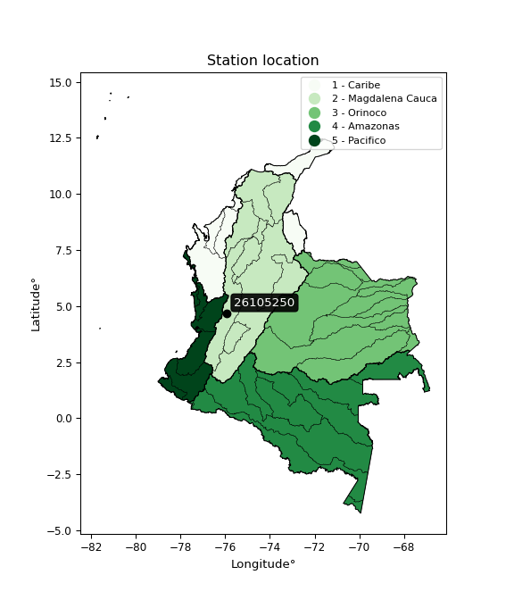

<div align="center">


</div>

# PMP Station (rain, Pmax24h): 26105250

Probable Maximum Precipitation (PMP) is the greatest amount of rainfall for a specific duration that is meteorologically possible for a given location, acting as a "worst-case" scenario for extreme storms, crucial for designing safety-critical infrastructure like bridges, river deviations, dams, spillways, and nuclear plants to prevent catastrophic failure. PMP is calculated by hydrologists using meteorological data to determine the upper limit of extreme rainfall, often leading to the Probable Maximum Flood (PMF) for flood control design, and is increasingly being studied for climate change impacts.

<div align="center">

</img>

</div>


## A. General information


### 1. General running parameters

• app_version: _v20251227_. • runtime: _2025-12-27 09:02:11.367833_. • Python version: _3.14.0_. • SciPy version: _1.16.3_. • Pandas version: _2.3.3_. • NumPy version: _2.3.5_. • Stations dataset (station_dataset_file): _dataset/pmax24h_in/automatic_colombia_2003_2024_filter.csv_. • Stations catalog (station_catalog_file): _dataset/CNE_IDEAM.xls_. • Minimum year to eval til year_max (date_min): _2003_. • Maximum year to eval since year_min (date_max): _2024_. • Creates, save and include plots into reports (create_plot): _False_. • Plot only fit distributions with Δo > Δ (plot_only_fit): _True_. • Eval low extreme values, if False, evaluates high extreme values (low_extreme): _False_. • Eval every SciPy distribution as logarithmic (pdist_logarithmic_on): _True_. • Standard deviation normalized (ddof): _1.0_. • Return periods to eval in years (Tr): _[2, 2.33, 5, 10, 15, 20, 25, 50, 75, 100, 200, 250, 500, 750, 1000]_. • Minimum data sample per station, 0 means any (minimum_sample): _5_. • Z-Score threshold to adjust a value, 0 means disable (zscore): _3.5_. • Avoid zeros, e.g. rain = 0 (avoid_zeros): _True_. • Avoid null values (avoid_nans): _True_. [:file_folder:Dataset file.](../../dataset/pmax24h_in/automatic_colombia_2003_2024_filter.csv)

> Delta Degrees of Freedom (DDOF): is a parameter used in the formulas for calculating variance and standard deviation. When ddof=0, the divisor is $N$ (the total number of observations) and this is used when your data set is the entire population. When ddof=1, the divisor is $N-1$ and this is used when your data set is a sample drawn from a larger population. Using $N-1$ provides an unbiased estimate of the population variance (known as Bessel´s correction).


### 2. Station info and location

|   id |   CODIGO | NOMBRE                    | CATEGORIA         | TECNOLOGIA                | ESTADO   | FECHA_INSTALACION   |   FECHA_SUSPENSION |   ALTITUD |   LATITUD |   LONGITUD | DEPARTAMENTO    | MUNICIPIO   | AREA_OPERATIVA                         | ENTIDAD                                                     | AREA_HIDROGRAFICA   | ZONA_HIDROGRAFICA   | SUBZONA_HIDROGRAFICA                |   CORRIENTE | Catalogo   |
|-----:|---------:|:--------------------------|:------------------|:--------------------------|:---------|:--------------------|-------------------:|----------:|----------:|-----------:|:----------------|:------------|:---------------------------------------|:------------------------------------------------------------|:--------------------|:--------------------|:------------------------------------|------------:|:-----------|
|    0 | 26105250 | ZARAGOZA - AUT [26105250] | Agrometeorológica | Automática con Telemetría | Activa   | 30/06/2005          |                nan |       943 |   4.68978 |   -75.9252 | Valle Del Cauca | Cartago     | Area Operativa 09 - Cauca-Valle-Caldas | INSTITUTO DE HIDROLOGIA METEOROLOGIA Y ESTUDIOS AMBIENTALES | Magdalena Cauca     | Cauca               | Rios Las Cañas - Los Micos y Obando |         nan | CNE_IDEAM  |

<div align="center">

Map location in: [:earth_americas:Google](http://maps.google.com/maps?q=4.689777778,-75.92519444) [:earth_americas:OSM](https://www.openstreetmap.org/#map=18/4.689777778/-75.92519444&layers=P) [:earth_americas:Bing](https://www.bing.com/maps?cp=4.689777778~-75.92519444&lvl=18) [:earth_americas:Apple](https://maps.apple.com/frame?center=4.689777778%2C-75.92519444&span=0.003%2C0.006)

</div>


<div align="center">

```geojson
{
  "type": "Feature",
  "geometry": {
    "type": "Point", 
    "coordinates": [-75.92519444, 4.689777778]
  }, 
  "properties": {
    "Name": "26105250"
  }
}
```

</div>


### 3. Discrete values table and plot

|               |          0 |           1 |           2 |          3 |          4 |
|:--------------|-----------:|------------:|------------:|-----------:|-----------:|
| Date          | 2017       | 2018        | 2019        | 2021       | 2022       |
| Value         |   76.2     |   54.9      |   61        |   39.1     |   27.1     |
| Value_initial |   76.2     |   54.9      |   61        |   39.1     |   27.1     |
| count         |    5       |    5        |    5        |    5       |    5       |
| mean          |   51.66    |   51.66     |   51.66     |   51.66    |   51.66    |
| std           |   19.1108  |   19.1108   |   19.1108   |   19.1108  |   19.1108  |
| zscore        |    1.28409 |    0.169538 |    0.488729 |   -0.65722 |   -1.28514 |

> The initial value (value_initial) correspond to the initial obtained or null completed value, and value (value) is adjusted only when the initial value is outside the valid range definite through the Z-Score value. If Z-Score is active, values out of range or outliers are replaced with the station mean value


### 4. Active continuous probability distributions from SciPy (45 of 104 available)

[scipy.stats](https://docs.scipy.org/doc/scipy/reference/stats.html) is a Python´s powerful submodule within the SciPy library for comprehensive statistical analysis, offering over 130 probability distributions (like Normal, Poisson), functions for descriptive stats (mean, variance), hypothesis testing (t-tests, chi-square), random variable generation, and statistical tests, making it essential for data science, modeling, and research. It provides tools to explore, model, and draw conclusions from data efficiently, working seamlessly with NumPy.

<div align="center">

|   id | p_dist             |   n_parameter | fit_method   | label                                                                       | active   | ref                                                                                                        |
|-----:|:-------------------|--------------:|:-------------|:----------------------------------------------------------------------------|:---------|:-----------------------------------------------------------------------------------------------------------|
|    0 | alpha              |             3 | MLE          | Alpha                                                                       | True     | [:mortar_board:](https://docs.scipy.org/doc/scipy/reference/generated/scipy.stats.alpha.html)              |
|    1 | betaprime          |             4 | MLE          | Beta prime                                                                  | True     | [:mortar_board:](https://docs.scipy.org/doc/scipy/reference/generated/scipy.stats.betaprime.html)          |
|    2 | chi2               |             3 | MLE          | Chi²                                                                        | True     | [:mortar_board:](https://docs.scipy.org/doc/scipy/reference/generated/scipy.stats.chi2.html)               |
|    3 | crystalball        |             4 | MLE          | Crystalball                                                                 | True     | [:mortar_board:](https://docs.scipy.org/doc/scipy/reference/generated/scipy.stats.crystalball.html)        |
|    4 | erlang             |             3 | MLE          | Erlang                                                                      | True     | [:mortar_board:](https://docs.scipy.org/doc/scipy/reference/generated/scipy.stats.erlang.html)             |
|    5 | expon              |             2 | MLE          | Exponential                                                                 | True     | [:mortar_board:](https://docs.scipy.org/doc/scipy/reference/generated/scipy.stats.expon.html)              |
|    6 | exponnorm          |             3 | MLE          | Exponentially modified Normal                                               | True     | [:mortar_board:](https://docs.scipy.org/doc/scipy/reference/generated/scipy.stats.exponnorm.html)          |
|    7 | f                  |             4 | MLE          | F                                                                           | True     | [:mortar_board:](https://docs.scipy.org/doc/scipy/reference/generated/scipy.stats.f.html)                  |
|    8 | fatiguelife        |             3 | MLE          | Fatigue-life (Birnbaum-Saunders)                                            | True     | [:mortar_board:](https://docs.scipy.org/doc/scipy/reference/generated/scipy.stats.fatiguelife.html)        |
|    9 | fisk               |             3 | MLE          | Fisk                                                                        | True     | [:mortar_board:](https://docs.scipy.org/doc/scipy/reference/generated/scipy.stats.fisk.html)               |
|   10 | gamma              |             3 | MLE          | Gamma                                                                       | True     | [:mortar_board:](https://docs.scipy.org/doc/scipy/reference/generated/scipy.stats.gamma.html)              |
|   11 | genexpon           |             5 | MLE          | Generalized exponential                                                     | True     | [:mortar_board:](https://docs.scipy.org/doc/scipy/reference/generated/scipy.stats.genexpon.html)           |
|   12 | genlogistic        |             3 | MLE          | Generalized logistic                                                        | True     | [:mortar_board:](https://docs.scipy.org/doc/scipy/reference/generated/scipy.stats.genlogistic.html)        |
|   13 | gibrat             |             2 | MM           | Gibrat                                                                      | True     | [:mortar_board:](https://docs.scipy.org/doc/scipy/reference/generated/scipy.stats.gibrat.html)             |
|   14 | gompertz           |             3 | MLE          | Gompertz (or truncated Gumbel)                                              | True     | [:mortar_board:](https://docs.scipy.org/doc/scipy/reference/generated/scipy.stats.gompertz.html)           |
|   15 | gumbel_l           |             2 | MM           | Gumbel Left Skew                                                            | True     | [:mortar_board:](https://docs.scipy.org/doc/scipy/reference/generated/scipy.stats.gumbel_l.html)           |
|   16 | gumbel_r           |             2 | MM           | Gumbel Right Skew                                                           | True     | [:mortar_board:](https://docs.scipy.org/doc/scipy/reference/generated/scipy.stats.gumbel_r.html)           |
|   17 | halflogistic       |             2 | MM           | Half-logistic                                                               | True     | [:mortar_board:](https://docs.scipy.org/doc/scipy/reference/generated/scipy.stats.halflogistic.html)       |
|   18 | halfnorm           |             2 | MM           | Half Normal                                                                 | True     | [:mortar_board:](https://docs.scipy.org/doc/scipy/reference/generated/scipy.stats.halfnorm.html)           |
|   19 | hypsecant          |             2 | MM           | hyperbolic secant                                                           | True     | [:mortar_board:](https://docs.scipy.org/doc/scipy/reference/generated/scipy.stats.hypsecant.html)          |
|   20 | invgamma           |             3 | MLE          | Inverted gamma                                                              | True     | [:mortar_board:](https://docs.scipy.org/doc/scipy/reference/generated/scipy.stats.invgamma.html)           |
|   21 | invgauss           |             3 | MLE          | Inverse Gaussian                                                            | True     | [:mortar_board:](https://docs.scipy.org/doc/scipy/reference/generated/scipy.stats.invgauss.html)           |
|   22 | invweibull         |             3 | MLE          | Inverted Weibull                                                            | True     | [:mortar_board:](https://docs.scipy.org/doc/scipy/reference/generated/scipy.stats.invweibull.html)         |
|   23 | johnsonsu          |             4 | MLE          | Johnson Su                                                                  | True     | [:mortar_board:](https://docs.scipy.org/doc/scipy/reference/generated/scipy.stats.johnsonsu.html)          |
|   24 | kstwobign          |             2 | MLE          | Limiting distribution of scaled Kolmogorov-Smirnov two-sided test statistic | True     | [:mortar_board:](https://docs.scipy.org/doc/scipy/reference/generated/scipy.stats.kstwobign.html)          |
|   25 | laplace            |             2 | MM           | Laplace                                                                     | True     | [:mortar_board:](https://docs.scipy.org/doc/scipy/reference/generated/scipy.stats.laplace.html)            |
|   26 | laplace_asymmetric |             3 | MLE          | Asymmetric Laplace                                                          | True     | [:mortar_board:](https://docs.scipy.org/doc/scipy/reference/generated/scipy.stats.laplace_asymmetric.html) |
|   27 | loggamma           |             3 | MLE          | Log gamma                                                                   | True     | [:mortar_board:](https://docs.scipy.org/doc/scipy/reference/generated/scipy.stats.loggamma.html)           |
|   28 | logistic           |             2 | MM           | Logistic (or Sech-squared)                                                  | True     | [:mortar_board:](https://docs.scipy.org/doc/scipy/reference/generated/scipy.stats.logistic.html)           |
|   29 | lognorm            |             3 | MLE          | Log Normal                                                                  | True     | [:mortar_board:](https://docs.scipy.org/doc/scipy/reference/generated/scipy.stats.lognorm.html)            |
|   30 | maxwell            |             2 | MM           | Maxwell                                                                     | True     | [:mortar_board:](https://docs.scipy.org/doc/scipy/reference/generated/scipy.stats.maxwell.html)            |
|   31 | mielke             |             4 | MLE          | Mielke Beta-Kappa / Dagum                                                   | True     | [:mortar_board:](https://docs.scipy.org/doc/scipy/reference/generated/scipy.stats.mielke.html)             |
|   32 | moyal              |             2 | MM           | Moyal                                                                       | True     | [:mortar_board:](https://docs.scipy.org/doc/scipy/reference/generated/scipy.stats.moyal.html)              |
|   33 | nakagami           |             3 | MLE          | Nakagami                                                                    | True     | [:mortar_board:](https://docs.scipy.org/doc/scipy/reference/generated/scipy.stats.nakagami.html)           |
|   34 | ncf                |             5 | MLE          | Non-central F distribution                                                  | True     | [:mortar_board:](https://docs.scipy.org/doc/scipy/reference/generated/scipy.stats.ncf.html)                |
|   35 | nct                |             4 | MLE          | Non-central Student’s t                                                     | True     | [:mortar_board:](https://docs.scipy.org/doc/scipy/reference/generated/scipy.stats.nct.html)                |
|   36 | norm               |             2 | MM           | Normal                                                                      | True     | [:mortar_board:](https://docs.scipy.org/doc/scipy/reference/generated/scipy.stats.norm.html)               |
|   37 | pareto             |             3 | MLE          | Pareto                                                                      | True     | [:mortar_board:](https://docs.scipy.org/doc/scipy/reference/generated/scipy.stats.pareto.html)             |
|   38 | pearson3           |             3 | MM           | Pearson type III                                                            | True     | [:mortar_board:](https://docs.scipy.org/doc/scipy/reference/generated/scipy.stats.pearson3.html)           |
|   39 | rayleigh           |             2 | MM           | Rayleigh                                                                    | True     | [:mortar_board:](https://docs.scipy.org/doc/scipy/reference/generated/scipy.stats.rayleigh.html)           |
|   40 | rice               |             3 | MLE          | Rice                                                                        | True     | [:mortar_board:](https://docs.scipy.org/doc/scipy/reference/generated/scipy.stats.rice.html)               |
|   41 | t                  |             3 | MLE          | Student’s t                                                                 | True     | [:mortar_board:](https://docs.scipy.org/doc/scipy/reference/generated/scipy.stats.t.html)                  |
|   42 | truncnorm          |             4 | MLE          | Truncated normal                                                            | True     | [:mortar_board:](https://docs.scipy.org/doc/scipy/reference/generated/scipy.stats.truncnorm.html)          |
|   43 | wald               |             2 | MM           | Wald                                                                        | True     | [:mortar_board:](https://docs.scipy.org/doc/scipy/reference/generated/scipy.stats.wald.html)               |
|   44 | weibull_min        |             3 | MLE          | Weibull minimum                                                             | True     | [:mortar_board:](https://docs.scipy.org/doc/scipy/reference/generated/scipy.stats.weibull_min.html)        |

</div>

> **n_parameter:** # arguments & localization & scale.
>
> **Fit methods:** (MLE) maximum likelihood, (MM) L-moments.
>
>**Inactive:** foldnorm, gennorm, norminvgauss, powernorm, powerlognorm, skewnorm, genextreme, anglit, arcsine, argus, beta, bradford, burr, burr12, cauchy, cosine, halfcauchy, foldcauchy, skewcauchy, wrapcauchy, dgamma, gengamma, exponweib, exponpow, truncexpon, gausshyper, genhalflogistic, genhyperbolic, geninvgauss, halfgennorm, johnsonsb, kappa4, kappa3, ksone, kstwo, loglaplace, levy, levy_l, levy_stable, ncx2, genpareto, truncpareto, lomax, powerlaw, rdist, rel_breitwigner, recipinvgauss, semicircular, studentized_range, trapezoid, triang, truncweibull_min, tukeylambda, uniform, loguniform, vonmises, vonmises_line, weibull_max, dweibull, 


## B. Probability distributions vs. Empirical distributions

A continuous probability distribution (CPD) describes probabilities for variables that can take any value within a range (like rain any time), unlike discrete variables with specific outcomes (like temperature). It uses a Probability Density Function (PDF), a curve where the total area under it equals 1, and the probability of the variable falling within an interval (a to b) is found by calculating the area under the curve between those points. A key feature is that the probability of hitting any single exact value is zero, so probabilities are always expressed for ranges, e.g., $P(a ≤ X ≤ b)$.

<div align="center">

Distributions parameters from station values
|    |   station | p_dist                |   n |            loc |           scale | shape                  | shape1             | shape2             | shape3   |
|---:|----------:|:----------------------|----:|---------------:|----------------:|:-----------------------|:-------------------|:-------------------|:---------|
|  0 |  26105250 | alpha                 |   5 | -243.28        |  5000.98        | 17.02378756999081      |                    |                    |          |
|  1 |  26105250 | betaprime             |   5 | -168.29        | 49060.9         | 164.25287322014253     | 36635.91316665704  |                    |          |
|  2 |  26105250 | chi2                  |   5 |   27.1         |     1.69398     | 0.4114857385228503     |                    |                    |          |
|  3 |  26105250 | crystalball           |   5 |   51.66        |    17.0932      | 19814.23213503034      | 312.6171566853785  |                    |          |
|  4 |  26105250 | erlang                |   5 | -780.418       |     0.351597    | 2366.545536077597      |                    |                    |          |
|  5 |  26105250 | expon                 |   5 |   27.1         |    24.56        |                        |                    |                    |          |
|  6 |  26105250 | exponnorm             |   5 |   51.6396      |    17.0932      | 0.0011917870472771064  |                    |                    |          |
|  7 |  26105250 | f                     |   5 | -935.052       |   986.691       | 6833.846130677026      | 260883.3808875298  |                    |          |
|  8 |  26105250 | fatiguelife           |   5 |   27.1         |     7.18326e-06 | 1553.5584315552524     |                    |                    |          |
|  9 |  26105250 | fisk                  |   5 |   -4.33492e+08 |     4.33492e+08 | 41767572.43859801      |                    |                    |          |
| 10 |  26105250 | gamma                 |   5 | -766.024       |     0.358003    | 2284.023342537037      |                    |                    |          |
| 11 |  26105250 | genexpon              |   5 |   27.1         |     8.58111e+11 | 235852057253.23993     | 13776030639.71956  | 89131803452.22906  |          |
| 12 |  26105250 | genlogistic           |   5 |  -34.6155      |    15.5027      | 150.98116787130078     |                    |                    |          |
| 13 |  26105250 | gibrat                |   5 |   38.62        |     7.90916     |                        |                    |                    |          |
| 14 |  26105250 | gompertz              |   5 |   39.1         |    13.3616      | 0.18624077770803854    |                    |                    |          |
| 15 |  26105250 | gumbel_l              |   5 |   59.3529      |    13.3275      |                        |                    |                    |          |
| 16 |  26105250 | gumbel_r              |   5 |   43.9671      |    13.3275      |                        |                    |                    |          |
| 17 |  26105250 | halflogistic          |   5 |   31.4006      |    14.6141      |                        |                    |                    |          |
| 18 |  26105250 | halfnorm              |   5 |   29.0352      |    28.3559      |                        |                    |                    |          |
| 19 |  26105250 | hypsecant             |   5 |   51.66        |    10.8819      |                        |                    |                    |          |
| 20 |  26105250 | invgamma              |   5 | -114.541       | 14983.6         | 91.23380912010626      |                    |                    |          |
| 21 |  26105250 | invgauss              |   5 |  -28.7684      |  1565.88        | 0.05113690366214363    |                    |                    |          |
| 22 |  26105250 | invweibull            |   5 |   27.1         |     1.46955     | 0.05196458927206109    |                    |                    |          |
| 23 |  26105250 | johnsonsu             |   5 |  311.795       |   942.727       | 15.584470562508983     | 57.193627299176114 |                    |          |
| 24 |  26105250 | kstwobign             |   5 |  -10.4627      |    70.8712      |                        |                    |                    |          |
| 25 |  26105250 | laplace               |   5 |   51.66        |    12.0867      |                        |                    |                    |          |
| 26 |  26105250 | laplace_asymmetric    |   5 |   54.9         |    13.9187      | 1.1231362730082024     |                    |                    |          |
| 27 |  26105250 | loggamma              |   5 | -549.295       |   141.983       | 69.39377171460251      |                    |                    |          |
| 28 |  26105250 | logistic              |   5 |   51.66        |     9.42399     |                        |                    |                    |          |
| 29 |  26105250 | lognorm               |   5 |   27.1         |     0.0181557   | 14.63844112673877      |                    |                    |          |
| 30 |  26105250 | maxwell               |   5 |   11.1562      |    25.382       |                        |                    |                    |          |
| 31 |  26105250 | mielke                |   5 |   -6.53819     |    83.1357      | 2.4745130310455474     | 892.3397354787069  |                    |          |
| 32 |  26105250 | moyal                 |   5 |   41.885       |     7.69466     |                        |                    |                    |          |
| 33 |  26105250 | nakagami              |   5 |   39.1         |    22.0839      | 0.04912548366428971    |                    |                    |          |
| 34 |  26105250 | ncf                   |   5 |    5.41326     |     2.62548e-05 | 1.5714168762775854e-05 | 4695.018802122391  | 27.675380917208113 |          |
| 35 |  26105250 | nct                   |   5 | -887.871       |    17.0176      | 163139.08352183382     | 55.209164201847656 |                    |          |
| 36 |  26105250 | norm                  |   5 |   51.66        |    17.0932      |                        |                    |                    |          |
| 37 |  26105250 | pareto                |   5 |   26.8647      |     0.235252    | 0.2623963983433975     |                    |                    |          |
| 38 |  26105250 | pearson3              |   5 |   51.66        |    17.0932      | -0.046804189352760144  |                    |                    |          |
| 39 |  26105250 | rayleigh              |   5 |   18.9597      |    26.0911      |                        |                    |                    |          |
| 40 |  26105250 | rice                  |   5 |   17.8         |    20.4687      | 1.1974403853623055     |                    |                    |          |
| 41 |  26105250 | t                     |   5 |   51.6601      |    17.0932      | 39989888.91736497      |                    |                    |          |
| 42 |  26105250 | truncnorm             |   5 |   51.66        |    17.0932      | -337.4871363404802     | 1348.6691937603414 |                    |          |
| 43 |  26105250 | wald                  |   5 |   34.5668      |    17.0932      |                        |                    |                    |          |
| 44 |  26105250 | weibull_min           |   5 |   19.5849      |    36.1037      | 1.932353857617069      |                    |                    |          |
| 45 |  26105250 | logalpha              |   5 |   -6.76503     |   304.408       | 28.631345860467803     |                    |                    |          |
| 46 |  26105250 | logbetaprime          |   5 |  -10.3731      |     8.40346     | 4048.100984212955      | 2387.4811006682985 |                    |          |
| 47 |  26105250 | logchi2               |   5 |    3.29953     |     1.00635     | 1.0776750236917407     |                    |                    |          |
| 48 |  26105250 | logcrystalball        |   5 |    3.88308     |     0.362555    | 936.7130826026798      | 111.78914127677186 |                    |          |
| 49 |  26105250 | logerlang             |   5 |   -2.32054     |     0.0217486   | 285.05980301383397     |                    |                    |          |
| 50 |  26105250 | logexpon              |   5 |    3.29953     |     0.583547    |                        |                    |                    |          |
| 51 |  26105250 | logexponnorm          |   5 |    3.88276     |     0.362555    | 0.0008926754447853526  |                    |                    |          |
| 52 |  26105250 | logf                  |   5 | -362.016       |   365.898       | 6700492.924124293      | 2904831.9663705397 |                    |          |
| 53 |  26105250 | logfatiguelife        |   5 |  -91.3334      |    95.2155      | 0.003795603869848928   |                    |                    |          |
| 54 |  26105250 | logfisk               |   5 |   -1.86708e+07 |     1.86708e+07 | 85728639.7689284       |                    |                    |          |
| 55 |  26105250 | loggamma              |   5 |   -2.1143      |     0.0227509   | 263.55031226936194     |                    |                    |          |
| 56 |  26105250 | loggenexpon           |   5 |    3.29953     |     0.834187    | 1.0010664582315507     | 1.1935526637524085 | 1.0120755875782663 |          |
| 57 |  26105250 | loggenlogistic        |   5 |    4.33337     |     8.82657e-07 | 1.968795538057656e-06  |                    |                    |          |
| 58 |  26105250 | loggibrat             |   5 |    3.60655     |     0.167727    |                        |                    |                    |          |
| 59 |  26105250 | loggompertz           |   5 |    3.29953     |     0.411556    | 0.21272071920841618    |                    |                    |          |
| 60 |  26105250 | loggumbel_l           |   5 |    4.04625     |     0.282683    |                        |                    |                    |          |
| 61 |  26105250 | loggumbel_r           |   5 |    3.71991     |     0.282683    |                        |                    |                    |          |
| 62 |  26105250 | loghalflogistic       |   5 |    3.45334     |     0.309991    |                        |                    |                    |          |
| 63 |  26105250 | loghalfnorm           |   5 |    3.40319     |     0.601454    |                        |                    |                    |          |
| 64 |  26105250 | loghypsecant          |   5 |    3.88308     |     0.23081     |                        |                    |                    |          |
| 65 |  26105250 | loginvgamma           |   5 |   -3.69488     |  3205.59        | 424.1906940132144      |                    |                    |          |
| 66 |  26105250 | loginvgauss           |   5 |    0.62229     |   235.973       | 0.013778251371976143   |                    |                    |          |
| 67 |  26105250 | loginvweibull         |   5 |   -4.29526e+07 |     4.29526e+07 | 119725532.91441143     |                    |                    |          |
| 68 |  26105250 | logjohnsonsu          |   5 |    4.58981     |     0.0167365   | 7.720638379301326      | 1.7994038997107058 |                    |          |
| 69 |  26105250 | logkstwobign          |   5 |    2.45334     |     1.62946     |                        |                    |                    |          |
| 70 |  26105250 | loglaplace            |   5 |    3.88308     |     0.256365    |                        |                    |                    |          |
| 71 |  26105250 | loglaplace_asymmetric |   5 |    4.11087     |     0.243101    | 1.5728529651608856     |                    |                    |          |
| 72 |  26105250 | logloggamma           |   5 |    4.3334      |     2.49259e-06 | 5.559093586674223e-06  |                    |                    |          |
| 73 |  26105250 | loglogistic           |   5 |    3.88308     |     0.199887    |                        |                    |                    |          |
| 74 |  26105250 | loglognorm            |   5 |    3.29953     |     0.000626352 | 13.991669995674107     |                    |                    |          |
| 75 |  26105250 | logmaxwell            |   5 |    3.02398     |     0.538363    |                        |                    |                    |          |
| 76 |  26105250 | logmielke             |   5 |    3.29953     |     1.04834     | 0.6783514773276155     | 348.44765639070755 |                    |          |
| 77 |  26105250 | logmoyal              |   5 |    3.67575     |     0.163207    |                        |                    |                    |          |
| 78 |  26105250 | lognakagami           |   5 |    3.66612     |     0.447274    | 0.19732539109231995    |                    |                    |          |
| 79 |  26105250 | logncf                |   5 |   -1.90164     |     5.78064     | 580.749139165091       | 990.4699809399176  | 0.1121308196785304 |          |
| 80 |  26105250 | lognct                |   5 |  -14.8284      |     0.301419    | 4106.26422800994       | 62.06523851545812  |                    |          |
| 81 |  26105250 | lognorm               |   5 |    3.88308     |     0.362555    |                        |                    |                    |          |
| 82 |  26105250 | logpareto             |   5 |    3.29376     |     0.00577549  | 0.2614312042622845     |                    |                    |          |
| 83 |  26105250 | logpearson3           |   5 |    3.88308     |     0.362555    | -0.43638035892457866   |                    |                    |          |
| 84 |  26105250 | lograyleigh           |   5 |    3.18949     |     0.553404    |                        |                    |                    |          |
| 85 |  26105250 | logrice               |   5 |    3.07753     |     0.408587    | 1.6353310100634078     |                    |                    |          |
| 86 |  26105250 | logt                  |   5 |    3.88308     |     0.362557    | 569944222.5396075      |                    |                    |          |
| 87 |  26105250 | logtruncnorm          |   5 |   -0.107934    |     1.08696     | 3.472124244215464      | 4.085984434215619  |                    |          |
| 88 |  26105250 | logwald               |   5 |    3.52053     |     0.362545    |                        |                    |                    |          |
| 89 |  26105250 | logweibull_min        |   5 |   -5.67258e+06 |     5.67258e+06 | 19526535.43771921      |                    |                    |          |

</div>

> **loc** (Location parameter): This shifts the distribution along the x-axis. For many common distributions, like the normal (Gaussian) distribution, loc represents the mean $μ$. For others, like the uniform distribution, it might represent the minimum value, or for the beta distribution, the left end of the support interval.
>
> **scale** (Scale parameter): This determines the width or spread of the distribution. For the normal distribution, scale represents the standard deviation $σ$. For a uniform distribution, it defines the length of the interval (from $loc$ to $loc + scale$).
>
> **shape** (Shape parameters): Refers to parameters that define the specific form of a probability distribution, distinct from its location (loc) and scale (scale). These parameters are required arguments for most distribution functions. For example, a normal (Gaussian) distribution is fully defined by its location (mean) and scale (standard deviation), so it has no specific shape parameters beyond loc and scale. However, other distributions have intrinsic properties that need specification, as Gamma distribution that takes a shape parameter, often named $a$ or $alpha$.


### 0. Cumulative distribution values - CDF (90 evaluated)

Cumulative Distribution Function (CDF), denoted as $F$<sub>$X$</sub>$(x)$, is a function that gives the probability that a random variable $X$ will take a value less than or equal to a specific value, $x$ (i.e., $(P(X≥x)$. It essentially "accumulates" probabilities from a given point up to the far right (positive infinity), providing a complete picture of the distribution´s probabilities for both discrete (like rain) and continuous (like temperature) variables, helping to find probabilities over ranges or above certain values.

<div align="center">

CDF ordered by x ascending and calculating $log(f(x))$ separately
|   id |   Station |   date |    x |   count |   mean |     std |    zscore |   Value_initial |   station |   m |     alpha |   alpha_pdf |   betaprime |   betaprime_pdf |        chi2 |    chi2_pdf |   crystalball |   crystalball_pdf |    erlang |   erlang_pdf |    expon |   expon_pdf |   exponnorm |   exponnorm_pdf |         f |      f_pdf |   fatiguelife |   fatiguelife_pdf |      fisk |   fisk_pdf |     gamma |   gamma_pdf |    genexpon |   genexpon_pdf |   genlogistic |   genlogistic_pdf |     gibrat |   gibrat_pdf |    gompertz |   gompertz_pdf |   gumbel_l |   gumbel_l_pdf |   gumbel_r |   gumbel_r_pdf |   halflogistic |   halflogistic_pdf |   halfnorm |   halfnorm_pdf |   hypsecant |   hypsecant_pdf |   invgamma |   invgamma_pdf |   invgauss |   invgauss_pdf |   invweibull |   invweibull_pdf |   johnsonsu |   johnsonsu_pdf |   kstwobign |   kstwobign_pdf |   laplace |   laplace_pdf |   laplace_asymmetric |   laplace_asymmetric_pdf |   loggamma |   loggamma_pdf |   logistic |   logistic_pdf |   lognorm |   lognorm_pdf |   maxwell |   maxwell_pdf |   mielke |   mielke_pdf |      moyal |   moyal_pdf |   nakagami |   nakagami_pdf |       ncf |    ncf_pdf |       nct |    nct_pdf |      norm |   norm_pdf |      pareto |   pareto_pdf |   pearson3 |   pearson3_pdf |   rayleigh |   rayleigh_pdf |      rice |   rice_pdf |         t |      t_pdf |   truncnorm |   truncnorm_pdf |     wald |   wald_pdf |   weibull_min |   weibull_min_pdf |   logalpha |   logalpha_pdf |   logbetaprime |   logbetaprime_pdf |    logchi2 |   logchi2_pdf |   logcrystalball |   logcrystalball_pdf |   logerlang |   logerlang_pdf |   logexpon |   logexpon_pdf |   logexponnorm |   logexponnorm_pdf |     logf |   logf_pdf |   logfatiguelife |   logfatiguelife_pdf |   logfisk |   logfisk_pdf |   loggenexpon |   loggenexpon_pdf |   loggenlogistic |   loggenlogistic_pdf |   loggibrat |   loggibrat_pdf |   loggompertz |   loggompertz_pdf |   loggumbel_l |   loggumbel_l_pdf |   loggumbel_r |   loggumbel_r_pdf |   loghalflogistic |   loghalflogistic_pdf |   loghalfnorm |   loghalfnorm_pdf |   loghypsecant |   loghypsecant_pdf |   loginvgamma |   loginvgamma_pdf |   loginvgauss |   loginvgauss_pdf |   loginvweibull |   loginvweibull_pdf |   logjohnsonsu |   logjohnsonsu_pdf |   logkstwobign |   logkstwobign_pdf |   loglaplace |   loglaplace_pdf |   loglaplace_asymmetric |   loglaplace_asymmetric_pdf |   logloggamma |   logloggamma_pdf |   loglogistic |   loglogistic_pdf |   loglognorm |   loglognorm_pdf |   logmaxwell |   logmaxwell_pdf |   logmielke |   logmielke_pdf |   logmoyal |   logmoyal_pdf |   lognakagami |   lognakagami_pdf |    logncf |   logncf_pdf |    lognct |   lognct_pdf |   logpareto |   logpareto_pdf |   logpearson3 |   logpearson3_pdf |   lograyleigh |   lograyleigh_pdf |   logrice |   logrice_pdf |      logt |   logt_pdf |   logtruncnorm |   logtruncnorm_pdf |   logwald |   logwald_pdf |   logweibull_min |   logweibull_min_pdf |
|-----:|----------:|-------:|-----:|--------:|-------:|--------:|----------:|----------------:|----------:|----:|----------:|------------:|------------:|----------------:|------------:|------------:|--------------:|------------------:|----------:|-------------:|---------:|------------:|------------:|----------------:|----------:|-----------:|--------------:|------------------:|----------:|-----------:|----------:|------------:|------------:|---------------:|--------------:|------------------:|-----------:|-------------:|------------:|---------------:|-----------:|---------------:|-----------:|---------------:|---------------:|-------------------:|-----------:|---------------:|------------:|----------------:|-----------:|---------------:|-----------:|---------------:|-------------:|-----------------:|------------:|----------------:|------------:|----------------:|----------:|--------------:|---------------------:|-------------------------:|-----------:|---------------:|-----------:|---------------:|----------:|--------------:|----------:|--------------:|---------:|-------------:|-----------:|------------:|-----------:|---------------:|----------:|-----------:|----------:|-----------:|----------:|-----------:|------------:|-------------:|-----------:|---------------:|-----------:|---------------:|----------:|-----------:|----------:|-----------:|------------:|----------------:|---------:|-----------:|--------------:|------------------:|-----------:|---------------:|---------------:|-------------------:|-----------:|--------------:|-----------------:|---------------------:|------------:|----------------:|-----------:|---------------:|---------------:|-------------------:|---------:|-----------:|-----------------:|---------------------:|----------:|--------------:|--------------:|------------------:|-----------------:|---------------------:|------------:|----------------:|--------------:|------------------:|--------------:|------------------:|--------------:|------------------:|------------------:|----------------------:|--------------:|------------------:|---------------:|-------------------:|--------------:|------------------:|--------------:|------------------:|----------------:|--------------------:|---------------:|-------------------:|---------------:|-------------------:|-------------:|-----------------:|------------------------:|----------------------------:|--------------:|------------------:|--------------:|------------------:|-------------:|-----------------:|-------------:|-----------------:|------------:|----------------:|-----------:|---------------:|--------------:|------------------:|----------:|-------------:|----------:|-------------:|------------:|----------------:|--------------:|------------------:|--------------:|------------------:|----------:|--------------:|----------:|-----------:|---------------:|-------------------:|----------:|--------------:|-----------------:|---------------------:|
|    0 |  26105250 |   2022 | 27.1 |       5 |  51.66 | 19.1108 | -1.28514  |            27.1 |  26105250 |   1 | 0.0704621 |  0.00923159 |   0.0722218 |      0.00865702 | 0.000903418 | 5.23183e+10 |     0.0753837 |        0.00831366 | 0.0745258 |   0.00840233 | 0        |  0.0407166  |   0.0753841 |      0.00831368 | 0.0746547 | 0.00839263 |     0.0864566 |       6.70281e+10 | 0.0840014 | 0.00741378 | 0.0744776 |  0.00839866 | 8.65148e-13 |    0.27485     |     0.0612655 |        0.0109344  | 0          |   0          | 0           |      0         |  0.0850813 |     0.00610425 |  0.0288637 |     0.00767785 |       0        |         0          |   0        |     0          |    0.066392 |      0.00605701 |  0.0689418 |     0.00940416 |  0.0669428 |     0.0105045  |   0.00318788 |      2.68038e+11 |   0.0756204 |      0.00827301 |   0.0585462 |       0.0121315 | 0.0655379 |    0.0054223  |             0.094224 |               0.00602739 |  0.0537386 |       0.316605 |  0.0687459 |     0.00679329 |  0.053749 |      0.301293 | 0.0586394 |    0.0101827  | 0.106568 |   0.00783944 | 0.00895919 |  0.00445287 |  0         |     0          | 0.0615417 | 0.00993831 | 0.0754162 | 0.00831855 | 0.0753837 | 0.00831366 | 1.11022e-16 |   1.11538    |  0.0765294 |     0.00822644 |  0.0475056 |     0.0113899  | 0.0496447 |  0.0105118 | 0.0753821 | 0.00831355 |   0.0753837 |      0.00831365 | 0        | 0          |     0.0470381 |        0.0118059  |  0.0532378 |       0.325793 |      0.0543952 |           0.313619 | 4.1241e-09 |     5.004e+06 |        0.0537489 |             0.301293 |   0.0536408 |        0.317148 |   0        |       1.71366  |      0.0537492 |           0.301294 | 0.054413 |   0.303983 |        0.0529284 |             0.300432 | 0.0570615 |      0.247053 |   9.12995e-10 |          1.20005  |         0        |             0.22229  |    0        |        0        |   1.66706e-08 |          0.51687  |     0.0687727 |          0.234721 |     0.0119831 |          0.187547 |          0        |              0        |      0        |          0        |      0.0506933 |           0.218705 |     0.0515361 |          0.319261 |     0.0545773 |          0.354128 |       0.0491808 |            0.412938 |      0.0892922 |           0.225124 |       0.049764 |           0.479255 |     0.051335 |         0.200242 |                0.085315 |                    0.223127 |     0.0996822 |          0.222316 |     0.0512035 |          0.243046 |    0.0227827 |      8.69971e+12 |    0.0329871 |         0.3406   | 3.62009e-08 |     2184.37     | 0.00154381 |      0.0514871 |   0           |       0           | 0.0780988 |     0.375902 | 0.0542436 |     0.306819 | 1.11022e-16 |      45.2656    |     0.0638595 |          0.282565 |     0.0195755 |          0.352279 | 0.0396185 |      0.363734 | 0.0537493 |   0.301293 |    0           |           0        |  0        |      0        |        0.0715624 |             0.237304 |
|    1 |  26105250 |   2021 | 39.1 |       5 |  51.66 | 19.1108 | -0.65722  |            39.1 |  26105250 |   2 | 0.246247  |  0.01977    |   0.236004  |      0.0186254  | 0.997993    | 0.000702567 |     0.231232  |        0.0178174  | 0.23249   |   0.0180416  | 0.386515 |  0.024979   |   0.231233  |      0.0178174  | 0.232381  | 0.018017   |     0.797284  |       0.00978366  | 0.225663  | 0.0168364  | 0.232378  |  0.0180346  | 0.965978    |    0.00974024  |     0.274126  |        0.0227862  | 0.00253945 |   0.016399   | 8.04376e-11 |      0.0139385 |  0.196513  |     0.0131906  |  0.23674   |     0.0255931  |       0.257495 |         0.0319451  |   0.277368 |     0.0264204  |    0.194449 |      0.0167782  |  0.248692  |     0.0201397  |  0.26599   |     0.0215961  |   0.407946   |      0.00158394  |   0.230557  |      0.0177203  |   0.287658  |       0.0234774 | 0.176877  |    0.0146339  |             0.203019 |               0.0129869  |  0.284259  |       0.940681 |  0.208702  |     0.0175239  |  0.274781 |      0.919974 | 0.249883  |    0.0207846  | 0.22672  |   0.0122928  | 0.23077    |  0.0303017  |  0.0266091 |     3.6794e+11 | 0.252538  | 0.0210339  | 0.231333  | 0.0178222  | 0.231232  | 0.0178174  | 0.645426    |   0.00760417 |  0.230132  |     0.017569   |  0.257649  |     0.021963   | 0.242488  |  0.0206193 | 0.23123   | 0.0178173  |   0.231232  |      0.0178174  | 0.128603 | 0.061749   |     0.262571  |        0.0222406  |  0.290715  |       0.958749 |      0.282333  |           0.934055 | 0.422622   |     0.551048  |        0.274781  |             0.919974 |   0.285352  |        0.946871 |   0.466453 |       0.914317 |      0.274782  |           0.919975 | 0.27633  |   0.920709 |        0.274764  |             0.924983 | 0.245706  |      0.85098  |   0.417857    |          0.997643 |         0        |             0.503544 |    0.150298 |        3.91911  |   0.263366    |          0.927845 |     0.229422  |          0.71042  |     0.298319  |          1.2765   |          0.330338 |              1.43694  |      0.338006 |          1.2057   |      0.23708   |           0.934799 |     0.287859  |          0.962774 |     0.307032  |          0.985523 |       0.338165  |            1.02198  |      0.228508  |           0.589277 |       0.363203 |           1.03444  |     0.214502 |         0.836707 |                0.222538 |                    0.58201  |     0.225782  |          0.503548 |     0.252484  |          0.944214 |    0.675596  |      0.070117    |    0.299779  |         1.03525  | 0.49029     |        0.907254 | 0.303043   |      1.48129   |   1.24588e-06 |       5.53592e+08 | 0.30755   |     0.851161 | 0.27801   |     0.924509 | 0.66351     |       0.236244  |     0.25906   |          0.822099 |     0.309882  |          1.07404  | 0.290086  |      0.967549 | 0.27478   |   0.919967 |    2.25527e-06 |           3.74545  |  0.272192 |      2.76857  |        0.230694  |             0.694522 |
|    2 |  26105250 |   2018 | 54.9 |       5 |  51.66 | 19.1108 |  0.169538 |            54.9 |  26105250 |   3 | 0.599511  |  0.0217375  |   0.584227  |      0.0224499  | 0.999989    | 3.40042e-06 |     0.575169  |        0.0229237  | 0.577908  |   0.0228185  | 0.677587 |  0.0131276  |   0.575169  |      0.0229237  | 0.577684  | 0.0228354  |     0.897296  |       0.00407544  | 0.571847  | 0.0235905  | 0.57768   |  0.0228132  | 0.999644    |    0.00010318  |     0.626043  |        0.0188834  | 0.764827   |   0.0188837  | 0.343853    |      0.029838  |  0.511285  |     0.0262545  |  0.64385   |     0.0212703  |       0.666266 |         0.0190258  |   0.638308 |     0.0185621  |    0.593404 |      0.028001   |  0.603218  |     0.021501   |  0.62069   |     0.0202423  |   0.423874   |      0.000680062 |   0.573708  |      0.0229519  |   0.637281  |       0.0185348 | 0.61757   |    0.0316405  |             0.557803 |               0.0356819  |  0.638119  |       1.00091  |  0.585114  |     0.0257593  |  0.632203 |      1.03938  | 0.603753  |    0.0211462  | 0.473124 |   0.0190558  | 0.667742   |  0.0202965  |  0.855828  |     0.00519582 | 0.608299  | 0.0209014  | 0.575254  | 0.0229164  | 0.575169  | 0.0229237  | 0.714753    |   0.00266977 |  0.572219  |     0.0230235  |  0.612773  |     0.0204438  | 0.59612   |  0.0215244 | 0.575167  | 0.0229238  |   0.575169  |      0.0229237  | 0.734103 | 0.0177196  |     0.616425  |        0.0201114  |  0.643667  |       0.978229 |      0.636809  |           1.01052  | 0.569346   |     0.344115  |        0.632203  |             1.03938  |   0.641188  |        1.00399  |   0.701745 |       0.511107 |      0.632203  |           1.03938  | 0.633072 |   1.03544  |        0.633482  |             1.04015  | 0.607471  |      1.09486  |   0.692349    |          0.622465 |         0        |             1.07351  |    0.806901 |        0.686953 |   0.620827    |          1.08944  |     0.579283  |          1.28856  |     0.694821  |          0.894943 |          0.711704 |              0.795954 |      0.683389 |          0.803456 |      0.661444  |           1.20549  |     0.644243  |          0.990222 |     0.654677  |          0.92984  |       0.656398  |            0.770255 |      0.531912  |           1.22416  |       0.675657 |           0.748561 |     0.689856 |         1.20978  |                0.54062  |                    1.4139   |     0.481301  |          1.07342  |     0.648513  |          1.14036  |    0.692257  |      0.0356016   |    0.655684  |         0.93482  | 0.764753    |        0.734825 | 0.715766   |      0.832968  |   0.695656    |       0.7354      | 0.616728  |     0.875645 | 0.633631  |     1.0259   | 0.715937    |       0.104338  |     0.607611  |          1.1143   |     0.662823  |          0.898411 | 0.642129  |      0.979065 | 0.6322    |   1.03937  |    0.766731    |           1.20643  |  0.774672 |      0.681545 |        0.569825  |             1.24913  |
|    3 |  26105250 |   2019 | 61   |       5 |  51.66 | 19.1108 |  0.488729 |            61   |  26105250 |   4 | 0.721837  |  0.0181244  |   0.712493  |      0.0192731  | 0.999998    | 4.79912e-07 |     0.70761   |        0.0201026  | 0.709317  |   0.0198861  | 0.748495 |  0.0102404  |   0.70761   |      0.0201026  | 0.709237  | 0.0199141  |     0.918994  |       0.00309524  | 0.706228  | 0.01999    | 0.70907   |  0.0198854  | 0.999939    |    1.75921e-05 |     0.728951  |        0.01485    | 0.850864   |   0.0103781  | 0.538342    |      0.0331405 |  0.677467  |     0.0273841  |  0.756851  |     0.0158206  |       0.766877 |         0.0140926  |   0.740371 |     0.0149059  |    0.744766 |      0.0210211  |  0.723733  |     0.0177943  |  0.732585  |     0.0163338  |   0.427622   |      0.000556851 |   0.706494  |      0.0201817  |   0.73884   |       0.0147629 | 0.769129  |    0.0191012  |             0.7297   |               0.0218111  |  0.736704  |       0.862031 |  0.729303  |     0.0209487  |  0.735096 |      0.903265 | 0.722595  |    0.0176279  | 0.598005 |   0.0219101  | 0.772751   |  0.0143607  |  0.882784  |     0.00378214 | 0.72481   | 0.0171403  | 0.707643  | 0.0200935  | 0.70761   | 0.0201026  | 0.729114    |   0.00208229 |  0.70573   |     0.0203359  |  0.726958  |     0.0168621  | 0.718088  |  0.0182361 | 0.707608  | 0.0201027  |   0.70761   |      0.0201026  | 0.819773 | 0.0110198  |     0.728477  |        0.0165164  |  0.739588  |       0.835439 |      0.736485  |           0.872576 | 0.603544   |     0.306274  |        0.735096  |             0.903266 |   0.739938  |        0.862057 |   0.751014 |       0.426677 |      0.735096  |           0.903264 | 0.73555  |   0.899468 |        0.736335  |             0.901825 | 0.715137  |      0.935379 |   0.752386    |          0.519045 |         0        |             1.35791  |    0.864526 |        0.431551 |   0.731462    |          0.996675 |     0.715451  |          1.26515  |     0.778166  |          0.69044  |          0.785881 |              0.616776 |      0.760654 |          0.663912 |      0.772873  |           0.902641 |     0.741289  |          0.844461 |     0.745303  |          0.785474 |       0.730627  |            0.639173 |      0.669196  |           1.36112  |       0.748011 |           0.625432 |     0.794374 |         0.802083 |                0.712136 |                    1.86247  |     0.60879   |          1.35775  |     0.757608  |          0.91871  |    0.695744  |      0.0308226   |    0.746618  |         0.787075 | 0.840429    |        0.702672 | 0.792032   |      0.622501  |   0.764243    |       0.575512    | 0.704237  |     0.779653 | 0.735064  |     0.889705 | 0.726006    |       0.0876628 |     0.72102   |          1.02185  |     0.749928  |          0.752352 | 0.738557  |      0.843921 | 0.735093  |   0.903266 |    0.872983    |           0.832053 |  0.834437 |      0.469128 |        0.702502  |             1.24153  |
|    4 |  26105250 |   2017 | 76.2 |       5 |  51.66 | 19.1108 |  1.28409  |            76.2 |  26105250 |   5 | 0.914698  |  0.00764465 |   0.919495  |      0.00809142 | 1           | 4.02655e-09 |     0.92445   |        0.00832764 | 0.923384  |   0.00825013 | 0.864554 |  0.00551488 |   0.92445   |      0.00832762 | 0.923611  | 0.00825502 |     0.953801  |       0.00165911  | 0.91227   | 0.00771132 | 0.923213  |  0.0082589  | 0.999999    |    2.12381e-07 |     0.888096  |        0.00679582 | 0.940437   |   0.00315176 | 0.939532    |      0.0135398 |  0.970982  |     0.0077072  |  0.914797  |     0.0061126  |       0.910894 |         0.00582564 |   0.90375  |     0.00705562 |    0.933487 |      0.00606791 |  0.91295   |     0.00754899 |  0.90655   |     0.00713866 |   0.434604   |      0.000383294 |   0.924511  |      0.00837303 |   0.899496  |       0.0069338 | 0.934354  |    0.00543128 |             0.920718 |               0.00639743 |  0.887598  |       0.492625 |  0.931118  |     0.00680574 |  0.892875 |      0.508852 | 0.912939  |    0.00774088 | 0.988172 |   0.0291492  | 0.914352   |  0.00554398 |  0.92595   |     0.00214817 | 0.90836   | 0.00749083 | 0.924394  | 0.00832647 | 0.92445   | 0.00832764 | 0.754068    |   0.00130802 |  0.925663  |     0.0084151  |  0.909872  |     0.00757842 | 0.916168  |  0.0079933 | 0.92445   | 0.00832767 |   0.92445   |      0.00832764 | 0.923552 | 0.00402167 |     0.907939  |        0.00749505 |  0.885545  |       0.478079 |      0.889153  |           0.496819 | 0.664506   |     0.245227  |        0.892875  |             0.508852 |   0.890224  |        0.487811 |   0.829944 |       0.291418 |      0.892875  |           0.508851 | 0.892715 |   0.507355 |        0.89353   |             0.505828 | 0.874576  |      0.503664 |   0.846946    |          0.340189 |         0.999974 |             2.23047  |    0.928721 |        0.187325 |   0.910187    |          0.572355 |     0.936784  |          0.617481 |     0.892109  |          0.360294 |          0.88948  |              0.336825 |      0.878025 |          0.401208 |      0.910107  |           0.384312 |     0.888249  |          0.478159 |     0.882593  |          0.453914 |       0.844671  |            0.397447 |      0.940657  |           0.826905 |       0.860481 |           0.394753 |     0.913668 |         0.336756 |                0.931762 |                    0.441497 |     0.999919  |          2.23006  |     0.904881  |          0.4306   |    0.701778  |      0.0239721   |    0.8842    |         0.455342 | 0.990575    |        0.644954 | 0.893904   |      0.323113  |   0.86547     |       0.352722    | 0.848595  |     0.512103 | 0.890733  |     0.504707 | 0.742724    |       0.0646978 |     0.903457  |          0.583274 |     0.881895  |          0.441123 | 0.887125  |      0.489433 | 0.892873  |   0.508858 |    1           |           0.368151 |  0.908798 |      0.232375 |        0.926287  |             0.661647 |


</div>

An Empirical Distribution Function (EDF) is a step-function estimate of a true cumulative distribution function (CDF) based on observed sample data, representing the proportion of data points less than or equal to a given value. It is calculated by ordering your data and jumping up by $1/n$ (where $n$ is sample size) at each unique data point, allowing analysis without assuming an underlying population distribution, and it gets closer to the true CDF as the sample size grows.


### 1. Empirical - EDF California (1923)

California´s estimates the true probability distribution of water-related data (like rainfall, streamflow) using observed samples, crucial for risk assessment.

<div align="center">


$P=m/n$


</div>


**1.1. Empirical values**

<div align="center">

|                | 0              | 1                  | 2              | 3                 | 4              |
|:---------------|:---------------|:-------------------|:---------------|:------------------|:---------------|
| date           | 2022           | 2021               | 2018           | 2019              | 2017           |
| x              | 27.1           | 39.1               | 54.9           | 61.0              | 76.2           |
| m              | 1              | 2                  | 3              | 4                 | 5              |
| empirical_dist | edf_california | edf_california     | edf_california | edf_california    | edf_california |
| empirical      | 0.2            | 0.4                | 0.6            | 0.8               | 1.0            |
| empirical_tr   | 1.25           | 1.6666666666666667 | 2.5            | 5.000000000000001 | inf            |

</div>


**1.2. Kolmogorov-Smirnov fit test (sorted by Δ)**


<div align="center">

|                | 0                   | 1                  | 2                   | 3                  | 4                   | 5                   | 6                   | 7                   | 8                  | 9                  | 10                  | 11                  | 12                  | 13                 | 14                 | 15                 | 16                  | 17                  | 18                  | 19                  | 20                  | 21                  | 22                  | 23                  | 24                  | 25                  | 26                  | 27                  | 28                  | 29                  | 30                  | 31                 | 32                  | 33                 | 34                 | 35                  | 36                 | 37                  | 38                  | 39                 | 40                 | 41                  | 42                 | 43                  | 44                  | 45                 | 46                  | 47                  | 48                 | 49                  | 50                  | 51                    | 52                  | 53                  | 54                  | 55                  | 56                  | 57                  | 58                  | 59                 | 60                 | 61                 | 62                 | 63                 | 64                 | 65                 | 66                 | 67                 | 68                 | 69                 | 70                 | 71                  | 72                 | 73                  | 74                 | 75                  | 76                 | 77                 | 78                 | 79                 | 80                  | 81                 | 82                 | 83                  | 84                 | 85                 | 86                 | 87                 | 88                 | 89                 |
|:---------------|:--------------------|:-------------------|:--------------------|:-------------------|:--------------------|:--------------------|:--------------------|:--------------------|:-------------------|:-------------------|:--------------------|:--------------------|:--------------------|:-------------------|:-------------------|:-------------------|:--------------------|:--------------------|:--------------------|:--------------------|:--------------------|:--------------------|:--------------------|:--------------------|:--------------------|:--------------------|:--------------------|:--------------------|:--------------------|:--------------------|:--------------------|:-------------------|:--------------------|:-------------------|:-------------------|:--------------------|:-------------------|:--------------------|:--------------------|:-------------------|:-------------------|:--------------------|:-------------------|:--------------------|:--------------------|:-------------------|:--------------------|:--------------------|:-------------------|:--------------------|:--------------------|:----------------------|:--------------------|:--------------------|:--------------------|:--------------------|:--------------------|:--------------------|:--------------------|:-------------------|:-------------------|:-------------------|:-------------------|:-------------------|:-------------------|:-------------------|:-------------------|:-------------------|:-------------------|:-------------------|:-------------------|:--------------------|:-------------------|:--------------------|:-------------------|:--------------------|:-------------------|:-------------------|:-------------------|:-------------------|:--------------------|:-------------------|:-------------------|:--------------------|:-------------------|:-------------------|:-------------------|:-------------------|:-------------------|:-------------------|
| station        | 26105250            | 26105250           | 26105250            | 26105250           | 26105250            | 26105250            | 26105250            | 26105250            | 26105250           | 26105250           | 26105250            | 26105250            | 26105250            | 26105250           | 26105250           | 26105250           | 26105250            | 26105250            | 26105250            | 26105250            | 26105250            | 26105250            | 26105250            | 26105250            | 26105250            | 26105250            | 26105250            | 26105250            | 26105250            | 26105250            | 26105250            | 26105250           | 26105250            | 26105250           | 26105250           | 26105250            | 26105250           | 26105250            | 26105250            | 26105250           | 26105250           | 26105250            | 26105250           | 26105250            | 26105250            | 26105250           | 26105250            | 26105250            | 26105250           | 26105250            | 26105250            | 26105250              | 26105250            | 26105250            | 26105250            | 26105250            | 26105250            | 26105250            | 26105250            | 26105250           | 26105250           | 26105250           | 26105250           | 26105250           | 26105250           | 26105250           | 26105250           | 26105250           | 26105250           | 26105250           | 26105250           | 26105250            | 26105250           | 26105250            | 26105250           | 26105250            | 26105250           | 26105250           | 26105250           | 26105250           | 26105250            | 26105250           | 26105250           | 26105250            | 26105250           | 26105250           | 26105250           | 26105250           | 26105250           | 26105250           |
| empirical_dist | edf_california      | edf_california     | edf_california      | edf_california     | edf_california      | edf_california      | edf_california      | edf_california      | edf_california     | edf_california     | edf_california      | edf_california      | edf_california      | edf_california     | edf_california     | edf_california     | edf_california      | edf_california      | edf_california      | edf_california      | edf_california      | edf_california      | edf_california      | edf_california      | edf_california      | edf_california      | edf_california      | edf_california      | edf_california      | edf_california      | edf_california      | edf_california     | edf_california      | edf_california     | edf_california     | edf_california      | edf_california     | edf_california      | edf_california      | edf_california     | edf_california     | edf_california      | edf_california     | edf_california      | edf_california      | edf_california     | edf_california      | edf_california      | edf_california     | edf_california      | edf_california      | edf_california        | edf_california      | edf_california      | edf_california      | edf_california      | edf_california      | edf_california      | edf_california      | edf_california     | edf_california     | edf_california     | edf_california     | edf_california     | edf_california     | edf_california     | edf_california     | edf_california     | edf_california     | edf_california     | edf_california     | edf_california      | edf_california     | edf_california      | edf_california     | edf_california      | edf_california     | edf_california     | edf_california     | edf_california     | edf_california      | edf_california     | edf_california     | edf_california      | edf_california     | edf_california     | edf_california     | edf_california     | edf_california     | edf_california     |
| p_dist         | invgauss            | genlogistic        | logpearson3         | kstwobign          | loginvgauss         | logf                | logbetaprime        | lognct              | logt               | logexponnorm       | lognorm             | lognorm             | logcrystalball      | loggamma           | loggamma           | logerlang          | logalpha            | logfatiguelife      | ncf                 | loginvgamma         | loglogistic         | maxwell             | logkstwobign        | invgamma            | logncf              | rayleigh            | weibull_min         | alpha               | logfisk             | loginvweibull       | rice                | logrice            | loghypsecant        | betaprime          | logmaxwell         | erlang              | f                  | gamma               | nct                 | exponnorm          | crystalball        | norm                | truncnorm          | t                   | logweibull_min      | johnsonsu          | pearson3            | loggumbel_l         | gumbel_r           | logjohnsonsu        | fisk                | loglaplace_asymmetric | lograyleigh         | loglaplace          | loggumbel_r         | moyal               | logloggamma         | logistic            | laplace_asymmetric  | logmoyal           | logmielke          | loggompertz        | loggenexpon        | loghalflogistic    | logexpon           | halflogistic       | loghalfnorm        | halfnorm           | expon              | logwald            | mielke             | gumbel_l            | hypsecant          | laplace             | pareto             | loggibrat           | logpareto          | wald               | loglognorm         | logchi2            | nakagami            | fatiguelife        | gibrat             | logtruncnorm        | lognakagami        | gompertz           | invweibull         | genexpon           | chi2               | loggenlogistic     |
| delta          | 0.13401008910678663 | 0.1387345024323799 | 0.14093965028912814 | 0.1414538432831463 | 0.14542268479938109 | 0.14558701910311428 | 0.14560478570687535 | 0.14575641082687313 | 0.1462506888929818 | 0.1462507526638756 | 0.14625104460818986 | 0.14625104460818986 | 0.14625110899015312 | 0.1462614054808572 | 0.1462614054808572 | 0.1463591695821604 | 0.14676219028451418 | 0.14707164163190717 | 0.14746240882191258 | 0.14846387592014662 | 0.14879647772907906 | 0.15011657998519853 | 0.15023599234859164 | 0.15130757668056802 | 0.15140455630800542 | 0.15249442578483458 | 0.15296187357779834 | 0.15375283910317739 | 0.15429410322558504 | 0.15532916201343616 | 0.15751247140200939 | 0.1603814769082965 | 0.16291986485215632 | 0.1639957999623857 | 0.1670128588061193 | 0.16751005504678318 | 0.167619166945166  | 0.16762161089951394 | 0.16866661288686255 | 0.1687667618815914 | 0.1687675062641038 | 0.16876751125470968 | 0.168767518432548  | 0.16877012264099361 | 0.16930598351947634 | 0.1694433872869971 | 0.16986839460343417 | 0.17057803362637625 | 0.1711362560702553 | 0.17149168444953639 | 0.17433684738094912 | 0.1774616039559423    | 0.18042452648875063 | 0.18549767297031713 | 0.18801686798845932 | 0.19104081320320979 | 0.19121025488052246 | 0.19129826510823994 | 0.19698094493709534 | 0.1984561923795581 | 0.1999999637990632 | 0.1999999833294231 | 0.1999999990870053 | 0.2                | 0.2                | 0.2                | 0.2                | 0.2                | 0.2                | 0.2                | 0.2019951647371846 | 0.20348738131488897 | 0.2055513785687596 | 0.22312336811655614 | 0.2459316290998389 | 0.24970240885232342 | 0.2635102825571076 | 0.2713965773971525 | 0.298222462145154  | 0.3354937830760043 | 0.37339085388026116 | 0.3972839778925029 | 0.3974605497940167 | 0.39999774473326877 | 0.3999987541181237 | 0.3999999999195624 | 0.5653956457038624 | 0.5659775186143179 | 0.5979928785835356 | 0.8                |
| deltao         | 0.5865427407550001  | 0.5865427407550001 | 0.5865427407550001  | 0.5865427407550001 | 0.5865427407550001  | 0.5865427407550001  | 0.5865427407550001  | 0.5865427407550001  | 0.5865427407550001 | 0.5865427407550001 | 0.5865427407550001  | 0.5865427407550001  | 0.5865427407550001  | 0.5865427407550001 | 0.5865427407550001 | 0.5865427407550001 | 0.5865427407550001  | 0.5865427407550001  | 0.5865427407550001  | 0.5865427407550001  | 0.5865427407550001  | 0.5865427407550001  | 0.5865427407550001  | 0.5865427407550001  | 0.5865427407550001  | 0.5865427407550001  | 0.5865427407550001  | 0.5865427407550001  | 0.5865427407550001  | 0.5865427407550001  | 0.5865427407550001  | 0.5865427407550001 | 0.5865427407550001  | 0.5865427407550001 | 0.5865427407550001 | 0.5865427407550001  | 0.5865427407550001 | 0.5865427407550001  | 0.5865427407550001  | 0.5865427407550001 | 0.5865427407550001 | 0.5865427407550001  | 0.5865427407550001 | 0.5865427407550001  | 0.5865427407550001  | 0.5865427407550001 | 0.5865427407550001  | 0.5865427407550001  | 0.5865427407550001 | 0.5865427407550001  | 0.5865427407550001  | 0.5865427407550001    | 0.5865427407550001  | 0.5865427407550001  | 0.5865427407550001  | 0.5865427407550001  | 0.5865427407550001  | 0.5865427407550001  | 0.5865427407550001  | 0.5865427407550001 | 0.5865427407550001 | 0.5865427407550001 | 0.5865427407550001 | 0.5865427407550001 | 0.5865427407550001 | 0.5865427407550001 | 0.5865427407550001 | 0.5865427407550001 | 0.5865427407550001 | 0.5865427407550001 | 0.5865427407550001 | 0.5865427407550001  | 0.5865427407550001 | 0.5865427407550001  | 0.5865427407550001 | 0.5865427407550001  | 0.5865427407550001 | 0.5865427407550001 | 0.5865427407550001 | 0.5865427407550001 | 0.5865427407550001  | 0.5865427407550001 | 0.5865427407550001 | 0.5865427407550001  | 0.5865427407550001 | 0.5865427407550001 | 0.5865427407550001 | 0.5865427407550001 | 0.5865427407550001 | 0.5865427407550001 |
| eval           | Δo > Δ              | Δo > Δ             | Δo > Δ              | Δo > Δ             | Δo > Δ              | Δo > Δ              | Δo > Δ              | Δo > Δ              | Δo > Δ             | Δo > Δ             | Δo > Δ              | Δo > Δ              | Δo > Δ              | Δo > Δ             | Δo > Δ             | Δo > Δ             | Δo > Δ              | Δo > Δ              | Δo > Δ              | Δo > Δ              | Δo > Δ              | Δo > Δ              | Δo > Δ              | Δo > Δ              | Δo > Δ              | Δo > Δ              | Δo > Δ              | Δo > Δ              | Δo > Δ              | Δo > Δ              | Δo > Δ              | Δo > Δ             | Δo > Δ              | Δo > Δ             | Δo > Δ             | Δo > Δ              | Δo > Δ             | Δo > Δ              | Δo > Δ              | Δo > Δ             | Δo > Δ             | Δo > Δ              | Δo > Δ             | Δo > Δ              | Δo > Δ              | Δo > Δ             | Δo > Δ              | Δo > Δ              | Δo > Δ             | Δo > Δ              | Δo > Δ              | Δo > Δ                | Δo > Δ              | Δo > Δ              | Δo > Δ              | Δo > Δ              | Δo > Δ              | Δo > Δ              | Δo > Δ              | Δo > Δ             | Δo > Δ             | Δo > Δ             | Δo > Δ             | Δo > Δ             | Δo > Δ             | Δo > Δ             | Δo > Δ             | Δo > Δ             | Δo > Δ             | Δo > Δ             | Δo > Δ             | Δo > Δ              | Δo > Δ             | Δo > Δ              | Δo > Δ             | Δo > Δ              | Δo > Δ             | Δo > Δ             | Δo > Δ             | Δo > Δ             | Δo > Δ              | Δo > Δ             | Δo > Δ             | Δo > Δ              | Δo > Δ             | Δo > Δ             | Δo > Δ             | Δo > Δ             | Δo <= Δ            | Δo <= Δ            |
| fit            | 1                   | 1                  | 1                   | 1                  | 1                   | 1                   | 1                   | 1                   | 1                  | 1                  | 1                   | 1                   | 1                   | 1                  | 1                  | 1                  | 1                   | 1                   | 1                   | 1                   | 1                   | 1                   | 1                   | 1                   | 1                   | 1                   | 1                   | 1                   | 1                   | 1                   | 1                   | 1                  | 1                   | 1                  | 1                  | 1                   | 1                  | 1                   | 1                   | 1                  | 1                  | 1                   | 1                  | 1                   | 1                   | 1                  | 1                   | 1                   | 1                  | 1                   | 1                   | 1                     | 1                   | 1                   | 1                   | 1                   | 1                   | 1                   | 1                   | 1                  | 1                  | 1                  | 1                  | 1                  | 1                  | 1                  | 1                  | 1                  | 1                  | 1                  | 1                  | 1                   | 1                  | 1                   | 1                  | 1                   | 1                  | 1                  | 1                  | 1                  | 1                   | 1                  | 1                  | 1                   | 1                  | 1                  | 1                  | 1                  | 0                  | 0                  |
| n              | 5                   | 5                  | 5                   | 5                  | 5                   | 5                   | 5                   | 5                   | 5                  | 5                  | 5                   | 5                   | 5                   | 5                  | 5                  | 5                  | 5                   | 5                   | 5                   | 5                   | 5                   | 5                   | 5                   | 5                   | 5                   | 5                   | 5                   | 5                   | 5                   | 5                   | 5                   | 5                  | 5                   | 5                  | 5                  | 5                   | 5                  | 5                   | 5                   | 5                  | 5                  | 5                   | 5                  | 5                   | 5                   | 5                  | 5                   | 5                   | 5                  | 5                   | 5                   | 5                     | 5                   | 5                   | 5                   | 5                   | 5                   | 5                   | 5                   | 5                  | 5                  | 5                  | 5                  | 5                  | 5                  | 5                  | 5                  | 5                  | 5                  | 5                  | 5                  | 5                   | 5                  | 5                   | 5                  | 5                   | 5                  | 5                  | 5                  | 5                  | 5                   | 5                  | 5                  | 5                   | 5                  | 5                  | 5                  | 5                  | 5                  | 5                  |
| best_fit       | 1                   | 0                  | 0                   | 0                  | 0                   | 0                   | 0                   | 0                   | 0                  | 0                  | 0                   | 0                   | 0                   | 0                  | 0                  | 0                  | 0                   | 0                   | 0                   | 0                   | 0                   | 0                   | 0                   | 0                   | 0                   | 0                   | 0                   | 0                   | 0                   | 0                   | 0                   | 0                  | 0                   | 0                  | 0                  | 0                   | 0                  | 0                   | 0                   | 0                  | 0                  | 0                   | 0                  | 0                   | 0                   | 0                  | 0                   | 0                   | 0                  | 0                   | 0                   | 0                     | 0                   | 0                   | 0                   | 0                   | 0                   | 0                   | 0                   | 0                  | 0                  | 0                  | 0                  | 0                  | 0                  | 0                  | 0                  | 0                  | 0                  | 0                  | 0                  | 0                   | 0                  | 0                   | 0                  | 0                   | 0                  | 0                  | 0                  | 0                  | 0                   | 0                  | 0                  | 0                   | 0                  | 0                  | 0                  | 0                  | 0                  | 0                  |
| best_fit_sort  | 1                   | 2                  | 3                   | 4                  | 5                   | 6                   | 7                   | 8                   | 9                  | 10                 | 11                  | 12                  | 13                  | 14                 | 15                 | 16                 | 17                  | 18                  | 19                  | 20                  | 21                  | 22                  | 23                  | 24                  | 25                  | 26                  | 27                  | 28                  | 29                  | 30                  | 31                  | 32                 | 33                  | 34                 | 35                 | 36                  | 37                 | 38                  | 39                  | 40                 | 41                 | 42                  | 43                 | 44                  | 45                  | 46                 | 47                  | 48                  | 49                 | 50                  | 51                  | 52                    | 53                  | 54                  | 55                  | 56                  | 57                  | 58                  | 59                  | 60                 | 61                 | 62                 | 63                 | 64                 | 65                 | 66                 | 67                 | 68                 | 69                 | 70                 | 71                 | 72                  | 73                 | 74                  | 75                 | 76                  | 77                 | 78                 | 79                 | 80                 | 81                  | 82                 | 83                 | 84                  | 85                 | 86                 | 87                 | 88                 | 89                 | 90                 |

</div>


**1.3. Best fit**

<div align="center">

|   id |   station | empirical_dist   | p_dist   |   delta |   deltao | eval   |   fit |   n |   best_fit |   best_fit_sort |
|-----:|----------:|:-----------------|:---------|--------:|---------:|:-------|------:|----:|-----------:|----------------:|
|    0 |  26105250 | edf_california   | invgauss | 0.13401 | 0.586543 | Δo > Δ |     1 |   5 |          1 |               1 |

</div>


### 2. Empirical - EDF Hazen (1930)

Hazen method for plotting positions is a formula used to estimate the empirical cumulative probability distribution of flood events or other hydrological data. This formula often results in biased estimations, particularly when extrapolating to extreme events (high return periods).

<div align="center">


$P=(m-0.5)/n$


</div>


**2.1. Empirical values**

<div align="center">

|                | 0                  | 1                  | 2         | 3                 | 4                  |
|:---------------|:-------------------|:-------------------|:----------|:------------------|:-------------------|
| date           | 2022               | 2021               | 2018      | 2019              | 2017               |
| x              | 27.1               | 39.1               | 54.9      | 61.0              | 76.2               |
| m              | 1                  | 2                  | 3         | 4                 | 5                  |
| empirical_dist | edf_hazen          | edf_hazen          | edf_hazen | edf_hazen         | edf_hazen          |
| empirical      | 0.1                | 0.3                | 0.5       | 0.7               | 0.9                |
| empirical_tr   | 1.1111111111111112 | 1.4285714285714286 | 2.0       | 3.333333333333333 | 10.000000000000002 |

</div>


**2.2. Kolmogorov-Smirnov fit test (sorted by Δ)**


<div align="center">

|                | 0                   | 1                   | 2                   | 3                   | 4                   | 5                  | 6                   | 7                   | 8                   | 9                   | 10                  | 11                    | 12                  | 13                  | 14                  | 15                  | 16                  | 17                 | 18                  | 19                 | 20                  | 21                 | 22                  | 23                  | 24                  | 25                  | 26                  | 27                  | 28                  | 29                 | 30                  | 31                  | 32                  | 33                  | 34                  | 35                  | 36                 | 37                  | 38                  | 39                  | 40                  | 41                  | 42                  | 43                  | 44                 | 45                  | 46                 | 47                  | 48                  | 49                  | 50                 | 51                  | 52                  | 53                 | 54                  | 55                 | 56                  | 57                  | 58                  | 59                  | 60                 | 61                  | 62                  | 63                 | 64                  | 65                  | 66                  | 67                 | 68                 | 69                  | 70                  | 71                  | 72                  | 73                  | 74                 | 75                  | 76                  | 77                  | 78                  | 79                 | 80                 | 81                 | 82                 | 83                  | 84                 | 85                 | 86                  | 87                 | 88                 | 89                 |
|:---------------|:--------------------|:--------------------|:--------------------|:--------------------|:--------------------|:-------------------|:--------------------|:--------------------|:--------------------|:--------------------|:--------------------|:----------------------|:--------------------|:--------------------|:--------------------|:--------------------|:--------------------|:-------------------|:--------------------|:-------------------|:--------------------|:-------------------|:--------------------|:--------------------|:--------------------|:--------------------|:--------------------|:--------------------|:--------------------|:-------------------|:--------------------|:--------------------|:--------------------|:--------------------|:--------------------|:--------------------|:-------------------|:--------------------|:--------------------|:--------------------|:--------------------|:--------------------|:--------------------|:--------------------|:-------------------|:--------------------|:-------------------|:--------------------|:--------------------|:--------------------|:-------------------|:--------------------|:--------------------|:-------------------|:--------------------|:-------------------|:--------------------|:--------------------|:--------------------|:--------------------|:-------------------|:--------------------|:--------------------|:-------------------|:--------------------|:--------------------|:--------------------|:-------------------|:-------------------|:--------------------|:--------------------|:--------------------|:--------------------|:--------------------|:-------------------|:--------------------|:--------------------|:--------------------|:--------------------|:-------------------|:-------------------|:-------------------|:-------------------|:--------------------|:-------------------|:-------------------|:--------------------|:-------------------|:-------------------|:-------------------|
| station        | 26105250            | 26105250            | 26105250            | 26105250            | 26105250            | 26105250           | 26105250            | 26105250            | 26105250            | 26105250            | 26105250            | 26105250              | 26105250            | 26105250            | 26105250            | 26105250            | 26105250            | 26105250           | 26105250            | 26105250           | 26105250            | 26105250           | 26105250            | 26105250            | 26105250            | 26105250            | 26105250            | 26105250            | 26105250            | 26105250           | 26105250            | 26105250            | 26105250            | 26105250            | 26105250            | 26105250            | 26105250           | 26105250            | 26105250            | 26105250            | 26105250            | 26105250            | 26105250            | 26105250            | 26105250           | 26105250            | 26105250           | 26105250            | 26105250            | 26105250            | 26105250           | 26105250            | 26105250            | 26105250           | 26105250            | 26105250           | 26105250            | 26105250            | 26105250            | 26105250            | 26105250           | 26105250            | 26105250            | 26105250           | 26105250            | 26105250            | 26105250            | 26105250           | 26105250           | 26105250            | 26105250            | 26105250            | 26105250            | 26105250            | 26105250           | 26105250            | 26105250            | 26105250            | 26105250            | 26105250           | 26105250           | 26105250           | 26105250           | 26105250            | 26105250           | 26105250           | 26105250            | 26105250           | 26105250           | 26105250           |
| empirical_dist | edf_hazen           | edf_hazen           | edf_hazen           | edf_hazen           | edf_hazen           | edf_hazen          | edf_hazen           | edf_hazen           | edf_hazen           | edf_hazen           | edf_hazen           | edf_hazen             | edf_hazen           | edf_hazen           | edf_hazen           | edf_hazen           | edf_hazen           | edf_hazen          | edf_hazen           | edf_hazen          | edf_hazen           | edf_hazen          | edf_hazen           | edf_hazen           | edf_hazen           | edf_hazen           | edf_hazen           | edf_hazen           | edf_hazen           | edf_hazen          | edf_hazen           | edf_hazen           | edf_hazen           | edf_hazen           | edf_hazen           | edf_hazen           | edf_hazen          | edf_hazen           | edf_hazen           | edf_hazen           | edf_hazen           | edf_hazen           | edf_hazen           | edf_hazen           | edf_hazen          | edf_hazen           | edf_hazen          | edf_hazen           | edf_hazen           | edf_hazen           | edf_hazen          | edf_hazen           | edf_hazen           | edf_hazen          | edf_hazen           | edf_hazen          | edf_hazen           | edf_hazen           | edf_hazen           | edf_hazen           | edf_hazen          | edf_hazen           | edf_hazen           | edf_hazen          | edf_hazen           | edf_hazen           | edf_hazen           | edf_hazen          | edf_hazen          | edf_hazen           | edf_hazen           | edf_hazen           | edf_hazen           | edf_hazen           | edf_hazen          | edf_hazen           | edf_hazen           | edf_hazen           | edf_hazen           | edf_hazen          | edf_hazen          | edf_hazen          | edf_hazen          | edf_hazen           | edf_hazen          | edf_hazen          | edf_hazen           | edf_hazen          | edf_hazen          | edf_hazen          |
| p_dist         | logweibull_min      | logjohnsonsu        | pearson3            | johnsonsu           | fisk                | t                  | norm                | crystalball         | truncnorm           | exponnorm           | nct                 | loglaplace_asymmetric | gamma               | f                   | erlang              | loggumbel_l         | betaprime           | logistic           | rice                | laplace_asymmetric | alpha               | logloggamma        | mielke              | invgamma            | gumbel_l            | maxwell             | hypsecant           | logfisk             | logpearson3         | ncf                | rayleigh            | weibull_min         | logncf              | invgauss            | loggompertz         | laplace             | genlogistic        | logt                | logcrystalball      | lognorm             | lognorm             | logexponnorm        | logf                | logfatiguelife      | lognct             | logbetaprime        | kstwobign          | loggamma            | loggamma            | halfnorm            | logerlang          | logrice             | logalpha            | gumbel_r           | loginvgamma         | loglogistic        | loginvgauss         | logmaxwell          | loginvweibull       | loghypsecant        | lograyleigh        | halflogistic        | moyal               | logkstwobign       | expon               | loghalfnorm         | loglaplace          | loggenexpon        | loggumbel_r        | logexpon            | loghalflogistic     | logmoyal            | wald                | logchi2             | logmielke          | logwald             | gibrat              | logtruncnorm        | lognakagami         | gompertz           | loggibrat          | pareto             | nakagami           | logpareto           | loglognorm         | invweibull         | fatiguelife         | genexpon           | chi2               | loggenlogistic     |
| delta          | 0.06982489596339958 | 0.07149168444953635 | 0.07221894928254069 | 0.07370829091745723 | 0.07433684738094909 | 0.075166610834841  | 0.07516863022078857 | 0.07516863103553639 | 0.07516863167700161 | 0.07516943746200244 | 0.07525390493704065 | 0.07746160395594226   | 0.07768002715806155 | 0.07768356530678555 | 0.07790815663078299 | 0.07928305660700086 | 0.08422664625844034 | 0.0912982651082399 | 0.09612027230800191 | 0.0969809449370953 | 0.09951059443208166 | 0.0999192697020751 | 0.10199516473718451 | 0.10321783993032696 | 0.10348738131488894 | 0.10375307135815326 | 0.10555137856875957 | 0.10747146092410553 | 0.10761063074140231 | 0.1082992189416826 | 0.11277348594267544 | 0.11642460711107949 | 0.11672834992493986 | 0.12069047265725963 | 0.12082691909474641 | 0.12312336811655611 | 0.1260432798067711 | 0.13219979616288202 | 0.13220270541205692 | 0.13220286093369749 | 0.13220286093369749 | 0.13220332760793896 | 0.13307239231768098 | 0.13348198149922608 | 0.1336312351677591 | 0.13680904821045448 | 0.1372805502774861 | 0.13811930819916518 | 0.13811930819916518 | 0.13830841376553416 | 0.1411879087631609 | 0.14212942172874488 | 0.14366672258271185 | 0.1438495987276467 | 0.14424312291216912 | 0.1485126991933734 | 0.15467720740979718 | 0.15568435762631494 | 0.15639816918080918 | 0.16144365322068588 | 0.162823208416088  | 0.16626643697206345 | 0.16774173242534718 | 0.1756565019021894 | 0.17758696051158918 | 0.18338852958690866 | 0.18985573288586055 | 0.1923489783276351 | 0.1948210777047028 | 0.20174520249428574 | 0.21170352420480798 | 0.21576640305326455 | 0.23410344558448704 | 0.23549378307600433 | 0.2647528103306377 | 0.27467182228570997 | 0.29746054979401665 | 0.29999774473326873 | 0.29999875411812366 | 0.2999999999195624 | 0.3069007967649857 | 0.3454258567011585 | 0.3558284379770803 | 0.36351028255710766 | 0.3755963654391206 | 0.4653956457038624 | 0.49728397789250295 | 0.665977518614318  | 0.6979928785835356 | 0.7                |
| deltao         | 0.5865427407550001  | 0.5865427407550001  | 0.5865427407550001  | 0.5865427407550001  | 0.5865427407550001  | 0.5865427407550001 | 0.5865427407550001  | 0.5865427407550001  | 0.5865427407550001  | 0.5865427407550001  | 0.5865427407550001  | 0.5865427407550001    | 0.5865427407550001  | 0.5865427407550001  | 0.5865427407550001  | 0.5865427407550001  | 0.5865427407550001  | 0.5865427407550001 | 0.5865427407550001  | 0.5865427407550001 | 0.5865427407550001  | 0.5865427407550001 | 0.5865427407550001  | 0.5865427407550001  | 0.5865427407550001  | 0.5865427407550001  | 0.5865427407550001  | 0.5865427407550001  | 0.5865427407550001  | 0.5865427407550001 | 0.5865427407550001  | 0.5865427407550001  | 0.5865427407550001  | 0.5865427407550001  | 0.5865427407550001  | 0.5865427407550001  | 0.5865427407550001 | 0.5865427407550001  | 0.5865427407550001  | 0.5865427407550001  | 0.5865427407550001  | 0.5865427407550001  | 0.5865427407550001  | 0.5865427407550001  | 0.5865427407550001 | 0.5865427407550001  | 0.5865427407550001 | 0.5865427407550001  | 0.5865427407550001  | 0.5865427407550001  | 0.5865427407550001 | 0.5865427407550001  | 0.5865427407550001  | 0.5865427407550001 | 0.5865427407550001  | 0.5865427407550001 | 0.5865427407550001  | 0.5865427407550001  | 0.5865427407550001  | 0.5865427407550001  | 0.5865427407550001 | 0.5865427407550001  | 0.5865427407550001  | 0.5865427407550001 | 0.5865427407550001  | 0.5865427407550001  | 0.5865427407550001  | 0.5865427407550001 | 0.5865427407550001 | 0.5865427407550001  | 0.5865427407550001  | 0.5865427407550001  | 0.5865427407550001  | 0.5865427407550001  | 0.5865427407550001 | 0.5865427407550001  | 0.5865427407550001  | 0.5865427407550001  | 0.5865427407550001  | 0.5865427407550001 | 0.5865427407550001 | 0.5865427407550001 | 0.5865427407550001 | 0.5865427407550001  | 0.5865427407550001 | 0.5865427407550001 | 0.5865427407550001  | 0.5865427407550001 | 0.5865427407550001 | 0.5865427407550001 |
| eval           | Δo > Δ              | Δo > Δ              | Δo > Δ              | Δo > Δ              | Δo > Δ              | Δo > Δ             | Δo > Δ              | Δo > Δ              | Δo > Δ              | Δo > Δ              | Δo > Δ              | Δo > Δ                | Δo > Δ              | Δo > Δ              | Δo > Δ              | Δo > Δ              | Δo > Δ              | Δo > Δ             | Δo > Δ              | Δo > Δ             | Δo > Δ              | Δo > Δ             | Δo > Δ              | Δo > Δ              | Δo > Δ              | Δo > Δ              | Δo > Δ              | Δo > Δ              | Δo > Δ              | Δo > Δ             | Δo > Δ              | Δo > Δ              | Δo > Δ              | Δo > Δ              | Δo > Δ              | Δo > Δ              | Δo > Δ             | Δo > Δ              | Δo > Δ              | Δo > Δ              | Δo > Δ              | Δo > Δ              | Δo > Δ              | Δo > Δ              | Δo > Δ             | Δo > Δ              | Δo > Δ             | Δo > Δ              | Δo > Δ              | Δo > Δ              | Δo > Δ             | Δo > Δ              | Δo > Δ              | Δo > Δ             | Δo > Δ              | Δo > Δ             | Δo > Δ              | Δo > Δ              | Δo > Δ              | Δo > Δ              | Δo > Δ             | Δo > Δ              | Δo > Δ              | Δo > Δ             | Δo > Δ              | Δo > Δ              | Δo > Δ              | Δo > Δ             | Δo > Δ             | Δo > Δ              | Δo > Δ              | Δo > Δ              | Δo > Δ              | Δo > Δ              | Δo > Δ             | Δo > Δ              | Δo > Δ              | Δo > Δ              | Δo > Δ              | Δo > Δ             | Δo > Δ             | Δo > Δ             | Δo > Δ             | Δo > Δ              | Δo > Δ             | Δo > Δ             | Δo > Δ              | Δo <= Δ            | Δo <= Δ            | Δo <= Δ            |
| fit            | 1                   | 1                   | 1                   | 1                   | 1                   | 1                  | 1                   | 1                   | 1                   | 1                   | 1                   | 1                     | 1                   | 1                   | 1                   | 1                   | 1                   | 1                  | 1                   | 1                  | 1                   | 1                  | 1                   | 1                   | 1                   | 1                   | 1                   | 1                   | 1                   | 1                  | 1                   | 1                   | 1                   | 1                   | 1                   | 1                   | 1                  | 1                   | 1                   | 1                   | 1                   | 1                   | 1                   | 1                   | 1                  | 1                   | 1                  | 1                   | 1                   | 1                   | 1                  | 1                   | 1                   | 1                  | 1                   | 1                  | 1                   | 1                   | 1                   | 1                   | 1                  | 1                   | 1                   | 1                  | 1                   | 1                   | 1                   | 1                  | 1                  | 1                   | 1                   | 1                   | 1                   | 1                   | 1                  | 1                   | 1                   | 1                   | 1                   | 1                  | 1                  | 1                  | 1                  | 1                   | 1                  | 1                  | 1                   | 0                  | 0                  | 0                  |
| n              | 5                   | 5                   | 5                   | 5                   | 5                   | 5                  | 5                   | 5                   | 5                   | 5                   | 5                   | 5                     | 5                   | 5                   | 5                   | 5                   | 5                   | 5                  | 5                   | 5                  | 5                   | 5                  | 5                   | 5                   | 5                   | 5                   | 5                   | 5                   | 5                   | 5                  | 5                   | 5                   | 5                   | 5                   | 5                   | 5                   | 5                  | 5                   | 5                   | 5                   | 5                   | 5                   | 5                   | 5                   | 5                  | 5                   | 5                  | 5                   | 5                   | 5                   | 5                  | 5                   | 5                   | 5                  | 5                   | 5                  | 5                   | 5                   | 5                   | 5                   | 5                  | 5                   | 5                   | 5                  | 5                   | 5                   | 5                   | 5                  | 5                  | 5                   | 5                   | 5                   | 5                   | 5                   | 5                  | 5                   | 5                   | 5                   | 5                   | 5                  | 5                  | 5                  | 5                  | 5                   | 5                  | 5                  | 5                   | 5                  | 5                  | 5                  |
| best_fit       | 1                   | 0                   | 0                   | 0                   | 0                   | 0                  | 0                   | 0                   | 0                   | 0                   | 0                   | 0                     | 0                   | 0                   | 0                   | 0                   | 0                   | 0                  | 0                   | 0                  | 0                   | 0                  | 0                   | 0                   | 0                   | 0                   | 0                   | 0                   | 0                   | 0                  | 0                   | 0                   | 0                   | 0                   | 0                   | 0                   | 0                  | 0                   | 0                   | 0                   | 0                   | 0                   | 0                   | 0                   | 0                  | 0                   | 0                  | 0                   | 0                   | 0                   | 0                  | 0                   | 0                   | 0                  | 0                   | 0                  | 0                   | 0                   | 0                   | 0                   | 0                  | 0                   | 0                   | 0                  | 0                   | 0                   | 0                   | 0                  | 0                  | 0                   | 0                   | 0                   | 0                   | 0                   | 0                  | 0                   | 0                   | 0                   | 0                   | 0                  | 0                  | 0                  | 0                  | 0                   | 0                  | 0                  | 0                   | 0                  | 0                  | 0                  |
| best_fit_sort  | 1                   | 2                   | 3                   | 4                   | 5                   | 6                  | 7                   | 8                   | 9                   | 10                  | 11                  | 12                    | 13                  | 14                  | 15                  | 16                  | 17                  | 18                 | 19                  | 20                 | 21                  | 22                 | 23                  | 24                  | 25                  | 26                  | 27                  | 28                  | 29                  | 30                 | 31                  | 32                  | 33                  | 34                  | 35                  | 36                  | 37                 | 38                  | 39                  | 40                  | 41                  | 42                  | 43                  | 44                  | 45                 | 46                  | 47                 | 48                  | 49                  | 50                  | 51                 | 52                  | 53                  | 54                 | 55                  | 56                 | 57                  | 58                  | 59                  | 60                  | 61                 | 62                  | 63                  | 64                 | 65                  | 66                  | 67                  | 68                 | 69                 | 70                  | 71                  | 72                  | 73                  | 74                  | 75                 | 76                  | 77                  | 78                  | 79                  | 80                 | 81                 | 82                 | 83                 | 84                  | 85                 | 86                 | 87                  | 88                 | 89                 | 90                 |

</div>


**2.3. Best fit**

<div align="center">

|   id |   station | empirical_dist   | p_dist         |     delta |   deltao | eval   |   fit |   n |   best_fit |   best_fit_sort |
|-----:|----------:|:-----------------|:---------------|----------:|---------:|:-------|------:|----:|-----------:|----------------:|
|    0 |  26105250 | edf_hazen        | logweibull_min | 0.0698249 | 0.586543 | Δo > Δ |     1 |   5 |          1 |               1 |

</div>


### 3. Empirical - EDF Weibull (1939)

Weibull plotting position formula is an empirical method used to estimate the non-exceedance probability or plotting position for a set of observed data, is often recommended or widely used in practice, particularly in flood frequency analysis.

<div align="center">


$P=m/(n+1)$


</div>


**3.1. Empirical values**

<div align="center">

|                | 0                   | 1                  | 2           | 3                  | 4                  |
|:---------------|:--------------------|:-------------------|:------------|:-------------------|:-------------------|
| date           | 2022                | 2021               | 2018        | 2019               | 2017               |
| x              | 27.1                | 39.1               | 54.9        | 61.0               | 76.2               |
| m              | 1                   | 2                  | 3           | 4                  | 5                  |
| empirical_dist | edf_weibull         | edf_weibull        | edf_weibull | edf_weibull        | edf_weibull        |
| empirical      | 0.16666666666666666 | 0.3333333333333333 | 0.5         | 0.6666666666666666 | 0.8333333333333334 |
| empirical_tr   | 1.2                 | 1.4999999999999998 | 2.0         | 2.9999999999999996 | 6.000000000000002  |

</div>


**3.2. Kolmogorov-Smirnov fit test (sorted by Δ)**


<div align="center">

|                | 0                   | 1                   | 2                   | 3                   | 4                   | 5                   | 6                   | 7                  | 8                   | 9                  | 10                 | 11                  | 12                  | 13                  | 14                  | 15                  | 16                  | 17                  | 18                  | 19                  | 20                 | 21                  | 22                    | 23                  | 24                  | 25                  | 26                  | 27                  | 28                  | 29                 | 30                  | 31                  | 32                  | 33                  | 34                  | 35                  | 36                  | 37                  | 38                 | 39                  | 40                 | 41                  | 42                  | 43                  | 44                 | 45                 | 46                  | 47                  | 48                 | 49                  | 50                 | 51                  | 52                 | 53                  | 54                  | 55                  | 56                  | 57                 | 58                  | 59                  | 60                  | 61                  | 62                  | 63                  | 64                 | 65                  | 66                  | 67                  | 68                 | 69                 | 70                  | 71                  | 72                  | 73                  | 74                 | 75                  | 76                 | 77                  | 78                  | 79                 | 80                  | 81                 | 82                 | 83                 | 84                 | 85                  | 86                 | 87                 | 88                 | 89                 |
|:---------------|:--------------------|:--------------------|:--------------------|:--------------------|:--------------------|:--------------------|:--------------------|:-------------------|:--------------------|:-------------------|:-------------------|:--------------------|:--------------------|:--------------------|:--------------------|:--------------------|:--------------------|:--------------------|:--------------------|:--------------------|:-------------------|:--------------------|:----------------------|:--------------------|:--------------------|:--------------------|:--------------------|:--------------------|:--------------------|:-------------------|:--------------------|:--------------------|:--------------------|:--------------------|:--------------------|:--------------------|:--------------------|:--------------------|:-------------------|:--------------------|:-------------------|:--------------------|:--------------------|:--------------------|:-------------------|:-------------------|:--------------------|:--------------------|:-------------------|:--------------------|:-------------------|:--------------------|:-------------------|:--------------------|:--------------------|:--------------------|:--------------------|:-------------------|:--------------------|:--------------------|:--------------------|:--------------------|:--------------------|:--------------------|:-------------------|:--------------------|:--------------------|:--------------------|:-------------------|:-------------------|:--------------------|:--------------------|:--------------------|:--------------------|:-------------------|:--------------------|:-------------------|:--------------------|:--------------------|:-------------------|:--------------------|:-------------------|:-------------------|:-------------------|:-------------------|:--------------------|:-------------------|:-------------------|:-------------------|:-------------------|
| station        | 26105250            | 26105250            | 26105250            | 26105250            | 26105250            | 26105250            | 26105250            | 26105250           | 26105250            | 26105250           | 26105250           | 26105250            | 26105250            | 26105250            | 26105250            | 26105250            | 26105250            | 26105250            | 26105250            | 26105250            | 26105250           | 26105250            | 26105250              | 26105250            | 26105250            | 26105250            | 26105250            | 26105250            | 26105250            | 26105250           | 26105250            | 26105250            | 26105250            | 26105250            | 26105250            | 26105250            | 26105250            | 26105250            | 26105250           | 26105250            | 26105250           | 26105250            | 26105250            | 26105250            | 26105250           | 26105250           | 26105250            | 26105250            | 26105250           | 26105250            | 26105250           | 26105250            | 26105250           | 26105250            | 26105250            | 26105250            | 26105250            | 26105250           | 26105250            | 26105250            | 26105250            | 26105250            | 26105250            | 26105250            | 26105250           | 26105250            | 26105250            | 26105250            | 26105250           | 26105250           | 26105250            | 26105250            | 26105250            | 26105250            | 26105250           | 26105250            | 26105250           | 26105250            | 26105250            | 26105250           | 26105250            | 26105250           | 26105250           | 26105250           | 26105250           | 26105250            | 26105250           | 26105250           | 26105250           | 26105250           |
| empirical_dist | edf_weibull         | edf_weibull         | edf_weibull         | edf_weibull         | edf_weibull         | edf_weibull         | edf_weibull         | edf_weibull        | edf_weibull         | edf_weibull        | edf_weibull        | edf_weibull         | edf_weibull         | edf_weibull         | edf_weibull         | edf_weibull         | edf_weibull         | edf_weibull         | edf_weibull         | edf_weibull         | edf_weibull        | edf_weibull         | edf_weibull           | edf_weibull         | edf_weibull         | edf_weibull         | edf_weibull         | edf_weibull         | edf_weibull         | edf_weibull        | edf_weibull         | edf_weibull         | edf_weibull         | edf_weibull         | edf_weibull         | edf_weibull         | edf_weibull         | edf_weibull         | edf_weibull        | edf_weibull         | edf_weibull        | edf_weibull         | edf_weibull         | edf_weibull         | edf_weibull        | edf_weibull        | edf_weibull         | edf_weibull         | edf_weibull        | edf_weibull         | edf_weibull        | edf_weibull         | edf_weibull        | edf_weibull         | edf_weibull         | edf_weibull         | edf_weibull         | edf_weibull        | edf_weibull         | edf_weibull         | edf_weibull         | edf_weibull         | edf_weibull         | edf_weibull         | edf_weibull        | edf_weibull         | edf_weibull         | edf_weibull         | edf_weibull        | edf_weibull        | edf_weibull         | edf_weibull         | edf_weibull         | edf_weibull         | edf_weibull        | edf_weibull         | edf_weibull        | edf_weibull         | edf_weibull         | edf_weibull        | edf_weibull         | edf_weibull        | edf_weibull        | edf_weibull        | edf_weibull        | edf_weibull         | edf_weibull        | edf_weibull        | edf_weibull        | edf_weibull        |
| p_dist         | betaprime           | alpha               | erlang              | f                   | gamma               | nct                 | exponnorm           | crystalball        | norm                | truncnorm          | t                  | logweibull_min      | johnsonsu           | pearson3            | invgamma            | loggumbel_l         | logjohnsonsu        | logpearson3         | fisk                | maxwell             | ncf                | logfisk             | loglaplace_asymmetric | logncf              | rice                | rayleigh            | weibull_min         | invgauss            | logistic            | genlogistic        | laplace_asymmetric  | logt                | logcrystalball      | lognorm             | lognorm             | logexponnorm        | logf                | logfatiguelife      | lognct             | logbetaprime        | kstwobign          | gumbel_l            | loggamma            | loggamma            | hypsecant          | logerlang          | logrice             | logalpha            | gumbel_r           | loginvgamma         | loglogistic        | loginvgauss         | mielke             | logmaxwell          | loginvweibull       | laplace             | loghypsecant        | lograyleigh        | logloggamma         | loggompertz         | halfnorm            | halflogistic        | moyal               | logchi2             | logkstwobign       | expon               | loghalfnorm         | loglaplace          | loggenexpon        | loggumbel_r        | logexpon            | loghalflogistic     | logmoyal            | wald                | logmielke          | logwald             | loggibrat          | pareto              | logpareto           | gibrat             | logtruncnorm        | lognakagami        | gompertz           | loglognorm         | nakagami           | invweibull          | fatiguelife        | genexpon           | chi2               | loggenlogistic     |
| delta          | 0.09732913329571899 | 0.09951059443208166 | 0.10084338838011647 | 0.10095250027849928 | 0.10095494423284723 | 0.10199994622019584 | 0.10210009521492469 | 0.1021008395974371 | 0.10210084458804297 | 0.1021008517658813 | 0.1021034559743269 | 0.10263931685280964 | 0.10277672062033039 | 0.10320172793676746 | 0.10321783993032696 | 0.10391136695970954 | 0.10732409131003973 | 0.10761063074140231 | 0.10767018071428242 | 0.10802722656905517 | 0.1082992189416826 | 0.10960516828363558 | 0.11079493728927559   | 0.11672834992493986 | 0.11702195457644235 | 0.11916109245150124 | 0.11962854024446497 | 0.12069047265725963 | 0.12463159844157323 | 0.1260432798067711 | 0.13031427827042863 | 0.13219979616288202 | 0.13220270541205692 | 0.13220286093369749 | 0.13220286093369749 | 0.13220332760793896 | 0.13307239231768098 | 0.13348198149922608 | 0.1336312351677591 | 0.13680904821045448 | 0.1372805502774861 | 0.13764907225609502 | 0.13811930819916518 | 0.13811930819916518 | 0.1388847119020929 | 0.1411879087631609 | 0.14212942172874488 | 0.14366672258271185 | 0.1438495987276467 | 0.14424312291216912 | 0.1485126991933734 | 0.15467720740979718 | 0.1548391331904747 | 0.15568435762631494 | 0.15639816918080918 | 0.15645670144988943 | 0.16144365322068588 | 0.162823208416088  | 0.16658593636874175 | 0.16666664999608974 | 0.16666666666666666 | 0.16666666666666666 | 0.16774173242534718 | 0.16882711640933767 | 0.1756565019021894 | 0.17758696051158918 | 0.18338852958690866 | 0.18985573288586055 | 0.1923489783276351 | 0.1948210777047028 | 0.20174520249428574 | 0.21170352420480798 | 0.21576640305326455 | 0.23410344558448704 | 0.2647528103306377 | 0.27467182228570997 | 0.3069007967649857 | 0.31209252336782517 | 0.33017694922377433 | 0.33079388312735   | 0.33333107806660206 | 0.333332087451457  | 0.3333333332528957 | 0.3422630321057873 | 0.3558284379770803 | 0.39872897903719573 | 0.4639506445591696 | 0.6326441852809845 | 0.6646595452502022 | 0.6666666666666666 |
| deltao         | 0.5865427407550001  | 0.5865427407550001  | 0.5865427407550001  | 0.5865427407550001  | 0.5865427407550001  | 0.5865427407550001  | 0.5865427407550001  | 0.5865427407550001 | 0.5865427407550001  | 0.5865427407550001 | 0.5865427407550001 | 0.5865427407550001  | 0.5865427407550001  | 0.5865427407550001  | 0.5865427407550001  | 0.5865427407550001  | 0.5865427407550001  | 0.5865427407550001  | 0.5865427407550001  | 0.5865427407550001  | 0.5865427407550001 | 0.5865427407550001  | 0.5865427407550001    | 0.5865427407550001  | 0.5865427407550001  | 0.5865427407550001  | 0.5865427407550001  | 0.5865427407550001  | 0.5865427407550001  | 0.5865427407550001 | 0.5865427407550001  | 0.5865427407550001  | 0.5865427407550001  | 0.5865427407550001  | 0.5865427407550001  | 0.5865427407550001  | 0.5865427407550001  | 0.5865427407550001  | 0.5865427407550001 | 0.5865427407550001  | 0.5865427407550001 | 0.5865427407550001  | 0.5865427407550001  | 0.5865427407550001  | 0.5865427407550001 | 0.5865427407550001 | 0.5865427407550001  | 0.5865427407550001  | 0.5865427407550001 | 0.5865427407550001  | 0.5865427407550001 | 0.5865427407550001  | 0.5865427407550001 | 0.5865427407550001  | 0.5865427407550001  | 0.5865427407550001  | 0.5865427407550001  | 0.5865427407550001 | 0.5865427407550001  | 0.5865427407550001  | 0.5865427407550001  | 0.5865427407550001  | 0.5865427407550001  | 0.5865427407550001  | 0.5865427407550001 | 0.5865427407550001  | 0.5865427407550001  | 0.5865427407550001  | 0.5865427407550001 | 0.5865427407550001 | 0.5865427407550001  | 0.5865427407550001  | 0.5865427407550001  | 0.5865427407550001  | 0.5865427407550001 | 0.5865427407550001  | 0.5865427407550001 | 0.5865427407550001  | 0.5865427407550001  | 0.5865427407550001 | 0.5865427407550001  | 0.5865427407550001 | 0.5865427407550001 | 0.5865427407550001 | 0.5865427407550001 | 0.5865427407550001  | 0.5865427407550001 | 0.5865427407550001 | 0.5865427407550001 | 0.5865427407550001 |
| eval           | Δo > Δ              | Δo > Δ              | Δo > Δ              | Δo > Δ              | Δo > Δ              | Δo > Δ              | Δo > Δ              | Δo > Δ             | Δo > Δ              | Δo > Δ             | Δo > Δ             | Δo > Δ              | Δo > Δ              | Δo > Δ              | Δo > Δ              | Δo > Δ              | Δo > Δ              | Δo > Δ              | Δo > Δ              | Δo > Δ              | Δo > Δ             | Δo > Δ              | Δo > Δ                | Δo > Δ              | Δo > Δ              | Δo > Δ              | Δo > Δ              | Δo > Δ              | Δo > Δ              | Δo > Δ             | Δo > Δ              | Δo > Δ              | Δo > Δ              | Δo > Δ              | Δo > Δ              | Δo > Δ              | Δo > Δ              | Δo > Δ              | Δo > Δ             | Δo > Δ              | Δo > Δ             | Δo > Δ              | Δo > Δ              | Δo > Δ              | Δo > Δ             | Δo > Δ             | Δo > Δ              | Δo > Δ              | Δo > Δ             | Δo > Δ              | Δo > Δ             | Δo > Δ              | Δo > Δ             | Δo > Δ              | Δo > Δ              | Δo > Δ              | Δo > Δ              | Δo > Δ             | Δo > Δ              | Δo > Δ              | Δo > Δ              | Δo > Δ              | Δo > Δ              | Δo > Δ              | Δo > Δ             | Δo > Δ              | Δo > Δ              | Δo > Δ              | Δo > Δ             | Δo > Δ             | Δo > Δ              | Δo > Δ              | Δo > Δ              | Δo > Δ              | Δo > Δ             | Δo > Δ              | Δo > Δ             | Δo > Δ              | Δo > Δ              | Δo > Δ             | Δo > Δ              | Δo > Δ             | Δo > Δ             | Δo > Δ             | Δo > Δ             | Δo > Δ              | Δo > Δ             | Δo <= Δ            | Δo <= Δ            | Δo <= Δ            |
| fit            | 1                   | 1                   | 1                   | 1                   | 1                   | 1                   | 1                   | 1                  | 1                   | 1                  | 1                  | 1                   | 1                   | 1                   | 1                   | 1                   | 1                   | 1                   | 1                   | 1                   | 1                  | 1                   | 1                     | 1                   | 1                   | 1                   | 1                   | 1                   | 1                   | 1                  | 1                   | 1                   | 1                   | 1                   | 1                   | 1                   | 1                   | 1                   | 1                  | 1                   | 1                  | 1                   | 1                   | 1                   | 1                  | 1                  | 1                   | 1                   | 1                  | 1                   | 1                  | 1                   | 1                  | 1                   | 1                   | 1                   | 1                   | 1                  | 1                   | 1                   | 1                   | 1                   | 1                   | 1                   | 1                  | 1                   | 1                   | 1                   | 1                  | 1                  | 1                   | 1                   | 1                   | 1                   | 1                  | 1                   | 1                  | 1                   | 1                   | 1                  | 1                   | 1                  | 1                  | 1                  | 1                  | 1                   | 1                  | 0                  | 0                  | 0                  |
| n              | 5                   | 5                   | 5                   | 5                   | 5                   | 5                   | 5                   | 5                  | 5                   | 5                  | 5                  | 5                   | 5                   | 5                   | 5                   | 5                   | 5                   | 5                   | 5                   | 5                   | 5                  | 5                   | 5                     | 5                   | 5                   | 5                   | 5                   | 5                   | 5                   | 5                  | 5                   | 5                   | 5                   | 5                   | 5                   | 5                   | 5                   | 5                   | 5                  | 5                   | 5                  | 5                   | 5                   | 5                   | 5                  | 5                  | 5                   | 5                   | 5                  | 5                   | 5                  | 5                   | 5                  | 5                   | 5                   | 5                   | 5                   | 5                  | 5                   | 5                   | 5                   | 5                   | 5                   | 5                   | 5                  | 5                   | 5                   | 5                   | 5                  | 5                  | 5                   | 5                   | 5                   | 5                   | 5                  | 5                   | 5                  | 5                   | 5                   | 5                  | 5                   | 5                  | 5                  | 5                  | 5                  | 5                   | 5                  | 5                  | 5                  | 5                  |
| best_fit       | 1                   | 0                   | 0                   | 0                   | 0                   | 0                   | 0                   | 0                  | 0                   | 0                  | 0                  | 0                   | 0                   | 0                   | 0                   | 0                   | 0                   | 0                   | 0                   | 0                   | 0                  | 0                   | 0                     | 0                   | 0                   | 0                   | 0                   | 0                   | 0                   | 0                  | 0                   | 0                   | 0                   | 0                   | 0                   | 0                   | 0                   | 0                   | 0                  | 0                   | 0                  | 0                   | 0                   | 0                   | 0                  | 0                  | 0                   | 0                   | 0                  | 0                   | 0                  | 0                   | 0                  | 0                   | 0                   | 0                   | 0                   | 0                  | 0                   | 0                   | 0                   | 0                   | 0                   | 0                   | 0                  | 0                   | 0                   | 0                   | 0                  | 0                  | 0                   | 0                   | 0                   | 0                   | 0                  | 0                   | 0                  | 0                   | 0                   | 0                  | 0                   | 0                  | 0                  | 0                  | 0                  | 0                   | 0                  | 0                  | 0                  | 0                  |
| best_fit_sort  | 1                   | 2                   | 3                   | 4                   | 5                   | 6                   | 7                   | 8                  | 9                   | 10                 | 11                 | 12                  | 13                  | 14                  | 15                  | 16                  | 17                  | 18                  | 19                  | 20                  | 21                 | 22                  | 23                    | 24                  | 25                  | 26                  | 27                  | 28                  | 29                  | 30                 | 31                  | 32                  | 33                  | 34                  | 35                  | 36                  | 37                  | 38                  | 39                 | 40                  | 41                 | 42                  | 43                  | 44                  | 45                 | 46                 | 47                  | 48                  | 49                 | 50                  | 51                 | 52                  | 53                 | 54                  | 55                  | 56                  | 57                  | 58                 | 59                  | 60                  | 61                  | 62                  | 63                  | 64                  | 65                 | 66                  | 67                  | 68                  | 69                 | 70                 | 71                  | 72                  | 73                  | 74                  | 75                 | 76                  | 77                 | 78                  | 79                  | 80                 | 81                  | 82                 | 83                 | 84                 | 85                 | 86                  | 87                 | 88                 | 89                 | 90                 |

</div>


**3.3. Best fit**

<div align="center">

|   id |   station | empirical_dist   | p_dist    |     delta |   deltao | eval   |   fit |   n |   best_fit |   best_fit_sort |
|-----:|----------:|:-----------------|:----------|----------:|---------:|:-------|------:|----:|-----------:|----------------:|
|    0 |  26105250 | edf_weibull      | betaprime | 0.0973291 | 0.586543 | Δo > Δ |     1 |   5 |          1 |               1 |

</div>


### 4. Empirical - EDF Beard (1943)

The Beard formula (or Beard´s plotting position formula) in hydrology is used to estimate the empirical non-exceedance probability _(P)_ of a flood event (or other extreme hydrological data point) within a given dataset.

<div align="center">


$P=(m-0.31)/(n+0.38)$


</div>


**4.1. Empirical values**

<div align="center">

|                | 0                   | 1                  | 2         | 3                  | 4                  |
|:---------------|:--------------------|:-------------------|:----------|:-------------------|:-------------------|
| date           | 2022                | 2021               | 2018      | 2019               | 2017               |
| x              | 27.1                | 39.1               | 54.9      | 61.0               | 76.2               |
| m              | 1                   | 2                  | 3         | 4                  | 5                  |
| empirical_dist | edf_beard           | edf_beard          | edf_beard | edf_beard          | edf_beard          |
| empirical      | 0.12825278810408922 | 0.3141263940520446 | 0.5       | 0.6858736059479554 | 0.8717472118959109 |
| empirical_tr   | 1.1471215351812367  | 1.4579945799457996 | 2.0       | 3.183431952662722  | 7.797101449275368  |

</div>


**4.2. Kolmogorov-Smirnov fit test (sorted by Δ)**


<div align="center">

|                | 0                   | 1                   | 2                   | 3                   | 4                  | 5                  | 6                   | 7                  | 8                   | 9                   | 10                 | 11                  | 12                  | 13                  | 14                  | 15                  | 16                    | 17                  | 18                  | 19                  | 20                  | 21                  | 22                  | 23                  | 24                 | 25                  | 26                  | 27                  | 28                  | 29                  | 30                  | 31                 | 32                  | 33                 | 34                  | 35                 | 36                  | 37                  | 38                  | 39                  | 40                  | 41                  | 42                  | 43                 | 44                  | 45                  | 46                 | 47                  | 48                  | 49                  | 50                 | 51                  | 52                  | 53                 | 54                  | 55                 | 56                  | 57                  | 58                  | 59                  | 60                 | 61                  | 62                  | 63                 | 64                  | 65                  | 66                  | 67                 | 68                 | 69                  | 70                  | 71                  | 72                  | 73                  | 74                 | 75                  | 76                 | 77                 | 78                  | 79                 | 80                 | 81                  | 82                 | 83                 | 84                 | 85                 | 86                 | 87                 | 88                 | 89                 |
|:---------------|:--------------------|:--------------------|:--------------------|:--------------------|:-------------------|:-------------------|:--------------------|:-------------------|:--------------------|:--------------------|:-------------------|:--------------------|:--------------------|:--------------------|:--------------------|:--------------------|:----------------------|:--------------------|:--------------------|:--------------------|:--------------------|:--------------------|:--------------------|:--------------------|:-------------------|:--------------------|:--------------------|:--------------------|:--------------------|:--------------------|:--------------------|:-------------------|:--------------------|:-------------------|:--------------------|:-------------------|:--------------------|:--------------------|:--------------------|:--------------------|:--------------------|:--------------------|:--------------------|:-------------------|:--------------------|:--------------------|:-------------------|:--------------------|:--------------------|:--------------------|:-------------------|:--------------------|:--------------------|:-------------------|:--------------------|:-------------------|:--------------------|:--------------------|:--------------------|:--------------------|:-------------------|:--------------------|:--------------------|:-------------------|:--------------------|:--------------------|:--------------------|:-------------------|:-------------------|:--------------------|:--------------------|:--------------------|:--------------------|:--------------------|:-------------------|:--------------------|:-------------------|:-------------------|:--------------------|:-------------------|:-------------------|:--------------------|:-------------------|:-------------------|:-------------------|:-------------------|:-------------------|:-------------------|:-------------------|:-------------------|
| station        | 26105250            | 26105250            | 26105250            | 26105250            | 26105250           | 26105250           | 26105250            | 26105250           | 26105250            | 26105250            | 26105250           | 26105250            | 26105250            | 26105250            | 26105250            | 26105250            | 26105250              | 26105250            | 26105250            | 26105250            | 26105250            | 26105250            | 26105250            | 26105250            | 26105250           | 26105250            | 26105250            | 26105250            | 26105250            | 26105250            | 26105250            | 26105250           | 26105250            | 26105250           | 26105250            | 26105250           | 26105250            | 26105250            | 26105250            | 26105250            | 26105250            | 26105250            | 26105250            | 26105250           | 26105250            | 26105250            | 26105250           | 26105250            | 26105250            | 26105250            | 26105250           | 26105250            | 26105250            | 26105250           | 26105250            | 26105250           | 26105250            | 26105250            | 26105250            | 26105250            | 26105250           | 26105250            | 26105250            | 26105250           | 26105250            | 26105250            | 26105250            | 26105250           | 26105250           | 26105250            | 26105250            | 26105250            | 26105250            | 26105250            | 26105250           | 26105250            | 26105250           | 26105250           | 26105250            | 26105250           | 26105250           | 26105250            | 26105250           | 26105250           | 26105250           | 26105250           | 26105250           | 26105250           | 26105250           | 26105250           |
| empirical_dist | edf_beard           | edf_beard           | edf_beard           | edf_beard           | edf_beard          | edf_beard          | edf_beard           | edf_beard          | edf_beard           | edf_beard           | edf_beard          | edf_beard           | edf_beard           | edf_beard           | edf_beard           | edf_beard           | edf_beard             | edf_beard           | edf_beard           | edf_beard           | edf_beard           | edf_beard           | edf_beard           | edf_beard           | edf_beard          | edf_beard           | edf_beard           | edf_beard           | edf_beard           | edf_beard           | edf_beard           | edf_beard          | edf_beard           | edf_beard          | edf_beard           | edf_beard          | edf_beard           | edf_beard           | edf_beard           | edf_beard           | edf_beard           | edf_beard           | edf_beard           | edf_beard          | edf_beard           | edf_beard           | edf_beard          | edf_beard           | edf_beard           | edf_beard           | edf_beard          | edf_beard           | edf_beard           | edf_beard          | edf_beard           | edf_beard          | edf_beard           | edf_beard           | edf_beard           | edf_beard           | edf_beard          | edf_beard           | edf_beard           | edf_beard          | edf_beard           | edf_beard           | edf_beard           | edf_beard          | edf_beard          | edf_beard           | edf_beard           | edf_beard           | edf_beard           | edf_beard           | edf_beard          | edf_beard           | edf_beard          | edf_beard          | edf_beard           | edf_beard          | edf_beard          | edf_beard           | edf_beard          | edf_beard          | edf_beard          | edf_beard          | edf_beard          | edf_beard          | edf_beard          | edf_beard          |
| p_dist         | erlang              | f                   | gamma               | nct                 | exponnorm          | crystalball        | norm                | truncnorm          | t                   | logweibull_min      | johnsonsu          | pearson3            | betaprime           | loggumbel_l         | logjohnsonsu        | fisk                | loglaplace_asymmetric | rice                | alpha               | invgamma            | maxwell             | logistic            | logfisk             | logpearson3         | ncf                | laplace_asymmetric  | rayleigh            | weibull_min         | mielke              | logncf              | gumbel_l            | hypsecant          | invgauss            | genlogistic        | logloggamma         | loggompertz        | logt                | logcrystalball      | lognorm             | lognorm             | logexponnorm        | logf                | logfatiguelife      | lognct             | logbetaprime        | laplace             | kstwobign          | loggamma            | loggamma            | halfnorm            | logerlang          | logrice             | logalpha            | gumbel_r           | loginvgamma         | loglogistic        | loginvgauss         | logmaxwell          | loginvweibull       | loghypsecant        | lograyleigh        | halflogistic        | moyal               | logkstwobign       | expon               | loghalfnorm         | loglaplace          | loggenexpon        | loggumbel_r        | logexpon            | logchi2             | loghalflogistic     | logmoyal            | wald                | logmielke          | logwald             | loggibrat          | gibrat             | logtruncnorm        | lognakagami        | gompertz           | pareto              | logpareto          | nakagami           | loglognorm         | invweibull         | fatiguelife        | genexpon           | chi2               | loggenlogistic     |
| delta          | 0.08163644909882778 | 0.08174556099721059 | 0.08174800495155854 | 0.08279300693890715 | 0.082893155933636  | 0.0828939003161484 | 0.08289390530675428 | 0.0828939124845926 | 0.08289651669303821 | 0.08343237757152094 | 0.0835697813390417 | 0.08399478865547877 | 0.08422664625844034 | 0.08470442767842085 | 0.08561807850158099 | 0.08846324143299372 | 0.09158799800798689   | 0.09612027230800191 | 0.09951059443208166 | 0.10321783993032696 | 0.10375307135815326 | 0.10542465916028454 | 0.10747146092410553 | 0.10761063074140231 | 0.1082992189416826 | 0.11110733898913994 | 0.11277348594267544 | 0.11642460711107949 | 0.11642525462789721 | 0.11672834992493986 | 0.11761377536693357 | 0.1196777726208042 | 0.12069047265725963 | 0.1260432798067711 | 0.12817205780616425 | 0.1282527714335123 | 0.13219979616288202 | 0.13220270541205692 | 0.13220286093369749 | 0.13220286093369749 | 0.13220332760793896 | 0.13307239231768098 | 0.13348198149922608 | 0.1336312351677591 | 0.13680904821045448 | 0.13724976216860074 | 0.1372805502774861 | 0.13811930819916518 | 0.13811930819916518 | 0.13830841376553416 | 0.1411879087631609 | 0.14212942172874488 | 0.14366672258271185 | 0.1438495987276467 | 0.14424312291216912 | 0.1485126991933734 | 0.15467720740979718 | 0.15568435762631494 | 0.15639816918080918 | 0.16144365322068588 | 0.162823208416088  | 0.16626643697206345 | 0.16774173242534718 | 0.1756565019021894 | 0.17758696051158918 | 0.18338852958690866 | 0.18985573288586055 | 0.1923489783276351 | 0.1948210777047028 | 0.20174520249428574 | 0.20724099497191517 | 0.21170352420480798 | 0.21576640305326455 | 0.23410344558448704 | 0.2647528103306377 | 0.27467182228570997 | 0.3069007967649857 | 0.3115869438460613 | 0.31412413878531337 | 0.3141251481701683 | 0.314126393971607  | 0.33129946264911386 | 0.349383888505063  | 0.3558284379770803 | 0.361469971387076  | 0.4371428575997732 | 0.4831575838404583 | 0.6518511245622733 | 0.683866484531491  | 0.6858736059479554 |
| deltao         | 0.5865427407550001  | 0.5865427407550001  | 0.5865427407550001  | 0.5865427407550001  | 0.5865427407550001 | 0.5865427407550001 | 0.5865427407550001  | 0.5865427407550001 | 0.5865427407550001  | 0.5865427407550001  | 0.5865427407550001 | 0.5865427407550001  | 0.5865427407550001  | 0.5865427407550001  | 0.5865427407550001  | 0.5865427407550001  | 0.5865427407550001    | 0.5865427407550001  | 0.5865427407550001  | 0.5865427407550001  | 0.5865427407550001  | 0.5865427407550001  | 0.5865427407550001  | 0.5865427407550001  | 0.5865427407550001 | 0.5865427407550001  | 0.5865427407550001  | 0.5865427407550001  | 0.5865427407550001  | 0.5865427407550001  | 0.5865427407550001  | 0.5865427407550001 | 0.5865427407550001  | 0.5865427407550001 | 0.5865427407550001  | 0.5865427407550001 | 0.5865427407550001  | 0.5865427407550001  | 0.5865427407550001  | 0.5865427407550001  | 0.5865427407550001  | 0.5865427407550001  | 0.5865427407550001  | 0.5865427407550001 | 0.5865427407550001  | 0.5865427407550001  | 0.5865427407550001 | 0.5865427407550001  | 0.5865427407550001  | 0.5865427407550001  | 0.5865427407550001 | 0.5865427407550001  | 0.5865427407550001  | 0.5865427407550001 | 0.5865427407550001  | 0.5865427407550001 | 0.5865427407550001  | 0.5865427407550001  | 0.5865427407550001  | 0.5865427407550001  | 0.5865427407550001 | 0.5865427407550001  | 0.5865427407550001  | 0.5865427407550001 | 0.5865427407550001  | 0.5865427407550001  | 0.5865427407550001  | 0.5865427407550001 | 0.5865427407550001 | 0.5865427407550001  | 0.5865427407550001  | 0.5865427407550001  | 0.5865427407550001  | 0.5865427407550001  | 0.5865427407550001 | 0.5865427407550001  | 0.5865427407550001 | 0.5865427407550001 | 0.5865427407550001  | 0.5865427407550001 | 0.5865427407550001 | 0.5865427407550001  | 0.5865427407550001 | 0.5865427407550001 | 0.5865427407550001 | 0.5865427407550001 | 0.5865427407550001 | 0.5865427407550001 | 0.5865427407550001 | 0.5865427407550001 |
| eval           | Δo > Δ              | Δo > Δ              | Δo > Δ              | Δo > Δ              | Δo > Δ             | Δo > Δ             | Δo > Δ              | Δo > Δ             | Δo > Δ              | Δo > Δ              | Δo > Δ             | Δo > Δ              | Δo > Δ              | Δo > Δ              | Δo > Δ              | Δo > Δ              | Δo > Δ                | Δo > Δ              | Δo > Δ              | Δo > Δ              | Δo > Δ              | Δo > Δ              | Δo > Δ              | Δo > Δ              | Δo > Δ             | Δo > Δ              | Δo > Δ              | Δo > Δ              | Δo > Δ              | Δo > Δ              | Δo > Δ              | Δo > Δ             | Δo > Δ              | Δo > Δ             | Δo > Δ              | Δo > Δ             | Δo > Δ              | Δo > Δ              | Δo > Δ              | Δo > Δ              | Δo > Δ              | Δo > Δ              | Δo > Δ              | Δo > Δ             | Δo > Δ              | Δo > Δ              | Δo > Δ             | Δo > Δ              | Δo > Δ              | Δo > Δ              | Δo > Δ             | Δo > Δ              | Δo > Δ              | Δo > Δ             | Δo > Δ              | Δo > Δ             | Δo > Δ              | Δo > Δ              | Δo > Δ              | Δo > Δ              | Δo > Δ             | Δo > Δ              | Δo > Δ              | Δo > Δ             | Δo > Δ              | Δo > Δ              | Δo > Δ              | Δo > Δ             | Δo > Δ             | Δo > Δ              | Δo > Δ              | Δo > Δ              | Δo > Δ              | Δo > Δ              | Δo > Δ             | Δo > Δ              | Δo > Δ             | Δo > Δ             | Δo > Δ              | Δo > Δ             | Δo > Δ             | Δo > Δ              | Δo > Δ             | Δo > Δ             | Δo > Δ             | Δo > Δ             | Δo > Δ             | Δo <= Δ            | Δo <= Δ            | Δo <= Δ            |
| fit            | 1                   | 1                   | 1                   | 1                   | 1                  | 1                  | 1                   | 1                  | 1                   | 1                   | 1                  | 1                   | 1                   | 1                   | 1                   | 1                   | 1                     | 1                   | 1                   | 1                   | 1                   | 1                   | 1                   | 1                   | 1                  | 1                   | 1                   | 1                   | 1                   | 1                   | 1                   | 1                  | 1                   | 1                  | 1                   | 1                  | 1                   | 1                   | 1                   | 1                   | 1                   | 1                   | 1                   | 1                  | 1                   | 1                   | 1                  | 1                   | 1                   | 1                   | 1                  | 1                   | 1                   | 1                  | 1                   | 1                  | 1                   | 1                   | 1                   | 1                   | 1                  | 1                   | 1                   | 1                  | 1                   | 1                   | 1                   | 1                  | 1                  | 1                   | 1                   | 1                   | 1                   | 1                   | 1                  | 1                   | 1                  | 1                  | 1                   | 1                  | 1                  | 1                   | 1                  | 1                  | 1                  | 1                  | 1                  | 0                  | 0                  | 0                  |
| n              | 5                   | 5                   | 5                   | 5                   | 5                  | 5                  | 5                   | 5                  | 5                   | 5                   | 5                  | 5                   | 5                   | 5                   | 5                   | 5                   | 5                     | 5                   | 5                   | 5                   | 5                   | 5                   | 5                   | 5                   | 5                  | 5                   | 5                   | 5                   | 5                   | 5                   | 5                   | 5                  | 5                   | 5                  | 5                   | 5                  | 5                   | 5                   | 5                   | 5                   | 5                   | 5                   | 5                   | 5                  | 5                   | 5                   | 5                  | 5                   | 5                   | 5                   | 5                  | 5                   | 5                   | 5                  | 5                   | 5                  | 5                   | 5                   | 5                   | 5                   | 5                  | 5                   | 5                   | 5                  | 5                   | 5                   | 5                   | 5                  | 5                  | 5                   | 5                   | 5                   | 5                   | 5                   | 5                  | 5                   | 5                  | 5                  | 5                   | 5                  | 5                  | 5                   | 5                  | 5                  | 5                  | 5                  | 5                  | 5                  | 5                  | 5                  |
| best_fit       | 1                   | 0                   | 0                   | 0                   | 0                  | 0                  | 0                   | 0                  | 0                   | 0                   | 0                  | 0                   | 0                   | 0                   | 0                   | 0                   | 0                     | 0                   | 0                   | 0                   | 0                   | 0                   | 0                   | 0                   | 0                  | 0                   | 0                   | 0                   | 0                   | 0                   | 0                   | 0                  | 0                   | 0                  | 0                   | 0                  | 0                   | 0                   | 0                   | 0                   | 0                   | 0                   | 0                   | 0                  | 0                   | 0                   | 0                  | 0                   | 0                   | 0                   | 0                  | 0                   | 0                   | 0                  | 0                   | 0                  | 0                   | 0                   | 0                   | 0                   | 0                  | 0                   | 0                   | 0                  | 0                   | 0                   | 0                   | 0                  | 0                  | 0                   | 0                   | 0                   | 0                   | 0                   | 0                  | 0                   | 0                  | 0                  | 0                   | 0                  | 0                  | 0                   | 0                  | 0                  | 0                  | 0                  | 0                  | 0                  | 0                  | 0                  |
| best_fit_sort  | 1                   | 2                   | 3                   | 4                   | 5                  | 6                  | 7                   | 8                  | 9                   | 10                  | 11                 | 12                  | 13                  | 14                  | 15                  | 16                  | 17                    | 18                  | 19                  | 20                  | 21                  | 22                  | 23                  | 24                  | 25                 | 26                  | 27                  | 28                  | 29                  | 30                  | 31                  | 32                 | 33                  | 34                 | 35                  | 36                 | 37                  | 38                  | 39                  | 40                  | 41                  | 42                  | 43                  | 44                 | 45                  | 46                  | 47                 | 48                  | 49                  | 50                  | 51                 | 52                  | 53                  | 54                 | 55                  | 56                 | 57                  | 58                  | 59                  | 60                  | 61                 | 62                  | 63                  | 64                 | 65                  | 66                  | 67                  | 68                 | 69                 | 70                  | 71                  | 72                  | 73                  | 74                  | 75                 | 76                  | 77                 | 78                 | 79                  | 80                 | 81                 | 82                  | 83                 | 84                 | 85                 | 86                 | 87                 | 88                 | 89                 | 90                 |

</div>


**4.3. Best fit**

<div align="center">

|   id |   station | empirical_dist   | p_dist   |     delta |   deltao | eval   |   fit |   n |   best_fit |   best_fit_sort |
|-----:|----------:|:-----------------|:---------|----------:|---------:|:-------|------:|----:|-----------:|----------------:|
|    0 |  26105250 | edf_beard        | erlang   | 0.0816364 | 0.586543 | Δo > Δ |     1 |   5 |          1 |               1 |

</div>


### 5. Empirical - EDF Chegodayev (1955)

The Chegodayev formula is an empirical plotting position formula used in hydrological frequency analysis to estimate the exceedance probability or return period of a specific event from a set of observed data. It is primarily used for plotting observed data points on probability paper to fit a theoretical distribution, particularly for analyzing extreme events like maximum flood flows or rainfall intensities. The constant _b_ value in the generalized plotting position formula is 0.3.

<div align="center">


$P=(m-b)/(n+1-2b)$


</div>


**5.1. Empirical values**

<div align="center">

|                | 0                   | 1                   | 2              | 3                  | 4                  |
|:---------------|:--------------------|:--------------------|:---------------|:-------------------|:-------------------|
| date           | 2022                | 2021                | 2018           | 2019               | 2017               |
| x              | 27.1                | 39.1                | 54.9           | 61.0               | 76.2               |
| m              | 1                   | 2                   | 3              | 4                  | 5                  |
| empirical_dist | edf_chegodayev      | edf_chegodayev      | edf_chegodayev | edf_chegodayev     | edf_chegodayev     |
| empirical      | 0.12962962962962962 | 0.31481481481481477 | 0.5            | 0.6851851851851851 | 0.8703703703703703 |
| empirical_tr   | 1.148936170212766   | 1.4594594594594594  | 2.0            | 3.1764705882352935 | 7.714285714285713  |

</div>


**5.2. Kolmogorov-Smirnov fit test (sorted by Δ)**


<div align="center">

|                | 0                   | 1                   | 2                   | 3                  | 4                   | 5                   | 6                   | 7                   | 8                   | 9                   | 10                  | 11                  | 12                  | 13                 | 14                  | 15                  | 16                    | 17                  | 18                  | 19                  | 20                  | 21                  | 22                  | 23                  | 24                 | 25                  | 26                  | 27                  | 28                  | 29                  | 30                  | 31                  | 32                  | 33                 | 34                  | 35                 | 36                  | 37                  | 38                  | 39                  | 40                  | 41                  | 42                  | 43                 | 44                  | 45                 | 46                 | 47                  | 48                  | 49                  | 50                 | 51                  | 52                  | 53                 | 54                  | 55                 | 56                  | 57                  | 58                  | 59                  | 60                 | 61                  | 62                  | 63                 | 64                  | 65                  | 66                  | 67                 | 68                 | 69                  | 70                  | 71                  | 72                  | 73                  | 74                 | 75                  | 76                 | 77                  | 78                 | 79                  | 80                  | 81                 | 82                 | 83                 | 84                  | 85                 | 86                  | 87                 | 88                 | 89                 |
|:---------------|:--------------------|:--------------------|:--------------------|:-------------------|:--------------------|:--------------------|:--------------------|:--------------------|:--------------------|:--------------------|:--------------------|:--------------------|:--------------------|:-------------------|:--------------------|:--------------------|:----------------------|:--------------------|:--------------------|:--------------------|:--------------------|:--------------------|:--------------------|:--------------------|:-------------------|:--------------------|:--------------------|:--------------------|:--------------------|:--------------------|:--------------------|:--------------------|:--------------------|:-------------------|:--------------------|:-------------------|:--------------------|:--------------------|:--------------------|:--------------------|:--------------------|:--------------------|:--------------------|:-------------------|:--------------------|:-------------------|:-------------------|:--------------------|:--------------------|:--------------------|:-------------------|:--------------------|:--------------------|:-------------------|:--------------------|:-------------------|:--------------------|:--------------------|:--------------------|:--------------------|:-------------------|:--------------------|:--------------------|:-------------------|:--------------------|:--------------------|:--------------------|:-------------------|:-------------------|:--------------------|:--------------------|:--------------------|:--------------------|:--------------------|:-------------------|:--------------------|:-------------------|:--------------------|:-------------------|:--------------------|:--------------------|:-------------------|:-------------------|:-------------------|:--------------------|:-------------------|:--------------------|:-------------------|:-------------------|:-------------------|
| station        | 26105250            | 26105250            | 26105250            | 26105250           | 26105250            | 26105250            | 26105250            | 26105250            | 26105250            | 26105250            | 26105250            | 26105250            | 26105250            | 26105250           | 26105250            | 26105250            | 26105250              | 26105250            | 26105250            | 26105250            | 26105250            | 26105250            | 26105250            | 26105250            | 26105250           | 26105250            | 26105250            | 26105250            | 26105250            | 26105250            | 26105250            | 26105250            | 26105250            | 26105250           | 26105250            | 26105250           | 26105250            | 26105250            | 26105250            | 26105250            | 26105250            | 26105250            | 26105250            | 26105250           | 26105250            | 26105250           | 26105250           | 26105250            | 26105250            | 26105250            | 26105250           | 26105250            | 26105250            | 26105250           | 26105250            | 26105250           | 26105250            | 26105250            | 26105250            | 26105250            | 26105250           | 26105250            | 26105250            | 26105250           | 26105250            | 26105250            | 26105250            | 26105250           | 26105250           | 26105250            | 26105250            | 26105250            | 26105250            | 26105250            | 26105250           | 26105250            | 26105250           | 26105250            | 26105250           | 26105250            | 26105250            | 26105250           | 26105250           | 26105250           | 26105250            | 26105250           | 26105250            | 26105250           | 26105250           | 26105250           |
| empirical_dist | edf_chegodayev      | edf_chegodayev      | edf_chegodayev      | edf_chegodayev     | edf_chegodayev      | edf_chegodayev      | edf_chegodayev      | edf_chegodayev      | edf_chegodayev      | edf_chegodayev      | edf_chegodayev      | edf_chegodayev      | edf_chegodayev      | edf_chegodayev     | edf_chegodayev      | edf_chegodayev      | edf_chegodayev        | edf_chegodayev      | edf_chegodayev      | edf_chegodayev      | edf_chegodayev      | edf_chegodayev      | edf_chegodayev      | edf_chegodayev      | edf_chegodayev     | edf_chegodayev      | edf_chegodayev      | edf_chegodayev      | edf_chegodayev      | edf_chegodayev      | edf_chegodayev      | edf_chegodayev      | edf_chegodayev      | edf_chegodayev     | edf_chegodayev      | edf_chegodayev     | edf_chegodayev      | edf_chegodayev      | edf_chegodayev      | edf_chegodayev      | edf_chegodayev      | edf_chegodayev      | edf_chegodayev      | edf_chegodayev     | edf_chegodayev      | edf_chegodayev     | edf_chegodayev     | edf_chegodayev      | edf_chegodayev      | edf_chegodayev      | edf_chegodayev     | edf_chegodayev      | edf_chegodayev      | edf_chegodayev     | edf_chegodayev      | edf_chegodayev     | edf_chegodayev      | edf_chegodayev      | edf_chegodayev      | edf_chegodayev      | edf_chegodayev     | edf_chegodayev      | edf_chegodayev      | edf_chegodayev     | edf_chegodayev      | edf_chegodayev      | edf_chegodayev      | edf_chegodayev     | edf_chegodayev     | edf_chegodayev      | edf_chegodayev      | edf_chegodayev      | edf_chegodayev      | edf_chegodayev      | edf_chegodayev     | edf_chegodayev      | edf_chegodayev     | edf_chegodayev      | edf_chegodayev     | edf_chegodayev      | edf_chegodayev      | edf_chegodayev     | edf_chegodayev     | edf_chegodayev     | edf_chegodayev      | edf_chegodayev     | edf_chegodayev      | edf_chegodayev     | edf_chegodayev     | edf_chegodayev     |
| p_dist         | erlang              | f                   | gamma               | nct                | exponnorm           | crystalball         | norm                | truncnorm           | t                   | logweibull_min      | betaprime           | johnsonsu           | pearson3            | loggumbel_l        | logjohnsonsu        | fisk                | loglaplace_asymmetric | rice                | alpha               | invgamma            | maxwell             | logistic            | logfisk             | logpearson3         | ncf                | laplace_asymmetric  | rayleigh            | weibull_min         | logncf              | mielke              | gumbel_l            | hypsecant           | invgauss            | genlogistic        | logloggamma         | loggompertz        | logt                | logcrystalball      | lognorm             | lognorm             | logexponnorm        | logf                | logfatiguelife      | lognct             | logbetaprime        | kstwobign          | laplace            | loggamma            | loggamma            | halfnorm            | logerlang          | logrice             | logalpha            | gumbel_r           | loginvgamma         | loglogistic        | loginvgauss         | logmaxwell          | loginvweibull       | loghypsecant        | lograyleigh        | halflogistic        | moyal               | logkstwobign       | expon               | loghalfnorm         | loglaplace          | loggenexpon        | loggumbel_r        | logexpon            | logchi2             | loghalflogistic     | logmoyal            | wald                | logmielke          | logwald             | loggibrat          | gibrat              | logtruncnorm       | lognakagami         | gompertz            | pareto             | logpareto          | nakagami           | loglognorm          | invweibull         | fatiguelife         | genexpon           | chi2               | loggenlogistic     |
| delta          | 0.08232486986159793 | 0.08243398175998073 | 0.08243642571432869 | 0.0834814277016773 | 0.08358157669640615 | 0.08358232107891855 | 0.08358232606952443 | 0.08358233324736275 | 0.08358493745580836 | 0.08412079833429109 | 0.08422664625844034 | 0.08425820210181184 | 0.08468320941824892 | 0.085392848441191  | 0.08630649926435113 | 0.08915166219576387 | 0.09227641877075704   | 0.09612027230800191 | 0.09951059443208166 | 0.10321783993032696 | 0.10375307135815326 | 0.10611307992305469 | 0.10747146092410553 | 0.10761063074140231 | 0.1082992189416826 | 0.11179575975191008 | 0.11277348594267544 | 0.11642460711107949 | 0.11672834992493986 | 0.11780209615343773 | 0.11830219612970372 | 0.12036619338357435 | 0.12069047265725963 | 0.1260432798067711 | 0.12954889933170477 | 0.1296296129590527 | 0.13219979616288202 | 0.13220270541205692 | 0.13220286093369749 | 0.13220286093369749 | 0.13220332760793896 | 0.13307239231768098 | 0.13348198149922608 | 0.1336312351677591 | 0.13680904821045448 | 0.1372805502774861 | 0.1379381829313709 | 0.13811930819916518 | 0.13811930819916518 | 0.13830841376553416 | 0.1411879087631609 | 0.14212942172874488 | 0.14366672258271185 | 0.1438495987276467 | 0.14424312291216912 | 0.1485126991933734 | 0.15467720740979718 | 0.15568435762631494 | 0.15639816918080918 | 0.16144365322068588 | 0.162823208416088  | 0.16626643697206345 | 0.16774173242534718 | 0.1756565019021894 | 0.17758696051158918 | 0.18338852958690866 | 0.18985573288586055 | 0.1923489783276351 | 0.1948210777047028 | 0.20174520249428574 | 0.20586415344637465 | 0.21170352420480798 | 0.21576640305326455 | 0.23410344558448704 | 0.2647528103306377 | 0.27467182228570997 | 0.3069007967649857 | 0.31227536460883143 | 0.3148125595480835 | 0.31481356893293844 | 0.31481481473437717 | 0.3306110418863437 | 0.3486954677422929 | 0.3558284379770803 | 0.36078155062430584 | 0.4357660160742327 | 0.48246916307768817 | 0.6511627037995031 | 0.6831780637687208 | 0.6851851851851851 |
| deltao         | 0.5865427407550001  | 0.5865427407550001  | 0.5865427407550001  | 0.5865427407550001 | 0.5865427407550001  | 0.5865427407550001  | 0.5865427407550001  | 0.5865427407550001  | 0.5865427407550001  | 0.5865427407550001  | 0.5865427407550001  | 0.5865427407550001  | 0.5865427407550001  | 0.5865427407550001 | 0.5865427407550001  | 0.5865427407550001  | 0.5865427407550001    | 0.5865427407550001  | 0.5865427407550001  | 0.5865427407550001  | 0.5865427407550001  | 0.5865427407550001  | 0.5865427407550001  | 0.5865427407550001  | 0.5865427407550001 | 0.5865427407550001  | 0.5865427407550001  | 0.5865427407550001  | 0.5865427407550001  | 0.5865427407550001  | 0.5865427407550001  | 0.5865427407550001  | 0.5865427407550001  | 0.5865427407550001 | 0.5865427407550001  | 0.5865427407550001 | 0.5865427407550001  | 0.5865427407550001  | 0.5865427407550001  | 0.5865427407550001  | 0.5865427407550001  | 0.5865427407550001  | 0.5865427407550001  | 0.5865427407550001 | 0.5865427407550001  | 0.5865427407550001 | 0.5865427407550001 | 0.5865427407550001  | 0.5865427407550001  | 0.5865427407550001  | 0.5865427407550001 | 0.5865427407550001  | 0.5865427407550001  | 0.5865427407550001 | 0.5865427407550001  | 0.5865427407550001 | 0.5865427407550001  | 0.5865427407550001  | 0.5865427407550001  | 0.5865427407550001  | 0.5865427407550001 | 0.5865427407550001  | 0.5865427407550001  | 0.5865427407550001 | 0.5865427407550001  | 0.5865427407550001  | 0.5865427407550001  | 0.5865427407550001 | 0.5865427407550001 | 0.5865427407550001  | 0.5865427407550001  | 0.5865427407550001  | 0.5865427407550001  | 0.5865427407550001  | 0.5865427407550001 | 0.5865427407550001  | 0.5865427407550001 | 0.5865427407550001  | 0.5865427407550001 | 0.5865427407550001  | 0.5865427407550001  | 0.5865427407550001 | 0.5865427407550001 | 0.5865427407550001 | 0.5865427407550001  | 0.5865427407550001 | 0.5865427407550001  | 0.5865427407550001 | 0.5865427407550001 | 0.5865427407550001 |
| eval           | Δo > Δ              | Δo > Δ              | Δo > Δ              | Δo > Δ             | Δo > Δ              | Δo > Δ              | Δo > Δ              | Δo > Δ              | Δo > Δ              | Δo > Δ              | Δo > Δ              | Δo > Δ              | Δo > Δ              | Δo > Δ             | Δo > Δ              | Δo > Δ              | Δo > Δ                | Δo > Δ              | Δo > Δ              | Δo > Δ              | Δo > Δ              | Δo > Δ              | Δo > Δ              | Δo > Δ              | Δo > Δ             | Δo > Δ              | Δo > Δ              | Δo > Δ              | Δo > Δ              | Δo > Δ              | Δo > Δ              | Δo > Δ              | Δo > Δ              | Δo > Δ             | Δo > Δ              | Δo > Δ             | Δo > Δ              | Δo > Δ              | Δo > Δ              | Δo > Δ              | Δo > Δ              | Δo > Δ              | Δo > Δ              | Δo > Δ             | Δo > Δ              | Δo > Δ             | Δo > Δ             | Δo > Δ              | Δo > Δ              | Δo > Δ              | Δo > Δ             | Δo > Δ              | Δo > Δ              | Δo > Δ             | Δo > Δ              | Δo > Δ             | Δo > Δ              | Δo > Δ              | Δo > Δ              | Δo > Δ              | Δo > Δ             | Δo > Δ              | Δo > Δ              | Δo > Δ             | Δo > Δ              | Δo > Δ              | Δo > Δ              | Δo > Δ             | Δo > Δ             | Δo > Δ              | Δo > Δ              | Δo > Δ              | Δo > Δ              | Δo > Δ              | Δo > Δ             | Δo > Δ              | Δo > Δ             | Δo > Δ              | Δo > Δ             | Δo > Δ              | Δo > Δ              | Δo > Δ             | Δo > Δ             | Δo > Δ             | Δo > Δ              | Δo > Δ             | Δo > Δ              | Δo <= Δ            | Δo <= Δ            | Δo <= Δ            |
| fit            | 1                   | 1                   | 1                   | 1                  | 1                   | 1                   | 1                   | 1                   | 1                   | 1                   | 1                   | 1                   | 1                   | 1                  | 1                   | 1                   | 1                     | 1                   | 1                   | 1                   | 1                   | 1                   | 1                   | 1                   | 1                  | 1                   | 1                   | 1                   | 1                   | 1                   | 1                   | 1                   | 1                   | 1                  | 1                   | 1                  | 1                   | 1                   | 1                   | 1                   | 1                   | 1                   | 1                   | 1                  | 1                   | 1                  | 1                  | 1                   | 1                   | 1                   | 1                  | 1                   | 1                   | 1                  | 1                   | 1                  | 1                   | 1                   | 1                   | 1                   | 1                  | 1                   | 1                   | 1                  | 1                   | 1                   | 1                   | 1                  | 1                  | 1                   | 1                   | 1                   | 1                   | 1                   | 1                  | 1                   | 1                  | 1                   | 1                  | 1                   | 1                   | 1                  | 1                  | 1                  | 1                   | 1                  | 1                   | 0                  | 0                  | 0                  |
| n              | 5                   | 5                   | 5                   | 5                  | 5                   | 5                   | 5                   | 5                   | 5                   | 5                   | 5                   | 5                   | 5                   | 5                  | 5                   | 5                   | 5                     | 5                   | 5                   | 5                   | 5                   | 5                   | 5                   | 5                   | 5                  | 5                   | 5                   | 5                   | 5                   | 5                   | 5                   | 5                   | 5                   | 5                  | 5                   | 5                  | 5                   | 5                   | 5                   | 5                   | 5                   | 5                   | 5                   | 5                  | 5                   | 5                  | 5                  | 5                   | 5                   | 5                   | 5                  | 5                   | 5                   | 5                  | 5                   | 5                  | 5                   | 5                   | 5                   | 5                   | 5                  | 5                   | 5                   | 5                  | 5                   | 5                   | 5                   | 5                  | 5                  | 5                   | 5                   | 5                   | 5                   | 5                   | 5                  | 5                   | 5                  | 5                   | 5                  | 5                   | 5                   | 5                  | 5                  | 5                  | 5                   | 5                  | 5                   | 5                  | 5                  | 5                  |
| best_fit       | 1                   | 0                   | 0                   | 0                  | 0                   | 0                   | 0                   | 0                   | 0                   | 0                   | 0                   | 0                   | 0                   | 0                  | 0                   | 0                   | 0                     | 0                   | 0                   | 0                   | 0                   | 0                   | 0                   | 0                   | 0                  | 0                   | 0                   | 0                   | 0                   | 0                   | 0                   | 0                   | 0                   | 0                  | 0                   | 0                  | 0                   | 0                   | 0                   | 0                   | 0                   | 0                   | 0                   | 0                  | 0                   | 0                  | 0                  | 0                   | 0                   | 0                   | 0                  | 0                   | 0                   | 0                  | 0                   | 0                  | 0                   | 0                   | 0                   | 0                   | 0                  | 0                   | 0                   | 0                  | 0                   | 0                   | 0                   | 0                  | 0                  | 0                   | 0                   | 0                   | 0                   | 0                   | 0                  | 0                   | 0                  | 0                   | 0                  | 0                   | 0                   | 0                  | 0                  | 0                  | 0                   | 0                  | 0                   | 0                  | 0                  | 0                  |
| best_fit_sort  | 1                   | 2                   | 3                   | 4                  | 5                   | 6                   | 7                   | 8                   | 9                   | 10                  | 11                  | 12                  | 13                  | 14                 | 15                  | 16                  | 17                    | 18                  | 19                  | 20                  | 21                  | 22                  | 23                  | 24                  | 25                 | 26                  | 27                  | 28                  | 29                  | 30                  | 31                  | 32                  | 33                  | 34                 | 35                  | 36                 | 37                  | 38                  | 39                  | 40                  | 41                  | 42                  | 43                  | 44                 | 45                  | 46                 | 47                 | 48                  | 49                  | 50                  | 51                 | 52                  | 53                  | 54                 | 55                  | 56                 | 57                  | 58                  | 59                  | 60                  | 61                 | 62                  | 63                  | 64                 | 65                  | 66                  | 67                  | 68                 | 69                 | 70                  | 71                  | 72                  | 73                  | 74                  | 75                 | 76                  | 77                 | 78                  | 79                 | 80                  | 81                  | 82                 | 83                 | 84                 | 85                  | 86                 | 87                  | 88                 | 89                 | 90                 |

</div>


**5.3. Best fit**

<div align="center">

|   id |   station | empirical_dist   | p_dist   |     delta |   deltao | eval   |   fit |   n |   best_fit |   best_fit_sort |
|-----:|----------:|:-----------------|:---------|----------:|---------:|:-------|------:|----:|-----------:|----------------:|
|    0 |  26105250 | edf_chegodayev   | erlang   | 0.0823249 | 0.586543 | Δo > Δ |     1 |   5 |          1 |               1 |

</div>


### 6. Empirical - EDF Blom (1958)

The Blom formula is a specific "plotting position" formula used in hydrology and statistical analysis to estimate the empirical cumulative probability (or non-exceedance probability) of a data series. It is particularly recommended for data that are approximately normally distributed. The constant _a_ is set to 0.375 (or 3/8).

<div align="center">


$P=(m-a)/(n+1-2a)$


</div>


**6.1. Empirical values**

<div align="center">

|                | 0                   | 1                   | 2        | 3                  | 4                  |
|:---------------|:--------------------|:--------------------|:---------|:-------------------|:-------------------|
| date           | 2022                | 2021                | 2018     | 2019               | 2017               |
| x              | 27.1                | 39.1                | 54.9     | 61.0               | 76.2               |
| m              | 1                   | 2                   | 3        | 4                  | 5                  |
| empirical_dist | edf_blom            | edf_blom            | edf_blom | edf_blom           | edf_blom           |
| empirical      | 0.11904761904761904 | 0.30952380952380953 | 0.5      | 0.6904761904761905 | 0.8809523809523809 |
| empirical_tr   | 1.135135135135135   | 1.4482758620689655  | 2.0      | 3.230769230769231  | 8.399999999999999  |

</div>


**6.2. Kolmogorov-Smirnov fit test (sorted by Δ)**


<div align="center">

|                | 0                   | 1                   | 2                   | 3                   | 4                   | 5                   | 6                   | 7                   | 8                   | 9                   | 10                 | 11                  | 12                  | 13                 | 14                  | 15                  | 16                    | 17                  | 18                  | 19                  | 20                  | 21                  | 22                  | 23                  | 24                  | 25                  | 26                 | 27                  | 28                  | 29                  | 30                  | 31                  | 32                  | 33                  | 34                  | 35                 | 36                  | 37                  | 38                  | 39                  | 40                  | 41                  | 42                  | 43                  | 44                 | 45                  | 46                 | 47                  | 48                  | 49                  | 50                 | 51                  | 52                  | 53                 | 54                  | 55                 | 56                  | 57                  | 58                  | 59                  | 60                 | 61                  | 62                  | 63                 | 64                  | 65                  | 66                  | 67                 | 68                 | 69                  | 70                  | 71                  | 72                  | 73                  | 74                 | 75                  | 76                 | 77                 | 78                 | 79                 | 80                  | 81                  | 82                 | 83                 | 84                  | 85                 | 86                 | 87                 | 88                 | 89                 |
|:---------------|:--------------------|:--------------------|:--------------------|:--------------------|:--------------------|:--------------------|:--------------------|:--------------------|:--------------------|:--------------------|:-------------------|:--------------------|:--------------------|:-------------------|:--------------------|:--------------------|:----------------------|:--------------------|:--------------------|:--------------------|:--------------------|:--------------------|:--------------------|:--------------------|:--------------------|:--------------------|:-------------------|:--------------------|:--------------------|:--------------------|:--------------------|:--------------------|:--------------------|:--------------------|:--------------------|:-------------------|:--------------------|:--------------------|:--------------------|:--------------------|:--------------------|:--------------------|:--------------------|:--------------------|:-------------------|:--------------------|:-------------------|:--------------------|:--------------------|:--------------------|:-------------------|:--------------------|:--------------------|:-------------------|:--------------------|:-------------------|:--------------------|:--------------------|:--------------------|:--------------------|:-------------------|:--------------------|:--------------------|:-------------------|:--------------------|:--------------------|:--------------------|:-------------------|:-------------------|:--------------------|:--------------------|:--------------------|:--------------------|:--------------------|:-------------------|:--------------------|:-------------------|:-------------------|:-------------------|:-------------------|:--------------------|:--------------------|:-------------------|:-------------------|:--------------------|:-------------------|:-------------------|:-------------------|:-------------------|:-------------------|
| station        | 26105250            | 26105250            | 26105250            | 26105250            | 26105250            | 26105250            | 26105250            | 26105250            | 26105250            | 26105250            | 26105250           | 26105250            | 26105250            | 26105250           | 26105250            | 26105250            | 26105250              | 26105250            | 26105250            | 26105250            | 26105250            | 26105250            | 26105250            | 26105250            | 26105250            | 26105250            | 26105250           | 26105250            | 26105250            | 26105250            | 26105250            | 26105250            | 26105250            | 26105250            | 26105250            | 26105250           | 26105250            | 26105250            | 26105250            | 26105250            | 26105250            | 26105250            | 26105250            | 26105250            | 26105250           | 26105250            | 26105250           | 26105250            | 26105250            | 26105250            | 26105250           | 26105250            | 26105250            | 26105250           | 26105250            | 26105250           | 26105250            | 26105250            | 26105250            | 26105250            | 26105250           | 26105250            | 26105250            | 26105250           | 26105250            | 26105250            | 26105250            | 26105250           | 26105250           | 26105250            | 26105250            | 26105250            | 26105250            | 26105250            | 26105250           | 26105250            | 26105250           | 26105250           | 26105250           | 26105250           | 26105250            | 26105250            | 26105250           | 26105250           | 26105250            | 26105250           | 26105250           | 26105250           | 26105250           | 26105250           |
| empirical_dist | edf_blom            | edf_blom            | edf_blom            | edf_blom            | edf_blom            | edf_blom            | edf_blom            | edf_blom            | edf_blom            | edf_blom            | edf_blom           | edf_blom            | edf_blom            | edf_blom           | edf_blom            | edf_blom            | edf_blom              | edf_blom            | edf_blom            | edf_blom            | edf_blom            | edf_blom            | edf_blom            | edf_blom            | edf_blom            | edf_blom            | edf_blom           | edf_blom            | edf_blom            | edf_blom            | edf_blom            | edf_blom            | edf_blom            | edf_blom            | edf_blom            | edf_blom           | edf_blom            | edf_blom            | edf_blom            | edf_blom            | edf_blom            | edf_blom            | edf_blom            | edf_blom            | edf_blom           | edf_blom            | edf_blom           | edf_blom            | edf_blom            | edf_blom            | edf_blom           | edf_blom            | edf_blom            | edf_blom           | edf_blom            | edf_blom           | edf_blom            | edf_blom            | edf_blom            | edf_blom            | edf_blom           | edf_blom            | edf_blom            | edf_blom           | edf_blom            | edf_blom            | edf_blom            | edf_blom           | edf_blom           | edf_blom            | edf_blom            | edf_blom            | edf_blom            | edf_blom            | edf_blom           | edf_blom            | edf_blom           | edf_blom           | edf_blom           | edf_blom           | edf_blom            | edf_blom            | edf_blom           | edf_blom           | edf_blom            | edf_blom           | edf_blom           | edf_blom           | edf_blom           | edf_blom           |
| p_dist         | gamma               | f                   | erlang              | nct                 | exponnorm           | crystalball         | norm                | truncnorm           | t                   | logweibull_min      | johnsonsu          | pearson3            | loggumbel_l         | logjohnsonsu       | fisk                | betaprime           | loglaplace_asymmetric | rice                | alpha               | logistic            | invgamma            | maxwell             | laplace_asymmetric  | mielke              | logfisk             | logpearson3         | ncf                | rayleigh            | gumbel_l            | hypsecant           | weibull_min         | logncf              | logloggamma         | invgauss            | loggompertz         | genlogistic        | logt                | logcrystalball      | lognorm             | lognorm             | logexponnorm        | laplace             | logf                | logfatiguelife      | lognct             | logbetaprime        | kstwobign          | loggamma            | loggamma            | halfnorm            | logerlang          | logrice             | logalpha            | gumbel_r           | loginvgamma         | loglogistic        | loginvgauss         | logmaxwell          | loginvweibull       | loghypsecant        | lograyleigh        | halflogistic        | moyal               | logkstwobign       | expon               | loghalfnorm         | loglaplace          | loggenexpon        | loggumbel_r        | logexpon            | loghalflogistic     | logmoyal            | logchi2             | wald                | logmielke          | logwald             | loggibrat          | gibrat             | logtruncnorm       | lognakagami        | gompertz            | pareto              | logpareto          | nakagami           | loglognorm          | invweibull         | fatiguelife        | genexpon           | chi2               | loggenlogistic     |
| delta          | 0.07768002715806155 | 0.07768356530678555 | 0.07790815663078299 | 0.07819042241067206 | 0.07829057140540091 | 0.07829131578791332 | 0.07829132077851919 | 0.07829132795635751 | 0.07829393216480313 | 0.07882979304328586 | 0.0789671968108066 | 0.07939220412724368 | 0.08010184315018576 | 0.0810154939733459 | 0.08386065690475863 | 0.08422664625844034 | 0.0869854134797518    | 0.09612027230800191 | 0.09951059443208166 | 0.10082207463204945 | 0.10321783993032696 | 0.10375307135815326 | 0.10650475446090485 | 0.10722008557142715 | 0.10747146092410553 | 0.10761063074140231 | 0.1082992189416826 | 0.11277348594267544 | 0.11301119083869848 | 0.11507518809256911 | 0.11642460711107949 | 0.11672834992493986 | 0.11896688874969419 | 0.12069047265725963 | 0.12082691909474641 | 0.1260432798067711 | 0.13219979616288202 | 0.13220270541205692 | 0.13220286093369749 | 0.13220286093369749 | 0.13220332760793896 | 0.13264717764036565 | 0.13307239231768098 | 0.13348198149922608 | 0.1336312351677591 | 0.13680904821045448 | 0.1372805502774861 | 0.13811930819916518 | 0.13811930819916518 | 0.13830841376553416 | 0.1411879087631609 | 0.14212942172874488 | 0.14366672258271185 | 0.1438495987276467 | 0.14424312291216912 | 0.1485126991933734 | 0.15467720740979718 | 0.15568435762631494 | 0.15639816918080918 | 0.16144365322068588 | 0.162823208416088  | 0.16626643697206345 | 0.16774173242534718 | 0.1756565019021894 | 0.17758696051158918 | 0.18338852958690866 | 0.18985573288586055 | 0.1923489783276351 | 0.1948210777047028 | 0.20174520249428574 | 0.21170352420480798 | 0.21576640305326455 | 0.21644616402838524 | 0.23410344558448704 | 0.2647528103306377 | 0.27467182228570997 | 0.3069007967649857 | 0.3069843593178262 | 0.3095215542570783 | 0.3095225636419332 | 0.30952380944337193 | 0.33590204717734895 | 0.3539864730332981 | 0.3558284379770803 | 0.36607255591531107 | 0.4463480266562433 | 0.4877601683686934 | 0.6564537090905084 | 0.688469069059726  | 0.6904761904761905 |
| deltao         | 0.5865427407550001  | 0.5865427407550001  | 0.5865427407550001  | 0.5865427407550001  | 0.5865427407550001  | 0.5865427407550001  | 0.5865427407550001  | 0.5865427407550001  | 0.5865427407550001  | 0.5865427407550001  | 0.5865427407550001 | 0.5865427407550001  | 0.5865427407550001  | 0.5865427407550001 | 0.5865427407550001  | 0.5865427407550001  | 0.5865427407550001    | 0.5865427407550001  | 0.5865427407550001  | 0.5865427407550001  | 0.5865427407550001  | 0.5865427407550001  | 0.5865427407550001  | 0.5865427407550001  | 0.5865427407550001  | 0.5865427407550001  | 0.5865427407550001 | 0.5865427407550001  | 0.5865427407550001  | 0.5865427407550001  | 0.5865427407550001  | 0.5865427407550001  | 0.5865427407550001  | 0.5865427407550001  | 0.5865427407550001  | 0.5865427407550001 | 0.5865427407550001  | 0.5865427407550001  | 0.5865427407550001  | 0.5865427407550001  | 0.5865427407550001  | 0.5865427407550001  | 0.5865427407550001  | 0.5865427407550001  | 0.5865427407550001 | 0.5865427407550001  | 0.5865427407550001 | 0.5865427407550001  | 0.5865427407550001  | 0.5865427407550001  | 0.5865427407550001 | 0.5865427407550001  | 0.5865427407550001  | 0.5865427407550001 | 0.5865427407550001  | 0.5865427407550001 | 0.5865427407550001  | 0.5865427407550001  | 0.5865427407550001  | 0.5865427407550001  | 0.5865427407550001 | 0.5865427407550001  | 0.5865427407550001  | 0.5865427407550001 | 0.5865427407550001  | 0.5865427407550001  | 0.5865427407550001  | 0.5865427407550001 | 0.5865427407550001 | 0.5865427407550001  | 0.5865427407550001  | 0.5865427407550001  | 0.5865427407550001  | 0.5865427407550001  | 0.5865427407550001 | 0.5865427407550001  | 0.5865427407550001 | 0.5865427407550001 | 0.5865427407550001 | 0.5865427407550001 | 0.5865427407550001  | 0.5865427407550001  | 0.5865427407550001 | 0.5865427407550001 | 0.5865427407550001  | 0.5865427407550001 | 0.5865427407550001 | 0.5865427407550001 | 0.5865427407550001 | 0.5865427407550001 |
| eval           | Δo > Δ              | Δo > Δ              | Δo > Δ              | Δo > Δ              | Δo > Δ              | Δo > Δ              | Δo > Δ              | Δo > Δ              | Δo > Δ              | Δo > Δ              | Δo > Δ             | Δo > Δ              | Δo > Δ              | Δo > Δ             | Δo > Δ              | Δo > Δ              | Δo > Δ                | Δo > Δ              | Δo > Δ              | Δo > Δ              | Δo > Δ              | Δo > Δ              | Δo > Δ              | Δo > Δ              | Δo > Δ              | Δo > Δ              | Δo > Δ             | Δo > Δ              | Δo > Δ              | Δo > Δ              | Δo > Δ              | Δo > Δ              | Δo > Δ              | Δo > Δ              | Δo > Δ              | Δo > Δ             | Δo > Δ              | Δo > Δ              | Δo > Δ              | Δo > Δ              | Δo > Δ              | Δo > Δ              | Δo > Δ              | Δo > Δ              | Δo > Δ             | Δo > Δ              | Δo > Δ             | Δo > Δ              | Δo > Δ              | Δo > Δ              | Δo > Δ             | Δo > Δ              | Δo > Δ              | Δo > Δ             | Δo > Δ              | Δo > Δ             | Δo > Δ              | Δo > Δ              | Δo > Δ              | Δo > Δ              | Δo > Δ             | Δo > Δ              | Δo > Δ              | Δo > Δ             | Δo > Δ              | Δo > Δ              | Δo > Δ              | Δo > Δ             | Δo > Δ             | Δo > Δ              | Δo > Δ              | Δo > Δ              | Δo > Δ              | Δo > Δ              | Δo > Δ             | Δo > Δ              | Δo > Δ             | Δo > Δ             | Δo > Δ             | Δo > Δ             | Δo > Δ              | Δo > Δ              | Δo > Δ             | Δo > Δ             | Δo > Δ              | Δo > Δ             | Δo > Δ             | Δo <= Δ            | Δo <= Δ            | Δo <= Δ            |
| fit            | 1                   | 1                   | 1                   | 1                   | 1                   | 1                   | 1                   | 1                   | 1                   | 1                   | 1                  | 1                   | 1                   | 1                  | 1                   | 1                   | 1                     | 1                   | 1                   | 1                   | 1                   | 1                   | 1                   | 1                   | 1                   | 1                   | 1                  | 1                   | 1                   | 1                   | 1                   | 1                   | 1                   | 1                   | 1                   | 1                  | 1                   | 1                   | 1                   | 1                   | 1                   | 1                   | 1                   | 1                   | 1                  | 1                   | 1                  | 1                   | 1                   | 1                   | 1                  | 1                   | 1                   | 1                  | 1                   | 1                  | 1                   | 1                   | 1                   | 1                   | 1                  | 1                   | 1                   | 1                  | 1                   | 1                   | 1                   | 1                  | 1                  | 1                   | 1                   | 1                   | 1                   | 1                   | 1                  | 1                   | 1                  | 1                  | 1                  | 1                  | 1                   | 1                   | 1                  | 1                  | 1                   | 1                  | 1                  | 0                  | 0                  | 0                  |
| n              | 5                   | 5                   | 5                   | 5                   | 5                   | 5                   | 5                   | 5                   | 5                   | 5                   | 5                  | 5                   | 5                   | 5                  | 5                   | 5                   | 5                     | 5                   | 5                   | 5                   | 5                   | 5                   | 5                   | 5                   | 5                   | 5                   | 5                  | 5                   | 5                   | 5                   | 5                   | 5                   | 5                   | 5                   | 5                   | 5                  | 5                   | 5                   | 5                   | 5                   | 5                   | 5                   | 5                   | 5                   | 5                  | 5                   | 5                  | 5                   | 5                   | 5                   | 5                  | 5                   | 5                   | 5                  | 5                   | 5                  | 5                   | 5                   | 5                   | 5                   | 5                  | 5                   | 5                   | 5                  | 5                   | 5                   | 5                   | 5                  | 5                  | 5                   | 5                   | 5                   | 5                   | 5                   | 5                  | 5                   | 5                  | 5                  | 5                  | 5                  | 5                   | 5                   | 5                  | 5                  | 5                   | 5                  | 5                  | 5                  | 5                  | 5                  |
| best_fit       | 1                   | 0                   | 0                   | 0                   | 0                   | 0                   | 0                   | 0                   | 0                   | 0                   | 0                  | 0                   | 0                   | 0                  | 0                   | 0                   | 0                     | 0                   | 0                   | 0                   | 0                   | 0                   | 0                   | 0                   | 0                   | 0                   | 0                  | 0                   | 0                   | 0                   | 0                   | 0                   | 0                   | 0                   | 0                   | 0                  | 0                   | 0                   | 0                   | 0                   | 0                   | 0                   | 0                   | 0                   | 0                  | 0                   | 0                  | 0                   | 0                   | 0                   | 0                  | 0                   | 0                   | 0                  | 0                   | 0                  | 0                   | 0                   | 0                   | 0                   | 0                  | 0                   | 0                   | 0                  | 0                   | 0                   | 0                   | 0                  | 0                  | 0                   | 0                   | 0                   | 0                   | 0                   | 0                  | 0                   | 0                  | 0                  | 0                  | 0                  | 0                   | 0                   | 0                  | 0                  | 0                   | 0                  | 0                  | 0                  | 0                  | 0                  |
| best_fit_sort  | 1                   | 2                   | 3                   | 4                   | 5                   | 6                   | 7                   | 8                   | 9                   | 10                  | 11                 | 12                  | 13                  | 14                 | 15                  | 16                  | 17                    | 18                  | 19                  | 20                  | 21                  | 22                  | 23                  | 24                  | 25                  | 26                  | 27                 | 28                  | 29                  | 30                  | 31                  | 32                  | 33                  | 34                  | 35                  | 36                 | 37                  | 38                  | 39                  | 40                  | 41                  | 42                  | 43                  | 44                  | 45                 | 46                  | 47                 | 48                  | 49                  | 50                  | 51                 | 52                  | 53                  | 54                 | 55                  | 56                 | 57                  | 58                  | 59                  | 60                  | 61                 | 62                  | 63                  | 64                 | 65                  | 66                  | 67                  | 68                 | 69                 | 70                  | 71                  | 72                  | 73                  | 74                  | 75                 | 76                  | 77                 | 78                 | 79                 | 80                 | 81                  | 82                  | 83                 | 84                 | 85                  | 86                 | 87                 | 88                 | 89                 | 90                 |

</div>


**6.3. Best fit**

<div align="center">

|   id |   station | empirical_dist   | p_dist   |   delta |   deltao | eval   |   fit |   n |   best_fit |   best_fit_sort |
|-----:|----------:|:-----------------|:---------|--------:|---------:|:-------|------:|----:|-----------:|----------------:|
|    0 |  26105250 | edf_blom         | gamma    | 0.07768 | 0.586543 | Δo > Δ |     1 |   5 |          1 |               1 |

</div>


### 7. Empirical - EDF Tukey (1962)

In hydrology, the Tukey formula is used as a plotting position formula to estimate the empirical probability or frequency of a flood event (or other hydrological data). The formula parameter is given as _c=0.333_ (or 1/3).

<div align="center">


$P=(m-c)/(n+1-2c)$


</div>


**7.1. Empirical values**

<div align="center">

|                | 0                  | 1                  | 2         | 3         | 4         |
|:---------------|:-------------------|:-------------------|:----------|:----------|:----------|
| date           | 2022               | 2021               | 2018      | 2019      | 2017      |
| x              | 27.1               | 39.1               | 54.9      | 61.0      | 76.2      |
| m              | 1                  | 2                  | 3         | 4         | 5         |
| empirical_dist | edf_tukey          | edf_tukey          | edf_tukey | edf_tukey | edf_tukey |
| empirical      | 0.125              | 0.3125             | 0.5       | 0.6875    | 0.875     |
| empirical_tr   | 1.1428571428571428 | 1.4545454545454546 | 2.0       | 3.2       | 8.0       |

</div>


**7.2. Kolmogorov-Smirnov fit test (sorted by Δ)**


<div align="center">

|                | 0                   | 1                   | 2                   | 3                   | 4                   | 5                   | 6                   | 7                   | 8                   | 9                   | 10                  | 11                  | 12                  | 13                  | 14                  | 15                 | 16                    | 17                  | 18                  | 19                  | 20                  | 21                  | 22                  | 23                  | 24                 | 25                  | 26                  | 27                  | 28                  | 29                  | 30                  | 31                  | 32                  | 33                  | 34                 | 35                 | 36                  | 37                  | 38                  | 39                  | 40                  | 41                  | 42                  | 43                 | 44                  | 45                  | 46                 | 47                  | 48                  | 49                  | 50                 | 51                  | 52                  | 53                 | 54                  | 55                 | 56                  | 57                  | 58                  | 59                  | 60                 | 61                  | 62                  | 63                 | 64                  | 65                  | 66                  | 67                 | 68                 | 69                  | 70                 | 71                  | 72                  | 73                  | 74                 | 75                  | 76                 | 77                  | 78                  | 79                  | 80                 | 81                 | 82                  | 83                 | 84                 | 85                  | 86                  | 87                 | 88                 | 89                 |
|:---------------|:--------------------|:--------------------|:--------------------|:--------------------|:--------------------|:--------------------|:--------------------|:--------------------|:--------------------|:--------------------|:--------------------|:--------------------|:--------------------|:--------------------|:--------------------|:-------------------|:----------------------|:--------------------|:--------------------|:--------------------|:--------------------|:--------------------|:--------------------|:--------------------|:-------------------|:--------------------|:--------------------|:--------------------|:--------------------|:--------------------|:--------------------|:--------------------|:--------------------|:--------------------|:-------------------|:-------------------|:--------------------|:--------------------|:--------------------|:--------------------|:--------------------|:--------------------|:--------------------|:-------------------|:--------------------|:--------------------|:-------------------|:--------------------|:--------------------|:--------------------|:-------------------|:--------------------|:--------------------|:-------------------|:--------------------|:-------------------|:--------------------|:--------------------|:--------------------|:--------------------|:-------------------|:--------------------|:--------------------|:-------------------|:--------------------|:--------------------|:--------------------|:-------------------|:-------------------|:--------------------|:-------------------|:--------------------|:--------------------|:--------------------|:-------------------|:--------------------|:-------------------|:--------------------|:--------------------|:--------------------|:-------------------|:-------------------|:--------------------|:-------------------|:-------------------|:--------------------|:--------------------|:-------------------|:-------------------|:-------------------|
| station        | 26105250            | 26105250            | 26105250            | 26105250            | 26105250            | 26105250            | 26105250            | 26105250            | 26105250            | 26105250            | 26105250            | 26105250            | 26105250            | 26105250            | 26105250            | 26105250           | 26105250              | 26105250            | 26105250            | 26105250            | 26105250            | 26105250            | 26105250            | 26105250            | 26105250           | 26105250            | 26105250            | 26105250            | 26105250            | 26105250            | 26105250            | 26105250            | 26105250            | 26105250            | 26105250           | 26105250           | 26105250            | 26105250            | 26105250            | 26105250            | 26105250            | 26105250            | 26105250            | 26105250           | 26105250            | 26105250            | 26105250           | 26105250            | 26105250            | 26105250            | 26105250           | 26105250            | 26105250            | 26105250           | 26105250            | 26105250           | 26105250            | 26105250            | 26105250            | 26105250            | 26105250           | 26105250            | 26105250            | 26105250           | 26105250            | 26105250            | 26105250            | 26105250           | 26105250           | 26105250            | 26105250           | 26105250            | 26105250            | 26105250            | 26105250           | 26105250            | 26105250           | 26105250            | 26105250            | 26105250            | 26105250           | 26105250           | 26105250            | 26105250           | 26105250           | 26105250            | 26105250            | 26105250           | 26105250           | 26105250           |
| empirical_dist | edf_tukey           | edf_tukey           | edf_tukey           | edf_tukey           | edf_tukey           | edf_tukey           | edf_tukey           | edf_tukey           | edf_tukey           | edf_tukey           | edf_tukey           | edf_tukey           | edf_tukey           | edf_tukey           | edf_tukey           | edf_tukey          | edf_tukey             | edf_tukey           | edf_tukey           | edf_tukey           | edf_tukey           | edf_tukey           | edf_tukey           | edf_tukey           | edf_tukey          | edf_tukey           | edf_tukey           | edf_tukey           | edf_tukey           | edf_tukey           | edf_tukey           | edf_tukey           | edf_tukey           | edf_tukey           | edf_tukey          | edf_tukey          | edf_tukey           | edf_tukey           | edf_tukey           | edf_tukey           | edf_tukey           | edf_tukey           | edf_tukey           | edf_tukey          | edf_tukey           | edf_tukey           | edf_tukey          | edf_tukey           | edf_tukey           | edf_tukey           | edf_tukey          | edf_tukey           | edf_tukey           | edf_tukey          | edf_tukey           | edf_tukey          | edf_tukey           | edf_tukey           | edf_tukey           | edf_tukey           | edf_tukey          | edf_tukey           | edf_tukey           | edf_tukey          | edf_tukey           | edf_tukey           | edf_tukey           | edf_tukey          | edf_tukey          | edf_tukey           | edf_tukey          | edf_tukey           | edf_tukey           | edf_tukey           | edf_tukey          | edf_tukey           | edf_tukey          | edf_tukey           | edf_tukey           | edf_tukey           | edf_tukey          | edf_tukey          | edf_tukey           | edf_tukey          | edf_tukey          | edf_tukey           | edf_tukey           | edf_tukey          | edf_tukey          | edf_tukey          |
| p_dist         | erlang              | f                   | gamma               | nct                 | exponnorm           | crystalball         | norm                | truncnorm           | t                   | logweibull_min      | johnsonsu           | pearson3            | loggumbel_l         | logjohnsonsu        | betaprime           | fisk               | loglaplace_asymmetric | rice                | alpha               | invgamma            | maxwell             | logistic            | logfisk             | logpearson3         | ncf                | laplace_asymmetric  | rayleigh            | mielke              | gumbel_l            | weibull_min         | logncf              | hypsecant           | invgauss            | logloggamma         | loggompertz        | genlogistic        | logt                | logcrystalball      | lognorm             | lognorm             | logexponnorm        | logf                | logfatiguelife      | lognct             | laplace             | logbetaprime        | kstwobign          | loggamma            | loggamma            | halfnorm            | logerlang          | logrice             | logalpha            | gumbel_r           | loginvgamma         | loglogistic        | loginvgauss         | logmaxwell          | loginvweibull       | loghypsecant        | lograyleigh        | halflogistic        | moyal               | logkstwobign       | expon               | loghalfnorm         | loglaplace          | loggenexpon        | loggumbel_r        | logexpon            | logchi2            | loghalflogistic     | logmoyal            | wald                | logmielke          | logwald             | loggibrat          | gibrat              | logtruncnorm        | lognakagami         | gompertz           | pareto             | logpareto           | nakagami           | loglognorm         | invweibull          | fatiguelife         | genexpon           | chi2               | loggenlogistic     |
| delta          | 0.08001005504678316 | 0.08011916694516596 | 0.08012161089951392 | 0.08116661288686253 | 0.08126676188159138 | 0.08126750626410378 | 0.08126751125470966 | 0.08126751843254798 | 0.08127012264099359 | 0.08180598351947632 | 0.08194338728699707 | 0.08236839460343415 | 0.08307803362637622 | 0.08399168444953636 | 0.08422664625844034 | 0.0868368473809491 | 0.08996160395594227   | 0.09612027230800191 | 0.09951059443208166 | 0.10321783993032696 | 0.10375307135815326 | 0.10379826510823992 | 0.10747146092410553 | 0.10761063074140231 | 0.1082992189416826 | 0.10948094493709531 | 0.11277348594267544 | 0.11317246652380808 | 0.11598738131488895 | 0.11642460711107949 | 0.11672834992493986 | 0.11805137856875958 | 0.12069047265725963 | 0.12491926970207512 | 0.1249999833294231 | 0.1260432798067711 | 0.13219979616288202 | 0.13220270541205692 | 0.13220286093369749 | 0.13220286093369749 | 0.13220332760793896 | 0.13307239231768098 | 0.13348198149922608 | 0.1336312351677591 | 0.13562336811655612 | 0.13680904821045448 | 0.1372805502774861 | 0.13811930819916518 | 0.13811930819916518 | 0.13830841376553416 | 0.1411879087631609 | 0.14212942172874488 | 0.14366672258271185 | 0.1438495987276467 | 0.14424312291216912 | 0.1485126991933734 | 0.15467720740979718 | 0.15568435762631494 | 0.15639816918080918 | 0.16144365322068588 | 0.162823208416088  | 0.16626643697206345 | 0.16774173242534718 | 0.1756565019021894 | 0.17758696051158918 | 0.18338852958690866 | 0.18985573288586055 | 0.1923489783276351 | 0.1948210777047028 | 0.20174520249428574 | 0.2104937830760043 | 0.21170352420480798 | 0.21576640305326455 | 0.23410344558448704 | 0.2647528103306377 | 0.27467182228570997 | 0.3069007967649857 | 0.30996054979401666 | 0.31249774473326875 | 0.31249875411812367 | 0.3124999999195624 | 0.3329258567011585 | 0.35101028255710764 | 0.3558284379770803 | 0.3630963654391206 | 0.44039564570386236 | 0.48478397789250294 | 0.6534775186143179 | 0.6854928785835356 | 0.6875             |
| deltao         | 0.5865427407550001  | 0.5865427407550001  | 0.5865427407550001  | 0.5865427407550001  | 0.5865427407550001  | 0.5865427407550001  | 0.5865427407550001  | 0.5865427407550001  | 0.5865427407550001  | 0.5865427407550001  | 0.5865427407550001  | 0.5865427407550001  | 0.5865427407550001  | 0.5865427407550001  | 0.5865427407550001  | 0.5865427407550001 | 0.5865427407550001    | 0.5865427407550001  | 0.5865427407550001  | 0.5865427407550001  | 0.5865427407550001  | 0.5865427407550001  | 0.5865427407550001  | 0.5865427407550001  | 0.5865427407550001 | 0.5865427407550001  | 0.5865427407550001  | 0.5865427407550001  | 0.5865427407550001  | 0.5865427407550001  | 0.5865427407550001  | 0.5865427407550001  | 0.5865427407550001  | 0.5865427407550001  | 0.5865427407550001 | 0.5865427407550001 | 0.5865427407550001  | 0.5865427407550001  | 0.5865427407550001  | 0.5865427407550001  | 0.5865427407550001  | 0.5865427407550001  | 0.5865427407550001  | 0.5865427407550001 | 0.5865427407550001  | 0.5865427407550001  | 0.5865427407550001 | 0.5865427407550001  | 0.5865427407550001  | 0.5865427407550001  | 0.5865427407550001 | 0.5865427407550001  | 0.5865427407550001  | 0.5865427407550001 | 0.5865427407550001  | 0.5865427407550001 | 0.5865427407550001  | 0.5865427407550001  | 0.5865427407550001  | 0.5865427407550001  | 0.5865427407550001 | 0.5865427407550001  | 0.5865427407550001  | 0.5865427407550001 | 0.5865427407550001  | 0.5865427407550001  | 0.5865427407550001  | 0.5865427407550001 | 0.5865427407550001 | 0.5865427407550001  | 0.5865427407550001 | 0.5865427407550001  | 0.5865427407550001  | 0.5865427407550001  | 0.5865427407550001 | 0.5865427407550001  | 0.5865427407550001 | 0.5865427407550001  | 0.5865427407550001  | 0.5865427407550001  | 0.5865427407550001 | 0.5865427407550001 | 0.5865427407550001  | 0.5865427407550001 | 0.5865427407550001 | 0.5865427407550001  | 0.5865427407550001  | 0.5865427407550001 | 0.5865427407550001 | 0.5865427407550001 |
| eval           | Δo > Δ              | Δo > Δ              | Δo > Δ              | Δo > Δ              | Δo > Δ              | Δo > Δ              | Δo > Δ              | Δo > Δ              | Δo > Δ              | Δo > Δ              | Δo > Δ              | Δo > Δ              | Δo > Δ              | Δo > Δ              | Δo > Δ              | Δo > Δ             | Δo > Δ                | Δo > Δ              | Δo > Δ              | Δo > Δ              | Δo > Δ              | Δo > Δ              | Δo > Δ              | Δo > Δ              | Δo > Δ             | Δo > Δ              | Δo > Δ              | Δo > Δ              | Δo > Δ              | Δo > Δ              | Δo > Δ              | Δo > Δ              | Δo > Δ              | Δo > Δ              | Δo > Δ             | Δo > Δ             | Δo > Δ              | Δo > Δ              | Δo > Δ              | Δo > Δ              | Δo > Δ              | Δo > Δ              | Δo > Δ              | Δo > Δ             | Δo > Δ              | Δo > Δ              | Δo > Δ             | Δo > Δ              | Δo > Δ              | Δo > Δ              | Δo > Δ             | Δo > Δ              | Δo > Δ              | Δo > Δ             | Δo > Δ              | Δo > Δ             | Δo > Δ              | Δo > Δ              | Δo > Δ              | Δo > Δ              | Δo > Δ             | Δo > Δ              | Δo > Δ              | Δo > Δ             | Δo > Δ              | Δo > Δ              | Δo > Δ              | Δo > Δ             | Δo > Δ             | Δo > Δ              | Δo > Δ             | Δo > Δ              | Δo > Δ              | Δo > Δ              | Δo > Δ             | Δo > Δ              | Δo > Δ             | Δo > Δ              | Δo > Δ              | Δo > Δ              | Δo > Δ             | Δo > Δ             | Δo > Δ              | Δo > Δ             | Δo > Δ             | Δo > Δ              | Δo > Δ              | Δo <= Δ            | Δo <= Δ            | Δo <= Δ            |
| fit            | 1                   | 1                   | 1                   | 1                   | 1                   | 1                   | 1                   | 1                   | 1                   | 1                   | 1                   | 1                   | 1                   | 1                   | 1                   | 1                  | 1                     | 1                   | 1                   | 1                   | 1                   | 1                   | 1                   | 1                   | 1                  | 1                   | 1                   | 1                   | 1                   | 1                   | 1                   | 1                   | 1                   | 1                   | 1                  | 1                  | 1                   | 1                   | 1                   | 1                   | 1                   | 1                   | 1                   | 1                  | 1                   | 1                   | 1                  | 1                   | 1                   | 1                   | 1                  | 1                   | 1                   | 1                  | 1                   | 1                  | 1                   | 1                   | 1                   | 1                   | 1                  | 1                   | 1                   | 1                  | 1                   | 1                   | 1                   | 1                  | 1                  | 1                   | 1                  | 1                   | 1                   | 1                   | 1                  | 1                   | 1                  | 1                   | 1                   | 1                   | 1                  | 1                  | 1                   | 1                  | 1                  | 1                   | 1                   | 0                  | 0                  | 0                  |
| n              | 5                   | 5                   | 5                   | 5                   | 5                   | 5                   | 5                   | 5                   | 5                   | 5                   | 5                   | 5                   | 5                   | 5                   | 5                   | 5                  | 5                     | 5                   | 5                   | 5                   | 5                   | 5                   | 5                   | 5                   | 5                  | 5                   | 5                   | 5                   | 5                   | 5                   | 5                   | 5                   | 5                   | 5                   | 5                  | 5                  | 5                   | 5                   | 5                   | 5                   | 5                   | 5                   | 5                   | 5                  | 5                   | 5                   | 5                  | 5                   | 5                   | 5                   | 5                  | 5                   | 5                   | 5                  | 5                   | 5                  | 5                   | 5                   | 5                   | 5                   | 5                  | 5                   | 5                   | 5                  | 5                   | 5                   | 5                   | 5                  | 5                  | 5                   | 5                  | 5                   | 5                   | 5                   | 5                  | 5                   | 5                  | 5                   | 5                   | 5                   | 5                  | 5                  | 5                   | 5                  | 5                  | 5                   | 5                   | 5                  | 5                  | 5                  |
| best_fit       | 1                   | 0                   | 0                   | 0                   | 0                   | 0                   | 0                   | 0                   | 0                   | 0                   | 0                   | 0                   | 0                   | 0                   | 0                   | 0                  | 0                     | 0                   | 0                   | 0                   | 0                   | 0                   | 0                   | 0                   | 0                  | 0                   | 0                   | 0                   | 0                   | 0                   | 0                   | 0                   | 0                   | 0                   | 0                  | 0                  | 0                   | 0                   | 0                   | 0                   | 0                   | 0                   | 0                   | 0                  | 0                   | 0                   | 0                  | 0                   | 0                   | 0                   | 0                  | 0                   | 0                   | 0                  | 0                   | 0                  | 0                   | 0                   | 0                   | 0                   | 0                  | 0                   | 0                   | 0                  | 0                   | 0                   | 0                   | 0                  | 0                  | 0                   | 0                  | 0                   | 0                   | 0                   | 0                  | 0                   | 0                  | 0                   | 0                   | 0                   | 0                  | 0                  | 0                   | 0                  | 0                  | 0                   | 0                   | 0                  | 0                  | 0                  |
| best_fit_sort  | 1                   | 2                   | 3                   | 4                   | 5                   | 6                   | 7                   | 8                   | 9                   | 10                  | 11                  | 12                  | 13                  | 14                  | 15                  | 16                 | 17                    | 18                  | 19                  | 20                  | 21                  | 22                  | 23                  | 24                  | 25                 | 26                  | 27                  | 28                  | 29                  | 30                  | 31                  | 32                  | 33                  | 34                  | 35                 | 36                 | 37                  | 38                  | 39                  | 40                  | 41                  | 42                  | 43                  | 44                 | 45                  | 46                  | 47                 | 48                  | 49                  | 50                  | 51                 | 52                  | 53                  | 54                 | 55                  | 56                 | 57                  | 58                  | 59                  | 60                  | 61                 | 62                  | 63                  | 64                 | 65                  | 66                  | 67                  | 68                 | 69                 | 70                  | 71                 | 72                  | 73                  | 74                  | 75                 | 76                  | 77                 | 78                  | 79                  | 80                  | 81                 | 82                 | 83                  | 84                 | 85                 | 86                  | 87                  | 88                 | 89                 | 90                 |

</div>


**7.3. Best fit**

<div align="center">

|   id |   station | empirical_dist   | p_dist   |     delta |   deltao | eval   |   fit |   n |   best_fit |   best_fit_sort |
|-----:|----------:|:-----------------|:---------|----------:|---------:|:-------|------:|----:|-----------:|----------------:|
|    0 |  26105250 | edf_tukey        | erlang   | 0.0800101 | 0.586543 | Δo > Δ |     1 |   5 |          1 |               1 |

</div>


### 8. Empirical - EDF Gringorten (1963)

Gringorten plotting position formula is essential for estimating the probability and return periods of extreme events like floods and heavy rainfall. The constant _a=0.44_.

<div align="center">


$P=(m-a)/(n+1-2a)$


</div>


**8.1. Empirical values**

<div align="center">

|                | 0                   | 1                  | 2              | 3                 | 4                  |
|:---------------|:--------------------|:-------------------|:---------------|:------------------|:-------------------|
| date           | 2022                | 2021               | 2018           | 2019              | 2017               |
| x              | 27.1                | 39.1               | 54.9           | 61.0              | 76.2               |
| m              | 1                   | 2                  | 3              | 4                 | 5                  |
| empirical_dist | edf_gringorten      | edf_gringorten     | edf_gringorten | edf_gringorten    | edf_gringorten     |
| empirical      | 0.10937500000000001 | 0.3046875          | 0.5            | 0.6953125         | 0.8906249999999999 |
| empirical_tr   | 1.1228070175438596  | 1.4382022471910112 | 2.0            | 3.282051282051282 | 9.142857142857133  |

</div>


**8.2. Kolmogorov-Smirnov fit test (sorted by Δ)**


<div align="center">

|                | 0                   | 1                   | 2                   | 3                  | 4                   | 5                   | 6                   | 7                   | 8                   | 9                   | 10                  | 11                  | 12                  | 13                 | 14                  | 15                    | 16                  | 17                  | 18                  | 19                  | 20                  | 21                  | 22                  | 23                  | 24                  | 25                  | 26                  | 27                 | 28                  | 29                  | 30                  | 31                  | 32                  | 33                  | 34                  | 35                 | 36                  | 37                  | 38                  | 39                  | 40                  | 41                  | 42                  | 43                  | 44                 | 45                  | 46                 | 47                  | 48                  | 49                  | 50                 | 51                  | 52                  | 53                 | 54                  | 55                 | 56                  | 57                  | 58                  | 59                  | 60                 | 61                  | 62                  | 63                 | 64                  | 65                  | 66                  | 67                 | 68                 | 69                  | 70                  | 71                  | 72                 | 73                  | 74                 | 75                  | 76                  | 77                  | 78                  | 79                 | 80                 | 81                 | 82                 | 83                  | 84                 | 85                  | 86                  | 87                 | 88                 | 89                 |
|:---------------|:--------------------|:--------------------|:--------------------|:-------------------|:--------------------|:--------------------|:--------------------|:--------------------|:--------------------|:--------------------|:--------------------|:--------------------|:--------------------|:-------------------|:--------------------|:----------------------|:--------------------|:--------------------|:--------------------|:--------------------|:--------------------|:--------------------|:--------------------|:--------------------|:--------------------|:--------------------|:--------------------|:-------------------|:--------------------|:--------------------|:--------------------|:--------------------|:--------------------|:--------------------|:--------------------|:-------------------|:--------------------|:--------------------|:--------------------|:--------------------|:--------------------|:--------------------|:--------------------|:--------------------|:-------------------|:--------------------|:-------------------|:--------------------|:--------------------|:--------------------|:-------------------|:--------------------|:--------------------|:-------------------|:--------------------|:-------------------|:--------------------|:--------------------|:--------------------|:--------------------|:-------------------|:--------------------|:--------------------|:-------------------|:--------------------|:--------------------|:--------------------|:-------------------|:-------------------|:--------------------|:--------------------|:--------------------|:-------------------|:--------------------|:-------------------|:--------------------|:--------------------|:--------------------|:--------------------|:-------------------|:-------------------|:-------------------|:-------------------|:--------------------|:-------------------|:--------------------|:--------------------|:-------------------|:-------------------|:-------------------|
| station        | 26105250            | 26105250            | 26105250            | 26105250           | 26105250            | 26105250            | 26105250            | 26105250            | 26105250            | 26105250            | 26105250            | 26105250            | 26105250            | 26105250           | 26105250            | 26105250              | 26105250            | 26105250            | 26105250            | 26105250            | 26105250            | 26105250            | 26105250            | 26105250            | 26105250            | 26105250            | 26105250            | 26105250           | 26105250            | 26105250            | 26105250            | 26105250            | 26105250            | 26105250            | 26105250            | 26105250           | 26105250            | 26105250            | 26105250            | 26105250            | 26105250            | 26105250            | 26105250            | 26105250            | 26105250           | 26105250            | 26105250           | 26105250            | 26105250            | 26105250            | 26105250           | 26105250            | 26105250            | 26105250           | 26105250            | 26105250           | 26105250            | 26105250            | 26105250            | 26105250            | 26105250           | 26105250            | 26105250            | 26105250           | 26105250            | 26105250            | 26105250            | 26105250           | 26105250           | 26105250            | 26105250            | 26105250            | 26105250           | 26105250            | 26105250           | 26105250            | 26105250            | 26105250            | 26105250            | 26105250           | 26105250           | 26105250           | 26105250           | 26105250            | 26105250           | 26105250            | 26105250            | 26105250           | 26105250           | 26105250           |
| empirical_dist | edf_gringorten      | edf_gringorten      | edf_gringorten      | edf_gringorten     | edf_gringorten      | edf_gringorten      | edf_gringorten      | edf_gringorten      | edf_gringorten      | edf_gringorten      | edf_gringorten      | edf_gringorten      | edf_gringorten      | edf_gringorten     | edf_gringorten      | edf_gringorten        | edf_gringorten      | edf_gringorten      | edf_gringorten      | edf_gringorten      | edf_gringorten      | edf_gringorten      | edf_gringorten      | edf_gringorten      | edf_gringorten      | edf_gringorten      | edf_gringorten      | edf_gringorten     | edf_gringorten      | edf_gringorten      | edf_gringorten      | edf_gringorten      | edf_gringorten      | edf_gringorten      | edf_gringorten      | edf_gringorten     | edf_gringorten      | edf_gringorten      | edf_gringorten      | edf_gringorten      | edf_gringorten      | edf_gringorten      | edf_gringorten      | edf_gringorten      | edf_gringorten     | edf_gringorten      | edf_gringorten     | edf_gringorten      | edf_gringorten      | edf_gringorten      | edf_gringorten     | edf_gringorten      | edf_gringorten      | edf_gringorten     | edf_gringorten      | edf_gringorten     | edf_gringorten      | edf_gringorten      | edf_gringorten      | edf_gringorten      | edf_gringorten     | edf_gringorten      | edf_gringorten      | edf_gringorten     | edf_gringorten      | edf_gringorten      | edf_gringorten      | edf_gringorten     | edf_gringorten     | edf_gringorten      | edf_gringorten      | edf_gringorten      | edf_gringorten     | edf_gringorten      | edf_gringorten     | edf_gringorten      | edf_gringorten      | edf_gringorten      | edf_gringorten      | edf_gringorten     | edf_gringorten     | edf_gringorten     | edf_gringorten     | edf_gringorten      | edf_gringorten     | edf_gringorten      | edf_gringorten      | edf_gringorten     | edf_gringorten     | edf_gringorten     |
| p_dist         | logweibull_min      | johnsonsu           | pearson3            | t                  | norm                | crystalball         | truncnorm           | exponnorm           | nct                 | logjohnsonsu        | gamma               | f                   | erlang              | fisk               | loggumbel_l         | loglaplace_asymmetric | betaprime           | logistic            | rice                | mielke              | alpha               | laplace_asymmetric  | invgamma            | maxwell             | logfisk             | logpearson3         | gumbel_l            | ncf                | logloggamma         | hypsecant           | rayleigh            | weibull_min         | logncf              | invgauss            | loggompertz         | genlogistic        | laplace             | logt                | logcrystalball      | lognorm             | lognorm             | logexponnorm        | logf                | logfatiguelife      | lognct             | logbetaprime        | kstwobign          | loggamma            | loggamma            | halfnorm            | logerlang          | logrice             | logalpha            | gumbel_r           | loginvgamma         | loglogistic        | loginvgauss         | logmaxwell          | loginvweibull       | loghypsecant        | lograyleigh        | halflogistic        | moyal               | logkstwobign       | expon               | loghalfnorm         | loglaplace          | loggenexpon        | loggumbel_r        | logexpon            | loghalflogistic     | logmoyal            | logchi2            | wald                | logmielke          | logwald             | gibrat              | logtruncnorm        | lognakagami         | gompertz           | loggibrat          | pareto             | nakagami           | logpareto           | loglognorm         | invweibull          | fatiguelife         | genexpon           | chi2               | loggenlogistic     |
| delta          | 0.07399348351947632 | 0.07413088728699707 | 0.07455589460343415 | 0.075166610834841  | 0.07516863022078857 | 0.07516863103553639 | 0.07516863167700161 | 0.07516943746200244 | 0.07525390493704065 | 0.07617918444953636 | 0.07768002715806155 | 0.07768356530678555 | 0.07790815663078299 | 0.0790243473809491 | 0.07928305660700086 | 0.08214910395594227   | 0.08422664625844034 | 0.09598576510823992 | 0.09612027230800191 | 0.09754746652380819 | 0.09951059443208166 | 0.10166844493709531 | 0.10321783993032696 | 0.10375307135815326 | 0.10747146092410553 | 0.10761063074140231 | 0.10817488131488895 | 0.1082992189416826 | 0.10929426970207523 | 0.11023887856875958 | 0.11277348594267544 | 0.11642460711107949 | 0.11672834992493986 | 0.12069047265725963 | 0.12082691909474641 | 0.1260432798067711 | 0.12781086811655612 | 0.13219979616288202 | 0.13220270541205692 | 0.13220286093369749 | 0.13220286093369749 | 0.13220332760793896 | 0.13307239231768098 | 0.13348198149922608 | 0.1336312351677591 | 0.13680904821045448 | 0.1372805502774861 | 0.13811930819916518 | 0.13811930819916518 | 0.13830841376553416 | 0.1411879087631609 | 0.14212942172874488 | 0.14366672258271185 | 0.1438495987276467 | 0.14424312291216912 | 0.1485126991933734 | 0.15467720740979718 | 0.15568435762631494 | 0.15639816918080918 | 0.16144365322068588 | 0.162823208416088  | 0.16626643697206345 | 0.16774173242534718 | 0.1756565019021894 | 0.17758696051158918 | 0.18338852958690866 | 0.18985573288586055 | 0.1923489783276351 | 0.1948210777047028 | 0.20174520249428574 | 0.21170352420480798 | 0.21576640305326455 | 0.2261187830760042 | 0.23410344558448704 | 0.2647528103306377 | 0.27467182228570997 | 0.30214804979401666 | 0.30468524473326875 | 0.30468625411812367 | 0.3046874999195624 | 0.3069007967649857 | 0.3407383567011585 | 0.3558284379770803 | 0.35882278255710764 | 0.3709088654391206 | 0.45602064570386225 | 0.49259647789250294 | 0.6612900186143179 | 0.6933053785835356 | 0.6953125          |
| deltao         | 0.5865427407550001  | 0.5865427407550001  | 0.5865427407550001  | 0.5865427407550001 | 0.5865427407550001  | 0.5865427407550001  | 0.5865427407550001  | 0.5865427407550001  | 0.5865427407550001  | 0.5865427407550001  | 0.5865427407550001  | 0.5865427407550001  | 0.5865427407550001  | 0.5865427407550001 | 0.5865427407550001  | 0.5865427407550001    | 0.5865427407550001  | 0.5865427407550001  | 0.5865427407550001  | 0.5865427407550001  | 0.5865427407550001  | 0.5865427407550001  | 0.5865427407550001  | 0.5865427407550001  | 0.5865427407550001  | 0.5865427407550001  | 0.5865427407550001  | 0.5865427407550001 | 0.5865427407550001  | 0.5865427407550001  | 0.5865427407550001  | 0.5865427407550001  | 0.5865427407550001  | 0.5865427407550001  | 0.5865427407550001  | 0.5865427407550001 | 0.5865427407550001  | 0.5865427407550001  | 0.5865427407550001  | 0.5865427407550001  | 0.5865427407550001  | 0.5865427407550001  | 0.5865427407550001  | 0.5865427407550001  | 0.5865427407550001 | 0.5865427407550001  | 0.5865427407550001 | 0.5865427407550001  | 0.5865427407550001  | 0.5865427407550001  | 0.5865427407550001 | 0.5865427407550001  | 0.5865427407550001  | 0.5865427407550001 | 0.5865427407550001  | 0.5865427407550001 | 0.5865427407550001  | 0.5865427407550001  | 0.5865427407550001  | 0.5865427407550001  | 0.5865427407550001 | 0.5865427407550001  | 0.5865427407550001  | 0.5865427407550001 | 0.5865427407550001  | 0.5865427407550001  | 0.5865427407550001  | 0.5865427407550001 | 0.5865427407550001 | 0.5865427407550001  | 0.5865427407550001  | 0.5865427407550001  | 0.5865427407550001 | 0.5865427407550001  | 0.5865427407550001 | 0.5865427407550001  | 0.5865427407550001  | 0.5865427407550001  | 0.5865427407550001  | 0.5865427407550001 | 0.5865427407550001 | 0.5865427407550001 | 0.5865427407550001 | 0.5865427407550001  | 0.5865427407550001 | 0.5865427407550001  | 0.5865427407550001  | 0.5865427407550001 | 0.5865427407550001 | 0.5865427407550001 |
| eval           | Δo > Δ              | Δo > Δ              | Δo > Δ              | Δo > Δ             | Δo > Δ              | Δo > Δ              | Δo > Δ              | Δo > Δ              | Δo > Δ              | Δo > Δ              | Δo > Δ              | Δo > Δ              | Δo > Δ              | Δo > Δ             | Δo > Δ              | Δo > Δ                | Δo > Δ              | Δo > Δ              | Δo > Δ              | Δo > Δ              | Δo > Δ              | Δo > Δ              | Δo > Δ              | Δo > Δ              | Δo > Δ              | Δo > Δ              | Δo > Δ              | Δo > Δ             | Δo > Δ              | Δo > Δ              | Δo > Δ              | Δo > Δ              | Δo > Δ              | Δo > Δ              | Δo > Δ              | Δo > Δ             | Δo > Δ              | Δo > Δ              | Δo > Δ              | Δo > Δ              | Δo > Δ              | Δo > Δ              | Δo > Δ              | Δo > Δ              | Δo > Δ             | Δo > Δ              | Δo > Δ             | Δo > Δ              | Δo > Δ              | Δo > Δ              | Δo > Δ             | Δo > Δ              | Δo > Δ              | Δo > Δ             | Δo > Δ              | Δo > Δ             | Δo > Δ              | Δo > Δ              | Δo > Δ              | Δo > Δ              | Δo > Δ             | Δo > Δ              | Δo > Δ              | Δo > Δ             | Δo > Δ              | Δo > Δ              | Δo > Δ              | Δo > Δ             | Δo > Δ             | Δo > Δ              | Δo > Δ              | Δo > Δ              | Δo > Δ             | Δo > Δ              | Δo > Δ             | Δo > Δ              | Δo > Δ              | Δo > Δ              | Δo > Δ              | Δo > Δ             | Δo > Δ             | Δo > Δ             | Δo > Δ             | Δo > Δ              | Δo > Δ             | Δo > Δ              | Δo > Δ              | Δo <= Δ            | Δo <= Δ            | Δo <= Δ            |
| fit            | 1                   | 1                   | 1                   | 1                  | 1                   | 1                   | 1                   | 1                   | 1                   | 1                   | 1                   | 1                   | 1                   | 1                  | 1                   | 1                     | 1                   | 1                   | 1                   | 1                   | 1                   | 1                   | 1                   | 1                   | 1                   | 1                   | 1                   | 1                  | 1                   | 1                   | 1                   | 1                   | 1                   | 1                   | 1                   | 1                  | 1                   | 1                   | 1                   | 1                   | 1                   | 1                   | 1                   | 1                   | 1                  | 1                   | 1                  | 1                   | 1                   | 1                   | 1                  | 1                   | 1                   | 1                  | 1                   | 1                  | 1                   | 1                   | 1                   | 1                   | 1                  | 1                   | 1                   | 1                  | 1                   | 1                   | 1                   | 1                  | 1                  | 1                   | 1                   | 1                   | 1                  | 1                   | 1                  | 1                   | 1                   | 1                   | 1                   | 1                  | 1                  | 1                  | 1                  | 1                   | 1                  | 1                   | 1                   | 0                  | 0                  | 0                  |
| n              | 5                   | 5                   | 5                   | 5                  | 5                   | 5                   | 5                   | 5                   | 5                   | 5                   | 5                   | 5                   | 5                   | 5                  | 5                   | 5                     | 5                   | 5                   | 5                   | 5                   | 5                   | 5                   | 5                   | 5                   | 5                   | 5                   | 5                   | 5                  | 5                   | 5                   | 5                   | 5                   | 5                   | 5                   | 5                   | 5                  | 5                   | 5                   | 5                   | 5                   | 5                   | 5                   | 5                   | 5                   | 5                  | 5                   | 5                  | 5                   | 5                   | 5                   | 5                  | 5                   | 5                   | 5                  | 5                   | 5                  | 5                   | 5                   | 5                   | 5                   | 5                  | 5                   | 5                   | 5                  | 5                   | 5                   | 5                   | 5                  | 5                  | 5                   | 5                   | 5                   | 5                  | 5                   | 5                  | 5                   | 5                   | 5                   | 5                   | 5                  | 5                  | 5                  | 5                  | 5                   | 5                  | 5                   | 5                   | 5                  | 5                  | 5                  |
| best_fit       | 1                   | 0                   | 0                   | 0                  | 0                   | 0                   | 0                   | 0                   | 0                   | 0                   | 0                   | 0                   | 0                   | 0                  | 0                   | 0                     | 0                   | 0                   | 0                   | 0                   | 0                   | 0                   | 0                   | 0                   | 0                   | 0                   | 0                   | 0                  | 0                   | 0                   | 0                   | 0                   | 0                   | 0                   | 0                   | 0                  | 0                   | 0                   | 0                   | 0                   | 0                   | 0                   | 0                   | 0                   | 0                  | 0                   | 0                  | 0                   | 0                   | 0                   | 0                  | 0                   | 0                   | 0                  | 0                   | 0                  | 0                   | 0                   | 0                   | 0                   | 0                  | 0                   | 0                   | 0                  | 0                   | 0                   | 0                   | 0                  | 0                  | 0                   | 0                   | 0                   | 0                  | 0                   | 0                  | 0                   | 0                   | 0                   | 0                   | 0                  | 0                  | 0                  | 0                  | 0                   | 0                  | 0                   | 0                   | 0                  | 0                  | 0                  |
| best_fit_sort  | 1                   | 2                   | 3                   | 4                  | 5                   | 6                   | 7                   | 8                   | 9                   | 10                  | 11                  | 12                  | 13                  | 14                 | 15                  | 16                    | 17                  | 18                  | 19                  | 20                  | 21                  | 22                  | 23                  | 24                  | 25                  | 26                  | 27                  | 28                 | 29                  | 30                  | 31                  | 32                  | 33                  | 34                  | 35                  | 36                 | 37                  | 38                  | 39                  | 40                  | 41                  | 42                  | 43                  | 44                  | 45                 | 46                  | 47                 | 48                  | 49                  | 50                  | 51                 | 52                  | 53                  | 54                 | 55                  | 56                 | 57                  | 58                  | 59                  | 60                  | 61                 | 62                  | 63                  | 64                 | 65                  | 66                  | 67                  | 68                 | 69                 | 70                  | 71                  | 72                  | 73                 | 74                  | 75                 | 76                  | 77                  | 78                  | 79                  | 80                 | 81                 | 82                 | 83                 | 84                  | 85                 | 86                  | 87                  | 88                 | 89                 | 90                 |

</div>


**8.3. Best fit**

<div align="center">

|   id |   station | empirical_dist   | p_dist         |     delta |   deltao | eval   |   fit |   n |   best_fit |   best_fit_sort |
|-----:|----------:|:-----------------|:---------------|----------:|---------:|:-------|------:|----:|-----------:|----------------:|
|    0 |  26105250 | edf_gringorten   | logweibull_min | 0.0739935 | 0.586543 | Δo > Δ |     1 |   5 |          1 |               1 |

</div>


### 9. Empirical - EDF Filliben (1975)

The specific values of the constants (0.3175) (often denoted as $alpha$) and (0.365) are derived from a method proposed by James J. Filliben in a 1975 paper. This particular formula is the mean value of the $i$-th order statistic of the normal distribution and is considered a robust and effective plotting position formula for the normal probability plot correlation coefficient test for normality.

<div align="center">


$P=(m-0.3175)/(n+0.365)$


</div>


**9.1. Empirical values**

<div align="center">

|                | 0                   | 1                  | 2            | 3                  | 4                  |
|:---------------|:--------------------|:-------------------|:-------------|:-------------------|:-------------------|
| date           | 2022                | 2021               | 2018         | 2019               | 2017               |
| x              | 27.1                | 39.1               | 54.9         | 61.0               | 76.2               |
| m              | 1                   | 2                  | 3            | 4                  | 5                  |
| empirical_dist | edf_filliben        | edf_filliben       | edf_filliben | edf_filliben       | edf_filliben       |
| empirical      | 0.12721342031686858 | 0.3136067101584343 | 0.5          | 0.6863932898415657 | 0.8727865796831314 |
| empirical_tr   | 1.1457554725040042  | 1.456890699253225  | 2.0          | 3.188707280832095  | 7.860805860805863  |

</div>


**9.2. Kolmogorov-Smirnov fit test (sorted by Δ)**


<div align="center">

|                | 0                   | 1                   | 2                  | 3                  | 4                   | 5                   | 6                   | 7                   | 8                   | 9                  | 10                  | 11                  | 12                 | 13                  | 14                  | 15                  | 16                    | 17                  | 18                  | 19                  | 20                  | 21                 | 22                  | 23                  | 24                 | 25                  | 26                  | 27                  | 28                  | 29                  | 30                  | 31                  | 32                  | 33                 | 34                  | 35                  | 36                  | 37                  | 38                  | 39                  | 40                  | 41                  | 42                  | 43                 | 44                 | 45                  | 46                 | 47                  | 48                  | 49                  | 50                 | 51                  | 52                  | 53                 | 54                  | 55                 | 56                  | 57                  | 58                  | 59                  | 60                 | 61                  | 62                  | 63                 | 64                  | 65                  | 66                  | 67                 | 68                 | 69                  | 70                  | 71                  | 72                  | 73                  | 74                 | 75                  | 76                 | 77                  | 78                 | 79                  | 80                 | 81                 | 82                  | 83                 | 84                  | 85                 | 86                  | 87                 | 88                 | 89                 |
|:---------------|:--------------------|:--------------------|:-------------------|:-------------------|:--------------------|:--------------------|:--------------------|:--------------------|:--------------------|:-------------------|:--------------------|:--------------------|:-------------------|:--------------------|:--------------------|:--------------------|:----------------------|:--------------------|:--------------------|:--------------------|:--------------------|:-------------------|:--------------------|:--------------------|:-------------------|:--------------------|:--------------------|:--------------------|:--------------------|:--------------------|:--------------------|:--------------------|:--------------------|:-------------------|:--------------------|:--------------------|:--------------------|:--------------------|:--------------------|:--------------------|:--------------------|:--------------------|:--------------------|:-------------------|:-------------------|:--------------------|:-------------------|:--------------------|:--------------------|:--------------------|:-------------------|:--------------------|:--------------------|:-------------------|:--------------------|:-------------------|:--------------------|:--------------------|:--------------------|:--------------------|:-------------------|:--------------------|:--------------------|:-------------------|:--------------------|:--------------------|:--------------------|:-------------------|:-------------------|:--------------------|:--------------------|:--------------------|:--------------------|:--------------------|:-------------------|:--------------------|:-------------------|:--------------------|:-------------------|:--------------------|:-------------------|:-------------------|:--------------------|:-------------------|:--------------------|:-------------------|:--------------------|:-------------------|:-------------------|:-------------------|
| station        | 26105250            | 26105250            | 26105250           | 26105250           | 26105250            | 26105250            | 26105250            | 26105250            | 26105250            | 26105250           | 26105250            | 26105250            | 26105250           | 26105250            | 26105250            | 26105250            | 26105250              | 26105250            | 26105250            | 26105250            | 26105250            | 26105250           | 26105250            | 26105250            | 26105250           | 26105250            | 26105250            | 26105250            | 26105250            | 26105250            | 26105250            | 26105250            | 26105250            | 26105250           | 26105250            | 26105250            | 26105250            | 26105250            | 26105250            | 26105250            | 26105250            | 26105250            | 26105250            | 26105250           | 26105250           | 26105250            | 26105250           | 26105250            | 26105250            | 26105250            | 26105250           | 26105250            | 26105250            | 26105250           | 26105250            | 26105250           | 26105250            | 26105250            | 26105250            | 26105250            | 26105250           | 26105250            | 26105250            | 26105250           | 26105250            | 26105250            | 26105250            | 26105250           | 26105250           | 26105250            | 26105250            | 26105250            | 26105250            | 26105250            | 26105250           | 26105250            | 26105250           | 26105250            | 26105250           | 26105250            | 26105250           | 26105250           | 26105250            | 26105250           | 26105250            | 26105250           | 26105250            | 26105250           | 26105250           | 26105250           |
| empirical_dist | edf_filliben        | edf_filliben        | edf_filliben       | edf_filliben       | edf_filliben        | edf_filliben        | edf_filliben        | edf_filliben        | edf_filliben        | edf_filliben       | edf_filliben        | edf_filliben        | edf_filliben       | edf_filliben        | edf_filliben        | edf_filliben        | edf_filliben          | edf_filliben        | edf_filliben        | edf_filliben        | edf_filliben        | edf_filliben       | edf_filliben        | edf_filliben        | edf_filliben       | edf_filliben        | edf_filliben        | edf_filliben        | edf_filliben        | edf_filliben        | edf_filliben        | edf_filliben        | edf_filliben        | edf_filliben       | edf_filliben        | edf_filliben        | edf_filliben        | edf_filliben        | edf_filliben        | edf_filliben        | edf_filliben        | edf_filliben        | edf_filliben        | edf_filliben       | edf_filliben       | edf_filliben        | edf_filliben       | edf_filliben        | edf_filliben        | edf_filliben        | edf_filliben       | edf_filliben        | edf_filliben        | edf_filliben       | edf_filliben        | edf_filliben       | edf_filliben        | edf_filliben        | edf_filliben        | edf_filliben        | edf_filliben       | edf_filliben        | edf_filliben        | edf_filliben       | edf_filliben        | edf_filliben        | edf_filliben        | edf_filliben       | edf_filliben       | edf_filliben        | edf_filliben        | edf_filliben        | edf_filliben        | edf_filliben        | edf_filliben       | edf_filliben        | edf_filliben       | edf_filliben        | edf_filliben       | edf_filliben        | edf_filliben       | edf_filliben       | edf_filliben        | edf_filliben       | edf_filliben        | edf_filliben       | edf_filliben        | edf_filliben       | edf_filliben       | edf_filliben       |
| p_dist         | erlang              | f                   | gamma              | nct                | exponnorm           | crystalball         | norm                | truncnorm           | t                   | logweibull_min     | johnsonsu           | pearson3            | loggumbel_l        | betaprime           | logjohnsonsu        | fisk                | loglaplace_asymmetric | rice                | alpha               | invgamma            | maxwell             | logistic           | logfisk             | logpearson3         | ncf                | laplace_asymmetric  | rayleigh            | mielke              | weibull_min         | logncf              | gumbel_l            | hypsecant           | invgauss            | genlogistic        | logloggamma         | loggompertz         | logt                | logcrystalball      | lognorm             | lognorm             | logexponnorm        | logf                | logfatiguelife      | lognct             | laplace            | logbetaprime        | kstwobign          | loggamma            | loggamma            | halfnorm            | logerlang          | logrice             | logalpha            | gumbel_r           | loginvgamma         | loglogistic        | loginvgauss         | logmaxwell          | loginvweibull       | loghypsecant        | lograyleigh        | halflogistic        | moyal               | logkstwobign       | expon               | loghalfnorm         | loglaplace          | loggenexpon        | loggumbel_r        | logexpon            | logchi2             | loghalflogistic     | logmoyal            | wald                | logmielke          | logwald             | loggibrat          | gibrat              | logtruncnorm       | lognakagami         | gompertz           | pareto             | logpareto           | nakagami           | loglognorm          | invweibull         | fatiguelife         | genexpon           | chi2               | loggenlogistic     |
| delta          | 0.08111676520521743 | 0.08122587710360024 | 0.0812283210579482 | 0.0822733230452968 | 0.08237347204002565 | 0.08237421642253806 | 0.08237422141314393 | 0.08237422859098226 | 0.08237683279942787 | 0.0829126936779106 | 0.08305009744543135 | 0.08347510476186842 | 0.0841847437848105 | 0.08422664625844034 | 0.08509839460797064 | 0.08794355753938338 | 0.09106831411437655   | 0.09612027230800191 | 0.09951059443208166 | 0.10321783993032696 | 0.10375307135815326 | 0.1049049752666742 | 0.10747146092410553 | 0.10761063074140231 | 0.1082992189416826 | 0.11058765509552959 | 0.11277348594267544 | 0.11538588684067663 | 0.11642460711107949 | 0.11672834992493986 | 0.11709409147332323 | 0.11915808872719386 | 0.12069047265725963 | 0.1260432798067711 | 0.12713269001894367 | 0.12721340364629166 | 0.13219979616288202 | 0.13220270541205692 | 0.13220286093369749 | 0.13220286093369749 | 0.13220332760793896 | 0.13307239231768098 | 0.13348198149922608 | 0.1336312351677591 | 0.1367300782749904 | 0.13680904821045448 | 0.1372805502774861 | 0.13811930819916518 | 0.13811930819916518 | 0.13830841376553416 | 0.1411879087631609 | 0.14212942172874488 | 0.14366672258271185 | 0.1438495987276467 | 0.14424312291216912 | 0.1485126991933734 | 0.15467720740979718 | 0.15568435762631494 | 0.15639816918080918 | 0.16144365322068588 | 0.162823208416088  | 0.16626643697206345 | 0.16774173242534718 | 0.1756565019021894 | 0.17758696051158918 | 0.18338852958690866 | 0.18985573288586055 | 0.1923489783276351 | 0.1948210777047028 | 0.20174520249428574 | 0.20828036275913575 | 0.21170352420480798 | 0.21576640305326455 | 0.23410344558448704 | 0.2647528103306377 | 0.27467182228570997 | 0.3069007967649857 | 0.31106725995245094 | 0.313604454891703  | 0.31360546427655794 | 0.3136067100779967 | 0.3318191465427242 | 0.34990357239867337 | 0.3558284379770803 | 0.36198965528068633 | 0.4381822253869938 | 0.48367726773406866 | 0.6523708084558837 | 0.6843861684251014 | 0.6863932898415657 |
| deltao         | 0.5865427407550001  | 0.5865427407550001  | 0.5865427407550001 | 0.5865427407550001 | 0.5865427407550001  | 0.5865427407550001  | 0.5865427407550001  | 0.5865427407550001  | 0.5865427407550001  | 0.5865427407550001 | 0.5865427407550001  | 0.5865427407550001  | 0.5865427407550001 | 0.5865427407550001  | 0.5865427407550001  | 0.5865427407550001  | 0.5865427407550001    | 0.5865427407550001  | 0.5865427407550001  | 0.5865427407550001  | 0.5865427407550001  | 0.5865427407550001 | 0.5865427407550001  | 0.5865427407550001  | 0.5865427407550001 | 0.5865427407550001  | 0.5865427407550001  | 0.5865427407550001  | 0.5865427407550001  | 0.5865427407550001  | 0.5865427407550001  | 0.5865427407550001  | 0.5865427407550001  | 0.5865427407550001 | 0.5865427407550001  | 0.5865427407550001  | 0.5865427407550001  | 0.5865427407550001  | 0.5865427407550001  | 0.5865427407550001  | 0.5865427407550001  | 0.5865427407550001  | 0.5865427407550001  | 0.5865427407550001 | 0.5865427407550001 | 0.5865427407550001  | 0.5865427407550001 | 0.5865427407550001  | 0.5865427407550001  | 0.5865427407550001  | 0.5865427407550001 | 0.5865427407550001  | 0.5865427407550001  | 0.5865427407550001 | 0.5865427407550001  | 0.5865427407550001 | 0.5865427407550001  | 0.5865427407550001  | 0.5865427407550001  | 0.5865427407550001  | 0.5865427407550001 | 0.5865427407550001  | 0.5865427407550001  | 0.5865427407550001 | 0.5865427407550001  | 0.5865427407550001  | 0.5865427407550001  | 0.5865427407550001 | 0.5865427407550001 | 0.5865427407550001  | 0.5865427407550001  | 0.5865427407550001  | 0.5865427407550001  | 0.5865427407550001  | 0.5865427407550001 | 0.5865427407550001  | 0.5865427407550001 | 0.5865427407550001  | 0.5865427407550001 | 0.5865427407550001  | 0.5865427407550001 | 0.5865427407550001 | 0.5865427407550001  | 0.5865427407550001 | 0.5865427407550001  | 0.5865427407550001 | 0.5865427407550001  | 0.5865427407550001 | 0.5865427407550001 | 0.5865427407550001 |
| eval           | Δo > Δ              | Δo > Δ              | Δo > Δ             | Δo > Δ             | Δo > Δ              | Δo > Δ              | Δo > Δ              | Δo > Δ              | Δo > Δ              | Δo > Δ             | Δo > Δ              | Δo > Δ              | Δo > Δ             | Δo > Δ              | Δo > Δ              | Δo > Δ              | Δo > Δ                | Δo > Δ              | Δo > Δ              | Δo > Δ              | Δo > Δ              | Δo > Δ             | Δo > Δ              | Δo > Δ              | Δo > Δ             | Δo > Δ              | Δo > Δ              | Δo > Δ              | Δo > Δ              | Δo > Δ              | Δo > Δ              | Δo > Δ              | Δo > Δ              | Δo > Δ             | Δo > Δ              | Δo > Δ              | Δo > Δ              | Δo > Δ              | Δo > Δ              | Δo > Δ              | Δo > Δ              | Δo > Δ              | Δo > Δ              | Δo > Δ             | Δo > Δ             | Δo > Δ              | Δo > Δ             | Δo > Δ              | Δo > Δ              | Δo > Δ              | Δo > Δ             | Δo > Δ              | Δo > Δ              | Δo > Δ             | Δo > Δ              | Δo > Δ             | Δo > Δ              | Δo > Δ              | Δo > Δ              | Δo > Δ              | Δo > Δ             | Δo > Δ              | Δo > Δ              | Δo > Δ             | Δo > Δ              | Δo > Δ              | Δo > Δ              | Δo > Δ             | Δo > Δ             | Δo > Δ              | Δo > Δ              | Δo > Δ              | Δo > Δ              | Δo > Δ              | Δo > Δ             | Δo > Δ              | Δo > Δ             | Δo > Δ              | Δo > Δ             | Δo > Δ              | Δo > Δ             | Δo > Δ             | Δo > Δ              | Δo > Δ             | Δo > Δ              | Δo > Δ             | Δo > Δ              | Δo <= Δ            | Δo <= Δ            | Δo <= Δ            |
| fit            | 1                   | 1                   | 1                  | 1                  | 1                   | 1                   | 1                   | 1                   | 1                   | 1                  | 1                   | 1                   | 1                  | 1                   | 1                   | 1                   | 1                     | 1                   | 1                   | 1                   | 1                   | 1                  | 1                   | 1                   | 1                  | 1                   | 1                   | 1                   | 1                   | 1                   | 1                   | 1                   | 1                   | 1                  | 1                   | 1                   | 1                   | 1                   | 1                   | 1                   | 1                   | 1                   | 1                   | 1                  | 1                  | 1                   | 1                  | 1                   | 1                   | 1                   | 1                  | 1                   | 1                   | 1                  | 1                   | 1                  | 1                   | 1                   | 1                   | 1                   | 1                  | 1                   | 1                   | 1                  | 1                   | 1                   | 1                   | 1                  | 1                  | 1                   | 1                   | 1                   | 1                   | 1                   | 1                  | 1                   | 1                  | 1                   | 1                  | 1                   | 1                  | 1                  | 1                   | 1                  | 1                   | 1                  | 1                   | 0                  | 0                  | 0                  |
| n              | 5                   | 5                   | 5                  | 5                  | 5                   | 5                   | 5                   | 5                   | 5                   | 5                  | 5                   | 5                   | 5                  | 5                   | 5                   | 5                   | 5                     | 5                   | 5                   | 5                   | 5                   | 5                  | 5                   | 5                   | 5                  | 5                   | 5                   | 5                   | 5                   | 5                   | 5                   | 5                   | 5                   | 5                  | 5                   | 5                   | 5                   | 5                   | 5                   | 5                   | 5                   | 5                   | 5                   | 5                  | 5                  | 5                   | 5                  | 5                   | 5                   | 5                   | 5                  | 5                   | 5                   | 5                  | 5                   | 5                  | 5                   | 5                   | 5                   | 5                   | 5                  | 5                   | 5                   | 5                  | 5                   | 5                   | 5                   | 5                  | 5                  | 5                   | 5                   | 5                   | 5                   | 5                   | 5                  | 5                   | 5                  | 5                   | 5                  | 5                   | 5                  | 5                  | 5                   | 5                  | 5                   | 5                  | 5                   | 5                  | 5                  | 5                  |
| best_fit       | 1                   | 0                   | 0                  | 0                  | 0                   | 0                   | 0                   | 0                   | 0                   | 0                  | 0                   | 0                   | 0                  | 0                   | 0                   | 0                   | 0                     | 0                   | 0                   | 0                   | 0                   | 0                  | 0                   | 0                   | 0                  | 0                   | 0                   | 0                   | 0                   | 0                   | 0                   | 0                   | 0                   | 0                  | 0                   | 0                   | 0                   | 0                   | 0                   | 0                   | 0                   | 0                   | 0                   | 0                  | 0                  | 0                   | 0                  | 0                   | 0                   | 0                   | 0                  | 0                   | 0                   | 0                  | 0                   | 0                  | 0                   | 0                   | 0                   | 0                   | 0                  | 0                   | 0                   | 0                  | 0                   | 0                   | 0                   | 0                  | 0                  | 0                   | 0                   | 0                   | 0                   | 0                   | 0                  | 0                   | 0                  | 0                   | 0                  | 0                   | 0                  | 0                  | 0                   | 0                  | 0                   | 0                  | 0                   | 0                  | 0                  | 0                  |
| best_fit_sort  | 1                   | 2                   | 3                  | 4                  | 5                   | 6                   | 7                   | 8                   | 9                   | 10                 | 11                  | 12                  | 13                 | 14                  | 15                  | 16                  | 17                    | 18                  | 19                  | 20                  | 21                  | 22                 | 23                  | 24                  | 25                 | 26                  | 27                  | 28                  | 29                  | 30                  | 31                  | 32                  | 33                  | 34                 | 35                  | 36                  | 37                  | 38                  | 39                  | 40                  | 41                  | 42                  | 43                  | 44                 | 45                 | 46                  | 47                 | 48                  | 49                  | 50                  | 51                 | 52                  | 53                  | 54                 | 55                  | 56                 | 57                  | 58                  | 59                  | 60                  | 61                 | 62                  | 63                  | 64                 | 65                  | 66                  | 67                  | 68                 | 69                 | 70                  | 71                  | 72                  | 73                  | 74                  | 75                 | 76                  | 77                 | 78                  | 79                 | 80                  | 81                 | 82                 | 83                  | 84                 | 85                  | 86                 | 87                  | 88                 | 89                 | 90                 |

</div>


**9.3. Best fit**

<div align="center">

|   id |   station | empirical_dist   | p_dist   |     delta |   deltao | eval   |   fit |   n |   best_fit |   best_fit_sort |
|-----:|----------:|:-----------------|:---------|----------:|---------:|:-------|------:|----:|-----------:|----------------:|
|    0 |  26105250 | edf_filliben     | erlang   | 0.0811168 | 0.586543 | Δo > Δ |     1 |   5 |          1 |               1 |

</div>


### 10. Empirical - EDF Jenkinson (1977)

The Jenkinson formula in hydrology is an empirical plotting position formula used to estimate the non-exceedance probability _(P)_ or return period _(T)_ of a given ordered observation within a sample. It is a widely used method in the frequency analysis of extreme events such as floods and rainfall, as it provides a distribution-free way to plot data. _a≈0.31_ and _b≈0.38_ are constants derived to approximate the median of the probability distribution for the given rank.

<div align="center">


$P=(m-a)/(n+b)$


</div>


**10.1. Empirical values**

<div align="center">

|                | 0                   | 1                  | 2             | 3                  | 4                  |
|:---------------|:--------------------|:-------------------|:--------------|:-------------------|:-------------------|
| date           | 2022                | 2021               | 2018          | 2019               | 2017               |
| x              | 27.1                | 39.1               | 54.9          | 61.0               | 76.2               |
| m              | 1                   | 2                  | 3             | 4                  | 5                  |
| empirical_dist | edf_jenkinson       | edf_jenkinson      | edf_jenkinson | edf_jenkinson      | edf_jenkinson      |
| empirical      | 0.12825278810408922 | 0.3141263940520446 | 0.5           | 0.6858736059479554 | 0.8717472118959109 |
| empirical_tr   | 1.1471215351812367  | 1.4579945799457996 | 2.0           | 3.183431952662722  | 7.797101449275368  |

</div>


**10.2. Kolmogorov-Smirnov fit test (sorted by Δ)**


<div align="center">

|                | 0                   | 1                   | 2                   | 3                   | 4                  | 5                  | 6                   | 7                  | 8                   | 9                   | 10                 | 11                  | 12                  | 13                  | 14                  | 15                  | 16                    | 17                  | 18                  | 19                  | 20                  | 21                  | 22                  | 23                  | 24                 | 25                  | 26                  | 27                  | 28                  | 29                  | 30                  | 31                 | 32                  | 33                 | 34                  | 35                 | 36                  | 37                  | 38                  | 39                  | 40                  | 41                  | 42                  | 43                 | 44                  | 45                  | 46                 | 47                  | 48                  | 49                  | 50                 | 51                  | 52                  | 53                 | 54                  | 55                 | 56                  | 57                  | 58                  | 59                  | 60                 | 61                  | 62                  | 63                 | 64                  | 65                  | 66                  | 67                 | 68                 | 69                  | 70                  | 71                  | 72                  | 73                  | 74                 | 75                  | 76                 | 77                 | 78                  | 79                 | 80                 | 81                  | 82                 | 83                 | 84                 | 85                 | 86                 | 87                 | 88                 | 89                 |
|:---------------|:--------------------|:--------------------|:--------------------|:--------------------|:-------------------|:-------------------|:--------------------|:-------------------|:--------------------|:--------------------|:-------------------|:--------------------|:--------------------|:--------------------|:--------------------|:--------------------|:----------------------|:--------------------|:--------------------|:--------------------|:--------------------|:--------------------|:--------------------|:--------------------|:-------------------|:--------------------|:--------------------|:--------------------|:--------------------|:--------------------|:--------------------|:-------------------|:--------------------|:-------------------|:--------------------|:-------------------|:--------------------|:--------------------|:--------------------|:--------------------|:--------------------|:--------------------|:--------------------|:-------------------|:--------------------|:--------------------|:-------------------|:--------------------|:--------------------|:--------------------|:-------------------|:--------------------|:--------------------|:-------------------|:--------------------|:-------------------|:--------------------|:--------------------|:--------------------|:--------------------|:-------------------|:--------------------|:--------------------|:-------------------|:--------------------|:--------------------|:--------------------|:-------------------|:-------------------|:--------------------|:--------------------|:--------------------|:--------------------|:--------------------|:-------------------|:--------------------|:-------------------|:-------------------|:--------------------|:-------------------|:-------------------|:--------------------|:-------------------|:-------------------|:-------------------|:-------------------|:-------------------|:-------------------|:-------------------|:-------------------|
| station        | 26105250            | 26105250            | 26105250            | 26105250            | 26105250           | 26105250           | 26105250            | 26105250           | 26105250            | 26105250            | 26105250           | 26105250            | 26105250            | 26105250            | 26105250            | 26105250            | 26105250              | 26105250            | 26105250            | 26105250            | 26105250            | 26105250            | 26105250            | 26105250            | 26105250           | 26105250            | 26105250            | 26105250            | 26105250            | 26105250            | 26105250            | 26105250           | 26105250            | 26105250           | 26105250            | 26105250           | 26105250            | 26105250            | 26105250            | 26105250            | 26105250            | 26105250            | 26105250            | 26105250           | 26105250            | 26105250            | 26105250           | 26105250            | 26105250            | 26105250            | 26105250           | 26105250            | 26105250            | 26105250           | 26105250            | 26105250           | 26105250            | 26105250            | 26105250            | 26105250            | 26105250           | 26105250            | 26105250            | 26105250           | 26105250            | 26105250            | 26105250            | 26105250           | 26105250           | 26105250            | 26105250            | 26105250            | 26105250            | 26105250            | 26105250           | 26105250            | 26105250           | 26105250           | 26105250            | 26105250           | 26105250           | 26105250            | 26105250           | 26105250           | 26105250           | 26105250           | 26105250           | 26105250           | 26105250           | 26105250           |
| empirical_dist | edf_jenkinson       | edf_jenkinson       | edf_jenkinson       | edf_jenkinson       | edf_jenkinson      | edf_jenkinson      | edf_jenkinson       | edf_jenkinson      | edf_jenkinson       | edf_jenkinson       | edf_jenkinson      | edf_jenkinson       | edf_jenkinson       | edf_jenkinson       | edf_jenkinson       | edf_jenkinson       | edf_jenkinson         | edf_jenkinson       | edf_jenkinson       | edf_jenkinson       | edf_jenkinson       | edf_jenkinson       | edf_jenkinson       | edf_jenkinson       | edf_jenkinson      | edf_jenkinson       | edf_jenkinson       | edf_jenkinson       | edf_jenkinson       | edf_jenkinson       | edf_jenkinson       | edf_jenkinson      | edf_jenkinson       | edf_jenkinson      | edf_jenkinson       | edf_jenkinson      | edf_jenkinson       | edf_jenkinson       | edf_jenkinson       | edf_jenkinson       | edf_jenkinson       | edf_jenkinson       | edf_jenkinson       | edf_jenkinson      | edf_jenkinson       | edf_jenkinson       | edf_jenkinson      | edf_jenkinson       | edf_jenkinson       | edf_jenkinson       | edf_jenkinson      | edf_jenkinson       | edf_jenkinson       | edf_jenkinson      | edf_jenkinson       | edf_jenkinson      | edf_jenkinson       | edf_jenkinson       | edf_jenkinson       | edf_jenkinson       | edf_jenkinson      | edf_jenkinson       | edf_jenkinson       | edf_jenkinson      | edf_jenkinson       | edf_jenkinson       | edf_jenkinson       | edf_jenkinson      | edf_jenkinson      | edf_jenkinson       | edf_jenkinson       | edf_jenkinson       | edf_jenkinson       | edf_jenkinson       | edf_jenkinson      | edf_jenkinson       | edf_jenkinson      | edf_jenkinson      | edf_jenkinson       | edf_jenkinson      | edf_jenkinson      | edf_jenkinson       | edf_jenkinson      | edf_jenkinson      | edf_jenkinson      | edf_jenkinson      | edf_jenkinson      | edf_jenkinson      | edf_jenkinson      | edf_jenkinson      |
| p_dist         | erlang              | f                   | gamma               | nct                 | exponnorm          | crystalball        | norm                | truncnorm          | t                   | logweibull_min      | johnsonsu          | pearson3            | betaprime           | loggumbel_l         | logjohnsonsu        | fisk                | loglaplace_asymmetric | rice                | alpha               | invgamma            | maxwell             | logistic            | logfisk             | logpearson3         | ncf                | laplace_asymmetric  | rayleigh            | weibull_min         | mielke              | logncf              | gumbel_l            | hypsecant          | invgauss            | genlogistic        | logloggamma         | loggompertz        | logt                | logcrystalball      | lognorm             | lognorm             | logexponnorm        | logf                | logfatiguelife      | lognct             | logbetaprime        | laplace             | kstwobign          | loggamma            | loggamma            | halfnorm            | logerlang          | logrice             | logalpha            | gumbel_r           | loginvgamma         | loglogistic        | loginvgauss         | logmaxwell          | loginvweibull       | loghypsecant        | lograyleigh        | halflogistic        | moyal               | logkstwobign       | expon               | loghalfnorm         | loglaplace          | loggenexpon        | loggumbel_r        | logexpon            | logchi2             | loghalflogistic     | logmoyal            | wald                | logmielke          | logwald             | loggibrat          | gibrat             | logtruncnorm        | lognakagami        | gompertz           | pareto              | logpareto          | nakagami           | loglognorm         | invweibull         | fatiguelife        | genexpon           | chi2               | loggenlogistic     |
| delta          | 0.08163644909882778 | 0.08174556099721059 | 0.08174800495155854 | 0.08279300693890715 | 0.082893155933636  | 0.0828939003161484 | 0.08289390530675428 | 0.0828939124845926 | 0.08289651669303821 | 0.08343237757152094 | 0.0835697813390417 | 0.08399478865547877 | 0.08422664625844034 | 0.08470442767842085 | 0.08561807850158099 | 0.08846324143299372 | 0.09158799800798689   | 0.09612027230800191 | 0.09951059443208166 | 0.10321783993032696 | 0.10375307135815326 | 0.10542465916028454 | 0.10747146092410553 | 0.10761063074140231 | 0.1082992189416826 | 0.11110733898913994 | 0.11277348594267544 | 0.11642460711107949 | 0.11642525462789721 | 0.11672834992493986 | 0.11761377536693357 | 0.1196777726208042 | 0.12069047265725963 | 0.1260432798067711 | 0.12817205780616425 | 0.1282527714335123 | 0.13219979616288202 | 0.13220270541205692 | 0.13220286093369749 | 0.13220286093369749 | 0.13220332760793896 | 0.13307239231768098 | 0.13348198149922608 | 0.1336312351677591 | 0.13680904821045448 | 0.13724976216860074 | 0.1372805502774861 | 0.13811930819916518 | 0.13811930819916518 | 0.13830841376553416 | 0.1411879087631609 | 0.14212942172874488 | 0.14366672258271185 | 0.1438495987276467 | 0.14424312291216912 | 0.1485126991933734 | 0.15467720740979718 | 0.15568435762631494 | 0.15639816918080918 | 0.16144365322068588 | 0.162823208416088  | 0.16626643697206345 | 0.16774173242534718 | 0.1756565019021894 | 0.17758696051158918 | 0.18338852958690866 | 0.18985573288586055 | 0.1923489783276351 | 0.1948210777047028 | 0.20174520249428574 | 0.20724099497191517 | 0.21170352420480798 | 0.21576640305326455 | 0.23410344558448704 | 0.2647528103306377 | 0.27467182228570997 | 0.3069007967649857 | 0.3115869438460613 | 0.31412413878531337 | 0.3141251481701683 | 0.314126393971607  | 0.33129946264911386 | 0.349383888505063  | 0.3558284379770803 | 0.361469971387076  | 0.4371428575997732 | 0.4831575838404583 | 0.6518511245622733 | 0.683866484531491  | 0.6858736059479554 |
| deltao         | 0.5865427407550001  | 0.5865427407550001  | 0.5865427407550001  | 0.5865427407550001  | 0.5865427407550001 | 0.5865427407550001 | 0.5865427407550001  | 0.5865427407550001 | 0.5865427407550001  | 0.5865427407550001  | 0.5865427407550001 | 0.5865427407550001  | 0.5865427407550001  | 0.5865427407550001  | 0.5865427407550001  | 0.5865427407550001  | 0.5865427407550001    | 0.5865427407550001  | 0.5865427407550001  | 0.5865427407550001  | 0.5865427407550001  | 0.5865427407550001  | 0.5865427407550001  | 0.5865427407550001  | 0.5865427407550001 | 0.5865427407550001  | 0.5865427407550001  | 0.5865427407550001  | 0.5865427407550001  | 0.5865427407550001  | 0.5865427407550001  | 0.5865427407550001 | 0.5865427407550001  | 0.5865427407550001 | 0.5865427407550001  | 0.5865427407550001 | 0.5865427407550001  | 0.5865427407550001  | 0.5865427407550001  | 0.5865427407550001  | 0.5865427407550001  | 0.5865427407550001  | 0.5865427407550001  | 0.5865427407550001 | 0.5865427407550001  | 0.5865427407550001  | 0.5865427407550001 | 0.5865427407550001  | 0.5865427407550001  | 0.5865427407550001  | 0.5865427407550001 | 0.5865427407550001  | 0.5865427407550001  | 0.5865427407550001 | 0.5865427407550001  | 0.5865427407550001 | 0.5865427407550001  | 0.5865427407550001  | 0.5865427407550001  | 0.5865427407550001  | 0.5865427407550001 | 0.5865427407550001  | 0.5865427407550001  | 0.5865427407550001 | 0.5865427407550001  | 0.5865427407550001  | 0.5865427407550001  | 0.5865427407550001 | 0.5865427407550001 | 0.5865427407550001  | 0.5865427407550001  | 0.5865427407550001  | 0.5865427407550001  | 0.5865427407550001  | 0.5865427407550001 | 0.5865427407550001  | 0.5865427407550001 | 0.5865427407550001 | 0.5865427407550001  | 0.5865427407550001 | 0.5865427407550001 | 0.5865427407550001  | 0.5865427407550001 | 0.5865427407550001 | 0.5865427407550001 | 0.5865427407550001 | 0.5865427407550001 | 0.5865427407550001 | 0.5865427407550001 | 0.5865427407550001 |
| eval           | Δo > Δ              | Δo > Δ              | Δo > Δ              | Δo > Δ              | Δo > Δ             | Δo > Δ             | Δo > Δ              | Δo > Δ             | Δo > Δ              | Δo > Δ              | Δo > Δ             | Δo > Δ              | Δo > Δ              | Δo > Δ              | Δo > Δ              | Δo > Δ              | Δo > Δ                | Δo > Δ              | Δo > Δ              | Δo > Δ              | Δo > Δ              | Δo > Δ              | Δo > Δ              | Δo > Δ              | Δo > Δ             | Δo > Δ              | Δo > Δ              | Δo > Δ              | Δo > Δ              | Δo > Δ              | Δo > Δ              | Δo > Δ             | Δo > Δ              | Δo > Δ             | Δo > Δ              | Δo > Δ             | Δo > Δ              | Δo > Δ              | Δo > Δ              | Δo > Δ              | Δo > Δ              | Δo > Δ              | Δo > Δ              | Δo > Δ             | Δo > Δ              | Δo > Δ              | Δo > Δ             | Δo > Δ              | Δo > Δ              | Δo > Δ              | Δo > Δ             | Δo > Δ              | Δo > Δ              | Δo > Δ             | Δo > Δ              | Δo > Δ             | Δo > Δ              | Δo > Δ              | Δo > Δ              | Δo > Δ              | Δo > Δ             | Δo > Δ              | Δo > Δ              | Δo > Δ             | Δo > Δ              | Δo > Δ              | Δo > Δ              | Δo > Δ             | Δo > Δ             | Δo > Δ              | Δo > Δ              | Δo > Δ              | Δo > Δ              | Δo > Δ              | Δo > Δ             | Δo > Δ              | Δo > Δ             | Δo > Δ             | Δo > Δ              | Δo > Δ             | Δo > Δ             | Δo > Δ              | Δo > Δ             | Δo > Δ             | Δo > Δ             | Δo > Δ             | Δo > Δ             | Δo <= Δ            | Δo <= Δ            | Δo <= Δ            |
| fit            | 1                   | 1                   | 1                   | 1                   | 1                  | 1                  | 1                   | 1                  | 1                   | 1                   | 1                  | 1                   | 1                   | 1                   | 1                   | 1                   | 1                     | 1                   | 1                   | 1                   | 1                   | 1                   | 1                   | 1                   | 1                  | 1                   | 1                   | 1                   | 1                   | 1                   | 1                   | 1                  | 1                   | 1                  | 1                   | 1                  | 1                   | 1                   | 1                   | 1                   | 1                   | 1                   | 1                   | 1                  | 1                   | 1                   | 1                  | 1                   | 1                   | 1                   | 1                  | 1                   | 1                   | 1                  | 1                   | 1                  | 1                   | 1                   | 1                   | 1                   | 1                  | 1                   | 1                   | 1                  | 1                   | 1                   | 1                   | 1                  | 1                  | 1                   | 1                   | 1                   | 1                   | 1                   | 1                  | 1                   | 1                  | 1                  | 1                   | 1                  | 1                  | 1                   | 1                  | 1                  | 1                  | 1                  | 1                  | 0                  | 0                  | 0                  |
| n              | 5                   | 5                   | 5                   | 5                   | 5                  | 5                  | 5                   | 5                  | 5                   | 5                   | 5                  | 5                   | 5                   | 5                   | 5                   | 5                   | 5                     | 5                   | 5                   | 5                   | 5                   | 5                   | 5                   | 5                   | 5                  | 5                   | 5                   | 5                   | 5                   | 5                   | 5                   | 5                  | 5                   | 5                  | 5                   | 5                  | 5                   | 5                   | 5                   | 5                   | 5                   | 5                   | 5                   | 5                  | 5                   | 5                   | 5                  | 5                   | 5                   | 5                   | 5                  | 5                   | 5                   | 5                  | 5                   | 5                  | 5                   | 5                   | 5                   | 5                   | 5                  | 5                   | 5                   | 5                  | 5                   | 5                   | 5                   | 5                  | 5                  | 5                   | 5                   | 5                   | 5                   | 5                   | 5                  | 5                   | 5                  | 5                  | 5                   | 5                  | 5                  | 5                   | 5                  | 5                  | 5                  | 5                  | 5                  | 5                  | 5                  | 5                  |
| best_fit       | 1                   | 0                   | 0                   | 0                   | 0                  | 0                  | 0                   | 0                  | 0                   | 0                   | 0                  | 0                   | 0                   | 0                   | 0                   | 0                   | 0                     | 0                   | 0                   | 0                   | 0                   | 0                   | 0                   | 0                   | 0                  | 0                   | 0                   | 0                   | 0                   | 0                   | 0                   | 0                  | 0                   | 0                  | 0                   | 0                  | 0                   | 0                   | 0                   | 0                   | 0                   | 0                   | 0                   | 0                  | 0                   | 0                   | 0                  | 0                   | 0                   | 0                   | 0                  | 0                   | 0                   | 0                  | 0                   | 0                  | 0                   | 0                   | 0                   | 0                   | 0                  | 0                   | 0                   | 0                  | 0                   | 0                   | 0                   | 0                  | 0                  | 0                   | 0                   | 0                   | 0                   | 0                   | 0                  | 0                   | 0                  | 0                  | 0                   | 0                  | 0                  | 0                   | 0                  | 0                  | 0                  | 0                  | 0                  | 0                  | 0                  | 0                  |
| best_fit_sort  | 1                   | 2                   | 3                   | 4                   | 5                  | 6                  | 7                   | 8                  | 9                   | 10                  | 11                 | 12                  | 13                  | 14                  | 15                  | 16                  | 17                    | 18                  | 19                  | 20                  | 21                  | 22                  | 23                  | 24                  | 25                 | 26                  | 27                  | 28                  | 29                  | 30                  | 31                  | 32                 | 33                  | 34                 | 35                  | 36                 | 37                  | 38                  | 39                  | 40                  | 41                  | 42                  | 43                  | 44                 | 45                  | 46                  | 47                 | 48                  | 49                  | 50                  | 51                 | 52                  | 53                  | 54                 | 55                  | 56                 | 57                  | 58                  | 59                  | 60                  | 61                 | 62                  | 63                  | 64                 | 65                  | 66                  | 67                  | 68                 | 69                 | 70                  | 71                  | 72                  | 73                  | 74                  | 75                 | 76                  | 77                 | 78                 | 79                  | 80                 | 81                 | 82                  | 83                 | 84                 | 85                 | 86                 | 87                 | 88                 | 89                 | 90                 |

</div>


**10.3. Best fit**

<div align="center">

|   id |   station | empirical_dist   | p_dist   |     delta |   deltao | eval   |   fit |   n |   best_fit |   best_fit_sort |
|-----:|----------:|:-----------------|:---------|----------:|---------:|:-------|------:|----:|-----------:|----------------:|
|    0 |  26105250 | edf_jenkinson    | erlang   | 0.0816364 | 0.586543 | Δo > Δ |     1 |   5 |          1 |               1 |

</div>


### 11. Empirical - EDF Cunnane (1978)

Cunnane´s work in statistical hydrology has focused on the performance and evaluation of different probability distributions (such as GEV, Gumbel, Lognormal) for flood frequency estimation. _b_ is a constant, typically set to 0.4.

<div align="center">


$P=(m-b)/(n+1-2b)$


</div>


**11.1. Empirical values**

<div align="center">

|                | 0                   | 1                  | 2           | 3                  | 4                  |
|:---------------|:--------------------|:-------------------|:------------|:-------------------|:-------------------|
| date           | 2022                | 2021               | 2018        | 2019               | 2017               |
| x              | 27.1                | 39.1               | 54.9        | 61.0               | 76.2               |
| m              | 1                   | 2                  | 3           | 4                  | 5                  |
| empirical_dist | edf_cunnane         | edf_cunnane        | edf_cunnane | edf_cunnane        | edf_cunnane        |
| empirical      | 0.11538461538461538 | 0.3076923076923077 | 0.5         | 0.6923076923076923 | 0.8846153846153845 |
| empirical_tr   | 1.1304347826086958  | 1.4444444444444444 | 2.0         | 3.25               | 8.666666666666655  |

</div>


**11.2. Kolmogorov-Smirnov fit test (sorted by Δ)**


<div align="center">

|                | 0                   | 1                   | 2                  | 3                   | 4                   | 5                  | 6                   | 7                   | 8                   | 9                   | 10                  | 11                  | 12                  | 13                  | 14                  | 15                  | 16                    | 17                  | 18                  | 19                  | 20                  | 21                  | 22                  | 23                  | 24                  | 25                  | 26                 | 27                  | 28                  | 29                  | 30                  | 31                  | 32                  | 33                  | 34                  | 35                 | 36                  | 37                  | 38                  | 39                  | 40                  | 41                  | 42                  | 43                  | 44                 | 45                  | 46                 | 47                  | 48                  | 49                  | 50                 | 51                  | 52                  | 53                 | 54                  | 55                 | 56                  | 57                  | 58                  | 59                  | 60                 | 61                  | 62                  | 63                 | 64                  | 65                  | 66                  | 67                 | 68                 | 69                  | 70                  | 71                  | 72                  | 73                  | 74                 | 75                  | 76                  | 77                 | 78                  | 79                 | 80                 | 81                 | 82                  | 83                 | 84                 | 85                  | 86                  | 87                 | 88                 | 89                 |
|:---------------|:--------------------|:--------------------|:-------------------|:--------------------|:--------------------|:-------------------|:--------------------|:--------------------|:--------------------|:--------------------|:--------------------|:--------------------|:--------------------|:--------------------|:--------------------|:--------------------|:----------------------|:--------------------|:--------------------|:--------------------|:--------------------|:--------------------|:--------------------|:--------------------|:--------------------|:--------------------|:-------------------|:--------------------|:--------------------|:--------------------|:--------------------|:--------------------|:--------------------|:--------------------|:--------------------|:-------------------|:--------------------|:--------------------|:--------------------|:--------------------|:--------------------|:--------------------|:--------------------|:--------------------|:-------------------|:--------------------|:-------------------|:--------------------|:--------------------|:--------------------|:-------------------|:--------------------|:--------------------|:-------------------|:--------------------|:-------------------|:--------------------|:--------------------|:--------------------|:--------------------|:-------------------|:--------------------|:--------------------|:-------------------|:--------------------|:--------------------|:--------------------|:-------------------|:-------------------|:--------------------|:--------------------|:--------------------|:--------------------|:--------------------|:-------------------|:--------------------|:--------------------|:-------------------|:--------------------|:-------------------|:-------------------|:-------------------|:--------------------|:-------------------|:-------------------|:--------------------|:--------------------|:-------------------|:-------------------|:-------------------|
| station        | 26105250            | 26105250            | 26105250           | 26105250            | 26105250            | 26105250           | 26105250            | 26105250            | 26105250            | 26105250            | 26105250            | 26105250            | 26105250            | 26105250            | 26105250            | 26105250            | 26105250              | 26105250            | 26105250            | 26105250            | 26105250            | 26105250            | 26105250            | 26105250            | 26105250            | 26105250            | 26105250           | 26105250            | 26105250            | 26105250            | 26105250            | 26105250            | 26105250            | 26105250            | 26105250            | 26105250           | 26105250            | 26105250            | 26105250            | 26105250            | 26105250            | 26105250            | 26105250            | 26105250            | 26105250           | 26105250            | 26105250           | 26105250            | 26105250            | 26105250            | 26105250           | 26105250            | 26105250            | 26105250           | 26105250            | 26105250           | 26105250            | 26105250            | 26105250            | 26105250            | 26105250           | 26105250            | 26105250            | 26105250           | 26105250            | 26105250            | 26105250            | 26105250           | 26105250           | 26105250            | 26105250            | 26105250            | 26105250            | 26105250            | 26105250           | 26105250            | 26105250            | 26105250           | 26105250            | 26105250           | 26105250           | 26105250           | 26105250            | 26105250           | 26105250           | 26105250            | 26105250            | 26105250           | 26105250           | 26105250           |
| empirical_dist | edf_cunnane         | edf_cunnane         | edf_cunnane        | edf_cunnane         | edf_cunnane         | edf_cunnane        | edf_cunnane         | edf_cunnane         | edf_cunnane         | edf_cunnane         | edf_cunnane         | edf_cunnane         | edf_cunnane         | edf_cunnane         | edf_cunnane         | edf_cunnane         | edf_cunnane           | edf_cunnane         | edf_cunnane         | edf_cunnane         | edf_cunnane         | edf_cunnane         | edf_cunnane         | edf_cunnane         | edf_cunnane         | edf_cunnane         | edf_cunnane        | edf_cunnane         | edf_cunnane         | edf_cunnane         | edf_cunnane         | edf_cunnane         | edf_cunnane         | edf_cunnane         | edf_cunnane         | edf_cunnane        | edf_cunnane         | edf_cunnane         | edf_cunnane         | edf_cunnane         | edf_cunnane         | edf_cunnane         | edf_cunnane         | edf_cunnane         | edf_cunnane        | edf_cunnane         | edf_cunnane        | edf_cunnane         | edf_cunnane         | edf_cunnane         | edf_cunnane        | edf_cunnane         | edf_cunnane         | edf_cunnane        | edf_cunnane         | edf_cunnane        | edf_cunnane         | edf_cunnane         | edf_cunnane         | edf_cunnane         | edf_cunnane        | edf_cunnane         | edf_cunnane         | edf_cunnane        | edf_cunnane         | edf_cunnane         | edf_cunnane         | edf_cunnane        | edf_cunnane        | edf_cunnane         | edf_cunnane         | edf_cunnane         | edf_cunnane         | edf_cunnane         | edf_cunnane        | edf_cunnane         | edf_cunnane         | edf_cunnane        | edf_cunnane         | edf_cunnane        | edf_cunnane        | edf_cunnane        | edf_cunnane         | edf_cunnane        | edf_cunnane        | edf_cunnane         | edf_cunnane         | edf_cunnane        | edf_cunnane        | edf_cunnane        |
| p_dist         | nct                 | exponnorm           | crystalball        | norm                | truncnorm           | t                  | logweibull_min      | johnsonsu           | pearson3            | gamma               | f                   | erlang              | logjohnsonsu        | loggumbel_l         | fisk                | betaprime           | loglaplace_asymmetric | rice                | logistic            | alpha               | invgamma            | mielke              | maxwell             | laplace_asymmetric  | logfisk             | logpearson3         | ncf                | gumbel_l            | rayleigh            | hypsecant           | logloggamma         | weibull_min         | logncf              | invgauss            | loggompertz         | genlogistic        | laplace             | logt                | logcrystalball      | lognorm             | lognorm             | logexponnorm        | logf                | logfatiguelife      | lognct             | logbetaprime        | kstwobign          | loggamma            | loggamma            | halfnorm            | logerlang          | logrice             | logalpha            | gumbel_r           | loginvgamma         | loglogistic        | loginvgauss         | logmaxwell          | loginvweibull       | loghypsecant        | lograyleigh        | halflogistic        | moyal               | logkstwobign       | expon               | loghalfnorm         | loglaplace          | loggenexpon        | loggumbel_r        | logexpon            | loghalflogistic     | logmoyal            | logchi2             | wald                | logmielke          | logwald             | gibrat              | loggibrat          | logtruncnorm        | lognakagami        | gompertz           | pareto             | logpareto           | nakagami           | loglognorm         | invweibull          | fatiguelife         | genexpon           | chi2               | loggenlogistic     |
| delta          | 0.07635892057917024 | 0.07645906957389909 | 0.0764598139564115 | 0.07645981894701737 | 0.07645982612485569 | 0.0764624303333013 | 0.07699829121178403 | 0.07713569497930478 | 0.07756070229574186 | 0.07768002715806155 | 0.07768356530678555 | 0.07790815663078299 | 0.07918399214184407 | 0.07928305660700086 | 0.08202915507325681 | 0.08422664625844034 | 0.08515391164824998   | 0.09612027230800191 | 0.09899057280054763 | 0.09951059443208166 | 0.10321783993032696 | 0.10355708190842361 | 0.10375307135815326 | 0.10467325262940302 | 0.10747146092410553 | 0.10761063074140231 | 0.1082992189416826 | 0.11117968900719666 | 0.11277348594267544 | 0.11324368626106729 | 0.11530388508669065 | 0.11642460711107949 | 0.11672834992493986 | 0.12069047265725963 | 0.12082691909474641 | 0.1260432798067711 | 0.13081567580886383 | 0.13219979616288202 | 0.13220270541205692 | 0.13220286093369749 | 0.13220286093369749 | 0.13220332760793896 | 0.13307239231768098 | 0.13348198149922608 | 0.1336312351677591 | 0.13680904821045448 | 0.1372805502774861 | 0.13811930819916518 | 0.13811930819916518 | 0.13830841376553416 | 0.1411879087631609 | 0.14212942172874488 | 0.14366672258271185 | 0.1438495987276467 | 0.14424312291216912 | 0.1485126991933734 | 0.15467720740979718 | 0.15568435762631494 | 0.15639816918080918 | 0.16144365322068588 | 0.162823208416088  | 0.16626643697206345 | 0.16774173242534718 | 0.1756565019021894 | 0.17758696051158918 | 0.18338852958690866 | 0.18985573288586055 | 0.1923489783276351 | 0.1948210777047028 | 0.20174520249428574 | 0.21170352420480798 | 0.21576640305326455 | 0.22010916769138877 | 0.23410344558448704 | 0.2647528103306377 | 0.27467182228570997 | 0.30515285748632437 | 0.3069007967649857 | 0.30769005242557645 | 0.3076910618104314 | 0.3076923076118701 | 0.3377335490088508 | 0.35581797486479994 | 0.3558284379770803 | 0.3679040577468129 | 0.45001103031924683 | 0.48959167020019523 | 0.6582852109220102 | 0.6903005708912279 | 0.6923076923076923 |
| deltao         | 0.5865427407550001  | 0.5865427407550001  | 0.5865427407550001 | 0.5865427407550001  | 0.5865427407550001  | 0.5865427407550001 | 0.5865427407550001  | 0.5865427407550001  | 0.5865427407550001  | 0.5865427407550001  | 0.5865427407550001  | 0.5865427407550001  | 0.5865427407550001  | 0.5865427407550001  | 0.5865427407550001  | 0.5865427407550001  | 0.5865427407550001    | 0.5865427407550001  | 0.5865427407550001  | 0.5865427407550001  | 0.5865427407550001  | 0.5865427407550001  | 0.5865427407550001  | 0.5865427407550001  | 0.5865427407550001  | 0.5865427407550001  | 0.5865427407550001 | 0.5865427407550001  | 0.5865427407550001  | 0.5865427407550001  | 0.5865427407550001  | 0.5865427407550001  | 0.5865427407550001  | 0.5865427407550001  | 0.5865427407550001  | 0.5865427407550001 | 0.5865427407550001  | 0.5865427407550001  | 0.5865427407550001  | 0.5865427407550001  | 0.5865427407550001  | 0.5865427407550001  | 0.5865427407550001  | 0.5865427407550001  | 0.5865427407550001 | 0.5865427407550001  | 0.5865427407550001 | 0.5865427407550001  | 0.5865427407550001  | 0.5865427407550001  | 0.5865427407550001 | 0.5865427407550001  | 0.5865427407550001  | 0.5865427407550001 | 0.5865427407550001  | 0.5865427407550001 | 0.5865427407550001  | 0.5865427407550001  | 0.5865427407550001  | 0.5865427407550001  | 0.5865427407550001 | 0.5865427407550001  | 0.5865427407550001  | 0.5865427407550001 | 0.5865427407550001  | 0.5865427407550001  | 0.5865427407550001  | 0.5865427407550001 | 0.5865427407550001 | 0.5865427407550001  | 0.5865427407550001  | 0.5865427407550001  | 0.5865427407550001  | 0.5865427407550001  | 0.5865427407550001 | 0.5865427407550001  | 0.5865427407550001  | 0.5865427407550001 | 0.5865427407550001  | 0.5865427407550001 | 0.5865427407550001 | 0.5865427407550001 | 0.5865427407550001  | 0.5865427407550001 | 0.5865427407550001 | 0.5865427407550001  | 0.5865427407550001  | 0.5865427407550001 | 0.5865427407550001 | 0.5865427407550001 |
| eval           | Δo > Δ              | Δo > Δ              | Δo > Δ             | Δo > Δ              | Δo > Δ              | Δo > Δ             | Δo > Δ              | Δo > Δ              | Δo > Δ              | Δo > Δ              | Δo > Δ              | Δo > Δ              | Δo > Δ              | Δo > Δ              | Δo > Δ              | Δo > Δ              | Δo > Δ                | Δo > Δ              | Δo > Δ              | Δo > Δ              | Δo > Δ              | Δo > Δ              | Δo > Δ              | Δo > Δ              | Δo > Δ              | Δo > Δ              | Δo > Δ             | Δo > Δ              | Δo > Δ              | Δo > Δ              | Δo > Δ              | Δo > Δ              | Δo > Δ              | Δo > Δ              | Δo > Δ              | Δo > Δ             | Δo > Δ              | Δo > Δ              | Δo > Δ              | Δo > Δ              | Δo > Δ              | Δo > Δ              | Δo > Δ              | Δo > Δ              | Δo > Δ             | Δo > Δ              | Δo > Δ             | Δo > Δ              | Δo > Δ              | Δo > Δ              | Δo > Δ             | Δo > Δ              | Δo > Δ              | Δo > Δ             | Δo > Δ              | Δo > Δ             | Δo > Δ              | Δo > Δ              | Δo > Δ              | Δo > Δ              | Δo > Δ             | Δo > Δ              | Δo > Δ              | Δo > Δ             | Δo > Δ              | Δo > Δ              | Δo > Δ              | Δo > Δ             | Δo > Δ             | Δo > Δ              | Δo > Δ              | Δo > Δ              | Δo > Δ              | Δo > Δ              | Δo > Δ             | Δo > Δ              | Δo > Δ              | Δo > Δ             | Δo > Δ              | Δo > Δ             | Δo > Δ             | Δo > Δ             | Δo > Δ              | Δo > Δ             | Δo > Δ             | Δo > Δ              | Δo > Δ              | Δo <= Δ            | Δo <= Δ            | Δo <= Δ            |
| fit            | 1                   | 1                   | 1                  | 1                   | 1                   | 1                  | 1                   | 1                   | 1                   | 1                   | 1                   | 1                   | 1                   | 1                   | 1                   | 1                   | 1                     | 1                   | 1                   | 1                   | 1                   | 1                   | 1                   | 1                   | 1                   | 1                   | 1                  | 1                   | 1                   | 1                   | 1                   | 1                   | 1                   | 1                   | 1                   | 1                  | 1                   | 1                   | 1                   | 1                   | 1                   | 1                   | 1                   | 1                   | 1                  | 1                   | 1                  | 1                   | 1                   | 1                   | 1                  | 1                   | 1                   | 1                  | 1                   | 1                  | 1                   | 1                   | 1                   | 1                   | 1                  | 1                   | 1                   | 1                  | 1                   | 1                   | 1                   | 1                  | 1                  | 1                   | 1                   | 1                   | 1                   | 1                   | 1                  | 1                   | 1                   | 1                  | 1                   | 1                  | 1                  | 1                  | 1                   | 1                  | 1                  | 1                   | 1                   | 0                  | 0                  | 0                  |
| n              | 5                   | 5                   | 5                  | 5                   | 5                   | 5                  | 5                   | 5                   | 5                   | 5                   | 5                   | 5                   | 5                   | 5                   | 5                   | 5                   | 5                     | 5                   | 5                   | 5                   | 5                   | 5                   | 5                   | 5                   | 5                   | 5                   | 5                  | 5                   | 5                   | 5                   | 5                   | 5                   | 5                   | 5                   | 5                   | 5                  | 5                   | 5                   | 5                   | 5                   | 5                   | 5                   | 5                   | 5                   | 5                  | 5                   | 5                  | 5                   | 5                   | 5                   | 5                  | 5                   | 5                   | 5                  | 5                   | 5                  | 5                   | 5                   | 5                   | 5                   | 5                  | 5                   | 5                   | 5                  | 5                   | 5                   | 5                   | 5                  | 5                  | 5                   | 5                   | 5                   | 5                   | 5                   | 5                  | 5                   | 5                   | 5                  | 5                   | 5                  | 5                  | 5                  | 5                   | 5                  | 5                  | 5                   | 5                   | 5                  | 5                  | 5                  |
| best_fit       | 1                   | 0                   | 0                  | 0                   | 0                   | 0                  | 0                   | 0                   | 0                   | 0                   | 0                   | 0                   | 0                   | 0                   | 0                   | 0                   | 0                     | 0                   | 0                   | 0                   | 0                   | 0                   | 0                   | 0                   | 0                   | 0                   | 0                  | 0                   | 0                   | 0                   | 0                   | 0                   | 0                   | 0                   | 0                   | 0                  | 0                   | 0                   | 0                   | 0                   | 0                   | 0                   | 0                   | 0                   | 0                  | 0                   | 0                  | 0                   | 0                   | 0                   | 0                  | 0                   | 0                   | 0                  | 0                   | 0                  | 0                   | 0                   | 0                   | 0                   | 0                  | 0                   | 0                   | 0                  | 0                   | 0                   | 0                   | 0                  | 0                  | 0                   | 0                   | 0                   | 0                   | 0                   | 0                  | 0                   | 0                   | 0                  | 0                   | 0                  | 0                  | 0                  | 0                   | 0                  | 0                  | 0                   | 0                   | 0                  | 0                  | 0                  |
| best_fit_sort  | 1                   | 2                   | 3                  | 4                   | 5                   | 6                  | 7                   | 8                   | 9                   | 10                  | 11                  | 12                  | 13                  | 14                  | 15                  | 16                  | 17                    | 18                  | 19                  | 20                  | 21                  | 22                  | 23                  | 24                  | 25                  | 26                  | 27                 | 28                  | 29                  | 30                  | 31                  | 32                  | 33                  | 34                  | 35                  | 36                 | 37                  | 38                  | 39                  | 40                  | 41                  | 42                  | 43                  | 44                  | 45                 | 46                  | 47                 | 48                  | 49                  | 50                  | 51                 | 52                  | 53                  | 54                 | 55                  | 56                 | 57                  | 58                  | 59                  | 60                  | 61                 | 62                  | 63                  | 64                 | 65                  | 66                  | 67                  | 68                 | 69                 | 70                  | 71                  | 72                  | 73                  | 74                  | 75                 | 76                  | 77                  | 78                 | 79                  | 80                 | 81                 | 82                 | 83                  | 84                 | 85                 | 86                  | 87                  | 88                 | 89                 | 90                 |

</div>


**11.3. Best fit**

<div align="center">

|   id |   station | empirical_dist   | p_dist   |     delta |   deltao | eval   |   fit |   n |   best_fit |   best_fit_sort |
|-----:|----------:|:-----------------|:---------|----------:|---------:|:-------|------:|----:|-----------:|----------------:|
|    0 |  26105250 | edf_cunnane      | nct      | 0.0763589 | 0.586543 | Δo > Δ |     1 |   5 |          1 |               1 |

</div>


### 12. Empirical - EDF Adamowski (1981)

The Adamowski formula in hydrology refers to a specific plotting position formula used for estimating the non-parametric empirical distribution of hydrological events (like flood peaks) to calculate their return periods. This formula provides an alternative to traditional parametric methods (like the Gumbel or Log Pearson Type III distributions). 

<div align="center">


$P=(m-0.25)/(n+0.5)$


</div>


**12.1. Empirical values**

<div align="center">

|                | 0                   | 1                  | 2             | 3                  | 4                  |
|:---------------|:--------------------|:-------------------|:--------------|:-------------------|:-------------------|
| date           | 2022                | 2021               | 2018          | 2019               | 2017               |
| x              | 27.1                | 39.1               | 54.9          | 61.0               | 76.2               |
| m              | 1                   | 2                  | 3             | 4                  | 5                  |
| empirical_dist | edf_adamowski       | edf_adamowski      | edf_adamowski | edf_adamowski      | edf_adamowski      |
| empirical      | 0.13636363636363635 | 0.3181818181818182 | 0.5           | 0.6818181818181818 | 0.8636363636363636 |
| empirical_tr   | 1.1578947368421053  | 1.4666666666666666 | 2.0           | 3.1428571428571423 | 7.333333333333334  |

</div>


**12.2. Kolmogorov-Smirnov fit test (sorted by Δ)**


<div align="center">

|                | 0                   | 1                   | 2                   | 3                  | 4                  | 5                   | 6                   | 7                   | 8                   | 9                   | 10                 | 11                  | 12                  | 13                 | 14                  | 15                  | 16                    | 17                  | 18                  | 19                  | 20                  | 21                  | 22                  | 23                 | 24                 | 25                  | 26                  | 27                  | 28                  | 29                  | 30                  | 31                  | 32                  | 33                 | 34                  | 35                  | 36                  | 37                  | 38                  | 39                  | 40                  | 41                 | 42                  | 43                  | 44                  | 45                 | 46                  | 47                  | 48                  | 49                 | 50                 | 51                  | 52                  | 53                 | 54                  | 55                 | 56                  | 57                  | 58                  | 59                  | 60                 | 61                  | 62                  | 63                 | 64                  | 65                  | 66                  | 67                 | 68                 | 69                  | 70                  | 71                  | 72                  | 73                  | 74                 | 75                  | 76                 | 77                  | 78                 | 79                  | 80                 | 81                 | 82                  | 83                 | 84                  | 85                 | 86                  | 87                 | 88                 | 89                 |
|:---------------|:--------------------|:--------------------|:--------------------|:-------------------|:-------------------|:--------------------|:--------------------|:--------------------|:--------------------|:--------------------|:-------------------|:--------------------|:--------------------|:-------------------|:--------------------|:--------------------|:----------------------|:--------------------|:--------------------|:--------------------|:--------------------|:--------------------|:--------------------|:-------------------|:-------------------|:--------------------|:--------------------|:--------------------|:--------------------|:--------------------|:--------------------|:--------------------|:--------------------|:-------------------|:--------------------|:--------------------|:--------------------|:--------------------|:--------------------|:--------------------|:--------------------|:-------------------|:--------------------|:--------------------|:--------------------|:-------------------|:--------------------|:--------------------|:--------------------|:-------------------|:-------------------|:--------------------|:--------------------|:-------------------|:--------------------|:-------------------|:--------------------|:--------------------|:--------------------|:--------------------|:-------------------|:--------------------|:--------------------|:-------------------|:--------------------|:--------------------|:--------------------|:-------------------|:-------------------|:--------------------|:--------------------|:--------------------|:--------------------|:--------------------|:-------------------|:--------------------|:-------------------|:--------------------|:-------------------|:--------------------|:-------------------|:-------------------|:--------------------|:-------------------|:--------------------|:-------------------|:--------------------|:-------------------|:-------------------|:-------------------|
| station        | 26105250            | 26105250            | 26105250            | 26105250           | 26105250           | 26105250            | 26105250            | 26105250            | 26105250            | 26105250            | 26105250           | 26105250            | 26105250            | 26105250           | 26105250            | 26105250            | 26105250              | 26105250            | 26105250            | 26105250            | 26105250            | 26105250            | 26105250            | 26105250           | 26105250           | 26105250            | 26105250            | 26105250            | 26105250            | 26105250            | 26105250            | 26105250            | 26105250            | 26105250           | 26105250            | 26105250            | 26105250            | 26105250            | 26105250            | 26105250            | 26105250            | 26105250           | 26105250            | 26105250            | 26105250            | 26105250           | 26105250            | 26105250            | 26105250            | 26105250           | 26105250           | 26105250            | 26105250            | 26105250           | 26105250            | 26105250           | 26105250            | 26105250            | 26105250            | 26105250            | 26105250           | 26105250            | 26105250            | 26105250           | 26105250            | 26105250            | 26105250            | 26105250           | 26105250           | 26105250            | 26105250            | 26105250            | 26105250            | 26105250            | 26105250           | 26105250            | 26105250           | 26105250            | 26105250           | 26105250            | 26105250           | 26105250           | 26105250            | 26105250           | 26105250            | 26105250           | 26105250            | 26105250           | 26105250           | 26105250           |
| empirical_dist | edf_adamowski       | edf_adamowski       | edf_adamowski       | edf_adamowski      | edf_adamowski      | edf_adamowski       | edf_adamowski       | edf_adamowski       | edf_adamowski       | edf_adamowski       | edf_adamowski      | edf_adamowski       | edf_adamowski       | edf_adamowski      | edf_adamowski       | edf_adamowski       | edf_adamowski         | edf_adamowski       | edf_adamowski       | edf_adamowski       | edf_adamowski       | edf_adamowski       | edf_adamowski       | edf_adamowski      | edf_adamowski      | edf_adamowski       | edf_adamowski       | edf_adamowski       | edf_adamowski       | edf_adamowski       | edf_adamowski       | edf_adamowski       | edf_adamowski       | edf_adamowski      | edf_adamowski       | edf_adamowski       | edf_adamowski       | edf_adamowski       | edf_adamowski       | edf_adamowski       | edf_adamowski       | edf_adamowski      | edf_adamowski       | edf_adamowski       | edf_adamowski       | edf_adamowski      | edf_adamowski       | edf_adamowski       | edf_adamowski       | edf_adamowski      | edf_adamowski      | edf_adamowski       | edf_adamowski       | edf_adamowski      | edf_adamowski       | edf_adamowski      | edf_adamowski       | edf_adamowski       | edf_adamowski       | edf_adamowski       | edf_adamowski      | edf_adamowski       | edf_adamowski       | edf_adamowski      | edf_adamowski       | edf_adamowski       | edf_adamowski       | edf_adamowski      | edf_adamowski      | edf_adamowski       | edf_adamowski       | edf_adamowski       | edf_adamowski       | edf_adamowski       | edf_adamowski      | edf_adamowski       | edf_adamowski      | edf_adamowski       | edf_adamowski      | edf_adamowski       | edf_adamowski      | edf_adamowski      | edf_adamowski       | edf_adamowski      | edf_adamowski       | edf_adamowski      | edf_adamowski       | edf_adamowski      | edf_adamowski      | edf_adamowski      |
| p_dist         | betaprime           | erlang              | f                   | gamma              | nct                | exponnorm           | crystalball         | norm                | truncnorm           | t                   | logweibull_min     | johnsonsu           | pearson3            | loggumbel_l        | logjohnsonsu        | fisk                | loglaplace_asymmetric | rice                | alpha               | invgamma            | maxwell             | logfisk             | logpearson3         | ncf                | logistic           | rayleigh            | laplace_asymmetric  | weibull_min         | logncf              | invgauss            | gumbel_l            | hypsecant           | mielke              | genlogistic        | logt                | logcrystalball      | lognorm             | lognorm             | logexponnorm        | logf                | logfatiguelife      | lognct             | logloggamma         | loggompertz         | logbetaprime        | kstwobign          | loggamma            | loggamma            | halfnorm            | logerlang          | laplace            | logrice             | logalpha            | gumbel_r           | loginvgamma         | loglogistic        | loginvgauss         | logmaxwell          | loginvweibull       | loghypsecant        | lograyleigh        | halflogistic        | moyal               | logkstwobign       | expon               | loghalfnorm         | loglaplace          | loggenexpon        | loggumbel_r        | logchi2             | logexpon            | loghalflogistic     | logmoyal            | wald                | logmielke          | logwald             | loggibrat          | gibrat              | logtruncnorm       | lognakagami         | gompertz           | pareto             | logpareto           | nakagami           | loglognorm          | invweibull         | fatiguelife         | genexpon           | chi2               | loggenlogistic     |
| delta          | 0.08422664625844034 | 0.08569187322860133 | 0.08580098512698414 | 0.0858034290813321 | 0.0868484310686807 | 0.08694858006340955 | 0.08694932444592196 | 0.08694932943652783 | 0.08694933661436616 | 0.08695194082281177 | 0.0874878017012945 | 0.08762520546881525 | 0.08805021278525232 | 0.0887598518081944 | 0.08967350263135454 | 0.09251866556276728 | 0.09564342213776045   | 0.09612027230800191 | 0.09951059443208166 | 0.10321783993032696 | 0.10375307135815326 | 0.10747146092410553 | 0.10761063074140231 | 0.1082992189416826 | 0.1094800832900581 | 0.11277348594267544 | 0.11516276311891349 | 0.11642460711107949 | 0.11672834992493986 | 0.12069047265725963 | 0.12166919949670713 | 0.12373319675057776 | 0.12453610288744443 | 0.1260432798067711 | 0.13219979616288202 | 0.13220270541205692 | 0.13220286093369749 | 0.13220286093369749 | 0.13220332760793896 | 0.13307239231768098 | 0.13348198149922608 | 0.1336312351677591 | 0.13628290606571147 | 0.13636361969305943 | 0.13680904821045448 | 0.1372805502774861 | 0.13811930819916518 | 0.13811930819916518 | 0.13830841376553416 | 0.1411879087631609 | 0.1413051862983743 | 0.14212942172874488 | 0.14366672258271185 | 0.1438495987276467 | 0.14424312291216912 | 0.1485126991933734 | 0.15467720740979718 | 0.15568435762631494 | 0.15639816918080918 | 0.16144365322068588 | 0.162823208416088  | 0.16626643697206345 | 0.16774173242534718 | 0.1756565019021894 | 0.17758696051158918 | 0.18338852958690866 | 0.18985573288586055 | 0.1923489783276351 | 0.1948210777047028 | 0.19913014671236795 | 0.20174520249428574 | 0.21170352420480798 | 0.21576640305326455 | 0.23410344558448704 | 0.2647528103306377 | 0.27467182228570997 | 0.3069007967649857 | 0.31564236797583484 | 0.3181795629150869 | 0.31818057229994184 | 0.3181818181013806 | 0.3272440385193403 | 0.34532846437528947 | 0.3558284379770803 | 0.35741454725730243 | 0.429032009340226  | 0.47910215971068476 | 0.6477957004324997 | 0.6798110604017173 | 0.6818181818181818 |
| deltao         | 0.5865427407550001  | 0.5865427407550001  | 0.5865427407550001  | 0.5865427407550001 | 0.5865427407550001 | 0.5865427407550001  | 0.5865427407550001  | 0.5865427407550001  | 0.5865427407550001  | 0.5865427407550001  | 0.5865427407550001 | 0.5865427407550001  | 0.5865427407550001  | 0.5865427407550001 | 0.5865427407550001  | 0.5865427407550001  | 0.5865427407550001    | 0.5865427407550001  | 0.5865427407550001  | 0.5865427407550001  | 0.5865427407550001  | 0.5865427407550001  | 0.5865427407550001  | 0.5865427407550001 | 0.5865427407550001 | 0.5865427407550001  | 0.5865427407550001  | 0.5865427407550001  | 0.5865427407550001  | 0.5865427407550001  | 0.5865427407550001  | 0.5865427407550001  | 0.5865427407550001  | 0.5865427407550001 | 0.5865427407550001  | 0.5865427407550001  | 0.5865427407550001  | 0.5865427407550001  | 0.5865427407550001  | 0.5865427407550001  | 0.5865427407550001  | 0.5865427407550001 | 0.5865427407550001  | 0.5865427407550001  | 0.5865427407550001  | 0.5865427407550001 | 0.5865427407550001  | 0.5865427407550001  | 0.5865427407550001  | 0.5865427407550001 | 0.5865427407550001 | 0.5865427407550001  | 0.5865427407550001  | 0.5865427407550001 | 0.5865427407550001  | 0.5865427407550001 | 0.5865427407550001  | 0.5865427407550001  | 0.5865427407550001  | 0.5865427407550001  | 0.5865427407550001 | 0.5865427407550001  | 0.5865427407550001  | 0.5865427407550001 | 0.5865427407550001  | 0.5865427407550001  | 0.5865427407550001  | 0.5865427407550001 | 0.5865427407550001 | 0.5865427407550001  | 0.5865427407550001  | 0.5865427407550001  | 0.5865427407550001  | 0.5865427407550001  | 0.5865427407550001 | 0.5865427407550001  | 0.5865427407550001 | 0.5865427407550001  | 0.5865427407550001 | 0.5865427407550001  | 0.5865427407550001 | 0.5865427407550001 | 0.5865427407550001  | 0.5865427407550001 | 0.5865427407550001  | 0.5865427407550001 | 0.5865427407550001  | 0.5865427407550001 | 0.5865427407550001 | 0.5865427407550001 |
| eval           | Δo > Δ              | Δo > Δ              | Δo > Δ              | Δo > Δ             | Δo > Δ             | Δo > Δ              | Δo > Δ              | Δo > Δ              | Δo > Δ              | Δo > Δ              | Δo > Δ             | Δo > Δ              | Δo > Δ              | Δo > Δ             | Δo > Δ              | Δo > Δ              | Δo > Δ                | Δo > Δ              | Δo > Δ              | Δo > Δ              | Δo > Δ              | Δo > Δ              | Δo > Δ              | Δo > Δ             | Δo > Δ             | Δo > Δ              | Δo > Δ              | Δo > Δ              | Δo > Δ              | Δo > Δ              | Δo > Δ              | Δo > Δ              | Δo > Δ              | Δo > Δ             | Δo > Δ              | Δo > Δ              | Δo > Δ              | Δo > Δ              | Δo > Δ              | Δo > Δ              | Δo > Δ              | Δo > Δ             | Δo > Δ              | Δo > Δ              | Δo > Δ              | Δo > Δ             | Δo > Δ              | Δo > Δ              | Δo > Δ              | Δo > Δ             | Δo > Δ             | Δo > Δ              | Δo > Δ              | Δo > Δ             | Δo > Δ              | Δo > Δ             | Δo > Δ              | Δo > Δ              | Δo > Δ              | Δo > Δ              | Δo > Δ             | Δo > Δ              | Δo > Δ              | Δo > Δ             | Δo > Δ              | Δo > Δ              | Δo > Δ              | Δo > Δ             | Δo > Δ             | Δo > Δ              | Δo > Δ              | Δo > Δ              | Δo > Δ              | Δo > Δ              | Δo > Δ             | Δo > Δ              | Δo > Δ             | Δo > Δ              | Δo > Δ             | Δo > Δ              | Δo > Δ             | Δo > Δ             | Δo > Δ              | Δo > Δ             | Δo > Δ              | Δo > Δ             | Δo > Δ              | Δo <= Δ            | Δo <= Δ            | Δo <= Δ            |
| fit            | 1                   | 1                   | 1                   | 1                  | 1                  | 1                   | 1                   | 1                   | 1                   | 1                   | 1                  | 1                   | 1                   | 1                  | 1                   | 1                   | 1                     | 1                   | 1                   | 1                   | 1                   | 1                   | 1                   | 1                  | 1                  | 1                   | 1                   | 1                   | 1                   | 1                   | 1                   | 1                   | 1                   | 1                  | 1                   | 1                   | 1                   | 1                   | 1                   | 1                   | 1                   | 1                  | 1                   | 1                   | 1                   | 1                  | 1                   | 1                   | 1                   | 1                  | 1                  | 1                   | 1                   | 1                  | 1                   | 1                  | 1                   | 1                   | 1                   | 1                   | 1                  | 1                   | 1                   | 1                  | 1                   | 1                   | 1                   | 1                  | 1                  | 1                   | 1                   | 1                   | 1                   | 1                   | 1                  | 1                   | 1                  | 1                   | 1                  | 1                   | 1                  | 1                  | 1                   | 1                  | 1                   | 1                  | 1                   | 0                  | 0                  | 0                  |
| n              | 5                   | 5                   | 5                   | 5                  | 5                  | 5                   | 5                   | 5                   | 5                   | 5                   | 5                  | 5                   | 5                   | 5                  | 5                   | 5                   | 5                     | 5                   | 5                   | 5                   | 5                   | 5                   | 5                   | 5                  | 5                  | 5                   | 5                   | 5                   | 5                   | 5                   | 5                   | 5                   | 5                   | 5                  | 5                   | 5                   | 5                   | 5                   | 5                   | 5                   | 5                   | 5                  | 5                   | 5                   | 5                   | 5                  | 5                   | 5                   | 5                   | 5                  | 5                  | 5                   | 5                   | 5                  | 5                   | 5                  | 5                   | 5                   | 5                   | 5                   | 5                  | 5                   | 5                   | 5                  | 5                   | 5                   | 5                   | 5                  | 5                  | 5                   | 5                   | 5                   | 5                   | 5                   | 5                  | 5                   | 5                  | 5                   | 5                  | 5                   | 5                  | 5                  | 5                   | 5                  | 5                   | 5                  | 5                   | 5                  | 5                  | 5                  |
| best_fit       | 1                   | 0                   | 0                   | 0                  | 0                  | 0                   | 0                   | 0                   | 0                   | 0                   | 0                  | 0                   | 0                   | 0                  | 0                   | 0                   | 0                     | 0                   | 0                   | 0                   | 0                   | 0                   | 0                   | 0                  | 0                  | 0                   | 0                   | 0                   | 0                   | 0                   | 0                   | 0                   | 0                   | 0                  | 0                   | 0                   | 0                   | 0                   | 0                   | 0                   | 0                   | 0                  | 0                   | 0                   | 0                   | 0                  | 0                   | 0                   | 0                   | 0                  | 0                  | 0                   | 0                   | 0                  | 0                   | 0                  | 0                   | 0                   | 0                   | 0                   | 0                  | 0                   | 0                   | 0                  | 0                   | 0                   | 0                   | 0                  | 0                  | 0                   | 0                   | 0                   | 0                   | 0                   | 0                  | 0                   | 0                  | 0                   | 0                  | 0                   | 0                  | 0                  | 0                   | 0                  | 0                   | 0                  | 0                   | 0                  | 0                  | 0                  |
| best_fit_sort  | 1                   | 2                   | 3                   | 4                  | 5                  | 6                   | 7                   | 8                   | 9                   | 10                  | 11                 | 12                  | 13                  | 14                 | 15                  | 16                  | 17                    | 18                  | 19                  | 20                  | 21                  | 22                  | 23                  | 24                 | 25                 | 26                  | 27                  | 28                  | 29                  | 30                  | 31                  | 32                  | 33                  | 34                 | 35                  | 36                  | 37                  | 38                  | 39                  | 40                  | 41                  | 42                 | 43                  | 44                  | 45                  | 46                 | 47                  | 48                  | 49                  | 50                 | 51                 | 52                  | 53                  | 54                 | 55                  | 56                 | 57                  | 58                  | 59                  | 60                  | 61                 | 62                  | 63                  | 64                 | 65                  | 66                  | 67                  | 68                 | 69                 | 70                  | 71                  | 72                  | 73                  | 74                  | 75                 | 76                  | 77                 | 78                  | 79                 | 80                  | 81                 | 82                 | 83                  | 84                 | 85                  | 86                 | 87                  | 88                 | 89                 | 90                 |

</div>


**12.3. Best fit**

<div align="center">

|   id |   station | empirical_dist   | p_dist    |     delta |   deltao | eval   |   fit |   n |   best_fit |   best_fit_sort |
|-----:|----------:|:-----------------|:----------|----------:|---------:|:-------|------:|----:|-----------:|----------------:|
|    0 |  26105250 | edf_adamowski    | betaprime | 0.0842266 | 0.586543 | Δo > Δ |     1 |   5 |          1 |               1 |

</div>


## C. Best fit & Estimate extreme values for specific return periods - Tr


### 1. Best fit (ordered by delta Δ)

<div align="center">

|   id |   station | empirical_dist   | p_dist         |     delta |   deltao | eval   |   fit |   n |   best_fit |   best_fit_sort |
|-----:|----------:|:-----------------|:---------------|----------:|---------:|:-------|------:|----:|-----------:|----------------:|
|    0 |  26105250 | edf_hazen        | logweibull_min | 0.0698249 | 0.586543 | Δo > Δ |     1 |   5 |          1 |               1 |
|    1 |  26105250 | edf_gringorten   | logweibull_min | 0.0739935 | 0.586543 | Δo > Δ |     1 |   5 |          1 |               2 |
|    2 |  26105250 | edf_cunnane      | nct            | 0.0763589 | 0.586543 | Δo > Δ |     1 |   5 |          1 |               3 |
|    3 |  26105250 | edf_blom         | gamma          | 0.07768   | 0.586543 | Δo > Δ |     1 |   5 |          1 |               4 |
|    4 |  26105250 | edf_tukey        | erlang         | 0.0800101 | 0.586543 | Δo > Δ |     1 |   5 |          1 |               5 |
|    5 |  26105250 | edf_filliben     | erlang         | 0.0811168 | 0.586543 | Δo > Δ |     1 |   5 |          1 |               6 |
|    6 |  26105250 | edf_beard        | erlang         | 0.0816364 | 0.586543 | Δo > Δ |     1 |   5 |          1 |               7 |
|    7 |  26105250 | edf_jenkinson    | erlang         | 0.0816364 | 0.586543 | Δo > Δ |     1 |   5 |          1 |               8 |
|    8 |  26105250 | edf_chegodayev   | erlang         | 0.0823249 | 0.586543 | Δo > Δ |     1 |   5 |          1 |               9 |
|    9 |  26105250 | edf_adamowski    | betaprime      | 0.0842266 | 0.586543 | Δo > Δ |     1 |   5 |          1 |              10 |
|   10 |  26105250 | edf_weibull      | betaprime      | 0.0973291 | 0.586543 | Δo > Δ |     1 |   5 |          1 |              11 |
|   11 |  26105250 | edf_california   | invgauss       | 0.13401   | 0.586543 | Δo > Δ |     1 |   5 |          1 |              12 |

</div>

:file_folder:Tables: [bestfit_26105250.csv](table/bestfit_26105250.csv) | [extreme_26105250.csv](table/extreme_26105250.csv)


### 2. Extreme values

In hydrology, a return period (or recurrence interval $Tr$) is the statistical average time between extreme events like floods or droughts of a specific magnitude, indicating how rare an event is, with a 100-year flood, for example, having a 1% chance of occurring in any given year, not that it happens exactly every century. It is a key tool for infrastructure design (like bridges or dams) and risk assessment, calculated from historical data to determine the probability of future events, although it is important to remember it is statistical average, and events can cluster or be missed.

> risk_rate: assuming the return period as the project useful life.

|   id |      tr |   prob_l |     prob_g |    alpha |   betaprime |    chi2 |   crystalball |   erlang |    expon |   exponnorm |        f |   fatiguelife |     fisk |    gamma |   genexpon |   genlogistic |   gibrat |   gompertz |   gumbel_l |   gumbel_r |   halflogistic |   halfnorm |   hypsecant |   invgamma |   invgauss |       invweibull |   johnsonsu |   kstwobign |   laplace |   laplace_asymmetric |   loggamma |   logistic |   lognorm |   maxwell |   mielke |    moyal |   nakagami |      ncf |      nct |     norm |           pareto |   pearson3 |   rayleigh |     rice |        t |   truncnorm |     wald |   weibull_min |   logalpha |   logbetaprime |          logchi2 |   logcrystalball |   logerlang |   logexpon |   logexponnorm |     logf |   logfatiguelife |   logfisk |   loggenexpon |   loggenlogistic |   loggibrat |   loggompertz |   loggumbel_l |   loggumbel_r |   loghalflogistic |   loghalfnorm |   loghypsecant |   loginvgamma |   loginvgauss |   loginvweibull |   logjohnsonsu |   logkstwobign |   loglaplace |   loglaplace_asymmetric |   logloggamma |   loglogistic |   loglognorm |   logmaxwell |   logmielke |   logmoyal |   lognakagami |   logncf |   lognct |      logpareto |   logpearson3 |   lograyleigh |   logrice |     logt |   logtruncnorm |   logwald |   logweibull_min |   station |   n |   risk_rate |
|-----:|--------:|---------:|-----------:|---------:|------------:|--------:|--------------:|---------:|---------:|------------:|---------:|--------------:|---------:|---------:|-----------:|--------------:|---------:|-----------:|-----------:|-----------:|---------------:|-----------:|------------:|-----------:|-----------:|-----------------:|------------:|------------:|----------:|---------------------:|-----------:|-----------:|----------:|----------:|---------:|---------:|-----------:|---------:|---------:|---------:|-----------------:|-----------:|-----------:|---------:|---------:|------------:|---------:|--------------:|-----------:|---------------:|-----------------:|-----------------:|------------:|-----------:|---------------:|---------:|-----------------:|----------:|--------------:|-----------------:|------------:|--------------:|--------------:|--------------:|------------------:|--------------:|---------------:|--------------:|--------------:|----------------:|---------------:|---------------:|-------------:|------------------------:|--------------:|--------------:|-------------:|-------------:|------------:|-----------:|--------------:|---------:|---------:|---------------:|--------------:|--------------:|----------:|---------:|---------------:|----------:|-----------------:|----------:|----:|------------:|
|    0 |    2    | 0.5      | 0.5        |  50.4847 |     51.2249 | 27.1779 |       51.66   |  51.534  |  44.1237 |     51.66   |  51.5453 |       27.1    |  51.8965 |  51.5429 |    29.6044 |       48.8105 |  46.5292 |    59.8396 |    54.4681 |    48.8519 |        47.4558 |    48.161  |     51.66   |    50.2932 |    49.3174 |   1726.6         |     51.724  |     48.1884 |   51.66   |              53.1898 |    48.1404 |    51.66   |   48.5736 |   50.1981 |  56.2872 |  47.9453 |    39.1657 |  49.976  |  51.6555 |  51.66   |     30.1667      |    51.7933 |    49.6796 |  50.5814 |  51.6601 |     51.66   |  46.1191 |       49.451  |    47.7976 |        48.2406 |     45.8448      |          48.5736 |     48.0318 |    40.6101 |        48.5736 |  48.5157 |          48.5291 |   49.9192 |       42.6292 |         inf      |     43.566  |       49.1975 |       51.5547 |       45.765  |           44.4293 |       45.0992 |        48.5736 |       47.8478 |       47.0573 |         45.9072 |        53.4589 |        44.7835 |      48.5736 |                 53.2846 |       55.8463 |       48.5736 |  27.117      |      47.0906 |     39.5227 |    44.8934 |       45.0421 |  48.2969 |  48.4481 |  29.2423       |       49.8677 |       46.5755 |   47.844  |  48.5737 |        46.5724 |   43.1878 |          51.8555 |  26105250 |   5 |    0.75     |
|    1 |    2.33 | 0.570815 | 0.429185   |  53.5967 |     54.3052 | 27.2509 |       54.7103 |  54.5897 |  47.8745 |     54.7103 |  54.5998 |       27.6521 |  54.8563 |  54.5996 |    30.1521 |       52.1051 |  48.0743 |    61.9793 |    57.1219 |    51.6783 |        50.3618 |    51.4531 |     54.1012 |    53.4163 |    52.5123 | 100661           |     54.774  |     51.4995 |   53.5059 |              55.2702 |    51.4301 |    54.3475 |   51.8202 |   53.3671 |  59.7418 |  50.6209 |    39.3531 |  53.1433 |  54.7065 |  54.7103 |     32.7741      |    54.8391 |    52.8955 |  53.7368 |  54.7104 |     54.7103 |  48.1192 |       52.6928 |    51.0935 |        51.5207 |     55.1356      |          51.8202 |     51.2941 |    44.3955 |        51.8201 |  51.7679 |          51.7631 |   53.1179 |       46.3077 |         inf      |     45.0172 |       52.4554 |       54.5398 |       48.5925 |           47.2542 |       48.3609 |        51.1549 |       51.1087 |       50.3802 |         49.5363 |        56.6342 |        48.3259 |      50.5131 |                 56.0528 |       59.2636 |       51.4229 |  27.3069     |      50.3647 |     42.873  |    47.5148 |       47.733  |  52.1478 |  51.7157 |  31.2047       |       53.1244 |       49.8634 |   51.1628 |  51.8203 |        48.2564 |   45.0593 |          54.9435 |  26105250 |   5 |    0.729209 |
|    2 |    5    | 0.8      | 0.2        |  65.7631 |     66.0054 | 28.0319 |       66.046  |  66.0112 |  66.6278 |     66.046  |  66.0075 |       39.3803 |  66.2844 |  66.026  |    32.8721 |       66.4059 |  56.9702 |    69.3786 |    65.6952 |    63.9576 |        63.511  |    65.3748 |     63.8932 |    65.7376 |    65.5603 |      5.04599e+12 |     66.0871 |     65.5643 |   62.735  |              64.7329 |    66.0316 |    64.7244 |   65.905  |   65.8403 |  69.4287 |  63.0144 |    46.9812 |  65.8615 |  66.0466 |  66.046  |    135.339       |    66.0835 |    65.7703 |  65.9403 |  66.0461 |     66.046  |  59.3158 |       65.7705 |    65.9547 |        65.9807 |    161.609       |          65.905  |     65.7493 |    69.3188 |        65.905  |  65.8895 |          65.8126 |   67.5134 |       67.441  |         inf      |     54.3638 |       65.5932 |       65.4165 |       63.0495 |           62.4559 |       64.9738 |        62.9633 |       65.7453 |       65.7558 |         68.9409 |        67.1707 |        66.7761 |      61.4354 |                 64.5319 |       68.9474 |       64.0833 |   6.4531e+36 |      65.618  |     57.6275 |    61.8006 |       65.2174 |  69.9243 |  65.9921 | 410.684        |       66.2422 |       65.5207 |   65.9743 |  65.9053 |        56.5151 |   57.1374 |          66.2332 |  26105250 |   5 |    0.67232  |
|    3 |   10    | 0.9      | 0.1        |  74.3996 |     73.989  | 29.2083 |       73.5659 |  73.645  |  83.6515 |     73.5658 |  73.6245 |       55.574  |  74.7008 |  73.6641 |    35.3204 |       78.0456 |  67.1106 |    73.7402 |    70.4685 |    73.959  |        74.4309 |    75.6766 |     71.7124 |    74.5809 |    75.3087 |      9.43299e+18 |     73.5735 |     76.2729 |   71.1129 |              73.3229 |    78.2289 |    72.3666 |   77.3015 |   74.6182 |  73.132  |  73.805  |    66.0674 |  75.1237 |  73.5708 |  73.5659 |   1549.38        |    73.4784 |    74.9503 |  74.3112 |  73.5659 |     73.5659 |  71.1981 |       75.1754 |    78.6625 |        77.9471 |    486.746       |          77.3015 |     77.7971 |   103.876  |        77.3015 |  77.3305 |          77.2035 |   80.5548 |       91.9462 |         inf      |     67.4064 |       74.8995 |       72.3863 |       77.9488 |           78.7352 |       80.8418 |        74.3215 |       78.1776 |       79.3725 |         90.2399 |        72.9887 |        85.4178 |      73.3824 |                 71.8293 |       72.6865 |       75.3601 | inf          |      79.0464 |     66.4905 |    77.6946 |       85.1093 |  85.575  |  77.6584 |   1.57786e+18  |       75.7548 |       79.6051 |   78.323  |  77.3019 |        63.1424 |   73.5144 |          73.4957 |  26105250 |   5 |    0.651322 |
|    4 |   15    | 0.933333 | 0.0666667  |  78.8925 |     78.0397 | 30.0338 |       77.3184 |  77.4715 |  93.6097 |     77.3184 |  77.4403 |       66.165  |  79.2864 |  77.4931 |    36.7453 |       84.6111 |  74.1049 |    75.7569 |    72.6301 |    79.6017 |        80.6105 |    81.0376 |     76.1747 |    79.2095 |    80.5211 |      3.25905e+22 |     77.3041 |     81.9578 |   76.0136 |              78.3477 |    85.2292 |    76.5304 |   83.7057 |   79.1221 |  74.3116 |  80.0673 |    79.8363 |  79.9925 |  77.3259 |  77.3184 |   7166.08        |    77.1494 |    79.6802 |  78.5422 |  77.3184 |     77.3184 |  78.8284 |       80.0429 |    86.076  |        84.7731 |    958.064       |          83.7057 |     84.7016 |   131.606  |        83.7057 |  83.7652 |          83.6134 |   88.6916 |      109.36   |         inf      |     78.1841 |       79.651  |       75.7825 |       87.8592 |           89.763  |       90.5774 |        81.6996 |       85.3966 |       87.4992 |        105.042  |        75.5475 |        97.3451 |      81.4209 |                 76.4748 |       73.8815 |       82.3184 | inf          |      86.97   |     69.8598 |    88.7313 |       98.1985 |  94.8655 |  84.2575 |   3.1999e+80   |       80.7148 |       88.0057 |   85.3749 |  83.7061 |        66.3477 |   86.4285 |          77.0416 |  26105250 |   5 |    0.644736 |
|    5 |   20    | 0.95     | 0.05       |  81.9043 |     80.7166 | 30.665  |       79.7759 |  79.9835 | 100.675  |     79.7758 |  79.9445 |       74.0063 |  82.4559 |  80.0069 |    37.7536 |       89.2077 |  79.5914 |    77.023  |    73.9757 |    83.5525 |        84.9402 |    84.6118 |     79.3227 |    82.3222 |    84.0646 |      9.78626e+24 |     79.7454 |     85.7874 |   79.4907 |              81.9129 |    90.1861 |    79.4084 |   88.1845 |   82.1111 |  74.8919 |  84.5024 |    89.8656 |  83.2701 |  79.7852 |  79.7759 |  21396.4         |    79.5466 |    82.8241 |  81.3283 |  79.7759 |     79.7759 |  84.5145 |       83.2856 |    91.3781 |        89.5893 |   1565.22        |          88.1845 |     89.5866 |   155.662  |        88.1844 |  88.2674 |          88.1    |   94.7909 |      123.374  |         inf      |     87.8312 |       82.7908 |       77.9764 |       95.5391 |           98.3972 |       97.7114 |        87.341  |       90.5449 |       93.3893 |        116.83   |        77.1041 |       106.305  |      87.6528 |                 79.952  |       74.4702 |       87.4998 | inf          |      92.6624 |     71.6307 |    97.4835 |      108.113  | 101.574  |  88.8905 |   1.20737e+239 |       84.0323 |       94.0743 |   90.3493 |  88.185  |        68.2699 |   97.5064 |          79.3346 |  26105250 |   5 |    0.641514 |
|    6 |   25    | 0.96     | 0.04       |  84.1576 |     82.6995 | 31.1762 |       81.5849 |  81.8359 | 106.156  |     81.5849 |  81.7906 |       80.2366 |  84.8805 |  81.8605 |    38.5344 |       92.7481 |  84.1653 |    77.9286 |    74.9332 |    86.5957 |        88.276  |    87.2712 |     81.759  |    84.656  |    86.7403 |      7.92432e+26 |     81.5415 |     88.6559 |   82.1878 |              84.6782 |    94.0376 |    81.6099 |   91.6338 |   84.3302 |  75.2373 |  87.9401 |    97.6098 |  85.728  |  81.5957 |  81.5849 |  50044.4         |    81.3078 |    85.1599 |  83.3861 |  81.5849 |     81.5849 |  89.0689 |       85.6985 |    95.5277 |        93.3221 |   2301.87        |          91.6339 |     93.38   |   177.31   |        91.6338 |  91.7361 |          91.5576 |   99.7386 |      135.314  |         inf      |     96.7774 |       85.1138 |       79.5762 |      101.909  |          105.612  |      103.381  |        91.973  |       94.5658 |       98.0429 |        126.803  |        78.1918 |       113.552  |      92.8133 |                 82.7576 |       74.8206 |       91.6826 | inf          |      97.128  |     72.722  |   104.857  |      116.163  | 106.86   |  92.4687 | inf            |       86.507  |       98.8524 |   94.2028 |  91.6344 |        69.5578 |  107.395  |          81.0078 |  26105250 |   5 |    0.639603 |
|    7 |   50    | 0.98     | 0.02       |  90.7864 |     88.4355 | 32.8607 |       86.7652 |  87.1548 | 123.179  |     86.7652 |  87.0899 |      100.226  |  92.2884 |  87.1836 |    40.9531 |      103.654  | 100.288  |    80.4043 |    77.5323 |    95.9704 |        98.554  |    95.001  |     89.3125 |    91.5447 |    94.7248 |      5.99336e+32 |     86.6805 |     97.0792 |   90.5657 |              93.2682 |   106.104  |    88.3365 |  102.276  |   90.7659 |  75.9216 |  98.6119 |   120.854  |  92.9784 |  86.7805 |  86.7652 | 702058           |    86.3347 |    91.9404 |  89.3066 |  86.7652 |     86.7652 | 103.939  |       92.7194 |   108.695  |       104.965  |   7799.37        |         102.276  |    105.252  |   265.704  |       102.276  | 102.444  |         102.236  |  116.513  |      179.383  |         inf      |    136.228  |       91.8086 |       84.0864 |      124.328  |          131.34   |      121.8    |       107.954  |      107.278  |      113.053  |        163.202  |        81.0461 |       137.818  |     110.862  |                 92.116  |       75.5156 |      105.742  | inf          |     111.334  |     74.9716 |   131.493  |      143.205  | 123.82   | 103.561  | inf            |       93.7319 |      114.142  |  106.206  | 102.277  |        72.5236 |  147.217  |          85.7299 |  26105250 |   5 |    0.63583  |
|    8 |   75    | 0.986667 | 0.0133333  |  94.4551 |     91.5487 | 33.9002 |       89.5448 |  90.0178 | 133.138  |     89.5448 |  89.9411 |      112.264  |  96.567  |  90.0489 |    42.3641 |      109.992  | 111.178  |    81.6649 |    78.8467 |   101.419  |       104.529  |    99.2088 |     93.7268 |    95.3709 |    99.2105 |      1.56531e+36 |     89.4353 |    101.714  |   95.4665 |              98.293  |   113.271  |    92.2215 |  108.487  |   94.2649 |  76.1485 | 104.853  |   133.698  |  96.9984 |  89.5628 |  89.5448 |      3.29191e+06 |    89.0219 |    95.6292 |  92.4982 |  89.5448 |     89.5448 | 113.089  |       96.5487 |   116.636  |       111.847  |  16126.9         |         108.487  |    112.296  |   336.633  |       108.487  | 108.698  |         108.477  |  127.458  |      210.972  |         inf      |    171.616  |       95.4207 |       86.4635 |      139.56   |          149.085  |      133.171  |       118.55   |      114.911  |      122.274  |        188.984  |        82.4271 |       153.314  |     123.006  |                 98.0735 |       75.7455 |      114.825  | inf          |     119.911  |     75.7421 |   150.103  |      160.492  | 134.172  | 110.071  | inf            |       97.6835 |      123.432  |  113.285  | 108.488  |        73.6557 |  178.75   |          88.2215 |  26105250 |   5 |    0.634587 |
|    9 |  100    | 0.99     | 0.01       |  96.9825 |     93.6684 | 34.6572 |       91.4248 |  91.9578 | 140.203  |     91.4248 |  91.8726 |      120.927  |  99.5878 |  91.9905 |    43.3637 |      114.479  | 119.614  |    82.4922 |    79.7064 |   105.276  |       108.757  |   102.075  |     96.858  |    98.0122 |   102.326  |      4.10176e+38 |     91.2976 |    104.889  |   98.9436 |             101.858  |   118.419  |    94.9644 |  112.901  |   96.6482 |  76.263  | 109.28   |   142.457  |  99.7688 |  91.4447 |  91.4248 |      9.85351e+06 |    90.8356 |    98.1423 |  94.662  |  91.4247 |     91.4248 | 119.761  |       99.1613 |   122.394  |       116.775  |  27125.9         |         112.901  |    117.352  |   398.166  |       112.901  | 113.143  |         112.914  |  135.799  |      236.484  |         inf      |    205.234  |       97.8694 |       88.0546 |      151.456  |          163.076  |      141.519  |       126.691  |      120.431  |      129.036  |        209.658  |        83.3051 |       164.925  |     132.421  |                102.533  |       75.8601 |      121.703  | inf          |     126.128  |     76.1321 |   164.882  |      173.439  | 141.732  | 114.712  | inf            |      100.382  |      130.19   |  118.346  | 112.902  |        74.2543 |  205.921  |          89.8903 |  26105250 |   5 |    0.633968 |
|   10 |  200    | 0.995    | 0.005      | 102.858  |     98.5188 | 36.5352 |       95.6892 |  96.3688 | 157.227  |     95.6892 |  96.263  |      142.13   | 106.834  |  96.4055 |    45.7681 |      125.263  | 142.564  |    84.2975 |    81.575  |   114.547  |       118.924  |   108.631  |    104.401  |   104.168  |   109.642  |      2.67288e+44 |     95.5187 |    112.202  |  107.321  |             110.448  |   131.072  |   101.544  |  123.589  |  102.101  |  76.4459 | 119.948  |   162.413  | 106.207  |  95.7137 |  95.6892 |      1.383e+08   |    94.9377 |   103.893  |  99.5838 |  95.6892 |     95.6892 | 136.379  |      105.15   |   136.735  |       128.838  |  96194.4         |         123.589  |    129.768  |   596.663  |       123.589  | 123.915  |         123.672  |  158.101  |      310.587  |         inf      |    333.902  |      103.436  |       91.6148 |      184.371  |          202.323  |      162.632  |       148.673  |      134.126  |      146.145  |        269.092  |        85.139  |       195.126  |     158.172  |                114.127  |       76.0317 |      139.93   | inf          |     141.592  |     76.7374 |   206.746  |      207.048  | 160.744  | 126.005  | inf            |      106.568  |      147.077  |  130.702  | 123.59   |        75.1974 |  292.937  |          93.6273 |  26105250 |   5 |    0.633042 |
|   11 |  250    | 0.996    | 0.004      | 104.694  |    100.013  | 37.1537 |       96.9924 |  97.7198 | 162.707  |     96.9924 |  97.6072 |      149.04   | 109.16   |  97.7577 |    46.5411 |      128.731  | 150.798  |    84.8304 |    82.1249 |   117.528  |       122.192  |   110.648  |    106.83   |   106.096  |   111.948  |      1.97741e+46 |     96.8078 |    114.466  |  110.019  |             113.214  |   135.229  |   103.656  |  127.053  |  103.779  |  76.488  | 123.382  |   168.517  | 108.217  |  97.0183 |  96.9924 |      3.23706e+08 |    96.188  |   105.663  | 101.091  |  96.9924 |     96.9924 | 141.877  |      106.996  |   141.505  |       132.785  | 145076           |         127.053  |    133.843  |   679.643  |       127.053  | 127.407  |         127.162  |  166.01   |      338.87   |         inf      |    397.612  |      105.14   |       92.6894 |      196.403  |          216.847  |      169.741  |       156.531  |      138.665  |      151.915  |        291.572  |        85.658  |       205.549  |     167.485  |                118.132  |       76.0659 |      146.342  | inf          |     146.724  |     76.8691 |   222.367  |      218.62   | 167.12   | 129.681  | inf            |      108.474  |      152.704  |  134.735  | 127.054  |        75.3929 |  329.167  |          94.7561 |  26105250 |   5 |    0.632858 |
|   12 |  500    | 0.998    | 0.002      | 110.256  |    104.476  | 39.1102 |      100.857  | 101.734  | 179.731  |    100.857  | 101.601  |      170.717  | 116.375  | 101.776  |    48.9394 |      139.492  | 179.257  |    86.3618 |    83.701  |   126.779  |       132.336  |   116.662  |    114.373  |   111.946  |   118.982  |      1.25158e+52 |    100.629  |    121.249  |  118.396  |             121.804  |   148.426  |   110.208  |  137.906  |  108.788  |  76.5922 | 134.049  |   186.59   | 114.296  | 100.888  | 100.857  |      4.54343e+09 |    99.8869 |   110.944  | 105.57   | 100.857  |    100.857  | 159.358  |      112.513  |   156.836  |       145.273  | 524413           |         137.906  |    146.772  |  1018.46   |       137.906  | 138.356  |         138.107  |  193.146  |      443.597  |         inf      |    727.046  |      110.195  |       95.8404 |      238.983  |          268.909  |      192.833  |       183.689  |      153.201  |      170.721  |        374.023  |        87.091  |       240.239  |     200.055  |                131.491  |       76.1344 |      168.157  | inf          |     163.169  |     77.1776 |   278.824  |      257.016  | 187.776  | 141.246  | inf            |      114.158  |      170.805  |  147.458  | 137.907  |        75.7914 |  476.913  |          98.068  |  26105250 |   5 |    0.632489 |
|   13 |  750    | 0.998667 | 0.00133333 | 113.423  |    106.976  | 40.2759 |      103.004  | 103.969  | 189.689  |    103.004  | 103.824  |      183.525  | 120.59   | 104.014  |    50.3406 |      145.783  | 198.078  |    87.1825 |    84.5433 |   132.188  |       138.267  |   120.021  |    118.785  |   115.284  |   123.018  |      3.08267e+55 |    102.75   |    125.059  |  123.297  |             126.828  |   156.361  |   114.035  |  144.331  |  111.589  |  76.6424 | 140.289  |   196.597  | 117.749  | 103.037  | 103.004  |      2.13046e+10 |   101.936  |   113.897  | 108.064  | 103.004  |    103.004  | 169.839  |      115.603  |   166.19   |       152.749  |      1.11798e+06 |         144.331  |    154.537  |  1290.34   |       144.331  | 144.842  |         144.594  |  211.008  |      518.867  |          76.1553 |   1083.68   |      113.005  |       97.5681 |      268.032  |          304.956  |      207.075  |       201.709  |      162.031  |      182.379  |        432.638  |        87.8223 |       262.235  |     221.969  |                139.995  |       76.1572 |      182.378  | inf          |     173.158  |     77.3173 |   318.28   |      281.264  | 200.491  | 148.125  | inf            |      117.333  |      181.847  |  155.048  | 144.332  |        75.9265 |  595.641  |          99.8853 |  26105250 |   5 |    0.632366 |
|   14 | 1000    | 0.999    | 0.001      | 115.637  |    108.706  | 41.1112 |      104.482  | 105.511  | 196.754  |    104.482  | 105.356  |      192.661  | 123.579  | 105.556  |    51.3342 |      150.245  | 212.481  |    87.7356 |    85.1103 |   136.024  |       142.473  |   122.341  |    121.915  |   117.621  |   125.851  |      7.84561e+57 |    104.209  |    127.699  |  126.774  |             130.394  |   162.093  |   116.749  |  148.928  |  113.525  |  76.6752 | 144.716  |   203.471  | 120.158  | 104.517  | 104.482  |      6.37702e+10 |   103.344  |   115.938  | 109.782  | 104.482  |    104.482  | 177.378  |      117.74   |   173.009  |       158.136  |      1.91686e+06 |         148.928  |    160.143  |  1526.2    |       148.928  | 149.483  |         149.238  |  224.668  |      579.733  |          76.1667 |   1470.78   |      114.939  |       98.7484 |      290.753  |          333.419  |      217.52   |       215.557  |      168.452  |      190.963  |        479.705  |        88.3005 |       278.645  |     238.958  |                146.36   |       76.1686 |      193.186  | inf          |     180.417  |     77.4063 |   349.616  |      299.303  | 209.811  | 153.063  | inf            |      119.523  |      189.891  |  160.503  | 148.929  |        75.9944 |  698.928  |         101.127  |  26105250 |   5 |    0.632305 |

<sub>**APP DISCLAIMER**: NO WARRANTY - This software is provided by [github.com/rcfdtools](https://github.com/rcfdtools) "as is", without any express or implied warranty, including warranties of merchantability, fitness for a particular purpose, or non-infringement. There is no guarantee that the software will be error-free or operate without interruption. LIMITATION OF LIABILITY - Neither the authors nor copyright holders will be liable for claims or damages arising from the software or its use. You are responsible for determining if the software is appropriate for your use and assume all associated risks, including errors, legal compliance, and data loss. NO PROFESSIONAL ADVICE - The software provides general information and does not offer professional advice. It should not replace consultation with professional advisors.</sub>