<div align="center">


</div>

# Station (rain, Pmax24h): 26105250

Probable Maximum Precipitation (PMP) is the greatest amount of rainfall for a specific duration that is meteorologically possible for a given location, acting as a "worst-case" scenario for extreme storms, crucial for designing safety-critical infrastructure like bridges, river deviations, dams, spillways, and nuclear plants to prevent catastrophic failure. PMP is calculated by hydrologists using meteorological data to determine the upper limit of extreme rainfall, often leading to the Probable Maximum Flood (PMF) for flood control design, and is increasingly being studied for climate change impacts.

<div align="center">

</img>

</div>


## A. General information


### 1. General running parameters

• app_version: _v20251225_. • runtime: _2025-12-26 14:29:50.888910_. • Python version: _3.14.0_. • SciPy version: _1.16.3_. • Pandas version: _2.3.3_. • NumPy version: _2.3.5_. • Stations dataset (station_dataset_file): _dataset/pmax24h_in/automatic_colombia.csv_. • Stations catalog (station_catalog_file): _dataset/CNE_IDEAM.xls_. • Plot only fit distributions with Δo > Δ (plot_only_fit): _True_. • Eval low extreme values, if False, evaluates high extreme values (low_extreme): _False_. • Eval every SciPy distribution as logarithmic (pdist_logarithmic_on): _True_. • Standard deviation normalized (ddof): _1.0_. • Return periods to eval in years (Tr): _[2, 2.33, 5, 10, 15, 20, 25, 50, 75, 100, 200, 250, 500, 750, 1000]_. • Minimum data sample per station, 0 means any (minimum_sample): _5_. • Z-Score threshold to adjust a value, 0 means disable (zscore): _3.5_. • Avoid zeros, e.g. rain = 0 (avoid_zeros): _True_. • Avoid null values (avoid_nans): _True_. [:file_folder:Dataset file.](../../dataset/pmax24h_in/automatic_colombia.csv)


### 2. Station info and location

|   id |   CODIGO | NOMBRE                    | CATEGORIA         | TECNOLOGIA                | ESTADO   | FECHA_INSTALACION   |   FECHA_SUSPENSION |   ALTITUD |   LATITUD |   LONGITUD | DEPARTAMENTO    | MUNICIPIO   | AREA_OPERATIVA                         | ENTIDAD                                                     | AREA_HIDROGRAFICA   | ZONA_HIDROGRAFICA   | SUBZONA_HIDROGRAFICA                |   CORRIENTE | OBSERVACION                                                                                                      | SUBRED                                                   | Catalogo   |
|-----:|---------:|:--------------------------|:------------------|:--------------------------|:---------|:--------------------|-------------------:|----------:|----------:|-----------:|:----------------|:------------|:---------------------------------------|:------------------------------------------------------------|:--------------------|:--------------------|:------------------------------------|------------:|:-----------------------------------------------------------------------------------------------------------------|:---------------------------------------------------------|:-----------|
|    0 | 26105250 | ZARAGOZA - AUT [26105250] | Agrometeorológica | Automática con Telemetría | Activa   | 30/06/2005          |                nan |       943 |   4.68978 |   -75.9252 | Valle Del Cauca | Cartago     | Area Operativa 09 - Cauca-Valle-Caldas | INSTITUTO DE HIDROLOGIA METEOROLOGIA Y ESTUDIOS AMBIENTALES | Magdalena Cauca     | Cauca               | Rios Las Cañas - Los Micos y Obando |         nan | |24/09/2024$mvelez$ACTIVA  24-09-2024 mediante correo electrónico Ing. Padilla coordinador  grupo automatización | Radiación Visible,Radición Global,Radiación Ultravioleta | CNE_IDEAM  |

<div align="center">

Map location in: [:earth_americas:Google](http://maps.google.com/maps?q=4.689777778,-75.92519444) [:earth_americas:OSM](https://www.openstreetmap.org/#map=18/4.689777778/-75.92519444&layers=P) [:earth_americas:Bing](https://www.bing.com/maps?cp=4.689777778~-75.92519444&lvl=18) [:earth_americas:Apple](https://maps.apple.com/frame?center=4.689777778%2C-75.92519444&span=0.003%2C0.006)

</div>


<div align="center">

```geojson
{
  "type": "Feature",
  "geometry": {
    "type": "Point", 
    "coordinates": [-75.92519444, 4.689777778]
  }, 
  "properties": {
    "Name": "26105250"
  }
}
```

</div>


### 3. Discrete values table and plot

|               |          0 |          1 |           2 |         3 |           4 |           5 |           6 |         7 |           8 |           9 |
|:--------------|-----------:|-----------:|------------:|----------:|------------:|------------:|------------:|----------:|------------:|------------:|
| Date          | 2016       | 2017       | 2018        | 2019      | 2020        | 2021        | 2022        | 2023      | 2024        | 2025        |
| Value         |    1       |   76.2     |   54.9      |   61      |   27.8      |   39.1      |   27.1      |    1.2    |   44.6      |   14.8      |
| Value_initial |    1       |   76.2     |   54.9      |   61      |   27.8      |   39.1      |   27.1      |    1.2    |   44.6      |   14.8      |
| count         |   10       |   10       |   10        |   10      |   10        |   10        |   10        |   10      |   10        |   10        |
| mean          |   34.77    |   34.77    |   34.77     |   34.77   |   34.77     |   34.77     |   34.77     |   34.77   |   34.77     |   34.77     |
| std           |   25.1631  |   25.1631  |   25.1631   |   25.1631 |   25.1631   |   25.1631   |   25.1631   |   25.1631 |   25.1631   |   25.1631   |
| zscore        |   -1.34205 |    1.64646 |    0.799982 |    1.0424 |   -0.276993 |    0.172078 |   -0.304812 |   -1.3341 |    0.390652 |   -0.793623 |

<div align="center">

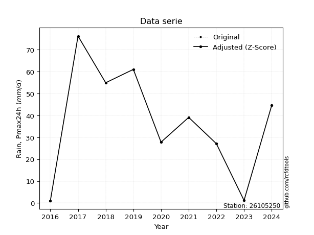</img>

</div>

> If Z-Score is active, values out of range or outliers are replaced with the station mean value.


### 4. Active continuous probability distributions from SciPy (45 of 104 available)

[scipy.stats](https://docs.scipy.org/doc/scipy/reference/stats.html) is a Python´s powerful submodule within the SciPy library for comprehensive statistical analysis, offering over 130 probability distributions (like Normal, Poisson), functions for descriptive stats (mean, variance), hypothesis testing (t-tests, chi-square), random variable generation, and statistical tests, making it essential for data science, modeling, and research. It provides tools to explore, model, and draw conclusions from data efficiently, working seamlessly with NumPy.

<div align="center">

|   id | p_dist             |   n_parameter | fit_method   | label                                                                       | active   | ref                                                                                                        |
|-----:|:-------------------|--------------:|:-------------|:----------------------------------------------------------------------------|:---------|:-----------------------------------------------------------------------------------------------------------|
|    0 | alpha              |             3 | MLE          | Alpha                                                                       | True     | [:mortar_board:](https://docs.scipy.org/doc/scipy/reference/generated/scipy.stats.alpha.html)              |
|    1 | betaprime          |             4 | MLE          | Beta prime                                                                  | True     | [:mortar_board:](https://docs.scipy.org/doc/scipy/reference/generated/scipy.stats.betaprime.html)          |
|    2 | chi2               |             3 | MLE          | Chi²                                                                        | True     | [:mortar_board:](https://docs.scipy.org/doc/scipy/reference/generated/scipy.stats.chi2.html)               |
|    3 | crystalball        |             4 | MLE          | Crystalball                                                                 | True     | [:mortar_board:](https://docs.scipy.org/doc/scipy/reference/generated/scipy.stats.crystalball.html)        |
|    4 | erlang             |             3 | MLE          | Erlang                                                                      | True     | [:mortar_board:](https://docs.scipy.org/doc/scipy/reference/generated/scipy.stats.erlang.html)             |
|    5 | expon              |             2 | MLE          | Exponential                                                                 | True     | [:mortar_board:](https://docs.scipy.org/doc/scipy/reference/generated/scipy.stats.expon.html)              |
|    6 | exponnorm          |             3 | MLE          | Exponentially modified Normal                                               | True     | [:mortar_board:](https://docs.scipy.org/doc/scipy/reference/generated/scipy.stats.exponnorm.html)          |
|    7 | f                  |             4 | MLE          | F                                                                           | True     | [:mortar_board:](https://docs.scipy.org/doc/scipy/reference/generated/scipy.stats.f.html)                  |
|    8 | fatiguelife        |             3 | MLE          | Fatigue-life (Birnbaum-Saunders)                                            | True     | [:mortar_board:](https://docs.scipy.org/doc/scipy/reference/generated/scipy.stats.fatiguelife.html)        |
|    9 | fisk               |             3 | MLE          | Fisk                                                                        | True     | [:mortar_board:](https://docs.scipy.org/doc/scipy/reference/generated/scipy.stats.fisk.html)               |
|   10 | gamma              |             3 | MLE          | Gamma                                                                       | True     | [:mortar_board:](https://docs.scipy.org/doc/scipy/reference/generated/scipy.stats.gamma.html)              |
|   11 | genexpon           |             5 | MLE          | Generalized exponential                                                     | True     | [:mortar_board:](https://docs.scipy.org/doc/scipy/reference/generated/scipy.stats.genexpon.html)           |
|   12 | genlogistic        |             3 | MLE          | Generalized logistic                                                        | True     | [:mortar_board:](https://docs.scipy.org/doc/scipy/reference/generated/scipy.stats.genlogistic.html)        |
|   13 | gibrat             |             2 | MM           | Gibrat                                                                      | True     | [:mortar_board:](https://docs.scipy.org/doc/scipy/reference/generated/scipy.stats.gibrat.html)             |
|   14 | gompertz           |             3 | MLE          | Gompertz (or truncated Gumbel)                                              | True     | [:mortar_board:](https://docs.scipy.org/doc/scipy/reference/generated/scipy.stats.gompertz.html)           |
|   15 | gumbel_l           |             2 | MM           | Gumbel Left Skew                                                            | True     | [:mortar_board:](https://docs.scipy.org/doc/scipy/reference/generated/scipy.stats.gumbel_l.html)           |
|   16 | gumbel_r           |             2 | MM           | Gumbel Right Skew                                                           | True     | [:mortar_board:](https://docs.scipy.org/doc/scipy/reference/generated/scipy.stats.gumbel_r.html)           |
|   17 | halflogistic       |             2 | MM           | Half-logistic                                                               | True     | [:mortar_board:](https://docs.scipy.org/doc/scipy/reference/generated/scipy.stats.halflogistic.html)       |
|   18 | halfnorm           |             2 | MM           | Half Normal                                                                 | True     | [:mortar_board:](https://docs.scipy.org/doc/scipy/reference/generated/scipy.stats.halfnorm.html)           |
|   19 | hypsecant          |             2 | MM           | hyperbolic secant                                                           | True     | [:mortar_board:](https://docs.scipy.org/doc/scipy/reference/generated/scipy.stats.hypsecant.html)          |
|   20 | invgamma           |             3 | MLE          | Inverted gamma                                                              | True     | [:mortar_board:](https://docs.scipy.org/doc/scipy/reference/generated/scipy.stats.invgamma.html)           |
|   21 | invgauss           |             3 | MLE          | Inverse Gaussian                                                            | True     | [:mortar_board:](https://docs.scipy.org/doc/scipy/reference/generated/scipy.stats.invgauss.html)           |
|   22 | invweibull         |             3 | MLE          | Inverted Weibull                                                            | True     | [:mortar_board:](https://docs.scipy.org/doc/scipy/reference/generated/scipy.stats.invweibull.html)         |
|   23 | johnsonsu          |             4 | MLE          | Johnson Su                                                                  | True     | [:mortar_board:](https://docs.scipy.org/doc/scipy/reference/generated/scipy.stats.johnsonsu.html)          |
|   24 | kstwobign          |             2 | MLE          | Limiting distribution of scaled Kolmogorov-Smirnov two-sided test statistic | True     | [:mortar_board:](https://docs.scipy.org/doc/scipy/reference/generated/scipy.stats.kstwobign.html)          |
|   25 | laplace            |             2 | MM           | Laplace                                                                     | True     | [:mortar_board:](https://docs.scipy.org/doc/scipy/reference/generated/scipy.stats.laplace.html)            |
|   26 | laplace_asymmetric |             3 | MLE          | Asymmetric Laplace                                                          | True     | [:mortar_board:](https://docs.scipy.org/doc/scipy/reference/generated/scipy.stats.laplace_asymmetric.html) |
|   27 | loggamma           |             3 | MLE          | Log gamma                                                                   | True     | [:mortar_board:](https://docs.scipy.org/doc/scipy/reference/generated/scipy.stats.loggamma.html)           |
|   28 | logistic           |             2 | MM           | Logistic (or Sech-squared)                                                  | True     | [:mortar_board:](https://docs.scipy.org/doc/scipy/reference/generated/scipy.stats.logistic.html)           |
|   29 | lognorm            |             3 | MLE          | Log Normal                                                                  | True     | [:mortar_board:](https://docs.scipy.org/doc/scipy/reference/generated/scipy.stats.lognorm.html)            |
|   30 | maxwell            |             2 | MM           | Maxwell                                                                     | True     | [:mortar_board:](https://docs.scipy.org/doc/scipy/reference/generated/scipy.stats.maxwell.html)            |
|   31 | mielke             |             4 | MLE          | Mielke Beta-Kappa / Dagum                                                   | True     | [:mortar_board:](https://docs.scipy.org/doc/scipy/reference/generated/scipy.stats.mielke.html)             |
|   32 | moyal              |             2 | MM           | Moyal                                                                       | True     | [:mortar_board:](https://docs.scipy.org/doc/scipy/reference/generated/scipy.stats.moyal.html)              |
|   33 | nakagami           |             3 | MLE          | Nakagami                                                                    | True     | [:mortar_board:](https://docs.scipy.org/doc/scipy/reference/generated/scipy.stats.nakagami.html)           |
|   34 | ncf                |             5 | MLE          | Non-central F distribution                                                  | True     | [:mortar_board:](https://docs.scipy.org/doc/scipy/reference/generated/scipy.stats.ncf.html)                |
|   35 | nct                |             4 | MLE          | Non-central Student’s t                                                     | True     | [:mortar_board:](https://docs.scipy.org/doc/scipy/reference/generated/scipy.stats.nct.html)                |
|   36 | norm               |             2 | MM           | Normal                                                                      | True     | [:mortar_board:](https://docs.scipy.org/doc/scipy/reference/generated/scipy.stats.norm.html)               |
|   37 | pareto             |             3 | MLE          | Pareto                                                                      | True     | [:mortar_board:](https://docs.scipy.org/doc/scipy/reference/generated/scipy.stats.pareto.html)             |
|   38 | pearson3           |             3 | MM           | Pearson type III                                                            | True     | [:mortar_board:](https://docs.scipy.org/doc/scipy/reference/generated/scipy.stats.pearson3.html)           |
|   39 | rayleigh           |             2 | MM           | Rayleigh                                                                    | True     | [:mortar_board:](https://docs.scipy.org/doc/scipy/reference/generated/scipy.stats.rayleigh.html)           |
|   40 | rice               |             3 | MLE          | Rice                                                                        | True     | [:mortar_board:](https://docs.scipy.org/doc/scipy/reference/generated/scipy.stats.rice.html)               |
|   41 | t                  |             3 | MLE          | Student’s t                                                                 | True     | [:mortar_board:](https://docs.scipy.org/doc/scipy/reference/generated/scipy.stats.t.html)                  |
|   42 | truncnorm          |             4 | MLE          | Truncated normal                                                            | True     | [:mortar_board:](https://docs.scipy.org/doc/scipy/reference/generated/scipy.stats.truncnorm.html)          |
|   43 | wald               |             2 | MM           | Wald                                                                        | True     | [:mortar_board:](https://docs.scipy.org/doc/scipy/reference/generated/scipy.stats.wald.html)               |
|   44 | weibull_min        |             3 | MLE          | Weibull minimum                                                             | True     | [:mortar_board:](https://docs.scipy.org/doc/scipy/reference/generated/scipy.stats.weibull_min.html)        |

</div>

> **n_parameter:** # arguments & localization & scale.
>
> **Fit methods:** (MLE) maximum likelihood, (MM) L-moments.
>
>**Inactive:** foldnorm, gennorm, norminvgauss, powernorm, powerlognorm, skewnorm, genextreme, anglit, arcsine, argus, beta, bradford, burr, burr12, cauchy, cosine, halfcauchy, foldcauchy, skewcauchy, wrapcauchy, dgamma, gengamma, exponweib, exponpow, truncexpon, gausshyper, genhalflogistic, genhyperbolic, geninvgauss, halfgennorm, johnsonsb, kappa4, kappa3, ksone, kstwo, loglaplace, levy, levy_l, levy_stable, ncx2, genpareto, truncpareto, lomax, powerlaw, rdist, rel_breitwigner, recipinvgauss, semicircular, studentized_range, trapezoid, triang, truncweibull_min, tukeylambda, uniform, loguniform, vonmises, vonmises_line, weibull_max, dweibull, 


## B. Probability distributions vs. Empirical distributions

A continuous probability distribution (CPD) describes probabilities for variables that can take any value within a range (like rain any time), unlike discrete variables with specific outcomes (like temperature). It uses a Probability Density Function (PDF), a curve where the total area under it equals 1, and the probability of the variable falling within an interval (a to b) is found by calculating the area under the curve between those points. A key feature is that the probability of hitting any single exact value is zero, so probabilities are always expressed for ranges, e.g., $P(a ≤ X ≤ b)$.

<div align="center">

Distributions parameters
|    |   station | p_dist                |   n |              loc |           scale | shape                   | shape1                | shape2                 | shape3   |
|---:|----------:|:----------------------|----:|-----------------:|----------------:|:------------------------|:----------------------|:-----------------------|:---------|
|  0 |  26105250 | alpha                 |  10 |  -183.589        |  1924.39        | 8.936167971947913       |                       |                        |          |
|  1 |  26105250 | betaprime             |  10 |   -50.4752       |  6792.67        | 12.312105311470617      | 982.0520803031862     |                        |          |
|  2 |  26105250 | chi2                  |  10 |     1            |    17.8091      | 1.1229638784112734      |                       |                        |          |
|  3 |  26105250 | crystalball           |  10 |    34.77         |    23.8718      | 592.7798194360307       | 7708.653717176494     |                        |          |
|  4 |  26105250 | erlang                |  10 |  -317.978        |     1.60653     | 219.55372312777376      |                       |                        |          |
|  5 |  26105250 | expon                 |  10 |     1            |    33.77        |                         |                       |                        |          |
|  6 |  26105250 | exponnorm             |  10 |    32.5106       |    23.7646      | 0.09507460915817714     |                       |                        |          |
|  7 |  26105250 | f                     |  10 |     1            |    34.4541      | 1.7951837141316247      | 191.57342101769495    |                        |          |
|  8 |  26105250 | fatiguelife           |  10 |     1            |     0.000106372 | 495.69796165985554      |                       |                        |          |
|  9 |  26105250 | fisk                  |  10 |  -251.514        |   285.476       | 19.907481512996565      |                       |                        |          |
| 10 |  26105250 | gamma                 |  10 |  -310.282        |     1.6435      | 209.8972050649565       |                       |                        |          |
| 11 |  26105250 | genexpon              |  10 |     0.99999      |     2.51896     | 0.07444228043701448     | 5.717222496371717e-07 | 2.401425745321573      |          |
| 12 |  26105250 | genlogistic           |  10 |   -89.5087       |    21.1904      | 202.7541990389194       |                       |                        |          |
| 13 |  26105250 | gibrat                |  10 |    16.5588       |    11.0456      |                         |                       |                        |          |
| 14 |  26105250 | gompertz              |  10 |     1            |    42.696       | 0.6349122139232102      |                       |                        |          |
| 15 |  26105250 | gumbel_l              |  10 |    45.5136       |    18.6128      |                         |                       |                        |          |
| 16 |  26105250 | gumbel_r              |  10 |    24.0264       |    18.6128      |                         |                       |                        |          |
| 17 |  26105250 | halflogistic          |  10 |     6.47639      |    20.4095      |                         |                       |                        |          |
| 18 |  26105250 | halfnorm              |  10 |     3.17309      |    39.6008      |                         |                       |                        |          |
| 19 |  26105250 | hypsecant             |  10 |    34.77         |    15.1973      |                         |                       |                        |          |
| 20 |  26105250 | invgamma              |  10 |  -162.453        | 13035.3         | 67.11515464526056       |                       |                        |          |
| 21 |  26105250 | invgauss              |  10 |   -81.965        |  2582.95        | 0.04519996118876707     |                       |                        |          |
| 22 |  26105250 | invweibull            |  10 |     0.92216      |     3.46624     | 0.37056494670507384     |                       |                        |          |
| 23 |  26105250 | johnsonsu             |  10 |  -212.771        |    61.9504      | -22.301968501276136     | 10.673681687210117    |                        |          |
| 24 |  26105250 | kstwobign             |  10 |   -50.5758       |    97.49        |                         |                       |                        |          |
| 25 |  26105250 | laplace               |  10 |    34.77         |    16.8799      |                         |                       |                        |          |
| 26 |  26105250 | laplace_asymmetric    |  10 |    27.8          |    19.4637      | 0.836879014115572       |                       |                        |          |
| 27 |  26105250 | loggamma              |  10 | -4693.62         |   701.181       | 848.9597613123069       |                       |                        |          |
| 28 |  26105250 | logistic              |  10 |    34.77         |    13.1612      |                         |                       |                        |          |
| 29 |  26105250 | lognorm               |  10 |     1            |     0.420581    | 11.838087289792032      |                       |                        |          |
| 30 |  26105250 | maxwell               |  10 |   -21.7961       |    35.4476      |                         |                       |                        |          |
| 31 |  26105250 | mielke                |  10 |     1            |    76.7702      | 0.6812308290201454      | 6.391918658445433     |                        |          |
| 32 |  26105250 | moyal                 |  10 |    21.1186       |    10.7461      |                         |                       |                        |          |
| 33 |  26105250 | nakagami              |  10 |     1            |    54.1193      | 0.21889835373712213     |                       |                        |          |
| 34 |  26105250 | ncf                   |  10 |     1            |     6.08621     | 0.929560265838679       | 50.997806882444365    | 4.075614436444599      |          |
| 35 |  26105250 | nct                   |  10 |    -0.128156     |     0.04953     | 0.37702290509834846     | 54.73617163988695     |                        |          |
| 36 |  26105250 | norm                  |  10 |    34.77         |    23.8718      |                         |                       |                        |          |
| 37 |  26105250 | pareto                |  10 |     0.998991     |     0.00100911  | 0.11176189121017448     |                       |                        |          |
| 38 |  26105250 | pearson3              |  10 |    34.77         |    23.8718      | 0.09740099130903482     |                       |                        |          |
| 39 |  26105250 | rayleigh              |  10 |   -10.8981       |    36.4379      |                         |                       |                        |          |
| 40 |  26105250 | rice                  |  10 |   -11.4484       |    29.3026      | 1.073072302899028       |                       |                        |          |
| 41 |  26105250 | t                     |  10 |    34.7709       |    23.8719      | 22512382.78827273       |                       |                        |          |
| 42 |  26105250 | truncnorm             |  10 |    -1.89105      |     5.34712     | 0.22987254270876023     | 14.604311611090768    |                        |          |
| 43 |  26105250 | wald                  |  10 |    10.8983       |    23.8718      |                         |                       |                        |          |
| 44 |  26105250 | weibull_min           |  10 |     1            |    26.808       | 0.5598596408337768      |                       |                        |          |
| 45 |  26105250 | logalpha              |  10 |   -42.349        |  1289.72        | 28.532216578684782      |                       |                        |          |
| 46 |  26105250 | logbetaprime          |  10 |    -0.227484     |     1.78726e+13 | 1.501450332088865       | 8007377975227.857     |                        |          |
| 47 |  26105250 | logchi2               |  10 |    -1.58624e-28  |     1.52237     | 1.6969839754838805      |                       |                        |          |
| 48 |  26105250 | logcrystalball        |  10 |     4.33336      |     8.95616e-08 | 6.441623320666046e-08   | 2509.4233578753165    |                        |          |
| 49 |  26105250 | logerlang             |  10 |   -21.6228       |     0.100461    | 244.26352559393754      |                       |                        |          |
| 50 |  26105250 | logexpon              |  10 |     0            |     2.94151     |                         |                       |                        |          |
| 51 |  26105250 | logexponnorm          |  10 |     2.94052      |     1.49321     | 0.0006699464350204312   |                       |                        |          |
| 52 |  26105250 | logf                  |  10 |    -3.70834e-32  |     1.21259     | 1.459627148523431       | 1.335934070569959     |                        |          |
| 53 |  26105250 | logfatiguelife        |  10 |  -842.584        |   845.521       | 0.001764015729786211    |                       |                        |          |
| 54 |  26105250 | logfisk               |  10 |    -1.19758e+08  |     1.19758e+08 | 151191864.5195282       |                       |                        |          |
| 55 |  26105250 | loggamma              |  10 |   -24.7706       |     0.0869731   | 318.7454164362889       |                       |                        |          |
| 56 |  26105250 | loggenexpon           |  10 |    -5.02765e-08  |     0.0677367   | 0.00865524572310052     | 3.4947330970702737    | 0.00015053027378255615 |          |
| 57 |  26105250 | loggenlogistic        |  10 |     4.33342      |     3.80635e-06 | 2.7260328306689406e-06  |                       |                        |          |
| 58 |  26105250 | loggibrat             |  10 |     1.80236      |     0.690928    |                         |                       |                        |          |
| 59 |  26105250 | loggompertz           |  10 |    -5.60201e-08  |     1.01655     | 0.03158416597669446     |                       |                        |          |
| 60 |  26105250 | loggumbel_l           |  10 |     3.61354      |     1.16425     |                         |                       |                        |          |
| 61 |  26105250 | loggumbel_r           |  10 |     2.26949      |     1.16425     |                         |                       |                        |          |
| 62 |  26105250 | loghalflogistic       |  10 |     1.17172      |     1.27664     |                         |                       |                        |          |
| 63 |  26105250 | loghalfnorm           |  10 |     0.965082     |     2.4771      |                         |                       |                        |          |
| 64 |  26105250 | loghypsecant          |  10 |     2.94151      |     0.950607    |                         |                       |                        |          |
| 65 |  26105250 | loginvgamma           |  10 |   -32.1049       | 17821.5         | 509.74176350678545      |                       |                        |          |
| 66 |  26105250 | loginvgauss           |  10 |   -11.4982       |  1089.77        | 0.01320821084139092     |                       |                        |          |
| 67 |  26105250 | loginvweibull         |  10 |    -1.27607e+08  |     1.27607e+08 | 75053314.68603069       |                       |                        |          |
| 68 |  26105250 | logjohnsonsu          |  10 |     4.43775      |     0.00410258  | 5.578964695337639       | 0.9190427092946885    |                        |          |
| 69 |  26105250 | logkstwobign          |  10 |    -3.83078      |     7.71896     |                         |                       |                        |          |
| 70 |  26105250 | loglaplace            |  10 |     2.94151      |     1.05586     |                         |                       |                        |          |
| 71 |  26105250 | loglaplace_asymmetric |  10 |     4.11087      |     0.500707    | 2.704848915139653       |                       |                        |          |
| 72 |  26105250 | logloggamma           |  10 |     4.3334       |     2.20553e-06 | 1.5829499187934985e-06  |                       |                        |          |
| 73 |  26105250 | loglogistic           |  10 |     2.94151      |     0.82325     |                         |                       |                        |          |
| 74 |  26105250 | loglognorm            |  10 |    -4.94066e-324 |     1.10218e-32 | 223.62002363946158      |                       |                        |          |
| 75 |  26105250 | logmaxwell            |  10 |    -0.596769     |     2.21729     |                         |                       |                        |          |
| 76 |  26105250 | logmielke             |  10 |    -7.03717e-29  |     2.60153     | 0.670441756745102       | 1.2408230852172464    |                        |          |
| 77 |  26105250 | logmoyal              |  10 |     2.0876       |     0.672181    |                         |                       |                        |          |
| 78 |  26105250 | lognakagami           |  10 |    -5.69032e-31  |     4.12782     | 0.2588895771284694      |                       |                        |          |
| 79 |  26105250 | logncf                |  10 |    -1.62378e-31  |     1.23488     | 1.4703493892135506      | 1.3129099305877419    | 0.9376940206771844     |          |
| 80 |  26105250 | lognct                |  10 |   -94.9585       |     1.45493     | 39409.69576553494       | 67.28696876433412     |                        |          |
| 81 |  26105250 | lognorm               |  10 |     2.94151      |     1.49321     |                         |                       |                        |          |
| 82 |  26105250 | logpareto             |  10 |    -0.000119078  |     0.000119078 | 0.11122455371000001     |                       |                        |          |
| 83 |  26105250 | logpearson3           |  10 |     2.94151      |     1.49321     | -1.1972852499633149     |                       |                        |          |
| 84 |  26105250 | lograyleigh           |  10 |     0.0848954    |     2.27925     |                         |                       |                        |          |
| 85 |  26105250 | logrice               |  10 |    -1.10195      |     1.60582     | 2.2814639478764978      |                       |                        |          |
| 86 |  26105250 | logt                  |  10 |     3.66653      |     0.514427    | 1.1949490494887063      |                       |                        |          |
| 87 |  26105250 | logtruncnorm          |  10 |    -0.000652073  |     4.09988     | -0.00019377019548053975 | 1.0571076404168673    |                        |          |
| 88 |  26105250 | logwald               |  10 |     1.44833      |     1.49319     |                         |                       |                        |          |
| 89 |  26105250 | logweibull_min        |  10 |    -4.51647e-28  |     2.45749     | 0.711589147742818       |                       |                        |          |

</div>

> **loc** (Location parameter): This shifts the distribution along the x-axis. For many common distributions, like the normal (Gaussian) distribution, loc represents the mean $μ$. For others, like the uniform distribution, it might represent the minimum value, or for the beta distribution, the left end of the support interval.
>
> **scale** (Scale parameter): This determines the width or spread of the distribution. For the normal distribution, scale represents the standard deviation $σ$. For a uniform distribution, it defines the length of the interval (from $loc$ to $loc + scale$).
>
> **shape** (Shape parameters): Refers to parameters that define the specific form of a probability distribution, distinct from its location (loc) and scale (scale). These parameters are required arguments for most distribution functions. For example, a normal (Gaussian) distribution is fully defined by its location (mean) and scale (standard deviation), so it has no specific shape parameters beyond loc and scale. However, other distributions have intrinsic properties that need specification, as Gamma distribution that takes a shape parameter, often named $a$ or $alpha$.


### 0. Cumulative distribution values - CDF (90 evaluated)

> Ordered by x ascending and calculating $log(f(x))$ separately. 

|   id |   Station |   date |    x |   count |   mean |     std |    zscore |   Value_initial |   station |   m |     alpha |   alpha_pdf |   betaprime |   betaprime_pdf |        chi2 |        chi2_pdf |   crystalball |   crystalball_pdf |    erlang |   erlang_pdf |      expon |   expon_pdf |   exponnorm |   exponnorm_pdf |           f |      f_pdf |   fatiguelife |   fatiguelife_pdf |      fisk |   fisk_pdf |     gamma |   gamma_pdf |    genexpon |   genexpon_pdf |   genlogistic |   genlogistic_pdf |   gibrat |   gibrat_pdf |    gompertz |   gompertz_pdf |   gumbel_l |   gumbel_l_pdf |   gumbel_r |   gumbel_r_pdf |   halflogistic |   halflogistic_pdf |   halfnorm |   halfnorm_pdf |   hypsecant |   hypsecant_pdf |   invgamma |   invgamma_pdf |   invgauss |   invgauss_pdf |   invweibull |   invweibull_pdf |   johnsonsu |   johnsonsu_pdf |   kstwobign |   kstwobign_pdf |   laplace |   laplace_pdf |   laplace_asymmetric |   laplace_asymmetric_pdf |   loggamma |   loggamma_pdf |   logistic |   logistic_pdf |   lognorm |   lognorm_pdf |   maxwell |   maxwell_pdf |      mielke |   mielke_pdf |     moyal |   moyal_pdf |    nakagami |   nakagami_pdf |         ncf |         ncf_pdf |       nct |    nct_pdf |      norm |   norm_pdf |   pareto |    pareto_pdf |   pearson3 |   pearson3_pdf |   rayleigh |   rayleigh_pdf |      rice |   rice_pdf |         t |      t_pdf |   truncnorm |   truncnorm_pdf |      wald |   wald_pdf |   weibull_min |   weibull_min_pdf |   logalpha |   logalpha_pdf |   logbetaprime |   logbetaprime_pdf |     logchi2 |   logchi2_pdf |   logcrystalball |   logcrystalball_pdf |   logerlang |   logerlang_pdf |   logexpon |   logexpon_pdf |   logexponnorm |   logexponnorm_pdf |        logf |    logf_pdf |   logfatiguelife |   logfatiguelife_pdf |   logfisk |   logfisk_pdf |   loggenexpon |   loggenexpon_pdf |   loggenlogistic |   loggenlogistic_pdf |   loggibrat |   loggibrat_pdf |   loggompertz |   loggompertz_pdf |   loggumbel_l |   loggumbel_l_pdf |   loggumbel_r |   loggumbel_r_pdf |   loghalflogistic |   loghalflogistic_pdf |   loghalfnorm |   loghalfnorm_pdf |   loghypsecant |   loghypsecant_pdf |   loginvgamma |   loginvgamma_pdf |   loginvgauss |   loginvgauss_pdf |   loginvweibull |   loginvweibull_pdf |   logjohnsonsu |   logjohnsonsu_pdf |   logkstwobign |   logkstwobign_pdf |   loglaplace |   loglaplace_pdf |   loglaplace_asymmetric |   loglaplace_asymmetric_pdf |   logloggamma |   logloggamma_pdf |   loglogistic |   loglogistic_pdf |   loglognorm |   loglognorm_pdf |   logmaxwell |   logmaxwell_pdf |   logmielke |   logmielke_pdf |    logmoyal |   logmoyal_pdf |   lognakagami |   lognakagami_pdf |      logncf |   logncf_pdf |    lognct |   lognct_pdf |   logpareto |   logpareto_pdf |   logpearson3 |   logpearson3_pdf |   lograyleigh |   lograyleigh_pdf |   logrice |   logrice_pdf |      logt |   logt_pdf |   logtruncnorm |   logtruncnorm_pdf |   logwald |   logwald_pdf |   logweibull_min |   logweibull_min_pdf |
|-----:|----------:|-------:|-----:|--------:|-------:|--------:|----------:|----------------:|----------:|----:|----------:|------------:|------------:|----------------:|------------:|----------------:|--------------:|------------------:|----------:|-------------:|-----------:|------------:|------------:|----------------:|------------:|-----------:|--------------:|------------------:|----------:|-----------:|----------:|------------:|------------:|---------------:|--------------:|------------------:|---------:|-------------:|------------:|---------------:|-----------:|---------------:|-----------:|---------------:|---------------:|-------------------:|-----------:|---------------:|------------:|----------------:|-----------:|---------------:|-----------:|---------------:|-------------:|-----------------:|------------:|----------------:|------------:|----------------:|----------:|--------------:|---------------------:|-------------------------:|-----------:|---------------:|-----------:|---------------:|----------:|--------------:|----------:|--------------:|------------:|-------------:|----------:|------------:|------------:|---------------:|------------:|----------------:|----------:|-----------:|----------:|-----------:|---------:|--------------:|-----------:|---------------:|-----------:|---------------:|----------:|-----------:|----------:|-----------:|------------:|----------------:|----------:|-----------:|--------------:|------------------:|-----------:|---------------:|---------------:|-------------------:|------------:|--------------:|-----------------:|---------------------:|------------:|----------------:|-----------:|---------------:|---------------:|-------------------:|------------:|------------:|-----------------:|---------------------:|----------:|--------------:|--------------:|------------------:|-----------------:|---------------------:|------------:|----------------:|--------------:|------------------:|--------------:|------------------:|--------------:|------------------:|------------------:|----------------------:|--------------:|------------------:|---------------:|-------------------:|--------------:|------------------:|--------------:|------------------:|----------------:|--------------------:|---------------:|-------------------:|---------------:|-------------------:|-------------:|-----------------:|------------------------:|----------------------------:|--------------:|------------------:|--------------:|------------------:|-------------:|-----------------:|-------------:|-----------------:|------------:|----------------:|------------:|---------------:|--------------:|------------------:|------------:|-------------:|----------:|-------------:|------------:|----------------:|--------------:|------------------:|--------------:|------------------:|----------:|--------------:|----------:|-----------:|---------------:|-------------------:|----------:|--------------:|-----------------:|---------------------:|
|    0 |  26105250 |   2016 |  1   |      10 |  34.77 | 25.1631 | -1.34205  |             1   |  26105250 |   1 | 0.0682297 |  0.00743502 |   0.0635866 |      0.00719698 | 1.66448e-10 | 841789          |     0.0785869 |        0.00614424 | 0.074561  |   0.00633145 | 0          |  0.0296121  |   0.0785424 |      0.00614611 | 1.88128e-16 | 1.52098    |     0.0487043 |        5.3123e+08 | 0.0799949 | 0.00580206 | 0.0748863 |  0.00636018 | 2.90007e-07 |     0.0295528  |     0.0600933 |        0.00791902 | 0        |   0          | 1.43934e-12 |     0.0148705  |  0.0874264 |     0.00448554 |  0.0318819 |     0.00590219 |       0        |         0          |   0        |     0          |   0.0687285 |      0.00448737 |  0.0674584 |     0.0069303  |  0.0644283 |     0.00728668 |    0.0168639 |       0.327761   |   0.0713155 |      0.00653192 |   0.05771   |      0.0087455  | 0.0676268 |    0.00400635 |            0.0794757 |               0.00487918 |  0.025347  |      0.0410552 |  0.0713672 |     0.00503555 | 0.0244235 |     0.0383819 | 0.0625748 |    0.00757002 | 1.54853e-07 |  13.638      | 0.0107726 |  0.00366615 | 1.41648e-08 |    5.58563e+07 | 2.44898e-08 | 330720          | 0.0428333 | 0.124111   | 0.0785869 | 0.00614424 | 0        | 110.753       |  0.0760476 |     0.00628539 |  0.0519153 |     0.00849609 | 0.0497691 | 0.00784054 | 0.0785826 | 0.00614394 |    0.280447 |     0.157575    | 0         | 0          |   1.85371e-10 |   934783          |  0.0272811 |      0.0452137 |      0.0229324 |          0.145265  | 1.06278e-24 |  5684.91      |              nan |                  nan |   0.0277553 |       0.0442129 |  0         |      0.339961  |      0.0244231 |          0.0383814 | 7.66104e-24 | 1.50772e+08 |        0.0242775 |            0.0383659 | 0.0165378 |     0.0205334 |   6.42422e-09 |          0.127778 |         0        |            0.0321502 |    0        |       0         |   1.74055e-09 |         0.0310701 |     0.0438887 |         0.0368573 |   0.000890393 |        0.00537168 |          0        |              0        |      0        |          0        |      0.028822  |          0.0302781 |     0.0245856 |         0.0417031 |     0.0284233 |         0.0496287 |       0.0308012 |           0.0630475 |      0.0696018 |          0.0276846 |      0.0337263 |          0.0793952 |    0.030837  |        0.0292056 |               0.0422795 |                   0.0312178 |     0.0445938 |         0.0320058 |     0.0273037 |         0.0322602 |   0.00135001 |    inf           |   0.00507403 |        0.0251395 | 7.02964e-20 |     6.69725e+08 | 2.30183e-06 |    3.98102e-05 |    8.1777e-17 |       7.44113e+13 | 9.51639e-24 |   4.3086e+07 | 0.024535  |    0.0385755 |    0        |    934.045      |     0.0463584 |         0.0389471 |   0           |         0         | 0.020599  |     0.0428622 | 0.0317024 |  0.0101685 |    0.000396661 |           0.27422  |  0        |     0         |      1.83477e-20 |          2.89076e+07 |
|    1 |  26105250 |   2023 |  1.2 |      10 |  34.77 | 25.1631 | -1.3341   |             1.2 |  26105250 |   2 | 0.0697276 |  0.00754416 |   0.0650368 |      0.00730436 | 0.0611162   |      0.170962   |     0.0798231 |        0.00621728 | 0.0758352 |   0.00641108 | 0.00590491 |  0.0294372  |   0.079779  |      0.00621922 | 0.00926177  | 0.0414513  |     0.534835  |        0.0869571  | 0.0811626 | 0.00587463 | 0.0761663 |  0.00644007 | 0.00589342  |     0.0293787  |     0.0616906 |        0.00805419 | 0        |   0          | 0.00297664  |     0.0148959  |  0.0883279 |     0.00452952 |  0.0330779 |     0.00605816 |       0        |         0          |   0        |     0          |   0.0696318 |      0.00454541 |  0.0688544 |     0.00702919 |  0.0658965 |     0.00739587 |    0.0782548 |       0.265916   |   0.0726306 |      0.00661836 |   0.0594745 |      0.00890001 | 0.0684328 |    0.0040541  |            0.0804576 |               0.00493946 |  0.0337919 |      0.0518724 |  0.0723809 |     0.0051015  | 0.0323139 |     0.0484562 | 0.0640993 |    0.00767541 | 0.0173616   |   0.0591362  | 0.0115248 |  0.0038566  | 0.0676191   |    0.148017    | 0.0213174   |      0.0512821  | 0.0688927 | 0.134211   | 0.0798231 | 0.00621728 | 0.446614 |   0.307685    |  0.0773124 |     0.00636286 |  0.0536272 |     0.0086233  | 0.0513487 | 0.00795629 | 0.0798187 | 0.00621698 |    0.311638 |     0.154312    | 0         | 0          |   0.0623926   |        0.16909    |  0.0365829 |      0.0571255 |      0.0528831 |          0.179833  | 0.0944423   |     0.425441  |              nan |                  nan |   0.0368209 |       0.0555199 |  0.0601004 |      0.319529  |      0.0323133 |          0.0484556 | 0.175515    | 0.621609    |        0.0321692 |            0.0484901 | 0.0207295 |     0.025628  |   0.0248871   |          0.144977 |         0        |            0.0366346 |    0        |       0         |   0.00618532  |         0.0369437 |     0.0511357 |         0.0427789 |   0.00246463  |        0.0127136  |          0        |              0        |      0        |          0        |      0.0349044 |          0.0366445 |     0.0332031 |         0.0531385 |     0.0386512 |         0.0628756 |       0.0438791 |           0.0806838 |      0.0749043 |          0.0305419 |      0.0502283 |          0.101737  |    0.0366491 |        0.0347102 |               0.0483721 |                   0.0357164 |     0.0508281 |         0.0364803 |     0.0338434 |         0.0397182 |   0.626067   |      0.0092923   |   0.0111196  |        0.0417676 | 0.165019    |     0.585194    | 3.6961e-05  |    0.000492916 |    0.15489    |       0.439699    | 0.113444    |   0.434074   | 0.0324645 |    0.048692  |    0.557699 |      0.269648   |     0.053993  |         0.0449291 |   0.000913145 |         0.0187368 | 0.0294227 |     0.0541959 | 0.0336605 |  0.0113423 |    0.0503762   |           0.273947 |  0        |     0         |      0.145373    |          0.523984    |
|    2 |  26105250 |   2025 | 14.8 |      10 |  34.77 | 25.1631 | -0.793623 |            14.8 |  26105250 |   3 | 0.222458  |  0.0145696  |   0.213797  |      0.0142603  | 0.577931    |      0.0182266  |     0.201422  |        0.0117777  | 0.202868  |   0.0123305  | 0.335451   |  0.0196787  |   0.201436  |      0.0117839  | 0.351799    | 0.0188021  |     0.766269  |        0.00806613 | 0.200503  | 0.0119828  | 0.203667  |  0.0123659  | 0.334909    |     0.0196554  |     0.229703  |        0.0158875  | 0        |   0          | 0.215147    |     0.0161245  |  0.174713  |     0.00851431 |  0.193659  |     0.0170809  |       0.201135 |         0.0235073  |   0.230938 |     0.0192982  |   0.167129  |      0.010499   |  0.211555  |     0.0137896  |  0.216499  |     0.0144066  |    0.549875  |       0.00878121 |   0.205186  |      0.0128652  |   0.240531  |      0.0165082  | 0.153169  |    0.00907407 |            0.185427  |               0.0113838  |  0.44142   |      0.25571   |  0.179854  |     0.0112077  | 0.434339  |     0.263544  | 0.214677  |    0.01408    | 0.310648    |   0.0153347  | 0.179668  |  0.0202486  | 0.430531    |    0.0134997   | 0.292073    |      0.0178419  | 0.583875  | 0.0104547  | 0.201422  | 0.0117777  | 0.65505  |   0.00279344  |  0.202732  |     0.0121557  |  0.220182  |     0.0150934  | 0.206617  | 0.014324   | 0.201413  | 0.0117773  |    0.997801 |     0.00139679  | 0.0340583 | 0.0297311  |   0.498182    |        0.0140376  |  0.459984  |      0.252317  |      0.545194  |          0.156255  | 0.657053    |     0.123959  |              nan |                  nan |   0.45219   |       0.253763  |  0.599911  |      0.136015  |      0.434336  |          0.263544  | 0.64325     | 0.0663684   |        0.435482  |            0.264045  | 0.335477  |     0.281447  |   0.53221     |          0.203865 |         0        |            0.221464  |    0.600922 |       0.432725  |   0.340189    |         0.290386  |     0.365029  |         0.247703  |   0.499531    |        0.297803   |          0.534519 |              0.279753 |      0.514957 |          0.252428 |      0.418245  |          0.323865  |     0.452276  |         0.257359  |     0.47398   |         0.244467  |       0.49      |           0.205586  |      0.267647  |          0.173564  |      0.527625  |          0.19831   |    0.395751  |        0.374814  |               0.309182  |                   0.22829   |     0.308456  |         0.221384  |     0.425584  |         0.296948  |   0.630621   |      0.000626252 |   0.468743   |        0.263479  | 0.695681    |     0.0846576   | 0.524353    |    0.308539    |    0.610983   |       0.107505    | 0.533049    |   0.0747281  | 0.434939  |    0.263165  |    0.672167 |      0.0135312  |     0.359569  |         0.232976  |   0.480822    |         0.260813  | 0.444357  |     0.258666  | 0.138651  |  0.140083  |    0.689361    |           0.220929 |  0.593058 |     0.344685  |      0.656218    |          0.0969354   |
|    3 |  26105250 |   2022 | 27.1 |      10 |  34.77 | 25.1631 | -0.304812 |            27.1 |  26105250 |   4 | 0.421668  |  0.0169605  |   0.410495  |      0.0169204  | 0.742196    |      0.00975811 |     0.373992  |        0.0158711  | 0.381784  |   0.0162516  | 0.538316   |  0.0136714  |   0.37408   |      0.0158759  | 0.542894    | 0.0127689  |     0.841171  |        0.00463549 | 0.381235  | 0.0168551  | 0.38291   |  0.0162651  | 0.537604    |     0.0136652  |     0.438439  |        0.0170253  | 0.481358 |   0.0378048  | 0.4144      |     0.0160476  |  0.310534  |     0.0137739  |  0.428364  |     0.0195113  |       0.466232 |         0.0191731  |   0.454291 |     0.0167866  |   0.345766  |      0.0185342  |  0.404833  |     0.0168789  |  0.414197  |     0.0169107  |    0.623296  |       0.00417101 |   0.389677  |      0.0165265  |   0.450572  |      0.0167452  | 0.317419  |    0.0188045  |            0.394566  |               0.0242232  |  0.595511  |      0.247438  |  0.358295  |     0.0174695  | 0.594744  |     0.259601  | 0.40716   |    0.0165409  | 0.47947     |   0.0125019  | 0.449011  |  0.0211026  | 0.565384    |    0.00909491  | 0.494647    |      0.0148281  | 0.668017  | 0.00458968 | 0.373992  | 0.0158711  | 0.678763 |   0.00137551  |  0.379522  |     0.0161115  |  0.419425  |     0.0166155  | 0.400715  | 0.0166162  | 0.373978  | 0.0158709  |    1        |     7.54596e-08 | 0.501894  | 0.0277     |   0.626608    |        0.00789034 |  0.609858  |      0.237495  |      0.631964  |          0.130951  | 0.724024    |     0.0985529 |              nan |                  nan |   0.60421   |       0.242821  |  0.674279  |      0.110733  |      0.594742  |          0.259601  | 0.678463    | 0.0511238   |        0.596037  |            0.259575  | 0.520031  |     0.315113  |   0.648027    |          0.177641 |         0        |            0.341545  |    0.780328 |       0.197599  |   0.541406    |         0.365945  |     0.534017  |         0.305628  |   0.661777    |        0.234656   |          0.682278 |              0.209337 |      0.65402  |          0.206604 |      0.617145  |          0.312428  |     0.605895  |         0.244351  |     0.617338  |         0.224746  |       0.606657  |           0.178331  |      0.409731  |          0.31384   |      0.639202  |          0.169595  |    0.643787  |        0.337367  |               0.483269  |                   0.35683   |     0.476149  |         0.341741  |     0.60704   |         0.289757  |   0.630962   |      0.000511286 |   0.621727   |        0.237276  | 0.740301    |     0.0642008   | 0.68477     |    0.221882    |    0.671247   |       0.0922757   | 0.573352    |   0.0594606  | 0.595018  |    0.258946  |    0.679469 |      0.0108044  |     0.519527  |         0.293318  |   0.630131    |         0.228874  | 0.60029   |     0.250466  | 0.294501  |  0.432989  |    0.816276    |           0.198336 |  0.74879  |     0.189111  |      0.708659    |          0.0774878   |
|    4 |  26105250 |   2020 | 27.8 |      10 |  34.77 | 25.1631 | -0.276993 |            27.8 |  26105250 |   5 | 0.433534  |  0.0169416  |   0.422342  |      0.0169256  | 0.748921    |      0.0094578  |     0.385152  |        0.0160145  | 0.393202  |   0.0163686  | 0.547788   |  0.0133909  |   0.385244  |      0.016019   | 0.551739    | 0.0125037  |     0.844372  |        0.0045137  | 0.393087  | 0.0170035  | 0.394337  |  0.0163802  | 0.547072    |     0.0133854  |     0.45032   |        0.0169208  | 0.507001 |   0.0354839  | 0.425617    |     0.0160004  |  0.320289  |     0.0140994  |  0.441981  |     0.0193884  |       0.479545 |         0.0188646  |   0.465978 |     0.0166057  |   0.358876  |      0.0189202  |  0.416661  |     0.0169118  |  0.426033  |     0.0169039  |    0.62617   |       0.0040414  |   0.401276  |      0.0166135  |   0.462249  |      0.0166181  | 0.330859  |    0.0196007  |            0.411892  |               0.0252869  |  0.601807  |      0.246284  |  0.370613  |     0.0177232  | 0.601351  |     0.258502  | 0.418745  |    0.0165573  | 0.488183    |   0.0123943  | 0.463678  |  0.0207989  | 0.571694    |    0.00893582  | 0.504954    |      0.0146197  | 0.671174  | 0.00443243 | 0.385152  | 0.0160145  | 0.679711 |   0.00133562  |  0.390845  |     0.0162357  |  0.431045  |     0.0165829  | 0.412354  | 0.016634   | 0.385138  | 0.0160142  |    1        |     3.67909e-08 | 0.52083   | 0.0264125  |   0.632059    |        0.00768511 |  0.615898  |      0.236159  |      0.63529   |          0.129932  | 0.726526    |     0.0976169 |              nan |                  nan |   0.610387  |       0.241596  |  0.67709   |      0.109777  |      0.601348  |          0.258503  | 0.679761    | 0.050608    |        0.602643  |            0.258454  | 0.528061  |     0.314626  |   0.652541    |          0.176371 |         0        |            0.347841  |    0.785292 |       0.191741  |   0.55076     |         0.367588  |     0.541831  |         0.307158  |   0.667723    |        0.231635   |          0.68758  |              0.206492 |      0.659263 |          0.204598 |      0.625074  |          0.30933   |     0.61211   |         0.243026  |     0.623052  |         0.223334  |       0.611188  |           0.176989  |      0.417845  |          0.322492  |      0.64351   |          0.168281  |    0.652288  |        0.329317  |               0.492455  |                   0.363613  |     0.484945  |         0.348054  |     0.614405  |         0.287776  |   0.630975   |      0.000507359 |   0.627756   |        0.235567  | 0.741929    |     0.0634992   | 0.690384    |    0.218382    |    0.673593   |       0.091698    | 0.574861    |   0.0589298  | 0.601608  |    0.257842  |    0.679743 |      0.0107124  |     0.527033  |         0.295387  |   0.635945    |         0.227064  | 0.606663  |     0.249297  | 0.305796  |  0.452865  |    0.821321    |           0.197341 |  0.753556 |     0.184704  |      0.710627    |          0.0767938   |
|    5 |  26105250 |   2021 | 39.1 |      10 |  34.77 | 25.1631 |  0.172078 |            39.1 |  26105250 |   6 | 0.615836  |  0.014824   |   0.60668   |      0.015184   | 0.833747    |      0.00590211 |     0.571968  |        0.0164392  | 0.581153  |   0.0162754  | 0.676391   |  0.00958273 |   0.572077  |      0.0164376  | 0.671915    | 0.00898406 |     0.88635   |        0.00304971 | 0.587869  | 0.0165964  | 0.582245  |  0.0162569  | 0.675662    |     0.00958516 |     0.625979  |        0.013822   | 0.762173 |   0.0137229  | 0.599414    |     0.0145401  |  0.507627  |     0.0187428  |  0.640873  |     0.0153196  |       0.663603 |         0.01371    |   0.635713 |     0.0133509  |   0.58949   |      0.0201229  |  0.602864  |     0.0154754  |  0.609123  |     0.0150006  |    0.662958  |       0.00264501 |   0.58904   |      0.0160063  |   0.634082  |      0.0135501  | 0.61313   |    0.022919   |            0.638217  |               0.0155556  |  0.682553  |      0.225654  |  0.581515  |     0.0184903  | 0.686258  |     0.237495  | 0.600798  |    0.0151881  | 0.619728    |   0.0109564  | 0.664899  |  0.0146408  | 0.660551    |    0.00694115  | 0.650768    |      0.011199   | 0.710669  | 0.00277866 | 0.571968  | 0.0164392  | 0.69206  |   0.000903282 |  0.578116  |     0.0162936  |  0.609916  |     0.0146894  | 0.595854  | 0.0153896  | 0.571952  | 0.0164392  |    1        |     3.16045e-14 | 0.731617  | 0.0128349  |   0.704031    |        0.00529505 |  0.692881  |      0.214012  |      0.677337  |          0.116765  | 0.757793    |     0.08599   |              nan |                  nan |   0.689416  |       0.220392  |  0.712444  |      0.0977577 |      0.686255  |          0.237495  | 0.695934    | 0.0444407   |        0.687483  |            0.23716   | 0.632504  |     0.293454  |   0.709707    |          0.158618 |         0        |            0.444089  |    0.839479 |       0.130826  |   0.677554    |         0.369029  |     0.648731  |         0.315652  |   0.739845    |        0.191476   |          0.751738 |              0.170326 |      0.724466 |          0.177751 |      0.722064  |          0.256616  |     0.691402  |         0.220534  |     0.69561   |         0.2012    |       0.668409  |           0.158375  |      0.551324  |          0.471216  |      0.697878  |          0.150463  |    0.748276  |        0.238407  |               0.633494  |                   0.467752  |     0.619454  |         0.444594  |     0.70686   |         0.251696  |   0.63114    |      0.000460088 |   0.703816   |        0.20953   | 0.762103    |     0.0550741   | 0.757267    |    0.17488     |    0.703599   |       0.0843672   | 0.593832    |   0.0525043  | 0.686285  |    0.23683   |    0.683203 |      0.00961082 |     0.63167   |         0.315545  |   0.708986    |         0.200614  | 0.688379  |     0.228264  | 0.499743  |  0.639129  |    0.886337    |           0.183826 |  0.807797 |     0.136351  |      0.73533     |          0.0682874   |
|    6 |  26105250 |   2024 | 44.6 |      10 |  34.77 | 25.1631 |  0.390652 |            44.6 |  26105250 |   7 | 0.692465  |  0.0129929  |   0.685626  |      0.0134636  | 0.862958    |      0.00476722 |     0.659751  |        0.0153534  | 0.667426  |   0.0149812  | 0.725028   |  0.00814249 |   0.659844  |      0.0153491  | 0.717639    | 0.00767988 |     0.901743  |        0.00256616 | 0.674454  | 0.0147612  | 0.668385  |  0.0149523  | 0.724319    |     0.0081472  |     0.696667  |        0.0118726  | 0.824239 |   0.00921808 | 0.676284    |     0.0133653  |  0.614071  |     0.0197415  |  0.718137  |     0.0127747  |       0.732438 |         0.0113559  |   0.704491 |     0.0116574  |   0.692875  |      0.0172164  |  0.683522  |     0.0137824  |  0.686956  |     0.0132486  |    0.676348  |       0.0022439  |   0.673323  |      0.0145424  |   0.703681  |      0.011752   | 0.720708  |    0.0165458  |            0.714409  |               0.0122796  |  0.711594  |      0.215501  |  0.678501  |     0.0165743  | 0.716816  |     0.226669  | 0.68033   |    0.0136654  | 0.67825     |   0.0103199  | 0.737355  |  0.0117692  | 0.696696    |    0.0062219   | 0.708012    |      0.00963659 | 0.724625  | 0.00231984 | 0.659751  | 0.0153534  | 0.696666 |   0.000777532 |  0.66468   |     0.0150654  |  0.686482  |     0.0131049  | 0.676694  | 0.0139355  | 0.659735  | 0.0153536  |    1        |     7.00678e-18 | 0.792102  | 0.00938194 |   0.73098     |        0.00453557 |  0.72038   |      0.203738  |      0.692385  |          0.11193   | 0.76884     |     0.0819133 |              nan |                  nan |   0.717762  |       0.210201  |  0.725027  |      0.0934802 |      0.716814  |          0.22667   | 0.701645    | 0.0423779   |        0.717991  |            0.226243  | 0.67021   |     0.279044  |   0.730115    |          0.151506 |         0        |            0.487983  |    0.855553 |       0.113932  |   0.725452    |         0.357642  |     0.690071  |         0.311835  |   0.764061    |        0.176607   |          0.7733   |              0.157447 |      0.747185 |          0.167509 |      0.754322  |          0.233537  |     0.719737  |         0.209909  |     0.721452  |         0.191402  |       0.68877   |           0.151043  |      0.618245  |          0.547509  |      0.717227  |          0.143575  |    0.777776  |        0.210467  |               0.698146  |                   0.515489  |     0.680821  |         0.488638  |     0.73886   |         0.234371  |   0.631199   |      0.000444121 |   0.730659   |        0.198304  | 0.769162    |     0.0522444   | 0.779287    |    0.159923    |    0.714528   |       0.0817156   | 0.600596    |   0.0503214  | 0.716759  |    0.226032  |    0.684443 |      0.00924145 |     0.673421  |         0.318357  |   0.73467     |         0.189631  | 0.717747  |     0.217848  | 0.582244  |  0.603006  |    0.910182    |           0.178531 |  0.824772 |     0.121942  |      0.744122    |          0.0653508   |
|    7 |  26105250 |   2018 | 54.9 |      10 |  34.77 | 25.1631 |  0.799982 |            54.9 |  26105250 |   8 | 0.807049  |  0.00926856 |   0.805339  |      0.00975396 | 0.903699    |      0.00325303 |     0.800457  |        0.0117116  | 0.803347  |   0.0112178  | 0.797313   |  0.00600199 |   0.800491  |      0.0117052  | 0.786306    | 0.0057522  |     0.924503  |        0.00189522 | 0.803622  | 0.010253   | 0.803963  |  0.0111833  | 0.796667    |     0.00600912 |     0.80061   |        0.00839733 | 0.89334  |   0.00479664 | 0.799878    |     0.0105167  |  0.809066  |     0.0169859  |  0.826645  |     0.00845532 |       0.829428 |         0.00764471 |   0.808518 |     0.00858507 |   0.834543  |      0.0104036  |  0.806123  |     0.00997369 |  0.804524  |     0.00956901 |    0.696604  |       0.00172898 |   0.804206  |      0.0107376  |   0.807723  |      0.00851247 | 0.848276  |    0.00898846 |            0.816596  |               0.00788583 |  0.754551  |      0.197666  |  0.821932  |     0.0111205  | 0.761941  |     0.207269  | 0.803329  |    0.0101433  | 0.777624    |   0.00890016 | 0.835486  |  0.00754519 | 0.754895    |    0.00512326  | 0.79369     |      0.00708966 | 0.745313  | 0.00174431 | 0.800457  | 0.0117116  | 0.703771 |   0.000614221 |  0.801826  |     0.0113541  |  0.804146  |     0.00970598 | 0.802742  | 0.0104385  | 0.800445  | 0.011712   |    1        |     5.83676e-26 | 0.866625  | 0.00550653 |   0.772019    |        0.00350113 |  0.760914  |      0.186204  |      0.714873  |          0.104587  | 0.785226    |     0.0758948 |              nan |                  nan |   0.759627  |       0.192496  |  0.74378   |      0.0871048 |      0.761939  |          0.20727   | 0.710137    | 0.03942     |        0.763015  |            0.206729  | 0.725408  |     0.251475  |   0.760417    |          0.140153 |         0        |            0.56628   |    0.876896 |       0.0924416 |   0.796674    |         0.324933  |     0.753474  |         0.296506  |   0.798418    |        0.154384   |          0.804014 |              0.138473 |      0.780334 |          0.151654 |      0.799083  |          0.197599  |     0.76148   |         0.191632  |     0.759537  |         0.175055  |       0.718955  |           0.139526  |      0.745889  |          0.681486  |      0.745939  |          0.132828  |    0.817473  |        0.17287   |               0.813907  |                   0.600963  |     0.790311  |         0.567221  |     0.78456   |         0.205315  |   0.631289   |      0.000421049 |   0.769956   |        0.179843  | 0.779587    |     0.0481803   | 0.810241    |    0.13846     |    0.731086   |       0.0777053   | 0.610718    |   0.04716    | 0.761758  |    0.206706  |    0.686307 |      0.00871032 |     0.739407  |         0.315063  |   0.772234    |         0.171894  | 0.761139  |     0.199482  | 0.693069  |  0.454827  |    0.946405    |           0.170124 |  0.848051 |     0.102789  |      0.757247    |          0.0610534   |
|    8 |  26105250 |   2019 | 61   |      10 |  34.77 | 25.1631 |  1.0424   |            61   |  26105250 |   9 | 0.857311  |  0.00725271 |   0.858331  |      0.00765473 | 0.921519    |      0.00261512 |     0.864069  |        0.00913811 | 0.864167  |   0.00873147 | 0.830809   |  0.00501011 |   0.864066  |      0.0091326  | 0.818587    | 0.00485808 |     0.935128  |        0.00159846 | 0.858332  | 0.00774592 | 0.864583  |  0.00870092 | 0.830208    |     0.00501786 |     0.846387  |        0.00665871 | 0.918059 |   0.00340633 | 0.858212    |     0.00859553 |  0.899539  |     0.0124032  |  0.871814  |     0.00642543 |       0.870645 |         0.00592804 |   0.855777 |     0.0069376  |   0.887856  |      0.00722752 |  0.860176  |     0.00778215 |  0.856539  |     0.0075215  |    0.70647   |       0.00151414 |   0.862406  |      0.00836442 |   0.854405  |      0.00682891 | 0.894291  |    0.00626241 |            0.858908  |               0.00606653 |  0.774871  |      0.187997  |  0.880058  |     0.00802024 | 0.783221  |     0.196616  | 0.858685  |    0.00802638 | 0.828658    |   0.00779543 | 0.875753  |  0.00573407 | 0.784455    |    0.00457949  | 0.833028    |      0.00584025 | 0.755206  | 0.00150935 | 0.864069  | 0.00913811 | 0.707299 |   0.000545204 |  0.863448  |     0.00885368 |  0.857255  |     0.00772984 | 0.859754  | 0.00826703 | 0.864059  | 0.00913851 |    1        |     1.66547e-31 | 0.89575   | 0.00412248 |   0.791946    |        0.00304784 |  0.780044  |      0.176896  |      0.725703  |          0.101002  | 0.79307     |     0.0730256 |              nan |                  nan |   0.779409  |       0.182972  |  0.752795  |      0.0840401 |      0.78322   |          0.196617  | 0.714217    | 0.0380447   |        0.784236  |            0.196033  | 0.751096  |     0.236022  |   0.77488     |          0.134388 |         0        |            0.610664  |    0.886154 |       0.0834796 |   0.829727    |         0.301827  |     0.784095  |         0.284272  |   0.814122    |        0.143801   |          0.818127 |              0.129507 |      0.795898 |          0.143809 |      0.818985  |          0.180322  |     0.781159  |         0.181878  |     0.777532  |         0.166513  |       0.733351  |           0.133768  |      0.820787  |          0.735683  |      0.759651  |          0.127471  |    0.834808  |        0.156453  |               0.879753  |                   0.649582  |     0.852391  |         0.611777  |     0.805404  |         0.190377  |   0.631333   |      0.000410242 |   0.788402   |        0.170306  | 0.784563    |     0.0462891   | 0.824302    |    0.128559    |    0.73917    |       0.0757479   | 0.615608    |   0.0456771  | 0.782982  |    0.196101  |    0.687212 |      0.00846261 |     0.772316  |         0.309094  |   0.789868    |         0.162847  | 0.781634  |     0.189498  | 0.736732  |  0.375287  |    0.964104    |           0.16585  |  0.858435 |     0.0944796 |      0.763572    |          0.0590191   |
|    9 |  26105250 |   2017 | 76.2 |      10 |  34.77 | 25.1631 |  1.64646  |            76.2 |  26105250 |  10 | 0.936825  |  0.00353618 |   0.941753  |      0.00364925 | 0.952376    |      0.0015458  |     0.958676  |        0.00370655 | 0.955437  |   0.0036694  | 0.89213    |  0.00319426 |   0.958626  |      0.00370608 | 0.878973    | 0.00320604 |     0.955076  |        0.00106755 | 0.939741  | 0.00343995 | 0.955522  |  0.00365668 | 0.89165     |     0.00320207 |     0.92181   |        0.00354098 | 0.954132 |   0.00161389 | 0.953123    |     0.00405698 |  0.994484  |     0.00154109 |  0.94118   |     0.0030654  |       0.936416 |         0.00301637 |   0.934828 |     0.00367961 |   0.958379  |      0.0027309  |  0.944111  |     0.00361349 |  0.938995  |     0.00364788 |    0.72643   |       0.00114292 |   0.95098   |      0.00366648 |   0.932049  |      0.00362513 | 0.957043  |    0.00254489 |            0.926605  |               0.00315577 |  0.814352  |      0.166779  |  0.958825  |     0.00299967 | 0.824362  |     0.17303   | 0.945996  |    0.00376716 | 0.922061    |   0.00445186 | 0.938557  |  0.00285321 | 0.845181    |    0.00345925  | 0.902746    |      0.00350546 | 0.774863  | 0.00111184 | 0.958676  | 0.00370655 | 0.714593 |   0.000424164 |  0.955905  |     0.00370094 |  0.942548  |     0.00376883 | 0.949095  | 0.0037933  | 0.958671  | 0.00370685 |    1        |     8.84131e-48 | 0.941325  | 0.00212994 |   0.831618    |        0.0022333  |  0.817173  |      0.156816  |      0.747359  |          0.0937415 | 0.808676    |     0.0673399 |              nan |                  nan |   0.817819  |       0.162199  |  0.770803  |      0.077918  |      0.824361  |          0.173031  | 0.72238     | 0.0353814   |        0.825241  |            0.172392  | 0.799849  |     0.202111  |   0.803433    |          0.12231  |         0.999955 |            0.716148  |    0.902914 |       0.0678543 |   0.890434    |         0.241737  |     0.84366   |         0.249194  |   0.843772    |        0.123113   |          0.84496  |              0.112029 |      0.826097 |          0.12779  |      0.855313  |          0.147018  |     0.819283  |         0.160759  |     0.812555  |         0.148308  |       0.761785  |           0.121911  |      0.975415  |          0.506997  |      0.786777  |          0.116439  |    0.866194  |        0.126727  |               0.963851  |                   0.195281  |     0.999973  |         0.717699  |     0.844313  |         0.15967   |   0.631422   |      0.000389148 |   0.824051   |        0.150186  | 0.794447    |     0.0426269   | 0.850757    |    0.10971     |    0.755576   |       0.0717686   | 0.625443    |   0.0427813  | 0.824021  |    0.172637  |    0.68904  |      0.0079812  |     0.838733  |         0.285265  |   0.823988    |         0.143943  | 0.821368  |     0.167537  | 0.804583  |  0.243832  |    1           |           0.156835 |  0.877726 |     0.0794499 |      0.77625     |          0.0550116   |

An Empirical Distribution Function (EDF) is a step-function estimate of a true cumulative distribution function (CDF) based on observed sample data, representing the proportion of data points less than or equal to a given value. It is calculated by ordering your data and jumping up by $1/n$ (where $n$ is sample size) at each unique data point, allowing analysis without assuming an underlying population distribution, and it gets closer to the true CDF as the sample size grows.


### 1. Empirical - EDF California (1923)

California´s estimates the true probability distribution of water-related data (like rainfall, streamflow) using observed samples, crucial for risk assessment.

<div align="center">


$P=m/n$


</div>


**1.1. Empirical values**

<div align="center">

|                | 0                  | 1              | 2                  | 3                  | 4              | 5              | 6                 | 7                 | 8                  | 9              |
|:---------------|:-------------------|:---------------|:-------------------|:-------------------|:---------------|:---------------|:------------------|:------------------|:-------------------|:---------------|
| date           | 2016               | 2023           | 2025               | 2022               | 2020           | 2021           | 2024              | 2018              | 2019               | 2017           |
| x              | 1.0                | 1.2            | 14.8               | 27.1               | 27.8           | 39.1           | 44.6              | 54.9              | 61.0               | 76.2           |
| m              | 1                  | 2              | 3                  | 4                  | 5              | 6              | 7                 | 8                 | 9                  | 10             |
| empirical_dist | edf_california     | edf_california | edf_california     | edf_california     | edf_california | edf_california | edf_california    | edf_california    | edf_california     | edf_california |
| empirical      | 0.1                | 0.2            | 0.3                | 0.4                | 0.5            | 0.6            | 0.7               | 0.8               | 0.9                | 1.0            |
| empirical_tr   | 1.1111111111111112 | 1.25           | 1.4285714285714286 | 1.6666666666666667 | 2.0            | 2.5            | 3.333333333333333 | 5.000000000000001 | 10.000000000000002 | inf            |

</div>


**1.2. Kolmogorov-Smirnov fit test (sorted by Δ)**


<div align="center">

|                | 0                   | 1                   | 2                   | 3                   | 4                  | 5                   | 6                   | 7                   | 8                   | 9                   | 10                 | 11                 | 12                  | 13                  | 14                  | 15                  | 16                  | 17                  | 18                  | 19                 | 20                  | 21                  | 22                  | 23                    | 24                  | 25                  | 26                 | 27                 | 28                  | 29                 | 30                  | 31                  | 32                  | 33                  | 34                  | 35                 | 36                  | 37                  | 38                  | 39                  | 40                 | 41                  | 42                 | 43                 | 44                 | 45                 | 46                 | 47                 | 48                  | 49                  | 50                  | 51                  | 52                  | 53                  | 54                  | 55                 | 56                 | 57                  | 58                  | 59                  | 60                  | 61                  | 62                  | 63                 | 64                  | 65                  | 66                  | 67                 | 68                  | 69                 | 70                 | 71                 | 72                 | 73                  | 74                  | 75                 | 76                  | 77                 | 78                 | 79                  | 80                 | 81                 | 82                 | 83                 | 84                 | 85                 | 86                 | 87                 | 88                 | 89                 |
|:---------------|:--------------------|:--------------------|:--------------------|:--------------------|:-------------------|:--------------------|:--------------------|:--------------------|:--------------------|:--------------------|:-------------------|:-------------------|:--------------------|:--------------------|:--------------------|:--------------------|:--------------------|:--------------------|:--------------------|:-------------------|:--------------------|:--------------------|:--------------------|:----------------------|:--------------------|:--------------------|:-------------------|:-------------------|:--------------------|:-------------------|:--------------------|:--------------------|:--------------------|:--------------------|:--------------------|:-------------------|:--------------------|:--------------------|:--------------------|:--------------------|:-------------------|:--------------------|:-------------------|:-------------------|:-------------------|:-------------------|:-------------------|:-------------------|:--------------------|:--------------------|:--------------------|:--------------------|:--------------------|:--------------------|:--------------------|:-------------------|:-------------------|:--------------------|:--------------------|:--------------------|:--------------------|:--------------------|:--------------------|:-------------------|:--------------------|:--------------------|:--------------------|:-------------------|:--------------------|:-------------------|:-------------------|:-------------------|:-------------------|:--------------------|:--------------------|:-------------------|:--------------------|:-------------------|:-------------------|:--------------------|:-------------------|:-------------------|:-------------------|:-------------------|:-------------------|:-------------------|:-------------------|:-------------------|:-------------------|:-------------------|
| station        | 26105250            | 26105250            | 26105250            | 26105250            | 26105250           | 26105250            | 26105250            | 26105250            | 26105250            | 26105250            | 26105250           | 26105250           | 26105250            | 26105250            | 26105250            | 26105250            | 26105250            | 26105250            | 26105250            | 26105250           | 26105250            | 26105250            | 26105250            | 26105250              | 26105250            | 26105250            | 26105250           | 26105250           | 26105250            | 26105250           | 26105250            | 26105250            | 26105250            | 26105250            | 26105250            | 26105250           | 26105250            | 26105250            | 26105250            | 26105250            | 26105250           | 26105250            | 26105250           | 26105250           | 26105250           | 26105250           | 26105250           | 26105250           | 26105250            | 26105250            | 26105250            | 26105250            | 26105250            | 26105250            | 26105250            | 26105250           | 26105250           | 26105250            | 26105250            | 26105250            | 26105250            | 26105250            | 26105250            | 26105250           | 26105250            | 26105250            | 26105250            | 26105250           | 26105250            | 26105250           | 26105250           | 26105250           | 26105250           | 26105250            | 26105250            | 26105250           | 26105250            | 26105250           | 26105250           | 26105250            | 26105250           | 26105250           | 26105250           | 26105250           | 26105250           | 26105250           | 26105250           | 26105250           | 26105250           | 26105250           |
| empirical_dist | edf_california      | edf_california      | edf_california      | edf_california      | edf_california     | edf_california      | edf_california      | edf_california      | edf_california      | edf_california      | edf_california     | edf_california     | edf_california      | edf_california      | edf_california      | edf_california      | edf_california      | edf_california      | edf_california      | edf_california     | edf_california      | edf_california      | edf_california      | edf_california        | edf_california      | edf_california      | edf_california     | edf_california     | edf_california      | edf_california     | edf_california      | edf_california      | edf_california      | edf_california      | edf_california      | edf_california     | edf_california      | edf_california      | edf_california      | edf_california      | edf_california     | edf_california      | edf_california     | edf_california     | edf_california     | edf_california     | edf_california     | edf_california     | edf_california      | edf_california      | edf_california      | edf_california      | edf_california      | edf_california      | edf_california      | edf_california     | edf_california     | edf_california      | edf_california      | edf_california      | edf_california      | edf_california      | edf_california      | edf_california     | edf_california      | edf_california      | edf_california      | edf_california     | edf_california      | edf_california     | edf_california     | edf_california     | edf_california     | edf_california      | edf_california      | edf_california     | edf_california      | edf_california     | edf_california     | edf_california      | edf_california     | edf_california     | edf_california     | edf_california     | edf_california     | edf_california     | edf_california     | edf_california     | edf_california     | edf_california     |
| p_dist         | fisk                | laplace_asymmetric  | crystalball         | norm                | t                  | exponnorm           | pearson3            | gamma               | erlang              | logjohnsonsu        | johnsonsu          | logistic           | alpha               | invgamma            | invgauss            | betaprime           | maxwell             | genlogistic         | kstwobign           | hypsecant          | rayleigh            | rice                | logloggamma         | loglaplace_asymmetric | loggumbel_l         | logpearson3         | nakagami           | gumbel_r           | laplace             | ncf                | gumbel_l            | mielke              | moyal               | f                   | loggompertz         | expon              | genexpon            | logexponnorm        | lognorm             | lognorm             | lognct             | logt                | loggamma           | loggamma           | logfatiguelife     | gompertz           | halflogistic       | halfnorm           | logfisk             | logrice             | logerlang           | loginvgamma         | loglogistic         | logalpha            | loghypsecant        | loginvgauss        | logmaxwell         | weibull_min         | lograyleigh         | loginvweibull       | logkstwobign        | loglaplace          | loggenexpon         | logbetaprime       | loghalfnorm         | loggumbel_r         | wald                | invweibull         | loghalflogistic     | nct                | logmoyal           | logexpon           | gibrat             | lognakagami         | chi2                | logf               | logwald             | pareto             | logweibull_min     | logchi2             | logpareto          | logncf             | loggibrat          | logmielke          | logtruncnorm       | loglognorm         | fatiguelife        | truncnorm          | loggenlogistic     | logcrystalball     |
| delta          | 0.11883744562067063 | 0.11954240919597563 | 0.12017693195011836 | 0.12017693244567101 | 0.1201813248648142 | 0.12022102440160257 | 0.12268762383840229 | 0.12383366291724143 | 0.12416476855489716 | 0.12509570134181747 | 0.1273694358736846 | 0.1293867300947148 | 0.13027237888152998 | 0.13114561528996993 | 0.13410345283212075 | 0.13496323122456141 | 0.13590068706536854 | 0.13830943382218047 | 0.14052548058531433 | 0.1411239400646937 | 0.14637277122704156 | 0.14865125777760818 | 0.14917185545443062 | 0.1516279053311589    | 0.15634032870814196 | 0.16126721023852608 | 0.1653840229226835 | 0.1669220564816769 | 0.16914143793403985 | 0.1786825978992937 | 0.17971073813727068 | 0.18263843299737467 | 0.18847521448933038 | 0.19073823285213445 | 0.19381468199336999 | 0.1940950865915438 | 0.19410658081044987 | 0.19474166712295748 | 0.19474424062577056 | 0.19474424062577056 | 0.1950178930604407 | 0.19541665632849026 | 0.1955113816526507 | 0.1955113816526507 | 0.1960372803272583 | 0.1970233590419845 | 0.2                | 0.2                | 0.20015083647320653 | 0.20029019520015257 | 0.20421044415661382 | 0.20589548756418352 | 0.20704021523138583 | 0.20985786192133016 | 0.21714548706712655 | 0.2173384194194279 | 0.2217270984297196 | 0.22660843960021182 | 0.23013093326776524 | 0.23821458518776306 | 0.23920194247536342 | 0.24378748666441685 | 0.24802676470030827 | 0.252641142676559  | 0.25401977280419286 | 0.26177705851652644 | 0.26594165300038486 | 0.2735704054016129 | 0.28227799108088325 | 0.2838746615479217 | 0.2847702178767689 | 0.2999111484749704 | 0.3                | 0.31098332086174235 | 0.34219616688558085 | 0.3432497468206887 | 0.34879005797825025 | 0.3550502429710834 | 0.3562177410204    | 0.35705325483954214 | 0.3721674236158083 | 0.3745571736724157 | 0.3803277386002305 | 0.3956813689673349 | 0.4162756229140304 | 0.4260666472001687 | 0.4662694219695304 | 0.6978008634192292 | 0.9                | nan                |
| deltao         | 0.3942745923300002  | 0.3942745923300002  | 0.3942745923300002  | 0.3942745923300002  | 0.3942745923300002 | 0.3942745923300002  | 0.3942745923300002  | 0.3942745923300002  | 0.3942745923300002  | 0.3942745923300002  | 0.3942745923300002 | 0.3942745923300002 | 0.3942745923300002  | 0.3942745923300002  | 0.3942745923300002  | 0.3942745923300002  | 0.3942745923300002  | 0.3942745923300002  | 0.3942745923300002  | 0.3942745923300002 | 0.3942745923300002  | 0.3942745923300002  | 0.3942745923300002  | 0.3942745923300002    | 0.3942745923300002  | 0.3942745923300002  | 0.3942745923300002 | 0.3942745923300002 | 0.3942745923300002  | 0.3942745923300002 | 0.3942745923300002  | 0.3942745923300002  | 0.3942745923300002  | 0.3942745923300002  | 0.3942745923300002  | 0.3942745923300002 | 0.3942745923300002  | 0.3942745923300002  | 0.3942745923300002  | 0.3942745923300002  | 0.3942745923300002 | 0.3942745923300002  | 0.3942745923300002 | 0.3942745923300002 | 0.3942745923300002 | 0.3942745923300002 | 0.3942745923300002 | 0.3942745923300002 | 0.3942745923300002  | 0.3942745923300002  | 0.3942745923300002  | 0.3942745923300002  | 0.3942745923300002  | 0.3942745923300002  | 0.3942745923300002  | 0.3942745923300002 | 0.3942745923300002 | 0.3942745923300002  | 0.3942745923300002  | 0.3942745923300002  | 0.3942745923300002  | 0.3942745923300002  | 0.3942745923300002  | 0.3942745923300002 | 0.3942745923300002  | 0.3942745923300002  | 0.3942745923300002  | 0.3942745923300002 | 0.3942745923300002  | 0.3942745923300002 | 0.3942745923300002 | 0.3942745923300002 | 0.3942745923300002 | 0.3942745923300002  | 0.3942745923300002  | 0.3942745923300002 | 0.3942745923300002  | 0.3942745923300002 | 0.3942745923300002 | 0.3942745923300002  | 0.3942745923300002 | 0.3942745923300002 | 0.3942745923300002 | 0.3942745923300002 | 0.3942745923300002 | 0.3942745923300002 | 0.3942745923300002 | 0.3942745923300002 | 0.3942745923300002 | 0.3942745923300002 |
| eval           | Δo > Δ              | Δo > Δ              | Δo > Δ              | Δo > Δ              | Δo > Δ             | Δo > Δ              | Δo > Δ              | Δo > Δ              | Δo > Δ              | Δo > Δ              | Δo > Δ             | Δo > Δ             | Δo > Δ              | Δo > Δ              | Δo > Δ              | Δo > Δ              | Δo > Δ              | Δo > Δ              | Δo > Δ              | Δo > Δ             | Δo > Δ              | Δo > Δ              | Δo > Δ              | Δo > Δ                | Δo > Δ              | Δo > Δ              | Δo > Δ             | Δo > Δ             | Δo > Δ              | Δo > Δ             | Δo > Δ              | Δo > Δ              | Δo > Δ              | Δo > Δ              | Δo > Δ              | Δo > Δ             | Δo > Δ              | Δo > Δ              | Δo > Δ              | Δo > Δ              | Δo > Δ             | Δo > Δ              | Δo > Δ             | Δo > Δ             | Δo > Δ             | Δo > Δ             | Δo > Δ             | Δo > Δ             | Δo > Δ              | Δo > Δ              | Δo > Δ              | Δo > Δ              | Δo > Δ              | Δo > Δ              | Δo > Δ              | Δo > Δ             | Δo > Δ             | Δo > Δ              | Δo > Δ              | Δo > Δ              | Δo > Δ              | Δo > Δ              | Δo > Δ              | Δo > Δ             | Δo > Δ              | Δo > Δ              | Δo > Δ              | Δo > Δ             | Δo > Δ              | Δo > Δ             | Δo > Δ             | Δo > Δ             | Δo > Δ             | Δo > Δ              | Δo > Δ              | Δo > Δ             | Δo > Δ              | Δo > Δ             | Δo > Δ             | Δo > Δ              | Δo > Δ             | Δo > Δ             | Δo > Δ             | Δo <= Δ            | Δo <= Δ            | Δo <= Δ            | Δo <= Δ            | Δo <= Δ            | Δo <= Δ            | Δo <= Δ            |
| fit            | 1                   | 1                   | 1                   | 1                   | 1                  | 1                   | 1                   | 1                   | 1                   | 1                   | 1                  | 1                  | 1                   | 1                   | 1                   | 1                   | 1                   | 1                   | 1                   | 1                  | 1                   | 1                   | 1                   | 1                     | 1                   | 1                   | 1                  | 1                  | 1                   | 1                  | 1                   | 1                   | 1                   | 1                   | 1                   | 1                  | 1                   | 1                   | 1                   | 1                   | 1                  | 1                   | 1                  | 1                  | 1                  | 1                  | 1                  | 1                  | 1                   | 1                   | 1                   | 1                   | 1                   | 1                   | 1                   | 1                  | 1                  | 1                   | 1                   | 1                   | 1                   | 1                   | 1                   | 1                  | 1                   | 1                   | 1                   | 1                  | 1                   | 1                  | 1                  | 1                  | 1                  | 1                   | 1                   | 1                  | 1                   | 1                  | 1                  | 1                   | 1                  | 1                  | 1                  | 0                  | 0                  | 0                  | 0                  | 0                  | 0                  | 0                  |
| n              | 10                  | 10                  | 10                  | 10                  | 10                 | 10                  | 10                  | 10                  | 10                  | 10                  | 10                 | 10                 | 10                  | 10                  | 10                  | 10                  | 10                  | 10                  | 10                  | 10                 | 10                  | 10                  | 10                  | 10                    | 10                  | 10                  | 10                 | 10                 | 10                  | 10                 | 10                  | 10                  | 10                  | 10                  | 10                  | 10                 | 10                  | 10                  | 10                  | 10                  | 10                 | 10                  | 10                 | 10                 | 10                 | 10                 | 10                 | 10                 | 10                  | 10                  | 10                  | 10                  | 10                  | 10                  | 10                  | 10                 | 10                 | 10                  | 10                  | 10                  | 10                  | 10                  | 10                  | 10                 | 10                  | 10                  | 10                  | 10                 | 10                  | 10                 | 10                 | 10                 | 10                 | 10                  | 10                  | 10                 | 10                  | 10                 | 10                 | 10                  | 10                 | 10                 | 10                 | 10                 | 10                 | 10                 | 10                 | 10                 | 10                 | 10                 |
| best_fit       | 1                   | 0                   | 0                   | 0                   | 0                  | 0                   | 0                   | 0                   | 0                   | 0                   | 0                  | 0                  | 0                   | 0                   | 0                   | 0                   | 0                   | 0                   | 0                   | 0                  | 0                   | 0                   | 0                   | 0                     | 0                   | 0                   | 0                  | 0                  | 0                   | 0                  | 0                   | 0                   | 0                   | 0                   | 0                   | 0                  | 0                   | 0                   | 0                   | 0                   | 0                  | 0                   | 0                  | 0                  | 0                  | 0                  | 0                  | 0                  | 0                   | 0                   | 0                   | 0                   | 0                   | 0                   | 0                   | 0                  | 0                  | 0                   | 0                   | 0                   | 0                   | 0                   | 0                   | 0                  | 0                   | 0                   | 0                   | 0                  | 0                   | 0                  | 0                  | 0                  | 0                  | 0                   | 0                   | 0                  | 0                   | 0                  | 0                  | 0                   | 0                  | 0                  | 0                  | 0                  | 0                  | 0                  | 0                  | 0                  | 0                  | 0                  |
| best_fit_sort  | 1                   | 2                   | 3                   | 4                   | 5                  | 6                   | 7                   | 8                   | 9                   | 10                  | 11                 | 12                 | 13                  | 14                  | 15                  | 16                  | 17                  | 18                  | 19                  | 20                 | 21                  | 22                  | 23                  | 24                    | 25                  | 26                  | 27                 | 28                 | 29                  | 30                 | 31                  | 32                  | 33                  | 34                  | 35                  | 36                 | 37                  | 38                  | 39                  | 40                  | 41                 | 42                  | 43                 | 44                 | 45                 | 46                 | 47                 | 48                 | 49                  | 50                  | 51                  | 52                  | 53                  | 54                  | 55                  | 56                 | 57                 | 58                  | 59                  | 60                  | 61                  | 62                  | 63                  | 64                 | 65                  | 66                  | 67                  | 68                 | 69                  | 70                 | 71                 | 72                 | 73                 | 74                  | 75                  | 76                 | 77                  | 78                 | 79                 | 80                  | 81                 | 82                 | 83                 | 84                 | 85                 | 86                 | 87                 | 88                 | 89                 | 90                 |

</div>


<div align="center">

</img>

</div>


**1.3. Best fit**

<div align="center">

|   id |   station | empirical_dist   | p_dist   |    delta |   deltao | eval   |   fit |   n |   best_fit |   best_fit_sort |
|-----:|----------:|:-----------------|:---------|---------:|---------:|:-------|------:|----:|-----------:|----------------:|
|    0 |  26105250 | edf_california   | fisk     | 0.118837 | 0.394275 | Δo > Δ |     1 |  10 |          1 |               1 |

</div>


<div align="center">

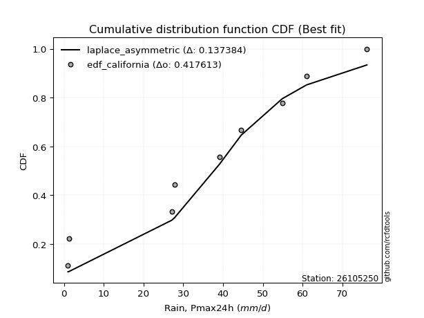</img></img>

</div>


### 2. Empirical - EDF Hazen (1930)

Hazen method for plotting positions is a formula used to estimate the empirical cumulative probability distribution of flood events or other hydrological data. This formula often results in biased estimations, particularly when extrapolating to extreme events (high return periods).

<div align="center">


$P=(m-0.5)/n$


</div>


**2.1. Empirical values**

<div align="center">

|                | 0                  | 1                  | 2                  | 3                  | 4                  | 5                  | 6                 | 7         | 8                 | 9                  |
|:---------------|:-------------------|:-------------------|:-------------------|:-------------------|:-------------------|:-------------------|:------------------|:----------|:------------------|:-------------------|
| date           | 2016               | 2023               | 2025               | 2022               | 2020               | 2021               | 2024              | 2018      | 2019              | 2017               |
| x              | 1.0                | 1.2                | 14.8               | 27.1               | 27.8               | 39.1               | 44.6              | 54.9      | 61.0              | 76.2               |
| m              | 1                  | 2                  | 3                  | 4                  | 5                  | 6                  | 7                 | 8         | 9                 | 10                 |
| empirical_dist | edf_hazen          | edf_hazen          | edf_hazen          | edf_hazen          | edf_hazen          | edf_hazen          | edf_hazen         | edf_hazen | edf_hazen         | edf_hazen          |
| empirical      | 0.05               | 0.15               | 0.25               | 0.35               | 0.45               | 0.55               | 0.65              | 0.75      | 0.85              | 0.95               |
| empirical_tr   | 1.0526315789473684 | 1.1764705882352942 | 1.3333333333333333 | 1.5384615384615383 | 1.8181818181818181 | 2.2222222222222223 | 2.857142857142857 | 4.0       | 6.666666666666666 | 19.999999999999982 |

</div>


**2.2. Kolmogorov-Smirnov fit test (sorted by Δ)**


<div align="center">

|                | 0                   | 1                   | 2                  | 3                   | 4                   | 5                   | 6                   | 7                   | 8                   | 9                   | 10                  | 11                  | 12                  | 13                  | 14                 | 15                  | 16                  | 17                 | 18                  | 19                  | 20                  | 21                  | 22                  | 23                  | 24                  | 25                 | 26                  | 27                    | 28                  | 29                  | 30                 | 31                 | 32                 | 33                 | 34                  | 35                  | 36                  | 37                  | 38                  | 39                  | 40                 | 41                  | 42                 | 43                  | 44                 | 45                 | 46                  | 47                  | 48                  | 49                  | 50                 | 51                 | 52                  | 53                  | 54                  | 55                  | 56                 | 57                 | 58                  | 59                  | 60                  | 61                 | 62                  | 63                 | 64                  | 65                 | 66                 | 67                 | 68                 | 69                  | 70                 | 71                  | 72                  | 73                 | 74                  | 75                 | 76                 | 77                 | 78                 | 79                 | 80                  | 81                 | 82                  | 83                 | 84                  | 85                  | 86                 | 87                 | 88                 | 89                 |
|:---------------|:--------------------|:--------------------|:-------------------|:--------------------|:--------------------|:--------------------|:--------------------|:--------------------|:--------------------|:--------------------|:--------------------|:--------------------|:--------------------|:--------------------|:-------------------|:--------------------|:--------------------|:-------------------|:--------------------|:--------------------|:--------------------|:--------------------|:--------------------|:--------------------|:--------------------|:-------------------|:--------------------|:----------------------|:--------------------|:--------------------|:-------------------|:-------------------|:-------------------|:-------------------|:--------------------|:--------------------|:--------------------|:--------------------|:--------------------|:--------------------|:-------------------|:--------------------|:-------------------|:--------------------|:-------------------|:-------------------|:--------------------|:--------------------|:--------------------|:--------------------|:-------------------|:-------------------|:--------------------|:--------------------|:--------------------|:--------------------|:-------------------|:-------------------|:--------------------|:--------------------|:--------------------|:-------------------|:--------------------|:-------------------|:--------------------|:-------------------|:-------------------|:-------------------|:-------------------|:--------------------|:-------------------|:--------------------|:--------------------|:-------------------|:--------------------|:-------------------|:-------------------|:-------------------|:-------------------|:-------------------|:--------------------|:-------------------|:--------------------|:-------------------|:--------------------|:--------------------|:-------------------|:-------------------|:-------------------|:-------------------|
| station        | 26105250            | 26105250            | 26105250           | 26105250            | 26105250            | 26105250            | 26105250            | 26105250            | 26105250            | 26105250            | 26105250            | 26105250            | 26105250            | 26105250            | 26105250           | 26105250            | 26105250            | 26105250           | 26105250            | 26105250            | 26105250            | 26105250            | 26105250            | 26105250            | 26105250            | 26105250           | 26105250            | 26105250              | 26105250            | 26105250            | 26105250           | 26105250           | 26105250           | 26105250           | 26105250            | 26105250            | 26105250            | 26105250            | 26105250            | 26105250            | 26105250           | 26105250            | 26105250           | 26105250            | 26105250           | 26105250           | 26105250            | 26105250            | 26105250            | 26105250            | 26105250           | 26105250           | 26105250            | 26105250            | 26105250            | 26105250            | 26105250           | 26105250           | 26105250            | 26105250            | 26105250            | 26105250           | 26105250            | 26105250           | 26105250            | 26105250           | 26105250           | 26105250           | 26105250           | 26105250            | 26105250           | 26105250            | 26105250            | 26105250           | 26105250            | 26105250           | 26105250           | 26105250           | 26105250           | 26105250           | 26105250            | 26105250           | 26105250            | 26105250           | 26105250            | 26105250            | 26105250           | 26105250           | 26105250           | 26105250           |
| empirical_dist | edf_hazen           | edf_hazen           | edf_hazen          | edf_hazen           | edf_hazen           | edf_hazen           | edf_hazen           | edf_hazen           | edf_hazen           | edf_hazen           | edf_hazen           | edf_hazen           | edf_hazen           | edf_hazen           | edf_hazen          | edf_hazen           | edf_hazen           | edf_hazen          | edf_hazen           | edf_hazen           | edf_hazen           | edf_hazen           | edf_hazen           | edf_hazen           | edf_hazen           | edf_hazen          | edf_hazen           | edf_hazen             | edf_hazen           | edf_hazen           | edf_hazen          | edf_hazen          | edf_hazen          | edf_hazen          | edf_hazen           | edf_hazen           | edf_hazen           | edf_hazen           | edf_hazen           | edf_hazen           | edf_hazen          | edf_hazen           | edf_hazen          | edf_hazen           | edf_hazen          | edf_hazen          | edf_hazen           | edf_hazen           | edf_hazen           | edf_hazen           | edf_hazen          | edf_hazen          | edf_hazen           | edf_hazen           | edf_hazen           | edf_hazen           | edf_hazen          | edf_hazen          | edf_hazen           | edf_hazen           | edf_hazen           | edf_hazen          | edf_hazen           | edf_hazen          | edf_hazen           | edf_hazen          | edf_hazen          | edf_hazen          | edf_hazen          | edf_hazen           | edf_hazen          | edf_hazen           | edf_hazen           | edf_hazen          | edf_hazen           | edf_hazen          | edf_hazen          | edf_hazen          | edf_hazen          | edf_hazen          | edf_hazen           | edf_hazen          | edf_hazen           | edf_hazen          | edf_hazen           | edf_hazen           | edf_hazen          | edf_hazen          | edf_hazen          | edf_hazen          |
| p_dist         | fisk                | crystalball         | norm               | t                   | exponnorm           | pearson3            | gamma               | erlang              | logjohnsonsu        | johnsonsu           | logistic            | alpha               | invgamma            | invgauss            | betaprime          | maxwell             | laplace_asymmetric  | genlogistic        | hypsecant           | rayleigh            | rice                | kstwobign           | gumbel_r            | laplace             | logloggamma         | gumbel_l           | mielke              | loglaplace_asymmetric | moyal               | ncf                 | logt               | gompertz           | halfnorm           | halflogistic       | logpearson3         | logfisk             | loggumbel_l         | genexpon            | expon               | loggompertz         | f                  | nakagami            | wald               | logexponnorm        | lognorm            | lognorm            | lognct              | loggamma            | loggamma            | logfatiguelife      | gibrat             | logrice            | logerlang           | loginvgamma         | loginvweibull       | loglogistic         | logalpha           | loghypsecant       | loginvgauss         | logmaxwell          | weibull_min         | lograyleigh        | logkstwobign        | loglaplace         | logbetaprime        | loggenexpon        | invweibull         | loghalfnorm        | loggumbel_r        | logncf              | loghalflogistic    | nct                 | logmoyal            | logexpon           | lognakagami         | chi2               | logf               | logwald            | pareto             | logweibull_min     | logchi2             | logpareto          | loggibrat           | logmielke          | logtruncnorm        | loglognorm          | fatiguelife        | truncnorm          | loggenlogistic     | logcrystalball     |
| delta          | 0.06883744562067061 | 0.07017693195011834 | 0.070176932445671  | 0.07018132486481418 | 0.07022102440160255 | 0.07268762383840227 | 0.07383366291724142 | 0.07416476855489715 | 0.07509570134181746 | 0.07736943587368458 | 0.07938673009471481 | 0.08027237888152997 | 0.08114561528996993 | 0.08410345283212073 | 0.0849632312245614 | 0.08590068706536852 | 0.08821659779453817 | 0.0884385215484999 | 0.09112394006469371 | 0.09637277122704156 | 0.09865125777760816 | 0.10057166271100942 | 0.11692205648167689 | 0.11914143793403986 | 0.12614920848570643 | 0.1297107381372707 | 0.13263843299737466 | 0.13326894777578818   | 0.13847521448933037 | 0.14464682538721968 | 0.1454166563284902 | 0.1470233590419845 | 0.15               | 0.15               | 0.16952656321966042 | 0.17003060727744923 | 0.18401685272039658 | 0.18760419581960164 | 0.18831633634990563 | 0.19140635901449987 | 0.1928938492784945 | 0.21538402292268355 | 0.2159416530003849 | 0.24474166712295753 | 0.2447442406257706 | 0.2447442406257706 | 0.24501789306044075 | 0.24551138165265074 | 0.24551138165265074 | 0.24603728032725836 | 0.25               | 0.2502901952001526 | 0.25421044415661387 | 0.25589548756418357 | 0.25665723296299525 | 0.25704021523138587 | 0.2598578619213302 | 0.2671454870671266 | 0.26733841941942793 | 0.27172709842971965 | 0.27660843960021186 | 0.2801309332677653 | 0.28920194247536346 | 0.2937874866644169 | 0.29519421722497297 | 0.2980267647003083 | 0.2998748917679298 | 0.3040197728041929 | 0.3117770585165265 | 0.32455717367241566 | 0.3322779910808833 | 0.33387466154792167 | 0.33477021787676897 | 0.3499111484749704 | 0.36098332086174234 | 0.3921961668855809 | 0.3932497468206887 | 0.3987900579782503 | 0.4050502429710834 | 0.4062177410204    | 0.40705325483954213 | 0.4221674236158083 | 0.43032773860023055 | 0.4456813689673349 | 0.46627562291403046 | 0.47606664720016867 | 0.5162694219695304 | 0.7478008634192291 | 0.85               | nan                |
| deltao         | 0.3942745923300002  | 0.3942745923300002  | 0.3942745923300002 | 0.3942745923300002  | 0.3942745923300002  | 0.3942745923300002  | 0.3942745923300002  | 0.3942745923300002  | 0.3942745923300002  | 0.3942745923300002  | 0.3942745923300002  | 0.3942745923300002  | 0.3942745923300002  | 0.3942745923300002  | 0.3942745923300002 | 0.3942745923300002  | 0.3942745923300002  | 0.3942745923300002 | 0.3942745923300002  | 0.3942745923300002  | 0.3942745923300002  | 0.3942745923300002  | 0.3942745923300002  | 0.3942745923300002  | 0.3942745923300002  | 0.3942745923300002 | 0.3942745923300002  | 0.3942745923300002    | 0.3942745923300002  | 0.3942745923300002  | 0.3942745923300002 | 0.3942745923300002 | 0.3942745923300002 | 0.3942745923300002 | 0.3942745923300002  | 0.3942745923300002  | 0.3942745923300002  | 0.3942745923300002  | 0.3942745923300002  | 0.3942745923300002  | 0.3942745923300002 | 0.3942745923300002  | 0.3942745923300002 | 0.3942745923300002  | 0.3942745923300002 | 0.3942745923300002 | 0.3942745923300002  | 0.3942745923300002  | 0.3942745923300002  | 0.3942745923300002  | 0.3942745923300002 | 0.3942745923300002 | 0.3942745923300002  | 0.3942745923300002  | 0.3942745923300002  | 0.3942745923300002  | 0.3942745923300002 | 0.3942745923300002 | 0.3942745923300002  | 0.3942745923300002  | 0.3942745923300002  | 0.3942745923300002 | 0.3942745923300002  | 0.3942745923300002 | 0.3942745923300002  | 0.3942745923300002 | 0.3942745923300002 | 0.3942745923300002 | 0.3942745923300002 | 0.3942745923300002  | 0.3942745923300002 | 0.3942745923300002  | 0.3942745923300002  | 0.3942745923300002 | 0.3942745923300002  | 0.3942745923300002 | 0.3942745923300002 | 0.3942745923300002 | 0.3942745923300002 | 0.3942745923300002 | 0.3942745923300002  | 0.3942745923300002 | 0.3942745923300002  | 0.3942745923300002 | 0.3942745923300002  | 0.3942745923300002  | 0.3942745923300002 | 0.3942745923300002 | 0.3942745923300002 | 0.3942745923300002 |
| eval           | Δo > Δ              | Δo > Δ              | Δo > Δ             | Δo > Δ              | Δo > Δ              | Δo > Δ              | Δo > Δ              | Δo > Δ              | Δo > Δ              | Δo > Δ              | Δo > Δ              | Δo > Δ              | Δo > Δ              | Δo > Δ              | Δo > Δ             | Δo > Δ              | Δo > Δ              | Δo > Δ             | Δo > Δ              | Δo > Δ              | Δo > Δ              | Δo > Δ              | Δo > Δ              | Δo > Δ              | Δo > Δ              | Δo > Δ             | Δo > Δ              | Δo > Δ                | Δo > Δ              | Δo > Δ              | Δo > Δ             | Δo > Δ             | Δo > Δ             | Δo > Δ             | Δo > Δ              | Δo > Δ              | Δo > Δ              | Δo > Δ              | Δo > Δ              | Δo > Δ              | Δo > Δ             | Δo > Δ              | Δo > Δ             | Δo > Δ              | Δo > Δ             | Δo > Δ             | Δo > Δ              | Δo > Δ              | Δo > Δ              | Δo > Δ              | Δo > Δ             | Δo > Δ             | Δo > Δ              | Δo > Δ              | Δo > Δ              | Δo > Δ              | Δo > Δ             | Δo > Δ             | Δo > Δ              | Δo > Δ              | Δo > Δ              | Δo > Δ             | Δo > Δ              | Δo > Δ             | Δo > Δ              | Δo > Δ             | Δo > Δ             | Δo > Δ             | Δo > Δ             | Δo > Δ              | Δo > Δ             | Δo > Δ              | Δo > Δ              | Δo > Δ             | Δo > Δ              | Δo > Δ             | Δo > Δ             | Δo <= Δ            | Δo <= Δ            | Δo <= Δ            | Δo <= Δ             | Δo <= Δ            | Δo <= Δ             | Δo <= Δ            | Δo <= Δ             | Δo <= Δ             | Δo <= Δ            | Δo <= Δ            | Δo <= Δ            | Δo <= Δ            |
| fit            | 1                   | 1                   | 1                  | 1                   | 1                   | 1                   | 1                   | 1                   | 1                   | 1                   | 1                   | 1                   | 1                   | 1                   | 1                  | 1                   | 1                   | 1                  | 1                   | 1                   | 1                   | 1                   | 1                   | 1                   | 1                   | 1                  | 1                   | 1                     | 1                   | 1                   | 1                  | 1                  | 1                  | 1                  | 1                   | 1                   | 1                   | 1                   | 1                   | 1                   | 1                  | 1                   | 1                  | 1                   | 1                  | 1                  | 1                   | 1                   | 1                   | 1                   | 1                  | 1                  | 1                   | 1                   | 1                   | 1                   | 1                  | 1                  | 1                   | 1                   | 1                   | 1                  | 1                   | 1                  | 1                   | 1                  | 1                  | 1                  | 1                  | 1                   | 1                  | 1                   | 1                   | 1                  | 1                   | 1                  | 1                  | 0                  | 0                  | 0                  | 0                   | 0                  | 0                   | 0                  | 0                   | 0                   | 0                  | 0                  | 0                  | 0                  |
| n              | 10                  | 10                  | 10                 | 10                  | 10                  | 10                  | 10                  | 10                  | 10                  | 10                  | 10                  | 10                  | 10                  | 10                  | 10                 | 10                  | 10                  | 10                 | 10                  | 10                  | 10                  | 10                  | 10                  | 10                  | 10                  | 10                 | 10                  | 10                    | 10                  | 10                  | 10                 | 10                 | 10                 | 10                 | 10                  | 10                  | 10                  | 10                  | 10                  | 10                  | 10                 | 10                  | 10                 | 10                  | 10                 | 10                 | 10                  | 10                  | 10                  | 10                  | 10                 | 10                 | 10                  | 10                  | 10                  | 10                  | 10                 | 10                 | 10                  | 10                  | 10                  | 10                 | 10                  | 10                 | 10                  | 10                 | 10                 | 10                 | 10                 | 10                  | 10                 | 10                  | 10                  | 10                 | 10                  | 10                 | 10                 | 10                 | 10                 | 10                 | 10                  | 10                 | 10                  | 10                 | 10                  | 10                  | 10                 | 10                 | 10                 | 10                 |
| best_fit       | 1                   | 0                   | 0                  | 0                   | 0                   | 0                   | 0                   | 0                   | 0                   | 0                   | 0                   | 0                   | 0                   | 0                   | 0                  | 0                   | 0                   | 0                  | 0                   | 0                   | 0                   | 0                   | 0                   | 0                   | 0                   | 0                  | 0                   | 0                     | 0                   | 0                   | 0                  | 0                  | 0                  | 0                  | 0                   | 0                   | 0                   | 0                   | 0                   | 0                   | 0                  | 0                   | 0                  | 0                   | 0                  | 0                  | 0                   | 0                   | 0                   | 0                   | 0                  | 0                  | 0                   | 0                   | 0                   | 0                   | 0                  | 0                  | 0                   | 0                   | 0                   | 0                  | 0                   | 0                  | 0                   | 0                  | 0                  | 0                  | 0                  | 0                   | 0                  | 0                   | 0                   | 0                  | 0                   | 0                  | 0                  | 0                  | 0                  | 0                  | 0                   | 0                  | 0                   | 0                  | 0                   | 0                   | 0                  | 0                  | 0                  | 0                  |
| best_fit_sort  | 1                   | 2                   | 3                  | 4                   | 5                   | 6                   | 7                   | 8                   | 9                   | 10                  | 11                  | 12                  | 13                  | 14                  | 15                 | 16                  | 17                  | 18                 | 19                  | 20                  | 21                  | 22                  | 23                  | 24                  | 25                  | 26                 | 27                  | 28                    | 29                  | 30                  | 31                 | 32                 | 33                 | 34                 | 35                  | 36                  | 37                  | 38                  | 39                  | 40                  | 41                 | 42                  | 43                 | 44                  | 45                 | 46                 | 47                  | 48                  | 49                  | 50                  | 51                 | 52                 | 53                  | 54                  | 55                  | 56                  | 57                 | 58                 | 59                  | 60                  | 61                  | 62                 | 63                  | 64                 | 65                  | 66                 | 67                 | 68                 | 69                 | 70                  | 71                 | 72                  | 73                  | 74                 | 75                  | 76                 | 77                 | 78                 | 79                 | 80                 | 81                  | 82                 | 83                  | 84                 | 85                  | 86                  | 87                 | 88                 | 89                 | 90                 |

</div>


<div align="center">

</img>

</div>


**2.3. Best fit**

<div align="center">

|   id |   station | empirical_dist   | p_dist   |     delta |   deltao | eval   |   fit |   n |   best_fit |   best_fit_sort |
|-----:|----------:|:-----------------|:---------|----------:|---------:|:-------|------:|----:|-----------:|----------------:|
|    0 |  26105250 | edf_hazen        | fisk     | 0.0688374 | 0.394275 | Δo > Δ |     1 |  10 |          1 |               1 |

</div>


<div align="center">

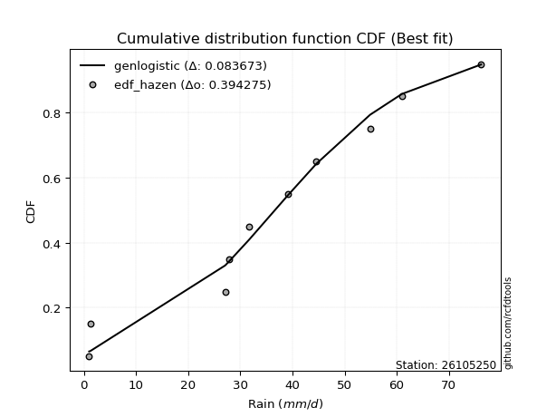</img>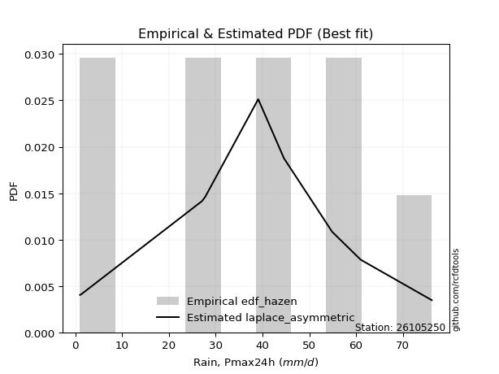</img>

</div>


### 3. Empirical - EDF Weibull (1939)

Weibull plotting position formula is an empirical method used to estimate the non-exceedance probability or plotting position for a set of observed data, is often recommended or widely used in practice, particularly in flood frequency analysis.

<div align="center">


$P=m/(n+1)$


</div>


**3.1. Empirical values**

<div align="center">

|                | 0                   | 1                   | 2                  | 3                   | 4                   | 5                  | 6                  | 7                  | 8                  | 9                  |
|:---------------|:--------------------|:--------------------|:-------------------|:--------------------|:--------------------|:-------------------|:-------------------|:-------------------|:-------------------|:-------------------|
| date           | 2016                | 2023                | 2025               | 2022                | 2020                | 2021               | 2024               | 2018               | 2019               | 2017               |
| x              | 1.0                 | 1.2                 | 14.8               | 27.1                | 27.8                | 39.1               | 44.6               | 54.9               | 61.0               | 76.2               |
| m              | 1                   | 2                   | 3                  | 4                   | 5                   | 6                  | 7                  | 8                  | 9                  | 10                 |
| empirical_dist | edf_weibull         | edf_weibull         | edf_weibull        | edf_weibull         | edf_weibull         | edf_weibull        | edf_weibull        | edf_weibull        | edf_weibull        | edf_weibull        |
| empirical      | 0.09090909090909091 | 0.18181818181818182 | 0.2727272727272727 | 0.36363636363636365 | 0.45454545454545453 | 0.5454545454545454 | 0.6363636363636364 | 0.7272727272727273 | 0.8181818181818182 | 0.9090909090909091 |
| empirical_tr   | 1.1                 | 1.2222222222222223  | 1.375              | 1.5714285714285714  | 1.8333333333333335  | 2.1999999999999997 | 2.75               | 3.666666666666667  | 5.500000000000002  | 10.999999999999996 |

</div>


**3.2. Kolmogorov-Smirnov fit test (sorted by Δ)**


<div align="center">

|                | 0                   | 1                   | 2                   | 3                   | 4                   | 5                   | 6                  | 7                   | 8                   | 9                   | 10                  | 11                  | 12                 | 13                  | 14                  | 15                  | 16                  | 17                  | 18                  | 19                  | 20                  | 21                  | 22                 | 23                  | 24                    | 25                 | 26                  | 27                  | 28                  | 29                 | 30                  | 31                  | 32                 | 33                  | 34                 | 35                 | 36                 | 37                  | 38                  | 39                  | 40                  | 41                  | 42                  | 43                  | 44                  | 45                  | 46                  | 47                  | 48                 | 49                  | 50                 | 51                 | 52                 | 53                  | 54                 | 55                  | 56                  | 57                  | 58                 | 59                 | 60                 | 61                  | 62                 | 63                 | 64                 | 65                  | 66                  | 67                  | 68                  | 69                 | 70                  | 71                 | 72                 | 73                 | 74                  | 75                 | 76                  | 77                 | 78                 | 79                 | 80                 | 81                 | 82                 | 83                 | 84                  | 85                 | 86                 | 87                 | 88                 | 89                 |
|:---------------|:--------------------|:--------------------|:--------------------|:--------------------|:--------------------|:--------------------|:-------------------|:--------------------|:--------------------|:--------------------|:--------------------|:--------------------|:-------------------|:--------------------|:--------------------|:--------------------|:--------------------|:--------------------|:--------------------|:--------------------|:--------------------|:--------------------|:-------------------|:--------------------|:----------------------|:-------------------|:--------------------|:--------------------|:--------------------|:-------------------|:--------------------|:--------------------|:-------------------|:--------------------|:-------------------|:-------------------|:-------------------|:--------------------|:--------------------|:--------------------|:--------------------|:--------------------|:--------------------|:--------------------|:--------------------|:--------------------|:--------------------|:--------------------|:-------------------|:--------------------|:-------------------|:-------------------|:-------------------|:--------------------|:-------------------|:--------------------|:--------------------|:--------------------|:-------------------|:-------------------|:-------------------|:--------------------|:-------------------|:-------------------|:-------------------|:--------------------|:--------------------|:--------------------|:--------------------|:-------------------|:--------------------|:-------------------|:-------------------|:-------------------|:--------------------|:-------------------|:--------------------|:-------------------|:-------------------|:-------------------|:-------------------|:-------------------|:-------------------|:-------------------|:--------------------|:-------------------|:-------------------|:-------------------|:-------------------|:-------------------|
| station        | 26105250            | 26105250            | 26105250            | 26105250            | 26105250            | 26105250            | 26105250           | 26105250            | 26105250            | 26105250            | 26105250            | 26105250            | 26105250           | 26105250            | 26105250            | 26105250            | 26105250            | 26105250            | 26105250            | 26105250            | 26105250            | 26105250            | 26105250           | 26105250            | 26105250              | 26105250           | 26105250            | 26105250            | 26105250            | 26105250           | 26105250            | 26105250            | 26105250           | 26105250            | 26105250           | 26105250           | 26105250           | 26105250            | 26105250            | 26105250            | 26105250            | 26105250            | 26105250            | 26105250            | 26105250            | 26105250            | 26105250            | 26105250            | 26105250           | 26105250            | 26105250           | 26105250           | 26105250           | 26105250            | 26105250           | 26105250            | 26105250            | 26105250            | 26105250           | 26105250           | 26105250           | 26105250            | 26105250           | 26105250           | 26105250           | 26105250            | 26105250            | 26105250            | 26105250            | 26105250           | 26105250            | 26105250           | 26105250           | 26105250           | 26105250            | 26105250           | 26105250            | 26105250           | 26105250           | 26105250           | 26105250           | 26105250           | 26105250           | 26105250           | 26105250            | 26105250           | 26105250           | 26105250           | 26105250           | 26105250           |
| empirical_dist | edf_weibull         | edf_weibull         | edf_weibull         | edf_weibull         | edf_weibull         | edf_weibull         | edf_weibull        | edf_weibull         | edf_weibull         | edf_weibull         | edf_weibull         | edf_weibull         | edf_weibull        | edf_weibull         | edf_weibull         | edf_weibull         | edf_weibull         | edf_weibull         | edf_weibull         | edf_weibull         | edf_weibull         | edf_weibull         | edf_weibull        | edf_weibull         | edf_weibull           | edf_weibull        | edf_weibull         | edf_weibull         | edf_weibull         | edf_weibull        | edf_weibull         | edf_weibull         | edf_weibull        | edf_weibull         | edf_weibull        | edf_weibull        | edf_weibull        | edf_weibull         | edf_weibull         | edf_weibull         | edf_weibull         | edf_weibull         | edf_weibull         | edf_weibull         | edf_weibull         | edf_weibull         | edf_weibull         | edf_weibull         | edf_weibull        | edf_weibull         | edf_weibull        | edf_weibull        | edf_weibull        | edf_weibull         | edf_weibull        | edf_weibull         | edf_weibull         | edf_weibull         | edf_weibull        | edf_weibull        | edf_weibull        | edf_weibull         | edf_weibull        | edf_weibull        | edf_weibull        | edf_weibull         | edf_weibull         | edf_weibull         | edf_weibull         | edf_weibull        | edf_weibull         | edf_weibull        | edf_weibull        | edf_weibull        | edf_weibull         | edf_weibull        | edf_weibull         | edf_weibull        | edf_weibull        | edf_weibull        | edf_weibull        | edf_weibull        | edf_weibull        | edf_weibull        | edf_weibull         | edf_weibull        | edf_weibull        | edf_weibull        | edf_weibull        | edf_weibull        |
| p_dist         | fisk                | laplace_asymmetric  | crystalball         | norm                | t                   | exponnorm           | pearson3           | gamma               | erlang              | logjohnsonsu        | johnsonsu           | logistic            | alpha              | hypsecant           | invgamma            | invgauss            | betaprime           | maxwell             | genlogistic         | kstwobign           | laplace             | rayleigh            | rice               | logloggamma         | loglaplace_asymmetric | gumbel_l           | gumbel_r            | logt                | logpearson3         | ncf                | logfisk             | mielke              | moyal              | loggumbel_l         | expon              | genexpon           | loggompertz        | gompertz            | f                   | halflogistic        | halfnorm            | nakagami            | logexponnorm        | lognorm             | lognorm             | lognct              | loggamma            | loggamma            | logfatiguelife     | logrice             | wald               | logerlang          | loginvgamma        | loginvweibull       | loglogistic        | logalpha            | loghypsecant        | loginvgauss         | logmaxwell         | weibull_min        | lograyleigh        | logbetaprime        | gibrat             | logkstwobign       | invweibull         | loglaplace          | logncf              | loggenexpon         | loghalfnorm         | loggumbel_r        | nct                 | loghalflogistic    | logmoyal           | logexpon           | lognakagami         | logf               | chi2                | pareto             | logweibull_min     | logchi2            | logwald            | logpareto          | loggibrat          | logmielke          | loglognorm          | logtruncnorm       | fatiguelife        | truncnorm          | loggenlogistic     | logcrystalball     |
| delta          | 0.10065562743885244 | 0.10136059101415744 | 0.10199511376830017 | 0.10199511426385283 | 0.10199950668299601 | 0.10203920621978438 | 0.1045058056565841 | 0.10565184473542324 | 0.10598295037307898 | 0.10691388315999929 | 0.10918761769186641 | 0.10943725680821774 | 0.1120905606997118 | 0.11218638353543493 | 0.11296379710815176 | 0.11592163465030256 | 0.11678141304274323 | 0.11771886888355035 | 0.12012761564036228 | 0.12234366240349615 | 0.12368689247949438 | 0.12819095304522338 | 0.13046943959579   | 0.13099003727261244 | 0.13344608714934073   | 0.1342561926827252 | 0.14874023829985872 | 0.14874959365169593 | 0.15589019958329675 | 0.1605007797174755 | 0.16108871897431437 | 0.16445661481555648 | 0.1702933963075122 | 0.17038048908403292 | 0.1759132684097256 | 0.1759247626286317 | 0.1777699953781362 | 0.17884154086016632 | 0.17925748564213084 | 0.18181818181818182 | 0.18181818181818182 | 0.20174765928631988 | 0.23110530348659386 | 0.23110787698940694 | 0.23110787698940694 | 0.23138152942407708 | 0.23187501801628707 | 0.23187501801628707 | 0.2324009166908947 | 0.23665383156378894 | 0.2386689257276576 | 0.2405740805202502 | 0.2422591239278199 | 0.24302086932663158 | 0.2434038515950222 | 0.24622149828496653 | 0.25350912343076293 | 0.25370205578306426 | 0.258090734793356  | 0.2629720759638482 | 0.2664945696314016 | 0.27246694449770026 | 0.2727272727272727 | 0.2755655788389998 | 0.2771476190406571 | 0.28015112302805323 | 0.28364808276332476 | 0.28439040106394464 | 0.29038340916782923 | 0.2981406948801628 | 0.31114738882064896 | 0.3186416274445196 | 0.3211338542404053 | 0.3271838757476977 | 0.33825604813446963 | 0.370522474093416  | 0.37855980324921723 | 0.3823229702438107 | 0.3834904682931273 | 0.3843259821122694 | 0.3851536943418866 | 0.3994401508885356 | 0.4166913749638669 | 0.4229540962400622 | 0.44424846538198687 | 0.4526392592776668 | 0.4935421492422577 | 0.7250735906919564 | 0.8181818181818182 | nan                |
| deltao         | 0.3942745923300002  | 0.3942745923300002  | 0.3942745923300002  | 0.3942745923300002  | 0.3942745923300002  | 0.3942745923300002  | 0.3942745923300002 | 0.3942745923300002  | 0.3942745923300002  | 0.3942745923300002  | 0.3942745923300002  | 0.3942745923300002  | 0.3942745923300002 | 0.3942745923300002  | 0.3942745923300002  | 0.3942745923300002  | 0.3942745923300002  | 0.3942745923300002  | 0.3942745923300002  | 0.3942745923300002  | 0.3942745923300002  | 0.3942745923300002  | 0.3942745923300002 | 0.3942745923300002  | 0.3942745923300002    | 0.3942745923300002 | 0.3942745923300002  | 0.3942745923300002  | 0.3942745923300002  | 0.3942745923300002 | 0.3942745923300002  | 0.3942745923300002  | 0.3942745923300002 | 0.3942745923300002  | 0.3942745923300002 | 0.3942745923300002 | 0.3942745923300002 | 0.3942745923300002  | 0.3942745923300002  | 0.3942745923300002  | 0.3942745923300002  | 0.3942745923300002  | 0.3942745923300002  | 0.3942745923300002  | 0.3942745923300002  | 0.3942745923300002  | 0.3942745923300002  | 0.3942745923300002  | 0.3942745923300002 | 0.3942745923300002  | 0.3942745923300002 | 0.3942745923300002 | 0.3942745923300002 | 0.3942745923300002  | 0.3942745923300002 | 0.3942745923300002  | 0.3942745923300002  | 0.3942745923300002  | 0.3942745923300002 | 0.3942745923300002 | 0.3942745923300002 | 0.3942745923300002  | 0.3942745923300002 | 0.3942745923300002 | 0.3942745923300002 | 0.3942745923300002  | 0.3942745923300002  | 0.3942745923300002  | 0.3942745923300002  | 0.3942745923300002 | 0.3942745923300002  | 0.3942745923300002 | 0.3942745923300002 | 0.3942745923300002 | 0.3942745923300002  | 0.3942745923300002 | 0.3942745923300002  | 0.3942745923300002 | 0.3942745923300002 | 0.3942745923300002 | 0.3942745923300002 | 0.3942745923300002 | 0.3942745923300002 | 0.3942745923300002 | 0.3942745923300002  | 0.3942745923300002 | 0.3942745923300002 | 0.3942745923300002 | 0.3942745923300002 | 0.3942745923300002 |
| eval           | Δo > Δ              | Δo > Δ              | Δo > Δ              | Δo > Δ              | Δo > Δ              | Δo > Δ              | Δo > Δ             | Δo > Δ              | Δo > Δ              | Δo > Δ              | Δo > Δ              | Δo > Δ              | Δo > Δ             | Δo > Δ              | Δo > Δ              | Δo > Δ              | Δo > Δ              | Δo > Δ              | Δo > Δ              | Δo > Δ              | Δo > Δ              | Δo > Δ              | Δo > Δ             | Δo > Δ              | Δo > Δ                | Δo > Δ             | Δo > Δ              | Δo > Δ              | Δo > Δ              | Δo > Δ             | Δo > Δ              | Δo > Δ              | Δo > Δ             | Δo > Δ              | Δo > Δ             | Δo > Δ             | Δo > Δ             | Δo > Δ              | Δo > Δ              | Δo > Δ              | Δo > Δ              | Δo > Δ              | Δo > Δ              | Δo > Δ              | Δo > Δ              | Δo > Δ              | Δo > Δ              | Δo > Δ              | Δo > Δ             | Δo > Δ              | Δo > Δ             | Δo > Δ             | Δo > Δ             | Δo > Δ              | Δo > Δ             | Δo > Δ              | Δo > Δ              | Δo > Δ              | Δo > Δ             | Δo > Δ             | Δo > Δ             | Δo > Δ              | Δo > Δ             | Δo > Δ             | Δo > Δ             | Δo > Δ              | Δo > Δ              | Δo > Δ              | Δo > Δ              | Δo > Δ             | Δo > Δ              | Δo > Δ             | Δo > Δ             | Δo > Δ             | Δo > Δ              | Δo > Δ             | Δo > Δ              | Δo > Δ             | Δo > Δ             | Δo > Δ             | Δo > Δ             | Δo <= Δ            | Δo <= Δ            | Δo <= Δ            | Δo <= Δ             | Δo <= Δ            | Δo <= Δ            | Δo <= Δ            | Δo <= Δ            | Δo <= Δ            |
| fit            | 1                   | 1                   | 1                   | 1                   | 1                   | 1                   | 1                  | 1                   | 1                   | 1                   | 1                   | 1                   | 1                  | 1                   | 1                   | 1                   | 1                   | 1                   | 1                   | 1                   | 1                   | 1                   | 1                  | 1                   | 1                     | 1                  | 1                   | 1                   | 1                   | 1                  | 1                   | 1                   | 1                  | 1                   | 1                  | 1                  | 1                  | 1                   | 1                   | 1                   | 1                   | 1                   | 1                   | 1                   | 1                   | 1                   | 1                   | 1                   | 1                  | 1                   | 1                  | 1                  | 1                  | 1                   | 1                  | 1                   | 1                   | 1                   | 1                  | 1                  | 1                  | 1                   | 1                  | 1                  | 1                  | 1                   | 1                   | 1                   | 1                   | 1                  | 1                   | 1                  | 1                  | 1                  | 1                   | 1                  | 1                   | 1                  | 1                  | 1                  | 1                  | 0                  | 0                  | 0                  | 0                   | 0                  | 0                  | 0                  | 0                  | 0                  |
| n              | 10                  | 10                  | 10                  | 10                  | 10                  | 10                  | 10                 | 10                  | 10                  | 10                  | 10                  | 10                  | 10                 | 10                  | 10                  | 10                  | 10                  | 10                  | 10                  | 10                  | 10                  | 10                  | 10                 | 10                  | 10                    | 10                 | 10                  | 10                  | 10                  | 10                 | 10                  | 10                  | 10                 | 10                  | 10                 | 10                 | 10                 | 10                  | 10                  | 10                  | 10                  | 10                  | 10                  | 10                  | 10                  | 10                  | 10                  | 10                  | 10                 | 10                  | 10                 | 10                 | 10                 | 10                  | 10                 | 10                  | 10                  | 10                  | 10                 | 10                 | 10                 | 10                  | 10                 | 10                 | 10                 | 10                  | 10                  | 10                  | 10                  | 10                 | 10                  | 10                 | 10                 | 10                 | 10                  | 10                 | 10                  | 10                 | 10                 | 10                 | 10                 | 10                 | 10                 | 10                 | 10                  | 10                 | 10                 | 10                 | 10                 | 10                 |
| best_fit       | 1                   | 0                   | 0                   | 0                   | 0                   | 0                   | 0                  | 0                   | 0                   | 0                   | 0                   | 0                   | 0                  | 0                   | 0                   | 0                   | 0                   | 0                   | 0                   | 0                   | 0                   | 0                   | 0                  | 0                   | 0                     | 0                  | 0                   | 0                   | 0                   | 0                  | 0                   | 0                   | 0                  | 0                   | 0                  | 0                  | 0                  | 0                   | 0                   | 0                   | 0                   | 0                   | 0                   | 0                   | 0                   | 0                   | 0                   | 0                   | 0                  | 0                   | 0                  | 0                  | 0                  | 0                   | 0                  | 0                   | 0                   | 0                   | 0                  | 0                  | 0                  | 0                   | 0                  | 0                  | 0                  | 0                   | 0                   | 0                   | 0                   | 0                  | 0                   | 0                  | 0                  | 0                  | 0                   | 0                  | 0                   | 0                  | 0                  | 0                  | 0                  | 0                  | 0                  | 0                  | 0                   | 0                  | 0                  | 0                  | 0                  | 0                  |
| best_fit_sort  | 1                   | 2                   | 3                   | 4                   | 5                   | 6                   | 7                  | 8                   | 9                   | 10                  | 11                  | 12                  | 13                 | 14                  | 15                  | 16                  | 17                  | 18                  | 19                  | 20                  | 21                  | 22                  | 23                 | 24                  | 25                    | 26                 | 27                  | 28                  | 29                  | 30                 | 31                  | 32                  | 33                 | 34                  | 35                 | 36                 | 37                 | 38                  | 39                  | 40                  | 41                  | 42                  | 43                  | 44                  | 45                  | 46                  | 47                  | 48                  | 49                 | 50                  | 51                 | 52                 | 53                 | 54                  | 55                 | 56                  | 57                  | 58                  | 59                 | 60                 | 61                 | 62                  | 63                 | 64                 | 65                 | 66                  | 67                  | 68                  | 69                  | 70                 | 71                  | 72                 | 73                 | 74                 | 75                  | 76                 | 77                  | 78                 | 79                 | 80                 | 81                 | 82                 | 83                 | 84                 | 85                  | 86                 | 87                 | 88                 | 89                 | 90                 |

</div>


<div align="center">

</img>

</div>


**3.3. Best fit**

<div align="center">

|   id |   station | empirical_dist   | p_dist   |    delta |   deltao | eval   |   fit |   n |   best_fit |   best_fit_sort |
|-----:|----------:|:-----------------|:---------|---------:|---------:|:-------|------:|----:|-----------:|----------------:|
|    0 |  26105250 | edf_weibull      | fisk     | 0.100656 | 0.394275 | Δo > Δ |     1 |  10 |          1 |               1 |

</div>


<div align="center">

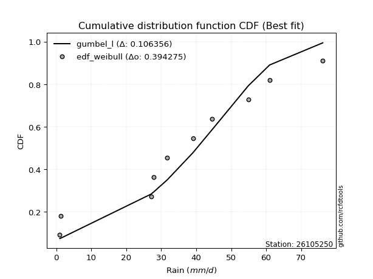</img>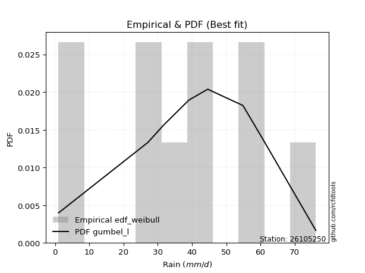</img>

</div>


### 4. Empirical - EDF Beard (1943)

The Beard formula (or Beard´s plotting position formula) in hydrology is used to estimate the empirical non-exceedance probability _(P)_ of a flood event (or other extreme hydrological data point) within a given dataset.

<div align="center">


$P=(m-0.31)/(n+0.38)$


</div>


**4.1. Empirical values**

<div align="center">

|                | 0                   | 1                   | 2                  | 3                   | 4                   | 5                  | 6                  | 7                  | 8                  | 9                  |
|:---------------|:--------------------|:--------------------|:-------------------|:--------------------|:--------------------|:-------------------|:-------------------|:-------------------|:-------------------|:-------------------|
| date           | 2016                | 2023                | 2025               | 2022                | 2020                | 2021               | 2024               | 2018               | 2019               | 2017               |
| x              | 1.0                 | 1.2                 | 14.8               | 27.1                | 27.8                | 39.1               | 44.6               | 54.9               | 61.0               | 76.2               |
| m              | 1                   | 2                   | 3                  | 4                   | 5                   | 6                  | 7                  | 8                  | 9                  | 10                 |
| empirical_dist | edf_beard           | edf_beard           | edf_beard          | edf_beard           | edf_beard           | edf_beard          | edf_beard          | edf_beard          | edf_beard          | edf_beard          |
| empirical      | 0.06647398843930635 | 0.16281310211946048 | 0.2591522157996146 | 0.35549132947976875 | 0.45183044315992293 | 0.5481695568400771 | 0.6445086705202312 | 0.7408477842003853 | 0.8371868978805393 | 0.9335260115606935 |
| empirical_tr   | 1.0712074303405574  | 1.1944764096662832  | 1.3498049414824447 | 1.5515695067264574  | 1.8242530755711774  | 2.213219616204691  | 2.813008130081301  | 3.8587360594795537 | 6.142011834319521  | 15.043478260869529 |

</div>


**4.2. Kolmogorov-Smirnov fit test (sorted by Δ)**


<div align="center">

|                | 0                  | 1                   | 2                   | 3                   | 4                   | 5                   | 6                  | 7                   | 8                   | 9                   | 10                  | 11                 | 12                  | 13                  | 14                  | 15                  | 16                  | 17                  | 18                  | 19                 | 20                  | 21                  | 22                  | 23                  | 24                    | 25                  | 26                 | 27                  | 28                  | 29                  | 30                  | 31                  | 32                  | 33                  | 34                  | 35                  | 36                  | 37                  | 38                  | 39                 | 40                  | 41                  | 42                 | 43                  | 44                  | 45                  | 46                  | 47                  | 48                  | 49                 | 50                  | 51                 | 52                 | 53                 | 54                 | 55                  | 56                 | 57                 | 58                  | 59                 | 60                 | 61                 | 62                 | 63                  | 64                 | 65                 | 66                  | 67                  | 68                 | 69                 | 70                  | 71                 | 72                 | 73                 | 74                 | 75                 | 76                  | 77                 | 78                  | 79                  | 80                 | 81                  | 82                 | 83                 | 84                 | 85                 | 86                 | 87                 | 88                 | 89                 |
|:---------------|:-------------------|:--------------------|:--------------------|:--------------------|:--------------------|:--------------------|:-------------------|:--------------------|:--------------------|:--------------------|:--------------------|:-------------------|:--------------------|:--------------------|:--------------------|:--------------------|:--------------------|:--------------------|:--------------------|:-------------------|:--------------------|:--------------------|:--------------------|:--------------------|:----------------------|:--------------------|:-------------------|:--------------------|:--------------------|:--------------------|:--------------------|:--------------------|:--------------------|:--------------------|:--------------------|:--------------------|:--------------------|:--------------------|:--------------------|:-------------------|:--------------------|:--------------------|:-------------------|:--------------------|:--------------------|:--------------------|:--------------------|:--------------------|:--------------------|:-------------------|:--------------------|:-------------------|:-------------------|:-------------------|:-------------------|:--------------------|:-------------------|:-------------------|:--------------------|:-------------------|:-------------------|:-------------------|:-------------------|:--------------------|:-------------------|:-------------------|:--------------------|:--------------------|:-------------------|:-------------------|:--------------------|:-------------------|:-------------------|:-------------------|:-------------------|:-------------------|:--------------------|:-------------------|:--------------------|:--------------------|:-------------------|:--------------------|:-------------------|:-------------------|:-------------------|:-------------------|:-------------------|:-------------------|:-------------------|:-------------------|
| station        | 26105250           | 26105250            | 26105250            | 26105250            | 26105250            | 26105250            | 26105250           | 26105250            | 26105250            | 26105250            | 26105250            | 26105250           | 26105250            | 26105250            | 26105250            | 26105250            | 26105250            | 26105250            | 26105250            | 26105250           | 26105250            | 26105250            | 26105250            | 26105250            | 26105250              | 26105250            | 26105250           | 26105250            | 26105250            | 26105250            | 26105250            | 26105250            | 26105250            | 26105250            | 26105250            | 26105250            | 26105250            | 26105250            | 26105250            | 26105250           | 26105250            | 26105250            | 26105250           | 26105250            | 26105250            | 26105250            | 26105250            | 26105250            | 26105250            | 26105250           | 26105250            | 26105250           | 26105250           | 26105250           | 26105250           | 26105250            | 26105250           | 26105250           | 26105250            | 26105250           | 26105250           | 26105250           | 26105250           | 26105250            | 26105250           | 26105250           | 26105250            | 26105250            | 26105250           | 26105250           | 26105250            | 26105250           | 26105250           | 26105250           | 26105250           | 26105250           | 26105250            | 26105250           | 26105250            | 26105250            | 26105250           | 26105250            | 26105250           | 26105250           | 26105250           | 26105250           | 26105250           | 26105250           | 26105250           | 26105250           |
| empirical_dist | edf_beard          | edf_beard           | edf_beard           | edf_beard           | edf_beard           | edf_beard           | edf_beard          | edf_beard           | edf_beard           | edf_beard           | edf_beard           | edf_beard          | edf_beard           | edf_beard           | edf_beard           | edf_beard           | edf_beard           | edf_beard           | edf_beard           | edf_beard          | edf_beard           | edf_beard           | edf_beard           | edf_beard           | edf_beard             | edf_beard           | edf_beard          | edf_beard           | edf_beard           | edf_beard           | edf_beard           | edf_beard           | edf_beard           | edf_beard           | edf_beard           | edf_beard           | edf_beard           | edf_beard           | edf_beard           | edf_beard          | edf_beard           | edf_beard           | edf_beard          | edf_beard           | edf_beard           | edf_beard           | edf_beard           | edf_beard           | edf_beard           | edf_beard          | edf_beard           | edf_beard          | edf_beard          | edf_beard          | edf_beard          | edf_beard           | edf_beard          | edf_beard          | edf_beard           | edf_beard          | edf_beard          | edf_beard          | edf_beard          | edf_beard           | edf_beard          | edf_beard          | edf_beard           | edf_beard           | edf_beard          | edf_beard          | edf_beard           | edf_beard          | edf_beard          | edf_beard          | edf_beard          | edf_beard          | edf_beard           | edf_beard          | edf_beard           | edf_beard           | edf_beard          | edf_beard           | edf_beard          | edf_beard          | edf_beard          | edf_beard          | edf_beard          | edf_beard          | edf_beard          | edf_beard          |
| p_dist         | fisk               | crystalball         | norm                | t                   | exponnorm           | pearson3            | gamma              | erlang              | logjohnsonsu        | laplace_asymmetric  | johnsonsu           | logistic           | alpha               | hypsecant           | invgamma            | invgauss            | betaprime           | maxwell             | genlogistic         | kstwobign          | rayleigh            | rice                | logloggamma         | laplace             | loglaplace_asymmetric | gumbel_r            | gumbel_l           | ncf                 | mielke              | logt                | moyal               | gompertz            | halfnorm            | halflogistic        | logpearson3         | logfisk             | loggumbel_l         | genexpon            | expon               | loggompertz        | f                   | nakagami            | wald               | logexponnorm        | lognorm             | lognorm             | lognct              | loggamma            | loggamma            | logfatiguelife     | logrice             | logerlang          | loginvgamma        | loginvweibull      | loglogistic        | logalpha            | gibrat             | loghypsecant       | loginvgauss         | logmaxwell         | weibull_min        | lograyleigh        | logkstwobign       | logbetaprime        | loglaplace         | invweibull         | loggenexpon         | loghalfnorm         | loggumbel_r        | logncf             | nct                 | loghalflogistic    | logmoyal           | logexpon           | lognakagami        | logf               | chi2                | logwald            | pareto              | logweibull_min      | logchi2            | logpareto           | loggibrat          | logmielke          | logtruncnorm       | loglognorm         | fatiguelife        | truncnorm          | loggenlogistic     | logcrystalball     |
| delta          | 0.0816505477401311 | 0.08299003406957883 | 0.08299003456513149 | 0.08299442698427467 | 0.08303412652106304 | 0.08550072595786276 | 0.0866467650367019 | 0.08697787067435764 | 0.08790880346127795 | 0.09004704095446114 | 0.09018253799314507 | 0.0904321771094964 | 0.09308548100099046 | 0.09369492222174036 | 0.09395871740943042 | 0.09691655495158122 | 0.09777633334402189 | 0.09871378918482901 | 0.10112253594164095 | 0.1033385827047748 | 0.10918587334650205 | 0.11146435989706865 | 0.12065787900593766 | 0.12097188109396279 | 0.1277776182960194    | 0.12973515860113738 | 0.1315411812971936 | 0.14149570001875417 | 0.14545153511683515 | 0.14603458226616434 | 0.15128831660879086 | 0.15983646116144498 | 0.16281310211946048 | 0.16281310211946048 | 0.16403523373989165 | 0.16453927779768046 | 0.17852552324062781 | 0.18211286633983287 | 0.18282500687013686 | 0.1859150295347311 | 0.18740251979872574 | 0.20989269344291478 | 0.2250938687999995 | 0.23925033764318876 | 0.23925291114600183 | 0.23925291114600183 | 0.23952656358067198 | 0.24002005217288197 | 0.24002005217288197 | 0.2405459508474896 | 0.24479886572038384 | 0.2487191146768451 | 0.2504041580844148 | 0.2511659034832265 | 0.2515488857516171 | 0.25436653244156143 | 0.2591522157996146 | 0.2616541575873578 | 0.26184708993965916 | 0.2662357689499509 | 0.2711171101204431 | 0.2746396037879965 | 0.2837106129955947 | 0.28604200142535835 | 0.2882961571846481 | 0.2907226759683152 | 0.29253543522053954 | 0.29852844332442413 | 0.3062857290367577 | 0.3080831852331092 | 0.32472244574830705 | 0.3267866616011145 | 0.3292788883970002 | 0.3407589326753558 | 0.3518311050621277 | 0.3840975310210741 | 0.38670483740581213 | 0.3932987284984815 | 0.39589802717146877 | 0.39706552522078536 | 0.3979010390399275 | 0.41301520781619366 | 0.4248364091204618 | 0.4365291531677203 | 0.4607842934342617 | 0.4632535450807082 | 0.5071172061699158 | 0.7386486476196146 | 0.8371868978805393 | nan                |
| deltao         | 0.3942745923300002 | 0.3942745923300002  | 0.3942745923300002  | 0.3942745923300002  | 0.3942745923300002  | 0.3942745923300002  | 0.3942745923300002 | 0.3942745923300002  | 0.3942745923300002  | 0.3942745923300002  | 0.3942745923300002  | 0.3942745923300002 | 0.3942745923300002  | 0.3942745923300002  | 0.3942745923300002  | 0.3942745923300002  | 0.3942745923300002  | 0.3942745923300002  | 0.3942745923300002  | 0.3942745923300002 | 0.3942745923300002  | 0.3942745923300002  | 0.3942745923300002  | 0.3942745923300002  | 0.3942745923300002    | 0.3942745923300002  | 0.3942745923300002 | 0.3942745923300002  | 0.3942745923300002  | 0.3942745923300002  | 0.3942745923300002  | 0.3942745923300002  | 0.3942745923300002  | 0.3942745923300002  | 0.3942745923300002  | 0.3942745923300002  | 0.3942745923300002  | 0.3942745923300002  | 0.3942745923300002  | 0.3942745923300002 | 0.3942745923300002  | 0.3942745923300002  | 0.3942745923300002 | 0.3942745923300002  | 0.3942745923300002  | 0.3942745923300002  | 0.3942745923300002  | 0.3942745923300002  | 0.3942745923300002  | 0.3942745923300002 | 0.3942745923300002  | 0.3942745923300002 | 0.3942745923300002 | 0.3942745923300002 | 0.3942745923300002 | 0.3942745923300002  | 0.3942745923300002 | 0.3942745923300002 | 0.3942745923300002  | 0.3942745923300002 | 0.3942745923300002 | 0.3942745923300002 | 0.3942745923300002 | 0.3942745923300002  | 0.3942745923300002 | 0.3942745923300002 | 0.3942745923300002  | 0.3942745923300002  | 0.3942745923300002 | 0.3942745923300002 | 0.3942745923300002  | 0.3942745923300002 | 0.3942745923300002 | 0.3942745923300002 | 0.3942745923300002 | 0.3942745923300002 | 0.3942745923300002  | 0.3942745923300002 | 0.3942745923300002  | 0.3942745923300002  | 0.3942745923300002 | 0.3942745923300002  | 0.3942745923300002 | 0.3942745923300002 | 0.3942745923300002 | 0.3942745923300002 | 0.3942745923300002 | 0.3942745923300002 | 0.3942745923300002 | 0.3942745923300002 |
| eval           | Δo > Δ             | Δo > Δ              | Δo > Δ              | Δo > Δ              | Δo > Δ              | Δo > Δ              | Δo > Δ             | Δo > Δ              | Δo > Δ              | Δo > Δ              | Δo > Δ              | Δo > Δ             | Δo > Δ              | Δo > Δ              | Δo > Δ              | Δo > Δ              | Δo > Δ              | Δo > Δ              | Δo > Δ              | Δo > Δ             | Δo > Δ              | Δo > Δ              | Δo > Δ              | Δo > Δ              | Δo > Δ                | Δo > Δ              | Δo > Δ             | Δo > Δ              | Δo > Δ              | Δo > Δ              | Δo > Δ              | Δo > Δ              | Δo > Δ              | Δo > Δ              | Δo > Δ              | Δo > Δ              | Δo > Δ              | Δo > Δ              | Δo > Δ              | Δo > Δ             | Δo > Δ              | Δo > Δ              | Δo > Δ             | Δo > Δ              | Δo > Δ              | Δo > Δ              | Δo > Δ              | Δo > Δ              | Δo > Δ              | Δo > Δ             | Δo > Δ              | Δo > Δ             | Δo > Δ             | Δo > Δ             | Δo > Δ             | Δo > Δ              | Δo > Δ             | Δo > Δ             | Δo > Δ              | Δo > Δ             | Δo > Δ             | Δo > Δ             | Δo > Δ             | Δo > Δ              | Δo > Δ             | Δo > Δ             | Δo > Δ              | Δo > Δ              | Δo > Δ             | Δo > Δ             | Δo > Δ              | Δo > Δ             | Δo > Δ             | Δo > Δ             | Δo > Δ             | Δo > Δ             | Δo > Δ              | Δo > Δ             | Δo <= Δ             | Δo <= Δ             | Δo <= Δ            | Δo <= Δ             | Δo <= Δ            | Δo <= Δ            | Δo <= Δ            | Δo <= Δ            | Δo <= Δ            | Δo <= Δ            | Δo <= Δ            | Δo <= Δ            |
| fit            | 1                  | 1                   | 1                   | 1                   | 1                   | 1                   | 1                  | 1                   | 1                   | 1                   | 1                   | 1                  | 1                   | 1                   | 1                   | 1                   | 1                   | 1                   | 1                   | 1                  | 1                   | 1                   | 1                   | 1                   | 1                     | 1                   | 1                  | 1                   | 1                   | 1                   | 1                   | 1                   | 1                   | 1                   | 1                   | 1                   | 1                   | 1                   | 1                   | 1                  | 1                   | 1                   | 1                  | 1                   | 1                   | 1                   | 1                   | 1                   | 1                   | 1                  | 1                   | 1                  | 1                  | 1                  | 1                  | 1                   | 1                  | 1                  | 1                   | 1                  | 1                  | 1                  | 1                  | 1                   | 1                  | 1                  | 1                   | 1                   | 1                  | 1                  | 1                   | 1                  | 1                  | 1                  | 1                  | 1                  | 1                   | 1                  | 0                   | 0                   | 0                  | 0                   | 0                  | 0                  | 0                  | 0                  | 0                  | 0                  | 0                  | 0                  |
| n              | 10                 | 10                  | 10                  | 10                  | 10                  | 10                  | 10                 | 10                  | 10                  | 10                  | 10                  | 10                 | 10                  | 10                  | 10                  | 10                  | 10                  | 10                  | 10                  | 10                 | 10                  | 10                  | 10                  | 10                  | 10                    | 10                  | 10                 | 10                  | 10                  | 10                  | 10                  | 10                  | 10                  | 10                  | 10                  | 10                  | 10                  | 10                  | 10                  | 10                 | 10                  | 10                  | 10                 | 10                  | 10                  | 10                  | 10                  | 10                  | 10                  | 10                 | 10                  | 10                 | 10                 | 10                 | 10                 | 10                  | 10                 | 10                 | 10                  | 10                 | 10                 | 10                 | 10                 | 10                  | 10                 | 10                 | 10                  | 10                  | 10                 | 10                 | 10                  | 10                 | 10                 | 10                 | 10                 | 10                 | 10                  | 10                 | 10                  | 10                  | 10                 | 10                  | 10                 | 10                 | 10                 | 10                 | 10                 | 10                 | 10                 | 10                 |
| best_fit       | 1                  | 0                   | 0                   | 0                   | 0                   | 0                   | 0                  | 0                   | 0                   | 0                   | 0                   | 0                  | 0                   | 0                   | 0                   | 0                   | 0                   | 0                   | 0                   | 0                  | 0                   | 0                   | 0                   | 0                   | 0                     | 0                   | 0                  | 0                   | 0                   | 0                   | 0                   | 0                   | 0                   | 0                   | 0                   | 0                   | 0                   | 0                   | 0                   | 0                  | 0                   | 0                   | 0                  | 0                   | 0                   | 0                   | 0                   | 0                   | 0                   | 0                  | 0                   | 0                  | 0                  | 0                  | 0                  | 0                   | 0                  | 0                  | 0                   | 0                  | 0                  | 0                  | 0                  | 0                   | 0                  | 0                  | 0                   | 0                   | 0                  | 0                  | 0                   | 0                  | 0                  | 0                  | 0                  | 0                  | 0                   | 0                  | 0                   | 0                   | 0                  | 0                   | 0                  | 0                  | 0                  | 0                  | 0                  | 0                  | 0                  | 0                  |
| best_fit_sort  | 1                  | 2                   | 3                   | 4                   | 5                   | 6                   | 7                  | 8                   | 9                   | 10                  | 11                  | 12                 | 13                  | 14                  | 15                  | 16                  | 17                  | 18                  | 19                  | 20                 | 21                  | 22                  | 23                  | 24                  | 25                    | 26                  | 27                 | 28                  | 29                  | 30                  | 31                  | 32                  | 33                  | 34                  | 35                  | 36                  | 37                  | 38                  | 39                  | 40                 | 41                  | 42                  | 43                 | 44                  | 45                  | 46                  | 47                  | 48                  | 49                  | 50                 | 51                  | 52                 | 53                 | 54                 | 55                 | 56                  | 57                 | 58                 | 59                  | 60                 | 61                 | 62                 | 63                 | 64                  | 65                 | 66                 | 67                  | 68                  | 69                 | 70                 | 71                  | 72                 | 73                 | 74                 | 75                 | 76                 | 77                  | 78                 | 79                  | 80                  | 81                 | 82                  | 83                 | 84                 | 85                 | 86                 | 87                 | 88                 | 89                 | 90                 |

</div>


<div align="center">

</img>

</div>


**4.3. Best fit**

<div align="center">

|   id |   station | empirical_dist   | p_dist   |     delta |   deltao | eval   |   fit |   n |   best_fit |   best_fit_sort |
|-----:|----------:|:-----------------|:---------|----------:|---------:|:-------|------:|----:|-----------:|----------------:|
|    0 |  26105250 | edf_beard        | fisk     | 0.0816505 | 0.394275 | Δo > Δ |     1 |  10 |          1 |               1 |

</div>


<div align="center">

</img></img>

</div>


### 5. Empirical - EDF Chegodayev (1955)

The Chegodayev formula is an empirical plotting position formula used in hydrological frequency analysis to estimate the exceedance probability or return period of a specific event from a set of observed data. It is primarily used for plotting observed data points on probability paper to fit a theoretical distribution, particularly for analyzing extreme events like maximum flood flows or rainfall intensities. The constant _b_ value in the generalized plotting position formula is 0.3.

<div align="center">


$P=(m-b)/(n+1-2b)$


</div>


**5.1. Empirical values**

<div align="center">

|                | 0                  | 1                   | 2                   | 3                  | 4                  | 5                  | 6                  | 7                  | 8                  | 9                  |
|:---------------|:-------------------|:--------------------|:--------------------|:-------------------|:-------------------|:-------------------|:-------------------|:-------------------|:-------------------|:-------------------|
| date           | 2016               | 2023                | 2025                | 2022               | 2020               | 2021               | 2024               | 2018               | 2019               | 2017               |
| x              | 1.0                | 1.2                 | 14.8                | 27.1               | 27.8               | 39.1               | 44.6               | 54.9               | 61.0               | 76.2               |
| m              | 1                  | 2                   | 3                   | 4                  | 5                  | 6                  | 7                  | 8                  | 9                  | 10                 |
| empirical_dist | edf_chegodayev     | edf_chegodayev      | edf_chegodayev      | edf_chegodayev     | edf_chegodayev     | edf_chegodayev     | edf_chegodayev     | edf_chegodayev     | edf_chegodayev     | edf_chegodayev     |
| empirical      | 0.0673076923076923 | 0.16346153846153846 | 0.25961538461538464 | 0.3557692307692308 | 0.4519230769230769 | 0.5480769230769231 | 0.6442307692307693 | 0.7403846153846154 | 0.8365384615384615 | 0.9326923076923076 |
| empirical_tr   | 1.0721649484536082 | 1.1954022988505746  | 1.3506493506493507  | 1.5522388059701495 | 1.8245614035087718 | 2.2127659574468086 | 2.810810810810811  | 3.8518518518518525 | 6.117647058823526  | 14.857142857142836 |

</div>


**5.2. Kolmogorov-Smirnov fit test (sorted by Δ)**


<div align="center">

|                | 0                   | 1                   | 2                   | 3                   | 4                   | 5                   | 6                   | 7                   | 8                   | 9                   | 10                  | 11                  | 12                  | 13                  | 14                 | 15                 | 16                  | 17                  | 18                  | 19                  | 20                  | 21                  | 22                  | 23                  | 24                    | 25                  | 26                 | 27                  | 28                  | 29                  | 30                  | 31                  | 32                  | 33                  | 34                  | 35                  | 36                  | 37                  | 38                  | 39                  | 40                 | 41                  | 42                  | 43                  | 44                 | 45                 | 46                  | 47                  | 48                  | 49                  | 50                 | 51                  | 52                  | 53                  | 54                  | 55                 | 56                  | 57                 | 58                 | 59                  | 60                  | 61                 | 62                  | 63                  | 64                 | 65                  | 66                 | 67                 | 68                 | 69                 | 70                  | 71                 | 72                  | 73                  | 74                 | 75                  | 76                 | 77                 | 78                  | 79                  | 80                 | 81                  | 82                  | 83                  | 84                  | 85                  | 86                 | 87                 | 88                 | 89                 |
|:---------------|:--------------------|:--------------------|:--------------------|:--------------------|:--------------------|:--------------------|:--------------------|:--------------------|:--------------------|:--------------------|:--------------------|:--------------------|:--------------------|:--------------------|:-------------------|:-------------------|:--------------------|:--------------------|:--------------------|:--------------------|:--------------------|:--------------------|:--------------------|:--------------------|:----------------------|:--------------------|:-------------------|:--------------------|:--------------------|:--------------------|:--------------------|:--------------------|:--------------------|:--------------------|:--------------------|:--------------------|:--------------------|:--------------------|:--------------------|:--------------------|:-------------------|:--------------------|:--------------------|:--------------------|:-------------------|:-------------------|:--------------------|:--------------------|:--------------------|:--------------------|:-------------------|:--------------------|:--------------------|:--------------------|:--------------------|:-------------------|:--------------------|:-------------------|:-------------------|:--------------------|:--------------------|:-------------------|:--------------------|:--------------------|:-------------------|:--------------------|:-------------------|:-------------------|:-------------------|:-------------------|:--------------------|:-------------------|:--------------------|:--------------------|:-------------------|:--------------------|:-------------------|:-------------------|:--------------------|:--------------------|:-------------------|:--------------------|:--------------------|:--------------------|:--------------------|:--------------------|:-------------------|:-------------------|:-------------------|:-------------------|
| station        | 26105250            | 26105250            | 26105250            | 26105250            | 26105250            | 26105250            | 26105250            | 26105250            | 26105250            | 26105250            | 26105250            | 26105250            | 26105250            | 26105250            | 26105250           | 26105250           | 26105250            | 26105250            | 26105250            | 26105250            | 26105250            | 26105250            | 26105250            | 26105250            | 26105250              | 26105250            | 26105250           | 26105250            | 26105250            | 26105250            | 26105250            | 26105250            | 26105250            | 26105250            | 26105250            | 26105250            | 26105250            | 26105250            | 26105250            | 26105250            | 26105250           | 26105250            | 26105250            | 26105250            | 26105250           | 26105250           | 26105250            | 26105250            | 26105250            | 26105250            | 26105250           | 26105250            | 26105250            | 26105250            | 26105250            | 26105250           | 26105250            | 26105250           | 26105250           | 26105250            | 26105250            | 26105250           | 26105250            | 26105250            | 26105250           | 26105250            | 26105250           | 26105250           | 26105250           | 26105250           | 26105250            | 26105250           | 26105250            | 26105250            | 26105250           | 26105250            | 26105250           | 26105250           | 26105250            | 26105250            | 26105250           | 26105250            | 26105250            | 26105250            | 26105250            | 26105250            | 26105250           | 26105250           | 26105250           | 26105250           |
| empirical_dist | edf_chegodayev      | edf_chegodayev      | edf_chegodayev      | edf_chegodayev      | edf_chegodayev      | edf_chegodayev      | edf_chegodayev      | edf_chegodayev      | edf_chegodayev      | edf_chegodayev      | edf_chegodayev      | edf_chegodayev      | edf_chegodayev      | edf_chegodayev      | edf_chegodayev     | edf_chegodayev     | edf_chegodayev      | edf_chegodayev      | edf_chegodayev      | edf_chegodayev      | edf_chegodayev      | edf_chegodayev      | edf_chegodayev      | edf_chegodayev      | edf_chegodayev        | edf_chegodayev      | edf_chegodayev     | edf_chegodayev      | edf_chegodayev      | edf_chegodayev      | edf_chegodayev      | edf_chegodayev      | edf_chegodayev      | edf_chegodayev      | edf_chegodayev      | edf_chegodayev      | edf_chegodayev      | edf_chegodayev      | edf_chegodayev      | edf_chegodayev      | edf_chegodayev     | edf_chegodayev      | edf_chegodayev      | edf_chegodayev      | edf_chegodayev     | edf_chegodayev     | edf_chegodayev      | edf_chegodayev      | edf_chegodayev      | edf_chegodayev      | edf_chegodayev     | edf_chegodayev      | edf_chegodayev      | edf_chegodayev      | edf_chegodayev      | edf_chegodayev     | edf_chegodayev      | edf_chegodayev     | edf_chegodayev     | edf_chegodayev      | edf_chegodayev      | edf_chegodayev     | edf_chegodayev      | edf_chegodayev      | edf_chegodayev     | edf_chegodayev      | edf_chegodayev     | edf_chegodayev     | edf_chegodayev     | edf_chegodayev     | edf_chegodayev      | edf_chegodayev     | edf_chegodayev      | edf_chegodayev      | edf_chegodayev     | edf_chegodayev      | edf_chegodayev     | edf_chegodayev     | edf_chegodayev      | edf_chegodayev      | edf_chegodayev     | edf_chegodayev      | edf_chegodayev      | edf_chegodayev      | edf_chegodayev      | edf_chegodayev      | edf_chegodayev     | edf_chegodayev     | edf_chegodayev     | edf_chegodayev     |
| p_dist         | fisk                | crystalball         | norm                | t                   | exponnorm           | pearson3            | gamma               | erlang              | logjohnsonsu        | laplace_asymmetric  | johnsonsu           | logistic            | alpha               | hypsecant           | invgamma           | invgauss           | betaprime           | maxwell             | genlogistic         | kstwobign           | rayleigh            | rice                | logloggamma         | laplace             | loglaplace_asymmetric | gumbel_r            | gumbel_l           | ncf                 | mielke              | logt                | moyal               | gompertz            | halfnorm            | halflogistic        | logpearson3         | logfisk             | loggumbel_l         | genexpon            | expon               | loggompertz         | f                  | nakagami            | wald                | logexponnorm        | lognorm            | lognorm            | lognct              | loggamma            | loggamma            | logfatiguelife      | logrice            | logerlang           | loginvgamma         | loginvweibull       | loglogistic         | logalpha           | gibrat              | loghypsecant       | loginvgauss        | logmaxwell          | weibull_min         | lograyleigh        | logkstwobign        | logbetaprime        | loglaplace         | invweibull          | loggenexpon        | loghalfnorm        | loggumbel_r        | logncf             | nct                 | loghalflogistic    | logmoyal            | logexpon            | lognakagami        | logf                | chi2               | logwald            | pareto              | logweibull_min      | logchi2            | logpareto           | loggibrat           | logmielke           | logtruncnorm        | loglognorm          | fatiguelife        | truncnorm          | loggenlogistic     | logcrystalball     |
| delta          | 0.08229898408220908 | 0.08363847041165681 | 0.08363847090720947 | 0.08364286332635265 | 0.08368256286314102 | 0.08614916229994074 | 0.08729520137877989 | 0.08762630701643562 | 0.08855723980335593 | 0.09013967471761508 | 0.09083097433522305 | 0.09108061345157438 | 0.09373391734306843 | 0.09415809103751027 | 0.0946071537515084 | 0.0975649912936592 | 0.09842476968609987 | 0.09936222552690699 | 0.10177097228371892 | 0.10398701904685279 | 0.10983430968858003 | 0.11211279623914663 | 0.12037997771647563 | 0.12106451485711678 | 0.12749971700655738   | 0.13038359494321536 | 0.1316338150603476 | 0.14214413636083215 | 0.14609997145891312 | 0.14612721602931833 | 0.15193675295086884 | 0.16048489750352296 | 0.16346153846153846 | 0.16346153846153846 | 0.16375733245042962 | 0.16426137650821843 | 0.17824762195116578 | 0.18183496505037083 | 0.18254710558067483 | 0.18563712824526907 | 0.1871246185092637 | 0.20961479215345274 | 0.22555703761576953 | 0.23897243635372672 | 0.2389750098565398 | 0.2389750098565398 | 0.23924866229120995 | 0.23974215088341994 | 0.23974215088341994 | 0.24026804955802755 | 0.2445209644309218 | 0.24844121338738306 | 0.25012625679495276 | 0.25088800219376445 | 0.25127098446215507 | 0.2540886311520994 | 0.25961538461538464 | 0.2613762562978958 | 0.2615691886501971 | 0.26595786766048884 | 0.27083920883098106 | 0.2743617024985345 | 0.28343271170613266 | 0.28557883260958833 | 0.2880182558951861 | 0.29025950715254517 | 0.2922575339310775 | 0.2982505420349621 | 0.3060078277472957 | 0.3072494813647233 | 0.32425927693253703 | 0.3265087603116525 | 0.32900098710753817 | 0.34029576385958576 | 0.3513679362463577 | 0.38363436220530406 | 0.3864269361163501 | 0.3930208272090195 | 0.39543485835569875 | 0.39660235640501534 | 0.3974378702241575 | 0.41255203900042364 | 0.42455850783099974 | 0.43606598435195026 | 0.46050639214479966 | 0.46260510873863026 | 0.5066540373541457 | 0.7381854788038444 | 0.8365384615384615 | nan                |
| deltao         | 0.3942745923300002  | 0.3942745923300002  | 0.3942745923300002  | 0.3942745923300002  | 0.3942745923300002  | 0.3942745923300002  | 0.3942745923300002  | 0.3942745923300002  | 0.3942745923300002  | 0.3942745923300002  | 0.3942745923300002  | 0.3942745923300002  | 0.3942745923300002  | 0.3942745923300002  | 0.3942745923300002 | 0.3942745923300002 | 0.3942745923300002  | 0.3942745923300002  | 0.3942745923300002  | 0.3942745923300002  | 0.3942745923300002  | 0.3942745923300002  | 0.3942745923300002  | 0.3942745923300002  | 0.3942745923300002    | 0.3942745923300002  | 0.3942745923300002 | 0.3942745923300002  | 0.3942745923300002  | 0.3942745923300002  | 0.3942745923300002  | 0.3942745923300002  | 0.3942745923300002  | 0.3942745923300002  | 0.3942745923300002  | 0.3942745923300002  | 0.3942745923300002  | 0.3942745923300002  | 0.3942745923300002  | 0.3942745923300002  | 0.3942745923300002 | 0.3942745923300002  | 0.3942745923300002  | 0.3942745923300002  | 0.3942745923300002 | 0.3942745923300002 | 0.3942745923300002  | 0.3942745923300002  | 0.3942745923300002  | 0.3942745923300002  | 0.3942745923300002 | 0.3942745923300002  | 0.3942745923300002  | 0.3942745923300002  | 0.3942745923300002  | 0.3942745923300002 | 0.3942745923300002  | 0.3942745923300002 | 0.3942745923300002 | 0.3942745923300002  | 0.3942745923300002  | 0.3942745923300002 | 0.3942745923300002  | 0.3942745923300002  | 0.3942745923300002 | 0.3942745923300002  | 0.3942745923300002 | 0.3942745923300002 | 0.3942745923300002 | 0.3942745923300002 | 0.3942745923300002  | 0.3942745923300002 | 0.3942745923300002  | 0.3942745923300002  | 0.3942745923300002 | 0.3942745923300002  | 0.3942745923300002 | 0.3942745923300002 | 0.3942745923300002  | 0.3942745923300002  | 0.3942745923300002 | 0.3942745923300002  | 0.3942745923300002  | 0.3942745923300002  | 0.3942745923300002  | 0.3942745923300002  | 0.3942745923300002 | 0.3942745923300002 | 0.3942745923300002 | 0.3942745923300002 |
| eval           | Δo > Δ              | Δo > Δ              | Δo > Δ              | Δo > Δ              | Δo > Δ              | Δo > Δ              | Δo > Δ              | Δo > Δ              | Δo > Δ              | Δo > Δ              | Δo > Δ              | Δo > Δ              | Δo > Δ              | Δo > Δ              | Δo > Δ             | Δo > Δ             | Δo > Δ              | Δo > Δ              | Δo > Δ              | Δo > Δ              | Δo > Δ              | Δo > Δ              | Δo > Δ              | Δo > Δ              | Δo > Δ                | Δo > Δ              | Δo > Δ             | Δo > Δ              | Δo > Δ              | Δo > Δ              | Δo > Δ              | Δo > Δ              | Δo > Δ              | Δo > Δ              | Δo > Δ              | Δo > Δ              | Δo > Δ              | Δo > Δ              | Δo > Δ              | Δo > Δ              | Δo > Δ             | Δo > Δ              | Δo > Δ              | Δo > Δ              | Δo > Δ             | Δo > Δ             | Δo > Δ              | Δo > Δ              | Δo > Δ              | Δo > Δ              | Δo > Δ             | Δo > Δ              | Δo > Δ              | Δo > Δ              | Δo > Δ              | Δo > Δ             | Δo > Δ              | Δo > Δ             | Δo > Δ             | Δo > Δ              | Δo > Δ              | Δo > Δ             | Δo > Δ              | Δo > Δ              | Δo > Δ             | Δo > Δ              | Δo > Δ             | Δo > Δ             | Δo > Δ             | Δo > Δ             | Δo > Δ              | Δo > Δ             | Δo > Δ              | Δo > Δ              | Δo > Δ             | Δo > Δ              | Δo > Δ             | Δo > Δ             | Δo <= Δ             | Δo <= Δ             | Δo <= Δ            | Δo <= Δ             | Δo <= Δ             | Δo <= Δ             | Δo <= Δ             | Δo <= Δ             | Δo <= Δ            | Δo <= Δ            | Δo <= Δ            | Δo <= Δ            |
| fit            | 1                   | 1                   | 1                   | 1                   | 1                   | 1                   | 1                   | 1                   | 1                   | 1                   | 1                   | 1                   | 1                   | 1                   | 1                  | 1                  | 1                   | 1                   | 1                   | 1                   | 1                   | 1                   | 1                   | 1                   | 1                     | 1                   | 1                  | 1                   | 1                   | 1                   | 1                   | 1                   | 1                   | 1                   | 1                   | 1                   | 1                   | 1                   | 1                   | 1                   | 1                  | 1                   | 1                   | 1                   | 1                  | 1                  | 1                   | 1                   | 1                   | 1                   | 1                  | 1                   | 1                   | 1                   | 1                   | 1                  | 1                   | 1                  | 1                  | 1                   | 1                   | 1                  | 1                   | 1                   | 1                  | 1                   | 1                  | 1                  | 1                  | 1                  | 1                   | 1                  | 1                   | 1                   | 1                  | 1                   | 1                  | 1                  | 0                   | 0                   | 0                  | 0                   | 0                   | 0                   | 0                   | 0                   | 0                  | 0                  | 0                  | 0                  |
| n              | 10                  | 10                  | 10                  | 10                  | 10                  | 10                  | 10                  | 10                  | 10                  | 10                  | 10                  | 10                  | 10                  | 10                  | 10                 | 10                 | 10                  | 10                  | 10                  | 10                  | 10                  | 10                  | 10                  | 10                  | 10                    | 10                  | 10                 | 10                  | 10                  | 10                  | 10                  | 10                  | 10                  | 10                  | 10                  | 10                  | 10                  | 10                  | 10                  | 10                  | 10                 | 10                  | 10                  | 10                  | 10                 | 10                 | 10                  | 10                  | 10                  | 10                  | 10                 | 10                  | 10                  | 10                  | 10                  | 10                 | 10                  | 10                 | 10                 | 10                  | 10                  | 10                 | 10                  | 10                  | 10                 | 10                  | 10                 | 10                 | 10                 | 10                 | 10                  | 10                 | 10                  | 10                  | 10                 | 10                  | 10                 | 10                 | 10                  | 10                  | 10                 | 10                  | 10                  | 10                  | 10                  | 10                  | 10                 | 10                 | 10                 | 10                 |
| best_fit       | 1                   | 0                   | 0                   | 0                   | 0                   | 0                   | 0                   | 0                   | 0                   | 0                   | 0                   | 0                   | 0                   | 0                   | 0                  | 0                  | 0                   | 0                   | 0                   | 0                   | 0                   | 0                   | 0                   | 0                   | 0                     | 0                   | 0                  | 0                   | 0                   | 0                   | 0                   | 0                   | 0                   | 0                   | 0                   | 0                   | 0                   | 0                   | 0                   | 0                   | 0                  | 0                   | 0                   | 0                   | 0                  | 0                  | 0                   | 0                   | 0                   | 0                   | 0                  | 0                   | 0                   | 0                   | 0                   | 0                  | 0                   | 0                  | 0                  | 0                   | 0                   | 0                  | 0                   | 0                   | 0                  | 0                   | 0                  | 0                  | 0                  | 0                  | 0                   | 0                  | 0                   | 0                   | 0                  | 0                   | 0                  | 0                  | 0                   | 0                   | 0                  | 0                   | 0                   | 0                   | 0                   | 0                   | 0                  | 0                  | 0                  | 0                  |
| best_fit_sort  | 1                   | 2                   | 3                   | 4                   | 5                   | 6                   | 7                   | 8                   | 9                   | 10                  | 11                  | 12                  | 13                  | 14                  | 15                 | 16                 | 17                  | 18                  | 19                  | 20                  | 21                  | 22                  | 23                  | 24                  | 25                    | 26                  | 27                 | 28                  | 29                  | 30                  | 31                  | 32                  | 33                  | 34                  | 35                  | 36                  | 37                  | 38                  | 39                  | 40                  | 41                 | 42                  | 43                  | 44                  | 45                 | 46                 | 47                  | 48                  | 49                  | 50                  | 51                 | 52                  | 53                  | 54                  | 55                  | 56                 | 57                  | 58                 | 59                 | 60                  | 61                  | 62                 | 63                  | 64                  | 65                 | 66                  | 67                 | 68                 | 69                 | 70                 | 71                  | 72                 | 73                  | 74                  | 75                 | 76                  | 77                 | 78                 | 79                  | 80                  | 81                 | 82                  | 83                  | 84                  | 85                  | 86                  | 87                 | 88                 | 89                 | 90                 |

</div>


<div align="center">

</img>

</div>


**5.3. Best fit**

<div align="center">

|   id |   station | empirical_dist   | p_dist   |    delta |   deltao | eval   |   fit |   n |   best_fit |   best_fit_sort |
|-----:|----------:|:-----------------|:---------|---------:|---------:|:-------|------:|----:|-----------:|----------------:|
|    0 |  26105250 | edf_chegodayev   | fisk     | 0.082299 | 0.394275 | Δo > Δ |     1 |  10 |          1 |               1 |

</div>


<div align="center">

</img>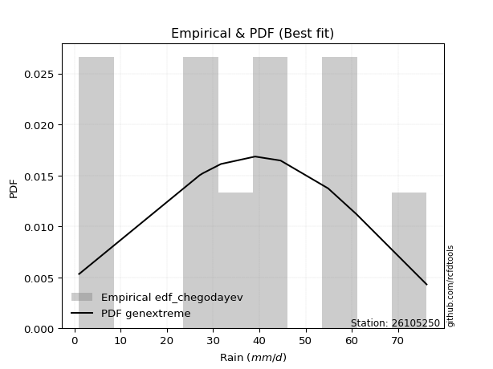</img>

</div>


### 6. Empirical - EDF Blom (1958)

The Blom formula is a specific "plotting position" formula used in hydrology and statistical analysis to estimate the empirical cumulative probability (or non-exceedance probability) of a data series. It is particularly recommended for data that are approximately normally distributed. The constant _a_ is set to 0.375 (or 3/8).

<div align="center">


$P=(m-a)/(n+1-2a)$


</div>


**6.1. Empirical values**

<div align="center">

|                | 0                   | 1                   | 2                   | 3                   | 4                   | 5                  | 6                  | 7                  | 8                  | 9                  |
|:---------------|:--------------------|:--------------------|:--------------------|:--------------------|:--------------------|:-------------------|:-------------------|:-------------------|:-------------------|:-------------------|
| date           | 2016                | 2023                | 2025                | 2022                | 2020                | 2021               | 2024               | 2018               | 2019               | 2017               |
| x              | 1.0                 | 1.2                 | 14.8                | 27.1                | 27.8                | 39.1               | 44.6               | 54.9               | 61.0               | 76.2               |
| m              | 1                   | 2                   | 3                   | 4                   | 5                   | 6                  | 7                  | 8                  | 9                  | 10                 |
| empirical_dist | edf_blom            | edf_blom            | edf_blom            | edf_blom            | edf_blom            | edf_blom           | edf_blom           | edf_blom           | edf_blom           | edf_blom           |
| empirical      | 0.06097560975609756 | 0.15853658536585366 | 0.25609756097560976 | 0.35365853658536583 | 0.45121951219512196 | 0.5487804878048781 | 0.6463414634146342 | 0.7439024390243902 | 0.8414634146341463 | 0.9390243902439024 |
| empirical_tr   | 1.064935064935065   | 1.1884057971014492  | 1.3442622950819672  | 1.5471698113207546  | 1.8222222222222222  | 2.2162162162162162 | 2.827586206896552  | 3.9047619047619047 | 6.307692307692307  | 16.399999999999984 |

</div>


**6.2. Kolmogorov-Smirnov fit test (sorted by Δ)**


<div align="center">

|                | 0                   | 1                   | 2                   | 3                   | 4                   | 5                   | 6                   | 7                   | 8                   | 9                   | 10                  | 11                  | 12                  | 13                 | 14                  | 15                 | 16                  | 17                  | 18                  | 19                  | 20                  | 21                  | 22                  | 23                  | 24                  | 25                    | 26                  | 27                  | 28                  | 29                  | 30                  | 31                  | 32                  | 33                  | 34                  | 35                  | 36                  | 37                  | 38                  | 39                  | 40                  | 41                 | 42                  | 43                  | 44                  | 45                  | 46                 | 47                  | 48                  | 49                 | 50                  | 51                 | 52                 | 53                 | 54                 | 55                  | 56                  | 57                  | 58                 | 59                 | 60                 | 61                 | 62                 | 63                 | 64                  | 65                  | 66                  | 67                  | 68                 | 69                 | 70                 | 71                  | 72                 | 73                  | 74                 | 75                  | 76                  | 77                  | 78                 | 79                 | 80                  | 81                 | 82                 | 83                  | 84                 | 85                 | 86                 | 87                 | 88                 | 89                 |
|:---------------|:--------------------|:--------------------|:--------------------|:--------------------|:--------------------|:--------------------|:--------------------|:--------------------|:--------------------|:--------------------|:--------------------|:--------------------|:--------------------|:-------------------|:--------------------|:-------------------|:--------------------|:--------------------|:--------------------|:--------------------|:--------------------|:--------------------|:--------------------|:--------------------|:--------------------|:----------------------|:--------------------|:--------------------|:--------------------|:--------------------|:--------------------|:--------------------|:--------------------|:--------------------|:--------------------|:--------------------|:--------------------|:--------------------|:--------------------|:--------------------|:--------------------|:-------------------|:--------------------|:--------------------|:--------------------|:--------------------|:-------------------|:--------------------|:--------------------|:-------------------|:--------------------|:-------------------|:-------------------|:-------------------|:-------------------|:--------------------|:--------------------|:--------------------|:-------------------|:-------------------|:-------------------|:-------------------|:-------------------|:-------------------|:--------------------|:--------------------|:--------------------|:--------------------|:-------------------|:-------------------|:-------------------|:--------------------|:-------------------|:--------------------|:-------------------|:--------------------|:--------------------|:--------------------|:-------------------|:-------------------|:--------------------|:-------------------|:-------------------|:--------------------|:-------------------|:-------------------|:-------------------|:-------------------|:-------------------|:-------------------|
| station        | 26105250            | 26105250            | 26105250            | 26105250            | 26105250            | 26105250            | 26105250            | 26105250            | 26105250            | 26105250            | 26105250            | 26105250            | 26105250            | 26105250           | 26105250            | 26105250           | 26105250            | 26105250            | 26105250            | 26105250            | 26105250            | 26105250            | 26105250            | 26105250            | 26105250            | 26105250              | 26105250            | 26105250            | 26105250            | 26105250            | 26105250            | 26105250            | 26105250            | 26105250            | 26105250            | 26105250            | 26105250            | 26105250            | 26105250            | 26105250            | 26105250            | 26105250           | 26105250            | 26105250            | 26105250            | 26105250            | 26105250           | 26105250            | 26105250            | 26105250           | 26105250            | 26105250           | 26105250           | 26105250           | 26105250           | 26105250            | 26105250            | 26105250            | 26105250           | 26105250           | 26105250           | 26105250           | 26105250           | 26105250           | 26105250            | 26105250            | 26105250            | 26105250            | 26105250           | 26105250           | 26105250           | 26105250            | 26105250           | 26105250            | 26105250           | 26105250            | 26105250            | 26105250            | 26105250           | 26105250           | 26105250            | 26105250           | 26105250           | 26105250            | 26105250           | 26105250           | 26105250           | 26105250           | 26105250           | 26105250           |
| empirical_dist | edf_blom            | edf_blom            | edf_blom            | edf_blom            | edf_blom            | edf_blom            | edf_blom            | edf_blom            | edf_blom            | edf_blom            | edf_blom            | edf_blom            | edf_blom            | edf_blom           | edf_blom            | edf_blom           | edf_blom            | edf_blom            | edf_blom            | edf_blom            | edf_blom            | edf_blom            | edf_blom            | edf_blom            | edf_blom            | edf_blom              | edf_blom            | edf_blom            | edf_blom            | edf_blom            | edf_blom            | edf_blom            | edf_blom            | edf_blom            | edf_blom            | edf_blom            | edf_blom            | edf_blom            | edf_blom            | edf_blom            | edf_blom            | edf_blom           | edf_blom            | edf_blom            | edf_blom            | edf_blom            | edf_blom           | edf_blom            | edf_blom            | edf_blom           | edf_blom            | edf_blom           | edf_blom           | edf_blom           | edf_blom           | edf_blom            | edf_blom            | edf_blom            | edf_blom           | edf_blom           | edf_blom           | edf_blom           | edf_blom           | edf_blom           | edf_blom            | edf_blom            | edf_blom            | edf_blom            | edf_blom           | edf_blom           | edf_blom           | edf_blom            | edf_blom           | edf_blom            | edf_blom           | edf_blom            | edf_blom            | edf_blom            | edf_blom           | edf_blom           | edf_blom            | edf_blom           | edf_blom           | edf_blom            | edf_blom           | edf_blom           | edf_blom           | edf_blom           | edf_blom           | edf_blom           |
| p_dist         | fisk                | crystalball         | norm                | t                   | exponnorm           | pearson3            | gamma               | erlang              | logjohnsonsu        | johnsonsu           | logistic            | alpha               | laplace_asymmetric  | invgamma           | hypsecant           | invgauss           | betaprime           | maxwell             | genlogistic         | kstwobign           | rayleigh            | rice                | laplace             | logloggamma         | gumbel_r            | loglaplace_asymmetric | gumbel_l            | ncf                 | mielke              | logt                | moyal               | gompertz            | halfnorm            | halflogistic        | logpearson3         | logfisk             | loggumbel_l         | genexpon            | expon               | loggompertz         | f                   | nakagami           | wald                | logexponnorm        | lognorm             | lognorm             | lognct             | loggamma            | loggamma            | logfatiguelife     | logrice             | logerlang          | loginvgamma        | loginvweibull      | loglogistic        | gibrat              | logalpha            | loghypsecant        | loginvgauss        | logmaxwell         | weibull_min        | lograyleigh        | logkstwobign       | logbetaprime       | loglaplace          | invweibull          | loggenexpon         | loghalfnorm         | loggumbel_r        | logncf             | nct                | loghalflogistic     | logmoyal           | logexpon            | lognakagami        | logf                | chi2                | logwald             | pareto             | logweibull_min     | logchi2             | logpareto          | loggibrat          | logmielke           | logtruncnorm       | loglognorm         | fatiguelife        | truncnorm          | loggenlogistic     | logcrystalball     |
| delta          | 0.07737403098652428 | 0.07871351731597201 | 0.07871351781152466 | 0.07871791023066785 | 0.07875760976745622 | 0.08122420920425594 | 0.08237024828309508 | 0.08270135392075081 | 0.08363228670767113 | 0.08590602123953825 | 0.08615566035588958 | 0.08880896424738363 | 0.08943610998966012 | 0.0896822006558236 | 0.09234345225981566 | 0.0926400381979744 | 0.09349981659041506 | 0.09443727243122219 | 0.09684601918803412 | 0.09906206595116798 | 0.10490935659289523 | 0.10718784314346183 | 0.12036095012916181 | 0.12249067190034058 | 0.12545864184753056 | 0.12961041119042233   | 0.13093025033239264 | 0.14098828880185382 | 0.14117501836322832 | 0.14542365130136337 | 0.14701179985518403 | 0.15555994440783816 | 0.15853658536585366 | 0.15853658536585366 | 0.16586802663429456 | 0.16637207069208337 | 0.18035831613503073 | 0.18394565923423578 | 0.18465779976453978 | 0.18774782242913401 | 0.18923531269312865 | 0.2117254863373177 | 0.22203921397599466 | 0.24108313053759167 | 0.24108570404040475 | 0.24108570404040475 | 0.2413593564750749 | 0.24185284506728488 | 0.24185284506728488 | 0.2423787437418925 | 0.24663165861478675 | 0.250551907571248  | 0.2522369509788177 | 0.2529986963776294 | 0.25338167864602   | 0.25609756097560976 | 0.25619932533596435 | 0.26348695048176074 | 0.2636798828340621 | 0.2680685618443538 | 0.272949903014846  | 0.2764723966823994 | 0.2855434058899976 | 0.2890966562493632 | 0.29012895007905104 | 0.29377733079232005 | 0.29436822811494245 | 0.30036123621882704 | 0.3081185219311606 | 0.3135815639163181 | 0.3277771005723119 | 0.32861945449551744 | 0.3311116812914031 | 0.34381358749936064 | 0.3548857598861326 | 0.38715218584507893 | 0.38853763030021504 | 0.39513152139288443 | 0.3989526819954736 | 0.4001201800447902 | 0.40095569386393237 | 0.4160698626401985 | 0.4266692020148647 | 0.43958380799172514 | 0.4626170863286646 | 0.467530061834315  | 0.5101718609939206 | 0.7417033024436194 | 0.8414634146341463 | nan                |
| deltao         | 0.3942745923300002  | 0.3942745923300002  | 0.3942745923300002  | 0.3942745923300002  | 0.3942745923300002  | 0.3942745923300002  | 0.3942745923300002  | 0.3942745923300002  | 0.3942745923300002  | 0.3942745923300002  | 0.3942745923300002  | 0.3942745923300002  | 0.3942745923300002  | 0.3942745923300002 | 0.3942745923300002  | 0.3942745923300002 | 0.3942745923300002  | 0.3942745923300002  | 0.3942745923300002  | 0.3942745923300002  | 0.3942745923300002  | 0.3942745923300002  | 0.3942745923300002  | 0.3942745923300002  | 0.3942745923300002  | 0.3942745923300002    | 0.3942745923300002  | 0.3942745923300002  | 0.3942745923300002  | 0.3942745923300002  | 0.3942745923300002  | 0.3942745923300002  | 0.3942745923300002  | 0.3942745923300002  | 0.3942745923300002  | 0.3942745923300002  | 0.3942745923300002  | 0.3942745923300002  | 0.3942745923300002  | 0.3942745923300002  | 0.3942745923300002  | 0.3942745923300002 | 0.3942745923300002  | 0.3942745923300002  | 0.3942745923300002  | 0.3942745923300002  | 0.3942745923300002 | 0.3942745923300002  | 0.3942745923300002  | 0.3942745923300002 | 0.3942745923300002  | 0.3942745923300002 | 0.3942745923300002 | 0.3942745923300002 | 0.3942745923300002 | 0.3942745923300002  | 0.3942745923300002  | 0.3942745923300002  | 0.3942745923300002 | 0.3942745923300002 | 0.3942745923300002 | 0.3942745923300002 | 0.3942745923300002 | 0.3942745923300002 | 0.3942745923300002  | 0.3942745923300002  | 0.3942745923300002  | 0.3942745923300002  | 0.3942745923300002 | 0.3942745923300002 | 0.3942745923300002 | 0.3942745923300002  | 0.3942745923300002 | 0.3942745923300002  | 0.3942745923300002 | 0.3942745923300002  | 0.3942745923300002  | 0.3942745923300002  | 0.3942745923300002 | 0.3942745923300002 | 0.3942745923300002  | 0.3942745923300002 | 0.3942745923300002 | 0.3942745923300002  | 0.3942745923300002 | 0.3942745923300002 | 0.3942745923300002 | 0.3942745923300002 | 0.3942745923300002 | 0.3942745923300002 |
| eval           | Δo > Δ              | Δo > Δ              | Δo > Δ              | Δo > Δ              | Δo > Δ              | Δo > Δ              | Δo > Δ              | Δo > Δ              | Δo > Δ              | Δo > Δ              | Δo > Δ              | Δo > Δ              | Δo > Δ              | Δo > Δ             | Δo > Δ              | Δo > Δ             | Δo > Δ              | Δo > Δ              | Δo > Δ              | Δo > Δ              | Δo > Δ              | Δo > Δ              | Δo > Δ              | Δo > Δ              | Δo > Δ              | Δo > Δ                | Δo > Δ              | Δo > Δ              | Δo > Δ              | Δo > Δ              | Δo > Δ              | Δo > Δ              | Δo > Δ              | Δo > Δ              | Δo > Δ              | Δo > Δ              | Δo > Δ              | Δo > Δ              | Δo > Δ              | Δo > Δ              | Δo > Δ              | Δo > Δ             | Δo > Δ              | Δo > Δ              | Δo > Δ              | Δo > Δ              | Δo > Δ             | Δo > Δ              | Δo > Δ              | Δo > Δ             | Δo > Δ              | Δo > Δ             | Δo > Δ             | Δo > Δ             | Δo > Δ             | Δo > Δ              | Δo > Δ              | Δo > Δ              | Δo > Δ             | Δo > Δ             | Δo > Δ             | Δo > Δ             | Δo > Δ             | Δo > Δ             | Δo > Δ              | Δo > Δ              | Δo > Δ              | Δo > Δ              | Δo > Δ             | Δo > Δ             | Δo > Δ             | Δo > Δ              | Δo > Δ             | Δo > Δ              | Δo > Δ             | Δo > Δ              | Δo > Δ              | Δo <= Δ             | Δo <= Δ            | Δo <= Δ            | Δo <= Δ             | Δo <= Δ            | Δo <= Δ            | Δo <= Δ             | Δo <= Δ            | Δo <= Δ            | Δo <= Δ            | Δo <= Δ            | Δo <= Δ            | Δo <= Δ            |
| fit            | 1                   | 1                   | 1                   | 1                   | 1                   | 1                   | 1                   | 1                   | 1                   | 1                   | 1                   | 1                   | 1                   | 1                  | 1                   | 1                  | 1                   | 1                   | 1                   | 1                   | 1                   | 1                   | 1                   | 1                   | 1                   | 1                     | 1                   | 1                   | 1                   | 1                   | 1                   | 1                   | 1                   | 1                   | 1                   | 1                   | 1                   | 1                   | 1                   | 1                   | 1                   | 1                  | 1                   | 1                   | 1                   | 1                   | 1                  | 1                   | 1                   | 1                  | 1                   | 1                  | 1                  | 1                  | 1                  | 1                   | 1                   | 1                   | 1                  | 1                  | 1                  | 1                  | 1                  | 1                  | 1                   | 1                   | 1                   | 1                   | 1                  | 1                  | 1                  | 1                   | 1                  | 1                   | 1                  | 1                   | 1                   | 0                   | 0                  | 0                  | 0                   | 0                  | 0                  | 0                   | 0                  | 0                  | 0                  | 0                  | 0                  | 0                  |
| n              | 10                  | 10                  | 10                  | 10                  | 10                  | 10                  | 10                  | 10                  | 10                  | 10                  | 10                  | 10                  | 10                  | 10                 | 10                  | 10                 | 10                  | 10                  | 10                  | 10                  | 10                  | 10                  | 10                  | 10                  | 10                  | 10                    | 10                  | 10                  | 10                  | 10                  | 10                  | 10                  | 10                  | 10                  | 10                  | 10                  | 10                  | 10                  | 10                  | 10                  | 10                  | 10                 | 10                  | 10                  | 10                  | 10                  | 10                 | 10                  | 10                  | 10                 | 10                  | 10                 | 10                 | 10                 | 10                 | 10                  | 10                  | 10                  | 10                 | 10                 | 10                 | 10                 | 10                 | 10                 | 10                  | 10                  | 10                  | 10                  | 10                 | 10                 | 10                 | 10                  | 10                 | 10                  | 10                 | 10                  | 10                  | 10                  | 10                 | 10                 | 10                  | 10                 | 10                 | 10                  | 10                 | 10                 | 10                 | 10                 | 10                 | 10                 |
| best_fit       | 1                   | 0                   | 0                   | 0                   | 0                   | 0                   | 0                   | 0                   | 0                   | 0                   | 0                   | 0                   | 0                   | 0                  | 0                   | 0                  | 0                   | 0                   | 0                   | 0                   | 0                   | 0                   | 0                   | 0                   | 0                   | 0                     | 0                   | 0                   | 0                   | 0                   | 0                   | 0                   | 0                   | 0                   | 0                   | 0                   | 0                   | 0                   | 0                   | 0                   | 0                   | 0                  | 0                   | 0                   | 0                   | 0                   | 0                  | 0                   | 0                   | 0                  | 0                   | 0                  | 0                  | 0                  | 0                  | 0                   | 0                   | 0                   | 0                  | 0                  | 0                  | 0                  | 0                  | 0                  | 0                   | 0                   | 0                   | 0                   | 0                  | 0                  | 0                  | 0                   | 0                  | 0                   | 0                  | 0                   | 0                   | 0                   | 0                  | 0                  | 0                   | 0                  | 0                  | 0                   | 0                  | 0                  | 0                  | 0                  | 0                  | 0                  |
| best_fit_sort  | 1                   | 2                   | 3                   | 4                   | 5                   | 6                   | 7                   | 8                   | 9                   | 10                  | 11                  | 12                  | 13                  | 14                 | 15                  | 16                 | 17                  | 18                  | 19                  | 20                  | 21                  | 22                  | 23                  | 24                  | 25                  | 26                    | 27                  | 28                  | 29                  | 30                  | 31                  | 32                  | 33                  | 34                  | 35                  | 36                  | 37                  | 38                  | 39                  | 40                  | 41                  | 42                 | 43                  | 44                  | 45                  | 46                  | 47                 | 48                  | 49                  | 50                 | 51                  | 52                 | 53                 | 54                 | 55                 | 56                  | 57                  | 58                  | 59                 | 60                 | 61                 | 62                 | 63                 | 64                 | 65                  | 66                  | 67                  | 68                  | 69                 | 70                 | 71                 | 72                  | 73                 | 74                  | 75                 | 76                  | 77                  | 78                  | 79                 | 80                 | 81                  | 82                 | 83                 | 84                  | 85                 | 86                 | 87                 | 88                 | 89                 | 90                 |

</div>


<div align="center">

</img>

</div>


**6.3. Best fit**

<div align="center">

|   id |   station | empirical_dist   | p_dist   |    delta |   deltao | eval   |   fit |   n |   best_fit |   best_fit_sort |
|-----:|----------:|:-----------------|:---------|---------:|---------:|:-------|------:|----:|-----------:|----------------:|
|    0 |  26105250 | edf_blom         | fisk     | 0.077374 | 0.394275 | Δo > Δ |     1 |  10 |          1 |               1 |

</div>


<div align="center">

</img></img>

</div>


### 7. Empirical - EDF Tukey (1962)

In hydrology, the Tukey formula is used as a plotting position formula to estimate the empirical probability or frequency of a flood event (or other hydrological data). The formula parameter is given as _c=0.333_ (or 1/3).

<div align="center">


$P=(m-c)/(n+1-2c)$


</div>


**7.1. Empirical values**

<div align="center">

|                | 0                   | 1                   | 2                   | 3                  | 4                   | 5                  | 6                  | 7                  | 8                  | 9                  |
|:---------------|:--------------------|:--------------------|:--------------------|:-------------------|:--------------------|:-------------------|:-------------------|:-------------------|:-------------------|:-------------------|
| date           | 2016                | 2023                | 2025                | 2022               | 2020                | 2021               | 2024               | 2018               | 2019               | 2017               |
| x              | 1.0                 | 1.2                 | 14.8                | 27.1               | 27.8                | 39.1               | 44.6               | 54.9               | 61.0               | 76.2               |
| m              | 1                   | 2                   | 3                   | 4                  | 5                   | 6                  | 7                  | 8                  | 9                  | 10                 |
| empirical_dist | edf_tukey           | edf_tukey           | edf_tukey           | edf_tukey          | edf_tukey           | edf_tukey          | edf_tukey          | edf_tukey          | edf_tukey          | edf_tukey          |
| empirical      | 0.06451612903225806 | 0.16129032258064516 | 0.25806451612903225 | 0.3548387096774194 | 0.45161290322580644 | 0.5483870967741935 | 0.6451612903225806 | 0.7419354838709677 | 0.8387096774193549 | 0.9354838709677419 |
| empirical_tr   | 1.0689655172413792  | 1.1923076923076923  | 1.3478260869565217  | 1.55               | 1.823529411764706   | 2.214285714285714  | 2.818181818181818  | 3.875              | 6.200000000000001  | 15.499999999999988 |

</div>


**7.2. Kolmogorov-Smirnov fit test (sorted by Δ)**


<div align="center">

|                | 0                   | 1                  | 2                   | 3                   | 4                   | 5                   | 6                   | 7                   | 8                   | 9                   | 10                  | 11                 | 12                  | 13                  | 14                  | 15                  | 16                  | 17                  | 18                  | 19                  | 20                  | 21                  | 22                  | 23                  | 24                  | 25                    | 26                  | 27                  | 28                  | 29                  | 30                  | 31                  | 32                  | 33                  | 34                  | 35                  | 36                 | 37                  | 38                  | 39                  | 40                  | 41                  | 42                  | 43                  | 44                 | 45                 | 46                  | 47                  | 48                  | 49                  | 50                  | 51                  | 52                  | 53                  | 54                 | 55                 | 56                  | 57                 | 58                  | 59                  | 60                  | 61                 | 62                  | 63                 | 64                 | 65                  | 66                 | 67                 | 68                 | 69                 | 70                 | 71                 | 72                 | 73                  | 74                 | 75                  | 76                 | 77                 | 78                  | 79                  | 80                 | 81                  | 82                  | 83                  | 84                  | 85                  | 86                 | 87                 | 88                 | 89                 |
|:---------------|:--------------------|:-------------------|:--------------------|:--------------------|:--------------------|:--------------------|:--------------------|:--------------------|:--------------------|:--------------------|:--------------------|:-------------------|:--------------------|:--------------------|:--------------------|:--------------------|:--------------------|:--------------------|:--------------------|:--------------------|:--------------------|:--------------------|:--------------------|:--------------------|:--------------------|:----------------------|:--------------------|:--------------------|:--------------------|:--------------------|:--------------------|:--------------------|:--------------------|:--------------------|:--------------------|:--------------------|:-------------------|:--------------------|:--------------------|:--------------------|:--------------------|:--------------------|:--------------------|:--------------------|:-------------------|:-------------------|:--------------------|:--------------------|:--------------------|:--------------------|:--------------------|:--------------------|:--------------------|:--------------------|:-------------------|:-------------------|:--------------------|:-------------------|:--------------------|:--------------------|:--------------------|:-------------------|:--------------------|:-------------------|:-------------------|:--------------------|:-------------------|:-------------------|:-------------------|:-------------------|:-------------------|:-------------------|:-------------------|:--------------------|:-------------------|:--------------------|:-------------------|:-------------------|:--------------------|:--------------------|:-------------------|:--------------------|:--------------------|:--------------------|:--------------------|:--------------------|:-------------------|:-------------------|:-------------------|:-------------------|
| station        | 26105250            | 26105250           | 26105250            | 26105250            | 26105250            | 26105250            | 26105250            | 26105250            | 26105250            | 26105250            | 26105250            | 26105250           | 26105250            | 26105250            | 26105250            | 26105250            | 26105250            | 26105250            | 26105250            | 26105250            | 26105250            | 26105250            | 26105250            | 26105250            | 26105250            | 26105250              | 26105250            | 26105250            | 26105250            | 26105250            | 26105250            | 26105250            | 26105250            | 26105250            | 26105250            | 26105250            | 26105250           | 26105250            | 26105250            | 26105250            | 26105250            | 26105250            | 26105250            | 26105250            | 26105250           | 26105250           | 26105250            | 26105250            | 26105250            | 26105250            | 26105250            | 26105250            | 26105250            | 26105250            | 26105250           | 26105250           | 26105250            | 26105250           | 26105250            | 26105250            | 26105250            | 26105250           | 26105250            | 26105250           | 26105250           | 26105250            | 26105250           | 26105250           | 26105250           | 26105250           | 26105250           | 26105250           | 26105250           | 26105250            | 26105250           | 26105250            | 26105250           | 26105250           | 26105250            | 26105250            | 26105250           | 26105250            | 26105250            | 26105250            | 26105250            | 26105250            | 26105250           | 26105250           | 26105250           | 26105250           |
| empirical_dist | edf_tukey           | edf_tukey          | edf_tukey           | edf_tukey           | edf_tukey           | edf_tukey           | edf_tukey           | edf_tukey           | edf_tukey           | edf_tukey           | edf_tukey           | edf_tukey          | edf_tukey           | edf_tukey           | edf_tukey           | edf_tukey           | edf_tukey           | edf_tukey           | edf_tukey           | edf_tukey           | edf_tukey           | edf_tukey           | edf_tukey           | edf_tukey           | edf_tukey           | edf_tukey             | edf_tukey           | edf_tukey           | edf_tukey           | edf_tukey           | edf_tukey           | edf_tukey           | edf_tukey           | edf_tukey           | edf_tukey           | edf_tukey           | edf_tukey          | edf_tukey           | edf_tukey           | edf_tukey           | edf_tukey           | edf_tukey           | edf_tukey           | edf_tukey           | edf_tukey          | edf_tukey          | edf_tukey           | edf_tukey           | edf_tukey           | edf_tukey           | edf_tukey           | edf_tukey           | edf_tukey           | edf_tukey           | edf_tukey          | edf_tukey          | edf_tukey           | edf_tukey          | edf_tukey           | edf_tukey           | edf_tukey           | edf_tukey          | edf_tukey           | edf_tukey          | edf_tukey          | edf_tukey           | edf_tukey          | edf_tukey          | edf_tukey          | edf_tukey          | edf_tukey          | edf_tukey          | edf_tukey          | edf_tukey           | edf_tukey          | edf_tukey           | edf_tukey          | edf_tukey          | edf_tukey           | edf_tukey           | edf_tukey          | edf_tukey           | edf_tukey           | edf_tukey           | edf_tukey           | edf_tukey           | edf_tukey          | edf_tukey          | edf_tukey          | edf_tukey          |
| p_dist         | fisk                | crystalball        | norm                | t                   | exponnorm           | pearson3            | gamma               | erlang              | logjohnsonsu        | johnsonsu           | logistic            | laplace_asymmetric | alpha               | invgamma            | hypsecant           | invgauss            | betaprime           | maxwell             | genlogistic         | kstwobign           | rayleigh            | rice                | laplace             | logloggamma         | gumbel_r            | loglaplace_asymmetric | gumbel_l            | ncf                 | mielke              | logt                | moyal               | gompertz            | halfnorm            | halflogistic        | logpearson3         | logfisk             | loggumbel_l        | genexpon            | expon               | loggompertz         | f                   | nakagami            | wald                | logexponnorm        | lognorm            | lognorm            | lognct              | loggamma            | loggamma            | logfatiguelife      | logrice             | logerlang           | loginvgamma         | loginvweibull       | loglogistic        | logalpha           | gibrat              | loghypsecant       | loginvgauss         | logmaxwell          | weibull_min         | lograyleigh        | logkstwobign        | logbetaprime       | loglaplace         | invweibull          | loggenexpon        | loghalfnorm        | loggumbel_r        | logncf             | nct                | loghalflogistic    | logmoyal           | logexpon            | lognakagami        | logf                | chi2               | logwald            | pareto              | logweibull_min      | logchi2            | logpareto           | loggibrat           | logmielke           | logtruncnorm        | loglognorm          | fatiguelife        | truncnorm          | loggenlogistic     | logcrystalball     |
| delta          | 0.08012776820131577 | 0.0814672545307635 | 0.08146725502631616 | 0.08147164744545934 | 0.08151134698224771 | 0.08397794641904743 | 0.08512398549788658 | 0.08545509113554231 | 0.08638602392246263 | 0.08865975845432975 | 0.08890939757068107 | 0.0898295010203447 | 0.09156270146217513 | 0.09243593787061509 | 0.09273684329050014 | 0.09539377541276589 | 0.09625355380520656 | 0.09719100964601368 | 0.09959975640282562 | 0.10181580316595948 | 0.10766309380768672 | 0.10994158035825333 | 0.12075434115984629 | 0.12131049880828704 | 0.12821237906232205 | 0.1284302380983688    | 0.13132364136307711 | 0.13997292047993884 | 0.14392875557801982 | 0.14581704233204784 | 0.14976553706997553 | 0.15831368162262965 | 0.16129032258064516 | 0.16129032258064516 | 0.16468785354224103 | 0.16519189760002984 | 0.1791781430429772 | 0.18276548614218224 | 0.18347762667248624 | 0.18656764933708048 | 0.18805513960107512 | 0.21054531324526415 | 0.22400616912941715 | 0.23990295744553813 | 0.2399055309483512 | 0.2399055309483512 | 0.24017918338302136 | 0.24067267197523134 | 0.24067267197523134 | 0.24119857064983896 | 0.24545148552273321 | 0.24937173447919447 | 0.25105677788676417 | 0.25181852328557586 | 0.2522015055539665 | 0.2550191522439108 | 0.25806451612903225 | 0.2623067773897072 | 0.26249970974200854 | 0.26688838875230025 | 0.27176972992279247 | 0.2752922235903459 | 0.28436323279794407 | 0.2871297010959407 | 0.2889487769869975 | 0.29181037563889756 | 0.2931880550228889 | 0.2991810631267735 | 0.3069383488391071 | 0.3100410446401576 | 0.3258101454188894 | 0.3274392814034639 | 0.3299315081993496 | 0.34184663234593815 | 0.3529188047327101 | 0.38518523069165644 | 0.3873574572081615 | 0.3939513483008309 | 0.39698572684205113 | 0.39815322489136773 | 0.3989887387105099 | 0.41410290748677603 | 0.42548902892281115 | 0.43761685283830265 | 0.46143691323661107 | 0.46477632461952356 | 0.5082049058404982 | 0.7397363472901969 | 0.8387096774193549 | nan                |
| deltao         | 0.3942745923300002  | 0.3942745923300002 | 0.3942745923300002  | 0.3942745923300002  | 0.3942745923300002  | 0.3942745923300002  | 0.3942745923300002  | 0.3942745923300002  | 0.3942745923300002  | 0.3942745923300002  | 0.3942745923300002  | 0.3942745923300002 | 0.3942745923300002  | 0.3942745923300002  | 0.3942745923300002  | 0.3942745923300002  | 0.3942745923300002  | 0.3942745923300002  | 0.3942745923300002  | 0.3942745923300002  | 0.3942745923300002  | 0.3942745923300002  | 0.3942745923300002  | 0.3942745923300002  | 0.3942745923300002  | 0.3942745923300002    | 0.3942745923300002  | 0.3942745923300002  | 0.3942745923300002  | 0.3942745923300002  | 0.3942745923300002  | 0.3942745923300002  | 0.3942745923300002  | 0.3942745923300002  | 0.3942745923300002  | 0.3942745923300002  | 0.3942745923300002 | 0.3942745923300002  | 0.3942745923300002  | 0.3942745923300002  | 0.3942745923300002  | 0.3942745923300002  | 0.3942745923300002  | 0.3942745923300002  | 0.3942745923300002 | 0.3942745923300002 | 0.3942745923300002  | 0.3942745923300002  | 0.3942745923300002  | 0.3942745923300002  | 0.3942745923300002  | 0.3942745923300002  | 0.3942745923300002  | 0.3942745923300002  | 0.3942745923300002 | 0.3942745923300002 | 0.3942745923300002  | 0.3942745923300002 | 0.3942745923300002  | 0.3942745923300002  | 0.3942745923300002  | 0.3942745923300002 | 0.3942745923300002  | 0.3942745923300002 | 0.3942745923300002 | 0.3942745923300002  | 0.3942745923300002 | 0.3942745923300002 | 0.3942745923300002 | 0.3942745923300002 | 0.3942745923300002 | 0.3942745923300002 | 0.3942745923300002 | 0.3942745923300002  | 0.3942745923300002 | 0.3942745923300002  | 0.3942745923300002 | 0.3942745923300002 | 0.3942745923300002  | 0.3942745923300002  | 0.3942745923300002 | 0.3942745923300002  | 0.3942745923300002  | 0.3942745923300002  | 0.3942745923300002  | 0.3942745923300002  | 0.3942745923300002 | 0.3942745923300002 | 0.3942745923300002 | 0.3942745923300002 |
| eval           | Δo > Δ              | Δo > Δ             | Δo > Δ              | Δo > Δ              | Δo > Δ              | Δo > Δ              | Δo > Δ              | Δo > Δ              | Δo > Δ              | Δo > Δ              | Δo > Δ              | Δo > Δ             | Δo > Δ              | Δo > Δ              | Δo > Δ              | Δo > Δ              | Δo > Δ              | Δo > Δ              | Δo > Δ              | Δo > Δ              | Δo > Δ              | Δo > Δ              | Δo > Δ              | Δo > Δ              | Δo > Δ              | Δo > Δ                | Δo > Δ              | Δo > Δ              | Δo > Δ              | Δo > Δ              | Δo > Δ              | Δo > Δ              | Δo > Δ              | Δo > Δ              | Δo > Δ              | Δo > Δ              | Δo > Δ             | Δo > Δ              | Δo > Δ              | Δo > Δ              | Δo > Δ              | Δo > Δ              | Δo > Δ              | Δo > Δ              | Δo > Δ             | Δo > Δ             | Δo > Δ              | Δo > Δ              | Δo > Δ              | Δo > Δ              | Δo > Δ              | Δo > Δ              | Δo > Δ              | Δo > Δ              | Δo > Δ             | Δo > Δ             | Δo > Δ              | Δo > Δ             | Δo > Δ              | Δo > Δ              | Δo > Δ              | Δo > Δ             | Δo > Δ              | Δo > Δ             | Δo > Δ             | Δo > Δ              | Δo > Δ             | Δo > Δ             | Δo > Δ             | Δo > Δ             | Δo > Δ             | Δo > Δ             | Δo > Δ             | Δo > Δ              | Δo > Δ             | Δo > Δ              | Δo > Δ             | Δo > Δ             | Δo <= Δ             | Δo <= Δ             | Δo <= Δ            | Δo <= Δ             | Δo <= Δ             | Δo <= Δ             | Δo <= Δ             | Δo <= Δ             | Δo <= Δ            | Δo <= Δ            | Δo <= Δ            | Δo <= Δ            |
| fit            | 1                   | 1                  | 1                   | 1                   | 1                   | 1                   | 1                   | 1                   | 1                   | 1                   | 1                   | 1                  | 1                   | 1                   | 1                   | 1                   | 1                   | 1                   | 1                   | 1                   | 1                   | 1                   | 1                   | 1                   | 1                   | 1                     | 1                   | 1                   | 1                   | 1                   | 1                   | 1                   | 1                   | 1                   | 1                   | 1                   | 1                  | 1                   | 1                   | 1                   | 1                   | 1                   | 1                   | 1                   | 1                  | 1                  | 1                   | 1                   | 1                   | 1                   | 1                   | 1                   | 1                   | 1                   | 1                  | 1                  | 1                   | 1                  | 1                   | 1                   | 1                   | 1                  | 1                   | 1                  | 1                  | 1                   | 1                  | 1                  | 1                  | 1                  | 1                  | 1                  | 1                  | 1                   | 1                  | 1                   | 1                  | 1                  | 0                   | 0                   | 0                  | 0                   | 0                   | 0                   | 0                   | 0                   | 0                  | 0                  | 0                  | 0                  |
| n              | 10                  | 10                 | 10                  | 10                  | 10                  | 10                  | 10                  | 10                  | 10                  | 10                  | 10                  | 10                 | 10                  | 10                  | 10                  | 10                  | 10                  | 10                  | 10                  | 10                  | 10                  | 10                  | 10                  | 10                  | 10                  | 10                    | 10                  | 10                  | 10                  | 10                  | 10                  | 10                  | 10                  | 10                  | 10                  | 10                  | 10                 | 10                  | 10                  | 10                  | 10                  | 10                  | 10                  | 10                  | 10                 | 10                 | 10                  | 10                  | 10                  | 10                  | 10                  | 10                  | 10                  | 10                  | 10                 | 10                 | 10                  | 10                 | 10                  | 10                  | 10                  | 10                 | 10                  | 10                 | 10                 | 10                  | 10                 | 10                 | 10                 | 10                 | 10                 | 10                 | 10                 | 10                  | 10                 | 10                  | 10                 | 10                 | 10                  | 10                  | 10                 | 10                  | 10                  | 10                  | 10                  | 10                  | 10                 | 10                 | 10                 | 10                 |
| best_fit       | 1                   | 0                  | 0                   | 0                   | 0                   | 0                   | 0                   | 0                   | 0                   | 0                   | 0                   | 0                  | 0                   | 0                   | 0                   | 0                   | 0                   | 0                   | 0                   | 0                   | 0                   | 0                   | 0                   | 0                   | 0                   | 0                     | 0                   | 0                   | 0                   | 0                   | 0                   | 0                   | 0                   | 0                   | 0                   | 0                   | 0                  | 0                   | 0                   | 0                   | 0                   | 0                   | 0                   | 0                   | 0                  | 0                  | 0                   | 0                   | 0                   | 0                   | 0                   | 0                   | 0                   | 0                   | 0                  | 0                  | 0                   | 0                  | 0                   | 0                   | 0                   | 0                  | 0                   | 0                  | 0                  | 0                   | 0                  | 0                  | 0                  | 0                  | 0                  | 0                  | 0                  | 0                   | 0                  | 0                   | 0                  | 0                  | 0                   | 0                   | 0                  | 0                   | 0                   | 0                   | 0                   | 0                   | 0                  | 0                  | 0                  | 0                  |
| best_fit_sort  | 1                   | 2                  | 3                   | 4                   | 5                   | 6                   | 7                   | 8                   | 9                   | 10                  | 11                  | 12                 | 13                  | 14                  | 15                  | 16                  | 17                  | 18                  | 19                  | 20                  | 21                  | 22                  | 23                  | 24                  | 25                  | 26                    | 27                  | 28                  | 29                  | 30                  | 31                  | 32                  | 33                  | 34                  | 35                  | 36                  | 37                 | 38                  | 39                  | 40                  | 41                  | 42                  | 43                  | 44                  | 45                 | 46                 | 47                  | 48                  | 49                  | 50                  | 51                  | 52                  | 53                  | 54                  | 55                 | 56                 | 57                  | 58                 | 59                  | 60                  | 61                  | 62                 | 63                  | 64                 | 65                 | 66                  | 67                 | 68                 | 69                 | 70                 | 71                 | 72                 | 73                 | 74                  | 75                 | 76                  | 77                 | 78                 | 79                  | 80                  | 81                 | 82                  | 83                  | 84                  | 85                  | 86                  | 87                 | 88                 | 89                 | 90                 |

</div>


<div align="center">

</img>

</div>


**7.3. Best fit**

<div align="center">

|   id |   station | empirical_dist   | p_dist   |     delta |   deltao | eval   |   fit |   n |   best_fit |   best_fit_sort |
|-----:|----------:|:-----------------|:---------|----------:|---------:|:-------|------:|----:|-----------:|----------------:|
|    0 |  26105250 | edf_tukey        | fisk     | 0.0801278 | 0.394275 | Δo > Δ |     1 |  10 |          1 |               1 |

</div>


<div align="center">

</img></img>

</div>


### 8. Empirical - EDF Gringorten (1963)

Gringorten plotting position formula is essential for estimating the probability and return periods of extreme events like floods and heavy rainfall. The constant _a=0.44_.

<div align="center">


$P=(m-a)/(n+1-2a)$


</div>


**8.1. Empirical values**

<div align="center">

|                | 0                   | 1                   | 2                  | 3                   | 4                  | 5                 | 6                  | 7                  | 8                  | 9                  |
|:---------------|:--------------------|:--------------------|:-------------------|:--------------------|:-------------------|:------------------|:-------------------|:-------------------|:-------------------|:-------------------|
| date           | 2016                | 2023                | 2025               | 2022                | 2020               | 2021              | 2024               | 2018               | 2019               | 2017               |
| x              | 1.0                 | 1.2                 | 14.8               | 27.1                | 27.8               | 39.1              | 44.6               | 54.9               | 61.0               | 76.2               |
| m              | 1                   | 2                   | 3                  | 4                   | 5                  | 6                 | 7                  | 8                  | 9                  | 10                 |
| empirical_dist | edf_gringorten      | edf_gringorten      | edf_gringorten     | edf_gringorten      | edf_gringorten     | edf_gringorten    | edf_gringorten     | edf_gringorten     | edf_gringorten     | edf_gringorten     |
| empirical      | 0.05533596837944665 | 0.15415019762845852 | 0.2529644268774704 | 0.35177865612648224 | 0.4505928853754941 | 0.549407114624506 | 0.6482213438735178 | 0.7470355731225297 | 0.8458498023715416 | 0.9446640316205535 |
| empirical_tr   | 1.0585774058577406  | 1.1822429906542056  | 1.3386243386243388 | 1.542682926829268   | 1.8201438848920866 | 2.219298245614035 | 2.842696629213483  | 3.9531250000000004 | 6.487179487179492  | 18.071428571428605 |

</div>


**8.2. Kolmogorov-Smirnov fit test (sorted by Δ)**


<div align="center">

|                | 0                   | 1                   | 2                   | 3                   | 4                   | 5                  | 6                   | 7                   | 8                  | 9                   | 10                  | 11                 | 12                  | 13                  | 14                  | 15                  | 16                  | 17                  | 18                  | 19                  | 20                  | 21                 | 22                  | 23                  | 24                  | 25                  | 26                    | 27                  | 28                 | 29                  | 30                  | 31                  | 32                  | 33                  | 34                  | 35                  | 36                  | 37                  | 38                  | 39                 | 40                  | 41                 | 42                 | 43                  | 44                  | 45                  | 46                 | 47                  | 48                  | 49                 | 50                  | 51                 | 52                 | 53                 | 54                 | 55                 | 56                  | 57                  | 58                  | 59                 | 60                 | 61                 | 62                 | 63                  | 64                  | 65                  | 66                 | 67                  | 68                 | 69                  | 70                  | 71                 | 72                 | 73                 | 74                  | 75                 | 76                  | 77                  | 78                 | 79                 | 80                  | 81                 | 82                 | 83                 | 84                 | 85                 | 86                 | 87                 | 88                 | 89                 |
|:---------------|:--------------------|:--------------------|:--------------------|:--------------------|:--------------------|:-------------------|:--------------------|:--------------------|:-------------------|:--------------------|:--------------------|:-------------------|:--------------------|:--------------------|:--------------------|:--------------------|:--------------------|:--------------------|:--------------------|:--------------------|:--------------------|:-------------------|:--------------------|:--------------------|:--------------------|:--------------------|:----------------------|:--------------------|:-------------------|:--------------------|:--------------------|:--------------------|:--------------------|:--------------------|:--------------------|:--------------------|:--------------------|:--------------------|:--------------------|:-------------------|:--------------------|:-------------------|:-------------------|:--------------------|:--------------------|:--------------------|:-------------------|:--------------------|:--------------------|:-------------------|:--------------------|:-------------------|:-------------------|:-------------------|:-------------------|:-------------------|:--------------------|:--------------------|:--------------------|:-------------------|:-------------------|:-------------------|:-------------------|:--------------------|:--------------------|:--------------------|:-------------------|:--------------------|:-------------------|:--------------------|:--------------------|:-------------------|:-------------------|:-------------------|:--------------------|:-------------------|:--------------------|:--------------------|:-------------------|:-------------------|:--------------------|:-------------------|:-------------------|:-------------------|:-------------------|:-------------------|:-------------------|:-------------------|:-------------------|:-------------------|
| station        | 26105250            | 26105250            | 26105250            | 26105250            | 26105250            | 26105250           | 26105250            | 26105250            | 26105250           | 26105250            | 26105250            | 26105250           | 26105250            | 26105250            | 26105250            | 26105250            | 26105250            | 26105250            | 26105250            | 26105250            | 26105250            | 26105250           | 26105250            | 26105250            | 26105250            | 26105250            | 26105250              | 26105250            | 26105250           | 26105250            | 26105250            | 26105250            | 26105250            | 26105250            | 26105250            | 26105250            | 26105250            | 26105250            | 26105250            | 26105250           | 26105250            | 26105250           | 26105250           | 26105250            | 26105250            | 26105250            | 26105250           | 26105250            | 26105250            | 26105250           | 26105250            | 26105250           | 26105250           | 26105250           | 26105250           | 26105250           | 26105250            | 26105250            | 26105250            | 26105250           | 26105250           | 26105250           | 26105250           | 26105250            | 26105250            | 26105250            | 26105250           | 26105250            | 26105250           | 26105250            | 26105250            | 26105250           | 26105250           | 26105250           | 26105250            | 26105250           | 26105250            | 26105250            | 26105250           | 26105250           | 26105250            | 26105250           | 26105250           | 26105250           | 26105250           | 26105250           | 26105250           | 26105250           | 26105250           | 26105250           |
| empirical_dist | edf_gringorten      | edf_gringorten      | edf_gringorten      | edf_gringorten      | edf_gringorten      | edf_gringorten     | edf_gringorten      | edf_gringorten      | edf_gringorten     | edf_gringorten      | edf_gringorten      | edf_gringorten     | edf_gringorten      | edf_gringorten      | edf_gringorten      | edf_gringorten      | edf_gringorten      | edf_gringorten      | edf_gringorten      | edf_gringorten      | edf_gringorten      | edf_gringorten     | edf_gringorten      | edf_gringorten      | edf_gringorten      | edf_gringorten      | edf_gringorten        | edf_gringorten      | edf_gringorten     | edf_gringorten      | edf_gringorten      | edf_gringorten      | edf_gringorten      | edf_gringorten      | edf_gringorten      | edf_gringorten      | edf_gringorten      | edf_gringorten      | edf_gringorten      | edf_gringorten     | edf_gringorten      | edf_gringorten     | edf_gringorten     | edf_gringorten      | edf_gringorten      | edf_gringorten      | edf_gringorten     | edf_gringorten      | edf_gringorten      | edf_gringorten     | edf_gringorten      | edf_gringorten     | edf_gringorten     | edf_gringorten     | edf_gringorten     | edf_gringorten     | edf_gringorten      | edf_gringorten      | edf_gringorten      | edf_gringorten     | edf_gringorten     | edf_gringorten     | edf_gringorten     | edf_gringorten      | edf_gringorten      | edf_gringorten      | edf_gringorten     | edf_gringorten      | edf_gringorten     | edf_gringorten      | edf_gringorten      | edf_gringorten     | edf_gringorten     | edf_gringorten     | edf_gringorten      | edf_gringorten     | edf_gringorten      | edf_gringorten      | edf_gringorten     | edf_gringorten     | edf_gringorten      | edf_gringorten     | edf_gringorten     | edf_gringorten     | edf_gringorten     | edf_gringorten     | edf_gringorten     | edf_gringorten     | edf_gringorten     | edf_gringorten     |
| p_dist         | fisk                | crystalball         | norm                | t                   | exponnorm           | pearson3           | gamma               | erlang              | logjohnsonsu       | johnsonsu           | logistic            | alpha              | invgamma            | invgauss            | laplace_asymmetric  | betaprime           | maxwell             | hypsecant           | genlogistic         | kstwobign           | rayleigh            | rice               | laplace             | gumbel_r            | logloggamma         | gumbel_l            | loglaplace_asymmetric | mielke              | moyal              | ncf                 | logt                | gompertz            | halfnorm            | halflogistic        | logpearson3         | logfisk             | loggumbel_l         | genexpon            | expon               | loggompertz        | f                   | nakagami           | wald               | logexponnorm        | lognorm             | lognorm             | lognct             | loggamma            | loggamma            | logfatiguelife     | logrice             | logerlang          | gibrat             | loginvgamma        | loginvweibull      | loglogistic        | logalpha            | loghypsecant        | loginvgauss         | logmaxwell         | weibull_min        | lograyleigh        | logkstwobign       | loglaplace          | logbetaprime        | loggenexpon         | invweibull         | loghalfnorm         | loggumbel_r        | logncf              | loghalflogistic     | nct                | logmoyal           | logexpon           | lognakagami         | logf               | chi2                | logwald             | pareto             | logweibull_min     | logchi2             | logpareto          | loggibrat          | logmielke          | logtruncnorm       | loglognorm         | fatiguelife        | truncnorm          | loggenlogistic     | logcrystalball     |
| delta          | 0.07298764324912914 | 0.07432712957857687 | 0.07432713007412953 | 0.07433152249327271 | 0.07437122203006108 | 0.0768378214668608 | 0.07798386054569995 | 0.07831496618335568 | 0.079245898970276  | 0.08151963350214311 | 0.08176927261849444 | 0.0844225765099885 | 0.08529581291842846 | 0.08825365046057926 | 0.08880948317003223 | 0.08911342885301993 | 0.09005088469382705 | 0.09171682544018778 | 0.09245963145063898 | 0.09879300658452717 | 0.10052296885550009 | 0.1028014554060667 | 0.11973432330953393 | 0.12107225411013542 | 0.12437055235922417 | 0.13030362351276475 | 0.13149029164930592   | 0.13678863062583319 | 0.1426254121177889 | 0.14286816926073742 | 0.14479702448173548 | 0.15117355667044302 | 0.15415019762845852 | 0.15415019762845852 | 0.16774790709317816 | 0.16825195115096697 | 0.18223819659391433 | 0.18582553969311938 | 0.18653768022342337 | 0.1896277028880176 | 0.19111519315201225 | 0.2136053667962013 | 0.2189060798778553 | 0.24296301099647527 | 0.24296558449928835 | 0.24296558449928835 | 0.2432392369339585 | 0.24373272552616848 | 0.24373272552616848 | 0.2442586242007761 | 0.24851153907367035 | 0.2524317880301316 | 0.2529644268774704 | 0.2541168314377013 | 0.254878576836513  | 0.2552615591049036 | 0.25807920579484794 | 0.26536683094064434 | 0.26555976329294567 | 0.2699484423032374 | 0.2748297834737296 | 0.278352277141283  | 0.2874232863488812 | 0.29200883053793464 | 0.29222979034750257 | 0.29624810857382605 | 0.2969104648904594 | 0.30224111667771064 | 0.3099984023900442 | 0.31922120529296916 | 0.33049933495440104 | 0.3309102346704513 | 0.3329915617502867 | 0.3469467215975    | 0.35801889398427195 | 0.3902853199432183 | 0.39041751075909864 | 0.39701140185176803 | 0.402085816093613  | 0.4032533141429296 | 0.40408882796207174 | 0.4192029967383379 | 0.4285490824737483 | 0.4427169420898645 | 0.4644969667875482 | 0.4719164495717102 | 0.5133049950920601 | 0.7448364365417588 | 0.8458498023715416 | nan                |
| deltao         | 0.3942745923300002  | 0.3942745923300002  | 0.3942745923300002  | 0.3942745923300002  | 0.3942745923300002  | 0.3942745923300002 | 0.3942745923300002  | 0.3942745923300002  | 0.3942745923300002 | 0.3942745923300002  | 0.3942745923300002  | 0.3942745923300002 | 0.3942745923300002  | 0.3942745923300002  | 0.3942745923300002  | 0.3942745923300002  | 0.3942745923300002  | 0.3942745923300002  | 0.3942745923300002  | 0.3942745923300002  | 0.3942745923300002  | 0.3942745923300002 | 0.3942745923300002  | 0.3942745923300002  | 0.3942745923300002  | 0.3942745923300002  | 0.3942745923300002    | 0.3942745923300002  | 0.3942745923300002 | 0.3942745923300002  | 0.3942745923300002  | 0.3942745923300002  | 0.3942745923300002  | 0.3942745923300002  | 0.3942745923300002  | 0.3942745923300002  | 0.3942745923300002  | 0.3942745923300002  | 0.3942745923300002  | 0.3942745923300002 | 0.3942745923300002  | 0.3942745923300002 | 0.3942745923300002 | 0.3942745923300002  | 0.3942745923300002  | 0.3942745923300002  | 0.3942745923300002 | 0.3942745923300002  | 0.3942745923300002  | 0.3942745923300002 | 0.3942745923300002  | 0.3942745923300002 | 0.3942745923300002 | 0.3942745923300002 | 0.3942745923300002 | 0.3942745923300002 | 0.3942745923300002  | 0.3942745923300002  | 0.3942745923300002  | 0.3942745923300002 | 0.3942745923300002 | 0.3942745923300002 | 0.3942745923300002 | 0.3942745923300002  | 0.3942745923300002  | 0.3942745923300002  | 0.3942745923300002 | 0.3942745923300002  | 0.3942745923300002 | 0.3942745923300002  | 0.3942745923300002  | 0.3942745923300002 | 0.3942745923300002 | 0.3942745923300002 | 0.3942745923300002  | 0.3942745923300002 | 0.3942745923300002  | 0.3942745923300002  | 0.3942745923300002 | 0.3942745923300002 | 0.3942745923300002  | 0.3942745923300002 | 0.3942745923300002 | 0.3942745923300002 | 0.3942745923300002 | 0.3942745923300002 | 0.3942745923300002 | 0.3942745923300002 | 0.3942745923300002 | 0.3942745923300002 |
| eval           | Δo > Δ              | Δo > Δ              | Δo > Δ              | Δo > Δ              | Δo > Δ              | Δo > Δ             | Δo > Δ              | Δo > Δ              | Δo > Δ             | Δo > Δ              | Δo > Δ              | Δo > Δ             | Δo > Δ              | Δo > Δ              | Δo > Δ              | Δo > Δ              | Δo > Δ              | Δo > Δ              | Δo > Δ              | Δo > Δ              | Δo > Δ              | Δo > Δ             | Δo > Δ              | Δo > Δ              | Δo > Δ              | Δo > Δ              | Δo > Δ                | Δo > Δ              | Δo > Δ             | Δo > Δ              | Δo > Δ              | Δo > Δ              | Δo > Δ              | Δo > Δ              | Δo > Δ              | Δo > Δ              | Δo > Δ              | Δo > Δ              | Δo > Δ              | Δo > Δ             | Δo > Δ              | Δo > Δ             | Δo > Δ             | Δo > Δ              | Δo > Δ              | Δo > Δ              | Δo > Δ             | Δo > Δ              | Δo > Δ              | Δo > Δ             | Δo > Δ              | Δo > Δ             | Δo > Δ             | Δo > Δ             | Δo > Δ             | Δo > Δ             | Δo > Δ              | Δo > Δ              | Δo > Δ              | Δo > Δ             | Δo > Δ             | Δo > Δ             | Δo > Δ             | Δo > Δ              | Δo > Δ              | Δo > Δ              | Δo > Δ             | Δo > Δ              | Δo > Δ             | Δo > Δ              | Δo > Δ              | Δo > Δ             | Δo > Δ             | Δo > Δ             | Δo > Δ              | Δo > Δ             | Δo > Δ              | Δo <= Δ             | Δo <= Δ            | Δo <= Δ            | Δo <= Δ             | Δo <= Δ            | Δo <= Δ            | Δo <= Δ            | Δo <= Δ            | Δo <= Δ            | Δo <= Δ            | Δo <= Δ            | Δo <= Δ            | Δo <= Δ            |
| fit            | 1                   | 1                   | 1                   | 1                   | 1                   | 1                  | 1                   | 1                   | 1                  | 1                   | 1                   | 1                  | 1                   | 1                   | 1                   | 1                   | 1                   | 1                   | 1                   | 1                   | 1                   | 1                  | 1                   | 1                   | 1                   | 1                   | 1                     | 1                   | 1                  | 1                   | 1                   | 1                   | 1                   | 1                   | 1                   | 1                   | 1                   | 1                   | 1                   | 1                  | 1                   | 1                  | 1                  | 1                   | 1                   | 1                   | 1                  | 1                   | 1                   | 1                  | 1                   | 1                  | 1                  | 1                  | 1                  | 1                  | 1                   | 1                   | 1                   | 1                  | 1                  | 1                  | 1                  | 1                   | 1                   | 1                   | 1                  | 1                   | 1                  | 1                   | 1                   | 1                  | 1                  | 1                  | 1                   | 1                  | 1                   | 0                   | 0                  | 0                  | 0                   | 0                  | 0                  | 0                  | 0                  | 0                  | 0                  | 0                  | 0                  | 0                  |
| n              | 10                  | 10                  | 10                  | 10                  | 10                  | 10                 | 10                  | 10                  | 10                 | 10                  | 10                  | 10                 | 10                  | 10                  | 10                  | 10                  | 10                  | 10                  | 10                  | 10                  | 10                  | 10                 | 10                  | 10                  | 10                  | 10                  | 10                    | 10                  | 10                 | 10                  | 10                  | 10                  | 10                  | 10                  | 10                  | 10                  | 10                  | 10                  | 10                  | 10                 | 10                  | 10                 | 10                 | 10                  | 10                  | 10                  | 10                 | 10                  | 10                  | 10                 | 10                  | 10                 | 10                 | 10                 | 10                 | 10                 | 10                  | 10                  | 10                  | 10                 | 10                 | 10                 | 10                 | 10                  | 10                  | 10                  | 10                 | 10                  | 10                 | 10                  | 10                  | 10                 | 10                 | 10                 | 10                  | 10                 | 10                  | 10                  | 10                 | 10                 | 10                  | 10                 | 10                 | 10                 | 10                 | 10                 | 10                 | 10                 | 10                 | 10                 |
| best_fit       | 1                   | 0                   | 0                   | 0                   | 0                   | 0                  | 0                   | 0                   | 0                  | 0                   | 0                   | 0                  | 0                   | 0                   | 0                   | 0                   | 0                   | 0                   | 0                   | 0                   | 0                   | 0                  | 0                   | 0                   | 0                   | 0                   | 0                     | 0                   | 0                  | 0                   | 0                   | 0                   | 0                   | 0                   | 0                   | 0                   | 0                   | 0                   | 0                   | 0                  | 0                   | 0                  | 0                  | 0                   | 0                   | 0                   | 0                  | 0                   | 0                   | 0                  | 0                   | 0                  | 0                  | 0                  | 0                  | 0                  | 0                   | 0                   | 0                   | 0                  | 0                  | 0                  | 0                  | 0                   | 0                   | 0                   | 0                  | 0                   | 0                  | 0                   | 0                   | 0                  | 0                  | 0                  | 0                   | 0                  | 0                   | 0                   | 0                  | 0                  | 0                   | 0                  | 0                  | 0                  | 0                  | 0                  | 0                  | 0                  | 0                  | 0                  |
| best_fit_sort  | 1                   | 2                   | 3                   | 4                   | 5                   | 6                  | 7                   | 8                   | 9                  | 10                  | 11                  | 12                 | 13                  | 14                  | 15                  | 16                  | 17                  | 18                  | 19                  | 20                  | 21                  | 22                 | 23                  | 24                  | 25                  | 26                  | 27                    | 28                  | 29                 | 30                  | 31                  | 32                  | 33                  | 34                  | 35                  | 36                  | 37                  | 38                  | 39                  | 40                 | 41                  | 42                 | 43                 | 44                  | 45                  | 46                  | 47                 | 48                  | 49                  | 50                 | 51                  | 52                 | 53                 | 54                 | 55                 | 56                 | 57                  | 58                  | 59                  | 60                 | 61                 | 62                 | 63                 | 64                  | 65                  | 66                  | 67                 | 68                  | 69                 | 70                  | 71                  | 72                 | 73                 | 74                 | 75                  | 76                 | 77                  | 78                  | 79                 | 80                 | 81                  | 82                 | 83                 | 84                 | 85                 | 86                 | 87                 | 88                 | 89                 | 90                 |

</div>


<div align="center">

</img>

</div>


**8.3. Best fit**

<div align="center">

|   id |   station | empirical_dist   | p_dist   |     delta |   deltao | eval   |   fit |   n |   best_fit |   best_fit_sort |
|-----:|----------:|:-----------------|:---------|----------:|---------:|:-------|------:|----:|-----------:|----------------:|
|    0 |  26105250 | edf_gringorten   | fisk     | 0.0729876 | 0.394275 | Δo > Δ |     1 |  10 |          1 |               1 |

</div>


<div align="center">

</img></img>

</div>


### 9. Empirical - EDF Filliben (1975)

The specific values of the constants (0.3175) (often denoted as $alpha$) and (0.365) are derived from a method proposed by James J. Filliben in a 1975 paper. This particular formula is the mean value of the $i$-th order statistic of the normal distribution and is considered a robust and effective plotting position formula for the normal probability plot correlation coefficient test for normality.

<div align="center">


$P=(m-0.3175)/(n+0.365)$


</div>


**9.1. Empirical values**

<div align="center">

|                | 0                   | 1                  | 2                   | 3                  | 4                  | 5                  | 6                  | 7                  | 8                  | 9                  |
|:---------------|:--------------------|:-------------------|:--------------------|:-------------------|:-------------------|:-------------------|:-------------------|:-------------------|:-------------------|:-------------------|
| date           | 2016                | 2023               | 2025                | 2022               | 2020               | 2021               | 2024               | 2018               | 2019               | 2017               |
| x              | 1.0                 | 1.2                | 14.8                | 27.1               | 27.8               | 39.1               | 44.6               | 54.9               | 61.0               | 76.2               |
| m              | 1                   | 2                  | 3                   | 4                  | 5                  | 6                  | 7                  | 8                  | 9                  | 10                 |
| empirical_dist | edf_filliben        | edf_filliben       | edf_filliben        | edf_filliben       | edf_filliben       | edf_filliben       | edf_filliben       | edf_filliben       | edf_filliben       | edf_filliben       |
| empirical      | 0.06584659913169319 | 0.1623251326579836 | 0.25880366618427403 | 0.3552821997105644 | 0.4517607332368548 | 0.5482392667631452 | 0.6447178002894356 | 0.741196333815726  | 0.8376748673420163 | 0.9341534008683067 |
| empirical_tr   | 1.0704879938032532  | 1.193780593147135  | 1.3491701919947936  | 1.5510662177328844 | 1.8240211174659038 | 2.2135611318739987 | 2.814663951120163  | 3.8639328984156576 | 6.1604754829123305 | 15.186813186813156 |

</div>


**9.2. Kolmogorov-Smirnov fit test (sorted by Δ)**


<div align="center">

|                | 0                   | 1                   | 2                  | 3                   | 4                   | 5                   | 6                   | 7                   | 8                   | 9                   | 10                  | 11                  | 12                  | 13                  | 14                  | 15                  | 16                 | 17                  | 18                  | 19                  | 20                  | 21                  | 22                 | 23                  | 24                    | 25                 | 26                  | 27                  | 28                  | 29                  | 30                  | 31                 | 32                 | 33                 | 34                 | 35                 | 36                  | 37                 | 38                 | 39                  | 40                  | 41                  | 42                  | 43                 | 44                  | 45                  | 46                  | 47                 | 48                 | 49                  | 50                  | 51                  | 52                  | 53                 | 54                  | 55                 | 56                  | 57                  | 58                 | 59                 | 60                  | 61                  | 62                  | 63                  | 64                  | 65                 | 66                 | 67                 | 68                  | 69                  | 70                  | 71                  | 72                  | 73                 | 74                 | 75                  | 76                  | 77                  | 78                  | 79                  | 80                 | 81                  | 82                 | 83                 | 84                  | 85                 | 86                 | 87                 | 88                 | 89                 |
|:---------------|:--------------------|:--------------------|:-------------------|:--------------------|:--------------------|:--------------------|:--------------------|:--------------------|:--------------------|:--------------------|:--------------------|:--------------------|:--------------------|:--------------------|:--------------------|:--------------------|:-------------------|:--------------------|:--------------------|:--------------------|:--------------------|:--------------------|:-------------------|:--------------------|:----------------------|:-------------------|:--------------------|:--------------------|:--------------------|:--------------------|:--------------------|:-------------------|:-------------------|:-------------------|:-------------------|:-------------------|:--------------------|:-------------------|:-------------------|:--------------------|:--------------------|:--------------------|:--------------------|:-------------------|:--------------------|:--------------------|:--------------------|:-------------------|:-------------------|:--------------------|:--------------------|:--------------------|:--------------------|:-------------------|:--------------------|:-------------------|:--------------------|:--------------------|:-------------------|:-------------------|:--------------------|:--------------------|:--------------------|:--------------------|:--------------------|:-------------------|:-------------------|:-------------------|:--------------------|:--------------------|:--------------------|:--------------------|:--------------------|:-------------------|:-------------------|:--------------------|:--------------------|:--------------------|:--------------------|:--------------------|:-------------------|:--------------------|:-------------------|:-------------------|:--------------------|:-------------------|:-------------------|:-------------------|:-------------------|:-------------------|
| station        | 26105250            | 26105250            | 26105250           | 26105250            | 26105250            | 26105250            | 26105250            | 26105250            | 26105250            | 26105250            | 26105250            | 26105250            | 26105250            | 26105250            | 26105250            | 26105250            | 26105250           | 26105250            | 26105250            | 26105250            | 26105250            | 26105250            | 26105250           | 26105250            | 26105250              | 26105250           | 26105250            | 26105250            | 26105250            | 26105250            | 26105250            | 26105250           | 26105250           | 26105250           | 26105250           | 26105250           | 26105250            | 26105250           | 26105250           | 26105250            | 26105250            | 26105250            | 26105250            | 26105250           | 26105250            | 26105250            | 26105250            | 26105250           | 26105250           | 26105250            | 26105250            | 26105250            | 26105250            | 26105250           | 26105250            | 26105250           | 26105250            | 26105250            | 26105250           | 26105250           | 26105250            | 26105250            | 26105250            | 26105250            | 26105250            | 26105250           | 26105250           | 26105250           | 26105250            | 26105250            | 26105250            | 26105250            | 26105250            | 26105250           | 26105250           | 26105250            | 26105250            | 26105250            | 26105250            | 26105250            | 26105250           | 26105250            | 26105250           | 26105250           | 26105250            | 26105250           | 26105250           | 26105250           | 26105250           | 26105250           |
| empirical_dist | edf_filliben        | edf_filliben        | edf_filliben       | edf_filliben        | edf_filliben        | edf_filliben        | edf_filliben        | edf_filliben        | edf_filliben        | edf_filliben        | edf_filliben        | edf_filliben        | edf_filliben        | edf_filliben        | edf_filliben        | edf_filliben        | edf_filliben       | edf_filliben        | edf_filliben        | edf_filliben        | edf_filliben        | edf_filliben        | edf_filliben       | edf_filliben        | edf_filliben          | edf_filliben       | edf_filliben        | edf_filliben        | edf_filliben        | edf_filliben        | edf_filliben        | edf_filliben       | edf_filliben       | edf_filliben       | edf_filliben       | edf_filliben       | edf_filliben        | edf_filliben       | edf_filliben       | edf_filliben        | edf_filliben        | edf_filliben        | edf_filliben        | edf_filliben       | edf_filliben        | edf_filliben        | edf_filliben        | edf_filliben       | edf_filliben       | edf_filliben        | edf_filliben        | edf_filliben        | edf_filliben        | edf_filliben       | edf_filliben        | edf_filliben       | edf_filliben        | edf_filliben        | edf_filliben       | edf_filliben       | edf_filliben        | edf_filliben        | edf_filliben        | edf_filliben        | edf_filliben        | edf_filliben       | edf_filliben       | edf_filliben       | edf_filliben        | edf_filliben        | edf_filliben        | edf_filliben        | edf_filliben        | edf_filliben       | edf_filliben       | edf_filliben        | edf_filliben        | edf_filliben        | edf_filliben        | edf_filliben        | edf_filliben       | edf_filliben        | edf_filliben       | edf_filliben       | edf_filliben        | edf_filliben       | edf_filliben       | edf_filliben       | edf_filliben       | edf_filliben       |
| p_dist         | fisk                | crystalball         | norm               | t                   | exponnorm           | pearson3            | gamma               | erlang              | logjohnsonsu        | johnsonsu           | logistic            | laplace_asymmetric  | alpha               | hypsecant           | invgamma            | invgauss            | betaprime          | maxwell             | genlogistic         | kstwobign           | rayleigh            | rice                | logloggamma        | laplace             | loglaplace_asymmetric | gumbel_r           | gumbel_l            | ncf                 | mielke              | logt                | moyal               | gompertz           | halfnorm           | halflogistic       | logpearson3        | logfisk            | loggumbel_l         | genexpon           | expon              | loggompertz         | f                   | nakagami            | wald                | logexponnorm       | lognorm             | lognorm             | lognct              | loggamma           | loggamma           | logfatiguelife      | logrice             | logerlang           | loginvgamma         | loginvweibull      | loglogistic         | logalpha           | gibrat              | loghypsecant        | loginvgauss        | logmaxwell         | weibull_min         | lograyleigh         | logkstwobign        | logbetaprime        | loglaplace          | invweibull         | loggenexpon        | loghalfnorm        | loggumbel_r         | logncf              | nct                 | loghalflogistic     | logmoyal            | logexpon           | lognakagami        | logf                | chi2                | logwald             | pareto              | logweibull_min      | logchi2            | logpareto           | loggibrat          | logmielke          | logtruncnorm        | loglognorm         | fatiguelife        | truncnorm          | loggenlogistic     | logcrystalball     |
| delta          | 0.08116257827865421 | 0.08250206460810194 | 0.0825020651036546 | 0.08250645752279778 | 0.08254615705958615 | 0.08501275649638587 | 0.08615879557522502 | 0.08648990121288075 | 0.08742083399980106 | 0.08969456853166818 | 0.08994420764801951 | 0.08997733103139305 | 0.09259751153951357 | 0.09334637260639966 | 0.09347074794795353 | 0.09642858549010433 | 0.097288363882545  | 0.09822581972335212 | 0.10063456648016406 | 0.10285061324329792 | 0.10869790388502516 | 0.11097639043559177 | 0.120867008775142  | 0.12090217117089463 | 0.12798674806522375   | 0.1292471891396605 | 0.13147147137412546 | 0.14100773055727728 | 0.14496356565535826 | 0.14596487234309619 | 0.15080034714731397 | 0.1593484916999681 | 0.1623251326579836 | 0.1623251326579836 | 0.164244363509096  | 0.1647484075668848 | 0.17873465300983216 | 0.1823219961090372 | 0.1830341366393412 | 0.18612415930393544 | 0.18761164956793008 | 0.21010182321211912 | 0.22474531918465893 | 0.2394594674123931 | 0.23946204091520618 | 0.23946204091520618 | 0.23973569334987632 | 0.2402291819420863 | 0.2402291819420863 | 0.24075508061669393 | 0.24500799548958818 | 0.24892824444604944 | 0.25061328785361914 | 0.2513750332524308 | 0.25175801552082144 | 0.2545756622107658 | 0.25880366618427403 | 0.26186328735656217 | 0.2620562197088635 | 0.2664448987191552 | 0.27132623988964744 | 0.27484873355720085 | 0.28391974276479903 | 0.28639055104069894 | 0.28850528695385247 | 0.2910712255836558 | 0.2927445649897439 | 0.2987375730936285 | 0.30649485880596206 | 0.30871057454072237 | 0.32507099536364764 | 0.32699579137031887 | 0.32948801816620454 | 0.3411074822906964 | 0.3521796546774683 | 0.38444608063641467 | 0.38691396717501647 | 0.39350785826768586 | 0.39624657678680936 | 0.39741407483612595 | 0.3982495886552681 | 0.41336375743153425 | 0.4250455388896661 | 0.4368777027830609 | 0.46099342320346604 | 0.4637415145421851 | 0.5074657557852564 | 0.7389971972349552 | 0.8376748673420163 | nan                |
| deltao         | 0.3942745923300002  | 0.3942745923300002  | 0.3942745923300002 | 0.3942745923300002  | 0.3942745923300002  | 0.3942745923300002  | 0.3942745923300002  | 0.3942745923300002  | 0.3942745923300002  | 0.3942745923300002  | 0.3942745923300002  | 0.3942745923300002  | 0.3942745923300002  | 0.3942745923300002  | 0.3942745923300002  | 0.3942745923300002  | 0.3942745923300002 | 0.3942745923300002  | 0.3942745923300002  | 0.3942745923300002  | 0.3942745923300002  | 0.3942745923300002  | 0.3942745923300002 | 0.3942745923300002  | 0.3942745923300002    | 0.3942745923300002 | 0.3942745923300002  | 0.3942745923300002  | 0.3942745923300002  | 0.3942745923300002  | 0.3942745923300002  | 0.3942745923300002 | 0.3942745923300002 | 0.3942745923300002 | 0.3942745923300002 | 0.3942745923300002 | 0.3942745923300002  | 0.3942745923300002 | 0.3942745923300002 | 0.3942745923300002  | 0.3942745923300002  | 0.3942745923300002  | 0.3942745923300002  | 0.3942745923300002 | 0.3942745923300002  | 0.3942745923300002  | 0.3942745923300002  | 0.3942745923300002 | 0.3942745923300002 | 0.3942745923300002  | 0.3942745923300002  | 0.3942745923300002  | 0.3942745923300002  | 0.3942745923300002 | 0.3942745923300002  | 0.3942745923300002 | 0.3942745923300002  | 0.3942745923300002  | 0.3942745923300002 | 0.3942745923300002 | 0.3942745923300002  | 0.3942745923300002  | 0.3942745923300002  | 0.3942745923300002  | 0.3942745923300002  | 0.3942745923300002 | 0.3942745923300002 | 0.3942745923300002 | 0.3942745923300002  | 0.3942745923300002  | 0.3942745923300002  | 0.3942745923300002  | 0.3942745923300002  | 0.3942745923300002 | 0.3942745923300002 | 0.3942745923300002  | 0.3942745923300002  | 0.3942745923300002  | 0.3942745923300002  | 0.3942745923300002  | 0.3942745923300002 | 0.3942745923300002  | 0.3942745923300002 | 0.3942745923300002 | 0.3942745923300002  | 0.3942745923300002 | 0.3942745923300002 | 0.3942745923300002 | 0.3942745923300002 | 0.3942745923300002 |
| eval           | Δo > Δ              | Δo > Δ              | Δo > Δ             | Δo > Δ              | Δo > Δ              | Δo > Δ              | Δo > Δ              | Δo > Δ              | Δo > Δ              | Δo > Δ              | Δo > Δ              | Δo > Δ              | Δo > Δ              | Δo > Δ              | Δo > Δ              | Δo > Δ              | Δo > Δ             | Δo > Δ              | Δo > Δ              | Δo > Δ              | Δo > Δ              | Δo > Δ              | Δo > Δ             | Δo > Δ              | Δo > Δ                | Δo > Δ             | Δo > Δ              | Δo > Δ              | Δo > Δ              | Δo > Δ              | Δo > Δ              | Δo > Δ             | Δo > Δ             | Δo > Δ             | Δo > Δ             | Δo > Δ             | Δo > Δ              | Δo > Δ             | Δo > Δ             | Δo > Δ              | Δo > Δ              | Δo > Δ              | Δo > Δ              | Δo > Δ             | Δo > Δ              | Δo > Δ              | Δo > Δ              | Δo > Δ             | Δo > Δ             | Δo > Δ              | Δo > Δ              | Δo > Δ              | Δo > Δ              | Δo > Δ             | Δo > Δ              | Δo > Δ             | Δo > Δ              | Δo > Δ              | Δo > Δ             | Δo > Δ             | Δo > Δ              | Δo > Δ              | Δo > Δ              | Δo > Δ              | Δo > Δ              | Δo > Δ             | Δo > Δ             | Δo > Δ             | Δo > Δ              | Δo > Δ              | Δo > Δ              | Δo > Δ              | Δo > Δ              | Δo > Δ             | Δo > Δ             | Δo > Δ              | Δo > Δ              | Δo > Δ              | Δo <= Δ             | Δo <= Δ             | Δo <= Δ            | Δo <= Δ             | Δo <= Δ            | Δo <= Δ            | Δo <= Δ             | Δo <= Δ            | Δo <= Δ            | Δo <= Δ            | Δo <= Δ            | Δo <= Δ            |
| fit            | 1                   | 1                   | 1                  | 1                   | 1                   | 1                   | 1                   | 1                   | 1                   | 1                   | 1                   | 1                   | 1                   | 1                   | 1                   | 1                   | 1                  | 1                   | 1                   | 1                   | 1                   | 1                   | 1                  | 1                   | 1                     | 1                  | 1                   | 1                   | 1                   | 1                   | 1                   | 1                  | 1                  | 1                  | 1                  | 1                  | 1                   | 1                  | 1                  | 1                   | 1                   | 1                   | 1                   | 1                  | 1                   | 1                   | 1                   | 1                  | 1                  | 1                   | 1                   | 1                   | 1                   | 1                  | 1                   | 1                  | 1                   | 1                   | 1                  | 1                  | 1                   | 1                   | 1                   | 1                   | 1                   | 1                  | 1                  | 1                  | 1                   | 1                   | 1                   | 1                   | 1                   | 1                  | 1                  | 1                   | 1                   | 1                   | 0                   | 0                   | 0                  | 0                   | 0                  | 0                  | 0                   | 0                  | 0                  | 0                  | 0                  | 0                  |
| n              | 10                  | 10                  | 10                 | 10                  | 10                  | 10                  | 10                  | 10                  | 10                  | 10                  | 10                  | 10                  | 10                  | 10                  | 10                  | 10                  | 10                 | 10                  | 10                  | 10                  | 10                  | 10                  | 10                 | 10                  | 10                    | 10                 | 10                  | 10                  | 10                  | 10                  | 10                  | 10                 | 10                 | 10                 | 10                 | 10                 | 10                  | 10                 | 10                 | 10                  | 10                  | 10                  | 10                  | 10                 | 10                  | 10                  | 10                  | 10                 | 10                 | 10                  | 10                  | 10                  | 10                  | 10                 | 10                  | 10                 | 10                  | 10                  | 10                 | 10                 | 10                  | 10                  | 10                  | 10                  | 10                  | 10                 | 10                 | 10                 | 10                  | 10                  | 10                  | 10                  | 10                  | 10                 | 10                 | 10                  | 10                  | 10                  | 10                  | 10                  | 10                 | 10                  | 10                 | 10                 | 10                  | 10                 | 10                 | 10                 | 10                 | 10                 |
| best_fit       | 1                   | 0                   | 0                  | 0                   | 0                   | 0                   | 0                   | 0                   | 0                   | 0                   | 0                   | 0                   | 0                   | 0                   | 0                   | 0                   | 0                  | 0                   | 0                   | 0                   | 0                   | 0                   | 0                  | 0                   | 0                     | 0                  | 0                   | 0                   | 0                   | 0                   | 0                   | 0                  | 0                  | 0                  | 0                  | 0                  | 0                   | 0                  | 0                  | 0                   | 0                   | 0                   | 0                   | 0                  | 0                   | 0                   | 0                   | 0                  | 0                  | 0                   | 0                   | 0                   | 0                   | 0                  | 0                   | 0                  | 0                   | 0                   | 0                  | 0                  | 0                   | 0                   | 0                   | 0                   | 0                   | 0                  | 0                  | 0                  | 0                   | 0                   | 0                   | 0                   | 0                   | 0                  | 0                  | 0                   | 0                   | 0                   | 0                   | 0                   | 0                  | 0                   | 0                  | 0                  | 0                   | 0                  | 0                  | 0                  | 0                  | 0                  |
| best_fit_sort  | 1                   | 2                   | 3                  | 4                   | 5                   | 6                   | 7                   | 8                   | 9                   | 10                  | 11                  | 12                  | 13                  | 14                  | 15                  | 16                  | 17                 | 18                  | 19                  | 20                  | 21                  | 22                  | 23                 | 24                  | 25                    | 26                 | 27                  | 28                  | 29                  | 30                  | 31                  | 32                 | 33                 | 34                 | 35                 | 36                 | 37                  | 38                 | 39                 | 40                  | 41                  | 42                  | 43                  | 44                 | 45                  | 46                  | 47                  | 48                 | 49                 | 50                  | 51                  | 52                  | 53                  | 54                 | 55                  | 56                 | 57                  | 58                  | 59                 | 60                 | 61                  | 62                  | 63                  | 64                  | 65                  | 66                 | 67                 | 68                 | 69                  | 70                  | 71                  | 72                  | 73                  | 74                 | 75                 | 76                  | 77                  | 78                  | 79                  | 80                  | 81                 | 82                  | 83                 | 84                 | 85                  | 86                 | 87                 | 88                 | 89                 | 90                 |

</div>


<div align="center">

</img>

</div>


**9.3. Best fit**

<div align="center">

|   id |   station | empirical_dist   | p_dist   |     delta |   deltao | eval   |   fit |   n |   best_fit |   best_fit_sort |
|-----:|----------:|:-----------------|:---------|----------:|---------:|:-------|------:|----:|-----------:|----------------:|
|    0 |  26105250 | edf_filliben     | fisk     | 0.0811626 | 0.394275 | Δo > Δ |     1 |  10 |          1 |               1 |

</div>


<div align="center">

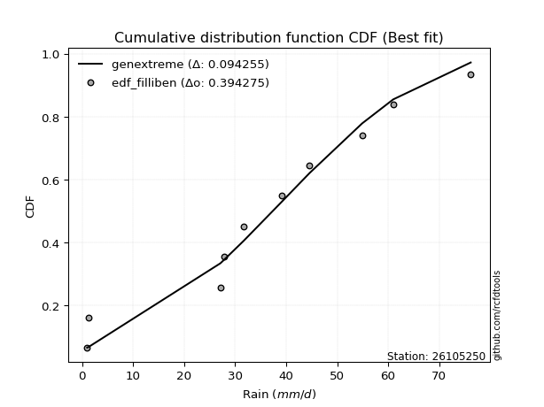</img></img>

</div>


### 10. Empirical - EDF Jenkinson (1977)

The Jenkinson formula in hydrology is an empirical plotting position formula used to estimate the non-exceedance probability _(P)_ or return period _(T)_ of a given ordered observation within a sample. It is a widely used method in the frequency analysis of extreme events such as floods and rainfall, as it provides a distribution-free way to plot data. _a≈0.31_ and _b≈0.38_ are constants derived to approximate the median of the probability distribution for the given rank.

<div align="center">


$P=(m-a)/(n+b)$


</div>


**10.1. Empirical values**

<div align="center">

|                | 0                   | 1                   | 2                  | 3                   | 4                   | 5                  | 6                  | 7                  | 8                  | 9                  |
|:---------------|:--------------------|:--------------------|:-------------------|:--------------------|:--------------------|:-------------------|:-------------------|:-------------------|:-------------------|:-------------------|
| date           | 2016                | 2023                | 2025               | 2022                | 2020                | 2021               | 2024               | 2018               | 2019               | 2017               |
| x              | 1.0                 | 1.2                 | 14.8               | 27.1                | 27.8                | 39.1               | 44.6               | 54.9               | 61.0               | 76.2               |
| m              | 1                   | 2                   | 3                  | 4                   | 5                   | 6                  | 7                  | 8                  | 9                  | 10                 |
| empirical_dist | edf_jenkinson       | edf_jenkinson       | edf_jenkinson      | edf_jenkinson       | edf_jenkinson       | edf_jenkinson      | edf_jenkinson      | edf_jenkinson      | edf_jenkinson      | edf_jenkinson      |
| empirical      | 0.06647398843930635 | 0.16281310211946048 | 0.2591522157996146 | 0.35549132947976875 | 0.45183044315992293 | 0.5481695568400771 | 0.6445086705202312 | 0.7408477842003853 | 0.8371868978805393 | 0.9335260115606935 |
| empirical_tr   | 1.0712074303405574  | 1.1944764096662832  | 1.3498049414824447 | 1.5515695067264574  | 1.8242530755711774  | 2.213219616204691  | 2.813008130081301  | 3.8587360594795537 | 6.142011834319521  | 15.043478260869529 |

</div>


**10.2. Kolmogorov-Smirnov fit test (sorted by Δ)**


<div align="center">

|                | 0                  | 1                   | 2                   | 3                   | 4                   | 5                   | 6                  | 7                   | 8                   | 9                   | 10                  | 11                 | 12                  | 13                  | 14                  | 15                  | 16                  | 17                  | 18                  | 19                 | 20                  | 21                  | 22                  | 23                  | 24                    | 25                  | 26                 | 27                  | 28                  | 29                  | 30                  | 31                  | 32                  | 33                  | 34                  | 35                  | 36                  | 37                  | 38                  | 39                 | 40                  | 41                  | 42                 | 43                  | 44                  | 45                  | 46                  | 47                  | 48                  | 49                 | 50                  | 51                 | 52                 | 53                 | 54                 | 55                  | 56                 | 57                 | 58                  | 59                 | 60                 | 61                 | 62                 | 63                  | 64                 | 65                 | 66                  | 67                  | 68                 | 69                 | 70                  | 71                 | 72                 | 73                 | 74                 | 75                 | 76                  | 77                 | 78                  | 79                  | 80                 | 81                  | 82                 | 83                 | 84                 | 85                 | 86                 | 87                 | 88                 | 89                 |
|:---------------|:-------------------|:--------------------|:--------------------|:--------------------|:--------------------|:--------------------|:-------------------|:--------------------|:--------------------|:--------------------|:--------------------|:-------------------|:--------------------|:--------------------|:--------------------|:--------------------|:--------------------|:--------------------|:--------------------|:-------------------|:--------------------|:--------------------|:--------------------|:--------------------|:----------------------|:--------------------|:-------------------|:--------------------|:--------------------|:--------------------|:--------------------|:--------------------|:--------------------|:--------------------|:--------------------|:--------------------|:--------------------|:--------------------|:--------------------|:-------------------|:--------------------|:--------------------|:-------------------|:--------------------|:--------------------|:--------------------|:--------------------|:--------------------|:--------------------|:-------------------|:--------------------|:-------------------|:-------------------|:-------------------|:-------------------|:--------------------|:-------------------|:-------------------|:--------------------|:-------------------|:-------------------|:-------------------|:-------------------|:--------------------|:-------------------|:-------------------|:--------------------|:--------------------|:-------------------|:-------------------|:--------------------|:-------------------|:-------------------|:-------------------|:-------------------|:-------------------|:--------------------|:-------------------|:--------------------|:--------------------|:-------------------|:--------------------|:-------------------|:-------------------|:-------------------|:-------------------|:-------------------|:-------------------|:-------------------|:-------------------|
| station        | 26105250           | 26105250            | 26105250            | 26105250            | 26105250            | 26105250            | 26105250           | 26105250            | 26105250            | 26105250            | 26105250            | 26105250           | 26105250            | 26105250            | 26105250            | 26105250            | 26105250            | 26105250            | 26105250            | 26105250           | 26105250            | 26105250            | 26105250            | 26105250            | 26105250              | 26105250            | 26105250           | 26105250            | 26105250            | 26105250            | 26105250            | 26105250            | 26105250            | 26105250            | 26105250            | 26105250            | 26105250            | 26105250            | 26105250            | 26105250           | 26105250            | 26105250            | 26105250           | 26105250            | 26105250            | 26105250            | 26105250            | 26105250            | 26105250            | 26105250           | 26105250            | 26105250           | 26105250           | 26105250           | 26105250           | 26105250            | 26105250           | 26105250           | 26105250            | 26105250           | 26105250           | 26105250           | 26105250           | 26105250            | 26105250           | 26105250           | 26105250            | 26105250            | 26105250           | 26105250           | 26105250            | 26105250           | 26105250           | 26105250           | 26105250           | 26105250           | 26105250            | 26105250           | 26105250            | 26105250            | 26105250           | 26105250            | 26105250           | 26105250           | 26105250           | 26105250           | 26105250           | 26105250           | 26105250           | 26105250           |
| empirical_dist | edf_jenkinson      | edf_jenkinson       | edf_jenkinson       | edf_jenkinson       | edf_jenkinson       | edf_jenkinson       | edf_jenkinson      | edf_jenkinson       | edf_jenkinson       | edf_jenkinson       | edf_jenkinson       | edf_jenkinson      | edf_jenkinson       | edf_jenkinson       | edf_jenkinson       | edf_jenkinson       | edf_jenkinson       | edf_jenkinson       | edf_jenkinson       | edf_jenkinson      | edf_jenkinson       | edf_jenkinson       | edf_jenkinson       | edf_jenkinson       | edf_jenkinson         | edf_jenkinson       | edf_jenkinson      | edf_jenkinson       | edf_jenkinson       | edf_jenkinson       | edf_jenkinson       | edf_jenkinson       | edf_jenkinson       | edf_jenkinson       | edf_jenkinson       | edf_jenkinson       | edf_jenkinson       | edf_jenkinson       | edf_jenkinson       | edf_jenkinson      | edf_jenkinson       | edf_jenkinson       | edf_jenkinson      | edf_jenkinson       | edf_jenkinson       | edf_jenkinson       | edf_jenkinson       | edf_jenkinson       | edf_jenkinson       | edf_jenkinson      | edf_jenkinson       | edf_jenkinson      | edf_jenkinson      | edf_jenkinson      | edf_jenkinson      | edf_jenkinson       | edf_jenkinson      | edf_jenkinson      | edf_jenkinson       | edf_jenkinson      | edf_jenkinson      | edf_jenkinson      | edf_jenkinson      | edf_jenkinson       | edf_jenkinson      | edf_jenkinson      | edf_jenkinson       | edf_jenkinson       | edf_jenkinson      | edf_jenkinson      | edf_jenkinson       | edf_jenkinson      | edf_jenkinson      | edf_jenkinson      | edf_jenkinson      | edf_jenkinson      | edf_jenkinson       | edf_jenkinson      | edf_jenkinson       | edf_jenkinson       | edf_jenkinson      | edf_jenkinson       | edf_jenkinson      | edf_jenkinson      | edf_jenkinson      | edf_jenkinson      | edf_jenkinson      | edf_jenkinson      | edf_jenkinson      | edf_jenkinson      |
| p_dist         | fisk               | crystalball         | norm                | t                   | exponnorm           | pearson3            | gamma              | erlang              | logjohnsonsu        | laplace_asymmetric  | johnsonsu           | logistic           | alpha               | hypsecant           | invgamma            | invgauss            | betaprime           | maxwell             | genlogistic         | kstwobign          | rayleigh            | rice                | logloggamma         | laplace             | loglaplace_asymmetric | gumbel_r            | gumbel_l           | ncf                 | mielke              | logt                | moyal               | gompertz            | halfnorm            | halflogistic        | logpearson3         | logfisk             | loggumbel_l         | genexpon            | expon               | loggompertz        | f                   | nakagami            | wald               | logexponnorm        | lognorm             | lognorm             | lognct              | loggamma            | loggamma            | logfatiguelife     | logrice             | logerlang          | loginvgamma        | loginvweibull      | loglogistic        | logalpha            | gibrat             | loghypsecant       | loginvgauss         | logmaxwell         | weibull_min        | lograyleigh        | logkstwobign       | logbetaprime        | loglaplace         | invweibull         | loggenexpon         | loghalfnorm         | loggumbel_r        | logncf             | nct                 | loghalflogistic    | logmoyal           | logexpon           | lognakagami        | logf               | chi2                | logwald            | pareto              | logweibull_min      | logchi2            | logpareto           | loggibrat          | logmielke          | logtruncnorm       | loglognorm         | fatiguelife        | truncnorm          | loggenlogistic     | logcrystalball     |
| delta          | 0.0816505477401311 | 0.08299003406957883 | 0.08299003456513149 | 0.08299442698427467 | 0.08303412652106304 | 0.08550072595786276 | 0.0866467650367019 | 0.08697787067435764 | 0.08790880346127795 | 0.09004704095446114 | 0.09018253799314507 | 0.0904321771094964 | 0.09308548100099046 | 0.09369492222174036 | 0.09395871740943042 | 0.09691655495158122 | 0.09777633334402189 | 0.09871378918482901 | 0.10112253594164095 | 0.1033385827047748 | 0.10918587334650205 | 0.11146435989706865 | 0.12065787900593766 | 0.12097188109396279 | 0.1277776182960194    | 0.12973515860113738 | 0.1315411812971936 | 0.14149570001875417 | 0.14545153511683515 | 0.14603458226616434 | 0.15128831660879086 | 0.15983646116144498 | 0.16281310211946048 | 0.16281310211946048 | 0.16403523373989165 | 0.16453927779768046 | 0.17852552324062781 | 0.18211286633983287 | 0.18282500687013686 | 0.1859150295347311 | 0.18740251979872574 | 0.20989269344291478 | 0.2250938687999995 | 0.23925033764318876 | 0.23925291114600183 | 0.23925291114600183 | 0.23952656358067198 | 0.24002005217288197 | 0.24002005217288197 | 0.2405459508474896 | 0.24479886572038384 | 0.2487191146768451 | 0.2504041580844148 | 0.2511659034832265 | 0.2515488857516171 | 0.25436653244156143 | 0.2591522157996146 | 0.2616541575873578 | 0.26184708993965916 | 0.2662357689499509 | 0.2711171101204431 | 0.2746396037879965 | 0.2837106129955947 | 0.28604200142535835 | 0.2882961571846481 | 0.2907226759683152 | 0.29253543522053954 | 0.29852844332442413 | 0.3062857290367577 | 0.3080831852331092 | 0.32472244574830705 | 0.3267866616011145 | 0.3292788883970002 | 0.3407589326753558 | 0.3518311050621277 | 0.3840975310210741 | 0.38670483740581213 | 0.3932987284984815 | 0.39589802717146877 | 0.39706552522078536 | 0.3979010390399275 | 0.41301520781619366 | 0.4248364091204618 | 0.4365291531677203 | 0.4607842934342617 | 0.4632535450807082 | 0.5071172061699158 | 0.7386486476196146 | 0.8371868978805393 | nan                |
| deltao         | 0.3942745923300002 | 0.3942745923300002  | 0.3942745923300002  | 0.3942745923300002  | 0.3942745923300002  | 0.3942745923300002  | 0.3942745923300002 | 0.3942745923300002  | 0.3942745923300002  | 0.3942745923300002  | 0.3942745923300002  | 0.3942745923300002 | 0.3942745923300002  | 0.3942745923300002  | 0.3942745923300002  | 0.3942745923300002  | 0.3942745923300002  | 0.3942745923300002  | 0.3942745923300002  | 0.3942745923300002 | 0.3942745923300002  | 0.3942745923300002  | 0.3942745923300002  | 0.3942745923300002  | 0.3942745923300002    | 0.3942745923300002  | 0.3942745923300002 | 0.3942745923300002  | 0.3942745923300002  | 0.3942745923300002  | 0.3942745923300002  | 0.3942745923300002  | 0.3942745923300002  | 0.3942745923300002  | 0.3942745923300002  | 0.3942745923300002  | 0.3942745923300002  | 0.3942745923300002  | 0.3942745923300002  | 0.3942745923300002 | 0.3942745923300002  | 0.3942745923300002  | 0.3942745923300002 | 0.3942745923300002  | 0.3942745923300002  | 0.3942745923300002  | 0.3942745923300002  | 0.3942745923300002  | 0.3942745923300002  | 0.3942745923300002 | 0.3942745923300002  | 0.3942745923300002 | 0.3942745923300002 | 0.3942745923300002 | 0.3942745923300002 | 0.3942745923300002  | 0.3942745923300002 | 0.3942745923300002 | 0.3942745923300002  | 0.3942745923300002 | 0.3942745923300002 | 0.3942745923300002 | 0.3942745923300002 | 0.3942745923300002  | 0.3942745923300002 | 0.3942745923300002 | 0.3942745923300002  | 0.3942745923300002  | 0.3942745923300002 | 0.3942745923300002 | 0.3942745923300002  | 0.3942745923300002 | 0.3942745923300002 | 0.3942745923300002 | 0.3942745923300002 | 0.3942745923300002 | 0.3942745923300002  | 0.3942745923300002 | 0.3942745923300002  | 0.3942745923300002  | 0.3942745923300002 | 0.3942745923300002  | 0.3942745923300002 | 0.3942745923300002 | 0.3942745923300002 | 0.3942745923300002 | 0.3942745923300002 | 0.3942745923300002 | 0.3942745923300002 | 0.3942745923300002 |
| eval           | Δo > Δ             | Δo > Δ              | Δo > Δ              | Δo > Δ              | Δo > Δ              | Δo > Δ              | Δo > Δ             | Δo > Δ              | Δo > Δ              | Δo > Δ              | Δo > Δ              | Δo > Δ             | Δo > Δ              | Δo > Δ              | Δo > Δ              | Δo > Δ              | Δo > Δ              | Δo > Δ              | Δo > Δ              | Δo > Δ             | Δo > Δ              | Δo > Δ              | Δo > Δ              | Δo > Δ              | Δo > Δ                | Δo > Δ              | Δo > Δ             | Δo > Δ              | Δo > Δ              | Δo > Δ              | Δo > Δ              | Δo > Δ              | Δo > Δ              | Δo > Δ              | Δo > Δ              | Δo > Δ              | Δo > Δ              | Δo > Δ              | Δo > Δ              | Δo > Δ             | Δo > Δ              | Δo > Δ              | Δo > Δ             | Δo > Δ              | Δo > Δ              | Δo > Δ              | Δo > Δ              | Δo > Δ              | Δo > Δ              | Δo > Δ             | Δo > Δ              | Δo > Δ             | Δo > Δ             | Δo > Δ             | Δo > Δ             | Δo > Δ              | Δo > Δ             | Δo > Δ             | Δo > Δ              | Δo > Δ             | Δo > Δ             | Δo > Δ             | Δo > Δ             | Δo > Δ              | Δo > Δ             | Δo > Δ             | Δo > Δ              | Δo > Δ              | Δo > Δ             | Δo > Δ             | Δo > Δ              | Δo > Δ             | Δo > Δ             | Δo > Δ             | Δo > Δ             | Δo > Δ             | Δo > Δ              | Δo > Δ             | Δo <= Δ             | Δo <= Δ             | Δo <= Δ            | Δo <= Δ             | Δo <= Δ            | Δo <= Δ            | Δo <= Δ            | Δo <= Δ            | Δo <= Δ            | Δo <= Δ            | Δo <= Δ            | Δo <= Δ            |
| fit            | 1                  | 1                   | 1                   | 1                   | 1                   | 1                   | 1                  | 1                   | 1                   | 1                   | 1                   | 1                  | 1                   | 1                   | 1                   | 1                   | 1                   | 1                   | 1                   | 1                  | 1                   | 1                   | 1                   | 1                   | 1                     | 1                   | 1                  | 1                   | 1                   | 1                   | 1                   | 1                   | 1                   | 1                   | 1                   | 1                   | 1                   | 1                   | 1                   | 1                  | 1                   | 1                   | 1                  | 1                   | 1                   | 1                   | 1                   | 1                   | 1                   | 1                  | 1                   | 1                  | 1                  | 1                  | 1                  | 1                   | 1                  | 1                  | 1                   | 1                  | 1                  | 1                  | 1                  | 1                   | 1                  | 1                  | 1                   | 1                   | 1                  | 1                  | 1                   | 1                  | 1                  | 1                  | 1                  | 1                  | 1                   | 1                  | 0                   | 0                   | 0                  | 0                   | 0                  | 0                  | 0                  | 0                  | 0                  | 0                  | 0                  | 0                  |
| n              | 10                 | 10                  | 10                  | 10                  | 10                  | 10                  | 10                 | 10                  | 10                  | 10                  | 10                  | 10                 | 10                  | 10                  | 10                  | 10                  | 10                  | 10                  | 10                  | 10                 | 10                  | 10                  | 10                  | 10                  | 10                    | 10                  | 10                 | 10                  | 10                  | 10                  | 10                  | 10                  | 10                  | 10                  | 10                  | 10                  | 10                  | 10                  | 10                  | 10                 | 10                  | 10                  | 10                 | 10                  | 10                  | 10                  | 10                  | 10                  | 10                  | 10                 | 10                  | 10                 | 10                 | 10                 | 10                 | 10                  | 10                 | 10                 | 10                  | 10                 | 10                 | 10                 | 10                 | 10                  | 10                 | 10                 | 10                  | 10                  | 10                 | 10                 | 10                  | 10                 | 10                 | 10                 | 10                 | 10                 | 10                  | 10                 | 10                  | 10                  | 10                 | 10                  | 10                 | 10                 | 10                 | 10                 | 10                 | 10                 | 10                 | 10                 |
| best_fit       | 1                  | 0                   | 0                   | 0                   | 0                   | 0                   | 0                  | 0                   | 0                   | 0                   | 0                   | 0                  | 0                   | 0                   | 0                   | 0                   | 0                   | 0                   | 0                   | 0                  | 0                   | 0                   | 0                   | 0                   | 0                     | 0                   | 0                  | 0                   | 0                   | 0                   | 0                   | 0                   | 0                   | 0                   | 0                   | 0                   | 0                   | 0                   | 0                   | 0                  | 0                   | 0                   | 0                  | 0                   | 0                   | 0                   | 0                   | 0                   | 0                   | 0                  | 0                   | 0                  | 0                  | 0                  | 0                  | 0                   | 0                  | 0                  | 0                   | 0                  | 0                  | 0                  | 0                  | 0                   | 0                  | 0                  | 0                   | 0                   | 0                  | 0                  | 0                   | 0                  | 0                  | 0                  | 0                  | 0                  | 0                   | 0                  | 0                   | 0                   | 0                  | 0                   | 0                  | 0                  | 0                  | 0                  | 0                  | 0                  | 0                  | 0                  |
| best_fit_sort  | 1                  | 2                   | 3                   | 4                   | 5                   | 6                   | 7                  | 8                   | 9                   | 10                  | 11                  | 12                 | 13                  | 14                  | 15                  | 16                  | 17                  | 18                  | 19                  | 20                 | 21                  | 22                  | 23                  | 24                  | 25                    | 26                  | 27                 | 28                  | 29                  | 30                  | 31                  | 32                  | 33                  | 34                  | 35                  | 36                  | 37                  | 38                  | 39                  | 40                 | 41                  | 42                  | 43                 | 44                  | 45                  | 46                  | 47                  | 48                  | 49                  | 50                 | 51                  | 52                 | 53                 | 54                 | 55                 | 56                  | 57                 | 58                 | 59                  | 60                 | 61                 | 62                 | 63                 | 64                  | 65                 | 66                 | 67                  | 68                  | 69                 | 70                 | 71                  | 72                 | 73                 | 74                 | 75                 | 76                 | 77                  | 78                 | 79                  | 80                  | 81                 | 82                  | 83                 | 84                 | 85                 | 86                 | 87                 | 88                 | 89                 | 90                 |

</div>


<div align="center">

</img>

</div>


**10.3. Best fit**

<div align="center">

|   id |   station | empirical_dist   | p_dist   |     delta |   deltao | eval   |   fit |   n |   best_fit |   best_fit_sort |
|-----:|----------:|:-----------------|:---------|----------:|---------:|:-------|------:|----:|-----------:|----------------:|
|    0 |  26105250 | edf_jenkinson    | fisk     | 0.0816505 | 0.394275 | Δo > Δ |     1 |  10 |          1 |               1 |

</div>


<div align="center">

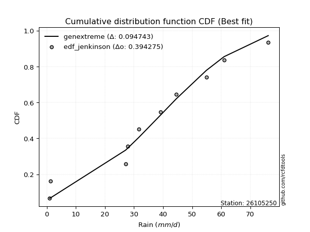</img>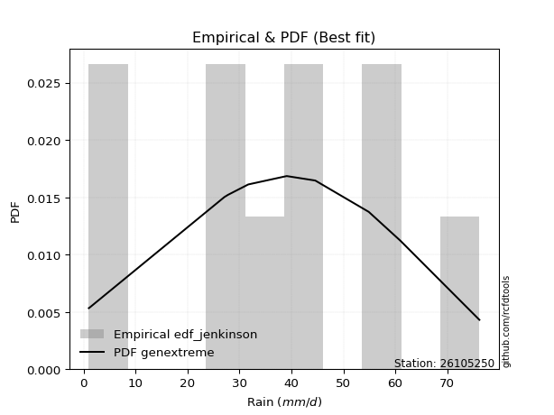</img>

</div>


### 11. Empirical - EDF Cunnane (1978)

Cunnane´s work in statistical hydrology has focused on the performance and evaluation of different probability distributions (such as GEV, Gumbel, Lognormal) for flood frequency estimation. _b_ is a constant, typically set to 0.4.

<div align="center">


$P=(m-b)/(n+1-2b)$


</div>


**11.1. Empirical values**

<div align="center">

|                | 0                    | 1                   | 2                   | 3                   | 4                   | 5                  | 6                  | 7                  | 8                  | 9                  |
|:---------------|:---------------------|:--------------------|:--------------------|:--------------------|:--------------------|:-------------------|:-------------------|:-------------------|:-------------------|:-------------------|
| date           | 2016                 | 2023                | 2025                | 2022                | 2020                | 2021               | 2024               | 2018               | 2019               | 2017               |
| x              | 1.0                  | 1.2                 | 14.8                | 27.1                | 27.8                | 39.1               | 44.6               | 54.9               | 61.0               | 76.2               |
| m              | 1                    | 2                   | 3                   | 4                   | 5                   | 6                  | 7                  | 8                  | 9                  | 10                 |
| empirical_dist | edf_cunnane          | edf_cunnane         | edf_cunnane         | edf_cunnane         | edf_cunnane         | edf_cunnane        | edf_cunnane        | edf_cunnane        | edf_cunnane        | edf_cunnane        |
| empirical      | 0.058823529411764705 | 0.15686274509803924 | 0.25490196078431376 | 0.35294117647058826 | 0.45098039215686275 | 0.5490196078431373 | 0.6470588235294118 | 0.7450980392156863 | 0.8431372549019608 | 0.9411764705882353 |
| empirical_tr   | 1.0625               | 1.1860465116279069  | 1.3421052631578947  | 1.5454545454545456  | 1.8214285714285712  | 2.217391304347826  | 2.8333333333333335 | 3.9230769230769234 | 6.375              | 16.999999999999996 |

</div>


**11.2. Kolmogorov-Smirnov fit test (sorted by Δ)**


<div align="center">

|                | 0                   | 1                   | 2                   | 3                   | 4                  | 5                   | 6                   | 7                  | 8                   | 9                   | 10                  | 11                  | 12                  | 13                 | 14                  | 15                  | 16                  | 17                  | 18                 | 19                  | 20                  | 21                  | 22                 | 23                  | 24                  | 25                    | 26                  | 27                 | 28                 | 29                  | 30                  | 31                  | 32                  | 33                  | 34                  | 35                  | 36                 | 37                  | 38                  | 39                 | 40                  | 41                  | 42                  | 43                  | 44                  | 45                  | 46                  | 47                  | 48                  | 49                  | 50                  | 51                 | 52                 | 53                  | 54                 | 55                  | 56                 | 57                 | 58                  | 59                  | 60                 | 61                 | 62                 | 63                 | 64                 | 65                  | 66                  | 67                 | 68                 | 69                 | 70                 | 71                 | 72                 | 73                  | 74                 | 75                  | 76                 | 77                 | 78                 | 79                 | 80                  | 81                 | 82                  | 83                  | 84                 | 85                 | 86                 | 87                 | 88                 | 89                 |
|:---------------|:--------------------|:--------------------|:--------------------|:--------------------|:-------------------|:--------------------|:--------------------|:-------------------|:--------------------|:--------------------|:--------------------|:--------------------|:--------------------|:-------------------|:--------------------|:--------------------|:--------------------|:--------------------|:-------------------|:--------------------|:--------------------|:--------------------|:-------------------|:--------------------|:--------------------|:----------------------|:--------------------|:-------------------|:-------------------|:--------------------|:--------------------|:--------------------|:--------------------|:--------------------|:--------------------|:--------------------|:-------------------|:--------------------|:--------------------|:-------------------|:--------------------|:--------------------|:--------------------|:--------------------|:--------------------|:--------------------|:--------------------|:--------------------|:--------------------|:--------------------|:--------------------|:-------------------|:-------------------|:--------------------|:-------------------|:--------------------|:-------------------|:-------------------|:--------------------|:--------------------|:-------------------|:-------------------|:-------------------|:-------------------|:-------------------|:--------------------|:--------------------|:-------------------|:-------------------|:-------------------|:-------------------|:-------------------|:-------------------|:--------------------|:-------------------|:--------------------|:-------------------|:-------------------|:-------------------|:-------------------|:--------------------|:-------------------|:--------------------|:--------------------|:-------------------|:-------------------|:-------------------|:-------------------|:-------------------|:-------------------|
| station        | 26105250            | 26105250            | 26105250            | 26105250            | 26105250           | 26105250            | 26105250            | 26105250           | 26105250            | 26105250            | 26105250            | 26105250            | 26105250            | 26105250           | 26105250            | 26105250            | 26105250            | 26105250            | 26105250           | 26105250            | 26105250            | 26105250            | 26105250           | 26105250            | 26105250            | 26105250              | 26105250            | 26105250           | 26105250           | 26105250            | 26105250            | 26105250            | 26105250            | 26105250            | 26105250            | 26105250            | 26105250           | 26105250            | 26105250            | 26105250           | 26105250            | 26105250            | 26105250            | 26105250            | 26105250            | 26105250            | 26105250            | 26105250            | 26105250            | 26105250            | 26105250            | 26105250           | 26105250           | 26105250            | 26105250           | 26105250            | 26105250           | 26105250           | 26105250            | 26105250            | 26105250           | 26105250           | 26105250           | 26105250           | 26105250           | 26105250            | 26105250            | 26105250           | 26105250           | 26105250           | 26105250           | 26105250           | 26105250           | 26105250            | 26105250           | 26105250            | 26105250           | 26105250           | 26105250           | 26105250           | 26105250            | 26105250           | 26105250            | 26105250            | 26105250           | 26105250           | 26105250           | 26105250           | 26105250           | 26105250           |
| empirical_dist | edf_cunnane         | edf_cunnane         | edf_cunnane         | edf_cunnane         | edf_cunnane        | edf_cunnane         | edf_cunnane         | edf_cunnane        | edf_cunnane         | edf_cunnane         | edf_cunnane         | edf_cunnane         | edf_cunnane         | edf_cunnane        | edf_cunnane         | edf_cunnane         | edf_cunnane         | edf_cunnane         | edf_cunnane        | edf_cunnane         | edf_cunnane         | edf_cunnane         | edf_cunnane        | edf_cunnane         | edf_cunnane         | edf_cunnane           | edf_cunnane         | edf_cunnane        | edf_cunnane        | edf_cunnane         | edf_cunnane         | edf_cunnane         | edf_cunnane         | edf_cunnane         | edf_cunnane         | edf_cunnane         | edf_cunnane        | edf_cunnane         | edf_cunnane         | edf_cunnane        | edf_cunnane         | edf_cunnane         | edf_cunnane         | edf_cunnane         | edf_cunnane         | edf_cunnane         | edf_cunnane         | edf_cunnane         | edf_cunnane         | edf_cunnane         | edf_cunnane         | edf_cunnane        | edf_cunnane        | edf_cunnane         | edf_cunnane        | edf_cunnane         | edf_cunnane        | edf_cunnane        | edf_cunnane         | edf_cunnane         | edf_cunnane        | edf_cunnane        | edf_cunnane        | edf_cunnane        | edf_cunnane        | edf_cunnane         | edf_cunnane         | edf_cunnane        | edf_cunnane        | edf_cunnane        | edf_cunnane        | edf_cunnane        | edf_cunnane        | edf_cunnane         | edf_cunnane        | edf_cunnane         | edf_cunnane        | edf_cunnane        | edf_cunnane        | edf_cunnane        | edf_cunnane         | edf_cunnane        | edf_cunnane         | edf_cunnane         | edf_cunnane        | edf_cunnane        | edf_cunnane        | edf_cunnane        | edf_cunnane        | edf_cunnane        |
| p_dist         | fisk                | crystalball         | norm                | t                   | exponnorm          | pearson3            | gamma               | erlang             | logjohnsonsu        | johnsonsu           | logistic            | alpha               | invgamma            | laplace_asymmetric | invgauss            | betaprime           | hypsecant           | maxwell             | genlogistic        | kstwobign           | rayleigh            | rice                | laplace            | logloggamma         | gumbel_r            | loglaplace_asymmetric | gumbel_l            | mielke             | ncf                | logt                | moyal               | gompertz            | halfnorm            | halflogistic        | logpearson3         | logfisk             | loggumbel_l        | genexpon            | expon               | loggompertz        | f                   | nakagami            | wald                | logexponnorm        | lognorm             | lognorm             | lognct              | loggamma            | loggamma            | logfatiguelife      | logrice             | logerlang          | loginvgamma        | loginvweibull       | loglogistic        | gibrat              | logalpha           | loghypsecant       | loginvgauss         | logmaxwell          | weibull_min        | lograyleigh        | logkstwobign       | logbetaprime       | loglaplace         | invweibull          | loggenexpon         | loghalfnorm        | loggumbel_r        | logncf             | nct                | loghalflogistic    | logmoyal           | logexpon            | lognakagami        | logf                | chi2               | logwald            | pareto             | logweibull_min     | logchi2             | logpareto          | loggibrat           | logmielke           | logtruncnorm       | loglognorm         | fatiguelife        | truncnorm          | loggenlogistic     | logcrystalball     |
| delta          | 0.07570019071870986 | 0.07703967704815759 | 0.07703967754371024 | 0.07704406996285343 | 0.0770837694996418 | 0.07955036893644152 | 0.08069640801528066 | 0.0810275136529364 | 0.08195844643985671 | 0.08423218097172383 | 0.08448182008807516 | 0.08713512397956921 | 0.08800836038800917 | 0.0891969899514009 | 0.09096619793015998 | 0.09182597632260064 | 0.09210433222155645 | 0.09276343216340777 | 0.0951721789202197 | 0.09763048624042114 | 0.10323551632508081 | 0.10551400287564741 | 0.1201218300909026 | 0.12320803201511815 | 0.12378480157971614 | 0.1303277713051999    | 0.13069113029413343 | 0.1395011780954139 | 0.1417056489166314 | 0.14518453126310416 | 0.14533795958736961 | 0.15388610414002374 | 0.15686274509803924 | 0.15686274509803924 | 0.16658538674907214 | 0.16708943080686095 | 0.1810756762498083 | 0.18466301934901336 | 0.18537515987931735 | 0.1884651825439116 | 0.18995267280790623 | 0.21244284645209527 | 0.22084361378469866 | 0.24180049065236925 | 0.24180306415518232 | 0.24180306415518232 | 0.24207671658985247 | 0.24257020518206246 | 0.24257020518206246 | 0.24309610385667008 | 0.24734901872956433 | 0.2512692676860256 | 0.2529543110935953 | 0.25371605649240697 | 0.2540990387607976 | 0.25490196078431376 | 0.2569166854507419 | 0.2642043105965383 | 0.26439724294883965 | 0.26878592195913137 | 0.2736672631296236 | 0.277189756797177  | 0.2862607660047752 | 0.2902922564406592 | 0.2908463101938286 | 0.29497293098361604 | 0.29508558822972003 | 0.3010785963336046 | 0.3088358820459382 | 0.315733644260651  | 0.3289727007636079 | 0.329336814610295  | 0.3318290414061807 | 0.34500918769065664 | 0.3560813600774286 | 0.38834778603637493 | 0.3892549904149926 | 0.395848881507662  | 0.4001482821867696 | 0.4013157802360862 | 0.40215129405522837 | 0.4172654628314945 | 0.42738656212964227 | 0.44077940818302114 | 0.4633344464434422 | 0.4692039021021295 | 0.5113674611852166 | 0.7428989026349153 | 0.8431372549019608 | nan                |
| deltao         | 0.3942745923300002  | 0.3942745923300002  | 0.3942745923300002  | 0.3942745923300002  | 0.3942745923300002 | 0.3942745923300002  | 0.3942745923300002  | 0.3942745923300002 | 0.3942745923300002  | 0.3942745923300002  | 0.3942745923300002  | 0.3942745923300002  | 0.3942745923300002  | 0.3942745923300002 | 0.3942745923300002  | 0.3942745923300002  | 0.3942745923300002  | 0.3942745923300002  | 0.3942745923300002 | 0.3942745923300002  | 0.3942745923300002  | 0.3942745923300002  | 0.3942745923300002 | 0.3942745923300002  | 0.3942745923300002  | 0.3942745923300002    | 0.3942745923300002  | 0.3942745923300002 | 0.3942745923300002 | 0.3942745923300002  | 0.3942745923300002  | 0.3942745923300002  | 0.3942745923300002  | 0.3942745923300002  | 0.3942745923300002  | 0.3942745923300002  | 0.3942745923300002 | 0.3942745923300002  | 0.3942745923300002  | 0.3942745923300002 | 0.3942745923300002  | 0.3942745923300002  | 0.3942745923300002  | 0.3942745923300002  | 0.3942745923300002  | 0.3942745923300002  | 0.3942745923300002  | 0.3942745923300002  | 0.3942745923300002  | 0.3942745923300002  | 0.3942745923300002  | 0.3942745923300002 | 0.3942745923300002 | 0.3942745923300002  | 0.3942745923300002 | 0.3942745923300002  | 0.3942745923300002 | 0.3942745923300002 | 0.3942745923300002  | 0.3942745923300002  | 0.3942745923300002 | 0.3942745923300002 | 0.3942745923300002 | 0.3942745923300002 | 0.3942745923300002 | 0.3942745923300002  | 0.3942745923300002  | 0.3942745923300002 | 0.3942745923300002 | 0.3942745923300002 | 0.3942745923300002 | 0.3942745923300002 | 0.3942745923300002 | 0.3942745923300002  | 0.3942745923300002 | 0.3942745923300002  | 0.3942745923300002 | 0.3942745923300002 | 0.3942745923300002 | 0.3942745923300002 | 0.3942745923300002  | 0.3942745923300002 | 0.3942745923300002  | 0.3942745923300002  | 0.3942745923300002 | 0.3942745923300002 | 0.3942745923300002 | 0.3942745923300002 | 0.3942745923300002 | 0.3942745923300002 |
| eval           | Δo > Δ              | Δo > Δ              | Δo > Δ              | Δo > Δ              | Δo > Δ             | Δo > Δ              | Δo > Δ              | Δo > Δ             | Δo > Δ              | Δo > Δ              | Δo > Δ              | Δo > Δ              | Δo > Δ              | Δo > Δ             | Δo > Δ              | Δo > Δ              | Δo > Δ              | Δo > Δ              | Δo > Δ             | Δo > Δ              | Δo > Δ              | Δo > Δ              | Δo > Δ             | Δo > Δ              | Δo > Δ              | Δo > Δ                | Δo > Δ              | Δo > Δ             | Δo > Δ             | Δo > Δ              | Δo > Δ              | Δo > Δ              | Δo > Δ              | Δo > Δ              | Δo > Δ              | Δo > Δ              | Δo > Δ             | Δo > Δ              | Δo > Δ              | Δo > Δ             | Δo > Δ              | Δo > Δ              | Δo > Δ              | Δo > Δ              | Δo > Δ              | Δo > Δ              | Δo > Δ              | Δo > Δ              | Δo > Δ              | Δo > Δ              | Δo > Δ              | Δo > Δ             | Δo > Δ             | Δo > Δ              | Δo > Δ             | Δo > Δ              | Δo > Δ             | Δo > Δ             | Δo > Δ              | Δo > Δ              | Δo > Δ             | Δo > Δ             | Δo > Δ             | Δo > Δ             | Δo > Δ             | Δo > Δ              | Δo > Δ              | Δo > Δ             | Δo > Δ             | Δo > Δ             | Δo > Δ             | Δo > Δ             | Δo > Δ             | Δo > Δ              | Δo > Δ             | Δo > Δ              | Δo > Δ             | Δo <= Δ            | Δo <= Δ            | Δo <= Δ            | Δo <= Δ             | Δo <= Δ            | Δo <= Δ             | Δo <= Δ             | Δo <= Δ            | Δo <= Δ            | Δo <= Δ            | Δo <= Δ            | Δo <= Δ            | Δo <= Δ            |
| fit            | 1                   | 1                   | 1                   | 1                   | 1                  | 1                   | 1                   | 1                  | 1                   | 1                   | 1                   | 1                   | 1                   | 1                  | 1                   | 1                   | 1                   | 1                   | 1                  | 1                   | 1                   | 1                   | 1                  | 1                   | 1                   | 1                     | 1                   | 1                  | 1                  | 1                   | 1                   | 1                   | 1                   | 1                   | 1                   | 1                   | 1                  | 1                   | 1                   | 1                  | 1                   | 1                   | 1                   | 1                   | 1                   | 1                   | 1                   | 1                   | 1                   | 1                   | 1                   | 1                  | 1                  | 1                   | 1                  | 1                   | 1                  | 1                  | 1                   | 1                   | 1                  | 1                  | 1                  | 1                  | 1                  | 1                   | 1                   | 1                  | 1                  | 1                  | 1                  | 1                  | 1                  | 1                   | 1                  | 1                   | 1                  | 0                  | 0                  | 0                  | 0                   | 0                  | 0                   | 0                   | 0                  | 0                  | 0                  | 0                  | 0                  | 0                  |
| n              | 10                  | 10                  | 10                  | 10                  | 10                 | 10                  | 10                  | 10                 | 10                  | 10                  | 10                  | 10                  | 10                  | 10                 | 10                  | 10                  | 10                  | 10                  | 10                 | 10                  | 10                  | 10                  | 10                 | 10                  | 10                  | 10                    | 10                  | 10                 | 10                 | 10                  | 10                  | 10                  | 10                  | 10                  | 10                  | 10                  | 10                 | 10                  | 10                  | 10                 | 10                  | 10                  | 10                  | 10                  | 10                  | 10                  | 10                  | 10                  | 10                  | 10                  | 10                  | 10                 | 10                 | 10                  | 10                 | 10                  | 10                 | 10                 | 10                  | 10                  | 10                 | 10                 | 10                 | 10                 | 10                 | 10                  | 10                  | 10                 | 10                 | 10                 | 10                 | 10                 | 10                 | 10                  | 10                 | 10                  | 10                 | 10                 | 10                 | 10                 | 10                  | 10                 | 10                  | 10                  | 10                 | 10                 | 10                 | 10                 | 10                 | 10                 |
| best_fit       | 1                   | 0                   | 0                   | 0                   | 0                  | 0                   | 0                   | 0                  | 0                   | 0                   | 0                   | 0                   | 0                   | 0                  | 0                   | 0                   | 0                   | 0                   | 0                  | 0                   | 0                   | 0                   | 0                  | 0                   | 0                   | 0                     | 0                   | 0                  | 0                  | 0                   | 0                   | 0                   | 0                   | 0                   | 0                   | 0                   | 0                  | 0                   | 0                   | 0                  | 0                   | 0                   | 0                   | 0                   | 0                   | 0                   | 0                   | 0                   | 0                   | 0                   | 0                   | 0                  | 0                  | 0                   | 0                  | 0                   | 0                  | 0                  | 0                   | 0                   | 0                  | 0                  | 0                  | 0                  | 0                  | 0                   | 0                   | 0                  | 0                  | 0                  | 0                  | 0                  | 0                  | 0                   | 0                  | 0                   | 0                  | 0                  | 0                  | 0                  | 0                   | 0                  | 0                   | 0                   | 0                  | 0                  | 0                  | 0                  | 0                  | 0                  |
| best_fit_sort  | 1                   | 2                   | 3                   | 4                   | 5                  | 6                   | 7                   | 8                  | 9                   | 10                  | 11                  | 12                  | 13                  | 14                 | 15                  | 16                  | 17                  | 18                  | 19                 | 20                  | 21                  | 22                  | 23                 | 24                  | 25                  | 26                    | 27                  | 28                 | 29                 | 30                  | 31                  | 32                  | 33                  | 34                  | 35                  | 36                  | 37                 | 38                  | 39                  | 40                 | 41                  | 42                  | 43                  | 44                  | 45                  | 46                  | 47                  | 48                  | 49                  | 50                  | 51                  | 52                 | 53                 | 54                  | 55                 | 56                  | 57                 | 58                 | 59                  | 60                  | 61                 | 62                 | 63                 | 64                 | 65                 | 66                  | 67                  | 68                 | 69                 | 70                 | 71                 | 72                 | 73                 | 74                  | 75                 | 76                  | 77                 | 78                 | 79                 | 80                 | 81                  | 82                 | 83                  | 84                  | 85                 | 86                 | 87                 | 88                 | 89                 | 90                 |

</div>


<div align="center">

</img>

</div>


**11.3. Best fit**

<div align="center">

|   id |   station | empirical_dist   | p_dist   |     delta |   deltao | eval   |   fit |   n |   best_fit |   best_fit_sort |
|-----:|----------:|:-----------------|:---------|----------:|---------:|:-------|------:|----:|-----------:|----------------:|
|    0 |  26105250 | edf_cunnane      | fisk     | 0.0757002 | 0.394275 | Δo > Δ |     1 |  10 |          1 |               1 |

</div>


<div align="center">

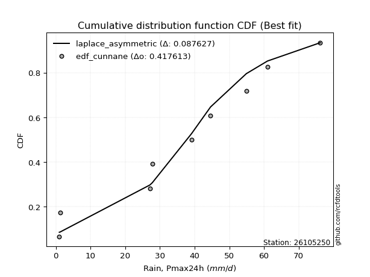</img>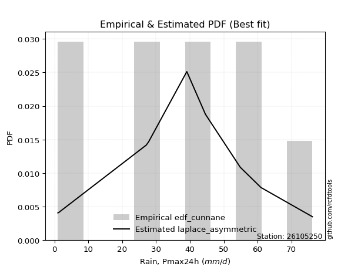</img>

</div>


### 12. Empirical - EDF Adamowski (1981)

The Adamowski formula in hydrology refers to a specific plotting position formula used for estimating the non-parametric empirical distribution of hydrological events (like flood peaks) to calculate their return periods. This formula provides an alternative to traditional parametric methods (like the Gumbel or Log Pearson Type III distributions). 

<div align="center">


$P=(m-0.25)/(n+0.5)$


</div>


**12.1. Empirical values**

<div align="center">

|                | 0                   | 1                   | 2                  | 3                   | 4                  | 5                  | 6                  | 7                  | 8                  | 9                  |
|:---------------|:--------------------|:--------------------|:-------------------|:--------------------|:-------------------|:-------------------|:-------------------|:-------------------|:-------------------|:-------------------|
| date           | 2016                | 2023                | 2025               | 2022                | 2020               | 2021               | 2024               | 2018               | 2019               | 2017               |
| x              | 1.0                 | 1.2                 | 14.8               | 27.1                | 27.8               | 39.1               | 44.6               | 54.9               | 61.0               | 76.2               |
| m              | 1                   | 2                   | 3                  | 4                   | 5                  | 6                  | 7                  | 8                  | 9                  | 10                 |
| empirical_dist | edf_adamowski       | edf_adamowski       | edf_adamowski      | edf_adamowski       | edf_adamowski      | edf_adamowski      | edf_adamowski      | edf_adamowski      | edf_adamowski      | edf_adamowski      |
| empirical      | 0.07142857142857142 | 0.16666666666666666 | 0.2619047619047619 | 0.35714285714285715 | 0.4523809523809524 | 0.5476190476190477 | 0.6428571428571429 | 0.7380952380952381 | 0.8333333333333334 | 0.9285714285714286 |
| empirical_tr   | 1.0769230769230769  | 1.2                 | 1.3548387096774193 | 1.5555555555555558  | 1.826086956521739  | 2.210526315789474  | 2.8000000000000003 | 3.818181818181819  | 6.000000000000002  | 14.000000000000007 |

</div>


**12.2. Kolmogorov-Smirnov fit test (sorted by Δ)**


<div align="center">

|                | 0                   | 1                  | 2                   | 3                   | 4                   | 5                   | 6                   | 7                   | 8                   | 9                   | 10                  | 11                  | 12                  | 13                  | 14                  | 15                  | 16                  | 17                  | 18                  | 19                  | 20                  | 21                  | 22                  | 23                  | 24                    | 25                  | 26                  | 27                  | 28                  | 29                  | 30                  | 31                  | 32                  | 33                  | 34                  | 35                  | 36                 | 37                  | 38                  | 39                 | 40                  | 41                  | 42                  | 43                  | 44                  | 45                  | 46                  | 47                  | 48                  | 49                  | 50                  | 51                 | 52                 | 53                  | 54                 | 55                  | 56                 | 57                  | 58                 | 59                 | 60                 | 61                 | 62                 | 63                  | 64                 | 65                 | 66                  | 67                 | 68                 | 69                 | 70                  | 71                 | 72                 | 73                 | 74                 | 75                 | 76                 | 77                 | 78                  | 79                  | 80                 | 81                  | 82                 | 83                 | 84                 | 85                  | 86                 | 87                 | 88                 | 89                 |
|:---------------|:--------------------|:-------------------|:--------------------|:--------------------|:--------------------|:--------------------|:--------------------|:--------------------|:--------------------|:--------------------|:--------------------|:--------------------|:--------------------|:--------------------|:--------------------|:--------------------|:--------------------|:--------------------|:--------------------|:--------------------|:--------------------|:--------------------|:--------------------|:--------------------|:----------------------|:--------------------|:--------------------|:--------------------|:--------------------|:--------------------|:--------------------|:--------------------|:--------------------|:--------------------|:--------------------|:--------------------|:-------------------|:--------------------|:--------------------|:-------------------|:--------------------|:--------------------|:--------------------|:--------------------|:--------------------|:--------------------|:--------------------|:--------------------|:--------------------|:--------------------|:--------------------|:-------------------|:-------------------|:--------------------|:-------------------|:--------------------|:-------------------|:--------------------|:-------------------|:-------------------|:-------------------|:-------------------|:-------------------|:--------------------|:-------------------|:-------------------|:--------------------|:-------------------|:-------------------|:-------------------|:--------------------|:-------------------|:-------------------|:-------------------|:-------------------|:-------------------|:-------------------|:-------------------|:--------------------|:--------------------|:-------------------|:--------------------|:-------------------|:-------------------|:-------------------|:--------------------|:-------------------|:-------------------|:-------------------|:-------------------|
| station        | 26105250            | 26105250           | 26105250            | 26105250            | 26105250            | 26105250            | 26105250            | 26105250            | 26105250            | 26105250            | 26105250            | 26105250            | 26105250            | 26105250            | 26105250            | 26105250            | 26105250            | 26105250            | 26105250            | 26105250            | 26105250            | 26105250            | 26105250            | 26105250            | 26105250              | 26105250            | 26105250            | 26105250            | 26105250            | 26105250            | 26105250            | 26105250            | 26105250            | 26105250            | 26105250            | 26105250            | 26105250           | 26105250            | 26105250            | 26105250           | 26105250            | 26105250            | 26105250            | 26105250            | 26105250            | 26105250            | 26105250            | 26105250            | 26105250            | 26105250            | 26105250            | 26105250           | 26105250           | 26105250            | 26105250           | 26105250            | 26105250           | 26105250            | 26105250           | 26105250           | 26105250           | 26105250           | 26105250           | 26105250            | 26105250           | 26105250           | 26105250            | 26105250           | 26105250           | 26105250           | 26105250            | 26105250           | 26105250           | 26105250           | 26105250           | 26105250           | 26105250           | 26105250           | 26105250            | 26105250            | 26105250           | 26105250            | 26105250           | 26105250           | 26105250           | 26105250            | 26105250           | 26105250           | 26105250           | 26105250           |
| empirical_dist | edf_adamowski       | edf_adamowski      | edf_adamowski       | edf_adamowski       | edf_adamowski       | edf_adamowski       | edf_adamowski       | edf_adamowski       | edf_adamowski       | edf_adamowski       | edf_adamowski       | edf_adamowski       | edf_adamowski       | edf_adamowski       | edf_adamowski       | edf_adamowski       | edf_adamowski       | edf_adamowski       | edf_adamowski       | edf_adamowski       | edf_adamowski       | edf_adamowski       | edf_adamowski       | edf_adamowski       | edf_adamowski         | edf_adamowski       | edf_adamowski       | edf_adamowski       | edf_adamowski       | edf_adamowski       | edf_adamowski       | edf_adamowski       | edf_adamowski       | edf_adamowski       | edf_adamowski       | edf_adamowski       | edf_adamowski      | edf_adamowski       | edf_adamowski       | edf_adamowski      | edf_adamowski       | edf_adamowski       | edf_adamowski       | edf_adamowski       | edf_adamowski       | edf_adamowski       | edf_adamowski       | edf_adamowski       | edf_adamowski       | edf_adamowski       | edf_adamowski       | edf_adamowski      | edf_adamowski      | edf_adamowski       | edf_adamowski      | edf_adamowski       | edf_adamowski      | edf_adamowski       | edf_adamowski      | edf_adamowski      | edf_adamowski      | edf_adamowski      | edf_adamowski      | edf_adamowski       | edf_adamowski      | edf_adamowski      | edf_adamowski       | edf_adamowski      | edf_adamowski      | edf_adamowski      | edf_adamowski       | edf_adamowski      | edf_adamowski      | edf_adamowski      | edf_adamowski      | edf_adamowski      | edf_adamowski      | edf_adamowski      | edf_adamowski       | edf_adamowski       | edf_adamowski      | edf_adamowski       | edf_adamowski      | edf_adamowski      | edf_adamowski      | edf_adamowski       | edf_adamowski      | edf_adamowski      | edf_adamowski      | edf_adamowski      |
| p_dist         | fisk                | crystalball        | norm                | t                   | exponnorm           | pearson3            | gamma               | laplace_asymmetric  | erlang              | logjohnsonsu        | johnsonsu           | logistic            | alpha               | hypsecant           | invgamma            | invgauss            | betaprime           | maxwell             | genlogistic         | kstwobign           | rayleigh            | rice                | logloggamma         | laplace             | loglaplace_asymmetric | gumbel_l            | gumbel_r            | ncf                 | logt                | mielke              | moyal               | logpearson3         | logfisk             | gompertz            | halfnorm            | halflogistic        | loggumbel_l        | genexpon            | expon               | loggompertz        | f                   | nakagami            | wald                | logexponnorm        | lognorm             | lognorm             | lognct              | loggamma            | loggamma            | logfatiguelife      | logrice             | logerlang          | loginvgamma        | loginvweibull       | loglogistic        | logalpha            | loghypsecant       | loginvgauss         | gibrat             | logmaxwell         | weibull_min        | lograyleigh        | logkstwobign       | logbetaprime        | loglaplace         | invweibull         | loggenexpon         | loghalfnorm        | logncf             | loggumbel_r        | nct                 | loghalflogistic    | logmoyal           | logexpon           | lognakagami        | logf               | chi2               | logwald            | pareto              | logweibull_min      | logchi2            | logpareto           | loggibrat          | logmielke          | logtruncnorm       | loglognorm          | fatiguelife        | truncnorm          | loggenlogistic     | logcrystalball     |
| delta          | 0.08550411228733727 | 0.086843598616785  | 0.08684359911233766 | 0.08684799153148084 | 0.08688769106826921 | 0.08935429050506893 | 0.09050032958390808 | 0.09059755017549054 | 0.09083143522156381 | 0.09176236800848413 | 0.09403610254035125 | 0.09428574165670257 | 0.09693904554819663 | 0.09703486838391977 | 0.09781228195663659 | 0.10077011949878739 | 0.10162989789122806 | 0.10256735373203518 | 0.10497610048884712 | 0.10719214725198098 | 0.11303943789370823 | 0.11531792444427483 | 0.11900635134284926 | 0.12152239031499223 | 0.126126090632931     | 0.13209169051822306 | 0.13358872314834355 | 0.14534926456596034 | 0.14658509148719379 | 0.14930509966404132 | 0.15514188115599703 | 0.16238370607680325 | 0.16288775013459206 | 0.16369002570865115 | 0.16666666666666666 | 0.16666666666666666 | 0.1768739955775394 | 0.18046133867674446 | 0.18117347920704846 | 0.1842635018716427 | 0.18575099213563734 | 0.20824116577982638 | 0.22784641490514682 | 0.23759880998010036 | 0.23760138348291343 | 0.23760138348291343 | 0.23787503591758358 | 0.23836852450979357 | 0.23836852450979357 | 0.23889442318440118 | 0.24314733805729544 | 0.2470675870137567 | 0.2487526304213264 | 0.24951437582013808 | 0.2498973580885287 | 0.25271500477847303 | 0.2600026299242694 | 0.26019556227657076 | 0.2619047619047619 | 0.2645842412868625 | 0.2694655824573547 | 0.2729880761249081 | 0.2820590853325063 | 0.28328945532021105 | 0.2866446295215597 | 0.2879701298631679 | 0.29088390755745114 | 0.2968769156613357 | 0.3031286022438443 | 0.3046342013736693 | 0.32196989964315975 | 0.3251351339380261 | 0.3276273607339118 | 0.3380063865702085 | 0.3490785589569804 | 0.3813449849159268 | 0.3850533097427237 | 0.3916472008353931 | 0.39314548106632147 | 0.39431297911563806 | 0.3951484929347802 | 0.41026266171104636 | 0.4231848814573734 | 0.433776607062573  | 0.4591327657711733 | 0.45939998053350206 | 0.5043646600647684 | 0.7358961015144672 | 0.8333333333333334 | nan                |
| deltao         | 0.3942745923300002  | 0.3942745923300002 | 0.3942745923300002  | 0.3942745923300002  | 0.3942745923300002  | 0.3942745923300002  | 0.3942745923300002  | 0.3942745923300002  | 0.3942745923300002  | 0.3942745923300002  | 0.3942745923300002  | 0.3942745923300002  | 0.3942745923300002  | 0.3942745923300002  | 0.3942745923300002  | 0.3942745923300002  | 0.3942745923300002  | 0.3942745923300002  | 0.3942745923300002  | 0.3942745923300002  | 0.3942745923300002  | 0.3942745923300002  | 0.3942745923300002  | 0.3942745923300002  | 0.3942745923300002    | 0.3942745923300002  | 0.3942745923300002  | 0.3942745923300002  | 0.3942745923300002  | 0.3942745923300002  | 0.3942745923300002  | 0.3942745923300002  | 0.3942745923300002  | 0.3942745923300002  | 0.3942745923300002  | 0.3942745923300002  | 0.3942745923300002 | 0.3942745923300002  | 0.3942745923300002  | 0.3942745923300002 | 0.3942745923300002  | 0.3942745923300002  | 0.3942745923300002  | 0.3942745923300002  | 0.3942745923300002  | 0.3942745923300002  | 0.3942745923300002  | 0.3942745923300002  | 0.3942745923300002  | 0.3942745923300002  | 0.3942745923300002  | 0.3942745923300002 | 0.3942745923300002 | 0.3942745923300002  | 0.3942745923300002 | 0.3942745923300002  | 0.3942745923300002 | 0.3942745923300002  | 0.3942745923300002 | 0.3942745923300002 | 0.3942745923300002 | 0.3942745923300002 | 0.3942745923300002 | 0.3942745923300002  | 0.3942745923300002 | 0.3942745923300002 | 0.3942745923300002  | 0.3942745923300002 | 0.3942745923300002 | 0.3942745923300002 | 0.3942745923300002  | 0.3942745923300002 | 0.3942745923300002 | 0.3942745923300002 | 0.3942745923300002 | 0.3942745923300002 | 0.3942745923300002 | 0.3942745923300002 | 0.3942745923300002  | 0.3942745923300002  | 0.3942745923300002 | 0.3942745923300002  | 0.3942745923300002 | 0.3942745923300002 | 0.3942745923300002 | 0.3942745923300002  | 0.3942745923300002 | 0.3942745923300002 | 0.3942745923300002 | 0.3942745923300002 |
| eval           | Δo > Δ              | Δo > Δ             | Δo > Δ              | Δo > Δ              | Δo > Δ              | Δo > Δ              | Δo > Δ              | Δo > Δ              | Δo > Δ              | Δo > Δ              | Δo > Δ              | Δo > Δ              | Δo > Δ              | Δo > Δ              | Δo > Δ              | Δo > Δ              | Δo > Δ              | Δo > Δ              | Δo > Δ              | Δo > Δ              | Δo > Δ              | Δo > Δ              | Δo > Δ              | Δo > Δ              | Δo > Δ                | Δo > Δ              | Δo > Δ              | Δo > Δ              | Δo > Δ              | Δo > Δ              | Δo > Δ              | Δo > Δ              | Δo > Δ              | Δo > Δ              | Δo > Δ              | Δo > Δ              | Δo > Δ             | Δo > Δ              | Δo > Δ              | Δo > Δ             | Δo > Δ              | Δo > Δ              | Δo > Δ              | Δo > Δ              | Δo > Δ              | Δo > Δ              | Δo > Δ              | Δo > Δ              | Δo > Δ              | Δo > Δ              | Δo > Δ              | Δo > Δ             | Δo > Δ             | Δo > Δ              | Δo > Δ             | Δo > Δ              | Δo > Δ             | Δo > Δ              | Δo > Δ             | Δo > Δ             | Δo > Δ             | Δo > Δ             | Δo > Δ             | Δo > Δ              | Δo > Δ             | Δo > Δ             | Δo > Δ              | Δo > Δ             | Δo > Δ             | Δo > Δ             | Δo > Δ              | Δo > Δ             | Δo > Δ             | Δo > Δ             | Δo > Δ             | Δo > Δ             | Δo > Δ             | Δo > Δ             | Δo > Δ              | Δo <= Δ             | Δo <= Δ            | Δo <= Δ             | Δo <= Δ            | Δo <= Δ            | Δo <= Δ            | Δo <= Δ             | Δo <= Δ            | Δo <= Δ            | Δo <= Δ            | Δo <= Δ            |
| fit            | 1                   | 1                  | 1                   | 1                   | 1                   | 1                   | 1                   | 1                   | 1                   | 1                   | 1                   | 1                   | 1                   | 1                   | 1                   | 1                   | 1                   | 1                   | 1                   | 1                   | 1                   | 1                   | 1                   | 1                   | 1                     | 1                   | 1                   | 1                   | 1                   | 1                   | 1                   | 1                   | 1                   | 1                   | 1                   | 1                   | 1                  | 1                   | 1                   | 1                  | 1                   | 1                   | 1                   | 1                   | 1                   | 1                   | 1                   | 1                   | 1                   | 1                   | 1                   | 1                  | 1                  | 1                   | 1                  | 1                   | 1                  | 1                   | 1                  | 1                  | 1                  | 1                  | 1                  | 1                   | 1                  | 1                  | 1                   | 1                  | 1                  | 1                  | 1                   | 1                  | 1                  | 1                  | 1                  | 1                  | 1                  | 1                  | 1                   | 0                   | 0                  | 0                   | 0                  | 0                  | 0                  | 0                   | 0                  | 0                  | 0                  | 0                  |
| n              | 10                  | 10                 | 10                  | 10                  | 10                  | 10                  | 10                  | 10                  | 10                  | 10                  | 10                  | 10                  | 10                  | 10                  | 10                  | 10                  | 10                  | 10                  | 10                  | 10                  | 10                  | 10                  | 10                  | 10                  | 10                    | 10                  | 10                  | 10                  | 10                  | 10                  | 10                  | 10                  | 10                  | 10                  | 10                  | 10                  | 10                 | 10                  | 10                  | 10                 | 10                  | 10                  | 10                  | 10                  | 10                  | 10                  | 10                  | 10                  | 10                  | 10                  | 10                  | 10                 | 10                 | 10                  | 10                 | 10                  | 10                 | 10                  | 10                 | 10                 | 10                 | 10                 | 10                 | 10                  | 10                 | 10                 | 10                  | 10                 | 10                 | 10                 | 10                  | 10                 | 10                 | 10                 | 10                 | 10                 | 10                 | 10                 | 10                  | 10                  | 10                 | 10                  | 10                 | 10                 | 10                 | 10                  | 10                 | 10                 | 10                 | 10                 |
| best_fit       | 1                   | 0                  | 0                   | 0                   | 0                   | 0                   | 0                   | 0                   | 0                   | 0                   | 0                   | 0                   | 0                   | 0                   | 0                   | 0                   | 0                   | 0                   | 0                   | 0                   | 0                   | 0                   | 0                   | 0                   | 0                     | 0                   | 0                   | 0                   | 0                   | 0                   | 0                   | 0                   | 0                   | 0                   | 0                   | 0                   | 0                  | 0                   | 0                   | 0                  | 0                   | 0                   | 0                   | 0                   | 0                   | 0                   | 0                   | 0                   | 0                   | 0                   | 0                   | 0                  | 0                  | 0                   | 0                  | 0                   | 0                  | 0                   | 0                  | 0                  | 0                  | 0                  | 0                  | 0                   | 0                  | 0                  | 0                   | 0                  | 0                  | 0                  | 0                   | 0                  | 0                  | 0                  | 0                  | 0                  | 0                  | 0                  | 0                   | 0                   | 0                  | 0                   | 0                  | 0                  | 0                  | 0                   | 0                  | 0                  | 0                  | 0                  |
| best_fit_sort  | 1                   | 2                  | 3                   | 4                   | 5                   | 6                   | 7                   | 8                   | 9                   | 10                  | 11                  | 12                  | 13                  | 14                  | 15                  | 16                  | 17                  | 18                  | 19                  | 20                  | 21                  | 22                  | 23                  | 24                  | 25                    | 26                  | 27                  | 28                  | 29                  | 30                  | 31                  | 32                  | 33                  | 34                  | 35                  | 36                  | 37                 | 38                  | 39                  | 40                 | 41                  | 42                  | 43                  | 44                  | 45                  | 46                  | 47                  | 48                  | 49                  | 50                  | 51                  | 52                 | 53                 | 54                  | 55                 | 56                  | 57                 | 58                  | 59                 | 60                 | 61                 | 62                 | 63                 | 64                  | 65                 | 66                 | 67                  | 68                 | 69                 | 70                 | 71                  | 72                 | 73                 | 74                 | 75                 | 76                 | 77                 | 78                 | 79                  | 80                  | 81                 | 82                  | 83                 | 84                 | 85                 | 86                  | 87                 | 88                 | 89                 | 90                 |

</div>


<div align="center">

</img>

</div>


**12.3. Best fit**

<div align="center">

|   id |   station | empirical_dist   | p_dist   |     delta |   deltao | eval   |   fit |   n |   best_fit |   best_fit_sort |
|-----:|----------:|:-----------------|:---------|----------:|---------:|:-------|------:|----:|-----------:|----------------:|
|    0 |  26105250 | edf_adamowski    | fisk     | 0.0855041 | 0.394275 | Δo > Δ |     1 |  10 |          1 |               1 |

</div>


<div align="center">

</img>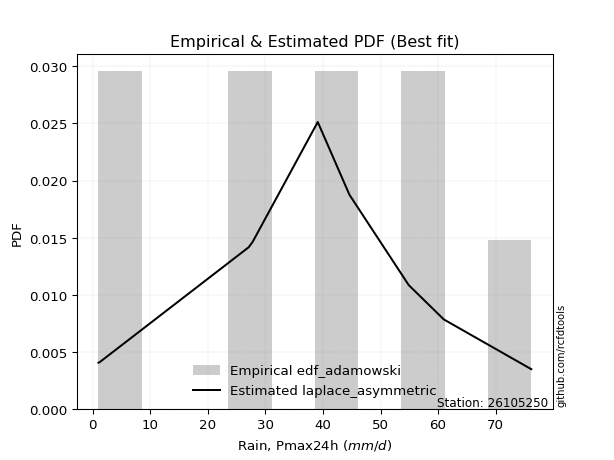</img>

</div>


## C. Best fit & Estimate extreme values for specific return periods - Tr


### 1. Best fit (ordered by delta Δ)

<div align="center">

|   id |   station | empirical_dist   | p_dist   |     delta |   deltao | eval   |   fit |   n |   best_fit |   best_fit_sort |
|-----:|----------:|:-----------------|:---------|----------:|---------:|:-------|------:|----:|-----------:|----------------:|
|    0 |  26105250 | edf_hazen        | fisk     | 0.0688374 | 0.394275 | Δo > Δ |     1 |  10 |          1 |               1 |
|    1 |  26105250 | edf_gringorten   | fisk     | 0.0729876 | 0.394275 | Δo > Δ |     1 |  10 |          1 |               2 |
|    2 |  26105250 | edf_cunnane      | fisk     | 0.0757002 | 0.394275 | Δo > Δ |     1 |  10 |          1 |               3 |
|    3 |  26105250 | edf_blom         | fisk     | 0.077374  | 0.394275 | Δo > Δ |     1 |  10 |          1 |               4 |
|    4 |  26105250 | edf_tukey        | fisk     | 0.0801278 | 0.394275 | Δo > Δ |     1 |  10 |          1 |               5 |
|    5 |  26105250 | edf_filliben     | fisk     | 0.0811626 | 0.394275 | Δo > Δ |     1 |  10 |          1 |               6 |
|    6 |  26105250 | edf_beard        | fisk     | 0.0816505 | 0.394275 | Δo > Δ |     1 |  10 |          1 |               7 |
|    7 |  26105250 | edf_jenkinson    | fisk     | 0.0816505 | 0.394275 | Δo > Δ |     1 |  10 |          1 |               8 |
|    8 |  26105250 | edf_chegodayev   | fisk     | 0.082299  | 0.394275 | Δo > Δ |     1 |  10 |          1 |               9 |
|    9 |  26105250 | edf_adamowski    | fisk     | 0.0855041 | 0.394275 | Δo > Δ |     1 |  10 |          1 |              10 |
|   10 |  26105250 | edf_weibull      | fisk     | 0.100656  | 0.394275 | Δo > Δ |     1 |  10 |          1 |              11 |
|   11 |  26105250 | edf_california   | fisk     | 0.118837  | 0.394275 | Δo > Δ |     1 |  10 |          1 |              12 |

</div>

:file_folder:Tables: [bestfit_26105250.csv](table/bestfit_26105250.csv) | [extreme_26105250.csv](table/extreme_26105250.csv)


### 2. Extreme values

In hydrology, a return period (or recurrence interval $Tr$) is the statistical average time between extreme events like floods or droughts of a specific magnitude, indicating how rare an event is, with a 100-year flood, for example, having a 1% chance of occurring in any given year, not that it happens exactly every century. It is a key tool for infrastructure design (like bridges or dams) and risk assessment, calculated from historical data to determine the probability of future events, although it is important to remember it is statistical average, and events can cluster or be missed.

> risk_rate: assuming the return period as the project useful life.

|   id |      tr |   prob_l |     prob_g |    alpha |   betaprime |     chi2 |   crystalball |   erlang |    expon |   exponnorm |        f |   fatiguelife |     fisk |    gamma |   genexpon |   genlogistic |   gibrat |   gompertz |   gumbel_l |   gumbel_r |   halflogistic |   halfnorm |   hypsecant |   invgamma |   invgauss |       invweibull |   johnsonsu |   kstwobign |   laplace |   laplace_asymmetric |   loggamma |   logistic |   lognorm |   maxwell |   mielke |    moyal |   nakagami |      ncf |              nct |     norm |           pareto |   pearson3 |   rayleigh |     rice |        t |   truncnorm |     wald |   weibull_min |   logalpha |     logbetaprime |          logchi2 |   logcrystalball |   logerlang |         logexpon |   logexponnorm |            logf |   logfatiguelife |   logfisk |   loggenexpon |   loggenlogistic |        loggibrat |   loggompertz |   loggumbel_l |   loggumbel_r |   loghalflogistic |   loghalfnorm |   loghypsecant |   loginvgamma |   loginvgauss |    loginvweibull |   logjohnsonsu |   logkstwobign |   loglaplace |   loglaplace_asymmetric |   logloggamma |   loglogistic |   loglognorm |   logmaxwell |         logmielke |   logmoyal |      lognakagami |            logncf |    lognct |     logpareto |   logpearson3 |   lograyleigh |   logrice |             logt |   logtruncnorm |          logwald |   logweibull_min |   station |   n |   risk_rate |
|-----:|--------:|---------:|-----------:|---------:|------------:|---------:|--------------:|---------:|---------:|------------:|---------:|--------------:|---------:|---------:|-----------:|--------------:|---------:|-----------:|-----------:|-----------:|---------------:|-----------:|------------:|-----------:|-----------:|-----------------:|------------:|------------:|----------:|---------------------:|-----------:|-----------:|----------:|----------:|---------:|---------:|-----------:|---------:|-----------------:|---------:|-----------------:|-----------:|-----------:|---------:|---------:|------------:|---------:|--------------:|-----------:|-----------------:|-----------------:|-----------------:|------------:|-----------------:|---------------:|----------------:|-----------------:|----------:|--------------:|-----------------:|-----------------:|--------------:|--------------:|--------------:|------------------:|--------------:|---------------:|--------------:|--------------:|-----------------:|---------------:|---------------:|-------------:|------------------------:|--------------:|--------------:|-------------:|-------------:|------------------:|-----------:|-----------------:|------------------:|----------:|--------------:|--------------:|--------------:|----------:|-----------------:|---------------:|-----------------:|-----------------:|----------:|----:|------------:|
|    0 |    2    | 0.5      | 0.5        |  31.7595 |     32.4193 |  11.0161 |       34.77   |  34.2056 |  24.4076 |     34.7634 |  23.9005 |       1.00011 |  33.9612 |  34.1369 |    24.4544 |       30.7851 |  27.6045 |    32.5091 |    38.6918 |    30.8482 |        28.8985 |    29.8834 |     34.77   |    32.7394 |    32.2128 |     10.2419      |     33.6861 |     30.1043 |   34.77   |              31.5748 |    18.5913 |    34.77   |   18.9445 |   32.7283 |  28.7589 |  29.5822 |    20.5342 |  27.4623 |      9.00455     |  34.77   |      1.49722     |    34.3825 |    32.0042 |  33.0902 |  34.7709 |     2.52293 |  27.0318 |       14.93   |    17.344  |     11.2027      |      5.29556     |                0 |     17.8608 |      7.68216     |        18.9447 |    3.58199      |          18.8566 |   25.4327 |       12.6625 |         inf      |     12.101       |       24.167  |       24.2114 |       14.8233 |           13.1215 |       13.9553 |        18.9445 |       17.8113 |       16.4662 |     15.5409      |        34.8076 |        12.9    |      18.9445 |                 28.3784 |       29.0098 |       18.9445 |            1 |      16.6732 |      3.32644      |    13.6947 |      5.96811     |      9.865        |   18.9098 |   1.06233     |       25.3382 |       15.9348 |   18.3342 |     39.1157      |        6.5961  |     11.6755      |      4.34168     |  26105250 |  10 |    0.75     |
|    1 |    2.33 | 0.570815 | 0.429185   |  36.1475 |     36.7845 |  14.4141 |       39.0299 |  38.4668 |  29.565  |     39.0233 |  29.3615 |       1.83255 |  38.0802 |  38.3995 |    29.6221 |       35.286  |  29.7624 |    37.1566 |    42.398  |    34.7955 |        32.957  |    34.481  |     38.1792 |    37.0627 |    36.6028 |     17.4399      |     37.9694 |     34.6591 |   37.3479 |              35.1267 |    24.5458 |    38.5233 |   24.729  |   37.1541 |  34.7364 |  33.3188 |    27.7018 |  32.5373 |     13.6189      |  39.0299 |      2.95283     |    38.6529 |    36.4955 |  37.491  |  39.0309 |     3.09435 |  29.8251 |       20.8799 |    23.0516 |     17.5048      |      7.9967      |                0 |     23.6565 |     12.0388      |        24.7292 |    6.22298      |          24.6079 |   31.8782 |       17.9467 |         inf      |     13.8498      |       29.3523 |       30.5282 |       18.9748 |           16.9136 |       18.6052 |        23.4475 |       23.5208 |       22.134  |     22.288       |        40.7126 |        18.5017 |      22.2594 |                 33.9545 |       34.8896 |       23.9576 |            1 |      21.9912 |      4.97118      |    17.3005 |     10.3646      |     25.9767       |   24.6977 |   1.27001     |       32.1552 |       21.1035 |   24.1181 |     43.7691      |        8.83356 |     13.9045      |      6.97521     |  26105250 |  10 |    0.729209 |
|    2 |    5    | 0.8      | 0.2        |  54.1501 |     54.3581 |  33.9527 |       54.861  |  54.6032 |  55.3507 |     54.8581 |  57.363  |      19.514   |  54.5494 |  54.5478 |    55.4593 |       54.8274 |  42.1861 |    54.9116 |    54.3711 |    51.9444 |        51.3207 |    53.9236 |     51.8544 |    54.293  |    54.4313 |    199.42        |     54.5111 |     54.0065 |   50.2369 |              52.8854 |    70.0599 |    53.0153 |   66.5684 |   54.5736 |  57.4768 |  50.6272 |    64.5048 |  55.8027 |    104.364       |  54.861  |   1812.5         |    54.7397 |    54.4759 |  54.6385 |  54.8621 |     5.55716 |  45.4619 |       63.7217 |    68.519  |    142.176       |     67.1853      |                0 |     68.4978 |    113.77        |        66.569  | 2118.62         |          66.2268 |   76.2569 |       74.1039 |         inf      |     30.1263      |       55.4667 |       64.5594 |       55.4674 |           53.3455 |       62.7782 |        55.1559 |       67.8572 |       70.1473 |    106.756       |        59.2878 |        85.6041 |      49.8484 |                 53.6334 |       55.8401 |       59.3101 |          inf |      65.3826 |     87.0787       |    51.0804 |    149.082       | 757785            |   66.6692 |   3.34728e+99 |       66.7876 |       64.9843 |   67.379  |     74.8059      |       24.9811  |     36.9774      |    121.097       |  26105250 |  10 |    0.67232  |
|    3 |   10    | 0.9      | 0.1        |  67.8135 |     67.2291 |  53.7856 |       65.3629 |  65.5709 |  78.7583 |     65.3663 |  83.4205 |      43.9276  |  67.2743 |  65.5296 |    78.9137 |       70.7355 |  56.3477 |    66.4029 |    61.0372 |    65.912  |        66.571  |    68.3107 |     62.7744 |    66.8266 |    67.661  |   1504.9         |     66.0498 |     68.7371 |   61.9372 |              69.0062 |   142.497  |    63.6881 |  128.398  |   66.8326 |  71.7365 |  65.6969 |    95.0722 |  75.4271 |    656.842       |  65.3629 | 894401           |    65.601  |    67.2963 |  66.4814 |  65.3641 |     7.41416 |  62.0562 |      119.916  |   145.333  |    857.665       |    489.278       |                0 |    140.967  |    874.002       |       128.4    |    1.31176e+10  |         127.801  |  144.957  |      206.253  |         inf      |     73.0567      |       79.3564 |       97.9601 |      132.885  |          138.478  |      154.399  |       109.205  |      140.295  |      158.318  |    382.388       |        67.8696 |       274.804  |     103.633  |                 63.1179 |       65.7987 |      115.628  |          inf |     140.762  |   7853.29         |   131.109  |   1263.93        |      1.14043e+18  |  128.909  | inf           |       95.9795 |      144.906  |  133.91   |    148.705       |       42.1428  |    104.407       |   2791.77        |  26105250 |  10 |    0.651322 |
|    4 |   15    | 0.933333 | 0.0666667  |  75.2367 |     74.0252 |  65.9201 |       70.6036 |  71.123  |  92.4509 |     70.6113 |  98.8611 |      59.8945  |  74.4287 |  71.0906 |    92.6336 |       79.7091 |  66.1157 |    71.9235 |    64.0561 |    73.7923 |        75.2013 |    75.7976 |     69.0064 |    73.4413 |    74.7077 |   4715.47        |     71.9838 |     76.5573 |   68.7814 |              78.4363 |   203.951  |    69.5032 |  178.208  |   73.1225 |  78.9049 |  74.4426 |   111.402  |  86.6079 |   1925.64        |  70.6036 |      3.36608e+07 |    71.078  |    73.902  |  72.4835 |  70.6048 |     8.38866 |  72.7124 |      159.876  |   213.45   |   2392.06        |   1583.92        |                0 |    203.084  |   2880.63        |       178.209  |    7.97459e+18  |         177.455  |  205.698  |      350.372  |         inf      |    134.592       |       93.3885 |      118.321  |      217.545  |          237.591  |      246.624  |       161.264  |      203.049  |      241.266  |    785.47        |        71.1206 |       510.421  |     159.01   |                 68.0377 |       69.2187 |      166.354  |          inf |     208.619  | 430254            |   226.577  |   3924.44        |      1.03644e+34  |  179.168  | inf           |      111.352  |      219.045  |  188.873  |    269.241       |       50.8749  |    203.332       |  21283.3         |  26105250 |  10 |    0.644736 |
|    5 |   20    | 0.95     | 0.05       |  80.3401 |     78.6129 |  74.7019 |       74.0356 |  74.7876 | 102.166  |     74.0467 | 109.892  |      71.7161  |  79.4672 |  74.7617 |   102.368  |       85.9917 |  73.778  |    75.4482 |    65.9353 |    79.3099 |        81.2479 |    80.7893 |     73.4028 |    77.9104 |    79.4886 |  10493.1         |     75.9349 |     81.8252 |   73.6374 |              85.127  |   258.33   |    73.5224 |  220.881  |   77.2969 |  83.7706 |  80.6365 |   122.366  |  94.4669 |   4130.21        |  74.0356 |      4.41597e+08 |    74.6853 |    78.2926 |  76.4404 |  74.0368 |     9.04085 |  80.6533 |      191.272  |   275.483  |   4911.93        |   3660.75        |                0 |    258.397  |   6714.22        |       220.883  |    1.96617e+29  |         220.026  |  261.989  |      498.655  |         inf      |    217.356       |      103.366  |      133.079  |      307.213  |          346.81   |      337.006  |       212.309  |      259.359  |      319.689  |   1300.23        |        72.9293 |       774.591  |     215.448  |                 71.7593 |       70.9469 |      213.903  |          inf |     270.867  |      1.78193e+07  |   333.793  |   8384.17        |      1.15458e+53  |  222.29   | inf           |      121.422  |      288.276  |  236.666  |    467.587       |       56.0756  |    334.138       |  97228.7         |  26105250 |  10 |    0.641514 |
|    6 |   25    | 0.96     | 0.04       |  84.2274 |     82.06   |  81.5953 |       76.562  |  77.4998 | 109.701  |     76.5758 | 118.487  |      81.1088  |  83.3742 |  77.479  |   109.919  |       90.8309 |  80.1656 |    77.9948 |    67.2725 |    83.56   |        85.9066 |    84.5033 |     76.8052 |    81.272  |    83.0936 |  19431           |     78.8769 |     85.7711 |   77.404  |              90.3168 |   307.664  |    76.597  |  258.696  |   80.396  |  87.4904 |  85.4374 |   130.546  | 100.536  |   7464.8         |  76.562  |      3.2519e+09  |    77.3512 |    81.5547 |  79.3648 |  76.5632 |     9.52724 |  87.0139 |      217.325  |   332.978  |   8549.27        |   7025.37        |                0 |    308.809  |  12943.7         |       258.699  |    1.18139e+41  |         257.771  |  315.244  |      648.365  |         inf      |    324.116       |      111.115  |      144.689  |      400.769  |          464.138  |      425.138  |       262.662  |      310.988  |      394.404  |   1917.02        |        74.1154 |      1058.66   |     272.687  |                 74.7855 |       71.9896 |      259.264  |          inf |     328.809  |      6.09794e+08  |   450.71   |  14765.7         |      6.2219e+74   |  260.545  | inf           |      128.751  |      353.53   |  279.462  |    790.958       |       59.5136  |    497.406       | 329360           |  26105250 |  10 |    0.639603 |
|    7 |   50    | 0.98     | 0.02       |  96.0205 |     92.2635 | 103.376  |       83.7967 |  85.3347 | 133.109  |     83.8194 | 145.392  |     111.245   |  95.5992 |  85.3302 |   133.373  |      105.737  | 102.682  |    85.0566 |    70.9024 |    96.6523 |       100.261  |    95.2984 |     87.3542 |    91.2482 |    93.8279 | 129674           |     87.4613 |     97.3582 |   89.1043 |             106.438  |   509.367  |    85.991  |  406.747  |   89.3839 |  99.0947 | 100.341  |   154.374  | 119.318  |  46931.5         |  83.7967 |      1.60558e+12 |    85.0344 |    91.0241 |  87.7868 |  83.7979 |    10.9458  | 107.781  |      307.471  |   577.822  |  46971.8         |  53709.8         |                0 |    516.649  |  99435.5         |       406.751  |    4.68816e+116 |         405.699  |  554.859  |     1391.19   |         inf      |   1325.54        |      135.242  |      181.57   |      908.982  |         1139.16   |      835.197  |       508.121  |      526.419  |      729.478  |   6338.93        |        76.9194 |      2649.66   |     566.905  |                 85.0242 |       74.0877 |      466.591  |          inf |     576.906  |      5.35173e+15  |  1144.92   |  76693.1         |      1.42965e+216 |  410.613  | inf           |      148.911  |      639.248  |  450.134  |   8786.03        |       67.2133  |   1823.3         |      1.80885e+07 |  26105250 |  10 |    0.63583  |
|    8 |   75    | 0.986667 | 0.0133333  | 102.787  |     97.9437 | 116.326  |       87.6785 |  89.5806 | 146.802  |     87.7068 | 161.264  |     129.394   | 102.862  |  89.5857 |   147.093  |      114.401  | 117.89   |    88.7037 |    72.738  |   104.262  |       108.605  |   101.175  |     93.5189 |    96.8236 |    99.8443 | 390849           |     92.1667 |    103.733  |   95.9485 |             115.868  |   669.105  |    91.4167 |  518.535  |   94.2704 | 106.11   | 109.057  |   167.349  | 130.304  | 137569           |  87.6785 |      6.04261e+13 |    89.187  |    96.1758 |  92.3309 |  87.6798 |    11.7205  | 120.56   |      366.502  |   780.745  | 125968           | 177449           |                0 |    682.742  | 327730           |       518.54   |    2.64136e+214 |         517.529  |  769.123  |     2109.07   |         inf      |   3431.89        |      149.389  |      203.661  |     1463.12   |         1919.78   |     1206.22   |       747.199  |      701.014  |     1023.18   |  12703           |        78.1147 |      4389.4    |     869.837  |                 91.6515 |       74.7909 |      655.13   |          inf |     783.162  |      9.51074e+21  |  1974.87   | 188071           |    inf            |  524.172  | inf           |      158.986  |      882.307  |  581.551  |  79388.1         |       70.0535  |   4055.18        |      2.16889e+08 |  26105250 |  10 |    0.634587 |
|    9 |  100    | 0.99     | 0.01       | 107.552  |    101.868  | 125.59   |       90.3041 |  92.4689 | 156.517  |     90.3365 | 172.583  |     142.453   | 108.081  |  92.481  |   156.827  |      120.533  | 129.671  |    91.1145 |    73.9386 |   109.648  |       114.51   |   105.178  |     97.8919 |   100.686  |   104.017  | 853372           |     95.3893 |    108.101  |  100.805  |             122.558  |   805.391  |    95.2473 |  611.087  |   97.5988 | 111.255  | 115.24   |   176.182  | 138.116  | 295056           |  90.3041 |      7.9273e+14  |    92.0076 |    99.6856 |  95.413  |  90.3054 |    12.2493  | 129.877  |      411.136  |   959.046  | 252708           | 415100           |                0 |    825.255  | 763879           |       611.092  |  inf            |         610.189  |  968.543  |     2801.02   |         inf      |   7170.92        |      159.44   |      219.545  |     2049.23   |         2777.69   |     1549.45   |       982.269  |      852.24   |     1290.61   |  20776.4         |        78.8199 |      6203      |    1178.57   |                 96.6646 |       75.1432 |      832.51   |          inf |     964.429  |      6.61755e+27  |  2907.45   | 346397           |    inf            |  618.318  | inf           |      165.429  |     1098.92   |  691.656  | 635392           |       71.5299  |   7262.99        |      1.34039e+09 |  26105250 |  10 |    0.633968 |
|   10 |  200    | 0.995    | 0.005      | 118.972  |    111.017  | 148.126  |       96.2596 |  99.0704 | 179.924  |     96.3023 | 200.038  |     174.419   | 120.917  |  99.0996 |   180.282  |      135.275  | 161.723  |    96.4187 |    76.5483 |   122.596  |       128.708  |   114.334  |    108.427  |   109.733  |   113.8    |      5.57752e+06 |    102.821  |    118.162  |  112.505  |             138.679  |  1229.7    |   104.436  |  886.931  |  105.214  | 124.393  | 130.138  |   196.353  | 157.04   |      1.855e+06   |  96.2596 |      3.91399e+17 |    98.4412 |   107.716  | 102.427  |  96.261  |    13.4609  | 153.086  |      527.856  |  1539.13   |      1.33819e+06 |      3.23433e+06 |                0 |   1272.6    |      5.86824e+06 |       886.939  |  inf            |         886.681  | 1683.82   |     5365.14   |         inf      |  53246.2         |      183.697  |      258.474  |     4606.14   |         6751.23   |     2747.3    |      1898.53   |     1333.88   |     2207.81   |  67802.4         |        80.1562 |     13757.6    |    2450.2    |                109.899  |       75.6725 |     1479.15   |          inf |    1552.87   |      8.32333e+48  |  7382.74   |      1.39814e+06 |    inf            |  899.474  | inf           |      178.791  |     1816.03   | 1025.33   |      1.31598e+09 |       73.8186  |  31015.2         |      1.30331e+11 |  26105250 |  10 |    0.633042 |
|   11 |  250    | 0.996    | 0.004      | 122.643  |    113.883  | 155.437  |       98.0796 | 101.102  | 187.46   |     98.1258 | 208.931  |     184.837   | 125.134  | 101.136  |   187.832  |      140.014  | 173.223  |    97.995  |    77.3161 |   126.759  |       133.273  |   117.151  |    111.818  |   112.58   |   116.878  |      1.01988e+07 |    105.126  |    121.275  |  116.271  |             143.869  |  1400.52   |   107.386  |  993.874  |  107.558  | 128.881  | 134.934  |   202.548  | 163.173  |      3.35262e+06 |  98.0796 |      2.88225e+18 |   100.417  |   110.188  | 104.576  |  98.081  |    13.8342  | 160.763  |      568.143  |  1781.74   |      2.28221e+06 |      6.2725e+06  |                0 |   1453.96   |      1.13128e+07 |       993.882  |  inf            |         993.987  | 2010.96   |     6554.64   |         inf      | 109321           |      191.518  |      271.192  |     5976.11   |         8982.15   |     3276.61   |      2347.16   |     1531.67   |     2608.87   |  99170.7         |        80.5011 |     17603.6    |    3101.16   |                114.533  |       75.7785 |     1778.91   |          inf |    1798.1    |      4.2289e+58   |  9965.54   |      2.14653e+06 |    inf            | 1008.66   | inf           |      182.505  |     2119.72   | 1156.53   |      4.63063e+10 |       74.2873  |  50135.7         |      6.00438e+11 |  26105250 |  10 |    0.632858 |
|   12 |  500    | 0.998    | 0.002      | 134.072  |    122.573  | 178.29   |      103.477  | 107.164  | 210.867  |    103.534  | 236.717  |     217.518   | 138.518  | 107.216  |   211.287  |      154.724  | 212.967  |   102.55   |    79.5173 |   139.679  |       147.44   |   125.549  |    122.352  |   121.253  |   126.256  |      6.63862e+07 |    112.059  |    130.606  |  127.972  |             159.99   |  2063.96   |   116.535  | 1393      |  114.553  | 143.762  | 149.831  |   220.985  | 182.382  |      2.10777e+07 | 103.477  |      1.42307e+21 |   106.304  |   117.564  | 110.964  | 103.478  |    14.9489  | 185.177  |      701.534  |  2764.3    |      1.18949e+07 |      4.92698e+07 |                0 |   2163.57   |      8.69068e+07 |      1393.01   |  inf            |        1394.92   | 3487.67   |    11919.1    |         inf      |      1.31341e+06 |      215.843  |      311.223  |    13409.1    |        21789.3    |     5540.73   |      4536.37   |     2316.83   |     4313.9    | 322805           |        81.3778 |     36850.2    |    6447.18   |                130.214  |       75.9906 |     3152.78   |          inf |    2785.05   |      5.37311e+102 | 25304.4    |      7.69308e+06 |    inf            | 1416.91   | inf           |      192.463  |     3362.38   | 1653.23   |      6.32999e+17 |       75.236   | 230857           |      8.0911e+13  |  26105250 |  10 |    0.632489 |
|   13 |  750    | 0.998667 | 0.00133333 | 140.797  |    127.526  | 191.746  |      106.475  | 110.556  | 224.56   |    106.539  | 253.084  |     236.827   | 146.557  | 110.618  |   225.007  |      163.323  | 239.252  |   105.006  |    80.6937 |   147.232  |       155.722  |   130.241  |    128.514  |   126.227  |   131.629  |      1.98457e+08 |    115.972  |    135.847  |  134.816  |             169.42   |  2563.5    |   121.881  | 1680.35   |  118.465  | 153.194  | 158.545  |   231.262  | 193.747  |      6.17847e+07 | 106.475  |      5.35572e+22 |   109.593  |   121.688  | 114.521  | 106.477  |    15.5725  | 199.814  |      785.256  |  3540      |      3.11061e+07 |      1.64886e+08 |                0 |   2702.29   |      2.86436e+08 |      1680.36   |  inf            |        1683.94   | 4811.12   |    16656.6    |          76.0629 |      6.79897e+06 |      230.094  |      334.988  |    21507.2    |        36579.1    |     7430.55   |      6669.65   |     2922.93   |     5733.92   | 643546           |        81.783  |     55805.5    |    9892.3    |                140.364  |       76.0613 |     4404.53   |          inf |    3557.23   |      3.4926e+142  | 43644.2    |      1.56775e+07 |    inf            | 1711.43   | inf           |      197.315  |     4352.03   | 2016.52   |      2.24139e+24 |       75.5556  | 576740           |      1.58433e+15 |  26105250 |  10 |    0.632366 |
|   14 | 1000    | 0.999    | 0.001      | 145.595  |    130.989  | 201.328  |      108.539  | 112.901  | 234.275  |    108.608  | 264.745  |     250.6     | 152.358  | 112.971  |   234.741  |      169.422  | 259.366  |   106.666  |    81.4854 |   152.589  |       161.597  |   133.481  |    132.886  |   129.718  |   135.397  |      4.31538e+08 |    118.693  |    139.479  |  139.672  |             176.111  |  2977.72   |   125.671  | 1911.95   |  121.169  | 160.244  | 164.728  |   238.35   | 201.875  |      1.32515e+08 | 108.539  |      7.02618e+23 |   111.864  |   124.539  | 116.973  | 108.541  |    16.0034  | 210.344  |      847.166  |  4203.17   |      6.14177e+07 |      3.88848e+08 |                0 |   3151.32   |      6.67632e+08 |      1911.97   |  inf            |        1917.09   | 6043.99   |    20993      |          76.0984 |      2.39258e+07 |      240.213  |      351.996  |    30069.6    |        52823.6    |     9100.01   |      8767.41   |     3433.66   |     6990.04   |      1.04985e+06 |        82.0326 |     74395.1    |   13403.4    |                148.041  |       76.0967 |     5583.1    |          inf |    4212.76   |      6.39063e+179 | 64252.4    |      2.56197e+07 |    inf            | 1949.12   | inf           |      200.379  |     5201.39   | 2312.19   |      3.51358e+30 |       75.7161  |      1.11432e+06 |      1.36833e+16 |  26105250 |  10 |    0.632305 |

<div align="center">

</img>

</div>


<div align="center">

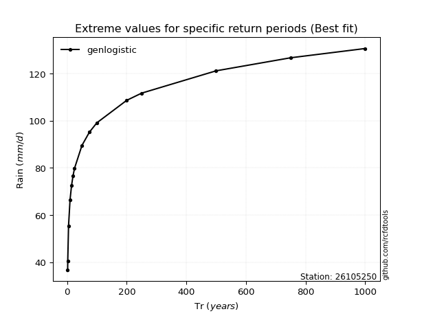</img>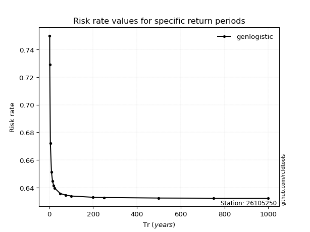</img>

</div>


<sub>**APP DISCLAIMER**: NO WARRANTY - This software is provided by [github.com/rcfdtools](https://github.com/rcfdtools) "as is", without any express or implied warranty, including warranties of merchantability, fitness for a particular purpose, or non-infringement. There is no guarantee that the software will be error-free or operate without interruption. LIMITATION OF LIABILITY - Neither the authors nor copyright holders will be liable for claims or damages arising from the software or its use. You are responsible for determining if the software is appropriate for your use and assume all associated risks, including errors, legal compliance, and data loss. NO PROFESSIONAL ADVICE - The software provides general information and does not offer professional advice. It should not replace consultation with professional advisors.</sub>