<div align="center">


</div>

# Station (rain, Pmax24h): 26115090

Probable Maximum Precipitation (PMP) is the greatest amount of rainfall for a specific duration that is meteorologically possible for a given location, acting as a "worst-case" scenario for extreme storms, crucial for designing safety-critical infrastructure like bridges, river deviations, dams, spillways, and nuclear plants to prevent catastrophic failure. PMP is calculated by hydrologists using meteorological data to determine the upper limit of extreme rainfall, often leading to the Probable Maximum Flood (PMF) for flood control design, and is increasingly being studied for climate change impacts.

<div align="center">

</img>

</div>


## A. General information


### 1. General running parameters

• app_version: _v20251225_. • runtime: _2025-12-26 14:29:50.888910_. • Python version: _3.14.0_. • SciPy version: _1.16.3_. • Pandas version: _2.3.3_. • NumPy version: _2.3.5_. • Stations dataset (station_dataset_file): _dataset/pmax24h_in/automatic_colombia.csv_. • Stations catalog (station_catalog_file): _dataset/CNE_IDEAM.xls_. • Plot only fit distributions with Δo > Δ (plot_only_fit): _True_. • Eval low extreme values, if False, evaluates high extreme values (low_extreme): _False_. • Eval every SciPy distribution as logarithmic (pdist_logarithmic_on): _True_. • Standard deviation normalized (ddof): _1.0_. • Return periods to eval in years (Tr): _[2, 2.33, 5, 10, 15, 20, 25, 50, 75, 100, 200, 250, 500, 750, 1000]_. • Minimum data sample per station, 0 means any (minimum_sample): _5_. • Z-Score threshold to adjust a value, 0 means disable (zscore): _3.5_. • Avoid zeros, e.g. rain = 0 (avoid_zeros): _True_. • Avoid null values (avoid_nans): _True_. [:file_folder:Dataset file.](../../dataset/pmax24h_in/automatic_colombia.csv)


### 2. Station info and location

|   id |   CODIGO | NOMBRE                      | CATEGORIA               | TECNOLOGIA                              | ESTADO   | FECHA_INSTALACION   |   FECHA_SUSPENSION |   ALTITUD |   LATITUD |   LONGITUD | DEPARTAMENTO    | MUNICIPIO   | AREA_OPERATIVA                         | ENTIDAD                                                     | AREA_HIDROGRAFICA   | ZONA_HIDROGRAFICA   | SUBZONA_HIDROGRAFICA   |   CORRIENTE | OBSERVACION                                                                                                                                                                                                                  | SUBRED                                                                                                              | Catalogo   |
|-----:|---------:|:----------------------------|:------------------------|:----------------------------------------|:---------|:--------------------|-------------------:|----------:|----------:|-----------:|:----------------|:------------|:---------------------------------------|:------------------------------------------------------------|:--------------------|:--------------------|:-----------------------|------------:|:-----------------------------------------------------------------------------------------------------------------------------------------------------------------------------------------------------------------------------|:--------------------------------------------------------------------------------------------------------------------|:-----------|
|    0 | 26115090 | LAS BRISAS - AUT [26115090] | Climatológica Principal | Automática con Telemetría, Convencional | Activa   | 30/06/2005          |                nan |      1971 |   4.77558 |   -76.1443 | Valle Del Cauca | Argelia     | Area Operativa 09 - Cauca-Valle-Caldas | INSTITUTO DE HIDROLOGIA METEOROLOGIA Y ESTUDIOS AMBIENTALES | Pacifico            | San Juán            | Río Sipí               |         nan | Por REQ2021-000578 Se hacen ajustes solicitados por la Coordinadora del AO 09.|25/08/2022$Migracion$Se Cambia Estado por orden de la Coordinación de Planeacion Operativa Decisión tomada en la Reunión de la RED 19/08/2022 | Radición Global,Radiación Visible,Radiación Ultravioleta,RED ALERTAS - AREA OPERATIVA 09,Valle geografico Rio Cauca | CNE_IDEAM  |

<div align="center">

Map location in: [:earth_americas:Google](http://maps.google.com/maps?q=4.775583333,-76.144277778) [:earth_americas:OSM](https://www.openstreetmap.org/#map=18/4.775583333/-76.144277778&layers=P) [:earth_americas:Bing](https://www.bing.com/maps?cp=4.775583333~-76.144277778&lvl=18) [:earth_americas:Apple](https://maps.apple.com/frame?center=4.775583333%2C-76.144277778&span=0.003%2C0.006)

</div>


<div align="center">

```geojson
{
  "type": "Feature",
  "geometry": {
    "type": "Point", 
    "coordinates": [-76.144277778, 4.775583333]
  }, 
  "properties": {
    "Name": "26115090"
  }
}
```

</div>


### 3. Discrete values table and plot

|               |           0 |          1 |           2 |          3 |            4 |           5 |           6 |          7 |          8 |
|:--------------|------------:|-----------:|------------:|-----------:|-------------:|------------:|------------:|-----------:|-----------:|
| Date          | 2017        | 2018       | 2019        | 2020       | 2021         | 2022        | 2023        | 2024       | 2025       |
| Value         |   45.2      |   34.7     |   42.2      |    0.2     |   30.1       |   13.8      |   32.8      |   48.6     |    9.8     |
| Value_initial |   45.2      |   34.7     |   42.2      |    0.2     |   30.1       |   13.8      |   32.8      |   48.6     |    9.8     |
| count         |    9        |    9       |    9        |    9       |    9         |    9        |    9        |    9       |    9       |
| mean          |   28.6      |   28.6     |   28.6      |   28.6     |   28.6       |   28.6      |   28.6      |   28.6     |   28.6     |
| std           |   16.9435   |   16.9435  |   16.9435   |   16.9435  |   16.9435    |   16.9435   |   16.9435   |   16.9435  |   16.9435  |
| zscore        |    0.979726 |    0.36002 |    0.802667 |   -1.67616 |    0.0885295 |   -0.873491 |    0.247883 |    1.18039 |   -1.10957 |

<div align="center">

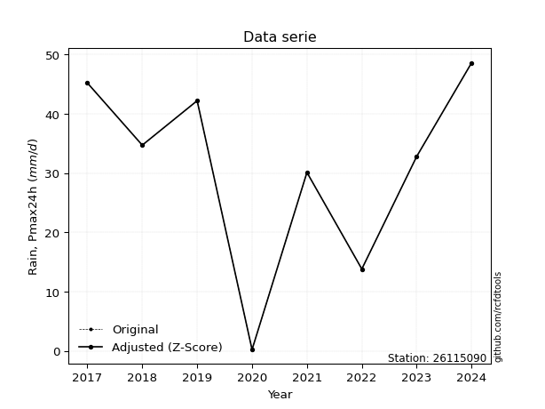</img>

</div>

> If Z-Score is active, values out of range or outliers are replaced with the station mean value.


### 4. Active continuous probability distributions from SciPy (45 of 104 available)

[scipy.stats](https://docs.scipy.org/doc/scipy/reference/stats.html) is a Python´s powerful submodule within the SciPy library for comprehensive statistical analysis, offering over 130 probability distributions (like Normal, Poisson), functions for descriptive stats (mean, variance), hypothesis testing (t-tests, chi-square), random variable generation, and statistical tests, making it essential for data science, modeling, and research. It provides tools to explore, model, and draw conclusions from data efficiently, working seamlessly with NumPy.

<div align="center">

|   id | p_dist             |   n_parameter | fit_method   | label                                                                       | active   | ref                                                                                                        |
|-----:|:-------------------|--------------:|:-------------|:----------------------------------------------------------------------------|:---------|:-----------------------------------------------------------------------------------------------------------|
|    0 | alpha              |             3 | MLE          | Alpha                                                                       | True     | [:mortar_board:](https://docs.scipy.org/doc/scipy/reference/generated/scipy.stats.alpha.html)              |
|    1 | betaprime          |             4 | MLE          | Beta prime                                                                  | True     | [:mortar_board:](https://docs.scipy.org/doc/scipy/reference/generated/scipy.stats.betaprime.html)          |
|    2 | chi2               |             3 | MLE          | Chi²                                                                        | True     | [:mortar_board:](https://docs.scipy.org/doc/scipy/reference/generated/scipy.stats.chi2.html)               |
|    3 | crystalball        |             4 | MLE          | Crystalball                                                                 | True     | [:mortar_board:](https://docs.scipy.org/doc/scipy/reference/generated/scipy.stats.crystalball.html)        |
|    4 | erlang             |             3 | MLE          | Erlang                                                                      | True     | [:mortar_board:](https://docs.scipy.org/doc/scipy/reference/generated/scipy.stats.erlang.html)             |
|    5 | expon              |             2 | MLE          | Exponential                                                                 | True     | [:mortar_board:](https://docs.scipy.org/doc/scipy/reference/generated/scipy.stats.expon.html)              |
|    6 | exponnorm          |             3 | MLE          | Exponentially modified Normal                                               | True     | [:mortar_board:](https://docs.scipy.org/doc/scipy/reference/generated/scipy.stats.exponnorm.html)          |
|    7 | f                  |             4 | MLE          | F                                                                           | True     | [:mortar_board:](https://docs.scipy.org/doc/scipy/reference/generated/scipy.stats.f.html)                  |
|    8 | fatiguelife        |             3 | MLE          | Fatigue-life (Birnbaum-Saunders)                                            | True     | [:mortar_board:](https://docs.scipy.org/doc/scipy/reference/generated/scipy.stats.fatiguelife.html)        |
|    9 | fisk               |             3 | MLE          | Fisk                                                                        | True     | [:mortar_board:](https://docs.scipy.org/doc/scipy/reference/generated/scipy.stats.fisk.html)               |
|   10 | gamma              |             3 | MLE          | Gamma                                                                       | True     | [:mortar_board:](https://docs.scipy.org/doc/scipy/reference/generated/scipy.stats.gamma.html)              |
|   11 | genexpon           |             5 | MLE          | Generalized exponential                                                     | True     | [:mortar_board:](https://docs.scipy.org/doc/scipy/reference/generated/scipy.stats.genexpon.html)           |
|   12 | genlogistic        |             3 | MLE          | Generalized logistic                                                        | True     | [:mortar_board:](https://docs.scipy.org/doc/scipy/reference/generated/scipy.stats.genlogistic.html)        |
|   13 | gibrat             |             2 | MM           | Gibrat                                                                      | True     | [:mortar_board:](https://docs.scipy.org/doc/scipy/reference/generated/scipy.stats.gibrat.html)             |
|   14 | gompertz           |             3 | MLE          | Gompertz (or truncated Gumbel)                                              | True     | [:mortar_board:](https://docs.scipy.org/doc/scipy/reference/generated/scipy.stats.gompertz.html)           |
|   15 | gumbel_l           |             2 | MM           | Gumbel Left Skew                                                            | True     | [:mortar_board:](https://docs.scipy.org/doc/scipy/reference/generated/scipy.stats.gumbel_l.html)           |
|   16 | gumbel_r           |             2 | MM           | Gumbel Right Skew                                                           | True     | [:mortar_board:](https://docs.scipy.org/doc/scipy/reference/generated/scipy.stats.gumbel_r.html)           |
|   17 | halflogistic       |             2 | MM           | Half-logistic                                                               | True     | [:mortar_board:](https://docs.scipy.org/doc/scipy/reference/generated/scipy.stats.halflogistic.html)       |
|   18 | halfnorm           |             2 | MM           | Half Normal                                                                 | True     | [:mortar_board:](https://docs.scipy.org/doc/scipy/reference/generated/scipy.stats.halfnorm.html)           |
|   19 | hypsecant          |             2 | MM           | hyperbolic secant                                                           | True     | [:mortar_board:](https://docs.scipy.org/doc/scipy/reference/generated/scipy.stats.hypsecant.html)          |
|   20 | invgamma           |             3 | MLE          | Inverted gamma                                                              | True     | [:mortar_board:](https://docs.scipy.org/doc/scipy/reference/generated/scipy.stats.invgamma.html)           |
|   21 | invgauss           |             3 | MLE          | Inverse Gaussian                                                            | True     | [:mortar_board:](https://docs.scipy.org/doc/scipy/reference/generated/scipy.stats.invgauss.html)           |
|   22 | invweibull         |             3 | MLE          | Inverted Weibull                                                            | True     | [:mortar_board:](https://docs.scipy.org/doc/scipy/reference/generated/scipy.stats.invweibull.html)         |
|   23 | johnsonsu          |             4 | MLE          | Johnson Su                                                                  | True     | [:mortar_board:](https://docs.scipy.org/doc/scipy/reference/generated/scipy.stats.johnsonsu.html)          |
|   24 | kstwobign          |             2 | MLE          | Limiting distribution of scaled Kolmogorov-Smirnov two-sided test statistic | True     | [:mortar_board:](https://docs.scipy.org/doc/scipy/reference/generated/scipy.stats.kstwobign.html)          |
|   25 | laplace            |             2 | MM           | Laplace                                                                     | True     | [:mortar_board:](https://docs.scipy.org/doc/scipy/reference/generated/scipy.stats.laplace.html)            |
|   26 | laplace_asymmetric |             3 | MLE          | Asymmetric Laplace                                                          | True     | [:mortar_board:](https://docs.scipy.org/doc/scipy/reference/generated/scipy.stats.laplace_asymmetric.html) |
|   27 | loggamma           |             3 | MLE          | Log gamma                                                                   | True     | [:mortar_board:](https://docs.scipy.org/doc/scipy/reference/generated/scipy.stats.loggamma.html)           |
|   28 | logistic           |             2 | MM           | Logistic (or Sech-squared)                                                  | True     | [:mortar_board:](https://docs.scipy.org/doc/scipy/reference/generated/scipy.stats.logistic.html)           |
|   29 | lognorm            |             3 | MLE          | Log Normal                                                                  | True     | [:mortar_board:](https://docs.scipy.org/doc/scipy/reference/generated/scipy.stats.lognorm.html)            |
|   30 | maxwell            |             2 | MM           | Maxwell                                                                     | True     | [:mortar_board:](https://docs.scipy.org/doc/scipy/reference/generated/scipy.stats.maxwell.html)            |
|   31 | mielke             |             4 | MLE          | Mielke Beta-Kappa / Dagum                                                   | True     | [:mortar_board:](https://docs.scipy.org/doc/scipy/reference/generated/scipy.stats.mielke.html)             |
|   32 | moyal              |             2 | MM           | Moyal                                                                       | True     | [:mortar_board:](https://docs.scipy.org/doc/scipy/reference/generated/scipy.stats.moyal.html)              |
|   33 | nakagami           |             3 | MLE          | Nakagami                                                                    | True     | [:mortar_board:](https://docs.scipy.org/doc/scipy/reference/generated/scipy.stats.nakagami.html)           |
|   34 | ncf                |             5 | MLE          | Non-central F distribution                                                  | True     | [:mortar_board:](https://docs.scipy.org/doc/scipy/reference/generated/scipy.stats.ncf.html)                |
|   35 | nct                |             4 | MLE          | Non-central Student’s t                                                     | True     | [:mortar_board:](https://docs.scipy.org/doc/scipy/reference/generated/scipy.stats.nct.html)                |
|   36 | norm               |             2 | MM           | Normal                                                                      | True     | [:mortar_board:](https://docs.scipy.org/doc/scipy/reference/generated/scipy.stats.norm.html)               |
|   37 | pareto             |             3 | MLE          | Pareto                                                                      | True     | [:mortar_board:](https://docs.scipy.org/doc/scipy/reference/generated/scipy.stats.pareto.html)             |
|   38 | pearson3           |             3 | MM           | Pearson type III                                                            | True     | [:mortar_board:](https://docs.scipy.org/doc/scipy/reference/generated/scipy.stats.pearson3.html)           |
|   39 | rayleigh           |             2 | MM           | Rayleigh                                                                    | True     | [:mortar_board:](https://docs.scipy.org/doc/scipy/reference/generated/scipy.stats.rayleigh.html)           |
|   40 | rice               |             3 | MLE          | Rice                                                                        | True     | [:mortar_board:](https://docs.scipy.org/doc/scipy/reference/generated/scipy.stats.rice.html)               |
|   41 | t                  |             3 | MLE          | Student’s t                                                                 | True     | [:mortar_board:](https://docs.scipy.org/doc/scipy/reference/generated/scipy.stats.t.html)                  |
|   42 | truncnorm          |             4 | MLE          | Truncated normal                                                            | True     | [:mortar_board:](https://docs.scipy.org/doc/scipy/reference/generated/scipy.stats.truncnorm.html)          |
|   43 | wald               |             2 | MM           | Wald                                                                        | True     | [:mortar_board:](https://docs.scipy.org/doc/scipy/reference/generated/scipy.stats.wald.html)               |
|   44 | weibull_min        |             3 | MLE          | Weibull minimum                                                             | True     | [:mortar_board:](https://docs.scipy.org/doc/scipy/reference/generated/scipy.stats.weibull_min.html)        |

</div>

> **n_parameter:** # arguments & localization & scale.
>
> **Fit methods:** (MLE) maximum likelihood, (MM) L-moments.
>
>**Inactive:** foldnorm, gennorm, norminvgauss, powernorm, powerlognorm, skewnorm, genextreme, anglit, arcsine, argus, beta, bradford, burr, burr12, cauchy, cosine, halfcauchy, foldcauchy, skewcauchy, wrapcauchy, dgamma, gengamma, exponweib, exponpow, truncexpon, gausshyper, genhalflogistic, genhyperbolic, geninvgauss, halfgennorm, johnsonsb, kappa4, kappa3, ksone, kstwo, loglaplace, levy, levy_l, levy_stable, ncx2, genpareto, truncpareto, lomax, powerlaw, rdist, rel_breitwigner, recipinvgauss, semicircular, studentized_range, trapezoid, triang, truncweibull_min, tukeylambda, uniform, loguniform, vonmises, vonmises_line, weibull_max, dweibull, 


## B. Probability distributions vs. Empirical distributions

A continuous probability distribution (CPD) describes probabilities for variables that can take any value within a range (like rain any time), unlike discrete variables with specific outcomes (like temperature). It uses a Probability Density Function (PDF), a curve where the total area under it equals 1, and the probability of the variable falling within an interval (a to b) is found by calculating the area under the curve between those points. A key feature is that the probability of hitting any single exact value is zero, so probabilities are always expressed for ranges, e.g., $P(a ≤ X ≤ b)$.

<div align="center">

Distributions parameters
|    |   station | p_dist                |   n |              loc |           scale | shape                  | shape1              | shape2             | shape3   |
|---:|----------:|:----------------------|----:|-----------------:|----------------:|:-----------------------|:--------------------|:-------------------|:---------|
|  0 |  26115090 | alpha                 |   9 |   -209.669       |  3394.68        | 14.328218467596166     |                     |                    |          |
|  1 |  26115090 | betaprime             |   9 |   -415.546       | 55332           | 755.7585516291604      | 94179.02875574147   |                    |          |
|  2 |  26115090 | chi2                  |   9 |   -108.986       |     0.990286    | 138.80733222125673     |                     |                    |          |
|  3 |  26115090 | crystalball           |   9 |     28.6         |    15.9745      | 1369.8207162037907     | 4018.118438630114   |                    |          |
|  4 |  26115090 | erlang                |   9 |   -213.092       |     1.11268     | 217.1087292219196      |                     |                    |          |
|  5 |  26115090 | expon                 |   9 |      0.2         |    28.4         |                        |                     |                    |          |
|  6 |  26115090 | exponnorm             |   9 |     28.5856      |    15.9745      | 0.0009010950499250497  |                     |                    |          |
|  7 |  26115090 | f                     |   9 |  -3221.79        |  3250.36        | 118647.5422006255      | 270394.27513006196  |                    |          |
|  8 |  26115090 | fatiguelife           |   9 |  -2671.78        |  2700.42        | 0.0059162335796957635  |                     |                    |          |
|  9 |  26115090 | fisk                  |   9 | -96840.8         | 96870.8         | 10074.674744672542     |                     |                    |          |
| 10 |  26115090 | gamma                 |   9 |   -208.58        |     1.10652     | 214.27204348975096     |                     |                    |          |
| 11 |  26115090 | genexpon              |   9 |      0.199997    |     1.80211     | 0.04704140252198501    | 0.0200553694333463  | 0.275071504250348  |          |
| 12 |  26115090 | genlogistic           |   9 |     48.6003      |     7.22981e-06 | 3.6154271950107474e-07 |                     |                    |          |
| 13 |  26115090 | gibrat                |   9 |     16.4135      |     7.3915      |                        |                     |                    |          |
| 14 |  26115090 | gompertz              |   9 |      9.79998     |     5.68645     | 0.004228897649185467   |                     |                    |          |
| 15 |  26115090 | gumbel_l              |   9 |     35.7894      |    12.4553      |                        |                     |                    |          |
| 16 |  26115090 | gumbel_r              |   9 |     21.4106      |    12.4553      |                        |                     |                    |          |
| 17 |  26115090 | halflogistic          |   9 |      9.66649     |    13.6576      |                        |                     |                    |          |
| 18 |  26115090 | halfnorm              |   9 |      7.45602     |    26.5         |                        |                     |                    |          |
| 19 |  26115090 | hypsecant             |   9 |     28.6         |    10.1697      |                        |                     |                    |          |
| 20 |  26115090 | invgamma              |   9 |   -148.183       | 19196.3         | 109.7124398514095      |                     |                    |          |
| 21 |  26115090 | invgauss              |   9 |    -69.657       |  3064.96        | 0.03198610925637167    |                     |                    |          |
| 22 |  26115090 | invweibull            |   9 |     -1.82384e+09 |     1.82384e+09 | 115332422.37577793     |                     |                    |          |
| 23 |  26115090 | johnsonsu             |   9 |     55.1706      |     0.407093    | 6.882005204518343      | 1.4759287727977957  |                    |          |
| 24 |  26115090 | kstwobign             |   9 |    -35.1555      |    72.697       |                        |                     |                    |          |
| 25 |  26115090 | laplace               |   9 |     28.6         |    11.2957      |                        |                     |                    |          |
| 26 |  26115090 | laplace_asymmetric    |   9 |     34.7         |    12.0615      | 1.2843679299027548     |                     |                    |          |
| 27 |  26115090 | loggamma              |   9 |     48.6005      |     2.93527e-05 | 1.4687398751981633e-06 |                     |                    |          |
| 28 |  26115090 | logistic              |   9 |     28.6         |     8.8072      |                        |                     |                    |          |
| 29 |  26115090 | lognorm               |   9 |      0.2         |     0.281635    | 13.04088931821481      |                     |                    |          |
| 30 |  26115090 | maxwell               |   9 |     -9.25284     |    23.7208      |                        |                     |                    |          |
| 31 |  26115090 | mielke                |   9 |      0.2         |    49.2019      | 0.9600402282966625     | 222.1774608880059   |                    |          |
| 32 |  26115090 | moyal                 |   9 |     19.4648      |     7.19105     |                        |                     |                    |          |
| 33 |  26115090 | nakagami              |   9 |      0.2         |    33.0032      | 0.1696431047924017     |                     |                    |          |
| 34 |  26115090 | ncf                   |   9 |      0.2         |     1.72445     | 0.36441155637950984    | 84.94053426362879   | 5.399217793344239  |          |
| 35 |  26115090 | nct                   |   9 |   3776.68        |    15.9517      | 9551419.379965324      | -234.964932049429   |                    |          |
| 36 |  26115090 | norm                  |   9 |     28.6         |    15.9745      |                        |                     |                    |          |
| 37 |  26115090 | pareto                |   9 |      0.196475    |     0.00352465  | 0.12516726901364322    |                     |                    |          |
| 38 |  26115090 | pearson3              |   9 |     28.6         |    15.9745      | -0.47425372513584335   |                     |                    |          |
| 39 |  26115090 | rayleigh              |   9 |     -1.96014     |    24.3835      |                        |                     |                    |          |
| 40 |  26115090 | rice                  |   9 |     -8.11365     |    17.8604      | 1.7393743395306582     |                     |                    |          |
| 41 |  26115090 | t                     |   9 |     28.5998      |    15.9746      | 249441428.3355459      |                     |                    |          |
| 42 |  26115090 | truncnorm             |   9 |     23.3469      |    20.1039      | -1.1513678561233343    | 13.755883720418591  |                    |          |
| 43 |  26115090 | wald                  |   9 |     12.6255      |    15.9745      |                        |                     |                    |          |
| 44 |  26115090 | weibull_min           |   9 |     -4.18077e+08 |     4.18077e+08 | 33226891.07266154      |                     |                    |          |
| 45 |  26115090 | logalpha              |   9 |    -66.1109      |  2733.23        | 39.71689789135026      |                     |                    |          |
| 46 |  26115090 | logbetaprime          |   9 |     -1.60944     |     2.2475      | 0.20392149025688655    | 0.7701691380223392  |                    |          |
| 47 |  26115090 | logchi2               |   9 |     -1.60944     |     1.25559     | 1.0476938295393898     |                     |                    |          |
| 48 |  26115090 | logcrystalball        |   9 |      2.79738     |     1.64067     | 46.81288275639773      | 2139.6792402939236  |                    |          |
| 49 |  26115090 | logerlang             |   9 |     -1.60944     |     1.38861     | 0.0010666993958928501  |                     |                    |          |
| 50 |  26115090 | logexpon              |   9 |     -1.60944     |     4.40682     |                        |                     |                    |          |
| 51 |  26115090 | logexponnorm          |   9 |      2.79628     |     1.64067     | 0.0006722693449574303  |                     |                    |          |
| 52 |  26115090 | logf                  |   9 |     -1.60944     |     1.11512     | 1.0768812494055413     | 1.0625254996725484  |                    |          |
| 53 |  26115090 | logfatiguelife        |   9 |  -1459.09        |  1461.89        | 0.0011199174562938176  |                     |                    |          |
| 54 |  26115090 | logfisk               |   9 |     -1.60944     |     2.21785     | 0.6242233239528858     |                     |                    |          |
| 55 |  26115090 | loggamma              |   9 |    -25.7622      |     0.107117    | 266.57653709843635     |                     |                    |          |
| 56 |  26115090 | loggenexpon           |   9 |     -1.99481     | 52646.5         | 252.6556327425161      | 23896.822430486864  | 14508.073525792937 |          |
| 57 |  26115090 | loggenlogistic        |   9 |      3.88372     |     8.90485e-06 | 8.238321029797751e-06  |                     |                    |          |
| 58 |  26115090 | loggibrat             |   9 |      1.54576     |     0.759143    |                        |                     |                    |          |
| 59 |  26115090 | loggompertz           |   9 |     -1.60944     |     1.17307e+12 | 1152575132843.3005     |                     |                    |          |
| 60 |  26115090 | loggumbel_l           |   9 |      3.53577     |     1.27923     |                        |                     |                    |          |
| 61 |  26115090 | loggumbel_r           |   9 |      2.05899     |     1.27923     |                        |                     |                    |          |
| 62 |  26115090 | loghalflogistic       |   9 |      0.852769    |     1.40274     |                        |                     |                    |          |
| 63 |  26115090 | loghalfnorm           |   9 |      0.625829    |     2.72166     |                        |                     |                    |          |
| 64 |  26115090 | loghypsecant          |   9 |      2.79738     |     1.04448     |                        |                     |                    |          |
| 65 |  26115090 | loginvgamma           |   9 |    -40.4394      | 26203           | 607.7527172856112      |                     |                    |          |
| 66 |  26115090 | loginvgauss           |   9 |    -15.8997      |  1757.24        | 0.010595715838308213   |                     |                    |          |
| 67 |  26115090 | loginvweibull         |   9 |     -5.01761e+08 |     5.01761e+08 | 246041055.7549067      |                     |                    |          |
| 68 |  26115090 | logjohnsonsu          |   9 |      3.89164     |     0.000167093 | 4.653602495951681      | 0.5586878467286568  |                    |          |
| 69 |  26115090 | logkstwobign          |   9 |     -6.2364      |    10.3687      |                        |                     |                    |          |
| 70 |  26115090 | loglaplace            |   9 |      2.79738     |     1.16013     |                        |                     |                    |          |
| 71 |  26115090 | loglaplace_asymmetric |   9 |      3.88363     |     0.0219878   | 49.217554747827336     |                     |                    |          |
| 72 |  26115090 | logloggamma           |   9 |      3.88364     |     1.76851e-06 | 1.6277884438516887e-06 |                     |                    |          |
| 73 |  26115090 | loglogistic           |   9 |      2.79738     |     0.90455     |                        |                     |                    |          |
| 74 |  26115090 | loglognorm            |   9 |  -1091.22        |  1094.02        | 0.0014948290688574302  |                     |                    |          |
| 75 |  26115090 | logmaxwell            |   9 |     -1.09028     |     2.43624     |                        |                     |                    |          |
| 76 |  26115090 | logmielke             |   9 |     -1.60944     |     1.51031     | 0.9333088159956271     | 0.7977397168108361  |                    |          |
| 77 |  26115090 | logmoyal              |   9 |      1.85914     |     0.738562    |                        |                     |                    |          |
| 78 |  26115090 | lognakagami           |   9 |  -1999.63        |  2002.43        | 370949.9950629759      |                     |                    |          |
| 79 |  26115090 | logncf                |   9 |     -1.60944     |     1.04434     | 1.0451878845198446     | 1.1714717352773953  | 1.0783047310850387 |          |
| 80 |  26115090 | lognct                |   9 |    105.918       |     1.6303      | 178517.08262353175     | -63.252198271631514 |                    |          |
| 81 |  26115090 | lognorm               |   9 |      2.79738     |     1.64067     |                        |                     |                    |          |
| 82 |  26115090 | logpareto             |   9 |     -1.61005     |     0.000614094 | 0.1251412777918722     |                     |                    |          |
| 83 |  26115090 | logpearson3           |   9 |      2.79739     |     1.64068     | -2.0524318893835076    |                     |                    |          |
| 84 |  26115090 | lograyleigh           |   9 |     -0.341336    |     2.50433     |                        |                     |                    |          |
| 85 |  26115090 | logrice               |   9 |  -1087.92        |     1.64006     | 665.0478363904517      |                     |                    |          |
| 86 |  26115090 | logt                  |   9 |      3.58614     |     0.252877    | 0.8436515492526391     |                     |                    |          |
| 87 |  26115090 | logtruncnorm          |   9 |      2.11556     |     7.07862     | -0.526235627050162     | 0.24977813456208836 |                    |          |
| 88 |  26115090 | logwald               |   9 |      1.15671     |     1.64068     |                        |                     |                    |          |
| 89 |  26115090 | logweibull_min        |   9 |     -1.60944     |     1.66268     | 0.5074890494157211     |                     |                    |          |

</div>

> **loc** (Location parameter): This shifts the distribution along the x-axis. For many common distributions, like the normal (Gaussian) distribution, loc represents the mean $μ$. For others, like the uniform distribution, it might represent the minimum value, or for the beta distribution, the left end of the support interval.
>
> **scale** (Scale parameter): This determines the width or spread of the distribution. For the normal distribution, scale represents the standard deviation $σ$. For a uniform distribution, it defines the length of the interval (from $loc$ to $loc + scale$).
>
> **shape** (Shape parameters): Refers to parameters that define the specific form of a probability distribution, distinct from its location (loc) and scale (scale). These parameters are required arguments for most distribution functions. For example, a normal (Gaussian) distribution is fully defined by its location (mean) and scale (standard deviation), so it has no specific shape parameters beyond loc and scale. However, other distributions have intrinsic properties that need specification, as Gamma distribution that takes a shape parameter, often named $a$ or $alpha$.


### 0. Cumulative distribution values - CDF (90 evaluated)

> Ordered by x ascending and calculating $log(f(x))$ separately. 

|   id |   Station |   date |    x |   count |   mean |     std |     zscore |   Value_initial |   station |   m |     alpha |   alpha_pdf |   betaprime |   betaprime_pdf |      chi2 |   chi2_pdf |   crystalball |   crystalball_pdf |    erlang |   erlang_pdf |    expon |   expon_pdf |   exponnorm |   exponnorm_pdf |         f |      f_pdf |   fatiguelife |   fatiguelife_pdf |      fisk |   fisk_pdf |     gamma |   gamma_pdf |    genexpon |   genexpon_pdf |   genlogistic |   genlogistic_pdf |   gibrat |   gibrat_pdf |    gompertz |   gompertz_pdf |   gumbel_l |   gumbel_l_pdf |   gumbel_r |   gumbel_r_pdf |   halflogistic |   halflogistic_pdf |   halfnorm |   halfnorm_pdf |   hypsecant |   hypsecant_pdf |   invgamma |   invgamma_pdf |   invgauss |   invgauss_pdf |   invweibull |   invweibull_pdf |   johnsonsu |   johnsonsu_pdf |   kstwobign |   kstwobign_pdf |   laplace |   laplace_pdf |   laplace_asymmetric |   laplace_asymmetric_pdf |   loggamma |   loggamma_pdf |   logistic |   logistic_pdf |   lognorm |   lognorm_pdf |   maxwell |   maxwell_pdf |      mielke |   mielke_pdf |       moyal |   moyal_pdf |    nakagami |   nakagami_pdf |         ncf |     ncf_pdf |       nct |    nct_pdf |      norm |   norm_pdf |   pareto |   pareto_pdf |   pearson3 |   pearson3_pdf |   rayleigh |   rayleigh_pdf |      rice |   rice_pdf |         t |      t_pdf |   truncnorm |   truncnorm_pdf |        wald |   wald_pdf |   weibull_min |   weibull_min_pdf |   logalpha |   logalpha_pdf |   logbetaprime |   logbetaprime_pdf |     logchi2 |   logchi2_pdf |   logcrystalball |   logcrystalball_pdf |   logerlang |   logerlang_pdf |   logexpon |   logexpon_pdf |   logexponnorm |   logexponnorm_pdf |       logf |    logf_pdf |   logfatiguelife |   logfatiguelife_pdf |     logfisk |    logfisk_pdf |   loggenexpon |   loggenexpon_pdf |   loggenlogistic |   loggenlogistic_pdf |   loggibrat |   loggibrat_pdf |   loggompertz |   loggompertz_pdf |   loggumbel_l |   loggumbel_l_pdf |   loggumbel_r |   loggumbel_r_pdf |   loghalflogistic |   loghalflogistic_pdf |   loghalfnorm |   loghalfnorm_pdf |   loghypsecant |   loghypsecant_pdf |   loginvgamma |   loginvgamma_pdf |   loginvgauss |   loginvgauss_pdf |   loginvweibull |   loginvweibull_pdf |   logjohnsonsu |   logjohnsonsu_pdf |   logkstwobign |   logkstwobign_pdf |   loglaplace |   loglaplace_pdf |   loglaplace_asymmetric |   loglaplace_asymmetric_pdf |   logloggamma |   logloggamma_pdf |   loglogistic |   loglogistic_pdf |   loglognorm |   loglognorm_pdf |   logmaxwell |   logmaxwell_pdf |   logmielke |   logmielke_pdf |    logmoyal |   logmoyal_pdf |   lognakagami |   lognakagami_pdf |      logncf |   logncf_pdf |    lognct |   lognct_pdf |   logpareto |   logpareto_pdf |   logpearson3 |   logpearson3_pdf |   lograyleigh |   lograyleigh_pdf |    logrice |   logrice_pdf |      logt |   logt_pdf |   logtruncnorm |   logtruncnorm_pdf |   logwald |   logwald_pdf |   logweibull_min |   logweibull_min_pdf |
|-----:|----------:|-------:|-----:|--------:|-------:|--------:|-----------:|----------------:|----------:|----:|----------:|------------:|------------:|----------------:|----------:|-----------:|--------------:|------------------:|----------:|-------------:|---------:|------------:|------------:|----------------:|----------:|-----------:|--------------:|------------------:|----------:|-----------:|----------:|------------:|------------:|---------------:|--------------:|------------------:|---------:|-------------:|------------:|---------------:|-----------:|---------------:|-----------:|---------------:|---------------:|-------------------:|-----------:|---------------:|------------:|----------------:|-----------:|---------------:|-----------:|---------------:|-------------:|-----------------:|------------:|----------------:|------------:|----------------:|----------:|--------------:|---------------------:|-------------------------:|-----------:|---------------:|-----------:|---------------:|----------:|--------------:|----------:|--------------:|------------:|-------------:|------------:|------------:|------------:|---------------:|------------:|------------:|----------:|-----------:|----------:|-----------:|---------:|-------------:|-----------:|---------------:|-----------:|---------------:|----------:|-----------:|----------:|-----------:|------------:|----------------:|------------:|-----------:|--------------:|------------------:|-----------:|---------------:|---------------:|-------------------:|------------:|--------------:|-----------------:|---------------------:|------------:|----------------:|-----------:|---------------:|---------------:|-------------------:|-----------:|------------:|-----------------:|---------------------:|------------:|---------------:|--------------:|------------------:|-----------------:|---------------------:|------------:|----------------:|--------------:|------------------:|--------------:|------------------:|--------------:|------------------:|------------------:|----------------------:|--------------:|------------------:|---------------:|-------------------:|--------------:|------------------:|--------------:|------------------:|----------------:|--------------------:|---------------:|-------------------:|---------------:|-------------------:|-------------:|-----------------:|------------------------:|----------------------------:|--------------:|------------------:|--------------:|------------------:|-------------:|-----------------:|-------------:|-----------------:|------------:|----------------:|------------:|---------------:|--------------:|------------------:|------------:|-------------:|----------:|-------------:|------------:|----------------:|--------------:|------------------:|--------------:|------------------:|-----------:|--------------:|----------:|-----------:|---------------:|-------------------:|----------:|--------------:|-----------------:|---------------------:|
|    0 |  26115090 |   2020 |  0.2 |       9 |   28.6 | 16.9435 | -1.67616   |             0.2 |  26115090 |   1 | 0.0323719 |  0.00558491 |   0.0383271 |      0.00536484 | 0.0353996 | 0.00551719 |     0.0377156 |        0.00514218 | 0.0379994 |   0.00547903 | 0        |  0.0352113  |   0.0377155 |      0.00514217 | 0.0376348 | 0.00516188 |     0.0367611 |        0.00508869 | 0.0434587 | 0.00432466 | 0.0359285 |  0.00530709 | 7.26783e-08 |     0.0261035  |      0        |        0.00444511 | 0        |   0          | 0           |    0           |  0.0558018 |     0.00435279 | 0.00412746 |     0.00181932 |     0          |         0          |  0         |      0         |   0.0389512 |      0.00382057 |  0.0354251 |     0.00582277 |  0.0341572 |     0.00617532 |    0.0286885 |       0.00644251 |   0.0836033 |      0.00412627 |   0.0279843 |      0.00746538 | 0.0404623 |    0.00358211 |            0.0671444 |               0.00433428 |  0.0041611 |     0.00785164 |  0.0382491 |     0.00417683 | 0.0036158 |    0.00659591 | 0.0160518 |    0.00493396 | 1.94136e-09 |    0.04497   | 0.000135019 | 0.000145189 | 5.88353e-07 |    7.19208e+09 | 4.64516e-05 | 3.04939e+11 | 0.0377196 | 0.00514234 | 0.0377155 | 0.00514218 | 0        | 35.512       |  0.0492215 |     0.00505241 | 0.00391643 |     0.00361898 | 0.0244902 | 0.00603185 | 0.0377171 | 0.00514232 | 2.56765e-08 |       0.0116858 | 0           | 0          |     0.0559008 |        0.00431618 | 0.00393322 |     0.00766654 |    0.000502914 |        4.61866e+11 | 4.38954e-09 |   1.03558e+07 |        0.0036158 |           0.00659591 |    0.962537 |     4.62401e+12 |   0        |      0.226921  |      0.0036157 |         0.00659576 | 2.3013e-09 | 5.58046e+06 |       0.00348428 |           0.00641299 | 1.02978e-10 | 289497         |     0.0107592 |         0.0499888 |         0        |           0.00574287 |    0        |       0         |   2.48119e-12 |        0.982527   |     0.0177553 |         0.0137558 |   2.28019e-08 |       3.13652e-07 |          0        |              0        |      0        |          0        |     0.00936485 |         0.00896471 |    0.00415065 |        0.00805271 |    0.00569649 |         0.0111511 |      0.00552598 |           0.0140858 |       0.061165 |          0.0122815 |      0.0114523 |          0.0281936 |    0.0112015 |       0.00965541 |              0.00624285 |                  0.00576875 |    0.00637109 |        0.00586413 |    0.00760104 |        0.00833925 |   0.00343433 |       0.00634385 |     0        |         0        | 1.67213e-15 |       7.02839   | 1.22846e-25 |    9.19269e-24 |     0.0036833 |        0.00669813 | 2.48786e-09 |   5.8553e+06 | 0.0036048 |   0.00657652 |    0        |    203.782      |     0.0253816 |          0.015248 |      0        |          0        | 0.00360848 |    0.00658638 | 0.024312  | 0.00394265 |    3.67644e-06 |           0.163977 |  0        |      0        |      8.78885e-09 |          2.00872e+07 |
|    1 |  26115090 |   2025 |  9.8 |       9 |   28.6 | 16.9435 | -1.10957   |             9.8 |  26115090 |   2 | 0.12725   |  0.0146897  |   0.12376   |      0.0129756  | 0.125698  | 0.0138078  |     0.119622  |        0.0124947  | 0.125614  |   0.0132942  | 0.286825 |  0.0251118  |   0.119622  |      0.0124947  | 0.119941  | 0.0125556  |     0.118331  |        0.012485   | 0.109794  | 0.0101671  | 0.122128  |  0.0132094  | 0.26019     |     0.0256429  |      0        |        0.00718413 | 0        |   0          | 1.60308e-08 |    0.000743683 |  0.116714  |     0.0088012  | 0.0788619  |     0.0160827  |     0.00488777 |         0.0366087  |  0.0704826 |      0.0299913 |   0.099421  |      0.00961804 |  0.131413  |     0.0146206  |  0.137201  |     0.0155986  |    0.144388  |       0.0176699  |   0.13611   |      0.00710244 |   0.160971  |      0.0195225  | 0.0946564 |    0.00837989 |            0.124779  |               0.00805468 |  0.392411  |     0.222399   |  0.105777  |     0.0107399  | 0.3768    |    0.231469   | 0.113978  |    0.0157174  | 0.208281    |    0.0208289 | 0.0502126   | 0.0159715   | 0.524144    |    0.0182984   | 0.237084    | 0.0213148   | 0.119626  | 0.0124945  | 0.119622  | 0.0124947  | 0.628455 |  0.00484252  |  0.12306   |     0.0108184  | 0.109798   |     0.017608   | 0.121369  | 0.0143531  | 0.119626  | 0.0124949  | 0.143296    |       0.0180684 | 0           | 0          |     0.116061  |        0.00866674 | 0.402655   |     0.226134   |    0.868919    |        0.0203298   | 0.916416    |   0.0405153   |        0.3768    |           0.231469   |    0.999982 |     1.66512e-05 |   0.586516 |      0.0938283 |      0.376799  |         0.23147    | 0.693484   | 0.0352099   |       0.375545   |           0.231801   | 0.586866    |      0.0388881 |     0.560293  |         0.140288  |         0        |           0.210287   |    0.48799  |       0.541334  |   0.978156    |        0.0214625  |     0.312975  |         0.201605  |   0.43181     |       0.283469    |          0.469617 |              0.277835 |      0.457248 |          0.243591 |     0.34905    |         0.271123   |    0.405372   |        0.224377   |    0.428657   |         0.210034  |      0.462541   |           0.174874  |       0.195351 |          0.0958228 |      0.490542  |          0.152909  |    0.32076   |       0.276486   |              0.227625   |                  0.210339   |    0.229043   |        0.210818   |    0.361388   |        0.25514    |   0.375245   |       0.232029   |     0.410081 |         0.24075  | 0.637181    |       0.0488529 | 0.452734    |    0.305955    |     0.377762  |        0.23122    | 0.597571    |   0.0442882  | 0.376617  |   0.231586   |    0.66564  |      0.0107496  |     0.26615   |          0.162161 |      0.422362 |          0.241651 | 0.376878   |    0.23157    | 0.0774282 | 0.0490995  |    0.701865    |           0.188276 |  0.506758 |      0.398217 |      0.785556    |          0.0430552   |
|    2 |  26115090 |   2022 | 13.8 |       9 |   28.6 | 16.9435 | -0.873491  |            13.8 |  26115090 |   3 | 0.194173  |  0.0186935  |   0.183184  |      0.0167334  | 0.188704  | 0.0176567  |     0.177099  |        0.016259   | 0.18634   |   0.0170521  | 0.380519 |  0.0218127  |   0.177099  |      0.016259   | 0.177673  | 0.0163234  |     0.175816  |        0.016272   | 0.157525  | 0.0138044  | 0.182703  |  0.0170656  | 0.357633    |     0.02302    |      0        |        0.00877497 | 0        |   0          | 0.00430702  |    0.00149626  |  0.157268  |     0.0115772  | 0.158446   |     0.0234368  |     0.150181   |         0.0357838  |  0.189201  |      0.0292583 |   0.145931  |      0.0138522  |  0.19769   |     0.0184434  |  0.207243  |     0.0193002  |    0.222519  |       0.0211454  |   0.168087  |      0.0089621  |   0.245093  |      0.0222331  | 0.134878  |    0.0119407  |            0.161539  |               0.0104276  |  0.469797  |     0.228328   |  0.157037  |     0.0150305  | 0.458081  |    0.241814   | 0.185317  |    0.0198113  | 0.290986    |    0.020541  | 0.13815     | 0.0274024   | 0.588669    |    0.0143282   | 0.322097    | 0.0210558   | 0.177102  | 0.0162585  | 0.177099  | 0.016259   | 0.644301 |  0.00327282  |  0.172589  |     0.0140048  | 0.188508   |     0.0215106  | 0.18591   | 0.0178729  | 0.177103  | 0.0162591  | 0.220114    |       0.0202558 | 0.000594589 | 0.00365311 |     0.155944  |        0.0113728  | 0.481068   |     0.230533   |    0.875472    |        0.0180317   | 0.929126    |   0.0339618   |        0.458081  |           0.241814   |    0.999987 |     1.19626e-05 |   0.617416 |      0.0868163 |      0.45808   |         0.241815   | 0.70489    | 0.0315471   |       0.456965   |           0.242284   | 0.599563    |      0.0353954 |     0.606643  |         0.130445  |         0        |           0.288628   |    0.6374   |       0.34761   |   0.984394    |        0.0153329  |     0.38771   |         0.234797  |   0.525912    |       0.264193    |          0.559143 |              0.245006 |      0.537307 |          0.223864 |     0.447603   |         0.300634   |    0.483087   |        0.228254   |    0.500654   |         0.209496  |      0.521061   |           0.16656   |       0.234306 |          0.135287  |      0.541635  |          0.145386  |    0.430838  |       0.371371   |              0.312309   |                  0.288591   |    0.313864   |        0.288889   |    0.45241    |        0.273877   |   0.45675    |       0.24255    |     0.492296 |         0.238105 | 0.653038    |       0.0439418 | 0.55147     |    0.269419    |     0.458928  |        0.241403   | 0.611994    |   0.0400994  | 0.457947  |   0.241982   |    0.669148 |      0.00977709 |     0.327977  |          0.200497 |      0.50408  |          0.23453  | 0.458193   |    0.241912   | 0.0994114 | 0.0840856  |    0.766247    |           0.187842 |  0.622562 |      0.285537 |      0.799513    |          0.0386161   |
|    3 |  26115090 |   2021 | 30.1 |       9 |   28.6 | 16.9435 |  0.0885295 |            30.1 |  26115090 |   4 | 0.567528  |  0.0232189  |   0.544571  |      0.0243869  | 0.554952  | 0.0237522  |     0.537406  |        0.0248638  | 0.548237  |   0.0240448  | 0.651047 |  0.0122871  |   0.537406  |      0.0248639  | 0.538172  | 0.0247983  |     0.5364    |        0.0248534  | 0.504649  | 0.025998   | 0.547913  |  0.024341   | 0.646932    |     0.0131046  |      0        |        0.0198265  | 0.731079 |   0.0241101  | 0.1358      |    0.0228237   |  0.469172  |     0.0269912  | 0.607894   |     0.0242935  |     0.633991   |         0.0218945  |  0.607166  |      0.0208999 |   0.546781  |      0.0309625  |  0.565148  |     0.0229754  |  0.573979  |     0.0220624  |    0.585032  |       0.0198327  |   0.411941  |      0.0229086  |   0.603998  |      0.0190889  | 0.562177  |    0.0387602  |            0.462637  |               0.029864   |  0.64349   |     0.210178   |  0.542476  |     0.028181   | 0.64433   |    0.227066   | 0.568587  |    0.0233805  | 0.619916    |    0.0199045 | 0.633104    | 0.0236311   | 0.757218    |    0.00762394  | 0.623003    | 0.0151181   | 0.5374    | 0.0248636  | 0.537406  | 0.0248638  | 0.677695 |  0.00134907  |  0.506108  |     0.0253095  | 0.578692   |     0.0227182  | 0.550852  | 0.0238135  | 0.53741   | 0.0248637  | 0.578993    |       0.0214297 | 0.703069    | 0.0217404  |     0.461655  |        0.026495   | 0.654915   |     0.20841    |    0.887905    |        0.01411     | 0.951022    |   0.0229699   |        0.64433   |           0.227066   |    0.999994 |     5.76208e-06 |   0.679468 |      0.0727354 |      0.64433   |         0.227067   | 0.726871   | 0.0252164   |       0.643632   |           0.227611   | 0.624612    |      0.029191  |     0.699281  |         0.107115  |         0        |           0.593849   |    0.814735 |       0.143733  |   0.992747    |        0.00712617 |     0.594441  |         0.28612   |   0.705184    |       0.192553    |          0.720922 |              0.171191 |      0.692726 |          0.174085 |     0.675411   |         0.259639   |    0.655006   |        0.206002   |    0.65645    |         0.185395  |      0.640998   |           0.139786  |       0.424381 |          0.449313  |      0.647089  |          0.124455  |    0.703731  |       0.255376   |              0.642024   |                  0.593267   |    0.643397   |        0.5922     |    0.661774   |        0.247448   |   0.643619   |       0.227836   |     0.666565 |         0.203257 | 0.683744    |       0.0353102 | 0.725389    |    0.178388    |     0.644774  |        0.2265     | 0.640202    |   0.0326598  | 0.644349  |   0.227265   |    0.676073 |      0.00808376 |     0.52973   |          0.328076 |      0.673275 |          0.195141 | 0.644501   |    0.227112   | 0.310325  | 0.78318    |    0.911864    |           0.185232 |  0.782493 |      0.144237 |      0.826393    |          0.0307673   |
|    4 |  26115090 |   2023 | 32.8 |       9 |   28.6 | 16.9435 |  0.247883  |            32.8 |  26115090 |   5 | 0.628446  |  0.0218309  |   0.609381  |      0.0235164  | 0.617697  | 0.0226372  |     0.603694  |        0.0241253  | 0.612001  |   0.0230907  | 0.682694 |  0.0111728  |   0.603694  |      0.0241253  | 0.604254  | 0.0240395  |     0.602643  |        0.0241026  | 0.574295  | 0.0254255  | 0.612448  |  0.0233618  | 0.680617    |     0.0118668  |      0        |        0.0226926  | 0.787021 |   0.0177334  | 0.21118     |    0.0334933   |  0.544619  |     0.0287599  | 0.669819   |     0.0215514  |     0.68945    |         0.0192075  |  0.661117  |      0.0190581 |   0.627874  |      0.028808   |  0.62554   |     0.0216854  |  0.63173   |     0.0206587  |    0.636389  |       0.0181875  |   0.478308  |      0.0262775  |   0.653464  |      0.0175398  | 0.655262  |    0.0305195  |            0.550723  |               0.0355501  |  0.661361  |     0.205827   |  0.617011  |     0.0268313  | 0.663639  |    0.222404   | 0.62989   |    0.0219618  | 0.673564    |    0.0198358 | 0.692359    | 0.0202975   | 0.776964    |    0.00701387  | 0.662189    | 0.0139111   | 0.603688  | 0.0241252  | 0.603694  | 0.0241253  | 0.681164 |  0.00122404  |  0.574964  |     0.0255706  | 0.638001   |     0.021164   | 0.613974  | 0.0228543  | 0.603697  | 0.0241251  | 0.6354      |       0.0203005 | 0.755226    | 0.0171212  |     0.535815  |        0.0283131  | 0.672617   |     0.203673   |    0.889103    |        0.0137619   | 0.952954    |   0.0220186   |        0.663639  |           0.222404   |    0.999994 |     5.32528e-06 |   0.685656 |      0.0713313 |      0.66364   |         0.222404   | 0.729013   | 0.0246488   |       0.662988   |           0.222938   | 0.627095    |      0.0286228 |     0.708374  |         0.104576  |         0        |           0.64297    |    0.82656  |       0.131802  |   0.993334    |        0.00654939 |     0.619083  |         0.287401  |   0.721364    |       0.184178    |          0.735306 |              0.163724 |      0.707439 |          0.168481 |     0.697224   |         0.248103   |    0.672504   |        0.20134    |    0.672199   |         0.181228  |      0.652865   |           0.136501  |       0.467201 |          0.553646  |      0.657674  |          0.121984  |    0.724876  |       0.237149   |              0.695065   |                  0.64228    |    0.696334   |        0.640925   |    0.682693   |        0.239482   |   0.662993   |       0.22315    |     0.683787 |         0.197682 | 0.686744    |       0.0345273 | 0.740327    |    0.169454    |     0.664035  |        0.221842   | 0.642979    |   0.0319797  | 0.663675  |   0.222598   |    0.676761 |      0.00793074 |     0.55871   |          0.346831 |      0.689798 |          0.189522 | 0.663814   |    0.222441   | 0.389178  | 1.05214    |    0.927758    |           0.184809 |  0.794465 |      0.13462  |      0.829005    |          0.0300519   |
|    5 |  26115090 |   2018 | 34.7 |       9 |   28.6 | 16.9435 |  0.36002   |            34.7 |  26115090 |   6 | 0.668798  |  0.020617   |   0.653189  |      0.022552   | 0.659719  | 0.0215599  |     0.648717  |        0.0232177  | 0.654965  |   0.0220935  | 0.703227 |  0.0104497  |   0.648717  |      0.0232177  | 0.649105  | 0.023123   |     0.647617  |        0.0231892  | 0.621752  | 0.0244574  | 0.6559    |  0.0223355  | 0.702393    |     0.0110635  |      0        |        0.0249545  | 0.817488 |   0.0144745  | 0.283233    |    0.0425077   |  0.599985  |     0.0294265  | 0.708894   |     0.0195817  |     0.724221   |         0.017408   |  0.696085  |      0.0177494 |   0.680413  |      0.0264056  |  0.66568   |     0.0205396  |  0.669892  |     0.0194908  |    0.669797  |       0.0169752  |   0.530519  |      0.0286739  |   0.685727  |      0.0164199  | 0.708635  |    0.0257944  |            0.622585  |               0.0401889  |  0.672866  |     0.202771   |  0.666548  |     0.0252364  | 0.67607   |    0.219073   | 0.670489  |    0.0207486  | 0.711209    |    0.019791  | 0.728823    | 0.0181118   | 0.789914    |    0.00662338  | 0.687824    | 0.0130758   | 0.648711  | 0.0232178  | 0.648717  | 0.0232177  | 0.683416 |  0.00114846  |  0.623344  |     0.0252903  | 0.677042   |     0.0199136  | 0.656506  | 0.0218783  | 0.64872   | 0.0232175  | 0.673071    |       0.0193316 | 0.785266    | 0.0145839  |     0.590399  |        0.0290561  | 0.683994   |     0.200377   |    0.889871    |        0.013541    | 0.954176    |   0.0214181   |        0.67607   |           0.219073   |    0.999994 |     5.05786e-06 |   0.689647 |      0.0704256 |      0.676071  |         0.219074   | 0.730391   | 0.0242882   |       0.675448   |           0.219599   | 0.628697    |      0.0282606 |     0.714216  |         0.102922  |         0        |           0.677354   |    0.833778 |       0.124649  |   0.993693    |        0.00619687 |     0.635274  |         0.287569  |   0.731582    |       0.178743    |          0.74439  |              0.158933 |      0.716824 |          0.164817 |     0.710974   |         0.24023    |    0.683751   |        0.198101   |    0.682324   |         0.178378  |      0.660491   |           0.134334  |       0.500871 |          0.646222  |      0.664497  |          0.120357  |    0.737911  |       0.225913   |              0.73219    |                  0.676585   |    0.733377   |        0.675021   |    0.696023   |        0.233901   |   0.675466   |       0.219802   |     0.694813 |         0.193905 | 0.688674    |       0.0340291 | 0.749708    |    0.163774    |     0.676434  |        0.218518   | 0.644767    |   0.0315464  | 0.676117  |   0.219263   |    0.677204 |      0.00783337 |     0.578603  |          0.35979  |      0.700365 |          0.185756 | 0.676247   |    0.219106   | 0.452519  | 1.18441    |    0.938157    |           0.184518 |  0.801878 |      0.128743 |      0.830685    |          0.0295962   |
|    6 |  26115090 |   2019 | 42.2 |       9 |   28.6 | 16.9435 |  0.802667  |            42.2 |  26115090 |   7 | 0.802407  |  0.0148723  |   0.802222  |      0.016801   | 0.801067  | 0.0158707  |     0.802715  |        0.0173817  | 0.800675  |   0.0164246  | 0.772106 |  0.00802445 |   0.802715  |      0.0173817  | 0.802395  | 0.0173     |     0.801403  |        0.0173623  | 0.781927  | 0.0177317  | 0.802844  |  0.016506   | 0.774845    |     0.00837892 |      0        |        0.0363106  | 0.894263 |   0.00708737 | 0.715443    |    0.0631045   |  0.81234   |     0.0252085  | 0.828273   |     0.0125294  |     0.8309     |         0.0113345  |  0.810173  |      0.0127475 |   0.836544  |      0.0153758  |  0.799549  |     0.0149948  |  0.796628  |     0.0142193  |    0.779252  |       0.0122907  |   0.773322  |      0.034254   |   0.792477  |      0.0121094  | 0.850004  |    0.013279   |            0.830185  |               0.0180827  |  0.711423  |     0.191044   |  0.824073  |     0.0164611  | 0.717695  |    0.205988   | 0.805284  |    0.0150553  | 0.859041    |    0.019636  | 0.836939    | 0.0111786   | 0.834489    |    0.00531895  | 0.774114    | 0.0100063   | 0.802711  | 0.0173821  | 0.802715  | 0.0173817  | 0.691115 |  0.000920454 |  0.79841   |     0.0204634  | 0.806017   |     0.014408   | 0.80119   | 0.016373   | 0.802716  | 0.0173815  | 0.800987    |       0.0146067 | 0.867685    | 0.00815144 |     0.802098  |        0.0254797  | 0.722007   |     0.1879     |    0.892449    |        0.0128155   | 0.958173    |   0.0194642   |        0.717695  |           0.205988   |    0.999995 |     4.2326e-06  |   0.703126 |      0.0673668 |      0.717695  |         0.205989   | 0.735025   | 0.0231005   |       0.717172   |           0.206476   | 0.634108    |      0.0270615 |     0.733798  |         0.0972467 |         0        |           0.811779   |    0.855997 |       0.103277  |   0.994796    |        0.00511298 |     0.69128   |         0.283644  |   0.764745    |       0.160343    |          0.77391  |              0.142957 |      0.747836 |          0.152183 |     0.755227   |         0.211926   |    0.721342   |        0.185865   |    0.716213   |         0.167849  |      0.686037   |           0.126764  |       0.680918 |          1.33728   |      0.687493  |          0.114676  |    0.778591  |       0.190849   |              0.87731    |                  0.810684   |    0.878108   |        0.808235   |    0.739767   |        0.212826   |   0.717226   |       0.206643   |     0.731427 |         0.180175 | 0.69517     |       0.032384  | 0.779906    |    0.145163    |     0.717953  |        0.205464   | 0.650798    |   0.0301129  | 0.717776  |   0.206159   |    0.678705 |      0.0075119  |     0.653744  |          0.409505 |      0.735404 |          0.172289 | 0.717876   |    0.206001   | 0.668853  | 0.861688   |    0.974158    |           0.18342  |  0.825243 |      0.110622 |      0.836327    |          0.0280899   |
|    7 |  26115090 |   2017 | 45.2 |       9 |   28.6 | 16.9435 |  0.979726  |            45.2 |  26115090 |   8 | 0.843488  |  0.0125327  |   0.848598  |      0.0141124  | 0.844934  | 0.0133807  |     0.850634  |        0.0145545  | 0.846067  |   0.0138367  | 0.794951 |  0.00722003 |   0.850634  |      0.0145545  | 0.850101  | 0.0144948  |     0.849287  |        0.0145511  | 0.83046   | 0.0146407  | 0.848385  |  0.0138554  | 0.798631    |     0.00749508 |      0        |        0.0421878  | 0.913018 |   0.00549966 | 0.88152     |    0.0445304   |  0.881019  |     0.0203356  | 0.86236    |     0.0102527  |     0.861946   |         0.00941046 |  0.84564   |      0.010919  |   0.877104  |      0.0117865  |  0.841058  |     0.0126915  |  0.836103  |     0.0121144  |    0.813572  |       0.0106146  |   0.872402  |      0.0308865  |   0.826417  |      0.0105365  | 0.88499   |    0.0101818  |            0.876621  |               0.0131379  |  0.724391  |     0.186572   |  0.868164  |     0.0129957  | 0.731668  |    0.200905   | 0.846918  |    0.0127145  | 0.917867    |    0.019582  | 0.867322    | 0.00913973  | 0.849777    |    0.00487949  | 0.802471    | 0.00891229  | 0.850631  | 0.0145549  | 0.850634  | 0.0145545  | 0.693771 |  0.000851709 |  0.85508   |     0.0172354  | 0.845935   |     0.0122205  | 0.846515  | 0.0138402  | 0.850635  | 0.0145543  | 0.841733    |       0.0125586 | 0.889684    | 0.00658136 |     0.872056  |        0.0209079  | 0.734751   |     0.1832     |    0.893321    |        0.0125754   | 0.959488    |   0.0188245   |        0.731668  |           0.200905   |    0.999995 |     3.97738e-06 |   0.707717 |      0.0663251 |      0.731668  |         0.200906   | 0.736598   | 0.0227063   |       0.731179   |           0.201377   | 0.635953    |      0.0266612 |     0.74041   |         0.0952861 |         0        |           0.86503    |    0.862867 |       0.0968777 |   0.995136    |        0.00477936 |     0.710657  |         0.280503  |   0.775542    |       0.154107    |          0.783543 |              0.137609 |      0.758137 |          0.147802 |     0.769438   |         0.20194    |    0.733949   |        0.181263   |    0.727608   |         0.163961  |      0.694652   |           0.124105  |       0.792396 |          1.98558   |      0.6953    |          0.112678  |    0.791317  |       0.179879   |              0.934789   |                  0.863799   |    0.935407   |        0.860975   |    0.754116   |        0.204992   |   0.731243   |       0.20153    |     0.74363  |         0.175184 | 0.697375    |       0.0318366 | 0.789665    |    0.13905     |     0.731891  |        0.200396   | 0.65285     |   0.0296349  | 0.731761  |   0.201067   |    0.679218 |      0.00740491 |     0.682529  |          0.428948 |      0.747071 |          0.167462 | 0.73185    |    0.200911   | 0.720907  | 0.660625   |    0.98674     |           0.183002 |  0.832645 |      0.105012 |      0.838238    |          0.027588    |
|    8 |  26115090 |   2024 | 48.6 |       9 |   28.6 | 16.9435 |  1.18039   |            48.6 |  26115090 |   9 | 0.881841  |  0.01007    |   0.891484  |      0.0111461  | 0.885791  | 0.0106882  |     0.894714  |        0.0114053  | 0.888233  |   0.0109989  | 0.818087 |  0.0064054  |   0.894715  |      0.0114053  | 0.894027  | 0.0113746  |     0.893391  |        0.011423   | 0.874619  | 0.0114026  | 0.890512  |  0.0109604  | 0.82257     |     0.00660491 |      0.999987 |        0.0500066  | 0.929384 |   0.00419977 | 0.97939     |    0.0140854   |  0.939005  |     0.0136972  | 0.893412   |     0.00808445 |     0.890707   |         0.00756502 |  0.879481  |      0.0090208 |   0.911494  |      0.00859122 |  0.879979  |     0.0102414  |  0.873459  |     0.00989592 |    0.846702  |       0.00890975 |   0.960159  |      0.0192575  |   0.859416  |      0.00890272 | 0.914884  |    0.0075353  |            0.914098  |               0.00914727 |  0.737746  |     0.181681   |  0.906436  |     0.00962964 | 0.746037  |    0.195301   | 0.885847  |    0.0102223  | 0.984239    |    0.0190288 | 0.895073    | 0.00725349  | 0.865584    |    0.00442583  | 0.83081     | 0.0077766   | 0.894713  | 0.0114056  | 0.894714  | 0.0114053  | 0.69655  |  0.000784696 |  0.906882  |     0.0132108  | 0.883491   |     0.00990778 | 0.888762  | 0.0110384  | 0.894715  | 0.0114052  | 0.880561    |       0.0103012 | 0.909636    | 0.0052178  |     0.932396  |        0.014475   | 0.747853   |     0.178088   |    0.894224    |        0.0123295   | 0.960829    |   0.0181732   |        0.746037  |           0.195301   |    0.999996 |     3.72518e-06 |   0.712488 |      0.0652425 |      0.746038  |         0.195302   | 0.73823    | 0.022302    |       0.745581   |           0.195755   | 0.637872    |      0.0262495 |     0.747246  |         0.0932352 |         0.999907 |           0.925052   |    0.869664 |       0.0906481 |   0.99547     |        0.00445063 |     0.73085   |         0.276148  |   0.786484    |       0.147667    |          0.793323 |              0.132112 |      0.76869  |          0.143213 |     0.783705   |         0.191511   |    0.746915   |        0.176262   |    0.739348   |         0.159768  |      0.703551   |           0.121304  |       0.982294 |          3.04058   |      0.703396  |          0.110571  |    0.803964  |       0.168978   |              0.999585   |                  0.923673   |    0.999982   |        0.920403   |    0.768678   |        0.196575   |   0.745656   |       0.195894   |     0.756142 |         0.169843 | 0.699663    |       0.0312744 | 0.799522    |    0.132829    |     0.746223  |        0.19481    | 0.654981    |   0.0291434  | 0.746142  |   0.195454   |    0.679751 |      0.00729501 |     0.714423  |          0.450829 |      0.75903  |          0.162331 | 0.746219   |    0.1953     | 0.762566  | 0.496763   |    0.999996    |           0.182544 |  0.840058 |      0.09946  |      0.840221    |          0.0270722   |

An Empirical Distribution Function (EDF) is a step-function estimate of a true cumulative distribution function (CDF) based on observed sample data, representing the proportion of data points less than or equal to a given value. It is calculated by ordering your data and jumping up by $1/n$ (where $n$ is sample size) at each unique data point, allowing analysis without assuming an underlying population distribution, and it gets closer to the true CDF as the sample size grows.


### 1. Empirical - EDF California (1923)

California´s estimates the true probability distribution of water-related data (like rainfall, streamflow) using observed samples, crucial for risk assessment.

<div align="center">


$P=m/n$


</div>


**1.1. Empirical values**

<div align="center">

|                | 0                  | 1                  | 2                  | 3                  | 4                  | 5                  | 6                  | 7                  | 8              |
|:---------------|:-------------------|:-------------------|:-------------------|:-------------------|:-------------------|:-------------------|:-------------------|:-------------------|:---------------|
| date           | 2020               | 2025               | 2022               | 2021               | 2023               | 2018               | 2019               | 2017               | 2024           |
| x              | 0.2                | 9.8                | 13.8               | 30.1               | 32.8               | 34.7               | 42.2               | 45.2               | 48.6           |
| m              | 1                  | 2                  | 3                  | 4                  | 5                  | 6                  | 7                  | 8                  | 9              |
| empirical_dist | edf_california     | edf_california     | edf_california     | edf_california     | edf_california     | edf_california     | edf_california     | edf_california     | edf_california |
| empirical      | 0.1111111111111111 | 0.2222222222222222 | 0.3333333333333333 | 0.4444444444444444 | 0.5555555555555556 | 0.6666666666666666 | 0.7777777777777778 | 0.8888888888888888 | 1.0            |
| empirical_tr   | 1.125              | 1.2857142857142856 | 1.4999999999999998 | 1.7999999999999998 | 2.25               | 2.9999999999999996 | 4.5                | 8.999999999999996  | inf            |

</div>


**1.2. Kolmogorov-Smirnov fit test (sorted by Δ)**


<div align="center">

|                | 0                   | 1                   | 2                   | 3                   | 4                   | 5                   | 6                   | 7                   | 8                   | 9                   | 10                  | 11                  | 12                  | 13                  | 14                  | 15                  | 16                  | 17                  | 18                  | 19                  | 20                  | 21                  | 22                  | 23                  | 24                  | 25                  | 26                  | 27                  | 28                  | 29                  | 30                  | 31                  | 32                  | 33                  | 34                    | 35                  | 36                  | 37                  | 38                  | 39                  | 40                  | 41                  | 42                  | 43                  | 44                  | 45                  | 46                  | 47                  | 48                  | 49                  | 50                  | 51                  | 52                  | 53                  | 54                  | 55                  | 56                  | 57                  | 58                  | 59                  | 60                  | 61                  | 62                  | 63                  | 64                  | 65                  | 66                  | 67                  | 68                  | 69                  | 70                  | 71                  | 72                  | 73                  | 74                  | 75                  | 76                  | 77                  | 78                  | 79                  | 80                  | 81                  | 82                  | 83                  | 84                  | 85                  | 86                  | 87                  | 88                  | 89                  |
|:---------------|:--------------------|:--------------------|:--------------------|:--------------------|:--------------------|:--------------------|:--------------------|:--------------------|:--------------------|:--------------------|:--------------------|:--------------------|:--------------------|:--------------------|:--------------------|:--------------------|:--------------------|:--------------------|:--------------------|:--------------------|:--------------------|:--------------------|:--------------------|:--------------------|:--------------------|:--------------------|:--------------------|:--------------------|:--------------------|:--------------------|:--------------------|:--------------------|:--------------------|:--------------------|:----------------------|:--------------------|:--------------------|:--------------------|:--------------------|:--------------------|:--------------------|:--------------------|:--------------------|:--------------------|:--------------------|:--------------------|:--------------------|:--------------------|:--------------------|:--------------------|:--------------------|:--------------------|:--------------------|:--------------------|:--------------------|:--------------------|:--------------------|:--------------------|:--------------------|:--------------------|:--------------------|:--------------------|:--------------------|:--------------------|:--------------------|:--------------------|:--------------------|:--------------------|:--------------------|:--------------------|:--------------------|:--------------------|:--------------------|:--------------------|:--------------------|:--------------------|:--------------------|:--------------------|:--------------------|:--------------------|:--------------------|:--------------------|:--------------------|:--------------------|:--------------------|:--------------------|:--------------------|:--------------------|:--------------------|:--------------------|
| station        | 26115090            | 26115090            | 26115090            | 26115090            | 26115090            | 26115090            | 26115090            | 26115090            | 26115090            | 26115090            | 26115090            | 26115090            | 26115090            | 26115090            | 26115090            | 26115090            | 26115090            | 26115090            | 26115090            | 26115090            | 26115090            | 26115090            | 26115090            | 26115090            | 26115090            | 26115090            | 26115090            | 26115090            | 26115090            | 26115090            | 26115090            | 26115090            | 26115090            | 26115090            | 26115090              | 26115090            | 26115090            | 26115090            | 26115090            | 26115090            | 26115090            | 26115090            | 26115090            | 26115090            | 26115090            | 26115090            | 26115090            | 26115090            | 26115090            | 26115090            | 26115090            | 26115090            | 26115090            | 26115090            | 26115090            | 26115090            | 26115090            | 26115090            | 26115090            | 26115090            | 26115090            | 26115090            | 26115090            | 26115090            | 26115090            | 26115090            | 26115090            | 26115090            | 26115090            | 26115090            | 26115090            | 26115090            | 26115090            | 26115090            | 26115090            | 26115090            | 26115090            | 26115090            | 26115090            | 26115090            | 26115090            | 26115090            | 26115090            | 26115090            | 26115090            | 26115090            | 26115090            | 26115090            | 26115090            | 26115090            |
| empirical_dist | edf_california      | edf_california      | edf_california      | edf_california      | edf_california      | edf_california      | edf_california      | edf_california      | edf_california      | edf_california      | edf_california      | edf_california      | edf_california      | edf_california      | edf_california      | edf_california      | edf_california      | edf_california      | edf_california      | edf_california      | edf_california      | edf_california      | edf_california      | edf_california      | edf_california      | edf_california      | edf_california      | edf_california      | edf_california      | edf_california      | edf_california      | edf_california      | edf_california      | edf_california      | edf_california        | edf_california      | edf_california      | edf_california      | edf_california      | edf_california      | edf_california      | edf_california      | edf_california      | edf_california      | edf_california      | edf_california      | edf_california      | edf_california      | edf_california      | edf_california      | edf_california      | edf_california      | edf_california      | edf_california      | edf_california      | edf_california      | edf_california      | edf_california      | edf_california      | edf_california      | edf_california      | edf_california      | edf_california      | edf_california      | edf_california      | edf_california      | edf_california      | edf_california      | edf_california      | edf_california      | edf_california      | edf_california      | edf_california      | edf_california      | edf_california      | edf_california      | edf_california      | edf_california      | edf_california      | edf_california      | edf_california      | edf_california      | edf_california      | edf_california      | edf_california      | edf_california      | edf_california      | edf_california      | edf_california      | edf_california      |
| p_dist         | invgauss            | truncnorm           | invgamma            | alpha               | chi2                | rayleigh            | erlang              | rice                | maxwell             | betaprime           | gamma               | invweibull          | f                   | t                   | nct                 | crystalball         | norm                | exponnorm           | fatiguelife         | kstwobign           | pearson3            | halfnorm            | johnsonsu           | logjohnsonsu        | laplace_asymmetric  | gumbel_r            | mielke              | fisk                | gumbel_l            | logistic            | weibull_min         | ncf                 | hypsecant           | moyal               | loglaplace_asymmetric | laplace             | logloggamma         | genexpon            | expon               | halflogistic        | loghypsecant        | loglogistic         | logt                | lograyleigh         | logmaxwell          | loghalfnorm         | logalpha            | loginvgamma         | lognakagami         | logrice             | lognct              | logexponnorm        | logcrystalball      | lognorm             | lognorm             | loglognorm          | logfatiguelife      | loglaplace          | loginvgauss         | loggumbel_r         | loggamma            | loggamma            | loggumbel_l         | loghalflogistic     | logmoyal            | logpearson3         | loginvweibull       | logkstwobign        | nakagami            | wald                | gibrat              | logwald             | loggenexpon         | logexpon            | logfisk             | loggibrat           | logncf              | gompertz            | pareto              | logmielke           | logpareto           | logf                | logtruncnorm        | logweibull_min      | logbetaprime        | logchi2             | loggompertz         | logerlang           | loggenlogistic      | genlogistic         |
| delta          | 0.12953441390521847 | 0.13454828427396504 | 0.13564359219286437 | 0.1391604834959012  | 0.14462907102537276 | 0.14482498483782014 | 0.14699337069599167 | 0.1474237883753244  | 0.14801631366008555 | 0.1501491296248179  | 0.15063048391362135 | 0.1532979057603363  | 0.15566002419630853 | 0.15623044427348365 | 0.1562315786081954  | 0.15623423954418753 | 0.15623424696742155 | 0.15623435284274645 | 0.15751766409095047 | 0.15955343239174336 | 0.16074469460698385 | 0.16272121325285516 | 0.16524583369892326 | 0.16579529040280516 | 0.1717940232281093  | 0.1748873044985755  | 0.17547154166132417 | 0.17580853500378835 | 0.1760650652683613  | 0.17629655508667746 | 0.1773891710175899  | 0.17855823148868544 | 0.18740247811900204 | 0.19518352630848915 | 0.19757950168783467   | 0.19845517545476982 | 0.1989524240280477  | 0.2024876367575943  | 0.20660215951906236 | 0.21733445514102923 | 0.23096627219420318 | 0.23132165641727698 | 0.2374344342006971  | 0.24096960212026686 | 0.24385818252884572 | 0.24828125520540123 | 0.2521468975343131  | 0.25308500093542163 | 0.2537765094498763  | 0.253780756067173   | 0.2538583058351208  | 0.25396238053899256 | 0.25396295172623784 | 0.2539629572535955  | 0.2539629572535955  | 0.2543436744955718  | 0.254418779414195   | 0.2592864106750501  | 0.26065226915181205 | 0.2607391247331622  | 0.2622537739267311  | 0.2622537739267311  | 0.2691501357889705  | 0.2764774105604494  | 0.28094436067213024 | 0.285576605229512   | 0.296449185675807   | 0.2966042688023556  | 0.31277387384641453 | 0.33273874393527075 | 0.3333333333333333  | 0.3380485613705412  | 0.338070309944841   | 0.364293407460459   | 0.36464398325437386 | 0.37029011615775365 | 0.37534889372709257 | 0.38343347298484814 | 0.4062331241135124  | 0.4149587153065313  | 0.4434175972050859  | 0.4712620881929376  | 0.479642356310667   | 0.5633340592612185  | 0.6466966307775959  | 0.694193784165188   | 0.7559335502040595  | 0.8514255132596587  | 0.8888888888888888  | 0.8888888888888888  |
| deltao         | 0.41761268023100007 | 0.41761268023100007 | 0.41761268023100007 | 0.41761268023100007 | 0.41761268023100007 | 0.41761268023100007 | 0.41761268023100007 | 0.41761268023100007 | 0.41761268023100007 | 0.41761268023100007 | 0.41761268023100007 | 0.41761268023100007 | 0.41761268023100007 | 0.41761268023100007 | 0.41761268023100007 | 0.41761268023100007 | 0.41761268023100007 | 0.41761268023100007 | 0.41761268023100007 | 0.41761268023100007 | 0.41761268023100007 | 0.41761268023100007 | 0.41761268023100007 | 0.41761268023100007 | 0.41761268023100007 | 0.41761268023100007 | 0.41761268023100007 | 0.41761268023100007 | 0.41761268023100007 | 0.41761268023100007 | 0.41761268023100007 | 0.41761268023100007 | 0.41761268023100007 | 0.41761268023100007 | 0.41761268023100007   | 0.41761268023100007 | 0.41761268023100007 | 0.41761268023100007 | 0.41761268023100007 | 0.41761268023100007 | 0.41761268023100007 | 0.41761268023100007 | 0.41761268023100007 | 0.41761268023100007 | 0.41761268023100007 | 0.41761268023100007 | 0.41761268023100007 | 0.41761268023100007 | 0.41761268023100007 | 0.41761268023100007 | 0.41761268023100007 | 0.41761268023100007 | 0.41761268023100007 | 0.41761268023100007 | 0.41761268023100007 | 0.41761268023100007 | 0.41761268023100007 | 0.41761268023100007 | 0.41761268023100007 | 0.41761268023100007 | 0.41761268023100007 | 0.41761268023100007 | 0.41761268023100007 | 0.41761268023100007 | 0.41761268023100007 | 0.41761268023100007 | 0.41761268023100007 | 0.41761268023100007 | 0.41761268023100007 | 0.41761268023100007 | 0.41761268023100007 | 0.41761268023100007 | 0.41761268023100007 | 0.41761268023100007 | 0.41761268023100007 | 0.41761268023100007 | 0.41761268023100007 | 0.41761268023100007 | 0.41761268023100007 | 0.41761268023100007 | 0.41761268023100007 | 0.41761268023100007 | 0.41761268023100007 | 0.41761268023100007 | 0.41761268023100007 | 0.41761268023100007 | 0.41761268023100007 | 0.41761268023100007 | 0.41761268023100007 | 0.41761268023100007 |
| eval           | Δo > Δ              | Δo > Δ              | Δo > Δ              | Δo > Δ              | Δo > Δ              | Δo > Δ              | Δo > Δ              | Δo > Δ              | Δo > Δ              | Δo > Δ              | Δo > Δ              | Δo > Δ              | Δo > Δ              | Δo > Δ              | Δo > Δ              | Δo > Δ              | Δo > Δ              | Δo > Δ              | Δo > Δ              | Δo > Δ              | Δo > Δ              | Δo > Δ              | Δo > Δ              | Δo > Δ              | Δo > Δ              | Δo > Δ              | Δo > Δ              | Δo > Δ              | Δo > Δ              | Δo > Δ              | Δo > Δ              | Δo > Δ              | Δo > Δ              | Δo > Δ              | Δo > Δ                | Δo > Δ              | Δo > Δ              | Δo > Δ              | Δo > Δ              | Δo > Δ              | Δo > Δ              | Δo > Δ              | Δo > Δ              | Δo > Δ              | Δo > Δ              | Δo > Δ              | Δo > Δ              | Δo > Δ              | Δo > Δ              | Δo > Δ              | Δo > Δ              | Δo > Δ              | Δo > Δ              | Δo > Δ              | Δo > Δ              | Δo > Δ              | Δo > Δ              | Δo > Δ              | Δo > Δ              | Δo > Δ              | Δo > Δ              | Δo > Δ              | Δo > Δ              | Δo > Δ              | Δo > Δ              | Δo > Δ              | Δo > Δ              | Δo > Δ              | Δo > Δ              | Δo > Δ              | Δo > Δ              | Δo > Δ              | Δo > Δ              | Δo > Δ              | Δo > Δ              | Δo > Δ              | Δo > Δ              | Δo > Δ              | Δo > Δ              | Δo > Δ              | Δo <= Δ             | Δo <= Δ             | Δo <= Δ             | Δo <= Δ             | Δo <= Δ             | Δo <= Δ             | Δo <= Δ             | Δo <= Δ             | Δo <= Δ             | Δo <= Δ             |
| fit            | 1                   | 1                   | 1                   | 1                   | 1                   | 1                   | 1                   | 1                   | 1                   | 1                   | 1                   | 1                   | 1                   | 1                   | 1                   | 1                   | 1                   | 1                   | 1                   | 1                   | 1                   | 1                   | 1                   | 1                   | 1                   | 1                   | 1                   | 1                   | 1                   | 1                   | 1                   | 1                   | 1                   | 1                   | 1                     | 1                   | 1                   | 1                   | 1                   | 1                   | 1                   | 1                   | 1                   | 1                   | 1                   | 1                   | 1                   | 1                   | 1                   | 1                   | 1                   | 1                   | 1                   | 1                   | 1                   | 1                   | 1                   | 1                   | 1                   | 1                   | 1                   | 1                   | 1                   | 1                   | 1                   | 1                   | 1                   | 1                   | 1                   | 1                   | 1                   | 1                   | 1                   | 1                   | 1                   | 1                   | 1                   | 1                   | 1                   | 1                   | 0                   | 0                   | 0                   | 0                   | 0                   | 0                   | 0                   | 0                   | 0                   | 0                   |
| n              | 9                   | 9                   | 9                   | 9                   | 9                   | 9                   | 9                   | 9                   | 9                   | 9                   | 9                   | 9                   | 9                   | 9                   | 9                   | 9                   | 9                   | 9                   | 9                   | 9                   | 9                   | 9                   | 9                   | 9                   | 9                   | 9                   | 9                   | 9                   | 9                   | 9                   | 9                   | 9                   | 9                   | 9                   | 9                     | 9                   | 9                   | 9                   | 9                   | 9                   | 9                   | 9                   | 9                   | 9                   | 9                   | 9                   | 9                   | 9                   | 9                   | 9                   | 9                   | 9                   | 9                   | 9                   | 9                   | 9                   | 9                   | 9                   | 9                   | 9                   | 9                   | 9                   | 9                   | 9                   | 9                   | 9                   | 9                   | 9                   | 9                   | 9                   | 9                   | 9                   | 9                   | 9                   | 9                   | 9                   | 9                   | 9                   | 9                   | 9                   | 9                   | 9                   | 9                   | 9                   | 9                   | 9                   | 9                   | 9                   | 9                   | 9                   |
| best_fit       | 1                   | 0                   | 0                   | 0                   | 0                   | 0                   | 0                   | 0                   | 0                   | 0                   | 0                   | 0                   | 0                   | 0                   | 0                   | 0                   | 0                   | 0                   | 0                   | 0                   | 0                   | 0                   | 0                   | 0                   | 0                   | 0                   | 0                   | 0                   | 0                   | 0                   | 0                   | 0                   | 0                   | 0                   | 0                     | 0                   | 0                   | 0                   | 0                   | 0                   | 0                   | 0                   | 0                   | 0                   | 0                   | 0                   | 0                   | 0                   | 0                   | 0                   | 0                   | 0                   | 0                   | 0                   | 0                   | 0                   | 0                   | 0                   | 0                   | 0                   | 0                   | 0                   | 0                   | 0                   | 0                   | 0                   | 0                   | 0                   | 0                   | 0                   | 0                   | 0                   | 0                   | 0                   | 0                   | 0                   | 0                   | 0                   | 0                   | 0                   | 0                   | 0                   | 0                   | 0                   | 0                   | 0                   | 0                   | 0                   | 0                   | 0                   |
| best_fit_sort  | 1                   | 2                   | 3                   | 4                   | 5                   | 6                   | 7                   | 8                   | 9                   | 10                  | 11                  | 12                  | 13                  | 14                  | 15                  | 16                  | 17                  | 18                  | 19                  | 20                  | 21                  | 22                  | 23                  | 24                  | 25                  | 26                  | 27                  | 28                  | 29                  | 30                  | 31                  | 32                  | 33                  | 34                  | 35                    | 36                  | 37                  | 38                  | 39                  | 40                  | 41                  | 42                  | 43                  | 44                  | 45                  | 46                  | 47                  | 48                  | 49                  | 50                  | 51                  | 52                  | 53                  | 54                  | 55                  | 56                  | 57                  | 58                  | 59                  | 60                  | 61                  | 62                  | 63                  | 64                  | 65                  | 66                  | 67                  | 68                  | 69                  | 70                  | 71                  | 72                  | 73                  | 74                  | 75                  | 76                  | 77                  | 78                  | 79                  | 80                  | 81                  | 82                  | 83                  | 84                  | 85                  | 86                  | 87                  | 88                  | 89                  | 90                  |

</div>


<div align="center">

</img>

</div>


**1.3. Best fit**

<div align="center">

|   id |   station | empirical_dist   | p_dist   |    delta |   deltao | eval   |   fit |   n |   best_fit |   best_fit_sort |
|-----:|----------:|:-----------------|:---------|---------:|---------:|:-------|------:|----:|-----------:|----------------:|
|    0 |  26115090 | edf_california   | invgauss | 0.129534 | 0.417613 | Δo > Δ |     1 |   9 |          1 |               1 |

</div>


<div align="center">

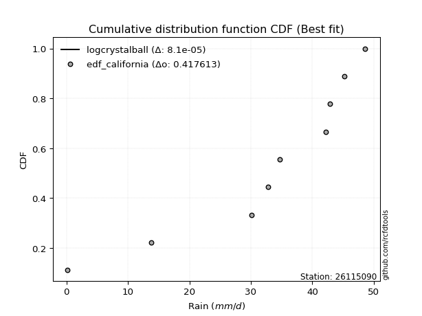</img></img>

</div>


### 2. Empirical - EDF Hazen (1930)

Hazen method for plotting positions is a formula used to estimate the empirical cumulative probability distribution of flood events or other hydrological data. This formula often results in biased estimations, particularly when extrapolating to extreme events (high return periods).

<div align="center">


$P=(m-0.5)/n$


</div>


**2.1. Empirical values**

<div align="center">

|                | 0                   | 1                   | 2                  | 3                  | 4         | 5                  | 6                  | 7                  | 8                  |
|:---------------|:--------------------|:--------------------|:-------------------|:-------------------|:----------|:-------------------|:-------------------|:-------------------|:-------------------|
| date           | 2020                | 2025                | 2022               | 2021               | 2023      | 2018               | 2019               | 2017               | 2024               |
| x              | 0.2                 | 9.8                 | 13.8               | 30.1               | 32.8      | 34.7               | 42.2               | 45.2               | 48.6               |
| m              | 1                   | 2                   | 3                  | 4                  | 5         | 6                  | 7                  | 8                  | 9                  |
| empirical_dist | edf_hazen           | edf_hazen           | edf_hazen          | edf_hazen          | edf_hazen | edf_hazen          | edf_hazen          | edf_hazen          | edf_hazen          |
| empirical      | 0.05555555555555555 | 0.16666666666666666 | 0.2777777777777778 | 0.3888888888888889 | 0.5       | 0.6111111111111112 | 0.7222222222222222 | 0.8333333333333334 | 0.9444444444444444 |
| empirical_tr   | 1.0588235294117647  | 1.2                 | 1.3846153846153846 | 1.6363636363636362 | 2.0       | 2.5714285714285716 | 3.5999999999999996 | 6.000000000000002  | 17.999999999999993 |

</div>


**2.2. Kolmogorov-Smirnov fit test (sorted by Δ)**


<div align="center">

|                | 0                   | 1                   | 2                   | 3                   | 4                   | 5                   | 6                   | 7                   | 8                   | 9                   | 10                  | 11                  | 12                  | 13                  | 14                  | 15                  | 16                  | 17                  | 18                  | 19                  | 20                  | 21                  | 22                  | 23                  | 24                  | 25                  | 26                  | 27                  | 28                  | 29                  | 30                  | 31                  | 32                  | 33                  | 34                  | 35                  | 36                  | 37                  | 38                  | 39                    | 40                  | 41                  | 42                  | 43                  | 44                  | 45                  | 46                  | 47                  | 48                  | 49                  | 50                  | 51                  | 52                  | 53                  | 54                  | 55                  | 56                  | 57                  | 58                  | 59                  | 60                  | 61                  | 62                  | 63                  | 64                  | 65                  | 66                  | 67                  | 68                  | 69                  | 70                  | 71                  | 72                  | 73                  | 74                  | 75                  | 76                  | 77                  | 78                  | 79                  | 80                  | 81                  | 82                  | 83                  | 84                  | 85                  | 86                  | 87                  | 88                  | 89                  |
|:---------------|:--------------------|:--------------------|:--------------------|:--------------------|:--------------------|:--------------------|:--------------------|:--------------------|:--------------------|:--------------------|:--------------------|:--------------------|:--------------------|:--------------------|:--------------------|:--------------------|:--------------------|:--------------------|:--------------------|:--------------------|:--------------------|:--------------------|:--------------------|:--------------------|:--------------------|:--------------------|:--------------------|:--------------------|:--------------------|:--------------------|:--------------------|:--------------------|:--------------------|:--------------------|:--------------------|:--------------------|:--------------------|:--------------------|:--------------------|:----------------------|:--------------------|:--------------------|:--------------------|:--------------------|:--------------------|:--------------------|:--------------------|:--------------------|:--------------------|:--------------------|:--------------------|:--------------------|:--------------------|:--------------------|:--------------------|:--------------------|:--------------------|:--------------------|:--------------------|:--------------------|:--------------------|:--------------------|:--------------------|:--------------------|:--------------------|:--------------------|:--------------------|:--------------------|:--------------------|:--------------------|:--------------------|:--------------------|:--------------------|:--------------------|:--------------------|:--------------------|:--------------------|:--------------------|:--------------------|:--------------------|:--------------------|:--------------------|:--------------------|:--------------------|:--------------------|:--------------------|:--------------------|:--------------------|:--------------------|:--------------------|
| station        | 26115090            | 26115090            | 26115090            | 26115090            | 26115090            | 26115090            | 26115090            | 26115090            | 26115090            | 26115090            | 26115090            | 26115090            | 26115090            | 26115090            | 26115090            | 26115090            | 26115090            | 26115090            | 26115090            | 26115090            | 26115090            | 26115090            | 26115090            | 26115090            | 26115090            | 26115090            | 26115090            | 26115090            | 26115090            | 26115090            | 26115090            | 26115090            | 26115090            | 26115090            | 26115090            | 26115090            | 26115090            | 26115090            | 26115090            | 26115090              | 26115090            | 26115090            | 26115090            | 26115090            | 26115090            | 26115090            | 26115090            | 26115090            | 26115090            | 26115090            | 26115090            | 26115090            | 26115090            | 26115090            | 26115090            | 26115090            | 26115090            | 26115090            | 26115090            | 26115090            | 26115090            | 26115090            | 26115090            | 26115090            | 26115090            | 26115090            | 26115090            | 26115090            | 26115090            | 26115090            | 26115090            | 26115090            | 26115090            | 26115090            | 26115090            | 26115090            | 26115090            | 26115090            | 26115090            | 26115090            | 26115090            | 26115090            | 26115090            | 26115090            | 26115090            | 26115090            | 26115090            | 26115090            | 26115090            | 26115090            |
| empirical_dist | edf_hazen           | edf_hazen           | edf_hazen           | edf_hazen           | edf_hazen           | edf_hazen           | edf_hazen           | edf_hazen           | edf_hazen           | edf_hazen           | edf_hazen           | edf_hazen           | edf_hazen           | edf_hazen           | edf_hazen           | edf_hazen           | edf_hazen           | edf_hazen           | edf_hazen           | edf_hazen           | edf_hazen           | edf_hazen           | edf_hazen           | edf_hazen           | edf_hazen           | edf_hazen           | edf_hazen           | edf_hazen           | edf_hazen           | edf_hazen           | edf_hazen           | edf_hazen           | edf_hazen           | edf_hazen           | edf_hazen           | edf_hazen           | edf_hazen           | edf_hazen           | edf_hazen           | edf_hazen             | edf_hazen           | edf_hazen           | edf_hazen           | edf_hazen           | edf_hazen           | edf_hazen           | edf_hazen           | edf_hazen           | edf_hazen           | edf_hazen           | edf_hazen           | edf_hazen           | edf_hazen           | edf_hazen           | edf_hazen           | edf_hazen           | edf_hazen           | edf_hazen           | edf_hazen           | edf_hazen           | edf_hazen           | edf_hazen           | edf_hazen           | edf_hazen           | edf_hazen           | edf_hazen           | edf_hazen           | edf_hazen           | edf_hazen           | edf_hazen           | edf_hazen           | edf_hazen           | edf_hazen           | edf_hazen           | edf_hazen           | edf_hazen           | edf_hazen           | edf_hazen           | edf_hazen           | edf_hazen           | edf_hazen           | edf_hazen           | edf_hazen           | edf_hazen           | edf_hazen           | edf_hazen           | edf_hazen           | edf_hazen           | edf_hazen           | edf_hazen           |
| p_dist         | johnsonsu           | logjohnsonsu        | laplace_asymmetric  | pearson3            | fisk                | gumbel_l            | weibull_min         | fatiguelife         | nct                 | norm                | crystalball         | exponnorm           | t                   | f                   | logistic            | betaprime           | hypsecant           | gamma               | erlang              | rice                | chi2                | laplace             | invgamma            | alpha               | maxwell             | logt                | invgauss            | rayleigh            | truncnorm           | invweibull          | loggumbel_l         | kstwobign           | halfnorm            | gumbel_r            | logpearson3         | mielke              | ncf                 | moyal               | halflogistic        | loglaplace_asymmetric | logloggamma         | loggamma            | loggamma            | loglognorm          | logfatiguelife      | lognorm             | lognorm             | logcrystalball      | logexponnorm        | lognct              | logrice             | lognakagami         | genexpon            | expon               | logalpha            | loginvgamma         | loginvgauss         | loglogistic         | logmaxwell          | lograyleigh         | loghypsecant        | loginvweibull       | loghalfnorm         | wald                | loglaplace          | loggumbel_r         | logkstwobign        | gompertz            | loghalflogistic     | logmoyal            | gibrat              | nakagami            | logwald             | loggenexpon         | logexpon            | logfisk             | loggibrat           | logncf              | pareto              | logmielke           | logpareto           | logf                | logtruncnorm        | logweibull_min      | logbetaprime        | logchi2             | loggompertz         | genlogistic         | loggenlogistic      | logerlang           |
| delta          | 0.10969027814336774 | 0.11023973484724969 | 0.11623846767255377 | 0.11721891840787996 | 0.12025297944823282 | 0.12050950971280577 | 0.12183361546203436 | 0.14751140394950918 | 0.14851151992513584 | 0.14851669123685346 | 0.1485166984381841  | 0.14851686901705313 | 0.1485207687299525  | 0.14928309488233488 | 0.15358728394629123 | 0.15568260339867662 | 0.15789164057059962 | 0.15902393447574886 | 0.15934802247241903 | 0.1619634722730589  | 0.16606284337906302 | 0.17328847730979974 | 0.17625878742404116 | 0.17863882260432068 | 0.1796981512662988  | 0.18187887864514152 | 0.185089969460774   | 0.18980288949572083 | 0.19010383982952056 | 0.19614311888783714 | 0.21359458023341493 | 0.21510898794729888 | 0.21827676880841068 | 0.219004782041682   | 0.23002104967395642 | 0.2310270972168797  | 0.23411378704424096 | 0.24421466054517166 | 0.24510219066932476 | 0.2531350572433902    | 0.2545079795836032  | 0.2546012233030099  | 0.2546012233030099  | 0.25472996292374867 | 0.2547430921735368  | 0.2554411419680242  | 0.2554411419680242  | 0.2554411493559762  | 0.25544143472711006 | 0.2554598318086522  | 0.2556125274870629  | 0.25588528769919056 | 0.2580431923131498  | 0.2621577150746179  | 0.2660257090802202  | 0.2661168054044167  | 0.2675609037207241  | 0.2728850113392676  | 0.27767565361946706 | 0.28438609305523727 | 0.2865218277497587  | 0.2958746491435418  | 0.30383681076095675 | 0.3141796901837191  | 0.3148419662306056  | 0.3162946802887177  | 0.3238751327074334  | 0.3278779174292927  | 0.3320329661160049  | 0.33649991622768577 | 0.34219032047773873 | 0.36832942940197005 | 0.3936041169260967  | 0.3936258655003966  | 0.4198489630160146  | 0.42019953880992944 | 0.42584567171330917 | 0.43090444928264815 | 0.461788679669068   | 0.47051427086208686 | 0.49897315276064147 | 0.5268176437484932  | 0.5351979118662226  | 0.6188896148167741  | 0.7022521863331515  | 0.7497493397207435  | 0.8114891057596151  | 0.8333333333333334  | 0.8333333333333334  | 0.9069810688152141  |
| deltao         | 0.41761268023100007 | 0.41761268023100007 | 0.41761268023100007 | 0.41761268023100007 | 0.41761268023100007 | 0.41761268023100007 | 0.41761268023100007 | 0.41761268023100007 | 0.41761268023100007 | 0.41761268023100007 | 0.41761268023100007 | 0.41761268023100007 | 0.41761268023100007 | 0.41761268023100007 | 0.41761268023100007 | 0.41761268023100007 | 0.41761268023100007 | 0.41761268023100007 | 0.41761268023100007 | 0.41761268023100007 | 0.41761268023100007 | 0.41761268023100007 | 0.41761268023100007 | 0.41761268023100007 | 0.41761268023100007 | 0.41761268023100007 | 0.41761268023100007 | 0.41761268023100007 | 0.41761268023100007 | 0.41761268023100007 | 0.41761268023100007 | 0.41761268023100007 | 0.41761268023100007 | 0.41761268023100007 | 0.41761268023100007 | 0.41761268023100007 | 0.41761268023100007 | 0.41761268023100007 | 0.41761268023100007 | 0.41761268023100007   | 0.41761268023100007 | 0.41761268023100007 | 0.41761268023100007 | 0.41761268023100007 | 0.41761268023100007 | 0.41761268023100007 | 0.41761268023100007 | 0.41761268023100007 | 0.41761268023100007 | 0.41761268023100007 | 0.41761268023100007 | 0.41761268023100007 | 0.41761268023100007 | 0.41761268023100007 | 0.41761268023100007 | 0.41761268023100007 | 0.41761268023100007 | 0.41761268023100007 | 0.41761268023100007 | 0.41761268023100007 | 0.41761268023100007 | 0.41761268023100007 | 0.41761268023100007 | 0.41761268023100007 | 0.41761268023100007 | 0.41761268023100007 | 0.41761268023100007 | 0.41761268023100007 | 0.41761268023100007 | 0.41761268023100007 | 0.41761268023100007 | 0.41761268023100007 | 0.41761268023100007 | 0.41761268023100007 | 0.41761268023100007 | 0.41761268023100007 | 0.41761268023100007 | 0.41761268023100007 | 0.41761268023100007 | 0.41761268023100007 | 0.41761268023100007 | 0.41761268023100007 | 0.41761268023100007 | 0.41761268023100007 | 0.41761268023100007 | 0.41761268023100007 | 0.41761268023100007 | 0.41761268023100007 | 0.41761268023100007 | 0.41761268023100007 |
| eval           | Δo > Δ              | Δo > Δ              | Δo > Δ              | Δo > Δ              | Δo > Δ              | Δo > Δ              | Δo > Δ              | Δo > Δ              | Δo > Δ              | Δo > Δ              | Δo > Δ              | Δo > Δ              | Δo > Δ              | Δo > Δ              | Δo > Δ              | Δo > Δ              | Δo > Δ              | Δo > Δ              | Δo > Δ              | Δo > Δ              | Δo > Δ              | Δo > Δ              | Δo > Δ              | Δo > Δ              | Δo > Δ              | Δo > Δ              | Δo > Δ              | Δo > Δ              | Δo > Δ              | Δo > Δ              | Δo > Δ              | Δo > Δ              | Δo > Δ              | Δo > Δ              | Δo > Δ              | Δo > Δ              | Δo > Δ              | Δo > Δ              | Δo > Δ              | Δo > Δ                | Δo > Δ              | Δo > Δ              | Δo > Δ              | Δo > Δ              | Δo > Δ              | Δo > Δ              | Δo > Δ              | Δo > Δ              | Δo > Δ              | Δo > Δ              | Δo > Δ              | Δo > Δ              | Δo > Δ              | Δo > Δ              | Δo > Δ              | Δo > Δ              | Δo > Δ              | Δo > Δ              | Δo > Δ              | Δo > Δ              | Δo > Δ              | Δo > Δ              | Δo > Δ              | Δo > Δ              | Δo > Δ              | Δo > Δ              | Δo > Δ              | Δo > Δ              | Δo > Δ              | Δo > Δ              | Δo > Δ              | Δo > Δ              | Δo > Δ              | Δo > Δ              | Δo <= Δ             | Δo <= Δ             | Δo <= Δ             | Δo <= Δ             | Δo <= Δ             | Δo <= Δ             | Δo <= Δ             | Δo <= Δ             | Δo <= Δ             | Δo <= Δ             | Δo <= Δ             | Δo <= Δ             | Δo <= Δ             | Δo <= Δ             | Δo <= Δ             | Δo <= Δ             |
| fit            | 1                   | 1                   | 1                   | 1                   | 1                   | 1                   | 1                   | 1                   | 1                   | 1                   | 1                   | 1                   | 1                   | 1                   | 1                   | 1                   | 1                   | 1                   | 1                   | 1                   | 1                   | 1                   | 1                   | 1                   | 1                   | 1                   | 1                   | 1                   | 1                   | 1                   | 1                   | 1                   | 1                   | 1                   | 1                   | 1                   | 1                   | 1                   | 1                   | 1                     | 1                   | 1                   | 1                   | 1                   | 1                   | 1                   | 1                   | 1                   | 1                   | 1                   | 1                   | 1                   | 1                   | 1                   | 1                   | 1                   | 1                   | 1                   | 1                   | 1                   | 1                   | 1                   | 1                   | 1                   | 1                   | 1                   | 1                   | 1                   | 1                   | 1                   | 1                   | 1                   | 1                   | 1                   | 0                   | 0                   | 0                   | 0                   | 0                   | 0                   | 0                   | 0                   | 0                   | 0                   | 0                   | 0                   | 0                   | 0                   | 0                   | 0                   |
| n              | 9                   | 9                   | 9                   | 9                   | 9                   | 9                   | 9                   | 9                   | 9                   | 9                   | 9                   | 9                   | 9                   | 9                   | 9                   | 9                   | 9                   | 9                   | 9                   | 9                   | 9                   | 9                   | 9                   | 9                   | 9                   | 9                   | 9                   | 9                   | 9                   | 9                   | 9                   | 9                   | 9                   | 9                   | 9                   | 9                   | 9                   | 9                   | 9                   | 9                     | 9                   | 9                   | 9                   | 9                   | 9                   | 9                   | 9                   | 9                   | 9                   | 9                   | 9                   | 9                   | 9                   | 9                   | 9                   | 9                   | 9                   | 9                   | 9                   | 9                   | 9                   | 9                   | 9                   | 9                   | 9                   | 9                   | 9                   | 9                   | 9                   | 9                   | 9                   | 9                   | 9                   | 9                   | 9                   | 9                   | 9                   | 9                   | 9                   | 9                   | 9                   | 9                   | 9                   | 9                   | 9                   | 9                   | 9                   | 9                   | 9                   | 9                   |
| best_fit       | 1                   | 0                   | 0                   | 0                   | 0                   | 0                   | 0                   | 0                   | 0                   | 0                   | 0                   | 0                   | 0                   | 0                   | 0                   | 0                   | 0                   | 0                   | 0                   | 0                   | 0                   | 0                   | 0                   | 0                   | 0                   | 0                   | 0                   | 0                   | 0                   | 0                   | 0                   | 0                   | 0                   | 0                   | 0                   | 0                   | 0                   | 0                   | 0                   | 0                     | 0                   | 0                   | 0                   | 0                   | 0                   | 0                   | 0                   | 0                   | 0                   | 0                   | 0                   | 0                   | 0                   | 0                   | 0                   | 0                   | 0                   | 0                   | 0                   | 0                   | 0                   | 0                   | 0                   | 0                   | 0                   | 0                   | 0                   | 0                   | 0                   | 0                   | 0                   | 0                   | 0                   | 0                   | 0                   | 0                   | 0                   | 0                   | 0                   | 0                   | 0                   | 0                   | 0                   | 0                   | 0                   | 0                   | 0                   | 0                   | 0                   | 0                   |
| best_fit_sort  | 1                   | 2                   | 3                   | 4                   | 5                   | 6                   | 7                   | 8                   | 9                   | 10                  | 11                  | 12                  | 13                  | 14                  | 15                  | 16                  | 17                  | 18                  | 19                  | 20                  | 21                  | 22                  | 23                  | 24                  | 25                  | 26                  | 27                  | 28                  | 29                  | 30                  | 31                  | 32                  | 33                  | 34                  | 35                  | 36                  | 37                  | 38                  | 39                  | 40                    | 41                  | 42                  | 43                  | 44                  | 45                  | 46                  | 47                  | 48                  | 49                  | 50                  | 51                  | 52                  | 53                  | 54                  | 55                  | 56                  | 57                  | 58                  | 59                  | 60                  | 61                  | 62                  | 63                  | 64                  | 65                  | 66                  | 67                  | 68                  | 69                  | 70                  | 71                  | 72                  | 73                  | 74                  | 75                  | 76                  | 77                  | 78                  | 79                  | 80                  | 81                  | 82                  | 83                  | 84                  | 85                  | 86                  | 87                  | 88                  | 89                  | 90                  |

</div>


<div align="center">

</img>

</div>


**2.3. Best fit**

<div align="center">

|   id |   station | empirical_dist   | p_dist    |   delta |   deltao | eval   |   fit |   n |   best_fit |   best_fit_sort |
|-----:|----------:|:-----------------|:----------|--------:|---------:|:-------|------:|----:|-----------:|----------------:|
|    0 |  26115090 | edf_hazen        | johnsonsu | 0.10969 | 0.417613 | Δo > Δ |     1 |   9 |          1 |               1 |

</div>


<div align="center">

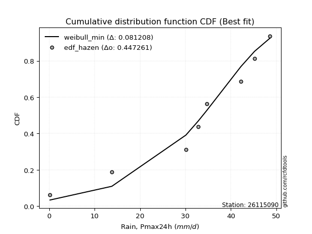</img>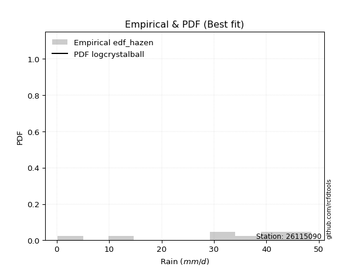</img>

</div>


### 3. Empirical - EDF Weibull (1939)

Weibull plotting position formula is an empirical method used to estimate the non-exceedance probability or plotting position for a set of observed data, is often recommended or widely used in practice, particularly in flood frequency analysis.

<div align="center">


$P=m/(n+1)$


</div>


**3.1. Empirical values**

<div align="center">

|                | 0                  | 1           | 2                  | 3                  | 4           | 5           | 6                 | 7                 | 8                  |
|:---------------|:-------------------|:------------|:-------------------|:-------------------|:------------|:------------|:------------------|:------------------|:-------------------|
| date           | 2020               | 2025        | 2022               | 2021               | 2023        | 2018        | 2019              | 2017              | 2024               |
| x              | 0.2                | 9.8         | 13.8               | 30.1               | 32.8        | 34.7        | 42.2              | 45.2              | 48.6               |
| m              | 1                  | 2           | 3                  | 4                  | 5           | 6           | 7                 | 8                 | 9                  |
| empirical_dist | edf_weibull        | edf_weibull | edf_weibull        | edf_weibull        | edf_weibull | edf_weibull | edf_weibull       | edf_weibull       | edf_weibull        |
| empirical      | 0.1                | 0.2         | 0.3                | 0.4                | 0.5         | 0.6         | 0.7               | 0.8               | 0.9                |
| empirical_tr   | 1.1111111111111112 | 1.25        | 1.4285714285714286 | 1.6666666666666667 | 2.0         | 2.5         | 3.333333333333333 | 5.000000000000001 | 10.000000000000002 |

</div>


**3.2. Kolmogorov-Smirnov fit test (sorted by Δ)**


<div align="center">

|                | 0                   | 1                   | 2                   | 3                   | 4                   | 5                   | 6                   | 7                   | 8                   | 9                   | 10                  | 11                  | 12                  | 13                  | 14                  | 15                  | 16                  | 17                  | 18                  | 19                  | 20                  | 21                  | 22                  | 23                  | 24                  | 25                  | 26                  | 27                  | 28                  | 29                  | 30                  | 31                  | 32                  | 33                  | 34                  | 35                  | 36                  | 37                  | 38                  | 39                    | 40                  | 41                  | 42                  | 43                  | 44                  | 45                  | 46                  | 47                  | 48                  | 49                  | 50                  | 51                  | 52                  | 53                  | 54                  | 55                  | 56                  | 57                  | 58                  | 59                  | 60                  | 61                  | 62                  | 63                  | 64                  | 65                  | 66                  | 67                  | 68                  | 69                  | 70                  | 71                  | 72                  | 73                  | 74                  | 75                  | 76                  | 77                  | 78                  | 79                  | 80                  | 81                  | 82                  | 83                  | 84                  | 85                  | 86                  | 87                  | 88                  | 89                  |
|:---------------|:--------------------|:--------------------|:--------------------|:--------------------|:--------------------|:--------------------|:--------------------|:--------------------|:--------------------|:--------------------|:--------------------|:--------------------|:--------------------|:--------------------|:--------------------|:--------------------|:--------------------|:--------------------|:--------------------|:--------------------|:--------------------|:--------------------|:--------------------|:--------------------|:--------------------|:--------------------|:--------------------|:--------------------|:--------------------|:--------------------|:--------------------|:--------------------|:--------------------|:--------------------|:--------------------|:--------------------|:--------------------|:--------------------|:--------------------|:----------------------|:--------------------|:--------------------|:--------------------|:--------------------|:--------------------|:--------------------|:--------------------|:--------------------|:--------------------|:--------------------|:--------------------|:--------------------|:--------------------|:--------------------|:--------------------|:--------------------|:--------------------|:--------------------|:--------------------|:--------------------|:--------------------|:--------------------|:--------------------|:--------------------|:--------------------|:--------------------|:--------------------|:--------------------|:--------------------|:--------------------|:--------------------|:--------------------|:--------------------|:--------------------|:--------------------|:--------------------|:--------------------|:--------------------|:--------------------|:--------------------|:--------------------|:--------------------|:--------------------|:--------------------|:--------------------|:--------------------|:--------------------|:--------------------|:--------------------|:--------------------|
| station        | 26115090            | 26115090            | 26115090            | 26115090            | 26115090            | 26115090            | 26115090            | 26115090            | 26115090            | 26115090            | 26115090            | 26115090            | 26115090            | 26115090            | 26115090            | 26115090            | 26115090            | 26115090            | 26115090            | 26115090            | 26115090            | 26115090            | 26115090            | 26115090            | 26115090            | 26115090            | 26115090            | 26115090            | 26115090            | 26115090            | 26115090            | 26115090            | 26115090            | 26115090            | 26115090            | 26115090            | 26115090            | 26115090            | 26115090            | 26115090              | 26115090            | 26115090            | 26115090            | 26115090            | 26115090            | 26115090            | 26115090            | 26115090            | 26115090            | 26115090            | 26115090            | 26115090            | 26115090            | 26115090            | 26115090            | 26115090            | 26115090            | 26115090            | 26115090            | 26115090            | 26115090            | 26115090            | 26115090            | 26115090            | 26115090            | 26115090            | 26115090            | 26115090            | 26115090            | 26115090            | 26115090            | 26115090            | 26115090            | 26115090            | 26115090            | 26115090            | 26115090            | 26115090            | 26115090            | 26115090            | 26115090            | 26115090            | 26115090            | 26115090            | 26115090            | 26115090            | 26115090            | 26115090            | 26115090            | 26115090            |
| empirical_dist | edf_weibull         | edf_weibull         | edf_weibull         | edf_weibull         | edf_weibull         | edf_weibull         | edf_weibull         | edf_weibull         | edf_weibull         | edf_weibull         | edf_weibull         | edf_weibull         | edf_weibull         | edf_weibull         | edf_weibull         | edf_weibull         | edf_weibull         | edf_weibull         | edf_weibull         | edf_weibull         | edf_weibull         | edf_weibull         | edf_weibull         | edf_weibull         | edf_weibull         | edf_weibull         | edf_weibull         | edf_weibull         | edf_weibull         | edf_weibull         | edf_weibull         | edf_weibull         | edf_weibull         | edf_weibull         | edf_weibull         | edf_weibull         | edf_weibull         | edf_weibull         | edf_weibull         | edf_weibull           | edf_weibull         | edf_weibull         | edf_weibull         | edf_weibull         | edf_weibull         | edf_weibull         | edf_weibull         | edf_weibull         | edf_weibull         | edf_weibull         | edf_weibull         | edf_weibull         | edf_weibull         | edf_weibull         | edf_weibull         | edf_weibull         | edf_weibull         | edf_weibull         | edf_weibull         | edf_weibull         | edf_weibull         | edf_weibull         | edf_weibull         | edf_weibull         | edf_weibull         | edf_weibull         | edf_weibull         | edf_weibull         | edf_weibull         | edf_weibull         | edf_weibull         | edf_weibull         | edf_weibull         | edf_weibull         | edf_weibull         | edf_weibull         | edf_weibull         | edf_weibull         | edf_weibull         | edf_weibull         | edf_weibull         | edf_weibull         | edf_weibull         | edf_weibull         | edf_weibull         | edf_weibull         | edf_weibull         | edf_weibull         | edf_weibull         | edf_weibull         |
| p_dist         | logjohnsonsu        | pearson3            | johnsonsu           | fatiguelife         | nct                 | norm                | crystalball         | exponnorm           | t                   | f                   | laplace_asymmetric  | fisk                | gumbel_l            | logistic            | weibull_min         | betaprime           | gamma               | erlang              | rice                | hypsecant           | chi2                | laplace             | invgamma            | alpha               | maxwell             | invgauss            | rayleigh            | truncnorm           | invweibull          | logpearson3         | loggumbel_l         | logt                | kstwobign           | halfnorm            | gumbel_r            | mielke              | ncf                 | moyal               | halflogistic        | loglaplace_asymmetric | logloggamma         | loggamma            | loggamma            | loglognorm          | logfatiguelife      | lognorm             | lognorm             | logcrystalball      | logexponnorm        | lognct              | logrice             | lognakagami         | genexpon            | expon               | logalpha            | loginvgamma         | loginvgauss         | loglogistic         | loginvweibull       | logmaxwell          | lograyleigh         | loghypsecant        | logkstwobign        | loghalfnorm         | wald                | loglaplace          | loggumbel_r         | gompertz            | loghalflogistic     | logmoyal            | gibrat              | nakagami            | loggenexpon         | logwald             | logexpon            | logfisk             | logncf              | loggibrat           | pareto              | logmielke           | logpareto           | logf                | logtruncnorm        | logweibull_min      | logbetaprime        | logchi2             | loggompertz         | genlogistic         | loggenlogistic      | logerlang           |
| delta          | 0.09912862373613851 | 0.12741136127365052 | 0.13191250036558994 | 0.13640029283839805 | 0.1374004088140247  | 0.13740558012574233 | 0.13740558732707298 | 0.137405757905942   | 0.13740965761884139 | 0.13817198377122375 | 0.13846068989477597 | 0.14247520167045502 | 0.14273173193502797 | 0.14296322175334414 | 0.14405583768425656 | 0.1445714922875655  | 0.14791282336463774 | 0.1482369113613079  | 0.15085236116194778 | 0.15406914478566872 | 0.1549517322679519  | 0.1651218421214365  | 0.16514767631293004 | 0.16752771149320955 | 0.16858704015518766 | 0.17397885834966287 | 0.1786917783846097  | 0.17899272871840943 | 0.18503200777672602 | 0.18557660522951203 | 0.19444095916609017 | 0.200588585056927   | 0.20399787683618775 | 0.20716565769729955 | 0.20789367093057087 | 0.21991598610576857 | 0.22300267593312983 | 0.23310354943406053 | 0.23399107955821363 | 0.24202394613227907   | 0.2433968684724921  | 0.24349011219189876 | 0.24349011219189876 | 0.24361885181263754 | 0.24363198106242567 | 0.24433003085691307 | 0.24433003085691307 | 0.2443300382448651  | 0.24433032361599893 | 0.2443487206975411  | 0.2445014163759518  | 0.24477417658807943 | 0.2469320812020387  | 0.25104660396350675 | 0.2549145979691091  | 0.25500569429330555 | 0.256449792609613   | 0.2617739002281565  | 0.2625413158102084  | 0.26656454250835593 | 0.27327498194412614 | 0.2754107166386476  | 0.2905417993741     | 0.2927256996498456  | 0.303068579072608   | 0.3037308551194945  | 0.3051835691776066  | 0.3167668063181815  | 0.3209218550048938  | 0.32538880511657464 | 0.3310792093666276  | 0.3572183182908589  | 0.3602925321670632  | 0.3824930058149856  | 0.3865156296826812  | 0.38686620547659606 | 0.39757111594931477 | 0.41473456060219804 | 0.4284553463357346  | 0.4371809375287535  | 0.4656398194273081  | 0.4934843104151598  | 0.5118638280883531  | 0.5855562814834407  | 0.668918852999818   | 0.7164160063874101  | 0.7781557724262818  | 0.8                 | 0.8                 | 0.8625366243707697  |
| deltao         | 0.41761268023100007 | 0.41761268023100007 | 0.41761268023100007 | 0.41761268023100007 | 0.41761268023100007 | 0.41761268023100007 | 0.41761268023100007 | 0.41761268023100007 | 0.41761268023100007 | 0.41761268023100007 | 0.41761268023100007 | 0.41761268023100007 | 0.41761268023100007 | 0.41761268023100007 | 0.41761268023100007 | 0.41761268023100007 | 0.41761268023100007 | 0.41761268023100007 | 0.41761268023100007 | 0.41761268023100007 | 0.41761268023100007 | 0.41761268023100007 | 0.41761268023100007 | 0.41761268023100007 | 0.41761268023100007 | 0.41761268023100007 | 0.41761268023100007 | 0.41761268023100007 | 0.41761268023100007 | 0.41761268023100007 | 0.41761268023100007 | 0.41761268023100007 | 0.41761268023100007 | 0.41761268023100007 | 0.41761268023100007 | 0.41761268023100007 | 0.41761268023100007 | 0.41761268023100007 | 0.41761268023100007 | 0.41761268023100007   | 0.41761268023100007 | 0.41761268023100007 | 0.41761268023100007 | 0.41761268023100007 | 0.41761268023100007 | 0.41761268023100007 | 0.41761268023100007 | 0.41761268023100007 | 0.41761268023100007 | 0.41761268023100007 | 0.41761268023100007 | 0.41761268023100007 | 0.41761268023100007 | 0.41761268023100007 | 0.41761268023100007 | 0.41761268023100007 | 0.41761268023100007 | 0.41761268023100007 | 0.41761268023100007 | 0.41761268023100007 | 0.41761268023100007 | 0.41761268023100007 | 0.41761268023100007 | 0.41761268023100007 | 0.41761268023100007 | 0.41761268023100007 | 0.41761268023100007 | 0.41761268023100007 | 0.41761268023100007 | 0.41761268023100007 | 0.41761268023100007 | 0.41761268023100007 | 0.41761268023100007 | 0.41761268023100007 | 0.41761268023100007 | 0.41761268023100007 | 0.41761268023100007 | 0.41761268023100007 | 0.41761268023100007 | 0.41761268023100007 | 0.41761268023100007 | 0.41761268023100007 | 0.41761268023100007 | 0.41761268023100007 | 0.41761268023100007 | 0.41761268023100007 | 0.41761268023100007 | 0.41761268023100007 | 0.41761268023100007 | 0.41761268023100007 |
| eval           | Δo > Δ              | Δo > Δ              | Δo > Δ              | Δo > Δ              | Δo > Δ              | Δo > Δ              | Δo > Δ              | Δo > Δ              | Δo > Δ              | Δo > Δ              | Δo > Δ              | Δo > Δ              | Δo > Δ              | Δo > Δ              | Δo > Δ              | Δo > Δ              | Δo > Δ              | Δo > Δ              | Δo > Δ              | Δo > Δ              | Δo > Δ              | Δo > Δ              | Δo > Δ              | Δo > Δ              | Δo > Δ              | Δo > Δ              | Δo > Δ              | Δo > Δ              | Δo > Δ              | Δo > Δ              | Δo > Δ              | Δo > Δ              | Δo > Δ              | Δo > Δ              | Δo > Δ              | Δo > Δ              | Δo > Δ              | Δo > Δ              | Δo > Δ              | Δo > Δ                | Δo > Δ              | Δo > Δ              | Δo > Δ              | Δo > Δ              | Δo > Δ              | Δo > Δ              | Δo > Δ              | Δo > Δ              | Δo > Δ              | Δo > Δ              | Δo > Δ              | Δo > Δ              | Δo > Δ              | Δo > Δ              | Δo > Δ              | Δo > Δ              | Δo > Δ              | Δo > Δ              | Δo > Δ              | Δo > Δ              | Δo > Δ              | Δo > Δ              | Δo > Δ              | Δo > Δ              | Δo > Δ              | Δo > Δ              | Δo > Δ              | Δo > Δ              | Δo > Δ              | Δo > Δ              | Δo > Δ              | Δo > Δ              | Δo > Δ              | Δo > Δ              | Δo > Δ              | Δo > Δ              | Δo > Δ              | Δo > Δ              | Δo <= Δ             | Δo <= Δ             | Δo <= Δ             | Δo <= Δ             | Δo <= Δ             | Δo <= Δ             | Δo <= Δ             | Δo <= Δ             | Δo <= Δ             | Δo <= Δ             | Δo <= Δ             | Δo <= Δ             |
| fit            | 1                   | 1                   | 1                   | 1                   | 1                   | 1                   | 1                   | 1                   | 1                   | 1                   | 1                   | 1                   | 1                   | 1                   | 1                   | 1                   | 1                   | 1                   | 1                   | 1                   | 1                   | 1                   | 1                   | 1                   | 1                   | 1                   | 1                   | 1                   | 1                   | 1                   | 1                   | 1                   | 1                   | 1                   | 1                   | 1                   | 1                   | 1                   | 1                   | 1                     | 1                   | 1                   | 1                   | 1                   | 1                   | 1                   | 1                   | 1                   | 1                   | 1                   | 1                   | 1                   | 1                   | 1                   | 1                   | 1                   | 1                   | 1                   | 1                   | 1                   | 1                   | 1                   | 1                   | 1                   | 1                   | 1                   | 1                   | 1                   | 1                   | 1                   | 1                   | 1                   | 1                   | 1                   | 1                   | 1                   | 1                   | 1                   | 0                   | 0                   | 0                   | 0                   | 0                   | 0                   | 0                   | 0                   | 0                   | 0                   | 0                   | 0                   |
| n              | 9                   | 9                   | 9                   | 9                   | 9                   | 9                   | 9                   | 9                   | 9                   | 9                   | 9                   | 9                   | 9                   | 9                   | 9                   | 9                   | 9                   | 9                   | 9                   | 9                   | 9                   | 9                   | 9                   | 9                   | 9                   | 9                   | 9                   | 9                   | 9                   | 9                   | 9                   | 9                   | 9                   | 9                   | 9                   | 9                   | 9                   | 9                   | 9                   | 9                     | 9                   | 9                   | 9                   | 9                   | 9                   | 9                   | 9                   | 9                   | 9                   | 9                   | 9                   | 9                   | 9                   | 9                   | 9                   | 9                   | 9                   | 9                   | 9                   | 9                   | 9                   | 9                   | 9                   | 9                   | 9                   | 9                   | 9                   | 9                   | 9                   | 9                   | 9                   | 9                   | 9                   | 9                   | 9                   | 9                   | 9                   | 9                   | 9                   | 9                   | 9                   | 9                   | 9                   | 9                   | 9                   | 9                   | 9                   | 9                   | 9                   | 9                   |
| best_fit       | 1                   | 0                   | 0                   | 0                   | 0                   | 0                   | 0                   | 0                   | 0                   | 0                   | 0                   | 0                   | 0                   | 0                   | 0                   | 0                   | 0                   | 0                   | 0                   | 0                   | 0                   | 0                   | 0                   | 0                   | 0                   | 0                   | 0                   | 0                   | 0                   | 0                   | 0                   | 0                   | 0                   | 0                   | 0                   | 0                   | 0                   | 0                   | 0                   | 0                     | 0                   | 0                   | 0                   | 0                   | 0                   | 0                   | 0                   | 0                   | 0                   | 0                   | 0                   | 0                   | 0                   | 0                   | 0                   | 0                   | 0                   | 0                   | 0                   | 0                   | 0                   | 0                   | 0                   | 0                   | 0                   | 0                   | 0                   | 0                   | 0                   | 0                   | 0                   | 0                   | 0                   | 0                   | 0                   | 0                   | 0                   | 0                   | 0                   | 0                   | 0                   | 0                   | 0                   | 0                   | 0                   | 0                   | 0                   | 0                   | 0                   | 0                   |
| best_fit_sort  | 1                   | 2                   | 3                   | 4                   | 5                   | 6                   | 7                   | 8                   | 9                   | 10                  | 11                  | 12                  | 13                  | 14                  | 15                  | 16                  | 17                  | 18                  | 19                  | 20                  | 21                  | 22                  | 23                  | 24                  | 25                  | 26                  | 27                  | 28                  | 29                  | 30                  | 31                  | 32                  | 33                  | 34                  | 35                  | 36                  | 37                  | 38                  | 39                  | 40                    | 41                  | 42                  | 43                  | 44                  | 45                  | 46                  | 47                  | 48                  | 49                  | 50                  | 51                  | 52                  | 53                  | 54                  | 55                  | 56                  | 57                  | 58                  | 59                  | 60                  | 61                  | 62                  | 63                  | 64                  | 65                  | 66                  | 67                  | 68                  | 69                  | 70                  | 71                  | 72                  | 73                  | 74                  | 75                  | 76                  | 77                  | 78                  | 79                  | 80                  | 81                  | 82                  | 83                  | 84                  | 85                  | 86                  | 87                  | 88                  | 89                  | 90                  |

</div>


<div align="center">

</img>

</div>


**3.3. Best fit**

<div align="center">

|   id |   station | empirical_dist   | p_dist       |     delta |   deltao | eval   |   fit |   n |   best_fit |   best_fit_sort |
|-----:|----------:|:-----------------|:-------------|----------:|---------:|:-------|------:|----:|-----------:|----------------:|
|    0 |  26115090 | edf_weibull      | logjohnsonsu | 0.0991286 | 0.417613 | Δo > Δ |     1 |   9 |          1 |               1 |

</div>


<div align="center">

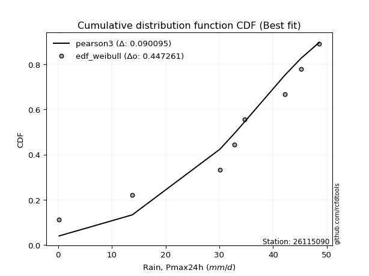</img>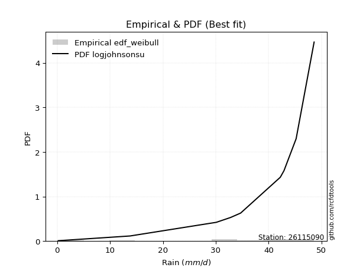</img>

</div>


### 4. Empirical - EDF Beard (1943)

The Beard formula (or Beard´s plotting position formula) in hydrology is used to estimate the empirical non-exceedance probability _(P)_ of a flood event (or other extreme hydrological data point) within a given dataset.

<div align="center">


$P=(m-0.31)/(n+0.38)$


</div>


**4.1. Empirical values**

<div align="center">

|                | 0                   | 1                   | 2                  | 3                   | 4         | 5                  | 6                  | 7                  | 8                  |
|:---------------|:--------------------|:--------------------|:-------------------|:--------------------|:----------|:-------------------|:-------------------|:-------------------|:-------------------|
| date           | 2020                | 2025                | 2022               | 2021                | 2023      | 2018               | 2019               | 2017               | 2024               |
| x              | 0.2                 | 9.8                 | 13.8               | 30.1                | 32.8      | 34.7               | 42.2               | 45.2               | 48.6               |
| m              | 1                   | 2                   | 3                  | 4                   | 5         | 6                  | 7                  | 8                  | 9                  |
| empirical_dist | edf_beard           | edf_beard           | edf_beard          | edf_beard           | edf_beard | edf_beard          | edf_beard          | edf_beard          | edf_beard          |
| empirical      | 0.07356076759061833 | 0.18017057569296374 | 0.2867803837953091 | 0.39339019189765456 | 0.5       | 0.6066098081023454 | 0.7132196162046908 | 0.8198294243070362 | 0.9264392324093815 |
| empirical_tr   | 1.0794016110471807  | 1.2197659297789336  | 1.4020926756352765 | 1.6485061511423549  | 2.0       | 2.542005420054201  | 3.486988847583642  | 5.550295857988164  | 13.5942028985507   |

</div>


**4.2. Kolmogorov-Smirnov fit test (sorted by Δ)**


<div align="center">

|                | 0                   | 1                   | 2                   | 3                   | 4                   | 5                   | 6                   | 7                   | 8                   | 9                   | 10                  | 11                  | 12                  | 13                  | 14                  | 15                  | 16                  | 17                  | 18                  | 19                  | 20                  | 21                  | 22                  | 23                  | 24                  | 25                  | 26                  | 27                  | 28                  | 29                  | 30                  | 31                  | 32                  | 33                  | 34                  | 35                  | 36                  | 37                  | 38                  | 39                    | 40                  | 41                  | 42                  | 43                  | 44                  | 45                  | 46                  | 47                  | 48                  | 49                  | 50                  | 51                  | 52                  | 53                  | 54                  | 55                  | 56                  | 57                  | 58                  | 59                  | 60                  | 61                  | 62                  | 63                  | 64                  | 65                  | 66                  | 67                  | 68                  | 69                  | 70                  | 71                  | 72                  | 73                  | 74                  | 75                  | 76                  | 77                  | 78                  | 79                  | 80                  | 81                  | 82                  | 83                  | 84                  | 85                  | 86                  | 87                  | 88                  | 89                  |
|:---------------|:--------------------|:--------------------|:--------------------|:--------------------|:--------------------|:--------------------|:--------------------|:--------------------|:--------------------|:--------------------|:--------------------|:--------------------|:--------------------|:--------------------|:--------------------|:--------------------|:--------------------|:--------------------|:--------------------|:--------------------|:--------------------|:--------------------|:--------------------|:--------------------|:--------------------|:--------------------|:--------------------|:--------------------|:--------------------|:--------------------|:--------------------|:--------------------|:--------------------|:--------------------|:--------------------|:--------------------|:--------------------|:--------------------|:--------------------|:----------------------|:--------------------|:--------------------|:--------------------|:--------------------|:--------------------|:--------------------|:--------------------|:--------------------|:--------------------|:--------------------|:--------------------|:--------------------|:--------------------|:--------------------|:--------------------|:--------------------|:--------------------|:--------------------|:--------------------|:--------------------|:--------------------|:--------------------|:--------------------|:--------------------|:--------------------|:--------------------|:--------------------|:--------------------|:--------------------|:--------------------|:--------------------|:--------------------|:--------------------|:--------------------|:--------------------|:--------------------|:--------------------|:--------------------|:--------------------|:--------------------|:--------------------|:--------------------|:--------------------|:--------------------|:--------------------|:--------------------|:--------------------|:--------------------|:--------------------|:--------------------|
| station        | 26115090            | 26115090            | 26115090            | 26115090            | 26115090            | 26115090            | 26115090            | 26115090            | 26115090            | 26115090            | 26115090            | 26115090            | 26115090            | 26115090            | 26115090            | 26115090            | 26115090            | 26115090            | 26115090            | 26115090            | 26115090            | 26115090            | 26115090            | 26115090            | 26115090            | 26115090            | 26115090            | 26115090            | 26115090            | 26115090            | 26115090            | 26115090            | 26115090            | 26115090            | 26115090            | 26115090            | 26115090            | 26115090            | 26115090            | 26115090              | 26115090            | 26115090            | 26115090            | 26115090            | 26115090            | 26115090            | 26115090            | 26115090            | 26115090            | 26115090            | 26115090            | 26115090            | 26115090            | 26115090            | 26115090            | 26115090            | 26115090            | 26115090            | 26115090            | 26115090            | 26115090            | 26115090            | 26115090            | 26115090            | 26115090            | 26115090            | 26115090            | 26115090            | 26115090            | 26115090            | 26115090            | 26115090            | 26115090            | 26115090            | 26115090            | 26115090            | 26115090            | 26115090            | 26115090            | 26115090            | 26115090            | 26115090            | 26115090            | 26115090            | 26115090            | 26115090            | 26115090            | 26115090            | 26115090            | 26115090            |
| empirical_dist | edf_beard           | edf_beard           | edf_beard           | edf_beard           | edf_beard           | edf_beard           | edf_beard           | edf_beard           | edf_beard           | edf_beard           | edf_beard           | edf_beard           | edf_beard           | edf_beard           | edf_beard           | edf_beard           | edf_beard           | edf_beard           | edf_beard           | edf_beard           | edf_beard           | edf_beard           | edf_beard           | edf_beard           | edf_beard           | edf_beard           | edf_beard           | edf_beard           | edf_beard           | edf_beard           | edf_beard           | edf_beard           | edf_beard           | edf_beard           | edf_beard           | edf_beard           | edf_beard           | edf_beard           | edf_beard           | edf_beard             | edf_beard           | edf_beard           | edf_beard           | edf_beard           | edf_beard           | edf_beard           | edf_beard           | edf_beard           | edf_beard           | edf_beard           | edf_beard           | edf_beard           | edf_beard           | edf_beard           | edf_beard           | edf_beard           | edf_beard           | edf_beard           | edf_beard           | edf_beard           | edf_beard           | edf_beard           | edf_beard           | edf_beard           | edf_beard           | edf_beard           | edf_beard           | edf_beard           | edf_beard           | edf_beard           | edf_beard           | edf_beard           | edf_beard           | edf_beard           | edf_beard           | edf_beard           | edf_beard           | edf_beard           | edf_beard           | edf_beard           | edf_beard           | edf_beard           | edf_beard           | edf_beard           | edf_beard           | edf_beard           | edf_beard           | edf_beard           | edf_beard           | edf_beard           |
| p_dist         | logjohnsonsu        | pearson3            | johnsonsu           | laplace_asymmetric  | fisk                | gumbel_l            | weibull_min         | fatiguelife         | nct                 | norm                | crystalball         | exponnorm           | t                   | f                   | logistic            | betaprime           | hypsecant           | gamma               | erlang              | rice                | chi2                | laplace             | invgamma            | alpha               | maxwell             | invgauss            | rayleigh            | truncnorm           | logt                | invweibull          | loggumbel_l         | kstwobign           | logpearson3         | halfnorm            | gumbel_r            | mielke              | ncf                 | moyal               | halflogistic        | loglaplace_asymmetric | logloggamma         | loggamma            | loggamma            | loglognorm          | logfatiguelife      | lognorm             | lognorm             | logcrystalball      | logexponnorm        | lognct              | logrice             | lognakagami         | genexpon            | expon               | logalpha            | loginvgamma         | loginvgauss         | loglogistic         | logmaxwell          | lograyleigh         | loghypsecant        | loginvweibull       | loghalfnorm         | wald                | loglaplace          | logkstwobign        | loggumbel_r         | gompertz            | loghalflogistic     | logmoyal            | gibrat              | nakagami            | loggenexpon         | logwald             | logexpon            | logfisk             | logncf              | loggibrat           | pareto              | logmielke           | logpareto           | logf                | logtruncnorm        | logweibull_min      | logbetaprime        | logchi2             | loggompertz         | genlogistic         | loggenlogistic      | logerlang           |
| delta          | 0.10573843183848397 | 0.11419174506895965 | 0.11869288416089907 | 0.1252410736900851  | 0.12925558546576416 | 0.1295121157303371  | 0.1308362214795657  | 0.1430101009407435  | 0.14401021691637017 | 0.1440153882280878  | 0.14401539542941844 | 0.14401556600828747 | 0.14401946572118685 | 0.1447817918735692  | 0.14908598093752556 | 0.15118130038991096 | 0.15339033756183396 | 0.1545226314669832  | 0.15484671946365336 | 0.15746216926429324 | 0.16156154037029735 | 0.16878717430103407 | 0.1717574844152755  | 0.174137519595555   | 0.17519684825753312 | 0.18058866645200833 | 0.18530158648695516 | 0.1856025368207549  | 0.18736896885223614 | 0.19164181587907148 | 0.20105076726843563 | 0.2106076849385332  | 0.21201583763889353 | 0.21377546579964501 | 0.21450347903291633 | 0.22652579420811403 | 0.2296124840354753  | 0.239713357536406   | 0.2406008876605591  | 0.24863375423462453   | 0.25000667657483755 | 0.2500999202942442  | 0.2500999202942442  | 0.250228659914983   | 0.25024178916477113 | 0.25093983895925853 | 0.25093983895925853 | 0.25093984634721056 | 0.2509401317183444  | 0.25095852879988656 | 0.25111122447829726 | 0.2513839846904249  | 0.25354188930438415 | 0.2576564120658522  | 0.26152440607145455 | 0.261615502395651   | 0.26305960071195844 | 0.26838370833050196 | 0.2731743506107014  | 0.2798847900464716  | 0.28202052474099304 | 0.28237074011724467 | 0.2993355077521911  | 0.30967838717495344 | 0.31034066322183995 | 0.3103712236811363  | 0.31179337727995204 | 0.32337661442052695 | 0.32753166310723925 | 0.3319986132189201  | 0.33768901746897306 | 0.3638281263932044  | 0.38012195647409946 | 0.38910281391733104 | 0.4063450539897175  | 0.40669562978363233 | 0.41740054025635104 | 0.4213443687045435  | 0.4482847706427709  | 0.45701036183578975 | 0.48546924373434436 | 0.5133137347221961  | 0.5216940028399255  | 0.605385705790477   | 0.6887482773068543  | 0.7362454306944464  | 0.797985196733318   | 0.8198294243070362  | 0.8198294243070362  | 0.8889758567801513  |
| deltao         | 0.41761268023100007 | 0.41761268023100007 | 0.41761268023100007 | 0.41761268023100007 | 0.41761268023100007 | 0.41761268023100007 | 0.41761268023100007 | 0.41761268023100007 | 0.41761268023100007 | 0.41761268023100007 | 0.41761268023100007 | 0.41761268023100007 | 0.41761268023100007 | 0.41761268023100007 | 0.41761268023100007 | 0.41761268023100007 | 0.41761268023100007 | 0.41761268023100007 | 0.41761268023100007 | 0.41761268023100007 | 0.41761268023100007 | 0.41761268023100007 | 0.41761268023100007 | 0.41761268023100007 | 0.41761268023100007 | 0.41761268023100007 | 0.41761268023100007 | 0.41761268023100007 | 0.41761268023100007 | 0.41761268023100007 | 0.41761268023100007 | 0.41761268023100007 | 0.41761268023100007 | 0.41761268023100007 | 0.41761268023100007 | 0.41761268023100007 | 0.41761268023100007 | 0.41761268023100007 | 0.41761268023100007 | 0.41761268023100007   | 0.41761268023100007 | 0.41761268023100007 | 0.41761268023100007 | 0.41761268023100007 | 0.41761268023100007 | 0.41761268023100007 | 0.41761268023100007 | 0.41761268023100007 | 0.41761268023100007 | 0.41761268023100007 | 0.41761268023100007 | 0.41761268023100007 | 0.41761268023100007 | 0.41761268023100007 | 0.41761268023100007 | 0.41761268023100007 | 0.41761268023100007 | 0.41761268023100007 | 0.41761268023100007 | 0.41761268023100007 | 0.41761268023100007 | 0.41761268023100007 | 0.41761268023100007 | 0.41761268023100007 | 0.41761268023100007 | 0.41761268023100007 | 0.41761268023100007 | 0.41761268023100007 | 0.41761268023100007 | 0.41761268023100007 | 0.41761268023100007 | 0.41761268023100007 | 0.41761268023100007 | 0.41761268023100007 | 0.41761268023100007 | 0.41761268023100007 | 0.41761268023100007 | 0.41761268023100007 | 0.41761268023100007 | 0.41761268023100007 | 0.41761268023100007 | 0.41761268023100007 | 0.41761268023100007 | 0.41761268023100007 | 0.41761268023100007 | 0.41761268023100007 | 0.41761268023100007 | 0.41761268023100007 | 0.41761268023100007 | 0.41761268023100007 |
| eval           | Δo > Δ              | Δo > Δ              | Δo > Δ              | Δo > Δ              | Δo > Δ              | Δo > Δ              | Δo > Δ              | Δo > Δ              | Δo > Δ              | Δo > Δ              | Δo > Δ              | Δo > Δ              | Δo > Δ              | Δo > Δ              | Δo > Δ              | Δo > Δ              | Δo > Δ              | Δo > Δ              | Δo > Δ              | Δo > Δ              | Δo > Δ              | Δo > Δ              | Δo > Δ              | Δo > Δ              | Δo > Δ              | Δo > Δ              | Δo > Δ              | Δo > Δ              | Δo > Δ              | Δo > Δ              | Δo > Δ              | Δo > Δ              | Δo > Δ              | Δo > Δ              | Δo > Δ              | Δo > Δ              | Δo > Δ              | Δo > Δ              | Δo > Δ              | Δo > Δ                | Δo > Δ              | Δo > Δ              | Δo > Δ              | Δo > Δ              | Δo > Δ              | Δo > Δ              | Δo > Δ              | Δo > Δ              | Δo > Δ              | Δo > Δ              | Δo > Δ              | Δo > Δ              | Δo > Δ              | Δo > Δ              | Δo > Δ              | Δo > Δ              | Δo > Δ              | Δo > Δ              | Δo > Δ              | Δo > Δ              | Δo > Δ              | Δo > Δ              | Δo > Δ              | Δo > Δ              | Δo > Δ              | Δo > Δ              | Δo > Δ              | Δo > Δ              | Δo > Δ              | Δo > Δ              | Δo > Δ              | Δo > Δ              | Δo > Δ              | Δo > Δ              | Δo > Δ              | Δo > Δ              | Δo > Δ              | Δo <= Δ             | Δo <= Δ             | Δo <= Δ             | Δo <= Δ             | Δo <= Δ             | Δo <= Δ             | Δo <= Δ             | Δo <= Δ             | Δo <= Δ             | Δo <= Δ             | Δo <= Δ             | Δo <= Δ             | Δo <= Δ             |
| fit            | 1                   | 1                   | 1                   | 1                   | 1                   | 1                   | 1                   | 1                   | 1                   | 1                   | 1                   | 1                   | 1                   | 1                   | 1                   | 1                   | 1                   | 1                   | 1                   | 1                   | 1                   | 1                   | 1                   | 1                   | 1                   | 1                   | 1                   | 1                   | 1                   | 1                   | 1                   | 1                   | 1                   | 1                   | 1                   | 1                   | 1                   | 1                   | 1                   | 1                     | 1                   | 1                   | 1                   | 1                   | 1                   | 1                   | 1                   | 1                   | 1                   | 1                   | 1                   | 1                   | 1                   | 1                   | 1                   | 1                   | 1                   | 1                   | 1                   | 1                   | 1                   | 1                   | 1                   | 1                   | 1                   | 1                   | 1                   | 1                   | 1                   | 1                   | 1                   | 1                   | 1                   | 1                   | 1                   | 1                   | 1                   | 0                   | 0                   | 0                   | 0                   | 0                   | 0                   | 0                   | 0                   | 0                   | 0                   | 0                   | 0                   | 0                   |
| n              | 9                   | 9                   | 9                   | 9                   | 9                   | 9                   | 9                   | 9                   | 9                   | 9                   | 9                   | 9                   | 9                   | 9                   | 9                   | 9                   | 9                   | 9                   | 9                   | 9                   | 9                   | 9                   | 9                   | 9                   | 9                   | 9                   | 9                   | 9                   | 9                   | 9                   | 9                   | 9                   | 9                   | 9                   | 9                   | 9                   | 9                   | 9                   | 9                   | 9                     | 9                   | 9                   | 9                   | 9                   | 9                   | 9                   | 9                   | 9                   | 9                   | 9                   | 9                   | 9                   | 9                   | 9                   | 9                   | 9                   | 9                   | 9                   | 9                   | 9                   | 9                   | 9                   | 9                   | 9                   | 9                   | 9                   | 9                   | 9                   | 9                   | 9                   | 9                   | 9                   | 9                   | 9                   | 9                   | 9                   | 9                   | 9                   | 9                   | 9                   | 9                   | 9                   | 9                   | 9                   | 9                   | 9                   | 9                   | 9                   | 9                   | 9                   |
| best_fit       | 1                   | 0                   | 0                   | 0                   | 0                   | 0                   | 0                   | 0                   | 0                   | 0                   | 0                   | 0                   | 0                   | 0                   | 0                   | 0                   | 0                   | 0                   | 0                   | 0                   | 0                   | 0                   | 0                   | 0                   | 0                   | 0                   | 0                   | 0                   | 0                   | 0                   | 0                   | 0                   | 0                   | 0                   | 0                   | 0                   | 0                   | 0                   | 0                   | 0                     | 0                   | 0                   | 0                   | 0                   | 0                   | 0                   | 0                   | 0                   | 0                   | 0                   | 0                   | 0                   | 0                   | 0                   | 0                   | 0                   | 0                   | 0                   | 0                   | 0                   | 0                   | 0                   | 0                   | 0                   | 0                   | 0                   | 0                   | 0                   | 0                   | 0                   | 0                   | 0                   | 0                   | 0                   | 0                   | 0                   | 0                   | 0                   | 0                   | 0                   | 0                   | 0                   | 0                   | 0                   | 0                   | 0                   | 0                   | 0                   | 0                   | 0                   |
| best_fit_sort  | 1                   | 2                   | 3                   | 4                   | 5                   | 6                   | 7                   | 8                   | 9                   | 10                  | 11                  | 12                  | 13                  | 14                  | 15                  | 16                  | 17                  | 18                  | 19                  | 20                  | 21                  | 22                  | 23                  | 24                  | 25                  | 26                  | 27                  | 28                  | 29                  | 30                  | 31                  | 32                  | 33                  | 34                  | 35                  | 36                  | 37                  | 38                  | 39                  | 40                    | 41                  | 42                  | 43                  | 44                  | 45                  | 46                  | 47                  | 48                  | 49                  | 50                  | 51                  | 52                  | 53                  | 54                  | 55                  | 56                  | 57                  | 58                  | 59                  | 60                  | 61                  | 62                  | 63                  | 64                  | 65                  | 66                  | 67                  | 68                  | 69                  | 70                  | 71                  | 72                  | 73                  | 74                  | 75                  | 76                  | 77                  | 78                  | 79                  | 80                  | 81                  | 82                  | 83                  | 84                  | 85                  | 86                  | 87                  | 88                  | 89                  | 90                  |

</div>


<div align="center">

</img>

</div>


**4.3. Best fit**

<div align="center">

|   id |   station | empirical_dist   | p_dist       |    delta |   deltao | eval   |   fit |   n |   best_fit |   best_fit_sort |
|-----:|----------:|:-----------------|:-------------|---------:|---------:|:-------|------:|----:|-----------:|----------------:|
|    0 |  26115090 | edf_beard        | logjohnsonsu | 0.105738 | 0.417613 | Δo > Δ |     1 |   9 |          1 |               1 |

</div>


<div align="center">

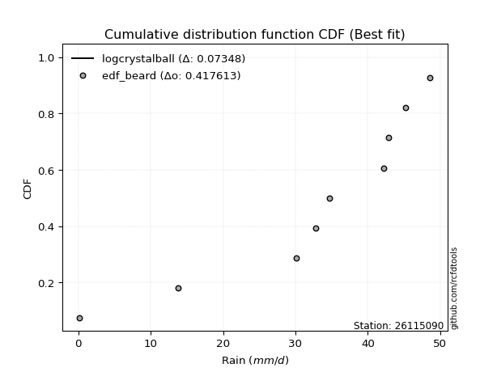</img></img>

</div>


### 5. Empirical - EDF Chegodayev (1955)

The Chegodayev formula is an empirical plotting position formula used in hydrological frequency analysis to estimate the exceedance probability or return period of a specific event from a set of observed data. It is primarily used for plotting observed data points on probability paper to fit a theoretical distribution, particularly for analyzing extreme events like maximum flood flows or rainfall intensities. The constant _b_ value in the generalized plotting position formula is 0.3.

<div align="center">


$P=(m-b)/(n+1-2b)$


</div>


**5.1. Empirical values**

<div align="center">

|                | 0                   | 1                   | 2                  | 3                   | 4              | 5                  | 6                  | 7                  | 8                  |
|:---------------|:--------------------|:--------------------|:-------------------|:--------------------|:---------------|:-------------------|:-------------------|:-------------------|:-------------------|
| date           | 2020                | 2025                | 2022               | 2021                | 2023           | 2018               | 2019               | 2017               | 2024               |
| x              | 0.2                 | 9.8                 | 13.8               | 30.1                | 32.8           | 34.7               | 42.2               | 45.2               | 48.6               |
| m              | 1                   | 2                   | 3                  | 4                   | 5              | 6                  | 7                  | 8                  | 9                  |
| empirical_dist | edf_chegodayev      | edf_chegodayev      | edf_chegodayev     | edf_chegodayev      | edf_chegodayev | edf_chegodayev     | edf_chegodayev     | edf_chegodayev     | edf_chegodayev     |
| empirical      | 0.07446808510638298 | 0.18085106382978722 | 0.2872340425531915 | 0.39361702127659576 | 0.5            | 0.6063829787234043 | 0.7127659574468085 | 0.8191489361702128 | 0.9255319148936169 |
| empirical_tr   | 1.0804597701149425  | 1.2207792207792207  | 1.4029850746268657 | 1.6491228070175437  | 2.0            | 2.540540540540541  | 3.481481481481481  | 5.529411764705883  | 13.428571428571399 |

</div>


**5.2. Kolmogorov-Smirnov fit test (sorted by Δ)**


<div align="center">

|                | 0                   | 1                   | 2                   | 3                   | 4                   | 5                   | 6                   | 7                   | 8                   | 9                   | 10                  | 11                  | 12                  | 13                  | 14                  | 15                  | 16                  | 17                  | 18                  | 19                  | 20                  | 21                  | 22                  | 23                  | 24                  | 25                  | 26                  | 27                  | 28                  | 29                  | 30                  | 31                  | 32                  | 33                  | 34                  | 35                  | 36                  | 37                  | 38                  | 39                    | 40                  | 41                  | 42                  | 43                  | 44                  | 45                  | 46                  | 47                  | 48                  | 49                  | 50                  | 51                  | 52                  | 53                  | 54                  | 55                  | 56                  | 57                  | 58                  | 59                  | 60                  | 61                  | 62                  | 63                  | 64                  | 65                  | 66                  | 67                  | 68                  | 69                  | 70                  | 71                  | 72                  | 73                  | 74                  | 75                  | 76                  | 77                  | 78                  | 79                  | 80                  | 81                  | 82                  | 83                  | 84                  | 85                  | 86                  | 87                  | 88                  | 89                  |
|:---------------|:--------------------|:--------------------|:--------------------|:--------------------|:--------------------|:--------------------|:--------------------|:--------------------|:--------------------|:--------------------|:--------------------|:--------------------|:--------------------|:--------------------|:--------------------|:--------------------|:--------------------|:--------------------|:--------------------|:--------------------|:--------------------|:--------------------|:--------------------|:--------------------|:--------------------|:--------------------|:--------------------|:--------------------|:--------------------|:--------------------|:--------------------|:--------------------|:--------------------|:--------------------|:--------------------|:--------------------|:--------------------|:--------------------|:--------------------|:----------------------|:--------------------|:--------------------|:--------------------|:--------------------|:--------------------|:--------------------|:--------------------|:--------------------|:--------------------|:--------------------|:--------------------|:--------------------|:--------------------|:--------------------|:--------------------|:--------------------|:--------------------|:--------------------|:--------------------|:--------------------|:--------------------|:--------------------|:--------------------|:--------------------|:--------------------|:--------------------|:--------------------|:--------------------|:--------------------|:--------------------|:--------------------|:--------------------|:--------------------|:--------------------|:--------------------|:--------------------|:--------------------|:--------------------|:--------------------|:--------------------|:--------------------|:--------------------|:--------------------|:--------------------|:--------------------|:--------------------|:--------------------|:--------------------|:--------------------|:--------------------|
| station        | 26115090            | 26115090            | 26115090            | 26115090            | 26115090            | 26115090            | 26115090            | 26115090            | 26115090            | 26115090            | 26115090            | 26115090            | 26115090            | 26115090            | 26115090            | 26115090            | 26115090            | 26115090            | 26115090            | 26115090            | 26115090            | 26115090            | 26115090            | 26115090            | 26115090            | 26115090            | 26115090            | 26115090            | 26115090            | 26115090            | 26115090            | 26115090            | 26115090            | 26115090            | 26115090            | 26115090            | 26115090            | 26115090            | 26115090            | 26115090              | 26115090            | 26115090            | 26115090            | 26115090            | 26115090            | 26115090            | 26115090            | 26115090            | 26115090            | 26115090            | 26115090            | 26115090            | 26115090            | 26115090            | 26115090            | 26115090            | 26115090            | 26115090            | 26115090            | 26115090            | 26115090            | 26115090            | 26115090            | 26115090            | 26115090            | 26115090            | 26115090            | 26115090            | 26115090            | 26115090            | 26115090            | 26115090            | 26115090            | 26115090            | 26115090            | 26115090            | 26115090            | 26115090            | 26115090            | 26115090            | 26115090            | 26115090            | 26115090            | 26115090            | 26115090            | 26115090            | 26115090            | 26115090            | 26115090            | 26115090            |
| empirical_dist | edf_chegodayev      | edf_chegodayev      | edf_chegodayev      | edf_chegodayev      | edf_chegodayev      | edf_chegodayev      | edf_chegodayev      | edf_chegodayev      | edf_chegodayev      | edf_chegodayev      | edf_chegodayev      | edf_chegodayev      | edf_chegodayev      | edf_chegodayev      | edf_chegodayev      | edf_chegodayev      | edf_chegodayev      | edf_chegodayev      | edf_chegodayev      | edf_chegodayev      | edf_chegodayev      | edf_chegodayev      | edf_chegodayev      | edf_chegodayev      | edf_chegodayev      | edf_chegodayev      | edf_chegodayev      | edf_chegodayev      | edf_chegodayev      | edf_chegodayev      | edf_chegodayev      | edf_chegodayev      | edf_chegodayev      | edf_chegodayev      | edf_chegodayev      | edf_chegodayev      | edf_chegodayev      | edf_chegodayev      | edf_chegodayev      | edf_chegodayev        | edf_chegodayev      | edf_chegodayev      | edf_chegodayev      | edf_chegodayev      | edf_chegodayev      | edf_chegodayev      | edf_chegodayev      | edf_chegodayev      | edf_chegodayev      | edf_chegodayev      | edf_chegodayev      | edf_chegodayev      | edf_chegodayev      | edf_chegodayev      | edf_chegodayev      | edf_chegodayev      | edf_chegodayev      | edf_chegodayev      | edf_chegodayev      | edf_chegodayev      | edf_chegodayev      | edf_chegodayev      | edf_chegodayev      | edf_chegodayev      | edf_chegodayev      | edf_chegodayev      | edf_chegodayev      | edf_chegodayev      | edf_chegodayev      | edf_chegodayev      | edf_chegodayev      | edf_chegodayev      | edf_chegodayev      | edf_chegodayev      | edf_chegodayev      | edf_chegodayev      | edf_chegodayev      | edf_chegodayev      | edf_chegodayev      | edf_chegodayev      | edf_chegodayev      | edf_chegodayev      | edf_chegodayev      | edf_chegodayev      | edf_chegodayev      | edf_chegodayev      | edf_chegodayev      | edf_chegodayev      | edf_chegodayev      | edf_chegodayev      |
| p_dist         | logjohnsonsu        | pearson3            | johnsonsu           | laplace_asymmetric  | fisk                | gumbel_l            | weibull_min         | fatiguelife         | nct                 | norm                | crystalball         | exponnorm           | t                   | f                   | logistic            | betaprime           | hypsecant           | gamma               | erlang              | rice                | chi2                | laplace             | invgamma            | alpha               | maxwell             | invgauss            | rayleigh            | truncnorm           | logt                | invweibull          | loggumbel_l         | kstwobign           | logpearson3         | halfnorm            | gumbel_r            | mielke              | ncf                 | moyal               | halflogistic        | loglaplace_asymmetric | logloggamma         | loggamma            | loggamma            | loglognorm          | logfatiguelife      | lognorm             | lognorm             | logcrystalball      | logexponnorm        | lognct              | logrice             | lognakagami         | genexpon            | expon               | logalpha            | loginvgamma         | loginvgauss         | loglogistic         | logmaxwell          | lograyleigh         | loginvweibull       | loghypsecant        | loghalfnorm         | wald                | logkstwobign        | loglaplace          | loggumbel_r         | gompertz            | loghalflogistic     | logmoyal            | gibrat              | nakagami            | loggenexpon         | logwald             | logexpon            | logfisk             | logncf              | loggibrat           | pareto              | logmielke           | logpareto           | logf                | logtruncnorm        | logweibull_min      | logbetaprime        | logchi2             | loggompertz         | genlogistic         | loggenlogistic      | logerlang           |
| delta          | 0.10551160245954283 | 0.11464540382684205 | 0.11914654291878146 | 0.1256947324479675  | 0.12970924422364655 | 0.1299657744882195  | 0.1312898802374481  | 0.14278327156180232 | 0.14378338753742897 | 0.1437885588491466  | 0.14378856605047724 | 0.14378873662934627 | 0.14379263634224565 | 0.14455496249462801 | 0.14885915155858437 | 0.15095447101096976 | 0.15316350818289276 | 0.154295802088042   | 0.15461989008471216 | 0.15723533988535204 | 0.16133471099135616 | 0.16856034492209288 | 0.1715306550363343  | 0.17391069021661382 | 0.17497001887859193 | 0.18036183707306713 | 0.18507475710801397 | 0.1853757074418137  | 0.18782262761011853 | 0.19141498650013028 | 0.20082393788949443 | 0.21038085555959202 | 0.21110852012312886 | 0.21354863642070382 | 0.21427664965397514 | 0.22629896482917283 | 0.2293856546565341  | 0.2394865281574648  | 0.2403740582816179  | 0.24840692485568333   | 0.24977984719589635 | 0.24987309091530302 | 0.24987309091530302 | 0.2500018305360418  | 0.25001495978582994 | 0.25071300958031734 | 0.25071300958031734 | 0.25071301696826936 | 0.2507133023394032  | 0.25073169942094536 | 0.25088439509935606 | 0.2511571553114837  | 0.25331505992544295 | 0.257429582686911   | 0.26129757669251336 | 0.2613886730167098  | 0.26283277133301725 | 0.26815687895156076 | 0.2729475212317602  | 0.2796579606675304  | 0.2816902519804212  | 0.28179369536205184 | 0.2991086783732499  | 0.30945155779601224 | 0.3096907355443128  | 0.31011383384289876 | 0.31156654790101085 | 0.3231497850415858  | 0.32730483372829805 | 0.3317717838399789  | 0.33746218809003187 | 0.3636012970142632  | 0.379441468337276   | 0.38887598453838984 | 0.405664565852894   | 0.40601514164680885 | 0.41672005211952756 | 0.4211175393256023  | 0.4476042825059474  | 0.45632987369896627 | 0.4847887555975209  | 0.5126332465853726  | 0.521013514703102   | 0.6047052176536535  | 0.6880677891700309  | 0.735564942557623   | 0.7973047085964945  | 0.8191489361702128  | 0.8191489361702128  | 0.8880685392643868  |
| deltao         | 0.41761268023100007 | 0.41761268023100007 | 0.41761268023100007 | 0.41761268023100007 | 0.41761268023100007 | 0.41761268023100007 | 0.41761268023100007 | 0.41761268023100007 | 0.41761268023100007 | 0.41761268023100007 | 0.41761268023100007 | 0.41761268023100007 | 0.41761268023100007 | 0.41761268023100007 | 0.41761268023100007 | 0.41761268023100007 | 0.41761268023100007 | 0.41761268023100007 | 0.41761268023100007 | 0.41761268023100007 | 0.41761268023100007 | 0.41761268023100007 | 0.41761268023100007 | 0.41761268023100007 | 0.41761268023100007 | 0.41761268023100007 | 0.41761268023100007 | 0.41761268023100007 | 0.41761268023100007 | 0.41761268023100007 | 0.41761268023100007 | 0.41761268023100007 | 0.41761268023100007 | 0.41761268023100007 | 0.41761268023100007 | 0.41761268023100007 | 0.41761268023100007 | 0.41761268023100007 | 0.41761268023100007 | 0.41761268023100007   | 0.41761268023100007 | 0.41761268023100007 | 0.41761268023100007 | 0.41761268023100007 | 0.41761268023100007 | 0.41761268023100007 | 0.41761268023100007 | 0.41761268023100007 | 0.41761268023100007 | 0.41761268023100007 | 0.41761268023100007 | 0.41761268023100007 | 0.41761268023100007 | 0.41761268023100007 | 0.41761268023100007 | 0.41761268023100007 | 0.41761268023100007 | 0.41761268023100007 | 0.41761268023100007 | 0.41761268023100007 | 0.41761268023100007 | 0.41761268023100007 | 0.41761268023100007 | 0.41761268023100007 | 0.41761268023100007 | 0.41761268023100007 | 0.41761268023100007 | 0.41761268023100007 | 0.41761268023100007 | 0.41761268023100007 | 0.41761268023100007 | 0.41761268023100007 | 0.41761268023100007 | 0.41761268023100007 | 0.41761268023100007 | 0.41761268023100007 | 0.41761268023100007 | 0.41761268023100007 | 0.41761268023100007 | 0.41761268023100007 | 0.41761268023100007 | 0.41761268023100007 | 0.41761268023100007 | 0.41761268023100007 | 0.41761268023100007 | 0.41761268023100007 | 0.41761268023100007 | 0.41761268023100007 | 0.41761268023100007 | 0.41761268023100007 |
| eval           | Δo > Δ              | Δo > Δ              | Δo > Δ              | Δo > Δ              | Δo > Δ              | Δo > Δ              | Δo > Δ              | Δo > Δ              | Δo > Δ              | Δo > Δ              | Δo > Δ              | Δo > Δ              | Δo > Δ              | Δo > Δ              | Δo > Δ              | Δo > Δ              | Δo > Δ              | Δo > Δ              | Δo > Δ              | Δo > Δ              | Δo > Δ              | Δo > Δ              | Δo > Δ              | Δo > Δ              | Δo > Δ              | Δo > Δ              | Δo > Δ              | Δo > Δ              | Δo > Δ              | Δo > Δ              | Δo > Δ              | Δo > Δ              | Δo > Δ              | Δo > Δ              | Δo > Δ              | Δo > Δ              | Δo > Δ              | Δo > Δ              | Δo > Δ              | Δo > Δ                | Δo > Δ              | Δo > Δ              | Δo > Δ              | Δo > Δ              | Δo > Δ              | Δo > Δ              | Δo > Δ              | Δo > Δ              | Δo > Δ              | Δo > Δ              | Δo > Δ              | Δo > Δ              | Δo > Δ              | Δo > Δ              | Δo > Δ              | Δo > Δ              | Δo > Δ              | Δo > Δ              | Δo > Δ              | Δo > Δ              | Δo > Δ              | Δo > Δ              | Δo > Δ              | Δo > Δ              | Δo > Δ              | Δo > Δ              | Δo > Δ              | Δo > Δ              | Δo > Δ              | Δo > Δ              | Δo > Δ              | Δo > Δ              | Δo > Δ              | Δo > Δ              | Δo > Δ              | Δo > Δ              | Δo > Δ              | Δo <= Δ             | Δo <= Δ             | Δo <= Δ             | Δo <= Δ             | Δo <= Δ             | Δo <= Δ             | Δo <= Δ             | Δo <= Δ             | Δo <= Δ             | Δo <= Δ             | Δo <= Δ             | Δo <= Δ             | Δo <= Δ             |
| fit            | 1                   | 1                   | 1                   | 1                   | 1                   | 1                   | 1                   | 1                   | 1                   | 1                   | 1                   | 1                   | 1                   | 1                   | 1                   | 1                   | 1                   | 1                   | 1                   | 1                   | 1                   | 1                   | 1                   | 1                   | 1                   | 1                   | 1                   | 1                   | 1                   | 1                   | 1                   | 1                   | 1                   | 1                   | 1                   | 1                   | 1                   | 1                   | 1                   | 1                     | 1                   | 1                   | 1                   | 1                   | 1                   | 1                   | 1                   | 1                   | 1                   | 1                   | 1                   | 1                   | 1                   | 1                   | 1                   | 1                   | 1                   | 1                   | 1                   | 1                   | 1                   | 1                   | 1                   | 1                   | 1                   | 1                   | 1                   | 1                   | 1                   | 1                   | 1                   | 1                   | 1                   | 1                   | 1                   | 1                   | 1                   | 0                   | 0                   | 0                   | 0                   | 0                   | 0                   | 0                   | 0                   | 0                   | 0                   | 0                   | 0                   | 0                   |
| n              | 9                   | 9                   | 9                   | 9                   | 9                   | 9                   | 9                   | 9                   | 9                   | 9                   | 9                   | 9                   | 9                   | 9                   | 9                   | 9                   | 9                   | 9                   | 9                   | 9                   | 9                   | 9                   | 9                   | 9                   | 9                   | 9                   | 9                   | 9                   | 9                   | 9                   | 9                   | 9                   | 9                   | 9                   | 9                   | 9                   | 9                   | 9                   | 9                   | 9                     | 9                   | 9                   | 9                   | 9                   | 9                   | 9                   | 9                   | 9                   | 9                   | 9                   | 9                   | 9                   | 9                   | 9                   | 9                   | 9                   | 9                   | 9                   | 9                   | 9                   | 9                   | 9                   | 9                   | 9                   | 9                   | 9                   | 9                   | 9                   | 9                   | 9                   | 9                   | 9                   | 9                   | 9                   | 9                   | 9                   | 9                   | 9                   | 9                   | 9                   | 9                   | 9                   | 9                   | 9                   | 9                   | 9                   | 9                   | 9                   | 9                   | 9                   |
| best_fit       | 1                   | 0                   | 0                   | 0                   | 0                   | 0                   | 0                   | 0                   | 0                   | 0                   | 0                   | 0                   | 0                   | 0                   | 0                   | 0                   | 0                   | 0                   | 0                   | 0                   | 0                   | 0                   | 0                   | 0                   | 0                   | 0                   | 0                   | 0                   | 0                   | 0                   | 0                   | 0                   | 0                   | 0                   | 0                   | 0                   | 0                   | 0                   | 0                   | 0                     | 0                   | 0                   | 0                   | 0                   | 0                   | 0                   | 0                   | 0                   | 0                   | 0                   | 0                   | 0                   | 0                   | 0                   | 0                   | 0                   | 0                   | 0                   | 0                   | 0                   | 0                   | 0                   | 0                   | 0                   | 0                   | 0                   | 0                   | 0                   | 0                   | 0                   | 0                   | 0                   | 0                   | 0                   | 0                   | 0                   | 0                   | 0                   | 0                   | 0                   | 0                   | 0                   | 0                   | 0                   | 0                   | 0                   | 0                   | 0                   | 0                   | 0                   |
| best_fit_sort  | 1                   | 2                   | 3                   | 4                   | 5                   | 6                   | 7                   | 8                   | 9                   | 10                  | 11                  | 12                  | 13                  | 14                  | 15                  | 16                  | 17                  | 18                  | 19                  | 20                  | 21                  | 22                  | 23                  | 24                  | 25                  | 26                  | 27                  | 28                  | 29                  | 30                  | 31                  | 32                  | 33                  | 34                  | 35                  | 36                  | 37                  | 38                  | 39                  | 40                    | 41                  | 42                  | 43                  | 44                  | 45                  | 46                  | 47                  | 48                  | 49                  | 50                  | 51                  | 52                  | 53                  | 54                  | 55                  | 56                  | 57                  | 58                  | 59                  | 60                  | 61                  | 62                  | 63                  | 64                  | 65                  | 66                  | 67                  | 68                  | 69                  | 70                  | 71                  | 72                  | 73                  | 74                  | 75                  | 76                  | 77                  | 78                  | 79                  | 80                  | 81                  | 82                  | 83                  | 84                  | 85                  | 86                  | 87                  | 88                  | 89                  | 90                  |

</div>


<div align="center">

</img>

</div>


**5.3. Best fit**

<div align="center">

|   id |   station | empirical_dist   | p_dist       |    delta |   deltao | eval   |   fit |   n |   best_fit |   best_fit_sort |
|-----:|----------:|:-----------------|:-------------|---------:|---------:|:-------|------:|----:|-----------:|----------------:|
|    0 |  26115090 | edf_chegodayev   | logjohnsonsu | 0.105512 | 0.417613 | Δo > Δ |     1 |   9 |          1 |               1 |

</div>


<div align="center">

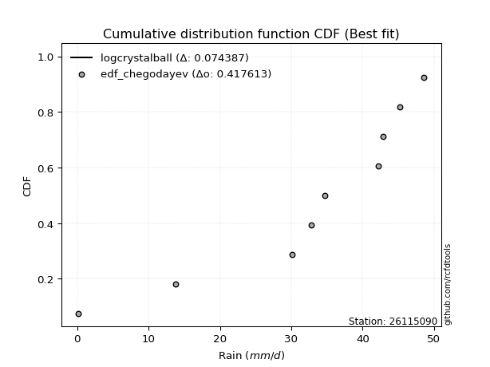</img>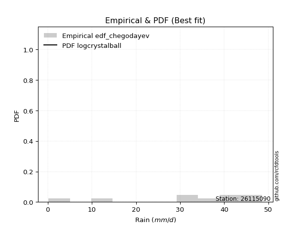</img>

</div>


### 6. Empirical - EDF Blom (1958)

The Blom formula is a specific "plotting position" formula used in hydrology and statistical analysis to estimate the empirical cumulative probability (or non-exceedance probability) of a data series. It is particularly recommended for data that are approximately normally distributed. The constant _a_ is set to 0.375 (or 3/8).

<div align="center">


$P=(m-a)/(n+1-2a)$


</div>


**6.1. Empirical values**

<div align="center">

|                | 0                   | 1                   | 2                   | 3                  | 4        | 5                  | 6                  | 7                  | 8                  |
|:---------------|:--------------------|:--------------------|:--------------------|:-------------------|:---------|:-------------------|:-------------------|:-------------------|:-------------------|
| date           | 2020                | 2025                | 2022                | 2021               | 2023     | 2018               | 2019               | 2017               | 2024               |
| x              | 0.2                 | 9.8                 | 13.8                | 30.1               | 32.8     | 34.7               | 42.2               | 45.2               | 48.6               |
| m              | 1                   | 2                   | 3                   | 4                  | 5        | 6                  | 7                  | 8                  | 9                  |
| empirical_dist | edf_blom            | edf_blom            | edf_blom            | edf_blom           | edf_blom | edf_blom           | edf_blom           | edf_blom           | edf_blom           |
| empirical      | 0.06756756756756757 | 0.17567567567567569 | 0.28378378378378377 | 0.3918918918918919 | 0.5      | 0.6081081081081081 | 0.7162162162162162 | 0.8243243243243243 | 0.9324324324324325 |
| empirical_tr   | 1.072463768115942   | 1.2131147540983607  | 1.3962264150943395  | 1.6444444444444444 | 2.0      | 2.5517241379310347 | 3.523809523809524  | 5.6923076923076925 | 14.800000000000006 |

</div>


**6.2. Kolmogorov-Smirnov fit test (sorted by Δ)**


<div align="center">

|                | 0                   | 1                   | 2                   | 3                   | 4                   | 5                   | 6                   | 7                   | 8                   | 9                   | 10                  | 11                  | 12                  | 13                  | 14                  | 15                  | 16                  | 17                  | 18                  | 19                  | 20                  | 21                  | 22                  | 23                  | 24                  | 25                  | 26                  | 27                  | 28                  | 29                  | 30                  | 31                  | 32                  | 33                  | 34                  | 35                  | 36                  | 37                  | 38                  | 39                    | 40                  | 41                  | 42                  | 43                  | 44                  | 45                  | 46                  | 47                  | 48                  | 49                  | 50                  | 51                  | 52                  | 53                  | 54                  | 55                  | 56                  | 57                  | 58                  | 59                  | 60                  | 61                  | 62                  | 63                  | 64                  | 65                  | 66                  | 67                  | 68                  | 69                  | 70                  | 71                  | 72                  | 73                  | 74                  | 75                  | 76                  | 77                  | 78                  | 79                  | 80                  | 81                  | 82                  | 83                  | 84                  | 85                  | 86                  | 87                  | 88                  | 89                  |
|:---------------|:--------------------|:--------------------|:--------------------|:--------------------|:--------------------|:--------------------|:--------------------|:--------------------|:--------------------|:--------------------|:--------------------|:--------------------|:--------------------|:--------------------|:--------------------|:--------------------|:--------------------|:--------------------|:--------------------|:--------------------|:--------------------|:--------------------|:--------------------|:--------------------|:--------------------|:--------------------|:--------------------|:--------------------|:--------------------|:--------------------|:--------------------|:--------------------|:--------------------|:--------------------|:--------------------|:--------------------|:--------------------|:--------------------|:--------------------|:----------------------|:--------------------|:--------------------|:--------------------|:--------------------|:--------------------|:--------------------|:--------------------|:--------------------|:--------------------|:--------------------|:--------------------|:--------------------|:--------------------|:--------------------|:--------------------|:--------------------|:--------------------|:--------------------|:--------------------|:--------------------|:--------------------|:--------------------|:--------------------|:--------------------|:--------------------|:--------------------|:--------------------|:--------------------|:--------------------|:--------------------|:--------------------|:--------------------|:--------------------|:--------------------|:--------------------|:--------------------|:--------------------|:--------------------|:--------------------|:--------------------|:--------------------|:--------------------|:--------------------|:--------------------|:--------------------|:--------------------|:--------------------|:--------------------|:--------------------|:--------------------|
| station        | 26115090            | 26115090            | 26115090            | 26115090            | 26115090            | 26115090            | 26115090            | 26115090            | 26115090            | 26115090            | 26115090            | 26115090            | 26115090            | 26115090            | 26115090            | 26115090            | 26115090            | 26115090            | 26115090            | 26115090            | 26115090            | 26115090            | 26115090            | 26115090            | 26115090            | 26115090            | 26115090            | 26115090            | 26115090            | 26115090            | 26115090            | 26115090            | 26115090            | 26115090            | 26115090            | 26115090            | 26115090            | 26115090            | 26115090            | 26115090              | 26115090            | 26115090            | 26115090            | 26115090            | 26115090            | 26115090            | 26115090            | 26115090            | 26115090            | 26115090            | 26115090            | 26115090            | 26115090            | 26115090            | 26115090            | 26115090            | 26115090            | 26115090            | 26115090            | 26115090            | 26115090            | 26115090            | 26115090            | 26115090            | 26115090            | 26115090            | 26115090            | 26115090            | 26115090            | 26115090            | 26115090            | 26115090            | 26115090            | 26115090            | 26115090            | 26115090            | 26115090            | 26115090            | 26115090            | 26115090            | 26115090            | 26115090            | 26115090            | 26115090            | 26115090            | 26115090            | 26115090            | 26115090            | 26115090            | 26115090            |
| empirical_dist | edf_blom            | edf_blom            | edf_blom            | edf_blom            | edf_blom            | edf_blom            | edf_blom            | edf_blom            | edf_blom            | edf_blom            | edf_blom            | edf_blom            | edf_blom            | edf_blom            | edf_blom            | edf_blom            | edf_blom            | edf_blom            | edf_blom            | edf_blom            | edf_blom            | edf_blom            | edf_blom            | edf_blom            | edf_blom            | edf_blom            | edf_blom            | edf_blom            | edf_blom            | edf_blom            | edf_blom            | edf_blom            | edf_blom            | edf_blom            | edf_blom            | edf_blom            | edf_blom            | edf_blom            | edf_blom            | edf_blom              | edf_blom            | edf_blom            | edf_blom            | edf_blom            | edf_blom            | edf_blom            | edf_blom            | edf_blom            | edf_blom            | edf_blom            | edf_blom            | edf_blom            | edf_blom            | edf_blom            | edf_blom            | edf_blom            | edf_blom            | edf_blom            | edf_blom            | edf_blom            | edf_blom            | edf_blom            | edf_blom            | edf_blom            | edf_blom            | edf_blom            | edf_blom            | edf_blom            | edf_blom            | edf_blom            | edf_blom            | edf_blom            | edf_blom            | edf_blom            | edf_blom            | edf_blom            | edf_blom            | edf_blom            | edf_blom            | edf_blom            | edf_blom            | edf_blom            | edf_blom            | edf_blom            | edf_blom            | edf_blom            | edf_blom            | edf_blom            | edf_blom            | edf_blom            |
| p_dist         | logjohnsonsu        | pearson3            | johnsonsu           | laplace_asymmetric  | fisk                | gumbel_l            | weibull_min         | fatiguelife         | nct                 | norm                | crystalball         | exponnorm           | t                   | f                   | logistic            | betaprime           | hypsecant           | gamma               | erlang              | rice                | chi2                | laplace             | invgamma            | alpha               | maxwell             | invgauss            | logt                | rayleigh            | truncnorm           | invweibull          | loggumbel_l         | kstwobign           | halfnorm            | gumbel_r            | logpearson3         | mielke              | ncf                 | moyal               | halflogistic        | loglaplace_asymmetric | logloggamma         | loggamma            | loggamma            | loglognorm          | logfatiguelife      | lognorm             | lognorm             | logcrystalball      | logexponnorm        | lognct              | logrice             | lognakagami         | genexpon            | expon               | logalpha            | loginvgamma         | loginvgauss         | loglogistic         | logmaxwell          | lograyleigh         | loghypsecant        | loginvweibull       | loghalfnorm         | wald                | loglaplace          | loggumbel_r         | logkstwobign        | gompertz            | loghalflogistic     | logmoyal            | gibrat              | nakagami            | loggenexpon         | logwald             | logexpon            | logfisk             | logncf              | loggibrat           | pareto              | logmielke           | logpareto           | logf                | logtruncnorm        | logweibull_min      | logbetaprime        | logchi2             | loggompertz         | genlogistic         | loggenlogistic      | logerlang           |
| delta          | 0.10723673184424665 | 0.11421591540487697 | 0.11569628414937372 | 0.12224447367855976 | 0.1262589854542388  | 0.12651551571881176 | 0.12783962146804034 | 0.1445084009465062  | 0.14550851692213285 | 0.14551368823385047 | 0.1455136954351811  | 0.14551386601405014 | 0.14551776572694952 | 0.14628009187933189 | 0.15058428094328824 | 0.15267960039567363 | 0.15488863756759663 | 0.15602093147274587 | 0.15634501946941604 | 0.15896046927005592 | 0.16305984037606003 | 0.17028547430679675 | 0.17325578442103817 | 0.1756358196013177  | 0.1766951482632958  | 0.182086966457771   | 0.1843723688407108  | 0.18679988649271784 | 0.18710083682651757 | 0.19314011588483415 | 0.2025490672741983  | 0.2121059849442959  | 0.2152737658054077  | 0.216001779038679   | 0.21800903766194446 | 0.2280240942138767  | 0.23111078404123797 | 0.24121165754216867 | 0.24209918766632177 | 0.2501320542403872    | 0.2515049765806002  | 0.2515982203000069  | 0.2515982203000069  | 0.2517269599207457  | 0.2517400891705338  | 0.2524381389650212  | 0.2524381389650212  | 0.25243814635297324 | 0.25243843172410707 | 0.25245682880564924 | 0.25260952448405993 | 0.25288228469618756 | 0.2550401893101468  | 0.2591547120716149  | 0.2630227060772172  | 0.2631138024014137  | 0.2645579007177211  | 0.26988200833626463 | 0.27467265061646406 | 0.2813830900522343  | 0.2835188247467557  | 0.28686564013453275 | 0.30083380775795376 | 0.3111766871807161  | 0.31183896322760263 | 0.3132916772857147  | 0.31486612369842437 | 0.32487491442628963 | 0.3290299631130019  | 0.3334969132246828  | 0.33918731747473574 | 0.36532642639896706 | 0.38461685649138755 | 0.3906011139230937  | 0.41083995400700557 | 0.4111905298009204  | 0.4218954402736391  | 0.4228426687103062  | 0.452779670660059   | 0.46150526185307783 | 0.48996414375163244 | 0.5178086347394841  | 0.5261889028572135  | 0.609880605807765   | 0.6932431773241424  | 0.7407403307117345  | 0.802480096750606   | 0.8243243243243243  | 0.8243243243243243  | 0.8949690568032022  |
| deltao         | 0.41761268023100007 | 0.41761268023100007 | 0.41761268023100007 | 0.41761268023100007 | 0.41761268023100007 | 0.41761268023100007 | 0.41761268023100007 | 0.41761268023100007 | 0.41761268023100007 | 0.41761268023100007 | 0.41761268023100007 | 0.41761268023100007 | 0.41761268023100007 | 0.41761268023100007 | 0.41761268023100007 | 0.41761268023100007 | 0.41761268023100007 | 0.41761268023100007 | 0.41761268023100007 | 0.41761268023100007 | 0.41761268023100007 | 0.41761268023100007 | 0.41761268023100007 | 0.41761268023100007 | 0.41761268023100007 | 0.41761268023100007 | 0.41761268023100007 | 0.41761268023100007 | 0.41761268023100007 | 0.41761268023100007 | 0.41761268023100007 | 0.41761268023100007 | 0.41761268023100007 | 0.41761268023100007 | 0.41761268023100007 | 0.41761268023100007 | 0.41761268023100007 | 0.41761268023100007 | 0.41761268023100007 | 0.41761268023100007   | 0.41761268023100007 | 0.41761268023100007 | 0.41761268023100007 | 0.41761268023100007 | 0.41761268023100007 | 0.41761268023100007 | 0.41761268023100007 | 0.41761268023100007 | 0.41761268023100007 | 0.41761268023100007 | 0.41761268023100007 | 0.41761268023100007 | 0.41761268023100007 | 0.41761268023100007 | 0.41761268023100007 | 0.41761268023100007 | 0.41761268023100007 | 0.41761268023100007 | 0.41761268023100007 | 0.41761268023100007 | 0.41761268023100007 | 0.41761268023100007 | 0.41761268023100007 | 0.41761268023100007 | 0.41761268023100007 | 0.41761268023100007 | 0.41761268023100007 | 0.41761268023100007 | 0.41761268023100007 | 0.41761268023100007 | 0.41761268023100007 | 0.41761268023100007 | 0.41761268023100007 | 0.41761268023100007 | 0.41761268023100007 | 0.41761268023100007 | 0.41761268023100007 | 0.41761268023100007 | 0.41761268023100007 | 0.41761268023100007 | 0.41761268023100007 | 0.41761268023100007 | 0.41761268023100007 | 0.41761268023100007 | 0.41761268023100007 | 0.41761268023100007 | 0.41761268023100007 | 0.41761268023100007 | 0.41761268023100007 | 0.41761268023100007 |
| eval           | Δo > Δ              | Δo > Δ              | Δo > Δ              | Δo > Δ              | Δo > Δ              | Δo > Δ              | Δo > Δ              | Δo > Δ              | Δo > Δ              | Δo > Δ              | Δo > Δ              | Δo > Δ              | Δo > Δ              | Δo > Δ              | Δo > Δ              | Δo > Δ              | Δo > Δ              | Δo > Δ              | Δo > Δ              | Δo > Δ              | Δo > Δ              | Δo > Δ              | Δo > Δ              | Δo > Δ              | Δo > Δ              | Δo > Δ              | Δo > Δ              | Δo > Δ              | Δo > Δ              | Δo > Δ              | Δo > Δ              | Δo > Δ              | Δo > Δ              | Δo > Δ              | Δo > Δ              | Δo > Δ              | Δo > Δ              | Δo > Δ              | Δo > Δ              | Δo > Δ                | Δo > Δ              | Δo > Δ              | Δo > Δ              | Δo > Δ              | Δo > Δ              | Δo > Δ              | Δo > Δ              | Δo > Δ              | Δo > Δ              | Δo > Δ              | Δo > Δ              | Δo > Δ              | Δo > Δ              | Δo > Δ              | Δo > Δ              | Δo > Δ              | Δo > Δ              | Δo > Δ              | Δo > Δ              | Δo > Δ              | Δo > Δ              | Δo > Δ              | Δo > Δ              | Δo > Δ              | Δo > Δ              | Δo > Δ              | Δo > Δ              | Δo > Δ              | Δo > Δ              | Δo > Δ              | Δo > Δ              | Δo > Δ              | Δo > Δ              | Δo > Δ              | Δo > Δ              | Δo > Δ              | Δo <= Δ             | Δo <= Δ             | Δo <= Δ             | Δo <= Δ             | Δo <= Δ             | Δo <= Δ             | Δo <= Δ             | Δo <= Δ             | Δo <= Δ             | Δo <= Δ             | Δo <= Δ             | Δo <= Δ             | Δo <= Δ             | Δo <= Δ             |
| fit            | 1                   | 1                   | 1                   | 1                   | 1                   | 1                   | 1                   | 1                   | 1                   | 1                   | 1                   | 1                   | 1                   | 1                   | 1                   | 1                   | 1                   | 1                   | 1                   | 1                   | 1                   | 1                   | 1                   | 1                   | 1                   | 1                   | 1                   | 1                   | 1                   | 1                   | 1                   | 1                   | 1                   | 1                   | 1                   | 1                   | 1                   | 1                   | 1                   | 1                     | 1                   | 1                   | 1                   | 1                   | 1                   | 1                   | 1                   | 1                   | 1                   | 1                   | 1                   | 1                   | 1                   | 1                   | 1                   | 1                   | 1                   | 1                   | 1                   | 1                   | 1                   | 1                   | 1                   | 1                   | 1                   | 1                   | 1                   | 1                   | 1                   | 1                   | 1                   | 1                   | 1                   | 1                   | 1                   | 1                   | 0                   | 0                   | 0                   | 0                   | 0                   | 0                   | 0                   | 0                   | 0                   | 0                   | 0                   | 0                   | 0                   | 0                   |
| n              | 9                   | 9                   | 9                   | 9                   | 9                   | 9                   | 9                   | 9                   | 9                   | 9                   | 9                   | 9                   | 9                   | 9                   | 9                   | 9                   | 9                   | 9                   | 9                   | 9                   | 9                   | 9                   | 9                   | 9                   | 9                   | 9                   | 9                   | 9                   | 9                   | 9                   | 9                   | 9                   | 9                   | 9                   | 9                   | 9                   | 9                   | 9                   | 9                   | 9                     | 9                   | 9                   | 9                   | 9                   | 9                   | 9                   | 9                   | 9                   | 9                   | 9                   | 9                   | 9                   | 9                   | 9                   | 9                   | 9                   | 9                   | 9                   | 9                   | 9                   | 9                   | 9                   | 9                   | 9                   | 9                   | 9                   | 9                   | 9                   | 9                   | 9                   | 9                   | 9                   | 9                   | 9                   | 9                   | 9                   | 9                   | 9                   | 9                   | 9                   | 9                   | 9                   | 9                   | 9                   | 9                   | 9                   | 9                   | 9                   | 9                   | 9                   |
| best_fit       | 1                   | 0                   | 0                   | 0                   | 0                   | 0                   | 0                   | 0                   | 0                   | 0                   | 0                   | 0                   | 0                   | 0                   | 0                   | 0                   | 0                   | 0                   | 0                   | 0                   | 0                   | 0                   | 0                   | 0                   | 0                   | 0                   | 0                   | 0                   | 0                   | 0                   | 0                   | 0                   | 0                   | 0                   | 0                   | 0                   | 0                   | 0                   | 0                   | 0                     | 0                   | 0                   | 0                   | 0                   | 0                   | 0                   | 0                   | 0                   | 0                   | 0                   | 0                   | 0                   | 0                   | 0                   | 0                   | 0                   | 0                   | 0                   | 0                   | 0                   | 0                   | 0                   | 0                   | 0                   | 0                   | 0                   | 0                   | 0                   | 0                   | 0                   | 0                   | 0                   | 0                   | 0                   | 0                   | 0                   | 0                   | 0                   | 0                   | 0                   | 0                   | 0                   | 0                   | 0                   | 0                   | 0                   | 0                   | 0                   | 0                   | 0                   |
| best_fit_sort  | 1                   | 2                   | 3                   | 4                   | 5                   | 6                   | 7                   | 8                   | 9                   | 10                  | 11                  | 12                  | 13                  | 14                  | 15                  | 16                  | 17                  | 18                  | 19                  | 20                  | 21                  | 22                  | 23                  | 24                  | 25                  | 26                  | 27                  | 28                  | 29                  | 30                  | 31                  | 32                  | 33                  | 34                  | 35                  | 36                  | 37                  | 38                  | 39                  | 40                    | 41                  | 42                  | 43                  | 44                  | 45                  | 46                  | 47                  | 48                  | 49                  | 50                  | 51                  | 52                  | 53                  | 54                  | 55                  | 56                  | 57                  | 58                  | 59                  | 60                  | 61                  | 62                  | 63                  | 64                  | 65                  | 66                  | 67                  | 68                  | 69                  | 70                  | 71                  | 72                  | 73                  | 74                  | 75                  | 76                  | 77                  | 78                  | 79                  | 80                  | 81                  | 82                  | 83                  | 84                  | 85                  | 86                  | 87                  | 88                  | 89                  | 90                  |

</div>


<div align="center">

</img>

</div>


**6.3. Best fit**

<div align="center">

|   id |   station | empirical_dist   | p_dist       |    delta |   deltao | eval   |   fit |   n |   best_fit |   best_fit_sort |
|-----:|----------:|:-----------------|:-------------|---------:|---------:|:-------|------:|----:|-----------:|----------------:|
|    0 |  26115090 | edf_blom         | logjohnsonsu | 0.107237 | 0.417613 | Δo > Δ |     1 |   9 |          1 |               1 |

</div>


<div align="center">

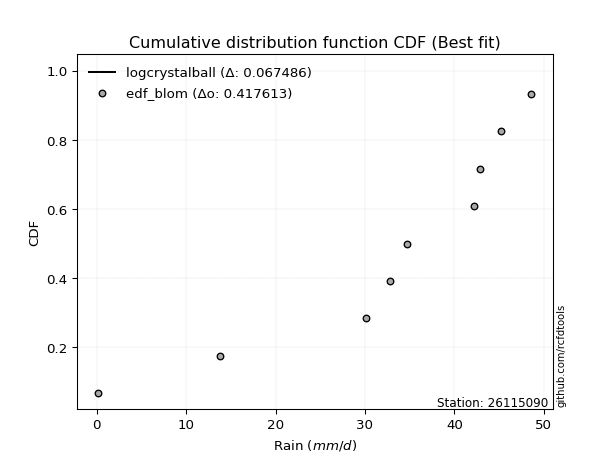</img>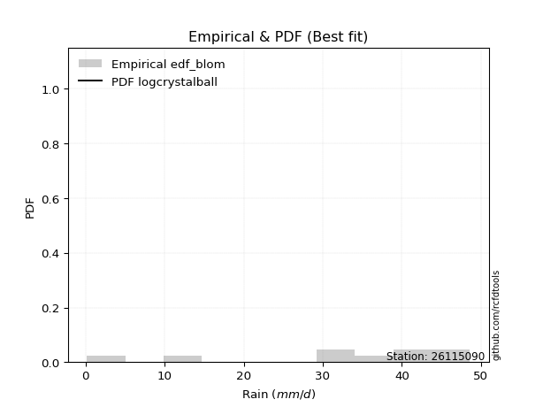</img>

</div>


### 7. Empirical - EDF Tukey (1962)

In hydrology, the Tukey formula is used as a plotting position formula to estimate the empirical probability or frequency of a flood event (or other hydrological data). The formula parameter is given as _c=0.333_ (or 1/3).

<div align="center">


$P=(m-c)/(n+1-2c)$


</div>


**7.1. Empirical values**

<div align="center">

|                | 0                   | 1                   | 2                  | 3                   | 4         | 5                  | 6                  | 7                  | 8                  |
|:---------------|:--------------------|:--------------------|:-------------------|:--------------------|:----------|:-------------------|:-------------------|:-------------------|:-------------------|
| date           | 2020                | 2025                | 2022               | 2021                | 2023      | 2018               | 2019               | 2017               | 2024               |
| x              | 0.2                 | 9.8                 | 13.8               | 30.1                | 32.8      | 34.7               | 42.2               | 45.2               | 48.6               |
| m              | 1                   | 2                   | 3                  | 4                   | 5         | 6                  | 7                  | 8                  | 9                  |
| empirical_dist | edf_tukey           | edf_tukey           | edf_tukey          | edf_tukey           | edf_tukey | edf_tukey          | edf_tukey          | edf_tukey          | edf_tukey          |
| empirical      | 0.07142857142857142 | 0.17857142857142858 | 0.2857142857142857 | 0.39285714285714285 | 0.5       | 0.6071428571428571 | 0.7142857142857143 | 0.8214285714285714 | 0.9285714285714286 |
| empirical_tr   | 1.0769230769230769  | 1.2173913043478262  | 1.4                | 1.6470588235294117  | 2.0       | 2.545454545454545  | 3.5                | 5.599999999999999  | 14.000000000000007 |

</div>


**7.2. Kolmogorov-Smirnov fit test (sorted by Δ)**


<div align="center">

|                | 0                   | 1                   | 2                   | 3                   | 4                   | 5                   | 6                   | 7                   | 8                   | 9                   | 10                  | 11                  | 12                  | 13                  | 14                  | 15                  | 16                  | 17                  | 18                  | 19                  | 20                  | 21                  | 22                  | 23                  | 24                  | 25                  | 26                  | 27                  | 28                  | 29                  | 30                  | 31                  | 32                  | 33                  | 34                  | 35                  | 36                  | 37                  | 38                  | 39                    | 40                  | 41                  | 42                  | 43                  | 44                  | 45                  | 46                  | 47                  | 48                  | 49                  | 50                  | 51                  | 52                  | 53                  | 54                  | 55                  | 56                  | 57                  | 58                  | 59                  | 60                  | 61                  | 62                  | 63                  | 64                  | 65                  | 66                  | 67                  | 68                  | 69                  | 70                  | 71                  | 72                  | 73                  | 74                  | 75                  | 76                  | 77                  | 78                  | 79                  | 80                  | 81                  | 82                  | 83                  | 84                  | 85                  | 86                  | 87                  | 88                  | 89                  |
|:---------------|:--------------------|:--------------------|:--------------------|:--------------------|:--------------------|:--------------------|:--------------------|:--------------------|:--------------------|:--------------------|:--------------------|:--------------------|:--------------------|:--------------------|:--------------------|:--------------------|:--------------------|:--------------------|:--------------------|:--------------------|:--------------------|:--------------------|:--------------------|:--------------------|:--------------------|:--------------------|:--------------------|:--------------------|:--------------------|:--------------------|:--------------------|:--------------------|:--------------------|:--------------------|:--------------------|:--------------------|:--------------------|:--------------------|:--------------------|:----------------------|:--------------------|:--------------------|:--------------------|:--------------------|:--------------------|:--------------------|:--------------------|:--------------------|:--------------------|:--------------------|:--------------------|:--------------------|:--------------------|:--------------------|:--------------------|:--------------------|:--------------------|:--------------------|:--------------------|:--------------------|:--------------------|:--------------------|:--------------------|:--------------------|:--------------------|:--------------------|:--------------------|:--------------------|:--------------------|:--------------------|:--------------------|:--------------------|:--------------------|:--------------------|:--------------------|:--------------------|:--------------------|:--------------------|:--------------------|:--------------------|:--------------------|:--------------------|:--------------------|:--------------------|:--------------------|:--------------------|:--------------------|:--------------------|:--------------------|:--------------------|
| station        | 26115090            | 26115090            | 26115090            | 26115090            | 26115090            | 26115090            | 26115090            | 26115090            | 26115090            | 26115090            | 26115090            | 26115090            | 26115090            | 26115090            | 26115090            | 26115090            | 26115090            | 26115090            | 26115090            | 26115090            | 26115090            | 26115090            | 26115090            | 26115090            | 26115090            | 26115090            | 26115090            | 26115090            | 26115090            | 26115090            | 26115090            | 26115090            | 26115090            | 26115090            | 26115090            | 26115090            | 26115090            | 26115090            | 26115090            | 26115090              | 26115090            | 26115090            | 26115090            | 26115090            | 26115090            | 26115090            | 26115090            | 26115090            | 26115090            | 26115090            | 26115090            | 26115090            | 26115090            | 26115090            | 26115090            | 26115090            | 26115090            | 26115090            | 26115090            | 26115090            | 26115090            | 26115090            | 26115090            | 26115090            | 26115090            | 26115090            | 26115090            | 26115090            | 26115090            | 26115090            | 26115090            | 26115090            | 26115090            | 26115090            | 26115090            | 26115090            | 26115090            | 26115090            | 26115090            | 26115090            | 26115090            | 26115090            | 26115090            | 26115090            | 26115090            | 26115090            | 26115090            | 26115090            | 26115090            | 26115090            |
| empirical_dist | edf_tukey           | edf_tukey           | edf_tukey           | edf_tukey           | edf_tukey           | edf_tukey           | edf_tukey           | edf_tukey           | edf_tukey           | edf_tukey           | edf_tukey           | edf_tukey           | edf_tukey           | edf_tukey           | edf_tukey           | edf_tukey           | edf_tukey           | edf_tukey           | edf_tukey           | edf_tukey           | edf_tukey           | edf_tukey           | edf_tukey           | edf_tukey           | edf_tukey           | edf_tukey           | edf_tukey           | edf_tukey           | edf_tukey           | edf_tukey           | edf_tukey           | edf_tukey           | edf_tukey           | edf_tukey           | edf_tukey           | edf_tukey           | edf_tukey           | edf_tukey           | edf_tukey           | edf_tukey             | edf_tukey           | edf_tukey           | edf_tukey           | edf_tukey           | edf_tukey           | edf_tukey           | edf_tukey           | edf_tukey           | edf_tukey           | edf_tukey           | edf_tukey           | edf_tukey           | edf_tukey           | edf_tukey           | edf_tukey           | edf_tukey           | edf_tukey           | edf_tukey           | edf_tukey           | edf_tukey           | edf_tukey           | edf_tukey           | edf_tukey           | edf_tukey           | edf_tukey           | edf_tukey           | edf_tukey           | edf_tukey           | edf_tukey           | edf_tukey           | edf_tukey           | edf_tukey           | edf_tukey           | edf_tukey           | edf_tukey           | edf_tukey           | edf_tukey           | edf_tukey           | edf_tukey           | edf_tukey           | edf_tukey           | edf_tukey           | edf_tukey           | edf_tukey           | edf_tukey           | edf_tukey           | edf_tukey           | edf_tukey           | edf_tukey           | edf_tukey           |
| p_dist         | logjohnsonsu        | pearson3            | johnsonsu           | laplace_asymmetric  | fisk                | gumbel_l            | weibull_min         | fatiguelife         | nct                 | norm                | crystalball         | exponnorm           | t                   | f                   | logistic            | betaprime           | hypsecant           | gamma               | erlang              | rice                | chi2                | laplace             | invgamma            | alpha               | maxwell             | invgauss            | rayleigh            | truncnorm           | logt                | invweibull          | loggumbel_l         | kstwobign           | logpearson3         | halfnorm            | gumbel_r            | mielke              | ncf                 | moyal               | halflogistic        | loglaplace_asymmetric | logloggamma         | loggamma            | loggamma            | loglognorm          | logfatiguelife      | lognorm             | lognorm             | logcrystalball      | logexponnorm        | lognct              | logrice             | lognakagami         | genexpon            | expon               | logalpha            | loginvgamma         | loginvgauss         | loglogistic         | logmaxwell          | lograyleigh         | loghypsecant        | loginvweibull       | loghalfnorm         | wald                | loglaplace          | logkstwobign        | loggumbel_r         | gompertz            | loghalflogistic     | logmoyal            | gibrat              | nakagami            | loggenexpon         | logwald             | logexpon            | logfisk             | logncf              | loggibrat           | pareto              | logmielke           | logpareto           | logf                | logtruncnorm        | logweibull_min      | logbetaprime        | logchi2             | loggompertz         | genlogistic         | loggenlogistic      | logerlang           |
| delta          | 0.10627148087899563 | 0.113250664439626   | 0.11762678607987564 | 0.12417497560906168 | 0.12818948738474073 | 0.12844601764931368 | 0.12977012339854227 | 0.14354314998125522 | 0.14454326595688188 | 0.1445484372685995  | 0.14454844446993015 | 0.14454861504879918 | 0.14455251476169856 | 0.14531484091408092 | 0.14961902997803728 | 0.15171434943042267 | 0.15392338660234567 | 0.1550556805074949  | 0.15537976850416507 | 0.15799521830480495 | 0.16209458941080906 | 0.16932022334154578 | 0.1722905334557872  | 0.17467056863606673 | 0.17572989729804483 | 0.18112171549252004 | 0.18583463552746687 | 0.1861355858612666  | 0.18630287077121271 | 0.1921748649195832  | 0.20158381630894734 | 0.21114073397904493 | 0.2141480338009406  | 0.21430851484015673 | 0.21503652807342805 | 0.22705884324862574 | 0.230145533075987   | 0.2402464065769177  | 0.2411339367010708  | 0.24916680327513624   | 0.25053972561534926 | 0.25063296933475593 | 0.25063296933475593 | 0.2507617089554947  | 0.25077483820528285 | 0.25147288799977024 | 0.25147288799977024 | 0.2514728953877223  | 0.2514731807588561  | 0.2514915778403983  | 0.25164427351880897 | 0.2519170337309366  | 0.25407493834489586 | 0.2581894611063639  | 0.26205745511196626 | 0.2621485514361627  | 0.26359264975247015 | 0.26891675737101367 | 0.2737073996512131  | 0.2804178390869833  | 0.28255357378150475 | 0.2839698872387798  | 0.2998685567927028  | 0.31021143621546515 | 0.31087371226235166 | 0.3119703708026714  | 0.31232642632046376 | 0.3239096634610386  | 0.32806471214775096 | 0.3325316622594318  | 0.3382220665094848  | 0.3643611754337161  | 0.3817211035956346  | 0.38963586295784275 | 0.4079442011112526  | 0.40829477690516747 | 0.4189996873778862  | 0.4218774177450552  | 0.44988391776430603 | 0.4586095089573249  | 0.4870683908558795  | 0.5149128818437312  | 0.5232931499614606  | 0.6069848529120121  | 0.6903474244283895  | 0.7378445778159816  | 0.7995843438548531  | 0.8214285714285714  | 0.8214285714285714  | 0.8911080529421983  |
| deltao         | 0.41761268023100007 | 0.41761268023100007 | 0.41761268023100007 | 0.41761268023100007 | 0.41761268023100007 | 0.41761268023100007 | 0.41761268023100007 | 0.41761268023100007 | 0.41761268023100007 | 0.41761268023100007 | 0.41761268023100007 | 0.41761268023100007 | 0.41761268023100007 | 0.41761268023100007 | 0.41761268023100007 | 0.41761268023100007 | 0.41761268023100007 | 0.41761268023100007 | 0.41761268023100007 | 0.41761268023100007 | 0.41761268023100007 | 0.41761268023100007 | 0.41761268023100007 | 0.41761268023100007 | 0.41761268023100007 | 0.41761268023100007 | 0.41761268023100007 | 0.41761268023100007 | 0.41761268023100007 | 0.41761268023100007 | 0.41761268023100007 | 0.41761268023100007 | 0.41761268023100007 | 0.41761268023100007 | 0.41761268023100007 | 0.41761268023100007 | 0.41761268023100007 | 0.41761268023100007 | 0.41761268023100007 | 0.41761268023100007   | 0.41761268023100007 | 0.41761268023100007 | 0.41761268023100007 | 0.41761268023100007 | 0.41761268023100007 | 0.41761268023100007 | 0.41761268023100007 | 0.41761268023100007 | 0.41761268023100007 | 0.41761268023100007 | 0.41761268023100007 | 0.41761268023100007 | 0.41761268023100007 | 0.41761268023100007 | 0.41761268023100007 | 0.41761268023100007 | 0.41761268023100007 | 0.41761268023100007 | 0.41761268023100007 | 0.41761268023100007 | 0.41761268023100007 | 0.41761268023100007 | 0.41761268023100007 | 0.41761268023100007 | 0.41761268023100007 | 0.41761268023100007 | 0.41761268023100007 | 0.41761268023100007 | 0.41761268023100007 | 0.41761268023100007 | 0.41761268023100007 | 0.41761268023100007 | 0.41761268023100007 | 0.41761268023100007 | 0.41761268023100007 | 0.41761268023100007 | 0.41761268023100007 | 0.41761268023100007 | 0.41761268023100007 | 0.41761268023100007 | 0.41761268023100007 | 0.41761268023100007 | 0.41761268023100007 | 0.41761268023100007 | 0.41761268023100007 | 0.41761268023100007 | 0.41761268023100007 | 0.41761268023100007 | 0.41761268023100007 | 0.41761268023100007 |
| eval           | Δo > Δ              | Δo > Δ              | Δo > Δ              | Δo > Δ              | Δo > Δ              | Δo > Δ              | Δo > Δ              | Δo > Δ              | Δo > Δ              | Δo > Δ              | Δo > Δ              | Δo > Δ              | Δo > Δ              | Δo > Δ              | Δo > Δ              | Δo > Δ              | Δo > Δ              | Δo > Δ              | Δo > Δ              | Δo > Δ              | Δo > Δ              | Δo > Δ              | Δo > Δ              | Δo > Δ              | Δo > Δ              | Δo > Δ              | Δo > Δ              | Δo > Δ              | Δo > Δ              | Δo > Δ              | Δo > Δ              | Δo > Δ              | Δo > Δ              | Δo > Δ              | Δo > Δ              | Δo > Δ              | Δo > Δ              | Δo > Δ              | Δo > Δ              | Δo > Δ                | Δo > Δ              | Δo > Δ              | Δo > Δ              | Δo > Δ              | Δo > Δ              | Δo > Δ              | Δo > Δ              | Δo > Δ              | Δo > Δ              | Δo > Δ              | Δo > Δ              | Δo > Δ              | Δo > Δ              | Δo > Δ              | Δo > Δ              | Δo > Δ              | Δo > Δ              | Δo > Δ              | Δo > Δ              | Δo > Δ              | Δo > Δ              | Δo > Δ              | Δo > Δ              | Δo > Δ              | Δo > Δ              | Δo > Δ              | Δo > Δ              | Δo > Δ              | Δo > Δ              | Δo > Δ              | Δo > Δ              | Δo > Δ              | Δo > Δ              | Δo > Δ              | Δo > Δ              | Δo > Δ              | Δo <= Δ             | Δo <= Δ             | Δo <= Δ             | Δo <= Δ             | Δo <= Δ             | Δo <= Δ             | Δo <= Δ             | Δo <= Δ             | Δo <= Δ             | Δo <= Δ             | Δo <= Δ             | Δo <= Δ             | Δo <= Δ             | Δo <= Δ             |
| fit            | 1                   | 1                   | 1                   | 1                   | 1                   | 1                   | 1                   | 1                   | 1                   | 1                   | 1                   | 1                   | 1                   | 1                   | 1                   | 1                   | 1                   | 1                   | 1                   | 1                   | 1                   | 1                   | 1                   | 1                   | 1                   | 1                   | 1                   | 1                   | 1                   | 1                   | 1                   | 1                   | 1                   | 1                   | 1                   | 1                   | 1                   | 1                   | 1                   | 1                     | 1                   | 1                   | 1                   | 1                   | 1                   | 1                   | 1                   | 1                   | 1                   | 1                   | 1                   | 1                   | 1                   | 1                   | 1                   | 1                   | 1                   | 1                   | 1                   | 1                   | 1                   | 1                   | 1                   | 1                   | 1                   | 1                   | 1                   | 1                   | 1                   | 1                   | 1                   | 1                   | 1                   | 1                   | 1                   | 1                   | 0                   | 0                   | 0                   | 0                   | 0                   | 0                   | 0                   | 0                   | 0                   | 0                   | 0                   | 0                   | 0                   | 0                   |
| n              | 9                   | 9                   | 9                   | 9                   | 9                   | 9                   | 9                   | 9                   | 9                   | 9                   | 9                   | 9                   | 9                   | 9                   | 9                   | 9                   | 9                   | 9                   | 9                   | 9                   | 9                   | 9                   | 9                   | 9                   | 9                   | 9                   | 9                   | 9                   | 9                   | 9                   | 9                   | 9                   | 9                   | 9                   | 9                   | 9                   | 9                   | 9                   | 9                   | 9                     | 9                   | 9                   | 9                   | 9                   | 9                   | 9                   | 9                   | 9                   | 9                   | 9                   | 9                   | 9                   | 9                   | 9                   | 9                   | 9                   | 9                   | 9                   | 9                   | 9                   | 9                   | 9                   | 9                   | 9                   | 9                   | 9                   | 9                   | 9                   | 9                   | 9                   | 9                   | 9                   | 9                   | 9                   | 9                   | 9                   | 9                   | 9                   | 9                   | 9                   | 9                   | 9                   | 9                   | 9                   | 9                   | 9                   | 9                   | 9                   | 9                   | 9                   |
| best_fit       | 1                   | 0                   | 0                   | 0                   | 0                   | 0                   | 0                   | 0                   | 0                   | 0                   | 0                   | 0                   | 0                   | 0                   | 0                   | 0                   | 0                   | 0                   | 0                   | 0                   | 0                   | 0                   | 0                   | 0                   | 0                   | 0                   | 0                   | 0                   | 0                   | 0                   | 0                   | 0                   | 0                   | 0                   | 0                   | 0                   | 0                   | 0                   | 0                   | 0                     | 0                   | 0                   | 0                   | 0                   | 0                   | 0                   | 0                   | 0                   | 0                   | 0                   | 0                   | 0                   | 0                   | 0                   | 0                   | 0                   | 0                   | 0                   | 0                   | 0                   | 0                   | 0                   | 0                   | 0                   | 0                   | 0                   | 0                   | 0                   | 0                   | 0                   | 0                   | 0                   | 0                   | 0                   | 0                   | 0                   | 0                   | 0                   | 0                   | 0                   | 0                   | 0                   | 0                   | 0                   | 0                   | 0                   | 0                   | 0                   | 0                   | 0                   |
| best_fit_sort  | 1                   | 2                   | 3                   | 4                   | 5                   | 6                   | 7                   | 8                   | 9                   | 10                  | 11                  | 12                  | 13                  | 14                  | 15                  | 16                  | 17                  | 18                  | 19                  | 20                  | 21                  | 22                  | 23                  | 24                  | 25                  | 26                  | 27                  | 28                  | 29                  | 30                  | 31                  | 32                  | 33                  | 34                  | 35                  | 36                  | 37                  | 38                  | 39                  | 40                    | 41                  | 42                  | 43                  | 44                  | 45                  | 46                  | 47                  | 48                  | 49                  | 50                  | 51                  | 52                  | 53                  | 54                  | 55                  | 56                  | 57                  | 58                  | 59                  | 60                  | 61                  | 62                  | 63                  | 64                  | 65                  | 66                  | 67                  | 68                  | 69                  | 70                  | 71                  | 72                  | 73                  | 74                  | 75                  | 76                  | 77                  | 78                  | 79                  | 80                  | 81                  | 82                  | 83                  | 84                  | 85                  | 86                  | 87                  | 88                  | 89                  | 90                  |

</div>


<div align="center">

</img>

</div>


**7.3. Best fit**

<div align="center">

|   id |   station | empirical_dist   | p_dist       |    delta |   deltao | eval   |   fit |   n |   best_fit |   best_fit_sort |
|-----:|----------:|:-----------------|:-------------|---------:|---------:|:-------|------:|----:|-----------:|----------------:|
|    0 |  26115090 | edf_tukey        | logjohnsonsu | 0.106271 | 0.417613 | Δo > Δ |     1 |   9 |          1 |               1 |

</div>


<div align="center">

</img></img>

</div>


### 8. Empirical - EDF Gringorten (1963)

Gringorten plotting position formula is essential for estimating the probability and return periods of extreme events like floods and heavy rainfall. The constant _a=0.44_.

<div align="center">


$P=(m-a)/(n+1-2a)$


</div>


**8.1. Empirical values**

<div align="center">

|                | 0                    | 1                  | 2                   | 3                  | 4              | 5                  | 6                  | 7                  | 8                  |
|:---------------|:---------------------|:-------------------|:--------------------|:-------------------|:---------------|:-------------------|:-------------------|:-------------------|:-------------------|
| date           | 2020                 | 2025               | 2022                | 2021               | 2023           | 2018               | 2019               | 2017               | 2024               |
| x              | 0.2                  | 9.8                | 13.8                | 30.1               | 32.8           | 34.7               | 42.2               | 45.2               | 48.6               |
| m              | 1                    | 2                  | 3                   | 4                  | 5              | 6                  | 7                  | 8                  | 9                  |
| empirical_dist | edf_gringorten       | edf_gringorten     | edf_gringorten      | edf_gringorten     | edf_gringorten | edf_gringorten     | edf_gringorten     | edf_gringorten     | edf_gringorten     |
| empirical      | 0.061403508771929835 | 0.1710526315789474 | 0.28070175438596495 | 0.3903508771929825 | 0.5            | 0.6096491228070176 | 0.7192982456140351 | 0.8289473684210527 | 0.9385964912280703 |
| empirical_tr   | 1.0654205607476634   | 1.2063492063492063 | 1.3902439024390243  | 1.6402877697841727 | 2.0            | 2.561797752808989  | 3.5625             | 5.846153846153847  | 16.285714285714324 |

</div>


**8.2. Kolmogorov-Smirnov fit test (sorted by Δ)**


<div align="center">

|                | 0                   | 1                   | 2                   | 3                   | 4                   | 5                   | 6                   | 7                   | 8                   | 9                   | 10                  | 11                  | 12                  | 13                  | 14                  | 15                  | 16                  | 17                  | 18                  | 19                  | 20                  | 21                  | 22                  | 23                  | 24                  | 25                  | 26                  | 27                  | 28                  | 29                  | 30                  | 31                  | 32                  | 33                  | 34                  | 35                  | 36                  | 37                  | 38                  | 39                    | 40                  | 41                  | 42                  | 43                  | 44                  | 45                  | 46                  | 47                  | 48                  | 49                  | 50                  | 51                  | 52                  | 53                  | 54                  | 55                  | 56                  | 57                  | 58                  | 59                  | 60                  | 61                  | 62                  | 63                  | 64                  | 65                  | 66                  | 67                  | 68                  | 69                  | 70                  | 71                  | 72                  | 73                  | 74                  | 75                  | 76                  | 77                  | 78                  | 79                  | 80                  | 81                  | 82                  | 83                  | 84                  | 85                  | 86                  | 87                  | 88                  | 89                  |
|:---------------|:--------------------|:--------------------|:--------------------|:--------------------|:--------------------|:--------------------|:--------------------|:--------------------|:--------------------|:--------------------|:--------------------|:--------------------|:--------------------|:--------------------|:--------------------|:--------------------|:--------------------|:--------------------|:--------------------|:--------------------|:--------------------|:--------------------|:--------------------|:--------------------|:--------------------|:--------------------|:--------------------|:--------------------|:--------------------|:--------------------|:--------------------|:--------------------|:--------------------|:--------------------|:--------------------|:--------------------|:--------------------|:--------------------|:--------------------|:----------------------|:--------------------|:--------------------|:--------------------|:--------------------|:--------------------|:--------------------|:--------------------|:--------------------|:--------------------|:--------------------|:--------------------|:--------------------|:--------------------|:--------------------|:--------------------|:--------------------|:--------------------|:--------------------|:--------------------|:--------------------|:--------------------|:--------------------|:--------------------|:--------------------|:--------------------|:--------------------|:--------------------|:--------------------|:--------------------|:--------------------|:--------------------|:--------------------|:--------------------|:--------------------|:--------------------|:--------------------|:--------------------|:--------------------|:--------------------|:--------------------|:--------------------|:--------------------|:--------------------|:--------------------|:--------------------|:--------------------|:--------------------|:--------------------|:--------------------|:--------------------|
| station        | 26115090            | 26115090            | 26115090            | 26115090            | 26115090            | 26115090            | 26115090            | 26115090            | 26115090            | 26115090            | 26115090            | 26115090            | 26115090            | 26115090            | 26115090            | 26115090            | 26115090            | 26115090            | 26115090            | 26115090            | 26115090            | 26115090            | 26115090            | 26115090            | 26115090            | 26115090            | 26115090            | 26115090            | 26115090            | 26115090            | 26115090            | 26115090            | 26115090            | 26115090            | 26115090            | 26115090            | 26115090            | 26115090            | 26115090            | 26115090              | 26115090            | 26115090            | 26115090            | 26115090            | 26115090            | 26115090            | 26115090            | 26115090            | 26115090            | 26115090            | 26115090            | 26115090            | 26115090            | 26115090            | 26115090            | 26115090            | 26115090            | 26115090            | 26115090            | 26115090            | 26115090            | 26115090            | 26115090            | 26115090            | 26115090            | 26115090            | 26115090            | 26115090            | 26115090            | 26115090            | 26115090            | 26115090            | 26115090            | 26115090            | 26115090            | 26115090            | 26115090            | 26115090            | 26115090            | 26115090            | 26115090            | 26115090            | 26115090            | 26115090            | 26115090            | 26115090            | 26115090            | 26115090            | 26115090            | 26115090            |
| empirical_dist | edf_gringorten      | edf_gringorten      | edf_gringorten      | edf_gringorten      | edf_gringorten      | edf_gringorten      | edf_gringorten      | edf_gringorten      | edf_gringorten      | edf_gringorten      | edf_gringorten      | edf_gringorten      | edf_gringorten      | edf_gringorten      | edf_gringorten      | edf_gringorten      | edf_gringorten      | edf_gringorten      | edf_gringorten      | edf_gringorten      | edf_gringorten      | edf_gringorten      | edf_gringorten      | edf_gringorten      | edf_gringorten      | edf_gringorten      | edf_gringorten      | edf_gringorten      | edf_gringorten      | edf_gringorten      | edf_gringorten      | edf_gringorten      | edf_gringorten      | edf_gringorten      | edf_gringorten      | edf_gringorten      | edf_gringorten      | edf_gringorten      | edf_gringorten      | edf_gringorten        | edf_gringorten      | edf_gringorten      | edf_gringorten      | edf_gringorten      | edf_gringorten      | edf_gringorten      | edf_gringorten      | edf_gringorten      | edf_gringorten      | edf_gringorten      | edf_gringorten      | edf_gringorten      | edf_gringorten      | edf_gringorten      | edf_gringorten      | edf_gringorten      | edf_gringorten      | edf_gringorten      | edf_gringorten      | edf_gringorten      | edf_gringorten      | edf_gringorten      | edf_gringorten      | edf_gringorten      | edf_gringorten      | edf_gringorten      | edf_gringorten      | edf_gringorten      | edf_gringorten      | edf_gringorten      | edf_gringorten      | edf_gringorten      | edf_gringorten      | edf_gringorten      | edf_gringorten      | edf_gringorten      | edf_gringorten      | edf_gringorten      | edf_gringorten      | edf_gringorten      | edf_gringorten      | edf_gringorten      | edf_gringorten      | edf_gringorten      | edf_gringorten      | edf_gringorten      | edf_gringorten      | edf_gringorten      | edf_gringorten      | edf_gringorten      |
| p_dist         | logjohnsonsu        | johnsonsu           | pearson3            | laplace_asymmetric  | fisk                | gumbel_l            | weibull_min         | fatiguelife         | nct                 | norm                | crystalball         | exponnorm           | t                   | f                   | logistic            | betaprime           | hypsecant           | gamma               | erlang              | rice                | chi2                | laplace             | invgamma            | alpha               | maxwell             | logt                | invgauss            | rayleigh            | truncnorm           | invweibull          | loggumbel_l         | kstwobign           | halfnorm            | gumbel_r            | logpearson3         | mielke              | ncf                 | moyal               | halflogistic        | loglaplace_asymmetric | logloggamma         | loggamma            | loggamma            | loglognorm          | logfatiguelife      | lognorm             | lognorm             | logcrystalball      | logexponnorm        | lognct              | logrice             | lognakagami         | genexpon            | expon               | logalpha            | loginvgamma         | loginvgauss         | loglogistic         | logmaxwell          | lograyleigh         | loghypsecant        | loginvweibull       | loghalfnorm         | wald                | loglaplace          | loggumbel_r         | logkstwobign        | gompertz            | loghalflogistic     | logmoyal            | gibrat              | nakagami            | loggenexpon         | logwald             | logexpon            | logfisk             | loggibrat           | logncf              | pareto              | logmielke           | logpareto           | logf                | logtruncnorm        | logweibull_min      | logbetaprime        | logchi2             | loggompertz         | genlogistic         | loggenlogistic      | logerlang           |
| delta          | 0.10877774654315608 | 0.1126142547515549  | 0.11575693010378635 | 0.11916244428074094 | 0.12317695605641998 | 0.12343348632099294 | 0.12475759207022152 | 0.14604941564541557 | 0.14704953162104223 | 0.14705470293275985 | 0.1470547101340905  | 0.14705488071295952 | 0.1470587804258589  | 0.14782110657824127 | 0.15212529564219762 | 0.154220615094583   | 0.15642965226650601 | 0.15756194617165525 | 0.15788603416832542 | 0.1605014839689653  | 0.1646008550749694  | 0.17182648900570613 | 0.17479679911994755 | 0.17717683430022707 | 0.17823616296220518 | 0.18129033944289197 | 0.1836279811566804  | 0.18834090119162722 | 0.18864185152542695 | 0.19468113058374353 | 0.20774662701704083 | 0.21364699964320527 | 0.21681478050431707 | 0.2175427937375884  | 0.22417309645758232 | 0.2295651089127861  | 0.23265179874014735 | 0.24275267224107805 | 0.24364020236523115 | 0.2516730689392966    | 0.2530459912795096  | 0.2531392349989163  | 0.2531392349989163  | 0.25326797461965506 | 0.2532811038694432  | 0.2539791536639306  | 0.2539791536639306  | 0.2539791610518826  | 0.25397944642301645 | 0.2539978435045586  | 0.2541505391829693  | 0.25442329939509695 | 0.2565812040090562  | 0.26069572677052427 | 0.2645637207761266  | 0.26465481710032307 | 0.2660989154166305  | 0.271423023035174   | 0.27621366531537345 | 0.28292410475114366 | 0.2850598394456651  | 0.291488684231261   | 0.30237482245686315 | 0.3127177018796255  | 0.313379977926512   | 0.3148326919846241  | 0.31948916779515263 | 0.32641592912519907 | 0.3305709778119113  | 0.33503792792359216 | 0.3407283321736451  | 0.36686744109787645 | 0.3892399005881158  | 0.3921421286220031  | 0.4154629981037338  | 0.41581357389764867 | 0.42438368340921556 | 0.4265184843703674  | 0.45740271475678723 | 0.4661283059498061  | 0.4945871878483607  | 0.5224316788362124  | 0.5308119469539418  | 0.6145036499044934  | 0.6978662214208706  | 0.7453633748084627  | 0.8071031408473344  | 0.8289473684210527  | 0.8289473684210527  | 0.9011331155988399  |
| deltao         | 0.41761268023100007 | 0.41761268023100007 | 0.41761268023100007 | 0.41761268023100007 | 0.41761268023100007 | 0.41761268023100007 | 0.41761268023100007 | 0.41761268023100007 | 0.41761268023100007 | 0.41761268023100007 | 0.41761268023100007 | 0.41761268023100007 | 0.41761268023100007 | 0.41761268023100007 | 0.41761268023100007 | 0.41761268023100007 | 0.41761268023100007 | 0.41761268023100007 | 0.41761268023100007 | 0.41761268023100007 | 0.41761268023100007 | 0.41761268023100007 | 0.41761268023100007 | 0.41761268023100007 | 0.41761268023100007 | 0.41761268023100007 | 0.41761268023100007 | 0.41761268023100007 | 0.41761268023100007 | 0.41761268023100007 | 0.41761268023100007 | 0.41761268023100007 | 0.41761268023100007 | 0.41761268023100007 | 0.41761268023100007 | 0.41761268023100007 | 0.41761268023100007 | 0.41761268023100007 | 0.41761268023100007 | 0.41761268023100007   | 0.41761268023100007 | 0.41761268023100007 | 0.41761268023100007 | 0.41761268023100007 | 0.41761268023100007 | 0.41761268023100007 | 0.41761268023100007 | 0.41761268023100007 | 0.41761268023100007 | 0.41761268023100007 | 0.41761268023100007 | 0.41761268023100007 | 0.41761268023100007 | 0.41761268023100007 | 0.41761268023100007 | 0.41761268023100007 | 0.41761268023100007 | 0.41761268023100007 | 0.41761268023100007 | 0.41761268023100007 | 0.41761268023100007 | 0.41761268023100007 | 0.41761268023100007 | 0.41761268023100007 | 0.41761268023100007 | 0.41761268023100007 | 0.41761268023100007 | 0.41761268023100007 | 0.41761268023100007 | 0.41761268023100007 | 0.41761268023100007 | 0.41761268023100007 | 0.41761268023100007 | 0.41761268023100007 | 0.41761268023100007 | 0.41761268023100007 | 0.41761268023100007 | 0.41761268023100007 | 0.41761268023100007 | 0.41761268023100007 | 0.41761268023100007 | 0.41761268023100007 | 0.41761268023100007 | 0.41761268023100007 | 0.41761268023100007 | 0.41761268023100007 | 0.41761268023100007 | 0.41761268023100007 | 0.41761268023100007 | 0.41761268023100007 |
| eval           | Δo > Δ              | Δo > Δ              | Δo > Δ              | Δo > Δ              | Δo > Δ              | Δo > Δ              | Δo > Δ              | Δo > Δ              | Δo > Δ              | Δo > Δ              | Δo > Δ              | Δo > Δ              | Δo > Δ              | Δo > Δ              | Δo > Δ              | Δo > Δ              | Δo > Δ              | Δo > Δ              | Δo > Δ              | Δo > Δ              | Δo > Δ              | Δo > Δ              | Δo > Δ              | Δo > Δ              | Δo > Δ              | Δo > Δ              | Δo > Δ              | Δo > Δ              | Δo > Δ              | Δo > Δ              | Δo > Δ              | Δo > Δ              | Δo > Δ              | Δo > Δ              | Δo > Δ              | Δo > Δ              | Δo > Δ              | Δo > Δ              | Δo > Δ              | Δo > Δ                | Δo > Δ              | Δo > Δ              | Δo > Δ              | Δo > Δ              | Δo > Δ              | Δo > Δ              | Δo > Δ              | Δo > Δ              | Δo > Δ              | Δo > Δ              | Δo > Δ              | Δo > Δ              | Δo > Δ              | Δo > Δ              | Δo > Δ              | Δo > Δ              | Δo > Δ              | Δo > Δ              | Δo > Δ              | Δo > Δ              | Δo > Δ              | Δo > Δ              | Δo > Δ              | Δo > Δ              | Δo > Δ              | Δo > Δ              | Δo > Δ              | Δo > Δ              | Δo > Δ              | Δo > Δ              | Δo > Δ              | Δo > Δ              | Δo > Δ              | Δo > Δ              | Δo > Δ              | Δo > Δ              | Δo <= Δ             | Δo <= Δ             | Δo <= Δ             | Δo <= Δ             | Δo <= Δ             | Δo <= Δ             | Δo <= Δ             | Δo <= Δ             | Δo <= Δ             | Δo <= Δ             | Δo <= Δ             | Δo <= Δ             | Δo <= Δ             | Δo <= Δ             |
| fit            | 1                   | 1                   | 1                   | 1                   | 1                   | 1                   | 1                   | 1                   | 1                   | 1                   | 1                   | 1                   | 1                   | 1                   | 1                   | 1                   | 1                   | 1                   | 1                   | 1                   | 1                   | 1                   | 1                   | 1                   | 1                   | 1                   | 1                   | 1                   | 1                   | 1                   | 1                   | 1                   | 1                   | 1                   | 1                   | 1                   | 1                   | 1                   | 1                   | 1                     | 1                   | 1                   | 1                   | 1                   | 1                   | 1                   | 1                   | 1                   | 1                   | 1                   | 1                   | 1                   | 1                   | 1                   | 1                   | 1                   | 1                   | 1                   | 1                   | 1                   | 1                   | 1                   | 1                   | 1                   | 1                   | 1                   | 1                   | 1                   | 1                   | 1                   | 1                   | 1                   | 1                   | 1                   | 1                   | 1                   | 0                   | 0                   | 0                   | 0                   | 0                   | 0                   | 0                   | 0                   | 0                   | 0                   | 0                   | 0                   | 0                   | 0                   |
| n              | 9                   | 9                   | 9                   | 9                   | 9                   | 9                   | 9                   | 9                   | 9                   | 9                   | 9                   | 9                   | 9                   | 9                   | 9                   | 9                   | 9                   | 9                   | 9                   | 9                   | 9                   | 9                   | 9                   | 9                   | 9                   | 9                   | 9                   | 9                   | 9                   | 9                   | 9                   | 9                   | 9                   | 9                   | 9                   | 9                   | 9                   | 9                   | 9                   | 9                     | 9                   | 9                   | 9                   | 9                   | 9                   | 9                   | 9                   | 9                   | 9                   | 9                   | 9                   | 9                   | 9                   | 9                   | 9                   | 9                   | 9                   | 9                   | 9                   | 9                   | 9                   | 9                   | 9                   | 9                   | 9                   | 9                   | 9                   | 9                   | 9                   | 9                   | 9                   | 9                   | 9                   | 9                   | 9                   | 9                   | 9                   | 9                   | 9                   | 9                   | 9                   | 9                   | 9                   | 9                   | 9                   | 9                   | 9                   | 9                   | 9                   | 9                   |
| best_fit       | 1                   | 0                   | 0                   | 0                   | 0                   | 0                   | 0                   | 0                   | 0                   | 0                   | 0                   | 0                   | 0                   | 0                   | 0                   | 0                   | 0                   | 0                   | 0                   | 0                   | 0                   | 0                   | 0                   | 0                   | 0                   | 0                   | 0                   | 0                   | 0                   | 0                   | 0                   | 0                   | 0                   | 0                   | 0                   | 0                   | 0                   | 0                   | 0                   | 0                     | 0                   | 0                   | 0                   | 0                   | 0                   | 0                   | 0                   | 0                   | 0                   | 0                   | 0                   | 0                   | 0                   | 0                   | 0                   | 0                   | 0                   | 0                   | 0                   | 0                   | 0                   | 0                   | 0                   | 0                   | 0                   | 0                   | 0                   | 0                   | 0                   | 0                   | 0                   | 0                   | 0                   | 0                   | 0                   | 0                   | 0                   | 0                   | 0                   | 0                   | 0                   | 0                   | 0                   | 0                   | 0                   | 0                   | 0                   | 0                   | 0                   | 0                   |
| best_fit_sort  | 1                   | 2                   | 3                   | 4                   | 5                   | 6                   | 7                   | 8                   | 9                   | 10                  | 11                  | 12                  | 13                  | 14                  | 15                  | 16                  | 17                  | 18                  | 19                  | 20                  | 21                  | 22                  | 23                  | 24                  | 25                  | 26                  | 27                  | 28                  | 29                  | 30                  | 31                  | 32                  | 33                  | 34                  | 35                  | 36                  | 37                  | 38                  | 39                  | 40                    | 41                  | 42                  | 43                  | 44                  | 45                  | 46                  | 47                  | 48                  | 49                  | 50                  | 51                  | 52                  | 53                  | 54                  | 55                  | 56                  | 57                  | 58                  | 59                  | 60                  | 61                  | 62                  | 63                  | 64                  | 65                  | 66                  | 67                  | 68                  | 69                  | 70                  | 71                  | 72                  | 73                  | 74                  | 75                  | 76                  | 77                  | 78                  | 79                  | 80                  | 81                  | 82                  | 83                  | 84                  | 85                  | 86                  | 87                  | 88                  | 89                  | 90                  |

</div>


<div align="center">

</img>

</div>


**8.3. Best fit**

<div align="center">

|   id |   station | empirical_dist   | p_dist       |    delta |   deltao | eval   |   fit |   n |   best_fit |   best_fit_sort |
|-----:|----------:|:-----------------|:-------------|---------:|---------:|:-------|------:|----:|-----------:|----------------:|
|    0 |  26115090 | edf_gringorten   | logjohnsonsu | 0.108778 | 0.417613 | Δo > Δ |     1 |   9 |          1 |               1 |

</div>


<div align="center">

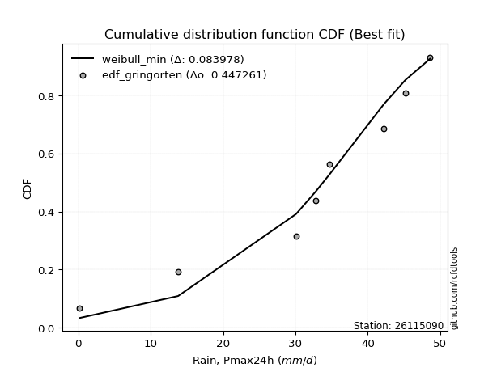</img></img>

</div>


### 9. Empirical - EDF Filliben (1975)

The specific values of the constants (0.3175) (often denoted as $alpha$) and (0.365) are derived from a method proposed by James J. Filliben in a 1975 paper. This particular formula is the mean value of the $i$-th order statistic of the normal distribution and is considered a robust and effective plotting position formula for the normal probability plot correlation coefficient test for normality.

<div align="center">


$P=(m-0.3175)/(n+0.365)$


</div>


**9.1. Empirical values**

<div align="center">

|                | 0                   | 1                  | 2                   | 3                   | 4            | 5                  | 6                  | 7                  | 8                  |
|:---------------|:--------------------|:-------------------|:--------------------|:--------------------|:-------------|:-------------------|:-------------------|:-------------------|:-------------------|
| date           | 2020                | 2025               | 2022                | 2021                | 2023         | 2018               | 2019               | 2017               | 2024               |
| x              | 0.2                 | 9.8                | 13.8                | 30.1                | 32.8         | 34.7               | 42.2               | 45.2               | 48.6               |
| m              | 1                   | 2                  | 3                   | 4                   | 5            | 6                  | 7                  | 8                  | 9                  |
| empirical_dist | edf_filliben        | edf_filliben       | edf_filliben        | edf_filliben        | edf_filliben | edf_filliben       | edf_filliben       | edf_filliben       | edf_filliben       |
| empirical      | 0.07287773625200214 | 0.1796583021890016 | 0.28643886812600106 | 0.39321943406300053 | 0.5          | 0.6067805659369995 | 0.7135611318739989 | 0.8203416978109984 | 0.9271222637479978 |
| empirical_tr   | 1.0786063921681543  | 1.219004230393752  | 1.401421623643846   | 1.6480422349318082  | 2.0          | 2.5431093007467753 | 3.491146318732526  | 5.566121842496286  | 13.721611721611705 |

</div>


**9.2. Kolmogorov-Smirnov fit test (sorted by Δ)**


<div align="center">

|                | 0                   | 1                   | 2                   | 3                   | 4                   | 5                   | 6                   | 7                   | 8                   | 9                   | 10                  | 11                  | 12                  | 13                  | 14                  | 15                  | 16                  | 17                  | 18                  | 19                  | 20                  | 21                  | 22                  | 23                  | 24                  | 25                  | 26                  | 27                  | 28                  | 29                  | 30                  | 31                  | 32                  | 33                  | 34                  | 35                  | 36                  | 37                  | 38                  | 39                    | 40                  | 41                  | 42                  | 43                  | 44                  | 45                  | 46                  | 47                  | 48                  | 49                  | 50                  | 51                  | 52                  | 53                  | 54                  | 55                  | 56                  | 57                  | 58                  | 59                  | 60                  | 61                  | 62                  | 63                  | 64                  | 65                  | 66                  | 67                  | 68                  | 69                  | 70                  | 71                  | 72                  | 73                  | 74                  | 75                  | 76                  | 77                  | 78                  | 79                  | 80                  | 81                  | 82                  | 83                  | 84                  | 85                  | 86                  | 87                  | 88                  | 89                  |
|:---------------|:--------------------|:--------------------|:--------------------|:--------------------|:--------------------|:--------------------|:--------------------|:--------------------|:--------------------|:--------------------|:--------------------|:--------------------|:--------------------|:--------------------|:--------------------|:--------------------|:--------------------|:--------------------|:--------------------|:--------------------|:--------------------|:--------------------|:--------------------|:--------------------|:--------------------|:--------------------|:--------------------|:--------------------|:--------------------|:--------------------|:--------------------|:--------------------|:--------------------|:--------------------|:--------------------|:--------------------|:--------------------|:--------------------|:--------------------|:----------------------|:--------------------|:--------------------|:--------------------|:--------------------|:--------------------|:--------------------|:--------------------|:--------------------|:--------------------|:--------------------|:--------------------|:--------------------|:--------------------|:--------------------|:--------------------|:--------------------|:--------------------|:--------------------|:--------------------|:--------------------|:--------------------|:--------------------|:--------------------|:--------------------|:--------------------|:--------------------|:--------------------|:--------------------|:--------------------|:--------------------|:--------------------|:--------------------|:--------------------|:--------------------|:--------------------|:--------------------|:--------------------|:--------------------|:--------------------|:--------------------|:--------------------|:--------------------|:--------------------|:--------------------|:--------------------|:--------------------|:--------------------|:--------------------|:--------------------|:--------------------|
| station        | 26115090            | 26115090            | 26115090            | 26115090            | 26115090            | 26115090            | 26115090            | 26115090            | 26115090            | 26115090            | 26115090            | 26115090            | 26115090            | 26115090            | 26115090            | 26115090            | 26115090            | 26115090            | 26115090            | 26115090            | 26115090            | 26115090            | 26115090            | 26115090            | 26115090            | 26115090            | 26115090            | 26115090            | 26115090            | 26115090            | 26115090            | 26115090            | 26115090            | 26115090            | 26115090            | 26115090            | 26115090            | 26115090            | 26115090            | 26115090              | 26115090            | 26115090            | 26115090            | 26115090            | 26115090            | 26115090            | 26115090            | 26115090            | 26115090            | 26115090            | 26115090            | 26115090            | 26115090            | 26115090            | 26115090            | 26115090            | 26115090            | 26115090            | 26115090            | 26115090            | 26115090            | 26115090            | 26115090            | 26115090            | 26115090            | 26115090            | 26115090            | 26115090            | 26115090            | 26115090            | 26115090            | 26115090            | 26115090            | 26115090            | 26115090            | 26115090            | 26115090            | 26115090            | 26115090            | 26115090            | 26115090            | 26115090            | 26115090            | 26115090            | 26115090            | 26115090            | 26115090            | 26115090            | 26115090            | 26115090            |
| empirical_dist | edf_filliben        | edf_filliben        | edf_filliben        | edf_filliben        | edf_filliben        | edf_filliben        | edf_filliben        | edf_filliben        | edf_filliben        | edf_filliben        | edf_filliben        | edf_filliben        | edf_filliben        | edf_filliben        | edf_filliben        | edf_filliben        | edf_filliben        | edf_filliben        | edf_filliben        | edf_filliben        | edf_filliben        | edf_filliben        | edf_filliben        | edf_filliben        | edf_filliben        | edf_filliben        | edf_filliben        | edf_filliben        | edf_filliben        | edf_filliben        | edf_filliben        | edf_filliben        | edf_filliben        | edf_filliben        | edf_filliben        | edf_filliben        | edf_filliben        | edf_filliben        | edf_filliben        | edf_filliben          | edf_filliben        | edf_filliben        | edf_filliben        | edf_filliben        | edf_filliben        | edf_filliben        | edf_filliben        | edf_filliben        | edf_filliben        | edf_filliben        | edf_filliben        | edf_filliben        | edf_filliben        | edf_filliben        | edf_filliben        | edf_filliben        | edf_filliben        | edf_filliben        | edf_filliben        | edf_filliben        | edf_filliben        | edf_filliben        | edf_filliben        | edf_filliben        | edf_filliben        | edf_filliben        | edf_filliben        | edf_filliben        | edf_filliben        | edf_filliben        | edf_filliben        | edf_filliben        | edf_filliben        | edf_filliben        | edf_filliben        | edf_filliben        | edf_filliben        | edf_filliben        | edf_filliben        | edf_filliben        | edf_filliben        | edf_filliben        | edf_filliben        | edf_filliben        | edf_filliben        | edf_filliben        | edf_filliben        | edf_filliben        | edf_filliben        | edf_filliben        |
| p_dist         | logjohnsonsu        | pearson3            | johnsonsu           | laplace_asymmetric  | fisk                | gumbel_l            | weibull_min         | fatiguelife         | nct                 | norm                | crystalball         | exponnorm           | t                   | f                   | logistic            | betaprime           | hypsecant           | gamma               | erlang              | rice                | chi2                | laplace             | invgamma            | alpha               | maxwell             | invgauss            | rayleigh            | truncnorm           | logt                | invweibull          | loggumbel_l         | kstwobign           | logpearson3         | halfnorm            | gumbel_r            | mielke              | ncf                 | moyal               | halflogistic        | loglaplace_asymmetric | logloggamma         | loggamma            | loggamma            | loglognorm          | logfatiguelife      | lognorm             | lognorm             | logcrystalball      | logexponnorm        | lognct              | logrice             | lognakagami         | genexpon            | expon               | logalpha            | loginvgamma         | loginvgauss         | loglogistic         | logmaxwell          | lograyleigh         | loghypsecant        | loginvweibull       | loghalfnorm         | wald                | loglaplace          | logkstwobign        | loggumbel_r         | gompertz            | loghalflogistic     | logmoyal            | gibrat              | nakagami            | loggenexpon         | logwald             | logexpon            | logfisk             | logncf              | loggibrat           | pareto              | logmielke           | logpareto           | logf                | logtruncnorm        | logweibull_min      | logbetaprime        | logchi2             | loggompertz         | genlogistic         | loggenlogistic      | logerlang           |
| delta          | 0.105909189673138   | 0.11385022939965159 | 0.118351368491591   | 0.12489955802077704 | 0.1289140697964561  | 0.12917060006102904 | 0.13049470581025763 | 0.14318085877539755 | 0.1441809747510242  | 0.14418614606274183 | 0.14418615326407247 | 0.1441863238429415  | 0.14419022355584088 | 0.14495254970822324 | 0.1492567387721796  | 0.151352058224565   | 0.153561095396488   | 0.15469338930163723 | 0.1550174772983074  | 0.15763292709894727 | 0.16173229820495139 | 0.1689579321356881  | 0.17192824224992953 | 0.17430827743020905 | 0.17536760609218716 | 0.18075942428666236 | 0.1854723443216092  | 0.18577329465540893 | 0.18702745318292807 | 0.1918125737137255  | 0.20122152510308966 | 0.21077844277318725 | 0.21269886897750978 | 0.21394622363429905 | 0.21467423686757037 | 0.22669655204276806 | 0.22978324187012933 | 0.23988411537106002 | 0.24077164549521313 | 0.24880451206927856   | 0.2501774344094916  | 0.25027067812889825 | 0.25027067812889825 | 0.25039941774963703 | 0.25041254699942517 | 0.25111059679391257 | 0.25111059679391257 | 0.2511106041818646  | 0.25111088955299843 | 0.2511292866345406  | 0.2512819823129513  | 0.2515547425250789  | 0.2537126471390382  | 0.25782716990050625 | 0.2616951639061086  | 0.26178626023030505 | 0.2632303585466125  | 0.268554466165156   | 0.2733451084453554  | 0.28005554788112563 | 0.2821912825756471  | 0.2828830136212068  | 0.2995062655868451  | 0.3098491450096075  | 0.310511421056494   | 0.31088349718509845 | 0.3119641351146061  | 0.323547372255181   | 0.3277024209418933  | 0.33216937105357414 | 0.3378597753036271  | 0.3639988842278584  | 0.3806342299780616  | 0.38927357175198507 | 0.40685732749367964 | 0.4072079032875945  | 0.4179128137603132  | 0.42151512653919754 | 0.44879704414673305 | 0.4575226353397519  | 0.4859815172383065  | 0.5138260082261582  | 0.5222062763438876  | 0.6058979792944391  | 0.6892605508108165  | 0.7367577041984086  | 0.7984974702372801  | 0.8203416978109984  | 0.8203416978109984  | 0.8896588881187676  |
| deltao         | 0.41761268023100007 | 0.41761268023100007 | 0.41761268023100007 | 0.41761268023100007 | 0.41761268023100007 | 0.41761268023100007 | 0.41761268023100007 | 0.41761268023100007 | 0.41761268023100007 | 0.41761268023100007 | 0.41761268023100007 | 0.41761268023100007 | 0.41761268023100007 | 0.41761268023100007 | 0.41761268023100007 | 0.41761268023100007 | 0.41761268023100007 | 0.41761268023100007 | 0.41761268023100007 | 0.41761268023100007 | 0.41761268023100007 | 0.41761268023100007 | 0.41761268023100007 | 0.41761268023100007 | 0.41761268023100007 | 0.41761268023100007 | 0.41761268023100007 | 0.41761268023100007 | 0.41761268023100007 | 0.41761268023100007 | 0.41761268023100007 | 0.41761268023100007 | 0.41761268023100007 | 0.41761268023100007 | 0.41761268023100007 | 0.41761268023100007 | 0.41761268023100007 | 0.41761268023100007 | 0.41761268023100007 | 0.41761268023100007   | 0.41761268023100007 | 0.41761268023100007 | 0.41761268023100007 | 0.41761268023100007 | 0.41761268023100007 | 0.41761268023100007 | 0.41761268023100007 | 0.41761268023100007 | 0.41761268023100007 | 0.41761268023100007 | 0.41761268023100007 | 0.41761268023100007 | 0.41761268023100007 | 0.41761268023100007 | 0.41761268023100007 | 0.41761268023100007 | 0.41761268023100007 | 0.41761268023100007 | 0.41761268023100007 | 0.41761268023100007 | 0.41761268023100007 | 0.41761268023100007 | 0.41761268023100007 | 0.41761268023100007 | 0.41761268023100007 | 0.41761268023100007 | 0.41761268023100007 | 0.41761268023100007 | 0.41761268023100007 | 0.41761268023100007 | 0.41761268023100007 | 0.41761268023100007 | 0.41761268023100007 | 0.41761268023100007 | 0.41761268023100007 | 0.41761268023100007 | 0.41761268023100007 | 0.41761268023100007 | 0.41761268023100007 | 0.41761268023100007 | 0.41761268023100007 | 0.41761268023100007 | 0.41761268023100007 | 0.41761268023100007 | 0.41761268023100007 | 0.41761268023100007 | 0.41761268023100007 | 0.41761268023100007 | 0.41761268023100007 | 0.41761268023100007 |
| eval           | Δo > Δ              | Δo > Δ              | Δo > Δ              | Δo > Δ              | Δo > Δ              | Δo > Δ              | Δo > Δ              | Δo > Δ              | Δo > Δ              | Δo > Δ              | Δo > Δ              | Δo > Δ              | Δo > Δ              | Δo > Δ              | Δo > Δ              | Δo > Δ              | Δo > Δ              | Δo > Δ              | Δo > Δ              | Δo > Δ              | Δo > Δ              | Δo > Δ              | Δo > Δ              | Δo > Δ              | Δo > Δ              | Δo > Δ              | Δo > Δ              | Δo > Δ              | Δo > Δ              | Δo > Δ              | Δo > Δ              | Δo > Δ              | Δo > Δ              | Δo > Δ              | Δo > Δ              | Δo > Δ              | Δo > Δ              | Δo > Δ              | Δo > Δ              | Δo > Δ                | Δo > Δ              | Δo > Δ              | Δo > Δ              | Δo > Δ              | Δo > Δ              | Δo > Δ              | Δo > Δ              | Δo > Δ              | Δo > Δ              | Δo > Δ              | Δo > Δ              | Δo > Δ              | Δo > Δ              | Δo > Δ              | Δo > Δ              | Δo > Δ              | Δo > Δ              | Δo > Δ              | Δo > Δ              | Δo > Δ              | Δo > Δ              | Δo > Δ              | Δo > Δ              | Δo > Δ              | Δo > Δ              | Δo > Δ              | Δo > Δ              | Δo > Δ              | Δo > Δ              | Δo > Δ              | Δo > Δ              | Δo > Δ              | Δo > Δ              | Δo > Δ              | Δo > Δ              | Δo > Δ              | Δo <= Δ             | Δo <= Δ             | Δo <= Δ             | Δo <= Δ             | Δo <= Δ             | Δo <= Δ             | Δo <= Δ             | Δo <= Δ             | Δo <= Δ             | Δo <= Δ             | Δo <= Δ             | Δo <= Δ             | Δo <= Δ             | Δo <= Δ             |
| fit            | 1                   | 1                   | 1                   | 1                   | 1                   | 1                   | 1                   | 1                   | 1                   | 1                   | 1                   | 1                   | 1                   | 1                   | 1                   | 1                   | 1                   | 1                   | 1                   | 1                   | 1                   | 1                   | 1                   | 1                   | 1                   | 1                   | 1                   | 1                   | 1                   | 1                   | 1                   | 1                   | 1                   | 1                   | 1                   | 1                   | 1                   | 1                   | 1                   | 1                     | 1                   | 1                   | 1                   | 1                   | 1                   | 1                   | 1                   | 1                   | 1                   | 1                   | 1                   | 1                   | 1                   | 1                   | 1                   | 1                   | 1                   | 1                   | 1                   | 1                   | 1                   | 1                   | 1                   | 1                   | 1                   | 1                   | 1                   | 1                   | 1                   | 1                   | 1                   | 1                   | 1                   | 1                   | 1                   | 1                   | 0                   | 0                   | 0                   | 0                   | 0                   | 0                   | 0                   | 0                   | 0                   | 0                   | 0                   | 0                   | 0                   | 0                   |
| n              | 9                   | 9                   | 9                   | 9                   | 9                   | 9                   | 9                   | 9                   | 9                   | 9                   | 9                   | 9                   | 9                   | 9                   | 9                   | 9                   | 9                   | 9                   | 9                   | 9                   | 9                   | 9                   | 9                   | 9                   | 9                   | 9                   | 9                   | 9                   | 9                   | 9                   | 9                   | 9                   | 9                   | 9                   | 9                   | 9                   | 9                   | 9                   | 9                   | 9                     | 9                   | 9                   | 9                   | 9                   | 9                   | 9                   | 9                   | 9                   | 9                   | 9                   | 9                   | 9                   | 9                   | 9                   | 9                   | 9                   | 9                   | 9                   | 9                   | 9                   | 9                   | 9                   | 9                   | 9                   | 9                   | 9                   | 9                   | 9                   | 9                   | 9                   | 9                   | 9                   | 9                   | 9                   | 9                   | 9                   | 9                   | 9                   | 9                   | 9                   | 9                   | 9                   | 9                   | 9                   | 9                   | 9                   | 9                   | 9                   | 9                   | 9                   |
| best_fit       | 1                   | 0                   | 0                   | 0                   | 0                   | 0                   | 0                   | 0                   | 0                   | 0                   | 0                   | 0                   | 0                   | 0                   | 0                   | 0                   | 0                   | 0                   | 0                   | 0                   | 0                   | 0                   | 0                   | 0                   | 0                   | 0                   | 0                   | 0                   | 0                   | 0                   | 0                   | 0                   | 0                   | 0                   | 0                   | 0                   | 0                   | 0                   | 0                   | 0                     | 0                   | 0                   | 0                   | 0                   | 0                   | 0                   | 0                   | 0                   | 0                   | 0                   | 0                   | 0                   | 0                   | 0                   | 0                   | 0                   | 0                   | 0                   | 0                   | 0                   | 0                   | 0                   | 0                   | 0                   | 0                   | 0                   | 0                   | 0                   | 0                   | 0                   | 0                   | 0                   | 0                   | 0                   | 0                   | 0                   | 0                   | 0                   | 0                   | 0                   | 0                   | 0                   | 0                   | 0                   | 0                   | 0                   | 0                   | 0                   | 0                   | 0                   |
| best_fit_sort  | 1                   | 2                   | 3                   | 4                   | 5                   | 6                   | 7                   | 8                   | 9                   | 10                  | 11                  | 12                  | 13                  | 14                  | 15                  | 16                  | 17                  | 18                  | 19                  | 20                  | 21                  | 22                  | 23                  | 24                  | 25                  | 26                  | 27                  | 28                  | 29                  | 30                  | 31                  | 32                  | 33                  | 34                  | 35                  | 36                  | 37                  | 38                  | 39                  | 40                    | 41                  | 42                  | 43                  | 44                  | 45                  | 46                  | 47                  | 48                  | 49                  | 50                  | 51                  | 52                  | 53                  | 54                  | 55                  | 56                  | 57                  | 58                  | 59                  | 60                  | 61                  | 62                  | 63                  | 64                  | 65                  | 66                  | 67                  | 68                  | 69                  | 70                  | 71                  | 72                  | 73                  | 74                  | 75                  | 76                  | 77                  | 78                  | 79                  | 80                  | 81                  | 82                  | 83                  | 84                  | 85                  | 86                  | 87                  | 88                  | 89                  | 90                  |

</div>


<div align="center">

</img>

</div>


**9.3. Best fit**

<div align="center">

|   id |   station | empirical_dist   | p_dist       |    delta |   deltao | eval   |   fit |   n |   best_fit |   best_fit_sort |
|-----:|----------:|:-----------------|:-------------|---------:|---------:|:-------|------:|----:|-----------:|----------------:|
|    0 |  26115090 | edf_filliben     | logjohnsonsu | 0.105909 | 0.417613 | Δo > Δ |     1 |   9 |          1 |               1 |

</div>


<div align="center">

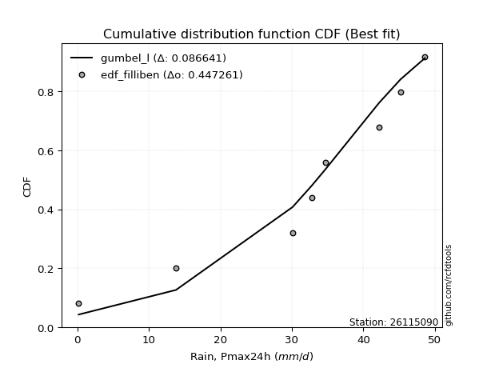</img></img>

</div>


### 10. Empirical - EDF Jenkinson (1977)

The Jenkinson formula in hydrology is an empirical plotting position formula used to estimate the non-exceedance probability _(P)_ or return period _(T)_ of a given ordered observation within a sample. It is a widely used method in the frequency analysis of extreme events such as floods and rainfall, as it provides a distribution-free way to plot data. _a≈0.31_ and _b≈0.38_ are constants derived to approximate the median of the probability distribution for the given rank.

<div align="center">


$P=(m-a)/(n+b)$


</div>


**10.1. Empirical values**

<div align="center">

|                | 0                   | 1                   | 2                  | 3                   | 4             | 5                  | 6                  | 7                  | 8                  |
|:---------------|:--------------------|:--------------------|:-------------------|:--------------------|:--------------|:-------------------|:-------------------|:-------------------|:-------------------|
| date           | 2020                | 2025                | 2022               | 2021                | 2023          | 2018               | 2019               | 2017               | 2024               |
| x              | 0.2                 | 9.8                 | 13.8               | 30.1                | 32.8          | 34.7               | 42.2               | 45.2               | 48.6               |
| m              | 1                   | 2                   | 3                  | 4                   | 5             | 6                  | 7                  | 8                  | 9                  |
| empirical_dist | edf_jenkinson       | edf_jenkinson       | edf_jenkinson      | edf_jenkinson       | edf_jenkinson | edf_jenkinson      | edf_jenkinson      | edf_jenkinson      | edf_jenkinson      |
| empirical      | 0.07356076759061833 | 0.18017057569296374 | 0.2867803837953091 | 0.39339019189765456 | 0.5           | 0.6066098081023454 | 0.7132196162046908 | 0.8198294243070362 | 0.9264392324093815 |
| empirical_tr   | 1.0794016110471807  | 1.2197659297789336  | 1.4020926756352765 | 1.6485061511423549  | 2.0           | 2.542005420054201  | 3.486988847583642  | 5.550295857988164  | 13.5942028985507   |

</div>


**10.2. Kolmogorov-Smirnov fit test (sorted by Δ)**


<div align="center">

|                | 0                   | 1                   | 2                   | 3                   | 4                   | 5                   | 6                   | 7                   | 8                   | 9                   | 10                  | 11                  | 12                  | 13                  | 14                  | 15                  | 16                  | 17                  | 18                  | 19                  | 20                  | 21                  | 22                  | 23                  | 24                  | 25                  | 26                  | 27                  | 28                  | 29                  | 30                  | 31                  | 32                  | 33                  | 34                  | 35                  | 36                  | 37                  | 38                  | 39                    | 40                  | 41                  | 42                  | 43                  | 44                  | 45                  | 46                  | 47                  | 48                  | 49                  | 50                  | 51                  | 52                  | 53                  | 54                  | 55                  | 56                  | 57                  | 58                  | 59                  | 60                  | 61                  | 62                  | 63                  | 64                  | 65                  | 66                  | 67                  | 68                  | 69                  | 70                  | 71                  | 72                  | 73                  | 74                  | 75                  | 76                  | 77                  | 78                  | 79                  | 80                  | 81                  | 82                  | 83                  | 84                  | 85                  | 86                  | 87                  | 88                  | 89                  |
|:---------------|:--------------------|:--------------------|:--------------------|:--------------------|:--------------------|:--------------------|:--------------------|:--------------------|:--------------------|:--------------------|:--------------------|:--------------------|:--------------------|:--------------------|:--------------------|:--------------------|:--------------------|:--------------------|:--------------------|:--------------------|:--------------------|:--------------------|:--------------------|:--------------------|:--------------------|:--------------------|:--------------------|:--------------------|:--------------------|:--------------------|:--------------------|:--------------------|:--------------------|:--------------------|:--------------------|:--------------------|:--------------------|:--------------------|:--------------------|:----------------------|:--------------------|:--------------------|:--------------------|:--------------------|:--------------------|:--------------------|:--------------------|:--------------------|:--------------------|:--------------------|:--------------------|:--------------------|:--------------------|:--------------------|:--------------------|:--------------------|:--------------------|:--------------------|:--------------------|:--------------------|:--------------------|:--------------------|:--------------------|:--------------------|:--------------------|:--------------------|:--------------------|:--------------------|:--------------------|:--------------------|:--------------------|:--------------------|:--------------------|:--------------------|:--------------------|:--------------------|:--------------------|:--------------------|:--------------------|:--------------------|:--------------------|:--------------------|:--------------------|:--------------------|:--------------------|:--------------------|:--------------------|:--------------------|:--------------------|:--------------------|
| station        | 26115090            | 26115090            | 26115090            | 26115090            | 26115090            | 26115090            | 26115090            | 26115090            | 26115090            | 26115090            | 26115090            | 26115090            | 26115090            | 26115090            | 26115090            | 26115090            | 26115090            | 26115090            | 26115090            | 26115090            | 26115090            | 26115090            | 26115090            | 26115090            | 26115090            | 26115090            | 26115090            | 26115090            | 26115090            | 26115090            | 26115090            | 26115090            | 26115090            | 26115090            | 26115090            | 26115090            | 26115090            | 26115090            | 26115090            | 26115090              | 26115090            | 26115090            | 26115090            | 26115090            | 26115090            | 26115090            | 26115090            | 26115090            | 26115090            | 26115090            | 26115090            | 26115090            | 26115090            | 26115090            | 26115090            | 26115090            | 26115090            | 26115090            | 26115090            | 26115090            | 26115090            | 26115090            | 26115090            | 26115090            | 26115090            | 26115090            | 26115090            | 26115090            | 26115090            | 26115090            | 26115090            | 26115090            | 26115090            | 26115090            | 26115090            | 26115090            | 26115090            | 26115090            | 26115090            | 26115090            | 26115090            | 26115090            | 26115090            | 26115090            | 26115090            | 26115090            | 26115090            | 26115090            | 26115090            | 26115090            |
| empirical_dist | edf_jenkinson       | edf_jenkinson       | edf_jenkinson       | edf_jenkinson       | edf_jenkinson       | edf_jenkinson       | edf_jenkinson       | edf_jenkinson       | edf_jenkinson       | edf_jenkinson       | edf_jenkinson       | edf_jenkinson       | edf_jenkinson       | edf_jenkinson       | edf_jenkinson       | edf_jenkinson       | edf_jenkinson       | edf_jenkinson       | edf_jenkinson       | edf_jenkinson       | edf_jenkinson       | edf_jenkinson       | edf_jenkinson       | edf_jenkinson       | edf_jenkinson       | edf_jenkinson       | edf_jenkinson       | edf_jenkinson       | edf_jenkinson       | edf_jenkinson       | edf_jenkinson       | edf_jenkinson       | edf_jenkinson       | edf_jenkinson       | edf_jenkinson       | edf_jenkinson       | edf_jenkinson       | edf_jenkinson       | edf_jenkinson       | edf_jenkinson         | edf_jenkinson       | edf_jenkinson       | edf_jenkinson       | edf_jenkinson       | edf_jenkinson       | edf_jenkinson       | edf_jenkinson       | edf_jenkinson       | edf_jenkinson       | edf_jenkinson       | edf_jenkinson       | edf_jenkinson       | edf_jenkinson       | edf_jenkinson       | edf_jenkinson       | edf_jenkinson       | edf_jenkinson       | edf_jenkinson       | edf_jenkinson       | edf_jenkinson       | edf_jenkinson       | edf_jenkinson       | edf_jenkinson       | edf_jenkinson       | edf_jenkinson       | edf_jenkinson       | edf_jenkinson       | edf_jenkinson       | edf_jenkinson       | edf_jenkinson       | edf_jenkinson       | edf_jenkinson       | edf_jenkinson       | edf_jenkinson       | edf_jenkinson       | edf_jenkinson       | edf_jenkinson       | edf_jenkinson       | edf_jenkinson       | edf_jenkinson       | edf_jenkinson       | edf_jenkinson       | edf_jenkinson       | edf_jenkinson       | edf_jenkinson       | edf_jenkinson       | edf_jenkinson       | edf_jenkinson       | edf_jenkinson       | edf_jenkinson       |
| p_dist         | logjohnsonsu        | pearson3            | johnsonsu           | laplace_asymmetric  | fisk                | gumbel_l            | weibull_min         | fatiguelife         | nct                 | norm                | crystalball         | exponnorm           | t                   | f                   | logistic            | betaprime           | hypsecant           | gamma               | erlang              | rice                | chi2                | laplace             | invgamma            | alpha               | maxwell             | invgauss            | rayleigh            | truncnorm           | logt                | invweibull          | loggumbel_l         | kstwobign           | logpearson3         | halfnorm            | gumbel_r            | mielke              | ncf                 | moyal               | halflogistic        | loglaplace_asymmetric | logloggamma         | loggamma            | loggamma            | loglognorm          | logfatiguelife      | lognorm             | lognorm             | logcrystalball      | logexponnorm        | lognct              | logrice             | lognakagami         | genexpon            | expon               | logalpha            | loginvgamma         | loginvgauss         | loglogistic         | logmaxwell          | lograyleigh         | loghypsecant        | loginvweibull       | loghalfnorm         | wald                | loglaplace          | logkstwobign        | loggumbel_r         | gompertz            | loghalflogistic     | logmoyal            | gibrat              | nakagami            | loggenexpon         | logwald             | logexpon            | logfisk             | logncf              | loggibrat           | pareto              | logmielke           | logpareto           | logf                | logtruncnorm        | logweibull_min      | logbetaprime        | logchi2             | loggompertz         | genlogistic         | loggenlogistic      | logerlang           |
| delta          | 0.10573843183848397 | 0.11419174506895965 | 0.11869288416089907 | 0.1252410736900851  | 0.12925558546576416 | 0.1295121157303371  | 0.1308362214795657  | 0.1430101009407435  | 0.14401021691637017 | 0.1440153882280878  | 0.14401539542941844 | 0.14401556600828747 | 0.14401946572118685 | 0.1447817918735692  | 0.14908598093752556 | 0.15118130038991096 | 0.15339033756183396 | 0.1545226314669832  | 0.15484671946365336 | 0.15746216926429324 | 0.16156154037029735 | 0.16878717430103407 | 0.1717574844152755  | 0.174137519595555   | 0.17519684825753312 | 0.18058866645200833 | 0.18530158648695516 | 0.1856025368207549  | 0.18736896885223614 | 0.19164181587907148 | 0.20105076726843563 | 0.2106076849385332  | 0.21201583763889353 | 0.21377546579964501 | 0.21450347903291633 | 0.22652579420811403 | 0.2296124840354753  | 0.239713357536406   | 0.2406008876605591  | 0.24863375423462453   | 0.25000667657483755 | 0.2500999202942442  | 0.2500999202942442  | 0.250228659914983   | 0.25024178916477113 | 0.25093983895925853 | 0.25093983895925853 | 0.25093984634721056 | 0.2509401317183444  | 0.25095852879988656 | 0.25111122447829726 | 0.2513839846904249  | 0.25354188930438415 | 0.2576564120658522  | 0.26152440607145455 | 0.261615502395651   | 0.26305960071195844 | 0.26838370833050196 | 0.2731743506107014  | 0.2798847900464716  | 0.28202052474099304 | 0.28237074011724467 | 0.2993355077521911  | 0.30967838717495344 | 0.31034066322183995 | 0.3103712236811363  | 0.31179337727995204 | 0.32337661442052695 | 0.32753166310723925 | 0.3319986132189201  | 0.33768901746897306 | 0.3638281263932044  | 0.38012195647409946 | 0.38910281391733104 | 0.4063450539897175  | 0.40669562978363233 | 0.41740054025635104 | 0.4213443687045435  | 0.4482847706427709  | 0.45701036183578975 | 0.48546924373434436 | 0.5133137347221961  | 0.5216940028399255  | 0.605385705790477   | 0.6887482773068543  | 0.7362454306944464  | 0.797985196733318   | 0.8198294243070362  | 0.8198294243070362  | 0.8889758567801513  |
| deltao         | 0.41761268023100007 | 0.41761268023100007 | 0.41761268023100007 | 0.41761268023100007 | 0.41761268023100007 | 0.41761268023100007 | 0.41761268023100007 | 0.41761268023100007 | 0.41761268023100007 | 0.41761268023100007 | 0.41761268023100007 | 0.41761268023100007 | 0.41761268023100007 | 0.41761268023100007 | 0.41761268023100007 | 0.41761268023100007 | 0.41761268023100007 | 0.41761268023100007 | 0.41761268023100007 | 0.41761268023100007 | 0.41761268023100007 | 0.41761268023100007 | 0.41761268023100007 | 0.41761268023100007 | 0.41761268023100007 | 0.41761268023100007 | 0.41761268023100007 | 0.41761268023100007 | 0.41761268023100007 | 0.41761268023100007 | 0.41761268023100007 | 0.41761268023100007 | 0.41761268023100007 | 0.41761268023100007 | 0.41761268023100007 | 0.41761268023100007 | 0.41761268023100007 | 0.41761268023100007 | 0.41761268023100007 | 0.41761268023100007   | 0.41761268023100007 | 0.41761268023100007 | 0.41761268023100007 | 0.41761268023100007 | 0.41761268023100007 | 0.41761268023100007 | 0.41761268023100007 | 0.41761268023100007 | 0.41761268023100007 | 0.41761268023100007 | 0.41761268023100007 | 0.41761268023100007 | 0.41761268023100007 | 0.41761268023100007 | 0.41761268023100007 | 0.41761268023100007 | 0.41761268023100007 | 0.41761268023100007 | 0.41761268023100007 | 0.41761268023100007 | 0.41761268023100007 | 0.41761268023100007 | 0.41761268023100007 | 0.41761268023100007 | 0.41761268023100007 | 0.41761268023100007 | 0.41761268023100007 | 0.41761268023100007 | 0.41761268023100007 | 0.41761268023100007 | 0.41761268023100007 | 0.41761268023100007 | 0.41761268023100007 | 0.41761268023100007 | 0.41761268023100007 | 0.41761268023100007 | 0.41761268023100007 | 0.41761268023100007 | 0.41761268023100007 | 0.41761268023100007 | 0.41761268023100007 | 0.41761268023100007 | 0.41761268023100007 | 0.41761268023100007 | 0.41761268023100007 | 0.41761268023100007 | 0.41761268023100007 | 0.41761268023100007 | 0.41761268023100007 | 0.41761268023100007 |
| eval           | Δo > Δ              | Δo > Δ              | Δo > Δ              | Δo > Δ              | Δo > Δ              | Δo > Δ              | Δo > Δ              | Δo > Δ              | Δo > Δ              | Δo > Δ              | Δo > Δ              | Δo > Δ              | Δo > Δ              | Δo > Δ              | Δo > Δ              | Δo > Δ              | Δo > Δ              | Δo > Δ              | Δo > Δ              | Δo > Δ              | Δo > Δ              | Δo > Δ              | Δo > Δ              | Δo > Δ              | Δo > Δ              | Δo > Δ              | Δo > Δ              | Δo > Δ              | Δo > Δ              | Δo > Δ              | Δo > Δ              | Δo > Δ              | Δo > Δ              | Δo > Δ              | Δo > Δ              | Δo > Δ              | Δo > Δ              | Δo > Δ              | Δo > Δ              | Δo > Δ                | Δo > Δ              | Δo > Δ              | Δo > Δ              | Δo > Δ              | Δo > Δ              | Δo > Δ              | Δo > Δ              | Δo > Δ              | Δo > Δ              | Δo > Δ              | Δo > Δ              | Δo > Δ              | Δo > Δ              | Δo > Δ              | Δo > Δ              | Δo > Δ              | Δo > Δ              | Δo > Δ              | Δo > Δ              | Δo > Δ              | Δo > Δ              | Δo > Δ              | Δo > Δ              | Δo > Δ              | Δo > Δ              | Δo > Δ              | Δo > Δ              | Δo > Δ              | Δo > Δ              | Δo > Δ              | Δo > Δ              | Δo > Δ              | Δo > Δ              | Δo > Δ              | Δo > Δ              | Δo > Δ              | Δo > Δ              | Δo <= Δ             | Δo <= Δ             | Δo <= Δ             | Δo <= Δ             | Δo <= Δ             | Δo <= Δ             | Δo <= Δ             | Δo <= Δ             | Δo <= Δ             | Δo <= Δ             | Δo <= Δ             | Δo <= Δ             | Δo <= Δ             |
| fit            | 1                   | 1                   | 1                   | 1                   | 1                   | 1                   | 1                   | 1                   | 1                   | 1                   | 1                   | 1                   | 1                   | 1                   | 1                   | 1                   | 1                   | 1                   | 1                   | 1                   | 1                   | 1                   | 1                   | 1                   | 1                   | 1                   | 1                   | 1                   | 1                   | 1                   | 1                   | 1                   | 1                   | 1                   | 1                   | 1                   | 1                   | 1                   | 1                   | 1                     | 1                   | 1                   | 1                   | 1                   | 1                   | 1                   | 1                   | 1                   | 1                   | 1                   | 1                   | 1                   | 1                   | 1                   | 1                   | 1                   | 1                   | 1                   | 1                   | 1                   | 1                   | 1                   | 1                   | 1                   | 1                   | 1                   | 1                   | 1                   | 1                   | 1                   | 1                   | 1                   | 1                   | 1                   | 1                   | 1                   | 1                   | 0                   | 0                   | 0                   | 0                   | 0                   | 0                   | 0                   | 0                   | 0                   | 0                   | 0                   | 0                   | 0                   |
| n              | 9                   | 9                   | 9                   | 9                   | 9                   | 9                   | 9                   | 9                   | 9                   | 9                   | 9                   | 9                   | 9                   | 9                   | 9                   | 9                   | 9                   | 9                   | 9                   | 9                   | 9                   | 9                   | 9                   | 9                   | 9                   | 9                   | 9                   | 9                   | 9                   | 9                   | 9                   | 9                   | 9                   | 9                   | 9                   | 9                   | 9                   | 9                   | 9                   | 9                     | 9                   | 9                   | 9                   | 9                   | 9                   | 9                   | 9                   | 9                   | 9                   | 9                   | 9                   | 9                   | 9                   | 9                   | 9                   | 9                   | 9                   | 9                   | 9                   | 9                   | 9                   | 9                   | 9                   | 9                   | 9                   | 9                   | 9                   | 9                   | 9                   | 9                   | 9                   | 9                   | 9                   | 9                   | 9                   | 9                   | 9                   | 9                   | 9                   | 9                   | 9                   | 9                   | 9                   | 9                   | 9                   | 9                   | 9                   | 9                   | 9                   | 9                   |
| best_fit       | 1                   | 0                   | 0                   | 0                   | 0                   | 0                   | 0                   | 0                   | 0                   | 0                   | 0                   | 0                   | 0                   | 0                   | 0                   | 0                   | 0                   | 0                   | 0                   | 0                   | 0                   | 0                   | 0                   | 0                   | 0                   | 0                   | 0                   | 0                   | 0                   | 0                   | 0                   | 0                   | 0                   | 0                   | 0                   | 0                   | 0                   | 0                   | 0                   | 0                     | 0                   | 0                   | 0                   | 0                   | 0                   | 0                   | 0                   | 0                   | 0                   | 0                   | 0                   | 0                   | 0                   | 0                   | 0                   | 0                   | 0                   | 0                   | 0                   | 0                   | 0                   | 0                   | 0                   | 0                   | 0                   | 0                   | 0                   | 0                   | 0                   | 0                   | 0                   | 0                   | 0                   | 0                   | 0                   | 0                   | 0                   | 0                   | 0                   | 0                   | 0                   | 0                   | 0                   | 0                   | 0                   | 0                   | 0                   | 0                   | 0                   | 0                   |
| best_fit_sort  | 1                   | 2                   | 3                   | 4                   | 5                   | 6                   | 7                   | 8                   | 9                   | 10                  | 11                  | 12                  | 13                  | 14                  | 15                  | 16                  | 17                  | 18                  | 19                  | 20                  | 21                  | 22                  | 23                  | 24                  | 25                  | 26                  | 27                  | 28                  | 29                  | 30                  | 31                  | 32                  | 33                  | 34                  | 35                  | 36                  | 37                  | 38                  | 39                  | 40                    | 41                  | 42                  | 43                  | 44                  | 45                  | 46                  | 47                  | 48                  | 49                  | 50                  | 51                  | 52                  | 53                  | 54                  | 55                  | 56                  | 57                  | 58                  | 59                  | 60                  | 61                  | 62                  | 63                  | 64                  | 65                  | 66                  | 67                  | 68                  | 69                  | 70                  | 71                  | 72                  | 73                  | 74                  | 75                  | 76                  | 77                  | 78                  | 79                  | 80                  | 81                  | 82                  | 83                  | 84                  | 85                  | 86                  | 87                  | 88                  | 89                  | 90                  |

</div>


<div align="center">

</img>

</div>


**10.3. Best fit**

<div align="center">

|   id |   station | empirical_dist   | p_dist       |    delta |   deltao | eval   |   fit |   n |   best_fit |   best_fit_sort |
|-----:|----------:|:-----------------|:-------------|---------:|---------:|:-------|------:|----:|-----------:|----------------:|
|    0 |  26115090 | edf_jenkinson    | logjohnsonsu | 0.105738 | 0.417613 | Δo > Δ |     1 |   9 |          1 |               1 |

</div>


<div align="center">

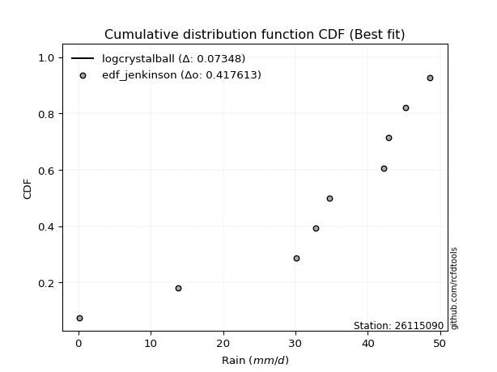</img>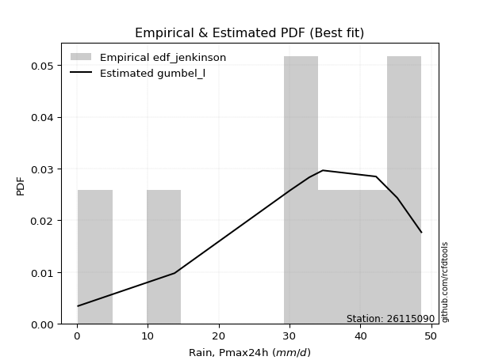</img>

</div>


### 11. Empirical - EDF Cunnane (1978)

Cunnane´s work in statistical hydrology has focused on the performance and evaluation of different probability distributions (such as GEV, Gumbel, Lognormal) for flood frequency estimation. _b_ is a constant, typically set to 0.4.

<div align="center">


$P=(m-b)/(n+1-2b)$


</div>


**11.1. Empirical values**

<div align="center">

|                | 0                   | 1                  | 2                   | 3                  | 4           | 5                  | 6                 | 7                  | 8                  |
|:---------------|:--------------------|:-------------------|:--------------------|:-------------------|:------------|:-------------------|:------------------|:-------------------|:-------------------|
| date           | 2020                | 2025               | 2022                | 2021               | 2023        | 2018               | 2019              | 2017               | 2024               |
| x              | 0.2                 | 9.8                | 13.8                | 30.1               | 32.8        | 34.7               | 42.2              | 45.2               | 48.6               |
| m              | 1                   | 2                  | 3                   | 4                  | 5           | 6                  | 7                 | 8                  | 9                  |
| empirical_dist | edf_cunnane         | edf_cunnane        | edf_cunnane         | edf_cunnane        | edf_cunnane | edf_cunnane        | edf_cunnane       | edf_cunnane        | edf_cunnane        |
| empirical      | 0.06521739130434782 | 0.1739130434782609 | 0.28260869565217395 | 0.391304347826087  | 0.5         | 0.6086956521739131 | 0.717391304347826 | 0.8260869565217391 | 0.9347826086956522 |
| empirical_tr   | 1.069767441860465   | 1.2105263157894737 | 1.393939393939394   | 1.6428571428571428 | 2.0         | 2.555555555555556  | 3.538461538461538 | 5.75               | 15.333333333333343 |

</div>


**11.2. Kolmogorov-Smirnov fit test (sorted by Δ)**


<div align="center">

|                | 0                   | 1                   | 2                   | 3                   | 4                   | 5                   | 6                   | 7                   | 8                   | 9                   | 10                  | 11                  | 12                  | 13                  | 14                  | 15                  | 16                  | 17                  | 18                  | 19                  | 20                  | 21                  | 22                  | 23                  | 24                  | 25                  | 26                  | 27                  | 28                  | 29                  | 30                  | 31                  | 32                  | 33                  | 34                  | 35                  | 36                  | 37                  | 38                  | 39                    | 40                  | 41                  | 42                  | 43                  | 44                  | 45                  | 46                  | 47                  | 48                  | 49                  | 50                  | 51                  | 52                  | 53                  | 54                  | 55                  | 56                  | 57                  | 58                  | 59                  | 60                  | 61                  | 62                  | 63                  | 64                  | 65                  | 66                  | 67                  | 68                  | 69                  | 70                  | 71                  | 72                  | 73                  | 74                  | 75                  | 76                  | 77                  | 78                  | 79                  | 80                  | 81                  | 82                  | 83                  | 84                  | 85                  | 86                  | 87                  | 88                  | 89                  |
|:---------------|:--------------------|:--------------------|:--------------------|:--------------------|:--------------------|:--------------------|:--------------------|:--------------------|:--------------------|:--------------------|:--------------------|:--------------------|:--------------------|:--------------------|:--------------------|:--------------------|:--------------------|:--------------------|:--------------------|:--------------------|:--------------------|:--------------------|:--------------------|:--------------------|:--------------------|:--------------------|:--------------------|:--------------------|:--------------------|:--------------------|:--------------------|:--------------------|:--------------------|:--------------------|:--------------------|:--------------------|:--------------------|:--------------------|:--------------------|:----------------------|:--------------------|:--------------------|:--------------------|:--------------------|:--------------------|:--------------------|:--------------------|:--------------------|:--------------------|:--------------------|:--------------------|:--------------------|:--------------------|:--------------------|:--------------------|:--------------------|:--------------------|:--------------------|:--------------------|:--------------------|:--------------------|:--------------------|:--------------------|:--------------------|:--------------------|:--------------------|:--------------------|:--------------------|:--------------------|:--------------------|:--------------------|:--------------------|:--------------------|:--------------------|:--------------------|:--------------------|:--------------------|:--------------------|:--------------------|:--------------------|:--------------------|:--------------------|:--------------------|:--------------------|:--------------------|:--------------------|:--------------------|:--------------------|:--------------------|:--------------------|
| station        | 26115090            | 26115090            | 26115090            | 26115090            | 26115090            | 26115090            | 26115090            | 26115090            | 26115090            | 26115090            | 26115090            | 26115090            | 26115090            | 26115090            | 26115090            | 26115090            | 26115090            | 26115090            | 26115090            | 26115090            | 26115090            | 26115090            | 26115090            | 26115090            | 26115090            | 26115090            | 26115090            | 26115090            | 26115090            | 26115090            | 26115090            | 26115090            | 26115090            | 26115090            | 26115090            | 26115090            | 26115090            | 26115090            | 26115090            | 26115090              | 26115090            | 26115090            | 26115090            | 26115090            | 26115090            | 26115090            | 26115090            | 26115090            | 26115090            | 26115090            | 26115090            | 26115090            | 26115090            | 26115090            | 26115090            | 26115090            | 26115090            | 26115090            | 26115090            | 26115090            | 26115090            | 26115090            | 26115090            | 26115090            | 26115090            | 26115090            | 26115090            | 26115090            | 26115090            | 26115090            | 26115090            | 26115090            | 26115090            | 26115090            | 26115090            | 26115090            | 26115090            | 26115090            | 26115090            | 26115090            | 26115090            | 26115090            | 26115090            | 26115090            | 26115090            | 26115090            | 26115090            | 26115090            | 26115090            | 26115090            |
| empirical_dist | edf_cunnane         | edf_cunnane         | edf_cunnane         | edf_cunnane         | edf_cunnane         | edf_cunnane         | edf_cunnane         | edf_cunnane         | edf_cunnane         | edf_cunnane         | edf_cunnane         | edf_cunnane         | edf_cunnane         | edf_cunnane         | edf_cunnane         | edf_cunnane         | edf_cunnane         | edf_cunnane         | edf_cunnane         | edf_cunnane         | edf_cunnane         | edf_cunnane         | edf_cunnane         | edf_cunnane         | edf_cunnane         | edf_cunnane         | edf_cunnane         | edf_cunnane         | edf_cunnane         | edf_cunnane         | edf_cunnane         | edf_cunnane         | edf_cunnane         | edf_cunnane         | edf_cunnane         | edf_cunnane         | edf_cunnane         | edf_cunnane         | edf_cunnane         | edf_cunnane           | edf_cunnane         | edf_cunnane         | edf_cunnane         | edf_cunnane         | edf_cunnane         | edf_cunnane         | edf_cunnane         | edf_cunnane         | edf_cunnane         | edf_cunnane         | edf_cunnane         | edf_cunnane         | edf_cunnane         | edf_cunnane         | edf_cunnane         | edf_cunnane         | edf_cunnane         | edf_cunnane         | edf_cunnane         | edf_cunnane         | edf_cunnane         | edf_cunnane         | edf_cunnane         | edf_cunnane         | edf_cunnane         | edf_cunnane         | edf_cunnane         | edf_cunnane         | edf_cunnane         | edf_cunnane         | edf_cunnane         | edf_cunnane         | edf_cunnane         | edf_cunnane         | edf_cunnane         | edf_cunnane         | edf_cunnane         | edf_cunnane         | edf_cunnane         | edf_cunnane         | edf_cunnane         | edf_cunnane         | edf_cunnane         | edf_cunnane         | edf_cunnane         | edf_cunnane         | edf_cunnane         | edf_cunnane         | edf_cunnane         | edf_cunnane         |
| p_dist         | logjohnsonsu        | johnsonsu           | pearson3            | laplace_asymmetric  | fisk                | gumbel_l            | weibull_min         | fatiguelife         | nct                 | norm                | crystalball         | exponnorm           | t                   | f                   | logistic            | betaprime           | hypsecant           | gamma               | erlang              | rice                | chi2                | laplace             | invgamma            | alpha               | maxwell             | invgauss            | logt                | rayleigh            | truncnorm           | invweibull          | loggumbel_l         | kstwobign           | halfnorm            | gumbel_r            | logpearson3         | mielke              | ncf                 | moyal               | halflogistic        | loglaplace_asymmetric | logloggamma         | loggamma            | loggamma            | loglognorm          | logfatiguelife      | lognorm             | lognorm             | logcrystalball      | logexponnorm        | lognct              | logrice             | lognakagami         | genexpon            | expon               | logalpha            | loginvgamma         | loginvgauss         | loglogistic         | logmaxwell          | lograyleigh         | loghypsecant        | loginvweibull       | loghalfnorm         | wald                | loglaplace          | loggumbel_r         | logkstwobign        | gompertz            | loghalflogistic     | logmoyal            | gibrat              | nakagami            | loggenexpon         | logwald             | logexpon            | logfisk             | loggibrat           | logncf              | pareto              | logmielke           | logpareto           | logf                | logtruncnorm        | logweibull_min      | logbetaprime        | logchi2             | loggompertz         | genlogistic         | loggenlogistic      | logerlang           |
| delta          | 0.10782427591005161 | 0.1145211960177639  | 0.11480345947068188 | 0.12106938554694993 | 0.12508389732262898 | 0.12534042758720193 | 0.12666453333643052 | 0.1450959450123111  | 0.14609606098793776 | 0.14610123229965538 | 0.14610123950098602 | 0.14610141007985505 | 0.14610530979275443 | 0.1468676359451368  | 0.15117182500909315 | 0.15326714446147854 | 0.15547618163340154 | 0.15660847553855078 | 0.15693256353522095 | 0.15954801333586083 | 0.16364738444186494 | 0.17087301837260166 | 0.17384332848684309 | 0.1762233636671226  | 0.1772826923291007  | 0.18267451052357592 | 0.18319728070910096 | 0.18738743055852275 | 0.18768838089232248 | 0.19372765995063906 | 0.20393274448462273 | 0.2126935290101008  | 0.2158613098712126  | 0.21658932310448392 | 0.22035921392516422 | 0.22861163827968162 | 0.23169832810704288 | 0.24179920160797358 | 0.24268673173212668 | 0.2507195983061921    | 0.25209252064640514 | 0.2521857643658118  | 0.2521857643658118  | 0.2523145039865506  | 0.2523276332363387  | 0.2530256830308261  | 0.2530256830308261  | 0.25302569041877815 | 0.253025975789912   | 0.25304437287145415 | 0.25319706854986485 | 0.2534698287619925  | 0.25562773337595174 | 0.2597422561374198  | 0.26361025014302214 | 0.2637013464672186  | 0.26514544478352603 | 0.27046955240206955 | 0.275260194682269   | 0.2819706341180392  | 0.28410636881256063 | 0.28862827233194754 | 0.3014213518237587  | 0.31176423124652103 | 0.31242650729340754 | 0.31387922135151963 | 0.31662875589583916 | 0.3254624584920946  | 0.32961750717880683 | 0.3340844572904877  | 0.33977486154054065 | 0.365913970464772   | 0.38637948868880234 | 0.3911886579888986  | 0.41260258620442036 | 0.4129531619983352  | 0.4234302127761111  | 0.4236580724710539  | 0.45454230285747377 | 0.4632678940504926  | 0.49172677594904723 | 0.5195712669368989  | 0.5279515350546283  | 0.6116432380051798  | 0.6950058095215572  | 0.7425029629091493  | 0.8042427289480208  | 0.8260869565217391  | 0.8260869565217391  | 0.8973192330664219  |
| deltao         | 0.41761268023100007 | 0.41761268023100007 | 0.41761268023100007 | 0.41761268023100007 | 0.41761268023100007 | 0.41761268023100007 | 0.41761268023100007 | 0.41761268023100007 | 0.41761268023100007 | 0.41761268023100007 | 0.41761268023100007 | 0.41761268023100007 | 0.41761268023100007 | 0.41761268023100007 | 0.41761268023100007 | 0.41761268023100007 | 0.41761268023100007 | 0.41761268023100007 | 0.41761268023100007 | 0.41761268023100007 | 0.41761268023100007 | 0.41761268023100007 | 0.41761268023100007 | 0.41761268023100007 | 0.41761268023100007 | 0.41761268023100007 | 0.41761268023100007 | 0.41761268023100007 | 0.41761268023100007 | 0.41761268023100007 | 0.41761268023100007 | 0.41761268023100007 | 0.41761268023100007 | 0.41761268023100007 | 0.41761268023100007 | 0.41761268023100007 | 0.41761268023100007 | 0.41761268023100007 | 0.41761268023100007 | 0.41761268023100007   | 0.41761268023100007 | 0.41761268023100007 | 0.41761268023100007 | 0.41761268023100007 | 0.41761268023100007 | 0.41761268023100007 | 0.41761268023100007 | 0.41761268023100007 | 0.41761268023100007 | 0.41761268023100007 | 0.41761268023100007 | 0.41761268023100007 | 0.41761268023100007 | 0.41761268023100007 | 0.41761268023100007 | 0.41761268023100007 | 0.41761268023100007 | 0.41761268023100007 | 0.41761268023100007 | 0.41761268023100007 | 0.41761268023100007 | 0.41761268023100007 | 0.41761268023100007 | 0.41761268023100007 | 0.41761268023100007 | 0.41761268023100007 | 0.41761268023100007 | 0.41761268023100007 | 0.41761268023100007 | 0.41761268023100007 | 0.41761268023100007 | 0.41761268023100007 | 0.41761268023100007 | 0.41761268023100007 | 0.41761268023100007 | 0.41761268023100007 | 0.41761268023100007 | 0.41761268023100007 | 0.41761268023100007 | 0.41761268023100007 | 0.41761268023100007 | 0.41761268023100007 | 0.41761268023100007 | 0.41761268023100007 | 0.41761268023100007 | 0.41761268023100007 | 0.41761268023100007 | 0.41761268023100007 | 0.41761268023100007 | 0.41761268023100007 |
| eval           | Δo > Δ              | Δo > Δ              | Δo > Δ              | Δo > Δ              | Δo > Δ              | Δo > Δ              | Δo > Δ              | Δo > Δ              | Δo > Δ              | Δo > Δ              | Δo > Δ              | Δo > Δ              | Δo > Δ              | Δo > Δ              | Δo > Δ              | Δo > Δ              | Δo > Δ              | Δo > Δ              | Δo > Δ              | Δo > Δ              | Δo > Δ              | Δo > Δ              | Δo > Δ              | Δo > Δ              | Δo > Δ              | Δo > Δ              | Δo > Δ              | Δo > Δ              | Δo > Δ              | Δo > Δ              | Δo > Δ              | Δo > Δ              | Δo > Δ              | Δo > Δ              | Δo > Δ              | Δo > Δ              | Δo > Δ              | Δo > Δ              | Δo > Δ              | Δo > Δ                | Δo > Δ              | Δo > Δ              | Δo > Δ              | Δo > Δ              | Δo > Δ              | Δo > Δ              | Δo > Δ              | Δo > Δ              | Δo > Δ              | Δo > Δ              | Δo > Δ              | Δo > Δ              | Δo > Δ              | Δo > Δ              | Δo > Δ              | Δo > Δ              | Δo > Δ              | Δo > Δ              | Δo > Δ              | Δo > Δ              | Δo > Δ              | Δo > Δ              | Δo > Δ              | Δo > Δ              | Δo > Δ              | Δo > Δ              | Δo > Δ              | Δo > Δ              | Δo > Δ              | Δo > Δ              | Δo > Δ              | Δo > Δ              | Δo > Δ              | Δo > Δ              | Δo > Δ              | Δo > Δ              | Δo <= Δ             | Δo <= Δ             | Δo <= Δ             | Δo <= Δ             | Δo <= Δ             | Δo <= Δ             | Δo <= Δ             | Δo <= Δ             | Δo <= Δ             | Δo <= Δ             | Δo <= Δ             | Δo <= Δ             | Δo <= Δ             | Δo <= Δ             |
| fit            | 1                   | 1                   | 1                   | 1                   | 1                   | 1                   | 1                   | 1                   | 1                   | 1                   | 1                   | 1                   | 1                   | 1                   | 1                   | 1                   | 1                   | 1                   | 1                   | 1                   | 1                   | 1                   | 1                   | 1                   | 1                   | 1                   | 1                   | 1                   | 1                   | 1                   | 1                   | 1                   | 1                   | 1                   | 1                   | 1                   | 1                   | 1                   | 1                   | 1                     | 1                   | 1                   | 1                   | 1                   | 1                   | 1                   | 1                   | 1                   | 1                   | 1                   | 1                   | 1                   | 1                   | 1                   | 1                   | 1                   | 1                   | 1                   | 1                   | 1                   | 1                   | 1                   | 1                   | 1                   | 1                   | 1                   | 1                   | 1                   | 1                   | 1                   | 1                   | 1                   | 1                   | 1                   | 1                   | 1                   | 0                   | 0                   | 0                   | 0                   | 0                   | 0                   | 0                   | 0                   | 0                   | 0                   | 0                   | 0                   | 0                   | 0                   |
| n              | 9                   | 9                   | 9                   | 9                   | 9                   | 9                   | 9                   | 9                   | 9                   | 9                   | 9                   | 9                   | 9                   | 9                   | 9                   | 9                   | 9                   | 9                   | 9                   | 9                   | 9                   | 9                   | 9                   | 9                   | 9                   | 9                   | 9                   | 9                   | 9                   | 9                   | 9                   | 9                   | 9                   | 9                   | 9                   | 9                   | 9                   | 9                   | 9                   | 9                     | 9                   | 9                   | 9                   | 9                   | 9                   | 9                   | 9                   | 9                   | 9                   | 9                   | 9                   | 9                   | 9                   | 9                   | 9                   | 9                   | 9                   | 9                   | 9                   | 9                   | 9                   | 9                   | 9                   | 9                   | 9                   | 9                   | 9                   | 9                   | 9                   | 9                   | 9                   | 9                   | 9                   | 9                   | 9                   | 9                   | 9                   | 9                   | 9                   | 9                   | 9                   | 9                   | 9                   | 9                   | 9                   | 9                   | 9                   | 9                   | 9                   | 9                   |
| best_fit       | 1                   | 0                   | 0                   | 0                   | 0                   | 0                   | 0                   | 0                   | 0                   | 0                   | 0                   | 0                   | 0                   | 0                   | 0                   | 0                   | 0                   | 0                   | 0                   | 0                   | 0                   | 0                   | 0                   | 0                   | 0                   | 0                   | 0                   | 0                   | 0                   | 0                   | 0                   | 0                   | 0                   | 0                   | 0                   | 0                   | 0                   | 0                   | 0                   | 0                     | 0                   | 0                   | 0                   | 0                   | 0                   | 0                   | 0                   | 0                   | 0                   | 0                   | 0                   | 0                   | 0                   | 0                   | 0                   | 0                   | 0                   | 0                   | 0                   | 0                   | 0                   | 0                   | 0                   | 0                   | 0                   | 0                   | 0                   | 0                   | 0                   | 0                   | 0                   | 0                   | 0                   | 0                   | 0                   | 0                   | 0                   | 0                   | 0                   | 0                   | 0                   | 0                   | 0                   | 0                   | 0                   | 0                   | 0                   | 0                   | 0                   | 0                   |
| best_fit_sort  | 1                   | 2                   | 3                   | 4                   | 5                   | 6                   | 7                   | 8                   | 9                   | 10                  | 11                  | 12                  | 13                  | 14                  | 15                  | 16                  | 17                  | 18                  | 19                  | 20                  | 21                  | 22                  | 23                  | 24                  | 25                  | 26                  | 27                  | 28                  | 29                  | 30                  | 31                  | 32                  | 33                  | 34                  | 35                  | 36                  | 37                  | 38                  | 39                  | 40                    | 41                  | 42                  | 43                  | 44                  | 45                  | 46                  | 47                  | 48                  | 49                  | 50                  | 51                  | 52                  | 53                  | 54                  | 55                  | 56                  | 57                  | 58                  | 59                  | 60                  | 61                  | 62                  | 63                  | 64                  | 65                  | 66                  | 67                  | 68                  | 69                  | 70                  | 71                  | 72                  | 73                  | 74                  | 75                  | 76                  | 77                  | 78                  | 79                  | 80                  | 81                  | 82                  | 83                  | 84                  | 85                  | 86                  | 87                  | 88                  | 89                  | 90                  |

</div>


<div align="center">

</img>

</div>


**11.3. Best fit**

<div align="center">

|   id |   station | empirical_dist   | p_dist       |    delta |   deltao | eval   |   fit |   n |   best_fit |   best_fit_sort |
|-----:|----------:|:-----------------|:-------------|---------:|---------:|:-------|------:|----:|-----------:|----------------:|
|    0 |  26115090 | edf_cunnane      | logjohnsonsu | 0.107824 | 0.417613 | Δo > Δ |     1 |   9 |          1 |               1 |

</div>


<div align="center">

</img>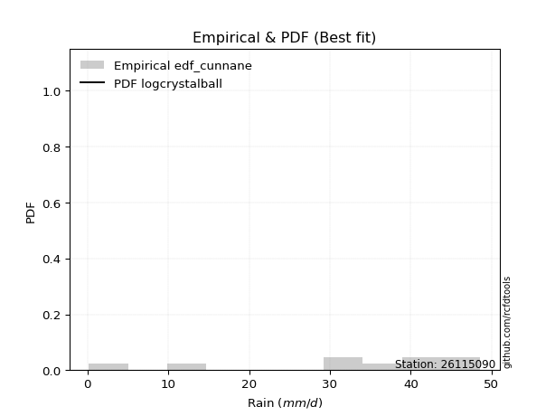</img>

</div>


### 12. Empirical - EDF Adamowski (1981)

The Adamowski formula in hydrology refers to a specific plotting position formula used for estimating the non-parametric empirical distribution of hydrological events (like flood peaks) to calculate their return periods. This formula provides an alternative to traditional parametric methods (like the Gumbel or Log Pearson Type III distributions). 

<div align="center">


$P=(m-0.25)/(n+0.5)$


</div>


**12.1. Empirical values**

<div align="center">

|                | 0                   | 1                   | 2                  | 3                   | 4             | 5                  | 6                  | 7                  | 8                  |
|:---------------|:--------------------|:--------------------|:-------------------|:--------------------|:--------------|:-------------------|:-------------------|:-------------------|:-------------------|
| date           | 2020                | 2025                | 2022               | 2021                | 2023          | 2018               | 2019               | 2017               | 2024               |
| x              | 0.2                 | 9.8                 | 13.8               | 30.1                | 32.8          | 34.7               | 42.2               | 45.2               | 48.6               |
| m              | 1                   | 2                   | 3                  | 4                   | 5             | 6                  | 7                  | 8                  | 9                  |
| empirical_dist | edf_adamowski       | edf_adamowski       | edf_adamowski      | edf_adamowski       | edf_adamowski | edf_adamowski      | edf_adamowski      | edf_adamowski      | edf_adamowski      |
| empirical      | 0.07894736842105263 | 0.18421052631578946 | 0.2894736842105263 | 0.39473684210526316 | 0.5           | 0.6052631578947368 | 0.7105263157894737 | 0.8157894736842105 | 0.9210526315789473 |
| empirical_tr   | 1.0857142857142856  | 1.2258064516129032  | 1.4074074074074074 | 1.6521739130434783  | 2.0           | 2.533333333333333  | 3.4545454545454546 | 5.428571428571428  | 12.666666666666663 |

</div>


**12.2. Kolmogorov-Smirnov fit test (sorted by Δ)**


<div align="center">

|                | 0                   | 1                   | 2                   | 3                   | 4                   | 5                   | 6                   | 7                   | 8                   | 9                   | 10                  | 11                  | 12                  | 13                  | 14                  | 15                  | 16                  | 17                  | 18                  | 19                  | 20                  | 21                  | 22                  | 23                  | 24                  | 25                  | 26                  | 27                  | 28                  | 29                  | 30                  | 31                  | 32                  | 33                  | 34                  | 35                  | 36                  | 37                  | 38                  | 39                    | 40                  | 41                  | 42                  | 43                  | 44                  | 45                  | 46                  | 47                  | 48                  | 49                  | 50                  | 51                  | 52                  | 53                  | 54                  | 55                  | 56                  | 57                  | 58                  | 59                  | 60                  | 61                  | 62                  | 63                  | 64                  | 65                  | 66                  | 67                  | 68                  | 69                  | 70                  | 71                  | 72                  | 73                  | 74                  | 75                  | 76                  | 77                  | 78                  | 79                  | 80                  | 81                  | 82                  | 83                  | 84                  | 85                  | 86                  | 87                  | 88                  | 89                  |
|:---------------|:--------------------|:--------------------|:--------------------|:--------------------|:--------------------|:--------------------|:--------------------|:--------------------|:--------------------|:--------------------|:--------------------|:--------------------|:--------------------|:--------------------|:--------------------|:--------------------|:--------------------|:--------------------|:--------------------|:--------------------|:--------------------|:--------------------|:--------------------|:--------------------|:--------------------|:--------------------|:--------------------|:--------------------|:--------------------|:--------------------|:--------------------|:--------------------|:--------------------|:--------------------|:--------------------|:--------------------|:--------------------|:--------------------|:--------------------|:----------------------|:--------------------|:--------------------|:--------------------|:--------------------|:--------------------|:--------------------|:--------------------|:--------------------|:--------------------|:--------------------|:--------------------|:--------------------|:--------------------|:--------------------|:--------------------|:--------------------|:--------------------|:--------------------|:--------------------|:--------------------|:--------------------|:--------------------|:--------------------|:--------------------|:--------------------|:--------------------|:--------------------|:--------------------|:--------------------|:--------------------|:--------------------|:--------------------|:--------------------|:--------------------|:--------------------|:--------------------|:--------------------|:--------------------|:--------------------|:--------------------|:--------------------|:--------------------|:--------------------|:--------------------|:--------------------|:--------------------|:--------------------|:--------------------|:--------------------|:--------------------|
| station        | 26115090            | 26115090            | 26115090            | 26115090            | 26115090            | 26115090            | 26115090            | 26115090            | 26115090            | 26115090            | 26115090            | 26115090            | 26115090            | 26115090            | 26115090            | 26115090            | 26115090            | 26115090            | 26115090            | 26115090            | 26115090            | 26115090            | 26115090            | 26115090            | 26115090            | 26115090            | 26115090            | 26115090            | 26115090            | 26115090            | 26115090            | 26115090            | 26115090            | 26115090            | 26115090            | 26115090            | 26115090            | 26115090            | 26115090            | 26115090              | 26115090            | 26115090            | 26115090            | 26115090            | 26115090            | 26115090            | 26115090            | 26115090            | 26115090            | 26115090            | 26115090            | 26115090            | 26115090            | 26115090            | 26115090            | 26115090            | 26115090            | 26115090            | 26115090            | 26115090            | 26115090            | 26115090            | 26115090            | 26115090            | 26115090            | 26115090            | 26115090            | 26115090            | 26115090            | 26115090            | 26115090            | 26115090            | 26115090            | 26115090            | 26115090            | 26115090            | 26115090            | 26115090            | 26115090            | 26115090            | 26115090            | 26115090            | 26115090            | 26115090            | 26115090            | 26115090            | 26115090            | 26115090            | 26115090            | 26115090            |
| empirical_dist | edf_adamowski       | edf_adamowski       | edf_adamowski       | edf_adamowski       | edf_adamowski       | edf_adamowski       | edf_adamowski       | edf_adamowski       | edf_adamowski       | edf_adamowski       | edf_adamowski       | edf_adamowski       | edf_adamowski       | edf_adamowski       | edf_adamowski       | edf_adamowski       | edf_adamowski       | edf_adamowski       | edf_adamowski       | edf_adamowski       | edf_adamowski       | edf_adamowski       | edf_adamowski       | edf_adamowski       | edf_adamowski       | edf_adamowski       | edf_adamowski       | edf_adamowski       | edf_adamowski       | edf_adamowski       | edf_adamowski       | edf_adamowski       | edf_adamowski       | edf_adamowski       | edf_adamowski       | edf_adamowski       | edf_adamowski       | edf_adamowski       | edf_adamowski       | edf_adamowski         | edf_adamowski       | edf_adamowski       | edf_adamowski       | edf_adamowski       | edf_adamowski       | edf_adamowski       | edf_adamowski       | edf_adamowski       | edf_adamowski       | edf_adamowski       | edf_adamowski       | edf_adamowski       | edf_adamowski       | edf_adamowski       | edf_adamowski       | edf_adamowski       | edf_adamowski       | edf_adamowski       | edf_adamowski       | edf_adamowski       | edf_adamowski       | edf_adamowski       | edf_adamowski       | edf_adamowski       | edf_adamowski       | edf_adamowski       | edf_adamowski       | edf_adamowski       | edf_adamowski       | edf_adamowski       | edf_adamowski       | edf_adamowski       | edf_adamowski       | edf_adamowski       | edf_adamowski       | edf_adamowski       | edf_adamowski       | edf_adamowski       | edf_adamowski       | edf_adamowski       | edf_adamowski       | edf_adamowski       | edf_adamowski       | edf_adamowski       | edf_adamowski       | edf_adamowski       | edf_adamowski       | edf_adamowski       | edf_adamowski       | edf_adamowski       |
| p_dist         | logjohnsonsu        | pearson3            | johnsonsu           | laplace_asymmetric  | fisk                | gumbel_l            | weibull_min         | fatiguelife         | nct                 | norm                | crystalball         | exponnorm           | t                   | f                   | logistic            | betaprime           | hypsecant           | gamma               | erlang              | rice                | chi2                | laplace             | invgamma            | alpha               | maxwell             | invgauss            | rayleigh            | truncnorm           | logt                | invweibull          | loggumbel_l         | logpearson3         | kstwobign           | halfnorm            | gumbel_r            | mielke              | ncf                 | moyal               | halflogistic        | loglaplace_asymmetric | logloggamma         | loggamma            | loggamma            | loglognorm          | logfatiguelife      | lognorm             | lognorm             | logcrystalball      | logexponnorm        | lognct              | logrice             | lognakagami         | genexpon            | expon               | logalpha            | loginvgamma         | loginvgauss         | loglogistic         | logmaxwell          | loginvweibull       | lograyleigh         | loghypsecant        | loghalfnorm         | logkstwobign        | wald                | loglaplace          | loggumbel_r         | gompertz            | loghalflogistic     | logmoyal            | gibrat              | nakagami            | loggenexpon         | logwald             | logexpon            | logfisk             | logncf              | loggibrat           | pareto              | logmielke           | logpareto           | logf                | logtruncnorm        | logweibull_min      | logbetaprime        | logchi2             | loggompertz         | genlogistic         | loggenlogistic      | logerlang           |
| delta          | 0.10439178163087537 | 0.11688504548417686 | 0.12138618457611627 | 0.1279343741053023  | 0.13194888588098136 | 0.1322054161455543  | 0.1335295218947829  | 0.1416634507331349  | 0.14266356670876157 | 0.1426687380204792  | 0.14266874522180983 | 0.14266891580067886 | 0.14267281551357824 | 0.1434351416659606  | 0.14773933072991696 | 0.14983465018230235 | 0.15204368735422535 | 0.1531759812593746  | 0.15350006925604476 | 0.15611551905668464 | 0.16021489016268875 | 0.16744052409342547 | 0.1704108342076669  | 0.1727908693879464  | 0.17385019804992452 | 0.17924201624439973 | 0.18395493627934656 | 0.1842558866131463  | 0.19006226926745334 | 0.19029516567146287 | 0.19970411706082702 | 0.20662923680845935 | 0.2092610347309246  | 0.2124288155920364  | 0.21315682882530773 | 0.22517914400050543 | 0.2282658338278667  | 0.2383667073287974  | 0.2392542374529505  | 0.24728710402701592   | 0.24866002636722895 | 0.24875327008663561 | 0.24875327008663561 | 0.2488820097073744  | 0.24889513895716253 | 0.24959318875164993 | 0.24959318875164993 | 0.24959319613960196 | 0.2495934815107358  | 0.24961187859227796 | 0.24976457427068866 | 0.2500373344828163  | 0.25219523909677555 | 0.2563097618582436  | 0.26017775586384595 | 0.2602688521880424  | 0.26171295050434984 | 0.26703705812289336 | 0.2718277004030928  | 0.2783307894944189  | 0.278538139838863   | 0.28067387453338444 | 0.2979888575445825  | 0.30633127305831054 | 0.30833173696734484 | 0.30899401301423135 | 0.31044672707234344 | 0.32202996421291835 | 0.32618501289963064 | 0.3306519630113115  | 0.33634236726136446 | 0.3624814761855958  | 0.3760820058512737  | 0.38775616370972243 | 0.40230510336689174 | 0.4026556791608066  | 0.4133605896335253  | 0.4199977184969349  | 0.44424482001994514 | 0.452970411212964   | 0.4814292931115186  | 0.5092737840993703  | 0.5176540522170997  | 0.6013457551676512  | 0.6847083266840286  | 0.7322054800716207  | 0.7939452461104922  | 0.8157894736842105  | 0.8157894736842105  | 0.883589255949717   |
| deltao         | 0.41761268023100007 | 0.41761268023100007 | 0.41761268023100007 | 0.41761268023100007 | 0.41761268023100007 | 0.41761268023100007 | 0.41761268023100007 | 0.41761268023100007 | 0.41761268023100007 | 0.41761268023100007 | 0.41761268023100007 | 0.41761268023100007 | 0.41761268023100007 | 0.41761268023100007 | 0.41761268023100007 | 0.41761268023100007 | 0.41761268023100007 | 0.41761268023100007 | 0.41761268023100007 | 0.41761268023100007 | 0.41761268023100007 | 0.41761268023100007 | 0.41761268023100007 | 0.41761268023100007 | 0.41761268023100007 | 0.41761268023100007 | 0.41761268023100007 | 0.41761268023100007 | 0.41761268023100007 | 0.41761268023100007 | 0.41761268023100007 | 0.41761268023100007 | 0.41761268023100007 | 0.41761268023100007 | 0.41761268023100007 | 0.41761268023100007 | 0.41761268023100007 | 0.41761268023100007 | 0.41761268023100007 | 0.41761268023100007   | 0.41761268023100007 | 0.41761268023100007 | 0.41761268023100007 | 0.41761268023100007 | 0.41761268023100007 | 0.41761268023100007 | 0.41761268023100007 | 0.41761268023100007 | 0.41761268023100007 | 0.41761268023100007 | 0.41761268023100007 | 0.41761268023100007 | 0.41761268023100007 | 0.41761268023100007 | 0.41761268023100007 | 0.41761268023100007 | 0.41761268023100007 | 0.41761268023100007 | 0.41761268023100007 | 0.41761268023100007 | 0.41761268023100007 | 0.41761268023100007 | 0.41761268023100007 | 0.41761268023100007 | 0.41761268023100007 | 0.41761268023100007 | 0.41761268023100007 | 0.41761268023100007 | 0.41761268023100007 | 0.41761268023100007 | 0.41761268023100007 | 0.41761268023100007 | 0.41761268023100007 | 0.41761268023100007 | 0.41761268023100007 | 0.41761268023100007 | 0.41761268023100007 | 0.41761268023100007 | 0.41761268023100007 | 0.41761268023100007 | 0.41761268023100007 | 0.41761268023100007 | 0.41761268023100007 | 0.41761268023100007 | 0.41761268023100007 | 0.41761268023100007 | 0.41761268023100007 | 0.41761268023100007 | 0.41761268023100007 | 0.41761268023100007 |
| eval           | Δo > Δ              | Δo > Δ              | Δo > Δ              | Δo > Δ              | Δo > Δ              | Δo > Δ              | Δo > Δ              | Δo > Δ              | Δo > Δ              | Δo > Δ              | Δo > Δ              | Δo > Δ              | Δo > Δ              | Δo > Δ              | Δo > Δ              | Δo > Δ              | Δo > Δ              | Δo > Δ              | Δo > Δ              | Δo > Δ              | Δo > Δ              | Δo > Δ              | Δo > Δ              | Δo > Δ              | Δo > Δ              | Δo > Δ              | Δo > Δ              | Δo > Δ              | Δo > Δ              | Δo > Δ              | Δo > Δ              | Δo > Δ              | Δo > Δ              | Δo > Δ              | Δo > Δ              | Δo > Δ              | Δo > Δ              | Δo > Δ              | Δo > Δ              | Δo > Δ                | Δo > Δ              | Δo > Δ              | Δo > Δ              | Δo > Δ              | Δo > Δ              | Δo > Δ              | Δo > Δ              | Δo > Δ              | Δo > Δ              | Δo > Δ              | Δo > Δ              | Δo > Δ              | Δo > Δ              | Δo > Δ              | Δo > Δ              | Δo > Δ              | Δo > Δ              | Δo > Δ              | Δo > Δ              | Δo > Δ              | Δo > Δ              | Δo > Δ              | Δo > Δ              | Δo > Δ              | Δo > Δ              | Δo > Δ              | Δo > Δ              | Δo > Δ              | Δo > Δ              | Δo > Δ              | Δo > Δ              | Δo > Δ              | Δo > Δ              | Δo > Δ              | Δo > Δ              | Δo > Δ              | Δo > Δ              | Δo <= Δ             | Δo <= Δ             | Δo <= Δ             | Δo <= Δ             | Δo <= Δ             | Δo <= Δ             | Δo <= Δ             | Δo <= Δ             | Δo <= Δ             | Δo <= Δ             | Δo <= Δ             | Δo <= Δ             | Δo <= Δ             |
| fit            | 1                   | 1                   | 1                   | 1                   | 1                   | 1                   | 1                   | 1                   | 1                   | 1                   | 1                   | 1                   | 1                   | 1                   | 1                   | 1                   | 1                   | 1                   | 1                   | 1                   | 1                   | 1                   | 1                   | 1                   | 1                   | 1                   | 1                   | 1                   | 1                   | 1                   | 1                   | 1                   | 1                   | 1                   | 1                   | 1                   | 1                   | 1                   | 1                   | 1                     | 1                   | 1                   | 1                   | 1                   | 1                   | 1                   | 1                   | 1                   | 1                   | 1                   | 1                   | 1                   | 1                   | 1                   | 1                   | 1                   | 1                   | 1                   | 1                   | 1                   | 1                   | 1                   | 1                   | 1                   | 1                   | 1                   | 1                   | 1                   | 1                   | 1                   | 1                   | 1                   | 1                   | 1                   | 1                   | 1                   | 1                   | 0                   | 0                   | 0                   | 0                   | 0                   | 0                   | 0                   | 0                   | 0                   | 0                   | 0                   | 0                   | 0                   |
| n              | 9                   | 9                   | 9                   | 9                   | 9                   | 9                   | 9                   | 9                   | 9                   | 9                   | 9                   | 9                   | 9                   | 9                   | 9                   | 9                   | 9                   | 9                   | 9                   | 9                   | 9                   | 9                   | 9                   | 9                   | 9                   | 9                   | 9                   | 9                   | 9                   | 9                   | 9                   | 9                   | 9                   | 9                   | 9                   | 9                   | 9                   | 9                   | 9                   | 9                     | 9                   | 9                   | 9                   | 9                   | 9                   | 9                   | 9                   | 9                   | 9                   | 9                   | 9                   | 9                   | 9                   | 9                   | 9                   | 9                   | 9                   | 9                   | 9                   | 9                   | 9                   | 9                   | 9                   | 9                   | 9                   | 9                   | 9                   | 9                   | 9                   | 9                   | 9                   | 9                   | 9                   | 9                   | 9                   | 9                   | 9                   | 9                   | 9                   | 9                   | 9                   | 9                   | 9                   | 9                   | 9                   | 9                   | 9                   | 9                   | 9                   | 9                   |
| best_fit       | 1                   | 0                   | 0                   | 0                   | 0                   | 0                   | 0                   | 0                   | 0                   | 0                   | 0                   | 0                   | 0                   | 0                   | 0                   | 0                   | 0                   | 0                   | 0                   | 0                   | 0                   | 0                   | 0                   | 0                   | 0                   | 0                   | 0                   | 0                   | 0                   | 0                   | 0                   | 0                   | 0                   | 0                   | 0                   | 0                   | 0                   | 0                   | 0                   | 0                     | 0                   | 0                   | 0                   | 0                   | 0                   | 0                   | 0                   | 0                   | 0                   | 0                   | 0                   | 0                   | 0                   | 0                   | 0                   | 0                   | 0                   | 0                   | 0                   | 0                   | 0                   | 0                   | 0                   | 0                   | 0                   | 0                   | 0                   | 0                   | 0                   | 0                   | 0                   | 0                   | 0                   | 0                   | 0                   | 0                   | 0                   | 0                   | 0                   | 0                   | 0                   | 0                   | 0                   | 0                   | 0                   | 0                   | 0                   | 0                   | 0                   | 0                   |
| best_fit_sort  | 1                   | 2                   | 3                   | 4                   | 5                   | 6                   | 7                   | 8                   | 9                   | 10                  | 11                  | 12                  | 13                  | 14                  | 15                  | 16                  | 17                  | 18                  | 19                  | 20                  | 21                  | 22                  | 23                  | 24                  | 25                  | 26                  | 27                  | 28                  | 29                  | 30                  | 31                  | 32                  | 33                  | 34                  | 35                  | 36                  | 37                  | 38                  | 39                  | 40                    | 41                  | 42                  | 43                  | 44                  | 45                  | 46                  | 47                  | 48                  | 49                  | 50                  | 51                  | 52                  | 53                  | 54                  | 55                  | 56                  | 57                  | 58                  | 59                  | 60                  | 61                  | 62                  | 63                  | 64                  | 65                  | 66                  | 67                  | 68                  | 69                  | 70                  | 71                  | 72                  | 73                  | 74                  | 75                  | 76                  | 77                  | 78                  | 79                  | 80                  | 81                  | 82                  | 83                  | 84                  | 85                  | 86                  | 87                  | 88                  | 89                  | 90                  |

</div>


<div align="center">

</img>

</div>


**12.3. Best fit**

<div align="center">

|   id |   station | empirical_dist   | p_dist       |    delta |   deltao | eval   |   fit |   n |   best_fit |   best_fit_sort |
|-----:|----------:|:-----------------|:-------------|---------:|---------:|:-------|------:|----:|-----------:|----------------:|
|    0 |  26115090 | edf_adamowski    | logjohnsonsu | 0.104392 | 0.417613 | Δo > Δ |     1 |   9 |          1 |               1 |

</div>


<div align="center">

</img></img>

</div>


## C. Best fit & Estimate extreme values for specific return periods - Tr


### 1. Best fit (ordered by delta Δ)

<div align="center">

|   id |   station | empirical_dist   | p_dist       |     delta |   deltao | eval   |   fit |   n |   best_fit |   best_fit_sort |
|-----:|----------:|:-----------------|:-------------|----------:|---------:|:-------|------:|----:|-----------:|----------------:|
|    0 |  26115090 | edf_weibull      | logjohnsonsu | 0.0991286 | 0.417613 | Δo > Δ |     1 |   9 |          1 |               1 |
|    1 |  26115090 | edf_adamowski    | logjohnsonsu | 0.104392  | 0.417613 | Δo > Δ |     1 |   9 |          1 |               2 |
|    2 |  26115090 | edf_chegodayev   | logjohnsonsu | 0.105512  | 0.417613 | Δo > Δ |     1 |   9 |          1 |               3 |
|    3 |  26115090 | edf_jenkinson    | logjohnsonsu | 0.105738  | 0.417613 | Δo > Δ |     1 |   9 |          1 |               4 |
|    4 |  26115090 | edf_beard        | logjohnsonsu | 0.105738  | 0.417613 | Δo > Δ |     1 |   9 |          1 |               5 |
|    5 |  26115090 | edf_filliben     | logjohnsonsu | 0.105909  | 0.417613 | Δo > Δ |     1 |   9 |          1 |               6 |
|    6 |  26115090 | edf_tukey        | logjohnsonsu | 0.106271  | 0.417613 | Δo > Δ |     1 |   9 |          1 |               7 |
|    7 |  26115090 | edf_blom         | logjohnsonsu | 0.107237  | 0.417613 | Δo > Δ |     1 |   9 |          1 |               8 |
|    8 |  26115090 | edf_cunnane      | logjohnsonsu | 0.107824  | 0.417613 | Δo > Δ |     1 |   9 |          1 |               9 |
|    9 |  26115090 | edf_gringorten   | logjohnsonsu | 0.108778  | 0.417613 | Δo > Δ |     1 |   9 |          1 |              10 |
|   10 |  26115090 | edf_hazen        | johnsonsu    | 0.10969   | 0.417613 | Δo > Δ |     1 |   9 |          1 |              11 |
|   11 |  26115090 | edf_california   | invgauss     | 0.129534  | 0.417613 | Δo > Δ |     1 |   9 |          1 |              12 |

</div>

:file_folder:Tables: [bestfit_26115090.csv](table/bestfit_26115090.csv) | [extreme_26115090.csv](table/extreme_26115090.csv)


### 2. Extreme values

In hydrology, a return period (or recurrence interval $Tr$) is the statistical average time between extreme events like floods or droughts of a specific magnitude, indicating how rare an event is, with a 100-year flood, for example, having a 1% chance of occurring in any given year, not that it happens exactly every century. It is a key tool for infrastructure design (like bridges or dams) and risk assessment, calculated from historical data to determine the probability of future events, although it is important to remember it is statistical average, and events can cluster or be missed.

> risk_rate: assuming the return period as the project useful life.

|   id |      tr |   prob_l |     prob_g |   alpha |   betaprime |    chi2 |   crystalball |   erlang |    expon |   exponnorm |       f |   fatiguelife |    fisk |   gamma |   genexpon |   genlogistic |   gibrat |   gompertz |   gumbel_l |   gumbel_r |   halflogistic |   halfnorm |   hypsecant |   invgamma |   invgauss |   invweibull |   johnsonsu |   kstwobign |   laplace |   laplace_asymmetric |   loggamma |   logistic |   lognorm |   maxwell |   mielke |    moyal |   nakagami |      ncf |     nct |    norm |           pareto |   pearson3 |   rayleigh |    rice |       t |   truncnorm |     wald |   weibull_min |   logalpha |     logbetaprime |       logchi2 |   logcrystalball |   logerlang |         logexpon |   logexponnorm |           logf |   logfatiguelife |        logfisk |      loggenexpon |   loggenlogistic |        loggibrat |   loggompertz |   loggumbel_l |   loggumbel_r |   loghalflogistic |   loghalfnorm |   loghypsecant |   loginvgamma |   loginvgauss |    loginvweibull |   logjohnsonsu |     logkstwobign |   loglaplace |   loglaplace_asymmetric |   logloggamma |   loglogistic |   loglognorm |   logmaxwell |       logmielke |    logmoyal |   lognakagami |         logncf |    lognct |      logpareto |   logpearson3 |   lograyleigh |   logrice |             logt |   logtruncnorm |          logwald |   logweibull_min |   station |   n |   risk_rate |
|-----:|--------:|---------:|-----------:|--------:|------------:|--------:|--------------:|---------:|---------:|------------:|--------:|--------------:|--------:|--------:|-----------:|--------------:|---------:|-----------:|-----------:|-----------:|---------------:|-----------:|------------:|-----------:|-----------:|-------------:|------------:|------------:|----------:|---------------------:|-----------:|-----------:|----------:|----------:|---------:|---------:|-----------:|---------:|--------:|--------:|-----------------:|-----------:|-----------:|--------:|--------:|------------:|---------:|--------------:|-----------:|-----------------:|--------------:|-----------------:|------------:|-----------------:|---------------:|---------------:|-----------------:|---------------:|-----------------:|-----------------:|-----------------:|--------------:|--------------:|--------------:|------------------:|--------------:|---------------:|--------------:|--------------:|-----------------:|---------------:|-----------------:|-------------:|------------------------:|--------------:|--------------:|-------------:|-------------:|----------------:|------------:|--------------:|---------------:|----------:|---------------:|--------------:|--------------:|----------:|-----------------:|---------------:|-----------------:|-----------------:|----------:|----:|------------:|
|    0 |    2    | 0.5      | 0.5        | 27.2538 |     28.2824 | 27.8138 |       28.6    |  28.1091 |  19.8854 |     28.6    | 28.5657 |       28.6399 | 29.9212 | 28.1464 |    20.6893 |           inf |  23.805  |    38.8315 |    31.2244 |    25.9756 |        24.6709 |    25.33   |     28.6    |    27.3191 |    26.84   |      26.0368 |     33.6097 |     25.0066 |   28.6    |              31.3032 |    15.7509 |    28.6    |   16.4017 |   27.2338 |  24.1013 |  25.1284 |    8.54176 |  22.7542 | 28.6002 | 28.6    |      1.09212     |    29.8584 |    26.7492 | 27.9832 | 28.5998 |     26.5041 |  23.4217 |       31.5183 |    14.9816 |     0.224529     |      0.372903 |          16.4017 |    0.2      |      4.24244     |        16.4017 |    0.617115    |          16.4712 |   1.83751      |      6.48126     |         inf      |     10.0232      |      0.404961 |       21.4756 |       12.5265 |           10.9554 |       11.7231 |        16.4017 |       14.862  |       13.757  |     12.1766      |        34.6532 |     10.428       |      16.4017 |                 22.9647 |       22.8871 |       16.4017 |      16.4825 |      14.2545 |    1.43654      |     11.4826 |       16.3496 |   1.89292      |   16.4086 |   0.233675     |       27.4168 |       13.5623 |   16.393  |    36.0943       |        3.34682 |      9.63644     |      0.448471    |  26115090 |   9 |    0.75     |
|    1 |    2.33 | 0.570815 | 0.429185   | 30.2418 |     31.1818 | 30.771  |       31.4507 |  31.044  |  24.2227 |     31.4506 | 31.4233 |       31.4924 | 32.6633 | 31.046  |    24.8313 |           inf |  25.249  |    39.9575 |    33.7045 |    28.6171 |        27.3868 |    28.4066 |     30.8814 |    30.3472 |    29.9568 |      29.3905 |     36.0656 |     28.403  |   30.3251 |              33.3551 |    21.5399 |    31.1116 |   21.9806 |   30.1954 |  27.6374 |  27.6289 |   12.5942  |  26.8086 | 31.4509 | 31.4507 |      3.23062     |    32.6378 |    29.7546 | 30.9424 | 31.4505 |     29.7196 |  25.2909 |       34.0238 |    20.4386 |     0.251772     |      0.466482 |          21.9806 |    0.2      |      8.31576     |        21.9806 |    1.12755     |          22.0607 |   6.63768      |     10.5694      |         inf      |     11.6256      |      0.473063 |       27.7058 |       16.4305 |           14.48   |       16.0794 |        20.7323 |       20.3413 |       19.384  |     18.7653      |        38.0942 |     16.9271      |      19.581  |                 26.5042 |       26.4295 |       21.2284 |      22.0689 |      19.3221 |    3.21974      |     14.8447 |       21.9236 |   5.63391      |   21.9848 |   0.339366     |       33.9518 |       18.4667 |   21.9666 |    38.3032       |        4.88426 |     11.6759      |      0.66106     |  26115090 |   9 |    0.729209 |
|    2 |    5    | 0.8      | 0.2        | 42.0388 |     42.0682 | 42.1329 |       42.0445 |  42.159  |  45.908  |     42.0445 | 42.0621 |       42.1194 | 43.2517 | 42.0285 |    45.3832 |           inf |  33.5627 |    43.6021 |    41.7166 |    40.0928 |        39.6754 |    41.4172 |     40.0325 |    42.2301 |    42.4386 |      43.9605 |     42.9825 |     42.8302 |   38.9501 |              40.6636 |    70.3261 |    40.8094 |   65.2488 |   41.8522 |  39.1976 |  39.2113 |   36.2583  |  44.9242 | 42.0447 | 42.0445 |   1353.52        |    42.2779 |    41.7868 | 42.1275 | 42.0444 |     42.1325 |  35.7548 |       42.1178 |    66.4652 |     1.23552      |      1.74159  |          65.2488 |    0.2      |    240.583       |        65.2485 | 2982.91        |          65.3763 |   1.50278e+08  |     90.556       |         inf      |     27.3048      |      1.02904  |       63.0884 |       53.3971 |           51.1572 |       61.177  |        53.0677 |       67.0883 |       73.3264 |    122.849       |        45.3712 |    132.509       |      47.4843 |                 38.1906 |       38.1379 |       57.4753 |      65.3352 |      63.9727 | 8647.67         |     48.7753 |       65.2278 |   2.09305e+06  |   65.1941 |   9.46565e+101 |       58.0759 |       63.5448 |   65.1808 |    53.0998       |       16.5195  |     34.2003      |     13.9756      |  26115090 |   9 |    0.67232  |
|    3 |   10    | 0.9      | 0.1        | 50.5263 |     49.3872 | 49.9975 |       49.0721 |  49.7146 |  65.5934 |     49.0721 | 49.1362 |       49.1921 | 51.0504 | 49.4952 |    64.0019 |           inf |  43.0393 |    45.6342 |    46.1775 |    49.4395 |        49.8806 |    51.0447 |     47.34   |    50.6985 |    51.5434 |      55.8276 |     46.126  |     53.8146 |   46.7797 |              47.1729 |   156.899  |    47.9514 |  134.288  |   50.0556 |  44.288  |  49.2956 |   57.4069  |  59.7535 | 49.0723 | 49.0721 | 343894           |    48.0908 |    50.3659 | 49.658  | 49.0721 |     50.6114 |  46.8594 |       46.6242 |   148.624  |    80.1348       |      6.78693  |         134.288  |    0.2      |   5103.3         |       134.287  |    3.74274e+15 |         134.46   |   6.9184e+31   |    515.418       |         inf      |     72.2665      |      2.0836   |       99.7522 |      139.452  |          145.919  |      164.441  |       112.402  |      151.688  |      186.406  |    567.552       |        47.3096 |    634.828       |     106.117  |                 43.3824 |       43.3443 |      119.687  |     134.306  |     148.56   |    9.31503e+11  |    137.406  |      134.463  |   4.57035e+23  |  134.066  | inf            |       69.6487 |      153.374  |  134.112  |    93.7515       |       28.234   |    106.991       |   1087.42        |  26115090 |   9 |    0.651322 |
|    4 |   15    | 0.933333 | 0.0666667  | 54.9796 |     53.0687 | 54.021  |       52.5791 |  53.5398 |  77.1086 |     52.5791 | 52.6714 |       52.7284 | 55.2998 | 53.2758 |    74.8922 |           inf |  49.5759 |    46.5549 |    48.1977 |    54.7129 |        55.6558 |    56.0548 |     51.5103 |    55.1116 |    56.3462 |      62.5229 |     47.3774 |     59.646  |   51.3597 |              50.9807 |   235.404  |    51.8427 |  192.515  |   54.2647 |  45.9901 |  55.1481 |   68.8899  |  68.0528 | 52.5791 | 52.5791 |      8.77551e+06 |    50.8233 |    54.7863 | 53.4387 | 52.579  |     54.8858 |  53.9902 |       48.665  |   223.616  | 11283.7          |     15.6841   |         192.515  |    0.2      |  30468.7         |       192.513  |    3.87304e+34 |         192.722  |   2.18962e+65  |   1360.95        |         inf      |    141.415       |      3.14801  |      122.753  |      239.685  |          264.068  |      275.094  |       172.5    |      229.605  |      301.58   |   1345.82        |        47.8496 |   1458.38        |     169.853  |                 45.1238 |       45.0911 |      178.492  |     192.461  |     228.899  |    1.85418e+21  |    250.641  |      192.927  |   4.06192e+48  |  192.11   | inf            |       73.564  |      241.502  |  192.237  |   172.031        |       33.805   |    222.546       |  27738.4         |  26115090 |   9 |    0.644736 |
|    5 |   20    | 0.95     | 0.05       | 57.9794 |     55.4901 | 56.6919 |       54.8757 |  56.0647 |  85.2788 |     54.8757 | 54.9883 |       55.0467 | 58.2369 | 55.7713 |    82.6189 |           inf |  54.7033 |    47.1282 |    49.4551 |    58.4052 |        59.7021 |    59.3951 |     54.4522 |    58.0722 |    59.5878 |      67.2108 |     48.1018 |     63.5742 |   54.6092 |              53.6823 |   307.63   |    54.5323 |  243.727  |   57.0581 |  46.8421 |  59.2929 |   76.6317  |  73.8278 | 54.8757 | 54.8757 |      8.73869e+07 |    52.5534 |    57.7244 | 55.9213 | 54.8756 |     57.6968 |  59.3042 |       49.9354 |   292.951  |     2.7312e+06   |     28.8045   |         243.727  |    0.2      | 108252           |       243.725  |    1.52925e+60 |         243.969  |   1.03256e+107 |   2673.82        |         inf      |    239.442       |      4.21888  |      139.676  |      350.214  |          400.131  |      387.678  |       233.354  |      302.04   |      415.635  |   2463.42        |        48.1063 |   2553.87        |     237.147  |                 45.9965 |       45.9666 |      235.279  |     243.608  |     304.96   |    2.88889e+31  |    383.645  |      244.386  |   1.91603e+80  |  243.139  | inf            |       75.5157 |      326.568  |  243.353  |   326.998        |       37.0025  |    384.102       | 375743           |  26115090 |   9 |    0.641514 |
|    6 |   25    | 0.96     | 0.04       | 60.2315 |     57.278  | 58.6762 |       56.5663 |  57.9334 |  91.6161 |     56.5663 | 56.6947 |       56.7546 | 60.4839 | 57.6184 |    88.6122 |           inf |  58.9778 |    47.5362 |    50.35   |    61.2492 |        62.8196 |    61.8805 |     56.7291 |    60.2882 |    62.0236 |      70.8217 |     48.5917 |     66.5166 |   57.1298 |              55.7779 |   374.97   |    56.5898 |  289.943  |   59.132  |  47.3537 |  62.5056 |   82.4181  |  78.256  | 56.5663 | 56.5663 |      5.19626e+08 |    53.7973 |    59.9074 | 57.7519 | 56.5663 |     59.7711 |  63.5605 |       50.8393 |   357.854  |     1.02097e+09  |     46.4552   |         289.943  |    0.2      | 289402           |       289.94   |    1.37924e+92 |         290.22   |   8.02918e+155 |   4487.46        |         inf      |    371.416       |      5.29457  |      153.121  |      469.019  |          551.134  |      500.409  |       294.83   |      370.109  |      527.873  |   3924.39        |        48.2579 |   3885.61        |     307.218  |                 46.5206 |       46.4925 |      290.641  |     289.766  |     377.349  |    2.29601e+42  |    533.616  |      290.849  |   1.34225e+118 |  289.176  | inf            |       76.6801 |      408.643  |  289.48   |   639.989        |       39.0689  |    594.701       |      3.38066e+06 |  26115090 |   9 |    0.639603 |
|    7 |   50    | 0.98     | 0.02       | 66.8955 |     62.4228 | 64.4446 |       61.4076 |  63.332  | 111.301  |     61.4076 | 61.5856 |       61.6511 | 67.3493 | 62.9547 |   107.229  |           inf |  74.0456 |    48.6438 |    52.779  |    70.0103 |        72.425  |    69.1043 |     63.7882 |    66.8108 |    69.2361 |      81.9452 |     49.8156 |     75.1569 |   64.9594 |              62.2872 |   663.974  |    62.876  |  476.711  |   65.1465 |  48.3794 |  72.479  |   99.2947  |  91.7978 | 61.4074 | 61.4076 |      1.32042e+11 |    57.2221 |    66.2441 | 63.0069 | 61.4076 |     65.7311 |  77.4574 |       53.2932 |   638.686  |     8.86028e+23  |    211.064    |         476.711  |    0.2      |      6.13884e+06 |       476.706  |  inf           |         477.169  | inf            |  21858           |         inf      |   1745.6         |     10.7205   |      196.509  |     1153.38   |         1478.12   |     1050.84   |       608.754  |      666.752  |     1061.29   |  16472.5         |        48.5636 |  13325           |     686.562  |                 47.5704 |       47.5458 |      554.312  |     476.328  |     699.867  |    2.85699e+104 |   1486.24   |      478.79   | inf            |  475.115  | inf            |       78.9775 |      783.413  |  475.862  | 25239.2          |       43.5665  |   2478.39        |      8.2378e+09  |  26115090 |   9 |    0.63583  |
|    8 |   75    | 0.986667 | 0.0133333  | 70.6086 |     65.1987 | 67.5925 |       64.0053 |  66.2577 | 122.817  |     64.0052 | 64.2125 |       64.2821 | 71.3148 | 65.8468 |   118.119  |           inf |  84.2224 |    49.204  |    54.0074 |    75.1026 |        78.0086 |    73.0367 |     67.9135 |    70.422  |    73.2539 |      88.4105 |     50.3759 |     79.9107 |   69.5394 |              66.095  |   904.714  |    66.5068 |  622.477  |   68.4164 |  48.7288 |  78.3113 |  108.488   |  99.6108 | 64.005  | 64.0053 |      3.36946e+12 |    58.9773 |    69.6915 | 65.8335 | 64.0053 |     68.9393 |  86.0089 |       54.5341 |   874.892  |     2.48107e+41  |    520.101    |         622.477  |    0.200001 |      3.66513e+07 |       622.469  |  inf           |         623.12   | inf            |  54481.6         |         inf      |   4964.48        |     16.1971   |      222.931  |     1945.87   |         2622.81   |     1573.75   |       929.927  |      918.141  |     1557.05   |  37919.6         |        48.6713 |  26250.4         |    1098.93   |                 47.9207 |       47.8973 |      804.824  |     621.97   |     979.196  |    3.11898e+175 |   2705.42   |      625.615  | inf            |  620.145  | inf            |       79.7259 |     1116.25   |  621.307  |     1.44057e+06  |       45.1818  |   5964.98        |      1.55819e+12 |  26115090 |   9 |    0.634587 |
|    9 |  100    | 0.99     | 0.01       | 73.1771 |     67.0823 | 69.7426 |       65.7622 |  68.248  | 130.987  |     65.7622 | 65.9903 |       66.063  | 74.1146 | 67.8144 |   125.846  |           inf |  92.1059 |    49.5705 |    54.8108 |    78.7067 |        81.9605 |    75.7156 |     70.8398 |    72.91   |    76.031  |      92.9865 |     50.7215 |     83.1679 |   72.7889 |              68.7966 |  1116.52   |    69.0701 |  745.575  |   70.6437 |  48.9121 |  82.449  |  114.744   | 105.121  | 65.7618 | 65.7622 |      3.35532e+13 |    60.1324 |    72.0401 | 67.7478 | 65.7622 |     71.1125 |  92.2438 |       55.3457 |  1084.09   |     4.99863e+60  |    992.139    |         745.575  |    0.200013 |      1.30218e+08 |       745.566  |  inf           |         746.403  | inf            | 103721           |         inf      |  11156.1         |     21.7069   |      242.107  |     2817.56   |         3935.9    |     2072.16   |      1255.96   |     1141.82   |     2024.82   |  68414.3         |        48.7283 |  41772.7         |    1534.31   |                 48.0959 |       48.0732 |     1047.22   |     744.99   |    1230.88   |    9.84111e+252 |   4138.07   |      749.683  | inf            |  742.575  | inf            |       80.0941 |     1420.77   |  744.124  |     1.06827e+08  |       46.0126  |  11316.6         |      8.70841e+13 |  26115090 |   9 |    0.633968 |
|   10 |  200    | 0.995    | 0.005      | 79.1814 |     71.3732 | 74.6829 |       69.7476 |  72.7973 | 150.672  |     69.7475 | 70.026  |       70.1069 | 80.8311 | 72.3118 |   144.463  |           inf | 113.554  |    50.3671 |    56.5571 |    87.3714 |        91.4616 |    81.8425 |     77.8895 |    78.6938 |    82.5118 |     103.988  |     51.4166 |     90.6698 |   80.6185 |              75.306  |  1805.22   |    75.2192 | 1122.68   |   75.7395 |  49.2286 |  92.4182 |  129.024   | 118.319  | 69.747  | 69.7476 |      8.5262e+15  |    62.6582 |    77.4141 | 72.0966 | 69.7476 |     76.051  | 107.774  |       57.1099 |  1771.37   |     1.24676e+151 |   4783.23     |        1122.68   |    0.201433 |      2.76221e+09 |      1122.66   |  inf           |        1124.21   | inf            | 484209           |          48.3423 | 100970           |     43.9522   |      289.67   |     6860.5    |        10443.3    |     3887.83   |      2590.74   |     1881.69   |     3712.6    | 282668           |        48.8229 | 121783           |    3428.84   |                 48.3588 |       48.337  |     1969.31   |    1122      |    2077.35   |  inf            |  11520.4    |     1130.08   | inf            | 1117.43   | inf            |       80.6345 |     2467.33   | 1120.32   |     1.88324e+16  |       47.2885  |  55775.9         |      3.96561e+18 |  26115090 |   9 |    0.633042 |
|   11 |  250    | 0.996    | 0.004      | 81.0675 |     72.6895 | 76.2102 |       70.9655 |  74.1971 | 157.009  |     70.9654 | 71.2601 |       71.3439 | 82.9875 | 73.6958 |   150.456  |           inf | 121.25   |    50.6015 |    57.071  |    90.1569 |        94.516  |    83.7274 |     80.1589 |    80.5011 |    84.5432 |     107.524  |     51.6067 |     92.9915 |   83.1391 |              77.4015 |  2092.65   |    77.1933 | 1272.27   |   77.3081 |  49.3081 |  95.6275 |  133.406   | 122.552  | 70.9648 | 70.9655 |      5.0699e+16  |    63.4043 |    79.0683 | 73.4273 | 70.9655 |     77.5623 | 112.912  |       57.629  |  2060.87   |     1.94897e+202 |   7971.64     |        1272.27   |    0.203726 |      7.38452e+09 |      1272.25   |  inf           |        1274.14   | inf            | 793239           |          48.3948 | 222563           |     55.1587   |      305.367  |     9132.81   |        14291.7    |     4718.25   |      3270.75   |     2195.08   |     4481.27   | 446020           |        48.8444 | 169590           |    4441.97   |                 48.4114 |       48.3898 |     2411.95   |    1271.6    |    2440.48   |  inf            |  16018.4    |     1281.08   | inf            | 1266.06   | inf            |       80.7399 |     2924.24   | 1269.54   |     5.38418e+20  |       47.548   |  94541.3         |      1.70798e+20 |  26115090 |   9 |    0.632858 |
|   12 |  500    | 0.998    | 0.002      | 86.8083 |     76.6071 | 80.7878 |       74.5772 |  78.3748 | 176.695  |     74.5771 | 74.9223 |       75.0154 | 89.6755 | 77.8262 |   169.073  |           inf | 147.846  |    51.2735 |    58.5439 |    98.8027 |       103.996  |    89.3473 |     87.2081 |    85.9733 |    90.7099 |     118.501  |     52.1165 |     99.9491 |   90.9686 |              83.9109 |  3251.49   |    83.3157 | 1843.65   |   81.9889 |  49.5192 | 105.596  |  146.439   | 135.682  | 74.5763 | 74.5772 |      1.28831e+19 |    65.5471 |    84.004  | 77.3777 | 74.5772 |     82.0492 | 129.249  |       59.117  |  3240.43   |   inf            |  39401.5      |        1843.65   |    0.227986 |      1.56642e+11 |      1843.62   |  inf           |        1847.02   | inf            |      3.65578e+06 |          48.4998 |      3.4178e+06  |    111.686    |      355.24   |    22194.6    |        37840.9    |     8403.27   |      6746.42   |     3479.64   |     7893.36   |      1.83715e+06 |        48.8933 | 457481           |    9926.82   |                 48.5166 |       48.4954 |     4523.28   |    1843.3    |    3946.91   |  inf            |  44594.3    |     1858.28   | inf            | 1833.49   | inf            |       80.9462 |     4854.77   | 1839.44   |     1.45031e+45  |       48.0715  | 506202           |      5.31254e+25 |  26115090 |   9 |    0.632489 |
|   13 |  750    | 0.998667 | 0.00133333 | 90.0965 |     78.7924 | 83.3621 |       76.5835 |  80.7126 | 188.21   |     76.5835 | 76.9583 |       77.0572 | 93.5831 | 80.1377 |   179.963  |           inf | 165.435  |    51.6327 |    59.3311 |   103.857  |       109.539  |    92.4869 |     91.3316 |    89.0879 |    94.2288 |     124.919  |     52.3679 |    103.858  |   95.5486 |              87.7186 |  4160.2    |    86.8926 | 2265.53   |   84.6069 |  49.6276 | 111.428  |  153.697   | 143.359  | 76.5826 | 76.5835 |      3.28752e+20 |    66.6931 |    86.764  | 79.5748 | 76.5836 |     84.5448 | 139.044  |       59.9123 |  4176.73   |   inf            | 101031        |        2265.53   |    0.261625 |      9.35212e+11 |      2265.49   |  inf           |        2270.22   | inf            |      8.91062e+06 |          48.5349 |      2.08107e+07 |    168.741    |      385.155  |    37298.6    |        66861.2    |    11600.7    |     10303.8    |     4505.91   |    10867.5    |      4.20291e+06 |        48.9131 | 798883           |   15889.1    |                 48.5517 |       48.5306 |     6531.3    |    2265.64   |    5164.53   |  inf            |  81168.6    |     2284.82   | inf            | 2252.23   | inf            |       81.013  |     6445.82   | 2260.19   |     1.16861e+72  |       48.2473  |      1.38432e+06 |      1.69803e+29 |  26115090 |   9 |    0.632366 |
|   14 | 1000    | 0.999    | 0.001      | 92.4031 |     80.3007 | 85.1477 |       77.9649 |  82.3294 | 196.38   |     77.9648 | 78.3607 |       78.4638 | 96.3543 | 81.7363 |   187.69   |           inf | 178.895  |    51.8744 |    59.861  |   107.442  |       113.47   |    94.6551 |     94.2572 |    91.2641 |    96.6908 |     129.471  |     52.5291 |    106.565  |   98.7982 |              90.4202 |  4932.89   |    89.4292 | 2610.87   |   86.4163 |  49.7007 | 115.565  |  158.7     | 148.81   | 77.9638 | 77.9649 |      3.27373e+21 |    67.464  |    88.6713 | 81.0885 | 77.9649 |     86.264  | 146.09   |       60.4475 |  4979.33   |   inf            | 197593        |        2610.87   |    0.298147 |      3.32271e+12 |      2610.83   |  inf           |        2616.76   | inf            |      1.67504e+07 |          48.5524 |      8.29199e+07 |    226.142    |      406.695  |    53902.7    |       100123      |    14494.3    |     13915.4    |     5389.22   |    13573.8    |      7.55946e+06 |        48.9244 |      1.17548e+06 |   22184.2    |                 48.5692 |       48.5482 |     8475.08   |    2611.49   |    6219.27   |  inf            | 124148      |     2634.14   | inf            | 2594.88   | inf            |       81.0457 |     7840.66   | 2604.58   |     5.24079e+100 |       48.3355  |      2.85444e+06 |      7.02687e+31 |  26115090 |   9 |    0.632305 |

<div align="center">

</img>

</div>


<div align="center">

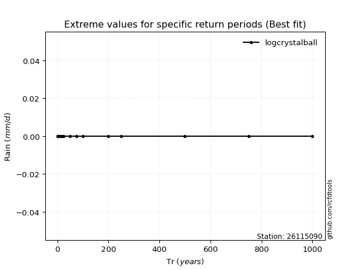</img>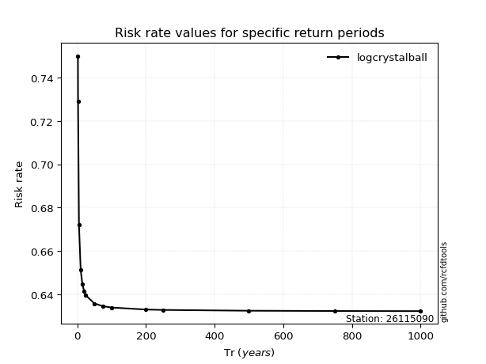</img>

</div>


<sub>**APP DISCLAIMER**: NO WARRANTY - This software is provided by [github.com/rcfdtools](https://github.com/rcfdtools) "as is", without any express or implied warranty, including warranties of merchantability, fitness for a particular purpose, or non-infringement. There is no guarantee that the software will be error-free or operate without interruption. LIMITATION OF LIABILITY - Neither the authors nor copyright holders will be liable for claims or damages arising from the software or its use. You are responsible for determining if the software is appropriate for your use and assume all associated risks, including errors, legal compliance, and data loss. NO PROFESSIONAL ADVICE - The software provides general information and does not offer professional advice. It should not replace consultation with professional advisors.</sub>