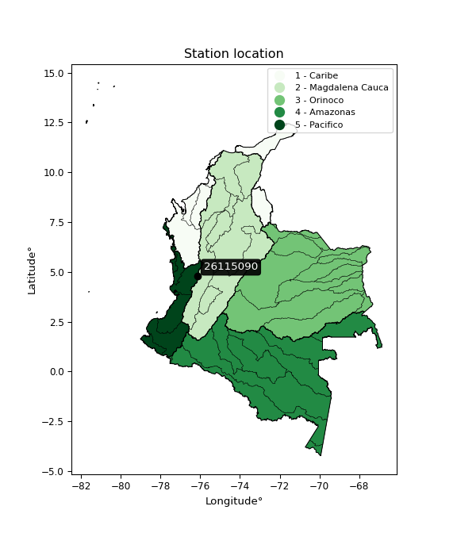

<div align="center">


</div>

# PMax24h Station (Rain, Pmax24h): 26115090

Maximum Precipitation in 24 hours (PMax24h) is the greatest amount of rainfall for a specific duration that is meteorologically possible for a given location, acting as a "worst-case" scenario for extreme storms, crucial for designing safety-critical infrastructure like bridges, river deviations, dams, spillways, and nuclear plants to prevent catastrophic failure. The PMax24h is related with the Probable Maximum Precipitation (PMP) and it is calculated by hydrologists using meteorological data to determine the upper limit of extreme rainfall, often leading to the Probable Maximum Flood (PMF) for flood control design, and is increasingly being studied for climate change impacts. Probable Maximum Precipitation (PMP) is the theoretical upper limit of rainfall, a deterministic estimate for extreme events, while probability distributions (like GEV, Gumbel) describe the likelihood and frequency of various precipitation amounts, including rare ones, showing how often events occur, with PMP representing the extreme end of these distributions, used for critical infrastructure design to ensure safety against the worst conceivable weather, unlike standard statistical forecasts which cover typical probabilities.

The most common probability distributions in hydrology, used for analyzing floods, rainfall, and streamflow, include the Normal, Log-Normal, Gumbel, Gamma (including Log-Pearson Type III), and Generalized Extreme Value (GEV) distributions, often chosen based on the data´s skewness and whether modeling extremes or general conditions, with Gumbel and GEV popular for extreme events like floods, while the Normal distribution serves as a baseline, though often requiring transformations for skewed hydrological data. These distributions help in designing water infrastructure, managing water resources, and forecasting hydrologic events.

> Hydrological data often isn´t perfectly normal (it´s skewed), so different distributions are needed for different applications, such as: **Flood Frequency Analysis**: Using Gumbel, GEV, or Log-Pearson Type III for predicting extreme flood magnitudes and their return periods, **Rainfall Analysis**: Normal for annual totals, but Log-Normal, Weibull, or GEV for intensity or extreme daily rainfall, **Streamflow Modeling**: Gamma and Log-Normal for maximum flows, GEV for minimum flows, and Kappa for daily flows.

<div align="center">

</img>

</div>


## A. General information


### 1. General running parameters

• app_version: _v20260225_. • runtime: _2026-02-27 14:50:08.749431_. • Python version: _3.14.0_. • SciPy version: _1.16.3_. • Pandas version: _2.3.3_. • NumPy version: _2.3.5_. • Stations dataset (station_dataset_file): _dataset/pmax24h_in/automatic_colombia_2003_2025.csv_. • Stations catalog (station_catalog_file): _dataset/CNE.xls_. • Minimum year to eval til year_max (date_min): _1900_. • Maximum year to eval since year_min (date_max): _2025_. • Creates, save and include plots into reports (create_plot): _False_. • Plot only fit distributions with Δo > Δ (plot_only_fit): _True_. • Plot only simple graphs avoiding multiple CDFs and multiple Extreme values plots (plot_only_simple): _False_. • Eval low extreme values, if False, evaluates high extreme values (low_extreme): _False_. • Eval every SciPy distribution as logarithmic (pdist_logarithmic_on): _True_. • Standard deviation normalized (ddof): _1.0_. • Return periods to eval in years (Tr): _[2, 2.33, 5, 10, 15, 20, 25, 50, 75, 100, 200, 250, 500, 750, 1000]_. • Minimum data sample per station, 0 means any (minimum_sample): _5_. • Z-Score maximum threshold to adjust a value, 0 means disable (zscore_max): _3.5_. • Z-Score minimum threshold to adjust a value, 0 means disable (zscore_min): _-2.5_. • Avoid zeros, e.g. rain = 0 (avoid_zeros): _True_. • Avoid null values (avoid_nans): _True_. 

:file_folder:Table: [dataset.csv](../../dataset/pmax24h_in/automatic_colombia_2003_2025.csv)

> Delta Degrees of Freedom (DDOF): is a parameter used in the formulas for calculating variance and standard deviation. When ddof=0, the divisor is $N$ (the total number of observations) and this is used when your data set is the entire population. When ddof=1, the divisor is $N-1$ and this is used when your data set is a sample drawn from a larger population. Using $N-1$ provides an unbiased estimate of the population variance (known as Bessel´s correction).


### 2. Station info and location

|   id |   CODIGO | NOMBRE                      | CATEGORIA               | TECNOLOGIA                              | ESTADO   | FECHA_INSTALACION   |   FECHA_SUSPENSION |   ALTITUD |   LATITUD |   LONGITUD | DEPARTAMENTO    | MUNICIPIO   | AREA_OPERATIVA                         | ENTIDAD                                                     | AREA_HIDROGRAFICA   | ZONA_HIDROGRAFICA   | SUBZONA_HIDROGRAFICA   |   CORRIENTE | Catalogo   |   Version |
|-----:|---------:|:----------------------------|:------------------------|:----------------------------------------|:---------|:--------------------|-------------------:|----------:|----------:|-----------:|:----------------|:------------|:---------------------------------------|:------------------------------------------------------------|:--------------------|:--------------------|:-----------------------|------------:|:-----------|----------:|
|    0 | 26115090 | LAS BRISAS - AUT [26115090] | Climatológica Principal | Automática con Telemetría, Convencional | Activa   | 30/06/2005          |                nan |      1971 |   4.77558 |   -76.1443 | Valle Del Cauca | Argelia     | Area Operativa 09 - Cauca-Valle-Caldas | INSTITUTO DE HIDROLOGIA METEOROLOGIA Y ESTUDIOS AMBIENTALES | Pacifico            | San Juán            | Río Sipí               |         nan | CNE_IDEAM  |  20251226 |

<div align="center">

Dynamic map: [:earth_americas:Google](http://maps.google.com/maps?q=4.775583333,-76.144277778) [:earth_americas:OSM](https://www.openstreetmap.org/#map=18/4.775583333/-76.144277778&layers=P) [:earth_americas:Bing](https://www.bing.com/maps?cp=4.775583333~-76.144277778&lvl=18) [:earth_americas:Apple](https://maps.apple.com/frame?center=4.775583333%2C-76.144277778&span=0.003%2C0.006)

</div>


<div align="center">

```geojson
{
  "type": "Feature",
  "geometry": {
    "type": "Point", 
    "coordinates": [-76.144277778, 4.775583333]
  }, 
  "properties": {
    "Name": "26115090"
  }
}
```

</div>


### 3. Discrete values table and plot

<div align="center">

|               |           0 |          1 |           2 |          3 |           4 |          5 |            6 |          7 |           8 |
|:--------------|------------:|-----------:|------------:|-----------:|------------:|-----------:|-------------:|-----------:|------------:|
| Date          | 2017        | 2018       | 2019        | 2020       | 2021        | 2022       | 2023         | 2024       | 2025        |
| Value         |   45.2      |   34.7     |   42.2      |    0.2     |   30.1      |   13.8     |   32.8       |   48.6     |   42.9      |
| Value_initial |   45.2      |   34.7     |   42.2      |    0.2     |   30.1      |   13.8     |   32.8       |   48.6     |   42.9      |
| count         |    9        |    9       |    9        |    9       |    9        |    9       |    9         |    9       |    9        |
| mean          |   32.2778   |   32.2778  |   32.2778   |   32.2778  |   32.2778   |   32.2778  |   32.2778    |   32.2778  |   32.2778   |
| std           |   15.9137   |   15.9137  |   15.9137   |   15.9137  |   15.9137   |   15.9137  |   15.9137    |   15.9137  |   15.9137   |
| zscore        |    0.812017 |    0.15221 |    0.623501 |   -2.01573 |   -0.136849 |   -1.16112 |    0.0328158 |    1.02567 |    0.667488 |


</div>


> The initial value (value_initial) correspond to the initial obtained or null completed value, and value (value) is adjusted only when the initial value is outside the valid range (outlier) definite through the Z-Score value. If Z-Score is active, values out of range or outliers are replaced with the station mean value. A Z-Score (or standard score) measures how many standard deviations a data point is from the mean of a dataset, indicating its relative position; positive scores mean above the mean, negative mean below, and a score of zero is exactly at the mean, allowing for comparison of values from different distributions. It´s calculated using the formula $z=(x–μ)/σ$, where $x$ is the data point, $μ$ is the mean, and $σ$ is the standard deviation, helping identify outliers and understand probability.
>
> <sub>**Note**: In this study, "completing" (filling gaps in) and "extending" (forecasting or lengthening the historical record) rainfall data series are avoided for certain critical analyses because they introduce artificial bias and uncertainty, which can distort the statistics of rare events (extremes), alter day-to-day variability, and compromise the integrity and homogeneity of the original data. Some reasons against Completing/Extending rainfall data are: **Distortion of Extremes and Variability**: The primary issue is that most gap-filling or extension methods rely on averaging or regression with nearby stations, which inherently smooths the data. Rainfall is highly variable in space and time, with a large percentage of zero values and occasional large storms. Infilling methods often underestimate the highest values and overestimate the lowest (zero) values, which severely distorts analyses focused on flood frequency, drought severity, and intensity-duration-frequency (IDF) curves, **Loss of Data Homogeneity**: Infilled or extended data are synthetic estimates, not actual measurements. Combining these estimates with observed data can violate the assumption of data homogeneity, which requires that the data properties do not change over time. Inhomogeneity can lead to incorrect conclusions about long-term trends or changes in climate patterns, **Propagation of Errors**: Errors and biases from the original data (e.g., wind-induced undercatch, instrument errors, site changes) or the data used for imputation can propagate through the analysis, leading to unreliable hydrological models and inaccurate predictions, **Compromised Statistical Integrity**: For statistical analyses, especially those involving the frequency of events, using artificial data can introduce time bias or autocorrelation that doesn´t exist in reality, making it difficult to assess the true probability of events, **Difficulty in Validation**: It is difficult to accurately validate the quality of filled or extended data, especially for past periods where ground-truth measurements are unavailable. The reliability of imputation techniques heavily depends on the density of the surrounding station network and the complexity of the local topography.</sub>


### 4. Active continuous probability distributions from SciPy (80 of 104 available)

A Probability Density Function (PDF) describes the relative likelihood of a continuous random variable falling within a specific range, where the total area under its curve equals 1, and the area over any interval gives the actual probability for that range. Unlike discrete probabilities (like rolling a die), a PDF shows density, not direct probability for a single point (which is zero), with higher points indicating higher likelihood, often visualized as a bell curve for normal distributions.

A log of a probability density function (log-PDF) is simply the logarithm of the PDF´s value, denoted as $log(f(x))$, useful for converting multiplication of probabilities into addition, improving numerical stability with tiny numbers, and connecting to information theory concepts like entropy. Instead of dealing with very small probabilities (e.g., 0.000001), log-PDFs use negative numbers (e.g., $log(0.00001) ≈ -11.51$ that are easier for computers to handle, preventing underflow errors and simplifying complex calculations. In this study, each active probability distribution from SciPy is also evaluated in the $log$ form.

[scipy.stats](https://docs.scipy.org/doc/scipy/reference/stats.html) is a Python´s powerful submodule within the SciPy library for comprehensive statistical analysis, offering over 130 probability distributions (like Normal, Poisson, etc.), functions for descriptive stats (mean, variance), hypothesis testing (t-tests, chi-square), random variable generation, and statistical tests, making it essential for data science, modeling, and research. It provides tools to explore, model, and draw conclusions from data efficiently, working seamlessly with [NumPy](https://numpy.org/).

<div align="center">

|   id | p_dist           |   n_parameter | fit_method   | label                                                                       | active   | ref                                                                                                      |
|-----:|:-----------------|--------------:|:-------------|:----------------------------------------------------------------------------|:---------|:---------------------------------------------------------------------------------------------------------|
|    0 | alpha            |             3 | MLE          | Alpha                                                                       | True     | [:mortar_board:](https://docs.scipy.org/doc/scipy/reference/generated/scipy.stats.alpha.html)            |
|    1 | anglit           |             2 | MM           | Anglit                                                                      | True     | [:mortar_board:](https://docs.scipy.org/doc/scipy/reference/generated/scipy.stats.anglit.html)           |
|    2 | arcsine          |             2 | MM           | Arcsine                                                                     | True     | [:mortar_board:](https://docs.scipy.org/doc/scipy/reference/generated/scipy.stats.arcsine.html)          |
|    3 | argus            |             3 | MLE          | Argus                                                                       | True     | [:mortar_board:](https://docs.scipy.org/doc/scipy/reference/generated/scipy.stats.argus.html)            |
|    4 | beta             |             4 | MLE          | Beta                                                                        | True     | [:mortar_board:](https://docs.scipy.org/doc/scipy/reference/generated/scipy.stats.beta.html)             |
|    5 | betaprime        |             4 | MLE          | Beta prime                                                                  | True     | [:mortar_board:](https://docs.scipy.org/doc/scipy/reference/generated/scipy.stats.betaprime.html)        |
|    6 | bradford         |             3 | MLE          | Bradford                                                                    | True     | [:mortar_board:](https://docs.scipy.org/doc/scipy/reference/generated/scipy.stats.bradford.html)         |
|    7 | burr             |             4 | MLE          | Burr (Type III)                                                             | True     | [:mortar_board:](https://docs.scipy.org/doc/scipy/reference/generated/scipy.stats.burr.html)             |
|    8 | burr12           |             4 | MLE          | Burr (Type III) 12                                                          | True     | [:mortar_board:](https://docs.scipy.org/doc/scipy/reference/generated/scipy.stats.burr12.html)           |
|    9 | cosine           |             2 | MLE          | Cosine                                                                      | True     | [:mortar_board:](https://docs.scipy.org/doc/scipy/reference/generated/scipy.stats.cosine.html)           |
|   10 | crystalball      |             4 | MLE          | Crystalball                                                                 | True     | [:mortar_board:](https://docs.scipy.org/doc/scipy/reference/generated/scipy.stats.crystalball.html)      |
|   11 | dgamma           |             3 | MLE          | Double gamma                                                                | True     | [:mortar_board:](https://docs.scipy.org/doc/scipy/reference/generated/scipy.stats.dgamma.html)           |
|   12 | dweibull         |             3 | MLE          | Double Weibull                                                              | True     | [:mortar_board:](https://docs.scipy.org/doc/scipy/reference/generated/scipy.stats.dweibull.html)         |
|   13 | erlang           |             3 | MLE          | Erlang                                                                      | True     | [:mortar_board:](https://docs.scipy.org/doc/scipy/reference/generated/scipy.stats.erlang.html)           |
|   14 | exponnorm        |             3 | MLE          | Exponentially modified Normal                                               | True     | [:mortar_board:](https://docs.scipy.org/doc/scipy/reference/generated/scipy.stats.exponnorm.html)        |
|   15 | exponpow         |             3 | MLE          | Exponential power                                                           | True     | [:mortar_board:](https://docs.scipy.org/doc/scipy/reference/generated/scipy.stats.exponpow.html)         |
|   16 | exponweib        |             4 | MLE          | Exponentiated Weibull                                                       | True     | [:mortar_board:](https://docs.scipy.org/doc/scipy/reference/generated/scipy.stats.exponweib.html)        |
|   17 | f                |             4 | MLE          | F                                                                           | True     | [:mortar_board:](https://docs.scipy.org/doc/scipy/reference/generated/scipy.stats.f.html)                |
|   18 | fatiguelife      |             3 | MLE          | Fatigue-life (Birnbaum-Saunders)                                            | True     | [:mortar_board:](https://docs.scipy.org/doc/scipy/reference/generated/scipy.stats.fatiguelife.html)      |
|   19 | foldnorm         |             3 | MM           | Fold Normal                                                                 | True     | [:mortar_board:](https://docs.scipy.org/doc/scipy/reference/generated/scipy.stats.foldnorm.html)         |
|   20 | gamma            |             3 | MLE          | Gamma                                                                       | True     | [:mortar_board:](https://docs.scipy.org/doc/scipy/reference/generated/scipy.stats.gamma.html)            |
|   21 | gausshyper       |             6 | MLE          | Gauss hypergeometric                                                        | True     | [:mortar_board:](https://docs.scipy.org/doc/scipy/reference/generated/scipy.stats.gausshyper.html)       |
|   22 | genexpon         |             5 | MLE          | Generalized exponential                                                     | True     | [:mortar_board:](https://docs.scipy.org/doc/scipy/reference/generated/scipy.stats.genexpon.html)         |
|   23 | genextreme       |             3 | MLE          | Generalized exponential                                                     | True     | [:mortar_board:](https://docs.scipy.org/doc/scipy/reference/generated/scipy.stats.genextreme.html)       |
|   24 | gengamma         |             4 | MLE          | Generalized gamma                                                           | True     | [:mortar_board:](https://docs.scipy.org/doc/scipy/reference/generated/scipy.stats.gengamma.html)         |
|   25 | genhalflogistic  |             3 | MLE          | Generalized half-logistic                                                   | True     | [:mortar_board:](https://docs.scipy.org/doc/scipy/reference/generated/scipy.stats.genhalflogistic.html)  |
|   26 | genlogistic      |             3 | MLE          | Generalized logistic                                                        | True     | [:mortar_board:](https://docs.scipy.org/doc/scipy/reference/generated/scipy.stats.genlogistic.html)      |
|   27 | gennorm          |             3 | MLE          | Generalized Normal                                                          | True     | [:mortar_board:](https://docs.scipy.org/doc/scipy/reference/generated/scipy.stats.gennorm.html)          |
|   28 | genpareto        |             3 | MLE          | Generalized Pareto                                                          | True     | [:mortar_board:](https://docs.scipy.org/doc/scipy/reference/generated/scipy.stats.genpareto.html)        |
|   29 | gompertz         |             3 | MLE          | Gompertz (or truncated Gumbel)                                              | True     | [:mortar_board:](https://docs.scipy.org/doc/scipy/reference/generated/scipy.stats.gompertz.html)         |
|   30 | gumbel_l         |             2 | MM           | Gumbel Left Skew                                                            | True     | [:mortar_board:](https://docs.scipy.org/doc/scipy/reference/generated/scipy.stats.gumbel_l.html)         |
|   31 | gumbel_r         |             2 | MM           | Gumbel Right Skew                                                           | True     | [:mortar_board:](https://docs.scipy.org/doc/scipy/reference/generated/scipy.stats.gumbel_r.html)         |
|   32 | halfgennorm      |             3 | MLE          | Upper half of a generalized normal                                          | True     | [:mortar_board:](https://docs.scipy.org/doc/scipy/reference/generated/scipy.stats.halfgennorm.html)      |
|   33 | halflogistic     |             2 | MM           | Half-logistic                                                               | True     | [:mortar_board:](https://docs.scipy.org/doc/scipy/reference/generated/scipy.stats.halflogistic.html)     |
|   34 | halfnorm         |             2 | MM           | Half Normal                                                                 | True     | [:mortar_board:](https://docs.scipy.org/doc/scipy/reference/generated/scipy.stats.halfnorm.html)         |
|   35 | hypsecant        |             2 | MM           | hyperbolic secant                                                           | True     | [:mortar_board:](https://docs.scipy.org/doc/scipy/reference/generated/scipy.stats.hypsecant.html)        |
|   36 | invgamma         |             3 | MLE          | Inverted gamma                                                              | True     | [:mortar_board:](https://docs.scipy.org/doc/scipy/reference/generated/scipy.stats.invgamma.html)         |
|   37 | invgauss         |             3 | MLE          | Inverse Gaussian                                                            | True     | [:mortar_board:](https://docs.scipy.org/doc/scipy/reference/generated/scipy.stats.invgauss.html)         |
|   38 | invweibull       |             3 | MLE          | Inverted Weibull                                                            | True     | [:mortar_board:](https://docs.scipy.org/doc/scipy/reference/generated/scipy.stats.invweibull.html)       |
|   39 | johnsonsb        |             4 | MLE          | Johnson SB                                                                  | True     | [:mortar_board:](https://docs.scipy.org/doc/scipy/reference/generated/scipy.stats.johnsonsb.html)        |
|   40 | johnsonsu        |             4 | MLE          | Johnson Su                                                                  | True     | [:mortar_board:](https://docs.scipy.org/doc/scipy/reference/generated/scipy.stats.johnsonsu.html)        |
|   41 | kappa3           |             3 | MLE          | Kappa 3                                                                     | True     | [:mortar_board:](https://docs.scipy.org/doc/scipy/reference/generated/scipy.stats.kappa3.html)           |
|   42 | kappa4           |             4 | MLE          | Kappa 4                                                                     | True     | [:mortar_board:](https://docs.scipy.org/doc/scipy/reference/generated/scipy.stats.kappa4.html)           |
|   43 | ksone            |             3 | MLE          | Kolmogorov-Smirnov one-sided test statistic distribution                    | True     | [:mortar_board:](https://docs.scipy.org/doc/scipy/reference/generated/scipy.stats.ksone.html)            |
|   44 | kstwobign        |             2 | MLE          | Limiting distribution of scaled Kolmogorov-Smirnov two-sided test statistic | True     | [:mortar_board:](https://docs.scipy.org/doc/scipy/reference/generated/scipy.stats.kstwobign.html)        |
|   45 | laplace          |             2 | MM           | Laplace                                                                     | True     | [:mortar_board:](https://docs.scipy.org/doc/scipy/reference/generated/scipy.stats.laplace.html)          |
|   46 | levy_l           |             2 | MLE          | Left-skewed Levy                                                            | True     | [:mortar_board:](https://docs.scipy.org/doc/scipy/reference/generated/scipy.stats.levy_l.html)           |
|   47 | loggamma         |             3 | MLE          | Log gamma                                                                   | True     | [:mortar_board:](https://docs.scipy.org/doc/scipy/reference/generated/scipy.stats.loggamma.html)         |
|   48 | logistic         |             2 | MM           | Logistic (or Sech-squared)                                                  | True     | [:mortar_board:](https://docs.scipy.org/doc/scipy/reference/generated/scipy.stats.logistic.html)         |
|   49 | loglaplace       |             3 | MLE          | Log-Laplace                                                                 | True     | [:mortar_board:](https://docs.scipy.org/doc/scipy/reference/generated/scipy.stats.loglaplace.html)       |
|   50 | lomax            |             3 | MLE          | Lomax (Pareto of the second kind)                                           | True     | [:mortar_board:](https://docs.scipy.org/doc/scipy/reference/generated/scipy.stats.lomax.html)            |
|   51 | maxwell          |             2 | MM           | Maxwell                                                                     | True     | [:mortar_board:](https://docs.scipy.org/doc/scipy/reference/generated/scipy.stats.maxwell.html)          |
|   52 | mielke           |             4 | MLE          | Mielke Beta-Kappa / Dagum                                                   | True     | [:mortar_board:](https://docs.scipy.org/doc/scipy/reference/generated/scipy.stats.mielke.html)           |
|   53 | moyal            |             2 | MM           | Moyal                                                                       | True     | [:mortar_board:](https://docs.scipy.org/doc/scipy/reference/generated/scipy.stats.moyal.html)            |
|   54 | nakagami         |             3 | MLE          | Nakagami                                                                    | True     | [:mortar_board:](https://docs.scipy.org/doc/scipy/reference/generated/scipy.stats.nakagami.html)         |
|   55 | ncf              |             5 | MLE          | Non-central F distribution                                                  | True     | [:mortar_board:](https://docs.scipy.org/doc/scipy/reference/generated/scipy.stats.ncf.html)              |
|   56 | nct              |             4 | MLE          | Non-central Student’s t                                                     | True     | [:mortar_board:](https://docs.scipy.org/doc/scipy/reference/generated/scipy.stats.nct.html)              |
|   57 | norm             |             2 | MM           | Normal                                                                      | True     | [:mortar_board:](https://docs.scipy.org/doc/scipy/reference/generated/scipy.stats.norm.html)             |
|   58 | pearson3         |             3 | MM           | Pearson type III                                                            | True     | [:mortar_board:](https://docs.scipy.org/doc/scipy/reference/generated/scipy.stats.pearson3.html)         |
|   59 | powerlaw         |             3 | MLE          | Power-function                                                              | True     | [:mortar_board:](https://docs.scipy.org/doc/scipy/reference/generated/scipy.stats.powerlaw.html)         |
|   60 | rayleigh         |             2 | MM           | Rayleigh                                                                    | True     | [:mortar_board:](https://docs.scipy.org/doc/scipy/reference/generated/scipy.stats.rayleigh.html)         |
|   61 | rdist            |             3 | MLE          | R-distributed (symmetric beta)                                              | True     | [:mortar_board:](https://docs.scipy.org/doc/scipy/reference/generated/scipy.stats.rdist.html)            |
|   62 | rice             |             3 | MLE          | Rice                                                                        | True     | [:mortar_board:](https://docs.scipy.org/doc/scipy/reference/generated/scipy.stats.rice.html)             |
|   63 | semicircular     |             2 | MM           | Semicircular                                                                | True     | [:mortar_board:](https://docs.scipy.org/doc/scipy/reference/generated/scipy.stats.semicircular.html)     |
|   64 | skewnorm         |             3 | MLE          | Skew normal                                                                 | True     | [:mortar_board:](https://docs.scipy.org/doc/scipy/reference/generated/scipy.stats.skewnorm.html)         |
|   65 | t                |             3 | MLE          | Student’s t                                                                 | True     | [:mortar_board:](https://docs.scipy.org/doc/scipy/reference/generated/scipy.stats.t.html)                |
|   66 | trapezoid        |             4 | MLE          | Trapezoid                                                                   | True     | [:mortar_board:](https://docs.scipy.org/doc/scipy/reference/generated/scipy.stats.trapezoid.html)        |
|   67 | triang           |             3 | MLE          | Triangular                                                                  | True     | [:mortar_board:](https://docs.scipy.org/doc/scipy/reference/generated/scipy.stats.triang.html)           |
|   68 | truncexpon       |             3 | MLE          | Truncated exponential                                                       | True     | [:mortar_board:](https://docs.scipy.org/doc/scipy/reference/generated/scipy.stats.truncexpon.html)       |
|   69 | truncnorm        |             4 | MLE          | Truncated normal                                                            | True     | [:mortar_board:](https://docs.scipy.org/doc/scipy/reference/generated/scipy.stats.truncnorm.html)        |
|   70 | truncpareto      |             4 | MLE          | Upper truncated Pareto                                                      | True     | [:mortar_board:](https://docs.scipy.org/doc/scipy/reference/generated/scipy.stats.truncpareto.html)      |
|   71 | truncweibull_min |             5 | MLE          | Doubly truncated Weibull minimum                                            | True     | [:mortar_board:](https://docs.scipy.org/doc/scipy/reference/generated/scipy.stats.truncweibull_min.html) |
|   72 | tukeylambda      |             3 | MLE          | Tukey-Lamdba                                                                | True     | [:mortar_board:](https://docs.scipy.org/doc/scipy/reference/generated/scipy.stats.tukeylambda.html)      |
|   73 | uniform          |             2 | MLE          | Uniform                                                                     | True     | [:mortar_board:](https://docs.scipy.org/doc/scipy/reference/generated/scipy.stats.uniform.html)          |
|   74 | vonmises         |             3 | MLE          | Von Mises                                                                   | True     | [:mortar_board:](https://docs.scipy.org/doc/scipy/reference/generated/scipy.stats.vonmises.html)         |
|   75 | vonmises_line    |             3 | MLE          | Von Mises line                                                              | True     | [:mortar_board:](https://docs.scipy.org/doc/scipy/reference/generated/scipy.stats.vonmises_line.html)    |
|   76 | wald             |             2 | MM           | Wald                                                                        | True     | [:mortar_board:](https://docs.scipy.org/doc/scipy/reference/generated/scipy.stats.wald.html)             |
|   77 | weibull_max      |             3 | MLE          | Weibull maximum                                                             | True     | [:mortar_board:](https://docs.scipy.org/doc/scipy/reference/generated/scipy.stats.weibull_max.html)      |
|   78 | weibull_min      |             3 | MLE          | Weibull minimum                                                             | True     | [:mortar_board:](https://docs.scipy.org/doc/scipy/reference/generated/scipy.stats.weibull_min.html)      |
|   79 | wrapcauchy       |             3 | MLE          | Wrapped  Cauchy                                                             | True     | [:mortar_board:](https://docs.scipy.org/doc/scipy/reference/generated/scipy.stats.wrapcauchy.html)       |

</div>

> **n_parameter:** # arguments & localization & scale.
>
> **Fit methods:** (MLE) maximum likelihood, (MM) L-moments.
>
>**Inactive** (With the only purpose of prevent loops, zero divisions, infinite values, over high estimated values or horizontal trending for recurrence intervals estimations, the follow distributions were disabled.)**:** lognorm, norminvgauss, powernorm, powerlognorm, cauchy, halfcauchy, foldcauchy, skewcauchy, chi2, expon, fisk, genhyperbolic, geninvgauss, gibrat, kstwo, laplace_asymmetric, levy, levy_stable, ncx2, pareto, rel_breitwigner, recipinvgauss, studentized_range, loguniform, 


## B. Probability (PDF) vs. Empirical (EDF) distributions functions

A continuous probability distribution (CPD) describes probabilities for variables that can take any value within a range (like rain any time), unlike discrete variables with specific outcomes (like temperature). It uses a Probability Density Function (PDF), a curve where the total area under it equals 1, and the probability of the variable falling within an interval (a to b) is found by calculating the area under the curve between those points. A key feature is that the probability of hitting any single exact value is zero, so probabilities are always expressed for ranges, e.g., $P(a ≤ X ≤ b)$.

<div align="center">

Distributions parameters from station values
|     |   station | p_dist              |   n |              loc |           scale | shape                  | shape1                | shape2                | shape3             |
|----:|----------:|:--------------------|----:|-----------------:|----------------:|:-----------------------|:----------------------|:----------------------|:-------------------|
|   0 |  26115090 | alpha               |   9 |      0.00262232  |     0.592141    | 6.544377174085049e-08  |                       |                       |                    |
|   1 |  26115090 | anglit              |   9 |     32.2778      |    43.8916      |                        |                       |                       |                    |
|   2 |  26115090 | arcsine             |   9 |     11.0595      |    42.4366      |                        |                       |                       |                    |
|   3 |  26115090 | argus               |   9 |    -15.7465      |    65.46        | 2.327887333077353      |                       |                       |                    |
|   4 |  26115090 | beta                |   9 |     -4.80012     |    53.4001      | 1.1020461135453448     | 0.4157733787091423    |                       |                    |
|   5 |  26115090 | betaprime           |   9 |   -534.399       | 27020.6         | 1415.8596593482825     | 67516.62263143453     |                       |                    |
|   6 |  26115090 | bradford            |   9 |     -6.30124     |    54.9013      | 4.94579466672092e-06   |                       |                       |                    |
|   7 |  26115090 | burr                |   9 |     -0.603913    |    49.9651      | 171.87731952645106     | 0.007474101122263847  |                       |                    |
|   8 |  26115090 | burr12              |   9 | -14731.1         | 14924.1         | 1541.7462399150882     | 8658725.549188584     |                       |                    |
|   9 |  26115090 | cosine              |   9 |     29.922       |    13.0268      |                        |                       |                       |                    |
|  10 |  26115090 | crystalball         |   9 |     32.2778      |    15.0036      | 3351.7759253639465     | 402.8249848182406     |                       |                    |
|  11 |  26115090 | dgamma              |   9 |     37.2705      |     7.2115      | 1.6111623920036289     |                       |                       |                    |
|  12 |  26115090 | dweibull            |   9 |     34.7         |     9.98291     | 0.6001843265021916     |                       |                       |                    |
|  13 |  26115090 | erlang              |   9 |   -202.341       |     1.02956     | 228.05980100842532     |                       |                       |                    |
|  14 |  26115090 | exponnorm           |   9 |     32.2667      |    15.0037      | 0.0007399224963527003  |                       |                       |                    |
|  15 |  26115090 | exponpow            |   9 |      0.2         |     2.65149     | 0.127161401732577      |                       |                       |                    |
|  16 |  26115090 | exponweib           |   9 |      0.2         |     1.94448     | 1.846082415309436      | 0.3313273991292607    |                       |                    |
|  17 |  26115090 | f                   |   9 |      0.2         |    29.3649      | 1.4710306737835108     | 274.6152534926898     |                       |                    |
|  18 |  26115090 | fatiguelife         |   9 |  -2821.91        |  2854.06        | 0.00524730157099163    |                       |                       |                    |
|  19 |  26115090 | foldnorm            |   9 |     16.7523      |    20.0764      | 0.15424918223217493    |                       |                       |                    |
|  20 |  26115090 | gamma               |   9 |   -201.94        |     1.05763     | 221.28227696601346     |                       |                       |                    |
|  21 |  26115090 | gausshyper          |   9 |     -4.85878     |    53.4588      | 1.1200776209546568     | 0.7344736613661036    | 1.0679715835700776    | 1.0460104482591102 |
|  22 |  26115090 | genexpon            |   9 |      0.19999     |     2.49714     | 0.07637662803675713    | 0.0007976282957495017 | 0.8592560331426846    |                    |
|  23 |  26115090 | genextreme          |   9 |     34.2419      |    16.1543      | 1.1251039041921551     |                       |                       |                    |
|  24 |  26115090 | gengamma            |   9 |   -351.882       |    21.4089      | 194.95522554475613     | 1.8260288928185453    |                       |                    |
|  25 |  26115090 | genhalflogistic     |   9 |     -0.638476    |    69.7535      | 1.4166454795778791     |                       |                       |                    |
|  26 |  26115090 | genlogistic         |   9 |     48.6002      |     9.46732e-06 | 5.791870916182495e-07  |                       |                       |                    |
|  27 |  26115090 | gennorm             |   9 |     34.7         |    14.4035      | 1.2168246029223109     |                       |                       |                    |
|  28 |  26115090 | genpareto           |   9 |      0.106586    |    78.3801      | -1.6163042204503686    |                       |                       |                    |
|  29 |  26115090 | gompertz            |   9 |     13.8         |     7.51851     | 0.027610946258087493   |                       |                       |                    |
|  30 |  26115090 | gumbel_l            |   9 |     39.0302      |    11.6983      |                        |                       |                       |                    |
|  31 |  26115090 | gumbel_r            |   9 |     25.5254      |    11.6983      |                        |                       |                       |                    |
|  32 |  26115090 | halfgennorm         |   9 |      0.2         |     1.05448     | 0.3532618728354491     |                       |                       |                    |
|  33 |  26115090 | halflogistic        |   9 |     14.495       |    12.8275      |                        |                       |                       |                    |
|  34 |  26115090 | halfnorm            |   9 |     12.4189      |    24.8894      |                        |                       |                       |                    |
|  35 |  26115090 | hypsecant           |   9 |     32.2778      |     9.5516      |                        |                       |                       |                    |
|  36 |  26115090 | invgamma            |   9 |   -194.513       | 44162           | 195.83468514445468     |                       |                       |                    |
|  37 |  26115090 | invgauss            |   9 |    -66.5573      |  3081.78        | 0.03192969419715567    |                       |                       |                    |
|  38 |  26115090 | invweibull          |   9 |     -8.94502e+06 |     8.94504e+06 | 529853.4824478172      |                       |                       |                    |
|  39 |  26115090 | johnsonsb           |   9 |      0.2         |    48.4113      | 0.24771569455802486    | 0.15001564050408467   |                       |                    |
|  40 |  26115090 | johnsonsu           |   9 |     51.2551      |     0.128453    | 6.143953493079106      | 1.1487144640329028    |                       |                    |
|  41 |  26115090 | kappa3              |   9 |      0.199735    |    48.399       | 79042.7708440772       |                       |                       |                    |
|  42 |  26115090 | kappa4              |   9 |     -4.32094     |    55.4057      | 1.0887981891279415     | 1.0469519874695987    |                       |                    |
|  43 |  26115090 | ksone               |   9 |     -4.64        |    58.08        | 1.0                    |                       |                       |                    |
|  44 |  26115090 | kstwobign           |   9 |    -36.1795      |    78.2508      |                        |                       |                       |                    |
|  45 |  26115090 | laplace             |   9 |     32.2778      |    10.6092      |                        |                       |                       |                    |
|  46 |  26115090 | levy_l              |   9 |     49.7737      |     5.72437     |                        |                       |                       |                    |
|  47 |  26115090 | loggamma            |   9 |     48.6009      |     7.23287e-05 | 4.432633064387414e-06  |                       |                       |                    |
|  48 |  26115090 | logistic            |   9 |     32.2778      |     8.27193     |                        |                       |                       |                    |
|  49 |  26115090 | loglaplace          |   9 |     -0.0873134   |    34.7873      | 1.2991787007247542     |                       |                       |                    |
|  50 |  26115090 | lomax               |   9 |      0.2         |     6.71235e+10 | 2109213037.1876223     |                       |                       |                    |
|  51 |  26115090 | maxwell             |   9 |     -3.27448     |    22.2791      |                        |                       |                       |                    |
|  52 |  26115090 | mielke              |   9 |    -52.7205      |   101.325       | 5.160404630828047      | 213482.52580818266    |                       |                    |
|  53 |  26115090 | moyal               |   9 |     23.6977      |     6.754       |                        |                       |                       |                    |
|  54 |  26115090 | nakagami            |   9 |      0.2         |    36.4559      | 0.27442812799919336    |                       |                       |                    |
|  55 |  26115090 | ncf                 |   9 |      0.2         |     1.00527     | 0.15665359502775167    | 27.8050968625657      | 4.672731805097122     |                    |
|  56 |  26115090 | nct                 |   9 |   1423.77        |    14.9739      | 1056396.0529659414     | -92.92785482983038    |                       |                    |
|  57 |  26115090 | norm                |   9 |     32.2778      |    15.0036      |                        |                       |                       |                    |
|  58 |  26115090 | pearson3            |   9 |     32.2778      |    15.0036      | -1.00769571592478      |                       |                       |                    |
|  59 |  26115090 | powerlaw            |   9 |      0.2         |    48.4         | 0.2007702325701461     |                       |                       |                    |
|  60 |  26115090 | rayleigh            |   9 |      3.57498     |    22.9015      |                        |                       |                       |                    |
|  61 |  26115090 | rdist               |   9 |     -4.09901     |    17.899       | 1.194182022018233      |                       |                       |                    |
|  62 |  26115090 | rice                |   9 |  -4987.19        |    15.0036      | 334.5487518619418      |                       |                       |                    |
|  63 |  26115090 | semicircular        |   9 |     32.2778      |    30.0072      |                        |                       |                       |                    |
|  64 |  26115090 | skewnorm            |   9 |     48.6         |    22.171       | -29842264.34076256     |                       |                       |                    |
|  65 |  26115090 | t                   |   9 |     32.2778      |    15.0036      | 128385537.04707962     |                       |                       |                    |
|  66 |  26115090 | trapezoid           |   9 |    -10.6668      |    63.6549      | 1.0                    | 1.0                   |                       |                    |
|  67 |  26115090 | triang              |   9 |     -8.38719     |    56.9872      | 0.9999997619772365     |                       |                       |                    |
|  68 |  26115090 | truncexpon          |   9 |      0.2         |    49.6522      | 0.9747810380366204     |                       |                       |                    |
|  69 |  26115090 | truncnorm           |   9 |     31.9325      |    25.0941      | -1.2855727896551712    | 0.6642128799049165    |                       |                    |
|  70 |  26115090 | truncpareto         |   9 |      0.195757    |     0.00424317  | 0.12515319452171764    | 11407.55309993109     |                       |                    |
|  71 |  26115090 | truncweibull_min    |   9 |     -1.48685     |   108.595       | 1.449643399876835      | 0.0009111697657678177 | 0.46122727538106095   |                    |
|  72 |  26115090 | tukeylambda         |   9 |     -1.46759     |    68.4446      | 1.367044375828998      |                       |                       |                    |
|  73 |  26115090 | uniform             |   9 |      0.2         |    48.4         |                        |                       |                       |                    |
|  74 |  26115090 | vonmises            |   9 |     -0.618141    |     1           | 0.35145794009553216    |                       |                       |                    |
|  75 |  26115090 | vonmises_line       |   9 |     35.5867      |    11.2639      | 1.064879695281218      |                       |                       |                    |
|  76 |  26115090 | wald                |   9 |     17.2742      |    15.0036      |                        |                       |                       |                    |
|  77 |  26115090 | weibull_max         |   9 |     48.6         |     1.44889     | 0.33034840031226087    |                       |                       |                    |
|  78 |  26115090 | weibull_min         |   9 |     -9.05565e+08 |     9.05565e+08 | 87611586.96573754      |                       |                       |                    |
|  79 |  26115090 | wrapcauchy          |   9 |      0.199968    |     7.7031      | 0.31476216272307117    |                       |                       |                    |
|  80 |  26115090 | logalpha            |   9 |    -77.9304      |  3686.56        | 45.58738287169018      |                       |                       |                    |
|  81 |  26115090 | loganglit           |   9 |      2.96144     |     4.84077     |                        |                       |                       |                    |
|  82 |  26115090 | logarcsine          |   9 |      0.621266    |     4.68033     |                        |                       |                       |                    |
|  83 |  26115090 | logargus            |   9 |     -2.98918     |     6.95249     | 3.7489217894594766     |                       |                       |                    |
|  84 |  26115090 | logbeta             |   9 |     -2.21348     |     6.0971      | 0.20829680667416217    | 0.031244095834928213  |                       |                    |
|  85 |  26115090 | logbetaprime        |   9 |     -1.60944     |     2.14275     | 0.21682081216289184    | 0.8700412782347523    |                       |                    |
|  86 |  26115090 | logbradford         |   9 |     -1.60944     |     5.49314     | 1.1142545644951674     |                       |                       |                    |
|  87 |  26115090 | logburr             |   9 |     -1.60944     |     1.51864     | 0.7382050552132554     | 1.2489349997414707    |                       |                    |
|  88 |  26115090 | logburr12           |   9 | -65946.5         | 65963.2         | 64022.92690677266      | 366321.3382979324     |                       |                    |
|  89 |  26115090 | logcosine           |   9 |      2.43404     |     1.64555     |                        |                       |                       |                    |
|  90 |  26115090 | logcrystalball      |   9 |      3.88362     |     5.91917e-05 | 6.474219411459897e-05  | 5372.609001304451     |                       |                    |
|  91 |  26115090 | logdgamma           |   9 |      3.54674     |     1.12965     | 0.5791405990620326     |                       |                       |                    |
|  92 |  26115090 | logdweibull         |   9 |      3.75887     |     1.06778     | 0.5986106938858202     |                       |                       |                    |
|  93 |  26115090 | logerlang           |   9 |     -1.60944     |    44.3388      | 0.1576190446822882     |                       |                       |                    |
|  94 |  26115090 | logexponnorm        |   9 |      2.96081     |     1.65475     | 0.00038416327487119685 |                       |                       |                    |
|  95 |  26115090 | logexponpow         |   9 |     -1.60944     |     1.75289     | 0.3065587550038218     |                       |                       |                    |
|  96 |  26115090 | logexponweib        |   9 |    -67.4442      |    50.3594      | 477.29320017776035     | 5.6233692793852015    |                       |                    |
|  97 |  26115090 | logf                |   9 |     -1.60944     |     1.11512     | 1.0768812494055413     | 1.0625254996725484    |                       |                    |
|  98 |  26115090 | logfatiguelife      |   9 |  -1557.86        |  1560.82        | 0.0010573651904879772  |                       |                       |                    |
|  99 |  26115090 | logfoldnorm         |   9 |    -66.6946      |     1.10631     | 63.08075589781245      |                       |                       |                    |
| 100 |  26115090 | loggamma            |   9 |    -28.0577      |     0.10523     | 294.53766979092956     |                       |                       |                    |
| 101 |  26115090 | loggausshyper       |   9 |     -2.07231     |     5.95593     | 1.2307653231005364     | 0.30048642067797293   | 1.093611049268973     | 1.202057874982565  |
| 102 |  26115090 | loggenexpon         |   9 |     -2.01759     |     0.473257    | 0.0054241517935013014  | 5.959821344031553     | 0.0025466845886111785 |                    |
| 103 |  26115090 | loggenextreme       |   9 |      3.0882      |     0.915202    | 1.1505785209179424     |                       |                       |                    |
| 104 |  26115090 | loggengamma         |   9 |     -1.60944     |     1.64189     | 1.5754967866346854     | 0.6270647791949915    |                       |                    |
| 105 |  26115090 | loggenhalflogistic  |   9 |     -1.64698     |     6.28052     | 1.135594322953462      |                       |                       |                    |
| 106 |  26115090 | loggenlogistic      |   9 |      3.88364     |     1.66007e-06 | 1.8044541427567487e-06 |                       |                       |                    |
| 107 |  26115090 | loggennorm          |   9 |      3.74242     |     0.000265763 | 0.226619865713711      |                       |                       |                    |
| 108 |  26115090 | loggenpareto        |   9 |     -1.60944     |     4.43861     | -0.7861338297848828    |                       |                       |                    |
| 109 |  26115090 | loggompertz         |   9 |     -1.60944     |     1.54071e+12 | 1514008322838.5933     |                       |                       |                    |
| 110 |  26115090 | loggumbel_l         |   9 |      3.70615     |     1.29019     |                        |                       |                       |                    |
| 111 |  26115090 | loggumbel_r         |   9 |      2.21672     |     1.29019     |                        |                       |                       |                    |
| 112 |  26115090 | loghalfgennorm      |   9 |     -1.60944     |     1.46143     | 0.5850188098102018     |                       |                       |                    |
| 113 |  26115090 | loghalflogistic     |   9 |      1.0002      |     1.41473     |                        |                       |                       |                    |
| 114 |  26115090 | loghalfnorm         |   9 |      0.77124     |     2.745       |                        |                       |                       |                    |
| 115 |  26115090 | loghypsecant        |   9 |      2.96144     |     1.05343     |                        |                       |                       |                    |
| 116 |  26115090 | loginvgamma         |   9 |    -42.1372      | 29308           | 650.7199194442874      |                       |                       |                    |
| 117 |  26115090 | loginvgauss         |   9 |    -16.8958      |  2047.82        | 0.00969504439818037    |                       |                       |                    |
| 118 |  26115090 | loginvweibull       |   9 |     -2.35312e+08 |     2.35312e+08 | 104440802.08406891     |                       |                       |                    |
| 119 |  26115090 | logjohnsonsb        |   9 |    -11.1739      |    15.0575      | -0.28033400319761304   | 0.10364820685176622   |                       |                    |
| 120 |  26115090 | logjohnsonsu        |   9 |      3.88887     |     0.000117448 | 4.576245399895791      | 0.5481808427759889    |                       |                    |
| 121 |  26115090 | logkappa3           |   9 |     -1.60944     |     5.43028     | 155.24994988408542     |                       |                       |                    |
| 122 |  26115090 | logkappa4           |   9 |     -1.96632     |     6.50303     | 1.0502644305726871     | 1.1116399113207902    |                       |                    |
| 123 |  26115090 | logksone            |   9 |     -2.15874     |     6.59167     | 1.0                    |                       |                       |                    |
| 124 |  26115090 | logkstwobign        |   9 |     -6.38663     |    10.7325      |                        |                       |                       |                    |
| 125 |  26115090 | loglaplace          |   9 |      2.96144     |     1.17007     |                        |                       |                       |                    |
| 126 |  26115090 | loglevy_l           |   9 |      3.912       |     0.137188    |                        |                       |                       |                    |
| 127 |  26115090 | logloggamma         |   9 |      3.88367     |     5.15974e-06 | 5.585974463954944e-06  |                       |                       |                    |
| 128 |  26115090 | loglogistic         |   9 |      2.96144     |     0.912301    |                        |                       |                       |                    |
| 129 |  26115090 | logloglaplace       |   9 |     -1.60944     |     1.85232     | 0.19823250016732108    |                       |                       |                    |
| 130 |  26115090 | loglomax            |   9 |     -1.60944     |     5.55084e+09 | 1143321619.0698361     |                       |                       |                    |
| 131 |  26115090 | logmaxwell          |   9 |     -0.959607    |     2.45715     |                        |                       |                       |                    |
| 132 |  26115090 | logmielke           |   9 |     -3.19777e+08 |     3.19777e+08 | 557875555.1969523      | 418795635.6908983     |                       |                    |
| 133 |  26115090 | logmoyal            |   9 |      2.01516     |     0.744891    |                        |                       |                       |                    |
| 134 |  26115090 | lognakagami         |   9 |  -2615.59        |  2618.55        | 623759.8028353425      |                       |                       |                    |
| 135 |  26115090 | logncf              |   9 |     -1.60944     |     1.04434     | 1.0451878845198446     | 1.1714717352773953    | 1.0783047310850387    |                    |
| 136 |  26115090 | lognct              |   9 |   -100.424       |     1.6167      | 37788.03700660386      | 63.94650741275987     |                       |                    |
| 137 |  26115090 | lognorm             |   9 |      2.96144     |     1.65473     |                        |                       |                       |                    |
| 138 |  26115090 | logpearson3         |   9 |      2.96144     |     1.65472     | -2.2737894970130914    |                       |                       |                    |
| 139 |  26115090 | logpowerlaw         |   9 |     -1.60944     |     5.49306     | 0.2349956637308131     |                       |                       |                    |
| 140 |  26115090 | lograyleigh         |   9 |     -0.204192    |     2.52581     |                        |                       |                       |                    |
| 141 |  26115090 | logrdist            |   9 |     -1.61686     |     0.00742305  | 1.4379388286234325     |                       |                       |                    |
| 142 |  26115090 | logrice             |   9 |   -605.799       |     1.65469     | 367.8983517878278      |                       |                       |                    |
| 143 |  26115090 | logsemicircular     |   9 |      2.96143     |     3.30951     |                        |                       |                       |                    |
| 144 |  26115090 | logskewnorm         |   9 |      3.88362     |     1.89473     | -8118848.453450391     |                       |                       |                    |
| 145 |  26115090 | logt                |   9 |      3.6853      |     0.185978    | 0.877637958105264      |                       |                       |                    |
| 146 |  26115090 | logtrapezoid        |   9 |     -1.80479     |     7.02043     | 1.0                    | 1.0                   |                       |                    |
| 147 |  26115090 | logtriang           |   9 |     -2.24045     |     6.12408     | 0.9999988114700032     |                       |                       |                    |
| 148 |  26115090 | logtruncexpon       |   9 |     -1.60944     |    10.4834      | 0.5239758017321166     |                       |                       |                    |
| 149 |  26115090 | logtruncnorm        |   9 |      2.51359     |     7.3288      | -0.5625816461912025    | 0.18693832784216544   |                       |                    |
| 150 |  26115090 | logtruncpareto      |   9 |     -1.61008     |     0.000639279 | 1.2853373234020418e-06 | 9561.0047397308       |                       |                    |
| 151 |  26115090 | logtruncweibull_min |   9 |     -3.2913      |     7.90682     | 4.503309030774222      | 0.0025590111483672203 | 0.9074383289853056    |                    |
| 152 |  26115090 | logtukeylambda      |   9 |     -1.60944     |     2.85994e-16 | 1.2879032532022912     |                       |                       |                    |
| 153 |  26115090 | loguniform          |   9 |     -1.60944     |     5.49306     |                        |                       |                       |                    |
| 154 |  26115090 | logvonmises         |   9 |     -2.62222     |     1           | 4.569901261126956      |                       |                       |                    |
| 155 |  26115090 | logvonmises_line    |   9 |      1.67016     |     1.04394     | 2.3490018954178376e-05 |                       |                       |                    |
| 156 |  26115090 | logwald             |   9 |      1.30673     |     1.65471     |                        |                       |                       |                    |
| 157 |  26115090 | logweibull_max      |   9 |      3.88362     |     0.743306    | 0.636432638769671      |                       |                       |                    |
| 158 |  26115090 | logweibull_min      |   9 |     -1.60944     |     1.68264     | 0.46635791615969746    |                       |                       |                    |
| 159 |  26115090 | logwrapcauchy       |   9 |     -1.60945     |     0.874249    | 0.8274096966499063     |                       |                       |                    |

</div>

> **loc** (Location parameter): This shifts the distribution along the x-axis. For many common distributions, like the normal (Gaussian) distribution, loc represents the mean $μ$. For others, like the uniform distribution, it might represent the minimum value, or for the beta distribution, the left end of the support interval.
>
> **scale** (Scale parameter): This determines the width or spread of the distribution. For the normal distribution, scale represents the standard deviation $σ$. For a uniform distribution, it defines the length of the interval (from $loc$ to $loc + scale$).
>
> **shape** (Shape parameters): Refers to parameters that define the specific form of a probability distribution, distinct from its location (loc) and scale (scale). These parameters are required arguments for most distribution functions. For example, a normal (Gaussian) distribution is fully defined by its location (mean) and scale (standard deviation), so it has no specific shape parameters beyond loc and scale. However, other distributions have intrinsic properties that need specification, as Gamma distribution that takes a shape parameter, often named $a$ or $alpha$.


### 0. Cumulative distribution values - CDF (160 evaluated)

Cumulative Distribution Function (CDF), denoted as $F$<sub>$X$</sub>$(x)$, is a function that gives the probability that a random variable $X$ will take a value less than or equal to a specific value, $x$ (i.e., $(P(X≥x)$. It essentially "accumulates" probabilities from a given point up to the far right (positive infinity), providing a complete picture of the distribution´s probabilities for both discrete (like rain) and continuous (like temperature) variables, helping to find probabilities over ranges or above certain values. Each station is evaluated separately ordering the $x$ values ascending, calculating the CDF and PDF values for the activated distributions and their logarithmic forms.

<div align="center">

CDF ordered by x ascending and calculating $log(f(x))$ separately
|   id |   Station |   date |    x |   count |    mean |     std |     zscore |   Value_initial |   station |   m |      alpha |   alpha_pdf |     anglit |   anglit_pdf |   arcsine |   arcsine_pdf |     argus |   argus_pdf |      beta |    beta_pdf |   betaprime |   betaprime_pdf |   bradford |   bradford_pdf |       burr |    burr_pdf |    burr12 |   burr12_pdf |   cosine |   cosine_pdf |   crystalball |   crystalball_pdf |     dgamma |   dgamma_pdf |   dweibull |   dweibull_pdf |    erlang |   erlang_pdf |   exponnorm |   exponnorm_pdf |   exponpow |   exponpow_pdf |   exponweib |   exponweib_pdf |           f |         f_pdf |   fatiguelife |   fatiguelife_pdf |   foldnorm |   foldnorm_pdf |     gamma |   gamma_pdf |   gausshyper |   gausshyper_pdf |    genexpon |   genexpon_pdf |   genextreme |   genextreme_pdf |   gengamma |   gengamma_pdf |   genhalflogistic |   genhalflogistic_pdf |   genlogistic |   genlogistic_pdf |   gennorm |   gennorm_pdf |   genpareto |   genpareto_pdf |    gompertz |   gompertz_pdf |   gumbel_l |   gumbel_l_pdf |    gumbel_r |   gumbel_r_pdf |   halfgennorm |   halfgennorm_pdf |   halflogistic |   halflogistic_pdf |   halfnorm |   halfnorm_pdf |   hypsecant |   hypsecant_pdf |   invgamma |   invgamma_pdf |   invgauss |   invgauss_pdf |   invweibull |   invweibull_pdf |   johnsonsb |   johnsonsb_pdf |   johnsonsu |   johnsonsu_pdf |      kappa3 |   kappa3_pdf |      kappa4 |   kappa4_pdf |     ksone |   ksone_pdf |   kstwobign |   kstwobign_pdf |   laplace |   laplace_pdf |   levy_l |   levy_l_pdf |   loggamma |   loggamma_pdf |   logistic |   logistic_pdf |   loglaplace |   loglaplace_pdf |       lomax |   lomax_pdf |    maxwell |   maxwell_pdf |    mielke |   mielke_pdf |       moyal |   moyal_pdf |    nakagami |   nakagami_pdf |        ncf |     ncf_pdf |       nct |    nct_pdf |      norm |   norm_pdf |   pearson3 |   pearson3_pdf |    powerlaw |   powerlaw_pdf |   rayleigh |   rayleigh_pdf |    rdist |     rdist_pdf |      rice |   rice_pdf |   semicircular |   semicircular_pdf |   skewnorm |   skewnorm_pdf |         t |      t_pdf |   trapezoid |   trapezoid_pdf |    triang |   triang_pdf |   truncexpon |   truncexpon_pdf |   truncnorm |   truncnorm_pdf |   truncpareto |   truncpareto_pdf |   truncweibull_min |   truncweibull_min_pdf |   tukeylambda |   tukeylambda_pdf |   uniform |   uniform_pdf |   vonmises |   vonmises_pdf |   vonmises_line |   vonmises_line_pdf |     wald |   wald_pdf |   weibull_max |   weibull_max_pdf |   weibull_min |   weibull_min_pdf |   wrapcauchy |   wrapcauchy_pdf |   logalpha |   logalpha_pdf |   loganglit |   loganglit_pdf |   logarcsine |   logarcsine_pdf |    logargus |   logargus_pdf |   logbeta |   logbeta_pdf |   logbetaprime |   logbetaprime_pdf |   logbradford |   logbradford_pdf |     logburr |   logburr_pdf |   logburr12 |   logburr12_pdf |   logcosine |   logcosine_pdf |   logcrystalball |   logcrystalball_pdf |   logdgamma |   logdgamma_pdf |   logdweibull |   logdweibull_pdf |   logerlang |   logerlang_pdf |   logexponnorm |   logexponnorm_pdf |   logexponpow |   logexponpow_pdf |   logexponweib |   logexponweib_pdf |       logf |    logf_pdf |   logfatiguelife |   logfatiguelife_pdf |   logfoldnorm |   logfoldnorm_pdf |   loggausshyper |   loggausshyper_pdf |   loggenexpon |   loggenexpon_pdf |   loggenextreme |   loggenextreme_pdf |   loggengamma |   loggengamma_pdf |   loggenhalflogistic |   loggenhalflogistic_pdf |   loggenlogistic |   loggenlogistic_pdf |   loggennorm |   loggennorm_pdf |   loggenpareto |   loggenpareto_pdf |   loggompertz |   loggompertz_pdf |   loggumbel_l |   loggumbel_l_pdf |   loggumbel_r |   loggumbel_r_pdf |   loghalfgennorm |   loghalfgennorm_pdf |   loghalflogistic |   loghalflogistic_pdf |   loghalfnorm |   loghalfnorm_pdf |   loghypsecant |   loghypsecant_pdf |   loginvgamma |   loginvgamma_pdf |   loginvgauss |   loginvgauss_pdf |   loginvweibull |   loginvweibull_pdf |   logjohnsonsb |   logjohnsonsb_pdf |   logjohnsonsu |   logjohnsonsu_pdf |   logkappa3 |   logkappa3_pdf |   logkappa4 |   logkappa4_pdf |   logksone |   logksone_pdf |   logkstwobign |   logkstwobign_pdf |   loglevy_l |   loglevy_l_pdf |   logloggamma |   logloggamma_pdf |   loglogistic |   loglogistic_pdf |   logloglaplace |   logloglaplace_pdf |    loglomax |   loglomax_pdf |   logmaxwell |   logmaxwell_pdf |   logmielke |   logmielke_pdf |    logmoyal |   logmoyal_pdf |   lognakagami |   lognakagami_pdf |      logncf |   logncf_pdf |     lognct |   lognct_pdf |    lognorm |   lognorm_pdf |   logpearson3 |   logpearson3_pdf |   logpowerlaw |   logpowerlaw_pdf |   lograyleigh |   lograyleigh_pdf |   logrdist |   logrdist_pdf |    logrice |   logrice_pdf |   logsemicircular |   logsemicircular_pdf |   logskewnorm |   logskewnorm_pdf |      logt |   logt_pdf |   logtrapezoid |   logtrapezoid_pdf |   logtriang |   logtriang_pdf |   logtruncexpon |   logtruncexpon_pdf |   logtruncnorm |   logtruncnorm_pdf |   logtruncpareto |   logtruncpareto_pdf |   logtruncweibull_min |   logtruncweibull_min_pdf |   logtukeylambda |   logtukeylambda_pdf |   loguniform |   loguniform_pdf |   logvonmises |   logvonmises_pdf |   logvonmises_line |   logvonmises_line_pdf |   logwald |   logwald_pdf |   logweibull_max |   logweibull_max_pdf |   logweibull_min |   logweibull_min_pdf |   logwrapcauchy |   logwrapcauchy_pdf |
|-----:|----------:|-------:|-----:|--------:|--------:|--------:|-----------:|----------------:|----------:|----:|-----------:|------------:|-----------:|-------------:|----------:|--------------:|----------:|------------:|----------:|------------:|------------:|----------------:|-----------:|---------------:|-----------:|------------:|----------:|-------------:|---------:|-------------:|--------------:|------------------:|-----------:|-------------:|-----------:|---------------:|----------:|-------------:|------------:|----------------:|-----------:|---------------:|------------:|----------------:|------------:|--------------:|--------------:|------------------:|-----------:|---------------:|----------:|------------:|-------------:|-----------------:|------------:|---------------:|-------------:|-----------------:|-----------:|---------------:|------------------:|----------------------:|--------------:|------------------:|----------:|--------------:|------------:|----------------:|------------:|---------------:|-----------:|---------------:|------------:|---------------:|--------------:|------------------:|---------------:|-------------------:|-----------:|---------------:|------------:|----------------:|-----------:|---------------:|-----------:|---------------:|-------------:|-----------------:|------------:|----------------:|------------:|----------------:|------------:|-------------:|------------:|-------------:|----------:|------------:|------------:|----------------:|----------:|--------------:|---------:|-------------:|-----------:|---------------:|-----------:|---------------:|-------------:|-----------------:|------------:|------------:|-----------:|--------------:|----------:|-------------:|------------:|------------:|------------:|---------------:|-----------:|------------:|----------:|-----------:|----------:|-----------:|-----------:|---------------:|------------:|---------------:|-----------:|---------------:|---------:|--------------:|----------:|-----------:|---------------:|-------------------:|-----------:|---------------:|----------:|-----------:|------------:|----------------:|----------:|-------------:|-------------:|-----------------:|------------:|----------------:|--------------:|------------------:|-------------------:|-----------------------:|--------------:|------------------:|----------:|--------------:|-----------:|---------------:|----------------:|--------------------:|---------:|-----------:|--------------:|------------------:|--------------:|------------------:|-------------:|-----------------:|-----------:|---------------:|------------:|----------------:|-------------:|-----------------:|------------:|---------------:|----------:|--------------:|---------------:|-------------------:|--------------:|------------------:|------------:|--------------:|------------:|----------------:|------------:|----------------:|-----------------:|---------------------:|------------:|----------------:|--------------:|------------------:|------------:|----------------:|---------------:|-------------------:|--------------:|------------------:|---------------:|-------------------:|-----------:|------------:|-----------------:|---------------------:|--------------:|------------------:|----------------:|--------------------:|--------------:|------------------:|----------------:|--------------------:|--------------:|------------------:|---------------------:|-------------------------:|-----------------:|---------------------:|-------------:|-----------------:|---------------:|-------------------:|--------------:|------------------:|--------------:|------------------:|--------------:|------------------:|-----------------:|---------------------:|------------------:|----------------------:|--------------:|------------------:|---------------:|-------------------:|--------------:|------------------:|--------------:|------------------:|----------------:|--------------------:|---------------:|-------------------:|---------------:|-------------------:|------------:|----------------:|------------:|----------------:|-----------:|---------------:|---------------:|-------------------:|------------:|----------------:|--------------:|------------------:|--------------:|------------------:|----------------:|--------------------:|------------:|---------------:|-------------:|-----------------:|------------:|----------------:|------------:|---------------:|--------------:|------------------:|------------:|-------------:|-----------:|-------------:|-----------:|--------------:|--------------:|------------------:|--------------:|------------------:|--------------:|------------------:|-----------:|---------------:|-----------:|--------------:|------------------:|----------------------:|--------------:|------------------:|----------:|-----------:|---------------:|-------------------:|------------:|----------------:|----------------:|--------------------:|---------------:|-------------------:|-----------------:|---------------------:|----------------------:|--------------------------:|-----------------:|---------------------:|-------------:|-----------------:|--------------:|------------------:|-------------------:|-----------------------:|----------:|--------------:|-----------------:|---------------------:|-----------------:|---------------------:|----------------:|--------------------:|
|    0 |  26115090 |   2020 |  0.2 |       9 | 32.2778 | 15.9137 | -2.01573   |             0.2 |  26115090 |   1 | 0.00269943 | 0.134707    | 0.00297346 |   0.00248104 |  0        |     0         | 0.0247967 |  0.00331633 | 0.0300816 | 0.00681612  |    0.016225 |      0.00276996 |   0.118417 |      0.0182145 | 0.00496676 | nan         | 0.0167902 |   0.00174239 | 0.016258 |    0.0042462 |     0.0162582 |        0.00270471 | 0.00989124 |   0.00123387 |  0.0609274 |     0.00223108 | 0.0155459 |   0.00277307 |   0.0162585 |      0.00270475 | 0.00693072 |    3.17524e+13 | 4.96991e-11 |     1.09523e+06 | 4.81355e-14 | 1275.58       |      0.015952 |        0.00269612 |   0        |      0         | 0.0176512 |  0.00305253 |    0.0795441 |        0.0170184 | 3.01567e-07 |     0.0305856  |    0.0526084 |       0.00284502 |  0.0158164 |     0.00272276 |        0.00606197 |            0.00729201 |      0        |        0.00316697 | 0.0191374 |    0.00204853 |  0.00119224 |       0.0127677 | 0           |      0         |  0.0355311 |     0.00298269 | 0.000164342 |    0.000122412 |   9.31424e-13 |        0.19467    |       0        |         0          |  0         |      0         |   0.0221403 |      0.0023161  |  0.0165981 |     0.00311897 |   0.017639 |     0.00373198 |    0.0161411 |       0.00394528 | 3.08793e-09 |     1.99446e+07 |   0.0633252 |      0.00279549 | 5.48099e-06 |    0.0206586 | 0.000437313 |    0.0360144 | 0.0833333 |   0.0172176 |   0.0178989 |       0.0051246 | 0.0243131 |    0.00229171 | 0.266002 |   0.00258121 | 0.00423999 |     0.00768651 |  0.0202745 |     0.00240131 |    0.0100555 |        0.0085939 | 2.91865e-11 |  0.0314228  | 0.00100146 |   0.000860494 | 0.0350178 |   0.00341467 | 1.23558e-08 | 3.05293e-08 | 8.83935e-11 |    1.74795e+06 | 0.00438175 | 6.18269e+12 | 0.0162643 | 0.00270492 | 0.0162582 | 0.00270471 |  0.0352275 |     0.00320489 | 0.000217596 |    1.57398e+12 |   0        |      0         | 0.586971 |     0.0205574 | 0.0162583 | 0.00270472 |       0        |          0         |  0.0290334 |     0.00332132 | 0.0162579 | 0.00270467 |   0.0291433 |      0.00536373 | 0.0227064 |   0.00528843 |  1.06494e-08 |        0.0323419 |  0.00574886 |       0.0110386 |      0        |       42.7851     |         0.00844013 |             0.00736545 |      0.515712 |        0.00942263 |  0        |     0.0206612 |   0.672882 |       0.196268 |      1.5581e-10 |          0.00373513 | 0        | 0          |     0.0412938 |       0.000898254 |     0.0233703 |        0.0022344  |  1.25619e-06 |        0.0396424 | 0.00330324 |     0.00631477 |    0        |        0        |     0        |         0        | 0.000839952 |     0.00138039 | 0.0827464 |   0.0310262   |    0.000327427 |        3.19724e+11 |   4.28865e-08 |          0.270928 | 2.51529e-15 |    10.444     |  0.00717448 |      0.00694033 |  0.00830549 |       0.0217793 |       nan        |            nan       |  0.00165635 |       0.0015811 |     0.0360646 |         0.0105737 |  0.00201554 |     1.43074e+12 |     0.00286995 |         0.00531252 |   1.33826e-05 |       1.84762e+10 |     0.00516719 |          0.0105449 | 2.3013e-09 | 5.58046e+06 |        0.0027847 |           0.00519896 |   1.06904e-05 |       4.31404e-05 |       0.0225546 |         0.0589408   |     0.0102652 |         0.0386884 |      0.00468819 |          0.00397794 |   1.49695e-16 |         0.666035  |           0.00299899 |                0.0801546 |         0        |           0.00277408 |    0.0119491 |       0.00325723 |    5.63655e-09 |          0.225296  |   1.62557e-13 |        0.982671   |     0.0161131 |         0.0123878 |   3.73342e-09 |        5.6155e-08 |      7.49902e-11 |            0.439682  |          0        |              0        |      0        |          0        |     0.00830698 |         0.00788472 |    0.00294731 |          0.005872 |    0.00443725 |        0.00872132 |      0.00729413 |           0.0159304 |       0.411824 |        0.0115602   |       0.044675 |         0.00939525 | 6.77902e-11 |        0.178264 |  0.00954455 |        0.195513 |  0.0833333 |       0.151707 |      0.0111262 |          0.0266758 |    0.125249 |       0.0112485 |    0.00261399 |        0.00282992 |    0.00662493 |        0.00721367 |     0.000349024 |         3.11595e+11 | 6.70902e-12 |      0.205973  |     0        |         0        | 0.000283918 |      0.00049424 | 4.54908e-30 |    3.99332e-28 |    0.00291037 |        0.00537331 | 2.48786e-09 |   5.8553e+06 | 0.00290398 |   0.00537617 | 0.00286973 |    0.00531223 |     0.0247165 |         0.0138831 |   0.000140484 |       1.48678e+11 |      0        |          0        |          1 |         928867 | 0.00286899 |    0.00531112 |          0        |              0        |    0.00374199 |        0.00629912 | 0.0165322 | 0.00273838 |    0.000774326 |         0.00792735 |   0.0106168 |        0.03365  |     6.13185e-07 |            0.233888 |    3.04574e-06 |           0.161747 |      2.82724e-11 |          170.671     |             0.0019737 |                0.00528224 |         0.999943 |          3.29841e+15 |     0        |         0.182048 |      0.977135 |         0.0962457 |        3.23691e-06 |               0.152453 |  0        |      0        |        0.0281173 |            0.0116345 |      3.93049e-08 |          8.25516e+07 |     1.72916e-05 |           1.92754   |
|    1 |  26115090 |   2022 | 13.8 |       9 | 32.2778 | 15.9137 | -1.16112   |            13.8 |  26115090 |   2 | 0.965768   | 0.00247955  | 0.12702    |   0.0151736  |  0.163575 |     0.0305181 | 0.100223  |  0.00836024 | 0.140686  | 0.00945057  |    0.111832 |      0.0127895  |   0.366135 |      0.0182145 | 0.20233    |   0.0180451 | 0.0678316 |   0.0068464  | 0.152627 |    0.0162134 |     0.109058  |        0.0124555  | 0.0519572  |   0.00615143 |  0.105269  |     0.00471011 | 0.112909  |   0.0130221  |   0.109059  |      0.0124555  | 0.911519   |    0.00348829  | 0.742685    |     0.0111258   | 0.429667    |    0.0189834  |      0.109459 |        0.0125923  |   0        |      0         | 0.120573  |  0.0134698  |    0.314816  |        0.0172367 | 0.342552    |     0.0203165  |    0.111191  |       0.00623779 |  0.110872  |     0.0127937  |        0.121884   |            0.00999147 |      0        |        0.00727753 | 0.0777775 |    0.00768145 |  0.185589   |       0.0144791 | 8.28842e-10 |      0.0036724 |  0.109258  |     0.00880982 | 0.0655736   |    0.0152724   |   0.49037     |        0.0165051  |       0        |         0          |  0.0442517 |      0.0320078 |   0.091355  |      0.00943361 |  0.125409  |     0.0142322  |   0.146541 |     0.0161351  |    0.158219  |       0.0172799  | 0.542494    |     0.00608501  |   0.120675  |      0.00615932 | 0.280963    |    0.0206586 | 0.300873    |    0.0204611 | 0.317493  |   0.0172176 |   0.190728  |       0.019265  | 0.0876127 |    0.00825822 | 0.310038 |   0.00408548 | 0.438866   |     0.219759   |  0.0967565 |     0.0105652  |    0.374949  |        0.320449  | 0.347765    |  0.0204951  | 0.100679   |   0.015682    | 0.113993  |   0.00884317 | 0.037456    | 0.0141065   | 0.448996    |    0.0175843   | 0.323641   | 0.0172005   | 0.109051  | 0.0124529  | 0.109058  | 0.0124555  |  0.114393  |     0.00933686 | 0.775022    |    0.0114413   |   0.094865 |      0.0176461 | 1        | 30778.2       | 0.109058  | 0.0124555  |       0.134403 |          0.0167162 |  0.116504  |     0.0104995  | 0.109056  | 0.0124554  |   0.147737  |      0.0120765  | 0.151583  |   0.013664   |  0.384754    |        0.0245929 |  0.209557   |       0.0189134 |      0.92243  |        0.00485874 |         0.203616   |             0.0187644  |      0.644318 |        0.00951653 |  0.280992 |     0.0206612 |   2.84631  |       0.140019 |      0.0660776  |          0.00741974 | 0        | 0          |     0.0573841 |       0.00155684  |     0.0843764 |        0.00780874 |  0.371156    |        0.0152464 | 0.429696   |     0.223117   |    0.430655 |        0.204582 |     0.454034 |         0.137451 | 0.17762     |     0.250371   | 0.160064  |   0.0248971   |    0.893464    |        0.0173616   |   0.828055    |          0.145749 | 0.61853     |     0.0430066 |  0.355376   |      0.274779   |  0.536833   |       0.192789  |       nan        |            nan       |  0.119552   |       0.13848   |     0.177296  |         0.0970158 |  0.732722   |     0.0251104   |     0.419364   |         0.236148   |   0.933315    |       0.023459    |     0.454594   |          0.184422  | 0.70489    | 0.0315471   |        0.419764  |           0.236876   |   0.336247    |       0.329784    |       0.408893  |         0.149944    |     0.540384  |         0.148067  |      0.225275   |          0.231792   |   0.671713    |         0.0692634 |           0.572778   |                0.234994  |         0        |           0.276631   |    0.0711923 |       0.0548087  |    0.82847     |          0.154527  |   0.984404    |        0.0153258  |     0.351097  |         0.217513  |   0.48243     |        0.272559   |      0.644357    |            0.068225  |          0.518382 |              0.258452 |      0.500452 |          0.23142  |     0.399931   |         0.287355   |    0.432183   |          0.224511 |    0.45106    |        0.206255   |      0.471706   |           0.157314  |       0.487168 |        0.0358226   |       0.185926 |         0.116105   | 0.75479     |        0.178264 |  0.747139   |        0.182074 |  0.725675  |       0.151707 |      0.51879   |          0.143928  |    0.255913 |       0.0959156 |    0.255891   |        0.277029   |    0.408748   |        0.264905   |     0.57558     |         0.0198705   | 0.581932    |      0.0861107 |     0.4537   |         0.238448 | 0.254659    |      0.28516    | 0.506544    |    0.285318    |    0.419645   |        0.235763   | 0.611994    |   0.0400994  | 0.420147   |   0.235592   | 0.419365   |    0.23615    |     0.285131  |         0.173439  |   0.940661    |       0.0522073   |      0.465905 |          0.236826 |          1 |              0 | 0.419358   |    0.236155   |          0.435333 |              0.191362 |    0.506401   |        0.337694   | 0.0672953 | 0.0547264  |    0.398084    |         0.179744   |   0.63111   |        0.259443 |     0.814733    |            0.156172 |    0.762956    |           0.189458 |      0.959964    |            0.0257642 |             0.498732  |                0.33055    |         1        |          0           |     0.77081  |         0.182048 |      1.0207   |         0.0878052 |        0.645523    |               0.152459 |  0.572801 |      0.330474 |        0.246983  |            0.174603  |      0.785149    |          0.0363913   |     0.534144    |           0.0390896 |
|    2 |  26115090 |   2021 | 30.1 |       9 | 32.2778 | 15.9137 | -0.136849  |            30.1 |  26115090 |   3 | 0.984303   | 0.000521463 | 0.450464   |   0.0226713  |  0.467272 |     0.0150813 | 0.334431  |  0.0225699  | 0.330423  | 0.0145769   |    0.447439 |      0.026057   |   0.663031 |      0.0182145 | 0.534978   |   0.0223831 | 0.320103  |   0.0273977  | 0.504349 |    0.0244339 |     0.442296  |        0.0263111  | 0.307645   |   0.0285674  |  0.266799  |     0.021865   | 0.448232  |   0.0256112  |   0.442297  |      0.026311   | 0.944941   |    0.00124252  | 0.84991     |     0.00395964  | 0.657406    |    0.0102407  |      0.445474 |        0.0264084  |   0.488818 |      0.0316507 | 0.458263  |  0.0253596  |    0.595971  |        0.0175659 | 0.602727    |     0.0122777  |    0.285741  |       0.0171967  |  0.448791  |     0.0263087  |        0.33238    |            0.0169705  |      0        |        0.0197269  | 0.347354  |    0.0288608  |  0.449105   |       0.0184236 | 0.192431    |      0.0259222 |  0.372549  |     0.0249993  | 0.508473    |    0.0293977   |   0.67012     |        0.00747702 |       0.542901 |         0.02749    |  0.522535  |      0.0249082 |   0.428046  |      0.0324775  |  0.468352  |     0.0248064  |   0.49535  |     0.0231892  |    0.495553  |       0.0206087  | 0.625381    |     0.00497392  |   0.303134  |      0.0189677  | 0.617699    |    0.0206586 | 0.626492    |    0.0197219 | 0.59814   |   0.0172176 |   0.530133  |       0.0195101 | 0.407212  |    0.0383831  | 0.410398 |   0.00945721 | 0.609196   |     0.210442   |  0.434559  |     0.029705   |    0.657619  |        0.292615  | 0.609194    |  0.0122802  | 0.476678   |   0.0261689   | 0.353231  |   0.0220092  | 0.533592    | 0.030294    | 0.671192    |    0.0106461   | 0.570031   | 0.0127536   | 0.442233  | 0.0263087  | 0.442296  | 0.0263111  |  0.378421  |     0.0240175  | 0.907829    |    0.00609582  |   0.488669 |      0.02586   | 1        |     0         | 0.442297  | 0.0263111  |       0.453838 |          0.0211596 |  0.404042  |     0.0254076  | 0.442295  | 0.0263112  |   0.410156  |      0.0201221  | 0.456119  |   0.0237024  |  0.726466    |        0.0177108 |  0.57396    |       0.0244901 |      0.972008 |        0.00200288 |         0.55305    |             0.0233279  |      0.802081 |        0.00991179 |  0.617769 |     0.0206612 |   5.35109  |       0.202056 |      0.334507   |          0.0277626  | 0.603289 | 0.0332298  |     0.0983144 |       0.00407219  |     0.347327  |        0.0269425  |  0.563487    |        0.0119018 | 0.603205   |     0.214838   |    0.591022 |        0.203127 |     0.560636 |         0.138526 | 0.536895    |     0.740745   | 0.187903  |   0.056395    |    0.905363    |        0.0134162   |   0.93714     |          0.134319 | 0.648741    |     0.034931  |  0.607864   |      0.35637    |  0.682379   |       0.177099  |       nan        |            nan       |  0.338579   |       0.606552  |     0.298244  |         0.260329  |  0.750782   |     0.0213978   |     0.605559   |         0.2326     |   0.948975    |       0.0171168   |     0.59316    |          0.167748  | 0.726871   | 0.0252164   |        0.606429  |           0.233011   |   0.6111      |       0.346531    |       0.562891  |         0.280495    |     0.649596  |         0.130907  |      0.52538    |          0.613439   |   0.720508    |         0.0564481 |           0.792096   |                0.342409  |         0        |           0.645721   |    0.163431  |       0.26435    |    0.938286    |          0.124181  |   0.992752    |        0.00712207 |     0.546849  |         0.278008  |   0.671486    |        0.207278   |      0.692673    |            0.0562112 |          0.690936 |              0.184702 |      0.662593 |          0.18347  |     0.630103   |         0.277273   |    0.606191   |          0.214691 |    0.608476   |        0.192405   |      0.587691   |           0.138651  |       0.529362 |        0.0889021   |       0.356778 |         0.422104   | 0.893811    |        0.178264 |  0.894414   |        0.198819 |  0.843984  |       0.151707 |      0.624015  |          0.125223  |    0.396891 |       0.357058  |    0.595279   |        0.644453   |    0.619089   |        0.258487   |     0.589568    |         0.0162269   | 0.64397     |      0.0733325 |     0.631591 |         0.211566 | 0.515121    |      0.352495   | 0.693928    |    0.195059    |    0.605505   |        0.232173   | 0.640202    |   0.0326598  | 0.605761   |   0.231748   | 0.605562   |    0.232602   |     0.463746  |         0.29876   |   0.978783    |       0.0458738   |      0.639638 |          0.203841 |          1 |              0 | 0.60556    |    0.232608   |          0.584979 |              0.190629 |    0.800377   |        0.407858   | 0.197898  | 0.501219   |    0.550597    |         0.211389   |   0.849655  |        0.30103  |     0.932105    |            0.144976 |    0.910309    |           0.188085 |      0.978406    |            0.0217574 |             0.792242  |                0.416707   |         1        |          0           |     0.912781 |         0.182048 |      1.29821  |         0.711669  |        0.764418    |               0.152456 |  0.756548 |      0.16419  |        0.469473  |            0.471567  |      0.810612    |          0.0293111   |     0.603184    |           0.211001  |
|    3 |  26115090 |   2023 | 32.8 |       9 | 32.2778 | 15.9137 |  0.0328158 |            32.8 |  26115090 |   4 | 0.985595   | 0.000439153 | 0.511897   |   0.022777   |  0.507835 |     0.0150062 | 0.40042   |  0.0263884  | 0.371763  | 0.0161063   |    0.518135 |      0.0261732  |   0.71221  |      0.0182145 | 0.596153   |   0.0229265 | 0.400401  |   0.0320269  | 0.570038 |    0.0241381 |     0.513883  |        0.0265736  | 0.389096   |   0.0311217  |  0.345554  |     0.0403285  | 0.51755   |   0.025606   |   0.513883  |      0.0265736  | 0.9481     |    0.00110255  | 0.859957    |     0.00349686  | 0.683838    |    0.00935489 |      0.51724  |        0.0266076  |   0.570416 |      0.02875   | 0.526749  |  0.0252464  |    0.643797  |        0.017882  | 0.634532    |     0.0112948  |    0.336627  |       0.0206177  |  0.520166  |     0.0264206  |        0.38096    |            0.0190964  |      0        |        0.02327    | 0.432262  |    0.0340153  |  0.500334   |       0.0195659 | 0.272396    |      0.0334463 |  0.444058  |     0.0279006  | 0.58453     |    0.0268297   |   0.689312    |        0.00675815 |       0.612868 |         0.024338   |  0.587137  |      0.0229255 |   0.517395  |      0.0332756  |  0.53493   |     0.0243975  |   0.55691  |     0.0223293  |    0.549737  |       0.0194831  | 0.639179    |     0.00527529  |   0.35996   |      0.023285   | 0.673477    |    0.0206586 | 0.679729    |    0.0197186 | 0.644628  |   0.0172176 |   0.581252  |       0.0183302 | 0.524016  |    0.0448654  | 0.438579 |   0.0115313  | 0.627133   |     0.207109   |  0.515778  |     0.0301926  |    0.681855  |        0.271902  | 0.640983    |  0.0112813  | 0.546326   |   0.0253118   | 0.416827  |   0.0251518  | 0.610229    | 0.0264411   | 0.6989      |    0.00988819  | 0.60337    | 0.0119442   | 0.513815  | 0.0265724  | 0.513883  | 0.0265736  |  0.446672  |     0.0264828  | 0.923724    |    0.00568884  |   0.557023 |      0.0246835 | 1        |     0         | 0.513884  | 0.0265737  |       0.511079 |          0.0212123 |  0.476067  |     0.0279174  | 0.513882  | 0.0265737  |   0.466284  |      0.0214547  | 0.52236   |   0.0253652  |  0.773008    |        0.0167734 |  0.640215   |       0.0245408 |      0.977157 |        0.00181726 |         0.616556   |             0.0236995  |      0.828999 |        0.0100315  |  0.673554 |     0.0206612 |   5.86685  |       0.133255 |      0.413374   |          0.0304206  | 0.681633 | 0.0252447  |     0.110605  |       0.00509173  |     0.425381  |        0.0308013  |  0.597465    |        0.0133919 | 0.621519   |     0.211477   |    0.608411 |        0.201664 |     0.572582 |         0.139635 | 0.603676    |     0.813641   | 0.193193  |   0.0674775   |    0.9065      |        0.0130684   |   0.948629    |          0.133168 | 0.65171     |     0.0341946 |  0.638525   |      0.357075   |  0.697469   |       0.174182  |       nan        |            nan       |  0.402995   |       0.966555  |     0.322799  |         0.314978  |  0.752606   |     0.0210529   |     0.625393   |         0.22908    |   0.950421    |       0.0165558   |     0.607447   |          0.164877  | 0.729013   | 0.0246488   |        0.626296  |           0.229436   |   0.640515    |       0.338       |       0.588602  |         0.320346    |     0.660745  |         0.12866   |      0.581545   |          0.696806   |   0.725304    |         0.0552324 |           0.822351   |                0.362521  |         0        |           0.708919   |    0.1901    |       0.365848   |    0.94875     |          0.119344  |   0.993339    |        0.00654554 |     0.570883  |         0.281388  |   0.688935    |        0.198966   |      0.697452    |            0.0550682 |          0.706472 |              0.177029 |      0.678117 |          0.177957 |     0.653519   |         0.267697   |    0.624485   |          0.211166 |    0.624868   |        0.189172   |      0.599494   |           0.136145  |       0.537745 |        0.107499    |       0.397409 |         0.530621   | 0.909125    |        0.178264 |  0.91165    |        0.202609 |  0.857016  |       0.151707 |      0.634674  |          0.122957  |    0.431629 |       0.458765  |    0.653295   |        0.707262   |    0.641031   |        0.25223    |     0.590948    |         0.0158999   | 0.650214    |      0.0720464 |     0.649554 |         0.206607 | 0.545222    |      0.347915   | 0.71028     |    0.185689    |    0.625303   |        0.228666   | 0.642979    |   0.0319797  | 0.625522   |   0.228229   | 0.625396   |    0.229082   |     0.490268  |         0.319057  |   0.982698    |       0.0452815   |      0.656929 |          0.19868  |          1 |              0 | 0.625394   |    0.229088   |          0.601324 |              0.189887 |    0.835603   |        0.412137   | 0.251778  | 0.778292   |    0.568906    |         0.214875   |   0.875711  |        0.305611 |     0.944508    |            0.143793 |    0.926454    |           0.187804 |      0.980259    |            0.021391  |             0.828345  |                0.423729   |         1        |          0           |     0.92842  |         0.182048 |      1.36213  |         0.773371  |        0.777515    |               0.152456 |  0.770164 |      0.152991 |        0.513354  |            0.554051  |      0.813102    |          0.0286647   |     0.624639    |           0.295428  |
|    4 |  26115090 |   2018 | 34.7 |       9 | 32.2778 | 15.9137 |  0.15221   |            34.7 |  26115090 |   5 | 0.986384   | 0.000392382 | 0.555075   |   0.0226448  |  0.536417 |     0.0151004 | 0.45333   |  0.0293394  | 0.403596  | 0.0174457   |    0.56754  |      0.0257652  |   0.746818 |      0.0182145 | 0.640061   |   0.0232904 | 0.464064  |   0.0349039  | 0.61545  |    0.0236224 |     0.564128  |        0.0262455  | 0.446962   |   0.0288802  |  0.5       | 34219.4        | 0.565822  |   0.025146   |   0.564128  |      0.0262454  | 0.950114   |    0.00101873  | 0.866331    |     0.00321927  | 0.701067    |    0.00878779 |      0.567505 |        0.0262329  |   0.622997 |      0.0265866 | 0.574282  |  0.0247302  |    0.678055  |        0.0181943 | 0.655374    |     0.0106507  |    0.378479  |       0.0235136  |  0.570027  |     0.0259958  |        0.418937   |            0.0209354  |      0        |        0.0261383  | 0.5       |    0.0370339  |  0.538413   |       0.0205455 | 0.341219    |      0.0389893 |  0.498738  |     0.0295928  | 0.633528    |    0.0247194   |   0.701724    |        0.00631432 |       0.657026 |         0.0221522  |  0.629322  |      0.0214736 |   0.57987   |      0.0322817  |  0.580693  |     0.0237241  |   0.598539 |     0.0214586  |    0.585887  |       0.0185541  | 0.649499    |     0.00560779  |   0.407583  |      0.0269346  | 0.712729    |    0.0206586 | 0.71721     |    0.019738  | 0.677342  |   0.0172176 |   0.615226  |       0.0174243 | 0.602063  |    0.0375088  | 0.462268 |   0.013489   | 0.638729   |     0.204711   |  0.572687  |     0.029584   |    0.696804  |        0.259126  | 0.66179     |  0.0106275  | 0.593541   |   0.024342    | 0.466876  |   0.0275596  | 0.657866    | 0.0237153   | 0.717208    |    0.00938826  | 0.62553    | 0.0113842   | 0.564058  | 0.0262452  | 0.564128  | 0.0262455  |  0.498429  |     0.0279515  | 0.93429     |    0.00543703  |   0.602893 |      0.0235661 | 1        |     0         | 0.564128  | 0.0262455  |       0.551333 |          0.0211463 |  0.530695  |     0.0295667  | 0.564126  | 0.0262456  |   0.507939  |      0.0223926  | 0.571665  |   0.0265353  |  0.804275    |        0.0161437 |  0.686737   |       0.0244066 |      0.980501 |        0.00170506 |         0.661794   |             0.0239128  |      0.848152 |        0.010132   |  0.71281  |     0.0206612 |   6.08541  |       0.119658 |      0.472169   |          0.0313196  | 0.725419 | 0.021006   |     0.121172  |       0.0060779   |     0.486166  |        0.0331013  |  0.624315    |        0.014953  | 0.63336    |     0.209047   |    0.619736 |        0.200568 |     0.580468 |         0.140485 | 0.650779    |     0.8587     | 0.197267  |   0.0777699   |    0.90723     |        0.0128478   |   0.956107    |          0.132425 | 0.653622    |     0.0337255 |  0.658612   |      0.35618    |  0.707221   |       0.172155  |       nan        |            nan       |  0.5        |  875604         |     0.341911  |         0.366692  |  0.753785   |     0.0208326   |     0.638221   |         0.22647    |   0.951343    |       0.0162002   |     0.616677   |          0.162913  | 0.730391   | 0.0242882   |        0.639143  |           0.22679    |   0.659367    |       0.331436    |       0.607592  |         0.355671    |     0.667948  |         0.127158  |      0.622553   |          0.761186   |   0.728393    |         0.0544538 |           0.843185   |                0.377766  |         0        |           0.753667   |    0.213567  |       0.476063   |    0.955374    |          0.115863  |   0.993698    |        0.00619318 |     0.586777  |         0.283054  |   0.699985    |        0.193523   |      0.700532    |            0.0543358 |          0.716301 |              0.172086 |      0.688036 |          0.17434  |     0.668403   |         0.260854   |    0.636306   |          0.208632 |    0.635457   |        0.186904   |      0.607114   |           0.134472  |       0.54426  |        0.124777    |       0.429937 |         0.629327   | 0.919163    |        0.178264 |  0.923142   |        0.205649 |  0.865559  |       0.151707 |      0.641556  |          0.12146   |    0.460024 |       0.554752  |    0.694361   |        0.75172    |    0.655108   |        0.247661   |     0.591837    |         0.0156921   | 0.654247    |      0.0712156 |     0.661093 |         0.203202 | 0.564698    |      0.343661   | 0.720567    |    0.179702    |    0.638107   |        0.226066   | 0.644767    |   0.0315464  | 0.638302   |   0.225623   | 0.638223   |    0.226472   |     0.508636  |         0.333451  |   0.985237    |       0.0449027   |      0.668019 |          0.195188 |          1 |              0 | 0.638222   |    0.226478   |          0.612001 |              0.189328 |    0.858879   |        0.414504   | 0.302956  | 1.05229    |    0.58107     |         0.21716    |   0.893005  |        0.308614 |     0.952583    |            0.143023 |    0.937024    |           0.187606 |      0.981457    |            0.0211574 |             0.852327  |                0.427972   |         1        |          0           |     0.938671 |         0.182048 |      1.40654  |         0.802129  |        0.7861      |               0.152456 |  0.778585 |      0.14616  |        0.546447  |            0.623858  |      0.814705    |          0.0282529   |     0.643512    |           0.379903  |
|    5 |  26115090 |   2019 | 42.2 |       9 | 32.2778 | 15.9137 |  0.623501  |            42.2 |  26115090 |   6 | 0.988804   | 0.000265309 | 0.718439   |   0.0204942  |  0.65489  |     0.0169716 | 0.719283  |  0.0411331  | 0.565944  | 0.027937    |    0.74517  |      0.020847   |   0.883426 |      0.0182145 | 0.819775   |   0.024603  | 0.744524  |   0.0363832  | 0.778769 |    0.0193984 |     0.745797  |        0.0213671  | 0.625169   |   0.0310001  |  0.784638  |     0.0145162  | 0.738934  |   0.0203457  |   0.745797  |      0.021367   | 0.956754   |    0.000770385 | 0.887159    |     0.00239616  | 0.759623    |    0.00691562 |      0.748482 |        0.0212124  |   0.789666 |      0.0179247 | 0.743937  |  0.0198847  |    0.822709  |        0.0209684 | 0.726672    |     0.00844721 |    0.614071  |       0.0415862  |  0.748878  |     0.0209249  |        0.616998   |            0.0341538  |      0        |        0.0413566  | 0.728541  |    0.0235665  |  0.714336   |       0.0276155 | 0.692408    |      0.0493632 |  0.730511  |     0.0302063  | 0.786303    |    0.0161595   |   0.743582    |        0.00493372 |       0.793163 |         0.0144569  |  0.768513  |      0.0156688 |   0.783469  |      0.0209612  |  0.741941  |     0.018794   |   0.742547 |     0.01669    |    0.709739  |       0.014414   | 0.701835    |     0.00935133  |   0.676986  |      0.0455385  | 0.867669    |    0.0206586 | 0.866218    |    0.0200969 | 0.806474  |   0.0172176 |   0.731759  |       0.013634  | 0.803756  |    0.0184976  | 0.615361 |   0.0313825  | 0.677883   |     0.195176   |  0.768437  |     0.0215115  |    0.743496  |        0.21922   | 0.7328      |  0.00839617 | 0.755933   |   0.0185825   | 0.713953  |   0.0388144  | 0.799359    | 0.0145364   | 0.780835    |    0.00763119  | 0.702955   | 0.00930104  | 0.745738  | 0.0213698  | 0.745797  | 0.0213671  |  0.718913  |     0.0293943  | 0.971926    |    0.00464604  |   0.758831 |      0.0177607 | 1        |     0         | 0.745798  | 0.0213671  |       0.706604 |          0.0200222 |  0.772837  |     0.0345192  | 0.745797  | 0.0213672  |   0.689766  |      0.0260945  | 0.788001  |   0.0311541  |  0.916652    |        0.0138804 |  0.864179   |       0.0225837 |      0.991931 |        0.00136656 |         0.843347   |             0.0244169  |      0.926213 |        0.0107714  |  0.867769 |     0.0206612 |   7.26241  |       0.177371 |      0.695959   |          0.0262906  | 0.839937 | 0.010886   |     0.195243  |       0.0164623   |     0.747325  |        0.0336289  |  0.776436    |        0.0275924 | 0.673347   |     0.199327   |    0.65855  |        0.195918 |     0.608308 |         0.144293 | 0.830045    |     0.946107   | 0.219405  |   0.175858    |    0.909672    |        0.0121248   |   0.981772    |          0.129905 | 0.660068    |     0.0321747 |  0.727353   |      0.343971   |  0.74017    |       0.164442  |       nan        |            nan       |  0.69097    |       0.505802  |     0.460519  |         1.37828   |  0.757789   |     0.0201002   |     0.681523   |         0.21568    |   0.954398    |       0.0150346   |     0.647855   |          0.155647  | 0.735025   | 0.0231005   |        0.682494  |           0.215867   |   0.721604    |       0.303427    |       0.698669  |         0.645553    |     0.692308  |         0.121787  |      0.800446   |          1.09665    |   0.738791    |         0.051856  |           0.923888   |                0.4566    |         0        |           0.932296   |    0.5       |      41.238      |    0.976668    |          0.100859  |   0.9948      |        0.00510979 |     0.64246   |         0.285022  |   0.736019    |        0.17485    |      0.710923    |            0.0518897 |          0.748337 |              0.155503 |      0.720923 |          0.161805 |     0.716933   |         0.234666   |    0.676177   |          0.198581 |    0.671198   |        0.178198   |      0.632847   |           0.128511  |       0.580303 |        0.289601    |       0.613558 |         1.43239    | 0.954042    |        0.178144 |  0.964884   |        0.223917 |  0.895245  |       0.151707 |      0.66481   |          0.116205  |    0.631574 |       1.41197   |    0.8582     |        0.929093   |    0.701836   |        0.229378   |     0.59484     |         0.0150071   | 0.667906    |      0.0684023 |     0.699638 |         0.190565 | 0.629998    |      0.322129   | 0.75377     |    0.159929    |    0.681334   |        0.21532    | 0.650798    |   0.0301129  | 0.681441   |   0.214871   | 0.681526   |    0.215681   |     0.57937   |         0.391961  |   0.993899    |       0.0436413   |      0.704985 |          0.182503 |          1 |              0 | 0.681525   |    0.215687   |          0.648826 |              0.186928 |    0.940593   |        0.41994    | 0.592209  | 1.51472    |    0.624341    |         0.225101   |   0.954416  |        0.319049 |     0.98031     |            0.140378 |    0.973662    |           0.186835 |      0.98552     |            0.0203839 |             0.937342  |                0.440299   |         1        |          0           |     0.974294 |         0.182048 |      1.56698  |         0.813946  |        0.815932    |               0.152455 |  0.805066 |      0.125164 |        0.706468  |            1.10644   |      0.820098    |          0.0268907   |     0.774477    |           1.11869   |
|    6 |  26115090 |   2025 | 42.9 |       9 | 32.2778 | 15.9137 |  0.667488  |            42.9 |  26115090 |   7 | 0.988987   | 0.000256722 | 0.732671   |   0.0201663  |  0.666893 |     0.0173295 | 0.74834   |  0.0418611  | 0.586179  | 0.0299381   |    0.759535 |      0.0201941  |   0.896177 |      0.0182145 | 0.837037   |   0.0247169 | 0.769625  |   0.0352932  | 0.79216  |    0.0188571 |     0.76052   |        0.0206954  | 0.646717   |   0.0305107  |  0.79439   |     0.0133732  | 0.752961  |   0.0197271  |   0.76052   |      0.0206953  | 0.957286   |    0.00075224  | 0.888815    |     0.00233607  | 0.764411    |    0.00676606 |      0.763095 |        0.0205337  |   0.801944 |      0.0171574 | 0.757643  |  0.0192746  |    0.837567  |        0.0214979 | 0.732522    |     0.00826643 |    0.644076  |       0.0441837  |  0.763292  |     0.020254   |        0.641681   |            0.0364244  |      0        |        0.0431662  | 0.744619  |    0.0223759  |  0.734092   |       0.0288625 | 0.726572    |      0.0481623 |  0.751443  |     0.0295781  | 0.797359    |    0.0154349   |   0.746998    |        0.00482867 |       0.803066 |         0.0138407  |  0.779297  |      0.0151443 |   0.797727  |      0.0197801  |  0.754896  |     0.0182178  |   0.754055 |     0.0161901  |    0.719692  |       0.0140225  | 0.708672    |     0.0102155   |   0.709423  |      0.0471005  | 0.88213     |    0.0206586 | 0.880312    |    0.0201726 | 0.818526  |   0.0172176 |   0.74118   |       0.0132827 | 0.816287  |    0.0173165  | 0.638534 |   0.0349261  | 0.681087   |     0.194297   |  0.783152  |     0.0205303  |    0.747078  |        0.21616   | 0.738614    |  0.0082135  | 0.768723   |   0.01796     | 0.741543  |   0.0400193  | 0.809291    | 0.0138462   | 0.786124    |    0.00748233  | 0.709402   | 0.00911928  | 0.760463  | 0.0206982  | 0.76052   | 0.0206954  |  0.739364  |     0.0290179  | 0.975157    |    0.00458507  |   0.771056 |      0.017166  | 1        |     0         | 0.760521  | 0.0206953  |       0.720557 |          0.0198418 |  0.797107  |     0.0348179  | 0.76052   | 0.0206954  |   0.708153  |      0.02644    | 0.809959  |   0.0315852  |  0.9263      |        0.0136861 |  0.879896   |       0.0223187 |      0.992879 |        0.00134138 |         0.860447   |             0.0244394  |      0.933786 |        0.010868   |  0.882231 |     0.0206612 |   7.39944  |       0.211348 |      0.714019   |          0.0253015  | 0.847345 | 0.0102864  |     0.207591  |       0.0189151   |     0.770543  |        0.0326785  |  0.796363    |        0.0293517 | 0.676619   |     0.198427   |    0.661769 |        0.195468 |     0.610685 |         0.144679 | 0.845588    |     0.942878   | 0.222472  |   0.197847    |    0.909871    |        0.0120669   |   0.983907    |          0.129697 | 0.660596    |     0.0320497 |  0.732998   |      0.342272   |  0.74287    |       0.163748  |       nan        |            nan       |  0.699091   |       0.481838  |     0.5       |    316648         |  0.758119   |     0.0200408   |     0.685062   |         0.214659   |   0.954644    |       0.0149413   |     0.650411   |          0.155009  | 0.735405   | 0.023005    |        0.686037  |           0.214836   |   0.726574    |       0.300754    |       0.709748  |         0.703271    |     0.694308  |         0.121326  |      0.81884    |          1.14019    |   0.739643    |         0.0516449 |           0.931484   |                0.46707   |         0        |           0.949117   |    0.593106  |       3.23754    |    0.978315    |          0.0992922 |   0.994883    |        0.00502785 |     0.647148  |         0.284895  |   0.738883    |        0.173306   |      0.711775    |            0.0516908 |          0.750884 |              0.154154 |      0.723577 |          0.160756 |     0.720775   |         0.232352   |    0.679437   |          0.197655 |    0.674123   |        0.177414   |      0.634957   |           0.128002  |       0.585358 |        0.326545    |       0.638304 |         1.58015    | 0.956972    |        0.17807  |  0.96859    |        0.226677 |  0.897741  |       0.151707 |      0.666719  |          0.11576   |    0.65611  |       1.57554   |    0.873622   |        0.945789   |    0.705596   |        0.227699   |     0.595086    |         0.014952    | 0.669029    |      0.0681709 |     0.702764 |         0.189453 | 0.635279    |      0.319904   | 0.756388    |    0.158343    |    0.684868   |        0.214304   | 0.651293    |   0.0299972  | 0.684968   |   0.213856   | 0.685066   |    0.214661   |     0.585864  |         0.39762   |   0.994616    |       0.0435389   |      0.707978 |          0.181404 |          1 |              0 | 0.685066   |    0.214666   |          0.651899 |              0.186693 |    0.947503   |        0.420196   | 0.61644   | 1.42908    |    0.62805     |         0.225768   |   0.959672  |        0.319927 |     0.982618    |            0.140158 |    0.976735    |           0.186764 |      0.985855    |            0.0203214 |             0.944593  |                0.441154   |         1        |          0           |     0.977289 |         0.182048 |      1.58032  |         0.808484  |        0.81844     |               0.152455 |  0.807112 |      0.123573 |        0.725325  |            1.1883    |      0.82054     |          0.0267808   |     0.793801    |           1.23194   |
|    7 |  26115090 |   2017 | 45.2 |       9 | 32.2778 | 15.9137 |  0.812017  |            45.2 |  26115090 |   8 | 0.989547   | 0.000231261 | 0.777692   |   0.0189466  |  0.708434 |     0.0189138 | 0.846025  |  0.042522   | 0.665725  | 0.0406827   |    0.803408 |      0.017931   |   0.93807  |      0.0182145 | 0.894308   |   0.025082  | 0.845298  |   0.0301242  | 0.833375 |    0.0169525 |     0.805456  |        0.01835    | 0.713582   |   0.0273442  |  0.821635  |     0.0105092  | 0.795905  |   0.0175944  |   0.805456  |      0.01835    | 0.958952   |    0.000697163 | 0.893974    |     0.00215382  | 0.77943     |    0.00630022 |      0.80764  |        0.0181745  |   0.83859  |      0.0147363 | 0.799588  |  0.0171805  |    0.889745  |        0.0241972 | 0.750874    |     0.00769923 |    0.757344  |       0.0550262  |  0.807235  |     0.0179324  |        0.736776   |            0.0474569  |      0        |        0.0496881  | 0.791827  |    0.0187488  |  0.806848   |       0.0351477 | 0.829777    |      0.0407135 |  0.816316  |     0.0266073  | 0.830248    |    0.013203    |   0.757727    |        0.00450603 |       0.832688 |         0.0119521  |  0.812185  |      0.0134662 |   0.838963  |      0.0161496  |  0.794571  |     0.0162721  |   0.789395 |     0.01454    |    0.750484  |       0.01276    | 0.737185    |     0.0154307   |   0.821603  |      0.0494895  | 0.929645    |    0.0206586 | 0.927095    |    0.0205508 | 0.858127  |   0.0172176 |   0.77042   |       0.0121491 | 0.852093  |    0.0139414  | 0.73675  |   0.0521909  | 0.69116    |     0.19143    |  0.826666  |     0.0173224  |    0.758118  |        0.206724  | 0.756838    |  0.00764084 | 0.80766    |   0.0158961   | 0.838311  |   0.0441789  | 0.838701    | 0.011777    | 0.802785    |    0.00700921  | 0.729704   | 0.00853911  | 0.805406  | 0.0183533  | 0.805456  | 0.01835    |  0.804027  |     0.0270103  | 0.985483    |    0.00439679  |   0.80829  |      0.0152149 | 1        |     0         | 0.805457  | 0.01835    |       0.765426 |          0.0191476 |  0.878119  |     0.0355671  | 0.805456  | 0.0183501  |   0.77027   |      0.0275753  | 0.884234  |   0.0330017  |  0.957061    |        0.0130666 |  0.930145   |       0.0213524 |      0.995874 |        0.0012645  |         0.91672    |             0.024487   |      0.959232 |        0.0112924  |  0.929752 |     0.0206612 |   7.84407  |       0.140776 |      0.768253   |          0.021817   | 0.868969 | 0.00857939 |     0.265674  |       0.034215    |     0.841009  |        0.0282862  |  0.870615    |        0.0351288 | 0.686905   |     0.195491   |    0.671939 |        0.19398  |     0.618275 |         0.145982 | 0.89415     |     0.910432   | 0.235696  |   0.332298    |    0.910497    |        0.0118859   |   0.990663    |          0.129043 | 0.66226     |     0.0316579 |  0.750718   |      0.336174   |  0.751363   |       0.161502  |       nan        |            nan       |  0.722546   |       0.419368  |     0.575728  |         0.798673  |  0.759161   |     0.0198547   |     0.696186   |         0.211314   |   0.955417    |       0.0146497   |     0.658453   |          0.152958  | 0.736598   | 0.0227063   |        0.697169  |           0.211455   |   0.742054    |       0.291995    |       0.753582  |         1.02445     |     0.700606  |         0.119853  |      0.882724   |          1.31956    |   0.742323    |         0.0509821 |           0.956942   |                0.511542  |         0        |           1.00455    |    0.692051  |       1.22234    |    0.983361    |          0.0938236 |   0.995139    |        0.00477633 |     0.66201   |         0.284168  |   0.747807    |        0.168441   |      0.714458    |            0.0510661 |          0.758824 |              0.149917 |      0.731885 |          0.157433 |     0.732716   |         0.224943   |    0.689681   |          0.194642 |    0.683323   |        0.174873   |      0.6416     |           0.126377  |       0.607266 |        0.552056    |       0.737464 |         2.29775    | 0.966258    |        0.177394 |  0.980723   |        0.239216 |  0.905664  |       0.151707 |      0.672727  |          0.114347  |    0.756383 |       2.33594   |    0.924439   |        1.0008     |    0.717346   |        0.222252   |     0.595863    |         0.0147796   | 0.67257     |      0.0674416 |     0.712565 |         0.185883 | 0.651795    |      0.312485   | 0.764528    |    0.153387    |    0.695974   |        0.210973   | 0.65285     |   0.0296349  | 0.69605    |   0.210527   | 0.69619    |    0.211315   |     0.607118  |         0.416536  |   0.996881    |       0.0432177   |      0.71736  |          0.177889 |          1 |              0 | 0.69619    |    0.211321   |          0.661629 |              0.185913 |    0.969465   |        0.420799   | 0.683159  | 1.12431    |    0.639896    |         0.227888   |   0.976453  |        0.322712 |     0.98992     |            0.139461 |    0.986483    |           0.186534 |      0.986911    |            0.0201257 |             0.967699  |                0.443672   |         1        |          0           |     0.986797 |         0.182048 |      1.62197  |         0.784965  |        0.826402    |               0.152455 |  0.813437 |      0.118685 |        0.796608  |            1.58956   |      0.82193     |          0.0264365   |     0.868208    |           1.61835   |
|    8 |  26115090 |   2024 | 48.6 |       9 | 32.2778 | 15.9137 |  1.02567   |            48.6 |  26115090 |   9 | 0.990278   | 0.000200036 | 0.838527   |   0.0167671  |  0.779371 |     0.0234787 | 0.97702   |  0.0295816  | 1         | 1.71652e+07 |    0.858466 |      0.0144536  |   0.999999 |      0.0182145 | 0.979966   |   0.0238788 | 0.930111  |   0.0193989  | 0.885862 |    0.0138859 |     0.861677  |        0.0147137  | 0.796243   |   0.0212235  |  0.852352  |     0.00777638 | 0.850185  |   0.0143341  |   0.861677  |      0.0147137  | 0.961199   |    0.000626708 | 0.90089     |     0.0019211   | 0.799771    |    0.00567702 |      0.863262 |        0.0145414  |   0.88306  |      0.0114954 | 0.852588  |  0.0139979  |    1         |      195.214     | 0.775723    |     0.00693127 |    1         |       3.6792     |  0.862162  |     0.0143778  |        1          |         1411.96       |      0.999989 |        0.0611769  | 0.847585  |    0.0142137  |  1          |   15465.1       | 0.939121    |      0.0228865 |  0.896282  |     0.0200913  | 0.870132    |    0.0103472   |   0.772314    |        0.00408474 |       0.869094 |         0.00953712 |  0.853963  |      0.0111444 |   0.88596   |      0.0116856  |  0.844958  |     0.0133795  |   0.834747 |     0.0121577  |    0.790825  |       0.0109932  | 0.933473    |     1.7137      |   0.969117  |      0.030119   | 0.999884    |    0.0206565 | 1           |    0.0937456 | 0.916667  |   0.0172176 |   0.808981  |       0.0105514 | 0.892649  |    0.0101187  | 0.972787 |   0.0655185  | 0.704894   |     0.187274   |  0.877955  |     0.0129534  |    0.772656  |        0.194299  | 0.781477    |  0.0068666  | 0.856585   |   0.0129095   | 0.999773  |   0.0509157  | 0.874252    | 0.00923167  | 0.825485    |    0.00635215  | 0.757346   | 0.00773084  | 0.861638  | 0.0147171  | 0.861677  | 0.0147137  |  0.887798  |     0.0218422  | 1           |    0.00414815  |   0.855233 |      0.0124278 | 1        |     0         | 0.861678  | 0.0147136  |       0.828357 |          0.0178024 |  1         |     0.0359878  | 0.861677  | 0.0147137  |   0.866879  |      0.0292535  | 1         |   0.0350956  |  1           |        0.0122018 |  0.999994   |       0.0196948 |      1        |        0.00116501 |         1          |             0.0244883  |      1        |        0.0146101  |  1        |     0.0206612 |   8.28351  |       0.183997 |      0.833536   |          0.0166512  | 0.894671 | 0.00663844 |     0.999981  |       8.71508e+08 |     0.92232   |        0.019203   |  1           |        0.0396424 | 0.70093    |     0.191228   |    0.685928 |        0.191765 |     0.628934 |         0.147996 | 0.956039    |     0.771029   | 0.721524  |   1.28535e+13 |    0.91135     |        0.0116414   |   0.99999     |          0.128145 | 0.664536    |     0.0311266 |  0.774741   |      0.325936   |  0.76296    |       0.158275  |         0.999919 |              1.09348 |  0.75051    |       0.35514   |     0.620817  |         0.503248  |  0.760592   |     0.0196015   |     0.711336   |         0.206413   |   0.956465    |       0.0142561   |     0.669441   |          0.150053  | 0.73823    | 0.022302    |        0.712328  |           0.206505   |   0.762772    |       0.279219    |       1         |         6.75801e+09 |     0.709224  |         0.117788  |      1          |        133.811      |   0.745987    |         0.0500797 |           1          |               25.5902    |         0.999981 |           1.08692    |    0.756101  |       0.654404   |    0.989841    |          0.0844279 |   0.995474    |        0.00444777 |     0.682559  |         0.282324  |   0.759781    |        0.161783   |      0.718131    |            0.0502151 |          0.769487 |              0.144158 |      0.743137 |          0.15284  |     0.748655   |         0.214563   |    0.703641   |          0.190278 |    0.695874   |        0.17123    |      0.650683   |           0.124106  |       0.99979  |        4.91462e+10 |       0.982726 |         4.46555    | 0.97898     |        0.171636 |  1          |        6.15423  |  0.916667  |       0.151707 |      0.680949  |          0.112381  |    0.972093 |       2.75665   |    0.999949   |        1.08248    |    0.733184   |        0.214431   |     0.596926    |         0.014546    | 0.677425    |      0.0664416 |     0.725864 |         0.180829 | 0.674061    |      0.301382   | 0.775409    |    0.146708    |    0.7111     |        0.206093   | 0.654981    |   0.0291434  | 0.711144   |   0.205653   | 0.71134    |    0.206414   |     0.638359  |         0.445584  |   1           |       0.0427805   |      0.730083 |          0.17295  |          1 |              0 | 0.71134    |    0.206419   |          0.675071 |              0.184742 |    0.999999   |        0.421108   | 0.750885  | 0.764044   |    0.656531    |         0.230831   |   0.999998  |        0.326579 |     0.999999    |            0.1385   |    0.999999    |           0.186198 |      0.988361    |            0.01986   |             0.999989  |                0.446662   |         1        |          0           |     1        |         0.182048 |      1.6773   |         0.738211  |        0.837459    |               0.152455 |  0.82181  |      0.112284 |        1         |       293376         |      0.82383     |          0.0259695   |     1           |           1.92754   |


</div>

An Empirical Distribution Function (EDF) is a step-function estimate of a true cumulative distribution function (CDF) based on observed sample data, representing the proportion of data points less than or equal to a given value. It is calculated by ordering your data and jumping up by $1/n$ (where $n$ is sample size) at each unique data point, allowing analysis without assuming an underlying population distribution, and it gets closer to the true CDF as the sample size grows. For the empirical probability calculations, the parameter $m$ correspond to the order number which means the position of the $x$ values in an ascending order list.

The Kolmogorov-Smirnov (K-S) test is a non-parametric statistical test used to determine if a sample data set comes from a specific theoretical distribution (one-sample) or if two different samples come from the same underlying distribution (two-sample), by comparing their cumulative distribution functions (CDFs). It calculates the maximum vertical difference (D statistic) between these functions, with a small p-value indicating a significant difference and rejection of the null hypothesis (that the data/samples match).


### 1. EDF California (1923)

California´s estimates the true probability distribution of water-related data (like rainfall, streamflow) using observed samples, crucial for risk assessment.

<div align="center">


$P=m/n$


</div>


**1.1. Empirical values**

<div align="center">

|                | 0                  | 1                  | 2                  | 3                  | 4                  | 5                  | 6                  | 7                  | 8              |
|:---------------|:-------------------|:-------------------|:-------------------|:-------------------|:-------------------|:-------------------|:-------------------|:-------------------|:---------------|
| date           | 2020               | 2022               | 2021               | 2023               | 2018               | 2019               | 2025               | 2017               | 2024           |
| x              | 0.2                | 13.8               | 30.1               | 32.8               | 34.7               | 42.2               | 42.9               | 45.2               | 48.6           |
| m              | 1                  | 2                  | 3                  | 4                  | 5                  | 6                  | 7                  | 8                  | 9              |
| empirical_dist | edf_california     | edf_california     | edf_california     | edf_california     | edf_california     | edf_california     | edf_california     | edf_california     | edf_california |
| empirical      | 0.1111111111111111 | 0.2222222222222222 | 0.3333333333333333 | 0.4444444444444444 | 0.5555555555555556 | 0.6666666666666666 | 0.7777777777777778 | 0.8888888888888888 | 1.0            |
| empirical_tr   | 1.125              | 1.2857142857142856 | 1.4999999999999998 | 1.7999999999999998 | 2.25               | 2.9999999999999996 | 4.5                | 8.999999999999996  | inf            |

</div>


**1.2. Kolmogorov-Smirnov fit test (sorted by Δ)**


<div align="center">

|                | 0                     | 1                   | 2                   | 3                   | 4                   | 5                   | 6                   | 7                   | 8                   | 9                   | 10                  | 11                  | 12                  | 13                  | 14                  | 15                  | 16                  | 17                  | 18                  | 19                  | 20                  | 21                  | 22                  | 23                  | 24                  | 25                  | 26                  | 27                  | 28                  | 29                  | 30                  | 31                  | 32                  | 33                  | 34                  | 35                  | 36                  | 37                  | 38                  | 39                  | 40                  | 41                  | 42                  | 43                  | 44                  | 45                  | 46                  | 47                  | 48                  | 49                  | 50                  | 51                  | 52                  | 53                  | 54                  | 55                  | 56                  | 57                  | 58                  | 59                  | 60                  | 61                  | 62                  | 63                  | 64                  | 65                  | 66                  | 67                  | 68                  | 69                  | 70                  | 71                  | 72                  | 73                  | 74                  | 75                  | 76                  | 77                  | 78                  | 79                  | 80                  | 81                  | 82                  | 83                  | 84                  | 85                  | 86                  | 87                  | 88                  | 89                  | 90                  | 91                  | 92                  | 93                  | 94                  | 95                  | 96                  | 97                  | 98                  | 99                  | 100                 | 101                 | 102                 | 103                 | 104                 | 105                 | 106                 | 107                 | 108                 | 109                 | 110                 | 111                 | 112                 | 113                 | 114                 | 115                 | 116                 | 117                 | 118                 | 119                 | 120                 | 121                 | 122                 | 123                 | 124                 | 125                 | 126                 | 127                 | 128                 | 129                 | 130                 | 131                 | 132                 | 133                 | 134                 | 135                 | 136                 | 137                 | 138                 | 139                 | 140                 | 141                 | 142                 | 143                 | 144                 | 145                 | 146                 | 147                 | 148                 | 149                 | 150                 | 151                 | 152                 | 153                 | 154                 | 155                 | 156                 | 157                 | 158                 | 159                 |
|:---------------|:----------------------|:--------------------|:--------------------|:--------------------|:--------------------|:--------------------|:--------------------|:--------------------|:--------------------|:--------------------|:--------------------|:--------------------|:--------------------|:--------------------|:--------------------|:--------------------|:--------------------|:--------------------|:--------------------|:--------------------|:--------------------|:--------------------|:--------------------|:--------------------|:--------------------|:--------------------|:--------------------|:--------------------|:--------------------|:--------------------|:--------------------|:--------------------|:--------------------|:--------------------|:--------------------|:--------------------|:--------------------|:--------------------|:--------------------|:--------------------|:--------------------|:--------------------|:--------------------|:--------------------|:--------------------|:--------------------|:--------------------|:--------------------|:--------------------|:--------------------|:--------------------|:--------------------|:--------------------|:--------------------|:--------------------|:--------------------|:--------------------|:--------------------|:--------------------|:--------------------|:--------------------|:--------------------|:--------------------|:--------------------|:--------------------|:--------------------|:--------------------|:--------------------|:--------------------|:--------------------|:--------------------|:--------------------|:--------------------|:--------------------|:--------------------|:--------------------|:--------------------|:--------------------|:--------------------|:--------------------|:--------------------|:--------------------|:--------------------|:--------------------|:--------------------|:--------------------|:--------------------|:--------------------|:--------------------|:--------------------|:--------------------|:--------------------|:--------------------|:--------------------|:--------------------|:--------------------|:--------------------|:--------------------|:--------------------|:--------------------|:--------------------|:--------------------|:--------------------|:--------------------|:--------------------|:--------------------|:--------------------|:--------------------|:--------------------|:--------------------|:--------------------|:--------------------|:--------------------|:--------------------|:--------------------|:--------------------|:--------------------|:--------------------|:--------------------|:--------------------|:--------------------|:--------------------|:--------------------|:--------------------|:--------------------|:--------------------|:--------------------|:--------------------|:--------------------|:--------------------|:--------------------|:--------------------|:--------------------|:--------------------|:--------------------|:--------------------|:--------------------|:--------------------|:--------------------|:--------------------|:--------------------|:--------------------|:--------------------|:--------------------|:--------------------|:--------------------|:--------------------|:--------------------|:--------------------|:--------------------|:--------------------|:--------------------|:--------------------|:--------------------|:--------------------|:--------------------|:--------------------|:--------------------|:--------------------|:--------------------|
| station        | 26115090              | 26115090            | 26115090            | 26115090            | 26115090            | 26115090            | 26115090            | 26115090            | 26115090            | 26115090            | 26115090            | 26115090            | 26115090            | 26115090            | 26115090            | 26115090            | 26115090            | 26115090            | 26115090            | 26115090            | 26115090            | 26115090            | 26115090            | 26115090            | 26115090            | 26115090            | 26115090            | 26115090            | 26115090            | 26115090            | 26115090            | 26115090            | 26115090            | 26115090            | 26115090            | 26115090            | 26115090            | 26115090            | 26115090            | 26115090            | 26115090            | 26115090            | 26115090            | 26115090            | 26115090            | 26115090            | 26115090            | 26115090            | 26115090            | 26115090            | 26115090            | 26115090            | 26115090            | 26115090            | 26115090            | 26115090            | 26115090            | 26115090            | 26115090            | 26115090            | 26115090            | 26115090            | 26115090            | 26115090            | 26115090            | 26115090            | 26115090            | 26115090            | 26115090            | 26115090            | 26115090            | 26115090            | 26115090            | 26115090            | 26115090            | 26115090            | 26115090            | 26115090            | 26115090            | 26115090            | 26115090            | 26115090            | 26115090            | 26115090            | 26115090            | 26115090            | 26115090            | 26115090            | 26115090            | 26115090            | 26115090            | 26115090            | 26115090            | 26115090            | 26115090            | 26115090            | 26115090            | 26115090            | 26115090            | 26115090            | 26115090            | 26115090            | 26115090            | 26115090            | 26115090            | 26115090            | 26115090            | 26115090            | 26115090            | 26115090            | 26115090            | 26115090            | 26115090            | 26115090            | 26115090            | 26115090            | 26115090            | 26115090            | 26115090            | 26115090            | 26115090            | 26115090            | 26115090            | 26115090            | 26115090            | 26115090            | 26115090            | 26115090            | 26115090            | 26115090            | 26115090            | 26115090            | 26115090            | 26115090            | 26115090            | 26115090            | 26115090            | 26115090            | 26115090            | 26115090            | 26115090            | 26115090            | 26115090            | 26115090            | 26115090            | 26115090            | 26115090            | 26115090            | 26115090            | 26115090            | 26115090            | 26115090            | 26115090            | 26115090            | 26115090            | 26115090            | 26115090            | 26115090            | 26115090            | 26115090            |
| empirical_dist | edf_california        | edf_california      | edf_california      | edf_california      | edf_california      | edf_california      | edf_california      | edf_california      | edf_california      | edf_california      | edf_california      | edf_california      | edf_california      | edf_california      | edf_california      | edf_california      | edf_california      | edf_california      | edf_california      | edf_california      | edf_california      | edf_california      | edf_california      | edf_california      | edf_california      | edf_california      | edf_california      | edf_california      | edf_california      | edf_california      | edf_california      | edf_california      | edf_california      | edf_california      | edf_california      | edf_california      | edf_california      | edf_california      | edf_california      | edf_california      | edf_california      | edf_california      | edf_california      | edf_california      | edf_california      | edf_california      | edf_california      | edf_california      | edf_california      | edf_california      | edf_california      | edf_california      | edf_california      | edf_california      | edf_california      | edf_california      | edf_california      | edf_california      | edf_california      | edf_california      | edf_california      | edf_california      | edf_california      | edf_california      | edf_california      | edf_california      | edf_california      | edf_california      | edf_california      | edf_california      | edf_california      | edf_california      | edf_california      | edf_california      | edf_california      | edf_california      | edf_california      | edf_california      | edf_california      | edf_california      | edf_california      | edf_california      | edf_california      | edf_california      | edf_california      | edf_california      | edf_california      | edf_california      | edf_california      | edf_california      | edf_california      | edf_california      | edf_california      | edf_california      | edf_california      | edf_california      | edf_california      | edf_california      | edf_california      | edf_california      | edf_california      | edf_california      | edf_california      | edf_california      | edf_california      | edf_california      | edf_california      | edf_california      | edf_california      | edf_california      | edf_california      | edf_california      | edf_california      | edf_california      | edf_california      | edf_california      | edf_california      | edf_california      | edf_california      | edf_california      | edf_california      | edf_california      | edf_california      | edf_california      | edf_california      | edf_california      | edf_california      | edf_california      | edf_california      | edf_california      | edf_california      | edf_california      | edf_california      | edf_california      | edf_california      | edf_california      | edf_california      | edf_california      | edf_california      | edf_california      | edf_california      | edf_california      | edf_california      | edf_california      | edf_california      | edf_california      | edf_california      | edf_california      | edf_california      | edf_california      | edf_california      | edf_california      | edf_california      | edf_california      | edf_california      | edf_california      | edf_california      | edf_california      | edf_california      | edf_california      |
| p_dist         | logcrystalball        | skewnorm            | mielke              | pearson3            | gumbel_l            | genpareto           | argus               | triang              | logistic            | hypsecant           | loglevy_l           | trapezoid           | logweibull_max      | fatiguelife         | laplace             | gengamma            | weibull_min         | rice                | norm                | crystalball         | t                   | exponnorm           | nct                 | betaprime           | maxwell             | gamma               | dweibull            | johnsonsu           | erlang              | logjohnsonsu        | genhalflogistic     | gennorm             | burr12              | levy_l              | invgamma            | rayleigh            | anglit              | invgauss            | vonmises_line       | cosine              | semicircular        | gumbel_r            | genextreme          | halfnorm            | loggenextreme       | kstwobign           | moyal               | burr                | logargus            | dgamma              | invweibull          | truncweibull_min    | arcsine             | gompertz            | halflogistic        | foldnorm            | beta                | loggausshyper       | wrapcauchy          | truncnorm           | ncf                 | logdgamma           | logt                | logloggamma         | gausshyper          | ksone               | genexpon            | wald                | logburr12           | lomax               | logfoldnorm         | kappa3              | uniform             | loglogistic         | logfatiguelife      | logrice             | lognorm             | logexponnorm        | lognct              | lognakagami         | kappa4              | loggamma            | loggamma            | loginvgamma         | loghypsecant        | logmaxwell          | logalpha            | logjohnsonsb        | loginvgauss         | lograyleigh         | logwrapcauchy       | loganglit           | loggumbel_l         | loggenexpon         | logkstwobign        | johnsonsb           | f                   | loglaplace          | loglaplace          | logsemicircular     | logmielke           | loghalfnorm         | bradford            | logexponweib        | halfgennorm         | nakagami            | loggumbel_r         | loggennorm          | logtrapezoid        | logcosine           | loginvweibull       | loghalflogistic     | loglomax            | logmoyal            | logpearson3         | logarcsine          | logdweibull         | logncf              | truncexpon          | logburr             | logloglaplace       | loghalfgennorm      | logwald             | logvonmises_line    | loggengamma         | loggenhalflogistic  | logtruncweibull_min | logskewnorm         | tukeylambda         | logf                | logerlang           | logksone            | logtriang           | exponweib           | logkappa3           | logkappa4           | logweibull_min      | powerlaw            | logtruncnorm        | loguniform          | logtruncexpon       | logbradford         | loggenpareto        | weibull_max         | logbeta             | logbetaprime        | exponpow            | truncpareto         | logexponpow         | logpowerlaw         | logtruncpareto      | alpha               | loggompertz         | rdist               | logtukeylambda      | logrdist            | genlogistic         | loggenlogistic      | logvonmises         | vonmises            |
| delta          | 8.111064611793228e-05 | 0.10617053112780261 | 0.10822883204878367 | 0.11220167635702116 | 0.11296380113066877 | 0.11577126327030618 | 0.12199937384842952 | 0.12278530422873302 | 0.12546567312331464 | 0.13086723524819555 | 0.13250601549671037 | 0.13312074129015738 | 0.13613961985289325 | 0.13673758855625295 | 0.13708963020140685 | 0.13783788594740487 | 0.13784586370667    | 0.13832212478179218 | 0.1383226895302021  | 0.1383226925968618  | 0.13832278568017298 | 0.13832308495084455 | 0.13836158309762858 | 0.1415339496345983  | 0.1434147218079015  | 0.14741230431528884 | 0.14764771156018297 | 0.1479721709109314  | 0.14981534803475482 | 0.15142484906363696 | 0.15211273380768742 | 0.15241460071501334 | 0.1543906473362357  | 0.15489056902536374 | 0.15504152196049892 | 0.1553354833417328  | 0.16147295320045874 | 0.16525296786273613 | 0.1664637606866134  | 0.17101522980503142 | 0.1716431862079304  | 0.17513917558449948 | 0.1770762834118686  | 0.1892020128596716  | 0.1920463955875487  | 0.19679937317847457 | 0.20025869816991387 | 0.20164439847582843 | 0.2035617124610482  | 0.20375726551627205 | 0.20917482113228825 | 0.21971708247258798 | 0.2206293636896055  | 0.22222222139337997 | 0.2222222222222222  | 0.2222222222222222  | 0.22316365132915394 | 0.22955791110167062 | 0.2301538941219085  | 0.24062654365002595 | 0.24265409741667465 | 0.24949007118472744 | 0.2525999427471132  | 0.2619452105498849  | 0.26263775165788766 | 0.2648071625344353  | 0.26939383969192127 | 0.2699559457137179  | 0.27453083227389036 | 0.27586034778242413 | 0.2777669762168436  | 0.28436566683255554 | 0.2844352617079891  | 0.2857551972229672  | 0.28767248190211947 | 0.2886598341181199  | 0.28866039528758647 | 0.28866370002996045 | 0.2888562694363126  | 0.28890007035866117 | 0.2931583364060096  | 0.2951057889175076  | 0.2951057889175076  | 0.29635911596591813 | 0.296770128982804   | 0.29825740653417293 | 0.29906984052665675 | 0.30071330537190577 | 0.30412550966766716 | 0.3063050446599957  | 0.31192137227010475 | 0.31407161176898213 | 0.3174414242453043  | 0.3181617584826463  | 0.31905082723597933 | 0.3202722757537124  | 0.32407289787980315 | 0.3242857384297991  | 0.3242857384297991  | 0.32492901034367505 | 0.32593926981494126 | 0.32925971086369427 | 0.3296978225631855  | 0.33055888596304794 | 0.33678681664206206 | 0.337858727846238   | 0.3381524763018609  | 0.3419883920142045  | 0.343469185081135   | 0.3490460029075832  | 0.34931660010072807 | 0.3576028822607114  | 0.3597093153455452  | 0.36059511185753473 | 0.3616406438221299  | 0.3710661550084562  | 0.3791831110040207  | 0.38977176400624913 | 0.3931324823739257  | 0.3963076551771426  | 0.4030738782096669  | 0.4221350389587385  | 0.423214394952759   | 0.43108497071928314 | 0.4494907546189072  | 0.4587631124050396  | 0.45890902207682077 | 0.4670435743215075  | 0.46874751665724784 | 0.4826680255549469  | 0.5105001560312746  | 0.5106509800146075  | 0.5163212777466164  | 0.5204626003571813  | 0.560477777931981   | 0.5610808787665538  | 0.5629269187265719  | 0.5744956681195146  | 0.5769755981919491  | 0.5794478426841956  | 0.598771497211803   | 0.6058326444136921  | 0.606247381609338   | 0.623215178101446   | 0.6531926662804858  | 0.6712422266696841  | 0.6892970816323278  | 0.7002077492539018  | 0.7110925518525452  | 0.7184387176454614  | 0.7377412843483592  | 0.743545532444179   | 0.7621816665154891  | 0.7777777775729109  | 0.8888315533269906  | 0.88888888888463    | 0.8888888888888888  | 0.8888888888888888  | 0.9648754939486373  | 7.283514893953004   |
| deltao         | 0.41761268023100007   | 0.41761268023100007 | 0.41761268023100007 | 0.41761268023100007 | 0.41761268023100007 | 0.41761268023100007 | 0.41761268023100007 | 0.41761268023100007 | 0.41761268023100007 | 0.41761268023100007 | 0.41761268023100007 | 0.41761268023100007 | 0.41761268023100007 | 0.41761268023100007 | 0.41761268023100007 | 0.41761268023100007 | 0.41761268023100007 | 0.41761268023100007 | 0.41761268023100007 | 0.41761268023100007 | 0.41761268023100007 | 0.41761268023100007 | 0.41761268023100007 | 0.41761268023100007 | 0.41761268023100007 | 0.41761268023100007 | 0.41761268023100007 | 0.41761268023100007 | 0.41761268023100007 | 0.41761268023100007 | 0.41761268023100007 | 0.41761268023100007 | 0.41761268023100007 | 0.41761268023100007 | 0.41761268023100007 | 0.41761268023100007 | 0.41761268023100007 | 0.41761268023100007 | 0.41761268023100007 | 0.41761268023100007 | 0.41761268023100007 | 0.41761268023100007 | 0.41761268023100007 | 0.41761268023100007 | 0.41761268023100007 | 0.41761268023100007 | 0.41761268023100007 | 0.41761268023100007 | 0.41761268023100007 | 0.41761268023100007 | 0.41761268023100007 | 0.41761268023100007 | 0.41761268023100007 | 0.41761268023100007 | 0.41761268023100007 | 0.41761268023100007 | 0.41761268023100007 | 0.41761268023100007 | 0.41761268023100007 | 0.41761268023100007 | 0.41761268023100007 | 0.41761268023100007 | 0.41761268023100007 | 0.41761268023100007 | 0.41761268023100007 | 0.41761268023100007 | 0.41761268023100007 | 0.41761268023100007 | 0.41761268023100007 | 0.41761268023100007 | 0.41761268023100007 | 0.41761268023100007 | 0.41761268023100007 | 0.41761268023100007 | 0.41761268023100007 | 0.41761268023100007 | 0.41761268023100007 | 0.41761268023100007 | 0.41761268023100007 | 0.41761268023100007 | 0.41761268023100007 | 0.41761268023100007 | 0.41761268023100007 | 0.41761268023100007 | 0.41761268023100007 | 0.41761268023100007 | 0.41761268023100007 | 0.41761268023100007 | 0.41761268023100007 | 0.41761268023100007 | 0.41761268023100007 | 0.41761268023100007 | 0.41761268023100007 | 0.41761268023100007 | 0.41761268023100007 | 0.41761268023100007 | 0.41761268023100007 | 0.41761268023100007 | 0.41761268023100007 | 0.41761268023100007 | 0.41761268023100007 | 0.41761268023100007 | 0.41761268023100007 | 0.41761268023100007 | 0.41761268023100007 | 0.41761268023100007 | 0.41761268023100007 | 0.41761268023100007 | 0.41761268023100007 | 0.41761268023100007 | 0.41761268023100007 | 0.41761268023100007 | 0.41761268023100007 | 0.41761268023100007 | 0.41761268023100007 | 0.41761268023100007 | 0.41761268023100007 | 0.41761268023100007 | 0.41761268023100007 | 0.41761268023100007 | 0.41761268023100007 | 0.41761268023100007 | 0.41761268023100007 | 0.41761268023100007 | 0.41761268023100007 | 0.41761268023100007 | 0.41761268023100007 | 0.41761268023100007 | 0.41761268023100007 | 0.41761268023100007 | 0.41761268023100007 | 0.41761268023100007 | 0.41761268023100007 | 0.41761268023100007 | 0.41761268023100007 | 0.41761268023100007 | 0.41761268023100007 | 0.41761268023100007 | 0.41761268023100007 | 0.41761268023100007 | 0.41761268023100007 | 0.41761268023100007 | 0.41761268023100007 | 0.41761268023100007 | 0.41761268023100007 | 0.41761268023100007 | 0.41761268023100007 | 0.41761268023100007 | 0.41761268023100007 | 0.41761268023100007 | 0.41761268023100007 | 0.41761268023100007 | 0.41761268023100007 | 0.41761268023100007 | 0.41761268023100007 | 0.41761268023100007 | 0.41761268023100007 | 0.41761268023100007 | 0.41761268023100007 | 0.41761268023100007 |
| eval           | Δo > Δ                | Δo > Δ              | Δo > Δ              | Δo > Δ              | Δo > Δ              | Δo > Δ              | Δo > Δ              | Δo > Δ              | Δo > Δ              | Δo > Δ              | Δo > Δ              | Δo > Δ              | Δo > Δ              | Δo > Δ              | Δo > Δ              | Δo > Δ              | Δo > Δ              | Δo > Δ              | Δo > Δ              | Δo > Δ              | Δo > Δ              | Δo > Δ              | Δo > Δ              | Δo > Δ              | Δo > Δ              | Δo > Δ              | Δo > Δ              | Δo > Δ              | Δo > Δ              | Δo > Δ              | Δo > Δ              | Δo > Δ              | Δo > Δ              | Δo > Δ              | Δo > Δ              | Δo > Δ              | Δo > Δ              | Δo > Δ              | Δo > Δ              | Δo > Δ              | Δo > Δ              | Δo > Δ              | Δo > Δ              | Δo > Δ              | Δo > Δ              | Δo > Δ              | Δo > Δ              | Δo > Δ              | Δo > Δ              | Δo > Δ              | Δo > Δ              | Δo > Δ              | Δo > Δ              | Δo > Δ              | Δo > Δ              | Δo > Δ              | Δo > Δ              | Δo > Δ              | Δo > Δ              | Δo > Δ              | Δo > Δ              | Δo > Δ              | Δo > Δ              | Δo > Δ              | Δo > Δ              | Δo > Δ              | Δo > Δ              | Δo > Δ              | Δo > Δ              | Δo > Δ              | Δo > Δ              | Δo > Δ              | Δo > Δ              | Δo > Δ              | Δo > Δ              | Δo > Δ              | Δo > Δ              | Δo > Δ              | Δo > Δ              | Δo > Δ              | Δo > Δ              | Δo > Δ              | Δo > Δ              | Δo > Δ              | Δo > Δ              | Δo > Δ              | Δo > Δ              | Δo > Δ              | Δo > Δ              | Δo > Δ              | Δo > Δ              | Δo > Δ              | Δo > Δ              | Δo > Δ              | Δo > Δ              | Δo > Δ              | Δo > Δ              | Δo > Δ              | Δo > Δ              | Δo > Δ              | Δo > Δ              | Δo > Δ              | Δo > Δ              | Δo > Δ              | Δo > Δ              | Δo > Δ              | Δo > Δ              | Δo > Δ              | Δo > Δ              | Δo > Δ              | Δo > Δ              | Δo > Δ              | Δo > Δ              | Δo > Δ              | Δo > Δ              | Δo > Δ              | Δo > Δ              | Δo > Δ              | Δo > Δ              | Δo > Δ              | Δo > Δ              | Δo <= Δ             | Δo <= Δ             | Δo <= Δ             | Δo <= Δ             | Δo <= Δ             | Δo <= Δ             | Δo <= Δ             | Δo <= Δ             | Δo <= Δ             | Δo <= Δ             | Δo <= Δ             | Δo <= Δ             | Δo <= Δ             | Δo <= Δ             | Δo <= Δ             | Δo <= Δ             | Δo <= Δ             | Δo <= Δ             | Δo <= Δ             | Δo <= Δ             | Δo <= Δ             | Δo <= Δ             | Δo <= Δ             | Δo <= Δ             | Δo <= Δ             | Δo <= Δ             | Δo <= Δ             | Δo <= Δ             | Δo <= Δ             | Δo <= Δ             | Δo <= Δ             | Δo <= Δ             | Δo <= Δ             | Δo <= Δ             | Δo <= Δ             | Δo <= Δ             | Δo <= Δ             | Δo <= Δ             | Δo <= Δ             |
| fit            | 1                     | 1                   | 1                   | 1                   | 1                   | 1                   | 1                   | 1                   | 1                   | 1                   | 1                   | 1                   | 1                   | 1                   | 1                   | 1                   | 1                   | 1                   | 1                   | 1                   | 1                   | 1                   | 1                   | 1                   | 1                   | 1                   | 1                   | 1                   | 1                   | 1                   | 1                   | 1                   | 1                   | 1                   | 1                   | 1                   | 1                   | 1                   | 1                   | 1                   | 1                   | 1                   | 1                   | 1                   | 1                   | 1                   | 1                   | 1                   | 1                   | 1                   | 1                   | 1                   | 1                   | 1                   | 1                   | 1                   | 1                   | 1                   | 1                   | 1                   | 1                   | 1                   | 1                   | 1                   | 1                   | 1                   | 1                   | 1                   | 1                   | 1                   | 1                   | 1                   | 1                   | 1                   | 1                   | 1                   | 1                   | 1                   | 1                   | 1                   | 1                   | 1                   | 1                   | 1                   | 1                   | 1                   | 1                   | 1                   | 1                   | 1                   | 1                   | 1                   | 1                   | 1                   | 1                   | 1                   | 1                   | 1                   | 1                   | 1                   | 1                   | 1                   | 1                   | 1                   | 1                   | 1                   | 1                   | 1                   | 1                   | 1                   | 1                   | 1                   | 1                   | 1                   | 1                   | 1                   | 1                   | 1                   | 1                   | 1                   | 1                   | 0                   | 0                   | 0                   | 0                   | 0                   | 0                   | 0                   | 0                   | 0                   | 0                   | 0                   | 0                   | 0                   | 0                   | 0                   | 0                   | 0                   | 0                   | 0                   | 0                   | 0                   | 0                   | 0                   | 0                   | 0                   | 0                   | 0                   | 0                   | 0                   | 0                   | 0                   | 0                   | 0                   | 0                   | 0                   | 0                   | 0                   | 0                   | 0                   |
| n              | 9                     | 9                   | 9                   | 9                   | 9                   | 9                   | 9                   | 9                   | 9                   | 9                   | 9                   | 9                   | 9                   | 9                   | 9                   | 9                   | 9                   | 9                   | 9                   | 9                   | 9                   | 9                   | 9                   | 9                   | 9                   | 9                   | 9                   | 9                   | 9                   | 9                   | 9                   | 9                   | 9                   | 9                   | 9                   | 9                   | 9                   | 9                   | 9                   | 9                   | 9                   | 9                   | 9                   | 9                   | 9                   | 9                   | 9                   | 9                   | 9                   | 9                   | 9                   | 9                   | 9                   | 9                   | 9                   | 9                   | 9                   | 9                   | 9                   | 9                   | 9                   | 9                   | 9                   | 9                   | 9                   | 9                   | 9                   | 9                   | 9                   | 9                   | 9                   | 9                   | 9                   | 9                   | 9                   | 9                   | 9                   | 9                   | 9                   | 9                   | 9                   | 9                   | 9                   | 9                   | 9                   | 9                   | 9                   | 9                   | 9                   | 9                   | 9                   | 9                   | 9                   | 9                   | 9                   | 9                   | 9                   | 9                   | 9                   | 9                   | 9                   | 9                   | 9                   | 9                   | 9                   | 9                   | 9                   | 9                   | 9                   | 9                   | 9                   | 9                   | 9                   | 9                   | 9                   | 9                   | 9                   | 9                   | 9                   | 9                   | 9                   | 9                   | 9                   | 9                   | 9                   | 9                   | 9                   | 9                   | 9                   | 9                   | 9                   | 9                   | 9                   | 9                   | 9                   | 9                   | 9                   | 9                   | 9                   | 9                   | 9                   | 9                   | 9                   | 9                   | 9                   | 9                   | 9                   | 9                   | 9                   | 9                   | 9                   | 9                   | 9                   | 9                   | 9                   | 9                   | 9                   | 9                   | 9                   | 9                   |
| best_fit       | 1                     | 0                   | 0                   | 0                   | 0                   | 0                   | 0                   | 0                   | 0                   | 0                   | 0                   | 0                   | 0                   | 0                   | 0                   | 0                   | 0                   | 0                   | 0                   | 0                   | 0                   | 0                   | 0                   | 0                   | 0                   | 0                   | 0                   | 0                   | 0                   | 0                   | 0                   | 0                   | 0                   | 0                   | 0                   | 0                   | 0                   | 0                   | 0                   | 0                   | 0                   | 0                   | 0                   | 0                   | 0                   | 0                   | 0                   | 0                   | 0                   | 0                   | 0                   | 0                   | 0                   | 0                   | 0                   | 0                   | 0                   | 0                   | 0                   | 0                   | 0                   | 0                   | 0                   | 0                   | 0                   | 0                   | 0                   | 0                   | 0                   | 0                   | 0                   | 0                   | 0                   | 0                   | 0                   | 0                   | 0                   | 0                   | 0                   | 0                   | 0                   | 0                   | 0                   | 0                   | 0                   | 0                   | 0                   | 0                   | 0                   | 0                   | 0                   | 0                   | 0                   | 0                   | 0                   | 0                   | 0                   | 0                   | 0                   | 0                   | 0                   | 0                   | 0                   | 0                   | 0                   | 0                   | 0                   | 0                   | 0                   | 0                   | 0                   | 0                   | 0                   | 0                   | 0                   | 0                   | 0                   | 0                   | 0                   | 0                   | 0                   | 0                   | 0                   | 0                   | 0                   | 0                   | 0                   | 0                   | 0                   | 0                   | 0                   | 0                   | 0                   | 0                   | 0                   | 0                   | 0                   | 0                   | 0                   | 0                   | 0                   | 0                   | 0                   | 0                   | 0                   | 0                   | 0                   | 0                   | 0                   | 0                   | 0                   | 0                   | 0                   | 0                   | 0                   | 0                   | 0                   | 0                   | 0                   | 0                   |
| best_fit_sort  | 1                     | 2                   | 3                   | 4                   | 5                   | 6                   | 7                   | 8                   | 9                   | 10                  | 11                  | 12                  | 13                  | 14                  | 15                  | 16                  | 17                  | 18                  | 19                  | 20                  | 21                  | 22                  | 23                  | 24                  | 25                  | 26                  | 27                  | 28                  | 29                  | 30                  | 31                  | 32                  | 33                  | 34                  | 35                  | 36                  | 37                  | 38                  | 39                  | 40                  | 41                  | 42                  | 43                  | 44                  | 45                  | 46                  | 47                  | 48                  | 49                  | 50                  | 51                  | 52                  | 53                  | 54                  | 55                  | 56                  | 57                  | 58                  | 59                  | 60                  | 61                  | 62                  | 63                  | 64                  | 65                  | 66                  | 67                  | 68                  | 69                  | 70                  | 71                  | 72                  | 73                  | 74                  | 75                  | 76                  | 77                  | 78                  | 79                  | 80                  | 81                  | 82                  | 83                  | 84                  | 85                  | 86                  | 87                  | 88                  | 89                  | 90                  | 91                  | 92                  | 93                  | 94                  | 95                  | 96                  | 97                  | 98                  | 99                  | 100                 | 101                 | 102                 | 103                 | 104                 | 105                 | 106                 | 107                 | 108                 | 109                 | 110                 | 111                 | 112                 | 113                 | 114                 | 115                 | 116                 | 117                 | 118                 | 119                 | 120                 | 121                 | 122                 | 123                 | 124                 | 125                 | 126                 | 127                 | 128                 | 129                 | 130                 | 131                 | 132                 | 133                 | 134                 | 135                 | 136                 | 137                 | 138                 | 139                 | 140                 | 141                 | 142                 | 143                 | 144                 | 145                 | 146                 | 147                 | 148                 | 149                 | 150                 | 151                 | 152                 | 153                 | 154                 | 155                 | 156                 | 157                 | 158                 | 159                 | 160                 |

</div>


**1.3. Best fit**

<div align="center">

|   id |   station | empirical_dist   | p_dist         |       delta |   deltao | eval   |   fit |   n |   best_fit |   best_fit_sort |
|-----:|----------:|:-----------------|:---------------|------------:|---------:|:-------|------:|----:|-----------:|----------------:|
|    0 |  26115090 | edf_california   | logcrystalball | 8.11106e-05 | 0.417613 | Δo > Δ |     1 |   9 |          1 |               1 |

</div>


### 2. EDF Hazen (1930)

Hazen method for plotting positions is a formula used to estimate the empirical cumulative probability distribution of flood events or other hydrological data. This formula often results in biased estimations, particularly when extrapolating to extreme events (high return periods).

<div align="center">


$P=(m-0.5)/n$


</div>


**2.1. Empirical values**

<div align="center">

|                | 0                   | 1                   | 2                  | 3                  | 4         | 5                  | 6                  | 7                  | 8                  |
|:---------------|:--------------------|:--------------------|:-------------------|:-------------------|:----------|:-------------------|:-------------------|:-------------------|:-------------------|
| date           | 2020                | 2022                | 2021               | 2023               | 2018      | 2019               | 2025               | 2017               | 2024               |
| x              | 0.2                 | 13.8                | 30.1               | 32.8               | 34.7      | 42.2               | 42.9               | 45.2               | 48.6               |
| m              | 1                   | 2                   | 3                  | 4                  | 5         | 6                  | 7                  | 8                  | 9                  |
| empirical_dist | edf_hazen           | edf_hazen           | edf_hazen          | edf_hazen          | edf_hazen | edf_hazen          | edf_hazen          | edf_hazen          | edf_hazen          |
| empirical      | 0.05555555555555555 | 0.16666666666666666 | 0.2777777777777778 | 0.3888888888888889 | 0.5       | 0.6111111111111112 | 0.7222222222222222 | 0.8333333333333334 | 0.9444444444444444 |
| empirical_tr   | 1.0588235294117647  | 1.2                 | 1.3846153846153846 | 1.6363636363636362 | 2.0       | 2.5714285714285716 | 3.5999999999999996 | 6.000000000000002  | 17.999999999999993 |

</div>


**2.2. Kolmogorov-Smirnov fit test (sorted by Δ)**


<div align="center">

|                | 0                   | 1                   | 2                   | 3                   | 4                   | 5                   | 6                   | 7                   | 8                   | 9                   | 10                  | 11                  | 12                  | 13                  | 14                  | 15                  | 16                  | 17                  | 18                  | 19                  | 20                  | 21                  | 22                  | 23                  | 24                  | 25                  | 26                  | 27                  | 28                  | 29                  | 30                  | 31                  | 32                  | 33                  | 34                  | 35                  | 36                  | 37                  | 38                  | 39                  | 40                  | 41                  | 42                  | 43                  | 44                  | 45                  | 46                  | 47                  | 48                  | 49                  | 50                  | 51                  | 52                  | 53                  | 54                  | 55                  | 56                  | 57                  | 58                  | 59                  | 60                  | 61                  | 62                  | 63                  | 64                  | 65                  | 66                  | 67                  | 68                  | 69                  | 70                  | 71                  | 72                  | 73                  | 74                  | 75                  | 76                  | 77                  | 78                  | 79                  | 80                  | 81                  | 82                  | 83                  | 84                  | 85                  | 86                  | 87                  | 88                  | 89                  | 90                  | 91                  | 92                  | 93                  | 94                  | 95                  | 96                  | 97                  | 98                  | 99                  | 100                 | 101                 | 102                 | 103                 | 104                 | 105                 | 106                 | 107                 | 108                 | 109                 | 110                 | 111                 | 112                 | 113                 | 114                 | 115                 | 116                 | 117                 | 118                 | 119                 | 120                 | 121                 | 122                 | 123                 | 124                 | 125                 | 126                 | 127                 | 128                 | 129                 | 130                 | 131                 | 132                 | 133                 | 134                 | 135                 | 136                 | 137                 | 138                 | 139                 | 140                 | 141                 | 142                 | 143                 | 144                 | 145                 | 146                 | 147                 | 148                 | 149                 | 150                 | 151                 | 152                 | 153                 | 154                 | 155                 | 156                 | 157                 | 158                 | 159                 |
|:---------------|:--------------------|:--------------------|:--------------------|:--------------------|:--------------------|:--------------------|:--------------------|:--------------------|:--------------------|:--------------------|:--------------------|:--------------------|:--------------------|:--------------------|:--------------------|:--------------------|:--------------------|:--------------------|:--------------------|:--------------------|:--------------------|:--------------------|:--------------------|:--------------------|:--------------------|:--------------------|:--------------------|:--------------------|:--------------------|:--------------------|:--------------------|:--------------------|:--------------------|:--------------------|:--------------------|:--------------------|:--------------------|:--------------------|:--------------------|:--------------------|:--------------------|:--------------------|:--------------------|:--------------------|:--------------------|:--------------------|:--------------------|:--------------------|:--------------------|:--------------------|:--------------------|:--------------------|:--------------------|:--------------------|:--------------------|:--------------------|:--------------------|:--------------------|:--------------------|:--------------------|:--------------------|:--------------------|:--------------------|:--------------------|:--------------------|:--------------------|:--------------------|:--------------------|:--------------------|:--------------------|:--------------------|:--------------------|:--------------------|:--------------------|:--------------------|:--------------------|:--------------------|:--------------------|:--------------------|:--------------------|:--------------------|:--------------------|:--------------------|:--------------------|:--------------------|:--------------------|:--------------------|:--------------------|:--------------------|:--------------------|:--------------------|:--------------------|:--------------------|:--------------------|:--------------------|:--------------------|:--------------------|:--------------------|:--------------------|:--------------------|:--------------------|:--------------------|:--------------------|:--------------------|:--------------------|:--------------------|:--------------------|:--------------------|:--------------------|:--------------------|:--------------------|:--------------------|:--------------------|:--------------------|:--------------------|:--------------------|:--------------------|:--------------------|:--------------------|:--------------------|:--------------------|:--------------------|:--------------------|:--------------------|:--------------------|:--------------------|:--------------------|:--------------------|:--------------------|:--------------------|:--------------------|:--------------------|:--------------------|:--------------------|:--------------------|:--------------------|:--------------------|:--------------------|:--------------------|:--------------------|:--------------------|:--------------------|:--------------------|:--------------------|:--------------------|:--------------------|:--------------------|:--------------------|:--------------------|:--------------------|:--------------------|:--------------------|:--------------------|:--------------------|:--------------------|:--------------------|:--------------------|:--------------------|:--------------------|:--------------------|
| station        | 26115090            | 26115090            | 26115090            | 26115090            | 26115090            | 26115090            | 26115090            | 26115090            | 26115090            | 26115090            | 26115090            | 26115090            | 26115090            | 26115090            | 26115090            | 26115090            | 26115090            | 26115090            | 26115090            | 26115090            | 26115090            | 26115090            | 26115090            | 26115090            | 26115090            | 26115090            | 26115090            | 26115090            | 26115090            | 26115090            | 26115090            | 26115090            | 26115090            | 26115090            | 26115090            | 26115090            | 26115090            | 26115090            | 26115090            | 26115090            | 26115090            | 26115090            | 26115090            | 26115090            | 26115090            | 26115090            | 26115090            | 26115090            | 26115090            | 26115090            | 26115090            | 26115090            | 26115090            | 26115090            | 26115090            | 26115090            | 26115090            | 26115090            | 26115090            | 26115090            | 26115090            | 26115090            | 26115090            | 26115090            | 26115090            | 26115090            | 26115090            | 26115090            | 26115090            | 26115090            | 26115090            | 26115090            | 26115090            | 26115090            | 26115090            | 26115090            | 26115090            | 26115090            | 26115090            | 26115090            | 26115090            | 26115090            | 26115090            | 26115090            | 26115090            | 26115090            | 26115090            | 26115090            | 26115090            | 26115090            | 26115090            | 26115090            | 26115090            | 26115090            | 26115090            | 26115090            | 26115090            | 26115090            | 26115090            | 26115090            | 26115090            | 26115090            | 26115090            | 26115090            | 26115090            | 26115090            | 26115090            | 26115090            | 26115090            | 26115090            | 26115090            | 26115090            | 26115090            | 26115090            | 26115090            | 26115090            | 26115090            | 26115090            | 26115090            | 26115090            | 26115090            | 26115090            | 26115090            | 26115090            | 26115090            | 26115090            | 26115090            | 26115090            | 26115090            | 26115090            | 26115090            | 26115090            | 26115090            | 26115090            | 26115090            | 26115090            | 26115090            | 26115090            | 26115090            | 26115090            | 26115090            | 26115090            | 26115090            | 26115090            | 26115090            | 26115090            | 26115090            | 26115090            | 26115090            | 26115090            | 26115090            | 26115090            | 26115090            | 26115090            | 26115090            | 26115090            | 26115090            | 26115090            | 26115090            | 26115090            |
| empirical_dist | edf_hazen           | edf_hazen           | edf_hazen           | edf_hazen           | edf_hazen           | edf_hazen           | edf_hazen           | edf_hazen           | edf_hazen           | edf_hazen           | edf_hazen           | edf_hazen           | edf_hazen           | edf_hazen           | edf_hazen           | edf_hazen           | edf_hazen           | edf_hazen           | edf_hazen           | edf_hazen           | edf_hazen           | edf_hazen           | edf_hazen           | edf_hazen           | edf_hazen           | edf_hazen           | edf_hazen           | edf_hazen           | edf_hazen           | edf_hazen           | edf_hazen           | edf_hazen           | edf_hazen           | edf_hazen           | edf_hazen           | edf_hazen           | edf_hazen           | edf_hazen           | edf_hazen           | edf_hazen           | edf_hazen           | edf_hazen           | edf_hazen           | edf_hazen           | edf_hazen           | edf_hazen           | edf_hazen           | edf_hazen           | edf_hazen           | edf_hazen           | edf_hazen           | edf_hazen           | edf_hazen           | edf_hazen           | edf_hazen           | edf_hazen           | edf_hazen           | edf_hazen           | edf_hazen           | edf_hazen           | edf_hazen           | edf_hazen           | edf_hazen           | edf_hazen           | edf_hazen           | edf_hazen           | edf_hazen           | edf_hazen           | edf_hazen           | edf_hazen           | edf_hazen           | edf_hazen           | edf_hazen           | edf_hazen           | edf_hazen           | edf_hazen           | edf_hazen           | edf_hazen           | edf_hazen           | edf_hazen           | edf_hazen           | edf_hazen           | edf_hazen           | edf_hazen           | edf_hazen           | edf_hazen           | edf_hazen           | edf_hazen           | edf_hazen           | edf_hazen           | edf_hazen           | edf_hazen           | edf_hazen           | edf_hazen           | edf_hazen           | edf_hazen           | edf_hazen           | edf_hazen           | edf_hazen           | edf_hazen           | edf_hazen           | edf_hazen           | edf_hazen           | edf_hazen           | edf_hazen           | edf_hazen           | edf_hazen           | edf_hazen           | edf_hazen           | edf_hazen           | edf_hazen           | edf_hazen           | edf_hazen           | edf_hazen           | edf_hazen           | edf_hazen           | edf_hazen           | edf_hazen           | edf_hazen           | edf_hazen           | edf_hazen           | edf_hazen           | edf_hazen           | edf_hazen           | edf_hazen           | edf_hazen           | edf_hazen           | edf_hazen           | edf_hazen           | edf_hazen           | edf_hazen           | edf_hazen           | edf_hazen           | edf_hazen           | edf_hazen           | edf_hazen           | edf_hazen           | edf_hazen           | edf_hazen           | edf_hazen           | edf_hazen           | edf_hazen           | edf_hazen           | edf_hazen           | edf_hazen           | edf_hazen           | edf_hazen           | edf_hazen           | edf_hazen           | edf_hazen           | edf_hazen           | edf_hazen           | edf_hazen           | edf_hazen           | edf_hazen           | edf_hazen           | edf_hazen           | edf_hazen           | edf_hazen           | edf_hazen           |
| p_dist         | logcrystalball      | johnsonsu           | logjohnsonsu        | genhalflogistic     | mielke              | pearson3            | argus               | vonmises_line       | gennorm             | loglevy_l           | gumbel_l            | genextreme          | trapezoid           | burr12              | weibull_min         | dgamma              | logistic            | skewnorm            | nct                 | t                   | crystalball         | norm                | exponnorm           | rice                | gompertz            | beta                | fatiguelife         | betaprime           | erlang              | gengamma            | genpareto           | hypsecant           | anglit              | dweibull            | semicircular        | triang              | gamma               | arcsine             | invgamma            | logweibull_max      | laplace             | logdgamma           | logt                | maxwell             | levy_l              | rayleigh            | foldnorm            | invgauss            | invweibull          | cosine              | gumbel_r            | halfnorm            | loggenextreme       | kstwobign           | moyal               | burr                | logargus            | halflogistic        | loggumbel_l         | logmielke           | truncweibull_min    | loggausshyper       | wrapcauchy          | loggennorm          | logtrapezoid        | ncf                 | truncnorm           | logpearson3         | logsemicircular     | loginvweibull       | loganglit           | logexponweib        | logarcsine          | logloggamma         | gausshyper          | ksone               | logdweibull         | genexpon            | logalpha            | wald                | lognakagami         | logexponnorm        | logrice             | lognorm             | lognct              | loginvgamma         | logfatiguelife      | logburr12           | loginvgauss         | lomax               | loggamma            | loggamma            | logfoldnorm         | kappa3              | uniform             | loglogistic         | kappa4              | logkstwobign        | loghypsecant        | logmaxwell          | logjohnsonsb        | lograyleigh         | logwrapcauchy       | loggenexpon         | johnsonsb           | f                   | loglaplace          | loglaplace          | loghalfnorm         | bradford            | halfgennorm         | nakagami            | loggumbel_r         | logcosine           | logloglaplace       | loghalflogistic     | loglomax            | logmoyal            | logncf              | truncexpon          | logburr             | loghalfgennorm      | logwald             | logvonmises_line    | loggengamma         | loggenhalflogistic  | logtruncweibull_min | logskewnorm         | tukeylambda         | logf                | logerlang           | logksone            | weibull_max         | logtriang           | exponweib           | logbeta             | logkappa3           | logkappa4           | logweibull_min      | powerlaw            | logtruncnorm        | loguniform          | logtruncexpon       | logbradford         | loggenpareto        | logbetaprime        | exponpow            | truncpareto         | logexponpow         | logpowerlaw         | logtruncpareto      | alpha               | loggompertz         | rdist               | genlogistic         | loggenlogistic      | logtukeylambda      | logrdist            | logvonmises         | vonmises            |
| delta          | 0.05547444490943765 | 0.09241661535537582 | 0.09586929350808149 | 0.09655717825213195 | 0.10284153871712676 | 0.10780206010115712 | 0.10817163016885822 | 0.11090820513105781 | 0.11743025104279647 | 0.11911283125749861 | 0.11939958343908685 | 0.12152072785631302 | 0.13237799819976936 | 0.13341323800102867 | 0.13621364288202886 | 0.14820170996071647 | 0.15732574366959062 | 0.16172608668335808 | 0.16445513557278385 | 0.1645168848671405  | 0.16451835097560313 | 0.16451835402530718 | 0.16451901198513263 | 0.16451909192294434 | 0.1666666658378244  | 0.16760809577359848 | 0.16769665960482666 | 0.16966115778315338 | 0.17045429646815624 | 0.17101325140256868 | 0.1713268188258617  | 0.1723582060007287  | 0.17268637821259225 | 0.17352653094469617 | 0.1760600110020462  | 0.17834085978428854 | 0.18048538991827506 | 0.18949435658500097 | 0.1905746432427729  | 0.19169517540844877 | 0.19264518575696232 | 0.19393451562917186 | 0.19704438719155765 | 0.1989003812235403  | 0.2104461245809193  | 0.21089103889728833 | 0.21103986804852604 | 0.21757265241519086 | 0.21777508420579    | 0.22657078536058695 | 0.230694731140055   | 0.2447575684152271  | 0.24760195114310424 | 0.2523549287340301  | 0.2558142537254694  | 0.25719995403138396 | 0.25911726801660373 | 0.26512344974615965 | 0.26907141248196476 | 0.2703837142593857  | 0.2752726380281435  | 0.28511346665722614 | 0.28570944967746403 | 0.2864328364586489  | 0.2879136295255794  | 0.2922527338683172  | 0.2961820992055815  | 0.3060850882665743  | 0.30720132477687967 | 0.30991313595821013 | 0.31324458169883984 | 0.31538172769899564 | 0.3155105994529006  | 0.3175007661054404  | 0.3181933072134432  | 0.32036271808999084 | 0.3236275554484651  | 0.3249493952474768  | 0.3254275854757286  | 0.3255115012692734  | 0.32772735564609945 | 0.327781497699533   | 0.32778181143520513 | 0.3277840919113538  | 0.3279834711110725  | 0.32841305166731305 | 0.3286513640791697  | 0.3300863878294459  | 0.33069841396420374 | 0.33141590333797966 | 0.331418215793274   | 0.331418215793274   | 0.3333225317723991  | 0.33992122238811107 | 0.33999081726354463 | 0.34131075277852274 | 0.3487138919615651  | 0.3521232020474442  | 0.35232568453835955 | 0.35381296208972846 | 0.35626886092746135 | 0.3618606002155512  | 0.3674769278256603  | 0.37371731403820185 | 0.375827831309268   | 0.37962845343535867 | 0.3798412939853546  | 0.3798412939853546  | 0.3848152664192498  | 0.38525337811874105 | 0.3923423721976176  | 0.3934142834017935  | 0.39370803185741643 | 0.4046015584631387  | 0.40891379447473575 | 0.41315843781626693 | 0.41526487090110076 | 0.41615066741309026 | 0.4453273195618047  | 0.4486880379294812  | 0.4518632107326982  | 0.4776905945142941  | 0.4787699505083145  | 0.48664052627483867 | 0.5050463101744628  | 0.5143186679605951  | 0.5144645776323763  | 0.522599129877063   | 0.5243030722128034  | 0.5382235811105025  | 0.5660557115868302  | 0.566206535570163   | 0.5676596225458905  | 0.571876833302172   | 0.5760181559127369  | 0.5976371107249303  | 0.6160333334875365  | 0.6166364343221094  | 0.6184824742821274  | 0.63005122367507    | 0.6325311537475046  | 0.635003398239751   | 0.6543270527673586  | 0.6613881999692477  | 0.6618029371648936  | 0.7267977822252397  | 0.7448526371878834  | 0.7557633048094574  | 0.7666481074081007  | 0.773994273201017   | 0.7932968399039148  | 0.7991010879997346  | 0.8177372220710447  | 0.8333333331284665  | 0.8333333333333334  | 0.8333333333333334  | 0.9443871088825462  | 0.9444444444401855  | 1.0204310495041926  | 7.33907044950856    |
| deltao         | 0.41761268023100007 | 0.41761268023100007 | 0.41761268023100007 | 0.41761268023100007 | 0.41761268023100007 | 0.41761268023100007 | 0.41761268023100007 | 0.41761268023100007 | 0.41761268023100007 | 0.41761268023100007 | 0.41761268023100007 | 0.41761268023100007 | 0.41761268023100007 | 0.41761268023100007 | 0.41761268023100007 | 0.41761268023100007 | 0.41761268023100007 | 0.41761268023100007 | 0.41761268023100007 | 0.41761268023100007 | 0.41761268023100007 | 0.41761268023100007 | 0.41761268023100007 | 0.41761268023100007 | 0.41761268023100007 | 0.41761268023100007 | 0.41761268023100007 | 0.41761268023100007 | 0.41761268023100007 | 0.41761268023100007 | 0.41761268023100007 | 0.41761268023100007 | 0.41761268023100007 | 0.41761268023100007 | 0.41761268023100007 | 0.41761268023100007 | 0.41761268023100007 | 0.41761268023100007 | 0.41761268023100007 | 0.41761268023100007 | 0.41761268023100007 | 0.41761268023100007 | 0.41761268023100007 | 0.41761268023100007 | 0.41761268023100007 | 0.41761268023100007 | 0.41761268023100007 | 0.41761268023100007 | 0.41761268023100007 | 0.41761268023100007 | 0.41761268023100007 | 0.41761268023100007 | 0.41761268023100007 | 0.41761268023100007 | 0.41761268023100007 | 0.41761268023100007 | 0.41761268023100007 | 0.41761268023100007 | 0.41761268023100007 | 0.41761268023100007 | 0.41761268023100007 | 0.41761268023100007 | 0.41761268023100007 | 0.41761268023100007 | 0.41761268023100007 | 0.41761268023100007 | 0.41761268023100007 | 0.41761268023100007 | 0.41761268023100007 | 0.41761268023100007 | 0.41761268023100007 | 0.41761268023100007 | 0.41761268023100007 | 0.41761268023100007 | 0.41761268023100007 | 0.41761268023100007 | 0.41761268023100007 | 0.41761268023100007 | 0.41761268023100007 | 0.41761268023100007 | 0.41761268023100007 | 0.41761268023100007 | 0.41761268023100007 | 0.41761268023100007 | 0.41761268023100007 | 0.41761268023100007 | 0.41761268023100007 | 0.41761268023100007 | 0.41761268023100007 | 0.41761268023100007 | 0.41761268023100007 | 0.41761268023100007 | 0.41761268023100007 | 0.41761268023100007 | 0.41761268023100007 | 0.41761268023100007 | 0.41761268023100007 | 0.41761268023100007 | 0.41761268023100007 | 0.41761268023100007 | 0.41761268023100007 | 0.41761268023100007 | 0.41761268023100007 | 0.41761268023100007 | 0.41761268023100007 | 0.41761268023100007 | 0.41761268023100007 | 0.41761268023100007 | 0.41761268023100007 | 0.41761268023100007 | 0.41761268023100007 | 0.41761268023100007 | 0.41761268023100007 | 0.41761268023100007 | 0.41761268023100007 | 0.41761268023100007 | 0.41761268023100007 | 0.41761268023100007 | 0.41761268023100007 | 0.41761268023100007 | 0.41761268023100007 | 0.41761268023100007 | 0.41761268023100007 | 0.41761268023100007 | 0.41761268023100007 | 0.41761268023100007 | 0.41761268023100007 | 0.41761268023100007 | 0.41761268023100007 | 0.41761268023100007 | 0.41761268023100007 | 0.41761268023100007 | 0.41761268023100007 | 0.41761268023100007 | 0.41761268023100007 | 0.41761268023100007 | 0.41761268023100007 | 0.41761268023100007 | 0.41761268023100007 | 0.41761268023100007 | 0.41761268023100007 | 0.41761268023100007 | 0.41761268023100007 | 0.41761268023100007 | 0.41761268023100007 | 0.41761268023100007 | 0.41761268023100007 | 0.41761268023100007 | 0.41761268023100007 | 0.41761268023100007 | 0.41761268023100007 | 0.41761268023100007 | 0.41761268023100007 | 0.41761268023100007 | 0.41761268023100007 | 0.41761268023100007 | 0.41761268023100007 | 0.41761268023100007 | 0.41761268023100007 | 0.41761268023100007 |
| eval           | Δo > Δ              | Δo > Δ              | Δo > Δ              | Δo > Δ              | Δo > Δ              | Δo > Δ              | Δo > Δ              | Δo > Δ              | Δo > Δ              | Δo > Δ              | Δo > Δ              | Δo > Δ              | Δo > Δ              | Δo > Δ              | Δo > Δ              | Δo > Δ              | Δo > Δ              | Δo > Δ              | Δo > Δ              | Δo > Δ              | Δo > Δ              | Δo > Δ              | Δo > Δ              | Δo > Δ              | Δo > Δ              | Δo > Δ              | Δo > Δ              | Δo > Δ              | Δo > Δ              | Δo > Δ              | Δo > Δ              | Δo > Δ              | Δo > Δ              | Δo > Δ              | Δo > Δ              | Δo > Δ              | Δo > Δ              | Δo > Δ              | Δo > Δ              | Δo > Δ              | Δo > Δ              | Δo > Δ              | Δo > Δ              | Δo > Δ              | Δo > Δ              | Δo > Δ              | Δo > Δ              | Δo > Δ              | Δo > Δ              | Δo > Δ              | Δo > Δ              | Δo > Δ              | Δo > Δ              | Δo > Δ              | Δo > Δ              | Δo > Δ              | Δo > Δ              | Δo > Δ              | Δo > Δ              | Δo > Δ              | Δo > Δ              | Δo > Δ              | Δo > Δ              | Δo > Δ              | Δo > Δ              | Δo > Δ              | Δo > Δ              | Δo > Δ              | Δo > Δ              | Δo > Δ              | Δo > Δ              | Δo > Δ              | Δo > Δ              | Δo > Δ              | Δo > Δ              | Δo > Δ              | Δo > Δ              | Δo > Δ              | Δo > Δ              | Δo > Δ              | Δo > Δ              | Δo > Δ              | Δo > Δ              | Δo > Δ              | Δo > Δ              | Δo > Δ              | Δo > Δ              | Δo > Δ              | Δo > Δ              | Δo > Δ              | Δo > Δ              | Δo > Δ              | Δo > Δ              | Δo > Δ              | Δo > Δ              | Δo > Δ              | Δo > Δ              | Δo > Δ              | Δo > Δ              | Δo > Δ              | Δo > Δ              | Δo > Δ              | Δo > Δ              | Δo > Δ              | Δo > Δ              | Δo > Δ              | Δo > Δ              | Δo > Δ              | Δo > Δ              | Δo > Δ              | Δo > Δ              | Δo > Δ              | Δo > Δ              | Δo > Δ              | Δo > Δ              | Δo > Δ              | Δo > Δ              | Δo > Δ              | Δo <= Δ             | Δo <= Δ             | Δo <= Δ             | Δo <= Δ             | Δo <= Δ             | Δo <= Δ             | Δo <= Δ             | Δo <= Δ             | Δo <= Δ             | Δo <= Δ             | Δo <= Δ             | Δo <= Δ             | Δo <= Δ             | Δo <= Δ             | Δo <= Δ             | Δo <= Δ             | Δo <= Δ             | Δo <= Δ             | Δo <= Δ             | Δo <= Δ             | Δo <= Δ             | Δo <= Δ             | Δo <= Δ             | Δo <= Δ             | Δo <= Δ             | Δo <= Δ             | Δo <= Δ             | Δo <= Δ             | Δo <= Δ             | Δo <= Δ             | Δo <= Δ             | Δo <= Δ             | Δo <= Δ             | Δo <= Δ             | Δo <= Δ             | Δo <= Δ             | Δo <= Δ             | Δo <= Δ             | Δo <= Δ             | Δo <= Δ             | Δo <= Δ             | Δo <= Δ             |
| fit            | 1                   | 1                   | 1                   | 1                   | 1                   | 1                   | 1                   | 1                   | 1                   | 1                   | 1                   | 1                   | 1                   | 1                   | 1                   | 1                   | 1                   | 1                   | 1                   | 1                   | 1                   | 1                   | 1                   | 1                   | 1                   | 1                   | 1                   | 1                   | 1                   | 1                   | 1                   | 1                   | 1                   | 1                   | 1                   | 1                   | 1                   | 1                   | 1                   | 1                   | 1                   | 1                   | 1                   | 1                   | 1                   | 1                   | 1                   | 1                   | 1                   | 1                   | 1                   | 1                   | 1                   | 1                   | 1                   | 1                   | 1                   | 1                   | 1                   | 1                   | 1                   | 1                   | 1                   | 1                   | 1                   | 1                   | 1                   | 1                   | 1                   | 1                   | 1                   | 1                   | 1                   | 1                   | 1                   | 1                   | 1                   | 1                   | 1                   | 1                   | 1                   | 1                   | 1                   | 1                   | 1                   | 1                   | 1                   | 1                   | 1                   | 1                   | 1                   | 1                   | 1                   | 1                   | 1                   | 1                   | 1                   | 1                   | 1                   | 1                   | 1                   | 1                   | 1                   | 1                   | 1                   | 1                   | 1                   | 1                   | 1                   | 1                   | 1                   | 1                   | 1                   | 1                   | 1                   | 1                   | 1                   | 1                   | 0                   | 0                   | 0                   | 0                   | 0                   | 0                   | 0                   | 0                   | 0                   | 0                   | 0                   | 0                   | 0                   | 0                   | 0                   | 0                   | 0                   | 0                   | 0                   | 0                   | 0                   | 0                   | 0                   | 0                   | 0                   | 0                   | 0                   | 0                   | 0                   | 0                   | 0                   | 0                   | 0                   | 0                   | 0                   | 0                   | 0                   | 0                   | 0                   | 0                   | 0                   | 0                   |
| n              | 9                   | 9                   | 9                   | 9                   | 9                   | 9                   | 9                   | 9                   | 9                   | 9                   | 9                   | 9                   | 9                   | 9                   | 9                   | 9                   | 9                   | 9                   | 9                   | 9                   | 9                   | 9                   | 9                   | 9                   | 9                   | 9                   | 9                   | 9                   | 9                   | 9                   | 9                   | 9                   | 9                   | 9                   | 9                   | 9                   | 9                   | 9                   | 9                   | 9                   | 9                   | 9                   | 9                   | 9                   | 9                   | 9                   | 9                   | 9                   | 9                   | 9                   | 9                   | 9                   | 9                   | 9                   | 9                   | 9                   | 9                   | 9                   | 9                   | 9                   | 9                   | 9                   | 9                   | 9                   | 9                   | 9                   | 9                   | 9                   | 9                   | 9                   | 9                   | 9                   | 9                   | 9                   | 9                   | 9                   | 9                   | 9                   | 9                   | 9                   | 9                   | 9                   | 9                   | 9                   | 9                   | 9                   | 9                   | 9                   | 9                   | 9                   | 9                   | 9                   | 9                   | 9                   | 9                   | 9                   | 9                   | 9                   | 9                   | 9                   | 9                   | 9                   | 9                   | 9                   | 9                   | 9                   | 9                   | 9                   | 9                   | 9                   | 9                   | 9                   | 9                   | 9                   | 9                   | 9                   | 9                   | 9                   | 9                   | 9                   | 9                   | 9                   | 9                   | 9                   | 9                   | 9                   | 9                   | 9                   | 9                   | 9                   | 9                   | 9                   | 9                   | 9                   | 9                   | 9                   | 9                   | 9                   | 9                   | 9                   | 9                   | 9                   | 9                   | 9                   | 9                   | 9                   | 9                   | 9                   | 9                   | 9                   | 9                   | 9                   | 9                   | 9                   | 9                   | 9                   | 9                   | 9                   | 9                   | 9                   |
| best_fit       | 1                   | 0                   | 0                   | 0                   | 0                   | 0                   | 0                   | 0                   | 0                   | 0                   | 0                   | 0                   | 0                   | 0                   | 0                   | 0                   | 0                   | 0                   | 0                   | 0                   | 0                   | 0                   | 0                   | 0                   | 0                   | 0                   | 0                   | 0                   | 0                   | 0                   | 0                   | 0                   | 0                   | 0                   | 0                   | 0                   | 0                   | 0                   | 0                   | 0                   | 0                   | 0                   | 0                   | 0                   | 0                   | 0                   | 0                   | 0                   | 0                   | 0                   | 0                   | 0                   | 0                   | 0                   | 0                   | 0                   | 0                   | 0                   | 0                   | 0                   | 0                   | 0                   | 0                   | 0                   | 0                   | 0                   | 0                   | 0                   | 0                   | 0                   | 0                   | 0                   | 0                   | 0                   | 0                   | 0                   | 0                   | 0                   | 0                   | 0                   | 0                   | 0                   | 0                   | 0                   | 0                   | 0                   | 0                   | 0                   | 0                   | 0                   | 0                   | 0                   | 0                   | 0                   | 0                   | 0                   | 0                   | 0                   | 0                   | 0                   | 0                   | 0                   | 0                   | 0                   | 0                   | 0                   | 0                   | 0                   | 0                   | 0                   | 0                   | 0                   | 0                   | 0                   | 0                   | 0                   | 0                   | 0                   | 0                   | 0                   | 0                   | 0                   | 0                   | 0                   | 0                   | 0                   | 0                   | 0                   | 0                   | 0                   | 0                   | 0                   | 0                   | 0                   | 0                   | 0                   | 0                   | 0                   | 0                   | 0                   | 0                   | 0                   | 0                   | 0                   | 0                   | 0                   | 0                   | 0                   | 0                   | 0                   | 0                   | 0                   | 0                   | 0                   | 0                   | 0                   | 0                   | 0                   | 0                   | 0                   |
| best_fit_sort  | 1                   | 2                   | 3                   | 4                   | 5                   | 6                   | 7                   | 8                   | 9                   | 10                  | 11                  | 12                  | 13                  | 14                  | 15                  | 16                  | 17                  | 18                  | 19                  | 20                  | 21                  | 22                  | 23                  | 24                  | 25                  | 26                  | 27                  | 28                  | 29                  | 30                  | 31                  | 32                  | 33                  | 34                  | 35                  | 36                  | 37                  | 38                  | 39                  | 40                  | 41                  | 42                  | 43                  | 44                  | 45                  | 46                  | 47                  | 48                  | 49                  | 50                  | 51                  | 52                  | 53                  | 54                  | 55                  | 56                  | 57                  | 58                  | 59                  | 60                  | 61                  | 62                  | 63                  | 64                  | 65                  | 66                  | 67                  | 68                  | 69                  | 70                  | 71                  | 72                  | 73                  | 74                  | 75                  | 76                  | 77                  | 78                  | 79                  | 80                  | 81                  | 82                  | 83                  | 84                  | 85                  | 86                  | 87                  | 88                  | 89                  | 90                  | 91                  | 92                  | 93                  | 94                  | 95                  | 96                  | 97                  | 98                  | 99                  | 100                 | 101                 | 102                 | 103                 | 104                 | 105                 | 106                 | 107                 | 108                 | 109                 | 110                 | 111                 | 112                 | 113                 | 114                 | 115                 | 116                 | 117                 | 118                 | 119                 | 120                 | 121                 | 122                 | 123                 | 124                 | 125                 | 126                 | 127                 | 128                 | 129                 | 130                 | 131                 | 132                 | 133                 | 134                 | 135                 | 136                 | 137                 | 138                 | 139                 | 140                 | 141                 | 142                 | 143                 | 144                 | 145                 | 146                 | 147                 | 148                 | 149                 | 150                 | 151                 | 152                 | 153                 | 154                 | 155                 | 156                 | 157                 | 158                 | 159                 | 160                 |

</div>


**2.3. Best fit**

<div align="center">

|   id |   station | empirical_dist   | p_dist         |     delta |   deltao | eval   |   fit |   n |   best_fit |   best_fit_sort |
|-----:|----------:|:-----------------|:---------------|----------:|---------:|:-------|------:|----:|-----------:|----------------:|
|    0 |  26115090 | edf_hazen        | logcrystalball | 0.0554744 | 0.417613 | Δo > Δ |     1 |   9 |          1 |               1 |

</div>


### 3. EDF Weibull (1939)

Weibull plotting position formula is an empirical method used to estimate the non-exceedance probability or plotting position for a set of observed data, is often recommended or widely used in practice, particularly in flood frequency analysis.

<div align="center">


$P=m/(n+1)$


</div>


**3.1. Empirical values**

<div align="center">

|                | 0                  | 1           | 2                  | 3                  | 4           | 5           | 6                 | 7                 | 8                  |
|:---------------|:-------------------|:------------|:-------------------|:-------------------|:------------|:------------|:------------------|:------------------|:-------------------|
| date           | 2020               | 2022        | 2021               | 2023               | 2018        | 2019        | 2025              | 2017              | 2024               |
| x              | 0.2                | 13.8        | 30.1               | 32.8               | 34.7        | 42.2        | 42.9              | 45.2              | 48.6               |
| m              | 1                  | 2           | 3                  | 4                  | 5           | 6           | 7                 | 8                 | 9                  |
| empirical_dist | edf_weibull        | edf_weibull | edf_weibull        | edf_weibull        | edf_weibull | edf_weibull | edf_weibull       | edf_weibull       | edf_weibull        |
| empirical      | 0.1                | 0.2         | 0.3                | 0.4                | 0.5         | 0.6         | 0.7               | 0.8               | 0.9                |
| empirical_tr   | 1.1111111111111112 | 1.25        | 1.4285714285714286 | 1.6666666666666667 | 2.0         | 2.5         | 3.333333333333333 | 5.000000000000001 | 10.000000000000002 |

</div>


**3.2. Kolmogorov-Smirnov fit test (sorted by Δ)**


<div align="center">

|                | 0                   | 1                   | 2                   | 3                   | 4                   | 5                   | 6                   | 7                   | 8                   | 9                   | 10                  | 11                  | 12                  | 13                  | 14                  | 15                  | 16                  | 17                  | 18                  | 19                  | 20                  | 21                  | 22                  | 23                  | 24                  | 25                  | 26                  | 27                  | 28                  | 29                  | 30                  | 31                  | 32                  | 33                  | 34                  | 35                  | 36                  | 37                  | 38                  | 39                  | 40                  | 41                  | 42                  | 43                  | 44                  | 45                  | 46                  | 47                  | 48                  | 49                  | 50                  | 51                  | 52                  | 53                  | 54                  | 55                  | 56                  | 57                  | 58                  | 59                  | 60                  | 61                  | 62                  | 63                  | 64                  | 65                  | 66                  | 67                  | 68                  | 69                  | 70                  | 71                  | 72                  | 73                  | 74                  | 75                  | 76                  | 77                  | 78                  | 79                  | 80                  | 81                  | 82                  | 83                  | 84                  | 85                  | 86                  | 87                  | 88                  | 89                  | 90                  | 91                  | 92                  | 93                  | 94                  | 95                  | 96                  | 97                  | 98                  | 99                  | 100                 | 101                 | 102                 | 103                 | 104                 | 105                 | 106                 | 107                 | 108                 | 109                 | 110                 | 111                 | 112                 | 113                 | 114                 | 115                 | 116                 | 117                 | 118                 | 119                 | 120                 | 121                 | 122                 | 123                 | 124                 | 125                 | 126                 | 127                 | 128                 | 129                 | 130                 | 131                 | 132                 | 133                 | 134                 | 135                 | 136                 | 137                 | 138                 | 139                 | 140                 | 141                 | 142                 | 143                 | 144                 | 145                 | 146                 | 147                 | 148                 | 149                 | 150                 | 151                 | 152                 | 153                 | 154                 | 155                 | 156                 | 157                 | 158                 | 159                 |
|:---------------|:--------------------|:--------------------|:--------------------|:--------------------|:--------------------|:--------------------|:--------------------|:--------------------|:--------------------|:--------------------|:--------------------|:--------------------|:--------------------|:--------------------|:--------------------|:--------------------|:--------------------|:--------------------|:--------------------|:--------------------|:--------------------|:--------------------|:--------------------|:--------------------|:--------------------|:--------------------|:--------------------|:--------------------|:--------------------|:--------------------|:--------------------|:--------------------|:--------------------|:--------------------|:--------------------|:--------------------|:--------------------|:--------------------|:--------------------|:--------------------|:--------------------|:--------------------|:--------------------|:--------------------|:--------------------|:--------------------|:--------------------|:--------------------|:--------------------|:--------------------|:--------------------|:--------------------|:--------------------|:--------------------|:--------------------|:--------------------|:--------------------|:--------------------|:--------------------|:--------------------|:--------------------|:--------------------|:--------------------|:--------------------|:--------------------|:--------------------|:--------------------|:--------------------|:--------------------|:--------------------|:--------------------|:--------------------|:--------------------|:--------------------|:--------------------|:--------------------|:--------------------|:--------------------|:--------------------|:--------------------|:--------------------|:--------------------|:--------------------|:--------------------|:--------------------|:--------------------|:--------------------|:--------------------|:--------------------|:--------------------|:--------------------|:--------------------|:--------------------|:--------------------|:--------------------|:--------------------|:--------------------|:--------------------|:--------------------|:--------------------|:--------------------|:--------------------|:--------------------|:--------------------|:--------------------|:--------------------|:--------------------|:--------------------|:--------------------|:--------------------|:--------------------|:--------------------|:--------------------|:--------------------|:--------------------|:--------------------|:--------------------|:--------------------|:--------------------|:--------------------|:--------------------|:--------------------|:--------------------|:--------------------|:--------------------|:--------------------|:--------------------|:--------------------|:--------------------|:--------------------|:--------------------|:--------------------|:--------------------|:--------------------|:--------------------|:--------------------|:--------------------|:--------------------|:--------------------|:--------------------|:--------------------|:--------------------|:--------------------|:--------------------|:--------------------|:--------------------|:--------------------|:--------------------|:--------------------|:--------------------|:--------------------|:--------------------|:--------------------|:--------------------|:--------------------|:--------------------|:--------------------|:--------------------|:--------------------|:--------------------|
| station        | 26115090            | 26115090            | 26115090            | 26115090            | 26115090            | 26115090            | 26115090            | 26115090            | 26115090            | 26115090            | 26115090            | 26115090            | 26115090            | 26115090            | 26115090            | 26115090            | 26115090            | 26115090            | 26115090            | 26115090            | 26115090            | 26115090            | 26115090            | 26115090            | 26115090            | 26115090            | 26115090            | 26115090            | 26115090            | 26115090            | 26115090            | 26115090            | 26115090            | 26115090            | 26115090            | 26115090            | 26115090            | 26115090            | 26115090            | 26115090            | 26115090            | 26115090            | 26115090            | 26115090            | 26115090            | 26115090            | 26115090            | 26115090            | 26115090            | 26115090            | 26115090            | 26115090            | 26115090            | 26115090            | 26115090            | 26115090            | 26115090            | 26115090            | 26115090            | 26115090            | 26115090            | 26115090            | 26115090            | 26115090            | 26115090            | 26115090            | 26115090            | 26115090            | 26115090            | 26115090            | 26115090            | 26115090            | 26115090            | 26115090            | 26115090            | 26115090            | 26115090            | 26115090            | 26115090            | 26115090            | 26115090            | 26115090            | 26115090            | 26115090            | 26115090            | 26115090            | 26115090            | 26115090            | 26115090            | 26115090            | 26115090            | 26115090            | 26115090            | 26115090            | 26115090            | 26115090            | 26115090            | 26115090            | 26115090            | 26115090            | 26115090            | 26115090            | 26115090            | 26115090            | 26115090            | 26115090            | 26115090            | 26115090            | 26115090            | 26115090            | 26115090            | 26115090            | 26115090            | 26115090            | 26115090            | 26115090            | 26115090            | 26115090            | 26115090            | 26115090            | 26115090            | 26115090            | 26115090            | 26115090            | 26115090            | 26115090            | 26115090            | 26115090            | 26115090            | 26115090            | 26115090            | 26115090            | 26115090            | 26115090            | 26115090            | 26115090            | 26115090            | 26115090            | 26115090            | 26115090            | 26115090            | 26115090            | 26115090            | 26115090            | 26115090            | 26115090            | 26115090            | 26115090            | 26115090            | 26115090            | 26115090            | 26115090            | 26115090            | 26115090            | 26115090            | 26115090            | 26115090            | 26115090            | 26115090            | 26115090            |
| empirical_dist | edf_weibull         | edf_weibull         | edf_weibull         | edf_weibull         | edf_weibull         | edf_weibull         | edf_weibull         | edf_weibull         | edf_weibull         | edf_weibull         | edf_weibull         | edf_weibull         | edf_weibull         | edf_weibull         | edf_weibull         | edf_weibull         | edf_weibull         | edf_weibull         | edf_weibull         | edf_weibull         | edf_weibull         | edf_weibull         | edf_weibull         | edf_weibull         | edf_weibull         | edf_weibull         | edf_weibull         | edf_weibull         | edf_weibull         | edf_weibull         | edf_weibull         | edf_weibull         | edf_weibull         | edf_weibull         | edf_weibull         | edf_weibull         | edf_weibull         | edf_weibull         | edf_weibull         | edf_weibull         | edf_weibull         | edf_weibull         | edf_weibull         | edf_weibull         | edf_weibull         | edf_weibull         | edf_weibull         | edf_weibull         | edf_weibull         | edf_weibull         | edf_weibull         | edf_weibull         | edf_weibull         | edf_weibull         | edf_weibull         | edf_weibull         | edf_weibull         | edf_weibull         | edf_weibull         | edf_weibull         | edf_weibull         | edf_weibull         | edf_weibull         | edf_weibull         | edf_weibull         | edf_weibull         | edf_weibull         | edf_weibull         | edf_weibull         | edf_weibull         | edf_weibull         | edf_weibull         | edf_weibull         | edf_weibull         | edf_weibull         | edf_weibull         | edf_weibull         | edf_weibull         | edf_weibull         | edf_weibull         | edf_weibull         | edf_weibull         | edf_weibull         | edf_weibull         | edf_weibull         | edf_weibull         | edf_weibull         | edf_weibull         | edf_weibull         | edf_weibull         | edf_weibull         | edf_weibull         | edf_weibull         | edf_weibull         | edf_weibull         | edf_weibull         | edf_weibull         | edf_weibull         | edf_weibull         | edf_weibull         | edf_weibull         | edf_weibull         | edf_weibull         | edf_weibull         | edf_weibull         | edf_weibull         | edf_weibull         | edf_weibull         | edf_weibull         | edf_weibull         | edf_weibull         | edf_weibull         | edf_weibull         | edf_weibull         | edf_weibull         | edf_weibull         | edf_weibull         | edf_weibull         | edf_weibull         | edf_weibull         | edf_weibull         | edf_weibull         | edf_weibull         | edf_weibull         | edf_weibull         | edf_weibull         | edf_weibull         | edf_weibull         | edf_weibull         | edf_weibull         | edf_weibull         | edf_weibull         | edf_weibull         | edf_weibull         | edf_weibull         | edf_weibull         | edf_weibull         | edf_weibull         | edf_weibull         | edf_weibull         | edf_weibull         | edf_weibull         | edf_weibull         | edf_weibull         | edf_weibull         | edf_weibull         | edf_weibull         | edf_weibull         | edf_weibull         | edf_weibull         | edf_weibull         | edf_weibull         | edf_weibull         | edf_weibull         | edf_weibull         | edf_weibull         | edf_weibull         | edf_weibull         | edf_weibull         | edf_weibull         |
| p_dist         | logjohnsonsu        | johnsonsu           | loglevy_l           | logcrystalball      | genhalflogistic     | trapezoid           | mielke              | pearson3            | argus               | genextreme          | gennorm             | gumbel_l            | vonmises_line       | beta                | burr12              | nct                 | t                   | exponnorm           | crystalball         | norm                | rice                | weibull_min         | betaprime           | dgamma              | erlang              | fatiguelife         | gengamma            | genpareto           | logdgamma           | anglit              | semicircular        | gamma               | levy_l              | arcsine             | invgamma            | logistic            | logweibull_max      | skewnorm            | maxwell             | hypsecant           | dweibull            | triang              | rayleigh            | invgauss            | invweibull          | logt                | gompertz            | foldnorm            | laplace             | cosine              | gumbel_r            | halfnorm            | loggenextreme       | logmielke           | kstwobign           | moyal               | burr                | logargus            | halflogistic        | loggumbel_l         | logtrapezoid        | truncweibull_min    | logpearson3         | loggausshyper       | wrapcauchy          | ncf                 | logarcsine          | truncnorm           | logdweibull         | logsemicircular     | loggennorm          | loginvweibull       | loganglit           | logexponweib        | logloggamma         | gausshyper          | ksone               | genexpon            | logalpha            | wald                | lognakagami         | logexponnorm        | logrice             | lognorm             | lognct              | loginvgamma         | logfatiguelife      | logburr12           | loginvgauss         | lomax               | loggamma            | loggamma            | logfoldnorm         | logjohnsonsb        | kappa3              | uniform             | loglogistic         | logkstwobign        | kappa4              | loghypsecant        | logmaxwell          | logwrapcauchy       | lograyleigh         | johnsonsb           | loggenexpon         | f                   | loglaplace          | loglaplace          | loghalfnorm         | bradford            | halfgennorm         | nakagami            | loggumbel_r         | logloglaplace       | loglomax            | logcosine           | loghalflogistic     | logmoyal            | logncf              | logburr             | truncexpon          | loghalfgennorm      | logwald             | logvonmises_line    | loggengamma         | loggenhalflogistic  | logtruncweibull_min | logskewnorm         | tukeylambda         | logf                | logerlang           | weibull_max         | logksone            | logtriang           | exponweib           | logbeta             | logweibull_min      | logkappa3           | logkappa4           | powerlaw            | logtruncnorm        | loguniform          | logtruncexpon       | logbradford         | loggenpareto        | logbetaprime        | exponpow            | truncpareto         | logexponpow         | logpowerlaw         | logtruncpareto      | alpha               | loggompertz         | rdist               | genlogistic         | loggenlogistic      | logtukeylambda      | logrdist            | logvonmises         | vonmises            |
| delta          | 0.08272627253394482 | 0.09241661535537582 | 0.09689060903527641 | 0.09991888935388205 | 0.09999999999999998 | 0.11015577597754717 | 0.11395264982823794 | 0.1189131712122683  | 0.1192827412799694  | 0.12152072785631302 | 0.12854136215390766 | 0.13051069455019804 | 0.13392244120457683 | 0.13427476244026515 | 0.14452434911213985 | 0.14573764877254347 | 0.14579664342554277 | 0.14579695643941537 | 0.14579714338251915 | 0.1457971471520566  | 0.14579789132857535 | 0.14732475399314005 | 0.14743893556093118 | 0.14804282700396076 | 0.14823207424593404 | 0.14848208567603138 | 0.14887842987864153 | 0.1491045966036395  | 0.14949007118472746 | 0.15046415599037005 | 0.15383778877982401 | 0.15826316769605286 | 0.16600168013647484 | 0.16727213436277877 | 0.1683524210205507  | 0.1684368547807018  | 0.16947295318622657 | 0.17283719779446927 | 0.1766781590013181  | 0.1834693171118399  | 0.18463764205580735 | 0.18800050708332738 | 0.18866881667506613 | 0.19535043019296866 | 0.1955528619835678  | 0.19704438719155765 | 0.19999999917115777 | 0.2                 | 0.2037562968680735  | 0.20434856313836475 | 0.2084725089178328  | 0.2225353461930049  | 0.22537972892088204 | 0.22593926981494128 | 0.2301327065118079  | 0.2335920315032472  | 0.23497773180916176 | 0.23689504579438153 | 0.24290122752393745 | 0.24684919025974256 | 0.25059734054535826 | 0.2530504158059213  | 0.2616406438221299  | 0.26289124443500395 | 0.26348722745524183 | 0.270030511646095   | 0.2710661550084562  | 0.2739598769833593  | 0.2791831110040207  | 0.28497910255465747 | 0.2864328364586489  | 0.28769091373598793 | 0.29102235947661764 | 0.29315950547677344 | 0.2952785438832182  | 0.295971084991221   | 0.29814049586776864 | 0.3027271730252546  | 0.3032053632535064  | 0.3032892790470512  | 0.30550513342387725 | 0.3055592754773108  | 0.30555958921298293 | 0.3055618696891316  | 0.3057612488888503  | 0.30619082944509085 | 0.30642914185694753 | 0.3078641656072237  | 0.30847619174198154 | 0.30919368111575746 | 0.3091959935710518  | 0.3091959935710518  | 0.3111003095501769  | 0.31182441648301684 | 0.31769900016588887 | 0.31776859504132243 | 0.31908853055630054 | 0.3240145397627658  | 0.3264916697393429  | 0.33010346231613735 | 0.33159073986750626 | 0.33414359449232695 | 0.339638377993329   | 0.3424944979759346  | 0.3495956439325825  | 0.35740623121313647 | 0.3576190717631324  | 0.3576190717631324  | 0.3625930441970276  | 0.36303115589651885 | 0.3701201499753954  | 0.3711920611795713  | 0.37148580963519423 | 0.37558046114140237 | 0.3819315375677674  | 0.3823793362409165  | 0.39093621559404473 | 0.39392844519086806 | 0.41199398622847133 | 0.4185298773993648  | 0.426465815707259   | 0.4443572611809607  | 0.4565477282860923  | 0.46441830405261647 | 0.4717129768411294  | 0.4920964457383729  | 0.4922423554101541  | 0.5003769076548408  | 0.5020808499905811  | 0.5048902477771691  | 0.5327223782534969  | 0.5343262892125572  | 0.5439843133479407  | 0.5496546110799498  | 0.5499104541976032  | 0.564303777391597   | 0.5851491409487941  | 0.5938111112653144  | 0.5944142120998872  | 0.6078290014528478  | 0.6103089315252823  | 0.6127811760175288  | 0.6321048305451364  | 0.637139977865598   | 0.6382864639418262  | 0.6934644488919064  | 0.71151930385455    | 0.722429971476124   | 0.7333147740747674  | 0.7406609398676836  | 0.7599635065705814  | 0.7657677546664012  | 0.7844038887377114  | 0.799999999795133   | 0.8                 | 0.8                 | 0.8999426644381018  | 0.8999999999957411  | 0.9982088272819705  | 7.383514893953004   |
| deltao         | 0.41761268023100007 | 0.41761268023100007 | 0.41761268023100007 | 0.41761268023100007 | 0.41761268023100007 | 0.41761268023100007 | 0.41761268023100007 | 0.41761268023100007 | 0.41761268023100007 | 0.41761268023100007 | 0.41761268023100007 | 0.41761268023100007 | 0.41761268023100007 | 0.41761268023100007 | 0.41761268023100007 | 0.41761268023100007 | 0.41761268023100007 | 0.41761268023100007 | 0.41761268023100007 | 0.41761268023100007 | 0.41761268023100007 | 0.41761268023100007 | 0.41761268023100007 | 0.41761268023100007 | 0.41761268023100007 | 0.41761268023100007 | 0.41761268023100007 | 0.41761268023100007 | 0.41761268023100007 | 0.41761268023100007 | 0.41761268023100007 | 0.41761268023100007 | 0.41761268023100007 | 0.41761268023100007 | 0.41761268023100007 | 0.41761268023100007 | 0.41761268023100007 | 0.41761268023100007 | 0.41761268023100007 | 0.41761268023100007 | 0.41761268023100007 | 0.41761268023100007 | 0.41761268023100007 | 0.41761268023100007 | 0.41761268023100007 | 0.41761268023100007 | 0.41761268023100007 | 0.41761268023100007 | 0.41761268023100007 | 0.41761268023100007 | 0.41761268023100007 | 0.41761268023100007 | 0.41761268023100007 | 0.41761268023100007 | 0.41761268023100007 | 0.41761268023100007 | 0.41761268023100007 | 0.41761268023100007 | 0.41761268023100007 | 0.41761268023100007 | 0.41761268023100007 | 0.41761268023100007 | 0.41761268023100007 | 0.41761268023100007 | 0.41761268023100007 | 0.41761268023100007 | 0.41761268023100007 | 0.41761268023100007 | 0.41761268023100007 | 0.41761268023100007 | 0.41761268023100007 | 0.41761268023100007 | 0.41761268023100007 | 0.41761268023100007 | 0.41761268023100007 | 0.41761268023100007 | 0.41761268023100007 | 0.41761268023100007 | 0.41761268023100007 | 0.41761268023100007 | 0.41761268023100007 | 0.41761268023100007 | 0.41761268023100007 | 0.41761268023100007 | 0.41761268023100007 | 0.41761268023100007 | 0.41761268023100007 | 0.41761268023100007 | 0.41761268023100007 | 0.41761268023100007 | 0.41761268023100007 | 0.41761268023100007 | 0.41761268023100007 | 0.41761268023100007 | 0.41761268023100007 | 0.41761268023100007 | 0.41761268023100007 | 0.41761268023100007 | 0.41761268023100007 | 0.41761268023100007 | 0.41761268023100007 | 0.41761268023100007 | 0.41761268023100007 | 0.41761268023100007 | 0.41761268023100007 | 0.41761268023100007 | 0.41761268023100007 | 0.41761268023100007 | 0.41761268023100007 | 0.41761268023100007 | 0.41761268023100007 | 0.41761268023100007 | 0.41761268023100007 | 0.41761268023100007 | 0.41761268023100007 | 0.41761268023100007 | 0.41761268023100007 | 0.41761268023100007 | 0.41761268023100007 | 0.41761268023100007 | 0.41761268023100007 | 0.41761268023100007 | 0.41761268023100007 | 0.41761268023100007 | 0.41761268023100007 | 0.41761268023100007 | 0.41761268023100007 | 0.41761268023100007 | 0.41761268023100007 | 0.41761268023100007 | 0.41761268023100007 | 0.41761268023100007 | 0.41761268023100007 | 0.41761268023100007 | 0.41761268023100007 | 0.41761268023100007 | 0.41761268023100007 | 0.41761268023100007 | 0.41761268023100007 | 0.41761268023100007 | 0.41761268023100007 | 0.41761268023100007 | 0.41761268023100007 | 0.41761268023100007 | 0.41761268023100007 | 0.41761268023100007 | 0.41761268023100007 | 0.41761268023100007 | 0.41761268023100007 | 0.41761268023100007 | 0.41761268023100007 | 0.41761268023100007 | 0.41761268023100007 | 0.41761268023100007 | 0.41761268023100007 | 0.41761268023100007 | 0.41761268023100007 | 0.41761268023100007 | 0.41761268023100007 | 0.41761268023100007 |
| eval           | Δo > Δ              | Δo > Δ              | Δo > Δ              | Δo > Δ              | Δo > Δ              | Δo > Δ              | Δo > Δ              | Δo > Δ              | Δo > Δ              | Δo > Δ              | Δo > Δ              | Δo > Δ              | Δo > Δ              | Δo > Δ              | Δo > Δ              | Δo > Δ              | Δo > Δ              | Δo > Δ              | Δo > Δ              | Δo > Δ              | Δo > Δ              | Δo > Δ              | Δo > Δ              | Δo > Δ              | Δo > Δ              | Δo > Δ              | Δo > Δ              | Δo > Δ              | Δo > Δ              | Δo > Δ              | Δo > Δ              | Δo > Δ              | Δo > Δ              | Δo > Δ              | Δo > Δ              | Δo > Δ              | Δo > Δ              | Δo > Δ              | Δo > Δ              | Δo > Δ              | Δo > Δ              | Δo > Δ              | Δo > Δ              | Δo > Δ              | Δo > Δ              | Δo > Δ              | Δo > Δ              | Δo > Δ              | Δo > Δ              | Δo > Δ              | Δo > Δ              | Δo > Δ              | Δo > Δ              | Δo > Δ              | Δo > Δ              | Δo > Δ              | Δo > Δ              | Δo > Δ              | Δo > Δ              | Δo > Δ              | Δo > Δ              | Δo > Δ              | Δo > Δ              | Δo > Δ              | Δo > Δ              | Δo > Δ              | Δo > Δ              | Δo > Δ              | Δo > Δ              | Δo > Δ              | Δo > Δ              | Δo > Δ              | Δo > Δ              | Δo > Δ              | Δo > Δ              | Δo > Δ              | Δo > Δ              | Δo > Δ              | Δo > Δ              | Δo > Δ              | Δo > Δ              | Δo > Δ              | Δo > Δ              | Δo > Δ              | Δo > Δ              | Δo > Δ              | Δo > Δ              | Δo > Δ              | Δo > Δ              | Δo > Δ              | Δo > Δ              | Δo > Δ              | Δo > Δ              | Δo > Δ              | Δo > Δ              | Δo > Δ              | Δo > Δ              | Δo > Δ              | Δo > Δ              | Δo > Δ              | Δo > Δ              | Δo > Δ              | Δo > Δ              | Δo > Δ              | Δo > Δ              | Δo > Δ              | Δo > Δ              | Δo > Δ              | Δo > Δ              | Δo > Δ              | Δo > Δ              | Δo > Δ              | Δo > Δ              | Δo > Δ              | Δo > Δ              | Δo > Δ              | Δo > Δ              | Δo > Δ              | Δo > Δ              | Δo <= Δ             | Δo <= Δ             | Δo <= Δ             | Δo <= Δ             | Δo <= Δ             | Δo <= Δ             | Δo <= Δ             | Δo <= Δ             | Δo <= Δ             | Δo <= Δ             | Δo <= Δ             | Δo <= Δ             | Δo <= Δ             | Δo <= Δ             | Δo <= Δ             | Δo <= Δ             | Δo <= Δ             | Δo <= Δ             | Δo <= Δ             | Δo <= Δ             | Δo <= Δ             | Δo <= Δ             | Δo <= Δ             | Δo <= Δ             | Δo <= Δ             | Δo <= Δ             | Δo <= Δ             | Δo <= Δ             | Δo <= Δ             | Δo <= Δ             | Δo <= Δ             | Δo <= Δ             | Δo <= Δ             | Δo <= Δ             | Δo <= Δ             | Δo <= Δ             | Δo <= Δ             | Δo <= Δ             | Δo <= Δ             | Δo <= Δ             | Δo <= Δ             |
| fit            | 1                   | 1                   | 1                   | 1                   | 1                   | 1                   | 1                   | 1                   | 1                   | 1                   | 1                   | 1                   | 1                   | 1                   | 1                   | 1                   | 1                   | 1                   | 1                   | 1                   | 1                   | 1                   | 1                   | 1                   | 1                   | 1                   | 1                   | 1                   | 1                   | 1                   | 1                   | 1                   | 1                   | 1                   | 1                   | 1                   | 1                   | 1                   | 1                   | 1                   | 1                   | 1                   | 1                   | 1                   | 1                   | 1                   | 1                   | 1                   | 1                   | 1                   | 1                   | 1                   | 1                   | 1                   | 1                   | 1                   | 1                   | 1                   | 1                   | 1                   | 1                   | 1                   | 1                   | 1                   | 1                   | 1                   | 1                   | 1                   | 1                   | 1                   | 1                   | 1                   | 1                   | 1                   | 1                   | 1                   | 1                   | 1                   | 1                   | 1                   | 1                   | 1                   | 1                   | 1                   | 1                   | 1                   | 1                   | 1                   | 1                   | 1                   | 1                   | 1                   | 1                   | 1                   | 1                   | 1                   | 1                   | 1                   | 1                   | 1                   | 1                   | 1                   | 1                   | 1                   | 1                   | 1                   | 1                   | 1                   | 1                   | 1                   | 1                   | 1                   | 1                   | 1                   | 1                   | 1                   | 1                   | 1                   | 1                   | 0                   | 0                   | 0                   | 0                   | 0                   | 0                   | 0                   | 0                   | 0                   | 0                   | 0                   | 0                   | 0                   | 0                   | 0                   | 0                   | 0                   | 0                   | 0                   | 0                   | 0                   | 0                   | 0                   | 0                   | 0                   | 0                   | 0                   | 0                   | 0                   | 0                   | 0                   | 0                   | 0                   | 0                   | 0                   | 0                   | 0                   | 0                   | 0                   | 0                   | 0                   |
| n              | 9                   | 9                   | 9                   | 9                   | 9                   | 9                   | 9                   | 9                   | 9                   | 9                   | 9                   | 9                   | 9                   | 9                   | 9                   | 9                   | 9                   | 9                   | 9                   | 9                   | 9                   | 9                   | 9                   | 9                   | 9                   | 9                   | 9                   | 9                   | 9                   | 9                   | 9                   | 9                   | 9                   | 9                   | 9                   | 9                   | 9                   | 9                   | 9                   | 9                   | 9                   | 9                   | 9                   | 9                   | 9                   | 9                   | 9                   | 9                   | 9                   | 9                   | 9                   | 9                   | 9                   | 9                   | 9                   | 9                   | 9                   | 9                   | 9                   | 9                   | 9                   | 9                   | 9                   | 9                   | 9                   | 9                   | 9                   | 9                   | 9                   | 9                   | 9                   | 9                   | 9                   | 9                   | 9                   | 9                   | 9                   | 9                   | 9                   | 9                   | 9                   | 9                   | 9                   | 9                   | 9                   | 9                   | 9                   | 9                   | 9                   | 9                   | 9                   | 9                   | 9                   | 9                   | 9                   | 9                   | 9                   | 9                   | 9                   | 9                   | 9                   | 9                   | 9                   | 9                   | 9                   | 9                   | 9                   | 9                   | 9                   | 9                   | 9                   | 9                   | 9                   | 9                   | 9                   | 9                   | 9                   | 9                   | 9                   | 9                   | 9                   | 9                   | 9                   | 9                   | 9                   | 9                   | 9                   | 9                   | 9                   | 9                   | 9                   | 9                   | 9                   | 9                   | 9                   | 9                   | 9                   | 9                   | 9                   | 9                   | 9                   | 9                   | 9                   | 9                   | 9                   | 9                   | 9                   | 9                   | 9                   | 9                   | 9                   | 9                   | 9                   | 9                   | 9                   | 9                   | 9                   | 9                   | 9                   | 9                   |
| best_fit       | 1                   | 0                   | 0                   | 0                   | 0                   | 0                   | 0                   | 0                   | 0                   | 0                   | 0                   | 0                   | 0                   | 0                   | 0                   | 0                   | 0                   | 0                   | 0                   | 0                   | 0                   | 0                   | 0                   | 0                   | 0                   | 0                   | 0                   | 0                   | 0                   | 0                   | 0                   | 0                   | 0                   | 0                   | 0                   | 0                   | 0                   | 0                   | 0                   | 0                   | 0                   | 0                   | 0                   | 0                   | 0                   | 0                   | 0                   | 0                   | 0                   | 0                   | 0                   | 0                   | 0                   | 0                   | 0                   | 0                   | 0                   | 0                   | 0                   | 0                   | 0                   | 0                   | 0                   | 0                   | 0                   | 0                   | 0                   | 0                   | 0                   | 0                   | 0                   | 0                   | 0                   | 0                   | 0                   | 0                   | 0                   | 0                   | 0                   | 0                   | 0                   | 0                   | 0                   | 0                   | 0                   | 0                   | 0                   | 0                   | 0                   | 0                   | 0                   | 0                   | 0                   | 0                   | 0                   | 0                   | 0                   | 0                   | 0                   | 0                   | 0                   | 0                   | 0                   | 0                   | 0                   | 0                   | 0                   | 0                   | 0                   | 0                   | 0                   | 0                   | 0                   | 0                   | 0                   | 0                   | 0                   | 0                   | 0                   | 0                   | 0                   | 0                   | 0                   | 0                   | 0                   | 0                   | 0                   | 0                   | 0                   | 0                   | 0                   | 0                   | 0                   | 0                   | 0                   | 0                   | 0                   | 0                   | 0                   | 0                   | 0                   | 0                   | 0                   | 0                   | 0                   | 0                   | 0                   | 0                   | 0                   | 0                   | 0                   | 0                   | 0                   | 0                   | 0                   | 0                   | 0                   | 0                   | 0                   | 0                   |
| best_fit_sort  | 1                   | 2                   | 3                   | 4                   | 5                   | 6                   | 7                   | 8                   | 9                   | 10                  | 11                  | 12                  | 13                  | 14                  | 15                  | 16                  | 17                  | 18                  | 19                  | 20                  | 21                  | 22                  | 23                  | 24                  | 25                  | 26                  | 27                  | 28                  | 29                  | 30                  | 31                  | 32                  | 33                  | 34                  | 35                  | 36                  | 37                  | 38                  | 39                  | 40                  | 41                  | 42                  | 43                  | 44                  | 45                  | 46                  | 47                  | 48                  | 49                  | 50                  | 51                  | 52                  | 53                  | 54                  | 55                  | 56                  | 57                  | 58                  | 59                  | 60                  | 61                  | 62                  | 63                  | 64                  | 65                  | 66                  | 67                  | 68                  | 69                  | 70                  | 71                  | 72                  | 73                  | 74                  | 75                  | 76                  | 77                  | 78                  | 79                  | 80                  | 81                  | 82                  | 83                  | 84                  | 85                  | 86                  | 87                  | 88                  | 89                  | 90                  | 91                  | 92                  | 93                  | 94                  | 95                  | 96                  | 97                  | 98                  | 99                  | 100                 | 101                 | 102                 | 103                 | 104                 | 105                 | 106                 | 107                 | 108                 | 109                 | 110                 | 111                 | 112                 | 113                 | 114                 | 115                 | 116                 | 117                 | 118                 | 119                 | 120                 | 121                 | 122                 | 123                 | 124                 | 125                 | 126                 | 127                 | 128                 | 129                 | 130                 | 131                 | 132                 | 133                 | 134                 | 135                 | 136                 | 137                 | 138                 | 139                 | 140                 | 141                 | 142                 | 143                 | 144                 | 145                 | 146                 | 147                 | 148                 | 149                 | 150                 | 151                 | 152                 | 153                 | 154                 | 155                 | 156                 | 157                 | 158                 | 159                 | 160                 |

</div>


**3.3. Best fit**

<div align="center">

|   id |   station | empirical_dist   | p_dist       |     delta |   deltao | eval   |   fit |   n |   best_fit |   best_fit_sort |
|-----:|----------:|:-----------------|:-------------|----------:|---------:|:-------|------:|----:|-----------:|----------------:|
|    0 |  26115090 | edf_weibull      | logjohnsonsu | 0.0827263 | 0.417613 | Δo > Δ |     1 |   9 |          1 |               1 |

</div>


### 4. EDF Beard (1943)

The Beard formula (or Beard´s plotting position formula) in hydrology is used to estimate the empirical non-exceedance probability _(P)_ of a flood event (or other extreme hydrological data point) within a given dataset.

<div align="center">


$P=(m-0.31)/(n+0.38)$


</div>


**4.1. Empirical values**

<div align="center">

|                | 0                   | 1                   | 2                  | 3                   | 4         | 5                  | 6                  | 7                  | 8                  |
|:---------------|:--------------------|:--------------------|:-------------------|:--------------------|:----------|:-------------------|:-------------------|:-------------------|:-------------------|
| date           | 2020                | 2022                | 2021               | 2023                | 2018      | 2019               | 2025               | 2017               | 2024               |
| x              | 0.2                 | 13.8                | 30.1               | 32.8                | 34.7      | 42.2               | 42.9               | 45.2               | 48.6               |
| m              | 1                   | 2                   | 3                  | 4                   | 5         | 6                  | 7                  | 8                  | 9                  |
| empirical_dist | edf_beard           | edf_beard           | edf_beard          | edf_beard           | edf_beard | edf_beard          | edf_beard          | edf_beard          | edf_beard          |
| empirical      | 0.07356076759061833 | 0.18017057569296374 | 0.2867803837953091 | 0.39339019189765456 | 0.5       | 0.6066098081023454 | 0.7132196162046908 | 0.8198294243070362 | 0.9264392324093815 |
| empirical_tr   | 1.0794016110471807  | 1.2197659297789336  | 1.4020926756352765 | 1.6485061511423549  | 2.0       | 2.542005420054201  | 3.486988847583642  | 5.550295857988164  | 13.5942028985507   |

</div>


**4.2. Kolmogorov-Smirnov fit test (sorted by Δ)**


<div align="center">

|                | 0                   | 1                   | 2                   | 3                   | 4                   | 5                   | 6                   | 7                   | 8                   | 9                   | 10                  | 11                  | 12                  | 13                  | 14                  | 15                  | 16                  | 17                  | 18                  | 19                  | 20                  | 21                  | 22                  | 23                  | 24                  | 25                  | 26                  | 27                  | 28                  | 29                  | 30                  | 31                  | 32                  | 33                  | 34                  | 35                  | 36                  | 37                  | 38                  | 39                  | 40                  | 41                  | 42                  | 43                  | 44                  | 45                  | 46                  | 47                  | 48                  | 49                  | 50                  | 51                  | 52                  | 53                  | 54                  | 55                  | 56                  | 57                  | 58                  | 59                  | 60                  | 61                  | 62                  | 63                  | 64                  | 65                  | 66                  | 67                  | 68                  | 69                  | 70                  | 71                  | 72                  | 73                  | 74                  | 75                  | 76                  | 77                  | 78                  | 79                  | 80                  | 81                  | 82                  | 83                  | 84                  | 85                  | 86                  | 87                  | 88                  | 89                  | 90                  | 91                  | 92                  | 93                  | 94                  | 95                  | 96                  | 97                  | 98                  | 99                  | 100                 | 101                 | 102                 | 103                 | 104                 | 105                 | 106                 | 107                 | 108                 | 109                 | 110                 | 111                 | 112                 | 113                 | 114                 | 115                 | 116                 | 117                 | 118                 | 119                 | 120                 | 121                 | 122                 | 123                 | 124                 | 125                 | 126                 | 127                 | 128                 | 129                 | 130                 | 131                 | 132                 | 133                 | 134                 | 135                 | 136                 | 137                 | 138                 | 139                 | 140                 | 141                 | 142                 | 143                 | 144                 | 145                 | 146                 | 147                 | 148                 | 149                 | 150                 | 151                 | 152                 | 153                 | 154                 | 155                 | 156                 | 157                 | 158                 | 159                 |
|:---------------|:--------------------|:--------------------|:--------------------|:--------------------|:--------------------|:--------------------|:--------------------|:--------------------|:--------------------|:--------------------|:--------------------|:--------------------|:--------------------|:--------------------|:--------------------|:--------------------|:--------------------|:--------------------|:--------------------|:--------------------|:--------------------|:--------------------|:--------------------|:--------------------|:--------------------|:--------------------|:--------------------|:--------------------|:--------------------|:--------------------|:--------------------|:--------------------|:--------------------|:--------------------|:--------------------|:--------------------|:--------------------|:--------------------|:--------------------|:--------------------|:--------------------|:--------------------|:--------------------|:--------------------|:--------------------|:--------------------|:--------------------|:--------------------|:--------------------|:--------------------|:--------------------|:--------------------|:--------------------|:--------------------|:--------------------|:--------------------|:--------------------|:--------------------|:--------------------|:--------------------|:--------------------|:--------------------|:--------------------|:--------------------|:--------------------|:--------------------|:--------------------|:--------------------|:--------------------|:--------------------|:--------------------|:--------------------|:--------------------|:--------------------|:--------------------|:--------------------|:--------------------|:--------------------|:--------------------|:--------------------|:--------------------|:--------------------|:--------------------|:--------------------|:--------------------|:--------------------|:--------------------|:--------------------|:--------------------|:--------------------|:--------------------|:--------------------|:--------------------|:--------------------|:--------------------|:--------------------|:--------------------|:--------------------|:--------------------|:--------------------|:--------------------|:--------------------|:--------------------|:--------------------|:--------------------|:--------------------|:--------------------|:--------------------|:--------------------|:--------------------|:--------------------|:--------------------|:--------------------|:--------------------|:--------------------|:--------------------|:--------------------|:--------------------|:--------------------|:--------------------|:--------------------|:--------------------|:--------------------|:--------------------|:--------------------|:--------------------|:--------------------|:--------------------|:--------------------|:--------------------|:--------------------|:--------------------|:--------------------|:--------------------|:--------------------|:--------------------|:--------------------|:--------------------|:--------------------|:--------------------|:--------------------|:--------------------|:--------------------|:--------------------|:--------------------|:--------------------|:--------------------|:--------------------|:--------------------|:--------------------|:--------------------|:--------------------|:--------------------|:--------------------|:--------------------|:--------------------|:--------------------|:--------------------|:--------------------|:--------------------|
| station        | 26115090            | 26115090            | 26115090            | 26115090            | 26115090            | 26115090            | 26115090            | 26115090            | 26115090            | 26115090            | 26115090            | 26115090            | 26115090            | 26115090            | 26115090            | 26115090            | 26115090            | 26115090            | 26115090            | 26115090            | 26115090            | 26115090            | 26115090            | 26115090            | 26115090            | 26115090            | 26115090            | 26115090            | 26115090            | 26115090            | 26115090            | 26115090            | 26115090            | 26115090            | 26115090            | 26115090            | 26115090            | 26115090            | 26115090            | 26115090            | 26115090            | 26115090            | 26115090            | 26115090            | 26115090            | 26115090            | 26115090            | 26115090            | 26115090            | 26115090            | 26115090            | 26115090            | 26115090            | 26115090            | 26115090            | 26115090            | 26115090            | 26115090            | 26115090            | 26115090            | 26115090            | 26115090            | 26115090            | 26115090            | 26115090            | 26115090            | 26115090            | 26115090            | 26115090            | 26115090            | 26115090            | 26115090            | 26115090            | 26115090            | 26115090            | 26115090            | 26115090            | 26115090            | 26115090            | 26115090            | 26115090            | 26115090            | 26115090            | 26115090            | 26115090            | 26115090            | 26115090            | 26115090            | 26115090            | 26115090            | 26115090            | 26115090            | 26115090            | 26115090            | 26115090            | 26115090            | 26115090            | 26115090            | 26115090            | 26115090            | 26115090            | 26115090            | 26115090            | 26115090            | 26115090            | 26115090            | 26115090            | 26115090            | 26115090            | 26115090            | 26115090            | 26115090            | 26115090            | 26115090            | 26115090            | 26115090            | 26115090            | 26115090            | 26115090            | 26115090            | 26115090            | 26115090            | 26115090            | 26115090            | 26115090            | 26115090            | 26115090            | 26115090            | 26115090            | 26115090            | 26115090            | 26115090            | 26115090            | 26115090            | 26115090            | 26115090            | 26115090            | 26115090            | 26115090            | 26115090            | 26115090            | 26115090            | 26115090            | 26115090            | 26115090            | 26115090            | 26115090            | 26115090            | 26115090            | 26115090            | 26115090            | 26115090            | 26115090            | 26115090            | 26115090            | 26115090            | 26115090            | 26115090            | 26115090            | 26115090            |
| empirical_dist | edf_beard           | edf_beard           | edf_beard           | edf_beard           | edf_beard           | edf_beard           | edf_beard           | edf_beard           | edf_beard           | edf_beard           | edf_beard           | edf_beard           | edf_beard           | edf_beard           | edf_beard           | edf_beard           | edf_beard           | edf_beard           | edf_beard           | edf_beard           | edf_beard           | edf_beard           | edf_beard           | edf_beard           | edf_beard           | edf_beard           | edf_beard           | edf_beard           | edf_beard           | edf_beard           | edf_beard           | edf_beard           | edf_beard           | edf_beard           | edf_beard           | edf_beard           | edf_beard           | edf_beard           | edf_beard           | edf_beard           | edf_beard           | edf_beard           | edf_beard           | edf_beard           | edf_beard           | edf_beard           | edf_beard           | edf_beard           | edf_beard           | edf_beard           | edf_beard           | edf_beard           | edf_beard           | edf_beard           | edf_beard           | edf_beard           | edf_beard           | edf_beard           | edf_beard           | edf_beard           | edf_beard           | edf_beard           | edf_beard           | edf_beard           | edf_beard           | edf_beard           | edf_beard           | edf_beard           | edf_beard           | edf_beard           | edf_beard           | edf_beard           | edf_beard           | edf_beard           | edf_beard           | edf_beard           | edf_beard           | edf_beard           | edf_beard           | edf_beard           | edf_beard           | edf_beard           | edf_beard           | edf_beard           | edf_beard           | edf_beard           | edf_beard           | edf_beard           | edf_beard           | edf_beard           | edf_beard           | edf_beard           | edf_beard           | edf_beard           | edf_beard           | edf_beard           | edf_beard           | edf_beard           | edf_beard           | edf_beard           | edf_beard           | edf_beard           | edf_beard           | edf_beard           | edf_beard           | edf_beard           | edf_beard           | edf_beard           | edf_beard           | edf_beard           | edf_beard           | edf_beard           | edf_beard           | edf_beard           | edf_beard           | edf_beard           | edf_beard           | edf_beard           | edf_beard           | edf_beard           | edf_beard           | edf_beard           | edf_beard           | edf_beard           | edf_beard           | edf_beard           | edf_beard           | edf_beard           | edf_beard           | edf_beard           | edf_beard           | edf_beard           | edf_beard           | edf_beard           | edf_beard           | edf_beard           | edf_beard           | edf_beard           | edf_beard           | edf_beard           | edf_beard           | edf_beard           | edf_beard           | edf_beard           | edf_beard           | edf_beard           | edf_beard           | edf_beard           | edf_beard           | edf_beard           | edf_beard           | edf_beard           | edf_beard           | edf_beard           | edf_beard           | edf_beard           | edf_beard           | edf_beard           | edf_beard           | edf_beard           |
| p_dist         | logcrystalball      | logjohnsonsu        | genhalflogistic     | johnsonsu           | mielke              | loglevy_l           | pearson3            | argus               | vonmises_line       | genextreme          | gennorm             | trapezoid           | gumbel_l            | dgamma              | burr12              | weibull_min         | beta                | nct                 | t                   | crystalball         | norm                | exponnorm           | rice                | fatiguelife         | betaprime           | erlang              | logistic            | gengamma            | genpareto           | anglit              | skewnorm            | semicircular        | gamma               | logdgamma           | hypsecant           | dweibull            | gompertz            | arcsine             | triang              | invgamma            | logweibull_max      | maxwell             | levy_l              | logt                | laplace             | rayleigh            | foldnorm            | invgauss            | invweibull          | cosine              | gumbel_r            | halfnorm            | loggenextreme       | kstwobign           | moyal               | burr                | logargus            | logmielke           | halflogistic        | loggumbel_l         | truncweibull_min    | logtrapezoid        | loggausshyper       | wrapcauchy          | ncf                 | loggennorm          | truncnorm           | logpearson3         | logarcsine          | logsemicircular     | loginvweibull       | loganglit           | logdweibull         | logexponweib        | logloggamma         | gausshyper          | ksone               | genexpon            | logalpha            | wald                | lognakagami         | logexponnorm        | logrice             | lognorm             | lognct              | loginvgamma         | logfatiguelife      | logburr12           | loginvgauss         | lomax               | loggamma            | loggamma            | logfoldnorm         | kappa3              | uniform             | loglogistic         | logjohnsonsb        | logkstwobign        | kappa4              | loghypsecant        | logmaxwell          | lograyleigh         | logwrapcauchy       | johnsonsb           | loggenexpon         | f                   | loglaplace          | loglaplace          | loghalfnorm         | bradford            | halfgennorm         | nakagami            | loggumbel_r         | logloglaplace       | logcosine           | loglomax            | loghalflogistic     | logmoyal            | logncf              | logburr             | truncexpon          | loghalfgennorm      | logwald             | logvonmises_line    | loggengamma         | loggenhalflogistic  | logtruncweibull_min | logskewnorm         | tukeylambda         | logf                | logerlang           | weibull_max         | logksone            | logtriang           | exponweib           | logbeta             | logweibull_min      | logkappa3           | logkappa4           | powerlaw            | logtruncnorm        | loguniform          | logtruncexpon       | logbradford         | loggenpareto        | logbetaprime        | exponpow            | truncpareto         | logexponpow         | logpowerlaw         | logtruncpareto      | alpha               | loggompertz         | rdist               | genlogistic         | loggenlogistic      | logtukeylambda      | logrdist            | logvonmises         | vonmises            |
| delta          | 0.07347965694450054 | 0.08236538448178432 | 0.08305326922583478 | 0.09241661535537582 | 0.10734284172589248 | 0.11011022523996727 | 0.11230336310992284 | 0.11267293317762395 | 0.11409301689754056 | 0.12152072785631302 | 0.1219315540515622  | 0.12337539218223803 | 0.12390088644785258 | 0.13019649792565358 | 0.1379145410097944  | 0.14071494589079458 | 0.1541041867473013  | 0.15545252955525252 | 0.15551427884960917 | 0.1555157449580718  | 0.15551574800777584 | 0.1555164059676013  | 0.155516485905413   | 0.15869405358729533 | 0.16065855176562205 | 0.1614516904506249  | 0.16182704667835635 | 0.16201064538503734 | 0.16232421280833037 | 0.16368377219506092 | 0.1662273896921238  | 0.16705740498451488 | 0.17148278390074373 | 0.17592930359410897 | 0.17685950900949443 | 0.1780278339534619  | 0.1801705748641215  | 0.18049175056746963 | 0.18139069898098192 | 0.18157203722524157 | 0.18269256939091744 | 0.18989777520600898 | 0.19244091254585652 | 0.19704438719155765 | 0.19714648876572805 | 0.201888432879757   | 0.2020372620309947  | 0.20857004639765953 | 0.20877247818825867 | 0.2175681793430556  | 0.22169212512252368 | 0.23575496239769578 | 0.2385993451255729  | 0.24335232271649876 | 0.24681164770793806 | 0.24819734801385263 | 0.2501146619990724  | 0.2523785022243228  | 0.2561208437286283  | 0.2600688064644334  | 0.26627003201061217 | 0.26990841749051653 | 0.2761108606396948  | 0.2767068436599327  | 0.28325012785078585 | 0.2864328364586489  | 0.28717949318805014 | 0.28807987623151143 | 0.2975053874178377  | 0.29819871875934834 | 0.3009105299406788  | 0.3042419756813085  | 0.3056223434134022  | 0.3063791216814643  | 0.3084981600879091  | 0.30919070119591185 | 0.3113601120724595  | 0.31594678922994546 | 0.31642497945819725 | 0.3165088952517421  | 0.3187247496285681  | 0.3187788916820017  | 0.3187792054176738  | 0.3187814858938225  | 0.3189808650935412  | 0.3194104456497817  | 0.3196487580616384  | 0.32108378181191455 | 0.3216958079466724  | 0.3224132973204483  | 0.3224156097757427  | 0.3224156097757427  | 0.3243199257548678  | 0.33091861637057973 | 0.3309882112460133  | 0.3323081467609914  | 0.33826364889239857 | 0.33861929302114707 | 0.33971128594403377 | 0.3433230785208282  | 0.3448103560721971  | 0.3528579941980199  | 0.3539730187993632  | 0.3623239222829709  | 0.3628152601372734  | 0.37062584741782734 | 0.37083868796782327 | 0.37083868796782327 | 0.37581266040171846 | 0.3762507721012097  | 0.38333976618008625 | 0.3844116773842622  | 0.3847054258398851  | 0.39540988544843864 | 0.3955989524456074  | 0.40176096187480365 | 0.4041558317987356  | 0.4071480613955589  | 0.4318234105355076  | 0.4383593017064011  | 0.43968543191194986 | 0.46418668548799696 | 0.46976734449078317 | 0.47763792025730734 | 0.49154240114816566 | 0.5053160619430638  | 0.505461971614845   | 0.5135965238595317  | 0.515300466195272   | 0.5247196720842053  | 0.5525518025605332  | 0.5541557135195934  | 0.5572039295526316  | 0.5628742272846406  | 0.563130070402294   | 0.5841332016986331  | 0.6049785652558304  | 0.6070307274700052  | 0.607633828304578   | 0.6210486176575387  | 0.6235285477299732  | 0.6260007922222197  | 0.6453244467498273  | 0.6503595940702888  | 0.6515060801465171  | 0.7132938731989427  | 0.7313487281615862  | 0.7422593957831602  | 0.7531441983818037  | 0.7604903641747198  | 0.7797929308776177  | 0.7855971789734375  | 0.8042333130447477  | 0.8198294241021693  | 0.8198294243070362  | 0.8198294243070362  | 0.9263818968474834  | 0.9264392324051227  | 1.0114284434866614  | 7.357075661543623   |
| deltao         | 0.41761268023100007 | 0.41761268023100007 | 0.41761268023100007 | 0.41761268023100007 | 0.41761268023100007 | 0.41761268023100007 | 0.41761268023100007 | 0.41761268023100007 | 0.41761268023100007 | 0.41761268023100007 | 0.41761268023100007 | 0.41761268023100007 | 0.41761268023100007 | 0.41761268023100007 | 0.41761268023100007 | 0.41761268023100007 | 0.41761268023100007 | 0.41761268023100007 | 0.41761268023100007 | 0.41761268023100007 | 0.41761268023100007 | 0.41761268023100007 | 0.41761268023100007 | 0.41761268023100007 | 0.41761268023100007 | 0.41761268023100007 | 0.41761268023100007 | 0.41761268023100007 | 0.41761268023100007 | 0.41761268023100007 | 0.41761268023100007 | 0.41761268023100007 | 0.41761268023100007 | 0.41761268023100007 | 0.41761268023100007 | 0.41761268023100007 | 0.41761268023100007 | 0.41761268023100007 | 0.41761268023100007 | 0.41761268023100007 | 0.41761268023100007 | 0.41761268023100007 | 0.41761268023100007 | 0.41761268023100007 | 0.41761268023100007 | 0.41761268023100007 | 0.41761268023100007 | 0.41761268023100007 | 0.41761268023100007 | 0.41761268023100007 | 0.41761268023100007 | 0.41761268023100007 | 0.41761268023100007 | 0.41761268023100007 | 0.41761268023100007 | 0.41761268023100007 | 0.41761268023100007 | 0.41761268023100007 | 0.41761268023100007 | 0.41761268023100007 | 0.41761268023100007 | 0.41761268023100007 | 0.41761268023100007 | 0.41761268023100007 | 0.41761268023100007 | 0.41761268023100007 | 0.41761268023100007 | 0.41761268023100007 | 0.41761268023100007 | 0.41761268023100007 | 0.41761268023100007 | 0.41761268023100007 | 0.41761268023100007 | 0.41761268023100007 | 0.41761268023100007 | 0.41761268023100007 | 0.41761268023100007 | 0.41761268023100007 | 0.41761268023100007 | 0.41761268023100007 | 0.41761268023100007 | 0.41761268023100007 | 0.41761268023100007 | 0.41761268023100007 | 0.41761268023100007 | 0.41761268023100007 | 0.41761268023100007 | 0.41761268023100007 | 0.41761268023100007 | 0.41761268023100007 | 0.41761268023100007 | 0.41761268023100007 | 0.41761268023100007 | 0.41761268023100007 | 0.41761268023100007 | 0.41761268023100007 | 0.41761268023100007 | 0.41761268023100007 | 0.41761268023100007 | 0.41761268023100007 | 0.41761268023100007 | 0.41761268023100007 | 0.41761268023100007 | 0.41761268023100007 | 0.41761268023100007 | 0.41761268023100007 | 0.41761268023100007 | 0.41761268023100007 | 0.41761268023100007 | 0.41761268023100007 | 0.41761268023100007 | 0.41761268023100007 | 0.41761268023100007 | 0.41761268023100007 | 0.41761268023100007 | 0.41761268023100007 | 0.41761268023100007 | 0.41761268023100007 | 0.41761268023100007 | 0.41761268023100007 | 0.41761268023100007 | 0.41761268023100007 | 0.41761268023100007 | 0.41761268023100007 | 0.41761268023100007 | 0.41761268023100007 | 0.41761268023100007 | 0.41761268023100007 | 0.41761268023100007 | 0.41761268023100007 | 0.41761268023100007 | 0.41761268023100007 | 0.41761268023100007 | 0.41761268023100007 | 0.41761268023100007 | 0.41761268023100007 | 0.41761268023100007 | 0.41761268023100007 | 0.41761268023100007 | 0.41761268023100007 | 0.41761268023100007 | 0.41761268023100007 | 0.41761268023100007 | 0.41761268023100007 | 0.41761268023100007 | 0.41761268023100007 | 0.41761268023100007 | 0.41761268023100007 | 0.41761268023100007 | 0.41761268023100007 | 0.41761268023100007 | 0.41761268023100007 | 0.41761268023100007 | 0.41761268023100007 | 0.41761268023100007 | 0.41761268023100007 | 0.41761268023100007 | 0.41761268023100007 | 0.41761268023100007 | 0.41761268023100007 |
| eval           | Δo > Δ              | Δo > Δ              | Δo > Δ              | Δo > Δ              | Δo > Δ              | Δo > Δ              | Δo > Δ              | Δo > Δ              | Δo > Δ              | Δo > Δ              | Δo > Δ              | Δo > Δ              | Δo > Δ              | Δo > Δ              | Δo > Δ              | Δo > Δ              | Δo > Δ              | Δo > Δ              | Δo > Δ              | Δo > Δ              | Δo > Δ              | Δo > Δ              | Δo > Δ              | Δo > Δ              | Δo > Δ              | Δo > Δ              | Δo > Δ              | Δo > Δ              | Δo > Δ              | Δo > Δ              | Δo > Δ              | Δo > Δ              | Δo > Δ              | Δo > Δ              | Δo > Δ              | Δo > Δ              | Δo > Δ              | Δo > Δ              | Δo > Δ              | Δo > Δ              | Δo > Δ              | Δo > Δ              | Δo > Δ              | Δo > Δ              | Δo > Δ              | Δo > Δ              | Δo > Δ              | Δo > Δ              | Δo > Δ              | Δo > Δ              | Δo > Δ              | Δo > Δ              | Δo > Δ              | Δo > Δ              | Δo > Δ              | Δo > Δ              | Δo > Δ              | Δo > Δ              | Δo > Δ              | Δo > Δ              | Δo > Δ              | Δo > Δ              | Δo > Δ              | Δo > Δ              | Δo > Δ              | Δo > Δ              | Δo > Δ              | Δo > Δ              | Δo > Δ              | Δo > Δ              | Δo > Δ              | Δo > Δ              | Δo > Δ              | Δo > Δ              | Δo > Δ              | Δo > Δ              | Δo > Δ              | Δo > Δ              | Δo > Δ              | Δo > Δ              | Δo > Δ              | Δo > Δ              | Δo > Δ              | Δo > Δ              | Δo > Δ              | Δo > Δ              | Δo > Δ              | Δo > Δ              | Δo > Δ              | Δo > Δ              | Δo > Δ              | Δo > Δ              | Δo > Δ              | Δo > Δ              | Δo > Δ              | Δo > Δ              | Δo > Δ              | Δo > Δ              | Δo > Δ              | Δo > Δ              | Δo > Δ              | Δo > Δ              | Δo > Δ              | Δo > Δ              | Δo > Δ              | Δo > Δ              | Δo > Δ              | Δo > Δ              | Δo > Δ              | Δo > Δ              | Δo > Δ              | Δo > Δ              | Δo > Δ              | Δo > Δ              | Δo > Δ              | Δo > Δ              | Δo > Δ              | Δo > Δ              | Δo <= Δ             | Δo <= Δ             | Δo <= Δ             | Δo <= Δ             | Δo <= Δ             | Δo <= Δ             | Δo <= Δ             | Δo <= Δ             | Δo <= Δ             | Δo <= Δ             | Δo <= Δ             | Δo <= Δ             | Δo <= Δ             | Δo <= Δ             | Δo <= Δ             | Δo <= Δ             | Δo <= Δ             | Δo <= Δ             | Δo <= Δ             | Δo <= Δ             | Δo <= Δ             | Δo <= Δ             | Δo <= Δ             | Δo <= Δ             | Δo <= Δ             | Δo <= Δ             | Δo <= Δ             | Δo <= Δ             | Δo <= Δ             | Δo <= Δ             | Δo <= Δ             | Δo <= Δ             | Δo <= Δ             | Δo <= Δ             | Δo <= Δ             | Δo <= Δ             | Δo <= Δ             | Δo <= Δ             | Δo <= Δ             | Δo <= Δ             | Δo <= Δ             | Δo <= Δ             |
| fit            | 1                   | 1                   | 1                   | 1                   | 1                   | 1                   | 1                   | 1                   | 1                   | 1                   | 1                   | 1                   | 1                   | 1                   | 1                   | 1                   | 1                   | 1                   | 1                   | 1                   | 1                   | 1                   | 1                   | 1                   | 1                   | 1                   | 1                   | 1                   | 1                   | 1                   | 1                   | 1                   | 1                   | 1                   | 1                   | 1                   | 1                   | 1                   | 1                   | 1                   | 1                   | 1                   | 1                   | 1                   | 1                   | 1                   | 1                   | 1                   | 1                   | 1                   | 1                   | 1                   | 1                   | 1                   | 1                   | 1                   | 1                   | 1                   | 1                   | 1                   | 1                   | 1                   | 1                   | 1                   | 1                   | 1                   | 1                   | 1                   | 1                   | 1                   | 1                   | 1                   | 1                   | 1                   | 1                   | 1                   | 1                   | 1                   | 1                   | 1                   | 1                   | 1                   | 1                   | 1                   | 1                   | 1                   | 1                   | 1                   | 1                   | 1                   | 1                   | 1                   | 1                   | 1                   | 1                   | 1                   | 1                   | 1                   | 1                   | 1                   | 1                   | 1                   | 1                   | 1                   | 1                   | 1                   | 1                   | 1                   | 1                   | 1                   | 1                   | 1                   | 1                   | 1                   | 1                   | 1                   | 1                   | 1                   | 0                   | 0                   | 0                   | 0                   | 0                   | 0                   | 0                   | 0                   | 0                   | 0                   | 0                   | 0                   | 0                   | 0                   | 0                   | 0                   | 0                   | 0                   | 0                   | 0                   | 0                   | 0                   | 0                   | 0                   | 0                   | 0                   | 0                   | 0                   | 0                   | 0                   | 0                   | 0                   | 0                   | 0                   | 0                   | 0                   | 0                   | 0                   | 0                   | 0                   | 0                   | 0                   |
| n              | 9                   | 9                   | 9                   | 9                   | 9                   | 9                   | 9                   | 9                   | 9                   | 9                   | 9                   | 9                   | 9                   | 9                   | 9                   | 9                   | 9                   | 9                   | 9                   | 9                   | 9                   | 9                   | 9                   | 9                   | 9                   | 9                   | 9                   | 9                   | 9                   | 9                   | 9                   | 9                   | 9                   | 9                   | 9                   | 9                   | 9                   | 9                   | 9                   | 9                   | 9                   | 9                   | 9                   | 9                   | 9                   | 9                   | 9                   | 9                   | 9                   | 9                   | 9                   | 9                   | 9                   | 9                   | 9                   | 9                   | 9                   | 9                   | 9                   | 9                   | 9                   | 9                   | 9                   | 9                   | 9                   | 9                   | 9                   | 9                   | 9                   | 9                   | 9                   | 9                   | 9                   | 9                   | 9                   | 9                   | 9                   | 9                   | 9                   | 9                   | 9                   | 9                   | 9                   | 9                   | 9                   | 9                   | 9                   | 9                   | 9                   | 9                   | 9                   | 9                   | 9                   | 9                   | 9                   | 9                   | 9                   | 9                   | 9                   | 9                   | 9                   | 9                   | 9                   | 9                   | 9                   | 9                   | 9                   | 9                   | 9                   | 9                   | 9                   | 9                   | 9                   | 9                   | 9                   | 9                   | 9                   | 9                   | 9                   | 9                   | 9                   | 9                   | 9                   | 9                   | 9                   | 9                   | 9                   | 9                   | 9                   | 9                   | 9                   | 9                   | 9                   | 9                   | 9                   | 9                   | 9                   | 9                   | 9                   | 9                   | 9                   | 9                   | 9                   | 9                   | 9                   | 9                   | 9                   | 9                   | 9                   | 9                   | 9                   | 9                   | 9                   | 9                   | 9                   | 9                   | 9                   | 9                   | 9                   | 9                   |
| best_fit       | 1                   | 0                   | 0                   | 0                   | 0                   | 0                   | 0                   | 0                   | 0                   | 0                   | 0                   | 0                   | 0                   | 0                   | 0                   | 0                   | 0                   | 0                   | 0                   | 0                   | 0                   | 0                   | 0                   | 0                   | 0                   | 0                   | 0                   | 0                   | 0                   | 0                   | 0                   | 0                   | 0                   | 0                   | 0                   | 0                   | 0                   | 0                   | 0                   | 0                   | 0                   | 0                   | 0                   | 0                   | 0                   | 0                   | 0                   | 0                   | 0                   | 0                   | 0                   | 0                   | 0                   | 0                   | 0                   | 0                   | 0                   | 0                   | 0                   | 0                   | 0                   | 0                   | 0                   | 0                   | 0                   | 0                   | 0                   | 0                   | 0                   | 0                   | 0                   | 0                   | 0                   | 0                   | 0                   | 0                   | 0                   | 0                   | 0                   | 0                   | 0                   | 0                   | 0                   | 0                   | 0                   | 0                   | 0                   | 0                   | 0                   | 0                   | 0                   | 0                   | 0                   | 0                   | 0                   | 0                   | 0                   | 0                   | 0                   | 0                   | 0                   | 0                   | 0                   | 0                   | 0                   | 0                   | 0                   | 0                   | 0                   | 0                   | 0                   | 0                   | 0                   | 0                   | 0                   | 0                   | 0                   | 0                   | 0                   | 0                   | 0                   | 0                   | 0                   | 0                   | 0                   | 0                   | 0                   | 0                   | 0                   | 0                   | 0                   | 0                   | 0                   | 0                   | 0                   | 0                   | 0                   | 0                   | 0                   | 0                   | 0                   | 0                   | 0                   | 0                   | 0                   | 0                   | 0                   | 0                   | 0                   | 0                   | 0                   | 0                   | 0                   | 0                   | 0                   | 0                   | 0                   | 0                   | 0                   | 0                   |
| best_fit_sort  | 1                   | 2                   | 3                   | 4                   | 5                   | 6                   | 7                   | 8                   | 9                   | 10                  | 11                  | 12                  | 13                  | 14                  | 15                  | 16                  | 17                  | 18                  | 19                  | 20                  | 21                  | 22                  | 23                  | 24                  | 25                  | 26                  | 27                  | 28                  | 29                  | 30                  | 31                  | 32                  | 33                  | 34                  | 35                  | 36                  | 37                  | 38                  | 39                  | 40                  | 41                  | 42                  | 43                  | 44                  | 45                  | 46                  | 47                  | 48                  | 49                  | 50                  | 51                  | 52                  | 53                  | 54                  | 55                  | 56                  | 57                  | 58                  | 59                  | 60                  | 61                  | 62                  | 63                  | 64                  | 65                  | 66                  | 67                  | 68                  | 69                  | 70                  | 71                  | 72                  | 73                  | 74                  | 75                  | 76                  | 77                  | 78                  | 79                  | 80                  | 81                  | 82                  | 83                  | 84                  | 85                  | 86                  | 87                  | 88                  | 89                  | 90                  | 91                  | 92                  | 93                  | 94                  | 95                  | 96                  | 97                  | 98                  | 99                  | 100                 | 101                 | 102                 | 103                 | 104                 | 105                 | 106                 | 107                 | 108                 | 109                 | 110                 | 111                 | 112                 | 113                 | 114                 | 115                 | 116                 | 117                 | 118                 | 119                 | 120                 | 121                 | 122                 | 123                 | 124                 | 125                 | 126                 | 127                 | 128                 | 129                 | 130                 | 131                 | 132                 | 133                 | 134                 | 135                 | 136                 | 137                 | 138                 | 139                 | 140                 | 141                 | 142                 | 143                 | 144                 | 145                 | 146                 | 147                 | 148                 | 149                 | 150                 | 151                 | 152                 | 153                 | 154                 | 155                 | 156                 | 157                 | 158                 | 159                 | 160                 |

</div>


**4.3. Best fit**

<div align="center">

|   id |   station | empirical_dist   | p_dist         |     delta |   deltao | eval   |   fit |   n |   best_fit |   best_fit_sort |
|-----:|----------:|:-----------------|:---------------|----------:|---------:|:-------|------:|----:|-----------:|----------------:|
|    0 |  26115090 | edf_beard        | logcrystalball | 0.0734797 | 0.417613 | Δo > Δ |     1 |   9 |          1 |               1 |

</div>


### 5. EDF Chegodayev (1955)

The Chegodayev formula is an empirical plotting position formula used in hydrological frequency analysis to estimate the exceedance probability or return period of a specific event from a set of observed data. It is primarily used for plotting observed data points on probability paper to fit a theoretical distribution, particularly for analyzing extreme events like maximum flood flows or rainfall intensities. The constant _b_ value in the generalized plotting position formula is 0.3.

<div align="center">


$P=(m-b)/(n+1-2b)$


</div>


**5.1. Empirical values**

<div align="center">

|                | 0                   | 1                   | 2                  | 3                   | 4              | 5                  | 6                  | 7                  | 8                  |
|:---------------|:--------------------|:--------------------|:-------------------|:--------------------|:---------------|:-------------------|:-------------------|:-------------------|:-------------------|
| date           | 2020                | 2022                | 2021               | 2023                | 2018           | 2019               | 2025               | 2017               | 2024               |
| x              | 0.2                 | 13.8                | 30.1               | 32.8                | 34.7           | 42.2               | 42.9               | 45.2               | 48.6               |
| m              | 1                   | 2                   | 3                  | 4                   | 5              | 6                  | 7                  | 8                  | 9                  |
| empirical_dist | edf_chegodayev      | edf_chegodayev      | edf_chegodayev     | edf_chegodayev      | edf_chegodayev | edf_chegodayev     | edf_chegodayev     | edf_chegodayev     | edf_chegodayev     |
| empirical      | 0.07446808510638298 | 0.18085106382978722 | 0.2872340425531915 | 0.39361702127659576 | 0.5            | 0.6063829787234043 | 0.7127659574468085 | 0.8191489361702128 | 0.9255319148936169 |
| empirical_tr   | 1.0804597701149425  | 1.2207792207792207  | 1.4029850746268657 | 1.6491228070175437  | 2.0            | 2.540540540540541  | 3.481481481481481  | 5.529411764705883  | 13.428571428571399 |

</div>


**5.2. Kolmogorov-Smirnov fit test (sorted by Δ)**


<div align="center">

|                | 0                   | 1                   | 2                   | 3                   | 4                   | 5                   | 6                   | 7                   | 8                   | 9                   | 10                  | 11                  | 12                  | 13                  | 14                  | 15                  | 16                  | 17                  | 18                  | 19                  | 20                  | 21                  | 22                  | 23                  | 24                  | 25                  | 26                  | 27                  | 28                  | 29                  | 30                  | 31                  | 32                  | 33                  | 34                  | 35                  | 36                  | 37                  | 38                  | 39                  | 40                  | 41                  | 42                  | 43                  | 44                  | 45                  | 46                  | 47                  | 48                  | 49                  | 50                  | 51                  | 52                  | 53                  | 54                  | 55                  | 56                  | 57                  | 58                  | 59                  | 60                  | 61                  | 62                  | 63                  | 64                  | 65                  | 66                  | 67                  | 68                  | 69                  | 70                  | 71                  | 72                  | 73                  | 74                  | 75                  | 76                  | 77                  | 78                  | 79                  | 80                  | 81                  | 82                  | 83                  | 84                  | 85                  | 86                  | 87                  | 88                  | 89                  | 90                  | 91                  | 92                  | 93                  | 94                  | 95                  | 96                  | 97                  | 98                  | 99                  | 100                 | 101                 | 102                 | 103                 | 104                 | 105                 | 106                 | 107                 | 108                 | 109                 | 110                 | 111                 | 112                 | 113                 | 114                 | 115                 | 116                 | 117                 | 118                 | 119                 | 120                 | 121                 | 122                 | 123                 | 124                 | 125                 | 126                 | 127                 | 128                 | 129                 | 130                 | 131                 | 132                 | 133                 | 134                 | 135                 | 136                 | 137                 | 138                 | 139                 | 140                 | 141                 | 142                 | 143                 | 144                 | 145                 | 146                 | 147                 | 148                 | 149                 | 150                 | 151                 | 152                 | 153                 | 154                 | 155                 | 156                 | 157                 | 158                 | 159                 |
|:---------------|:--------------------|:--------------------|:--------------------|:--------------------|:--------------------|:--------------------|:--------------------|:--------------------|:--------------------|:--------------------|:--------------------|:--------------------|:--------------------|:--------------------|:--------------------|:--------------------|:--------------------|:--------------------|:--------------------|:--------------------|:--------------------|:--------------------|:--------------------|:--------------------|:--------------------|:--------------------|:--------------------|:--------------------|:--------------------|:--------------------|:--------------------|:--------------------|:--------------------|:--------------------|:--------------------|:--------------------|:--------------------|:--------------------|:--------------------|:--------------------|:--------------------|:--------------------|:--------------------|:--------------------|:--------------------|:--------------------|:--------------------|:--------------------|:--------------------|:--------------------|:--------------------|:--------------------|:--------------------|:--------------------|:--------------------|:--------------------|:--------------------|:--------------------|:--------------------|:--------------------|:--------------------|:--------------------|:--------------------|:--------------------|:--------------------|:--------------------|:--------------------|:--------------------|:--------------------|:--------------------|:--------------------|:--------------------|:--------------------|:--------------------|:--------------------|:--------------------|:--------------------|:--------------------|:--------------------|:--------------------|:--------------------|:--------------------|:--------------------|:--------------------|:--------------------|:--------------------|:--------------------|:--------------------|:--------------------|:--------------------|:--------------------|:--------------------|:--------------------|:--------------------|:--------------------|:--------------------|:--------------------|:--------------------|:--------------------|:--------------------|:--------------------|:--------------------|:--------------------|:--------------------|:--------------------|:--------------------|:--------------------|:--------------------|:--------------------|:--------------------|:--------------------|:--------------------|:--------------------|:--------------------|:--------------------|:--------------------|:--------------------|:--------------------|:--------------------|:--------------------|:--------------------|:--------------------|:--------------------|:--------------------|:--------------------|:--------------------|:--------------------|:--------------------|:--------------------|:--------------------|:--------------------|:--------------------|:--------------------|:--------------------|:--------------------|:--------------------|:--------------------|:--------------------|:--------------------|:--------------------|:--------------------|:--------------------|:--------------------|:--------------------|:--------------------|:--------------------|:--------------------|:--------------------|:--------------------|:--------------------|:--------------------|:--------------------|:--------------------|:--------------------|:--------------------|:--------------------|:--------------------|:--------------------|:--------------------|:--------------------|
| station        | 26115090            | 26115090            | 26115090            | 26115090            | 26115090            | 26115090            | 26115090            | 26115090            | 26115090            | 26115090            | 26115090            | 26115090            | 26115090            | 26115090            | 26115090            | 26115090            | 26115090            | 26115090            | 26115090            | 26115090            | 26115090            | 26115090            | 26115090            | 26115090            | 26115090            | 26115090            | 26115090            | 26115090            | 26115090            | 26115090            | 26115090            | 26115090            | 26115090            | 26115090            | 26115090            | 26115090            | 26115090            | 26115090            | 26115090            | 26115090            | 26115090            | 26115090            | 26115090            | 26115090            | 26115090            | 26115090            | 26115090            | 26115090            | 26115090            | 26115090            | 26115090            | 26115090            | 26115090            | 26115090            | 26115090            | 26115090            | 26115090            | 26115090            | 26115090            | 26115090            | 26115090            | 26115090            | 26115090            | 26115090            | 26115090            | 26115090            | 26115090            | 26115090            | 26115090            | 26115090            | 26115090            | 26115090            | 26115090            | 26115090            | 26115090            | 26115090            | 26115090            | 26115090            | 26115090            | 26115090            | 26115090            | 26115090            | 26115090            | 26115090            | 26115090            | 26115090            | 26115090            | 26115090            | 26115090            | 26115090            | 26115090            | 26115090            | 26115090            | 26115090            | 26115090            | 26115090            | 26115090            | 26115090            | 26115090            | 26115090            | 26115090            | 26115090            | 26115090            | 26115090            | 26115090            | 26115090            | 26115090            | 26115090            | 26115090            | 26115090            | 26115090            | 26115090            | 26115090            | 26115090            | 26115090            | 26115090            | 26115090            | 26115090            | 26115090            | 26115090            | 26115090            | 26115090            | 26115090            | 26115090            | 26115090            | 26115090            | 26115090            | 26115090            | 26115090            | 26115090            | 26115090            | 26115090            | 26115090            | 26115090            | 26115090            | 26115090            | 26115090            | 26115090            | 26115090            | 26115090            | 26115090            | 26115090            | 26115090            | 26115090            | 26115090            | 26115090            | 26115090            | 26115090            | 26115090            | 26115090            | 26115090            | 26115090            | 26115090            | 26115090            | 26115090            | 26115090            | 26115090            | 26115090            | 26115090            | 26115090            |
| empirical_dist | edf_chegodayev      | edf_chegodayev      | edf_chegodayev      | edf_chegodayev      | edf_chegodayev      | edf_chegodayev      | edf_chegodayev      | edf_chegodayev      | edf_chegodayev      | edf_chegodayev      | edf_chegodayev      | edf_chegodayev      | edf_chegodayev      | edf_chegodayev      | edf_chegodayev      | edf_chegodayev      | edf_chegodayev      | edf_chegodayev      | edf_chegodayev      | edf_chegodayev      | edf_chegodayev      | edf_chegodayev      | edf_chegodayev      | edf_chegodayev      | edf_chegodayev      | edf_chegodayev      | edf_chegodayev      | edf_chegodayev      | edf_chegodayev      | edf_chegodayev      | edf_chegodayev      | edf_chegodayev      | edf_chegodayev      | edf_chegodayev      | edf_chegodayev      | edf_chegodayev      | edf_chegodayev      | edf_chegodayev      | edf_chegodayev      | edf_chegodayev      | edf_chegodayev      | edf_chegodayev      | edf_chegodayev      | edf_chegodayev      | edf_chegodayev      | edf_chegodayev      | edf_chegodayev      | edf_chegodayev      | edf_chegodayev      | edf_chegodayev      | edf_chegodayev      | edf_chegodayev      | edf_chegodayev      | edf_chegodayev      | edf_chegodayev      | edf_chegodayev      | edf_chegodayev      | edf_chegodayev      | edf_chegodayev      | edf_chegodayev      | edf_chegodayev      | edf_chegodayev      | edf_chegodayev      | edf_chegodayev      | edf_chegodayev      | edf_chegodayev      | edf_chegodayev      | edf_chegodayev      | edf_chegodayev      | edf_chegodayev      | edf_chegodayev      | edf_chegodayev      | edf_chegodayev      | edf_chegodayev      | edf_chegodayev      | edf_chegodayev      | edf_chegodayev      | edf_chegodayev      | edf_chegodayev      | edf_chegodayev      | edf_chegodayev      | edf_chegodayev      | edf_chegodayev      | edf_chegodayev      | edf_chegodayev      | edf_chegodayev      | edf_chegodayev      | edf_chegodayev      | edf_chegodayev      | edf_chegodayev      | edf_chegodayev      | edf_chegodayev      | edf_chegodayev      | edf_chegodayev      | edf_chegodayev      | edf_chegodayev      | edf_chegodayev      | edf_chegodayev      | edf_chegodayev      | edf_chegodayev      | edf_chegodayev      | edf_chegodayev      | edf_chegodayev      | edf_chegodayev      | edf_chegodayev      | edf_chegodayev      | edf_chegodayev      | edf_chegodayev      | edf_chegodayev      | edf_chegodayev      | edf_chegodayev      | edf_chegodayev      | edf_chegodayev      | edf_chegodayev      | edf_chegodayev      | edf_chegodayev      | edf_chegodayev      | edf_chegodayev      | edf_chegodayev      | edf_chegodayev      | edf_chegodayev      | edf_chegodayev      | edf_chegodayev      | edf_chegodayev      | edf_chegodayev      | edf_chegodayev      | edf_chegodayev      | edf_chegodayev      | edf_chegodayev      | edf_chegodayev      | edf_chegodayev      | edf_chegodayev      | edf_chegodayev      | edf_chegodayev      | edf_chegodayev      | edf_chegodayev      | edf_chegodayev      | edf_chegodayev      | edf_chegodayev      | edf_chegodayev      | edf_chegodayev      | edf_chegodayev      | edf_chegodayev      | edf_chegodayev      | edf_chegodayev      | edf_chegodayev      | edf_chegodayev      | edf_chegodayev      | edf_chegodayev      | edf_chegodayev      | edf_chegodayev      | edf_chegodayev      | edf_chegodayev      | edf_chegodayev      | edf_chegodayev      | edf_chegodayev      | edf_chegodayev      | edf_chegodayev      | edf_chegodayev      | edf_chegodayev      |
| p_dist         | logcrystalball      | logjohnsonsu        | genhalflogistic     | johnsonsu           | mielke              | loglevy_l           | pearson3            | argus               | vonmises_line       | genextreme          | gennorm             | trapezoid           | gumbel_l            | dgamma              | burr12              | weibull_min         | beta                | nct                 | t                   | crystalball         | norm                | exponnorm           | rice                | fatiguelife         | betaprime           | erlang              | gengamma            | genpareto           | logistic            | anglit              | skewnorm            | semicircular        | gamma               | logdgamma           | hypsecant           | dweibull            | arcsine             | gompertz            | invgamma            | triang              | logweibull_max      | maxwell             | levy_l              | logt                | laplace             | rayleigh            | foldnorm            | invgauss            | invweibull          | cosine              | gumbel_r            | halfnorm            | loggenextreme       | kstwobign           | moyal               | burr                | logargus            | logmielke           | halflogistic        | loggumbel_l         | truncweibull_min    | logtrapezoid        | loggausshyper       | wrapcauchy          | ncf                 | loggennorm          | truncnorm           | logpearson3         | logarcsine          | logsemicircular     | loginvweibull       | loganglit           | logdweibull         | logexponweib        | logloggamma         | gausshyper          | ksone               | genexpon            | logalpha            | wald                | lognakagami         | logexponnorm        | logrice             | lognorm             | lognct              | loginvgamma         | logfatiguelife      | logburr12           | loginvgauss         | lomax               | loggamma            | loggamma            | logfoldnorm         | kappa3              | uniform             | loglogistic         | logjohnsonsb        | logkstwobign        | kappa4              | loghypsecant        | logmaxwell          | lograyleigh         | logwrapcauchy       | johnsonsb           | loggenexpon         | f                   | loglaplace          | loglaplace          | loghalfnorm         | bradford            | halfgennorm         | nakagami            | loggumbel_r         | logloglaplace       | logcosine           | loglomax            | loghalflogistic     | logmoyal            | logncf              | logburr             | truncexpon          | loghalfgennorm      | logwald             | logvonmises_line    | loggengamma         | loggenhalflogistic  | logtruncweibull_min | logskewnorm         | tukeylambda         | logf                | logerlang           | weibull_max         | logksone            | logtriang           | exponweib           | logbeta             | logweibull_min      | logkappa3           | logkappa4           | powerlaw            | logtruncnorm        | loguniform          | logtruncexpon       | logbradford         | loggenpareto        | logbetaprime        | exponpow            | truncpareto         | logexponpow         | logpowerlaw         | logtruncpareto      | alpha               | loggompertz         | rdist               | genlogistic         | loggenlogistic      | logtukeylambda      | logrdist            | logvonmises         | vonmises            |
| delta          | 0.07438697446026521 | 0.0816848963449609  | 0.08237278108901136 | 0.09241661535537582 | 0.10756967110483362 | 0.10965656648208488 | 0.11253019248886398 | 0.11289976255656509 | 0.11477350503436404 | 0.12152072785631302 | 0.12215838343050334 | 0.12292173342435564 | 0.12412771582679372 | 0.1292891804098889  | 0.13814137038873553 | 0.14094177526973573 | 0.1534236986104779  | 0.15499887079737013 | 0.15506062009172678 | 0.1550620862001894  | 0.15506208924989345 | 0.1550627472097189  | 0.1550628271475306  | 0.15824039482941293 | 0.16020489300773966 | 0.16099803169274252 | 0.16155698662715495 | 0.16187055405044798 | 0.16205387605729749 | 0.16323011343717853 | 0.16645421907106495 | 0.1666037462266325  | 0.17102912514286134 | 0.1750219860783443  | 0.17708633838843557 | 0.17825466333240303 | 0.18003809180958724 | 0.18085106300094497 | 0.18111837846735918 | 0.18161752835992306 | 0.18223891063303505 | 0.1894441164481266  | 0.19153359503009187 | 0.19704438719155765 | 0.19737331814466919 | 0.2014347741218746  | 0.2015836032731123  | 0.20811638763977713 | 0.20831881943037628 | 0.21711452058517322 | 0.22123846636464128 | 0.2353013036398134  | 0.2381456863676905  | 0.24289866395861637 | 0.24635798895005567 | 0.24774368925597023 | 0.24966100324119    | 0.2514711847085581  | 0.2556671849707459  | 0.25961514770655103 | 0.2658163732527298  | 0.26900109997475186 | 0.2756572018818124  | 0.2762531849020503  | 0.28279646909290346 | 0.2864328364586489  | 0.28672583443016775 | 0.28717255871574676 | 0.29659806990207305 | 0.29774506000146594 | 0.3004568711827964  | 0.3037883169234261  | 0.30471502589763755 | 0.3059254629235819  | 0.3080445013300267  | 0.30873704243802946 | 0.3109064533145771  | 0.31549313047206307 | 0.31597132070031486 | 0.3160552364938597  | 0.3182710908706857  | 0.3183252329241193  | 0.3183255466597914  | 0.3183278271359401  | 0.3185272063356588  | 0.3189567868918993  | 0.319195099303756   | 0.32063012305403216 | 0.32124214918879    | 0.32195963856256593 | 0.3219619510178603  | 0.3219619510178603  | 0.3238662669969854  | 0.33046495761269734 | 0.3305345524881309  | 0.331854488003109   | 0.3373563313766339  | 0.3379388048843236  | 0.3392576271861514  | 0.3428694197629458  | 0.34435669731431473 | 0.3524043354401375  | 0.35329253066253974 | 0.3616434341461474  | 0.362361601379391   | 0.37017218865994495 | 0.3703850292099409  | 0.3703850292099409  | 0.37535900164383607 | 0.3757971133433273  | 0.38288610742220386 | 0.3839580186263798  | 0.3842517670820027  | 0.39472939731161516 | 0.395145293687725   | 0.40108047373798017 | 0.4037021730408532  | 0.40669440263767653 | 0.4311429223986841  | 0.4376788135695776  | 0.4392317731540675  | 0.4635061973511735  | 0.4693136857329008  | 0.47718426149942494 | 0.4908619130113422  | 0.5048624031851814  | 0.5050083128569626  | 0.5131428651016493  | 0.5148468074373896  | 0.5240391839473819  | 0.5518713144237096  | 0.5534752253827699  | 0.5567502707947493  | 0.5624205685267583  | 0.5626764116444116  | 0.5834527135618097  | 0.6042980771190068  | 0.6065770687121228  | 0.6071801695466956  | 0.6205949588996563  | 0.6230748889720908  | 0.6255471334643373  | 0.6448707879919449  | 0.6499059353124064  | 0.6510524213886347  | 0.7126133850621191  | 0.7306682400247628  | 0.7415789076463368  | 0.7524637102449802  | 0.7598098760378964  | 0.7791124427407942  | 0.784916690836614   | 0.8035528249079241  | 0.8191489359653459  | 0.8191489361702128  | 0.8191489361702128  | 0.9254745793317187  | 0.9255319148893582  | 1.0109747847287789  | 7.357982979059387   |
| deltao         | 0.41761268023100007 | 0.41761268023100007 | 0.41761268023100007 | 0.41761268023100007 | 0.41761268023100007 | 0.41761268023100007 | 0.41761268023100007 | 0.41761268023100007 | 0.41761268023100007 | 0.41761268023100007 | 0.41761268023100007 | 0.41761268023100007 | 0.41761268023100007 | 0.41761268023100007 | 0.41761268023100007 | 0.41761268023100007 | 0.41761268023100007 | 0.41761268023100007 | 0.41761268023100007 | 0.41761268023100007 | 0.41761268023100007 | 0.41761268023100007 | 0.41761268023100007 | 0.41761268023100007 | 0.41761268023100007 | 0.41761268023100007 | 0.41761268023100007 | 0.41761268023100007 | 0.41761268023100007 | 0.41761268023100007 | 0.41761268023100007 | 0.41761268023100007 | 0.41761268023100007 | 0.41761268023100007 | 0.41761268023100007 | 0.41761268023100007 | 0.41761268023100007 | 0.41761268023100007 | 0.41761268023100007 | 0.41761268023100007 | 0.41761268023100007 | 0.41761268023100007 | 0.41761268023100007 | 0.41761268023100007 | 0.41761268023100007 | 0.41761268023100007 | 0.41761268023100007 | 0.41761268023100007 | 0.41761268023100007 | 0.41761268023100007 | 0.41761268023100007 | 0.41761268023100007 | 0.41761268023100007 | 0.41761268023100007 | 0.41761268023100007 | 0.41761268023100007 | 0.41761268023100007 | 0.41761268023100007 | 0.41761268023100007 | 0.41761268023100007 | 0.41761268023100007 | 0.41761268023100007 | 0.41761268023100007 | 0.41761268023100007 | 0.41761268023100007 | 0.41761268023100007 | 0.41761268023100007 | 0.41761268023100007 | 0.41761268023100007 | 0.41761268023100007 | 0.41761268023100007 | 0.41761268023100007 | 0.41761268023100007 | 0.41761268023100007 | 0.41761268023100007 | 0.41761268023100007 | 0.41761268023100007 | 0.41761268023100007 | 0.41761268023100007 | 0.41761268023100007 | 0.41761268023100007 | 0.41761268023100007 | 0.41761268023100007 | 0.41761268023100007 | 0.41761268023100007 | 0.41761268023100007 | 0.41761268023100007 | 0.41761268023100007 | 0.41761268023100007 | 0.41761268023100007 | 0.41761268023100007 | 0.41761268023100007 | 0.41761268023100007 | 0.41761268023100007 | 0.41761268023100007 | 0.41761268023100007 | 0.41761268023100007 | 0.41761268023100007 | 0.41761268023100007 | 0.41761268023100007 | 0.41761268023100007 | 0.41761268023100007 | 0.41761268023100007 | 0.41761268023100007 | 0.41761268023100007 | 0.41761268023100007 | 0.41761268023100007 | 0.41761268023100007 | 0.41761268023100007 | 0.41761268023100007 | 0.41761268023100007 | 0.41761268023100007 | 0.41761268023100007 | 0.41761268023100007 | 0.41761268023100007 | 0.41761268023100007 | 0.41761268023100007 | 0.41761268023100007 | 0.41761268023100007 | 0.41761268023100007 | 0.41761268023100007 | 0.41761268023100007 | 0.41761268023100007 | 0.41761268023100007 | 0.41761268023100007 | 0.41761268023100007 | 0.41761268023100007 | 0.41761268023100007 | 0.41761268023100007 | 0.41761268023100007 | 0.41761268023100007 | 0.41761268023100007 | 0.41761268023100007 | 0.41761268023100007 | 0.41761268023100007 | 0.41761268023100007 | 0.41761268023100007 | 0.41761268023100007 | 0.41761268023100007 | 0.41761268023100007 | 0.41761268023100007 | 0.41761268023100007 | 0.41761268023100007 | 0.41761268023100007 | 0.41761268023100007 | 0.41761268023100007 | 0.41761268023100007 | 0.41761268023100007 | 0.41761268023100007 | 0.41761268023100007 | 0.41761268023100007 | 0.41761268023100007 | 0.41761268023100007 | 0.41761268023100007 | 0.41761268023100007 | 0.41761268023100007 | 0.41761268023100007 | 0.41761268023100007 | 0.41761268023100007 | 0.41761268023100007 |
| eval           | Δo > Δ              | Δo > Δ              | Δo > Δ              | Δo > Δ              | Δo > Δ              | Δo > Δ              | Δo > Δ              | Δo > Δ              | Δo > Δ              | Δo > Δ              | Δo > Δ              | Δo > Δ              | Δo > Δ              | Δo > Δ              | Δo > Δ              | Δo > Δ              | Δo > Δ              | Δo > Δ              | Δo > Δ              | Δo > Δ              | Δo > Δ              | Δo > Δ              | Δo > Δ              | Δo > Δ              | Δo > Δ              | Δo > Δ              | Δo > Δ              | Δo > Δ              | Δo > Δ              | Δo > Δ              | Δo > Δ              | Δo > Δ              | Δo > Δ              | Δo > Δ              | Δo > Δ              | Δo > Δ              | Δo > Δ              | Δo > Δ              | Δo > Δ              | Δo > Δ              | Δo > Δ              | Δo > Δ              | Δo > Δ              | Δo > Δ              | Δo > Δ              | Δo > Δ              | Δo > Δ              | Δo > Δ              | Δo > Δ              | Δo > Δ              | Δo > Δ              | Δo > Δ              | Δo > Δ              | Δo > Δ              | Δo > Δ              | Δo > Δ              | Δo > Δ              | Δo > Δ              | Δo > Δ              | Δo > Δ              | Δo > Δ              | Δo > Δ              | Δo > Δ              | Δo > Δ              | Δo > Δ              | Δo > Δ              | Δo > Δ              | Δo > Δ              | Δo > Δ              | Δo > Δ              | Δo > Δ              | Δo > Δ              | Δo > Δ              | Δo > Δ              | Δo > Δ              | Δo > Δ              | Δo > Δ              | Δo > Δ              | Δo > Δ              | Δo > Δ              | Δo > Δ              | Δo > Δ              | Δo > Δ              | Δo > Δ              | Δo > Δ              | Δo > Δ              | Δo > Δ              | Δo > Δ              | Δo > Δ              | Δo > Δ              | Δo > Δ              | Δo > Δ              | Δo > Δ              | Δo > Δ              | Δo > Δ              | Δo > Δ              | Δo > Δ              | Δo > Δ              | Δo > Δ              | Δo > Δ              | Δo > Δ              | Δo > Δ              | Δo > Δ              | Δo > Δ              | Δo > Δ              | Δo > Δ              | Δo > Δ              | Δo > Δ              | Δo > Δ              | Δo > Δ              | Δo > Δ              | Δo > Δ              | Δo > Δ              | Δo > Δ              | Δo > Δ              | Δo > Δ              | Δo > Δ              | Δo > Δ              | Δo <= Δ             | Δo <= Δ             | Δo <= Δ             | Δo <= Δ             | Δo <= Δ             | Δo <= Δ             | Δo <= Δ             | Δo <= Δ             | Δo <= Δ             | Δo <= Δ             | Δo <= Δ             | Δo <= Δ             | Δo <= Δ             | Δo <= Δ             | Δo <= Δ             | Δo <= Δ             | Δo <= Δ             | Δo <= Δ             | Δo <= Δ             | Δo <= Δ             | Δo <= Δ             | Δo <= Δ             | Δo <= Δ             | Δo <= Δ             | Δo <= Δ             | Δo <= Δ             | Δo <= Δ             | Δo <= Δ             | Δo <= Δ             | Δo <= Δ             | Δo <= Δ             | Δo <= Δ             | Δo <= Δ             | Δo <= Δ             | Δo <= Δ             | Δo <= Δ             | Δo <= Δ             | Δo <= Δ             | Δo <= Δ             | Δo <= Δ             | Δo <= Δ             | Δo <= Δ             |
| fit            | 1                   | 1                   | 1                   | 1                   | 1                   | 1                   | 1                   | 1                   | 1                   | 1                   | 1                   | 1                   | 1                   | 1                   | 1                   | 1                   | 1                   | 1                   | 1                   | 1                   | 1                   | 1                   | 1                   | 1                   | 1                   | 1                   | 1                   | 1                   | 1                   | 1                   | 1                   | 1                   | 1                   | 1                   | 1                   | 1                   | 1                   | 1                   | 1                   | 1                   | 1                   | 1                   | 1                   | 1                   | 1                   | 1                   | 1                   | 1                   | 1                   | 1                   | 1                   | 1                   | 1                   | 1                   | 1                   | 1                   | 1                   | 1                   | 1                   | 1                   | 1                   | 1                   | 1                   | 1                   | 1                   | 1                   | 1                   | 1                   | 1                   | 1                   | 1                   | 1                   | 1                   | 1                   | 1                   | 1                   | 1                   | 1                   | 1                   | 1                   | 1                   | 1                   | 1                   | 1                   | 1                   | 1                   | 1                   | 1                   | 1                   | 1                   | 1                   | 1                   | 1                   | 1                   | 1                   | 1                   | 1                   | 1                   | 1                   | 1                   | 1                   | 1                   | 1                   | 1                   | 1                   | 1                   | 1                   | 1                   | 1                   | 1                   | 1                   | 1                   | 1                   | 1                   | 1                   | 1                   | 1                   | 1                   | 0                   | 0                   | 0                   | 0                   | 0                   | 0                   | 0                   | 0                   | 0                   | 0                   | 0                   | 0                   | 0                   | 0                   | 0                   | 0                   | 0                   | 0                   | 0                   | 0                   | 0                   | 0                   | 0                   | 0                   | 0                   | 0                   | 0                   | 0                   | 0                   | 0                   | 0                   | 0                   | 0                   | 0                   | 0                   | 0                   | 0                   | 0                   | 0                   | 0                   | 0                   | 0                   |
| n              | 9                   | 9                   | 9                   | 9                   | 9                   | 9                   | 9                   | 9                   | 9                   | 9                   | 9                   | 9                   | 9                   | 9                   | 9                   | 9                   | 9                   | 9                   | 9                   | 9                   | 9                   | 9                   | 9                   | 9                   | 9                   | 9                   | 9                   | 9                   | 9                   | 9                   | 9                   | 9                   | 9                   | 9                   | 9                   | 9                   | 9                   | 9                   | 9                   | 9                   | 9                   | 9                   | 9                   | 9                   | 9                   | 9                   | 9                   | 9                   | 9                   | 9                   | 9                   | 9                   | 9                   | 9                   | 9                   | 9                   | 9                   | 9                   | 9                   | 9                   | 9                   | 9                   | 9                   | 9                   | 9                   | 9                   | 9                   | 9                   | 9                   | 9                   | 9                   | 9                   | 9                   | 9                   | 9                   | 9                   | 9                   | 9                   | 9                   | 9                   | 9                   | 9                   | 9                   | 9                   | 9                   | 9                   | 9                   | 9                   | 9                   | 9                   | 9                   | 9                   | 9                   | 9                   | 9                   | 9                   | 9                   | 9                   | 9                   | 9                   | 9                   | 9                   | 9                   | 9                   | 9                   | 9                   | 9                   | 9                   | 9                   | 9                   | 9                   | 9                   | 9                   | 9                   | 9                   | 9                   | 9                   | 9                   | 9                   | 9                   | 9                   | 9                   | 9                   | 9                   | 9                   | 9                   | 9                   | 9                   | 9                   | 9                   | 9                   | 9                   | 9                   | 9                   | 9                   | 9                   | 9                   | 9                   | 9                   | 9                   | 9                   | 9                   | 9                   | 9                   | 9                   | 9                   | 9                   | 9                   | 9                   | 9                   | 9                   | 9                   | 9                   | 9                   | 9                   | 9                   | 9                   | 9                   | 9                   | 9                   |
| best_fit       | 1                   | 0                   | 0                   | 0                   | 0                   | 0                   | 0                   | 0                   | 0                   | 0                   | 0                   | 0                   | 0                   | 0                   | 0                   | 0                   | 0                   | 0                   | 0                   | 0                   | 0                   | 0                   | 0                   | 0                   | 0                   | 0                   | 0                   | 0                   | 0                   | 0                   | 0                   | 0                   | 0                   | 0                   | 0                   | 0                   | 0                   | 0                   | 0                   | 0                   | 0                   | 0                   | 0                   | 0                   | 0                   | 0                   | 0                   | 0                   | 0                   | 0                   | 0                   | 0                   | 0                   | 0                   | 0                   | 0                   | 0                   | 0                   | 0                   | 0                   | 0                   | 0                   | 0                   | 0                   | 0                   | 0                   | 0                   | 0                   | 0                   | 0                   | 0                   | 0                   | 0                   | 0                   | 0                   | 0                   | 0                   | 0                   | 0                   | 0                   | 0                   | 0                   | 0                   | 0                   | 0                   | 0                   | 0                   | 0                   | 0                   | 0                   | 0                   | 0                   | 0                   | 0                   | 0                   | 0                   | 0                   | 0                   | 0                   | 0                   | 0                   | 0                   | 0                   | 0                   | 0                   | 0                   | 0                   | 0                   | 0                   | 0                   | 0                   | 0                   | 0                   | 0                   | 0                   | 0                   | 0                   | 0                   | 0                   | 0                   | 0                   | 0                   | 0                   | 0                   | 0                   | 0                   | 0                   | 0                   | 0                   | 0                   | 0                   | 0                   | 0                   | 0                   | 0                   | 0                   | 0                   | 0                   | 0                   | 0                   | 0                   | 0                   | 0                   | 0                   | 0                   | 0                   | 0                   | 0                   | 0                   | 0                   | 0                   | 0                   | 0                   | 0                   | 0                   | 0                   | 0                   | 0                   | 0                   | 0                   |
| best_fit_sort  | 1                   | 2                   | 3                   | 4                   | 5                   | 6                   | 7                   | 8                   | 9                   | 10                  | 11                  | 12                  | 13                  | 14                  | 15                  | 16                  | 17                  | 18                  | 19                  | 20                  | 21                  | 22                  | 23                  | 24                  | 25                  | 26                  | 27                  | 28                  | 29                  | 30                  | 31                  | 32                  | 33                  | 34                  | 35                  | 36                  | 37                  | 38                  | 39                  | 40                  | 41                  | 42                  | 43                  | 44                  | 45                  | 46                  | 47                  | 48                  | 49                  | 50                  | 51                  | 52                  | 53                  | 54                  | 55                  | 56                  | 57                  | 58                  | 59                  | 60                  | 61                  | 62                  | 63                  | 64                  | 65                  | 66                  | 67                  | 68                  | 69                  | 70                  | 71                  | 72                  | 73                  | 74                  | 75                  | 76                  | 77                  | 78                  | 79                  | 80                  | 81                  | 82                  | 83                  | 84                  | 85                  | 86                  | 87                  | 88                  | 89                  | 90                  | 91                  | 92                  | 93                  | 94                  | 95                  | 96                  | 97                  | 98                  | 99                  | 100                 | 101                 | 102                 | 103                 | 104                 | 105                 | 106                 | 107                 | 108                 | 109                 | 110                 | 111                 | 112                 | 113                 | 114                 | 115                 | 116                 | 117                 | 118                 | 119                 | 120                 | 121                 | 122                 | 123                 | 124                 | 125                 | 126                 | 127                 | 128                 | 129                 | 130                 | 131                 | 132                 | 133                 | 134                 | 135                 | 136                 | 137                 | 138                 | 139                 | 140                 | 141                 | 142                 | 143                 | 144                 | 145                 | 146                 | 147                 | 148                 | 149                 | 150                 | 151                 | 152                 | 153                 | 154                 | 155                 | 156                 | 157                 | 158                 | 159                 | 160                 |

</div>


**5.3. Best fit**

<div align="center">

|   id |   station | empirical_dist   | p_dist         |    delta |   deltao | eval   |   fit |   n |   best_fit |   best_fit_sort |
|-----:|----------:|:-----------------|:---------------|---------:|---------:|:-------|------:|----:|-----------:|----------------:|
|    0 |  26115090 | edf_chegodayev   | logcrystalball | 0.074387 | 0.417613 | Δo > Δ |     1 |   9 |          1 |               1 |

</div>


### 6. EDF Blom (1958)

The Blom formula is a specific "plotting position" formula used in hydrology and statistical analysis to estimate the empirical cumulative probability (or non-exceedance probability) of a data series. It is particularly recommended for data that are approximately normally distributed. The constant _a_ is set to 0.375 (or 3/8).

<div align="center">


$P=(m-a)/(n+1-2a)$


</div>


**6.1. Empirical values**

<div align="center">

|                | 0                   | 1                   | 2                   | 3                  | 4        | 5                  | 6                  | 7                  | 8                  |
|:---------------|:--------------------|:--------------------|:--------------------|:-------------------|:---------|:-------------------|:-------------------|:-------------------|:-------------------|
| date           | 2020                | 2022                | 2021                | 2023               | 2018     | 2019               | 2025               | 2017               | 2024               |
| x              | 0.2                 | 13.8                | 30.1                | 32.8               | 34.7     | 42.2               | 42.9               | 45.2               | 48.6               |
| m              | 1                   | 2                   | 3                   | 4                  | 5        | 6                  | 7                  | 8                  | 9                  |
| empirical_dist | edf_blom            | edf_blom            | edf_blom            | edf_blom           | edf_blom | edf_blom           | edf_blom           | edf_blom           | edf_blom           |
| empirical      | 0.06756756756756757 | 0.17567567567567569 | 0.28378378378378377 | 0.3918918918918919 | 0.5      | 0.6081081081081081 | 0.7162162162162162 | 0.8243243243243243 | 0.9324324324324325 |
| empirical_tr   | 1.072463768115942   | 1.2131147540983607  | 1.3962264150943395  | 1.6444444444444444 | 2.0      | 2.5517241379310347 | 3.523809523809524  | 5.6923076923076925 | 14.800000000000006 |

</div>


**6.2. Kolmogorov-Smirnov fit test (sorted by Δ)**


<div align="center">

|                | 0                   | 1                   | 2                   | 3                   | 4                   | 5                   | 6                   | 7                   | 8                   | 9                   | 10                  | 11                  | 12                  | 13                  | 14                  | 15                  | 16                  | 17                  | 18                  | 19                  | 20                  | 21                  | 22                  | 23                  | 24                  | 25                  | 26                  | 27                  | 28                  | 29                  | 30                  | 31                  | 32                  | 33                  | 34                  | 35                  | 36                  | 37                  | 38                  | 39                  | 40                  | 41                  | 42                  | 43                  | 44                  | 45                  | 46                  | 47                  | 48                  | 49                  | 50                  | 51                  | 52                  | 53                  | 54                  | 55                  | 56                  | 57                  | 58                  | 59                  | 60                  | 61                  | 62                  | 63                  | 64                  | 65                  | 66                  | 67                  | 68                  | 69                  | 70                  | 71                  | 72                  | 73                  | 74                  | 75                  | 76                  | 77                  | 78                  | 79                  | 80                  | 81                  | 82                  | 83                  | 84                  | 85                  | 86                  | 87                  | 88                  | 89                  | 90                  | 91                  | 92                  | 93                  | 94                  | 95                  | 96                  | 97                  | 98                  | 99                  | 100                 | 101                 | 102                 | 103                 | 104                 | 105                 | 106                 | 107                 | 108                 | 109                 | 110                 | 111                 | 112                 | 113                 | 114                 | 115                 | 116                 | 117                 | 118                 | 119                 | 120                 | 121                 | 122                 | 123                 | 124                 | 125                 | 126                 | 127                 | 128                 | 129                 | 130                 | 131                 | 132                 | 133                 | 134                 | 135                 | 136                 | 137                 | 138                 | 139                 | 140                 | 141                 | 142                 | 143                 | 144                 | 145                 | 146                 | 147                 | 148                 | 149                 | 150                 | 151                 | 152                 | 153                 | 154                 | 155                 | 156                 | 157                 | 158                 | 159                 |
|:---------------|:--------------------|:--------------------|:--------------------|:--------------------|:--------------------|:--------------------|:--------------------|:--------------------|:--------------------|:--------------------|:--------------------|:--------------------|:--------------------|:--------------------|:--------------------|:--------------------|:--------------------|:--------------------|:--------------------|:--------------------|:--------------------|:--------------------|:--------------------|:--------------------|:--------------------|:--------------------|:--------------------|:--------------------|:--------------------|:--------------------|:--------------------|:--------------------|:--------------------|:--------------------|:--------------------|:--------------------|:--------------------|:--------------------|:--------------------|:--------------------|:--------------------|:--------------------|:--------------------|:--------------------|:--------------------|:--------------------|:--------------------|:--------------------|:--------------------|:--------------------|:--------------------|:--------------------|:--------------------|:--------------------|:--------------------|:--------------------|:--------------------|:--------------------|:--------------------|:--------------------|:--------------------|:--------------------|:--------------------|:--------------------|:--------------------|:--------------------|:--------------------|:--------------------|:--------------------|:--------------------|:--------------------|:--------------------|:--------------------|:--------------------|:--------------------|:--------------------|:--------------------|:--------------------|:--------------------|:--------------------|:--------------------|:--------------------|:--------------------|:--------------------|:--------------------|:--------------------|:--------------------|:--------------------|:--------------------|:--------------------|:--------------------|:--------------------|:--------------------|:--------------------|:--------------------|:--------------------|:--------------------|:--------------------|:--------------------|:--------------------|:--------------------|:--------------------|:--------------------|:--------------------|:--------------------|:--------------------|:--------------------|:--------------------|:--------------------|:--------------------|:--------------------|:--------------------|:--------------------|:--------------------|:--------------------|:--------------------|:--------------------|:--------------------|:--------------------|:--------------------|:--------------------|:--------------------|:--------------------|:--------------------|:--------------------|:--------------------|:--------------------|:--------------------|:--------------------|:--------------------|:--------------------|:--------------------|:--------------------|:--------------------|:--------------------|:--------------------|:--------------------|:--------------------|:--------------------|:--------------------|:--------------------|:--------------------|:--------------------|:--------------------|:--------------------|:--------------------|:--------------------|:--------------------|:--------------------|:--------------------|:--------------------|:--------------------|:--------------------|:--------------------|:--------------------|:--------------------|:--------------------|:--------------------|:--------------------|:--------------------|
| station        | 26115090            | 26115090            | 26115090            | 26115090            | 26115090            | 26115090            | 26115090            | 26115090            | 26115090            | 26115090            | 26115090            | 26115090            | 26115090            | 26115090            | 26115090            | 26115090            | 26115090            | 26115090            | 26115090            | 26115090            | 26115090            | 26115090            | 26115090            | 26115090            | 26115090            | 26115090            | 26115090            | 26115090            | 26115090            | 26115090            | 26115090            | 26115090            | 26115090            | 26115090            | 26115090            | 26115090            | 26115090            | 26115090            | 26115090            | 26115090            | 26115090            | 26115090            | 26115090            | 26115090            | 26115090            | 26115090            | 26115090            | 26115090            | 26115090            | 26115090            | 26115090            | 26115090            | 26115090            | 26115090            | 26115090            | 26115090            | 26115090            | 26115090            | 26115090            | 26115090            | 26115090            | 26115090            | 26115090            | 26115090            | 26115090            | 26115090            | 26115090            | 26115090            | 26115090            | 26115090            | 26115090            | 26115090            | 26115090            | 26115090            | 26115090            | 26115090            | 26115090            | 26115090            | 26115090            | 26115090            | 26115090            | 26115090            | 26115090            | 26115090            | 26115090            | 26115090            | 26115090            | 26115090            | 26115090            | 26115090            | 26115090            | 26115090            | 26115090            | 26115090            | 26115090            | 26115090            | 26115090            | 26115090            | 26115090            | 26115090            | 26115090            | 26115090            | 26115090            | 26115090            | 26115090            | 26115090            | 26115090            | 26115090            | 26115090            | 26115090            | 26115090            | 26115090            | 26115090            | 26115090            | 26115090            | 26115090            | 26115090            | 26115090            | 26115090            | 26115090            | 26115090            | 26115090            | 26115090            | 26115090            | 26115090            | 26115090            | 26115090            | 26115090            | 26115090            | 26115090            | 26115090            | 26115090            | 26115090            | 26115090            | 26115090            | 26115090            | 26115090            | 26115090            | 26115090            | 26115090            | 26115090            | 26115090            | 26115090            | 26115090            | 26115090            | 26115090            | 26115090            | 26115090            | 26115090            | 26115090            | 26115090            | 26115090            | 26115090            | 26115090            | 26115090            | 26115090            | 26115090            | 26115090            | 26115090            | 26115090            |
| empirical_dist | edf_blom            | edf_blom            | edf_blom            | edf_blom            | edf_blom            | edf_blom            | edf_blom            | edf_blom            | edf_blom            | edf_blom            | edf_blom            | edf_blom            | edf_blom            | edf_blom            | edf_blom            | edf_blom            | edf_blom            | edf_blom            | edf_blom            | edf_blom            | edf_blom            | edf_blom            | edf_blom            | edf_blom            | edf_blom            | edf_blom            | edf_blom            | edf_blom            | edf_blom            | edf_blom            | edf_blom            | edf_blom            | edf_blom            | edf_blom            | edf_blom            | edf_blom            | edf_blom            | edf_blom            | edf_blom            | edf_blom            | edf_blom            | edf_blom            | edf_blom            | edf_blom            | edf_blom            | edf_blom            | edf_blom            | edf_blom            | edf_blom            | edf_blom            | edf_blom            | edf_blom            | edf_blom            | edf_blom            | edf_blom            | edf_blom            | edf_blom            | edf_blom            | edf_blom            | edf_blom            | edf_blom            | edf_blom            | edf_blom            | edf_blom            | edf_blom            | edf_blom            | edf_blom            | edf_blom            | edf_blom            | edf_blom            | edf_blom            | edf_blom            | edf_blom            | edf_blom            | edf_blom            | edf_blom            | edf_blom            | edf_blom            | edf_blom            | edf_blom            | edf_blom            | edf_blom            | edf_blom            | edf_blom            | edf_blom            | edf_blom            | edf_blom            | edf_blom            | edf_blom            | edf_blom            | edf_blom            | edf_blom            | edf_blom            | edf_blom            | edf_blom            | edf_blom            | edf_blom            | edf_blom            | edf_blom            | edf_blom            | edf_blom            | edf_blom            | edf_blom            | edf_blom            | edf_blom            | edf_blom            | edf_blom            | edf_blom            | edf_blom            | edf_blom            | edf_blom            | edf_blom            | edf_blom            | edf_blom            | edf_blom            | edf_blom            | edf_blom            | edf_blom            | edf_blom            | edf_blom            | edf_blom            | edf_blom            | edf_blom            | edf_blom            | edf_blom            | edf_blom            | edf_blom            | edf_blom            | edf_blom            | edf_blom            | edf_blom            | edf_blom            | edf_blom            | edf_blom            | edf_blom            | edf_blom            | edf_blom            | edf_blom            | edf_blom            | edf_blom            | edf_blom            | edf_blom            | edf_blom            | edf_blom            | edf_blom            | edf_blom            | edf_blom            | edf_blom            | edf_blom            | edf_blom            | edf_blom            | edf_blom            | edf_blom            | edf_blom            | edf_blom            | edf_blom            | edf_blom            | edf_blom            | edf_blom            | edf_blom            |
| p_dist         | logcrystalball      | logjohnsonsu        | genhalflogistic     | johnsonsu           | mielke              | vonmises_line       | pearson3            | argus               | loglevy_l           | gennorm             | genextreme          | gumbel_l            | trapezoid           | dgamma              | burr12              | weibull_min         | nct                 | t                   | crystalball         | norm                | exponnorm           | rice                | beta                | logistic            | fatiguelife         | betaprime           | erlang              | skewnorm            | gengamma            | genpareto           | anglit              | semicircular        | gamma               | hypsecant           | gompertz            | dweibull            | triang              | logdgamma           | arcsine             | invgamma            | logweibull_max      | maxwell             | laplace             | logt                | levy_l              | rayleigh            | foldnorm            | invgauss            | invweibull          | cosine              | gumbel_r            | halfnorm            | loggenextreme       | kstwobign           | moyal               | burr                | logargus            | logmielke           | halflogistic        | loggumbel_l         | truncweibull_min    | logtrapezoid        | loggausshyper       | wrapcauchy          | ncf                 | loggennorm          | truncnorm           | logpearson3         | logsemicircular     | logarcsine          | loginvweibull       | loganglit           | logexponweib        | logloggamma         | logdweibull         | gausshyper          | ksone               | genexpon            | logalpha            | wald                | lognakagami         | logexponnorm        | logrice             | lognorm             | lognct              | loginvgamma         | logfatiguelife      | logburr12           | loginvgauss         | lomax               | loggamma            | loggamma            | logfoldnorm         | kappa3              | uniform             | loglogistic         | kappa4              | logkstwobign        | logjohnsonsb        | loghypsecant        | logmaxwell          | lograyleigh         | logwrapcauchy       | loggenexpon         | johnsonsb           | f                   | loglaplace          | loglaplace          | loghalfnorm         | bradford            | halfgennorm         | nakagami            | loggumbel_r         | logcosine           | logloglaplace       | loglomax            | loghalflogistic     | logmoyal            | logncf              | truncexpon          | logburr             | loghalfgennorm      | logwald             | logvonmises_line    | loggengamma         | loggenhalflogistic  | logtruncweibull_min | logskewnorm         | tukeylambda         | logf                | logerlang           | weibull_max         | logksone            | logtriang           | exponweib           | logbeta             | logweibull_min      | logkappa3           | logkappa4           | powerlaw            | logtruncnorm        | loguniform          | logtruncexpon       | logbradford         | loggenpareto        | logbetaprime        | exponpow            | truncpareto         | logexponpow         | logpowerlaw         | logtruncpareto      | alpha               | loggompertz         | rdist               | genlogistic         | loggenlogistic      | logtukeylambda      | logrdist            | logvonmises         | vonmises            |
| delta          | 0.06748645692144961 | 0.08686028449907246 | 0.08754816924312292 | 0.09241661535537582 | 0.1058445417201298  | 0.1095981168802525  | 0.11080506310416016 | 0.11117463317186127 | 0.11310682525149263 | 0.12043325404579952 | 0.12152072785631302 | 0.1224025864420899  | 0.12637199219376338 | 0.1361896979487045  | 0.1364162410040317  | 0.1392166458850319  | 0.15844912956677787 | 0.15851087886113452 | 0.15851234496959715 | 0.1585123480193012  | 0.15851300597912665 | 0.15851308591693836 | 0.15859908676458945 | 0.16032874667259367 | 0.16169065359882068 | 0.1636551517771474  | 0.16444829046215026 | 0.16472908968636113 | 0.1650072453965627  | 0.16532081281985572 | 0.16668037220658627 | 0.17005400499604023 | 0.17447938391226908 | 0.17536120900373176 | 0.17567567484683344 | 0.1765295339476992  | 0.17989239897521925 | 0.1819225036171599  | 0.18348835057899499 | 0.18456863723676692 | 0.1856891694024428  | 0.19289437521753433 | 0.19564818875996537 | 0.19704438719155765 | 0.19843411256890728 | 0.20488503289128235 | 0.20503386204252005 | 0.21156664640918488 | 0.21176907819978402 | 0.22056477935458096 | 0.22468872513404903 | 0.23875156240922113 | 0.24159594513709826 | 0.2463489227280241  | 0.24980824771946342 | 0.251193948025378   | 0.25311126201059775 | 0.2583717022473737  | 0.25911744374015366 | 0.2630654064759588  | 0.2692666320221375  | 0.27590161751356745 | 0.27910746065122016 | 0.27970344367145805 | 0.2862467278623112  | 0.2864328364586489  | 0.2901760931995755  | 0.29407307625456236 | 0.3011953187708737  | 0.30349858744088865 | 0.30390712995220415 | 0.30723857569283386 | 0.30937572169298966 | 0.31149476009943444 | 0.31161554343645315 | 0.3121873012074372  | 0.31435671208398486 | 0.3189433892414708  | 0.3194215794697226  | 0.31950549526326744 | 0.32172134964009347 | 0.32177549169352704 | 0.32177580542919915 | 0.32177808590534784 | 0.32197746510506653 | 0.32240704566130707 | 0.32264535807316375 | 0.3240803818234399  | 0.32469240795819776 | 0.3254098973319737  | 0.32541220978726804 | 0.32541220978726804 | 0.32731652576639314 | 0.3339152163821051  | 0.33398481125753865 | 0.33530474677251676 | 0.3427078859555591  | 0.34311419303843516 | 0.3442568489154493  | 0.34631967853235357 | 0.3478069560837225  | 0.35585459420954524 | 0.3584679188166513  | 0.36581186014879874 | 0.366818822300259   | 0.3736224474293527  | 0.3738352879793486  | 0.3738352879793486  | 0.3788092604132438  | 0.37924737211273507 | 0.3863363661916116  | 0.38740827739578754 | 0.38770202585141045 | 0.39859555245713274 | 0.3999047854657267  | 0.40625586189209173 | 0.40715243181026095 | 0.4101446614070843  | 0.4363183105527957  | 0.4426820319234752  | 0.44285420172368917 | 0.46868158550528505 | 0.4727639445023085  | 0.4806345202688327  | 0.49603730116545375 | 0.5083126619545891  | 0.5084585716263703  | 0.516593123871057   | 0.5182970662067974  | 0.5292145721014935  | 0.5570467025778212  | 0.5586506135368815  | 0.560200529564157   | 0.565870827296166   | 0.5670091469037278  | 0.5886281017159213  | 0.6094734652731184  | 0.6100273274815305  | 0.6106304283161034  | 0.6240452176690641  | 0.6265251477414986  | 0.6289973922337451  | 0.6483210467613526  | 0.6533561940818141  | 0.6545026801580425  | 0.7177887732162307  | 0.7358436281788744  | 0.7467542958004484  | 0.7576390983990917  | 0.764985264192008   | 0.7842878308949057  | 0.7900920789907255  | 0.8087282130620357  | 0.8243243241194574  | 0.8243243243243243  | 0.8243243243243243  | 0.9323750968705342  | 0.9324324324281735  | 1.0144250434981867  | 7.351082461520572   |
| deltao         | 0.41761268023100007 | 0.41761268023100007 | 0.41761268023100007 | 0.41761268023100007 | 0.41761268023100007 | 0.41761268023100007 | 0.41761268023100007 | 0.41761268023100007 | 0.41761268023100007 | 0.41761268023100007 | 0.41761268023100007 | 0.41761268023100007 | 0.41761268023100007 | 0.41761268023100007 | 0.41761268023100007 | 0.41761268023100007 | 0.41761268023100007 | 0.41761268023100007 | 0.41761268023100007 | 0.41761268023100007 | 0.41761268023100007 | 0.41761268023100007 | 0.41761268023100007 | 0.41761268023100007 | 0.41761268023100007 | 0.41761268023100007 | 0.41761268023100007 | 0.41761268023100007 | 0.41761268023100007 | 0.41761268023100007 | 0.41761268023100007 | 0.41761268023100007 | 0.41761268023100007 | 0.41761268023100007 | 0.41761268023100007 | 0.41761268023100007 | 0.41761268023100007 | 0.41761268023100007 | 0.41761268023100007 | 0.41761268023100007 | 0.41761268023100007 | 0.41761268023100007 | 0.41761268023100007 | 0.41761268023100007 | 0.41761268023100007 | 0.41761268023100007 | 0.41761268023100007 | 0.41761268023100007 | 0.41761268023100007 | 0.41761268023100007 | 0.41761268023100007 | 0.41761268023100007 | 0.41761268023100007 | 0.41761268023100007 | 0.41761268023100007 | 0.41761268023100007 | 0.41761268023100007 | 0.41761268023100007 | 0.41761268023100007 | 0.41761268023100007 | 0.41761268023100007 | 0.41761268023100007 | 0.41761268023100007 | 0.41761268023100007 | 0.41761268023100007 | 0.41761268023100007 | 0.41761268023100007 | 0.41761268023100007 | 0.41761268023100007 | 0.41761268023100007 | 0.41761268023100007 | 0.41761268023100007 | 0.41761268023100007 | 0.41761268023100007 | 0.41761268023100007 | 0.41761268023100007 | 0.41761268023100007 | 0.41761268023100007 | 0.41761268023100007 | 0.41761268023100007 | 0.41761268023100007 | 0.41761268023100007 | 0.41761268023100007 | 0.41761268023100007 | 0.41761268023100007 | 0.41761268023100007 | 0.41761268023100007 | 0.41761268023100007 | 0.41761268023100007 | 0.41761268023100007 | 0.41761268023100007 | 0.41761268023100007 | 0.41761268023100007 | 0.41761268023100007 | 0.41761268023100007 | 0.41761268023100007 | 0.41761268023100007 | 0.41761268023100007 | 0.41761268023100007 | 0.41761268023100007 | 0.41761268023100007 | 0.41761268023100007 | 0.41761268023100007 | 0.41761268023100007 | 0.41761268023100007 | 0.41761268023100007 | 0.41761268023100007 | 0.41761268023100007 | 0.41761268023100007 | 0.41761268023100007 | 0.41761268023100007 | 0.41761268023100007 | 0.41761268023100007 | 0.41761268023100007 | 0.41761268023100007 | 0.41761268023100007 | 0.41761268023100007 | 0.41761268023100007 | 0.41761268023100007 | 0.41761268023100007 | 0.41761268023100007 | 0.41761268023100007 | 0.41761268023100007 | 0.41761268023100007 | 0.41761268023100007 | 0.41761268023100007 | 0.41761268023100007 | 0.41761268023100007 | 0.41761268023100007 | 0.41761268023100007 | 0.41761268023100007 | 0.41761268023100007 | 0.41761268023100007 | 0.41761268023100007 | 0.41761268023100007 | 0.41761268023100007 | 0.41761268023100007 | 0.41761268023100007 | 0.41761268023100007 | 0.41761268023100007 | 0.41761268023100007 | 0.41761268023100007 | 0.41761268023100007 | 0.41761268023100007 | 0.41761268023100007 | 0.41761268023100007 | 0.41761268023100007 | 0.41761268023100007 | 0.41761268023100007 | 0.41761268023100007 | 0.41761268023100007 | 0.41761268023100007 | 0.41761268023100007 | 0.41761268023100007 | 0.41761268023100007 | 0.41761268023100007 | 0.41761268023100007 | 0.41761268023100007 | 0.41761268023100007 | 0.41761268023100007 |
| eval           | Δo > Δ              | Δo > Δ              | Δo > Δ              | Δo > Δ              | Δo > Δ              | Δo > Δ              | Δo > Δ              | Δo > Δ              | Δo > Δ              | Δo > Δ              | Δo > Δ              | Δo > Δ              | Δo > Δ              | Δo > Δ              | Δo > Δ              | Δo > Δ              | Δo > Δ              | Δo > Δ              | Δo > Δ              | Δo > Δ              | Δo > Δ              | Δo > Δ              | Δo > Δ              | Δo > Δ              | Δo > Δ              | Δo > Δ              | Δo > Δ              | Δo > Δ              | Δo > Δ              | Δo > Δ              | Δo > Δ              | Δo > Δ              | Δo > Δ              | Δo > Δ              | Δo > Δ              | Δo > Δ              | Δo > Δ              | Δo > Δ              | Δo > Δ              | Δo > Δ              | Δo > Δ              | Δo > Δ              | Δo > Δ              | Δo > Δ              | Δo > Δ              | Δo > Δ              | Δo > Δ              | Δo > Δ              | Δo > Δ              | Δo > Δ              | Δo > Δ              | Δo > Δ              | Δo > Δ              | Δo > Δ              | Δo > Δ              | Δo > Δ              | Δo > Δ              | Δo > Δ              | Δo > Δ              | Δo > Δ              | Δo > Δ              | Δo > Δ              | Δo > Δ              | Δo > Δ              | Δo > Δ              | Δo > Δ              | Δo > Δ              | Δo > Δ              | Δo > Δ              | Δo > Δ              | Δo > Δ              | Δo > Δ              | Δo > Δ              | Δo > Δ              | Δo > Δ              | Δo > Δ              | Δo > Δ              | Δo > Δ              | Δo > Δ              | Δo > Δ              | Δo > Δ              | Δo > Δ              | Δo > Δ              | Δo > Δ              | Δo > Δ              | Δo > Δ              | Δo > Δ              | Δo > Δ              | Δo > Δ              | Δo > Δ              | Δo > Δ              | Δo > Δ              | Δo > Δ              | Δo > Δ              | Δo > Δ              | Δo > Δ              | Δo > Δ              | Δo > Δ              | Δo > Δ              | Δo > Δ              | Δo > Δ              | Δo > Δ              | Δo > Δ              | Δo > Δ              | Δo > Δ              | Δo > Δ              | Δo > Δ              | Δo > Δ              | Δo > Δ              | Δo > Δ              | Δo > Δ              | Δo > Δ              | Δo > Δ              | Δo > Δ              | Δo > Δ              | Δo > Δ              | Δo > Δ              | Δo > Δ              | Δo <= Δ             | Δo <= Δ             | Δo <= Δ             | Δo <= Δ             | Δo <= Δ             | Δo <= Δ             | Δo <= Δ             | Δo <= Δ             | Δo <= Δ             | Δo <= Δ             | Δo <= Δ             | Δo <= Δ             | Δo <= Δ             | Δo <= Δ             | Δo <= Δ             | Δo <= Δ             | Δo <= Δ             | Δo <= Δ             | Δo <= Δ             | Δo <= Δ             | Δo <= Δ             | Δo <= Δ             | Δo <= Δ             | Δo <= Δ             | Δo <= Δ             | Δo <= Δ             | Δo <= Δ             | Δo <= Δ             | Δo <= Δ             | Δo <= Δ             | Δo <= Δ             | Δo <= Δ             | Δo <= Δ             | Δo <= Δ             | Δo <= Δ             | Δo <= Δ             | Δo <= Δ             | Δo <= Δ             | Δo <= Δ             | Δo <= Δ             | Δo <= Δ             | Δo <= Δ             |
| fit            | 1                   | 1                   | 1                   | 1                   | 1                   | 1                   | 1                   | 1                   | 1                   | 1                   | 1                   | 1                   | 1                   | 1                   | 1                   | 1                   | 1                   | 1                   | 1                   | 1                   | 1                   | 1                   | 1                   | 1                   | 1                   | 1                   | 1                   | 1                   | 1                   | 1                   | 1                   | 1                   | 1                   | 1                   | 1                   | 1                   | 1                   | 1                   | 1                   | 1                   | 1                   | 1                   | 1                   | 1                   | 1                   | 1                   | 1                   | 1                   | 1                   | 1                   | 1                   | 1                   | 1                   | 1                   | 1                   | 1                   | 1                   | 1                   | 1                   | 1                   | 1                   | 1                   | 1                   | 1                   | 1                   | 1                   | 1                   | 1                   | 1                   | 1                   | 1                   | 1                   | 1                   | 1                   | 1                   | 1                   | 1                   | 1                   | 1                   | 1                   | 1                   | 1                   | 1                   | 1                   | 1                   | 1                   | 1                   | 1                   | 1                   | 1                   | 1                   | 1                   | 1                   | 1                   | 1                   | 1                   | 1                   | 1                   | 1                   | 1                   | 1                   | 1                   | 1                   | 1                   | 1                   | 1                   | 1                   | 1                   | 1                   | 1                   | 1                   | 1                   | 1                   | 1                   | 1                   | 1                   | 1                   | 1                   | 0                   | 0                   | 0                   | 0                   | 0                   | 0                   | 0                   | 0                   | 0                   | 0                   | 0                   | 0                   | 0                   | 0                   | 0                   | 0                   | 0                   | 0                   | 0                   | 0                   | 0                   | 0                   | 0                   | 0                   | 0                   | 0                   | 0                   | 0                   | 0                   | 0                   | 0                   | 0                   | 0                   | 0                   | 0                   | 0                   | 0                   | 0                   | 0                   | 0                   | 0                   | 0                   |
| n              | 9                   | 9                   | 9                   | 9                   | 9                   | 9                   | 9                   | 9                   | 9                   | 9                   | 9                   | 9                   | 9                   | 9                   | 9                   | 9                   | 9                   | 9                   | 9                   | 9                   | 9                   | 9                   | 9                   | 9                   | 9                   | 9                   | 9                   | 9                   | 9                   | 9                   | 9                   | 9                   | 9                   | 9                   | 9                   | 9                   | 9                   | 9                   | 9                   | 9                   | 9                   | 9                   | 9                   | 9                   | 9                   | 9                   | 9                   | 9                   | 9                   | 9                   | 9                   | 9                   | 9                   | 9                   | 9                   | 9                   | 9                   | 9                   | 9                   | 9                   | 9                   | 9                   | 9                   | 9                   | 9                   | 9                   | 9                   | 9                   | 9                   | 9                   | 9                   | 9                   | 9                   | 9                   | 9                   | 9                   | 9                   | 9                   | 9                   | 9                   | 9                   | 9                   | 9                   | 9                   | 9                   | 9                   | 9                   | 9                   | 9                   | 9                   | 9                   | 9                   | 9                   | 9                   | 9                   | 9                   | 9                   | 9                   | 9                   | 9                   | 9                   | 9                   | 9                   | 9                   | 9                   | 9                   | 9                   | 9                   | 9                   | 9                   | 9                   | 9                   | 9                   | 9                   | 9                   | 9                   | 9                   | 9                   | 9                   | 9                   | 9                   | 9                   | 9                   | 9                   | 9                   | 9                   | 9                   | 9                   | 9                   | 9                   | 9                   | 9                   | 9                   | 9                   | 9                   | 9                   | 9                   | 9                   | 9                   | 9                   | 9                   | 9                   | 9                   | 9                   | 9                   | 9                   | 9                   | 9                   | 9                   | 9                   | 9                   | 9                   | 9                   | 9                   | 9                   | 9                   | 9                   | 9                   | 9                   | 9                   |
| best_fit       | 1                   | 0                   | 0                   | 0                   | 0                   | 0                   | 0                   | 0                   | 0                   | 0                   | 0                   | 0                   | 0                   | 0                   | 0                   | 0                   | 0                   | 0                   | 0                   | 0                   | 0                   | 0                   | 0                   | 0                   | 0                   | 0                   | 0                   | 0                   | 0                   | 0                   | 0                   | 0                   | 0                   | 0                   | 0                   | 0                   | 0                   | 0                   | 0                   | 0                   | 0                   | 0                   | 0                   | 0                   | 0                   | 0                   | 0                   | 0                   | 0                   | 0                   | 0                   | 0                   | 0                   | 0                   | 0                   | 0                   | 0                   | 0                   | 0                   | 0                   | 0                   | 0                   | 0                   | 0                   | 0                   | 0                   | 0                   | 0                   | 0                   | 0                   | 0                   | 0                   | 0                   | 0                   | 0                   | 0                   | 0                   | 0                   | 0                   | 0                   | 0                   | 0                   | 0                   | 0                   | 0                   | 0                   | 0                   | 0                   | 0                   | 0                   | 0                   | 0                   | 0                   | 0                   | 0                   | 0                   | 0                   | 0                   | 0                   | 0                   | 0                   | 0                   | 0                   | 0                   | 0                   | 0                   | 0                   | 0                   | 0                   | 0                   | 0                   | 0                   | 0                   | 0                   | 0                   | 0                   | 0                   | 0                   | 0                   | 0                   | 0                   | 0                   | 0                   | 0                   | 0                   | 0                   | 0                   | 0                   | 0                   | 0                   | 0                   | 0                   | 0                   | 0                   | 0                   | 0                   | 0                   | 0                   | 0                   | 0                   | 0                   | 0                   | 0                   | 0                   | 0                   | 0                   | 0                   | 0                   | 0                   | 0                   | 0                   | 0                   | 0                   | 0                   | 0                   | 0                   | 0                   | 0                   | 0                   | 0                   |
| best_fit_sort  | 1                   | 2                   | 3                   | 4                   | 5                   | 6                   | 7                   | 8                   | 9                   | 10                  | 11                  | 12                  | 13                  | 14                  | 15                  | 16                  | 17                  | 18                  | 19                  | 20                  | 21                  | 22                  | 23                  | 24                  | 25                  | 26                  | 27                  | 28                  | 29                  | 30                  | 31                  | 32                  | 33                  | 34                  | 35                  | 36                  | 37                  | 38                  | 39                  | 40                  | 41                  | 42                  | 43                  | 44                  | 45                  | 46                  | 47                  | 48                  | 49                  | 50                  | 51                  | 52                  | 53                  | 54                  | 55                  | 56                  | 57                  | 58                  | 59                  | 60                  | 61                  | 62                  | 63                  | 64                  | 65                  | 66                  | 67                  | 68                  | 69                  | 70                  | 71                  | 72                  | 73                  | 74                  | 75                  | 76                  | 77                  | 78                  | 79                  | 80                  | 81                  | 82                  | 83                  | 84                  | 85                  | 86                  | 87                  | 88                  | 89                  | 90                  | 91                  | 92                  | 93                  | 94                  | 95                  | 96                  | 97                  | 98                  | 99                  | 100                 | 101                 | 102                 | 103                 | 104                 | 105                 | 106                 | 107                 | 108                 | 109                 | 110                 | 111                 | 112                 | 113                 | 114                 | 115                 | 116                 | 117                 | 118                 | 119                 | 120                 | 121                 | 122                 | 123                 | 124                 | 125                 | 126                 | 127                 | 128                 | 129                 | 130                 | 131                 | 132                 | 133                 | 134                 | 135                 | 136                 | 137                 | 138                 | 139                 | 140                 | 141                 | 142                 | 143                 | 144                 | 145                 | 146                 | 147                 | 148                 | 149                 | 150                 | 151                 | 152                 | 153                 | 154                 | 155                 | 156                 | 157                 | 158                 | 159                 | 160                 |

</div>


**6.3. Best fit**

<div align="center">

|   id |   station | empirical_dist   | p_dist         |     delta |   deltao | eval   |   fit |   n |   best_fit |   best_fit_sort |
|-----:|----------:|:-----------------|:---------------|----------:|---------:|:-------|------:|----:|-----------:|----------------:|
|    0 |  26115090 | edf_blom         | logcrystalball | 0.0674865 | 0.417613 | Δo > Δ |     1 |   9 |          1 |               1 |

</div>


### 7. EDF Tukey (1962)

In hydrology, the Tukey formula is used as a plotting position formula to estimate the empirical probability or frequency of a flood event (or other hydrological data). The formula parameter is given as _c=0.333_ (or 1/3).

<div align="center">


$P=(m-c)/(n+1-2c)$


</div>


**7.1. Empirical values**

<div align="center">

|                | 0                   | 1                   | 2                  | 3                   | 4         | 5                  | 6                  | 7                  | 8                  |
|:---------------|:--------------------|:--------------------|:-------------------|:--------------------|:----------|:-------------------|:-------------------|:-------------------|:-------------------|
| date           | 2020                | 2022                | 2021               | 2023                | 2018      | 2019               | 2025               | 2017               | 2024               |
| x              | 0.2                 | 13.8                | 30.1               | 32.8                | 34.7      | 42.2               | 42.9               | 45.2               | 48.6               |
| m              | 1                   | 2                   | 3                  | 4                   | 5         | 6                  | 7                  | 8                  | 9                  |
| empirical_dist | edf_tukey           | edf_tukey           | edf_tukey          | edf_tukey           | edf_tukey | edf_tukey          | edf_tukey          | edf_tukey          | edf_tukey          |
| empirical      | 0.07142857142857142 | 0.17857142857142858 | 0.2857142857142857 | 0.39285714285714285 | 0.5       | 0.6071428571428571 | 0.7142857142857143 | 0.8214285714285714 | 0.9285714285714286 |
| empirical_tr   | 1.0769230769230769  | 1.2173913043478262  | 1.4                | 1.6470588235294117  | 2.0       | 2.545454545454545  | 3.5                | 5.599999999999999  | 14.000000000000007 |

</div>


**7.2. Kolmogorov-Smirnov fit test (sorted by Δ)**


<div align="center">

|                | 0                   | 1                   | 2                   | 3                   | 4                   | 5                   | 6                   | 7                   | 8                   | 9                   | 10                  | 11                  | 12                  | 13                  | 14                  | 15                  | 16                  | 17                  | 18                  | 19                  | 20                  | 21                  | 22                  | 23                  | 24                  | 25                  | 26                  | 27                  | 28                  | 29                  | 30                  | 31                  | 32                  | 33                  | 34                  | 35                  | 36                  | 37                  | 38                  | 39                  | 40                  | 41                  | 42                  | 43                  | 44                  | 45                  | 46                  | 47                  | 48                  | 49                  | 50                  | 51                  | 52                  | 53                  | 54                  | 55                  | 56                  | 57                  | 58                  | 59                  | 60                  | 61                  | 62                  | 63                  | 64                  | 65                  | 66                  | 67                  | 68                  | 69                  | 70                  | 71                  | 72                  | 73                  | 74                  | 75                  | 76                  | 77                  | 78                  | 79                  | 80                  | 81                  | 82                  | 83                  | 84                  | 85                  | 86                  | 87                  | 88                  | 89                  | 90                  | 91                  | 92                  | 93                  | 94                  | 95                  | 96                  | 97                  | 98                  | 99                  | 100                 | 101                 | 102                 | 103                 | 104                 | 105                 | 106                 | 107                 | 108                 | 109                 | 110                 | 111                 | 112                 | 113                 | 114                 | 115                 | 116                 | 117                 | 118                 | 119                 | 120                 | 121                 | 122                 | 123                 | 124                 | 125                 | 126                 | 127                 | 128                 | 129                 | 130                 | 131                 | 132                 | 133                 | 134                 | 135                 | 136                 | 137                 | 138                 | 139                 | 140                 | 141                 | 142                 | 143                 | 144                 | 145                 | 146                 | 147                 | 148                 | 149                 | 150                 | 151                 | 152                 | 153                 | 154                 | 155                 | 156                 | 157                 | 158                 | 159                 |
|:---------------|:--------------------|:--------------------|:--------------------|:--------------------|:--------------------|:--------------------|:--------------------|:--------------------|:--------------------|:--------------------|:--------------------|:--------------------|:--------------------|:--------------------|:--------------------|:--------------------|:--------------------|:--------------------|:--------------------|:--------------------|:--------------------|:--------------------|:--------------------|:--------------------|:--------------------|:--------------------|:--------------------|:--------------------|:--------------------|:--------------------|:--------------------|:--------------------|:--------------------|:--------------------|:--------------------|:--------------------|:--------------------|:--------------------|:--------------------|:--------------------|:--------------------|:--------------------|:--------------------|:--------------------|:--------------------|:--------------------|:--------------------|:--------------------|:--------------------|:--------------------|:--------------------|:--------------------|:--------------------|:--------------------|:--------------------|:--------------------|:--------------------|:--------------------|:--------------------|:--------------------|:--------------------|:--------------------|:--------------------|:--------------------|:--------------------|:--------------------|:--------------------|:--------------------|:--------------------|:--------------------|:--------------------|:--------------------|:--------------------|:--------------------|:--------------------|:--------------------|:--------------------|:--------------------|:--------------------|:--------------------|:--------------------|:--------------------|:--------------------|:--------------------|:--------------------|:--------------------|:--------------------|:--------------------|:--------------------|:--------------------|:--------------------|:--------------------|:--------------------|:--------------------|:--------------------|:--------------------|:--------------------|:--------------------|:--------------------|:--------------------|:--------------------|:--------------------|:--------------------|:--------------------|:--------------------|:--------------------|:--------------------|:--------------------|:--------------------|:--------------------|:--------------------|:--------------------|:--------------------|:--------------------|:--------------------|:--------------------|:--------------------|:--------------------|:--------------------|:--------------------|:--------------------|:--------------------|:--------------------|:--------------------|:--------------------|:--------------------|:--------------------|:--------------------|:--------------------|:--------------------|:--------------------|:--------------------|:--------------------|:--------------------|:--------------------|:--------------------|:--------------------|:--------------------|:--------------------|:--------------------|:--------------------|:--------------------|:--------------------|:--------------------|:--------------------|:--------------------|:--------------------|:--------------------|:--------------------|:--------------------|:--------------------|:--------------------|:--------------------|:--------------------|:--------------------|:--------------------|:--------------------|:--------------------|:--------------------|:--------------------|
| station        | 26115090            | 26115090            | 26115090            | 26115090            | 26115090            | 26115090            | 26115090            | 26115090            | 26115090            | 26115090            | 26115090            | 26115090            | 26115090            | 26115090            | 26115090            | 26115090            | 26115090            | 26115090            | 26115090            | 26115090            | 26115090            | 26115090            | 26115090            | 26115090            | 26115090            | 26115090            | 26115090            | 26115090            | 26115090            | 26115090            | 26115090            | 26115090            | 26115090            | 26115090            | 26115090            | 26115090            | 26115090            | 26115090            | 26115090            | 26115090            | 26115090            | 26115090            | 26115090            | 26115090            | 26115090            | 26115090            | 26115090            | 26115090            | 26115090            | 26115090            | 26115090            | 26115090            | 26115090            | 26115090            | 26115090            | 26115090            | 26115090            | 26115090            | 26115090            | 26115090            | 26115090            | 26115090            | 26115090            | 26115090            | 26115090            | 26115090            | 26115090            | 26115090            | 26115090            | 26115090            | 26115090            | 26115090            | 26115090            | 26115090            | 26115090            | 26115090            | 26115090            | 26115090            | 26115090            | 26115090            | 26115090            | 26115090            | 26115090            | 26115090            | 26115090            | 26115090            | 26115090            | 26115090            | 26115090            | 26115090            | 26115090            | 26115090            | 26115090            | 26115090            | 26115090            | 26115090            | 26115090            | 26115090            | 26115090            | 26115090            | 26115090            | 26115090            | 26115090            | 26115090            | 26115090            | 26115090            | 26115090            | 26115090            | 26115090            | 26115090            | 26115090            | 26115090            | 26115090            | 26115090            | 26115090            | 26115090            | 26115090            | 26115090            | 26115090            | 26115090            | 26115090            | 26115090            | 26115090            | 26115090            | 26115090            | 26115090            | 26115090            | 26115090            | 26115090            | 26115090            | 26115090            | 26115090            | 26115090            | 26115090            | 26115090            | 26115090            | 26115090            | 26115090            | 26115090            | 26115090            | 26115090            | 26115090            | 26115090            | 26115090            | 26115090            | 26115090            | 26115090            | 26115090            | 26115090            | 26115090            | 26115090            | 26115090            | 26115090            | 26115090            | 26115090            | 26115090            | 26115090            | 26115090            | 26115090            | 26115090            |
| empirical_dist | edf_tukey           | edf_tukey           | edf_tukey           | edf_tukey           | edf_tukey           | edf_tukey           | edf_tukey           | edf_tukey           | edf_tukey           | edf_tukey           | edf_tukey           | edf_tukey           | edf_tukey           | edf_tukey           | edf_tukey           | edf_tukey           | edf_tukey           | edf_tukey           | edf_tukey           | edf_tukey           | edf_tukey           | edf_tukey           | edf_tukey           | edf_tukey           | edf_tukey           | edf_tukey           | edf_tukey           | edf_tukey           | edf_tukey           | edf_tukey           | edf_tukey           | edf_tukey           | edf_tukey           | edf_tukey           | edf_tukey           | edf_tukey           | edf_tukey           | edf_tukey           | edf_tukey           | edf_tukey           | edf_tukey           | edf_tukey           | edf_tukey           | edf_tukey           | edf_tukey           | edf_tukey           | edf_tukey           | edf_tukey           | edf_tukey           | edf_tukey           | edf_tukey           | edf_tukey           | edf_tukey           | edf_tukey           | edf_tukey           | edf_tukey           | edf_tukey           | edf_tukey           | edf_tukey           | edf_tukey           | edf_tukey           | edf_tukey           | edf_tukey           | edf_tukey           | edf_tukey           | edf_tukey           | edf_tukey           | edf_tukey           | edf_tukey           | edf_tukey           | edf_tukey           | edf_tukey           | edf_tukey           | edf_tukey           | edf_tukey           | edf_tukey           | edf_tukey           | edf_tukey           | edf_tukey           | edf_tukey           | edf_tukey           | edf_tukey           | edf_tukey           | edf_tukey           | edf_tukey           | edf_tukey           | edf_tukey           | edf_tukey           | edf_tukey           | edf_tukey           | edf_tukey           | edf_tukey           | edf_tukey           | edf_tukey           | edf_tukey           | edf_tukey           | edf_tukey           | edf_tukey           | edf_tukey           | edf_tukey           | edf_tukey           | edf_tukey           | edf_tukey           | edf_tukey           | edf_tukey           | edf_tukey           | edf_tukey           | edf_tukey           | edf_tukey           | edf_tukey           | edf_tukey           | edf_tukey           | edf_tukey           | edf_tukey           | edf_tukey           | edf_tukey           | edf_tukey           | edf_tukey           | edf_tukey           | edf_tukey           | edf_tukey           | edf_tukey           | edf_tukey           | edf_tukey           | edf_tukey           | edf_tukey           | edf_tukey           | edf_tukey           | edf_tukey           | edf_tukey           | edf_tukey           | edf_tukey           | edf_tukey           | edf_tukey           | edf_tukey           | edf_tukey           | edf_tukey           | edf_tukey           | edf_tukey           | edf_tukey           | edf_tukey           | edf_tukey           | edf_tukey           | edf_tukey           | edf_tukey           | edf_tukey           | edf_tukey           | edf_tukey           | edf_tukey           | edf_tukey           | edf_tukey           | edf_tukey           | edf_tukey           | edf_tukey           | edf_tukey           | edf_tukey           | edf_tukey           | edf_tukey           | edf_tukey           | edf_tukey           |
| p_dist         | logcrystalball      | logjohnsonsu        | genhalflogistic     | johnsonsu           | mielke              | loglevy_l           | pearson3            | argus               | vonmises_line       | gennorm             | genextreme          | gumbel_l            | trapezoid           | dgamma              | burr12              | weibull_min         | beta                | nct                 | t                   | crystalball         | norm                | exponnorm           | rice                | fatiguelife         | logistic            | betaprime           | erlang              | gengamma            | genpareto           | anglit              | skewnorm            | semicircular        | gamma               | hypsecant           | dweibull            | logdgamma           | gompertz            | triang              | arcsine             | invgamma            | logweibull_max      | maxwell             | levy_l              | laplace             | logt                | rayleigh            | foldnorm            | invgauss            | invweibull          | cosine              | gumbel_r            | halfnorm            | loggenextreme       | kstwobign           | moyal               | burr                | logargus            | logmielke           | halflogistic        | loggumbel_l         | truncweibull_min    | logtrapezoid        | loggausshyper       | wrapcauchy          | ncf                 | loggennorm          | truncnorm           | logpearson3         | logsemicircular     | logarcsine          | loginvweibull       | loganglit           | logexponweib        | logdweibull         | logloggamma         | gausshyper          | ksone               | genexpon            | logalpha            | wald                | lognakagami         | logexponnorm        | logrice             | lognorm             | lognct              | loginvgamma         | logfatiguelife      | logburr12           | loginvgauss         | lomax               | loggamma            | loggamma            | logfoldnorm         | kappa3              | uniform             | loglogistic         | logkstwobign        | logjohnsonsb        | kappa4              | loghypsecant        | logmaxwell          | lograyleigh         | logwrapcauchy       | loggenexpon         | johnsonsb           | f                   | loglaplace          | loglaplace          | loghalfnorm         | bradford            | halfgennorm         | nakagami            | loggumbel_r         | logcosine           | logloglaplace       | loglomax            | loghalflogistic     | logmoyal            | logncf              | logburr             | truncexpon          | loghalfgennorm      | logwald             | logvonmises_line    | loggengamma         | loggenhalflogistic  | logtruncweibull_min | logskewnorm         | tukeylambda         | logf                | logerlang           | weibull_max         | logksone            | logtriang           | exponweib           | logbeta             | logweibull_min      | logkappa3           | logkappa4           | powerlaw            | logtruncnorm        | loguniform          | logtruncexpon       | logbradford         | loggenpareto        | logbetaprime        | exponpow            | truncpareto         | logexponpow         | logpowerlaw         | logtruncpareto      | alpha               | loggompertz         | rdist               | genlogistic         | loggenlogistic      | logtukeylambda      | logrdist            | logvonmises         | vonmises            |
| delta          | 0.07134746078245346 | 0.08396453160331951 | 0.08465241634736997 | 0.09241661535537582 | 0.10680979268538082 | 0.1111763233209907  | 0.11177031406941118 | 0.11213988413711229 | 0.1124938697760054  | 0.12139850501105054 | 0.12152072785631302 | 0.12336783740734092 | 0.12444149026326146 | 0.13232869408770065 | 0.13738149196928273 | 0.14018189685028293 | 0.1557033338688365  | 0.15651862763627594 | 0.1565803769306326  | 0.15658184303909523 | 0.15658184608879927 | 0.15658250404862473 | 0.15658258398643643 | 0.15976015166831875 | 0.1612939976378447  | 0.16172464984664547 | 0.16251778853164833 | 0.16307674346606077 | 0.1633903108893538  | 0.16474987027608434 | 0.16569434065161215 | 0.1681235030655383  | 0.17254888198176715 | 0.17632645996898277 | 0.17749478491295023 | 0.17806149975615604 | 0.17857142774258633 | 0.18085764994047027 | 0.18155784864849306 | 0.182638135306265   | 0.18375866747194086 | 0.1909638732870324  | 0.19457310870790342 | 0.1966134397252164  | 0.19704438719155765 | 0.20295453096078042 | 0.20310336011201813 | 0.20963614447868295 | 0.2098385762692821  | 0.21863427742407904 | 0.2227582232035471  | 0.2368210604787192  | 0.23966544320659633 | 0.24441842079752218 | 0.2478777457889615  | 0.24926344609487605 | 0.2511807600800958  | 0.25451069838636986 | 0.25718694180965174 | 0.26113490454545685 | 0.2673361300916356  | 0.2720406136525636  | 0.27717695872071824 | 0.2777729417409561  | 0.2843162259318093  | 0.2864328364586489  | 0.28824559126907356 | 0.2902120723935585  | 0.29926481684037176 | 0.2996375835798848  | 0.3019766280217022  | 0.30530807376233193 | 0.30744521976248773 | 0.3077545395754493  | 0.3095642581689325  | 0.3102567992769353  | 0.31242621015348293 | 0.3170128873109689  | 0.3174910775392207  | 0.3175749933327655  | 0.31979084770959154 | 0.3198449897630251  | 0.3198453034986972  | 0.3198475839748459  | 0.3200469631745646  | 0.32047654373080514 | 0.3207148561426618  | 0.322149879892938   | 0.32276190602769583 | 0.32347939540147175 | 0.3234817078567661  | 0.3234817078567661  | 0.3253860238358912  | 0.33198471445160316 | 0.3320543093270367  | 0.33337424484201483 | 0.3402184401426822  | 0.3403958450544454  | 0.3407773840250572  | 0.34438917660185164 | 0.34587645415322055 | 0.3539240922790433  | 0.35557216592089835 | 0.3638813582182968  | 0.363923069404506   | 0.37169194549885076 | 0.3719047860488467  | 0.3719047860488467  | 0.3768787584827419  | 0.37731687018223314 | 0.3844058642611097  | 0.3854777754652856  | 0.3857715239209085  | 0.3966650505266308  | 0.3970090325699738  | 0.4033601089963388  | 0.405221929879759   | 0.40821415947658235 | 0.43342255765704274 | 0.4399584488279362  | 0.4407515299929733  | 0.4657858326095321  | 0.4708334425718066  | 0.47870401833833076 | 0.4931415482697008  | 0.5063821600240872  | 0.5065280696958684  | 0.5146626219405551  | 0.5163665642762955  | 0.5263188192057405  | 0.5541509496820682  | 0.5557548606411286  | 0.5582700276336551  | 0.5639403253656641  | 0.5641961684833174  | 0.5857323488201683  | 0.6065777123773655  | 0.6080968255510286  | 0.6086999263856014  | 0.6221147157385621  | 0.6245946458109967  | 0.6270668903032431  | 0.6463905448308507  | 0.6514256921513122  | 0.6525721782275405  | 0.7148930203204777  | 0.7329478752831214  | 0.7438585429046954  | 0.7547433455033388  | 0.762089511296255   | 0.7813920779991528  | 0.7871963260949726  | 0.8058324601662827  | 0.8214285712237045  | 0.8214285714285714  | 0.8214285714285714  | 0.9285140930095304  | 0.9285714285671697  | 1.0124945415676847  | 7.3549434653815755  |
| deltao         | 0.41761268023100007 | 0.41761268023100007 | 0.41761268023100007 | 0.41761268023100007 | 0.41761268023100007 | 0.41761268023100007 | 0.41761268023100007 | 0.41761268023100007 | 0.41761268023100007 | 0.41761268023100007 | 0.41761268023100007 | 0.41761268023100007 | 0.41761268023100007 | 0.41761268023100007 | 0.41761268023100007 | 0.41761268023100007 | 0.41761268023100007 | 0.41761268023100007 | 0.41761268023100007 | 0.41761268023100007 | 0.41761268023100007 | 0.41761268023100007 | 0.41761268023100007 | 0.41761268023100007 | 0.41761268023100007 | 0.41761268023100007 | 0.41761268023100007 | 0.41761268023100007 | 0.41761268023100007 | 0.41761268023100007 | 0.41761268023100007 | 0.41761268023100007 | 0.41761268023100007 | 0.41761268023100007 | 0.41761268023100007 | 0.41761268023100007 | 0.41761268023100007 | 0.41761268023100007 | 0.41761268023100007 | 0.41761268023100007 | 0.41761268023100007 | 0.41761268023100007 | 0.41761268023100007 | 0.41761268023100007 | 0.41761268023100007 | 0.41761268023100007 | 0.41761268023100007 | 0.41761268023100007 | 0.41761268023100007 | 0.41761268023100007 | 0.41761268023100007 | 0.41761268023100007 | 0.41761268023100007 | 0.41761268023100007 | 0.41761268023100007 | 0.41761268023100007 | 0.41761268023100007 | 0.41761268023100007 | 0.41761268023100007 | 0.41761268023100007 | 0.41761268023100007 | 0.41761268023100007 | 0.41761268023100007 | 0.41761268023100007 | 0.41761268023100007 | 0.41761268023100007 | 0.41761268023100007 | 0.41761268023100007 | 0.41761268023100007 | 0.41761268023100007 | 0.41761268023100007 | 0.41761268023100007 | 0.41761268023100007 | 0.41761268023100007 | 0.41761268023100007 | 0.41761268023100007 | 0.41761268023100007 | 0.41761268023100007 | 0.41761268023100007 | 0.41761268023100007 | 0.41761268023100007 | 0.41761268023100007 | 0.41761268023100007 | 0.41761268023100007 | 0.41761268023100007 | 0.41761268023100007 | 0.41761268023100007 | 0.41761268023100007 | 0.41761268023100007 | 0.41761268023100007 | 0.41761268023100007 | 0.41761268023100007 | 0.41761268023100007 | 0.41761268023100007 | 0.41761268023100007 | 0.41761268023100007 | 0.41761268023100007 | 0.41761268023100007 | 0.41761268023100007 | 0.41761268023100007 | 0.41761268023100007 | 0.41761268023100007 | 0.41761268023100007 | 0.41761268023100007 | 0.41761268023100007 | 0.41761268023100007 | 0.41761268023100007 | 0.41761268023100007 | 0.41761268023100007 | 0.41761268023100007 | 0.41761268023100007 | 0.41761268023100007 | 0.41761268023100007 | 0.41761268023100007 | 0.41761268023100007 | 0.41761268023100007 | 0.41761268023100007 | 0.41761268023100007 | 0.41761268023100007 | 0.41761268023100007 | 0.41761268023100007 | 0.41761268023100007 | 0.41761268023100007 | 0.41761268023100007 | 0.41761268023100007 | 0.41761268023100007 | 0.41761268023100007 | 0.41761268023100007 | 0.41761268023100007 | 0.41761268023100007 | 0.41761268023100007 | 0.41761268023100007 | 0.41761268023100007 | 0.41761268023100007 | 0.41761268023100007 | 0.41761268023100007 | 0.41761268023100007 | 0.41761268023100007 | 0.41761268023100007 | 0.41761268023100007 | 0.41761268023100007 | 0.41761268023100007 | 0.41761268023100007 | 0.41761268023100007 | 0.41761268023100007 | 0.41761268023100007 | 0.41761268023100007 | 0.41761268023100007 | 0.41761268023100007 | 0.41761268023100007 | 0.41761268023100007 | 0.41761268023100007 | 0.41761268023100007 | 0.41761268023100007 | 0.41761268023100007 | 0.41761268023100007 | 0.41761268023100007 | 0.41761268023100007 | 0.41761268023100007 | 0.41761268023100007 |
| eval           | Δo > Δ              | Δo > Δ              | Δo > Δ              | Δo > Δ              | Δo > Δ              | Δo > Δ              | Δo > Δ              | Δo > Δ              | Δo > Δ              | Δo > Δ              | Δo > Δ              | Δo > Δ              | Δo > Δ              | Δo > Δ              | Δo > Δ              | Δo > Δ              | Δo > Δ              | Δo > Δ              | Δo > Δ              | Δo > Δ              | Δo > Δ              | Δo > Δ              | Δo > Δ              | Δo > Δ              | Δo > Δ              | Δo > Δ              | Δo > Δ              | Δo > Δ              | Δo > Δ              | Δo > Δ              | Δo > Δ              | Δo > Δ              | Δo > Δ              | Δo > Δ              | Δo > Δ              | Δo > Δ              | Δo > Δ              | Δo > Δ              | Δo > Δ              | Δo > Δ              | Δo > Δ              | Δo > Δ              | Δo > Δ              | Δo > Δ              | Δo > Δ              | Δo > Δ              | Δo > Δ              | Δo > Δ              | Δo > Δ              | Δo > Δ              | Δo > Δ              | Δo > Δ              | Δo > Δ              | Δo > Δ              | Δo > Δ              | Δo > Δ              | Δo > Δ              | Δo > Δ              | Δo > Δ              | Δo > Δ              | Δo > Δ              | Δo > Δ              | Δo > Δ              | Δo > Δ              | Δo > Δ              | Δo > Δ              | Δo > Δ              | Δo > Δ              | Δo > Δ              | Δo > Δ              | Δo > Δ              | Δo > Δ              | Δo > Δ              | Δo > Δ              | Δo > Δ              | Δo > Δ              | Δo > Δ              | Δo > Δ              | Δo > Δ              | Δo > Δ              | Δo > Δ              | Δo > Δ              | Δo > Δ              | Δo > Δ              | Δo > Δ              | Δo > Δ              | Δo > Δ              | Δo > Δ              | Δo > Δ              | Δo > Δ              | Δo > Δ              | Δo > Δ              | Δo > Δ              | Δo > Δ              | Δo > Δ              | Δo > Δ              | Δo > Δ              | Δo > Δ              | Δo > Δ              | Δo > Δ              | Δo > Δ              | Δo > Δ              | Δo > Δ              | Δo > Δ              | Δo > Δ              | Δo > Δ              | Δo > Δ              | Δo > Δ              | Δo > Δ              | Δo > Δ              | Δo > Δ              | Δo > Δ              | Δo > Δ              | Δo > Δ              | Δo > Δ              | Δo > Δ              | Δo > Δ              | Δo > Δ              | Δo <= Δ             | Δo <= Δ             | Δo <= Δ             | Δo <= Δ             | Δo <= Δ             | Δo <= Δ             | Δo <= Δ             | Δo <= Δ             | Δo <= Δ             | Δo <= Δ             | Δo <= Δ             | Δo <= Δ             | Δo <= Δ             | Δo <= Δ             | Δo <= Δ             | Δo <= Δ             | Δo <= Δ             | Δo <= Δ             | Δo <= Δ             | Δo <= Δ             | Δo <= Δ             | Δo <= Δ             | Δo <= Δ             | Δo <= Δ             | Δo <= Δ             | Δo <= Δ             | Δo <= Δ             | Δo <= Δ             | Δo <= Δ             | Δo <= Δ             | Δo <= Δ             | Δo <= Δ             | Δo <= Δ             | Δo <= Δ             | Δo <= Δ             | Δo <= Δ             | Δo <= Δ             | Δo <= Δ             | Δo <= Δ             | Δo <= Δ             | Δo <= Δ             | Δo <= Δ             |
| fit            | 1                   | 1                   | 1                   | 1                   | 1                   | 1                   | 1                   | 1                   | 1                   | 1                   | 1                   | 1                   | 1                   | 1                   | 1                   | 1                   | 1                   | 1                   | 1                   | 1                   | 1                   | 1                   | 1                   | 1                   | 1                   | 1                   | 1                   | 1                   | 1                   | 1                   | 1                   | 1                   | 1                   | 1                   | 1                   | 1                   | 1                   | 1                   | 1                   | 1                   | 1                   | 1                   | 1                   | 1                   | 1                   | 1                   | 1                   | 1                   | 1                   | 1                   | 1                   | 1                   | 1                   | 1                   | 1                   | 1                   | 1                   | 1                   | 1                   | 1                   | 1                   | 1                   | 1                   | 1                   | 1                   | 1                   | 1                   | 1                   | 1                   | 1                   | 1                   | 1                   | 1                   | 1                   | 1                   | 1                   | 1                   | 1                   | 1                   | 1                   | 1                   | 1                   | 1                   | 1                   | 1                   | 1                   | 1                   | 1                   | 1                   | 1                   | 1                   | 1                   | 1                   | 1                   | 1                   | 1                   | 1                   | 1                   | 1                   | 1                   | 1                   | 1                   | 1                   | 1                   | 1                   | 1                   | 1                   | 1                   | 1                   | 1                   | 1                   | 1                   | 1                   | 1                   | 1                   | 1                   | 1                   | 1                   | 0                   | 0                   | 0                   | 0                   | 0                   | 0                   | 0                   | 0                   | 0                   | 0                   | 0                   | 0                   | 0                   | 0                   | 0                   | 0                   | 0                   | 0                   | 0                   | 0                   | 0                   | 0                   | 0                   | 0                   | 0                   | 0                   | 0                   | 0                   | 0                   | 0                   | 0                   | 0                   | 0                   | 0                   | 0                   | 0                   | 0                   | 0                   | 0                   | 0                   | 0                   | 0                   |
| n              | 9                   | 9                   | 9                   | 9                   | 9                   | 9                   | 9                   | 9                   | 9                   | 9                   | 9                   | 9                   | 9                   | 9                   | 9                   | 9                   | 9                   | 9                   | 9                   | 9                   | 9                   | 9                   | 9                   | 9                   | 9                   | 9                   | 9                   | 9                   | 9                   | 9                   | 9                   | 9                   | 9                   | 9                   | 9                   | 9                   | 9                   | 9                   | 9                   | 9                   | 9                   | 9                   | 9                   | 9                   | 9                   | 9                   | 9                   | 9                   | 9                   | 9                   | 9                   | 9                   | 9                   | 9                   | 9                   | 9                   | 9                   | 9                   | 9                   | 9                   | 9                   | 9                   | 9                   | 9                   | 9                   | 9                   | 9                   | 9                   | 9                   | 9                   | 9                   | 9                   | 9                   | 9                   | 9                   | 9                   | 9                   | 9                   | 9                   | 9                   | 9                   | 9                   | 9                   | 9                   | 9                   | 9                   | 9                   | 9                   | 9                   | 9                   | 9                   | 9                   | 9                   | 9                   | 9                   | 9                   | 9                   | 9                   | 9                   | 9                   | 9                   | 9                   | 9                   | 9                   | 9                   | 9                   | 9                   | 9                   | 9                   | 9                   | 9                   | 9                   | 9                   | 9                   | 9                   | 9                   | 9                   | 9                   | 9                   | 9                   | 9                   | 9                   | 9                   | 9                   | 9                   | 9                   | 9                   | 9                   | 9                   | 9                   | 9                   | 9                   | 9                   | 9                   | 9                   | 9                   | 9                   | 9                   | 9                   | 9                   | 9                   | 9                   | 9                   | 9                   | 9                   | 9                   | 9                   | 9                   | 9                   | 9                   | 9                   | 9                   | 9                   | 9                   | 9                   | 9                   | 9                   | 9                   | 9                   | 9                   |
| best_fit       | 1                   | 0                   | 0                   | 0                   | 0                   | 0                   | 0                   | 0                   | 0                   | 0                   | 0                   | 0                   | 0                   | 0                   | 0                   | 0                   | 0                   | 0                   | 0                   | 0                   | 0                   | 0                   | 0                   | 0                   | 0                   | 0                   | 0                   | 0                   | 0                   | 0                   | 0                   | 0                   | 0                   | 0                   | 0                   | 0                   | 0                   | 0                   | 0                   | 0                   | 0                   | 0                   | 0                   | 0                   | 0                   | 0                   | 0                   | 0                   | 0                   | 0                   | 0                   | 0                   | 0                   | 0                   | 0                   | 0                   | 0                   | 0                   | 0                   | 0                   | 0                   | 0                   | 0                   | 0                   | 0                   | 0                   | 0                   | 0                   | 0                   | 0                   | 0                   | 0                   | 0                   | 0                   | 0                   | 0                   | 0                   | 0                   | 0                   | 0                   | 0                   | 0                   | 0                   | 0                   | 0                   | 0                   | 0                   | 0                   | 0                   | 0                   | 0                   | 0                   | 0                   | 0                   | 0                   | 0                   | 0                   | 0                   | 0                   | 0                   | 0                   | 0                   | 0                   | 0                   | 0                   | 0                   | 0                   | 0                   | 0                   | 0                   | 0                   | 0                   | 0                   | 0                   | 0                   | 0                   | 0                   | 0                   | 0                   | 0                   | 0                   | 0                   | 0                   | 0                   | 0                   | 0                   | 0                   | 0                   | 0                   | 0                   | 0                   | 0                   | 0                   | 0                   | 0                   | 0                   | 0                   | 0                   | 0                   | 0                   | 0                   | 0                   | 0                   | 0                   | 0                   | 0                   | 0                   | 0                   | 0                   | 0                   | 0                   | 0                   | 0                   | 0                   | 0                   | 0                   | 0                   | 0                   | 0                   | 0                   |
| best_fit_sort  | 1                   | 2                   | 3                   | 4                   | 5                   | 6                   | 7                   | 8                   | 9                   | 10                  | 11                  | 12                  | 13                  | 14                  | 15                  | 16                  | 17                  | 18                  | 19                  | 20                  | 21                  | 22                  | 23                  | 24                  | 25                  | 26                  | 27                  | 28                  | 29                  | 30                  | 31                  | 32                  | 33                  | 34                  | 35                  | 36                  | 37                  | 38                  | 39                  | 40                  | 41                  | 42                  | 43                  | 44                  | 45                  | 46                  | 47                  | 48                  | 49                  | 50                  | 51                  | 52                  | 53                  | 54                  | 55                  | 56                  | 57                  | 58                  | 59                  | 60                  | 61                  | 62                  | 63                  | 64                  | 65                  | 66                  | 67                  | 68                  | 69                  | 70                  | 71                  | 72                  | 73                  | 74                  | 75                  | 76                  | 77                  | 78                  | 79                  | 80                  | 81                  | 82                  | 83                  | 84                  | 85                  | 86                  | 87                  | 88                  | 89                  | 90                  | 91                  | 92                  | 93                  | 94                  | 95                  | 96                  | 97                  | 98                  | 99                  | 100                 | 101                 | 102                 | 103                 | 104                 | 105                 | 106                 | 107                 | 108                 | 109                 | 110                 | 111                 | 112                 | 113                 | 114                 | 115                 | 116                 | 117                 | 118                 | 119                 | 120                 | 121                 | 122                 | 123                 | 124                 | 125                 | 126                 | 127                 | 128                 | 129                 | 130                 | 131                 | 132                 | 133                 | 134                 | 135                 | 136                 | 137                 | 138                 | 139                 | 140                 | 141                 | 142                 | 143                 | 144                 | 145                 | 146                 | 147                 | 148                 | 149                 | 150                 | 151                 | 152                 | 153                 | 154                 | 155                 | 156                 | 157                 | 158                 | 159                 | 160                 |

</div>


**7.3. Best fit**

<div align="center">

|   id |   station | empirical_dist   | p_dist         |     delta |   deltao | eval   |   fit |   n |   best_fit |   best_fit_sort |
|-----:|----------:|:-----------------|:---------------|----------:|---------:|:-------|------:|----:|-----------:|----------------:|
|    0 |  26115090 | edf_tukey        | logcrystalball | 0.0713475 | 0.417613 | Δo > Δ |     1 |   9 |          1 |               1 |

</div>


### 8. EDF Gringorten (1963)

Gringorten plotting position formula is essential for estimating the probability and return periods of extreme events like floods and heavy rainfall. The constant _a=0.44_.

<div align="center">


$P=(m-a)/(n+1-2a)$


</div>


**8.1. Empirical values**

<div align="center">

|                | 0                    | 1                  | 2                   | 3                  | 4              | 5                  | 6                  | 7                  | 8                  |
|:---------------|:---------------------|:-------------------|:--------------------|:-------------------|:---------------|:-------------------|:-------------------|:-------------------|:-------------------|
| date           | 2020                 | 2022               | 2021                | 2023               | 2018           | 2019               | 2025               | 2017               | 2024               |
| x              | 0.2                  | 13.8               | 30.1                | 32.8               | 34.7           | 42.2               | 42.9               | 45.2               | 48.6               |
| m              | 1                    | 2                  | 3                   | 4                  | 5              | 6                  | 7                  | 8                  | 9                  |
| empirical_dist | edf_gringorten       | edf_gringorten     | edf_gringorten      | edf_gringorten     | edf_gringorten | edf_gringorten     | edf_gringorten     | edf_gringorten     | edf_gringorten     |
| empirical      | 0.061403508771929835 | 0.1710526315789474 | 0.28070175438596495 | 0.3903508771929825 | 0.5            | 0.6096491228070176 | 0.7192982456140351 | 0.8289473684210527 | 0.9385964912280703 |
| empirical_tr   | 1.0654205607476634   | 1.2063492063492063 | 1.3902439024390243  | 1.6402877697841727 | 2.0            | 2.561797752808989  | 3.5625             | 5.846153846153847  | 16.285714285714324 |

</div>


**8.2. Kolmogorov-Smirnov fit test (sorted by Δ)**


<div align="center">

|                | 0                   | 1                   | 2                   | 3                   | 4                   | 5                   | 6                   | 7                   | 8                   | 9                   | 10                  | 11                  | 12                  | 13                  | 14                  | 15                  | 16                  | 17                  | 18                  | 19                  | 20                  | 21                  | 22                  | 23                  | 24                  | 25                  | 26                  | 27                  | 28                  | 29                  | 30                  | 31                  | 32                  | 33                  | 34                  | 35                  | 36                  | 37                  | 38                  | 39                  | 40                  | 41                  | 42                  | 43                  | 44                  | 45                  | 46                  | 47                  | 48                  | 49                  | 50                  | 51                  | 52                  | 53                  | 54                  | 55                  | 56                  | 57                  | 58                  | 59                  | 60                  | 61                  | 62                  | 63                  | 64                  | 65                  | 66                  | 67                  | 68                  | 69                  | 70                  | 71                  | 72                  | 73                  | 74                  | 75                  | 76                  | 77                  | 78                  | 79                  | 80                  | 81                  | 82                  | 83                  | 84                  | 85                  | 86                  | 87                  | 88                  | 89                  | 90                  | 91                  | 92                  | 93                  | 94                  | 95                  | 96                  | 97                  | 98                  | 99                  | 100                 | 101                 | 102                 | 103                 | 104                 | 105                 | 106                 | 107                 | 108                 | 109                 | 110                 | 111                 | 112                 | 113                 | 114                 | 115                 | 116                 | 117                 | 118                 | 119                 | 120                 | 121                 | 122                 | 123                 | 124                 | 125                 | 126                 | 127                 | 128                 | 129                 | 130                 | 131                 | 132                 | 133                 | 134                 | 135                 | 136                 | 137                 | 138                 | 139                 | 140                 | 141                 | 142                 | 143                 | 144                 | 145                 | 146                 | 147                 | 148                 | 149                 | 150                 | 151                 | 152                 | 153                 | 154                 | 155                 | 156                 | 157                 | 158                 | 159                 |
|:---------------|:--------------------|:--------------------|:--------------------|:--------------------|:--------------------|:--------------------|:--------------------|:--------------------|:--------------------|:--------------------|:--------------------|:--------------------|:--------------------|:--------------------|:--------------------|:--------------------|:--------------------|:--------------------|:--------------------|:--------------------|:--------------------|:--------------------|:--------------------|:--------------------|:--------------------|:--------------------|:--------------------|:--------------------|:--------------------|:--------------------|:--------------------|:--------------------|:--------------------|:--------------------|:--------------------|:--------------------|:--------------------|:--------------------|:--------------------|:--------------------|:--------------------|:--------------------|:--------------------|:--------------------|:--------------------|:--------------------|:--------------------|:--------------------|:--------------------|:--------------------|:--------------------|:--------------------|:--------------------|:--------------------|:--------------------|:--------------------|:--------------------|:--------------------|:--------------------|:--------------------|:--------------------|:--------------------|:--------------------|:--------------------|:--------------------|:--------------------|:--------------------|:--------------------|:--------------------|:--------------------|:--------------------|:--------------------|:--------------------|:--------------------|:--------------------|:--------------------|:--------------------|:--------------------|:--------------------|:--------------------|:--------------------|:--------------------|:--------------------|:--------------------|:--------------------|:--------------------|:--------------------|:--------------------|:--------------------|:--------------------|:--------------------|:--------------------|:--------------------|:--------------------|:--------------------|:--------------------|:--------------------|:--------------------|:--------------------|:--------------------|:--------------------|:--------------------|:--------------------|:--------------------|:--------------------|:--------------------|:--------------------|:--------------------|:--------------------|:--------------------|:--------------------|:--------------------|:--------------------|:--------------------|:--------------------|:--------------------|:--------------------|:--------------------|:--------------------|:--------------------|:--------------------|:--------------------|:--------------------|:--------------------|:--------------------|:--------------------|:--------------------|:--------------------|:--------------------|:--------------------|:--------------------|:--------------------|:--------------------|:--------------------|:--------------------|:--------------------|:--------------------|:--------------------|:--------------------|:--------------------|:--------------------|:--------------------|:--------------------|:--------------------|:--------------------|:--------------------|:--------------------|:--------------------|:--------------------|:--------------------|:--------------------|:--------------------|:--------------------|:--------------------|:--------------------|:--------------------|:--------------------|:--------------------|:--------------------|:--------------------|
| station        | 26115090            | 26115090            | 26115090            | 26115090            | 26115090            | 26115090            | 26115090            | 26115090            | 26115090            | 26115090            | 26115090            | 26115090            | 26115090            | 26115090            | 26115090            | 26115090            | 26115090            | 26115090            | 26115090            | 26115090            | 26115090            | 26115090            | 26115090            | 26115090            | 26115090            | 26115090            | 26115090            | 26115090            | 26115090            | 26115090            | 26115090            | 26115090            | 26115090            | 26115090            | 26115090            | 26115090            | 26115090            | 26115090            | 26115090            | 26115090            | 26115090            | 26115090            | 26115090            | 26115090            | 26115090            | 26115090            | 26115090            | 26115090            | 26115090            | 26115090            | 26115090            | 26115090            | 26115090            | 26115090            | 26115090            | 26115090            | 26115090            | 26115090            | 26115090            | 26115090            | 26115090            | 26115090            | 26115090            | 26115090            | 26115090            | 26115090            | 26115090            | 26115090            | 26115090            | 26115090            | 26115090            | 26115090            | 26115090            | 26115090            | 26115090            | 26115090            | 26115090            | 26115090            | 26115090            | 26115090            | 26115090            | 26115090            | 26115090            | 26115090            | 26115090            | 26115090            | 26115090            | 26115090            | 26115090            | 26115090            | 26115090            | 26115090            | 26115090            | 26115090            | 26115090            | 26115090            | 26115090            | 26115090            | 26115090            | 26115090            | 26115090            | 26115090            | 26115090            | 26115090            | 26115090            | 26115090            | 26115090            | 26115090            | 26115090            | 26115090            | 26115090            | 26115090            | 26115090            | 26115090            | 26115090            | 26115090            | 26115090            | 26115090            | 26115090            | 26115090            | 26115090            | 26115090            | 26115090            | 26115090            | 26115090            | 26115090            | 26115090            | 26115090            | 26115090            | 26115090            | 26115090            | 26115090            | 26115090            | 26115090            | 26115090            | 26115090            | 26115090            | 26115090            | 26115090            | 26115090            | 26115090            | 26115090            | 26115090            | 26115090            | 26115090            | 26115090            | 26115090            | 26115090            | 26115090            | 26115090            | 26115090            | 26115090            | 26115090            | 26115090            | 26115090            | 26115090            | 26115090            | 26115090            | 26115090            | 26115090            |
| empirical_dist | edf_gringorten      | edf_gringorten      | edf_gringorten      | edf_gringorten      | edf_gringorten      | edf_gringorten      | edf_gringorten      | edf_gringorten      | edf_gringorten      | edf_gringorten      | edf_gringorten      | edf_gringorten      | edf_gringorten      | edf_gringorten      | edf_gringorten      | edf_gringorten      | edf_gringorten      | edf_gringorten      | edf_gringorten      | edf_gringorten      | edf_gringorten      | edf_gringorten      | edf_gringorten      | edf_gringorten      | edf_gringorten      | edf_gringorten      | edf_gringorten      | edf_gringorten      | edf_gringorten      | edf_gringorten      | edf_gringorten      | edf_gringorten      | edf_gringorten      | edf_gringorten      | edf_gringorten      | edf_gringorten      | edf_gringorten      | edf_gringorten      | edf_gringorten      | edf_gringorten      | edf_gringorten      | edf_gringorten      | edf_gringorten      | edf_gringorten      | edf_gringorten      | edf_gringorten      | edf_gringorten      | edf_gringorten      | edf_gringorten      | edf_gringorten      | edf_gringorten      | edf_gringorten      | edf_gringorten      | edf_gringorten      | edf_gringorten      | edf_gringorten      | edf_gringorten      | edf_gringorten      | edf_gringorten      | edf_gringorten      | edf_gringorten      | edf_gringorten      | edf_gringorten      | edf_gringorten      | edf_gringorten      | edf_gringorten      | edf_gringorten      | edf_gringorten      | edf_gringorten      | edf_gringorten      | edf_gringorten      | edf_gringorten      | edf_gringorten      | edf_gringorten      | edf_gringorten      | edf_gringorten      | edf_gringorten      | edf_gringorten      | edf_gringorten      | edf_gringorten      | edf_gringorten      | edf_gringorten      | edf_gringorten      | edf_gringorten      | edf_gringorten      | edf_gringorten      | edf_gringorten      | edf_gringorten      | edf_gringorten      | edf_gringorten      | edf_gringorten      | edf_gringorten      | edf_gringorten      | edf_gringorten      | edf_gringorten      | edf_gringorten      | edf_gringorten      | edf_gringorten      | edf_gringorten      | edf_gringorten      | edf_gringorten      | edf_gringorten      | edf_gringorten      | edf_gringorten      | edf_gringorten      | edf_gringorten      | edf_gringorten      | edf_gringorten      | edf_gringorten      | edf_gringorten      | edf_gringorten      | edf_gringorten      | edf_gringorten      | edf_gringorten      | edf_gringorten      | edf_gringorten      | edf_gringorten      | edf_gringorten      | edf_gringorten      | edf_gringorten      | edf_gringorten      | edf_gringorten      | edf_gringorten      | edf_gringorten      | edf_gringorten      | edf_gringorten      | edf_gringorten      | edf_gringorten      | edf_gringorten      | edf_gringorten      | edf_gringorten      | edf_gringorten      | edf_gringorten      | edf_gringorten      | edf_gringorten      | edf_gringorten      | edf_gringorten      | edf_gringorten      | edf_gringorten      | edf_gringorten      | edf_gringorten      | edf_gringorten      | edf_gringorten      | edf_gringorten      | edf_gringorten      | edf_gringorten      | edf_gringorten      | edf_gringorten      | edf_gringorten      | edf_gringorten      | edf_gringorten      | edf_gringorten      | edf_gringorten      | edf_gringorten      | edf_gringorten      | edf_gringorten      | edf_gringorten      | edf_gringorten      | edf_gringorten      | edf_gringorten      |
| p_dist         | logcrystalball      | logjohnsonsu        | genhalflogistic     | johnsonsu           | mielke              | vonmises_line       | pearson3            | argus               | loglevy_l           | gennorm             | gumbel_l            | genextreme          | trapezoid           | burr12              | weibull_min         | dgamma              | logistic            | nct                 | t                   | crystalball         | norm                | exponnorm           | rice                | skewnorm            | beta                | fatiguelife         | betaprime           | erlang              | gengamma            | genpareto           | anglit              | gompertz            | semicircular        | hypsecant           | dweibull            | gamma               | triang              | arcsine             | invgamma            | logdgamma           | logweibull_max      | laplace             | maxwell             | logt                | levy_l              | rayleigh            | foldnorm            | invgauss            | invweibull          | cosine              | gumbel_r            | halfnorm            | loggenextreme       | kstwobign           | moyal               | burr                | logargus            | halflogistic        | logmielke           | loggumbel_l         | truncweibull_min    | logtrapezoid        | loggausshyper       | wrapcauchy          | loggennorm          | ncf                 | truncnorm           | logpearson3         | logsemicircular     | loginvweibull       | logarcsine          | loganglit           | logexponweib        | logloggamma         | gausshyper          | ksone               | logdweibull         | genexpon            | logalpha            | wald                | lognakagami         | logexponnorm        | logrice             | lognorm             | lognct              | loginvgamma         | logfatiguelife      | logburr12           | loginvgauss         | lomax               | loggamma            | loggamma            | logfoldnorm         | kappa3              | uniform             | loglogistic         | kappa4              | logkstwobign        | loghypsecant        | logjohnsonsb        | logmaxwell          | lograyleigh         | logwrapcauchy       | loggenexpon         | johnsonsb           | f                   | loglaplace          | loglaplace          | loghalfnorm         | bradford            | halfgennorm         | nakagami            | loggumbel_r         | logcosine           | logloglaplace       | loghalflogistic     | loglomax            | logmoyal            | logncf              | truncexpon          | logburr             | loghalfgennorm      | logwald             | logvonmises_line    | loggengamma         | loggenhalflogistic  | logtruncweibull_min | logskewnorm         | tukeylambda         | logf                | logerlang           | weibull_max         | logksone            | logtriang           | exponweib           | logbeta             | logkappa3           | logkappa4           | logweibull_min      | powerlaw            | logtruncnorm        | loguniform          | logtruncexpon       | logbradford         | loggenpareto        | logbetaprime        | exponpow            | truncpareto         | logexponpow         | logpowerlaw         | logtruncpareto      | alpha               | loggompertz         | rdist               | genlogistic         | loggenlogistic      | logtukeylambda      | logrdist            | logvonmises         | vonmises            |
| delta          | 0.06132239812581175 | 0.09148332859580077 | 0.09217121333985123 | 0.09241661535537582 | 0.10430352702122037 | 0.10506025191468371 | 0.10926404840525072 | 0.10963361847295183 | 0.11618885464931145 | 0.11889223934689008 | 0.12086157174318046 | 0.12152072785631302 | 0.1294540215915822  | 0.13487522630512228 | 0.13767563118612247 | 0.14235375674434236 | 0.15878773197368423 | 0.1615311589645967  | 0.16159290825895334 | 0.16159437436741597 | 0.16159437741712002 | 0.16159503537694547 | 0.16159511531475718 | 0.1631880749874517  | 0.16322213086131776 | 0.1647726829966395  | 0.16673718117496622 | 0.16753031985996908 | 0.16808927479438152 | 0.16840284221767454 | 0.1697624016044051  | 0.17105263075010516 | 0.17313603439385905 | 0.17382019430482232 | 0.17498851924878978 | 0.1775614133100879  | 0.1783513842763098  | 0.1865703799768138  | 0.18765066663458574 | 0.18808656241279775 | 0.1887711988002616  | 0.19410717406105593 | 0.19597640461535315 | 0.19704438719155765 | 0.204598171364545   | 0.20796706228910117 | 0.20811589144033887 | 0.2146486758070037  | 0.21485110759760284 | 0.22364680875239978 | 0.22777075453186785 | 0.24183359180703995 | 0.24467797453491708 | 0.24943095212584293 | 0.25289027711728224 | 0.2542759774231968  | 0.25619329140841657 | 0.2621994731379725  | 0.2645357610430116  | 0.2661474358737776  | 0.27234866141995634 | 0.2820656763092053  | 0.282189490049039   | 0.28278547306927687 | 0.2864328364586489  | 0.28932875726013    | 0.2932581225973943  | 0.3002371350502002  | 0.3042773481686925  | 0.30698915935002297 | 0.3096626462365265  | 0.3103206050906527  | 0.3124577510908085  | 0.31457678949725326 | 0.315269330605256   | 0.3174387414818037  | 0.317779602232091   | 0.32202541863928963 | 0.3225036088675414  | 0.32258752466108626 | 0.3248033790379123  | 0.32485752109134586 | 0.32485783482701797 | 0.32486011530316666 | 0.32505949450288535 | 0.3254890750591259  | 0.32572738747098257 | 0.3271624112212587  | 0.3277744373560166  | 0.3284919267297925  | 0.32849423918508686 | 0.32849423918508686 | 0.33039855516421196 | 0.3369972457799239  | 0.33706684065535747 | 0.3383867761703356  | 0.34578991535337794 | 0.3477372371351634  | 0.3494017079301724  | 0.350420907711087   | 0.3508889854815413  | 0.35893662360736406 | 0.36309096291337956 | 0.3693313491259211  | 0.37144186639698723 | 0.3767044768271715  | 0.37691731737716744 | 0.37691731737716744 | 0.38189128981106263 | 0.3823294015105539  | 0.3894183955894304  | 0.39049030679360636 | 0.39078405524922927 | 0.40167758185495156 | 0.404527829562455   | 0.41023446120807977 | 0.41087890598882    | 0.4132266908049031  | 0.44094135464952394 | 0.44576406132129404 | 0.4474772458204174  | 0.4733046296020133  | 0.47584597390012734 | 0.4837165496666515  | 0.5006603452621821  | 0.5113946913524079  | 0.5115406010241892  | 0.5196751532688759  | 0.5213790956046163  | 0.5338376161982217  | 0.5616697466745495  | 0.5632736576336098  | 0.5632825589619759  | 0.5689528566939848  | 0.571632191000456   | 0.5932511458126496  | 0.6131093568793493  | 0.6137124577139221  | 0.6140965093698467  | 0.6271272470668829  | 0.6296071771393175  | 0.6320794216315639  | 0.6514030761591714  | 0.6570022350569669  | 0.6575847095558613  | 0.722411817312959   | 0.7404666722756026  | 0.7513773398971766  | 0.76226214249582    | 0.7696083082887362  | 0.788910874991634   | 0.7947151230874538  | 0.813351257158764   | 0.8289473682161856  | 0.8289473684210527  | 0.8289473684210527  | 0.938539155666172   | 0.9385964912238113  | 1.0175070728960056  | 7.344918402724934   |
| deltao         | 0.41761268023100007 | 0.41761268023100007 | 0.41761268023100007 | 0.41761268023100007 | 0.41761268023100007 | 0.41761268023100007 | 0.41761268023100007 | 0.41761268023100007 | 0.41761268023100007 | 0.41761268023100007 | 0.41761268023100007 | 0.41761268023100007 | 0.41761268023100007 | 0.41761268023100007 | 0.41761268023100007 | 0.41761268023100007 | 0.41761268023100007 | 0.41761268023100007 | 0.41761268023100007 | 0.41761268023100007 | 0.41761268023100007 | 0.41761268023100007 | 0.41761268023100007 | 0.41761268023100007 | 0.41761268023100007 | 0.41761268023100007 | 0.41761268023100007 | 0.41761268023100007 | 0.41761268023100007 | 0.41761268023100007 | 0.41761268023100007 | 0.41761268023100007 | 0.41761268023100007 | 0.41761268023100007 | 0.41761268023100007 | 0.41761268023100007 | 0.41761268023100007 | 0.41761268023100007 | 0.41761268023100007 | 0.41761268023100007 | 0.41761268023100007 | 0.41761268023100007 | 0.41761268023100007 | 0.41761268023100007 | 0.41761268023100007 | 0.41761268023100007 | 0.41761268023100007 | 0.41761268023100007 | 0.41761268023100007 | 0.41761268023100007 | 0.41761268023100007 | 0.41761268023100007 | 0.41761268023100007 | 0.41761268023100007 | 0.41761268023100007 | 0.41761268023100007 | 0.41761268023100007 | 0.41761268023100007 | 0.41761268023100007 | 0.41761268023100007 | 0.41761268023100007 | 0.41761268023100007 | 0.41761268023100007 | 0.41761268023100007 | 0.41761268023100007 | 0.41761268023100007 | 0.41761268023100007 | 0.41761268023100007 | 0.41761268023100007 | 0.41761268023100007 | 0.41761268023100007 | 0.41761268023100007 | 0.41761268023100007 | 0.41761268023100007 | 0.41761268023100007 | 0.41761268023100007 | 0.41761268023100007 | 0.41761268023100007 | 0.41761268023100007 | 0.41761268023100007 | 0.41761268023100007 | 0.41761268023100007 | 0.41761268023100007 | 0.41761268023100007 | 0.41761268023100007 | 0.41761268023100007 | 0.41761268023100007 | 0.41761268023100007 | 0.41761268023100007 | 0.41761268023100007 | 0.41761268023100007 | 0.41761268023100007 | 0.41761268023100007 | 0.41761268023100007 | 0.41761268023100007 | 0.41761268023100007 | 0.41761268023100007 | 0.41761268023100007 | 0.41761268023100007 | 0.41761268023100007 | 0.41761268023100007 | 0.41761268023100007 | 0.41761268023100007 | 0.41761268023100007 | 0.41761268023100007 | 0.41761268023100007 | 0.41761268023100007 | 0.41761268023100007 | 0.41761268023100007 | 0.41761268023100007 | 0.41761268023100007 | 0.41761268023100007 | 0.41761268023100007 | 0.41761268023100007 | 0.41761268023100007 | 0.41761268023100007 | 0.41761268023100007 | 0.41761268023100007 | 0.41761268023100007 | 0.41761268023100007 | 0.41761268023100007 | 0.41761268023100007 | 0.41761268023100007 | 0.41761268023100007 | 0.41761268023100007 | 0.41761268023100007 | 0.41761268023100007 | 0.41761268023100007 | 0.41761268023100007 | 0.41761268023100007 | 0.41761268023100007 | 0.41761268023100007 | 0.41761268023100007 | 0.41761268023100007 | 0.41761268023100007 | 0.41761268023100007 | 0.41761268023100007 | 0.41761268023100007 | 0.41761268023100007 | 0.41761268023100007 | 0.41761268023100007 | 0.41761268023100007 | 0.41761268023100007 | 0.41761268023100007 | 0.41761268023100007 | 0.41761268023100007 | 0.41761268023100007 | 0.41761268023100007 | 0.41761268023100007 | 0.41761268023100007 | 0.41761268023100007 | 0.41761268023100007 | 0.41761268023100007 | 0.41761268023100007 | 0.41761268023100007 | 0.41761268023100007 | 0.41761268023100007 | 0.41761268023100007 | 0.41761268023100007 | 0.41761268023100007 |
| eval           | Δo > Δ              | Δo > Δ              | Δo > Δ              | Δo > Δ              | Δo > Δ              | Δo > Δ              | Δo > Δ              | Δo > Δ              | Δo > Δ              | Δo > Δ              | Δo > Δ              | Δo > Δ              | Δo > Δ              | Δo > Δ              | Δo > Δ              | Δo > Δ              | Δo > Δ              | Δo > Δ              | Δo > Δ              | Δo > Δ              | Δo > Δ              | Δo > Δ              | Δo > Δ              | Δo > Δ              | Δo > Δ              | Δo > Δ              | Δo > Δ              | Δo > Δ              | Δo > Δ              | Δo > Δ              | Δo > Δ              | Δo > Δ              | Δo > Δ              | Δo > Δ              | Δo > Δ              | Δo > Δ              | Δo > Δ              | Δo > Δ              | Δo > Δ              | Δo > Δ              | Δo > Δ              | Δo > Δ              | Δo > Δ              | Δo > Δ              | Δo > Δ              | Δo > Δ              | Δo > Δ              | Δo > Δ              | Δo > Δ              | Δo > Δ              | Δo > Δ              | Δo > Δ              | Δo > Δ              | Δo > Δ              | Δo > Δ              | Δo > Δ              | Δo > Δ              | Δo > Δ              | Δo > Δ              | Δo > Δ              | Δo > Δ              | Δo > Δ              | Δo > Δ              | Δo > Δ              | Δo > Δ              | Δo > Δ              | Δo > Δ              | Δo > Δ              | Δo > Δ              | Δo > Δ              | Δo > Δ              | Δo > Δ              | Δo > Δ              | Δo > Δ              | Δo > Δ              | Δo > Δ              | Δo > Δ              | Δo > Δ              | Δo > Δ              | Δo > Δ              | Δo > Δ              | Δo > Δ              | Δo > Δ              | Δo > Δ              | Δo > Δ              | Δo > Δ              | Δo > Δ              | Δo > Δ              | Δo > Δ              | Δo > Δ              | Δo > Δ              | Δo > Δ              | Δo > Δ              | Δo > Δ              | Δo > Δ              | Δo > Δ              | Δo > Δ              | Δo > Δ              | Δo > Δ              | Δo > Δ              | Δo > Δ              | Δo > Δ              | Δo > Δ              | Δo > Δ              | Δo > Δ              | Δo > Δ              | Δo > Δ              | Δo > Δ              | Δo > Δ              | Δo > Δ              | Δo > Δ              | Δo > Δ              | Δo > Δ              | Δo > Δ              | Δo > Δ              | Δo > Δ              | Δo > Δ              | Δo > Δ              | Δo <= Δ             | Δo <= Δ             | Δo <= Δ             | Δo <= Δ             | Δo <= Δ             | Δo <= Δ             | Δo <= Δ             | Δo <= Δ             | Δo <= Δ             | Δo <= Δ             | Δo <= Δ             | Δo <= Δ             | Δo <= Δ             | Δo <= Δ             | Δo <= Δ             | Δo <= Δ             | Δo <= Δ             | Δo <= Δ             | Δo <= Δ             | Δo <= Δ             | Δo <= Δ             | Δo <= Δ             | Δo <= Δ             | Δo <= Δ             | Δo <= Δ             | Δo <= Δ             | Δo <= Δ             | Δo <= Δ             | Δo <= Δ             | Δo <= Δ             | Δo <= Δ             | Δo <= Δ             | Δo <= Δ             | Δo <= Δ             | Δo <= Δ             | Δo <= Δ             | Δo <= Δ             | Δo <= Δ             | Δo <= Δ             | Δo <= Δ             | Δo <= Δ             | Δo <= Δ             |
| fit            | 1                   | 1                   | 1                   | 1                   | 1                   | 1                   | 1                   | 1                   | 1                   | 1                   | 1                   | 1                   | 1                   | 1                   | 1                   | 1                   | 1                   | 1                   | 1                   | 1                   | 1                   | 1                   | 1                   | 1                   | 1                   | 1                   | 1                   | 1                   | 1                   | 1                   | 1                   | 1                   | 1                   | 1                   | 1                   | 1                   | 1                   | 1                   | 1                   | 1                   | 1                   | 1                   | 1                   | 1                   | 1                   | 1                   | 1                   | 1                   | 1                   | 1                   | 1                   | 1                   | 1                   | 1                   | 1                   | 1                   | 1                   | 1                   | 1                   | 1                   | 1                   | 1                   | 1                   | 1                   | 1                   | 1                   | 1                   | 1                   | 1                   | 1                   | 1                   | 1                   | 1                   | 1                   | 1                   | 1                   | 1                   | 1                   | 1                   | 1                   | 1                   | 1                   | 1                   | 1                   | 1                   | 1                   | 1                   | 1                   | 1                   | 1                   | 1                   | 1                   | 1                   | 1                   | 1                   | 1                   | 1                   | 1                   | 1                   | 1                   | 1                   | 1                   | 1                   | 1                   | 1                   | 1                   | 1                   | 1                   | 1                   | 1                   | 1                   | 1                   | 1                   | 1                   | 1                   | 1                   | 1                   | 1                   | 0                   | 0                   | 0                   | 0                   | 0                   | 0                   | 0                   | 0                   | 0                   | 0                   | 0                   | 0                   | 0                   | 0                   | 0                   | 0                   | 0                   | 0                   | 0                   | 0                   | 0                   | 0                   | 0                   | 0                   | 0                   | 0                   | 0                   | 0                   | 0                   | 0                   | 0                   | 0                   | 0                   | 0                   | 0                   | 0                   | 0                   | 0                   | 0                   | 0                   | 0                   | 0                   |
| n              | 9                   | 9                   | 9                   | 9                   | 9                   | 9                   | 9                   | 9                   | 9                   | 9                   | 9                   | 9                   | 9                   | 9                   | 9                   | 9                   | 9                   | 9                   | 9                   | 9                   | 9                   | 9                   | 9                   | 9                   | 9                   | 9                   | 9                   | 9                   | 9                   | 9                   | 9                   | 9                   | 9                   | 9                   | 9                   | 9                   | 9                   | 9                   | 9                   | 9                   | 9                   | 9                   | 9                   | 9                   | 9                   | 9                   | 9                   | 9                   | 9                   | 9                   | 9                   | 9                   | 9                   | 9                   | 9                   | 9                   | 9                   | 9                   | 9                   | 9                   | 9                   | 9                   | 9                   | 9                   | 9                   | 9                   | 9                   | 9                   | 9                   | 9                   | 9                   | 9                   | 9                   | 9                   | 9                   | 9                   | 9                   | 9                   | 9                   | 9                   | 9                   | 9                   | 9                   | 9                   | 9                   | 9                   | 9                   | 9                   | 9                   | 9                   | 9                   | 9                   | 9                   | 9                   | 9                   | 9                   | 9                   | 9                   | 9                   | 9                   | 9                   | 9                   | 9                   | 9                   | 9                   | 9                   | 9                   | 9                   | 9                   | 9                   | 9                   | 9                   | 9                   | 9                   | 9                   | 9                   | 9                   | 9                   | 9                   | 9                   | 9                   | 9                   | 9                   | 9                   | 9                   | 9                   | 9                   | 9                   | 9                   | 9                   | 9                   | 9                   | 9                   | 9                   | 9                   | 9                   | 9                   | 9                   | 9                   | 9                   | 9                   | 9                   | 9                   | 9                   | 9                   | 9                   | 9                   | 9                   | 9                   | 9                   | 9                   | 9                   | 9                   | 9                   | 9                   | 9                   | 9                   | 9                   | 9                   | 9                   |
| best_fit       | 1                   | 0                   | 0                   | 0                   | 0                   | 0                   | 0                   | 0                   | 0                   | 0                   | 0                   | 0                   | 0                   | 0                   | 0                   | 0                   | 0                   | 0                   | 0                   | 0                   | 0                   | 0                   | 0                   | 0                   | 0                   | 0                   | 0                   | 0                   | 0                   | 0                   | 0                   | 0                   | 0                   | 0                   | 0                   | 0                   | 0                   | 0                   | 0                   | 0                   | 0                   | 0                   | 0                   | 0                   | 0                   | 0                   | 0                   | 0                   | 0                   | 0                   | 0                   | 0                   | 0                   | 0                   | 0                   | 0                   | 0                   | 0                   | 0                   | 0                   | 0                   | 0                   | 0                   | 0                   | 0                   | 0                   | 0                   | 0                   | 0                   | 0                   | 0                   | 0                   | 0                   | 0                   | 0                   | 0                   | 0                   | 0                   | 0                   | 0                   | 0                   | 0                   | 0                   | 0                   | 0                   | 0                   | 0                   | 0                   | 0                   | 0                   | 0                   | 0                   | 0                   | 0                   | 0                   | 0                   | 0                   | 0                   | 0                   | 0                   | 0                   | 0                   | 0                   | 0                   | 0                   | 0                   | 0                   | 0                   | 0                   | 0                   | 0                   | 0                   | 0                   | 0                   | 0                   | 0                   | 0                   | 0                   | 0                   | 0                   | 0                   | 0                   | 0                   | 0                   | 0                   | 0                   | 0                   | 0                   | 0                   | 0                   | 0                   | 0                   | 0                   | 0                   | 0                   | 0                   | 0                   | 0                   | 0                   | 0                   | 0                   | 0                   | 0                   | 0                   | 0                   | 0                   | 0                   | 0                   | 0                   | 0                   | 0                   | 0                   | 0                   | 0                   | 0                   | 0                   | 0                   | 0                   | 0                   | 0                   |
| best_fit_sort  | 1                   | 2                   | 3                   | 4                   | 5                   | 6                   | 7                   | 8                   | 9                   | 10                  | 11                  | 12                  | 13                  | 14                  | 15                  | 16                  | 17                  | 18                  | 19                  | 20                  | 21                  | 22                  | 23                  | 24                  | 25                  | 26                  | 27                  | 28                  | 29                  | 30                  | 31                  | 32                  | 33                  | 34                  | 35                  | 36                  | 37                  | 38                  | 39                  | 40                  | 41                  | 42                  | 43                  | 44                  | 45                  | 46                  | 47                  | 48                  | 49                  | 50                  | 51                  | 52                  | 53                  | 54                  | 55                  | 56                  | 57                  | 58                  | 59                  | 60                  | 61                  | 62                  | 63                  | 64                  | 65                  | 66                  | 67                  | 68                  | 69                  | 70                  | 71                  | 72                  | 73                  | 74                  | 75                  | 76                  | 77                  | 78                  | 79                  | 80                  | 81                  | 82                  | 83                  | 84                  | 85                  | 86                  | 87                  | 88                  | 89                  | 90                  | 91                  | 92                  | 93                  | 94                  | 95                  | 96                  | 97                  | 98                  | 99                  | 100                 | 101                 | 102                 | 103                 | 104                 | 105                 | 106                 | 107                 | 108                 | 109                 | 110                 | 111                 | 112                 | 113                 | 114                 | 115                 | 116                 | 117                 | 118                 | 119                 | 120                 | 121                 | 122                 | 123                 | 124                 | 125                 | 126                 | 127                 | 128                 | 129                 | 130                 | 131                 | 132                 | 133                 | 134                 | 135                 | 136                 | 137                 | 138                 | 139                 | 140                 | 141                 | 142                 | 143                 | 144                 | 145                 | 146                 | 147                 | 148                 | 149                 | 150                 | 151                 | 152                 | 153                 | 154                 | 155                 | 156                 | 157                 | 158                 | 159                 | 160                 |

</div>


**8.3. Best fit**

<div align="center">

|   id |   station | empirical_dist   | p_dist         |     delta |   deltao | eval   |   fit |   n |   best_fit |   best_fit_sort |
|-----:|----------:|:-----------------|:---------------|----------:|---------:|:-------|------:|----:|-----------:|----------------:|
|    0 |  26115090 | edf_gringorten   | logcrystalball | 0.0613224 | 0.417613 | Δo > Δ |     1 |   9 |          1 |               1 |

</div>


### 9. EDF Filliben (1975)

The specific values of the constants (0.3175) (often denoted as $alpha$) and (0.365) are derived from a method proposed by James J. Filliben in a 1975 paper. This particular formula is the mean value of the $i$-th order statistic of the normal distribution and is considered a robust and effective plotting position formula for the normal probability plot correlation coefficient test for normality.

<div align="center">


$P=(m-0.3175)/(n+0.365)$


</div>


**9.1. Empirical values**

<div align="center">

|                | 0                   | 1                  | 2                   | 3                   | 4            | 5                  | 6                  | 7                  | 8                  |
|:---------------|:--------------------|:-------------------|:--------------------|:--------------------|:-------------|:-------------------|:-------------------|:-------------------|:-------------------|
| date           | 2020                | 2022               | 2021                | 2023                | 2018         | 2019               | 2025               | 2017               | 2024               |
| x              | 0.2                 | 13.8               | 30.1                | 32.8                | 34.7         | 42.2               | 42.9               | 45.2               | 48.6               |
| m              | 1                   | 2                  | 3                   | 4                   | 5            | 6                  | 7                  | 8                  | 9                  |
| empirical_dist | edf_filliben        | edf_filliben       | edf_filliben        | edf_filliben        | edf_filliben | edf_filliben       | edf_filliben       | edf_filliben       | edf_filliben       |
| empirical      | 0.07287773625200214 | 0.1796583021890016 | 0.28643886812600106 | 0.39321943406300053 | 0.5          | 0.6067805659369995 | 0.7135611318739989 | 0.8203416978109984 | 0.9271222637479978 |
| empirical_tr   | 1.0786063921681543  | 1.219004230393752  | 1.401421623643846   | 1.6480422349318082  | 2.0          | 2.5431093007467753 | 3.491146318732526  | 5.566121842496286  | 13.721611721611705 |

</div>


**9.2. Kolmogorov-Smirnov fit test (sorted by Δ)**


<div align="center">

|                | 0                   | 1                   | 2                   | 3                   | 4                   | 5                   | 6                   | 7                   | 8                   | 9                   | 10                  | 11                  | 12                  | 13                  | 14                  | 15                  | 16                  | 17                  | 18                  | 19                  | 20                  | 21                  | 22                  | 23                  | 24                  | 25                  | 26                  | 27                  | 28                  | 29                  | 30                  | 31                  | 32                  | 33                  | 34                  | 35                  | 36                  | 37                  | 38                  | 39                  | 40                  | 41                  | 42                  | 43                  | 44                  | 45                  | 46                  | 47                  | 48                  | 49                  | 50                  | 51                  | 52                  | 53                  | 54                  | 55                  | 56                  | 57                  | 58                  | 59                  | 60                  | 61                  | 62                  | 63                  | 64                  | 65                  | 66                  | 67                  | 68                  | 69                  | 70                  | 71                  | 72                  | 73                  | 74                  | 75                  | 76                  | 77                  | 78                  | 79                  | 80                  | 81                  | 82                  | 83                  | 84                  | 85                  | 86                  | 87                  | 88                  | 89                  | 90                  | 91                  | 92                  | 93                  | 94                  | 95                  | 96                  | 97                  | 98                  | 99                  | 100                 | 101                 | 102                 | 103                 | 104                 | 105                 | 106                 | 107                 | 108                 | 109                 | 110                 | 111                 | 112                 | 113                 | 114                 | 115                 | 116                 | 117                 | 118                 | 119                 | 120                 | 121                 | 122                 | 123                 | 124                 | 125                 | 126                 | 127                 | 128                 | 129                 | 130                 | 131                 | 132                 | 133                 | 134                 | 135                 | 136                 | 137                 | 138                 | 139                 | 140                 | 141                 | 142                 | 143                 | 144                 | 145                 | 146                 | 147                 | 148                 | 149                 | 150                 | 151                 | 152                 | 153                 | 154                 | 155                 | 156                 | 157                 | 158                 | 159                 |
|:---------------|:--------------------|:--------------------|:--------------------|:--------------------|:--------------------|:--------------------|:--------------------|:--------------------|:--------------------|:--------------------|:--------------------|:--------------------|:--------------------|:--------------------|:--------------------|:--------------------|:--------------------|:--------------------|:--------------------|:--------------------|:--------------------|:--------------------|:--------------------|:--------------------|:--------------------|:--------------------|:--------------------|:--------------------|:--------------------|:--------------------|:--------------------|:--------------------|:--------------------|:--------------------|:--------------------|:--------------------|:--------------------|:--------------------|:--------------------|:--------------------|:--------------------|:--------------------|:--------------------|:--------------------|:--------------------|:--------------------|:--------------------|:--------------------|:--------------------|:--------------------|:--------------------|:--------------------|:--------------------|:--------------------|:--------------------|:--------------------|:--------------------|:--------------------|:--------------------|:--------------------|:--------------------|:--------------------|:--------------------|:--------------------|:--------------------|:--------------------|:--------------------|:--------------------|:--------------------|:--------------------|:--------------------|:--------------------|:--------------------|:--------------------|:--------------------|:--------------------|:--------------------|:--------------------|:--------------------|:--------------------|:--------------------|:--------------------|:--------------------|:--------------------|:--------------------|:--------------------|:--------------------|:--------------------|:--------------------|:--------------------|:--------------------|:--------------------|:--------------------|:--------------------|:--------------------|:--------------------|:--------------------|:--------------------|:--------------------|:--------------------|:--------------------|:--------------------|:--------------------|:--------------------|:--------------------|:--------------------|:--------------------|:--------------------|:--------------------|:--------------------|:--------------------|:--------------------|:--------------------|:--------------------|:--------------------|:--------------------|:--------------------|:--------------------|:--------------------|:--------------------|:--------------------|:--------------------|:--------------------|:--------------------|:--------------------|:--------------------|:--------------------|:--------------------|:--------------------|:--------------------|:--------------------|:--------------------|:--------------------|:--------------------|:--------------------|:--------------------|:--------------------|:--------------------|:--------------------|:--------------------|:--------------------|:--------------------|:--------------------|:--------------------|:--------------------|:--------------------|:--------------------|:--------------------|:--------------------|:--------------------|:--------------------|:--------------------|:--------------------|:--------------------|:--------------------|:--------------------|:--------------------|:--------------------|:--------------------|:--------------------|
| station        | 26115090            | 26115090            | 26115090            | 26115090            | 26115090            | 26115090            | 26115090            | 26115090            | 26115090            | 26115090            | 26115090            | 26115090            | 26115090            | 26115090            | 26115090            | 26115090            | 26115090            | 26115090            | 26115090            | 26115090            | 26115090            | 26115090            | 26115090            | 26115090            | 26115090            | 26115090            | 26115090            | 26115090            | 26115090            | 26115090            | 26115090            | 26115090            | 26115090            | 26115090            | 26115090            | 26115090            | 26115090            | 26115090            | 26115090            | 26115090            | 26115090            | 26115090            | 26115090            | 26115090            | 26115090            | 26115090            | 26115090            | 26115090            | 26115090            | 26115090            | 26115090            | 26115090            | 26115090            | 26115090            | 26115090            | 26115090            | 26115090            | 26115090            | 26115090            | 26115090            | 26115090            | 26115090            | 26115090            | 26115090            | 26115090            | 26115090            | 26115090            | 26115090            | 26115090            | 26115090            | 26115090            | 26115090            | 26115090            | 26115090            | 26115090            | 26115090            | 26115090            | 26115090            | 26115090            | 26115090            | 26115090            | 26115090            | 26115090            | 26115090            | 26115090            | 26115090            | 26115090            | 26115090            | 26115090            | 26115090            | 26115090            | 26115090            | 26115090            | 26115090            | 26115090            | 26115090            | 26115090            | 26115090            | 26115090            | 26115090            | 26115090            | 26115090            | 26115090            | 26115090            | 26115090            | 26115090            | 26115090            | 26115090            | 26115090            | 26115090            | 26115090            | 26115090            | 26115090            | 26115090            | 26115090            | 26115090            | 26115090            | 26115090            | 26115090            | 26115090            | 26115090            | 26115090            | 26115090            | 26115090            | 26115090            | 26115090            | 26115090            | 26115090            | 26115090            | 26115090            | 26115090            | 26115090            | 26115090            | 26115090            | 26115090            | 26115090            | 26115090            | 26115090            | 26115090            | 26115090            | 26115090            | 26115090            | 26115090            | 26115090            | 26115090            | 26115090            | 26115090            | 26115090            | 26115090            | 26115090            | 26115090            | 26115090            | 26115090            | 26115090            | 26115090            | 26115090            | 26115090            | 26115090            | 26115090            | 26115090            |
| empirical_dist | edf_filliben        | edf_filliben        | edf_filliben        | edf_filliben        | edf_filliben        | edf_filliben        | edf_filliben        | edf_filliben        | edf_filliben        | edf_filliben        | edf_filliben        | edf_filliben        | edf_filliben        | edf_filliben        | edf_filliben        | edf_filliben        | edf_filliben        | edf_filliben        | edf_filliben        | edf_filliben        | edf_filliben        | edf_filliben        | edf_filliben        | edf_filliben        | edf_filliben        | edf_filliben        | edf_filliben        | edf_filliben        | edf_filliben        | edf_filliben        | edf_filliben        | edf_filliben        | edf_filliben        | edf_filliben        | edf_filliben        | edf_filliben        | edf_filliben        | edf_filliben        | edf_filliben        | edf_filliben        | edf_filliben        | edf_filliben        | edf_filliben        | edf_filliben        | edf_filliben        | edf_filliben        | edf_filliben        | edf_filliben        | edf_filliben        | edf_filliben        | edf_filliben        | edf_filliben        | edf_filliben        | edf_filliben        | edf_filliben        | edf_filliben        | edf_filliben        | edf_filliben        | edf_filliben        | edf_filliben        | edf_filliben        | edf_filliben        | edf_filliben        | edf_filliben        | edf_filliben        | edf_filliben        | edf_filliben        | edf_filliben        | edf_filliben        | edf_filliben        | edf_filliben        | edf_filliben        | edf_filliben        | edf_filliben        | edf_filliben        | edf_filliben        | edf_filliben        | edf_filliben        | edf_filliben        | edf_filliben        | edf_filliben        | edf_filliben        | edf_filliben        | edf_filliben        | edf_filliben        | edf_filliben        | edf_filliben        | edf_filliben        | edf_filliben        | edf_filliben        | edf_filliben        | edf_filliben        | edf_filliben        | edf_filliben        | edf_filliben        | edf_filliben        | edf_filliben        | edf_filliben        | edf_filliben        | edf_filliben        | edf_filliben        | edf_filliben        | edf_filliben        | edf_filliben        | edf_filliben        | edf_filliben        | edf_filliben        | edf_filliben        | edf_filliben        | edf_filliben        | edf_filliben        | edf_filliben        | edf_filliben        | edf_filliben        | edf_filliben        | edf_filliben        | edf_filliben        | edf_filliben        | edf_filliben        | edf_filliben        | edf_filliben        | edf_filliben        | edf_filliben        | edf_filliben        | edf_filliben        | edf_filliben        | edf_filliben        | edf_filliben        | edf_filliben        | edf_filliben        | edf_filliben        | edf_filliben        | edf_filliben        | edf_filliben        | edf_filliben        | edf_filliben        | edf_filliben        | edf_filliben        | edf_filliben        | edf_filliben        | edf_filliben        | edf_filliben        | edf_filliben        | edf_filliben        | edf_filliben        | edf_filliben        | edf_filliben        | edf_filliben        | edf_filliben        | edf_filliben        | edf_filliben        | edf_filliben        | edf_filliben        | edf_filliben        | edf_filliben        | edf_filliben        | edf_filliben        | edf_filliben        | edf_filliben        | edf_filliben        |
| p_dist         | logcrystalball      | logjohnsonsu        | genhalflogistic     | johnsonsu           | mielke              | loglevy_l           | pearson3            | argus               | vonmises_line       | genextreme          | gennorm             | trapezoid           | gumbel_l            | dgamma              | burr12              | weibull_min         | beta                | nct                 | t                   | crystalball         | norm                | exponnorm           | rice                | fatiguelife         | betaprime           | logistic            | erlang              | gengamma            | genpareto           | anglit              | skewnorm            | semicircular        | gamma               | logdgamma           | hypsecant           | dweibull            | gompertz            | arcsine             | triang              | invgamma            | logweibull_max      | maxwell             | levy_l              | laplace             | logt                | rayleigh            | foldnorm            | invgauss            | invweibull          | cosine              | gumbel_r            | halfnorm            | loggenextreme       | kstwobign           | moyal               | burr                | logargus            | logmielke           | halflogistic        | loggumbel_l         | truncweibull_min    | logtrapezoid        | loggausshyper       | wrapcauchy          | ncf                 | loggennorm          | truncnorm           | logpearson3         | logarcsine          | logsemicircular     | loginvweibull       | loganglit           | logdweibull         | logexponweib        | logloggamma         | gausshyper          | ksone               | genexpon            | logalpha            | wald                | lognakagami         | logexponnorm        | logrice             | lognorm             | lognct              | loginvgamma         | logfatiguelife      | logburr12           | loginvgauss         | lomax               | loggamma            | loggamma            | logfoldnorm         | kappa3              | uniform             | loglogistic         | logjohnsonsb        | logkstwobign        | kappa4              | loghypsecant        | logmaxwell          | lograyleigh         | logwrapcauchy       | johnsonsb           | loggenexpon         | f                   | loglaplace          | loglaplace          | loghalfnorm         | bradford            | halfgennorm         | nakagami            | loggumbel_r         | logloglaplace       | logcosine           | loglomax            | loghalflogistic     | logmoyal            | logncf              | logburr             | truncexpon          | loghalfgennorm      | logwald             | logvonmises_line    | loggengamma         | loggenhalflogistic  | logtruncweibull_min | logskewnorm         | tukeylambda         | logf                | logerlang           | weibull_max         | logksone            | logtriang           | exponweib           | logbeta             | logweibull_min      | logkappa3           | logkappa4           | powerlaw            | logtruncnorm        | loguniform          | logtruncexpon       | logbradford         | loggenpareto        | logbetaprime        | exponpow            | truncpareto         | logexponpow         | logpowerlaw         | logtruncpareto      | alpha               | loggompertz         | rdist               | genlogistic         | loggenlogistic      | logtukeylambda      | logrdist            | logvonmises         | vonmises            |
| delta          | 0.07279662560588429 | 0.08287765798574653 | 0.083565542729797   | 0.09241661535537582 | 0.10717208389123845 | 0.11045174090927534 | 0.1121326052752688  | 0.11250217534296991 | 0.11358074339357843 | 0.12152072785631302 | 0.12176079621690816 | 0.1237169078515461  | 0.12373012861319854 | 0.13087952926426982 | 0.13774378317514036 | 0.14054418805614055 | 0.15461646025126352 | 0.15579404522456058 | 0.15585579451891723 | 0.15585726062737987 | 0.1558572636770839  | 0.15585792163690937 | 0.15585800157472107 | 0.1590355692566034  | 0.16100006743493012 | 0.1616562888437023  | 0.16179320611993298 | 0.1623521610543454  | 0.16266572847763844 | 0.16402528786436898 | 0.16605663185746977 | 0.16739892065382295 | 0.1718242995700518  | 0.1766123349327252  | 0.1766887511748404  | 0.17785707611880786 | 0.17965830136015937 | 0.1808332662367777  | 0.1812199411463279  | 0.18191355289454963 | 0.1830340850602255  | 0.19023929087531705 | 0.1931239438844727  | 0.196975730931074   | 0.19704438719155765 | 0.20222994854906506 | 0.20237877770030277 | 0.2089115620669676  | 0.20911399385756674 | 0.21790969501236368 | 0.22203364079183174 | 0.23609647806700385 | 0.23894086079488097 | 0.24369383838580683 | 0.24715316337724613 | 0.2485388636831607  | 0.25045617766838046 | 0.25306153356293903 | 0.2564623593979364  | 0.2604103221337415  | 0.26661154767992024 | 0.2705914488291328  | 0.2764523763090029  | 0.27704835932924077 | 0.2835916435200939  | 0.2864328364586489  | 0.2875210088573582  | 0.2887629075701277  | 0.29818841875645397 | 0.2985402344286564  | 0.30125204560998686 | 0.3045834913506166  | 0.30630537475201847 | 0.3067206373507724  | 0.30883967575721716 | 0.3095322168652199  | 0.3117016277417676  | 0.3162883048992535  | 0.3167664951275053  | 0.31685041092105015 | 0.3190662652978762  | 0.31912040735130975 | 0.31912072108698186 | 0.31912300156313056 | 0.31932238076284924 | 0.3197519613190898  | 0.31999027373094646 | 0.3214252974812226  | 0.3220373236159805  | 0.3227548129897564  | 0.32275712544505075 | 0.32275712544505075 | 0.32466144142417586 | 0.3312601320398878  | 0.33132972691532137 | 0.3326496624302995  | 0.3389466802310147  | 0.33913156652510923 | 0.34005280161334184 | 0.3436645941901363  | 0.3451518717415052  | 0.35319950986732795 | 0.35448529230332537 | 0.36283619578693305 | 0.36315677580658146 | 0.3709673630871354  | 0.37118020363713133 | 0.37118020363713133 | 0.3761541760710265  | 0.3765922877705178  | 0.3836812818493943  | 0.38475319305357025 | 0.38504694150919316 | 0.3959221589524008  | 0.39594046811491546 | 0.4022732353787658  | 0.40449734746804367 | 0.407489577064867   | 0.43233568403946976 | 0.43887157521036324 | 0.44002694758125793 | 0.4646989589919591  | 0.47010886016009124 | 0.4779794359266154  | 0.4920546746521278  | 0.5056575776123718  | 0.505803487284153   | 0.5139380395288398  | 0.5156419818645801  | 0.5252319455881675  | 0.5530640760644953  | 0.5546679870235556  | 0.5575454452219397  | 0.5632157429539487  | 0.5634715860716021  | 0.5846454752025954  | 0.6054908387597925  | 0.6073722431393133  | 0.6079753439738861  | 0.6213901333268468  | 0.6238700633992813  | 0.6263423078915278  | 0.6456659624191353  | 0.6507011097395968  | 0.6518475958158252  | 0.7138061467029048  | 0.7318610016655485  | 0.7427716692871225  | 0.7536564718857658  | 0.761002637678682   | 0.7803052043815798  | 0.7861094524773996  | 0.8047455865487098  | 0.8203416976061315  | 0.8203416978109984  | 0.8203416978109984  | 0.9270649281860996  | 0.927122263743739   | 1.0117699591559695  | 7.356392630205007   |
| deltao         | 0.41761268023100007 | 0.41761268023100007 | 0.41761268023100007 | 0.41761268023100007 | 0.41761268023100007 | 0.41761268023100007 | 0.41761268023100007 | 0.41761268023100007 | 0.41761268023100007 | 0.41761268023100007 | 0.41761268023100007 | 0.41761268023100007 | 0.41761268023100007 | 0.41761268023100007 | 0.41761268023100007 | 0.41761268023100007 | 0.41761268023100007 | 0.41761268023100007 | 0.41761268023100007 | 0.41761268023100007 | 0.41761268023100007 | 0.41761268023100007 | 0.41761268023100007 | 0.41761268023100007 | 0.41761268023100007 | 0.41761268023100007 | 0.41761268023100007 | 0.41761268023100007 | 0.41761268023100007 | 0.41761268023100007 | 0.41761268023100007 | 0.41761268023100007 | 0.41761268023100007 | 0.41761268023100007 | 0.41761268023100007 | 0.41761268023100007 | 0.41761268023100007 | 0.41761268023100007 | 0.41761268023100007 | 0.41761268023100007 | 0.41761268023100007 | 0.41761268023100007 | 0.41761268023100007 | 0.41761268023100007 | 0.41761268023100007 | 0.41761268023100007 | 0.41761268023100007 | 0.41761268023100007 | 0.41761268023100007 | 0.41761268023100007 | 0.41761268023100007 | 0.41761268023100007 | 0.41761268023100007 | 0.41761268023100007 | 0.41761268023100007 | 0.41761268023100007 | 0.41761268023100007 | 0.41761268023100007 | 0.41761268023100007 | 0.41761268023100007 | 0.41761268023100007 | 0.41761268023100007 | 0.41761268023100007 | 0.41761268023100007 | 0.41761268023100007 | 0.41761268023100007 | 0.41761268023100007 | 0.41761268023100007 | 0.41761268023100007 | 0.41761268023100007 | 0.41761268023100007 | 0.41761268023100007 | 0.41761268023100007 | 0.41761268023100007 | 0.41761268023100007 | 0.41761268023100007 | 0.41761268023100007 | 0.41761268023100007 | 0.41761268023100007 | 0.41761268023100007 | 0.41761268023100007 | 0.41761268023100007 | 0.41761268023100007 | 0.41761268023100007 | 0.41761268023100007 | 0.41761268023100007 | 0.41761268023100007 | 0.41761268023100007 | 0.41761268023100007 | 0.41761268023100007 | 0.41761268023100007 | 0.41761268023100007 | 0.41761268023100007 | 0.41761268023100007 | 0.41761268023100007 | 0.41761268023100007 | 0.41761268023100007 | 0.41761268023100007 | 0.41761268023100007 | 0.41761268023100007 | 0.41761268023100007 | 0.41761268023100007 | 0.41761268023100007 | 0.41761268023100007 | 0.41761268023100007 | 0.41761268023100007 | 0.41761268023100007 | 0.41761268023100007 | 0.41761268023100007 | 0.41761268023100007 | 0.41761268023100007 | 0.41761268023100007 | 0.41761268023100007 | 0.41761268023100007 | 0.41761268023100007 | 0.41761268023100007 | 0.41761268023100007 | 0.41761268023100007 | 0.41761268023100007 | 0.41761268023100007 | 0.41761268023100007 | 0.41761268023100007 | 0.41761268023100007 | 0.41761268023100007 | 0.41761268023100007 | 0.41761268023100007 | 0.41761268023100007 | 0.41761268023100007 | 0.41761268023100007 | 0.41761268023100007 | 0.41761268023100007 | 0.41761268023100007 | 0.41761268023100007 | 0.41761268023100007 | 0.41761268023100007 | 0.41761268023100007 | 0.41761268023100007 | 0.41761268023100007 | 0.41761268023100007 | 0.41761268023100007 | 0.41761268023100007 | 0.41761268023100007 | 0.41761268023100007 | 0.41761268023100007 | 0.41761268023100007 | 0.41761268023100007 | 0.41761268023100007 | 0.41761268023100007 | 0.41761268023100007 | 0.41761268023100007 | 0.41761268023100007 | 0.41761268023100007 | 0.41761268023100007 | 0.41761268023100007 | 0.41761268023100007 | 0.41761268023100007 | 0.41761268023100007 | 0.41761268023100007 | 0.41761268023100007 | 0.41761268023100007 |
| eval           | Δo > Δ              | Δo > Δ              | Δo > Δ              | Δo > Δ              | Δo > Δ              | Δo > Δ              | Δo > Δ              | Δo > Δ              | Δo > Δ              | Δo > Δ              | Δo > Δ              | Δo > Δ              | Δo > Δ              | Δo > Δ              | Δo > Δ              | Δo > Δ              | Δo > Δ              | Δo > Δ              | Δo > Δ              | Δo > Δ              | Δo > Δ              | Δo > Δ              | Δo > Δ              | Δo > Δ              | Δo > Δ              | Δo > Δ              | Δo > Δ              | Δo > Δ              | Δo > Δ              | Δo > Δ              | Δo > Δ              | Δo > Δ              | Δo > Δ              | Δo > Δ              | Δo > Δ              | Δo > Δ              | Δo > Δ              | Δo > Δ              | Δo > Δ              | Δo > Δ              | Δo > Δ              | Δo > Δ              | Δo > Δ              | Δo > Δ              | Δo > Δ              | Δo > Δ              | Δo > Δ              | Δo > Δ              | Δo > Δ              | Δo > Δ              | Δo > Δ              | Δo > Δ              | Δo > Δ              | Δo > Δ              | Δo > Δ              | Δo > Δ              | Δo > Δ              | Δo > Δ              | Δo > Δ              | Δo > Δ              | Δo > Δ              | Δo > Δ              | Δo > Δ              | Δo > Δ              | Δo > Δ              | Δo > Δ              | Δo > Δ              | Δo > Δ              | Δo > Δ              | Δo > Δ              | Δo > Δ              | Δo > Δ              | Δo > Δ              | Δo > Δ              | Δo > Δ              | Δo > Δ              | Δo > Δ              | Δo > Δ              | Δo > Δ              | Δo > Δ              | Δo > Δ              | Δo > Δ              | Δo > Δ              | Δo > Δ              | Δo > Δ              | Δo > Δ              | Δo > Δ              | Δo > Δ              | Δo > Δ              | Δo > Δ              | Δo > Δ              | Δo > Δ              | Δo > Δ              | Δo > Δ              | Δo > Δ              | Δo > Δ              | Δo > Δ              | Δo > Δ              | Δo > Δ              | Δo > Δ              | Δo > Δ              | Δo > Δ              | Δo > Δ              | Δo > Δ              | Δo > Δ              | Δo > Δ              | Δo > Δ              | Δo > Δ              | Δo > Δ              | Δo > Δ              | Δo > Δ              | Δo > Δ              | Δo > Δ              | Δo > Δ              | Δo > Δ              | Δo > Δ              | Δo > Δ              | Δo > Δ              | Δo <= Δ             | Δo <= Δ             | Δo <= Δ             | Δo <= Δ             | Δo <= Δ             | Δo <= Δ             | Δo <= Δ             | Δo <= Δ             | Δo <= Δ             | Δo <= Δ             | Δo <= Δ             | Δo <= Δ             | Δo <= Δ             | Δo <= Δ             | Δo <= Δ             | Δo <= Δ             | Δo <= Δ             | Δo <= Δ             | Δo <= Δ             | Δo <= Δ             | Δo <= Δ             | Δo <= Δ             | Δo <= Δ             | Δo <= Δ             | Δo <= Δ             | Δo <= Δ             | Δo <= Δ             | Δo <= Δ             | Δo <= Δ             | Δo <= Δ             | Δo <= Δ             | Δo <= Δ             | Δo <= Δ             | Δo <= Δ             | Δo <= Δ             | Δo <= Δ             | Δo <= Δ             | Δo <= Δ             | Δo <= Δ             | Δo <= Δ             | Δo <= Δ             | Δo <= Δ             |
| fit            | 1                   | 1                   | 1                   | 1                   | 1                   | 1                   | 1                   | 1                   | 1                   | 1                   | 1                   | 1                   | 1                   | 1                   | 1                   | 1                   | 1                   | 1                   | 1                   | 1                   | 1                   | 1                   | 1                   | 1                   | 1                   | 1                   | 1                   | 1                   | 1                   | 1                   | 1                   | 1                   | 1                   | 1                   | 1                   | 1                   | 1                   | 1                   | 1                   | 1                   | 1                   | 1                   | 1                   | 1                   | 1                   | 1                   | 1                   | 1                   | 1                   | 1                   | 1                   | 1                   | 1                   | 1                   | 1                   | 1                   | 1                   | 1                   | 1                   | 1                   | 1                   | 1                   | 1                   | 1                   | 1                   | 1                   | 1                   | 1                   | 1                   | 1                   | 1                   | 1                   | 1                   | 1                   | 1                   | 1                   | 1                   | 1                   | 1                   | 1                   | 1                   | 1                   | 1                   | 1                   | 1                   | 1                   | 1                   | 1                   | 1                   | 1                   | 1                   | 1                   | 1                   | 1                   | 1                   | 1                   | 1                   | 1                   | 1                   | 1                   | 1                   | 1                   | 1                   | 1                   | 1                   | 1                   | 1                   | 1                   | 1                   | 1                   | 1                   | 1                   | 1                   | 1                   | 1                   | 1                   | 1                   | 1                   | 0                   | 0                   | 0                   | 0                   | 0                   | 0                   | 0                   | 0                   | 0                   | 0                   | 0                   | 0                   | 0                   | 0                   | 0                   | 0                   | 0                   | 0                   | 0                   | 0                   | 0                   | 0                   | 0                   | 0                   | 0                   | 0                   | 0                   | 0                   | 0                   | 0                   | 0                   | 0                   | 0                   | 0                   | 0                   | 0                   | 0                   | 0                   | 0                   | 0                   | 0                   | 0                   |
| n              | 9                   | 9                   | 9                   | 9                   | 9                   | 9                   | 9                   | 9                   | 9                   | 9                   | 9                   | 9                   | 9                   | 9                   | 9                   | 9                   | 9                   | 9                   | 9                   | 9                   | 9                   | 9                   | 9                   | 9                   | 9                   | 9                   | 9                   | 9                   | 9                   | 9                   | 9                   | 9                   | 9                   | 9                   | 9                   | 9                   | 9                   | 9                   | 9                   | 9                   | 9                   | 9                   | 9                   | 9                   | 9                   | 9                   | 9                   | 9                   | 9                   | 9                   | 9                   | 9                   | 9                   | 9                   | 9                   | 9                   | 9                   | 9                   | 9                   | 9                   | 9                   | 9                   | 9                   | 9                   | 9                   | 9                   | 9                   | 9                   | 9                   | 9                   | 9                   | 9                   | 9                   | 9                   | 9                   | 9                   | 9                   | 9                   | 9                   | 9                   | 9                   | 9                   | 9                   | 9                   | 9                   | 9                   | 9                   | 9                   | 9                   | 9                   | 9                   | 9                   | 9                   | 9                   | 9                   | 9                   | 9                   | 9                   | 9                   | 9                   | 9                   | 9                   | 9                   | 9                   | 9                   | 9                   | 9                   | 9                   | 9                   | 9                   | 9                   | 9                   | 9                   | 9                   | 9                   | 9                   | 9                   | 9                   | 9                   | 9                   | 9                   | 9                   | 9                   | 9                   | 9                   | 9                   | 9                   | 9                   | 9                   | 9                   | 9                   | 9                   | 9                   | 9                   | 9                   | 9                   | 9                   | 9                   | 9                   | 9                   | 9                   | 9                   | 9                   | 9                   | 9                   | 9                   | 9                   | 9                   | 9                   | 9                   | 9                   | 9                   | 9                   | 9                   | 9                   | 9                   | 9                   | 9                   | 9                   | 9                   |
| best_fit       | 1                   | 0                   | 0                   | 0                   | 0                   | 0                   | 0                   | 0                   | 0                   | 0                   | 0                   | 0                   | 0                   | 0                   | 0                   | 0                   | 0                   | 0                   | 0                   | 0                   | 0                   | 0                   | 0                   | 0                   | 0                   | 0                   | 0                   | 0                   | 0                   | 0                   | 0                   | 0                   | 0                   | 0                   | 0                   | 0                   | 0                   | 0                   | 0                   | 0                   | 0                   | 0                   | 0                   | 0                   | 0                   | 0                   | 0                   | 0                   | 0                   | 0                   | 0                   | 0                   | 0                   | 0                   | 0                   | 0                   | 0                   | 0                   | 0                   | 0                   | 0                   | 0                   | 0                   | 0                   | 0                   | 0                   | 0                   | 0                   | 0                   | 0                   | 0                   | 0                   | 0                   | 0                   | 0                   | 0                   | 0                   | 0                   | 0                   | 0                   | 0                   | 0                   | 0                   | 0                   | 0                   | 0                   | 0                   | 0                   | 0                   | 0                   | 0                   | 0                   | 0                   | 0                   | 0                   | 0                   | 0                   | 0                   | 0                   | 0                   | 0                   | 0                   | 0                   | 0                   | 0                   | 0                   | 0                   | 0                   | 0                   | 0                   | 0                   | 0                   | 0                   | 0                   | 0                   | 0                   | 0                   | 0                   | 0                   | 0                   | 0                   | 0                   | 0                   | 0                   | 0                   | 0                   | 0                   | 0                   | 0                   | 0                   | 0                   | 0                   | 0                   | 0                   | 0                   | 0                   | 0                   | 0                   | 0                   | 0                   | 0                   | 0                   | 0                   | 0                   | 0                   | 0                   | 0                   | 0                   | 0                   | 0                   | 0                   | 0                   | 0                   | 0                   | 0                   | 0                   | 0                   | 0                   | 0                   | 0                   |
| best_fit_sort  | 1                   | 2                   | 3                   | 4                   | 5                   | 6                   | 7                   | 8                   | 9                   | 10                  | 11                  | 12                  | 13                  | 14                  | 15                  | 16                  | 17                  | 18                  | 19                  | 20                  | 21                  | 22                  | 23                  | 24                  | 25                  | 26                  | 27                  | 28                  | 29                  | 30                  | 31                  | 32                  | 33                  | 34                  | 35                  | 36                  | 37                  | 38                  | 39                  | 40                  | 41                  | 42                  | 43                  | 44                  | 45                  | 46                  | 47                  | 48                  | 49                  | 50                  | 51                  | 52                  | 53                  | 54                  | 55                  | 56                  | 57                  | 58                  | 59                  | 60                  | 61                  | 62                  | 63                  | 64                  | 65                  | 66                  | 67                  | 68                  | 69                  | 70                  | 71                  | 72                  | 73                  | 74                  | 75                  | 76                  | 77                  | 78                  | 79                  | 80                  | 81                  | 82                  | 83                  | 84                  | 85                  | 86                  | 87                  | 88                  | 89                  | 90                  | 91                  | 92                  | 93                  | 94                  | 95                  | 96                  | 97                  | 98                  | 99                  | 100                 | 101                 | 102                 | 103                 | 104                 | 105                 | 106                 | 107                 | 108                 | 109                 | 110                 | 111                 | 112                 | 113                 | 114                 | 115                 | 116                 | 117                 | 118                 | 119                 | 120                 | 121                 | 122                 | 123                 | 124                 | 125                 | 126                 | 127                 | 128                 | 129                 | 130                 | 131                 | 132                 | 133                 | 134                 | 135                 | 136                 | 137                 | 138                 | 139                 | 140                 | 141                 | 142                 | 143                 | 144                 | 145                 | 146                 | 147                 | 148                 | 149                 | 150                 | 151                 | 152                 | 153                 | 154                 | 155                 | 156                 | 157                 | 158                 | 159                 | 160                 |

</div>


**9.3. Best fit**

<div align="center">

|   id |   station | empirical_dist   | p_dist         |     delta |   deltao | eval   |   fit |   n |   best_fit |   best_fit_sort |
|-----:|----------:|:-----------------|:---------------|----------:|---------:|:-------|------:|----:|-----------:|----------------:|
|    0 |  26115090 | edf_filliben     | logcrystalball | 0.0727966 | 0.417613 | Δo > Δ |     1 |   9 |          1 |               1 |

</div>


### 10. EDF Jenkinson (1977)

The Jenkinson formula in hydrology is an empirical plotting position formula used to estimate the non-exceedance probability _(P)_ or return period _(T)_ of a given ordered observation within a sample. It is a widely used method in the frequency analysis of extreme events such as floods and rainfall, as it provides a distribution-free way to plot data. _a≈0.31_ and _b≈0.38_ are constants derived to approximate the median of the probability distribution for the given rank.

<div align="center">


$P=(m-a)/(n+b)$


</div>


**10.1. Empirical values**

<div align="center">

|                | 0                   | 1                   | 2                  | 3                   | 4             | 5                  | 6                  | 7                  | 8                  |
|:---------------|:--------------------|:--------------------|:-------------------|:--------------------|:--------------|:-------------------|:-------------------|:-------------------|:-------------------|
| date           | 2020                | 2022                | 2021               | 2023                | 2018          | 2019               | 2025               | 2017               | 2024               |
| x              | 0.2                 | 13.8                | 30.1               | 32.8                | 34.7          | 42.2               | 42.9               | 45.2               | 48.6               |
| m              | 1                   | 2                   | 3                  | 4                   | 5             | 6                  | 7                  | 8                  | 9                  |
| empirical_dist | edf_jenkinson       | edf_jenkinson       | edf_jenkinson      | edf_jenkinson       | edf_jenkinson | edf_jenkinson      | edf_jenkinson      | edf_jenkinson      | edf_jenkinson      |
| empirical      | 0.07356076759061833 | 0.18017057569296374 | 0.2867803837953091 | 0.39339019189765456 | 0.5           | 0.6066098081023454 | 0.7132196162046908 | 0.8198294243070362 | 0.9264392324093815 |
| empirical_tr   | 1.0794016110471807  | 1.2197659297789336  | 1.4020926756352765 | 1.6485061511423549  | 2.0           | 2.542005420054201  | 3.486988847583642  | 5.550295857988164  | 13.5942028985507   |

</div>


**10.2. Kolmogorov-Smirnov fit test (sorted by Δ)**


<div align="center">

|                | 0                   | 1                   | 2                   | 3                   | 4                   | 5                   | 6                   | 7                   | 8                   | 9                   | 10                  | 11                  | 12                  | 13                  | 14                  | 15                  | 16                  | 17                  | 18                  | 19                  | 20                  | 21                  | 22                  | 23                  | 24                  | 25                  | 26                  | 27                  | 28                  | 29                  | 30                  | 31                  | 32                  | 33                  | 34                  | 35                  | 36                  | 37                  | 38                  | 39                  | 40                  | 41                  | 42                  | 43                  | 44                  | 45                  | 46                  | 47                  | 48                  | 49                  | 50                  | 51                  | 52                  | 53                  | 54                  | 55                  | 56                  | 57                  | 58                  | 59                  | 60                  | 61                  | 62                  | 63                  | 64                  | 65                  | 66                  | 67                  | 68                  | 69                  | 70                  | 71                  | 72                  | 73                  | 74                  | 75                  | 76                  | 77                  | 78                  | 79                  | 80                  | 81                  | 82                  | 83                  | 84                  | 85                  | 86                  | 87                  | 88                  | 89                  | 90                  | 91                  | 92                  | 93                  | 94                  | 95                  | 96                  | 97                  | 98                  | 99                  | 100                 | 101                 | 102                 | 103                 | 104                 | 105                 | 106                 | 107                 | 108                 | 109                 | 110                 | 111                 | 112                 | 113                 | 114                 | 115                 | 116                 | 117                 | 118                 | 119                 | 120                 | 121                 | 122                 | 123                 | 124                 | 125                 | 126                 | 127                 | 128                 | 129                 | 130                 | 131                 | 132                 | 133                 | 134                 | 135                 | 136                 | 137                 | 138                 | 139                 | 140                 | 141                 | 142                 | 143                 | 144                 | 145                 | 146                 | 147                 | 148                 | 149                 | 150                 | 151                 | 152                 | 153                 | 154                 | 155                 | 156                 | 157                 | 158                 | 159                 |
|:---------------|:--------------------|:--------------------|:--------------------|:--------------------|:--------------------|:--------------------|:--------------------|:--------------------|:--------------------|:--------------------|:--------------------|:--------------------|:--------------------|:--------------------|:--------------------|:--------------------|:--------------------|:--------------------|:--------------------|:--------------------|:--------------------|:--------------------|:--------------------|:--------------------|:--------------------|:--------------------|:--------------------|:--------------------|:--------------------|:--------------------|:--------------------|:--------------------|:--------------------|:--------------------|:--------------------|:--------------------|:--------------------|:--------------------|:--------------------|:--------------------|:--------------------|:--------------------|:--------------------|:--------------------|:--------------------|:--------------------|:--------------------|:--------------------|:--------------------|:--------------------|:--------------------|:--------------------|:--------------------|:--------------------|:--------------------|:--------------------|:--------------------|:--------------------|:--------------------|:--------------------|:--------------------|:--------------------|:--------------------|:--------------------|:--------------------|:--------------------|:--------------------|:--------------------|:--------------------|:--------------------|:--------------------|:--------------------|:--------------------|:--------------------|:--------------------|:--------------------|:--------------------|:--------------------|:--------------------|:--------------------|:--------------------|:--------------------|:--------------------|:--------------------|:--------------------|:--------------------|:--------------------|:--------------------|:--------------------|:--------------------|:--------------------|:--------------------|:--------------------|:--------------------|:--------------------|:--------------------|:--------------------|:--------------------|:--------------------|:--------------------|:--------------------|:--------------------|:--------------------|:--------------------|:--------------------|:--------------------|:--------------------|:--------------------|:--------------------|:--------------------|:--------------------|:--------------------|:--------------------|:--------------------|:--------------------|:--------------------|:--------------------|:--------------------|:--------------------|:--------------------|:--------------------|:--------------------|:--------------------|:--------------------|:--------------------|:--------------------|:--------------------|:--------------------|:--------------------|:--------------------|:--------------------|:--------------------|:--------------------|:--------------------|:--------------------|:--------------------|:--------------------|:--------------------|:--------------------|:--------------------|:--------------------|:--------------------|:--------------------|:--------------------|:--------------------|:--------------------|:--------------------|:--------------------|:--------------------|:--------------------|:--------------------|:--------------------|:--------------------|:--------------------|:--------------------|:--------------------|:--------------------|:--------------------|:--------------------|:--------------------|
| station        | 26115090            | 26115090            | 26115090            | 26115090            | 26115090            | 26115090            | 26115090            | 26115090            | 26115090            | 26115090            | 26115090            | 26115090            | 26115090            | 26115090            | 26115090            | 26115090            | 26115090            | 26115090            | 26115090            | 26115090            | 26115090            | 26115090            | 26115090            | 26115090            | 26115090            | 26115090            | 26115090            | 26115090            | 26115090            | 26115090            | 26115090            | 26115090            | 26115090            | 26115090            | 26115090            | 26115090            | 26115090            | 26115090            | 26115090            | 26115090            | 26115090            | 26115090            | 26115090            | 26115090            | 26115090            | 26115090            | 26115090            | 26115090            | 26115090            | 26115090            | 26115090            | 26115090            | 26115090            | 26115090            | 26115090            | 26115090            | 26115090            | 26115090            | 26115090            | 26115090            | 26115090            | 26115090            | 26115090            | 26115090            | 26115090            | 26115090            | 26115090            | 26115090            | 26115090            | 26115090            | 26115090            | 26115090            | 26115090            | 26115090            | 26115090            | 26115090            | 26115090            | 26115090            | 26115090            | 26115090            | 26115090            | 26115090            | 26115090            | 26115090            | 26115090            | 26115090            | 26115090            | 26115090            | 26115090            | 26115090            | 26115090            | 26115090            | 26115090            | 26115090            | 26115090            | 26115090            | 26115090            | 26115090            | 26115090            | 26115090            | 26115090            | 26115090            | 26115090            | 26115090            | 26115090            | 26115090            | 26115090            | 26115090            | 26115090            | 26115090            | 26115090            | 26115090            | 26115090            | 26115090            | 26115090            | 26115090            | 26115090            | 26115090            | 26115090            | 26115090            | 26115090            | 26115090            | 26115090            | 26115090            | 26115090            | 26115090            | 26115090            | 26115090            | 26115090            | 26115090            | 26115090            | 26115090            | 26115090            | 26115090            | 26115090            | 26115090            | 26115090            | 26115090            | 26115090            | 26115090            | 26115090            | 26115090            | 26115090            | 26115090            | 26115090            | 26115090            | 26115090            | 26115090            | 26115090            | 26115090            | 26115090            | 26115090            | 26115090            | 26115090            | 26115090            | 26115090            | 26115090            | 26115090            | 26115090            | 26115090            |
| empirical_dist | edf_jenkinson       | edf_jenkinson       | edf_jenkinson       | edf_jenkinson       | edf_jenkinson       | edf_jenkinson       | edf_jenkinson       | edf_jenkinson       | edf_jenkinson       | edf_jenkinson       | edf_jenkinson       | edf_jenkinson       | edf_jenkinson       | edf_jenkinson       | edf_jenkinson       | edf_jenkinson       | edf_jenkinson       | edf_jenkinson       | edf_jenkinson       | edf_jenkinson       | edf_jenkinson       | edf_jenkinson       | edf_jenkinson       | edf_jenkinson       | edf_jenkinson       | edf_jenkinson       | edf_jenkinson       | edf_jenkinson       | edf_jenkinson       | edf_jenkinson       | edf_jenkinson       | edf_jenkinson       | edf_jenkinson       | edf_jenkinson       | edf_jenkinson       | edf_jenkinson       | edf_jenkinson       | edf_jenkinson       | edf_jenkinson       | edf_jenkinson       | edf_jenkinson       | edf_jenkinson       | edf_jenkinson       | edf_jenkinson       | edf_jenkinson       | edf_jenkinson       | edf_jenkinson       | edf_jenkinson       | edf_jenkinson       | edf_jenkinson       | edf_jenkinson       | edf_jenkinson       | edf_jenkinson       | edf_jenkinson       | edf_jenkinson       | edf_jenkinson       | edf_jenkinson       | edf_jenkinson       | edf_jenkinson       | edf_jenkinson       | edf_jenkinson       | edf_jenkinson       | edf_jenkinson       | edf_jenkinson       | edf_jenkinson       | edf_jenkinson       | edf_jenkinson       | edf_jenkinson       | edf_jenkinson       | edf_jenkinson       | edf_jenkinson       | edf_jenkinson       | edf_jenkinson       | edf_jenkinson       | edf_jenkinson       | edf_jenkinson       | edf_jenkinson       | edf_jenkinson       | edf_jenkinson       | edf_jenkinson       | edf_jenkinson       | edf_jenkinson       | edf_jenkinson       | edf_jenkinson       | edf_jenkinson       | edf_jenkinson       | edf_jenkinson       | edf_jenkinson       | edf_jenkinson       | edf_jenkinson       | edf_jenkinson       | edf_jenkinson       | edf_jenkinson       | edf_jenkinson       | edf_jenkinson       | edf_jenkinson       | edf_jenkinson       | edf_jenkinson       | edf_jenkinson       | edf_jenkinson       | edf_jenkinson       | edf_jenkinson       | edf_jenkinson       | edf_jenkinson       | edf_jenkinson       | edf_jenkinson       | edf_jenkinson       | edf_jenkinson       | edf_jenkinson       | edf_jenkinson       | edf_jenkinson       | edf_jenkinson       | edf_jenkinson       | edf_jenkinson       | edf_jenkinson       | edf_jenkinson       | edf_jenkinson       | edf_jenkinson       | edf_jenkinson       | edf_jenkinson       | edf_jenkinson       | edf_jenkinson       | edf_jenkinson       | edf_jenkinson       | edf_jenkinson       | edf_jenkinson       | edf_jenkinson       | edf_jenkinson       | edf_jenkinson       | edf_jenkinson       | edf_jenkinson       | edf_jenkinson       | edf_jenkinson       | edf_jenkinson       | edf_jenkinson       | edf_jenkinson       | edf_jenkinson       | edf_jenkinson       | edf_jenkinson       | edf_jenkinson       | edf_jenkinson       | edf_jenkinson       | edf_jenkinson       | edf_jenkinson       | edf_jenkinson       | edf_jenkinson       | edf_jenkinson       | edf_jenkinson       | edf_jenkinson       | edf_jenkinson       | edf_jenkinson       | edf_jenkinson       | edf_jenkinson       | edf_jenkinson       | edf_jenkinson       | edf_jenkinson       | edf_jenkinson       | edf_jenkinson       | edf_jenkinson       | edf_jenkinson       |
| p_dist         | logcrystalball      | logjohnsonsu        | genhalflogistic     | johnsonsu           | mielke              | loglevy_l           | pearson3            | argus               | vonmises_line       | genextreme          | gennorm             | trapezoid           | gumbel_l            | dgamma              | burr12              | weibull_min         | beta                | nct                 | t                   | crystalball         | norm                | exponnorm           | rice                | fatiguelife         | betaprime           | erlang              | logistic            | gengamma            | genpareto           | anglit              | skewnorm            | semicircular        | gamma               | logdgamma           | hypsecant           | dweibull            | gompertz            | arcsine             | triang              | invgamma            | logweibull_max      | maxwell             | levy_l              | logt                | laplace             | rayleigh            | foldnorm            | invgauss            | invweibull          | cosine              | gumbel_r            | halfnorm            | loggenextreme       | kstwobign           | moyal               | burr                | logargus            | logmielke           | halflogistic        | loggumbel_l         | truncweibull_min    | logtrapezoid        | loggausshyper       | wrapcauchy          | ncf                 | loggennorm          | truncnorm           | logpearson3         | logarcsine          | logsemicircular     | loginvweibull       | loganglit           | logdweibull         | logexponweib        | logloggamma         | gausshyper          | ksone               | genexpon            | logalpha            | wald                | lognakagami         | logexponnorm        | logrice             | lognorm             | lognct              | loginvgamma         | logfatiguelife      | logburr12           | loginvgauss         | lomax               | loggamma            | loggamma            | logfoldnorm         | kappa3              | uniform             | loglogistic         | logjohnsonsb        | logkstwobign        | kappa4              | loghypsecant        | logmaxwell          | lograyleigh         | logwrapcauchy       | johnsonsb           | loggenexpon         | f                   | loglaplace          | loglaplace          | loghalfnorm         | bradford            | halfgennorm         | nakagami            | loggumbel_r         | logloglaplace       | logcosine           | loglomax            | loghalflogistic     | logmoyal            | logncf              | logburr             | truncexpon          | loghalfgennorm      | logwald             | logvonmises_line    | loggengamma         | loggenhalflogistic  | logtruncweibull_min | logskewnorm         | tukeylambda         | logf                | logerlang           | weibull_max         | logksone            | logtriang           | exponweib           | logbeta             | logweibull_min      | logkappa3           | logkappa4           | powerlaw            | logtruncnorm        | loguniform          | logtruncexpon       | logbradford         | loggenpareto        | logbetaprime        | exponpow            | truncpareto         | logexponpow         | logpowerlaw         | logtruncpareto      | alpha               | loggompertz         | rdist               | genlogistic         | loggenlogistic      | logtukeylambda      | logrdist            | logvonmises         | vonmises            |
| delta          | 0.07347965694450054 | 0.08236538448178432 | 0.08305326922583478 | 0.09241661535537582 | 0.10734284172589248 | 0.11011022523996727 | 0.11230336310992284 | 0.11267293317762395 | 0.11409301689754056 | 0.12152072785631302 | 0.1219315540515622  | 0.12337539218223803 | 0.12390088644785258 | 0.13019649792565358 | 0.1379145410097944  | 0.14071494589079458 | 0.1541041867473013  | 0.15545252955525252 | 0.15551427884960917 | 0.1555157449580718  | 0.15551574800777584 | 0.1555164059676013  | 0.155516485905413   | 0.15869405358729533 | 0.16065855176562205 | 0.1614516904506249  | 0.16182704667835635 | 0.16201064538503734 | 0.16232421280833037 | 0.16368377219506092 | 0.1662273896921238  | 0.16705740498451488 | 0.17148278390074373 | 0.17592930359410897 | 0.17685950900949443 | 0.1780278339534619  | 0.1801705748641215  | 0.18049175056746963 | 0.18139069898098192 | 0.18157203722524157 | 0.18269256939091744 | 0.18989777520600898 | 0.19244091254585652 | 0.19704438719155765 | 0.19714648876572805 | 0.201888432879757   | 0.2020372620309947  | 0.20857004639765953 | 0.20877247818825867 | 0.2175681793430556  | 0.22169212512252368 | 0.23575496239769578 | 0.2385993451255729  | 0.24335232271649876 | 0.24681164770793806 | 0.24819734801385263 | 0.2501146619990724  | 0.2523785022243228  | 0.2561208437286283  | 0.2600688064644334  | 0.26627003201061217 | 0.26990841749051653 | 0.2761108606396948  | 0.2767068436599327  | 0.28325012785078585 | 0.2864328364586489  | 0.28717949318805014 | 0.28807987623151143 | 0.2975053874178377  | 0.29819871875934834 | 0.3009105299406788  | 0.3042419756813085  | 0.3056223434134022  | 0.3063791216814643  | 0.3084981600879091  | 0.30919070119591185 | 0.3113601120724595  | 0.31594678922994546 | 0.31642497945819725 | 0.3165088952517421  | 0.3187247496285681  | 0.3187788916820017  | 0.3187792054176738  | 0.3187814858938225  | 0.3189808650935412  | 0.3194104456497817  | 0.3196487580616384  | 0.32108378181191455 | 0.3216958079466724  | 0.3224132973204483  | 0.3224156097757427  | 0.3224156097757427  | 0.3243199257548678  | 0.33091861637057973 | 0.3309882112460133  | 0.3323081467609914  | 0.33826364889239857 | 0.33861929302114707 | 0.33971128594403377 | 0.3433230785208282  | 0.3448103560721971  | 0.3528579941980199  | 0.3539730187993632  | 0.3623239222829709  | 0.3628152601372734  | 0.37062584741782734 | 0.37083868796782327 | 0.37083868796782327 | 0.37581266040171846 | 0.3762507721012097  | 0.38333976618008625 | 0.3844116773842622  | 0.3847054258398851  | 0.39540988544843864 | 0.3955989524456074  | 0.40176096187480365 | 0.4041558317987356  | 0.4071480613955589  | 0.4318234105355076  | 0.4383593017064011  | 0.43968543191194986 | 0.46418668548799696 | 0.46976734449078317 | 0.47763792025730734 | 0.49154240114816566 | 0.5053160619430638  | 0.505461971614845   | 0.5135965238595317  | 0.515300466195272   | 0.5247196720842053  | 0.5525518025605332  | 0.5541557135195934  | 0.5572039295526316  | 0.5628742272846406  | 0.563130070402294   | 0.5841332016986331  | 0.6049785652558304  | 0.6070307274700052  | 0.607633828304578   | 0.6210486176575387  | 0.6235285477299732  | 0.6260007922222197  | 0.6453244467498273  | 0.6503595940702888  | 0.6515060801465171  | 0.7132938731989427  | 0.7313487281615862  | 0.7422593957831602  | 0.7531441983818037  | 0.7604903641747198  | 0.7797929308776177  | 0.7855971789734375  | 0.8042333130447477  | 0.8198294241021693  | 0.8198294243070362  | 0.8198294243070362  | 0.9263818968474834  | 0.9264392324051227  | 1.0114284434866614  | 7.357075661543623   |
| deltao         | 0.41761268023100007 | 0.41761268023100007 | 0.41761268023100007 | 0.41761268023100007 | 0.41761268023100007 | 0.41761268023100007 | 0.41761268023100007 | 0.41761268023100007 | 0.41761268023100007 | 0.41761268023100007 | 0.41761268023100007 | 0.41761268023100007 | 0.41761268023100007 | 0.41761268023100007 | 0.41761268023100007 | 0.41761268023100007 | 0.41761268023100007 | 0.41761268023100007 | 0.41761268023100007 | 0.41761268023100007 | 0.41761268023100007 | 0.41761268023100007 | 0.41761268023100007 | 0.41761268023100007 | 0.41761268023100007 | 0.41761268023100007 | 0.41761268023100007 | 0.41761268023100007 | 0.41761268023100007 | 0.41761268023100007 | 0.41761268023100007 | 0.41761268023100007 | 0.41761268023100007 | 0.41761268023100007 | 0.41761268023100007 | 0.41761268023100007 | 0.41761268023100007 | 0.41761268023100007 | 0.41761268023100007 | 0.41761268023100007 | 0.41761268023100007 | 0.41761268023100007 | 0.41761268023100007 | 0.41761268023100007 | 0.41761268023100007 | 0.41761268023100007 | 0.41761268023100007 | 0.41761268023100007 | 0.41761268023100007 | 0.41761268023100007 | 0.41761268023100007 | 0.41761268023100007 | 0.41761268023100007 | 0.41761268023100007 | 0.41761268023100007 | 0.41761268023100007 | 0.41761268023100007 | 0.41761268023100007 | 0.41761268023100007 | 0.41761268023100007 | 0.41761268023100007 | 0.41761268023100007 | 0.41761268023100007 | 0.41761268023100007 | 0.41761268023100007 | 0.41761268023100007 | 0.41761268023100007 | 0.41761268023100007 | 0.41761268023100007 | 0.41761268023100007 | 0.41761268023100007 | 0.41761268023100007 | 0.41761268023100007 | 0.41761268023100007 | 0.41761268023100007 | 0.41761268023100007 | 0.41761268023100007 | 0.41761268023100007 | 0.41761268023100007 | 0.41761268023100007 | 0.41761268023100007 | 0.41761268023100007 | 0.41761268023100007 | 0.41761268023100007 | 0.41761268023100007 | 0.41761268023100007 | 0.41761268023100007 | 0.41761268023100007 | 0.41761268023100007 | 0.41761268023100007 | 0.41761268023100007 | 0.41761268023100007 | 0.41761268023100007 | 0.41761268023100007 | 0.41761268023100007 | 0.41761268023100007 | 0.41761268023100007 | 0.41761268023100007 | 0.41761268023100007 | 0.41761268023100007 | 0.41761268023100007 | 0.41761268023100007 | 0.41761268023100007 | 0.41761268023100007 | 0.41761268023100007 | 0.41761268023100007 | 0.41761268023100007 | 0.41761268023100007 | 0.41761268023100007 | 0.41761268023100007 | 0.41761268023100007 | 0.41761268023100007 | 0.41761268023100007 | 0.41761268023100007 | 0.41761268023100007 | 0.41761268023100007 | 0.41761268023100007 | 0.41761268023100007 | 0.41761268023100007 | 0.41761268023100007 | 0.41761268023100007 | 0.41761268023100007 | 0.41761268023100007 | 0.41761268023100007 | 0.41761268023100007 | 0.41761268023100007 | 0.41761268023100007 | 0.41761268023100007 | 0.41761268023100007 | 0.41761268023100007 | 0.41761268023100007 | 0.41761268023100007 | 0.41761268023100007 | 0.41761268023100007 | 0.41761268023100007 | 0.41761268023100007 | 0.41761268023100007 | 0.41761268023100007 | 0.41761268023100007 | 0.41761268023100007 | 0.41761268023100007 | 0.41761268023100007 | 0.41761268023100007 | 0.41761268023100007 | 0.41761268023100007 | 0.41761268023100007 | 0.41761268023100007 | 0.41761268023100007 | 0.41761268023100007 | 0.41761268023100007 | 0.41761268023100007 | 0.41761268023100007 | 0.41761268023100007 | 0.41761268023100007 | 0.41761268023100007 | 0.41761268023100007 | 0.41761268023100007 | 0.41761268023100007 | 0.41761268023100007 | 0.41761268023100007 |
| eval           | Δo > Δ              | Δo > Δ              | Δo > Δ              | Δo > Δ              | Δo > Δ              | Δo > Δ              | Δo > Δ              | Δo > Δ              | Δo > Δ              | Δo > Δ              | Δo > Δ              | Δo > Δ              | Δo > Δ              | Δo > Δ              | Δo > Δ              | Δo > Δ              | Δo > Δ              | Δo > Δ              | Δo > Δ              | Δo > Δ              | Δo > Δ              | Δo > Δ              | Δo > Δ              | Δo > Δ              | Δo > Δ              | Δo > Δ              | Δo > Δ              | Δo > Δ              | Δo > Δ              | Δo > Δ              | Δo > Δ              | Δo > Δ              | Δo > Δ              | Δo > Δ              | Δo > Δ              | Δo > Δ              | Δo > Δ              | Δo > Δ              | Δo > Δ              | Δo > Δ              | Δo > Δ              | Δo > Δ              | Δo > Δ              | Δo > Δ              | Δo > Δ              | Δo > Δ              | Δo > Δ              | Δo > Δ              | Δo > Δ              | Δo > Δ              | Δo > Δ              | Δo > Δ              | Δo > Δ              | Δo > Δ              | Δo > Δ              | Δo > Δ              | Δo > Δ              | Δo > Δ              | Δo > Δ              | Δo > Δ              | Δo > Δ              | Δo > Δ              | Δo > Δ              | Δo > Δ              | Δo > Δ              | Δo > Δ              | Δo > Δ              | Δo > Δ              | Δo > Δ              | Δo > Δ              | Δo > Δ              | Δo > Δ              | Δo > Δ              | Δo > Δ              | Δo > Δ              | Δo > Δ              | Δo > Δ              | Δo > Δ              | Δo > Δ              | Δo > Δ              | Δo > Δ              | Δo > Δ              | Δo > Δ              | Δo > Δ              | Δo > Δ              | Δo > Δ              | Δo > Δ              | Δo > Δ              | Δo > Δ              | Δo > Δ              | Δo > Δ              | Δo > Δ              | Δo > Δ              | Δo > Δ              | Δo > Δ              | Δo > Δ              | Δo > Δ              | Δo > Δ              | Δo > Δ              | Δo > Δ              | Δo > Δ              | Δo > Δ              | Δo > Δ              | Δo > Δ              | Δo > Δ              | Δo > Δ              | Δo > Δ              | Δo > Δ              | Δo > Δ              | Δo > Δ              | Δo > Δ              | Δo > Δ              | Δo > Δ              | Δo > Δ              | Δo > Δ              | Δo > Δ              | Δo > Δ              | Δo > Δ              | Δo <= Δ             | Δo <= Δ             | Δo <= Δ             | Δo <= Δ             | Δo <= Δ             | Δo <= Δ             | Δo <= Δ             | Δo <= Δ             | Δo <= Δ             | Δo <= Δ             | Δo <= Δ             | Δo <= Δ             | Δo <= Δ             | Δo <= Δ             | Δo <= Δ             | Δo <= Δ             | Δo <= Δ             | Δo <= Δ             | Δo <= Δ             | Δo <= Δ             | Δo <= Δ             | Δo <= Δ             | Δo <= Δ             | Δo <= Δ             | Δo <= Δ             | Δo <= Δ             | Δo <= Δ             | Δo <= Δ             | Δo <= Δ             | Δo <= Δ             | Δo <= Δ             | Δo <= Δ             | Δo <= Δ             | Δo <= Δ             | Δo <= Δ             | Δo <= Δ             | Δo <= Δ             | Δo <= Δ             | Δo <= Δ             | Δo <= Δ             | Δo <= Δ             | Δo <= Δ             |
| fit            | 1                   | 1                   | 1                   | 1                   | 1                   | 1                   | 1                   | 1                   | 1                   | 1                   | 1                   | 1                   | 1                   | 1                   | 1                   | 1                   | 1                   | 1                   | 1                   | 1                   | 1                   | 1                   | 1                   | 1                   | 1                   | 1                   | 1                   | 1                   | 1                   | 1                   | 1                   | 1                   | 1                   | 1                   | 1                   | 1                   | 1                   | 1                   | 1                   | 1                   | 1                   | 1                   | 1                   | 1                   | 1                   | 1                   | 1                   | 1                   | 1                   | 1                   | 1                   | 1                   | 1                   | 1                   | 1                   | 1                   | 1                   | 1                   | 1                   | 1                   | 1                   | 1                   | 1                   | 1                   | 1                   | 1                   | 1                   | 1                   | 1                   | 1                   | 1                   | 1                   | 1                   | 1                   | 1                   | 1                   | 1                   | 1                   | 1                   | 1                   | 1                   | 1                   | 1                   | 1                   | 1                   | 1                   | 1                   | 1                   | 1                   | 1                   | 1                   | 1                   | 1                   | 1                   | 1                   | 1                   | 1                   | 1                   | 1                   | 1                   | 1                   | 1                   | 1                   | 1                   | 1                   | 1                   | 1                   | 1                   | 1                   | 1                   | 1                   | 1                   | 1                   | 1                   | 1                   | 1                   | 1                   | 1                   | 0                   | 0                   | 0                   | 0                   | 0                   | 0                   | 0                   | 0                   | 0                   | 0                   | 0                   | 0                   | 0                   | 0                   | 0                   | 0                   | 0                   | 0                   | 0                   | 0                   | 0                   | 0                   | 0                   | 0                   | 0                   | 0                   | 0                   | 0                   | 0                   | 0                   | 0                   | 0                   | 0                   | 0                   | 0                   | 0                   | 0                   | 0                   | 0                   | 0                   | 0                   | 0                   |
| n              | 9                   | 9                   | 9                   | 9                   | 9                   | 9                   | 9                   | 9                   | 9                   | 9                   | 9                   | 9                   | 9                   | 9                   | 9                   | 9                   | 9                   | 9                   | 9                   | 9                   | 9                   | 9                   | 9                   | 9                   | 9                   | 9                   | 9                   | 9                   | 9                   | 9                   | 9                   | 9                   | 9                   | 9                   | 9                   | 9                   | 9                   | 9                   | 9                   | 9                   | 9                   | 9                   | 9                   | 9                   | 9                   | 9                   | 9                   | 9                   | 9                   | 9                   | 9                   | 9                   | 9                   | 9                   | 9                   | 9                   | 9                   | 9                   | 9                   | 9                   | 9                   | 9                   | 9                   | 9                   | 9                   | 9                   | 9                   | 9                   | 9                   | 9                   | 9                   | 9                   | 9                   | 9                   | 9                   | 9                   | 9                   | 9                   | 9                   | 9                   | 9                   | 9                   | 9                   | 9                   | 9                   | 9                   | 9                   | 9                   | 9                   | 9                   | 9                   | 9                   | 9                   | 9                   | 9                   | 9                   | 9                   | 9                   | 9                   | 9                   | 9                   | 9                   | 9                   | 9                   | 9                   | 9                   | 9                   | 9                   | 9                   | 9                   | 9                   | 9                   | 9                   | 9                   | 9                   | 9                   | 9                   | 9                   | 9                   | 9                   | 9                   | 9                   | 9                   | 9                   | 9                   | 9                   | 9                   | 9                   | 9                   | 9                   | 9                   | 9                   | 9                   | 9                   | 9                   | 9                   | 9                   | 9                   | 9                   | 9                   | 9                   | 9                   | 9                   | 9                   | 9                   | 9                   | 9                   | 9                   | 9                   | 9                   | 9                   | 9                   | 9                   | 9                   | 9                   | 9                   | 9                   | 9                   | 9                   | 9                   |
| best_fit       | 1                   | 0                   | 0                   | 0                   | 0                   | 0                   | 0                   | 0                   | 0                   | 0                   | 0                   | 0                   | 0                   | 0                   | 0                   | 0                   | 0                   | 0                   | 0                   | 0                   | 0                   | 0                   | 0                   | 0                   | 0                   | 0                   | 0                   | 0                   | 0                   | 0                   | 0                   | 0                   | 0                   | 0                   | 0                   | 0                   | 0                   | 0                   | 0                   | 0                   | 0                   | 0                   | 0                   | 0                   | 0                   | 0                   | 0                   | 0                   | 0                   | 0                   | 0                   | 0                   | 0                   | 0                   | 0                   | 0                   | 0                   | 0                   | 0                   | 0                   | 0                   | 0                   | 0                   | 0                   | 0                   | 0                   | 0                   | 0                   | 0                   | 0                   | 0                   | 0                   | 0                   | 0                   | 0                   | 0                   | 0                   | 0                   | 0                   | 0                   | 0                   | 0                   | 0                   | 0                   | 0                   | 0                   | 0                   | 0                   | 0                   | 0                   | 0                   | 0                   | 0                   | 0                   | 0                   | 0                   | 0                   | 0                   | 0                   | 0                   | 0                   | 0                   | 0                   | 0                   | 0                   | 0                   | 0                   | 0                   | 0                   | 0                   | 0                   | 0                   | 0                   | 0                   | 0                   | 0                   | 0                   | 0                   | 0                   | 0                   | 0                   | 0                   | 0                   | 0                   | 0                   | 0                   | 0                   | 0                   | 0                   | 0                   | 0                   | 0                   | 0                   | 0                   | 0                   | 0                   | 0                   | 0                   | 0                   | 0                   | 0                   | 0                   | 0                   | 0                   | 0                   | 0                   | 0                   | 0                   | 0                   | 0                   | 0                   | 0                   | 0                   | 0                   | 0                   | 0                   | 0                   | 0                   | 0                   | 0                   |
| best_fit_sort  | 1                   | 2                   | 3                   | 4                   | 5                   | 6                   | 7                   | 8                   | 9                   | 10                  | 11                  | 12                  | 13                  | 14                  | 15                  | 16                  | 17                  | 18                  | 19                  | 20                  | 21                  | 22                  | 23                  | 24                  | 25                  | 26                  | 27                  | 28                  | 29                  | 30                  | 31                  | 32                  | 33                  | 34                  | 35                  | 36                  | 37                  | 38                  | 39                  | 40                  | 41                  | 42                  | 43                  | 44                  | 45                  | 46                  | 47                  | 48                  | 49                  | 50                  | 51                  | 52                  | 53                  | 54                  | 55                  | 56                  | 57                  | 58                  | 59                  | 60                  | 61                  | 62                  | 63                  | 64                  | 65                  | 66                  | 67                  | 68                  | 69                  | 70                  | 71                  | 72                  | 73                  | 74                  | 75                  | 76                  | 77                  | 78                  | 79                  | 80                  | 81                  | 82                  | 83                  | 84                  | 85                  | 86                  | 87                  | 88                  | 89                  | 90                  | 91                  | 92                  | 93                  | 94                  | 95                  | 96                  | 97                  | 98                  | 99                  | 100                 | 101                 | 102                 | 103                 | 104                 | 105                 | 106                 | 107                 | 108                 | 109                 | 110                 | 111                 | 112                 | 113                 | 114                 | 115                 | 116                 | 117                 | 118                 | 119                 | 120                 | 121                 | 122                 | 123                 | 124                 | 125                 | 126                 | 127                 | 128                 | 129                 | 130                 | 131                 | 132                 | 133                 | 134                 | 135                 | 136                 | 137                 | 138                 | 139                 | 140                 | 141                 | 142                 | 143                 | 144                 | 145                 | 146                 | 147                 | 148                 | 149                 | 150                 | 151                 | 152                 | 153                 | 154                 | 155                 | 156                 | 157                 | 158                 | 159                 | 160                 |

</div>


**10.3. Best fit**

<div align="center">

|   id |   station | empirical_dist   | p_dist         |     delta |   deltao | eval   |   fit |   n |   best_fit |   best_fit_sort |
|-----:|----------:|:-----------------|:---------------|----------:|---------:|:-------|------:|----:|-----------:|----------------:|
|    0 |  26115090 | edf_jenkinson    | logcrystalball | 0.0734797 | 0.417613 | Δo > Δ |     1 |   9 |          1 |               1 |

</div>


### 11. EDF Cunnane (1978)

Cunnane´s work in statistical hydrology has focused on the performance and evaluation of different probability distributions (such as GEV, Gumbel, Lognormal) for flood frequency estimation. _b_ is a constant, typically set to 0.4.

<div align="center">


$P=(m-b)/(n+1-2b)$


</div>


**11.1. Empirical values**

<div align="center">

|                | 0                   | 1                  | 2                   | 3                  | 4           | 5                  | 6                 | 7                  | 8                  |
|:---------------|:--------------------|:-------------------|:--------------------|:-------------------|:------------|:-------------------|:------------------|:-------------------|:-------------------|
| date           | 2020                | 2022               | 2021                | 2023               | 2018        | 2019               | 2025              | 2017               | 2024               |
| x              | 0.2                 | 13.8               | 30.1                | 32.8               | 34.7        | 42.2               | 42.9              | 45.2               | 48.6               |
| m              | 1                   | 2                  | 3                   | 4                  | 5           | 6                  | 7                 | 8                  | 9                  |
| empirical_dist | edf_cunnane         | edf_cunnane        | edf_cunnane         | edf_cunnane        | edf_cunnane | edf_cunnane        | edf_cunnane       | edf_cunnane        | edf_cunnane        |
| empirical      | 0.06521739130434782 | 0.1739130434782609 | 0.28260869565217395 | 0.391304347826087  | 0.5         | 0.6086956521739131 | 0.717391304347826 | 0.8260869565217391 | 0.9347826086956522 |
| empirical_tr   | 1.069767441860465   | 1.2105263157894737 | 1.393939393939394   | 1.6428571428571428 | 2.0         | 2.555555555555556  | 3.538461538461538 | 5.75               | 15.333333333333343 |

</div>


**11.2. Kolmogorov-Smirnov fit test (sorted by Δ)**


<div align="center">

|                | 0                   | 1                   | 2                   | 3                   | 4                   | 5                   | 6                   | 7                   | 8                   | 9                   | 10                  | 11                  | 12                  | 13                  | 14                  | 15                  | 16                  | 17                  | 18                  | 19                  | 20                  | 21                  | 22                  | 23                  | 24                  | 25                  | 26                  | 27                  | 28                  | 29                  | 30                  | 31                  | 32                  | 33                  | 34                  | 35                  | 36                  | 37                  | 38                  | 39                  | 40                  | 41                  | 42                  | 43                  | 44                  | 45                  | 46                  | 47                  | 48                  | 49                  | 50                  | 51                  | 52                  | 53                  | 54                  | 55                  | 56                  | 57                  | 58                  | 59                  | 60                  | 61                  | 62                  | 63                  | 64                  | 65                  | 66                  | 67                  | 68                  | 69                  | 70                  | 71                  | 72                  | 73                  | 74                  | 75                  | 76                  | 77                  | 78                  | 79                  | 80                  | 81                  | 82                  | 83                  | 84                  | 85                  | 86                  | 87                  | 88                  | 89                  | 90                  | 91                  | 92                  | 93                  | 94                  | 95                  | 96                  | 97                  | 98                  | 99                  | 100                 | 101                 | 102                 | 103                 | 104                 | 105                 | 106                 | 107                 | 108                 | 109                 | 110                 | 111                 | 112                 | 113                 | 114                 | 115                 | 116                 | 117                 | 118                 | 119                 | 120                 | 121                 | 122                 | 123                 | 124                 | 125                 | 126                 | 127                 | 128                 | 129                 | 130                 | 131                 | 132                 | 133                 | 134                 | 135                 | 136                 | 137                 | 138                 | 139                 | 140                 | 141                 | 142                 | 143                 | 144                 | 145                 | 146                 | 147                 | 148                 | 149                 | 150                 | 151                 | 152                 | 153                 | 154                 | 155                 | 156                 | 157                 | 158                 | 159                 |
|:---------------|:--------------------|:--------------------|:--------------------|:--------------------|:--------------------|:--------------------|:--------------------|:--------------------|:--------------------|:--------------------|:--------------------|:--------------------|:--------------------|:--------------------|:--------------------|:--------------------|:--------------------|:--------------------|:--------------------|:--------------------|:--------------------|:--------------------|:--------------------|:--------------------|:--------------------|:--------------------|:--------------------|:--------------------|:--------------------|:--------------------|:--------------------|:--------------------|:--------------------|:--------------------|:--------------------|:--------------------|:--------------------|:--------------------|:--------------------|:--------------------|:--------------------|:--------------------|:--------------------|:--------------------|:--------------------|:--------------------|:--------------------|:--------------------|:--------------------|:--------------------|:--------------------|:--------------------|:--------------------|:--------------------|:--------------------|:--------------------|:--------------------|:--------------------|:--------------------|:--------------------|:--------------------|:--------------------|:--------------------|:--------------------|:--------------------|:--------------------|:--------------------|:--------------------|:--------------------|:--------------------|:--------------------|:--------------------|:--------------------|:--------------------|:--------------------|:--------------------|:--------------------|:--------------------|:--------------------|:--------------------|:--------------------|:--------------------|:--------------------|:--------------------|:--------------------|:--------------------|:--------------------|:--------------------|:--------------------|:--------------------|:--------------------|:--------------------|:--------------------|:--------------------|:--------------------|:--------------------|:--------------------|:--------------------|:--------------------|:--------------------|:--------------------|:--------------------|:--------------------|:--------------------|:--------------------|:--------------------|:--------------------|:--------------------|:--------------------|:--------------------|:--------------------|:--------------------|:--------------------|:--------------------|:--------------------|:--------------------|:--------------------|:--------------------|:--------------------|:--------------------|:--------------------|:--------------------|:--------------------|:--------------------|:--------------------|:--------------------|:--------------------|:--------------------|:--------------------|:--------------------|:--------------------|:--------------------|:--------------------|:--------------------|:--------------------|:--------------------|:--------------------|:--------------------|:--------------------|:--------------------|:--------------------|:--------------------|:--------------------|:--------------------|:--------------------|:--------------------|:--------------------|:--------------------|:--------------------|:--------------------|:--------------------|:--------------------|:--------------------|:--------------------|:--------------------|:--------------------|:--------------------|:--------------------|:--------------------|:--------------------|
| station        | 26115090            | 26115090            | 26115090            | 26115090            | 26115090            | 26115090            | 26115090            | 26115090            | 26115090            | 26115090            | 26115090            | 26115090            | 26115090            | 26115090            | 26115090            | 26115090            | 26115090            | 26115090            | 26115090            | 26115090            | 26115090            | 26115090            | 26115090            | 26115090            | 26115090            | 26115090            | 26115090            | 26115090            | 26115090            | 26115090            | 26115090            | 26115090            | 26115090            | 26115090            | 26115090            | 26115090            | 26115090            | 26115090            | 26115090            | 26115090            | 26115090            | 26115090            | 26115090            | 26115090            | 26115090            | 26115090            | 26115090            | 26115090            | 26115090            | 26115090            | 26115090            | 26115090            | 26115090            | 26115090            | 26115090            | 26115090            | 26115090            | 26115090            | 26115090            | 26115090            | 26115090            | 26115090            | 26115090            | 26115090            | 26115090            | 26115090            | 26115090            | 26115090            | 26115090            | 26115090            | 26115090            | 26115090            | 26115090            | 26115090            | 26115090            | 26115090            | 26115090            | 26115090            | 26115090            | 26115090            | 26115090            | 26115090            | 26115090            | 26115090            | 26115090            | 26115090            | 26115090            | 26115090            | 26115090            | 26115090            | 26115090            | 26115090            | 26115090            | 26115090            | 26115090            | 26115090            | 26115090            | 26115090            | 26115090            | 26115090            | 26115090            | 26115090            | 26115090            | 26115090            | 26115090            | 26115090            | 26115090            | 26115090            | 26115090            | 26115090            | 26115090            | 26115090            | 26115090            | 26115090            | 26115090            | 26115090            | 26115090            | 26115090            | 26115090            | 26115090            | 26115090            | 26115090            | 26115090            | 26115090            | 26115090            | 26115090            | 26115090            | 26115090            | 26115090            | 26115090            | 26115090            | 26115090            | 26115090            | 26115090            | 26115090            | 26115090            | 26115090            | 26115090            | 26115090            | 26115090            | 26115090            | 26115090            | 26115090            | 26115090            | 26115090            | 26115090            | 26115090            | 26115090            | 26115090            | 26115090            | 26115090            | 26115090            | 26115090            | 26115090            | 26115090            | 26115090            | 26115090            | 26115090            | 26115090            | 26115090            |
| empirical_dist | edf_cunnane         | edf_cunnane         | edf_cunnane         | edf_cunnane         | edf_cunnane         | edf_cunnane         | edf_cunnane         | edf_cunnane         | edf_cunnane         | edf_cunnane         | edf_cunnane         | edf_cunnane         | edf_cunnane         | edf_cunnane         | edf_cunnane         | edf_cunnane         | edf_cunnane         | edf_cunnane         | edf_cunnane         | edf_cunnane         | edf_cunnane         | edf_cunnane         | edf_cunnane         | edf_cunnane         | edf_cunnane         | edf_cunnane         | edf_cunnane         | edf_cunnane         | edf_cunnane         | edf_cunnane         | edf_cunnane         | edf_cunnane         | edf_cunnane         | edf_cunnane         | edf_cunnane         | edf_cunnane         | edf_cunnane         | edf_cunnane         | edf_cunnane         | edf_cunnane         | edf_cunnane         | edf_cunnane         | edf_cunnane         | edf_cunnane         | edf_cunnane         | edf_cunnane         | edf_cunnane         | edf_cunnane         | edf_cunnane         | edf_cunnane         | edf_cunnane         | edf_cunnane         | edf_cunnane         | edf_cunnane         | edf_cunnane         | edf_cunnane         | edf_cunnane         | edf_cunnane         | edf_cunnane         | edf_cunnane         | edf_cunnane         | edf_cunnane         | edf_cunnane         | edf_cunnane         | edf_cunnane         | edf_cunnane         | edf_cunnane         | edf_cunnane         | edf_cunnane         | edf_cunnane         | edf_cunnane         | edf_cunnane         | edf_cunnane         | edf_cunnane         | edf_cunnane         | edf_cunnane         | edf_cunnane         | edf_cunnane         | edf_cunnane         | edf_cunnane         | edf_cunnane         | edf_cunnane         | edf_cunnane         | edf_cunnane         | edf_cunnane         | edf_cunnane         | edf_cunnane         | edf_cunnane         | edf_cunnane         | edf_cunnane         | edf_cunnane         | edf_cunnane         | edf_cunnane         | edf_cunnane         | edf_cunnane         | edf_cunnane         | edf_cunnane         | edf_cunnane         | edf_cunnane         | edf_cunnane         | edf_cunnane         | edf_cunnane         | edf_cunnane         | edf_cunnane         | edf_cunnane         | edf_cunnane         | edf_cunnane         | edf_cunnane         | edf_cunnane         | edf_cunnane         | edf_cunnane         | edf_cunnane         | edf_cunnane         | edf_cunnane         | edf_cunnane         | edf_cunnane         | edf_cunnane         | edf_cunnane         | edf_cunnane         | edf_cunnane         | edf_cunnane         | edf_cunnane         | edf_cunnane         | edf_cunnane         | edf_cunnane         | edf_cunnane         | edf_cunnane         | edf_cunnane         | edf_cunnane         | edf_cunnane         | edf_cunnane         | edf_cunnane         | edf_cunnane         | edf_cunnane         | edf_cunnane         | edf_cunnane         | edf_cunnane         | edf_cunnane         | edf_cunnane         | edf_cunnane         | edf_cunnane         | edf_cunnane         | edf_cunnane         | edf_cunnane         | edf_cunnane         | edf_cunnane         | edf_cunnane         | edf_cunnane         | edf_cunnane         | edf_cunnane         | edf_cunnane         | edf_cunnane         | edf_cunnane         | edf_cunnane         | edf_cunnane         | edf_cunnane         | edf_cunnane         | edf_cunnane         | edf_cunnane         | edf_cunnane         |
| p_dist         | logcrystalball      | logjohnsonsu        | genhalflogistic     | johnsonsu           | mielke              | vonmises_line       | pearson3            | argus               | loglevy_l           | gennorm             | genextreme          | gumbel_l            | trapezoid           | burr12              | dgamma              | weibull_min         | nct                 | t                   | crystalball         | norm                | exponnorm           | rice                | logistic            | beta                | fatiguelife         | skewnorm            | betaprime           | erlang              | gengamma            | genpareto           | anglit              | semicircular        | gompertz            | hypsecant           | gamma               | dweibull            | triang              | logdgamma           | arcsine             | invgamma            | logweibull_max      | maxwell             | laplace             | logt                | levy_l              | rayleigh            | foldnorm            | invgauss            | invweibull          | cosine              | gumbel_r            | halfnorm            | loggenextreme       | kstwobign           | moyal               | burr                | logargus            | halflogistic        | logmielke           | loggumbel_l         | truncweibull_min    | logtrapezoid        | loggausshyper       | wrapcauchy          | loggennorm          | ncf                 | truncnorm           | logpearson3         | logsemicircular     | loginvweibull       | logarcsine          | loganglit           | logexponweib        | logloggamma         | gausshyper          | logdweibull         | ksone               | genexpon            | logalpha            | wald                | lognakagami         | logexponnorm        | logrice             | lognorm             | lognct              | loginvgamma         | logfatiguelife      | logburr12           | loginvgauss         | lomax               | loggamma            | loggamma            | logfoldnorm         | kappa3              | uniform             | loglogistic         | kappa4              | logkstwobign        | logjohnsonsb        | loghypsecant        | logmaxwell          | lograyleigh         | logwrapcauchy       | loggenexpon         | johnsonsb           | f                   | loglaplace          | loglaplace          | loghalfnorm         | bradford            | halfgennorm         | nakagami            | loggumbel_r         | logcosine           | logloglaplace       | loglomax            | loghalflogistic     | logmoyal            | logncf              | truncexpon          | logburr             | loghalfgennorm      | logwald             | logvonmises_line    | loggengamma         | loggenhalflogistic  | logtruncweibull_min | logskewnorm         | tukeylambda         | logf                | logerlang           | weibull_max         | logksone            | logtriang           | exponweib           | logbeta             | logkappa3           | logweibull_min      | logkappa4           | powerlaw            | logtruncnorm        | loguniform          | logtruncexpon       | logbradford         | loggenpareto        | logbetaprime        | exponpow            | truncpareto         | logexponpow         | logpowerlaw         | logtruncpareto      | alpha               | loggompertz         | rdist               | genlogistic         | loggenlogistic      | logtukeylambda      | logrdist            | logvonmises         | vonmises            |
| delta          | 0.06513628065822985 | 0.08862291669648725 | 0.08931080144053771 | 0.09241661535537582 | 0.10525699765432484 | 0.10783548468283771 | 0.1102175190383552  | 0.1105870891060563  | 0.11428191338310245 | 0.11984570997999455 | 0.12152072785631302 | 0.12181504237628493 | 0.1275470803253732  | 0.13582869693822675 | 0.13853987421192426 | 0.13862910181922694 | 0.1596242176983877  | 0.15968596699274434 | 0.15968743310120698 | 0.15968743615091102 | 0.15968809411073648 | 0.15968817404854818 | 0.1597412026067887  | 0.16036171896200424 | 0.1628657417304305  | 0.16414154562055616 | 0.16483023990875723 | 0.16562337859376008 | 0.16618233352817252 | 0.16649590095146555 | 0.1678554603381961  | 0.17122909312765006 | 0.17391304264941865 | 0.1747736649379268  | 0.1756544720438789  | 0.17594198988189425 | 0.17930485490941428 | 0.18427267988037965 | 0.1846634387106048  | 0.18574372536837674 | 0.1868642575340526  | 0.19406946334914416 | 0.1950606446941604  | 0.19704438719155765 | 0.200784288832127   | 0.20606012102289217 | 0.20620895017412988 | 0.2127417345407947  | 0.21294416633139385 | 0.2217398674861908  | 0.22586381326565885 | 0.23992665054083095 | 0.24277103326870808 | 0.24752401085963394 | 0.25098333585107324 | 0.2523690361569878  | 0.2542863501422076  | 0.2602925318717635  | 0.2607218785105935  | 0.2642404946075686  | 0.27044172015374734 | 0.2782517937767872  | 0.28028254878283    | 0.2808785318030679  | 0.2864328364586489  | 0.287421815993921   | 0.2913511813311853  | 0.2964232525177821  | 0.3023704069024835  | 0.30508221808381397 | 0.3058487637041084  | 0.3084136638244437  | 0.3105508098245995  | 0.31266984823104427 | 0.31336238933904703 | 0.3139657196996729  | 0.3155318002155947  | 0.32011847737308063 | 0.32059666760133243 | 0.32068058339487726 | 0.3228964377717033  | 0.32295057982513686 | 0.32295089356080897 | 0.32295317403695767 | 0.32315255323667635 | 0.3235821337929169  | 0.32382044620477357 | 0.3252554699550497  | 0.3258674960898076  | 0.3265849854635835  | 0.32658729791887786 | 0.32658729791887786 | 0.32849161389800297 | 0.3350903045137149  | 0.3351598993891485  | 0.3364798349041266  | 0.34388297408716895 | 0.34487682523584995 | 0.34660702517866904 | 0.3474947666639634  | 0.3489820442153323  | 0.35702968234115506 | 0.3602305510140661  | 0.36698694828040856 | 0.36858145449767377 | 0.3747975355609625  | 0.37501037611095844 | 0.37501037611095844 | 0.37998434854485363 | 0.3804224602443449  | 0.3875114543232214  | 0.38858336552739736 | 0.3888771139830203  | 0.39977064058874257 | 0.4016674176631415  | 0.4080184940895065  | 0.4083275199418708  | 0.4113197495386941  | 0.4380809427502105  | 0.44385712005508504 | 0.44461683392110396 | 0.47044421770269984 | 0.47393903263391834 | 0.4818096084004425  | 0.49779993336286854 | 0.509487750086199   | 0.5096336597579801  | 0.5177682120026669  | 0.5194721543384072  | 0.5309772042989083  | 0.558809334775236   | 0.5604132457342963  | 0.5613756176957668  | 0.5670459154277758  | 0.5687717791011426  | 0.5903907339133361  | 0.6112024156131404  | 0.6112360974705332  | 0.6118055164477132  | 0.6252203058006739  | 0.6277002358731084  | 0.6301724803653549  | 0.6494961348929624  | 0.6545312822134239  | 0.6556777682896523  | 0.7195514054136455  | 0.7376062603762892  | 0.7485169279978632  | 0.7594017305965065  | 0.7667478963894228  | 0.7860504630923205  | 0.7918547111881403  | 0.8104908452594505  | 0.8260869563168722  | 0.8260869565217391  | 0.8260869565217391  | 0.934725273133754   | 0.9347826086913933  | 1.0156001316297965  | 7.348732285257352   |
| deltao         | 0.41761268023100007 | 0.41761268023100007 | 0.41761268023100007 | 0.41761268023100007 | 0.41761268023100007 | 0.41761268023100007 | 0.41761268023100007 | 0.41761268023100007 | 0.41761268023100007 | 0.41761268023100007 | 0.41761268023100007 | 0.41761268023100007 | 0.41761268023100007 | 0.41761268023100007 | 0.41761268023100007 | 0.41761268023100007 | 0.41761268023100007 | 0.41761268023100007 | 0.41761268023100007 | 0.41761268023100007 | 0.41761268023100007 | 0.41761268023100007 | 0.41761268023100007 | 0.41761268023100007 | 0.41761268023100007 | 0.41761268023100007 | 0.41761268023100007 | 0.41761268023100007 | 0.41761268023100007 | 0.41761268023100007 | 0.41761268023100007 | 0.41761268023100007 | 0.41761268023100007 | 0.41761268023100007 | 0.41761268023100007 | 0.41761268023100007 | 0.41761268023100007 | 0.41761268023100007 | 0.41761268023100007 | 0.41761268023100007 | 0.41761268023100007 | 0.41761268023100007 | 0.41761268023100007 | 0.41761268023100007 | 0.41761268023100007 | 0.41761268023100007 | 0.41761268023100007 | 0.41761268023100007 | 0.41761268023100007 | 0.41761268023100007 | 0.41761268023100007 | 0.41761268023100007 | 0.41761268023100007 | 0.41761268023100007 | 0.41761268023100007 | 0.41761268023100007 | 0.41761268023100007 | 0.41761268023100007 | 0.41761268023100007 | 0.41761268023100007 | 0.41761268023100007 | 0.41761268023100007 | 0.41761268023100007 | 0.41761268023100007 | 0.41761268023100007 | 0.41761268023100007 | 0.41761268023100007 | 0.41761268023100007 | 0.41761268023100007 | 0.41761268023100007 | 0.41761268023100007 | 0.41761268023100007 | 0.41761268023100007 | 0.41761268023100007 | 0.41761268023100007 | 0.41761268023100007 | 0.41761268023100007 | 0.41761268023100007 | 0.41761268023100007 | 0.41761268023100007 | 0.41761268023100007 | 0.41761268023100007 | 0.41761268023100007 | 0.41761268023100007 | 0.41761268023100007 | 0.41761268023100007 | 0.41761268023100007 | 0.41761268023100007 | 0.41761268023100007 | 0.41761268023100007 | 0.41761268023100007 | 0.41761268023100007 | 0.41761268023100007 | 0.41761268023100007 | 0.41761268023100007 | 0.41761268023100007 | 0.41761268023100007 | 0.41761268023100007 | 0.41761268023100007 | 0.41761268023100007 | 0.41761268023100007 | 0.41761268023100007 | 0.41761268023100007 | 0.41761268023100007 | 0.41761268023100007 | 0.41761268023100007 | 0.41761268023100007 | 0.41761268023100007 | 0.41761268023100007 | 0.41761268023100007 | 0.41761268023100007 | 0.41761268023100007 | 0.41761268023100007 | 0.41761268023100007 | 0.41761268023100007 | 0.41761268023100007 | 0.41761268023100007 | 0.41761268023100007 | 0.41761268023100007 | 0.41761268023100007 | 0.41761268023100007 | 0.41761268023100007 | 0.41761268023100007 | 0.41761268023100007 | 0.41761268023100007 | 0.41761268023100007 | 0.41761268023100007 | 0.41761268023100007 | 0.41761268023100007 | 0.41761268023100007 | 0.41761268023100007 | 0.41761268023100007 | 0.41761268023100007 | 0.41761268023100007 | 0.41761268023100007 | 0.41761268023100007 | 0.41761268023100007 | 0.41761268023100007 | 0.41761268023100007 | 0.41761268023100007 | 0.41761268023100007 | 0.41761268023100007 | 0.41761268023100007 | 0.41761268023100007 | 0.41761268023100007 | 0.41761268023100007 | 0.41761268023100007 | 0.41761268023100007 | 0.41761268023100007 | 0.41761268023100007 | 0.41761268023100007 | 0.41761268023100007 | 0.41761268023100007 | 0.41761268023100007 | 0.41761268023100007 | 0.41761268023100007 | 0.41761268023100007 | 0.41761268023100007 | 0.41761268023100007 | 0.41761268023100007 |
| eval           | Δo > Δ              | Δo > Δ              | Δo > Δ              | Δo > Δ              | Δo > Δ              | Δo > Δ              | Δo > Δ              | Δo > Δ              | Δo > Δ              | Δo > Δ              | Δo > Δ              | Δo > Δ              | Δo > Δ              | Δo > Δ              | Δo > Δ              | Δo > Δ              | Δo > Δ              | Δo > Δ              | Δo > Δ              | Δo > Δ              | Δo > Δ              | Δo > Δ              | Δo > Δ              | Δo > Δ              | Δo > Δ              | Δo > Δ              | Δo > Δ              | Δo > Δ              | Δo > Δ              | Δo > Δ              | Δo > Δ              | Δo > Δ              | Δo > Δ              | Δo > Δ              | Δo > Δ              | Δo > Δ              | Δo > Δ              | Δo > Δ              | Δo > Δ              | Δo > Δ              | Δo > Δ              | Δo > Δ              | Δo > Δ              | Δo > Δ              | Δo > Δ              | Δo > Δ              | Δo > Δ              | Δo > Δ              | Δo > Δ              | Δo > Δ              | Δo > Δ              | Δo > Δ              | Δo > Δ              | Δo > Δ              | Δo > Δ              | Δo > Δ              | Δo > Δ              | Δo > Δ              | Δo > Δ              | Δo > Δ              | Δo > Δ              | Δo > Δ              | Δo > Δ              | Δo > Δ              | Δo > Δ              | Δo > Δ              | Δo > Δ              | Δo > Δ              | Δo > Δ              | Δo > Δ              | Δo > Δ              | Δo > Δ              | Δo > Δ              | Δo > Δ              | Δo > Δ              | Δo > Δ              | Δo > Δ              | Δo > Δ              | Δo > Δ              | Δo > Δ              | Δo > Δ              | Δo > Δ              | Δo > Δ              | Δo > Δ              | Δo > Δ              | Δo > Δ              | Δo > Δ              | Δo > Δ              | Δo > Δ              | Δo > Δ              | Δo > Δ              | Δo > Δ              | Δo > Δ              | Δo > Δ              | Δo > Δ              | Δo > Δ              | Δo > Δ              | Δo > Δ              | Δo > Δ              | Δo > Δ              | Δo > Δ              | Δo > Δ              | Δo > Δ              | Δo > Δ              | Δo > Δ              | Δo > Δ              | Δo > Δ              | Δo > Δ              | Δo > Δ              | Δo > Δ              | Δo > Δ              | Δo > Δ              | Δo > Δ              | Δo > Δ              | Δo > Δ              | Δo > Δ              | Δo > Δ              | Δo > Δ              | Δo <= Δ             | Δo <= Δ             | Δo <= Δ             | Δo <= Δ             | Δo <= Δ             | Δo <= Δ             | Δo <= Δ             | Δo <= Δ             | Δo <= Δ             | Δo <= Δ             | Δo <= Δ             | Δo <= Δ             | Δo <= Δ             | Δo <= Δ             | Δo <= Δ             | Δo <= Δ             | Δo <= Δ             | Δo <= Δ             | Δo <= Δ             | Δo <= Δ             | Δo <= Δ             | Δo <= Δ             | Δo <= Δ             | Δo <= Δ             | Δo <= Δ             | Δo <= Δ             | Δo <= Δ             | Δo <= Δ             | Δo <= Δ             | Δo <= Δ             | Δo <= Δ             | Δo <= Δ             | Δo <= Δ             | Δo <= Δ             | Δo <= Δ             | Δo <= Δ             | Δo <= Δ             | Δo <= Δ             | Δo <= Δ             | Δo <= Δ             | Δo <= Δ             | Δo <= Δ             |
| fit            | 1                   | 1                   | 1                   | 1                   | 1                   | 1                   | 1                   | 1                   | 1                   | 1                   | 1                   | 1                   | 1                   | 1                   | 1                   | 1                   | 1                   | 1                   | 1                   | 1                   | 1                   | 1                   | 1                   | 1                   | 1                   | 1                   | 1                   | 1                   | 1                   | 1                   | 1                   | 1                   | 1                   | 1                   | 1                   | 1                   | 1                   | 1                   | 1                   | 1                   | 1                   | 1                   | 1                   | 1                   | 1                   | 1                   | 1                   | 1                   | 1                   | 1                   | 1                   | 1                   | 1                   | 1                   | 1                   | 1                   | 1                   | 1                   | 1                   | 1                   | 1                   | 1                   | 1                   | 1                   | 1                   | 1                   | 1                   | 1                   | 1                   | 1                   | 1                   | 1                   | 1                   | 1                   | 1                   | 1                   | 1                   | 1                   | 1                   | 1                   | 1                   | 1                   | 1                   | 1                   | 1                   | 1                   | 1                   | 1                   | 1                   | 1                   | 1                   | 1                   | 1                   | 1                   | 1                   | 1                   | 1                   | 1                   | 1                   | 1                   | 1                   | 1                   | 1                   | 1                   | 1                   | 1                   | 1                   | 1                   | 1                   | 1                   | 1                   | 1                   | 1                   | 1                   | 1                   | 1                   | 1                   | 1                   | 0                   | 0                   | 0                   | 0                   | 0                   | 0                   | 0                   | 0                   | 0                   | 0                   | 0                   | 0                   | 0                   | 0                   | 0                   | 0                   | 0                   | 0                   | 0                   | 0                   | 0                   | 0                   | 0                   | 0                   | 0                   | 0                   | 0                   | 0                   | 0                   | 0                   | 0                   | 0                   | 0                   | 0                   | 0                   | 0                   | 0                   | 0                   | 0                   | 0                   | 0                   | 0                   |
| n              | 9                   | 9                   | 9                   | 9                   | 9                   | 9                   | 9                   | 9                   | 9                   | 9                   | 9                   | 9                   | 9                   | 9                   | 9                   | 9                   | 9                   | 9                   | 9                   | 9                   | 9                   | 9                   | 9                   | 9                   | 9                   | 9                   | 9                   | 9                   | 9                   | 9                   | 9                   | 9                   | 9                   | 9                   | 9                   | 9                   | 9                   | 9                   | 9                   | 9                   | 9                   | 9                   | 9                   | 9                   | 9                   | 9                   | 9                   | 9                   | 9                   | 9                   | 9                   | 9                   | 9                   | 9                   | 9                   | 9                   | 9                   | 9                   | 9                   | 9                   | 9                   | 9                   | 9                   | 9                   | 9                   | 9                   | 9                   | 9                   | 9                   | 9                   | 9                   | 9                   | 9                   | 9                   | 9                   | 9                   | 9                   | 9                   | 9                   | 9                   | 9                   | 9                   | 9                   | 9                   | 9                   | 9                   | 9                   | 9                   | 9                   | 9                   | 9                   | 9                   | 9                   | 9                   | 9                   | 9                   | 9                   | 9                   | 9                   | 9                   | 9                   | 9                   | 9                   | 9                   | 9                   | 9                   | 9                   | 9                   | 9                   | 9                   | 9                   | 9                   | 9                   | 9                   | 9                   | 9                   | 9                   | 9                   | 9                   | 9                   | 9                   | 9                   | 9                   | 9                   | 9                   | 9                   | 9                   | 9                   | 9                   | 9                   | 9                   | 9                   | 9                   | 9                   | 9                   | 9                   | 9                   | 9                   | 9                   | 9                   | 9                   | 9                   | 9                   | 9                   | 9                   | 9                   | 9                   | 9                   | 9                   | 9                   | 9                   | 9                   | 9                   | 9                   | 9                   | 9                   | 9                   | 9                   | 9                   | 9                   |
| best_fit       | 1                   | 0                   | 0                   | 0                   | 0                   | 0                   | 0                   | 0                   | 0                   | 0                   | 0                   | 0                   | 0                   | 0                   | 0                   | 0                   | 0                   | 0                   | 0                   | 0                   | 0                   | 0                   | 0                   | 0                   | 0                   | 0                   | 0                   | 0                   | 0                   | 0                   | 0                   | 0                   | 0                   | 0                   | 0                   | 0                   | 0                   | 0                   | 0                   | 0                   | 0                   | 0                   | 0                   | 0                   | 0                   | 0                   | 0                   | 0                   | 0                   | 0                   | 0                   | 0                   | 0                   | 0                   | 0                   | 0                   | 0                   | 0                   | 0                   | 0                   | 0                   | 0                   | 0                   | 0                   | 0                   | 0                   | 0                   | 0                   | 0                   | 0                   | 0                   | 0                   | 0                   | 0                   | 0                   | 0                   | 0                   | 0                   | 0                   | 0                   | 0                   | 0                   | 0                   | 0                   | 0                   | 0                   | 0                   | 0                   | 0                   | 0                   | 0                   | 0                   | 0                   | 0                   | 0                   | 0                   | 0                   | 0                   | 0                   | 0                   | 0                   | 0                   | 0                   | 0                   | 0                   | 0                   | 0                   | 0                   | 0                   | 0                   | 0                   | 0                   | 0                   | 0                   | 0                   | 0                   | 0                   | 0                   | 0                   | 0                   | 0                   | 0                   | 0                   | 0                   | 0                   | 0                   | 0                   | 0                   | 0                   | 0                   | 0                   | 0                   | 0                   | 0                   | 0                   | 0                   | 0                   | 0                   | 0                   | 0                   | 0                   | 0                   | 0                   | 0                   | 0                   | 0                   | 0                   | 0                   | 0                   | 0                   | 0                   | 0                   | 0                   | 0                   | 0                   | 0                   | 0                   | 0                   | 0                   | 0                   |
| best_fit_sort  | 1                   | 2                   | 3                   | 4                   | 5                   | 6                   | 7                   | 8                   | 9                   | 10                  | 11                  | 12                  | 13                  | 14                  | 15                  | 16                  | 17                  | 18                  | 19                  | 20                  | 21                  | 22                  | 23                  | 24                  | 25                  | 26                  | 27                  | 28                  | 29                  | 30                  | 31                  | 32                  | 33                  | 34                  | 35                  | 36                  | 37                  | 38                  | 39                  | 40                  | 41                  | 42                  | 43                  | 44                  | 45                  | 46                  | 47                  | 48                  | 49                  | 50                  | 51                  | 52                  | 53                  | 54                  | 55                  | 56                  | 57                  | 58                  | 59                  | 60                  | 61                  | 62                  | 63                  | 64                  | 65                  | 66                  | 67                  | 68                  | 69                  | 70                  | 71                  | 72                  | 73                  | 74                  | 75                  | 76                  | 77                  | 78                  | 79                  | 80                  | 81                  | 82                  | 83                  | 84                  | 85                  | 86                  | 87                  | 88                  | 89                  | 90                  | 91                  | 92                  | 93                  | 94                  | 95                  | 96                  | 97                  | 98                  | 99                  | 100                 | 101                 | 102                 | 103                 | 104                 | 105                 | 106                 | 107                 | 108                 | 109                 | 110                 | 111                 | 112                 | 113                 | 114                 | 115                 | 116                 | 117                 | 118                 | 119                 | 120                 | 121                 | 122                 | 123                 | 124                 | 125                 | 126                 | 127                 | 128                 | 129                 | 130                 | 131                 | 132                 | 133                 | 134                 | 135                 | 136                 | 137                 | 138                 | 139                 | 140                 | 141                 | 142                 | 143                 | 144                 | 145                 | 146                 | 147                 | 148                 | 149                 | 150                 | 151                 | 152                 | 153                 | 154                 | 155                 | 156                 | 157                 | 158                 | 159                 | 160                 |

</div>


**11.3. Best fit**

<div align="center">

|   id |   station | empirical_dist   | p_dist         |     delta |   deltao | eval   |   fit |   n |   best_fit |   best_fit_sort |
|-----:|----------:|:-----------------|:---------------|----------:|---------:|:-------|------:|----:|-----------:|----------------:|
|    0 |  26115090 | edf_cunnane      | logcrystalball | 0.0651363 | 0.417613 | Δo > Δ |     1 |   9 |          1 |               1 |

</div>


### 12. EDF Adamowski (1981)

The Adamowski formula in hydrology refers to a specific plotting position formula used for estimating the non-parametric empirical distribution of hydrological events (like flood peaks) to calculate their return periods. This formula provides an alternative to traditional parametric methods (like the Gumbel or Log Pearson Type III distributions). 

<div align="center">


$P=(m-0.25)/(n+0.5)$


</div>


**12.1. Empirical values**

<div align="center">

|                | 0                   | 1                   | 2                  | 3                   | 4             | 5                  | 6                  | 7                  | 8                  |
|:---------------|:--------------------|:--------------------|:-------------------|:--------------------|:--------------|:-------------------|:-------------------|:-------------------|:-------------------|
| date           | 2020                | 2022                | 2021               | 2023                | 2018          | 2019               | 2025               | 2017               | 2024               |
| x              | 0.2                 | 13.8                | 30.1               | 32.8                | 34.7          | 42.2               | 42.9               | 45.2               | 48.6               |
| m              | 1                   | 2                   | 3                  | 4                   | 5             | 6                  | 7                  | 8                  | 9                  |
| empirical_dist | edf_adamowski       | edf_adamowski       | edf_adamowski      | edf_adamowski       | edf_adamowski | edf_adamowski      | edf_adamowski      | edf_adamowski      | edf_adamowski      |
| empirical      | 0.07894736842105263 | 0.18421052631578946 | 0.2894736842105263 | 0.39473684210526316 | 0.5           | 0.6052631578947368 | 0.7105263157894737 | 0.8157894736842105 | 0.9210526315789473 |
| empirical_tr   | 1.0857142857142856  | 1.2258064516129032  | 1.4074074074074074 | 1.6521739130434783  | 2.0           | 2.533333333333333  | 3.4545454545454546 | 5.428571428571428  | 12.666666666666663 |

</div>


**12.2. Kolmogorov-Smirnov fit test (sorted by Δ)**


<div align="center">

|                | 0                   | 1                   | 2                   | 3                   | 4                   | 5                   | 6                   | 7                   | 8                   | 9                   | 10                  | 11                  | 12                  | 13                  | 14                  | 15                  | 16                  | 17                  | 18                  | 19                  | 20                  | 21                  | 22                  | 23                  | 24                  | 25                  | 26                  | 27                  | 28                  | 29                  | 30                  | 31                  | 32                  | 33                  | 34                  | 35                  | 36                  | 37                  | 38                  | 39                  | 40                  | 41                  | 42                  | 43                  | 44                  | 45                  | 46                  | 47                  | 48                  | 49                  | 50                  | 51                  | 52                  | 53                  | 54                  | 55                  | 56                  | 57                  | 58                  | 59                  | 60                  | 61                  | 62                  | 63                  | 64                  | 65                  | 66                  | 67                  | 68                  | 69                  | 70                  | 71                  | 72                  | 73                  | 74                  | 75                  | 76                  | 77                  | 78                  | 79                  | 80                  | 81                  | 82                  | 83                  | 84                  | 85                  | 86                  | 87                  | 88                  | 89                  | 90                  | 91                  | 92                  | 93                  | 94                  | 95                  | 96                  | 97                  | 98                  | 99                  | 100                 | 101                 | 102                 | 103                 | 104                 | 105                 | 106                 | 107                 | 108                 | 109                 | 110                 | 111                 | 112                 | 113                 | 114                 | 115                 | 116                 | 117                 | 118                 | 119                 | 120                 | 121                 | 122                 | 123                 | 124                 | 125                 | 126                 | 127                 | 128                 | 129                 | 130                 | 131                 | 132                 | 133                 | 134                 | 135                 | 136                 | 137                 | 138                 | 139                 | 140                 | 141                 | 142                 | 143                 | 144                 | 145                 | 146                 | 147                 | 148                 | 149                 | 150                 | 151                 | 152                 | 153                 | 154                 | 155                 | 156                 | 157                 | 158                 | 159                 |
|:---------------|:--------------------|:--------------------|:--------------------|:--------------------|:--------------------|:--------------------|:--------------------|:--------------------|:--------------------|:--------------------|:--------------------|:--------------------|:--------------------|:--------------------|:--------------------|:--------------------|:--------------------|:--------------------|:--------------------|:--------------------|:--------------------|:--------------------|:--------------------|:--------------------|:--------------------|:--------------------|:--------------------|:--------------------|:--------------------|:--------------------|:--------------------|:--------------------|:--------------------|:--------------------|:--------------------|:--------------------|:--------------------|:--------------------|:--------------------|:--------------------|:--------------------|:--------------------|:--------------------|:--------------------|:--------------------|:--------------------|:--------------------|:--------------------|:--------------------|:--------------------|:--------------------|:--------------------|:--------------------|:--------------------|:--------------------|:--------------------|:--------------------|:--------------------|:--------------------|:--------------------|:--------------------|:--------------------|:--------------------|:--------------------|:--------------------|:--------------------|:--------------------|:--------------------|:--------------------|:--------------------|:--------------------|:--------------------|:--------------------|:--------------------|:--------------------|:--------------------|:--------------------|:--------------------|:--------------------|:--------------------|:--------------------|:--------------------|:--------------------|:--------------------|:--------------------|:--------------------|:--------------------|:--------------------|:--------------------|:--------------------|:--------------------|:--------------------|:--------------------|:--------------------|:--------------------|:--------------------|:--------------------|:--------------------|:--------------------|:--------------------|:--------------------|:--------------------|:--------------------|:--------------------|:--------------------|:--------------------|:--------------------|:--------------------|:--------------------|:--------------------|:--------------------|:--------------------|:--------------------|:--------------------|:--------------------|:--------------------|:--------------------|:--------------------|:--------------------|:--------------------|:--------------------|:--------------------|:--------------------|:--------------------|:--------------------|:--------------------|:--------------------|:--------------------|:--------------------|:--------------------|:--------------------|:--------------------|:--------------------|:--------------------|:--------------------|:--------------------|:--------------------|:--------------------|:--------------------|:--------------------|:--------------------|:--------------------|:--------------------|:--------------------|:--------------------|:--------------------|:--------------------|:--------------------|:--------------------|:--------------------|:--------------------|:--------------------|:--------------------|:--------------------|:--------------------|:--------------------|:--------------------|:--------------------|:--------------------|:--------------------|
| station        | 26115090            | 26115090            | 26115090            | 26115090            | 26115090            | 26115090            | 26115090            | 26115090            | 26115090            | 26115090            | 26115090            | 26115090            | 26115090            | 26115090            | 26115090            | 26115090            | 26115090            | 26115090            | 26115090            | 26115090            | 26115090            | 26115090            | 26115090            | 26115090            | 26115090            | 26115090            | 26115090            | 26115090            | 26115090            | 26115090            | 26115090            | 26115090            | 26115090            | 26115090            | 26115090            | 26115090            | 26115090            | 26115090            | 26115090            | 26115090            | 26115090            | 26115090            | 26115090            | 26115090            | 26115090            | 26115090            | 26115090            | 26115090            | 26115090            | 26115090            | 26115090            | 26115090            | 26115090            | 26115090            | 26115090            | 26115090            | 26115090            | 26115090            | 26115090            | 26115090            | 26115090            | 26115090            | 26115090            | 26115090            | 26115090            | 26115090            | 26115090            | 26115090            | 26115090            | 26115090            | 26115090            | 26115090            | 26115090            | 26115090            | 26115090            | 26115090            | 26115090            | 26115090            | 26115090            | 26115090            | 26115090            | 26115090            | 26115090            | 26115090            | 26115090            | 26115090            | 26115090            | 26115090            | 26115090            | 26115090            | 26115090            | 26115090            | 26115090            | 26115090            | 26115090            | 26115090            | 26115090            | 26115090            | 26115090            | 26115090            | 26115090            | 26115090            | 26115090            | 26115090            | 26115090            | 26115090            | 26115090            | 26115090            | 26115090            | 26115090            | 26115090            | 26115090            | 26115090            | 26115090            | 26115090            | 26115090            | 26115090            | 26115090            | 26115090            | 26115090            | 26115090            | 26115090            | 26115090            | 26115090            | 26115090            | 26115090            | 26115090            | 26115090            | 26115090            | 26115090            | 26115090            | 26115090            | 26115090            | 26115090            | 26115090            | 26115090            | 26115090            | 26115090            | 26115090            | 26115090            | 26115090            | 26115090            | 26115090            | 26115090            | 26115090            | 26115090            | 26115090            | 26115090            | 26115090            | 26115090            | 26115090            | 26115090            | 26115090            | 26115090            | 26115090            | 26115090            | 26115090            | 26115090            | 26115090            | 26115090            |
| empirical_dist | edf_adamowski       | edf_adamowski       | edf_adamowski       | edf_adamowski       | edf_adamowski       | edf_adamowski       | edf_adamowski       | edf_adamowski       | edf_adamowski       | edf_adamowski       | edf_adamowski       | edf_adamowski       | edf_adamowski       | edf_adamowski       | edf_adamowski       | edf_adamowski       | edf_adamowski       | edf_adamowski       | edf_adamowski       | edf_adamowski       | edf_adamowski       | edf_adamowski       | edf_adamowski       | edf_adamowski       | edf_adamowski       | edf_adamowski       | edf_adamowski       | edf_adamowski       | edf_adamowski       | edf_adamowski       | edf_adamowski       | edf_adamowski       | edf_adamowski       | edf_adamowski       | edf_adamowski       | edf_adamowski       | edf_adamowski       | edf_adamowski       | edf_adamowski       | edf_adamowski       | edf_adamowski       | edf_adamowski       | edf_adamowski       | edf_adamowski       | edf_adamowski       | edf_adamowski       | edf_adamowski       | edf_adamowski       | edf_adamowski       | edf_adamowski       | edf_adamowski       | edf_adamowski       | edf_adamowski       | edf_adamowski       | edf_adamowski       | edf_adamowski       | edf_adamowski       | edf_adamowski       | edf_adamowski       | edf_adamowski       | edf_adamowski       | edf_adamowski       | edf_adamowski       | edf_adamowski       | edf_adamowski       | edf_adamowski       | edf_adamowski       | edf_adamowski       | edf_adamowski       | edf_adamowski       | edf_adamowski       | edf_adamowski       | edf_adamowski       | edf_adamowski       | edf_adamowski       | edf_adamowski       | edf_adamowski       | edf_adamowski       | edf_adamowski       | edf_adamowski       | edf_adamowski       | edf_adamowski       | edf_adamowski       | edf_adamowski       | edf_adamowski       | edf_adamowski       | edf_adamowski       | edf_adamowski       | edf_adamowski       | edf_adamowski       | edf_adamowski       | edf_adamowski       | edf_adamowski       | edf_adamowski       | edf_adamowski       | edf_adamowski       | edf_adamowski       | edf_adamowski       | edf_adamowski       | edf_adamowski       | edf_adamowski       | edf_adamowski       | edf_adamowski       | edf_adamowski       | edf_adamowski       | edf_adamowski       | edf_adamowski       | edf_adamowski       | edf_adamowski       | edf_adamowski       | edf_adamowski       | edf_adamowski       | edf_adamowski       | edf_adamowski       | edf_adamowski       | edf_adamowski       | edf_adamowski       | edf_adamowski       | edf_adamowski       | edf_adamowski       | edf_adamowski       | edf_adamowski       | edf_adamowski       | edf_adamowski       | edf_adamowski       | edf_adamowski       | edf_adamowski       | edf_adamowski       | edf_adamowski       | edf_adamowski       | edf_adamowski       | edf_adamowski       | edf_adamowski       | edf_adamowski       | edf_adamowski       | edf_adamowski       | edf_adamowski       | edf_adamowski       | edf_adamowski       | edf_adamowski       | edf_adamowski       | edf_adamowski       | edf_adamowski       | edf_adamowski       | edf_adamowski       | edf_adamowski       | edf_adamowski       | edf_adamowski       | edf_adamowski       | edf_adamowski       | edf_adamowski       | edf_adamowski       | edf_adamowski       | edf_adamowski       | edf_adamowski       | edf_adamowski       | edf_adamowski       | edf_adamowski       | edf_adamowski       | edf_adamowski       |
| p_dist         | logjohnsonsu        | logcrystalball      | genhalflogistic     | johnsonsu           | loglevy_l           | mielke              | pearson3            | argus               | vonmises_line       | trapezoid           | genextreme          | gennorm             | gumbel_l            | dgamma              | burr12              | weibull_min         | beta                | nct                 | t                   | crystalball         | norm                | exponnorm           | rice                | fatiguelife         | betaprime           | erlang              | gengamma            | genpareto           | anglit              | logistic            | semicircular        | skewnorm            | gamma               | logdgamma           | arcsine             | hypsecant           | invgamma            | dweibull            | logweibull_max      | triang              | gompertz            | levy_l              | maxwell             | logt                | laplace             | rayleigh            | foldnorm            | invgauss            | invweibull          | cosine              | gumbel_r            | halfnorm            | loggenextreme       | kstwobign           | moyal               | burr                | logmielke           | logargus            | halflogistic        | loggumbel_l         | truncweibull_min    | logtrapezoid        | loggausshyper       | wrapcauchy          | ncf                 | logpearson3         | truncnorm           | loggennorm          | logarcsine          | logsemicircular     | loginvweibull       | logdweibull         | loganglit           | logexponweib        | logloggamma         | gausshyper          | ksone               | genexpon            | logalpha            | wald                | lognakagami         | logexponnorm        | logrice             | lognorm             | lognct              | loginvgamma         | logfatiguelife      | logburr12           | loginvgauss         | lomax               | loggamma            | loggamma            | logfoldnorm         | kappa3              | uniform             | loglogistic         | logjohnsonsb        | logkstwobign        | kappa4              | loghypsecant        | logmaxwell          | logwrapcauchy       | lograyleigh         | johnsonsb           | loggenexpon         | f                   | loglaplace          | loglaplace          | loghalfnorm         | bradford            | halfgennorm         | nakagami            | loggumbel_r         | logloglaplace       | logcosine           | loglomax            | loghalflogistic     | logmoyal            | logncf              | logburr             | truncexpon          | loghalfgennorm      | logwald             | logvonmises_line    | loggengamma         | loggenhalflogistic  | logtruncweibull_min | logskewnorm         | tukeylambda         | logf                | logerlang           | weibull_max         | logksone            | logtriang           | exponweib           | logbeta             | logweibull_min      | logkappa3           | logkappa4           | powerlaw            | logtruncnorm        | loguniform          | logtruncexpon       | logbradford         | loggenpareto        | logbetaprime        | exponpow            | truncpareto         | logexponpow         | logpowerlaw         | logtruncpareto      | alpha               | loggompertz         | rdist               | genlogistic         | loggenlogistic      | logtukeylambda      | logrdist            | logvonmises         | vonmises            |
| delta          | 0.07832543385895863 | 0.07886625777493472 | 0.0810631104123321  | 0.09241661535537582 | 0.10741692482475007 | 0.10868949193350108 | 0.11365001331753144 | 0.11401958338523255 | 0.11813296752036628 | 0.12068209176702083 | 0.12152072785631302 | 0.1232782042591708  | 0.12524753665546118 | 0.1322533533197502  | 0.139261191217403   | 0.1420615960984032  | 0.15006423612447561 | 0.1527592291400353  | 0.15282097843439196 | 0.1528224445428546  | 0.15282244759255864 | 0.1528231055523841  | 0.1528231854901958  | 0.15600075317207812 | 0.15796525135040484 | 0.1587583900354077  | 0.15931734496982014 | 0.15963091239311317 | 0.1609904717798437  | 0.16317369688596495 | 0.16436410456929768 | 0.1675740398997324  | 0.16878948348552653 | 0.17054270276367478 | 0.17779845015225243 | 0.17820615921710303 | 0.17887873681002436 | 0.1793744841610705  | 0.17999926897570023 | 0.18273734918859053 | 0.18421052548694722 | 0.18705431171542222 | 0.18720447479079177 | 0.19704438719155765 | 0.19849313897333665 | 0.1991951324645398  | 0.1993439616157775  | 0.20587674598244232 | 0.20607917777304147 | 0.2148748789278384  | 0.21899882470730647 | 0.23306166198247857 | 0.2359060447103557  | 0.24065902230128156 | 0.24411834729272086 | 0.24550404759863542 | 0.2469919013938886  | 0.2474213615838552  | 0.2534275433134111  | 0.2573755060492162  | 0.26357673159539496 | 0.26452181666008234 | 0.2734175602244776  | 0.2740135432447155  | 0.28055682743556865 | 0.28269327540107725 | 0.28448619277283294 | 0.2864328364586489  | 0.29211878658740353 | 0.29550541834413113 | 0.2982172295254616  | 0.30023574258296803 | 0.3015486752660913  | 0.3036858212662471  | 0.3058048596726919  | 0.30649740078069465 | 0.3086668116572423  | 0.31325348881472825 | 0.31373167904298005 | 0.3138155948365249  | 0.3160314492133509  | 0.3160855912667845  | 0.3160859050024566  | 0.3160881854786053  | 0.316287564678324   | 0.3167171452345645  | 0.3169554576464212  | 0.31839048139669734 | 0.3190025075314552  | 0.3197199969052311  | 0.3197223093605255  | 0.3197223093605255  | 0.3216266253396506  | 0.32822531595536253 | 0.3282949108307961  | 0.3296148463457742  | 0.3328770480619643  | 0.3345793423983213  | 0.33701798552881657 | 0.340629778105611   | 0.3421170556569799  | 0.34993306817653747 | 0.3501646937828027  | 0.35828397166014514 | 0.3601219597220562  | 0.36793254700261013 | 0.36814538755260606 | 0.36814538755260606 | 0.37311935998650125 | 0.3735574716859925  | 0.38064646576486905 | 0.381718376969045   | 0.3820121254246679  | 0.3913699348256129  | 0.3929056520303902  | 0.3977210112519779  | 0.4014625313835184  | 0.4044547609803417  | 0.42778345991268185 | 0.43431935108357533 | 0.43699213149673266 | 0.4601467348651712  | 0.46707404407556596 | 0.47494461984209013 | 0.4875024505253399  | 0.5026227615278466  | 0.5027686711996278  | 0.5109032234443145  | 0.5126071657800548  | 0.5206797214613796  | 0.5485118519377074  | 0.5501157628967677  | 0.5545106291374144  | 0.5601809268694234  | 0.5604367699870768  | 0.5800932510758074  | 0.6009386146330046  | 0.604337427054788   | 0.6049405278893608  | 0.6183553172423215  | 0.620835247314756   | 0.6233074918070025  | 0.64263114633461    | 0.6476662936550716  | 0.6488127797312999  | 0.7092539225761169  | 0.7273087775387606  | 0.7382194451603346  | 0.7491042477589779  | 0.7564504135518941  | 0.7757529802547919  | 0.7815572283506117  | 0.8001933624219218  | 0.8157894734793436  | 0.8157894736842105  | 0.8157894736842105  | 0.9209952960170491  | 0.9210526315746884  | 1.0087351430714442  | 7.362462262374057   |
| deltao         | 0.41761268023100007 | 0.41761268023100007 | 0.41761268023100007 | 0.41761268023100007 | 0.41761268023100007 | 0.41761268023100007 | 0.41761268023100007 | 0.41761268023100007 | 0.41761268023100007 | 0.41761268023100007 | 0.41761268023100007 | 0.41761268023100007 | 0.41761268023100007 | 0.41761268023100007 | 0.41761268023100007 | 0.41761268023100007 | 0.41761268023100007 | 0.41761268023100007 | 0.41761268023100007 | 0.41761268023100007 | 0.41761268023100007 | 0.41761268023100007 | 0.41761268023100007 | 0.41761268023100007 | 0.41761268023100007 | 0.41761268023100007 | 0.41761268023100007 | 0.41761268023100007 | 0.41761268023100007 | 0.41761268023100007 | 0.41761268023100007 | 0.41761268023100007 | 0.41761268023100007 | 0.41761268023100007 | 0.41761268023100007 | 0.41761268023100007 | 0.41761268023100007 | 0.41761268023100007 | 0.41761268023100007 | 0.41761268023100007 | 0.41761268023100007 | 0.41761268023100007 | 0.41761268023100007 | 0.41761268023100007 | 0.41761268023100007 | 0.41761268023100007 | 0.41761268023100007 | 0.41761268023100007 | 0.41761268023100007 | 0.41761268023100007 | 0.41761268023100007 | 0.41761268023100007 | 0.41761268023100007 | 0.41761268023100007 | 0.41761268023100007 | 0.41761268023100007 | 0.41761268023100007 | 0.41761268023100007 | 0.41761268023100007 | 0.41761268023100007 | 0.41761268023100007 | 0.41761268023100007 | 0.41761268023100007 | 0.41761268023100007 | 0.41761268023100007 | 0.41761268023100007 | 0.41761268023100007 | 0.41761268023100007 | 0.41761268023100007 | 0.41761268023100007 | 0.41761268023100007 | 0.41761268023100007 | 0.41761268023100007 | 0.41761268023100007 | 0.41761268023100007 | 0.41761268023100007 | 0.41761268023100007 | 0.41761268023100007 | 0.41761268023100007 | 0.41761268023100007 | 0.41761268023100007 | 0.41761268023100007 | 0.41761268023100007 | 0.41761268023100007 | 0.41761268023100007 | 0.41761268023100007 | 0.41761268023100007 | 0.41761268023100007 | 0.41761268023100007 | 0.41761268023100007 | 0.41761268023100007 | 0.41761268023100007 | 0.41761268023100007 | 0.41761268023100007 | 0.41761268023100007 | 0.41761268023100007 | 0.41761268023100007 | 0.41761268023100007 | 0.41761268023100007 | 0.41761268023100007 | 0.41761268023100007 | 0.41761268023100007 | 0.41761268023100007 | 0.41761268023100007 | 0.41761268023100007 | 0.41761268023100007 | 0.41761268023100007 | 0.41761268023100007 | 0.41761268023100007 | 0.41761268023100007 | 0.41761268023100007 | 0.41761268023100007 | 0.41761268023100007 | 0.41761268023100007 | 0.41761268023100007 | 0.41761268023100007 | 0.41761268023100007 | 0.41761268023100007 | 0.41761268023100007 | 0.41761268023100007 | 0.41761268023100007 | 0.41761268023100007 | 0.41761268023100007 | 0.41761268023100007 | 0.41761268023100007 | 0.41761268023100007 | 0.41761268023100007 | 0.41761268023100007 | 0.41761268023100007 | 0.41761268023100007 | 0.41761268023100007 | 0.41761268023100007 | 0.41761268023100007 | 0.41761268023100007 | 0.41761268023100007 | 0.41761268023100007 | 0.41761268023100007 | 0.41761268023100007 | 0.41761268023100007 | 0.41761268023100007 | 0.41761268023100007 | 0.41761268023100007 | 0.41761268023100007 | 0.41761268023100007 | 0.41761268023100007 | 0.41761268023100007 | 0.41761268023100007 | 0.41761268023100007 | 0.41761268023100007 | 0.41761268023100007 | 0.41761268023100007 | 0.41761268023100007 | 0.41761268023100007 | 0.41761268023100007 | 0.41761268023100007 | 0.41761268023100007 | 0.41761268023100007 | 0.41761268023100007 | 0.41761268023100007 | 0.41761268023100007 |
| eval           | Δo > Δ              | Δo > Δ              | Δo > Δ              | Δo > Δ              | Δo > Δ              | Δo > Δ              | Δo > Δ              | Δo > Δ              | Δo > Δ              | Δo > Δ              | Δo > Δ              | Δo > Δ              | Δo > Δ              | Δo > Δ              | Δo > Δ              | Δo > Δ              | Δo > Δ              | Δo > Δ              | Δo > Δ              | Δo > Δ              | Δo > Δ              | Δo > Δ              | Δo > Δ              | Δo > Δ              | Δo > Δ              | Δo > Δ              | Δo > Δ              | Δo > Δ              | Δo > Δ              | Δo > Δ              | Δo > Δ              | Δo > Δ              | Δo > Δ              | Δo > Δ              | Δo > Δ              | Δo > Δ              | Δo > Δ              | Δo > Δ              | Δo > Δ              | Δo > Δ              | Δo > Δ              | Δo > Δ              | Δo > Δ              | Δo > Δ              | Δo > Δ              | Δo > Δ              | Δo > Δ              | Δo > Δ              | Δo > Δ              | Δo > Δ              | Δo > Δ              | Δo > Δ              | Δo > Δ              | Δo > Δ              | Δo > Δ              | Δo > Δ              | Δo > Δ              | Δo > Δ              | Δo > Δ              | Δo > Δ              | Δo > Δ              | Δo > Δ              | Δo > Δ              | Δo > Δ              | Δo > Δ              | Δo > Δ              | Δo > Δ              | Δo > Δ              | Δo > Δ              | Δo > Δ              | Δo > Δ              | Δo > Δ              | Δo > Δ              | Δo > Δ              | Δo > Δ              | Δo > Δ              | Δo > Δ              | Δo > Δ              | Δo > Δ              | Δo > Δ              | Δo > Δ              | Δo > Δ              | Δo > Δ              | Δo > Δ              | Δo > Δ              | Δo > Δ              | Δo > Δ              | Δo > Δ              | Δo > Δ              | Δo > Δ              | Δo > Δ              | Δo > Δ              | Δo > Δ              | Δo > Δ              | Δo > Δ              | Δo > Δ              | Δo > Δ              | Δo > Δ              | Δo > Δ              | Δo > Δ              | Δo > Δ              | Δo > Δ              | Δo > Δ              | Δo > Δ              | Δo > Δ              | Δo > Δ              | Δo > Δ              | Δo > Δ              | Δo > Δ              | Δo > Δ              | Δo > Δ              | Δo > Δ              | Δo > Δ              | Δo > Δ              | Δo > Δ              | Δo > Δ              | Δo > Δ              | Δo > Δ              | Δo <= Δ             | Δo <= Δ             | Δo <= Δ             | Δo <= Δ             | Δo <= Δ             | Δo <= Δ             | Δo <= Δ             | Δo <= Δ             | Δo <= Δ             | Δo <= Δ             | Δo <= Δ             | Δo <= Δ             | Δo <= Δ             | Δo <= Δ             | Δo <= Δ             | Δo <= Δ             | Δo <= Δ             | Δo <= Δ             | Δo <= Δ             | Δo <= Δ             | Δo <= Δ             | Δo <= Δ             | Δo <= Δ             | Δo <= Δ             | Δo <= Δ             | Δo <= Δ             | Δo <= Δ             | Δo <= Δ             | Δo <= Δ             | Δo <= Δ             | Δo <= Δ             | Δo <= Δ             | Δo <= Δ             | Δo <= Δ             | Δo <= Δ             | Δo <= Δ             | Δo <= Δ             | Δo <= Δ             | Δo <= Δ             | Δo <= Δ             | Δo <= Δ             | Δo <= Δ             |
| fit            | 1                   | 1                   | 1                   | 1                   | 1                   | 1                   | 1                   | 1                   | 1                   | 1                   | 1                   | 1                   | 1                   | 1                   | 1                   | 1                   | 1                   | 1                   | 1                   | 1                   | 1                   | 1                   | 1                   | 1                   | 1                   | 1                   | 1                   | 1                   | 1                   | 1                   | 1                   | 1                   | 1                   | 1                   | 1                   | 1                   | 1                   | 1                   | 1                   | 1                   | 1                   | 1                   | 1                   | 1                   | 1                   | 1                   | 1                   | 1                   | 1                   | 1                   | 1                   | 1                   | 1                   | 1                   | 1                   | 1                   | 1                   | 1                   | 1                   | 1                   | 1                   | 1                   | 1                   | 1                   | 1                   | 1                   | 1                   | 1                   | 1                   | 1                   | 1                   | 1                   | 1                   | 1                   | 1                   | 1                   | 1                   | 1                   | 1                   | 1                   | 1                   | 1                   | 1                   | 1                   | 1                   | 1                   | 1                   | 1                   | 1                   | 1                   | 1                   | 1                   | 1                   | 1                   | 1                   | 1                   | 1                   | 1                   | 1                   | 1                   | 1                   | 1                   | 1                   | 1                   | 1                   | 1                   | 1                   | 1                   | 1                   | 1                   | 1                   | 1                   | 1                   | 1                   | 1                   | 1                   | 1                   | 1                   | 0                   | 0                   | 0                   | 0                   | 0                   | 0                   | 0                   | 0                   | 0                   | 0                   | 0                   | 0                   | 0                   | 0                   | 0                   | 0                   | 0                   | 0                   | 0                   | 0                   | 0                   | 0                   | 0                   | 0                   | 0                   | 0                   | 0                   | 0                   | 0                   | 0                   | 0                   | 0                   | 0                   | 0                   | 0                   | 0                   | 0                   | 0                   | 0                   | 0                   | 0                   | 0                   |
| n              | 9                   | 9                   | 9                   | 9                   | 9                   | 9                   | 9                   | 9                   | 9                   | 9                   | 9                   | 9                   | 9                   | 9                   | 9                   | 9                   | 9                   | 9                   | 9                   | 9                   | 9                   | 9                   | 9                   | 9                   | 9                   | 9                   | 9                   | 9                   | 9                   | 9                   | 9                   | 9                   | 9                   | 9                   | 9                   | 9                   | 9                   | 9                   | 9                   | 9                   | 9                   | 9                   | 9                   | 9                   | 9                   | 9                   | 9                   | 9                   | 9                   | 9                   | 9                   | 9                   | 9                   | 9                   | 9                   | 9                   | 9                   | 9                   | 9                   | 9                   | 9                   | 9                   | 9                   | 9                   | 9                   | 9                   | 9                   | 9                   | 9                   | 9                   | 9                   | 9                   | 9                   | 9                   | 9                   | 9                   | 9                   | 9                   | 9                   | 9                   | 9                   | 9                   | 9                   | 9                   | 9                   | 9                   | 9                   | 9                   | 9                   | 9                   | 9                   | 9                   | 9                   | 9                   | 9                   | 9                   | 9                   | 9                   | 9                   | 9                   | 9                   | 9                   | 9                   | 9                   | 9                   | 9                   | 9                   | 9                   | 9                   | 9                   | 9                   | 9                   | 9                   | 9                   | 9                   | 9                   | 9                   | 9                   | 9                   | 9                   | 9                   | 9                   | 9                   | 9                   | 9                   | 9                   | 9                   | 9                   | 9                   | 9                   | 9                   | 9                   | 9                   | 9                   | 9                   | 9                   | 9                   | 9                   | 9                   | 9                   | 9                   | 9                   | 9                   | 9                   | 9                   | 9                   | 9                   | 9                   | 9                   | 9                   | 9                   | 9                   | 9                   | 9                   | 9                   | 9                   | 9                   | 9                   | 9                   | 9                   |
| best_fit       | 1                   | 0                   | 0                   | 0                   | 0                   | 0                   | 0                   | 0                   | 0                   | 0                   | 0                   | 0                   | 0                   | 0                   | 0                   | 0                   | 0                   | 0                   | 0                   | 0                   | 0                   | 0                   | 0                   | 0                   | 0                   | 0                   | 0                   | 0                   | 0                   | 0                   | 0                   | 0                   | 0                   | 0                   | 0                   | 0                   | 0                   | 0                   | 0                   | 0                   | 0                   | 0                   | 0                   | 0                   | 0                   | 0                   | 0                   | 0                   | 0                   | 0                   | 0                   | 0                   | 0                   | 0                   | 0                   | 0                   | 0                   | 0                   | 0                   | 0                   | 0                   | 0                   | 0                   | 0                   | 0                   | 0                   | 0                   | 0                   | 0                   | 0                   | 0                   | 0                   | 0                   | 0                   | 0                   | 0                   | 0                   | 0                   | 0                   | 0                   | 0                   | 0                   | 0                   | 0                   | 0                   | 0                   | 0                   | 0                   | 0                   | 0                   | 0                   | 0                   | 0                   | 0                   | 0                   | 0                   | 0                   | 0                   | 0                   | 0                   | 0                   | 0                   | 0                   | 0                   | 0                   | 0                   | 0                   | 0                   | 0                   | 0                   | 0                   | 0                   | 0                   | 0                   | 0                   | 0                   | 0                   | 0                   | 0                   | 0                   | 0                   | 0                   | 0                   | 0                   | 0                   | 0                   | 0                   | 0                   | 0                   | 0                   | 0                   | 0                   | 0                   | 0                   | 0                   | 0                   | 0                   | 0                   | 0                   | 0                   | 0                   | 0                   | 0                   | 0                   | 0                   | 0                   | 0                   | 0                   | 0                   | 0                   | 0                   | 0                   | 0                   | 0                   | 0                   | 0                   | 0                   | 0                   | 0                   | 0                   |
| best_fit_sort  | 1                   | 2                   | 3                   | 4                   | 5                   | 6                   | 7                   | 8                   | 9                   | 10                  | 11                  | 12                  | 13                  | 14                  | 15                  | 16                  | 17                  | 18                  | 19                  | 20                  | 21                  | 22                  | 23                  | 24                  | 25                  | 26                  | 27                  | 28                  | 29                  | 30                  | 31                  | 32                  | 33                  | 34                  | 35                  | 36                  | 37                  | 38                  | 39                  | 40                  | 41                  | 42                  | 43                  | 44                  | 45                  | 46                  | 47                  | 48                  | 49                  | 50                  | 51                  | 52                  | 53                  | 54                  | 55                  | 56                  | 57                  | 58                  | 59                  | 60                  | 61                  | 62                  | 63                  | 64                  | 65                  | 66                  | 67                  | 68                  | 69                  | 70                  | 71                  | 72                  | 73                  | 74                  | 75                  | 76                  | 77                  | 78                  | 79                  | 80                  | 81                  | 82                  | 83                  | 84                  | 85                  | 86                  | 87                  | 88                  | 89                  | 90                  | 91                  | 92                  | 93                  | 94                  | 95                  | 96                  | 97                  | 98                  | 99                  | 100                 | 101                 | 102                 | 103                 | 104                 | 105                 | 106                 | 107                 | 108                 | 109                 | 110                 | 111                 | 112                 | 113                 | 114                 | 115                 | 116                 | 117                 | 118                 | 119                 | 120                 | 121                 | 122                 | 123                 | 124                 | 125                 | 126                 | 127                 | 128                 | 129                 | 130                 | 131                 | 132                 | 133                 | 134                 | 135                 | 136                 | 137                 | 138                 | 139                 | 140                 | 141                 | 142                 | 143                 | 144                 | 145                 | 146                 | 147                 | 148                 | 149                 | 150                 | 151                 | 152                 | 153                 | 154                 | 155                 | 156                 | 157                 | 158                 | 159                 | 160                 |

</div>


**12.3. Best fit**

<div align="center">

|   id |   station | empirical_dist   | p_dist       |     delta |   deltao | eval   |   fit |   n |   best_fit |   best_fit_sort |
|-----:|----------:|:-----------------|:-------------|----------:|---------:|:-------|------:|----:|-----------:|----------------:|
|    0 |  26115090 | edf_adamowski    | logjohnsonsu | 0.0783254 | 0.417613 | Δo > Δ |     1 |   9 |          1 |               1 |

</div>


## C. Best fit & Estimate extreme values for specific return periods - Tr

Best fit in probability distribution analysis means finding the theoretical distribution (like Normal, Poisson, Exponential, etc.) that most accurately mirrors your real-world data´s patterns (shape, center, spread) for better predictions, using methods like visual checks (Q-Q plots), goodness-of-fit tests (Kolmogorov-Smirnov, Chi-Squared), and information criteria (AIC) to score and select the simplest, most representative model.


### 1. Best fit (ordered by delta Δ)

:file_folder:Table: [bestfit_26115090.csv](table/bestfit_26115090.csv)

<div align="center">

|   id |   station | empirical_dist   | p_dist         |       delta |   deltao | eval   |   fit |   n |   best_fit |   best_fit_sort |
|-----:|----------:|:-----------------|:---------------|------------:|---------:|:-------|------:|----:|-----------:|----------------:|
|    0 |  26115090 | edf_california   | logcrystalball | 8.11106e-05 | 0.417613 | Δo > Δ |     1 |   9 |          1 |               1 |
|    1 |  26115090 | edf_hazen        | logcrystalball | 0.0554744   | 0.417613 | Δo > Δ |     1 |   9 |          1 |               2 |
|    2 |  26115090 | edf_gringorten   | logcrystalball | 0.0613224   | 0.417613 | Δo > Δ |     1 |   9 |          1 |               3 |
|    3 |  26115090 | edf_cunnane      | logcrystalball | 0.0651363   | 0.417613 | Δo > Δ |     1 |   9 |          1 |               4 |
|    4 |  26115090 | edf_blom         | logcrystalball | 0.0674865   | 0.417613 | Δo > Δ |     1 |   9 |          1 |               5 |
|    5 |  26115090 | edf_tukey        | logcrystalball | 0.0713475   | 0.417613 | Δo > Δ |     1 |   9 |          1 |               6 |
|    6 |  26115090 | edf_filliben     | logcrystalball | 0.0727966   | 0.417613 | Δo > Δ |     1 |   9 |          1 |               7 |
|    7 |  26115090 | edf_jenkinson    | logcrystalball | 0.0734797   | 0.417613 | Δo > Δ |     1 |   9 |          1 |               8 |
|    8 |  26115090 | edf_beard        | logcrystalball | 0.0734797   | 0.417613 | Δo > Δ |     1 |   9 |          1 |               9 |
|    9 |  26115090 | edf_chegodayev   | logcrystalball | 0.074387    | 0.417613 | Δo > Δ |     1 |   9 |          1 |              10 |
|   10 |  26115090 | edf_adamowski    | logjohnsonsu   | 0.0783254   | 0.417613 | Δo > Δ |     1 |   9 |          1 |              11 |
|   11 |  26115090 | edf_weibull      | logjohnsonsu   | 0.0827263   | 0.417613 | Δo > Δ |     1 |   9 |          1 |              12 |

</div>


### 2. Extreme values and % difference analysis

In hydrology, a return period (or recurrence interval $Tr$) is the statistical average time between extreme events like floods or droughts of a specific magnitude, indicating how rare an event is, with a 100-year flood, for example, having a 1% chance of occurring in any given year, not that it happens exactly every century. It is a key tool for infrastructure design (like bridges or dams) and risk assessment, calculated from historical data to determine the probability of future events, although it is important to remember it is statistical average, and events can cluster or be missed.

The extreme value porcentage difference is evaluated as $pdiff = 1 - (ETrBf / ETr) * 100$, where _ETrBf_ correspond to the bestfit extreme value for a specific recurrence interval and _ETr_ correspond to the extreme value for one of the most used PDFsused in hydrology.

> risk_rate: assuming the return period as the project useful life.

:file_folder:Table: [extreme_26115090.csv](table/extreme_26115090.csv), all PDFs.  
:file_folder:Table: [extremepdiff_26115090.csv](table/extremepdiff_26115090.csv), % difference between bestfit and most used PDFs in Hydrology.

<div align="center">

Extreme values table for only best fit PDFs
|   id |      tr |   prob_l |     prob_g |      alpha |   anglit |   arcsine |   argus |    beta |   betaprime |   bradford |    burr |   burr12 |   cosine |   crystalball |   dgamma |   dweibull |   erlang |   exponnorm |   exponpow |   exponweib |        f |   fatiguelife |   foldnorm |   gamma |   gausshyper |   genexpon |   genextreme |   gengamma |   genhalflogistic |   genlogistic |   gennorm |   genpareto |   gompertz |   gumbel_l |   gumbel_r |   halfgennorm |   halflogistic |   halfnorm |   hypsecant |   invgamma |   invgauss |   invweibull |   johnsonsb |   johnsonsu |    kappa3 |   kappa4 |   ksone |   kstwobign |   laplace |   levy_l |   loggamma |   logistic |   loglaplace |    lomax |   maxwell |   mielke |    moyal |   nakagami |      ncf |     nct |    norm |   pearson3 |   powerlaw |   rayleigh |     rdist |    rice |   semicircular |   skewnorm |       t |   trapezoid |   triang |   truncexpon |   truncnorm |   truncpareto |   truncweibull_min |   tukeylambda |   uniform |   vonmises |   vonmises_line |     wald |   weibull_max |   weibull_min |   wrapcauchy |   logalpha |   loganglit |   logarcsine |   logargus |   logbeta |     logbetaprime |   logbradford |           logburr |   logburr12 |   logcosine |   logcrystalball |   logdgamma |      logdweibull |     logerlang |   logexponnorm |      logexponpow |   logexponweib |           logf |   logfatiguelife |   logfoldnorm |   loggausshyper |   loggenexpon |   loggenextreme |      loggengamma |   loggenhalflogistic |   loggenlogistic |       loggennorm |   loggenpareto |   loggompertz |   loggumbel_l |   loggumbel_r |   loghalfgennorm |   loghalflogistic |   loghalfnorm |   loghypsecant |   loginvgamma |   loginvgauss |    loginvweibull |   logjohnsonsb |   logjohnsonsu |   logkappa3 |   logkappa4 |   logksone |     logkstwobign |   loglevy_l |   logloggamma |   loglogistic |   logloglaplace |         loglomax |   logmaxwell |   logmielke |    logmoyal |   lognakagami |         logncf |    lognct |   lognorm |   logpearson3 |   logpowerlaw |   lograyleigh |   logrdist |   logrice |   logsemicircular |   logskewnorm |             logt |   logtrapezoid |   logtriang |   logtruncexpon |   logtruncnorm |   logtruncpareto |   logtruncweibull_min |   logtukeylambda |   loguniform |   logvonmises |   logvonmises_line |          logwald |   logweibull_max |   logweibull_min |   logwrapcauchy |   station |   n |   risk_rate |
|-----:|--------:|---------:|-----------:|-----------:|---------:|----------:|--------:|--------:|------------:|-----------:|--------:|---------:|---------:|--------------:|---------:|-----------:|---------:|------------:|-----------:|------------:|---------:|--------------:|-----------:|--------:|-------------:|-----------:|-------------:|-----------:|------------------:|--------------:|----------:|------------:|-----------:|-----------:|-----------:|--------------:|---------------:|-----------:|------------:|-----------:|-----------:|-------------:|------------:|------------:|----------:|---------:|--------:|------------:|----------:|---------:|-----------:|-----------:|-------------:|---------:|----------:|---------:|---------:|-----------:|---------:|--------:|--------:|-----------:|-----------:|-----------:|----------:|--------:|---------------:|-----------:|--------:|------------:|---------:|-------------:|------------:|--------------:|-------------------:|--------------:|----------:|-----------:|----------------:|---------:|--------------:|--------------:|-------------:|-----------:|------------:|-------------:|-----------:|----------:|-----------------:|--------------:|------------------:|------------:|------------:|-----------------:|------------:|-----------------:|--------------:|---------------:|-----------------:|---------------:|---------------:|-----------------:|--------------:|----------------:|--------------:|----------------:|-----------------:|---------------------:|-----------------:|-----------------:|---------------:|--------------:|--------------:|--------------:|-----------------:|------------------:|--------------:|---------------:|--------------:|--------------:|-----------------:|---------------:|---------------:|------------:|------------:|-----------:|-----------------:|------------:|--------------:|--------------:|----------------:|-----------------:|-------------:|------------:|------------:|--------------:|---------------:|----------:|----------:|--------------:|--------------:|--------------:|-----------:|----------:|------------------:|--------------:|-----------------:|---------------:|------------:|----------------:|---------------:|-----------------:|----------------------:|-----------------:|-------------:|--------------:|-------------------:|-----------------:|-----------------:|-----------------:|----------------:|----------:|----:|------------:|
|    0 |    2    | 0.5      | 0.5        |   0.880532 |  32.2778 |   32.2778 | 36.2262 | 39.572  |     32.1079 |    21.1494 | 28.5257 |  35.7105 |  29.922  |       32.2778 |  37.2705 |    34.7    |  32.1157 |     32.2778 |   0.217106 |     3.25479 |  17.8349 |       32.1525 |    30.4554 | 31.7437 |      24.5751 |    22.6583 |      39.0938 |    32.0377 |           38.2153 |           inf |   34.7    |     32.7829 |    38.3261 |    34.7426 |    29.8129 |       14.3945 |        28.5875 |    29.2066 |     32.2778 |    31.3779 |    30.3007 |      30.3162 |     7.99122 |     37.7484 |  0.199735 |  23.7032 | 24.4    |     28.5788 |   32.2778 |  37.1909 |    18.2014 |    32.2778 |      19.3257 |  22.2587 |   30.9946 | -52.7205 |  29.0172 |    16.8682 |  24.9259 | 32.2803 | 32.2778 |    34.7562 |    1.73274 |    30.5395 | -4.09901  | 32.2777 |        32.2778 |    33.6459 | 32.2778 |     34.344  |  31.9088 |      18.7223 |     27.0592 |      0.320013 |            27.8075 |      -1.46759 |   24.4    |  -0.618141 |         35.5867 |  27.4142 |       48.1223 |       35.1152 |      24.4    |    18.8723 |     19.3257 |      19.3256 |    28.5939 |      48.6 |     0.22378      |       1.87566 |      1.9465       |     22.0861 |     11.4049 |                0 |     34.7    |     42.9         |   0.283245    |        19.3259 |      0.248312    |        17.6855 |    0.617115    |          19.2753 |       22.0285 |         23.1886 |       10.5469 |         28.8433 |      2.13159     |              9.92678 |         inf      |     42.2         |        2.14367 |      0.404919 |       25.3628 |       14.7257 |      2.60263     |           12.8641 |       13.7731 |        19.3257 |       18.6369 |       17.4999 |     16.5515      |        18.9072 |        38.1276 |     3.30483 |     3.39509 |    3.11769 |     12.1253      |     36.9827 |       25.621  |       19.3257 |     1.27492     |      5.78808     |      16.7753 |     28.8387 |     13.4884 |       19.3145 |   1.89292      |   19.2807 |   19.3257 |       33.8038 |      0.266649 |       15.9541 |   0.198521 |   19.3261 |           19.3256 |       13.54   |     39.857       |        23.5565 |     8.08434 |         2.18443 |        3.42246 |         0.212765 |               13.853  |              0.2 |      3.11769 |     0.0726411 |            5.31304 |     11.3029      |          31.9999 |      0.430569    |         3.11768 |  26115090 |   9 |    0.75     |
|    1 |    2.33 | 0.570815 | 0.429185   |   1.04724  |  35.3965 |   36.9594 | 38.3341 | 42.373  |     34.8272 |    25.0372 | 31.6895 |  37.6178 |  32.8322 |       34.9552 |  40.4414 |    35.136  |  34.8988 |     34.9552 |   0.256467 |     4.90009 |  22.6871 |       34.8263 |    32.8139 | 34.56   |      28.6628 |    27.6    |      41.1117 |    34.7304 |           40.7648 |           inf |   36.6907 |     36.2427 |    39.771  |    37.072  |    32.2938 |       19.5509 |        31.1383 |    32.0962 |     34.4205 |    34.2852 |    33.4264 |      33.8965 |    18.9147  |     39.6919 |  0.199735 |  27.2792 | 28.513  |     32.2347 |   33.898  |  40.6151 |    25.1455 |    34.6368 |      23.1069 |  27.1189 |   33.7762 | -52.7205 |  31.3657 |    21.731  |  30.1616 | 34.9578 | 34.9552 |    37.2206 |    3.1648  |    33.3622 | -0.589202 | 34.9552 |        35.6226 |    36.0324 | 34.9552 |     37.426  |  34.668  |      22.0082 |     29.9716 |      0.426415 |            30.8597 |       6.04288 |   27.8275 |  -0.293319 |         37.8565 |  29.1698 |       48.3486 |       37.1734 |      30.7089 |    25.9325 |     27.2593 |      32.3874 |    31.4741 |      48.6 |     0.248074     |       2.77119 |      5.30554      |     27.1144 |     16.472  |                0 |     35.8381 |     44.9309      |   0.451243    |        25.9646 |      0.28526     |        26.3891 |    1.12755     |          25.8772 |       26.8364 |         30.9453 |       16.9941 |         32.2929 |      4.07381     |             13.685   |         inf      |     42.6393      |        3.10475 |      0.473003 |       32.7921 |       19.36   |      5.34969     |           17.0434 |       18.9425 |        24.4775 |       25.5829 |       24.8287 |     26.6902      |        40.6783 |        40.8467 |     4.91668 |     5.11055 |    4.97231 |     20.0197      |     40.1457 |       28.9556 |       25.0684 |    10.944       |     12.1492      |      22.7985 |     35.3246 |     17.4763 |       25.9635 |   5.63391      |   25.9287 |   25.9644 |       41.2804 |      0.331519 |       21.7811 |   0.198777 |   25.9647 |           27.9476 |       16.6032 |     41.6202      |        33.0925 |    10.8747  |         3.218   |        4.99445 |         0.22527  |               17.0199 |              0.2 |      4.60014 |     0.0791789 |            8.45409 |     13.7176      |          36.023  |      0.64775     |        24.3394  |  26115090 |   9 |    0.729209 |
|    2 |    5    | 0.8      | 0.2        |   2.33989  |  46.3999 |   49.4438 | 44.121  | 47.6148 |     45.011  |    37.6198 | 41.3941 |  43.7812 |  43.3195 |       44.9051 |  48.7784 |    43.3298 |  45.4343 |     44.9052 |   2.10981  |    20.4304  |  48.6404 |       44.7846 |    42.7871 | 45.224  |      41.0984 |    52.3069 |      45.9443 |    44.8011 |           46.4098 |           inf |   45.6436 |     45.003  |    44.4939 |    44.5972 |    43.0721 |       56.096  |        42.68   |    44.316  |     43.0155 |    45.5366 |    45.9429 |      49.4509 |    47.7048  |     44.7639 |  0.199735 |  38.8835 | 41.824  |     47.764  |   41.9988 |  46.2883 |    85.2326 |    43.7451 |      56.4618 |  51.4187 |   44.7245 | -52.7205 |  42.2442 |    44.8049 |  54.6314 | 44.9079 | 44.9051 |    45.0514 |   16.1277  |    44.6631 |  9.42629  | 44.9051 |        47.0372 |    42.983  | 44.9052 |     46.2679 |  42.5837 |      34.4359 |     39.4164 |      2.76741  |            40.4222 |      29.89    |   38.92   |   0.920469 |         46.7395 |  38.9977 |       48.5845 |       43.8223 |      43.0233 |    86.3787 |     91.7399 |     128.338  |    40.8814 |      48.6 |     0.918827     |      11.4066  | 206203            |     52.5994 |     61.9555 |                0 |     57.2029 |    107.939       | 545.804       |        77.798  |      0.923487    |       134.353  | 2982.91        |          77.3559 |       55.8926 |         46.8687 |      115.255  |         42.1828 |    169.203       |             30.7977  |         inf      |     52.9228      |       11.5133  |      1.02879  |       75.1989 |       63.5563 |    366.942       |           60.8667 |       72.901  |        63.1609 |       85.2431 |       96.2288 |    212.759       |        48.5854 |        46.315  |    17.7836  |    18.3916  |   22.5243  |    168.45        |     45.9923 |       39.5495 |       68.4536 |     1.36875e+81 |    494.925       |      76.2623 |     79.0093 |     58.0102 |       77.9594 |   2.09305e+06  |   78.0268 |   77.7964 |       66.0097 |      1.67511  |       75.7481 |   0.199553 |   77.7952 |           98.4206 |       30.0722 |     52.5582      |        87.7483 |    25.4596  |        12.563   |       16.7812  |         0.531188 |               30.6645 |              0.2 |     16.2     |     0.109402  |           38.0125  |     40.5514      |          45.2958 |     21.3028      |        43.1133  |  26115090 |   9 |    0.67232  |
|    3 |   10    | 0.9      | 0.1        |   4.71482  |  52.628  |   52.4576 | 46.4901 | 48.4142 |     51.8345 |    43.1099 | 45.4268 |  47.2138 |  49.6555 |       51.5057 |  55.1054 |    56.7601 |  52.5918 |     51.5057 |  10.9416   |    48.1401  |  73.6115 |       51.4099 |    50.166  | 52.4715 |      45.6173 |    74.7353 |      47.4584 |    51.5369 |           47.8401 |           inf |   53.0311 |     47.4268 |    47.1483 |    48.7869 |    51.8508 |      105.561  |        52.2649 |    53.3584 |     49.8788 |    53.4095 |    55.0724 |      62.1197 |    48.5621  |     46.8297 |  0.199735 |  43.873  | 47.632  |     59.5876 |   49.3526 |  47.6579 |   194.879  |    50.4531 |     127.052  |  73.4774 |   52.4294 | -52.7205 |  51.7156 |    63.1124 |  75.9304 | 51.5082 | 51.5057 |    49.173  |   28.8375  |    52.7209 | 12.3993   | 51.5056 |        52.8942 |    45.814  | 51.5057 |     49.7216 |  45.6756 |      41.0146 |     43.8081 |      9.95342  |            44.5171 |      39.7335  |   43.76   |   1.64276  |         53.553  |  49.4274 |       48.5984 |       47.5242 |      46.0156 |   195.746  |    182.336  |     178.942  |    45.4925 |      48.6 |    20.6562       |      22.9158  |      1.0981e+17   |     76.0688 |    137.936  |                0 |    102.007  |    456.397       |   2.27674e+08 |       161.11   |      4.58261     |       450.981  |    3.74274e+15 |         160.016  |       90.9338 |         48.4245 |      453.183  |         45.7826 |   9093.67        |             39.9791  |         inf      |     87.5551      |       22.484   |      2.08288  |      119.368  |      167.355  |  37537.5         |          175.177  |      197.624  |       134.644  |      193.926  |      248.267  |   1153.92        |        48.5998 |        47.7001 |    31.1633  |    30.9552  |   43.5436  |    852.612       |     47.527  |       44.0951 |      143.447  |   inf           |  14323.3         |     178.385  |    145.041  |    164.879  |      161.685  |   4.57035e+23  |  162.156  |  161.106  |       75.7844 |      6.67837  |      184.215  |   0.199827 |  161.1    |          187.771  |       38.3031 |     77.6349      |       128.429  |    35.4939  |        24.1765  |       28.4953  |         2.30285  |               38.7507 |              0.2 |     28.0592  |     0.136436  |           73.2479  |    128.103       |          47.5589 |   4686.65        |        46.0618  |  26115090 |   9 |    0.651322 |
|    4 |   15    | 0.933333 | 0.0666667  |   7.08127  |  55.2875 |   53.0324 | 47.3324 | 48.5299 |     55.2598 |    44.94   | 46.7486 |  48.7686 |  52.5417 |       54.7995 |  58.6218 |    66.7768 |  56.2142 |     54.7995 |  22.4348   |    71.9669  |  88.5989 |       54.7217 |    54.0054 | 56.1402 |      46.8726 |    87.855  |      47.891  |    54.9144 |           48.1825 |           inf |   57.1523 |     47.9908 |    48.3544 |    50.6844 |    56.8036 |      142.142  |        57.6891 |    58.064  |     53.7956 |    57.4668 |    59.8879 |      69.2674 |    48.5999  |     47.5999 |  0.199735 |  45.503  | 49.568  |     65.8645 |   53.6542 |  48.0717 |   295.962  |    54.1079 |     204.184  |  86.3809 |   56.3827 | -52.7205 |  57.2123 |    72.7941 |  88.3491 | 54.8018 | 54.7995 |    50.9371 |   34.5245  |    56.8726 | 13.0862   | 54.7994 |        55.1782 |    46.7454 | 54.7995 |     50.8297 |  46.6677 |      43.4165 |     45.3496 |     16.2675   |            45.8784 |      42.8583  |   45.3733 |   1.92237  |         57.2942 |  56.1249 |       48.5996 |       49.2007 |      46.9002 |   296.237  |    244.488  |     190.653  |    47.2561 |      48.6 |   637.649        |      29.2601  |      2.59899e+31  |     89.9019 |    198.615  |                0 |    147.312  |   1339.93        |   3.59136e+12 |       231.682  |     13.8109      |       859.199  |    3.87304e+34 |         230.008  |      115.932  |         48.5544 |      918.819  |         46.8492 | 117982           |             43.0697  |         inf      |    140.835       |       28.9326  |      3.14674  |      147.154  |      288.982  | 768589           |          318.628  |      332.068  |       207.394  |      294.383  |      404.463  |   2995.4         |        48.6    |        48.0784 |    37.571   |    36.4495  |   54.2436  |   2016.69        |     48.0006 |       45.6016 |      214.66   |   inf           | 102558           |     275.875  |    202.519  |    302.307  |      232.687  |   4.06192e+48  |  233.645  |  231.674  |       78.6319 |     12.0141   |      291.195  |   0.199901 |  231.664  |          241.563  |       41.4765 |    116.458       |       145.124  |    39.4871  |        30.3563  |       34.0241  |         5.51534  |               41.8173 |              0.2 |     33.6974  |     0.15283   |           91.149   |    268.133       |          48.0619 | 307931           |        46.9239  |  26115090 |   9 |    0.644736 |
|    5 |   20    | 0.95     | 0.05       |   9.44564  |  56.852  |   53.2349 | 47.7823 | 48.5649 |     57.5104 |    45.855  | 47.4058 |  49.7364 |  54.3166 |       56.9565 |  61.065  |    74.7649 |  58.6048 |     56.9566 |  34.5885   |    92.8331  |  99.3633 |       56.8926 |    56.565  | 58.5616 |      47.4294 |    97.1636 |      48.0921 |    57.132  |           48.3256 |           inf |   60.0065 |     48.2173 |    49.1062 |    51.8654 |    60.2715 |      171.682  |        61.4895 |    61.2013 |     56.5588 |    60.1716 |    63.138  |      74.272  |    48.6069  |     48.0302 |  0.199735 |  46.3066 | 50.536  |     70.0928 |   56.7063 |  48.2835 |   389.842  |    56.634  |     285.896  |  95.5361 |   59.0063 | -52.7205 |  61.1053 |    79.2771 |  97.2042 | 56.9586 | 56.9565 |    51.9931 |   37.6879  |    59.6321 | 13.3582   | 56.9565 |        56.4451 |    47.2097 | 56.9565 |     51.3764 |  47.1571 |      44.6626 |     46.1393 |     21.0751   |            46.5588 |      44.3758  |   46.18   |   2.06861  |         59.7704 |  61.1158 |       48.5998 |       50.2442 |      47.3311 |   389.454  |    290.531  |     194.958  |    48.2265 |      48.6 | 23863.7          |      33.1396  |      5.63768e+47  |     99.7553 |    248.533  |                0 |    192.821  |   3165.06        |   6.92789e+15 |       293.907  |     31.9803      |      1329.27   |    1.52925e+60 |         291.715  |      135.919  |         48.5825 |     1470.53   |         47.3486 | 800752           |             44.5821  |         inf      |    217.531       |       33.1463  |      4.217    |      167.626  |      423.619  |      7.46692e+06 |          484.521  |      469.349  |       281.284  |      387.952  |      559.877  |   5841.48        |        48.6    |        48.2566 |    41.2535  |    39.4317  |   60.5425  |   3601.66        |     48.245  |       46.3532 |      283.625  |   inf           | 414523           |     368.451  |    255.263  |    464.419  |      295.334  |   1.91603e+80  |  296.801  |  293.897  |       79.9292 |     16.5513   |      394.785  |   0.199933 |  293.882  |          277.787  |       43.1556 |    177.607       |       154.143  |    41.6193  |        34.0794  |       37.1867  |         9.53607  |               43.4287 |              0.2 |     36.928   |     0.164877  |          101.679   |    464.947       |          48.2616 |      9.63798e+06 |        47.3454  |  26115090 |   9 |    0.641514 |
|    6 |   25    | 0.96     | 0.04       |  11.8092   |  57.9122 |   53.3288 | 48.0678 | 48.5795 |     59.1708 |    46.404  | 47.7996 |  50.4252 |  55.5613 |       58.5444 |  62.9368 |    81.4407 |  60.3739 |     58.5444 |  46.7407   |   111.493   | 107.778  |       58.4917 |    58.4694 | 60.3536 |      47.7349 |   104.384  |      48.2072 |    58.7674 |           48.4014 |           inf |   62.1856 |     48.3332 |    49.6416 |    52.7059 |    62.9427 |      196.705  |        64.4175 |    63.5355 |     58.6973 |    62.1874 |    65.5802 |      78.1268 |    48.6091  |     48.3143 |  0.199735 |  46.7835 | 51.1168 |     73.26   |   59.0736 |  48.4165 |   477.949  |    58.5664 |     371.193  | 102.637  |   60.9541 | -52.7205 |  64.1227 |    84.1092 | 104.114  | 58.5464 | 58.5444 |    52.7223 |   39.695   |    61.6824 | 13.4957   | 58.5443 |        57.267  |    47.488  | 58.5444 |     51.7021 |  47.4486 |      45.4255 |     46.62   |     24.7282   |            46.967  |      45.268   |   46.664  |   2.15803  |         61.5329 |  65.1135 |       48.5999 |       50.9868 |      47.5871 |   476.891  |    326.569  |     196.988  |    48.8531 |      48.6 |     1.03195e+06  |      35.7368  |      4.92258e+65  |    107.418  |    290.849  |                0 |    238.507  |   6493.92        |   3.42942e+18 |       350.16   |     63.0412      |      1845.77   |    1.37924e+92 |         347.496  |      152.802  |         48.5917 |     2086.1    |         47.6348 |      3.72908e+06 |             45.4692  |         inf      |    324.383       |       36.1303  |      5.29203  |      183.906  |      568.746  |      4.68427e+07 |          669.202  |      607.157  |       356.101  |      475.996  |      713.306  |   9771.27        |        48.6    |        48.3612 |    43.636   |    41.2829  |   64.6678  |   5561.06        |     48.399  |       46.8037 |      350.998  |   inf           |      1.22475e+06 |     456.746  |    304.803  |    647.795  |      351.994  |   1.34225e+118 |  353.976  |  350.147  |       80.6546 |     20.2405   |      494.955  |   0.199951 |  350.128  |          304.143  |       44.1944 |    274.668       |       159.78   |    42.944   |        36.5516  |       39.2267  |        13.8196   |               44.4217 |              0.2 |     39.0132  |     0.174511  |          108.572   |    722.569       |          48.3634 |      1.83483e+08 |        47.5967  |  26115090 |   9 |    0.639603 |
|    7 |   50    | 0.98     | 0.02       |  23.6232   |  60.522  |   53.4542 | 48.7026 | 48.5961 |     63.9431 |    47.502  | 48.6014 |  52.2951 |  58.8206 |       63.0914 |  68.6512 |   104.712  |  65.4836 |     63.0915 | 102.742    |   184.81    | 134.225  |       63.0759 |    64.0041 | 65.5303 |      48.2625 |   126.812  |      48.422  |    63.4643 |           48.5267 |           inf |   68.7877 |     48.513  |    51.0966 |    54.9873 |    71.1713 |      286.647  |        73.4391 |    70.3204 |     65.3274 |    68.0781 |    72.8114 |      90.0019 |    48.611   |     48.997  |  0.199735 |  47.72   | 52.2784 |     82.5604 |   66.4273 |  48.716  |   860.45   |    64.4706 |     835.269  | 124.696  |   66.603  | -52.7205 |  73.4899 |    98.173  | 125.897  | 63.0929 | 63.0914 |    54.5958 |   43.9667  |    67.634  | 13.7045   | 63.0914 |        59.1445 |    48.0442 | 63.0914 |     52.3484 |  48.0273 |      46.9874 |     47.598  |     34.4075   |            47.7834 |      46.9979  |   47.632  |   2.33967  |         65.8151 |  78.1658 |       48.6    |       53.0026 |      48.095  |   856.403  |    435.493  |     199.732  |    50.2761 |      48.6 |     6.80285e+14  |      41.6288  |      2.53768e+173 |    131.318  |    439.009  |                0 |    469.334  |  79683.3         |   3.63298e+27 |       578.178  |    586.689       |      4876.39   |  inf           |         573.593  |      213.668  |         48.5992 |     5763.77   |         48.1679 |      5.87717e+08 |             47.1655  |         inf      |   1672.17        |       43.6407  |     10.7142   |      236.522  |     1409.46   |      2.07638e+10 |         1809.97   |     1283.15   |       739.844  |      860.516  |     1446.51   |  47668           |        48.6    |        48.5706 |    48.8907  |    45.0633  |   73.7806  |  19913.2         |     48.7476 |       47.7037 |      673.138  |   inf           |      3.54448e+07 |     851.627  |    524.629  |   1820.16   |      581.854  | inf            |  586.324  |  578.154  |       81.945  |     30.911    |      954.192  |   0.199981 |  578.115  |          374.117  |       46.3456 |   2825.64        |       171.585  |    45.6991  |        42.1068  |       43.6568  |        32.406    |               46.4689 |              0.2 |     43.5436  |     0.206429  |          123.792   |   3048.25        |          48.5215 |      8.25912e+12 |        48.0977  |  26115090 |   9 |    0.63583  |
|    8 |   75    | 0.986667 | 0.0133333  |  35.4355   |  61.6706 |   53.4775 | 48.9497 | 48.5985 |     66.5144 |    47.868  | 48.8941 |  53.2408 |  60.3771 |       65.5312 |  71.9394 |   120.014  |  68.2522 |     65.5313 | 150.508    |   239.674   | 149.883  |       65.5386 |    67.0165 | 68.3355 |      48.4056 |   139.932  |      48.4876 |    65.9927 |           48.5589 |           inf |   72.5488 |     48.5548 |    51.8331 |    56.141  |    75.9541 |      348.17   |        78.6833 |    74.0137 |     69.2019 |    71.3128 |    76.8395 |      96.9041 |    48.6112  |     49.2956 |  0.199735 |  48.0242 | 52.6656 |     87.6774 |   70.729  |  48.839  |  1182.83   |    67.8807 |    1342.35   | 137.6    |   69.6743 |  48.3412 |  78.9677 |   105.83   | 138.92   | 65.5324 | 65.5312 |    55.4772 |   45.4699  |    70.8719 | 13.7516   | 65.5312 |        59.8945 |    48.2295 | 65.5312 |     52.5624 |  48.2188 |      47.5191 |     47.9292 |     38.5389   |            48.0556 |      47.5528  |   47.9547 |   2.4008   |         67.4647 |  86.1976 |       48.6    |       54.0219 |      48.2635 |  1176.44   |    494.307  |     200.245  |    50.8413 |      48.6 |     2.34454e+24  |      43.8236  |      2.21204e+303 |    145.36   |    534.396  |                0 |    703.594  | 414862           |   1.60478e+33 |       756.7    |   2314.52        |      8362.15   |  inf           |         750.618  |      255.781  |         48.5998 |    10027      |         48.3296 |      1.36938e+10 |             47.6933  |         inf      |   6017.22        |       46.8591  |     16.1867   |      268.615  |     2388.56   |      9.55053e+11 |         3227.45   |     1928.33   |      1134.29   |     1187.05   |     2131.49   | 119751           |        48.6    |        48.6436 |    50.9147  |    46.3154  |   77.0952  |  40173.5         |     48.8915 |       48.0034 |      980.48   |   inf           |      2.53792e+08 |    1194.97   |    718.25   |   3330.32   |      761.977  | inf            |  768.743  |  756.667  |       82.3095 |     35.8252   |     1363.72   |   0.199989 |  756.611  |          406.38   |       47.0853 |  34580.6         |       175.683  |    46.6496  |        44.159   |       45.2446  |        44.6547   |               47.17   |              0.2 |     45.1677  |     0.226812  |          129.325   |   7391.83        |          48.5587 |      1.32839e+16 |        48.2648  |  26115090 |   9 |    0.634587 |
|    9 |  100    | 0.99     | 0.01       |  47.2474   |  62.3536 |   53.4856 | 49.0864 | 48.5993 |     68.2578 |    48.051  | 49.059  |  53.8594 |  61.3526 |       67.1814 |  74.2533 |   131.592  |  70.1353 |     67.1815 | 192.071    |   284.534   | 161.068  |       67.2055 |    69.0686 | 70.2438 |      48.4685 |   149.24   |      48.5188 |    67.7062 |           48.5727 |           inf |   75.1781 |     48.5716 |    52.3151 |    56.8956 |    79.3391 |      395.97   |        82.3951 |    76.5298 |     71.9504 |    73.5306 |    79.6237 |     101.789  |    48.6113  |     49.4749 |  0.199735 |  48.1739 | 52.8592 |     91.1834 |   73.781  |  48.9109 |  1468.46   |    70.2883 |    1879.55   | 146.755  |   71.7662 |  48.4073 |  82.854  |   111.044  | 148.306  | 67.1823 | 67.1814 |    56.0272 |   46.2368  |    73.0778 | 13.7701   | 67.1814 |        60.3145 |    48.3221 | 67.1814 |     52.6691 |  48.3144 |      47.7871 |     48.0959 |     40.8131   |            48.1917 |      47.8245  |   48.116  |   2.43143  |         68.3222 |  92.0536 |       48.6    |       54.6887 |      48.3477 |  1460.23   |    532.979  |     200.425  |    51.1571 |      48.6 |     2.53614e+34  |      44.9683  |    inf            |    155.348  |    604.481  |                0 |    940.67   |      1.44648e+06 |   2.19344e+37 |       907.746  |   6273.46        |     12122.4    |  inf           |         900.408  |      288.877  |         48.5999 |    14626.1    |         48.406  |      1.38596e+11 |             47.9455  |         inf      |  17591.7         |       48.6918  |     21.692    |      291.927  |     3469.56   |      1.61909e+13 |         4860.09   |     2545.03   |      1535.92   |     1477.94   |     2779.74   | 229838           |        48.6    |        48.6821 |    52.0681  |    46.9296  |   78.8079  |  64979.2         |     48.9759 |       48.1532 |     1278.67   |   inf           |      1.02579e+09 |    1505.07   |    896.711  |   5112.46   |      914.459  | inf            |  923.355  |  907.705  |       82.4741 |     38.6153   |     1739.34   |   0.199993 |  907.633  |          425.648  |       47.4595 | 477564           |       177.763  |    47.1311  |        45.2261  |       46.0606  |        52.8134   |               47.5242 |              0.2 |     46.0024  |     0.242209  |          132.184   |  14100.5         |          48.5738 |      4.15684e+18 |        48.3484  |  26115090 |   9 |    0.633968 |
|   10 |  200    | 0.995    | 0.005      |  94.494    |  63.6439 |   53.4935 | 49.3222 | 48.5999 |     72.2251 |    48.3255 | 49.3744 |  55.204  |  63.3362 |       70.9245 |  79.7749 |   161.853  |  74.4389 |     70.9246 | 321.231    |   414.803   | 188.242  |       70.9901 |    73.7613 | 74.6051 |      48.5488 |   171.669  |      48.5629 |    71.6025 |           48.5898 |           inf |   81.3948 |     48.5907 |    53.3634 |    58.5358 |    87.4772 |      525.832  |        91.3186 |    82.2844 |     78.5716 |    78.6529 |    86.1208 |     113.534  |    48.6113  |     49.8234 | 48.3636   |  48.3937 | 53.1496 |     99.2585 |   81.1347 |  49.0472 |  2406.37   |    76.0636 |    4229.41   | 168.814  |   76.5523 |  48.5061 |  92.2173 |   122.957  | 171.482  | 70.9248 | 70.9245 |    57.1453 |   47.4066  |    78.1251 | 13.7906   | 70.9245 |        61.0468 |    48.4611 | 70.9245 |     52.8288 |  48.4574 |      48.1919 |     48.3473 |     44.5146   |            48.3958 |      48.2223  |   48.358  |   2.47742  |         69.638  | 106.64   |       48.6    |       56.1379 |      48.4739 |  2393.8    |    614.488  |     200.599  |    51.7063 |      48.6 |     6.62601e+77  |      46.7474  |    inf            |    179.486  |    776.612  |                0 |   1910.03   |      3.79026e+07 |   4.66624e+47 |      1371.68   |  73742.3         |     28655      |  inf           |        1360.56   |      380.697  |         48.6    |    34729.7    |         48.5128 |      4.77336e+13 |             48.3019  |         inf      | 439908           |       51.8845  |     43.9175   |      349.814  |     8512.74   |      2.16196e+16 |        13003.6    |     4800.89   |      3187.96   |     2441.55   |     5128.23   |      1.10185e+06 |        48.6    |        48.7455 |    54.2881  |    47.8196  |   81.4485  | 196685           |     49.1361 |       48.3778 |     2417.59   |   inf           |      2.96867e+10 |    2551.52   |   1527.46   |  14358.6    |     1383.16   | inf            | 1399.44   | 1371.61   |       82.6905 |     43.2802   |     3034.89   |   0.199997 | 1371.49   |          461.449  |       48.0264 |      3.85482e+10 |       180.922  |    47.861   |        46.8799  |       47.3129  |        68.5995   |               48.0599 |              0.2 |     47.2833  |     0.283219  |          136.591   |  70451.5         |          48.5912 |      2.47828e+25 |        48.4741  |  26115090 |   9 |    0.633042 |
|   11 |  250    | 0.996    | 0.004      | 118.117    |  63.9723 |   53.4944 | 49.377  | 48.5999 |     73.441  |    48.3805 | 49.461  |  55.5996 |  63.88   |       72.0684 |  81.5388 |   172.283  |  75.763  |     72.0685 | 372.212    |   463.923   | 197.054  |       72.1476 |    75.2049 | 75.9471 |      48.5622 |   178.889  |      48.5712 |    72.7959 |           48.5926 |           inf |   83.3639 |     48.5935 |    53.672  |    59.0184 |    90.0935 |      572.196  |        94.1875 |    84.0547 |     80.7031 |    80.244  |    88.1573 |     117.309  |    48.6113  |     49.9158 | 48.412    |  48.4367 | 53.2077 |    101.757  |   83.5021 |  49.0827 |  2800.94   |    77.9177 |    5491.26   | 175.915  |   78.0256 |  48.5258 |  95.2316 |   126.618  | 179.126  | 72.0685 | 72.0684 |    57.4529 |   47.6434  |    79.6788 | 13.7936   | 72.0684 |        61.2185 |    48.4889 | 72.0684 |     52.8607 |  48.4859 |      48.2733 |     48.3978 |     45.2996   |            48.4367 |      48.3     |   48.4064 |   2.48663  |         69.9041 | 111.466  |       48.6    |       56.5643 |      48.4991 |  2787.31   |    637.152  |     200.62   |    51.8348 |      48.6 |     8.62132e+100 |      47.1124  |    inf            |    187.278  |    831.832  |                0 |   2404.45   |      1.16887e+08 |   1.21984e+51 |      1556.12   | 165449           |     37441.2    |  inf           |        1543.52   |      414.2    |         48.6    |    45334.4    |         48.5326 |      3.38168e+14 |             48.3686  |         inf      |      1.53141e+06 |       52.6215  |     55.1133   |      368.937  |    11360.1    |      2.44993e+17 |        17843.2    |     5836.01   |      4032.78   |     2850.2    |     6201.08   |      1.82372e+06 |        48.6    |        48.7598 |    54.9009  |    47.99    |   81.9872  | 277095           |     49.1779 |       48.4227 |     2966.14   |   inf           |      8.77126e+10 |    3001.69   |   1812.42   |  20021.1    |     1569.61   | inf            | 1589.12   | 1556.04   |       82.7279 |     44.2887   |     3602.15   |   0.199998 | 1555.9    |          470.275  |       48.1406 |      1.53962e+13 |       181.56   |    48.0081  |        47.2186  |       47.5676  |        72.3881   |               48.1677 |              0.2 |     47.5438  |     0.297831  |          137.49    | 119957           |          48.5938 |      6.41899e+27 |        48.4992  |  26115090 |   9 |    0.632858 |
|   12 |  500    | 0.998    | 0.002      | 236.232    |  64.7866 |   53.4957 | 49.5026 | 48.6    |     77.0565 |    48.4903 | 49.7055 |  56.7339 |  65.3271 |       75.4606 |  86.9832 |   206.742  |  79.7138 |     75.4607 | 562.219    |   640.946   | 224.605  |       75.583  |    79.5084 | 79.9517 |      48.5853 |   201.317  |      48.5868 |    76.3422 |           48.5972 |           inf |   89.3912 |     48.5979 |    54.5569 |    60.4018 |    98.2138 |      730.952  |       103.092  |    89.333  |     87.3238 |    85.0352 |    94.3393 |     129.028  |    48.6113  |     50.1563 | 48.5088   |  48.521  | 53.3238 |    109.247  |   90.8558 |  49.1743 |  4404.89   |    83.668  |   12356.6    | 197.974  |   82.4219 |  48.5652 | 104.595  |   137.519  | 203.49   | 75.4601 | 75.4606 |    58.2784 |   48.1198  |    84.3145 | 13.798    | 75.4605 |        61.6141 |    48.5444 | 75.4605 |     52.9245 |  48.543  |      48.4364 |     48.4989 |     46.917    |            48.5183 |      48.4529  |   48.5032 |   2.50504  |         70.4381 | 126.81   |       48.6    |       57.7866 |      48.5495 |  4391.26   |    697.018  |     200.647  |    52.1306 |      48.6 |     2.52068e+225 |      47.8518  |    inf            |    211.541  |    998.672  |                0 |   4942.67   |      4.83333e+09 |   8.62058e+61 |      2262.17   |      2.1053e+06  |     83671.5    |  inf           |        2244.06   |      531.912  |         48.6    |   100473      |         48.5696 |      1.86552e+17 |             48.4946  |         inf      |      1.55257e+08 |       54.2731  |    111.582    |      429.75   |    27818.3    |      6.44507e+20 |        47639.3    |    10445.6    |      8369.98   |     4527.07   |    10978      |      8.71323e+06 |        48.6    |        48.7922 |    56.6442  |    48.3167  |   83.0752  | 773966           |     49.2859 |       48.5125 |     5592.64   |   inf           |      2.53844e+12 |    4874.61   |   3081.03   |  56228.9    |     2283.83   | inf            | 2316.87   | 2262.04   |       82.7942 |     46.3873   |     6006.28   |   0.199999 | 2261.81   |          491.243  |       48.3698 |      1.33631e+27 |       182.841  |    48.3034  |        47.9039  |       48.081   |        80.7249   |               48.384  |              0.2 |     48.069   |     0.34891   |          139.306   | 651566           |          48.5979 |      1.08488e+36 |        48.5496  |  26115090 |   9 |    0.632489 |
|   13 |  750    | 0.998667 | 0.00133333 | 354.348    |  65.1471 |   53.4959 | 49.5529 | 48.6    |     79.0712 |    48.5269 | 49.838  |  57.3401 |  66.0283 |       77.345  |  90.1469 |   228.302  |  81.9244 |     77.3451 | 696.774    |   762.869   | 240.84   |       77.4931 |    81.9123 | 82.1926 |      48.5915 |   214.437  |      48.5916 |    78.317  |           48.5984 |           inf |   92.8598 |     48.5989 |    55.0301 |    61.1412 |   102.961  |      834.481  |       108.297  |    92.2818 |     91.1967 |    87.7445 |    97.8669 |     135.879  |    48.6113  |     50.2709 | 48.5411   |  48.5483 | 53.3626 |    113.454  |   95.1575 |  49.2177 |  5673.69   |    87.0275 |   19858.1    | 210.877  |   84.8807 |  48.5783 | 110.072  |   143.6    | 218.206  | 77.3441 | 77.345  |    58.6841 |   48.2794  |    86.9068 | 13.799    | 77.345  |        61.7733 |    48.563  | 77.3449 |     52.9457 |  48.562  |      48.4908 |     48.5327 |     47.4706   |            48.5456 |      48.5029  |   48.5355 |   2.51118  |         70.6164 | 136.01   |       48.6    |       58.4399 |      48.5664 |  5664.42   |    725.289  |     200.653  |    52.2495 |      48.6 |   inf            |      48.1011  |    inf            |    225.773  |   1091.17   |                0 |   7558.97   |      4.96735e+10 |   2.64554e+68 |      2784.74   |      9.48862e+06 |    131627      |  inf           |        2762.71   |      611.202  |         48.6    |   156868      |         48.581  |      8.77021e+18 |             48.5335  |         inf      |      4.11604e+09 |       54.9087  |    168.574    |      466.263  |    46957.9    |      8.11727e+22 |        84584.8    |    14460.1    |     12830      |     5868.24   |    15154.5    |      2.17395e+07 |        48.6    |        48.8053 |    57.6009  |    48.4193  |   83.4411  |      1.37824e+06 |     49.3373 |       48.5424 |     8100.84   |   inf           |      1.81757e+13 |    6393.16   |   4200.94   | 102872      |     2812.84   | inf            | 2856.88   | 2784.58   |       82.8128 |     47.1118   |     7994.12   |   0.2      | 2784.28   |          499.944  |       48.4464 |      1.30462e+42 |       183.269  |    48.4022  |        48.1348  |       48.2534  |        83.7493   |               48.4563 |              0.2 |     48.2453  |     0.38384   |          139.916   |      1.79724e+06 |          48.5989 |      2.32799e+41 |        48.5664  |  26115090 |   9 |    0.632366 |
|   14 | 1000    | 0.999    | 0.001      | 472.463    |  65.3619 |   53.496  | 49.581  | 48.6    |     80.461  |    48.5452 | 49.9293 |  57.7482 |  66.4707 |       78.6424 |  92.3833 |   244.211  |  83.453  |     78.6425 | 803.223    |   858.175   | 252.409  |       78.809  |    83.5724 | 83.7422 |      48.5943 |   223.746  |      48.5939 |    79.6786 |           48.599  |           inf |   95.2974 |     48.5993 |    55.3486 |    61.6388 |   106.328  |      912.862  |       111.989  |    94.3182 |     93.9445 |    89.63   |   100.335  |     140.738  |    48.6113  |     50.3429 | 48.5572   |  48.5617 | 53.3819 |    116.368  |   98.2095 |  49.245  |  6758.4    |    89.4099 |   27805.2    | 220.032  |   86.5802 |  48.5848 | 113.958  |   147.795  | 228.866  | 78.6413 | 78.6424 |    58.9429 |   48.3594  |    88.6982 | 13.7994   | 78.6424 |        61.8627 |    48.5722 | 78.6424 |     52.9563 |  48.5715 |      48.5181 |     48.5496 |     47.7501   |            48.5592 |      48.5276  |   48.5516 |   2.51425  |         70.7056 | 142.627  |       48.6    |       58.8796 |      48.5748 |  6755.54   |    742.68   |     200.654  |    52.3162 |      48.6 |   inf            |      48.2262  |    inf            |    235.886  |   1153.88   |                0 |  10231.1    |      2.77298e+11 |   1.19937e+73 |      3213.13   |      2.77738e+07 |    180230      |  inf           |        3187.97   |      672.562  |         48.6    |   213466      |         48.5863 |      1.44297e+20 |             48.552   |          48.5561 |      5.59425e+10 |       55.2544  |    225.909    |      492.568  |    68076.4    |      2.77422e+24 |       127101      |    18101.4    |     17371.6    |     7023.31   |    18961.5    |      4.15823e+07 |        48.6    |        48.8126 |    58.2663  |    48.4687  |   83.6246  |      2.05561e+06 |     49.3696 |       48.5574 |    10535.2    |   inf           |      7.34635e+13 |    7711.12   |   5234.1    | 157917      |     3246.7    | inf            | 3300.27   | 3212.94   |       82.8212 |     47.4789   |     9740.35   |   0.2      | 3212.58   |          504.9    |       48.4848 |      6.78026e+57 |       183.484  |    48.4517  |        48.2507  |       48.3399  |        85.311    |               48.4925 |              0.2 |     48.3338  |     0.411558  |          140.222   |      3.72887e+06 |          48.5993 |      2.42335e+45 |        48.5748  |  26115090 |   9 |    0.632305 |


</div>


<sub>**APP DISCLAIMER**: NO WARRANTY - This software is provided by [github.com/rcfdtools](https://github.com/rcfdtools) "as is", without any express or implied warranty, including warranties of merchantability, fitness for a particular purpose, or non-infringement. There is no guarantee that the software will be error-free or operate without interruption. LIMITATION OF LIABILITY - Neither the authors nor copyright holders will be liable for claims or damages arising from the software or its use. You are responsible for determining if the software is appropriate for your use and assume all associated risks, including errors, legal compliance, and data loss. NO PROFESSIONAL ADVICE - The software provides general information and does not offer professional advice. It should not replace consultation with professional advisors.</sub>