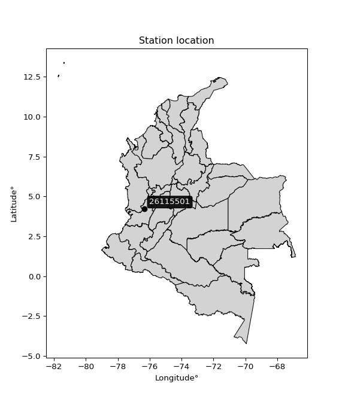

<div align="center">


</div>

# PMP Station (rain, Pmax24h): 26115501

Probable Maximum Precipitation (PMP) is the greatest amount of rainfall for a specific duration that is meteorologically possible for a given location, acting as a "worst-case" scenario for extreme storms, crucial for designing safety-critical infrastructure like bridges, river deviations, dams, spillways, and nuclear plants to prevent catastrophic failure. PMP is calculated by hydrologists using meteorological data to determine the upper limit of extreme rainfall, often leading to the Probable Maximum Flood (PMF) for flood control design, and is increasingly being studied for climate change impacts.

<div align="center">

</img>

</div>


## A. General information


### 1. General running parameters

• app_version: _v20251228_. • runtime: _2025-12-28 08:43:48.795225_. • Python version: _3.14.0_. • SciPy version: _1.16.3_. • Pandas version: _2.3.3_. • NumPy version: _2.3.5_. • Stations dataset (station_dataset_file): _dataset/pmax24h_in/automatic_colombia_2003_2024.csv_. • Stations catalog (station_catalog_file): _dataset/CNE_IDEAM.xls_. • Minimum year to eval til year_max (date_min): _1900_. • Maximum year to eval since year_min (date_max): _2024_. • Creates, save and include plots into reports (create_plot): _False_. • Plot only fit distributions with Δo > Δ (plot_only_fit): _True_. • Eval low extreme values, if False, evaluates high extreme values (low_extreme): _False_. • Eval every SciPy distribution as logarithmic (pdist_logarithmic_on): _True_. • Standard deviation normalized (ddof): _1.0_. • Return periods to eval in years (Tr): _[2, 2.33, 5, 10, 15, 20, 25, 50, 75, 100, 200, 250, 500, 750, 1000]_. • Minimum data sample per station, 0 means any (minimum_sample): _5_. • Z-Score maximum threshold to adjust a value, 0 means disable (zscore_max): _3.5_. • Z-Score minimum threshold to adjust a value, 0 means disable (zscore_min): _-2.5_. • Avoid zeros, e.g. rain = 0 (avoid_zeros): _True_. • Avoid null values (avoid_nans): _True_. [:file_folder:Dataset file.](../../dataset/pmax24h_in/automatic_colombia_2003_2024.csv)

> Delta Degrees of Freedom (DDOF): is a parameter used in the formulas for calculating variance and standard deviation. When ddof=0, the divisor is $N$ (the total number of observations) and this is used when your data set is the entire population. When ddof=1, the divisor is $N-1$ and this is used when your data set is a sample drawn from a larger population. Using $N-1$ provides an unbiased estimate of the population variance (known as Bessel´s correction).


### 2. Station info and location

|   id |   CODIGO | NOMBRE                                    | CATEGORIA               | TECNOLOGIA                | ESTADO   | FECHA_INSTALACION   |   FECHA_SUSPENSION |   ALTITUD |   LATITUD |   LONGITUD | DEPARTAMENTO    | MUNICIPIO   | AREA_OPERATIVA                         | ENTIDAD                                    | AREA_HIDROGRAFICA   | ZONA_HIDROGRAFICA   | SUBZONA_HIDROGRAFICA   |   CORRIENTE | Catalogo   |
|-----:|---------:|:------------------------------------------|:------------------------|:--------------------------|:---------|:--------------------|-------------------:|----------:|----------:|-----------:|:----------------|:------------|:---------------------------------------|:-------------------------------------------|:--------------------|:--------------------|:-----------------------|------------:|:-----------|
|    0 | 26115501 | MANUEL MARIA MALLARINO  - AUT  [26115501] | Climatológica Principal | Automática con Telemetría | Activa   | 24/08/2013          |                nan |      1331 |   4.21361 |    -76.315 | Valle Del Cauca | Trujillo    | Area Operativa 09 - Cauca-Valle-Caldas | CENTRO NACIONAL DE INVESTIGACIONES DE CAFE | Magdalena Cauca     | Cauca               | Río Frío               |         nan | CNE_OE     |

<div align="center">

Map location in: [:earth_americas:Google](http://maps.google.com/maps?q=4.213611111,-76.31497222) [:earth_americas:OSM](https://www.openstreetmap.org/#map=18/4.213611111/-76.31497222&layers=P) [:earth_americas:Bing](https://www.bing.com/maps?cp=4.213611111~-76.31497222&lvl=18) [:earth_americas:Apple](https://maps.apple.com/frame?center=4.213611111%2C-76.31497222&span=0.003%2C0.006)

</div>


<div align="center">

```geojson
{
  "type": "Feature",
  "geometry": {
    "type": "Point", 
    "coordinates": [-76.31497222, 4.213611111]
  }, 
  "properties": {
    "Name": "26115501"
  }
}
```

</div>


### 3. Discrete values table and plot

|               |          0 |         1 |           2 |           3 |           4 |           5 |           6 |
|:--------------|-----------:|----------:|------------:|------------:|------------:|------------:|------------:|
| Date          | 2017       | 2018      | 2019        | 2020        | 2021        | 2022        | 2023        |
| Value         |   91.3     |   43.6    |   51.7      |   55.6      |   60        |   50.4      |   48.9      |
| Value_initial |   91.3     |   43.6    |   51.7      |   55.6      |   60        |   50.4      |   48.9      |
| count         |    7       |    7      |    7        |    7        |    7        |    7        |    7        |
| mean          |   57.3571  |   57.3571 |   57.3571   |   57.3571   |   57.3571   |   57.3571   |   57.3571   |
| std           |   15.8292  |   15.8292 |   15.8292   |   15.8292   |   15.8292   |   15.8292   |   15.8292   |
| zscore        |    2.14432 |   -0.8691 |   -0.357387 |   -0.111007 |    0.166961 |   -0.439514 |   -0.534276 |

> The initial value (value_initial) correspond to the initial obtained or null completed value, and value (value) is adjusted only when the initial value is outside the valid range definite through the Z-Score value. If Z-Score is active, values out of range or outliers are replaced with the station mean value


### 4. Active continuous probability distributions from SciPy (44 of 104 available)

[scipy.stats](https://docs.scipy.org/doc/scipy/reference/stats.html) is a Python´s powerful submodule within the SciPy library for comprehensive statistical analysis, offering over 130 probability distributions (like Normal, Poisson), functions for descriptive stats (mean, variance), hypothesis testing (t-tests, chi-square), random variable generation, and statistical tests, making it essential for data science, modeling, and research. It provides tools to explore, model, and draw conclusions from data efficiently, working seamlessly with NumPy.

<div align="center">

|   id | p_dist             |   n_parameter | fit_method   | label                                                                       | active   | ref                                                                                                        |
|-----:|:-------------------|--------------:|:-------------|:----------------------------------------------------------------------------|:---------|:-----------------------------------------------------------------------------------------------------------|
|    0 | alpha              |             3 | MLE          | Alpha                                                                       | True     | [:mortar_board:](https://docs.scipy.org/doc/scipy/reference/generated/scipy.stats.alpha.html)              |
|    1 | betaprime          |             4 | MLE          | Beta prime                                                                  | True     | [:mortar_board:](https://docs.scipy.org/doc/scipy/reference/generated/scipy.stats.betaprime.html)          |
|    2 | chi2               |             3 | MLE          | Chi²                                                                        | True     | [:mortar_board:](https://docs.scipy.org/doc/scipy/reference/generated/scipy.stats.chi2.html)               |
|    3 | crystalball        |             4 | MLE          | Crystalball                                                                 | True     | [:mortar_board:](https://docs.scipy.org/doc/scipy/reference/generated/scipy.stats.crystalball.html)        |
|    4 | erlang             |             3 | MLE          | Erlang                                                                      | True     | [:mortar_board:](https://docs.scipy.org/doc/scipy/reference/generated/scipy.stats.erlang.html)             |
|    5 | expon              |             2 | MLE          | Exponential                                                                 | True     | [:mortar_board:](https://docs.scipy.org/doc/scipy/reference/generated/scipy.stats.expon.html)              |
|    6 | exponnorm          |             3 | MLE          | Exponentially modified Normal                                               | True     | [:mortar_board:](https://docs.scipy.org/doc/scipy/reference/generated/scipy.stats.exponnorm.html)          |
|    7 | f                  |             4 | MLE          | F                                                                           | True     | [:mortar_board:](https://docs.scipy.org/doc/scipy/reference/generated/scipy.stats.f.html)                  |
|    8 | fatiguelife        |             3 | MLE          | Fatigue-life (Birnbaum-Saunders)                                            | True     | [:mortar_board:](https://docs.scipy.org/doc/scipy/reference/generated/scipy.stats.fatiguelife.html)        |
|    9 | fisk               |             3 | MLE          | Fisk                                                                        | True     | [:mortar_board:](https://docs.scipy.org/doc/scipy/reference/generated/scipy.stats.fisk.html)               |
|   10 | gamma              |             3 | MLE          | Gamma                                                                       | True     | [:mortar_board:](https://docs.scipy.org/doc/scipy/reference/generated/scipy.stats.gamma.html)              |
|   11 | genexpon           |             5 | MLE          | Generalized exponential                                                     | True     | [:mortar_board:](https://docs.scipy.org/doc/scipy/reference/generated/scipy.stats.genexpon.html)           |
|   12 | genlogistic        |             3 | MLE          | Generalized logistic                                                        | True     | [:mortar_board:](https://docs.scipy.org/doc/scipy/reference/generated/scipy.stats.genlogistic.html)        |
|   13 | gibrat             |             2 | MM           | Gibrat                                                                      | True     | [:mortar_board:](https://docs.scipy.org/doc/scipy/reference/generated/scipy.stats.gibrat.html)             |
|   14 | gompertz           |             3 | MLE          | Gompertz (or truncated Gumbel)                                              | True     | [:mortar_board:](https://docs.scipy.org/doc/scipy/reference/generated/scipy.stats.gompertz.html)           |
|   15 | gumbel_l           |             2 | MM           | Gumbel Left Skew                                                            | True     | [:mortar_board:](https://docs.scipy.org/doc/scipy/reference/generated/scipy.stats.gumbel_l.html)           |
|   16 | gumbel_r           |             2 | MM           | Gumbel Right Skew                                                           | True     | [:mortar_board:](https://docs.scipy.org/doc/scipy/reference/generated/scipy.stats.gumbel_r.html)           |
|   17 | halflogistic       |             2 | MM           | Half-logistic                                                               | True     | [:mortar_board:](https://docs.scipy.org/doc/scipy/reference/generated/scipy.stats.halflogistic.html)       |
|   18 | halfnorm           |             2 | MM           | Half Normal                                                                 | True     | [:mortar_board:](https://docs.scipy.org/doc/scipy/reference/generated/scipy.stats.halfnorm.html)           |
|   19 | hypsecant          |             2 | MM           | hyperbolic secant                                                           | True     | [:mortar_board:](https://docs.scipy.org/doc/scipy/reference/generated/scipy.stats.hypsecant.html)          |
|   20 | invgamma           |             3 | MLE          | Inverted gamma                                                              | True     | [:mortar_board:](https://docs.scipy.org/doc/scipy/reference/generated/scipy.stats.invgamma.html)           |
|   21 | invgauss           |             3 | MLE          | Inverse Gaussian                                                            | True     | [:mortar_board:](https://docs.scipy.org/doc/scipy/reference/generated/scipy.stats.invgauss.html)           |
|   22 | invweibull         |             3 | MLE          | Inverted Weibull                                                            | True     | [:mortar_board:](https://docs.scipy.org/doc/scipy/reference/generated/scipy.stats.invweibull.html)         |
|   23 | johnsonsu          |             4 | MLE          | Johnson Su                                                                  | True     | [:mortar_board:](https://docs.scipy.org/doc/scipy/reference/generated/scipy.stats.johnsonsu.html)          |
|   24 | kstwobign          |             2 | MLE          | Limiting distribution of scaled Kolmogorov-Smirnov two-sided test statistic | True     | [:mortar_board:](https://docs.scipy.org/doc/scipy/reference/generated/scipy.stats.kstwobign.html)          |
|   25 | laplace            |             2 | MM           | Laplace                                                                     | True     | [:mortar_board:](https://docs.scipy.org/doc/scipy/reference/generated/scipy.stats.laplace.html)            |
|   26 | laplace_asymmetric |             3 | MLE          | Asymmetric Laplace                                                          | True     | [:mortar_board:](https://docs.scipy.org/doc/scipy/reference/generated/scipy.stats.laplace_asymmetric.html) |
|   27 | loggamma           |             3 | MLE          | Log gamma                                                                   | True     | [:mortar_board:](https://docs.scipy.org/doc/scipy/reference/generated/scipy.stats.loggamma.html)           |
|   28 | logistic           |             2 | MM           | Logistic (or Sech-squared)                                                  | True     | [:mortar_board:](https://docs.scipy.org/doc/scipy/reference/generated/scipy.stats.logistic.html)           |
|   29 | lognorm            |             3 | MLE          | Log Normal                                                                  | True     | [:mortar_board:](https://docs.scipy.org/doc/scipy/reference/generated/scipy.stats.lognorm.html)            |
|   30 | maxwell            |             2 | MM           | Maxwell                                                                     | True     | [:mortar_board:](https://docs.scipy.org/doc/scipy/reference/generated/scipy.stats.maxwell.html)            |
|   31 | mielke             |             4 | MLE          | Mielke Beta-Kappa / Dagum                                                   | True     | [:mortar_board:](https://docs.scipy.org/doc/scipy/reference/generated/scipy.stats.mielke.html)             |
|   32 | moyal              |             2 | MM           | Moyal                                                                       | True     | [:mortar_board:](https://docs.scipy.org/doc/scipy/reference/generated/scipy.stats.moyal.html)              |
|   33 | nakagami           |             3 | MLE          | Nakagami                                                                    | True     | [:mortar_board:](https://docs.scipy.org/doc/scipy/reference/generated/scipy.stats.nakagami.html)           |
|   34 | ncf                |             5 | MLE          | Non-central F distribution                                                  | True     | [:mortar_board:](https://docs.scipy.org/doc/scipy/reference/generated/scipy.stats.ncf.html)                |
|   35 | nct                |             4 | MLE          | Non-central Student’s t                                                     | True     | [:mortar_board:](https://docs.scipy.org/doc/scipy/reference/generated/scipy.stats.nct.html)                |
|   36 | norm               |             2 | MM           | Normal                                                                      | True     | [:mortar_board:](https://docs.scipy.org/doc/scipy/reference/generated/scipy.stats.norm.html)               |
|   37 | pearson3           |             3 | MM           | Pearson type III                                                            | True     | [:mortar_board:](https://docs.scipy.org/doc/scipy/reference/generated/scipy.stats.pearson3.html)           |
|   38 | rayleigh           |             2 | MM           | Rayleigh                                                                    | True     | [:mortar_board:](https://docs.scipy.org/doc/scipy/reference/generated/scipy.stats.rayleigh.html)           |
|   39 | rice               |             3 | MLE          | Rice                                                                        | True     | [:mortar_board:](https://docs.scipy.org/doc/scipy/reference/generated/scipy.stats.rice.html)               |
|   40 | t                  |             3 | MLE          | Student’s t                                                                 | True     | [:mortar_board:](https://docs.scipy.org/doc/scipy/reference/generated/scipy.stats.t.html)                  |
|   41 | truncnorm          |             4 | MLE          | Truncated normal                                                            | True     | [:mortar_board:](https://docs.scipy.org/doc/scipy/reference/generated/scipy.stats.truncnorm.html)          |
|   42 | wald               |             2 | MM           | Wald                                                                        | True     | [:mortar_board:](https://docs.scipy.org/doc/scipy/reference/generated/scipy.stats.wald.html)               |
|   43 | weibull_min        |             3 | MLE          | Weibull minimum                                                             | True     | [:mortar_board:](https://docs.scipy.org/doc/scipy/reference/generated/scipy.stats.weibull_min.html)        |

</div>

> **n_parameter:** # arguments & localization & scale.
>
> **Fit methods:** (MLE) maximum likelihood, (MM) L-moments.
>
>**Inactive:** foldnorm, gennorm, norminvgauss, powernorm, powerlognorm, skewnorm, genextreme, anglit, arcsine, argus, beta, bradford, burr, burr12, cauchy, cosine, halfcauchy, foldcauchy, skewcauchy, wrapcauchy, dgamma, gengamma, exponweib, exponpow, truncexpon, gausshyper, genhalflogistic, genhyperbolic, geninvgauss, halfgennorm, johnsonsb, kappa4, kappa3, ksone, kstwo, loglaplace, levy, levy_l, levy_stable, ncx2, pareto, genpareto, truncpareto, lomax, powerlaw, rdist, rel_breitwigner, recipinvgauss, semicircular, studentized_range, trapezoid, triang, truncweibull_min, tukeylambda, uniform, loguniform, vonmises, vonmises_line, weibull_max, dweibull, 


## B. Probability distributions vs. Empirical distributions

A continuous probability distribution (CPD) describes probabilities for variables that can take any value within a range (like rain any time), unlike discrete variables with specific outcomes (like temperature). It uses a Probability Density Function (PDF), a curve where the total area under it equals 1, and the probability of the variable falling within an interval (a to b) is found by calculating the area under the curve between those points. A key feature is that the probability of hitting any single exact value is zero, so probabilities are always expressed for ranges, e.g., $P(a ≤ X ≤ b)$.

<div align="center">

Distributions parameters from station values
|    |   station | p_dist                |   n |             loc |         scale | shape                  | shape1             | shape2                 | shape3   |
|---:|----------:|:----------------------|----:|----------------:|--------------:|:-----------------------|:-------------------|:-----------------------|:---------|
|  0 |  26115501 | alpha                 |   7 |     30.0913     |  59.4345      | 2.6339321110408678     |                    |                        |          |
|  1 |  26115501 | betaprime             |   7 |     -1.51052    |   2.85491     | 484.1913054338706      | 24.563886740129128 |                        |          |
|  2 |  26115501 | chi2                  |   7 |     43.6        |   1.86697     | 0.558352861508477      |                    |                        |          |
|  3 |  26115501 | crystalball           |   7 |     57.3571     |  14.655       | 7942.704525345095      | 7446.956670969447  |                        |          |
|  4 |  26115501 | erlang                |   7 |     43.6        |  19.899       | 0.18526300477551752    |                    |                        |          |
|  5 |  26115501 | expon                 |   7 |     43.6        |  13.7571      |                        |                    |                        |          |
|  6 |  26115501 | exponnorm             |   7 |     44.6973     |   2.72494     | 4.645924810547057      |                    |                        |          |
|  7 |  26115501 | f                     |   7 |     37.6011     |  13.3841      | 13964.20279519977      | 5.97375151014997   |                        |          |
|  8 |  26115501 | fatiguelife           |   7 |     40.9074     |  11.7412      | 0.8951147837192812     |                    |                        |          |
|  9 |  26115501 | fisk                  |   7 |     41.6784     |  10.8817      | 1.9872995614999085     |                    |                        |          |
| 10 |  26115501 | gamma                 |   7 |     43.6        |  15.2513      | 0.5928980786858287     |                    |                        |          |
| 11 |  26115501 | genexpon              |   7 |     43.6        |  44.124       | 3.2073498211921656     | 1.4005313629054403 | 3.6211851794076324e-10 |          |
| 12 |  26115501 | genlogistic           |   7 |    -12.6523     |   8.50699     | 1882.16680281562       |                    |                        |          |
| 13 |  26115501 | gibrat                |   7 |     46.1773     |   6.78094     |                        |                    |                        |          |
| 14 |  26115501 | gompertz              |   7 |     43.6        |   1.1726e+08  | 8067663.270171361      |                    |                        |          |
| 15 |  26115501 | gumbel_l              |   7 |     63.9527     |  11.4264      |                        |                    |                        |          |
| 16 |  26115501 | gumbel_r              |   7 |     50.7616     |  11.4264      |                        |                    |                        |          |
| 17 |  26115501 | halflogistic          |   7 |     39.9876     |  12.5295      |                        |                    |                        |          |
| 18 |  26115501 | halfnorm              |   7 |     37.9597     |  24.3111      |                        |                    |                        |          |
| 19 |  26115501 | hypsecant             |   7 |     57.3571     |   9.32964     |                        |                    |                        |          |
| 20 |  26115501 | invgamma              |   7 |     37.5979     |  39.9834      | 2.9868853763700436     |                    |                        |          |
| 21 |  26115501 | invgauss              |   7 |     40.2089     |  21.7415      | 0.7887329175228686     |                    |                        |          |
| 22 |  26115501 | invweibull            |   7 |     32.3222     |  17.6651      | 2.634443736180724      |                    |                        |          |
| 23 |  26115501 | johnsonsu             |   7 |     49.3269     |   2.79939     | -0.6372527599923822    | 0.6836719363891128 |                        |          |
| 24 |  26115501 | kstwobign             |   7 |     18.7241     |  45.1145      |                        |                    |                        |          |
| 25 |  26115501 | laplace               |   7 |     57.3571     |  10.3626      |                        |                    |                        |          |
| 26 |  26115501 | laplace_asymmetric    |   7 |     48.9        |   6.36906     | 0.5342317133160708     |                    |                        |          |
| 27 |  26115501 | loggamma              |   7 |  -5129.49       | 683.382       | 1978.800700597999      |                    |                        |          |
| 28 |  26115501 | logistic              |   7 |     57.3571     |   8.07971     |                        |                    |                        |          |
| 29 |  26115501 | lognorm               |   7 |     43.6        |   0.0791564   | 12.282734213029652     |                    |                        |          |
| 30 |  26115501 | maxwell               |   7 |     22.631      |  21.7614      |                        |                    |                        |          |
| 31 |  26115501 | mielke                |   7 |     -0.720509   |  23.2538      | 1730.7828225363692     | 6.9266782716642545 |                        |          |
| 32 |  26115501 | moyal                 |   7 |     48.9765     |   6.59705     |                        |                    |                        |          |
| 33 |  26115501 | nakagami              |   7 |     43.6        |  27.8319      | 0.11204955427318797    |                    |                        |          |
| 34 |  26115501 | ncf                   |   7 |     -0.00108961 |   3.21961e-05 | 1.9683924246798813e-06 | 4.2647219018179605 | 2.232098464090625      |          |
| 35 |  26115501 | nct                   |   7 |     -0.41064    |   0.8337      | 12.93171306234111      | 64.8240408869238   |                        |          |
| 36 |  26115501 | norm                  |   7 |     57.3571     |  14.655       |                        |                    |                        |          |
| 37 |  26115501 | pearson3              |   7 |     57.3571     |  14.655       | 1.6064629388089797     |                    |                        |          |
| 38 |  26115501 | rayleigh              |   7 |     29.3213     |  22.3693      |                        |                    |                        |          |
| 39 |  26115501 | rice                  |   7 |     35.742      |  18.466       | 0.0008356596651227671  |                    |                        |          |
| 40 |  26115501 | t                     |   7 |     57.3299     |  14.5922      | 11.55949808614806      |                    |                        |          |
| 41 |  26115501 | truncnorm             |   7 | -27859.1        | 639.971       | 43.59988080478949      | 93.55203232397722  |                        |          |
| 42 |  26115501 | wald                  |   7 |     42.7022     |  14.655       |                        |                    |                        |          |
| 43 |  26115501 | weibull_min           |   7 |     43.6        |  17.1334      | 0.1936748831680023     |                    |                        |          |
| 44 |  26115501 | logalpha              |   7 |      2.83546    |   7.61315     | 6.63298353729034       |                    |                        |          |
| 45 |  26115501 | logbetaprime          |   7 |     -4.11229    |  11.9059      | 1139.9420590239347     | 1667.8094211812877 |                        |          |
| 46 |  26115501 | logchi2               |   7 |      3.77506    |   0.998897    | 1.0150964226757617     |                    |                        |          |
| 47 |  26115501 | logcrystalball        |   7 |      4.02242    |   0.221097    | 819.414981817431       | 2708.823632534293  |                        |          |
| 48 |  26115501 | logerlang             |   7 |      3.77506    |   0.319641    | 0.31514854438124296    |                    |                        |          |
| 49 |  26115501 | logexpon              |   7 |      3.77506    |   0.247366    |                        |                    |                        |          |
| 50 |  26115501 | logexponnorm          |   7 |      3.82011    |   0.0664257   | 3.0457106584924922     |                    |                        |          |
| 51 |  26115501 | logf                  |   7 |      3.59755    |   0.342223    | 709.7758335559085      | 10.088500996302848 |                        |          |
| 52 |  26115501 | logfatiguelife        |   7 |      3.68327    |   0.279408    | 0.653572080784102      |                    |                        |          |
| 53 |  26115501 | logfisk               |   7 |      3.69952    |   0.262744    | 2.6753835272383153     |                    |                        |          |
| 54 |  26115501 | loggamma              |   7 |      3.77506    |   0.181447    | 0.5927444239096311     |                    |                        |          |
| 55 |  26115501 | loggenexpon           |   7 |      3.77506    |   0.358699    | 1.2223857944190004     | 0.8344839953264147 | 0.5868769285123712     |          |
| 56 |  26115501 | loggenlogistic        |   7 |      2.86633    |   0.146597    | 1405.815943790839      |                    |                        |          |
| 57 |  26115501 | loggibrat             |   7 |      3.85375    |   0.102302    |                        |                    |                        |          |
| 58 |  26115501 | loggompertz           |   7 |      3.77506    |   0.490134    | 1.0803473444657699     |                    |                        |          |
| 59 |  26115501 | loggumbel_l           |   7 |      4.12193    |   0.172389    |                        |                    |                        |          |
| 60 |  26115501 | loggumbel_r           |   7 |      3.92292    |   0.172389    |                        |                    |                        |          |
| 61 |  26115501 | loghalflogistic       |   7 |      3.76037    |   0.18903     |                        |                    |                        |          |
| 62 |  26115501 | loghalfnorm           |   7 |      3.72978    |   0.366777    |                        |                    |                        |          |
| 63 |  26115501 | loghypsecant          |   7 |      4.02242    |   0.140755    |                        |                    |                        |          |
| 64 |  26115501 | loginvgamma           |   7 |      3.59513    |   1.73592     | 5.044032582270491      |                    |                        |          |
| 65 |  26115501 | loginvgauss           |   7 |      3.67042    |   0.844184    | 0.4169746615358217     |                    |                        |          |
| 66 |  26115501 | loginvweibull         |   7 |      3.29016    |   0.622835    | 4.7032439140256646     |                    |                        |          |
| 67 |  26115501 | logjohnsonsu          |   7 |      3.68678    |   0.00679591  | -6.921243549158859     | 1.5747027960697135 |                        |          |
| 68 |  26115501 | logkstwobign          |   7 |      3.38484    |   0.73969     |                        |                    |                        |          |
| 69 |  26115501 | loglaplace            |   7 |      4.02242    |   0.156339    |                        |                    |                        |          |
| 70 |  26115501 | loglaplace_asymmetric |   7 |      3.91999    |   0.122564    | 0.6666292625710377     |                    |                        |          |
| 71 |  26115501 | logloggamma           |   7 |    -64.0585     |   9.18154     | 1661.0824367173605     |                    |                        |          |
| 72 |  26115501 | loglogistic           |   7 |      4.02242    |   0.121897    |                        |                    |                        |          |
| 73 |  26115501 | loglognorm            |   7 |      3.77506    |   0.00184287  | 11.874872366674536     |                    |                        |          |
| 74 |  26115501 | logmaxwell            |   7 |      3.49852    |   0.32831     |                        |                    |                        |          |
| 75 |  26115501 | logmielke             |   7 |     -0.247945   |   3.85058     | 373.56592441423004     | 30.45254965448062  |                        |          |
| 76 |  26115501 | logmoyal              |   7 |      3.89599    |   0.0995287   |                        |                    |                        |          |
| 77 |  26115501 | lognakagami           |   7 |      3.77506    |   0.454631    | 0.3046872732056535     |                    |                        |          |
| 78 |  26115501 | logncf                |   7 |      0.455136   |   3.56032     | 1206.4197278819483     | 1060.7362795365034 | 5.409260003778663e-09  |          |
| 79 |  26115501 | lognct                |   7 |     -3.08702    |   0.0974599   | 455.72759809212585     | 72.9183963458452   |                        |          |
| 80 |  26115501 | lognorm               |   7 |      4.02242    |   0.221097    |                        |                    |                        |          |
| 81 |  26115501 | logpearson3           |   7 |      4.02242    |   0.221097    | 1.325285534090741      |                    |                        |          |
| 82 |  26115501 | lograyleigh           |   7 |      3.59945    |   0.337483    |                        |                    |                        |          |
| 83 |  26115501 | logrice               |   7 |      3.67317    |   0.292287    | 0.00029870146261887676 |                    |                        |          |
| 84 |  26115501 | logt                  |   7 |      3.94905    |   0.0955465   | 1.5473574564690638     |                    |                        |          |
| 85 |  26115501 | logtruncnorm          |   7 |     -1.08535    |   1.29776     | 3.745239737413016      | 4.314761733971853  |                        |          |
| 86 |  26115501 | logwald               |   7 |      3.80136    |   0.221065    |                        |                    |                        |          |
| 87 |  26115501 | logweibull_min        |   7 |      3.77506    |   0.144565    | 0.6388403875118338     |                    |                        |          |

</div>

> **loc** (Location parameter): This shifts the distribution along the x-axis. For many common distributions, like the normal (Gaussian) distribution, loc represents the mean $μ$. For others, like the uniform distribution, it might represent the minimum value, or for the beta distribution, the left end of the support interval.
>
> **scale** (Scale parameter): This determines the width or spread of the distribution. For the normal distribution, scale represents the standard deviation $σ$. For a uniform distribution, it defines the length of the interval (from $loc$ to $loc + scale$).
>
> **shape** (Shape parameters): Refers to parameters that define the specific form of a probability distribution, distinct from its location (loc) and scale (scale). These parameters are required arguments for most distribution functions. For example, a normal (Gaussian) distribution is fully defined by its location (mean) and scale (standard deviation), so it has no specific shape parameters beyond loc and scale. However, other distributions have intrinsic properties that need specification, as Gamma distribution that takes a shape parameter, often named $a$ or $alpha$.


### 0. Cumulative distribution values - CDF (88 evaluated)

Cumulative Distribution Function (CDF), denoted as $F$<sub>$X$</sub>$(x)$, is a function that gives the probability that a random variable $X$ will take a value less than or equal to a specific value, $x$ (i.e., $(P(X≥x)$. It essentially "accumulates" probabilities from a given point up to the far right (positive infinity), providing a complete picture of the distribution´s probabilities for both discrete (like rain) and continuous (like temperature) variables, helping to find probabilities over ranges or above certain values.

<div align="center">

CDF ordered by x ascending and calculating $log(f(x))$ separately
|   id |   Station |   date |    x |   count |    mean |     std |    zscore |   Value_initial |   station |   m |     alpha |   alpha_pdf |   betaprime |   betaprime_pdf |       chi2 |    chi2_pdf |   crystalball |   crystalball_pdf |     erlang |   erlang_pdf |    expon |   expon_pdf |   exponnorm |   exponnorm_pdf |        f |      f_pdf |   fatiguelife |   fatiguelife_pdf |      fisk |   fisk_pdf |       gamma |      gamma_pdf |    genexpon |   genexpon_pdf |   genlogistic |   genlogistic_pdf |   gibrat |   gibrat_pdf |    gompertz |   gompertz_pdf |   gumbel_l |   gumbel_l_pdf |   gumbel_r |   gumbel_r_pdf |   halflogistic |   halflogistic_pdf |   halfnorm |   halfnorm_pdf |   hypsecant |   hypsecant_pdf |   invgamma |   invgamma_pdf |   invgauss |   invgauss_pdf |   invweibull |   invweibull_pdf |   johnsonsu |   johnsonsu_pdf |   kstwobign |   kstwobign_pdf |   laplace |   laplace_pdf |   laplace_asymmetric |   laplace_asymmetric_pdf |    loggamma |   loggamma_pdf |   logistic |   logistic_pdf |   lognorm |   lognorm_pdf |   maxwell |   maxwell_pdf |   mielke |   mielke_pdf |    moyal |   moyal_pdf |    nakagami |   nakagami_pdf |      ncf |    ncf_pdf |      nct |    nct_pdf |     norm |   norm_pdf |   pearson3 |   pearson3_pdf |   rayleigh |   rayleigh_pdf |      rice |   rice_pdf |        t |      t_pdf |   truncnorm |   truncnorm_pdf |        wald |   wald_pdf |   weibull_min |   weibull_min_pdf |   logalpha |   logalpha_pdf |   logbetaprime |   logbetaprime_pdf |     logchi2 |   logchi2_pdf |   logcrystalball |   logcrystalball_pdf |   logerlang |   logerlang_pdf |   logexpon |   logexpon_pdf |   logexponnorm |   logexponnorm_pdf |      logf |   logf_pdf |   logfatiguelife |   logfatiguelife_pdf |   logfisk |   logfisk_pdf |   loggenexpon |   loggenexpon_pdf |   loggenlogistic |   loggenlogistic_pdf |   loggibrat |   loggibrat_pdf |   loggompertz |   loggompertz_pdf |   loggumbel_l |   loggumbel_l_pdf |   loggumbel_r |   loggumbel_r_pdf |   loghalflogistic |   loghalflogistic_pdf |   loghalfnorm |   loghalfnorm_pdf |   loghypsecant |   loghypsecant_pdf |   loginvgamma |   loginvgamma_pdf |   loginvgauss |   loginvgauss_pdf |   loginvweibull |   loginvweibull_pdf |   logjohnsonsu |   logjohnsonsu_pdf |   logkstwobign |   logkstwobign_pdf |   loglaplace |   loglaplace_pdf |   loglaplace_asymmetric |   loglaplace_asymmetric_pdf |   logloggamma |   logloggamma_pdf |   loglogistic |   loglogistic_pdf |   loglognorm |   loglognorm_pdf |   logmaxwell |   logmaxwell_pdf |   logmielke |   logmielke_pdf |   logmoyal |   logmoyal_pdf |   lognakagami |   lognakagami_pdf |   logncf |   logncf_pdf |   lognct |   lognct_pdf |   logpearson3 |   logpearson3_pdf |   lograyleigh |   lograyleigh_pdf |   logrice |   logrice_pdf |     logt |   logt_pdf |   logtruncnorm |   logtruncnorm_pdf |   logwald |   logwald_pdf |   logweibull_min |   logweibull_min_pdf |
|-----:|----------:|-------:|-----:|--------:|--------:|--------:|----------:|----------------:|----------:|----:|----------:|------------:|------------:|----------------:|-----------:|------------:|--------------:|------------------:|-----------:|-------------:|---------:|------------:|------------:|----------------:|---------:|-----------:|--------------:|------------------:|----------:|-----------:|------------:|---------------:|------------:|---------------:|--------------:|------------------:|---------:|-------------:|------------:|---------------:|-----------:|---------------:|-----------:|---------------:|---------------:|-------------------:|-----------:|---------------:|------------:|----------------:|-----------:|---------------:|-----------:|---------------:|-------------:|-----------------:|------------:|----------------:|------------:|----------------:|----------:|--------------:|---------------------:|-------------------------:|------------:|---------------:|-----------:|---------------:|----------:|--------------:|----------:|--------------:|---------:|-------------:|---------:|------------:|------------:|---------------:|---------:|-----------:|---------:|-----------:|---------:|-----------:|-----------:|---------------:|-----------:|---------------:|----------:|-----------:|---------:|-----------:|------------:|----------------:|------------:|-----------:|--------------:|------------------:|-----------:|---------------:|---------------:|-------------------:|------------:|--------------:|-----------------:|---------------------:|------------:|----------------:|-----------:|---------------:|---------------:|-------------------:|----------:|-----------:|-----------------:|---------------------:|----------:|--------------:|--------------:|------------------:|-----------------:|---------------------:|------------:|----------------:|--------------:|------------------:|--------------:|------------------:|--------------:|------------------:|------------------:|----------------------:|--------------:|------------------:|---------------:|-------------------:|--------------:|------------------:|--------------:|------------------:|----------------:|--------------------:|---------------:|-------------------:|---------------:|-------------------:|-------------:|-----------------:|------------------------:|----------------------------:|--------------:|------------------:|--------------:|------------------:|-------------:|-----------------:|-------------:|-----------------:|------------:|----------------:|-----------:|---------------:|--------------:|------------------:|---------:|-------------:|---------:|-------------:|--------------:|------------------:|--------------:|------------------:|----------:|--------------:|---------:|-----------:|---------------:|-------------------:|----------:|--------------:|-----------------:|---------------------:|
|    0 |  26115501 |   2018 | 43.6 |       7 | 57.3571 | 15.8292 | -0.8691   |            43.6 |  26115501 |   1 | 0.0388797 |  0.0274467  |    0.121707 |      0.0231233  | 8.6239e-05 | 3.38838e+09 |      0.173933 |        0.0175214  | 0.00149061 |  3.88655e+10 | 0        |  0.0726895  |   0.0441286 |      0.0236548  | 0.037609 | 0.031098   |      0.036098 |        0.0422055  | 0.0308949 | 0.0309635  | 9.10191e-10 | 75949.1        | 5.58067e-12 |     0.0726894  |     0.0798991 |        0.023718   | 0        |   0          | 1.81801e-09 |     0.0688018  |   0.155016 |    0.0124559   |   0.153887 |     0.0252052  |       0.143166 |         0.039088   |   0.183466 |     0.0319483  |    0.143242 |       0.0148404 |   0.037613 |     0.031099   |  0.0364068 |     0.037846   |    0.0383257 |       0.0292006  |   0.0507012 |      0.0111849  |   0.0785899 |      0.0224799  |  0.13256  |    0.0127921  |             0.046767 |               0.0137447  | 2.44642e-09 |    3.26534e+06 |   0.154116 |     0.0161348  |  0.13161  |      0.964973 |  0.181455 |    0.0214     |      nan |          nan | 0.132828 |  0.0293742  | 0.000264821 |    8.35222e+09 | 0.651014 | 0.00467147 | 0.107003 | 0.0243072  | 0.173933 | 0.0175214  |   0.129791 |     0.0384105  |   0.184311 |     0.0232759  | 0.0865649 | 0.0210498  | 0.182999 | 0.0168324  |    0        |      0.0681636  | 0.000141246 | 0.00135106 |    0.00104861 |       2.85674e+10 |  0.0708392 |       1.16851  |       0.209047 |           0.946289 | 1.28124e-08 |   1.46433e+07 |         0.13161  |             0.964973 | 2.32174e-05 |     1.64763e+10 |   0        |       4.04259  |      0.0416916 |           1.02372  | 0.0381245 |   1.29194  |        0.0365178 |             1.54567  |  0.034384 |      1.17601  |    1.0849e-10 |          3.40783  |        0.0576445 |             1.12089  |    0        |        0        |   8.79109e-08 |          2.20419  |      0.125149 |        0.678517   |     0.0946311 |          1.29427  |         0.0388247 |              2.64109  |      0.098252 |           2.15888 |       0.10874  |           0.757607 |     0.0381244 |          1.29191  |     0.0368232 |          1.47716  |       0.0389339 |            1.22576  |      0.0367524 |           1.43047  |      0.0564384 |           1.13772  |     0.102757 |         0.657271 |               0.0522036 |                    0.638928 |      0.136812 |          0.963846 |      0.116161 |          0.842246 |   0.00720883 |      3.79236e+12 |     0.129032 |         1.20932  |   0.0567883 |         1.09948 |  0.0663804 |       1.36439  |   5.53642e-10 |     759701        | 0.119752 |     1.01176  | 0.157644 |     0.995244 |     0.0765548 |          1.67319  |      0.126613 |          1.34661  | 0.0589506 |      1.12234  | 0.122806 |  0.832979  |    2.76674e-06 |           3.36799  |  0        |      0        |      5.35512e-10 |        770356        |
|    1 |  26115501 |   2023 | 48.9 |       7 | 57.3571 | 15.8292 | -0.534276 |            48.9 |  26115501 |   2 | 0.300708  |  0.0586118  |    0.273397 |      0.0329426  | 0.957171   | 0.0155944   |      0.281942 |        0.0230467  | 0.815715   |  0.0227282   | 0.319722 |  0.049449   |   0.271916  |      0.0526535  | 0.311195 | 0.0567057  |      0.332761 |        0.05173    | 0.306871  | 0.0585326  | 0.528769    |     0.0473043  | 0.319722    |     0.049449   |     0.257765  |        0.0410637  | 0.180758 |   0.0966283  | 0.30556     |     0.0477787  |   0.234972 |    0.0179328   |   0.308219 |     0.0317471  |       0.341383 |         0.0352552  |   0.347299 |     0.0296593  |    0.244399 |       0.0236969 |   0.311195 |     0.0567043  |  0.326017  |     0.0535574  |    0.306609  |       0.0576013  |   0.229312  |      0.0731869  |   0.237771  |      0.0355768  |  0.221072 |    0.0213336  |             0.222034 |               0.0652552  | 0.686504    |    2.34373     |   0.259857 |     0.0238042  |  0.274272 |      1.50719  |  0.307813 |    0.0257837  |      nan |          nan | 0.314505 |  0.0366774  | 0.56981     |    0.0240053   | 0.674589 | 0.00423391 | 0.271589 | 0.0360911  | 0.281941 | 0.0230467  |   0.336856 |     0.0375968  |   0.318206 |     0.0266766  | 0.224206  | 0.029936   | 0.287273 | 0.0223761  |    0.303231 |      0.0475033  | 0.29335     | 0.0667653  |    0.549198   |       0.0131248   |  0.278289  |       2.29864  |       0.33193  |           1.17904  | 0.259519    |   1.1051      |         0.274272 |             1.50719  | 0.745687    |     1.55165     |   0.37109  |       2.54243  |      0.281162  |           2.82581  | 0.306697  |   2.80535  |        0.321192  |             2.68413  |  0.29657  |      2.93361  |    0.339328   |          2.51449  |        0.271057  |             2.4126   |    0.148297 |        6.42329  |   0.247917    |          2.09491  |      0.229029 |        1.16326    |     0.297612  |          2.09234  |         0.329519  |              2.35787  |      0.337332 |           1.97795 |       0.236563 |           1.53018  |     0.306695  |          2.80536  |     0.317737  |          2.71477  |       0.302525  |            2.83703  |      0.31552   |           2.75611  |      0.260074  |           2.21224  |     0.214039 |         1.36907  |               0.212561  |                    2.60157  |      0.27791  |          1.48153  |      0.251962 |          1.5462   |   0.636039   |      0.275651    |     0.299206 |         1.69675  |   0.272229  |         2.47334 |  0.302222  |       2.42875  |   0.333946    |          1.74766  | 0.272555 |     1.62563  | 0.295962 |     1.39314  |     0.317499  |          2.25219  |      0.309288 |          1.76068  | 0.240128  |      1.92664  | 0.306908 |  2.6993    |    0.328538    |           2.40929  |  0.270584 |      4.54864  |      0.577967    |             2.02742  |
|    2 |  26115501 |   2022 | 50.4 |       7 | 57.3571 | 15.8292 | -0.439514 |            50.4 |  26115501 |   3 | 0.386537  |  0.055313   |    0.323883 |      0.0342519  | 0.974843   | 0.0087194   |      0.31749  |        0.0243213  | 0.845347   |  0.0172046   | 0.389995 |  0.0443409  |   0.349257  |      0.0499657  | 0.393128 | 0.0522234  |      0.405961 |        0.0458987  | 0.391804  | 0.0542972  | 0.592951    |     0.0387369  | 0.389995    |     0.0443409  |     0.320903  |        0.0428628  | 0.317881 |   0.0844509  | 0.373654    |     0.0430937  |   0.263183 |    0.0196943   |   0.356239 |     0.0321792  |       0.393146 |         0.0337379  |   0.391148 |     0.0287923  |    0.281997 |       0.0264244 |   0.393126 |     0.0522223  |  0.402216  |     0.0479702  |    0.390245  |       0.0535134  |   0.351524  |      0.0845994  |   0.292299  |      0.0369586  |  0.255504 |    0.0246563  |             0.31401  |               0.0575404  | 0.748693    |    1.80402     |   0.297117 |     0.0258473  |  0.321578 |      1.62076  |  0.347021 |    0.026449   |      nan |          nan | 0.369331 |  0.0362829  | 0.602379    |    0.0197328   | 0.680854 | 0.00411938 | 0.326784 | 0.0373382  | 0.31749  | 0.0243213  |   0.391942 |     0.0357985  |   0.358513 |     0.0270224  | 0.270247  | 0.0313695  | 0.32185  | 0.0236979  |    0.370966 |      0.0428877  | 0.386763    | 0.057701   |    0.566614   |       0.0103207   |  0.349465  |       2.39611  |       0.3682   |           1.22012  | 0.290755    |   0.970138    |         0.321579 |             1.62076  | 0.786946    |     1.20284     |   0.4434   |       2.25011  |      0.36675   |           2.80215  | 0.390041  |   2.6898   |        0.39976   |             2.50534  |  0.384769 |      2.87264  |    0.411929   |          2.29287  |        0.345631  |             2.50383  |    0.331894 |        5.47997  |   0.31045     |          2.04285  |      0.266502 |        1.31873    |     0.361635  |          2.1337   |         0.398788  |              2.22443  |      0.395966 |           1.90167 |       0.286452 |           1.77133  |     0.390041  |          2.68982  |     0.397443  |          2.54766  |       0.38721   |            2.74338  |      0.396709  |           2.60189  |      0.328115  |           2.27719  |     0.259672 |         1.66095  |               0.307668  |                    3.7656   |      0.324365 |          1.59029  |      0.301469 |          1.72756  |   0.643406   |      0.216656    |     0.35146  |         1.75694  |   0.348787  |         2.57218 |  0.375406  |       2.39871  |   0.384046    |          1.57679  | 0.323509 |     1.74232  | 0.339209 |     1.46662  |     0.384764  |          2.19142  |      0.363045 |          1.79262  | 0.299915  |      2.02264  | 0.398443 |  3.32659   |    0.398171    |           2.20298  |  0.396296 |      3.75824  |      0.632719    |             1.62154  |
|    3 |  26115501 |   2019 | 51.7 |       7 | 57.3571 | 15.8292 | -0.357387 |            51.7 |  26115501 |   4 | 0.455528  |  0.0506498  |    0.368828 |      0.034806   | 0.983853   | 0.00542648  |      0.34974  |        0.0252678  | 0.8655     |  0.0139757   | 0.444999 |  0.0403428  |   0.411754  |      0.0460636  | 0.457908 | 0.0473634  |      0.462499 |        0.0411497  | 0.459186  | 0.0492449  | 0.639519    |     0.0331266  | 0.444998    |     0.0403427  |     0.376971  |        0.0432201  | 0.418691 |   0.0707308  | 0.427243    |     0.0394067  |   0.289806 |    0.02127     |   0.398058 |     0.03209    |       0.436091 |         0.0323168  |   0.428053 |     0.0279751  |    0.317833 |       0.0286818 |   0.457904 |     0.0473625  |  0.46138   |     0.0430823  |    0.456731  |       0.0486602  |   0.455741  |      0.0738618  |   0.340694  |      0.0373826  |  0.289655 |    0.0279519  |             0.384878 |               0.051596   | 0.79017     |    1.46777     |   0.331775 |     0.0274392  |  0.36388  |      1.6983   |  0.38166  |    0.0268082  |      nan |          nan | 0.415936 |  0.0353356  | 0.626288    |    0.01718     | 0.686146 | 0.00402322 | 0.3756   | 0.0376499  | 0.34974  | 0.0252678  |   0.43735  |     0.0340359  |   0.393722 |     0.0271144  | 0.311616  | 0.0322156  | 0.353319 | 0.0246896  |    0.424321 |      0.0392517  | 0.456767    | 0.050118   |    0.578923   |       0.00870834  |  0.410713  |       2.40307  |       0.399624 |           1.24645  | 0.314328    |   0.884459    |         0.36388  |             1.6983   | 0.814795    |     0.994174    |   0.497852 |       2.02998  |      0.436254  |           2.64029  | 0.456408  |   2.51373  |        0.461222  |             2.31829  |  0.455891 |      2.69846  |    0.468026   |          2.11399  |        0.409416  |             2.49324  |    0.456456 |        4.32441  |   0.361835    |          1.99145  |      0.301815 |        1.45507    |     0.415848  |          2.11661  |         0.453873  |              2.10019  |      0.443496 |           1.82999 |       0.334023 |           1.96092  |     0.456408  |          2.51374  |     0.460007  |          2.36145  |       0.455018  |            2.57152  |      0.460674  |           2.41595  |      0.386121  |           2.26976  |     0.30561  |         1.95479  |               0.39722   |                    3.27853  |      0.365851 |          1.66498  |      0.347194 |          1.85936  |   0.648477   |      0.183339    |     0.396583 |         1.78304  |   0.414286  |         2.55815 |  0.435423  |       2.30639  |   0.422705    |          1.46275  | 0.368868 |     1.81582  | 0.377191 |     1.51387  |     0.439524  |          2.10475  |      0.408785 |          1.79608  | 0.35204   |      2.06519  | 0.487129 |  3.57778   |    0.4522      |           2.042    |  0.483743 |      3.12461  |      0.67069     |             1.37134  |
|    4 |  26115501 |   2020 | 55.6 |       7 | 57.3571 | 15.8292 | -0.111007 |            55.6 |  26115501 |   5 | 0.622047  |  0.0349419  |    0.503461 |      0.0335754  | 0.99546    | 0.00143836  |      0.452281 |        0.0270273  | 0.907631   |  0.00834031  | 0.582    |  0.0303842  |   0.567444  |      0.034165   | 0.613896 | 0.0330698  |      0.59911  |        0.0295782  | 0.620012  | 0.0336312  | 0.74467     |     0.0218589  | 0.582       |     0.0303842  |     0.539621  |        0.0391245  | 0.628926 |   0.0401077  | 0.562037    |     0.0301326  |   0.382101 |    0.0260339   |   0.51955  |     0.0297728  |       0.553232 |         0.0276921  |   0.53192  |     0.0252236  |    0.440401 |       0.0335218 |   0.613891 |     0.0330696  |  0.603773  |     0.0305794  |    0.616669  |       0.0337386  |   0.66276   |      0.0363525  |   0.483864  |      0.0353371  |  0.422016 |    0.0407248  |             0.556503 |               0.0372002  | 0.87209     |    0.850597    |   0.445844 |     0.0305787  |  0.49235  |      1.80404  |  0.486577 |    0.0267101  |      nan |          nan | 0.544969 |  0.0304774  | 0.683178    |    0.0125214   | 0.701298 | 0.00375108 | 0.518911 | 0.0350861  | 0.452281 | 0.0270273  |   0.559065 |     0.0283473  |   0.498441 |     0.0263402  | 0.439108  | 0.0326641  | 0.453833 | 0.0265519  |    0.558748 |      0.0300903  | 0.615632    | 0.0327025  |    0.606767   |       0.00592363  |  0.577706  |       2.12992  |       0.491777 |           1.27636  | 0.372006    |   0.715901    |         0.49235  |             1.80404  | 0.872044    |     0.620779    |   0.625761 |       1.5129   |      0.603669  |           1.95192  | 0.616647  |   1.88422  |        0.609346  |             1.76088  |  0.626256 |      1.96511  |    0.604453   |          1.64996  |        0.580517  |             2.15314  |    0.682446 |        2.16786  |   0.500329    |          1.80868  |      0.42179  |        1.83744    |     0.562457  |          1.8775   |         0.592774  |              1.71565  |      0.568323 |           1.59689 |       0.490413 |           2.26042  |     0.616647  |          1.88423  |     0.61074   |          1.78702  |       0.618785  |            1.91879  |      0.614589  |           1.81651  |      0.544084  |           2.03228  |     0.486622 |         3.1126   |               0.594144  |                    2.20746  |      0.491805 |          1.77007  |      0.491305 |          2.05029  |   0.659516   |      0.126982    |     0.525689 |         1.73977  |   0.588834  |         2.17871 |  0.588338  |       1.87389  |   0.519637    |          1.21793  | 0.50462  |     1.88041  | 0.489938 |     1.56556  |     0.580693  |          1.762    |      0.536862 |          1.70272  | 0.50176   |      2.01214  | 0.71857  |  2.4713    |    0.585616    |           1.6407   |  0.660339 |      1.85748  |      0.751893    |             0.90872  |
|    5 |  26115501 |   2021 | 60   |       7 | 57.3571 | 15.8292 |  0.166961 |            60   |  26115501 |   6 | 0.744239  |  0.0215956  |    0.64113  |      0.0285605  | 0.998842   | 0.000353441 |      0.571557 |        0.0267832  | 0.936642   |  0.0051835   | 0.696419 |  0.0220671  |   0.694436  |      0.0241364  | 0.731858 | 0.0213927  |      0.708338 |        0.0206794  | 0.73796   | 0.0209749  | 0.823105    |     0.0144247  | 0.696419    |     0.0220671  |     0.692258  |        0.0299266  | 0.761829 |   0.0223961  | 0.676433    |     0.022262   |   0.507158 |    0.0305186   |   0.64049  |     0.024973   |       0.663261 |         0.0223507  |   0.635379 |     0.02176    |    0.588987 |       0.0327935 |   0.731852 |     0.0213927  |  0.715416  |     0.0208537  |    0.736115  |       0.0214658  |   0.77729   |      0.0184748  |   0.627528  |      0.0296138  |  0.612556 |    0.0373886  |             0.693376 |               0.0257194  | 0.922232    |    0.500302    |   0.581053 |     0.0301286  |  0.62752  |      1.71139  |  0.600418 |    0.0247499  |      nan |          nan | 0.664533 |  0.0238712  | 0.7314      |    0.00965035  | 0.717177 | 0.00347115 | 0.659614 | 0.0285054  | 0.571557 | 0.0267832  |   0.670042 |     0.0222164  |   0.609549 |     0.0239385  | 0.578044  | 0.0300178  | 0.571008 | 0.0262737  |    0.673136 |      0.0222933  | 0.731296    | 0.0209379  |    0.629003   |       0.0043443   |  0.72088   |       1.61463  |       0.587859 |           1.2347   | 0.421939    |   0.60258     |         0.627521 |             1.71139  | 0.9104      |     0.405887    |   0.724935 |       1.11197  |      0.727902  |           1.34484  | 0.73676   |   1.29566  |        0.723887  |             1.26769  |  0.748297 |      1.27629  |    0.714153   |          1.24471  |        0.723612  |             1.59663  |    0.803771 |        1.15035  |   0.629189    |          1.56788  |      0.573496 |        2.10825    |     0.690777  |          1.48237  |         0.708111  |              1.31878  |      0.679765 |           1.32739 |       0.655999 |           1.99526  |     0.736761  |          1.29566  |     0.726469  |          1.27394  |       0.740363  |            1.30165  |      0.731381  |           1.27406  |      0.683661  |           1.62105  |     0.684369 |         2.01889  |               0.731794  |                    1.45878  |      0.624726 |          1.68786  |      0.643369 |          1.88229  |   0.667889   |      0.0957594   |     0.651469 |         1.54216  |   0.732162  |         1.58058 |  0.711999  |       1.38228  |   0.604872    |          1.02794  | 0.643088 |     1.72062  | 0.606966 |     1.48602  |     0.699741  |          1.36656  |      0.658771 |          1.4827   | 0.645908  |      1.74567  | 0.849427 |  1.11819   |    0.697142    |           1.30032  |  0.771591 |      1.13647  |      0.809664    |             0.631784 |
|    6 |  26115501 |   2017 | 91.3 |       7 | 57.3571 | 15.8292 |  2.14432  |            91.3 |  26115501 |   7 | 0.955869  |  0.00159471 |    0.985462 |      0.00165528 | 1          | 3.74622e-08 |      0.989724 |        0.00186228 | 0.99292    |  0.000450535 | 0.968799 |  0.00226802 |   0.974215  |      0.00203672 | 0.959375 | 0.00185439 |      0.962068 |        0.00233678 | 0.953266  | 0.00178418 | 0.983438    |     0.00119962 | 0.968798    |     0.00226803 |     0.990759  |        0.00108126 | 0.970972 |   0.00146727 | 0.962441    |     0.00258412 |   0.999982 |    1.68258e-05 |   0.971622 |     0.00244799 |       0.967245 |         0.00257142 |   0.97177  |     0.00295664 |    0.983261 |       0.0017934 |   0.959373 |     0.00185445 |  0.961243  |     0.00221309 |    0.959108  |       0.00178874 |   0.954344  |      0.00155853 |   0.988697  |      0.00161215 |  0.981101 |    0.00182375 |             0.977798 |               0.00186233 | 0.994114    |    0.0351536   |   0.985241 |     0.00179977 |  0.986927 |      0.152141 |  0.981069 |    0.00251285 |      nan |          nan | 0.967737 |  0.00244395 | 0.904283    |    0.00315309  | 0.801803 | 0.00208561 | 0.984007 | 0.00160284 | 0.989724 | 0.00186228 |   0.966241 |     0.00257386 |   0.978472 |     0.00266654 | 0.989177  | 0.00176345 | 0.980518 | 0.00239261 |    0.961388 |      0.00263646 | 0.963982    | 0.00200771 |    0.704573   |       0.00146261  |  0.982039  |       0.119372 |       0.936088 |           0.378763 | 0.604825    |   0.323033    |         0.986927 |             0.15214  | 0.984027    |     0.0614293   |   0.949605 |       0.203728 |      0.965837  |           0.168861 | 0.958924  |   0.158649 |        0.960046  |             0.182664 |  0.953794 |      0.144739 |    0.960858   |          0.197274 |        0.981709  |             0.123623 |    0.968903 |        0.106143 |   0.97763     |          0.222742 |      0.999941 |        0.00335658 |     0.968121  |          0.181946 |         0.963587  |              0.189122 |      0.967528 |           0.22102 |       0.980656 |           0.137343 |     0.958924  |          0.158648 |     0.959957  |          0.178176 |       0.959167  |            0.153656 |      0.958354  |           0.169462 |      0.981101  |           0.156029 |     0.978472 |         0.1377   |               0.972658  |                    0.148713 |      0.986113 |          0.160137 |      0.982604 |          0.14023  |   0.69314    |      0.0400178   |     0.977401 |         0.194307 |   0.981191  |         0.11905 |  0.964264  |       0.179408 |   0.8851      |          0.384702 | 0.985976 |     0.147315 | 0.966176 |     0.267077 |     0.965043  |          0.192921 |      0.974601 |          0.203986 | 0.984066  |      0.156855 | 0.975938 |  0.0638743 |    0.999998    |           0.339312 |  0.961166 |      0.144715 |      0.94134     |             0.143794 |


</div>

An Empirical Distribution Function (EDF) is a step-function estimate of a true cumulative distribution function (CDF) based on observed sample data, representing the proportion of data points less than or equal to a given value. It is calculated by ordering your data and jumping up by $1/n$ (where $n$ is sample size) at each unique data point, allowing analysis without assuming an underlying population distribution, and it gets closer to the true CDF as the sample size grows.


### 1. Empirical - EDF California (1923)

California´s estimates the true probability distribution of water-related data (like rainfall, streamflow) using observed samples, crucial for risk assessment.

<div align="center">


$P=m/n$


</div>


**1.1. Empirical values**

<div align="center">

|                | 0                   | 1                  | 2                   | 3                  | 4                  | 5                  | 6              |
|:---------------|:--------------------|:-------------------|:--------------------|:-------------------|:-------------------|:-------------------|:---------------|
| date           | 2018                | 2023               | 2022                | 2019               | 2020               | 2021               | 2017           |
| x              | 43.6                | 48.9               | 50.4                | 51.7               | 55.6               | 60.0               | 91.3           |
| m              | 1                   | 2                  | 3                   | 4                  | 5                  | 6                  | 7              |
| empirical_dist | edf_california      | edf_california     | edf_california      | edf_california     | edf_california     | edf_california     | edf_california |
| empirical      | 0.14285714285714285 | 0.2857142857142857 | 0.42857142857142855 | 0.5714285714285714 | 0.7142857142857143 | 0.8571428571428571 | 1.0            |
| empirical_tr   | 1.1666666666666665  | 1.4                | 1.75                | 2.333333333333333  | 3.5                | 6.999999999999997  | inf            |

</div>


**1.2. Kolmogorov-Smirnov fit test (sorted by Δ)**


<div align="center">

|                | 0                   | 1                   | 2                   | 3                   | 4                   | 5                   | 6                   | 7                   | 8                   | 9                   | 10                  | 11                  | 12                  | 13                  | 14                  | 15                  | 16                  | 17                  | 18                  | 19                  | 20                  | 21                  | 22                  | 23                  | 24                  | 25                  | 26                  | 27                  | 28                  | 29                  | 30                  | 31                  | 32                  | 33                  | 34                    | 35                  | 36                  | 37                  | 38                  | 39                  | 40                  | 41                  | 42                  | 43                  | 44                  | 45                  | 46                  | 47                  | 48                  | 49                  | 50                  | 51                  | 52                  | 53                  | 54                  | 55                  | 56                  | 57                  | 58                  | 59                  | 60                  | 61                  | 62                  | 63                  | 64                  | 65                  | 66                  | 67                  | 68                  | 69                  | 70                  | 71                  | 72                  | 73                  | 74                  | 75                  | 76                  | 77                  | 78                  | 79                  | 80                  | 81                  | 82                  | 83                  | 84                  | 85                  | 86                  | 87                  |
|:---------------|:--------------------|:--------------------|:--------------------|:--------------------|:--------------------|:--------------------|:--------------------|:--------------------|:--------------------|:--------------------|:--------------------|:--------------------|:--------------------|:--------------------|:--------------------|:--------------------|:--------------------|:--------------------|:--------------------|:--------------------|:--------------------|:--------------------|:--------------------|:--------------------|:--------------------|:--------------------|:--------------------|:--------------------|:--------------------|:--------------------|:--------------------|:--------------------|:--------------------|:--------------------|:----------------------|:--------------------|:--------------------|:--------------------|:--------------------|:--------------------|:--------------------|:--------------------|:--------------------|:--------------------|:--------------------|:--------------------|:--------------------|:--------------------|:--------------------|:--------------------|:--------------------|:--------------------|:--------------------|:--------------------|:--------------------|:--------------------|:--------------------|:--------------------|:--------------------|:--------------------|:--------------------|:--------------------|:--------------------|:--------------------|:--------------------|:--------------------|:--------------------|:--------------------|:--------------------|:--------------------|:--------------------|:--------------------|:--------------------|:--------------------|:--------------------|:--------------------|:--------------------|:--------------------|:--------------------|:--------------------|:--------------------|:--------------------|:--------------------|:--------------------|:--------------------|:--------------------|:--------------------|:--------------------|
| station        | 26115501            | 26115501            | 26115501            | 26115501            | 26115501            | 26115501            | 26115501            | 26115501            | 26115501            | 26115501            | 26115501            | 26115501            | 26115501            | 26115501            | 26115501            | 26115501            | 26115501            | 26115501            | 26115501            | 26115501            | 26115501            | 26115501            | 26115501            | 26115501            | 26115501            | 26115501            | 26115501            | 26115501            | 26115501            | 26115501            | 26115501            | 26115501            | 26115501            | 26115501            | 26115501              | 26115501            | 26115501            | 26115501            | 26115501            | 26115501            | 26115501            | 26115501            | 26115501            | 26115501            | 26115501            | 26115501            | 26115501            | 26115501            | 26115501            | 26115501            | 26115501            | 26115501            | 26115501            | 26115501            | 26115501            | 26115501            | 26115501            | 26115501            | 26115501            | 26115501            | 26115501            | 26115501            | 26115501            | 26115501            | 26115501            | 26115501            | 26115501            | 26115501            | 26115501            | 26115501            | 26115501            | 26115501            | 26115501            | 26115501            | 26115501            | 26115501            | 26115501            | 26115501            | 26115501            | 26115501            | 26115501            | 26115501            | 26115501            | 26115501            | 26115501            | 26115501            | 26115501            | 26115501            |
| empirical_dist | edf_california      | edf_california      | edf_california      | edf_california      | edf_california      | edf_california      | edf_california      | edf_california      | edf_california      | edf_california      | edf_california      | edf_california      | edf_california      | edf_california      | edf_california      | edf_california      | edf_california      | edf_california      | edf_california      | edf_california      | edf_california      | edf_california      | edf_california      | edf_california      | edf_california      | edf_california      | edf_california      | edf_california      | edf_california      | edf_california      | edf_california      | edf_california      | edf_california      | edf_california      | edf_california        | edf_california      | edf_california      | edf_california      | edf_california      | edf_california      | edf_california      | edf_california      | edf_california      | edf_california      | edf_california      | edf_california      | edf_california      | edf_california      | edf_california      | edf_california      | edf_california      | edf_california      | edf_california      | edf_california      | edf_california      | edf_california      | edf_california      | edf_california      | edf_california      | edf_california      | edf_california      | edf_california      | edf_california      | edf_california      | edf_california      | edf_california      | edf_california      | edf_california      | edf_california      | edf_california      | edf_california      | edf_california      | edf_california      | edf_california      | edf_california      | edf_california      | edf_california      | edf_california      | edf_california      | edf_california      | edf_california      | edf_california      | edf_california      | edf_california      | edf_california      | edf_california      | edf_california      | edf_california      |
| p_dist         | logt                | logfisk             | johnsonsu           | alpha               | loginvweibull       | fisk                | loginvgamma         | logf                | invweibull          | f                   | invgamma            | logjohnsonsu        | loginvgauss         | logfatiguelife      | logexponnorm        | invgauss            | wald                | logexpon            | loggibrat           | logwald             | loggenexpon         | logmoyal            | fatiguelife         | loghalflogistic     | gibrat              | logmielke           | logpearson3         | logtruncnorm        | logalpha            | expon               | genexpon            | loggenlogistic      | exponnorm           | loggumbel_r         | loglaplace_asymmetric | loghalfnorm         | gompertz            | truncnorm           | logkstwobign        | laplace_asymmetric  | pearson3            | moyal               | halflogistic        | genlogistic         | nct                 | lograyleigh         | logmaxwell          | logncf              | betaprime           | gumbel_r            | logrice             | halfnorm            | loglogistic         | loggompertz         | logcrystalball      | lognorm             | lognorm             | kstwobign           | logloggamma         | loghypsecant        | gamma               | rayleigh            | lognct              | lognakagami         | maxwell             | loglaplace          | logbetaprime        | hypsecant           | logistic            | rice                | nakagami            | crystalball         | norm                | t                   | logweibull_min      | laplace             | loggumbel_l         | weibull_min         | gumbel_l            | loglognorm          | loggamma            | loggamma            | logchi2             | logerlang           | ncf                 | erlang              | chi2                | mielke              |
| delta          | 0.08429996169693338 | 0.11553780327162072 | 0.1156877713281913  | 0.11590101158902755 | 0.11677971966135081 | 0.11918335155444082 | 0.12038173546745334 | 0.1203825012562475  | 0.12102763943974859 | 0.12528520643898433 | 0.12529081852958546 | 0.12576191668252212 | 0.13067351872673227 | 0.13325625291216414 | 0.13517424258214084 | 0.1417264067447892  | 0.14271589694374462 | 0.14285714285714285 | 0.14285714285714285 | 0.14285714285714285 | 0.142989678311228   | 0.1451436569418444  | 0.14880501761231868 | 0.1490317517830092  | 0.1527371165519938  | 0.15714213831014823 | 0.1574020092681404  | 0.16000111806998474 | 0.16071599578008677 | 0.16072349949972498 | 0.16072393451412126 | 0.16201233465967368 | 0.1627069021502653  | 0.16636552582224018 | 0.17420846278275193   | 0.1773780389479449  | 0.18070991587780327 | 0.18400655415551836 | 0.1853072454426674  | 0.18655064660996312 | 0.18710092126072142 | 0.19260976646162264 | 0.19388235219520566 | 0.19445708031454373 | 0.19752868913731203 | 0.19837166369085457 | 0.2056738634405083  | 0.21405513931370834 | 0.21601299524869189 | 0.21665292474754638 | 0.21938855787104855 | 0.22176411118896155 | 0.22423440452563953 | 0.22795400741537009 | 0.2296223073008531  | 0.2296224066805913  | 0.2296224066805913  | 0.23073491096375254 | 0.23241734431965888 | 0.23740521817453664 | 0.2430550579905434  | 0.24759417353175428 | 0.25017672645968914 | 0.25227066540643994 | 0.256724632771816   | 0.2658181976207794  | 0.26928373632773195 | 0.27388480526850134 | 0.2760897315329779  | 0.2790991850162159  | 0.2840954050232355  | 0.28558622499133446 | 0.2855862271188393  | 0.28613496937731375 | 0.2922524943078161  | 0.29226991785093037 | 0.2924954186929526  | 0.295427251410155   | 0.3499844883728178  | 0.35032502728757875 | 0.40079011683659116 | 0.40079011683659116 | 0.43520427797538075 | 0.45997228416341207 | 0.5081564882651537  | 0.5300003540457837  | 0.6714562939840802  | nan                 |
| deltao         | 0.48442053926100004 | 0.48442053926100004 | 0.48442053926100004 | 0.48442053926100004 | 0.48442053926100004 | 0.48442053926100004 | 0.48442053926100004 | 0.48442053926100004 | 0.48442053926100004 | 0.48442053926100004 | 0.48442053926100004 | 0.48442053926100004 | 0.48442053926100004 | 0.48442053926100004 | 0.48442053926100004 | 0.48442053926100004 | 0.48442053926100004 | 0.48442053926100004 | 0.48442053926100004 | 0.48442053926100004 | 0.48442053926100004 | 0.48442053926100004 | 0.48442053926100004 | 0.48442053926100004 | 0.48442053926100004 | 0.48442053926100004 | 0.48442053926100004 | 0.48442053926100004 | 0.48442053926100004 | 0.48442053926100004 | 0.48442053926100004 | 0.48442053926100004 | 0.48442053926100004 | 0.48442053926100004 | 0.48442053926100004   | 0.48442053926100004 | 0.48442053926100004 | 0.48442053926100004 | 0.48442053926100004 | 0.48442053926100004 | 0.48442053926100004 | 0.48442053926100004 | 0.48442053926100004 | 0.48442053926100004 | 0.48442053926100004 | 0.48442053926100004 | 0.48442053926100004 | 0.48442053926100004 | 0.48442053926100004 | 0.48442053926100004 | 0.48442053926100004 | 0.48442053926100004 | 0.48442053926100004 | 0.48442053926100004 | 0.48442053926100004 | 0.48442053926100004 | 0.48442053926100004 | 0.48442053926100004 | 0.48442053926100004 | 0.48442053926100004 | 0.48442053926100004 | 0.48442053926100004 | 0.48442053926100004 | 0.48442053926100004 | 0.48442053926100004 | 0.48442053926100004 | 0.48442053926100004 | 0.48442053926100004 | 0.48442053926100004 | 0.48442053926100004 | 0.48442053926100004 | 0.48442053926100004 | 0.48442053926100004 | 0.48442053926100004 | 0.48442053926100004 | 0.48442053926100004 | 0.48442053926100004 | 0.48442053926100004 | 0.48442053926100004 | 0.48442053926100004 | 0.48442053926100004 | 0.48442053926100004 | 0.48442053926100004 | 0.48442053926100004 | 0.48442053926100004 | 0.48442053926100004 | 0.48442053926100004 | 0.48442053926100004 |
| eval           | Δo > Δ              | Δo > Δ              | Δo > Δ              | Δo > Δ              | Δo > Δ              | Δo > Δ              | Δo > Δ              | Δo > Δ              | Δo > Δ              | Δo > Δ              | Δo > Δ              | Δo > Δ              | Δo > Δ              | Δo > Δ              | Δo > Δ              | Δo > Δ              | Δo > Δ              | Δo > Δ              | Δo > Δ              | Δo > Δ              | Δo > Δ              | Δo > Δ              | Δo > Δ              | Δo > Δ              | Δo > Δ              | Δo > Δ              | Δo > Δ              | Δo > Δ              | Δo > Δ              | Δo > Δ              | Δo > Δ              | Δo > Δ              | Δo > Δ              | Δo > Δ              | Δo > Δ                | Δo > Δ              | Δo > Δ              | Δo > Δ              | Δo > Δ              | Δo > Δ              | Δo > Δ              | Δo > Δ              | Δo > Δ              | Δo > Δ              | Δo > Δ              | Δo > Δ              | Δo > Δ              | Δo > Δ              | Δo > Δ              | Δo > Δ              | Δo > Δ              | Δo > Δ              | Δo > Δ              | Δo > Δ              | Δo > Δ              | Δo > Δ              | Δo > Δ              | Δo > Δ              | Δo > Δ              | Δo > Δ              | Δo > Δ              | Δo > Δ              | Δo > Δ              | Δo > Δ              | Δo > Δ              | Δo > Δ              | Δo > Δ              | Δo > Δ              | Δo > Δ              | Δo > Δ              | Δo > Δ              | Δo > Δ              | Δo > Δ              | Δo > Δ              | Δo > Δ              | Δo > Δ              | Δo > Δ              | Δo > Δ              | Δo > Δ              | Δo > Δ              | Δo > Δ              | Δo > Δ              | Δo > Δ              | Δo > Δ              | Δo <= Δ             | Δo <= Δ             | Δo <= Δ             | Δo <= Δ             |
| fit            | 1                   | 1                   | 1                   | 1                   | 1                   | 1                   | 1                   | 1                   | 1                   | 1                   | 1                   | 1                   | 1                   | 1                   | 1                   | 1                   | 1                   | 1                   | 1                   | 1                   | 1                   | 1                   | 1                   | 1                   | 1                   | 1                   | 1                   | 1                   | 1                   | 1                   | 1                   | 1                   | 1                   | 1                   | 1                     | 1                   | 1                   | 1                   | 1                   | 1                   | 1                   | 1                   | 1                   | 1                   | 1                   | 1                   | 1                   | 1                   | 1                   | 1                   | 1                   | 1                   | 1                   | 1                   | 1                   | 1                   | 1                   | 1                   | 1                   | 1                   | 1                   | 1                   | 1                   | 1                   | 1                   | 1                   | 1                   | 1                   | 1                   | 1                   | 1                   | 1                   | 1                   | 1                   | 1                   | 1                   | 1                   | 1                   | 1                   | 1                   | 1                   | 1                   | 1                   | 1                   | 0                   | 0                   | 0                   | 0                   |
| n              | 7                   | 7                   | 7                   | 7                   | 7                   | 7                   | 7                   | 7                   | 7                   | 7                   | 7                   | 7                   | 7                   | 7                   | 7                   | 7                   | 7                   | 7                   | 7                   | 7                   | 7                   | 7                   | 7                   | 7                   | 7                   | 7                   | 7                   | 7                   | 7                   | 7                   | 7                   | 7                   | 7                   | 7                   | 7                     | 7                   | 7                   | 7                   | 7                   | 7                   | 7                   | 7                   | 7                   | 7                   | 7                   | 7                   | 7                   | 7                   | 7                   | 7                   | 7                   | 7                   | 7                   | 7                   | 7                   | 7                   | 7                   | 7                   | 7                   | 7                   | 7                   | 7                   | 7                   | 7                   | 7                   | 7                   | 7                   | 7                   | 7                   | 7                   | 7                   | 7                   | 7                   | 7                   | 7                   | 7                   | 7                   | 7                   | 7                   | 7                   | 7                   | 7                   | 7                   | 7                   | 7                   | 7                   | 7                   | 7                   |
| best_fit       | 1                   | 0                   | 0                   | 0                   | 0                   | 0                   | 0                   | 0                   | 0                   | 0                   | 0                   | 0                   | 0                   | 0                   | 0                   | 0                   | 0                   | 0                   | 0                   | 0                   | 0                   | 0                   | 0                   | 0                   | 0                   | 0                   | 0                   | 0                   | 0                   | 0                   | 0                   | 0                   | 0                   | 0                   | 0                     | 0                   | 0                   | 0                   | 0                   | 0                   | 0                   | 0                   | 0                   | 0                   | 0                   | 0                   | 0                   | 0                   | 0                   | 0                   | 0                   | 0                   | 0                   | 0                   | 0                   | 0                   | 0                   | 0                   | 0                   | 0                   | 0                   | 0                   | 0                   | 0                   | 0                   | 0                   | 0                   | 0                   | 0                   | 0                   | 0                   | 0                   | 0                   | 0                   | 0                   | 0                   | 0                   | 0                   | 0                   | 0                   | 0                   | 0                   | 0                   | 0                   | 0                   | 0                   | 0                   | 0                   |
| best_fit_sort  | 1                   | 2                   | 3                   | 4                   | 5                   | 6                   | 7                   | 8                   | 9                   | 10                  | 11                  | 12                  | 13                  | 14                  | 15                  | 16                  | 17                  | 18                  | 19                  | 20                  | 21                  | 22                  | 23                  | 24                  | 25                  | 26                  | 27                  | 28                  | 29                  | 30                  | 31                  | 32                  | 33                  | 34                  | 35                    | 36                  | 37                  | 38                  | 39                  | 40                  | 41                  | 42                  | 43                  | 44                  | 45                  | 46                  | 47                  | 48                  | 49                  | 50                  | 51                  | 52                  | 53                  | 54                  | 55                  | 56                  | 57                  | 58                  | 59                  | 60                  | 61                  | 62                  | 63                  | 64                  | 65                  | 66                  | 67                  | 68                  | 69                  | 70                  | 71                  | 72                  | 73                  | 74                  | 75                  | 76                  | 77                  | 78                  | 79                  | 80                  | 81                  | 82                  | 83                  | 84                  | 85                  | 86                  | 87                  | 88                  |

</div>


**1.3. Best fit**

<div align="center">

|   id |   station | empirical_dist   | p_dist   |   delta |   deltao | eval   |   fit |   n |   best_fit |   best_fit_sort |
|-----:|----------:|:-----------------|:---------|--------:|---------:|:-------|------:|----:|-----------:|----------------:|
|    0 |  26115501 | edf_california   | logt     |  0.0843 | 0.484421 | Δo > Δ |     1 |   7 |          1 |               1 |

</div>


### 2. Empirical - EDF Hazen (1930)

Hazen method for plotting positions is a formula used to estimate the empirical cumulative probability distribution of flood events or other hydrological data. This formula often results in biased estimations, particularly when extrapolating to extreme events (high return periods).

<div align="center">


$P=(m-0.5)/n$


</div>


**2.1. Empirical values**

<div align="center">

|                | 0                   | 1                   | 2                   | 3         | 4                  | 5                  | 6                  |
|:---------------|:--------------------|:--------------------|:--------------------|:----------|:-------------------|:-------------------|:-------------------|
| date           | 2018                | 2023                | 2022                | 2019      | 2020               | 2021               | 2017               |
| x              | 43.6                | 48.9                | 50.4                | 51.7      | 55.6               | 60.0               | 91.3               |
| m              | 1                   | 2                   | 3                   | 4         | 5                  | 6                  | 7                  |
| empirical_dist | edf_hazen           | edf_hazen           | edf_hazen           | edf_hazen | edf_hazen          | edf_hazen          | edf_hazen          |
| empirical      | 0.07142857142857142 | 0.21428571428571427 | 0.35714285714285715 | 0.5       | 0.6428571428571429 | 0.7857142857142857 | 0.9285714285714286 |
| empirical_tr   | 1.0769230769230769  | 1.2727272727272727  | 1.5555555555555558  | 2.0       | 2.8000000000000003 | 4.666666666666666  | 14.000000000000007 |

</div>


**2.2. Kolmogorov-Smirnov fit test (sorted by Δ)**


<div align="center">

|                | 0                    | 1                   | 2                   | 3                   | 4                   | 5                   | 6                   | 7                   | 8                   | 9                   | 10                  | 11                  | 12                  | 13                  | 14                  | 15                  | 16                  | 17                  | 18                  | 19                  | 20                  | 21                  | 22                  | 23                    | 24                  | 25                  | 26                  | 27                  | 28                  | 29                  | 30                  | 31                  | 32                  | 33                  | 34                  | 35                  | 36                  | 37                  | 38                  | 39                  | 40                  | 41                  | 42                  | 43                  | 44                  | 45                  | 46                  | 47                  | 48                  | 49                  | 50                  | 51                  | 52                  | 53                  | 54                  | 55                  | 56                  | 57                  | 58                  | 59                  | 60                  | 61                  | 62                  | 63                  | 64                  | 65                  | 66                  | 67                  | 68                  | 69                  | 70                  | 71                  | 72                  | 73                  | 74                  | 75                  | 76                  | 77                  | 78                  | 79                  | 80                  | 81                  | 82                  | 83                  | 84                  | 85                  | 86                  | 87                  |
|:---------------|:---------------------|:--------------------|:--------------------|:--------------------|:--------------------|:--------------------|:--------------------|:--------------------|:--------------------|:--------------------|:--------------------|:--------------------|:--------------------|:--------------------|:--------------------|:--------------------|:--------------------|:--------------------|:--------------------|:--------------------|:--------------------|:--------------------|:--------------------|:----------------------|:--------------------|:--------------------|:--------------------|:--------------------|:--------------------|:--------------------|:--------------------|:--------------------|:--------------------|:--------------------|:--------------------|:--------------------|:--------------------|:--------------------|:--------------------|:--------------------|:--------------------|:--------------------|:--------------------|:--------------------|:--------------------|:--------------------|:--------------------|:--------------------|:--------------------|:--------------------|:--------------------|:--------------------|:--------------------|:--------------------|:--------------------|:--------------------|:--------------------|:--------------------|:--------------------|:--------------------|:--------------------|:--------------------|:--------------------|:--------------------|:--------------------|:--------------------|:--------------------|:--------------------|:--------------------|:--------------------|:--------------------|:--------------------|:--------------------|:--------------------|:--------------------|:--------------------|:--------------------|:--------------------|:--------------------|:--------------------|:--------------------|:--------------------|:--------------------|:--------------------|:--------------------|:--------------------|:--------------------|:--------------------|
| station        | 26115501             | 26115501            | 26115501            | 26115501            | 26115501            | 26115501            | 26115501            | 26115501            | 26115501            | 26115501            | 26115501            | 26115501            | 26115501            | 26115501            | 26115501            | 26115501            | 26115501            | 26115501            | 26115501            | 26115501            | 26115501            | 26115501            | 26115501            | 26115501              | 26115501            | 26115501            | 26115501            | 26115501            | 26115501            | 26115501            | 26115501            | 26115501            | 26115501            | 26115501            | 26115501            | 26115501            | 26115501            | 26115501            | 26115501            | 26115501            | 26115501            | 26115501            | 26115501            | 26115501            | 26115501            | 26115501            | 26115501            | 26115501            | 26115501            | 26115501            | 26115501            | 26115501            | 26115501            | 26115501            | 26115501            | 26115501            | 26115501            | 26115501            | 26115501            | 26115501            | 26115501            | 26115501            | 26115501            | 26115501            | 26115501            | 26115501            | 26115501            | 26115501            | 26115501            | 26115501            | 26115501            | 26115501            | 26115501            | 26115501            | 26115501            | 26115501            | 26115501            | 26115501            | 26115501            | 26115501            | 26115501            | 26115501            | 26115501            | 26115501            | 26115501            | 26115501            | 26115501            | 26115501            |
| empirical_dist | edf_hazen            | edf_hazen           | edf_hazen           | edf_hazen           | edf_hazen           | edf_hazen           | edf_hazen           | edf_hazen           | edf_hazen           | edf_hazen           | edf_hazen           | edf_hazen           | edf_hazen           | edf_hazen           | edf_hazen           | edf_hazen           | edf_hazen           | edf_hazen           | edf_hazen           | edf_hazen           | edf_hazen           | edf_hazen           | edf_hazen           | edf_hazen             | edf_hazen           | edf_hazen           | edf_hazen           | edf_hazen           | edf_hazen           | edf_hazen           | edf_hazen           | edf_hazen           | edf_hazen           | edf_hazen           | edf_hazen           | edf_hazen           | edf_hazen           | edf_hazen           | edf_hazen           | edf_hazen           | edf_hazen           | edf_hazen           | edf_hazen           | edf_hazen           | edf_hazen           | edf_hazen           | edf_hazen           | edf_hazen           | edf_hazen           | edf_hazen           | edf_hazen           | edf_hazen           | edf_hazen           | edf_hazen           | edf_hazen           | edf_hazen           | edf_hazen           | edf_hazen           | edf_hazen           | edf_hazen           | edf_hazen           | edf_hazen           | edf_hazen           | edf_hazen           | edf_hazen           | edf_hazen           | edf_hazen           | edf_hazen           | edf_hazen           | edf_hazen           | edf_hazen           | edf_hazen           | edf_hazen           | edf_hazen           | edf_hazen           | edf_hazen           | edf_hazen           | edf_hazen           | edf_hazen           | edf_hazen           | edf_hazen           | edf_hazen           | edf_hazen           | edf_hazen           | edf_hazen           | edf_hazen           | edf_hazen           | edf_hazen           |
| p_dist         | johnsonsu            | logexponnorm        | loggibrat           | logwald             | wald                | gibrat              | logfisk             | logmielke           | alpha               | logmoyal            | loginvweibull       | logalpha            | loggenlogistic      | exponnorm           | invweibull          | loginvgamma         | logf                | fisk                | logt                | loggumbel_r         | invgamma            | f                   | logjohnsonsu        | loglaplace_asymmetric | logpearson3         | loginvgauss         | genexpon            | expon               | logfatiguelife      | gompertz            | invgauss            | truncnorm           | logkstwobign        | logtruncnorm        | laplace_asymmetric  | loghalflogistic     | fatiguelife         | moyal               | pearson3            | genlogistic         | loghalfnorm         | loggenexpon         | nct                 | lograyleigh         | halflogistic        | logmaxwell          | logncf              | betaprime           | gumbel_r            | logrice             | halfnorm            | loglogistic         | loggompertz         | logexpon            | logcrystalball      | lognorm             | lognorm             | kstwobign           | logloggamma         | loghypsecant        | rayleigh            | lognct              | lognakagami         | maxwell             | loglaplace          | logbetaprime        | hypsecant           | logistic            | rice                | crystalball         | norm                | t                   | laplace             | loggumbel_l         | gumbel_l            | gamma               | weibull_min         | nakagami            | logweibull_min      | logchi2             | loglognorm          | loggamma            | loggamma            | logerlang           | ncf                 | erlang              | chi2                | mielke              |
| delta          | 0.044259199899619905 | 0.06687607209928884 | 0.07142857142857142 | 0.07142857142857142 | 0.07906461085611075 | 0.0813085451234224  | 0.08228453259710536 | 0.08571356688157683 | 0.08642188894572175 | 0.0879365293969733  | 0.08823942006628824 | 0.08928742435151538 | 0.09058376323110229 | 0.09127833072169389 | 0.09232280661306205 | 0.09240953336526211 | 0.09241098196974443 | 0.0925854388481667  | 0.09262255069635769 | 0.09493695439366878 | 0.0969096358328935  | 0.09690970230032456 | 0.10123419009495346 | 0.10277989135418053   | 0.10321287460964415 | 0.1034514360457828  | 0.10543642814691997 | 0.10543674317636118 | 0.1069065416112949  | 0.10928134444923188 | 0.11173094302617761 | 0.11257798272694697 | 0.11387867401409602 | 0.11425187519111571 | 0.11512207518139173 | 0.1152332240312742  | 0.11847492579766664 | 0.12118119503305125 | 0.12256991189000319 | 0.12302850888597233 | 0.12304625075864997 | 0.12504263596379203 | 0.12610011770874063 | 0.12694309226228317 | 0.1270974911175117  | 0.1342452920119369  | 0.14262656788513695 | 0.1445844238201205  | 0.14522435331897499 | 0.14795998644247715 | 0.15033553976039016 | 0.15280583309706813 | 0.1565254359867987  | 0.15680436041707593 | 0.1581937358722817  | 0.1581938352520199  | 0.1581938352520199  | 0.15930633953518114 | 0.16098877289108748 | 0.16597664674596524 | 0.17616560210318288 | 0.17874815503111774 | 0.18084209397786855 | 0.1852960613432446  | 0.194389626192208   | 0.19785516489916055 | 0.20245623383992994 | 0.2046611601044065  | 0.2076706135876445  | 0.21415765356276306 | 0.2141576556902679  | 0.21470639794874236 | 0.22084134642235898 | 0.2210668472643812  | 0.2785559169442464  | 0.3144836294191148  | 0.33491214706539696 | 0.3555239764518069  | 0.3636810657363875  | 0.36377570654680935 | 0.42175359871615015 | 0.47221868826516256 | 0.47221868826516256 | 0.5314008555919835  | 0.5795850596937251  | 0.6014289254743551  | 0.7428848654126516  | nan                 |
| deltao         | 0.48442053926100004  | 0.48442053926100004 | 0.48442053926100004 | 0.48442053926100004 | 0.48442053926100004 | 0.48442053926100004 | 0.48442053926100004 | 0.48442053926100004 | 0.48442053926100004 | 0.48442053926100004 | 0.48442053926100004 | 0.48442053926100004 | 0.48442053926100004 | 0.48442053926100004 | 0.48442053926100004 | 0.48442053926100004 | 0.48442053926100004 | 0.48442053926100004 | 0.48442053926100004 | 0.48442053926100004 | 0.48442053926100004 | 0.48442053926100004 | 0.48442053926100004 | 0.48442053926100004   | 0.48442053926100004 | 0.48442053926100004 | 0.48442053926100004 | 0.48442053926100004 | 0.48442053926100004 | 0.48442053926100004 | 0.48442053926100004 | 0.48442053926100004 | 0.48442053926100004 | 0.48442053926100004 | 0.48442053926100004 | 0.48442053926100004 | 0.48442053926100004 | 0.48442053926100004 | 0.48442053926100004 | 0.48442053926100004 | 0.48442053926100004 | 0.48442053926100004 | 0.48442053926100004 | 0.48442053926100004 | 0.48442053926100004 | 0.48442053926100004 | 0.48442053926100004 | 0.48442053926100004 | 0.48442053926100004 | 0.48442053926100004 | 0.48442053926100004 | 0.48442053926100004 | 0.48442053926100004 | 0.48442053926100004 | 0.48442053926100004 | 0.48442053926100004 | 0.48442053926100004 | 0.48442053926100004 | 0.48442053926100004 | 0.48442053926100004 | 0.48442053926100004 | 0.48442053926100004 | 0.48442053926100004 | 0.48442053926100004 | 0.48442053926100004 | 0.48442053926100004 | 0.48442053926100004 | 0.48442053926100004 | 0.48442053926100004 | 0.48442053926100004 | 0.48442053926100004 | 0.48442053926100004 | 0.48442053926100004 | 0.48442053926100004 | 0.48442053926100004 | 0.48442053926100004 | 0.48442053926100004 | 0.48442053926100004 | 0.48442053926100004 | 0.48442053926100004 | 0.48442053926100004 | 0.48442053926100004 | 0.48442053926100004 | 0.48442053926100004 | 0.48442053926100004 | 0.48442053926100004 | 0.48442053926100004 | 0.48442053926100004 |
| eval           | Δo > Δ               | Δo > Δ              | Δo > Δ              | Δo > Δ              | Δo > Δ              | Δo > Δ              | Δo > Δ              | Δo > Δ              | Δo > Δ              | Δo > Δ              | Δo > Δ              | Δo > Δ              | Δo > Δ              | Δo > Δ              | Δo > Δ              | Δo > Δ              | Δo > Δ              | Δo > Δ              | Δo > Δ              | Δo > Δ              | Δo > Δ              | Δo > Δ              | Δo > Δ              | Δo > Δ                | Δo > Δ              | Δo > Δ              | Δo > Δ              | Δo > Δ              | Δo > Δ              | Δo > Δ              | Δo > Δ              | Δo > Δ              | Δo > Δ              | Δo > Δ              | Δo > Δ              | Δo > Δ              | Δo > Δ              | Δo > Δ              | Δo > Δ              | Δo > Δ              | Δo > Δ              | Δo > Δ              | Δo > Δ              | Δo > Δ              | Δo > Δ              | Δo > Δ              | Δo > Δ              | Δo > Δ              | Δo > Δ              | Δo > Δ              | Δo > Δ              | Δo > Δ              | Δo > Δ              | Δo > Δ              | Δo > Δ              | Δo > Δ              | Δo > Δ              | Δo > Δ              | Δo > Δ              | Δo > Δ              | Δo > Δ              | Δo > Δ              | Δo > Δ              | Δo > Δ              | Δo > Δ              | Δo > Δ              | Δo > Δ              | Δo > Δ              | Δo > Δ              | Δo > Δ              | Δo > Δ              | Δo > Δ              | Δo > Δ              | Δo > Δ              | Δo > Δ              | Δo > Δ              | Δo > Δ              | Δo > Δ              | Δo > Δ              | Δo > Δ              | Δo > Δ              | Δo > Δ              | Δo > Δ              | Δo <= Δ             | Δo <= Δ             | Δo <= Δ             | Δo <= Δ             | Δo <= Δ             |
| fit            | 1                    | 1                   | 1                   | 1                   | 1                   | 1                   | 1                   | 1                   | 1                   | 1                   | 1                   | 1                   | 1                   | 1                   | 1                   | 1                   | 1                   | 1                   | 1                   | 1                   | 1                   | 1                   | 1                   | 1                     | 1                   | 1                   | 1                   | 1                   | 1                   | 1                   | 1                   | 1                   | 1                   | 1                   | 1                   | 1                   | 1                   | 1                   | 1                   | 1                   | 1                   | 1                   | 1                   | 1                   | 1                   | 1                   | 1                   | 1                   | 1                   | 1                   | 1                   | 1                   | 1                   | 1                   | 1                   | 1                   | 1                   | 1                   | 1                   | 1                   | 1                   | 1                   | 1                   | 1                   | 1                   | 1                   | 1                   | 1                   | 1                   | 1                   | 1                   | 1                   | 1                   | 1                   | 1                   | 1                   | 1                   | 1                   | 1                   | 1                   | 1                   | 1                   | 1                   | 0                   | 0                   | 0                   | 0                   | 0                   |
| n              | 7                    | 7                   | 7                   | 7                   | 7                   | 7                   | 7                   | 7                   | 7                   | 7                   | 7                   | 7                   | 7                   | 7                   | 7                   | 7                   | 7                   | 7                   | 7                   | 7                   | 7                   | 7                   | 7                   | 7                     | 7                   | 7                   | 7                   | 7                   | 7                   | 7                   | 7                   | 7                   | 7                   | 7                   | 7                   | 7                   | 7                   | 7                   | 7                   | 7                   | 7                   | 7                   | 7                   | 7                   | 7                   | 7                   | 7                   | 7                   | 7                   | 7                   | 7                   | 7                   | 7                   | 7                   | 7                   | 7                   | 7                   | 7                   | 7                   | 7                   | 7                   | 7                   | 7                   | 7                   | 7                   | 7                   | 7                   | 7                   | 7                   | 7                   | 7                   | 7                   | 7                   | 7                   | 7                   | 7                   | 7                   | 7                   | 7                   | 7                   | 7                   | 7                   | 7                   | 7                   | 7                   | 7                   | 7                   | 7                   |
| best_fit       | 1                    | 0                   | 0                   | 0                   | 0                   | 0                   | 0                   | 0                   | 0                   | 0                   | 0                   | 0                   | 0                   | 0                   | 0                   | 0                   | 0                   | 0                   | 0                   | 0                   | 0                   | 0                   | 0                   | 0                     | 0                   | 0                   | 0                   | 0                   | 0                   | 0                   | 0                   | 0                   | 0                   | 0                   | 0                   | 0                   | 0                   | 0                   | 0                   | 0                   | 0                   | 0                   | 0                   | 0                   | 0                   | 0                   | 0                   | 0                   | 0                   | 0                   | 0                   | 0                   | 0                   | 0                   | 0                   | 0                   | 0                   | 0                   | 0                   | 0                   | 0                   | 0                   | 0                   | 0                   | 0                   | 0                   | 0                   | 0                   | 0                   | 0                   | 0                   | 0                   | 0                   | 0                   | 0                   | 0                   | 0                   | 0                   | 0                   | 0                   | 0                   | 0                   | 0                   | 0                   | 0                   | 0                   | 0                   | 0                   |
| best_fit_sort  | 1                    | 2                   | 3                   | 4                   | 5                   | 6                   | 7                   | 8                   | 9                   | 10                  | 11                  | 12                  | 13                  | 14                  | 15                  | 16                  | 17                  | 18                  | 19                  | 20                  | 21                  | 22                  | 23                  | 24                    | 25                  | 26                  | 27                  | 28                  | 29                  | 30                  | 31                  | 32                  | 33                  | 34                  | 35                  | 36                  | 37                  | 38                  | 39                  | 40                  | 41                  | 42                  | 43                  | 44                  | 45                  | 46                  | 47                  | 48                  | 49                  | 50                  | 51                  | 52                  | 53                  | 54                  | 55                  | 56                  | 57                  | 58                  | 59                  | 60                  | 61                  | 62                  | 63                  | 64                  | 65                  | 66                  | 67                  | 68                  | 69                  | 70                  | 71                  | 72                  | 73                  | 74                  | 75                  | 76                  | 77                  | 78                  | 79                  | 80                  | 81                  | 82                  | 83                  | 84                  | 85                  | 86                  | 87                  | 88                  |

</div>


**2.3. Best fit**

<div align="center">

|   id |   station | empirical_dist   | p_dist    |     delta |   deltao | eval   |   fit |   n |   best_fit |   best_fit_sort |
|-----:|----------:|:-----------------|:----------|----------:|---------:|:-------|------:|----:|-----------:|----------------:|
|    0 |  26115501 | edf_hazen        | johnsonsu | 0.0442592 | 0.484421 | Δo > Δ |     1 |   7 |          1 |               1 |

</div>


### 3. Empirical - EDF Weibull (1939)

Weibull plotting position formula is an empirical method used to estimate the non-exceedance probability or plotting position for a set of observed data, is often recommended or widely used in practice, particularly in flood frequency analysis.

<div align="center">


$P=m/(n+1)$


</div>


**3.1. Empirical values**

<div align="center">

|                | 0                  | 1                  | 2           | 3           | 4                  | 5           | 6           |
|:---------------|:-------------------|:-------------------|:------------|:------------|:-------------------|:------------|:------------|
| date           | 2018               | 2023               | 2022        | 2019        | 2020               | 2021        | 2017        |
| x              | 43.6               | 48.9               | 50.4        | 51.7        | 55.6               | 60.0        | 91.3        |
| m              | 1                  | 2                  | 3           | 4           | 5                  | 6           | 7           |
| empirical_dist | edf_weibull        | edf_weibull        | edf_weibull | edf_weibull | edf_weibull        | edf_weibull | edf_weibull |
| empirical      | 0.125              | 0.25               | 0.375       | 0.5         | 0.625              | 0.75        | 0.875       |
| empirical_tr   | 1.1428571428571428 | 1.3333333333333333 | 1.6         | 2.0         | 2.6666666666666665 | 4.0         | 8.0         |

</div>


**3.2. Kolmogorov-Smirnov fit test (sorted by Δ)**


<div align="center">

|                | 0                   | 1                   | 2                   | 3                   | 4                   | 5                   | 6                   | 7                   | 8                   | 9                   | 10                  | 11                  | 12                  | 13                  | 14                  | 15                  | 16                  | 17                  | 18                  | 19                  | 20                  | 21                  | 22                  | 23                  | 24                  | 25                  | 26                  | 27                    | 28                  | 29                  | 30                  | 31                  | 32                  | 33                  | 34                  | 35                  | 36                  | 37                  | 38                  | 39                  | 40                  | 41                  | 42                  | 43                  | 44                  | 45                  | 46                  | 47                  | 48                  | 49                  | 50                  | 51                  | 52                  | 53                  | 54                  | 55                  | 56                  | 57                  | 58                  | 59                  | 60                  | 61                  | 62                  | 63                  | 64                  | 65                  | 66                  | 67                  | 68                  | 69                  | 70                  | 71                  | 72                  | 73                  | 74                  | 75                  | 76                  | 77                  | 78                  | 79                  | 80                  | 81                  | 82                  | 83                  | 84                  | 85                  | 86                  | 87                  |
|:---------------|:--------------------|:--------------------|:--------------------|:--------------------|:--------------------|:--------------------|:--------------------|:--------------------|:--------------------|:--------------------|:--------------------|:--------------------|:--------------------|:--------------------|:--------------------|:--------------------|:--------------------|:--------------------|:--------------------|:--------------------|:--------------------|:--------------------|:--------------------|:--------------------|:--------------------|:--------------------|:--------------------|:----------------------|:--------------------|:--------------------|:--------------------|:--------------------|:--------------------|:--------------------|:--------------------|:--------------------|:--------------------|:--------------------|:--------------------|:--------------------|:--------------------|:--------------------|:--------------------|:--------------------|:--------------------|:--------------------|:--------------------|:--------------------|:--------------------|:--------------------|:--------------------|:--------------------|:--------------------|:--------------------|:--------------------|:--------------------|:--------------------|:--------------------|:--------------------|:--------------------|:--------------------|:--------------------|:--------------------|:--------------------|:--------------------|:--------------------|:--------------------|:--------------------|:--------------------|:--------------------|:--------------------|:--------------------|:--------------------|:--------------------|:--------------------|:--------------------|:--------------------|:--------------------|:--------------------|:--------------------|:--------------------|:--------------------|:--------------------|:--------------------|:--------------------|:--------------------|:--------------------|:--------------------|
| station        | 26115501            | 26115501            | 26115501            | 26115501            | 26115501            | 26115501            | 26115501            | 26115501            | 26115501            | 26115501            | 26115501            | 26115501            | 26115501            | 26115501            | 26115501            | 26115501            | 26115501            | 26115501            | 26115501            | 26115501            | 26115501            | 26115501            | 26115501            | 26115501            | 26115501            | 26115501            | 26115501            | 26115501              | 26115501            | 26115501            | 26115501            | 26115501            | 26115501            | 26115501            | 26115501            | 26115501            | 26115501            | 26115501            | 26115501            | 26115501            | 26115501            | 26115501            | 26115501            | 26115501            | 26115501            | 26115501            | 26115501            | 26115501            | 26115501            | 26115501            | 26115501            | 26115501            | 26115501            | 26115501            | 26115501            | 26115501            | 26115501            | 26115501            | 26115501            | 26115501            | 26115501            | 26115501            | 26115501            | 26115501            | 26115501            | 26115501            | 26115501            | 26115501            | 26115501            | 26115501            | 26115501            | 26115501            | 26115501            | 26115501            | 26115501            | 26115501            | 26115501            | 26115501            | 26115501            | 26115501            | 26115501            | 26115501            | 26115501            | 26115501            | 26115501            | 26115501            | 26115501            | 26115501            |
| empirical_dist | edf_weibull         | edf_weibull         | edf_weibull         | edf_weibull         | edf_weibull         | edf_weibull         | edf_weibull         | edf_weibull         | edf_weibull         | edf_weibull         | edf_weibull         | edf_weibull         | edf_weibull         | edf_weibull         | edf_weibull         | edf_weibull         | edf_weibull         | edf_weibull         | edf_weibull         | edf_weibull         | edf_weibull         | edf_weibull         | edf_weibull         | edf_weibull         | edf_weibull         | edf_weibull         | edf_weibull         | edf_weibull           | edf_weibull         | edf_weibull         | edf_weibull         | edf_weibull         | edf_weibull         | edf_weibull         | edf_weibull         | edf_weibull         | edf_weibull         | edf_weibull         | edf_weibull         | edf_weibull         | edf_weibull         | edf_weibull         | edf_weibull         | edf_weibull         | edf_weibull         | edf_weibull         | edf_weibull         | edf_weibull         | edf_weibull         | edf_weibull         | edf_weibull         | edf_weibull         | edf_weibull         | edf_weibull         | edf_weibull         | edf_weibull         | edf_weibull         | edf_weibull         | edf_weibull         | edf_weibull         | edf_weibull         | edf_weibull         | edf_weibull         | edf_weibull         | edf_weibull         | edf_weibull         | edf_weibull         | edf_weibull         | edf_weibull         | edf_weibull         | edf_weibull         | edf_weibull         | edf_weibull         | edf_weibull         | edf_weibull         | edf_weibull         | edf_weibull         | edf_weibull         | edf_weibull         | edf_weibull         | edf_weibull         | edf_weibull         | edf_weibull         | edf_weibull         | edf_weibull         | edf_weibull         | edf_weibull         | edf_weibull         |
| p_dist         | johnsonsu           | loginvweibull       | alpha               | invweibull          | logf                | loginvgamma         | invgamma            | f                   | loginvgauss         | logjohnsonsu        | logfatiguelife      | loghalflogistic     | invgauss            | fatiguelife         | logmoyal            | logpearson3         | logfisk             | logexponnorm        | pearson3            | halflogistic        | loghalfnorm         | moyal               | loggumbel_r         | fisk                | exponnorm           | lograyleigh         | logt                | loglaplace_asymmetric | logmaxwell          | logmielke           | loggenlogistic      | logalpha            | gumbel_r            | logkstwobign        | halfnorm            | laplace_asymmetric  | genlogistic         | nct                 | wald                | logtruncnorm        | gompertz            | loggenexpon         | genexpon            | loggibrat           | logexpon            | gibrat              | truncnorm           | expon               | logwald             | logncf              | betaprime           | logloggamma         | logcrystalball      | lognorm             | lognorm             | loggompertz         | rayleigh            | lognct              | lognakagami         | logrice             | maxwell             | loglogistic         | kstwobign           | logbetaprime        | loghypsecant        | crystalball         | norm                | t                   | logistic            | hypsecant           | rice                | loglaplace          | loggumbel_l         | laplace             | gumbel_l            | gamma               | weibull_min         | nakagami            | logweibull_min      | logchi2             | loglognorm          | loggamma            | loggamma            | logerlang           | ncf                 | erlang              | chi2                | mielke              |
| delta          | 0.07934419199344755 | 0.08606607718107095 | 0.08612029403639992 | 0.08667428974371061 | 0.08687545181948181 | 0.08687557967957794 | 0.08738695197027249 | 0.08739103735963408 | 0.08817677541027405 | 0.08824757429788797 | 0.08848216858518278 | 0.0885873675368205  | 0.08859316357554277 | 0.08890197179003495 | 0.08926371168819991 | 0.09004283345440867 | 0.09061596927110102 | 0.09083715328262654 | 0.09124149385281966 | 0.09224501530495366 | 0.09252831230236724 | 0.09273660784959914 | 0.09312095051666314 | 0.09410509031180869 | 0.09921535371399426 | 0.09960050384794317 | 0.10093779880371179 | 0.10277989135418053   | 0.10341678930102094 | 0.10619077675465205 | 0.10670882213499655 | 0.10703940225020792 | 0.10951006760468929 | 0.11387867401409602 | 0.11462125404610446 | 0.11512207518139173 | 0.12302850888597233 | 0.12439996410760346 | 0.12485875408660176 | 0.12499794220974125 | 0.12499999818198745 | 0.12499999989151016 | 0.12499999999441933 | 0.125               | 0.125               | 0.125               | 0.125               | 0.125               | 0.125               | 0.13113232537715452 | 0.13117193627700002 | 0.1341486287179639  | 0.13611985772000085 | 0.13611994167122654 | 0.13611994167122654 | 0.1381653463272176  | 0.14045131638889718 | 0.14303386931683204 | 0.14512780826358285 | 0.14795998644247715 | 0.1495817756289589  | 0.15280583309706813 | 0.15930633953518114 | 0.16214087918487485 | 0.16597664674596524 | 0.17844336784847736 | 0.1784433699759822  | 0.17899211223445666 | 0.17915572671864094 | 0.18459909098278704 | 0.1883836130545607  | 0.194389626192208   | 0.2032097044072383  | 0.21034505280979243 | 0.24289916157838243 | 0.2787693437048291  | 0.29919786135111126 | 0.3198096907375212  | 0.3279667800221018  | 0.32806142083252365 | 0.38603931300186445 | 0.43650440255087686 | 0.43650440255087686 | 0.49568656987769777 | 0.5260136311222965  | 0.5657146397600694  | 0.7071705796983659  | nan                 |
| deltao         | 0.48442053926100004 | 0.48442053926100004 | 0.48442053926100004 | 0.48442053926100004 | 0.48442053926100004 | 0.48442053926100004 | 0.48442053926100004 | 0.48442053926100004 | 0.48442053926100004 | 0.48442053926100004 | 0.48442053926100004 | 0.48442053926100004 | 0.48442053926100004 | 0.48442053926100004 | 0.48442053926100004 | 0.48442053926100004 | 0.48442053926100004 | 0.48442053926100004 | 0.48442053926100004 | 0.48442053926100004 | 0.48442053926100004 | 0.48442053926100004 | 0.48442053926100004 | 0.48442053926100004 | 0.48442053926100004 | 0.48442053926100004 | 0.48442053926100004 | 0.48442053926100004   | 0.48442053926100004 | 0.48442053926100004 | 0.48442053926100004 | 0.48442053926100004 | 0.48442053926100004 | 0.48442053926100004 | 0.48442053926100004 | 0.48442053926100004 | 0.48442053926100004 | 0.48442053926100004 | 0.48442053926100004 | 0.48442053926100004 | 0.48442053926100004 | 0.48442053926100004 | 0.48442053926100004 | 0.48442053926100004 | 0.48442053926100004 | 0.48442053926100004 | 0.48442053926100004 | 0.48442053926100004 | 0.48442053926100004 | 0.48442053926100004 | 0.48442053926100004 | 0.48442053926100004 | 0.48442053926100004 | 0.48442053926100004 | 0.48442053926100004 | 0.48442053926100004 | 0.48442053926100004 | 0.48442053926100004 | 0.48442053926100004 | 0.48442053926100004 | 0.48442053926100004 | 0.48442053926100004 | 0.48442053926100004 | 0.48442053926100004 | 0.48442053926100004 | 0.48442053926100004 | 0.48442053926100004 | 0.48442053926100004 | 0.48442053926100004 | 0.48442053926100004 | 0.48442053926100004 | 0.48442053926100004 | 0.48442053926100004 | 0.48442053926100004 | 0.48442053926100004 | 0.48442053926100004 | 0.48442053926100004 | 0.48442053926100004 | 0.48442053926100004 | 0.48442053926100004 | 0.48442053926100004 | 0.48442053926100004 | 0.48442053926100004 | 0.48442053926100004 | 0.48442053926100004 | 0.48442053926100004 | 0.48442053926100004 | 0.48442053926100004 |
| eval           | Δo > Δ              | Δo > Δ              | Δo > Δ              | Δo > Δ              | Δo > Δ              | Δo > Δ              | Δo > Δ              | Δo > Δ              | Δo > Δ              | Δo > Δ              | Δo > Δ              | Δo > Δ              | Δo > Δ              | Δo > Δ              | Δo > Δ              | Δo > Δ              | Δo > Δ              | Δo > Δ              | Δo > Δ              | Δo > Δ              | Δo > Δ              | Δo > Δ              | Δo > Δ              | Δo > Δ              | Δo > Δ              | Δo > Δ              | Δo > Δ              | Δo > Δ                | Δo > Δ              | Δo > Δ              | Δo > Δ              | Δo > Δ              | Δo > Δ              | Δo > Δ              | Δo > Δ              | Δo > Δ              | Δo > Δ              | Δo > Δ              | Δo > Δ              | Δo > Δ              | Δo > Δ              | Δo > Δ              | Δo > Δ              | Δo > Δ              | Δo > Δ              | Δo > Δ              | Δo > Δ              | Δo > Δ              | Δo > Δ              | Δo > Δ              | Δo > Δ              | Δo > Δ              | Δo > Δ              | Δo > Δ              | Δo > Δ              | Δo > Δ              | Δo > Δ              | Δo > Δ              | Δo > Δ              | Δo > Δ              | Δo > Δ              | Δo > Δ              | Δo > Δ              | Δo > Δ              | Δo > Δ              | Δo > Δ              | Δo > Δ              | Δo > Δ              | Δo > Δ              | Δo > Δ              | Δo > Δ              | Δo > Δ              | Δo > Δ              | Δo > Δ              | Δo > Δ              | Δo > Δ              | Δo > Δ              | Δo > Δ              | Δo > Δ              | Δo > Δ              | Δo > Δ              | Δo > Δ              | Δo > Δ              | Δo <= Δ             | Δo <= Δ             | Δo <= Δ             | Δo <= Δ             | Δo <= Δ             |
| fit            | 1                   | 1                   | 1                   | 1                   | 1                   | 1                   | 1                   | 1                   | 1                   | 1                   | 1                   | 1                   | 1                   | 1                   | 1                   | 1                   | 1                   | 1                   | 1                   | 1                   | 1                   | 1                   | 1                   | 1                   | 1                   | 1                   | 1                   | 1                     | 1                   | 1                   | 1                   | 1                   | 1                   | 1                   | 1                   | 1                   | 1                   | 1                   | 1                   | 1                   | 1                   | 1                   | 1                   | 1                   | 1                   | 1                   | 1                   | 1                   | 1                   | 1                   | 1                   | 1                   | 1                   | 1                   | 1                   | 1                   | 1                   | 1                   | 1                   | 1                   | 1                   | 1                   | 1                   | 1                   | 1                   | 1                   | 1                   | 1                   | 1                   | 1                   | 1                   | 1                   | 1                   | 1                   | 1                   | 1                   | 1                   | 1                   | 1                   | 1                   | 1                   | 1                   | 1                   | 0                   | 0                   | 0                   | 0                   | 0                   |
| n              | 7                   | 7                   | 7                   | 7                   | 7                   | 7                   | 7                   | 7                   | 7                   | 7                   | 7                   | 7                   | 7                   | 7                   | 7                   | 7                   | 7                   | 7                   | 7                   | 7                   | 7                   | 7                   | 7                   | 7                   | 7                   | 7                   | 7                   | 7                     | 7                   | 7                   | 7                   | 7                   | 7                   | 7                   | 7                   | 7                   | 7                   | 7                   | 7                   | 7                   | 7                   | 7                   | 7                   | 7                   | 7                   | 7                   | 7                   | 7                   | 7                   | 7                   | 7                   | 7                   | 7                   | 7                   | 7                   | 7                   | 7                   | 7                   | 7                   | 7                   | 7                   | 7                   | 7                   | 7                   | 7                   | 7                   | 7                   | 7                   | 7                   | 7                   | 7                   | 7                   | 7                   | 7                   | 7                   | 7                   | 7                   | 7                   | 7                   | 7                   | 7                   | 7                   | 7                   | 7                   | 7                   | 7                   | 7                   | 7                   |
| best_fit       | 1                   | 0                   | 0                   | 0                   | 0                   | 0                   | 0                   | 0                   | 0                   | 0                   | 0                   | 0                   | 0                   | 0                   | 0                   | 0                   | 0                   | 0                   | 0                   | 0                   | 0                   | 0                   | 0                   | 0                   | 0                   | 0                   | 0                   | 0                     | 0                   | 0                   | 0                   | 0                   | 0                   | 0                   | 0                   | 0                   | 0                   | 0                   | 0                   | 0                   | 0                   | 0                   | 0                   | 0                   | 0                   | 0                   | 0                   | 0                   | 0                   | 0                   | 0                   | 0                   | 0                   | 0                   | 0                   | 0                   | 0                   | 0                   | 0                   | 0                   | 0                   | 0                   | 0                   | 0                   | 0                   | 0                   | 0                   | 0                   | 0                   | 0                   | 0                   | 0                   | 0                   | 0                   | 0                   | 0                   | 0                   | 0                   | 0                   | 0                   | 0                   | 0                   | 0                   | 0                   | 0                   | 0                   | 0                   | 0                   |
| best_fit_sort  | 1                   | 2                   | 3                   | 4                   | 5                   | 6                   | 7                   | 8                   | 9                   | 10                  | 11                  | 12                  | 13                  | 14                  | 15                  | 16                  | 17                  | 18                  | 19                  | 20                  | 21                  | 22                  | 23                  | 24                  | 25                  | 26                  | 27                  | 28                    | 29                  | 30                  | 31                  | 32                  | 33                  | 34                  | 35                  | 36                  | 37                  | 38                  | 39                  | 40                  | 41                  | 42                  | 43                  | 44                  | 45                  | 46                  | 47                  | 48                  | 49                  | 50                  | 51                  | 52                  | 53                  | 54                  | 55                  | 56                  | 57                  | 58                  | 59                  | 60                  | 61                  | 62                  | 63                  | 64                  | 65                  | 66                  | 67                  | 68                  | 69                  | 70                  | 71                  | 72                  | 73                  | 74                  | 75                  | 76                  | 77                  | 78                  | 79                  | 80                  | 81                  | 82                  | 83                  | 84                  | 85                  | 86                  | 87                  | 88                  |

</div>


**3.3. Best fit**

<div align="center">

|   id |   station | empirical_dist   | p_dist    |     delta |   deltao | eval   |   fit |   n |   best_fit |   best_fit_sort |
|-----:|----------:|:-----------------|:----------|----------:|---------:|:-------|------:|----:|-----------:|----------------:|
|    0 |  26115501 | edf_weibull      | johnsonsu | 0.0793442 | 0.484421 | Δo > Δ |     1 |   7 |          1 |               1 |

</div>


### 4. Empirical - EDF Beard (1943)

The Beard formula (or Beard´s plotting position formula) in hydrology is used to estimate the empirical non-exceedance probability _(P)_ of a flood event (or other extreme hydrological data point) within a given dataset.

<div align="center">


$P=(m-0.31)/(n+0.38)$


</div>


**4.1. Empirical values**

<div align="center">

|                | 0                   | 1                   | 2                   | 3         | 4                  | 5                  | 6                  |
|:---------------|:--------------------|:--------------------|:--------------------|:----------|:-------------------|:-------------------|:-------------------|
| date           | 2018                | 2023                | 2022                | 2019      | 2020               | 2021               | 2017               |
| x              | 43.6                | 48.9                | 50.4                | 51.7      | 55.6               | 60.0               | 91.3               |
| m              | 1                   | 2                   | 3                   | 4         | 5                  | 6                  | 7                  |
| empirical_dist | edf_beard           | edf_beard           | edf_beard           | edf_beard | edf_beard          | edf_beard          | edf_beard          |
| empirical      | 0.09349593495934959 | 0.22899728997289973 | 0.36449864498644985 | 0.5       | 0.6355013550135502 | 0.7710027100271003 | 0.9065040650406505 |
| empirical_tr   | 1.1031390134529149  | 1.29701230228471    | 1.5735607675906182  | 2.0       | 2.743494423791822  | 4.366863905325444  | 10.695652173913055 |

</div>


**4.2. Kolmogorov-Smirnov fit test (sorted by Δ)**


<div align="center">

|                | 0                    | 1                   | 2                   | 3                   | 4                   | 5                   | 6                   | 7                   | 8                   | 9                   | 10                  | 11                  | 12                  | 13                  | 14                  | 15                  | 16                  | 17                  | 18                  | 19                  | 20                  | 21                  | 22                  | 23                  | 24                  | 25                  | 26                  | 27                  | 28                  | 29                  | 30                  | 31                  | 32                  | 33                    | 34                  | 35                  | 36                  | 37                  | 38                  | 39                  | 40                  | 41                  | 42                  | 43                  | 44                  | 45                  | 46                  | 47                  | 48                  | 49                  | 50                  | 51                  | 52                  | 53                  | 54                  | 55                  | 56                  | 57                  | 58                  | 59                  | 60                  | 61                  | 62                  | 63                  | 64                  | 65                  | 66                  | 67                  | 68                  | 69                  | 70                  | 71                  | 72                  | 73                  | 74                  | 75                  | 76                  | 77                  | 78                  | 79                  | 80                  | 81                  | 82                  | 83                  | 84                  | 85                  | 86                  | 87                  |
|:---------------|:---------------------|:--------------------|:--------------------|:--------------------|:--------------------|:--------------------|:--------------------|:--------------------|:--------------------|:--------------------|:--------------------|:--------------------|:--------------------|:--------------------|:--------------------|:--------------------|:--------------------|:--------------------|:--------------------|:--------------------|:--------------------|:--------------------|:--------------------|:--------------------|:--------------------|:--------------------|:--------------------|:--------------------|:--------------------|:--------------------|:--------------------|:--------------------|:--------------------|:----------------------|:--------------------|:--------------------|:--------------------|:--------------------|:--------------------|:--------------------|:--------------------|:--------------------|:--------------------|:--------------------|:--------------------|:--------------------|:--------------------|:--------------------|:--------------------|:--------------------|:--------------------|:--------------------|:--------------------|:--------------------|:--------------------|:--------------------|:--------------------|:--------------------|:--------------------|:--------------------|:--------------------|:--------------------|:--------------------|:--------------------|:--------------------|:--------------------|:--------------------|:--------------------|:--------------------|:--------------------|:--------------------|:--------------------|:--------------------|:--------------------|:--------------------|:--------------------|:--------------------|:--------------------|:--------------------|:--------------------|:--------------------|:--------------------|:--------------------|:--------------------|:--------------------|:--------------------|:--------------------|:--------------------|
| station        | 26115501             | 26115501            | 26115501            | 26115501            | 26115501            | 26115501            | 26115501            | 26115501            | 26115501            | 26115501            | 26115501            | 26115501            | 26115501            | 26115501            | 26115501            | 26115501            | 26115501            | 26115501            | 26115501            | 26115501            | 26115501            | 26115501            | 26115501            | 26115501            | 26115501            | 26115501            | 26115501            | 26115501            | 26115501            | 26115501            | 26115501            | 26115501            | 26115501            | 26115501              | 26115501            | 26115501            | 26115501            | 26115501            | 26115501            | 26115501            | 26115501            | 26115501            | 26115501            | 26115501            | 26115501            | 26115501            | 26115501            | 26115501            | 26115501            | 26115501            | 26115501            | 26115501            | 26115501            | 26115501            | 26115501            | 26115501            | 26115501            | 26115501            | 26115501            | 26115501            | 26115501            | 26115501            | 26115501            | 26115501            | 26115501            | 26115501            | 26115501            | 26115501            | 26115501            | 26115501            | 26115501            | 26115501            | 26115501            | 26115501            | 26115501            | 26115501            | 26115501            | 26115501            | 26115501            | 26115501            | 26115501            | 26115501            | 26115501            | 26115501            | 26115501            | 26115501            | 26115501            | 26115501            |
| empirical_dist | edf_beard            | edf_beard           | edf_beard           | edf_beard           | edf_beard           | edf_beard           | edf_beard           | edf_beard           | edf_beard           | edf_beard           | edf_beard           | edf_beard           | edf_beard           | edf_beard           | edf_beard           | edf_beard           | edf_beard           | edf_beard           | edf_beard           | edf_beard           | edf_beard           | edf_beard           | edf_beard           | edf_beard           | edf_beard           | edf_beard           | edf_beard           | edf_beard           | edf_beard           | edf_beard           | edf_beard           | edf_beard           | edf_beard           | edf_beard             | edf_beard           | edf_beard           | edf_beard           | edf_beard           | edf_beard           | edf_beard           | edf_beard           | edf_beard           | edf_beard           | edf_beard           | edf_beard           | edf_beard           | edf_beard           | edf_beard           | edf_beard           | edf_beard           | edf_beard           | edf_beard           | edf_beard           | edf_beard           | edf_beard           | edf_beard           | edf_beard           | edf_beard           | edf_beard           | edf_beard           | edf_beard           | edf_beard           | edf_beard           | edf_beard           | edf_beard           | edf_beard           | edf_beard           | edf_beard           | edf_beard           | edf_beard           | edf_beard           | edf_beard           | edf_beard           | edf_beard           | edf_beard           | edf_beard           | edf_beard           | edf_beard           | edf_beard           | edf_beard           | edf_beard           | edf_beard           | edf_beard           | edf_beard           | edf_beard           | edf_beard           | edf_beard           | edf_beard           |
| p_dist         | johnsonsu            | logexponnorm        | logfisk             | alpha               | logmoyal            | loginvweibull       | invweibull          | loginvgamma         | logf                | fisk                | invgamma            | f                   | logt                | loggumbel_r         | logmielke           | logjohnsonsu        | exponnorm           | logpearson3         | loginvgauss         | logalpha            | loggenlogistic      | logfatiguelife      | wald                | genexpon            | logwald             | expon               | loggibrat           | gibrat              | gompertz            | invgauss            | truncnorm           | logtruncnorm        | loghalflogistic     | loglaplace_asymmetric | fatiguelife         | moyal               | pearson3            | loghalfnorm         | loggenexpon         | lograyleigh         | halflogistic        | logkstwobign        | laplace_asymmetric  | logmaxwell          | genlogistic         | nct                 | gumbel_r            | logncf              | betaprime           | halfnorm            | loggompertz         | logexpon            | logcrystalball      | lognorm             | lognorm             | logloggamma         | logrice             | loglogistic         | kstwobign           | rayleigh            | lognct              | loghypsecant        | lognakagami         | maxwell             | logbetaprime        | logistic            | loglaplace          | hypsecant           | rice                | crystalball         | norm                | t                   | laplace             | loggumbel_l         | gumbel_l            | gamma               | weibull_min         | nakagami            | logweibull_min      | logchi2             | loglognorm          | loggamma            | loggamma            | logerlang           | ncf                 | erlang              | chi2                | mielke              |
| delta          | 0.047840126952797046 | 0.06374567115356944 | 0.0675729569099199  | 0.0717103132585363  | 0.07322495370978785 | 0.07352784437910279 | 0.0776112309258766  | 0.07769795767807666 | 0.07769940628255897 | 0.07787386316098124 | 0.08219806014570805 | 0.0821981266131391  | 0.08306888111935629 | 0.08415210204061274 | 0.08571356688157683 | 0.08652261440776801 | 0.08824632228174034 | 0.0885012989224587  | 0.08873986035859735 | 0.08928742435151538 | 0.09058376323110229 | 0.09219496592410945 | 0.09335468904595134 | 0.09349593495376891 | 0.09349593495934959 | 0.09349593495934959 | 0.09349593495934959 | 0.09349593495934959 | 0.09456976876204648 | 0.09701936733899216 | 0.09786640703976157 | 0.09954029950393026 | 0.10052164834408875 | 0.10277989135418053   | 0.10376335011048118 | 0.10646961934586585 | 0.10785833620281773 | 0.10833467507146452 | 0.11033106027660658 | 0.11223151657509778 | 0.11238591543032625 | 0.11387867401409602 | 0.11512207518139173 | 0.11953371632475152 | 0.12302850888597233 | 0.12439996410760346 | 0.1305127776317896  | 0.13113232537715452 | 0.13204067754831605 | 0.13562396407320476 | 0.1418138602996133  | 0.14209278472989048 | 0.1434821601850963  | 0.1434822595648345  | 0.1434822595648345  | 0.1462771972039021  | 0.14795998644247715 | 0.15280583309706813 | 0.15930633953518114 | 0.1614540264159975  | 0.16403657934393234 | 0.16597664674596524 | 0.16613051829068315 | 0.17058448565605921 | 0.18314358921197516 | 0.1899495844172211  | 0.194389626192208   | 0.19510044599633725 | 0.1963932597095716  | 0.19944607787557767 | 0.1994460800030825  | 0.19999482226155696 | 0.21348555857876628 | 0.2137110594207885  | 0.263844341257061   | 0.2997720537319294  | 0.32020057137821156 | 0.3408124007646215  | 0.3489694900492021  | 0.34906413085962396 | 0.40704202302896475 | 0.45750711257797716 | 0.45750711257797716 | 0.5166892799047981  | 0.5575176961629469  | 0.5867173497871697  | 0.7281732897254662  | nan                 |
| deltao         | 0.48442053926100004  | 0.48442053926100004 | 0.48442053926100004 | 0.48442053926100004 | 0.48442053926100004 | 0.48442053926100004 | 0.48442053926100004 | 0.48442053926100004 | 0.48442053926100004 | 0.48442053926100004 | 0.48442053926100004 | 0.48442053926100004 | 0.48442053926100004 | 0.48442053926100004 | 0.48442053926100004 | 0.48442053926100004 | 0.48442053926100004 | 0.48442053926100004 | 0.48442053926100004 | 0.48442053926100004 | 0.48442053926100004 | 0.48442053926100004 | 0.48442053926100004 | 0.48442053926100004 | 0.48442053926100004 | 0.48442053926100004 | 0.48442053926100004 | 0.48442053926100004 | 0.48442053926100004 | 0.48442053926100004 | 0.48442053926100004 | 0.48442053926100004 | 0.48442053926100004 | 0.48442053926100004   | 0.48442053926100004 | 0.48442053926100004 | 0.48442053926100004 | 0.48442053926100004 | 0.48442053926100004 | 0.48442053926100004 | 0.48442053926100004 | 0.48442053926100004 | 0.48442053926100004 | 0.48442053926100004 | 0.48442053926100004 | 0.48442053926100004 | 0.48442053926100004 | 0.48442053926100004 | 0.48442053926100004 | 0.48442053926100004 | 0.48442053926100004 | 0.48442053926100004 | 0.48442053926100004 | 0.48442053926100004 | 0.48442053926100004 | 0.48442053926100004 | 0.48442053926100004 | 0.48442053926100004 | 0.48442053926100004 | 0.48442053926100004 | 0.48442053926100004 | 0.48442053926100004 | 0.48442053926100004 | 0.48442053926100004 | 0.48442053926100004 | 0.48442053926100004 | 0.48442053926100004 | 0.48442053926100004 | 0.48442053926100004 | 0.48442053926100004 | 0.48442053926100004 | 0.48442053926100004 | 0.48442053926100004 | 0.48442053926100004 | 0.48442053926100004 | 0.48442053926100004 | 0.48442053926100004 | 0.48442053926100004 | 0.48442053926100004 | 0.48442053926100004 | 0.48442053926100004 | 0.48442053926100004 | 0.48442053926100004 | 0.48442053926100004 | 0.48442053926100004 | 0.48442053926100004 | 0.48442053926100004 | 0.48442053926100004 |
| eval           | Δo > Δ               | Δo > Δ              | Δo > Δ              | Δo > Δ              | Δo > Δ              | Δo > Δ              | Δo > Δ              | Δo > Δ              | Δo > Δ              | Δo > Δ              | Δo > Δ              | Δo > Δ              | Δo > Δ              | Δo > Δ              | Δo > Δ              | Δo > Δ              | Δo > Δ              | Δo > Δ              | Δo > Δ              | Δo > Δ              | Δo > Δ              | Δo > Δ              | Δo > Δ              | Δo > Δ              | Δo > Δ              | Δo > Δ              | Δo > Δ              | Δo > Δ              | Δo > Δ              | Δo > Δ              | Δo > Δ              | Δo > Δ              | Δo > Δ              | Δo > Δ                | Δo > Δ              | Δo > Δ              | Δo > Δ              | Δo > Δ              | Δo > Δ              | Δo > Δ              | Δo > Δ              | Δo > Δ              | Δo > Δ              | Δo > Δ              | Δo > Δ              | Δo > Δ              | Δo > Δ              | Δo > Δ              | Δo > Δ              | Δo > Δ              | Δo > Δ              | Δo > Δ              | Δo > Δ              | Δo > Δ              | Δo > Δ              | Δo > Δ              | Δo > Δ              | Δo > Δ              | Δo > Δ              | Δo > Δ              | Δo > Δ              | Δo > Δ              | Δo > Δ              | Δo > Δ              | Δo > Δ              | Δo > Δ              | Δo > Δ              | Δo > Δ              | Δo > Δ              | Δo > Δ              | Δo > Δ              | Δo > Δ              | Δo > Δ              | Δo > Δ              | Δo > Δ              | Δo > Δ              | Δo > Δ              | Δo > Δ              | Δo > Δ              | Δo > Δ              | Δo > Δ              | Δo > Δ              | Δo > Δ              | Δo <= Δ             | Δo <= Δ             | Δo <= Δ             | Δo <= Δ             | Δo <= Δ             |
| fit            | 1                    | 1                   | 1                   | 1                   | 1                   | 1                   | 1                   | 1                   | 1                   | 1                   | 1                   | 1                   | 1                   | 1                   | 1                   | 1                   | 1                   | 1                   | 1                   | 1                   | 1                   | 1                   | 1                   | 1                   | 1                   | 1                   | 1                   | 1                   | 1                   | 1                   | 1                   | 1                   | 1                   | 1                     | 1                   | 1                   | 1                   | 1                   | 1                   | 1                   | 1                   | 1                   | 1                   | 1                   | 1                   | 1                   | 1                   | 1                   | 1                   | 1                   | 1                   | 1                   | 1                   | 1                   | 1                   | 1                   | 1                   | 1                   | 1                   | 1                   | 1                   | 1                   | 1                   | 1                   | 1                   | 1                   | 1                   | 1                   | 1                   | 1                   | 1                   | 1                   | 1                   | 1                   | 1                   | 1                   | 1                   | 1                   | 1                   | 1                   | 1                   | 1                   | 1                   | 0                   | 0                   | 0                   | 0                   | 0                   |
| n              | 7                    | 7                   | 7                   | 7                   | 7                   | 7                   | 7                   | 7                   | 7                   | 7                   | 7                   | 7                   | 7                   | 7                   | 7                   | 7                   | 7                   | 7                   | 7                   | 7                   | 7                   | 7                   | 7                   | 7                   | 7                   | 7                   | 7                   | 7                   | 7                   | 7                   | 7                   | 7                   | 7                   | 7                     | 7                   | 7                   | 7                   | 7                   | 7                   | 7                   | 7                   | 7                   | 7                   | 7                   | 7                   | 7                   | 7                   | 7                   | 7                   | 7                   | 7                   | 7                   | 7                   | 7                   | 7                   | 7                   | 7                   | 7                   | 7                   | 7                   | 7                   | 7                   | 7                   | 7                   | 7                   | 7                   | 7                   | 7                   | 7                   | 7                   | 7                   | 7                   | 7                   | 7                   | 7                   | 7                   | 7                   | 7                   | 7                   | 7                   | 7                   | 7                   | 7                   | 7                   | 7                   | 7                   | 7                   | 7                   |
| best_fit       | 1                    | 0                   | 0                   | 0                   | 0                   | 0                   | 0                   | 0                   | 0                   | 0                   | 0                   | 0                   | 0                   | 0                   | 0                   | 0                   | 0                   | 0                   | 0                   | 0                   | 0                   | 0                   | 0                   | 0                   | 0                   | 0                   | 0                   | 0                   | 0                   | 0                   | 0                   | 0                   | 0                   | 0                     | 0                   | 0                   | 0                   | 0                   | 0                   | 0                   | 0                   | 0                   | 0                   | 0                   | 0                   | 0                   | 0                   | 0                   | 0                   | 0                   | 0                   | 0                   | 0                   | 0                   | 0                   | 0                   | 0                   | 0                   | 0                   | 0                   | 0                   | 0                   | 0                   | 0                   | 0                   | 0                   | 0                   | 0                   | 0                   | 0                   | 0                   | 0                   | 0                   | 0                   | 0                   | 0                   | 0                   | 0                   | 0                   | 0                   | 0                   | 0                   | 0                   | 0                   | 0                   | 0                   | 0                   | 0                   |
| best_fit_sort  | 1                    | 2                   | 3                   | 4                   | 5                   | 6                   | 7                   | 8                   | 9                   | 10                  | 11                  | 12                  | 13                  | 14                  | 15                  | 16                  | 17                  | 18                  | 19                  | 20                  | 21                  | 22                  | 23                  | 24                  | 25                  | 26                  | 27                  | 28                  | 29                  | 30                  | 31                  | 32                  | 33                  | 34                    | 35                  | 36                  | 37                  | 38                  | 39                  | 40                  | 41                  | 42                  | 43                  | 44                  | 45                  | 46                  | 47                  | 48                  | 49                  | 50                  | 51                  | 52                  | 53                  | 54                  | 55                  | 56                  | 57                  | 58                  | 59                  | 60                  | 61                  | 62                  | 63                  | 64                  | 65                  | 66                  | 67                  | 68                  | 69                  | 70                  | 71                  | 72                  | 73                  | 74                  | 75                  | 76                  | 77                  | 78                  | 79                  | 80                  | 81                  | 82                  | 83                  | 84                  | 85                  | 86                  | 87                  | 88                  |

</div>


**4.3. Best fit**

<div align="center">

|   id |   station | empirical_dist   | p_dist    |     delta |   deltao | eval   |   fit |   n |   best_fit |   best_fit_sort |
|-----:|----------:|:-----------------|:----------|----------:|---------:|:-------|------:|----:|-----------:|----------------:|
|    0 |  26115501 | edf_beard        | johnsonsu | 0.0478401 | 0.484421 | Δo > Δ |     1 |   7 |          1 |               1 |

</div>


### 5. Empirical - EDF Chegodayev (1955)

The Chegodayev formula is an empirical plotting position formula used in hydrological frequency analysis to estimate the exceedance probability or return period of a specific event from a set of observed data. It is primarily used for plotting observed data points on probability paper to fit a theoretical distribution, particularly for analyzing extreme events like maximum flood flows or rainfall intensities. The constant _b_ value in the generalized plotting position formula is 0.3.

<div align="center">


$P=(m-b)/(n+1-2b)$


</div>


**5.1. Empirical values**

<div align="center">

|                | 0                   | 1                   | 2                   | 3              | 4                  | 5                  | 6                  |
|:---------------|:--------------------|:--------------------|:--------------------|:---------------|:-------------------|:-------------------|:-------------------|
| date           | 2018                | 2023                | 2022                | 2019           | 2020               | 2021               | 2017               |
| x              | 43.6                | 48.9                | 50.4                | 51.7           | 55.6               | 60.0               | 91.3               |
| m              | 1                   | 2                   | 3                   | 4              | 5                  | 6                  | 7                  |
| empirical_dist | edf_chegodayev      | edf_chegodayev      | edf_chegodayev      | edf_chegodayev | edf_chegodayev     | edf_chegodayev     | edf_chegodayev     |
| empirical      | 0.09459459459459459 | 0.22972972972972971 | 0.36486486486486486 | 0.5            | 0.6351351351351351 | 0.7702702702702703 | 0.9054054054054054 |
| empirical_tr   | 1.1044776119402986  | 1.2982456140350878  | 1.574468085106383   | 2.0            | 2.7407407407407405 | 4.352941176470589  | 10.571428571428568 |

</div>


**5.2. Kolmogorov-Smirnov fit test (sorted by Δ)**


<div align="center">

|                | 0                   | 1                   | 2                   | 3                   | 4                   | 5                   | 6                   | 7                   | 8                   | 9                   | 10                  | 11                  | 12                  | 13                  | 14                  | 15                  | 16                  | 17                  | 18                  | 19                  | 20                  | 21                  | 22                  | 23                  | 24                  | 25                  | 26                  | 27                  | 28                  | 29                  | 30                  | 31                  | 32                  | 33                    | 34                  | 35                  | 36                  | 37                  | 38                  | 39                  | 40                  | 41                  | 42                  | 43                  | 44                  | 45                  | 46                  | 47                  | 48                  | 49                  | 50                  | 51                  | 52                  | 53                  | 54                  | 55                  | 56                  | 57                  | 58                  | 59                  | 60                  | 61                  | 62                  | 63                  | 64                  | 65                  | 66                  | 67                  | 68                  | 69                  | 70                  | 71                  | 72                  | 73                  | 74                  | 75                  | 76                  | 77                  | 78                  | 79                  | 80                  | 81                  | 82                  | 83                  | 84                  | 85                  | 86                  | 87                  |
|:---------------|:--------------------|:--------------------|:--------------------|:--------------------|:--------------------|:--------------------|:--------------------|:--------------------|:--------------------|:--------------------|:--------------------|:--------------------|:--------------------|:--------------------|:--------------------|:--------------------|:--------------------|:--------------------|:--------------------|:--------------------|:--------------------|:--------------------|:--------------------|:--------------------|:--------------------|:--------------------|:--------------------|:--------------------|:--------------------|:--------------------|:--------------------|:--------------------|:--------------------|:----------------------|:--------------------|:--------------------|:--------------------|:--------------------|:--------------------|:--------------------|:--------------------|:--------------------|:--------------------|:--------------------|:--------------------|:--------------------|:--------------------|:--------------------|:--------------------|:--------------------|:--------------------|:--------------------|:--------------------|:--------------------|:--------------------|:--------------------|:--------------------|:--------------------|:--------------------|:--------------------|:--------------------|:--------------------|:--------------------|:--------------------|:--------------------|:--------------------|:--------------------|:--------------------|:--------------------|:--------------------|:--------------------|:--------------------|:--------------------|:--------------------|:--------------------|:--------------------|:--------------------|:--------------------|:--------------------|:--------------------|:--------------------|:--------------------|:--------------------|:--------------------|:--------------------|:--------------------|:--------------------|:--------------------|
| station        | 26115501            | 26115501            | 26115501            | 26115501            | 26115501            | 26115501            | 26115501            | 26115501            | 26115501            | 26115501            | 26115501            | 26115501            | 26115501            | 26115501            | 26115501            | 26115501            | 26115501            | 26115501            | 26115501            | 26115501            | 26115501            | 26115501            | 26115501            | 26115501            | 26115501            | 26115501            | 26115501            | 26115501            | 26115501            | 26115501            | 26115501            | 26115501            | 26115501            | 26115501              | 26115501            | 26115501            | 26115501            | 26115501            | 26115501            | 26115501            | 26115501            | 26115501            | 26115501            | 26115501            | 26115501            | 26115501            | 26115501            | 26115501            | 26115501            | 26115501            | 26115501            | 26115501            | 26115501            | 26115501            | 26115501            | 26115501            | 26115501            | 26115501            | 26115501            | 26115501            | 26115501            | 26115501            | 26115501            | 26115501            | 26115501            | 26115501            | 26115501            | 26115501            | 26115501            | 26115501            | 26115501            | 26115501            | 26115501            | 26115501            | 26115501            | 26115501            | 26115501            | 26115501            | 26115501            | 26115501            | 26115501            | 26115501            | 26115501            | 26115501            | 26115501            | 26115501            | 26115501            | 26115501            |
| empirical_dist | edf_chegodayev      | edf_chegodayev      | edf_chegodayev      | edf_chegodayev      | edf_chegodayev      | edf_chegodayev      | edf_chegodayev      | edf_chegodayev      | edf_chegodayev      | edf_chegodayev      | edf_chegodayev      | edf_chegodayev      | edf_chegodayev      | edf_chegodayev      | edf_chegodayev      | edf_chegodayev      | edf_chegodayev      | edf_chegodayev      | edf_chegodayev      | edf_chegodayev      | edf_chegodayev      | edf_chegodayev      | edf_chegodayev      | edf_chegodayev      | edf_chegodayev      | edf_chegodayev      | edf_chegodayev      | edf_chegodayev      | edf_chegodayev      | edf_chegodayev      | edf_chegodayev      | edf_chegodayev      | edf_chegodayev      | edf_chegodayev        | edf_chegodayev      | edf_chegodayev      | edf_chegodayev      | edf_chegodayev      | edf_chegodayev      | edf_chegodayev      | edf_chegodayev      | edf_chegodayev      | edf_chegodayev      | edf_chegodayev      | edf_chegodayev      | edf_chegodayev      | edf_chegodayev      | edf_chegodayev      | edf_chegodayev      | edf_chegodayev      | edf_chegodayev      | edf_chegodayev      | edf_chegodayev      | edf_chegodayev      | edf_chegodayev      | edf_chegodayev      | edf_chegodayev      | edf_chegodayev      | edf_chegodayev      | edf_chegodayev      | edf_chegodayev      | edf_chegodayev      | edf_chegodayev      | edf_chegodayev      | edf_chegodayev      | edf_chegodayev      | edf_chegodayev      | edf_chegodayev      | edf_chegodayev      | edf_chegodayev      | edf_chegodayev      | edf_chegodayev      | edf_chegodayev      | edf_chegodayev      | edf_chegodayev      | edf_chegodayev      | edf_chegodayev      | edf_chegodayev      | edf_chegodayev      | edf_chegodayev      | edf_chegodayev      | edf_chegodayev      | edf_chegodayev      | edf_chegodayev      | edf_chegodayev      | edf_chegodayev      | edf_chegodayev      | edf_chegodayev      |
| p_dist         | johnsonsu           | logexponnorm        | logfisk             | alpha               | logmoyal            | loginvweibull       | invweibull          | loginvgamma         | logf                | fisk                | invgamma            | f                   | logt                | loggumbel_r         | logmielke           | logjohnsonsu        | logpearson3         | loginvgauss         | exponnorm           | logalpha            | loggenlogistic      | logfatiguelife      | wald                | gompertz            | genexpon            | logwald             | expon               | gibrat              | loggibrat           | invgauss            | truncnorm           | logtruncnorm        | loghalflogistic     | loglaplace_asymmetric | fatiguelife         | moyal               | pearson3            | loghalfnorm         | loggenexpon         | lograyleigh         | halflogistic        | logkstwobign        | laplace_asymmetric  | logmaxwell          | genlogistic         | nct                 | gumbel_r            | logncf              | betaprime           | halfnorm            | loggompertz         | logexpon            | logcrystalball      | lognorm             | lognorm             | logloggamma         | logrice             | loglogistic         | kstwobign           | rayleigh            | lognct              | lognakagami         | loghypsecant        | maxwell             | logbetaprime        | logistic            | loglaplace          | hypsecant           | rice                | crystalball         | norm                | t                   | laplace             | loggumbel_l         | gumbel_l            | gamma               | weibull_min         | nakagami            | logweibull_min      | logchi2             | loglognorm          | loggamma            | loggamma            | logerlang           | ncf                 | erlang              | chi2                | mielke              |
| delta          | 0.04893878658804218 | 0.06374567115356944 | 0.06684051715308992 | 0.07097787350170631 | 0.07249251395295786 | 0.0727954046222728  | 0.07687879116904661 | 0.07696551792124667 | 0.07696696652572899 | 0.07714142340415125 | 0.08146562038887806 | 0.08146568685630912 | 0.0834351009977714  | 0.08415210204061274 | 0.08571356688157683 | 0.08579017465093802 | 0.08776885916562871 | 0.08800742060176736 | 0.08824632228174034 | 0.08928742435151538 | 0.09058376323110229 | 0.09146252616727946 | 0.09445334868119634 | 0.09459459277658204 | 0.09459459458901391 | 0.09459459459459459 | 0.09459459459459459 | 0.09459459459459459 | 0.09459459459459459 | 0.09628692758216217 | 0.09713396728293155 | 0.09880785974710027 | 0.09978920858725876 | 0.10277989135418053   | 0.1030309103536512  | 0.10573717958903583 | 0.10712589644598774 | 0.10760223531463453 | 0.10959862051977659 | 0.11149907681826776 | 0.11165347567349626 | 0.11387867401409602 | 0.11512207518139173 | 0.1188012765679215  | 0.12302850888597233 | 0.12439996410760346 | 0.12978033787495957 | 0.13113232537715452 | 0.13167445766990094 | 0.13489152431637474 | 0.14108142054278328 | 0.1413603449730605  | 0.14278503137773674 | 0.1427851281672639  | 0.1427851281672639  | 0.14554475744707207 | 0.14795998644247715 | 0.15280583309706813 | 0.15930633953518114 | 0.16072158665916747 | 0.16330413958710233 | 0.16539807853385313 | 0.16597664674596524 | 0.1698520458992292  | 0.18241114945514514 | 0.18929086185377603 | 0.194389626192208   | 0.19473422611792213 | 0.1960270398311565  | 0.19871363811874765 | 0.1987136402462525  | 0.19926238250472694 | 0.21311933870035116 | 0.21334483954237338 | 0.263111901500231   | 0.29903961397509937 | 0.31946813162138155 | 0.3400799610077915  | 0.34823705029237206 | 0.34833169110279394 | 0.40630958327213473 | 0.45677467282114714 | 0.45677467282114714 | 0.515956840147968   | 0.5564190365277019  | 0.5859849100303397  | 0.7274408499686362  | nan                 |
| deltao         | 0.48442053926100004 | 0.48442053926100004 | 0.48442053926100004 | 0.48442053926100004 | 0.48442053926100004 | 0.48442053926100004 | 0.48442053926100004 | 0.48442053926100004 | 0.48442053926100004 | 0.48442053926100004 | 0.48442053926100004 | 0.48442053926100004 | 0.48442053926100004 | 0.48442053926100004 | 0.48442053926100004 | 0.48442053926100004 | 0.48442053926100004 | 0.48442053926100004 | 0.48442053926100004 | 0.48442053926100004 | 0.48442053926100004 | 0.48442053926100004 | 0.48442053926100004 | 0.48442053926100004 | 0.48442053926100004 | 0.48442053926100004 | 0.48442053926100004 | 0.48442053926100004 | 0.48442053926100004 | 0.48442053926100004 | 0.48442053926100004 | 0.48442053926100004 | 0.48442053926100004 | 0.48442053926100004   | 0.48442053926100004 | 0.48442053926100004 | 0.48442053926100004 | 0.48442053926100004 | 0.48442053926100004 | 0.48442053926100004 | 0.48442053926100004 | 0.48442053926100004 | 0.48442053926100004 | 0.48442053926100004 | 0.48442053926100004 | 0.48442053926100004 | 0.48442053926100004 | 0.48442053926100004 | 0.48442053926100004 | 0.48442053926100004 | 0.48442053926100004 | 0.48442053926100004 | 0.48442053926100004 | 0.48442053926100004 | 0.48442053926100004 | 0.48442053926100004 | 0.48442053926100004 | 0.48442053926100004 | 0.48442053926100004 | 0.48442053926100004 | 0.48442053926100004 | 0.48442053926100004 | 0.48442053926100004 | 0.48442053926100004 | 0.48442053926100004 | 0.48442053926100004 | 0.48442053926100004 | 0.48442053926100004 | 0.48442053926100004 | 0.48442053926100004 | 0.48442053926100004 | 0.48442053926100004 | 0.48442053926100004 | 0.48442053926100004 | 0.48442053926100004 | 0.48442053926100004 | 0.48442053926100004 | 0.48442053926100004 | 0.48442053926100004 | 0.48442053926100004 | 0.48442053926100004 | 0.48442053926100004 | 0.48442053926100004 | 0.48442053926100004 | 0.48442053926100004 | 0.48442053926100004 | 0.48442053926100004 | 0.48442053926100004 |
| eval           | Δo > Δ              | Δo > Δ              | Δo > Δ              | Δo > Δ              | Δo > Δ              | Δo > Δ              | Δo > Δ              | Δo > Δ              | Δo > Δ              | Δo > Δ              | Δo > Δ              | Δo > Δ              | Δo > Δ              | Δo > Δ              | Δo > Δ              | Δo > Δ              | Δo > Δ              | Δo > Δ              | Δo > Δ              | Δo > Δ              | Δo > Δ              | Δo > Δ              | Δo > Δ              | Δo > Δ              | Δo > Δ              | Δo > Δ              | Δo > Δ              | Δo > Δ              | Δo > Δ              | Δo > Δ              | Δo > Δ              | Δo > Δ              | Δo > Δ              | Δo > Δ                | Δo > Δ              | Δo > Δ              | Δo > Δ              | Δo > Δ              | Δo > Δ              | Δo > Δ              | Δo > Δ              | Δo > Δ              | Δo > Δ              | Δo > Δ              | Δo > Δ              | Δo > Δ              | Δo > Δ              | Δo > Δ              | Δo > Δ              | Δo > Δ              | Δo > Δ              | Δo > Δ              | Δo > Δ              | Δo > Δ              | Δo > Δ              | Δo > Δ              | Δo > Δ              | Δo > Δ              | Δo > Δ              | Δo > Δ              | Δo > Δ              | Δo > Δ              | Δo > Δ              | Δo > Δ              | Δo > Δ              | Δo > Δ              | Δo > Δ              | Δo > Δ              | Δo > Δ              | Δo > Δ              | Δo > Δ              | Δo > Δ              | Δo > Δ              | Δo > Δ              | Δo > Δ              | Δo > Δ              | Δo > Δ              | Δo > Δ              | Δo > Δ              | Δo > Δ              | Δo > Δ              | Δo > Δ              | Δo > Δ              | Δo <= Δ             | Δo <= Δ             | Δo <= Δ             | Δo <= Δ             | Δo <= Δ             |
| fit            | 1                   | 1                   | 1                   | 1                   | 1                   | 1                   | 1                   | 1                   | 1                   | 1                   | 1                   | 1                   | 1                   | 1                   | 1                   | 1                   | 1                   | 1                   | 1                   | 1                   | 1                   | 1                   | 1                   | 1                   | 1                   | 1                   | 1                   | 1                   | 1                   | 1                   | 1                   | 1                   | 1                   | 1                     | 1                   | 1                   | 1                   | 1                   | 1                   | 1                   | 1                   | 1                   | 1                   | 1                   | 1                   | 1                   | 1                   | 1                   | 1                   | 1                   | 1                   | 1                   | 1                   | 1                   | 1                   | 1                   | 1                   | 1                   | 1                   | 1                   | 1                   | 1                   | 1                   | 1                   | 1                   | 1                   | 1                   | 1                   | 1                   | 1                   | 1                   | 1                   | 1                   | 1                   | 1                   | 1                   | 1                   | 1                   | 1                   | 1                   | 1                   | 1                   | 1                   | 0                   | 0                   | 0                   | 0                   | 0                   |
| n              | 7                   | 7                   | 7                   | 7                   | 7                   | 7                   | 7                   | 7                   | 7                   | 7                   | 7                   | 7                   | 7                   | 7                   | 7                   | 7                   | 7                   | 7                   | 7                   | 7                   | 7                   | 7                   | 7                   | 7                   | 7                   | 7                   | 7                   | 7                   | 7                   | 7                   | 7                   | 7                   | 7                   | 7                     | 7                   | 7                   | 7                   | 7                   | 7                   | 7                   | 7                   | 7                   | 7                   | 7                   | 7                   | 7                   | 7                   | 7                   | 7                   | 7                   | 7                   | 7                   | 7                   | 7                   | 7                   | 7                   | 7                   | 7                   | 7                   | 7                   | 7                   | 7                   | 7                   | 7                   | 7                   | 7                   | 7                   | 7                   | 7                   | 7                   | 7                   | 7                   | 7                   | 7                   | 7                   | 7                   | 7                   | 7                   | 7                   | 7                   | 7                   | 7                   | 7                   | 7                   | 7                   | 7                   | 7                   | 7                   |
| best_fit       | 1                   | 0                   | 0                   | 0                   | 0                   | 0                   | 0                   | 0                   | 0                   | 0                   | 0                   | 0                   | 0                   | 0                   | 0                   | 0                   | 0                   | 0                   | 0                   | 0                   | 0                   | 0                   | 0                   | 0                   | 0                   | 0                   | 0                   | 0                   | 0                   | 0                   | 0                   | 0                   | 0                   | 0                     | 0                   | 0                   | 0                   | 0                   | 0                   | 0                   | 0                   | 0                   | 0                   | 0                   | 0                   | 0                   | 0                   | 0                   | 0                   | 0                   | 0                   | 0                   | 0                   | 0                   | 0                   | 0                   | 0                   | 0                   | 0                   | 0                   | 0                   | 0                   | 0                   | 0                   | 0                   | 0                   | 0                   | 0                   | 0                   | 0                   | 0                   | 0                   | 0                   | 0                   | 0                   | 0                   | 0                   | 0                   | 0                   | 0                   | 0                   | 0                   | 0                   | 0                   | 0                   | 0                   | 0                   | 0                   |
| best_fit_sort  | 1                   | 2                   | 3                   | 4                   | 5                   | 6                   | 7                   | 8                   | 9                   | 10                  | 11                  | 12                  | 13                  | 14                  | 15                  | 16                  | 17                  | 18                  | 19                  | 20                  | 21                  | 22                  | 23                  | 24                  | 25                  | 26                  | 27                  | 28                  | 29                  | 30                  | 31                  | 32                  | 33                  | 34                    | 35                  | 36                  | 37                  | 38                  | 39                  | 40                  | 41                  | 42                  | 43                  | 44                  | 45                  | 46                  | 47                  | 48                  | 49                  | 50                  | 51                  | 52                  | 53                  | 54                  | 55                  | 56                  | 57                  | 58                  | 59                  | 60                  | 61                  | 62                  | 63                  | 64                  | 65                  | 66                  | 67                  | 68                  | 69                  | 70                  | 71                  | 72                  | 73                  | 74                  | 75                  | 76                  | 77                  | 78                  | 79                  | 80                  | 81                  | 82                  | 83                  | 84                  | 85                  | 86                  | 87                  | 88                  |

</div>


**5.3. Best fit**

<div align="center">

|   id |   station | empirical_dist   | p_dist    |     delta |   deltao | eval   |   fit |   n |   best_fit |   best_fit_sort |
|-----:|----------:|:-----------------|:----------|----------:|---------:|:-------|------:|----:|-----------:|----------------:|
|    0 |  26115501 | edf_chegodayev   | johnsonsu | 0.0489388 | 0.484421 | Δo > Δ |     1 |   7 |          1 |               1 |

</div>


### 6. Empirical - EDF Blom (1958)

The Blom formula is a specific "plotting position" formula used in hydrology and statistical analysis to estimate the empirical cumulative probability (or non-exceedance probability) of a data series. It is particularly recommended for data that are approximately normally distributed. The constant _a_ is set to 0.375 (or 3/8).

<div align="center">


$P=(m-a)/(n+1-2a)$


</div>


**6.1. Empirical values**

<div align="center">

|                | 0                   | 1                   | 2                  | 3        | 4                  | 5                  | 6                  |
|:---------------|:--------------------|:--------------------|:-------------------|:---------|:-------------------|:-------------------|:-------------------|
| date           | 2018                | 2023                | 2022               | 2019     | 2020               | 2021               | 2017               |
| x              | 43.6                | 48.9                | 50.4               | 51.7     | 55.6               | 60.0               | 91.3               |
| m              | 1                   | 2                   | 3                  | 4        | 5                  | 6                  | 7                  |
| empirical_dist | edf_blom            | edf_blom            | edf_blom           | edf_blom | edf_blom           | edf_blom           | edf_blom           |
| empirical      | 0.08620689655172414 | 0.22413793103448276 | 0.3620689655172414 | 0.5      | 0.6379310344827587 | 0.7758620689655172 | 0.9137931034482759 |
| empirical_tr   | 1.0943396226415094  | 1.288888888888889   | 1.5675675675675675 | 2.0      | 2.7619047619047623 | 4.461538461538462  | 11.600000000000007 |

</div>


**6.2. Kolmogorov-Smirnov fit test (sorted by Δ)**


<div align="center">

|                | 0                    | 1                   | 2                   | 3                   | 4                   | 5                   | 6                   | 7                   | 8                   | 9                   | 10                  | 11                  | 12                  | 13                  | 14                  | 15                  | 16                  | 17                  | 18                  | 19                  | 20                  | 21                  | 22                  | 23                  | 24                  | 25                  | 26                  | 27                  | 28                  | 29                  | 30                  | 31                    | 32                  | 33                  | 34                  | 35                  | 36                  | 37                  | 38                  | 39                  | 40                  | 41                  | 42                  | 43                  | 44                  | 45                  | 46                  | 47                  | 48                  | 49                  | 50                  | 51                  | 52                  | 53                  | 54                  | 55                  | 56                  | 57                  | 58                  | 59                  | 60                  | 61                  | 62                  | 63                  | 64                  | 65                  | 66                  | 67                  | 68                  | 69                  | 70                  | 71                  | 72                  | 73                  | 74                  | 75                  | 76                  | 77                  | 78                  | 79                  | 80                  | 81                  | 82                  | 83                  | 84                  | 85                  | 86                  | 87                  |
|:---------------|:---------------------|:--------------------|:--------------------|:--------------------|:--------------------|:--------------------|:--------------------|:--------------------|:--------------------|:--------------------|:--------------------|:--------------------|:--------------------|:--------------------|:--------------------|:--------------------|:--------------------|:--------------------|:--------------------|:--------------------|:--------------------|:--------------------|:--------------------|:--------------------|:--------------------|:--------------------|:--------------------|:--------------------|:--------------------|:--------------------|:--------------------|:----------------------|:--------------------|:--------------------|:--------------------|:--------------------|:--------------------|:--------------------|:--------------------|:--------------------|:--------------------|:--------------------|:--------------------|:--------------------|:--------------------|:--------------------|:--------------------|:--------------------|:--------------------|:--------------------|:--------------------|:--------------------|:--------------------|:--------------------|:--------------------|:--------------------|:--------------------|:--------------------|:--------------------|:--------------------|:--------------------|:--------------------|:--------------------|:--------------------|:--------------------|:--------------------|:--------------------|:--------------------|:--------------------|:--------------------|:--------------------|:--------------------|:--------------------|:--------------------|:--------------------|:--------------------|:--------------------|:--------------------|:--------------------|:--------------------|:--------------------|:--------------------|:--------------------|:--------------------|:--------------------|:--------------------|:--------------------|:--------------------|
| station        | 26115501             | 26115501            | 26115501            | 26115501            | 26115501            | 26115501            | 26115501            | 26115501            | 26115501            | 26115501            | 26115501            | 26115501            | 26115501            | 26115501            | 26115501            | 26115501            | 26115501            | 26115501            | 26115501            | 26115501            | 26115501            | 26115501            | 26115501            | 26115501            | 26115501            | 26115501            | 26115501            | 26115501            | 26115501            | 26115501            | 26115501            | 26115501              | 26115501            | 26115501            | 26115501            | 26115501            | 26115501            | 26115501            | 26115501            | 26115501            | 26115501            | 26115501            | 26115501            | 26115501            | 26115501            | 26115501            | 26115501            | 26115501            | 26115501            | 26115501            | 26115501            | 26115501            | 26115501            | 26115501            | 26115501            | 26115501            | 26115501            | 26115501            | 26115501            | 26115501            | 26115501            | 26115501            | 26115501            | 26115501            | 26115501            | 26115501            | 26115501            | 26115501            | 26115501            | 26115501            | 26115501            | 26115501            | 26115501            | 26115501            | 26115501            | 26115501            | 26115501            | 26115501            | 26115501            | 26115501            | 26115501            | 26115501            | 26115501            | 26115501            | 26115501            | 26115501            | 26115501            | 26115501            |
| empirical_dist | edf_blom             | edf_blom            | edf_blom            | edf_blom            | edf_blom            | edf_blom            | edf_blom            | edf_blom            | edf_blom            | edf_blom            | edf_blom            | edf_blom            | edf_blom            | edf_blom            | edf_blom            | edf_blom            | edf_blom            | edf_blom            | edf_blom            | edf_blom            | edf_blom            | edf_blom            | edf_blom            | edf_blom            | edf_blom            | edf_blom            | edf_blom            | edf_blom            | edf_blom            | edf_blom            | edf_blom            | edf_blom              | edf_blom            | edf_blom            | edf_blom            | edf_blom            | edf_blom            | edf_blom            | edf_blom            | edf_blom            | edf_blom            | edf_blom            | edf_blom            | edf_blom            | edf_blom            | edf_blom            | edf_blom            | edf_blom            | edf_blom            | edf_blom            | edf_blom            | edf_blom            | edf_blom            | edf_blom            | edf_blom            | edf_blom            | edf_blom            | edf_blom            | edf_blom            | edf_blom            | edf_blom            | edf_blom            | edf_blom            | edf_blom            | edf_blom            | edf_blom            | edf_blom            | edf_blom            | edf_blom            | edf_blom            | edf_blom            | edf_blom            | edf_blom            | edf_blom            | edf_blom            | edf_blom            | edf_blom            | edf_blom            | edf_blom            | edf_blom            | edf_blom            | edf_blom            | edf_blom            | edf_blom            | edf_blom            | edf_blom            | edf_blom            | edf_blom            |
| p_dist         | johnsonsu            | logexponnorm        | logfisk             | alpha               | logmoyal            | loginvweibull       | invweibull          | loginvgamma         | logf                | fisk                | logt                | loggumbel_r         | logmielke           | wald                | gibrat              | loggibrat           | logwald             | invgamma            | f                   | exponnorm           | logalpha            | loggenlogistic      | logjohnsonsu        | logpearson3         | loginvgauss         | genexpon            | expon               | logfatiguelife      | gompertz            | invgauss            | truncnorm           | loglaplace_asymmetric | logtruncnorm        | loghalflogistic     | fatiguelife         | moyal               | pearson3            | loghalfnorm         | logkstwobign        | laplace_asymmetric  | loggenexpon         | lograyleigh         | halflogistic        | genlogistic         | logmaxwell          | nct                 | logncf              | betaprime           | gumbel_r            | halfnorm            | loggompertz         | logexpon            | logrice             | logcrystalball      | lognorm             | lognorm             | logloggamma         | loglogistic         | kstwobign           | loghypsecant        | rayleigh            | lognct              | lognakagami         | maxwell             | logbetaprime        | loglaplace          | logistic            | hypsecant           | rice                | crystalball         | norm                | t                   | laplace             | loggumbel_l         | gumbel_l            | gamma               | weibull_min         | nakagami            | logweibull_min      | logchi2             | loglognorm          | loggamma            | loggamma            | logerlang           | ncf                 | erlang              | chi2                | mielke              |
| delta          | 0.044259199899619905 | 0.06374567115356944 | 0.07243231584833687 | 0.07656967219695326 | 0.07808431264820481 | 0.07838720331751975 | 0.08247058986429356 | 0.08255731661649363 | 0.08255876522097594 | 0.08273322209939821 | 0.0827703339475892  | 0.08508473764490032 | 0.08571356688157683 | 0.0860656506383259  | 0.08620689655172414 | 0.08620689655172414 | 0.08620689655172414 | 0.08705741908412501 | 0.08705748555155607 | 0.08824632228174034 | 0.08928742435151538 | 0.09058376323110229 | 0.09138197334618497 | 0.09336065786087566 | 0.09359921929701431 | 0.09558421139815149 | 0.09558452642759269 | 0.09705432486252641 | 0.09942912770046342 | 0.10187872627740913 | 0.10272576597817851 | 0.10277989135418053   | 0.10439965844234722 | 0.10538100728250571 | 0.10862270904889815 | 0.11132897828428279 | 0.1127176951412347  | 0.11319403400988148 | 0.11387867401409602 | 0.11512207518139173 | 0.11519041921502354 | 0.11709087551351471 | 0.11724527436874321 | 0.12302850888597233 | 0.12439307526316845 | 0.12439996410760346 | 0.13331094405658583 | 0.13473220707135203 | 0.13537213657020652 | 0.1404833230116217  | 0.14667321923803023 | 0.14695214366830744 | 0.14795998644247715 | 0.14834151912351323 | 0.14834161850325145 | 0.14834161850325145 | 0.15113655614231902 | 0.15280583309706813 | 0.15930633953518114 | 0.16597664674596524 | 0.16631338535441442 | 0.16889593828234928 | 0.17098987722910008 | 0.17544384459447615 | 0.1880029481503921  | 0.194389626192208   | 0.19480894335563803 | 0.19753012546554571 | 0.19882293917878008 | 0.2043054368139946  | 0.20430543894149944 | 0.2048541811999739  | 0.21591523804797474 | 0.21614073888999696 | 0.26870370019547796 | 0.3046314126703463  | 0.3250599303166285  | 0.34567175970303843 | 0.353828848987619   | 0.3539234897980409  | 0.4119013819673817  | 0.4623664715163941  | 0.4623664715163941  | 0.521548638843215   | 0.5648067345705723  | 0.5915767087255867  | 0.7330326486638832  | nan                 |
| deltao         | 0.48442053926100004  | 0.48442053926100004 | 0.48442053926100004 | 0.48442053926100004 | 0.48442053926100004 | 0.48442053926100004 | 0.48442053926100004 | 0.48442053926100004 | 0.48442053926100004 | 0.48442053926100004 | 0.48442053926100004 | 0.48442053926100004 | 0.48442053926100004 | 0.48442053926100004 | 0.48442053926100004 | 0.48442053926100004 | 0.48442053926100004 | 0.48442053926100004 | 0.48442053926100004 | 0.48442053926100004 | 0.48442053926100004 | 0.48442053926100004 | 0.48442053926100004 | 0.48442053926100004 | 0.48442053926100004 | 0.48442053926100004 | 0.48442053926100004 | 0.48442053926100004 | 0.48442053926100004 | 0.48442053926100004 | 0.48442053926100004 | 0.48442053926100004   | 0.48442053926100004 | 0.48442053926100004 | 0.48442053926100004 | 0.48442053926100004 | 0.48442053926100004 | 0.48442053926100004 | 0.48442053926100004 | 0.48442053926100004 | 0.48442053926100004 | 0.48442053926100004 | 0.48442053926100004 | 0.48442053926100004 | 0.48442053926100004 | 0.48442053926100004 | 0.48442053926100004 | 0.48442053926100004 | 0.48442053926100004 | 0.48442053926100004 | 0.48442053926100004 | 0.48442053926100004 | 0.48442053926100004 | 0.48442053926100004 | 0.48442053926100004 | 0.48442053926100004 | 0.48442053926100004 | 0.48442053926100004 | 0.48442053926100004 | 0.48442053926100004 | 0.48442053926100004 | 0.48442053926100004 | 0.48442053926100004 | 0.48442053926100004 | 0.48442053926100004 | 0.48442053926100004 | 0.48442053926100004 | 0.48442053926100004 | 0.48442053926100004 | 0.48442053926100004 | 0.48442053926100004 | 0.48442053926100004 | 0.48442053926100004 | 0.48442053926100004 | 0.48442053926100004 | 0.48442053926100004 | 0.48442053926100004 | 0.48442053926100004 | 0.48442053926100004 | 0.48442053926100004 | 0.48442053926100004 | 0.48442053926100004 | 0.48442053926100004 | 0.48442053926100004 | 0.48442053926100004 | 0.48442053926100004 | 0.48442053926100004 | 0.48442053926100004 |
| eval           | Δo > Δ               | Δo > Δ              | Δo > Δ              | Δo > Δ              | Δo > Δ              | Δo > Δ              | Δo > Δ              | Δo > Δ              | Δo > Δ              | Δo > Δ              | Δo > Δ              | Δo > Δ              | Δo > Δ              | Δo > Δ              | Δo > Δ              | Δo > Δ              | Δo > Δ              | Δo > Δ              | Δo > Δ              | Δo > Δ              | Δo > Δ              | Δo > Δ              | Δo > Δ              | Δo > Δ              | Δo > Δ              | Δo > Δ              | Δo > Δ              | Δo > Δ              | Δo > Δ              | Δo > Δ              | Δo > Δ              | Δo > Δ                | Δo > Δ              | Δo > Δ              | Δo > Δ              | Δo > Δ              | Δo > Δ              | Δo > Δ              | Δo > Δ              | Δo > Δ              | Δo > Δ              | Δo > Δ              | Δo > Δ              | Δo > Δ              | Δo > Δ              | Δo > Δ              | Δo > Δ              | Δo > Δ              | Δo > Δ              | Δo > Δ              | Δo > Δ              | Δo > Δ              | Δo > Δ              | Δo > Δ              | Δo > Δ              | Δo > Δ              | Δo > Δ              | Δo > Δ              | Δo > Δ              | Δo > Δ              | Δo > Δ              | Δo > Δ              | Δo > Δ              | Δo > Δ              | Δo > Δ              | Δo > Δ              | Δo > Δ              | Δo > Δ              | Δo > Δ              | Δo > Δ              | Δo > Δ              | Δo > Δ              | Δo > Δ              | Δo > Δ              | Δo > Δ              | Δo > Δ              | Δo > Δ              | Δo > Δ              | Δo > Δ              | Δo > Δ              | Δo > Δ              | Δo > Δ              | Δo > Δ              | Δo <= Δ             | Δo <= Δ             | Δo <= Δ             | Δo <= Δ             | Δo <= Δ             |
| fit            | 1                    | 1                   | 1                   | 1                   | 1                   | 1                   | 1                   | 1                   | 1                   | 1                   | 1                   | 1                   | 1                   | 1                   | 1                   | 1                   | 1                   | 1                   | 1                   | 1                   | 1                   | 1                   | 1                   | 1                   | 1                   | 1                   | 1                   | 1                   | 1                   | 1                   | 1                   | 1                     | 1                   | 1                   | 1                   | 1                   | 1                   | 1                   | 1                   | 1                   | 1                   | 1                   | 1                   | 1                   | 1                   | 1                   | 1                   | 1                   | 1                   | 1                   | 1                   | 1                   | 1                   | 1                   | 1                   | 1                   | 1                   | 1                   | 1                   | 1                   | 1                   | 1                   | 1                   | 1                   | 1                   | 1                   | 1                   | 1                   | 1                   | 1                   | 1                   | 1                   | 1                   | 1                   | 1                   | 1                   | 1                   | 1                   | 1                   | 1                   | 1                   | 1                   | 1                   | 0                   | 0                   | 0                   | 0                   | 0                   |
| n              | 7                    | 7                   | 7                   | 7                   | 7                   | 7                   | 7                   | 7                   | 7                   | 7                   | 7                   | 7                   | 7                   | 7                   | 7                   | 7                   | 7                   | 7                   | 7                   | 7                   | 7                   | 7                   | 7                   | 7                   | 7                   | 7                   | 7                   | 7                   | 7                   | 7                   | 7                   | 7                     | 7                   | 7                   | 7                   | 7                   | 7                   | 7                   | 7                   | 7                   | 7                   | 7                   | 7                   | 7                   | 7                   | 7                   | 7                   | 7                   | 7                   | 7                   | 7                   | 7                   | 7                   | 7                   | 7                   | 7                   | 7                   | 7                   | 7                   | 7                   | 7                   | 7                   | 7                   | 7                   | 7                   | 7                   | 7                   | 7                   | 7                   | 7                   | 7                   | 7                   | 7                   | 7                   | 7                   | 7                   | 7                   | 7                   | 7                   | 7                   | 7                   | 7                   | 7                   | 7                   | 7                   | 7                   | 7                   | 7                   |
| best_fit       | 1                    | 0                   | 0                   | 0                   | 0                   | 0                   | 0                   | 0                   | 0                   | 0                   | 0                   | 0                   | 0                   | 0                   | 0                   | 0                   | 0                   | 0                   | 0                   | 0                   | 0                   | 0                   | 0                   | 0                   | 0                   | 0                   | 0                   | 0                   | 0                   | 0                   | 0                   | 0                     | 0                   | 0                   | 0                   | 0                   | 0                   | 0                   | 0                   | 0                   | 0                   | 0                   | 0                   | 0                   | 0                   | 0                   | 0                   | 0                   | 0                   | 0                   | 0                   | 0                   | 0                   | 0                   | 0                   | 0                   | 0                   | 0                   | 0                   | 0                   | 0                   | 0                   | 0                   | 0                   | 0                   | 0                   | 0                   | 0                   | 0                   | 0                   | 0                   | 0                   | 0                   | 0                   | 0                   | 0                   | 0                   | 0                   | 0                   | 0                   | 0                   | 0                   | 0                   | 0                   | 0                   | 0                   | 0                   | 0                   |
| best_fit_sort  | 1                    | 2                   | 3                   | 4                   | 5                   | 6                   | 7                   | 8                   | 9                   | 10                  | 11                  | 12                  | 13                  | 14                  | 15                  | 16                  | 17                  | 18                  | 19                  | 20                  | 21                  | 22                  | 23                  | 24                  | 25                  | 26                  | 27                  | 28                  | 29                  | 30                  | 31                  | 32                    | 33                  | 34                  | 35                  | 36                  | 37                  | 38                  | 39                  | 40                  | 41                  | 42                  | 43                  | 44                  | 45                  | 46                  | 47                  | 48                  | 49                  | 50                  | 51                  | 52                  | 53                  | 54                  | 55                  | 56                  | 57                  | 58                  | 59                  | 60                  | 61                  | 62                  | 63                  | 64                  | 65                  | 66                  | 67                  | 68                  | 69                  | 70                  | 71                  | 72                  | 73                  | 74                  | 75                  | 76                  | 77                  | 78                  | 79                  | 80                  | 81                  | 82                  | 83                  | 84                  | 85                  | 86                  | 87                  | 88                  |

</div>


**6.3. Best fit**

<div align="center">

|   id |   station | empirical_dist   | p_dist    |     delta |   deltao | eval   |   fit |   n |   best_fit |   best_fit_sort |
|-----:|----------:|:-----------------|:----------|----------:|---------:|:-------|------:|----:|-----------:|----------------:|
|    0 |  26115501 | edf_blom         | johnsonsu | 0.0442592 | 0.484421 | Δo > Δ |     1 |   7 |          1 |               1 |

</div>


### 7. Empirical - EDF Tukey (1962)

In hydrology, the Tukey formula is used as a plotting position formula to estimate the empirical probability or frequency of a flood event (or other hydrological data). The formula parameter is given as _c=0.333_ (or 1/3).

<div align="center">


$P=(m-c)/(n+1-2c)$


</div>


**7.1. Empirical values**

<div align="center">

|                | 0                   | 1                   | 2                   | 3         | 4                  | 5                  | 6                  |
|:---------------|:--------------------|:--------------------|:--------------------|:----------|:-------------------|:-------------------|:-------------------|
| date           | 2018                | 2023                | 2022                | 2019      | 2020               | 2021               | 2017               |
| x              | 43.6                | 48.9                | 50.4                | 51.7      | 55.6               | 60.0               | 91.3               |
| m              | 1                   | 2                   | 3                   | 4         | 5                  | 6                  | 7                  |
| empirical_dist | edf_tukey           | edf_tukey           | edf_tukey           | edf_tukey | edf_tukey          | edf_tukey          | edf_tukey          |
| empirical      | 0.09090909090909091 | 0.22727272727272727 | 0.36363636363636365 | 0.5       | 0.6363636363636364 | 0.7727272727272727 | 0.9090909090909091 |
| empirical_tr   | 1.1                 | 1.2941176470588236  | 1.5714285714285714  | 2.0       | 2.75               | 4.3999999999999995 | 10.999999999999996 |

</div>


**7.2. Kolmogorov-Smirnov fit test (sorted by Δ)**


<div align="center">

|                | 0                    | 1                   | 2                   | 3                   | 4                   | 5                   | 6                   | 7                   | 8                   | 9                   | 10                  | 11                  | 12                  | 13                  | 14                  | 15                  | 16                  | 17                  | 18                  | 19                  | 20                  | 21                  | 22                  | 23                  | 24                  | 25                  | 26                  | 27                  | 28                  | 29                  | 30                  | 31                  | 32                  | 33                    | 34                  | 35                  | 36                  | 37                  | 38                  | 39                  | 40                  | 41                  | 42                  | 43                  | 44                  | 45                  | 46                  | 47                  | 48                  | 49                  | 50                  | 51                  | 52                  | 53                  | 54                  | 55                  | 56                  | 57                  | 58                  | 59                  | 60                  | 61                  | 62                  | 63                  | 64                  | 65                  | 66                  | 67                  | 68                  | 69                  | 70                  | 71                  | 72                  | 73                  | 74                  | 75                  | 76                  | 77                  | 78                  | 79                  | 80                  | 81                  | 82                  | 83                  | 84                  | 85                  | 86                  | 87                  |
|:---------------|:---------------------|:--------------------|:--------------------|:--------------------|:--------------------|:--------------------|:--------------------|:--------------------|:--------------------|:--------------------|:--------------------|:--------------------|:--------------------|:--------------------|:--------------------|:--------------------|:--------------------|:--------------------|:--------------------|:--------------------|:--------------------|:--------------------|:--------------------|:--------------------|:--------------------|:--------------------|:--------------------|:--------------------|:--------------------|:--------------------|:--------------------|:--------------------|:--------------------|:----------------------|:--------------------|:--------------------|:--------------------|:--------------------|:--------------------|:--------------------|:--------------------|:--------------------|:--------------------|:--------------------|:--------------------|:--------------------|:--------------------|:--------------------|:--------------------|:--------------------|:--------------------|:--------------------|:--------------------|:--------------------|:--------------------|:--------------------|:--------------------|:--------------------|:--------------------|:--------------------|:--------------------|:--------------------|:--------------------|:--------------------|:--------------------|:--------------------|:--------------------|:--------------------|:--------------------|:--------------------|:--------------------|:--------------------|:--------------------|:--------------------|:--------------------|:--------------------|:--------------------|:--------------------|:--------------------|:--------------------|:--------------------|:--------------------|:--------------------|:--------------------|:--------------------|:--------------------|:--------------------|:--------------------|
| station        | 26115501             | 26115501            | 26115501            | 26115501            | 26115501            | 26115501            | 26115501            | 26115501            | 26115501            | 26115501            | 26115501            | 26115501            | 26115501            | 26115501            | 26115501            | 26115501            | 26115501            | 26115501            | 26115501            | 26115501            | 26115501            | 26115501            | 26115501            | 26115501            | 26115501            | 26115501            | 26115501            | 26115501            | 26115501            | 26115501            | 26115501            | 26115501            | 26115501            | 26115501              | 26115501            | 26115501            | 26115501            | 26115501            | 26115501            | 26115501            | 26115501            | 26115501            | 26115501            | 26115501            | 26115501            | 26115501            | 26115501            | 26115501            | 26115501            | 26115501            | 26115501            | 26115501            | 26115501            | 26115501            | 26115501            | 26115501            | 26115501            | 26115501            | 26115501            | 26115501            | 26115501            | 26115501            | 26115501            | 26115501            | 26115501            | 26115501            | 26115501            | 26115501            | 26115501            | 26115501            | 26115501            | 26115501            | 26115501            | 26115501            | 26115501            | 26115501            | 26115501            | 26115501            | 26115501            | 26115501            | 26115501            | 26115501            | 26115501            | 26115501            | 26115501            | 26115501            | 26115501            | 26115501            |
| empirical_dist | edf_tukey            | edf_tukey           | edf_tukey           | edf_tukey           | edf_tukey           | edf_tukey           | edf_tukey           | edf_tukey           | edf_tukey           | edf_tukey           | edf_tukey           | edf_tukey           | edf_tukey           | edf_tukey           | edf_tukey           | edf_tukey           | edf_tukey           | edf_tukey           | edf_tukey           | edf_tukey           | edf_tukey           | edf_tukey           | edf_tukey           | edf_tukey           | edf_tukey           | edf_tukey           | edf_tukey           | edf_tukey           | edf_tukey           | edf_tukey           | edf_tukey           | edf_tukey           | edf_tukey           | edf_tukey             | edf_tukey           | edf_tukey           | edf_tukey           | edf_tukey           | edf_tukey           | edf_tukey           | edf_tukey           | edf_tukey           | edf_tukey           | edf_tukey           | edf_tukey           | edf_tukey           | edf_tukey           | edf_tukey           | edf_tukey           | edf_tukey           | edf_tukey           | edf_tukey           | edf_tukey           | edf_tukey           | edf_tukey           | edf_tukey           | edf_tukey           | edf_tukey           | edf_tukey           | edf_tukey           | edf_tukey           | edf_tukey           | edf_tukey           | edf_tukey           | edf_tukey           | edf_tukey           | edf_tukey           | edf_tukey           | edf_tukey           | edf_tukey           | edf_tukey           | edf_tukey           | edf_tukey           | edf_tukey           | edf_tukey           | edf_tukey           | edf_tukey           | edf_tukey           | edf_tukey           | edf_tukey           | edf_tukey           | edf_tukey           | edf_tukey           | edf_tukey           | edf_tukey           | edf_tukey           | edf_tukey           | edf_tukey           |
| p_dist         | johnsonsu            | logexponnorm        | logfisk             | alpha               | logmoyal            | loginvweibull       | invweibull          | loginvgamma         | logf                | fisk                | logt                | invgamma            | f                   | loggumbel_r         | logmielke           | exponnorm           | logjohnsonsu        | logalpha            | logpearson3         | loginvgauss         | loggenlogistic      | wald                | loggibrat           | gibrat              | logwald             | genexpon            | expon               | logfatiguelife      | gompertz            | invgauss            | truncnorm           | logtruncnorm        | loghalflogistic     | loglaplace_asymmetric | fatiguelife         | moyal               | pearson3            | loghalfnorm         | loggenexpon         | logkstwobign        | lograyleigh         | halflogistic        | laplace_asymmetric  | logmaxwell          | genlogistic         | nct                 | logncf              | gumbel_r            | betaprime           | halfnorm            | loggompertz         | logexpon            | logcrystalball      | lognorm             | lognorm             | logrice             | logloggamma         | loglogistic         | kstwobign           | rayleigh            | lognct              | loghypsecant        | lognakagami         | maxwell             | logbetaprime        | logistic            | loglaplace          | hypsecant           | rice                | crystalball         | norm                | t                   | laplace             | loggumbel_l         | gumbel_l            | gamma               | weibull_min         | nakagami            | logweibull_min      | logchi2             | loglognorm          | loggamma            | loggamma            | logerlang           | ncf                 | erlang              | chi2                | mielke              |
| delta          | 0.045253282902538494 | 0.06374567115356944 | 0.06929751961009237 | 0.07343487595870876 | 0.07494951640996031 | 0.07525240707927525 | 0.07933579362604906 | 0.07942252037824912 | 0.07942396898273144 | 0.0795984258611537  | 0.08220659976927014 | 0.0839226228458805  | 0.08392268931331157 | 0.08415210204061274 | 0.08571356688157683 | 0.08824632228174034 | 0.08824717710794047 | 0.08928742435151538 | 0.09022586162263116 | 0.09046442305876981 | 0.09058376323110229 | 0.09076784499569267 | 0.09090909090909091 | 0.09090909090909091 | 0.09090909090909091 | 0.09244941515990698 | 0.09244973018934818 | 0.0939195286242819  | 0.09629433146221889 | 0.09874393003916462 | 0.09959096973993398 | 0.10126486220410272 | 0.10224621104426121 | 0.10277989135418053   | 0.10548791281065364 | 0.10819418204603826 | 0.1095828989029902  | 0.11005923777163698 | 0.11205562297677904 | 0.11387867401409602 | 0.11395607927527018 | 0.11411047813049871 | 0.11512207518139173 | 0.12125827902492392 | 0.12302850888597233 | 0.12439996410760346 | 0.1317435459374635  | 0.132237340331962   | 0.1329029588984022  | 0.13734852677337717 | 0.1435384229997857  | 0.14381734743006294 | 0.1452067228852687  | 0.14520682226500692 | 0.14520682226500692 | 0.14795998644247715 | 0.1480017599040745  | 0.15280583309706813 | 0.15930633953518114 | 0.1631785891161699  | 0.16576114204410475 | 0.16597664674596524 | 0.16785508099085555 | 0.17230904835623162 | 0.18486815191214756 | 0.1916741471173935  | 0.194389626192208   | 0.1959627273464234  | 0.19725554105965776 | 0.20117064057575007 | 0.2011706427032549  | 0.20171938496172936 | 0.21434783992885242 | 0.21457334077087464 | 0.2655689039572334  | 0.3014966164321018  | 0.32192513407838397 | 0.3425369634647939  | 0.3506940527493745  | 0.35078869355979636 | 0.40876658572913716 | 0.45923167527814956 | 0.45923167527814956 | 0.5184138426049705  | 0.5601045402132055  | 0.5884419124873421  | 0.7298978524256386  | nan                 |
| deltao         | 0.48442053926100004  | 0.48442053926100004 | 0.48442053926100004 | 0.48442053926100004 | 0.48442053926100004 | 0.48442053926100004 | 0.48442053926100004 | 0.48442053926100004 | 0.48442053926100004 | 0.48442053926100004 | 0.48442053926100004 | 0.48442053926100004 | 0.48442053926100004 | 0.48442053926100004 | 0.48442053926100004 | 0.48442053926100004 | 0.48442053926100004 | 0.48442053926100004 | 0.48442053926100004 | 0.48442053926100004 | 0.48442053926100004 | 0.48442053926100004 | 0.48442053926100004 | 0.48442053926100004 | 0.48442053926100004 | 0.48442053926100004 | 0.48442053926100004 | 0.48442053926100004 | 0.48442053926100004 | 0.48442053926100004 | 0.48442053926100004 | 0.48442053926100004 | 0.48442053926100004 | 0.48442053926100004   | 0.48442053926100004 | 0.48442053926100004 | 0.48442053926100004 | 0.48442053926100004 | 0.48442053926100004 | 0.48442053926100004 | 0.48442053926100004 | 0.48442053926100004 | 0.48442053926100004 | 0.48442053926100004 | 0.48442053926100004 | 0.48442053926100004 | 0.48442053926100004 | 0.48442053926100004 | 0.48442053926100004 | 0.48442053926100004 | 0.48442053926100004 | 0.48442053926100004 | 0.48442053926100004 | 0.48442053926100004 | 0.48442053926100004 | 0.48442053926100004 | 0.48442053926100004 | 0.48442053926100004 | 0.48442053926100004 | 0.48442053926100004 | 0.48442053926100004 | 0.48442053926100004 | 0.48442053926100004 | 0.48442053926100004 | 0.48442053926100004 | 0.48442053926100004 | 0.48442053926100004 | 0.48442053926100004 | 0.48442053926100004 | 0.48442053926100004 | 0.48442053926100004 | 0.48442053926100004 | 0.48442053926100004 | 0.48442053926100004 | 0.48442053926100004 | 0.48442053926100004 | 0.48442053926100004 | 0.48442053926100004 | 0.48442053926100004 | 0.48442053926100004 | 0.48442053926100004 | 0.48442053926100004 | 0.48442053926100004 | 0.48442053926100004 | 0.48442053926100004 | 0.48442053926100004 | 0.48442053926100004 | 0.48442053926100004 |
| eval           | Δo > Δ               | Δo > Δ              | Δo > Δ              | Δo > Δ              | Δo > Δ              | Δo > Δ              | Δo > Δ              | Δo > Δ              | Δo > Δ              | Δo > Δ              | Δo > Δ              | Δo > Δ              | Δo > Δ              | Δo > Δ              | Δo > Δ              | Δo > Δ              | Δo > Δ              | Δo > Δ              | Δo > Δ              | Δo > Δ              | Δo > Δ              | Δo > Δ              | Δo > Δ              | Δo > Δ              | Δo > Δ              | Δo > Δ              | Δo > Δ              | Δo > Δ              | Δo > Δ              | Δo > Δ              | Δo > Δ              | Δo > Δ              | Δo > Δ              | Δo > Δ                | Δo > Δ              | Δo > Δ              | Δo > Δ              | Δo > Δ              | Δo > Δ              | Δo > Δ              | Δo > Δ              | Δo > Δ              | Δo > Δ              | Δo > Δ              | Δo > Δ              | Δo > Δ              | Δo > Δ              | Δo > Δ              | Δo > Δ              | Δo > Δ              | Δo > Δ              | Δo > Δ              | Δo > Δ              | Δo > Δ              | Δo > Δ              | Δo > Δ              | Δo > Δ              | Δo > Δ              | Δo > Δ              | Δo > Δ              | Δo > Δ              | Δo > Δ              | Δo > Δ              | Δo > Δ              | Δo > Δ              | Δo > Δ              | Δo > Δ              | Δo > Δ              | Δo > Δ              | Δo > Δ              | Δo > Δ              | Δo > Δ              | Δo > Δ              | Δo > Δ              | Δo > Δ              | Δo > Δ              | Δo > Δ              | Δo > Δ              | Δo > Δ              | Δo > Δ              | Δo > Δ              | Δo > Δ              | Δo > Δ              | Δo <= Δ             | Δo <= Δ             | Δo <= Δ             | Δo <= Δ             | Δo <= Δ             |
| fit            | 1                    | 1                   | 1                   | 1                   | 1                   | 1                   | 1                   | 1                   | 1                   | 1                   | 1                   | 1                   | 1                   | 1                   | 1                   | 1                   | 1                   | 1                   | 1                   | 1                   | 1                   | 1                   | 1                   | 1                   | 1                   | 1                   | 1                   | 1                   | 1                   | 1                   | 1                   | 1                   | 1                   | 1                     | 1                   | 1                   | 1                   | 1                   | 1                   | 1                   | 1                   | 1                   | 1                   | 1                   | 1                   | 1                   | 1                   | 1                   | 1                   | 1                   | 1                   | 1                   | 1                   | 1                   | 1                   | 1                   | 1                   | 1                   | 1                   | 1                   | 1                   | 1                   | 1                   | 1                   | 1                   | 1                   | 1                   | 1                   | 1                   | 1                   | 1                   | 1                   | 1                   | 1                   | 1                   | 1                   | 1                   | 1                   | 1                   | 1                   | 1                   | 1                   | 1                   | 0                   | 0                   | 0                   | 0                   | 0                   |
| n              | 7                    | 7                   | 7                   | 7                   | 7                   | 7                   | 7                   | 7                   | 7                   | 7                   | 7                   | 7                   | 7                   | 7                   | 7                   | 7                   | 7                   | 7                   | 7                   | 7                   | 7                   | 7                   | 7                   | 7                   | 7                   | 7                   | 7                   | 7                   | 7                   | 7                   | 7                   | 7                   | 7                   | 7                     | 7                   | 7                   | 7                   | 7                   | 7                   | 7                   | 7                   | 7                   | 7                   | 7                   | 7                   | 7                   | 7                   | 7                   | 7                   | 7                   | 7                   | 7                   | 7                   | 7                   | 7                   | 7                   | 7                   | 7                   | 7                   | 7                   | 7                   | 7                   | 7                   | 7                   | 7                   | 7                   | 7                   | 7                   | 7                   | 7                   | 7                   | 7                   | 7                   | 7                   | 7                   | 7                   | 7                   | 7                   | 7                   | 7                   | 7                   | 7                   | 7                   | 7                   | 7                   | 7                   | 7                   | 7                   |
| best_fit       | 1                    | 0                   | 0                   | 0                   | 0                   | 0                   | 0                   | 0                   | 0                   | 0                   | 0                   | 0                   | 0                   | 0                   | 0                   | 0                   | 0                   | 0                   | 0                   | 0                   | 0                   | 0                   | 0                   | 0                   | 0                   | 0                   | 0                   | 0                   | 0                   | 0                   | 0                   | 0                   | 0                   | 0                     | 0                   | 0                   | 0                   | 0                   | 0                   | 0                   | 0                   | 0                   | 0                   | 0                   | 0                   | 0                   | 0                   | 0                   | 0                   | 0                   | 0                   | 0                   | 0                   | 0                   | 0                   | 0                   | 0                   | 0                   | 0                   | 0                   | 0                   | 0                   | 0                   | 0                   | 0                   | 0                   | 0                   | 0                   | 0                   | 0                   | 0                   | 0                   | 0                   | 0                   | 0                   | 0                   | 0                   | 0                   | 0                   | 0                   | 0                   | 0                   | 0                   | 0                   | 0                   | 0                   | 0                   | 0                   |
| best_fit_sort  | 1                    | 2                   | 3                   | 4                   | 5                   | 6                   | 7                   | 8                   | 9                   | 10                  | 11                  | 12                  | 13                  | 14                  | 15                  | 16                  | 17                  | 18                  | 19                  | 20                  | 21                  | 22                  | 23                  | 24                  | 25                  | 26                  | 27                  | 28                  | 29                  | 30                  | 31                  | 32                  | 33                  | 34                    | 35                  | 36                  | 37                  | 38                  | 39                  | 40                  | 41                  | 42                  | 43                  | 44                  | 45                  | 46                  | 47                  | 48                  | 49                  | 50                  | 51                  | 52                  | 53                  | 54                  | 55                  | 56                  | 57                  | 58                  | 59                  | 60                  | 61                  | 62                  | 63                  | 64                  | 65                  | 66                  | 67                  | 68                  | 69                  | 70                  | 71                  | 72                  | 73                  | 74                  | 75                  | 76                  | 77                  | 78                  | 79                  | 80                  | 81                  | 82                  | 83                  | 84                  | 85                  | 86                  | 87                  | 88                  |

</div>


**7.3. Best fit**

<div align="center">

|   id |   station | empirical_dist   | p_dist    |     delta |   deltao | eval   |   fit |   n |   best_fit |   best_fit_sort |
|-----:|----------:|:-----------------|:----------|----------:|---------:|:-------|------:|----:|-----------:|----------------:|
|    0 |  26115501 | edf_tukey        | johnsonsu | 0.0452533 | 0.484421 | Δo > Δ |     1 |   7 |          1 |               1 |

</div>


### 8. Empirical - EDF Gringorten (1963)

Gringorten plotting position formula is essential for estimating the probability and return periods of extreme events like floods and heavy rainfall. The constant _a=0.44_.

<div align="center">


$P=(m-a)/(n+1-2a)$


</div>


**8.1. Empirical values**

<div align="center">

|                | 0                   | 1                   | 2                  | 3              | 4                  | 5                  | 6                  |
|:---------------|:--------------------|:--------------------|:-------------------|:---------------|:-------------------|:-------------------|:-------------------|
| date           | 2018                | 2023                | 2022               | 2019           | 2020               | 2021               | 2017               |
| x              | 43.6                | 48.9                | 50.4               | 51.7           | 55.6               | 60.0               | 91.3               |
| m              | 1                   | 2                   | 3                  | 4              | 5                  | 6                  | 7                  |
| empirical_dist | edf_gringorten      | edf_gringorten      | edf_gringorten     | edf_gringorten | edf_gringorten     | edf_gringorten     | edf_gringorten     |
| empirical      | 0.07865168539325844 | 0.21910112359550563 | 0.3595505617977528 | 0.5            | 0.6404494382022471 | 0.7808988764044943 | 0.9213483146067415 |
| empirical_tr   | 1.0853658536585364  | 1.2805755395683454  | 1.5614035087719298 | 2.0            | 2.781249999999999  | 4.564102564102562  | 12.714285714285701 |

</div>


**8.2. Kolmogorov-Smirnov fit test (sorted by Δ)**


<div align="center">

|                | 0                    | 1                   | 2                   | 3                   | 4                   | 5                   | 6                   | 7                   | 8                   | 9                   | 10                  | 11                  | 12                  | 13                  | 14                  | 15                  | 16                  | 17                  | 18                  | 19                  | 20                  | 21                  | 22                  | 23                  | 24                  | 25                  | 26                  | 27                  | 28                    | 29                  | 30                  | 31                  | 32                  | 33                  | 34                  | 35                  | 36                  | 37                  | 38                  | 39                  | 40                  | 41                  | 42                  | 43                  | 44                  | 45                  | 46                  | 47                  | 48                  | 49                  | 50                  | 51                  | 52                  | 53                  | 54                  | 55                  | 56                  | 57                  | 58                  | 59                  | 60                  | 61                  | 62                  | 63                  | 64                  | 65                  | 66                  | 67                  | 68                  | 69                  | 70                  | 71                  | 72                  | 73                  | 74                  | 75                  | 76                  | 77                  | 78                  | 79                  | 80                  | 81                  | 82                  | 83                  | 84                  | 85                  | 86                  | 87                  |
|:---------------|:---------------------|:--------------------|:--------------------|:--------------------|:--------------------|:--------------------|:--------------------|:--------------------|:--------------------|:--------------------|:--------------------|:--------------------|:--------------------|:--------------------|:--------------------|:--------------------|:--------------------|:--------------------|:--------------------|:--------------------|:--------------------|:--------------------|:--------------------|:--------------------|:--------------------|:--------------------|:--------------------|:--------------------|:----------------------|:--------------------|:--------------------|:--------------------|:--------------------|:--------------------|:--------------------|:--------------------|:--------------------|:--------------------|:--------------------|:--------------------|:--------------------|:--------------------|:--------------------|:--------------------|:--------------------|:--------------------|:--------------------|:--------------------|:--------------------|:--------------------|:--------------------|:--------------------|:--------------------|:--------------------|:--------------------|:--------------------|:--------------------|:--------------------|:--------------------|:--------------------|:--------------------|:--------------------|:--------------------|:--------------------|:--------------------|:--------------------|:--------------------|:--------------------|:--------------------|:--------------------|:--------------------|:--------------------|:--------------------|:--------------------|:--------------------|:--------------------|:--------------------|:--------------------|:--------------------|:--------------------|:--------------------|:--------------------|:--------------------|:--------------------|:--------------------|:--------------------|:--------------------|:--------------------|
| station        | 26115501             | 26115501            | 26115501            | 26115501            | 26115501            | 26115501            | 26115501            | 26115501            | 26115501            | 26115501            | 26115501            | 26115501            | 26115501            | 26115501            | 26115501            | 26115501            | 26115501            | 26115501            | 26115501            | 26115501            | 26115501            | 26115501            | 26115501            | 26115501            | 26115501            | 26115501            | 26115501            | 26115501            | 26115501              | 26115501            | 26115501            | 26115501            | 26115501            | 26115501            | 26115501            | 26115501            | 26115501            | 26115501            | 26115501            | 26115501            | 26115501            | 26115501            | 26115501            | 26115501            | 26115501            | 26115501            | 26115501            | 26115501            | 26115501            | 26115501            | 26115501            | 26115501            | 26115501            | 26115501            | 26115501            | 26115501            | 26115501            | 26115501            | 26115501            | 26115501            | 26115501            | 26115501            | 26115501            | 26115501            | 26115501            | 26115501            | 26115501            | 26115501            | 26115501            | 26115501            | 26115501            | 26115501            | 26115501            | 26115501            | 26115501            | 26115501            | 26115501            | 26115501            | 26115501            | 26115501            | 26115501            | 26115501            | 26115501            | 26115501            | 26115501            | 26115501            | 26115501            | 26115501            |
| empirical_dist | edf_gringorten       | edf_gringorten      | edf_gringorten      | edf_gringorten      | edf_gringorten      | edf_gringorten      | edf_gringorten      | edf_gringorten      | edf_gringorten      | edf_gringorten      | edf_gringorten      | edf_gringorten      | edf_gringorten      | edf_gringorten      | edf_gringorten      | edf_gringorten      | edf_gringorten      | edf_gringorten      | edf_gringorten      | edf_gringorten      | edf_gringorten      | edf_gringorten      | edf_gringorten      | edf_gringorten      | edf_gringorten      | edf_gringorten      | edf_gringorten      | edf_gringorten      | edf_gringorten        | edf_gringorten      | edf_gringorten      | edf_gringorten      | edf_gringorten      | edf_gringorten      | edf_gringorten      | edf_gringorten      | edf_gringorten      | edf_gringorten      | edf_gringorten      | edf_gringorten      | edf_gringorten      | edf_gringorten      | edf_gringorten      | edf_gringorten      | edf_gringorten      | edf_gringorten      | edf_gringorten      | edf_gringorten      | edf_gringorten      | edf_gringorten      | edf_gringorten      | edf_gringorten      | edf_gringorten      | edf_gringorten      | edf_gringorten      | edf_gringorten      | edf_gringorten      | edf_gringorten      | edf_gringorten      | edf_gringorten      | edf_gringorten      | edf_gringorten      | edf_gringorten      | edf_gringorten      | edf_gringorten      | edf_gringorten      | edf_gringorten      | edf_gringorten      | edf_gringorten      | edf_gringorten      | edf_gringorten      | edf_gringorten      | edf_gringorten      | edf_gringorten      | edf_gringorten      | edf_gringorten      | edf_gringorten      | edf_gringorten      | edf_gringorten      | edf_gringorten      | edf_gringorten      | edf_gringorten      | edf_gringorten      | edf_gringorten      | edf_gringorten      | edf_gringorten      | edf_gringorten      | edf_gringorten      |
| p_dist         | johnsonsu            | logexponnorm        | logfisk             | wald                | loggibrat           | logwald             | gibrat              | alpha               | logmoyal            | loginvweibull       | logmielke           | invweibull          | loginvgamma         | logf                | fisk                | logt                | exponnorm           | logalpha            | loggumbel_r         | loggenlogistic      | invgamma            | f                   | logjohnsonsu        | logpearson3         | loginvgauss         | genexpon            | expon               | logfatiguelife      | loglaplace_asymmetric | gompertz            | invgauss            | truncnorm           | logtruncnorm        | loghalflogistic     | fatiguelife         | logkstwobign        | laplace_asymmetric  | moyal               | pearson3            | loghalfnorm         | loggenexpon         | lograyleigh         | halflogistic        | genlogistic         | nct                 | logmaxwell          | logncf              | betaprime           | gumbel_r            | halfnorm            | logrice             | loggompertz         | logexpon            | loglogistic         | logcrystalball      | lognorm             | lognorm             | logloggamma         | kstwobign           | loghypsecant        | rayleigh            | lognct              | lognakagami         | maxwell             | logbetaprime        | loglaplace          | logistic            | hypsecant           | rice                | crystalball         | norm                | t                   | laplace             | loggumbel_l         | gumbel_l            | gamma               | weibull_min         | nakagami            | logweibull_min      | logchi2             | loglognorm          | loggamma            | loggamma            | logerlang           | ncf                 | erlang              | chi2                | mielke              |
| delta          | 0.044259199899619905 | 0.06374567115356944 | 0.077469123287314   | 0.0785104394798602  | 0.07865168539325844 | 0.07865168539325844 | 0.0813085451234224  | 0.0816064796359304  | 0.08312112008718195 | 0.08342401075649689 | 0.08571356688157683 | 0.0875073973032707  | 0.08759412405547076 | 0.08759557265995307 | 0.08777002953837534 | 0.08780714138656634 | 0.08824632228174034 | 0.08928742435151538 | 0.09012154508387737 | 0.09058376323110229 | 0.09209422652310215 | 0.0920942929905332  | 0.09641878078516211 | 0.0983974652998528  | 0.09863602673599145 | 0.10062101883712862 | 0.10062133386656982 | 0.10209113230150355 | 0.10277989135418053   | 0.10446593513944047 | 0.10691553371638626 | 0.10776257341715556 | 0.10943646588132436 | 0.11041781472148285 | 0.11365951648787528 | 0.11387867401409602 | 0.11512207518139173 | 0.11636578572325984 | 0.11775450258021183 | 0.11823084144885862 | 0.12022722665400068 | 0.12212768295249177 | 0.12228208180772035 | 0.12302850888597233 | 0.12439996410760346 | 0.1294298827021455  | 0.13781115857534554 | 0.13976901451032908 | 0.14040894400918358 | 0.14552013045059875 | 0.14795998644247715 | 0.15171002667700728 | 0.15198895110728458 | 0.15280583309706813 | 0.15337832656249029 | 0.1533784259422285  | 0.1533784259422285  | 0.15617336358129608 | 0.15930633953518114 | 0.16597664674596524 | 0.17135019279339148 | 0.17393274572132633 | 0.17602668466807714 | 0.1804806520334532  | 0.19303975558936914 | 0.194389626192208   | 0.19984575079461508 | 0.20004852918503413 | 0.20285520427785309 | 0.20934224425297165 | 0.2093422463804765  | 0.20989098863895095 | 0.21843364176746316 | 0.21865914260948538 | 0.273740507634455   | 0.3096682201093235  | 0.33009673775560566 | 0.3507085671420156  | 0.3588656564265962  | 0.35896029723701794 | 0.41693818940635885 | 0.46740327895537126 | 0.46740327895537126 | 0.5265854462821922  | 0.5723619457290381  | 0.5966135161645638  | 0.7380694561028603  | nan                 |
| deltao         | 0.48442053926100004  | 0.48442053926100004 | 0.48442053926100004 | 0.48442053926100004 | 0.48442053926100004 | 0.48442053926100004 | 0.48442053926100004 | 0.48442053926100004 | 0.48442053926100004 | 0.48442053926100004 | 0.48442053926100004 | 0.48442053926100004 | 0.48442053926100004 | 0.48442053926100004 | 0.48442053926100004 | 0.48442053926100004 | 0.48442053926100004 | 0.48442053926100004 | 0.48442053926100004 | 0.48442053926100004 | 0.48442053926100004 | 0.48442053926100004 | 0.48442053926100004 | 0.48442053926100004 | 0.48442053926100004 | 0.48442053926100004 | 0.48442053926100004 | 0.48442053926100004 | 0.48442053926100004   | 0.48442053926100004 | 0.48442053926100004 | 0.48442053926100004 | 0.48442053926100004 | 0.48442053926100004 | 0.48442053926100004 | 0.48442053926100004 | 0.48442053926100004 | 0.48442053926100004 | 0.48442053926100004 | 0.48442053926100004 | 0.48442053926100004 | 0.48442053926100004 | 0.48442053926100004 | 0.48442053926100004 | 0.48442053926100004 | 0.48442053926100004 | 0.48442053926100004 | 0.48442053926100004 | 0.48442053926100004 | 0.48442053926100004 | 0.48442053926100004 | 0.48442053926100004 | 0.48442053926100004 | 0.48442053926100004 | 0.48442053926100004 | 0.48442053926100004 | 0.48442053926100004 | 0.48442053926100004 | 0.48442053926100004 | 0.48442053926100004 | 0.48442053926100004 | 0.48442053926100004 | 0.48442053926100004 | 0.48442053926100004 | 0.48442053926100004 | 0.48442053926100004 | 0.48442053926100004 | 0.48442053926100004 | 0.48442053926100004 | 0.48442053926100004 | 0.48442053926100004 | 0.48442053926100004 | 0.48442053926100004 | 0.48442053926100004 | 0.48442053926100004 | 0.48442053926100004 | 0.48442053926100004 | 0.48442053926100004 | 0.48442053926100004 | 0.48442053926100004 | 0.48442053926100004 | 0.48442053926100004 | 0.48442053926100004 | 0.48442053926100004 | 0.48442053926100004 | 0.48442053926100004 | 0.48442053926100004 | 0.48442053926100004 |
| eval           | Δo > Δ               | Δo > Δ              | Δo > Δ              | Δo > Δ              | Δo > Δ              | Δo > Δ              | Δo > Δ              | Δo > Δ              | Δo > Δ              | Δo > Δ              | Δo > Δ              | Δo > Δ              | Δo > Δ              | Δo > Δ              | Δo > Δ              | Δo > Δ              | Δo > Δ              | Δo > Δ              | Δo > Δ              | Δo > Δ              | Δo > Δ              | Δo > Δ              | Δo > Δ              | Δo > Δ              | Δo > Δ              | Δo > Δ              | Δo > Δ              | Δo > Δ              | Δo > Δ                | Δo > Δ              | Δo > Δ              | Δo > Δ              | Δo > Δ              | Δo > Δ              | Δo > Δ              | Δo > Δ              | Δo > Δ              | Δo > Δ              | Δo > Δ              | Δo > Δ              | Δo > Δ              | Δo > Δ              | Δo > Δ              | Δo > Δ              | Δo > Δ              | Δo > Δ              | Δo > Δ              | Δo > Δ              | Δo > Δ              | Δo > Δ              | Δo > Δ              | Δo > Δ              | Δo > Δ              | Δo > Δ              | Δo > Δ              | Δo > Δ              | Δo > Δ              | Δo > Δ              | Δo > Δ              | Δo > Δ              | Δo > Δ              | Δo > Δ              | Δo > Δ              | Δo > Δ              | Δo > Δ              | Δo > Δ              | Δo > Δ              | Δo > Δ              | Δo > Δ              | Δo > Δ              | Δo > Δ              | Δo > Δ              | Δo > Δ              | Δo > Δ              | Δo > Δ              | Δo > Δ              | Δo > Δ              | Δo > Δ              | Δo > Δ              | Δo > Δ              | Δo > Δ              | Δo > Δ              | Δo > Δ              | Δo <= Δ             | Δo <= Δ             | Δo <= Δ             | Δo <= Δ             | Δo <= Δ             |
| fit            | 1                    | 1                   | 1                   | 1                   | 1                   | 1                   | 1                   | 1                   | 1                   | 1                   | 1                   | 1                   | 1                   | 1                   | 1                   | 1                   | 1                   | 1                   | 1                   | 1                   | 1                   | 1                   | 1                   | 1                   | 1                   | 1                   | 1                   | 1                   | 1                     | 1                   | 1                   | 1                   | 1                   | 1                   | 1                   | 1                   | 1                   | 1                   | 1                   | 1                   | 1                   | 1                   | 1                   | 1                   | 1                   | 1                   | 1                   | 1                   | 1                   | 1                   | 1                   | 1                   | 1                   | 1                   | 1                   | 1                   | 1                   | 1                   | 1                   | 1                   | 1                   | 1                   | 1                   | 1                   | 1                   | 1                   | 1                   | 1                   | 1                   | 1                   | 1                   | 1                   | 1                   | 1                   | 1                   | 1                   | 1                   | 1                   | 1                   | 1                   | 1                   | 1                   | 1                   | 0                   | 0                   | 0                   | 0                   | 0                   |
| n              | 7                    | 7                   | 7                   | 7                   | 7                   | 7                   | 7                   | 7                   | 7                   | 7                   | 7                   | 7                   | 7                   | 7                   | 7                   | 7                   | 7                   | 7                   | 7                   | 7                   | 7                   | 7                   | 7                   | 7                   | 7                   | 7                   | 7                   | 7                   | 7                     | 7                   | 7                   | 7                   | 7                   | 7                   | 7                   | 7                   | 7                   | 7                   | 7                   | 7                   | 7                   | 7                   | 7                   | 7                   | 7                   | 7                   | 7                   | 7                   | 7                   | 7                   | 7                   | 7                   | 7                   | 7                   | 7                   | 7                   | 7                   | 7                   | 7                   | 7                   | 7                   | 7                   | 7                   | 7                   | 7                   | 7                   | 7                   | 7                   | 7                   | 7                   | 7                   | 7                   | 7                   | 7                   | 7                   | 7                   | 7                   | 7                   | 7                   | 7                   | 7                   | 7                   | 7                   | 7                   | 7                   | 7                   | 7                   | 7                   |
| best_fit       | 1                    | 0                   | 0                   | 0                   | 0                   | 0                   | 0                   | 0                   | 0                   | 0                   | 0                   | 0                   | 0                   | 0                   | 0                   | 0                   | 0                   | 0                   | 0                   | 0                   | 0                   | 0                   | 0                   | 0                   | 0                   | 0                   | 0                   | 0                   | 0                     | 0                   | 0                   | 0                   | 0                   | 0                   | 0                   | 0                   | 0                   | 0                   | 0                   | 0                   | 0                   | 0                   | 0                   | 0                   | 0                   | 0                   | 0                   | 0                   | 0                   | 0                   | 0                   | 0                   | 0                   | 0                   | 0                   | 0                   | 0                   | 0                   | 0                   | 0                   | 0                   | 0                   | 0                   | 0                   | 0                   | 0                   | 0                   | 0                   | 0                   | 0                   | 0                   | 0                   | 0                   | 0                   | 0                   | 0                   | 0                   | 0                   | 0                   | 0                   | 0                   | 0                   | 0                   | 0                   | 0                   | 0                   | 0                   | 0                   |
| best_fit_sort  | 1                    | 2                   | 3                   | 4                   | 5                   | 6                   | 7                   | 8                   | 9                   | 10                  | 11                  | 12                  | 13                  | 14                  | 15                  | 16                  | 17                  | 18                  | 19                  | 20                  | 21                  | 22                  | 23                  | 24                  | 25                  | 26                  | 27                  | 28                  | 29                    | 30                  | 31                  | 32                  | 33                  | 34                  | 35                  | 36                  | 37                  | 38                  | 39                  | 40                  | 41                  | 42                  | 43                  | 44                  | 45                  | 46                  | 47                  | 48                  | 49                  | 50                  | 51                  | 52                  | 53                  | 54                  | 55                  | 56                  | 57                  | 58                  | 59                  | 60                  | 61                  | 62                  | 63                  | 64                  | 65                  | 66                  | 67                  | 68                  | 69                  | 70                  | 71                  | 72                  | 73                  | 74                  | 75                  | 76                  | 77                  | 78                  | 79                  | 80                  | 81                  | 82                  | 83                  | 84                  | 85                  | 86                  | 87                  | 88                  |

</div>


**8.3. Best fit**

<div align="center">

|   id |   station | empirical_dist   | p_dist    |     delta |   deltao | eval   |   fit |   n |   best_fit |   best_fit_sort |
|-----:|----------:|:-----------------|:----------|----------:|---------:|:-------|------:|----:|-----------:|----------------:|
|    0 |  26115501 | edf_gringorten   | johnsonsu | 0.0442592 | 0.484421 | Δo > Δ |     1 |   7 |          1 |               1 |

</div>


### 9. Empirical - EDF Filliben (1975)

The specific values of the constants (0.3175) (often denoted as $alpha$) and (0.365) are derived from a method proposed by James J. Filliben in a 1975 paper. This particular formula is the mean value of the $i$-th order statistic of the normal distribution and is considered a robust and effective plotting position formula for the normal probability plot correlation coefficient test for normality.

<div align="center">


$P=(m-0.3175)/(n+0.365)$


</div>


**9.1. Empirical values**

<div align="center">

|                | 0                   | 1                   | 2                   | 3            | 4                  | 5                  | 6                  |
|:---------------|:--------------------|:--------------------|:--------------------|:-------------|:-------------------|:-------------------|:-------------------|
| date           | 2018                | 2023                | 2022                | 2019         | 2020               | 2021               | 2017               |
| x              | 43.6                | 48.9                | 50.4                | 51.7         | 55.6               | 60.0               | 91.3               |
| m              | 1                   | 2                   | 3                   | 4            | 5                  | 6                  | 7                  |
| empirical_dist | edf_filliben        | edf_filliben        | edf_filliben        | edf_filliben | edf_filliben       | edf_filliben       | edf_filliben       |
| empirical      | 0.09266802443991853 | 0.22844534962661237 | 0.36422267481330617 | 0.5          | 0.6357773251866938 | 0.7715546503733877 | 0.9073319755600815 |
| empirical_tr   | 1.1021324354657687  | 1.2960844698636163  | 1.5728777362520021  | 2.0          | 2.7455731593662627 | 4.377414561664191  | 10.791208791208794 |

</div>


**9.2. Kolmogorov-Smirnov fit test (sorted by Δ)**


<div align="center">

|                | 0                   | 1                   | 2                   | 3                   | 4                   | 5                   | 6                   | 7                   | 8                   | 9                   | 10                  | 11                  | 12                  | 13                  | 14                  | 15                  | 16                  | 17                  | 18                  | 19                  | 20                  | 21                  | 22                  | 23                  | 24                  | 25                  | 26                  | 27                  | 28                  | 29                  | 30                  | 31                  | 32                  | 33                    | 34                  | 35                  | 36                  | 37                  | 38                  | 39                  | 40                  | 41                  | 42                  | 43                  | 44                  | 45                  | 46                  | 47                  | 48                  | 49                  | 50                  | 51                  | 52                  | 53                  | 54                  | 55                  | 56                  | 57                  | 58                  | 59                  | 60                  | 61                  | 62                  | 63                  | 64                  | 65                  | 66                  | 67                  | 68                  | 69                  | 70                  | 71                  | 72                  | 73                  | 74                  | 75                  | 76                  | 77                  | 78                  | 79                  | 80                  | 81                  | 82                  | 83                  | 84                  | 85                  | 86                  | 87                  |
|:---------------|:--------------------|:--------------------|:--------------------|:--------------------|:--------------------|:--------------------|:--------------------|:--------------------|:--------------------|:--------------------|:--------------------|:--------------------|:--------------------|:--------------------|:--------------------|:--------------------|:--------------------|:--------------------|:--------------------|:--------------------|:--------------------|:--------------------|:--------------------|:--------------------|:--------------------|:--------------------|:--------------------|:--------------------|:--------------------|:--------------------|:--------------------|:--------------------|:--------------------|:----------------------|:--------------------|:--------------------|:--------------------|:--------------------|:--------------------|:--------------------|:--------------------|:--------------------|:--------------------|:--------------------|:--------------------|:--------------------|:--------------------|:--------------------|:--------------------|:--------------------|:--------------------|:--------------------|:--------------------|:--------------------|:--------------------|:--------------------|:--------------------|:--------------------|:--------------------|:--------------------|:--------------------|:--------------------|:--------------------|:--------------------|:--------------------|:--------------------|:--------------------|:--------------------|:--------------------|:--------------------|:--------------------|:--------------------|:--------------------|:--------------------|:--------------------|:--------------------|:--------------------|:--------------------|:--------------------|:--------------------|:--------------------|:--------------------|:--------------------|:--------------------|:--------------------|:--------------------|:--------------------|:--------------------|
| station        | 26115501            | 26115501            | 26115501            | 26115501            | 26115501            | 26115501            | 26115501            | 26115501            | 26115501            | 26115501            | 26115501            | 26115501            | 26115501            | 26115501            | 26115501            | 26115501            | 26115501            | 26115501            | 26115501            | 26115501            | 26115501            | 26115501            | 26115501            | 26115501            | 26115501            | 26115501            | 26115501            | 26115501            | 26115501            | 26115501            | 26115501            | 26115501            | 26115501            | 26115501              | 26115501            | 26115501            | 26115501            | 26115501            | 26115501            | 26115501            | 26115501            | 26115501            | 26115501            | 26115501            | 26115501            | 26115501            | 26115501            | 26115501            | 26115501            | 26115501            | 26115501            | 26115501            | 26115501            | 26115501            | 26115501            | 26115501            | 26115501            | 26115501            | 26115501            | 26115501            | 26115501            | 26115501            | 26115501            | 26115501            | 26115501            | 26115501            | 26115501            | 26115501            | 26115501            | 26115501            | 26115501            | 26115501            | 26115501            | 26115501            | 26115501            | 26115501            | 26115501            | 26115501            | 26115501            | 26115501            | 26115501            | 26115501            | 26115501            | 26115501            | 26115501            | 26115501            | 26115501            | 26115501            |
| empirical_dist | edf_filliben        | edf_filliben        | edf_filliben        | edf_filliben        | edf_filliben        | edf_filliben        | edf_filliben        | edf_filliben        | edf_filliben        | edf_filliben        | edf_filliben        | edf_filliben        | edf_filliben        | edf_filliben        | edf_filliben        | edf_filliben        | edf_filliben        | edf_filliben        | edf_filliben        | edf_filliben        | edf_filliben        | edf_filliben        | edf_filliben        | edf_filliben        | edf_filliben        | edf_filliben        | edf_filliben        | edf_filliben        | edf_filliben        | edf_filliben        | edf_filliben        | edf_filliben        | edf_filliben        | edf_filliben          | edf_filliben        | edf_filliben        | edf_filliben        | edf_filliben        | edf_filliben        | edf_filliben        | edf_filliben        | edf_filliben        | edf_filliben        | edf_filliben        | edf_filliben        | edf_filliben        | edf_filliben        | edf_filliben        | edf_filliben        | edf_filliben        | edf_filliben        | edf_filliben        | edf_filliben        | edf_filliben        | edf_filliben        | edf_filliben        | edf_filliben        | edf_filliben        | edf_filliben        | edf_filliben        | edf_filliben        | edf_filliben        | edf_filliben        | edf_filliben        | edf_filliben        | edf_filliben        | edf_filliben        | edf_filliben        | edf_filliben        | edf_filliben        | edf_filliben        | edf_filliben        | edf_filliben        | edf_filliben        | edf_filliben        | edf_filliben        | edf_filliben        | edf_filliben        | edf_filliben        | edf_filliben        | edf_filliben        | edf_filliben        | edf_filliben        | edf_filliben        | edf_filliben        | edf_filliben        | edf_filliben        | edf_filliben        |
| p_dist         | johnsonsu           | logexponnorm        | logfisk             | alpha               | logmoyal            | loginvweibull       | invweibull          | loginvgamma         | logf                | fisk                | invgamma            | f                   | logt                | loggumbel_r         | logmielke           | logjohnsonsu        | exponnorm           | logpearson3         | logalpha            | loginvgauss         | loggenlogistic      | wald                | genexpon            | expon               | logwald             | gibrat              | loggibrat           | logfatiguelife      | gompertz            | invgauss            | truncnorm           | logtruncnorm        | loghalflogistic     | loglaplace_asymmetric | fatiguelife         | moyal               | pearson3            | loghalfnorm         | loggenexpon         | lograyleigh         | halflogistic        | logkstwobign        | laplace_asymmetric  | logmaxwell          | genlogistic         | nct                 | gumbel_r            | logncf              | betaprime           | halfnorm            | loggompertz         | logexpon            | logcrystalball      | lognorm             | lognorm             | logloggamma         | logrice             | loglogistic         | kstwobign           | rayleigh            | lognct              | loghypsecant        | lognakagami         | maxwell             | logbetaprime        | logistic            | loglaplace          | hypsecant           | rice                | crystalball         | norm                | t                   | laplace             | loggumbel_l         | gumbel_l            | gamma               | weibull_min         | nakagami            | logweibull_min      | logchi2             | loglognorm          | loggamma            | loggamma            | logerlang           | ncf                 | erlang              | chi2                | mielke              |
| delta          | 0.04701221643336606 | 0.06374567115356944 | 0.06812489725620727 | 0.07226225360482366 | 0.07377689405607521 | 0.07407978472539015 | 0.07816317127216396 | 0.07824989802436402 | 0.07825134662884634 | 0.0784258035072686  | 0.0827500004919954  | 0.08275006695942647 | 0.08279291094621266 | 0.08415210204061274 | 0.08571356688157683 | 0.08707455475405537 | 0.08824632228174034 | 0.08905323926874606 | 0.08928742435151538 | 0.08929180070488471 | 0.09058376323110229 | 0.09252677852652029 | 0.09266802443433786 | 0.09266802443991853 | 0.09266802443991853 | 0.09266802443991853 | 0.09266802443991853 | 0.0927469062703968  | 0.09512170910833384 | 0.09757130768527952 | 0.09841834738604893 | 0.10009223985021762 | 0.10107358869037611 | 0.10277989135418053   | 0.10431529045676854 | 0.10702155969215321 | 0.1084102765491051  | 0.10888661541775188 | 0.11088300062289394 | 0.11278345692138514 | 0.11293785577661361 | 0.11387867401409602 | 0.11512207518139173 | 0.12008565667103888 | 0.12302850888597233 | 0.12439996410760346 | 0.13106471797807695 | 0.131157234760521   | 0.13231664772145968 | 0.13617590441949212 | 0.14236580064590065 | 0.14264472507617784 | 0.14403410053138366 | 0.14403419991112187 | 0.14403419991112187 | 0.14682913755018945 | 0.14795998644247715 | 0.15280583309706813 | 0.15930633953518114 | 0.16200596676228485 | 0.1645885196902197  | 0.16597664674596524 | 0.1666824586369705  | 0.17113642600234658 | 0.18369552955826252 | 0.19050152476350846 | 0.194389626192208   | 0.19537641616948087 | 0.19666922988271524 | 0.19999801822186503 | 0.19999802034936986 | 0.20054676260784432 | 0.2137615287519099  | 0.21398702959393212 | 0.2643962816033484  | 0.30032399407821675 | 0.3207525117244989  | 0.34136434111090885 | 0.34952143039548944 | 0.3496160712059113  | 0.4075939633752521  | 0.4580590529242645  | 0.4580590529242645  | 0.5172412202510854  | 0.558345606682378   | 0.5872692901334571  | 0.7287252300717536  | nan                 |
| deltao         | 0.48442053926100004 | 0.48442053926100004 | 0.48442053926100004 | 0.48442053926100004 | 0.48442053926100004 | 0.48442053926100004 | 0.48442053926100004 | 0.48442053926100004 | 0.48442053926100004 | 0.48442053926100004 | 0.48442053926100004 | 0.48442053926100004 | 0.48442053926100004 | 0.48442053926100004 | 0.48442053926100004 | 0.48442053926100004 | 0.48442053926100004 | 0.48442053926100004 | 0.48442053926100004 | 0.48442053926100004 | 0.48442053926100004 | 0.48442053926100004 | 0.48442053926100004 | 0.48442053926100004 | 0.48442053926100004 | 0.48442053926100004 | 0.48442053926100004 | 0.48442053926100004 | 0.48442053926100004 | 0.48442053926100004 | 0.48442053926100004 | 0.48442053926100004 | 0.48442053926100004 | 0.48442053926100004   | 0.48442053926100004 | 0.48442053926100004 | 0.48442053926100004 | 0.48442053926100004 | 0.48442053926100004 | 0.48442053926100004 | 0.48442053926100004 | 0.48442053926100004 | 0.48442053926100004 | 0.48442053926100004 | 0.48442053926100004 | 0.48442053926100004 | 0.48442053926100004 | 0.48442053926100004 | 0.48442053926100004 | 0.48442053926100004 | 0.48442053926100004 | 0.48442053926100004 | 0.48442053926100004 | 0.48442053926100004 | 0.48442053926100004 | 0.48442053926100004 | 0.48442053926100004 | 0.48442053926100004 | 0.48442053926100004 | 0.48442053926100004 | 0.48442053926100004 | 0.48442053926100004 | 0.48442053926100004 | 0.48442053926100004 | 0.48442053926100004 | 0.48442053926100004 | 0.48442053926100004 | 0.48442053926100004 | 0.48442053926100004 | 0.48442053926100004 | 0.48442053926100004 | 0.48442053926100004 | 0.48442053926100004 | 0.48442053926100004 | 0.48442053926100004 | 0.48442053926100004 | 0.48442053926100004 | 0.48442053926100004 | 0.48442053926100004 | 0.48442053926100004 | 0.48442053926100004 | 0.48442053926100004 | 0.48442053926100004 | 0.48442053926100004 | 0.48442053926100004 | 0.48442053926100004 | 0.48442053926100004 | 0.48442053926100004 |
| eval           | Δo > Δ              | Δo > Δ              | Δo > Δ              | Δo > Δ              | Δo > Δ              | Δo > Δ              | Δo > Δ              | Δo > Δ              | Δo > Δ              | Δo > Δ              | Δo > Δ              | Δo > Δ              | Δo > Δ              | Δo > Δ              | Δo > Δ              | Δo > Δ              | Δo > Δ              | Δo > Δ              | Δo > Δ              | Δo > Δ              | Δo > Δ              | Δo > Δ              | Δo > Δ              | Δo > Δ              | Δo > Δ              | Δo > Δ              | Δo > Δ              | Δo > Δ              | Δo > Δ              | Δo > Δ              | Δo > Δ              | Δo > Δ              | Δo > Δ              | Δo > Δ                | Δo > Δ              | Δo > Δ              | Δo > Δ              | Δo > Δ              | Δo > Δ              | Δo > Δ              | Δo > Δ              | Δo > Δ              | Δo > Δ              | Δo > Δ              | Δo > Δ              | Δo > Δ              | Δo > Δ              | Δo > Δ              | Δo > Δ              | Δo > Δ              | Δo > Δ              | Δo > Δ              | Δo > Δ              | Δo > Δ              | Δo > Δ              | Δo > Δ              | Δo > Δ              | Δo > Δ              | Δo > Δ              | Δo > Δ              | Δo > Δ              | Δo > Δ              | Δo > Δ              | Δo > Δ              | Δo > Δ              | Δo > Δ              | Δo > Δ              | Δo > Δ              | Δo > Δ              | Δo > Δ              | Δo > Δ              | Δo > Δ              | Δo > Δ              | Δo > Δ              | Δo > Δ              | Δo > Δ              | Δo > Δ              | Δo > Δ              | Δo > Δ              | Δo > Δ              | Δo > Δ              | Δo > Δ              | Δo > Δ              | Δo <= Δ             | Δo <= Δ             | Δo <= Δ             | Δo <= Δ             | Δo <= Δ             |
| fit            | 1                   | 1                   | 1                   | 1                   | 1                   | 1                   | 1                   | 1                   | 1                   | 1                   | 1                   | 1                   | 1                   | 1                   | 1                   | 1                   | 1                   | 1                   | 1                   | 1                   | 1                   | 1                   | 1                   | 1                   | 1                   | 1                   | 1                   | 1                   | 1                   | 1                   | 1                   | 1                   | 1                   | 1                     | 1                   | 1                   | 1                   | 1                   | 1                   | 1                   | 1                   | 1                   | 1                   | 1                   | 1                   | 1                   | 1                   | 1                   | 1                   | 1                   | 1                   | 1                   | 1                   | 1                   | 1                   | 1                   | 1                   | 1                   | 1                   | 1                   | 1                   | 1                   | 1                   | 1                   | 1                   | 1                   | 1                   | 1                   | 1                   | 1                   | 1                   | 1                   | 1                   | 1                   | 1                   | 1                   | 1                   | 1                   | 1                   | 1                   | 1                   | 1                   | 1                   | 0                   | 0                   | 0                   | 0                   | 0                   |
| n              | 7                   | 7                   | 7                   | 7                   | 7                   | 7                   | 7                   | 7                   | 7                   | 7                   | 7                   | 7                   | 7                   | 7                   | 7                   | 7                   | 7                   | 7                   | 7                   | 7                   | 7                   | 7                   | 7                   | 7                   | 7                   | 7                   | 7                   | 7                   | 7                   | 7                   | 7                   | 7                   | 7                   | 7                     | 7                   | 7                   | 7                   | 7                   | 7                   | 7                   | 7                   | 7                   | 7                   | 7                   | 7                   | 7                   | 7                   | 7                   | 7                   | 7                   | 7                   | 7                   | 7                   | 7                   | 7                   | 7                   | 7                   | 7                   | 7                   | 7                   | 7                   | 7                   | 7                   | 7                   | 7                   | 7                   | 7                   | 7                   | 7                   | 7                   | 7                   | 7                   | 7                   | 7                   | 7                   | 7                   | 7                   | 7                   | 7                   | 7                   | 7                   | 7                   | 7                   | 7                   | 7                   | 7                   | 7                   | 7                   |
| best_fit       | 1                   | 0                   | 0                   | 0                   | 0                   | 0                   | 0                   | 0                   | 0                   | 0                   | 0                   | 0                   | 0                   | 0                   | 0                   | 0                   | 0                   | 0                   | 0                   | 0                   | 0                   | 0                   | 0                   | 0                   | 0                   | 0                   | 0                   | 0                   | 0                   | 0                   | 0                   | 0                   | 0                   | 0                     | 0                   | 0                   | 0                   | 0                   | 0                   | 0                   | 0                   | 0                   | 0                   | 0                   | 0                   | 0                   | 0                   | 0                   | 0                   | 0                   | 0                   | 0                   | 0                   | 0                   | 0                   | 0                   | 0                   | 0                   | 0                   | 0                   | 0                   | 0                   | 0                   | 0                   | 0                   | 0                   | 0                   | 0                   | 0                   | 0                   | 0                   | 0                   | 0                   | 0                   | 0                   | 0                   | 0                   | 0                   | 0                   | 0                   | 0                   | 0                   | 0                   | 0                   | 0                   | 0                   | 0                   | 0                   |
| best_fit_sort  | 1                   | 2                   | 3                   | 4                   | 5                   | 6                   | 7                   | 8                   | 9                   | 10                  | 11                  | 12                  | 13                  | 14                  | 15                  | 16                  | 17                  | 18                  | 19                  | 20                  | 21                  | 22                  | 23                  | 24                  | 25                  | 26                  | 27                  | 28                  | 29                  | 30                  | 31                  | 32                  | 33                  | 34                    | 35                  | 36                  | 37                  | 38                  | 39                  | 40                  | 41                  | 42                  | 43                  | 44                  | 45                  | 46                  | 47                  | 48                  | 49                  | 50                  | 51                  | 52                  | 53                  | 54                  | 55                  | 56                  | 57                  | 58                  | 59                  | 60                  | 61                  | 62                  | 63                  | 64                  | 65                  | 66                  | 67                  | 68                  | 69                  | 70                  | 71                  | 72                  | 73                  | 74                  | 75                  | 76                  | 77                  | 78                  | 79                  | 80                  | 81                  | 82                  | 83                  | 84                  | 85                  | 86                  | 87                  | 88                  |

</div>


**9.3. Best fit**

<div align="center">

|   id |   station | empirical_dist   | p_dist    |     delta |   deltao | eval   |   fit |   n |   best_fit |   best_fit_sort |
|-----:|----------:|:-----------------|:----------|----------:|---------:|:-------|------:|----:|-----------:|----------------:|
|    0 |  26115501 | edf_filliben     | johnsonsu | 0.0470122 | 0.484421 | Δo > Δ |     1 |   7 |          1 |               1 |

</div>


### 10. Empirical - EDF Jenkinson (1977)

The Jenkinson formula in hydrology is an empirical plotting position formula used to estimate the non-exceedance probability _(P)_ or return period _(T)_ of a given ordered observation within a sample. It is a widely used method in the frequency analysis of extreme events such as floods and rainfall, as it provides a distribution-free way to plot data. _a≈0.31_ and _b≈0.38_ are constants derived to approximate the median of the probability distribution for the given rank.

<div align="center">


$P=(m-a)/(n+b)$


</div>


**10.1. Empirical values**

<div align="center">

|                | 0                   | 1                   | 2                   | 3             | 4                  | 5                  | 6                  |
|:---------------|:--------------------|:--------------------|:--------------------|:--------------|:-------------------|:-------------------|:-------------------|
| date           | 2018                | 2023                | 2022                | 2019          | 2020               | 2021               | 2017               |
| x              | 43.6                | 48.9                | 50.4                | 51.7          | 55.6               | 60.0               | 91.3               |
| m              | 1                   | 2                   | 3                   | 4             | 5                  | 6                  | 7                  |
| empirical_dist | edf_jenkinson       | edf_jenkinson       | edf_jenkinson       | edf_jenkinson | edf_jenkinson      | edf_jenkinson      | edf_jenkinson      |
| empirical      | 0.09349593495934959 | 0.22899728997289973 | 0.36449864498644985 | 0.5           | 0.6355013550135502 | 0.7710027100271003 | 0.9065040650406505 |
| empirical_tr   | 1.1031390134529149  | 1.29701230228471    | 1.5735607675906182  | 2.0           | 2.743494423791822  | 4.366863905325444  | 10.695652173913055 |

</div>


**10.2. Kolmogorov-Smirnov fit test (sorted by Δ)**


<div align="center">

|                | 0                    | 1                   | 2                   | 3                   | 4                   | 5                   | 6                   | 7                   | 8                   | 9                   | 10                  | 11                  | 12                  | 13                  | 14                  | 15                  | 16                  | 17                  | 18                  | 19                  | 20                  | 21                  | 22                  | 23                  | 24                  | 25                  | 26                  | 27                  | 28                  | 29                  | 30                  | 31                  | 32                  | 33                    | 34                  | 35                  | 36                  | 37                  | 38                  | 39                  | 40                  | 41                  | 42                  | 43                  | 44                  | 45                  | 46                  | 47                  | 48                  | 49                  | 50                  | 51                  | 52                  | 53                  | 54                  | 55                  | 56                  | 57                  | 58                  | 59                  | 60                  | 61                  | 62                  | 63                  | 64                  | 65                  | 66                  | 67                  | 68                  | 69                  | 70                  | 71                  | 72                  | 73                  | 74                  | 75                  | 76                  | 77                  | 78                  | 79                  | 80                  | 81                  | 82                  | 83                  | 84                  | 85                  | 86                  | 87                  |
|:---------------|:---------------------|:--------------------|:--------------------|:--------------------|:--------------------|:--------------------|:--------------------|:--------------------|:--------------------|:--------------------|:--------------------|:--------------------|:--------------------|:--------------------|:--------------------|:--------------------|:--------------------|:--------------------|:--------------------|:--------------------|:--------------------|:--------------------|:--------------------|:--------------------|:--------------------|:--------------------|:--------------------|:--------------------|:--------------------|:--------------------|:--------------------|:--------------------|:--------------------|:----------------------|:--------------------|:--------------------|:--------------------|:--------------------|:--------------------|:--------------------|:--------------------|:--------------------|:--------------------|:--------------------|:--------------------|:--------------------|:--------------------|:--------------------|:--------------------|:--------------------|:--------------------|:--------------------|:--------------------|:--------------------|:--------------------|:--------------------|:--------------------|:--------------------|:--------------------|:--------------------|:--------------------|:--------------------|:--------------------|:--------------------|:--------------------|:--------------------|:--------------------|:--------------------|:--------------------|:--------------------|:--------------------|:--------------------|:--------------------|:--------------------|:--------------------|:--------------------|:--------------------|:--------------------|:--------------------|:--------------------|:--------------------|:--------------------|:--------------------|:--------------------|:--------------------|:--------------------|:--------------------|:--------------------|
| station        | 26115501             | 26115501            | 26115501            | 26115501            | 26115501            | 26115501            | 26115501            | 26115501            | 26115501            | 26115501            | 26115501            | 26115501            | 26115501            | 26115501            | 26115501            | 26115501            | 26115501            | 26115501            | 26115501            | 26115501            | 26115501            | 26115501            | 26115501            | 26115501            | 26115501            | 26115501            | 26115501            | 26115501            | 26115501            | 26115501            | 26115501            | 26115501            | 26115501            | 26115501              | 26115501            | 26115501            | 26115501            | 26115501            | 26115501            | 26115501            | 26115501            | 26115501            | 26115501            | 26115501            | 26115501            | 26115501            | 26115501            | 26115501            | 26115501            | 26115501            | 26115501            | 26115501            | 26115501            | 26115501            | 26115501            | 26115501            | 26115501            | 26115501            | 26115501            | 26115501            | 26115501            | 26115501            | 26115501            | 26115501            | 26115501            | 26115501            | 26115501            | 26115501            | 26115501            | 26115501            | 26115501            | 26115501            | 26115501            | 26115501            | 26115501            | 26115501            | 26115501            | 26115501            | 26115501            | 26115501            | 26115501            | 26115501            | 26115501            | 26115501            | 26115501            | 26115501            | 26115501            | 26115501            |
| empirical_dist | edf_jenkinson        | edf_jenkinson       | edf_jenkinson       | edf_jenkinson       | edf_jenkinson       | edf_jenkinson       | edf_jenkinson       | edf_jenkinson       | edf_jenkinson       | edf_jenkinson       | edf_jenkinson       | edf_jenkinson       | edf_jenkinson       | edf_jenkinson       | edf_jenkinson       | edf_jenkinson       | edf_jenkinson       | edf_jenkinson       | edf_jenkinson       | edf_jenkinson       | edf_jenkinson       | edf_jenkinson       | edf_jenkinson       | edf_jenkinson       | edf_jenkinson       | edf_jenkinson       | edf_jenkinson       | edf_jenkinson       | edf_jenkinson       | edf_jenkinson       | edf_jenkinson       | edf_jenkinson       | edf_jenkinson       | edf_jenkinson         | edf_jenkinson       | edf_jenkinson       | edf_jenkinson       | edf_jenkinson       | edf_jenkinson       | edf_jenkinson       | edf_jenkinson       | edf_jenkinson       | edf_jenkinson       | edf_jenkinson       | edf_jenkinson       | edf_jenkinson       | edf_jenkinson       | edf_jenkinson       | edf_jenkinson       | edf_jenkinson       | edf_jenkinson       | edf_jenkinson       | edf_jenkinson       | edf_jenkinson       | edf_jenkinson       | edf_jenkinson       | edf_jenkinson       | edf_jenkinson       | edf_jenkinson       | edf_jenkinson       | edf_jenkinson       | edf_jenkinson       | edf_jenkinson       | edf_jenkinson       | edf_jenkinson       | edf_jenkinson       | edf_jenkinson       | edf_jenkinson       | edf_jenkinson       | edf_jenkinson       | edf_jenkinson       | edf_jenkinson       | edf_jenkinson       | edf_jenkinson       | edf_jenkinson       | edf_jenkinson       | edf_jenkinson       | edf_jenkinson       | edf_jenkinson       | edf_jenkinson       | edf_jenkinson       | edf_jenkinson       | edf_jenkinson       | edf_jenkinson       | edf_jenkinson       | edf_jenkinson       | edf_jenkinson       | edf_jenkinson       |
| p_dist         | johnsonsu            | logexponnorm        | logfisk             | alpha               | logmoyal            | loginvweibull       | invweibull          | loginvgamma         | logf                | fisk                | invgamma            | f                   | logt                | loggumbel_r         | logmielke           | logjohnsonsu        | exponnorm           | logpearson3         | loginvgauss         | logalpha            | loggenlogistic      | logfatiguelife      | wald                | genexpon            | logwald             | expon               | loggibrat           | gibrat              | gompertz            | invgauss            | truncnorm           | logtruncnorm        | loghalflogistic     | loglaplace_asymmetric | fatiguelife         | moyal               | pearson3            | loghalfnorm         | loggenexpon         | lograyleigh         | halflogistic        | logkstwobign        | laplace_asymmetric  | logmaxwell          | genlogistic         | nct                 | gumbel_r            | logncf              | betaprime           | halfnorm            | loggompertz         | logexpon            | logcrystalball      | lognorm             | lognorm             | logloggamma         | logrice             | loglogistic         | kstwobign           | rayleigh            | lognct              | loghypsecant        | lognakagami         | maxwell             | logbetaprime        | logistic            | loglaplace          | hypsecant           | rice                | crystalball         | norm                | t                   | laplace             | loggumbel_l         | gumbel_l            | gamma               | weibull_min         | nakagami            | logweibull_min      | logchi2             | loglognorm          | loggamma            | loggamma            | logerlang           | ncf                 | erlang              | chi2                | mielke              |
| delta          | 0.047840126952797046 | 0.06374567115356944 | 0.0675729569099199  | 0.0717103132585363  | 0.07322495370978785 | 0.07352784437910279 | 0.0776112309258766  | 0.07769795767807666 | 0.07769940628255897 | 0.07787386316098124 | 0.08219806014570805 | 0.0821981266131391  | 0.08306888111935629 | 0.08415210204061274 | 0.08571356688157683 | 0.08652261440776801 | 0.08824632228174034 | 0.0885012989224587  | 0.08873986035859735 | 0.08928742435151538 | 0.09058376323110229 | 0.09219496592410945 | 0.09335468904595134 | 0.09349593495376891 | 0.09349593495934959 | 0.09349593495934959 | 0.09349593495934959 | 0.09349593495934959 | 0.09456976876204648 | 0.09701936733899216 | 0.09786640703976157 | 0.09954029950393026 | 0.10052164834408875 | 0.10277989135418053   | 0.10376335011048118 | 0.10646961934586585 | 0.10785833620281773 | 0.10833467507146452 | 0.11033106027660658 | 0.11223151657509778 | 0.11238591543032625 | 0.11387867401409602 | 0.11512207518139173 | 0.11953371632475152 | 0.12302850888597233 | 0.12439996410760346 | 0.1305127776317896  | 0.13113232537715452 | 0.13204067754831605 | 0.13562396407320476 | 0.1418138602996133  | 0.14209278472989048 | 0.1434821601850963  | 0.1434822595648345  | 0.1434822595648345  | 0.1462771972039021  | 0.14795998644247715 | 0.15280583309706813 | 0.15930633953518114 | 0.1614540264159975  | 0.16403657934393234 | 0.16597664674596524 | 0.16613051829068315 | 0.17058448565605921 | 0.18314358921197516 | 0.1899495844172211  | 0.194389626192208   | 0.19510044599633725 | 0.1963932597095716  | 0.19944607787557767 | 0.1994460800030825  | 0.19999482226155696 | 0.21348555857876628 | 0.2137110594207885  | 0.263844341257061   | 0.2997720537319294  | 0.32020057137821156 | 0.3408124007646215  | 0.3489694900492021  | 0.34906413085962396 | 0.40704202302896475 | 0.45750711257797716 | 0.45750711257797716 | 0.5166892799047981  | 0.5575176961629469  | 0.5867173497871697  | 0.7281732897254662  | nan                 |
| deltao         | 0.48442053926100004  | 0.48442053926100004 | 0.48442053926100004 | 0.48442053926100004 | 0.48442053926100004 | 0.48442053926100004 | 0.48442053926100004 | 0.48442053926100004 | 0.48442053926100004 | 0.48442053926100004 | 0.48442053926100004 | 0.48442053926100004 | 0.48442053926100004 | 0.48442053926100004 | 0.48442053926100004 | 0.48442053926100004 | 0.48442053926100004 | 0.48442053926100004 | 0.48442053926100004 | 0.48442053926100004 | 0.48442053926100004 | 0.48442053926100004 | 0.48442053926100004 | 0.48442053926100004 | 0.48442053926100004 | 0.48442053926100004 | 0.48442053926100004 | 0.48442053926100004 | 0.48442053926100004 | 0.48442053926100004 | 0.48442053926100004 | 0.48442053926100004 | 0.48442053926100004 | 0.48442053926100004   | 0.48442053926100004 | 0.48442053926100004 | 0.48442053926100004 | 0.48442053926100004 | 0.48442053926100004 | 0.48442053926100004 | 0.48442053926100004 | 0.48442053926100004 | 0.48442053926100004 | 0.48442053926100004 | 0.48442053926100004 | 0.48442053926100004 | 0.48442053926100004 | 0.48442053926100004 | 0.48442053926100004 | 0.48442053926100004 | 0.48442053926100004 | 0.48442053926100004 | 0.48442053926100004 | 0.48442053926100004 | 0.48442053926100004 | 0.48442053926100004 | 0.48442053926100004 | 0.48442053926100004 | 0.48442053926100004 | 0.48442053926100004 | 0.48442053926100004 | 0.48442053926100004 | 0.48442053926100004 | 0.48442053926100004 | 0.48442053926100004 | 0.48442053926100004 | 0.48442053926100004 | 0.48442053926100004 | 0.48442053926100004 | 0.48442053926100004 | 0.48442053926100004 | 0.48442053926100004 | 0.48442053926100004 | 0.48442053926100004 | 0.48442053926100004 | 0.48442053926100004 | 0.48442053926100004 | 0.48442053926100004 | 0.48442053926100004 | 0.48442053926100004 | 0.48442053926100004 | 0.48442053926100004 | 0.48442053926100004 | 0.48442053926100004 | 0.48442053926100004 | 0.48442053926100004 | 0.48442053926100004 | 0.48442053926100004 |
| eval           | Δo > Δ               | Δo > Δ              | Δo > Δ              | Δo > Δ              | Δo > Δ              | Δo > Δ              | Δo > Δ              | Δo > Δ              | Δo > Δ              | Δo > Δ              | Δo > Δ              | Δo > Δ              | Δo > Δ              | Δo > Δ              | Δo > Δ              | Δo > Δ              | Δo > Δ              | Δo > Δ              | Δo > Δ              | Δo > Δ              | Δo > Δ              | Δo > Δ              | Δo > Δ              | Δo > Δ              | Δo > Δ              | Δo > Δ              | Δo > Δ              | Δo > Δ              | Δo > Δ              | Δo > Δ              | Δo > Δ              | Δo > Δ              | Δo > Δ              | Δo > Δ                | Δo > Δ              | Δo > Δ              | Δo > Δ              | Δo > Δ              | Δo > Δ              | Δo > Δ              | Δo > Δ              | Δo > Δ              | Δo > Δ              | Δo > Δ              | Δo > Δ              | Δo > Δ              | Δo > Δ              | Δo > Δ              | Δo > Δ              | Δo > Δ              | Δo > Δ              | Δo > Δ              | Δo > Δ              | Δo > Δ              | Δo > Δ              | Δo > Δ              | Δo > Δ              | Δo > Δ              | Δo > Δ              | Δo > Δ              | Δo > Δ              | Δo > Δ              | Δo > Δ              | Δo > Δ              | Δo > Δ              | Δo > Δ              | Δo > Δ              | Δo > Δ              | Δo > Δ              | Δo > Δ              | Δo > Δ              | Δo > Δ              | Δo > Δ              | Δo > Δ              | Δo > Δ              | Δo > Δ              | Δo > Δ              | Δo > Δ              | Δo > Δ              | Δo > Δ              | Δo > Δ              | Δo > Δ              | Δo > Δ              | Δo <= Δ             | Δo <= Δ             | Δo <= Δ             | Δo <= Δ             | Δo <= Δ             |
| fit            | 1                    | 1                   | 1                   | 1                   | 1                   | 1                   | 1                   | 1                   | 1                   | 1                   | 1                   | 1                   | 1                   | 1                   | 1                   | 1                   | 1                   | 1                   | 1                   | 1                   | 1                   | 1                   | 1                   | 1                   | 1                   | 1                   | 1                   | 1                   | 1                   | 1                   | 1                   | 1                   | 1                   | 1                     | 1                   | 1                   | 1                   | 1                   | 1                   | 1                   | 1                   | 1                   | 1                   | 1                   | 1                   | 1                   | 1                   | 1                   | 1                   | 1                   | 1                   | 1                   | 1                   | 1                   | 1                   | 1                   | 1                   | 1                   | 1                   | 1                   | 1                   | 1                   | 1                   | 1                   | 1                   | 1                   | 1                   | 1                   | 1                   | 1                   | 1                   | 1                   | 1                   | 1                   | 1                   | 1                   | 1                   | 1                   | 1                   | 1                   | 1                   | 1                   | 1                   | 0                   | 0                   | 0                   | 0                   | 0                   |
| n              | 7                    | 7                   | 7                   | 7                   | 7                   | 7                   | 7                   | 7                   | 7                   | 7                   | 7                   | 7                   | 7                   | 7                   | 7                   | 7                   | 7                   | 7                   | 7                   | 7                   | 7                   | 7                   | 7                   | 7                   | 7                   | 7                   | 7                   | 7                   | 7                   | 7                   | 7                   | 7                   | 7                   | 7                     | 7                   | 7                   | 7                   | 7                   | 7                   | 7                   | 7                   | 7                   | 7                   | 7                   | 7                   | 7                   | 7                   | 7                   | 7                   | 7                   | 7                   | 7                   | 7                   | 7                   | 7                   | 7                   | 7                   | 7                   | 7                   | 7                   | 7                   | 7                   | 7                   | 7                   | 7                   | 7                   | 7                   | 7                   | 7                   | 7                   | 7                   | 7                   | 7                   | 7                   | 7                   | 7                   | 7                   | 7                   | 7                   | 7                   | 7                   | 7                   | 7                   | 7                   | 7                   | 7                   | 7                   | 7                   |
| best_fit       | 1                    | 0                   | 0                   | 0                   | 0                   | 0                   | 0                   | 0                   | 0                   | 0                   | 0                   | 0                   | 0                   | 0                   | 0                   | 0                   | 0                   | 0                   | 0                   | 0                   | 0                   | 0                   | 0                   | 0                   | 0                   | 0                   | 0                   | 0                   | 0                   | 0                   | 0                   | 0                   | 0                   | 0                     | 0                   | 0                   | 0                   | 0                   | 0                   | 0                   | 0                   | 0                   | 0                   | 0                   | 0                   | 0                   | 0                   | 0                   | 0                   | 0                   | 0                   | 0                   | 0                   | 0                   | 0                   | 0                   | 0                   | 0                   | 0                   | 0                   | 0                   | 0                   | 0                   | 0                   | 0                   | 0                   | 0                   | 0                   | 0                   | 0                   | 0                   | 0                   | 0                   | 0                   | 0                   | 0                   | 0                   | 0                   | 0                   | 0                   | 0                   | 0                   | 0                   | 0                   | 0                   | 0                   | 0                   | 0                   |
| best_fit_sort  | 1                    | 2                   | 3                   | 4                   | 5                   | 6                   | 7                   | 8                   | 9                   | 10                  | 11                  | 12                  | 13                  | 14                  | 15                  | 16                  | 17                  | 18                  | 19                  | 20                  | 21                  | 22                  | 23                  | 24                  | 25                  | 26                  | 27                  | 28                  | 29                  | 30                  | 31                  | 32                  | 33                  | 34                    | 35                  | 36                  | 37                  | 38                  | 39                  | 40                  | 41                  | 42                  | 43                  | 44                  | 45                  | 46                  | 47                  | 48                  | 49                  | 50                  | 51                  | 52                  | 53                  | 54                  | 55                  | 56                  | 57                  | 58                  | 59                  | 60                  | 61                  | 62                  | 63                  | 64                  | 65                  | 66                  | 67                  | 68                  | 69                  | 70                  | 71                  | 72                  | 73                  | 74                  | 75                  | 76                  | 77                  | 78                  | 79                  | 80                  | 81                  | 82                  | 83                  | 84                  | 85                  | 86                  | 87                  | 88                  |

</div>


**10.3. Best fit**

<div align="center">

|   id |   station | empirical_dist   | p_dist    |     delta |   deltao | eval   |   fit |   n |   best_fit |   best_fit_sort |
|-----:|----------:|:-----------------|:----------|----------:|---------:|:-------|------:|----:|-----------:|----------------:|
|    0 |  26115501 | edf_jenkinson    | johnsonsu | 0.0478401 | 0.484421 | Δo > Δ |     1 |   7 |          1 |               1 |

</div>


### 11. Empirical - EDF Cunnane (1978)

Cunnane´s work in statistical hydrology has focused on the performance and evaluation of different probability distributions (such as GEV, Gumbel, Lognormal) for flood frequency estimation. _b_ is a constant, typically set to 0.4.

<div align="center">


$P=(m-b)/(n+1-2b)$


</div>


**11.1. Empirical values**

<div align="center">

|                | 0                   | 1                   | 2                  | 3           | 4                  | 5                  | 6                  |
|:---------------|:--------------------|:--------------------|:-------------------|:------------|:-------------------|:-------------------|:-------------------|
| date           | 2018                | 2023                | 2022               | 2019        | 2020               | 2021               | 2017               |
| x              | 43.6                | 48.9                | 50.4               | 51.7        | 55.6               | 60.0               | 91.3               |
| m              | 1                   | 2                   | 3                  | 4           | 5                  | 6                  | 7                  |
| empirical_dist | edf_cunnane         | edf_cunnane         | edf_cunnane        | edf_cunnane | edf_cunnane        | edf_cunnane        | edf_cunnane        |
| empirical      | 0.08333333333333333 | 0.22222222222222224 | 0.3611111111111111 | 0.5         | 0.6388888888888888 | 0.7777777777777777 | 0.9166666666666666 |
| empirical_tr   | 1.090909090909091   | 1.2857142857142856  | 1.565217391304348  | 2.0         | 2.7692307692307687 | 4.499999999999998  | 11.999999999999995 |

</div>


**11.2. Kolmogorov-Smirnov fit test (sorted by Δ)**


<div align="center">

|                | 0                    | 1                   | 2                   | 3                   | 4                   | 5                   | 6                   | 7                   | 8                   | 9                   | 10                  | 11                  | 12                  | 13                  | 14                  | 15                  | 16                  | 17                  | 18                  | 19                  | 20                  | 21                  | 22                  | 23                  | 24                  | 25                  | 26                  | 27                  | 28                  | 29                    | 30                  | 31                  | 32                  | 33                  | 34                  | 35                  | 36                  | 37                  | 38                  | 39                  | 40                  | 41                  | 42                  | 43                  | 44                  | 45                  | 46                  | 47                  | 48                  | 49                  | 50                  | 51                  | 52                  | 53                  | 54                  | 55                  | 56                  | 57                  | 58                  | 59                  | 60                  | 61                  | 62                  | 63                  | 64                  | 65                  | 66                  | 67                  | 68                  | 69                  | 70                  | 71                  | 72                  | 73                  | 74                  | 75                  | 76                  | 77                  | 78                  | 79                  | 80                  | 81                  | 82                  | 83                  | 84                  | 85                  | 86                  | 87                  |
|:---------------|:---------------------|:--------------------|:--------------------|:--------------------|:--------------------|:--------------------|:--------------------|:--------------------|:--------------------|:--------------------|:--------------------|:--------------------|:--------------------|:--------------------|:--------------------|:--------------------|:--------------------|:--------------------|:--------------------|:--------------------|:--------------------|:--------------------|:--------------------|:--------------------|:--------------------|:--------------------|:--------------------|:--------------------|:--------------------|:----------------------|:--------------------|:--------------------|:--------------------|:--------------------|:--------------------|:--------------------|:--------------------|:--------------------|:--------------------|:--------------------|:--------------------|:--------------------|:--------------------|:--------------------|:--------------------|:--------------------|:--------------------|:--------------------|:--------------------|:--------------------|:--------------------|:--------------------|:--------------------|:--------------------|:--------------------|:--------------------|:--------------------|:--------------------|:--------------------|:--------------------|:--------------------|:--------------------|:--------------------|:--------------------|:--------------------|:--------------------|:--------------------|:--------------------|:--------------------|:--------------------|:--------------------|:--------------------|:--------------------|:--------------------|:--------------------|:--------------------|:--------------------|:--------------------|:--------------------|:--------------------|:--------------------|:--------------------|:--------------------|:--------------------|:--------------------|:--------------------|:--------------------|:--------------------|
| station        | 26115501             | 26115501            | 26115501            | 26115501            | 26115501            | 26115501            | 26115501            | 26115501            | 26115501            | 26115501            | 26115501            | 26115501            | 26115501            | 26115501            | 26115501            | 26115501            | 26115501            | 26115501            | 26115501            | 26115501            | 26115501            | 26115501            | 26115501            | 26115501            | 26115501            | 26115501            | 26115501            | 26115501            | 26115501            | 26115501              | 26115501            | 26115501            | 26115501            | 26115501            | 26115501            | 26115501            | 26115501            | 26115501            | 26115501            | 26115501            | 26115501            | 26115501            | 26115501            | 26115501            | 26115501            | 26115501            | 26115501            | 26115501            | 26115501            | 26115501            | 26115501            | 26115501            | 26115501            | 26115501            | 26115501            | 26115501            | 26115501            | 26115501            | 26115501            | 26115501            | 26115501            | 26115501            | 26115501            | 26115501            | 26115501            | 26115501            | 26115501            | 26115501            | 26115501            | 26115501            | 26115501            | 26115501            | 26115501            | 26115501            | 26115501            | 26115501            | 26115501            | 26115501            | 26115501            | 26115501            | 26115501            | 26115501            | 26115501            | 26115501            | 26115501            | 26115501            | 26115501            | 26115501            |
| empirical_dist | edf_cunnane          | edf_cunnane         | edf_cunnane         | edf_cunnane         | edf_cunnane         | edf_cunnane         | edf_cunnane         | edf_cunnane         | edf_cunnane         | edf_cunnane         | edf_cunnane         | edf_cunnane         | edf_cunnane         | edf_cunnane         | edf_cunnane         | edf_cunnane         | edf_cunnane         | edf_cunnane         | edf_cunnane         | edf_cunnane         | edf_cunnane         | edf_cunnane         | edf_cunnane         | edf_cunnane         | edf_cunnane         | edf_cunnane         | edf_cunnane         | edf_cunnane         | edf_cunnane         | edf_cunnane           | edf_cunnane         | edf_cunnane         | edf_cunnane         | edf_cunnane         | edf_cunnane         | edf_cunnane         | edf_cunnane         | edf_cunnane         | edf_cunnane         | edf_cunnane         | edf_cunnane         | edf_cunnane         | edf_cunnane         | edf_cunnane         | edf_cunnane         | edf_cunnane         | edf_cunnane         | edf_cunnane         | edf_cunnane         | edf_cunnane         | edf_cunnane         | edf_cunnane         | edf_cunnane         | edf_cunnane         | edf_cunnane         | edf_cunnane         | edf_cunnane         | edf_cunnane         | edf_cunnane         | edf_cunnane         | edf_cunnane         | edf_cunnane         | edf_cunnane         | edf_cunnane         | edf_cunnane         | edf_cunnane         | edf_cunnane         | edf_cunnane         | edf_cunnane         | edf_cunnane         | edf_cunnane         | edf_cunnane         | edf_cunnane         | edf_cunnane         | edf_cunnane         | edf_cunnane         | edf_cunnane         | edf_cunnane         | edf_cunnane         | edf_cunnane         | edf_cunnane         | edf_cunnane         | edf_cunnane         | edf_cunnane         | edf_cunnane         | edf_cunnane         | edf_cunnane         | edf_cunnane         |
| p_dist         | johnsonsu            | logexponnorm        | logfisk             | alpha               | logmoyal            | loginvweibull       | wald                | loggibrat           | gibrat              | logwald             | invweibull          | loginvgamma         | logf                | fisk                | logt                | logmielke           | loggumbel_r         | exponnorm           | invgamma            | f                   | logalpha            | loggenlogistic      | logjohnsonsu        | logpearson3         | loginvgauss         | genexpon            | expon               | logfatiguelife      | gompertz            | loglaplace_asymmetric | invgauss            | truncnorm           | logtruncnorm        | loghalflogistic     | fatiguelife         | moyal               | logkstwobign        | pearson3            | loghalfnorm         | laplace_asymmetric  | loggenexpon         | lograyleigh         | halflogistic        | genlogistic         | nct                 | logmaxwell          | logncf              | betaprime           | gumbel_r            | halfnorm            | logrice             | loggompertz         | logexpon            | logcrystalball      | lognorm             | lognorm             | loglogistic         | logloggamma         | kstwobign           | loghypsecant        | rayleigh            | lognct              | lognakagami         | maxwell             | logbetaprime        | loglaplace          | logistic            | hypsecant           | rice                | crystalball         | norm                | t                   | laplace             | loggumbel_l         | gumbel_l            | gamma               | weibull_min         | nakagami            | logweibull_min      | logchi2             | loglognorm          | loggamma            | loggamma            | logerlang           | ncf                 | erlang              | chi2                | mielke              |
| delta          | 0.044259199899619905 | 0.06374567115356944 | 0.0743480246605974  | 0.07848538100921379 | 0.08000002146046534 | 0.08030291212978027 | 0.08319208741993508 | 0.08333333333333333 | 0.08333333333333333 | 0.08333333333333333 | 0.08438629867655409 | 0.08447302542875415 | 0.08447447403323646 | 0.08464893091165873 | 0.08468604275984973 | 0.08571356688157683 | 0.08700044645716076 | 0.08824632228174034 | 0.08897312789638553 | 0.0889731943638166  | 0.08928742435151538 | 0.09058376323110229 | 0.0932976821584455  | 0.09527636667313619 | 0.09551492810927484 | 0.09749992021041201 | 0.09750023523985321 | 0.09897003367478693 | 0.10134483651272386 | 0.10277989135418053   | 0.10379443508966965 | 0.10464147479043895 | 0.10631536725460775 | 0.10729671609476624 | 0.11053841786115867 | 0.11324468709654323 | 0.11387867401409602 | 0.11463340395349522 | 0.11510974282214201 | 0.11512207518139173 | 0.11710612802728407 | 0.11900658432577516 | 0.11916098318100374 | 0.12302850888597233 | 0.12439996410760346 | 0.1263087840754289  | 0.13469005994862893 | 0.13664791588361247 | 0.13728784538246697 | 0.14239903182388214 | 0.14795998644247715 | 0.14858892805029067 | 0.14886785248056797 | 0.15025722793577367 | 0.1502573273155119  | 0.1502573273155119  | 0.15280583309706813 | 0.15305226495457946 | 0.15930633953518114 | 0.16597664674596524 | 0.16822909416667486 | 0.17081164709460972 | 0.17290558604136053 | 0.1773595534067366  | 0.18991865696265253 | 0.194389626192208   | 0.19672465216789847 | 0.19848797987167588 | 0.19978079358491024 | 0.20622114562625504 | 0.20622114775375988 | 0.20676989001223434 | 0.2168730924541049  | 0.21709859329612713 | 0.2706194090077384  | 0.3065471214826069  | 0.32697563912888905 | 0.347587468515299   | 0.35574455779987957 | 0.35583919861030133 | 0.41381709077964224 | 0.46428218032865465 | 0.46428218032865465 | 0.5234643476554756  | 0.5676802977889631  | 0.5934924175378472  | 0.7349483574761437  | nan                 |
| deltao         | 0.48442053926100004  | 0.48442053926100004 | 0.48442053926100004 | 0.48442053926100004 | 0.48442053926100004 | 0.48442053926100004 | 0.48442053926100004 | 0.48442053926100004 | 0.48442053926100004 | 0.48442053926100004 | 0.48442053926100004 | 0.48442053926100004 | 0.48442053926100004 | 0.48442053926100004 | 0.48442053926100004 | 0.48442053926100004 | 0.48442053926100004 | 0.48442053926100004 | 0.48442053926100004 | 0.48442053926100004 | 0.48442053926100004 | 0.48442053926100004 | 0.48442053926100004 | 0.48442053926100004 | 0.48442053926100004 | 0.48442053926100004 | 0.48442053926100004 | 0.48442053926100004 | 0.48442053926100004 | 0.48442053926100004   | 0.48442053926100004 | 0.48442053926100004 | 0.48442053926100004 | 0.48442053926100004 | 0.48442053926100004 | 0.48442053926100004 | 0.48442053926100004 | 0.48442053926100004 | 0.48442053926100004 | 0.48442053926100004 | 0.48442053926100004 | 0.48442053926100004 | 0.48442053926100004 | 0.48442053926100004 | 0.48442053926100004 | 0.48442053926100004 | 0.48442053926100004 | 0.48442053926100004 | 0.48442053926100004 | 0.48442053926100004 | 0.48442053926100004 | 0.48442053926100004 | 0.48442053926100004 | 0.48442053926100004 | 0.48442053926100004 | 0.48442053926100004 | 0.48442053926100004 | 0.48442053926100004 | 0.48442053926100004 | 0.48442053926100004 | 0.48442053926100004 | 0.48442053926100004 | 0.48442053926100004 | 0.48442053926100004 | 0.48442053926100004 | 0.48442053926100004 | 0.48442053926100004 | 0.48442053926100004 | 0.48442053926100004 | 0.48442053926100004 | 0.48442053926100004 | 0.48442053926100004 | 0.48442053926100004 | 0.48442053926100004 | 0.48442053926100004 | 0.48442053926100004 | 0.48442053926100004 | 0.48442053926100004 | 0.48442053926100004 | 0.48442053926100004 | 0.48442053926100004 | 0.48442053926100004 | 0.48442053926100004 | 0.48442053926100004 | 0.48442053926100004 | 0.48442053926100004 | 0.48442053926100004 | 0.48442053926100004 |
| eval           | Δo > Δ               | Δo > Δ              | Δo > Δ              | Δo > Δ              | Δo > Δ              | Δo > Δ              | Δo > Δ              | Δo > Δ              | Δo > Δ              | Δo > Δ              | Δo > Δ              | Δo > Δ              | Δo > Δ              | Δo > Δ              | Δo > Δ              | Δo > Δ              | Δo > Δ              | Δo > Δ              | Δo > Δ              | Δo > Δ              | Δo > Δ              | Δo > Δ              | Δo > Δ              | Δo > Δ              | Δo > Δ              | Δo > Δ              | Δo > Δ              | Δo > Δ              | Δo > Δ              | Δo > Δ                | Δo > Δ              | Δo > Δ              | Δo > Δ              | Δo > Δ              | Δo > Δ              | Δo > Δ              | Δo > Δ              | Δo > Δ              | Δo > Δ              | Δo > Δ              | Δo > Δ              | Δo > Δ              | Δo > Δ              | Δo > Δ              | Δo > Δ              | Δo > Δ              | Δo > Δ              | Δo > Δ              | Δo > Δ              | Δo > Δ              | Δo > Δ              | Δo > Δ              | Δo > Δ              | Δo > Δ              | Δo > Δ              | Δo > Δ              | Δo > Δ              | Δo > Δ              | Δo > Δ              | Δo > Δ              | Δo > Δ              | Δo > Δ              | Δo > Δ              | Δo > Δ              | Δo > Δ              | Δo > Δ              | Δo > Δ              | Δo > Δ              | Δo > Δ              | Δo > Δ              | Δo > Δ              | Δo > Δ              | Δo > Δ              | Δo > Δ              | Δo > Δ              | Δo > Δ              | Δo > Δ              | Δo > Δ              | Δo > Δ              | Δo > Δ              | Δo > Δ              | Δo > Δ              | Δo > Δ              | Δo <= Δ             | Δo <= Δ             | Δo <= Δ             | Δo <= Δ             | Δo <= Δ             |
| fit            | 1                    | 1                   | 1                   | 1                   | 1                   | 1                   | 1                   | 1                   | 1                   | 1                   | 1                   | 1                   | 1                   | 1                   | 1                   | 1                   | 1                   | 1                   | 1                   | 1                   | 1                   | 1                   | 1                   | 1                   | 1                   | 1                   | 1                   | 1                   | 1                   | 1                     | 1                   | 1                   | 1                   | 1                   | 1                   | 1                   | 1                   | 1                   | 1                   | 1                   | 1                   | 1                   | 1                   | 1                   | 1                   | 1                   | 1                   | 1                   | 1                   | 1                   | 1                   | 1                   | 1                   | 1                   | 1                   | 1                   | 1                   | 1                   | 1                   | 1                   | 1                   | 1                   | 1                   | 1                   | 1                   | 1                   | 1                   | 1                   | 1                   | 1                   | 1                   | 1                   | 1                   | 1                   | 1                   | 1                   | 1                   | 1                   | 1                   | 1                   | 1                   | 1                   | 1                   | 0                   | 0                   | 0                   | 0                   | 0                   |
| n              | 7                    | 7                   | 7                   | 7                   | 7                   | 7                   | 7                   | 7                   | 7                   | 7                   | 7                   | 7                   | 7                   | 7                   | 7                   | 7                   | 7                   | 7                   | 7                   | 7                   | 7                   | 7                   | 7                   | 7                   | 7                   | 7                   | 7                   | 7                   | 7                   | 7                     | 7                   | 7                   | 7                   | 7                   | 7                   | 7                   | 7                   | 7                   | 7                   | 7                   | 7                   | 7                   | 7                   | 7                   | 7                   | 7                   | 7                   | 7                   | 7                   | 7                   | 7                   | 7                   | 7                   | 7                   | 7                   | 7                   | 7                   | 7                   | 7                   | 7                   | 7                   | 7                   | 7                   | 7                   | 7                   | 7                   | 7                   | 7                   | 7                   | 7                   | 7                   | 7                   | 7                   | 7                   | 7                   | 7                   | 7                   | 7                   | 7                   | 7                   | 7                   | 7                   | 7                   | 7                   | 7                   | 7                   | 7                   | 7                   |
| best_fit       | 1                    | 0                   | 0                   | 0                   | 0                   | 0                   | 0                   | 0                   | 0                   | 0                   | 0                   | 0                   | 0                   | 0                   | 0                   | 0                   | 0                   | 0                   | 0                   | 0                   | 0                   | 0                   | 0                   | 0                   | 0                   | 0                   | 0                   | 0                   | 0                   | 0                     | 0                   | 0                   | 0                   | 0                   | 0                   | 0                   | 0                   | 0                   | 0                   | 0                   | 0                   | 0                   | 0                   | 0                   | 0                   | 0                   | 0                   | 0                   | 0                   | 0                   | 0                   | 0                   | 0                   | 0                   | 0                   | 0                   | 0                   | 0                   | 0                   | 0                   | 0                   | 0                   | 0                   | 0                   | 0                   | 0                   | 0                   | 0                   | 0                   | 0                   | 0                   | 0                   | 0                   | 0                   | 0                   | 0                   | 0                   | 0                   | 0                   | 0                   | 0                   | 0                   | 0                   | 0                   | 0                   | 0                   | 0                   | 0                   |
| best_fit_sort  | 1                    | 2                   | 3                   | 4                   | 5                   | 6                   | 7                   | 8                   | 9                   | 10                  | 11                  | 12                  | 13                  | 14                  | 15                  | 16                  | 17                  | 18                  | 19                  | 20                  | 21                  | 22                  | 23                  | 24                  | 25                  | 26                  | 27                  | 28                  | 29                  | 30                    | 31                  | 32                  | 33                  | 34                  | 35                  | 36                  | 37                  | 38                  | 39                  | 40                  | 41                  | 42                  | 43                  | 44                  | 45                  | 46                  | 47                  | 48                  | 49                  | 50                  | 51                  | 52                  | 53                  | 54                  | 55                  | 56                  | 57                  | 58                  | 59                  | 60                  | 61                  | 62                  | 63                  | 64                  | 65                  | 66                  | 67                  | 68                  | 69                  | 70                  | 71                  | 72                  | 73                  | 74                  | 75                  | 76                  | 77                  | 78                  | 79                  | 80                  | 81                  | 82                  | 83                  | 84                  | 85                  | 86                  | 87                  | 88                  |

</div>


**11.3. Best fit**

<div align="center">

|   id |   station | empirical_dist   | p_dist    |     delta |   deltao | eval   |   fit |   n |   best_fit |   best_fit_sort |
|-----:|----------:|:-----------------|:----------|----------:|---------:|:-------|------:|----:|-----------:|----------------:|
|    0 |  26115501 | edf_cunnane      | johnsonsu | 0.0442592 | 0.484421 | Δo > Δ |     1 |   7 |          1 |               1 |

</div>


### 12. Empirical - EDF Adamowski (1981)

The Adamowski formula in hydrology refers to a specific plotting position formula used for estimating the non-parametric empirical distribution of hydrological events (like flood peaks) to calculate their return periods. This formula provides an alternative to traditional parametric methods (like the Gumbel or Log Pearson Type III distributions). 

<div align="center">


$P=(m-0.25)/(n+0.5)$


</div>


**12.1. Empirical values**

<div align="center">

|                | 0                  | 1                   | 2                   | 3             | 4                  | 5                  | 6                  |
|:---------------|:-------------------|:--------------------|:--------------------|:--------------|:-------------------|:-------------------|:-------------------|
| date           | 2018               | 2023                | 2022                | 2019          | 2020               | 2021               | 2017               |
| x              | 43.6               | 48.9                | 50.4                | 51.7          | 55.6               | 60.0               | 91.3               |
| m              | 1                  | 2                   | 3                   | 4             | 5                  | 6                  | 7                  |
| empirical_dist | edf_adamowski      | edf_adamowski       | edf_adamowski       | edf_adamowski | edf_adamowski      | edf_adamowski      | edf_adamowski      |
| empirical      | 0.1                | 0.23333333333333334 | 0.36666666666666664 | 0.5           | 0.6333333333333333 | 0.7666666666666667 | 0.9                |
| empirical_tr   | 1.1111111111111112 | 1.3043478260869565  | 1.5789473684210527  | 2.0           | 2.727272727272727  | 4.2857142857142865 | 10.000000000000002 |

</div>


**12.2. Kolmogorov-Smirnov fit test (sorted by Δ)**


<div align="center">

|                | 0                   | 1                   | 2                   | 3                   | 4                   | 5                   | 6                   | 7                   | 8                   | 9                   | 10                  | 11                  | 12                  | 13                  | 14                  | 15                  | 16                  | 17                  | 18                  | 19                  | 20                  | 21                  | 22                  | 23                  | 24                  | 25                  | 26                  | 27                  | 28                  | 29                  | 30                  | 31                  | 32                  | 33                  | 34                  | 35                    | 36                  | 37                  | 38                  | 39                  | 40                  | 41                  | 42                  | 43                  | 44                  | 45                  | 46                  | 47                  | 48                  | 49                  | 50                  | 51                  | 52                  | 53                  | 54                  | 55                  | 56                  | 57                  | 58                  | 59                  | 60                  | 61                  | 62                  | 63                  | 64                  | 65                  | 66                  | 67                  | 68                  | 69                  | 70                  | 71                  | 72                  | 73                  | 74                  | 75                  | 76                  | 77                  | 78                  | 79                  | 80                  | 81                  | 82                  | 83                  | 84                  | 85                  | 86                  | 87                  |
|:---------------|:--------------------|:--------------------|:--------------------|:--------------------|:--------------------|:--------------------|:--------------------|:--------------------|:--------------------|:--------------------|:--------------------|:--------------------|:--------------------|:--------------------|:--------------------|:--------------------|:--------------------|:--------------------|:--------------------|:--------------------|:--------------------|:--------------------|:--------------------|:--------------------|:--------------------|:--------------------|:--------------------|:--------------------|:--------------------|:--------------------|:--------------------|:--------------------|:--------------------|:--------------------|:--------------------|:----------------------|:--------------------|:--------------------|:--------------------|:--------------------|:--------------------|:--------------------|:--------------------|:--------------------|:--------------------|:--------------------|:--------------------|:--------------------|:--------------------|:--------------------|:--------------------|:--------------------|:--------------------|:--------------------|:--------------------|:--------------------|:--------------------|:--------------------|:--------------------|:--------------------|:--------------------|:--------------------|:--------------------|:--------------------|:--------------------|:--------------------|:--------------------|:--------------------|:--------------------|:--------------------|:--------------------|:--------------------|:--------------------|:--------------------|:--------------------|:--------------------|:--------------------|:--------------------|:--------------------|:--------------------|:--------------------|:--------------------|:--------------------|:--------------------|:--------------------|:--------------------|:--------------------|:--------------------|
| station        | 26115501            | 26115501            | 26115501            | 26115501            | 26115501            | 26115501            | 26115501            | 26115501            | 26115501            | 26115501            | 26115501            | 26115501            | 26115501            | 26115501            | 26115501            | 26115501            | 26115501            | 26115501            | 26115501            | 26115501            | 26115501            | 26115501            | 26115501            | 26115501            | 26115501            | 26115501            | 26115501            | 26115501            | 26115501            | 26115501            | 26115501            | 26115501            | 26115501            | 26115501            | 26115501            | 26115501              | 26115501            | 26115501            | 26115501            | 26115501            | 26115501            | 26115501            | 26115501            | 26115501            | 26115501            | 26115501            | 26115501            | 26115501            | 26115501            | 26115501            | 26115501            | 26115501            | 26115501            | 26115501            | 26115501            | 26115501            | 26115501            | 26115501            | 26115501            | 26115501            | 26115501            | 26115501            | 26115501            | 26115501            | 26115501            | 26115501            | 26115501            | 26115501            | 26115501            | 26115501            | 26115501            | 26115501            | 26115501            | 26115501            | 26115501            | 26115501            | 26115501            | 26115501            | 26115501            | 26115501            | 26115501            | 26115501            | 26115501            | 26115501            | 26115501            | 26115501            | 26115501            | 26115501            |
| empirical_dist | edf_adamowski       | edf_adamowski       | edf_adamowski       | edf_adamowski       | edf_adamowski       | edf_adamowski       | edf_adamowski       | edf_adamowski       | edf_adamowski       | edf_adamowski       | edf_adamowski       | edf_adamowski       | edf_adamowski       | edf_adamowski       | edf_adamowski       | edf_adamowski       | edf_adamowski       | edf_adamowski       | edf_adamowski       | edf_adamowski       | edf_adamowski       | edf_adamowski       | edf_adamowski       | edf_adamowski       | edf_adamowski       | edf_adamowski       | edf_adamowski       | edf_adamowski       | edf_adamowski       | edf_adamowski       | edf_adamowski       | edf_adamowski       | edf_adamowski       | edf_adamowski       | edf_adamowski       | edf_adamowski         | edf_adamowski       | edf_adamowski       | edf_adamowski       | edf_adamowski       | edf_adamowski       | edf_adamowski       | edf_adamowski       | edf_adamowski       | edf_adamowski       | edf_adamowski       | edf_adamowski       | edf_adamowski       | edf_adamowski       | edf_adamowski       | edf_adamowski       | edf_adamowski       | edf_adamowski       | edf_adamowski       | edf_adamowski       | edf_adamowski       | edf_adamowski       | edf_adamowski       | edf_adamowski       | edf_adamowski       | edf_adamowski       | edf_adamowski       | edf_adamowski       | edf_adamowski       | edf_adamowski       | edf_adamowski       | edf_adamowski       | edf_adamowski       | edf_adamowski       | edf_adamowski       | edf_adamowski       | edf_adamowski       | edf_adamowski       | edf_adamowski       | edf_adamowski       | edf_adamowski       | edf_adamowski       | edf_adamowski       | edf_adamowski       | edf_adamowski       | edf_adamowski       | edf_adamowski       | edf_adamowski       | edf_adamowski       | edf_adamowski       | edf_adamowski       | edf_adamowski       | edf_adamowski       |
| p_dist         | johnsonsu           | logfisk             | logexponnorm        | alpha               | logmoyal            | loginvweibull       | invweibull          | loginvgamma         | logf                | fisk                | invgamma            | f                   | logjohnsonsu        | loggumbel_r         | logpearson3         | loginvgauss         | logt                | logmielke           | logfatiguelife      | exponnorm           | logalpha            | loggenlogistic      | invgauss            | loghalflogistic     | fatiguelife         | wald                | logtruncnorm        | gompertz            | genexpon            | truncnorm           | loggibrat           | expon               | gibrat              | logwald             | moyal               | loglaplace_asymmetric | pearson3            | loghalfnorm         | loggenexpon         | lograyleigh         | halflogistic        | logkstwobign        | laplace_asymmetric  | logmaxwell          | genlogistic         | nct                 | gumbel_r            | logncf              | betaprime           | halfnorm            | logexpon            | loggompertz         | logcrystalball      | lognorm             | lognorm             | logloggamma         | logrice             | loglogistic         | rayleigh            | kstwobign           | lognct              | lognakagami         | loghypsecant        | maxwell             | logbetaprime        | logistic            | hypsecant           | rice                | loglaplace          | crystalball         | norm                | t                   | laplace             | loggumbel_l         | gumbel_l            | gamma               | weibull_min         | nakagami            | logweibull_min      | logchi2             | loglognorm          | loggamma            | loggamma            | logerlang           | ncf                 | erlang              | chi2                | mielke              |
| delta          | 0.05434419199344753 | 0.06561596927110103 | 0.06583715328262651 | 0.06737426989810269 | 0.06888891034935424 | 0.06919180101866917 | 0.07327518756544299 | 0.07336191431764305 | 0.07336336292212536 | 0.07353781980054763 | 0.07786201678527443 | 0.0778620832527055  | 0.0821865710473344  | 0.08415210204061274 | 0.08416525556202509 | 0.08440381699816374 | 0.08523690279957319 | 0.08571356688157683 | 0.08785892256367583 | 0.08824632228174034 | 0.08928742435151538 | 0.09058376323110229 | 0.09268332397855855 | 0.09618560498365514 | 0.09942730675004757 | 0.09985875408660176 | 0.09999794220974123 | 0.09999999818198746 | 0.09999999999441933 | 0.1                 | 0.1                 | 0.1                 | 0.1                 | 0.1                 | 0.10213357598543227 | 0.10277989135418053   | 0.10352229284238412 | 0.10399863171103091 | 0.10599501691617297 | 0.1078954732146642  | 0.10804987206989264 | 0.11387867401409602 | 0.11512207518139173 | 0.11519767296431793 | 0.12302850888597233 | 0.12439996410760346 | 0.126176734271356   | 0.13113232537715452 | 0.13117193627700002 | 0.13128792071277118 | 0.13775674136945687 | 0.1381653463272176  | 0.14098322957593495 | 0.14098332636546212 | 0.14098332636546212 | 0.1419411538434685  | 0.14795998644247715 | 0.15280583309706813 | 0.1571179830555639  | 0.15930633953518114 | 0.15970053598349876 | 0.16179447493024957 | 0.16597664674596524 | 0.16624844229562563 | 0.17880754585154157 | 0.18748906005197424 | 0.19293242431612034 | 0.1942252380293547  | 0.194389626192208   | 0.19511003451514408 | 0.19511003664264892 | 0.19565877890112338 | 0.21131753689854937 | 0.2115430377405716  | 0.25950829789662744 | 0.29543601037149575 | 0.3158645280177779  | 0.33647635740418785 | 0.34463344668876844 | 0.34472808749919037 | 0.4027059796685311  | 0.4531710692175435  | 0.4531710692175435  | 0.5123532365443644  | 0.5510136311222965  | 0.582381306426736   | 0.7238372463650327  | nan                 |
| deltao         | 0.48442053926100004 | 0.48442053926100004 | 0.48442053926100004 | 0.48442053926100004 | 0.48442053926100004 | 0.48442053926100004 | 0.48442053926100004 | 0.48442053926100004 | 0.48442053926100004 | 0.48442053926100004 | 0.48442053926100004 | 0.48442053926100004 | 0.48442053926100004 | 0.48442053926100004 | 0.48442053926100004 | 0.48442053926100004 | 0.48442053926100004 | 0.48442053926100004 | 0.48442053926100004 | 0.48442053926100004 | 0.48442053926100004 | 0.48442053926100004 | 0.48442053926100004 | 0.48442053926100004 | 0.48442053926100004 | 0.48442053926100004 | 0.48442053926100004 | 0.48442053926100004 | 0.48442053926100004 | 0.48442053926100004 | 0.48442053926100004 | 0.48442053926100004 | 0.48442053926100004 | 0.48442053926100004 | 0.48442053926100004 | 0.48442053926100004   | 0.48442053926100004 | 0.48442053926100004 | 0.48442053926100004 | 0.48442053926100004 | 0.48442053926100004 | 0.48442053926100004 | 0.48442053926100004 | 0.48442053926100004 | 0.48442053926100004 | 0.48442053926100004 | 0.48442053926100004 | 0.48442053926100004 | 0.48442053926100004 | 0.48442053926100004 | 0.48442053926100004 | 0.48442053926100004 | 0.48442053926100004 | 0.48442053926100004 | 0.48442053926100004 | 0.48442053926100004 | 0.48442053926100004 | 0.48442053926100004 | 0.48442053926100004 | 0.48442053926100004 | 0.48442053926100004 | 0.48442053926100004 | 0.48442053926100004 | 0.48442053926100004 | 0.48442053926100004 | 0.48442053926100004 | 0.48442053926100004 | 0.48442053926100004 | 0.48442053926100004 | 0.48442053926100004 | 0.48442053926100004 | 0.48442053926100004 | 0.48442053926100004 | 0.48442053926100004 | 0.48442053926100004 | 0.48442053926100004 | 0.48442053926100004 | 0.48442053926100004 | 0.48442053926100004 | 0.48442053926100004 | 0.48442053926100004 | 0.48442053926100004 | 0.48442053926100004 | 0.48442053926100004 | 0.48442053926100004 | 0.48442053926100004 | 0.48442053926100004 | 0.48442053926100004 |
| eval           | Δo > Δ              | Δo > Δ              | Δo > Δ              | Δo > Δ              | Δo > Δ              | Δo > Δ              | Δo > Δ              | Δo > Δ              | Δo > Δ              | Δo > Δ              | Δo > Δ              | Δo > Δ              | Δo > Δ              | Δo > Δ              | Δo > Δ              | Δo > Δ              | Δo > Δ              | Δo > Δ              | Δo > Δ              | Δo > Δ              | Δo > Δ              | Δo > Δ              | Δo > Δ              | Δo > Δ              | Δo > Δ              | Δo > Δ              | Δo > Δ              | Δo > Δ              | Δo > Δ              | Δo > Δ              | Δo > Δ              | Δo > Δ              | Δo > Δ              | Δo > Δ              | Δo > Δ              | Δo > Δ                | Δo > Δ              | Δo > Δ              | Δo > Δ              | Δo > Δ              | Δo > Δ              | Δo > Δ              | Δo > Δ              | Δo > Δ              | Δo > Δ              | Δo > Δ              | Δo > Δ              | Δo > Δ              | Δo > Δ              | Δo > Δ              | Δo > Δ              | Δo > Δ              | Δo > Δ              | Δo > Δ              | Δo > Δ              | Δo > Δ              | Δo > Δ              | Δo > Δ              | Δo > Δ              | Δo > Δ              | Δo > Δ              | Δo > Δ              | Δo > Δ              | Δo > Δ              | Δo > Δ              | Δo > Δ              | Δo > Δ              | Δo > Δ              | Δo > Δ              | Δo > Δ              | Δo > Δ              | Δo > Δ              | Δo > Δ              | Δo > Δ              | Δo > Δ              | Δo > Δ              | Δo > Δ              | Δo > Δ              | Δo > Δ              | Δo > Δ              | Δo > Δ              | Δo > Δ              | Δo > Δ              | Δo <= Δ             | Δo <= Δ             | Δo <= Δ             | Δo <= Δ             | Δo <= Δ             |
| fit            | 1                   | 1                   | 1                   | 1                   | 1                   | 1                   | 1                   | 1                   | 1                   | 1                   | 1                   | 1                   | 1                   | 1                   | 1                   | 1                   | 1                   | 1                   | 1                   | 1                   | 1                   | 1                   | 1                   | 1                   | 1                   | 1                   | 1                   | 1                   | 1                   | 1                   | 1                   | 1                   | 1                   | 1                   | 1                   | 1                     | 1                   | 1                   | 1                   | 1                   | 1                   | 1                   | 1                   | 1                   | 1                   | 1                   | 1                   | 1                   | 1                   | 1                   | 1                   | 1                   | 1                   | 1                   | 1                   | 1                   | 1                   | 1                   | 1                   | 1                   | 1                   | 1                   | 1                   | 1                   | 1                   | 1                   | 1                   | 1                   | 1                   | 1                   | 1                   | 1                   | 1                   | 1                   | 1                   | 1                   | 1                   | 1                   | 1                   | 1                   | 1                   | 1                   | 1                   | 0                   | 0                   | 0                   | 0                   | 0                   |
| n              | 7                   | 7                   | 7                   | 7                   | 7                   | 7                   | 7                   | 7                   | 7                   | 7                   | 7                   | 7                   | 7                   | 7                   | 7                   | 7                   | 7                   | 7                   | 7                   | 7                   | 7                   | 7                   | 7                   | 7                   | 7                   | 7                   | 7                   | 7                   | 7                   | 7                   | 7                   | 7                   | 7                   | 7                   | 7                   | 7                     | 7                   | 7                   | 7                   | 7                   | 7                   | 7                   | 7                   | 7                   | 7                   | 7                   | 7                   | 7                   | 7                   | 7                   | 7                   | 7                   | 7                   | 7                   | 7                   | 7                   | 7                   | 7                   | 7                   | 7                   | 7                   | 7                   | 7                   | 7                   | 7                   | 7                   | 7                   | 7                   | 7                   | 7                   | 7                   | 7                   | 7                   | 7                   | 7                   | 7                   | 7                   | 7                   | 7                   | 7                   | 7                   | 7                   | 7                   | 7                   | 7                   | 7                   | 7                   | 7                   |
| best_fit       | 1                   | 0                   | 0                   | 0                   | 0                   | 0                   | 0                   | 0                   | 0                   | 0                   | 0                   | 0                   | 0                   | 0                   | 0                   | 0                   | 0                   | 0                   | 0                   | 0                   | 0                   | 0                   | 0                   | 0                   | 0                   | 0                   | 0                   | 0                   | 0                   | 0                   | 0                   | 0                   | 0                   | 0                   | 0                   | 0                     | 0                   | 0                   | 0                   | 0                   | 0                   | 0                   | 0                   | 0                   | 0                   | 0                   | 0                   | 0                   | 0                   | 0                   | 0                   | 0                   | 0                   | 0                   | 0                   | 0                   | 0                   | 0                   | 0                   | 0                   | 0                   | 0                   | 0                   | 0                   | 0                   | 0                   | 0                   | 0                   | 0                   | 0                   | 0                   | 0                   | 0                   | 0                   | 0                   | 0                   | 0                   | 0                   | 0                   | 0                   | 0                   | 0                   | 0                   | 0                   | 0                   | 0                   | 0                   | 0                   |
| best_fit_sort  | 1                   | 2                   | 3                   | 4                   | 5                   | 6                   | 7                   | 8                   | 9                   | 10                  | 11                  | 12                  | 13                  | 14                  | 15                  | 16                  | 17                  | 18                  | 19                  | 20                  | 21                  | 22                  | 23                  | 24                  | 25                  | 26                  | 27                  | 28                  | 29                  | 30                  | 31                  | 32                  | 33                  | 34                  | 35                  | 36                    | 37                  | 38                  | 39                  | 40                  | 41                  | 42                  | 43                  | 44                  | 45                  | 46                  | 47                  | 48                  | 49                  | 50                  | 51                  | 52                  | 53                  | 54                  | 55                  | 56                  | 57                  | 58                  | 59                  | 60                  | 61                  | 62                  | 63                  | 64                  | 65                  | 66                  | 67                  | 68                  | 69                  | 70                  | 71                  | 72                  | 73                  | 74                  | 75                  | 76                  | 77                  | 78                  | 79                  | 80                  | 81                  | 82                  | 83                  | 84                  | 85                  | 86                  | 87                  | 88                  |

</div>


**12.3. Best fit**

<div align="center">

|   id |   station | empirical_dist   | p_dist    |     delta |   deltao | eval   |   fit |   n |   best_fit |   best_fit_sort |
|-----:|----------:|:-----------------|:----------|----------:|---------:|:-------|------:|----:|-----------:|----------------:|
|    0 |  26115501 | edf_adamowski    | johnsonsu | 0.0543442 | 0.484421 | Δo > Δ |     1 |   7 |          1 |               1 |

</div>


## C. Best fit & Estimate extreme values for specific return periods - Tr


### 1. Best fit (ordered by delta Δ)

<div align="center">

|   id |   station | empirical_dist   | p_dist    |     delta |   deltao | eval   |   fit |   n |   best_fit |   best_fit_sort |
|-----:|----------:|:-----------------|:----------|----------:|---------:|:-------|------:|----:|-----------:|----------------:|
|    0 |  26115501 | edf_cunnane      | johnsonsu | 0.0442592 | 0.484421 | Δo > Δ |     1 |   7 |          1 |               1 |
|    1 |  26115501 | edf_gringorten   | johnsonsu | 0.0442592 | 0.484421 | Δo > Δ |     1 |   7 |          1 |               2 |
|    2 |  26115501 | edf_blom         | johnsonsu | 0.0442592 | 0.484421 | Δo > Δ |     1 |   7 |          1 |               3 |
|    3 |  26115501 | edf_hazen        | johnsonsu | 0.0442592 | 0.484421 | Δo > Δ |     1 |   7 |          1 |               4 |
|    4 |  26115501 | edf_tukey        | johnsonsu | 0.0452533 | 0.484421 | Δo > Δ |     1 |   7 |          1 |               5 |
|    5 |  26115501 | edf_filliben     | johnsonsu | 0.0470122 | 0.484421 | Δo > Δ |     1 |   7 |          1 |               6 |
|    6 |  26115501 | edf_beard        | johnsonsu | 0.0478401 | 0.484421 | Δo > Δ |     1 |   7 |          1 |               7 |
|    7 |  26115501 | edf_jenkinson    | johnsonsu | 0.0478401 | 0.484421 | Δo > Δ |     1 |   7 |          1 |               8 |
|    8 |  26115501 | edf_chegodayev   | johnsonsu | 0.0489388 | 0.484421 | Δo > Δ |     1 |   7 |          1 |               9 |
|    9 |  26115501 | edf_adamowski    | johnsonsu | 0.0543442 | 0.484421 | Δo > Δ |     1 |   7 |          1 |              10 |
|   10 |  26115501 | edf_weibull      | johnsonsu | 0.0793442 | 0.484421 | Δo > Δ |     1 |   7 |          1 |              11 |
|   11 |  26115501 | edf_california   | logt      | 0.0843    | 0.484421 | Δo > Δ |     1 |   7 |          1 |              12 |

</div>

:file_folder:Tables: [bestfit_26115501.csv](table/bestfit_26115501.csv) | [extreme_26115501.csv](table/extreme_26115501.csv)


### 2. Extreme values

In hydrology, a return period (or recurrence interval $Tr$) is the statistical average time between extreme events like floods or droughts of a specific magnitude, indicating how rare an event is, with a 100-year flood, for example, having a 1% chance of occurring in any given year, not that it happens exactly every century. It is a key tool for infrastructure design (like bridges or dams) and risk assessment, calculated from historical data to determine the probability of future events, although it is important to remember it is statistical average, and events can cluster or be missed.

> risk_rate: assuming the return period as the project useful life.

|   id |      tr |   prob_l |     prob_g |    alpha |   betaprime |    chi2 |   crystalball |   erlang |    expon |   exponnorm |        f |   fatiguelife |     fisk |    gamma |   genexpon |   genlogistic |   gibrat |   gompertz |   gumbel_l |   gumbel_r |   halflogistic |   halfnorm |   hypsecant |   invgamma |   invgauss |   invweibull |   johnsonsu |   kstwobign |   laplace |   laplace_asymmetric |   loggamma |   logistic |   lognorm |   maxwell |   mielke |    moyal |   nakagami |       ncf |      nct |     norm |   pearson3 |   rayleigh |     rice |        t |   truncnorm |     wald |   weibull_min |   logalpha |   logbetaprime |          logchi2 |   logcrystalball |   logerlang |   logexpon |   logexponnorm |     logf |   logfatiguelife |   logfisk |   loggenexpon |   loggenlogistic |   loggibrat |   loggompertz |   loggumbel_l |   loggumbel_r |   loghalflogistic |   loghalfnorm |   loghypsecant |   loginvgamma |   loginvgauss |   loginvweibull |   logjohnsonsu |   logkstwobign |   loglaplace |   loglaplace_asymmetric |   logloggamma |   loglogistic |    loglognorm |   logmaxwell |   logmielke |   logmoyal |   lognakagami |   logncf |   lognct |   logpearson3 |   lograyleigh |   logrice |      logt |   logtruncnorm |   logwald |   logweibull_min |   station |   n |   risk_rate |
|-----:|--------:|---------:|-----------:|---------:|------------:|--------:|--------------:|---------:|---------:|------------:|---------:|--------------:|---------:|---------:|-----------:|--------------:|---------:|-----------:|-----------:|-----------:|---------------:|-----------:|------------:|-----------:|-----------:|-------------:|------------:|------------:|----------:|---------------------:|-----------:|-----------:|----------:|----------:|---------:|---------:|-----------:|----------:|---------:|---------:|-----------:|-----------:|---------:|---------:|------------:|---------:|--------------:|-----------:|---------------:|-----------------:|-----------------:|------------:|-----------:|---------------:|---------:|-----------------:|----------:|--------------:|-----------------:|------------:|--------------:|--------------:|--------------:|------------------:|--------------:|---------------:|--------------:|--------------:|----------------:|---------------:|---------------:|-------------:|------------------------:|--------------:|--------------:|--------------:|-------------:|------------:|-----------:|--------------:|---------:|---------:|--------------:|--------------:|----------:|----------:|---------------:|----------:|-----------------:|----------:|----:|------------:|
|    0 |    2    | 0.5      | 0.5        |  52.611  |     55.4971 | 43.8248 |       57.3571 |  43.9089 |  53.1357 |     53.765  |  52.6237 |       52.6486 |  52.56   |  48.3172 |    53.1357 |       54.6083 |  52.9582 |    53.6746 |    59.7647 |    54.9496 |        53.7526 |    54.3573 |     57.3571 |    52.6237 |    52.6329 |      52.6241 |     52.3308 |     56.0597 |   57.3571 |              54.1704 |    46.1157 |    57.3571 |   55.8362 |   56.1038 |  53.6727 |  54.1723 |    46.5543 |   18.5141 |  55.0657 |  57.3571 |    53.6182 |    55.6592 |  57.484  |  57.3299 |     53.767  |  52.6066 |       46.1821 |    53.6902 |        55.9595 |     69.5793      |          55.8362 |     44.7732 |    51.7549 |        53.019  |  52.6314 |          52.5981 |   52.5765 |       52.5082 |          53.657  |     52.2508 |       55.5899 |       57.9017 |       53.8445 |           52.8809 |       53.3655 |        55.8362 |       52.6314 |       52.6097 |         52.6396 |        52.573  |        54.4342 |      55.8362 |                 53.5079 |       55.858  |       55.8362 |  43.6804      |      54.7903 |     53.5019 |    53.2168 |       54.727  |  55.4636 |  55.9587 |       53.2534 |       54.4241 |   55.5514 |   51.8862 |        52.97   |   51.975  |          47.2999 |  26115501 |   7 |    0.75     |
|    1 |    2.33 | 0.570815 | 0.429185   |  54.2358 |     57.6644 | 43.9722 |       59.9723 |  44.2403 |  55.2367 |     55.6991 |  54.3735 |       54.6798 |  54.2392 |  49.8484 |    55.2368 |       56.4127 |  54.283  |    55.8943 |    62.04   |    57.3728 |        56.2441 |    57.1798 |     59.4501 |    54.3737 |    54.5707 |      54.326  |     53.5177 |     58.1675 |   58.9397 |              55.9911 |    46.9633 |    59.6613 |   58.0833 |   58.8208 |  55.3659 |  56.4662 |    48.942  |   28.7585 |  57.1215 |  59.9723 |    56.019  |    58.4164 |  59.7601 |  59.9927 |     56.0066 |  54.3214 |       50.8192 |    55.4212 |        59.1818 |     82.6821      |          58.0833 |     45.4643 |    53.7474 |        54.7067 |  54.3311 |          54.4467 |   54.1535 |       54.5161 |          55.3517 |     53.3056 |       57.8868 |       59.9237 |       55.8495 |           54.9065 |       55.687  |        57.6274 |       54.3311 |       54.4249 |         54.3    |        54.34   |        56.3482 |      57.1854 |                 55.0316 |       58.1477 |       57.8114 |  44.2739      |      57.0829 |     55.1482 |    55.0908 |       58.1109 |  57.6139 |  58.5773 |       55.2917 |       56.7357 |   57.5892 |   52.9347 |        55.1074 |   53.337  |          48.7302 |  26115501 |   7 |    0.729209 |
|    2 |    5    | 0.8      | 0.2        |  63.0316 |     66.7228 | 45.1684 |       69.6911 |  48.2545 |  65.7413 |     65.3658 |  63.8105 |       65.4322 |  63.5383 |  58.505  |    65.7413 |       64.2514 |  61.9099 |    66.9924 |    69.3903 |    67.9006 |        67.5177 |    69.1156 |     67.8453 |    63.8109 |    64.95   |      63.5388 |     61.3411 |     67.1207 |   66.8523 |              65.0943 |    52.0569 |    68.558  |   67.2558 |   69.5147 |  63.3514 |  67.0919 |    68.6268 |   90.441  |  65.9751 |  69.6911 |    67.2393 |    69.4547 |  68.8722 |  70.081  |     67.2014 |  63.9209 |      243.569  |    63.4358 |        73.1023 |    230.77        |          67.2558 |     50.9745 |    64.9214 |        63.8558 |  63.4742 |          64.3507 |   62.8441 |       65.024  |          63.3575 |     59.8061 |       68.1797 |       66.9513 |       65.4633 |           65.0863 |       66.6744 |        65.4088 |       63.4741 |       64.17   |         63.2408 |        63.8694 |        65.2578 |      64.4362 |                 63.3259 |       67.4763 |       66.1159 |   1.46359e+19 |      67.077  |     62.9797 |    64.6695 |       76.64   |  66.6064 |  69.6958 |       65.4086 |       67.0163 |   66.5242 |   57.8648 |        65.6977 |   61.6477 |          59.1189 |  26115501 |   7 |    0.67232  |
|    3 |   10    | 0.9      | 0.1        |  73.3564 |     73.7422 | 46.6991 |       76.1382 |  54.7318 |  75.277  |     74.1409 |  74.1442 |       75.9007 |  74.5534 |  67.1808 |    75.277  |       70.6355 |  70.6037 |    77.0669 |    73.4827 |    76.4753 |        76.8799 |    77.9479 |     74.5492 |    74.1447 |    75.4545 |      73.8267 |     72.4127 |     73.9374 |   74.0352 |              73.3579 |    57.7166 |    75.1101 |   74.1263 |   77.0405 |  70.6853 |  76.3432 |    89.9686 |  167.386  |  73.1365 |  76.1382 |    76.829  |    77.3252 |  75.3693 |  77.1641 |     77.3598 |  74.1083 |     1314.38   |    70.6753 |        84.3361 |    671.742       |          74.1263 |     58.5762 |    77.0642 |        73.4687 |  73.6809 |          74.7696 |   73.4677 |       75.4511 |          70.7258 |     68.188  |       76.2887 |       71.2152 |       74.5042 |           74.9604 |       76.178  |        72.3703 |       73.6808 |       74.5493 |         73.3444 |        74.3181 |        72.9747 |      71.8113 |                 71.933  |       74.4432 |       72.9854 | inf           |      75.1422 |     70.3208 |    74.3559 |       95.1155 |  73.5758 |  78.4823 |       75.0661 |       75.4657 |   73.7297 |   63.7458 |        74.2906 |   71.8879 |          74.3257 |  26115501 |   7 |    0.651322 |
|    4 |   15    | 0.933333 | 0.0666667  |  81.2118 |     77.5955 | 47.7167 |       79.3555 |  59.3813 |  80.855  |     79.2741 |  81.2666 |       82.2528 |  82.7386 |  72.463  |    80.8551 |       74.2373 |  76.6003 |    82.9602 |    75.336  |    81.3131 |        82.1781 |    82.5442 |     78.375  |    81.2673 |    82.0399 |      81.0628 |     81.2095 |     77.5563 |   78.2368 |              78.1918 |    61.4598 |    78.68   |   77.813  |   80.9019 |  75.1868 |  81.7123 |   102.084  |  225.049  |  77.1829 |  79.3555 |    82.2927 |    81.3804 |  78.7169 |  80.8911 |     83.3004 |  80.6501 |     2979.74   |    75.11   |        90.6495 |   1299.68        |          77.813  |     64.1419 |    85.1945 |        79.7495 |  80.9395 |          81.6519 |   81.7859 |       82.0331 |          75.2547 |     74.6446 |       80.6411 |       73.2345 |       80.1454 |           81.1981 |       81.6478 |        76.6704 |       80.9395 |       81.4935 |         80.627  |        81.5606 |        77.4356 |      76.5108 |                 77.5003 |       78.1742 |       77.024  | inf           |      79.6497 |     74.9113 |    80.6296 |      106.579  |  77.4004 |  83.3612 |       81.0707 |       80.2269 |   77.7418 |   68.6353 |        78.4641 |   79.3437 |          86.715  |  26115501 |   7 |    0.644736 |
|    5 |   20    | 0.95     | 0.05       |  87.9764 |     80.2579 | 48.4785 |       81.4624 |  62.9665 |  84.8127 |     82.9161 |  86.8999 |       86.8406 |  89.5588 |  76.2777 |    84.8128 |       76.7592 |  81.3042 |    87.1415 |    76.4896 |    84.7004 |        85.8901 |    85.6086 |     81.0739 |    86.9008 |    86.8906 |      86.8679 |     88.6971 |     79.9941 |   81.218  |              81.6216 |    64.3132 |    81.1474 |   80.3262 |   83.4646 |  78.5064 |  85.5147 |   110.346  |  273.028  |  80.0271 |  81.4624 |    86.1222 |    84.0758 |  80.942  |  83.4202 |     87.5146 |  85.5251 |     4988.62   |    78.3912 |        95.0675 |   2099.51        |          80.3262 |     68.6196 |    91.4781 |        84.5288 |  86.8416 |          86.9339 |   89.059  |       86.9467 |          78.5973 |     80.1343 |       83.5865 |       74.5203 |       84.3476 |           85.8752 |       85.5112 |        79.8568 |       86.8416 |       86.8705 |         86.6067 |        87.3269 |        80.5934 |      80.0305 |                 81.7098 |       80.7144 |       79.9453 | inf           |      82.7895 |     78.3403 |    85.3903 |      115.008  |  80.042  |  86.7534 |       85.5209 |       83.5565 |   80.5286 |   73.15   |        80.9695 |   85.3984 |          97.548  |  26115501 |   7 |    0.641514 |
|    6 |   25    | 0.96     | 0.04       |  94.1068 |     82.292  | 49.0884 |       83.0134 |  65.8837 |  87.8825 |     85.7411 |  91.6407 |       90.4393 |  95.5315 |  79.2684 |    87.8826 |       78.7017 |  85.2257 |    90.3848 |    77.3105 |    87.3095 |        88.7501 |    87.8886 |     83.1627 |    91.6416 |    90.7477 |      91.8065 |     95.3041 |     81.8201 |   83.5303 |              84.2819 |    66.6426 |    83.0349 |   82.2279 |   85.3671 |  81.1619 |  88.462  |   116.552  |  314.911  |  82.227  |  83.0134 |    89.0703 |    86.0784 |  82.5952 |  85.3329 |     90.7829 |  89.4299 |     7209.48   |    81.0281 |        98.4724 |   3062           |          82.2279 |     72.4127 |    96.6695 |        88.4323 |  91.9309 |          91.2769 |   95.7138 |       90.9077 |          81.2729 |     85.0182 |       85.7989 |       75.449  |       87.7339 |           89.6617 |       88.5038 |        82.4134 |       91.9311 |       91.3219 |         91.8027 |        92.2115 |        83.0427 |      82.8717 |                 85.1318 |       82.635  |       82.2546 | inf           |      85.2003 |     81.1108 |    89.2729 |      121.719  |  82.0596 |  89.3563 |       89.0911 |       86.1196 |   82.6636 |   77.4758 |        82.6487 |   90.5796 |         107.361  |  26115501 |   7 |    0.639603 |
|    7 |   50    | 0.98     | 0.02       | 120.286  |     88.4894 | 51.0676 |       87.4548 |  75.5548 |  97.4183 |     94.5162 | 108.758  |      101.805  | 118.803  |  88.7016 |    97.4183 |       84.6856 |  99.0488 |   100.459  |    79.5389 |    95.3469 |        97.5621 |    94.5157 |     89.6387 |   108.76   |   103.207  |     110.011  |    120.99   |     87.1821 |   90.7132 |              92.5455 |    74.5571 |    88.8019 |   87.9265 |   90.8848 |  89.9145 |  97.6117 |   134.721  |  476.582  |  89.0748 |  87.4548 |    98.1265 |    91.8917 |  87.3941 |  91.0862 |    100.933  | 102.179  |    19658.5    |    89.8369 |       108.994  |  10129.5         |          87.9265 |     86.1478 |   114.75   |       101.745  | 111.353  |         106.278  |  124.572  |      104.122  |          90.1009 |    104.733  |       92.3208 |       78.0287 |       99.0444 |          102.41   |       97.8102 |        90.8719 |      111.354  |      106.897  |        111.942  |       110.144  |        90.6739 |      92.3568 |                 96.7026 |       88.3815 |       89.7318 | inf           |      92.5963 |     90.4194 |   102.487  |      143.558  |  88.2032 |  97.3425 |      100.907  |       94.0137 |   89.1873 |   98.2989 |        86.5148 |  109.787  |         148.102  |  26115501 |   7 |    0.63583  |
|    8 |   75    | 0.986667 | 0.0133333  | 143.19   |     92.0588 | 52.273  |       89.8379 |  81.5531 | 102.996  |     99.6493 | 120.729  |      108.564  | 136.582  |  94.3008 |   102.996  |       88.1637 | 108.385  |   106.353  |    80.6658 |   100.019  |       102.684  |    98.1233 |     93.4233 |   120.731  |   110.797  |     123.054  |    140.246  |     90.1323 |   94.9148 |              97.3794 |    79.6926 |    92.1327 |   91.1453 |   93.8847 |  95.4254 | 102.962  |   144.633  |  598.455  |  93.1189 |  89.8379 |   103.366  |    95.0544 |  90.0048 |  94.3683 |    106.868  | 110.024  |    32682      |    95.5078 |       115.149  |  20676           |          91.1453 |     95.7128 |   126.857  |       110.443  | 126.019  |         116.229  |  150.259  |      112.551  |          95.6663 |    120.574  |       95.9227 |       79.3666 |      106.277  |          110.639  |      103.281  |        96.2113 |      126.019  |      117.389  |        127.441  |       123.003  |        95.1677 |      98.4009 |                104.187  |       91.6216 |       94.3562 | inf           |      96.8834 |     96.4223 |   111.103  |      157.052  |  91.7387 | 101.978  |      108.378  |       98.6083 |   92.9501 |  119.535  |        87.9897 |  123.58   |         181.64   |  26115501 |   7 |    0.634587 |
|    9 |  100    | 0.99     | 0.01       | 164.679  |     94.5767 | 53.1454 |       91.4497 |  85.9309 | 106.954  |    103.291  | 130.249  |      113.4    | 151.551  |  98.303  |   106.954  |       90.6253 | 115.617  |   110.534  |    81.4029 |   103.325  |       106.31   |   100.581  |     96.1079 |   130.25   |   116.302  |     133.588  |    156.122  |     92.1536 |   97.896  |             100.809  |    83.5788 |    94.4844 |   93.3889 |   95.928  |  99.5271 | 106.758  |   151.377  |  700.065  |  96.016  |  91.4497 |   107.063  |    97.209  |  91.7835 |  96.6768 |    111.079  | 115.744  |    45581.8    |    99.8061 |       119.529  |  34473.4         |          93.3888 |    103.274  |   136.213  |       117.062  | 138.38   |         123.876  |  174.73   |      118.875  |          99.8118 |    134.475  |       98.3952 |       80.254  |      111.713  |          116.859  |      107.182  |       100.188  |      138.381  |      125.532  |        140.68   |       133.436  |        98.3745 |     102.928  |                109.846  |       93.8777 |       97.7639 | inf           |      99.9165 |    100.962  |   117.652  |      166.961  |  94.2312 | 105.263  |      113.951  |      101.866  |   95.6042 |  142.08   |        88.7691 |  134.716  |         211.375  |  26115501 |   7 |    0.633968 |
|   10 |  200    | 0.995    | 0.005      | 245.104  |    100.619  | 55.2957 |       95.1058 |  96.8194 | 116.49   |    112.066  | 157.283  |      125.171  | 197.802  | 108.03   |   116.49   |       96.5433 | 135.294  |   120.608  |    83.005  |   111.274  |       115.026  |   106.202  |    102.575  |   157.285  |   129.932  |     164.192  |    203.167  |     96.8092 |  105.079  |             109.073  |    93.8321 |   100.126  |   98.6849 |  100.603  | 110.118  | 115.904  |   166.755  | 1009.2    | 103.119  |  95.1058 |   115.908  |   102.139  |  95.8533 | 102.213  |    121.222  | 129.992  |    93968.4    |   111.267  |       130.166  | 119821           |          98.6849 |    124.502  |   161.69   |       134.685  | 177.216  |         144.526  |  270.346  |      135.391  |         110.528  |    180.951  |      104.102  |       82.2175 |      125.946  |          133.282  |      116.668  |       110.456  |      177.219  |      147.85   |        183.19   |       164.154  |       106.178  |     114.708  |                124.776  |       99.1953 |      106.449  | inf           |     107.218  |    112.972  |   135.058  |      192.017  | 100.207  | 113.192  |      128.393  |      109.732  |  101.966  |  252.217  |        89.9964 |  167.016  |         311.393  |  26115501 |   7 |    0.633042 |
|   11 |  250    | 0.996    | 0.004      | 283.883  |    102.562  | 56.0003 |       96.2231 | 100.412  | 119.56   |    114.891  | 167.398  |      128.991  | 216.442  | 111.183  |   119.56   |       98.4459 | 142.354  |   123.852  |    83.4763 |   113.829  |       117.828  |   107.931  |    104.657  |   167.4    |   134.42   |     175.875  |    221.319  |     98.2499 |  107.391  |             111.733  |    97.4187 |   101.937  |  100.362  |  102.042  | 113.755  | 118.848  |   171.468  | 1132.05   | 105.449  |  96.2231 |   118.74   |   103.657  |  97.106  | 103.997  |    124.486  | 134.705  |   116265      |   115.338  |       133.622  | 179594           |         100.362  |    132.353  |   170.866  |       140.904  | 193.291  |         151.909  |  319.182  |      141.122  |         114.212  |    201.289  |      105.872  |       82.8042 |      130.897  |          139.037  |      119.752  |       113.981  |      193.294  |      155.938  |        201.149  |       176.083  |       108.716  |     118.781  |                130.002  |      100.877  |      109.397  | inf           |     109.571  |    117.193  |   141.193  |      200.449  | 102.128  | 115.756  |      133.368  |      112.273  |  104.008  |  322.631  |        90.2509 |  179.323  |         355.029  |  26115501 |   7 |    0.632858 |
|   12 |  500    | 0.998    | 0.002      | 473.477  |    108.611  | 58.2208 |       99.5365 | 111.791  | 129.095  |    123.667  | 204.072  |      140.941  | 289.63   | 121.033  |   129.095  |      104.351  | 166.753  |   133.926  |    84.8276 |   121.761  |       126.526  |   113.087  |    111.124  |   204.075  |   148.637  |     219.151  |    288.738  |    102.568  |  114.574  |             119.997  |   109.531  |   107.553  |  105.507  |  106.336  | 125.822  | 127.994  |   185.466  | 1606.95   | 112.844  |  99.5365 |   127.495  |   108.185  | 100.844  | 109.575  |    134.624  | 149.692  |   214072      |   129.415  |       144.482  | 637296           |         105.507  |    160.433  |   202.824  |       162.116  | 259.54   |         177.427  |  589.245  |      160.348  |         126.446  |    290.86   |      111.181  |       84.5097 |      147.536  |          158.532  |      129.438  |       125.662  |      259.548  |      184.296  |        277.087  |       221.43   |       116.691  |     132.376  |                147.671  |      106.029  |      119.071  | inf           |     116.905  |    131.55   |   162.082  |      227.823  | 108.099  | 123.774  |      149.931  |      120.211  |  110.347  |  908.494  |        90.7691 |  224.813  |         543.849  |  26115501 |   7 |    0.632489 |
|   13 |  750    | 0.998667 | 0.00133333 | 660.628  |    112.166  | 59.5389 |      101.377  | 118.58   | 134.673  |    128.8    | 229.802  |      147.981  | 345.852  | 126.83   |   134.673  |      107.803  | 182.889  |   139.819  |    85.5498 |   126.398  |       131.61   |   115.967  |    114.907  |   229.805  |   157.129  |     250.264  |    337.022  |    104.993  |  118.776  |             124.831  |   117.351  |   110.835  |  108.478  |  108.738  | 133.457  | 133.343  |   193.248  | 1965.3    | 117.291  | 101.377  |   132.591  |   110.717  | 102.934  | 112.878  |    140.552  | 158.679  |   296662      |   138.822  |       150.933  |      1.3446e+06  |         108.478  |    179.815  |   224.222  |       175.976  | 314.361  |         194.363  |  914.215  |      172.676  |         134.196  |    371.03   |      114.169  |       85.4355 |      158.227  |          171.171  |      135.187  |       133.042  |      314.372  |      203.437  |        341.951  |       255.279  |       121.425  |     141.039  |                159.1    |      108.999  |      125.114  | inf           |     121.218  |    140.917  |   175.706  |      244.691  | 111.605  | 128.513  |      160.455  |      124.892  |  114.059  | 2143.79   |        90.9448 |  257.449  |         707.059  |  26115501 |   7 |    0.632366 |
|   14 | 1000    | 0.999    | 0.001      | 847.012  |    114.699  | 60.4815 |      102.644  | 123.449  | 138.631  |    132.442  | 250.29   |      152.996  | 393.29   | 130.956  |   138.631  |      110.252  | 195.237  |   144.001  |    86.0359 |   129.687  |       135.217  |   117.956  |    117.591  |   250.294  |   163.225  |     275.427  |    375.815  |    106.674  |  121.757  |             128.26   |   123.255  |   113.162  |  110.572  |  110.398  | 139.151  | 137.139  |   198.606  | 2264.18   | 120.506  | 102.644  |   136.196  |   112.466  | 104.379  | 115.247  |    144.758  | 165.142  |   369519      |   146.115  |       155.56   |      2.28888e+06 |         110.572  |    195.084  |   240.76   |       186.522  | 363.567  |         207.38   | 1303.13   |      181.949  |         139.98   |    447.007  |      116.24   |       86.0643 |      166.276  |          180.743  |      139.305  |       138.54   |      363.582  |      218.31   |        401.522  |       283.47   |       124.817  |     147.527  |                167.742  |      111.09   |      129.585  | inf           |     124.293  |    148.046  |   186.062  |      257.055  | 114.101  | 131.901  |      168.324  |      128.233  |  116.696  | 4587.94   |        91.0332 |  283.816  |         856.577  |  26115501 |   7 |    0.632305 |

<sub>**APP DISCLAIMER**: NO WARRANTY - This software is provided by [github.com/rcfdtools](https://github.com/rcfdtools) "as is", without any express or implied warranty, including warranties of merchantability, fitness for a particular purpose, or non-infringement. There is no guarantee that the software will be error-free or operate without interruption. LIMITATION OF LIABILITY - Neither the authors nor copyright holders will be liable for claims or damages arising from the software or its use. You are responsible for determining if the software is appropriate for your use and assume all associated risks, including errors, legal compliance, and data loss. NO PROFESSIONAL ADVICE - The software provides general information and does not offer professional advice. It should not replace consultation with professional advisors.</sub>