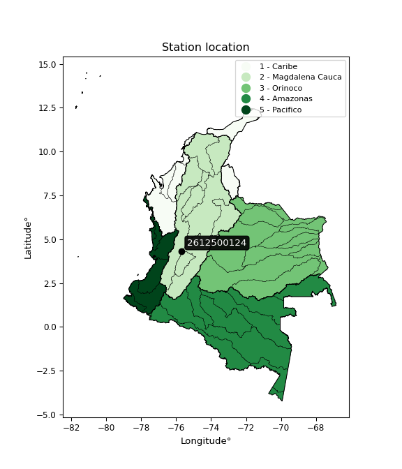

<div align="center">


</div>

# PMP Station (Rain, Pmax24h): 2612500124

Probable Maximum Precipitation (PMP) is the greatest amount of rainfall for a specific duration that is meteorologically possible for a given location, acting as a "worst-case" scenario for extreme storms, crucial for designing safety-critical infrastructure like bridges, river deviations, dams, spillways, and nuclear plants to prevent catastrophic failure. PMP is calculated by hydrologists using meteorological data to determine the upper limit of extreme rainfall, often leading to the Probable Maximum Flood (PMF) for flood control design, and is increasingly being studied for climate change impacts. Probable Maximum Precipitation (PMP) is the theoretical upper limit of rainfall, a deterministic estimate for extreme events, while probability distributions (like GEV, Gumbel) describe the likelihood and frequency of various precipitation amounts, including rare ones, showing how often events occur, with PMP representing the extreme end of these distributions, used for critical infrastructure design to ensure safety against the worst conceivable weather, unlike standard statistical forecasts which cover typical probabilities.

The most common probability distributions in hydrology, used for analyzing floods, rainfall, and streamflow, include the Normal, Log-Normal, Gumbel, Gamma (including Log-Pearson Type III), and Generalized Extreme Value (GEV) distributions, often chosen based on the data´s skewness and whether modeling extremes or general conditions, with Gumbel and GEV popular for extreme events like floods, while the Normal distribution serves as a baseline, though often requiring transformations for skewed hydrological data. These distributions help in designing water infrastructure, managing water resources, and forecasting hydrologic events.

> Hydrological data often isn´t perfectly normal (it´s skewed), so different distributions are needed for different applications, such as: **Flood Frequency Analysis**: Using Gumbel, GEV, or Log-Pearson Type III for predicting extreme flood magnitudes and their return periods, **Rainfall Analysis**: Normal for annual totals, but Log-Normal, Weibull, or GEV for intensity or extreme daily rainfall, **Streamflow Modeling**: Gamma and Log-Normal for maximum flows, GEV for minimum flows, and Kappa for daily flows.

<div align="center">

</img>

</div>


## A. General information


### 1. General running parameters

• app_version: _v20260108_. • runtime: _2026-01-08 13:24:42.400241_. • Python version: _3.14.0_. • SciPy version: _1.16.3_. • Pandas version: _2.3.3_. • NumPy version: _2.3.5_. • Stations dataset (station_dataset_file): _dataset/pmax24h_in/automatic_colombia_2003_2024.csv_. • Stations catalog (station_catalog_file): _dataset/CNE.xls_. • Minimum year to eval til year_max (date_min): _1900_. • Maximum year to eval since year_min (date_max): _2024_. • Creates, save and include plots into reports (create_plot): _False_. • Plot only fit distributions with Δo > Δ (plot_only_fit): _True_. • Plot only simple graphs avoiding multiple CDFs and multiple Extreme values plots (plot_only_simple): _True_. • Eval low extreme values, if False, evaluates high extreme values (low_extreme): _False_. • Eval every SciPy distribution as logarithmic (pdist_logarithmic_on): _True_. • Standard deviation normalized (ddof): _1.0_. • Return periods to eval in years (Tr): _[2, 2.33, 5, 10, 15, 20, 25, 50, 75, 100, 200, 250, 500, 750, 1000]_. • Minimum data sample per station, 0 means any (minimum_sample): _5_. • Z-Score maximum threshold to adjust a value, 0 means disable (zscore_max): _3.5_. • Z-Score minimum threshold to adjust a value, 0 means disable (zscore_min): _-2.5_. • Avoid zeros, e.g. rain = 0 (avoid_zeros): _True_. • Avoid null values (avoid_nans): _True_. 

:file_folder:Table: [dataset.csv](../../dataset/pmax24h_in/automatic_colombia_2003_2024.csv)

> Delta Degrees of Freedom (DDOF): is a parameter used in the formulas for calculating variance and standard deviation. When ddof=0, the divisor is $N$ (the total number of observations) and this is used when your data set is the entire population. When ddof=1, the divisor is $N-1$ and this is used when your data set is a sample drawn from a larger population. Using $N-1$ provides an unbiased estimate of the population variance (known as Bessel´s correction).


### 2. Station info and location

|   id |     CODIGO | NOMBRE                     | CATEGORIA               | TECNOLOGIA                | ESTADO           | FECHA_INSTALACION   |   FECHA_SUSPENSION |   ALTITUD |   LATITUD |   LONGITUD | DEPARTAMENTO   | MUNICIPIO   | AREA_OPERATIVA                         | ENTIDAD                                                     | AREA_HIDROGRAFICA   | ZONA_HIDROGRAFICA   | SUBZONA_HIDROGRAFICA   |   CORRIENTE | Catalogo   |   Version |
|-----:|-----------:|:---------------------------|:------------------------|:--------------------------|:-----------------|:--------------------|-------------------:|----------:|----------:|-----------:|:---------------|:------------|:---------------------------------------|:------------------------------------------------------------|:--------------------|:--------------------|:-----------------------|------------:|:-----------|----------:|
|    0 | 2612500124 | PIJAO - AUT   [2612500124] | Climatológica Principal | Automática con Telemetría | En Mantenimiento | 06/07/2017          |                nan |      2044 |    4.3314 |   -75.6841 | Quindío        | Pijao       | Area Operativa 09 - Cauca-Valle-Caldas | INSTITUTO DE HIDROLOGIA METEOROLOGIA Y ESTUDIOS AMBIENTALES | Magdalena Cauca     | Cauca               | Río La Vieja           |         nan | CNE_IDEAM  |  20251226 |

<div align="center">

Dynamic map: [:earth_americas:Google](http://maps.google.com/maps?q=4.3314,-75.68414) [:earth_americas:OSM](https://www.openstreetmap.org/#map=18/4.3314/-75.68414&layers=P) [:earth_americas:Bing](https://www.bing.com/maps?cp=4.3314~-75.68414&lvl=18) [:earth_americas:Apple](https://maps.apple.com/frame?center=4.3314%2C-75.68414&span=0.003%2C0.006)

</div>


<div align="center">

```geojson
{
  "type": "Feature",
  "geometry": {
    "type": "Point", 
    "coordinates": [-75.68414, 4.3314]
  }, 
  "properties": {
    "Name": "2612500124"
  }
}
```

</div>


### 3. Discrete values table and plot

<div align="center">

|               |         0 |          1 |            2 |          3 |          4 |          5 |
|:--------------|----------:|-----------:|-------------:|-----------:|-----------:|-----------:|
| Date          | 2019      | 2020       | 2021         | 2022       | 2023       | 2024       |
| Value         |   55.8    |  124       |   89.8       |   82.8     |   56.2     |  143.2     |
| Value_initial |   55.8    |  124       |   89.8       |   82.8     |   56.2     |  143.2     |
| count         |    6      |    6       |    6         |    6       |    6       |    6       |
| mean          |   91.9667 |   91.9667  |   91.9667    |   91.9667  |   91.9667  |   91.9667  |
| std           |   35.5724 |   35.5724  |   35.5724    |   35.5724  |   35.5724  |   35.5724  |
| zscore        |   -1.0167 |    0.90051 |   -0.0609086 |   -0.25769 |   -1.00546 |    1.44025 |


</div>


> The initial value (value_initial) correspond to the initial obtained or null completed value, and value (value) is adjusted only when the initial value is outside the valid range (outlier) definite through the Z-Score value. If Z-Score is active, values out of range or outliers are replaced with the station mean value. A Z-Score (or standard score) measures how many standard deviations a data point is from the mean of a dataset, indicating its relative position; positive scores mean above the mean, negative mean below, and a score of zero is exactly at the mean, allowing for comparison of values from different distributions. It´s calculated using the formula $z=(x–μ)/σ$, where $x$ is the data point, $μ$ is the mean, and $σ$ is the standard deviation, helping identify outliers and understand probability.
>
> <sub>**Note**: In this study, "completing" (filling gaps in) and "extending" (forecasting or lengthening the historical record) rainfall data series are avoided for certain critical analyses because they introduce artificial bias and uncertainty, which can distort the statistics of rare events (extremes), alter day-to-day variability, and compromise the integrity and homogeneity of the original data. Some reasons against Completing/Extending rainfall data are: **Distortion of Extremes and Variability**: The primary issue is that most gap-filling or extension methods rely on averaging or regression with nearby stations, which inherently smooths the data. Rainfall is highly variable in space and time, with a large percentage of zero values and occasional large storms. Infilling methods often underestimate the highest values and overestimate the lowest (zero) values, which severely distorts analyses focused on flood frequency, drought severity, and intensity-duration-frequency (IDF) curves, **Loss of Data Homogeneity**: Infilled or extended data are synthetic estimates, not actual measurements. Combining these estimates with observed data can violate the assumption of data homogeneity, which requires that the data properties do not change over time. Inhomogeneity can lead to incorrect conclusions about long-term trends or changes in climate patterns, **Propagation of Errors**: Errors and biases from the original data (e.g., wind-induced undercatch, instrument errors, site changes) or the data used for imputation can propagate through the analysis, leading to unreliable hydrological models and inaccurate predictions, **Compromised Statistical Integrity**: For statistical analyses, especially those involving the frequency of events, using artificial data can introduce time bias or autocorrelation that doesn´t exist in reality, making it difficult to assess the true probability of events, **Difficulty in Validation**: It is difficult to accurately validate the quality of filled or extended data, especially for past periods where ground-truth measurements are unavailable. The reliability of imputation techniques heavily depends on the density of the surrounding station network and the complexity of the local topography.</sub>


### 4. Active continuous probability distributions from SciPy (43 of 104 available)

A Probability Density Function (PDF) describes the relative likelihood of a continuous random variable falling within a specific range, where the total area under its curve equals 1, and the area over any interval gives the actual probability for that range. Unlike discrete probabilities (like rolling a die), a PDF shows density, not direct probability for a single point (which is zero), with higher points indicating higher likelihood, often visualized as a bell curve for normal distributions.

A log of a probability density function (log-PDF) is simply the logarithm of the PDF´s value, denoted as $log(f(x))$, useful for converting multiplication of probabilities into addition, improving numerical stability with tiny numbers, and connecting to information theory concepts like entropy. Instead of dealing with very small probabilities (e.g., 0.000001), log-PDFs use negative numbers (e.g., $log(0.00001) ≈ -11.51$ that are easier for computers to handle, preventing underflow errors and simplifying complex calculations. In this study, each active probability distribution from SciPy is also evaluated in the $log$ form.

[scipy.stats](https://docs.scipy.org/doc/scipy/reference/stats.html) is a Python´s powerful submodule within the SciPy library for comprehensive statistical analysis, offering over 130 probability distributions (like Normal, Poisson), functions for descriptive stats (mean, variance), hypothesis testing (t-tests, chi-square), random variable generation, and statistical tests, making it essential for data science, modeling, and research. It provides tools to explore, model, and draw conclusions from data efficiently, working seamlessly with NumPy.

<div align="center">

|   id | p_dist             |   n_parameter | fit_method   | label                                                                       | active   | ref                                                                                                        |
|-----:|:-------------------|--------------:|:-------------|:----------------------------------------------------------------------------|:---------|:-----------------------------------------------------------------------------------------------------------|
|    0 | alpha              |             3 | MLE          | Alpha                                                                       | True     | [:mortar_board:](https://docs.scipy.org/doc/scipy/reference/generated/scipy.stats.alpha.html)              |
|    1 | betaprime          |             4 | MLE          | Beta prime                                                                  | True     | [:mortar_board:](https://docs.scipy.org/doc/scipy/reference/generated/scipy.stats.betaprime.html)          |
|    2 | chi2               |             3 | MLE          | Chi²                                                                        | True     | [:mortar_board:](https://docs.scipy.org/doc/scipy/reference/generated/scipy.stats.chi2.html)               |
|    3 | crystalball        |             4 | MLE          | Crystalball                                                                 | True     | [:mortar_board:](https://docs.scipy.org/doc/scipy/reference/generated/scipy.stats.crystalball.html)        |
|    4 | erlang             |             3 | MLE          | Erlang                                                                      | True     | [:mortar_board:](https://docs.scipy.org/doc/scipy/reference/generated/scipy.stats.erlang.html)             |
|    5 | expon              |             2 | MLE          | Exponential                                                                 | True     | [:mortar_board:](https://docs.scipy.org/doc/scipy/reference/generated/scipy.stats.expon.html)              |
|    6 | exponnorm          |             3 | MLE          | Exponentially modified Normal                                               | True     | [:mortar_board:](https://docs.scipy.org/doc/scipy/reference/generated/scipy.stats.exponnorm.html)          |
|    7 | f                  |             4 | MLE          | F                                                                           | True     | [:mortar_board:](https://docs.scipy.org/doc/scipy/reference/generated/scipy.stats.f.html)                  |
|    8 | fatiguelife        |             3 | MLE          | Fatigue-life (Birnbaum-Saunders)                                            | True     | [:mortar_board:](https://docs.scipy.org/doc/scipy/reference/generated/scipy.stats.fatiguelife.html)        |
|    9 | fisk               |             3 | MLE          | Fisk                                                                        | True     | [:mortar_board:](https://docs.scipy.org/doc/scipy/reference/generated/scipy.stats.fisk.html)               |
|   10 | gamma              |             3 | MLE          | Gamma                                                                       | True     | [:mortar_board:](https://docs.scipy.org/doc/scipy/reference/generated/scipy.stats.gamma.html)              |
|   11 | genexpon           |             5 | MLE          | Generalized exponential                                                     | True     | [:mortar_board:](https://docs.scipy.org/doc/scipy/reference/generated/scipy.stats.genexpon.html)           |
|   12 | genlogistic        |             3 | MLE          | Generalized logistic                                                        | True     | [:mortar_board:](https://docs.scipy.org/doc/scipy/reference/generated/scipy.stats.genlogistic.html)        |
|   13 | gibrat             |             2 | MM           | Gibrat                                                                      | True     | [:mortar_board:](https://docs.scipy.org/doc/scipy/reference/generated/scipy.stats.gibrat.html)             |
|   14 | gompertz           |             3 | MLE          | Gompertz (or truncated Gumbel)                                              | True     | [:mortar_board:](https://docs.scipy.org/doc/scipy/reference/generated/scipy.stats.gompertz.html)           |
|   15 | gumbel_l           |             2 | MM           | Gumbel Left Skew                                                            | True     | [:mortar_board:](https://docs.scipy.org/doc/scipy/reference/generated/scipy.stats.gumbel_l.html)           |
|   16 | gumbel_r           |             2 | MM           | Gumbel Right Skew                                                           | True     | [:mortar_board:](https://docs.scipy.org/doc/scipy/reference/generated/scipy.stats.gumbel_r.html)           |
|   17 | halflogistic       |             2 | MM           | Half-logistic                                                               | True     | [:mortar_board:](https://docs.scipy.org/doc/scipy/reference/generated/scipy.stats.halflogistic.html)       |
|   18 | halfnorm           |             2 | MM           | Half Normal                                                                 | True     | [:mortar_board:](https://docs.scipy.org/doc/scipy/reference/generated/scipy.stats.halfnorm.html)           |
|   19 | hypsecant          |             2 | MM           | hyperbolic secant                                                           | True     | [:mortar_board:](https://docs.scipy.org/doc/scipy/reference/generated/scipy.stats.hypsecant.html)          |
|   20 | invgamma           |             3 | MLE          | Inverted gamma                                                              | True     | [:mortar_board:](https://docs.scipy.org/doc/scipy/reference/generated/scipy.stats.invgamma.html)           |
|   21 | invgauss           |             3 | MLE          | Inverse Gaussian                                                            | True     | [:mortar_board:](https://docs.scipy.org/doc/scipy/reference/generated/scipy.stats.invgauss.html)           |
|   22 | invweibull         |             3 | MLE          | Inverted Weibull                                                            | True     | [:mortar_board:](https://docs.scipy.org/doc/scipy/reference/generated/scipy.stats.invweibull.html)         |
|   23 | kstwobign          |             2 | MLE          | Limiting distribution of scaled Kolmogorov-Smirnov two-sided test statistic | True     | [:mortar_board:](https://docs.scipy.org/doc/scipy/reference/generated/scipy.stats.kstwobign.html)          |
|   24 | laplace            |             2 | MM           | Laplace                                                                     | True     | [:mortar_board:](https://docs.scipy.org/doc/scipy/reference/generated/scipy.stats.laplace.html)            |
|   25 | laplace_asymmetric |             3 | MLE          | Asymmetric Laplace                                                          | True     | [:mortar_board:](https://docs.scipy.org/doc/scipy/reference/generated/scipy.stats.laplace_asymmetric.html) |
|   26 | loggamma           |             3 | MLE          | Log gamma                                                                   | True     | [:mortar_board:](https://docs.scipy.org/doc/scipy/reference/generated/scipy.stats.loggamma.html)           |
|   27 | logistic           |             2 | MM           | Logistic (or Sech-squared)                                                  | True     | [:mortar_board:](https://docs.scipy.org/doc/scipy/reference/generated/scipy.stats.logistic.html)           |
|   28 | lognorm            |             3 | MLE          | Log Normal                                                                  | True     | [:mortar_board:](https://docs.scipy.org/doc/scipy/reference/generated/scipy.stats.lognorm.html)            |
|   29 | maxwell            |             2 | MM           | Maxwell                                                                     | True     | [:mortar_board:](https://docs.scipy.org/doc/scipy/reference/generated/scipy.stats.maxwell.html)            |
|   30 | mielke             |             4 | MLE          | Mielke Beta-Kappa / Dagum                                                   | True     | [:mortar_board:](https://docs.scipy.org/doc/scipy/reference/generated/scipy.stats.mielke.html)             |
|   31 | moyal              |             2 | MM           | Moyal                                                                       | True     | [:mortar_board:](https://docs.scipy.org/doc/scipy/reference/generated/scipy.stats.moyal.html)              |
|   32 | nakagami           |             3 | MLE          | Nakagami                                                                    | True     | [:mortar_board:](https://docs.scipy.org/doc/scipy/reference/generated/scipy.stats.nakagami.html)           |
|   33 | ncf                |             5 | MLE          | Non-central F distribution                                                  | True     | [:mortar_board:](https://docs.scipy.org/doc/scipy/reference/generated/scipy.stats.ncf.html)                |
|   34 | nct                |             4 | MLE          | Non-central Student’s t                                                     | True     | [:mortar_board:](https://docs.scipy.org/doc/scipy/reference/generated/scipy.stats.nct.html)                |
|   35 | norm               |             2 | MM           | Normal                                                                      | True     | [:mortar_board:](https://docs.scipy.org/doc/scipy/reference/generated/scipy.stats.norm.html)               |
|   36 | pearson3           |             3 | MM           | Pearson type III                                                            | True     | [:mortar_board:](https://docs.scipy.org/doc/scipy/reference/generated/scipy.stats.pearson3.html)           |
|   37 | rayleigh           |             2 | MM           | Rayleigh                                                                    | True     | [:mortar_board:](https://docs.scipy.org/doc/scipy/reference/generated/scipy.stats.rayleigh.html)           |
|   38 | rice               |             3 | MLE          | Rice                                                                        | True     | [:mortar_board:](https://docs.scipy.org/doc/scipy/reference/generated/scipy.stats.rice.html)               |
|   39 | t                  |             3 | MLE          | Student’s t                                                                 | True     | [:mortar_board:](https://docs.scipy.org/doc/scipy/reference/generated/scipy.stats.t.html)                  |
|   40 | truncnorm          |             4 | MLE          | Truncated normal                                                            | True     | [:mortar_board:](https://docs.scipy.org/doc/scipy/reference/generated/scipy.stats.truncnorm.html)          |
|   41 | wald               |             2 | MM           | Wald                                                                        | True     | [:mortar_board:](https://docs.scipy.org/doc/scipy/reference/generated/scipy.stats.wald.html)               |
|   42 | weibull_min        |             3 | MLE          | Weibull minimum                                                             | True     | [:mortar_board:](https://docs.scipy.org/doc/scipy/reference/generated/scipy.stats.weibull_min.html)        |

</div>

> **n_parameter:** # arguments & localization & scale.
>
> **Fit methods:** (MLE) maximum likelihood, (MM) L-moments.
>
>**Inactive** (With the only purpose of prevent loops, zero divisions, infinite values, over high estimated values or horizontal trending for recurrence intervals estimations, the follow distributions were disabled.)**:** foldnorm, gennorm, norminvgauss, powernorm, powerlognorm, skewnorm, genextreme, anglit, arcsine, argus, beta, bradford, burr, burr12, cauchy, cosine, halfcauchy, foldcauchy, skewcauchy, wrapcauchy, dgamma, gengamma, exponweib, exponpow, truncexpon, gausshyper, genhalflogistic, genhyperbolic, geninvgauss, halfgennorm, johnsonsb, johnsonsu, kappa4, kappa3, ksone, kstwo, loglaplace, levy, levy_l, levy_stable, ncx2, pareto, genpareto, truncpareto, lomax, powerlaw, rdist, rel_breitwigner, recipinvgauss, semicircular, studentized_range, trapezoid, triang, truncweibull_min, tukeylambda, uniform, loguniform, vonmises, vonmises_line, weibull_max, dweibull, 


## B. Probability (PDF) vs. Empirical (EDF) distributions functions

A continuous probability distribution (CPD) describes probabilities for variables that can take any value within a range (like rain any time), unlike discrete variables with specific outcomes (like temperature). It uses a Probability Density Function (PDF), a curve where the total area under it equals 1, and the probability of the variable falling within an interval (a to b) is found by calculating the area under the curve between those points. A key feature is that the probability of hitting any single exact value is zero, so probabilities are always expressed for ranges, e.g., $P(a ≤ X ≤ b)$.

<div align="center">

Distributions parameters from station values
|    |    station | p_dist                |   n |              loc |            scale | shape                  | shape1             | shape2                 | shape3   |
|---:|-----------:|:----------------------|----:|-----------------:|-----------------:|:-----------------------|:-------------------|:-----------------------|:---------|
|  0 | 2612500124 | alpha                 |   6 |     -60.8855     |    714.47        | 4.884048582882906      |                    |                        |          |
|  1 | 2612500124 | betaprime             |   6 |      -0.909922   |      3.59271     | 199.5826973814663      | 8.69111200230737   |                        |          |
|  2 | 2612500124 | chi2                  |   6 |      55.8        |     12.1676      | 0.8964976027919445     |                    |                        |          |
|  3 | 2612500124 | crystalball           |   6 |      91.9667     |     32.473       | 6028.562532085009      | 8094.486924469704  |                        |          |
|  4 | 2612500124 | erlang                |   6 |      55.8        |     25.2049      | 0.7522577562237505     |                    |                        |          |
|  5 | 2612500124 | expon                 |   6 |      55.8        |     36.1667      |                        |                    |                        |          |
|  6 | 2612500124 | exponnorm             |   6 |      55.7627     |      0.0113998   | 3180.2674219801447     |                    |                        |          |
|  7 | 2612500124 | f                     |   6 |      25.0352     |     51.7762      | 7913.039998562564      | 8.022337048250574  |                        |          |
|  8 | 2612500124 | fatiguelife           |   6 |      55.8        |      1.49481e-05 | 1646.4343264175222     |                    |                        |          |
|  9 | 2612500124 | fisk                  |   6 |      55.8        |     37.6959      | 0.5331892125350783     |                    |                        |          |
| 10 | 2612500124 | gamma                 |   6 |      55.8        |     42.0744      | 0.4450746492035047     |                    |                        |          |
| 11 | 2612500124 | genexpon              |   6 |      55.7766     |      0.24721     | 0.006050899369324677   | 2.394810823517192  | 2.4703404010504766e-06 |          |
| 12 | 2612500124 | genlogistic           |   6 |    -107.604      |     26.1474      | 1139.9104875660505     |                    |                        |          |
| 13 | 2612500124 | gibrat                |   6 |      67.1938     |     15.0255      |                        |                    |                        |          |
| 14 | 2612500124 | gompertz              |   6 |      55.8        |    158.814       | 3.536102843247388      |                    |                        |          |
| 15 | 2612500124 | gumbel_l              |   6 |     106.581      |     25.3191      |                        |                    |                        |          |
| 16 | 2612500124 | gumbel_r              |   6 |      77.3521     |     25.3191      |                        |                    |                        |          |
| 17 | 2612500124 | halflogistic          |   6 |      53.4786     |     27.7633      |                        |                    |                        |          |
| 18 | 2612500124 | halfnorm              |   6 |      48.9851     |     53.8694      |                        |                    |                        |          |
| 19 | 2612500124 | hypsecant             |   6 |      91.9667     |     20.673       |                        |                    |                        |          |
| 20 | 2612500124 | invgamma              |   6 |      25.0638     |    207.092       | 4.003485750775569      |                    |                        |          |
| 21 | 2612500124 | invgauss              |   6 |      54.2925     |      5.37076     | 7.01467573338155       |                    |                        |          |
| 22 | 2612500124 | invweibull            |   6 |      55.8        |      1.33199     | 0.048519623324074584   |                    |                        |          |
| 23 | 2612500124 | kstwobign             |   6 |     -13.3034     |    120.338       |                        |                    |                        |          |
| 24 | 2612500124 | laplace               |   6 |      91.9667     |     22.9619      |                        |                    |                        |          |
| 25 | 2612500124 | laplace_asymmetric    |   6 |      82.8        |     25.8289      | 0.8381814867924477     |                    |                        |          |
| 26 | 2612500124 | loggamma              |   6 |  -11606.4        |   1524.63        | 2149.841805921086      |                    |                        |          |
| 27 | 2612500124 | logistic              |   6 |      91.9667     |     17.9033      |                        |                    |                        |          |
| 28 | 2612500124 | lognorm               |   6 |      55.8        |      0.049961    | 13.350392771617212     |                    |                        |          |
| 29 | 2612500124 | maxwell               |   6 |      15.0192     |     48.2197      |                        |                    |                        |          |
| 30 | 2612500124 | mielke                |   6 |      -0.416845   |     10.3533      | 1789.633801102191      | 3.238148492009512  |                        |          |
| 31 | 2612500124 | moyal                 |   6 |      73.3965     |     14.618       |                        |                    |                        |          |
| 32 | 2612500124 | nakagami              |   6 |      55.8        |     73.0002      | 0.17423199285009744    |                    |                        |          |
| 33 | 2612500124 | ncf                   |   6 |       0.00632095 |      1.86097e-06 | 2.4005879919977566e-07 | 10.043318013959546 | 10.734491327322726     |          |
| 34 | 2612500124 | nct                   |   6 |      -0.222738   |      1.87051     | 4.541474045476441      | 41.11804275440775  |                        |          |
| 35 | 2612500124 | norm                  |   6 |      91.9667     |     32.473       |                        |                    |                        |          |
| 36 | 2612500124 | pearson3              |   6 |      91.9667     |     32.4731      | 0.35777065169856015    |                    |                        |          |
| 37 | 2612500124 | rayleigh              |   6 |      29.8438     |     49.5669      |                        |                    |                        |          |
| 38 | 2612500124 | rice                  |   6 |      35.9173     |     44.3997      | 0.35850259562358283    |                    |                        |          |
| 39 | 2612500124 | t                     |   6 |      91.9642     |     32.4649      | 402576.73601829994     |                    |                        |          |
| 40 | 2612500124 | truncnorm             |   6 |     -17.7492     |      2.49016     | 31.914824374616565     | 64.63399697668942  |                        |          |
| 41 | 2612500124 | wald                  |   6 |      59.4936     |     32.4731      |                        |                    |                        |          |
| 42 | 2612500124 | weibull_min           |   6 |      55.8        |     42.2202      | 0.3311428552517228     |                    |                        |          |
| 43 | 2612500124 | logalpha              |   6 |      -2.62699    |    140.407       | 19.87015878889644      |                    |                        |          |
| 44 | 2612500124 | logbetaprime          |   6 |      -3.48294    |      7.64108     | 1007.0129600348018     | 970.0011305517437  |                        |          |
| 45 | 2612500124 | logchi2               |   6 |       4.02177    |      0.952418    | 1.0828495331879813     |                    |                        |          |
| 46 | 2612500124 | logcrystalball        |   6 |       4.4582     |      0.357125    | 7.805339838812738      | 837.3329411166428  |                        |          |
| 47 | 2612500124 | logerlang             |   6 |      -6.86981    |      0.0112562   | 1006.3445198769728     |                    |                        |          |
| 48 | 2612500124 | logexpon              |   6 |       4.02177    |      0.436431    |                        |                    |                        |          |
| 49 | 2612500124 | logexponnorm          |   6 |       4.44465    |      0.356867    | 0.03796977583129732    |                    |                        |          |
| 50 | 2612500124 | logf                  |   6 |       0.831659   |      3.61025     | 389.2698271462016      | 434.6042382220546  |                        |          |
| 51 | 2612500124 | logfatiguelife        |   6 |       4.02177    |      3.45414e-07 | 1001.0469327121443     |                    |                        |          |
| 52 | 2612500124 | logfisk               |   6 |      -0.0810781  |      4.52734     | 20.583964521541546     |                    |                        |          |
| 53 | 2612500124 | loggamma              |   6 |      -6.75972    |      0.0113374   | 989.4125525000861      |                    |                        |          |
| 54 | 2612500124 | loggenexpon           |   6 |       4.02177    |      0.67422     | 1.3773082177227975     | 0.9742071931049112 | 0.3658743696180475     |          |
| 55 | 2612500124 | loggenlogistic        |   6 |       2.21395    |      0.310462    | 780.5733587622428      |                    |                        |          |
| 56 | 2612500124 | loggibrat             |   6 |       4.18579    |      0.165229    |                        |                    |                        |          |
| 57 | 2612500124 | loggompertz           |   6 |       4.02177    |      0.887696    | 1.2971055375243838     |                    |                        |          |
| 58 | 2612500124 | loggumbel_l           |   6 |       4.61893    |      0.278449    |                        |                    |                        |          |
| 59 | 2612500124 | loggumbel_r           |   6 |       4.29748    |      0.278449    |                        |                    |                        |          |
| 60 | 2612500124 | loghalflogistic       |   6 |       4.03489    |      0.305352    |                        |                    |                        |          |
| 61 | 2612500124 | loghalfnorm           |   6 |       3.98551    |      0.592434    |                        |                    |                        |          |
| 62 | 2612500124 | loghypsecant          |   6 |       4.4582     |      0.227353    |                        |                    |                        |          |
| 63 | 2612500124 | loginvgamma           |   6 |      -3.99678    |   4737.96        | 561.4081740134438      |                    |                        |          |
| 64 | 2612500124 | loginvgauss           |   6 |       3.95611    |      0.258818    | 1.9399513506339878     |                    |                        |          |
| 65 | 2612500124 | loginvweibull         |   6 |   -5126.98       |   5131.27        | 16518.206269922783     |                    |                        |          |
| 66 | 2612500124 | logkstwobign          |   6 |       3.22374    |      1.40718     |                        |                    |                        |          |
| 67 | 2612500124 | loglaplace            |   6 |       4.4582     |      0.252526    |                        |                    |                        |          |
| 68 | 2612500124 | loglaplace_asymmetric |   6 |       4.49758    |      0.300584    | 1.067670007186785      |                    |                        |          |
| 69 | 2612500124 | logloggamma           |   6 |     -65.556      |     10.3997      | 839.539827103535       |                    |                        |          |
| 70 | 2612500124 | loglogistic           |   6 |       4.4582     |      0.196893    |                        |                    |                        |          |
| 71 | 2612500124 | loglognorm            |   6 |       4.02177    |      0.000981963 | 12.511390030439129     |                    |                        |          |
| 72 | 2612500124 | logmaxwell            |   6 |       3.61197    |      0.5303      |                        |                    |                        |          |
| 73 | 2612500124 | logmielke             |   6 | -589389          | 589392           | 107723700.07725191     | 1911606.7649862198 |                        |          |
| 74 | 2612500124 | logmoyal              |   6 |       4.25398    |      0.160763    |                        |                    |                        |          |
| 75 | 2612500124 | lognakagami           |   6 |       4.02177    |      0.539417    | 0.21425299806417664    |                    |                        |          |
| 76 | 2612500124 | logncf                |   6 |       1.5406     |      2.3198      | 152.84317675524903     | 801.7916183235302  | 39.0005839415406       |          |
| 77 | 2612500124 | lognct                |   6 |       0.177592   |      0.166574    | 92.14331891843202      | 25.489248980689304 |                        |          |
| 78 | 2612500124 | lognorm               |   6 |       4.4582     |      0.357125    |                        |                    |                        |          |
| 79 | 2612500124 | logpearson3           |   6 |       4.4582     |      0.357125    | 0.05415723693231971    |                    |                        |          |
| 80 | 2612500124 | lograyleigh           |   6 |       3.775      |      0.545116    |                        |                    |                        |          |
| 81 | 2612500124 | logrice               |   6 |       3.79911    |      0.445254    | 0.9135393327696187     |                    |                        |          |
| 82 | 2612500124 | logt                  |   6 |       4.4582     |      0.357125    | 128320027053.0191      |                    |                        |          |
| 83 | 2612500124 | logtruncnorm          |   6 |      -0.0741398  |      1.00081     | 4.486917076638873      | 5.4755204774019095 |                        |          |
| 84 | 2612500124 | logwald               |   6 |       4.10113    |      0.357078    |                        |                    |                        |          |
| 85 | 2612500124 | logweibull_min        |   6 |       4.02177    |      0.450748    | 0.16678838579774824    |                    |                        |          |

</div>

> **loc** (Location parameter): This shifts the distribution along the x-axis. For many common distributions, like the normal (Gaussian) distribution, loc represents the mean $μ$. For others, like the uniform distribution, it might represent the minimum value, or for the beta distribution, the left end of the support interval.
>
> **scale** (Scale parameter): This determines the width or spread of the distribution. For the normal distribution, scale represents the standard deviation $σ$. For a uniform distribution, it defines the length of the interval (from $loc$ to $loc + scale$).
>
> **shape** (Shape parameters): Refers to parameters that define the specific form of a probability distribution, distinct from its location (loc) and scale (scale). These parameters are required arguments for most distribution functions. For example, a normal (Gaussian) distribution is fully defined by its location (mean) and scale (standard deviation), so it has no specific shape parameters beyond loc and scale. However, other distributions have intrinsic properties that need specification, as Gamma distribution that takes a shape parameter, often named $a$ or $alpha$.


### 0. Cumulative distribution values - CDF (86 evaluated)

Cumulative Distribution Function (CDF), denoted as $F$<sub>$X$</sub>$(x)$, is a function that gives the probability that a random variable $X$ will take a value less than or equal to a specific value, $x$ (i.e., $(P(X≥x)$. It essentially "accumulates" probabilities from a given point up to the far right (positive infinity), providing a complete picture of the distribution´s probabilities for both discrete (like rain) and continuous (like temperature) variables, helping to find probabilities over ranges or above certain values. Each station is evaluated separately ordering the $x$ values ascending, calculating the CDF and PDF values for the activated distributions and their logarithmic forms.

<div align="center">

CDF ordered by x ascending and calculating $log(f(x))$ separately
|   id |    Station |   date |     x |   count |    mean |     std |     zscore |   Value_initial |    station |   m |    alpha |   alpha_pdf |   betaprime |   betaprime_pdf |        chi2 |    chi2_pdf |   crystalball |   crystalball_pdf |      erlang |    erlang_pdf |    expon |   expon_pdf |   exponnorm |   exponnorm_pdf |         f |      f_pdf |   fatiguelife |   fatiguelife_pdf |       fisk |     fisk_pdf |       gamma |   gamma_pdf |    genexpon |   genexpon_pdf |   genlogistic |   genlogistic_pdf |   gibrat |   gibrat_pdf |   gompertz |   gompertz_pdf |   gumbel_l |   gumbel_l_pdf |   gumbel_r |   gumbel_r_pdf |   halflogistic |   halflogistic_pdf |   halfnorm |   halfnorm_pdf |   hypsecant |   hypsecant_pdf |   invgamma |   invgamma_pdf |   invgauss |   invgauss_pdf |   invweibull |   invweibull_pdf |   kstwobign |   kstwobign_pdf |   laplace |   laplace_pdf |   laplace_asymmetric |   laplace_asymmetric_pdf |   loggamma |   loggamma_pdf |   logistic |   logistic_pdf |   lognorm |   lognorm_pdf |   maxwell |   maxwell_pdf |   mielke |   mielke_pdf |     moyal |   moyal_pdf |    nakagami |   nakagami_pdf |      ncf |    ncf_pdf |      nct |   nct_pdf |     norm |   norm_pdf |   pearson3 |   pearson3_pdf |   rayleigh |   rayleigh_pdf |      rice |   rice_pdf |        t |      t_pdf |   truncnorm |   truncnorm_pdf |     wald |   wald_pdf |   weibull_min |   weibull_min_pdf |   logalpha |   logalpha_pdf |   logbetaprime |   logbetaprime_pdf |    logchi2 |   logchi2_pdf |   logcrystalball |   logcrystalball_pdf |   logerlang |   logerlang_pdf |   logexpon |   logexpon_pdf |   logexponnorm |   logexponnorm_pdf |     logf |   logf_pdf |   logfatiguelife |   logfatiguelife_pdf |   logfisk |   logfisk_pdf |   loggenexpon |   loggenexpon_pdf |   loggenlogistic |   loggenlogistic_pdf |   loggibrat |   loggibrat_pdf |   loggompertz |   loggompertz_pdf |   loggumbel_l |   loggumbel_l_pdf |   loggumbel_r |   loggumbel_r_pdf |   loghalflogistic |   loghalflogistic_pdf |   loghalfnorm |   loghalfnorm_pdf |   loghypsecant |   loghypsecant_pdf |   loginvgamma |   loginvgamma_pdf |   loginvgauss |   loginvgauss_pdf |   loginvweibull |   loginvweibull_pdf |   logkstwobign |   logkstwobign_pdf |   loglaplace |   loglaplace_pdf |   loglaplace_asymmetric |   loglaplace_asymmetric_pdf |   logloggamma |   logloggamma_pdf |   loglogistic |   loglogistic_pdf |   loglognorm |   loglognorm_pdf |   logmaxwell |   logmaxwell_pdf |   logmielke |   logmielke_pdf |   logmoyal |   logmoyal_pdf |   lognakagami |   lognakagami_pdf |   logncf |   logncf_pdf |   lognct |   lognct_pdf |   logpearson3 |   logpearson3_pdf |   lograyleigh |   lograyleigh_pdf |   logrice |   logrice_pdf |     logt |   logt_pdf |   logtruncnorm |   logtruncnorm_pdf |   logwald |   logwald_pdf |   logweibull_min |   logweibull_min_pdf |
|-----:|-----------:|-------:|------:|--------:|--------:|--------:|-----------:|----------------:|-----------:|----:|---------:|------------:|------------:|----------------:|------------:|------------:|--------------:|------------------:|------------:|--------------:|---------:|------------:|------------:|----------------:|----------:|-----------:|--------------:|------------------:|-----------:|-------------:|------------:|------------:|------------:|---------------:|--------------:|------------------:|---------:|-------------:|-----------:|---------------:|-----------:|---------------:|-----------:|---------------:|---------------:|-------------------:|-----------:|---------------:|------------:|----------------:|-----------:|---------------:|-----------:|---------------:|-------------:|-----------------:|------------:|----------------:|----------:|--------------:|---------------------:|-------------------------:|-----------:|---------------:|-----------:|---------------:|----------:|--------------:|----------:|--------------:|---------:|-------------:|----------:|------------:|------------:|---------------:|---------:|-----------:|---------:|----------:|---------:|-----------:|-----------:|---------------:|-----------:|---------------:|----------:|-----------:|---------:|-----------:|------------:|----------------:|---------:|-----------:|--------------:|------------------:|-----------:|---------------:|---------------:|-------------------:|-----------:|--------------:|-----------------:|---------------------:|------------:|----------------:|-----------:|---------------:|---------------:|-------------------:|---------:|-----------:|-----------------:|---------------------:|----------:|--------------:|--------------:|------------------:|-----------------:|---------------------:|------------:|----------------:|--------------:|------------------:|--------------:|------------------:|--------------:|------------------:|------------------:|----------------------:|--------------:|------------------:|---------------:|-------------------:|--------------:|------------------:|--------------:|------------------:|----------------:|--------------------:|---------------:|-------------------:|-------------:|-----------------:|------------------------:|----------------------------:|--------------:|------------------:|--------------:|------------------:|-------------:|-----------------:|-------------:|-----------------:|------------:|----------------:|-----------:|---------------:|--------------:|------------------:|---------:|-------------:|---------:|-------------:|--------------:|------------------:|--------------:|------------------:|----------:|--------------:|---------:|-----------:|---------------:|-------------------:|----------:|--------------:|-----------------:|---------------------:|
|    0 | 2612500124 |   2019 |  55.8 |       6 | 91.9667 | 35.5724 | -1.0167    |            55.8 | 2612500124 |   1 | 0.107675 |  0.00971669 |    0.10592  |      0.0104164  | 1.22839e-07 | 7.74936e+06 |      0.132694 |        0.00660742 | 2.18214e-12 | 231.025       | 0        |  0.0276498  |  0.00102768 |      0.0275397  | 0.0968171 | 0.0132665  |     0.0935636 |       3.47844e+10 | 7.6171e-06 | 428.16       | 1.46817e-07 | 4.59821e+06 | 0.000573226 |     0.024465   |      0.110822 |        0.00931471 | 0        |   0          | 4.1134e-15 |     0.0222657  |   0.125911 |     0.00464585 |  0.0960876 |     0.00888991 |      0.0417834 |         0.0179779  |   0.10067  |     0.0146934  |    0.109592 |      0.00519708 |   0.096787 |     0.0132765  |  0.0680055 |     0.0967359  |   0.00853715 |      1.38842e+11 |    0.103559 |      0.00971473 |  0.103496 |    0.0045073  |             0.118562 |               0.00547647 |   0.109774 |       0.540603 |   0.117108 |     0.0057751  |  0.110841 |      0.529409 |  0.130391 |    0.0082768  |      nan |          nan | 0.0679192 |  0.00941343 | 2.09858e-06 |    1.02919e+08 | 0.335943 | 0.00746569 | 0.101574 | 0.011714  | 0.132694 | 0.00660742 |   0.127773 |     0.00746832 |   0.128126 |     0.00921111 | 0.0897501 | 0.00861102 | 0.132651 | 0.00660757 |           0 |    0            | 0        | 0          |   5.97825e-06 |       2.78611e+08 |   0.106085 |       0.581854 |       0.108805 |           0.552599 | 5.6322e-09 |   3.43333e+06 |         0.110841 |             0.52941  |    0.109998 |        0.540555 |  0         |       2.29131  |       0.110839 |           0.529425 | 0.105788 |   0.578479 |         0.042012 |          6.70937e+11 |  0.116444 |      0.516174 |   5.85502e-10 |          2.04282  |        0.0996549 |             0.739122 |    0        |        0        |   6.50331e-09 |          1.4612   |      0.110519 |          0.374121 |     0.0677705 |          0.655103 |          0        |              0        |     0.0488081 |          1.34427  |      0.0927076 |           0.402029 |      0.108127 |          0.558263 |     0.0769259 |          2.72113  |       0.0994264 |            0.738859 |      0.0953924 |           0.797505 |    0.0887963 |         0.351633 |                0.120943 |                    0.376858 |      0.112846 |          0.526057 |     0.0982711 |          0.45006  |    0.0133289 |      3.07819e+12 |     0.102925 |         0.666581 |   0.0999219 |        0.731429 |  0.0394995 |       0.613518 |   3.63642e-07 |       1.75441e+08 | 0.105162 |     0.575298 | 0.105479 |     0.587299 |      0.109956 |          0.538323 |     0.0973909 |          0.749576 | 0.079437  |      0.687518 | 0.110841 |   0.529409 |    0           |           0        |  0        |      0        |       0.00351997 |           6.5984e+11 |
|    1 | 2612500124 |   2023 |  56.2 |       6 | 91.9667 | 35.5724 | -1.00546   |            56.2 | 2612500124 |   2 | 0.111598 |  0.00990163 |    0.110126 |      0.0106142  | 0.178141    | 0.197374    |      0.135356 |        0.00669818 | 0.0478439   |   0.0891651   | 0.010999 |  0.0273457  |  0.0119889  |      0.0272522  | 0.102183  | 0.0135596  |     0.539571  |       0.0493044   | 0.0813762  |   0.0996453  | 0.141746    | 0.156684    | 0.0103191   |     0.0242647  |      0.114582 |        0.0094848  | 0        |   0          | 0.00887788 |     0.0221237  |   0.127782 |     0.00470972 |  0.0996812 |     0.00907783 |      0.0489723 |         0.0179662  |   0.106545 |     0.0146792  |    0.111689 |      0.00529249 |   0.102157 |     0.0135699  |  0.107388  |     0.0986678  |   0.34642    |      0.044546    |    0.10748  |      0.00989177 |  0.105315 |    0.00458651 |             0.120773 |               0.0055786  |   0.113683 |       0.554061 |   0.119438 |     0.00587446 |  0.114669 |      0.542401 |  0.133722 |    0.00838067 |      nan |          nan | 0.0717445 |  0.00971269 | 0.129858    |    0.113127    | 0.338927 | 0.00745299 | 0.106309 | 0.0119602 | 0.135356 | 0.00669818 |   0.130782 |     0.00757563 |   0.13183  |     0.00931331 | 0.0932225 | 0.00875081 | 0.135312 | 0.00669837 |           0 |    0            | 0        | 0          |   0.192465    |       0.14291     |   0.110295 |       0.597103 |       0.112802 |           0.56653  | 0.0546255  |   4.1305      |         0.114669 |             0.542401 |    0.113907 |        0.553979 |  0.0162334 |       2.25412  |       0.114667 |           0.542417 | 0.109974 |   0.593591 |         0.55711  |          3.97063     |  0.120179 |      0.529555 |   0.0145054   |          2.01869  |        0.105013  |             0.761201 |    0        |        0        |   0.0104246   |          1.45765  |      0.113222 |          0.382676 |     0.0725515 |          0.683557 |          0        |              0        |     0.0584063 |          1.34318  |      0.0956228 |           0.414295 |      0.112165 |          0.57246  |     0.0967442 |          2.81747  |       0.104783  |            0.760963 |      0.101174  |           0.821312 |    0.0913438 |         0.361721 |                0.123665 |                    0.38534  |      0.116649 |          0.538732 |     0.101533  |          0.463317 |    0.563008  |      4.40827     |     0.107744 |         0.682813 |   0.105225  |        0.753297 |  0.0440401 |       0.657937 |   0.123226    |       7.39215     | 0.109325 |     0.590343 | 0.10973  |     0.602784 |      0.113849 |          0.551678 |     0.102806  |          0.766645 | 0.0844146 |      0.706148 | 0.114669 |   0.5424   |    0           |           0        |  0        |      0        |       0.394029   |           7.08786    |
|    2 | 2612500124 |   2022 |  82.8 |       6 | 91.9667 | 35.5724 | -0.25769   |            82.8 | 2612500124 |   3 | 0.464777 |  0.0137522  |    0.474275 |      0.0136102  | 0.881346    | 0.00647524  |      0.388862 |        0.0118055  | 0.75953     |   0.0109311   | 0.525998 |  0.013106   |  0.525629   |      0.0130845  | 0.518611  | 0.0132314  |     0.792833  |       0.00432185  | 0.455634   |   0.00489807 | 0.773627    | 0.00804138  | 0.501817    |     0.0134969  |      0.45667  |        0.0136845  | 0.515124 |   0.0255447  | 0.480715   |     0.013705   |   0.323564 |     0.0104439  |  0.446461  |     0.0142196  |      0.483898  |         0.0137924  |   0.469813 |     0.0121628  |    0.363267 |      0.0139985  |   0.518743 |     0.0132293  |  0.754364  |     0.00604042 |   0.421408   |      0.000654406 |    0.453597 |      0.0135401  |  0.335424 |    0.0146079  |             0.412645 |               0.0190604  |   0.458171 |       1.11523  |   0.374723 |     0.0130873  |  0.453438 |      1.10948  |  0.422576 |    0.0121736  |      nan |          nan | 0.468478  |  0.0152128  | 0.561548    |    0.00710164  | 0.520133 | 0.00603792 | 0.499755 | 0.013583  | 0.388862 | 0.0118055  |   0.410113 |     0.0123829  |   0.43488  |     0.0121808  | 0.407307  | 0.0132328  | 0.388864 | 0.0118085  |           1 |    1.74496e-132 | 0.526893 | 0.0191139  |   0.57785     |       0.00446503  |   0.474342 |       1.12676  |       0.462672 |           1.11755  | 0.447234   |   0.535373    |         0.453438 |             1.10948  |    0.458007 |        1.11372  |  0.595165  |       0.927603 |       0.453444 |           1.10949  | 0.472129 |   1.12407  |         0.857191 |          0.305186    |  0.466029 |      1.13891  |   0.578162    |          0.979245 |        0.523336  |             1.09107  |    0.630624 |        1.63617  |   0.516242    |          1.1026   |      0.383216 |          1.0704   |     0.520823  |          1.22017  |          0.554423 |              1.13412  |     0.532999  |          1.03375  |      0.441836  |           1.37676  |      0.464999 |          1.12032  |     0.686298  |          0.648597 |       0.523113  |            1.09111  |      0.530988  |           1.08393  |    0.423763  |         1.6781   |                0.413667 |                    1.28898  |      0.452012 |          1.10173  |     0.447154  |          1.25554  |    0.684123  |      0.0720296   |     0.48772  |         1.09565  |   0.522084  |        1.0942   |  0.546272  |       1.2481   |   0.674069    |       0.665643    | 0.470333 |     1.12381  | 0.475783 |     1.12508  |      0.456968 |          1.11292  |     0.499568  |          1.08022  | 0.479908  |      1.1323   | 0.453438 |   1.10948  |    1.29532e-07 |           4.7164   |  0.617017 |      1.33611  |       0.623967   |           0.155435   |
|    3 | 2612500124 |   2021 |  89.8 |       6 | 91.9667 | 35.5724 | -0.0609086 |            89.8 | 2612500124 |   4 | 0.556691 |  0.0124262  |    0.56455  |      0.0121218  | 0.918356    | 0.00427655  |      0.473402 |        0.012258   | 0.824484    |   0.00782076  | 0.609408 |  0.0107998  |  0.608921   |      0.0107871  | 0.603352  | 0.0110017  |     0.82017   |       0.00353264  | 0.486249   |   0.00391754 | 0.82227     | 0.00599128  | 0.588854    |     0.0114174  |      0.548949 |        0.0125881  | 0.658538 |   0.016235   | 0.570089   |     0.0118575  |   0.402745 |     0.0121581  |  0.54247   |     0.0131042  |      0.574442  |         0.0120666  |   0.551348 |     0.0111159  |    0.4667   |      0.0153132  |   0.603462 |     0.0109979  |  0.790288  |     0.00436857 |   0.425478   |      0.000518859 |    0.544923 |      0.0124799  |  0.454978 |    0.0198145  |             0.531999 |               0.0151872  |   0.548762 |       1.10766  |   0.469782 |     0.0139129  |  0.543903 |      1.11032  |  0.507313 |    0.0119561  |      nan |          nan | 0.568273  |  0.0132328  | 0.607274    |    0.00602653  | 0.560838 | 0.00559204 | 0.588009 | 0.0116118 | 0.473402 | 0.012258   |   0.497105 |     0.0123728  |   0.518846 |     0.0117418  | 0.498956  | 0.0128613  | 0.473425 | 0.0122611  |           1 |    1.70058e-183 | 0.640096 | 0.0135936  |   0.605764    |       0.00357398  |   0.564629 |       1.08901  |       0.553087 |           1.10113  | 0.487956   |   0.470878    |         0.543903 |             1.11032  |    0.548482 |        1.10636  |  0.663862  |       0.770198 |       0.543909 |           1.11032  | 0.562299 |   1.08884  |         0.879491 |          0.247196    |  0.557749 |      1.10891  |   0.651314    |          0.826954 |        0.607365  |             0.975163 |    0.737288 |        1.04588  |   0.601427    |          0.995412 |      0.476257 |          1.2165   |     0.614213  |          1.07515  |          0.639682 |              0.967419 |     0.612608  |          0.926973 |      0.554862  |           1.37933  |      0.555465 |          1.0996   |     0.732926  |          0.508629 |       0.607146  |            0.975218 |      0.614474  |           0.97011  |    0.572197  |         1.6941   |                0.532693 |                    1.65987  |      0.542001 |          1.10649  |     0.549836  |          1.25711  |    0.68942   |      0.0593108   |     0.574686 |         1.0405   |   0.606421  |        0.97942  |  0.63924   |       1.04222  |   0.723975    |       0.567851    | 0.560559 |     1.09048  | 0.565773 |     1.08353  |      0.547436 |          1.10696  |     0.584615  |          1.01009  | 0.569708  |      1.0737   | 0.543902 |   1.11032  |    0.320544    |           3.26712  |  0.70869  |      0.949776 |       0.635441   |           0.128949   |
|    4 | 2612500124 |   2020 | 124   |       6 | 91.9667 | 35.5724 |  0.90051   |           124   | 2612500124 |   5 | 0.846055 |  0.00495816 |    0.844852 |      0.00484761 | 0.984966    | 0.000714416 |      0.838046 |        0.00755233 | 0.960134    |   0.00169461  | 0.848279 |  0.00419504 |  0.847742   |      0.00419971 | 0.840429  | 0.0039823  |     0.902743  |       0.00163558  | 0.57838    |   0.00190648 | 0.939006    | 0.00180613  | 0.8497      |     0.00467115 |      0.850285 |        0.00527369 | 0.908224 |   0.00290043 | 0.84994    |     0.00513336 |   0.863259 |     0.0107456  |  0.853477  |     0.00534071 |      0.853811  |         0.00488068 |   0.836239 |     0.00561717 |    0.866793 |      0.00625708 |   0.840415 |     0.00397998 |  0.878457  |     0.00154494 |   0.437725   |      0.000257277 |    0.852057 |      0.00560403 |  0.876091 |    0.00539627 |             0.845741 |               0.00500592 |   0.845368 |       0.653138 |   0.856834 |     0.00685177 |  0.844677 |      0.668157 |  0.835943 |    0.00657321 |      nan |          nan | 0.859405  |  0.00475888 | 0.761431    |    0.00341566  | 0.717068 | 0.00363255 | 0.843531 | 0.0042928 | 0.838046 | 0.00755233 |   0.839549 |     0.00673469 |   0.835394 |     0.00630829 | 0.842582  | 0.00662022 | 0.838125 | 0.00755181 |           1 |    0            | 0.883977 | 0.00343474 |   0.690284    |       0.00176262  |   0.845342 |       0.60237  |       0.844773 |           0.638173 | 0.611525   |   0.313492    |         0.844677 |             0.668157 |    0.84495  |        0.653595 |  0.839527  |       0.367693 |       0.844677 |           0.668133 | 0.844189 |   0.607803 |         0.9356   |          0.119723    |  0.836705 |      0.573796 |   0.842554    |          0.401632 |        0.838297  |             0.476207 |    0.910766 |        0.254318 |   0.849193    |          0.541742 |      0.872654 |          0.942507 |     0.85816   |          0.471425 |          0.858085 |              0.431781 |     0.841181  |          0.499079 |      0.872254  |           0.546923 |      0.845076 |          0.630873 |     0.844721  |          0.233715 |       0.83812   |            0.476404 |      0.847683  |           0.490585 |    0.880802  |         0.472023 |                0.851472 |                    0.527569 |      0.843793 |          0.674969 |     0.862824  |          0.60113  |    0.703878  |      0.0345968   |     0.841719 |         0.582579 |   0.838508  |        0.478255 |  0.863578  |       0.420136 |   0.861845    |       0.312057    | 0.843673 |     0.612033 | 0.844049 |     0.596717 |      0.844646 |          0.656286 |     0.840939  |          0.559522 | 0.844657  |      0.596326 | 0.844677 |   0.668158 |    0.865997    |           0.711092 |  0.887    |      0.302833 |       0.667153   |           0.0764808  |
|    5 | 2612500124 |   2024 | 143.2 |       6 | 91.9667 | 35.5724 |  1.44025   |           143.2 | 2612500124 |   6 | 0.916701 |  0.0026291  |    0.914702 |      0.00263813 | 0.993887    | 0.00028305  |      0.942685 |        0.00353887 | 0.982278    |   0.000743968 | 0.910775 |  0.00246706 |  0.910344   |      0.00247298 | 0.899132  | 0.00230357 |     0.929036  |       0.00114003  | 0.610255   |   0.00145098 | 0.965079    | 0.000997204 | 0.918704    |     0.00267755 |      0.925126 |        0.00275347 | 0.947498 |   0.00141068 | 0.925346   |     0.00288203 |   0.985697 |     0.00239928 |  0.928467  |     0.0027217  |      0.924017  |         0.00263285 |   0.9197   |     0.00320909 |    0.94672  |      0.00256525 |   0.899088 |     0.00230259 |  0.902813  |     0.00104294 |   0.442073   |      0.000200327 |    0.932095 |      0.00293512 |  0.946302 |    0.00233857 |             0.917271 |               0.00268467 |   0.920783 |       0.401791 |   0.945919 |     0.00285738 |  0.921755 |      0.409352 |  0.930188 |    0.0034156  |      nan |          nan | 0.926816  |  0.00249617 | 0.819122    |    0.00263552  | 0.778485 | 0.00279834 | 0.906021 | 0.0024082 | 0.942685 | 0.00353887 |   0.934243 |     0.00334083 |   0.926835 |     0.00337572 | 0.935754  | 0.00329605 | 0.942739 | 0.00353713 |           1 |    0            | 0.932641 | 0.00183165 |   0.719853    |       0.0013506   |   0.915309 |       0.378104 |       0.918658 |           0.395842 | 0.653357   |   0.269397    |         0.921755 |             0.409352 |    0.920463 |        0.402613 |  0.884616  |       0.264381 |       0.921753 |           0.40934  | 0.914866 |   0.382271 |         0.950538 |          0.08951     |  0.902893 |      0.357707 |   0.891504    |          0.284404 |        0.894992  |             0.319795 |    0.939426 |        0.154171 |   0.913982    |          0.363406 |      0.968446 |          0.391643 |     0.912823  |          0.299018 |          0.909005 |              0.284443 |     0.901476  |          0.344069 |      0.931521  |           0.298883 |      0.918147 |          0.392051 |     0.873945  |          0.175996 |       0.894844  |            0.32001  |      0.906207  |           0.329663 |    0.932596  |         0.266919 |                0.910929 |                    0.316377 |      0.921731 |          0.413996 |     0.928913  |          0.335378 |    0.708441  |      0.0291024   |     0.910439 |         0.378866 |   0.895398  |        0.32055  |  0.912564  |       0.270851 |   0.901089    |       0.236018    | 0.914857 |     0.384962 | 0.91352  |     0.376827 |      0.920471 |          0.404166 |     0.907426  |          0.370493 | 0.914576  |      0.382038 | 0.921755 |   0.409352 |    0.939295    |           0.348277 |  0.922268 |      0.196232 |       0.67726    |           0.0645921  |


</div>

An Empirical Distribution Function (EDF) is a step-function estimate of a true cumulative distribution function (CDF) based on observed sample data, representing the proportion of data points less than or equal to a given value. It is calculated by ordering your data and jumping up by $1/n$ (where $n$ is sample size) at each unique data point, allowing analysis without assuming an underlying population distribution, and it gets closer to the true CDF as the sample size grows. For the empirical probability calculations, the parameter $m$ correspond to the order number which means the position of the $x$ values in an ascending order list.

The Kolmogorov-Smirnov (K-S) test is a non-parametric statistical test used to determine if a sample data set comes from a specific theoretical distribution (one-sample) or if two different samples come from the same underlying distribution (two-sample), by comparing their cumulative distribution functions (CDFs). It calculates the maximum vertical difference (D statistic) between these functions, with a small p-value indicating a significant difference and rejection of the null hypothesis (that the data/samples match).


### 1. EDF California (1923)

California´s estimates the true probability distribution of water-related data (like rainfall, streamflow) using observed samples, crucial for risk assessment.

<div align="center">


$P=m/n$


</div>


**1.1. Empirical values**

<div align="center">

|                | 0                   | 1                  | 2              | 3                  | 4                  | 5              |
|:---------------|:--------------------|:-------------------|:---------------|:-------------------|:-------------------|:---------------|
| date           | 2019                | 2023               | 2022           | 2021               | 2020               | 2024           |
| x              | 55.8                | 56.2               | 82.8           | 89.8               | 124.0              | 143.2          |
| m              | 1                   | 2                  | 3              | 4                  | 5                  | 6              |
| empirical_dist | edf_california      | edf_california     | edf_california | edf_california     | edf_california     | edf_california |
| empirical      | 0.16666666666666666 | 0.3333333333333333 | 0.5            | 0.6666666666666666 | 0.8333333333333334 | 1.0            |
| empirical_tr   | 1.2                 | 1.4999999999999998 | 2.0            | 2.9999999999999996 | 6.000000000000002  | inf            |

</div>


**1.2. Kolmogorov-Smirnov fit test (sorted by Δ)**


<div align="center">

|                | 0                   | 1                   | 2                  | 3                  | 4                   | 5                   | 6                 | 7                     | 8                   | 9                   | 10                 | 11                  | 12                  | 13                  | 14                  | 15                  | 16                  | 17                  | 18                 | 19                 | 20                  | 21                  | 22                  | 23                  | 24                  | 25                  | 26                 | 27                  | 28                  | 29                 | 30                  | 31                  | 32                  | 33                  | 34                  | 35                | 36                  | 37                  | 38                  | 39                  | 40                 | 41                  | 42                  | 43                  | 44                  | 45                 | 46                 | 47                  | 48                  | 49                  | 50                  | 51                  | 52                 | 53                 | 54                 | 55                 | 56                 | 57                 | 58                 | 59               | 60                 | 61                 | 62                  | 63                 | 64                 | 65                  | 66                 | 67                 | 68                 | 69                  | 70                  | 71                  | 72                  | 73                 | 74                 | 75                 | 76                 | 77                 | 78                 | 79                  | 80                 | 81                 | 82                  | 83             | 84                 | 85             |
|:---------------|:--------------------|:--------------------|:-------------------|:-------------------|:--------------------|:--------------------|:------------------|:----------------------|:--------------------|:--------------------|:-------------------|:--------------------|:--------------------|:--------------------|:--------------------|:--------------------|:--------------------|:--------------------|:-------------------|:-------------------|:--------------------|:--------------------|:--------------------|:--------------------|:--------------------|:--------------------|:-------------------|:--------------------|:--------------------|:-------------------|:--------------------|:--------------------|:--------------------|:--------------------|:--------------------|:------------------|:--------------------|:--------------------|:--------------------|:--------------------|:-------------------|:--------------------|:--------------------|:--------------------|:--------------------|:-------------------|:-------------------|:--------------------|:--------------------|:--------------------|:--------------------|:--------------------|:-------------------|:-------------------|:-------------------|:-------------------|:-------------------|:-------------------|:-------------------|:-----------------|:-------------------|:-------------------|:--------------------|:-------------------|:-------------------|:--------------------|:-------------------|:-------------------|:-------------------|:--------------------|:--------------------|:--------------------|:--------------------|:-------------------|:-------------------|:-------------------|:-------------------|:-------------------|:-------------------|:--------------------|:-------------------|:-------------------|:--------------------|:---------------|:-------------------|:---------------|
| station        | 2612500124          | 2612500124          | 2612500124         | 2612500124         | 2612500124          | 2612500124          | 2612500124        | 2612500124            | 2612500124          | 2612500124          | 2612500124         | 2612500124          | 2612500124          | 2612500124          | 2612500124          | 2612500124          | 2612500124          | 2612500124          | 2612500124         | 2612500124         | 2612500124          | 2612500124          | 2612500124          | 2612500124          | 2612500124          | 2612500124          | 2612500124         | 2612500124          | 2612500124          | 2612500124         | 2612500124          | 2612500124          | 2612500124          | 2612500124          | 2612500124          | 2612500124        | 2612500124          | 2612500124          | 2612500124          | 2612500124          | 2612500124         | 2612500124          | 2612500124          | 2612500124          | 2612500124          | 2612500124         | 2612500124         | 2612500124          | 2612500124          | 2612500124          | 2612500124          | 2612500124          | 2612500124         | 2612500124         | 2612500124         | 2612500124         | 2612500124         | 2612500124         | 2612500124         | 2612500124       | 2612500124         | 2612500124         | 2612500124          | 2612500124         | 2612500124         | 2612500124          | 2612500124         | 2612500124         | 2612500124         | 2612500124          | 2612500124          | 2612500124          | 2612500124          | 2612500124         | 2612500124         | 2612500124         | 2612500124         | 2612500124         | 2612500124         | 2612500124          | 2612500124         | 2612500124         | 2612500124          | 2612500124     | 2612500124         | 2612500124     |
| empirical_dist | edf_california      | edf_california      | edf_california     | edf_california     | edf_california      | edf_california      | edf_california    | edf_california        | edf_california      | edf_california      | edf_california     | edf_california      | edf_california      | edf_california      | edf_california      | edf_california      | edf_california      | edf_california      | edf_california     | edf_california     | edf_california      | edf_california      | edf_california      | edf_california      | edf_california      | edf_california      | edf_california     | edf_california      | edf_california      | edf_california     | edf_california      | edf_california      | edf_california      | edf_california      | edf_california      | edf_california    | edf_california      | edf_california      | edf_california      | edf_california      | edf_california     | edf_california      | edf_california      | edf_california      | edf_california      | edf_california     | edf_california     | edf_california      | edf_california      | edf_california      | edf_california      | edf_california      | edf_california     | edf_california     | edf_california     | edf_california     | edf_california     | edf_california     | edf_california     | edf_california   | edf_california     | edf_california     | edf_california      | edf_california     | edf_california     | edf_california      | edf_california     | edf_california     | edf_california     | edf_california      | edf_california      | edf_california      | edf_california      | edf_california     | edf_california     | edf_california     | edf_california     | edf_california     | edf_california     | edf_california      | edf_california     | edf_california     | edf_california      | edf_california | edf_california     | edf_california |
| p_dist         | norm                | crystalball         | t                  | maxwell            | rayleigh            | pearson3            | nakagami          | loglaplace_asymmetric | lognakagami         | laplace_asymmetric  | logfisk            | logistic            | logloggamma         | logcrystalball      | lognorm             | lognorm             | logt                | logexponnorm        | genlogistic        | logerlang          | logpearson3         | loggamma            | loggamma            | loggumbel_l         | logbetaprime        | loginvgamma         | ncf                | hypsecant           | alpha               | logalpha           | betaprime           | logf                | lognct              | logncf              | logmaxwell          | kstwobign         | halfnorm            | nct                 | laplace             | logmielke           | loggenlogistic     | loginvweibull       | lograyleigh         | f                   | invgamma            | loglogistic        | logkstwobign       | gumbel_r            | loginvgauss         | loghypsecant        | rice                | loglaplace          | logrice            | invgauss           | loggumbel_r        | moyal              | gumbel_l           | gamma              | loghalfnorm        | weibull_min      | halflogistic       | erlang             | logmoyal            | loglognorm         | fatiguelife        | logexpon            | loggenexpon        | exponnorm          | expon              | logweibull_min      | loggompertz         | genexpon            | gompertz            | wald               | gibrat             | logwald            | loggibrat          | loghalflogistic    | logchi2            | logfatiguelife      | chi2               | fisk               | logtruncnorm        | truncnorm      | invweibull         | mielke         |
| delta          | 0.19797773003799346 | 0.19797773524316525 | 0.1980213177956198 | 0.1996110121635481 | 0.20150286416502464 | 0.20255170869831335 | 0.203475214968934 | 0.2096682662572139    | 0.21010763772134122 | 0.21256049273706318 | 0.2131542169829092 | 0.21389567139514976 | 0.21668435191530144 | 0.21866432746696354 | 0.21866433011580388 | 0.21866433011580388 | 0.21866440049664088 | 0.21866682878001115 | 0.2187509667901933 | 0.2194267470102967 | 0.21948444053331317 | 0.21964990483253216 | 0.21964990483253216 | 0.22011123030866714 | 0.22053127642924458 | 0.22116810524060077 | 0.2215145439076397 | 0.22164389796786033 | 0.22173503587195353 | 0.2230381902065275 | 0.22320699296518293 | 0.22335938291509622 | 0.22360358689198936 | 0.22400873791272097 | 0.22558927777695054 | 0.225853058159397 | 0.22678847038165378 | 0.22702398801256338 | 0.22801829483218147 | 0.22810868531741657 | 0.2283199381586815 | 0.22855030141217708 | 0.23052707845937412 | 0.23115065327694162 | 0.23117662305295372 | 0.2318003525913572 | 0.2321591353807869 | 0.23365215566232167 | 0.23658917883515154 | 0.23771049786396037 | 0.24011081883107793 | 0.24198954928854705 | 0.2489187040185442 | 0.2543640957665415 | 0.2607818687588004 | 0.2615888406974823 | 0.2639215275005813 | 0.2736266365768971 | 0.2749270641185119 | 0.28014659066946 | 0.2843610420524016 | 0.2854894734831661 | 0.28929319090695393 | 0.2915589302926277 | 0.2928326411043587 | 0.31709993700354533 | 0.3188279735554715 | 0.3213444683867575 | 0.3223343614244125 | 0.32273955159829004 | 0.32290872300183465 | 0.32301420749302107 | 0.32445545486402305 | 0.3333333333333333 | 0.3333333333333333 | 0.3333333333333333 | 0.3333333333333333 | 0.3333333333333333 | 0.3466425742031294 | 0.35719106457525807 | 0.3813455393585188 | 0.3897453357717531 | 0.49999987046817906 | 0.5            | 0.5579270875927392 | nan            |
| deltao         | 0.530385761606      | 0.530385761606      | 0.530385761606     | 0.530385761606     | 0.530385761606      | 0.530385761606      | 0.530385761606    | 0.530385761606        | 0.530385761606      | 0.530385761606      | 0.530385761606     | 0.530385761606      | 0.530385761606      | 0.530385761606      | 0.530385761606      | 0.530385761606      | 0.530385761606      | 0.530385761606      | 0.530385761606     | 0.530385761606     | 0.530385761606      | 0.530385761606      | 0.530385761606      | 0.530385761606      | 0.530385761606      | 0.530385761606      | 0.530385761606     | 0.530385761606      | 0.530385761606      | 0.530385761606     | 0.530385761606      | 0.530385761606      | 0.530385761606      | 0.530385761606      | 0.530385761606      | 0.530385761606    | 0.530385761606      | 0.530385761606      | 0.530385761606      | 0.530385761606      | 0.530385761606     | 0.530385761606      | 0.530385761606      | 0.530385761606      | 0.530385761606      | 0.530385761606     | 0.530385761606     | 0.530385761606      | 0.530385761606      | 0.530385761606      | 0.530385761606      | 0.530385761606      | 0.530385761606     | 0.530385761606     | 0.530385761606     | 0.530385761606     | 0.530385761606     | 0.530385761606     | 0.530385761606     | 0.530385761606   | 0.530385761606     | 0.530385761606     | 0.530385761606      | 0.530385761606     | 0.530385761606     | 0.530385761606      | 0.530385761606     | 0.530385761606     | 0.530385761606     | 0.530385761606      | 0.530385761606      | 0.530385761606      | 0.530385761606      | 0.530385761606     | 0.530385761606     | 0.530385761606     | 0.530385761606     | 0.530385761606     | 0.530385761606     | 0.530385761606      | 0.530385761606     | 0.530385761606     | 0.530385761606      | 0.530385761606 | 0.530385761606     | 0.530385761606 |
| eval           | Δo > Δ              | Δo > Δ              | Δo > Δ             | Δo > Δ             | Δo > Δ              | Δo > Δ              | Δo > Δ            | Δo > Δ                | Δo > Δ              | Δo > Δ              | Δo > Δ             | Δo > Δ              | Δo > Δ              | Δo > Δ              | Δo > Δ              | Δo > Δ              | Δo > Δ              | Δo > Δ              | Δo > Δ             | Δo > Δ             | Δo > Δ              | Δo > Δ              | Δo > Δ              | Δo > Δ              | Δo > Δ              | Δo > Δ              | Δo > Δ             | Δo > Δ              | Δo > Δ              | Δo > Δ             | Δo > Δ              | Δo > Δ              | Δo > Δ              | Δo > Δ              | Δo > Δ              | Δo > Δ            | Δo > Δ              | Δo > Δ              | Δo > Δ              | Δo > Δ              | Δo > Δ             | Δo > Δ              | Δo > Δ              | Δo > Δ              | Δo > Δ              | Δo > Δ             | Δo > Δ             | Δo > Δ              | Δo > Δ              | Δo > Δ              | Δo > Δ              | Δo > Δ              | Δo > Δ             | Δo > Δ             | Δo > Δ             | Δo > Δ             | Δo > Δ             | Δo > Δ             | Δo > Δ             | Δo > Δ           | Δo > Δ             | Δo > Δ             | Δo > Δ              | Δo > Δ             | Δo > Δ             | Δo > Δ              | Δo > Δ             | Δo > Δ             | Δo > Δ             | Δo > Δ              | Δo > Δ              | Δo > Δ              | Δo > Δ              | Δo > Δ             | Δo > Δ             | Δo > Δ             | Δo > Δ             | Δo > Δ             | Δo > Δ             | Δo > Δ              | Δo > Δ             | Δo > Δ             | Δo > Δ              | Δo > Δ         | Δo <= Δ            | Δo <= Δ        |
| fit            | 1                   | 1                   | 1                  | 1                  | 1                   | 1                   | 1                 | 1                     | 1                   | 1                   | 1                  | 1                   | 1                   | 1                   | 1                   | 1                   | 1                   | 1                   | 1                  | 1                  | 1                   | 1                   | 1                   | 1                   | 1                   | 1                   | 1                  | 1                   | 1                   | 1                  | 1                   | 1                   | 1                   | 1                   | 1                   | 1                 | 1                   | 1                   | 1                   | 1                   | 1                  | 1                   | 1                   | 1                   | 1                   | 1                  | 1                  | 1                   | 1                   | 1                   | 1                   | 1                   | 1                  | 1                  | 1                  | 1                  | 1                  | 1                  | 1                  | 1                | 1                  | 1                  | 1                   | 1                  | 1                  | 1                   | 1                  | 1                  | 1                  | 1                   | 1                   | 1                   | 1                   | 1                  | 1                  | 1                  | 1                  | 1                  | 1                  | 1                   | 1                  | 1                  | 1                   | 1              | 0                  | 0              |
| n              | 6                   | 6                   | 6                  | 6                  | 6                   | 6                   | 6                 | 6                     | 6                   | 6                   | 6                  | 6                   | 6                   | 6                   | 6                   | 6                   | 6                   | 6                   | 6                  | 6                  | 6                   | 6                   | 6                   | 6                   | 6                   | 6                   | 6                  | 6                   | 6                   | 6                  | 6                   | 6                   | 6                   | 6                   | 6                   | 6                 | 6                   | 6                   | 6                   | 6                   | 6                  | 6                   | 6                   | 6                   | 6                   | 6                  | 6                  | 6                   | 6                   | 6                   | 6                   | 6                   | 6                  | 6                  | 6                  | 6                  | 6                  | 6                  | 6                  | 6                | 6                  | 6                  | 6                   | 6                  | 6                  | 6                   | 6                  | 6                  | 6                  | 6                   | 6                   | 6                   | 6                   | 6                  | 6                  | 6                  | 6                  | 6                  | 6                  | 6                   | 6                  | 6                  | 6                   | 6              | 6                  | 6              |
| best_fit       | 1                   | 0                   | 0                  | 0                  | 0                   | 0                   | 0                 | 0                     | 0                   | 0                   | 0                  | 0                   | 0                   | 0                   | 0                   | 0                   | 0                   | 0                   | 0                  | 0                  | 0                   | 0                   | 0                   | 0                   | 0                   | 0                   | 0                  | 0                   | 0                   | 0                  | 0                   | 0                   | 0                   | 0                   | 0                   | 0                 | 0                   | 0                   | 0                   | 0                   | 0                  | 0                   | 0                   | 0                   | 0                   | 0                  | 0                  | 0                   | 0                   | 0                   | 0                   | 0                   | 0                  | 0                  | 0                  | 0                  | 0                  | 0                  | 0                  | 0                | 0                  | 0                  | 0                   | 0                  | 0                  | 0                   | 0                  | 0                  | 0                  | 0                   | 0                   | 0                   | 0                   | 0                  | 0                  | 0                  | 0                  | 0                  | 0                  | 0                   | 0                  | 0                  | 0                   | 0              | 0                  | 0              |
| best_fit_sort  | 1                   | 2                   | 3                  | 4                  | 5                   | 6                   | 7                 | 8                     | 9                   | 10                  | 11                 | 12                  | 13                  | 14                  | 15                  | 16                  | 17                  | 18                  | 19                 | 20                 | 21                  | 22                  | 23                  | 24                  | 25                  | 26                  | 27                 | 28                  | 29                  | 30                 | 31                  | 32                  | 33                  | 34                  | 35                  | 36                | 37                  | 38                  | 39                  | 40                  | 41                 | 42                  | 43                  | 44                  | 45                  | 46                 | 47                 | 48                  | 49                  | 50                  | 51                  | 52                  | 53                 | 54                 | 55                 | 56                 | 57                 | 58                 | 59                 | 60               | 61                 | 62                 | 63                  | 64                 | 65                 | 66                  | 67                 | 68                 | 69                 | 70                  | 71                  | 72                  | 73                  | 74                 | 75                 | 76                 | 77                 | 78                 | 79                 | 80                  | 81                 | 82                 | 83                  | 84             | 85                 | 86             |

</div>


<div align="center">

</img>

</div>


**1.3. Best fit**

<div align="center">

|   id |    station | empirical_dist   | p_dist   |    delta |   deltao | eval   |   fit |   n |   best_fit |   best_fit_sort |
|-----:|-----------:|:-----------------|:---------|---------:|---------:|:-------|------:|----:|-----------:|----------------:|
|    0 | 2612500124 | edf_california   | norm     | 0.197978 | 0.530386 | Δo > Δ |     1 |   6 |          1 |               1 |

</div>


### 2. EDF Hazen (1930)

Hazen method for plotting positions is a formula used to estimate the empirical cumulative probability distribution of flood events or other hydrological data. This formula often results in biased estimations, particularly when extrapolating to extreme events (high return periods).

<div align="center">


$P=(m-0.5)/n$


</div>


**2.1. Empirical values**

<div align="center">

|                | 0                   | 1                  | 2                  | 3                  | 4         | 5                  |
|:---------------|:--------------------|:-------------------|:-------------------|:-------------------|:----------|:-------------------|
| date           | 2019                | 2023               | 2022               | 2021               | 2020      | 2024               |
| x              | 55.8                | 56.2               | 82.8               | 89.8               | 124.0     | 143.2              |
| m              | 1                   | 2                  | 3                  | 4                  | 5         | 6                  |
| empirical_dist | edf_hazen           | edf_hazen          | edf_hazen          | edf_hazen          | edf_hazen | edf_hazen          |
| empirical      | 0.08333333333333333 | 0.25               | 0.4166666666666667 | 0.5833333333333334 | 0.75      | 0.9166666666666666 |
| empirical_tr   | 1.090909090909091   | 1.3333333333333333 | 1.7142857142857144 | 2.4000000000000004 | 4.0       | 11.999999999999995 |

</div>


**2.2. Kolmogorov-Smirnov fit test (sorted by Δ)**


<div align="center">

|                | 0                   | 1                   | 2                   | 3                   | 4                   | 5                   | 6                     | 7                   | 8                  | 9                   | 10                  | 11                  | 12                  | 13                  | 14                  | 15                  | 16                  | 17                 | 18                  | 19                  | 20                  | 21                  | 22                  | 23                  | 24                | 25                  | 26                  | 27                 | 28                 | 29                  | 30                  | 31                  | 32                  | 33                  | 34                  | 35                  | 36                  | 37                  | 38                 | 39                  | 40                 | 41                 | 42                 | 43                  | 44                  | 45                  | 46                  | 47                  | 48                  | 49                 | 50                  | 51                  | 52                  | 53                  | 54                  | 55                  | 56                  | 57                  | 58                 | 59                 | 60                 | 61                  | 62                  | 63                  | 64                  | 65             | 66             | 67              | 68             | 69             | 70                  | 71                 | 72                | 73                  | 74                 | 75                 | 76                 | 77                  | 78                  | 79                | 80                  | 81                 | 82                 | 83                  | 84                 | 85             |
|:---------------|:--------------------|:--------------------|:--------------------|:--------------------|:--------------------|:--------------------|:----------------------|:--------------------|:-------------------|:--------------------|:--------------------|:--------------------|:--------------------|:--------------------|:--------------------|:--------------------|:--------------------|:-------------------|:--------------------|:--------------------|:--------------------|:--------------------|:--------------------|:--------------------|:------------------|:--------------------|:--------------------|:-------------------|:-------------------|:--------------------|:--------------------|:--------------------|:--------------------|:--------------------|:--------------------|:--------------------|:--------------------|:--------------------|:-------------------|:--------------------|:-------------------|:-------------------|:-------------------|:--------------------|:--------------------|:--------------------|:--------------------|:--------------------|:--------------------|:-------------------|:--------------------|:--------------------|:--------------------|:--------------------|:--------------------|:--------------------|:--------------------|:--------------------|:-------------------|:-------------------|:-------------------|:--------------------|:--------------------|:--------------------|:--------------------|:---------------|:---------------|:----------------|:---------------|:---------------|:--------------------|:-------------------|:------------------|:--------------------|:-------------------|:-------------------|:-------------------|:--------------------|:--------------------|:------------------|:--------------------|:-------------------|:-------------------|:--------------------|:-------------------|:---------------|
| station        | 2612500124          | 2612500124          | 2612500124          | 2612500124          | 2612500124          | 2612500124          | 2612500124            | 2612500124          | 2612500124         | 2612500124          | 2612500124          | 2612500124          | 2612500124          | 2612500124          | 2612500124          | 2612500124          | 2612500124          | 2612500124         | 2612500124          | 2612500124          | 2612500124          | 2612500124          | 2612500124          | 2612500124          | 2612500124        | 2612500124          | 2612500124          | 2612500124         | 2612500124         | 2612500124          | 2612500124          | 2612500124          | 2612500124          | 2612500124          | 2612500124          | 2612500124          | 2612500124          | 2612500124          | 2612500124         | 2612500124          | 2612500124         | 2612500124         | 2612500124         | 2612500124          | 2612500124          | 2612500124          | 2612500124          | 2612500124          | 2612500124          | 2612500124         | 2612500124          | 2612500124          | 2612500124          | 2612500124          | 2612500124          | 2612500124          | 2612500124          | 2612500124          | 2612500124         | 2612500124         | 2612500124         | 2612500124          | 2612500124          | 2612500124          | 2612500124          | 2612500124     | 2612500124     | 2612500124      | 2612500124     | 2612500124     | 2612500124          | 2612500124         | 2612500124        | 2612500124          | 2612500124         | 2612500124         | 2612500124         | 2612500124          | 2612500124          | 2612500124        | 2612500124          | 2612500124         | 2612500124         | 2612500124          | 2612500124         | 2612500124     |
| empirical_dist | edf_hazen           | edf_hazen           | edf_hazen           | edf_hazen           | edf_hazen           | edf_hazen           | edf_hazen             | edf_hazen           | edf_hazen          | edf_hazen           | edf_hazen           | edf_hazen           | edf_hazen           | edf_hazen           | edf_hazen           | edf_hazen           | edf_hazen           | edf_hazen          | edf_hazen           | edf_hazen           | edf_hazen           | edf_hazen           | edf_hazen           | edf_hazen           | edf_hazen         | edf_hazen           | edf_hazen           | edf_hazen          | edf_hazen          | edf_hazen           | edf_hazen           | edf_hazen           | edf_hazen           | edf_hazen           | edf_hazen           | edf_hazen           | edf_hazen           | edf_hazen           | edf_hazen          | edf_hazen           | edf_hazen          | edf_hazen          | edf_hazen          | edf_hazen           | edf_hazen           | edf_hazen           | edf_hazen           | edf_hazen           | edf_hazen           | edf_hazen          | edf_hazen           | edf_hazen           | edf_hazen           | edf_hazen           | edf_hazen           | edf_hazen           | edf_hazen           | edf_hazen           | edf_hazen          | edf_hazen          | edf_hazen          | edf_hazen           | edf_hazen           | edf_hazen           | edf_hazen           | edf_hazen      | edf_hazen      | edf_hazen       | edf_hazen      | edf_hazen      | edf_hazen           | edf_hazen          | edf_hazen         | edf_hazen           | edf_hazen          | edf_hazen          | edf_hazen          | edf_hazen           | edf_hazen           | edf_hazen         | edf_hazen           | edf_hazen          | edf_hazen          | edf_hazen           | edf_hazen          | edf_hazen      |
| p_dist         | norm                | crystalball         | t                   | maxwell             | rayleigh            | pearson3            | loglaplace_asymmetric | laplace_asymmetric  | logfisk            | logistic            | logloggamma         | logcrystalball      | lognorm             | lognorm             | logt                | logexponnorm        | genlogistic         | logerlang          | logpearson3         | loggamma            | loggamma            | loggumbel_l         | logbetaprime        | loginvgamma         | hypsecant         | alpha               | logalpha            | betaprime          | logf               | lognct              | logncf              | logmaxwell          | kstwobign           | halfnorm            | nct                 | laplace             | logmielke           | nakagami            | loggenlogistic     | loginvweibull       | lograyleigh        | f                  | invgamma           | loglogistic         | logkstwobign        | gumbel_r            | loghypsecant        | rice                | loglaplace          | logrice            | loggumbel_r         | moyal               | gumbel_l            | loghalfnorm         | weibull_min         | halflogistic        | logmoyal            | logexpon            | loggenexpon        | exponnorm          | expon              | logweibull_min      | loggompertz         | genexpon            | gompertz            | logwald        | loggibrat      | loghalflogistic | gibrat         | wald           | ncf                 | lognakagami        | logchi2           | loginvgauss         | fisk               | loglognorm         | invgauss           | erlang              | gamma               | fatiguelife       | logtruncnorm        | logfatiguelife     | chi2               | invweibull          | truncnorm          | mielke         |
| delta          | 0.11464439670466015 | 0.11464440190983194 | 0.11468798446228648 | 0.11627767883021478 | 0.11816953083169132 | 0.11921837536498003 | 0.1263349329238806    | 0.12922715940372986 | 0.1298208836495759 | 0.13056233806181644 | 0.13335101858196813 | 0.13533099413363023 | 0.13533099678247057 | 0.13533099678247057 | 0.13533106716330756 | 0.13533349544667783 | 0.13541763345685998 | 0.1360934136769634 | 0.13615110719997986 | 0.13631657149919885 | 0.13631657149919885 | 0.13677789697533382 | 0.13719794309591127 | 0.13783477190726745 | 0.138310564634527 | 0.13840170253862022 | 0.13970485687319417 | 0.1398736596318496 | 0.1400260495817629 | 0.14027025355865605 | 0.14067540457938765 | 0.14225594444361722 | 0.14251972482606368 | 0.14345513704832047 | 0.14369065467923006 | 0.14468496149884816 | 0.14477535198408326 | 0.14488168965734022 | 0.1449866048253482 | 0.14521696807884377 | 0.1471937451260408 | 0.1478173199436083 | 0.1478432897196204 | 0.14846701925802389 | 0.14882580204745358 | 0.15031882232898836 | 0.15437716453062705 | 0.15677748549774462 | 0.15865621595521373 | 0.1655853706852109 | 0.17744853542546707 | 0.17825550736414897 | 0.18058819416724803 | 0.19159373078517863 | 0.19681325733612665 | 0.20102770871906828 | 0.20595985757362062 | 0.23376660367021201 | 0.2354946402221382 | 0.2380111350534242 | 0.2390010280910792 | 0.23940621826495667 | 0.23957538966850134 | 0.23968087415968772 | 0.24112212153068976 | 0.25           | 0.25           | 0.25            | 0.25           | 0.25           | 0.25260952097231204 | 0.2574027781746599 | 0.263309240869796 | 0.26963127265307546 | 0.3064120024384197 | 0.3130083671194299 | 0.3376974290998748 | 0.34286321154645477 | 0.35695996991023043 | 0.376165974437692 | 0.41666653713484575 | 0.4405243979085914 | 0.4646788726918521 | 0.47459375425940586 | 0.5833333333333333 | nan            |
| deltao         | 0.530385761606      | 0.530385761606      | 0.530385761606      | 0.530385761606      | 0.530385761606      | 0.530385761606      | 0.530385761606        | 0.530385761606      | 0.530385761606     | 0.530385761606      | 0.530385761606      | 0.530385761606      | 0.530385761606      | 0.530385761606      | 0.530385761606      | 0.530385761606      | 0.530385761606      | 0.530385761606     | 0.530385761606      | 0.530385761606      | 0.530385761606      | 0.530385761606      | 0.530385761606      | 0.530385761606      | 0.530385761606    | 0.530385761606      | 0.530385761606      | 0.530385761606     | 0.530385761606     | 0.530385761606      | 0.530385761606      | 0.530385761606      | 0.530385761606      | 0.530385761606      | 0.530385761606      | 0.530385761606      | 0.530385761606      | 0.530385761606      | 0.530385761606     | 0.530385761606      | 0.530385761606     | 0.530385761606     | 0.530385761606     | 0.530385761606      | 0.530385761606      | 0.530385761606      | 0.530385761606      | 0.530385761606      | 0.530385761606      | 0.530385761606     | 0.530385761606      | 0.530385761606      | 0.530385761606      | 0.530385761606      | 0.530385761606      | 0.530385761606      | 0.530385761606      | 0.530385761606      | 0.530385761606     | 0.530385761606     | 0.530385761606     | 0.530385761606      | 0.530385761606      | 0.530385761606      | 0.530385761606      | 0.530385761606 | 0.530385761606 | 0.530385761606  | 0.530385761606 | 0.530385761606 | 0.530385761606      | 0.530385761606     | 0.530385761606    | 0.530385761606      | 0.530385761606     | 0.530385761606     | 0.530385761606     | 0.530385761606      | 0.530385761606      | 0.530385761606    | 0.530385761606      | 0.530385761606     | 0.530385761606     | 0.530385761606      | 0.530385761606     | 0.530385761606 |
| eval           | Δo > Δ              | Δo > Δ              | Δo > Δ              | Δo > Δ              | Δo > Δ              | Δo > Δ              | Δo > Δ                | Δo > Δ              | Δo > Δ             | Δo > Δ              | Δo > Δ              | Δo > Δ              | Δo > Δ              | Δo > Δ              | Δo > Δ              | Δo > Δ              | Δo > Δ              | Δo > Δ             | Δo > Δ              | Δo > Δ              | Δo > Δ              | Δo > Δ              | Δo > Δ              | Δo > Δ              | Δo > Δ            | Δo > Δ              | Δo > Δ              | Δo > Δ             | Δo > Δ             | Δo > Δ              | Δo > Δ              | Δo > Δ              | Δo > Δ              | Δo > Δ              | Δo > Δ              | Δo > Δ              | Δo > Δ              | Δo > Δ              | Δo > Δ             | Δo > Δ              | Δo > Δ             | Δo > Δ             | Δo > Δ             | Δo > Δ              | Δo > Δ              | Δo > Δ              | Δo > Δ              | Δo > Δ              | Δo > Δ              | Δo > Δ             | Δo > Δ              | Δo > Δ              | Δo > Δ              | Δo > Δ              | Δo > Δ              | Δo > Δ              | Δo > Δ              | Δo > Δ              | Δo > Δ             | Δo > Δ             | Δo > Δ             | Δo > Δ              | Δo > Δ              | Δo > Δ              | Δo > Δ              | Δo > Δ         | Δo > Δ         | Δo > Δ          | Δo > Δ         | Δo > Δ         | Δo > Δ              | Δo > Δ             | Δo > Δ            | Δo > Δ              | Δo > Δ             | Δo > Δ             | Δo > Δ             | Δo > Δ              | Δo > Δ              | Δo > Δ            | Δo > Δ              | Δo > Δ             | Δo > Δ             | Δo > Δ              | Δo <= Δ            | Δo <= Δ        |
| fit            | 1                   | 1                   | 1                   | 1                   | 1                   | 1                   | 1                     | 1                   | 1                  | 1                   | 1                   | 1                   | 1                   | 1                   | 1                   | 1                   | 1                   | 1                  | 1                   | 1                   | 1                   | 1                   | 1                   | 1                   | 1                 | 1                   | 1                   | 1                  | 1                  | 1                   | 1                   | 1                   | 1                   | 1                   | 1                   | 1                   | 1                   | 1                   | 1                  | 1                   | 1                  | 1                  | 1                  | 1                   | 1                   | 1                   | 1                   | 1                   | 1                   | 1                  | 1                   | 1                   | 1                   | 1                   | 1                   | 1                   | 1                   | 1                   | 1                  | 1                  | 1                  | 1                   | 1                   | 1                   | 1                   | 1              | 1              | 1               | 1              | 1              | 1                   | 1                  | 1                 | 1                   | 1                  | 1                  | 1                  | 1                   | 1                   | 1                 | 1                   | 1                  | 1                  | 1                   | 0                  | 0              |
| n              | 6                   | 6                   | 6                   | 6                   | 6                   | 6                   | 6                     | 6                   | 6                  | 6                   | 6                   | 6                   | 6                   | 6                   | 6                   | 6                   | 6                   | 6                  | 6                   | 6                   | 6                   | 6                   | 6                   | 6                   | 6                 | 6                   | 6                   | 6                  | 6                  | 6                   | 6                   | 6                   | 6                   | 6                   | 6                   | 6                   | 6                   | 6                   | 6                  | 6                   | 6                  | 6                  | 6                  | 6                   | 6                   | 6                   | 6                   | 6                   | 6                   | 6                  | 6                   | 6                   | 6                   | 6                   | 6                   | 6                   | 6                   | 6                   | 6                  | 6                  | 6                  | 6                   | 6                   | 6                   | 6                   | 6              | 6              | 6               | 6              | 6              | 6                   | 6                  | 6                 | 6                   | 6                  | 6                  | 6                  | 6                   | 6                   | 6                 | 6                   | 6                  | 6                  | 6                   | 6                  | 6              |
| best_fit       | 1                   | 0                   | 0                   | 0                   | 0                   | 0                   | 0                     | 0                   | 0                  | 0                   | 0                   | 0                   | 0                   | 0                   | 0                   | 0                   | 0                   | 0                  | 0                   | 0                   | 0                   | 0                   | 0                   | 0                   | 0                 | 0                   | 0                   | 0                  | 0                  | 0                   | 0                   | 0                   | 0                   | 0                   | 0                   | 0                   | 0                   | 0                   | 0                  | 0                   | 0                  | 0                  | 0                  | 0                   | 0                   | 0                   | 0                   | 0                   | 0                   | 0                  | 0                   | 0                   | 0                   | 0                   | 0                   | 0                   | 0                   | 0                   | 0                  | 0                  | 0                  | 0                   | 0                   | 0                   | 0                   | 0              | 0              | 0               | 0              | 0              | 0                   | 0                  | 0                 | 0                   | 0                  | 0                  | 0                  | 0                   | 0                   | 0                 | 0                   | 0                  | 0                  | 0                   | 0                  | 0              |
| best_fit_sort  | 1                   | 2                   | 3                   | 4                   | 5                   | 6                   | 7                     | 8                   | 9                  | 10                  | 11                  | 12                  | 13                  | 14                  | 15                  | 16                  | 17                  | 18                 | 19                  | 20                  | 21                  | 22                  | 23                  | 24                  | 25                | 26                  | 27                  | 28                 | 29                 | 30                  | 31                  | 32                  | 33                  | 34                  | 35                  | 36                  | 37                  | 38                  | 39                 | 40                  | 41                 | 42                 | 43                 | 44                  | 45                  | 46                  | 47                  | 48                  | 49                  | 50                 | 51                  | 52                  | 53                  | 54                  | 55                  | 56                  | 57                  | 58                  | 59                 | 60                 | 61                 | 62                  | 63                  | 64                  | 65                  | 66             | 67             | 68              | 69             | 70             | 71                  | 72                 | 73                | 74                  | 75                 | 76                 | 77                 | 78                  | 79                  | 80                | 81                  | 82                 | 83                 | 84                  | 85                 | 86             |

</div>


<div align="center">

</img>

</div>


**2.3. Best fit**

<div align="center">

|   id |    station | empirical_dist   | p_dist   |    delta |   deltao | eval   |   fit |   n |   best_fit |   best_fit_sort |
|-----:|-----------:|:-----------------|:---------|---------:|---------:|:-------|------:|----:|-----------:|----------------:|
|    0 | 2612500124 | edf_hazen        | norm     | 0.114644 | 0.530386 | Δo > Δ |     1 |   6 |          1 |               1 |

</div>


### 3. EDF Weibull (1939)

Weibull plotting position formula is an empirical method used to estimate the non-exceedance probability or plotting position for a set of observed data, is often recommended or widely used in practice, particularly in flood frequency analysis.

<div align="center">


$P=m/(n+1)$


</div>


**3.1. Empirical values**

<div align="center">

|                | 0                   | 1                  | 2                   | 3                  | 4                  | 5                  |
|:---------------|:--------------------|:-------------------|:--------------------|:-------------------|:-------------------|:-------------------|
| date           | 2019                | 2023               | 2022                | 2021               | 2020               | 2024               |
| x              | 55.8                | 56.2               | 82.8                | 89.8               | 124.0              | 143.2              |
| m              | 1                   | 2                  | 3                   | 4                  | 5                  | 6                  |
| empirical_dist | edf_weibull         | edf_weibull        | edf_weibull         | edf_weibull        | edf_weibull        | edf_weibull        |
| empirical      | 0.14285714285714285 | 0.2857142857142857 | 0.42857142857142855 | 0.5714285714285714 | 0.7142857142857143 | 0.8571428571428571 |
| empirical_tr   | 1.1666666666666665  | 1.4                | 1.75                | 2.333333333333333  | 3.5                | 6.999999999999997  |

</div>


**3.2. Kolmogorov-Smirnov fit test (sorted by Δ)**


<div align="center">

|                | 0                   | 1                   | 2                   | 3                   | 4                   | 5                   | 6                   | 7                  | 8                     | 9                   | 10                 | 11                  | 12                  | 13                  | 14                  | 15                  | 16                  | 17                  | 18                  | 19                  | 20                 | 21                  | 22                  | 23                  | 24                  | 25                  | 26                  | 27                 | 28                  | 29                  | 30                 | 31                 | 32                  | 33                  | 34                  | 35                  | 36                  | 37                  | 38                  | 39                  | 40                 | 41                  | 42                 | 43                | 44                 | 45                  | 46                  | 47                  | 48                  | 49                  | 50                 | 51                  | 52                  | 53                 | 54                  | 55                  | 56                  | 57                  | 58                  | 59                  | 60                  | 61                  | 62                 | 63                 | 64                 | 65                 | 66                 | 67                  | 68                  | 69                  | 70                 | 71                 | 72                 | 73                 | 74                 | 75                 | 76                  | 77                 | 78                  | 79                  | 80                  | 81                 | 82                 | 83                  | 84                 | 85             |
|:---------------|:--------------------|:--------------------|:--------------------|:--------------------|:--------------------|:--------------------|:--------------------|:-------------------|:----------------------|:--------------------|:-------------------|:--------------------|:--------------------|:--------------------|:--------------------|:--------------------|:--------------------|:--------------------|:--------------------|:--------------------|:-------------------|:--------------------|:--------------------|:--------------------|:--------------------|:--------------------|:--------------------|:-------------------|:--------------------|:--------------------|:-------------------|:-------------------|:--------------------|:--------------------|:--------------------|:--------------------|:--------------------|:--------------------|:--------------------|:--------------------|:-------------------|:--------------------|:-------------------|:------------------|:-------------------|:--------------------|:--------------------|:--------------------|:--------------------|:--------------------|:-------------------|:--------------------|:--------------------|:-------------------|:--------------------|:--------------------|:--------------------|:--------------------|:--------------------|:--------------------|:--------------------|:--------------------|:-------------------|:-------------------|:-------------------|:-------------------|:-------------------|:--------------------|:--------------------|:--------------------|:-------------------|:-------------------|:-------------------|:-------------------|:-------------------|:-------------------|:--------------------|:-------------------|:--------------------|:--------------------|:--------------------|:-------------------|:-------------------|:--------------------|:-------------------|:---------------|
| station        | 2612500124          | 2612500124          | 2612500124          | 2612500124          | 2612500124          | 2612500124          | 2612500124          | 2612500124         | 2612500124            | 2612500124          | 2612500124         | 2612500124          | 2612500124          | 2612500124          | 2612500124          | 2612500124          | 2612500124          | 2612500124          | 2612500124          | 2612500124          | 2612500124         | 2612500124          | 2612500124          | 2612500124          | 2612500124          | 2612500124          | 2612500124          | 2612500124         | 2612500124          | 2612500124          | 2612500124         | 2612500124         | 2612500124          | 2612500124          | 2612500124          | 2612500124          | 2612500124          | 2612500124          | 2612500124          | 2612500124          | 2612500124         | 2612500124          | 2612500124         | 2612500124        | 2612500124         | 2612500124          | 2612500124          | 2612500124          | 2612500124          | 2612500124          | 2612500124         | 2612500124          | 2612500124          | 2612500124         | 2612500124          | 2612500124          | 2612500124          | 2612500124          | 2612500124          | 2612500124          | 2612500124          | 2612500124          | 2612500124         | 2612500124         | 2612500124         | 2612500124         | 2612500124         | 2612500124          | 2612500124          | 2612500124          | 2612500124         | 2612500124         | 2612500124         | 2612500124         | 2612500124         | 2612500124         | 2612500124          | 2612500124         | 2612500124          | 2612500124          | 2612500124          | 2612500124         | 2612500124         | 2612500124          | 2612500124         | 2612500124     |
| empirical_dist | edf_weibull         | edf_weibull         | edf_weibull         | edf_weibull         | edf_weibull         | edf_weibull         | edf_weibull         | edf_weibull        | edf_weibull           | edf_weibull         | edf_weibull        | edf_weibull         | edf_weibull         | edf_weibull         | edf_weibull         | edf_weibull         | edf_weibull         | edf_weibull         | edf_weibull         | edf_weibull         | edf_weibull        | edf_weibull         | edf_weibull         | edf_weibull         | edf_weibull         | edf_weibull         | edf_weibull         | edf_weibull        | edf_weibull         | edf_weibull         | edf_weibull        | edf_weibull        | edf_weibull         | edf_weibull         | edf_weibull         | edf_weibull         | edf_weibull         | edf_weibull         | edf_weibull         | edf_weibull         | edf_weibull        | edf_weibull         | edf_weibull        | edf_weibull       | edf_weibull        | edf_weibull         | edf_weibull         | edf_weibull         | edf_weibull         | edf_weibull         | edf_weibull        | edf_weibull         | edf_weibull         | edf_weibull        | edf_weibull         | edf_weibull         | edf_weibull         | edf_weibull         | edf_weibull         | edf_weibull         | edf_weibull         | edf_weibull         | edf_weibull        | edf_weibull        | edf_weibull        | edf_weibull        | edf_weibull        | edf_weibull         | edf_weibull         | edf_weibull         | edf_weibull        | edf_weibull        | edf_weibull        | edf_weibull        | edf_weibull        | edf_weibull        | edf_weibull         | edf_weibull        | edf_weibull         | edf_weibull         | edf_weibull         | edf_weibull        | edf_weibull        | edf_weibull         | edf_weibull        | edf_weibull    |
| p_dist         | weibull_min         | norm                | crystalball         | t                   | maxwell             | rayleigh            | pearson3            | nakagami           | loglaplace_asymmetric | laplace_asymmetric  | logfisk            | logistic            | gumbel_l            | logloggamma         | logcrystalball      | lognorm             | lognorm             | logt                | logexponnorm        | genlogistic         | logerlang          | logpearson3         | loggamma            | loggamma            | loggumbel_l         | logbetaprime        | loginvgamma         | hypsecant          | alpha               | logalpha            | betaprime          | logf               | lognct              | logncf              | logmaxwell          | kstwobign           | halfnorm            | nct                 | laplace             | logmielke           | loggenlogistic     | loginvweibull       | lograyleigh        | f                 | invgamma           | loglogistic         | logkstwobign        | gumbel_r            | loghypsecant        | rice                | ncf                | loglaplace          | logweibull_min      | logrice            | loggumbel_r         | moyal               | loghalfnorm         | logchi2             | halflogistic        | logmoyal            | lognakagami         | fisk                | loginvgauss        | logexpon           | loggenexpon        | exponnorm          | expon              | loggompertz         | genexpon            | gompertz            | loglognorm         | logwald            | wald               | gibrat             | loggibrat          | loghalflogistic    | invgauss            | erlang             | gamma               | fatiguelife         | invweibull          | logtruncnorm       | logfatiguelife     | chi2                | truncnorm          | mielke         |
| delta          | 0.14927883675358972 | 0.15035868241894584 | 0.15035868762411764 | 0.15040227017657218 | 0.15199196454450048 | 0.15388381654597702 | 0.15493266107926573 | 0.1558561673498864 | 0.1620492186381663    | 0.16494144511801556 | 0.1655351693638616 | 0.16627662377610214 | 0.16868343226248605 | 0.16906530429625383 | 0.17104527984791593 | 0.17104528249675627 | 0.17104528249675627 | 0.17104535287759326 | 0.17104778116096353 | 0.17113191917114567 | 0.1718076993912491 | 0.17186539291426556 | 0.17203085721348454 | 0.17203085721348454 | 0.17249218268961952 | 0.17291222881019697 | 0.17354905762155315 | 0.1740248503488127 | 0.17411598825290592 | 0.17541914258747987 | 0.1755879453461353 | 0.1757403352960486 | 0.17598453927294175 | 0.17638969029367335 | 0.17797023015790292 | 0.17823401054034937 | 0.17916942276260617 | 0.17940494039351576 | 0.18039924721313386 | 0.18048963769836895 | 0.1807008905396339 | 0.18093125379312947 | 0.1829080308403265 | 0.183531605657894 | 0.1835575754339061 | 0.18418130497230958 | 0.18454008776173927 | 0.18603310804327405 | 0.19009145024491275 | 0.19249177121203032 | 0.1930857114485025 | 0.19437050166949943 | 0.19539547167775068 | 0.2012996563994966 | 0.21316282113975277 | 0.21396979307843467 | 0.22730801649946433 | 0.23108882742266504 | 0.23674199443335397 | 0.24167414328790632 | 0.24549801626989803 | 0.24688819291461017 | 0.2577265107483136 | 0.2694808893844977 | 0.2712089259364239 | 0.2737254207677099 | 0.2747153138053649 | 0.27528967538278704 | 0.27539515987397345 | 0.27683640724497544 | 0.2772940814051442 | 0.2857142857142857 | 0.2857142857142857 | 0.2857142857142857 | 0.2857142857142857 | 0.2857142857142857 | 0.32579266719511296 | 0.3309584496416929 | 0.34505520800546857 | 0.36426121253293015 | 0.41506994473559633 | 0.4285712990396076 | 0.4286196360038295 | 0.45277411078709023 | 0.5714285714285714 | nan            |
| deltao         | 0.530385761606      | 0.530385761606      | 0.530385761606      | 0.530385761606      | 0.530385761606      | 0.530385761606      | 0.530385761606      | 0.530385761606     | 0.530385761606        | 0.530385761606      | 0.530385761606     | 0.530385761606      | 0.530385761606      | 0.530385761606      | 0.530385761606      | 0.530385761606      | 0.530385761606      | 0.530385761606      | 0.530385761606      | 0.530385761606      | 0.530385761606     | 0.530385761606      | 0.530385761606      | 0.530385761606      | 0.530385761606      | 0.530385761606      | 0.530385761606      | 0.530385761606     | 0.530385761606      | 0.530385761606      | 0.530385761606     | 0.530385761606     | 0.530385761606      | 0.530385761606      | 0.530385761606      | 0.530385761606      | 0.530385761606      | 0.530385761606      | 0.530385761606      | 0.530385761606      | 0.530385761606     | 0.530385761606      | 0.530385761606     | 0.530385761606    | 0.530385761606     | 0.530385761606      | 0.530385761606      | 0.530385761606      | 0.530385761606      | 0.530385761606      | 0.530385761606     | 0.530385761606      | 0.530385761606      | 0.530385761606     | 0.530385761606      | 0.530385761606      | 0.530385761606      | 0.530385761606      | 0.530385761606      | 0.530385761606      | 0.530385761606      | 0.530385761606      | 0.530385761606     | 0.530385761606     | 0.530385761606     | 0.530385761606     | 0.530385761606     | 0.530385761606      | 0.530385761606      | 0.530385761606      | 0.530385761606     | 0.530385761606     | 0.530385761606     | 0.530385761606     | 0.530385761606     | 0.530385761606     | 0.530385761606      | 0.530385761606     | 0.530385761606      | 0.530385761606      | 0.530385761606      | 0.530385761606     | 0.530385761606     | 0.530385761606      | 0.530385761606     | 0.530385761606 |
| eval           | Δo > Δ              | Δo > Δ              | Δo > Δ              | Δo > Δ              | Δo > Δ              | Δo > Δ              | Δo > Δ              | Δo > Δ             | Δo > Δ                | Δo > Δ              | Δo > Δ             | Δo > Δ              | Δo > Δ              | Δo > Δ              | Δo > Δ              | Δo > Δ              | Δo > Δ              | Δo > Δ              | Δo > Δ              | Δo > Δ              | Δo > Δ             | Δo > Δ              | Δo > Δ              | Δo > Δ              | Δo > Δ              | Δo > Δ              | Δo > Δ              | Δo > Δ             | Δo > Δ              | Δo > Δ              | Δo > Δ             | Δo > Δ             | Δo > Δ              | Δo > Δ              | Δo > Δ              | Δo > Δ              | Δo > Δ              | Δo > Δ              | Δo > Δ              | Δo > Δ              | Δo > Δ             | Δo > Δ              | Δo > Δ             | Δo > Δ            | Δo > Δ             | Δo > Δ              | Δo > Δ              | Δo > Δ              | Δo > Δ              | Δo > Δ              | Δo > Δ             | Δo > Δ              | Δo > Δ              | Δo > Δ             | Δo > Δ              | Δo > Δ              | Δo > Δ              | Δo > Δ              | Δo > Δ              | Δo > Δ              | Δo > Δ              | Δo > Δ              | Δo > Δ             | Δo > Δ             | Δo > Δ             | Δo > Δ             | Δo > Δ             | Δo > Δ              | Δo > Δ              | Δo > Δ              | Δo > Δ             | Δo > Δ             | Δo > Δ             | Δo > Δ             | Δo > Δ             | Δo > Δ             | Δo > Δ              | Δo > Δ             | Δo > Δ              | Δo > Δ              | Δo > Δ              | Δo > Δ             | Δo > Δ             | Δo > Δ              | Δo <= Δ            | Δo <= Δ        |
| fit            | 1                   | 1                   | 1                   | 1                   | 1                   | 1                   | 1                   | 1                  | 1                     | 1                   | 1                  | 1                   | 1                   | 1                   | 1                   | 1                   | 1                   | 1                   | 1                   | 1                   | 1                  | 1                   | 1                   | 1                   | 1                   | 1                   | 1                   | 1                  | 1                   | 1                   | 1                  | 1                  | 1                   | 1                   | 1                   | 1                   | 1                   | 1                   | 1                   | 1                   | 1                  | 1                   | 1                  | 1                 | 1                  | 1                   | 1                   | 1                   | 1                   | 1                   | 1                  | 1                   | 1                   | 1                  | 1                   | 1                   | 1                   | 1                   | 1                   | 1                   | 1                   | 1                   | 1                  | 1                  | 1                  | 1                  | 1                  | 1                   | 1                   | 1                   | 1                  | 1                  | 1                  | 1                  | 1                  | 1                  | 1                   | 1                  | 1                   | 1                   | 1                   | 1                  | 1                  | 1                   | 0                  | 0              |
| n              | 6                   | 6                   | 6                   | 6                   | 6                   | 6                   | 6                   | 6                  | 6                     | 6                   | 6                  | 6                   | 6                   | 6                   | 6                   | 6                   | 6                   | 6                   | 6                   | 6                   | 6                  | 6                   | 6                   | 6                   | 6                   | 6                   | 6                   | 6                  | 6                   | 6                   | 6                  | 6                  | 6                   | 6                   | 6                   | 6                   | 6                   | 6                   | 6                   | 6                   | 6                  | 6                   | 6                  | 6                 | 6                  | 6                   | 6                   | 6                   | 6                   | 6                   | 6                  | 6                   | 6                   | 6                  | 6                   | 6                   | 6                   | 6                   | 6                   | 6                   | 6                   | 6                   | 6                  | 6                  | 6                  | 6                  | 6                  | 6                   | 6                   | 6                   | 6                  | 6                  | 6                  | 6                  | 6                  | 6                  | 6                   | 6                  | 6                   | 6                   | 6                   | 6                  | 6                  | 6                   | 6                  | 6              |
| best_fit       | 1                   | 0                   | 0                   | 0                   | 0                   | 0                   | 0                   | 0                  | 0                     | 0                   | 0                  | 0                   | 0                   | 0                   | 0                   | 0                   | 0                   | 0                   | 0                   | 0                   | 0                  | 0                   | 0                   | 0                   | 0                   | 0                   | 0                   | 0                  | 0                   | 0                   | 0                  | 0                  | 0                   | 0                   | 0                   | 0                   | 0                   | 0                   | 0                   | 0                   | 0                  | 0                   | 0                  | 0                 | 0                  | 0                   | 0                   | 0                   | 0                   | 0                   | 0                  | 0                   | 0                   | 0                  | 0                   | 0                   | 0                   | 0                   | 0                   | 0                   | 0                   | 0                   | 0                  | 0                  | 0                  | 0                  | 0                  | 0                   | 0                   | 0                   | 0                  | 0                  | 0                  | 0                  | 0                  | 0                  | 0                   | 0                  | 0                   | 0                   | 0                   | 0                  | 0                  | 0                   | 0                  | 0              |
| best_fit_sort  | 1                   | 2                   | 3                   | 4                   | 5                   | 6                   | 7                   | 8                  | 9                     | 10                  | 11                 | 12                  | 13                  | 14                  | 15                  | 16                  | 17                  | 18                  | 19                  | 20                  | 21                 | 22                  | 23                  | 24                  | 25                  | 26                  | 27                  | 28                 | 29                  | 30                  | 31                 | 32                 | 33                  | 34                  | 35                  | 36                  | 37                  | 38                  | 39                  | 40                  | 41                 | 42                  | 43                 | 44                | 45                 | 46                  | 47                  | 48                  | 49                  | 50                  | 51                 | 52                  | 53                  | 54                 | 55                  | 56                  | 57                  | 58                  | 59                  | 60                  | 61                  | 62                  | 63                 | 64                 | 65                 | 66                 | 67                 | 68                  | 69                  | 70                  | 71                 | 72                 | 73                 | 74                 | 75                 | 76                 | 77                  | 78                 | 79                  | 80                  | 81                  | 82                 | 83                 | 84                  | 85                 | 86             |

</div>


<div align="center">

</img>

</div>


**3.3. Best fit**

<div align="center">

|   id |    station | empirical_dist   | p_dist      |    delta |   deltao | eval   |   fit |   n |   best_fit |   best_fit_sort |
|-----:|-----------:|:-----------------|:------------|---------:|---------:|:-------|------:|----:|-----------:|----------------:|
|    0 | 2612500124 | edf_weibull      | weibull_min | 0.149279 | 0.530386 | Δo > Δ |     1 |   6 |          1 |               1 |

</div>


### 4. EDF Beard (1943)

The Beard formula (or Beard´s plotting position formula) in hydrology is used to estimate the empirical non-exceedance probability _(P)_ of a flood event (or other extreme hydrological data point) within a given dataset.

<div align="center">


$P=(m-0.31)/(n+0.38)$


</div>


**4.1. Empirical values**

<div align="center">

|                | 0                   | 1                   | 2                  | 3                  | 4                  | 5                  |
|:---------------|:--------------------|:--------------------|:-------------------|:-------------------|:-------------------|:-------------------|
| date           | 2019                | 2023                | 2022               | 2021               | 2020               | 2024               |
| x              | 55.8                | 56.2                | 82.8               | 89.8               | 124.0              | 143.2              |
| m              | 1                   | 2                   | 3                  | 4                  | 5                  | 6                  |
| empirical_dist | edf_beard           | edf_beard           | edf_beard          | edf_beard          | edf_beard          | edf_beard          |
| empirical      | 0.10815047021943573 | 0.26489028213166144 | 0.4216300940438871 | 0.5783699059561128 | 0.7351097178683387 | 0.8918495297805643 |
| empirical_tr   | 1.1212653778558874  | 1.3603411513859276  | 1.7289972899728996 | 2.3717472118959106 | 3.7751479289940844 | 9.246376811594207  |

</div>


**4.2. Kolmogorov-Smirnov fit test (sorted by Δ)**


<div align="center">

|                | 0                   | 1                   | 2                   | 3                   | 4                   | 5                   | 6                   | 7                     | 8                  | 9                   | 10                  | 11                  | 12                  | 13                | 14                | 15                | 16                  | 17                 | 18                  | 19                 | 20                  | 21                  | 22                  | 23                 | 24                 | 25                  | 26                  | 27                 | 28                  | 29                  | 30                  | 31                 | 32                  | 33                 | 34                 | 35                 | 36                 | 37                 | 38                  | 39                 | 40                  | 41                  | 42                  | 43                  | 44                | 45                 | 46                 | 47                  | 48                  | 49                  | 50                  | 51                  | 52                 | 53                 | 54                  | 55                  | 56                 | 57                  | 58                 | 59                 | 60                  | 61                 | 62                  | 63                  | 64                  | 65                 | 66                 | 67                 | 68                | 69                  | 70                  | 71                  | 72                  | 73                  | 74                 | 75                 | 76                 | 77                  | 78               | 79                  | 80                 | 81                  | 82                  | 83                  | 84                 | 85             |
|:---------------|:--------------------|:--------------------|:--------------------|:--------------------|:--------------------|:--------------------|:--------------------|:----------------------|:-------------------|:--------------------|:--------------------|:--------------------|:--------------------|:------------------|:------------------|:------------------|:--------------------|:-------------------|:--------------------|:-------------------|:--------------------|:--------------------|:--------------------|:-------------------|:-------------------|:--------------------|:--------------------|:-------------------|:--------------------|:--------------------|:--------------------|:-------------------|:--------------------|:-------------------|:-------------------|:-------------------|:-------------------|:-------------------|:--------------------|:-------------------|:--------------------|:--------------------|:--------------------|:--------------------|:------------------|:-------------------|:-------------------|:--------------------|:--------------------|:--------------------|:--------------------|:--------------------|:-------------------|:-------------------|:--------------------|:--------------------|:-------------------|:--------------------|:-------------------|:-------------------|:--------------------|:-------------------|:--------------------|:--------------------|:--------------------|:-------------------|:-------------------|:-------------------|:------------------|:--------------------|:--------------------|:--------------------|:--------------------|:--------------------|:-------------------|:-------------------|:-------------------|:--------------------|:-----------------|:--------------------|:-------------------|:--------------------|:--------------------|:--------------------|:-------------------|:---------------|
| station        | 2612500124          | 2612500124          | 2612500124          | 2612500124          | 2612500124          | 2612500124          | 2612500124          | 2612500124            | 2612500124         | 2612500124          | 2612500124          | 2612500124          | 2612500124          | 2612500124        | 2612500124        | 2612500124        | 2612500124          | 2612500124         | 2612500124          | 2612500124         | 2612500124          | 2612500124          | 2612500124          | 2612500124         | 2612500124         | 2612500124          | 2612500124          | 2612500124         | 2612500124          | 2612500124          | 2612500124          | 2612500124         | 2612500124          | 2612500124         | 2612500124         | 2612500124         | 2612500124         | 2612500124         | 2612500124          | 2612500124         | 2612500124          | 2612500124          | 2612500124          | 2612500124          | 2612500124        | 2612500124         | 2612500124         | 2612500124          | 2612500124          | 2612500124          | 2612500124          | 2612500124          | 2612500124         | 2612500124         | 2612500124          | 2612500124          | 2612500124         | 2612500124          | 2612500124         | 2612500124         | 2612500124          | 2612500124         | 2612500124          | 2612500124          | 2612500124          | 2612500124         | 2612500124         | 2612500124         | 2612500124        | 2612500124          | 2612500124          | 2612500124          | 2612500124          | 2612500124          | 2612500124         | 2612500124         | 2612500124         | 2612500124          | 2612500124       | 2612500124          | 2612500124         | 2612500124          | 2612500124          | 2612500124          | 2612500124         | 2612500124     |
| empirical_dist | edf_beard           | edf_beard           | edf_beard           | edf_beard           | edf_beard           | edf_beard           | edf_beard           | edf_beard             | edf_beard          | edf_beard           | edf_beard           | edf_beard           | edf_beard           | edf_beard         | edf_beard         | edf_beard         | edf_beard           | edf_beard          | edf_beard           | edf_beard          | edf_beard           | edf_beard           | edf_beard           | edf_beard          | edf_beard          | edf_beard           | edf_beard           | edf_beard          | edf_beard           | edf_beard           | edf_beard           | edf_beard          | edf_beard           | edf_beard          | edf_beard          | edf_beard          | edf_beard          | edf_beard          | edf_beard           | edf_beard          | edf_beard           | edf_beard           | edf_beard           | edf_beard           | edf_beard         | edf_beard          | edf_beard          | edf_beard           | edf_beard           | edf_beard           | edf_beard           | edf_beard           | edf_beard          | edf_beard          | edf_beard           | edf_beard           | edf_beard          | edf_beard           | edf_beard          | edf_beard          | edf_beard           | edf_beard          | edf_beard           | edf_beard           | edf_beard           | edf_beard          | edf_beard          | edf_beard          | edf_beard         | edf_beard           | edf_beard           | edf_beard           | edf_beard           | edf_beard           | edf_beard          | edf_beard          | edf_beard          | edf_beard           | edf_beard        | edf_beard           | edf_beard          | edf_beard           | edf_beard           | edf_beard           | edf_beard          | edf_beard      |
| p_dist         | norm                | crystalball         | t                   | maxwell             | rayleigh            | pearson3            | nakagami            | loglaplace_asymmetric | laplace_asymmetric | logfisk             | logistic            | logloggamma         | logcrystalball      | lognorm           | lognorm           | logt              | logexponnorm        | genlogistic        | logerlang           | logpearson3        | loggamma            | loggamma            | loggumbel_l         | logbetaprime       | loginvgamma        | hypsecant           | alpha               | logalpha           | betaprime           | logf                | lognct              | logncf             | logmaxwell          | kstwobign          | halfnorm           | nct                | laplace            | logmielke          | loggenlogistic      | loginvweibull      | lograyleigh         | f                   | invgamma            | loglogistic         | logkstwobign      | gumbel_r           | loghypsecant       | rice                | weibull_min         | loglaplace          | gumbel_l            | logrice             | loggumbel_r        | moyal              | loghalfnorm         | logweibull_min      | halflogistic       | logmoyal            | ncf                | logchi2            | logexpon            | loggenexpon        | lognakagami         | exponnorm           | expon               | loggompertz        | genexpon           | gompertz           | loginvgauss       | wald                | logwald             | loghalflogistic     | loggibrat           | gibrat              | fisk               | loglognorm         | invgauss           | erlang              | gamma            | fatiguelife         | logtruncnorm       | logfatiguelife      | invweibull          | chi2                | truncnorm          | mielke         |
| delta          | 0.12953467883632158 | 0.12953468404149338 | 0.12957826659394792 | 0.13116796096187622 | 0.13305981296335276 | 0.13410865749664147 | 0.13991826228011978 | 0.14122521505554203   | 0.1441174415353913 | 0.14471116578123733 | 0.14545262019347788 | 0.14824130071362956 | 0.15022127626529166 | 0.150221278914132 | 0.150221278914132 | 0.150221349294969 | 0.15022377757833927 | 0.1503079155885214 | 0.15098369580862483 | 0.1510413893316413 | 0.15120685363086028 | 0.15120685363086028 | 0.15166817910699526 | 0.1520882252275727 | 0.1527250540389289 | 0.15320084676618845 | 0.15329198467028166 | 0.1545951390048556 | 0.15476394176351105 | 0.15491633171342434 | 0.15516053569031749 | 0.1555656867110491 | 0.15714622657527866 | 0.1574100069577251 | 0.1583454191799819 | 0.1585809368108915 | 0.1595752436305096 | 0.1596656341157447 | 0.15987688695700963 | 0.1601072502105052 | 0.16208402725770224 | 0.16270760207526974 | 0.16273357185128184 | 0.16335730138968532 | 0.163716084179115 | 0.1652091044606498 | 0.1692674466622885 | 0.17166776762940605 | 0.17199612045002433 | 0.17354649808687517 | 0.17562476679002748 | 0.18047565281687233 | 0.1923388175571285 | 0.1931457894958104 | 0.20648401291684007 | 0.21458908137885435 | 0.2159179908507297 | 0.22085013970528206 | 0.2277923840862096 | 0.2384921039836937 | 0.24865688580187345 | 0.2503849223537996 | 0.25243935079743945 | 0.25290141718508563 | 0.25389131022274064 | 0.2544656718001628 | 0.2545711562913492 | 0.2560124036623512 | 0.264667845275855 | 0.26489028213166144 | 0.26489028213166144 | 0.26489028213166144 | 0.26489028213166144 | 0.26489028213166144 | 0.2815948655523174 | 0.2981180849877685 | 0.3327340017226544 | 0.33789978416923433 | 0.35199654253301 | 0.37120254706047157 | 0.4216299645120662 | 0.43556097053137094 | 0.44977661737330354 | 0.45971544531463165 | 0.5783699059561129 | nan            |
| deltao         | 0.530385761606      | 0.530385761606      | 0.530385761606      | 0.530385761606      | 0.530385761606      | 0.530385761606      | 0.530385761606      | 0.530385761606        | 0.530385761606     | 0.530385761606      | 0.530385761606      | 0.530385761606      | 0.530385761606      | 0.530385761606    | 0.530385761606    | 0.530385761606    | 0.530385761606      | 0.530385761606     | 0.530385761606      | 0.530385761606     | 0.530385761606      | 0.530385761606      | 0.530385761606      | 0.530385761606     | 0.530385761606     | 0.530385761606      | 0.530385761606      | 0.530385761606     | 0.530385761606      | 0.530385761606      | 0.530385761606      | 0.530385761606     | 0.530385761606      | 0.530385761606     | 0.530385761606     | 0.530385761606     | 0.530385761606     | 0.530385761606     | 0.530385761606      | 0.530385761606     | 0.530385761606      | 0.530385761606      | 0.530385761606      | 0.530385761606      | 0.530385761606    | 0.530385761606     | 0.530385761606     | 0.530385761606      | 0.530385761606      | 0.530385761606      | 0.530385761606      | 0.530385761606      | 0.530385761606     | 0.530385761606     | 0.530385761606      | 0.530385761606      | 0.530385761606     | 0.530385761606      | 0.530385761606     | 0.530385761606     | 0.530385761606      | 0.530385761606     | 0.530385761606      | 0.530385761606      | 0.530385761606      | 0.530385761606     | 0.530385761606     | 0.530385761606     | 0.530385761606    | 0.530385761606      | 0.530385761606      | 0.530385761606      | 0.530385761606      | 0.530385761606      | 0.530385761606     | 0.530385761606     | 0.530385761606     | 0.530385761606      | 0.530385761606   | 0.530385761606      | 0.530385761606     | 0.530385761606      | 0.530385761606      | 0.530385761606      | 0.530385761606     | 0.530385761606 |
| eval           | Δo > Δ              | Δo > Δ              | Δo > Δ              | Δo > Δ              | Δo > Δ              | Δo > Δ              | Δo > Δ              | Δo > Δ                | Δo > Δ             | Δo > Δ              | Δo > Δ              | Δo > Δ              | Δo > Δ              | Δo > Δ            | Δo > Δ            | Δo > Δ            | Δo > Δ              | Δo > Δ             | Δo > Δ              | Δo > Δ             | Δo > Δ              | Δo > Δ              | Δo > Δ              | Δo > Δ             | Δo > Δ             | Δo > Δ              | Δo > Δ              | Δo > Δ             | Δo > Δ              | Δo > Δ              | Δo > Δ              | Δo > Δ             | Δo > Δ              | Δo > Δ             | Δo > Δ             | Δo > Δ             | Δo > Δ             | Δo > Δ             | Δo > Δ              | Δo > Δ             | Δo > Δ              | Δo > Δ              | Δo > Δ              | Δo > Δ              | Δo > Δ            | Δo > Δ             | Δo > Δ             | Δo > Δ              | Δo > Δ              | Δo > Δ              | Δo > Δ              | Δo > Δ              | Δo > Δ             | Δo > Δ             | Δo > Δ              | Δo > Δ              | Δo > Δ             | Δo > Δ              | Δo > Δ             | Δo > Δ             | Δo > Δ              | Δo > Δ             | Δo > Δ              | Δo > Δ              | Δo > Δ              | Δo > Δ             | Δo > Δ             | Δo > Δ             | Δo > Δ            | Δo > Δ              | Δo > Δ              | Δo > Δ              | Δo > Δ              | Δo > Δ              | Δo > Δ             | Δo > Δ             | Δo > Δ             | Δo > Δ              | Δo > Δ           | Δo > Δ              | Δo > Δ             | Δo > Δ              | Δo > Δ              | Δo > Δ              | Δo <= Δ            | Δo <= Δ        |
| fit            | 1                   | 1                   | 1                   | 1                   | 1                   | 1                   | 1                   | 1                     | 1                  | 1                   | 1                   | 1                   | 1                   | 1                 | 1                 | 1                 | 1                   | 1                  | 1                   | 1                  | 1                   | 1                   | 1                   | 1                  | 1                  | 1                   | 1                   | 1                  | 1                   | 1                   | 1                   | 1                  | 1                   | 1                  | 1                  | 1                  | 1                  | 1                  | 1                   | 1                  | 1                   | 1                   | 1                   | 1                   | 1                 | 1                  | 1                  | 1                   | 1                   | 1                   | 1                   | 1                   | 1                  | 1                  | 1                   | 1                   | 1                  | 1                   | 1                  | 1                  | 1                   | 1                  | 1                   | 1                   | 1                   | 1                  | 1                  | 1                  | 1                 | 1                   | 1                   | 1                   | 1                   | 1                   | 1                  | 1                  | 1                  | 1                   | 1                | 1                   | 1                  | 1                   | 1                   | 1                   | 0                  | 0              |
| n              | 6                   | 6                   | 6                   | 6                   | 6                   | 6                   | 6                   | 6                     | 6                  | 6                   | 6                   | 6                   | 6                   | 6                 | 6                 | 6                 | 6                   | 6                  | 6                   | 6                  | 6                   | 6                   | 6                   | 6                  | 6                  | 6                   | 6                   | 6                  | 6                   | 6                   | 6                   | 6                  | 6                   | 6                  | 6                  | 6                  | 6                  | 6                  | 6                   | 6                  | 6                   | 6                   | 6                   | 6                   | 6                 | 6                  | 6                  | 6                   | 6                   | 6                   | 6                   | 6                   | 6                  | 6                  | 6                   | 6                   | 6                  | 6                   | 6                  | 6                  | 6                   | 6                  | 6                   | 6                   | 6                   | 6                  | 6                  | 6                  | 6                 | 6                   | 6                   | 6                   | 6                   | 6                   | 6                  | 6                  | 6                  | 6                   | 6                | 6                   | 6                  | 6                   | 6                   | 6                   | 6                  | 6              |
| best_fit       | 1                   | 0                   | 0                   | 0                   | 0                   | 0                   | 0                   | 0                     | 0                  | 0                   | 0                   | 0                   | 0                   | 0                 | 0                 | 0                 | 0                   | 0                  | 0                   | 0                  | 0                   | 0                   | 0                   | 0                  | 0                  | 0                   | 0                   | 0                  | 0                   | 0                   | 0                   | 0                  | 0                   | 0                  | 0                  | 0                  | 0                  | 0                  | 0                   | 0                  | 0                   | 0                   | 0                   | 0                   | 0                 | 0                  | 0                  | 0                   | 0                   | 0                   | 0                   | 0                   | 0                  | 0                  | 0                   | 0                   | 0                  | 0                   | 0                  | 0                  | 0                   | 0                  | 0                   | 0                   | 0                   | 0                  | 0                  | 0                  | 0                 | 0                   | 0                   | 0                   | 0                   | 0                   | 0                  | 0                  | 0                  | 0                   | 0                | 0                   | 0                  | 0                   | 0                   | 0                   | 0                  | 0              |
| best_fit_sort  | 1                   | 2                   | 3                   | 4                   | 5                   | 6                   | 7                   | 8                     | 9                  | 10                  | 11                  | 12                  | 13                  | 14                | 15                | 16                | 17                  | 18                 | 19                  | 20                 | 21                  | 22                  | 23                  | 24                 | 25                 | 26                  | 27                  | 28                 | 29                  | 30                  | 31                  | 32                 | 33                  | 34                 | 35                 | 36                 | 37                 | 38                 | 39                  | 40                 | 41                  | 42                  | 43                  | 44                  | 45                | 46                 | 47                 | 48                  | 49                  | 50                  | 51                  | 52                  | 53                 | 54                 | 55                  | 56                  | 57                 | 58                  | 59                 | 60                 | 61                  | 62                 | 63                  | 64                  | 65                  | 66                 | 67                 | 68                 | 69                | 70                  | 71                  | 72                  | 73                  | 74                  | 75                 | 76                 | 77                 | 78                  | 79               | 80                  | 81                 | 82                  | 83                  | 84                  | 85                 | 86             |

</div>


<div align="center">

</img>

</div>


**4.3. Best fit**

<div align="center">

|   id |    station | empirical_dist   | p_dist   |    delta |   deltao | eval   |   fit |   n |   best_fit |   best_fit_sort |
|-----:|-----------:|:-----------------|:---------|---------:|---------:|:-------|------:|----:|-----------:|----------------:|
|    0 | 2612500124 | edf_beard        | norm     | 0.129535 | 0.530386 | Δo > Δ |     1 |   6 |          1 |               1 |

</div>


### 5. EDF Chegodayev (1955)

The Chegodayev formula is an empirical plotting position formula used in hydrological frequency analysis to estimate the exceedance probability or return period of a specific event from a set of observed data. It is primarily used for plotting observed data points on probability paper to fit a theoretical distribution, particularly for analyzing extreme events like maximum flood flows or rainfall intensities. The constant _b_ value in the generalized plotting position formula is 0.3.

<div align="center">


$P=(m-b)/(n+1-2b)$


</div>


**5.1. Empirical values**

<div align="center">

|                | 0                   | 1                  | 2                  | 3                  | 4                 | 5                 |
|:---------------|:--------------------|:-------------------|:-------------------|:-------------------|:------------------|:------------------|
| date           | 2019                | 2023               | 2022               | 2021               | 2020              | 2024              |
| x              | 55.8                | 56.2               | 82.8               | 89.8               | 124.0             | 143.2             |
| m              | 1                   | 2                  | 3                  | 4                  | 5                 | 6                 |
| empirical_dist | edf_chegodayev      | edf_chegodayev     | edf_chegodayev     | edf_chegodayev     | edf_chegodayev    | edf_chegodayev    |
| empirical      | 0.10937499999999999 | 0.265625           | 0.421875           | 0.578125           | 0.734375          | 0.890625          |
| empirical_tr   | 1.1228070175438596  | 1.3617021276595744 | 1.7297297297297298 | 2.3703703703703702 | 3.764705882352941 | 9.142857142857142 |

</div>


**5.2. Kolmogorov-Smirnov fit test (sorted by Δ)**


<div align="center">

|                | 0                   | 1                   | 2                   | 3                   | 4                   | 5                   | 6                  | 7                     | 8                   | 9                  | 10                  | 11                  | 12                  | 13                  | 14                  | 15                  | 16                  | 17                  | 18                 | 19                  | 20                  | 21                  | 22                  | 23                  | 24                  | 25                | 26                  | 27                  | 28                 | 29                 | 30                  | 31                  | 32                  | 33                  | 34                  | 35                  | 36                  | 37                  | 38                 | 39                  | 40                 | 41                 | 42                 | 43                  | 44                  | 45                  | 46                  | 47                  | 48                  | 49                  | 50                  | 51                 | 52                  | 53                  | 54                  | 55                  | 56                  | 57                  | 58                  | 59                  | 60                  | 61                 | 62                 | 63                 | 64                 | 65                  | 66                  | 67                  | 68                  | 69             | 70             | 71              | 72             | 73             | 74                 | 75                 | 76                 | 77                  | 78                 | 79                 | 80                  | 81                  | 82                  | 83                 | 84             | 85             |
|:---------------|:--------------------|:--------------------|:--------------------|:--------------------|:--------------------|:--------------------|:-------------------|:----------------------|:--------------------|:-------------------|:--------------------|:--------------------|:--------------------|:--------------------|:--------------------|:--------------------|:--------------------|:--------------------|:-------------------|:--------------------|:--------------------|:--------------------|:--------------------|:--------------------|:--------------------|:------------------|:--------------------|:--------------------|:-------------------|:-------------------|:--------------------|:--------------------|:--------------------|:--------------------|:--------------------|:--------------------|:--------------------|:--------------------|:-------------------|:--------------------|:-------------------|:-------------------|:-------------------|:--------------------|:--------------------|:--------------------|:--------------------|:--------------------|:--------------------|:--------------------|:--------------------|:-------------------|:--------------------|:--------------------|:--------------------|:--------------------|:--------------------|:--------------------|:--------------------|:--------------------|:--------------------|:-------------------|:-------------------|:-------------------|:-------------------|:--------------------|:--------------------|:--------------------|:--------------------|:---------------|:---------------|:----------------|:---------------|:---------------|:-------------------|:-------------------|:-------------------|:--------------------|:-------------------|:-------------------|:--------------------|:--------------------|:--------------------|:-------------------|:---------------|:---------------|
| station        | 2612500124          | 2612500124          | 2612500124          | 2612500124          | 2612500124          | 2612500124          | 2612500124         | 2612500124            | 2612500124          | 2612500124         | 2612500124          | 2612500124          | 2612500124          | 2612500124          | 2612500124          | 2612500124          | 2612500124          | 2612500124          | 2612500124         | 2612500124          | 2612500124          | 2612500124          | 2612500124          | 2612500124          | 2612500124          | 2612500124        | 2612500124          | 2612500124          | 2612500124         | 2612500124         | 2612500124          | 2612500124          | 2612500124          | 2612500124          | 2612500124          | 2612500124          | 2612500124          | 2612500124          | 2612500124         | 2612500124          | 2612500124         | 2612500124         | 2612500124         | 2612500124          | 2612500124          | 2612500124          | 2612500124          | 2612500124          | 2612500124          | 2612500124          | 2612500124          | 2612500124         | 2612500124          | 2612500124          | 2612500124          | 2612500124          | 2612500124          | 2612500124          | 2612500124          | 2612500124          | 2612500124          | 2612500124         | 2612500124         | 2612500124         | 2612500124         | 2612500124          | 2612500124          | 2612500124          | 2612500124          | 2612500124     | 2612500124     | 2612500124      | 2612500124     | 2612500124     | 2612500124         | 2612500124         | 2612500124         | 2612500124          | 2612500124         | 2612500124         | 2612500124          | 2612500124          | 2612500124          | 2612500124         | 2612500124     | 2612500124     |
| empirical_dist | edf_chegodayev      | edf_chegodayev      | edf_chegodayev      | edf_chegodayev      | edf_chegodayev      | edf_chegodayev      | edf_chegodayev     | edf_chegodayev        | edf_chegodayev      | edf_chegodayev     | edf_chegodayev      | edf_chegodayev      | edf_chegodayev      | edf_chegodayev      | edf_chegodayev      | edf_chegodayev      | edf_chegodayev      | edf_chegodayev      | edf_chegodayev     | edf_chegodayev      | edf_chegodayev      | edf_chegodayev      | edf_chegodayev      | edf_chegodayev      | edf_chegodayev      | edf_chegodayev    | edf_chegodayev      | edf_chegodayev      | edf_chegodayev     | edf_chegodayev     | edf_chegodayev      | edf_chegodayev      | edf_chegodayev      | edf_chegodayev      | edf_chegodayev      | edf_chegodayev      | edf_chegodayev      | edf_chegodayev      | edf_chegodayev     | edf_chegodayev      | edf_chegodayev     | edf_chegodayev     | edf_chegodayev     | edf_chegodayev      | edf_chegodayev      | edf_chegodayev      | edf_chegodayev      | edf_chegodayev      | edf_chegodayev      | edf_chegodayev      | edf_chegodayev      | edf_chegodayev     | edf_chegodayev      | edf_chegodayev      | edf_chegodayev      | edf_chegodayev      | edf_chegodayev      | edf_chegodayev      | edf_chegodayev      | edf_chegodayev      | edf_chegodayev      | edf_chegodayev     | edf_chegodayev     | edf_chegodayev     | edf_chegodayev     | edf_chegodayev      | edf_chegodayev      | edf_chegodayev      | edf_chegodayev      | edf_chegodayev | edf_chegodayev | edf_chegodayev  | edf_chegodayev | edf_chegodayev | edf_chegodayev     | edf_chegodayev     | edf_chegodayev     | edf_chegodayev      | edf_chegodayev     | edf_chegodayev     | edf_chegodayev      | edf_chegodayev      | edf_chegodayev      | edf_chegodayev     | edf_chegodayev | edf_chegodayev |
| p_dist         | norm                | crystalball         | t                   | maxwell             | rayleigh            | pearson3            | nakagami           | loglaplace_asymmetric | laplace_asymmetric  | logfisk            | logistic            | logloggamma         | logcrystalball      | lognorm             | lognorm             | logt                | logexponnorm        | genlogistic         | logerlang          | logpearson3         | loggamma            | loggamma            | loggumbel_l         | logbetaprime        | loginvgamma         | hypsecant         | alpha               | logalpha            | betaprime          | logf               | lognct              | logncf              | logmaxwell          | kstwobign           | halfnorm            | nct                 | laplace             | logmielke           | loggenlogistic     | loginvweibull       | lograyleigh        | f                  | invgamma           | loglogistic         | logkstwobign        | gumbel_r            | loghypsecant        | weibull_min         | rice                | loglaplace          | gumbel_l            | logrice            | loggumbel_r         | moyal               | loghalfnorm         | logweibull_min      | halflogistic        | logmoyal            | ncf                 | logchi2             | logexpon            | loggenexpon        | lognakagami        | exponnorm          | expon              | loggompertz         | genexpon            | gompertz            | loginvgauss         | wald           | logwald        | loghalflogistic | loggibrat      | gibrat         | fisk               | loglognorm         | invgauss           | erlang              | gamma              | fatiguelife        | logtruncnorm        | logfatiguelife      | invweibull          | chi2               | truncnorm      | mielke         |
| delta          | 0.13026939670466015 | 0.13026940190983194 | 0.13031298446228648 | 0.13190267883021478 | 0.13379453083169132 | 0.13484337536498003 | 0.1396733563240069 | 0.1419599329238806    | 0.14485215940372986 | 0.1454458836495759 | 0.14618733806181644 | 0.14897601858196813 | 0.15095599413363023 | 0.15095599678247057 | 0.15095599678247057 | 0.15095606716330756 | 0.15095849544667783 | 0.15104263345685998 | 0.1517184136769634 | 0.15177610719997986 | 0.15194157149919885 | 0.15194157149919885 | 0.15240289697533382 | 0.15282294309591127 | 0.15345977190726745 | 0.153935564634527 | 0.15402670253862022 | 0.15532985687319417 | 0.1554986596318496 | 0.1556510495817629 | 0.15589525355865605 | 0.15630040457938765 | 0.15788094444361722 | 0.15814472482606368 | 0.15908013704832047 | 0.15931565467923006 | 0.16030996149884816 | 0.16040035198408326 | 0.1606116048253482 | 0.16084196807884377 | 0.1628187451260408 | 0.1634423199436083 | 0.1634682897196204 | 0.16409201925802389 | 0.16445080204745358 | 0.16594382232898836 | 0.17000216453062705 | 0.17077159066946002 | 0.17240248549774462 | 0.17428121595521373 | 0.17537986083391466 | 0.1812103706852109 | 0.19307353542546707 | 0.19388050736414897 | 0.20721873078517863 | 0.21336455159829004 | 0.21665270871906828 | 0.22158485757362062 | 0.22656785430564536 | 0.23726757420312938 | 0.24939160367021201 | 0.2511196402221382 | 0.2521944448413266 | 0.2536361350534242 | 0.2546260280910792 | 0.25520038966850134 | 0.25530587415968775 | 0.25674712153068974 | 0.26442293931974215 | 0.265625       | 0.265625       | 0.265625        | 0.265625       | 0.265625       | 0.2803703357717531 | 0.2973833671194299 | 0.3324890957665415 | 0.33765487821312146 | 0.3517516365768971 | 0.3709576411043587 | 0.42187487046817906 | 0.43531606457525807 | 0.44855208759273923 | 0.4594705393585188 | 0.578125       | nan            |
| deltao         | 0.530385761606      | 0.530385761606      | 0.530385761606      | 0.530385761606      | 0.530385761606      | 0.530385761606      | 0.530385761606     | 0.530385761606        | 0.530385761606      | 0.530385761606     | 0.530385761606      | 0.530385761606      | 0.530385761606      | 0.530385761606      | 0.530385761606      | 0.530385761606      | 0.530385761606      | 0.530385761606      | 0.530385761606     | 0.530385761606      | 0.530385761606      | 0.530385761606      | 0.530385761606      | 0.530385761606      | 0.530385761606      | 0.530385761606    | 0.530385761606      | 0.530385761606      | 0.530385761606     | 0.530385761606     | 0.530385761606      | 0.530385761606      | 0.530385761606      | 0.530385761606      | 0.530385761606      | 0.530385761606      | 0.530385761606      | 0.530385761606      | 0.530385761606     | 0.530385761606      | 0.530385761606     | 0.530385761606     | 0.530385761606     | 0.530385761606      | 0.530385761606      | 0.530385761606      | 0.530385761606      | 0.530385761606      | 0.530385761606      | 0.530385761606      | 0.530385761606      | 0.530385761606     | 0.530385761606      | 0.530385761606      | 0.530385761606      | 0.530385761606      | 0.530385761606      | 0.530385761606      | 0.530385761606      | 0.530385761606      | 0.530385761606      | 0.530385761606     | 0.530385761606     | 0.530385761606     | 0.530385761606     | 0.530385761606      | 0.530385761606      | 0.530385761606      | 0.530385761606      | 0.530385761606 | 0.530385761606 | 0.530385761606  | 0.530385761606 | 0.530385761606 | 0.530385761606     | 0.530385761606     | 0.530385761606     | 0.530385761606      | 0.530385761606     | 0.530385761606     | 0.530385761606      | 0.530385761606      | 0.530385761606      | 0.530385761606     | 0.530385761606 | 0.530385761606 |
| eval           | Δo > Δ              | Δo > Δ              | Δo > Δ              | Δo > Δ              | Δo > Δ              | Δo > Δ              | Δo > Δ             | Δo > Δ                | Δo > Δ              | Δo > Δ             | Δo > Δ              | Δo > Δ              | Δo > Δ              | Δo > Δ              | Δo > Δ              | Δo > Δ              | Δo > Δ              | Δo > Δ              | Δo > Δ             | Δo > Δ              | Δo > Δ              | Δo > Δ              | Δo > Δ              | Δo > Δ              | Δo > Δ              | Δo > Δ            | Δo > Δ              | Δo > Δ              | Δo > Δ             | Δo > Δ             | Δo > Δ              | Δo > Δ              | Δo > Δ              | Δo > Δ              | Δo > Δ              | Δo > Δ              | Δo > Δ              | Δo > Δ              | Δo > Δ             | Δo > Δ              | Δo > Δ             | Δo > Δ             | Δo > Δ             | Δo > Δ              | Δo > Δ              | Δo > Δ              | Δo > Δ              | Δo > Δ              | Δo > Δ              | Δo > Δ              | Δo > Δ              | Δo > Δ             | Δo > Δ              | Δo > Δ              | Δo > Δ              | Δo > Δ              | Δo > Δ              | Δo > Δ              | Δo > Δ              | Δo > Δ              | Δo > Δ              | Δo > Δ             | Δo > Δ             | Δo > Δ             | Δo > Δ             | Δo > Δ              | Δo > Δ              | Δo > Δ              | Δo > Δ              | Δo > Δ         | Δo > Δ         | Δo > Δ          | Δo > Δ         | Δo > Δ         | Δo > Δ             | Δo > Δ             | Δo > Δ             | Δo > Δ              | Δo > Δ             | Δo > Δ             | Δo > Δ              | Δo > Δ              | Δo > Δ              | Δo > Δ             | Δo <= Δ        | Δo <= Δ        |
| fit            | 1                   | 1                   | 1                   | 1                   | 1                   | 1                   | 1                  | 1                     | 1                   | 1                  | 1                   | 1                   | 1                   | 1                   | 1                   | 1                   | 1                   | 1                   | 1                  | 1                   | 1                   | 1                   | 1                   | 1                   | 1                   | 1                 | 1                   | 1                   | 1                  | 1                  | 1                   | 1                   | 1                   | 1                   | 1                   | 1                   | 1                   | 1                   | 1                  | 1                   | 1                  | 1                  | 1                  | 1                   | 1                   | 1                   | 1                   | 1                   | 1                   | 1                   | 1                   | 1                  | 1                   | 1                   | 1                   | 1                   | 1                   | 1                   | 1                   | 1                   | 1                   | 1                  | 1                  | 1                  | 1                  | 1                   | 1                   | 1                   | 1                   | 1              | 1              | 1               | 1              | 1              | 1                  | 1                  | 1                  | 1                   | 1                  | 1                  | 1                   | 1                   | 1                   | 1                  | 0              | 0              |
| n              | 6                   | 6                   | 6                   | 6                   | 6                   | 6                   | 6                  | 6                     | 6                   | 6                  | 6                   | 6                   | 6                   | 6                   | 6                   | 6                   | 6                   | 6                   | 6                  | 6                   | 6                   | 6                   | 6                   | 6                   | 6                   | 6                 | 6                   | 6                   | 6                  | 6                  | 6                   | 6                   | 6                   | 6                   | 6                   | 6                   | 6                   | 6                   | 6                  | 6                   | 6                  | 6                  | 6                  | 6                   | 6                   | 6                   | 6                   | 6                   | 6                   | 6                   | 6                   | 6                  | 6                   | 6                   | 6                   | 6                   | 6                   | 6                   | 6                   | 6                   | 6                   | 6                  | 6                  | 6                  | 6                  | 6                   | 6                   | 6                   | 6                   | 6              | 6              | 6               | 6              | 6              | 6                  | 6                  | 6                  | 6                   | 6                  | 6                  | 6                   | 6                   | 6                   | 6                  | 6              | 6              |
| best_fit       | 1                   | 0                   | 0                   | 0                   | 0                   | 0                   | 0                  | 0                     | 0                   | 0                  | 0                   | 0                   | 0                   | 0                   | 0                   | 0                   | 0                   | 0                   | 0                  | 0                   | 0                   | 0                   | 0                   | 0                   | 0                   | 0                 | 0                   | 0                   | 0                  | 0                  | 0                   | 0                   | 0                   | 0                   | 0                   | 0                   | 0                   | 0                   | 0                  | 0                   | 0                  | 0                  | 0                  | 0                   | 0                   | 0                   | 0                   | 0                   | 0                   | 0                   | 0                   | 0                  | 0                   | 0                   | 0                   | 0                   | 0                   | 0                   | 0                   | 0                   | 0                   | 0                  | 0                  | 0                  | 0                  | 0                   | 0                   | 0                   | 0                   | 0              | 0              | 0               | 0              | 0              | 0                  | 0                  | 0                  | 0                   | 0                  | 0                  | 0                   | 0                   | 0                   | 0                  | 0              | 0              |
| best_fit_sort  | 1                   | 2                   | 3                   | 4                   | 5                   | 6                   | 7                  | 8                     | 9                   | 10                 | 11                  | 12                  | 13                  | 14                  | 15                  | 16                  | 17                  | 18                  | 19                 | 20                  | 21                  | 22                  | 23                  | 24                  | 25                  | 26                | 27                  | 28                  | 29                 | 30                 | 31                  | 32                  | 33                  | 34                  | 35                  | 36                  | 37                  | 38                  | 39                 | 40                  | 41                 | 42                 | 43                 | 44                  | 45                  | 46                  | 47                  | 48                  | 49                  | 50                  | 51                  | 52                 | 53                  | 54                  | 55                  | 56                  | 57                  | 58                  | 59                  | 60                  | 61                  | 62                 | 63                 | 64                 | 65                 | 66                  | 67                  | 68                  | 69                  | 70             | 71             | 72              | 73             | 74             | 75                 | 76                 | 77                 | 78                  | 79                 | 80                 | 81                  | 82                  | 83                  | 84                 | 85             | 86             |

</div>


<div align="center">

</img>

</div>


**5.3. Best fit**

<div align="center">

|   id |    station | empirical_dist   | p_dist   |    delta |   deltao | eval   |   fit |   n |   best_fit |   best_fit_sort |
|-----:|-----------:|:-----------------|:---------|---------:|---------:|:-------|------:|----:|-----------:|----------------:|
|    0 | 2612500124 | edf_chegodayev   | norm     | 0.130269 | 0.530386 | Δo > Δ |     1 |   6 |          1 |               1 |

</div>


### 6. EDF Blom (1958)

The Blom formula is a specific "plotting position" formula used in hydrology and statistical analysis to estimate the empirical cumulative probability (or non-exceedance probability) of a data series. It is particularly recommended for data that are approximately normally distributed. The constant _a_ is set to 0.375 (or 3/8).

<div align="center">


$P=(m-a)/(n+1-2a)$


</div>


**6.1. Empirical values**

<div align="center">

|                | 0                  | 1                  | 2                  | 3                 | 4                 | 5                  |
|:---------------|:-------------------|:-------------------|:-------------------|:------------------|:------------------|:-------------------|
| date           | 2019               | 2023               | 2022               | 2021              | 2020              | 2024               |
| x              | 55.8               | 56.2               | 82.8               | 89.8              | 124.0             | 143.2              |
| m              | 1                  | 2                  | 3                  | 4                 | 5                 | 6                  |
| empirical_dist | edf_blom           | edf_blom           | edf_blom           | edf_blom          | edf_blom          | edf_blom           |
| empirical      | 0.1                | 0.26               | 0.42               | 0.58              | 0.74              | 0.9                |
| empirical_tr   | 1.1111111111111112 | 1.3513513513513513 | 1.7241379310344827 | 2.380952380952381 | 3.846153846153846 | 10.000000000000002 |

</div>


**6.2. Kolmogorov-Smirnov fit test (sorted by Δ)**


<div align="center">

|                | 0                   | 1                   | 2                   | 3                  | 4                   | 5                   | 6                     | 7                   | 8                  | 9                   | 10                  | 11                  | 12                  | 13                  | 14                  | 15                  | 16                  | 17                  | 18                 | 19                  | 20                  | 21                  | 22                  | 23                  | 24                  | 25                  | 26                  | 27                  | 28                  | 29                 | 30                  | 31                  | 32                  | 33                  | 34                  | 35                  | 36                  | 37                  | 38                 | 39                  | 40                 | 41                  | 42                  | 43                 | 44                  | 45                  | 46                  | 47                  | 48                  | 49                 | 50                  | 51                  | 52                  | 53                  | 54                  | 55                  | 56                  | 57                  | 58                  | 59                  | 60                 | 61                 | 62                 | 63                 | 64                  | 65                  | 66                  | 67                 | 68             | 69              | 70             | 71             | 72             | 73                  | 74                 | 75                 | 76                 | 77                  | 78                  | 79                 | 80                  | 81                 | 82                  | 83                 | 84                 | 85             |
|:---------------|:--------------------|:--------------------|:--------------------|:-------------------|:--------------------|:--------------------|:----------------------|:--------------------|:-------------------|:--------------------|:--------------------|:--------------------|:--------------------|:--------------------|:--------------------|:--------------------|:--------------------|:--------------------|:-------------------|:--------------------|:--------------------|:--------------------|:--------------------|:--------------------|:--------------------|:--------------------|:--------------------|:--------------------|:--------------------|:-------------------|:--------------------|:--------------------|:--------------------|:--------------------|:--------------------|:--------------------|:--------------------|:--------------------|:-------------------|:--------------------|:-------------------|:--------------------|:--------------------|:-------------------|:--------------------|:--------------------|:--------------------|:--------------------|:--------------------|:-------------------|:--------------------|:--------------------|:--------------------|:--------------------|:--------------------|:--------------------|:--------------------|:--------------------|:--------------------|:--------------------|:-------------------|:-------------------|:-------------------|:-------------------|:--------------------|:--------------------|:--------------------|:-------------------|:---------------|:----------------|:---------------|:---------------|:---------------|:--------------------|:-------------------|:-------------------|:-------------------|:--------------------|:--------------------|:-------------------|:--------------------|:-------------------|:--------------------|:-------------------|:-------------------|:---------------|
| station        | 2612500124          | 2612500124          | 2612500124          | 2612500124         | 2612500124          | 2612500124          | 2612500124            | 2612500124          | 2612500124         | 2612500124          | 2612500124          | 2612500124          | 2612500124          | 2612500124          | 2612500124          | 2612500124          | 2612500124          | 2612500124          | 2612500124         | 2612500124          | 2612500124          | 2612500124          | 2612500124          | 2612500124          | 2612500124          | 2612500124          | 2612500124          | 2612500124          | 2612500124          | 2612500124         | 2612500124          | 2612500124          | 2612500124          | 2612500124          | 2612500124          | 2612500124          | 2612500124          | 2612500124          | 2612500124         | 2612500124          | 2612500124         | 2612500124          | 2612500124          | 2612500124         | 2612500124          | 2612500124          | 2612500124          | 2612500124          | 2612500124          | 2612500124         | 2612500124          | 2612500124          | 2612500124          | 2612500124          | 2612500124          | 2612500124          | 2612500124          | 2612500124          | 2612500124          | 2612500124          | 2612500124         | 2612500124         | 2612500124         | 2612500124         | 2612500124          | 2612500124          | 2612500124          | 2612500124         | 2612500124     | 2612500124      | 2612500124     | 2612500124     | 2612500124     | 2612500124          | 2612500124         | 2612500124         | 2612500124         | 2612500124          | 2612500124          | 2612500124         | 2612500124          | 2612500124         | 2612500124          | 2612500124         | 2612500124         | 2612500124     |
| empirical_dist | edf_blom            | edf_blom            | edf_blom            | edf_blom           | edf_blom            | edf_blom            | edf_blom              | edf_blom            | edf_blom           | edf_blom            | edf_blom            | edf_blom            | edf_blom            | edf_blom            | edf_blom            | edf_blom            | edf_blom            | edf_blom            | edf_blom           | edf_blom            | edf_blom            | edf_blom            | edf_blom            | edf_blom            | edf_blom            | edf_blom            | edf_blom            | edf_blom            | edf_blom            | edf_blom           | edf_blom            | edf_blom            | edf_blom            | edf_blom            | edf_blom            | edf_blom            | edf_blom            | edf_blom            | edf_blom           | edf_blom            | edf_blom           | edf_blom            | edf_blom            | edf_blom           | edf_blom            | edf_blom            | edf_blom            | edf_blom            | edf_blom            | edf_blom           | edf_blom            | edf_blom            | edf_blom            | edf_blom            | edf_blom            | edf_blom            | edf_blom            | edf_blom            | edf_blom            | edf_blom            | edf_blom           | edf_blom           | edf_blom           | edf_blom           | edf_blom            | edf_blom            | edf_blom            | edf_blom           | edf_blom       | edf_blom        | edf_blom       | edf_blom       | edf_blom       | edf_blom            | edf_blom           | edf_blom           | edf_blom           | edf_blom            | edf_blom            | edf_blom           | edf_blom            | edf_blom           | edf_blom            | edf_blom           | edf_blom           | edf_blom       |
| p_dist         | norm                | crystalball         | t                   | maxwell            | rayleigh            | pearson3            | loglaplace_asymmetric | laplace_asymmetric  | logfisk            | logistic            | nakagami            | logloggamma         | logcrystalball      | lognorm             | lognorm             | logt                | logexponnorm        | genlogistic         | logerlang          | logpearson3         | loggamma            | loggamma            | loggumbel_l         | logbetaprime        | loginvgamma         | hypsecant           | alpha               | logalpha            | betaprime           | logf               | lognct              | logncf              | logmaxwell          | kstwobign           | halfnorm            | nct                 | laplace             | logmielke           | loggenlogistic     | loginvweibull       | lograyleigh        | f                   | invgamma            | loglogistic        | logkstwobign        | gumbel_r            | loghypsecant        | rice                | loglaplace          | logrice            | gumbel_l            | weibull_min         | loggumbel_r         | moyal               | loghalfnorm         | halflogistic        | logmoyal            | logweibull_min      | ncf                 | logexpon            | loggenexpon        | logchi2            | exponnorm          | expon              | loggompertz         | genexpon            | gompertz            | lognakagami        | wald           | loghalflogistic | logwald        | loggibrat      | gibrat         | loginvgauss         | fisk               | loglognorm         | invgauss           | erlang              | gamma               | fatiguelife        | logtruncnorm        | logfatiguelife     | invweibull          | chi2               | truncnorm          | mielke         |
| delta          | 0.12464439670466015 | 0.12464440190983195 | 0.12468798446228649 | 0.1262776788302148 | 0.12816953083169133 | 0.12921837536498004 | 0.1363349329238806    | 0.13922715940372987 | 0.1398208836495759 | 0.14056233806181645 | 0.14154835632400692 | 0.14335101858196814 | 0.14533099413363024 | 0.14533099678247058 | 0.14533099678247058 | 0.14533106716330757 | 0.14533349544667784 | 0.14541763345685998 | 0.1460934136769634 | 0.14615110719997987 | 0.14631657149919886 | 0.14631657149919886 | 0.14677789697533383 | 0.14719794309591128 | 0.14783477190726746 | 0.14831056463452702 | 0.14840170253862023 | 0.14970485687319418 | 0.14987365963184962 | 0.1500260495817629 | 0.15027025355865606 | 0.15067540457938766 | 0.15225594444361723 | 0.15251972482606369 | 0.15345513704832048 | 0.15369065467923007 | 0.15468496149884817 | 0.15477535198408326 | 0.1549866048253482 | 0.15521696807884378 | 0.1571937451260408 | 0.15781731994360831 | 0.15784328971962042 | 0.1584670192580239 | 0.15882580204745358 | 0.16031882232898836 | 0.16437716453062706 | 0.16677748549774463 | 0.16865621595521374 | 0.1755853706852109 | 0.17725486083391462 | 0.18014659066946004 | 0.18744853542546708 | 0.18825550736414898 | 0.20159373078517864 | 0.21102770871906829 | 0.21595985757362063 | 0.22273955159829006 | 0.23594285430564535 | 0.24376660367021202 | 0.2454946402221382 | 0.2466425742031294 | 0.2480111350534242 | 0.2490010280910792 | 0.24957538966850135 | 0.24968087415968773 | 0.25112212153068975 | 0.2540694448413266 | 0.26           | 0.26            | 0.26           | 0.26           | 0.26           | 0.26629793931974216 | 0.2897453357717531 | 0.3030083671194299 | 0.3343640957665415 | 0.33952987821312147 | 0.35362663657689714 | 0.3728326411043587 | 0.41999987046817905 | 0.4371910645752581 | 0.45792708759273926 | 0.4613455393585188 | 0.5800000000000001 | nan            |
| deltao         | 0.530385761606      | 0.530385761606      | 0.530385761606      | 0.530385761606     | 0.530385761606      | 0.530385761606      | 0.530385761606        | 0.530385761606      | 0.530385761606     | 0.530385761606      | 0.530385761606      | 0.530385761606      | 0.530385761606      | 0.530385761606      | 0.530385761606      | 0.530385761606      | 0.530385761606      | 0.530385761606      | 0.530385761606     | 0.530385761606      | 0.530385761606      | 0.530385761606      | 0.530385761606      | 0.530385761606      | 0.530385761606      | 0.530385761606      | 0.530385761606      | 0.530385761606      | 0.530385761606      | 0.530385761606     | 0.530385761606      | 0.530385761606      | 0.530385761606      | 0.530385761606      | 0.530385761606      | 0.530385761606      | 0.530385761606      | 0.530385761606      | 0.530385761606     | 0.530385761606      | 0.530385761606     | 0.530385761606      | 0.530385761606      | 0.530385761606     | 0.530385761606      | 0.530385761606      | 0.530385761606      | 0.530385761606      | 0.530385761606      | 0.530385761606     | 0.530385761606      | 0.530385761606      | 0.530385761606      | 0.530385761606      | 0.530385761606      | 0.530385761606      | 0.530385761606      | 0.530385761606      | 0.530385761606      | 0.530385761606      | 0.530385761606     | 0.530385761606     | 0.530385761606     | 0.530385761606     | 0.530385761606      | 0.530385761606      | 0.530385761606      | 0.530385761606     | 0.530385761606 | 0.530385761606  | 0.530385761606 | 0.530385761606 | 0.530385761606 | 0.530385761606      | 0.530385761606     | 0.530385761606     | 0.530385761606     | 0.530385761606      | 0.530385761606      | 0.530385761606     | 0.530385761606      | 0.530385761606     | 0.530385761606      | 0.530385761606     | 0.530385761606     | 0.530385761606 |
| eval           | Δo > Δ              | Δo > Δ              | Δo > Δ              | Δo > Δ             | Δo > Δ              | Δo > Δ              | Δo > Δ                | Δo > Δ              | Δo > Δ             | Δo > Δ              | Δo > Δ              | Δo > Δ              | Δo > Δ              | Δo > Δ              | Δo > Δ              | Δo > Δ              | Δo > Δ              | Δo > Δ              | Δo > Δ             | Δo > Δ              | Δo > Δ              | Δo > Δ              | Δo > Δ              | Δo > Δ              | Δo > Δ              | Δo > Δ              | Δo > Δ              | Δo > Δ              | Δo > Δ              | Δo > Δ             | Δo > Δ              | Δo > Δ              | Δo > Δ              | Δo > Δ              | Δo > Δ              | Δo > Δ              | Δo > Δ              | Δo > Δ              | Δo > Δ             | Δo > Δ              | Δo > Δ             | Δo > Δ              | Δo > Δ              | Δo > Δ             | Δo > Δ              | Δo > Δ              | Δo > Δ              | Δo > Δ              | Δo > Δ              | Δo > Δ             | Δo > Δ              | Δo > Δ              | Δo > Δ              | Δo > Δ              | Δo > Δ              | Δo > Δ              | Δo > Δ              | Δo > Δ              | Δo > Δ              | Δo > Δ              | Δo > Δ             | Δo > Δ             | Δo > Δ             | Δo > Δ             | Δo > Δ              | Δo > Δ              | Δo > Δ              | Δo > Δ             | Δo > Δ         | Δo > Δ          | Δo > Δ         | Δo > Δ         | Δo > Δ         | Δo > Δ              | Δo > Δ             | Δo > Δ             | Δo > Δ             | Δo > Δ              | Δo > Δ              | Δo > Δ             | Δo > Δ              | Δo > Δ             | Δo > Δ              | Δo > Δ             | Δo <= Δ            | Δo <= Δ        |
| fit            | 1                   | 1                   | 1                   | 1                  | 1                   | 1                   | 1                     | 1                   | 1                  | 1                   | 1                   | 1                   | 1                   | 1                   | 1                   | 1                   | 1                   | 1                   | 1                  | 1                   | 1                   | 1                   | 1                   | 1                   | 1                   | 1                   | 1                   | 1                   | 1                   | 1                  | 1                   | 1                   | 1                   | 1                   | 1                   | 1                   | 1                   | 1                   | 1                  | 1                   | 1                  | 1                   | 1                   | 1                  | 1                   | 1                   | 1                   | 1                   | 1                   | 1                  | 1                   | 1                   | 1                   | 1                   | 1                   | 1                   | 1                   | 1                   | 1                   | 1                   | 1                  | 1                  | 1                  | 1                  | 1                   | 1                   | 1                   | 1                  | 1              | 1               | 1              | 1              | 1              | 1                   | 1                  | 1                  | 1                  | 1                   | 1                   | 1                  | 1                   | 1                  | 1                   | 1                  | 0                  | 0              |
| n              | 6                   | 6                   | 6                   | 6                  | 6                   | 6                   | 6                     | 6                   | 6                  | 6                   | 6                   | 6                   | 6                   | 6                   | 6                   | 6                   | 6                   | 6                   | 6                  | 6                   | 6                   | 6                   | 6                   | 6                   | 6                   | 6                   | 6                   | 6                   | 6                   | 6                  | 6                   | 6                   | 6                   | 6                   | 6                   | 6                   | 6                   | 6                   | 6                  | 6                   | 6                  | 6                   | 6                   | 6                  | 6                   | 6                   | 6                   | 6                   | 6                   | 6                  | 6                   | 6                   | 6                   | 6                   | 6                   | 6                   | 6                   | 6                   | 6                   | 6                   | 6                  | 6                  | 6                  | 6                  | 6                   | 6                   | 6                   | 6                  | 6              | 6               | 6              | 6              | 6              | 6                   | 6                  | 6                  | 6                  | 6                   | 6                   | 6                  | 6                   | 6                  | 6                   | 6                  | 6                  | 6              |
| best_fit       | 1                   | 0                   | 0                   | 0                  | 0                   | 0                   | 0                     | 0                   | 0                  | 0                   | 0                   | 0                   | 0                   | 0                   | 0                   | 0                   | 0                   | 0                   | 0                  | 0                   | 0                   | 0                   | 0                   | 0                   | 0                   | 0                   | 0                   | 0                   | 0                   | 0                  | 0                   | 0                   | 0                   | 0                   | 0                   | 0                   | 0                   | 0                   | 0                  | 0                   | 0                  | 0                   | 0                   | 0                  | 0                   | 0                   | 0                   | 0                   | 0                   | 0                  | 0                   | 0                   | 0                   | 0                   | 0                   | 0                   | 0                   | 0                   | 0                   | 0                   | 0                  | 0                  | 0                  | 0                  | 0                   | 0                   | 0                   | 0                  | 0              | 0               | 0              | 0              | 0              | 0                   | 0                  | 0                  | 0                  | 0                   | 0                   | 0                  | 0                   | 0                  | 0                   | 0                  | 0                  | 0              |
| best_fit_sort  | 1                   | 2                   | 3                   | 4                  | 5                   | 6                   | 7                     | 8                   | 9                  | 10                  | 11                  | 12                  | 13                  | 14                  | 15                  | 16                  | 17                  | 18                  | 19                 | 20                  | 21                  | 22                  | 23                  | 24                  | 25                  | 26                  | 27                  | 28                  | 29                  | 30                 | 31                  | 32                  | 33                  | 34                  | 35                  | 36                  | 37                  | 38                  | 39                 | 40                  | 41                 | 42                  | 43                  | 44                 | 45                  | 46                  | 47                  | 48                  | 49                  | 50                 | 51                  | 52                  | 53                  | 54                  | 55                  | 56                  | 57                  | 58                  | 59                  | 60                  | 61                 | 62                 | 63                 | 64                 | 65                  | 66                  | 67                  | 68                 | 69             | 70              | 71             | 72             | 73             | 74                  | 75                 | 76                 | 77                 | 78                  | 79                  | 80                 | 81                  | 82                 | 83                  | 84                 | 85                 | 86             |

</div>


<div align="center">

</img>

</div>


**6.3. Best fit**

<div align="center">

|   id |    station | empirical_dist   | p_dist   |    delta |   deltao | eval   |   fit |   n |   best_fit |   best_fit_sort |
|-----:|-----------:|:-----------------|:---------|---------:|---------:|:-------|------:|----:|-----------:|----------------:|
|    0 | 2612500124 | edf_blom         | norm     | 0.124644 | 0.530386 | Δo > Δ |     1 |   6 |          1 |               1 |

</div>


### 7. EDF Tukey (1962)

In hydrology, the Tukey formula is used as a plotting position formula to estimate the empirical probability or frequency of a flood event (or other hydrological data). The formula parameter is given as _c=0.333_ (or 1/3).

<div align="center">


$P=(m-c)/(n+1-2c)$


</div>


**7.1. Empirical values**

<div align="center">

|                | 0                   | 1                  | 2                   | 3                  | 4                  | 5                  |
|:---------------|:--------------------|:-------------------|:--------------------|:-------------------|:-------------------|:-------------------|
| date           | 2019                | 2023               | 2022                | 2021               | 2020               | 2024               |
| x              | 55.8                | 56.2               | 82.8                | 89.8               | 124.0              | 143.2              |
| m              | 1                   | 2                  | 3                   | 4                  | 5                  | 6                  |
| empirical_dist | edf_tukey           | edf_tukey          | edf_tukey           | edf_tukey          | edf_tukey          | edf_tukey          |
| empirical      | 0.10526315789473684 | 0.2631578947368421 | 0.42105263157894735 | 0.5789473684210527 | 0.7368421052631579 | 0.8947368421052632 |
| empirical_tr   | 1.1176470588235294  | 1.357142857142857  | 1.7272727272727273  | 2.375              | 3.7999999999999994 | 9.5                |

</div>


**7.2. Kolmogorov-Smirnov fit test (sorted by Δ)**


<div align="center">

|                | 0                   | 1                   | 2                   | 3                   | 4                  | 5                   | 6                     | 7                   | 8                   | 9                   | 10                  | 11                  | 12                  | 13                  | 14                  | 15                  | 16                  | 17                  | 18                 | 19                  | 20                  | 21                  | 22                  | 23                  | 24                  | 25                 | 26                 | 27                  | 28                 | 29                | 30                  | 31                  | 32                 | 33                  | 34                  | 35                  | 36                  | 37                  | 38                 | 39                  | 40                 | 41                 | 42                 | 43                  | 44                  | 45                  | 46                  | 47                 | 48                  | 49                  | 50                 | 51                | 52                  | 53                  | 54                  | 55                  | 56                 | 57                 | 58                  | 59                  | 60                 | 61                 | 62                 | 63                 | 64                  | 65                  | 66                  | 67                 | 68                 | 69                 | 70                 | 71                 | 72                 | 73                 | 74                  | 75                  | 76                  | 77                 | 78                 | 79                  | 80                 | 81                 | 82                 | 83                  | 84                 | 85             |
|:---------------|:--------------------|:--------------------|:--------------------|:--------------------|:-------------------|:--------------------|:----------------------|:--------------------|:--------------------|:--------------------|:--------------------|:--------------------|:--------------------|:--------------------|:--------------------|:--------------------|:--------------------|:--------------------|:-------------------|:--------------------|:--------------------|:--------------------|:--------------------|:--------------------|:--------------------|:-------------------|:-------------------|:--------------------|:-------------------|:------------------|:--------------------|:--------------------|:-------------------|:--------------------|:--------------------|:--------------------|:--------------------|:--------------------|:-------------------|:--------------------|:-------------------|:-------------------|:-------------------|:--------------------|:--------------------|:--------------------|:--------------------|:-------------------|:--------------------|:--------------------|:-------------------|:------------------|:--------------------|:--------------------|:--------------------|:--------------------|:-------------------|:-------------------|:--------------------|:--------------------|:-------------------|:-------------------|:-------------------|:-------------------|:--------------------|:--------------------|:--------------------|:-------------------|:-------------------|:-------------------|:-------------------|:-------------------|:-------------------|:-------------------|:--------------------|:--------------------|:--------------------|:-------------------|:-------------------|:--------------------|:-------------------|:-------------------|:-------------------|:--------------------|:-------------------|:---------------|
| station        | 2612500124          | 2612500124          | 2612500124          | 2612500124          | 2612500124         | 2612500124          | 2612500124            | 2612500124          | 2612500124          | 2612500124          | 2612500124          | 2612500124          | 2612500124          | 2612500124          | 2612500124          | 2612500124          | 2612500124          | 2612500124          | 2612500124         | 2612500124          | 2612500124          | 2612500124          | 2612500124          | 2612500124          | 2612500124          | 2612500124         | 2612500124         | 2612500124          | 2612500124         | 2612500124        | 2612500124          | 2612500124          | 2612500124         | 2612500124          | 2612500124          | 2612500124          | 2612500124          | 2612500124          | 2612500124         | 2612500124          | 2612500124         | 2612500124         | 2612500124         | 2612500124          | 2612500124          | 2612500124          | 2612500124          | 2612500124         | 2612500124          | 2612500124          | 2612500124         | 2612500124        | 2612500124          | 2612500124          | 2612500124          | 2612500124          | 2612500124         | 2612500124         | 2612500124          | 2612500124          | 2612500124         | 2612500124         | 2612500124         | 2612500124         | 2612500124          | 2612500124          | 2612500124          | 2612500124         | 2612500124         | 2612500124         | 2612500124         | 2612500124         | 2612500124         | 2612500124         | 2612500124          | 2612500124          | 2612500124          | 2612500124         | 2612500124         | 2612500124          | 2612500124         | 2612500124         | 2612500124         | 2612500124          | 2612500124         | 2612500124     |
| empirical_dist | edf_tukey           | edf_tukey           | edf_tukey           | edf_tukey           | edf_tukey          | edf_tukey           | edf_tukey             | edf_tukey           | edf_tukey           | edf_tukey           | edf_tukey           | edf_tukey           | edf_tukey           | edf_tukey           | edf_tukey           | edf_tukey           | edf_tukey           | edf_tukey           | edf_tukey          | edf_tukey           | edf_tukey           | edf_tukey           | edf_tukey           | edf_tukey           | edf_tukey           | edf_tukey          | edf_tukey          | edf_tukey           | edf_tukey          | edf_tukey         | edf_tukey           | edf_tukey           | edf_tukey          | edf_tukey           | edf_tukey           | edf_tukey           | edf_tukey           | edf_tukey           | edf_tukey          | edf_tukey           | edf_tukey          | edf_tukey          | edf_tukey          | edf_tukey           | edf_tukey           | edf_tukey           | edf_tukey           | edf_tukey          | edf_tukey           | edf_tukey           | edf_tukey          | edf_tukey         | edf_tukey           | edf_tukey           | edf_tukey           | edf_tukey           | edf_tukey          | edf_tukey          | edf_tukey           | edf_tukey           | edf_tukey          | edf_tukey          | edf_tukey          | edf_tukey          | edf_tukey           | edf_tukey           | edf_tukey           | edf_tukey          | edf_tukey          | edf_tukey          | edf_tukey          | edf_tukey          | edf_tukey          | edf_tukey          | edf_tukey           | edf_tukey           | edf_tukey           | edf_tukey          | edf_tukey          | edf_tukey           | edf_tukey          | edf_tukey          | edf_tukey          | edf_tukey           | edf_tukey          | edf_tukey      |
| p_dist         | norm                | crystalball         | t                   | maxwell             | rayleigh           | pearson3            | loglaplace_asymmetric | nakagami            | laplace_asymmetric  | logfisk             | logistic            | logloggamma         | logcrystalball      | lognorm             | lognorm             | logt                | logexponnorm        | genlogistic         | logerlang          | logpearson3         | loggamma            | loggamma            | loggumbel_l         | logbetaprime        | loginvgamma         | hypsecant          | alpha              | logalpha            | betaprime          | logf              | lognct              | logncf              | logmaxwell         | kstwobign           | halfnorm            | nct                 | laplace             | logmielke           | loggenlogistic     | loginvweibull       | lograyleigh        | f                  | invgamma           | loglogistic         | logkstwobign        | gumbel_r            | loghypsecant        | rice               | loglaplace          | weibull_min         | gumbel_l           | logrice           | loggumbel_r         | moyal               | loghalfnorm         | halflogistic        | logweibull_min     | logmoyal           | ncf                 | logchi2             | logexpon           | loggenexpon        | exponnorm          | expon              | loggompertz         | genexpon            | lognakagami         | gompertz           | wald               | loghalflogistic    | logwald            | loggibrat          | gibrat             | loginvgauss        | fisk                | loglognorm          | invgauss            | erlang             | gamma              | fatiguelife         | logtruncnorm       | logfatiguelife     | invweibull         | chi2                | truncnorm          | mielke         |
| delta          | 0.12780229144150224 | 0.12780229664667403 | 0.12784587919912857 | 0.12943557356705687 | 0.1313274255685334 | 0.13237627010182212 | 0.13949282766072268   | 0.14049572474505956 | 0.14238505414057195 | 0.14297877838641798 | 0.14372023279865853 | 0.14650891331881022 | 0.14848888887047232 | 0.14848889151931266 | 0.14848889151931266 | 0.14848896190014965 | 0.14849139018351992 | 0.14857552819370207 | 0.1492513084138055 | 0.14930900193682195 | 0.14947446623604094 | 0.14947446623604094 | 0.14993579171217591 | 0.15035583783275336 | 0.15099266664410954 | 0.1514684593713691 | 0.1515595972754623 | 0.15286275161003626 | 0.1530315543686917 | 0.153183944318605 | 0.15342814829549814 | 0.15383329931622974 | 0.1554138391804593 | 0.15567761956290577 | 0.15661303178516256 | 0.15684854941607215 | 0.15784285623569025 | 0.15793324672092535 | 0.1581444995621903 | 0.15837486281568586 | 0.1603516398628829 | 0.1609752146804504 | 0.1610011844564625 | 0.16162491399486598 | 0.16198369678429567 | 0.16347671706583045 | 0.16753505926746914 | 0.1699353802345867 | 0.17181411069205582 | 0.17488343277472318 | 0.1762022292549673 | 0.178743265422053 | 0.19060643016230916 | 0.19141340210099106 | 0.20475162552202072 | 0.21418560345591037 | 0.2174763937035532 | 0.2191177523104627 | 0.23067969641090852 | 0.24137941630839255 | 0.2469244984070541 | 0.2486525349589803 | 0.2511690297902663 | 0.2521589228279213 | 0.25273328440534343 | 0.25283876889652984 | 0.25301681326237924 | 0.2542800162675318 | 0.2631578947368421 | 0.2631578947368421 | 0.2631578947368421 | 0.2631578947368421 | 0.2631578947368421 | 0.2652453077407948 | 0.28448217787701624 | 0.29985047238258783 | 0.33331146418759416 | 0.3384772466341741 | 0.3525740049979498 | 0.37178000952541135 | 0.4210525020471264 | 0.4361384329963107 | 0.4526639296980024 | 0.46029290777957144 | 0.5789473684210527 | nan            |
| deltao         | 0.530385761606      | 0.530385761606      | 0.530385761606      | 0.530385761606      | 0.530385761606     | 0.530385761606      | 0.530385761606        | 0.530385761606      | 0.530385761606      | 0.530385761606      | 0.530385761606      | 0.530385761606      | 0.530385761606      | 0.530385761606      | 0.530385761606      | 0.530385761606      | 0.530385761606      | 0.530385761606      | 0.530385761606     | 0.530385761606      | 0.530385761606      | 0.530385761606      | 0.530385761606      | 0.530385761606      | 0.530385761606      | 0.530385761606     | 0.530385761606     | 0.530385761606      | 0.530385761606     | 0.530385761606    | 0.530385761606      | 0.530385761606      | 0.530385761606     | 0.530385761606      | 0.530385761606      | 0.530385761606      | 0.530385761606      | 0.530385761606      | 0.530385761606     | 0.530385761606      | 0.530385761606     | 0.530385761606     | 0.530385761606     | 0.530385761606      | 0.530385761606      | 0.530385761606      | 0.530385761606      | 0.530385761606     | 0.530385761606      | 0.530385761606      | 0.530385761606     | 0.530385761606    | 0.530385761606      | 0.530385761606      | 0.530385761606      | 0.530385761606      | 0.530385761606     | 0.530385761606     | 0.530385761606      | 0.530385761606      | 0.530385761606     | 0.530385761606     | 0.530385761606     | 0.530385761606     | 0.530385761606      | 0.530385761606      | 0.530385761606      | 0.530385761606     | 0.530385761606     | 0.530385761606     | 0.530385761606     | 0.530385761606     | 0.530385761606     | 0.530385761606     | 0.530385761606      | 0.530385761606      | 0.530385761606      | 0.530385761606     | 0.530385761606     | 0.530385761606      | 0.530385761606     | 0.530385761606     | 0.530385761606     | 0.530385761606      | 0.530385761606     | 0.530385761606 |
| eval           | Δo > Δ              | Δo > Δ              | Δo > Δ              | Δo > Δ              | Δo > Δ             | Δo > Δ              | Δo > Δ                | Δo > Δ              | Δo > Δ              | Δo > Δ              | Δo > Δ              | Δo > Δ              | Δo > Δ              | Δo > Δ              | Δo > Δ              | Δo > Δ              | Δo > Δ              | Δo > Δ              | Δo > Δ             | Δo > Δ              | Δo > Δ              | Δo > Δ              | Δo > Δ              | Δo > Δ              | Δo > Δ              | Δo > Δ             | Δo > Δ             | Δo > Δ              | Δo > Δ             | Δo > Δ            | Δo > Δ              | Δo > Δ              | Δo > Δ             | Δo > Δ              | Δo > Δ              | Δo > Δ              | Δo > Δ              | Δo > Δ              | Δo > Δ             | Δo > Δ              | Δo > Δ             | Δo > Δ             | Δo > Δ             | Δo > Δ              | Δo > Δ              | Δo > Δ              | Δo > Δ              | Δo > Δ             | Δo > Δ              | Δo > Δ              | Δo > Δ             | Δo > Δ            | Δo > Δ              | Δo > Δ              | Δo > Δ              | Δo > Δ              | Δo > Δ             | Δo > Δ             | Δo > Δ              | Δo > Δ              | Δo > Δ             | Δo > Δ             | Δo > Δ             | Δo > Δ             | Δo > Δ              | Δo > Δ              | Δo > Δ              | Δo > Δ             | Δo > Δ             | Δo > Δ             | Δo > Δ             | Δo > Δ             | Δo > Δ             | Δo > Δ             | Δo > Δ              | Δo > Δ              | Δo > Δ              | Δo > Δ             | Δo > Δ             | Δo > Δ              | Δo > Δ             | Δo > Δ             | Δo > Δ             | Δo > Δ              | Δo <= Δ            | Δo <= Δ        |
| fit            | 1                   | 1                   | 1                   | 1                   | 1                  | 1                   | 1                     | 1                   | 1                   | 1                   | 1                   | 1                   | 1                   | 1                   | 1                   | 1                   | 1                   | 1                   | 1                  | 1                   | 1                   | 1                   | 1                   | 1                   | 1                   | 1                  | 1                  | 1                   | 1                  | 1                 | 1                   | 1                   | 1                  | 1                   | 1                   | 1                   | 1                   | 1                   | 1                  | 1                   | 1                  | 1                  | 1                  | 1                   | 1                   | 1                   | 1                   | 1                  | 1                   | 1                   | 1                  | 1                 | 1                   | 1                   | 1                   | 1                   | 1                  | 1                  | 1                   | 1                   | 1                  | 1                  | 1                  | 1                  | 1                   | 1                   | 1                   | 1                  | 1                  | 1                  | 1                  | 1                  | 1                  | 1                  | 1                   | 1                   | 1                   | 1                  | 1                  | 1                   | 1                  | 1                  | 1                  | 1                   | 0                  | 0              |
| n              | 6                   | 6                   | 6                   | 6                   | 6                  | 6                   | 6                     | 6                   | 6                   | 6                   | 6                   | 6                   | 6                   | 6                   | 6                   | 6                   | 6                   | 6                   | 6                  | 6                   | 6                   | 6                   | 6                   | 6                   | 6                   | 6                  | 6                  | 6                   | 6                  | 6                 | 6                   | 6                   | 6                  | 6                   | 6                   | 6                   | 6                   | 6                   | 6                  | 6                   | 6                  | 6                  | 6                  | 6                   | 6                   | 6                   | 6                   | 6                  | 6                   | 6                   | 6                  | 6                 | 6                   | 6                   | 6                   | 6                   | 6                  | 6                  | 6                   | 6                   | 6                  | 6                  | 6                  | 6                  | 6                   | 6                   | 6                   | 6                  | 6                  | 6                  | 6                  | 6                  | 6                  | 6                  | 6                   | 6                   | 6                   | 6                  | 6                  | 6                   | 6                  | 6                  | 6                  | 6                   | 6                  | 6              |
| best_fit       | 1                   | 0                   | 0                   | 0                   | 0                  | 0                   | 0                     | 0                   | 0                   | 0                   | 0                   | 0                   | 0                   | 0                   | 0                   | 0                   | 0                   | 0                   | 0                  | 0                   | 0                   | 0                   | 0                   | 0                   | 0                   | 0                  | 0                  | 0                   | 0                  | 0                 | 0                   | 0                   | 0                  | 0                   | 0                   | 0                   | 0                   | 0                   | 0                  | 0                   | 0                  | 0                  | 0                  | 0                   | 0                   | 0                   | 0                   | 0                  | 0                   | 0                   | 0                  | 0                 | 0                   | 0                   | 0                   | 0                   | 0                  | 0                  | 0                   | 0                   | 0                  | 0                  | 0                  | 0                  | 0                   | 0                   | 0                   | 0                  | 0                  | 0                  | 0                  | 0                  | 0                  | 0                  | 0                   | 0                   | 0                   | 0                  | 0                  | 0                   | 0                  | 0                  | 0                  | 0                   | 0                  | 0              |
| best_fit_sort  | 1                   | 2                   | 3                   | 4                   | 5                  | 6                   | 7                     | 8                   | 9                   | 10                  | 11                  | 12                  | 13                  | 14                  | 15                  | 16                  | 17                  | 18                  | 19                 | 20                  | 21                  | 22                  | 23                  | 24                  | 25                  | 26                 | 27                 | 28                  | 29                 | 30                | 31                  | 32                  | 33                 | 34                  | 35                  | 36                  | 37                  | 38                  | 39                 | 40                  | 41                 | 42                 | 43                 | 44                  | 45                  | 46                  | 47                  | 48                 | 49                  | 50                  | 51                 | 52                | 53                  | 54                  | 55                  | 56                  | 57                 | 58                 | 59                  | 60                  | 61                 | 62                 | 63                 | 64                 | 65                  | 66                  | 67                  | 68                 | 69                 | 70                 | 71                 | 72                 | 73                 | 74                 | 75                  | 76                  | 77                  | 78                 | 79                 | 80                  | 81                 | 82                 | 83                 | 84                  | 85                 | 86             |

</div>


<div align="center">

</img>

</div>


**7.3. Best fit**

<div align="center">

|   id |    station | empirical_dist   | p_dist   |    delta |   deltao | eval   |   fit |   n |   best_fit |   best_fit_sort |
|-----:|-----------:|:-----------------|:---------|---------:|---------:|:-------|------:|----:|-----------:|----------------:|
|    0 | 2612500124 | edf_tukey        | norm     | 0.127802 | 0.530386 | Δo > Δ |     1 |   6 |          1 |               1 |

</div>


### 8. EDF Gringorten (1963)

Gringorten plotting position formula is essential for estimating the probability and return periods of extreme events like floods and heavy rainfall. The constant _a=0.44_.

<div align="center">


$P=(m-a)/(n+1-2a)$


</div>


**8.1. Empirical values**

<div align="center">

|                | 0                   | 1                  | 2                   | 3                  | 4                  | 5                  |
|:---------------|:--------------------|:-------------------|:--------------------|:-------------------|:-------------------|:-------------------|
| date           | 2019                | 2023               | 2022                | 2021               | 2020               | 2024               |
| x              | 55.8                | 56.2               | 82.8                | 89.8               | 124.0              | 143.2              |
| m              | 1                   | 2                  | 3                   | 4                  | 5                  | 6                  |
| empirical_dist | edf_gringorten      | edf_gringorten     | edf_gringorten      | edf_gringorten     | edf_gringorten     | edf_gringorten     |
| empirical      | 0.09150326797385622 | 0.2549019607843137 | 0.41830065359477125 | 0.5816993464052288 | 0.7450980392156862 | 0.9084967320261437 |
| empirical_tr   | 1.1007194244604317  | 1.3421052631578947 | 1.7191011235955058  | 2.3906250000000004 | 3.9230769230769216 | 10.928571428571415 |

</div>


**8.2. Kolmogorov-Smirnov fit test (sorted by Δ)**


<div align="center">

|                | 0                   | 1                   | 2                   | 3                   | 4                   | 5                   | 6                     | 7                   | 8                  | 9                   | 10                  | 11                  | 12                  | 13                  | 14                  | 15                  | 16                  | 17                 | 18                  | 19                  | 20                  | 21                  | 22                  | 23                  | 24                  | 25                  | 26                  | 27                  | 28                  | 29                 | 30                  | 31                  | 32                  | 33                  | 34                  | 35                  | 36                  | 37                  | 38                 | 39                  | 40                 | 41                | 42                  | 43                 | 44                  | 45                  | 46                  | 47                  | 48                  | 49                 | 50                  | 51                  | 52                  | 53                 | 54                  | 55                  | 56                  | 57                 | 58                  | 59                 | 60                 | 61                 | 62                  | 63                  | 64                  | 65                  | 66                 | 67                 | 68                 | 69                 | 70                 | 71                  | 72                 | 73                 | 74                  | 75                 | 76                  | 77                 | 78                  | 79                  | 80                 | 81                 | 82                 | 83                 | 84                 | 85             |
|:---------------|:--------------------|:--------------------|:--------------------|:--------------------|:--------------------|:--------------------|:----------------------|:--------------------|:-------------------|:--------------------|:--------------------|:--------------------|:--------------------|:--------------------|:--------------------|:--------------------|:--------------------|:-------------------|:--------------------|:--------------------|:--------------------|:--------------------|:--------------------|:--------------------|:--------------------|:--------------------|:--------------------|:--------------------|:--------------------|:-------------------|:--------------------|:--------------------|:--------------------|:--------------------|:--------------------|:--------------------|:--------------------|:--------------------|:-------------------|:--------------------|:-------------------|:------------------|:--------------------|:-------------------|:--------------------|:--------------------|:--------------------|:--------------------|:--------------------|:-------------------|:--------------------|:--------------------|:--------------------|:-------------------|:--------------------|:--------------------|:--------------------|:-------------------|:--------------------|:-------------------|:-------------------|:-------------------|:--------------------|:--------------------|:--------------------|:--------------------|:-------------------|:-------------------|:-------------------|:-------------------|:-------------------|:--------------------|:-------------------|:-------------------|:--------------------|:-------------------|:--------------------|:-------------------|:--------------------|:--------------------|:-------------------|:-------------------|:-------------------|:-------------------|:-------------------|:---------------|
| station        | 2612500124          | 2612500124          | 2612500124          | 2612500124          | 2612500124          | 2612500124          | 2612500124            | 2612500124          | 2612500124         | 2612500124          | 2612500124          | 2612500124          | 2612500124          | 2612500124          | 2612500124          | 2612500124          | 2612500124          | 2612500124         | 2612500124          | 2612500124          | 2612500124          | 2612500124          | 2612500124          | 2612500124          | 2612500124          | 2612500124          | 2612500124          | 2612500124          | 2612500124          | 2612500124         | 2612500124          | 2612500124          | 2612500124          | 2612500124          | 2612500124          | 2612500124          | 2612500124          | 2612500124          | 2612500124         | 2612500124          | 2612500124         | 2612500124        | 2612500124          | 2612500124         | 2612500124          | 2612500124          | 2612500124          | 2612500124          | 2612500124          | 2612500124         | 2612500124          | 2612500124          | 2612500124          | 2612500124         | 2612500124          | 2612500124          | 2612500124          | 2612500124         | 2612500124          | 2612500124         | 2612500124         | 2612500124         | 2612500124          | 2612500124          | 2612500124          | 2612500124          | 2612500124         | 2612500124         | 2612500124         | 2612500124         | 2612500124         | 2612500124          | 2612500124         | 2612500124         | 2612500124          | 2612500124         | 2612500124          | 2612500124         | 2612500124          | 2612500124          | 2612500124         | 2612500124         | 2612500124         | 2612500124         | 2612500124         | 2612500124     |
| empirical_dist | edf_gringorten      | edf_gringorten      | edf_gringorten      | edf_gringorten      | edf_gringorten      | edf_gringorten      | edf_gringorten        | edf_gringorten      | edf_gringorten     | edf_gringorten      | edf_gringorten      | edf_gringorten      | edf_gringorten      | edf_gringorten      | edf_gringorten      | edf_gringorten      | edf_gringorten      | edf_gringorten     | edf_gringorten      | edf_gringorten      | edf_gringorten      | edf_gringorten      | edf_gringorten      | edf_gringorten      | edf_gringorten      | edf_gringorten      | edf_gringorten      | edf_gringorten      | edf_gringorten      | edf_gringorten     | edf_gringorten      | edf_gringorten      | edf_gringorten      | edf_gringorten      | edf_gringorten      | edf_gringorten      | edf_gringorten      | edf_gringorten      | edf_gringorten     | edf_gringorten      | edf_gringorten     | edf_gringorten    | edf_gringorten      | edf_gringorten     | edf_gringorten      | edf_gringorten      | edf_gringorten      | edf_gringorten      | edf_gringorten      | edf_gringorten     | edf_gringorten      | edf_gringorten      | edf_gringorten      | edf_gringorten     | edf_gringorten      | edf_gringorten      | edf_gringorten      | edf_gringorten     | edf_gringorten      | edf_gringorten     | edf_gringorten     | edf_gringorten     | edf_gringorten      | edf_gringorten      | edf_gringorten      | edf_gringorten      | edf_gringorten     | edf_gringorten     | edf_gringorten     | edf_gringorten     | edf_gringorten     | edf_gringorten      | edf_gringorten     | edf_gringorten     | edf_gringorten      | edf_gringorten     | edf_gringorten      | edf_gringorten     | edf_gringorten      | edf_gringorten      | edf_gringorten     | edf_gringorten     | edf_gringorten     | edf_gringorten     | edf_gringorten     | edf_gringorten |
| p_dist         | norm                | crystalball         | t                   | maxwell             | rayleigh            | pearson3            | loglaplace_asymmetric | laplace_asymmetric  | logfisk            | logistic            | logloggamma         | logcrystalball      | lognorm             | lognorm             | logt                | logexponnorm        | genlogistic         | logerlang          | logpearson3         | loggamma            | loggamma            | loggumbel_l         | logbetaprime        | loginvgamma         | hypsecant           | nakagami            | alpha               | logalpha            | betaprime           | logf               | lognct              | logncf              | logmaxwell          | kstwobign           | halfnorm            | nct                 | laplace             | logmielke           | loggenlogistic     | loginvweibull       | lograyleigh        | f                 | invgamma            | loglogistic        | logkstwobign        | gumbel_r            | loghypsecant        | rice                | loglaplace          | logrice            | gumbel_l            | loggumbel_r         | moyal               | weibull_min        | loghalfnorm         | halflogistic        | logmoyal            | logweibull_min     | logexpon            | loggenexpon        | exponnorm          | expon              | ncf                 | loggompertz         | genexpon            | gompertz            | loghalflogistic    | logwald            | loggibrat          | wald               | gibrat             | logchi2             | lognakagami        | loginvgauss        | fisk                | loglognorm         | invgauss            | erlang             | gamma               | fatiguelife         | logtruncnorm       | logfatiguelife     | chi2               | invweibull         | truncnorm          | mielke         |
| delta          | 0.11954635748897385 | 0.11954636269414565 | 0.11958994524660019 | 0.12117963961452849 | 0.12307149161600503 | 0.12412033614929374 | 0.1312368937081943    | 0.13412912018804357 | 0.1347228444338896 | 0.13546429884613015 | 0.13825297936628184 | 0.14023295491794394 | 0.14023295756678428 | 0.14023295756678428 | 0.14023302794762127 | 0.14023545623099154 | 0.14031959424117368 | 0.1409953744612771 | 0.14105306798429357 | 0.14121853228351255 | 0.14121853228351255 | 0.14167985775964753 | 0.14209990388022498 | 0.14273673269158116 | 0.14321252541884072 | 0.14324770272923565 | 0.14330366332293393 | 0.14460681765750788 | 0.14477562041616332 | 0.1449280103660766 | 0.14517221434296976 | 0.14557736536370136 | 0.14715790522793093 | 0.14742168561037738 | 0.14835709783263418 | 0.14859261546354377 | 0.14958692228316187 | 0.14967731276839696 | 0.1498885656096619 | 0.15011892886315747 | 0.1520957059103545 | 0.152719280727922 | 0.15274525050393412 | 0.1533689800423376 | 0.15372776283176728 | 0.15522078311330206 | 0.15927912531494076 | 0.16167944628205833 | 0.16355817673952744 | 0.1704873314695246 | 0.17895420723914346 | 0.18235049620978078 | 0.18315746814846268 | 0.1886433226956037 | 0.19649569156949234 | 0.20592966950338198 | 0.21086181835793433 | 0.2312362836244337 | 0.23866856445452572 | 0.2403966010064519 | 0.2429130958377379 | 0.2439029888753929 | 0.24443958633178914 | 0.24447735045281505 | 0.24458283494400143 | 0.24602408231500347 | 0.2549019607843137 | 0.2549019607843137 | 0.2549019607843137 | 0.2549019607843137 | 0.2549019607843137 | 0.25513930622927306 | 0.2557687912465553 | 0.2679972857249709 | 0.29824206779789675 | 0.3081064063351162 | 0.33606344217177025 | 0.3412292246183502 | 0.35532598298212587 | 0.37453198750958744 | 0.4183005240629503 | 0.4388904109804868 | 0.4630448857637475 | 0.4664238196188829 | 0.5816993464052287 | nan            |
| deltao         | 0.530385761606      | 0.530385761606      | 0.530385761606      | 0.530385761606      | 0.530385761606      | 0.530385761606      | 0.530385761606        | 0.530385761606      | 0.530385761606     | 0.530385761606      | 0.530385761606      | 0.530385761606      | 0.530385761606      | 0.530385761606      | 0.530385761606      | 0.530385761606      | 0.530385761606      | 0.530385761606     | 0.530385761606      | 0.530385761606      | 0.530385761606      | 0.530385761606      | 0.530385761606      | 0.530385761606      | 0.530385761606      | 0.530385761606      | 0.530385761606      | 0.530385761606      | 0.530385761606      | 0.530385761606     | 0.530385761606      | 0.530385761606      | 0.530385761606      | 0.530385761606      | 0.530385761606      | 0.530385761606      | 0.530385761606      | 0.530385761606      | 0.530385761606     | 0.530385761606      | 0.530385761606     | 0.530385761606    | 0.530385761606      | 0.530385761606     | 0.530385761606      | 0.530385761606      | 0.530385761606      | 0.530385761606      | 0.530385761606      | 0.530385761606     | 0.530385761606      | 0.530385761606      | 0.530385761606      | 0.530385761606     | 0.530385761606      | 0.530385761606      | 0.530385761606      | 0.530385761606     | 0.530385761606      | 0.530385761606     | 0.530385761606     | 0.530385761606     | 0.530385761606      | 0.530385761606      | 0.530385761606      | 0.530385761606      | 0.530385761606     | 0.530385761606     | 0.530385761606     | 0.530385761606     | 0.530385761606     | 0.530385761606      | 0.530385761606     | 0.530385761606     | 0.530385761606      | 0.530385761606     | 0.530385761606      | 0.530385761606     | 0.530385761606      | 0.530385761606      | 0.530385761606     | 0.530385761606     | 0.530385761606     | 0.530385761606     | 0.530385761606     | 0.530385761606 |
| eval           | Δo > Δ              | Δo > Δ              | Δo > Δ              | Δo > Δ              | Δo > Δ              | Δo > Δ              | Δo > Δ                | Δo > Δ              | Δo > Δ             | Δo > Δ              | Δo > Δ              | Δo > Δ              | Δo > Δ              | Δo > Δ              | Δo > Δ              | Δo > Δ              | Δo > Δ              | Δo > Δ             | Δo > Δ              | Δo > Δ              | Δo > Δ              | Δo > Δ              | Δo > Δ              | Δo > Δ              | Δo > Δ              | Δo > Δ              | Δo > Δ              | Δo > Δ              | Δo > Δ              | Δo > Δ             | Δo > Δ              | Δo > Δ              | Δo > Δ              | Δo > Δ              | Δo > Δ              | Δo > Δ              | Δo > Δ              | Δo > Δ              | Δo > Δ             | Δo > Δ              | Δo > Δ             | Δo > Δ            | Δo > Δ              | Δo > Δ             | Δo > Δ              | Δo > Δ              | Δo > Δ              | Δo > Δ              | Δo > Δ              | Δo > Δ             | Δo > Δ              | Δo > Δ              | Δo > Δ              | Δo > Δ             | Δo > Δ              | Δo > Δ              | Δo > Δ              | Δo > Δ             | Δo > Δ              | Δo > Δ             | Δo > Δ             | Δo > Δ             | Δo > Δ              | Δo > Δ              | Δo > Δ              | Δo > Δ              | Δo > Δ             | Δo > Δ             | Δo > Δ             | Δo > Δ             | Δo > Δ             | Δo > Δ              | Δo > Δ             | Δo > Δ             | Δo > Δ              | Δo > Δ             | Δo > Δ              | Δo > Δ             | Δo > Δ              | Δo > Δ              | Δo > Δ             | Δo > Δ             | Δo > Δ             | Δo > Δ             | Δo <= Δ            | Δo <= Δ        |
| fit            | 1                   | 1                   | 1                   | 1                   | 1                   | 1                   | 1                     | 1                   | 1                  | 1                   | 1                   | 1                   | 1                   | 1                   | 1                   | 1                   | 1                   | 1                  | 1                   | 1                   | 1                   | 1                   | 1                   | 1                   | 1                   | 1                   | 1                   | 1                   | 1                   | 1                  | 1                   | 1                   | 1                   | 1                   | 1                   | 1                   | 1                   | 1                   | 1                  | 1                   | 1                  | 1                 | 1                   | 1                  | 1                   | 1                   | 1                   | 1                   | 1                   | 1                  | 1                   | 1                   | 1                   | 1                  | 1                   | 1                   | 1                   | 1                  | 1                   | 1                  | 1                  | 1                  | 1                   | 1                   | 1                   | 1                   | 1                  | 1                  | 1                  | 1                  | 1                  | 1                   | 1                  | 1                  | 1                   | 1                  | 1                   | 1                  | 1                   | 1                   | 1                  | 1                  | 1                  | 1                  | 0                  | 0              |
| n              | 6                   | 6                   | 6                   | 6                   | 6                   | 6                   | 6                     | 6                   | 6                  | 6                   | 6                   | 6                   | 6                   | 6                   | 6                   | 6                   | 6                   | 6                  | 6                   | 6                   | 6                   | 6                   | 6                   | 6                   | 6                   | 6                   | 6                   | 6                   | 6                   | 6                  | 6                   | 6                   | 6                   | 6                   | 6                   | 6                   | 6                   | 6                   | 6                  | 6                   | 6                  | 6                 | 6                   | 6                  | 6                   | 6                   | 6                   | 6                   | 6                   | 6                  | 6                   | 6                   | 6                   | 6                  | 6                   | 6                   | 6                   | 6                  | 6                   | 6                  | 6                  | 6                  | 6                   | 6                   | 6                   | 6                   | 6                  | 6                  | 6                  | 6                  | 6                  | 6                   | 6                  | 6                  | 6                   | 6                  | 6                   | 6                  | 6                   | 6                   | 6                  | 6                  | 6                  | 6                  | 6                  | 6              |
| best_fit       | 1                   | 0                   | 0                   | 0                   | 0                   | 0                   | 0                     | 0                   | 0                  | 0                   | 0                   | 0                   | 0                   | 0                   | 0                   | 0                   | 0                   | 0                  | 0                   | 0                   | 0                   | 0                   | 0                   | 0                   | 0                   | 0                   | 0                   | 0                   | 0                   | 0                  | 0                   | 0                   | 0                   | 0                   | 0                   | 0                   | 0                   | 0                   | 0                  | 0                   | 0                  | 0                 | 0                   | 0                  | 0                   | 0                   | 0                   | 0                   | 0                   | 0                  | 0                   | 0                   | 0                   | 0                  | 0                   | 0                   | 0                   | 0                  | 0                   | 0                  | 0                  | 0                  | 0                   | 0                   | 0                   | 0                   | 0                  | 0                  | 0                  | 0                  | 0                  | 0                   | 0                  | 0                  | 0                   | 0                  | 0                   | 0                  | 0                   | 0                   | 0                  | 0                  | 0                  | 0                  | 0                  | 0              |
| best_fit_sort  | 1                   | 2                   | 3                   | 4                   | 5                   | 6                   | 7                     | 8                   | 9                  | 10                  | 11                  | 12                  | 13                  | 14                  | 15                  | 16                  | 17                  | 18                 | 19                  | 20                  | 21                  | 22                  | 23                  | 24                  | 25                  | 26                  | 27                  | 28                  | 29                  | 30                 | 31                  | 32                  | 33                  | 34                  | 35                  | 36                  | 37                  | 38                  | 39                 | 40                  | 41                 | 42                | 43                  | 44                 | 45                  | 46                  | 47                  | 48                  | 49                  | 50                 | 51                  | 52                  | 53                  | 54                 | 55                  | 56                  | 57                  | 58                 | 59                  | 60                 | 61                 | 62                 | 63                  | 64                  | 65                  | 66                  | 67                 | 68                 | 69                 | 70                 | 71                 | 72                  | 73                 | 74                 | 75                  | 76                 | 77                  | 78                 | 79                  | 80                  | 81                 | 82                 | 83                 | 84                 | 85                 | 86             |

</div>


<div align="center">

</img>

</div>


**8.3. Best fit**

<div align="center">

|   id |    station | empirical_dist   | p_dist   |    delta |   deltao | eval   |   fit |   n |   best_fit |   best_fit_sort |
|-----:|-----------:|:-----------------|:---------|---------:|---------:|:-------|------:|----:|-----------:|----------------:|
|    0 | 2612500124 | edf_gringorten   | norm     | 0.119546 | 0.530386 | Δo > Δ |     1 |   6 |          1 |               1 |

</div>


### 9. EDF Filliben (1975)

The specific values of the constants (0.3175) (often denoted as $alpha$) and (0.365) are derived from a method proposed by James J. Filliben in a 1975 paper. This particular formula is the mean value of the $i$-th order statistic of the normal distribution and is considered a robust and effective plotting position formula for the normal probability plot correlation coefficient test for normality.

<div align="center">


$P=(m-0.3175)/(n+0.365)$


</div>


**9.1. Empirical values**

<div align="center">

|                | 0                   | 1                   | 2                  | 3                  | 4                  | 5                  |
|:---------------|:--------------------|:--------------------|:-------------------|:-------------------|:-------------------|:-------------------|
| date           | 2019                | 2023                | 2022               | 2021               | 2020               | 2024               |
| x              | 55.8                | 56.2                | 82.8               | 89.8               | 124.0              | 143.2              |
| m              | 1                   | 2                   | 3                  | 4                  | 5                  | 6                  |
| empirical_dist | edf_filliben        | edf_filliben        | edf_filliben       | edf_filliben       | edf_filliben       | edf_filliben       |
| empirical      | 0.10722702278083267 | 0.26433621366849963 | 0.4214454045561665 | 0.5785545954438335 | 0.7356637863315004 | 0.8927729772191673 |
| empirical_tr   | 1.1201055873295205  | 1.3593166043780034  | 1.7284453496266123 | 2.3727865796831313 | 3.783060921248143  | 9.326007326007321  |

</div>


**9.2. Kolmogorov-Smirnov fit test (sorted by Δ)**


<div align="center">

|                | 0                   | 1                   | 2                  | 3                  | 4                   | 5                   | 6                   | 7                     | 8                  | 9                   | 10                  | 11                  | 12                  | 13                 | 14                 | 15                 | 16                  | 17                 | 18                  | 19                 | 20                  | 21                  | 22                  | 23                 | 24                  | 25                  | 26                  | 27                 | 28                  | 29                  | 30                  | 31                  | 32                  | 33                 | 34                 | 35                 | 36                 | 37                 | 38                  | 39                 | 40                  | 41                  | 42                  | 43                  | 44                 | 45                | 46                  | 47                  | 48                  | 49                  | 50                  | 51                  | 52                 | 53                 | 54                  | 55                 | 56                 | 57                  | 58                  | 59                  | 60                  | 61                  | 62                 | 63                  | 64                  | 65                  | 66                 | 67                  | 68                  | 69                  | 70                  | 71                  | 72                  | 73                 | 74                  | 75                 | 76                | 77                  | 78                 | 79                  | 80                 | 81                  | 82                 | 83                  | 84                 | 85             |
|:---------------|:--------------------|:--------------------|:-------------------|:-------------------|:--------------------|:--------------------|:--------------------|:----------------------|:-------------------|:--------------------|:--------------------|:--------------------|:--------------------|:-------------------|:-------------------|:-------------------|:--------------------|:-------------------|:--------------------|:-------------------|:--------------------|:--------------------|:--------------------|:-------------------|:--------------------|:--------------------|:--------------------|:-------------------|:--------------------|:--------------------|:--------------------|:--------------------|:--------------------|:-------------------|:-------------------|:-------------------|:-------------------|:-------------------|:--------------------|:-------------------|:--------------------|:--------------------|:--------------------|:--------------------|:-------------------|:------------------|:--------------------|:--------------------|:--------------------|:--------------------|:--------------------|:--------------------|:-------------------|:-------------------|:--------------------|:-------------------|:-------------------|:--------------------|:--------------------|:--------------------|:--------------------|:--------------------|:-------------------|:--------------------|:--------------------|:--------------------|:-------------------|:--------------------|:--------------------|:--------------------|:--------------------|:--------------------|:--------------------|:-------------------|:--------------------|:-------------------|:------------------|:--------------------|:-------------------|:--------------------|:-------------------|:--------------------|:-------------------|:--------------------|:-------------------|:---------------|
| station        | 2612500124          | 2612500124          | 2612500124         | 2612500124         | 2612500124          | 2612500124          | 2612500124          | 2612500124            | 2612500124         | 2612500124          | 2612500124          | 2612500124          | 2612500124          | 2612500124         | 2612500124         | 2612500124         | 2612500124          | 2612500124         | 2612500124          | 2612500124         | 2612500124          | 2612500124          | 2612500124          | 2612500124         | 2612500124          | 2612500124          | 2612500124          | 2612500124         | 2612500124          | 2612500124          | 2612500124          | 2612500124          | 2612500124          | 2612500124         | 2612500124         | 2612500124         | 2612500124         | 2612500124         | 2612500124          | 2612500124         | 2612500124          | 2612500124          | 2612500124          | 2612500124          | 2612500124         | 2612500124        | 2612500124          | 2612500124          | 2612500124          | 2612500124          | 2612500124          | 2612500124          | 2612500124         | 2612500124         | 2612500124          | 2612500124         | 2612500124         | 2612500124          | 2612500124          | 2612500124          | 2612500124          | 2612500124          | 2612500124         | 2612500124          | 2612500124          | 2612500124          | 2612500124         | 2612500124          | 2612500124          | 2612500124          | 2612500124          | 2612500124          | 2612500124          | 2612500124         | 2612500124          | 2612500124         | 2612500124        | 2612500124          | 2612500124         | 2612500124          | 2612500124         | 2612500124          | 2612500124         | 2612500124          | 2612500124         | 2612500124     |
| empirical_dist | edf_filliben        | edf_filliben        | edf_filliben       | edf_filliben       | edf_filliben        | edf_filliben        | edf_filliben        | edf_filliben          | edf_filliben       | edf_filliben        | edf_filliben        | edf_filliben        | edf_filliben        | edf_filliben       | edf_filliben       | edf_filliben       | edf_filliben        | edf_filliben       | edf_filliben        | edf_filliben       | edf_filliben        | edf_filliben        | edf_filliben        | edf_filliben       | edf_filliben        | edf_filliben        | edf_filliben        | edf_filliben       | edf_filliben        | edf_filliben        | edf_filliben        | edf_filliben        | edf_filliben        | edf_filliben       | edf_filliben       | edf_filliben       | edf_filliben       | edf_filliben       | edf_filliben        | edf_filliben       | edf_filliben        | edf_filliben        | edf_filliben        | edf_filliben        | edf_filliben       | edf_filliben      | edf_filliben        | edf_filliben        | edf_filliben        | edf_filliben        | edf_filliben        | edf_filliben        | edf_filliben       | edf_filliben       | edf_filliben        | edf_filliben       | edf_filliben       | edf_filliben        | edf_filliben        | edf_filliben        | edf_filliben        | edf_filliben        | edf_filliben       | edf_filliben        | edf_filliben        | edf_filliben        | edf_filliben       | edf_filliben        | edf_filliben        | edf_filliben        | edf_filliben        | edf_filliben        | edf_filliben        | edf_filliben       | edf_filliben        | edf_filliben       | edf_filliben      | edf_filliben        | edf_filliben       | edf_filliben        | edf_filliben       | edf_filliben        | edf_filliben       | edf_filliben        | edf_filliben       | edf_filliben   |
| p_dist         | norm                | crystalball         | t                  | maxwell            | rayleigh            | pearson3            | nakagami            | loglaplace_asymmetric | laplace_asymmetric | logfisk             | logistic            | logloggamma         | logcrystalball      | lognorm            | lognorm            | logt               | logexponnorm        | genlogistic        | logerlang           | logpearson3        | loggamma            | loggamma            | loggumbel_l         | logbetaprime       | loginvgamma         | hypsecant           | alpha               | logalpha           | betaprime           | logf                | lognct              | logncf              | logmaxwell          | kstwobign          | halfnorm           | nct                | laplace            | logmielke          | loggenlogistic      | loginvweibull      | lograyleigh         | f                   | invgamma            | loglogistic         | logkstwobign       | gumbel_r          | loghypsecant        | rice                | weibull_min         | loglaplace          | gumbel_l            | logrice             | loggumbel_r        | moyal              | loghalfnorm         | halflogistic       | logweibull_min     | logmoyal            | ncf                 | logchi2             | logexpon            | loggenexpon         | exponnorm          | lognakagami         | expon               | loggompertz         | genexpon           | gompertz            | wald                | loghalflogistic     | logwald             | loggibrat           | gibrat              | loginvgauss        | fisk                | loglognorm         | invgauss          | erlang              | gamma              | fatiguelife         | logtruncnorm       | logfatiguelife      | invweibull         | chi2                | truncnorm          | mielke         |
| delta          | 0.12898061037315978 | 0.12898061557833157 | 0.1290241981307861 | 0.1306138924987144 | 0.13250574450019095 | 0.13355458903347966 | 0.14010295176784038 | 0.14067114659238023   | 0.1435633730722295 | 0.14415709731807552 | 0.14489855173031607 | 0.14768723225046776 | 0.14966720780212986 | 0.1496672104509702 | 0.1496672104509702 | 0.1496672808318072 | 0.14966970911517746 | 0.1497538471253596 | 0.15042962734546303 | 0.1504873208684795 | 0.15065278516769848 | 0.15065278516769848 | 0.15111411064383345 | 0.1515341567644109 | 0.15217098557576708 | 0.15264677830302664 | 0.15273791620711985 | 0.1540410705416938 | 0.15420987330034924 | 0.15436226325026253 | 0.15460646722715568 | 0.15501161824788728 | 0.15659215811211685 | 0.1568559384945633 | 0.1577913507168201 | 0.1580268683477297 | 0.1590211751673478 | 0.1591115656525829 | 0.15932281849384783 | 0.1595531817473434 | 0.16152995879454043 | 0.16215353361210794 | 0.16217950338812004 | 0.16280323292652352 | 0.1631620157159532 | 0.164655035997488 | 0.16871337819912668 | 0.17111369916624425 | 0.17291956788862728 | 0.17299242962371336 | 0.17580945627774813 | 0.17992158435371053 | 0.1917847490939667 | 0.1925917210326486 | 0.20592994445367827 | 0.2153639223875679 | 0.2155125288174573 | 0.22029607124212025 | 0.22871583152481267 | 0.23941555142229665 | 0.24810281733871165 | 0.24983085389063783 | 0.2523473487219238 | 0.25262404028516006 | 0.25333724175957884 | 0.25391160333700097 | 0.2540170878281874 | 0.25545833519918937 | 0.26433621366849963 | 0.26433621366849963 | 0.26433621366849963 | 0.26433621366849963 | 0.26433621366849963 | 0.2648525347635756 | 0.28251831299092034 | 0.2986721534509303 | 0.332918691210375 | 0.33808447365695493 | 0.3521812320207306 | 0.37138723654819217 | 0.4214452750243456 | 0.43574566001909154 | 0.4507000648119065 | 0.45990013480235226 | 0.5785545954438335 | nan            |
| deltao         | 0.530385761606      | 0.530385761606      | 0.530385761606     | 0.530385761606     | 0.530385761606      | 0.530385761606      | 0.530385761606      | 0.530385761606        | 0.530385761606     | 0.530385761606      | 0.530385761606      | 0.530385761606      | 0.530385761606      | 0.530385761606     | 0.530385761606     | 0.530385761606     | 0.530385761606      | 0.530385761606     | 0.530385761606      | 0.530385761606     | 0.530385761606      | 0.530385761606      | 0.530385761606      | 0.530385761606     | 0.530385761606      | 0.530385761606      | 0.530385761606      | 0.530385761606     | 0.530385761606      | 0.530385761606      | 0.530385761606      | 0.530385761606      | 0.530385761606      | 0.530385761606     | 0.530385761606     | 0.530385761606     | 0.530385761606     | 0.530385761606     | 0.530385761606      | 0.530385761606     | 0.530385761606      | 0.530385761606      | 0.530385761606      | 0.530385761606      | 0.530385761606     | 0.530385761606    | 0.530385761606      | 0.530385761606      | 0.530385761606      | 0.530385761606      | 0.530385761606      | 0.530385761606      | 0.530385761606     | 0.530385761606     | 0.530385761606      | 0.530385761606     | 0.530385761606     | 0.530385761606      | 0.530385761606      | 0.530385761606      | 0.530385761606      | 0.530385761606      | 0.530385761606     | 0.530385761606      | 0.530385761606      | 0.530385761606      | 0.530385761606     | 0.530385761606      | 0.530385761606      | 0.530385761606      | 0.530385761606      | 0.530385761606      | 0.530385761606      | 0.530385761606     | 0.530385761606      | 0.530385761606     | 0.530385761606    | 0.530385761606      | 0.530385761606     | 0.530385761606      | 0.530385761606     | 0.530385761606      | 0.530385761606     | 0.530385761606      | 0.530385761606     | 0.530385761606 |
| eval           | Δo > Δ              | Δo > Δ              | Δo > Δ             | Δo > Δ             | Δo > Δ              | Δo > Δ              | Δo > Δ              | Δo > Δ                | Δo > Δ             | Δo > Δ              | Δo > Δ              | Δo > Δ              | Δo > Δ              | Δo > Δ             | Δo > Δ             | Δo > Δ             | Δo > Δ              | Δo > Δ             | Δo > Δ              | Δo > Δ             | Δo > Δ              | Δo > Δ              | Δo > Δ              | Δo > Δ             | Δo > Δ              | Δo > Δ              | Δo > Δ              | Δo > Δ             | Δo > Δ              | Δo > Δ              | Δo > Δ              | Δo > Δ              | Δo > Δ              | Δo > Δ             | Δo > Δ             | Δo > Δ             | Δo > Δ             | Δo > Δ             | Δo > Δ              | Δo > Δ             | Δo > Δ              | Δo > Δ              | Δo > Δ              | Δo > Δ              | Δo > Δ             | Δo > Δ            | Δo > Δ              | Δo > Δ              | Δo > Δ              | Δo > Δ              | Δo > Δ              | Δo > Δ              | Δo > Δ             | Δo > Δ             | Δo > Δ              | Δo > Δ             | Δo > Δ             | Δo > Δ              | Δo > Δ              | Δo > Δ              | Δo > Δ              | Δo > Δ              | Δo > Δ             | Δo > Δ              | Δo > Δ              | Δo > Δ              | Δo > Δ             | Δo > Δ              | Δo > Δ              | Δo > Δ              | Δo > Δ              | Δo > Δ              | Δo > Δ              | Δo > Δ             | Δo > Δ              | Δo > Δ             | Δo > Δ            | Δo > Δ              | Δo > Δ             | Δo > Δ              | Δo > Δ             | Δo > Δ              | Δo > Δ             | Δo > Δ              | Δo <= Δ            | Δo <= Δ        |
| fit            | 1                   | 1                   | 1                  | 1                  | 1                   | 1                   | 1                   | 1                     | 1                  | 1                   | 1                   | 1                   | 1                   | 1                  | 1                  | 1                  | 1                   | 1                  | 1                   | 1                  | 1                   | 1                   | 1                   | 1                  | 1                   | 1                   | 1                   | 1                  | 1                   | 1                   | 1                   | 1                   | 1                   | 1                  | 1                  | 1                  | 1                  | 1                  | 1                   | 1                  | 1                   | 1                   | 1                   | 1                   | 1                  | 1                 | 1                   | 1                   | 1                   | 1                   | 1                   | 1                   | 1                  | 1                  | 1                   | 1                  | 1                  | 1                   | 1                   | 1                   | 1                   | 1                   | 1                  | 1                   | 1                   | 1                   | 1                  | 1                   | 1                   | 1                   | 1                   | 1                   | 1                   | 1                  | 1                   | 1                  | 1                 | 1                   | 1                  | 1                   | 1                  | 1                   | 1                  | 1                   | 0                  | 0              |
| n              | 6                   | 6                   | 6                  | 6                  | 6                   | 6                   | 6                   | 6                     | 6                  | 6                   | 6                   | 6                   | 6                   | 6                  | 6                  | 6                  | 6                   | 6                  | 6                   | 6                  | 6                   | 6                   | 6                   | 6                  | 6                   | 6                   | 6                   | 6                  | 6                   | 6                   | 6                   | 6                   | 6                   | 6                  | 6                  | 6                  | 6                  | 6                  | 6                   | 6                  | 6                   | 6                   | 6                   | 6                   | 6                  | 6                 | 6                   | 6                   | 6                   | 6                   | 6                   | 6                   | 6                  | 6                  | 6                   | 6                  | 6                  | 6                   | 6                   | 6                   | 6                   | 6                   | 6                  | 6                   | 6                   | 6                   | 6                  | 6                   | 6                   | 6                   | 6                   | 6                   | 6                   | 6                  | 6                   | 6                  | 6                 | 6                   | 6                  | 6                   | 6                  | 6                   | 6                  | 6                   | 6                  | 6              |
| best_fit       | 1                   | 0                   | 0                  | 0                  | 0                   | 0                   | 0                   | 0                     | 0                  | 0                   | 0                   | 0                   | 0                   | 0                  | 0                  | 0                  | 0                   | 0                  | 0                   | 0                  | 0                   | 0                   | 0                   | 0                  | 0                   | 0                   | 0                   | 0                  | 0                   | 0                   | 0                   | 0                   | 0                   | 0                  | 0                  | 0                  | 0                  | 0                  | 0                   | 0                  | 0                   | 0                   | 0                   | 0                   | 0                  | 0                 | 0                   | 0                   | 0                   | 0                   | 0                   | 0                   | 0                  | 0                  | 0                   | 0                  | 0                  | 0                   | 0                   | 0                   | 0                   | 0                   | 0                  | 0                   | 0                   | 0                   | 0                  | 0                   | 0                   | 0                   | 0                   | 0                   | 0                   | 0                  | 0                   | 0                  | 0                 | 0                   | 0                  | 0                   | 0                  | 0                   | 0                  | 0                   | 0                  | 0              |
| best_fit_sort  | 1                   | 2                   | 3                  | 4                  | 5                   | 6                   | 7                   | 8                     | 9                  | 10                  | 11                  | 12                  | 13                  | 14                 | 15                 | 16                 | 17                  | 18                 | 19                  | 20                 | 21                  | 22                  | 23                  | 24                 | 25                  | 26                  | 27                  | 28                 | 29                  | 30                  | 31                  | 32                  | 33                  | 34                 | 35                 | 36                 | 37                 | 38                 | 39                  | 40                 | 41                  | 42                  | 43                  | 44                  | 45                 | 46                | 47                  | 48                  | 49                  | 50                  | 51                  | 52                  | 53                 | 54                 | 55                  | 56                 | 57                 | 58                  | 59                  | 60                  | 61                  | 62                  | 63                 | 64                  | 65                  | 66                  | 67                 | 68                  | 69                  | 70                  | 71                  | 72                  | 73                  | 74                 | 75                  | 76                 | 77                | 78                  | 79                 | 80                  | 81                 | 82                  | 83                 | 84                  | 85                 | 86             |

</div>


<div align="center">

</img>

</div>


**9.3. Best fit**

<div align="center">

|   id |    station | empirical_dist   | p_dist   |    delta |   deltao | eval   |   fit |   n |   best_fit |   best_fit_sort |
|-----:|-----------:|:-----------------|:---------|---------:|---------:|:-------|------:|----:|-----------:|----------------:|
|    0 | 2612500124 | edf_filliben     | norm     | 0.128981 | 0.530386 | Δo > Δ |     1 |   6 |          1 |               1 |

</div>


### 10. EDF Jenkinson (1977)

The Jenkinson formula in hydrology is an empirical plotting position formula used to estimate the non-exceedance probability _(P)_ or return period _(T)_ of a given ordered observation within a sample. It is a widely used method in the frequency analysis of extreme events such as floods and rainfall, as it provides a distribution-free way to plot data. _a≈0.31_ and _b≈0.38_ are constants derived to approximate the median of the probability distribution for the given rank.

<div align="center">


$P=(m-a)/(n+b)$


</div>


**10.1. Empirical values**

<div align="center">

|                | 0                   | 1                   | 2                  | 3                  | 4                  | 5                  |
|:---------------|:--------------------|:--------------------|:-------------------|:-------------------|:-------------------|:-------------------|
| date           | 2019                | 2023                | 2022               | 2021               | 2020               | 2024               |
| x              | 55.8                | 56.2                | 82.8               | 89.8               | 124.0              | 143.2              |
| m              | 1                   | 2                   | 3                  | 4                  | 5                  | 6                  |
| empirical_dist | edf_jenkinson       | edf_jenkinson       | edf_jenkinson      | edf_jenkinson      | edf_jenkinson      | edf_jenkinson      |
| empirical      | 0.10815047021943573 | 0.26489028213166144 | 0.4216300940438871 | 0.5783699059561128 | 0.7351097178683387 | 0.8918495297805643 |
| empirical_tr   | 1.1212653778558874  | 1.3603411513859276  | 1.7289972899728996 | 2.3717472118959106 | 3.7751479289940844 | 9.246376811594207  |

</div>


**10.2. Kolmogorov-Smirnov fit test (sorted by Δ)**


<div align="center">

|                | 0                   | 1                   | 2                   | 3                   | 4                   | 5                   | 6                   | 7                     | 8                  | 9                   | 10                  | 11                  | 12                  | 13                | 14                | 15                | 16                  | 17                 | 18                  | 19                 | 20                  | 21                  | 22                  | 23                 | 24                 | 25                  | 26                  | 27                 | 28                  | 29                  | 30                  | 31                 | 32                  | 33                 | 34                 | 35                 | 36                 | 37                 | 38                  | 39                 | 40                  | 41                  | 42                  | 43                  | 44                | 45                 | 46                 | 47                  | 48                  | 49                  | 50                  | 51                  | 52                 | 53                 | 54                  | 55                  | 56                 | 57                  | 58                 | 59                 | 60                  | 61                 | 62                  | 63                  | 64                  | 65                 | 66                 | 67                 | 68                | 69                  | 70                  | 71                  | 72                  | 73                  | 74                 | 75                 | 76                 | 77                  | 78               | 79                  | 80                 | 81                  | 82                  | 83                  | 84                 | 85             |
|:---------------|:--------------------|:--------------------|:--------------------|:--------------------|:--------------------|:--------------------|:--------------------|:----------------------|:-------------------|:--------------------|:--------------------|:--------------------|:--------------------|:------------------|:------------------|:------------------|:--------------------|:-------------------|:--------------------|:-------------------|:--------------------|:--------------------|:--------------------|:-------------------|:-------------------|:--------------------|:--------------------|:-------------------|:--------------------|:--------------------|:--------------------|:-------------------|:--------------------|:-------------------|:-------------------|:-------------------|:-------------------|:-------------------|:--------------------|:-------------------|:--------------------|:--------------------|:--------------------|:--------------------|:------------------|:-------------------|:-------------------|:--------------------|:--------------------|:--------------------|:--------------------|:--------------------|:-------------------|:-------------------|:--------------------|:--------------------|:-------------------|:--------------------|:-------------------|:-------------------|:--------------------|:-------------------|:--------------------|:--------------------|:--------------------|:-------------------|:-------------------|:-------------------|:------------------|:--------------------|:--------------------|:--------------------|:--------------------|:--------------------|:-------------------|:-------------------|:-------------------|:--------------------|:-----------------|:--------------------|:-------------------|:--------------------|:--------------------|:--------------------|:-------------------|:---------------|
| station        | 2612500124          | 2612500124          | 2612500124          | 2612500124          | 2612500124          | 2612500124          | 2612500124          | 2612500124            | 2612500124         | 2612500124          | 2612500124          | 2612500124          | 2612500124          | 2612500124        | 2612500124        | 2612500124        | 2612500124          | 2612500124         | 2612500124          | 2612500124         | 2612500124          | 2612500124          | 2612500124          | 2612500124         | 2612500124         | 2612500124          | 2612500124          | 2612500124         | 2612500124          | 2612500124          | 2612500124          | 2612500124         | 2612500124          | 2612500124         | 2612500124         | 2612500124         | 2612500124         | 2612500124         | 2612500124          | 2612500124         | 2612500124          | 2612500124          | 2612500124          | 2612500124          | 2612500124        | 2612500124         | 2612500124         | 2612500124          | 2612500124          | 2612500124          | 2612500124          | 2612500124          | 2612500124         | 2612500124         | 2612500124          | 2612500124          | 2612500124         | 2612500124          | 2612500124         | 2612500124         | 2612500124          | 2612500124         | 2612500124          | 2612500124          | 2612500124          | 2612500124         | 2612500124         | 2612500124         | 2612500124        | 2612500124          | 2612500124          | 2612500124          | 2612500124          | 2612500124          | 2612500124         | 2612500124         | 2612500124         | 2612500124          | 2612500124       | 2612500124          | 2612500124         | 2612500124          | 2612500124          | 2612500124          | 2612500124         | 2612500124     |
| empirical_dist | edf_jenkinson       | edf_jenkinson       | edf_jenkinson       | edf_jenkinson       | edf_jenkinson       | edf_jenkinson       | edf_jenkinson       | edf_jenkinson         | edf_jenkinson      | edf_jenkinson       | edf_jenkinson       | edf_jenkinson       | edf_jenkinson       | edf_jenkinson     | edf_jenkinson     | edf_jenkinson     | edf_jenkinson       | edf_jenkinson      | edf_jenkinson       | edf_jenkinson      | edf_jenkinson       | edf_jenkinson       | edf_jenkinson       | edf_jenkinson      | edf_jenkinson      | edf_jenkinson       | edf_jenkinson       | edf_jenkinson      | edf_jenkinson       | edf_jenkinson       | edf_jenkinson       | edf_jenkinson      | edf_jenkinson       | edf_jenkinson      | edf_jenkinson      | edf_jenkinson      | edf_jenkinson      | edf_jenkinson      | edf_jenkinson       | edf_jenkinson      | edf_jenkinson       | edf_jenkinson       | edf_jenkinson       | edf_jenkinson       | edf_jenkinson     | edf_jenkinson      | edf_jenkinson      | edf_jenkinson       | edf_jenkinson       | edf_jenkinson       | edf_jenkinson       | edf_jenkinson       | edf_jenkinson      | edf_jenkinson      | edf_jenkinson       | edf_jenkinson       | edf_jenkinson      | edf_jenkinson       | edf_jenkinson      | edf_jenkinson      | edf_jenkinson       | edf_jenkinson      | edf_jenkinson       | edf_jenkinson       | edf_jenkinson       | edf_jenkinson      | edf_jenkinson      | edf_jenkinson      | edf_jenkinson     | edf_jenkinson       | edf_jenkinson       | edf_jenkinson       | edf_jenkinson       | edf_jenkinson       | edf_jenkinson      | edf_jenkinson      | edf_jenkinson      | edf_jenkinson       | edf_jenkinson    | edf_jenkinson       | edf_jenkinson      | edf_jenkinson       | edf_jenkinson       | edf_jenkinson       | edf_jenkinson      | edf_jenkinson  |
| p_dist         | norm                | crystalball         | t                   | maxwell             | rayleigh            | pearson3            | nakagami            | loglaplace_asymmetric | laplace_asymmetric | logfisk             | logistic            | logloggamma         | logcrystalball      | lognorm           | lognorm           | logt              | logexponnorm        | genlogistic        | logerlang           | logpearson3        | loggamma            | loggamma            | loggumbel_l         | logbetaprime       | loginvgamma        | hypsecant           | alpha               | logalpha           | betaprime           | logf                | lognct              | logncf             | logmaxwell          | kstwobign          | halfnorm           | nct                | laplace            | logmielke          | loggenlogistic      | loginvweibull      | lograyleigh         | f                   | invgamma            | loglogistic         | logkstwobign      | gumbel_r           | loghypsecant       | rice                | weibull_min         | loglaplace          | gumbel_l            | logrice             | loggumbel_r        | moyal              | loghalfnorm         | logweibull_min      | halflogistic       | logmoyal            | ncf                | logchi2            | logexpon            | loggenexpon        | lognakagami         | exponnorm           | expon               | loggompertz        | genexpon           | gompertz           | loginvgauss       | wald                | logwald             | loghalflogistic     | loggibrat           | gibrat              | fisk               | loglognorm         | invgauss           | erlang              | gamma            | fatiguelife         | logtruncnorm       | logfatiguelife      | invweibull          | chi2                | truncnorm          | mielke         |
| delta          | 0.12953467883632158 | 0.12953468404149338 | 0.12957826659394792 | 0.13116796096187622 | 0.13305981296335276 | 0.13410865749664147 | 0.13991826228011978 | 0.14122521505554203   | 0.1441174415353913 | 0.14471116578123733 | 0.14545262019347788 | 0.14824130071362956 | 0.15022127626529166 | 0.150221278914132 | 0.150221278914132 | 0.150221349294969 | 0.15022377757833927 | 0.1503079155885214 | 0.15098369580862483 | 0.1510413893316413 | 0.15120685363086028 | 0.15120685363086028 | 0.15166817910699526 | 0.1520882252275727 | 0.1527250540389289 | 0.15320084676618845 | 0.15329198467028166 | 0.1545951390048556 | 0.15476394176351105 | 0.15491633171342434 | 0.15516053569031749 | 0.1555656867110491 | 0.15714622657527866 | 0.1574100069577251 | 0.1583454191799819 | 0.1585809368108915 | 0.1595752436305096 | 0.1596656341157447 | 0.15987688695700963 | 0.1601072502105052 | 0.16208402725770224 | 0.16270760207526974 | 0.16273357185128184 | 0.16335730138968532 | 0.163716084179115 | 0.1652091044606498 | 0.1692674466622885 | 0.17166776762940605 | 0.17199612045002433 | 0.17354649808687517 | 0.17562476679002748 | 0.18047565281687233 | 0.1923388175571285 | 0.1931457894958104 | 0.20648401291684007 | 0.21458908137885435 | 0.2159179908507297 | 0.22085013970528206 | 0.2277923840862096 | 0.2384921039836937 | 0.24865688580187345 | 0.2503849223537996 | 0.25243935079743945 | 0.25290141718508563 | 0.25389131022274064 | 0.2544656718001628 | 0.2545711562913492 | 0.2560124036623512 | 0.264667845275855 | 0.26489028213166144 | 0.26489028213166144 | 0.26489028213166144 | 0.26489028213166144 | 0.26489028213166144 | 0.2815948655523174 | 0.2981180849877685 | 0.3327340017226544 | 0.33789978416923433 | 0.35199654253301 | 0.37120254706047157 | 0.4216299645120662 | 0.43556097053137094 | 0.44977661737330354 | 0.45971544531463165 | 0.5783699059561129 | nan            |
| deltao         | 0.530385761606      | 0.530385761606      | 0.530385761606      | 0.530385761606      | 0.530385761606      | 0.530385761606      | 0.530385761606      | 0.530385761606        | 0.530385761606     | 0.530385761606      | 0.530385761606      | 0.530385761606      | 0.530385761606      | 0.530385761606    | 0.530385761606    | 0.530385761606    | 0.530385761606      | 0.530385761606     | 0.530385761606      | 0.530385761606     | 0.530385761606      | 0.530385761606      | 0.530385761606      | 0.530385761606     | 0.530385761606     | 0.530385761606      | 0.530385761606      | 0.530385761606     | 0.530385761606      | 0.530385761606      | 0.530385761606      | 0.530385761606     | 0.530385761606      | 0.530385761606     | 0.530385761606     | 0.530385761606     | 0.530385761606     | 0.530385761606     | 0.530385761606      | 0.530385761606     | 0.530385761606      | 0.530385761606      | 0.530385761606      | 0.530385761606      | 0.530385761606    | 0.530385761606     | 0.530385761606     | 0.530385761606      | 0.530385761606      | 0.530385761606      | 0.530385761606      | 0.530385761606      | 0.530385761606     | 0.530385761606     | 0.530385761606      | 0.530385761606      | 0.530385761606     | 0.530385761606      | 0.530385761606     | 0.530385761606     | 0.530385761606      | 0.530385761606     | 0.530385761606      | 0.530385761606      | 0.530385761606      | 0.530385761606     | 0.530385761606     | 0.530385761606     | 0.530385761606    | 0.530385761606      | 0.530385761606      | 0.530385761606      | 0.530385761606      | 0.530385761606      | 0.530385761606     | 0.530385761606     | 0.530385761606     | 0.530385761606      | 0.530385761606   | 0.530385761606      | 0.530385761606     | 0.530385761606      | 0.530385761606      | 0.530385761606      | 0.530385761606     | 0.530385761606 |
| eval           | Δo > Δ              | Δo > Δ              | Δo > Δ              | Δo > Δ              | Δo > Δ              | Δo > Δ              | Δo > Δ              | Δo > Δ                | Δo > Δ             | Δo > Δ              | Δo > Δ              | Δo > Δ              | Δo > Δ              | Δo > Δ            | Δo > Δ            | Δo > Δ            | Δo > Δ              | Δo > Δ             | Δo > Δ              | Δo > Δ             | Δo > Δ              | Δo > Δ              | Δo > Δ              | Δo > Δ             | Δo > Δ             | Δo > Δ              | Δo > Δ              | Δo > Δ             | Δo > Δ              | Δo > Δ              | Δo > Δ              | Δo > Δ             | Δo > Δ              | Δo > Δ             | Δo > Δ             | Δo > Δ             | Δo > Δ             | Δo > Δ             | Δo > Δ              | Δo > Δ             | Δo > Δ              | Δo > Δ              | Δo > Δ              | Δo > Δ              | Δo > Δ            | Δo > Δ             | Δo > Δ             | Δo > Δ              | Δo > Δ              | Δo > Δ              | Δo > Δ              | Δo > Δ              | Δo > Δ             | Δo > Δ             | Δo > Δ              | Δo > Δ              | Δo > Δ             | Δo > Δ              | Δo > Δ             | Δo > Δ             | Δo > Δ              | Δo > Δ             | Δo > Δ              | Δo > Δ              | Δo > Δ              | Δo > Δ             | Δo > Δ             | Δo > Δ             | Δo > Δ            | Δo > Δ              | Δo > Δ              | Δo > Δ              | Δo > Δ              | Δo > Δ              | Δo > Δ             | Δo > Δ             | Δo > Δ             | Δo > Δ              | Δo > Δ           | Δo > Δ              | Δo > Δ             | Δo > Δ              | Δo > Δ              | Δo > Δ              | Δo <= Δ            | Δo <= Δ        |
| fit            | 1                   | 1                   | 1                   | 1                   | 1                   | 1                   | 1                   | 1                     | 1                  | 1                   | 1                   | 1                   | 1                   | 1                 | 1                 | 1                 | 1                   | 1                  | 1                   | 1                  | 1                   | 1                   | 1                   | 1                  | 1                  | 1                   | 1                   | 1                  | 1                   | 1                   | 1                   | 1                  | 1                   | 1                  | 1                  | 1                  | 1                  | 1                  | 1                   | 1                  | 1                   | 1                   | 1                   | 1                   | 1                 | 1                  | 1                  | 1                   | 1                   | 1                   | 1                   | 1                   | 1                  | 1                  | 1                   | 1                   | 1                  | 1                   | 1                  | 1                  | 1                   | 1                  | 1                   | 1                   | 1                   | 1                  | 1                  | 1                  | 1                 | 1                   | 1                   | 1                   | 1                   | 1                   | 1                  | 1                  | 1                  | 1                   | 1                | 1                   | 1                  | 1                   | 1                   | 1                   | 0                  | 0              |
| n              | 6                   | 6                   | 6                   | 6                   | 6                   | 6                   | 6                   | 6                     | 6                  | 6                   | 6                   | 6                   | 6                   | 6                 | 6                 | 6                 | 6                   | 6                  | 6                   | 6                  | 6                   | 6                   | 6                   | 6                  | 6                  | 6                   | 6                   | 6                  | 6                   | 6                   | 6                   | 6                  | 6                   | 6                  | 6                  | 6                  | 6                  | 6                  | 6                   | 6                  | 6                   | 6                   | 6                   | 6                   | 6                 | 6                  | 6                  | 6                   | 6                   | 6                   | 6                   | 6                   | 6                  | 6                  | 6                   | 6                   | 6                  | 6                   | 6                  | 6                  | 6                   | 6                  | 6                   | 6                   | 6                   | 6                  | 6                  | 6                  | 6                 | 6                   | 6                   | 6                   | 6                   | 6                   | 6                  | 6                  | 6                  | 6                   | 6                | 6                   | 6                  | 6                   | 6                   | 6                   | 6                  | 6              |
| best_fit       | 1                   | 0                   | 0                   | 0                   | 0                   | 0                   | 0                   | 0                     | 0                  | 0                   | 0                   | 0                   | 0                   | 0                 | 0                 | 0                 | 0                   | 0                  | 0                   | 0                  | 0                   | 0                   | 0                   | 0                  | 0                  | 0                   | 0                   | 0                  | 0                   | 0                   | 0                   | 0                  | 0                   | 0                  | 0                  | 0                  | 0                  | 0                  | 0                   | 0                  | 0                   | 0                   | 0                   | 0                   | 0                 | 0                  | 0                  | 0                   | 0                   | 0                   | 0                   | 0                   | 0                  | 0                  | 0                   | 0                   | 0                  | 0                   | 0                  | 0                  | 0                   | 0                  | 0                   | 0                   | 0                   | 0                  | 0                  | 0                  | 0                 | 0                   | 0                   | 0                   | 0                   | 0                   | 0                  | 0                  | 0                  | 0                   | 0                | 0                   | 0                  | 0                   | 0                   | 0                   | 0                  | 0              |
| best_fit_sort  | 1                   | 2                   | 3                   | 4                   | 5                   | 6                   | 7                   | 8                     | 9                  | 10                  | 11                  | 12                  | 13                  | 14                | 15                | 16                | 17                  | 18                 | 19                  | 20                 | 21                  | 22                  | 23                  | 24                 | 25                 | 26                  | 27                  | 28                 | 29                  | 30                  | 31                  | 32                 | 33                  | 34                 | 35                 | 36                 | 37                 | 38                 | 39                  | 40                 | 41                  | 42                  | 43                  | 44                  | 45                | 46                 | 47                 | 48                  | 49                  | 50                  | 51                  | 52                  | 53                 | 54                 | 55                  | 56                  | 57                 | 58                  | 59                 | 60                 | 61                  | 62                 | 63                  | 64                  | 65                  | 66                 | 67                 | 68                 | 69                | 70                  | 71                  | 72                  | 73                  | 74                  | 75                 | 76                 | 77                 | 78                  | 79               | 80                  | 81                 | 82                  | 83                  | 84                  | 85                 | 86             |

</div>


<div align="center">

</img>

</div>


**10.3. Best fit**

<div align="center">

|   id |    station | empirical_dist   | p_dist   |    delta |   deltao | eval   |   fit |   n |   best_fit |   best_fit_sort |
|-----:|-----------:|:-----------------|:---------|---------:|---------:|:-------|------:|----:|-----------:|----------------:|
|    0 | 2612500124 | edf_jenkinson    | norm     | 0.129535 | 0.530386 | Δo > Δ |     1 |   6 |          1 |               1 |

</div>


### 11. EDF Cunnane (1978)

Cunnane´s work in statistical hydrology has focused on the performance and evaluation of different probability distributions (such as GEV, Gumbel, Lognormal) for flood frequency estimation. _b_ is a constant, typically set to 0.4.

<div align="center">


$P=(m-b)/(n+1-2b)$


</div>


**11.1. Empirical values**

<div align="center">

|                | 0                  | 1                   | 2                   | 3                  | 4                  | 5                  |
|:---------------|:-------------------|:--------------------|:--------------------|:-------------------|:-------------------|:-------------------|
| date           | 2019               | 2023                | 2022                | 2021               | 2020               | 2024               |
| x              | 55.8               | 56.2                | 82.8                | 89.8               | 124.0              | 143.2              |
| m              | 1                  | 2                   | 3                   | 4                  | 5                  | 6                  |
| empirical_dist | edf_cunnane        | edf_cunnane         | edf_cunnane         | edf_cunnane        | edf_cunnane        | edf_cunnane        |
| empirical      | 0.0967741935483871 | 0.25806451612903225 | 0.41935483870967744 | 0.5806451612903226 | 0.7419354838709676 | 0.9032258064516128 |
| empirical_tr   | 1.1071428571428572 | 1.3478260869565217  | 1.7222222222222225  | 2.384615384615385  | 3.8749999999999982 | 10.333333333333318 |

</div>


**11.2. Kolmogorov-Smirnov fit test (sorted by Δ)**


<div align="center">

|                | 0                  | 1                   | 2                   | 3                   | 4                   | 5                   | 6                     | 7                   | 8                   | 9                  | 10                  | 11                  | 12                  | 13                  | 14                  | 15                 | 16                  | 17                  | 18                  | 19                 | 20                 | 21                 | 22                  | 23                  | 24                 | 25                  | 26                  | 27                  | 28                  | 29                  | 30                 | 31                 | 32                  | 33                  | 34                  | 35                 | 36                 | 37                 | 38                  | 39                  | 40                  | 41                  | 42                  | 43                  | 44                  | 45                 | 46                 | 47                  | 48                  | 49                  | 50                  | 51                  | 52                  | 53                  | 54                  | 55                  | 56                  | 57                 | 58                  | 59                  | 60                  | 61                  | 62                  | 63                 | 64                  | 65                  | 66                  | 67                  | 68                  | 69                  | 70                  | 71                  | 72                  | 73                 | 74                  | 75                  | 76                 | 77                | 78                 | 79                  | 80                 | 81                  | 82                | 83                  | 84                 | 85             |
|:---------------|:-------------------|:--------------------|:--------------------|:--------------------|:--------------------|:--------------------|:----------------------|:--------------------|:--------------------|:-------------------|:--------------------|:--------------------|:--------------------|:--------------------|:--------------------|:-------------------|:--------------------|:--------------------|:--------------------|:-------------------|:-------------------|:-------------------|:--------------------|:--------------------|:-------------------|:--------------------|:--------------------|:--------------------|:--------------------|:--------------------|:-------------------|:-------------------|:--------------------|:--------------------|:--------------------|:-------------------|:-------------------|:-------------------|:--------------------|:--------------------|:--------------------|:--------------------|:--------------------|:--------------------|:--------------------|:-------------------|:-------------------|:--------------------|:--------------------|:--------------------|:--------------------|:--------------------|:--------------------|:--------------------|:--------------------|:--------------------|:--------------------|:-------------------|:--------------------|:--------------------|:--------------------|:--------------------|:--------------------|:-------------------|:--------------------|:--------------------|:--------------------|:--------------------|:--------------------|:--------------------|:--------------------|:--------------------|:--------------------|:-------------------|:--------------------|:--------------------|:-------------------|:------------------|:-------------------|:--------------------|:-------------------|:--------------------|:------------------|:--------------------|:-------------------|:---------------|
| station        | 2612500124         | 2612500124          | 2612500124          | 2612500124          | 2612500124          | 2612500124          | 2612500124            | 2612500124          | 2612500124          | 2612500124         | 2612500124          | 2612500124          | 2612500124          | 2612500124          | 2612500124          | 2612500124         | 2612500124          | 2612500124          | 2612500124          | 2612500124         | 2612500124         | 2612500124         | 2612500124          | 2612500124          | 2612500124         | 2612500124          | 2612500124          | 2612500124          | 2612500124          | 2612500124          | 2612500124         | 2612500124         | 2612500124          | 2612500124          | 2612500124          | 2612500124         | 2612500124         | 2612500124         | 2612500124          | 2612500124          | 2612500124          | 2612500124          | 2612500124          | 2612500124          | 2612500124          | 2612500124         | 2612500124         | 2612500124          | 2612500124          | 2612500124          | 2612500124          | 2612500124          | 2612500124          | 2612500124          | 2612500124          | 2612500124          | 2612500124          | 2612500124         | 2612500124          | 2612500124          | 2612500124          | 2612500124          | 2612500124          | 2612500124         | 2612500124          | 2612500124          | 2612500124          | 2612500124          | 2612500124          | 2612500124          | 2612500124          | 2612500124          | 2612500124          | 2612500124         | 2612500124          | 2612500124          | 2612500124         | 2612500124        | 2612500124         | 2612500124          | 2612500124         | 2612500124          | 2612500124        | 2612500124          | 2612500124         | 2612500124     |
| empirical_dist | edf_cunnane        | edf_cunnane         | edf_cunnane         | edf_cunnane         | edf_cunnane         | edf_cunnane         | edf_cunnane           | edf_cunnane         | edf_cunnane         | edf_cunnane        | edf_cunnane         | edf_cunnane         | edf_cunnane         | edf_cunnane         | edf_cunnane         | edf_cunnane        | edf_cunnane         | edf_cunnane         | edf_cunnane         | edf_cunnane        | edf_cunnane        | edf_cunnane        | edf_cunnane         | edf_cunnane         | edf_cunnane        | edf_cunnane         | edf_cunnane         | edf_cunnane         | edf_cunnane         | edf_cunnane         | edf_cunnane        | edf_cunnane        | edf_cunnane         | edf_cunnane         | edf_cunnane         | edf_cunnane        | edf_cunnane        | edf_cunnane        | edf_cunnane         | edf_cunnane         | edf_cunnane         | edf_cunnane         | edf_cunnane         | edf_cunnane         | edf_cunnane         | edf_cunnane        | edf_cunnane        | edf_cunnane         | edf_cunnane         | edf_cunnane         | edf_cunnane         | edf_cunnane         | edf_cunnane         | edf_cunnane         | edf_cunnane         | edf_cunnane         | edf_cunnane         | edf_cunnane        | edf_cunnane         | edf_cunnane         | edf_cunnane         | edf_cunnane         | edf_cunnane         | edf_cunnane        | edf_cunnane         | edf_cunnane         | edf_cunnane         | edf_cunnane         | edf_cunnane         | edf_cunnane         | edf_cunnane         | edf_cunnane         | edf_cunnane         | edf_cunnane        | edf_cunnane         | edf_cunnane         | edf_cunnane        | edf_cunnane       | edf_cunnane        | edf_cunnane         | edf_cunnane        | edf_cunnane         | edf_cunnane       | edf_cunnane         | edf_cunnane        | edf_cunnane    |
| p_dist         | norm               | crystalball         | t                   | maxwell             | rayleigh            | pearson3            | loglaplace_asymmetric | laplace_asymmetric  | logfisk             | logistic           | logloggamma         | nakagami            | logcrystalball      | lognorm             | lognorm             | logt               | logexponnorm        | genlogistic         | logerlang           | logpearson3        | loggamma           | loggamma           | loggumbel_l         | logbetaprime        | loginvgamma        | hypsecant           | alpha               | logalpha            | betaprime           | logf                | lognct             | logncf             | logmaxwell          | kstwobign           | halfnorm            | nct                | laplace            | logmielke          | loggenlogistic      | loginvweibull       | lograyleigh         | f                   | invgamma            | loglogistic         | logkstwobign        | gumbel_r           | loghypsecant       | rice                | loglaplace          | logrice             | gumbel_l            | weibull_min         | loggumbel_r         | moyal               | loghalfnorm         | halflogistic        | logmoyal            | logweibull_min     | ncf                 | logexpon            | loggenexpon         | exponnorm           | expon               | loggompertz        | genexpon            | gompertz            | logchi2             | lognakagami         | wald                | loghalflogistic     | logwald             | loggibrat           | gibrat              | loginvgauss        | fisk                | loglognorm          | invgauss           | erlang            | gamma              | fatiguelife         | logtruncnorm       | logfatiguelife      | invweibull        | chi2                | truncnorm          | mielke         |
| delta          | 0.1227089128336924 | 0.12270891803886419 | 0.12275250059131873 | 0.12434219495924703 | 0.12623404696072357 | 0.12728289149401228 | 0.13439944905291284   | 0.13729167553276211 | 0.13788539977860814 | 0.1386268541908487 | 0.14141553471100038 | 0.14219351761432947 | 0.14339551026266248 | 0.14339551291150282 | 0.14339551291150282 | 0.1433955832923398 | 0.14339801157571008 | 0.14348214958589223 | 0.14415792980599565 | 0.1442156233290121 | 0.1443810876282311 | 0.1443810876282311 | 0.14484241310436607 | 0.14526245922494352 | 0.1458992880362997 | 0.14637508076355926 | 0.14646621866765247 | 0.14776937300222642 | 0.14793817576088186 | 0.14809056571079515 | 0.1483347696876883 | 0.1487399207084199 | 0.15032046057264947 | 0.15058424095509593 | 0.15151965317735272 | 0.1517551708082623 | 0.1527494776278804 | 0.1528398681131155 | 0.15305112095438045 | 0.15328148420787602 | 0.15525826125507305 | 0.15588183607264056 | 0.15590780584865266 | 0.15653153538705614 | 0.15689031817648583 | 0.1583833384580206 | 0.1624416806596593 | 0.16484200162677687 | 0.16672073208424598 | 0.17364988681424315 | 0.17790002212423728 | 0.18337239712107278 | 0.18551305155449932 | 0.18632002349318122 | 0.19965824691421089 | 0.20909222484810053 | 0.21402437370265287 | 0.2259653580499028 | 0.23916866075725826 | 0.24183111979924427 | 0.24355915635117045 | 0.24607565118245645 | 0.24706554422011145 | 0.2476399057975336 | 0.24774539028871997 | 0.24918663765972202 | 0.24986838065474215 | 0.25471460613164915 | 0.25806451612903225 | 0.25806451612903225 | 0.25806451612903225 | 0.25806451612903225 | 0.25806451612903225 | 0.2669431006100647 | 0.29297114222336584 | 0.30494385099039767 | 0.3350092570568641 | 0.340175039503444 | 0.3542717978672197 | 0.37347780239468126 | 0.4193547091778565 | 0.43783622586558063 | 0.461152894044352 | 0.46199070064884135 | 0.5806451612903225 | nan            |
| deltao         | 0.530385761606     | 0.530385761606      | 0.530385761606      | 0.530385761606      | 0.530385761606      | 0.530385761606      | 0.530385761606        | 0.530385761606      | 0.530385761606      | 0.530385761606     | 0.530385761606      | 0.530385761606      | 0.530385761606      | 0.530385761606      | 0.530385761606      | 0.530385761606     | 0.530385761606      | 0.530385761606      | 0.530385761606      | 0.530385761606     | 0.530385761606     | 0.530385761606     | 0.530385761606      | 0.530385761606      | 0.530385761606     | 0.530385761606      | 0.530385761606      | 0.530385761606      | 0.530385761606      | 0.530385761606      | 0.530385761606     | 0.530385761606     | 0.530385761606      | 0.530385761606      | 0.530385761606      | 0.530385761606     | 0.530385761606     | 0.530385761606     | 0.530385761606      | 0.530385761606      | 0.530385761606      | 0.530385761606      | 0.530385761606      | 0.530385761606      | 0.530385761606      | 0.530385761606     | 0.530385761606     | 0.530385761606      | 0.530385761606      | 0.530385761606      | 0.530385761606      | 0.530385761606      | 0.530385761606      | 0.530385761606      | 0.530385761606      | 0.530385761606      | 0.530385761606      | 0.530385761606     | 0.530385761606      | 0.530385761606      | 0.530385761606      | 0.530385761606      | 0.530385761606      | 0.530385761606     | 0.530385761606      | 0.530385761606      | 0.530385761606      | 0.530385761606      | 0.530385761606      | 0.530385761606      | 0.530385761606      | 0.530385761606      | 0.530385761606      | 0.530385761606     | 0.530385761606      | 0.530385761606      | 0.530385761606     | 0.530385761606    | 0.530385761606     | 0.530385761606      | 0.530385761606     | 0.530385761606      | 0.530385761606    | 0.530385761606      | 0.530385761606     | 0.530385761606 |
| eval           | Δo > Δ             | Δo > Δ              | Δo > Δ              | Δo > Δ              | Δo > Δ              | Δo > Δ              | Δo > Δ                | Δo > Δ              | Δo > Δ              | Δo > Δ             | Δo > Δ              | Δo > Δ              | Δo > Δ              | Δo > Δ              | Δo > Δ              | Δo > Δ             | Δo > Δ              | Δo > Δ              | Δo > Δ              | Δo > Δ             | Δo > Δ             | Δo > Δ             | Δo > Δ              | Δo > Δ              | Δo > Δ             | Δo > Δ              | Δo > Δ              | Δo > Δ              | Δo > Δ              | Δo > Δ              | Δo > Δ             | Δo > Δ             | Δo > Δ              | Δo > Δ              | Δo > Δ              | Δo > Δ             | Δo > Δ             | Δo > Δ             | Δo > Δ              | Δo > Δ              | Δo > Δ              | Δo > Δ              | Δo > Δ              | Δo > Δ              | Δo > Δ              | Δo > Δ             | Δo > Δ             | Δo > Δ              | Δo > Δ              | Δo > Δ              | Δo > Δ              | Δo > Δ              | Δo > Δ              | Δo > Δ              | Δo > Δ              | Δo > Δ              | Δo > Δ              | Δo > Δ             | Δo > Δ              | Δo > Δ              | Δo > Δ              | Δo > Δ              | Δo > Δ              | Δo > Δ             | Δo > Δ              | Δo > Δ              | Δo > Δ              | Δo > Δ              | Δo > Δ              | Δo > Δ              | Δo > Δ              | Δo > Δ              | Δo > Δ              | Δo > Δ             | Δo > Δ              | Δo > Δ              | Δo > Δ             | Δo > Δ            | Δo > Δ             | Δo > Δ              | Δo > Δ             | Δo > Δ              | Δo > Δ            | Δo > Δ              | Δo <= Δ            | Δo <= Δ        |
| fit            | 1                  | 1                   | 1                   | 1                   | 1                   | 1                   | 1                     | 1                   | 1                   | 1                  | 1                   | 1                   | 1                   | 1                   | 1                   | 1                  | 1                   | 1                   | 1                   | 1                  | 1                  | 1                  | 1                   | 1                   | 1                  | 1                   | 1                   | 1                   | 1                   | 1                   | 1                  | 1                  | 1                   | 1                   | 1                   | 1                  | 1                  | 1                  | 1                   | 1                   | 1                   | 1                   | 1                   | 1                   | 1                   | 1                  | 1                  | 1                   | 1                   | 1                   | 1                   | 1                   | 1                   | 1                   | 1                   | 1                   | 1                   | 1                  | 1                   | 1                   | 1                   | 1                   | 1                   | 1                  | 1                   | 1                   | 1                   | 1                   | 1                   | 1                   | 1                   | 1                   | 1                   | 1                  | 1                   | 1                   | 1                  | 1                 | 1                  | 1                   | 1                  | 1                   | 1                 | 1                   | 0                  | 0              |
| n              | 6                  | 6                   | 6                   | 6                   | 6                   | 6                   | 6                     | 6                   | 6                   | 6                  | 6                   | 6                   | 6                   | 6                   | 6                   | 6                  | 6                   | 6                   | 6                   | 6                  | 6                  | 6                  | 6                   | 6                   | 6                  | 6                   | 6                   | 6                   | 6                   | 6                   | 6                  | 6                  | 6                   | 6                   | 6                   | 6                  | 6                  | 6                  | 6                   | 6                   | 6                   | 6                   | 6                   | 6                   | 6                   | 6                  | 6                  | 6                   | 6                   | 6                   | 6                   | 6                   | 6                   | 6                   | 6                   | 6                   | 6                   | 6                  | 6                   | 6                   | 6                   | 6                   | 6                   | 6                  | 6                   | 6                   | 6                   | 6                   | 6                   | 6                   | 6                   | 6                   | 6                   | 6                  | 6                   | 6                   | 6                  | 6                 | 6                  | 6                   | 6                  | 6                   | 6                 | 6                   | 6                  | 6              |
| best_fit       | 1                  | 0                   | 0                   | 0                   | 0                   | 0                   | 0                     | 0                   | 0                   | 0                  | 0                   | 0                   | 0                   | 0                   | 0                   | 0                  | 0                   | 0                   | 0                   | 0                  | 0                  | 0                  | 0                   | 0                   | 0                  | 0                   | 0                   | 0                   | 0                   | 0                   | 0                  | 0                  | 0                   | 0                   | 0                   | 0                  | 0                  | 0                  | 0                   | 0                   | 0                   | 0                   | 0                   | 0                   | 0                   | 0                  | 0                  | 0                   | 0                   | 0                   | 0                   | 0                   | 0                   | 0                   | 0                   | 0                   | 0                   | 0                  | 0                   | 0                   | 0                   | 0                   | 0                   | 0                  | 0                   | 0                   | 0                   | 0                   | 0                   | 0                   | 0                   | 0                   | 0                   | 0                  | 0                   | 0                   | 0                  | 0                 | 0                  | 0                   | 0                  | 0                   | 0                 | 0                   | 0                  | 0              |
| best_fit_sort  | 1                  | 2                   | 3                   | 4                   | 5                   | 6                   | 7                     | 8                   | 9                   | 10                 | 11                  | 12                  | 13                  | 14                  | 15                  | 16                 | 17                  | 18                  | 19                  | 20                 | 21                 | 22                 | 23                  | 24                  | 25                 | 26                  | 27                  | 28                  | 29                  | 30                  | 31                 | 32                 | 33                  | 34                  | 35                  | 36                 | 37                 | 38                 | 39                  | 40                  | 41                  | 42                  | 43                  | 44                  | 45                  | 46                 | 47                 | 48                  | 49                  | 50                  | 51                  | 52                  | 53                  | 54                  | 55                  | 56                  | 57                  | 58                 | 59                  | 60                  | 61                  | 62                  | 63                  | 64                 | 65                  | 66                  | 67                  | 68                  | 69                  | 70                  | 71                  | 72                  | 73                  | 74                 | 75                  | 76                  | 77                 | 78                | 79                 | 80                  | 81                 | 82                  | 83                | 84                  | 85                 | 86             |

</div>


<div align="center">

</img>

</div>


**11.3. Best fit**

<div align="center">

|   id |    station | empirical_dist   | p_dist   |    delta |   deltao | eval   |   fit |   n |   best_fit |   best_fit_sort |
|-----:|-----------:|:-----------------|:---------|---------:|---------:|:-------|------:|----:|-----------:|----------------:|
|    0 | 2612500124 | edf_cunnane      | norm     | 0.122709 | 0.530386 | Δo > Δ |     1 |   6 |          1 |               1 |

</div>


### 12. EDF Adamowski (1981)

The Adamowski formula in hydrology refers to a specific plotting position formula used for estimating the non-parametric empirical distribution of hydrological events (like flood peaks) to calculate their return periods. This formula provides an alternative to traditional parametric methods (like the Gumbel or Log Pearson Type III distributions). 

<div align="center">


$P=(m-0.25)/(n+0.5)$


</div>


**12.1. Empirical values**

<div align="center">

|                | 0                   | 1                  | 2                  | 3                  | 4                  | 5                  |
|:---------------|:--------------------|:-------------------|:-------------------|:-------------------|:-------------------|:-------------------|
| date           | 2019                | 2023               | 2022               | 2021               | 2020               | 2024               |
| x              | 55.8                | 56.2               | 82.8               | 89.8               | 124.0              | 143.2              |
| m              | 1                   | 2                  | 3                  | 4                  | 5                  | 6                  |
| empirical_dist | edf_adamowski       | edf_adamowski      | edf_adamowski      | edf_adamowski      | edf_adamowski      | edf_adamowski      |
| empirical      | 0.11538461538461539 | 0.2692307692307692 | 0.4230769230769231 | 0.5769230769230769 | 0.7307692307692307 | 0.8846153846153846 |
| empirical_tr   | 1.1304347826086958  | 1.3684210526315788 | 1.7333333333333334 | 2.3636363636363633 | 3.7142857142857135 | 8.666666666666664  |

</div>


**12.2. Kolmogorov-Smirnov fit test (sorted by Δ)**


<div align="center">

|                | 0                   | 1                   | 2                  | 3                 | 4                   | 5                   | 6                  | 7                     | 8                   | 9                  | 10                  | 11                  | 12                  | 13                 | 14                 | 15                  | 16                  | 17                 | 18                  | 19                  | 20                  | 21                  | 22                  | 23                  | 24                  | 25                  | 26                  | 27                 | 28                  | 29                  | 30                  | 31                  | 32                  | 33                 | 34                 | 35                  | 36                  | 37                  | 38                  | 39                  | 40                 | 41                  | 42                  | 43                  | 44                 | 45                 | 46                  | 47                  | 48                  | 49                  | 50                  | 51                  | 52                 | 53                 | 54                  | 55                  | 56                 | 57                  | 58                  | 59                  | 60                 | 61                  | 62                 | 63                 | 64                 | 65                  | 66                  | 67                  | 68                 | 69                 | 70                 | 71                 | 72                 | 73                 | 74                  | 75                 | 76                  | 77                 | 78                  | 79                 | 80                  | 81                | 82                 | 83                 | 84                 | 85             |
|:---------------|:--------------------|:--------------------|:-------------------|:------------------|:--------------------|:--------------------|:-------------------|:----------------------|:--------------------|:-------------------|:--------------------|:--------------------|:--------------------|:-------------------|:-------------------|:--------------------|:--------------------|:-------------------|:--------------------|:--------------------|:--------------------|:--------------------|:--------------------|:--------------------|:--------------------|:--------------------|:--------------------|:-------------------|:--------------------|:--------------------|:--------------------|:--------------------|:--------------------|:-------------------|:-------------------|:--------------------|:--------------------|:--------------------|:--------------------|:--------------------|:-------------------|:--------------------|:--------------------|:--------------------|:-------------------|:-------------------|:--------------------|:--------------------|:--------------------|:--------------------|:--------------------|:--------------------|:-------------------|:-------------------|:--------------------|:--------------------|:-------------------|:--------------------|:--------------------|:--------------------|:-------------------|:--------------------|:-------------------|:-------------------|:-------------------|:--------------------|:--------------------|:--------------------|:-------------------|:-------------------|:-------------------|:-------------------|:-------------------|:-------------------|:--------------------|:-------------------|:--------------------|:-------------------|:--------------------|:-------------------|:--------------------|:------------------|:-------------------|:-------------------|:-------------------|:---------------|
| station        | 2612500124          | 2612500124          | 2612500124         | 2612500124        | 2612500124          | 2612500124          | 2612500124         | 2612500124            | 2612500124          | 2612500124         | 2612500124          | 2612500124          | 2612500124          | 2612500124         | 2612500124         | 2612500124          | 2612500124          | 2612500124         | 2612500124          | 2612500124          | 2612500124          | 2612500124          | 2612500124          | 2612500124          | 2612500124          | 2612500124          | 2612500124          | 2612500124         | 2612500124          | 2612500124          | 2612500124          | 2612500124          | 2612500124          | 2612500124         | 2612500124         | 2612500124          | 2612500124          | 2612500124          | 2612500124          | 2612500124          | 2612500124         | 2612500124          | 2612500124          | 2612500124          | 2612500124         | 2612500124         | 2612500124          | 2612500124          | 2612500124          | 2612500124          | 2612500124          | 2612500124          | 2612500124         | 2612500124         | 2612500124          | 2612500124          | 2612500124         | 2612500124          | 2612500124          | 2612500124          | 2612500124         | 2612500124          | 2612500124         | 2612500124         | 2612500124         | 2612500124          | 2612500124          | 2612500124          | 2612500124         | 2612500124         | 2612500124         | 2612500124         | 2612500124         | 2612500124         | 2612500124          | 2612500124         | 2612500124          | 2612500124         | 2612500124          | 2612500124         | 2612500124          | 2612500124        | 2612500124         | 2612500124         | 2612500124         | 2612500124     |
| empirical_dist | edf_adamowski       | edf_adamowski       | edf_adamowski      | edf_adamowski     | edf_adamowski       | edf_adamowski       | edf_adamowski      | edf_adamowski         | edf_adamowski       | edf_adamowski      | edf_adamowski       | edf_adamowski       | edf_adamowski       | edf_adamowski      | edf_adamowski      | edf_adamowski       | edf_adamowski       | edf_adamowski      | edf_adamowski       | edf_adamowski       | edf_adamowski       | edf_adamowski       | edf_adamowski       | edf_adamowski       | edf_adamowski       | edf_adamowski       | edf_adamowski       | edf_adamowski      | edf_adamowski       | edf_adamowski       | edf_adamowski       | edf_adamowski       | edf_adamowski       | edf_adamowski      | edf_adamowski      | edf_adamowski       | edf_adamowski       | edf_adamowski       | edf_adamowski       | edf_adamowski       | edf_adamowski      | edf_adamowski       | edf_adamowski       | edf_adamowski       | edf_adamowski      | edf_adamowski      | edf_adamowski       | edf_adamowski       | edf_adamowski       | edf_adamowski       | edf_adamowski       | edf_adamowski       | edf_adamowski      | edf_adamowski      | edf_adamowski       | edf_adamowski       | edf_adamowski      | edf_adamowski       | edf_adamowski       | edf_adamowski       | edf_adamowski      | edf_adamowski       | edf_adamowski      | edf_adamowski      | edf_adamowski      | edf_adamowski       | edf_adamowski       | edf_adamowski       | edf_adamowski      | edf_adamowski      | edf_adamowski      | edf_adamowski      | edf_adamowski      | edf_adamowski      | edf_adamowski       | edf_adamowski      | edf_adamowski       | edf_adamowski      | edf_adamowski       | edf_adamowski      | edf_adamowski       | edf_adamowski     | edf_adamowski      | edf_adamowski      | edf_adamowski      | edf_adamowski  |
| p_dist         | norm                | crystalball         | t                  | maxwell           | rayleigh            | pearson3            | nakagami           | loglaplace_asymmetric | laplace_asymmetric  | logfisk            | logistic            | logloggamma         | logcrystalball      | lognorm            | lognorm            | logt                | logexponnorm        | genlogistic        | logerlang           | logpearson3         | loggamma            | loggamma            | loggumbel_l         | logbetaprime        | loginvgamma         | hypsecant           | alpha               | logalpha           | betaprime           | logf                | lognct              | logncf              | logmaxwell          | kstwobign          | halfnorm           | nct                 | laplace             | logmielke           | loggenlogistic      | loginvweibull       | weibull_min        | lograyleigh         | f                   | invgamma            | loglogistic        | logkstwobign       | gumbel_r            | loghypsecant        | gumbel_l            | rice                | loglaplace          | logrice             | loggumbel_r        | moyal              | logweibull_min      | loghalfnorm         | halflogistic       | ncf                 | logmoyal            | logchi2             | lognakagami        | logexpon            | loggenexpon        | exponnorm          | expon              | loggompertz         | genexpon            | gompertz            | loginvgauss        | wald               | logwald            | loghalflogistic    | loggibrat          | gibrat             | fisk                | loglognorm         | invgauss            | erlang             | gamma               | fatiguelife        | logtruncnorm        | logfatiguelife    | invweibull         | chi2               | truncnorm          | mielke         |
| delta          | 0.13387516593542936 | 0.13387517114060116 | 0.1339187536930557 | 0.135508448060984 | 0.13740030006246054 | 0.13844914459574925 | 0.1393726508663699 | 0.1455657021546498    | 0.14845792863449908 | 0.1490516528803451 | 0.14979310729258566 | 0.15258178781273735 | 0.15456176336439945 | 0.1545617660132398 | 0.1545617660132398 | 0.15456183639407678 | 0.15456426467744705 | 0.1546484026876292 | 0.15532418290773262 | 0.15538187643074908 | 0.15554734072996806 | 0.15554734072996806 | 0.15600866620610304 | 0.15642871232668049 | 0.15706554113803667 | 0.15754133386529623 | 0.15763247176938944 | 0.1589356261039634 | 0.15910442886261883 | 0.15925681881253212 | 0.15950102278942527 | 0.15990617381015687 | 0.16148671367438644 | 0.1617504940568329 | 0.1626859062790897 | 0.16292142390999928 | 0.16391573072961738 | 0.16400612121485247 | 0.16421737405611742 | 0.16444773730961298 | 0.1647619752848446 | 0.16642451435681002 | 0.16704808917437752 | 0.16707405895038963 | 0.1676977884887931 | 0.1680565712782228 | 0.16954959155975757 | 0.17360793376139627 | 0.17417793775699153 | 0.17600825472851384 | 0.17788698518598295 | 0.18481613991598012 | 0.1966793046562363 | 0.1974862765949182 | 0.20735493621367462 | 0.21082450001594785 | 0.2202584779498375 | 0.22055823892102996 | 0.22519062680438984 | 0.23125795881851396 | 0.2509925217644035 | 0.25299737290098123 | 0.2547254094529074 | 0.2572419042841934 | 0.2582317973218484 | 0.25880615889927056 | 0.25891164339045697 | 0.26035289076145895 | 0.2632210162428191 | 0.2692307692307692 | 0.2692307692307692 | 0.2692307692307692 | 0.2692307692307692 | 0.2692307692307692 | 0.27436072038713766 | 0.2937775978886607 | 0.33128717268961844 | 0.3364529551361984 | 0.35054971349997405 | 0.3697557180274356 | 0.42307679354510214 | 0.434114141498335 | 0.4425424722081238 | 0.4582686162815957 | 0.5769230769230769 | nan            |
| deltao         | 0.530385761606      | 0.530385761606      | 0.530385761606     | 0.530385761606    | 0.530385761606      | 0.530385761606      | 0.530385761606     | 0.530385761606        | 0.530385761606      | 0.530385761606     | 0.530385761606      | 0.530385761606      | 0.530385761606      | 0.530385761606     | 0.530385761606     | 0.530385761606      | 0.530385761606      | 0.530385761606     | 0.530385761606      | 0.530385761606      | 0.530385761606      | 0.530385761606      | 0.530385761606      | 0.530385761606      | 0.530385761606      | 0.530385761606      | 0.530385761606      | 0.530385761606     | 0.530385761606      | 0.530385761606      | 0.530385761606      | 0.530385761606      | 0.530385761606      | 0.530385761606     | 0.530385761606     | 0.530385761606      | 0.530385761606      | 0.530385761606      | 0.530385761606      | 0.530385761606      | 0.530385761606     | 0.530385761606      | 0.530385761606      | 0.530385761606      | 0.530385761606     | 0.530385761606     | 0.530385761606      | 0.530385761606      | 0.530385761606      | 0.530385761606      | 0.530385761606      | 0.530385761606      | 0.530385761606     | 0.530385761606     | 0.530385761606      | 0.530385761606      | 0.530385761606     | 0.530385761606      | 0.530385761606      | 0.530385761606      | 0.530385761606     | 0.530385761606      | 0.530385761606     | 0.530385761606     | 0.530385761606     | 0.530385761606      | 0.530385761606      | 0.530385761606      | 0.530385761606     | 0.530385761606     | 0.530385761606     | 0.530385761606     | 0.530385761606     | 0.530385761606     | 0.530385761606      | 0.530385761606     | 0.530385761606      | 0.530385761606     | 0.530385761606      | 0.530385761606     | 0.530385761606      | 0.530385761606    | 0.530385761606     | 0.530385761606     | 0.530385761606     | 0.530385761606 |
| eval           | Δo > Δ              | Δo > Δ              | Δo > Δ             | Δo > Δ            | Δo > Δ              | Δo > Δ              | Δo > Δ             | Δo > Δ                | Δo > Δ              | Δo > Δ             | Δo > Δ              | Δo > Δ              | Δo > Δ              | Δo > Δ             | Δo > Δ             | Δo > Δ              | Δo > Δ              | Δo > Δ             | Δo > Δ              | Δo > Δ              | Δo > Δ              | Δo > Δ              | Δo > Δ              | Δo > Δ              | Δo > Δ              | Δo > Δ              | Δo > Δ              | Δo > Δ             | Δo > Δ              | Δo > Δ              | Δo > Δ              | Δo > Δ              | Δo > Δ              | Δo > Δ             | Δo > Δ             | Δo > Δ              | Δo > Δ              | Δo > Δ              | Δo > Δ              | Δo > Δ              | Δo > Δ             | Δo > Δ              | Δo > Δ              | Δo > Δ              | Δo > Δ             | Δo > Δ             | Δo > Δ              | Δo > Δ              | Δo > Δ              | Δo > Δ              | Δo > Δ              | Δo > Δ              | Δo > Δ             | Δo > Δ             | Δo > Δ              | Δo > Δ              | Δo > Δ             | Δo > Δ              | Δo > Δ              | Δo > Δ              | Δo > Δ             | Δo > Δ              | Δo > Δ             | Δo > Δ             | Δo > Δ             | Δo > Δ              | Δo > Δ              | Δo > Δ              | Δo > Δ             | Δo > Δ             | Δo > Δ             | Δo > Δ             | Δo > Δ             | Δo > Δ             | Δo > Δ              | Δo > Δ             | Δo > Δ              | Δo > Δ             | Δo > Δ              | Δo > Δ             | Δo > Δ              | Δo > Δ            | Δo > Δ             | Δo > Δ             | Δo <= Δ            | Δo <= Δ        |
| fit            | 1                   | 1                   | 1                  | 1                 | 1                   | 1                   | 1                  | 1                     | 1                   | 1                  | 1                   | 1                   | 1                   | 1                  | 1                  | 1                   | 1                   | 1                  | 1                   | 1                   | 1                   | 1                   | 1                   | 1                   | 1                   | 1                   | 1                   | 1                  | 1                   | 1                   | 1                   | 1                   | 1                   | 1                  | 1                  | 1                   | 1                   | 1                   | 1                   | 1                   | 1                  | 1                   | 1                   | 1                   | 1                  | 1                  | 1                   | 1                   | 1                   | 1                   | 1                   | 1                   | 1                  | 1                  | 1                   | 1                   | 1                  | 1                   | 1                   | 1                   | 1                  | 1                   | 1                  | 1                  | 1                  | 1                   | 1                   | 1                   | 1                  | 1                  | 1                  | 1                  | 1                  | 1                  | 1                   | 1                  | 1                   | 1                  | 1                   | 1                  | 1                   | 1                 | 1                  | 1                  | 0                  | 0              |
| n              | 6                   | 6                   | 6                  | 6                 | 6                   | 6                   | 6                  | 6                     | 6                   | 6                  | 6                   | 6                   | 6                   | 6                  | 6                  | 6                   | 6                   | 6                  | 6                   | 6                   | 6                   | 6                   | 6                   | 6                   | 6                   | 6                   | 6                   | 6                  | 6                   | 6                   | 6                   | 6                   | 6                   | 6                  | 6                  | 6                   | 6                   | 6                   | 6                   | 6                   | 6                  | 6                   | 6                   | 6                   | 6                  | 6                  | 6                   | 6                   | 6                   | 6                   | 6                   | 6                   | 6                  | 6                  | 6                   | 6                   | 6                  | 6                   | 6                   | 6                   | 6                  | 6                   | 6                  | 6                  | 6                  | 6                   | 6                   | 6                   | 6                  | 6                  | 6                  | 6                  | 6                  | 6                  | 6                   | 6                  | 6                   | 6                  | 6                   | 6                  | 6                   | 6                 | 6                  | 6                  | 6                  | 6              |
| best_fit       | 1                   | 0                   | 0                  | 0                 | 0                   | 0                   | 0                  | 0                     | 0                   | 0                  | 0                   | 0                   | 0                   | 0                  | 0                  | 0                   | 0                   | 0                  | 0                   | 0                   | 0                   | 0                   | 0                   | 0                   | 0                   | 0                   | 0                   | 0                  | 0                   | 0                   | 0                   | 0                   | 0                   | 0                  | 0                  | 0                   | 0                   | 0                   | 0                   | 0                   | 0                  | 0                   | 0                   | 0                   | 0                  | 0                  | 0                   | 0                   | 0                   | 0                   | 0                   | 0                   | 0                  | 0                  | 0                   | 0                   | 0                  | 0                   | 0                   | 0                   | 0                  | 0                   | 0                  | 0                  | 0                  | 0                   | 0                   | 0                   | 0                  | 0                  | 0                  | 0                  | 0                  | 0                  | 0                   | 0                  | 0                   | 0                  | 0                   | 0                  | 0                   | 0                 | 0                  | 0                  | 0                  | 0              |
| best_fit_sort  | 1                   | 2                   | 3                  | 4                 | 5                   | 6                   | 7                  | 8                     | 9                   | 10                 | 11                  | 12                  | 13                  | 14                 | 15                 | 16                  | 17                  | 18                 | 19                  | 20                  | 21                  | 22                  | 23                  | 24                  | 25                  | 26                  | 27                  | 28                 | 29                  | 30                  | 31                  | 32                  | 33                  | 34                 | 35                 | 36                  | 37                  | 38                  | 39                  | 40                  | 41                 | 42                  | 43                  | 44                  | 45                 | 46                 | 47                  | 48                  | 49                  | 50                  | 51                  | 52                  | 53                 | 54                 | 55                  | 56                  | 57                 | 58                  | 59                  | 60                  | 61                 | 62                  | 63                 | 64                 | 65                 | 66                  | 67                  | 68                  | 69                 | 70                 | 71                 | 72                 | 73                 | 74                 | 75                  | 76                 | 77                  | 78                 | 79                  | 80                 | 81                  | 82                | 83                 | 84                 | 85                 | 86             |

</div>


<div align="center">

</img>

</div>


**12.3. Best fit**

<div align="center">

|   id |    station | empirical_dist   | p_dist   |    delta |   deltao | eval   |   fit |   n |   best_fit |   best_fit_sort |
|-----:|-----------:|:-----------------|:---------|---------:|---------:|:-------|------:|----:|-----------:|----------------:|
|    0 | 2612500124 | edf_adamowski    | norm     | 0.133875 | 0.530386 | Δo > Δ |     1 |   6 |          1 |               1 |

</div>


## C. Best fit & Estimate extreme values for specific return periods - Tr

Best fit in probability distribution analysis means finding the theoretical distribution (like Normal, Poisson, Exponential) that most accurately mirrors your real-world data´s patterns (shape, center, spread) for better predictions, using methods like visual checks (Q-Q plots), goodness-of-fit tests (Kolmogorov-Smirnov, Chi-Squared), and information criteria (AIC) to score and select the simplest, most representative model.


### 1. Best fit (ordered by delta Δ)

:file_folder:Table: [bestfit_2612500124.csv](table/bestfit_2612500124.csv)

<div align="center">

|   id |    station | empirical_dist   | p_dist      |    delta |   deltao | eval   |   fit |   n |   best_fit |   best_fit_sort |
|-----:|-----------:|:-----------------|:------------|---------:|---------:|:-------|------:|----:|-----------:|----------------:|
|    0 | 2612500124 | edf_hazen        | norm        | 0.114644 | 0.530386 | Δo > Δ |     1 |   6 |          1 |               1 |
|    1 | 2612500124 | edf_gringorten   | norm        | 0.119546 | 0.530386 | Δo > Δ |     1 |   6 |          1 |               2 |
|    2 | 2612500124 | edf_cunnane      | norm        | 0.122709 | 0.530386 | Δo > Δ |     1 |   6 |          1 |               3 |
|    3 | 2612500124 | edf_blom         | norm        | 0.124644 | 0.530386 | Δo > Δ |     1 |   6 |          1 |               4 |
|    4 | 2612500124 | edf_tukey        | norm        | 0.127802 | 0.530386 | Δo > Δ |     1 |   6 |          1 |               5 |
|    5 | 2612500124 | edf_filliben     | norm        | 0.128981 | 0.530386 | Δo > Δ |     1 |   6 |          1 |               6 |
|    6 | 2612500124 | edf_beard        | norm        | 0.129535 | 0.530386 | Δo > Δ |     1 |   6 |          1 |               7 |
|    7 | 2612500124 | edf_jenkinson    | norm        | 0.129535 | 0.530386 | Δo > Δ |     1 |   6 |          1 |               8 |
|    8 | 2612500124 | edf_chegodayev   | norm        | 0.130269 | 0.530386 | Δo > Δ |     1 |   6 |          1 |               9 |
|    9 | 2612500124 | edf_adamowski    | norm        | 0.133875 | 0.530386 | Δo > Δ |     1 |   6 |          1 |              10 |
|   10 | 2612500124 | edf_weibull      | weibull_min | 0.149279 | 0.530386 | Δo > Δ |     1 |   6 |          1 |              11 |
|   11 | 2612500124 | edf_california   | norm        | 0.197978 | 0.530386 | Δo > Δ |     1 |   6 |          1 |              12 |

</div>


### 2. Extreme values and % difference analysis

In hydrology, a return period (or recurrence interval $Tr$) is the statistical average time between extreme events like floods or droughts of a specific magnitude, indicating how rare an event is, with a 100-year flood, for example, having a 1% chance of occurring in any given year, not that it happens exactly every century. It is a key tool for infrastructure design (like bridges or dams) and risk assessment, calculated from historical data to determine the probability of future events, although it is important to remember it is statistical average, and events can cluster or be missed.

> risk_rate: assuming the return period as the project useful life.

:file_folder:Table: [extreme_2612500124.csv](table/extreme_2612500124.csv), all PDFs.  
:file_folder:Table: [extremepdiff_2612500124.csv](table/extremepdiff_2612500124.csv), % difference between bestfit and most used PDFs in Hydrology.

<div align="center">

Extreme values table for only best fit PDFs
|   id |      tr |   prob_l |     prob_g |    alpha |   betaprime |     chi2 |   crystalball |   erlang |    expon |   exponnorm |        f |   fatiguelife |             fisk |    gamma |   genexpon |   genlogistic |   gibrat |   gompertz |   gumbel_l |   gumbel_r |   halflogistic |   halfnorm |   hypsecant |   invgamma |   invgauss |       invweibull |   kstwobign |   laplace |   laplace_asymmetric |   loggamma |   logistic |   lognorm |   maxwell |   mielke |    moyal |   nakagami |      ncf |      nct |     norm |   pearson3 |   rayleigh |     rice |        t |   truncnorm |     wald |   weibull_min |   logalpha |   logbetaprime |          logchi2 |   logcrystalball |   logerlang |   logexpon |   logexponnorm |     logf |   logfatiguelife |   logfisk |   loggenexpon |   loggenlogistic |   loggibrat |   loggompertz |   loggumbel_l |   loggumbel_r |   loghalflogistic |   loghalfnorm |   loghypsecant |   loginvgamma |   loginvgauss |   loginvweibull |   logkstwobign |   loglaplace |   loglaplace_asymmetric |   logloggamma |   loglogistic |    loglognorm |   logmaxwell |   logmielke |   logmoyal |   lognakagami |   logncf |   lognct |   logpearson3 |   lograyleigh |   logrice |     logt |   logtruncnorm |   logwald |    logweibull_min |    station |   n |   risk_rate |
|-----:|--------:|---------:|-----------:|---------:|------------:|---------:|--------------:|---------:|---------:|------------:|---------:|--------------:|-----------------:|---------:|-----------:|--------------:|---------:|-----------:|-----------:|-----------:|---------------:|-----------:|------------:|-----------:|-----------:|-----------------:|------------:|----------:|---------------------:|-----------:|-----------:|----------:|----------:|---------:|---------:|-----------:|---------:|---------:|---------:|-----------:|-----------:|---------:|---------:|------------:|---------:|--------------:|-----------:|---------------:|-----------------:|-----------------:|------------:|-----------:|---------------:|---------:|-----------------:|----------:|--------------:|-----------------:|------------:|--------------:|--------------:|--------------:|------------------:|--------------:|---------------:|--------------:|--------------:|----------------:|---------------:|-------------:|------------------------:|--------------:|--------------:|--------------:|-------------:|------------:|-----------:|--------------:|---------:|---------:|--------------:|--------------:|----------:|---------:|---------------:|----------:|------------------:|-----------:|----:|------------:|
|    0 |    2    | 0.5      | 0.5        |  85.4009 |     84.7156 |  60.2748 |       91.9667 |  67.3007 |  80.8688 |     80.8924 |  81.4168 |       55.8    |     93.4959      |  63.4268 |    82.6656 |       86.0146 |  82.2193 |    84.2276 |    97.3015 |    86.6319 |        83.9797 |    85.3195 |     91.9667 |    81.407  |    63.1753 |   2597.5         |     86.2853 |   91.9667 |              87.7619 |    85.9563 |    91.9667 |   86.3324 |   89.1894 |  81.0676 |  84.9096 |    75.0543 |  79.5219 |  82.8181 |  91.9667 |    90.0341 |    88.2043 |  89.8812 |  91.9642 |     61.7779 |  81.4402 |       69.7585 |    84.7107 |        85.6101 |     92.172       |          86.3324 |     85.9732 |    75.5115 |        86.3318 |  84.8824 |          55.8    |   85.3075 |       76.8953 |          81.0677 |     77.5576 |       81.5993 |       91.549  |       81.413  |           79.0719 |       80.2464 |        86.3324 |       85.4274 |       67.9003 |         81.0839 |        80.5022 |      86.3324 |                 87.9931 |       86.4654 |       86.3324 |  55.8548      |      83.7353 |     81.163  |    79.8855 |       67.4567 |  85.0186 |  84.6056 |       86.0545 |       82.8331 |   84.2882 |  86.3324 |        95.6663 |   76.8963 |     58.6651       | 2612500124 |   6 |    0.75     |
|    1 |    2.33 | 0.570815 | 0.429185   |  90.9485 |     90.3195 |  62.1156 |       97.7615 |  70.406  |  86.3922 |     86.4292 |  86.9568 |       57.0904 |    120.154       |  66.5841 |    88.2496 |       91.5614 |  85.1547 |    89.8613 |   102.343  |    92.0014 |        89.5004 |    91.5736 |     96.6043 |    86.9466 |    66.0666 | 201146           |     91.9074 |   95.4734 |              92.4681 |    91.6141 |    97.0723 |   92.0134 |   95.2098 |  86.5861 |  89.9926 |    84.1272 |  91.6026 |  88.3454 |  97.7615 |    95.8546 |    94.3138 |  95.5258 |  97.7576 |     61.7898 |  85.24   |       81.2675 |    90.3127 |        91.2639 |    109.85        |          92.0134 |     91.6396 |    80.716  |        92.0128 |  90.5071 |          56.4185 |   90.8693 |       82.1858 |          86.5872 |     80.102  |       87.1342 |       96.7683 |       86.3654 |           84.0219 |       85.96   |        90.8497 |       91.0676 |       72.0391 |         86.6058 |        85.9725 |      89.7269 |                 91.9775 |       92.1796 |       91.3186 |  56.3133      |      89.4671 |     86.6788 |    84.4783 |       72.4353 |  90.6514 |  90.2196 |       91.7258 |       88.5899 |   89.8927 |  92.0134 |        98.6917 |   80.1773 |     65.8248       | 2612500124 |   6 |    0.729209 |
|    2 |    5    | 0.8      | 0.2        | 115.857  |    115.853  |  73.5989 |      119.297  |  86.8801 | 114.008  |    114.112  | 115.125  |       84.5018 |    563.329       |  86.3385 |   114.672  |      115.656  | 102.055  |   115.372  |   118.63   |   115.329  |       114.481  |   118.022  |    115.207  |   115.123  |    92.1318 |      3.55076e+13 |    115.789  |  113.006  |             115.998  |   116.349  |   116.786  |  116.602  |  118.906  | 115.233  | 113.537  |   136.272  | 151.325  | 115.167  | 119.297  |   118.581  |   118.773  | 118.109  | 119.287  |     61.8493 | 106.511  |      233.483  |   115.79   |       116.281  |    304.909       |         116.602  |    116.416  |   112.638  |       116.602  | 116.034  |          71.304  |  116.941  |      112.797  |         115.268  |     96.4616 |      114.205  |      115.751  |      111.624  |          110.589  |      114.978  |       111.474  |      116.156  |      105.664  |        115.307  |       113.669  |     108.809  |                114.036  |      116.794  |      113.427  |   5.04744e+17 |     116.102  |    115.262  |   109.446  |      104.756  | 116.163  | 115.927  |      116.488  |      115.932  |  115.795  | 116.602  |       114.856  |  101.305  | 138604            | 2612500124 |   6 |    0.67232  |
|    3 |   10    | 0.9      | 0.1        | 137.441  |    138.073  |  85.9671 |      133.583  | 102.59   | 139.077  |    139.242  | 143.579  |      122.35   |   2378.44        | 107.659  |   136.854  |      135.279  | 121.319  |   135.442  |   127.698  |   134.329  |       135.226  |   137.592  |    130.061  |   143.598  |   140.568  |      1.85065e+20 |    133.972  |  128.922  |             137.357  |   136.592  |   131.304  |  136.439  |  135.582  | 145.399  | 134.037  |   182.456  | 209.045  | 140.788  | 133.583  |   134.627  |   136.213  | 134.195  | 133.57   |     61.9032 | 129.084  |      579.83   |   137.883  |       137.111  |    867.381       |         136.439  |    136.694  |   152.428  |       136.44   | 138.077  |          98.5203 |  142.062  |      147.712  |         145.513  |    119.222  |      138.083  |      127.889  |      137.564  |          138.932  |      142.591  |       131.257  |      137.207  |      170.132  |        145.582  |       140.599  |     129.623  |                138.609  |      136.515  |      133.063  | inf           |     139.472  |    145.315  |   137.122  |      142.544  | 138.113  | 138.441  |      136.715  |      140.443  |  138.155  | 136.439  |       130.944  |  129.847  |      6.53648e+30  | 2612500124 |   6 |    0.651322 |
|    4 |   15    | 0.933333 | 0.0666667  | 150.311  |    151.209  |  93.7045 |      140.712  | 111.968  | 153.741  |    153.941  | 162.146  |      147.103  |   5375.22        | 121.007  |   149.171  |      146.35   | 134.607  |   146.105  |   131.805  |   145.049  |       146.966  |   147.777  |    138.539  |   162.186  |   183.185  |      1.14025e+24 |    143.625  |  138.233  |             149.852  |   148.057  |   139.215  |  147.567  |  144.138  | 165.769  | 145.934  |   207.482  | 245.532  | 156.966  | 140.712  |   142.929  |   145.198  | 142.477  | 140.697  |     61.9347 | 143.58   |      911.018  |   150.91   |       149.047  |   1647.96        |         147.567  |    148.18   |   181.935  |       147.568  | 151.027  |         121.719  |  158.469  |      171.937  |         165.955  |    137.979  |      151.806  |      133.798  |      154.777  |          158.081  |      159.49   |       144.082  |      149.334  |      237.093  |        166.048  |       157.4    |     143.598  |                155.37   |      147.524  |      145.157  | inf           |     153.234  |    165.595  |   156.29   |      168.071  | 150.971  | 151.806  |      148.156  |      155.031  |  151.142  | 147.567  |       140.868  |  152.285  |      4.14759e+78  | 2612500124 |   6 |    0.644736 |
|    5 |   20    | 0.95     | 0.05       | 159.684  |    160.685  |  99.357  |      145.38   | 118.683  | 164.146  |    164.371  | 176.351  |      165.43   |   9487.82        | 130.762  |   157.651  |      154.101  | 145.03   |   153.258  |   134.361  |   152.555  |       155.191  |   154.567  |    144.519  |   176.409  |   220.43   |      5.13374e+26 |    150.128  |  144.838  |             158.717  |   156.112  |   144.682  |  155.341  |  149.817  | 181.702  | 154.359  |   224.346  | 272.903  | 169.119  | 145.38   |   148.473  |   151.171  | 147.979  | 145.364  |     61.9571 | 154.382  |     1215.87   |   160.289  |       157.494  |   2623.96        |         155.341  |    156.25   |   206.274  |       155.343  | 160.329  |         142.347  |  171.141  |      191.079  |         181.954  |    154.736  |      161.448  |      137.612  |      168.095  |          173.048  |      171.856  |       153.877  |      157.942  |      306.663  |        182.068  |       169.835  |     154.418  |                168.477  |      155.195  |      154.153  | inf           |     163.108  |    181.452  |   171.464  |      187.733  | 160.189  | 161.468  |      156.189  |      165.556  |  160.382  | 155.341  |       148.063  |  171.492  |      3.64518e+142 | 2612500124 |   6 |    0.641514 |
|    6 |   25    | 0.96     | 0.04       | 167.134  |    168.148  | 103.819  |      148.817  | 123.921  | 172.216  |    172.461  | 188.021  |      179.991  |  14673.8         | 138.462  |   164.092  |      160.072  | 153.719  |   158.593  |   136.18   |   158.336  |       161.528  |   159.619  |    149.148  |   188.095  |   253.397  |      5.67904e+28 |    154.998  |  149.962  |             165.593  |   162.337  |   148.864  |  161.325  |  154.032  | 195.008  | 160.89   |   236.947  | 295.07   | 178.977  | 148.817  |   152.609  |   155.608  | 152.066  | 148.8    |     61.9744 | 163.035  |     1496.95   |   167.666  |       164.054  |   3781.52        |         161.325  |    162.487  |   227.373  |       161.327  | 167.632  |         161.201  |  181.655  |      207.152  |         195.322  |    170.251  |      168.876  |      140.393  |      179.129  |          185.54   |      181.675  |       161.913  |      164.643  |      378.781  |        195.454  |       179.789  |     163.37   |                179.401  |      161.087  |      161.409  | inf           |     170.848  |    194.693  |   184.232  |      203.89   | 167.416  | 169.092  |      162.394  |      173.836  |  167.58   | 161.325  |       153.69   |  188.61   |      2.38389e+218 | 2612500124 |   6 |    0.639603 |
|    7 |   50    | 0.98     | 0.02       | 191.55   |    192.104  | 118.025  |      158.658  | 140.322  | 197.285  |    197.591  | 228.366  |      226.711  |  55808.8         | 162.989  |   183.405  |      178.464  | 184.349  |   174.106  |   141.118  |   176.146  |       181.054  |   174.304  |    163.497  |   228.508  |   378.062  |      1.123e+35   |    169.301  |  165.878  |             186.953  |   181.657  |   161.643  |  179.765  |  166.259  | 242.424  | 181.164  |   273.696  | 369.769  | 212.338  | 158.658  |   164.71   |   168.49   | 163.923  | 158.639  |     62.0283 | 191.284  |     2652.85   |   191.289  |       184.593  |  12015.4         |         179.765  |    181.845  |   307.692  |       179.768  | 190.936  |         240.265  |  218.879  |      264.785  |         242.993  |    238.435  |      191.697  |      148.228  |      217.886  |          229.987  |      213.517  |       189.591  |      185.709  |      774.092  |        243.199  |       212.519  |     194.621  |                218.059  |      179.181  |      185.764  | inf           |     195.436  |    241.86   |   230.249  |      259.325  | 190.416  | 193.631  |      181.632  |      200.291  |  190.203  | 179.765  |       170.997  |  257.32   |    inf            | 2612500124 |   6 |    0.63583  |
|    8 |   75    | 0.986667 | 0.0133333  | 206.937  |    206.751  | 126.531  |      163.939  | 149.99   | 211.949  |    212.291  | 255.223  |      254.848  | 120851           | 177.678  |   194.261  |      189.155  | 205.036  |   182.525  |   143.615  |   186.497  |       192.405  |   182.298  |    171.883  |   255.416  |   465.739  |      5.12762e+38 |    177.17   |  175.188  |             199.447  |   193.011  |   169.024  |  190.514  |  172.906  | 275.105  | 193.02   |   293.712  | 418.046  | 234.035  | 163.939  |   171.362  |   175.498  | 170.37   | 163.918  |     62.0597 | 208.668  |     3553.8    |   205.692  |       196.788  |  23909.8         |         190.514  |    193.221  |   367.256  |       190.518  | 205.083  |         305.544  |  244.488  |      304.664  |         275.88   |    299.343  |      204.887  |      152.355  |      244.158  |          260.567  |      233.138  |       207.908  |      198.275  |     1219.8    |        276.143  |       233.003  |     215.604  |                244.427  |      189.685  |      201.471  | inf           |     210.259  |    274.358  |   262.315  |      295.61   | 204.333  | 208.685  |      192.925  |      216.338  |  203.674  | 190.514  |       180.584  |  311.522  |    inf            | 2612500124 |   6 |    0.634587 |
|    9 |  100    | 0.99     | 0.01       | 218.453  |    217.464  | 132.637  |      167.51   | 156.876  | 222.354  |    222.72   | 275.928  |      275.093  | 208563           | 188.224  |   201.785  |      196.721  | 221.062  |   188.238  |   145.248  |   193.824  |       200.438  |   187.744  |    177.832  |   276.166  |   534.006  |      1.99524e+41 |    182.562  |  181.794  |             208.313  |   201.113  |   174.235  |  198.146  |  177.433  | 300.86   | 201.431  |   307.336  | 454.584  | 250.532  | 167.51   |   175.924  |   180.272  | 174.761  | 167.489  |     62.0821 | 221.342  |     4306.1    |   216.208  |       205.545  |  39126.4         |         198.146  |    201.34   |   416.386  |       198.151  | 215.383  |         363.23   |  264.709  |      336.122  |         301.812  |    357.03   |      214.179  |      155.116  |      264.645  |          284.638  |      247.527  |       221.964  |      207.326  |     1708.82   |        302.122  |       248.166  |     231.85   |                265.048  |      197.124  |      213.354  | inf           |     220.993  |    299.963  |   287.738  |      323.175  | 214.444  | 219.719  |      200.978  |      228.001  |  213.357  | 198.146  |       186.93   |  358.11   |    inf            | 2612500124 |   6 |    0.633968 |
|   10 |  200    | 0.995    | 0.005      | 248.643  |    244.489  | 147.552  |      175.612  | 173.546  | 247.422  |    247.85   | 332.174  |      324.65   | 772395           | 213.984  |   219.355  |      214.911  | 264.662  |   201.215  |   148.798  |   211.437  |       219.752  |   200.198  |    192.163  |   332.545  |   717.06   |      3.36362e+47 |    194.98   |  197.71   |             229.672  |   220.85   |   186.734  |  216.61   |  187.792  | 373.063  | 221.697  |   338.43   | 551.255  | 294.504  | 175.612  |   186.462  |   191.196  | 184.801  | 175.589  |     62.1358 | 252.913  |     6546.7    |   242.667  |       227.067  | 129756           |         216.61   |    221.117  |   563.475  |       216.618  | 241.19   |         554.664  |  321.789  |      424.294  |         374.571  |    576.671  |      236.366  |      161.291  |      321.21   |          352.002  |      283.863  |       259.854  |      229.66   |     4021.41   |        375.028  |       286.951  |     276.201  |                322.162  |      215.061  |      244.795  | inf           |     247.659  |    371.728  |   359.575  |      396.145  | 239.701  | 247.632  |      220.578  |      257.106  |  237.164  | 216.61   |       200.018  |  506.737  |    inf            | 2612500124 |   6 |    0.633042 |
|   11 |  250    | 0.996    | 0.004      | 259.214  |    253.582  | 152.405  |      178.087  | 178.933  | 255.493  |    255.94   | 352.403  |      340.8    |      1.17599e+06 | 222.368  |   224.856  |      220.758  | 280.306  |   205.176  |   149.843  |   217.1    |       225.961  |   204.03   |    196.776  |   352.826  |   781.035  |      3.37782e+49 |    198.823  |  202.834  |             236.548  |   227.281  |   190.747  |  222.589  |  190.981  | 399.769  | 228.221  |   347.974  | 585.209  | 310.059  | 178.087  |   189.735  |   194.559  | 187.89   | 178.064  |     62.1531 | 263.357  |     7407.85   |   251.55   |       234.137  | 191477           |         222.589  |    227.562  |   621.11   |       222.597  | 249.819  |         636.717  |  343.093  |      456.868  |         401.503  |    684.92   |      243.452  |      163.155  |      341.849  |          376.88   |      296.08   |       273.377  |      237.025  |     5359.7    |        402.018  |       300.14   |     292.211  |                343.05   |      220.85   |      255.841  | inf           |     256.498  |    398.267  |   386.321  |      421.703  | 248.122  | 257.049  |      226.96   |      266.792  |  244.983  | 222.589  |       203.46   |  568.408  |    inf            | 2612500124 |   6 |    0.632858 |
|   12 |  500    | 0.998    | 0.002      | 295.286  |    283.165  | 167.615  |      185.429  | 195.717  | 280.562  |    281.07   | 422.8    |      391.465  |      4.33117e+06 | 248.644  |   241.504  |      238.909  | 334.37   |   216.887  |   152.837  |   234.675  |       245.233  |   215.454  |    211.106  |   423.423  |   993.346  |      5.51954e+55 |    210.34   |  218.75   |             257.908  |   247.541  |   203.193  |  241.307  |  200.496  | 495.444  | 248.486  |   376.358  | 700.536  | 363.314  | 185.429  |   199.588  |   204.592  | 197.104  | 185.404  |     62.2069 | 296.567  |    10563.5    |   280.38   |       256.586  | 646524           |         241.307  |    247.864  |   840.519  |       241.318  | 277.707  |         981.533  |  420.444  |      573.296  |         498.061  |   1241.19   |      265.3    |      168.617  |      414.741  |          465.861  |      335.717  |       320.039  |      260.496  |    13503.8    |        498.8    |       343.411  |     348.109  |                416.973  |      238.919  |      293.367  | inf           |     284.793  |    493.316  |   482.767  |      507.939  | 275.257  | 287.767  |      247.045  |      297.917  |  269.791  | 241.307  |       211.7    |  818.945  |    inf            | 2612500124 |   6 |    0.632489 |
|   13 |  750    | 0.998667 | 0.00133333 | 319.069  |    301.474  | 176.594  |      189.508  | 205.567  | 295.226  |    295.769  | 469.913  |      421.399  |      9.27698e+06 | 264.157  |   250.957  |      249.519  | 370.125  |   223.357  |   154.437  |   244.95   |       256.499  |   221.836  |    219.488  |   470.682  |  1126      |      2.36685e+59 |    216.81   |  228.06   |             270.403  |   259.61   |   210.464  |  252.377  |  205.818  | 561.647  | 260.34   |   392.166  | 775.574  | 398.301  | 189.508  |   205.157  |   210.203  | 202.253  | 189.482  |     62.2383 | 316.479  |    12773.2    |   298.174  |       270.085  |      1.32399e+06 |         252.377  |    259.959  |  1003.23   |       252.39   | 294.83   |        1267.53   |  474.997  |      653.577  |         564.933  |   1839.06   |      277.974  |      171.611  |      464.354  |          527.316  |      360.127  |       350.945  |      274.674  |    23650.6    |        565.841  |       370.4    |     385.64   |                467.394  |      249.567  |      317.79   | inf           |     301.959  |    559.067  |   549.991  |      563.443  | 291.859  | 306.838  |      258.999  |      316.878  |  284.687  | 252.377  |       214.983  | 1019.4    |    inf            | 2612500124 |   6 |    0.632366 |
|   14 | 1000    | 0.999    | 0.001      | 337.376  |    314.944  | 182.996  |      192.316  | 212.568  | 305.63   |    306.199  | 506.323  |      442.752  |      1.59221e+07 | 275.219  |   257.544  |      257.046  | 397.487  |   227.793  |   155.514  |   252.238  |       264.491  |   226.244  |    225.435  |   507.21   |  1223.45   |      8.92643e+61 |    221.293  |  234.666  |             279.268  |   268.279  |   215.621  |  260.292  |  209.496  | 613.898  | 268.75   |   403.063  | 832.541  | 425.031  | 192.316  |   209.031  |   214.08   | 205.811  | 192.289  |     62.2605 | 330.802  |    14516.5    |   311.244  |       279.839  |      2.20597e+06 |         260.292  |    268.647  |  1137.43   |       260.307  | 307.366  |        1521.16   |  518.685  |      716.77   |         617.744  |   2484.67   |      286.922  |      173.655  |      503.105  |          575.762  |      378.013  |       374.666  |      284.945  |    35478.6    |        618.791  |       390.332  |     414.699  |                506.824  |      257.162  |      336.332  | inf           |     314.424  |    610.954  |   603.291  |      605.214  | 303.984  | 320.897  |      267.58   |      330.682  |  295.436  | 260.292  |       216.754  | 1193.29   |    inf            | 2612500124 |   6 |    0.632305 |


</div>


<div align="center">

</img>

</div>


<sub>**APP DISCLAIMER**: NO WARRANTY - This software is provided by [github.com/rcfdtools](https://github.com/rcfdtools) "as is", without any express or implied warranty, including warranties of merchantability, fitness for a particular purpose, or non-infringement. There is no guarantee that the software will be error-free or operate without interruption. LIMITATION OF LIABILITY - Neither the authors nor copyright holders will be liable for claims or damages arising from the software or its use. You are responsible for determining if the software is appropriate for your use and assume all associated risks, including errors, legal compliance, and data loss. NO PROFESSIONAL ADVICE - The software provides general information and does not offer professional advice. It should not replace consultation with professional advisors.</sub>