<div align="center">


</div>

# PMax24h Station (Rain): 2612500124

Maximum Precipitation in 24 hours (PMax24h) is the greatest amount of rainfall for a specific duration that is meteorologically possible for a given location, acting as a "worst-case" scenario for extreme storms, crucial for designing safety-critical infrastructure like bridges, river deviations, dams, spillways, and nuclear plants to prevent catastrophic failure. The PMax24h is related with the Probable Maximum Precipitation (PMP) and it is calculated by hydrologists using meteorological data to determine the upper limit of extreme rainfall, often leading to the Probable Maximum Flood (PMF) for flood control design, and is increasingly being studied for climate change impacts. Probable Maximum Precipitation (PMP) is the theoretical upper limit of rainfall, a deterministic estimate for extreme events, while probability distributions (like GEV, Gumbel) describe the likelihood and frequency of various precipitation amounts, including rare ones, showing how often events occur, with PMP representing the extreme end of these distributions, used for critical infrastructure design to ensure safety against the worst conceivable weather, unlike standard statistical forecasts which cover typical probabilities.

The most common probability distributions in hydrology, used for analyzing floods, rainfall, and streamflow, include the Normal, Log-Normal, Gumbel, Gamma (including Log-Pearson Type III), and Generalized Extreme Value (GEV) distributions, often chosen based on the data´s skewness and whether modeling extremes or general conditions, with Gumbel and GEV popular for extreme events like floods, while the Normal distribution serves as a baseline, though often requiring transformations for skewed hydrological data. These distributions help in designing water infrastructure, managing water resources, and forecasting hydrologic events.

> Hydrological data often isn´t perfectly normal (it´s skewed), so different distributions are needed for different applications, such as: **Flood Frequency Analysis**: Using Gumbel, GEV, or Log-Pearson Type III for predicting extreme flood magnitudes and their return periods, **Rainfall Analysis**: Normal for annual totals, but Log-Normal, Weibull, or GEV for intensity or extreme daily rainfall, **Streamflow Modeling**: Gamma and Log-Normal for maximum flows, GEV for minimum flows, and Kappa for daily flows.

<div align="center">

</img>

</div>


## A. General information


### 1. General running parameters

• app_version: _v20260312_. • runtime: _2026-03-12 07:15:23.203550_. • Python version: _3.14.0_. • SciPy version: _1.16.3_. • Pandas version: _2.3.3_. • NumPy version: _2.3.5_. • Stations dataset (station_dataset_file): _dataset/pmax24h_in/automatic_colombia_2003_2025.csv_. • Stations catalog (station_catalog_file): _dataset/CNE.xls_. • Minimum year to eval til year_max (date_min): _1900_. • Maximum year to eval since year_min (date_max): _2025_. • Creates, save and include plots into reports (create_plot): _True_. • Plot only fit distributions with Δo > Δ (plot_only_fit): _True_. • Plot only simple graphs avoiding multiple CDFs and multiple Extreme values plots (plot_only_simple): _True_. • Eval low extreme values, if False, evaluates high extreme values (low_extreme): _False_. • Eval every SciPy distribution as logarithmic (pdist_logarithmic_on): _True_. • Standard deviation normalized (ddof): _1.0_. • Return periods to eval in years (Tr): _[2, 2.33, 5, 10, 15, 20, 25, 50, 75, 100, 200, 250, 500, 750, 1000]_. • Minimum data sample per station, 0 means any (minimum_sample): _5_. • Z-Score maximum threshold to adjust a value, 0 means disable (zscore_max): _3.5_. • Z-Score minimum threshold to adjust a value, 0 means disable (zscore_min): _-2.5_. • Avoid zeros, e.g. rain = 0 (avoid_zeros): _True_. • Avoid null values (avoid_nans): _True_. 

:file_folder:Table: [dataset.csv](../../dataset/pmax24h_in/automatic_colombia_2003_2025.csv)

> Delta Degrees of Freedom (DDOF): is a parameter used in the formulas for calculating variance and standard deviation. When ddof=0, the divisor is $N$ (the total number of observations) and this is used when your data set is the entire population. When ddof=1, the divisor is $N-1$ and this is used when your data set is a sample drawn from a larger population. Using $N-1$ provides an unbiased estimate of the population variance (known as Bessel´s correction).


### 2. Station info and location

|   id |     CODIGO | NOMBRE                     | CATEGORIA               | TECNOLOGIA                | ESTADO           | FECHA_INSTALACION   |   FECHA_SUSPENSION |   ALTITUD |   LATITUD |   LONGITUD | DEPARTAMENTO   | MUNICIPIO   | AREA_OPERATIVA                         | ENTIDAD                                                     | AREA_HIDROGRAFICA   | ZONA_HIDROGRAFICA   | SUBZONA_HIDROGRAFICA   |   CORRIENTE | Catalogo   |   Version |
|-----:|-----------:|:---------------------------|:------------------------|:--------------------------|:-----------------|:--------------------|-------------------:|----------:|----------:|-----------:|:---------------|:------------|:---------------------------------------|:------------------------------------------------------------|:--------------------|:--------------------|:-----------------------|------------:|:-----------|----------:|
|    0 | 2612500124 | PIJAO - AUT   [2612500124] | Climatológica Principal | Automática con Telemetría | En Mantenimiento | 06/07/2017          |                nan |      2044 |    4.3314 |   -75.6841 | Quindío        | Pijao       | Area Operativa 09 - Cauca-Valle-Caldas | INSTITUTO DE HIDROLOGIA METEOROLOGIA Y ESTUDIOS AMBIENTALES | Magdalena Cauca     | Cauca               | Río La Vieja           |         nan | CNE_IDEAM  |  20251226 |

<div align="center">

Dynamic map: [:earth_americas:Google](http://maps.google.com/maps?q=4.3314,-75.68414) [:earth_americas:OSM](https://www.openstreetmap.org/#map=18/4.3314/-75.68414&layers=P) [:earth_americas:Bing](https://www.bing.com/maps?cp=4.3314~-75.68414&lvl=18) [:earth_americas:Apple](https://maps.apple.com/frame?center=4.3314%2C-75.68414&span=0.003%2C0.006)

</div>


<div align="center">

```geojson
{
  "type": "Feature",
  "geometry": {
    "type": "Point", 
    "coordinates": [-75.68414, 4.3314]
  }, 
  "properties": {
    "Name": "2612500124"
  }
}
```

</div>


### 3. Discrete values table and plot

<div align="center">

|               |           0 |          1 |            2 |           3 |           4 |          5 |           6 |
|:--------------|------------:|-----------:|-------------:|------------:|------------:|-----------:|------------:|
| Date          | 2019        | 2020       | 2021         | 2022        | 2023        | 2024       | 2025        |
| Value         |   55.8      |  124       |   89.8       |   82.8      |   56.2      |  143.2     |   65.2      |
| Value_initial |   55.8      |  124       |   89.8       |   82.8      |   56.2      |  143.2     |   65.2      |
| count         |    7        |    7       |    7         |    7        |    7        |    7       |    7        |
| mean          |   88.1429   |   88.1429  |   88.1429    |   88.1429   |   88.1429   |   88.1429  |   88.1429   |
| std           |   34.0125   |   34.0125  |   34.0125    |   34.0125   |   34.0125   |   34.0125  |   34.0125   |
| zscore        |   -0.950911 |    1.05423 |    0.0487216 |   -0.157085 |   -0.939151 |    1.61873 |   -0.674542 |


</div>


<div align="center">

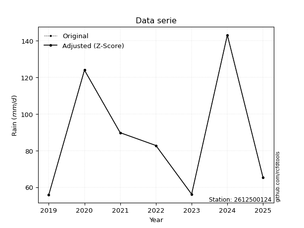</img>

</div>


> The initial value (value_initial) correspond to the initial obtained or null completed value, and value (value) is adjusted only when the initial value is outside the valid range (outlier) definite through the Z-Score value. If Z-Score is active, values out of range or outliers are replaced with the station mean value. A Z-Score (or standard score) measures how many standard deviations a data point is from the mean of a dataset, indicating its relative position; positive scores mean above the mean, negative mean below, and a score of zero is exactly at the mean, allowing for comparison of values from different distributions. It´s calculated using the formula $z=(x–μ)/σ$, where $x$ is the data point, $μ$ is the mean, and $σ$ is the standard deviation, helping identify outliers and understand probability.
>
> <sub>**Note**: In this study, "completing" (filling gaps in) and "extending" (forecasting or lengthening the historical record) rainfall data series are avoided for certain critical analyses because they introduce artificial bias and uncertainty, which can distort the statistics of rare events (extremes), alter day-to-day variability, and compromise the integrity and homogeneity of the original data. Some reasons against Completing/Extending rainfall data are: **Distortion of Extremes and Variability**: The primary issue is that most gap-filling or extension methods rely on averaging or regression with nearby stations, which inherently smooths the data. Rainfall is highly variable in space and time, with a large percentage of zero values and occasional large storms. Infilling methods often underestimate the highest values and overestimate the lowest (zero) values, which severely distorts analyses focused on flood frequency, drought severity, and intensity-duration-frequency (IDF) curves, **Loss of Data Homogeneity**: Infilled or extended data are synthetic estimates, not actual measurements. Combining these estimates with observed data can violate the assumption of data homogeneity, which requires that the data properties do not change over time. Inhomogeneity can lead to incorrect conclusions about long-term trends or changes in climate patterns, **Propagation of Errors**: Errors and biases from the original data (e.g., wind-induced undercatch, instrument errors, site changes) or the data used for imputation can propagate through the analysis, leading to unreliable hydrological models and inaccurate predictions, **Compromised Statistical Integrity**: For statistical analyses, especially those involving the frequency of events, using artificial data can introduce time bias or autocorrelation that doesn´t exist in reality, making it difficult to assess the true probability of events, **Difficulty in Validation**: It is difficult to accurately validate the quality of filled or extended data, especially for past periods where ground-truth measurements are unavailable. The reliability of imputation techniques heavily depends on the density of the surrounding station network and the complexity of the local topography.</sub>


### 4. Active continuous probability distributions from SciPy (80 of 104 available)

A Probability Density Function (PDF) describes the relative likelihood of a continuous random variable falling within a specific range, where the total area under its curve equals 1, and the area over any interval gives the actual probability for that range. Unlike discrete probabilities (like rolling a die), a PDF shows density, not direct probability for a single point (which is zero), with higher points indicating higher likelihood, often visualized as a bell curve for normal distributions.

A log of a probability density function (log-PDF) is simply the logarithm of the PDF´s value, denoted as $log(f(x))$, useful for converting multiplication of probabilities into addition, improving numerical stability with tiny numbers, and connecting to information theory concepts like entropy. Instead of dealing with very small probabilities (e.g., 0.000001), log-PDFs use negative numbers (e.g., $log(0.00001) ≈ -11.51$ that are easier for computers to handle, preventing underflow errors and simplifying complex calculations. In this study, each active probability distribution from SciPy is also evaluated in the $log$ form.

[scipy.stats](https://docs.scipy.org/doc/scipy/reference/stats.html) is a Python´s powerful submodule within the SciPy library for comprehensive statistical analysis, offering over 130 probability distributions (like Normal, Poisson, etc.), functions for descriptive stats (mean, variance), hypothesis testing (t-tests, chi-square), random variable generation, and statistical tests, making it essential for data science, modeling, and research. It provides tools to explore, model, and draw conclusions from data efficiently, working seamlessly with [NumPy](https://numpy.org/).

<div align="center">

|   id | p_dist           |   n_parameter | fit_method   | label                                                                       | active   | ref                                                                                                      |
|-----:|:-----------------|--------------:|:-------------|:----------------------------------------------------------------------------|:---------|:---------------------------------------------------------------------------------------------------------|
|    0 | alpha            |             3 | MLE          | Alpha                                                                       | True     | [:mortar_board:](https://docs.scipy.org/doc/scipy/reference/generated/scipy.stats.alpha.html)            |
|    1 | anglit           |             2 | MM           | Anglit                                                                      | True     | [:mortar_board:](https://docs.scipy.org/doc/scipy/reference/generated/scipy.stats.anglit.html)           |
|    2 | arcsine          |             2 | MM           | Arcsine                                                                     | True     | [:mortar_board:](https://docs.scipy.org/doc/scipy/reference/generated/scipy.stats.arcsine.html)          |
|    3 | argus            |             3 | MLE          | Argus                                                                       | True     | [:mortar_board:](https://docs.scipy.org/doc/scipy/reference/generated/scipy.stats.argus.html)            |
|    4 | beta             |             4 | MLE          | Beta                                                                        | True     | [:mortar_board:](https://docs.scipy.org/doc/scipy/reference/generated/scipy.stats.beta.html)             |
|    5 | betaprime        |             4 | MLE          | Beta prime                                                                  | True     | [:mortar_board:](https://docs.scipy.org/doc/scipy/reference/generated/scipy.stats.betaprime.html)        |
|    6 | bradford         |             3 | MLE          | Bradford                                                                    | True     | [:mortar_board:](https://docs.scipy.org/doc/scipy/reference/generated/scipy.stats.bradford.html)         |
|    7 | burr             |             4 | MLE          | Burr (Type III)                                                             | True     | [:mortar_board:](https://docs.scipy.org/doc/scipy/reference/generated/scipy.stats.burr.html)             |
|    8 | burr12           |             4 | MLE          | Burr (Type III) 12                                                          | True     | [:mortar_board:](https://docs.scipy.org/doc/scipy/reference/generated/scipy.stats.burr12.html)           |
|    9 | cosine           |             2 | MLE          | Cosine                                                                      | True     | [:mortar_board:](https://docs.scipy.org/doc/scipy/reference/generated/scipy.stats.cosine.html)           |
|   10 | crystalball      |             4 | MLE          | Crystalball                                                                 | True     | [:mortar_board:](https://docs.scipy.org/doc/scipy/reference/generated/scipy.stats.crystalball.html)      |
|   11 | dgamma           |             3 | MLE          | Double gamma                                                                | True     | [:mortar_board:](https://docs.scipy.org/doc/scipy/reference/generated/scipy.stats.dgamma.html)           |
|   12 | dweibull         |             3 | MLE          | Double Weibull                                                              | True     | [:mortar_board:](https://docs.scipy.org/doc/scipy/reference/generated/scipy.stats.dweibull.html)         |
|   13 | erlang           |             3 | MLE          | Erlang                                                                      | True     | [:mortar_board:](https://docs.scipy.org/doc/scipy/reference/generated/scipy.stats.erlang.html)           |
|   14 | exponnorm        |             3 | MLE          | Exponentially modified Normal                                               | True     | [:mortar_board:](https://docs.scipy.org/doc/scipy/reference/generated/scipy.stats.exponnorm.html)        |
|   15 | exponpow         |             3 | MLE          | Exponential power                                                           | True     | [:mortar_board:](https://docs.scipy.org/doc/scipy/reference/generated/scipy.stats.exponpow.html)         |
|   16 | exponweib        |             4 | MLE          | Exponentiated Weibull                                                       | True     | [:mortar_board:](https://docs.scipy.org/doc/scipy/reference/generated/scipy.stats.exponweib.html)        |
|   17 | f                |             4 | MLE          | F                                                                           | True     | [:mortar_board:](https://docs.scipy.org/doc/scipy/reference/generated/scipy.stats.f.html)                |
|   18 | fatiguelife      |             3 | MLE          | Fatigue-life (Birnbaum-Saunders)                                            | True     | [:mortar_board:](https://docs.scipy.org/doc/scipy/reference/generated/scipy.stats.fatiguelife.html)      |
|   19 | foldnorm         |             3 | MM           | Fold Normal                                                                 | True     | [:mortar_board:](https://docs.scipy.org/doc/scipy/reference/generated/scipy.stats.foldnorm.html)         |
|   20 | gamma            |             3 | MLE          | Gamma                                                                       | True     | [:mortar_board:](https://docs.scipy.org/doc/scipy/reference/generated/scipy.stats.gamma.html)            |
|   21 | gausshyper       |             6 | MLE          | Gauss hypergeometric                                                        | True     | [:mortar_board:](https://docs.scipy.org/doc/scipy/reference/generated/scipy.stats.gausshyper.html)       |
|   22 | genexpon         |             5 | MLE          | Generalized exponential                                                     | True     | [:mortar_board:](https://docs.scipy.org/doc/scipy/reference/generated/scipy.stats.genexpon.html)         |
|   23 | genextreme       |             3 | MLE          | Generalized exponential                                                     | True     | [:mortar_board:](https://docs.scipy.org/doc/scipy/reference/generated/scipy.stats.genextreme.html)       |
|   24 | gengamma         |             4 | MLE          | Generalized gamma                                                           | True     | [:mortar_board:](https://docs.scipy.org/doc/scipy/reference/generated/scipy.stats.gengamma.html)         |
|   25 | genhalflogistic  |             3 | MLE          | Generalized half-logistic                                                   | True     | [:mortar_board:](https://docs.scipy.org/doc/scipy/reference/generated/scipy.stats.genhalflogistic.html)  |
|   26 | genlogistic      |             3 | MLE          | Generalized logistic                                                        | True     | [:mortar_board:](https://docs.scipy.org/doc/scipy/reference/generated/scipy.stats.genlogistic.html)      |
|   27 | gennorm          |             3 | MLE          | Generalized Normal                                                          | True     | [:mortar_board:](https://docs.scipy.org/doc/scipy/reference/generated/scipy.stats.gennorm.html)          |
|   28 | genpareto        |             3 | MLE          | Generalized Pareto                                                          | True     | [:mortar_board:](https://docs.scipy.org/doc/scipy/reference/generated/scipy.stats.genpareto.html)        |
|   29 | gompertz         |             3 | MLE          | Gompertz (or truncated Gumbel)                                              | True     | [:mortar_board:](https://docs.scipy.org/doc/scipy/reference/generated/scipy.stats.gompertz.html)         |
|   30 | gumbel_l         |             2 | MM           | Gumbel Left Skew                                                            | True     | [:mortar_board:](https://docs.scipy.org/doc/scipy/reference/generated/scipy.stats.gumbel_l.html)         |
|   31 | gumbel_r         |             2 | MM           | Gumbel Right Skew                                                           | True     | [:mortar_board:](https://docs.scipy.org/doc/scipy/reference/generated/scipy.stats.gumbel_r.html)         |
|   32 | halfgennorm      |             3 | MLE          | Upper half of a generalized normal                                          | True     | [:mortar_board:](https://docs.scipy.org/doc/scipy/reference/generated/scipy.stats.halfgennorm.html)      |
|   33 | halflogistic     |             2 | MM           | Half-logistic                                                               | True     | [:mortar_board:](https://docs.scipy.org/doc/scipy/reference/generated/scipy.stats.halflogistic.html)     |
|   34 | halfnorm         |             2 | MM           | Half Normal                                                                 | True     | [:mortar_board:](https://docs.scipy.org/doc/scipy/reference/generated/scipy.stats.halfnorm.html)         |
|   35 | hypsecant        |             2 | MM           | hyperbolic secant                                                           | True     | [:mortar_board:](https://docs.scipy.org/doc/scipy/reference/generated/scipy.stats.hypsecant.html)        |
|   36 | invgamma         |             3 | MLE          | Inverted gamma                                                              | True     | [:mortar_board:](https://docs.scipy.org/doc/scipy/reference/generated/scipy.stats.invgamma.html)         |
|   37 | invgauss         |             3 | MLE          | Inverse Gaussian                                                            | True     | [:mortar_board:](https://docs.scipy.org/doc/scipy/reference/generated/scipy.stats.invgauss.html)         |
|   38 | invweibull       |             3 | MLE          | Inverted Weibull                                                            | True     | [:mortar_board:](https://docs.scipy.org/doc/scipy/reference/generated/scipy.stats.invweibull.html)       |
|   39 | johnsonsb        |             4 | MLE          | Johnson SB                                                                  | True     | [:mortar_board:](https://docs.scipy.org/doc/scipy/reference/generated/scipy.stats.johnsonsb.html)        |
|   40 | johnsonsu        |             4 | MLE          | Johnson Su                                                                  | True     | [:mortar_board:](https://docs.scipy.org/doc/scipy/reference/generated/scipy.stats.johnsonsu.html)        |
|   41 | kappa3           |             3 | MLE          | Kappa 3                                                                     | True     | [:mortar_board:](https://docs.scipy.org/doc/scipy/reference/generated/scipy.stats.kappa3.html)           |
|   42 | kappa4           |             4 | MLE          | Kappa 4                                                                     | True     | [:mortar_board:](https://docs.scipy.org/doc/scipy/reference/generated/scipy.stats.kappa4.html)           |
|   43 | ksone            |             3 | MLE          | Kolmogorov-Smirnov one-sided test statistic distribution                    | True     | [:mortar_board:](https://docs.scipy.org/doc/scipy/reference/generated/scipy.stats.ksone.html)            |
|   44 | kstwobign        |             2 | MLE          | Limiting distribution of scaled Kolmogorov-Smirnov two-sided test statistic | True     | [:mortar_board:](https://docs.scipy.org/doc/scipy/reference/generated/scipy.stats.kstwobign.html)        |
|   45 | laplace          |             2 | MM           | Laplace                                                                     | True     | [:mortar_board:](https://docs.scipy.org/doc/scipy/reference/generated/scipy.stats.laplace.html)          |
|   46 | levy_l           |             2 | MLE          | Left-skewed Levy                                                            | True     | [:mortar_board:](https://docs.scipy.org/doc/scipy/reference/generated/scipy.stats.levy_l.html)           |
|   47 | loggamma         |             3 | MLE          | Log gamma                                                                   | True     | [:mortar_board:](https://docs.scipy.org/doc/scipy/reference/generated/scipy.stats.loggamma.html)         |
|   48 | logistic         |             2 | MM           | Logistic (or Sech-squared)                                                  | True     | [:mortar_board:](https://docs.scipy.org/doc/scipy/reference/generated/scipy.stats.logistic.html)         |
|   49 | loglaplace       |             3 | MLE          | Log-Laplace                                                                 | True     | [:mortar_board:](https://docs.scipy.org/doc/scipy/reference/generated/scipy.stats.loglaplace.html)       |
|   50 | lomax            |             3 | MLE          | Lomax (Pareto of the second kind)                                           | True     | [:mortar_board:](https://docs.scipy.org/doc/scipy/reference/generated/scipy.stats.lomax.html)            |
|   51 | maxwell          |             2 | MM           | Maxwell                                                                     | True     | [:mortar_board:](https://docs.scipy.org/doc/scipy/reference/generated/scipy.stats.maxwell.html)          |
|   52 | mielke           |             4 | MLE          | Mielke Beta-Kappa / Dagum                                                   | True     | [:mortar_board:](https://docs.scipy.org/doc/scipy/reference/generated/scipy.stats.mielke.html)           |
|   53 | moyal            |             2 | MM           | Moyal                                                                       | True     | [:mortar_board:](https://docs.scipy.org/doc/scipy/reference/generated/scipy.stats.moyal.html)            |
|   54 | nakagami         |             3 | MLE          | Nakagami                                                                    | True     | [:mortar_board:](https://docs.scipy.org/doc/scipy/reference/generated/scipy.stats.nakagami.html)         |
|   55 | ncf              |             5 | MLE          | Non-central F distribution                                                  | True     | [:mortar_board:](https://docs.scipy.org/doc/scipy/reference/generated/scipy.stats.ncf.html)              |
|   56 | nct              |             4 | MLE          | Non-central Student’s t                                                     | True     | [:mortar_board:](https://docs.scipy.org/doc/scipy/reference/generated/scipy.stats.nct.html)              |
|   57 | norm             |             2 | MM           | Normal                                                                      | True     | [:mortar_board:](https://docs.scipy.org/doc/scipy/reference/generated/scipy.stats.norm.html)             |
|   58 | pearson3         |             3 | MM           | Pearson type III                                                            | True     | [:mortar_board:](https://docs.scipy.org/doc/scipy/reference/generated/scipy.stats.pearson3.html)         |
|   59 | powerlaw         |             3 | MLE          | Power-function                                                              | True     | [:mortar_board:](https://docs.scipy.org/doc/scipy/reference/generated/scipy.stats.powerlaw.html)         |
|   60 | rayleigh         |             2 | MM           | Rayleigh                                                                    | True     | [:mortar_board:](https://docs.scipy.org/doc/scipy/reference/generated/scipy.stats.rayleigh.html)         |
|   61 | rdist            |             3 | MLE          | R-distributed (symmetric beta)                                              | True     | [:mortar_board:](https://docs.scipy.org/doc/scipy/reference/generated/scipy.stats.rdist.html)            |
|   62 | rice             |             3 | MLE          | Rice                                                                        | True     | [:mortar_board:](https://docs.scipy.org/doc/scipy/reference/generated/scipy.stats.rice.html)             |
|   63 | semicircular     |             2 | MM           | Semicircular                                                                | True     | [:mortar_board:](https://docs.scipy.org/doc/scipy/reference/generated/scipy.stats.semicircular.html)     |
|   64 | skewnorm         |             3 | MLE          | Skew normal                                                                 | True     | [:mortar_board:](https://docs.scipy.org/doc/scipy/reference/generated/scipy.stats.skewnorm.html)         |
|   65 | t                |             3 | MLE          | Student’s t                                                                 | True     | [:mortar_board:](https://docs.scipy.org/doc/scipy/reference/generated/scipy.stats.t.html)                |
|   66 | trapezoid        |             4 | MLE          | Trapezoid                                                                   | True     | [:mortar_board:](https://docs.scipy.org/doc/scipy/reference/generated/scipy.stats.trapezoid.html)        |
|   67 | triang           |             3 | MLE          | Triangular                                                                  | True     | [:mortar_board:](https://docs.scipy.org/doc/scipy/reference/generated/scipy.stats.triang.html)           |
|   68 | truncexpon       |             3 | MLE          | Truncated exponential                                                       | True     | [:mortar_board:](https://docs.scipy.org/doc/scipy/reference/generated/scipy.stats.truncexpon.html)       |
|   69 | truncnorm        |             4 | MLE          | Truncated normal                                                            | True     | [:mortar_board:](https://docs.scipy.org/doc/scipy/reference/generated/scipy.stats.truncnorm.html)        |
|   70 | truncpareto      |             4 | MLE          | Upper truncated Pareto                                                      | True     | [:mortar_board:](https://docs.scipy.org/doc/scipy/reference/generated/scipy.stats.truncpareto.html)      |
|   71 | truncweibull_min |             5 | MLE          | Doubly truncated Weibull minimum                                            | True     | [:mortar_board:](https://docs.scipy.org/doc/scipy/reference/generated/scipy.stats.truncweibull_min.html) |
|   72 | tukeylambda      |             3 | MLE          | Tukey-Lamdba                                                                | True     | [:mortar_board:](https://docs.scipy.org/doc/scipy/reference/generated/scipy.stats.tukeylambda.html)      |
|   73 | uniform          |             2 | MLE          | Uniform                                                                     | True     | [:mortar_board:](https://docs.scipy.org/doc/scipy/reference/generated/scipy.stats.uniform.html)          |
|   74 | vonmises         |             3 | MLE          | Von Mises                                                                   | True     | [:mortar_board:](https://docs.scipy.org/doc/scipy/reference/generated/scipy.stats.vonmises.html)         |
|   75 | vonmises_line    |             3 | MLE          | Von Mises line                                                              | True     | [:mortar_board:](https://docs.scipy.org/doc/scipy/reference/generated/scipy.stats.vonmises_line.html)    |
|   76 | wald             |             2 | MM           | Wald                                                                        | True     | [:mortar_board:](https://docs.scipy.org/doc/scipy/reference/generated/scipy.stats.wald.html)             |
|   77 | weibull_max      |             3 | MLE          | Weibull maximum                                                             | True     | [:mortar_board:](https://docs.scipy.org/doc/scipy/reference/generated/scipy.stats.weibull_max.html)      |
|   78 | weibull_min      |             3 | MLE          | Weibull minimum                                                             | True     | [:mortar_board:](https://docs.scipy.org/doc/scipy/reference/generated/scipy.stats.weibull_min.html)      |
|   79 | wrapcauchy       |             3 | MLE          | Wrapped  Cauchy                                                             | True     | [:mortar_board:](https://docs.scipy.org/doc/scipy/reference/generated/scipy.stats.wrapcauchy.html)       |

</div>

> **n_parameter:** # arguments & localization & scale.
>
> **Fit methods:** (MLE) maximum likelihood, (MM) L-moments.
>
>**Inactive** (With the only purpose of prevent loops, zero divisions, infinite values, over high estimated values or horizontal trending for recurrence intervals estimations, the follow distributions were disabled.)**:** lognorm, norminvgauss, powernorm, powerlognorm, cauchy, halfcauchy, foldcauchy, skewcauchy, chi2, expon, fisk, genhyperbolic, geninvgauss, gibrat, kstwo, laplace_asymmetric, levy, levy_stable, ncx2, pareto, rel_breitwigner, recipinvgauss, studentized_range, loguniform, 


## B. Probability (PDF) vs. Empirical (EDF) distributions functions

A continuous probability distribution (CPD) describes probabilities for variables that can take any value within a range (like rain any time), unlike discrete variables with specific outcomes (like temperature). It uses a Probability Density Function (PDF), a curve where the total area under it equals 1, and the probability of the variable falling within an interval (a to b) is found by calculating the area under the curve between those points. A key feature is that the probability of hitting any single exact value is zero, so probabilities are always expressed for ranges, e.g., $P(a ≤ X ≤ b)$.

<div align="center">

Distributions parameters from station values
|     |    station | p_dist              |   n |             loc |          scale | shape                  | shape1                 | shape2               | shape3             |
|----:|-----------:|:--------------------|----:|----------------:|---------------:|:-----------------------|:-----------------------|:---------------------|:-------------------|
|   0 | 2612500124 | alpha               |   7 |    46.9638      |   15.5005      | 5.751200014754894e-07  |                        |                      |                    |
|   1 | 2612500124 | anglit              |   7 |    88.1429      |   92.1192      |                        |                        |                      |                    |
|   2 | 2612500124 | arcsine             |   7 |    43.6101      |   89.0656      |                        |                        |                      |                    |
|   3 | 2612500124 | argus               |   7 |    20.6602      |  127.941       | 2.4909976139455455e-06 |                        |                      |                    |
|   4 | 2612500124 | beta                |   7 |    50.277       |   92.923       | 0.3570626496393834     | 0.6771587156114606     |                      |                    |
|   5 | 2612500124 | betaprime           |   7 |    -1.36699     |    2.6622      | 286.99232232563156     | 9.533799419777633      |                      |                    |
|   6 | 2612500124 | bradford            |   7 |    55.8         |  112.639       | 79.84392279728375      |                        |                      |                    |
|   7 | 2612500124 | burr                |   7 |    -1.06173     |   14.4369      | 3.6268908108550555     | 330.04958190287675     |                      |                    |
|   8 | 2612500124 | burr12              |   7 |    -2.78233     |   58.3         | 773.2789785137084      | 0.003338351156275081   |                      |                    |
|   9 | 2612500124 | cosine              |   7 |    91.0119      |   25.7582      |                        |                        |                      |                    |
|  10 | 2612500124 | crystalball         |   7 |    88.1429      |   31.4894      | 7312.022531127241      | 1183.1092763763804     |                      |                    |
|  11 | 2612500124 | dgamma              |   7 |    76.4         |   14.0241      | 1.896726167486828      |                        |                      |                    |
|  12 | 2612500124 | dweibull            |   7 |    77.9154      |   29.035       | 1.3780342204320752     |                        |                      |                    |
|  13 | 2612500124 | erlang              |   7 |    55.8         |   29.221       | 0.3868967753649234     |                        |                      |                    |
|  14 | 2612500124 | exponnorm           |   7 |    55.761       |    0.0122429   | 2607.1118084241934     |                        |                      |                    |
|  15 | 2612500124 | exponpow            |   7 |    55.8         |   59.8458      | 0.343010761942113      |                        |                      |                    |
|  16 | 2612500124 | exponweib           |   7 |    55.8         |    1.14604     | 1.2262717133037404     | 0.3163735648063621     |                      |                    |
|  17 | 2612500124 | f                   |   7 |    50.5753      |   13.6157      | 226.85809448504241     | 2.1241313182471773     |                      |                    |
|  18 | 2612500124 | fatiguelife         |   7 |    55.8         |    1.36333e-05 | 1400.2710568837756     |                        |                      |                    |
|  19 | 2612500124 | foldnorm            |   7 |    40.297       |   37.7733      | 1.13990490904041       |                        |                      |                    |
|  20 | 2612500124 | gamma               |   7 |    55.8         |   20.9059      | 0.7597391455508362     |                        |                      |                    |
|  21 | 2612500124 | gausshyper          |   7 |    55.8         |   90.492       | 0.5294286386234226     | 0.9197070632054498     | 0.9715019988300728   | 0.9285628685753158 |
|  22 | 2612500124 | genexpon            |   7 |    55.8         |   57.9695      | 1.7923471538683742     | 4.6174910413759083e-10 | 0.9113532634326552   |                    |
|  23 | 2612500124 | genextreme          |   7 |    56.3649      |    4.94476     | -8.753976143452492     |                        |                      |                    |
|  24 | 2612500124 | gengamma            |   7 |    55.8         |    1.20415     | 1.2155886945740768     | 0.28748297754471014    |                      |                    |
|  25 | 2612500124 | genhalflogistic     |   7 |    50.1279      |   97.8086      | 1.050890355914078      |                        |                      |                    |
|  26 | 2612500124 | genlogistic         |   7 |  -102.023       |   23.4767      | 1768.7460821315376     |                        |                      |                    |
|  27 | 2612500124 | gennorm             |   7 |    99.5         |   43.7001      | 8201620.072984856      |                        |                      |                    |
|  28 | 2612500124 | genpareto           |   7 |    -1.474       |  236.17        | -1.632428260541125     |                        |                      |                    |
|  29 | 2612500124 | gompertz            |   7 |    55.8         |  883.339       | 26.597393982263057     |                        |                      |                    |
|  30 | 2612500124 | gumbel_l            |   7 |   102.315       |   24.5522      |                        |                        |                      |                    |
|  31 | 2612500124 | gumbel_r            |   7 |    73.9709      |   24.5522      |                        |                        |                      |                    |
|  32 | 2612500124 | halfgennorm         |   7 |    55.8         |    1.37103     | 0.3721311596058023     |                        |                      |                    |
|  33 | 2612500124 | halflogistic        |   7 |    50.8205      |   26.9224      |                        |                        |                      |                    |
|  34 | 2612500124 | halfnorm            |   7 |    46.4632      |   52.2377      |                        |                        |                      |                    |
|  35 | 2612500124 | hypsecant           |   7 |    88.1429      |   20.0468      |                        |                        |                      |                    |
|  36 | 2612500124 | invgamma            |   7 |    50.6927      |   13.7942      | 1.0394437335027655     |                        |                      |                    |
|  37 | 2612500124 | invgauss            |   7 |    53.0887      |   10.6188      | 3.301149447016379      |                        |                      |                    |
|  38 | 2612500124 | invweibull          |   7 |    55.8         |    1.3404      | 0.07791404542571598    |                        |                      |                    |
|  39 | 2612500124 | johnsonsb           |   7 |    55.8         |  129.549       | 1.6389728767834757     | 0.1701648036077536     |                      |                    |
|  40 | 2612500124 | johnsonsu           |   7 |    55.8         |    1.0941e-10  | -0.9130289663335216    | 0.09690672628715057    |                      |                    |
|  41 | 2612500124 | kappa3              |   7 |    55.8         |   87.3338      | 2533.6169132866726     |                        |                      |                    |
|  42 | 2612500124 | kappa4              |   7 |    46.1825      |  100.912       | 1.1053783907415706     | 1.0056021482443298     |                      |                    |
|  43 | 2612500124 | ksone               |   7 |    47.06        |  104.88        | 1.0                    |                        |                      |                    |
|  44 | 2612500124 | kstwobign           |   7 |    -8.02624     |  110.27        |                        |                        |                      |                    |
|  45 | 2612500124 | laplace             |   7 |    88.1429      |   22.2664      |                        |                        |                      |                    |
|  46 | 2612500124 | levy_l              |   7 |   148.713       |   24.3425      |                        |                        |                      |                    |
|  47 | 2612500124 | loggamma            |   7 | -7199.15        | 1044.29        | 1073.5832909652465     |                        |                      |                    |
|  48 | 2612500124 | logistic            |   7 |    88.1429      |   17.361       |                        |                        |                      |                    |
|  49 | 2612500124 | loglaplace          |   7 |    -0.208639    |   83.0086      | 3.4166582132456385     |                        |                      |                    |
|  50 | 2612500124 | lomax               |   7 |    55.8         |  301.24        | 10.191219353773793     |                        |                      |                    |
|  51 | 2612500124 | maxwell             |   7 |    13.5261      |   46.7591      |                        |                        |                      |                    |
|  52 | 2612500124 | mielke              |   7 |    14.0952      |    4.66458     | 3983.4970556082217     | 2.913001299303838      |                      |                    |
|  53 | 2612500124 | moyal               |   7 |    70.1352      |   14.1752      |                        |                        |                      |                    |
|  54 | 2612500124 | nakagami            |   7 |    55.8         |   39.0578      | 0.21483260518263647    |                        |                      |                    |
|  55 | 2612500124 | ncf                 |   7 |    55.8         |    3.23095     | 0.5737576677518567     | 2625.861195282312      | 5.693755079779153    |                    |
|  56 | 2612500124 | nct                 |   7 |    -0.260966    |    1.50092     | 5.098246841458989      | 49.936225745745574     |                      |                    |
|  57 | 2612500124 | norm                |   7 |    88.1429      |   31.4894      |                        |                        |                      |                    |
|  58 | 2612500124 | pearson3            |   7 |    88.1429      |   31.4895      | 0.614654353386552      |                        |                      |                    |
|  59 | 2612500124 | powerlaw            |   7 |    55.8         |   87.4         | 0.148835379307425      |                        |                      |                    |
|  60 | 2612500124 | rayleigh            |   7 |    27.9017      |   48.0655      |                        |                        |                      |                    |
|  61 | 2612500124 | rdist               |   7 |    72.7752      |   17.0248      | 1.1331981840245406     |                        |                      |                    |
|  62 | 2612500124 | rice                |   7 |    36.3316      |   42.8719      | 0.0006641308507496833  |                        |                      |                    |
|  63 | 2612500124 | semicircular        |   7 |    88.1429      |   62.9789      |                        |                        |                      |                    |
|  64 | 2612500124 | skewnorm            |   7 |    55.8         |   45.1431      | 9504229.364774976      |                        |                      |                    |
|  65 | 2612500124 | t                   |   7 |    88.1714      |   31.4928      | 44926.54882343073      |                        |                      |                    |
|  66 | 2612500124 | trapezoid           |   7 |    47.06        |  104.88        | 1.0                    | 1.0                    |                      |                    |
|  67 | 2612500124 | triang              |   7 |    11.2269      |  132.041       | 0.9994890726669532     |                        |                      |                    |
|  68 | 2612500124 | truncexpon          |   7 |    55.7993      |   81.9989      | 1.0658772000091497     |                        |                      |                    |
|  69 | 2612500124 | truncnorm           |   7 |    88.1429      |   31.4894      | -1139.5581179871274    | 2128.4918687438985     |                      |                    |
|  70 | 2612500124 | truncpareto         |   7 |    55.7752      |    0.0248252   | 6.17713278331751e-05   | 3521.618809538769      |                      |                    |
|  71 | 2612500124 | truncweibull_min    |   7 |    55.6212      |   89.6846      | 0.7216145811781169     | 0.0017898332562498774  | 0.9765206039196013   |                    |
|  72 | 2612500124 | tukeylambda         |   7 |    72.8157      |   20.641       | 1.213058132235948      |                        |                      |                    |
|  73 | 2612500124 | uniform             |   7 |    55.8         |   87.4         |                        |                        |                      |                    |
|  74 | 2612500124 | vonmises            |   7 |    -0.315       |    1           | 0.39651789885718586    |                        |                      |                    |
|  75 | 2612500124 | vonmises_line       |   7 |    99.5069      |   13.9124      | 8.50277991884318e-06   |                        |                      |                    |
|  76 | 2612500124 | wald                |   7 |    56.6534      |   31.4895      |                        |                        |                      |                    |
|  77 | 2612500124 | weibull_max         |   7 |   143.2         |    1.50908     | 0.22679523717697422    |                        |                      |                    |
|  78 | 2612500124 | weibull_min         |   7 |    55.8         |   40.6816      | 0.5646924273738256     |                        |                      |                    |
|  79 | 2612500124 | wrapcauchy          |   7 |    55.8         |   13.9101      | 0.5783799339815716     |                        |                      |                    |
|  80 | 2612500124 | logalpha            |   7 |     2.6633      |    8.8655      | 5.246549963133766      |                        |                      |                    |
|  81 | 2612500124 | loganglit           |   7 |     4.4181      |    1.00903     |                        |                        |                      |                    |
|  82 | 2612500124 | logarcsine          |   7 |     3.93033     |    0.975538    |                        |                        |                      |                    |
|  83 | 2612500124 | logargus            |   7 |     3.6866      |    1.33896     | 0.0001097546190169552  |                        |                      |                    |
|  84 | 2612500124 | logbeta             |   7 |     4.02176     |    0.942484    | 0.5313013846910496     | 0.6811151337219358     |                      |                    |
|  85 | 2612500124 | logbetaprime        |   7 |    -4.42955     |   21.9363      | 728.0870497270748      | 1806.6628985015395     |                      |                    |
|  86 | 2612500124 | logbradford         |   7 |     4.02177     |    1.06484     | 987.7955177095178      |                        |                      |                    |
|  87 | 2612500124 | logburr             |   7 |    -3.48003     |    6.0823      | 28.143733937580556     | 843.9299966326985      |                      |                    |
|  88 | 2612500124 | logburr12           |   7 |   -13.0621      |   17.0715      | 3630.614493960571      | 0.012084202582669526   |                      |                    |
|  89 | 2612500124 | logcosine           |   7 |     4.43504     |    0.277837    |                        |                        |                      |                    |
|  90 | 2612500124 | logcrystalball      |   7 |     4.4181      |    0.34492     | 7.593874822576007      | 126.04053068713868     |                      |                    |
|  91 | 2612500124 | logdgamma           |   7 |     4.41643     |    0.279338    | 0.9072921057872307     |                        |                      |                    |
|  92 | 2612500124 | logdweibull         |   7 |     4.33508     |    0.344314    | 1.7735897824041438     |                        |                      |                    |
|  93 | 2612500124 | logerlang           |   7 |     4.02177     |    0.297607    | 0.7696565922402125     |                        |                      |                    |
|  94 | 2612500124 | logexponnorm        |   7 |     4.02119     |    0.000194658 | 2034.2990232816346     |                        |                      |                    |
|  95 | 2612500124 | logexponpow         |   7 |     4.02177     |    0.946006    | 0.18193641174869643    |                        |                      |                    |
|  96 | 2612500124 | logexponweib        |   7 |     4.02177     |    0.624551    | 0.11229432656679972    | 1.4847369615140478     |                      |                    |
|  97 | 2612500124 | logf                |   7 |     3.66924     |    0.600517    | 205.71502478516464     | 9.280056772409157      |                      |                    |
|  98 | 2612500124 | logfatiguelife      |   7 |     4.02177     |    6.3255e-07  | 993.1389699073434      |                        |                      |                    |
|  99 | 2612500124 | logfoldnorm         |   7 |     3.91821     |    0.428551    | 1.000171528782744      |                        |                      |                    |
| 100 | 2612500124 | loggamma            |   7 |     4.02177     |    0.290428    | 0.8139066850370449     |                        |                      |                    |
| 101 | 2612500124 | loggausshyper       |   7 |     4.02177     |    1.11354     | 0.17375568529424706    | 0.43797932986855126    | 1.591043673862674    | 1.4963601210377668 |
| 102 | 2612500124 | loggenexpon         |   7 |     4.02177     |    0.747809    | 1.584888921117983      | 20.08192743491297      | 0.02978344443232074  |                    |
| 103 | 2612500124 | loggenextreme       |   7 |     4.24267     |    0.27044     | -0.06697381889960008   |                        |                      |                    |
| 104 | 2612500124 | loggengamma         |   7 |     4.02177     |    0.674976    | 0.11218138185200144    | 1.706195038376413      |                      |                    |
| 105 | 2612500124 | loggenhalflogistic  |   7 |     3.94976     |    1.10522     | 1.089452497502533      |                        |                      |                    |
| 106 | 2612500124 | loggenlogistic      |   7 |     2.31301     |    0.279309    | 1036.8880104676496     |                        |                      |                    |
| 107 | 2612500124 | loggennorm          |   7 |     4.49301     |    0.471234    | 28447212.513634413     |                        |                      |                    |
| 108 | 2612500124 | loggenpareto        |   7 |    -0.00741321  |    9.47842     | -1.9064915079860967    |                        |                      |                    |
| 109 | 2612500124 | loggompertz         |   7 |     4.02177     |    1.33334     | 2.54530856724635       |                        |                      |                    |
| 110 | 2612500124 | loggumbel_l         |   7 |     4.57333     |    0.268933    |                        |                        |                      |                    |
| 111 | 2612500124 | loggumbel_r         |   7 |     4.26287     |    0.268933    |                        |                        |                      |                    |
| 112 | 2612500124 | loghalfgennorm      |   7 |     4.02177     |    3.78657e-09 | 0.12106908924374817    |                        |                      |                    |
| 113 | 2612500124 | loghalflogistic     |   7 |     4.00929     |    0.294894    |                        |                        |                      |                    |
| 114 | 2612500124 | loghalfnorm         |   7 |     3.96156     |    0.572186    |                        |                        |                      |                    |
| 115 | 2612500124 | loghypsecant        |   7 |     4.4181      |    0.219583    |                        |                        |                      |                    |
| 116 | 2612500124 | loginvgamma         |   7 |     3.61548     |    3.38849     | 5.158623448919597      |                        |                      |                    |
| 117 | 2612500124 | loginvgauss         |   7 |     3.94991     |    0.316479    | 1.479371055564897      |                        |                      |                    |
| 118 | 2612500124 | loginvweibull       |   7 |     0.204783    |    4.0379      | 14.93047225346608      |                        |                      |                    |
| 119 | 2612500124 | logjohnsonsb        |   7 |     4.02177     |    3.7514      | 1.64203478347609       | 0.11086678927323765    |                      |                    |
| 120 | 2612500124 | logjohnsonsu        |   7 |  1145.78        |    9.00458     | 18280.801349041467     | 3302.5208509124077     |                      |                    |
| 121 | 2612500124 | logkappa3           |   7 |     4.02177     |    0.941926    | 3408.6288893569745     |                        |                      |                    |
| 122 | 2612500124 | logkappa4           |   7 |     3.94289     |    1.13021     | 1.0750202355374088     | 0.997262852949095      |                      |                    |
| 123 | 2612500124 | logksone            |   7 |     3.82068     |    1.19484     | 1.0                    |                        |                      |                    |
| 124 | 2612500124 | logkstwobign        |   7 |     3.29342     |    1.28507     |                        |                        |                      |                    |
| 125 | 2612500124 | loglaplace          |   7 |     4.4181      |    0.243895    |                        |                        |                      |                    |
| 126 | 2612500124 | loglevy_l           |   7 |     5.01385     |    0.217712    |                        |                        |                      |                    |
| 127 | 2612500124 | logloggamma         |   7 |   -79.8677      |   11.932       | 1169.3240996663853     |                        |                      |                    |
| 128 | 2612500124 | loglogistic         |   7 |     4.4181      |    0.190164    |                        |                        |                      |                    |
| 129 | 2612500124 | logloglaplace       |   7 |    -0.0453197   |    4.46175     | 15.249411574391452     |                        |                      |                    |
| 130 | 2612500124 | loglomax            |   7 |     4.02177     |   68.9393      | 174.7213522702841      |                        |                      |                    |
| 131 | 2612500124 | logmaxwell          |   7 |     3.60078     |    0.512176    |                        |                        |                      |                    |
| 132 | 2612500124 | logmielke           |   7 |     2.44989     |    0.931596    | 575.4937935171183      | 6.843478807380439      |                      |                    |
| 133 | 2612500124 | logmoyal            |   7 |     4.22085     |    0.155268    |                        |                        |                      |                    |
| 134 | 2612500124 | lognakagami         |   7 |     4.02177     |    0.633625    | 0.07531059976204063    |                        |                      |                    |
| 135 | 2612500124 | logncf              |   7 |    -4.32736     |    8.73692     | 1545.4726589388397     | 980.2509076778617      | 0.018064811106800915 |                    |
| 136 | 2612500124 | lognct              |   7 |     0.0475133   |    0.0953026   | 90.47189767865356      | 45.44889850348546      |                      |                    |
| 137 | 2612500124 | lognorm             |   7 |     4.4181      |    0.34492     |                        |                        |                      |                    |
| 138 | 2612500124 | logpearson3         |   7 |     4.4181      |    0.34492     | 0.3248387011078789     |                        |                      |                    |
| 139 | 2612500124 | logpowerlaw         |   7 |     4.02177     |    0.942468    | 0.16278734030906236    |                        |                      |                    |
| 140 | 2612500124 | lograyleigh         |   7 |     3.75825     |    0.526486    |                        |                        |                      |                    |
| 141 | 2612500124 | logrdist            |   7 |     4.38559     |    0.578657    | 1.0422517256379726     |                        |                      |                    |
| 142 | 2612500124 | logrice             |   7 |     3.81931     |    0.466496    | 0.440786587340676      |                        |                      |                    |
| 143 | 2612500124 | logsemicircular     |   7 |     4.4181      |    0.68984     |                        |                        |                      |                    |
| 144 | 2612500124 | logskewnorm         |   7 |     4.02177     |    0.525315    | 7456286.5968032945     |                        |                      |                    |
| 145 | 2612500124 | logt                |   7 |     4.4181      |    0.34492     | 56105392609.99881      |                        |                      |                    |
| 146 | 2612500124 | logtrapezoid        |   7 |     3.92753     |    1.13096     | 1.0                    | 1.0                    |                      |                    |
| 147 | 2612500124 | logtriang           |   7 |     3.59449     |    1.36979     | 0.999974788234131      |                        |                      |                    |
| 148 | 2612500124 | logtruncexpon       |   7 |     4.02177     |    1.10475     | 0.8531204187867778     |                        |                      |                    |
| 149 | 2612500124 | logtruncnorm        |   7 |    -0.103139    |    1.26512     | 3.3835542628019133     | 5.518752463944422      |                      |                    |
| 150 | 2612500124 | logtruncpareto      |   7 |     4.02147     |    0.000302725 | 0.00014775815440802147 | 3114.2815106094004     |                      |                    |
| 151 | 2612500124 | logtruncweibull_min |   7 |     4.0128      |    1.2844      | 0.9900486569124469     | 7.730655235525206e-06  | 0.7407664246434709   |                    |
| 152 | 2612500124 | logtukeylambda      |   7 |     4.50858     |    0.532422    | 1.093693080057411      |                        |                      |                    |
| 153 | 2612500124 | loguniform          |   7 |     4.02177     |    0.942468    |                        |                        |                      |                    |
| 154 | 2612500124 | logvonmises         |   7 |    -1.8674      |    1           | 8.823043225962254      |                        |                      |                    |
| 155 | 2612500124 | logvonmises_line    |   7 |     4.49787     |    0.151546    | 1.1416913983509184e-05 |                        |                      |                    |
| 156 | 2612500124 | logwald             |   7 |     4.07319     |    0.344907    |                        |                        |                      |                    |
| 157 | 2612500124 | logweibull_max      |   7 |     3.30749e+06 |    3.30749e+06 | 11825585.27780392      |                        |                      |                    |
| 158 | 2612500124 | logweibull_min      |   7 |     4.02177     |    0.518868    | 0.772703748538561      |                        |                      |                    |
| 159 | 2612500124 | logwrapcauchy       |   7 |     4.02177     |    0.149999    | 0.5220381738797373     |                        |                      |                    |

</div>

> **loc** (Location parameter): This shifts the distribution along the x-axis. For many common distributions, like the normal (Gaussian) distribution, loc represents the mean $μ$. For others, like the uniform distribution, it might represent the minimum value, or for the beta distribution, the left end of the support interval.
>
> **scale** (Scale parameter): This determines the width or spread of the distribution. For the normal distribution, scale represents the standard deviation $σ$. For a uniform distribution, it defines the length of the interval (from $loc$ to $loc + scale$).
>
> **shape** (Shape parameters): Refers to parameters that define the specific form of a probability distribution, distinct from its location (loc) and scale (scale). These parameters are required arguments for most distribution functions. For example, a normal (Gaussian) distribution is fully defined by its location (mean) and scale (standard deviation), so it has no specific shape parameters beyond loc and scale. However, other distributions have intrinsic properties that need specification, as Gamma distribution that takes a shape parameter, often named $a$ or $alpha$.


### 0. Cumulative distribution values - CDF (160 evaluated)

Cumulative Distribution Function (CDF), denoted as $F$<sub>$X$</sub>$(x)$, is a function that gives the probability that a random variable $X$ will take a value less than or equal to a specific value, $x$ (i.e., $(P(X≥x)$. It essentially "accumulates" probabilities from a given point up to the far right (positive infinity), providing a complete picture of the distribution´s probabilities for both discrete (like rain) and continuous (like temperature) variables, helping to find probabilities over ranges or above certain values. Each station is evaluated separately ordering the $x$ values ascending, calculating the CDF and PDF values for the activated distributions and their logarithmic forms.

<div align="center">

CDF ordered by x ascending and calculating $log(f(x))$ separately
|   id |    Station |   date |     x |   count |    mean |     std |     zscore |   Value_initial |    station |   m |     alpha |   alpha_pdf |   anglit |   anglit_pdf |   arcsine |   arcsine_pdf |    argus |   argus_pdf |     beta |     beta_pdf |   betaprime |   betaprime_pdf |    bradford |   bradford_pdf |     burr |   burr_pdf |    burr12 |   burr12_pdf |   cosine |   cosine_pdf |   crystalball |   crystalball_pdf |   dgamma |   dgamma_pdf |   dweibull |   dweibull_pdf |     erlang |   erlang_pdf |   exponnorm |   exponnorm_pdf |    exponpow |   exponpow_pdf |   exponweib |   exponweib_pdf |         f |      f_pdf |   fatiguelife |   fatiguelife_pdf |   foldnorm |   foldnorm_pdf |       gamma |     gamma_pdf |   gausshyper |   gausshyper_pdf |    genexpon |   genexpon_pdf |   genextreme |   genextreme_pdf |    gengamma |   gengamma_pdf |   genhalflogistic |   genhalflogistic_pdf |   genlogistic |   genlogistic_pdf |    gennorm |   gennorm_pdf |   genpareto |   genpareto_pdf |   gompertz |   gompertz_pdf |   gumbel_l |   gumbel_l_pdf |   gumbel_r |   gumbel_r_pdf |   halfgennorm |   halfgennorm_pdf |   halflogistic |   halflogistic_pdf |   halfnorm |   halfnorm_pdf |   hypsecant |   hypsecant_pdf |   invgamma |   invgamma_pdf |   invgauss |   invgauss_pdf |   invweibull |   invweibull_pdf |   johnsonsb |   johnsonsb_pdf |   johnsonsu |   johnsonsu_pdf |      kappa3 |   kappa3_pdf |      kappa4 |   kappa4_pdf |     ksone |   ksone_pdf |   kstwobign |   kstwobign_pdf |   laplace |   laplace_pdf |   levy_l |   levy_l_pdf |    loggamma |   loggamma_pdf |   logistic |   logistic_pdf |   loglaplace |   loglaplace_pdf |       lomax |   lomax_pdf |   maxwell |   maxwell_pdf |   mielke |   mielke_pdf |     moyal |   moyal_pdf |    nakagami |   nakagami_pdf |         ncf |       ncf_pdf |      nct |    nct_pdf |     norm |   norm_pdf |   pearson3 |   pearson3_pdf |   powerlaw |   powerlaw_pdf |   rayleigh |   rayleigh_pdf |     rdist |     rdist_pdf |      rice |   rice_pdf |   semicircular |   semicircular_pdf |   skewnorm |   skewnorm_pdf |        t |      t_pdf |   trapezoid |   trapezoid_pdf |   triang |   triang_pdf |   truncexpon |   truncexpon_pdf |   truncnorm |   truncnorm_pdf |   truncpareto |   truncpareto_pdf |   truncweibull_min |   truncweibull_min_pdf |   tukeylambda |   tukeylambda_pdf |    uniform |   uniform_pdf |   vonmises |   vonmises_pdf |   vonmises_line |   vonmises_line_pdf |     wald |   wald_pdf |   weibull_max |   weibull_max_pdf |   weibull_min |   weibull_min_pdf |   wrapcauchy |   wrapcauchy_pdf |   logalpha |   logalpha_pdf |   loganglit |   loganglit_pdf |   logarcsine |   logarcsine_pdf |   logargus |   logargus_pdf |    logbeta |   logbeta_pdf |   logbetaprime |   logbetaprime_pdf |   logbradford |   logbradford_pdf |   logburr |   logburr_pdf |   logburr12 |   logburr12_pdf |   logcosine |   logcosine_pdf |   logcrystalball |   logcrystalball_pdf |   logdgamma |   logdgamma_pdf |   logdweibull |   logdweibull_pdf |   logerlang |   logerlang_pdf |   logexponnorm |   logexponnorm_pdf |   logexponpow |   logexponpow_pdf |   logexponweib |   logexponweib_pdf |      logf |   logf_pdf |   logfatiguelife |   logfatiguelife_pdf |   logfoldnorm |   logfoldnorm_pdf |   loggausshyper |   loggausshyper_pdf |   loggenexpon |   loggenexpon_pdf |   loggenextreme |   loggenextreme_pdf |   loggengamma |   loggengamma_pdf |   loggenhalflogistic |   loggenhalflogistic_pdf |   loggenlogistic |   loggenlogistic_pdf |   loggennorm |   loggennorm_pdf |   loggenpareto |   loggenpareto_pdf |   loggompertz |   loggompertz_pdf |   loggumbel_l |   loggumbel_l_pdf |   loggumbel_r |   loggumbel_r_pdf |   loghalfgennorm |   loghalfgennorm_pdf |   loghalflogistic |   loghalflogistic_pdf |   loghalfnorm |   loghalfnorm_pdf |   loghypsecant |   loghypsecant_pdf |   loginvgamma |   loginvgamma_pdf |   loginvgauss |   loginvgauss_pdf |   loginvweibull |   loginvweibull_pdf |   logjohnsonsb |   logjohnsonsb_pdf |   logjohnsonsu |   logjohnsonsu_pdf |   logkappa3 |   logkappa3_pdf |   logkappa4 |   logkappa4_pdf |   logksone |   logksone_pdf |   logkstwobign |   logkstwobign_pdf |   loglevy_l |   loglevy_l_pdf |   logloggamma |   logloggamma_pdf |   loglogistic |   loglogistic_pdf |   logloglaplace |   logloglaplace_pdf |    loglomax |   loglomax_pdf |   logmaxwell |   logmaxwell_pdf |   logmielke |   logmielke_pdf |   logmoyal |   logmoyal_pdf |   lognakagami |   lognakagami_pdf |   logncf |   logncf_pdf |   lognct |   lognct_pdf |   lognorm |   lognorm_pdf |   logpearson3 |   logpearson3_pdf |   logpowerlaw |   logpowerlaw_pdf |   lograyleigh |   lograyleigh_pdf |   logrdist |   logrdist_pdf |   logrice |   logrice_pdf |   logsemicircular |   logsemicircular_pdf |   logskewnorm |   logskewnorm_pdf |     logt |   logt_pdf |   logtrapezoid |   logtrapezoid_pdf |   logtriang |   logtriang_pdf |   logtruncexpon |   logtruncexpon_pdf |   logtruncnorm |   logtruncnorm_pdf |   logtruncpareto |   logtruncpareto_pdf |   logtruncweibull_min |   logtruncweibull_min_pdf |   logtukeylambda |   logtukeylambda_pdf |   loguniform |   loguniform_pdf |   logvonmises |   logvonmises_pdf |   logvonmises_line |   logvonmises_line_pdf |   logwald |   logwald_pdf |   logweibull_max |   logweibull_max_pdf |   logweibull_min |   logweibull_min_pdf |   logwrapcauchy |   logwrapcauchy_pdf |
|-----:|-----------:|-------:|------:|--------:|--------:|--------:|-----------:|----------------:|-----------:|----:|----------:|------------:|---------:|-------------:|----------:|--------------:|---------:|------------:|---------:|-------------:|------------:|----------------:|------------:|---------------:|---------:|-----------:|----------:|-------------:|---------:|-------------:|--------------:|------------------:|---------:|-------------:|-----------:|---------------:|-----------:|-------------:|------------:|----------------:|------------:|---------------:|------------:|----------------:|----------:|-----------:|--------------:|------------------:|-----------:|---------------:|------------:|--------------:|-------------:|-----------------:|------------:|---------------:|-------------:|-----------------:|------------:|---------------:|------------------:|----------------------:|--------------:|------------------:|-----------:|--------------:|------------:|----------------:|-----------:|---------------:|-----------:|---------------:|-----------:|---------------:|--------------:|------------------:|---------------:|-------------------:|-----------:|---------------:|------------:|----------------:|-----------:|---------------:|-----------:|---------------:|-------------:|-----------------:|------------:|----------------:|------------:|----------------:|------------:|-------------:|------------:|-------------:|----------:|------------:|------------:|----------------:|----------:|--------------:|---------:|-------------:|------------:|---------------:|-----------:|---------------:|-------------:|-----------------:|------------:|------------:|----------:|--------------:|---------:|-------------:|----------:|------------:|------------:|---------------:|------------:|--------------:|---------:|-----------:|---------:|-----------:|-----------:|---------------:|-----------:|---------------:|-----------:|---------------:|----------:|--------------:|----------:|-----------:|---------------:|-------------------:|-----------:|---------------:|---------:|-----------:|------------:|----------------:|---------:|-------------:|-------------:|-----------------:|------------:|----------------:|--------------:|------------------:|-------------------:|-----------------------:|--------------:|------------------:|-----------:|--------------:|-----------:|---------------:|----------------:|--------------------:|---------:|-----------:|--------------:|------------------:|--------------:|------------------:|-------------:|-----------------:|-----------:|---------------:|------------:|----------------:|-------------:|-----------------:|-----------:|---------------:|-----------:|--------------:|---------------:|-------------------:|--------------:|------------------:|----------:|--------------:|------------:|----------------:|------------:|----------------:|-----------------:|---------------------:|------------:|----------------:|--------------:|------------------:|------------:|----------------:|---------------:|-------------------:|--------------:|------------------:|---------------:|-------------------:|----------:|-----------:|-----------------:|---------------------:|--------------:|------------------:|----------------:|--------------------:|--------------:|------------------:|----------------:|--------------------:|--------------:|------------------:|---------------------:|-------------------------:|-----------------:|---------------------:|-------------:|-----------------:|---------------:|-------------------:|--------------:|------------------:|--------------:|------------------:|--------------:|------------------:|-----------------:|---------------------:|------------------:|----------------------:|--------------:|------------------:|---------------:|-------------------:|--------------:|------------------:|--------------:|------------------:|----------------:|--------------------:|---------------:|-------------------:|---------------:|-------------------:|------------:|----------------:|------------:|----------------:|-----------:|---------------:|---------------:|-------------------:|------------:|----------------:|--------------:|------------------:|--------------:|------------------:|----------------:|--------------------:|------------:|---------------:|-------------:|-----------------:|------------:|----------------:|-----------:|---------------:|--------------:|------------------:|---------:|-------------:|---------:|-------------:|----------:|--------------:|--------------:|------------------:|--------------:|------------------:|--------------:|------------------:|-----------:|---------------:|----------:|--------------:|------------------:|----------------------:|--------------:|------------------:|---------:|-----------:|---------------:|-------------------:|------------:|----------------:|----------------:|--------------------:|---------------:|-------------------:|-----------------:|---------------------:|----------------------:|--------------------------:|-----------------:|---------------------:|-------------:|-----------------:|--------------:|------------------:|-------------------:|-----------------------:|----------:|--------------:|-----------------:|---------------------:|-----------------:|---------------------:|----------------:|--------------------:|
|    0 | 2612500124 |   2019 |  55.8 |       7 | 88.1429 | 34.0125 | -0.950911  |            55.8 | 2612500124 |   1 | 0.0793947 |  0.0340049  | 0.177052 |   0.00828737 |  0.241252 |    0.0103981  | 0.110992 |  0.00619254 | 0.302687 |   0.0198572  |    0.118619 |      0.0116934  | 2.15569e-13 |     0.161376   | 0.102347 | 0.0148289  | 0.0124731 |   0.0425027  | 0.126571 |   0.00742923 |      0.152186 |        0.00747598 | 0.267697 |   0.0120598  |   0.251494 |     0.0107689  | 1.0245e-06 |  5.5785e+07  |  0.00122147 |      0.0312688  | 3.44668e-06 |    1.66387e+08 | 3.07616e-06 |     1.67957e+08 | 0.0726243 | 0.0369097  |     0.0199996 |       3.01607e+10 |   0.172322 |     0.0112696  | 1.92058e-12 | 205.356       |  3.56164e-09 |  267684          | 1.61891e-12 |     0.0309188  |  5.13774e-05 |  52225.3         | 9.58626e-06 |    4.71457e+08 |         0.0299081 |            0.00543892 |      0.119153 |        0.0107906  | 8.9132e-07 |     0.0114416 |    0.265625 |      0.00514722 | 4.2789e-16 |     0.0301101  |   0.139627 |     0.00527004 |   0.122931 |     0.0104952  |   4.91882e-14 |        0.177502   |      0.0922153 |         0.018414   |   0.141856 |     0.0150321  |    0.125186 |      0.00608493 |  0.0721584 |     0.0377309  |  0.0641705 |     0.054979   |  2.37598e-06 |      3.37397e+08 | 1.10976e-06 |     1.30972e+08 |    0.191425 |     2.2192e+08  | 1.64792e-08 |    0.011415  | 3.68468e-15 |    0.329072  | 0.0833333 |  0.00953471 |    0.10897  |      0.0108666  |  0.116988 |    0.00525399 | 0.391246 |   0.00192792 | 1.64301e-12 |   1505.61      |   0.134359 |     0.00669929 |     0.098458 |         0.40369  | 4.80766e-16 |  0.0338309  |  0.154689 |    0.00926827 |      nan |          nan | 0.0973076 |  0.0118035  | 1.35647e-07 |     8.2026e+06 | 0.000296792 | 1059.69       | 0.110829 | 0.0129939  | 0.152186 | 0.00747598 |   0.145664 |     0.00936341 | 0.00402949 |    8.44047e+10 |   0.155022 |     0.0102037  | 0.016572  |     0.18967   | 0.0979691 | 0.00955448 |       0.188064 |         0.00867366 | 0          |     0.0176746  | 0.152002 | 0.00746899 |  0.00694444 |      0.00158912 | 0.114013 |   0.00511576 |  1.32283e-05 |       0.0186023  |    0.152186 |      0.00747598 |    4.5378e-05 |        4.93186    |         0.00135559 |             0.0729847  |   7.10543e-15 |         0.0484005 | 0          |     0.0114416 |    9.40251 |       0.219371 |      3.8292e-06 |           0.0114397 | 0        | 0          |     0.0812116 |       0.000529096 |   1.26382e-09 |   100440          |  1.66717e-08 |       0.042833   |   0.100357 |       0.845287 |    0.146391 |        0.700669 |     0.198091 |         1.1195   |  0.0925038 |       0.543003 | 0.00226363 |     75.3145   |       0.154906 |           0.637833 |      0        |        134.51     |  0.10018  |      0.863536 |   0.0322145 |        2.31995  |    0.104665 |        0.620533 |         0.125271 |             0.59772  |    0.106265 |        0.397089 |      0.214595 |          1.02756  |  7.1632e-12 |    6207.32      |     0.00148071 |           2.51831  |    0.00184489 |        3.7791e+11 |     0.00334645 |        6.28192e+11 | 0.0875646 |   1.11307  |        0.0494014 |          3.58199e+11 |      0.116924 |          1.12875  |      0.00261958 |         5.12473e+11 |    1.8175e-05 |          2.11935  |       0.0986328 |            0.893692 |    0.00149838 |       3.22903e+11 |            0.0337777 |                 0.486406 |         0.10208  |             0.833092 |  2.76929e-07 |          1.06104 |       0.582005 |        0.232632    |   2.72756e-11 |          1.90897  |      0.12069  |          0.420533 |     0.0862115 |          0.785699 |      4.61843e-05 |           988.868    |         0.021167  |              1.69476  |     0.0838112 |          1.38675  |       0.103789 |           0.464334 |     0.0922452 |          1.08622  |     0.0677785 |          2.4048   |        0.09863  |            0.893658 |     0.00946528 |         3.1709e+12 |       0.12559  |           0.59737  | 1.43854e-08 |         1.05912 | 1.44145e-15 |       11.4854   |   0.168303 |       0.836934 |      0.0950126 |           0.871524 |    0.360541 |        0.168803 |      0.128983 |          0.596265 |      0.11065  |          0.517483 |        0.121794 |            0.456662 | 1.99665e-12 |       2.53442  |     0.121079 |         0.750787 |   0.0990624 |        0.983553 |  0.0576279 |       0.804568 |    0.00495579 |       8.40424e+11 | 0.214218 |     0.606634 | 0.118472 |     0.674406 |  0.125271 |      0.59772  |      0.120117 |          0.666356 |    0.00358093 |        6.5632e+11 |      0.117742 |          0.838781 |   0.278066 |    0.720192    | 0.0819297 |      0.775394 |          0.155509 |              0.755348 |     0         |          1.51887  | 0.125271 |   0.597719 |     0.00694444 |           0.147367 |   0.0973071 |        0.455463 |     5.59764e-06 |            1.57719  |    0           |           0        |      1.74035e-10 |           410.914    |             0.013927  |                  1.53337  |      7.10543e-15 |              1.79347 |   0          |          1.06104 |       1.1261  |          0.593687 |        2.11541e-06 |                1.05019 |  0        |      0        |         0.101981 |             0.832424 |       3.8889e-12 |          3383.29     |     2.14843e-08 |            3.37882  |
|    1 | 2612500124 |   2023 |  56.2 |       7 | 88.1429 | 34.0125 | -0.939151  |            56.2 | 2612500124 |   2 | 0.0933007 |  0.0354577  | 0.180379 |   0.00834795 |  0.245383 |    0.0102583  | 0.113482 |  0.00625717 | 0.310458 |   0.0190124  |    0.12334  |      0.0119087  | 0.0568287   |     0.125727   | 0.108353 | 0.0152007  | 0.029593  |   0.0424665  | 0.129561 |   0.00752304 |      0.155196 |        0.00757355 | 0.272548 |   0.0121925  |   0.255823 |     0.0108789  | 0.213241   |  0.204228    |  0.0136598  |      0.0309016  | 0.178454    |    0.151279    | 0.439684    |     0.291721    | 0.087724  | 0.0384924  |     0.548678  |       0.0605485   |   0.176832 |     0.01128    | 0.0532871   |   0.100115    |  0.0683522   |       0.0902549  | 0.0122914   |     0.0305388  |  0.35338     |      0.104978    | 0.41907     |    0.258164    |         0.0320885 |            0.00546319 |      0.12351  |        0.0109965  | 0.5        |     0.0114416 |    0.267685 |      0.00515637 | 0.0119745  |     0.029763   |   0.14175  |     0.00534339 |   0.127167 |     0.0106813  |   0.0451784   |        0.0943221  |      0.0995758 |         0.0183878  |   0.147865 |     0.0150111  |    0.127642 |      0.00619794 |  0.0875983 |     0.0393646  |  0.0867253 |     0.0574299  |  0.333271    |      0.0713299   | 0.744051    |     0.137293    |    0.901126 |     0.0421671   | 0.004566    |    0.011415  | 0.0073567   |    0.0166386 | 0.0871472 |  0.00953471 |    0.113358 |      0.0110723  |  0.119108 |    0.00534923 | 0.39202  |   0.00193934 | 0.0518356   |      5.82678   |   0.137061 |     0.00681269 |     0.101384 |         0.415687 | 0.0134324   |  0.0333322  |  0.158417 |    0.00937139 |      nan |          nan | 0.102087  |  0.0120919  | 0.109776    |     0.117915   | 0.0265129   |    0.0234181  | 0.116081 | 0.013267   | 0.155196 | 0.00757355 |   0.149434 |     0.00948787 | 0.448546   |    0.166899    |   0.159123 |     0.0102997  | 0.0579348 |     0.0732925 | 0.101822  | 0.00970914 |       0.191541 |         0.00871176 | 0.00707016 |     0.0176739  | 0.155009 | 0.00756653 |  0.00759464 |      0.00166185 | 0.116068 |   0.00516167 |  0.00743603  |       0.0185118  |    0.155196 |      0.00757355 |    0.347792   |        0.288249   |         0.0253034  |             0.0518436  |   0.0145366   |         0.0345347 | 0.00457666 |     0.0114416 |    9.49234 |       0.227521 |      0.00457969 |           0.0114397 | 0        | 0          |     0.0814239 |       0.000532364 |   0.0708928   |        0.0964471  |  0.0171179   |       0.0427181  |   0.106496 |       0.873301 |    0.151431 |        0.710522 |     0.205953 |         1.08257  |  0.0964209 |       0.553776 | 0.0580705  |      4.31661  |       0.159505 |           0.649752 |      0.294581 |         17.6382   |  0.106452 |      0.892564 |   0.0491887 |        2.40319  |    0.10915  |        0.635192 |         0.129592 |             0.611982 |    0.109141 |        0.408064 |      0.221995 |          1.04419  |  0.0607142  |       6.45376   |     0.0193303  |           2.47649  |    0.398571   |        9.49921    |     0.474498   |       11.0684      | 0.095676  |   1.15771  |        0.542601  |          2.97125     |      0.124986 |          1.12866  |      0.45695    |        11.0065      |    0.0150693  |          2.09497  |       0.105127  |            0.924583 |    0.442319   |      11.848       |            0.0372649 |                 0.489999 |         0.108128 |             0.860216 |  0.5         |          1.06104 |       0.58367  |        0.233475    |   0.0135791   |          1.89316  |      0.123729 |          0.43036  |     0.0919316 |          0.815869 |      0.194475    |            11.8901   |         0.0332688 |              1.69365  |     0.0937098 |          1.38482  |       0.107157 |           0.478839 |     0.10015   |          1.12689  |     0.0854438 |          2.53257  |        0.105124 |            0.924547 |     0.828385   |         3.95909    |       0.129908 |           0.611575 | 0.00756522  |         1.05912 | 0.00962349  |        1.25325  |   0.174281 |       0.836934 |      0.10134   |           0.900081 |    0.361753 |        0.170507 |      0.133291 |          0.610074 |      0.114401 |          0.532768 |        0.125097 |            0.468224 | 0.0179393   |       2.4887   |     0.126501 |         0.767555 |   0.106213  |        1.01855  |  0.0635467 |       0.852636 |    0.435447   |       9.18213     | 0.218575 |     0.613183 | 0.123351 |     0.691902 |  0.129592 |      0.611982 |      0.124936 |          0.683092 |    0.451676   |       10.2938     |      0.123794 |          0.855607 |   0.28318  |    0.711588    | 0.0875488 |      0.797861 |          0.160928 |              0.761966 |     0.0108493 |          1.51873  | 0.129591 |   0.611981 |     0.00803696 |           0.158536 |   0.100588  |        0.463077 |     0.011235    |            1.56703  |    0           |           0        |      0.398284    |            16.6991   |             0.0248133 |                  1.51569  |      0.00846785  |              1.14615 |   0.00757891 |          1.06104 |       1.13039 |          0.608099 |        0.00750354  |                1.05019 |  0        |      0        |         0.108024 |             0.859515 |       0.0358066  |             3.8033   |     0.024093    |            3.36141  |
|    2 | 2612500124 |   2025 |  65.2 |       7 | 88.1429 | 34.0125 | -0.674542  |            65.2 | 2612500124 |   3 | 0.395333  |  0.025914   | 0.261116 |   0.0095364  |  0.327721 |    0.00833971 | 0.176164 |  0.00765237 | 0.435682 |   0.0108724  |    0.247832 |      0.0152491  | 0.463612    |     0.0210587  | 0.269654 | 0.019306   | 0.32742   |   0.0255397  | 0.20641  |   0.0095064  |      0.233127 |        0.0097157  | 0.391769 |   0.0136496  |   0.362888 |     0.0126052  | 0.666582   |  0.0216644   |  0.256004   |      0.0233091  | 0.502859    |    0.0163333   | 0.827777    |     0.0110794   | 0.400422  | 0.0258519  |     0.723408  |       0.0105547   |   0.279395 |     0.0115026  | 0.491364    |   0.0304873   |  0.353923    |       0.0189161  | 0.252213    |     0.0231207  |  0.484194    |      0.00426762  | 0.777293    |    0.011279    |         0.0838578 |            0.00605694 |      0.240335 |        0.0145895  | 0.5        |     0.0114416 |    0.31507  |      0.0053792  | 0.247644   |     0.0228958  |   0.197916 |     0.00720477 |   0.239459 |     0.0139407  |   0.413816    |        0.0229184  |      0.260882  |         0.0173079  |   0.280168 |     0.0143225  |    0.196235 |      0.00918047 |  0.403796  |     0.0258259  |  0.460341  |     0.0255627  |  0.423502    |      0.00301603  | 0.885973    |     0.00376582  |    0.944524 |     0.00115465  | 0.107301    |    0.011415  | 0.127984    |    0.0123212 | 0.17296   |  0.00953471 |    0.230078 |      0.0144385  |  0.178436 |    0.00801367 | 0.410728 |   0.00222931 | 0.512483    |      1.96898   |   0.210567 |     0.00957479 |     0.186412 |         0.764313 | 0.26886     |  0.0239867  |  0.252091 |    0.0113159  |      nan |          nan | 0.233988  |  0.0164969  | 0.425262    |     0.0192401  | 0.166797    |    0.0163176  | 0.255744 | 0.0169716  | 0.233127 | 0.0097157  |   0.246133 |     0.0118417  | 0.71758    |    0.0113618   |   0.259981 |     0.0119472  | 0.340859  |     0.0224132 | 0.202848  | 0.0125204  |       0.27332  |         0.00941385 | 0.164949   |     0.0172955  | 0.232875 | 0.00970871 |  0.029915   |      0.00329824 | 0.167171 |   0.00619462 |  0.165224    |       0.0165875  |    0.233127 |      0.0097157  |    0.727304   |        0.0129907  |         0.276468   |             0.0199691  |   0.284996    |         0.0285597 | 0.107551   |     0.0114416 |   10.9521  |       0.107273 |      0.107537   |           0.0114397 | 0.135172 | 0.0336972  |     0.0865758 |       0.000615918 |   0.354173    |        0.016963   |  0.293088    |       0.0176259  |   0.271425 |       1.28193  |    0.270455 |        0.880441 |     0.335773 |         0.750241 |  0.194656  |       0.764193 | 0.303816   |      1.07704  |       0.273599 |           0.877457 |      0.722054 |          0.924968 |  0.274874 |      1.30368  |   0.349437  |        1.65562  |    0.225146 |        0.916633 |         0.242693 |             0.906772 |    0.190987 |        0.726332 |      0.389359 |          1.09579  |  0.530017   |       1.92646   |     0.326074   |           1.70187  |    0.651722   |        0.60226    |     0.787668   |        0.791052    | 0.307349  |   1.52221  |        0.691298  |          0.564956    |      0.292104 |          1.11769  |      0.756404   |         0.702024    |    0.290299   |          1.62194  |       0.279378  |            1.33896  |    0.791406   |       0.9038      |            0.116127  |                 0.575454 |         0.270492 |             1.26544  |  0.5         |          1.06104 |       0.619774 |        0.253485    |   0.27039     |          1.5653   |      0.205041 |          0.678292 |     0.253145  |          1.29314  |      0.558976    |             0.882214 |         0.277654  |              1.56481  |     0.294068  |          1.29863  |       0.205353 |           0.871662 |     0.305283  |          1.48495  |     0.426203  |          1.72059  |        0.279369 |            1.33892  |     0.902159   |         0.128322   |       0.242854 |           0.905082 | 0.16489     |         1.05912 | 0.169132    |        1.01033  |   0.298601 |       0.836934 |      0.268771  |           1.28112  |    0.390086 |        0.213656 |      0.245398 |          0.895557 |      0.220041 |          0.9025   |        0.215977 |            0.779942 | 0.325732    |       1.70503  |     0.263189 |         1.04776  |   0.295417  |        1.41666  |  0.250159  |       1.52529  |    0.692444   |       0.667093    | 0.318768 |     0.728283 | 0.251864 |     1.02236  |  0.242693 |      0.906772 |      0.251045 |          1.0001   |    0.745929   |        0.779955   |      0.271673 |          1.10151  |   0.379611 |    0.604852    | 0.234793  |      1.14428  |          0.282516 |              0.864883 |     0.23305   |          1.45361  | 0.242693 |   0.906772 |     0.048837   |           0.390802 |   0.181134  |        0.621414 |     0.229035    |            1.36988  |    2.61754e-08 |           2.87871  |      0.776446    |             0.796721 |             0.233907  |                  1.31653  |      0.165725    |              1.02737 |   0.165189   |          1.06104 |       1.24334 |          0.909614 |        0.163503    |                1.0502  |  0.1682   |      3.11089  |         0.270241 |             1.26424  |       0.325969   |             1.31968  |     0.339992    |            1.04011  |
|    3 | 2612500124 |   2022 |  82.8 |       7 | 88.1429 | 34.0125 | -0.157085  |            82.8 | 2612500124 |   4 | 0.665351  |  0.00877034 | 0.442131 |   0.0107825  |  0.461718 |    0.00719977 | 0.332072 |  0.00995514 | 0.586818 |   0.00715572 |    0.517697 |      0.0141176  | 0.683583    |     0.00801316 | 0.572131 | 0.0138049  | 0.628784  |   0.0111972  | 0.399376 |   0.0120463  |      0.432634 |        0.012488   | 0.546248 |   0.0116366  |   0.541092 |     0.0111028  | 0.872327   |  0.00621188  |  0.571353   |      0.0134293  | 0.68037     |    0.00661541  | 0.919607    |     0.00253964  | 0.668074  | 0.00871443 |     0.842553  |       0.00448083  |   0.482386 |     0.0113724  | 0.810236    |   0.0101954   |  0.590447    |       0.0101251  | 0.566042    |     0.0134175  |  0.525758    |      0.00143011  | 0.876876    |    0.00299453  |         0.202869  |            0.00755307 |      0.509757 |        0.0146281  | 0.5        |     0.0114416 |    0.414383 |      0.0059394  | 0.561995   |     0.0135977  |   0.363429 |     0.0117103  |   0.497603 |     0.0141455  |   0.657072    |        0.0085636  |      0.532709  |         0.0133016  |   0.513324 |     0.0119918  |    0.416151 |      0.0153306  |  0.669355  |     0.00860548 |  0.710542  |     0.00799396 |  0.453215    |      0.00103501  | 0.921008    |     0.00117234  |    0.955074 |     0.000339755 | 0.308204    |    0.011415  | 0.332624    |    0.0111566 | 0.34077   |  0.00953471 |    0.493841 |      0.0143377  |  0.393333 |    0.0176649  | 0.456622 |   0.00305805 | 0.806455    |      0.727314  |   0.423664 |     0.0140644  |     0.496588 |         2.03607  | 0.583051    |  0.0129455  |  0.467038 |    0.0124989  |      nan |          nan | 0.522354  |  0.0146725  | 0.658813    |     0.00963117 | 0.46016     |    0.015711   | 0.541281 | 0.0140939  | 0.432634 | 0.012488   |   0.472256 |     0.013065   | 0.839599   |    0.00462822  |   0.479133 |     0.0123771  | 0.716353  |     0.0244971 | 0.444235  | 0.0140509  |       0.446057 |         0.010072   | 0.450226   |     0.0147799  | 0.432286 | 0.0124847  |  0.116124   |      0.00649829 | 0.293973 |   0.00821461 |  0.42796     |       0.0133834  |    0.432634 |      0.012488   |    0.856273   |        0.00453016 |         0.543096   |             0.0119462  |   0.783121    |         0.0289876 | 0.308924   |     0.0114416 |   13.7902  |       0.16161  |      0.308876   |           0.0114398 | 0.590825 | 0.0164566  |     0.0993735 |       0.000861523 |   0.547674    |        0.00750526 |  0.44243     |       0.0043433  |   0.575186 |       1.13026  |    0.498345 |        0.991047 |     0.498909 |         0.652587 |  0.410696  |       1.02389  | 0.516047   |      0.781703 |       0.508247 |           1.02713  |      0.856325 |          0.366413 |  0.580375 |      1.12508  |   0.64438   |        0.892645 |    0.478687 |        1.14439  |         0.498068 |             1.15661  |    0.5      |       37.1901   |      0.537237 |          0.780802 |  0.814187   |       0.6966    |     0.631422   |           0.930771 |    0.739865   |        0.240024   |     0.901461   |        0.2926      | 0.616765  |   1.00057  |        0.786791  |          0.292993    |      0.549222 |          1.0085   |      0.856018   |         0.262958    |    0.601202   |          1.01222  |       0.586789  |            1.10896  |    0.918559   |       0.309849    |            0.275494  |                 0.774192 |         0.573528 |             1.14127  |  0.5         |          1.06104 |       0.685533 |        0.301098    |   0.583864    |          1.06802  |      0.427638 |          1.18754  |     0.568385  |          1.19403  |      0.683803    |             0.325968 |         0.598185  |              1.08882  |     0.573367  |          1.01665  |       0.497579 |           1.44957  |     0.612702  |          1.01224  |     0.692276  |          0.704325 |        0.586774 |            1.10895  |     0.919945   |         0.046698   |       0.497688 |           1.15428  | 0.417988    |         1.05912 | 0.401652    |        0.946053 |   0.498602 |       0.836934 |      0.57022   |           1.13283  |    0.453938 |        0.335968 |      0.497368 |          1.14308  |      0.497804 |          1.31463  |        0.5      |            1.70891  | 0.631151    |       0.929498 |     0.531195 |         1.11168  |   0.603764  |        1.05697  |  0.594244  |       1.18765  |    0.795218   |       0.295359    | 0.503631 |     0.789898 | 0.525631 |     1.16884  |  0.498068 |      1.15661  |      0.519674 |          1.15498  |    0.867877   |        0.357983   |      0.542248 |          1.08693  |   0.517466 |    0.566801    | 0.52513   |      1.18657  |          0.498459 |              0.922849 |     0.547511  |          1.14541  | 0.498068 |   1.15661  |     0.186873   |           0.76446  |   0.360069  |        0.87614  |     0.523409    |            1.10342  |    0.505762    |           1.4924   |      0.891893    |             0.314622 |             0.519381  |                  1.08224  |      0.407603    |              1.0036  |   0.418745   |          1.06104 |       1.50075 |          1.16726  |        0.41447     |                1.05022 |  0.666162 |      1.16511  |         0.573047 |             1.14079  |       0.554882   |             0.705413 |     0.473973    |            0.353514 |
|    4 | 2612500124 |   2021 |  89.8 |       7 | 88.1429 | 34.0125 |  0.0487216 |            89.8 | 2612500124 |   5 | 0.71746   |  0.00631293 | 0.517985 |   0.0108485  |  0.511848 |    0.00715272 | 0.404314 |  0.0106619  | 0.634707 |   0.00656891 |    0.610124 |      0.0122407  | 0.733725    |     0.00642912 | 0.658632 | 0.0109717  | 0.69697   |   0.00844938 | 0.485027 |   0.0123508  |      0.520985 |        0.0126515  | 0.638393 |   0.0137036  |   0.626623 |     0.0126425  | 0.90839    |  0.00424429  |  0.655764   |      0.0107848  | 0.721665    |    0.00527108  | 0.934451    |     0.00177147  | 0.719951  | 0.00629765 |     0.870295  |       0.00350299  |   0.560606 |     0.0109335  | 0.869264    |   0.00690134  |  0.656032    |       0.00869511 | 0.650496    |     0.0108063  |  0.534617    |      0.0011248   | 0.894743    |    0.00217993  |         0.258341  |            0.00831522 |      0.606459 |        0.0129174  | 0.5        |     0.0114416 |    0.456946 |      0.00622971 | 0.647851   |     0.0110193  |   0.451552 |     0.0134176  |   0.591665 |     0.0126471  |   0.709396    |        0.00652724 |      0.619334  |         0.0114482  |   0.593239 |     0.0108269  |    0.526283 |      0.0158242  |  0.720567  |     0.00621565 |  0.758367  |     0.00584261 |  0.459645    |      0.000818745 | 0.928286    |     0.000928199 |    0.957149 |     0.000259708 | 0.388108    |    0.011415  | 0.409859    |    0.0109209 | 0.407513  |  0.00953471 |    0.589282 |      0.0128617  |  0.535861 |    0.0208448  | 0.479649 |   0.00354043 | 0.857079    |      0.531189  |   0.523845 |     0.0143673  |     0.639063 |         1.47988  | 0.663731    |  0.0102225  |  0.553077 |    0.0120032  |      nan |          nan | 0.617246  |  0.0124138  | 0.720081    |     0.00795178 | 0.56417     |    0.0139367  | 0.631708 | 0.0117384  | 0.520985 | 0.0126515  |   0.561539 |     0.0123528  | 0.868906   |    0.00380364  |   0.563603 |     0.0116921  | 1         | 91786         | 0.540545  | 0.0133658  |       0.516749 |         0.010105   | 0.548647   |     0.0133098  | 0.520622 | 0.0126507  |  0.166067   |      0.00777104 | 0.354287 |   0.00901802 |  0.517756    |       0.0122883  |    0.520985 |      0.0126515  |    0.884472   |        0.00359811 |         0.621012   |             0.0103878  |   0.998735    |         0.0390375 | 0.389016   |     0.0114416 |   14.8913  |       0.123196 |      0.388955   |           0.0114398 | 0.688294 | 0.0117155  |     0.1059    |       0.00100985  |   0.594911    |        0.00607971 |  0.469188    |       0.00342787 |   0.660319 |       0.965118 |    0.57845  |        0.978778 |     0.552103 |         0.661424 |  0.496199  |       1.07982  | 0.578216   |      0.753672 |       0.590507 |           0.992981 |      0.883375 |          0.304057 |  0.664942 |      0.956989 |   0.709785  |        0.725104 |    0.571356 |        1.13122  |         0.591129 |             1.12631  |    0.647663 |        1.41244  |      0.61603  |          1.10649  |  0.862632   |       0.507977  |     0.699723   |           0.758291 |    0.757526   |        0.197743   |     0.922411   |        0.227228    | 0.690014  |   0.809071 |        0.808748  |          0.250035    |      0.628161 |          0.933614 |      0.875319   |         0.216       |    0.676564   |          0.848532 |       0.669716  |            0.933839 |    0.940252   |       0.229162    |            0.342028  |                 0.868426 |         0.659819 |             0.982033 |  0.5         |          1.06104 |       0.710899 |        0.324951    |   0.664289    |          0.915682 |      0.529771 |          1.31931  |     0.658501  |          1.02299  |      0.707548    |             0.263152 |         0.679357  |              0.912995 |     0.65114   |          0.899155 |       0.612788 |           1.35956  |     0.687084  |          0.824483 |     0.742784  |          0.549133 |        0.669702 |            0.933846 |     0.923375   |         0.0383961  |       0.590578 |           1.1245   | 0.503943    |         1.05912 | 0.477904    |        0.93346  |   0.566525 |       0.836934 |      0.656338  |           0.986785 |    0.483913 |        0.406417 |      0.58948  |          1.11676  |      0.603002 |          1.25886  |        0.620171 |            1.27499  | 0.699336    |       0.756785 |     0.61842  |         1.03117  |   0.681905  |        0.870548 |  0.68167   |       0.968882 |    0.81719    |       0.248662    | 0.567102 |     0.771032 | 0.617595 |     1.08836  |  0.591129 |      1.12631  |      0.610891 |          1.08399  |    0.894704   |        0.306102   |      0.62694  |          0.99506  |   0.563781 |    0.576474    | 0.617639  |      1.08633  |          0.573192 |              0.916705 |     0.634939  |          1.00779  | 0.591129 |   1.12632  |     0.254063   |           0.89136  |   0.434684  |        0.962648 |     0.609749    |            1.02527  |    0.613934    |           1.1843   |      0.915115    |             0.260985 |             0.604413  |                  1.01408  |      0.488977    |              1.00214 |   0.504856   |          1.06104 |       1.59455 |          1.13333  |        0.499702    |                1.05022 |  0.746145 |      0.829348 |         0.659315 |             0.981948 |       0.607513   |             0.596118 |     0.501525    |            0.333267 |
|    5 | 2612500124 |   2020 | 124   |       7 | 88.1429 | 34.0125 |  1.05423   |           124   | 2612500124 |   6 | 0.840534  |  0.00204223 | 0.851104 |   0.00772881 |  0.797934 |    0.0120531  | 0.795065 |  0.0111663  | 0.841431 |   0.00612118 |    0.877571 |      0.00427703 | 0.887601    |     0.00327047 | 0.877096 | 0.00333505 | 0.865403  |   0.00274059 | 0.856332 |   0.00794631 |      0.872587 |        0.00662494 | 0.934249 |   0.00372725 |   0.92447  |     0.00426876 | 0.979126   |  0.000859341 |  0.882098   |      0.00369383 | 0.8421      |    0.0023636   | 0.967992    |     0.000539252 | 0.843321  | 0.00205495 |     0.944898  |       0.00130458  |   0.858646 |     0.00595765 | 0.977557    |   0.0011372   |  0.885754    |       0.00539359 | 0.8786      |     0.00375355 |  0.560829    |      0.00054328  | 0.938995    |    0.000776979 |         0.635753  |            0.0147647  |      0.889999 |        0.00441767 | 0.5        |     0.0114416 |    0.709792 |      0.0092592  | 0.881739   |     0.00384667 |   0.910962 |     0.00877131 |   0.877803 |     0.00465974 |   0.846964    |        0.00245801 |      0.87618   |         0.00431441 |   0.862272 |     0.00507626 |    0.894544 |      0.00516479 |  0.842435  |     0.00203428 |  0.875739  |     0.00201303 |  0.478898    |      0.000402819 | 0.951239    |     0.000532623 |    0.962948 |     0.00011504  | 0.7785      |    0.011415  | 0.770601    |    0.0102706 | 0.7336    |  0.00953471 |    0.886286 |      0.00493603 |  0.900093 |    0.00448689 | 0.679039 |   0.00979086 | 0.956192    |      0.158803  |   0.887492 |     0.00575136 |     0.903879 |         0.394107 | 0.875049    |  0.00344684 |  0.866182 |    0.00584458 |      nan |          nan | 0.881101  |  0.00416273 | 0.900961    |     0.00326798 | 0.878485    |    0.00507732 | 0.876562 | 0.00381862 | 0.872587 | 0.00662494 |   0.870287 |     0.00549081 | 0.963754   |    0.00210324  |   0.864481 |     0.00563703 | 1         |     0         | 0.876411  | 0.00589491 |       0.841794 |         0.00831011 | 0.869149   |     0.00564596 | 0.872369 | 0.00663191 |  0.538169   |      0.0139893  | 0.729824 |   0.0129432  |  0.861387    |       0.00809758 |    0.872587 |      0.00662494 |    0.969644   |        0.00179436 |         0.893962   |             0.00619572 |   1           |         0         | 0.78032    |     0.0114416 |   20.2238  |       0.16705  |      0.780196   |           0.0114397 | 0.899593 | 0.00299135 |     0.168572  |       0.00354515  |   0.737835    |        0.00290611 |  0.599608    |       0.00682589 |   0.872108 |       0.398557 |    0.857691 |        0.692482 |     0.808562 |         1.15336  |  0.849355  |       1.0094   | 0.826491   |      0.860345 |       0.851021 |           0.575176 |      0.958313 |          0.181346 |  0.874856 |      0.396559 |   0.86946   |        0.32027  |    0.877143 |        0.677765 |         0.878197 |             0.586081 |    0.897324 |        0.383405 |      0.920389 |          0.534709 |  0.957469   |       0.152456  |     0.867073   |           0.335681 |    0.805432   |        0.113351   |     0.9701     |        0.0905504   | 0.862588  |   0.329972 |        0.871038  |          0.149027    |      0.864418 |          0.513186 |      0.929934   |         0.144095    |    0.868632   |          0.388846 |       0.872977  |            0.383634 |    0.983531   |       0.0690197   |            0.71441   |                 1.5609   |         0.877243 |             0.411323 |  0.5         |          1.06104 |       0.843992 |        0.568419    |   0.875983    |          0.430891 |      0.918319 |          0.760804 |     0.88175   |          0.412612 |      0.769411    |             0.141766 |         0.87984   |              0.382988 |     0.866586  |          0.452186 |       0.898897 |           0.452728 |     0.863835  |          0.338198 |     0.861461  |          0.24169  |        0.872967 |            0.383651 |     0.932809   |         0.0229467  |       0.877569 |           0.587227 | 0.845719    |         1.05912 | 0.773016    |        0.898371 |   0.836601 |       0.836934 |      0.881217  |           0.439019 |    0.711099 |        1.24558  |      0.876392 |          0.591893 |      0.892345 |          0.505169 |        0.866614 |            0.41805  | 0.866296    |       0.334983 |     0.87114  |         0.518786 |   0.868626  |        0.352907 |  0.884629  |       0.368922 |    0.878873   |       0.148297    | 0.785088 |     0.550955 | 0.879175 |     0.514273 |  0.878197 |      0.586081 |      0.875539 |          0.530097 |    0.973378   |        0.198437   |      0.869265 |          0.500909 |   0.776847 |    0.842625    | 0.877423  |      0.516346 |          0.848901 |              0.749785 |     0.871503  |          0.478395 | 0.878197 |   0.586082 |     0.623115   |           1.39594  |   0.800827  |        1.30662  |     0.896659    |            0.765561 |    0.860904    |           0.453404 |      0.979412    |             0.155543 |             0.893093  |                  0.785394 |      0.814353    |              1.02355 |   0.847251   |          1.06104 |       1.88001 |          0.572726 |        0.838602    |                1.0502  |  0.902132 |      0.26509  |         0.876867 |             0.411959 |       0.752241   |             0.334527 |     0.67281     |            1.14606  |
|    6 | 2612500124 |   2024 | 143.2 |       7 | 88.1429 | 34.0125 |  1.61873   |           143.2 | 2612500124 |   7 | 0.872041  |  0.00131818 | 0.965171 |   0.00398062 |  1        |    0          | 0.976238 |  0.00645663 | 1        | 448.661      |    0.937214 |      0.00216461 | 0.943056    |     0.00256343 | 0.924847 | 0.00181637 | 0.906472  |   0.0016539  | 0.965404 |   0.00346188 |      0.959805 |        0.00274741 | 0.978654 |   0.00128463 |   0.976423 |     0.00152005 | 0.990403   |  0.000382613 |  0.935393   |      0.00202412 | 0.880301    |    0.0016705   | 0.976208    |     0.000338586 | 0.875028  | 0.00132629 |     0.964711  |       0.000804713 |   0.943384 |     0.00301676 | 0.991469    |   0.000427659 |  0.983288    |       0.0050559  | 0.932949    |     0.00207313 |  0.569964    |      0.000418801 | 0.951223    |    0.000522253 |         1         |            0.121135   |      0.949863 |        0.00208114 | 0.999999   |     0.0114416 |    1        |   6424.41       | 0.9371     |     0.00209089 |   0.994943 |     0.00108901 |   0.942117 |     0.00228796 |   0.885404    |        0.00162499 |      0.937339  |         0.00225456 |   0.935954 |     0.00274964 |    0.959213 |      0.00202905 |  0.873859  |     0.00131622 |  0.907     |     0.00131418 |  0.485695    |      0.000312687 | 0.961056    |     0.000504578 |    0.964853 |     8.59708e-05 | 0.997666    |    0.0113843 | 0.966097    |    0.0101362 | 0.916667  |  0.00953471 |    0.953505 |      0.00231292 |  0.95782  |    0.00189435 | 0.964393 |   0.0167177  | 0.973958    |      0.0937973 |   0.95974  |     0.00222562 |     0.946731 |         0.218409 | 0.925442    |  0.00195512 |  0.947147 |    0.00280548 |      nan |          nan | 0.93943   |  0.00213237 | 0.949231    |     0.00186261 | 0.947477    |    0.00238652 | 0.930507 | 0.00200584 | 0.959805 | 0.00274741 |   0.945862 |     0.00262566 | 1          |    0.00170292  |   0.9437   |     0.00280973 | 1         |     0         | 0.95526   | 0.00260139 |       0.973735 |         0.00490804 | 0.947141   |     0.00271271 | 0.959707 | 0.00275239 |  0.840278   |      0.0174803  | 0.999489 |   0.0151469  |  1           |       0.00640716 |    0.959805 |      0.00274741 |    1          |        0.00140027 |         1          |             0.00492439 |   1           |         0         | 1          |     0.0114416 |   23.2863  |       0.189762 |      0.999838   |           0.0114397 | 0.941977 | 0.00159437 |     0.999229  |       6.14993e+09 |   0.785635    |        0.00213303 |  1           |       0.042833   |   0.918276 |       0.252986 |    0.94157  |        0.464911 |     1        |         0        |  0.973228  |       0.639574 | 1          |  53504.5      |       0.918524 |           0.368595 |      0.982318 |          0.153677 |  0.920898 |      0.252911 |   0.908174  |        0.223489 |    0.95351  |        0.385083 |         0.943334 |             0.330198 |    0.939872 |        0.222619 |      0.972845 |          0.222991 |  0.974559   |       0.0904653 |     0.907588   |           0.233368 |    0.820293   |        0.0941714  |     0.980811   |        0.0601941   | 0.901886  |   0.223518 |        0.890477  |          0.122227    |      0.924874 |          0.33226  |      0.950929   |         0.153658    |    0.915126   |          0.263848 |       0.917706  |            0.247238 |    0.991125   |       0.0390542   |            1         |                36.9466   |         0.924757 |             0.258982 |  1           |          1.06104 |       1        |        4.06718e+06 |   0.926871    |          0.283054 |      0.986134 |          0.220582 |     0.928967  |          0.254517 |      0.787806    |             0.115331 |         0.9245    |              0.246358 |     0.92029   |          0.300321 |       0.947191 |           0.239396 |     0.904022  |          0.227849 |     0.891343  |          0.177672 |        0.917698 |            0.247253 |     0.935865   |         0.0197135  |       0.942904 |           0.331662 | 0.998191    |         1.05692 | 0.901457    |        0.886058 |   0.957087 |       0.836934 |      0.93197   |           0.275287 |    0.963825 |        1.87728  |      0.942392 |          0.33572  |      0.946443 |          0.266553 |        0.914492 |            0.26029  | 0.906746    |       0.233157 |     0.930816 |         0.31923  |   0.910185  |        0.233002 |  0.927275  |       0.233542 |    0.898312   |       0.122905    | 0.855138 |     0.42241  | 0.937087 |     0.30199  |  0.943334 |      0.330198 |      0.935501 |          0.313917 |    1          |        0.172724   |      0.927455 |          0.315632 |   1        |    1.27282e+07 | 0.936061  |      0.30881  |          0.944756 |              0.563783 |     0.927203  |          0.303785 | 0.943334 |   0.330198 |     0.840278   |           1.62104  |   0.999975  |        1.46008  |     0.99999     |            0.672027 |    0.913539    |           0.289301 |      1           |             0.131788 |             1         |                  0.70146  |      0.964887    |              1.08735 |   1          |          1.06104 |       1.94337 |          0.320009 |        0.989789    |                1.05019 |  0.932981 |      0.171459 |         0.924471 |             0.259582 |       0.795249   |             0.266235 |     1           |            3.37882  |


</div>

An Empirical Distribution Function (EDF) is a step-function estimate of a true cumulative distribution function (CDF) based on observed sample data, representing the proportion of data points less than or equal to a given value. It is calculated by ordering your data and jumping up by $1/n$ (where $n$ is sample size) at each unique data point, allowing analysis without assuming an underlying population distribution, and it gets closer to the true CDF as the sample size grows. For the empirical probability calculations, the parameter $m$ correspond to the order number which means the position of the $x$ values in an ascending order list.

The Kolmogorov-Smirnov (K-S) test is a non-parametric statistical test used to determine if a sample data set comes from a specific theoretical distribution (one-sample) or if two different samples come from the same underlying distribution (two-sample), by comparing their cumulative distribution functions (CDFs). It calculates the maximum vertical difference (D statistic) between these functions, with a small p-value indicating a significant difference and rejection of the null hypothesis (that the data/samples match).


### 1. EDF California (1923)

California´s estimates the true probability distribution of water-related data (like rainfall, streamflow) using observed samples, crucial for risk assessment.

<div align="center">


$P=m/n$


</div>


**1.1. Empirical values**

<div align="center">

|                | 0                   | 1                  | 2                   | 3                  | 4                  | 5                  | 6              |
|:---------------|:--------------------|:-------------------|:--------------------|:-------------------|:-------------------|:-------------------|:---------------|
| date           | 2019                | 2023               | 2025                | 2022               | 2021               | 2020               | 2024           |
| x              | 55.8                | 56.2               | 65.2                | 82.8               | 89.8               | 124.0              | 143.2          |
| m              | 1                   | 2                  | 3                   | 4                  | 5                  | 6                  | 7              |
| empirical_dist | edf_california      | edf_california     | edf_california      | edf_california     | edf_california     | edf_california     | edf_california |
| empirical      | 0.14285714285714285 | 0.2857142857142857 | 0.42857142857142855 | 0.5714285714285714 | 0.7142857142857143 | 0.8571428571428571 | 1.0            |
| empirical_tr   | 1.1666666666666665  | 1.4                | 1.75                | 2.333333333333333  | 3.5                | 6.999999999999997  | inf            |

</div>


**1.2. Kolmogorov-Smirnov fit test (sorted by Δ)**


<div align="center">

|                | 0                   | 1                   | 2                   | 3                   | 4                   | 5                   | 6                   | 7                   | 8                   | 9                   | 10                  | 11                  | 12                  | 13                  | 14                  | 15                  | 16                  | 17                  | 18                  | 19                  | 20                  | 21                  | 22                  | 23                  | 24                  | 25                  | 26                  | 27                  | 28                  | 29                  | 30                  | 31                  | 32                  | 33                  | 34                  | 35                  | 36                  | 37                  | 38                  | 39                  | 40                  | 41                  | 42                  | 43                  | 44                  | 45                  | 46                  | 47                  | 48                  | 49                  | 50                  | 51                  | 52                  | 53                  | 54                  | 55                  | 56                  | 57                  | 58                  | 59                  | 60                  | 61                  | 62                  | 63                  | 64                  | 65                  | 66                  | 67                  | 68                  | 69                  | 70                  | 71                  | 72                  | 73                  | 74                  | 75                  | 76                  | 77                  | 78                  | 79                  | 80                  | 81                  | 82                  | 83                  | 84                  | 85                  | 86                  | 87                  | 88                  | 89                  | 90                  | 91                  | 92                  | 93                  | 94                  | 95                  | 96                  | 97                  | 98                  | 99                  | 100                 | 101                 | 102                 | 103                 | 104                 | 105                 | 106                 | 107                 | 108                 | 109                 | 110                 | 111                 | 112                 | 113                 | 114                 | 115                 | 116                 | 117                 | 118                 | 119                 | 120                 | 121                 | 122                 | 123                 | 124                 | 125                 | 126                 | 127                 | 128                 | 129                 | 130                 | 131                 | 132                 | 133                 | 134                 | 135                 | 136                 | 137                 | 138                 | 139                 | 140                 | 141                 | 142                 | 143                 | 144                 | 145                 | 146                 | 147                 | 148                 | 149                 | 150                 | 151                 | 152                 | 153                 | 154                 | 155                 | 156                 | 157                 | 158                 | 159                 |
|:---------------|:--------------------|:--------------------|:--------------------|:--------------------|:--------------------|:--------------------|:--------------------|:--------------------|:--------------------|:--------------------|:--------------------|:--------------------|:--------------------|:--------------------|:--------------------|:--------------------|:--------------------|:--------------------|:--------------------|:--------------------|:--------------------|:--------------------|:--------------------|:--------------------|:--------------------|:--------------------|:--------------------|:--------------------|:--------------------|:--------------------|:--------------------|:--------------------|:--------------------|:--------------------|:--------------------|:--------------------|:--------------------|:--------------------|:--------------------|:--------------------|:--------------------|:--------------------|:--------------------|:--------------------|:--------------------|:--------------------|:--------------------|:--------------------|:--------------------|:--------------------|:--------------------|:--------------------|:--------------------|:--------------------|:--------------------|:--------------------|:--------------------|:--------------------|:--------------------|:--------------------|:--------------------|:--------------------|:--------------------|:--------------------|:--------------------|:--------------------|:--------------------|:--------------------|:--------------------|:--------------------|:--------------------|:--------------------|:--------------------|:--------------------|:--------------------|:--------------------|:--------------------|:--------------------|:--------------------|:--------------------|:--------------------|:--------------------|:--------------------|:--------------------|:--------------------|:--------------------|:--------------------|:--------------------|:--------------------|:--------------------|:--------------------|:--------------------|:--------------------|:--------------------|:--------------------|:--------------------|:--------------------|:--------------------|:--------------------|:--------------------|:--------------------|:--------------------|:--------------------|:--------------------|:--------------------|:--------------------|:--------------------|:--------------------|:--------------------|:--------------------|:--------------------|:--------------------|:--------------------|:--------------------|:--------------------|:--------------------|:--------------------|:--------------------|:--------------------|:--------------------|:--------------------|:--------------------|:--------------------|:--------------------|:--------------------|:--------------------|:--------------------|:--------------------|:--------------------|:--------------------|:--------------------|:--------------------|:--------------------|:--------------------|:--------------------|:--------------------|:--------------------|:--------------------|:--------------------|:--------------------|:--------------------|:--------------------|:--------------------|:--------------------|:--------------------|:--------------------|:--------------------|:--------------------|:--------------------|:--------------------|:--------------------|:--------------------|:--------------------|:--------------------|:--------------------|:--------------------|:--------------------|:--------------------|:--------------------|:--------------------|
| station        | 2612500124          | 2612500124          | 2612500124          | 2612500124          | 2612500124          | 2612500124          | 2612500124          | 2612500124          | 2612500124          | 2612500124          | 2612500124          | 2612500124          | 2612500124          | 2612500124          | 2612500124          | 2612500124          | 2612500124          | 2612500124          | 2612500124          | 2612500124          | 2612500124          | 2612500124          | 2612500124          | 2612500124          | 2612500124          | 2612500124          | 2612500124          | 2612500124          | 2612500124          | 2612500124          | 2612500124          | 2612500124          | 2612500124          | 2612500124          | 2612500124          | 2612500124          | 2612500124          | 2612500124          | 2612500124          | 2612500124          | 2612500124          | 2612500124          | 2612500124          | 2612500124          | 2612500124          | 2612500124          | 2612500124          | 2612500124          | 2612500124          | 2612500124          | 2612500124          | 2612500124          | 2612500124          | 2612500124          | 2612500124          | 2612500124          | 2612500124          | 2612500124          | 2612500124          | 2612500124          | 2612500124          | 2612500124          | 2612500124          | 2612500124          | 2612500124          | 2612500124          | 2612500124          | 2612500124          | 2612500124          | 2612500124          | 2612500124          | 2612500124          | 2612500124          | 2612500124          | 2612500124          | 2612500124          | 2612500124          | 2612500124          | 2612500124          | 2612500124          | 2612500124          | 2612500124          | 2612500124          | 2612500124          | 2612500124          | 2612500124          | 2612500124          | 2612500124          | 2612500124          | 2612500124          | 2612500124          | 2612500124          | 2612500124          | 2612500124          | 2612500124          | 2612500124          | 2612500124          | 2612500124          | 2612500124          | 2612500124          | 2612500124          | 2612500124          | 2612500124          | 2612500124          | 2612500124          | 2612500124          | 2612500124          | 2612500124          | 2612500124          | 2612500124          | 2612500124          | 2612500124          | 2612500124          | 2612500124          | 2612500124          | 2612500124          | 2612500124          | 2612500124          | 2612500124          | 2612500124          | 2612500124          | 2612500124          | 2612500124          | 2612500124          | 2612500124          | 2612500124          | 2612500124          | 2612500124          | 2612500124          | 2612500124          | 2612500124          | 2612500124          | 2612500124          | 2612500124          | 2612500124          | 2612500124          | 2612500124          | 2612500124          | 2612500124          | 2612500124          | 2612500124          | 2612500124          | 2612500124          | 2612500124          | 2612500124          | 2612500124          | 2612500124          | 2612500124          | 2612500124          | 2612500124          | 2612500124          | 2612500124          | 2612500124          | 2612500124          | 2612500124          | 2612500124          | 2612500124          | 2612500124          | 2612500124          | 2612500124          |
| empirical_dist | edf_california      | edf_california      | edf_california      | edf_california      | edf_california      | edf_california      | edf_california      | edf_california      | edf_california      | edf_california      | edf_california      | edf_california      | edf_california      | edf_california      | edf_california      | edf_california      | edf_california      | edf_california      | edf_california      | edf_california      | edf_california      | edf_california      | edf_california      | edf_california      | edf_california      | edf_california      | edf_california      | edf_california      | edf_california      | edf_california      | edf_california      | edf_california      | edf_california      | edf_california      | edf_california      | edf_california      | edf_california      | edf_california      | edf_california      | edf_california      | edf_california      | edf_california      | edf_california      | edf_california      | edf_california      | edf_california      | edf_california      | edf_california      | edf_california      | edf_california      | edf_california      | edf_california      | edf_california      | edf_california      | edf_california      | edf_california      | edf_california      | edf_california      | edf_california      | edf_california      | edf_california      | edf_california      | edf_california      | edf_california      | edf_california      | edf_california      | edf_california      | edf_california      | edf_california      | edf_california      | edf_california      | edf_california      | edf_california      | edf_california      | edf_california      | edf_california      | edf_california      | edf_california      | edf_california      | edf_california      | edf_california      | edf_california      | edf_california      | edf_california      | edf_california      | edf_california      | edf_california      | edf_california      | edf_california      | edf_california      | edf_california      | edf_california      | edf_california      | edf_california      | edf_california      | edf_california      | edf_california      | edf_california      | edf_california      | edf_california      | edf_california      | edf_california      | edf_california      | edf_california      | edf_california      | edf_california      | edf_california      | edf_california      | edf_california      | edf_california      | edf_california      | edf_california      | edf_california      | edf_california      | edf_california      | edf_california      | edf_california      | edf_california      | edf_california      | edf_california      | edf_california      | edf_california      | edf_california      | edf_california      | edf_california      | edf_california      | edf_california      | edf_california      | edf_california      | edf_california      | edf_california      | edf_california      | edf_california      | edf_california      | edf_california      | edf_california      | edf_california      | edf_california      | edf_california      | edf_california      | edf_california      | edf_california      | edf_california      | edf_california      | edf_california      | edf_california      | edf_california      | edf_california      | edf_california      | edf_california      | edf_california      | edf_california      | edf_california      | edf_california      | edf_california      | edf_california      | edf_california      | edf_california      | edf_california      | edf_california      |
| p_dist         | logdweibull         | dweibull            | dgamma              | exponpow            | logsemicircular     | logncf              | logksone            | halfnorm            | logrdist            | foldnorm            | logbetaprime        | loganglit           | beta                | logfoldnorm         | lograyleigh         | logarcsine          | logmaxwell          | rayleigh            | nct                 | nakagami            | maxwell             | lognct              | burr                | logpearson3         | loggenlogistic      | logweibull_max      | logalpha            | logburr             | logmielke           | loggenextreme       | loginvweibull       | betaprime           | pearson3            | logloggamma         | logkstwobign        | loginvgamma         | logjohnsonsu        | lognorm             | logcrystalball      | logt                | halflogistic        | genlogistic         | gumbel_r            | logf                | loghalfnorm         | alpha               | loggumbel_r         | moyal               | truncnorm           | norm                | crystalball         | t                   | anglit              | semicircular        | f                   | invgamma            | logrice             | kstwobign           | invgauss            | loginvgauss         | arcsine             | logcosine           | loglogistic         | loghalfgennorm      | logloglaplace       | weibull_min         | gausshyper          | logistic            | logmoyal            | logexponpow         | loghypsecant        | loggumbel_l         | rice                | logbeta             | bradford            | cosine              | loglevy_l           | hypsecant           | logargus            | loggamma            | loggamma            | logburr12           | logdgamma           | gamma               | halfgennorm         | loglaplace          | loglaplace          | logerlang           | levy_l              | logweibull_min      | laplace             | loghalflogistic     | burr12              | genpareto           | truncweibull_min    | logtruncweibull_min | logwrapcauchy       | ncf                 | logfatiguelife      | gumbel_l            | lognakagami         | logexponnorm        | loglomax            | wrapcauchy          | loggenexpon         | exponnorm           | loggompertz         | lomax               | genexpon            | gompertz            | logtruncexpon       | logskewnorm         | logkappa4           | logtukeylambda      | loguniform          | logkappa3           | logvonmises_line    | truncexpon          | skewnorm            | logtriang           | tukeylambda         | rdist               | logwald             | powerlaw            | wald                | logbradford         | fatiguelife         | truncpareto         | erlang              | kappa4              | ksone               | argus               | logpowerlaw         | uniform             | vonmises_line       | kappa3              | loggausshyper       | logtruncpareto      | gengamma            | gennorm             | loggennorm          | logexponweib        | triang              | loggengamma         | loggenhalflogistic  | exponweib           | logtruncnorm        | genextreme          | loggenpareto        | genhalflogistic     | johnsonsb           | logtrapezoid        | invweibull          | logjohnsonsb        | trapezoid           | johnsonsu           | weibull_max         | logvonmises         | vonmises            | mielke              |
| delta          | 0.09825529038211367 | 0.10863636934991677 | 0.12484022220150753 | 0.14285369617217505 | 0.1460554246004005  | 0.14718380631863015 | 0.14776047836541728 | 0.1484030941854504  | 0.15050515391984787 | 0.1536795794634478  | 0.15497238358895543 | 0.15811666501019406 | 0.15983031267661502 | 0.16072818131866845 | 0.16192077404182043 | 0.1621825148335604  | 0.16538208581506825 | 0.1685903111022763  | 0.1728277326643698  | 0.17593805295239284 | 0.17648015969183412 | 0.17670759170086225 | 0.17736102929120834 | 0.1775266790397576  | 0.1775864703459797  | 0.1776900120758781  | 0.1792187331015245  | 0.17926267313647706 | 0.17950078683597395 | 0.18058720306462678 | 0.18059029424130113 | 0.18073923102427922 | 0.18243797275874132 | 0.18317348430702513 | 0.18437409110636865 | 0.18556386715528292 | 0.1857177486628494  | 0.18587821633413015 | 0.18587821724520195 | 0.18587862835735047 | 0.18613852205161752 | 0.18823598797520957 | 0.189112352004205   | 0.19003827292399872 | 0.19200444721207793 | 0.19241355587346537 | 0.1937827295913364  | 0.19458298494768705 | 0.19544479152533273 | 0.19544479674679083 | 0.1954448043861444  | 0.19569619348558348 | 0.1963004808402029  | 0.19753648172534677 | 0.19799030967189557 | 0.19811597678937254 | 0.19816548735087736 | 0.19849373358192018 | 0.1989889498783787  | 0.20027049840059935 | 0.2024381350884723  | 0.20342558288887264 | 0.2085300394624004  | 0.2121944725835776  | 0.21259430730197096 | 0.21482147305714047 | 0.21736212779715497 | 0.21800488290572925 | 0.22216754980164038 | 0.22315011722562167 | 0.2232182485483999  | 0.2235305184098657  | 0.22572324503225774 | 0.22764378097957214 | 0.22888560039451705 | 0.229258761876791   | 0.23037236695676266 | 0.23233607379936122 | 0.2339152398014404  | 0.2350263995090387  | 0.2350263995090387  | 0.23652555673610876 | 0.23758455709000117 | 0.23880746374651363 | 0.24053591663459498 | 0.24215927117813005 | 0.24215927117813005 | 0.242758523311138   | 0.24838922190384943 | 0.24990769354374165 | 0.2501357824695959  | 0.25244549928277354 | 0.25612127876200674 | 0.2573401237085649  | 0.2604109213363923  | 0.260900992442313   | 0.26162126018107634 | 0.26177420490120895 | 0.2627269206838823  | 0.26273354667700854 | 0.2638728702225957  | 0.2663839803293091  | 0.2677749952438763  | 0.26859639569789856 | 0.27064499952425786 | 0.27205446803717914 | 0.27213519551753035 | 0.2722819311861489  | 0.2734229289922283  | 0.2737398022396927  | 0.2744793100308409  | 0.2748649540259537  | 0.27609079635492473 | 0.27724643571865315 | 0.2781353709994698  | 0.2781490657658321  | 0.27821074959468456 | 0.27827826013886764 | 0.27864412991875326 | 0.279601939786178   | 0.28444915114064984 | 0.2857142851019041  | 0.2857142857142857  | 0.2890084671930681  | 0.2933991787791618  | 0.2934827929242481  | 0.29483621937719523 | 0.298732233946082   | 0.3008988431599686  | 0.30442625378620264 | 0.3067723656968508  | 0.30997142743311246 | 0.31735726452406293 | 0.3252696959790781  | 0.32533118193731314 | 0.32617732151424755 | 0.327832855382493   | 0.34787467670206257 | 0.34872154036732456 | 0.3571428571428571  | 0.3571428571428571  | 0.35909623653393724 | 0.35999881890715996 | 0.3628343156104425  | 0.3722579553193707  | 0.3992050760914065  | 0.4285714023960149  | 0.4300359210004836  | 0.43914792161672783 | 0.45594470348069205 | 0.45833713210947713 | 0.4602224164009998  | 0.5143051706261954  | 0.542670685076395   | 0.5482185850076057  | 0.6154112392539385  | 0.6885706697886712  | 1.0228697313267059  | 22.2863017284688    | nan                 |
| deltao         | 0.48442053926100004 | 0.48442053926100004 | 0.48442053926100004 | 0.48442053926100004 | 0.48442053926100004 | 0.48442053926100004 | 0.48442053926100004 | 0.48442053926100004 | 0.48442053926100004 | 0.48442053926100004 | 0.48442053926100004 | 0.48442053926100004 | 0.48442053926100004 | 0.48442053926100004 | 0.48442053926100004 | 0.48442053926100004 | 0.48442053926100004 | 0.48442053926100004 | 0.48442053926100004 | 0.48442053926100004 | 0.48442053926100004 | 0.48442053926100004 | 0.48442053926100004 | 0.48442053926100004 | 0.48442053926100004 | 0.48442053926100004 | 0.48442053926100004 | 0.48442053926100004 | 0.48442053926100004 | 0.48442053926100004 | 0.48442053926100004 | 0.48442053926100004 | 0.48442053926100004 | 0.48442053926100004 | 0.48442053926100004 | 0.48442053926100004 | 0.48442053926100004 | 0.48442053926100004 | 0.48442053926100004 | 0.48442053926100004 | 0.48442053926100004 | 0.48442053926100004 | 0.48442053926100004 | 0.48442053926100004 | 0.48442053926100004 | 0.48442053926100004 | 0.48442053926100004 | 0.48442053926100004 | 0.48442053926100004 | 0.48442053926100004 | 0.48442053926100004 | 0.48442053926100004 | 0.48442053926100004 | 0.48442053926100004 | 0.48442053926100004 | 0.48442053926100004 | 0.48442053926100004 | 0.48442053926100004 | 0.48442053926100004 | 0.48442053926100004 | 0.48442053926100004 | 0.48442053926100004 | 0.48442053926100004 | 0.48442053926100004 | 0.48442053926100004 | 0.48442053926100004 | 0.48442053926100004 | 0.48442053926100004 | 0.48442053926100004 | 0.48442053926100004 | 0.48442053926100004 | 0.48442053926100004 | 0.48442053926100004 | 0.48442053926100004 | 0.48442053926100004 | 0.48442053926100004 | 0.48442053926100004 | 0.48442053926100004 | 0.48442053926100004 | 0.48442053926100004 | 0.48442053926100004 | 0.48442053926100004 | 0.48442053926100004 | 0.48442053926100004 | 0.48442053926100004 | 0.48442053926100004 | 0.48442053926100004 | 0.48442053926100004 | 0.48442053926100004 | 0.48442053926100004 | 0.48442053926100004 | 0.48442053926100004 | 0.48442053926100004 | 0.48442053926100004 | 0.48442053926100004 | 0.48442053926100004 | 0.48442053926100004 | 0.48442053926100004 | 0.48442053926100004 | 0.48442053926100004 | 0.48442053926100004 | 0.48442053926100004 | 0.48442053926100004 | 0.48442053926100004 | 0.48442053926100004 | 0.48442053926100004 | 0.48442053926100004 | 0.48442053926100004 | 0.48442053926100004 | 0.48442053926100004 | 0.48442053926100004 | 0.48442053926100004 | 0.48442053926100004 | 0.48442053926100004 | 0.48442053926100004 | 0.48442053926100004 | 0.48442053926100004 | 0.48442053926100004 | 0.48442053926100004 | 0.48442053926100004 | 0.48442053926100004 | 0.48442053926100004 | 0.48442053926100004 | 0.48442053926100004 | 0.48442053926100004 | 0.48442053926100004 | 0.48442053926100004 | 0.48442053926100004 | 0.48442053926100004 | 0.48442053926100004 | 0.48442053926100004 | 0.48442053926100004 | 0.48442053926100004 | 0.48442053926100004 | 0.48442053926100004 | 0.48442053926100004 | 0.48442053926100004 | 0.48442053926100004 | 0.48442053926100004 | 0.48442053926100004 | 0.48442053926100004 | 0.48442053926100004 | 0.48442053926100004 | 0.48442053926100004 | 0.48442053926100004 | 0.48442053926100004 | 0.48442053926100004 | 0.48442053926100004 | 0.48442053926100004 | 0.48442053926100004 | 0.48442053926100004 | 0.48442053926100004 | 0.48442053926100004 | 0.48442053926100004 | 0.48442053926100004 | 0.48442053926100004 | 0.48442053926100004 | 0.48442053926100004 | 0.48442053926100004 | 0.48442053926100004 |
| eval           | Δo > Δ              | Δo > Δ              | Δo > Δ              | Δo > Δ              | Δo > Δ              | Δo > Δ              | Δo > Δ              | Δo > Δ              | Δo > Δ              | Δo > Δ              | Δo > Δ              | Δo > Δ              | Δo > Δ              | Δo > Δ              | Δo > Δ              | Δo > Δ              | Δo > Δ              | Δo > Δ              | Δo > Δ              | Δo > Δ              | Δo > Δ              | Δo > Δ              | Δo > Δ              | Δo > Δ              | Δo > Δ              | Δo > Δ              | Δo > Δ              | Δo > Δ              | Δo > Δ              | Δo > Δ              | Δo > Δ              | Δo > Δ              | Δo > Δ              | Δo > Δ              | Δo > Δ              | Δo > Δ              | Δo > Δ              | Δo > Δ              | Δo > Δ              | Δo > Δ              | Δo > Δ              | Δo > Δ              | Δo > Δ              | Δo > Δ              | Δo > Δ              | Δo > Δ              | Δo > Δ              | Δo > Δ              | Δo > Δ              | Δo > Δ              | Δo > Δ              | Δo > Δ              | Δo > Δ              | Δo > Δ              | Δo > Δ              | Δo > Δ              | Δo > Δ              | Δo > Δ              | Δo > Δ              | Δo > Δ              | Δo > Δ              | Δo > Δ              | Δo > Δ              | Δo > Δ              | Δo > Δ              | Δo > Δ              | Δo > Δ              | Δo > Δ              | Δo > Δ              | Δo > Δ              | Δo > Δ              | Δo > Δ              | Δo > Δ              | Δo > Δ              | Δo > Δ              | Δo > Δ              | Δo > Δ              | Δo > Δ              | Δo > Δ              | Δo > Δ              | Δo > Δ              | Δo > Δ              | Δo > Δ              | Δo > Δ              | Δo > Δ              | Δo > Δ              | Δo > Δ              | Δo > Δ              | Δo > Δ              | Δo > Δ              | Δo > Δ              | Δo > Δ              | Δo > Δ              | Δo > Δ              | Δo > Δ              | Δo > Δ              | Δo > Δ              | Δo > Δ              | Δo > Δ              | Δo > Δ              | Δo > Δ              | Δo > Δ              | Δo > Δ              | Δo > Δ              | Δo > Δ              | Δo > Δ              | Δo > Δ              | Δo > Δ              | Δo > Δ              | Δo > Δ              | Δo > Δ              | Δo > Δ              | Δo > Δ              | Δo > Δ              | Δo > Δ              | Δo > Δ              | Δo > Δ              | Δo > Δ              | Δo > Δ              | Δo > Δ              | Δo > Δ              | Δo > Δ              | Δo > Δ              | Δo > Δ              | Δo > Δ              | Δo > Δ              | Δo > Δ              | Δo > Δ              | Δo > Δ              | Δo > Δ              | Δo > Δ              | Δo > Δ              | Δo > Δ              | Δo > Δ              | Δo > Δ              | Δo > Δ              | Δo > Δ              | Δo > Δ              | Δo > Δ              | Δo > Δ              | Δo > Δ              | Δo > Δ              | Δo > Δ              | Δo > Δ              | Δo > Δ              | Δo > Δ              | Δo > Δ              | Δo > Δ              | Δo > Δ              | Δo > Δ              | Δo > Δ              | Δo > Δ              | Δo <= Δ             | Δo <= Δ             | Δo <= Δ             | Δo <= Δ             | Δo <= Δ             | Δo <= Δ             | Δo <= Δ             | Δo <= Δ             |
| fit            | 1                   | 1                   | 1                   | 1                   | 1                   | 1                   | 1                   | 1                   | 1                   | 1                   | 1                   | 1                   | 1                   | 1                   | 1                   | 1                   | 1                   | 1                   | 1                   | 1                   | 1                   | 1                   | 1                   | 1                   | 1                   | 1                   | 1                   | 1                   | 1                   | 1                   | 1                   | 1                   | 1                   | 1                   | 1                   | 1                   | 1                   | 1                   | 1                   | 1                   | 1                   | 1                   | 1                   | 1                   | 1                   | 1                   | 1                   | 1                   | 1                   | 1                   | 1                   | 1                   | 1                   | 1                   | 1                   | 1                   | 1                   | 1                   | 1                   | 1                   | 1                   | 1                   | 1                   | 1                   | 1                   | 1                   | 1                   | 1                   | 1                   | 1                   | 1                   | 1                   | 1                   | 1                   | 1                   | 1                   | 1                   | 1                   | 1                   | 1                   | 1                   | 1                   | 1                   | 1                   | 1                   | 1                   | 1                   | 1                   | 1                   | 1                   | 1                   | 1                   | 1                   | 1                   | 1                   | 1                   | 1                   | 1                   | 1                   | 1                   | 1                   | 1                   | 1                   | 1                   | 1                   | 1                   | 1                   | 1                   | 1                   | 1                   | 1                   | 1                   | 1                   | 1                   | 1                   | 1                   | 1                   | 1                   | 1                   | 1                   | 1                   | 1                   | 1                   | 1                   | 1                   | 1                   | 1                   | 1                   | 1                   | 1                   | 1                   | 1                   | 1                   | 1                   | 1                   | 1                   | 1                   | 1                   | 1                   | 1                   | 1                   | 1                   | 1                   | 1                   | 1                   | 1                   | 1                   | 1                   | 1                   | 1                   | 1                   | 1                   | 0                   | 0                   | 0                   | 0                   | 0                   | 0                   | 0                   | 0                   |
| n              | 7                   | 7                   | 7                   | 7                   | 7                   | 7                   | 7                   | 7                   | 7                   | 7                   | 7                   | 7                   | 7                   | 7                   | 7                   | 7                   | 7                   | 7                   | 7                   | 7                   | 7                   | 7                   | 7                   | 7                   | 7                   | 7                   | 7                   | 7                   | 7                   | 7                   | 7                   | 7                   | 7                   | 7                   | 7                   | 7                   | 7                   | 7                   | 7                   | 7                   | 7                   | 7                   | 7                   | 7                   | 7                   | 7                   | 7                   | 7                   | 7                   | 7                   | 7                   | 7                   | 7                   | 7                   | 7                   | 7                   | 7                   | 7                   | 7                   | 7                   | 7                   | 7                   | 7                   | 7                   | 7                   | 7                   | 7                   | 7                   | 7                   | 7                   | 7                   | 7                   | 7                   | 7                   | 7                   | 7                   | 7                   | 7                   | 7                   | 7                   | 7                   | 7                   | 7                   | 7                   | 7                   | 7                   | 7                   | 7                   | 7                   | 7                   | 7                   | 7                   | 7                   | 7                   | 7                   | 7                   | 7                   | 7                   | 7                   | 7                   | 7                   | 7                   | 7                   | 7                   | 7                   | 7                   | 7                   | 7                   | 7                   | 7                   | 7                   | 7                   | 7                   | 7                   | 7                   | 7                   | 7                   | 7                   | 7                   | 7                   | 7                   | 7                   | 7                   | 7                   | 7                   | 7                   | 7                   | 7                   | 7                   | 7                   | 7                   | 7                   | 7                   | 7                   | 7                   | 7                   | 7                   | 7                   | 7                   | 7                   | 7                   | 7                   | 7                   | 7                   | 7                   | 7                   | 7                   | 7                   | 7                   | 7                   | 7                   | 7                   | 7                   | 7                   | 7                   | 7                   | 7                   | 7                   | 7                   | 7                   |
| best_fit       | 1                   | 0                   | 0                   | 0                   | 0                   | 0                   | 0                   | 0                   | 0                   | 0                   | 0                   | 0                   | 0                   | 0                   | 0                   | 0                   | 0                   | 0                   | 0                   | 0                   | 0                   | 0                   | 0                   | 0                   | 0                   | 0                   | 0                   | 0                   | 0                   | 0                   | 0                   | 0                   | 0                   | 0                   | 0                   | 0                   | 0                   | 0                   | 0                   | 0                   | 0                   | 0                   | 0                   | 0                   | 0                   | 0                   | 0                   | 0                   | 0                   | 0                   | 0                   | 0                   | 0                   | 0                   | 0                   | 0                   | 0                   | 0                   | 0                   | 0                   | 0                   | 0                   | 0                   | 0                   | 0                   | 0                   | 0                   | 0                   | 0                   | 0                   | 0                   | 0                   | 0                   | 0                   | 0                   | 0                   | 0                   | 0                   | 0                   | 0                   | 0                   | 0                   | 0                   | 0                   | 0                   | 0                   | 0                   | 0                   | 0                   | 0                   | 0                   | 0                   | 0                   | 0                   | 0                   | 0                   | 0                   | 0                   | 0                   | 0                   | 0                   | 0                   | 0                   | 0                   | 0                   | 0                   | 0                   | 0                   | 0                   | 0                   | 0                   | 0                   | 0                   | 0                   | 0                   | 0                   | 0                   | 0                   | 0                   | 0                   | 0                   | 0                   | 0                   | 0                   | 0                   | 0                   | 0                   | 0                   | 0                   | 0                   | 0                   | 0                   | 0                   | 0                   | 0                   | 0                   | 0                   | 0                   | 0                   | 0                   | 0                   | 0                   | 0                   | 0                   | 0                   | 0                   | 0                   | 0                   | 0                   | 0                   | 0                   | 0                   | 0                   | 0                   | 0                   | 0                   | 0                   | 0                   | 0                   | 0                   |
| best_fit_sort  | 1                   | 2                   | 3                   | 4                   | 5                   | 6                   | 7                   | 8                   | 9                   | 10                  | 11                  | 12                  | 13                  | 14                  | 15                  | 16                  | 17                  | 18                  | 19                  | 20                  | 21                  | 22                  | 23                  | 24                  | 25                  | 26                  | 27                  | 28                  | 29                  | 30                  | 31                  | 32                  | 33                  | 34                  | 35                  | 36                  | 37                  | 38                  | 39                  | 40                  | 41                  | 42                  | 43                  | 44                  | 45                  | 46                  | 47                  | 48                  | 49                  | 50                  | 51                  | 52                  | 53                  | 54                  | 55                  | 56                  | 57                  | 58                  | 59                  | 60                  | 61                  | 62                  | 63                  | 64                  | 65                  | 66                  | 67                  | 68                  | 69                  | 70                  | 71                  | 72                  | 73                  | 74                  | 75                  | 76                  | 77                  | 78                  | 79                  | 80                  | 81                  | 82                  | 83                  | 84                  | 85                  | 86                  | 87                  | 88                  | 89                  | 90                  | 91                  | 92                  | 93                  | 94                  | 95                  | 96                  | 97                  | 98                  | 99                  | 100                 | 101                 | 102                 | 103                 | 104                 | 105                 | 106                 | 107                 | 108                 | 109                 | 110                 | 111                 | 112                 | 113                 | 114                 | 115                 | 116                 | 117                 | 118                 | 119                 | 120                 | 121                 | 122                 | 123                 | 124                 | 125                 | 126                 | 127                 | 128                 | 129                 | 130                 | 131                 | 132                 | 133                 | 134                 | 135                 | 136                 | 137                 | 138                 | 139                 | 140                 | 141                 | 142                 | 143                 | 144                 | 145                 | 146                 | 147                 | 148                 | 149                 | 150                 | 151                 | 152                 | 153                 | 154                 | 155                 | 156                 | 157                 | 158                 | 159                 | 160                 |

</div>


**1.3. Best fit**

<div align="center">

|   id |    station | empirical_dist   | p_dist      |     delta |   deltao | eval   |   fit |   n |   best_fit |   best_fit_sort |
|-----:|-----------:|:-----------------|:------------|----------:|---------:|:-------|------:|----:|-----------:|----------------:|
|    0 | 2612500124 | edf_california   | logdweibull | 0.0982553 | 0.484421 | Δo > Δ |     1 |   7 |          1 |               1 |

</div>


<div align="center">

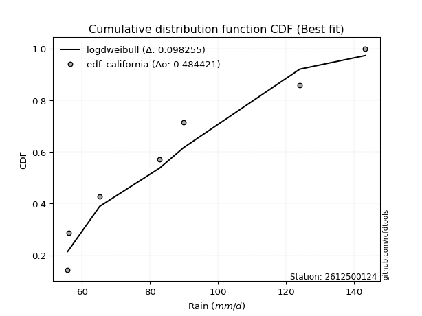</img>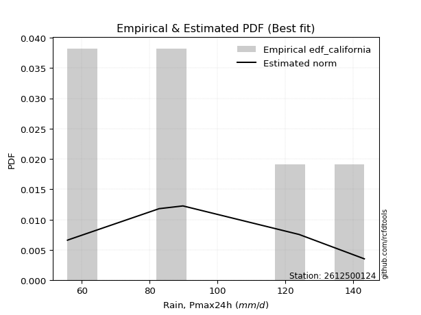</img>

</div>


### 2. EDF Hazen (1930)

Hazen method for plotting positions is a formula used to estimate the empirical cumulative probability distribution of flood events or other hydrological data. This formula often results in biased estimations, particularly when extrapolating to extreme events (high return periods).

<div align="center">


$P=(m-0.5)/n$


</div>


**2.1. Empirical values**

<div align="center">

|                | 0                   | 1                   | 2                   | 3         | 4                  | 5                  | 6                  |
|:---------------|:--------------------|:--------------------|:--------------------|:----------|:-------------------|:-------------------|:-------------------|
| date           | 2019                | 2023                | 2025                | 2022      | 2021               | 2020               | 2024               |
| x              | 55.8                | 56.2                | 65.2                | 82.8      | 89.8               | 124.0              | 143.2              |
| m              | 1                   | 2                   | 3                   | 4         | 5                  | 6                  | 7                  |
| empirical_dist | edf_hazen           | edf_hazen           | edf_hazen           | edf_hazen | edf_hazen          | edf_hazen          | edf_hazen          |
| empirical      | 0.07142857142857142 | 0.21428571428571427 | 0.35714285714285715 | 0.5       | 0.6428571428571429 | 0.7857142857142857 | 0.9285714285714286 |
| empirical_tr   | 1.0769230769230769  | 1.2727272727272727  | 1.5555555555555558  | 2.0       | 2.8000000000000003 | 4.666666666666666  | 14.000000000000007 |

</div>


**2.2. Kolmogorov-Smirnov fit test (sorted by Δ)**


<div align="center">

|                | 0                   | 1                   | 2                   | 3                   | 4                   | 5                   | 6                   | 7                   | 8                   | 9                   | 10                  | 11                  | 12                  | 13                  | 14                  | 15                  | 16                  | 17                  | 18                  | 19                  | 20                  | 21                  | 22                  | 23                  | 24                  | 25                  | 26                  | 27                  | 28                  | 29                  | 30                  | 31                  | 32                  | 33                  | 34                  | 35                  | 36                  | 37                  | 38                  | 39                  | 40                  | 41                  | 42                  | 43                  | 44                  | 45                  | 46                  | 47                  | 48                  | 49                  | 50                  | 51                  | 52                  | 53                  | 54                  | 55                  | 56                  | 57                  | 58                  | 59                  | 60                  | 61                  | 62                  | 63                  | 64                  | 65                  | 66                  | 67                  | 68                  | 69                  | 70                  | 71                  | 72                  | 73                  | 74                  | 75                  | 76                  | 77                  | 78                  | 79                  | 80                  | 81                  | 82                  | 83                  | 84                  | 85                  | 86                  | 87                  | 88                  | 89                  | 90                  | 91                  | 92                  | 93                  | 94                  | 95                  | 96                  | 97                  | 98                  | 99                  | 100                 | 101                 | 102                 | 103                 | 104                 | 105                 | 106                 | 107                 | 108                 | 109                 | 110                 | 111                 | 112                 | 113                 | 114                 | 115                 | 116                 | 117                 | 118                 | 119                 | 120                 | 121                 | 122                 | 123                 | 124                 | 125                 | 126                 | 127                 | 128                 | 129                 | 130                 | 131                 | 132                 | 133                 | 134                 | 135                 | 136                 | 137                 | 138                 | 139                 | 140                 | 141                 | 142                 | 143                 | 144                 | 145                 | 146                 | 147                 | 148                 | 149                 | 150                 | 151                 | 152                 | 153                 | 154                 | 155                 | 156                 | 157                 | 158                 | 159                 |
|:---------------|:--------------------|:--------------------|:--------------------|:--------------------|:--------------------|:--------------------|:--------------------|:--------------------|:--------------------|:--------------------|:--------------------|:--------------------|:--------------------|:--------------------|:--------------------|:--------------------|:--------------------|:--------------------|:--------------------|:--------------------|:--------------------|:--------------------|:--------------------|:--------------------|:--------------------|:--------------------|:--------------------|:--------------------|:--------------------|:--------------------|:--------------------|:--------------------|:--------------------|:--------------------|:--------------------|:--------------------|:--------------------|:--------------------|:--------------------|:--------------------|:--------------------|:--------------------|:--------------------|:--------------------|:--------------------|:--------------------|:--------------------|:--------------------|:--------------------|:--------------------|:--------------------|:--------------------|:--------------------|:--------------------|:--------------------|:--------------------|:--------------------|:--------------------|:--------------------|:--------------------|:--------------------|:--------------------|:--------------------|:--------------------|:--------------------|:--------------------|:--------------------|:--------------------|:--------------------|:--------------------|:--------------------|:--------------------|:--------------------|:--------------------|:--------------------|:--------------------|:--------------------|:--------------------|:--------------------|:--------------------|:--------------------|:--------------------|:--------------------|:--------------------|:--------------------|:--------------------|:--------------------|:--------------------|:--------------------|:--------------------|:--------------------|:--------------------|:--------------------|:--------------------|:--------------------|:--------------------|:--------------------|:--------------------|:--------------------|:--------------------|:--------------------|:--------------------|:--------------------|:--------------------|:--------------------|:--------------------|:--------------------|:--------------------|:--------------------|:--------------------|:--------------------|:--------------------|:--------------------|:--------------------|:--------------------|:--------------------|:--------------------|:--------------------|:--------------------|:--------------------|:--------------------|:--------------------|:--------------------|:--------------------|:--------------------|:--------------------|:--------------------|:--------------------|:--------------------|:--------------------|:--------------------|:--------------------|:--------------------|:--------------------|:--------------------|:--------------------|:--------------------|:--------------------|:--------------------|:--------------------|:--------------------|:--------------------|:--------------------|:--------------------|:--------------------|:--------------------|:--------------------|:--------------------|:--------------------|:--------------------|:--------------------|:--------------------|:--------------------|:--------------------|:--------------------|:--------------------|:--------------------|:--------------------|:--------------------|:--------------------|
| station        | 2612500124          | 2612500124          | 2612500124          | 2612500124          | 2612500124          | 2612500124          | 2612500124          | 2612500124          | 2612500124          | 2612500124          | 2612500124          | 2612500124          | 2612500124          | 2612500124          | 2612500124          | 2612500124          | 2612500124          | 2612500124          | 2612500124          | 2612500124          | 2612500124          | 2612500124          | 2612500124          | 2612500124          | 2612500124          | 2612500124          | 2612500124          | 2612500124          | 2612500124          | 2612500124          | 2612500124          | 2612500124          | 2612500124          | 2612500124          | 2612500124          | 2612500124          | 2612500124          | 2612500124          | 2612500124          | 2612500124          | 2612500124          | 2612500124          | 2612500124          | 2612500124          | 2612500124          | 2612500124          | 2612500124          | 2612500124          | 2612500124          | 2612500124          | 2612500124          | 2612500124          | 2612500124          | 2612500124          | 2612500124          | 2612500124          | 2612500124          | 2612500124          | 2612500124          | 2612500124          | 2612500124          | 2612500124          | 2612500124          | 2612500124          | 2612500124          | 2612500124          | 2612500124          | 2612500124          | 2612500124          | 2612500124          | 2612500124          | 2612500124          | 2612500124          | 2612500124          | 2612500124          | 2612500124          | 2612500124          | 2612500124          | 2612500124          | 2612500124          | 2612500124          | 2612500124          | 2612500124          | 2612500124          | 2612500124          | 2612500124          | 2612500124          | 2612500124          | 2612500124          | 2612500124          | 2612500124          | 2612500124          | 2612500124          | 2612500124          | 2612500124          | 2612500124          | 2612500124          | 2612500124          | 2612500124          | 2612500124          | 2612500124          | 2612500124          | 2612500124          | 2612500124          | 2612500124          | 2612500124          | 2612500124          | 2612500124          | 2612500124          | 2612500124          | 2612500124          | 2612500124          | 2612500124          | 2612500124          | 2612500124          | 2612500124          | 2612500124          | 2612500124          | 2612500124          | 2612500124          | 2612500124          | 2612500124          | 2612500124          | 2612500124          | 2612500124          | 2612500124          | 2612500124          | 2612500124          | 2612500124          | 2612500124          | 2612500124          | 2612500124          | 2612500124          | 2612500124          | 2612500124          | 2612500124          | 2612500124          | 2612500124          | 2612500124          | 2612500124          | 2612500124          | 2612500124          | 2612500124          | 2612500124          | 2612500124          | 2612500124          | 2612500124          | 2612500124          | 2612500124          | 2612500124          | 2612500124          | 2612500124          | 2612500124          | 2612500124          | 2612500124          | 2612500124          | 2612500124          | 2612500124          | 2612500124          | 2612500124          |
| empirical_dist | edf_hazen           | edf_hazen           | edf_hazen           | edf_hazen           | edf_hazen           | edf_hazen           | edf_hazen           | edf_hazen           | edf_hazen           | edf_hazen           | edf_hazen           | edf_hazen           | edf_hazen           | edf_hazen           | edf_hazen           | edf_hazen           | edf_hazen           | edf_hazen           | edf_hazen           | edf_hazen           | edf_hazen           | edf_hazen           | edf_hazen           | edf_hazen           | edf_hazen           | edf_hazen           | edf_hazen           | edf_hazen           | edf_hazen           | edf_hazen           | edf_hazen           | edf_hazen           | edf_hazen           | edf_hazen           | edf_hazen           | edf_hazen           | edf_hazen           | edf_hazen           | edf_hazen           | edf_hazen           | edf_hazen           | edf_hazen           | edf_hazen           | edf_hazen           | edf_hazen           | edf_hazen           | edf_hazen           | edf_hazen           | edf_hazen           | edf_hazen           | edf_hazen           | edf_hazen           | edf_hazen           | edf_hazen           | edf_hazen           | edf_hazen           | edf_hazen           | edf_hazen           | edf_hazen           | edf_hazen           | edf_hazen           | edf_hazen           | edf_hazen           | edf_hazen           | edf_hazen           | edf_hazen           | edf_hazen           | edf_hazen           | edf_hazen           | edf_hazen           | edf_hazen           | edf_hazen           | edf_hazen           | edf_hazen           | edf_hazen           | edf_hazen           | edf_hazen           | edf_hazen           | edf_hazen           | edf_hazen           | edf_hazen           | edf_hazen           | edf_hazen           | edf_hazen           | edf_hazen           | edf_hazen           | edf_hazen           | edf_hazen           | edf_hazen           | edf_hazen           | edf_hazen           | edf_hazen           | edf_hazen           | edf_hazen           | edf_hazen           | edf_hazen           | edf_hazen           | edf_hazen           | edf_hazen           | edf_hazen           | edf_hazen           | edf_hazen           | edf_hazen           | edf_hazen           | edf_hazen           | edf_hazen           | edf_hazen           | edf_hazen           | edf_hazen           | edf_hazen           | edf_hazen           | edf_hazen           | edf_hazen           | edf_hazen           | edf_hazen           | edf_hazen           | edf_hazen           | edf_hazen           | edf_hazen           | edf_hazen           | edf_hazen           | edf_hazen           | edf_hazen           | edf_hazen           | edf_hazen           | edf_hazen           | edf_hazen           | edf_hazen           | edf_hazen           | edf_hazen           | edf_hazen           | edf_hazen           | edf_hazen           | edf_hazen           | edf_hazen           | edf_hazen           | edf_hazen           | edf_hazen           | edf_hazen           | edf_hazen           | edf_hazen           | edf_hazen           | edf_hazen           | edf_hazen           | edf_hazen           | edf_hazen           | edf_hazen           | edf_hazen           | edf_hazen           | edf_hazen           | edf_hazen           | edf_hazen           | edf_hazen           | edf_hazen           | edf_hazen           | edf_hazen           | edf_hazen           | edf_hazen           | edf_hazen           | edf_hazen           |
| p_dist         | halfnorm            | logbetaprime        | logsemicircular     | loganglit           | logfoldnorm         | lograyleigh         | logmaxwell          | logksone            | rayleigh            | foldnorm            | nct                 | maxwell             | lognct              | burr                | logpearson3         | loggenlogistic      | logweibull_max      | logalpha            | logburr             | logmielke           | loggenextreme       | loginvweibull       | betaprime           | pearson3            | logloggamma         | logkstwobign        | loginvgamma         | logjohnsonsu        | lognorm             | logcrystalball      | logt                | halflogistic        | genlogistic         | gumbel_r            | logf                | loghalfnorm         | loggumbel_r         | moyal               | truncnorm           | norm                | crystalball         | t                   | anglit              | semicircular        | logarcsine          | logrice             | kstwobign           | logcosine           | loglogistic         | logloglaplace       | logncf              | logdweibull         | weibull_min         | gausshyper          | logistic            | logmoyal            | loghypsecant        | loggumbel_l         | rice                | logbeta             | cosine              | nakagami            | hypsecant           | logargus            | logburr12           | alpha               | logdgamma           | f                   | halfgennorm         | invgamma            | arcsine             | loglaplace          | loglaplace          | logweibull_min      | laplace             | dweibull            | exponpow            | loghalflogistic     | bradford            | burr12              | truncweibull_min    | logtruncweibull_min | logwrapcauchy       | ncf                 | gumbel_l            | loginvgauss         | genpareto           | logexponnorm        | dgamma              | loglomax            | wrapcauchy          | loggenexpon         | exponnorm           | loggompertz         | lomax               | loghalfgennorm      | genexpon            | gompertz            | logtruncexpon       | logskewnorm         | logkappa4           | logtukeylambda      | logrdist            | loguniform          | logkappa3           | logvonmises_line    | truncexpon          | skewnorm            | logtriang           | invgauss            | logwald             | wald                | beta                | kappa4              | ksone               | argus               | uniform             | vonmises_line       | kappa3              | gennorm             | loggennorm          | triang              | loglevy_l           | logexponpow         | loggenhalflogistic  | loggamma            | loggamma            | gamma               | logerlang           | levy_l              | logfatiguelife      | lognakagami         | tukeylambda         | logtruncnorm        | rdist               | genextreme          | powerlaw            | logbradford         | fatiguelife         | truncpareto         | erlang              | genhalflogistic     | logpowerlaw         | logtrapezoid        | loggausshyper       | logtruncpareto      | gengamma            | logexponweib        | loggengamma         | invweibull          | exponweib           | trapezoid           | loggenpareto        | johnsonsb           | logjohnsonsb        | weibull_max         | johnsonsu           | logvonmises         | vonmises            | mielke              |
| delta          | 0.076974522756879   | 0.08354381216038403 | 0.0840802363440307  | 0.08668809358162266 | 0.08929960989009703 | 0.090492202613249   | 0.09395351438649685 | 0.09687418699400971 | 0.0971617396737049  | 0.10089341467514809 | 0.1013991612357984  | 0.10505158826326272 | 0.10527902027229086 | 0.1059324578626369  | 0.10609810761118621 | 0.10615789891740829 | 0.10626144064730665 | 0.10779016167295308 | 0.10783410170790564 | 0.10807221540740253 | 0.10915863163605534 | 0.10916172281272972 | 0.10931065959570782 | 0.11100940133016993 | 0.11174491287845373 | 0.11294551967779724 | 0.1141352957267115  | 0.114289177234278   | 0.11444964490555876 | 0.11444964581663056 | 0.11445005692877908 | 0.1147099506230461  | 0.11680741654663818 | 0.11768378057563361 | 0.1186097014954273  | 0.12057587578350652 | 0.12235415816276499 | 0.12315441351911566 | 0.12401622009676133 | 0.12401622531821943 | 0.124016232957573   | 0.12426762205701208 | 0.12487190941163151 | 0.12610791029677537 | 0.12666245826885103 | 0.1267369159223059  | 0.1270651621533488  | 0.13199701146030124 | 0.137101468033829   | 0.14116573587339956 | 0.14278964152370166 | 0.14316647897322304 | 0.14339290162856905 | 0.14593355636858352 | 0.14657631147715786 | 0.15073897837306896 | 0.1517896771198285  | 0.1521019469812943  | 0.15429467360368634 | 0.1562152095510007  | 0.1578301904482196  | 0.15881275850385568 | 0.16090750237078982 | 0.16248666837286901 | 0.16509698530753733 | 0.16535083747035095 | 0.16615598566142978 | 0.1680737436939017  | 0.16910734520602355 | 0.16935543535449504 | 0.1698234115923471  | 0.17073069974955865 | 0.17073069974955865 | 0.1784791221151702  | 0.17870721104102447 | 0.1800649407784882  | 0.18037013014868541 | 0.1810169278542021  | 0.18358307908110538 | 0.18469270733343532 | 0.1889823499078209  | 0.18947242101374162 | 0.1901926887525049  | 0.19034563347263758 | 0.19130497524843715 | 0.19227601225495605 | 0.19419602151968404 | 0.19495540890073768 | 0.19626879363007896 | 0.19634642381530487 | 0.19716782426932716 | 0.19921642809568646 | 0.20062589660860772 | 0.2007066240889589  | 0.20085335975757748 | 0.20183346729259827 | 0.20199435756365688 | 0.20231123081112126 | 0.20305073860226946 | 0.20343638259738225 | 0.2046622249263533  | 0.20581786429008173 | 0.20663783825294899 | 0.20670679957089835 | 0.2067204943372607  | 0.20678217816611313 | 0.2068496887102962  | 0.20721555849018183 | 0.20817336835760658 | 0.21054202325784288 | 0.21428571428571427 | 0.2219706073505904  | 0.23125888410518644 | 0.23299768235763124 | 0.2353437942682794  | 0.23854285600454106 | 0.2538411245505067  | 0.25390261050874174 | 0.25474875008567616 | 0.2857142857142857  | 0.2857142857142857  | 0.28857024747858856 | 0.2891128492285169  | 0.29457868865419307 | 0.30082938389079933 | 0.3064549709376101  | 0.3064549709376101  | 0.310236035175085   | 0.3141870947397094  | 0.3198177933324209  | 0.3341554921124537  | 0.3353014416511671  | 0.35587772256922123 | 0.3571428309674435  | 0.3571428565304755  | 0.3586073495719122  | 0.3604370386216395  | 0.3649113643528195  | 0.3662647908057666  | 0.3701608053746534  | 0.37232741458854    | 0.38451613205212065 | 0.38878583595263433 | 0.3887938449724284  | 0.3992614268110644  | 0.41930324813063397 | 0.42015011179589595 | 0.43052480796250864 | 0.4342628870390139  | 0.44287659919762395 | 0.4706336475199779  | 0.4767900135790343  | 0.5105764930452993  | 0.5297657035380485  | 0.6140992565049664  | 0.6171420983600998  | 0.6868398106825099  | 1.0942983027552775  | 22.357730299897373  | nan                 |
| deltao         | 0.48442053926100004 | 0.48442053926100004 | 0.48442053926100004 | 0.48442053926100004 | 0.48442053926100004 | 0.48442053926100004 | 0.48442053926100004 | 0.48442053926100004 | 0.48442053926100004 | 0.48442053926100004 | 0.48442053926100004 | 0.48442053926100004 | 0.48442053926100004 | 0.48442053926100004 | 0.48442053926100004 | 0.48442053926100004 | 0.48442053926100004 | 0.48442053926100004 | 0.48442053926100004 | 0.48442053926100004 | 0.48442053926100004 | 0.48442053926100004 | 0.48442053926100004 | 0.48442053926100004 | 0.48442053926100004 | 0.48442053926100004 | 0.48442053926100004 | 0.48442053926100004 | 0.48442053926100004 | 0.48442053926100004 | 0.48442053926100004 | 0.48442053926100004 | 0.48442053926100004 | 0.48442053926100004 | 0.48442053926100004 | 0.48442053926100004 | 0.48442053926100004 | 0.48442053926100004 | 0.48442053926100004 | 0.48442053926100004 | 0.48442053926100004 | 0.48442053926100004 | 0.48442053926100004 | 0.48442053926100004 | 0.48442053926100004 | 0.48442053926100004 | 0.48442053926100004 | 0.48442053926100004 | 0.48442053926100004 | 0.48442053926100004 | 0.48442053926100004 | 0.48442053926100004 | 0.48442053926100004 | 0.48442053926100004 | 0.48442053926100004 | 0.48442053926100004 | 0.48442053926100004 | 0.48442053926100004 | 0.48442053926100004 | 0.48442053926100004 | 0.48442053926100004 | 0.48442053926100004 | 0.48442053926100004 | 0.48442053926100004 | 0.48442053926100004 | 0.48442053926100004 | 0.48442053926100004 | 0.48442053926100004 | 0.48442053926100004 | 0.48442053926100004 | 0.48442053926100004 | 0.48442053926100004 | 0.48442053926100004 | 0.48442053926100004 | 0.48442053926100004 | 0.48442053926100004 | 0.48442053926100004 | 0.48442053926100004 | 0.48442053926100004 | 0.48442053926100004 | 0.48442053926100004 | 0.48442053926100004 | 0.48442053926100004 | 0.48442053926100004 | 0.48442053926100004 | 0.48442053926100004 | 0.48442053926100004 | 0.48442053926100004 | 0.48442053926100004 | 0.48442053926100004 | 0.48442053926100004 | 0.48442053926100004 | 0.48442053926100004 | 0.48442053926100004 | 0.48442053926100004 | 0.48442053926100004 | 0.48442053926100004 | 0.48442053926100004 | 0.48442053926100004 | 0.48442053926100004 | 0.48442053926100004 | 0.48442053926100004 | 0.48442053926100004 | 0.48442053926100004 | 0.48442053926100004 | 0.48442053926100004 | 0.48442053926100004 | 0.48442053926100004 | 0.48442053926100004 | 0.48442053926100004 | 0.48442053926100004 | 0.48442053926100004 | 0.48442053926100004 | 0.48442053926100004 | 0.48442053926100004 | 0.48442053926100004 | 0.48442053926100004 | 0.48442053926100004 | 0.48442053926100004 | 0.48442053926100004 | 0.48442053926100004 | 0.48442053926100004 | 0.48442053926100004 | 0.48442053926100004 | 0.48442053926100004 | 0.48442053926100004 | 0.48442053926100004 | 0.48442053926100004 | 0.48442053926100004 | 0.48442053926100004 | 0.48442053926100004 | 0.48442053926100004 | 0.48442053926100004 | 0.48442053926100004 | 0.48442053926100004 | 0.48442053926100004 | 0.48442053926100004 | 0.48442053926100004 | 0.48442053926100004 | 0.48442053926100004 | 0.48442053926100004 | 0.48442053926100004 | 0.48442053926100004 | 0.48442053926100004 | 0.48442053926100004 | 0.48442053926100004 | 0.48442053926100004 | 0.48442053926100004 | 0.48442053926100004 | 0.48442053926100004 | 0.48442053926100004 | 0.48442053926100004 | 0.48442053926100004 | 0.48442053926100004 | 0.48442053926100004 | 0.48442053926100004 | 0.48442053926100004 | 0.48442053926100004 | 0.48442053926100004 | 0.48442053926100004 |
| eval           | Δo > Δ              | Δo > Δ              | Δo > Δ              | Δo > Δ              | Δo > Δ              | Δo > Δ              | Δo > Δ              | Δo > Δ              | Δo > Δ              | Δo > Δ              | Δo > Δ              | Δo > Δ              | Δo > Δ              | Δo > Δ              | Δo > Δ              | Δo > Δ              | Δo > Δ              | Δo > Δ              | Δo > Δ              | Δo > Δ              | Δo > Δ              | Δo > Δ              | Δo > Δ              | Δo > Δ              | Δo > Δ              | Δo > Δ              | Δo > Δ              | Δo > Δ              | Δo > Δ              | Δo > Δ              | Δo > Δ              | Δo > Δ              | Δo > Δ              | Δo > Δ              | Δo > Δ              | Δo > Δ              | Δo > Δ              | Δo > Δ              | Δo > Δ              | Δo > Δ              | Δo > Δ              | Δo > Δ              | Δo > Δ              | Δo > Δ              | Δo > Δ              | Δo > Δ              | Δo > Δ              | Δo > Δ              | Δo > Δ              | Δo > Δ              | Δo > Δ              | Δo > Δ              | Δo > Δ              | Δo > Δ              | Δo > Δ              | Δo > Δ              | Δo > Δ              | Δo > Δ              | Δo > Δ              | Δo > Δ              | Δo > Δ              | Δo > Δ              | Δo > Δ              | Δo > Δ              | Δo > Δ              | Δo > Δ              | Δo > Δ              | Δo > Δ              | Δo > Δ              | Δo > Δ              | Δo > Δ              | Δo > Δ              | Δo > Δ              | Δo > Δ              | Δo > Δ              | Δo > Δ              | Δo > Δ              | Δo > Δ              | Δo > Δ              | Δo > Δ              | Δo > Δ              | Δo > Δ              | Δo > Δ              | Δo > Δ              | Δo > Δ              | Δo > Δ              | Δo > Δ              | Δo > Δ              | Δo > Δ              | Δo > Δ              | Δo > Δ              | Δo > Δ              | Δo > Δ              | Δo > Δ              | Δo > Δ              | Δo > Δ              | Δo > Δ              | Δo > Δ              | Δo > Δ              | Δo > Δ              | Δo > Δ              | Δo > Δ              | Δo > Δ              | Δo > Δ              | Δo > Δ              | Δo > Δ              | Δo > Δ              | Δo > Δ              | Δo > Δ              | Δo > Δ              | Δo > Δ              | Δo > Δ              | Δo > Δ              | Δo > Δ              | Δo > Δ              | Δo > Δ              | Δo > Δ              | Δo > Δ              | Δo > Δ              | Δo > Δ              | Δo > Δ              | Δo > Δ              | Δo > Δ              | Δo > Δ              | Δo > Δ              | Δo > Δ              | Δo > Δ              | Δo > Δ              | Δo > Δ              | Δo > Δ              | Δo > Δ              | Δo > Δ              | Δo > Δ              | Δo > Δ              | Δo > Δ              | Δo > Δ              | Δo > Δ              | Δo > Δ              | Δo > Δ              | Δo > Δ              | Δo > Δ              | Δo > Δ              | Δo > Δ              | Δo > Δ              | Δo > Δ              | Δo > Δ              | Δo > Δ              | Δo > Δ              | Δo > Δ              | Δo > Δ              | Δo > Δ              | Δo > Δ              | Δo <= Δ             | Δo <= Δ             | Δo <= Δ             | Δo <= Δ             | Δo <= Δ             | Δo <= Δ             | Δo <= Δ             | Δo <= Δ             |
| fit            | 1                   | 1                   | 1                   | 1                   | 1                   | 1                   | 1                   | 1                   | 1                   | 1                   | 1                   | 1                   | 1                   | 1                   | 1                   | 1                   | 1                   | 1                   | 1                   | 1                   | 1                   | 1                   | 1                   | 1                   | 1                   | 1                   | 1                   | 1                   | 1                   | 1                   | 1                   | 1                   | 1                   | 1                   | 1                   | 1                   | 1                   | 1                   | 1                   | 1                   | 1                   | 1                   | 1                   | 1                   | 1                   | 1                   | 1                   | 1                   | 1                   | 1                   | 1                   | 1                   | 1                   | 1                   | 1                   | 1                   | 1                   | 1                   | 1                   | 1                   | 1                   | 1                   | 1                   | 1                   | 1                   | 1                   | 1                   | 1                   | 1                   | 1                   | 1                   | 1                   | 1                   | 1                   | 1                   | 1                   | 1                   | 1                   | 1                   | 1                   | 1                   | 1                   | 1                   | 1                   | 1                   | 1                   | 1                   | 1                   | 1                   | 1                   | 1                   | 1                   | 1                   | 1                   | 1                   | 1                   | 1                   | 1                   | 1                   | 1                   | 1                   | 1                   | 1                   | 1                   | 1                   | 1                   | 1                   | 1                   | 1                   | 1                   | 1                   | 1                   | 1                   | 1                   | 1                   | 1                   | 1                   | 1                   | 1                   | 1                   | 1                   | 1                   | 1                   | 1                   | 1                   | 1                   | 1                   | 1                   | 1                   | 1                   | 1                   | 1                   | 1                   | 1                   | 1                   | 1                   | 1                   | 1                   | 1                   | 1                   | 1                   | 1                   | 1                   | 1                   | 1                   | 1                   | 1                   | 1                   | 1                   | 1                   | 1                   | 1                   | 0                   | 0                   | 0                   | 0                   | 0                   | 0                   | 0                   | 0                   |
| n              | 7                   | 7                   | 7                   | 7                   | 7                   | 7                   | 7                   | 7                   | 7                   | 7                   | 7                   | 7                   | 7                   | 7                   | 7                   | 7                   | 7                   | 7                   | 7                   | 7                   | 7                   | 7                   | 7                   | 7                   | 7                   | 7                   | 7                   | 7                   | 7                   | 7                   | 7                   | 7                   | 7                   | 7                   | 7                   | 7                   | 7                   | 7                   | 7                   | 7                   | 7                   | 7                   | 7                   | 7                   | 7                   | 7                   | 7                   | 7                   | 7                   | 7                   | 7                   | 7                   | 7                   | 7                   | 7                   | 7                   | 7                   | 7                   | 7                   | 7                   | 7                   | 7                   | 7                   | 7                   | 7                   | 7                   | 7                   | 7                   | 7                   | 7                   | 7                   | 7                   | 7                   | 7                   | 7                   | 7                   | 7                   | 7                   | 7                   | 7                   | 7                   | 7                   | 7                   | 7                   | 7                   | 7                   | 7                   | 7                   | 7                   | 7                   | 7                   | 7                   | 7                   | 7                   | 7                   | 7                   | 7                   | 7                   | 7                   | 7                   | 7                   | 7                   | 7                   | 7                   | 7                   | 7                   | 7                   | 7                   | 7                   | 7                   | 7                   | 7                   | 7                   | 7                   | 7                   | 7                   | 7                   | 7                   | 7                   | 7                   | 7                   | 7                   | 7                   | 7                   | 7                   | 7                   | 7                   | 7                   | 7                   | 7                   | 7                   | 7                   | 7                   | 7                   | 7                   | 7                   | 7                   | 7                   | 7                   | 7                   | 7                   | 7                   | 7                   | 7                   | 7                   | 7                   | 7                   | 7                   | 7                   | 7                   | 7                   | 7                   | 7                   | 7                   | 7                   | 7                   | 7                   | 7                   | 7                   | 7                   |
| best_fit       | 1                   | 0                   | 0                   | 0                   | 0                   | 0                   | 0                   | 0                   | 0                   | 0                   | 0                   | 0                   | 0                   | 0                   | 0                   | 0                   | 0                   | 0                   | 0                   | 0                   | 0                   | 0                   | 0                   | 0                   | 0                   | 0                   | 0                   | 0                   | 0                   | 0                   | 0                   | 0                   | 0                   | 0                   | 0                   | 0                   | 0                   | 0                   | 0                   | 0                   | 0                   | 0                   | 0                   | 0                   | 0                   | 0                   | 0                   | 0                   | 0                   | 0                   | 0                   | 0                   | 0                   | 0                   | 0                   | 0                   | 0                   | 0                   | 0                   | 0                   | 0                   | 0                   | 0                   | 0                   | 0                   | 0                   | 0                   | 0                   | 0                   | 0                   | 0                   | 0                   | 0                   | 0                   | 0                   | 0                   | 0                   | 0                   | 0                   | 0                   | 0                   | 0                   | 0                   | 0                   | 0                   | 0                   | 0                   | 0                   | 0                   | 0                   | 0                   | 0                   | 0                   | 0                   | 0                   | 0                   | 0                   | 0                   | 0                   | 0                   | 0                   | 0                   | 0                   | 0                   | 0                   | 0                   | 0                   | 0                   | 0                   | 0                   | 0                   | 0                   | 0                   | 0                   | 0                   | 0                   | 0                   | 0                   | 0                   | 0                   | 0                   | 0                   | 0                   | 0                   | 0                   | 0                   | 0                   | 0                   | 0                   | 0                   | 0                   | 0                   | 0                   | 0                   | 0                   | 0                   | 0                   | 0                   | 0                   | 0                   | 0                   | 0                   | 0                   | 0                   | 0                   | 0                   | 0                   | 0                   | 0                   | 0                   | 0                   | 0                   | 0                   | 0                   | 0                   | 0                   | 0                   | 0                   | 0                   | 0                   |
| best_fit_sort  | 1                   | 2                   | 3                   | 4                   | 5                   | 6                   | 7                   | 8                   | 9                   | 10                  | 11                  | 12                  | 13                  | 14                  | 15                  | 16                  | 17                  | 18                  | 19                  | 20                  | 21                  | 22                  | 23                  | 24                  | 25                  | 26                  | 27                  | 28                  | 29                  | 30                  | 31                  | 32                  | 33                  | 34                  | 35                  | 36                  | 37                  | 38                  | 39                  | 40                  | 41                  | 42                  | 43                  | 44                  | 45                  | 46                  | 47                  | 48                  | 49                  | 50                  | 51                  | 52                  | 53                  | 54                  | 55                  | 56                  | 57                  | 58                  | 59                  | 60                  | 61                  | 62                  | 63                  | 64                  | 65                  | 66                  | 67                  | 68                  | 69                  | 70                  | 71                  | 72                  | 73                  | 74                  | 75                  | 76                  | 77                  | 78                  | 79                  | 80                  | 81                  | 82                  | 83                  | 84                  | 85                  | 86                  | 87                  | 88                  | 89                  | 90                  | 91                  | 92                  | 93                  | 94                  | 95                  | 96                  | 97                  | 98                  | 99                  | 100                 | 101                 | 102                 | 103                 | 104                 | 105                 | 106                 | 107                 | 108                 | 109                 | 110                 | 111                 | 112                 | 113                 | 114                 | 115                 | 116                 | 117                 | 118                 | 119                 | 120                 | 121                 | 122                 | 123                 | 124                 | 125                 | 126                 | 127                 | 128                 | 129                 | 130                 | 131                 | 132                 | 133                 | 134                 | 135                 | 136                 | 137                 | 138                 | 139                 | 140                 | 141                 | 142                 | 143                 | 144                 | 145                 | 146                 | 147                 | 148                 | 149                 | 150                 | 151                 | 152                 | 153                 | 154                 | 155                 | 156                 | 157                 | 158                 | 159                 | 160                 |

</div>


**2.3. Best fit**

<div align="center">

|   id |    station | empirical_dist   | p_dist   |     delta |   deltao | eval   |   fit |   n |   best_fit |   best_fit_sort |
|-----:|-----------:|:-----------------|:---------|----------:|---------:|:-------|------:|----:|-----------:|----------------:|
|    0 | 2612500124 | edf_hazen        | halfnorm | 0.0769745 | 0.484421 | Δo > Δ |     1 |   7 |          1 |               1 |

</div>


<div align="center">

</img>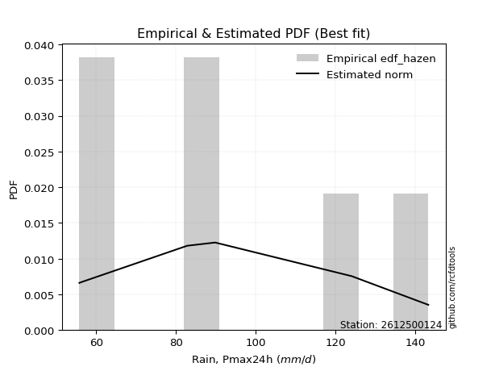</img>

</div>


### 3. EDF Weibull (1939)

Weibull plotting position formula is an empirical method used to estimate the non-exceedance probability or plotting position for a set of observed data, is often recommended or widely used in practice, particularly in flood frequency analysis.

<div align="center">


$P=m/(n+1)$


</div>


**3.1. Empirical values**

<div align="center">

|                | 0                  | 1                  | 2           | 3           | 4                  | 5           | 6           |
|:---------------|:-------------------|:-------------------|:------------|:------------|:-------------------|:------------|:------------|
| date           | 2019               | 2023               | 2025        | 2022        | 2021               | 2020        | 2024        |
| x              | 55.8               | 56.2               | 65.2        | 82.8        | 89.8               | 124.0       | 143.2       |
| m              | 1                  | 2                  | 3           | 4           | 5                  | 6           | 7           |
| empirical_dist | edf_weibull        | edf_weibull        | edf_weibull | edf_weibull | edf_weibull        | edf_weibull | edf_weibull |
| empirical      | 0.125              | 0.25               | 0.375       | 0.5         | 0.625              | 0.75        | 0.875       |
| empirical_tr   | 1.1428571428571428 | 1.3333333333333333 | 1.6         | 2.0         | 2.6666666666666665 | 4.0         | 8.0         |

</div>


**3.2. Kolmogorov-Smirnov fit test (sorted by Δ)**


<div align="center">

|                | 0                   | 1                   | 2                   | 3                   | 4                   | 5                   | 6                   | 7                   | 8                   | 9                   | 10                  | 11                  | 12                  | 13                  | 14                  | 15                  | 16                  | 17                  | 18                  | 19                  | 20                  | 21                  | 22                  | 23                  | 24                  | 25                  | 26                  | 27                  | 28                  | 29                  | 30                  | 31                  | 32                  | 33                  | 34                  | 35                  | 36                  | 37                  | 38                  | 39                  | 40                  | 41                  | 42                  | 43                  | 44                  | 45                  | 46                  | 47                  | 48                  | 49                  | 50                  | 51                  | 52                  | 53                  | 54                  | 55                  | 56                  | 57                  | 58                  | 59                  | 60                  | 61                  | 62                  | 63                  | 64                  | 65                  | 66                  | 67                  | 68                  | 69                  | 70                  | 71                  | 72                  | 73                  | 74                  | 75                  | 76                  | 77                  | 78                  | 79                  | 80                  | 81                  | 82                  | 83                  | 84                  | 85                  | 86                  | 87                  | 88                  | 89                  | 90                  | 91                  | 92                  | 93                  | 94                  | 95                  | 96                  | 97                  | 98                  | 99                  | 100                 | 101                 | 102                 | 103                 | 104                 | 105                 | 106                 | 107                 | 108                 | 109                 | 110                 | 111                 | 112                 | 113                 | 114                 | 115                 | 116                 | 117                 | 118                 | 119                 | 120                 | 121                 | 122                 | 123                 | 124                 | 125                 | 126                 | 127                 | 128                 | 129                 | 130                 | 131                 | 132                 | 133                 | 134                 | 135                 | 136                 | 137                 | 138                 | 139                 | 140                 | 141                 | 142                 | 143                 | 144                 | 145                 | 146                 | 147                 | 148                 | 149                 | 150                 | 151                 | 152                 | 153                 | 154                 | 155                 | 156                 | 157                 | 158                 | 159                 |
|:---------------|:--------------------|:--------------------|:--------------------|:--------------------|:--------------------|:--------------------|:--------------------|:--------------------|:--------------------|:--------------------|:--------------------|:--------------------|:--------------------|:--------------------|:--------------------|:--------------------|:--------------------|:--------------------|:--------------------|:--------------------|:--------------------|:--------------------|:--------------------|:--------------------|:--------------------|:--------------------|:--------------------|:--------------------|:--------------------|:--------------------|:--------------------|:--------------------|:--------------------|:--------------------|:--------------------|:--------------------|:--------------------|:--------------------|:--------------------|:--------------------|:--------------------|:--------------------|:--------------------|:--------------------|:--------------------|:--------------------|:--------------------|:--------------------|:--------------------|:--------------------|:--------------------|:--------------------|:--------------------|:--------------------|:--------------------|:--------------------|:--------------------|:--------------------|:--------------------|:--------------------|:--------------------|:--------------------|:--------------------|:--------------------|:--------------------|:--------------------|:--------------------|:--------------------|:--------------------|:--------------------|:--------------------|:--------------------|:--------------------|:--------------------|:--------------------|:--------------------|:--------------------|:--------------------|:--------------------|:--------------------|:--------------------|:--------------------|:--------------------|:--------------------|:--------------------|:--------------------|:--------------------|:--------------------|:--------------------|:--------------------|:--------------------|:--------------------|:--------------------|:--------------------|:--------------------|:--------------------|:--------------------|:--------------------|:--------------------|:--------------------|:--------------------|:--------------------|:--------------------|:--------------------|:--------------------|:--------------------|:--------------------|:--------------------|:--------------------|:--------------------|:--------------------|:--------------------|:--------------------|:--------------------|:--------------------|:--------------------|:--------------------|:--------------------|:--------------------|:--------------------|:--------------------|:--------------------|:--------------------|:--------------------|:--------------------|:--------------------|:--------------------|:--------------------|:--------------------|:--------------------|:--------------------|:--------------------|:--------------------|:--------------------|:--------------------|:--------------------|:--------------------|:--------------------|:--------------------|:--------------------|:--------------------|:--------------------|:--------------------|:--------------------|:--------------------|:--------------------|:--------------------|:--------------------|:--------------------|:--------------------|:--------------------|:--------------------|:--------------------|:--------------------|:--------------------|:--------------------|:--------------------|:--------------------|:--------------------|:--------------------|
| station        | 2612500124          | 2612500124          | 2612500124          | 2612500124          | 2612500124          | 2612500124          | 2612500124          | 2612500124          | 2612500124          | 2612500124          | 2612500124          | 2612500124          | 2612500124          | 2612500124          | 2612500124          | 2612500124          | 2612500124          | 2612500124          | 2612500124          | 2612500124          | 2612500124          | 2612500124          | 2612500124          | 2612500124          | 2612500124          | 2612500124          | 2612500124          | 2612500124          | 2612500124          | 2612500124          | 2612500124          | 2612500124          | 2612500124          | 2612500124          | 2612500124          | 2612500124          | 2612500124          | 2612500124          | 2612500124          | 2612500124          | 2612500124          | 2612500124          | 2612500124          | 2612500124          | 2612500124          | 2612500124          | 2612500124          | 2612500124          | 2612500124          | 2612500124          | 2612500124          | 2612500124          | 2612500124          | 2612500124          | 2612500124          | 2612500124          | 2612500124          | 2612500124          | 2612500124          | 2612500124          | 2612500124          | 2612500124          | 2612500124          | 2612500124          | 2612500124          | 2612500124          | 2612500124          | 2612500124          | 2612500124          | 2612500124          | 2612500124          | 2612500124          | 2612500124          | 2612500124          | 2612500124          | 2612500124          | 2612500124          | 2612500124          | 2612500124          | 2612500124          | 2612500124          | 2612500124          | 2612500124          | 2612500124          | 2612500124          | 2612500124          | 2612500124          | 2612500124          | 2612500124          | 2612500124          | 2612500124          | 2612500124          | 2612500124          | 2612500124          | 2612500124          | 2612500124          | 2612500124          | 2612500124          | 2612500124          | 2612500124          | 2612500124          | 2612500124          | 2612500124          | 2612500124          | 2612500124          | 2612500124          | 2612500124          | 2612500124          | 2612500124          | 2612500124          | 2612500124          | 2612500124          | 2612500124          | 2612500124          | 2612500124          | 2612500124          | 2612500124          | 2612500124          | 2612500124          | 2612500124          | 2612500124          | 2612500124          | 2612500124          | 2612500124          | 2612500124          | 2612500124          | 2612500124          | 2612500124          | 2612500124          | 2612500124          | 2612500124          | 2612500124          | 2612500124          | 2612500124          | 2612500124          | 2612500124          | 2612500124          | 2612500124          | 2612500124          | 2612500124          | 2612500124          | 2612500124          | 2612500124          | 2612500124          | 2612500124          | 2612500124          | 2612500124          | 2612500124          | 2612500124          | 2612500124          | 2612500124          | 2612500124          | 2612500124          | 2612500124          | 2612500124          | 2612500124          | 2612500124          | 2612500124          | 2612500124          | 2612500124          |
| empirical_dist | edf_weibull         | edf_weibull         | edf_weibull         | edf_weibull         | edf_weibull         | edf_weibull         | edf_weibull         | edf_weibull         | edf_weibull         | edf_weibull         | edf_weibull         | edf_weibull         | edf_weibull         | edf_weibull         | edf_weibull         | edf_weibull         | edf_weibull         | edf_weibull         | edf_weibull         | edf_weibull         | edf_weibull         | edf_weibull         | edf_weibull         | edf_weibull         | edf_weibull         | edf_weibull         | edf_weibull         | edf_weibull         | edf_weibull         | edf_weibull         | edf_weibull         | edf_weibull         | edf_weibull         | edf_weibull         | edf_weibull         | edf_weibull         | edf_weibull         | edf_weibull         | edf_weibull         | edf_weibull         | edf_weibull         | edf_weibull         | edf_weibull         | edf_weibull         | edf_weibull         | edf_weibull         | edf_weibull         | edf_weibull         | edf_weibull         | edf_weibull         | edf_weibull         | edf_weibull         | edf_weibull         | edf_weibull         | edf_weibull         | edf_weibull         | edf_weibull         | edf_weibull         | edf_weibull         | edf_weibull         | edf_weibull         | edf_weibull         | edf_weibull         | edf_weibull         | edf_weibull         | edf_weibull         | edf_weibull         | edf_weibull         | edf_weibull         | edf_weibull         | edf_weibull         | edf_weibull         | edf_weibull         | edf_weibull         | edf_weibull         | edf_weibull         | edf_weibull         | edf_weibull         | edf_weibull         | edf_weibull         | edf_weibull         | edf_weibull         | edf_weibull         | edf_weibull         | edf_weibull         | edf_weibull         | edf_weibull         | edf_weibull         | edf_weibull         | edf_weibull         | edf_weibull         | edf_weibull         | edf_weibull         | edf_weibull         | edf_weibull         | edf_weibull         | edf_weibull         | edf_weibull         | edf_weibull         | edf_weibull         | edf_weibull         | edf_weibull         | edf_weibull         | edf_weibull         | edf_weibull         | edf_weibull         | edf_weibull         | edf_weibull         | edf_weibull         | edf_weibull         | edf_weibull         | edf_weibull         | edf_weibull         | edf_weibull         | edf_weibull         | edf_weibull         | edf_weibull         | edf_weibull         | edf_weibull         | edf_weibull         | edf_weibull         | edf_weibull         | edf_weibull         | edf_weibull         | edf_weibull         | edf_weibull         | edf_weibull         | edf_weibull         | edf_weibull         | edf_weibull         | edf_weibull         | edf_weibull         | edf_weibull         | edf_weibull         | edf_weibull         | edf_weibull         | edf_weibull         | edf_weibull         | edf_weibull         | edf_weibull         | edf_weibull         | edf_weibull         | edf_weibull         | edf_weibull         | edf_weibull         | edf_weibull         | edf_weibull         | edf_weibull         | edf_weibull         | edf_weibull         | edf_weibull         | edf_weibull         | edf_weibull         | edf_weibull         | edf_weibull         | edf_weibull         | edf_weibull         | edf_weibull         | edf_weibull         | edf_weibull         |
| p_dist         | logksone            | logncf              | logsemicircular     | logbetaprime        | loganglit           | semicircular        | foldnorm            | halfnorm            | anglit              | rayleigh            | maxwell             | logmaxwell          | arcsine             | logarcsine          | logfoldnorm         | logpearson3         | lograyleigh         | betaprime           | pearson3            | lognct              | logloggamma         | logjohnsonsu        | lognorm             | logcrystalball      | logt                | nct                 | gumbel_r            | genlogistic         | burr                | loggenlogistic      | truncnorm           | norm                | crystalball         | logweibull_max      | t                   | logalpha            | logburr             | logmielke           | loggenextreme       | loginvweibull       | kstwobign           | moyal               | logkstwobign        | loginvgamma         | logcosine           | halflogistic        | logrdist            | logf                | loglogistic         | loghalfnorm         | loggumbel_r         | nakagami            | logloglaplace       | logrice             | logistic            | alpha               | genpareto           | f                   | cosine              | invgamma            | loghypsecant        | loggumbel_l         | logdweibull         | rice                | dweibull            | gumbel_l            | beta                | hypsecant           | weibull_min         | logargus            | exponpow            | gausshyper          | loghalfgennorm      | logdgamma           | dgamma              | logmoyal            | loglaplace          | loglaplace          | logbeta             | loginvgauss         | bradford            | logtriang           | laplace             | logburr12           | halfgennorm         | invgauss            | logweibull_min      | loghalflogistic     | ksone               | burr12              | argus               | ncf                 | truncweibull_min    | logtruncweibull_min | logwrapcauchy       | logexponnorm        | loglomax            | wrapcauchy          | loggenexpon         | loglevy_l           | exponnorm           | loggompertz         | lomax               | genexpon            | gompertz            | logtruncexpon       | logskewnorm         | logkappa4           | logtukeylambda      | loguniform          | logkappa3           | logvonmises_line    | truncexpon          | skewnorm            | kappa4              | loggennorm          | wald                | gennorm             | logwald             | levy_l              | uniform             | vonmises_line       | kappa3              | triang              | logexponpow         | loggenhalflogistic  | genextreme          | loggamma            | loggamma            | gamma               | logerlang           | logfatiguelife      | lognakagami         | powerlaw            | fatiguelife         | truncpareto         | logbradford         | genhalflogistic     | logpowerlaw         | logtrapezoid        | erlang              | tukeylambda         | logtruncnorm        | rdist               | loggausshyper       | invweibull          | logtruncpareto      | gengamma            | logexponweib        | loggengamma         | exponweib           | loggenpareto        | trapezoid           | johnsonsb           | logjohnsonsb        | weibull_max         | johnsonsu           | logvonmises         | vonmises            | mielke              |
| delta          | 0.08660097410505496 | 0.08921821295227308 | 0.0989006603778988  | 0.10140095501752688 | 0.10769071288509247 | 0.10825076743963247 | 0.10864635001744016 | 0.11227242807939508 | 0.11388406605334211 | 0.11501888253084774 | 0.12290873112040557 | 0.12349859392752568 | 0.125               | 0.125               | 0.12501389560438275 | 0.12553920285555487 | 0.12620648832753473 | 0.12757055788533533 | 0.12886654418731278 | 0.12917478704806395 | 0.12960205573559658 | 0.13214632009142085 | 0.1323067877627016  | 0.1323067886737734  | 0.13230719978592193 | 0.13391865046453433 | 0.13554092343277646 | 0.1399992821230368  | 0.14164674357692264 | 0.14187218463169401 | 0.14187336295390418 | 0.14187336817536228 | 0.14187337581471585 | 0.1419757263615924  | 0.14212476491415493 | 0.1435044473872388  | 0.14354838742219136 | 0.14378650112168825 | 0.14487291735034108 | 0.14487600852701543 | 0.14492230501049164 | 0.14791308563424843 | 0.14865980539208296 | 0.14984958144099722 | 0.1498541543174441  | 0.15042423633733182 | 0.1530664096815204  | 0.15432398720971302 | 0.15495861089097185 | 0.15629016149779223 | 0.1580684438770507  | 0.15881275850385568 | 0.1590228787305424  | 0.16245120163659166 | 0.1644334543343007  | 0.16535083747035095 | 0.1680544094228506  | 0.1680737436939017  | 0.16859003630213393 | 0.16935543535449504 | 0.16964681997697134 | 0.16995908983843716 | 0.17038852627205947 | 0.1721518164608292  | 0.17447033547328095 | 0.17708393530049557 | 0.17768745553375787 | 0.17876464522793267 | 0.17910718734285477 | 0.18034381123001186 | 0.18037013014868541 | 0.18164784208286927 | 0.18397632443545542 | 0.18401312851857263 | 0.18424947608075182 | 0.1864532640873547  | 0.1885878426067015  | 0.1885878426067015  | 0.19192949526528644 | 0.19227601225495605 | 0.19317131468023135 | 0.19386568143355895 | 0.19656435389816732 | 0.20081127102182306 | 0.20482163092030928 | 0.21054202325784288 | 0.21419340782945595 | 0.21673121356848785 | 0.2174866514111365  | 0.22040699304772104 | 0.22068571314739815 | 0.22348713245896762 | 0.22469663562210662 | 0.22518670672802732 | 0.22590697446679062 | 0.2306696946150234  | 0.2320607095295906  | 0.2328821099836129  | 0.23493071380997219 | 0.23554142065708827 | 0.23634018232289344 | 0.23642090980324462 | 0.2365676454718632  | 0.2377086432779426  | 0.238025516525407   | 0.23876502431655522 | 0.23915066831166798 | 0.24037651064063903 | 0.24153215000436745 | 0.24242108528518408 | 0.24243478005154642 | 0.24249646388039886 | 0.2425639744245819  | 0.24292984420446756 | 0.2470157753938015  | 0.25                | 0.25                | 0.25                | 0.25                | 0.2662463647609923  | 0.26744851258581226 | 0.2674633470738415  | 0.2676994324282213  | 0.27071310462144565 | 0.2767215457970502  | 0.2829722410336564  | 0.3050359210004836  | 0.3064549709376101  | 0.3064549709376101  | 0.310236035175085   | 0.3141870947397094  | 0.31629834925531086 | 0.31744429879402425 | 0.34257989576449666 | 0.3484076479486238  | 0.3562732739450468  | 0.3563252956293821  | 0.36665898919497775 | 0.3709286930954915  | 0.3709367021152855  | 0.37232741458854    | 0.37373486542636414 | 0.37499997382458633 | 0.3749999993876184  | 0.38140428395392156 | 0.38930517062619535 | 0.4014461052734911  | 0.4022929689387531  | 0.4126676651053658  | 0.4185594602633328  | 0.45277650466283503 | 0.4570050644738707  | 0.4589328707218914  | 0.5109733229214455  | 0.5783849707906807  | 0.5814278126458141  | 0.6511255249682242  | 1.130012588469563   | 22.4113017284688    | nan                 |
| deltao         | 0.48442053926100004 | 0.48442053926100004 | 0.48442053926100004 | 0.48442053926100004 | 0.48442053926100004 | 0.48442053926100004 | 0.48442053926100004 | 0.48442053926100004 | 0.48442053926100004 | 0.48442053926100004 | 0.48442053926100004 | 0.48442053926100004 | 0.48442053926100004 | 0.48442053926100004 | 0.48442053926100004 | 0.48442053926100004 | 0.48442053926100004 | 0.48442053926100004 | 0.48442053926100004 | 0.48442053926100004 | 0.48442053926100004 | 0.48442053926100004 | 0.48442053926100004 | 0.48442053926100004 | 0.48442053926100004 | 0.48442053926100004 | 0.48442053926100004 | 0.48442053926100004 | 0.48442053926100004 | 0.48442053926100004 | 0.48442053926100004 | 0.48442053926100004 | 0.48442053926100004 | 0.48442053926100004 | 0.48442053926100004 | 0.48442053926100004 | 0.48442053926100004 | 0.48442053926100004 | 0.48442053926100004 | 0.48442053926100004 | 0.48442053926100004 | 0.48442053926100004 | 0.48442053926100004 | 0.48442053926100004 | 0.48442053926100004 | 0.48442053926100004 | 0.48442053926100004 | 0.48442053926100004 | 0.48442053926100004 | 0.48442053926100004 | 0.48442053926100004 | 0.48442053926100004 | 0.48442053926100004 | 0.48442053926100004 | 0.48442053926100004 | 0.48442053926100004 | 0.48442053926100004 | 0.48442053926100004 | 0.48442053926100004 | 0.48442053926100004 | 0.48442053926100004 | 0.48442053926100004 | 0.48442053926100004 | 0.48442053926100004 | 0.48442053926100004 | 0.48442053926100004 | 0.48442053926100004 | 0.48442053926100004 | 0.48442053926100004 | 0.48442053926100004 | 0.48442053926100004 | 0.48442053926100004 | 0.48442053926100004 | 0.48442053926100004 | 0.48442053926100004 | 0.48442053926100004 | 0.48442053926100004 | 0.48442053926100004 | 0.48442053926100004 | 0.48442053926100004 | 0.48442053926100004 | 0.48442053926100004 | 0.48442053926100004 | 0.48442053926100004 | 0.48442053926100004 | 0.48442053926100004 | 0.48442053926100004 | 0.48442053926100004 | 0.48442053926100004 | 0.48442053926100004 | 0.48442053926100004 | 0.48442053926100004 | 0.48442053926100004 | 0.48442053926100004 | 0.48442053926100004 | 0.48442053926100004 | 0.48442053926100004 | 0.48442053926100004 | 0.48442053926100004 | 0.48442053926100004 | 0.48442053926100004 | 0.48442053926100004 | 0.48442053926100004 | 0.48442053926100004 | 0.48442053926100004 | 0.48442053926100004 | 0.48442053926100004 | 0.48442053926100004 | 0.48442053926100004 | 0.48442053926100004 | 0.48442053926100004 | 0.48442053926100004 | 0.48442053926100004 | 0.48442053926100004 | 0.48442053926100004 | 0.48442053926100004 | 0.48442053926100004 | 0.48442053926100004 | 0.48442053926100004 | 0.48442053926100004 | 0.48442053926100004 | 0.48442053926100004 | 0.48442053926100004 | 0.48442053926100004 | 0.48442053926100004 | 0.48442053926100004 | 0.48442053926100004 | 0.48442053926100004 | 0.48442053926100004 | 0.48442053926100004 | 0.48442053926100004 | 0.48442053926100004 | 0.48442053926100004 | 0.48442053926100004 | 0.48442053926100004 | 0.48442053926100004 | 0.48442053926100004 | 0.48442053926100004 | 0.48442053926100004 | 0.48442053926100004 | 0.48442053926100004 | 0.48442053926100004 | 0.48442053926100004 | 0.48442053926100004 | 0.48442053926100004 | 0.48442053926100004 | 0.48442053926100004 | 0.48442053926100004 | 0.48442053926100004 | 0.48442053926100004 | 0.48442053926100004 | 0.48442053926100004 | 0.48442053926100004 | 0.48442053926100004 | 0.48442053926100004 | 0.48442053926100004 | 0.48442053926100004 | 0.48442053926100004 | 0.48442053926100004 | 0.48442053926100004 |
| eval           | Δo > Δ              | Δo > Δ              | Δo > Δ              | Δo > Δ              | Δo > Δ              | Δo > Δ              | Δo > Δ              | Δo > Δ              | Δo > Δ              | Δo > Δ              | Δo > Δ              | Δo > Δ              | Δo > Δ              | Δo > Δ              | Δo > Δ              | Δo > Δ              | Δo > Δ              | Δo > Δ              | Δo > Δ              | Δo > Δ              | Δo > Δ              | Δo > Δ              | Δo > Δ              | Δo > Δ              | Δo > Δ              | Δo > Δ              | Δo > Δ              | Δo > Δ              | Δo > Δ              | Δo > Δ              | Δo > Δ              | Δo > Δ              | Δo > Δ              | Δo > Δ              | Δo > Δ              | Δo > Δ              | Δo > Δ              | Δo > Δ              | Δo > Δ              | Δo > Δ              | Δo > Δ              | Δo > Δ              | Δo > Δ              | Δo > Δ              | Δo > Δ              | Δo > Δ              | Δo > Δ              | Δo > Δ              | Δo > Δ              | Δo > Δ              | Δo > Δ              | Δo > Δ              | Δo > Δ              | Δo > Δ              | Δo > Δ              | Δo > Δ              | Δo > Δ              | Δo > Δ              | Δo > Δ              | Δo > Δ              | Δo > Δ              | Δo > Δ              | Δo > Δ              | Δo > Δ              | Δo > Δ              | Δo > Δ              | Δo > Δ              | Δo > Δ              | Δo > Δ              | Δo > Δ              | Δo > Δ              | Δo > Δ              | Δo > Δ              | Δo > Δ              | Δo > Δ              | Δo > Δ              | Δo > Δ              | Δo > Δ              | Δo > Δ              | Δo > Δ              | Δo > Δ              | Δo > Δ              | Δo > Δ              | Δo > Δ              | Δo > Δ              | Δo > Δ              | Δo > Δ              | Δo > Δ              | Δo > Δ              | Δo > Δ              | Δo > Δ              | Δo > Δ              | Δo > Δ              | Δo > Δ              | Δo > Δ              | Δo > Δ              | Δo > Δ              | Δo > Δ              | Δo > Δ              | Δo > Δ              | Δo > Δ              | Δo > Δ              | Δo > Δ              | Δo > Δ              | Δo > Δ              | Δo > Δ              | Δo > Δ              | Δo > Δ              | Δo > Δ              | Δo > Δ              | Δo > Δ              | Δo > Δ              | Δo > Δ              | Δo > Δ              | Δo > Δ              | Δo > Δ              | Δo > Δ              | Δo > Δ              | Δo > Δ              | Δo > Δ              | Δo > Δ              | Δo > Δ              | Δo > Δ              | Δo > Δ              | Δo > Δ              | Δo > Δ              | Δo > Δ              | Δo > Δ              | Δo > Δ              | Δo > Δ              | Δo > Δ              | Δo > Δ              | Δo > Δ              | Δo > Δ              | Δo > Δ              | Δo > Δ              | Δo > Δ              | Δo > Δ              | Δo > Δ              | Δo > Δ              | Δo > Δ              | Δo > Δ              | Δo > Δ              | Δo > Δ              | Δo > Δ              | Δo > Δ              | Δo > Δ              | Δo > Δ              | Δo > Δ              | Δo > Δ              | Δo > Δ              | Δo > Δ              | Δo > Δ              | Δo <= Δ             | Δo <= Δ             | Δo <= Δ             | Δo <= Δ             | Δo <= Δ             | Δo <= Δ             | Δo <= Δ             |
| fit            | 1                   | 1                   | 1                   | 1                   | 1                   | 1                   | 1                   | 1                   | 1                   | 1                   | 1                   | 1                   | 1                   | 1                   | 1                   | 1                   | 1                   | 1                   | 1                   | 1                   | 1                   | 1                   | 1                   | 1                   | 1                   | 1                   | 1                   | 1                   | 1                   | 1                   | 1                   | 1                   | 1                   | 1                   | 1                   | 1                   | 1                   | 1                   | 1                   | 1                   | 1                   | 1                   | 1                   | 1                   | 1                   | 1                   | 1                   | 1                   | 1                   | 1                   | 1                   | 1                   | 1                   | 1                   | 1                   | 1                   | 1                   | 1                   | 1                   | 1                   | 1                   | 1                   | 1                   | 1                   | 1                   | 1                   | 1                   | 1                   | 1                   | 1                   | 1                   | 1                   | 1                   | 1                   | 1                   | 1                   | 1                   | 1                   | 1                   | 1                   | 1                   | 1                   | 1                   | 1                   | 1                   | 1                   | 1                   | 1                   | 1                   | 1                   | 1                   | 1                   | 1                   | 1                   | 1                   | 1                   | 1                   | 1                   | 1                   | 1                   | 1                   | 1                   | 1                   | 1                   | 1                   | 1                   | 1                   | 1                   | 1                   | 1                   | 1                   | 1                   | 1                   | 1                   | 1                   | 1                   | 1                   | 1                   | 1                   | 1                   | 1                   | 1                   | 1                   | 1                   | 1                   | 1                   | 1                   | 1                   | 1                   | 1                   | 1                   | 1                   | 1                   | 1                   | 1                   | 1                   | 1                   | 1                   | 1                   | 1                   | 1                   | 1                   | 1                   | 1                   | 1                   | 1                   | 1                   | 1                   | 1                   | 1                   | 1                   | 1                   | 1                   | 0                   | 0                   | 0                   | 0                   | 0                   | 0                   | 0                   |
| n              | 7                   | 7                   | 7                   | 7                   | 7                   | 7                   | 7                   | 7                   | 7                   | 7                   | 7                   | 7                   | 7                   | 7                   | 7                   | 7                   | 7                   | 7                   | 7                   | 7                   | 7                   | 7                   | 7                   | 7                   | 7                   | 7                   | 7                   | 7                   | 7                   | 7                   | 7                   | 7                   | 7                   | 7                   | 7                   | 7                   | 7                   | 7                   | 7                   | 7                   | 7                   | 7                   | 7                   | 7                   | 7                   | 7                   | 7                   | 7                   | 7                   | 7                   | 7                   | 7                   | 7                   | 7                   | 7                   | 7                   | 7                   | 7                   | 7                   | 7                   | 7                   | 7                   | 7                   | 7                   | 7                   | 7                   | 7                   | 7                   | 7                   | 7                   | 7                   | 7                   | 7                   | 7                   | 7                   | 7                   | 7                   | 7                   | 7                   | 7                   | 7                   | 7                   | 7                   | 7                   | 7                   | 7                   | 7                   | 7                   | 7                   | 7                   | 7                   | 7                   | 7                   | 7                   | 7                   | 7                   | 7                   | 7                   | 7                   | 7                   | 7                   | 7                   | 7                   | 7                   | 7                   | 7                   | 7                   | 7                   | 7                   | 7                   | 7                   | 7                   | 7                   | 7                   | 7                   | 7                   | 7                   | 7                   | 7                   | 7                   | 7                   | 7                   | 7                   | 7                   | 7                   | 7                   | 7                   | 7                   | 7                   | 7                   | 7                   | 7                   | 7                   | 7                   | 7                   | 7                   | 7                   | 7                   | 7                   | 7                   | 7                   | 7                   | 7                   | 7                   | 7                   | 7                   | 7                   | 7                   | 7                   | 7                   | 7                   | 7                   | 7                   | 7                   | 7                   | 7                   | 7                   | 7                   | 7                   | 7                   |
| best_fit       | 1                   | 0                   | 0                   | 0                   | 0                   | 0                   | 0                   | 0                   | 0                   | 0                   | 0                   | 0                   | 0                   | 0                   | 0                   | 0                   | 0                   | 0                   | 0                   | 0                   | 0                   | 0                   | 0                   | 0                   | 0                   | 0                   | 0                   | 0                   | 0                   | 0                   | 0                   | 0                   | 0                   | 0                   | 0                   | 0                   | 0                   | 0                   | 0                   | 0                   | 0                   | 0                   | 0                   | 0                   | 0                   | 0                   | 0                   | 0                   | 0                   | 0                   | 0                   | 0                   | 0                   | 0                   | 0                   | 0                   | 0                   | 0                   | 0                   | 0                   | 0                   | 0                   | 0                   | 0                   | 0                   | 0                   | 0                   | 0                   | 0                   | 0                   | 0                   | 0                   | 0                   | 0                   | 0                   | 0                   | 0                   | 0                   | 0                   | 0                   | 0                   | 0                   | 0                   | 0                   | 0                   | 0                   | 0                   | 0                   | 0                   | 0                   | 0                   | 0                   | 0                   | 0                   | 0                   | 0                   | 0                   | 0                   | 0                   | 0                   | 0                   | 0                   | 0                   | 0                   | 0                   | 0                   | 0                   | 0                   | 0                   | 0                   | 0                   | 0                   | 0                   | 0                   | 0                   | 0                   | 0                   | 0                   | 0                   | 0                   | 0                   | 0                   | 0                   | 0                   | 0                   | 0                   | 0                   | 0                   | 0                   | 0                   | 0                   | 0                   | 0                   | 0                   | 0                   | 0                   | 0                   | 0                   | 0                   | 0                   | 0                   | 0                   | 0                   | 0                   | 0                   | 0                   | 0                   | 0                   | 0                   | 0                   | 0                   | 0                   | 0                   | 0                   | 0                   | 0                   | 0                   | 0                   | 0                   | 0                   |
| best_fit_sort  | 1                   | 2                   | 3                   | 4                   | 5                   | 6                   | 7                   | 8                   | 9                   | 10                  | 11                  | 12                  | 13                  | 14                  | 15                  | 16                  | 17                  | 18                  | 19                  | 20                  | 21                  | 22                  | 23                  | 24                  | 25                  | 26                  | 27                  | 28                  | 29                  | 30                  | 31                  | 32                  | 33                  | 34                  | 35                  | 36                  | 37                  | 38                  | 39                  | 40                  | 41                  | 42                  | 43                  | 44                  | 45                  | 46                  | 47                  | 48                  | 49                  | 50                  | 51                  | 52                  | 53                  | 54                  | 55                  | 56                  | 57                  | 58                  | 59                  | 60                  | 61                  | 62                  | 63                  | 64                  | 65                  | 66                  | 67                  | 68                  | 69                  | 70                  | 71                  | 72                  | 73                  | 74                  | 75                  | 76                  | 77                  | 78                  | 79                  | 80                  | 81                  | 82                  | 83                  | 84                  | 85                  | 86                  | 87                  | 88                  | 89                  | 90                  | 91                  | 92                  | 93                  | 94                  | 95                  | 96                  | 97                  | 98                  | 99                  | 100                 | 101                 | 102                 | 103                 | 104                 | 105                 | 106                 | 107                 | 108                 | 109                 | 110                 | 111                 | 112                 | 113                 | 114                 | 115                 | 116                 | 117                 | 118                 | 119                 | 120                 | 121                 | 122                 | 123                 | 124                 | 125                 | 126                 | 127                 | 128                 | 129                 | 130                 | 131                 | 132                 | 133                 | 134                 | 135                 | 136                 | 137                 | 138                 | 139                 | 140                 | 141                 | 142                 | 143                 | 144                 | 145                 | 146                 | 147                 | 148                 | 149                 | 150                 | 151                 | 152                 | 153                 | 154                 | 155                 | 156                 | 157                 | 158                 | 159                 | 160                 |

</div>


**3.3. Best fit**

<div align="center">

|   id |    station | empirical_dist   | p_dist   |    delta |   deltao | eval   |   fit |   n |   best_fit |   best_fit_sort |
|-----:|-----------:|:-----------------|:---------|---------:|---------:|:-------|------:|----:|-----------:|----------------:|
|    0 | 2612500124 | edf_weibull      | logksone | 0.086601 | 0.484421 | Δo > Δ |     1 |   7 |          1 |               1 |

</div>


<div align="center">

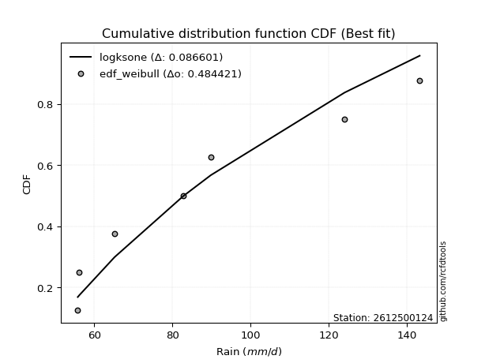</img>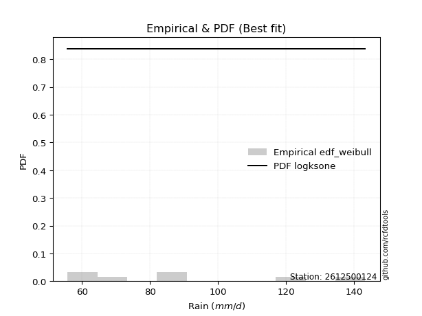</img>

</div>


### 4. EDF Beard (1943)

The Beard formula (or Beard´s plotting position formula) in hydrology is used to estimate the empirical non-exceedance probability _(P)_ of a flood event (or other extreme hydrological data point) within a given dataset.

<div align="center">


$P=(m-0.31)/(n+0.38)$


</div>


**4.1. Empirical values**

<div align="center">

|                | 0                   | 1                   | 2                   | 3         | 4                  | 5                  | 6                  |
|:---------------|:--------------------|:--------------------|:--------------------|:----------|:-------------------|:-------------------|:-------------------|
| date           | 2019                | 2023                | 2025                | 2022      | 2021               | 2020               | 2024               |
| x              | 55.8                | 56.2                | 65.2                | 82.8      | 89.8               | 124.0              | 143.2              |
| m              | 1                   | 2                   | 3                   | 4         | 5                  | 6                  | 7                  |
| empirical_dist | edf_beard           | edf_beard           | edf_beard           | edf_beard | edf_beard          | edf_beard          | edf_beard          |
| empirical      | 0.09349593495934959 | 0.22899728997289973 | 0.36449864498644985 | 0.5       | 0.6355013550135502 | 0.7710027100271003 | 0.9065040650406505 |
| empirical_tr   | 1.1031390134529149  | 1.29701230228471    | 1.5735607675906182  | 2.0       | 2.743494423791822  | 4.366863905325444  | 10.695652173913055 |

</div>


**4.2. Kolmogorov-Smirnov fit test (sorted by Δ)**


<div align="center">

|                | 0                   | 1                   | 2                   | 3                   | 4                   | 5                   | 6                   | 7                   | 8                   | 9                   | 10                  | 11                  | 12                  | 13                  | 14                  | 15                  | 16                  | 17                  | 18                  | 19                  | 20                  | 21                  | 22                  | 23                  | 24                  | 25                  | 26                  | 27                  | 28                  | 29                  | 30                  | 31                  | 32                  | 33                  | 34                  | 35                  | 36                  | 37                  | 38                  | 39                  | 40                  | 41                  | 42                  | 43                  | 44                  | 45                  | 46                  | 47                  | 48                  | 49                  | 50                  | 51                  | 52                  | 53                  | 54                  | 55                  | 56                  | 57                  | 58                  | 59                  | 60                  | 61                  | 62                  | 63                  | 64                  | 65                  | 66                  | 67                  | 68                  | 69                  | 70                  | 71                  | 72                  | 73                  | 74                  | 75                  | 76                  | 77                  | 78                  | 79                  | 80                  | 81                  | 82                  | 83                  | 84                  | 85                  | 86                  | 87                  | 88                  | 89                  | 90                  | 91                  | 92                  | 93                  | 94                  | 95                  | 96                  | 97                  | 98                  | 99                  | 100                 | 101                 | 102                 | 103                 | 104                 | 105                 | 106                 | 107                 | 108                 | 109                 | 110                 | 111                 | 112                 | 113                 | 114                 | 115                 | 116                 | 117                 | 118                 | 119                 | 120                 | 121                 | 122                 | 123                 | 124                 | 125                 | 126                 | 127                 | 128                 | 129                 | 130                 | 131                 | 132                 | 133                 | 134                 | 135                 | 136                 | 137                 | 138                 | 139                 | 140                 | 141                 | 142                 | 143                 | 144                 | 145                 | 146                 | 147                 | 148                 | 149                 | 150                 | 151                 | 152                 | 153                 | 154                 | 155                 | 156                 | 157                 | 158                 | 159                 |
|:---------------|:--------------------|:--------------------|:--------------------|:--------------------|:--------------------|:--------------------|:--------------------|:--------------------|:--------------------|:--------------------|:--------------------|:--------------------|:--------------------|:--------------------|:--------------------|:--------------------|:--------------------|:--------------------|:--------------------|:--------------------|:--------------------|:--------------------|:--------------------|:--------------------|:--------------------|:--------------------|:--------------------|:--------------------|:--------------------|:--------------------|:--------------------|:--------------------|:--------------------|:--------------------|:--------------------|:--------------------|:--------------------|:--------------------|:--------------------|:--------------------|:--------------------|:--------------------|:--------------------|:--------------------|:--------------------|:--------------------|:--------------------|:--------------------|:--------------------|:--------------------|:--------------------|:--------------------|:--------------------|:--------------------|:--------------------|:--------------------|:--------------------|:--------------------|:--------------------|:--------------------|:--------------------|:--------------------|:--------------------|:--------------------|:--------------------|:--------------------|:--------------------|:--------------------|:--------------------|:--------------------|:--------------------|:--------------------|:--------------------|:--------------------|:--------------------|:--------------------|:--------------------|:--------------------|:--------------------|:--------------------|:--------------------|:--------------------|:--------------------|:--------------------|:--------------------|:--------------------|:--------------------|:--------------------|:--------------------|:--------------------|:--------------------|:--------------------|:--------------------|:--------------------|:--------------------|:--------------------|:--------------------|:--------------------|:--------------------|:--------------------|:--------------------|:--------------------|:--------------------|:--------------------|:--------------------|:--------------------|:--------------------|:--------------------|:--------------------|:--------------------|:--------------------|:--------------------|:--------------------|:--------------------|:--------------------|:--------------------|:--------------------|:--------------------|:--------------------|:--------------------|:--------------------|:--------------------|:--------------------|:--------------------|:--------------------|:--------------------|:--------------------|:--------------------|:--------------------|:--------------------|:--------------------|:--------------------|:--------------------|:--------------------|:--------------------|:--------------------|:--------------------|:--------------------|:--------------------|:--------------------|:--------------------|:--------------------|:--------------------|:--------------------|:--------------------|:--------------------|:--------------------|:--------------------|:--------------------|:--------------------|:--------------------|:--------------------|:--------------------|:--------------------|:--------------------|:--------------------|:--------------------|:--------------------|:--------------------|:--------------------|
| station        | 2612500124          | 2612500124          | 2612500124          | 2612500124          | 2612500124          | 2612500124          | 2612500124          | 2612500124          | 2612500124          | 2612500124          | 2612500124          | 2612500124          | 2612500124          | 2612500124          | 2612500124          | 2612500124          | 2612500124          | 2612500124          | 2612500124          | 2612500124          | 2612500124          | 2612500124          | 2612500124          | 2612500124          | 2612500124          | 2612500124          | 2612500124          | 2612500124          | 2612500124          | 2612500124          | 2612500124          | 2612500124          | 2612500124          | 2612500124          | 2612500124          | 2612500124          | 2612500124          | 2612500124          | 2612500124          | 2612500124          | 2612500124          | 2612500124          | 2612500124          | 2612500124          | 2612500124          | 2612500124          | 2612500124          | 2612500124          | 2612500124          | 2612500124          | 2612500124          | 2612500124          | 2612500124          | 2612500124          | 2612500124          | 2612500124          | 2612500124          | 2612500124          | 2612500124          | 2612500124          | 2612500124          | 2612500124          | 2612500124          | 2612500124          | 2612500124          | 2612500124          | 2612500124          | 2612500124          | 2612500124          | 2612500124          | 2612500124          | 2612500124          | 2612500124          | 2612500124          | 2612500124          | 2612500124          | 2612500124          | 2612500124          | 2612500124          | 2612500124          | 2612500124          | 2612500124          | 2612500124          | 2612500124          | 2612500124          | 2612500124          | 2612500124          | 2612500124          | 2612500124          | 2612500124          | 2612500124          | 2612500124          | 2612500124          | 2612500124          | 2612500124          | 2612500124          | 2612500124          | 2612500124          | 2612500124          | 2612500124          | 2612500124          | 2612500124          | 2612500124          | 2612500124          | 2612500124          | 2612500124          | 2612500124          | 2612500124          | 2612500124          | 2612500124          | 2612500124          | 2612500124          | 2612500124          | 2612500124          | 2612500124          | 2612500124          | 2612500124          | 2612500124          | 2612500124          | 2612500124          | 2612500124          | 2612500124          | 2612500124          | 2612500124          | 2612500124          | 2612500124          | 2612500124          | 2612500124          | 2612500124          | 2612500124          | 2612500124          | 2612500124          | 2612500124          | 2612500124          | 2612500124          | 2612500124          | 2612500124          | 2612500124          | 2612500124          | 2612500124          | 2612500124          | 2612500124          | 2612500124          | 2612500124          | 2612500124          | 2612500124          | 2612500124          | 2612500124          | 2612500124          | 2612500124          | 2612500124          | 2612500124          | 2612500124          | 2612500124          | 2612500124          | 2612500124          | 2612500124          | 2612500124          | 2612500124          | 2612500124          |
| empirical_dist | edf_beard           | edf_beard           | edf_beard           | edf_beard           | edf_beard           | edf_beard           | edf_beard           | edf_beard           | edf_beard           | edf_beard           | edf_beard           | edf_beard           | edf_beard           | edf_beard           | edf_beard           | edf_beard           | edf_beard           | edf_beard           | edf_beard           | edf_beard           | edf_beard           | edf_beard           | edf_beard           | edf_beard           | edf_beard           | edf_beard           | edf_beard           | edf_beard           | edf_beard           | edf_beard           | edf_beard           | edf_beard           | edf_beard           | edf_beard           | edf_beard           | edf_beard           | edf_beard           | edf_beard           | edf_beard           | edf_beard           | edf_beard           | edf_beard           | edf_beard           | edf_beard           | edf_beard           | edf_beard           | edf_beard           | edf_beard           | edf_beard           | edf_beard           | edf_beard           | edf_beard           | edf_beard           | edf_beard           | edf_beard           | edf_beard           | edf_beard           | edf_beard           | edf_beard           | edf_beard           | edf_beard           | edf_beard           | edf_beard           | edf_beard           | edf_beard           | edf_beard           | edf_beard           | edf_beard           | edf_beard           | edf_beard           | edf_beard           | edf_beard           | edf_beard           | edf_beard           | edf_beard           | edf_beard           | edf_beard           | edf_beard           | edf_beard           | edf_beard           | edf_beard           | edf_beard           | edf_beard           | edf_beard           | edf_beard           | edf_beard           | edf_beard           | edf_beard           | edf_beard           | edf_beard           | edf_beard           | edf_beard           | edf_beard           | edf_beard           | edf_beard           | edf_beard           | edf_beard           | edf_beard           | edf_beard           | edf_beard           | edf_beard           | edf_beard           | edf_beard           | edf_beard           | edf_beard           | edf_beard           | edf_beard           | edf_beard           | edf_beard           | edf_beard           | edf_beard           | edf_beard           | edf_beard           | edf_beard           | edf_beard           | edf_beard           | edf_beard           | edf_beard           | edf_beard           | edf_beard           | edf_beard           | edf_beard           | edf_beard           | edf_beard           | edf_beard           | edf_beard           | edf_beard           | edf_beard           | edf_beard           | edf_beard           | edf_beard           | edf_beard           | edf_beard           | edf_beard           | edf_beard           | edf_beard           | edf_beard           | edf_beard           | edf_beard           | edf_beard           | edf_beard           | edf_beard           | edf_beard           | edf_beard           | edf_beard           | edf_beard           | edf_beard           | edf_beard           | edf_beard           | edf_beard           | edf_beard           | edf_beard           | edf_beard           | edf_beard           | edf_beard           | edf_beard           | edf_beard           | edf_beard           | edf_beard           | edf_beard           |
| p_dist         | logksone            | logsemicircular     | foldnorm            | logbetaprime        | halfnorm            | loganglit           | logmaxwell          | logfoldnorm         | rayleigh            | logarcsine          | lograyleigh         | maxwell             | lognct              | nct                 | logpearson3         | betaprime           | anglit              | pearson3            | semicircular        | logloggamma         | burr                | logncf              | loggenlogistic      | logweibull_max      | logjohnsonsu        | lognorm             | logcrystalball      | logt                | logalpha            | logburr             | logmielke           | loggenextreme       | loginvweibull       | genlogistic         | gumbel_r            | logkstwobign        | loginvgamma         | halflogistic        | moyal               | truncnorm           | norm                | crystalball         | t                   | logf                | kstwobign           | loghalfnorm         | loggumbel_r         | logcosine           | logrice             | loglogistic         | arcsine             | logloglaplace       | logdweibull         | logistic            | dweibull            | cosine              | weibull_min         | nakagami            | loghypsecant        | loggumbel_l         | gausshyper          | rice                | alpha               | logmoyal            | f                   | hypsecant           | invgamma            | logargus            | logbeta             | logdgamma           | dgamma              | loglaplace          | loglaplace          | genpareto           | logburr12           | exponpow            | bradford            | halfgennorm         | gumbel_l            | logrdist            | laplace             | loginvgauss         | logweibull_min      | loghalfgennorm      | loghalflogistic     | burr12              | logtriang           | ncf                 | truncweibull_min    | logtruncweibull_min | logwrapcauchy       | beta                | logexponnorm        | invgauss            | loglomax            | wrapcauchy          | loggenexpon         | exponnorm           | loggompertz         | lomax               | genexpon            | gompertz            | logtruncexpon       | logskewnorm         | logkappa4           | logtukeylambda      | loguniform          | logkappa3           | logvonmises_line    | truncexpon          | skewnorm            | ksone               | logwald             | wald                | argus               | kappa4              | uniform             | vonmises_line       | kappa3              | loglevy_l           | loggennorm          | gennorm             | triang              | logexponpow         | loggenhalflogistic  | levy_l              | loggamma            | loggamma            | gamma               | logerlang           | logfatiguelife      | lognakagami         | genextreme          | powerlaw            | logbradford         | fatiguelife         | truncpareto         | tukeylambda         | logtruncnorm        | rdist               | erlang              | genhalflogistic     | logpowerlaw         | logtrapezoid        | loggausshyper       | logtruncpareto      | gengamma            | invweibull          | logexponweib        | loggengamma         | exponweib           | trapezoid           | loggenpareto        | johnsonsb           | logjohnsonsb        | weibull_max         | johnsonsu           | logvonmises         | vonmises            | mielke              |
| delta          | 0.07480682346323154 | 0.0819826410154218  | 0.08764363999033986 | 0.09089960000397673 | 0.09126971805229478 | 0.09404388142521536 | 0.10249588390042541 | 0.10401118557728248 | 0.10451752751729759 | 0.10459509473807287 | 0.10520377830043445 | 0.11240737610685542 | 0.11263480811588356 | 0.11291594043743407 | 0.11345389545477891 | 0.11666644743930052 | 0.11751612156803881 | 0.11836518917376262 | 0.11875212245318267 | 0.11910070072204643 | 0.12064403354982235 | 0.1207222779929235  | 0.12086947460459374 | 0.1209730163344921  | 0.1216449650778707  | 0.12180543274915145 | 0.12180543366022326 | 0.12180584477237177 | 0.12250173736013853 | 0.12254567739509109 | 0.12278379109458798 | 0.12387020732324079 | 0.12387329849991517 | 0.12416320439023087 | 0.1250395684192263  | 0.1276570953649827  | 0.12884687141389695 | 0.12942152631023157 | 0.13051020136270836 | 0.13137200794035403 | 0.13137201316181213 | 0.1313720208011657  | 0.13162340990060478 | 0.13332127718261275 | 0.13442094999694149 | 0.135287451470692   | 0.13706573384995044 | 0.13935279930389394 | 0.14144849160949136 | 0.1444572558774217  | 0.14775604806156895 | 0.14852152371699226 | 0.14938581624495917 | 0.15393209932075055 | 0.15799757724771002 | 0.15808868128858378 | 0.1581044773157545  | 0.15881275850385568 | 0.1591454649634212  | 0.159457734824887   | 0.16064513205576897 | 0.16165046144727904 | 0.16535083747035095 | 0.1654505540602544  | 0.1680737436939017  | 0.16826329021438252 | 0.16935543535449504 | 0.1698424562164617  | 0.17092678523818616 | 0.17351177350502248 | 0.17420143009930078 | 0.17808648759315135 | 0.17808648759315135 | 0.1785557644364008  | 0.17980856099472278 | 0.18037013014868541 | 0.18358307908110538 | 0.183818920893209   | 0.18394918740484445 | 0.1845704747221708  | 0.18606299888461716 | 0.19227601225495605 | 0.19319069780235565 | 0.19447767944900557 | 0.19572850354138754 | 0.19940428302062077 | 0.20081758051401388 | 0.20248442243186734 | 0.20369392559500635 | 0.20418399670092707 | 0.20490426443969034 | 0.20919152057440826 | 0.20966698458792313 | 0.21054202325784288 | 0.21105799950249032 | 0.21187939995651262 | 0.2139280037828719  | 0.21533747229579317 | 0.21541819977614435 | 0.21556493544476293 | 0.21670593325084234 | 0.21702280649830671 | 0.21776231428945492 | 0.2181479582845677  | 0.21937380061353876 | 0.22052943997726718 | 0.2214183752580838  | 0.22143207002444615 | 0.22149375385329859 | 0.22156126439748164 | 0.22192713417736729 | 0.2279880064246867  | 0.22899728997289973 | 0.2293263951941831  | 0.23118706816094836 | 0.23651442038025136 | 0.25694715757226216 | 0.25696199206029136 | 0.25719807741467116 | 0.26704548569773867 | 0.2710027100271003  | 0.2710027100271003  | 0.28121445963499586 | 0.28722290081060037 | 0.29347359604720663 | 0.2977504298016427  | 0.3064549709376101  | 0.3064549709376101  | 0.310236035175085   | 0.3141870947397094  | 0.326799704268861   | 0.3279456538075744  | 0.3365399860411341  | 0.3530812507780468  | 0.3575555765092268  | 0.35890900296217393 | 0.3628050175310607  | 0.36323351041281393 | 0.3644986188110362  | 0.3644986443740682  | 0.37232741458854    | 0.37716034420852795 | 0.38143004810904163 | 0.3814380571288357  | 0.3919056389674717  | 0.41194746028704127 | 0.41279432395230325 | 0.42080923566684586 | 0.42316902011891594 | 0.4269070991954212  | 0.4632778596763852  | 0.4694342257354416  | 0.4885091295145211  | 0.5214746779349957  | 0.599387680817781   | 0.6024305226729144  | 0.6721282349953245  | 1.1090098784424627  | 22.37979766342815   | nan                 |
| deltao         | 0.48442053926100004 | 0.48442053926100004 | 0.48442053926100004 | 0.48442053926100004 | 0.48442053926100004 | 0.48442053926100004 | 0.48442053926100004 | 0.48442053926100004 | 0.48442053926100004 | 0.48442053926100004 | 0.48442053926100004 | 0.48442053926100004 | 0.48442053926100004 | 0.48442053926100004 | 0.48442053926100004 | 0.48442053926100004 | 0.48442053926100004 | 0.48442053926100004 | 0.48442053926100004 | 0.48442053926100004 | 0.48442053926100004 | 0.48442053926100004 | 0.48442053926100004 | 0.48442053926100004 | 0.48442053926100004 | 0.48442053926100004 | 0.48442053926100004 | 0.48442053926100004 | 0.48442053926100004 | 0.48442053926100004 | 0.48442053926100004 | 0.48442053926100004 | 0.48442053926100004 | 0.48442053926100004 | 0.48442053926100004 | 0.48442053926100004 | 0.48442053926100004 | 0.48442053926100004 | 0.48442053926100004 | 0.48442053926100004 | 0.48442053926100004 | 0.48442053926100004 | 0.48442053926100004 | 0.48442053926100004 | 0.48442053926100004 | 0.48442053926100004 | 0.48442053926100004 | 0.48442053926100004 | 0.48442053926100004 | 0.48442053926100004 | 0.48442053926100004 | 0.48442053926100004 | 0.48442053926100004 | 0.48442053926100004 | 0.48442053926100004 | 0.48442053926100004 | 0.48442053926100004 | 0.48442053926100004 | 0.48442053926100004 | 0.48442053926100004 | 0.48442053926100004 | 0.48442053926100004 | 0.48442053926100004 | 0.48442053926100004 | 0.48442053926100004 | 0.48442053926100004 | 0.48442053926100004 | 0.48442053926100004 | 0.48442053926100004 | 0.48442053926100004 | 0.48442053926100004 | 0.48442053926100004 | 0.48442053926100004 | 0.48442053926100004 | 0.48442053926100004 | 0.48442053926100004 | 0.48442053926100004 | 0.48442053926100004 | 0.48442053926100004 | 0.48442053926100004 | 0.48442053926100004 | 0.48442053926100004 | 0.48442053926100004 | 0.48442053926100004 | 0.48442053926100004 | 0.48442053926100004 | 0.48442053926100004 | 0.48442053926100004 | 0.48442053926100004 | 0.48442053926100004 | 0.48442053926100004 | 0.48442053926100004 | 0.48442053926100004 | 0.48442053926100004 | 0.48442053926100004 | 0.48442053926100004 | 0.48442053926100004 | 0.48442053926100004 | 0.48442053926100004 | 0.48442053926100004 | 0.48442053926100004 | 0.48442053926100004 | 0.48442053926100004 | 0.48442053926100004 | 0.48442053926100004 | 0.48442053926100004 | 0.48442053926100004 | 0.48442053926100004 | 0.48442053926100004 | 0.48442053926100004 | 0.48442053926100004 | 0.48442053926100004 | 0.48442053926100004 | 0.48442053926100004 | 0.48442053926100004 | 0.48442053926100004 | 0.48442053926100004 | 0.48442053926100004 | 0.48442053926100004 | 0.48442053926100004 | 0.48442053926100004 | 0.48442053926100004 | 0.48442053926100004 | 0.48442053926100004 | 0.48442053926100004 | 0.48442053926100004 | 0.48442053926100004 | 0.48442053926100004 | 0.48442053926100004 | 0.48442053926100004 | 0.48442053926100004 | 0.48442053926100004 | 0.48442053926100004 | 0.48442053926100004 | 0.48442053926100004 | 0.48442053926100004 | 0.48442053926100004 | 0.48442053926100004 | 0.48442053926100004 | 0.48442053926100004 | 0.48442053926100004 | 0.48442053926100004 | 0.48442053926100004 | 0.48442053926100004 | 0.48442053926100004 | 0.48442053926100004 | 0.48442053926100004 | 0.48442053926100004 | 0.48442053926100004 | 0.48442053926100004 | 0.48442053926100004 | 0.48442053926100004 | 0.48442053926100004 | 0.48442053926100004 | 0.48442053926100004 | 0.48442053926100004 | 0.48442053926100004 | 0.48442053926100004 | 0.48442053926100004 | 0.48442053926100004 |
| eval           | Δo > Δ              | Δo > Δ              | Δo > Δ              | Δo > Δ              | Δo > Δ              | Δo > Δ              | Δo > Δ              | Δo > Δ              | Δo > Δ              | Δo > Δ              | Δo > Δ              | Δo > Δ              | Δo > Δ              | Δo > Δ              | Δo > Δ              | Δo > Δ              | Δo > Δ              | Δo > Δ              | Δo > Δ              | Δo > Δ              | Δo > Δ              | Δo > Δ              | Δo > Δ              | Δo > Δ              | Δo > Δ              | Δo > Δ              | Δo > Δ              | Δo > Δ              | Δo > Δ              | Δo > Δ              | Δo > Δ              | Δo > Δ              | Δo > Δ              | Δo > Δ              | Δo > Δ              | Δo > Δ              | Δo > Δ              | Δo > Δ              | Δo > Δ              | Δo > Δ              | Δo > Δ              | Δo > Δ              | Δo > Δ              | Δo > Δ              | Δo > Δ              | Δo > Δ              | Δo > Δ              | Δo > Δ              | Δo > Δ              | Δo > Δ              | Δo > Δ              | Δo > Δ              | Δo > Δ              | Δo > Δ              | Δo > Δ              | Δo > Δ              | Δo > Δ              | Δo > Δ              | Δo > Δ              | Δo > Δ              | Δo > Δ              | Δo > Δ              | Δo > Δ              | Δo > Δ              | Δo > Δ              | Δo > Δ              | Δo > Δ              | Δo > Δ              | Δo > Δ              | Δo > Δ              | Δo > Δ              | Δo > Δ              | Δo > Δ              | Δo > Δ              | Δo > Δ              | Δo > Δ              | Δo > Δ              | Δo > Δ              | Δo > Δ              | Δo > Δ              | Δo > Δ              | Δo > Δ              | Δo > Δ              | Δo > Δ              | Δo > Δ              | Δo > Δ              | Δo > Δ              | Δo > Δ              | Δo > Δ              | Δo > Δ              | Δo > Δ              | Δo > Δ              | Δo > Δ              | Δo > Δ              | Δo > Δ              | Δo > Δ              | Δo > Δ              | Δo > Δ              | Δo > Δ              | Δo > Δ              | Δo > Δ              | Δo > Δ              | Δo > Δ              | Δo > Δ              | Δo > Δ              | Δo > Δ              | Δo > Δ              | Δo > Δ              | Δo > Δ              | Δo > Δ              | Δo > Δ              | Δo > Δ              | Δo > Δ              | Δo > Δ              | Δo > Δ              | Δo > Δ              | Δo > Δ              | Δo > Δ              | Δo > Δ              | Δo > Δ              | Δo > Δ              | Δo > Δ              | Δo > Δ              | Δo > Δ              | Δo > Δ              | Δo > Δ              | Δo > Δ              | Δo > Δ              | Δo > Δ              | Δo > Δ              | Δo > Δ              | Δo > Δ              | Δo > Δ              | Δo > Δ              | Δo > Δ              | Δo > Δ              | Δo > Δ              | Δo > Δ              | Δo > Δ              | Δo > Δ              | Δo > Δ              | Δo > Δ              | Δo > Δ              | Δo > Δ              | Δo > Δ              | Δo > Δ              | Δo > Δ              | Δo > Δ              | Δo > Δ              | Δo > Δ              | Δo > Δ              | Δo > Δ              | Δo <= Δ             | Δo <= Δ             | Δo <= Δ             | Δo <= Δ             | Δo <= Δ             | Δo <= Δ             | Δo <= Δ             | Δo <= Δ             |
| fit            | 1                   | 1                   | 1                   | 1                   | 1                   | 1                   | 1                   | 1                   | 1                   | 1                   | 1                   | 1                   | 1                   | 1                   | 1                   | 1                   | 1                   | 1                   | 1                   | 1                   | 1                   | 1                   | 1                   | 1                   | 1                   | 1                   | 1                   | 1                   | 1                   | 1                   | 1                   | 1                   | 1                   | 1                   | 1                   | 1                   | 1                   | 1                   | 1                   | 1                   | 1                   | 1                   | 1                   | 1                   | 1                   | 1                   | 1                   | 1                   | 1                   | 1                   | 1                   | 1                   | 1                   | 1                   | 1                   | 1                   | 1                   | 1                   | 1                   | 1                   | 1                   | 1                   | 1                   | 1                   | 1                   | 1                   | 1                   | 1                   | 1                   | 1                   | 1                   | 1                   | 1                   | 1                   | 1                   | 1                   | 1                   | 1                   | 1                   | 1                   | 1                   | 1                   | 1                   | 1                   | 1                   | 1                   | 1                   | 1                   | 1                   | 1                   | 1                   | 1                   | 1                   | 1                   | 1                   | 1                   | 1                   | 1                   | 1                   | 1                   | 1                   | 1                   | 1                   | 1                   | 1                   | 1                   | 1                   | 1                   | 1                   | 1                   | 1                   | 1                   | 1                   | 1                   | 1                   | 1                   | 1                   | 1                   | 1                   | 1                   | 1                   | 1                   | 1                   | 1                   | 1                   | 1                   | 1                   | 1                   | 1                   | 1                   | 1                   | 1                   | 1                   | 1                   | 1                   | 1                   | 1                   | 1                   | 1                   | 1                   | 1                   | 1                   | 1                   | 1                   | 1                   | 1                   | 1                   | 1                   | 1                   | 1                   | 1                   | 1                   | 0                   | 0                   | 0                   | 0                   | 0                   | 0                   | 0                   | 0                   |
| n              | 7                   | 7                   | 7                   | 7                   | 7                   | 7                   | 7                   | 7                   | 7                   | 7                   | 7                   | 7                   | 7                   | 7                   | 7                   | 7                   | 7                   | 7                   | 7                   | 7                   | 7                   | 7                   | 7                   | 7                   | 7                   | 7                   | 7                   | 7                   | 7                   | 7                   | 7                   | 7                   | 7                   | 7                   | 7                   | 7                   | 7                   | 7                   | 7                   | 7                   | 7                   | 7                   | 7                   | 7                   | 7                   | 7                   | 7                   | 7                   | 7                   | 7                   | 7                   | 7                   | 7                   | 7                   | 7                   | 7                   | 7                   | 7                   | 7                   | 7                   | 7                   | 7                   | 7                   | 7                   | 7                   | 7                   | 7                   | 7                   | 7                   | 7                   | 7                   | 7                   | 7                   | 7                   | 7                   | 7                   | 7                   | 7                   | 7                   | 7                   | 7                   | 7                   | 7                   | 7                   | 7                   | 7                   | 7                   | 7                   | 7                   | 7                   | 7                   | 7                   | 7                   | 7                   | 7                   | 7                   | 7                   | 7                   | 7                   | 7                   | 7                   | 7                   | 7                   | 7                   | 7                   | 7                   | 7                   | 7                   | 7                   | 7                   | 7                   | 7                   | 7                   | 7                   | 7                   | 7                   | 7                   | 7                   | 7                   | 7                   | 7                   | 7                   | 7                   | 7                   | 7                   | 7                   | 7                   | 7                   | 7                   | 7                   | 7                   | 7                   | 7                   | 7                   | 7                   | 7                   | 7                   | 7                   | 7                   | 7                   | 7                   | 7                   | 7                   | 7                   | 7                   | 7                   | 7                   | 7                   | 7                   | 7                   | 7                   | 7                   | 7                   | 7                   | 7                   | 7                   | 7                   | 7                   | 7                   | 7                   |
| best_fit       | 1                   | 0                   | 0                   | 0                   | 0                   | 0                   | 0                   | 0                   | 0                   | 0                   | 0                   | 0                   | 0                   | 0                   | 0                   | 0                   | 0                   | 0                   | 0                   | 0                   | 0                   | 0                   | 0                   | 0                   | 0                   | 0                   | 0                   | 0                   | 0                   | 0                   | 0                   | 0                   | 0                   | 0                   | 0                   | 0                   | 0                   | 0                   | 0                   | 0                   | 0                   | 0                   | 0                   | 0                   | 0                   | 0                   | 0                   | 0                   | 0                   | 0                   | 0                   | 0                   | 0                   | 0                   | 0                   | 0                   | 0                   | 0                   | 0                   | 0                   | 0                   | 0                   | 0                   | 0                   | 0                   | 0                   | 0                   | 0                   | 0                   | 0                   | 0                   | 0                   | 0                   | 0                   | 0                   | 0                   | 0                   | 0                   | 0                   | 0                   | 0                   | 0                   | 0                   | 0                   | 0                   | 0                   | 0                   | 0                   | 0                   | 0                   | 0                   | 0                   | 0                   | 0                   | 0                   | 0                   | 0                   | 0                   | 0                   | 0                   | 0                   | 0                   | 0                   | 0                   | 0                   | 0                   | 0                   | 0                   | 0                   | 0                   | 0                   | 0                   | 0                   | 0                   | 0                   | 0                   | 0                   | 0                   | 0                   | 0                   | 0                   | 0                   | 0                   | 0                   | 0                   | 0                   | 0                   | 0                   | 0                   | 0                   | 0                   | 0                   | 0                   | 0                   | 0                   | 0                   | 0                   | 0                   | 0                   | 0                   | 0                   | 0                   | 0                   | 0                   | 0                   | 0                   | 0                   | 0                   | 0                   | 0                   | 0                   | 0                   | 0                   | 0                   | 0                   | 0                   | 0                   | 0                   | 0                   | 0                   |
| best_fit_sort  | 1                   | 2                   | 3                   | 4                   | 5                   | 6                   | 7                   | 8                   | 9                   | 10                  | 11                  | 12                  | 13                  | 14                  | 15                  | 16                  | 17                  | 18                  | 19                  | 20                  | 21                  | 22                  | 23                  | 24                  | 25                  | 26                  | 27                  | 28                  | 29                  | 30                  | 31                  | 32                  | 33                  | 34                  | 35                  | 36                  | 37                  | 38                  | 39                  | 40                  | 41                  | 42                  | 43                  | 44                  | 45                  | 46                  | 47                  | 48                  | 49                  | 50                  | 51                  | 52                  | 53                  | 54                  | 55                  | 56                  | 57                  | 58                  | 59                  | 60                  | 61                  | 62                  | 63                  | 64                  | 65                  | 66                  | 67                  | 68                  | 69                  | 70                  | 71                  | 72                  | 73                  | 74                  | 75                  | 76                  | 77                  | 78                  | 79                  | 80                  | 81                  | 82                  | 83                  | 84                  | 85                  | 86                  | 87                  | 88                  | 89                  | 90                  | 91                  | 92                  | 93                  | 94                  | 95                  | 96                  | 97                  | 98                  | 99                  | 100                 | 101                 | 102                 | 103                 | 104                 | 105                 | 106                 | 107                 | 108                 | 109                 | 110                 | 111                 | 112                 | 113                 | 114                 | 115                 | 116                 | 117                 | 118                 | 119                 | 120                 | 121                 | 122                 | 123                 | 124                 | 125                 | 126                 | 127                 | 128                 | 129                 | 130                 | 131                 | 132                 | 133                 | 134                 | 135                 | 136                 | 137                 | 138                 | 139                 | 140                 | 141                 | 142                 | 143                 | 144                 | 145                 | 146                 | 147                 | 148                 | 149                 | 150                 | 151                 | 152                 | 153                 | 154                 | 155                 | 156                 | 157                 | 158                 | 159                 | 160                 |

</div>


**4.3. Best fit**

<div align="center">

|   id |    station | empirical_dist   | p_dist   |     delta |   deltao | eval   |   fit |   n |   best_fit |   best_fit_sort |
|-----:|-----------:|:-----------------|:---------|----------:|---------:|:-------|------:|----:|-----------:|----------------:|
|    0 | 2612500124 | edf_beard        | logksone | 0.0748068 | 0.484421 | Δo > Δ |     1 |   7 |          1 |               1 |

</div>


<div align="center">

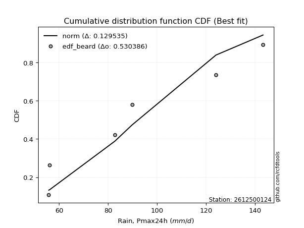</img>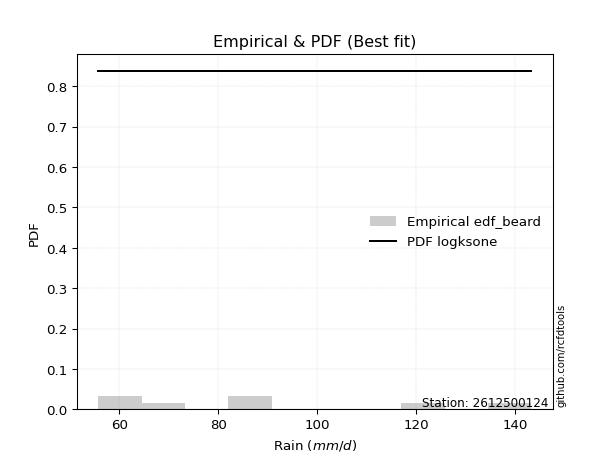</img>

</div>


### 5. EDF Chegodayev (1955)

The Chegodayev formula is an empirical plotting position formula used in hydrological frequency analysis to estimate the exceedance probability or return period of a specific event from a set of observed data. It is primarily used for plotting observed data points on probability paper to fit a theoretical distribution, particularly for analyzing extreme events like maximum flood flows or rainfall intensities. The constant _b_ value in the generalized plotting position formula is 0.3.

<div align="center">


$P=(m-b)/(n+1-2b)$


</div>


**5.1. Empirical values**

<div align="center">

|                | 0                   | 1                   | 2                   | 3              | 4                  | 5                  | 6                  |
|:---------------|:--------------------|:--------------------|:--------------------|:---------------|:-------------------|:-------------------|:-------------------|
| date           | 2019                | 2023                | 2025                | 2022           | 2021               | 2020               | 2024               |
| x              | 55.8                | 56.2                | 65.2                | 82.8           | 89.8               | 124.0              | 143.2              |
| m              | 1                   | 2                   | 3                   | 4              | 5                  | 6                  | 7                  |
| empirical_dist | edf_chegodayev      | edf_chegodayev      | edf_chegodayev      | edf_chegodayev | edf_chegodayev     | edf_chegodayev     | edf_chegodayev     |
| empirical      | 0.09459459459459459 | 0.22972972972972971 | 0.36486486486486486 | 0.5            | 0.6351351351351351 | 0.7702702702702703 | 0.9054054054054054 |
| empirical_tr   | 1.1044776119402986  | 1.2982456140350878  | 1.574468085106383   | 2.0            | 2.7407407407407405 | 4.352941176470589  | 10.571428571428568 |

</div>


**5.2. Kolmogorov-Smirnov fit test (sorted by Δ)**


<div align="center">

|                | 0                   | 1                   | 2                   | 3                   | 4                   | 5                   | 6                   | 7                   | 8                   | 9                   | 10                  | 11                  | 12                  | 13                  | 14                  | 15                  | 16                  | 17                  | 18                  | 19                  | 20                  | 21                  | 22                  | 23                  | 24                  | 25                  | 26                  | 27                  | 28                  | 29                  | 30                  | 31                  | 32                  | 33                  | 34                  | 35                  | 36                  | 37                  | 38                  | 39                  | 40                  | 41                  | 42                  | 43                  | 44                  | 45                  | 46                  | 47                  | 48                  | 49                  | 50                  | 51                  | 52                  | 53                  | 54                  | 55                  | 56                  | 57                  | 58                  | 59                  | 60                  | 61                  | 62                  | 63                  | 64                  | 65                  | 66                  | 67                  | 68                  | 69                  | 70                  | 71                  | 72                  | 73                  | 74                  | 75                  | 76                  | 77                  | 78                  | 79                  | 80                  | 81                  | 82                  | 83                  | 84                  | 85                  | 86                  | 87                  | 88                  | 89                  | 90                  | 91                  | 92                  | 93                  | 94                  | 95                  | 96                  | 97                  | 98                  | 99                  | 100                 | 101                 | 102                 | 103                 | 104                 | 105                 | 106                 | 107                 | 108                 | 109                 | 110                 | 111                 | 112                 | 113                 | 114                 | 115                 | 116                 | 117                 | 118                 | 119                 | 120                 | 121                 | 122                 | 123                 | 124                 | 125                 | 126                 | 127                 | 128                 | 129                 | 130                 | 131                 | 132                 | 133                 | 134                 | 135                 | 136                 | 137                 | 138                 | 139                 | 140                 | 141                 | 142                 | 143                 | 144                 | 145                 | 146                 | 147                 | 148                 | 149                 | 150                 | 151                 | 152                 | 153                 | 154                 | 155                 | 156                 | 157                 | 158                 | 159                 |
|:---------------|:--------------------|:--------------------|:--------------------|:--------------------|:--------------------|:--------------------|:--------------------|:--------------------|:--------------------|:--------------------|:--------------------|:--------------------|:--------------------|:--------------------|:--------------------|:--------------------|:--------------------|:--------------------|:--------------------|:--------------------|:--------------------|:--------------------|:--------------------|:--------------------|:--------------------|:--------------------|:--------------------|:--------------------|:--------------------|:--------------------|:--------------------|:--------------------|:--------------------|:--------------------|:--------------------|:--------------------|:--------------------|:--------------------|:--------------------|:--------------------|:--------------------|:--------------------|:--------------------|:--------------------|:--------------------|:--------------------|:--------------------|:--------------------|:--------------------|:--------------------|:--------------------|:--------------------|:--------------------|:--------------------|:--------------------|:--------------------|:--------------------|:--------------------|:--------------------|:--------------------|:--------------------|:--------------------|:--------------------|:--------------------|:--------------------|:--------------------|:--------------------|:--------------------|:--------------------|:--------------------|:--------------------|:--------------------|:--------------------|:--------------------|:--------------------|:--------------------|:--------------------|:--------------------|:--------------------|:--------------------|:--------------------|:--------------------|:--------------------|:--------------------|:--------------------|:--------------------|:--------------------|:--------------------|:--------------------|:--------------------|:--------------------|:--------------------|:--------------------|:--------------------|:--------------------|:--------------------|:--------------------|:--------------------|:--------------------|:--------------------|:--------------------|:--------------------|:--------------------|:--------------------|:--------------------|:--------------------|:--------------------|:--------------------|:--------------------|:--------------------|:--------------------|:--------------------|:--------------------|:--------------------|:--------------------|:--------------------|:--------------------|:--------------------|:--------------------|:--------------------|:--------------------|:--------------------|:--------------------|:--------------------|:--------------------|:--------------------|:--------------------|:--------------------|:--------------------|:--------------------|:--------------------|:--------------------|:--------------------|:--------------------|:--------------------|:--------------------|:--------------------|:--------------------|:--------------------|:--------------------|:--------------------|:--------------------|:--------------------|:--------------------|:--------------------|:--------------------|:--------------------|:--------------------|:--------------------|:--------------------|:--------------------|:--------------------|:--------------------|:--------------------|:--------------------|:--------------------|:--------------------|:--------------------|:--------------------|:--------------------|
| station        | 2612500124          | 2612500124          | 2612500124          | 2612500124          | 2612500124          | 2612500124          | 2612500124          | 2612500124          | 2612500124          | 2612500124          | 2612500124          | 2612500124          | 2612500124          | 2612500124          | 2612500124          | 2612500124          | 2612500124          | 2612500124          | 2612500124          | 2612500124          | 2612500124          | 2612500124          | 2612500124          | 2612500124          | 2612500124          | 2612500124          | 2612500124          | 2612500124          | 2612500124          | 2612500124          | 2612500124          | 2612500124          | 2612500124          | 2612500124          | 2612500124          | 2612500124          | 2612500124          | 2612500124          | 2612500124          | 2612500124          | 2612500124          | 2612500124          | 2612500124          | 2612500124          | 2612500124          | 2612500124          | 2612500124          | 2612500124          | 2612500124          | 2612500124          | 2612500124          | 2612500124          | 2612500124          | 2612500124          | 2612500124          | 2612500124          | 2612500124          | 2612500124          | 2612500124          | 2612500124          | 2612500124          | 2612500124          | 2612500124          | 2612500124          | 2612500124          | 2612500124          | 2612500124          | 2612500124          | 2612500124          | 2612500124          | 2612500124          | 2612500124          | 2612500124          | 2612500124          | 2612500124          | 2612500124          | 2612500124          | 2612500124          | 2612500124          | 2612500124          | 2612500124          | 2612500124          | 2612500124          | 2612500124          | 2612500124          | 2612500124          | 2612500124          | 2612500124          | 2612500124          | 2612500124          | 2612500124          | 2612500124          | 2612500124          | 2612500124          | 2612500124          | 2612500124          | 2612500124          | 2612500124          | 2612500124          | 2612500124          | 2612500124          | 2612500124          | 2612500124          | 2612500124          | 2612500124          | 2612500124          | 2612500124          | 2612500124          | 2612500124          | 2612500124          | 2612500124          | 2612500124          | 2612500124          | 2612500124          | 2612500124          | 2612500124          | 2612500124          | 2612500124          | 2612500124          | 2612500124          | 2612500124          | 2612500124          | 2612500124          | 2612500124          | 2612500124          | 2612500124          | 2612500124          | 2612500124          | 2612500124          | 2612500124          | 2612500124          | 2612500124          | 2612500124          | 2612500124          | 2612500124          | 2612500124          | 2612500124          | 2612500124          | 2612500124          | 2612500124          | 2612500124          | 2612500124          | 2612500124          | 2612500124          | 2612500124          | 2612500124          | 2612500124          | 2612500124          | 2612500124          | 2612500124          | 2612500124          | 2612500124          | 2612500124          | 2612500124          | 2612500124          | 2612500124          | 2612500124          | 2612500124          | 2612500124          | 2612500124          |
| empirical_dist | edf_chegodayev      | edf_chegodayev      | edf_chegodayev      | edf_chegodayev      | edf_chegodayev      | edf_chegodayev      | edf_chegodayev      | edf_chegodayev      | edf_chegodayev      | edf_chegodayev      | edf_chegodayev      | edf_chegodayev      | edf_chegodayev      | edf_chegodayev      | edf_chegodayev      | edf_chegodayev      | edf_chegodayev      | edf_chegodayev      | edf_chegodayev      | edf_chegodayev      | edf_chegodayev      | edf_chegodayev      | edf_chegodayev      | edf_chegodayev      | edf_chegodayev      | edf_chegodayev      | edf_chegodayev      | edf_chegodayev      | edf_chegodayev      | edf_chegodayev      | edf_chegodayev      | edf_chegodayev      | edf_chegodayev      | edf_chegodayev      | edf_chegodayev      | edf_chegodayev      | edf_chegodayev      | edf_chegodayev      | edf_chegodayev      | edf_chegodayev      | edf_chegodayev      | edf_chegodayev      | edf_chegodayev      | edf_chegodayev      | edf_chegodayev      | edf_chegodayev      | edf_chegodayev      | edf_chegodayev      | edf_chegodayev      | edf_chegodayev      | edf_chegodayev      | edf_chegodayev      | edf_chegodayev      | edf_chegodayev      | edf_chegodayev      | edf_chegodayev      | edf_chegodayev      | edf_chegodayev      | edf_chegodayev      | edf_chegodayev      | edf_chegodayev      | edf_chegodayev      | edf_chegodayev      | edf_chegodayev      | edf_chegodayev      | edf_chegodayev      | edf_chegodayev      | edf_chegodayev      | edf_chegodayev      | edf_chegodayev      | edf_chegodayev      | edf_chegodayev      | edf_chegodayev      | edf_chegodayev      | edf_chegodayev      | edf_chegodayev      | edf_chegodayev      | edf_chegodayev      | edf_chegodayev      | edf_chegodayev      | edf_chegodayev      | edf_chegodayev      | edf_chegodayev      | edf_chegodayev      | edf_chegodayev      | edf_chegodayev      | edf_chegodayev      | edf_chegodayev      | edf_chegodayev      | edf_chegodayev      | edf_chegodayev      | edf_chegodayev      | edf_chegodayev      | edf_chegodayev      | edf_chegodayev      | edf_chegodayev      | edf_chegodayev      | edf_chegodayev      | edf_chegodayev      | edf_chegodayev      | edf_chegodayev      | edf_chegodayev      | edf_chegodayev      | edf_chegodayev      | edf_chegodayev      | edf_chegodayev      | edf_chegodayev      | edf_chegodayev      | edf_chegodayev      | edf_chegodayev      | edf_chegodayev      | edf_chegodayev      | edf_chegodayev      | edf_chegodayev      | edf_chegodayev      | edf_chegodayev      | edf_chegodayev      | edf_chegodayev      | edf_chegodayev      | edf_chegodayev      | edf_chegodayev      | edf_chegodayev      | edf_chegodayev      | edf_chegodayev      | edf_chegodayev      | edf_chegodayev      | edf_chegodayev      | edf_chegodayev      | edf_chegodayev      | edf_chegodayev      | edf_chegodayev      | edf_chegodayev      | edf_chegodayev      | edf_chegodayev      | edf_chegodayev      | edf_chegodayev      | edf_chegodayev      | edf_chegodayev      | edf_chegodayev      | edf_chegodayev      | edf_chegodayev      | edf_chegodayev      | edf_chegodayev      | edf_chegodayev      | edf_chegodayev      | edf_chegodayev      | edf_chegodayev      | edf_chegodayev      | edf_chegodayev      | edf_chegodayev      | edf_chegodayev      | edf_chegodayev      | edf_chegodayev      | edf_chegodayev      | edf_chegodayev      | edf_chegodayev      | edf_chegodayev      | edf_chegodayev      | edf_chegodayev      | edf_chegodayev      |
| p_dist         | logksone            | logsemicircular     | foldnorm            | logbetaprime        | halfnorm            | loganglit           | logmaxwell          | logarcsine          | logfoldnorm         | rayleigh            | lograyleigh         | maxwell             | lognct              | nct                 | logpearson3         | betaprime           | anglit              | semicircular        | pearson3            | logloggamma         | logncf              | burr                | loggenlogistic      | logweibull_max      | logjohnsonsu        | lognorm             | logcrystalball      | logt                | logalpha            | logburr             | logmielke           | genlogistic         | loggenextreme       | loginvweibull       | gumbel_r            | logkstwobign        | loginvgamma         | halflogistic        | moyal               | truncnorm           | norm                | crystalball         | t                   | logf                | kstwobign           | loghalfnorm         | loggumbel_r         | logcosine           | logrice             | loglogistic         | arcsine             | logloglaplace       | logdweibull         | logistic            | dweibull            | cosine              | nakagami            | weibull_min         | loghypsecant        | loggumbel_l         | gausshyper          | rice                | alpha               | logmoyal            | f                   | hypsecant           | invgamma            | logargus            | logbeta             | dgamma              | logdgamma           | genpareto           | loglaplace          | loglaplace          | exponpow            | logburr12           | logrdist            | gumbel_l            | bradford            | halfgennorm         | laplace             | loginvgauss         | logweibull_min      | loghalfgennorm      | loghalflogistic     | burr12              | logtriang           | ncf                 | truncweibull_min    | logtruncweibull_min | logwrapcauchy       | beta                | logexponnorm        | invgauss            | loglomax            | wrapcauchy          | loggenexpon         | exponnorm           | loggompertz         | lomax               | genexpon            | gompertz            | logtruncexpon       | logskewnorm         | logkappa4           | logtukeylambda      | loguniform          | logkappa3           | logvonmises_line    | truncexpon          | skewnorm            | ksone               | wald                | logwald             | argus               | kappa4              | uniform             | vonmises_line       | kappa3              | loglevy_l           | loggennorm          | gennorm             | triang              | logexponpow         | loggenhalflogistic  | levy_l              | loggamma            | loggamma            | gamma               | logerlang           | logfatiguelife      | lognakagami         | genextreme          | powerlaw            | logbradford         | fatiguelife         | truncpareto         | tukeylambda         | logtruncnorm        | rdist               | erlang              | genhalflogistic     | logpowerlaw         | logtrapezoid        | loggausshyper       | logtruncpareto      | gengamma            | invweibull          | logexponweib        | loggengamma         | exponweib           | trapezoid           | loggenpareto        | johnsonsb           | logjohnsonsb        | weibull_max         | johnsonsu           | logvonmises         | vonmises            | mielke              |
| delta          | 0.07370816382798655 | 0.0823488608938368  | 0.08837607974716988 | 0.09126581988239174 | 0.0920021578091248  | 0.09441010130363037 | 0.1032283236572554  | 0.10349643510282787 | 0.10474362533411247 | 0.1048837473957126  | 0.10593621805726444 | 0.11277359598527043 | 0.11300102799429856 | 0.11364838019426406 | 0.11382011533319392 | 0.11703266731771553 | 0.11714990168962369 | 0.11838590257476755 | 0.11873140905217763 | 0.11946692060046143 | 0.1196236183576785  | 0.12137647330665234 | 0.12160191436142373 | 0.12170545609132209 | 0.12201118495628571 | 0.12217165262756646 | 0.12217165353863826 | 0.12217206465078678 | 0.12323417711696852 | 0.12327811715192108 | 0.12351623085141797 | 0.12452942426864588 | 0.12460264708007078 | 0.12460573825674516 | 0.12540578829764132 | 0.12838953512181267 | 0.12957931117072694 | 0.13015396606706153 | 0.13087642124112336 | 0.13173822781876904 | 0.13173823304022714 | 0.1317382406795807  | 0.1319896297790198  | 0.13405371693944274 | 0.1347871698753565  | 0.13601989122752195 | 0.13779817360678043 | 0.13971901918230895 | 0.14218093136632137 | 0.1448234757558367  | 0.14665738842632392 | 0.14888774359540727 | 0.15011825600178919 | 0.15429831919916556 | 0.15689891761246505 | 0.15845490116699879 | 0.15881275850385568 | 0.1588369170725845  | 0.1595116848418362  | 0.15982395470330202 | 0.16137757181259899 | 0.16201668132569405 | 0.16535083747035095 | 0.1661829938170844  | 0.1680737436939017  | 0.16862951009279753 | 0.16935543535449504 | 0.17020867609487672 | 0.17165922499501615 | 0.1731027704640558  | 0.17387799338343748 | 0.1781895445579857  | 0.17845270747156636 | 0.17845270747156636 | 0.18037013014868541 | 0.18054100075155277 | 0.18347181508692584 | 0.18358296752642933 | 0.18358307908110538 | 0.184551360650039   | 0.18642921876303217 | 0.19227601225495605 | 0.19392313755918567 | 0.19411145957059056 | 0.19646094329821756 | 0.20013672277745076 | 0.20045136063559876 | 0.20321686218869733 | 0.20442636535183634 | 0.20491643645775703 | 0.20563670419652033 | 0.2080928609391633  | 0.21039942434475312 | 0.21054202325784288 | 0.2117904392593203  | 0.2126118397133426  | 0.2146604435397019  | 0.21606991205262316 | 0.21615063953297434 | 0.21629737520159292 | 0.21743837300767233 | 0.2177552462551367  | 0.21849475404628493 | 0.2188803980413977  | 0.22010624037036874 | 0.22126187973409717 | 0.2221508150149138  | 0.22216450978127614 | 0.22222619361012858 | 0.22229370415431163 | 0.22265957393419727 | 0.22762178654627158 | 0.22972972972972971 | 0.22972972972972971 | 0.23082084828253324 | 0.23688064025866637 | 0.25731337745067717 | 0.25732821193870636 | 0.25756429729308616 | 0.2659468260624937  | 0.2702702702702703  | 0.2702702702702703  | 0.28084823975658074 | 0.28685668093218536 | 0.2931073761687915  | 0.2966517701663977  | 0.3064549709376101  | 0.3064549709376101  | 0.310236035175085   | 0.3141870947397094  | 0.326433484390446   | 0.3275794339291594  | 0.335441326405889   | 0.3527150308996318  | 0.3571893566308118  | 0.3585427830837589  | 0.3624387976526457  | 0.36359973029122905 | 0.3648648386894512  | 0.3648648642524833  | 0.37232741458854    | 0.37679412433011283 | 0.3810638282306266  | 0.3810718372504206  | 0.3915394190890567  | 0.41158124040862626 | 0.41242810407388825 | 0.4197105760316007  | 0.42280280024050093 | 0.4265408793170062  | 0.4629116397979702  | 0.46906800585702646 | 0.4874104698792761  | 0.5211084580565806  | 0.598655241060951   | 0.6016980829160844  | 0.6713957952384945  | 1.109742318199293   | 22.380896323063393  | nan                 |
| deltao         | 0.48442053926100004 | 0.48442053926100004 | 0.48442053926100004 | 0.48442053926100004 | 0.48442053926100004 | 0.48442053926100004 | 0.48442053926100004 | 0.48442053926100004 | 0.48442053926100004 | 0.48442053926100004 | 0.48442053926100004 | 0.48442053926100004 | 0.48442053926100004 | 0.48442053926100004 | 0.48442053926100004 | 0.48442053926100004 | 0.48442053926100004 | 0.48442053926100004 | 0.48442053926100004 | 0.48442053926100004 | 0.48442053926100004 | 0.48442053926100004 | 0.48442053926100004 | 0.48442053926100004 | 0.48442053926100004 | 0.48442053926100004 | 0.48442053926100004 | 0.48442053926100004 | 0.48442053926100004 | 0.48442053926100004 | 0.48442053926100004 | 0.48442053926100004 | 0.48442053926100004 | 0.48442053926100004 | 0.48442053926100004 | 0.48442053926100004 | 0.48442053926100004 | 0.48442053926100004 | 0.48442053926100004 | 0.48442053926100004 | 0.48442053926100004 | 0.48442053926100004 | 0.48442053926100004 | 0.48442053926100004 | 0.48442053926100004 | 0.48442053926100004 | 0.48442053926100004 | 0.48442053926100004 | 0.48442053926100004 | 0.48442053926100004 | 0.48442053926100004 | 0.48442053926100004 | 0.48442053926100004 | 0.48442053926100004 | 0.48442053926100004 | 0.48442053926100004 | 0.48442053926100004 | 0.48442053926100004 | 0.48442053926100004 | 0.48442053926100004 | 0.48442053926100004 | 0.48442053926100004 | 0.48442053926100004 | 0.48442053926100004 | 0.48442053926100004 | 0.48442053926100004 | 0.48442053926100004 | 0.48442053926100004 | 0.48442053926100004 | 0.48442053926100004 | 0.48442053926100004 | 0.48442053926100004 | 0.48442053926100004 | 0.48442053926100004 | 0.48442053926100004 | 0.48442053926100004 | 0.48442053926100004 | 0.48442053926100004 | 0.48442053926100004 | 0.48442053926100004 | 0.48442053926100004 | 0.48442053926100004 | 0.48442053926100004 | 0.48442053926100004 | 0.48442053926100004 | 0.48442053926100004 | 0.48442053926100004 | 0.48442053926100004 | 0.48442053926100004 | 0.48442053926100004 | 0.48442053926100004 | 0.48442053926100004 | 0.48442053926100004 | 0.48442053926100004 | 0.48442053926100004 | 0.48442053926100004 | 0.48442053926100004 | 0.48442053926100004 | 0.48442053926100004 | 0.48442053926100004 | 0.48442053926100004 | 0.48442053926100004 | 0.48442053926100004 | 0.48442053926100004 | 0.48442053926100004 | 0.48442053926100004 | 0.48442053926100004 | 0.48442053926100004 | 0.48442053926100004 | 0.48442053926100004 | 0.48442053926100004 | 0.48442053926100004 | 0.48442053926100004 | 0.48442053926100004 | 0.48442053926100004 | 0.48442053926100004 | 0.48442053926100004 | 0.48442053926100004 | 0.48442053926100004 | 0.48442053926100004 | 0.48442053926100004 | 0.48442053926100004 | 0.48442053926100004 | 0.48442053926100004 | 0.48442053926100004 | 0.48442053926100004 | 0.48442053926100004 | 0.48442053926100004 | 0.48442053926100004 | 0.48442053926100004 | 0.48442053926100004 | 0.48442053926100004 | 0.48442053926100004 | 0.48442053926100004 | 0.48442053926100004 | 0.48442053926100004 | 0.48442053926100004 | 0.48442053926100004 | 0.48442053926100004 | 0.48442053926100004 | 0.48442053926100004 | 0.48442053926100004 | 0.48442053926100004 | 0.48442053926100004 | 0.48442053926100004 | 0.48442053926100004 | 0.48442053926100004 | 0.48442053926100004 | 0.48442053926100004 | 0.48442053926100004 | 0.48442053926100004 | 0.48442053926100004 | 0.48442053926100004 | 0.48442053926100004 | 0.48442053926100004 | 0.48442053926100004 | 0.48442053926100004 | 0.48442053926100004 | 0.48442053926100004 | 0.48442053926100004 |
| eval           | Δo > Δ              | Δo > Δ              | Δo > Δ              | Δo > Δ              | Δo > Δ              | Δo > Δ              | Δo > Δ              | Δo > Δ              | Δo > Δ              | Δo > Δ              | Δo > Δ              | Δo > Δ              | Δo > Δ              | Δo > Δ              | Δo > Δ              | Δo > Δ              | Δo > Δ              | Δo > Δ              | Δo > Δ              | Δo > Δ              | Δo > Δ              | Δo > Δ              | Δo > Δ              | Δo > Δ              | Δo > Δ              | Δo > Δ              | Δo > Δ              | Δo > Δ              | Δo > Δ              | Δo > Δ              | Δo > Δ              | Δo > Δ              | Δo > Δ              | Δo > Δ              | Δo > Δ              | Δo > Δ              | Δo > Δ              | Δo > Δ              | Δo > Δ              | Δo > Δ              | Δo > Δ              | Δo > Δ              | Δo > Δ              | Δo > Δ              | Δo > Δ              | Δo > Δ              | Δo > Δ              | Δo > Δ              | Δo > Δ              | Δo > Δ              | Δo > Δ              | Δo > Δ              | Δo > Δ              | Δo > Δ              | Δo > Δ              | Δo > Δ              | Δo > Δ              | Δo > Δ              | Δo > Δ              | Δo > Δ              | Δo > Δ              | Δo > Δ              | Δo > Δ              | Δo > Δ              | Δo > Δ              | Δo > Δ              | Δo > Δ              | Δo > Δ              | Δo > Δ              | Δo > Δ              | Δo > Δ              | Δo > Δ              | Δo > Δ              | Δo > Δ              | Δo > Δ              | Δo > Δ              | Δo > Δ              | Δo > Δ              | Δo > Δ              | Δo > Δ              | Δo > Δ              | Δo > Δ              | Δo > Δ              | Δo > Δ              | Δo > Δ              | Δo > Δ              | Δo > Δ              | Δo > Δ              | Δo > Δ              | Δo > Δ              | Δo > Δ              | Δo > Δ              | Δo > Δ              | Δo > Δ              | Δo > Δ              | Δo > Δ              | Δo > Δ              | Δo > Δ              | Δo > Δ              | Δo > Δ              | Δo > Δ              | Δo > Δ              | Δo > Δ              | Δo > Δ              | Δo > Δ              | Δo > Δ              | Δo > Δ              | Δo > Δ              | Δo > Δ              | Δo > Δ              | Δo > Δ              | Δo > Δ              | Δo > Δ              | Δo > Δ              | Δo > Δ              | Δo > Δ              | Δo > Δ              | Δo > Δ              | Δo > Δ              | Δo > Δ              | Δo > Δ              | Δo > Δ              | Δo > Δ              | Δo > Δ              | Δo > Δ              | Δo > Δ              | Δo > Δ              | Δo > Δ              | Δo > Δ              | Δo > Δ              | Δo > Δ              | Δo > Δ              | Δo > Δ              | Δo > Δ              | Δo > Δ              | Δo > Δ              | Δo > Δ              | Δo > Δ              | Δo > Δ              | Δo > Δ              | Δo > Δ              | Δo > Δ              | Δo > Δ              | Δo > Δ              | Δo > Δ              | Δo > Δ              | Δo > Δ              | Δo > Δ              | Δo > Δ              | Δo > Δ              | Δo > Δ              | Δo > Δ              | Δo <= Δ             | Δo <= Δ             | Δo <= Δ             | Δo <= Δ             | Δo <= Δ             | Δo <= Δ             | Δo <= Δ             | Δo <= Δ             |
| fit            | 1                   | 1                   | 1                   | 1                   | 1                   | 1                   | 1                   | 1                   | 1                   | 1                   | 1                   | 1                   | 1                   | 1                   | 1                   | 1                   | 1                   | 1                   | 1                   | 1                   | 1                   | 1                   | 1                   | 1                   | 1                   | 1                   | 1                   | 1                   | 1                   | 1                   | 1                   | 1                   | 1                   | 1                   | 1                   | 1                   | 1                   | 1                   | 1                   | 1                   | 1                   | 1                   | 1                   | 1                   | 1                   | 1                   | 1                   | 1                   | 1                   | 1                   | 1                   | 1                   | 1                   | 1                   | 1                   | 1                   | 1                   | 1                   | 1                   | 1                   | 1                   | 1                   | 1                   | 1                   | 1                   | 1                   | 1                   | 1                   | 1                   | 1                   | 1                   | 1                   | 1                   | 1                   | 1                   | 1                   | 1                   | 1                   | 1                   | 1                   | 1                   | 1                   | 1                   | 1                   | 1                   | 1                   | 1                   | 1                   | 1                   | 1                   | 1                   | 1                   | 1                   | 1                   | 1                   | 1                   | 1                   | 1                   | 1                   | 1                   | 1                   | 1                   | 1                   | 1                   | 1                   | 1                   | 1                   | 1                   | 1                   | 1                   | 1                   | 1                   | 1                   | 1                   | 1                   | 1                   | 1                   | 1                   | 1                   | 1                   | 1                   | 1                   | 1                   | 1                   | 1                   | 1                   | 1                   | 1                   | 1                   | 1                   | 1                   | 1                   | 1                   | 1                   | 1                   | 1                   | 1                   | 1                   | 1                   | 1                   | 1                   | 1                   | 1                   | 1                   | 1                   | 1                   | 1                   | 1                   | 1                   | 1                   | 1                   | 1                   | 0                   | 0                   | 0                   | 0                   | 0                   | 0                   | 0                   | 0                   |
| n              | 7                   | 7                   | 7                   | 7                   | 7                   | 7                   | 7                   | 7                   | 7                   | 7                   | 7                   | 7                   | 7                   | 7                   | 7                   | 7                   | 7                   | 7                   | 7                   | 7                   | 7                   | 7                   | 7                   | 7                   | 7                   | 7                   | 7                   | 7                   | 7                   | 7                   | 7                   | 7                   | 7                   | 7                   | 7                   | 7                   | 7                   | 7                   | 7                   | 7                   | 7                   | 7                   | 7                   | 7                   | 7                   | 7                   | 7                   | 7                   | 7                   | 7                   | 7                   | 7                   | 7                   | 7                   | 7                   | 7                   | 7                   | 7                   | 7                   | 7                   | 7                   | 7                   | 7                   | 7                   | 7                   | 7                   | 7                   | 7                   | 7                   | 7                   | 7                   | 7                   | 7                   | 7                   | 7                   | 7                   | 7                   | 7                   | 7                   | 7                   | 7                   | 7                   | 7                   | 7                   | 7                   | 7                   | 7                   | 7                   | 7                   | 7                   | 7                   | 7                   | 7                   | 7                   | 7                   | 7                   | 7                   | 7                   | 7                   | 7                   | 7                   | 7                   | 7                   | 7                   | 7                   | 7                   | 7                   | 7                   | 7                   | 7                   | 7                   | 7                   | 7                   | 7                   | 7                   | 7                   | 7                   | 7                   | 7                   | 7                   | 7                   | 7                   | 7                   | 7                   | 7                   | 7                   | 7                   | 7                   | 7                   | 7                   | 7                   | 7                   | 7                   | 7                   | 7                   | 7                   | 7                   | 7                   | 7                   | 7                   | 7                   | 7                   | 7                   | 7                   | 7                   | 7                   | 7                   | 7                   | 7                   | 7                   | 7                   | 7                   | 7                   | 7                   | 7                   | 7                   | 7                   | 7                   | 7                   | 7                   |
| best_fit       | 1                   | 0                   | 0                   | 0                   | 0                   | 0                   | 0                   | 0                   | 0                   | 0                   | 0                   | 0                   | 0                   | 0                   | 0                   | 0                   | 0                   | 0                   | 0                   | 0                   | 0                   | 0                   | 0                   | 0                   | 0                   | 0                   | 0                   | 0                   | 0                   | 0                   | 0                   | 0                   | 0                   | 0                   | 0                   | 0                   | 0                   | 0                   | 0                   | 0                   | 0                   | 0                   | 0                   | 0                   | 0                   | 0                   | 0                   | 0                   | 0                   | 0                   | 0                   | 0                   | 0                   | 0                   | 0                   | 0                   | 0                   | 0                   | 0                   | 0                   | 0                   | 0                   | 0                   | 0                   | 0                   | 0                   | 0                   | 0                   | 0                   | 0                   | 0                   | 0                   | 0                   | 0                   | 0                   | 0                   | 0                   | 0                   | 0                   | 0                   | 0                   | 0                   | 0                   | 0                   | 0                   | 0                   | 0                   | 0                   | 0                   | 0                   | 0                   | 0                   | 0                   | 0                   | 0                   | 0                   | 0                   | 0                   | 0                   | 0                   | 0                   | 0                   | 0                   | 0                   | 0                   | 0                   | 0                   | 0                   | 0                   | 0                   | 0                   | 0                   | 0                   | 0                   | 0                   | 0                   | 0                   | 0                   | 0                   | 0                   | 0                   | 0                   | 0                   | 0                   | 0                   | 0                   | 0                   | 0                   | 0                   | 0                   | 0                   | 0                   | 0                   | 0                   | 0                   | 0                   | 0                   | 0                   | 0                   | 0                   | 0                   | 0                   | 0                   | 0                   | 0                   | 0                   | 0                   | 0                   | 0                   | 0                   | 0                   | 0                   | 0                   | 0                   | 0                   | 0                   | 0                   | 0                   | 0                   | 0                   |
| best_fit_sort  | 1                   | 2                   | 3                   | 4                   | 5                   | 6                   | 7                   | 8                   | 9                   | 10                  | 11                  | 12                  | 13                  | 14                  | 15                  | 16                  | 17                  | 18                  | 19                  | 20                  | 21                  | 22                  | 23                  | 24                  | 25                  | 26                  | 27                  | 28                  | 29                  | 30                  | 31                  | 32                  | 33                  | 34                  | 35                  | 36                  | 37                  | 38                  | 39                  | 40                  | 41                  | 42                  | 43                  | 44                  | 45                  | 46                  | 47                  | 48                  | 49                  | 50                  | 51                  | 52                  | 53                  | 54                  | 55                  | 56                  | 57                  | 58                  | 59                  | 60                  | 61                  | 62                  | 63                  | 64                  | 65                  | 66                  | 67                  | 68                  | 69                  | 70                  | 71                  | 72                  | 73                  | 74                  | 75                  | 76                  | 77                  | 78                  | 79                  | 80                  | 81                  | 82                  | 83                  | 84                  | 85                  | 86                  | 87                  | 88                  | 89                  | 90                  | 91                  | 92                  | 93                  | 94                  | 95                  | 96                  | 97                  | 98                  | 99                  | 100                 | 101                 | 102                 | 103                 | 104                 | 105                 | 106                 | 107                 | 108                 | 109                 | 110                 | 111                 | 112                 | 113                 | 114                 | 115                 | 116                 | 117                 | 118                 | 119                 | 120                 | 121                 | 122                 | 123                 | 124                 | 125                 | 126                 | 127                 | 128                 | 129                 | 130                 | 131                 | 132                 | 133                 | 134                 | 135                 | 136                 | 137                 | 138                 | 139                 | 140                 | 141                 | 142                 | 143                 | 144                 | 145                 | 146                 | 147                 | 148                 | 149                 | 150                 | 151                 | 152                 | 153                 | 154                 | 155                 | 156                 | 157                 | 158                 | 159                 | 160                 |

</div>


**5.3. Best fit**

<div align="center">

|   id |    station | empirical_dist   | p_dist   |     delta |   deltao | eval   |   fit |   n |   best_fit |   best_fit_sort |
|-----:|-----------:|:-----------------|:---------|----------:|---------:|:-------|------:|----:|-----------:|----------------:|
|    0 | 2612500124 | edf_chegodayev   | logksone | 0.0737082 | 0.484421 | Δo > Δ |     1 |   7 |          1 |               1 |

</div>


<div align="center">

</img>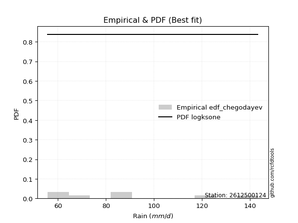</img>

</div>


### 6. EDF Blom (1958)

The Blom formula is a specific "plotting position" formula used in hydrology and statistical analysis to estimate the empirical cumulative probability (or non-exceedance probability) of a data series. It is particularly recommended for data that are approximately normally distributed. The constant _a_ is set to 0.375 (or 3/8).

<div align="center">


$P=(m-a)/(n+1-2a)$


</div>


**6.1. Empirical values**

<div align="center">

|                | 0                   | 1                   | 2                  | 3        | 4                  | 5                  | 6                  |
|:---------------|:--------------------|:--------------------|:-------------------|:---------|:-------------------|:-------------------|:-------------------|
| date           | 2019                | 2023                | 2025               | 2022     | 2021               | 2020               | 2024               |
| x              | 55.8                | 56.2                | 65.2               | 82.8     | 89.8               | 124.0              | 143.2              |
| m              | 1                   | 2                   | 3                  | 4        | 5                  | 6                  | 7                  |
| empirical_dist | edf_blom            | edf_blom            | edf_blom           | edf_blom | edf_blom           | edf_blom           | edf_blom           |
| empirical      | 0.08620689655172414 | 0.22413793103448276 | 0.3620689655172414 | 0.5      | 0.6379310344827587 | 0.7758620689655172 | 0.9137931034482759 |
| empirical_tr   | 1.0943396226415094  | 1.288888888888889   | 1.5675675675675675 | 2.0      | 2.7619047619047623 | 4.461538461538462  | 11.600000000000007 |

</div>


**6.2. Kolmogorov-Smirnov fit test (sorted by Δ)**


<div align="center">

|                | 0                   | 1                   | 2                   | 3                   | 4                   | 5                   | 6                   | 7                   | 8                   | 9                   | 10                  | 11                  | 12                  | 13                  | 14                  | 15                  | 16                  | 17                  | 18                  | 19                  | 20                  | 21                  | 22                  | 23                  | 24                  | 25                  | 26                  | 27                  | 28                  | 29                  | 30                  | 31                  | 32                  | 33                  | 34                  | 35                  | 36                  | 37                  | 38                  | 39                  | 40                  | 41                  | 42                  | 43                  | 44                  | 45                  | 46                  | 47                  | 48                  | 49                  | 50                  | 51                  | 52                  | 53                  | 54                  | 55                  | 56                  | 57                  | 58                  | 59                  | 60                  | 61                  | 62                  | 63                  | 64                  | 65                  | 66                  | 67                  | 68                  | 69                  | 70                  | 71                  | 72                  | 73                  | 74                  | 75                  | 76                  | 77                  | 78                  | 79                  | 80                  | 81                  | 82                  | 83                  | 84                  | 85                  | 86                  | 87                  | 88                  | 89                  | 90                  | 91                  | 92                  | 93                  | 94                  | 95                  | 96                  | 97                  | 98                  | 99                  | 100                 | 101                 | 102                 | 103                 | 104                 | 105                 | 106                 | 107                 | 108                 | 109                 | 110                 | 111                 | 112                 | 113                 | 114                 | 115                 | 116                 | 117                 | 118                 | 119                 | 120                 | 121                 | 122                 | 123                 | 124                 | 125                 | 126                 | 127                 | 128                 | 129                 | 130                 | 131                 | 132                 | 133                 | 134                 | 135                 | 136                 | 137                 | 138                 | 139                 | 140                 | 141                 | 142                 | 143                 | 144                 | 145                 | 146                 | 147                 | 148                 | 149                 | 150                 | 151                 | 152                 | 153                 | 154                 | 155                 | 156                 | 157                 | 158                 | 159                 |
|:---------------|:--------------------|:--------------------|:--------------------|:--------------------|:--------------------|:--------------------|:--------------------|:--------------------|:--------------------|:--------------------|:--------------------|:--------------------|:--------------------|:--------------------|:--------------------|:--------------------|:--------------------|:--------------------|:--------------------|:--------------------|:--------------------|:--------------------|:--------------------|:--------------------|:--------------------|:--------------------|:--------------------|:--------------------|:--------------------|:--------------------|:--------------------|:--------------------|:--------------------|:--------------------|:--------------------|:--------------------|:--------------------|:--------------------|:--------------------|:--------------------|:--------------------|:--------------------|:--------------------|:--------------------|:--------------------|:--------------------|:--------------------|:--------------------|:--------------------|:--------------------|:--------------------|:--------------------|:--------------------|:--------------------|:--------------------|:--------------------|:--------------------|:--------------------|:--------------------|:--------------------|:--------------------|:--------------------|:--------------------|:--------------------|:--------------------|:--------------------|:--------------------|:--------------------|:--------------------|:--------------------|:--------------------|:--------------------|:--------------------|:--------------------|:--------------------|:--------------------|:--------------------|:--------------------|:--------------------|:--------------------|:--------------------|:--------------------|:--------------------|:--------------------|:--------------------|:--------------------|:--------------------|:--------------------|:--------------------|:--------------------|:--------------------|:--------------------|:--------------------|:--------------------|:--------------------|:--------------------|:--------------------|:--------------------|:--------------------|:--------------------|:--------------------|:--------------------|:--------------------|:--------------------|:--------------------|:--------------------|:--------------------|:--------------------|:--------------------|:--------------------|:--------------------|:--------------------|:--------------------|:--------------------|:--------------------|:--------------------|:--------------------|:--------------------|:--------------------|:--------------------|:--------------------|:--------------------|:--------------------|:--------------------|:--------------------|:--------------------|:--------------------|:--------------------|:--------------------|:--------------------|:--------------------|:--------------------|:--------------------|:--------------------|:--------------------|:--------------------|:--------------------|:--------------------|:--------------------|:--------------------|:--------------------|:--------------------|:--------------------|:--------------------|:--------------------|:--------------------|:--------------------|:--------------------|:--------------------|:--------------------|:--------------------|:--------------------|:--------------------|:--------------------|:--------------------|:--------------------|:--------------------|:--------------------|:--------------------|:--------------------|
| station        | 2612500124          | 2612500124          | 2612500124          | 2612500124          | 2612500124          | 2612500124          | 2612500124          | 2612500124          | 2612500124          | 2612500124          | 2612500124          | 2612500124          | 2612500124          | 2612500124          | 2612500124          | 2612500124          | 2612500124          | 2612500124          | 2612500124          | 2612500124          | 2612500124          | 2612500124          | 2612500124          | 2612500124          | 2612500124          | 2612500124          | 2612500124          | 2612500124          | 2612500124          | 2612500124          | 2612500124          | 2612500124          | 2612500124          | 2612500124          | 2612500124          | 2612500124          | 2612500124          | 2612500124          | 2612500124          | 2612500124          | 2612500124          | 2612500124          | 2612500124          | 2612500124          | 2612500124          | 2612500124          | 2612500124          | 2612500124          | 2612500124          | 2612500124          | 2612500124          | 2612500124          | 2612500124          | 2612500124          | 2612500124          | 2612500124          | 2612500124          | 2612500124          | 2612500124          | 2612500124          | 2612500124          | 2612500124          | 2612500124          | 2612500124          | 2612500124          | 2612500124          | 2612500124          | 2612500124          | 2612500124          | 2612500124          | 2612500124          | 2612500124          | 2612500124          | 2612500124          | 2612500124          | 2612500124          | 2612500124          | 2612500124          | 2612500124          | 2612500124          | 2612500124          | 2612500124          | 2612500124          | 2612500124          | 2612500124          | 2612500124          | 2612500124          | 2612500124          | 2612500124          | 2612500124          | 2612500124          | 2612500124          | 2612500124          | 2612500124          | 2612500124          | 2612500124          | 2612500124          | 2612500124          | 2612500124          | 2612500124          | 2612500124          | 2612500124          | 2612500124          | 2612500124          | 2612500124          | 2612500124          | 2612500124          | 2612500124          | 2612500124          | 2612500124          | 2612500124          | 2612500124          | 2612500124          | 2612500124          | 2612500124          | 2612500124          | 2612500124          | 2612500124          | 2612500124          | 2612500124          | 2612500124          | 2612500124          | 2612500124          | 2612500124          | 2612500124          | 2612500124          | 2612500124          | 2612500124          | 2612500124          | 2612500124          | 2612500124          | 2612500124          | 2612500124          | 2612500124          | 2612500124          | 2612500124          | 2612500124          | 2612500124          | 2612500124          | 2612500124          | 2612500124          | 2612500124          | 2612500124          | 2612500124          | 2612500124          | 2612500124          | 2612500124          | 2612500124          | 2612500124          | 2612500124          | 2612500124          | 2612500124          | 2612500124          | 2612500124          | 2612500124          | 2612500124          | 2612500124          | 2612500124          | 2612500124          | 2612500124          |
| empirical_dist | edf_blom            | edf_blom            | edf_blom            | edf_blom            | edf_blom            | edf_blom            | edf_blom            | edf_blom            | edf_blom            | edf_blom            | edf_blom            | edf_blom            | edf_blom            | edf_blom            | edf_blom            | edf_blom            | edf_blom            | edf_blom            | edf_blom            | edf_blom            | edf_blom            | edf_blom            | edf_blom            | edf_blom            | edf_blom            | edf_blom            | edf_blom            | edf_blom            | edf_blom            | edf_blom            | edf_blom            | edf_blom            | edf_blom            | edf_blom            | edf_blom            | edf_blom            | edf_blom            | edf_blom            | edf_blom            | edf_blom            | edf_blom            | edf_blom            | edf_blom            | edf_blom            | edf_blom            | edf_blom            | edf_blom            | edf_blom            | edf_blom            | edf_blom            | edf_blom            | edf_blom            | edf_blom            | edf_blom            | edf_blom            | edf_blom            | edf_blom            | edf_blom            | edf_blom            | edf_blom            | edf_blom            | edf_blom            | edf_blom            | edf_blom            | edf_blom            | edf_blom            | edf_blom            | edf_blom            | edf_blom            | edf_blom            | edf_blom            | edf_blom            | edf_blom            | edf_blom            | edf_blom            | edf_blom            | edf_blom            | edf_blom            | edf_blom            | edf_blom            | edf_blom            | edf_blom            | edf_blom            | edf_blom            | edf_blom            | edf_blom            | edf_blom            | edf_blom            | edf_blom            | edf_blom            | edf_blom            | edf_blom            | edf_blom            | edf_blom            | edf_blom            | edf_blom            | edf_blom            | edf_blom            | edf_blom            | edf_blom            | edf_blom            | edf_blom            | edf_blom            | edf_blom            | edf_blom            | edf_blom            | edf_blom            | edf_blom            | edf_blom            | edf_blom            | edf_blom            | edf_blom            | edf_blom            | edf_blom            | edf_blom            | edf_blom            | edf_blom            | edf_blom            | edf_blom            | edf_blom            | edf_blom            | edf_blom            | edf_blom            | edf_blom            | edf_blom            | edf_blom            | edf_blom            | edf_blom            | edf_blom            | edf_blom            | edf_blom            | edf_blom            | edf_blom            | edf_blom            | edf_blom            | edf_blom            | edf_blom            | edf_blom            | edf_blom            | edf_blom            | edf_blom            | edf_blom            | edf_blom            | edf_blom            | edf_blom            | edf_blom            | edf_blom            | edf_blom            | edf_blom            | edf_blom            | edf_blom            | edf_blom            | edf_blom            | edf_blom            | edf_blom            | edf_blom            | edf_blom            | edf_blom            | edf_blom            | edf_blom            |
| p_dist         | logsemicircular     | logksone            | foldnorm            | halfnorm            | logbetaprime        | loganglit           | logmaxwell          | logfoldnorm         | lograyleigh         | rayleigh            | nct                 | maxwell             | lognct              | logpearson3         | logarcsine          | betaprime           | burr                | pearson3            | loggenlogistic      | logweibull_max      | logloggamma         | logalpha            | logburr             | logmielke           | loggenextreme       | loginvweibull       | logjohnsonsu        | lognorm             | logcrystalball      | logt                | anglit              | semicircular        | genlogistic         | gumbel_r            | logkstwobign        | loginvgamma         | halflogistic        | logncf              | moyal               | logf                | truncnorm           | norm                | crystalball         | t                   | loghalfnorm         | kstwobign           | loggumbel_r         | logrice             | logcosine           | loglogistic         | logdweibull         | logloglaplace       | logistic            | weibull_min         | arcsine             | cosine              | gausshyper          | loghypsecant        | loggumbel_l         | nakagami            | rice                | logmoyal            | dweibull            | alpha               | hypsecant           | logbeta             | logargus            | f                   | invgamma            | logdgamma           | logburr12           | loglaplace          | loglaplace          | halfgennorm         | exponpow            | genpareto           | dgamma              | bradford            | laplace             | gumbel_l            | logweibull_min      | loghalflogistic     | logrdist            | loginvgauss         | burr12              | loghalfgennorm      | ncf                 | truncweibull_min    | logtruncweibull_min | logwrapcauchy       | logtriang           | logexponnorm        | loglomax            | wrapcauchy          | loggenexpon         | exponnorm           | invgauss            | loggompertz         | lomax               | genexpon            | gompertz            | logtruncexpon       | logskewnorm         | logkappa4           | logtukeylambda      | beta                | loguniform          | logkappa3           | logvonmises_line    | truncexpon          | skewnorm            | logwald             | wald                | ksone               | argus               | kappa4              | uniform             | vonmises_line       | kappa3              | loglevy_l           | loggennorm          | gennorm             | triang              | logexponpow         | loggenhalflogistic  | levy_l              | loggamma            | loggamma            | gamma               | logerlang           | logfatiguelife      | lognakagami         | genextreme          | powerlaw            | logbradford         | tukeylambda         | fatiguelife         | logtruncnorm        | rdist               | truncpareto         | erlang              | genhalflogistic     | logpowerlaw         | logtrapezoid        | loggausshyper       | logtruncpareto      | gengamma            | logexponweib        | invweibull          | loggengamma         | exponweib           | trapezoid           | loggenpareto        | johnsonsb           | logjohnsonsb        | weibull_max         | johnsonsu           | logvonmises         | vonmises            | mielke              |
| delta          | 0.07955296154621333 | 0.08209586187085699 | 0.08611508955199537 | 0.08641035911387784 | 0.08846992053476826 | 0.09161420195600689 | 0.09887962276088108 | 0.09915182663886551 | 0.10034441936201749 | 0.10208784804808912 | 0.1080565814990171  | 0.10997769663764695 | 0.11020512864667509 | 0.11102421598557044 | 0.11188413314569831 | 0.11423676797009205 | 0.11578467461140539 | 0.11593550970455416 | 0.11601011566617678 | 0.11611365739607514 | 0.11667102125283796 | 0.11764237842172157 | 0.11768631845667413 | 0.11792443215617102 | 0.11901084838482383 | 0.11901393956149821 | 0.11921528560866224 | 0.11937575327994299 | 0.11937575419101479 | 0.1193761653031633  | 0.11994580103724728 | 0.12118180192239114 | 0.1217335249210224  | 0.12260988895001784 | 0.12279773642656573 | 0.12398751247547998 | 0.1245621673718146  | 0.12801131640054894 | 0.1280805218934999  | 0.12846191824419578 | 0.12894232847114556 | 0.12894233369260366 | 0.12894234133195723 | 0.12919373043139631 | 0.130428092532275   | 0.13199127052773302 | 0.13220637491153348 | 0.13658913267107442 | 0.13692311983468547 | 0.14202757640821323 | 0.14452645730654223 | 0.1460918442477838  | 0.1515024198515421  | 0.15324511837733754 | 0.15504508646919438 | 0.1556590018193753  | 0.15578577311735203 | 0.15671578549421272 | 0.15702805535567854 | 0.15881275850385568 | 0.15922078197807057 | 0.16059119512183745 | 0.16528661565533548 | 0.16535083747035095 | 0.16583361074517405 | 0.1660674262997692  | 0.16741277674725324 | 0.1680737436939017  | 0.16935543535449504 | 0.171082094035814   | 0.17494920205630582 | 0.17565680812394288 | 0.17565680812394288 | 0.17895956195479204 | 0.18037013014868541 | 0.18098544390560928 | 0.18149046850692624 | 0.18358307908110538 | 0.1836333194154087  | 0.18637886687405292 | 0.1883313388639387  | 0.1908691446029706  | 0.19185951312979627 | 0.19227601225495605 | 0.1945449240822038  | 0.19690735891821404 | 0.19762506349345038 | 0.19883456665658938 | 0.19932463776251008 | 0.20004490550127338 | 0.20324725998322235 | 0.20480762564950616 | 0.20619864056407336 | 0.20702004101809565 | 0.20906864484445495 | 0.2104781133573762  | 0.21054202325784288 | 0.21055884083772738 | 0.21070557650634597 | 0.21184657431242537 | 0.21216344755988975 | 0.21290295535103798 | 0.21328859934615074 | 0.2145144416751218  | 0.21567008103885021 | 0.21648055898203372 | 0.21655901631966684 | 0.21657271108602918 | 0.21663439491488162 | 0.21670190545906468 | 0.21706777523895032 | 0.22413793103448276 | 0.22689671572497463 | 0.23041768589389516 | 0.23361674763015683 | 0.2340847409110429  | 0.2545174781030537  | 0.2545323125910829  | 0.2547683979454627  | 0.27433452410536413 | 0.27586206896551724 | 0.27586206896551724 | 0.28364413910420433 | 0.28965258027980884 | 0.2959032755164151  | 0.30503946820926814 | 0.3064549709376101  | 0.3064549709376101  | 0.310236035175085   | 0.3141870947397094  | 0.3292293837380695  | 0.33037533327678287 | 0.3438290244487595  | 0.3555109302472553  | 0.3599852559784353  | 0.36080383094360546 | 0.3613386824313824  | 0.3620689393418277  | 0.36206896490485974 | 0.36523469700026917 | 0.37232741458854    | 0.3795900236777364  | 0.3838597275782501  | 0.3838677365980442  | 0.3943353184366802  | 0.41437713975624973 | 0.4152240034215117  | 0.4255986995881244  | 0.42809827407447126 | 0.42933677866462966 | 0.46570753914559365 | 0.47186390520465005 | 0.49579816792214654 | 0.5239043574042042  | 0.604247039756198   | 0.6072898816113314  | 0.6769875939337414  | 1.1041505195040457  | 22.372508625020522  | nan                 |
| deltao         | 0.48442053926100004 | 0.48442053926100004 | 0.48442053926100004 | 0.48442053926100004 | 0.48442053926100004 | 0.48442053926100004 | 0.48442053926100004 | 0.48442053926100004 | 0.48442053926100004 | 0.48442053926100004 | 0.48442053926100004 | 0.48442053926100004 | 0.48442053926100004 | 0.48442053926100004 | 0.48442053926100004 | 0.48442053926100004 | 0.48442053926100004 | 0.48442053926100004 | 0.48442053926100004 | 0.48442053926100004 | 0.48442053926100004 | 0.48442053926100004 | 0.48442053926100004 | 0.48442053926100004 | 0.48442053926100004 | 0.48442053926100004 | 0.48442053926100004 | 0.48442053926100004 | 0.48442053926100004 | 0.48442053926100004 | 0.48442053926100004 | 0.48442053926100004 | 0.48442053926100004 | 0.48442053926100004 | 0.48442053926100004 | 0.48442053926100004 | 0.48442053926100004 | 0.48442053926100004 | 0.48442053926100004 | 0.48442053926100004 | 0.48442053926100004 | 0.48442053926100004 | 0.48442053926100004 | 0.48442053926100004 | 0.48442053926100004 | 0.48442053926100004 | 0.48442053926100004 | 0.48442053926100004 | 0.48442053926100004 | 0.48442053926100004 | 0.48442053926100004 | 0.48442053926100004 | 0.48442053926100004 | 0.48442053926100004 | 0.48442053926100004 | 0.48442053926100004 | 0.48442053926100004 | 0.48442053926100004 | 0.48442053926100004 | 0.48442053926100004 | 0.48442053926100004 | 0.48442053926100004 | 0.48442053926100004 | 0.48442053926100004 | 0.48442053926100004 | 0.48442053926100004 | 0.48442053926100004 | 0.48442053926100004 | 0.48442053926100004 | 0.48442053926100004 | 0.48442053926100004 | 0.48442053926100004 | 0.48442053926100004 | 0.48442053926100004 | 0.48442053926100004 | 0.48442053926100004 | 0.48442053926100004 | 0.48442053926100004 | 0.48442053926100004 | 0.48442053926100004 | 0.48442053926100004 | 0.48442053926100004 | 0.48442053926100004 | 0.48442053926100004 | 0.48442053926100004 | 0.48442053926100004 | 0.48442053926100004 | 0.48442053926100004 | 0.48442053926100004 | 0.48442053926100004 | 0.48442053926100004 | 0.48442053926100004 | 0.48442053926100004 | 0.48442053926100004 | 0.48442053926100004 | 0.48442053926100004 | 0.48442053926100004 | 0.48442053926100004 | 0.48442053926100004 | 0.48442053926100004 | 0.48442053926100004 | 0.48442053926100004 | 0.48442053926100004 | 0.48442053926100004 | 0.48442053926100004 | 0.48442053926100004 | 0.48442053926100004 | 0.48442053926100004 | 0.48442053926100004 | 0.48442053926100004 | 0.48442053926100004 | 0.48442053926100004 | 0.48442053926100004 | 0.48442053926100004 | 0.48442053926100004 | 0.48442053926100004 | 0.48442053926100004 | 0.48442053926100004 | 0.48442053926100004 | 0.48442053926100004 | 0.48442053926100004 | 0.48442053926100004 | 0.48442053926100004 | 0.48442053926100004 | 0.48442053926100004 | 0.48442053926100004 | 0.48442053926100004 | 0.48442053926100004 | 0.48442053926100004 | 0.48442053926100004 | 0.48442053926100004 | 0.48442053926100004 | 0.48442053926100004 | 0.48442053926100004 | 0.48442053926100004 | 0.48442053926100004 | 0.48442053926100004 | 0.48442053926100004 | 0.48442053926100004 | 0.48442053926100004 | 0.48442053926100004 | 0.48442053926100004 | 0.48442053926100004 | 0.48442053926100004 | 0.48442053926100004 | 0.48442053926100004 | 0.48442053926100004 | 0.48442053926100004 | 0.48442053926100004 | 0.48442053926100004 | 0.48442053926100004 | 0.48442053926100004 | 0.48442053926100004 | 0.48442053926100004 | 0.48442053926100004 | 0.48442053926100004 | 0.48442053926100004 | 0.48442053926100004 | 0.48442053926100004 | 0.48442053926100004 |
| eval           | Δo > Δ              | Δo > Δ              | Δo > Δ              | Δo > Δ              | Δo > Δ              | Δo > Δ              | Δo > Δ              | Δo > Δ              | Δo > Δ              | Δo > Δ              | Δo > Δ              | Δo > Δ              | Δo > Δ              | Δo > Δ              | Δo > Δ              | Δo > Δ              | Δo > Δ              | Δo > Δ              | Δo > Δ              | Δo > Δ              | Δo > Δ              | Δo > Δ              | Δo > Δ              | Δo > Δ              | Δo > Δ              | Δo > Δ              | Δo > Δ              | Δo > Δ              | Δo > Δ              | Δo > Δ              | Δo > Δ              | Δo > Δ              | Δo > Δ              | Δo > Δ              | Δo > Δ              | Δo > Δ              | Δo > Δ              | Δo > Δ              | Δo > Δ              | Δo > Δ              | Δo > Δ              | Δo > Δ              | Δo > Δ              | Δo > Δ              | Δo > Δ              | Δo > Δ              | Δo > Δ              | Δo > Δ              | Δo > Δ              | Δo > Δ              | Δo > Δ              | Δo > Δ              | Δo > Δ              | Δo > Δ              | Δo > Δ              | Δo > Δ              | Δo > Δ              | Δo > Δ              | Δo > Δ              | Δo > Δ              | Δo > Δ              | Δo > Δ              | Δo > Δ              | Δo > Δ              | Δo > Δ              | Δo > Δ              | Δo > Δ              | Δo > Δ              | Δo > Δ              | Δo > Δ              | Δo > Δ              | Δo > Δ              | Δo > Δ              | Δo > Δ              | Δo > Δ              | Δo > Δ              | Δo > Δ              | Δo > Δ              | Δo > Δ              | Δo > Δ              | Δo > Δ              | Δo > Δ              | Δo > Δ              | Δo > Δ              | Δo > Δ              | Δo > Δ              | Δo > Δ              | Δo > Δ              | Δo > Δ              | Δo > Δ              | Δo > Δ              | Δo > Δ              | Δo > Δ              | Δo > Δ              | Δo > Δ              | Δo > Δ              | Δo > Δ              | Δo > Δ              | Δo > Δ              | Δo > Δ              | Δo > Δ              | Δo > Δ              | Δo > Δ              | Δo > Δ              | Δo > Δ              | Δo > Δ              | Δo > Δ              | Δo > Δ              | Δo > Δ              | Δo > Δ              | Δo > Δ              | Δo > Δ              | Δo > Δ              | Δo > Δ              | Δo > Δ              | Δo > Δ              | Δo > Δ              | Δo > Δ              | Δo > Δ              | Δo > Δ              | Δo > Δ              | Δo > Δ              | Δo > Δ              | Δo > Δ              | Δo > Δ              | Δo > Δ              | Δo > Δ              | Δo > Δ              | Δo > Δ              | Δo > Δ              | Δo > Δ              | Δo > Δ              | Δo > Δ              | Δo > Δ              | Δo > Δ              | Δo > Δ              | Δo > Δ              | Δo > Δ              | Δo > Δ              | Δo > Δ              | Δo > Δ              | Δo > Δ              | Δo > Δ              | Δo > Δ              | Δo > Δ              | Δo > Δ              | Δo > Δ              | Δo > Δ              | Δo > Δ              | Δo > Δ              | Δo > Δ              | Δo > Δ              | Δo <= Δ             | Δo <= Δ             | Δo <= Δ             | Δo <= Δ             | Δo <= Δ             | Δo <= Δ             | Δo <= Δ             | Δo <= Δ             |
| fit            | 1                   | 1                   | 1                   | 1                   | 1                   | 1                   | 1                   | 1                   | 1                   | 1                   | 1                   | 1                   | 1                   | 1                   | 1                   | 1                   | 1                   | 1                   | 1                   | 1                   | 1                   | 1                   | 1                   | 1                   | 1                   | 1                   | 1                   | 1                   | 1                   | 1                   | 1                   | 1                   | 1                   | 1                   | 1                   | 1                   | 1                   | 1                   | 1                   | 1                   | 1                   | 1                   | 1                   | 1                   | 1                   | 1                   | 1                   | 1                   | 1                   | 1                   | 1                   | 1                   | 1                   | 1                   | 1                   | 1                   | 1                   | 1                   | 1                   | 1                   | 1                   | 1                   | 1                   | 1                   | 1                   | 1                   | 1                   | 1                   | 1                   | 1                   | 1                   | 1                   | 1                   | 1                   | 1                   | 1                   | 1                   | 1                   | 1                   | 1                   | 1                   | 1                   | 1                   | 1                   | 1                   | 1                   | 1                   | 1                   | 1                   | 1                   | 1                   | 1                   | 1                   | 1                   | 1                   | 1                   | 1                   | 1                   | 1                   | 1                   | 1                   | 1                   | 1                   | 1                   | 1                   | 1                   | 1                   | 1                   | 1                   | 1                   | 1                   | 1                   | 1                   | 1                   | 1                   | 1                   | 1                   | 1                   | 1                   | 1                   | 1                   | 1                   | 1                   | 1                   | 1                   | 1                   | 1                   | 1                   | 1                   | 1                   | 1                   | 1                   | 1                   | 1                   | 1                   | 1                   | 1                   | 1                   | 1                   | 1                   | 1                   | 1                   | 1                   | 1                   | 1                   | 1                   | 1                   | 1                   | 1                   | 1                   | 1                   | 1                   | 0                   | 0                   | 0                   | 0                   | 0                   | 0                   | 0                   | 0                   |
| n              | 7                   | 7                   | 7                   | 7                   | 7                   | 7                   | 7                   | 7                   | 7                   | 7                   | 7                   | 7                   | 7                   | 7                   | 7                   | 7                   | 7                   | 7                   | 7                   | 7                   | 7                   | 7                   | 7                   | 7                   | 7                   | 7                   | 7                   | 7                   | 7                   | 7                   | 7                   | 7                   | 7                   | 7                   | 7                   | 7                   | 7                   | 7                   | 7                   | 7                   | 7                   | 7                   | 7                   | 7                   | 7                   | 7                   | 7                   | 7                   | 7                   | 7                   | 7                   | 7                   | 7                   | 7                   | 7                   | 7                   | 7                   | 7                   | 7                   | 7                   | 7                   | 7                   | 7                   | 7                   | 7                   | 7                   | 7                   | 7                   | 7                   | 7                   | 7                   | 7                   | 7                   | 7                   | 7                   | 7                   | 7                   | 7                   | 7                   | 7                   | 7                   | 7                   | 7                   | 7                   | 7                   | 7                   | 7                   | 7                   | 7                   | 7                   | 7                   | 7                   | 7                   | 7                   | 7                   | 7                   | 7                   | 7                   | 7                   | 7                   | 7                   | 7                   | 7                   | 7                   | 7                   | 7                   | 7                   | 7                   | 7                   | 7                   | 7                   | 7                   | 7                   | 7                   | 7                   | 7                   | 7                   | 7                   | 7                   | 7                   | 7                   | 7                   | 7                   | 7                   | 7                   | 7                   | 7                   | 7                   | 7                   | 7                   | 7                   | 7                   | 7                   | 7                   | 7                   | 7                   | 7                   | 7                   | 7                   | 7                   | 7                   | 7                   | 7                   | 7                   | 7                   | 7                   | 7                   | 7                   | 7                   | 7                   | 7                   | 7                   | 7                   | 7                   | 7                   | 7                   | 7                   | 7                   | 7                   | 7                   |
| best_fit       | 1                   | 0                   | 0                   | 0                   | 0                   | 0                   | 0                   | 0                   | 0                   | 0                   | 0                   | 0                   | 0                   | 0                   | 0                   | 0                   | 0                   | 0                   | 0                   | 0                   | 0                   | 0                   | 0                   | 0                   | 0                   | 0                   | 0                   | 0                   | 0                   | 0                   | 0                   | 0                   | 0                   | 0                   | 0                   | 0                   | 0                   | 0                   | 0                   | 0                   | 0                   | 0                   | 0                   | 0                   | 0                   | 0                   | 0                   | 0                   | 0                   | 0                   | 0                   | 0                   | 0                   | 0                   | 0                   | 0                   | 0                   | 0                   | 0                   | 0                   | 0                   | 0                   | 0                   | 0                   | 0                   | 0                   | 0                   | 0                   | 0                   | 0                   | 0                   | 0                   | 0                   | 0                   | 0                   | 0                   | 0                   | 0                   | 0                   | 0                   | 0                   | 0                   | 0                   | 0                   | 0                   | 0                   | 0                   | 0                   | 0                   | 0                   | 0                   | 0                   | 0                   | 0                   | 0                   | 0                   | 0                   | 0                   | 0                   | 0                   | 0                   | 0                   | 0                   | 0                   | 0                   | 0                   | 0                   | 0                   | 0                   | 0                   | 0                   | 0                   | 0                   | 0                   | 0                   | 0                   | 0                   | 0                   | 0                   | 0                   | 0                   | 0                   | 0                   | 0                   | 0                   | 0                   | 0                   | 0                   | 0                   | 0                   | 0                   | 0                   | 0                   | 0                   | 0                   | 0                   | 0                   | 0                   | 0                   | 0                   | 0                   | 0                   | 0                   | 0                   | 0                   | 0                   | 0                   | 0                   | 0                   | 0                   | 0                   | 0                   | 0                   | 0                   | 0                   | 0                   | 0                   | 0                   | 0                   | 0                   |
| best_fit_sort  | 1                   | 2                   | 3                   | 4                   | 5                   | 6                   | 7                   | 8                   | 9                   | 10                  | 11                  | 12                  | 13                  | 14                  | 15                  | 16                  | 17                  | 18                  | 19                  | 20                  | 21                  | 22                  | 23                  | 24                  | 25                  | 26                  | 27                  | 28                  | 29                  | 30                  | 31                  | 32                  | 33                  | 34                  | 35                  | 36                  | 37                  | 38                  | 39                  | 40                  | 41                  | 42                  | 43                  | 44                  | 45                  | 46                  | 47                  | 48                  | 49                  | 50                  | 51                  | 52                  | 53                  | 54                  | 55                  | 56                  | 57                  | 58                  | 59                  | 60                  | 61                  | 62                  | 63                  | 64                  | 65                  | 66                  | 67                  | 68                  | 69                  | 70                  | 71                  | 72                  | 73                  | 74                  | 75                  | 76                  | 77                  | 78                  | 79                  | 80                  | 81                  | 82                  | 83                  | 84                  | 85                  | 86                  | 87                  | 88                  | 89                  | 90                  | 91                  | 92                  | 93                  | 94                  | 95                  | 96                  | 97                  | 98                  | 99                  | 100                 | 101                 | 102                 | 103                 | 104                 | 105                 | 106                 | 107                 | 108                 | 109                 | 110                 | 111                 | 112                 | 113                 | 114                 | 115                 | 116                 | 117                 | 118                 | 119                 | 120                 | 121                 | 122                 | 123                 | 124                 | 125                 | 126                 | 127                 | 128                 | 129                 | 130                 | 131                 | 132                 | 133                 | 134                 | 135                 | 136                 | 137                 | 138                 | 139                 | 140                 | 141                 | 142                 | 143                 | 144                 | 145                 | 146                 | 147                 | 148                 | 149                 | 150                 | 151                 | 152                 | 153                 | 154                 | 155                 | 156                 | 157                 | 158                 | 159                 | 160                 |

</div>


**6.3. Best fit**

<div align="center">

|   id |    station | empirical_dist   | p_dist          |    delta |   deltao | eval   |   fit |   n |   best_fit |   best_fit_sort |
|-----:|-----------:|:-----------------|:----------------|---------:|---------:|:-------|------:|----:|-----------:|----------------:|
|    0 | 2612500124 | edf_blom         | logsemicircular | 0.079553 | 0.484421 | Δo > Δ |     1 |   7 |          1 |               1 |

</div>


<div align="center">

</img></img>

</div>


### 7. EDF Tukey (1962)

In hydrology, the Tukey formula is used as a plotting position formula to estimate the empirical probability or frequency of a flood event (or other hydrological data). The formula parameter is given as _c=0.333_ (or 1/3).

<div align="center">


$P=(m-c)/(n+1-2c)$


</div>


**7.1. Empirical values**

<div align="center">

|                | 0                   | 1                   | 2                   | 3         | 4                  | 5                  | 6                  |
|:---------------|:--------------------|:--------------------|:--------------------|:----------|:-------------------|:-------------------|:-------------------|
| date           | 2019                | 2023                | 2025                | 2022      | 2021               | 2020               | 2024               |
| x              | 55.8                | 56.2                | 65.2                | 82.8      | 89.8               | 124.0              | 143.2              |
| m              | 1                   | 2                   | 3                   | 4         | 5                  | 6                  | 7                  |
| empirical_dist | edf_tukey           | edf_tukey           | edf_tukey           | edf_tukey | edf_tukey          | edf_tukey          | edf_tukey          |
| empirical      | 0.09090909090909091 | 0.22727272727272727 | 0.36363636363636365 | 0.5       | 0.6363636363636364 | 0.7727272727272727 | 0.9090909090909091 |
| empirical_tr   | 1.1                 | 1.2941176470588236  | 1.5714285714285714  | 2.0       | 2.75               | 4.3999999999999995 | 10.999999999999996 |

</div>


**7.2. Kolmogorov-Smirnov fit test (sorted by Δ)**


<div align="center">

|                | 0                   | 1                   | 2                   | 3                   | 4                   | 5                   | 6                   | 7                   | 8                   | 9                   | 10                  | 11                  | 12                  | 13                  | 14                  | 15                  | 16                  | 17                  | 18                  | 19                  | 20                  | 21                  | 22                  | 23                  | 24                  | 25                  | 26                  | 27                  | 28                  | 29                  | 30                  | 31                  | 32                  | 33                  | 34                  | 35                  | 36                  | 37                  | 38                  | 39                  | 40                  | 41                  | 42                  | 43                  | 44                  | 45                  | 46                  | 47                  | 48                  | 49                  | 50                  | 51                  | 52                  | 53                  | 54                  | 55                  | 56                  | 57                  | 58                  | 59                  | 60                  | 61                  | 62                  | 63                  | 64                  | 65                  | 66                  | 67                  | 68                  | 69                  | 70                  | 71                  | 72                  | 73                  | 74                  | 75                  | 76                  | 77                  | 78                  | 79                  | 80                  | 81                  | 82                  | 83                  | 84                  | 85                  | 86                  | 87                  | 88                  | 89                  | 90                  | 91                  | 92                  | 93                  | 94                  | 95                  | 96                  | 97                  | 98                  | 99                  | 100                 | 101                 | 102                 | 103                 | 104                 | 105                 | 106                 | 107                 | 108                 | 109                 | 110                 | 111                 | 112                 | 113                 | 114                 | 115                 | 116                 | 117                 | 118                 | 119                 | 120                 | 121                 | 122                 | 123                 | 124                 | 125                 | 126                 | 127                 | 128                 | 129                 | 130                 | 131                 | 132                 | 133                 | 134                 | 135                 | 136                 | 137                 | 138                 | 139                 | 140                 | 141                 | 142                 | 143                 | 144                 | 145                 | 146                 | 147                 | 148                 | 149                 | 150                 | 151                 | 152                 | 153                 | 154                 | 155                 | 156                 | 157                 | 158                 | 159                 |
|:---------------|:--------------------|:--------------------|:--------------------|:--------------------|:--------------------|:--------------------|:--------------------|:--------------------|:--------------------|:--------------------|:--------------------|:--------------------|:--------------------|:--------------------|:--------------------|:--------------------|:--------------------|:--------------------|:--------------------|:--------------------|:--------------------|:--------------------|:--------------------|:--------------------|:--------------------|:--------------------|:--------------------|:--------------------|:--------------------|:--------------------|:--------------------|:--------------------|:--------------------|:--------------------|:--------------------|:--------------------|:--------------------|:--------------------|:--------------------|:--------------------|:--------------------|:--------------------|:--------------------|:--------------------|:--------------------|:--------------------|:--------------------|:--------------------|:--------------------|:--------------------|:--------------------|:--------------------|:--------------------|:--------------------|:--------------------|:--------------------|:--------------------|:--------------------|:--------------------|:--------------------|:--------------------|:--------------------|:--------------------|:--------------------|:--------------------|:--------------------|:--------------------|:--------------------|:--------------------|:--------------------|:--------------------|:--------------------|:--------------------|:--------------------|:--------------------|:--------------------|:--------------------|:--------------------|:--------------------|:--------------------|:--------------------|:--------------------|:--------------------|:--------------------|:--------------------|:--------------------|:--------------------|:--------------------|:--------------------|:--------------------|:--------------------|:--------------------|:--------------------|:--------------------|:--------------------|:--------------------|:--------------------|:--------------------|:--------------------|:--------------------|:--------------------|:--------------------|:--------------------|:--------------------|:--------------------|:--------------------|:--------------------|:--------------------|:--------------------|:--------------------|:--------------------|:--------------------|:--------------------|:--------------------|:--------------------|:--------------------|:--------------------|:--------------------|:--------------------|:--------------------|:--------------------|:--------------------|:--------------------|:--------------------|:--------------------|:--------------------|:--------------------|:--------------------|:--------------------|:--------------------|:--------------------|:--------------------|:--------------------|:--------------------|:--------------------|:--------------------|:--------------------|:--------------------|:--------------------|:--------------------|:--------------------|:--------------------|:--------------------|:--------------------|:--------------------|:--------------------|:--------------------|:--------------------|:--------------------|:--------------------|:--------------------|:--------------------|:--------------------|:--------------------|:--------------------|:--------------------|:--------------------|:--------------------|:--------------------|:--------------------|
| station        | 2612500124          | 2612500124          | 2612500124          | 2612500124          | 2612500124          | 2612500124          | 2612500124          | 2612500124          | 2612500124          | 2612500124          | 2612500124          | 2612500124          | 2612500124          | 2612500124          | 2612500124          | 2612500124          | 2612500124          | 2612500124          | 2612500124          | 2612500124          | 2612500124          | 2612500124          | 2612500124          | 2612500124          | 2612500124          | 2612500124          | 2612500124          | 2612500124          | 2612500124          | 2612500124          | 2612500124          | 2612500124          | 2612500124          | 2612500124          | 2612500124          | 2612500124          | 2612500124          | 2612500124          | 2612500124          | 2612500124          | 2612500124          | 2612500124          | 2612500124          | 2612500124          | 2612500124          | 2612500124          | 2612500124          | 2612500124          | 2612500124          | 2612500124          | 2612500124          | 2612500124          | 2612500124          | 2612500124          | 2612500124          | 2612500124          | 2612500124          | 2612500124          | 2612500124          | 2612500124          | 2612500124          | 2612500124          | 2612500124          | 2612500124          | 2612500124          | 2612500124          | 2612500124          | 2612500124          | 2612500124          | 2612500124          | 2612500124          | 2612500124          | 2612500124          | 2612500124          | 2612500124          | 2612500124          | 2612500124          | 2612500124          | 2612500124          | 2612500124          | 2612500124          | 2612500124          | 2612500124          | 2612500124          | 2612500124          | 2612500124          | 2612500124          | 2612500124          | 2612500124          | 2612500124          | 2612500124          | 2612500124          | 2612500124          | 2612500124          | 2612500124          | 2612500124          | 2612500124          | 2612500124          | 2612500124          | 2612500124          | 2612500124          | 2612500124          | 2612500124          | 2612500124          | 2612500124          | 2612500124          | 2612500124          | 2612500124          | 2612500124          | 2612500124          | 2612500124          | 2612500124          | 2612500124          | 2612500124          | 2612500124          | 2612500124          | 2612500124          | 2612500124          | 2612500124          | 2612500124          | 2612500124          | 2612500124          | 2612500124          | 2612500124          | 2612500124          | 2612500124          | 2612500124          | 2612500124          | 2612500124          | 2612500124          | 2612500124          | 2612500124          | 2612500124          | 2612500124          | 2612500124          | 2612500124          | 2612500124          | 2612500124          | 2612500124          | 2612500124          | 2612500124          | 2612500124          | 2612500124          | 2612500124          | 2612500124          | 2612500124          | 2612500124          | 2612500124          | 2612500124          | 2612500124          | 2612500124          | 2612500124          | 2612500124          | 2612500124          | 2612500124          | 2612500124          | 2612500124          | 2612500124          | 2612500124          | 2612500124          |
| empirical_dist | edf_tukey           | edf_tukey           | edf_tukey           | edf_tukey           | edf_tukey           | edf_tukey           | edf_tukey           | edf_tukey           | edf_tukey           | edf_tukey           | edf_tukey           | edf_tukey           | edf_tukey           | edf_tukey           | edf_tukey           | edf_tukey           | edf_tukey           | edf_tukey           | edf_tukey           | edf_tukey           | edf_tukey           | edf_tukey           | edf_tukey           | edf_tukey           | edf_tukey           | edf_tukey           | edf_tukey           | edf_tukey           | edf_tukey           | edf_tukey           | edf_tukey           | edf_tukey           | edf_tukey           | edf_tukey           | edf_tukey           | edf_tukey           | edf_tukey           | edf_tukey           | edf_tukey           | edf_tukey           | edf_tukey           | edf_tukey           | edf_tukey           | edf_tukey           | edf_tukey           | edf_tukey           | edf_tukey           | edf_tukey           | edf_tukey           | edf_tukey           | edf_tukey           | edf_tukey           | edf_tukey           | edf_tukey           | edf_tukey           | edf_tukey           | edf_tukey           | edf_tukey           | edf_tukey           | edf_tukey           | edf_tukey           | edf_tukey           | edf_tukey           | edf_tukey           | edf_tukey           | edf_tukey           | edf_tukey           | edf_tukey           | edf_tukey           | edf_tukey           | edf_tukey           | edf_tukey           | edf_tukey           | edf_tukey           | edf_tukey           | edf_tukey           | edf_tukey           | edf_tukey           | edf_tukey           | edf_tukey           | edf_tukey           | edf_tukey           | edf_tukey           | edf_tukey           | edf_tukey           | edf_tukey           | edf_tukey           | edf_tukey           | edf_tukey           | edf_tukey           | edf_tukey           | edf_tukey           | edf_tukey           | edf_tukey           | edf_tukey           | edf_tukey           | edf_tukey           | edf_tukey           | edf_tukey           | edf_tukey           | edf_tukey           | edf_tukey           | edf_tukey           | edf_tukey           | edf_tukey           | edf_tukey           | edf_tukey           | edf_tukey           | edf_tukey           | edf_tukey           | edf_tukey           | edf_tukey           | edf_tukey           | edf_tukey           | edf_tukey           | edf_tukey           | edf_tukey           | edf_tukey           | edf_tukey           | edf_tukey           | edf_tukey           | edf_tukey           | edf_tukey           | edf_tukey           | edf_tukey           | edf_tukey           | edf_tukey           | edf_tukey           | edf_tukey           | edf_tukey           | edf_tukey           | edf_tukey           | edf_tukey           | edf_tukey           | edf_tukey           | edf_tukey           | edf_tukey           | edf_tukey           | edf_tukey           | edf_tukey           | edf_tukey           | edf_tukey           | edf_tukey           | edf_tukey           | edf_tukey           | edf_tukey           | edf_tukey           | edf_tukey           | edf_tukey           | edf_tukey           | edf_tukey           | edf_tukey           | edf_tukey           | edf_tukey           | edf_tukey           | edf_tukey           | edf_tukey           | edf_tukey           | edf_tukey           | edf_tukey           |
| p_dist         | logksone            | logsemicircular     | foldnorm            | halfnorm            | logbetaprime        | loganglit           | logmaxwell          | logfoldnorm         | lograyleigh         | rayleigh            | logarcsine          | nct                 | maxwell             | lognct              | logpearson3         | betaprime           | pearson3            | logloggamma         | anglit              | burr                | loggenlogistic      | logweibull_max      | semicircular        | logalpha            | logjohnsonsu        | logburr             | lognorm             | logcrystalball      | logt                | logmielke           | loggenextreme       | loginvweibull       | genlogistic         | logncf              | gumbel_r            | logkstwobign        | loginvgamma         | halflogistic        | moyal               | truncnorm           | norm                | crystalball         | t                   | logf                | kstwobign           | loghalfnorm         | loggumbel_r         | logcosine           | logrice             | loglogistic         | logloglaplace       | logdweibull         | arcsine             | logistic            | weibull_min         | cosine              | loghypsecant        | loggumbel_l         | nakagami            | gausshyper          | dweibull            | rice                | logmoyal            | alpha               | hypsecant           | f                   | logargus            | logbeta             | invgamma            | logdgamma           | dgamma              | loglaplace          | loglaplace          | logburr12           | genpareto           | exponpow            | halfgennorm         | bradford            | gumbel_l            | laplace             | logrdist            | logweibull_min      | loginvgauss         | loghalflogistic     | loghalfgennorm      | burr12              | ncf                 | logtriang           | truncweibull_min    | logtruncweibull_min | logwrapcauchy       | logexponnorm        | loglomax            | wrapcauchy          | invgauss            | beta                | loggenexpon         | exponnorm           | loggompertz         | lomax               | genexpon            | gompertz            | logtruncexpon       | logskewnorm         | logkappa4           | logtukeylambda      | loguniform          | logkappa3           | logvonmises_line    | truncexpon          | skewnorm            | logwald             | wald                | ksone               | argus               | kappa4              | uniform             | vonmises_line       | kappa3              | loglevy_l           | loggennorm          | gennorm             | triang              | logexponpow         | loggenhalflogistic  | levy_l              | loggamma            | loggamma            | gamma               | logerlang           | logfatiguelife      | lognakagami         | genextreme          | powerlaw            | logbradford         | fatiguelife         | tukeylambda         | logtruncnorm        | rdist               | truncpareto         | erlang              | genhalflogistic     | logpowerlaw         | logtrapezoid        | loggausshyper       | logtruncpareto      | gengamma            | invweibull          | logexponweib        | loggengamma         | exponweib           | trapezoid           | loggenpareto        | johnsonsb           | logjohnsonsb        | weibull_max         | johnsonsu           | logvonmises         | vonmises            | mielke              |
| delta          | 0.07739366751349022 | 0.0811203596653356  | 0.08591907729016746 | 0.08954515535212237 | 0.09003731865389053 | 0.09318160007512916 | 0.10077132120025295 | 0.10228662287711002 | 0.10347921560026199 | 0.10365524616721139 | 0.10718193878833154 | 0.1111913777372616  | 0.11154509475676921 | 0.11177252676579735 | 0.1125916141046927  | 0.11580416608921432 | 0.11750290782367642 | 0.11823841937196022 | 0.11837840291812496 | 0.11891947084964989 | 0.11914491190442128 | 0.11924845363431964 | 0.11961440380326882 | 0.12077717465996607 | 0.1207826837277845  | 0.12082111469491863 | 0.12094315139906525 | 0.12094315231013705 | 0.12094356342228557 | 0.12105922839441552 | 0.12214564462306833 | 0.12214873579974271 | 0.12330092304014467 | 0.12330912204318217 | 0.12417728706914011 | 0.12593253266481025 | 0.12712230871372449 | 0.1276969636100591  | 0.12964792001262215 | 0.13050972659026783 | 0.13050973181172593 | 0.1305097394510795  | 0.13076112855051858 | 0.13159671448244029 | 0.13355866864685528 | 0.13356288877051953 | 0.13534117114977798 | 0.13849051795380773 | 0.1397239289093189  | 0.1435949745273355  | 0.14765924236690606 | 0.14766125354478676 | 0.1503428921118276  | 0.15306981797066435 | 0.15637991461558204 | 0.15722639993849757 | 0.158283183613335   | 0.1585954534748008  | 0.15881275850385568 | 0.1589205693555965  | 0.1605844212979687  | 0.16078818009719284 | 0.16372599136008195 | 0.16535083747035095 | 0.16740100886429632 | 0.1680737436939017  | 0.1689801748663755  | 0.1692022225380137  | 0.16935543535449504 | 0.17264949215493627 | 0.17678827414955947 | 0.17722420624306515 | 0.17722420624306515 | 0.17808399829455032 | 0.17941804578648696 | 0.18037013014868541 | 0.18209435819303654 | 0.18358307908110538 | 0.1848114687549306  | 0.18520071753453096 | 0.1871573187724295  | 0.1914661351021832  | 0.19227601225495605 | 0.19400394084121508 | 0.19533996079909177 | 0.1976797203204483  | 0.20075985973169488 | 0.20167986186410003 | 0.2019693628948339  | 0.2024594340007546  | 0.20317970173951788 | 0.20794242188775067 | 0.20933343680231786 | 0.21015483725634015 | 0.21054202325784288 | 0.21177836462466695 | 0.21220344108269945 | 0.2136129095956207  | 0.2136936370759719  | 0.21384037274459047 | 0.21498137055066988 | 0.21529824379813425 | 0.21603775158928246 | 0.21642339558439525 | 0.2176492379133663  | 0.21880487727709472 | 0.21969381255791134 | 0.2197075073242737  | 0.21976919115312613 | 0.21983670169730918 | 0.22020257147719483 | 0.22727272727272727 | 0.2284641138440969  | 0.22885028777477284 | 0.2320493495110345  | 0.23565213903016516 | 0.2560848762221759  | 0.25609971071020515 | 0.25633579606458495 | 0.26963232974799733 | 0.2727272727272727  | 0.2727272727272727  | 0.282076740985082   | 0.28808518216068657 | 0.2943358773972928  | 0.30033727385190134 | 0.3064549709376101  | 0.3064549709376101  | 0.310236035175085   | 0.3141870947397094  | 0.3276619856189472  | 0.3288079351576606  | 0.33912683009139266 | 0.353943532128133   | 0.358417857859313   | 0.35977128431226013 | 0.3623712290627278  | 0.36363633746095    | 0.36363636302398206 | 0.3636672988811469  | 0.37232741458854    | 0.3780226255586141  | 0.38229232945912783 | 0.38230033847892186 | 0.3927679203175579  | 0.41280974163712747 | 0.41365660530238946 | 0.4233960797171044  | 0.42403130146900214 | 0.4277693805455074  | 0.4641401410264714  | 0.4702965070855277  | 0.49109597356477974 | 0.5223369592850818  | 0.6011122435179534  | 0.6041550853730868  | 0.6738527976954969  | 1.1072853157422904  | 22.37721081937789   | nan                 |
| deltao         | 0.48442053926100004 | 0.48442053926100004 | 0.48442053926100004 | 0.48442053926100004 | 0.48442053926100004 | 0.48442053926100004 | 0.48442053926100004 | 0.48442053926100004 | 0.48442053926100004 | 0.48442053926100004 | 0.48442053926100004 | 0.48442053926100004 | 0.48442053926100004 | 0.48442053926100004 | 0.48442053926100004 | 0.48442053926100004 | 0.48442053926100004 | 0.48442053926100004 | 0.48442053926100004 | 0.48442053926100004 | 0.48442053926100004 | 0.48442053926100004 | 0.48442053926100004 | 0.48442053926100004 | 0.48442053926100004 | 0.48442053926100004 | 0.48442053926100004 | 0.48442053926100004 | 0.48442053926100004 | 0.48442053926100004 | 0.48442053926100004 | 0.48442053926100004 | 0.48442053926100004 | 0.48442053926100004 | 0.48442053926100004 | 0.48442053926100004 | 0.48442053926100004 | 0.48442053926100004 | 0.48442053926100004 | 0.48442053926100004 | 0.48442053926100004 | 0.48442053926100004 | 0.48442053926100004 | 0.48442053926100004 | 0.48442053926100004 | 0.48442053926100004 | 0.48442053926100004 | 0.48442053926100004 | 0.48442053926100004 | 0.48442053926100004 | 0.48442053926100004 | 0.48442053926100004 | 0.48442053926100004 | 0.48442053926100004 | 0.48442053926100004 | 0.48442053926100004 | 0.48442053926100004 | 0.48442053926100004 | 0.48442053926100004 | 0.48442053926100004 | 0.48442053926100004 | 0.48442053926100004 | 0.48442053926100004 | 0.48442053926100004 | 0.48442053926100004 | 0.48442053926100004 | 0.48442053926100004 | 0.48442053926100004 | 0.48442053926100004 | 0.48442053926100004 | 0.48442053926100004 | 0.48442053926100004 | 0.48442053926100004 | 0.48442053926100004 | 0.48442053926100004 | 0.48442053926100004 | 0.48442053926100004 | 0.48442053926100004 | 0.48442053926100004 | 0.48442053926100004 | 0.48442053926100004 | 0.48442053926100004 | 0.48442053926100004 | 0.48442053926100004 | 0.48442053926100004 | 0.48442053926100004 | 0.48442053926100004 | 0.48442053926100004 | 0.48442053926100004 | 0.48442053926100004 | 0.48442053926100004 | 0.48442053926100004 | 0.48442053926100004 | 0.48442053926100004 | 0.48442053926100004 | 0.48442053926100004 | 0.48442053926100004 | 0.48442053926100004 | 0.48442053926100004 | 0.48442053926100004 | 0.48442053926100004 | 0.48442053926100004 | 0.48442053926100004 | 0.48442053926100004 | 0.48442053926100004 | 0.48442053926100004 | 0.48442053926100004 | 0.48442053926100004 | 0.48442053926100004 | 0.48442053926100004 | 0.48442053926100004 | 0.48442053926100004 | 0.48442053926100004 | 0.48442053926100004 | 0.48442053926100004 | 0.48442053926100004 | 0.48442053926100004 | 0.48442053926100004 | 0.48442053926100004 | 0.48442053926100004 | 0.48442053926100004 | 0.48442053926100004 | 0.48442053926100004 | 0.48442053926100004 | 0.48442053926100004 | 0.48442053926100004 | 0.48442053926100004 | 0.48442053926100004 | 0.48442053926100004 | 0.48442053926100004 | 0.48442053926100004 | 0.48442053926100004 | 0.48442053926100004 | 0.48442053926100004 | 0.48442053926100004 | 0.48442053926100004 | 0.48442053926100004 | 0.48442053926100004 | 0.48442053926100004 | 0.48442053926100004 | 0.48442053926100004 | 0.48442053926100004 | 0.48442053926100004 | 0.48442053926100004 | 0.48442053926100004 | 0.48442053926100004 | 0.48442053926100004 | 0.48442053926100004 | 0.48442053926100004 | 0.48442053926100004 | 0.48442053926100004 | 0.48442053926100004 | 0.48442053926100004 | 0.48442053926100004 | 0.48442053926100004 | 0.48442053926100004 | 0.48442053926100004 | 0.48442053926100004 | 0.48442053926100004 | 0.48442053926100004 |
| eval           | Δo > Δ              | Δo > Δ              | Δo > Δ              | Δo > Δ              | Δo > Δ              | Δo > Δ              | Δo > Δ              | Δo > Δ              | Δo > Δ              | Δo > Δ              | Δo > Δ              | Δo > Δ              | Δo > Δ              | Δo > Δ              | Δo > Δ              | Δo > Δ              | Δo > Δ              | Δo > Δ              | Δo > Δ              | Δo > Δ              | Δo > Δ              | Δo > Δ              | Δo > Δ              | Δo > Δ              | Δo > Δ              | Δo > Δ              | Δo > Δ              | Δo > Δ              | Δo > Δ              | Δo > Δ              | Δo > Δ              | Δo > Δ              | Δo > Δ              | Δo > Δ              | Δo > Δ              | Δo > Δ              | Δo > Δ              | Δo > Δ              | Δo > Δ              | Δo > Δ              | Δo > Δ              | Δo > Δ              | Δo > Δ              | Δo > Δ              | Δo > Δ              | Δo > Δ              | Δo > Δ              | Δo > Δ              | Δo > Δ              | Δo > Δ              | Δo > Δ              | Δo > Δ              | Δo > Δ              | Δo > Δ              | Δo > Δ              | Δo > Δ              | Δo > Δ              | Δo > Δ              | Δo > Δ              | Δo > Δ              | Δo > Δ              | Δo > Δ              | Δo > Δ              | Δo > Δ              | Δo > Δ              | Δo > Δ              | Δo > Δ              | Δo > Δ              | Δo > Δ              | Δo > Δ              | Δo > Δ              | Δo > Δ              | Δo > Δ              | Δo > Δ              | Δo > Δ              | Δo > Δ              | Δo > Δ              | Δo > Δ              | Δo > Δ              | Δo > Δ              | Δo > Δ              | Δo > Δ              | Δo > Δ              | Δo > Δ              | Δo > Δ              | Δo > Δ              | Δo > Δ              | Δo > Δ              | Δo > Δ              | Δo > Δ              | Δo > Δ              | Δo > Δ              | Δo > Δ              | Δo > Δ              | Δo > Δ              | Δo > Δ              | Δo > Δ              | Δo > Δ              | Δo > Δ              | Δo > Δ              | Δo > Δ              | Δo > Δ              | Δo > Δ              | Δo > Δ              | Δo > Δ              | Δo > Δ              | Δo > Δ              | Δo > Δ              | Δo > Δ              | Δo > Δ              | Δo > Δ              | Δo > Δ              | Δo > Δ              | Δo > Δ              | Δo > Δ              | Δo > Δ              | Δo > Δ              | Δo > Δ              | Δo > Δ              | Δo > Δ              | Δo > Δ              | Δo > Δ              | Δo > Δ              | Δo > Δ              | Δo > Δ              | Δo > Δ              | Δo > Δ              | Δo > Δ              | Δo > Δ              | Δo > Δ              | Δo > Δ              | Δo > Δ              | Δo > Δ              | Δo > Δ              | Δo > Δ              | Δo > Δ              | Δo > Δ              | Δo > Δ              | Δo > Δ              | Δo > Δ              | Δo > Δ              | Δo > Δ              | Δo > Δ              | Δo > Δ              | Δo > Δ              | Δo > Δ              | Δo > Δ              | Δo > Δ              | Δo > Δ              | Δo > Δ              | Δo > Δ              | Δo > Δ              | Δo <= Δ             | Δo <= Δ             | Δo <= Δ             | Δo <= Δ             | Δo <= Δ             | Δo <= Δ             | Δo <= Δ             | Δo <= Δ             |
| fit            | 1                   | 1                   | 1                   | 1                   | 1                   | 1                   | 1                   | 1                   | 1                   | 1                   | 1                   | 1                   | 1                   | 1                   | 1                   | 1                   | 1                   | 1                   | 1                   | 1                   | 1                   | 1                   | 1                   | 1                   | 1                   | 1                   | 1                   | 1                   | 1                   | 1                   | 1                   | 1                   | 1                   | 1                   | 1                   | 1                   | 1                   | 1                   | 1                   | 1                   | 1                   | 1                   | 1                   | 1                   | 1                   | 1                   | 1                   | 1                   | 1                   | 1                   | 1                   | 1                   | 1                   | 1                   | 1                   | 1                   | 1                   | 1                   | 1                   | 1                   | 1                   | 1                   | 1                   | 1                   | 1                   | 1                   | 1                   | 1                   | 1                   | 1                   | 1                   | 1                   | 1                   | 1                   | 1                   | 1                   | 1                   | 1                   | 1                   | 1                   | 1                   | 1                   | 1                   | 1                   | 1                   | 1                   | 1                   | 1                   | 1                   | 1                   | 1                   | 1                   | 1                   | 1                   | 1                   | 1                   | 1                   | 1                   | 1                   | 1                   | 1                   | 1                   | 1                   | 1                   | 1                   | 1                   | 1                   | 1                   | 1                   | 1                   | 1                   | 1                   | 1                   | 1                   | 1                   | 1                   | 1                   | 1                   | 1                   | 1                   | 1                   | 1                   | 1                   | 1                   | 1                   | 1                   | 1                   | 1                   | 1                   | 1                   | 1                   | 1                   | 1                   | 1                   | 1                   | 1                   | 1                   | 1                   | 1                   | 1                   | 1                   | 1                   | 1                   | 1                   | 1                   | 1                   | 1                   | 1                   | 1                   | 1                   | 1                   | 1                   | 0                   | 0                   | 0                   | 0                   | 0                   | 0                   | 0                   | 0                   |
| n              | 7                   | 7                   | 7                   | 7                   | 7                   | 7                   | 7                   | 7                   | 7                   | 7                   | 7                   | 7                   | 7                   | 7                   | 7                   | 7                   | 7                   | 7                   | 7                   | 7                   | 7                   | 7                   | 7                   | 7                   | 7                   | 7                   | 7                   | 7                   | 7                   | 7                   | 7                   | 7                   | 7                   | 7                   | 7                   | 7                   | 7                   | 7                   | 7                   | 7                   | 7                   | 7                   | 7                   | 7                   | 7                   | 7                   | 7                   | 7                   | 7                   | 7                   | 7                   | 7                   | 7                   | 7                   | 7                   | 7                   | 7                   | 7                   | 7                   | 7                   | 7                   | 7                   | 7                   | 7                   | 7                   | 7                   | 7                   | 7                   | 7                   | 7                   | 7                   | 7                   | 7                   | 7                   | 7                   | 7                   | 7                   | 7                   | 7                   | 7                   | 7                   | 7                   | 7                   | 7                   | 7                   | 7                   | 7                   | 7                   | 7                   | 7                   | 7                   | 7                   | 7                   | 7                   | 7                   | 7                   | 7                   | 7                   | 7                   | 7                   | 7                   | 7                   | 7                   | 7                   | 7                   | 7                   | 7                   | 7                   | 7                   | 7                   | 7                   | 7                   | 7                   | 7                   | 7                   | 7                   | 7                   | 7                   | 7                   | 7                   | 7                   | 7                   | 7                   | 7                   | 7                   | 7                   | 7                   | 7                   | 7                   | 7                   | 7                   | 7                   | 7                   | 7                   | 7                   | 7                   | 7                   | 7                   | 7                   | 7                   | 7                   | 7                   | 7                   | 7                   | 7                   | 7                   | 7                   | 7                   | 7                   | 7                   | 7                   | 7                   | 7                   | 7                   | 7                   | 7                   | 7                   | 7                   | 7                   | 7                   |
| best_fit       | 1                   | 0                   | 0                   | 0                   | 0                   | 0                   | 0                   | 0                   | 0                   | 0                   | 0                   | 0                   | 0                   | 0                   | 0                   | 0                   | 0                   | 0                   | 0                   | 0                   | 0                   | 0                   | 0                   | 0                   | 0                   | 0                   | 0                   | 0                   | 0                   | 0                   | 0                   | 0                   | 0                   | 0                   | 0                   | 0                   | 0                   | 0                   | 0                   | 0                   | 0                   | 0                   | 0                   | 0                   | 0                   | 0                   | 0                   | 0                   | 0                   | 0                   | 0                   | 0                   | 0                   | 0                   | 0                   | 0                   | 0                   | 0                   | 0                   | 0                   | 0                   | 0                   | 0                   | 0                   | 0                   | 0                   | 0                   | 0                   | 0                   | 0                   | 0                   | 0                   | 0                   | 0                   | 0                   | 0                   | 0                   | 0                   | 0                   | 0                   | 0                   | 0                   | 0                   | 0                   | 0                   | 0                   | 0                   | 0                   | 0                   | 0                   | 0                   | 0                   | 0                   | 0                   | 0                   | 0                   | 0                   | 0                   | 0                   | 0                   | 0                   | 0                   | 0                   | 0                   | 0                   | 0                   | 0                   | 0                   | 0                   | 0                   | 0                   | 0                   | 0                   | 0                   | 0                   | 0                   | 0                   | 0                   | 0                   | 0                   | 0                   | 0                   | 0                   | 0                   | 0                   | 0                   | 0                   | 0                   | 0                   | 0                   | 0                   | 0                   | 0                   | 0                   | 0                   | 0                   | 0                   | 0                   | 0                   | 0                   | 0                   | 0                   | 0                   | 0                   | 0                   | 0                   | 0                   | 0                   | 0                   | 0                   | 0                   | 0                   | 0                   | 0                   | 0                   | 0                   | 0                   | 0                   | 0                   | 0                   |
| best_fit_sort  | 1                   | 2                   | 3                   | 4                   | 5                   | 6                   | 7                   | 8                   | 9                   | 10                  | 11                  | 12                  | 13                  | 14                  | 15                  | 16                  | 17                  | 18                  | 19                  | 20                  | 21                  | 22                  | 23                  | 24                  | 25                  | 26                  | 27                  | 28                  | 29                  | 30                  | 31                  | 32                  | 33                  | 34                  | 35                  | 36                  | 37                  | 38                  | 39                  | 40                  | 41                  | 42                  | 43                  | 44                  | 45                  | 46                  | 47                  | 48                  | 49                  | 50                  | 51                  | 52                  | 53                  | 54                  | 55                  | 56                  | 57                  | 58                  | 59                  | 60                  | 61                  | 62                  | 63                  | 64                  | 65                  | 66                  | 67                  | 68                  | 69                  | 70                  | 71                  | 72                  | 73                  | 74                  | 75                  | 76                  | 77                  | 78                  | 79                  | 80                  | 81                  | 82                  | 83                  | 84                  | 85                  | 86                  | 87                  | 88                  | 89                  | 90                  | 91                  | 92                  | 93                  | 94                  | 95                  | 96                  | 97                  | 98                  | 99                  | 100                 | 101                 | 102                 | 103                 | 104                 | 105                 | 106                 | 107                 | 108                 | 109                 | 110                 | 111                 | 112                 | 113                 | 114                 | 115                 | 116                 | 117                 | 118                 | 119                 | 120                 | 121                 | 122                 | 123                 | 124                 | 125                 | 126                 | 127                 | 128                 | 129                 | 130                 | 131                 | 132                 | 133                 | 134                 | 135                 | 136                 | 137                 | 138                 | 139                 | 140                 | 141                 | 142                 | 143                 | 144                 | 145                 | 146                 | 147                 | 148                 | 149                 | 150                 | 151                 | 152                 | 153                 | 154                 | 155                 | 156                 | 157                 | 158                 | 159                 | 160                 |

</div>


**7.3. Best fit**

<div align="center">

|   id |    station | empirical_dist   | p_dist   |     delta |   deltao | eval   |   fit |   n |   best_fit |   best_fit_sort |
|-----:|-----------:|:-----------------|:---------|----------:|---------:|:-------|------:|----:|-----------:|----------------:|
|    0 | 2612500124 | edf_tukey        | logksone | 0.0773937 | 0.484421 | Δo > Δ |     1 |   7 |          1 |               1 |

</div>


<div align="center">

</img></img>

</div>


### 8. EDF Gringorten (1963)

Gringorten plotting position formula is essential for estimating the probability and return periods of extreme events like floods and heavy rainfall. The constant _a=0.44_.

<div align="center">


$P=(m-a)/(n+1-2a)$


</div>


**8.1. Empirical values**

<div align="center">

|                | 0                   | 1                   | 2                  | 3              | 4                  | 5                  | 6                  |
|:---------------|:--------------------|:--------------------|:-------------------|:---------------|:-------------------|:-------------------|:-------------------|
| date           | 2019                | 2023                | 2025               | 2022           | 2021               | 2020               | 2024               |
| x              | 55.8                | 56.2                | 65.2               | 82.8           | 89.8               | 124.0              | 143.2              |
| m              | 1                   | 2                   | 3                  | 4              | 5                  | 6                  | 7                  |
| empirical_dist | edf_gringorten      | edf_gringorten      | edf_gringorten     | edf_gringorten | edf_gringorten     | edf_gringorten     | edf_gringorten     |
| empirical      | 0.07865168539325844 | 0.21910112359550563 | 0.3595505617977528 | 0.5            | 0.6404494382022471 | 0.7808988764044943 | 0.9213483146067415 |
| empirical_tr   | 1.0853658536585364  | 1.2805755395683454  | 1.5614035087719298 | 2.0            | 2.781249999999999  | 4.564102564102562  | 12.714285714285701 |

</div>


**8.2. Kolmogorov-Smirnov fit test (sorted by Δ)**


<div align="center">

|                | 0                   | 1                   | 2                   | 3                   | 4                   | 5                   | 6                   | 7                   | 8                   | 9                   | 10                  | 11                  | 12                  | 13                  | 14                  | 15                  | 16                  | 17                  | 18                  | 19                  | 20                  | 21                  | 22                  | 23                  | 24                  | 25                  | 26                  | 27                  | 28                  | 29                  | 30                  | 31                  | 32                  | 33                  | 34                  | 35                  | 36                  | 37                  | 38                  | 39                  | 40                  | 41                  | 42                  | 43                  | 44                  | 45                  | 46                  | 47                  | 48                  | 49                  | 50                  | 51                  | 52                  | 53                  | 54                  | 55                  | 56                  | 57                  | 58                  | 59                  | 60                  | 61                  | 62                  | 63                  | 64                  | 65                  | 66                  | 67                  | 68                  | 69                  | 70                  | 71                  | 72                  | 73                  | 74                  | 75                  | 76                  | 77                  | 78                  | 79                  | 80                  | 81                  | 82                  | 83                  | 84                  | 85                  | 86                  | 87                  | 88                  | 89                  | 90                  | 91                  | 92                  | 93                  | 94                  | 95                  | 96                  | 97                  | 98                  | 99                  | 100                 | 101                 | 102                 | 103                 | 104                 | 105                 | 106                 | 107                 | 108                 | 109                 | 110                 | 111                 | 112                 | 113                 | 114                 | 115                 | 116                 | 117                 | 118                 | 119                 | 120                 | 121                 | 122                 | 123                 | 124                 | 125                 | 126                 | 127                 | 128                 | 129                 | 130                 | 131                 | 132                 | 133                 | 134                 | 135                 | 136                 | 137                 | 138                 | 139                 | 140                 | 141                 | 142                 | 143                 | 144                 | 145                 | 146                 | 147                 | 148                 | 149                 | 150                 | 151                 | 152                 | 153                 | 154                 | 155                 | 156                 | 157                 | 158                 | 159                 |
|:---------------|:--------------------|:--------------------|:--------------------|:--------------------|:--------------------|:--------------------|:--------------------|:--------------------|:--------------------|:--------------------|:--------------------|:--------------------|:--------------------|:--------------------|:--------------------|:--------------------|:--------------------|:--------------------|:--------------------|:--------------------|:--------------------|:--------------------|:--------------------|:--------------------|:--------------------|:--------------------|:--------------------|:--------------------|:--------------------|:--------------------|:--------------------|:--------------------|:--------------------|:--------------------|:--------------------|:--------------------|:--------------------|:--------------------|:--------------------|:--------------------|:--------------------|:--------------------|:--------------------|:--------------------|:--------------------|:--------------------|:--------------------|:--------------------|:--------------------|:--------------------|:--------------------|:--------------------|:--------------------|:--------------------|:--------------------|:--------------------|:--------------------|:--------------------|:--------------------|:--------------------|:--------------------|:--------------------|:--------------------|:--------------------|:--------------------|:--------------------|:--------------------|:--------------------|:--------------------|:--------------------|:--------------------|:--------------------|:--------------------|:--------------------|:--------------------|:--------------------|:--------------------|:--------------------|:--------------------|:--------------------|:--------------------|:--------------------|:--------------------|:--------------------|:--------------------|:--------------------|:--------------------|:--------------------|:--------------------|:--------------------|:--------------------|:--------------------|:--------------------|:--------------------|:--------------------|:--------------------|:--------------------|:--------------------|:--------------------|:--------------------|:--------------------|:--------------------|:--------------------|:--------------------|:--------------------|:--------------------|:--------------------|:--------------------|:--------------------|:--------------------|:--------------------|:--------------------|:--------------------|:--------------------|:--------------------|:--------------------|:--------------------|:--------------------|:--------------------|:--------------------|:--------------------|:--------------------|:--------------------|:--------------------|:--------------------|:--------------------|:--------------------|:--------------------|:--------------------|:--------------------|:--------------------|:--------------------|:--------------------|:--------------------|:--------------------|:--------------------|:--------------------|:--------------------|:--------------------|:--------------------|:--------------------|:--------------------|:--------------------|:--------------------|:--------------------|:--------------------|:--------------------|:--------------------|:--------------------|:--------------------|:--------------------|:--------------------|:--------------------|:--------------------|:--------------------|:--------------------|:--------------------|:--------------------|:--------------------|:--------------------|
| station        | 2612500124          | 2612500124          | 2612500124          | 2612500124          | 2612500124          | 2612500124          | 2612500124          | 2612500124          | 2612500124          | 2612500124          | 2612500124          | 2612500124          | 2612500124          | 2612500124          | 2612500124          | 2612500124          | 2612500124          | 2612500124          | 2612500124          | 2612500124          | 2612500124          | 2612500124          | 2612500124          | 2612500124          | 2612500124          | 2612500124          | 2612500124          | 2612500124          | 2612500124          | 2612500124          | 2612500124          | 2612500124          | 2612500124          | 2612500124          | 2612500124          | 2612500124          | 2612500124          | 2612500124          | 2612500124          | 2612500124          | 2612500124          | 2612500124          | 2612500124          | 2612500124          | 2612500124          | 2612500124          | 2612500124          | 2612500124          | 2612500124          | 2612500124          | 2612500124          | 2612500124          | 2612500124          | 2612500124          | 2612500124          | 2612500124          | 2612500124          | 2612500124          | 2612500124          | 2612500124          | 2612500124          | 2612500124          | 2612500124          | 2612500124          | 2612500124          | 2612500124          | 2612500124          | 2612500124          | 2612500124          | 2612500124          | 2612500124          | 2612500124          | 2612500124          | 2612500124          | 2612500124          | 2612500124          | 2612500124          | 2612500124          | 2612500124          | 2612500124          | 2612500124          | 2612500124          | 2612500124          | 2612500124          | 2612500124          | 2612500124          | 2612500124          | 2612500124          | 2612500124          | 2612500124          | 2612500124          | 2612500124          | 2612500124          | 2612500124          | 2612500124          | 2612500124          | 2612500124          | 2612500124          | 2612500124          | 2612500124          | 2612500124          | 2612500124          | 2612500124          | 2612500124          | 2612500124          | 2612500124          | 2612500124          | 2612500124          | 2612500124          | 2612500124          | 2612500124          | 2612500124          | 2612500124          | 2612500124          | 2612500124          | 2612500124          | 2612500124          | 2612500124          | 2612500124          | 2612500124          | 2612500124          | 2612500124          | 2612500124          | 2612500124          | 2612500124          | 2612500124          | 2612500124          | 2612500124          | 2612500124          | 2612500124          | 2612500124          | 2612500124          | 2612500124          | 2612500124          | 2612500124          | 2612500124          | 2612500124          | 2612500124          | 2612500124          | 2612500124          | 2612500124          | 2612500124          | 2612500124          | 2612500124          | 2612500124          | 2612500124          | 2612500124          | 2612500124          | 2612500124          | 2612500124          | 2612500124          | 2612500124          | 2612500124          | 2612500124          | 2612500124          | 2612500124          | 2612500124          | 2612500124          | 2612500124          | 2612500124          |
| empirical_dist | edf_gringorten      | edf_gringorten      | edf_gringorten      | edf_gringorten      | edf_gringorten      | edf_gringorten      | edf_gringorten      | edf_gringorten      | edf_gringorten      | edf_gringorten      | edf_gringorten      | edf_gringorten      | edf_gringorten      | edf_gringorten      | edf_gringorten      | edf_gringorten      | edf_gringorten      | edf_gringorten      | edf_gringorten      | edf_gringorten      | edf_gringorten      | edf_gringorten      | edf_gringorten      | edf_gringorten      | edf_gringorten      | edf_gringorten      | edf_gringorten      | edf_gringorten      | edf_gringorten      | edf_gringorten      | edf_gringorten      | edf_gringorten      | edf_gringorten      | edf_gringorten      | edf_gringorten      | edf_gringorten      | edf_gringorten      | edf_gringorten      | edf_gringorten      | edf_gringorten      | edf_gringorten      | edf_gringorten      | edf_gringorten      | edf_gringorten      | edf_gringorten      | edf_gringorten      | edf_gringorten      | edf_gringorten      | edf_gringorten      | edf_gringorten      | edf_gringorten      | edf_gringorten      | edf_gringorten      | edf_gringorten      | edf_gringorten      | edf_gringorten      | edf_gringorten      | edf_gringorten      | edf_gringorten      | edf_gringorten      | edf_gringorten      | edf_gringorten      | edf_gringorten      | edf_gringorten      | edf_gringorten      | edf_gringorten      | edf_gringorten      | edf_gringorten      | edf_gringorten      | edf_gringorten      | edf_gringorten      | edf_gringorten      | edf_gringorten      | edf_gringorten      | edf_gringorten      | edf_gringorten      | edf_gringorten      | edf_gringorten      | edf_gringorten      | edf_gringorten      | edf_gringorten      | edf_gringorten      | edf_gringorten      | edf_gringorten      | edf_gringorten      | edf_gringorten      | edf_gringorten      | edf_gringorten      | edf_gringorten      | edf_gringorten      | edf_gringorten      | edf_gringorten      | edf_gringorten      | edf_gringorten      | edf_gringorten      | edf_gringorten      | edf_gringorten      | edf_gringorten      | edf_gringorten      | edf_gringorten      | edf_gringorten      | edf_gringorten      | edf_gringorten      | edf_gringorten      | edf_gringorten      | edf_gringorten      | edf_gringorten      | edf_gringorten      | edf_gringorten      | edf_gringorten      | edf_gringorten      | edf_gringorten      | edf_gringorten      | edf_gringorten      | edf_gringorten      | edf_gringorten      | edf_gringorten      | edf_gringorten      | edf_gringorten      | edf_gringorten      | edf_gringorten      | edf_gringorten      | edf_gringorten      | edf_gringorten      | edf_gringorten      | edf_gringorten      | edf_gringorten      | edf_gringorten      | edf_gringorten      | edf_gringorten      | edf_gringorten      | edf_gringorten      | edf_gringorten      | edf_gringorten      | edf_gringorten      | edf_gringorten      | edf_gringorten      | edf_gringorten      | edf_gringorten      | edf_gringorten      | edf_gringorten      | edf_gringorten      | edf_gringorten      | edf_gringorten      | edf_gringorten      | edf_gringorten      | edf_gringorten      | edf_gringorten      | edf_gringorten      | edf_gringorten      | edf_gringorten      | edf_gringorten      | edf_gringorten      | edf_gringorten      | edf_gringorten      | edf_gringorten      | edf_gringorten      | edf_gringorten      | edf_gringorten      | edf_gringorten      |
| p_dist         | logsemicircular     | halfnorm            | logbetaprime        | loganglit           | logksone            | foldnorm            | logfoldnorm         | lograyleigh         | logmaxwell          | rayleigh            | nct                 | maxwell             | lognct              | logpearson3         | burr                | loggenlogistic      | logweibull_max      | betaprime           | logalpha            | logburr             | logmielke           | pearson3            | loggenextreme       | loginvweibull       | logloggamma         | logjohnsonsu        | lognorm             | logcrystalball      | logt                | logkstwobign        | loginvgamma         | genlogistic         | logarcsine          | halflogistic        | gumbel_r            | anglit              | logf                | semicircular        | loghalfnorm         | moyal               | truncnorm           | norm                | crystalball         | t                   | loggumbel_r         | kstwobign           | logrice             | logcosine           | logncf              | logdweibull         | loglogistic         | logloglaplace       | weibull_min         | logistic            | gausshyper          | loghypsecant        | loggumbel_l         | cosine              | logmoyal            | rice                | nakagami            | logbeta             | arcsine             | hypsecant           | logargus            | alpha               | f                   | logdgamma           | invgamma            | logburr12           | dweibull            | loglaplace          | loglaplace          | halfgennorm         | exponpow            | laplace             | logweibull_min      | bradford            | loghalflogistic     | genpareto           | gumbel_l            | dgamma              | burr12              | loginvgauss         | ncf                 | truncweibull_min    | logtruncweibull_min | logwrapcauchy       | logrdist            | loghalfgennorm      | logexponnorm        | loglomax            | wrapcauchy          | loggenexpon         | exponnorm           | loggompertz         | lomax               | logtriang           | genexpon            | gompertz            | logtruncexpon       | logskewnorm         | logkappa4           | invgauss            | logtukeylambda      | loguniform          | logkappa3           | logvonmises_line    | truncexpon          | skewnorm            | logwald             | beta                | wald                | kappa4              | ksone               | argus               | uniform             | vonmises_line       | kappa3              | gennorm             | loggennorm          | loglevy_l           | triang              | logexponpow         | loggenhalflogistic  | loggamma            | loggamma            | gamma               | levy_l              | logerlang           | logfatiguelife      | lognakagami         | genextreme          | powerlaw            | tukeylambda         | logtruncnorm        | rdist               | logbradford         | fatiguelife         | truncpareto         | erlang              | genhalflogistic     | logpowerlaw         | logtrapezoid        | loggausshyper       | logtruncpareto      | gengamma            | logexponweib        | loggengamma         | invweibull          | exponweib           | trapezoid           | loggenpareto        | johnsonsb           | logjohnsonsb        | weibull_max         | johnsonsu           | logvonmises         | vonmises            | mielke              |
| delta          | 0.07703455782672475 | 0.08137355167490079 | 0.08595151681527968 | 0.08909579823651831 | 0.0896510730293227  | 0.09367030071046108 | 0.09411501919988838 | 0.09530761192304035 | 0.0963612190413925  | 0.09956944432860054 | 0.10380686589069404 | 0.10745929291815837 | 0.1076867249271865  | 0.10850581226608186 | 0.11074786717242825 | 0.11097330822719964 | 0.111076849957098   | 0.11171836425060347 | 0.11260557098274443 | 0.11264951101769699 | 0.11288762471719388 | 0.11341710598506557 | 0.11397404094584669 | 0.11397713212252107 | 0.11415261753334938 | 0.11669688188917365 | 0.1168573495604544  | 0.1168573504715262  | 0.11685776158367472 | 0.1177609289875886  | 0.11895070503650285 | 0.11921512120153382 | 0.11943934430416402 | 0.11952535993283746 | 0.12009148523052926 | 0.1224642047567357  | 0.12342511080521865 | 0.12370020564187956 | 0.1253912850932979  | 0.1255621181740113  | 0.12642392475165698 | 0.12642392997311508 | 0.12642393761246865 | 0.12667532671190773 | 0.12716956747255634 | 0.12947286680824444 | 0.13155232523209726 | 0.1344047161151969  | 0.13556652755901466 | 0.13948964986756518 | 0.13950917268872465 | 0.1435734405282952  | 0.1482083109383604  | 0.1489840161320535  | 0.15074896567837487 | 0.15419738177472414 | 0.15450965163618996 | 0.1554224857933238  | 0.1555543876828603  | 0.156702378258582   | 0.15881275850385568 | 0.16103061886079206 | 0.1626002976276601  | 0.16331520702568547 | 0.16489437302776466 | 0.16535083747035095 | 0.1680737436939017  | 0.16856369031632543 | 0.16935543535449504 | 0.16991239461732868 | 0.17284182681380117 | 0.1731384044044543  | 0.1731384044044543  | 0.1739227545158149  | 0.18037013014868541 | 0.18111491569592011 | 0.18329453142496155 | 0.18358307908110538 | 0.18583233716399344 | 0.18697290755499701 | 0.18889727059354133 | 0.18904567966539193 | 0.18950811664322667 | 0.19227601225495605 | 0.19275333812753323 | 0.19379775921761225 | 0.19428783032353297 | 0.19500809806229624 | 0.19941472428826196 | 0.19942576263770262 | 0.19977081821052903 | 0.20116183312509622 | 0.20198323357911852 | 0.2040318374054778  | 0.20544130591839907 | 0.20552203339875025 | 0.20566876906736883 | 0.20576566370271077 | 0.20680976687344824 | 0.20712664012091261 | 0.20786614791206082 | 0.2082517919071736  | 0.20947763423614466 | 0.21054202325784288 | 0.21063327359987308 | 0.2115222088806897  | 0.21153590364705205 | 0.2115975874759045  | 0.21166509802008754 | 0.21203096779997319 | 0.21910112359550563 | 0.2240357701404994  | 0.22437831200548605 | 0.2315663371915543  | 0.23293608961338358 | 0.23613515134964524 | 0.25199907438356506 | 0.2520139088715943  | 0.25234104543078034 | 0.2808988764044944  | 0.2808988764044944  | 0.2818897352638298  | 0.28616254282369274 | 0.2921709839992974  | 0.2984216792359035  | 0.3064549709376101  | 0.3064549709376101  | 0.310236035175085   | 0.31259467936773383 | 0.3141870947397094  | 0.33174778745755806 | 0.33289373699627145 | 0.3513842356072251  | 0.35802933396674386 | 0.35828542722411705 | 0.35955053562233913 | 0.3595505611853713  | 0.36250365969792386 | 0.363857086150871   | 0.36775310071975775 | 0.37232741458854    | 0.38210842739722484 | 0.3863781312977387  | 0.3863861403175326  | 0.39685372215616876 | 0.4168955434757383  | 0.4177424071410003  | 0.428117103307613   | 0.43185518238411824 | 0.43565348523293684 | 0.46822594286508223 | 0.47438230892413846 | 0.5033533790806123  | 0.5264227611236927  | 0.6092838471951751  | 0.6123266890503084  | 0.6820244013727186  | 1.0991137120650687  | 22.364953413862057  | nan                 |
| deltao         | 0.48442053926100004 | 0.48442053926100004 | 0.48442053926100004 | 0.48442053926100004 | 0.48442053926100004 | 0.48442053926100004 | 0.48442053926100004 | 0.48442053926100004 | 0.48442053926100004 | 0.48442053926100004 | 0.48442053926100004 | 0.48442053926100004 | 0.48442053926100004 | 0.48442053926100004 | 0.48442053926100004 | 0.48442053926100004 | 0.48442053926100004 | 0.48442053926100004 | 0.48442053926100004 | 0.48442053926100004 | 0.48442053926100004 | 0.48442053926100004 | 0.48442053926100004 | 0.48442053926100004 | 0.48442053926100004 | 0.48442053926100004 | 0.48442053926100004 | 0.48442053926100004 | 0.48442053926100004 | 0.48442053926100004 | 0.48442053926100004 | 0.48442053926100004 | 0.48442053926100004 | 0.48442053926100004 | 0.48442053926100004 | 0.48442053926100004 | 0.48442053926100004 | 0.48442053926100004 | 0.48442053926100004 | 0.48442053926100004 | 0.48442053926100004 | 0.48442053926100004 | 0.48442053926100004 | 0.48442053926100004 | 0.48442053926100004 | 0.48442053926100004 | 0.48442053926100004 | 0.48442053926100004 | 0.48442053926100004 | 0.48442053926100004 | 0.48442053926100004 | 0.48442053926100004 | 0.48442053926100004 | 0.48442053926100004 | 0.48442053926100004 | 0.48442053926100004 | 0.48442053926100004 | 0.48442053926100004 | 0.48442053926100004 | 0.48442053926100004 | 0.48442053926100004 | 0.48442053926100004 | 0.48442053926100004 | 0.48442053926100004 | 0.48442053926100004 | 0.48442053926100004 | 0.48442053926100004 | 0.48442053926100004 | 0.48442053926100004 | 0.48442053926100004 | 0.48442053926100004 | 0.48442053926100004 | 0.48442053926100004 | 0.48442053926100004 | 0.48442053926100004 | 0.48442053926100004 | 0.48442053926100004 | 0.48442053926100004 | 0.48442053926100004 | 0.48442053926100004 | 0.48442053926100004 | 0.48442053926100004 | 0.48442053926100004 | 0.48442053926100004 | 0.48442053926100004 | 0.48442053926100004 | 0.48442053926100004 | 0.48442053926100004 | 0.48442053926100004 | 0.48442053926100004 | 0.48442053926100004 | 0.48442053926100004 | 0.48442053926100004 | 0.48442053926100004 | 0.48442053926100004 | 0.48442053926100004 | 0.48442053926100004 | 0.48442053926100004 | 0.48442053926100004 | 0.48442053926100004 | 0.48442053926100004 | 0.48442053926100004 | 0.48442053926100004 | 0.48442053926100004 | 0.48442053926100004 | 0.48442053926100004 | 0.48442053926100004 | 0.48442053926100004 | 0.48442053926100004 | 0.48442053926100004 | 0.48442053926100004 | 0.48442053926100004 | 0.48442053926100004 | 0.48442053926100004 | 0.48442053926100004 | 0.48442053926100004 | 0.48442053926100004 | 0.48442053926100004 | 0.48442053926100004 | 0.48442053926100004 | 0.48442053926100004 | 0.48442053926100004 | 0.48442053926100004 | 0.48442053926100004 | 0.48442053926100004 | 0.48442053926100004 | 0.48442053926100004 | 0.48442053926100004 | 0.48442053926100004 | 0.48442053926100004 | 0.48442053926100004 | 0.48442053926100004 | 0.48442053926100004 | 0.48442053926100004 | 0.48442053926100004 | 0.48442053926100004 | 0.48442053926100004 | 0.48442053926100004 | 0.48442053926100004 | 0.48442053926100004 | 0.48442053926100004 | 0.48442053926100004 | 0.48442053926100004 | 0.48442053926100004 | 0.48442053926100004 | 0.48442053926100004 | 0.48442053926100004 | 0.48442053926100004 | 0.48442053926100004 | 0.48442053926100004 | 0.48442053926100004 | 0.48442053926100004 | 0.48442053926100004 | 0.48442053926100004 | 0.48442053926100004 | 0.48442053926100004 | 0.48442053926100004 | 0.48442053926100004 | 0.48442053926100004 | 0.48442053926100004 |
| eval           | Δo > Δ              | Δo > Δ              | Δo > Δ              | Δo > Δ              | Δo > Δ              | Δo > Δ              | Δo > Δ              | Δo > Δ              | Δo > Δ              | Δo > Δ              | Δo > Δ              | Δo > Δ              | Δo > Δ              | Δo > Δ              | Δo > Δ              | Δo > Δ              | Δo > Δ              | Δo > Δ              | Δo > Δ              | Δo > Δ              | Δo > Δ              | Δo > Δ              | Δo > Δ              | Δo > Δ              | Δo > Δ              | Δo > Δ              | Δo > Δ              | Δo > Δ              | Δo > Δ              | Δo > Δ              | Δo > Δ              | Δo > Δ              | Δo > Δ              | Δo > Δ              | Δo > Δ              | Δo > Δ              | Δo > Δ              | Δo > Δ              | Δo > Δ              | Δo > Δ              | Δo > Δ              | Δo > Δ              | Δo > Δ              | Δo > Δ              | Δo > Δ              | Δo > Δ              | Δo > Δ              | Δo > Δ              | Δo > Δ              | Δo > Δ              | Δo > Δ              | Δo > Δ              | Δo > Δ              | Δo > Δ              | Δo > Δ              | Δo > Δ              | Δo > Δ              | Δo > Δ              | Δo > Δ              | Δo > Δ              | Δo > Δ              | Δo > Δ              | Δo > Δ              | Δo > Δ              | Δo > Δ              | Δo > Δ              | Δo > Δ              | Δo > Δ              | Δo > Δ              | Δo > Δ              | Δo > Δ              | Δo > Δ              | Δo > Δ              | Δo > Δ              | Δo > Δ              | Δo > Δ              | Δo > Δ              | Δo > Δ              | Δo > Δ              | Δo > Δ              | Δo > Δ              | Δo > Δ              | Δo > Δ              | Δo > Δ              | Δo > Δ              | Δo > Δ              | Δo > Δ              | Δo > Δ              | Δo > Δ              | Δo > Δ              | Δo > Δ              | Δo > Δ              | Δo > Δ              | Δo > Δ              | Δo > Δ              | Δo > Δ              | Δo > Δ              | Δo > Δ              | Δo > Δ              | Δo > Δ              | Δo > Δ              | Δo > Δ              | Δo > Δ              | Δo > Δ              | Δo > Δ              | Δo > Δ              | Δo > Δ              | Δo > Δ              | Δo > Δ              | Δo > Δ              | Δo > Δ              | Δo > Δ              | Δo > Δ              | Δo > Δ              | Δo > Δ              | Δo > Δ              | Δo > Δ              | Δo > Δ              | Δo > Δ              | Δo > Δ              | Δo > Δ              | Δo > Δ              | Δo > Δ              | Δo > Δ              | Δo > Δ              | Δo > Δ              | Δo > Δ              | Δo > Δ              | Δo > Δ              | Δo > Δ              | Δo > Δ              | Δo > Δ              | Δo > Δ              | Δo > Δ              | Δo > Δ              | Δo > Δ              | Δo > Δ              | Δo > Δ              | Δo > Δ              | Δo > Δ              | Δo > Δ              | Δo > Δ              | Δo > Δ              | Δo > Δ              | Δo > Δ              | Δo > Δ              | Δo > Δ              | Δo > Δ              | Δo > Δ              | Δo > Δ              | Δo > Δ              | Δo > Δ              | Δo <= Δ             | Δo <= Δ             | Δo <= Δ             | Δo <= Δ             | Δo <= Δ             | Δo <= Δ             | Δo <= Δ             | Δo <= Δ             |
| fit            | 1                   | 1                   | 1                   | 1                   | 1                   | 1                   | 1                   | 1                   | 1                   | 1                   | 1                   | 1                   | 1                   | 1                   | 1                   | 1                   | 1                   | 1                   | 1                   | 1                   | 1                   | 1                   | 1                   | 1                   | 1                   | 1                   | 1                   | 1                   | 1                   | 1                   | 1                   | 1                   | 1                   | 1                   | 1                   | 1                   | 1                   | 1                   | 1                   | 1                   | 1                   | 1                   | 1                   | 1                   | 1                   | 1                   | 1                   | 1                   | 1                   | 1                   | 1                   | 1                   | 1                   | 1                   | 1                   | 1                   | 1                   | 1                   | 1                   | 1                   | 1                   | 1                   | 1                   | 1                   | 1                   | 1                   | 1                   | 1                   | 1                   | 1                   | 1                   | 1                   | 1                   | 1                   | 1                   | 1                   | 1                   | 1                   | 1                   | 1                   | 1                   | 1                   | 1                   | 1                   | 1                   | 1                   | 1                   | 1                   | 1                   | 1                   | 1                   | 1                   | 1                   | 1                   | 1                   | 1                   | 1                   | 1                   | 1                   | 1                   | 1                   | 1                   | 1                   | 1                   | 1                   | 1                   | 1                   | 1                   | 1                   | 1                   | 1                   | 1                   | 1                   | 1                   | 1                   | 1                   | 1                   | 1                   | 1                   | 1                   | 1                   | 1                   | 1                   | 1                   | 1                   | 1                   | 1                   | 1                   | 1                   | 1                   | 1                   | 1                   | 1                   | 1                   | 1                   | 1                   | 1                   | 1                   | 1                   | 1                   | 1                   | 1                   | 1                   | 1                   | 1                   | 1                   | 1                   | 1                   | 1                   | 1                   | 1                   | 1                   | 0                   | 0                   | 0                   | 0                   | 0                   | 0                   | 0                   | 0                   |
| n              | 7                   | 7                   | 7                   | 7                   | 7                   | 7                   | 7                   | 7                   | 7                   | 7                   | 7                   | 7                   | 7                   | 7                   | 7                   | 7                   | 7                   | 7                   | 7                   | 7                   | 7                   | 7                   | 7                   | 7                   | 7                   | 7                   | 7                   | 7                   | 7                   | 7                   | 7                   | 7                   | 7                   | 7                   | 7                   | 7                   | 7                   | 7                   | 7                   | 7                   | 7                   | 7                   | 7                   | 7                   | 7                   | 7                   | 7                   | 7                   | 7                   | 7                   | 7                   | 7                   | 7                   | 7                   | 7                   | 7                   | 7                   | 7                   | 7                   | 7                   | 7                   | 7                   | 7                   | 7                   | 7                   | 7                   | 7                   | 7                   | 7                   | 7                   | 7                   | 7                   | 7                   | 7                   | 7                   | 7                   | 7                   | 7                   | 7                   | 7                   | 7                   | 7                   | 7                   | 7                   | 7                   | 7                   | 7                   | 7                   | 7                   | 7                   | 7                   | 7                   | 7                   | 7                   | 7                   | 7                   | 7                   | 7                   | 7                   | 7                   | 7                   | 7                   | 7                   | 7                   | 7                   | 7                   | 7                   | 7                   | 7                   | 7                   | 7                   | 7                   | 7                   | 7                   | 7                   | 7                   | 7                   | 7                   | 7                   | 7                   | 7                   | 7                   | 7                   | 7                   | 7                   | 7                   | 7                   | 7                   | 7                   | 7                   | 7                   | 7                   | 7                   | 7                   | 7                   | 7                   | 7                   | 7                   | 7                   | 7                   | 7                   | 7                   | 7                   | 7                   | 7                   | 7                   | 7                   | 7                   | 7                   | 7                   | 7                   | 7                   | 7                   | 7                   | 7                   | 7                   | 7                   | 7                   | 7                   | 7                   |
| best_fit       | 1                   | 0                   | 0                   | 0                   | 0                   | 0                   | 0                   | 0                   | 0                   | 0                   | 0                   | 0                   | 0                   | 0                   | 0                   | 0                   | 0                   | 0                   | 0                   | 0                   | 0                   | 0                   | 0                   | 0                   | 0                   | 0                   | 0                   | 0                   | 0                   | 0                   | 0                   | 0                   | 0                   | 0                   | 0                   | 0                   | 0                   | 0                   | 0                   | 0                   | 0                   | 0                   | 0                   | 0                   | 0                   | 0                   | 0                   | 0                   | 0                   | 0                   | 0                   | 0                   | 0                   | 0                   | 0                   | 0                   | 0                   | 0                   | 0                   | 0                   | 0                   | 0                   | 0                   | 0                   | 0                   | 0                   | 0                   | 0                   | 0                   | 0                   | 0                   | 0                   | 0                   | 0                   | 0                   | 0                   | 0                   | 0                   | 0                   | 0                   | 0                   | 0                   | 0                   | 0                   | 0                   | 0                   | 0                   | 0                   | 0                   | 0                   | 0                   | 0                   | 0                   | 0                   | 0                   | 0                   | 0                   | 0                   | 0                   | 0                   | 0                   | 0                   | 0                   | 0                   | 0                   | 0                   | 0                   | 0                   | 0                   | 0                   | 0                   | 0                   | 0                   | 0                   | 0                   | 0                   | 0                   | 0                   | 0                   | 0                   | 0                   | 0                   | 0                   | 0                   | 0                   | 0                   | 0                   | 0                   | 0                   | 0                   | 0                   | 0                   | 0                   | 0                   | 0                   | 0                   | 0                   | 0                   | 0                   | 0                   | 0                   | 0                   | 0                   | 0                   | 0                   | 0                   | 0                   | 0                   | 0                   | 0                   | 0                   | 0                   | 0                   | 0                   | 0                   | 0                   | 0                   | 0                   | 0                   | 0                   |
| best_fit_sort  | 1                   | 2                   | 3                   | 4                   | 5                   | 6                   | 7                   | 8                   | 9                   | 10                  | 11                  | 12                  | 13                  | 14                  | 15                  | 16                  | 17                  | 18                  | 19                  | 20                  | 21                  | 22                  | 23                  | 24                  | 25                  | 26                  | 27                  | 28                  | 29                  | 30                  | 31                  | 32                  | 33                  | 34                  | 35                  | 36                  | 37                  | 38                  | 39                  | 40                  | 41                  | 42                  | 43                  | 44                  | 45                  | 46                  | 47                  | 48                  | 49                  | 50                  | 51                  | 52                  | 53                  | 54                  | 55                  | 56                  | 57                  | 58                  | 59                  | 60                  | 61                  | 62                  | 63                  | 64                  | 65                  | 66                  | 67                  | 68                  | 69                  | 70                  | 71                  | 72                  | 73                  | 74                  | 75                  | 76                  | 77                  | 78                  | 79                  | 80                  | 81                  | 82                  | 83                  | 84                  | 85                  | 86                  | 87                  | 88                  | 89                  | 90                  | 91                  | 92                  | 93                  | 94                  | 95                  | 96                  | 97                  | 98                  | 99                  | 100                 | 101                 | 102                 | 103                 | 104                 | 105                 | 106                 | 107                 | 108                 | 109                 | 110                 | 111                 | 112                 | 113                 | 114                 | 115                 | 116                 | 117                 | 118                 | 119                 | 120                 | 121                 | 122                 | 123                 | 124                 | 125                 | 126                 | 127                 | 128                 | 129                 | 130                 | 131                 | 132                 | 133                 | 134                 | 135                 | 136                 | 137                 | 138                 | 139                 | 140                 | 141                 | 142                 | 143                 | 144                 | 145                 | 146                 | 147                 | 148                 | 149                 | 150                 | 151                 | 152                 | 153                 | 154                 | 155                 | 156                 | 157                 | 158                 | 159                 | 160                 |

</div>


**8.3. Best fit**

<div align="center">

|   id |    station | empirical_dist   | p_dist          |     delta |   deltao | eval   |   fit |   n |   best_fit |   best_fit_sort |
|-----:|-----------:|:-----------------|:----------------|----------:|---------:|:-------|------:|----:|-----------:|----------------:|
|    0 | 2612500124 | edf_gringorten   | logsemicircular | 0.0770346 | 0.484421 | Δo > Δ |     1 |   7 |          1 |               1 |

</div>


<div align="center">

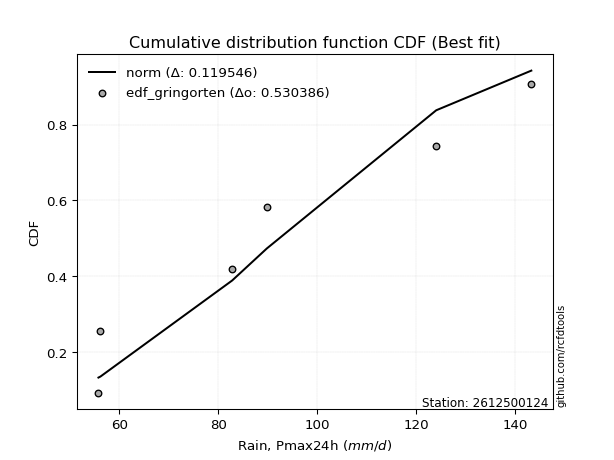</img>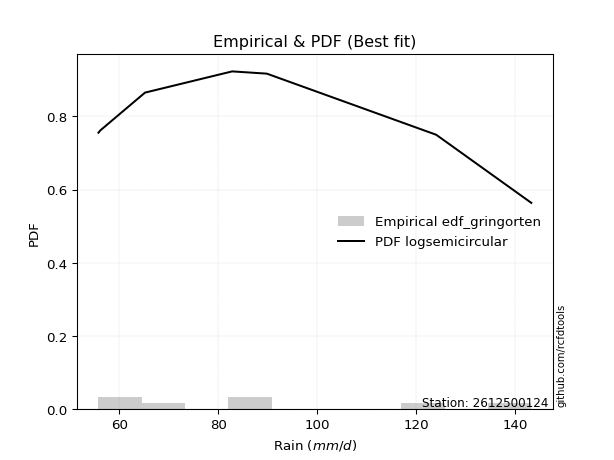</img>

</div>


### 9. EDF Filliben (1975)

The specific values of the constants (0.3175) (often denoted as $alpha$) and (0.365) are derived from a method proposed by James J. Filliben in a 1975 paper. This particular formula is the mean value of the $i$-th order statistic of the normal distribution and is considered a robust and effective plotting position formula for the normal probability plot correlation coefficient test for normality.

<div align="center">


$P=(m-0.3175)/(n+0.365)$


</div>


**9.1. Empirical values**

<div align="center">

|                | 0                   | 1                   | 2                   | 3            | 4                  | 5                  | 6                  |
|:---------------|:--------------------|:--------------------|:--------------------|:-------------|:-------------------|:-------------------|:-------------------|
| date           | 2019                | 2023                | 2025                | 2022         | 2021               | 2020               | 2024               |
| x              | 55.8                | 56.2                | 65.2                | 82.8         | 89.8               | 124.0              | 143.2              |
| m              | 1                   | 2                   | 3                   | 4            | 5                  | 6                  | 7                  |
| empirical_dist | edf_filliben        | edf_filliben        | edf_filliben        | edf_filliben | edf_filliben       | edf_filliben       | edf_filliben       |
| empirical      | 0.09266802443991853 | 0.22844534962661237 | 0.36422267481330617 | 0.5          | 0.6357773251866938 | 0.7715546503733877 | 0.9073319755600815 |
| empirical_tr   | 1.1021324354657687  | 1.2960844698636163  | 1.5728777362520021  | 2.0          | 2.7455731593662627 | 4.377414561664191  | 10.791208791208794 |

</div>


**9.2. Kolmogorov-Smirnov fit test (sorted by Δ)**


<div align="center">

|                | 0                   | 1                   | 2                   | 3                   | 4                   | 5                   | 6                   | 7                   | 8                   | 9                   | 10                  | 11                  | 12                  | 13                  | 14                  | 15                  | 16                  | 17                  | 18                  | 19                  | 20                  | 21                  | 22                  | 23                  | 24                  | 25                  | 26                  | 27                  | 28                  | 29                  | 30                  | 31                  | 32                  | 33                  | 34                  | 35                  | 36                  | 37                  | 38                  | 39                  | 40                  | 41                  | 42                  | 43                  | 44                  | 45                  | 46                  | 47                  | 48                  | 49                  | 50                  | 51                  | 52                  | 53                  | 54                  | 55                  | 56                  | 57                  | 58                  | 59                  | 60                  | 61                  | 62                  | 63                  | 64                  | 65                  | 66                  | 67                  | 68                  | 69                  | 70                  | 71                  | 72                  | 73                  | 74                  | 75                  | 76                  | 77                  | 78                  | 79                  | 80                  | 81                  | 82                  | 83                  | 84                  | 85                  | 86                  | 87                  | 88                  | 89                  | 90                  | 91                  | 92                  | 93                  | 94                  | 95                  | 96                  | 97                  | 98                  | 99                  | 100                 | 101                 | 102                 | 103                 | 104                 | 105                 | 106                 | 107                 | 108                 | 109                 | 110                 | 111                 | 112                 | 113                 | 114                 | 115                 | 116                 | 117                 | 118                 | 119                 | 120                 | 121                 | 122                 | 123                 | 124                 | 125                 | 126                 | 127                 | 128                 | 129                 | 130                 | 131                 | 132                 | 133                 | 134                 | 135                 | 136                 | 137                 | 138                 | 139                 | 140                 | 141                 | 142                 | 143                 | 144                 | 145                 | 146                 | 147                 | 148                 | 149                 | 150                 | 151                 | 152                 | 153                 | 154                 | 155                 | 156                 | 157                 | 158                 | 159                 |
|:---------------|:--------------------|:--------------------|:--------------------|:--------------------|:--------------------|:--------------------|:--------------------|:--------------------|:--------------------|:--------------------|:--------------------|:--------------------|:--------------------|:--------------------|:--------------------|:--------------------|:--------------------|:--------------------|:--------------------|:--------------------|:--------------------|:--------------------|:--------------------|:--------------------|:--------------------|:--------------------|:--------------------|:--------------------|:--------------------|:--------------------|:--------------------|:--------------------|:--------------------|:--------------------|:--------------------|:--------------------|:--------------------|:--------------------|:--------------------|:--------------------|:--------------------|:--------------------|:--------------------|:--------------------|:--------------------|:--------------------|:--------------------|:--------------------|:--------------------|:--------------------|:--------------------|:--------------------|:--------------------|:--------------------|:--------------------|:--------------------|:--------------------|:--------------------|:--------------------|:--------------------|:--------------------|:--------------------|:--------------------|:--------------------|:--------------------|:--------------------|:--------------------|:--------------------|:--------------------|:--------------------|:--------------------|:--------------------|:--------------------|:--------------------|:--------------------|:--------------------|:--------------------|:--------------------|:--------------------|:--------------------|:--------------------|:--------------------|:--------------------|:--------------------|:--------------------|:--------------------|:--------------------|:--------------------|:--------------------|:--------------------|:--------------------|:--------------------|:--------------------|:--------------------|:--------------------|:--------------------|:--------------------|:--------------------|:--------------------|:--------------------|:--------------------|:--------------------|:--------------------|:--------------------|:--------------------|:--------------------|:--------------------|:--------------------|:--------------------|:--------------------|:--------------------|:--------------------|:--------------------|:--------------------|:--------------------|:--------------------|:--------------------|:--------------------|:--------------------|:--------------------|:--------------------|:--------------------|:--------------------|:--------------------|:--------------------|:--------------------|:--------------------|:--------------------|:--------------------|:--------------------|:--------------------|:--------------------|:--------------------|:--------------------|:--------------------|:--------------------|:--------------------|:--------------------|:--------------------|:--------------------|:--------------------|:--------------------|:--------------------|:--------------------|:--------------------|:--------------------|:--------------------|:--------------------|:--------------------|:--------------------|:--------------------|:--------------------|:--------------------|:--------------------|:--------------------|:--------------------|:--------------------|:--------------------|:--------------------|:--------------------|
| station        | 2612500124          | 2612500124          | 2612500124          | 2612500124          | 2612500124          | 2612500124          | 2612500124          | 2612500124          | 2612500124          | 2612500124          | 2612500124          | 2612500124          | 2612500124          | 2612500124          | 2612500124          | 2612500124          | 2612500124          | 2612500124          | 2612500124          | 2612500124          | 2612500124          | 2612500124          | 2612500124          | 2612500124          | 2612500124          | 2612500124          | 2612500124          | 2612500124          | 2612500124          | 2612500124          | 2612500124          | 2612500124          | 2612500124          | 2612500124          | 2612500124          | 2612500124          | 2612500124          | 2612500124          | 2612500124          | 2612500124          | 2612500124          | 2612500124          | 2612500124          | 2612500124          | 2612500124          | 2612500124          | 2612500124          | 2612500124          | 2612500124          | 2612500124          | 2612500124          | 2612500124          | 2612500124          | 2612500124          | 2612500124          | 2612500124          | 2612500124          | 2612500124          | 2612500124          | 2612500124          | 2612500124          | 2612500124          | 2612500124          | 2612500124          | 2612500124          | 2612500124          | 2612500124          | 2612500124          | 2612500124          | 2612500124          | 2612500124          | 2612500124          | 2612500124          | 2612500124          | 2612500124          | 2612500124          | 2612500124          | 2612500124          | 2612500124          | 2612500124          | 2612500124          | 2612500124          | 2612500124          | 2612500124          | 2612500124          | 2612500124          | 2612500124          | 2612500124          | 2612500124          | 2612500124          | 2612500124          | 2612500124          | 2612500124          | 2612500124          | 2612500124          | 2612500124          | 2612500124          | 2612500124          | 2612500124          | 2612500124          | 2612500124          | 2612500124          | 2612500124          | 2612500124          | 2612500124          | 2612500124          | 2612500124          | 2612500124          | 2612500124          | 2612500124          | 2612500124          | 2612500124          | 2612500124          | 2612500124          | 2612500124          | 2612500124          | 2612500124          | 2612500124          | 2612500124          | 2612500124          | 2612500124          | 2612500124          | 2612500124          | 2612500124          | 2612500124          | 2612500124          | 2612500124          | 2612500124          | 2612500124          | 2612500124          | 2612500124          | 2612500124          | 2612500124          | 2612500124          | 2612500124          | 2612500124          | 2612500124          | 2612500124          | 2612500124          | 2612500124          | 2612500124          | 2612500124          | 2612500124          | 2612500124          | 2612500124          | 2612500124          | 2612500124          | 2612500124          | 2612500124          | 2612500124          | 2612500124          | 2612500124          | 2612500124          | 2612500124          | 2612500124          | 2612500124          | 2612500124          | 2612500124          | 2612500124          | 2612500124          |
| empirical_dist | edf_filliben        | edf_filliben        | edf_filliben        | edf_filliben        | edf_filliben        | edf_filliben        | edf_filliben        | edf_filliben        | edf_filliben        | edf_filliben        | edf_filliben        | edf_filliben        | edf_filliben        | edf_filliben        | edf_filliben        | edf_filliben        | edf_filliben        | edf_filliben        | edf_filliben        | edf_filliben        | edf_filliben        | edf_filliben        | edf_filliben        | edf_filliben        | edf_filliben        | edf_filliben        | edf_filliben        | edf_filliben        | edf_filliben        | edf_filliben        | edf_filliben        | edf_filliben        | edf_filliben        | edf_filliben        | edf_filliben        | edf_filliben        | edf_filliben        | edf_filliben        | edf_filliben        | edf_filliben        | edf_filliben        | edf_filliben        | edf_filliben        | edf_filliben        | edf_filliben        | edf_filliben        | edf_filliben        | edf_filliben        | edf_filliben        | edf_filliben        | edf_filliben        | edf_filliben        | edf_filliben        | edf_filliben        | edf_filliben        | edf_filliben        | edf_filliben        | edf_filliben        | edf_filliben        | edf_filliben        | edf_filliben        | edf_filliben        | edf_filliben        | edf_filliben        | edf_filliben        | edf_filliben        | edf_filliben        | edf_filliben        | edf_filliben        | edf_filliben        | edf_filliben        | edf_filliben        | edf_filliben        | edf_filliben        | edf_filliben        | edf_filliben        | edf_filliben        | edf_filliben        | edf_filliben        | edf_filliben        | edf_filliben        | edf_filliben        | edf_filliben        | edf_filliben        | edf_filliben        | edf_filliben        | edf_filliben        | edf_filliben        | edf_filliben        | edf_filliben        | edf_filliben        | edf_filliben        | edf_filliben        | edf_filliben        | edf_filliben        | edf_filliben        | edf_filliben        | edf_filliben        | edf_filliben        | edf_filliben        | edf_filliben        | edf_filliben        | edf_filliben        | edf_filliben        | edf_filliben        | edf_filliben        | edf_filliben        | edf_filliben        | edf_filliben        | edf_filliben        | edf_filliben        | edf_filliben        | edf_filliben        | edf_filliben        | edf_filliben        | edf_filliben        | edf_filliben        | edf_filliben        | edf_filliben        | edf_filliben        | edf_filliben        | edf_filliben        | edf_filliben        | edf_filliben        | edf_filliben        | edf_filliben        | edf_filliben        | edf_filliben        | edf_filliben        | edf_filliben        | edf_filliben        | edf_filliben        | edf_filliben        | edf_filliben        | edf_filliben        | edf_filliben        | edf_filliben        | edf_filliben        | edf_filliben        | edf_filliben        | edf_filliben        | edf_filliben        | edf_filliben        | edf_filliben        | edf_filliben        | edf_filliben        | edf_filliben        | edf_filliben        | edf_filliben        | edf_filliben        | edf_filliben        | edf_filliben        | edf_filliben        | edf_filliben        | edf_filliben        | edf_filliben        | edf_filliben        | edf_filliben        | edf_filliben        | edf_filliben        |
| p_dist         | logksone            | logsemicircular     | foldnorm            | logbetaprime        | halfnorm            | loganglit           | logmaxwell          | logfoldnorm         | rayleigh            | lograyleigh         | logarcsine          | maxwell             | lognct              | nct                 | logpearson3         | betaprime           | anglit              | pearson3            | logloggamma         | semicircular        | burr                | loggenlogistic      | logweibull_max      | logjohnsonsu        | lognorm             | logcrystalball      | logt                | logncf              | logalpha            | logburr             | logmielke           | loggenextreme       | loginvweibull       | genlogistic         | gumbel_r            | logkstwobign        | loginvgamma         | halflogistic        | moyal               | truncnorm           | norm                | crystalball         | t                   | logf                | kstwobign           | loghalfnorm         | loggumbel_r         | logcosine           | logrice             | loglogistic         | logloglaplace       | arcsine             | logdweibull         | logistic            | weibull_min         | cosine              | nakagami            | dweibull            | loghypsecant        | loggumbel_l         | gausshyper          | rice                | logmoyal            | alpha               | hypsecant           | f                   | invgamma            | logargus            | logbeta             | logdgamma           | dgamma              | loglaplace          | loglaplace          | genpareto           | logburr12           | exponpow            | halfgennorm         | bradford            | gumbel_l            | logrdist            | laplace             | loginvgauss         | logweibull_min      | loghalfgennorm      | loghalflogistic     | burr12              | logtriang           | ncf                 | truncweibull_min    | logtruncweibull_min | logwrapcauchy       | logexponnorm        | beta                | loglomax            | invgauss            | wrapcauchy          | loggenexpon         | exponnorm           | loggompertz         | lomax               | genexpon            | gompertz            | logtruncexpon       | logskewnorm         | logkappa4           | logtukeylambda      | loguniform          | logkappa3           | logvonmises_line    | truncexpon          | skewnorm            | ksone               | logwald             | wald                | argus               | kappa4              | uniform             | vonmises_line       | kappa3              | loglevy_l           | loggennorm          | gennorm             | triang              | logexponpow         | loggenhalflogistic  | levy_l              | loggamma            | loggamma            | gamma               | logerlang           | logfatiguelife      | lognakagami         | genextreme          | powerlaw            | logbradford         | fatiguelife         | tukeylambda         | truncpareto         | logtruncnorm        | rdist               | erlang              | genhalflogistic     | logpowerlaw         | logtrapezoid        | loggausshyper       | logtruncpareto      | gengamma            | invweibull          | logexponweib        | loggengamma         | exponweib           | trapezoid           | loggenpareto        | johnsonsb           | logjohnsonsb        | weibull_max         | johnsonsu           | logvonmises         | vonmises            | mielke              |
| delta          | 0.0756347339826626  | 0.08170667084227812 | 0.0870916996440525  | 0.09062362983083305 | 0.09071777770600742 | 0.09376791125207168 | 0.10194394355413805 | 0.10345924523099512 | 0.10424155734415391 | 0.10465183795414709 | 0.10542300525750392 | 0.11213140593371174 | 0.11235883794273988 | 0.1123640000911467  | 0.11317792528163523 | 0.11639047726615684 | 0.11779209174118244 | 0.11808921900061894 | 0.11882473054890275 | 0.1190280926263263  | 0.12009209320353499 | 0.12031753425830638 | 0.12042107598820474 | 0.12136899490472702 | 0.12152946257600777 | 0.12152946348707958 | 0.1215298745992281  | 0.12155018851235455 | 0.12194979701385117 | 0.12199373704880373 | 0.12223185074830062 | 0.12331826697695343 | 0.12332135815362781 | 0.1238872342170872  | 0.12476359824608263 | 0.12710515501869535 | 0.12829493106760959 | 0.1288695859639442  | 0.13023423118956468 | 0.13109603776721035 | 0.13109604298866845 | 0.13109605062802202 | 0.1313474397274611  | 0.13276933683632539 | 0.1341449798237978  | 0.13473551112440463 | 0.13651379350366308 | 0.13907682913075026 | 0.140896551263204   | 0.14418128570427802 | 0.14824555354384858 | 0.148583958581      | 0.1488338758986718  | 0.15365612914760687 | 0.15755253696946714 | 0.1578127111154401  | 0.15881275850385568 | 0.1588254877671411  | 0.1588694947902775  | 0.15918176465174333 | 0.1600931917094816  | 0.16137449127413536 | 0.16489861371396705 | 0.16535083747035095 | 0.16798732004123884 | 0.1680737436939017  | 0.16935543535449504 | 0.16956648604331803 | 0.1703748448918988  | 0.1732358033318788  | 0.17502934061873185 | 0.17781051742000767 | 0.17781051742000767 | 0.17883173460954443 | 0.17925662064843542 | 0.18037013014868541 | 0.18326698054692164 | 0.18358307908110538 | 0.18422515757798807 | 0.18539838524160188 | 0.18578702871147348 | 0.19227601225495605 | 0.1926387574560683  | 0.19475364962214925 | 0.19517656319510018 | 0.1988523426743334  | 0.2010935506871575  | 0.20193248208557998 | 0.203141985248719   | 0.2036320563546397  | 0.20435232409340298 | 0.20911504424163577 | 0.21001943109383933 | 0.21050605915620296 | 0.21054202325784288 | 0.21132745961022525 | 0.21337606343658455 | 0.2147855319495058  | 0.214866259429857   | 0.21501299509847557 | 0.21615399290455498 | 0.21647086615201935 | 0.21721037394316756 | 0.21759601793828034 | 0.2188218602672514  | 0.21997749963097982 | 0.22086643491179644 | 0.2208801296781588  | 0.22094181350701123 | 0.22100932405119428 | 0.22137519383107992 | 0.22826397659783032 | 0.22844534962661237 | 0.22905042502103942 | 0.231463038334092   | 0.23623845020710768 | 0.25667118739911843 | 0.2566860218871477  | 0.2569221072415275  | 0.26787339621716977 | 0.27155465037338766 | 0.27155465037338766 | 0.2814904298081395  | 0.28749887098374405 | 0.29374956622035026 | 0.2985783403210738  | 0.3064549709376101  | 0.3064549709376101  | 0.310236035175085   | 0.3141870947397094  | 0.3270756744420047  | 0.3282216239807181  | 0.3373678965605651  | 0.3533572209511905  | 0.3578315466823705  | 0.3591849731353176  | 0.3629575402396703  | 0.3630809877042044  | 0.3642226486378925  | 0.3642226742009246  | 0.37232741458854    | 0.3774363143816716  | 0.3817060182821853  | 0.38171402730197934 | 0.3921816091406154  | 0.41222343046018495 | 0.41307029412544694 | 0.42163714618627685 | 0.4234449902920596  | 0.42718306936856487 | 0.46355382984952886 | 0.4697101959085852  | 0.4893370400339522  | 0.5217506481081393  | 0.5999396211640684  | 0.6029824630192018  | 0.6726801753416118  | 1.1084579380961754  | 22.37896975290872   | nan                 |
| deltao         | 0.48442053926100004 | 0.48442053926100004 | 0.48442053926100004 | 0.48442053926100004 | 0.48442053926100004 | 0.48442053926100004 | 0.48442053926100004 | 0.48442053926100004 | 0.48442053926100004 | 0.48442053926100004 | 0.48442053926100004 | 0.48442053926100004 | 0.48442053926100004 | 0.48442053926100004 | 0.48442053926100004 | 0.48442053926100004 | 0.48442053926100004 | 0.48442053926100004 | 0.48442053926100004 | 0.48442053926100004 | 0.48442053926100004 | 0.48442053926100004 | 0.48442053926100004 | 0.48442053926100004 | 0.48442053926100004 | 0.48442053926100004 | 0.48442053926100004 | 0.48442053926100004 | 0.48442053926100004 | 0.48442053926100004 | 0.48442053926100004 | 0.48442053926100004 | 0.48442053926100004 | 0.48442053926100004 | 0.48442053926100004 | 0.48442053926100004 | 0.48442053926100004 | 0.48442053926100004 | 0.48442053926100004 | 0.48442053926100004 | 0.48442053926100004 | 0.48442053926100004 | 0.48442053926100004 | 0.48442053926100004 | 0.48442053926100004 | 0.48442053926100004 | 0.48442053926100004 | 0.48442053926100004 | 0.48442053926100004 | 0.48442053926100004 | 0.48442053926100004 | 0.48442053926100004 | 0.48442053926100004 | 0.48442053926100004 | 0.48442053926100004 | 0.48442053926100004 | 0.48442053926100004 | 0.48442053926100004 | 0.48442053926100004 | 0.48442053926100004 | 0.48442053926100004 | 0.48442053926100004 | 0.48442053926100004 | 0.48442053926100004 | 0.48442053926100004 | 0.48442053926100004 | 0.48442053926100004 | 0.48442053926100004 | 0.48442053926100004 | 0.48442053926100004 | 0.48442053926100004 | 0.48442053926100004 | 0.48442053926100004 | 0.48442053926100004 | 0.48442053926100004 | 0.48442053926100004 | 0.48442053926100004 | 0.48442053926100004 | 0.48442053926100004 | 0.48442053926100004 | 0.48442053926100004 | 0.48442053926100004 | 0.48442053926100004 | 0.48442053926100004 | 0.48442053926100004 | 0.48442053926100004 | 0.48442053926100004 | 0.48442053926100004 | 0.48442053926100004 | 0.48442053926100004 | 0.48442053926100004 | 0.48442053926100004 | 0.48442053926100004 | 0.48442053926100004 | 0.48442053926100004 | 0.48442053926100004 | 0.48442053926100004 | 0.48442053926100004 | 0.48442053926100004 | 0.48442053926100004 | 0.48442053926100004 | 0.48442053926100004 | 0.48442053926100004 | 0.48442053926100004 | 0.48442053926100004 | 0.48442053926100004 | 0.48442053926100004 | 0.48442053926100004 | 0.48442053926100004 | 0.48442053926100004 | 0.48442053926100004 | 0.48442053926100004 | 0.48442053926100004 | 0.48442053926100004 | 0.48442053926100004 | 0.48442053926100004 | 0.48442053926100004 | 0.48442053926100004 | 0.48442053926100004 | 0.48442053926100004 | 0.48442053926100004 | 0.48442053926100004 | 0.48442053926100004 | 0.48442053926100004 | 0.48442053926100004 | 0.48442053926100004 | 0.48442053926100004 | 0.48442053926100004 | 0.48442053926100004 | 0.48442053926100004 | 0.48442053926100004 | 0.48442053926100004 | 0.48442053926100004 | 0.48442053926100004 | 0.48442053926100004 | 0.48442053926100004 | 0.48442053926100004 | 0.48442053926100004 | 0.48442053926100004 | 0.48442053926100004 | 0.48442053926100004 | 0.48442053926100004 | 0.48442053926100004 | 0.48442053926100004 | 0.48442053926100004 | 0.48442053926100004 | 0.48442053926100004 | 0.48442053926100004 | 0.48442053926100004 | 0.48442053926100004 | 0.48442053926100004 | 0.48442053926100004 | 0.48442053926100004 | 0.48442053926100004 | 0.48442053926100004 | 0.48442053926100004 | 0.48442053926100004 | 0.48442053926100004 | 0.48442053926100004 | 0.48442053926100004 |
| eval           | Δo > Δ              | Δo > Δ              | Δo > Δ              | Δo > Δ              | Δo > Δ              | Δo > Δ              | Δo > Δ              | Δo > Δ              | Δo > Δ              | Δo > Δ              | Δo > Δ              | Δo > Δ              | Δo > Δ              | Δo > Δ              | Δo > Δ              | Δo > Δ              | Δo > Δ              | Δo > Δ              | Δo > Δ              | Δo > Δ              | Δo > Δ              | Δo > Δ              | Δo > Δ              | Δo > Δ              | Δo > Δ              | Δo > Δ              | Δo > Δ              | Δo > Δ              | Δo > Δ              | Δo > Δ              | Δo > Δ              | Δo > Δ              | Δo > Δ              | Δo > Δ              | Δo > Δ              | Δo > Δ              | Δo > Δ              | Δo > Δ              | Δo > Δ              | Δo > Δ              | Δo > Δ              | Δo > Δ              | Δo > Δ              | Δo > Δ              | Δo > Δ              | Δo > Δ              | Δo > Δ              | Δo > Δ              | Δo > Δ              | Δo > Δ              | Δo > Δ              | Δo > Δ              | Δo > Δ              | Δo > Δ              | Δo > Δ              | Δo > Δ              | Δo > Δ              | Δo > Δ              | Δo > Δ              | Δo > Δ              | Δo > Δ              | Δo > Δ              | Δo > Δ              | Δo > Δ              | Δo > Δ              | Δo > Δ              | Δo > Δ              | Δo > Δ              | Δo > Δ              | Δo > Δ              | Δo > Δ              | Δo > Δ              | Δo > Δ              | Δo > Δ              | Δo > Δ              | Δo > Δ              | Δo > Δ              | Δo > Δ              | Δo > Δ              | Δo > Δ              | Δo > Δ              | Δo > Δ              | Δo > Δ              | Δo > Δ              | Δo > Δ              | Δo > Δ              | Δo > Δ              | Δo > Δ              | Δo > Δ              | Δo > Δ              | Δo > Δ              | Δo > Δ              | Δo > Δ              | Δo > Δ              | Δo > Δ              | Δo > Δ              | Δo > Δ              | Δo > Δ              | Δo > Δ              | Δo > Δ              | Δo > Δ              | Δo > Δ              | Δo > Δ              | Δo > Δ              | Δo > Δ              | Δo > Δ              | Δo > Δ              | Δo > Δ              | Δo > Δ              | Δo > Δ              | Δo > Δ              | Δo > Δ              | Δo > Δ              | Δo > Δ              | Δo > Δ              | Δo > Δ              | Δo > Δ              | Δo > Δ              | Δo > Δ              | Δo > Δ              | Δo > Δ              | Δo > Δ              | Δo > Δ              | Δo > Δ              | Δo > Δ              | Δo > Δ              | Δo > Δ              | Δo > Δ              | Δo > Δ              | Δo > Δ              | Δo > Δ              | Δo > Δ              | Δo > Δ              | Δo > Δ              | Δo > Δ              | Δo > Δ              | Δo > Δ              | Δo > Δ              | Δo > Δ              | Δo > Δ              | Δo > Δ              | Δo > Δ              | Δo > Δ              | Δo > Δ              | Δo > Δ              | Δo > Δ              | Δo > Δ              | Δo > Δ              | Δo > Δ              | Δo > Δ              | Δo > Δ              | Δo > Δ              | Δo <= Δ             | Δo <= Δ             | Δo <= Δ             | Δo <= Δ             | Δo <= Δ             | Δo <= Δ             | Δo <= Δ             | Δo <= Δ             |
| fit            | 1                   | 1                   | 1                   | 1                   | 1                   | 1                   | 1                   | 1                   | 1                   | 1                   | 1                   | 1                   | 1                   | 1                   | 1                   | 1                   | 1                   | 1                   | 1                   | 1                   | 1                   | 1                   | 1                   | 1                   | 1                   | 1                   | 1                   | 1                   | 1                   | 1                   | 1                   | 1                   | 1                   | 1                   | 1                   | 1                   | 1                   | 1                   | 1                   | 1                   | 1                   | 1                   | 1                   | 1                   | 1                   | 1                   | 1                   | 1                   | 1                   | 1                   | 1                   | 1                   | 1                   | 1                   | 1                   | 1                   | 1                   | 1                   | 1                   | 1                   | 1                   | 1                   | 1                   | 1                   | 1                   | 1                   | 1                   | 1                   | 1                   | 1                   | 1                   | 1                   | 1                   | 1                   | 1                   | 1                   | 1                   | 1                   | 1                   | 1                   | 1                   | 1                   | 1                   | 1                   | 1                   | 1                   | 1                   | 1                   | 1                   | 1                   | 1                   | 1                   | 1                   | 1                   | 1                   | 1                   | 1                   | 1                   | 1                   | 1                   | 1                   | 1                   | 1                   | 1                   | 1                   | 1                   | 1                   | 1                   | 1                   | 1                   | 1                   | 1                   | 1                   | 1                   | 1                   | 1                   | 1                   | 1                   | 1                   | 1                   | 1                   | 1                   | 1                   | 1                   | 1                   | 1                   | 1                   | 1                   | 1                   | 1                   | 1                   | 1                   | 1                   | 1                   | 1                   | 1                   | 1                   | 1                   | 1                   | 1                   | 1                   | 1                   | 1                   | 1                   | 1                   | 1                   | 1                   | 1                   | 1                   | 1                   | 1                   | 1                   | 0                   | 0                   | 0                   | 0                   | 0                   | 0                   | 0                   | 0                   |
| n              | 7                   | 7                   | 7                   | 7                   | 7                   | 7                   | 7                   | 7                   | 7                   | 7                   | 7                   | 7                   | 7                   | 7                   | 7                   | 7                   | 7                   | 7                   | 7                   | 7                   | 7                   | 7                   | 7                   | 7                   | 7                   | 7                   | 7                   | 7                   | 7                   | 7                   | 7                   | 7                   | 7                   | 7                   | 7                   | 7                   | 7                   | 7                   | 7                   | 7                   | 7                   | 7                   | 7                   | 7                   | 7                   | 7                   | 7                   | 7                   | 7                   | 7                   | 7                   | 7                   | 7                   | 7                   | 7                   | 7                   | 7                   | 7                   | 7                   | 7                   | 7                   | 7                   | 7                   | 7                   | 7                   | 7                   | 7                   | 7                   | 7                   | 7                   | 7                   | 7                   | 7                   | 7                   | 7                   | 7                   | 7                   | 7                   | 7                   | 7                   | 7                   | 7                   | 7                   | 7                   | 7                   | 7                   | 7                   | 7                   | 7                   | 7                   | 7                   | 7                   | 7                   | 7                   | 7                   | 7                   | 7                   | 7                   | 7                   | 7                   | 7                   | 7                   | 7                   | 7                   | 7                   | 7                   | 7                   | 7                   | 7                   | 7                   | 7                   | 7                   | 7                   | 7                   | 7                   | 7                   | 7                   | 7                   | 7                   | 7                   | 7                   | 7                   | 7                   | 7                   | 7                   | 7                   | 7                   | 7                   | 7                   | 7                   | 7                   | 7                   | 7                   | 7                   | 7                   | 7                   | 7                   | 7                   | 7                   | 7                   | 7                   | 7                   | 7                   | 7                   | 7                   | 7                   | 7                   | 7                   | 7                   | 7                   | 7                   | 7                   | 7                   | 7                   | 7                   | 7                   | 7                   | 7                   | 7                   | 7                   |
| best_fit       | 1                   | 0                   | 0                   | 0                   | 0                   | 0                   | 0                   | 0                   | 0                   | 0                   | 0                   | 0                   | 0                   | 0                   | 0                   | 0                   | 0                   | 0                   | 0                   | 0                   | 0                   | 0                   | 0                   | 0                   | 0                   | 0                   | 0                   | 0                   | 0                   | 0                   | 0                   | 0                   | 0                   | 0                   | 0                   | 0                   | 0                   | 0                   | 0                   | 0                   | 0                   | 0                   | 0                   | 0                   | 0                   | 0                   | 0                   | 0                   | 0                   | 0                   | 0                   | 0                   | 0                   | 0                   | 0                   | 0                   | 0                   | 0                   | 0                   | 0                   | 0                   | 0                   | 0                   | 0                   | 0                   | 0                   | 0                   | 0                   | 0                   | 0                   | 0                   | 0                   | 0                   | 0                   | 0                   | 0                   | 0                   | 0                   | 0                   | 0                   | 0                   | 0                   | 0                   | 0                   | 0                   | 0                   | 0                   | 0                   | 0                   | 0                   | 0                   | 0                   | 0                   | 0                   | 0                   | 0                   | 0                   | 0                   | 0                   | 0                   | 0                   | 0                   | 0                   | 0                   | 0                   | 0                   | 0                   | 0                   | 0                   | 0                   | 0                   | 0                   | 0                   | 0                   | 0                   | 0                   | 0                   | 0                   | 0                   | 0                   | 0                   | 0                   | 0                   | 0                   | 0                   | 0                   | 0                   | 0                   | 0                   | 0                   | 0                   | 0                   | 0                   | 0                   | 0                   | 0                   | 0                   | 0                   | 0                   | 0                   | 0                   | 0                   | 0                   | 0                   | 0                   | 0                   | 0                   | 0                   | 0                   | 0                   | 0                   | 0                   | 0                   | 0                   | 0                   | 0                   | 0                   | 0                   | 0                   | 0                   |
| best_fit_sort  | 1                   | 2                   | 3                   | 4                   | 5                   | 6                   | 7                   | 8                   | 9                   | 10                  | 11                  | 12                  | 13                  | 14                  | 15                  | 16                  | 17                  | 18                  | 19                  | 20                  | 21                  | 22                  | 23                  | 24                  | 25                  | 26                  | 27                  | 28                  | 29                  | 30                  | 31                  | 32                  | 33                  | 34                  | 35                  | 36                  | 37                  | 38                  | 39                  | 40                  | 41                  | 42                  | 43                  | 44                  | 45                  | 46                  | 47                  | 48                  | 49                  | 50                  | 51                  | 52                  | 53                  | 54                  | 55                  | 56                  | 57                  | 58                  | 59                  | 60                  | 61                  | 62                  | 63                  | 64                  | 65                  | 66                  | 67                  | 68                  | 69                  | 70                  | 71                  | 72                  | 73                  | 74                  | 75                  | 76                  | 77                  | 78                  | 79                  | 80                  | 81                  | 82                  | 83                  | 84                  | 85                  | 86                  | 87                  | 88                  | 89                  | 90                  | 91                  | 92                  | 93                  | 94                  | 95                  | 96                  | 97                  | 98                  | 99                  | 100                 | 101                 | 102                 | 103                 | 104                 | 105                 | 106                 | 107                 | 108                 | 109                 | 110                 | 111                 | 112                 | 113                 | 114                 | 115                 | 116                 | 117                 | 118                 | 119                 | 120                 | 121                 | 122                 | 123                 | 124                 | 125                 | 126                 | 127                 | 128                 | 129                 | 130                 | 131                 | 132                 | 133                 | 134                 | 135                 | 136                 | 137                 | 138                 | 139                 | 140                 | 141                 | 142                 | 143                 | 144                 | 145                 | 146                 | 147                 | 148                 | 149                 | 150                 | 151                 | 152                 | 153                 | 154                 | 155                 | 156                 | 157                 | 158                 | 159                 | 160                 |

</div>


**9.3. Best fit**

<div align="center">

|   id |    station | empirical_dist   | p_dist   |     delta |   deltao | eval   |   fit |   n |   best_fit |   best_fit_sort |
|-----:|-----------:|:-----------------|:---------|----------:|---------:|:-------|------:|----:|-----------:|----------------:|
|    0 | 2612500124 | edf_filliben     | logksone | 0.0756347 | 0.484421 | Δo > Δ |     1 |   7 |          1 |               1 |

</div>


<div align="center">

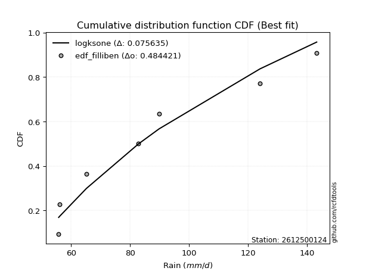</img></img>

</div>


### 10. EDF Jenkinson (1977)

The Jenkinson formula in hydrology is an empirical plotting position formula used to estimate the non-exceedance probability _(P)_ or return period _(T)_ of a given ordered observation within a sample. It is a widely used method in the frequency analysis of extreme events such as floods and rainfall, as it provides a distribution-free way to plot data. _a≈0.31_ and _b≈0.38_ are constants derived to approximate the median of the probability distribution for the given rank.

<div align="center">


$P=(m-a)/(n+b)$


</div>


**10.1. Empirical values**

<div align="center">

|                | 0                   | 1                   | 2                   | 3             | 4                  | 5                  | 6                  |
|:---------------|:--------------------|:--------------------|:--------------------|:--------------|:-------------------|:-------------------|:-------------------|
| date           | 2019                | 2023                | 2025                | 2022          | 2021               | 2020               | 2024               |
| x              | 55.8                | 56.2                | 65.2                | 82.8          | 89.8               | 124.0              | 143.2              |
| m              | 1                   | 2                   | 3                   | 4             | 5                  | 6                  | 7                  |
| empirical_dist | edf_jenkinson       | edf_jenkinson       | edf_jenkinson       | edf_jenkinson | edf_jenkinson      | edf_jenkinson      | edf_jenkinson      |
| empirical      | 0.09349593495934959 | 0.22899728997289973 | 0.36449864498644985 | 0.5           | 0.6355013550135502 | 0.7710027100271003 | 0.9065040650406505 |
| empirical_tr   | 1.1031390134529149  | 1.29701230228471    | 1.5735607675906182  | 2.0           | 2.743494423791822  | 4.366863905325444  | 10.695652173913055 |

</div>


**10.2. Kolmogorov-Smirnov fit test (sorted by Δ)**


<div align="center">

|                | 0                   | 1                   | 2                   | 3                   | 4                   | 5                   | 6                   | 7                   | 8                   | 9                   | 10                  | 11                  | 12                  | 13                  | 14                  | 15                  | 16                  | 17                  | 18                  | 19                  | 20                  | 21                  | 22                  | 23                  | 24                  | 25                  | 26                  | 27                  | 28                  | 29                  | 30                  | 31                  | 32                  | 33                  | 34                  | 35                  | 36                  | 37                  | 38                  | 39                  | 40                  | 41                  | 42                  | 43                  | 44                  | 45                  | 46                  | 47                  | 48                  | 49                  | 50                  | 51                  | 52                  | 53                  | 54                  | 55                  | 56                  | 57                  | 58                  | 59                  | 60                  | 61                  | 62                  | 63                  | 64                  | 65                  | 66                  | 67                  | 68                  | 69                  | 70                  | 71                  | 72                  | 73                  | 74                  | 75                  | 76                  | 77                  | 78                  | 79                  | 80                  | 81                  | 82                  | 83                  | 84                  | 85                  | 86                  | 87                  | 88                  | 89                  | 90                  | 91                  | 92                  | 93                  | 94                  | 95                  | 96                  | 97                  | 98                  | 99                  | 100                 | 101                 | 102                 | 103                 | 104                 | 105                 | 106                 | 107                 | 108                 | 109                 | 110                 | 111                 | 112                 | 113                 | 114                 | 115                 | 116                 | 117                 | 118                 | 119                 | 120                 | 121                 | 122                 | 123                 | 124                 | 125                 | 126                 | 127                 | 128                 | 129                 | 130                 | 131                 | 132                 | 133                 | 134                 | 135                 | 136                 | 137                 | 138                 | 139                 | 140                 | 141                 | 142                 | 143                 | 144                 | 145                 | 146                 | 147                 | 148                 | 149                 | 150                 | 151                 | 152                 | 153                 | 154                 | 155                 | 156                 | 157                 | 158                 | 159                 |
|:---------------|:--------------------|:--------------------|:--------------------|:--------------------|:--------------------|:--------------------|:--------------------|:--------------------|:--------------------|:--------------------|:--------------------|:--------------------|:--------------------|:--------------------|:--------------------|:--------------------|:--------------------|:--------------------|:--------------------|:--------------------|:--------------------|:--------------------|:--------------------|:--------------------|:--------------------|:--------------------|:--------------------|:--------------------|:--------------------|:--------------------|:--------------------|:--------------------|:--------------------|:--------------------|:--------------------|:--------------------|:--------------------|:--------------------|:--------------------|:--------------------|:--------------------|:--------------------|:--------------------|:--------------------|:--------------------|:--------------------|:--------------------|:--------------------|:--------------------|:--------------------|:--------------------|:--------------------|:--------------------|:--------------------|:--------------------|:--------------------|:--------------------|:--------------------|:--------------------|:--------------------|:--------------------|:--------------------|:--------------------|:--------------------|:--------------------|:--------------------|:--------------------|:--------------------|:--------------------|:--------------------|:--------------------|:--------------------|:--------------------|:--------------------|:--------------------|:--------------------|:--------------------|:--------------------|:--------------------|:--------------------|:--------------------|:--------------------|:--------------------|:--------------------|:--------------------|:--------------------|:--------------------|:--------------------|:--------------------|:--------------------|:--------------------|:--------------------|:--------------------|:--------------------|:--------------------|:--------------------|:--------------------|:--------------------|:--------------------|:--------------------|:--------------------|:--------------------|:--------------------|:--------------------|:--------------------|:--------------------|:--------------------|:--------------------|:--------------------|:--------------------|:--------------------|:--------------------|:--------------------|:--------------------|:--------------------|:--------------------|:--------------------|:--------------------|:--------------------|:--------------------|:--------------------|:--------------------|:--------------------|:--------------------|:--------------------|:--------------------|:--------------------|:--------------------|:--------------------|:--------------------|:--------------------|:--------------------|:--------------------|:--------------------|:--------------------|:--------------------|:--------------------|:--------------------|:--------------------|:--------------------|:--------------------|:--------------------|:--------------------|:--------------------|:--------------------|:--------------------|:--------------------|:--------------------|:--------------------|:--------------------|:--------------------|:--------------------|:--------------------|:--------------------|:--------------------|:--------------------|:--------------------|:--------------------|:--------------------|:--------------------|
| station        | 2612500124          | 2612500124          | 2612500124          | 2612500124          | 2612500124          | 2612500124          | 2612500124          | 2612500124          | 2612500124          | 2612500124          | 2612500124          | 2612500124          | 2612500124          | 2612500124          | 2612500124          | 2612500124          | 2612500124          | 2612500124          | 2612500124          | 2612500124          | 2612500124          | 2612500124          | 2612500124          | 2612500124          | 2612500124          | 2612500124          | 2612500124          | 2612500124          | 2612500124          | 2612500124          | 2612500124          | 2612500124          | 2612500124          | 2612500124          | 2612500124          | 2612500124          | 2612500124          | 2612500124          | 2612500124          | 2612500124          | 2612500124          | 2612500124          | 2612500124          | 2612500124          | 2612500124          | 2612500124          | 2612500124          | 2612500124          | 2612500124          | 2612500124          | 2612500124          | 2612500124          | 2612500124          | 2612500124          | 2612500124          | 2612500124          | 2612500124          | 2612500124          | 2612500124          | 2612500124          | 2612500124          | 2612500124          | 2612500124          | 2612500124          | 2612500124          | 2612500124          | 2612500124          | 2612500124          | 2612500124          | 2612500124          | 2612500124          | 2612500124          | 2612500124          | 2612500124          | 2612500124          | 2612500124          | 2612500124          | 2612500124          | 2612500124          | 2612500124          | 2612500124          | 2612500124          | 2612500124          | 2612500124          | 2612500124          | 2612500124          | 2612500124          | 2612500124          | 2612500124          | 2612500124          | 2612500124          | 2612500124          | 2612500124          | 2612500124          | 2612500124          | 2612500124          | 2612500124          | 2612500124          | 2612500124          | 2612500124          | 2612500124          | 2612500124          | 2612500124          | 2612500124          | 2612500124          | 2612500124          | 2612500124          | 2612500124          | 2612500124          | 2612500124          | 2612500124          | 2612500124          | 2612500124          | 2612500124          | 2612500124          | 2612500124          | 2612500124          | 2612500124          | 2612500124          | 2612500124          | 2612500124          | 2612500124          | 2612500124          | 2612500124          | 2612500124          | 2612500124          | 2612500124          | 2612500124          | 2612500124          | 2612500124          | 2612500124          | 2612500124          | 2612500124          | 2612500124          | 2612500124          | 2612500124          | 2612500124          | 2612500124          | 2612500124          | 2612500124          | 2612500124          | 2612500124          | 2612500124          | 2612500124          | 2612500124          | 2612500124          | 2612500124          | 2612500124          | 2612500124          | 2612500124          | 2612500124          | 2612500124          | 2612500124          | 2612500124          | 2612500124          | 2612500124          | 2612500124          | 2612500124          | 2612500124          | 2612500124          |
| empirical_dist | edf_jenkinson       | edf_jenkinson       | edf_jenkinson       | edf_jenkinson       | edf_jenkinson       | edf_jenkinson       | edf_jenkinson       | edf_jenkinson       | edf_jenkinson       | edf_jenkinson       | edf_jenkinson       | edf_jenkinson       | edf_jenkinson       | edf_jenkinson       | edf_jenkinson       | edf_jenkinson       | edf_jenkinson       | edf_jenkinson       | edf_jenkinson       | edf_jenkinson       | edf_jenkinson       | edf_jenkinson       | edf_jenkinson       | edf_jenkinson       | edf_jenkinson       | edf_jenkinson       | edf_jenkinson       | edf_jenkinson       | edf_jenkinson       | edf_jenkinson       | edf_jenkinson       | edf_jenkinson       | edf_jenkinson       | edf_jenkinson       | edf_jenkinson       | edf_jenkinson       | edf_jenkinson       | edf_jenkinson       | edf_jenkinson       | edf_jenkinson       | edf_jenkinson       | edf_jenkinson       | edf_jenkinson       | edf_jenkinson       | edf_jenkinson       | edf_jenkinson       | edf_jenkinson       | edf_jenkinson       | edf_jenkinson       | edf_jenkinson       | edf_jenkinson       | edf_jenkinson       | edf_jenkinson       | edf_jenkinson       | edf_jenkinson       | edf_jenkinson       | edf_jenkinson       | edf_jenkinson       | edf_jenkinson       | edf_jenkinson       | edf_jenkinson       | edf_jenkinson       | edf_jenkinson       | edf_jenkinson       | edf_jenkinson       | edf_jenkinson       | edf_jenkinson       | edf_jenkinson       | edf_jenkinson       | edf_jenkinson       | edf_jenkinson       | edf_jenkinson       | edf_jenkinson       | edf_jenkinson       | edf_jenkinson       | edf_jenkinson       | edf_jenkinson       | edf_jenkinson       | edf_jenkinson       | edf_jenkinson       | edf_jenkinson       | edf_jenkinson       | edf_jenkinson       | edf_jenkinson       | edf_jenkinson       | edf_jenkinson       | edf_jenkinson       | edf_jenkinson       | edf_jenkinson       | edf_jenkinson       | edf_jenkinson       | edf_jenkinson       | edf_jenkinson       | edf_jenkinson       | edf_jenkinson       | edf_jenkinson       | edf_jenkinson       | edf_jenkinson       | edf_jenkinson       | edf_jenkinson       | edf_jenkinson       | edf_jenkinson       | edf_jenkinson       | edf_jenkinson       | edf_jenkinson       | edf_jenkinson       | edf_jenkinson       | edf_jenkinson       | edf_jenkinson       | edf_jenkinson       | edf_jenkinson       | edf_jenkinson       | edf_jenkinson       | edf_jenkinson       | edf_jenkinson       | edf_jenkinson       | edf_jenkinson       | edf_jenkinson       | edf_jenkinson       | edf_jenkinson       | edf_jenkinson       | edf_jenkinson       | edf_jenkinson       | edf_jenkinson       | edf_jenkinson       | edf_jenkinson       | edf_jenkinson       | edf_jenkinson       | edf_jenkinson       | edf_jenkinson       | edf_jenkinson       | edf_jenkinson       | edf_jenkinson       | edf_jenkinson       | edf_jenkinson       | edf_jenkinson       | edf_jenkinson       | edf_jenkinson       | edf_jenkinson       | edf_jenkinson       | edf_jenkinson       | edf_jenkinson       | edf_jenkinson       | edf_jenkinson       | edf_jenkinson       | edf_jenkinson       | edf_jenkinson       | edf_jenkinson       | edf_jenkinson       | edf_jenkinson       | edf_jenkinson       | edf_jenkinson       | edf_jenkinson       | edf_jenkinson       | edf_jenkinson       | edf_jenkinson       | edf_jenkinson       | edf_jenkinson       | edf_jenkinson       | edf_jenkinson       |
| p_dist         | logksone            | logsemicircular     | foldnorm            | logbetaprime        | halfnorm            | loganglit           | logmaxwell          | logfoldnorm         | rayleigh            | logarcsine          | lograyleigh         | maxwell             | lognct              | nct                 | logpearson3         | betaprime           | anglit              | pearson3            | semicircular        | logloggamma         | burr                | logncf              | loggenlogistic      | logweibull_max      | logjohnsonsu        | lognorm             | logcrystalball      | logt                | logalpha            | logburr             | logmielke           | loggenextreme       | loginvweibull       | genlogistic         | gumbel_r            | logkstwobign        | loginvgamma         | halflogistic        | moyal               | truncnorm           | norm                | crystalball         | t                   | logf                | kstwobign           | loghalfnorm         | loggumbel_r         | logcosine           | logrice             | loglogistic         | arcsine             | logloglaplace       | logdweibull         | logistic            | dweibull            | cosine              | weibull_min         | nakagami            | loghypsecant        | loggumbel_l         | gausshyper          | rice                | alpha               | logmoyal            | f                   | hypsecant           | invgamma            | logargus            | logbeta             | logdgamma           | dgamma              | loglaplace          | loglaplace          | genpareto           | logburr12           | exponpow            | bradford            | halfgennorm         | gumbel_l            | logrdist            | laplace             | loginvgauss         | logweibull_min      | loghalfgennorm      | loghalflogistic     | burr12              | logtriang           | ncf                 | truncweibull_min    | logtruncweibull_min | logwrapcauchy       | beta                | logexponnorm        | invgauss            | loglomax            | wrapcauchy          | loggenexpon         | exponnorm           | loggompertz         | lomax               | genexpon            | gompertz            | logtruncexpon       | logskewnorm         | logkappa4           | logtukeylambda      | loguniform          | logkappa3           | logvonmises_line    | truncexpon          | skewnorm            | ksone               | logwald             | wald                | argus               | kappa4              | uniform             | vonmises_line       | kappa3              | loglevy_l           | loggennorm          | gennorm             | triang              | logexponpow         | loggenhalflogistic  | levy_l              | loggamma            | loggamma            | gamma               | logerlang           | logfatiguelife      | lognakagami         | genextreme          | powerlaw            | logbradford         | fatiguelife         | truncpareto         | tukeylambda         | logtruncnorm        | rdist               | erlang              | genhalflogistic     | logpowerlaw         | logtrapezoid        | loggausshyper       | logtruncpareto      | gengamma            | invweibull          | logexponweib        | loggengamma         | exponweib           | trapezoid           | loggenpareto        | johnsonsb           | logjohnsonsb        | weibull_max         | johnsonsu           | logvonmises         | vonmises            | mielke              |
| delta          | 0.07480682346323154 | 0.0819826410154218  | 0.08764363999033986 | 0.09089960000397673 | 0.09126971805229478 | 0.09404388142521536 | 0.10249588390042541 | 0.10401118557728248 | 0.10451752751729759 | 0.10459509473807287 | 0.10520377830043445 | 0.11240737610685542 | 0.11263480811588356 | 0.11291594043743407 | 0.11345389545477891 | 0.11666644743930052 | 0.11751612156803881 | 0.11836518917376262 | 0.11875212245318267 | 0.11910070072204643 | 0.12064403354982235 | 0.1207222779929235  | 0.12086947460459374 | 0.1209730163344921  | 0.1216449650778707  | 0.12180543274915145 | 0.12180543366022326 | 0.12180584477237177 | 0.12250173736013853 | 0.12254567739509109 | 0.12278379109458798 | 0.12387020732324079 | 0.12387329849991517 | 0.12416320439023087 | 0.1250395684192263  | 0.1276570953649827  | 0.12884687141389695 | 0.12942152631023157 | 0.13051020136270836 | 0.13137200794035403 | 0.13137201316181213 | 0.1313720208011657  | 0.13162340990060478 | 0.13332127718261275 | 0.13442094999694149 | 0.135287451470692   | 0.13706573384995044 | 0.13935279930389394 | 0.14144849160949136 | 0.1444572558774217  | 0.14775604806156895 | 0.14852152371699226 | 0.14938581624495917 | 0.15393209932075055 | 0.15799757724771002 | 0.15808868128858378 | 0.1581044773157545  | 0.15881275850385568 | 0.1591454649634212  | 0.159457734824887   | 0.16064513205576897 | 0.16165046144727904 | 0.16535083747035095 | 0.1654505540602544  | 0.1680737436939017  | 0.16826329021438252 | 0.16935543535449504 | 0.1698424562164617  | 0.17092678523818616 | 0.17351177350502248 | 0.17420143009930078 | 0.17808648759315135 | 0.17808648759315135 | 0.1785557644364008  | 0.17980856099472278 | 0.18037013014868541 | 0.18358307908110538 | 0.183818920893209   | 0.18394918740484445 | 0.1845704747221708  | 0.18606299888461716 | 0.19227601225495605 | 0.19319069780235565 | 0.19447767944900557 | 0.19572850354138754 | 0.19940428302062077 | 0.20081758051401388 | 0.20248442243186734 | 0.20369392559500635 | 0.20418399670092707 | 0.20490426443969034 | 0.20919152057440826 | 0.20966698458792313 | 0.21054202325784288 | 0.21105799950249032 | 0.21187939995651262 | 0.2139280037828719  | 0.21533747229579317 | 0.21541819977614435 | 0.21556493544476293 | 0.21670593325084234 | 0.21702280649830671 | 0.21776231428945492 | 0.2181479582845677  | 0.21937380061353876 | 0.22052943997726718 | 0.2214183752580838  | 0.22143207002444615 | 0.22149375385329859 | 0.22156126439748164 | 0.22192713417736729 | 0.2279880064246867  | 0.22899728997289973 | 0.2293263951941831  | 0.23118706816094836 | 0.23651442038025136 | 0.25694715757226216 | 0.25696199206029136 | 0.25719807741467116 | 0.26704548569773867 | 0.2710027100271003  | 0.2710027100271003  | 0.28121445963499586 | 0.28722290081060037 | 0.29347359604720663 | 0.2977504298016427  | 0.3064549709376101  | 0.3064549709376101  | 0.310236035175085   | 0.3141870947397094  | 0.326799704268861   | 0.3279456538075744  | 0.3365399860411341  | 0.3530812507780468  | 0.3575555765092268  | 0.35890900296217393 | 0.3628050175310607  | 0.36323351041281393 | 0.3644986188110362  | 0.3644986443740682  | 0.37232741458854    | 0.37716034420852795 | 0.38143004810904163 | 0.3814380571288357  | 0.3919056389674717  | 0.41194746028704127 | 0.41279432395230325 | 0.42080923566684586 | 0.42316902011891594 | 0.4269070991954212  | 0.4632778596763852  | 0.4694342257354416  | 0.4885091295145211  | 0.5214746779349957  | 0.599387680817781   | 0.6024305226729144  | 0.6721282349953245  | 1.1090098784424627  | 22.37979766342815   | nan                 |
| deltao         | 0.48442053926100004 | 0.48442053926100004 | 0.48442053926100004 | 0.48442053926100004 | 0.48442053926100004 | 0.48442053926100004 | 0.48442053926100004 | 0.48442053926100004 | 0.48442053926100004 | 0.48442053926100004 | 0.48442053926100004 | 0.48442053926100004 | 0.48442053926100004 | 0.48442053926100004 | 0.48442053926100004 | 0.48442053926100004 | 0.48442053926100004 | 0.48442053926100004 | 0.48442053926100004 | 0.48442053926100004 | 0.48442053926100004 | 0.48442053926100004 | 0.48442053926100004 | 0.48442053926100004 | 0.48442053926100004 | 0.48442053926100004 | 0.48442053926100004 | 0.48442053926100004 | 0.48442053926100004 | 0.48442053926100004 | 0.48442053926100004 | 0.48442053926100004 | 0.48442053926100004 | 0.48442053926100004 | 0.48442053926100004 | 0.48442053926100004 | 0.48442053926100004 | 0.48442053926100004 | 0.48442053926100004 | 0.48442053926100004 | 0.48442053926100004 | 0.48442053926100004 | 0.48442053926100004 | 0.48442053926100004 | 0.48442053926100004 | 0.48442053926100004 | 0.48442053926100004 | 0.48442053926100004 | 0.48442053926100004 | 0.48442053926100004 | 0.48442053926100004 | 0.48442053926100004 | 0.48442053926100004 | 0.48442053926100004 | 0.48442053926100004 | 0.48442053926100004 | 0.48442053926100004 | 0.48442053926100004 | 0.48442053926100004 | 0.48442053926100004 | 0.48442053926100004 | 0.48442053926100004 | 0.48442053926100004 | 0.48442053926100004 | 0.48442053926100004 | 0.48442053926100004 | 0.48442053926100004 | 0.48442053926100004 | 0.48442053926100004 | 0.48442053926100004 | 0.48442053926100004 | 0.48442053926100004 | 0.48442053926100004 | 0.48442053926100004 | 0.48442053926100004 | 0.48442053926100004 | 0.48442053926100004 | 0.48442053926100004 | 0.48442053926100004 | 0.48442053926100004 | 0.48442053926100004 | 0.48442053926100004 | 0.48442053926100004 | 0.48442053926100004 | 0.48442053926100004 | 0.48442053926100004 | 0.48442053926100004 | 0.48442053926100004 | 0.48442053926100004 | 0.48442053926100004 | 0.48442053926100004 | 0.48442053926100004 | 0.48442053926100004 | 0.48442053926100004 | 0.48442053926100004 | 0.48442053926100004 | 0.48442053926100004 | 0.48442053926100004 | 0.48442053926100004 | 0.48442053926100004 | 0.48442053926100004 | 0.48442053926100004 | 0.48442053926100004 | 0.48442053926100004 | 0.48442053926100004 | 0.48442053926100004 | 0.48442053926100004 | 0.48442053926100004 | 0.48442053926100004 | 0.48442053926100004 | 0.48442053926100004 | 0.48442053926100004 | 0.48442053926100004 | 0.48442053926100004 | 0.48442053926100004 | 0.48442053926100004 | 0.48442053926100004 | 0.48442053926100004 | 0.48442053926100004 | 0.48442053926100004 | 0.48442053926100004 | 0.48442053926100004 | 0.48442053926100004 | 0.48442053926100004 | 0.48442053926100004 | 0.48442053926100004 | 0.48442053926100004 | 0.48442053926100004 | 0.48442053926100004 | 0.48442053926100004 | 0.48442053926100004 | 0.48442053926100004 | 0.48442053926100004 | 0.48442053926100004 | 0.48442053926100004 | 0.48442053926100004 | 0.48442053926100004 | 0.48442053926100004 | 0.48442053926100004 | 0.48442053926100004 | 0.48442053926100004 | 0.48442053926100004 | 0.48442053926100004 | 0.48442053926100004 | 0.48442053926100004 | 0.48442053926100004 | 0.48442053926100004 | 0.48442053926100004 | 0.48442053926100004 | 0.48442053926100004 | 0.48442053926100004 | 0.48442053926100004 | 0.48442053926100004 | 0.48442053926100004 | 0.48442053926100004 | 0.48442053926100004 | 0.48442053926100004 | 0.48442053926100004 | 0.48442053926100004 | 0.48442053926100004 |
| eval           | Δo > Δ              | Δo > Δ              | Δo > Δ              | Δo > Δ              | Δo > Δ              | Δo > Δ              | Δo > Δ              | Δo > Δ              | Δo > Δ              | Δo > Δ              | Δo > Δ              | Δo > Δ              | Δo > Δ              | Δo > Δ              | Δo > Δ              | Δo > Δ              | Δo > Δ              | Δo > Δ              | Δo > Δ              | Δo > Δ              | Δo > Δ              | Δo > Δ              | Δo > Δ              | Δo > Δ              | Δo > Δ              | Δo > Δ              | Δo > Δ              | Δo > Δ              | Δo > Δ              | Δo > Δ              | Δo > Δ              | Δo > Δ              | Δo > Δ              | Δo > Δ              | Δo > Δ              | Δo > Δ              | Δo > Δ              | Δo > Δ              | Δo > Δ              | Δo > Δ              | Δo > Δ              | Δo > Δ              | Δo > Δ              | Δo > Δ              | Δo > Δ              | Δo > Δ              | Δo > Δ              | Δo > Δ              | Δo > Δ              | Δo > Δ              | Δo > Δ              | Δo > Δ              | Δo > Δ              | Δo > Δ              | Δo > Δ              | Δo > Δ              | Δo > Δ              | Δo > Δ              | Δo > Δ              | Δo > Δ              | Δo > Δ              | Δo > Δ              | Δo > Δ              | Δo > Δ              | Δo > Δ              | Δo > Δ              | Δo > Δ              | Δo > Δ              | Δo > Δ              | Δo > Δ              | Δo > Δ              | Δo > Δ              | Δo > Δ              | Δo > Δ              | Δo > Δ              | Δo > Δ              | Δo > Δ              | Δo > Δ              | Δo > Δ              | Δo > Δ              | Δo > Δ              | Δo > Δ              | Δo > Δ              | Δo > Δ              | Δo > Δ              | Δo > Δ              | Δo > Δ              | Δo > Δ              | Δo > Δ              | Δo > Δ              | Δo > Δ              | Δo > Δ              | Δo > Δ              | Δo > Δ              | Δo > Δ              | Δo > Δ              | Δo > Δ              | Δo > Δ              | Δo > Δ              | Δo > Δ              | Δo > Δ              | Δo > Δ              | Δo > Δ              | Δo > Δ              | Δo > Δ              | Δo > Δ              | Δo > Δ              | Δo > Δ              | Δo > Δ              | Δo > Δ              | Δo > Δ              | Δo > Δ              | Δo > Δ              | Δo > Δ              | Δo > Δ              | Δo > Δ              | Δo > Δ              | Δo > Δ              | Δo > Δ              | Δo > Δ              | Δo > Δ              | Δo > Δ              | Δo > Δ              | Δo > Δ              | Δo > Δ              | Δo > Δ              | Δo > Δ              | Δo > Δ              | Δo > Δ              | Δo > Δ              | Δo > Δ              | Δo > Δ              | Δo > Δ              | Δo > Δ              | Δo > Δ              | Δo > Δ              | Δo > Δ              | Δo > Δ              | Δo > Δ              | Δo > Δ              | Δo > Δ              | Δo > Δ              | Δo > Δ              | Δo > Δ              | Δo > Δ              | Δo > Δ              | Δo > Δ              | Δo > Δ              | Δo > Δ              | Δo > Δ              | Δo > Δ              | Δo > Δ              | Δo <= Δ             | Δo <= Δ             | Δo <= Δ             | Δo <= Δ             | Δo <= Δ             | Δo <= Δ             | Δo <= Δ             | Δo <= Δ             |
| fit            | 1                   | 1                   | 1                   | 1                   | 1                   | 1                   | 1                   | 1                   | 1                   | 1                   | 1                   | 1                   | 1                   | 1                   | 1                   | 1                   | 1                   | 1                   | 1                   | 1                   | 1                   | 1                   | 1                   | 1                   | 1                   | 1                   | 1                   | 1                   | 1                   | 1                   | 1                   | 1                   | 1                   | 1                   | 1                   | 1                   | 1                   | 1                   | 1                   | 1                   | 1                   | 1                   | 1                   | 1                   | 1                   | 1                   | 1                   | 1                   | 1                   | 1                   | 1                   | 1                   | 1                   | 1                   | 1                   | 1                   | 1                   | 1                   | 1                   | 1                   | 1                   | 1                   | 1                   | 1                   | 1                   | 1                   | 1                   | 1                   | 1                   | 1                   | 1                   | 1                   | 1                   | 1                   | 1                   | 1                   | 1                   | 1                   | 1                   | 1                   | 1                   | 1                   | 1                   | 1                   | 1                   | 1                   | 1                   | 1                   | 1                   | 1                   | 1                   | 1                   | 1                   | 1                   | 1                   | 1                   | 1                   | 1                   | 1                   | 1                   | 1                   | 1                   | 1                   | 1                   | 1                   | 1                   | 1                   | 1                   | 1                   | 1                   | 1                   | 1                   | 1                   | 1                   | 1                   | 1                   | 1                   | 1                   | 1                   | 1                   | 1                   | 1                   | 1                   | 1                   | 1                   | 1                   | 1                   | 1                   | 1                   | 1                   | 1                   | 1                   | 1                   | 1                   | 1                   | 1                   | 1                   | 1                   | 1                   | 1                   | 1                   | 1                   | 1                   | 1                   | 1                   | 1                   | 1                   | 1                   | 1                   | 1                   | 1                   | 1                   | 0                   | 0                   | 0                   | 0                   | 0                   | 0                   | 0                   | 0                   |
| n              | 7                   | 7                   | 7                   | 7                   | 7                   | 7                   | 7                   | 7                   | 7                   | 7                   | 7                   | 7                   | 7                   | 7                   | 7                   | 7                   | 7                   | 7                   | 7                   | 7                   | 7                   | 7                   | 7                   | 7                   | 7                   | 7                   | 7                   | 7                   | 7                   | 7                   | 7                   | 7                   | 7                   | 7                   | 7                   | 7                   | 7                   | 7                   | 7                   | 7                   | 7                   | 7                   | 7                   | 7                   | 7                   | 7                   | 7                   | 7                   | 7                   | 7                   | 7                   | 7                   | 7                   | 7                   | 7                   | 7                   | 7                   | 7                   | 7                   | 7                   | 7                   | 7                   | 7                   | 7                   | 7                   | 7                   | 7                   | 7                   | 7                   | 7                   | 7                   | 7                   | 7                   | 7                   | 7                   | 7                   | 7                   | 7                   | 7                   | 7                   | 7                   | 7                   | 7                   | 7                   | 7                   | 7                   | 7                   | 7                   | 7                   | 7                   | 7                   | 7                   | 7                   | 7                   | 7                   | 7                   | 7                   | 7                   | 7                   | 7                   | 7                   | 7                   | 7                   | 7                   | 7                   | 7                   | 7                   | 7                   | 7                   | 7                   | 7                   | 7                   | 7                   | 7                   | 7                   | 7                   | 7                   | 7                   | 7                   | 7                   | 7                   | 7                   | 7                   | 7                   | 7                   | 7                   | 7                   | 7                   | 7                   | 7                   | 7                   | 7                   | 7                   | 7                   | 7                   | 7                   | 7                   | 7                   | 7                   | 7                   | 7                   | 7                   | 7                   | 7                   | 7                   | 7                   | 7                   | 7                   | 7                   | 7                   | 7                   | 7                   | 7                   | 7                   | 7                   | 7                   | 7                   | 7                   | 7                   | 7                   |
| best_fit       | 1                   | 0                   | 0                   | 0                   | 0                   | 0                   | 0                   | 0                   | 0                   | 0                   | 0                   | 0                   | 0                   | 0                   | 0                   | 0                   | 0                   | 0                   | 0                   | 0                   | 0                   | 0                   | 0                   | 0                   | 0                   | 0                   | 0                   | 0                   | 0                   | 0                   | 0                   | 0                   | 0                   | 0                   | 0                   | 0                   | 0                   | 0                   | 0                   | 0                   | 0                   | 0                   | 0                   | 0                   | 0                   | 0                   | 0                   | 0                   | 0                   | 0                   | 0                   | 0                   | 0                   | 0                   | 0                   | 0                   | 0                   | 0                   | 0                   | 0                   | 0                   | 0                   | 0                   | 0                   | 0                   | 0                   | 0                   | 0                   | 0                   | 0                   | 0                   | 0                   | 0                   | 0                   | 0                   | 0                   | 0                   | 0                   | 0                   | 0                   | 0                   | 0                   | 0                   | 0                   | 0                   | 0                   | 0                   | 0                   | 0                   | 0                   | 0                   | 0                   | 0                   | 0                   | 0                   | 0                   | 0                   | 0                   | 0                   | 0                   | 0                   | 0                   | 0                   | 0                   | 0                   | 0                   | 0                   | 0                   | 0                   | 0                   | 0                   | 0                   | 0                   | 0                   | 0                   | 0                   | 0                   | 0                   | 0                   | 0                   | 0                   | 0                   | 0                   | 0                   | 0                   | 0                   | 0                   | 0                   | 0                   | 0                   | 0                   | 0                   | 0                   | 0                   | 0                   | 0                   | 0                   | 0                   | 0                   | 0                   | 0                   | 0                   | 0                   | 0                   | 0                   | 0                   | 0                   | 0                   | 0                   | 0                   | 0                   | 0                   | 0                   | 0                   | 0                   | 0                   | 0                   | 0                   | 0                   | 0                   |
| best_fit_sort  | 1                   | 2                   | 3                   | 4                   | 5                   | 6                   | 7                   | 8                   | 9                   | 10                  | 11                  | 12                  | 13                  | 14                  | 15                  | 16                  | 17                  | 18                  | 19                  | 20                  | 21                  | 22                  | 23                  | 24                  | 25                  | 26                  | 27                  | 28                  | 29                  | 30                  | 31                  | 32                  | 33                  | 34                  | 35                  | 36                  | 37                  | 38                  | 39                  | 40                  | 41                  | 42                  | 43                  | 44                  | 45                  | 46                  | 47                  | 48                  | 49                  | 50                  | 51                  | 52                  | 53                  | 54                  | 55                  | 56                  | 57                  | 58                  | 59                  | 60                  | 61                  | 62                  | 63                  | 64                  | 65                  | 66                  | 67                  | 68                  | 69                  | 70                  | 71                  | 72                  | 73                  | 74                  | 75                  | 76                  | 77                  | 78                  | 79                  | 80                  | 81                  | 82                  | 83                  | 84                  | 85                  | 86                  | 87                  | 88                  | 89                  | 90                  | 91                  | 92                  | 93                  | 94                  | 95                  | 96                  | 97                  | 98                  | 99                  | 100                 | 101                 | 102                 | 103                 | 104                 | 105                 | 106                 | 107                 | 108                 | 109                 | 110                 | 111                 | 112                 | 113                 | 114                 | 115                 | 116                 | 117                 | 118                 | 119                 | 120                 | 121                 | 122                 | 123                 | 124                 | 125                 | 126                 | 127                 | 128                 | 129                 | 130                 | 131                 | 132                 | 133                 | 134                 | 135                 | 136                 | 137                 | 138                 | 139                 | 140                 | 141                 | 142                 | 143                 | 144                 | 145                 | 146                 | 147                 | 148                 | 149                 | 150                 | 151                 | 152                 | 153                 | 154                 | 155                 | 156                 | 157                 | 158                 | 159                 | 160                 |

</div>


**10.3. Best fit**

<div align="center">

|   id |    station | empirical_dist   | p_dist   |     delta |   deltao | eval   |   fit |   n |   best_fit |   best_fit_sort |
|-----:|-----------:|:-----------------|:---------|----------:|---------:|:-------|------:|----:|-----------:|----------------:|
|    0 | 2612500124 | edf_jenkinson    | logksone | 0.0748068 | 0.484421 | Δo > Δ |     1 |   7 |          1 |               1 |

</div>


<div align="center">

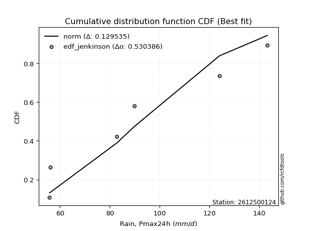</img></img>

</div>


### 11. EDF Cunnane (1978)

Cunnane´s work in statistical hydrology has focused on the performance and evaluation of different probability distributions (such as GEV, Gumbel, Lognormal) for flood frequency estimation. _b_ is a constant, typically set to 0.4.

<div align="center">


$P=(m-b)/(n+1-2b)$


</div>


**11.1. Empirical values**

<div align="center">

|                | 0                   | 1                   | 2                  | 3           | 4                  | 5                  | 6                  |
|:---------------|:--------------------|:--------------------|:-------------------|:------------|:-------------------|:-------------------|:-------------------|
| date           | 2019                | 2023                | 2025               | 2022        | 2021               | 2020               | 2024               |
| x              | 55.8                | 56.2                | 65.2               | 82.8        | 89.8               | 124.0              | 143.2              |
| m              | 1                   | 2                   | 3                  | 4           | 5                  | 6                  | 7                  |
| empirical_dist | edf_cunnane         | edf_cunnane         | edf_cunnane        | edf_cunnane | edf_cunnane        | edf_cunnane        | edf_cunnane        |
| empirical      | 0.08333333333333333 | 0.22222222222222224 | 0.3611111111111111 | 0.5         | 0.6388888888888888 | 0.7777777777777777 | 0.9166666666666666 |
| empirical_tr   | 1.090909090909091   | 1.2857142857142856  | 1.565217391304348  | 2.0         | 2.7692307692307687 | 4.499999999999998  | 11.999999999999995 |

</div>


**11.2. Kolmogorov-Smirnov fit test (sorted by Δ)**


<div align="center">

|                | 0                   | 1                   | 2                   | 3                   | 4                   | 5                   | 6                   | 7                   | 8                   | 9                   | 10                  | 11                  | 12                  | 13                  | 14                  | 15                  | 16                  | 17                  | 18                  | 19                  | 20                  | 21                  | 22                  | 23                  | 24                  | 25                  | 26                  | 27                  | 28                  | 29                  | 30                  | 31                  | 32                  | 33                  | 34                  | 35                  | 36                  | 37                  | 38                  | 39                  | 40                  | 41                  | 42                  | 43                  | 44                  | 45                  | 46                  | 47                  | 48                  | 49                  | 50                  | 51                  | 52                  | 53                  | 54                  | 55                  | 56                  | 57                  | 58                  | 59                  | 60                  | 61                  | 62                  | 63                  | 64                  | 65                  | 66                  | 67                  | 68                  | 69                  | 70                  | 71                  | 72                  | 73                  | 74                  | 75                  | 76                  | 77                  | 78                  | 79                  | 80                  | 81                  | 82                  | 83                  | 84                  | 85                  | 86                  | 87                  | 88                  | 89                  | 90                  | 91                  | 92                  | 93                  | 94                  | 95                  | 96                  | 97                  | 98                  | 99                  | 100                 | 101                 | 102                 | 103                 | 104                 | 105                 | 106                 | 107                 | 108                 | 109                 | 110                 | 111                 | 112                 | 113                 | 114                 | 115                 | 116                 | 117                 | 118                 | 119                 | 120                 | 121                 | 122                 | 123                 | 124                 | 125                 | 126                 | 127                 | 128                 | 129                 | 130                 | 131                 | 132                 | 133                 | 134                 | 135                 | 136                 | 137                 | 138                 | 139                 | 140                 | 141                 | 142                 | 143                 | 144                 | 145                 | 146                 | 147                 | 148                 | 149                 | 150                 | 151                 | 152                 | 153                 | 154                 | 155                 | 156                 | 157                 | 158                 | 159                 |
|:---------------|:--------------------|:--------------------|:--------------------|:--------------------|:--------------------|:--------------------|:--------------------|:--------------------|:--------------------|:--------------------|:--------------------|:--------------------|:--------------------|:--------------------|:--------------------|:--------------------|:--------------------|:--------------------|:--------------------|:--------------------|:--------------------|:--------------------|:--------------------|:--------------------|:--------------------|:--------------------|:--------------------|:--------------------|:--------------------|:--------------------|:--------------------|:--------------------|:--------------------|:--------------------|:--------------------|:--------------------|:--------------------|:--------------------|:--------------------|:--------------------|:--------------------|:--------------------|:--------------------|:--------------------|:--------------------|:--------------------|:--------------------|:--------------------|:--------------------|:--------------------|:--------------------|:--------------------|:--------------------|:--------------------|:--------------------|:--------------------|:--------------------|:--------------------|:--------------------|:--------------------|:--------------------|:--------------------|:--------------------|:--------------------|:--------------------|:--------------------|:--------------------|:--------------------|:--------------------|:--------------------|:--------------------|:--------------------|:--------------------|:--------------------|:--------------------|:--------------------|:--------------------|:--------------------|:--------------------|:--------------------|:--------------------|:--------------------|:--------------------|:--------------------|:--------------------|:--------------------|:--------------------|:--------------------|:--------------------|:--------------------|:--------------------|:--------------------|:--------------------|:--------------------|:--------------------|:--------------------|:--------------------|:--------------------|:--------------------|:--------------------|:--------------------|:--------------------|:--------------------|:--------------------|:--------------------|:--------------------|:--------------------|:--------------------|:--------------------|:--------------------|:--------------------|:--------------------|:--------------------|:--------------------|:--------------------|:--------------------|:--------------------|:--------------------|:--------------------|:--------------------|:--------------------|:--------------------|:--------------------|:--------------------|:--------------------|:--------------------|:--------------------|:--------------------|:--------------------|:--------------------|:--------------------|:--------------------|:--------------------|:--------------------|:--------------------|:--------------------|:--------------------|:--------------------|:--------------------|:--------------------|:--------------------|:--------------------|:--------------------|:--------------------|:--------------------|:--------------------|:--------------------|:--------------------|:--------------------|:--------------------|:--------------------|:--------------------|:--------------------|:--------------------|:--------------------|:--------------------|:--------------------|:--------------------|:--------------------|:--------------------|
| station        | 2612500124          | 2612500124          | 2612500124          | 2612500124          | 2612500124          | 2612500124          | 2612500124          | 2612500124          | 2612500124          | 2612500124          | 2612500124          | 2612500124          | 2612500124          | 2612500124          | 2612500124          | 2612500124          | 2612500124          | 2612500124          | 2612500124          | 2612500124          | 2612500124          | 2612500124          | 2612500124          | 2612500124          | 2612500124          | 2612500124          | 2612500124          | 2612500124          | 2612500124          | 2612500124          | 2612500124          | 2612500124          | 2612500124          | 2612500124          | 2612500124          | 2612500124          | 2612500124          | 2612500124          | 2612500124          | 2612500124          | 2612500124          | 2612500124          | 2612500124          | 2612500124          | 2612500124          | 2612500124          | 2612500124          | 2612500124          | 2612500124          | 2612500124          | 2612500124          | 2612500124          | 2612500124          | 2612500124          | 2612500124          | 2612500124          | 2612500124          | 2612500124          | 2612500124          | 2612500124          | 2612500124          | 2612500124          | 2612500124          | 2612500124          | 2612500124          | 2612500124          | 2612500124          | 2612500124          | 2612500124          | 2612500124          | 2612500124          | 2612500124          | 2612500124          | 2612500124          | 2612500124          | 2612500124          | 2612500124          | 2612500124          | 2612500124          | 2612500124          | 2612500124          | 2612500124          | 2612500124          | 2612500124          | 2612500124          | 2612500124          | 2612500124          | 2612500124          | 2612500124          | 2612500124          | 2612500124          | 2612500124          | 2612500124          | 2612500124          | 2612500124          | 2612500124          | 2612500124          | 2612500124          | 2612500124          | 2612500124          | 2612500124          | 2612500124          | 2612500124          | 2612500124          | 2612500124          | 2612500124          | 2612500124          | 2612500124          | 2612500124          | 2612500124          | 2612500124          | 2612500124          | 2612500124          | 2612500124          | 2612500124          | 2612500124          | 2612500124          | 2612500124          | 2612500124          | 2612500124          | 2612500124          | 2612500124          | 2612500124          | 2612500124          | 2612500124          | 2612500124          | 2612500124          | 2612500124          | 2612500124          | 2612500124          | 2612500124          | 2612500124          | 2612500124          | 2612500124          | 2612500124          | 2612500124          | 2612500124          | 2612500124          | 2612500124          | 2612500124          | 2612500124          | 2612500124          | 2612500124          | 2612500124          | 2612500124          | 2612500124          | 2612500124          | 2612500124          | 2612500124          | 2612500124          | 2612500124          | 2612500124          | 2612500124          | 2612500124          | 2612500124          | 2612500124          | 2612500124          | 2612500124          | 2612500124          | 2612500124          |
| empirical_dist | edf_cunnane         | edf_cunnane         | edf_cunnane         | edf_cunnane         | edf_cunnane         | edf_cunnane         | edf_cunnane         | edf_cunnane         | edf_cunnane         | edf_cunnane         | edf_cunnane         | edf_cunnane         | edf_cunnane         | edf_cunnane         | edf_cunnane         | edf_cunnane         | edf_cunnane         | edf_cunnane         | edf_cunnane         | edf_cunnane         | edf_cunnane         | edf_cunnane         | edf_cunnane         | edf_cunnane         | edf_cunnane         | edf_cunnane         | edf_cunnane         | edf_cunnane         | edf_cunnane         | edf_cunnane         | edf_cunnane         | edf_cunnane         | edf_cunnane         | edf_cunnane         | edf_cunnane         | edf_cunnane         | edf_cunnane         | edf_cunnane         | edf_cunnane         | edf_cunnane         | edf_cunnane         | edf_cunnane         | edf_cunnane         | edf_cunnane         | edf_cunnane         | edf_cunnane         | edf_cunnane         | edf_cunnane         | edf_cunnane         | edf_cunnane         | edf_cunnane         | edf_cunnane         | edf_cunnane         | edf_cunnane         | edf_cunnane         | edf_cunnane         | edf_cunnane         | edf_cunnane         | edf_cunnane         | edf_cunnane         | edf_cunnane         | edf_cunnane         | edf_cunnane         | edf_cunnane         | edf_cunnane         | edf_cunnane         | edf_cunnane         | edf_cunnane         | edf_cunnane         | edf_cunnane         | edf_cunnane         | edf_cunnane         | edf_cunnane         | edf_cunnane         | edf_cunnane         | edf_cunnane         | edf_cunnane         | edf_cunnane         | edf_cunnane         | edf_cunnane         | edf_cunnane         | edf_cunnane         | edf_cunnane         | edf_cunnane         | edf_cunnane         | edf_cunnane         | edf_cunnane         | edf_cunnane         | edf_cunnane         | edf_cunnane         | edf_cunnane         | edf_cunnane         | edf_cunnane         | edf_cunnane         | edf_cunnane         | edf_cunnane         | edf_cunnane         | edf_cunnane         | edf_cunnane         | edf_cunnane         | edf_cunnane         | edf_cunnane         | edf_cunnane         | edf_cunnane         | edf_cunnane         | edf_cunnane         | edf_cunnane         | edf_cunnane         | edf_cunnane         | edf_cunnane         | edf_cunnane         | edf_cunnane         | edf_cunnane         | edf_cunnane         | edf_cunnane         | edf_cunnane         | edf_cunnane         | edf_cunnane         | edf_cunnane         | edf_cunnane         | edf_cunnane         | edf_cunnane         | edf_cunnane         | edf_cunnane         | edf_cunnane         | edf_cunnane         | edf_cunnane         | edf_cunnane         | edf_cunnane         | edf_cunnane         | edf_cunnane         | edf_cunnane         | edf_cunnane         | edf_cunnane         | edf_cunnane         | edf_cunnane         | edf_cunnane         | edf_cunnane         | edf_cunnane         | edf_cunnane         | edf_cunnane         | edf_cunnane         | edf_cunnane         | edf_cunnane         | edf_cunnane         | edf_cunnane         | edf_cunnane         | edf_cunnane         | edf_cunnane         | edf_cunnane         | edf_cunnane         | edf_cunnane         | edf_cunnane         | edf_cunnane         | edf_cunnane         | edf_cunnane         | edf_cunnane         | edf_cunnane         | edf_cunnane         | edf_cunnane         |
| p_dist         | logsemicircular     | halfnorm            | logksone            | logbetaprime        | foldnorm            | loganglit           | logfoldnorm         | logmaxwell          | lograyleigh         | rayleigh            | nct                 | maxwell             | lognct              | logpearson3         | betaprime           | burr                | loggenlogistic      | logweibull_max      | logarcsine          | pearson3            | logloggamma         | logalpha            | logburr             | logmielke           | loggenextreme       | loginvweibull       | logjohnsonsu        | lognorm             | logcrystalball      | logt                | genlogistic         | logkstwobign        | anglit              | gumbel_r            | loginvgamma         | semicircular        | halflogistic        | logf                | moyal               | truncnorm           | norm                | crystalball         | t                   | loghalfnorm         | loggumbel_r         | logncf              | kstwobign           | logrice             | logcosine           | loglogistic         | logdweibull         | logloglaplace       | logistic            | weibull_min         | gausshyper          | cosine              | loghypsecant        | loggumbel_l         | arcsine             | rice                | logmoyal            | nakagami            | logbeta             | hypsecant           | alpha               | logargus            | f                   | dweibull            | invgamma            | logdgamma           | logburr12           | loglaplace          | loglaplace          | halfgennorm         | exponpow            | genpareto           | laplace             | bradford            | dgamma              | logweibull_min      | gumbel_l            | loghalflogistic     | loginvgauss         | burr12              | logrdist            | ncf                 | truncweibull_min    | logtruncweibull_min | loghalfgennorm      | logwrapcauchy       | logexponnorm        | logtriang           | loglomax            | wrapcauchy          | loggenexpon         | exponnorm           | loggompertz         | lomax               | genexpon            | gompertz            | invgauss            | logtruncexpon       | logskewnorm         | logkappa4           | logtukeylambda      | loguniform          | logkappa3           | logvonmises_line    | truncexpon          | skewnorm            | beta                | logwald             | wald                | ksone               | kappa4              | argus               | uniform             | vonmises_line       | kappa3              | loglevy_l           | loggennorm          | gennorm             | triang              | logexponpow         | loggenhalflogistic  | loggamma            | loggamma            | levy_l              | gamma               | logerlang           | logfatiguelife      | lognakagami         | genextreme          | powerlaw            | tukeylambda         | logbradford         | logtruncnorm        | rdist               | fatiguelife         | truncpareto         | erlang              | genhalflogistic     | logpowerlaw         | logtrapezoid        | loggausshyper       | logtruncpareto      | gengamma            | logexponweib        | loggengamma         | invweibull          | exponweib           | trapezoid           | loggenpareto        | johnsonsb           | logjohnsonsb        | weibull_max         | johnsonsu           | logvonmises         | vonmises            | mielke              |
| delta          | 0.07859510714008305 | 0.0844946503016174  | 0.0849694250892478  | 0.08751206612863799 | 0.08898865277038619 | 0.09065634754987661 | 0.09723611782660499 | 0.0979217683547508  | 0.09842871054975696 | 0.10112999364195885 | 0.10614087268675658 | 0.10901984223151667 | 0.10924727424054481 | 0.11006636157944016 | 0.11327891356396178 | 0.11386896579914486 | 0.11409440685391625 | 0.11419794858381462 | 0.11475769636408913 | 0.11497765529842388 | 0.11571316684670768 | 0.11572666960946104 | 0.1157706096444136  | 0.11600872334391049 | 0.1170951395725633  | 0.11709823074923768 | 0.11825743120253196 | 0.11841789887381271 | 0.11841789978488451 | 0.11841831089703303 | 0.12077567051489213 | 0.1208820276143052  | 0.12090365544337744 | 0.12165203454388757 | 0.12207180366321946 | 0.1221396563285213  | 0.12264645855955407 | 0.12654620943193526 | 0.1271226674873696  | 0.12798447406501529 | 0.12798447928647338 | 0.12798448692582695 | 0.12823587602526604 | 0.1285123837200145  | 0.13029066609927295 | 0.13088487961893974 | 0.13103341612160274 | 0.13467342385881387 | 0.1359652654285552  | 0.14106972200208295 | 0.1426107484942818  | 0.14513398984165352 | 0.1505445654454118  | 0.151329409565077   | 0.15387006430509148 | 0.15470114741324503 | 0.15575793108808245 | 0.15607020094954827 | 0.15791864968758518 | 0.1582629275719403  | 0.15867548630957692 | 0.15881275850385568 | 0.16415171748750867 | 0.16487575633904378 | 0.16535083747035095 | 0.16645492234112297 | 0.1680737436939017  | 0.1681601788737263  | 0.16935543535449504 | 0.17012423962968373 | 0.1730334932440453  | 0.1746989537178126  | 0.1746989537178126  | 0.17704385314253152 | 0.18037013014868541 | 0.18229125961492215 | 0.18267546500927842 | 0.18358307908110538 | 0.18436403172531707 | 0.18641563005167816 | 0.18733672128018308 | 0.18895343579071006 | 0.19227601225495605 | 0.19262921526994328 | 0.1947330763481871  | 0.19570935468118986 | 0.19691885784432886 | 0.19740892895024958 | 0.1978652133243443  | 0.19812919668901285 | 0.20289191683724564 | 0.20420511438935252 | 0.20428293175181284 | 0.20510433220583513 | 0.20715293603219442 | 0.20856240454511568 | 0.20864313202546686 | 0.20878986769408545 | 0.20993086550016485 | 0.21024773874762923 | 0.21054202325784288 | 0.21098724653877743 | 0.21137289053389022 | 0.21259873286286127 | 0.2137543722265897  | 0.21464330750740632 | 0.21465700227376866 | 0.2147186861026211  | 0.21478619664680415 | 0.2151520664266898  | 0.21935412220042455 | 0.22222222222222224 | 0.22593886131884436 | 0.23137554030002533 | 0.23312688650491262 | 0.234574602036287   | 0.2535596236969234  | 0.2535744581849526  | 0.2538105435393324  | 0.27720808732375496 | 0.2777777777777778  | 0.2777777777777778  | 0.2846019935103345  | 0.2906104346859391  | 0.29686112992254526 | 0.3064549709376101  | 0.3064549709376101  | 0.30791303142765897 | 0.310236035175085   | 0.3141870947397094  | 0.33018723814419976 | 0.33133318768291314 | 0.34670258766715023 | 0.35646878465338555 | 0.3598459765374753  | 0.36094311038456556 | 0.36111108493569744 | 0.36111111049872957 | 0.3622965368375127  | 0.36619255140639945 | 0.37232741458854    | 0.3805478780838666  | 0.3848175819843804  | 0.38482559100417435 | 0.39529317284281046 | 0.41533499416238    | 0.416181857827642   | 0.4265565539942547  | 0.43029463307075994 | 0.430971837292862   | 0.46666539355172393 | 0.4728217596107802  | 0.49867173114053737 | 0.5248622118103343  | 0.6061627485684585  | 0.6092055904235918  | 0.678903302746002   | 1.1022348106917854  | 22.369635061802132  | nan                 |
| deltao         | 0.48442053926100004 | 0.48442053926100004 | 0.48442053926100004 | 0.48442053926100004 | 0.48442053926100004 | 0.48442053926100004 | 0.48442053926100004 | 0.48442053926100004 | 0.48442053926100004 | 0.48442053926100004 | 0.48442053926100004 | 0.48442053926100004 | 0.48442053926100004 | 0.48442053926100004 | 0.48442053926100004 | 0.48442053926100004 | 0.48442053926100004 | 0.48442053926100004 | 0.48442053926100004 | 0.48442053926100004 | 0.48442053926100004 | 0.48442053926100004 | 0.48442053926100004 | 0.48442053926100004 | 0.48442053926100004 | 0.48442053926100004 | 0.48442053926100004 | 0.48442053926100004 | 0.48442053926100004 | 0.48442053926100004 | 0.48442053926100004 | 0.48442053926100004 | 0.48442053926100004 | 0.48442053926100004 | 0.48442053926100004 | 0.48442053926100004 | 0.48442053926100004 | 0.48442053926100004 | 0.48442053926100004 | 0.48442053926100004 | 0.48442053926100004 | 0.48442053926100004 | 0.48442053926100004 | 0.48442053926100004 | 0.48442053926100004 | 0.48442053926100004 | 0.48442053926100004 | 0.48442053926100004 | 0.48442053926100004 | 0.48442053926100004 | 0.48442053926100004 | 0.48442053926100004 | 0.48442053926100004 | 0.48442053926100004 | 0.48442053926100004 | 0.48442053926100004 | 0.48442053926100004 | 0.48442053926100004 | 0.48442053926100004 | 0.48442053926100004 | 0.48442053926100004 | 0.48442053926100004 | 0.48442053926100004 | 0.48442053926100004 | 0.48442053926100004 | 0.48442053926100004 | 0.48442053926100004 | 0.48442053926100004 | 0.48442053926100004 | 0.48442053926100004 | 0.48442053926100004 | 0.48442053926100004 | 0.48442053926100004 | 0.48442053926100004 | 0.48442053926100004 | 0.48442053926100004 | 0.48442053926100004 | 0.48442053926100004 | 0.48442053926100004 | 0.48442053926100004 | 0.48442053926100004 | 0.48442053926100004 | 0.48442053926100004 | 0.48442053926100004 | 0.48442053926100004 | 0.48442053926100004 | 0.48442053926100004 | 0.48442053926100004 | 0.48442053926100004 | 0.48442053926100004 | 0.48442053926100004 | 0.48442053926100004 | 0.48442053926100004 | 0.48442053926100004 | 0.48442053926100004 | 0.48442053926100004 | 0.48442053926100004 | 0.48442053926100004 | 0.48442053926100004 | 0.48442053926100004 | 0.48442053926100004 | 0.48442053926100004 | 0.48442053926100004 | 0.48442053926100004 | 0.48442053926100004 | 0.48442053926100004 | 0.48442053926100004 | 0.48442053926100004 | 0.48442053926100004 | 0.48442053926100004 | 0.48442053926100004 | 0.48442053926100004 | 0.48442053926100004 | 0.48442053926100004 | 0.48442053926100004 | 0.48442053926100004 | 0.48442053926100004 | 0.48442053926100004 | 0.48442053926100004 | 0.48442053926100004 | 0.48442053926100004 | 0.48442053926100004 | 0.48442053926100004 | 0.48442053926100004 | 0.48442053926100004 | 0.48442053926100004 | 0.48442053926100004 | 0.48442053926100004 | 0.48442053926100004 | 0.48442053926100004 | 0.48442053926100004 | 0.48442053926100004 | 0.48442053926100004 | 0.48442053926100004 | 0.48442053926100004 | 0.48442053926100004 | 0.48442053926100004 | 0.48442053926100004 | 0.48442053926100004 | 0.48442053926100004 | 0.48442053926100004 | 0.48442053926100004 | 0.48442053926100004 | 0.48442053926100004 | 0.48442053926100004 | 0.48442053926100004 | 0.48442053926100004 | 0.48442053926100004 | 0.48442053926100004 | 0.48442053926100004 | 0.48442053926100004 | 0.48442053926100004 | 0.48442053926100004 | 0.48442053926100004 | 0.48442053926100004 | 0.48442053926100004 | 0.48442053926100004 | 0.48442053926100004 | 0.48442053926100004 | 0.48442053926100004 |
| eval           | Δo > Δ              | Δo > Δ              | Δo > Δ              | Δo > Δ              | Δo > Δ              | Δo > Δ              | Δo > Δ              | Δo > Δ              | Δo > Δ              | Δo > Δ              | Δo > Δ              | Δo > Δ              | Δo > Δ              | Δo > Δ              | Δo > Δ              | Δo > Δ              | Δo > Δ              | Δo > Δ              | Δo > Δ              | Δo > Δ              | Δo > Δ              | Δo > Δ              | Δo > Δ              | Δo > Δ              | Δo > Δ              | Δo > Δ              | Δo > Δ              | Δo > Δ              | Δo > Δ              | Δo > Δ              | Δo > Δ              | Δo > Δ              | Δo > Δ              | Δo > Δ              | Δo > Δ              | Δo > Δ              | Δo > Δ              | Δo > Δ              | Δo > Δ              | Δo > Δ              | Δo > Δ              | Δo > Δ              | Δo > Δ              | Δo > Δ              | Δo > Δ              | Δo > Δ              | Δo > Δ              | Δo > Δ              | Δo > Δ              | Δo > Δ              | Δo > Δ              | Δo > Δ              | Δo > Δ              | Δo > Δ              | Δo > Δ              | Δo > Δ              | Δo > Δ              | Δo > Δ              | Δo > Δ              | Δo > Δ              | Δo > Δ              | Δo > Δ              | Δo > Δ              | Δo > Δ              | Δo > Δ              | Δo > Δ              | Δo > Δ              | Δo > Δ              | Δo > Δ              | Δo > Δ              | Δo > Δ              | Δo > Δ              | Δo > Δ              | Δo > Δ              | Δo > Δ              | Δo > Δ              | Δo > Δ              | Δo > Δ              | Δo > Δ              | Δo > Δ              | Δo > Δ              | Δo > Δ              | Δo > Δ              | Δo > Δ              | Δo > Δ              | Δo > Δ              | Δo > Δ              | Δo > Δ              | Δo > Δ              | Δo > Δ              | Δo > Δ              | Δo > Δ              | Δo > Δ              | Δo > Δ              | Δo > Δ              | Δo > Δ              | Δo > Δ              | Δo > Δ              | Δo > Δ              | Δo > Δ              | Δo > Δ              | Δo > Δ              | Δo > Δ              | Δo > Δ              | Δo > Δ              | Δo > Δ              | Δo > Δ              | Δo > Δ              | Δo > Δ              | Δo > Δ              | Δo > Δ              | Δo > Δ              | Δo > Δ              | Δo > Δ              | Δo > Δ              | Δo > Δ              | Δo > Δ              | Δo > Δ              | Δo > Δ              | Δo > Δ              | Δo > Δ              | Δo > Δ              | Δo > Δ              | Δo > Δ              | Δo > Δ              | Δo > Δ              | Δo > Δ              | Δo > Δ              | Δo > Δ              | Δo > Δ              | Δo > Δ              | Δo > Δ              | Δo > Δ              | Δo > Δ              | Δo > Δ              | Δo > Δ              | Δo > Δ              | Δo > Δ              | Δo > Δ              | Δo > Δ              | Δo > Δ              | Δo > Δ              | Δo > Δ              | Δo > Δ              | Δo > Δ              | Δo > Δ              | Δo > Δ              | Δo > Δ              | Δo > Δ              | Δo > Δ              | Δo > Δ              | Δo > Δ              | Δo <= Δ             | Δo <= Δ             | Δo <= Δ             | Δo <= Δ             | Δo <= Δ             | Δo <= Δ             | Δo <= Δ             | Δo <= Δ             |
| fit            | 1                   | 1                   | 1                   | 1                   | 1                   | 1                   | 1                   | 1                   | 1                   | 1                   | 1                   | 1                   | 1                   | 1                   | 1                   | 1                   | 1                   | 1                   | 1                   | 1                   | 1                   | 1                   | 1                   | 1                   | 1                   | 1                   | 1                   | 1                   | 1                   | 1                   | 1                   | 1                   | 1                   | 1                   | 1                   | 1                   | 1                   | 1                   | 1                   | 1                   | 1                   | 1                   | 1                   | 1                   | 1                   | 1                   | 1                   | 1                   | 1                   | 1                   | 1                   | 1                   | 1                   | 1                   | 1                   | 1                   | 1                   | 1                   | 1                   | 1                   | 1                   | 1                   | 1                   | 1                   | 1                   | 1                   | 1                   | 1                   | 1                   | 1                   | 1                   | 1                   | 1                   | 1                   | 1                   | 1                   | 1                   | 1                   | 1                   | 1                   | 1                   | 1                   | 1                   | 1                   | 1                   | 1                   | 1                   | 1                   | 1                   | 1                   | 1                   | 1                   | 1                   | 1                   | 1                   | 1                   | 1                   | 1                   | 1                   | 1                   | 1                   | 1                   | 1                   | 1                   | 1                   | 1                   | 1                   | 1                   | 1                   | 1                   | 1                   | 1                   | 1                   | 1                   | 1                   | 1                   | 1                   | 1                   | 1                   | 1                   | 1                   | 1                   | 1                   | 1                   | 1                   | 1                   | 1                   | 1                   | 1                   | 1                   | 1                   | 1                   | 1                   | 1                   | 1                   | 1                   | 1                   | 1                   | 1                   | 1                   | 1                   | 1                   | 1                   | 1                   | 1                   | 1                   | 1                   | 1                   | 1                   | 1                   | 1                   | 1                   | 0                   | 0                   | 0                   | 0                   | 0                   | 0                   | 0                   | 0                   |
| n              | 7                   | 7                   | 7                   | 7                   | 7                   | 7                   | 7                   | 7                   | 7                   | 7                   | 7                   | 7                   | 7                   | 7                   | 7                   | 7                   | 7                   | 7                   | 7                   | 7                   | 7                   | 7                   | 7                   | 7                   | 7                   | 7                   | 7                   | 7                   | 7                   | 7                   | 7                   | 7                   | 7                   | 7                   | 7                   | 7                   | 7                   | 7                   | 7                   | 7                   | 7                   | 7                   | 7                   | 7                   | 7                   | 7                   | 7                   | 7                   | 7                   | 7                   | 7                   | 7                   | 7                   | 7                   | 7                   | 7                   | 7                   | 7                   | 7                   | 7                   | 7                   | 7                   | 7                   | 7                   | 7                   | 7                   | 7                   | 7                   | 7                   | 7                   | 7                   | 7                   | 7                   | 7                   | 7                   | 7                   | 7                   | 7                   | 7                   | 7                   | 7                   | 7                   | 7                   | 7                   | 7                   | 7                   | 7                   | 7                   | 7                   | 7                   | 7                   | 7                   | 7                   | 7                   | 7                   | 7                   | 7                   | 7                   | 7                   | 7                   | 7                   | 7                   | 7                   | 7                   | 7                   | 7                   | 7                   | 7                   | 7                   | 7                   | 7                   | 7                   | 7                   | 7                   | 7                   | 7                   | 7                   | 7                   | 7                   | 7                   | 7                   | 7                   | 7                   | 7                   | 7                   | 7                   | 7                   | 7                   | 7                   | 7                   | 7                   | 7                   | 7                   | 7                   | 7                   | 7                   | 7                   | 7                   | 7                   | 7                   | 7                   | 7                   | 7                   | 7                   | 7                   | 7                   | 7                   | 7                   | 7                   | 7                   | 7                   | 7                   | 7                   | 7                   | 7                   | 7                   | 7                   | 7                   | 7                   | 7                   |
| best_fit       | 1                   | 0                   | 0                   | 0                   | 0                   | 0                   | 0                   | 0                   | 0                   | 0                   | 0                   | 0                   | 0                   | 0                   | 0                   | 0                   | 0                   | 0                   | 0                   | 0                   | 0                   | 0                   | 0                   | 0                   | 0                   | 0                   | 0                   | 0                   | 0                   | 0                   | 0                   | 0                   | 0                   | 0                   | 0                   | 0                   | 0                   | 0                   | 0                   | 0                   | 0                   | 0                   | 0                   | 0                   | 0                   | 0                   | 0                   | 0                   | 0                   | 0                   | 0                   | 0                   | 0                   | 0                   | 0                   | 0                   | 0                   | 0                   | 0                   | 0                   | 0                   | 0                   | 0                   | 0                   | 0                   | 0                   | 0                   | 0                   | 0                   | 0                   | 0                   | 0                   | 0                   | 0                   | 0                   | 0                   | 0                   | 0                   | 0                   | 0                   | 0                   | 0                   | 0                   | 0                   | 0                   | 0                   | 0                   | 0                   | 0                   | 0                   | 0                   | 0                   | 0                   | 0                   | 0                   | 0                   | 0                   | 0                   | 0                   | 0                   | 0                   | 0                   | 0                   | 0                   | 0                   | 0                   | 0                   | 0                   | 0                   | 0                   | 0                   | 0                   | 0                   | 0                   | 0                   | 0                   | 0                   | 0                   | 0                   | 0                   | 0                   | 0                   | 0                   | 0                   | 0                   | 0                   | 0                   | 0                   | 0                   | 0                   | 0                   | 0                   | 0                   | 0                   | 0                   | 0                   | 0                   | 0                   | 0                   | 0                   | 0                   | 0                   | 0                   | 0                   | 0                   | 0                   | 0                   | 0                   | 0                   | 0                   | 0                   | 0                   | 0                   | 0                   | 0                   | 0                   | 0                   | 0                   | 0                   | 0                   |
| best_fit_sort  | 1                   | 2                   | 3                   | 4                   | 5                   | 6                   | 7                   | 8                   | 9                   | 10                  | 11                  | 12                  | 13                  | 14                  | 15                  | 16                  | 17                  | 18                  | 19                  | 20                  | 21                  | 22                  | 23                  | 24                  | 25                  | 26                  | 27                  | 28                  | 29                  | 30                  | 31                  | 32                  | 33                  | 34                  | 35                  | 36                  | 37                  | 38                  | 39                  | 40                  | 41                  | 42                  | 43                  | 44                  | 45                  | 46                  | 47                  | 48                  | 49                  | 50                  | 51                  | 52                  | 53                  | 54                  | 55                  | 56                  | 57                  | 58                  | 59                  | 60                  | 61                  | 62                  | 63                  | 64                  | 65                  | 66                  | 67                  | 68                  | 69                  | 70                  | 71                  | 72                  | 73                  | 74                  | 75                  | 76                  | 77                  | 78                  | 79                  | 80                  | 81                  | 82                  | 83                  | 84                  | 85                  | 86                  | 87                  | 88                  | 89                  | 90                  | 91                  | 92                  | 93                  | 94                  | 95                  | 96                  | 97                  | 98                  | 99                  | 100                 | 101                 | 102                 | 103                 | 104                 | 105                 | 106                 | 107                 | 108                 | 109                 | 110                 | 111                 | 112                 | 113                 | 114                 | 115                 | 116                 | 117                 | 118                 | 119                 | 120                 | 121                 | 122                 | 123                 | 124                 | 125                 | 126                 | 127                 | 128                 | 129                 | 130                 | 131                 | 132                 | 133                 | 134                 | 135                 | 136                 | 137                 | 138                 | 139                 | 140                 | 141                 | 142                 | 143                 | 144                 | 145                 | 146                 | 147                 | 148                 | 149                 | 150                 | 151                 | 152                 | 153                 | 154                 | 155                 | 156                 | 157                 | 158                 | 159                 | 160                 |

</div>


**11.3. Best fit**

<div align="center">

|   id |    station | empirical_dist   | p_dist          |     delta |   deltao | eval   |   fit |   n |   best_fit |   best_fit_sort |
|-----:|-----------:|:-----------------|:----------------|----------:|---------:|:-------|------:|----:|-----------:|----------------:|
|    0 | 2612500124 | edf_cunnane      | logsemicircular | 0.0785951 | 0.484421 | Δo > Δ |     1 |   7 |          1 |               1 |

</div>


<div align="center">

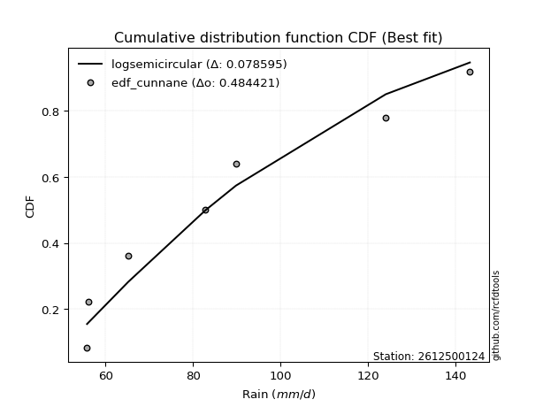</img>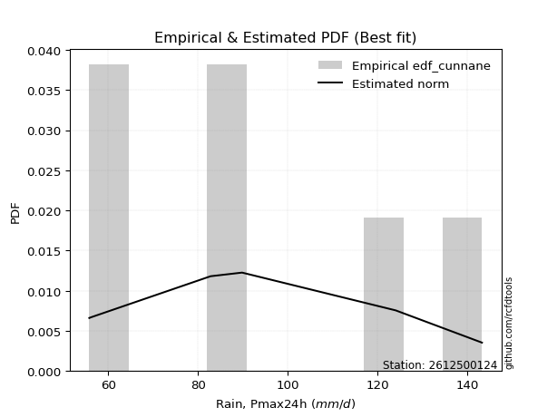</img>

</div>


### 12. EDF Adamowski (1981)

The Adamowski formula in hydrology refers to a specific plotting position formula used for estimating the non-parametric empirical distribution of hydrological events (like flood peaks) to calculate their return periods. This formula provides an alternative to traditional parametric methods (like the Gumbel or Log Pearson Type III distributions). 

<div align="center">


$P=(m-0.25)/(n+0.5)$


</div>


**12.1. Empirical values**

<div align="center">

|                | 0                  | 1                   | 2                   | 3             | 4                  | 5                  | 6                  |
|:---------------|:-------------------|:--------------------|:--------------------|:--------------|:-------------------|:-------------------|:-------------------|
| date           | 2019               | 2023                | 2025                | 2022          | 2021               | 2020               | 2024               |
| x              | 55.8               | 56.2                | 65.2                | 82.8          | 89.8               | 124.0              | 143.2              |
| m              | 1                  | 2                   | 3                   | 4             | 5                  | 6                  | 7                  |
| empirical_dist | edf_adamowski      | edf_adamowski       | edf_adamowski       | edf_adamowski | edf_adamowski      | edf_adamowski      | edf_adamowski      |
| empirical      | 0.1                | 0.23333333333333334 | 0.36666666666666664 | 0.5           | 0.6333333333333333 | 0.7666666666666667 | 0.9                |
| empirical_tr   | 1.1111111111111112 | 1.3043478260869565  | 1.5789473684210527  | 2.0           | 2.727272727272727  | 4.2857142857142865 | 10.000000000000002 |

</div>


**12.2. Kolmogorov-Smirnov fit test (sorted by Δ)**


<div align="center">

|                | 0                   | 1                   | 2                   | 3                   | 4                   | 5                   | 6                   | 7                   | 8                   | 9                   | 10                  | 11                  | 12                  | 13                  | 14                  | 15                  | 16                  | 17                  | 18                  | 19                  | 20                  | 21                  | 22                  | 23                  | 24                  | 25                  | 26                  | 27                  | 28                  | 29                  | 30                  | 31                  | 32                  | 33                  | 34                  | 35                  | 36                  | 37                  | 38                  | 39                  | 40                  | 41                  | 42                  | 43                  | 44                  | 45                  | 46                  | 47                  | 48                  | 49                  | 50                  | 51                  | 52                  | 53                  | 54                  | 55                  | 56                  | 57                  | 58                  | 59                  | 60                  | 61                  | 62                  | 63                  | 64                  | 65                  | 66                  | 67                  | 68                  | 69                  | 70                  | 71                  | 72                  | 73                  | 74                  | 75                  | 76                  | 77                  | 78                  | 79                  | 80                  | 81                  | 82                  | 83                  | 84                  | 85                  | 86                  | 87                  | 88                  | 89                  | 90                  | 91                  | 92                  | 93                  | 94                  | 95                  | 96                  | 97                  | 98                  | 99                  | 100                 | 101                 | 102                 | 103                 | 104                 | 105                 | 106                 | 107                 | 108                 | 109                 | 110                 | 111                 | 112                 | 113                 | 114                 | 115                 | 116                 | 117                 | 118                 | 119                 | 120                 | 121                 | 122                 | 123                 | 124                 | 125                 | 126                 | 127                 | 128                 | 129                 | 130                 | 131                 | 132                 | 133                 | 134                 | 135                 | 136                 | 137                 | 138                 | 139                 | 140                 | 141                 | 142                 | 143                 | 144                 | 145                 | 146                 | 147                 | 148                 | 149                 | 150                 | 151                 | 152                 | 153                 | 154                 | 155                 | 156                 | 157                 | 158                 | 159                 |
|:---------------|:--------------------|:--------------------|:--------------------|:--------------------|:--------------------|:--------------------|:--------------------|:--------------------|:--------------------|:--------------------|:--------------------|:--------------------|:--------------------|:--------------------|:--------------------|:--------------------|:--------------------|:--------------------|:--------------------|:--------------------|:--------------------|:--------------------|:--------------------|:--------------------|:--------------------|:--------------------|:--------------------|:--------------------|:--------------------|:--------------------|:--------------------|:--------------------|:--------------------|:--------------------|:--------------------|:--------------------|:--------------------|:--------------------|:--------------------|:--------------------|:--------------------|:--------------------|:--------------------|:--------------------|:--------------------|:--------------------|:--------------------|:--------------------|:--------------------|:--------------------|:--------------------|:--------------------|:--------------------|:--------------------|:--------------------|:--------------------|:--------------------|:--------------------|:--------------------|:--------------------|:--------------------|:--------------------|:--------------------|:--------------------|:--------------------|:--------------------|:--------------------|:--------------------|:--------------------|:--------------------|:--------------------|:--------------------|:--------------------|:--------------------|:--------------------|:--------------------|:--------------------|:--------------------|:--------------------|:--------------------|:--------------------|:--------------------|:--------------------|:--------------------|:--------------------|:--------------------|:--------------------|:--------------------|:--------------------|:--------------------|:--------------------|:--------------------|:--------------------|:--------------------|:--------------------|:--------------------|:--------------------|:--------------------|:--------------------|:--------------------|:--------------------|:--------------------|:--------------------|:--------------------|:--------------------|:--------------------|:--------------------|:--------------------|:--------------------|:--------------------|:--------------------|:--------------------|:--------------------|:--------------------|:--------------------|:--------------------|:--------------------|:--------------------|:--------------------|:--------------------|:--------------------|:--------------------|:--------------------|:--------------------|:--------------------|:--------------------|:--------------------|:--------------------|:--------------------|:--------------------|:--------------------|:--------------------|:--------------------|:--------------------|:--------------------|:--------------------|:--------------------|:--------------------|:--------------------|:--------------------|:--------------------|:--------------------|:--------------------|:--------------------|:--------------------|:--------------------|:--------------------|:--------------------|:--------------------|:--------------------|:--------------------|:--------------------|:--------------------|:--------------------|:--------------------|:--------------------|:--------------------|:--------------------|:--------------------|:--------------------|
| station        | 2612500124          | 2612500124          | 2612500124          | 2612500124          | 2612500124          | 2612500124          | 2612500124          | 2612500124          | 2612500124          | 2612500124          | 2612500124          | 2612500124          | 2612500124          | 2612500124          | 2612500124          | 2612500124          | 2612500124          | 2612500124          | 2612500124          | 2612500124          | 2612500124          | 2612500124          | 2612500124          | 2612500124          | 2612500124          | 2612500124          | 2612500124          | 2612500124          | 2612500124          | 2612500124          | 2612500124          | 2612500124          | 2612500124          | 2612500124          | 2612500124          | 2612500124          | 2612500124          | 2612500124          | 2612500124          | 2612500124          | 2612500124          | 2612500124          | 2612500124          | 2612500124          | 2612500124          | 2612500124          | 2612500124          | 2612500124          | 2612500124          | 2612500124          | 2612500124          | 2612500124          | 2612500124          | 2612500124          | 2612500124          | 2612500124          | 2612500124          | 2612500124          | 2612500124          | 2612500124          | 2612500124          | 2612500124          | 2612500124          | 2612500124          | 2612500124          | 2612500124          | 2612500124          | 2612500124          | 2612500124          | 2612500124          | 2612500124          | 2612500124          | 2612500124          | 2612500124          | 2612500124          | 2612500124          | 2612500124          | 2612500124          | 2612500124          | 2612500124          | 2612500124          | 2612500124          | 2612500124          | 2612500124          | 2612500124          | 2612500124          | 2612500124          | 2612500124          | 2612500124          | 2612500124          | 2612500124          | 2612500124          | 2612500124          | 2612500124          | 2612500124          | 2612500124          | 2612500124          | 2612500124          | 2612500124          | 2612500124          | 2612500124          | 2612500124          | 2612500124          | 2612500124          | 2612500124          | 2612500124          | 2612500124          | 2612500124          | 2612500124          | 2612500124          | 2612500124          | 2612500124          | 2612500124          | 2612500124          | 2612500124          | 2612500124          | 2612500124          | 2612500124          | 2612500124          | 2612500124          | 2612500124          | 2612500124          | 2612500124          | 2612500124          | 2612500124          | 2612500124          | 2612500124          | 2612500124          | 2612500124          | 2612500124          | 2612500124          | 2612500124          | 2612500124          | 2612500124          | 2612500124          | 2612500124          | 2612500124          | 2612500124          | 2612500124          | 2612500124          | 2612500124          | 2612500124          | 2612500124          | 2612500124          | 2612500124          | 2612500124          | 2612500124          | 2612500124          | 2612500124          | 2612500124          | 2612500124          | 2612500124          | 2612500124          | 2612500124          | 2612500124          | 2612500124          | 2612500124          | 2612500124          | 2612500124          | 2612500124          |
| empirical_dist | edf_adamowski       | edf_adamowski       | edf_adamowski       | edf_adamowski       | edf_adamowski       | edf_adamowski       | edf_adamowski       | edf_adamowski       | edf_adamowski       | edf_adamowski       | edf_adamowski       | edf_adamowski       | edf_adamowski       | edf_adamowski       | edf_adamowski       | edf_adamowski       | edf_adamowski       | edf_adamowski       | edf_adamowski       | edf_adamowski       | edf_adamowski       | edf_adamowski       | edf_adamowski       | edf_adamowski       | edf_adamowski       | edf_adamowski       | edf_adamowski       | edf_adamowski       | edf_adamowski       | edf_adamowski       | edf_adamowski       | edf_adamowski       | edf_adamowski       | edf_adamowski       | edf_adamowski       | edf_adamowski       | edf_adamowski       | edf_adamowski       | edf_adamowski       | edf_adamowski       | edf_adamowski       | edf_adamowski       | edf_adamowski       | edf_adamowski       | edf_adamowski       | edf_adamowski       | edf_adamowski       | edf_adamowski       | edf_adamowski       | edf_adamowski       | edf_adamowski       | edf_adamowski       | edf_adamowski       | edf_adamowski       | edf_adamowski       | edf_adamowski       | edf_adamowski       | edf_adamowski       | edf_adamowski       | edf_adamowski       | edf_adamowski       | edf_adamowski       | edf_adamowski       | edf_adamowski       | edf_adamowski       | edf_adamowski       | edf_adamowski       | edf_adamowski       | edf_adamowski       | edf_adamowski       | edf_adamowski       | edf_adamowski       | edf_adamowski       | edf_adamowski       | edf_adamowski       | edf_adamowski       | edf_adamowski       | edf_adamowski       | edf_adamowski       | edf_adamowski       | edf_adamowski       | edf_adamowski       | edf_adamowski       | edf_adamowski       | edf_adamowski       | edf_adamowski       | edf_adamowski       | edf_adamowski       | edf_adamowski       | edf_adamowski       | edf_adamowski       | edf_adamowski       | edf_adamowski       | edf_adamowski       | edf_adamowski       | edf_adamowski       | edf_adamowski       | edf_adamowski       | edf_adamowski       | edf_adamowski       | edf_adamowski       | edf_adamowski       | edf_adamowski       | edf_adamowski       | edf_adamowski       | edf_adamowski       | edf_adamowski       | edf_adamowski       | edf_adamowski       | edf_adamowski       | edf_adamowski       | edf_adamowski       | edf_adamowski       | edf_adamowski       | edf_adamowski       | edf_adamowski       | edf_adamowski       | edf_adamowski       | edf_adamowski       | edf_adamowski       | edf_adamowski       | edf_adamowski       | edf_adamowski       | edf_adamowski       | edf_adamowski       | edf_adamowski       | edf_adamowski       | edf_adamowski       | edf_adamowski       | edf_adamowski       | edf_adamowski       | edf_adamowski       | edf_adamowski       | edf_adamowski       | edf_adamowski       | edf_adamowski       | edf_adamowski       | edf_adamowski       | edf_adamowski       | edf_adamowski       | edf_adamowski       | edf_adamowski       | edf_adamowski       | edf_adamowski       | edf_adamowski       | edf_adamowski       | edf_adamowski       | edf_adamowski       | edf_adamowski       | edf_adamowski       | edf_adamowski       | edf_adamowski       | edf_adamowski       | edf_adamowski       | edf_adamowski       | edf_adamowski       | edf_adamowski       | edf_adamowski       | edf_adamowski       | edf_adamowski       |
| p_dist         | logksone            | logsemicircular     | foldnorm            | logbetaprime        | halfnorm            | loganglit           | logarcsine          | rayleigh            | logmaxwell          | logfoldnorm         | lograyleigh         | logncf              | maxwell             | lognct              | anglit              | logpearson3         | semicircular        | nct                 | betaprime           | pearson3            | logloggamma         | logjohnsonsu        | lognorm             | logcrystalball      | logt                | burr                | loggenlogistic      | logweibull_max      | genlogistic         | logalpha            | logburr             | logmielke           | gumbel_r            | loggenextreme       | loginvweibull       | logkstwobign        | moyal               | loginvgamma         | truncnorm           | norm                | crystalball         | halflogistic        | t                   | kstwobign           | logf                | loghalfnorm         | arcsine             | loggumbel_r         | logcosine           | logrice             | loglogistic         | logloglaplace       | logdweibull         | logistic            | dweibull            | nakagami            | cosine              | loghypsecant        | loggumbel_l         | weibull_min         | rice                | gausshyper          | alpha               | dgamma              | f                   | invgamma            | logmoyal            | hypsecant           | logargus            | logbeta             | logdgamma           | genpareto           | logrdist            | loglaplace          | loglaplace          | exponpow            | gumbel_l            | bradford            | logburr12           | halfgennorm         | laplace             | loginvgauss         | loghalfgennorm      | logweibull_min      | logtriang           | loghalflogistic     | beta                | burr12              | ncf                 | truncweibull_min    | logtruncweibull_min | logwrapcauchy       | invgauss            | logexponnorm        | loglomax            | wrapcauchy          | loggenexpon         | exponnorm           | loggompertz         | lomax               | genexpon            | gompertz            | logtruncexpon       | logskewnorm         | logkappa4           | logtukeylambda      | loguniform          | logkappa3           | ksone               | logvonmises_line    | truncexpon          | skewnorm            | argus               | wald                | logwald             | kappa4              | uniform             | vonmises_line       | kappa3              | loglevy_l           | loggennorm          | gennorm             | triang              | logexponpow         | levy_l              | loggenhalflogistic  | loggamma            | loggamma            | gamma               | logerlang           | logfatiguelife      | lognakagami         | genextreme          | powerlaw            | logbradford         | fatiguelife         | truncpareto         | tukeylambda         | logtruncnorm        | rdist               | erlang              | genhalflogistic     | logpowerlaw         | logtrapezoid        | loggausshyper       | logtruncpareto      | gengamma            | invweibull          | logexponweib        | loggengamma         | exponweib           | trapezoid           | loggenpareto        | johnsonsb           | logjohnsonsb        | weibull_max         | johnsonsu           | logvonmises         | vonmises            | mielke              |
| delta          | 0.06993430743838824 | 0.08415066269563859 | 0.09197968335077344 | 0.09306762168419352 | 0.09560576141272836 | 0.09621190310543215 | 0.09999999999999998 | 0.10668554919751438 | 0.10683192726085902 | 0.10834722893771609 | 0.10953982166086806 | 0.11421821295227308 | 0.11457539778707221 | 0.11480282979610035 | 0.11534809988782191 | 0.1156219171349957  | 0.11658410077296577 | 0.11725198379786768 | 0.11883446911951731 | 0.12053321085397942 | 0.12126872240226322 | 0.1238129867580875  | 0.12397345442936825 | 0.12397345534044005 | 0.12397386645258857 | 0.12498007691025596 | 0.12520551796502735 | 0.12530905969492573 | 0.12633122607044767 | 0.12683778072057214 | 0.1268817207555247  | 0.1271198344550216  | 0.1272075900994431  | 0.12820625068367442 | 0.12820934186034877 | 0.1319931387254163  | 0.13267822304292515 | 0.13318291477433056 | 0.13354002962057082 | 0.13354003484202892 | 0.1335400424813825  | 0.13375756967066516 | 0.13379143158082157 | 0.13658897167715828 | 0.13765732054304636 | 0.13962349483112557 | 0.14125198302091851 | 0.14140177721038405 | 0.14152082098411073 | 0.145784534969925   | 0.1466252775576385  | 0.15068954539720905 | 0.15372185960539275 | 0.15610012100096735 | 0.15780366880661423 | 0.15881275850385568 | 0.16025670296880057 | 0.16131348664363798 | 0.1616257565051038  | 0.1624405206761881  | 0.16381848312749583 | 0.1649811754162026  | 0.16535083747035095 | 0.16769736505865038 | 0.1680737436939017  | 0.16935543535449504 | 0.16978659742068802 | 0.1704313118945993  | 0.1720104778966785  | 0.17526282859861977 | 0.17567979518523927 | 0.1763877427561839  | 0.1780664096815204  | 0.18025450927336814 | 0.18025450927336814 | 0.18037013014868541 | 0.18178116572462755 | 0.18358307908110538 | 0.1841446043551564  | 0.18815496425364261 | 0.18823102056483396 | 0.19227601225495605 | 0.19230965776878878 | 0.1975267411627893  | 0.19864955883379698 | 0.20006454690182118 | 0.20268745553375786 | 0.20374032638105438 | 0.20682046579230096 | 0.20802996895543996 | 0.20852004006136066 | 0.20924030780012395 | 0.21054202325784288 | 0.21400302794835674 | 0.21539404286292393 | 0.21621544331694623 | 0.21826404714330552 | 0.21967351565622678 | 0.21975424313657796 | 0.21990097880519655 | 0.22104197661127595 | 0.22135884985874033 | 0.22209835764988856 | 0.22248400164500132 | 0.22370984397397237 | 0.2248654833377008  | 0.22575441861851742 | 0.22576811338487976 | 0.2258199847444698  | 0.2258297972137322  | 0.22589730775791525 | 0.2262631775378009  | 0.22901904648073146 | 0.23333333333333334 | 0.23333333333333334 | 0.23868244206046815 | 0.25911517925247896 | 0.25913001374050815 | 0.25936609909488795 | 0.2605414206570883  | 0.2666666666666667  | 0.2666666666666667  | 0.27904643795477896 | 0.2850548791303836  | 0.2912463647609923  | 0.29130557436698973 | 0.3064549709376101  | 0.3064549709376101  | 0.310236035175085   | 0.3141870947397094  | 0.3246316825886442  | 0.3257776321273576  | 0.3300359210004836  | 0.35091322909783    | 0.3563252956293821  | 0.35674098128195714 | 0.3606369958508439  | 0.36540153209303083 | 0.36666664049125297 | 0.3666666660542851  | 0.37232741458854    | 0.37499232252831105 | 0.37926202642882484 | 0.3792700354486188  | 0.3897376172872549  | 0.4097794386068245  | 0.41062630227208646 | 0.4143051706261954  | 0.42100099843869915 | 0.4247390775152044  | 0.4611098379961684  | 0.4672662040552247  | 0.4820050644738707  | 0.5193066562547788  | 0.5950516374573473  | 0.5980944793124808  | 0.6677921916348908  | 1.1133459218028965  | 22.3863017284688    | nan                 |
| deltao         | 0.48442053926100004 | 0.48442053926100004 | 0.48442053926100004 | 0.48442053926100004 | 0.48442053926100004 | 0.48442053926100004 | 0.48442053926100004 | 0.48442053926100004 | 0.48442053926100004 | 0.48442053926100004 | 0.48442053926100004 | 0.48442053926100004 | 0.48442053926100004 | 0.48442053926100004 | 0.48442053926100004 | 0.48442053926100004 | 0.48442053926100004 | 0.48442053926100004 | 0.48442053926100004 | 0.48442053926100004 | 0.48442053926100004 | 0.48442053926100004 | 0.48442053926100004 | 0.48442053926100004 | 0.48442053926100004 | 0.48442053926100004 | 0.48442053926100004 | 0.48442053926100004 | 0.48442053926100004 | 0.48442053926100004 | 0.48442053926100004 | 0.48442053926100004 | 0.48442053926100004 | 0.48442053926100004 | 0.48442053926100004 | 0.48442053926100004 | 0.48442053926100004 | 0.48442053926100004 | 0.48442053926100004 | 0.48442053926100004 | 0.48442053926100004 | 0.48442053926100004 | 0.48442053926100004 | 0.48442053926100004 | 0.48442053926100004 | 0.48442053926100004 | 0.48442053926100004 | 0.48442053926100004 | 0.48442053926100004 | 0.48442053926100004 | 0.48442053926100004 | 0.48442053926100004 | 0.48442053926100004 | 0.48442053926100004 | 0.48442053926100004 | 0.48442053926100004 | 0.48442053926100004 | 0.48442053926100004 | 0.48442053926100004 | 0.48442053926100004 | 0.48442053926100004 | 0.48442053926100004 | 0.48442053926100004 | 0.48442053926100004 | 0.48442053926100004 | 0.48442053926100004 | 0.48442053926100004 | 0.48442053926100004 | 0.48442053926100004 | 0.48442053926100004 | 0.48442053926100004 | 0.48442053926100004 | 0.48442053926100004 | 0.48442053926100004 | 0.48442053926100004 | 0.48442053926100004 | 0.48442053926100004 | 0.48442053926100004 | 0.48442053926100004 | 0.48442053926100004 | 0.48442053926100004 | 0.48442053926100004 | 0.48442053926100004 | 0.48442053926100004 | 0.48442053926100004 | 0.48442053926100004 | 0.48442053926100004 | 0.48442053926100004 | 0.48442053926100004 | 0.48442053926100004 | 0.48442053926100004 | 0.48442053926100004 | 0.48442053926100004 | 0.48442053926100004 | 0.48442053926100004 | 0.48442053926100004 | 0.48442053926100004 | 0.48442053926100004 | 0.48442053926100004 | 0.48442053926100004 | 0.48442053926100004 | 0.48442053926100004 | 0.48442053926100004 | 0.48442053926100004 | 0.48442053926100004 | 0.48442053926100004 | 0.48442053926100004 | 0.48442053926100004 | 0.48442053926100004 | 0.48442053926100004 | 0.48442053926100004 | 0.48442053926100004 | 0.48442053926100004 | 0.48442053926100004 | 0.48442053926100004 | 0.48442053926100004 | 0.48442053926100004 | 0.48442053926100004 | 0.48442053926100004 | 0.48442053926100004 | 0.48442053926100004 | 0.48442053926100004 | 0.48442053926100004 | 0.48442053926100004 | 0.48442053926100004 | 0.48442053926100004 | 0.48442053926100004 | 0.48442053926100004 | 0.48442053926100004 | 0.48442053926100004 | 0.48442053926100004 | 0.48442053926100004 | 0.48442053926100004 | 0.48442053926100004 | 0.48442053926100004 | 0.48442053926100004 | 0.48442053926100004 | 0.48442053926100004 | 0.48442053926100004 | 0.48442053926100004 | 0.48442053926100004 | 0.48442053926100004 | 0.48442053926100004 | 0.48442053926100004 | 0.48442053926100004 | 0.48442053926100004 | 0.48442053926100004 | 0.48442053926100004 | 0.48442053926100004 | 0.48442053926100004 | 0.48442053926100004 | 0.48442053926100004 | 0.48442053926100004 | 0.48442053926100004 | 0.48442053926100004 | 0.48442053926100004 | 0.48442053926100004 | 0.48442053926100004 | 0.48442053926100004 | 0.48442053926100004 |
| eval           | Δo > Δ              | Δo > Δ              | Δo > Δ              | Δo > Δ              | Δo > Δ              | Δo > Δ              | Δo > Δ              | Δo > Δ              | Δo > Δ              | Δo > Δ              | Δo > Δ              | Δo > Δ              | Δo > Δ              | Δo > Δ              | Δo > Δ              | Δo > Δ              | Δo > Δ              | Δo > Δ              | Δo > Δ              | Δo > Δ              | Δo > Δ              | Δo > Δ              | Δo > Δ              | Δo > Δ              | Δo > Δ              | Δo > Δ              | Δo > Δ              | Δo > Δ              | Δo > Δ              | Δo > Δ              | Δo > Δ              | Δo > Δ              | Δo > Δ              | Δo > Δ              | Δo > Δ              | Δo > Δ              | Δo > Δ              | Δo > Δ              | Δo > Δ              | Δo > Δ              | Δo > Δ              | Δo > Δ              | Δo > Δ              | Δo > Δ              | Δo > Δ              | Δo > Δ              | Δo > Δ              | Δo > Δ              | Δo > Δ              | Δo > Δ              | Δo > Δ              | Δo > Δ              | Δo > Δ              | Δo > Δ              | Δo > Δ              | Δo > Δ              | Δo > Δ              | Δo > Δ              | Δo > Δ              | Δo > Δ              | Δo > Δ              | Δo > Δ              | Δo > Δ              | Δo > Δ              | Δo > Δ              | Δo > Δ              | Δo > Δ              | Δo > Δ              | Δo > Δ              | Δo > Δ              | Δo > Δ              | Δo > Δ              | Δo > Δ              | Δo > Δ              | Δo > Δ              | Δo > Δ              | Δo > Δ              | Δo > Δ              | Δo > Δ              | Δo > Δ              | Δo > Δ              | Δo > Δ              | Δo > Δ              | Δo > Δ              | Δo > Δ              | Δo > Δ              | Δo > Δ              | Δo > Δ              | Δo > Δ              | Δo > Δ              | Δo > Δ              | Δo > Δ              | Δo > Δ              | Δo > Δ              | Δo > Δ              | Δo > Δ              | Δo > Δ              | Δo > Δ              | Δo > Δ              | Δo > Δ              | Δo > Δ              | Δo > Δ              | Δo > Δ              | Δo > Δ              | Δo > Δ              | Δo > Δ              | Δo > Δ              | Δo > Δ              | Δo > Δ              | Δo > Δ              | Δo > Δ              | Δo > Δ              | Δo > Δ              | Δo > Δ              | Δo > Δ              | Δo > Δ              | Δo > Δ              | Δo > Δ              | Δo > Δ              | Δo > Δ              | Δo > Δ              | Δo > Δ              | Δo > Δ              | Δo > Δ              | Δo > Δ              | Δo > Δ              | Δo > Δ              | Δo > Δ              | Δo > Δ              | Δo > Δ              | Δo > Δ              | Δo > Δ              | Δo > Δ              | Δo > Δ              | Δo > Δ              | Δo > Δ              | Δo > Δ              | Δo > Δ              | Δo > Δ              | Δo > Δ              | Δo > Δ              | Δo > Δ              | Δo > Δ              | Δo > Δ              | Δo > Δ              | Δo > Δ              | Δo > Δ              | Δo > Δ              | Δo > Δ              | Δo > Δ              | Δo > Δ              | Δo > Δ              | Δo > Δ              | Δo <= Δ             | Δo <= Δ             | Δo <= Δ             | Δo <= Δ             | Δo <= Δ             | Δo <= Δ             | Δo <= Δ             |
| fit            | 1                   | 1                   | 1                   | 1                   | 1                   | 1                   | 1                   | 1                   | 1                   | 1                   | 1                   | 1                   | 1                   | 1                   | 1                   | 1                   | 1                   | 1                   | 1                   | 1                   | 1                   | 1                   | 1                   | 1                   | 1                   | 1                   | 1                   | 1                   | 1                   | 1                   | 1                   | 1                   | 1                   | 1                   | 1                   | 1                   | 1                   | 1                   | 1                   | 1                   | 1                   | 1                   | 1                   | 1                   | 1                   | 1                   | 1                   | 1                   | 1                   | 1                   | 1                   | 1                   | 1                   | 1                   | 1                   | 1                   | 1                   | 1                   | 1                   | 1                   | 1                   | 1                   | 1                   | 1                   | 1                   | 1                   | 1                   | 1                   | 1                   | 1                   | 1                   | 1                   | 1                   | 1                   | 1                   | 1                   | 1                   | 1                   | 1                   | 1                   | 1                   | 1                   | 1                   | 1                   | 1                   | 1                   | 1                   | 1                   | 1                   | 1                   | 1                   | 1                   | 1                   | 1                   | 1                   | 1                   | 1                   | 1                   | 1                   | 1                   | 1                   | 1                   | 1                   | 1                   | 1                   | 1                   | 1                   | 1                   | 1                   | 1                   | 1                   | 1                   | 1                   | 1                   | 1                   | 1                   | 1                   | 1                   | 1                   | 1                   | 1                   | 1                   | 1                   | 1                   | 1                   | 1                   | 1                   | 1                   | 1                   | 1                   | 1                   | 1                   | 1                   | 1                   | 1                   | 1                   | 1                   | 1                   | 1                   | 1                   | 1                   | 1                   | 1                   | 1                   | 1                   | 1                   | 1                   | 1                   | 1                   | 1                   | 1                   | 1                   | 1                   | 0                   | 0                   | 0                   | 0                   | 0                   | 0                   | 0                   |
| n              | 7                   | 7                   | 7                   | 7                   | 7                   | 7                   | 7                   | 7                   | 7                   | 7                   | 7                   | 7                   | 7                   | 7                   | 7                   | 7                   | 7                   | 7                   | 7                   | 7                   | 7                   | 7                   | 7                   | 7                   | 7                   | 7                   | 7                   | 7                   | 7                   | 7                   | 7                   | 7                   | 7                   | 7                   | 7                   | 7                   | 7                   | 7                   | 7                   | 7                   | 7                   | 7                   | 7                   | 7                   | 7                   | 7                   | 7                   | 7                   | 7                   | 7                   | 7                   | 7                   | 7                   | 7                   | 7                   | 7                   | 7                   | 7                   | 7                   | 7                   | 7                   | 7                   | 7                   | 7                   | 7                   | 7                   | 7                   | 7                   | 7                   | 7                   | 7                   | 7                   | 7                   | 7                   | 7                   | 7                   | 7                   | 7                   | 7                   | 7                   | 7                   | 7                   | 7                   | 7                   | 7                   | 7                   | 7                   | 7                   | 7                   | 7                   | 7                   | 7                   | 7                   | 7                   | 7                   | 7                   | 7                   | 7                   | 7                   | 7                   | 7                   | 7                   | 7                   | 7                   | 7                   | 7                   | 7                   | 7                   | 7                   | 7                   | 7                   | 7                   | 7                   | 7                   | 7                   | 7                   | 7                   | 7                   | 7                   | 7                   | 7                   | 7                   | 7                   | 7                   | 7                   | 7                   | 7                   | 7                   | 7                   | 7                   | 7                   | 7                   | 7                   | 7                   | 7                   | 7                   | 7                   | 7                   | 7                   | 7                   | 7                   | 7                   | 7                   | 7                   | 7                   | 7                   | 7                   | 7                   | 7                   | 7                   | 7                   | 7                   | 7                   | 7                   | 7                   | 7                   | 7                   | 7                   | 7                   | 7                   |
| best_fit       | 1                   | 0                   | 0                   | 0                   | 0                   | 0                   | 0                   | 0                   | 0                   | 0                   | 0                   | 0                   | 0                   | 0                   | 0                   | 0                   | 0                   | 0                   | 0                   | 0                   | 0                   | 0                   | 0                   | 0                   | 0                   | 0                   | 0                   | 0                   | 0                   | 0                   | 0                   | 0                   | 0                   | 0                   | 0                   | 0                   | 0                   | 0                   | 0                   | 0                   | 0                   | 0                   | 0                   | 0                   | 0                   | 0                   | 0                   | 0                   | 0                   | 0                   | 0                   | 0                   | 0                   | 0                   | 0                   | 0                   | 0                   | 0                   | 0                   | 0                   | 0                   | 0                   | 0                   | 0                   | 0                   | 0                   | 0                   | 0                   | 0                   | 0                   | 0                   | 0                   | 0                   | 0                   | 0                   | 0                   | 0                   | 0                   | 0                   | 0                   | 0                   | 0                   | 0                   | 0                   | 0                   | 0                   | 0                   | 0                   | 0                   | 0                   | 0                   | 0                   | 0                   | 0                   | 0                   | 0                   | 0                   | 0                   | 0                   | 0                   | 0                   | 0                   | 0                   | 0                   | 0                   | 0                   | 0                   | 0                   | 0                   | 0                   | 0                   | 0                   | 0                   | 0                   | 0                   | 0                   | 0                   | 0                   | 0                   | 0                   | 0                   | 0                   | 0                   | 0                   | 0                   | 0                   | 0                   | 0                   | 0                   | 0                   | 0                   | 0                   | 0                   | 0                   | 0                   | 0                   | 0                   | 0                   | 0                   | 0                   | 0                   | 0                   | 0                   | 0                   | 0                   | 0                   | 0                   | 0                   | 0                   | 0                   | 0                   | 0                   | 0                   | 0                   | 0                   | 0                   | 0                   | 0                   | 0                   | 0                   |
| best_fit_sort  | 1                   | 2                   | 3                   | 4                   | 5                   | 6                   | 7                   | 8                   | 9                   | 10                  | 11                  | 12                  | 13                  | 14                  | 15                  | 16                  | 17                  | 18                  | 19                  | 20                  | 21                  | 22                  | 23                  | 24                  | 25                  | 26                  | 27                  | 28                  | 29                  | 30                  | 31                  | 32                  | 33                  | 34                  | 35                  | 36                  | 37                  | 38                  | 39                  | 40                  | 41                  | 42                  | 43                  | 44                  | 45                  | 46                  | 47                  | 48                  | 49                  | 50                  | 51                  | 52                  | 53                  | 54                  | 55                  | 56                  | 57                  | 58                  | 59                  | 60                  | 61                  | 62                  | 63                  | 64                  | 65                  | 66                  | 67                  | 68                  | 69                  | 70                  | 71                  | 72                  | 73                  | 74                  | 75                  | 76                  | 77                  | 78                  | 79                  | 80                  | 81                  | 82                  | 83                  | 84                  | 85                  | 86                  | 87                  | 88                  | 89                  | 90                  | 91                  | 92                  | 93                  | 94                  | 95                  | 96                  | 97                  | 98                  | 99                  | 100                 | 101                 | 102                 | 103                 | 104                 | 105                 | 106                 | 107                 | 108                 | 109                 | 110                 | 111                 | 112                 | 113                 | 114                 | 115                 | 116                 | 117                 | 118                 | 119                 | 120                 | 121                 | 122                 | 123                 | 124                 | 125                 | 126                 | 127                 | 128                 | 129                 | 130                 | 131                 | 132                 | 133                 | 134                 | 135                 | 136                 | 137                 | 138                 | 139                 | 140                 | 141                 | 142                 | 143                 | 144                 | 145                 | 146                 | 147                 | 148                 | 149                 | 150                 | 151                 | 152                 | 153                 | 154                 | 155                 | 156                 | 157                 | 158                 | 159                 | 160                 |

</div>


**12.3. Best fit**

<div align="center">

|   id |    station | empirical_dist   | p_dist   |     delta |   deltao | eval   |   fit |   n |   best_fit |   best_fit_sort |
|-----:|-----------:|:-----------------|:---------|----------:|---------:|:-------|------:|----:|-----------:|----------------:|
|    0 | 2612500124 | edf_adamowski    | logksone | 0.0699343 | 0.484421 | Δo > Δ |     1 |   7 |          1 |               1 |

</div>


<div align="center">

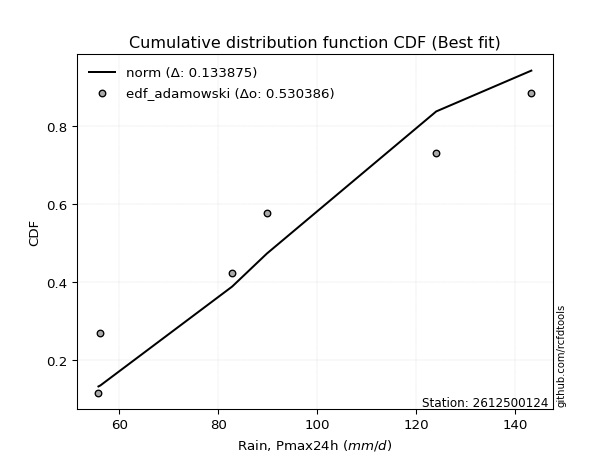</img>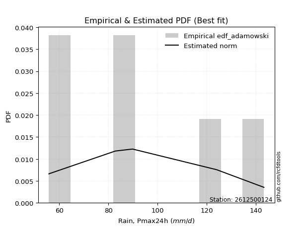</img>

</div>


## C. Best fit & Estimate extreme values for specific return periods - Tr

Best fit in probability distribution analysis means finding the theoretical distribution (like Normal, Poisson, Exponential, etc.) that most accurately mirrors your real-world data´s patterns (shape, center, spread) for better predictions, using methods like visual checks (Q-Q plots), goodness-of-fit tests (Kolmogorov-Smirnov, Chi-Squared), and information criteria (AIC) to score and select the simplest, most representative model.


### 1. Best fit (ordered by delta Δ)

:file_folder:Table: [bestfit_2612500124.csv](table/bestfit_2612500124.csv)

<div align="center">

|   id |    station | empirical_dist   | p_dist          |     delta |   deltao | eval   |   fit |   n |   best_fit |   best_fit_sort |
|-----:|-----------:|:-----------------|:----------------|----------:|---------:|:-------|------:|----:|-----------:|----------------:|
|    0 | 2612500124 | edf_adamowski    | logksone        | 0.0699343 | 0.484421 | Δo > Δ |     1 |   7 |          1 |               1 |
|    1 | 2612500124 | edf_chegodayev   | logksone        | 0.0737082 | 0.484421 | Δo > Δ |     1 |   7 |          1 |               2 |
|    2 | 2612500124 | edf_jenkinson    | logksone        | 0.0748068 | 0.484421 | Δo > Δ |     1 |   7 |          1 |               3 |
|    3 | 2612500124 | edf_beard        | logksone        | 0.0748068 | 0.484421 | Δo > Δ |     1 |   7 |          1 |               4 |
|    4 | 2612500124 | edf_filliben     | logksone        | 0.0756347 | 0.484421 | Δo > Δ |     1 |   7 |          1 |               5 |
|    5 | 2612500124 | edf_hazen        | halfnorm        | 0.0769745 | 0.484421 | Δo > Δ |     1 |   7 |          1 |               6 |
|    6 | 2612500124 | edf_gringorten   | logsemicircular | 0.0770346 | 0.484421 | Δo > Δ |     1 |   7 |          1 |               7 |
|    7 | 2612500124 | edf_tukey        | logksone        | 0.0773937 | 0.484421 | Δo > Δ |     1 |   7 |          1 |               8 |
|    8 | 2612500124 | edf_cunnane      | logsemicircular | 0.0785951 | 0.484421 | Δo > Δ |     1 |   7 |          1 |               9 |
|    9 | 2612500124 | edf_blom         | logsemicircular | 0.079553  | 0.484421 | Δo > Δ |     1 |   7 |          1 |              10 |
|   10 | 2612500124 | edf_weibull      | logksone        | 0.086601  | 0.484421 | Δo > Δ |     1 |   7 |          1 |              11 |
|   11 | 2612500124 | edf_california   | logdweibull     | 0.0982553 | 0.484421 | Δo > Δ |     1 |   7 |          1 |              12 |

</div>


### 2. Extreme values and % difference analysis

In hydrology, a return period (or recurrence interval $Tr$) is the statistical average time between extreme events like floods or droughts of a specific magnitude, indicating how rare an event is, with a 100-year flood, for example, having a 1% chance of occurring in any given year, not that it happens exactly every century. It is a key tool for infrastructure design (like bridges or dams) and risk assessment, calculated from historical data to determine the probability of future events, although it is important to remember it is statistical average, and events can cluster or be missed.

The extreme value porcentage difference is evaluated as $pdiff = 1 - (ETrBf / ETr) * 100$, where _ETrBf_ correspond to the bestfit extreme value for a specific recurrence interval and _ETr_ correspond to the extreme value for one of the most used PDFsused in hydrology.

> risk_rate: assuming the return period as the project useful life.

:file_folder:Table: [extreme_2612500124.csv](table/extreme_2612500124.csv), all PDFs.  
:file_folder:Table: [extremepdiff_2612500124.csv](table/extremepdiff_2612500124.csv), % difference between bestfit and most used PDFs in Hydrology.

<div align="center">

Extreme values table for only best fit PDFs
|   id |      tr |   prob_l |     prob_g |      alpha |   anglit |   arcsine |    argus |     beta |   betaprime |   bradford |     burr |   burr12 |   cosine |   crystalball |   dgamma |   dweibull |   erlang |   exponnorm |   exponpow |   exponweib |         f |   fatiguelife |   foldnorm |    gamma |   gausshyper |   genexpon |       genextreme |   gengamma |   genhalflogistic |   genlogistic |   gennorm |   genpareto |   gompertz |   gumbel_l |   gumbel_r |   halfgennorm |   halflogistic |   halfnorm |   hypsecant |   invgamma |   invgauss |     invweibull |   johnsonsb |        johnsonsu |   kappa3 |   kappa4 |   ksone |   kstwobign |   laplace |   levy_l |   loggamma |   logistic |   loglaplace |    lomax |   maxwell |   mielke |    moyal |   nakagami |      ncf |      nct |     norm |   pearson3 |   powerlaw |   rayleigh |   rdist |     rice |   semicircular |   skewnorm |        t |   trapezoid |   triang |   truncexpon |   truncnorm |   truncpareto |   truncweibull_min |   tukeylambda |   uniform |    vonmises |   vonmises_line |     wald |   weibull_max |   weibull_min |   wrapcauchy |   logalpha |   loganglit |   logarcsine |   logargus |   logbeta |   logbetaprime |   logbradford |   logburr |   logburr12 |   logcosine |   logcrystalball |   logdgamma |   logdweibull |   logerlang |   logexponnorm |     logexponpow |   logexponweib |      logf |   logfatiguelife |   logfoldnorm |   loggausshyper |   loggenexpon |   loggenextreme |   loggengamma |   loggenhalflogistic |   loggenlogistic |   loggennorm |   loggenpareto |   loggompertz |   loggumbel_l |   loggumbel_r |   loghalfgennorm |   loghalflogistic |   loghalfnorm |   loghypsecant |   loginvgamma |   loginvgauss |   loginvweibull |   logjohnsonsb |   logjohnsonsu |   logkappa3 |   logkappa4 |   logksone |   logkstwobign |   loglevy_l |   logloggamma |   loglogistic |   logloglaplace |   loglomax |   logmaxwell |   logmielke |   logmoyal |   lognakagami |   logncf |   lognct |   lognorm |   logpearson3 |   logpowerlaw |   lograyleigh |   logrdist |   logrice |   logsemicircular |   logskewnorm |     logt |   logtrapezoid |   logtriang |   logtruncexpon |   logtruncnorm |   logtruncpareto |   logtruncweibull_min |   logtukeylambda |   loguniform |   logvonmises |   logvonmises_line |   logwald |   logweibull_max |   logweibull_min |   logwrapcauchy |    station |   n |   risk_rate |
|-----:|--------:|---------:|-----------:|-----------:|---------:|----------:|---------:|---------:|------------:|-----------:|---------:|---------:|---------:|--------------:|---------:|-----------:|---------:|------------:|-----------:|------------:|----------:|--------------:|-----------:|---------:|-------------:|-----------:|-----------------:|-----------:|------------------:|--------------:|----------:|------------:|-----------:|-----------:|-----------:|--------------:|---------------:|-----------:|------------:|-----------:|-----------:|---------------:|------------:|-----------------:|---------:|---------:|--------:|------------:|----------:|---------:|-----------:|-----------:|-------------:|---------:|----------:|---------:|---------:|-----------:|---------:|---------:|---------:|-----------:|-----------:|-----------:|--------:|---------:|---------------:|-----------:|---------:|------------:|---------:|-------------:|------------:|--------------:|-------------------:|--------------:|----------:|------------:|----------------:|---------:|--------------:|--------------:|-------------:|-----------:|------------:|-------------:|-----------:|----------:|---------------:|--------------:|----------:|------------:|------------:|-----------------:|------------:|--------------:|------------:|---------------:|----------------:|---------------:|----------:|-----------------:|--------------:|----------------:|--------------:|----------------:|--------------:|---------------------:|-----------------:|-------------:|---------------:|--------------:|--------------:|--------------:|-----------------:|------------------:|--------------:|---------------:|--------------:|--------------:|----------------:|---------------:|---------------:|------------:|------------:|-----------:|---------------:|------------:|--------------:|--------------:|----------------:|-----------:|-------------:|------------:|-----------:|--------------:|---------:|---------:|----------:|--------------:|--------------:|--------------:|-----------:|----------:|------------------:|--------------:|---------:|---------------:|------------:|----------------:|---------------:|-----------------:|----------------------:|-----------------:|-------------:|--------------:|-------------------:|----------:|-----------------:|-----------------:|----------------:|-----------:|----:|------------:|
|    0 |    2    | 0.5      | 0.5        |    69.9449 |  88.1429 |   88.1429 |  98.4879 |  71.797  |     81.5594 |    67.0737 |  77.9429 |  73.4747 |  91.0119 |       88.1429 |  76.4    |    77.9154 |  59.7424 |     77.8854 |    65.0262 |     56.4601 |   69.712  |       55.8    |    84.3538 |  65.4862 |      74.7758 |    78.2183 |     69.7749      |    56.645  |           113.863 |       82.136  |      99.5 |     96.5361 |    78.5256 |    93.3161 |    82.9696 |       69.6121 |        80.3978 |    81.697  |     88.1429 |    69.5532 |    66.8706 |  203.774       |     55.8085 |     55.8         |   55.8   |  98.1403 |  99.5   |     83.2307 |   88.1429 |   95.205 |    64.7939 |    88.1429 |      82.9384 |  77.0014 |   85.4497 |  77.1828 |  81.2995 |    69.582  |  85.3845 |  79.9633 |  88.1429 |    84.9357 |    56.6297 |    84.4945 | 72.7752 |  86.8094 |        88.1429 |    86.2485 |  88.1714 |     121.221 |  104.57  |      88.3676 |     88.1429 |       57.2476 |            79.3289 |       72.8157 |    99.5   | -0.315      |         99.5069 |  77.9353 |       142.9   |       77.0579 |       99.5   |    77.7171 |     82.9384 |      82.9385 |    90.1164 |   81.1283 |        82.1382 |       57.6617 |   77.3821 |     72.3275 |     84.3553 |          82.9384 |     82.8    |       76.3307 |     64.2283 |        73.3812 |    57.3765      |        56.3484 |   74.6969 |          55.8    |       78.9235 |         56.4778 |       75.612  |         76.9392 |       56.5617 |              105.397 |          77.8515 |      89.3899 |        38.0196 |       76.9305 |       87.7738 |       78.3694 |     61.7475      |           76.1924 |       77.2845 |        82.9384 |       74.9727 |       68.3583 |         76.9401 |        55.8001 |        82.966  |      55.8   |     91.9549 |    82.9384 |        78.0161 |     93.2509 |       82.9909 |       82.9384 |         82.8    |    73.3917 |      80.5275 |     75.7136 |    76.9488 |       56.8069 |  82.4204 |  81.0134 |   82.9384 |       81.4064 |       56.5492 |       79.6893 |    80.2852 |   81.0786 |           82.9384 |       79.5267 |  82.9384 |        112.983 |     95.8766 |         81.0782 |        82.4826 |          56.7324 |               81.3408 |          90.7933 |      89.3899 |      0.154525 |            89.8255 |   74.1652 |          77.8793 |          77.0664 |         89.3899 | 2612500124 |   7 |    0.75     |
|    1 |    2.33 | 0.570815 | 0.429185   |    74.3087 |  94.6883 |   97.9687 | 104.656  |  80.6003 |     86.6993 |    71.7018 |  82.7049 |  78.1222 |  96.7662 |       93.7622 |  84.7953 |    85.3404 |  61.5992 |     82.76   |    70.1648 |     56.9551 |   74.0548 |       56.6513 |    90.7371 |  68.0824 |      80.9056 |    83.1577 |    145.258       |    57.3626 |           119.395 |       87.1157 |      99.5 |    106.833  |    83.4551 |    98.2049 |    88.1766 |       74.4926 |        85.7513 |    87.7617 |     92.64   |    73.8856 |    70.5894 | 2306.39        |     55.8243 |     55.8         |   55.8   | 104.801  | 106.927 |     88.3825 |   91.5434 |  109.766 |    67.3087 |    93.0939 |      86.0859 |  81.8698 |   91.2878 |  81.9483 |  86.2286 |    74.7403 |  90.2791 |  84.9501 |  93.7622 |    90.5542 |    57.8204 |    90.4189 | 76.2309 |  92.0936 |        95.163  |    91.4895 |  93.7913 |     126.299 |  110.961 |      94.2357 |     93.7622 |       58.4006 |            85.1791 |       75.3363 |   105.689 | -0.00181368 |        105.697  |  81.6199 |       143.082 |       86.0455 |      119.049 |    82.4815 |     89.1031 |      92.3626 |    96.1258 |   88.9239 |        88.0477 |       58.9057 |   82.1045 |     76.8366 |     89.7571 |          88.2037 |     85.5866 |       86.0065 |     66.6721 |        77.956  |    59.4995      |        57.023  |   79.275  |          56.9198 |       84.6081 |         57.2916 |       80.4247 |         81.6314 |       57.3344 |              111.881 |          82.6038 |      89.3899 |        53.1485 |       81.8054 |       92.6022 |       82.969  |     66.1208      |           80.794  |       82.5928 |        87.1262 |       79.5943 |       72.294  |         81.6324 |        55.8004 |        88.2439 |      55.8   |     99.2688 |    90.2615 |        82.8436 |    106.221  |       88.3187 |       87.5604 |         86.6032 |    77.9709 |      85.8452 |     80.3395 |    81.2174 |       58.2574 |  90.234  |  86.1063 |   88.2037 |       86.5987 |       57.5045 |       85.0321 |    90.9002 |   86.1091 |           89.5676 |       84.5278 |  88.2038 |        119.342 |    102.451  |         86.5091 |        86.7434 |          57.472  |               86.911  |          97.4394 |      95.5595 |      0.164245 |            96.0912 |   77.2196 |          82.6385 |          84.7394 |        107.801  | 2612500124 |   7 |    0.729209 |
|    2 |    5    | 0.8      | 0.2        |   108.147  | 117.782  |  124.171  | 124.443  | 117.088  |    109.886  |   101.766  | 106.947  | 105.968  | 117.503  |      114.645  | 103.177  |   105.166  |  73.9718 |    107.132  |   108.791  |     63.0631 |  107.356  |       74.7347 |   115.266  |  81.8236 |     109.299  |   107.854  | 284775           |    67.4947 |           133.953 |      108.748  |      99.5 |    132.744  |   107.697  |   113.999  |   110.798  |      108.342  |       109.975  |   113.409  |    110.679  |   107.481  |    98.1496 |    3.0756e+08  |     56.9843 |     55.804       |  125.884 | 126.867  | 130.964 |    110.266  |  108.545  |  133.891 |    82.0808 |   112.21   |     103.708  | 107.335  |  114.266  | 107.195  | 109.06   |   101.435  | 111.656  | 108.727  | 114.645  |   113.276  |    75.3159 |   114.137  | 85.9121 | 113.249  |       119.12   |   113.653  | 114.677  |     140.868 |  129.297 |     116.749  |    114.645  |       72.8416 |           110.179  |       83.3809 |   125.72  |  1.18009    |        125.731  | 102.247  |       143.198 |      150.291  |      137.867 |   107.332  |    114.75   |     123.065  |   118.242  |  120.153  |       114.457  |       72.8969 |  106.757  |    104.296  |    112.256  |         110.874  |    103.885  |      105.935  |     81.1939 |       105.479  |   118.381       |        66.2748 |  106.475  |          86.8081 |      111.149  |         70.4045 |      107.185  |        106.632  |       65.8415 |              130.534 |         106.852  |      89.3899 |       113.645  |      107.245  |      110.091  |      106.298  |    160.44        |          105.345  |      109.382  |       106.16   |      106.554  |      101.59   |        106.635  |        55.9533 |       110.971  |      55.8   |    127.787  |   118.694  |       106.91   |    131.8    |      111.19   |      107.956  |        109.152  |   105.609  |     110.414  |    106.269  |   104.294  |       84.1771 | 127.481  | 109.316  |  110.874  |      110.126  |       70.8864 |      110.258  |   127.314  |  109.537  |          116.443  |      109.398  | 110.874  |        139.643 |    123.922  |        110.028  |       110.798  |          67.3573 |              110.715  |         122.271  |     118.599  |      0.206243 |           119.525  |   96.7934 |         106.929  |         145.815  |        133.881  | 2612500124 |   7 |    0.67232  |
|    3 |   10    | 0.9      | 0.1        |   170.315  | 130.854  |  130.496  | 133.984  | 133.057  |    129.794  |   127.896  | 131.781  | 139.465  | 130.031  |      128.498  | 116.473  |   118.926  |  87.9194 |    129.257  |   156.326  |     76.4712 |  166.563  |       99.7033 |   131.803  |  94.9025 |     126.673  |   130.272  |      2.02952e+08 |    92.3371 |           138.983 |      126.367  |      99.5 |    139.827  |   129.142  |   122.792  |   129.222  |      153.077  |       130.092  |   132.387  |    125.084  |   168.128  |   138.146  |    4.68627e+12 |     69.9279 |     56.1743      |  134.644 | 136.68   | 141.452 |    126.928  |  123.979  |  139.715 |    98.9056 |   126.289  |     122.809  | 132.164  |  130.437  | 134.554  | 128.939  |   123.707  | 128.61   | 130.884  | 128.498  |   129.999  |    98.86   |   131.049  | 88.629  | 128.333  |       131.412  |   130.054  | 128.532  |     146.558 |  136.46  |     128.913  |    128.498  |       94.4012 |           124.981  |       86.748  |   134.46  |  1.9071     |        134.473  | 124.136  |       143.2   |      233.971  |      140.791 |   134.188  |    132.414  |     131.894  |   130.658  |  134.089  |       136.71   |       95.1563 |  133.064  |    138.274  |    128.498  |         129.041  |    124.88   |      119.744  |     97.8992 |       138.794  |   690.115       |        82.391  |  142.01   |         155.47   |      133.927  |        102.16   |      135.777  |        134.224  |       78.4526 |              137.443 |         131.77   |      89.3899 |       134.637  |      131.741  |      121.223  |      130.069  |   1516.74        |          131.313  |      134.656  |       124.304  |      140.752  |      150.738  |        134.228  |        64.1741 |       129.188  |     130.521 |    142.965  |   133.758  |       129.821  |    138.848  |      129.436  |      125.956  |        136.057  |   139.256  |     131.811  |    137.422  |   129.665  |      145.198  | 161.619  | 129.522  |  129.041  |      130.371  |       91.3914 |      132.697  |   138.709  |  129.993  |          133.227  |      132.402  | 129.041  |        148.48  |    133.482  |        124.543  |       137.084  |          85.0343 |              125.099  |         134.717  |     130.32   |      0.240357 |           131.466  |  123.019  |         131.901  |         256.906  |        138.898  | 2612500124 |   7 |    0.651322 |
|    4 |   15    | 0.933333 | 0.0666667  |   232.262  | 136.435  |  131.703  | 137.612  | 137.516  |    141.462  |   139.487  | 148.232  | inf      | 135.738  |      135.411  | 123.756  |   126.189  |  96.7904 |    142.198  |   187.447  |     89.1784 |  223.887  |      116.033  |   140.079  | 102.705  |     133.155  |   143.386  |      8.26076e+09 |   117.277  |           140.496 |      136.306  |      99.5 |    141.46   |   141.449  |   126.774  |   139.617  |      185.695  |       141.476  |   142.263  |    133.304  |   227.489  |   168.456  |    1.07345e+15 |     95.6784 |     59.4063      |  137.564 | 139.967  | 144.948 |    135.773  |  133.007  |  141.475 |   110.479  |   133.96   |     135.575  | 147.49   |  138.734  | 153.398  | 140.475  |   135.617  | 137.899  | 144.642  | 135.411  |   138.85   |   110.779  |   139.762  | 89.2247 | 136.105  |       136.206  |   138.588  | 135.446  |     148.384 |  138.758 |     133.404  |    135.411  |      106.489  |           130.622  |       87.8281 |   137.373 |  2.19579    |        137.386  | 138.193  |       143.2   |      293.254  |      141.622 |   152.978  |    140.762  |     133.648  |   135.714  |  138.057  |       149.549  |      109.262  |  151.066  |    163.413  |    136.657  |         139.192  |    139.265  |      127.252  |    109.447  |       162.968  |  3654.89        |        94.5818 |  170.643  |         227.599  |      147.067  |        126.968  |      154.615  |        153.63   |       87.2656 |              139.541 |         148.312  |      89.3899 |       139.181  |      146.633  |      126.627  |      145.755  |  16967.1         |          148.753  |      150.04   |       136.016  |      167.645  |      196.51   |        153.635  |       126.905  |       139.367  |     134.694 |    148.455  |   139.193  |       143.917  |    141.05   |      139.599  |      136.996  |        155.505  |   163.793  |     144.351  |    160.932  |   147.131  |      203.03   | 182.386  | 141.474  |  139.192  |      142.228  |      103.405  |      145.986  |   141.11   |  141.962  |          140.409  |      146.226  | 139.192  |        151.433 |    136.703  |        130.224  |       154.687  |          96.8118 |              130.657  |         139.05   |     134.479  |      0.259692 |           135.705  |  143.495  |         148.483  |         366.995  |        140.365  | 2612500124 |   7 |    0.644736 |
|    5 |   20    | 0.95     | 0.05       |   294.154  | 139.719  |  132.127  | 139.603  | 139.452  |    149.835  |   145.951  | 160.948  | inf      | 139.248  |      139.938  | 128.785  |   131.098  | 103.315  |    151.381  |   210.545  |    100.855  |  280.06   |      128.124  |   145.502  | 108.289  |     136.492  |   152.69   |      1.10672e+11 |   140.908  |           141.219 |      143.266  |      99.5 |    142.112  |   150.078  |   129.253  |   146.896  |      211.825  |       149.452  |   148.847  |    139.104  |   286.068  |   192.952  |    4.82129e+16 |    121.694  |     71.6988      |  139.024 | 141.612  | 146.696 |    141.732  |  139.413  |  142.376 |   119.563  |   139.261  |     145.429  | 158.74   |  144.24   | 168.321  | 148.646  |   143.616  | 144.281  | 154.872  | 139.938  |   144.832  |   117.721  |   145.554  | 89.4531 | 141.271  |       138.865  |   144.279  | 139.973  |     149.284 |  139.891 |     135.746  |    139.938  |      113.886  |           133.596  |       88.3554 |   138.83  |  2.34826    |        138.843  | 148.668  |       143.2   |      339.739  |      142.024 |   168.137  |    145.917  |     134.271  |   138.571  |  139.795  |       158.668  |      118.597  |  165.29   |    184.148  |    141.929  |         146.268  |    150.523  |      132.438  |    118.536  |       182.632  | 16219.9         |       104.345  |  196.011  |         301.8    |      156.38   |        142.333  |      169.003  |        169.253  |       94.0504 |              140.541 |         161.116  |      89.3899 |       140.864  |      157.436  |      130.113  |      157.851  | 190024           |          162.333  |      161.261  |       144.937  |      191.059  |      240.496  |        169.259  |       372.902  |       146.463  |     136.83  |    151.287  |   141.993  |       154.266  |    142.191  |      146.67   |      145.187  |        171.34   |   183.825  |     153.326  |    180.82   |   160.905  |      256.438  | 197.591  | 150.098  |  146.268  |      150.726  |      110.998  |      155.547  |   141.991  |  150.513  |          144.558  |      156.237  | 146.268  |        152.91  |    138.321  |        133.253  |       168.27   |         104.784  |              133.604  |         141.239  |     136.608  |      0.273312 |           137.876  |  160.941  |         161.319  |         477.351  |        141.081  | 2612500124 |   7 |    0.641514 |
|    6 |   25    | 0.96     | 0.04       |   356.024  | 141.944  |  132.325  | 140.887  | 140.492  |    156.406  |   150.062  | 171.476  | inf      | 141.709  |      143.271  | 132.624  |   134.791  | 108.486  |    158.503  |   228.916  |    111.622  |  335.401  |      137.73   |   149.496  | 112.644  |     138.513  |   159.907  |      8.16843e+11 |   163.142  |           141.642 |      148.627  |      99.5 |    142.444  |   156.713  |   131.017  |   152.502  |      233.84   |       155.598  |   153.746  |    143.592  |   344.079  |   213.585  |    9.03503e+17 |    141.105  |    103.187       |  139.9   | 142.598  | 147.745 |    146.195  |  144.382  |  142.941 |   127.152  |   143.317  |     153.563  | 167.687  |  148.328  | 180.897  | 154.979  |   149.584  | 149.131  | 163.109  | 143.271  |   149.329  |   122.235  |   149.857  | 89.5658 | 145.109  |       140.59   |   148.512  | 143.307  |     149.821 |  140.567 |     137.183  |    143.271  |      118.832  |           135.433  |       88.6664 |   139.704 |  2.4419     |        139.718  | 157.058  |       143.2   |      378.262  |      142.262 |   181.145  |    149.517  |     134.562  |   140.446  |  140.733  |       165.768  |      125.166  |  177.268  |    202.136  |    145.747  |         151.706  |    159.906  |      136.403  |    126.142  |       199.504  | 61696           |       112.531  |  219.401  |         377.65   |      163.617  |        151.434  |      180.777  |        182.603  |       99.5969 |              141.122 |         171.726  |      89.3899 |       141.669  |      165.946  |      132.651  |      167.848  |      2.03946e+06 |          173.636  |      170.151  |       152.24   |      212.347  |      283.359  |        182.61   |       853.596  |       151.917  |     138.128 |    153.016  |   143.699  |       162.502  |    142.912  |      152.096  |      151.783  |        184.96   |   201.061  |     160.347  |    198.492  |   172.463  |      306.074  | 209.686  | 156.893  |  151.706  |      157.387  |      116.187  |      163.054  |   142.41   |  157.194  |          147.316  |      164.127  | 151.706  |        153.798 |    139.294  |        135.136  |       179.468  |         110.47   |              135.43   |         142.556  |     137.902  |      0.283865 |           139.195  |  176.432  |         171.957  |         588.394  |        141.507  | 2612500124 |   7 |    0.639603 |
|    7 |   50    | 0.98     | 0.02       |   665.279  | 147.422  |  132.588  | 143.798  | 142.22   |    177.365  |   158.847  | 208.406  | inf      | 148.154  |      152.814  | 144.281  |   145.734  | 125.04   |    180.628  |   287.817  |    155.99   |  604.211  |      168.551  |   160.938  | 126.277  |     142.547  |   182.326  |      3.85784e+14 |   257.888  |           142.456 |      165.141  |      99.5 |    142.956  |   177.014  |   135.805  |   169.772  |      312.246  |       174.532  |   167.986  |    157.507  |   628.722  |   286.079  |    7.5287e+21  |    174.939  |   1136.88        |  141.652 | 144.571  | 149.842 |    159.301  |  159.816  |  144.215 |   154.106  |   155.709  |     181.847  | 196.763  |  160.184  | 226.455  | 174.639  |   166.971  | 163.729  | 190.623  | 152.814  |   162.657  |   132.106  |   162.348  | 89.731  | 156.251  |       144.53   |   160.818  | 152.852  |     150.886 |  141.907 |     140.136  |    152.814  |      130.023  |           139.23   |       89.2715 |   141.452 |  2.63284    |        141.466  | 184.452  |       143.2   |      511.278  |      142.733 |   230.445  |    158.762  |     134.95   |   144.791  |  142.3    |       188.088  |      141.073  |  220.694  |    270.829  |    156.239  |         168.423  |    193.093  |      148.513  |    153.242  |       262.517  |     1.0794e+07  |       141.32   |  321.763  |         775.349  |      186.269  |        165.51   |      221.005  |        232.439  |      118.341  |              142.23  |         209.008  |      89.3899 |       142.79   |      193.073  |      139.794  |      202.801  |      1.25566e+11 |          213.655  |      198.873  |       177.306  |      302.752  |      489.31   |        232.45   |      2172.98   |       168.682  |     140.761 |    156.54   |   147.175  |       189.318  |    144.549  |      168.737  |      173.848  |        236.276  |   265.799  |     182.583  |    269.977  |   213.904  |      515.909  | 249.127  | 178.714  |  168.423  |      178.576  |      128.284  |      186.962  |   142.99   |  178.292  |          153.813  |      189.396  | 168.423  |        155.574 |    141.245  |        139.058  |       218.243  |         124.471  |              139.218  |         145.185  |     140.526  |      0.316837 |           141.871  |  238.17   |         209.344  |        1157.12   |        142.354  | 2612500124 |   7 |    0.63583  |
|    8 |   75    | 0.986667 | 0.0133333  |   974.49   | 149.832  |  132.637  | 144.952  | 142.661  |    190.087  |   161.951  | 233.401  | inf      | 151.231  |      157.935  | 150.955  |   151.831  | 135.002  |    193.57   |   323.157  |    190.71   |  864.896  |      187.113  |   167.078  | 134.311  |     143.864  |   195.44   |      1.38259e+16 |   334.486  |           142.716 |      174.739  |      99.5 |    143.074  |   188.676  |   138.227  |   179.81   |      365.358  |       185.539  |   175.738  |    165.639  |   907.746  |   333.81   |    1.43098e+24 |    181.138  |   5845.06        |  142.236 | 145.227  | 150.542 |    166.512  |  168.844  |  144.738 |   172.556  |   162.866  |     200.749  | 214.711  |  166.63   | 258.453  | 186.135  |   176.438  | 171.998  | 208.249  | 157.935  |   170.085  |   135.663  |   169.144  | 89.7663 | 162.312  |       146.105  |   167.517  | 157.973  |     151.238 |  142.351 |     141.145  |    157.935  |      134.178  |           140.533  |       89.4661 |   142.035 |  2.69725    |        142.049  | 201.309  |       143.2   |      598.192  |      142.889 |   267.474  |    163.01   |     135.022  |   146.551  |  142.703  |       201.398  |      147.373  |  251.306  |    322.071  |    161.513  |         178.139  |    215.7    |      155.512  |    171.858  |       308.24   |     4.4984e+08  |       160.536  |  413.064  |        1195.76   |      199.699  |        168.126  |      247.285  |        268.863  |      130.355  |              142.578 |         234.291  |      89.3899 |       143.011  |      209.404  |      143.551  |      226.372  |      2.32267e+15 |          241.03   |      216.496  |       193.824  |      380.407  |      689.182  |        268.877  |      2326.65   |       178.427  |     141.65  |    157.736  |   148.352  |       205.915  |    145.227  |      178.382  |      188.025  |        274.096  |   313.104  |     195.94   |    327.728  |   242.611  |      686.641  | 273.641  | 192.067  |  178.139  |      191.388  |      132.907  |      201.41   |   143.104  |  190.92   |          156.488  |      204.75   | 178.139  |        156.167 |    141.896  |        140.414  |       243.959  |         130.101  |              140.523  |         146.053  |     141.412  |      0.336409 |           142.775  |  286.467  |         234.705  |        1748.35   |        142.636  | 2612500124 |   7 |    0.634587 |
|    9 |  100    | 0.99     | 0.01       |  1283.69   | 151.266  |  132.654  | 145.597  | 142.847  |    199.352  |   163.538  | 252.874  | inf      | 153.16   |      161.398  | 155.639  |   156.044  | 142.17   |    202.752  |   348.482  |    219.795  | 1120.45   |      200.469  |   171.232  | 140.032  |     144.51   |   204.744  |      1.74102e+17 |   399.86   |           142.843 |      181.532  |      99.5 |    143.121  |   196.858  |   139.81   |   186.915  |      406.388  |       193.329  |   181.019  |    171.407  |  1183.19   |   369.793  |    5.86894e+25 |    183.108  |  18066.4         |  142.528 | 145.555  | 150.891 |    171.453  |  175.25   |  145.044 |   187.014  |   167.919  |     215.341  | 227.886  |  171.021  | 283.973  | 194.292  |   182.883  | 177.763  | 221.527  | 161.398  |   175.219  |   137.493  |   173.773  | 89.7797 | 166.441  |       146.986  |   172.081  | 161.437  |     151.414 |  142.572 |     141.654  |    161.398  |      136.342  |           141.192  |       89.5613 |   142.326 |  2.72954    |        142.34   | 213.6    |       143.2   |      663.828  |      142.966 |   298.633  |    165.59   |     135.048  |   147.542  |  142.874  |       210.981  |      150.743  |  275.822  |    364.562  |    164.909  |         185.027  |    233.361  |      160.459  |    186.477  |       345.433  |     8.67012e+09 |       175.265  |  499.58   |        1633.13   |      209.33   |        168.981  |      267.254  |        298.768  |      139.352  |              142.746 |         254.014  |      89.3899 |       143.091  |      221.19   |      146.063  |      244.691  |      1.76388e+19 |          262.5    |      229.388  |       206.466  |      451.981  |      886.765  |        298.786  |      2357.51   |       185.335  |     142.097 |    158.338  |   148.944  |       218.118  |    145.625  |      185.207  |      198.726  |        305.285  |   351.771  |     205.594  |    378.625  |   265.284  |      834.149  | 291.736  | 201.839  |  185.027  |      200.692  |      135.343  |      211.887  |   143.145  |  200.025  |          158.007  |      215.917  | 185.027  |        156.463 |    142.223  |        141.101  |       263.677  |         133.131  |              141.184  |         146.483  |     141.857  |      0.350484 |           143.229  |  327.747  |         254.49   |        2359.81   |        142.777  | 2612500124 |   7 |    0.633968 |
|   10 |  200    | 0.995    | 0.005      |  2520.47   | 153.974  |  132.67   | 146.717  | 143.073  |    222.58   |   165.962  | 306.566  | inf      | 157.083  |      169.254  | 166.782  |   165.862  | 159.725  |    224.876  |   410.015  |    306.879  | 2111.92   |      233.161  |   180.654  | 153.881  |     145.449  |   227.162  |      7.68382e+19 |   600.501  |           143.028 |      197.864  |      99.5 |    143.175  |   216.266  |   143.253  |   203.995  |      517.006  |       212.058  |   193.096  |    185.304  |  2263.32   |   462.881  |    4.42791e+29 |    184.825  | 236429           |  142.966 | 146.045  | 151.416 |    182.832  |  190.683  |  145.623 |   227.17   |   180.04   |     255.003  | 261.198  |  181.066  | 356.77   | 213.943  |   197.601  | 191.357  | 256.451  | 169.254  |   187.197  |   140.306  |   184.367  | 89.794  | 175.89   |       148.523  |   182.518  | 169.295  |     151.677 |  142.903 |     142.423  |    169.254  |      139.701  |           142.19   |       89.7006 |   142.763 |  2.77804    |        142.777  | 244.214  |       143.2   |      835.192  |      143.083 |   396.553  |    170.576  |     135.072  |   149.282  |  143.082  |       234.609  |      156.098  |  346.364  |    493.062  |    172.035  |         201.654  |    282.194  |      172.365  |    227.205  |       454.537  |     3.05275e+13 |       214.661  |  829.798  |        3502.69   |      232.939  |        169.724  |      320.211  |        388.287  |      162.685  |              142.987 |         308.492  |      89.3899 |       143.171  |      250.231  |      151.676  |      295.032  |      2.16066e+32 |          322.273  |      261.833  |       240.412  |      712.167  |     1672.79   |        388.314  |      2374.04   |       202.012  |     142.769 |    159.247  |   149.836  |       249.049  |    146.382  |      201.641  |      226.942  |        399.178  |   466.071  |     229.506  |    549.844  |   328.999  |     1299.55   | 337.905  | 226.512  |  201.654  |      223.916  |      139.166  |      237.956  |   143.185  |  222.501  |          160.689  |      243.8    | 201.654  |        156.908 |    142.712  |        142.144  |       316.589  |         137.973  |              142.186  |         147.121  |     142.527  |      0.385207 |           143.912  |  458.317  |         309.151  |        4970.86   |        142.988  | 2612500124 |   7 |    0.633042 |
|   11 |  250    | 0.996    | 0.004      |  3138.85   | 154.663  |  132.672  | 146.979  | 143.109  |    230.352  |   166.453  | 326.133  | inf      | 158.158  |      171.655  | 170.332  |   168.935  | 165.45   |    231.999  |   429.908  |    340.513  | 2595.53   |      243.816  |   183.534  | 158.355  |     145.63   |   234.379  |      5.44293e+20 |   679.56   |           143.064 |      203.115  |      99.5 |    143.182  |   222.424  |   144.266  |   209.486  |      556.242  |       218.079  |   196.812  |    189.777  |  2794.78   |   494.572  |    7.81274e+30 |    185.014  | 519185           |  143.054 | 146.143  | 151.52  |    186.354  |  195.652  |  145.774 |   241.891  |   183.932  |     269.266  | 272.414  |  184.158  | 384.115  | 220.27   |   202.121  | 195.654  | 268.659  | 171.655  |   190.95   |   140.878  |   187.628  | 89.796  | 178.799  |       148.883  |   185.729  | 171.696  |     151.73  |  142.969 |     142.578  |    171.655  |      140.39   |           142.391  |       89.7278 |   142.85  |  2.78775    |        142.864  | 254.342  |       143.2   |      894.262  |      143.107 |   437.183  |    171.868  |     135.075  |   149.692  |  143.115  |       242.393  |      157.214  |  373.122  |    543.95   |    174.042  |         207.027  |    300.025  |      176.203  |    242.176  |       496.529  |     5.73265e+14 |       228.577  |  993.04   |        4491.58   |      240.673  |        169.802  |      338.808  |        423.53   |      170.71   |              143.033 |         328.376  |      89.3899 |       143.181  |      259.767  |      153.368  |      313.321  |      8.42946e+37 |          344.244  |      272.709  |       252.485  |      835.105  |     2067.22   |        423.561  |      2375.01   |       207.402  |     142.904 |    159.43   |   150.015  |       259.483  |    146.579  |      206.941  |      236.825  |        436.314  |   510.378  |     237.413  |    625.067  |   352.606  |     1488.48   | 353.587  | 234.821  |  207.027  |      231.652  |      139.955  |      246.609  |   143.19   |  229.909  |          161.325  |      253.082  | 207.027  |        156.997 |    142.81   |        142.354  |       335.342  |         138.986  |              142.388  |         147.246  |     142.661  |      0.396672 |           144.049  |  512.086  |         329.107  |        6358.52   |        143.031  | 2612500124 |   7 |    0.632858 |
|   12 |  500    | 0.998    | 0.002      |  6230.76   | 156.372  |  132.675  | 147.582  | 143.167  |    255.499  |   167.441  | 395.149  | inf      | 161.019  |      178.775  | 181.268  |   178.24   | 183.42   |    254.123  |   491.741  |    464.43   | 4944.96   |      277.24   |   192.073  | 172.295  |     145.98   |   256.798  |      2.37058e+23 |   976.52   |           143.134 |      219.411  |      99.5 |    143.194  |   241.284  |   147.169  |   226.529  |      689.747  |       236.767  |   207.89   |    203.673  |  5402.81   |   597.637  |    5.78107e+34 |    185.26   |      5.35214e+06 |  143.229 | 146.338  | 151.73  |    196.907  |  211.086  |  146.163 |   294.112  |   196      |     318.861  | 308.861  |  193.385  | 483.681  | 239.921  |   215.572  | 208.793  | 309.952  | 178.775  |   202.338  |   142.032  |   197.357  | 89.7988 | 187.477  |       149.714  |   195.303  | 178.817  |     151.835 |  143.102 |     142.888  |    178.775  |      141.783  |           142.795  |       89.781  |   143.025 |  2.80717    |        143.039  | 286.546  |       143.2   |     1089.6    |      143.153 |   605.796  |    175.116  |     135.079  |   150.64   |  143.169  |       267.175  |      159.494  |  471.861  |    740.383  |    179.498  |         223.818  |    363.014  |      188.173  |    295.436  |       653.356  |     1.28181e+19 |       275.931  | 1836.39   |        9799.11   |      265.153  |        169.894  |      401.79   |        559.321  |      197.298  |              143.122 |         398.634  |      89.3899 |       143.195  |      289.947  |      158.324  |      377.628  |      6.73406e+60 |          422.441  |      307.892  |       293.994  |     1432.14   |     4070.79   |        559.369  |      2375.87   |       224.243  |     143.174 |    159.796  |   150.374  |       293.442  |    147.091  |      223.464  |      270.295  |        580.06   |   677.213  |     262.662  |    956.807  |   437.291  |     2226.15   | 405.033  | 261.879  |  223.818  |      256.562  |      141.56   |      274.342  |   143.197  |  253.491  |          162.799  |      282.907  | 223.818  |        157.175 |    143.006  |        142.777  |       399.249  |         141.06   |              142.793  |         147.494  |     142.93   |      0.43334  |           144.324  |  728.673  |         399.626  |       13915.4    |        143.115  | 2612500124 |   7 |    0.632489 |
|   13 |  750    | 0.998667 | 0.00133333 |  9322.66   | 157.129  |  132.675  | 147.824  | 143.182  |    270.963  |   167.773  | 442.054  | inf      | 162.406  |      182.73   | 187.609  |   183.534  | 194.047  |    267.065  |   527.847  |    551.743  | 7223.53   |      296.988  |   196.817  | 180.474  |     146.091  |   269.912  |      8.27221e+24 |  1190.12   |           143.157 |      228.938  |      99.5 |    143.197  |   252.133  |   148.721  |   236.492  |      776.204  |       247.692  |   214.079  |    211.801  |  7959.53   |   660.813  |    1.05667e+37 |    185.307  |      1.95612e+07 |  143.289 | 146.403  | 151.8   |    202.836  |  220.114  |  146.348 |   329.829  |   203.051  |     352.005  | 331.359  |  198.545  | 553.873  | 251.416  |   223.07   | 216.348  | 336.701  | 182.73   |   208.832  |   142.42   |   202.798  | 89.7994 | 192.329  |       150.048  |   200.651  | 182.773  |     151.87  |  143.146 |     142.992  |    182.73   |      142.253  |           142.93   |       89.7983 |   143.083 |  2.81364    |        143.098  | 305.854  |       143.2   |     1212.03   |      143.169 |   747.067  |    176.573  |     135.08   |   151.022  |  143.183  |       282.121  |      160.269  |  542.745  |    888.727  |    182.202  |         233.727  |    405.887  |      195.223  |    331.983  |       767.151  |     8.27599e+21 |       306.717  | 2749.72   |       15536.6    |      279.814  |        169.909  |      442.537  |        662.082  |      214.064  |              143.15  |         446.477  |      89.3899 |       143.198  |      307.978  |      161.038  |      421.172  |      9.31051e+78 |          476.143  |      329.487  |       321.37   |     2031.93   |     6127.64   |        662.144  |      2375.95   |       234.183  |     143.265 |    159.919  |   150.494  |       314.434  |    147.334  |      233.189  |      291.998  |        689.392  |   799.474  |     277.937  |   1252.93   |   495.968  |     2783.3    | 437.152  | 278.646  |  233.727  |      271.787  |      142.103  |      291.188  |   143.199  |  267.702  |          163.395  |      301.074  | 233.727  |        157.234 |    143.072  |        142.918  |       440.686  |         141.766  |              142.928  |         147.575  |     143.02   |      0.455625 |           144.416  |  900.287  |         447.656  |       22273.6    |        143.144  | 2612500124 |   7 |    0.632366 |
|   14 | 1000    | 0.999    | 0.001      | 12414.6    | 157.58   |  132.675  | 147.96   | 143.188  |    282.295  |   167.939  | 478.656  | inf      | 163.28   |      185.453  | 192.085  |   187.23   | 201.631  |    276.248  |   553.401  |    620.896  | 9457.28   |      311.074  |   200.084  | 186.288  |     146.145  |   279.216  |      1.02794e+26 |  1361.38   |           143.168 |      235.695  |      99.5 |    143.198  |   259.75   |   149.766  |   243.559  |      841.387  |       255.441  |   218.353  |    217.568  | 10483.5    |   706.78   |    4.25026e+38 |    185.324  |      4.77456e+07 |  143.32  | 146.436  | 151.835 |    206.943  |  226.52   |  146.464 |   357.809  |   208.051  |     377.591  | 347.873  |  202.112  | 609.936  | 259.572  |   228.24   | 221.656  | 356.958  | 185.453  |   213.372  |   142.614  |   206.557  | 89.7997 | 195.683  |       150.235  |   204.344  | 185.497  |     151.888 |  143.168 |     143.044  |    185.453  |      142.489  |           142.997  |       89.8068 |   143.113 |  2.81688    |        143.127  | 319.744  |       143.2   |     1302.49   |      143.177 |   875.384  |    177.447  |     135.08   |   151.237  |  143.189  |       292.939  |      160.659  |  600.131  |   1012.71   |    183.93   |         240.803  |    439.369  |      200.252  |    360.672  |       859.717  |     1.06112e+24 |       330.041  | 3742.52   |       21584.5    |      290.376  |        169.913  |      473.317  |        748.328  |      226.527  |              143.163 |         483.855  |      89.3899 |       143.199  |      320.934  |      162.891  |      455.071  |      2.67006e+94 |          518.325  |      345.279  |       342.326  |     2648.61   |     8231.86   |        748.401  |      2375.97   |       241.281  |     143.311 |    159.98   |   150.554  |       329.85   |    147.487  |      240.123  |      308.437  |        781.443  |   899.595  |     289.01   |   1532.16   |   542.315  |     3245.46   | 460.9    | 290.993  |  240.803  |      282.898  |      142.375  |      303.43   |   143.199  |  277.98   |          163.732  |      314.296  | 240.803  |        157.264 |    143.104  |        142.989  |       471.877  |         142.122  |              142.996  |         147.615  |     143.065  |      0.471855 |           144.462  | 1048.21   |         485.187  |       31261      |        143.158  | 2612500124 |   7 |    0.632305 |


</div>


<div align="center">

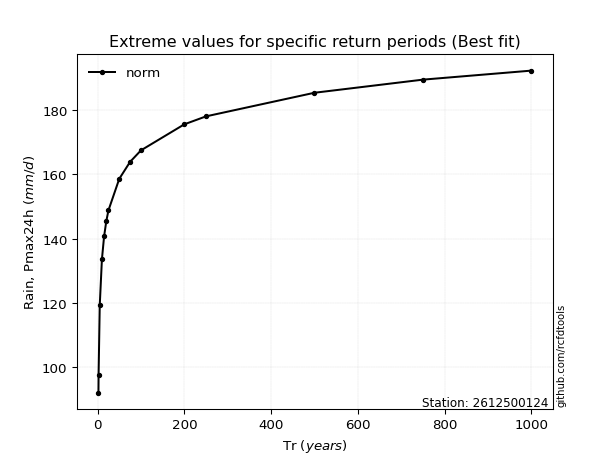</img>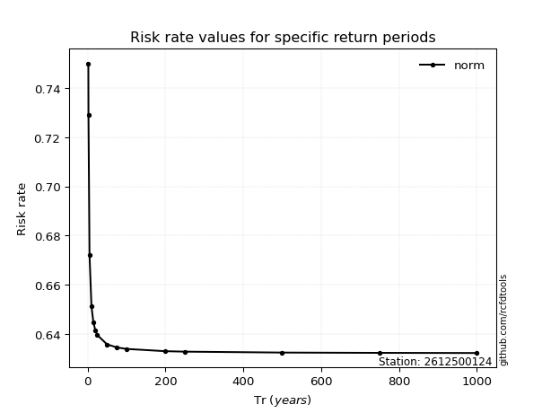</img>

</div>


<sub>**APP DISCLAIMER**: NO WARRANTY - This software is provided by [github.com/rcfdtools](https://github.com/rcfdtools) "as is", without any express or implied warranty, including warranties of merchantability, fitness for a particular purpose, or non-infringement. There is no guarantee that the software will be error-free or operate without interruption. LIMITATION OF LIABILITY - Neither the authors nor copyright holders will be liable for claims or damages arising from the software or its use. You are responsible for determining if the software is appropriate for your use and assume all associated risks, including errors, legal compliance, and data loss. NO PROFESSIONAL ADVICE - The software provides general information and does not offer professional advice. It should not replace consultation with professional advisors.</sub>