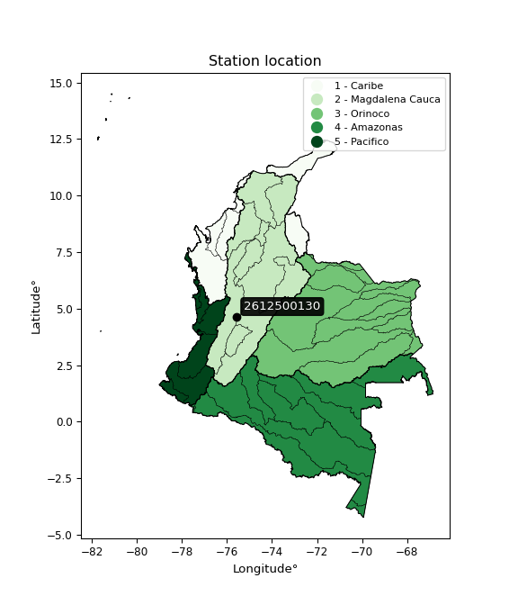

<div align="center">


</div>

# PMP Station (Rain, Pmax24h): 2612500130

Probable Maximum Precipitation (PMP) is the greatest amount of rainfall for a specific duration that is meteorologically possible for a given location, acting as a "worst-case" scenario for extreme storms, crucial for designing safety-critical infrastructure like bridges, river deviations, dams, spillways, and nuclear plants to prevent catastrophic failure. PMP is calculated by hydrologists using meteorological data to determine the upper limit of extreme rainfall, often leading to the Probable Maximum Flood (PMF) for flood control design, and is increasingly being studied for climate change impacts. Probable Maximum Precipitation (PMP) is the theoretical upper limit of rainfall, a deterministic estimate for extreme events, while probability distributions (like GEV, Gumbel) describe the likelihood and frequency of various precipitation amounts, including rare ones, showing how often events occur, with PMP representing the extreme end of these distributions, used for critical infrastructure design to ensure safety against the worst conceivable weather, unlike standard statistical forecasts which cover typical probabilities.

The most common probability distributions in hydrology, used for analyzing floods, rainfall, and streamflow, include the Normal, Log-Normal, Gumbel, Gamma (including Log-Pearson Type III), and Generalized Extreme Value (GEV) distributions, often chosen based on the data´s skewness and whether modeling extremes or general conditions, with Gumbel and GEV popular for extreme events like floods, while the Normal distribution serves as a baseline, though often requiring transformations for skewed hydrological data. These distributions help in designing water infrastructure, managing water resources, and forecasting hydrologic events.

> Hydrological data often isn´t perfectly normal (it´s skewed), so different distributions are needed for different applications, such as: **Flood Frequency Analysis**: Using Gumbel, GEV, or Log-Pearson Type III for predicting extreme flood magnitudes and their return periods, **Rainfall Analysis**: Normal for annual totals, but Log-Normal, Weibull, or GEV for intensity or extreme daily rainfall, **Streamflow Modeling**: Gamma and Log-Normal for maximum flows, GEV for minimum flows, and Kappa for daily flows.

<div align="center">

</img>

</div>


## A. General information


### 1. General running parameters

• app_version: _v20260108_. • runtime: _2026-01-09 11:32:22.148588_. • Python version: _3.14.0_. • SciPy version: _1.16.3_. • Pandas version: _2.3.3_. • NumPy version: _2.3.5_. • Stations dataset (station_dataset_file): _dataset/pmax24h_in/automatic_colombia_2003_2024.csv_. • Stations catalog (station_catalog_file): _dataset/CNE.xls_. • Minimum year to eval til year_max (date_min): _1900_. • Maximum year to eval since year_min (date_max): _2024_. • Creates, save and include plots into reports (create_plot): _False_. • Plot only fit distributions with Δo > Δ (plot_only_fit): _True_. • Plot only simple graphs avoiding multiple CDFs and multiple Extreme values plots (plot_only_simple): _True_. • Eval low extreme values, if False, evaluates high extreme values (low_extreme): _False_. • Eval every SciPy distribution as logarithmic (pdist_logarithmic_on): _True_. • Standard deviation normalized (ddof): _1.0_. • Return periods to eval in years (Tr): _[2, 2.33, 5, 10, 15, 20, 25, 50, 75, 100, 200, 250, 500, 750, 1000]_. • Minimum data sample per station, 0 means any (minimum_sample): _5_. • Z-Score maximum threshold to adjust a value, 0 means disable (zscore_max): _3.5_. • Z-Score minimum threshold to adjust a value, 0 means disable (zscore_min): _-2.5_. • Avoid zeros, e.g. rain = 0 (avoid_zeros): _True_. • Avoid null values (avoid_nans): _True_. 

:file_folder:Table: [dataset.csv](../../dataset/pmax24h_in/automatic_colombia_2003_2024.csv)

> Delta Degrees of Freedom (DDOF): is a parameter used in the formulas for calculating variance and standard deviation. When ddof=0, the divisor is $N$ (the total number of observations) and this is used when your data set is the entire population. When ddof=1, the divisor is $N-1$ and this is used when your data set is a sample drawn from a larger population. Using $N-1$ provides an unbiased estimate of the population variance (known as Bessel´s correction).


### 2. Station info and location

|   id |     CODIGO | NOMBRE                       | CATEGORIA               | TECNOLOGIA                | ESTADO           | FECHA_INSTALACION   |   FECHA_SUSPENSION |   ALTITUD |   LATITUD |   LONGITUD | DEPARTAMENTO   | MUNICIPIO   | AREA_OPERATIVA                         | ENTIDAD                                                     | AREA_HIDROGRAFICA   | ZONA_HIDROGRAFICA   | SUBZONA_HIDROGRAFICA   |   CORRIENTE | Catalogo   |   Version |
|-----:|-----------:|:-----------------------------|:------------------------|:--------------------------|:-----------------|:--------------------|-------------------:|----------:|----------:|-----------:|:---------------|:------------|:---------------------------------------|:------------------------------------------------------------|:--------------------|:--------------------|:-----------------------|------------:|:-----------|----------:|
|    0 | 2612500130 | SALENTO - AUT   [2612500130] | Climatológica Principal | Automática con Telemetría | En Mantenimiento | 04/07/2017          |                nan |      1965 |   4.63347 |   -75.5689 | Quindío        | Salento     | Area Operativa 09 - Cauca-Valle-Caldas | INSTITUTO DE HIDROLOGIA METEOROLOGIA Y ESTUDIOS AMBIENTALES | Magdalena Cauca     | Cauca               | Río La Vieja           |         nan | CNE_IDEAM  |  20251226 |

<div align="center">

Dynamic map: [:earth_americas:Google](http://maps.google.com/maps?q=4.633475,-75.568858333) [:earth_americas:OSM](https://www.openstreetmap.org/#map=18/4.633475/-75.568858333&layers=P) [:earth_americas:Bing](https://www.bing.com/maps?cp=4.633475~-75.568858333&lvl=18) [:earth_americas:Apple](https://maps.apple.com/frame?center=4.633475%2C-75.568858333&span=0.003%2C0.006)

</div>


<div align="center">

```geojson
{
  "type": "Feature",
  "geometry": {
    "type": "Point", 
    "coordinates": [-75.568858333, 4.633475]
  }, 
  "properties": {
    "Name": "2612500130"
  }
}
```

</div>


### 3. Discrete values table and plot

<div align="center">

|               |          0 |           1 |           2 |           3 |           4 |
|:--------------|-----------:|------------:|------------:|------------:|------------:|
| Date          | 2019       | 2020        | 2021        | 2022        | 2024        |
| Value         |   29.6     |   91.4      |   88.4      |   98.2      |  105.2      |
| Value_initial |   29.6     |   91.4      |   88.4      |   98.2      |  105.2      |
| count         |    5       |    5        |    5        |    5        |    5        |
| mean          |   82.56    |   82.56     |   82.56     |   82.56     |   82.56     |
| std           |   30.3076  |   30.3076   |   30.3076   |   30.3076   |   30.3076   |
| zscore        |   -1.74742 |    0.291676 |    0.192691 |    0.516043 |    0.747008 |


</div>


> The initial value (value_initial) correspond to the initial obtained or null completed value, and value (value) is adjusted only when the initial value is outside the valid range (outlier) definite through the Z-Score value. If Z-Score is active, values out of range or outliers are replaced with the station mean value. A Z-Score (or standard score) measures how many standard deviations a data point is from the mean of a dataset, indicating its relative position; positive scores mean above the mean, negative mean below, and a score of zero is exactly at the mean, allowing for comparison of values from different distributions. It´s calculated using the formula $z=(x–μ)/σ$, where $x$ is the data point, $μ$ is the mean, and $σ$ is the standard deviation, helping identify outliers and understand probability.
>
> <sub>**Note**: In this study, "completing" (filling gaps in) and "extending" (forecasting or lengthening the historical record) rainfall data series are avoided for certain critical analyses because they introduce artificial bias and uncertainty, which can distort the statistics of rare events (extremes), alter day-to-day variability, and compromise the integrity and homogeneity of the original data. Some reasons against Completing/Extending rainfall data are: **Distortion of Extremes and Variability**: The primary issue is that most gap-filling or extension methods rely on averaging or regression with nearby stations, which inherently smooths the data. Rainfall is highly variable in space and time, with a large percentage of zero values and occasional large storms. Infilling methods often underestimate the highest values and overestimate the lowest (zero) values, which severely distorts analyses focused on flood frequency, drought severity, and intensity-duration-frequency (IDF) curves, **Loss of Data Homogeneity**: Infilled or extended data are synthetic estimates, not actual measurements. Combining these estimates with observed data can violate the assumption of data homogeneity, which requires that the data properties do not change over time. Inhomogeneity can lead to incorrect conclusions about long-term trends or changes in climate patterns, **Propagation of Errors**: Errors and biases from the original data (e.g., wind-induced undercatch, instrument errors, site changes) or the data used for imputation can propagate through the analysis, leading to unreliable hydrological models and inaccurate predictions, **Compromised Statistical Integrity**: For statistical analyses, especially those involving the frequency of events, using artificial data can introduce time bias or autocorrelation that doesn´t exist in reality, making it difficult to assess the true probability of events, **Difficulty in Validation**: It is difficult to accurately validate the quality of filled or extended data, especially for past periods where ground-truth measurements are unavailable. The reliability of imputation techniques heavily depends on the density of the surrounding station network and the complexity of the local topography.</sub>


### 4. Active continuous probability distributions from SciPy (45 of 104 available)

A Probability Density Function (PDF) describes the relative likelihood of a continuous random variable falling within a specific range, where the total area under its curve equals 1, and the area over any interval gives the actual probability for that range. Unlike discrete probabilities (like rolling a die), a PDF shows density, not direct probability for a single point (which is zero), with higher points indicating higher likelihood, often visualized as a bell curve for normal distributions.

A log of a probability density function (log-PDF) is simply the logarithm of the PDF´s value, denoted as $log(f(x))$, useful for converting multiplication of probabilities into addition, improving numerical stability with tiny numbers, and connecting to information theory concepts like entropy. Instead of dealing with very small probabilities (e.g., 0.000001), log-PDFs use negative numbers (e.g., $log(0.00001) ≈ -11.51$ that are easier for computers to handle, preventing underflow errors and simplifying complex calculations. In this study, each active probability distribution from SciPy is also evaluated in the $log$ form.

[scipy.stats](https://docs.scipy.org/doc/scipy/reference/stats.html) is a Python´s powerful submodule within the SciPy library for comprehensive statistical analysis, offering over 130 probability distributions (like Normal, Poisson), functions for descriptive stats (mean, variance), hypothesis testing (t-tests, chi-square), random variable generation, and statistical tests, making it essential for data science, modeling, and research. It provides tools to explore, model, and draw conclusions from data efficiently, working seamlessly with NumPy.

<div align="center">

|   id | p_dist             |   n_parameter | fit_method   | label                                                                       | active   | ref                                                                                                        |
|-----:|:-------------------|--------------:|:-------------|:----------------------------------------------------------------------------|:---------|:-----------------------------------------------------------------------------------------------------------|
|    0 | alpha              |             3 | MLE          | Alpha                                                                       | True     | [:mortar_board:](https://docs.scipy.org/doc/scipy/reference/generated/scipy.stats.alpha.html)              |
|    1 | betaprime          |             4 | MLE          | Beta prime                                                                  | True     | [:mortar_board:](https://docs.scipy.org/doc/scipy/reference/generated/scipy.stats.betaprime.html)          |
|    2 | chi2               |             3 | MLE          | Chi²                                                                        | True     | [:mortar_board:](https://docs.scipy.org/doc/scipy/reference/generated/scipy.stats.chi2.html)               |
|    3 | crystalball        |             4 | MLE          | Crystalball                                                                 | True     | [:mortar_board:](https://docs.scipy.org/doc/scipy/reference/generated/scipy.stats.crystalball.html)        |
|    4 | dweibull           |             3 | MLE          | Double Weibull                                                              | True     | [:mortar_board:](https://docs.scipy.org/doc/scipy/reference/generated/scipy.stats.dweibull.html)           |
|    5 | erlang             |             3 | MLE          | Erlang                                                                      | True     | [:mortar_board:](https://docs.scipy.org/doc/scipy/reference/generated/scipy.stats.erlang.html)             |
|    6 | expon              |             2 | MLE          | Exponential                                                                 | True     | [:mortar_board:](https://docs.scipy.org/doc/scipy/reference/generated/scipy.stats.expon.html)              |
|    7 | exponnorm          |             3 | MLE          | Exponentially modified Normal                                               | True     | [:mortar_board:](https://docs.scipy.org/doc/scipy/reference/generated/scipy.stats.exponnorm.html)          |
|    8 | f                  |             4 | MLE          | F                                                                           | True     | [:mortar_board:](https://docs.scipy.org/doc/scipy/reference/generated/scipy.stats.f.html)                  |
|    9 | fatiguelife        |             3 | MLE          | Fatigue-life (Birnbaum-Saunders)                                            | True     | [:mortar_board:](https://docs.scipy.org/doc/scipy/reference/generated/scipy.stats.fatiguelife.html)        |
|   10 | fisk               |             3 | MLE          | Fisk                                                                        | True     | [:mortar_board:](https://docs.scipy.org/doc/scipy/reference/generated/scipy.stats.fisk.html)               |
|   11 | gamma              |             3 | MLE          | Gamma                                                                       | True     | [:mortar_board:](https://docs.scipy.org/doc/scipy/reference/generated/scipy.stats.gamma.html)              |
|   12 | genexpon           |             5 | MLE          | Generalized exponential                                                     | True     | [:mortar_board:](https://docs.scipy.org/doc/scipy/reference/generated/scipy.stats.genexpon.html)           |
|   13 | genlogistic        |             3 | MLE          | Generalized logistic                                                        | True     | [:mortar_board:](https://docs.scipy.org/doc/scipy/reference/generated/scipy.stats.genlogistic.html)        |
|   14 | gibrat             |             2 | MM           | Gibrat                                                                      | True     | [:mortar_board:](https://docs.scipy.org/doc/scipy/reference/generated/scipy.stats.gibrat.html)             |
|   15 | gompertz           |             3 | MLE          | Gompertz (or truncated Gumbel)                                              | True     | [:mortar_board:](https://docs.scipy.org/doc/scipy/reference/generated/scipy.stats.gompertz.html)           |
|   16 | gumbel_l           |             2 | MM           | Gumbel Left Skew                                                            | True     | [:mortar_board:](https://docs.scipy.org/doc/scipy/reference/generated/scipy.stats.gumbel_l.html)           |
|   17 | gumbel_r           |             2 | MM           | Gumbel Right Skew                                                           | True     | [:mortar_board:](https://docs.scipy.org/doc/scipy/reference/generated/scipy.stats.gumbel_r.html)           |
|   18 | halflogistic       |             2 | MM           | Half-logistic                                                               | True     | [:mortar_board:](https://docs.scipy.org/doc/scipy/reference/generated/scipy.stats.halflogistic.html)       |
|   19 | halfnorm           |             2 | MM           | Half Normal                                                                 | True     | [:mortar_board:](https://docs.scipy.org/doc/scipy/reference/generated/scipy.stats.halfnorm.html)           |
|   20 | hypsecant          |             2 | MM           | hyperbolic secant                                                           | True     | [:mortar_board:](https://docs.scipy.org/doc/scipy/reference/generated/scipy.stats.hypsecant.html)          |
|   21 | invgamma           |             3 | MLE          | Inverted gamma                                                              | True     | [:mortar_board:](https://docs.scipy.org/doc/scipy/reference/generated/scipy.stats.invgamma.html)           |
|   22 | invgauss           |             3 | MLE          | Inverse Gaussian                                                            | True     | [:mortar_board:](https://docs.scipy.org/doc/scipy/reference/generated/scipy.stats.invgauss.html)           |
|   23 | invweibull         |             3 | MLE          | Inverted Weibull                                                            | True     | [:mortar_board:](https://docs.scipy.org/doc/scipy/reference/generated/scipy.stats.invweibull.html)         |
|   24 | kappa4             |             4 | MLE          | Kappa 4                                                                     | True     | [:mortar_board:](https://docs.scipy.org/doc/scipy/reference/generated/scipy.stats.kappa4.html)             |
|   25 | kstwobign          |             2 | MLE          | Limiting distribution of scaled Kolmogorov-Smirnov two-sided test statistic | True     | [:mortar_board:](https://docs.scipy.org/doc/scipy/reference/generated/scipy.stats.kstwobign.html)          |
|   26 | laplace            |             2 | MM           | Laplace                                                                     | True     | [:mortar_board:](https://docs.scipy.org/doc/scipy/reference/generated/scipy.stats.laplace.html)            |
|   27 | laplace_asymmetric |             3 | MLE          | Asymmetric Laplace                                                          | True     | [:mortar_board:](https://docs.scipy.org/doc/scipy/reference/generated/scipy.stats.laplace_asymmetric.html) |
|   28 | loggamma           |             3 | MLE          | Log gamma                                                                   | True     | [:mortar_board:](https://docs.scipy.org/doc/scipy/reference/generated/scipy.stats.loggamma.html)           |
|   29 | logistic           |             2 | MM           | Logistic (or Sech-squared)                                                  | True     | [:mortar_board:](https://docs.scipy.org/doc/scipy/reference/generated/scipy.stats.logistic.html)           |
|   30 | lognorm            |             3 | MLE          | Log Normal                                                                  | True     | [:mortar_board:](https://docs.scipy.org/doc/scipy/reference/generated/scipy.stats.lognorm.html)            |
|   31 | maxwell            |             2 | MM           | Maxwell                                                                     | True     | [:mortar_board:](https://docs.scipy.org/doc/scipy/reference/generated/scipy.stats.maxwell.html)            |
|   32 | mielke             |             4 | MLE          | Mielke Beta-Kappa / Dagum                                                   | True     | [:mortar_board:](https://docs.scipy.org/doc/scipy/reference/generated/scipy.stats.mielke.html)             |
|   33 | moyal              |             2 | MM           | Moyal                                                                       | True     | [:mortar_board:](https://docs.scipy.org/doc/scipy/reference/generated/scipy.stats.moyal.html)              |
|   34 | nakagami           |             3 | MLE          | Nakagami                                                                    | True     | [:mortar_board:](https://docs.scipy.org/doc/scipy/reference/generated/scipy.stats.nakagami.html)           |
|   35 | ncf                |             5 | MLE          | Non-central F distribution                                                  | True     | [:mortar_board:](https://docs.scipy.org/doc/scipy/reference/generated/scipy.stats.ncf.html)                |
|   36 | nct                |             4 | MLE          | Non-central Student’s t                                                     | True     | [:mortar_board:](https://docs.scipy.org/doc/scipy/reference/generated/scipy.stats.nct.html)                |
|   37 | norm               |             2 | MM           | Normal                                                                      | True     | [:mortar_board:](https://docs.scipy.org/doc/scipy/reference/generated/scipy.stats.norm.html)               |
|   38 | pearson3           |             3 | MM           | Pearson type III                                                            | True     | [:mortar_board:](https://docs.scipy.org/doc/scipy/reference/generated/scipy.stats.pearson3.html)           |
|   39 | rayleigh           |             2 | MM           | Rayleigh                                                                    | True     | [:mortar_board:](https://docs.scipy.org/doc/scipy/reference/generated/scipy.stats.rayleigh.html)           |
|   40 | rice               |             3 | MLE          | Rice                                                                        | True     | [:mortar_board:](https://docs.scipy.org/doc/scipy/reference/generated/scipy.stats.rice.html)               |
|   41 | t                  |             3 | MLE          | Student’s t                                                                 | True     | [:mortar_board:](https://docs.scipy.org/doc/scipy/reference/generated/scipy.stats.t.html)                  |
|   42 | truncnorm          |             4 | MLE          | Truncated normal                                                            | True     | [:mortar_board:](https://docs.scipy.org/doc/scipy/reference/generated/scipy.stats.truncnorm.html)          |
|   43 | wald               |             2 | MM           | Wald                                                                        | True     | [:mortar_board:](https://docs.scipy.org/doc/scipy/reference/generated/scipy.stats.wald.html)               |
|   44 | weibull_min        |             3 | MLE          | Weibull minimum                                                             | True     | [:mortar_board:](https://docs.scipy.org/doc/scipy/reference/generated/scipy.stats.weibull_min.html)        |

</div>

> **n_parameter:** # arguments & localization & scale.
>
> **Fit methods:** (MLE) maximum likelihood, (MM) L-moments.
>
>**Inactive** (With the only purpose of prevent loops, zero divisions, infinite values, over high estimated values or horizontal trending for recurrence intervals estimations, the follow distributions were disabled.)**:** foldnorm, gennorm, norminvgauss, powernorm, powerlognorm, skewnorm, genextreme, anglit, arcsine, argus, beta, bradford, burr, burr12, cauchy, cosine, halfcauchy, foldcauchy, skewcauchy, wrapcauchy, dgamma, gengamma, exponweib, exponpow, truncexpon, gausshyper, genhalflogistic, genhyperbolic, geninvgauss, halfgennorm, johnsonsb, johnsonsu, kappa3, ksone, kstwo, loglaplace, levy, levy_l, levy_stable, ncx2, pareto, genpareto, truncpareto, lomax, powerlaw, rdist, rel_breitwigner, recipinvgauss, semicircular, studentized_range, trapezoid, triang, truncweibull_min, tukeylambda, uniform, loguniform, vonmises, vonmises_line, weibull_max, 


## B. Probability (PDF) vs. Empirical (EDF) distributions functions

A continuous probability distribution (CPD) describes probabilities for variables that can take any value within a range (like rain any time), unlike discrete variables with specific outcomes (like temperature). It uses a Probability Density Function (PDF), a curve where the total area under it equals 1, and the probability of the variable falling within an interval (a to b) is found by calculating the area under the curve between those points. A key feature is that the probability of hitting any single exact value is zero, so probabilities are always expressed for ranges, e.g., $P(a ≤ X ≤ b)$.

<div align="center">

Distributions parameters from station values
|    |    station | p_dist                |   n |               loc |            scale | shape                  | shape1                 | shape2              | shape3   |
|---:|-----------:|:----------------------|----:|------------------:|-----------------:|:-----------------------|:-----------------------|:--------------------|:---------|
|  0 | 2612500130 | alpha                 |   5 |    -424.885       |   8672.84        | 17.134601283313053     |                        |                     |          |
|  1 | 2612500130 | betaprime             |   5 |    -425.906       |  51023.1         | 299.1634291518934      | 30017.76276971303      |                     |          |
|  2 | 2612500130 | chi2                  |   5 |    -304.911       |      1.09297     | 353.9765710526134      |                        |                     |          |
|  3 | 2612500130 | crystalball           |   5 |      82.56        |     27.1079      | 7527.241363236755      | 89.92423301197391      |                     |          |
|  4 | 2612500130 | dweibull              |   5 |      91.4         |     19.5134      | 0.8249325731182615     |                        |                     |          |
|  5 | 2612500130 | erlang                |   5 |    -313.111       |      2.06504     | 191.25627619391793     |                        |                     |          |
|  6 | 2612500130 | expon                 |   5 |      29.6         |     52.96        |                        |                        |                     |          |
|  7 | 2612500130 | exponnorm             |   5 |      82.5428      |     27.1079      | 0.0006373753270389807  |                        |                     |          |
|  8 | 2612500130 | f                     |   5 |  -10828.9         |  10911.5         | 413787.56993504346     | 1408701.1281517926     |                     |          |
|  9 | 2612500130 | fatiguelife           |   5 |      29.6         |      0.000208657 | 540.3412823914435      |                        |                     |          |
| 10 | 2612500130 | fisk                  |   5 | -101118           | 101207           | 7292.088587506563      |                        |                     |          |
| 11 | 2612500130 | gamma                 |   5 |    -377.08        |      1.71747     | 267.49402680807634     |                        |                     |          |
| 12 | 2612500130 | genexpon              |   5 |      29.6         |      2.28537     | 0.04493572406448079    | 5.2479727703475305e-06 | 0.5051715231963374  |          |
| 13 | 2612500130 | genlogistic           |   5 |     105.2         |      1.73109e-06 | 7.643387401504646e-08  |                        |                     |          |
| 14 | 2612500130 | gibrat                |   5 |      61.8801      |     12.543       |                        |                        |                     |          |
| 15 | 2612500130 | gompertz              |   5 |      24.6629      |      4.09199     | 1.1469566984558067e-08 |                        |                     |          |
| 16 | 2612500130 | gumbel_l              |   5 |      94.76        |     21.1359      |                        |                        |                     |          |
| 17 | 2612500130 | gumbel_r              |   5 |      70.36        |     21.1359      |                        |                        |                     |          |
| 18 | 2612500130 | halflogistic          |   5 |      50.4308      |     23.1763      |                        |                        |                     |          |
| 19 | 2612500130 | halfnorm              |   5 |      46.6798      |     44.9692      |                        |                        |                     |          |
| 20 | 2612500130 | hypsecant             |   5 |      82.56        |     17.2574      |                        |                        |                     |          |
| 21 | 2612500130 | invgamma              |   5 |    -298.932       |  62376.6         | 164.8854973233399      |                        |                     |          |
| 22 | 2612500130 | invgauss              |   5 |    -109.982       |   7013.16        | 0.02747553796148023    |                        |                     |          |
| 23 | 2612500130 | invweibull            |   5 |      29.6         |      1.36409     | 0.06602897284811363    |                        |                     |          |
| 24 | 2612500130 | kappa4                |   5 |      20.3166      |     92.7242      | 1.0357368753148704     | 1.092371050257031      |                     |          |
| 25 | 2612500130 | kstwobign             |   5 |     -42.6385      |    142.688       |                        |                        |                     |          |
| 26 | 2612500130 | laplace               |   5 |      82.56        |     19.1682      |                        |                        |                     |          |
| 27 | 2612500130 | laplace_asymmetric    |   5 |      98.2         |     11.7379      | 1.86784961112311       |                        |                     |          |
| 28 | 2612500130 | loggamma              |   5 |     105.201       |      8.7869e-05  | 3.893030246021279e-06  |                        |                     |          |
| 29 | 2612500130 | logistic              |   5 |      82.56        |     14.9454      |                        |                        |                     |          |
| 30 | 2612500130 | lognorm               |   5 |      29.6         |      0.0367413   | 14.983856141001453     |                        |                     |          |
| 31 | 2612500130 | maxwell               |   5 |      18.3257      |     40.2529      |                        |                        |                     |          |
| 32 | 2612500130 | mielke                |   5 |      -6.96457e+08 |      6.96457e+08 | 30667759.88405056      | 64062157363.30945      |                     |          |
| 33 | 2612500130 | moyal                 |   5 |      67.058       |     12.2028      |                        |                        |                     |          |
| 34 | 2612500130 | nakagami              |   5 |      88.4         |      6.70211     | 0.1000510882158405     |                        |                     |          |
| 35 | 2612500130 | ncf                   |   5 |      -0.219488    |      2.42819e-06 | 1.4063304577868574e-06 | 16.482237800461395     | 44.142875504480955  |          |
| 36 | 2612500130 | nct                   |   5 |   -1910.89        |     27.0351      | 374473.1050083282      | 73.7356310998494       |                     |          |
| 37 | 2612500130 | norm                  |   5 |      82.56        |     27.1079      |                        |                        |                     |          |
| 38 | 2612500130 | pearson3              |   5 |      82.56        |     27.1079      | -1.3275117218228452    |                        |                     |          |
| 39 | 2612500130 | rayleigh              |   5 |      30.701       |     41.3775      |                        |                        |                     |          |
| 40 | 2612500130 | rice                  |   5 |       6.22041     |     28.9541      | 2.414131757929929      |                        |                     |          |
| 41 | 2612500130 | t                     |   5 |      83.3556      |     25.2162      | 11.89630293259603      |                        |                     |          |
| 42 | 2612500130 | truncnorm             |   5 |      82.56        |     27.1079      | -1064.1943087703555    | 1776.6474339473466     |                     |          |
| 43 | 2612500130 | wald                  |   5 |      55.4521      |     27.1079      |                        |                        |                     |          |
| 44 | 2612500130 | weibull_min           |   5 |      29.6         |      1.40069     | 0.20809122272380326    |                        |                     |          |
| 45 | 2612500130 | logalpha              |   5 |     -12.8269      |    594.204       | 34.691373905942044     |                        |                     |          |
| 46 | 2612500130 | logbetaprime          |   5 |      -9.67309     |     11.0268      | 1725.497618707141      | 1360.0718683664104     |                     |          |
| 47 | 2612500130 | logchi2               |   5 |       3.38777     |      0.987396    | 1.0386936944280993     |                        |                     |          |
| 48 | 2612500130 | logcrystalball        |   5 |       4.32555     |      0.472718    | 853.1562657343993      | 3886.6266772832373     |                     |          |
| 49 | 2612500130 | logdweibull           |   5 |       4.48187     |      0.362341    | 0.7497504873826082     |                        |                     |          |
| 50 | 2612500130 | logerlang             |   5 |       3.38777     |      0.883099    | 0.46155558858186385    |                        |                     |          |
| 51 | 2612500130 | logexpon              |   5 |       3.38777     |      0.937778    |                        |                        |                     |          |
| 52 | 2612500130 | logexponnorm          |   5 |       4.32522     |      0.472719    | 0.0007099998804460708  |                        |                     |          |
| 53 | 2612500130 | logf                  |   5 |    -872.785       |    877.11        | 50999732.87376222      | 7900081.182326943      |                     |          |
| 54 | 2612500130 | logfatiguelife        |   5 |    -309.192       |    313.517       | 0.0015054489962048638  |                        |                     |          |
| 55 | 2612500130 | logfisk               |   5 |      -3.01873e+07 |      3.01873e+07 | 119250000.93229347     |                        |                     |          |
| 56 | 2612500130 | loggamma              |   5 |      -4.23116     |      0.0290907   | 293.7711173050916      |                        |                     |          |
| 57 | 2612500130 | loggenexpon           |   5 |       3.38777     |      1.66518e+07 | 7177289.874211826      | 500766470.09646654     | 599694.2422280661   |          |
| 58 | 2612500130 | loggenlogistic        |   5 |       4.65587     |      1.04737e-06 | 3.1639071857412042e-06 |                        |                     |          |
| 59 | 2612500130 | loggibrat             |   5 |       3.9649      |      0.218745    |                        |                        |                     |          |
| 60 | 2612500130 | loggompertz           |   5 |       3.38777     |      0.265818    | 0.014892338737625372   |                        |                     |          |
| 61 | 2612500130 | loggumbel_l           |   5 |       4.5383      |      0.368577    |                        |                        |                     |          |
| 62 | 2612500130 | loggumbel_r           |   5 |       4.1128      |      0.368577    |                        |                        |                     |          |
| 63 | 2612500130 | loghalflogistic       |   5 |       3.76531     |      0.404131    |                        |                        |                     |          |
| 64 | 2612500130 | loghalfnorm           |   5 |       3.69987     |      0.78418     |                        |                        |                     |          |
| 65 | 2612500130 | loghypsecant          |   5 |       4.32555     |      0.300941    |                        |                        |                     |          |
| 66 | 2612500130 | loginvgamma           |   5 |      -7.37332     |   6377.82        | 546.6399135580155      |                        |                     |          |
| 67 | 2612500130 | loginvgauss           |   5 |      -0.644958    |    460.313       | 0.010763545081758873   |                        |                     |          |
| 68 | 2612500130 | loginvweibull         |   5 |      -4.25749e+07 |      4.25749e+07 | 76599808.51851484      |                        |                     |          |
| 69 | 2612500130 | logkappa4             |   5 |       3.28865     |      1.50377     | 1.0651529413734373     | 1.0998846267550126     |                     |          |
| 70 | 2612500130 | logkstwobign          |   5 |       2.11257     |      2.52184     |                        |                        |                     |          |
| 71 | 2612500130 | loglaplace            |   5 |       4.32555     |      0.334262    |                        |                        |                     |          |
| 72 | 2612500130 | loglaplace_asymmetric |   5 |       4.65587     |      0.00386752  | 84.97489546537065      |                        |                     |          |
| 73 | 2612500130 | logloggamma           |   5 |       4.6561      |      4.11823e-07 | 1.2507757337692735e-06 |                        |                     |          |
| 74 | 2612500130 | loglogistic           |   5 |       4.32555     |      0.260623    |                        |                        |                     |          |
| 75 | 2612500130 | loglognorm            |   5 |       3.38777     |      0.000964133 | 14.203203662670925     |                        |                     |          |
| 76 | 2612500130 | logmaxwell            |   5 |       3.20541     |      0.701945    |                        |                        |                     |          |
| 77 | 2612500130 | logmielke             |   5 |      -2.88882e+07 |      2.88882e+07 | 81708779.38825642      | 4457893839.2432785     |                     |          |
| 78 | 2612500130 | logmoyal              |   5 |       4.05522     |      0.212798    |                        |                        |                     |          |
| 79 | 2612500130 | lognakagami           |   5 |       4.48187     |      0.0631653   | 0.05073173312486786    |                        |                     |          |
| 80 | 2612500130 | logncf                |   5 |      -5.33538     |      9.64919     | 872.1090828593324      | 1839.2831029354538     | 0.01874621922660697 |          |
| 81 | 2612500130 | lognct                |   5 |      25.2439      |      0.448373    | 10695.15221335322      | -46.64997589304613     |                     |          |
| 82 | 2612500130 | lognorm               |   5 |       4.32555     |      0.472718    |                        |                        |                     |          |
| 83 | 2612500130 | logpearson3           |   5 |       4.32555     |      0.472718    | -1.4392226794645864    |                        |                     |          |
| 84 | 2612500130 | lograyleigh           |   5 |       3.4212      |      0.721568    |                        |                        |                     |          |
| 85 | 2612500130 | logrice               |   5 |    -271.303       |      0.472737    | 583.0480249007803      |                        |                     |          |
| 86 | 2612500130 | logt                  |   5 |       4.32569     |      0.472614    | 4976.613673833757      |                        |                     |          |
| 87 | 2612500130 | logtruncnorm          |   5 |      -0.150007    |      1.15785     | 4.000425604608347      | 4.150700373275561      |                     |          |
| 88 | 2612500130 | logwald               |   5 |       3.85287     |      0.47269     |                        |                        |                     |          |
| 89 | 2612500130 | logweibull_min        |   5 |      -3.22423e+07 |      3.22423e+07 | 101918338.85768591     |                        |                     |          |

</div>

> **loc** (Location parameter): This shifts the distribution along the x-axis. For many common distributions, like the normal (Gaussian) distribution, loc represents the mean $μ$. For others, like the uniform distribution, it might represent the minimum value, or for the beta distribution, the left end of the support interval.
>
> **scale** (Scale parameter): This determines the width or spread of the distribution. For the normal distribution, scale represents the standard deviation $σ$. For a uniform distribution, it defines the length of the interval (from $loc$ to $loc + scale$).
>
> **shape** (Shape parameters): Refers to parameters that define the specific form of a probability distribution, distinct from its location (loc) and scale (scale). These parameters are required arguments for most distribution functions. For example, a normal (Gaussian) distribution is fully defined by its location (mean) and scale (standard deviation), so it has no specific shape parameters beyond loc and scale. However, other distributions have intrinsic properties that need specification, as Gamma distribution that takes a shape parameter, often named $a$ or $alpha$.


### 0. Cumulative distribution values - CDF (90 evaluated)

Cumulative Distribution Function (CDF), denoted as $F$<sub>$X$</sub>$(x)$, is a function that gives the probability that a random variable $X$ will take a value less than or equal to a specific value, $x$ (i.e., $(P(X≥x)$. It essentially "accumulates" probabilities from a given point up to the far right (positive infinity), providing a complete picture of the distribution´s probabilities for both discrete (like rain) and continuous (like temperature) variables, helping to find probabilities over ranges or above certain values. Each station is evaluated separately ordering the $x$ values ascending, calculating the CDF and PDF values for the activated distributions and their logarithmic forms.

<div align="center">

CDF ordered by x ascending and calculating $log(f(x))$ separately
|   id |    Station |   date |     x |   count |   mean |     std |    zscore |   Value_initial |    station |   m |     alpha |   alpha_pdf |   betaprime |   betaprime_pdf |     chi2 |   chi2_pdf |   crystalball |   crystalball_pdf |   dweibull |   dweibull_pdf |    erlang |   erlang_pdf |    expon |   expon_pdf |   exponnorm |   exponnorm_pdf |         f |      f_pdf |   fatiguelife |   fatiguelife_pdf |      fisk |    fisk_pdf |     gamma |   gamma_pdf |    genexpon |   genexpon_pdf |   genlogistic |   genlogistic_pdf |   gibrat |   gibrat_pdf |    gompertz |   gompertz_pdf |   gumbel_l |   gumbel_l_pdf |   gumbel_r |   gumbel_r_pdf |   halflogistic |   halflogistic_pdf |   halfnorm |   halfnorm_pdf |   hypsecant |   hypsecant_pdf |   invgamma |   invgamma_pdf |   invgauss |   invgauss_pdf |   invweibull |   invweibull_pdf |    kappa4 |   kappa4_pdf |   kstwobign |   kstwobign_pdf |   laplace |   laplace_pdf |   laplace_asymmetric |   laplace_asymmetric_pdf |   loggamma |   loggamma_pdf |   logistic |   logistic_pdf |   lognorm |   lognorm_pdf |    maxwell |   maxwell_pdf |    mielke |   mielke_pdf |       moyal |   moyal_pdf |    nakagami |   nakagami_pdf |       ncf |    ncf_pdf |       nct |    nct_pdf |      norm |   norm_pdf |   pearson3 |   pearson3_pdf |   rayleigh |   rayleigh_pdf |     rice |   rice_pdf |         t |      t_pdf |   truncnorm |   truncnorm_pdf |     wald |   wald_pdf |   weibull_min |   weibull_min_pdf |   logalpha |   logalpha_pdf |   logbetaprime |   logbetaprime_pdf |    logchi2 |   logchi2_pdf |   logcrystalball |   logcrystalball_pdf |   logdweibull |   logdweibull_pdf |   logerlang |   logerlang_pdf |   logexpon |   logexpon_pdf |   logexponnorm |   logexponnorm_pdf |      logf |   logf_pdf |   logfatiguelife |   logfatiguelife_pdf |   logfisk |   logfisk_pdf |   loggenexpon |   loggenexpon_pdf |   loggenlogistic |   loggenlogistic_pdf |   loggibrat |   loggibrat_pdf |   loggompertz |   loggompertz_pdf |   loggumbel_l |   loggumbel_l_pdf |   loggumbel_r |   loggumbel_r_pdf |   loghalflogistic |   loghalflogistic_pdf |   loghalfnorm |   loghalfnorm_pdf |   loghypsecant |   loghypsecant_pdf |   loginvgamma |   loginvgamma_pdf |   loginvgauss |   loginvgauss_pdf |   loginvweibull |   loginvweibull_pdf |   logkappa4 |   logkappa4_pdf |   logkstwobign |   logkstwobign_pdf |   loglaplace |   loglaplace_pdf |   loglaplace_asymmetric |   loglaplace_asymmetric_pdf |   logloggamma |   logloggamma_pdf |   loglogistic |   loglogistic_pdf |   loglognorm |   loglognorm_pdf |   logmaxwell |   logmaxwell_pdf |   logmielke |   logmielke_pdf |    logmoyal |   logmoyal_pdf |   lognakagami |   lognakagami_pdf |    logncf |   logncf_pdf |    lognct |   lognct_pdf |   logpearson3 |   logpearson3_pdf |   lograyleigh |   lograyleigh_pdf |   logrice |   logrice_pdf |      logt |   logt_pdf |   logtruncnorm |   logtruncnorm_pdf |   logwald |   logwald_pdf |   logweibull_min |   logweibull_min_pdf |
|-----:|-----------:|-------:|------:|--------:|-------:|--------:|----------:|----------------:|-----------:|----:|----------:|------------:|------------:|----------------:|---------:|-----------:|--------------:|------------------:|-----------:|---------------:|----------:|-------------:|---------:|------------:|------------:|----------------:|----------:|-----------:|--------------:|------------------:|----------:|------------:|----------:|------------:|------------:|---------------:|--------------:|------------------:|---------:|-------------:|------------:|---------------:|-----------:|---------------:|-----------:|---------------:|---------------:|-------------------:|-----------:|---------------:|------------:|----------------:|-----------:|---------------:|-----------:|---------------:|-------------:|-----------------:|----------:|-------------:|------------:|----------------:|----------:|--------------:|---------------------:|-------------------------:|-----------:|---------------:|-----------:|---------------:|----------:|--------------:|-----------:|--------------:|----------:|-------------:|------------:|------------:|------------:|---------------:|----------:|-----------:|----------:|-----------:|----------:|-----------:|-----------:|---------------:|-----------:|---------------:|---------:|-----------:|----------:|-----------:|------------:|----------------:|---------:|-----------:|--------------:|------------------:|-----------:|---------------:|---------------:|-------------------:|-----------:|--------------:|-----------------:|---------------------:|--------------:|------------------:|------------:|----------------:|-----------:|---------------:|---------------:|-------------------:|----------:|-----------:|-----------------:|---------------------:|----------:|--------------:|--------------:|------------------:|-----------------:|---------------------:|------------:|----------------:|--------------:|------------------:|--------------:|------------------:|--------------:|------------------:|------------------:|----------------------:|--------------:|------------------:|---------------:|-------------------:|--------------:|------------------:|--------------:|------------------:|----------------:|--------------------:|------------:|----------------:|---------------:|-------------------:|-------------:|-----------------:|------------------------:|----------------------------:|--------------:|------------------:|--------------:|------------------:|-------------:|-----------------:|-------------:|-----------------:|------------:|----------------:|------------:|---------------:|--------------:|------------------:|----------:|-------------:|----------:|-------------:|--------------:|------------------:|--------------:|------------------:|----------:|--------------:|----------:|-----------:|---------------:|-------------------:|----------:|--------------:|-----------------:|---------------------:|
|    0 | 2612500130 |   2019 |  29.6 |       5 |  82.56 | 30.3076 | -1.74742  |            29.6 | 2612500130 |   1 | 0.0256954 |  0.00251103 |    0.032757 |      0.00266761 | 0.031162 | 0.00266158 |     0.0253699 |        0.00218272 |  0.0375757 |      0.0012982 | 0.0292208 |   0.00256339 | 0        |  0.0188822  |   0.0253699 |      0.00218272 | 0.0258854 | 0.00221413 |     0.0465766 |       3.22694e+08 | 0.0137152 | 0.000975213 | 0.0265698 |  0.00237559 | 6.27867e-07 |     0.0196623  |      0        |        0.00156778 | 0        |   0          | 2.68603e-08 |    9.36704e-09 |   0.044792 |     0.00207105 | 0.00102921 |    0.000334969 |       0        |         0          |   0        |     0          |   0.0295661 |      0.00171078 |  0.0300142 |     0.00278964 |  0.0301821 |     0.003005   |   0.00010277 |      1.75399e+10 | 0.0750954 |    0.0119466 |   0.0402069 |      0.00480148 | 0.0315539 |    0.00164616 |            0.0340157 |               0.00155149 |  0.0279682 |       0.139018 |  0.0280976 |     0.00182719 |  0.023639 |      0.117959 | 0.00570825 |    0.00149519 | 0.0357267 |   0.00157319 | 3.47704e-06 | 3.19941e-06 | 0           |    0           | 0.0236664 | 0.00367206 | 0.0254533 | 0.00218752 | 0.0253699 | 0.00218272 |  0.0485177 |     0.00214891 |   0        |     0          | 0.023004 | 0.00240375 | 0.0272873 | 0.00192341 |   0.0253699 |      0.00218272 | 0        | 0          |   0.000917375 |       5.37083e+10 |  0.0253058 |       0.133443 |      0.0288584 |           0.139445 | 8.4199e-09 |   9.84678e+06 |         0.023639 |             0.117959 |     0.0506337 |         0.0794573 | 9.80922e-08 |      1.0195e+08 |   0        |       1.06635  |      0.0236394 |           0.117961 | 0.0239766 |   0.119141 |        0.0234263 |             0.117599 | 0.0158607 |     0.0616614 |    1.7095e-10 |          0.431021 |         0        |            0.0655359 |    0        |        0        |   3.12615e-08 |         0.0560246 |     0.0431314 |          0.114461 |   0.000784889 |          0.015226 |          0        |              0        |      0        |          0        |      0.0282014 |           0.093588 |     0.0267806 |          0.138199 |     0.0262596 |          0.146539 |       0.0347988 |            0.210253 |  0.00729609 |        0.922596 |      0.0397954 |           0.269929 |    0.0302377 |        0.0904611 |               0.0210951 |                   0.0641885 |     0.0212345 |         0.0644927 |     0.0266432 |         0.0995052 |    0.0227508 |      8.56004e+12 |    0.0045704 |        0.0741746 |   0.0265391 |       0.0750645 | 1.59996e-06 |    9.00422e-05 |      0        |       0           | 0.0429262 |     0.177636 | 0.0234684 |     0.116778 |     0.0477092 |          0.117248 |      0        |          0        | 0.0236436 |      0.117974 | 0.0236261 |   0.117855 |    0           |            0       |  0        |      0        |         0.029422 |            0.0916216 |
|    1 | 2612500130 |   2021 |  88.4 |       5 |  82.56 | 30.3076 |  0.192691 |            88.4 | 2612500130 |   2 | 0.594003  |  0.0127664  |    0.584921 |      0.0130938  | 0.596684 | 0.0131661  |     0.585286  |        0.0143792  |  0.403924  |      0.0237002 | 0.599673  |   0.0133814  | 0.670531 |  0.0062211  |   0.585285  |      0.0143792  | 0.584639  | 0.0142845  |     0.837057  |       0.00205695  | 0.490608  | 0.0180066   | 0.593052  |  0.0136927  | 0.685343    |     0.00618762 |      0        |        0.0210287  | 0.772991 |   0.0113659  | 0.0645271   |    0.015249    |   0.522955 |     0.0167053  | 0.653174   |    0.0131622   |       0.6746   |         0.0117559  |   0.646463 |     0.0115378  |   0.605719  |      0.0174368  |  0.608603  |     0.0126309  |  0.602045  |     0.0117737  |   0.458423   |      0.000401511 | 0.772021  |    0.0124828 |   0.632112  |      0.00928981 | 0.631317  |    0.0192341  |            0.497077  |               0.0226721  |  0.637672  |       0.742281 |  0.596465  |     0.016105   |  0.629558 |      0.79903  | 0.613063   |    0.0132004  | 0.475847  |   0.0209535  | 0.676618    | 0.0124996   | 0.000966991 |    1.36161e+10 | 0.61531   | 0.00917555 | 0.585193  | 0.014366   | 0.585286  | 0.0143792  |  0.500391  |     0.0161373  |   0.621769 |     0.0127467  | 0.59032  | 0.0139284  | 0.577588  | 0.0151604  |   0.585286  |      0.0143792  | 0.741803 | 0.0107752  |   0.886551    |       0.000873807 |  0.641201  |       0.741158 |      0.62659   |           0.737393 | 0.695625   |   0.226291    |         0.629558 |             0.79903  |     0.5       |      4688.88      | 0.89602     |      0.15234    |   0.688605 |       0.332057 |      0.629558  |           0.799027 | 0.629451  |   0.796311 |        0.630562  |             0.799165 | 0.548381  |     0.978337  |    0.670892   |          0.524243 |         0        |            1.78585   |    0.805129 |        0.5331   |   0.592686    |         1.39909   |     0.57601   |          0.987048 |   0.69254     |          0.690309 |          0.709684 |              0.614093 |      0.681344 |          0.618844 |      0.658372  |           0.929476 |     0.639915  |          0.733929 |     0.648612  |          0.698401 |       0.625606  |            0.527934 |  0.845723   |        0.810708 |      0.659472  |           0.499795 |    0.686766  |        0.937093  |               0.588855  |                   1.79178   |     0.589093  |         1.78917   |     0.645609  |         0.877889  |    0.68979   |      0.0227094   |    0.653304  |        0.719418  |   0.58594   |       1.6573    | 0.713642    |    0.643176    |      0.034727 |       3.96713e+12 | 0.619347  |     0.668621 | 0.629219  |     0.803871 |     0.545557  |          0.994038 |      0.660533 |          0.691549 | 0.629554  |      0.799    | 0.62947   |   0.799213 |    1.47549e-06 |            7.67143 |  0.772931 |      0.527681 |         0.612756 |            1.16129   |
|    2 | 2612500130 |   2020 |  91.4 |       5 |  82.56 | 30.3076 |  0.291676 |            91.4 | 2612500130 |   3 | 0.631578  |  0.012268   |    0.623641 |      0.0127     | 0.635529 | 0.0127114  |     0.627827  |        0.0139547  |  0.5       |      9.44442   | 0.639128  |   0.0129019  | 0.688675 |  0.00587849 |   0.627826  |      0.0139547  | 0.626904  | 0.0138657  |     0.843077  |       0.0019576   | 0.544526  | 0.0178695   | 0.633462  |  0.0132254  | 0.703369    |     0.00583315 |      0        |        0.0240071  | 0.803974 |   0.00936958 | 0.129641    |    0.029533    |   0.573874 |     0.0171979  | 0.691043   |    0.0120826   |       0.708348 |         0.010749   |   0.680003 |     0.0108212  |   0.656356  |      0.016264   |  0.645736  |     0.0121095  |  0.636648  |     0.0112836  |   0.459598   |      0.000381742 | 0.809739  |    0.0126706 |   0.659303  |      0.00883618 | 0.684731  |    0.0164475  |            0.569966  |               0.0259967  |  0.66211   |       0.721811 |  0.643706  |     0.0153458  |  0.655894 |      0.778649 | 0.651745   |    0.0125732  | 0.543049  |   0.0239126  | 0.712247    | 0.0112654   | 0.709574    |    0.046474    | 0.642061  | 0.00865853 | 0.627696  | 0.0139425  | 0.627827  | 0.0139547  |  0.550149  |     0.0170147  |   0.659037 |     0.0120882  | 0.631479 | 0.0134877  | 0.622377  | 0.0146642  |   0.627827  |      0.0139547  | 0.771783 | 0.00925836 |   0.889092    |       0.000821227 |  0.665578  |       0.719305 |      0.650897  |           0.718819 | 0.70306    |   0.219308    |         0.655894 |             0.778649 |     0.577023  |         1.58966   | 0.900969    |      0.144336   |   0.699492 |       0.320447 |      0.655894  |           0.778646 | 0.655698  |   0.776055 |        0.656898  |             0.77853  | 0.580778  |     0.961808  |    0.688111   |          0.507645 |         0        |            1.97528   |    0.821903 |        0.473613 |   0.639518    |         1.40386   |     0.609124  |          0.996198 |   0.71492     |          0.650927 |          0.729584 |              0.578657 |      0.701559 |          0.592592 |      0.688539  |           0.877534 |     0.664062  |          0.712746 |     0.671555  |          0.676209 |       0.642943  |            0.510944 |  0.873005   |        0.824832 |      0.675879  |           0.48345  |    0.716529  |        0.84805   |               0.651795  |                   1.98329   |     0.651935  |         1.98003   |     0.674332  |         0.842628  |    0.690536  |      0.0220141   |    0.676894  |        0.694001  |   0.643945  |       1.82136   | 0.73439     |    0.600508    |      0.827423 |       2.48188     | 0.641418  |     0.653763 | 0.655717  |     0.783511 |     0.579312  |          1.02828  |      0.683185 |          0.665712 | 0.655889  |      0.778622 | 0.655812  |   0.778831 |    0.241782    |            6.83311 |  0.789737 |      0.480379 |         0.651547 |            1.16122   |
|    3 | 2612500130 |   2022 |  98.2 |       5 |  82.56 | 30.3076 |  0.516043 |            98.2 | 2612500130 |   4 | 0.710352  |  0.0108438  |    0.705934 |      0.0114252  | 0.717458 | 0.0113106  |     0.718015  |        0.0124604  |  0.671183  |      0.0167182 | 0.722117  |   0.0114291  | 0.726189 |  0.00517015 |   0.718014  |      0.0124604  | 0.71656   | 0.0123954  |     0.855689  |       0.00175719  | 0.661167  | 0.0161398   | 0.718644  |  0.0117422  | 0.740496    |     0.00510305 |      0        |        0.0324141  | 0.856155 |   0.00624169 | 0.51884     |    0.0860205   |   0.691721 |     0.0171635  | 0.764994   |    0.00969592  |       0.774133 |         0.00864499 |   0.748072 |     0.00920454 |   0.755556  |      0.0128128  |  0.723292  |     0.0106468  |  0.709053  |     0.00997509 |   0.462059   |      0.000343369 | 0.897968  |    0.0133696 |   0.715846  |      0.00779406 | 0.778887  |    0.0115354  |            0.777226  |               0.03545    |  0.712106  |       0.669974 |  0.740098  |     0.0128704  |  0.709898 |      0.724239 | 0.731707   |    0.010898   | 0.732622  |   0.0322603  | 0.780132    | 0.00877731  | 0.884274    |    0.0148519   | 0.697008  | 0.00751133 | 0.717811  | 0.0124517  | 0.718015  | 0.0124604  |  0.671001  |     0.0183322  |   0.735672 |     0.010421   | 0.718552 | 0.0120267  | 0.716458  | 0.0128737  |   0.718015  |      0.0124604  | 0.825416 | 0.00668727 |   0.894321    |       0.000720425 |  0.715299  |       0.664917 |      0.700823  |           0.67101  | 0.718287   |   0.205302    |         0.709898 |             0.724239 |     0.663315  |         0.94951   | 0.910754    |      0.128723   |   0.721629 |       0.296841 |      0.709898  |           0.724237 | 0.709529  |   0.722029 |        0.710875  |             0.723612 | 0.647814  |     0.901273  |    0.723235   |          0.471103 |         0        |            2.45342   |    0.852036 |        0.371382 |   0.738453    |         1.33424   |     0.680588  |          0.989039 |   0.75865     |          0.568539 |          0.768487 |              0.506553 |      0.742068 |          0.536555 |      0.747154  |           0.754573 |     0.713369  |          0.659966 |     0.718214  |          0.623116 |       0.678277  |            0.473736 |  0.933788   |        0.876237 |      0.709307  |           0.448198 |    0.771297  |        0.684204  |               0.810852  |                   2.46728   |     0.810696  |         2.46222   |     0.731685  |         0.75328   |    0.692066  |      0.0206519   |    0.724601  |        0.634704  |   0.788857  |       2.23123   | 0.774383    |    0.515759    |      0.924131 |       0.780037    | 0.68702   |     0.615943 | 0.710064  |     0.728874 |     0.65536   |          1.08717  |      0.728873 |          0.607076 | 0.709891  |      0.724218 | 0.709828  |   0.724409 |    0.675439    |            5.31289 |  0.821029 |      0.395145 |         0.733583 |            1.1139    |
|    4 | 2612500130 |   2024 | 105.2 |       5 |  82.56 | 30.3076 |  0.747008 |           105.2 | 2612500130 |   5 | 0.780346  |  0.00913077 |    0.780134 |      0.00972847 | 0.790497 | 0.00951863 |     0.798192  |        0.0103836  |  0.764153  |      0.0105939 | 0.795697  |   0.00955507 | 0.76009  |  0.00453002 |   0.798191  |      0.0103836  | 0.7964    | 0.0103531  |     0.867355  |       0.00158041  | 0.76365   | 0.0130024   | 0.794246  |  0.00981364 | 0.773868    |     0.0044468  |      0.999995 |        0.0441532  | 0.892411 |   0.00427202 | 0.982532    |    0.0172773   |   0.805781 |     0.0150587  | 0.825008   |    0.00750854  |       0.827948 |         0.00678498 |   0.806858 |     0.00760833 |   0.832526  |      0.00926287 |  0.79182   |     0.00891162 |  0.773679  |     0.00847677 |   0.464346   |      0.000311115 | 1         |    0.240951  |   0.766703  |      0.00674367 | 0.846533  |    0.00800633 |            0.92687   |               0.0116373  |  0.756295  |       0.612468 |  0.819779  |     0.00988543 |  0.757646 |      0.661129 | 0.801368   |    0.00899259 | 0.997116  |   0.0438018  | 0.834026    | 0.00670169  | 0.954335    |    0.00637409  | 0.745676  | 0.00641052 | 0.797945  | 0.0103799  | 0.798192  | 0.0103836  |  0.799215  |     0.0178944  |   0.802269 |     0.00860392 | 0.796055 | 0.0100631  | 0.798266  | 0.0104426  |   0.798192  |      0.0103836  | 0.865559 | 0.00489509 |   0.899062    |       0.000637144 |  0.759074  |       0.605635 |      0.745209  |           0.617108 | 0.731995   |   0.193017    |         0.757646 |             0.661129 |     0.719195  |         0.698121  | 0.919154    |      0.115541   |   0.741337 |       0.275826 |      0.757645  |           0.661127 | 0.75714   |   0.659398 |        0.758565  |             0.660096 | 0.707123  |     0.818114  |    0.754449   |          0.435488 |         0.999966 |            3.02064   |    0.874966 |        0.29798  |   0.824847    |         1.15771   |     0.747338  |          0.943055 |   0.795212    |          0.494388 |          0.80115  |              0.443123 |      0.777194 |          0.483948 |      0.794972  |           0.635146 |     0.756859  |          0.602326 |     0.75922   |          0.567343 |       0.709662  |            0.437903 |  1          |       18.6945   |      0.739011  |           0.414681 |    0.813873  |        0.556829  |               0.99985   |                   3.04236   |     0.999269  |         3.03495   |     0.780296  |         0.657787  |    0.693447  |      0.0194919   |    0.766228  |        0.573953  |   0.95682   |       2.46281   | 0.807365    |    0.443726    |      0.962462 |       0.388505    | 0.728001  |     0.573489 | 0.758114  |     0.665232 |     0.731351  |          1.1139   |      0.768668 |          0.548567 | 0.757637  |      0.661114 | 0.757587  |   0.661278 |    0.999985    |            4.15812 |  0.845918 |      0.33015  |         0.806856 |            1.00391   |


</div>

An Empirical Distribution Function (EDF) is a step-function estimate of a true cumulative distribution function (CDF) based on observed sample data, representing the proportion of data points less than or equal to a given value. It is calculated by ordering your data and jumping up by $1/n$ (where $n$ is sample size) at each unique data point, allowing analysis without assuming an underlying population distribution, and it gets closer to the true CDF as the sample size grows. For the empirical probability calculations, the parameter $m$ correspond to the order number which means the position of the $x$ values in an ascending order list.

The Kolmogorov-Smirnov (K-S) test is a non-parametric statistical test used to determine if a sample data set comes from a specific theoretical distribution (one-sample) or if two different samples come from the same underlying distribution (two-sample), by comparing their cumulative distribution functions (CDFs). It calculates the maximum vertical difference (D statistic) between these functions, with a small p-value indicating a significant difference and rejection of the null hypothesis (that the data/samples match).


### 1. EDF California (1923)

California´s estimates the true probability distribution of water-related data (like rainfall, streamflow) using observed samples, crucial for risk assessment.

<div align="center">


$P=m/n$


</div>


**1.1. Empirical values**

<div align="center">

|                | 0              | 1                  | 2              | 3                 | 4              |
|:---------------|:---------------|:-------------------|:---------------|:------------------|:---------------|
| date           | 2019           | 2021               | 2020           | 2022              | 2024           |
| x              | 29.6           | 88.4               | 91.4           | 98.2              | 105.2          |
| m              | 1              | 2                  | 3              | 4                 | 5              |
| empirical_dist | edf_california | edf_california     | edf_california | edf_california    | edf_california |
| empirical      | 0.2            | 0.4                | 0.6            | 0.8               | 1.0            |
| empirical_tr   | 1.25           | 1.6666666666666667 | 2.5            | 5.000000000000001 | inf            |

</div>


**1.2. Kolmogorov-Smirnov fit test (sorted by Δ)**


<div align="center">

|                | 0                   | 1                   | 2                   | 3                     | 4                   | 5                   | 6                   | 7                   | 8                   | 9                   | 10                  | 11                  | 12                  | 13                  | 14                  | 15                  | 16                  | 17                 | 18                 | 19                  | 20                  | 21                  | 22                  | 23                 | 24                  | 25                 | 26                  | 27                  | 28                 | 29                  | 30                 | 31                  | 32                  | 33                 | 34                 | 35                 | 36                 | 37                  | 38                  | 39                 | 40                  | 41                  | 42                 | 43                 | 44                 | 45                  | 46                 | 47                  | 48                 | 49                 | 50                  | 51                  | 52                  | 53                  | 54                 | 55                 | 56                 | 57                  | 58                  | 59                 | 60                  | 61                 | 62                 | 63                  | 64                  | 65                  | 66                 | 67                 | 68                  | 69                 | 70                 | 71                 | 72                  | 73                  | 74                  | 75                  | 76                 | 77                 | 78                  | 79                  | 80                 | 81                 | 82                 | 83                 | 84                  | 85                 | 86                  | 87                 | 88                 | 89                 |
|:---------------|:--------------------|:--------------------|:--------------------|:----------------------|:--------------------|:--------------------|:--------------------|:--------------------|:--------------------|:--------------------|:--------------------|:--------------------|:--------------------|:--------------------|:--------------------|:--------------------|:--------------------|:-------------------|:-------------------|:--------------------|:--------------------|:--------------------|:--------------------|:-------------------|:--------------------|:-------------------|:--------------------|:--------------------|:-------------------|:--------------------|:-------------------|:--------------------|:--------------------|:-------------------|:-------------------|:-------------------|:-------------------|:--------------------|:--------------------|:-------------------|:--------------------|:--------------------|:-------------------|:-------------------|:-------------------|:--------------------|:-------------------|:--------------------|:-------------------|:-------------------|:--------------------|:--------------------|:--------------------|:--------------------|:-------------------|:-------------------|:-------------------|:--------------------|:--------------------|:-------------------|:--------------------|:-------------------|:-------------------|:--------------------|:--------------------|:--------------------|:-------------------|:-------------------|:--------------------|:-------------------|:-------------------|:-------------------|:--------------------|:--------------------|:--------------------|:--------------------|:-------------------|:-------------------|:--------------------|:--------------------|:-------------------|:-------------------|:-------------------|:-------------------|:--------------------|:-------------------|:--------------------|:-------------------|:-------------------|:-------------------|
| station        | 2612500130          | 2612500130          | 2612500130          | 2612500130            | 2612500130          | 2612500130          | 2612500130          | 2612500130          | 2612500130          | 2612500130          | 2612500130          | 2612500130          | 2612500130          | 2612500130          | 2612500130          | 2612500130          | 2612500130          | 2612500130         | 2612500130         | 2612500130          | 2612500130          | 2612500130          | 2612500130          | 2612500130         | 2612500130          | 2612500130         | 2612500130          | 2612500130          | 2612500130         | 2612500130          | 2612500130         | 2612500130          | 2612500130          | 2612500130         | 2612500130         | 2612500130         | 2612500130         | 2612500130          | 2612500130          | 2612500130         | 2612500130          | 2612500130          | 2612500130         | 2612500130         | 2612500130         | 2612500130          | 2612500130         | 2612500130          | 2612500130         | 2612500130         | 2612500130          | 2612500130          | 2612500130          | 2612500130          | 2612500130         | 2612500130         | 2612500130         | 2612500130          | 2612500130          | 2612500130         | 2612500130          | 2612500130         | 2612500130         | 2612500130          | 2612500130          | 2612500130          | 2612500130         | 2612500130         | 2612500130          | 2612500130         | 2612500130         | 2612500130         | 2612500130          | 2612500130          | 2612500130          | 2612500130          | 2612500130         | 2612500130         | 2612500130          | 2612500130          | 2612500130         | 2612500130         | 2612500130         | 2612500130         | 2612500130          | 2612500130         | 2612500130          | 2612500130         | 2612500130         | 2612500130         |
| empirical_dist | edf_california      | edf_california      | edf_california      | edf_california        | edf_california      | edf_california      | edf_california      | edf_california      | edf_california      | edf_california      | edf_california      | edf_california      | edf_california      | edf_california      | edf_california      | edf_california      | edf_california      | edf_california     | edf_california     | edf_california      | edf_california      | edf_california      | edf_california      | edf_california     | edf_california      | edf_california     | edf_california      | edf_california      | edf_california     | edf_california      | edf_california     | edf_california      | edf_california      | edf_california     | edf_california     | edf_california     | edf_california     | edf_california      | edf_california      | edf_california     | edf_california      | edf_california      | edf_california     | edf_california     | edf_california     | edf_california      | edf_california     | edf_california      | edf_california     | edf_california     | edf_california      | edf_california      | edf_california      | edf_california      | edf_california     | edf_california     | edf_california     | edf_california      | edf_california      | edf_california     | edf_california      | edf_california     | edf_california     | edf_california      | edf_california      | edf_california      | edf_california     | edf_california     | edf_california      | edf_california     | edf_california     | edf_california     | edf_california      | edf_california      | edf_california      | edf_california      | edf_california     | edf_california     | edf_california      | edf_california      | edf_california     | edf_california     | edf_california     | edf_california     | edf_california      | edf_california     | edf_california      | edf_california     | edf_california     | edf_california     |
| p_dist         | mielke              | laplace_asymmetric  | logmielke           | loglaplace_asymmetric | logloggamma         | gumbel_l            | logistic            | loggompertz         | pearson3            | t                   | crystalball         | norm                | truncnorm           | exponnorm           | nct                 | f                   | rice                | erlang             | hypsecant          | gamma               | invgamma            | chi2                | logweibull_min      | maxwell            | alpha               | betaprime          | rayleigh            | invgauss            | laplace            | kstwobign           | dweibull           | fisk                | logalpha            | logfatiguelife     | lognct             | lognorm            | lognorm            | logcrystalball      | logexponnorm        | logrice            | logt                | logf                | loginvgamma        | loggamma           | loggamma           | loglogistic         | halfnorm           | loginvgauss         | loggumbel_l        | gumbel_r           | logmaxwell          | ncf                 | logbetaprime        | loghypsecant        | lograyleigh        | logkstwobign       | logpearson3        | expon               | loggenexpon         | logncf             | halflogistic        | moyal              | logdweibull        | loghalfnorm         | genexpon            | loglaplace          | logexpon           | loginvweibull      | loggumbel_r         | logfisk            | logchi2            | loglognorm         | loghalflogistic     | logmoyal            | wald                | lognakagami         | kappa4             | logwald            | gibrat              | nakagami            | logtruncnorm       | loggibrat          | fatiguelife        | logkappa4          | gompertz            | weibull_min        | logerlang           | invweibull         | loggenlogistic     | genlogistic        |
| delta          | 0.16427329409899982 | 0.16598431622450513 | 0.18594027902612387 | 0.18885536419577575   | 0.18909256343678293 | 0.19421898628220002 | 0.19646478934094536 | 0.19999996873848033 | 0.20078464022949194 | 0.20173423307875327 | 0.20180795258299766 | 0.20180795955229724 | 0.20180796724514405 | 0.20180891301048232 | 0.20205468907501123 | 0.20360002923830733 | 0.20394516041635447 | 0.204302758377496  | 0.2057187008036978 | 0.20575388599458955 | 0.20860254122719402 | 0.20950296673075486 | 0.21275626757670996 | 0.2130633820012965 | 0.21965376371963008 | 0.2198663882260129 | 0.22176916129985114 | 0.22632123791132364 | 0.2313172443904833 | 0.23329719503553892 | 0.2358471761745642 | 0.23635040617993097 | 0.24120118914771804 | 0.2414351046765857 | 0.2418859772461831 | 0.2423544615084703 | 0.2423544615084703 | 0.24235449601801817 | 0.24235483928368273 | 0.2423627166953657 | 0.24241294495709798 | 0.24285957574352812 | 0.2431412026104226 | 0.2437053817469329 | 0.2437053817469329 | 0.24560884445097608 | 0.246463322501706  | 0.24861191906644042 | 0.2526619684213114 | 0.2531737308637839 | 0.25330430520371416 | 0.25432435561919764 | 0.25479097077415336 | 0.25837155436964887 | 0.2605333025678863 | 0.2609887728174549 | 0.2686491915245086 | 0.27053063492026186 | 0.27089156051268615 | 0.2719994384948857 | 0.27460047215507166 | 0.2766176605968472 | 0.2808048669522416 | 0.28134392170084843 | 0.28534263567114515 | 0.28676560924377237 | 0.2886045421065452 | 0.2903383671625309 | 0.29253994019392227 | 0.2928765218866529 | 0.295625348079558  | 0.3065526099831476 | 0.30968438485289684 | 0.31364212713678696 | 0.34180336344448736 | 0.36527302102757037 | 0.3720206121043341 | 0.3729309422585544 | 0.37299093489272883 | 0.39903300947914966 | 0.3999985245059843 | 0.4051288146669989 | 0.4370565732569085 | 0.4457232489304205 | 0.47035902431325255 | 0.486551259282735  | 0.49601975559635714 | 0.535654364999012  | 0.8                | 0.8                |
| deltao         | 0.5865427407550001  | 0.5865427407550001  | 0.5865427407550001  | 0.5865427407550001    | 0.5865427407550001  | 0.5865427407550001  | 0.5865427407550001  | 0.5865427407550001  | 0.5865427407550001  | 0.5865427407550001  | 0.5865427407550001  | 0.5865427407550001  | 0.5865427407550001  | 0.5865427407550001  | 0.5865427407550001  | 0.5865427407550001  | 0.5865427407550001  | 0.5865427407550001 | 0.5865427407550001 | 0.5865427407550001  | 0.5865427407550001  | 0.5865427407550001  | 0.5865427407550001  | 0.5865427407550001 | 0.5865427407550001  | 0.5865427407550001 | 0.5865427407550001  | 0.5865427407550001  | 0.5865427407550001 | 0.5865427407550001  | 0.5865427407550001 | 0.5865427407550001  | 0.5865427407550001  | 0.5865427407550001 | 0.5865427407550001 | 0.5865427407550001 | 0.5865427407550001 | 0.5865427407550001  | 0.5865427407550001  | 0.5865427407550001 | 0.5865427407550001  | 0.5865427407550001  | 0.5865427407550001 | 0.5865427407550001 | 0.5865427407550001 | 0.5865427407550001  | 0.5865427407550001 | 0.5865427407550001  | 0.5865427407550001 | 0.5865427407550001 | 0.5865427407550001  | 0.5865427407550001  | 0.5865427407550001  | 0.5865427407550001  | 0.5865427407550001 | 0.5865427407550001 | 0.5865427407550001 | 0.5865427407550001  | 0.5865427407550001  | 0.5865427407550001 | 0.5865427407550001  | 0.5865427407550001 | 0.5865427407550001 | 0.5865427407550001  | 0.5865427407550001  | 0.5865427407550001  | 0.5865427407550001 | 0.5865427407550001 | 0.5865427407550001  | 0.5865427407550001 | 0.5865427407550001 | 0.5865427407550001 | 0.5865427407550001  | 0.5865427407550001  | 0.5865427407550001  | 0.5865427407550001  | 0.5865427407550001 | 0.5865427407550001 | 0.5865427407550001  | 0.5865427407550001  | 0.5865427407550001 | 0.5865427407550001 | 0.5865427407550001 | 0.5865427407550001 | 0.5865427407550001  | 0.5865427407550001 | 0.5865427407550001  | 0.5865427407550001 | 0.5865427407550001 | 0.5865427407550001 |
| eval           | Δo > Δ              | Δo > Δ              | Δo > Δ              | Δo > Δ                | Δo > Δ              | Δo > Δ              | Δo > Δ              | Δo > Δ              | Δo > Δ              | Δo > Δ              | Δo > Δ              | Δo > Δ              | Δo > Δ              | Δo > Δ              | Δo > Δ              | Δo > Δ              | Δo > Δ              | Δo > Δ             | Δo > Δ             | Δo > Δ              | Δo > Δ              | Δo > Δ              | Δo > Δ              | Δo > Δ             | Δo > Δ              | Δo > Δ             | Δo > Δ              | Δo > Δ              | Δo > Δ             | Δo > Δ              | Δo > Δ             | Δo > Δ              | Δo > Δ              | Δo > Δ             | Δo > Δ             | Δo > Δ             | Δo > Δ             | Δo > Δ              | Δo > Δ              | Δo > Δ             | Δo > Δ              | Δo > Δ              | Δo > Δ             | Δo > Δ             | Δo > Δ             | Δo > Δ              | Δo > Δ             | Δo > Δ              | Δo > Δ             | Δo > Δ             | Δo > Δ              | Δo > Δ              | Δo > Δ              | Δo > Δ              | Δo > Δ             | Δo > Δ             | Δo > Δ             | Δo > Δ              | Δo > Δ              | Δo > Δ             | Δo > Δ              | Δo > Δ             | Δo > Δ             | Δo > Δ              | Δo > Δ              | Δo > Δ              | Δo > Δ             | Δo > Δ             | Δo > Δ              | Δo > Δ             | Δo > Δ             | Δo > Δ             | Δo > Δ              | Δo > Δ              | Δo > Δ              | Δo > Δ              | Δo > Δ             | Δo > Δ             | Δo > Δ              | Δo > Δ              | Δo > Δ             | Δo > Δ             | Δo > Δ             | Δo > Δ             | Δo > Δ              | Δo > Δ             | Δo > Δ              | Δo > Δ             | Δo <= Δ            | Δo <= Δ            |
| fit            | 1                   | 1                   | 1                   | 1                     | 1                   | 1                   | 1                   | 1                   | 1                   | 1                   | 1                   | 1                   | 1                   | 1                   | 1                   | 1                   | 1                   | 1                  | 1                  | 1                   | 1                   | 1                   | 1                   | 1                  | 1                   | 1                  | 1                   | 1                   | 1                  | 1                   | 1                  | 1                   | 1                   | 1                  | 1                  | 1                  | 1                  | 1                   | 1                   | 1                  | 1                   | 1                   | 1                  | 1                  | 1                  | 1                   | 1                  | 1                   | 1                  | 1                  | 1                   | 1                   | 1                   | 1                   | 1                  | 1                  | 1                  | 1                   | 1                   | 1                  | 1                   | 1                  | 1                  | 1                   | 1                   | 1                   | 1                  | 1                  | 1                   | 1                  | 1                  | 1                  | 1                   | 1                   | 1                   | 1                   | 1                  | 1                  | 1                   | 1                   | 1                  | 1                  | 1                  | 1                  | 1                   | 1                  | 1                   | 1                  | 0                  | 0                  |
| n              | 5                   | 5                   | 5                   | 5                     | 5                   | 5                   | 5                   | 5                   | 5                   | 5                   | 5                   | 5                   | 5                   | 5                   | 5                   | 5                   | 5                   | 5                  | 5                  | 5                   | 5                   | 5                   | 5                   | 5                  | 5                   | 5                  | 5                   | 5                   | 5                  | 5                   | 5                  | 5                   | 5                   | 5                  | 5                  | 5                  | 5                  | 5                   | 5                   | 5                  | 5                   | 5                   | 5                  | 5                  | 5                  | 5                   | 5                  | 5                   | 5                  | 5                  | 5                   | 5                   | 5                   | 5                   | 5                  | 5                  | 5                  | 5                   | 5                   | 5                  | 5                   | 5                  | 5                  | 5                   | 5                   | 5                   | 5                  | 5                  | 5                   | 5                  | 5                  | 5                  | 5                   | 5                   | 5                   | 5                   | 5                  | 5                  | 5                   | 5                   | 5                  | 5                  | 5                  | 5                  | 5                   | 5                  | 5                   | 5                  | 5                  | 5                  |
| best_fit       | 1                   | 0                   | 0                   | 0                     | 0                   | 0                   | 0                   | 0                   | 0                   | 0                   | 0                   | 0                   | 0                   | 0                   | 0                   | 0                   | 0                   | 0                  | 0                  | 0                   | 0                   | 0                   | 0                   | 0                  | 0                   | 0                  | 0                   | 0                   | 0                  | 0                   | 0                  | 0                   | 0                   | 0                  | 0                  | 0                  | 0                  | 0                   | 0                   | 0                  | 0                   | 0                   | 0                  | 0                  | 0                  | 0                   | 0                  | 0                   | 0                  | 0                  | 0                   | 0                   | 0                   | 0                   | 0                  | 0                  | 0                  | 0                   | 0                   | 0                  | 0                   | 0                  | 0                  | 0                   | 0                   | 0                   | 0                  | 0                  | 0                   | 0                  | 0                  | 0                  | 0                   | 0                   | 0                   | 0                   | 0                  | 0                  | 0                   | 0                   | 0                  | 0                  | 0                  | 0                  | 0                   | 0                  | 0                   | 0                  | 0                  | 0                  |
| best_fit_sort  | 1                   | 2                   | 3                   | 4                     | 5                   | 6                   | 7                   | 8                   | 9                   | 10                  | 11                  | 12                  | 13                  | 14                  | 15                  | 16                  | 17                  | 18                 | 19                 | 20                  | 21                  | 22                  | 23                  | 24                 | 25                  | 26                 | 27                  | 28                  | 29                 | 30                  | 31                 | 32                  | 33                  | 34                 | 35                 | 36                 | 37                 | 38                  | 39                  | 40                 | 41                  | 42                  | 43                 | 44                 | 45                 | 46                  | 47                 | 48                  | 49                 | 50                 | 51                  | 52                  | 53                  | 54                  | 55                 | 56                 | 57                 | 58                  | 59                  | 60                 | 61                  | 62                 | 63                 | 64                  | 65                  | 66                  | 67                 | 68                 | 69                  | 70                 | 71                 | 72                 | 73                  | 74                  | 75                  | 76                  | 77                 | 78                 | 79                  | 80                  | 81                 | 82                 | 83                 | 84                 | 85                  | 86                 | 87                  | 88                 | 89                 | 90                 |

</div>


**1.3. Best fit**

<div align="center">

|   id |    station | empirical_dist   | p_dist   |    delta |   deltao | eval   |   fit |   n |   best_fit |   best_fit_sort |
|-----:|-----------:|:-----------------|:---------|---------:|---------:|:-------|------:|----:|-----------:|----------------:|
|    0 | 2612500130 | edf_california   | mielke   | 0.164273 | 0.586543 | Δo > Δ |     1 |   5 |          1 |               1 |

</div>


### 2. EDF Hazen (1930)

Hazen method for plotting positions is a formula used to estimate the empirical cumulative probability distribution of flood events or other hydrological data. This formula often results in biased estimations, particularly when extrapolating to extreme events (high return periods).

<div align="center">


$P=(m-0.5)/n$


</div>


**2.1. Empirical values**

<div align="center">

|                | 0                  | 1                  | 2         | 3                 | 4                  |
|:---------------|:-------------------|:-------------------|:----------|:------------------|:-------------------|
| date           | 2019               | 2021               | 2020      | 2022              | 2024               |
| x              | 29.6               | 88.4               | 91.4      | 98.2              | 105.2              |
| m              | 1                  | 2                  | 3         | 4                 | 5                  |
| empirical_dist | edf_hazen          | edf_hazen          | edf_hazen | edf_hazen         | edf_hazen          |
| empirical      | 0.1                | 0.3                | 0.5       | 0.7               | 0.9                |
| empirical_tr   | 1.1111111111111112 | 1.4285714285714286 | 2.0       | 3.333333333333333 | 10.000000000000002 |

</div>


**2.2. Kolmogorov-Smirnov fit test (sorted by Δ)**


<div align="center">

|                | 0                  | 1                  | 2                   | 3                  | 4                   | 5                   | 6                   | 7                   | 8                   | 9                  | 10                 | 11                 | 12                  | 13                 | 14                 | 15                  | 16                 | 17                 | 18                 | 19                    | 20                  | 21                  | 22                  | 23                 | 24                 | 25                 | 26                  | 27                 | 28                 | 29                  | 30                  | 31                  | 32                  | 33                 | 34                 | 35                 | 36                  | 37                  | 38                 | 39                 | 40                  | 41                  | 42                 | 43                  | 44                 | 45                  | 46                 | 47                  | 48                  | 49                  | 50                 | 51                 | 52                 | 53                 | 54                  | 55                 | 56                 | 57                  | 58                  | 59                  | 60                 | 61                 | 62                  | 63                  | 64                  | 65                 | 66                 | 67                 | 68                  | 69                  | 70                 | 71                 | 72                 | 73                  | 74                 | 75                 | 76                 | 77                 | 78                 | 79                 | 80                  | 81                 | 82                  | 83                 | 84                 | 85                 | 86                 | 87                 | 88                 | 89                 |
|:---------------|:-------------------|:-------------------|:--------------------|:-------------------|:--------------------|:--------------------|:--------------------|:--------------------|:--------------------|:-------------------|:-------------------|:-------------------|:--------------------|:-------------------|:-------------------|:--------------------|:-------------------|:-------------------|:-------------------|:----------------------|:--------------------|:--------------------|:--------------------|:-------------------|:-------------------|:-------------------|:--------------------|:-------------------|:-------------------|:--------------------|:--------------------|:--------------------|:--------------------|:-------------------|:-------------------|:-------------------|:--------------------|:--------------------|:-------------------|:-------------------|:--------------------|:--------------------|:-------------------|:--------------------|:-------------------|:--------------------|:-------------------|:--------------------|:--------------------|:--------------------|:-------------------|:-------------------|:-------------------|:-------------------|:--------------------|:-------------------|:-------------------|:--------------------|:--------------------|:--------------------|:-------------------|:-------------------|:--------------------|:--------------------|:--------------------|:-------------------|:-------------------|:-------------------|:--------------------|:--------------------|:-------------------|:-------------------|:-------------------|:--------------------|:-------------------|:-------------------|:-------------------|:-------------------|:-------------------|:-------------------|:--------------------|:-------------------|:--------------------|:-------------------|:-------------------|:-------------------|:-------------------|:-------------------|:-------------------|:-------------------|
| station        | 2612500130         | 2612500130         | 2612500130          | 2612500130         | 2612500130          | 2612500130          | 2612500130          | 2612500130          | 2612500130          | 2612500130         | 2612500130         | 2612500130         | 2612500130          | 2612500130         | 2612500130         | 2612500130          | 2612500130         | 2612500130         | 2612500130         | 2612500130            | 2612500130          | 2612500130          | 2612500130          | 2612500130         | 2612500130         | 2612500130         | 2612500130          | 2612500130         | 2612500130         | 2612500130          | 2612500130          | 2612500130          | 2612500130          | 2612500130         | 2612500130         | 2612500130         | 2612500130          | 2612500130          | 2612500130         | 2612500130         | 2612500130          | 2612500130          | 2612500130         | 2612500130          | 2612500130         | 2612500130          | 2612500130         | 2612500130          | 2612500130          | 2612500130          | 2612500130         | 2612500130         | 2612500130         | 2612500130         | 2612500130          | 2612500130         | 2612500130         | 2612500130          | 2612500130          | 2612500130          | 2612500130         | 2612500130         | 2612500130          | 2612500130          | 2612500130          | 2612500130         | 2612500130         | 2612500130         | 2612500130          | 2612500130          | 2612500130         | 2612500130         | 2612500130         | 2612500130          | 2612500130         | 2612500130         | 2612500130         | 2612500130         | 2612500130         | 2612500130         | 2612500130          | 2612500130         | 2612500130          | 2612500130         | 2612500130         | 2612500130         | 2612500130         | 2612500130         | 2612500130         | 2612500130         |
| empirical_dist | edf_hazen          | edf_hazen          | edf_hazen           | edf_hazen          | edf_hazen           | edf_hazen           | edf_hazen           | edf_hazen           | edf_hazen           | edf_hazen          | edf_hazen          | edf_hazen          | edf_hazen           | edf_hazen          | edf_hazen          | edf_hazen           | edf_hazen          | edf_hazen          | edf_hazen          | edf_hazen             | edf_hazen           | edf_hazen           | edf_hazen           | edf_hazen          | edf_hazen          | edf_hazen          | edf_hazen           | edf_hazen          | edf_hazen          | edf_hazen           | edf_hazen           | edf_hazen           | edf_hazen           | edf_hazen          | edf_hazen          | edf_hazen          | edf_hazen           | edf_hazen           | edf_hazen          | edf_hazen          | edf_hazen           | edf_hazen           | edf_hazen          | edf_hazen           | edf_hazen          | edf_hazen           | edf_hazen          | edf_hazen           | edf_hazen           | edf_hazen           | edf_hazen          | edf_hazen          | edf_hazen          | edf_hazen          | edf_hazen           | edf_hazen          | edf_hazen          | edf_hazen           | edf_hazen           | edf_hazen           | edf_hazen          | edf_hazen          | edf_hazen           | edf_hazen           | edf_hazen           | edf_hazen          | edf_hazen          | edf_hazen          | edf_hazen           | edf_hazen           | edf_hazen          | edf_hazen          | edf_hazen          | edf_hazen           | edf_hazen          | edf_hazen          | edf_hazen          | edf_hazen          | edf_hazen          | edf_hazen          | edf_hazen           | edf_hazen          | edf_hazen           | edf_hazen          | edf_hazen          | edf_hazen          | edf_hazen          | edf_hazen          | edf_hazen          | edf_hazen          |
| p_dist         | dweibull           | mielke             | fisk                | laplace_asymmetric | logdweibull         | pearson3            | gumbel_l            | logpearson3         | logfisk             | loggumbel_l        | t                  | f                  | betaprime           | nct                | exponnorm          | truncnorm           | norm               | crystalball        | logmielke          | loglaplace_asymmetric | logloggamma         | rice                | loggompertz         | gamma              | alpha              | logistic           | chi2                | nakagami           | erlang             | logtruncnorm        | invgauss            | hypsecant           | invgamma            | logweibull_min     | maxwell            | ncf                | logncf              | rayleigh            | loginvweibull      | logbetaprime       | lognakagami         | lognct              | logf               | logt                | logrice            | logexponnorm        | logcrystalball     | lognorm             | lognorm             | logfatiguelife      | laplace            | kstwobign          | loggamma           | loggamma           | loginvgamma         | logalpha           | loglogistic        | halfnorm            | loginvgauss         | gumbel_r            | logmaxwell         | loghypsecant       | logkstwobign        | lograyleigh         | gompertz            | expon              | loggenexpon        | halflogistic       | moyal               | loghalfnorm         | genexpon           | loglaplace         | logexpon           | loglognorm          | loggumbel_r        | logchi2            | loghalflogistic    | logmoyal           | invweibull         | wald               | kappa4              | logwald            | gibrat              | loggibrat          | fatiguelife        | logkappa4          | weibull_min        | logerlang          | loggenlogistic     | genlogistic        |
| delta          | 0.1358471761745642 | 0.1758472768957613 | 0.19060758455780658 | 0.1970767995067565 | 0.20000000000555468 | 0.20039067817495687 | 0.22295527744913685 | 0.24555709762489447 | 0.24838070490122072 | 0.2760099906041806 | 0.2775877497368277 | 0.2846387669627886 | 0.28492088454969816 | 0.2851931910865179 | 0.285285038179608  | 0.28528603047913964 | 0.2852860362443876 | 0.2852860457192708 | 0.2859402790261239 | 0.2888553641957758    | 0.28909256343678297 | 0.29031985871691884 | 0.29268648804145353 | 0.2930519898265103 | 0.2940026914583281 | 0.2964647893409454 | 0.29668357972836296 | 0.2990330094791496 | 0.2996728016964582 | 0.29999852450598424 | 0.30204497095046506 | 0.30571870080369784 | 0.30860254122719405 | 0.31275626757671   | 0.3130633820012965 | 0.3153103831641058 | 0.31934679649714576 | 0.32176916129985117 | 0.3256062134195749 | 0.3265900292019733 | 0.32742300773696775 | 0.32921895889548186 | 0.3294509984085077 | 0.32946961186183127 | 0.3295536609243796 | 0.32955795692897066 | 0.3295579805961902 | 0.32955801499988496 | 0.32955801499988496 | 0.33056195227971646 | 0.3313172443904833 | 0.3321116651077695 | 0.3376723391680146 | 0.3376723391680146 | 0.33991485639321034 | 0.3412011891477181 | 0.3456088444509761 | 0.34646332250170603 | 0.34861191906644046 | 0.35317373086378395 | 0.3533043052037142 | 0.3583715543696489 | 0.35947173164176544 | 0.36053330256788635 | 0.37035902431325257 | 0.3705306349202619 | 0.3708915605126862 | 0.3746004721550717 | 0.37661766059684726 | 0.38134392170084846 | 0.3853426356711452 | 0.3867656092437724 | 0.3886045421065452 | 0.38979002547965397 | 0.3925399401939223 | 0.395625348079558  | 0.4096843848528969 | 0.413642127136787  | 0.435654364999012  | 0.4418033634444874 | 0.47202061210433416 | 0.4729309422585544 | 0.47299093489272886 | 0.505128814666999  | 0.5370565732569086 | 0.5457232489304205 | 0.5865512592827351 | 0.5960197555963571 | 0.7                | 0.7                |
| deltao         | 0.5865427407550001 | 0.5865427407550001 | 0.5865427407550001  | 0.5865427407550001 | 0.5865427407550001  | 0.5865427407550001  | 0.5865427407550001  | 0.5865427407550001  | 0.5865427407550001  | 0.5865427407550001 | 0.5865427407550001 | 0.5865427407550001 | 0.5865427407550001  | 0.5865427407550001 | 0.5865427407550001 | 0.5865427407550001  | 0.5865427407550001 | 0.5865427407550001 | 0.5865427407550001 | 0.5865427407550001    | 0.5865427407550001  | 0.5865427407550001  | 0.5865427407550001  | 0.5865427407550001 | 0.5865427407550001 | 0.5865427407550001 | 0.5865427407550001  | 0.5865427407550001 | 0.5865427407550001 | 0.5865427407550001  | 0.5865427407550001  | 0.5865427407550001  | 0.5865427407550001  | 0.5865427407550001 | 0.5865427407550001 | 0.5865427407550001 | 0.5865427407550001  | 0.5865427407550001  | 0.5865427407550001 | 0.5865427407550001 | 0.5865427407550001  | 0.5865427407550001  | 0.5865427407550001 | 0.5865427407550001  | 0.5865427407550001 | 0.5865427407550001  | 0.5865427407550001 | 0.5865427407550001  | 0.5865427407550001  | 0.5865427407550001  | 0.5865427407550001 | 0.5865427407550001 | 0.5865427407550001 | 0.5865427407550001 | 0.5865427407550001  | 0.5865427407550001 | 0.5865427407550001 | 0.5865427407550001  | 0.5865427407550001  | 0.5865427407550001  | 0.5865427407550001 | 0.5865427407550001 | 0.5865427407550001  | 0.5865427407550001  | 0.5865427407550001  | 0.5865427407550001 | 0.5865427407550001 | 0.5865427407550001 | 0.5865427407550001  | 0.5865427407550001  | 0.5865427407550001 | 0.5865427407550001 | 0.5865427407550001 | 0.5865427407550001  | 0.5865427407550001 | 0.5865427407550001 | 0.5865427407550001 | 0.5865427407550001 | 0.5865427407550001 | 0.5865427407550001 | 0.5865427407550001  | 0.5865427407550001 | 0.5865427407550001  | 0.5865427407550001 | 0.5865427407550001 | 0.5865427407550001 | 0.5865427407550001 | 0.5865427407550001 | 0.5865427407550001 | 0.5865427407550001 |
| eval           | Δo > Δ             | Δo > Δ             | Δo > Δ              | Δo > Δ             | Δo > Δ              | Δo > Δ              | Δo > Δ              | Δo > Δ              | Δo > Δ              | Δo > Δ             | Δo > Δ             | Δo > Δ             | Δo > Δ              | Δo > Δ             | Δo > Δ             | Δo > Δ              | Δo > Δ             | Δo > Δ             | Δo > Δ             | Δo > Δ                | Δo > Δ              | Δo > Δ              | Δo > Δ              | Δo > Δ             | Δo > Δ             | Δo > Δ             | Δo > Δ              | Δo > Δ             | Δo > Δ             | Δo > Δ              | Δo > Δ              | Δo > Δ              | Δo > Δ              | Δo > Δ             | Δo > Δ             | Δo > Δ             | Δo > Δ              | Δo > Δ              | Δo > Δ             | Δo > Δ             | Δo > Δ              | Δo > Δ              | Δo > Δ             | Δo > Δ              | Δo > Δ             | Δo > Δ              | Δo > Δ             | Δo > Δ              | Δo > Δ              | Δo > Δ              | Δo > Δ             | Δo > Δ             | Δo > Δ             | Δo > Δ             | Δo > Δ              | Δo > Δ             | Δo > Δ             | Δo > Δ              | Δo > Δ              | Δo > Δ              | Δo > Δ             | Δo > Δ             | Δo > Δ              | Δo > Δ              | Δo > Δ              | Δo > Δ             | Δo > Δ             | Δo > Δ             | Δo > Δ              | Δo > Δ              | Δo > Δ             | Δo > Δ             | Δo > Δ             | Δo > Δ              | Δo > Δ             | Δo > Δ             | Δo > Δ             | Δo > Δ             | Δo > Δ             | Δo > Δ             | Δo > Δ              | Δo > Δ             | Δo > Δ              | Δo > Δ             | Δo > Δ             | Δo > Δ             | Δo <= Δ            | Δo <= Δ            | Δo <= Δ            | Δo <= Δ            |
| fit            | 1                  | 1                  | 1                   | 1                  | 1                   | 1                   | 1                   | 1                   | 1                   | 1                  | 1                  | 1                  | 1                   | 1                  | 1                  | 1                   | 1                  | 1                  | 1                  | 1                     | 1                   | 1                   | 1                   | 1                  | 1                  | 1                  | 1                   | 1                  | 1                  | 1                   | 1                   | 1                   | 1                   | 1                  | 1                  | 1                  | 1                   | 1                   | 1                  | 1                  | 1                   | 1                   | 1                  | 1                   | 1                  | 1                   | 1                  | 1                   | 1                   | 1                   | 1                  | 1                  | 1                  | 1                  | 1                   | 1                  | 1                  | 1                   | 1                   | 1                   | 1                  | 1                  | 1                   | 1                   | 1                   | 1                  | 1                  | 1                  | 1                   | 1                   | 1                  | 1                  | 1                  | 1                   | 1                  | 1                  | 1                  | 1                  | 1                  | 1                  | 1                   | 1                  | 1                   | 1                  | 1                  | 1                  | 0                  | 0                  | 0                  | 0                  |
| n              | 5                  | 5                  | 5                   | 5                  | 5                   | 5                   | 5                   | 5                   | 5                   | 5                  | 5                  | 5                  | 5                   | 5                  | 5                  | 5                   | 5                  | 5                  | 5                  | 5                     | 5                   | 5                   | 5                   | 5                  | 5                  | 5                  | 5                   | 5                  | 5                  | 5                   | 5                   | 5                   | 5                   | 5                  | 5                  | 5                  | 5                   | 5                   | 5                  | 5                  | 5                   | 5                   | 5                  | 5                   | 5                  | 5                   | 5                  | 5                   | 5                   | 5                   | 5                  | 5                  | 5                  | 5                  | 5                   | 5                  | 5                  | 5                   | 5                   | 5                   | 5                  | 5                  | 5                   | 5                   | 5                   | 5                  | 5                  | 5                  | 5                   | 5                   | 5                  | 5                  | 5                  | 5                   | 5                  | 5                  | 5                  | 5                  | 5                  | 5                  | 5                   | 5                  | 5                   | 5                  | 5                  | 5                  | 5                  | 5                  | 5                  | 5                  |
| best_fit       | 1                  | 0                  | 0                   | 0                  | 0                   | 0                   | 0                   | 0                   | 0                   | 0                  | 0                  | 0                  | 0                   | 0                  | 0                  | 0                   | 0                  | 0                  | 0                  | 0                     | 0                   | 0                   | 0                   | 0                  | 0                  | 0                  | 0                   | 0                  | 0                  | 0                   | 0                   | 0                   | 0                   | 0                  | 0                  | 0                  | 0                   | 0                   | 0                  | 0                  | 0                   | 0                   | 0                  | 0                   | 0                  | 0                   | 0                  | 0                   | 0                   | 0                   | 0                  | 0                  | 0                  | 0                  | 0                   | 0                  | 0                  | 0                   | 0                   | 0                   | 0                  | 0                  | 0                   | 0                   | 0                   | 0                  | 0                  | 0                  | 0                   | 0                   | 0                  | 0                  | 0                  | 0                   | 0                  | 0                  | 0                  | 0                  | 0                  | 0                  | 0                   | 0                  | 0                   | 0                  | 0                  | 0                  | 0                  | 0                  | 0                  | 0                  |
| best_fit_sort  | 1                  | 2                  | 3                   | 4                  | 5                   | 6                   | 7                   | 8                   | 9                   | 10                 | 11                 | 12                 | 13                  | 14                 | 15                 | 16                  | 17                 | 18                 | 19                 | 20                    | 21                  | 22                  | 23                  | 24                 | 25                 | 26                 | 27                  | 28                 | 29                 | 30                  | 31                  | 32                  | 33                  | 34                 | 35                 | 36                 | 37                  | 38                  | 39                 | 40                 | 41                  | 42                  | 43                 | 44                  | 45                 | 46                  | 47                 | 48                  | 49                  | 50                  | 51                 | 52                 | 53                 | 54                 | 55                  | 56                 | 57                 | 58                  | 59                  | 60                  | 61                 | 62                 | 63                  | 64                  | 65                  | 66                 | 67                 | 68                 | 69                  | 70                  | 71                 | 72                 | 73                 | 74                  | 75                 | 76                 | 77                 | 78                 | 79                 | 80                 | 81                  | 82                 | 83                  | 84                 | 85                 | 86                 | 87                 | 88                 | 89                 | 90                 |

</div>


**2.3. Best fit**

<div align="center">

|   id |    station | empirical_dist   | p_dist   |    delta |   deltao | eval   |   fit |   n |   best_fit |   best_fit_sort |
|-----:|-----------:|:-----------------|:---------|---------:|---------:|:-------|------:|----:|-----------:|----------------:|
|    0 | 2612500130 | edf_hazen        | dweibull | 0.135847 | 0.586543 | Δo > Δ |     1 |   5 |          1 |               1 |

</div>


### 3. EDF Weibull (1939)

Weibull plotting position formula is an empirical method used to estimate the non-exceedance probability or plotting position for a set of observed data, is often recommended or widely used in practice, particularly in flood frequency analysis.

<div align="center">


$P=m/(n+1)$


</div>


**3.1. Empirical values**

<div align="center">

|                | 0                   | 1                  | 2           | 3                  | 4                  |
|:---------------|:--------------------|:-------------------|:------------|:-------------------|:-------------------|
| date           | 2019                | 2021               | 2020        | 2022               | 2024               |
| x              | 29.6                | 88.4               | 91.4        | 98.2               | 105.2              |
| m              | 1                   | 2                  | 3           | 4                  | 5                  |
| empirical_dist | edf_weibull         | edf_weibull        | edf_weibull | edf_weibull        | edf_weibull        |
| empirical      | 0.16666666666666666 | 0.3333333333333333 | 0.5         | 0.6666666666666666 | 0.8333333333333334 |
| empirical_tr   | 1.2                 | 1.4999999999999998 | 2.0         | 2.9999999999999996 | 6.000000000000002  |

</div>


**3.2. Kolmogorov-Smirnov fit test (sorted by Δ)**


<div align="center">

|                | 0                   | 1                   | 2                   | 3                   | 4                   | 5                   | 6                   | 7                   | 8                  | 9                   | 10                  | 11                 | 12                  | 13                 | 14                  | 15                 | 16                  | 17                  | 18                 | 19                    | 20                  | 21                 | 22                 | 23                 | 24                  | 25                  | 26                  | 27                 | 28                  | 29                 | 30                 | 31                  | 32                 | 33                 | 34                  | 35                  | 36                 | 37                  | 38                  | 39                 | 40                  | 41                 | 42                  | 43                  | 44                  | 45                  | 46                  | 47                 | 48                 | 49                  | 50                  | 51                 | 52                  | 53                 | 54                 | 55                  | 56                 | 57                  | 58                 | 59                 | 60                 | 61                  | 62                  | 63                  | 64                  | 65                  | 66                  | 67                  | 68                  | 69                  | 70                 | 71                 | 72                  | 73                 | 74                 | 75                  | 76                  | 77                  | 78                  | 79                  | 80                  | 81                 | 82                  | 83                 | 84                 | 85                 | 86                 | 87                 | 88                 | 89                 |
|:---------------|:--------------------|:--------------------|:--------------------|:--------------------|:--------------------|:--------------------|:--------------------|:--------------------|:-------------------|:--------------------|:--------------------|:-------------------|:--------------------|:-------------------|:--------------------|:-------------------|:--------------------|:--------------------|:-------------------|:----------------------|:--------------------|:-------------------|:-------------------|:-------------------|:--------------------|:--------------------|:--------------------|:-------------------|:--------------------|:-------------------|:-------------------|:--------------------|:-------------------|:-------------------|:--------------------|:--------------------|:-------------------|:--------------------|:--------------------|:-------------------|:--------------------|:-------------------|:--------------------|:--------------------|:--------------------|:--------------------|:--------------------|:-------------------|:-------------------|:--------------------|:--------------------|:-------------------|:--------------------|:-------------------|:-------------------|:--------------------|:-------------------|:--------------------|:-------------------|:-------------------|:-------------------|:--------------------|:--------------------|:--------------------|:--------------------|:--------------------|:--------------------|:--------------------|:--------------------|:--------------------|:-------------------|:-------------------|:--------------------|:-------------------|:-------------------|:--------------------|:--------------------|:--------------------|:--------------------|:--------------------|:--------------------|:-------------------|:--------------------|:-------------------|:-------------------|:-------------------|:-------------------|:-------------------|:-------------------|:-------------------|
| station        | 2612500130          | 2612500130          | 2612500130          | 2612500130          | 2612500130          | 2612500130          | 2612500130          | 2612500130          | 2612500130         | 2612500130          | 2612500130          | 2612500130         | 2612500130          | 2612500130         | 2612500130          | 2612500130         | 2612500130          | 2612500130          | 2612500130         | 2612500130            | 2612500130          | 2612500130         | 2612500130         | 2612500130         | 2612500130          | 2612500130          | 2612500130          | 2612500130         | 2612500130          | 2612500130         | 2612500130         | 2612500130          | 2612500130         | 2612500130         | 2612500130          | 2612500130          | 2612500130         | 2612500130          | 2612500130          | 2612500130         | 2612500130          | 2612500130         | 2612500130          | 2612500130          | 2612500130          | 2612500130          | 2612500130          | 2612500130         | 2612500130         | 2612500130          | 2612500130          | 2612500130         | 2612500130          | 2612500130         | 2612500130         | 2612500130          | 2612500130         | 2612500130          | 2612500130         | 2612500130         | 2612500130         | 2612500130          | 2612500130          | 2612500130          | 2612500130          | 2612500130          | 2612500130          | 2612500130          | 2612500130          | 2612500130          | 2612500130         | 2612500130         | 2612500130          | 2612500130         | 2612500130         | 2612500130          | 2612500130          | 2612500130          | 2612500130          | 2612500130          | 2612500130          | 2612500130         | 2612500130          | 2612500130         | 2612500130         | 2612500130         | 2612500130         | 2612500130         | 2612500130         | 2612500130         |
| empirical_dist | edf_weibull         | edf_weibull         | edf_weibull         | edf_weibull         | edf_weibull         | edf_weibull         | edf_weibull         | edf_weibull         | edf_weibull        | edf_weibull         | edf_weibull         | edf_weibull        | edf_weibull         | edf_weibull        | edf_weibull         | edf_weibull        | edf_weibull         | edf_weibull         | edf_weibull        | edf_weibull           | edf_weibull         | edf_weibull        | edf_weibull        | edf_weibull        | edf_weibull         | edf_weibull         | edf_weibull         | edf_weibull        | edf_weibull         | edf_weibull        | edf_weibull        | edf_weibull         | edf_weibull        | edf_weibull        | edf_weibull         | edf_weibull         | edf_weibull        | edf_weibull         | edf_weibull         | edf_weibull        | edf_weibull         | edf_weibull        | edf_weibull         | edf_weibull         | edf_weibull         | edf_weibull         | edf_weibull         | edf_weibull        | edf_weibull        | edf_weibull         | edf_weibull         | edf_weibull        | edf_weibull         | edf_weibull        | edf_weibull        | edf_weibull         | edf_weibull        | edf_weibull         | edf_weibull        | edf_weibull        | edf_weibull        | edf_weibull         | edf_weibull         | edf_weibull         | edf_weibull         | edf_weibull         | edf_weibull         | edf_weibull         | edf_weibull         | edf_weibull         | edf_weibull        | edf_weibull        | edf_weibull         | edf_weibull        | edf_weibull        | edf_weibull         | edf_weibull         | edf_weibull         | edf_weibull         | edf_weibull         | edf_weibull         | edf_weibull        | edf_weibull         | edf_weibull        | edf_weibull        | edf_weibull        | edf_weibull        | edf_weibull        | edf_weibull        | edf_weibull        |
| p_dist         | dweibull            | fisk                | laplace_asymmetric  | mielke              | logdweibull         | pearson3            | gumbel_l            | logpearson3         | logfisk            | loggumbel_l         | t                   | f                  | betaprime           | nct                | exponnorm           | truncnorm          | norm                | crystalball         | logmielke          | loglaplace_asymmetric | logloggamma         | rice               | loggompertz        | gamma              | alpha               | logistic            | chi2                | erlang             | invgauss            | hypsecant          | invgamma           | logweibull_min      | maxwell            | ncf                | logncf              | rayleigh            | loginvweibull      | logbetaprime        | lognct              | logf               | logt                | logrice            | logexponnorm        | logcrystalball      | lognorm             | lognorm             | logfatiguelife      | laplace            | kstwobign          | loggamma            | loggamma            | loginvgamma        | logalpha            | loglogistic        | halfnorm           | loginvgauss         | gumbel_r           | logmaxwell          | loghypsecant       | logkstwobign       | lograyleigh        | lognakagami         | nakagami            | logtruncnorm        | expon               | loggenexpon         | halflogistic        | moyal               | loghalfnorm         | genexpon            | loglaplace         | logexpon           | loglognorm          | loggumbel_r        | logchi2            | invweibull          | gompertz            | loghalflogistic     | logmoyal            | wald                | kappa4              | logwald            | gibrat              | loggibrat          | fatiguelife        | logkappa4          | weibull_min        | logerlang          | loggenlogistic     | genlogistic        |
| delta          | 0.12909099553195696 | 0.15727425122447325 | 0.16374346617342317 | 0.16378231906535534 | 0.16666666667222135 | 0.16705734484162355 | 0.18962194411580352 | 0.21222376429156115 | 0.2150473715678874 | 0.24267665727084725 | 0.24425441640349438 | 0.2513054336294553 | 0.25158755121636484 | 0.2518598577531846 | 0.25195170484627466 | 0.2519526971458063 | 0.25195270291105426 | 0.25195271238593747 | 0.2526069456927906 | 0.25552203086244246   | 0.25575923010344964 | 0.2569865253835855 | 0.2593531547081202 | 0.259718656493177  | 0.26066935812499475 | 0.26313145600761206 | 0.26335024639502963 | 0.2663394683631249 | 0.26871163761713174 | 0.2723853674703645 | 0.2752692078938607 | 0.27942293424337666 | 0.2797300486679632 | 0.2819770498307725 | 0.28601346316381243 | 0.28843582796651784 | 0.2922728800862416 | 0.29325669586863995 | 0.29588562556214854 | 0.2961176650751744 | 0.29613627852849794 | 0.2962203275910463 | 0.29622462359563734 | 0.29622464726285685 | 0.29622468166655164 | 0.29622468166655164 | 0.29722861894638314 | 0.29798391105715   | 0.2987783317744362 | 0.30433900583468126 | 0.30433900583468126 | 0.306581523059877  | 0.30786785581438475 | 0.3122755111176428 | 0.3131299891683727 | 0.31527858573310713 | 0.3198403975304506 | 0.31997097187038087 | 0.3250382210363156 | 0.3261383983084321 | 0.327199969234553  | 0.32742300773696775 | 0.33236634281248295 | 0.33333185783931757 | 0.33719730158692857 | 0.33755822717935285 | 0.34126713882173837 | 0.34328432726351393 | 0.34801058836751514 | 0.35200930233781186 | 0.3534322759104391 | 0.3552712087732119 | 0.35645669214632064 | 0.359206606860589  | 0.3622920147462247 | 0.36898769833234535 | 0.37035902431325257 | 0.37635105151956355 | 0.38030879380345367 | 0.40847003011115407 | 0.43868727877100083 | 0.4395976089252211 | 0.43965760155939554 | 0.4717954813336656 | 0.5037232399235752 | 0.5123899155970872 | 0.5532179259494017 | 0.5626864222630239 | 0.6666666666666666 | 0.6666666666666666 |
| deltao         | 0.5865427407550001  | 0.5865427407550001  | 0.5865427407550001  | 0.5865427407550001  | 0.5865427407550001  | 0.5865427407550001  | 0.5865427407550001  | 0.5865427407550001  | 0.5865427407550001 | 0.5865427407550001  | 0.5865427407550001  | 0.5865427407550001 | 0.5865427407550001  | 0.5865427407550001 | 0.5865427407550001  | 0.5865427407550001 | 0.5865427407550001  | 0.5865427407550001  | 0.5865427407550001 | 0.5865427407550001    | 0.5865427407550001  | 0.5865427407550001 | 0.5865427407550001 | 0.5865427407550001 | 0.5865427407550001  | 0.5865427407550001  | 0.5865427407550001  | 0.5865427407550001 | 0.5865427407550001  | 0.5865427407550001 | 0.5865427407550001 | 0.5865427407550001  | 0.5865427407550001 | 0.5865427407550001 | 0.5865427407550001  | 0.5865427407550001  | 0.5865427407550001 | 0.5865427407550001  | 0.5865427407550001  | 0.5865427407550001 | 0.5865427407550001  | 0.5865427407550001 | 0.5865427407550001  | 0.5865427407550001  | 0.5865427407550001  | 0.5865427407550001  | 0.5865427407550001  | 0.5865427407550001 | 0.5865427407550001 | 0.5865427407550001  | 0.5865427407550001  | 0.5865427407550001 | 0.5865427407550001  | 0.5865427407550001 | 0.5865427407550001 | 0.5865427407550001  | 0.5865427407550001 | 0.5865427407550001  | 0.5865427407550001 | 0.5865427407550001 | 0.5865427407550001 | 0.5865427407550001  | 0.5865427407550001  | 0.5865427407550001  | 0.5865427407550001  | 0.5865427407550001  | 0.5865427407550001  | 0.5865427407550001  | 0.5865427407550001  | 0.5865427407550001  | 0.5865427407550001 | 0.5865427407550001 | 0.5865427407550001  | 0.5865427407550001 | 0.5865427407550001 | 0.5865427407550001  | 0.5865427407550001  | 0.5865427407550001  | 0.5865427407550001  | 0.5865427407550001  | 0.5865427407550001  | 0.5865427407550001 | 0.5865427407550001  | 0.5865427407550001 | 0.5865427407550001 | 0.5865427407550001 | 0.5865427407550001 | 0.5865427407550001 | 0.5865427407550001 | 0.5865427407550001 |
| eval           | Δo > Δ              | Δo > Δ              | Δo > Δ              | Δo > Δ              | Δo > Δ              | Δo > Δ              | Δo > Δ              | Δo > Δ              | Δo > Δ             | Δo > Δ              | Δo > Δ              | Δo > Δ             | Δo > Δ              | Δo > Δ             | Δo > Δ              | Δo > Δ             | Δo > Δ              | Δo > Δ              | Δo > Δ             | Δo > Δ                | Δo > Δ              | Δo > Δ             | Δo > Δ             | Δo > Δ             | Δo > Δ              | Δo > Δ              | Δo > Δ              | Δo > Δ             | Δo > Δ              | Δo > Δ             | Δo > Δ             | Δo > Δ              | Δo > Δ             | Δo > Δ             | Δo > Δ              | Δo > Δ              | Δo > Δ             | Δo > Δ              | Δo > Δ              | Δo > Δ             | Δo > Δ              | Δo > Δ             | Δo > Δ              | Δo > Δ              | Δo > Δ              | Δo > Δ              | Δo > Δ              | Δo > Δ             | Δo > Δ             | Δo > Δ              | Δo > Δ              | Δo > Δ             | Δo > Δ              | Δo > Δ             | Δo > Δ             | Δo > Δ              | Δo > Δ             | Δo > Δ              | Δo > Δ             | Δo > Δ             | Δo > Δ             | Δo > Δ              | Δo > Δ              | Δo > Δ              | Δo > Δ              | Δo > Δ              | Δo > Δ              | Δo > Δ              | Δo > Δ              | Δo > Δ              | Δo > Δ             | Δo > Δ             | Δo > Δ              | Δo > Δ             | Δo > Δ             | Δo > Δ              | Δo > Δ              | Δo > Δ              | Δo > Δ              | Δo > Δ              | Δo > Δ              | Δo > Δ             | Δo > Δ              | Δo > Δ             | Δo > Δ             | Δo > Δ             | Δo > Δ             | Δo > Δ             | Δo <= Δ            | Δo <= Δ            |
| fit            | 1                   | 1                   | 1                   | 1                   | 1                   | 1                   | 1                   | 1                   | 1                  | 1                   | 1                   | 1                  | 1                   | 1                  | 1                   | 1                  | 1                   | 1                   | 1                  | 1                     | 1                   | 1                  | 1                  | 1                  | 1                   | 1                   | 1                   | 1                  | 1                   | 1                  | 1                  | 1                   | 1                  | 1                  | 1                   | 1                   | 1                  | 1                   | 1                   | 1                  | 1                   | 1                  | 1                   | 1                   | 1                   | 1                   | 1                   | 1                  | 1                  | 1                   | 1                   | 1                  | 1                   | 1                  | 1                  | 1                   | 1                  | 1                   | 1                  | 1                  | 1                  | 1                   | 1                   | 1                   | 1                   | 1                   | 1                   | 1                   | 1                   | 1                   | 1                  | 1                  | 1                   | 1                  | 1                  | 1                   | 1                   | 1                   | 1                   | 1                   | 1                   | 1                  | 1                   | 1                  | 1                  | 1                  | 1                  | 1                  | 0                  | 0                  |
| n              | 5                   | 5                   | 5                   | 5                   | 5                   | 5                   | 5                   | 5                   | 5                  | 5                   | 5                   | 5                  | 5                   | 5                  | 5                   | 5                  | 5                   | 5                   | 5                  | 5                     | 5                   | 5                  | 5                  | 5                  | 5                   | 5                   | 5                   | 5                  | 5                   | 5                  | 5                  | 5                   | 5                  | 5                  | 5                   | 5                   | 5                  | 5                   | 5                   | 5                  | 5                   | 5                  | 5                   | 5                   | 5                   | 5                   | 5                   | 5                  | 5                  | 5                   | 5                   | 5                  | 5                   | 5                  | 5                  | 5                   | 5                  | 5                   | 5                  | 5                  | 5                  | 5                   | 5                   | 5                   | 5                   | 5                   | 5                   | 5                   | 5                   | 5                   | 5                  | 5                  | 5                   | 5                  | 5                  | 5                   | 5                   | 5                   | 5                   | 5                   | 5                   | 5                  | 5                   | 5                  | 5                  | 5                  | 5                  | 5                  | 5                  | 5                  |
| best_fit       | 1                   | 0                   | 0                   | 0                   | 0                   | 0                   | 0                   | 0                   | 0                  | 0                   | 0                   | 0                  | 0                   | 0                  | 0                   | 0                  | 0                   | 0                   | 0                  | 0                     | 0                   | 0                  | 0                  | 0                  | 0                   | 0                   | 0                   | 0                  | 0                   | 0                  | 0                  | 0                   | 0                  | 0                  | 0                   | 0                   | 0                  | 0                   | 0                   | 0                  | 0                   | 0                  | 0                   | 0                   | 0                   | 0                   | 0                   | 0                  | 0                  | 0                   | 0                   | 0                  | 0                   | 0                  | 0                  | 0                   | 0                  | 0                   | 0                  | 0                  | 0                  | 0                   | 0                   | 0                   | 0                   | 0                   | 0                   | 0                   | 0                   | 0                   | 0                  | 0                  | 0                   | 0                  | 0                  | 0                   | 0                   | 0                   | 0                   | 0                   | 0                   | 0                  | 0                   | 0                  | 0                  | 0                  | 0                  | 0                  | 0                  | 0                  |
| best_fit_sort  | 1                   | 2                   | 3                   | 4                   | 5                   | 6                   | 7                   | 8                   | 9                  | 10                  | 11                  | 12                 | 13                  | 14                 | 15                  | 16                 | 17                  | 18                  | 19                 | 20                    | 21                  | 22                 | 23                 | 24                 | 25                  | 26                  | 27                  | 28                 | 29                  | 30                 | 31                 | 32                  | 33                 | 34                 | 35                  | 36                  | 37                 | 38                  | 39                  | 40                 | 41                  | 42                 | 43                  | 44                  | 45                  | 46                  | 47                  | 48                 | 49                 | 50                  | 51                  | 52                 | 53                  | 54                 | 55                 | 56                  | 57                 | 58                  | 59                 | 60                 | 61                 | 62                  | 63                  | 64                  | 65                  | 66                  | 67                  | 68                  | 69                  | 70                  | 71                 | 72                 | 73                  | 74                 | 75                 | 76                  | 77                  | 78                  | 79                  | 80                  | 81                  | 82                 | 83                  | 84                 | 85                 | 86                 | 87                 | 88                 | 89                 | 90                 |

</div>


**3.3. Best fit**

<div align="center">

|   id |    station | empirical_dist   | p_dist   |    delta |   deltao | eval   |   fit |   n |   best_fit |   best_fit_sort |
|-----:|-----------:|:-----------------|:---------|---------:|---------:|:-------|------:|----:|-----------:|----------------:|
|    0 | 2612500130 | edf_weibull      | dweibull | 0.129091 | 0.586543 | Δo > Δ |     1 |   5 |          1 |               1 |

</div>


### 4. EDF Beard (1943)

The Beard formula (or Beard´s plotting position formula) in hydrology is used to estimate the empirical non-exceedance probability _(P)_ of a flood event (or other extreme hydrological data point) within a given dataset.

<div align="center">


$P=(m-0.31)/(n+0.38)$


</div>


**4.1. Empirical values**

<div align="center">

|                | 0                   | 1                  | 2         | 3                  | 4                  |
|:---------------|:--------------------|:-------------------|:----------|:-------------------|:-------------------|
| date           | 2019                | 2021               | 2020      | 2022               | 2024               |
| x              | 29.6                | 88.4               | 91.4      | 98.2               | 105.2              |
| m              | 1                   | 2                  | 3         | 4                  | 5                  |
| empirical_dist | edf_beard           | edf_beard          | edf_beard | edf_beard          | edf_beard          |
| empirical      | 0.12825278810408922 | 0.3141263940520446 | 0.5       | 0.6858736059479554 | 0.8717472118959109 |
| empirical_tr   | 1.1471215351812367  | 1.4579945799457996 | 2.0       | 3.183431952662722  | 7.797101449275368  |

</div>


**4.2. Kolmogorov-Smirnov fit test (sorted by Δ)**


<div align="center">

|                | 0                   | 1                   | 2                   | 3                   | 4                   | 5                   | 6                  | 7                   | 8                   | 9                   | 10                  | 11                 | 12                  | 13                 | 14                  | 15                 | 16                  | 17                  | 18                  | 19                    | 20                  | 21                 | 22                 | 23                 | 24                  | 25                  | 26                 | 27                 | 28                  | 29                 | 30                 | 31                  | 32                 | 33                 | 34                 | 35                  | 36                 | 37                  | 38                  | 39                 | 40                  | 41                 | 42                  | 43                  | 44                  | 45                  | 46                  | 47                  | 48                  | 49                 | 50                 | 51                  | 52                  | 53                 | 54                  | 55                  | 56                 | 57                 | 58                 | 59                 | 60                  | 61                  | 62                 | 63                 | 64                  | 65                  | 66                  | 67                 | 68                  | 69                  | 70                  | 71                  | 72                 | 73                  | 74                  | 75                 | 76                  | 77                  | 78                  | 79                  | 80                 | 81                 | 82                  | 83                 | 84                 | 85                 | 86                 | 87                 | 88                 | 89                 |
|:---------------|:--------------------|:--------------------|:--------------------|:--------------------|:--------------------|:--------------------|:-------------------|:--------------------|:--------------------|:--------------------|:--------------------|:-------------------|:--------------------|:-------------------|:--------------------|:-------------------|:--------------------|:--------------------|:--------------------|:----------------------|:--------------------|:-------------------|:-------------------|:-------------------|:--------------------|:--------------------|:-------------------|:-------------------|:--------------------|:-------------------|:-------------------|:--------------------|:-------------------|:-------------------|:-------------------|:--------------------|:-------------------|:--------------------|:--------------------|:-------------------|:--------------------|:-------------------|:--------------------|:--------------------|:--------------------|:--------------------|:--------------------|:--------------------|:--------------------|:-------------------|:-------------------|:--------------------|:--------------------|:-------------------|:--------------------|:--------------------|:-------------------|:-------------------|:-------------------|:-------------------|:--------------------|:--------------------|:-------------------|:-------------------|:--------------------|:--------------------|:--------------------|:-------------------|:--------------------|:--------------------|:--------------------|:--------------------|:-------------------|:--------------------|:--------------------|:-------------------|:--------------------|:--------------------|:--------------------|:--------------------|:-------------------|:-------------------|:--------------------|:-------------------|:-------------------|:-------------------|:-------------------|:-------------------|:-------------------|:-------------------|
| station        | 2612500130          | 2612500130          | 2612500130          | 2612500130          | 2612500130          | 2612500130          | 2612500130         | 2612500130          | 2612500130          | 2612500130          | 2612500130          | 2612500130         | 2612500130          | 2612500130         | 2612500130          | 2612500130         | 2612500130          | 2612500130          | 2612500130          | 2612500130            | 2612500130          | 2612500130         | 2612500130         | 2612500130         | 2612500130          | 2612500130          | 2612500130         | 2612500130         | 2612500130          | 2612500130         | 2612500130         | 2612500130          | 2612500130         | 2612500130         | 2612500130         | 2612500130          | 2612500130         | 2612500130          | 2612500130          | 2612500130         | 2612500130          | 2612500130         | 2612500130          | 2612500130          | 2612500130          | 2612500130          | 2612500130          | 2612500130          | 2612500130          | 2612500130         | 2612500130         | 2612500130          | 2612500130          | 2612500130         | 2612500130          | 2612500130          | 2612500130         | 2612500130         | 2612500130         | 2612500130         | 2612500130          | 2612500130          | 2612500130         | 2612500130         | 2612500130          | 2612500130          | 2612500130          | 2612500130         | 2612500130          | 2612500130          | 2612500130          | 2612500130          | 2612500130         | 2612500130          | 2612500130          | 2612500130         | 2612500130          | 2612500130          | 2612500130          | 2612500130          | 2612500130         | 2612500130         | 2612500130          | 2612500130         | 2612500130         | 2612500130         | 2612500130         | 2612500130         | 2612500130         | 2612500130         |
| empirical_dist | edf_beard           | edf_beard           | edf_beard           | edf_beard           | edf_beard           | edf_beard           | edf_beard          | edf_beard           | edf_beard           | edf_beard           | edf_beard           | edf_beard          | edf_beard           | edf_beard          | edf_beard           | edf_beard          | edf_beard           | edf_beard           | edf_beard           | edf_beard             | edf_beard           | edf_beard          | edf_beard          | edf_beard          | edf_beard           | edf_beard           | edf_beard          | edf_beard          | edf_beard           | edf_beard          | edf_beard          | edf_beard           | edf_beard          | edf_beard          | edf_beard          | edf_beard           | edf_beard          | edf_beard           | edf_beard           | edf_beard          | edf_beard           | edf_beard          | edf_beard           | edf_beard           | edf_beard           | edf_beard           | edf_beard           | edf_beard           | edf_beard           | edf_beard          | edf_beard          | edf_beard           | edf_beard           | edf_beard          | edf_beard           | edf_beard           | edf_beard          | edf_beard          | edf_beard          | edf_beard          | edf_beard           | edf_beard           | edf_beard          | edf_beard          | edf_beard           | edf_beard           | edf_beard           | edf_beard          | edf_beard           | edf_beard           | edf_beard           | edf_beard           | edf_beard          | edf_beard           | edf_beard           | edf_beard          | edf_beard           | edf_beard           | edf_beard           | edf_beard           | edf_beard          | edf_beard          | edf_beard           | edf_beard          | edf_beard          | edf_beard          | edf_beard          | edf_beard          | edf_beard          | edf_beard          |
| p_dist         | dweibull            | mielke              | fisk                | laplace_asymmetric  | logdweibull         | pearson3            | gumbel_l           | logpearson3         | logfisk             | loggumbel_l         | t                   | f                  | betaprime           | nct                | exponnorm           | truncnorm          | norm                | crystalball         | logmielke           | loglaplace_asymmetric | logloggamma         | rice               | loggompertz        | gamma              | alpha               | logistic            | chi2               | erlang             | invgauss            | hypsecant          | invgamma           | logweibull_min      | maxwell            | ncf                | logncf             | rayleigh            | loginvweibull      | logbetaprime        | nakagami            | logtruncnorm       | lognct              | logf               | logt                | logrice             | logexponnorm        | logcrystalball      | lognorm             | lognorm             | logfatiguelife      | laplace            | kstwobign          | loggamma            | loggamma            | loginvgamma        | logalpha            | lognakagami         | loglogistic        | halfnorm           | loginvgauss        | gumbel_r           | logmaxwell          | loghypsecant        | logkstwobign       | lograyleigh        | expon               | loggenexpon         | halflogistic        | moyal              | loghalfnorm         | gompertz            | genexpon            | loglaplace          | logexpon           | loglognorm          | loggumbel_r         | logchi2            | loghalflogistic     | logmoyal            | invweibull          | wald                | kappa4             | logwald            | gibrat              | loggibrat          | fatiguelife        | logkappa4          | weibull_min        | logerlang          | loggenlogistic     | genlogistic        |
| delta          | 0.10759438807047506 | 0.16172088284371666 | 0.17648119050576194 | 0.18295040545471186 | 0.18587360595351005 | 0.18626428412291224 | 0.2088288833970922 | 0.23143070357284984 | 0.23425431084917608 | 0.26188359655213594 | 0.26346135568478307 | 0.270512372910744  | 0.27079449049765353 | 0.2710667970344733 | 0.27115864412756335 | 0.271159636427095  | 0.27115964219234295 | 0.27115965166722616 | 0.27181388497407927 | 0.27472897014373115   | 0.27496616938473833 | 0.2761934646648742 | 0.2785600939894089 | 0.2789255957744657 | 0.27987629740628345 | 0.28233839528890076 | 0.2825571856763183 | 0.2855464076444136 | 0.28791857689842043 | 0.2915923067516532 | 0.2944761471751494 | 0.29862987352466536 | 0.2989369879492519 | 0.3011839891120612 | 0.3052204024451011 | 0.30764276724780654 | 0.3114798193675303 | 0.31246363514992864 | 0.31315940353119426 | 0.3141249185580289 | 0.31509256484343723 | 0.3153246043564631 | 0.31534321780978664 | 0.31542726687233497 | 0.31543156287692603 | 0.31543158654414555 | 0.31543162094784033 | 0.31543162094784033 | 0.31643555822767183 | 0.3171908503384387 | 0.3179852710557249 | 0.32354594511596996 | 0.32354594511596996 | 0.3257884623411657 | 0.32707479509567344 | 0.32742300773696775 | 0.3314824503989315 | 0.3323369284496614 | 0.3344855250143958 | 0.3390473368117393 | 0.33917791115166956 | 0.34424516031760427 | 0.3453453375897208 | 0.3464069085158417 | 0.35640424086821726 | 0.35676516646064155 | 0.36047407810302706 | 0.3624912665448026 | 0.36721752764880383 | 0.37035902431325257 | 0.37121624161910055 | 0.37263921519172777 | 0.3744781480545006 | 0.37566363142760933 | 0.37841354614187767 | 0.3814989540275134 | 0.39555799080085224 | 0.39951573308474236 | 0.40740157689492285 | 0.42767696939244276 | 0.4578942180522895 | 0.4588045482065098 | 0.45886454084068423 | 0.4910024206149543 | 0.522930179204864  | 0.5315968548783758 | 0.5724248652306905 | 0.5818933615443125 | 0.6858736059479554 | 0.6858736059479554 |
| deltao         | 0.5865427407550001  | 0.5865427407550001  | 0.5865427407550001  | 0.5865427407550001  | 0.5865427407550001  | 0.5865427407550001  | 0.5865427407550001 | 0.5865427407550001  | 0.5865427407550001  | 0.5865427407550001  | 0.5865427407550001  | 0.5865427407550001 | 0.5865427407550001  | 0.5865427407550001 | 0.5865427407550001  | 0.5865427407550001 | 0.5865427407550001  | 0.5865427407550001  | 0.5865427407550001  | 0.5865427407550001    | 0.5865427407550001  | 0.5865427407550001 | 0.5865427407550001 | 0.5865427407550001 | 0.5865427407550001  | 0.5865427407550001  | 0.5865427407550001 | 0.5865427407550001 | 0.5865427407550001  | 0.5865427407550001 | 0.5865427407550001 | 0.5865427407550001  | 0.5865427407550001 | 0.5865427407550001 | 0.5865427407550001 | 0.5865427407550001  | 0.5865427407550001 | 0.5865427407550001  | 0.5865427407550001  | 0.5865427407550001 | 0.5865427407550001  | 0.5865427407550001 | 0.5865427407550001  | 0.5865427407550001  | 0.5865427407550001  | 0.5865427407550001  | 0.5865427407550001  | 0.5865427407550001  | 0.5865427407550001  | 0.5865427407550001 | 0.5865427407550001 | 0.5865427407550001  | 0.5865427407550001  | 0.5865427407550001 | 0.5865427407550001  | 0.5865427407550001  | 0.5865427407550001 | 0.5865427407550001 | 0.5865427407550001 | 0.5865427407550001 | 0.5865427407550001  | 0.5865427407550001  | 0.5865427407550001 | 0.5865427407550001 | 0.5865427407550001  | 0.5865427407550001  | 0.5865427407550001  | 0.5865427407550001 | 0.5865427407550001  | 0.5865427407550001  | 0.5865427407550001  | 0.5865427407550001  | 0.5865427407550001 | 0.5865427407550001  | 0.5865427407550001  | 0.5865427407550001 | 0.5865427407550001  | 0.5865427407550001  | 0.5865427407550001  | 0.5865427407550001  | 0.5865427407550001 | 0.5865427407550001 | 0.5865427407550001  | 0.5865427407550001 | 0.5865427407550001 | 0.5865427407550001 | 0.5865427407550001 | 0.5865427407550001 | 0.5865427407550001 | 0.5865427407550001 |
| eval           | Δo > Δ              | Δo > Δ              | Δo > Δ              | Δo > Δ              | Δo > Δ              | Δo > Δ              | Δo > Δ             | Δo > Δ              | Δo > Δ              | Δo > Δ              | Δo > Δ              | Δo > Δ             | Δo > Δ              | Δo > Δ             | Δo > Δ              | Δo > Δ             | Δo > Δ              | Δo > Δ              | Δo > Δ              | Δo > Δ                | Δo > Δ              | Δo > Δ             | Δo > Δ             | Δo > Δ             | Δo > Δ              | Δo > Δ              | Δo > Δ             | Δo > Δ             | Δo > Δ              | Δo > Δ             | Δo > Δ             | Δo > Δ              | Δo > Δ             | Δo > Δ             | Δo > Δ             | Δo > Δ              | Δo > Δ             | Δo > Δ              | Δo > Δ              | Δo > Δ             | Δo > Δ              | Δo > Δ             | Δo > Δ              | Δo > Δ              | Δo > Δ              | Δo > Δ              | Δo > Δ              | Δo > Δ              | Δo > Δ              | Δo > Δ             | Δo > Δ             | Δo > Δ              | Δo > Δ              | Δo > Δ             | Δo > Δ              | Δo > Δ              | Δo > Δ             | Δo > Δ             | Δo > Δ             | Δo > Δ             | Δo > Δ              | Δo > Δ              | Δo > Δ             | Δo > Δ             | Δo > Δ              | Δo > Δ              | Δo > Δ              | Δo > Δ             | Δo > Δ              | Δo > Δ              | Δo > Δ              | Δo > Δ              | Δo > Δ             | Δo > Δ              | Δo > Δ              | Δo > Δ             | Δo > Δ              | Δo > Δ              | Δo > Δ              | Δo > Δ              | Δo > Δ             | Δo > Δ             | Δo > Δ              | Δo > Δ             | Δo > Δ             | Δo > Δ             | Δo > Δ             | Δo > Δ             | Δo <= Δ            | Δo <= Δ            |
| fit            | 1                   | 1                   | 1                   | 1                   | 1                   | 1                   | 1                  | 1                   | 1                   | 1                   | 1                   | 1                  | 1                   | 1                  | 1                   | 1                  | 1                   | 1                   | 1                   | 1                     | 1                   | 1                  | 1                  | 1                  | 1                   | 1                   | 1                  | 1                  | 1                   | 1                  | 1                  | 1                   | 1                  | 1                  | 1                  | 1                   | 1                  | 1                   | 1                   | 1                  | 1                   | 1                  | 1                   | 1                   | 1                   | 1                   | 1                   | 1                   | 1                   | 1                  | 1                  | 1                   | 1                   | 1                  | 1                   | 1                   | 1                  | 1                  | 1                  | 1                  | 1                   | 1                   | 1                  | 1                  | 1                   | 1                   | 1                   | 1                  | 1                   | 1                   | 1                   | 1                   | 1                  | 1                   | 1                   | 1                  | 1                   | 1                   | 1                   | 1                   | 1                  | 1                  | 1                   | 1                  | 1                  | 1                  | 1                  | 1                  | 0                  | 0                  |
| n              | 5                   | 5                   | 5                   | 5                   | 5                   | 5                   | 5                  | 5                   | 5                   | 5                   | 5                   | 5                  | 5                   | 5                  | 5                   | 5                  | 5                   | 5                   | 5                   | 5                     | 5                   | 5                  | 5                  | 5                  | 5                   | 5                   | 5                  | 5                  | 5                   | 5                  | 5                  | 5                   | 5                  | 5                  | 5                  | 5                   | 5                  | 5                   | 5                   | 5                  | 5                   | 5                  | 5                   | 5                   | 5                   | 5                   | 5                   | 5                   | 5                   | 5                  | 5                  | 5                   | 5                   | 5                  | 5                   | 5                   | 5                  | 5                  | 5                  | 5                  | 5                   | 5                   | 5                  | 5                  | 5                   | 5                   | 5                   | 5                  | 5                   | 5                   | 5                   | 5                   | 5                  | 5                   | 5                   | 5                  | 5                   | 5                   | 5                   | 5                   | 5                  | 5                  | 5                   | 5                  | 5                  | 5                  | 5                  | 5                  | 5                  | 5                  |
| best_fit       | 1                   | 0                   | 0                   | 0                   | 0                   | 0                   | 0                  | 0                   | 0                   | 0                   | 0                   | 0                  | 0                   | 0                  | 0                   | 0                  | 0                   | 0                   | 0                   | 0                     | 0                   | 0                  | 0                  | 0                  | 0                   | 0                   | 0                  | 0                  | 0                   | 0                  | 0                  | 0                   | 0                  | 0                  | 0                  | 0                   | 0                  | 0                   | 0                   | 0                  | 0                   | 0                  | 0                   | 0                   | 0                   | 0                   | 0                   | 0                   | 0                   | 0                  | 0                  | 0                   | 0                   | 0                  | 0                   | 0                   | 0                  | 0                  | 0                  | 0                  | 0                   | 0                   | 0                  | 0                  | 0                   | 0                   | 0                   | 0                  | 0                   | 0                   | 0                   | 0                   | 0                  | 0                   | 0                   | 0                  | 0                   | 0                   | 0                   | 0                   | 0                  | 0                  | 0                   | 0                  | 0                  | 0                  | 0                  | 0                  | 0                  | 0                  |
| best_fit_sort  | 1                   | 2                   | 3                   | 4                   | 5                   | 6                   | 7                  | 8                   | 9                   | 10                  | 11                  | 12                 | 13                  | 14                 | 15                  | 16                 | 17                  | 18                  | 19                  | 20                    | 21                  | 22                 | 23                 | 24                 | 25                  | 26                  | 27                 | 28                 | 29                  | 30                 | 31                 | 32                  | 33                 | 34                 | 35                 | 36                  | 37                 | 38                  | 39                  | 40                 | 41                  | 42                 | 43                  | 44                  | 45                  | 46                  | 47                  | 48                  | 49                  | 50                 | 51                 | 52                  | 53                  | 54                 | 55                  | 56                  | 57                 | 58                 | 59                 | 60                 | 61                  | 62                  | 63                 | 64                 | 65                  | 66                  | 67                  | 68                 | 69                  | 70                  | 71                  | 72                  | 73                 | 74                  | 75                  | 76                 | 77                  | 78                  | 79                  | 80                  | 81                 | 82                 | 83                  | 84                 | 85                 | 86                 | 87                 | 88                 | 89                 | 90                 |

</div>


**4.3. Best fit**

<div align="center">

|   id |    station | empirical_dist   | p_dist   |    delta |   deltao | eval   |   fit |   n |   best_fit |   best_fit_sort |
|-----:|-----------:|:-----------------|:---------|---------:|---------:|:-------|------:|----:|-----------:|----------------:|
|    0 | 2612500130 | edf_beard        | dweibull | 0.107594 | 0.586543 | Δo > Δ |     1 |   5 |          1 |               1 |

</div>


### 5. EDF Chegodayev (1955)

The Chegodayev formula is an empirical plotting position formula used in hydrological frequency analysis to estimate the exceedance probability or return period of a specific event from a set of observed data. It is primarily used for plotting observed data points on probability paper to fit a theoretical distribution, particularly for analyzing extreme events like maximum flood flows or rainfall intensities. The constant _b_ value in the generalized plotting position formula is 0.3.

<div align="center">


$P=(m-b)/(n+1-2b)$


</div>


**5.1. Empirical values**

<div align="center">

|                | 0                   | 1                   | 2              | 3                  | 4                  |
|:---------------|:--------------------|:--------------------|:---------------|:-------------------|:-------------------|
| date           | 2019                | 2021                | 2020           | 2022               | 2024               |
| x              | 29.6                | 88.4                | 91.4           | 98.2               | 105.2              |
| m              | 1                   | 2                   | 3              | 4                  | 5                  |
| empirical_dist | edf_chegodayev      | edf_chegodayev      | edf_chegodayev | edf_chegodayev     | edf_chegodayev     |
| empirical      | 0.12962962962962962 | 0.31481481481481477 | 0.5            | 0.6851851851851851 | 0.8703703703703703 |
| empirical_tr   | 1.148936170212766   | 1.4594594594594594  | 2.0            | 3.1764705882352935 | 7.714285714285713  |

</div>


**5.2. Kolmogorov-Smirnov fit test (sorted by Δ)**


<div align="center">

|                | 0                   | 1                   | 2                  | 3                   | 4                  | 5                  | 6                   | 7                  | 8                   | 9                  | 10                 | 11                  | 12                 | 13                  | 14                 | 15                  | 16                 | 17                 | 18                 | 19                    | 20                 | 21                  | 22                  | 23                  | 24                 | 25                 | 26                 | 27                  | 28                 | 29                  | 30                  | 31                 | 32                  | 33                  | 34                 | 35                 | 36                 | 37                 | 38                 | 39                 | 40                  | 41                 | 42                 | 43                 | 44                 | 45                 | 46                 | 47                 | 48                 | 49                  | 50                  | 51                 | 52                 | 53                  | 54                 | 55                  | 56                  | 57                  | 58                 | 59                  | 60                 | 61                 | 62                  | 63                  | 64                 | 65                 | 66                 | 67                 | 68                 | 69                  | 70                 | 71                 | 72                  | 73                 | 74                 | 75                  | 76                 | 77                 | 78                  | 79                 | 80                 | 81                  | 82                 | 83                  | 84                 | 85                 | 86                 | 87                 | 88                 | 89                 |
|:---------------|:--------------------|:--------------------|:-------------------|:--------------------|:-------------------|:-------------------|:--------------------|:-------------------|:--------------------|:-------------------|:-------------------|:--------------------|:-------------------|:--------------------|:-------------------|:--------------------|:-------------------|:-------------------|:-------------------|:----------------------|:-------------------|:--------------------|:--------------------|:--------------------|:-------------------|:-------------------|:-------------------|:--------------------|:-------------------|:--------------------|:--------------------|:-------------------|:--------------------|:--------------------|:-------------------|:-------------------|:-------------------|:-------------------|:-------------------|:-------------------|:--------------------|:-------------------|:-------------------|:-------------------|:-------------------|:-------------------|:-------------------|:-------------------|:-------------------|:--------------------|:--------------------|:-------------------|:-------------------|:--------------------|:-------------------|:--------------------|:--------------------|:--------------------|:-------------------|:--------------------|:-------------------|:-------------------|:--------------------|:--------------------|:-------------------|:-------------------|:-------------------|:-------------------|:-------------------|:--------------------|:-------------------|:-------------------|:--------------------|:-------------------|:-------------------|:--------------------|:-------------------|:-------------------|:--------------------|:-------------------|:-------------------|:--------------------|:-------------------|:--------------------|:-------------------|:-------------------|:-------------------|:-------------------|:-------------------|:-------------------|
| station        | 2612500130          | 2612500130          | 2612500130         | 2612500130          | 2612500130         | 2612500130         | 2612500130          | 2612500130         | 2612500130          | 2612500130         | 2612500130         | 2612500130          | 2612500130         | 2612500130          | 2612500130         | 2612500130          | 2612500130         | 2612500130         | 2612500130         | 2612500130            | 2612500130         | 2612500130          | 2612500130          | 2612500130          | 2612500130         | 2612500130         | 2612500130         | 2612500130          | 2612500130         | 2612500130          | 2612500130          | 2612500130         | 2612500130          | 2612500130          | 2612500130         | 2612500130         | 2612500130         | 2612500130         | 2612500130         | 2612500130         | 2612500130          | 2612500130         | 2612500130         | 2612500130         | 2612500130         | 2612500130         | 2612500130         | 2612500130         | 2612500130         | 2612500130          | 2612500130          | 2612500130         | 2612500130         | 2612500130          | 2612500130         | 2612500130          | 2612500130          | 2612500130          | 2612500130         | 2612500130          | 2612500130         | 2612500130         | 2612500130          | 2612500130          | 2612500130         | 2612500130         | 2612500130         | 2612500130         | 2612500130         | 2612500130          | 2612500130         | 2612500130         | 2612500130          | 2612500130         | 2612500130         | 2612500130          | 2612500130         | 2612500130         | 2612500130          | 2612500130         | 2612500130         | 2612500130          | 2612500130         | 2612500130          | 2612500130         | 2612500130         | 2612500130         | 2612500130         | 2612500130         | 2612500130         |
| empirical_dist | edf_chegodayev      | edf_chegodayev      | edf_chegodayev     | edf_chegodayev      | edf_chegodayev     | edf_chegodayev     | edf_chegodayev      | edf_chegodayev     | edf_chegodayev      | edf_chegodayev     | edf_chegodayev     | edf_chegodayev      | edf_chegodayev     | edf_chegodayev      | edf_chegodayev     | edf_chegodayev      | edf_chegodayev     | edf_chegodayev     | edf_chegodayev     | edf_chegodayev        | edf_chegodayev     | edf_chegodayev      | edf_chegodayev      | edf_chegodayev      | edf_chegodayev     | edf_chegodayev     | edf_chegodayev     | edf_chegodayev      | edf_chegodayev     | edf_chegodayev      | edf_chegodayev      | edf_chegodayev     | edf_chegodayev      | edf_chegodayev      | edf_chegodayev     | edf_chegodayev     | edf_chegodayev     | edf_chegodayev     | edf_chegodayev     | edf_chegodayev     | edf_chegodayev      | edf_chegodayev     | edf_chegodayev     | edf_chegodayev     | edf_chegodayev     | edf_chegodayev     | edf_chegodayev     | edf_chegodayev     | edf_chegodayev     | edf_chegodayev      | edf_chegodayev      | edf_chegodayev     | edf_chegodayev     | edf_chegodayev      | edf_chegodayev     | edf_chegodayev      | edf_chegodayev      | edf_chegodayev      | edf_chegodayev     | edf_chegodayev      | edf_chegodayev     | edf_chegodayev     | edf_chegodayev      | edf_chegodayev      | edf_chegodayev     | edf_chegodayev     | edf_chegodayev     | edf_chegodayev     | edf_chegodayev     | edf_chegodayev      | edf_chegodayev     | edf_chegodayev     | edf_chegodayev      | edf_chegodayev     | edf_chegodayev     | edf_chegodayev      | edf_chegodayev     | edf_chegodayev     | edf_chegodayev      | edf_chegodayev     | edf_chegodayev     | edf_chegodayev      | edf_chegodayev     | edf_chegodayev      | edf_chegodayev     | edf_chegodayev     | edf_chegodayev     | edf_chegodayev     | edf_chegodayev     | edf_chegodayev     |
| p_dist         | dweibull            | mielke              | fisk               | laplace_asymmetric  | logdweibull        | pearson3           | gumbel_l            | logpearson3        | logfisk             | loggumbel_l        | t                  | f                   | betaprime          | nct                 | exponnorm          | truncnorm           | norm               | crystalball        | logmielke          | loglaplace_asymmetric | logloggamma        | rice                | loggompertz         | gamma               | alpha              | logistic           | chi2               | erlang              | invgauss           | hypsecant           | invgamma            | logweibull_min     | maxwell             | ncf                 | logncf             | rayleigh           | loginvweibull      | logbetaprime       | nakagami           | lognct             | logf                | logt               | logrice            | logexponnorm       | logcrystalball     | lognorm            | lognorm            | logtruncnorm       | logfatiguelife     | laplace             | kstwobign           | loggamma           | loggamma           | loginvgamma         | logalpha           | lognakagami         | loglogistic         | halfnorm            | loginvgauss        | gumbel_r            | logmaxwell         | loghypsecant       | logkstwobign        | lograyleigh         | expon              | loggenexpon        | halflogistic       | moyal              | loghalfnorm        | gompertz            | genexpon           | loglaplace         | logexpon            | loglognorm         | loggumbel_r        | logchi2             | loghalflogistic    | logmoyal           | invweibull          | wald               | kappa4             | logwald             | gibrat             | loggibrat           | fatiguelife        | logkappa4          | weibull_min        | logerlang          | loggenlogistic     | genlogistic        |
| delta          | 0.10621754654493454 | 0.16103246208094651 | 0.1757927697429918 | 0.18226198469194171 | 0.1851851851907399 | 0.1855758633601421 | 0.20814046263432207 | 0.2307422828100797 | 0.23356589008640594 | 0.2611951757893658 | 0.2627729349220129 | 0.26982395214797383 | 0.2701060697348834 | 0.27037837627170314 | 0.2704702233647932 | 0.27047121566432486 | 0.2704712214295728 | 0.270471230904456  | 0.2711254642113091 | 0.274040549380961     | 0.2742777486219682 | 0.27550504390210406 | 0.27787167322663875 | 0.27823717501169554 | 0.2791878766435133 | 0.2816499745261306 | 0.2818687649135482 | 0.28485798688164343 | 0.2872301561356503 | 0.29090388598888306 | 0.29378772641237927 | 0.2979414527618952 | 0.29824856718648174 | 0.30049556834929103 | 0.304531981682331  | 0.3069543464850364 | 0.3107913986047601 | 0.3117752143871585 | 0.3138478242939644 | 0.3144041440806671 | 0.31463618359369294 | 0.3146547970470165 | 0.3147388461095648 | 0.3147431421141559 | 0.3147431657813754 | 0.3147432001850702 | 0.3147432001850702 | 0.314813339320799  | 0.3157471374649017 | 0.31650242957566854 | 0.31729685029295474 | 0.3228575243531998 | 0.3228575243531998 | 0.32510004157839556 | 0.3263863743329033 | 0.32742300773696775 | 0.33079402963616134 | 0.33164850768689125 | 0.3337971042516257 | 0.33835891604896917 | 0.3384894903888994 | 0.3435567395548341 | 0.34465691682695065 | 0.34571848775307157 | 0.3557158201054471 | 0.3560767456978714 | 0.3597856573402569 | 0.3618028457820325 | 0.3665291068860337 | 0.37035902431325257 | 0.3705278208563304 | 0.3719507944289576 | 0.37378972729173043 | 0.3749752106648392 | 0.3777251253791075 | 0.38081053326474323 | 0.3948695700380821 | 0.3988273123219722 | 0.40602473536938233 | 0.4269885486296726 | 0.4572057972895194 | 0.45811612744373964 | 0.4581761200779141 | 0.49031399985218416 | 0.5222417584420938 | 0.5309084341156057 | 0.5717364444679203 | 0.5812049407815424 | 0.6851851851851851 | 0.6851851851851851 |
| deltao         | 0.5865427407550001  | 0.5865427407550001  | 0.5865427407550001 | 0.5865427407550001  | 0.5865427407550001 | 0.5865427407550001 | 0.5865427407550001  | 0.5865427407550001 | 0.5865427407550001  | 0.5865427407550001 | 0.5865427407550001 | 0.5865427407550001  | 0.5865427407550001 | 0.5865427407550001  | 0.5865427407550001 | 0.5865427407550001  | 0.5865427407550001 | 0.5865427407550001 | 0.5865427407550001 | 0.5865427407550001    | 0.5865427407550001 | 0.5865427407550001  | 0.5865427407550001  | 0.5865427407550001  | 0.5865427407550001 | 0.5865427407550001 | 0.5865427407550001 | 0.5865427407550001  | 0.5865427407550001 | 0.5865427407550001  | 0.5865427407550001  | 0.5865427407550001 | 0.5865427407550001  | 0.5865427407550001  | 0.5865427407550001 | 0.5865427407550001 | 0.5865427407550001 | 0.5865427407550001 | 0.5865427407550001 | 0.5865427407550001 | 0.5865427407550001  | 0.5865427407550001 | 0.5865427407550001 | 0.5865427407550001 | 0.5865427407550001 | 0.5865427407550001 | 0.5865427407550001 | 0.5865427407550001 | 0.5865427407550001 | 0.5865427407550001  | 0.5865427407550001  | 0.5865427407550001 | 0.5865427407550001 | 0.5865427407550001  | 0.5865427407550001 | 0.5865427407550001  | 0.5865427407550001  | 0.5865427407550001  | 0.5865427407550001 | 0.5865427407550001  | 0.5865427407550001 | 0.5865427407550001 | 0.5865427407550001  | 0.5865427407550001  | 0.5865427407550001 | 0.5865427407550001 | 0.5865427407550001 | 0.5865427407550001 | 0.5865427407550001 | 0.5865427407550001  | 0.5865427407550001 | 0.5865427407550001 | 0.5865427407550001  | 0.5865427407550001 | 0.5865427407550001 | 0.5865427407550001  | 0.5865427407550001 | 0.5865427407550001 | 0.5865427407550001  | 0.5865427407550001 | 0.5865427407550001 | 0.5865427407550001  | 0.5865427407550001 | 0.5865427407550001  | 0.5865427407550001 | 0.5865427407550001 | 0.5865427407550001 | 0.5865427407550001 | 0.5865427407550001 | 0.5865427407550001 |
| eval           | Δo > Δ              | Δo > Δ              | Δo > Δ             | Δo > Δ              | Δo > Δ             | Δo > Δ             | Δo > Δ              | Δo > Δ             | Δo > Δ              | Δo > Δ             | Δo > Δ             | Δo > Δ              | Δo > Δ             | Δo > Δ              | Δo > Δ             | Δo > Δ              | Δo > Δ             | Δo > Δ             | Δo > Δ             | Δo > Δ                | Δo > Δ             | Δo > Δ              | Δo > Δ              | Δo > Δ              | Δo > Δ             | Δo > Δ             | Δo > Δ             | Δo > Δ              | Δo > Δ             | Δo > Δ              | Δo > Δ              | Δo > Δ             | Δo > Δ              | Δo > Δ              | Δo > Δ             | Δo > Δ             | Δo > Δ             | Δo > Δ             | Δo > Δ             | Δo > Δ             | Δo > Δ              | Δo > Δ             | Δo > Δ             | Δo > Δ             | Δo > Δ             | Δo > Δ             | Δo > Δ             | Δo > Δ             | Δo > Δ             | Δo > Δ              | Δo > Δ              | Δo > Δ             | Δo > Δ             | Δo > Δ              | Δo > Δ             | Δo > Δ              | Δo > Δ              | Δo > Δ              | Δo > Δ             | Δo > Δ              | Δo > Δ             | Δo > Δ             | Δo > Δ              | Δo > Δ              | Δo > Δ             | Δo > Δ             | Δo > Δ             | Δo > Δ             | Δo > Δ             | Δo > Δ              | Δo > Δ             | Δo > Δ             | Δo > Δ              | Δo > Δ             | Δo > Δ             | Δo > Δ              | Δo > Δ             | Δo > Δ             | Δo > Δ              | Δo > Δ             | Δo > Δ             | Δo > Δ              | Δo > Δ             | Δo > Δ              | Δo > Δ             | Δo > Δ             | Δo > Δ             | Δo > Δ             | Δo <= Δ            | Δo <= Δ            |
| fit            | 1                   | 1                   | 1                  | 1                   | 1                  | 1                  | 1                   | 1                  | 1                   | 1                  | 1                  | 1                   | 1                  | 1                   | 1                  | 1                   | 1                  | 1                  | 1                  | 1                     | 1                  | 1                   | 1                   | 1                   | 1                  | 1                  | 1                  | 1                   | 1                  | 1                   | 1                   | 1                  | 1                   | 1                   | 1                  | 1                  | 1                  | 1                  | 1                  | 1                  | 1                   | 1                  | 1                  | 1                  | 1                  | 1                  | 1                  | 1                  | 1                  | 1                   | 1                   | 1                  | 1                  | 1                   | 1                  | 1                   | 1                   | 1                   | 1                  | 1                   | 1                  | 1                  | 1                   | 1                   | 1                  | 1                  | 1                  | 1                  | 1                  | 1                   | 1                  | 1                  | 1                   | 1                  | 1                  | 1                   | 1                  | 1                  | 1                   | 1                  | 1                  | 1                   | 1                  | 1                   | 1                  | 1                  | 1                  | 1                  | 0                  | 0                  |
| n              | 5                   | 5                   | 5                  | 5                   | 5                  | 5                  | 5                   | 5                  | 5                   | 5                  | 5                  | 5                   | 5                  | 5                   | 5                  | 5                   | 5                  | 5                  | 5                  | 5                     | 5                  | 5                   | 5                   | 5                   | 5                  | 5                  | 5                  | 5                   | 5                  | 5                   | 5                   | 5                  | 5                   | 5                   | 5                  | 5                  | 5                  | 5                  | 5                  | 5                  | 5                   | 5                  | 5                  | 5                  | 5                  | 5                  | 5                  | 5                  | 5                  | 5                   | 5                   | 5                  | 5                  | 5                   | 5                  | 5                   | 5                   | 5                   | 5                  | 5                   | 5                  | 5                  | 5                   | 5                   | 5                  | 5                  | 5                  | 5                  | 5                  | 5                   | 5                  | 5                  | 5                   | 5                  | 5                  | 5                   | 5                  | 5                  | 5                   | 5                  | 5                  | 5                   | 5                  | 5                   | 5                  | 5                  | 5                  | 5                  | 5                  | 5                  |
| best_fit       | 1                   | 0                   | 0                  | 0                   | 0                  | 0                  | 0                   | 0                  | 0                   | 0                  | 0                  | 0                   | 0                  | 0                   | 0                  | 0                   | 0                  | 0                  | 0                  | 0                     | 0                  | 0                   | 0                   | 0                   | 0                  | 0                  | 0                  | 0                   | 0                  | 0                   | 0                   | 0                  | 0                   | 0                   | 0                  | 0                  | 0                  | 0                  | 0                  | 0                  | 0                   | 0                  | 0                  | 0                  | 0                  | 0                  | 0                  | 0                  | 0                  | 0                   | 0                   | 0                  | 0                  | 0                   | 0                  | 0                   | 0                   | 0                   | 0                  | 0                   | 0                  | 0                  | 0                   | 0                   | 0                  | 0                  | 0                  | 0                  | 0                  | 0                   | 0                  | 0                  | 0                   | 0                  | 0                  | 0                   | 0                  | 0                  | 0                   | 0                  | 0                  | 0                   | 0                  | 0                   | 0                  | 0                  | 0                  | 0                  | 0                  | 0                  |
| best_fit_sort  | 1                   | 2                   | 3                  | 4                   | 5                  | 6                  | 7                   | 8                  | 9                   | 10                 | 11                 | 12                  | 13                 | 14                  | 15                 | 16                  | 17                 | 18                 | 19                 | 20                    | 21                 | 22                  | 23                  | 24                  | 25                 | 26                 | 27                 | 28                  | 29                 | 30                  | 31                  | 32                 | 33                  | 34                  | 35                 | 36                 | 37                 | 38                 | 39                 | 40                 | 41                  | 42                 | 43                 | 44                 | 45                 | 46                 | 47                 | 48                 | 49                 | 50                  | 51                  | 52                 | 53                 | 54                  | 55                 | 56                  | 57                  | 58                  | 59                 | 60                  | 61                 | 62                 | 63                  | 64                  | 65                 | 66                 | 67                 | 68                 | 69                 | 70                  | 71                 | 72                 | 73                  | 74                 | 75                 | 76                  | 77                 | 78                 | 79                  | 80                 | 81                 | 82                  | 83                 | 84                  | 85                 | 86                 | 87                 | 88                 | 89                 | 90                 |

</div>


**5.3. Best fit**

<div align="center">

|   id |    station | empirical_dist   | p_dist   |    delta |   deltao | eval   |   fit |   n |   best_fit |   best_fit_sort |
|-----:|-----------:|:-----------------|:---------|---------:|---------:|:-------|------:|----:|-----------:|----------------:|
|    0 | 2612500130 | edf_chegodayev   | dweibull | 0.106218 | 0.586543 | Δo > Δ |     1 |   5 |          1 |               1 |

</div>


### 6. EDF Blom (1958)

The Blom formula is a specific "plotting position" formula used in hydrology and statistical analysis to estimate the empirical cumulative probability (or non-exceedance probability) of a data series. It is particularly recommended for data that are approximately normally distributed. The constant _a_ is set to 0.375 (or 3/8).

<div align="center">


$P=(m-a)/(n+1-2a)$


</div>


**6.1. Empirical values**

<div align="center">

|                | 0                   | 1                   | 2        | 3                  | 4                  |
|:---------------|:--------------------|:--------------------|:---------|:-------------------|:-------------------|
| date           | 2019                | 2021                | 2020     | 2022               | 2024               |
| x              | 29.6                | 88.4                | 91.4     | 98.2               | 105.2              |
| m              | 1                   | 2                   | 3        | 4                  | 5                  |
| empirical_dist | edf_blom            | edf_blom            | edf_blom | edf_blom           | edf_blom           |
| empirical      | 0.11904761904761904 | 0.30952380952380953 | 0.5      | 0.6904761904761905 | 0.8809523809523809 |
| empirical_tr   | 1.135135135135135   | 1.4482758620689655  | 2.0      | 3.230769230769231  | 8.399999999999999  |

</div>


**6.2. Kolmogorov-Smirnov fit test (sorted by Δ)**


<div align="center">

|                | 0                   | 1                   | 2                   | 3                   | 4                   | 5                   | 6                  | 7                   | 8                   | 9                   | 10                  | 11                  | 12                 | 13                  | 14                  | 15                 | 16                  | 17                  | 18                  | 19                    | 20                 | 21                 | 22                 | 23                  | 24                  | 25                  | 26                 | 27                  | 28                 | 29                 | 30                 | 31                  | 32                 | 33                  | 34                  | 35                 | 36                 | 37                 | 38                  | 39                  | 40                 | 41                 | 42                 | 43                  | 44                 | 45                  | 46                 | 47                 | 48                 | 49                 | 50                  | 51                  | 52                  | 53                  | 54                 | 55                  | 56                  | 57                 | 58                 | 59                 | 60                  | 61                  | 62                 | 63                 | 64                  | 65                  | 66                  | 67                 | 68                  | 69                 | 70                  | 71                  | 72                  | 73                 | 74                  | 75                  | 76                  | 77                  | 78                 | 79                  | 80                 | 81                 | 82                 | 83                 | 84                 | 85                 | 86                 | 87                 | 88                 | 89                 |
|:---------------|:--------------------|:--------------------|:--------------------|:--------------------|:--------------------|:--------------------|:-------------------|:--------------------|:--------------------|:--------------------|:--------------------|:--------------------|:-------------------|:--------------------|:--------------------|:-------------------|:--------------------|:--------------------|:--------------------|:----------------------|:-------------------|:-------------------|:-------------------|:--------------------|:--------------------|:--------------------|:-------------------|:--------------------|:-------------------|:-------------------|:-------------------|:--------------------|:-------------------|:--------------------|:--------------------|:-------------------|:-------------------|:-------------------|:--------------------|:--------------------|:-------------------|:-------------------|:-------------------|:--------------------|:-------------------|:--------------------|:-------------------|:-------------------|:-------------------|:-------------------|:--------------------|:--------------------|:--------------------|:--------------------|:-------------------|:--------------------|:--------------------|:-------------------|:-------------------|:-------------------|:--------------------|:--------------------|:-------------------|:-------------------|:--------------------|:--------------------|:--------------------|:-------------------|:--------------------|:-------------------|:--------------------|:--------------------|:--------------------|:-------------------|:--------------------|:--------------------|:--------------------|:--------------------|:-------------------|:--------------------|:-------------------|:-------------------|:-------------------|:-------------------|:-------------------|:-------------------|:-------------------|:-------------------|:-------------------|:-------------------|
| station        | 2612500130          | 2612500130          | 2612500130          | 2612500130          | 2612500130          | 2612500130          | 2612500130         | 2612500130          | 2612500130          | 2612500130          | 2612500130          | 2612500130          | 2612500130         | 2612500130          | 2612500130          | 2612500130         | 2612500130          | 2612500130          | 2612500130          | 2612500130            | 2612500130         | 2612500130         | 2612500130         | 2612500130          | 2612500130          | 2612500130          | 2612500130         | 2612500130          | 2612500130         | 2612500130         | 2612500130         | 2612500130          | 2612500130         | 2612500130          | 2612500130          | 2612500130         | 2612500130         | 2612500130         | 2612500130          | 2612500130          | 2612500130         | 2612500130         | 2612500130         | 2612500130          | 2612500130         | 2612500130          | 2612500130         | 2612500130         | 2612500130         | 2612500130         | 2612500130          | 2612500130          | 2612500130          | 2612500130          | 2612500130         | 2612500130          | 2612500130          | 2612500130         | 2612500130         | 2612500130         | 2612500130          | 2612500130          | 2612500130         | 2612500130         | 2612500130          | 2612500130          | 2612500130          | 2612500130         | 2612500130          | 2612500130         | 2612500130          | 2612500130          | 2612500130          | 2612500130         | 2612500130          | 2612500130          | 2612500130          | 2612500130          | 2612500130         | 2612500130          | 2612500130         | 2612500130         | 2612500130         | 2612500130         | 2612500130         | 2612500130         | 2612500130         | 2612500130         | 2612500130         | 2612500130         |
| empirical_dist | edf_blom            | edf_blom            | edf_blom            | edf_blom            | edf_blom            | edf_blom            | edf_blom           | edf_blom            | edf_blom            | edf_blom            | edf_blom            | edf_blom            | edf_blom           | edf_blom            | edf_blom            | edf_blom           | edf_blom            | edf_blom            | edf_blom            | edf_blom              | edf_blom           | edf_blom           | edf_blom           | edf_blom            | edf_blom            | edf_blom            | edf_blom           | edf_blom            | edf_blom           | edf_blom           | edf_blom           | edf_blom            | edf_blom           | edf_blom            | edf_blom            | edf_blom           | edf_blom           | edf_blom           | edf_blom            | edf_blom            | edf_blom           | edf_blom           | edf_blom           | edf_blom            | edf_blom           | edf_blom            | edf_blom           | edf_blom           | edf_blom           | edf_blom           | edf_blom            | edf_blom            | edf_blom            | edf_blom            | edf_blom           | edf_blom            | edf_blom            | edf_blom           | edf_blom           | edf_blom           | edf_blom            | edf_blom            | edf_blom           | edf_blom           | edf_blom            | edf_blom            | edf_blom            | edf_blom           | edf_blom            | edf_blom           | edf_blom            | edf_blom            | edf_blom            | edf_blom           | edf_blom            | edf_blom            | edf_blom            | edf_blom            | edf_blom           | edf_blom            | edf_blom           | edf_blom           | edf_blom           | edf_blom           | edf_blom           | edf_blom           | edf_blom           | edf_blom           | edf_blom           | edf_blom           |
| p_dist         | dweibull            | mielke              | fisk                | laplace_asymmetric  | logdweibull         | pearson3            | gumbel_l           | logpearson3         | logfisk             | loggumbel_l         | t                   | f                   | betaprime          | nct                 | exponnorm           | truncnorm          | norm                | crystalball         | logmielke           | loglaplace_asymmetric | logloggamma        | rice               | loggompertz        | gamma               | alpha               | logistic            | chi2               | erlang              | invgauss           | hypsecant          | invgamma           | logweibull_min      | maxwell            | ncf                 | nakagami            | logtruncnorm       | logncf             | rayleigh           | loginvweibull       | logbetaprime        | lognct             | logf               | logt               | logrice             | logexponnorm       | logcrystalball      | lognorm            | lognorm            | logfatiguelife     | laplace            | kstwobign           | lognakagami         | loggamma            | loggamma            | loginvgamma        | logalpha            | loglogistic         | halfnorm           | loginvgauss        | gumbel_r           | logmaxwell          | loghypsecant        | logkstwobign       | lograyleigh        | expon               | loggenexpon         | halflogistic        | moyal              | gompertz            | loghalfnorm        | genexpon            | loglaplace          | logexpon            | loglognorm         | loggumbel_r         | logchi2             | loghalflogistic     | logmoyal            | invweibull         | wald                | kappa4             | logwald            | gibrat             | loggibrat          | fatiguelife        | logkappa4          | weibull_min        | logerlang          | loggenlogistic     | genlogistic        |
| delta          | 0.11679955712694512 | 0.16632346737195175 | 0.18108377503399703 | 0.18755298998294695 | 0.19047619048174513 | 0.19086686865114733 | 0.2134314679253273 | 0.23603328810108493 | 0.23885689537741117 | 0.26648618108037103 | 0.26806394021301816 | 0.27511495743897907 | 0.2753970750258886 | 0.27566938156270837 | 0.27576122865579844 | 0.2757622209553301 | 0.27576222672057804 | 0.27576223619546125 | 0.27641646950231435 | 0.27933155467196624   | 0.2795687539129734 | 0.2807960491931093 | 0.283162678517644  | 0.28352818030270077 | 0.28447888193451853 | 0.28694097981713584 | 0.2871597702045534 | 0.29014899217264867 | 0.2925211614266555 | 0.2961948912798883 | 0.2990787317033845 | 0.30323245805290044 | 0.303539572477487  | 0.30578657364029627 | 0.30855681900295917 | 0.3095223340297938 | 0.3098229869733362 | 0.3122453517760416 | 0.31608240389576536 | 0.31706621967816373 | 0.3196951493716723 | 0.3199271888846982 | 0.3199458023380217 | 0.32002985140057005 | 0.3200341474051611 | 0.32003417107238064 | 0.3200342054760754 | 0.3200342054760754 | 0.3210381427559069 | 0.3217934348666738 | 0.32258785558395997 | 0.32742300773696775 | 0.32814852964420504 | 0.32814852964420504 | 0.3303910468694008 | 0.33167737962390853 | 0.33608503492716657 | 0.3369395129778965 | 0.3390881095426309 | 0.3436499213399744 | 0.34378049567990465 | 0.34884774484583936 | 0.3499479221179559 | 0.3510094930440768 | 0.36100682539645235 | 0.36136775098887663 | 0.36507666263126215 | 0.3670938510730377 | 0.37035902431325257 | 0.3718201121770389 | 0.37581882614733564 | 0.37724179971996286 | 0.37908073258273567 | 0.3802662159558444 | 0.38301613067011275 | 0.38610153855574847 | 0.40016057532908733 | 0.40411831761297745 | 0.4166067459513929 | 0.43227955392067785 | 0.4624968025805246 | 0.4634071327347449 | 0.4634671253689193 | 0.4956050051431894 | 0.527532763733099  | 0.536199439406611  | 0.5770274497589255 | 0.5864959460725476 | 0.6904761904761905 | 0.6904761904761905 |
| deltao         | 0.5865427407550001  | 0.5865427407550001  | 0.5865427407550001  | 0.5865427407550001  | 0.5865427407550001  | 0.5865427407550001  | 0.5865427407550001 | 0.5865427407550001  | 0.5865427407550001  | 0.5865427407550001  | 0.5865427407550001  | 0.5865427407550001  | 0.5865427407550001 | 0.5865427407550001  | 0.5865427407550001  | 0.5865427407550001 | 0.5865427407550001  | 0.5865427407550001  | 0.5865427407550001  | 0.5865427407550001    | 0.5865427407550001 | 0.5865427407550001 | 0.5865427407550001 | 0.5865427407550001  | 0.5865427407550001  | 0.5865427407550001  | 0.5865427407550001 | 0.5865427407550001  | 0.5865427407550001 | 0.5865427407550001 | 0.5865427407550001 | 0.5865427407550001  | 0.5865427407550001 | 0.5865427407550001  | 0.5865427407550001  | 0.5865427407550001 | 0.5865427407550001 | 0.5865427407550001 | 0.5865427407550001  | 0.5865427407550001  | 0.5865427407550001 | 0.5865427407550001 | 0.5865427407550001 | 0.5865427407550001  | 0.5865427407550001 | 0.5865427407550001  | 0.5865427407550001 | 0.5865427407550001 | 0.5865427407550001 | 0.5865427407550001 | 0.5865427407550001  | 0.5865427407550001  | 0.5865427407550001  | 0.5865427407550001  | 0.5865427407550001 | 0.5865427407550001  | 0.5865427407550001  | 0.5865427407550001 | 0.5865427407550001 | 0.5865427407550001 | 0.5865427407550001  | 0.5865427407550001  | 0.5865427407550001 | 0.5865427407550001 | 0.5865427407550001  | 0.5865427407550001  | 0.5865427407550001  | 0.5865427407550001 | 0.5865427407550001  | 0.5865427407550001 | 0.5865427407550001  | 0.5865427407550001  | 0.5865427407550001  | 0.5865427407550001 | 0.5865427407550001  | 0.5865427407550001  | 0.5865427407550001  | 0.5865427407550001  | 0.5865427407550001 | 0.5865427407550001  | 0.5865427407550001 | 0.5865427407550001 | 0.5865427407550001 | 0.5865427407550001 | 0.5865427407550001 | 0.5865427407550001 | 0.5865427407550001 | 0.5865427407550001 | 0.5865427407550001 | 0.5865427407550001 |
| eval           | Δo > Δ              | Δo > Δ              | Δo > Δ              | Δo > Δ              | Δo > Δ              | Δo > Δ              | Δo > Δ             | Δo > Δ              | Δo > Δ              | Δo > Δ              | Δo > Δ              | Δo > Δ              | Δo > Δ             | Δo > Δ              | Δo > Δ              | Δo > Δ             | Δo > Δ              | Δo > Δ              | Δo > Δ              | Δo > Δ                | Δo > Δ             | Δo > Δ             | Δo > Δ             | Δo > Δ              | Δo > Δ              | Δo > Δ              | Δo > Δ             | Δo > Δ              | Δo > Δ             | Δo > Δ             | Δo > Δ             | Δo > Δ              | Δo > Δ             | Δo > Δ              | Δo > Δ              | Δo > Δ             | Δo > Δ             | Δo > Δ             | Δo > Δ              | Δo > Δ              | Δo > Δ             | Δo > Δ             | Δo > Δ             | Δo > Δ              | Δo > Δ             | Δo > Δ              | Δo > Δ             | Δo > Δ             | Δo > Δ             | Δo > Δ             | Δo > Δ              | Δo > Δ              | Δo > Δ              | Δo > Δ              | Δo > Δ             | Δo > Δ              | Δo > Δ              | Δo > Δ             | Δo > Δ             | Δo > Δ             | Δo > Δ              | Δo > Δ              | Δo > Δ             | Δo > Δ             | Δo > Δ              | Δo > Δ              | Δo > Δ              | Δo > Δ             | Δo > Δ              | Δo > Δ             | Δo > Δ              | Δo > Δ              | Δo > Δ              | Δo > Δ             | Δo > Δ              | Δo > Δ              | Δo > Δ              | Δo > Δ              | Δo > Δ             | Δo > Δ              | Δo > Δ             | Δo > Δ             | Δo > Δ             | Δo > Δ             | Δo > Δ             | Δo > Δ             | Δo > Δ             | Δo > Δ             | Δo <= Δ            | Δo <= Δ            |
| fit            | 1                   | 1                   | 1                   | 1                   | 1                   | 1                   | 1                  | 1                   | 1                   | 1                   | 1                   | 1                   | 1                  | 1                   | 1                   | 1                  | 1                   | 1                   | 1                   | 1                     | 1                  | 1                  | 1                  | 1                   | 1                   | 1                   | 1                  | 1                   | 1                  | 1                  | 1                  | 1                   | 1                  | 1                   | 1                   | 1                  | 1                  | 1                  | 1                   | 1                   | 1                  | 1                  | 1                  | 1                   | 1                  | 1                   | 1                  | 1                  | 1                  | 1                  | 1                   | 1                   | 1                   | 1                   | 1                  | 1                   | 1                   | 1                  | 1                  | 1                  | 1                   | 1                   | 1                  | 1                  | 1                   | 1                   | 1                   | 1                  | 1                   | 1                  | 1                   | 1                   | 1                   | 1                  | 1                   | 1                   | 1                   | 1                   | 1                  | 1                   | 1                  | 1                  | 1                  | 1                  | 1                  | 1                  | 1                  | 1                  | 0                  | 0                  |
| n              | 5                   | 5                   | 5                   | 5                   | 5                   | 5                   | 5                  | 5                   | 5                   | 5                   | 5                   | 5                   | 5                  | 5                   | 5                   | 5                  | 5                   | 5                   | 5                   | 5                     | 5                  | 5                  | 5                  | 5                   | 5                   | 5                   | 5                  | 5                   | 5                  | 5                  | 5                  | 5                   | 5                  | 5                   | 5                   | 5                  | 5                  | 5                  | 5                   | 5                   | 5                  | 5                  | 5                  | 5                   | 5                  | 5                   | 5                  | 5                  | 5                  | 5                  | 5                   | 5                   | 5                   | 5                   | 5                  | 5                   | 5                   | 5                  | 5                  | 5                  | 5                   | 5                   | 5                  | 5                  | 5                   | 5                   | 5                   | 5                  | 5                   | 5                  | 5                   | 5                   | 5                   | 5                  | 5                   | 5                   | 5                   | 5                   | 5                  | 5                   | 5                  | 5                  | 5                  | 5                  | 5                  | 5                  | 5                  | 5                  | 5                  | 5                  |
| best_fit       | 1                   | 0                   | 0                   | 0                   | 0                   | 0                   | 0                  | 0                   | 0                   | 0                   | 0                   | 0                   | 0                  | 0                   | 0                   | 0                  | 0                   | 0                   | 0                   | 0                     | 0                  | 0                  | 0                  | 0                   | 0                   | 0                   | 0                  | 0                   | 0                  | 0                  | 0                  | 0                   | 0                  | 0                   | 0                   | 0                  | 0                  | 0                  | 0                   | 0                   | 0                  | 0                  | 0                  | 0                   | 0                  | 0                   | 0                  | 0                  | 0                  | 0                  | 0                   | 0                   | 0                   | 0                   | 0                  | 0                   | 0                   | 0                  | 0                  | 0                  | 0                   | 0                   | 0                  | 0                  | 0                   | 0                   | 0                   | 0                  | 0                   | 0                  | 0                   | 0                   | 0                   | 0                  | 0                   | 0                   | 0                   | 0                   | 0                  | 0                   | 0                  | 0                  | 0                  | 0                  | 0                  | 0                  | 0                  | 0                  | 0                  | 0                  |
| best_fit_sort  | 1                   | 2                   | 3                   | 4                   | 5                   | 6                   | 7                  | 8                   | 9                   | 10                  | 11                  | 12                  | 13                 | 14                  | 15                  | 16                 | 17                  | 18                  | 19                  | 20                    | 21                 | 22                 | 23                 | 24                  | 25                  | 26                  | 27                 | 28                  | 29                 | 30                 | 31                 | 32                  | 33                 | 34                  | 35                  | 36                 | 37                 | 38                 | 39                  | 40                  | 41                 | 42                 | 43                 | 44                  | 45                 | 46                  | 47                 | 48                 | 49                 | 50                 | 51                  | 52                  | 53                  | 54                  | 55                 | 56                  | 57                  | 58                 | 59                 | 60                 | 61                  | 62                  | 63                 | 64                 | 65                  | 66                  | 67                  | 68                 | 69                  | 70                 | 71                  | 72                  | 73                  | 74                 | 75                  | 76                  | 77                  | 78                  | 79                 | 80                  | 81                 | 82                 | 83                 | 84                 | 85                 | 86                 | 87                 | 88                 | 89                 | 90                 |

</div>


**6.3. Best fit**

<div align="center">

|   id |    station | empirical_dist   | p_dist   |   delta |   deltao | eval   |   fit |   n |   best_fit |   best_fit_sort |
|-----:|-----------:|:-----------------|:---------|--------:|---------:|:-------|------:|----:|-----------:|----------------:|
|    0 | 2612500130 | edf_blom         | dweibull |  0.1168 | 0.586543 | Δo > Δ |     1 |   5 |          1 |               1 |

</div>


### 7. EDF Tukey (1962)

In hydrology, the Tukey formula is used as a plotting position formula to estimate the empirical probability or frequency of a flood event (or other hydrological data). The formula parameter is given as _c=0.333_ (or 1/3).

<div align="center">


$P=(m-c)/(n+1-2c)$


</div>


**7.1. Empirical values**

<div align="center">

|                | 0                  | 1                  | 2         | 3         | 4         |
|:---------------|:-------------------|:-------------------|:----------|:----------|:----------|
| date           | 2019               | 2021               | 2020      | 2022      | 2024      |
| x              | 29.6               | 88.4               | 91.4      | 98.2      | 105.2     |
| m              | 1                  | 2                  | 3         | 4         | 5         |
| empirical_dist | edf_tukey          | edf_tukey          | edf_tukey | edf_tukey | edf_tukey |
| empirical      | 0.125              | 0.3125             | 0.5       | 0.6875    | 0.875     |
| empirical_tr   | 1.1428571428571428 | 1.4545454545454546 | 2.0       | 3.2       | 8.0       |

</div>


**7.2. Kolmogorov-Smirnov fit test (sorted by Δ)**


<div align="center">

|                | 0                   | 1                   | 2                   | 3                   | 4                   | 5                   | 6                   | 7                   | 8                  | 9                   | 10                 | 11                 | 12                  | 13                 | 14                 | 15                  | 16                 | 17                 | 18                 | 19                    | 20                  | 21                  | 22                 | 23                 | 24                  | 25                 | 26                  | 27                 | 28                  | 29                  | 30                  | 31                 | 32                 | 33                 | 34                  | 35                  | 36                  | 37                  | 38                 | 39                  | 40                  | 41                 | 42                  | 43                 | 44                  | 45                  | 46                  | 47                  | 48                  | 49                 | 50                 | 51                 | 52                 | 53                  | 54                  | 55                  | 56                 | 57                 | 58                  | 59                  | 60                 | 61                 | 62                 | 63                  | 64                 | 65                  | 66                 | 67                  | 68                  | 69                  | 70                 | 71                 | 72                 | 73                  | 74                 | 75                 | 76                  | 77                 | 78                 | 79                 | 80                  | 81                 | 82                  | 83                 | 84                 | 85                 | 86                 | 87                 | 88                 | 89                 |
|:---------------|:--------------------|:--------------------|:--------------------|:--------------------|:--------------------|:--------------------|:--------------------|:--------------------|:-------------------|:--------------------|:-------------------|:-------------------|:--------------------|:-------------------|:-------------------|:--------------------|:-------------------|:-------------------|:-------------------|:----------------------|:--------------------|:--------------------|:-------------------|:-------------------|:--------------------|:-------------------|:--------------------|:-------------------|:--------------------|:--------------------|:--------------------|:-------------------|:-------------------|:-------------------|:--------------------|:--------------------|:--------------------|:--------------------|:-------------------|:--------------------|:--------------------|:-------------------|:--------------------|:-------------------|:--------------------|:--------------------|:--------------------|:--------------------|:--------------------|:-------------------|:-------------------|:-------------------|:-------------------|:--------------------|:--------------------|:--------------------|:-------------------|:-------------------|:--------------------|:--------------------|:-------------------|:-------------------|:-------------------|:--------------------|:-------------------|:--------------------|:-------------------|:--------------------|:--------------------|:--------------------|:-------------------|:-------------------|:-------------------|:--------------------|:-------------------|:-------------------|:--------------------|:-------------------|:-------------------|:-------------------|:--------------------|:-------------------|:--------------------|:-------------------|:-------------------|:-------------------|:-------------------|:-------------------|:-------------------|:-------------------|
| station        | 2612500130          | 2612500130          | 2612500130          | 2612500130          | 2612500130          | 2612500130          | 2612500130          | 2612500130          | 2612500130         | 2612500130          | 2612500130         | 2612500130         | 2612500130          | 2612500130         | 2612500130         | 2612500130          | 2612500130         | 2612500130         | 2612500130         | 2612500130            | 2612500130          | 2612500130          | 2612500130         | 2612500130         | 2612500130          | 2612500130         | 2612500130          | 2612500130         | 2612500130          | 2612500130          | 2612500130          | 2612500130         | 2612500130         | 2612500130         | 2612500130          | 2612500130          | 2612500130          | 2612500130          | 2612500130         | 2612500130          | 2612500130          | 2612500130         | 2612500130          | 2612500130         | 2612500130          | 2612500130          | 2612500130          | 2612500130          | 2612500130          | 2612500130         | 2612500130         | 2612500130         | 2612500130         | 2612500130          | 2612500130          | 2612500130          | 2612500130         | 2612500130         | 2612500130          | 2612500130          | 2612500130         | 2612500130         | 2612500130         | 2612500130          | 2612500130         | 2612500130          | 2612500130         | 2612500130          | 2612500130          | 2612500130          | 2612500130         | 2612500130         | 2612500130         | 2612500130          | 2612500130         | 2612500130         | 2612500130          | 2612500130         | 2612500130         | 2612500130         | 2612500130          | 2612500130         | 2612500130          | 2612500130         | 2612500130         | 2612500130         | 2612500130         | 2612500130         | 2612500130         | 2612500130         |
| empirical_dist | edf_tukey           | edf_tukey           | edf_tukey           | edf_tukey           | edf_tukey           | edf_tukey           | edf_tukey           | edf_tukey           | edf_tukey          | edf_tukey           | edf_tukey          | edf_tukey          | edf_tukey           | edf_tukey          | edf_tukey          | edf_tukey           | edf_tukey          | edf_tukey          | edf_tukey          | edf_tukey             | edf_tukey           | edf_tukey           | edf_tukey          | edf_tukey          | edf_tukey           | edf_tukey          | edf_tukey           | edf_tukey          | edf_tukey           | edf_tukey           | edf_tukey           | edf_tukey          | edf_tukey          | edf_tukey          | edf_tukey           | edf_tukey           | edf_tukey           | edf_tukey           | edf_tukey          | edf_tukey           | edf_tukey           | edf_tukey          | edf_tukey           | edf_tukey          | edf_tukey           | edf_tukey           | edf_tukey           | edf_tukey           | edf_tukey           | edf_tukey          | edf_tukey          | edf_tukey          | edf_tukey          | edf_tukey           | edf_tukey           | edf_tukey           | edf_tukey          | edf_tukey          | edf_tukey           | edf_tukey           | edf_tukey          | edf_tukey          | edf_tukey          | edf_tukey           | edf_tukey          | edf_tukey           | edf_tukey          | edf_tukey           | edf_tukey           | edf_tukey           | edf_tukey          | edf_tukey          | edf_tukey          | edf_tukey           | edf_tukey          | edf_tukey          | edf_tukey           | edf_tukey          | edf_tukey          | edf_tukey          | edf_tukey           | edf_tukey          | edf_tukey           | edf_tukey          | edf_tukey          | edf_tukey          | edf_tukey          | edf_tukey          | edf_tukey          | edf_tukey          |
| p_dist         | dweibull            | mielke              | fisk                | laplace_asymmetric  | logdweibull         | pearson3            | gumbel_l            | logpearson3         | logfisk            | loggumbel_l         | t                  | f                  | betaprime           | nct                | exponnorm          | truncnorm           | norm               | crystalball        | logmielke          | loglaplace_asymmetric | logloggamma         | rice                | loggompertz        | gamma              | alpha               | logistic           | chi2                | erlang             | invgauss            | hypsecant           | invgamma            | logweibull_min     | maxwell            | ncf                | logncf              | rayleigh            | nakagami            | logtruncnorm        | loginvweibull      | logbetaprime        | lognct              | logf               | logt                | logrice            | logexponnorm        | logcrystalball      | lognorm             | lognorm             | logfatiguelife      | laplace            | kstwobign          | loggamma           | loggamma           | loginvgamma         | lognakagami         | logalpha            | loglogistic        | halfnorm           | loginvgauss         | gumbel_r            | logmaxwell         | loghypsecant       | logkstwobign       | lograyleigh         | expon              | loggenexpon         | halflogistic       | moyal               | loghalfnorm         | gompertz            | genexpon           | loglaplace         | logexpon           | loglognorm          | loggumbel_r        | logchi2            | loghalflogistic     | logmoyal           | invweibull         | wald               | kappa4              | logwald            | gibrat              | loggibrat          | fatiguelife        | logkappa4          | weibull_min        | logerlang          | loggenlogistic     | genlogistic        |
| delta          | 0.11084717617456419 | 0.16334727689576128 | 0.17810758455780656 | 0.18457679950675648 | 0.18750000000555467 | 0.18789067817495686 | 0.21045527744913683 | 0.23305709762489446 | 0.2358807049012207 | 0.26350999060418057 | 0.2650877497368277 | 0.2721387669627886 | 0.27242088454969815 | 0.2726931910865179 | 0.272785038179608  | 0.27278603047913963 | 0.2727860362443876 | 0.2727860457192708 | 0.2734402790261239 | 0.2763553641957758    | 0.27659256343678296 | 0.27781985871691883 | 0.2801864880414535 | 0.2805519898265103 | 0.28150269145832807 | 0.2839647893409454 | 0.28418357972836295 | 0.2871728016964582 | 0.28954497095046505 | 0.29321870080369783 | 0.29610254122719404 | 0.30025626757671   | 0.3005633820012965 | 0.3028103831641058 | 0.30684679649714575 | 0.30926916129985116 | 0.31153300947914964 | 0.31249852450598425 | 0.3131062134195749 | 0.31409002920197326 | 0.31671895889548185 | 0.3169509984085077 | 0.31696961186183126 | 0.3170536609243796 | 0.31705795692897065 | 0.31705798059619017 | 0.31705801499988495 | 0.31705801499988495 | 0.31806195227971645 | 0.3188172443904833 | 0.3196116651077695 | 0.3251723391680146 | 0.3251723391680146 | 0.32741485639321033 | 0.32742300773696775 | 0.32870118914771806 | 0.3331088444509761 | 0.333963322501706  | 0.33611191906644045 | 0.34067373086378394 | 0.3408043052037142 | 0.3458715543696489 | 0.3469717316417654 | 0.34803330256788634 | 0.3580306349202619 | 0.35839156051268617 | 0.3621004721550717 | 0.36411766059684725 | 0.36884392170084845 | 0.37035902431325257 | 0.3728426356711452 | 0.3742656092437724 | 0.3761045421065452 | 0.37729002547965396 | 0.3800399401939223 | 0.383125348079558  | 0.39718438485289687 | 0.401142127136787  | 0.410654364999012  | 0.4293033634444874 | 0.45952061210433415 | 0.4604309422585544 | 0.46049093489272885 | 0.4926288146669989 | 0.5245565732569085 | 0.5332232489304205 | 0.574051259282735  | 0.5835197555963572 | 0.6875             | 0.6875             |
| deltao         | 0.5865427407550001  | 0.5865427407550001  | 0.5865427407550001  | 0.5865427407550001  | 0.5865427407550001  | 0.5865427407550001  | 0.5865427407550001  | 0.5865427407550001  | 0.5865427407550001 | 0.5865427407550001  | 0.5865427407550001 | 0.5865427407550001 | 0.5865427407550001  | 0.5865427407550001 | 0.5865427407550001 | 0.5865427407550001  | 0.5865427407550001 | 0.5865427407550001 | 0.5865427407550001 | 0.5865427407550001    | 0.5865427407550001  | 0.5865427407550001  | 0.5865427407550001 | 0.5865427407550001 | 0.5865427407550001  | 0.5865427407550001 | 0.5865427407550001  | 0.5865427407550001 | 0.5865427407550001  | 0.5865427407550001  | 0.5865427407550001  | 0.5865427407550001 | 0.5865427407550001 | 0.5865427407550001 | 0.5865427407550001  | 0.5865427407550001  | 0.5865427407550001  | 0.5865427407550001  | 0.5865427407550001 | 0.5865427407550001  | 0.5865427407550001  | 0.5865427407550001 | 0.5865427407550001  | 0.5865427407550001 | 0.5865427407550001  | 0.5865427407550001  | 0.5865427407550001  | 0.5865427407550001  | 0.5865427407550001  | 0.5865427407550001 | 0.5865427407550001 | 0.5865427407550001 | 0.5865427407550001 | 0.5865427407550001  | 0.5865427407550001  | 0.5865427407550001  | 0.5865427407550001 | 0.5865427407550001 | 0.5865427407550001  | 0.5865427407550001  | 0.5865427407550001 | 0.5865427407550001 | 0.5865427407550001 | 0.5865427407550001  | 0.5865427407550001 | 0.5865427407550001  | 0.5865427407550001 | 0.5865427407550001  | 0.5865427407550001  | 0.5865427407550001  | 0.5865427407550001 | 0.5865427407550001 | 0.5865427407550001 | 0.5865427407550001  | 0.5865427407550001 | 0.5865427407550001 | 0.5865427407550001  | 0.5865427407550001 | 0.5865427407550001 | 0.5865427407550001 | 0.5865427407550001  | 0.5865427407550001 | 0.5865427407550001  | 0.5865427407550001 | 0.5865427407550001 | 0.5865427407550001 | 0.5865427407550001 | 0.5865427407550001 | 0.5865427407550001 | 0.5865427407550001 |
| eval           | Δo > Δ              | Δo > Δ              | Δo > Δ              | Δo > Δ              | Δo > Δ              | Δo > Δ              | Δo > Δ              | Δo > Δ              | Δo > Δ             | Δo > Δ              | Δo > Δ             | Δo > Δ             | Δo > Δ              | Δo > Δ             | Δo > Δ             | Δo > Δ              | Δo > Δ             | Δo > Δ             | Δo > Δ             | Δo > Δ                | Δo > Δ              | Δo > Δ              | Δo > Δ             | Δo > Δ             | Δo > Δ              | Δo > Δ             | Δo > Δ              | Δo > Δ             | Δo > Δ              | Δo > Δ              | Δo > Δ              | Δo > Δ             | Δo > Δ             | Δo > Δ             | Δo > Δ              | Δo > Δ              | Δo > Δ              | Δo > Δ              | Δo > Δ             | Δo > Δ              | Δo > Δ              | Δo > Δ             | Δo > Δ              | Δo > Δ             | Δo > Δ              | Δo > Δ              | Δo > Δ              | Δo > Δ              | Δo > Δ              | Δo > Δ             | Δo > Δ             | Δo > Δ             | Δo > Δ             | Δo > Δ              | Δo > Δ              | Δo > Δ              | Δo > Δ             | Δo > Δ             | Δo > Δ              | Δo > Δ              | Δo > Δ             | Δo > Δ             | Δo > Δ             | Δo > Δ              | Δo > Δ             | Δo > Δ              | Δo > Δ             | Δo > Δ              | Δo > Δ              | Δo > Δ              | Δo > Δ             | Δo > Δ             | Δo > Δ             | Δo > Δ              | Δo > Δ             | Δo > Δ             | Δo > Δ              | Δo > Δ             | Δo > Δ             | Δo > Δ             | Δo > Δ              | Δo > Δ             | Δo > Δ              | Δo > Δ             | Δo > Δ             | Δo > Δ             | Δo > Δ             | Δo > Δ             | Δo <= Δ            | Δo <= Δ            |
| fit            | 1                   | 1                   | 1                   | 1                   | 1                   | 1                   | 1                   | 1                   | 1                  | 1                   | 1                  | 1                  | 1                   | 1                  | 1                  | 1                   | 1                  | 1                  | 1                  | 1                     | 1                   | 1                   | 1                  | 1                  | 1                   | 1                  | 1                   | 1                  | 1                   | 1                   | 1                   | 1                  | 1                  | 1                  | 1                   | 1                   | 1                   | 1                   | 1                  | 1                   | 1                   | 1                  | 1                   | 1                  | 1                   | 1                   | 1                   | 1                   | 1                   | 1                  | 1                  | 1                  | 1                  | 1                   | 1                   | 1                   | 1                  | 1                  | 1                   | 1                   | 1                  | 1                  | 1                  | 1                   | 1                  | 1                   | 1                  | 1                   | 1                   | 1                   | 1                  | 1                  | 1                  | 1                   | 1                  | 1                  | 1                   | 1                  | 1                  | 1                  | 1                   | 1                  | 1                   | 1                  | 1                  | 1                  | 1                  | 1                  | 0                  | 0                  |
| n              | 5                   | 5                   | 5                   | 5                   | 5                   | 5                   | 5                   | 5                   | 5                  | 5                   | 5                  | 5                  | 5                   | 5                  | 5                  | 5                   | 5                  | 5                  | 5                  | 5                     | 5                   | 5                   | 5                  | 5                  | 5                   | 5                  | 5                   | 5                  | 5                   | 5                   | 5                   | 5                  | 5                  | 5                  | 5                   | 5                   | 5                   | 5                   | 5                  | 5                   | 5                   | 5                  | 5                   | 5                  | 5                   | 5                   | 5                   | 5                   | 5                   | 5                  | 5                  | 5                  | 5                  | 5                   | 5                   | 5                   | 5                  | 5                  | 5                   | 5                   | 5                  | 5                  | 5                  | 5                   | 5                  | 5                   | 5                  | 5                   | 5                   | 5                   | 5                  | 5                  | 5                  | 5                   | 5                  | 5                  | 5                   | 5                  | 5                  | 5                  | 5                   | 5                  | 5                   | 5                  | 5                  | 5                  | 5                  | 5                  | 5                  | 5                  |
| best_fit       | 1                   | 0                   | 0                   | 0                   | 0                   | 0                   | 0                   | 0                   | 0                  | 0                   | 0                  | 0                  | 0                   | 0                  | 0                  | 0                   | 0                  | 0                  | 0                  | 0                     | 0                   | 0                   | 0                  | 0                  | 0                   | 0                  | 0                   | 0                  | 0                   | 0                   | 0                   | 0                  | 0                  | 0                  | 0                   | 0                   | 0                   | 0                   | 0                  | 0                   | 0                   | 0                  | 0                   | 0                  | 0                   | 0                   | 0                   | 0                   | 0                   | 0                  | 0                  | 0                  | 0                  | 0                   | 0                   | 0                   | 0                  | 0                  | 0                   | 0                   | 0                  | 0                  | 0                  | 0                   | 0                  | 0                   | 0                  | 0                   | 0                   | 0                   | 0                  | 0                  | 0                  | 0                   | 0                  | 0                  | 0                   | 0                  | 0                  | 0                  | 0                   | 0                  | 0                   | 0                  | 0                  | 0                  | 0                  | 0                  | 0                  | 0                  |
| best_fit_sort  | 1                   | 2                   | 3                   | 4                   | 5                   | 6                   | 7                   | 8                   | 9                  | 10                  | 11                 | 12                 | 13                  | 14                 | 15                 | 16                  | 17                 | 18                 | 19                 | 20                    | 21                  | 22                  | 23                 | 24                 | 25                  | 26                 | 27                  | 28                 | 29                  | 30                  | 31                  | 32                 | 33                 | 34                 | 35                  | 36                  | 37                  | 38                  | 39                 | 40                  | 41                  | 42                 | 43                  | 44                 | 45                  | 46                  | 47                  | 48                  | 49                  | 50                 | 51                 | 52                 | 53                 | 54                  | 55                  | 56                  | 57                 | 58                 | 59                  | 60                  | 61                 | 62                 | 63                 | 64                  | 65                 | 66                  | 67                 | 68                  | 69                  | 70                  | 71                 | 72                 | 73                 | 74                  | 75                 | 76                 | 77                  | 78                 | 79                 | 80                 | 81                  | 82                 | 83                  | 84                 | 85                 | 86                 | 87                 | 88                 | 89                 | 90                 |

</div>


**7.3. Best fit**

<div align="center">

|   id |    station | empirical_dist   | p_dist   |    delta |   deltao | eval   |   fit |   n |   best_fit |   best_fit_sort |
|-----:|-----------:|:-----------------|:---------|---------:|---------:|:-------|------:|----:|-----------:|----------------:|
|    0 | 2612500130 | edf_tukey        | dweibull | 0.110847 | 0.586543 | Δo > Δ |     1 |   5 |          1 |               1 |

</div>


### 8. EDF Gringorten (1963)

Gringorten plotting position formula is essential for estimating the probability and return periods of extreme events like floods and heavy rainfall. The constant _a=0.44_.

<div align="center">


$P=(m-a)/(n+1-2a)$


</div>


**8.1. Empirical values**

<div align="center">

|                | 0                   | 1                  | 2              | 3                 | 4                  |
|:---------------|:--------------------|:-------------------|:---------------|:------------------|:-------------------|
| date           | 2019                | 2021               | 2020           | 2022              | 2024               |
| x              | 29.6                | 88.4               | 91.4           | 98.2              | 105.2              |
| m              | 1                   | 2                  | 3              | 4                 | 5                  |
| empirical_dist | edf_gringorten      | edf_gringorten     | edf_gringorten | edf_gringorten    | edf_gringorten     |
| empirical      | 0.10937500000000001 | 0.3046875          | 0.5            | 0.6953125         | 0.8906249999999999 |
| empirical_tr   | 1.1228070175438596  | 1.4382022471910112 | 2.0            | 3.282051282051282 | 9.142857142857133  |

</div>


**8.2. Kolmogorov-Smirnov fit test (sorted by Δ)**


<div align="center">

|                | 0                   | 1                   | 2                   | 3                   | 4                   | 5                   | 6                   | 7                   | 8                  | 9                   | 10                 | 11                 | 12                  | 13                 | 14                 | 15                  | 16                 | 17                 | 18                 | 19                    | 20                  | 21                  | 22                 | 23                 | 24                  | 25                 | 26                  | 27                 | 28                  | 29                  | 30                  | 31                  | 32                  | 33                 | 34                 | 35                 | 36                  | 37                  | 38                 | 39                  | 40                  | 41                 | 42                  | 43                 | 44                  | 45                  | 46                  | 47                  | 48                  | 49                 | 50                  | 51                 | 52                 | 53                 | 54                  | 55                  | 56                 | 57                 | 58                  | 59                  | 60                 | 61                 | 62                 | 63                  | 64                 | 65                  | 66                 | 67                  | 68                  | 69                  | 70                 | 71                 | 72                 | 73                  | 74                 | 75                 | 76                  | 77                 | 78                  | 79                 | 80                  | 81                 | 82                  | 83                 | 84                 | 85                 | 86                 | 87                 | 88                 | 89                 |
|:---------------|:--------------------|:--------------------|:--------------------|:--------------------|:--------------------|:--------------------|:--------------------|:--------------------|:-------------------|:--------------------|:-------------------|:-------------------|:--------------------|:-------------------|:-------------------|:--------------------|:-------------------|:-------------------|:-------------------|:----------------------|:--------------------|:--------------------|:-------------------|:-------------------|:--------------------|:-------------------|:--------------------|:-------------------|:--------------------|:--------------------|:--------------------|:--------------------|:--------------------|:-------------------|:-------------------|:-------------------|:--------------------|:--------------------|:-------------------|:--------------------|:--------------------|:-------------------|:--------------------|:-------------------|:--------------------|:--------------------|:--------------------|:--------------------|:--------------------|:-------------------|:--------------------|:-------------------|:-------------------|:-------------------|:--------------------|:--------------------|:-------------------|:-------------------|:--------------------|:--------------------|:-------------------|:-------------------|:-------------------|:--------------------|:-------------------|:--------------------|:-------------------|:--------------------|:--------------------|:--------------------|:-------------------|:-------------------|:-------------------|:--------------------|:-------------------|:-------------------|:--------------------|:-------------------|:--------------------|:-------------------|:--------------------|:-------------------|:--------------------|:-------------------|:-------------------|:-------------------|:-------------------|:-------------------|:-------------------|:-------------------|
| station        | 2612500130          | 2612500130          | 2612500130          | 2612500130          | 2612500130          | 2612500130          | 2612500130          | 2612500130          | 2612500130         | 2612500130          | 2612500130         | 2612500130         | 2612500130          | 2612500130         | 2612500130         | 2612500130          | 2612500130         | 2612500130         | 2612500130         | 2612500130            | 2612500130          | 2612500130          | 2612500130         | 2612500130         | 2612500130          | 2612500130         | 2612500130          | 2612500130         | 2612500130          | 2612500130          | 2612500130          | 2612500130          | 2612500130          | 2612500130         | 2612500130         | 2612500130         | 2612500130          | 2612500130          | 2612500130         | 2612500130          | 2612500130          | 2612500130         | 2612500130          | 2612500130         | 2612500130          | 2612500130          | 2612500130          | 2612500130          | 2612500130          | 2612500130         | 2612500130          | 2612500130         | 2612500130         | 2612500130         | 2612500130          | 2612500130          | 2612500130         | 2612500130         | 2612500130          | 2612500130          | 2612500130         | 2612500130         | 2612500130         | 2612500130          | 2612500130         | 2612500130          | 2612500130         | 2612500130          | 2612500130          | 2612500130          | 2612500130         | 2612500130         | 2612500130         | 2612500130          | 2612500130         | 2612500130         | 2612500130          | 2612500130         | 2612500130          | 2612500130         | 2612500130          | 2612500130         | 2612500130          | 2612500130         | 2612500130         | 2612500130         | 2612500130         | 2612500130         | 2612500130         | 2612500130         |
| empirical_dist | edf_gringorten      | edf_gringorten      | edf_gringorten      | edf_gringorten      | edf_gringorten      | edf_gringorten      | edf_gringorten      | edf_gringorten      | edf_gringorten     | edf_gringorten      | edf_gringorten     | edf_gringorten     | edf_gringorten      | edf_gringorten     | edf_gringorten     | edf_gringorten      | edf_gringorten     | edf_gringorten     | edf_gringorten     | edf_gringorten        | edf_gringorten      | edf_gringorten      | edf_gringorten     | edf_gringorten     | edf_gringorten      | edf_gringorten     | edf_gringorten      | edf_gringorten     | edf_gringorten      | edf_gringorten      | edf_gringorten      | edf_gringorten      | edf_gringorten      | edf_gringorten     | edf_gringorten     | edf_gringorten     | edf_gringorten      | edf_gringorten      | edf_gringorten     | edf_gringorten      | edf_gringorten      | edf_gringorten     | edf_gringorten      | edf_gringorten     | edf_gringorten      | edf_gringorten      | edf_gringorten      | edf_gringorten      | edf_gringorten      | edf_gringorten     | edf_gringorten      | edf_gringorten     | edf_gringorten     | edf_gringorten     | edf_gringorten      | edf_gringorten      | edf_gringorten     | edf_gringorten     | edf_gringorten      | edf_gringorten      | edf_gringorten     | edf_gringorten     | edf_gringorten     | edf_gringorten      | edf_gringorten     | edf_gringorten      | edf_gringorten     | edf_gringorten      | edf_gringorten      | edf_gringorten      | edf_gringorten     | edf_gringorten     | edf_gringorten     | edf_gringorten      | edf_gringorten     | edf_gringorten     | edf_gringorten      | edf_gringorten     | edf_gringorten      | edf_gringorten     | edf_gringorten      | edf_gringorten     | edf_gringorten      | edf_gringorten     | edf_gringorten     | edf_gringorten     | edf_gringorten     | edf_gringorten     | edf_gringorten     | edf_gringorten     |
| p_dist         | dweibull            | mielke              | fisk                | laplace_asymmetric  | logdweibull         | pearson3            | gumbel_l            | logpearson3         | logfisk            | loggumbel_l         | t                  | f                  | betaprime           | nct                | exponnorm          | truncnorm           | norm               | crystalball        | logmielke          | loglaplace_asymmetric | logloggamma         | rice                | loggompertz        | gamma              | alpha               | logistic           | chi2                | erlang             | invgauss            | hypsecant           | nakagami            | invgamma            | logtruncnorm        | logweibull_min     | maxwell            | ncf                | logncf              | rayleigh            | loginvweibull      | logbetaprime        | lognct              | logf               | logt                | logrice            | logexponnorm        | logcrystalball      | lognorm             | lognorm             | logfatiguelife      | laplace            | lognakagami         | kstwobign          | loggamma           | loggamma           | loginvgamma         | logalpha            | loglogistic        | halfnorm           | loginvgauss         | gumbel_r            | logmaxwell         | loghypsecant       | logkstwobign       | lograyleigh         | expon              | loggenexpon         | halflogistic       | gompertz            | moyal               | loghalfnorm         | genexpon           | loglaplace         | logexpon           | loglognorm          | loggumbel_r        | logchi2            | loghalflogistic     | logmoyal           | invweibull          | wald               | kappa4              | logwald            | gibrat              | loggibrat          | fatiguelife        | logkappa4          | weibull_min        | logerlang          | loggenlogistic     | genlogistic        |
| delta          | 0.12647217617456408 | 0.17115977689576128 | 0.18592008455780656 | 0.19238929950675648 | 0.19531250000555467 | 0.19570317817495686 | 0.21826777744913683 | 0.24086959762489446 | 0.2436932049012207 | 0.27132249060418057 | 0.2729002497368277 | 0.2799512669627886 | 0.28023338454969815 | 0.2805056910865179 | 0.280597538179608  | 0.28059853047913963 | 0.2805985362443876 | 0.2805985457192708 | 0.2812527790261239 | 0.2841678641957758    | 0.28440506343678296 | 0.28563235871691883 | 0.2879989880414535 | 0.2883644898265103 | 0.28931519145832807 | 0.2917772893409454 | 0.29199607972836295 | 0.2949853016964582 | 0.29735747095046505 | 0.30103120080369783 | 0.30372050947914964 | 0.30391504122719404 | 0.30468602450598425 | 0.30806876757671   | 0.3083758820012965 | 0.3106228831641058 | 0.31465929649714575 | 0.31708166129985116 | 0.3209187134195749 | 0.32190252920197326 | 0.32453145889548185 | 0.3247634984085077 | 0.32478211186183126 | 0.3248661609243796 | 0.32487045692897065 | 0.32487048059619017 | 0.32487051499988495 | 0.32487051499988495 | 0.32587445227971645 | 0.3266297443904833 | 0.32742300773696775 | 0.3274241651077695 | 0.3329848391680146 | 0.3329848391680146 | 0.33522735639321033 | 0.33651368914771806 | 0.3409213444509761 | 0.341775822501706  | 0.34392441906644045 | 0.34848623086378394 | 0.3486168052037142 | 0.3536840543696489 | 0.3547842316417654 | 0.35584580256788634 | 0.3658431349202619 | 0.36620406051268617 | 0.3699129721550717 | 0.37035902431325257 | 0.37193016059684725 | 0.37665642170084845 | 0.3806551356711452 | 0.3820781092437724 | 0.3839170421065452 | 0.38510252547965396 | 0.3878524401939223 | 0.390937848079558  | 0.40499688485289687 | 0.408954627136787  | 0.42627936499901187 | 0.4371158634444874 | 0.46733311210433415 | 0.4682434422585544 | 0.46830343489272885 | 0.5004413146669989 | 0.5323690732569085 | 0.5410357489304205 | 0.581863759282735  | 0.5913322555963572 | 0.6953125          | 0.6953125          |
| deltao         | 0.5865427407550001  | 0.5865427407550001  | 0.5865427407550001  | 0.5865427407550001  | 0.5865427407550001  | 0.5865427407550001  | 0.5865427407550001  | 0.5865427407550001  | 0.5865427407550001 | 0.5865427407550001  | 0.5865427407550001 | 0.5865427407550001 | 0.5865427407550001  | 0.5865427407550001 | 0.5865427407550001 | 0.5865427407550001  | 0.5865427407550001 | 0.5865427407550001 | 0.5865427407550001 | 0.5865427407550001    | 0.5865427407550001  | 0.5865427407550001  | 0.5865427407550001 | 0.5865427407550001 | 0.5865427407550001  | 0.5865427407550001 | 0.5865427407550001  | 0.5865427407550001 | 0.5865427407550001  | 0.5865427407550001  | 0.5865427407550001  | 0.5865427407550001  | 0.5865427407550001  | 0.5865427407550001 | 0.5865427407550001 | 0.5865427407550001 | 0.5865427407550001  | 0.5865427407550001  | 0.5865427407550001 | 0.5865427407550001  | 0.5865427407550001  | 0.5865427407550001 | 0.5865427407550001  | 0.5865427407550001 | 0.5865427407550001  | 0.5865427407550001  | 0.5865427407550001  | 0.5865427407550001  | 0.5865427407550001  | 0.5865427407550001 | 0.5865427407550001  | 0.5865427407550001 | 0.5865427407550001 | 0.5865427407550001 | 0.5865427407550001  | 0.5865427407550001  | 0.5865427407550001 | 0.5865427407550001 | 0.5865427407550001  | 0.5865427407550001  | 0.5865427407550001 | 0.5865427407550001 | 0.5865427407550001 | 0.5865427407550001  | 0.5865427407550001 | 0.5865427407550001  | 0.5865427407550001 | 0.5865427407550001  | 0.5865427407550001  | 0.5865427407550001  | 0.5865427407550001 | 0.5865427407550001 | 0.5865427407550001 | 0.5865427407550001  | 0.5865427407550001 | 0.5865427407550001 | 0.5865427407550001  | 0.5865427407550001 | 0.5865427407550001  | 0.5865427407550001 | 0.5865427407550001  | 0.5865427407550001 | 0.5865427407550001  | 0.5865427407550001 | 0.5865427407550001 | 0.5865427407550001 | 0.5865427407550001 | 0.5865427407550001 | 0.5865427407550001 | 0.5865427407550001 |
| eval           | Δo > Δ              | Δo > Δ              | Δo > Δ              | Δo > Δ              | Δo > Δ              | Δo > Δ              | Δo > Δ              | Δo > Δ              | Δo > Δ             | Δo > Δ              | Δo > Δ             | Δo > Δ             | Δo > Δ              | Δo > Δ             | Δo > Δ             | Δo > Δ              | Δo > Δ             | Δo > Δ             | Δo > Δ             | Δo > Δ                | Δo > Δ              | Δo > Δ              | Δo > Δ             | Δo > Δ             | Δo > Δ              | Δo > Δ             | Δo > Δ              | Δo > Δ             | Δo > Δ              | Δo > Δ              | Δo > Δ              | Δo > Δ              | Δo > Δ              | Δo > Δ             | Δo > Δ             | Δo > Δ             | Δo > Δ              | Δo > Δ              | Δo > Δ             | Δo > Δ              | Δo > Δ              | Δo > Δ             | Δo > Δ              | Δo > Δ             | Δo > Δ              | Δo > Δ              | Δo > Δ              | Δo > Δ              | Δo > Δ              | Δo > Δ             | Δo > Δ              | Δo > Δ             | Δo > Δ             | Δo > Δ             | Δo > Δ              | Δo > Δ              | Δo > Δ             | Δo > Δ             | Δo > Δ              | Δo > Δ              | Δo > Δ             | Δo > Δ             | Δo > Δ             | Δo > Δ              | Δo > Δ             | Δo > Δ              | Δo > Δ             | Δo > Δ              | Δo > Δ              | Δo > Δ              | Δo > Δ             | Δo > Δ             | Δo > Δ             | Δo > Δ              | Δo > Δ             | Δo > Δ             | Δo > Δ              | Δo > Δ             | Δo > Δ              | Δo > Δ             | Δo > Δ              | Δo > Δ             | Δo > Δ              | Δo > Δ             | Δo > Δ             | Δo > Δ             | Δo > Δ             | Δo <= Δ            | Δo <= Δ            | Δo <= Δ            |
| fit            | 1                   | 1                   | 1                   | 1                   | 1                   | 1                   | 1                   | 1                   | 1                  | 1                   | 1                  | 1                  | 1                   | 1                  | 1                  | 1                   | 1                  | 1                  | 1                  | 1                     | 1                   | 1                   | 1                  | 1                  | 1                   | 1                  | 1                   | 1                  | 1                   | 1                   | 1                   | 1                   | 1                   | 1                  | 1                  | 1                  | 1                   | 1                   | 1                  | 1                   | 1                   | 1                  | 1                   | 1                  | 1                   | 1                   | 1                   | 1                   | 1                   | 1                  | 1                   | 1                  | 1                  | 1                  | 1                   | 1                   | 1                  | 1                  | 1                   | 1                   | 1                  | 1                  | 1                  | 1                   | 1                  | 1                   | 1                  | 1                   | 1                   | 1                   | 1                  | 1                  | 1                  | 1                   | 1                  | 1                  | 1                   | 1                  | 1                   | 1                  | 1                   | 1                  | 1                   | 1                  | 1                  | 1                  | 1                  | 0                  | 0                  | 0                  |
| n              | 5                   | 5                   | 5                   | 5                   | 5                   | 5                   | 5                   | 5                   | 5                  | 5                   | 5                  | 5                  | 5                   | 5                  | 5                  | 5                   | 5                  | 5                  | 5                  | 5                     | 5                   | 5                   | 5                  | 5                  | 5                   | 5                  | 5                   | 5                  | 5                   | 5                   | 5                   | 5                   | 5                   | 5                  | 5                  | 5                  | 5                   | 5                   | 5                  | 5                   | 5                   | 5                  | 5                   | 5                  | 5                   | 5                   | 5                   | 5                   | 5                   | 5                  | 5                   | 5                  | 5                  | 5                  | 5                   | 5                   | 5                  | 5                  | 5                   | 5                   | 5                  | 5                  | 5                  | 5                   | 5                  | 5                   | 5                  | 5                   | 5                   | 5                   | 5                  | 5                  | 5                  | 5                   | 5                  | 5                  | 5                   | 5                  | 5                   | 5                  | 5                   | 5                  | 5                   | 5                  | 5                  | 5                  | 5                  | 5                  | 5                  | 5                  |
| best_fit       | 1                   | 0                   | 0                   | 0                   | 0                   | 0                   | 0                   | 0                   | 0                  | 0                   | 0                  | 0                  | 0                   | 0                  | 0                  | 0                   | 0                  | 0                  | 0                  | 0                     | 0                   | 0                   | 0                  | 0                  | 0                   | 0                  | 0                   | 0                  | 0                   | 0                   | 0                   | 0                   | 0                   | 0                  | 0                  | 0                  | 0                   | 0                   | 0                  | 0                   | 0                   | 0                  | 0                   | 0                  | 0                   | 0                   | 0                   | 0                   | 0                   | 0                  | 0                   | 0                  | 0                  | 0                  | 0                   | 0                   | 0                  | 0                  | 0                   | 0                   | 0                  | 0                  | 0                  | 0                   | 0                  | 0                   | 0                  | 0                   | 0                   | 0                   | 0                  | 0                  | 0                  | 0                   | 0                  | 0                  | 0                   | 0                  | 0                   | 0                  | 0                   | 0                  | 0                   | 0                  | 0                  | 0                  | 0                  | 0                  | 0                  | 0                  |
| best_fit_sort  | 1                   | 2                   | 3                   | 4                   | 5                   | 6                   | 7                   | 8                   | 9                  | 10                  | 11                 | 12                 | 13                  | 14                 | 15                 | 16                  | 17                 | 18                 | 19                 | 20                    | 21                  | 22                  | 23                 | 24                 | 25                  | 26                 | 27                  | 28                 | 29                  | 30                  | 31                  | 32                  | 33                  | 34                 | 35                 | 36                 | 37                  | 38                  | 39                 | 40                  | 41                  | 42                 | 43                  | 44                 | 45                  | 46                  | 47                  | 48                  | 49                  | 50                 | 51                  | 52                 | 53                 | 54                 | 55                  | 56                  | 57                 | 58                 | 59                  | 60                  | 61                 | 62                 | 63                 | 64                  | 65                 | 66                  | 67                 | 68                  | 69                  | 70                  | 71                 | 72                 | 73                 | 74                  | 75                 | 76                 | 77                  | 78                 | 79                  | 80                 | 81                  | 82                 | 83                  | 84                 | 85                 | 86                 | 87                 | 88                 | 89                 | 90                 |

</div>


**8.3. Best fit**

<div align="center">

|   id |    station | empirical_dist   | p_dist   |    delta |   deltao | eval   |   fit |   n |   best_fit |   best_fit_sort |
|-----:|-----------:|:-----------------|:---------|---------:|---------:|:-------|------:|----:|-----------:|----------------:|
|    0 | 2612500130 | edf_gringorten   | dweibull | 0.126472 | 0.586543 | Δo > Δ |     1 |   5 |          1 |               1 |

</div>


### 9. EDF Filliben (1975)

The specific values of the constants (0.3175) (often denoted as $alpha$) and (0.365) are derived from a method proposed by James J. Filliben in a 1975 paper. This particular formula is the mean value of the $i$-th order statistic of the normal distribution and is considered a robust and effective plotting position formula for the normal probability plot correlation coefficient test for normality.

<div align="center">


$P=(m-0.3175)/(n+0.365)$


</div>


**9.1. Empirical values**

<div align="center">

|                | 0                   | 1                  | 2            | 3                  | 4                  |
|:---------------|:--------------------|:-------------------|:-------------|:-------------------|:-------------------|
| date           | 2019                | 2021               | 2020         | 2022               | 2024               |
| x              | 29.6                | 88.4               | 91.4         | 98.2               | 105.2              |
| m              | 1                   | 2                  | 3            | 4                  | 5                  |
| empirical_dist | edf_filliben        | edf_filliben       | edf_filliben | edf_filliben       | edf_filliben       |
| empirical      | 0.12721342031686858 | 0.3136067101584343 | 0.5          | 0.6863932898415657 | 0.8727865796831314 |
| empirical_tr   | 1.1457554725040042  | 1.456890699253225  | 2.0          | 3.188707280832095  | 7.860805860805863  |

</div>


**9.2. Kolmogorov-Smirnov fit test (sorted by Δ)**


<div align="center">

|                | 0                   | 1                  | 2                  | 3                  | 4                  | 5                   | 6                   | 7                   | 8                   | 9                  | 10                 | 11                 | 12                 | 13                  | 14                 | 15                  | 16                 | 17                 | 18                 | 19                    | 20                 | 21                  | 22                  | 23                  | 24                 | 25                 | 26                  | 27                 | 28                 | 29                  | 30                  | 31                 | 32                  | 33                 | 34                  | 35                 | 36                 | 37                 | 38                 | 39                  | 40                 | 41                  | 42                 | 43                 | 44                 | 45                 | 46                 | 47                 | 48                 | 49                  | 50                  | 51                 | 52                 | 53                  | 54                  | 55                 | 56                  | 57                  | 58                  | 59                  | 60                 | 61                 | 62                  | 63                  | 64                 | 65                 | 66                 | 67                  | 68                 | 69                  | 70                 | 71                 | 72                 | 73                 | 74                 | 75                 | 76                 | 77                 | 78                 | 79                 | 80                  | 81                  | 82                 | 83                  | 84                 | 85                 | 86                 | 87                 | 88                 | 89                 |
|:---------------|:--------------------|:-------------------|:-------------------|:-------------------|:-------------------|:--------------------|:--------------------|:--------------------|:--------------------|:-------------------|:-------------------|:-------------------|:-------------------|:--------------------|:-------------------|:--------------------|:-------------------|:-------------------|:-------------------|:----------------------|:-------------------|:--------------------|:--------------------|:--------------------|:-------------------|:-------------------|:--------------------|:-------------------|:-------------------|:--------------------|:--------------------|:-------------------|:--------------------|:-------------------|:--------------------|:-------------------|:-------------------|:-------------------|:-------------------|:--------------------|:-------------------|:--------------------|:-------------------|:-------------------|:-------------------|:-------------------|:-------------------|:-------------------|:-------------------|:--------------------|:--------------------|:-------------------|:-------------------|:--------------------|:--------------------|:-------------------|:--------------------|:--------------------|:--------------------|:--------------------|:-------------------|:-------------------|:--------------------|:--------------------|:-------------------|:-------------------|:-------------------|:--------------------|:-------------------|:--------------------|:-------------------|:-------------------|:-------------------|:-------------------|:-------------------|:-------------------|:-------------------|:-------------------|:-------------------|:-------------------|:--------------------|:--------------------|:-------------------|:--------------------|:-------------------|:-------------------|:-------------------|:-------------------|:-------------------|:-------------------|
| station        | 2612500130          | 2612500130         | 2612500130         | 2612500130         | 2612500130         | 2612500130          | 2612500130          | 2612500130          | 2612500130          | 2612500130         | 2612500130         | 2612500130         | 2612500130         | 2612500130          | 2612500130         | 2612500130          | 2612500130         | 2612500130         | 2612500130         | 2612500130            | 2612500130         | 2612500130          | 2612500130          | 2612500130          | 2612500130         | 2612500130         | 2612500130          | 2612500130         | 2612500130         | 2612500130          | 2612500130          | 2612500130         | 2612500130          | 2612500130         | 2612500130          | 2612500130         | 2612500130         | 2612500130         | 2612500130         | 2612500130          | 2612500130         | 2612500130          | 2612500130         | 2612500130         | 2612500130         | 2612500130         | 2612500130         | 2612500130         | 2612500130         | 2612500130          | 2612500130          | 2612500130         | 2612500130         | 2612500130          | 2612500130          | 2612500130         | 2612500130          | 2612500130          | 2612500130          | 2612500130          | 2612500130         | 2612500130         | 2612500130          | 2612500130          | 2612500130         | 2612500130         | 2612500130         | 2612500130          | 2612500130         | 2612500130          | 2612500130         | 2612500130         | 2612500130         | 2612500130         | 2612500130         | 2612500130         | 2612500130         | 2612500130         | 2612500130         | 2612500130         | 2612500130          | 2612500130          | 2612500130         | 2612500130          | 2612500130         | 2612500130         | 2612500130         | 2612500130         | 2612500130         | 2612500130         |
| empirical_dist | edf_filliben        | edf_filliben       | edf_filliben       | edf_filliben       | edf_filliben       | edf_filliben        | edf_filliben        | edf_filliben        | edf_filliben        | edf_filliben       | edf_filliben       | edf_filliben       | edf_filliben       | edf_filliben        | edf_filliben       | edf_filliben        | edf_filliben       | edf_filliben       | edf_filliben       | edf_filliben          | edf_filliben       | edf_filliben        | edf_filliben        | edf_filliben        | edf_filliben       | edf_filliben       | edf_filliben        | edf_filliben       | edf_filliben       | edf_filliben        | edf_filliben        | edf_filliben       | edf_filliben        | edf_filliben       | edf_filliben        | edf_filliben       | edf_filliben       | edf_filliben       | edf_filliben       | edf_filliben        | edf_filliben       | edf_filliben        | edf_filliben       | edf_filliben       | edf_filliben       | edf_filliben       | edf_filliben       | edf_filliben       | edf_filliben       | edf_filliben        | edf_filliben        | edf_filliben       | edf_filliben       | edf_filliben        | edf_filliben        | edf_filliben       | edf_filliben        | edf_filliben        | edf_filliben        | edf_filliben        | edf_filliben       | edf_filliben       | edf_filliben        | edf_filliben        | edf_filliben       | edf_filliben       | edf_filliben       | edf_filliben        | edf_filliben       | edf_filliben        | edf_filliben       | edf_filliben       | edf_filliben       | edf_filliben       | edf_filliben       | edf_filliben       | edf_filliben       | edf_filliben       | edf_filliben       | edf_filliben       | edf_filliben        | edf_filliben        | edf_filliben       | edf_filliben        | edf_filliben       | edf_filliben       | edf_filliben       | edf_filliben       | edf_filliben       | edf_filliben       |
| p_dist         | dweibull            | mielke             | fisk               | laplace_asymmetric | logdweibull        | pearson3            | gumbel_l            | logpearson3         | logfisk             | loggumbel_l        | t                  | f                  | betaprime          | nct                 | exponnorm          | truncnorm           | norm               | crystalball        | logmielke          | loglaplace_asymmetric | logloggamma        | rice                | loggompertz         | gamma               | alpha              | logistic           | chi2                | erlang             | invgauss           | hypsecant           | invgamma            | logweibull_min     | maxwell             | ncf                | logncf              | rayleigh           | loginvweibull      | nakagami           | logbetaprime       | logtruncnorm        | lognct             | logf                | logt               | logrice            | logexponnorm       | logcrystalball     | lognorm            | lognorm            | logfatiguelife     | laplace             | kstwobign           | loggamma           | loggamma           | loginvgamma         | lognakagami         | logalpha           | loglogistic         | halfnorm            | loginvgauss         | gumbel_r            | logmaxwell         | loghypsecant       | logkstwobign        | lograyleigh         | expon              | loggenexpon        | halflogistic       | moyal               | loghalfnorm        | gompertz            | genexpon           | loglaplace         | logexpon           | loglognorm         | loggumbel_r        | logchi2            | loghalflogistic    | logmoyal           | invweibull         | wald               | kappa4              | logwald             | gibrat             | loggibrat           | fatiguelife        | logkappa4          | weibull_min        | logerlang          | loggenlogistic     | genlogistic        |
| delta          | 0.10863375585769564 | 0.162240566737327  | 0.1770008743993723 | 0.1834700893483222 | 0.1863932898471204 | 0.18678396801652258 | 0.20934856729070256 | 0.23195038746646018 | 0.23477399474278643 | 0.2624032804457463 | 0.2639810395783934 | 0.2710320568043543 | 0.2713141743912639 | 0.27158648092808363 | 0.2716783280211737 | 0.27167932032070535 | 0.2716793260859533 | 0.2716793355608365 | 0.2723335688676896 | 0.2752486540373415    | 0.2754858532783487 | 0.27671314855848456 | 0.27907977788301924 | 0.27944527966807603 | 0.2803959812998938 | 0.2828580791825111 | 0.28307686956992867 | 0.2860660915380239 | 0.2884382607920308 | 0.29211199064526355 | 0.29499583106875976 | 0.2991495574182757 | 0.29945667184286223 | 0.3017036730056715 | 0.30574008633871147 | 0.3081624511414169 | 0.3119995032611406 | 0.3126397196375839 | 0.312983319043539  | 0.31360523466441853 | 0.3156122487370476 | 0.31584428825007343 | 0.315862901703397  | 0.3159469507659453 | 0.3159512467705364 | 0.3159512704377559 | 0.3159513048414507 | 0.3159513048414507 | 0.3169552421212822 | 0.31771053423204904 | 0.31850495494933523 | 0.3240656290095803 | 0.3240656290095803 | 0.32630814623477605 | 0.32742300773696775 | 0.3275944789892838 | 0.33200213429254183 | 0.33285661234327174 | 0.33500520890800617 | 0.33956702070534966 | 0.3396975950452799 | 0.3447648442112146 | 0.34586502148333115 | 0.34692659240945206 | 0.3569239247618276 | 0.3572848503542519 | 0.3609937619966374 | 0.36301095043841297 | 0.3677372115424142 | 0.37035902431325257 | 0.3717359255127109 | 0.3731588990853381 | 0.3749978319481109 | 0.3761833153212197 | 0.378933230035488  | 0.3820186379211237 | 0.3960776746944626 | 0.4000354169783527 | 0.4084409446821434 | 0.4281966532860531 | 0.45841390194589987 | 0.45932423210012013 | 0.4593842247342946 | 0.49152210450856465 | 0.5234498630984743 | 0.5321165387719862 | 0.5729445491243008 | 0.5824130454379228 | 0.6863932898415657 | 0.6863932898415657 |
| deltao         | 0.5865427407550001  | 0.5865427407550001 | 0.5865427407550001 | 0.5865427407550001 | 0.5865427407550001 | 0.5865427407550001  | 0.5865427407550001  | 0.5865427407550001  | 0.5865427407550001  | 0.5865427407550001 | 0.5865427407550001 | 0.5865427407550001 | 0.5865427407550001 | 0.5865427407550001  | 0.5865427407550001 | 0.5865427407550001  | 0.5865427407550001 | 0.5865427407550001 | 0.5865427407550001 | 0.5865427407550001    | 0.5865427407550001 | 0.5865427407550001  | 0.5865427407550001  | 0.5865427407550001  | 0.5865427407550001 | 0.5865427407550001 | 0.5865427407550001  | 0.5865427407550001 | 0.5865427407550001 | 0.5865427407550001  | 0.5865427407550001  | 0.5865427407550001 | 0.5865427407550001  | 0.5865427407550001 | 0.5865427407550001  | 0.5865427407550001 | 0.5865427407550001 | 0.5865427407550001 | 0.5865427407550001 | 0.5865427407550001  | 0.5865427407550001 | 0.5865427407550001  | 0.5865427407550001 | 0.5865427407550001 | 0.5865427407550001 | 0.5865427407550001 | 0.5865427407550001 | 0.5865427407550001 | 0.5865427407550001 | 0.5865427407550001  | 0.5865427407550001  | 0.5865427407550001 | 0.5865427407550001 | 0.5865427407550001  | 0.5865427407550001  | 0.5865427407550001 | 0.5865427407550001  | 0.5865427407550001  | 0.5865427407550001  | 0.5865427407550001  | 0.5865427407550001 | 0.5865427407550001 | 0.5865427407550001  | 0.5865427407550001  | 0.5865427407550001 | 0.5865427407550001 | 0.5865427407550001 | 0.5865427407550001  | 0.5865427407550001 | 0.5865427407550001  | 0.5865427407550001 | 0.5865427407550001 | 0.5865427407550001 | 0.5865427407550001 | 0.5865427407550001 | 0.5865427407550001 | 0.5865427407550001 | 0.5865427407550001 | 0.5865427407550001 | 0.5865427407550001 | 0.5865427407550001  | 0.5865427407550001  | 0.5865427407550001 | 0.5865427407550001  | 0.5865427407550001 | 0.5865427407550001 | 0.5865427407550001 | 0.5865427407550001 | 0.5865427407550001 | 0.5865427407550001 |
| eval           | Δo > Δ              | Δo > Δ             | Δo > Δ             | Δo > Δ             | Δo > Δ             | Δo > Δ              | Δo > Δ              | Δo > Δ              | Δo > Δ              | Δo > Δ             | Δo > Δ             | Δo > Δ             | Δo > Δ             | Δo > Δ              | Δo > Δ             | Δo > Δ              | Δo > Δ             | Δo > Δ             | Δo > Δ             | Δo > Δ                | Δo > Δ             | Δo > Δ              | Δo > Δ              | Δo > Δ              | Δo > Δ             | Δo > Δ             | Δo > Δ              | Δo > Δ             | Δo > Δ             | Δo > Δ              | Δo > Δ              | Δo > Δ             | Δo > Δ              | Δo > Δ             | Δo > Δ              | Δo > Δ             | Δo > Δ             | Δo > Δ             | Δo > Δ             | Δo > Δ              | Δo > Δ             | Δo > Δ              | Δo > Δ             | Δo > Δ             | Δo > Δ             | Δo > Δ             | Δo > Δ             | Δo > Δ             | Δo > Δ             | Δo > Δ              | Δo > Δ              | Δo > Δ             | Δo > Δ             | Δo > Δ              | Δo > Δ              | Δo > Δ             | Δo > Δ              | Δo > Δ              | Δo > Δ              | Δo > Δ              | Δo > Δ             | Δo > Δ             | Δo > Δ              | Δo > Δ              | Δo > Δ             | Δo > Δ             | Δo > Δ             | Δo > Δ              | Δo > Δ             | Δo > Δ              | Δo > Δ             | Δo > Δ             | Δo > Δ             | Δo > Δ             | Δo > Δ             | Δo > Δ             | Δo > Δ             | Δo > Δ             | Δo > Δ             | Δo > Δ             | Δo > Δ              | Δo > Δ              | Δo > Δ             | Δo > Δ              | Δo > Δ             | Δo > Δ             | Δo > Δ             | Δo > Δ             | Δo <= Δ            | Δo <= Δ            |
| fit            | 1                   | 1                  | 1                  | 1                  | 1                  | 1                   | 1                   | 1                   | 1                   | 1                  | 1                  | 1                  | 1                  | 1                   | 1                  | 1                   | 1                  | 1                  | 1                  | 1                     | 1                  | 1                   | 1                   | 1                   | 1                  | 1                  | 1                   | 1                  | 1                  | 1                   | 1                   | 1                  | 1                   | 1                  | 1                   | 1                  | 1                  | 1                  | 1                  | 1                   | 1                  | 1                   | 1                  | 1                  | 1                  | 1                  | 1                  | 1                  | 1                  | 1                   | 1                   | 1                  | 1                  | 1                   | 1                   | 1                  | 1                   | 1                   | 1                   | 1                   | 1                  | 1                  | 1                   | 1                   | 1                  | 1                  | 1                  | 1                   | 1                  | 1                   | 1                  | 1                  | 1                  | 1                  | 1                  | 1                  | 1                  | 1                  | 1                  | 1                  | 1                   | 1                   | 1                  | 1                   | 1                  | 1                  | 1                  | 1                  | 0                  | 0                  |
| n              | 5                   | 5                  | 5                  | 5                  | 5                  | 5                   | 5                   | 5                   | 5                   | 5                  | 5                  | 5                  | 5                  | 5                   | 5                  | 5                   | 5                  | 5                  | 5                  | 5                     | 5                  | 5                   | 5                   | 5                   | 5                  | 5                  | 5                   | 5                  | 5                  | 5                   | 5                   | 5                  | 5                   | 5                  | 5                   | 5                  | 5                  | 5                  | 5                  | 5                   | 5                  | 5                   | 5                  | 5                  | 5                  | 5                  | 5                  | 5                  | 5                  | 5                   | 5                   | 5                  | 5                  | 5                   | 5                   | 5                  | 5                   | 5                   | 5                   | 5                   | 5                  | 5                  | 5                   | 5                   | 5                  | 5                  | 5                  | 5                   | 5                  | 5                   | 5                  | 5                  | 5                  | 5                  | 5                  | 5                  | 5                  | 5                  | 5                  | 5                  | 5                   | 5                   | 5                  | 5                   | 5                  | 5                  | 5                  | 5                  | 5                  | 5                  |
| best_fit       | 1                   | 0                  | 0                  | 0                  | 0                  | 0                   | 0                   | 0                   | 0                   | 0                  | 0                  | 0                  | 0                  | 0                   | 0                  | 0                   | 0                  | 0                  | 0                  | 0                     | 0                  | 0                   | 0                   | 0                   | 0                  | 0                  | 0                   | 0                  | 0                  | 0                   | 0                   | 0                  | 0                   | 0                  | 0                   | 0                  | 0                  | 0                  | 0                  | 0                   | 0                  | 0                   | 0                  | 0                  | 0                  | 0                  | 0                  | 0                  | 0                  | 0                   | 0                   | 0                  | 0                  | 0                   | 0                   | 0                  | 0                   | 0                   | 0                   | 0                   | 0                  | 0                  | 0                   | 0                   | 0                  | 0                  | 0                  | 0                   | 0                  | 0                   | 0                  | 0                  | 0                  | 0                  | 0                  | 0                  | 0                  | 0                  | 0                  | 0                  | 0                   | 0                   | 0                  | 0                   | 0                  | 0                  | 0                  | 0                  | 0                  | 0                  |
| best_fit_sort  | 1                   | 2                  | 3                  | 4                  | 5                  | 6                   | 7                   | 8                   | 9                   | 10                 | 11                 | 12                 | 13                 | 14                  | 15                 | 16                  | 17                 | 18                 | 19                 | 20                    | 21                 | 22                  | 23                  | 24                  | 25                 | 26                 | 27                  | 28                 | 29                 | 30                  | 31                  | 32                 | 33                  | 34                 | 35                  | 36                 | 37                 | 38                 | 39                 | 40                  | 41                 | 42                  | 43                 | 44                 | 45                 | 46                 | 47                 | 48                 | 49                 | 50                  | 51                  | 52                 | 53                 | 54                  | 55                  | 56                 | 57                  | 58                  | 59                  | 60                  | 61                 | 62                 | 63                  | 64                  | 65                 | 66                 | 67                 | 68                  | 69                 | 70                  | 71                 | 72                 | 73                 | 74                 | 75                 | 76                 | 77                 | 78                 | 79                 | 80                 | 81                  | 82                  | 83                 | 84                  | 85                 | 86                 | 87                 | 88                 | 89                 | 90                 |

</div>


**9.3. Best fit**

<div align="center">

|   id |    station | empirical_dist   | p_dist   |    delta |   deltao | eval   |   fit |   n |   best_fit |   best_fit_sort |
|-----:|-----------:|:-----------------|:---------|---------:|---------:|:-------|------:|----:|-----------:|----------------:|
|    0 | 2612500130 | edf_filliben     | dweibull | 0.108634 | 0.586543 | Δo > Δ |     1 |   5 |          1 |               1 |

</div>


### 10. EDF Jenkinson (1977)

The Jenkinson formula in hydrology is an empirical plotting position formula used to estimate the non-exceedance probability _(P)_ or return period _(T)_ of a given ordered observation within a sample. It is a widely used method in the frequency analysis of extreme events such as floods and rainfall, as it provides a distribution-free way to plot data. _a≈0.31_ and _b≈0.38_ are constants derived to approximate the median of the probability distribution for the given rank.

<div align="center">


$P=(m-a)/(n+b)$


</div>


**10.1. Empirical values**

<div align="center">

|                | 0                   | 1                  | 2             | 3                  | 4                  |
|:---------------|:--------------------|:-------------------|:--------------|:-------------------|:-------------------|
| date           | 2019                | 2021               | 2020          | 2022               | 2024               |
| x              | 29.6                | 88.4               | 91.4          | 98.2               | 105.2              |
| m              | 1                   | 2                  | 3             | 4                  | 5                  |
| empirical_dist | edf_jenkinson       | edf_jenkinson      | edf_jenkinson | edf_jenkinson      | edf_jenkinson      |
| empirical      | 0.12825278810408922 | 0.3141263940520446 | 0.5           | 0.6858736059479554 | 0.8717472118959109 |
| empirical_tr   | 1.1471215351812367  | 1.4579945799457996 | 2.0           | 3.183431952662722  | 7.797101449275368  |

</div>


**10.2. Kolmogorov-Smirnov fit test (sorted by Δ)**


<div align="center">

|                | 0                   | 1                   | 2                   | 3                   | 4                   | 5                   | 6                  | 7                   | 8                   | 9                   | 10                  | 11                 | 12                  | 13                 | 14                  | 15                 | 16                  | 17                  | 18                  | 19                    | 20                  | 21                 | 22                 | 23                 | 24                  | 25                  | 26                 | 27                 | 28                  | 29                 | 30                 | 31                  | 32                 | 33                 | 34                 | 35                  | 36                 | 37                  | 38                  | 39                 | 40                  | 41                 | 42                  | 43                  | 44                  | 45                  | 46                  | 47                  | 48                  | 49                 | 50                 | 51                  | 52                  | 53                 | 54                  | 55                  | 56                 | 57                 | 58                 | 59                 | 60                  | 61                  | 62                 | 63                 | 64                  | 65                  | 66                  | 67                 | 68                  | 69                  | 70                  | 71                  | 72                 | 73                  | 74                  | 75                 | 76                  | 77                  | 78                  | 79                  | 80                 | 81                 | 82                  | 83                 | 84                 | 85                 | 86                 | 87                 | 88                 | 89                 |
|:---------------|:--------------------|:--------------------|:--------------------|:--------------------|:--------------------|:--------------------|:-------------------|:--------------------|:--------------------|:--------------------|:--------------------|:-------------------|:--------------------|:-------------------|:--------------------|:-------------------|:--------------------|:--------------------|:--------------------|:----------------------|:--------------------|:-------------------|:-------------------|:-------------------|:--------------------|:--------------------|:-------------------|:-------------------|:--------------------|:-------------------|:-------------------|:--------------------|:-------------------|:-------------------|:-------------------|:--------------------|:-------------------|:--------------------|:--------------------|:-------------------|:--------------------|:-------------------|:--------------------|:--------------------|:--------------------|:--------------------|:--------------------|:--------------------|:--------------------|:-------------------|:-------------------|:--------------------|:--------------------|:-------------------|:--------------------|:--------------------|:-------------------|:-------------------|:-------------------|:-------------------|:--------------------|:--------------------|:-------------------|:-------------------|:--------------------|:--------------------|:--------------------|:-------------------|:--------------------|:--------------------|:--------------------|:--------------------|:-------------------|:--------------------|:--------------------|:-------------------|:--------------------|:--------------------|:--------------------|:--------------------|:-------------------|:-------------------|:--------------------|:-------------------|:-------------------|:-------------------|:-------------------|:-------------------|:-------------------|:-------------------|
| station        | 2612500130          | 2612500130          | 2612500130          | 2612500130          | 2612500130          | 2612500130          | 2612500130         | 2612500130          | 2612500130          | 2612500130          | 2612500130          | 2612500130         | 2612500130          | 2612500130         | 2612500130          | 2612500130         | 2612500130          | 2612500130          | 2612500130          | 2612500130            | 2612500130          | 2612500130         | 2612500130         | 2612500130         | 2612500130          | 2612500130          | 2612500130         | 2612500130         | 2612500130          | 2612500130         | 2612500130         | 2612500130          | 2612500130         | 2612500130         | 2612500130         | 2612500130          | 2612500130         | 2612500130          | 2612500130          | 2612500130         | 2612500130          | 2612500130         | 2612500130          | 2612500130          | 2612500130          | 2612500130          | 2612500130          | 2612500130          | 2612500130          | 2612500130         | 2612500130         | 2612500130          | 2612500130          | 2612500130         | 2612500130          | 2612500130          | 2612500130         | 2612500130         | 2612500130         | 2612500130         | 2612500130          | 2612500130          | 2612500130         | 2612500130         | 2612500130          | 2612500130          | 2612500130          | 2612500130         | 2612500130          | 2612500130          | 2612500130          | 2612500130          | 2612500130         | 2612500130          | 2612500130          | 2612500130         | 2612500130          | 2612500130          | 2612500130          | 2612500130          | 2612500130         | 2612500130         | 2612500130          | 2612500130         | 2612500130         | 2612500130         | 2612500130         | 2612500130         | 2612500130         | 2612500130         |
| empirical_dist | edf_jenkinson       | edf_jenkinson       | edf_jenkinson       | edf_jenkinson       | edf_jenkinson       | edf_jenkinson       | edf_jenkinson      | edf_jenkinson       | edf_jenkinson       | edf_jenkinson       | edf_jenkinson       | edf_jenkinson      | edf_jenkinson       | edf_jenkinson      | edf_jenkinson       | edf_jenkinson      | edf_jenkinson       | edf_jenkinson       | edf_jenkinson       | edf_jenkinson         | edf_jenkinson       | edf_jenkinson      | edf_jenkinson      | edf_jenkinson      | edf_jenkinson       | edf_jenkinson       | edf_jenkinson      | edf_jenkinson      | edf_jenkinson       | edf_jenkinson      | edf_jenkinson      | edf_jenkinson       | edf_jenkinson      | edf_jenkinson      | edf_jenkinson      | edf_jenkinson       | edf_jenkinson      | edf_jenkinson       | edf_jenkinson       | edf_jenkinson      | edf_jenkinson       | edf_jenkinson      | edf_jenkinson       | edf_jenkinson       | edf_jenkinson       | edf_jenkinson       | edf_jenkinson       | edf_jenkinson       | edf_jenkinson       | edf_jenkinson      | edf_jenkinson      | edf_jenkinson       | edf_jenkinson       | edf_jenkinson      | edf_jenkinson       | edf_jenkinson       | edf_jenkinson      | edf_jenkinson      | edf_jenkinson      | edf_jenkinson      | edf_jenkinson       | edf_jenkinson       | edf_jenkinson      | edf_jenkinson      | edf_jenkinson       | edf_jenkinson       | edf_jenkinson       | edf_jenkinson      | edf_jenkinson       | edf_jenkinson       | edf_jenkinson       | edf_jenkinson       | edf_jenkinson      | edf_jenkinson       | edf_jenkinson       | edf_jenkinson      | edf_jenkinson       | edf_jenkinson       | edf_jenkinson       | edf_jenkinson       | edf_jenkinson      | edf_jenkinson      | edf_jenkinson       | edf_jenkinson      | edf_jenkinson      | edf_jenkinson      | edf_jenkinson      | edf_jenkinson      | edf_jenkinson      | edf_jenkinson      |
| p_dist         | dweibull            | mielke              | fisk                | laplace_asymmetric  | logdweibull         | pearson3            | gumbel_l           | logpearson3         | logfisk             | loggumbel_l         | t                   | f                  | betaprime           | nct                | exponnorm           | truncnorm          | norm                | crystalball         | logmielke           | loglaplace_asymmetric | logloggamma         | rice               | loggompertz        | gamma              | alpha               | logistic            | chi2               | erlang             | invgauss            | hypsecant          | invgamma           | logweibull_min      | maxwell            | ncf                | logncf             | rayleigh            | loginvweibull      | logbetaprime        | nakagami            | logtruncnorm       | lognct              | logf               | logt                | logrice             | logexponnorm        | logcrystalball      | lognorm             | lognorm             | logfatiguelife      | laplace            | kstwobign          | loggamma            | loggamma            | loginvgamma        | logalpha            | lognakagami         | loglogistic        | halfnorm           | loginvgauss        | gumbel_r           | logmaxwell          | loghypsecant        | logkstwobign       | lograyleigh        | expon               | loggenexpon         | halflogistic        | moyal              | loghalfnorm         | gompertz            | genexpon            | loglaplace          | logexpon           | loglognorm          | loggumbel_r         | logchi2            | loghalflogistic     | logmoyal            | invweibull          | wald                | kappa4             | logwald            | gibrat              | loggibrat          | fatiguelife        | logkappa4          | weibull_min        | logerlang          | loggenlogistic     | genlogistic        |
| delta          | 0.10759438807047506 | 0.16172088284371666 | 0.17648119050576194 | 0.18295040545471186 | 0.18587360595351005 | 0.18626428412291224 | 0.2088288833970922 | 0.23143070357284984 | 0.23425431084917608 | 0.26188359655213594 | 0.26346135568478307 | 0.270512372910744  | 0.27079449049765353 | 0.2710667970344733 | 0.27115864412756335 | 0.271159636427095  | 0.27115964219234295 | 0.27115965166722616 | 0.27181388497407927 | 0.27472897014373115   | 0.27496616938473833 | 0.2761934646648742 | 0.2785600939894089 | 0.2789255957744657 | 0.27987629740628345 | 0.28233839528890076 | 0.2825571856763183 | 0.2855464076444136 | 0.28791857689842043 | 0.2915923067516532 | 0.2944761471751494 | 0.29862987352466536 | 0.2989369879492519 | 0.3011839891120612 | 0.3052204024451011 | 0.30764276724780654 | 0.3114798193675303 | 0.31246363514992864 | 0.31315940353119426 | 0.3141249185580289 | 0.31509256484343723 | 0.3153246043564631 | 0.31534321780978664 | 0.31542726687233497 | 0.31543156287692603 | 0.31543158654414555 | 0.31543162094784033 | 0.31543162094784033 | 0.31643555822767183 | 0.3171908503384387 | 0.3179852710557249 | 0.32354594511596996 | 0.32354594511596996 | 0.3257884623411657 | 0.32707479509567344 | 0.32742300773696775 | 0.3314824503989315 | 0.3323369284496614 | 0.3344855250143958 | 0.3390473368117393 | 0.33917791115166956 | 0.34424516031760427 | 0.3453453375897208 | 0.3464069085158417 | 0.35640424086821726 | 0.35676516646064155 | 0.36047407810302706 | 0.3624912665448026 | 0.36721752764880383 | 0.37035902431325257 | 0.37121624161910055 | 0.37263921519172777 | 0.3744781480545006 | 0.37566363142760933 | 0.37841354614187767 | 0.3814989540275134 | 0.39555799080085224 | 0.39951573308474236 | 0.40740157689492285 | 0.42767696939244276 | 0.4578942180522895 | 0.4588045482065098 | 0.45886454084068423 | 0.4910024206149543 | 0.522930179204864  | 0.5315968548783758 | 0.5724248652306905 | 0.5818933615443125 | 0.6858736059479554 | 0.6858736059479554 |
| deltao         | 0.5865427407550001  | 0.5865427407550001  | 0.5865427407550001  | 0.5865427407550001  | 0.5865427407550001  | 0.5865427407550001  | 0.5865427407550001 | 0.5865427407550001  | 0.5865427407550001  | 0.5865427407550001  | 0.5865427407550001  | 0.5865427407550001 | 0.5865427407550001  | 0.5865427407550001 | 0.5865427407550001  | 0.5865427407550001 | 0.5865427407550001  | 0.5865427407550001  | 0.5865427407550001  | 0.5865427407550001    | 0.5865427407550001  | 0.5865427407550001 | 0.5865427407550001 | 0.5865427407550001 | 0.5865427407550001  | 0.5865427407550001  | 0.5865427407550001 | 0.5865427407550001 | 0.5865427407550001  | 0.5865427407550001 | 0.5865427407550001 | 0.5865427407550001  | 0.5865427407550001 | 0.5865427407550001 | 0.5865427407550001 | 0.5865427407550001  | 0.5865427407550001 | 0.5865427407550001  | 0.5865427407550001  | 0.5865427407550001 | 0.5865427407550001  | 0.5865427407550001 | 0.5865427407550001  | 0.5865427407550001  | 0.5865427407550001  | 0.5865427407550001  | 0.5865427407550001  | 0.5865427407550001  | 0.5865427407550001  | 0.5865427407550001 | 0.5865427407550001 | 0.5865427407550001  | 0.5865427407550001  | 0.5865427407550001 | 0.5865427407550001  | 0.5865427407550001  | 0.5865427407550001 | 0.5865427407550001 | 0.5865427407550001 | 0.5865427407550001 | 0.5865427407550001  | 0.5865427407550001  | 0.5865427407550001 | 0.5865427407550001 | 0.5865427407550001  | 0.5865427407550001  | 0.5865427407550001  | 0.5865427407550001 | 0.5865427407550001  | 0.5865427407550001  | 0.5865427407550001  | 0.5865427407550001  | 0.5865427407550001 | 0.5865427407550001  | 0.5865427407550001  | 0.5865427407550001 | 0.5865427407550001  | 0.5865427407550001  | 0.5865427407550001  | 0.5865427407550001  | 0.5865427407550001 | 0.5865427407550001 | 0.5865427407550001  | 0.5865427407550001 | 0.5865427407550001 | 0.5865427407550001 | 0.5865427407550001 | 0.5865427407550001 | 0.5865427407550001 | 0.5865427407550001 |
| eval           | Δo > Δ              | Δo > Δ              | Δo > Δ              | Δo > Δ              | Δo > Δ              | Δo > Δ              | Δo > Δ             | Δo > Δ              | Δo > Δ              | Δo > Δ              | Δo > Δ              | Δo > Δ             | Δo > Δ              | Δo > Δ             | Δo > Δ              | Δo > Δ             | Δo > Δ              | Δo > Δ              | Δo > Δ              | Δo > Δ                | Δo > Δ              | Δo > Δ             | Δo > Δ             | Δo > Δ             | Δo > Δ              | Δo > Δ              | Δo > Δ             | Δo > Δ             | Δo > Δ              | Δo > Δ             | Δo > Δ             | Δo > Δ              | Δo > Δ             | Δo > Δ             | Δo > Δ             | Δo > Δ              | Δo > Δ             | Δo > Δ              | Δo > Δ              | Δo > Δ             | Δo > Δ              | Δo > Δ             | Δo > Δ              | Δo > Δ              | Δo > Δ              | Δo > Δ              | Δo > Δ              | Δo > Δ              | Δo > Δ              | Δo > Δ             | Δo > Δ             | Δo > Δ              | Δo > Δ              | Δo > Δ             | Δo > Δ              | Δo > Δ              | Δo > Δ             | Δo > Δ             | Δo > Δ             | Δo > Δ             | Δo > Δ              | Δo > Δ              | Δo > Δ             | Δo > Δ             | Δo > Δ              | Δo > Δ              | Δo > Δ              | Δo > Δ             | Δo > Δ              | Δo > Δ              | Δo > Δ              | Δo > Δ              | Δo > Δ             | Δo > Δ              | Δo > Δ              | Δo > Δ             | Δo > Δ              | Δo > Δ              | Δo > Δ              | Δo > Δ              | Δo > Δ             | Δo > Δ             | Δo > Δ              | Δo > Δ             | Δo > Δ             | Δo > Δ             | Δo > Δ             | Δo > Δ             | Δo <= Δ            | Δo <= Δ            |
| fit            | 1                   | 1                   | 1                   | 1                   | 1                   | 1                   | 1                  | 1                   | 1                   | 1                   | 1                   | 1                  | 1                   | 1                  | 1                   | 1                  | 1                   | 1                   | 1                   | 1                     | 1                   | 1                  | 1                  | 1                  | 1                   | 1                   | 1                  | 1                  | 1                   | 1                  | 1                  | 1                   | 1                  | 1                  | 1                  | 1                   | 1                  | 1                   | 1                   | 1                  | 1                   | 1                  | 1                   | 1                   | 1                   | 1                   | 1                   | 1                   | 1                   | 1                  | 1                  | 1                   | 1                   | 1                  | 1                   | 1                   | 1                  | 1                  | 1                  | 1                  | 1                   | 1                   | 1                  | 1                  | 1                   | 1                   | 1                   | 1                  | 1                   | 1                   | 1                   | 1                   | 1                  | 1                   | 1                   | 1                  | 1                   | 1                   | 1                   | 1                   | 1                  | 1                  | 1                   | 1                  | 1                  | 1                  | 1                  | 1                  | 0                  | 0                  |
| n              | 5                   | 5                   | 5                   | 5                   | 5                   | 5                   | 5                  | 5                   | 5                   | 5                   | 5                   | 5                  | 5                   | 5                  | 5                   | 5                  | 5                   | 5                   | 5                   | 5                     | 5                   | 5                  | 5                  | 5                  | 5                   | 5                   | 5                  | 5                  | 5                   | 5                  | 5                  | 5                   | 5                  | 5                  | 5                  | 5                   | 5                  | 5                   | 5                   | 5                  | 5                   | 5                  | 5                   | 5                   | 5                   | 5                   | 5                   | 5                   | 5                   | 5                  | 5                  | 5                   | 5                   | 5                  | 5                   | 5                   | 5                  | 5                  | 5                  | 5                  | 5                   | 5                   | 5                  | 5                  | 5                   | 5                   | 5                   | 5                  | 5                   | 5                   | 5                   | 5                   | 5                  | 5                   | 5                   | 5                  | 5                   | 5                   | 5                   | 5                   | 5                  | 5                  | 5                   | 5                  | 5                  | 5                  | 5                  | 5                  | 5                  | 5                  |
| best_fit       | 1                   | 0                   | 0                   | 0                   | 0                   | 0                   | 0                  | 0                   | 0                   | 0                   | 0                   | 0                  | 0                   | 0                  | 0                   | 0                  | 0                   | 0                   | 0                   | 0                     | 0                   | 0                  | 0                  | 0                  | 0                   | 0                   | 0                  | 0                  | 0                   | 0                  | 0                  | 0                   | 0                  | 0                  | 0                  | 0                   | 0                  | 0                   | 0                   | 0                  | 0                   | 0                  | 0                   | 0                   | 0                   | 0                   | 0                   | 0                   | 0                   | 0                  | 0                  | 0                   | 0                   | 0                  | 0                   | 0                   | 0                  | 0                  | 0                  | 0                  | 0                   | 0                   | 0                  | 0                  | 0                   | 0                   | 0                   | 0                  | 0                   | 0                   | 0                   | 0                   | 0                  | 0                   | 0                   | 0                  | 0                   | 0                   | 0                   | 0                   | 0                  | 0                  | 0                   | 0                  | 0                  | 0                  | 0                  | 0                  | 0                  | 0                  |
| best_fit_sort  | 1                   | 2                   | 3                   | 4                   | 5                   | 6                   | 7                  | 8                   | 9                   | 10                  | 11                  | 12                 | 13                  | 14                 | 15                  | 16                 | 17                  | 18                  | 19                  | 20                    | 21                  | 22                 | 23                 | 24                 | 25                  | 26                  | 27                 | 28                 | 29                  | 30                 | 31                 | 32                  | 33                 | 34                 | 35                 | 36                  | 37                 | 38                  | 39                  | 40                 | 41                  | 42                 | 43                  | 44                  | 45                  | 46                  | 47                  | 48                  | 49                  | 50                 | 51                 | 52                  | 53                  | 54                 | 55                  | 56                  | 57                 | 58                 | 59                 | 60                 | 61                  | 62                  | 63                 | 64                 | 65                  | 66                  | 67                  | 68                 | 69                  | 70                  | 71                  | 72                  | 73                 | 74                  | 75                  | 76                 | 77                  | 78                  | 79                  | 80                  | 81                 | 82                 | 83                  | 84                 | 85                 | 86                 | 87                 | 88                 | 89                 | 90                 |

</div>


**10.3. Best fit**

<div align="center">

|   id |    station | empirical_dist   | p_dist   |    delta |   deltao | eval   |   fit |   n |   best_fit |   best_fit_sort |
|-----:|-----------:|:-----------------|:---------|---------:|---------:|:-------|------:|----:|-----------:|----------------:|
|    0 | 2612500130 | edf_jenkinson    | dweibull | 0.107594 | 0.586543 | Δo > Δ |     1 |   5 |          1 |               1 |

</div>


### 11. EDF Cunnane (1978)

Cunnane´s work in statistical hydrology has focused on the performance and evaluation of different probability distributions (such as GEV, Gumbel, Lognormal) for flood frequency estimation. _b_ is a constant, typically set to 0.4.

<div align="center">


$P=(m-b)/(n+1-2b)$


</div>


**11.1. Empirical values**

<div align="center">

|                | 0                   | 1                  | 2           | 3                  | 4                  |
|:---------------|:--------------------|:-------------------|:------------|:-------------------|:-------------------|
| date           | 2019                | 2021               | 2020        | 2022               | 2024               |
| x              | 29.6                | 88.4               | 91.4        | 98.2               | 105.2              |
| m              | 1                   | 2                  | 3           | 4                  | 5                  |
| empirical_dist | edf_cunnane         | edf_cunnane        | edf_cunnane | edf_cunnane        | edf_cunnane        |
| empirical      | 0.11538461538461538 | 0.3076923076923077 | 0.5         | 0.6923076923076923 | 0.8846153846153845 |
| empirical_tr   | 1.1304347826086958  | 1.4444444444444444 | 2.0         | 3.25               | 8.666666666666655  |

</div>


**11.2. Kolmogorov-Smirnov fit test (sorted by Δ)**


<div align="center">

|                | 0                   | 1                   | 2                   | 3                   | 4                   | 5                   | 6                   | 7                   | 8                  | 9                   | 10                 | 11                 | 12                  | 13                 | 14                  | 15                 | 16                  | 17                 | 18                 | 19                    | 20                  | 21                 | 22                 | 23                 | 24                  | 25                  | 26                  | 27                 | 28                  | 29                 | 30                  | 31                  | 32                 | 33                  | 34                 | 35                  | 36                  | 37                  | 38                 | 39                  | 40                  | 41                 | 42                  | 43                 | 44                  | 45                  | 46                  | 47                  | 48                  | 49                 | 50                 | 51                  | 52                  | 53                  | 54                 | 55                  | 56                 | 57                 | 58                  | 59                  | 60                 | 61                 | 62                 | 63                  | 64                  | 65                  | 66                 | 67                  | 68                  | 69                  | 70                  | 71                 | 72                 | 73                  | 74                 | 75                 | 76                  | 77                 | 78                  | 79                 | 80                  | 81                 | 82                  | 83                 | 84                 | 85                 | 86                 | 87                 | 88                 | 89                 |
|:---------------|:--------------------|:--------------------|:--------------------|:--------------------|:--------------------|:--------------------|:--------------------|:--------------------|:-------------------|:--------------------|:-------------------|:-------------------|:--------------------|:-------------------|:--------------------|:-------------------|:--------------------|:-------------------|:-------------------|:----------------------|:--------------------|:-------------------|:-------------------|:-------------------|:--------------------|:--------------------|:--------------------|:-------------------|:--------------------|:-------------------|:--------------------|:--------------------|:-------------------|:--------------------|:-------------------|:--------------------|:--------------------|:--------------------|:-------------------|:--------------------|:--------------------|:-------------------|:--------------------|:-------------------|:--------------------|:--------------------|:--------------------|:--------------------|:--------------------|:-------------------|:-------------------|:--------------------|:--------------------|:--------------------|:-------------------|:--------------------|:-------------------|:-------------------|:--------------------|:--------------------|:-------------------|:-------------------|:-------------------|:--------------------|:--------------------|:--------------------|:-------------------|:--------------------|:--------------------|:--------------------|:--------------------|:-------------------|:-------------------|:--------------------|:-------------------|:-------------------|:--------------------|:-------------------|:--------------------|:-------------------|:--------------------|:-------------------|:--------------------|:-------------------|:-------------------|:-------------------|:-------------------|:-------------------|:-------------------|:-------------------|
| station        | 2612500130          | 2612500130          | 2612500130          | 2612500130          | 2612500130          | 2612500130          | 2612500130          | 2612500130          | 2612500130         | 2612500130          | 2612500130         | 2612500130         | 2612500130          | 2612500130         | 2612500130          | 2612500130         | 2612500130          | 2612500130         | 2612500130         | 2612500130            | 2612500130          | 2612500130         | 2612500130         | 2612500130         | 2612500130          | 2612500130          | 2612500130          | 2612500130         | 2612500130          | 2612500130         | 2612500130          | 2612500130          | 2612500130         | 2612500130          | 2612500130         | 2612500130          | 2612500130          | 2612500130          | 2612500130         | 2612500130          | 2612500130          | 2612500130         | 2612500130          | 2612500130         | 2612500130          | 2612500130          | 2612500130          | 2612500130          | 2612500130          | 2612500130         | 2612500130         | 2612500130          | 2612500130          | 2612500130          | 2612500130         | 2612500130          | 2612500130         | 2612500130         | 2612500130          | 2612500130          | 2612500130         | 2612500130         | 2612500130         | 2612500130          | 2612500130          | 2612500130          | 2612500130         | 2612500130          | 2612500130          | 2612500130          | 2612500130          | 2612500130         | 2612500130         | 2612500130          | 2612500130         | 2612500130         | 2612500130          | 2612500130         | 2612500130          | 2612500130         | 2612500130          | 2612500130         | 2612500130          | 2612500130         | 2612500130         | 2612500130         | 2612500130         | 2612500130         | 2612500130         | 2612500130         |
| empirical_dist | edf_cunnane         | edf_cunnane         | edf_cunnane         | edf_cunnane         | edf_cunnane         | edf_cunnane         | edf_cunnane         | edf_cunnane         | edf_cunnane        | edf_cunnane         | edf_cunnane        | edf_cunnane        | edf_cunnane         | edf_cunnane        | edf_cunnane         | edf_cunnane        | edf_cunnane         | edf_cunnane        | edf_cunnane        | edf_cunnane           | edf_cunnane         | edf_cunnane        | edf_cunnane        | edf_cunnane        | edf_cunnane         | edf_cunnane         | edf_cunnane         | edf_cunnane        | edf_cunnane         | edf_cunnane        | edf_cunnane         | edf_cunnane         | edf_cunnane        | edf_cunnane         | edf_cunnane        | edf_cunnane         | edf_cunnane         | edf_cunnane         | edf_cunnane        | edf_cunnane         | edf_cunnane         | edf_cunnane        | edf_cunnane         | edf_cunnane        | edf_cunnane         | edf_cunnane         | edf_cunnane         | edf_cunnane         | edf_cunnane         | edf_cunnane        | edf_cunnane        | edf_cunnane         | edf_cunnane         | edf_cunnane         | edf_cunnane        | edf_cunnane         | edf_cunnane        | edf_cunnane        | edf_cunnane         | edf_cunnane         | edf_cunnane        | edf_cunnane        | edf_cunnane        | edf_cunnane         | edf_cunnane         | edf_cunnane         | edf_cunnane        | edf_cunnane         | edf_cunnane         | edf_cunnane         | edf_cunnane         | edf_cunnane        | edf_cunnane        | edf_cunnane         | edf_cunnane        | edf_cunnane        | edf_cunnane         | edf_cunnane        | edf_cunnane         | edf_cunnane        | edf_cunnane         | edf_cunnane        | edf_cunnane         | edf_cunnane        | edf_cunnane        | edf_cunnane        | edf_cunnane        | edf_cunnane        | edf_cunnane        | edf_cunnane        |
| p_dist         | dweibull            | mielke              | fisk                | laplace_asymmetric  | logdweibull         | pearson3            | gumbel_l            | logpearson3         | logfisk            | loggumbel_l         | t                  | f                  | betaprime           | nct                | exponnorm           | truncnorm          | norm                | crystalball        | logmielke          | loglaplace_asymmetric | logloggamma         | rice               | loggompertz        | gamma              | alpha               | logistic            | chi2                | erlang             | invgauss            | hypsecant          | invgamma            | logweibull_min      | maxwell            | nakagami            | ncf                | logtruncnorm        | logncf              | rayleigh            | loginvweibull      | logbetaprime        | lognct              | logf               | logt                | logrice            | logexponnorm        | logcrystalball      | lognorm             | lognorm             | logfatiguelife      | laplace            | kstwobign          | lognakagami         | loggamma            | loggamma            | loginvgamma        | logalpha            | loglogistic        | halfnorm           | loginvgauss         | gumbel_r            | logmaxwell         | loghypsecant       | logkstwobign       | lograyleigh         | expon               | loggenexpon         | halflogistic       | moyal               | gompertz            | loghalfnorm         | genexpon            | loglaplace         | logexpon           | loglognorm          | loggumbel_r        | logchi2            | loghalflogistic     | logmoyal           | invweibull          | wald               | kappa4              | logwald            | gibrat              | loggibrat          | fatiguelife        | logkappa4          | weibull_min        | logerlang          | loggenlogistic     | genlogistic        |
| delta          | 0.12046256078994866 | 0.16815496920345357 | 0.18291527686549885 | 0.18938449181444877 | 0.19230769231324696 | 0.19269837048264915 | 0.21526296975682913 | 0.23786478993258675 | 0.240688397208913  | 0.26831768291187286 | 0.26989544204452   | 0.2769464592704809 | 0.27722857685739044 | 0.2775008833942102 | 0.27759273048730027 | 0.2775937227868319 | 0.27759372855207987 | 0.2775937380269631 | 0.2782479713338162 | 0.28116305650346807   | 0.28140025574447525 | 0.2826275510246111 | 0.2849941803491458 | 0.2853596821342026 | 0.28631038376602036 | 0.28877248164863767 | 0.28899127203605524 | 0.2919804940041505 | 0.29435266325815734 | 0.2980263931113901 | 0.30091023353488633 | 0.30506395988440227 | 0.3053710743089888 | 0.30672531717145735 | 0.3076180754717981 | 0.30769083219829196 | 0.31165448880483804 | 0.31407685360754345 | 0.3179139057272672 | 0.31889772150966555 | 0.32152665120317414 | 0.3217586907162    | 0.32177730416952355 | 0.3218613532320719 | 0.32186564923666294 | 0.32186567290388246 | 0.32186570730757724 | 0.32186570730757724 | 0.32286964458740874 | 0.3236249366981756 | 0.3244193574154618 | 0.32742300773696775 | 0.32998003147570687 | 0.32998003147570687 | 0.3322225487009026 | 0.33350888145541036 | 0.3379165367586684 | 0.3387710148093983 | 0.34091961137413274 | 0.34548142317147623 | 0.3456119975114065 | 0.3506792466773412 | 0.3517794239494577 | 0.35284099487557863 | 0.36283832722795417 | 0.36319925282037846 | 0.366908164462764  | 0.36892535290453954 | 0.37035902431325257 | 0.37365161400854074 | 0.37765032797883746 | 0.3790733015514647 | 0.3809122344142375 | 0.38209771778734625 | 0.3848476325016146 | 0.3879330403872503 | 0.40199207716058916 | 0.4059498194444793 | 0.42026974961439645 | 0.4341110557521797 | 0.46432830441202644 | 0.4652386345662467 | 0.46529862720042114 | 0.4974365069746912 | 0.5293642655646008 | 0.5380309412381128 | 0.5788589515904273 | 0.5883274479040494 | 0.6923076923076923 | 0.6923076923076923 |
| deltao         | 0.5865427407550001  | 0.5865427407550001  | 0.5865427407550001  | 0.5865427407550001  | 0.5865427407550001  | 0.5865427407550001  | 0.5865427407550001  | 0.5865427407550001  | 0.5865427407550001 | 0.5865427407550001  | 0.5865427407550001 | 0.5865427407550001 | 0.5865427407550001  | 0.5865427407550001 | 0.5865427407550001  | 0.5865427407550001 | 0.5865427407550001  | 0.5865427407550001 | 0.5865427407550001 | 0.5865427407550001    | 0.5865427407550001  | 0.5865427407550001 | 0.5865427407550001 | 0.5865427407550001 | 0.5865427407550001  | 0.5865427407550001  | 0.5865427407550001  | 0.5865427407550001 | 0.5865427407550001  | 0.5865427407550001 | 0.5865427407550001  | 0.5865427407550001  | 0.5865427407550001 | 0.5865427407550001  | 0.5865427407550001 | 0.5865427407550001  | 0.5865427407550001  | 0.5865427407550001  | 0.5865427407550001 | 0.5865427407550001  | 0.5865427407550001  | 0.5865427407550001 | 0.5865427407550001  | 0.5865427407550001 | 0.5865427407550001  | 0.5865427407550001  | 0.5865427407550001  | 0.5865427407550001  | 0.5865427407550001  | 0.5865427407550001 | 0.5865427407550001 | 0.5865427407550001  | 0.5865427407550001  | 0.5865427407550001  | 0.5865427407550001 | 0.5865427407550001  | 0.5865427407550001 | 0.5865427407550001 | 0.5865427407550001  | 0.5865427407550001  | 0.5865427407550001 | 0.5865427407550001 | 0.5865427407550001 | 0.5865427407550001  | 0.5865427407550001  | 0.5865427407550001  | 0.5865427407550001 | 0.5865427407550001  | 0.5865427407550001  | 0.5865427407550001  | 0.5865427407550001  | 0.5865427407550001 | 0.5865427407550001 | 0.5865427407550001  | 0.5865427407550001 | 0.5865427407550001 | 0.5865427407550001  | 0.5865427407550001 | 0.5865427407550001  | 0.5865427407550001 | 0.5865427407550001  | 0.5865427407550001 | 0.5865427407550001  | 0.5865427407550001 | 0.5865427407550001 | 0.5865427407550001 | 0.5865427407550001 | 0.5865427407550001 | 0.5865427407550001 | 0.5865427407550001 |
| eval           | Δo > Δ              | Δo > Δ              | Δo > Δ              | Δo > Δ              | Δo > Δ              | Δo > Δ              | Δo > Δ              | Δo > Δ              | Δo > Δ             | Δo > Δ              | Δo > Δ             | Δo > Δ             | Δo > Δ              | Δo > Δ             | Δo > Δ              | Δo > Δ             | Δo > Δ              | Δo > Δ             | Δo > Δ             | Δo > Δ                | Δo > Δ              | Δo > Δ             | Δo > Δ             | Δo > Δ             | Δo > Δ              | Δo > Δ              | Δo > Δ              | Δo > Δ             | Δo > Δ              | Δo > Δ             | Δo > Δ              | Δo > Δ              | Δo > Δ             | Δo > Δ              | Δo > Δ             | Δo > Δ              | Δo > Δ              | Δo > Δ              | Δo > Δ             | Δo > Δ              | Δo > Δ              | Δo > Δ             | Δo > Δ              | Δo > Δ             | Δo > Δ              | Δo > Δ              | Δo > Δ              | Δo > Δ              | Δo > Δ              | Δo > Δ             | Δo > Δ             | Δo > Δ              | Δo > Δ              | Δo > Δ              | Δo > Δ             | Δo > Δ              | Δo > Δ             | Δo > Δ             | Δo > Δ              | Δo > Δ              | Δo > Δ             | Δo > Δ             | Δo > Δ             | Δo > Δ              | Δo > Δ              | Δo > Δ              | Δo > Δ             | Δo > Δ              | Δo > Δ              | Δo > Δ              | Δo > Δ              | Δo > Δ             | Δo > Δ             | Δo > Δ              | Δo > Δ             | Δo > Δ             | Δo > Δ              | Δo > Δ             | Δo > Δ              | Δo > Δ             | Δo > Δ              | Δo > Δ             | Δo > Δ              | Δo > Δ             | Δo > Δ             | Δo > Δ             | Δo > Δ             | Δo <= Δ            | Δo <= Δ            | Δo <= Δ            |
| fit            | 1                   | 1                   | 1                   | 1                   | 1                   | 1                   | 1                   | 1                   | 1                  | 1                   | 1                  | 1                  | 1                   | 1                  | 1                   | 1                  | 1                   | 1                  | 1                  | 1                     | 1                   | 1                  | 1                  | 1                  | 1                   | 1                   | 1                   | 1                  | 1                   | 1                  | 1                   | 1                   | 1                  | 1                   | 1                  | 1                   | 1                   | 1                   | 1                  | 1                   | 1                   | 1                  | 1                   | 1                  | 1                   | 1                   | 1                   | 1                   | 1                   | 1                  | 1                  | 1                   | 1                   | 1                   | 1                  | 1                   | 1                  | 1                  | 1                   | 1                   | 1                  | 1                  | 1                  | 1                   | 1                   | 1                   | 1                  | 1                   | 1                   | 1                   | 1                   | 1                  | 1                  | 1                   | 1                  | 1                  | 1                   | 1                  | 1                   | 1                  | 1                   | 1                  | 1                   | 1                  | 1                  | 1                  | 1                  | 0                  | 0                  | 0                  |
| n              | 5                   | 5                   | 5                   | 5                   | 5                   | 5                   | 5                   | 5                   | 5                  | 5                   | 5                  | 5                  | 5                   | 5                  | 5                   | 5                  | 5                   | 5                  | 5                  | 5                     | 5                   | 5                  | 5                  | 5                  | 5                   | 5                   | 5                   | 5                  | 5                   | 5                  | 5                   | 5                   | 5                  | 5                   | 5                  | 5                   | 5                   | 5                   | 5                  | 5                   | 5                   | 5                  | 5                   | 5                  | 5                   | 5                   | 5                   | 5                   | 5                   | 5                  | 5                  | 5                   | 5                   | 5                   | 5                  | 5                   | 5                  | 5                  | 5                   | 5                   | 5                  | 5                  | 5                  | 5                   | 5                   | 5                   | 5                  | 5                   | 5                   | 5                   | 5                   | 5                  | 5                  | 5                   | 5                  | 5                  | 5                   | 5                  | 5                   | 5                  | 5                   | 5                  | 5                   | 5                  | 5                  | 5                  | 5                  | 5                  | 5                  | 5                  |
| best_fit       | 1                   | 0                   | 0                   | 0                   | 0                   | 0                   | 0                   | 0                   | 0                  | 0                   | 0                  | 0                  | 0                   | 0                  | 0                   | 0                  | 0                   | 0                  | 0                  | 0                     | 0                   | 0                  | 0                  | 0                  | 0                   | 0                   | 0                   | 0                  | 0                   | 0                  | 0                   | 0                   | 0                  | 0                   | 0                  | 0                   | 0                   | 0                   | 0                  | 0                   | 0                   | 0                  | 0                   | 0                  | 0                   | 0                   | 0                   | 0                   | 0                   | 0                  | 0                  | 0                   | 0                   | 0                   | 0                  | 0                   | 0                  | 0                  | 0                   | 0                   | 0                  | 0                  | 0                  | 0                   | 0                   | 0                   | 0                  | 0                   | 0                   | 0                   | 0                   | 0                  | 0                  | 0                   | 0                  | 0                  | 0                   | 0                  | 0                   | 0                  | 0                   | 0                  | 0                   | 0                  | 0                  | 0                  | 0                  | 0                  | 0                  | 0                  |
| best_fit_sort  | 1                   | 2                   | 3                   | 4                   | 5                   | 6                   | 7                   | 8                   | 9                  | 10                  | 11                 | 12                 | 13                  | 14                 | 15                  | 16                 | 17                  | 18                 | 19                 | 20                    | 21                  | 22                 | 23                 | 24                 | 25                  | 26                  | 27                  | 28                 | 29                  | 30                 | 31                  | 32                  | 33                 | 34                  | 35                 | 36                  | 37                  | 38                  | 39                 | 40                  | 41                  | 42                 | 43                  | 44                 | 45                  | 46                  | 47                  | 48                  | 49                  | 50                 | 51                 | 52                  | 53                  | 54                  | 55                 | 56                  | 57                 | 58                 | 59                  | 60                  | 61                 | 62                 | 63                 | 64                  | 65                  | 66                  | 67                 | 68                  | 69                  | 70                  | 71                  | 72                 | 73                 | 74                  | 75                 | 76                 | 77                  | 78                 | 79                  | 80                 | 81                  | 82                 | 83                  | 84                 | 85                 | 86                 | 87                 | 88                 | 89                 | 90                 |

</div>


**11.3. Best fit**

<div align="center">

|   id |    station | empirical_dist   | p_dist   |    delta |   deltao | eval   |   fit |   n |   best_fit |   best_fit_sort |
|-----:|-----------:|:-----------------|:---------|---------:|---------:|:-------|------:|----:|-----------:|----------------:|
|    0 | 2612500130 | edf_cunnane      | dweibull | 0.120463 | 0.586543 | Δo > Δ |     1 |   5 |          1 |               1 |

</div>


### 12. EDF Adamowski (1981)

The Adamowski formula in hydrology refers to a specific plotting position formula used for estimating the non-parametric empirical distribution of hydrological events (like flood peaks) to calculate their return periods. This formula provides an alternative to traditional parametric methods (like the Gumbel or Log Pearson Type III distributions). 

<div align="center">


$P=(m-0.25)/(n+0.5)$


</div>


**12.1. Empirical values**

<div align="center">

|                | 0                   | 1                  | 2             | 3                  | 4                  |
|:---------------|:--------------------|:-------------------|:--------------|:-------------------|:-------------------|
| date           | 2019                | 2021               | 2020          | 2022               | 2024               |
| x              | 29.6                | 88.4               | 91.4          | 98.2               | 105.2              |
| m              | 1                   | 2                  | 3             | 4                  | 5                  |
| empirical_dist | edf_adamowski       | edf_adamowski      | edf_adamowski | edf_adamowski      | edf_adamowski      |
| empirical      | 0.13636363636363635 | 0.3181818181818182 | 0.5           | 0.6818181818181818 | 0.8636363636363636 |
| empirical_tr   | 1.1578947368421053  | 1.4666666666666666 | 2.0           | 3.1428571428571423 | 7.333333333333334  |

</div>


**12.2. Kolmogorov-Smirnov fit test (sorted by Δ)**


<div align="center">

|                | 0                   | 1                  | 2                  | 3                  | 4                  | 5                   | 6                   | 7                   | 8                   | 9                  | 10                 | 11                 | 12                 | 13                  | 14                 | 15                  | 16                 | 17                 | 18                 | 19                    | 20                 | 21                  | 22                  | 23                  | 24                 | 25                 | 26                  | 27                 | 28                 | 29                  | 30                  | 31                 | 32                  | 33                 | 34                  | 35                 | 36                 | 37                 | 38                 | 39                  | 40                 | 41                 | 42                 | 43                 | 44                 | 45                 | 46                 | 47                  | 48                  | 49                 | 50                  | 51                 | 52                 | 53                  | 54                 | 55                  | 56                  | 57                  | 58                  | 59                  | 60                 | 61                 | 62                  | 63                  | 64                 | 65                 | 66                 | 67                  | 68                 | 69                 | 70                 | 71                  | 72                 | 73                 | 74                 | 75                 | 76                 | 77                 | 78                 | 79                 | 80                  | 81                  | 82                 | 83                  | 84                 | 85                 | 86                 | 87                 | 88                 | 89                 |
|:---------------|:--------------------|:-------------------|:-------------------|:-------------------|:-------------------|:--------------------|:--------------------|:--------------------|:--------------------|:-------------------|:-------------------|:-------------------|:-------------------|:--------------------|:-------------------|:--------------------|:-------------------|:-------------------|:-------------------|:----------------------|:-------------------|:--------------------|:--------------------|:--------------------|:-------------------|:-------------------|:--------------------|:-------------------|:-------------------|:--------------------|:--------------------|:-------------------|:--------------------|:-------------------|:--------------------|:-------------------|:-------------------|:-------------------|:-------------------|:--------------------|:-------------------|:-------------------|:-------------------|:-------------------|:-------------------|:-------------------|:-------------------|:--------------------|:--------------------|:-------------------|:--------------------|:-------------------|:-------------------|:--------------------|:-------------------|:--------------------|:--------------------|:--------------------|:--------------------|:--------------------|:-------------------|:-------------------|:--------------------|:--------------------|:-------------------|:-------------------|:-------------------|:--------------------|:-------------------|:-------------------|:-------------------|:--------------------|:-------------------|:-------------------|:-------------------|:-------------------|:-------------------|:-------------------|:-------------------|:-------------------|:--------------------|:--------------------|:-------------------|:--------------------|:-------------------|:-------------------|:-------------------|:-------------------|:-------------------|:-------------------|
| station        | 2612500130          | 2612500130         | 2612500130         | 2612500130         | 2612500130         | 2612500130          | 2612500130          | 2612500130          | 2612500130          | 2612500130         | 2612500130         | 2612500130         | 2612500130         | 2612500130          | 2612500130         | 2612500130          | 2612500130         | 2612500130         | 2612500130         | 2612500130            | 2612500130         | 2612500130          | 2612500130          | 2612500130          | 2612500130         | 2612500130         | 2612500130          | 2612500130         | 2612500130         | 2612500130          | 2612500130          | 2612500130         | 2612500130          | 2612500130         | 2612500130          | 2612500130         | 2612500130         | 2612500130         | 2612500130         | 2612500130          | 2612500130         | 2612500130         | 2612500130         | 2612500130         | 2612500130         | 2612500130         | 2612500130         | 2612500130          | 2612500130          | 2612500130         | 2612500130          | 2612500130         | 2612500130         | 2612500130          | 2612500130         | 2612500130          | 2612500130          | 2612500130          | 2612500130          | 2612500130          | 2612500130         | 2612500130         | 2612500130          | 2612500130          | 2612500130         | 2612500130         | 2612500130         | 2612500130          | 2612500130         | 2612500130         | 2612500130         | 2612500130          | 2612500130         | 2612500130         | 2612500130         | 2612500130         | 2612500130         | 2612500130         | 2612500130         | 2612500130         | 2612500130          | 2612500130          | 2612500130         | 2612500130          | 2612500130         | 2612500130         | 2612500130         | 2612500130         | 2612500130         | 2612500130         |
| empirical_dist | edf_adamowski       | edf_adamowski      | edf_adamowski      | edf_adamowski      | edf_adamowski      | edf_adamowski       | edf_adamowski       | edf_adamowski       | edf_adamowski       | edf_adamowski      | edf_adamowski      | edf_adamowski      | edf_adamowski      | edf_adamowski       | edf_adamowski      | edf_adamowski       | edf_adamowski      | edf_adamowski      | edf_adamowski      | edf_adamowski         | edf_adamowski      | edf_adamowski       | edf_adamowski       | edf_adamowski       | edf_adamowski      | edf_adamowski      | edf_adamowski       | edf_adamowski      | edf_adamowski      | edf_adamowski       | edf_adamowski       | edf_adamowski      | edf_adamowski       | edf_adamowski      | edf_adamowski       | edf_adamowski      | edf_adamowski      | edf_adamowski      | edf_adamowski      | edf_adamowski       | edf_adamowski      | edf_adamowski      | edf_adamowski      | edf_adamowski      | edf_adamowski      | edf_adamowski      | edf_adamowski      | edf_adamowski       | edf_adamowski       | edf_adamowski      | edf_adamowski       | edf_adamowski      | edf_adamowski      | edf_adamowski       | edf_adamowski      | edf_adamowski       | edf_adamowski       | edf_adamowski       | edf_adamowski       | edf_adamowski       | edf_adamowski      | edf_adamowski      | edf_adamowski       | edf_adamowski       | edf_adamowski      | edf_adamowski      | edf_adamowski      | edf_adamowski       | edf_adamowski      | edf_adamowski      | edf_adamowski      | edf_adamowski       | edf_adamowski      | edf_adamowski      | edf_adamowski      | edf_adamowski      | edf_adamowski      | edf_adamowski      | edf_adamowski      | edf_adamowski      | edf_adamowski       | edf_adamowski       | edf_adamowski      | edf_adamowski       | edf_adamowski      | edf_adamowski      | edf_adamowski      | edf_adamowski      | edf_adamowski      | edf_adamowski      |
| p_dist         | dweibull            | mielke             | fisk               | laplace_asymmetric | logdweibull        | pearson3            | gumbel_l            | logpearson3         | logfisk             | loggumbel_l        | t                  | f                  | betaprime          | nct                 | exponnorm          | truncnorm           | norm               | crystalball        | logmielke          | loglaplace_asymmetric | logloggamma        | rice                | loggompertz         | gamma               | alpha              | logistic           | chi2                | erlang             | invgauss           | hypsecant           | invgamma            | logweibull_min     | maxwell             | ncf                | logncf              | rayleigh           | loginvweibull      | logbetaprime       | lognct             | logf                | logt               | logrice            | logexponnorm       | logcrystalball     | lognorm            | lognorm            | logfatiguelife     | laplace             | kstwobign           | nakagami           | logtruncnorm        | loggamma           | loggamma           | loginvgamma         | logalpha           | lognakagami         | loglogistic         | halfnorm            | loginvgauss         | gumbel_r            | logmaxwell         | loghypsecant       | logkstwobign        | lograyleigh         | expon              | loggenexpon        | halflogistic       | moyal               | loghalfnorm        | genexpon           | loglaplace         | gompertz            | logexpon           | loglognorm         | loggumbel_r        | logchi2            | loghalflogistic    | logmoyal           | invweibull         | wald               | kappa4              | logwald             | gibrat             | loggibrat           | fatiguelife        | logkappa4          | weibull_min        | logerlang          | loggenlogistic     | genlogistic        |
| delta          | 0.09948353981092783 | 0.1576654587139431 | 0.1724257663759884 | 0.1788949813249383 | 0.1818181818237365 | 0.18220885999313868 | 0.20477345926731866 | 0.22737527944307628 | 0.23019888671940253 | 0.2578281724223624 | 0.2594059315550095 | 0.2664569487809704 | 0.26673906636788   | 0.26701137290469973 | 0.2671032199977898 | 0.26710421229732145 | 0.2671042180625694 | 0.2671042275374526 | 0.2677584608443057 | 0.2706735460139576    | 0.2709107452549648 | 0.27213804053510066 | 0.27450466985963534 | 0.27487017164469213 | 0.2758208732765099 | 0.2782829711591272 | 0.27850176154654477 | 0.28149098351464   | 0.2838631527686469 | 0.28753688262187965 | 0.29042072304537586 | 0.2945744493948918 | 0.29488156381947833 | 0.2971285649822876 | 0.30116497831532757 | 0.303587343118033  | 0.3074243952377567 | 0.3084082110201551 | 0.3110371407136637 | 0.31126918022668953 | 0.3112877936800131 | 0.3113718427425614 | 0.3113761387471525 | 0.311376162414372  | 0.3113761968180668 | 0.3113761968180668 | 0.3123801340978983 | 0.31313542620866514 | 0.31392984692595133 | 0.3172148276609678 | 0.31818034268780243 | 0.3194905209861964 | 0.3194905209861964 | 0.32173303821139215 | 0.3230193709658999 | 0.32742300773696775 | 0.32742702626915793 | 0.32828150431988784 | 0.33043010088462227 | 0.33499191268196576 | 0.335122487021896  | 0.3401897361878307 | 0.34128991345994725 | 0.34235148438606816 | 0.3523488167384437 | 0.352709742330868  | 0.3564186539732535 | 0.35843584241502907 | 0.3631621035190303 | 0.367160817489327  | 0.3685837910619542 | 0.37035902431325257 | 0.370422723924727  | 0.3716082072978358 | 0.3743581220121041 | 0.3774435298977398 | 0.3915025666710787 | 0.3954603089549688 | 0.3992907286353756 | 0.4236215452626692 | 0.45383879392251597 | 0.45474912407673623 | 0.4548091167109107 | 0.48694699648518075 | 0.5188747550750903 | 0.5275414307486024 | 0.5683694411009168 | 0.577837937414539  | 0.6818181818181818 | 0.6818181818181818 |
| deltao         | 0.5865427407550001  | 0.5865427407550001 | 0.5865427407550001 | 0.5865427407550001 | 0.5865427407550001 | 0.5865427407550001  | 0.5865427407550001  | 0.5865427407550001  | 0.5865427407550001  | 0.5865427407550001 | 0.5865427407550001 | 0.5865427407550001 | 0.5865427407550001 | 0.5865427407550001  | 0.5865427407550001 | 0.5865427407550001  | 0.5865427407550001 | 0.5865427407550001 | 0.5865427407550001 | 0.5865427407550001    | 0.5865427407550001 | 0.5865427407550001  | 0.5865427407550001  | 0.5865427407550001  | 0.5865427407550001 | 0.5865427407550001 | 0.5865427407550001  | 0.5865427407550001 | 0.5865427407550001 | 0.5865427407550001  | 0.5865427407550001  | 0.5865427407550001 | 0.5865427407550001  | 0.5865427407550001 | 0.5865427407550001  | 0.5865427407550001 | 0.5865427407550001 | 0.5865427407550001 | 0.5865427407550001 | 0.5865427407550001  | 0.5865427407550001 | 0.5865427407550001 | 0.5865427407550001 | 0.5865427407550001 | 0.5865427407550001 | 0.5865427407550001 | 0.5865427407550001 | 0.5865427407550001  | 0.5865427407550001  | 0.5865427407550001 | 0.5865427407550001  | 0.5865427407550001 | 0.5865427407550001 | 0.5865427407550001  | 0.5865427407550001 | 0.5865427407550001  | 0.5865427407550001  | 0.5865427407550001  | 0.5865427407550001  | 0.5865427407550001  | 0.5865427407550001 | 0.5865427407550001 | 0.5865427407550001  | 0.5865427407550001  | 0.5865427407550001 | 0.5865427407550001 | 0.5865427407550001 | 0.5865427407550001  | 0.5865427407550001 | 0.5865427407550001 | 0.5865427407550001 | 0.5865427407550001  | 0.5865427407550001 | 0.5865427407550001 | 0.5865427407550001 | 0.5865427407550001 | 0.5865427407550001 | 0.5865427407550001 | 0.5865427407550001 | 0.5865427407550001 | 0.5865427407550001  | 0.5865427407550001  | 0.5865427407550001 | 0.5865427407550001  | 0.5865427407550001 | 0.5865427407550001 | 0.5865427407550001 | 0.5865427407550001 | 0.5865427407550001 | 0.5865427407550001 |
| eval           | Δo > Δ              | Δo > Δ             | Δo > Δ             | Δo > Δ             | Δo > Δ             | Δo > Δ              | Δo > Δ              | Δo > Δ              | Δo > Δ              | Δo > Δ             | Δo > Δ             | Δo > Δ             | Δo > Δ             | Δo > Δ              | Δo > Δ             | Δo > Δ              | Δo > Δ             | Δo > Δ             | Δo > Δ             | Δo > Δ                | Δo > Δ             | Δo > Δ              | Δo > Δ              | Δo > Δ              | Δo > Δ             | Δo > Δ             | Δo > Δ              | Δo > Δ             | Δo > Δ             | Δo > Δ              | Δo > Δ              | Δo > Δ             | Δo > Δ              | Δo > Δ             | Δo > Δ              | Δo > Δ             | Δo > Δ             | Δo > Δ             | Δo > Δ             | Δo > Δ              | Δo > Δ             | Δo > Δ             | Δo > Δ             | Δo > Δ             | Δo > Δ             | Δo > Δ             | Δo > Δ             | Δo > Δ              | Δo > Δ              | Δo > Δ             | Δo > Δ              | Δo > Δ             | Δo > Δ             | Δo > Δ              | Δo > Δ             | Δo > Δ              | Δo > Δ              | Δo > Δ              | Δo > Δ              | Δo > Δ              | Δo > Δ             | Δo > Δ             | Δo > Δ              | Δo > Δ              | Δo > Δ             | Δo > Δ             | Δo > Δ             | Δo > Δ              | Δo > Δ             | Δo > Δ             | Δo > Δ             | Δo > Δ              | Δo > Δ             | Δo > Δ             | Δo > Δ             | Δo > Δ             | Δo > Δ             | Δo > Δ             | Δo > Δ             | Δo > Δ             | Δo > Δ              | Δo > Δ              | Δo > Δ             | Δo > Δ              | Δo > Δ             | Δo > Δ             | Δo > Δ             | Δo > Δ             | Δo <= Δ            | Δo <= Δ            |
| fit            | 1                   | 1                  | 1                  | 1                  | 1                  | 1                   | 1                   | 1                   | 1                   | 1                  | 1                  | 1                  | 1                  | 1                   | 1                  | 1                   | 1                  | 1                  | 1                  | 1                     | 1                  | 1                   | 1                   | 1                   | 1                  | 1                  | 1                   | 1                  | 1                  | 1                   | 1                   | 1                  | 1                   | 1                  | 1                   | 1                  | 1                  | 1                  | 1                  | 1                   | 1                  | 1                  | 1                  | 1                  | 1                  | 1                  | 1                  | 1                   | 1                   | 1                  | 1                   | 1                  | 1                  | 1                   | 1                  | 1                   | 1                   | 1                   | 1                   | 1                   | 1                  | 1                  | 1                   | 1                   | 1                  | 1                  | 1                  | 1                   | 1                  | 1                  | 1                  | 1                   | 1                  | 1                  | 1                  | 1                  | 1                  | 1                  | 1                  | 1                  | 1                   | 1                   | 1                  | 1                   | 1                  | 1                  | 1                  | 1                  | 0                  | 0                  |
| n              | 5                   | 5                  | 5                  | 5                  | 5                  | 5                   | 5                   | 5                   | 5                   | 5                  | 5                  | 5                  | 5                  | 5                   | 5                  | 5                   | 5                  | 5                  | 5                  | 5                     | 5                  | 5                   | 5                   | 5                   | 5                  | 5                  | 5                   | 5                  | 5                  | 5                   | 5                   | 5                  | 5                   | 5                  | 5                   | 5                  | 5                  | 5                  | 5                  | 5                   | 5                  | 5                  | 5                  | 5                  | 5                  | 5                  | 5                  | 5                   | 5                   | 5                  | 5                   | 5                  | 5                  | 5                   | 5                  | 5                   | 5                   | 5                   | 5                   | 5                   | 5                  | 5                  | 5                   | 5                   | 5                  | 5                  | 5                  | 5                   | 5                  | 5                  | 5                  | 5                   | 5                  | 5                  | 5                  | 5                  | 5                  | 5                  | 5                  | 5                  | 5                   | 5                   | 5                  | 5                   | 5                  | 5                  | 5                  | 5                  | 5                  | 5                  |
| best_fit       | 1                   | 0                  | 0                  | 0                  | 0                  | 0                   | 0                   | 0                   | 0                   | 0                  | 0                  | 0                  | 0                  | 0                   | 0                  | 0                   | 0                  | 0                  | 0                  | 0                     | 0                  | 0                   | 0                   | 0                   | 0                  | 0                  | 0                   | 0                  | 0                  | 0                   | 0                   | 0                  | 0                   | 0                  | 0                   | 0                  | 0                  | 0                  | 0                  | 0                   | 0                  | 0                  | 0                  | 0                  | 0                  | 0                  | 0                  | 0                   | 0                   | 0                  | 0                   | 0                  | 0                  | 0                   | 0                  | 0                   | 0                   | 0                   | 0                   | 0                   | 0                  | 0                  | 0                   | 0                   | 0                  | 0                  | 0                  | 0                   | 0                  | 0                  | 0                  | 0                   | 0                  | 0                  | 0                  | 0                  | 0                  | 0                  | 0                  | 0                  | 0                   | 0                   | 0                  | 0                   | 0                  | 0                  | 0                  | 0                  | 0                  | 0                  |
| best_fit_sort  | 1                   | 2                  | 3                  | 4                  | 5                  | 6                   | 7                   | 8                   | 9                   | 10                 | 11                 | 12                 | 13                 | 14                  | 15                 | 16                  | 17                 | 18                 | 19                 | 20                    | 21                 | 22                  | 23                  | 24                  | 25                 | 26                 | 27                  | 28                 | 29                 | 30                  | 31                  | 32                 | 33                  | 34                 | 35                  | 36                 | 37                 | 38                 | 39                 | 40                  | 41                 | 42                 | 43                 | 44                 | 45                 | 46                 | 47                 | 48                  | 49                  | 50                 | 51                  | 52                 | 53                 | 54                  | 55                 | 56                  | 57                  | 58                  | 59                  | 60                  | 61                 | 62                 | 63                  | 64                  | 65                 | 66                 | 67                 | 68                  | 69                 | 70                 | 71                 | 72                  | 73                 | 74                 | 75                 | 76                 | 77                 | 78                 | 79                 | 80                 | 81                  | 82                  | 83                 | 84                  | 85                 | 86                 | 87                 | 88                 | 89                 | 90                 |

</div>


**12.3. Best fit**

<div align="center">

|   id |    station | empirical_dist   | p_dist   |     delta |   deltao | eval   |   fit |   n |   best_fit |   best_fit_sort |
|-----:|-----------:|:-----------------|:---------|----------:|---------:|:-------|------:|----:|-----------:|----------------:|
|    0 | 2612500130 | edf_adamowski    | dweibull | 0.0994835 | 0.586543 | Δo > Δ |     1 |   5 |          1 |               1 |

</div>


## C. Best fit & Estimate extreme values for specific return periods - Tr

Best fit in probability distribution analysis means finding the theoretical distribution (like Normal, Poisson, Exponential) that most accurately mirrors your real-world data´s patterns (shape, center, spread) for better predictions, using methods like visual checks (Q-Q plots), goodness-of-fit tests (Kolmogorov-Smirnov, Chi-Squared), and information criteria (AIC) to score and select the simplest, most representative model.


### 1. Best fit (ordered by delta Δ)

:file_folder:Table: [bestfit_2612500130.csv](table/bestfit_2612500130.csv)

<div align="center">

|   id |    station | empirical_dist   | p_dist   |     delta |   deltao | eval   |   fit |   n |   best_fit |   best_fit_sort |
|-----:|-----------:|:-----------------|:---------|----------:|---------:|:-------|------:|----:|-----------:|----------------:|
|    0 | 2612500130 | edf_adamowski    | dweibull | 0.0994835 | 0.586543 | Δo > Δ |     1 |   5 |          1 |               1 |
|    1 | 2612500130 | edf_chegodayev   | dweibull | 0.106218  | 0.586543 | Δo > Δ |     1 |   5 |          1 |               2 |
|    2 | 2612500130 | edf_jenkinson    | dweibull | 0.107594  | 0.586543 | Δo > Δ |     1 |   5 |          1 |               3 |
|    3 | 2612500130 | edf_beard        | dweibull | 0.107594  | 0.586543 | Δo > Δ |     1 |   5 |          1 |               4 |
|    4 | 2612500130 | edf_filliben     | dweibull | 0.108634  | 0.586543 | Δo > Δ |     1 |   5 |          1 |               5 |
|    5 | 2612500130 | edf_tukey        | dweibull | 0.110847  | 0.586543 | Δo > Δ |     1 |   5 |          1 |               6 |
|    6 | 2612500130 | edf_blom         | dweibull | 0.1168    | 0.586543 | Δo > Δ |     1 |   5 |          1 |               7 |
|    7 | 2612500130 | edf_cunnane      | dweibull | 0.120463  | 0.586543 | Δo > Δ |     1 |   5 |          1 |               8 |
|    8 | 2612500130 | edf_gringorten   | dweibull | 0.126472  | 0.586543 | Δo > Δ |     1 |   5 |          1 |               9 |
|    9 | 2612500130 | edf_weibull      | dweibull | 0.129091  | 0.586543 | Δo > Δ |     1 |   5 |          1 |              10 |
|   10 | 2612500130 | edf_hazen        | dweibull | 0.135847  | 0.586543 | Δo > Δ |     1 |   5 |          1 |              11 |
|   11 | 2612500130 | edf_california   | mielke   | 0.164273  | 0.586543 | Δo > Δ |     1 |   5 |          1 |              12 |

</div>


### 2. Extreme values and % difference analysis

In hydrology, a return period (or recurrence interval $Tr$) is the statistical average time between extreme events like floods or droughts of a specific magnitude, indicating how rare an event is, with a 100-year flood, for example, having a 1% chance of occurring in any given year, not that it happens exactly every century. It is a key tool for infrastructure design (like bridges or dams) and risk assessment, calculated from historical data to determine the probability of future events, although it is important to remember it is statistical average, and events can cluster or be missed.

The extreme value porcentage difference is evaluated as $pdiff = 1 - (ETrBf / ETr) * 100$, where _ETrBf_ correspond to the bestfit extreme value for a specific recurrence interval and _ETr_ correspond to the extreme value for one of the most used PDFsused in hydrology.

> risk_rate: assuming the return period as the project useful life.

:file_folder:Table: [extreme_2612500130.csv](table/extreme_2612500130.csv), all PDFs.  
:file_folder:Table: [extremepdiff_2612500130.csv](table/extremepdiff_2612500130.csv), % difference between bestfit and most used PDFs in Hydrology.

<div align="center">

Extreme values table for only best fit PDFs
|   id |      tr |   prob_l |     prob_g |    alpha |   betaprime |     chi2 |   crystalball |   dweibull |   erlang |    expon |   exponnorm |        f |   fatiguelife |     fisk |    gamma |   genexpon |   genlogistic |   gibrat |   gompertz |   gumbel_l |   gumbel_r |   halflogistic |   halfnorm |   hypsecant |   invgamma |   invgauss |     invweibull |   kappa4 |   kstwobign |   laplace |   laplace_asymmetric |   loggamma |   logistic |   lognorm |   maxwell |        mielke |    moyal |   nakagami |      ncf |      nct |     norm |   pearson3 |   rayleigh |     rice |        t |   truncnorm |     wald |   weibull_min |   logalpha |   logbetaprime |         logchi2 |   logcrystalball |   logdweibull |   logerlang |   logexpon |   logexponnorm |     logf |   logfatiguelife |   logfisk |   loggenexpon |   loggenlogistic |   loggibrat |   loggompertz |   loggumbel_l |   loggumbel_r |   loghalflogistic |   loghalfnorm |   loghypsecant |   loginvgamma |   loginvgauss |   loginvweibull |   logkappa4 |   logkstwobign |   loglaplace |   loglaplace_asymmetric |   logloggamma |   loglogistic |    loglognorm |   logmaxwell |   logmielke |   logmoyal |   lognakagami |   logncf |   lognct |   logpearson3 |   lograyleigh |   logrice |     logt |   logtruncnorm |   logwald |   logweibull_min |    station |   n |   risk_rate |
|-----:|--------:|---------:|-----------:|---------:|------------:|---------:|--------------:|-----------:|---------:|---------:|------------:|---------:|--------------:|---------:|---------:|-----------:|--------------:|---------:|-----------:|-----------:|-----------:|---------------:|-----------:|------------:|-----------:|-----------:|---------------:|---------:|------------:|----------:|---------------------:|-----------:|-----------:|----------:|----------:|--------------:|---------:|-----------:|---------:|---------:|---------:|-----------:|-----------:|---------:|---------:|------------:|---------:|--------------:|-----------:|---------------:|----------------:|-----------------:|--------------:|------------:|-----------:|---------------:|---------:|-----------------:|----------:|--------------:|-----------------:|------------:|--------------:|--------------:|--------------:|------------------:|--------------:|---------------:|--------------:|--------------:|----------------:|------------:|---------------:|-------------:|------------------------:|--------------:|--------------:|--------------:|-------------:|------------:|-----------:|--------------:|---------:|---------:|--------------:|--------------:|----------:|---------:|---------------:|----------:|-----------------:|-----------:|----:|------------:|
|    0 |    2    | 0.5      | 0.5        |  81.2748 |     82.0399 |  81.2459 |       82.56   |     91.4   |  81.1523 |  66.3091 |     82.5601 |  82.5658 |       29.6002 |  88.9215 |  81.7607 |    64.8489 |           inf |  74.4231 |    97.9793 |    87.0134 |    78.1066 |        75.8926 |    77.011  |     82.56   |    80.1369 |    80.1024 |  380.773       |  65.8635 |     75.4463 |   82.56   |              88.5286 |    74.0805 |    82.56   |   75.6073 |   80.2416 |  -6.96457e+08 |  76.6689 |    88.9171 |  77.0164 |  82.5609 |  82.56   |    88.3758 |    79.4193 |  82.0414 |  83.3556 |     82.56   |  73.7727 |       29.8407 |    73.8046 |        74.9699 |     47.9411     |          75.6073 |       88.4    |     35.1599 |     56.701 |        75.6072 |  75.5726 |          75.5278 |   84.1608 |       66.1358 |          inf     |     65.6045 |       82.6217 |       81.7129 |       69.9578 |           67.3089 |       68.6342 |        75.6073 |       73.7816 |       72.4681 |         71.1501 |     56.3624 |        66.6577 |      75.6073 |                 83.7734 |       83.7539 |       75.6073 |  29.6286      |      72.6114 |     83.5793 |    68.2257 |       88.4205 |  74.4508 |  75.6991 |       84.3358 |       71.5777 |   75.6072 |  75.6176 |        95.18   |   64.8664 |          80.0446 | 2612500130 |   5 |    0.75     |
|    1 |    2.33 | 0.570815 | 0.429185   |  86.6018 |     87.3274 |  86.4529 |       87.3974 |     93.4   |  86.2654 |  74.3972 |     87.3975 |  87.4358 |       31.5404 |  92.8796 |  86.7879 |    72.6152 |           inf |  76.8736 |    98.7941 |    91.222  |    82.589  |        80.5012 |    82.2319 |     86.4314 |    85.4586 |    85.7894 | 8747.5         |  71.8397 |     82.1126 |   85.4874 |              91.4326 |    80.9943 |    86.8221 |   82.262  |   85.2673 |  -6.96457e+08 |  80.9121 |    89.4031 |  83.7524 |  87.4029 |  87.3974 |    92.6034 |    84.5194 |  87.0077 |  87.9541 |     87.3974 |  76.9447 |       30.2266 |    80.6391 |        82.099  |     57.0847     |          82.262  |       91.0516 |     37.6713 |     65.432 |        82.262  |  82.2524 |          82.1657 |   90.4611 |       74.0651 |          inf     |     68.4689 |       87.0246 |       87.9355 |       75.6455 |           72.9412 |       75.176  |        80.8878 |       80.6962 |       79.4485 |         80.0511 |     61.9497 |        74.9927 |      79.5671 |                 87.5007 |       87.4874 |       81.4408 |  29.9621      |      79.2624 |     87.5864 |    73.4654 |       88.4755 |  82.3272 |  82.3288 |       90.6449 |       78.2354 |   82.2622 |  82.272  |        96.3481 |   68.5553 |          85.249  | 2612500130 |   5 |    0.729209 |
|    2 |    5    | 0.8      | 0.2        | 107.421  |    107.301  | 106.213  |      105.375  |    108.951 | 105.653  | 114.836  |    105.375  | 105.55   |       72.7525 | 108.164  | 105.792  |   111.445  |           inf |  90.9814 |   101.426  |   104.818  |   102.063  |       101.354  |   104.31   |    101.96   |   106.13   |   108.44   |    1.00103e+10 |  90.6297 |    110.43   |  100.124  |              98.8777 |   113.455  |   103.279  |  112.55   |  105.048  | 100.198       | 100.567  |    93.985  | 114.668  | 105.399  | 105.375  |   105.244  |   104.937  | 105.594  | 105.367  |    105.375  |  94.7013 |       43.389  |   112.989  |       115.691  |    159.916      |         112.55   |      122.038  |     57.642  |    133.897 |       112.551  | 112.666  |         112.391  |  119.541  |      117.672  |          inf     |     87.5679 |      103.027  |      111.464  |      106.234  |          104.928  |      110.48   |       106.045  |      113.494  |      113.528  |        133.588  |     83.497  |       123.701  |     102.702  |                 97.7661 |       97.7715 |      108.511  |   3.44676e+66 |     111.912  |     98.6882 |   103.499  |       90.5348 | 120.613  | 112.414  |      111.911  |      111.696  |  112.552  | 112.56   |       100.633  |   93.4352 |         104.489  | 2612500130 |   5 |    0.67232  |
|    3 |   10    | 0.9      | 0.1        | 122.192  |    120.835  | 119.68   |      117.3    |    126.143 | 118.853  | 151.545  |    117.3    | 117.579  |      129.656  | 119.421  | 118.679  |   146.693  |           inf | 107.063  |   102.892  |   112.388  |   117.924  |       118.672  |   120.648  |    114.361  |   120.665  |   124.852  |    8.6349e+14  |  98.3518 |    131.99   |  113.41   |             103.234  |   142.557  |   115.398  |  138.568  |  118.969  | 102.873       | 117.679  |    99.3352 | 141.819  | 117.338  | 117.3    |   111.239  |   119.496  | 118.008  | 117.572  |    117.3    | 113.545  |      106.69   |   142.371  |       145.949  |    464.34       |         138.568  |      175.113  |     90.7918 |    256.49  |       138.569  | 138.826  |         138.373  |  146.781  |      164.696  |          inf     |    115.916  |      113.235  |      127.193  |      140.083  |          141.918  |      146.897  |       131.645  |      143.35   |      145.834  |        202.726  |     94.4089 |       181.075  |     129.48   |                101.625  |      101.638  |      134.048  | inf           |     142.661  |    102.887  |   139.488  |       95.6452 | 156.518  | 138.153  |      123.17   |      143.978  |  138.572  | 138.58   |       102.801  |  129.782  |         117.024  | 2612500130 |   5 |    0.651322 |
|    4 |   15    | 0.933333 | 0.0666667  | 129.875  |    127.674  | 126.508  |      123.251  |    137.02  | 125.542  | 173.018  |    123.251  | 123.587  |      166.872  | 125.556  | 125.195  |   167.312  |           inf | 118.155  |   103.556  |   115.816  |   126.872  |       128.472  |   129.149  |    121.438  |   128.178  |   133.476  |    5.26017e+17 | 100.799  |    143.436  |  121.182  |             105.782  |   159.99   |   122.002  |  153.721  |  126.112  | 103.699       | 127.611  |   102.428  | 157.964  | 123.296  | 123.251  |   113.613  |   126.997  | 124.221  | 123.984  |    123.251  | 125.646  |      197.678  |   160.144  |       164.129  |    895.706      |         153.721  |      222.357  |    120.531  |    375.149 |       153.722  | 154.075  |         153.514  |  164.151  |      196.114  |          inf     |    140.655  |      118.193  |      135.029  |      163.741  |          168.366  |      170.373  |       148.936  |      161.431  |      165.94   |        256.512  |     98.149  |       221.672  |     148.273  |                102.847  |      102.862  |      150.408  | inf           |     161.584  |    104.232  |   165.863  |       99.4488 | 178.649  | 153.102  |      127.781  |      164.099  |  153.726  | 153.736  |       103.573  |  160.27   |         123.186  | 2612500130 |   5 |    0.644736 |
|    5 |   20    | 0.95     | 0.05       | 135.024  |    132.184  | 131.018  |      127.149  |    145.031 | 129.959  | 188.254  |    127.149  | 127.522  |      194.426  | 129.796  | 129.492  |   181.942  |           inf | 126.856  |   103.969  |   117.95   |   133.138  |       135.339  |   134.818  |    126.43   |   133.195  |   139.285  |    4.68603e+19 | 101.985  |    151.146  |  126.696  |             107.589  |   172.636  |   126.566  |  164.532  |  130.852  | 104.101       | 134.644  |   104.547  | 169.648  | 127.198  | 127.149  |   114.967  |   131.983  | 128.296  | 128.331  |    127.149  | 134.663  |      302.634  |   173.116  |       177.34   |   1443.13       |         164.532  |      266.135  |    148.211  |    491.325 |       164.532  | 164.958  |         164.318  |  177.344  |      220.343  |          inf     |    163.703  |      121.391  |      140.148  |      182.646  |          189.781  |      188.074  |       162.483  |      174.635  |      180.866  |        302.458  |    100.01   |       254.034  |     163.24   |                103.447  |      103.463  |      162.868  | inf           |     175.508  |    104.913  |   187.507  |      102.301  | 194.969  | 163.751  |      130.432  |      179.006  |  164.537  | 164.55   |       103.969  |  187.561  |         127.184  | 2612500130 |   5 |    0.641514 |
|    6 |   25    | 0.96     | 0.04       | 138.876  |    135.519  | 134.359  |      130.017  |    151.395 | 133.23   | 200.072  |    130.018  | 130.42   |      216.318  | 133.039  | 132.671  |   193.289  |           inf | 134.11   |   104.263  |   119.469  |   137.964  |       140.629  |   139.035  |    130.294  |   136.938  |   143.644  |    1.48822e+21 | 102.68   |    156.921  |  130.974  |             108.992  |   182.627  |   130.057  |  172.973  |  134.371  | 104.339       | 140.096  |   106.141  | 178.872  | 130.071  | 130.017  |   115.869  |   135.687  | 131.298  | 131.616  |    130.017  | 141.886  |      415.218  |   183.411  |       187.79   |   2099.92       |         172.973  |      307.574  |    174.458  |    605.688 |       172.973  | 173.459  |         172.757  |  188.149  |      240.314  |          inf     |    185.778  |      123.721  |      143.909  |      198.683  |          208.12   |      202.427  |       173.808  |      185.117  |      192.856  |        343.386  |    101.116  |       281.333  |     175.881  |                103.803  |      103.82   |      173.092  | inf           |     186.616  |    105.337  |   206.208  |      104.555  | 208.014  | 172.056  |      132.202  |      190.951  |  172.978  | 172.994  |       104.21   |  212.735  |         130.107  | 2612500130 |   5 |    0.639603 |
|    7 |   50    | 0.98     | 0.02       | 150.205  |    145.144  | 144.017  |      138.233  |    171.898 | 142.683  | 236.781  |    138.233  | 138.721  |      286.559  | 142.95   | 141.847  |   228.537  |           inf | 159.679  |   105.061  |   123.591  |   152.831  |       156.929  |   151.294  |    142.273  |   147.898  |   156.522  |    6.29782e+25 | 104.018  |    173.88   |  144.26   |             113.347  |   214.817  |   140.725  |  199.616  |  144.577  | 104.807       | 157.02   |   110.818  | 208.598  | 138.297  | 138.233  |   118.047  |   146.44   | 139.906  | 141.482  |    138.233  | 165.469  |     1014.01   |   216.856  |       221.533  |   6890.42       |         199.616  |      495.149  |    293.038  |   1160.24  |       199.617  | 200.309  |         199.405  |  225.409  |      309.425  |          inf     |    290.17   |      130.275  |      154.634  |      257.486  |          276.536  |      250.672  |       214.186  |      219.187  |      232.644  |        507.661  |    103.273  |       379.657  |     221.739  |                104.509  |      104.528  |      208.481  | inf           |     222.97   |    106.307  |   277.001  |      111.609  | 250.891  | 198.22   |      136.459  |      230.335  |  199.624  | 199.652  |       104.7    |  320.943  |         138.387  | 2612500130 |   5 |    0.63583  |
|    8 |   75    | 0.986667 | 0.0133333  | 156.474  |    150.353  | 149.257  |      142.641  |    184.349 | 147.809  | 258.254  |    142.641  | 143.178  |      328.862  | 148.675  | 146.815  |   249.156  |           inf | 176.948  |   105.464  |   125.675  |   161.472  |       166.404  |   157.967  |    149.273  |   153.929  |   163.678  |    3.07824e+28 | 104.441  |    183.211  |  152.032  |             115.895  |   234.545  |   146.886  |  215.566  |  150.126  | 104.961       | 166.917  |   113.371  | 226.856  | 142.711  | 142.641  |   118.993  |   152.29   | 144.531  | 147.101  |    142.641  | 179.98   |     1610.84   |   237.554  |       242.265  |  13989.2        |         215.566  |      665.315  |    399.633  |   1697     |       215.566  | 216.393  |         215.365  |  250.203  |      355.232  |          inf     |    392.149  |      133.723  |      160.358  |      299.363  |          326.216  |      281.607  |       241.996  |      240.282  |      257.873  |        637.181  |    103.962  |       447.724  |     253.923  |                104.742  |      104.761  |      232.128  | inf           |     245.624  |    106.736  |   329.182  |      115.706  | 277.769  | 213.848  |      138.284  |      255.074  |  215.575  | 215.613  |       104.865  |  413.354  |         142.773  | 2612500130 |   5 |    0.634587 |
|    9 |  100    | 0.99     | 0.01       | 160.792  |    153.895  | 152.823  |      145.622  |    193.366 | 151.298  | 273.49   |    145.623  | 146.193  |      359.3    | 152.717  | 150.193  |   263.786  |           inf | 190.326  |   105.728  |   127.038  |   167.589  |       173.11   |   162.513  |    154.239  |   158.069  |   168.617  |    2.4635e+30  | 104.645  |    189.604  |  157.546  |             117.703  |   248.981  |   151.236  |  227.07   |  153.906  | 105.037       | 173.939  |   115.108  | 240.247  | 145.696  | 145.622  |   119.554  |   156.276  | 147.662  | 151.049  |    145.622  | 190.56   |     2185.48   |   252.794  |       257.457  |  23230.7        |         227.07   |      826.109  |    499.275  |   2222.53  |       227.071  | 227.998  |         226.88   |  269.334  |      390.344  |          inf     |    495.193  |      136.028  |      164.216  |      333.056  |          366.683  |      304.839  |       263.885  |      255.817  |      276.728  |        748.361  |    104.296  |       501.281  |     279.553  |                104.858  |      104.878  |      250.422  | inf           |     262.358  |    107.007  |   372.06   |      118.584  | 297.705  | 225.105  |      139.353  |      273.433  |  227.08   | 227.127  |       104.949  |  497.103  |         145.716  | 2612500130 |   5 |    0.633968 |
|   10 |  200    | 0.995    | 0.005      | 170.828  |    161.982  | 160.981  |      152.385  |    215.661 | 159.275  | 310.199  |    152.385  | 153.034  |      433.807  | 162.414  | 157.909  |   299.034  |           inf | 226.723  |   106.302  |   130.002  |   182.292  |       189.233  |   172.91   |    166.202  |   167.649  |   180.124  |    9.2717e+34  | 104.94   |    204.328  |  170.833  |             122.059  |   285.36   |   161.67   |  255.492  |  162.553  | 105.152       | 190.856  |   119.069  | 274.158  | 152.469  | 152.385  |   120.616  |   165.395  | 154.769  | 160.502  |    152.385  | 216.915  |     4258.7    |   291.546  |       295.824  |  79915.3        |         255.492  |     1422.14   |    859.685  |   4257.42  |       255.493  | 256.686  |         255.343  |  321.402  |      484.586  |          inf     |    934.197  |      141.177  |      172.926  |      430.4    |          485.721  |      365.436  |       325.099  |      295.325  |      325.681  |       1101.63   |    104.777  |       650.282  |     352.442  |                105.032  |      105.052  |      300.398  | inf           |     305.059  |    107.593  |   499.728  |      125.413  | 348.901  | 252.865  |      141.339  |      320.565  |  255.505  | 255.578  |       105.074  |  787.093  |         152.325  | 2612500130 |   5 |    0.633042 |
|   11 |  250    | 0.996    | 0.004      | 173.964  |    164.468  | 163.493  |      154.452  |    222.997 | 161.731  | 322.017  |    154.452  | 155.125  |      458.089  | 165.527  | 160.282  |   310.382  |           inf | 239.782  |   106.471  |   130.874  |   187.019  |       194.416  |   176.108  |    170.053  |   170.629  |   183.724  |    2.74252e+36 | 104.996  |    208.885  |  175.11   |             123.461  |   297.578  |   165.02   |  264.868  |  165.215  | 105.175       | 196.302  |   120.282  | 285.607  | 154.539  | 154.452  |   120.888  |   168.202  | 156.942  | 163.543  |    154.452  | 225.634  |     5185.98   |   304.668  |       308.734  | 119366          |         264.868  |     1704.28   |   1025.9    |   5248.4   |       264.869  | 266.155  |         264.736  |  340.166  |      518.027  |          inf     |   1173.13   |      142.73   |      175.575  |      467.382  |          531.667  |      386.398  |       347.681  |      308.705  |      342.572  |       1247.44   |    104.869  |       704.821  |     379.735  |                105.067  |      105.087  |      318.47   | inf           |     319.553  |    107.769  |   549.513  |      127.579  | 366.386  | 262.007  |      141.836  |      336.648  |  264.882  | 264.966  |       105.099  |  916.331  |         154.326  | 2612500130 |   5 |    0.632858 |
|   12 |  500    | 0.998    | 0.002      | 183.461  |    171.882  | 170.995  |      160.581  |    246.234 | 169.063  | 358.726  |    160.581  | 161.329  |      534.261  | 175.183  | 167.358  |   345.63   |           inf | 284.914  |   106.955  |   133.373  |   201.69   |       210.504  |   185.645  |    182.015  |   179.616  |   194.64   |    1.00879e+41 | 105.104  |    222.541  |  188.396  |             127.817  |   337.206  |   175.41   |  294.745  |  173.158  | 105.22        | 213.219  |   123.884  | 322.982  | 160.677  | 160.581  |   121.57   |   176.578  | 163.391  | 173.038  |    160.581  | 253.356  |     9132.05   |   347.592  |       350.686  | 418854          |         294.745  |     3043.14   |   1784.87   |  10053.7   |       294.746  | 296.34   |         294.68   |  405.616  |      632.428  |          105.131 |   2577.36   |      147.276  |      183.397  |      603.65   |          703.835  |      456.308  |       428.326  |      352.471  |      398.861  |       1834.75   |    105.045  |       897.219  |     478.744  |                105.136  |      105.156  |      381.725  | inf           |     367.028  |    108.294  |   738.067  |      134.216  | 424.042  | 291.09   |      143.053  |      389.591  |  294.761  | 294.884  |       105.15   | 1485.92   |         160.209  | 2612500130 |   5 |    0.632489 |
|   13 |  750    | 0.998667 | 0.00133333 | 188.868  |    176.027  | 175.196  |      163.986  |    260.123 | 173.167  | 380.199  |    163.986  | 164.777  |      579.267  | 180.825  | 171.316  |   366.249  |           inf | 314.761  |   107.213  |   134.709  |   210.267  |       219.909  |   190.973  |    189.012  |   184.707  |   200.858  |    4.70844e+43 | 105.139  |    230.213  |  196.168  |             130.365  |   361.618  |   181.48   |  312.774  |  177.601  | 105.236       | 223.115  |   125.886  | 346.205  | 164.086  | 163.986  |   121.878  |   181.261  | 166.977  | 178.652  |    163.986  | 269.978  |    12362.6    |   374.301  |       376.587  | 877728          |         312.774  |     4321.81   |   2474.76   |  14704.9   |       312.776  | 314.565  |         312.759  |  449.537  |      707.276  |          105.155 |   4337.48   |      149.765  |      187.72   |      701.038  |          829.265  |      500.734  |       483.914  |      379.703  |      434.654  |       2298.95   |    105.101  |      1027.5    |     548.232  |                105.159  |      105.179  |      424.345  | inf           |     396.593  |    108.592  |   877.081  |      138.039  | 460.242  | 308.607  |      143.584  |      422.746  |  312.792  | 312.943  |       105.167  | 1985.51   |         163.445  | 2612500130 |   5 |    0.632366 |
|   14 | 1000    | 0.999    | 0.001      | 192.647  |    178.892  | 178.102  |      166.33   |    270.101 | 176.007  | 395.435  |    166.33   | 167.151  |      611.37   | 184.826  | 174.052  |   380.879  |           inf | 337.602  |   107.387  |   135.608  |   216.351  |       226.58   |   194.652  |    193.977  |   188.253  |   205.204  |    3.6826e+45  | 105.155  |    235.528  |  201.683  |             132.173  |   379.516  |   185.784  |  325.825  |  180.671  | 105.244       | 230.136  |   127.263  | 363.333  | 166.434  | 166.33   |   122.063  |   184.498  | 169.446  | 182.672  |    166.33   | 281.935  |    15159.8    |   394.009  |       395.603  |      1.4868e+06 |         325.825  |     5570.58   |   3124.05   |  19258.6   |       325.826  | 327.762  |         325.849  |  483.536  |      764.201  |          105.166 |   6460      |      151.465  |      190.686  |      779.503  |          931.568  |      533.914  |       527.676  |      399.795  |      461.423  |       2697.81   |    105.128  |      1128.7    |     603.568  |                105.171  |      105.191  |      457.424  | inf           |     418.407  |    108.801  |   991.318  |      140.728  | 487.096  | 321.271  |      143.897  |      447.293  |  325.844  | 326.017  |       105.175  | 2445.79   |         165.659  | 2612500130 |   5 |    0.632305 |


</div>


<sub>**APP DISCLAIMER**: NO WARRANTY - This software is provided by [github.com/rcfdtools](https://github.com/rcfdtools) "as is", without any express or implied warranty, including warranties of merchantability, fitness for a particular purpose, or non-infringement. There is no guarantee that the software will be error-free or operate without interruption. LIMITATION OF LIABILITY - Neither the authors nor copyright holders will be liable for claims or damages arising from the software or its use. You are responsible for determining if the software is appropriate for your use and assume all associated risks, including errors, legal compliance, and data loss. NO PROFESSIONAL ADVICE - The software provides general information and does not offer professional advice. It should not replace consultation with professional advisors.</sub>