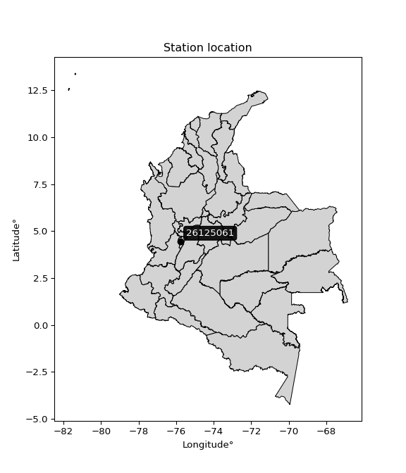

<div align="center">


</div>

# PMP Station (Rain, Pmax24h): 26125061

Probable Maximum Precipitation (PMP) is the greatest amount of rainfall for a specific duration that is meteorologically possible for a given location, acting as a "worst-case" scenario for extreme storms, crucial for designing safety-critical infrastructure like bridges, river deviations, dams, spillways, and nuclear plants to prevent catastrophic failure. PMP is calculated by hydrologists using meteorological data to determine the upper limit of extreme rainfall, often leading to the Probable Maximum Flood (PMF) for flood control design, and is increasingly being studied for climate change impacts. Probable Maximum Precipitation (PMP) is the theoretical upper limit of rainfall, a deterministic estimate for extreme events, while probability distributions (like GEV, Gumbel) describe the likelihood and frequency of various precipitation amounts, including rare ones, showing how often events occur, with PMP representing the extreme end of these distributions, used for critical infrastructure design to ensure safety against the worst conceivable weather, unlike standard statistical forecasts which cover typical probabilities.

The most common probability distributions in hydrology, used for analyzing floods, rainfall, and streamflow, include the Normal, Log-Normal, Gumbel, Gamma (including Log-Pearson Type III), and Generalized Extreme Value (GEV) distributions, often chosen based on the data´s skewness and whether modeling extremes or general conditions, with Gumbel and GEV popular for extreme events like floods, while the Normal distribution serves as a baseline, though often requiring transformations for skewed hydrological data. These distributions help in designing water infrastructure, managing water resources, and forecasting hydrologic events.

> Hydrological data often isn´t perfectly normal (it´s skewed), so different distributions are needed for different applications, such as: **Flood Frequency Analysis**: Using Gumbel, GEV, or Log-Pearson Type III for predicting extreme flood magnitudes and their return periods, **Rainfall Analysis**: Normal for annual totals, but Log-Normal, Weibull, or GEV for intensity or extreme daily rainfall, **Streamflow Modeling**: Gamma and Log-Normal for maximum flows, GEV for minimum flows, and Kappa for daily flows.

<div align="center">

</img>

</div>


## A. General information


### 1. General running parameters

• app_version: _v20260108_. • runtime: _2026-01-08 13:24:42.400241_. • Python version: _3.14.0_. • SciPy version: _1.16.3_. • Pandas version: _2.3.3_. • NumPy version: _2.3.5_. • Stations dataset (station_dataset_file): _dataset/pmax24h_in/automatic_colombia_2003_2024.csv_. • Stations catalog (station_catalog_file): _dataset/CNE.xls_. • Minimum year to eval til year_max (date_min): _1900_. • Maximum year to eval since year_min (date_max): _2024_. • Creates, save and include plots into reports (create_plot): _False_. • Plot only fit distributions with Δo > Δ (plot_only_fit): _True_. • Plot only simple graphs avoiding multiple CDFs and multiple Extreme values plots (plot_only_simple): _True_. • Eval low extreme values, if False, evaluates high extreme values (low_extreme): _False_. • Eval every SciPy distribution as logarithmic (pdist_logarithmic_on): _True_. • Standard deviation normalized (ddof): _1.0_. • Return periods to eval in years (Tr): _[2, 2.33, 5, 10, 15, 20, 25, 50, 75, 100, 200, 250, 500, 750, 1000]_. • Minimum data sample per station, 0 means any (minimum_sample): _5_. • Z-Score maximum threshold to adjust a value, 0 means disable (zscore_max): _3.5_. • Z-Score minimum threshold to adjust a value, 0 means disable (zscore_min): _-2.5_. • Avoid zeros, e.g. rain = 0 (avoid_zeros): _True_. • Avoid null values (avoid_nans): _True_. 

:file_folder:Table: [dataset.csv](../../dataset/pmax24h_in/automatic_colombia_2003_2024.csv)

> Delta Degrees of Freedom (DDOF): is a parameter used in the formulas for calculating variance and standard deviation. When ddof=0, the divisor is $N$ (the total number of observations) and this is used when your data set is the entire population. When ddof=1, the divisor is $N-1$ and this is used when your data set is a sample drawn from a larger population. Using $N-1$ provides an unbiased estimate of the population variance (known as Bessel´s correction).


### 2. Station info and location

|   id |   CODIGO | NOMBRE                                | CATEGORIA           | TECNOLOGIA                              | ESTADO   | FECHA_INSTALACION   |   FECHA_SUSPENSION |   ALTITUD |   LATITUD |   LONGITUD | DEPARTAMENTO   | MUNICIPIO   | AREA_OPERATIVA                         | ENTIDAD                                                     | AREA_HIDROGRAFICA   | ZONA_HIDROGRAFICA   | SUBZONA_HIDROGRAFICA   |   CORRIENTE | Catalogo   |   Version |
|-----:|---------:|:--------------------------------------|:--------------------|:----------------------------------------|:---------|:--------------------|-------------------:|----------:|----------:|-----------:|:---------------|:------------|:---------------------------------------|:------------------------------------------------------------|:--------------------|:--------------------|:-----------------------|------------:|:-----------|----------:|
|    0 | 26125061 | AEROPUERTO EL EDEN - - AUT [26125061] | Sinóptica Principal | Automática con Telemetría, Convencional | Activa   | 15/07/2016          |                nan |      1229 |   4.45472 |   -75.7664 | Quindío        | Armenia     | Area Operativa 09 - Cauca-Valle-Caldas | INSTITUTO DE HIDROLOGIA METEOROLOGIA Y ESTUDIOS AMBIENTALES | Magdalena Cauca     | Cauca               | Río La Vieja           |         nan | CNE_IDEAM  |  20251226 |

<div align="center">

Dynamic map: [:earth_americas:Google](http://maps.google.com/maps?q=4.454722222,-75.76638889) [:earth_americas:OSM](https://www.openstreetmap.org/#map=18/4.454722222/-75.76638889&layers=P) [:earth_americas:Bing](https://www.bing.com/maps?cp=4.454722222~-75.76638889&lvl=18) [:earth_americas:Apple](https://maps.apple.com/frame?center=4.454722222%2C-75.76638889&span=0.003%2C0.006)

</div>


<div align="center">

```geojson
{
  "type": "Feature",
  "geometry": {
    "type": "Point", 
    "coordinates": [-75.76638889, 4.454722222]
  }, 
  "properties": {
    "Name": "26125061"
  }
}
```

</div>


### 3. Discrete values table and plot

<div align="center">

|               |           0 |           1 |           2 |           3 |          4 |            5 |           6 |          7 |
|:--------------|------------:|------------:|------------:|------------:|-----------:|-------------:|------------:|-----------:|
| Date          | 2017        | 2018        | 2019        | 2020        | 2021       | 2022         | 2023        | 2024       |
| Value         |   77.903    |   50.696    |   64.041    |   69.332    |   43.892   |   99.859     |   82.367    |  307.138   |
| Value_initial |   77.903    |   50.696    |   64.041    |   69.332    |   43.892   |   99.859     |   82.367    |  307.138   |
| count         |    8        |    8        |    8        |    8        |    8       |    8         |    8        |    8       |
| mean          |   99.4035   |   99.4035   |   99.4035   |   99.4035   |   99.4035  |   99.4035    |   99.4035   |   99.4035  |
| std           |   85.7864   |   85.7864   |   85.7864   |   85.7864   |   85.7864  |   85.7864    |   85.7864   |   85.7864  |
| zscore        |   -0.250628 |   -0.567777 |   -0.412216 |   -0.350539 |   -0.64709 |    0.0053097 |   -0.198592 |    2.42153 |


</div>


> The initial value (value_initial) correspond to the initial obtained or null completed value, and value (value) is adjusted only when the initial value is outside the valid range (outlier) definite through the Z-Score value. If Z-Score is active, values out of range or outliers are replaced with the station mean value. A Z-Score (or standard score) measures how many standard deviations a data point is from the mean of a dataset, indicating its relative position; positive scores mean above the mean, negative mean below, and a score of zero is exactly at the mean, allowing for comparison of values from different distributions. It´s calculated using the formula $z=(x–μ)/σ$, where $x$ is the data point, $μ$ is the mean, and $σ$ is the standard deviation, helping identify outliers and understand probability.
>
> <sub>**Note**: In this study, "completing" (filling gaps in) and "extending" (forecasting or lengthening the historical record) rainfall data series are avoided for certain critical analyses because they introduce artificial bias and uncertainty, which can distort the statistics of rare events (extremes), alter day-to-day variability, and compromise the integrity and homogeneity of the original data. Some reasons against Completing/Extending rainfall data are: **Distortion of Extremes and Variability**: The primary issue is that most gap-filling or extension methods rely on averaging or regression with nearby stations, which inherently smooths the data. Rainfall is highly variable in space and time, with a large percentage of zero values and occasional large storms. Infilling methods often underestimate the highest values and overestimate the lowest (zero) values, which severely distorts analyses focused on flood frequency, drought severity, and intensity-duration-frequency (IDF) curves, **Loss of Data Homogeneity**: Infilled or extended data are synthetic estimates, not actual measurements. Combining these estimates with observed data can violate the assumption of data homogeneity, which requires that the data properties do not change over time. Inhomogeneity can lead to incorrect conclusions about long-term trends or changes in climate patterns, **Propagation of Errors**: Errors and biases from the original data (e.g., wind-induced undercatch, instrument errors, site changes) or the data used for imputation can propagate through the analysis, leading to unreliable hydrological models and inaccurate predictions, **Compromised Statistical Integrity**: For statistical analyses, especially those involving the frequency of events, using artificial data can introduce time bias or autocorrelation that doesn´t exist in reality, making it difficult to assess the true probability of events, **Difficulty in Validation**: It is difficult to accurately validate the quality of filled or extended data, especially for past periods where ground-truth measurements are unavailable. The reliability of imputation techniques heavily depends on the density of the surrounding station network and the complexity of the local topography.</sub>


### 4. Active continuous probability distributions from SciPy (43 of 104 available)

A Probability Density Function (PDF) describes the relative likelihood of a continuous random variable falling within a specific range, where the total area under its curve equals 1, and the area over any interval gives the actual probability for that range. Unlike discrete probabilities (like rolling a die), a PDF shows density, not direct probability for a single point (which is zero), with higher points indicating higher likelihood, often visualized as a bell curve for normal distributions.

A log of a probability density function (log-PDF) is simply the logarithm of the PDF´s value, denoted as $log(f(x))$, useful for converting multiplication of probabilities into addition, improving numerical stability with tiny numbers, and connecting to information theory concepts like entropy. Instead of dealing with very small probabilities (e.g., 0.000001), log-PDFs use negative numbers (e.g., $log(0.00001) ≈ -11.51$ that are easier for computers to handle, preventing underflow errors and simplifying complex calculations. In this study, each active probability distribution from SciPy is also evaluated in the $log$ form.

[scipy.stats](https://docs.scipy.org/doc/scipy/reference/stats.html) is a Python´s powerful submodule within the SciPy library for comprehensive statistical analysis, offering over 130 probability distributions (like Normal, Poisson), functions for descriptive stats (mean, variance), hypothesis testing (t-tests, chi-square), random variable generation, and statistical tests, making it essential for data science, modeling, and research. It provides tools to explore, model, and draw conclusions from data efficiently, working seamlessly with NumPy.

<div align="center">

|   id | p_dist             |   n_parameter | fit_method   | label                                                                       | active   | ref                                                                                                        |
|-----:|:-------------------|--------------:|:-------------|:----------------------------------------------------------------------------|:---------|:-----------------------------------------------------------------------------------------------------------|
|    0 | alpha              |             3 | MLE          | Alpha                                                                       | True     | [:mortar_board:](https://docs.scipy.org/doc/scipy/reference/generated/scipy.stats.alpha.html)              |
|    1 | betaprime          |             4 | MLE          | Beta prime                                                                  | True     | [:mortar_board:](https://docs.scipy.org/doc/scipy/reference/generated/scipy.stats.betaprime.html)          |
|    2 | chi2               |             3 | MLE          | Chi²                                                                        | True     | [:mortar_board:](https://docs.scipy.org/doc/scipy/reference/generated/scipy.stats.chi2.html)               |
|    3 | crystalball        |             4 | MLE          | Crystalball                                                                 | True     | [:mortar_board:](https://docs.scipy.org/doc/scipy/reference/generated/scipy.stats.crystalball.html)        |
|    4 | erlang             |             3 | MLE          | Erlang                                                                      | True     | [:mortar_board:](https://docs.scipy.org/doc/scipy/reference/generated/scipy.stats.erlang.html)             |
|    5 | expon              |             2 | MLE          | Exponential                                                                 | True     | [:mortar_board:](https://docs.scipy.org/doc/scipy/reference/generated/scipy.stats.expon.html)              |
|    6 | exponnorm          |             3 | MLE          | Exponentially modified Normal                                               | True     | [:mortar_board:](https://docs.scipy.org/doc/scipy/reference/generated/scipy.stats.exponnorm.html)          |
|    7 | f                  |             4 | MLE          | F                                                                           | True     | [:mortar_board:](https://docs.scipy.org/doc/scipy/reference/generated/scipy.stats.f.html)                  |
|    8 | fatiguelife        |             3 | MLE          | Fatigue-life (Birnbaum-Saunders)                                            | True     | [:mortar_board:](https://docs.scipy.org/doc/scipy/reference/generated/scipy.stats.fatiguelife.html)        |
|    9 | fisk               |             3 | MLE          | Fisk                                                                        | True     | [:mortar_board:](https://docs.scipy.org/doc/scipy/reference/generated/scipy.stats.fisk.html)               |
|   10 | gamma              |             3 | MLE          | Gamma                                                                       | True     | [:mortar_board:](https://docs.scipy.org/doc/scipy/reference/generated/scipy.stats.gamma.html)              |
|   11 | genexpon           |             5 | MLE          | Generalized exponential                                                     | True     | [:mortar_board:](https://docs.scipy.org/doc/scipy/reference/generated/scipy.stats.genexpon.html)           |
|   12 | genlogistic        |             3 | MLE          | Generalized logistic                                                        | True     | [:mortar_board:](https://docs.scipy.org/doc/scipy/reference/generated/scipy.stats.genlogistic.html)        |
|   13 | gibrat             |             2 | MM           | Gibrat                                                                      | True     | [:mortar_board:](https://docs.scipy.org/doc/scipy/reference/generated/scipy.stats.gibrat.html)             |
|   14 | gompertz           |             3 | MLE          | Gompertz (or truncated Gumbel)                                              | True     | [:mortar_board:](https://docs.scipy.org/doc/scipy/reference/generated/scipy.stats.gompertz.html)           |
|   15 | gumbel_l           |             2 | MM           | Gumbel Left Skew                                                            | True     | [:mortar_board:](https://docs.scipy.org/doc/scipy/reference/generated/scipy.stats.gumbel_l.html)           |
|   16 | gumbel_r           |             2 | MM           | Gumbel Right Skew                                                           | True     | [:mortar_board:](https://docs.scipy.org/doc/scipy/reference/generated/scipy.stats.gumbel_r.html)           |
|   17 | halflogistic       |             2 | MM           | Half-logistic                                                               | True     | [:mortar_board:](https://docs.scipy.org/doc/scipy/reference/generated/scipy.stats.halflogistic.html)       |
|   18 | halfnorm           |             2 | MM           | Half Normal                                                                 | True     | [:mortar_board:](https://docs.scipy.org/doc/scipy/reference/generated/scipy.stats.halfnorm.html)           |
|   19 | hypsecant          |             2 | MM           | hyperbolic secant                                                           | True     | [:mortar_board:](https://docs.scipy.org/doc/scipy/reference/generated/scipy.stats.hypsecant.html)          |
|   20 | invgamma           |             3 | MLE          | Inverted gamma                                                              | True     | [:mortar_board:](https://docs.scipy.org/doc/scipy/reference/generated/scipy.stats.invgamma.html)           |
|   21 | invgauss           |             3 | MLE          | Inverse Gaussian                                                            | True     | [:mortar_board:](https://docs.scipy.org/doc/scipy/reference/generated/scipy.stats.invgauss.html)           |
|   22 | invweibull         |             3 | MLE          | Inverted Weibull                                                            | True     | [:mortar_board:](https://docs.scipy.org/doc/scipy/reference/generated/scipy.stats.invweibull.html)         |
|   23 | kstwobign          |             2 | MLE          | Limiting distribution of scaled Kolmogorov-Smirnov two-sided test statistic | True     | [:mortar_board:](https://docs.scipy.org/doc/scipy/reference/generated/scipy.stats.kstwobign.html)          |
|   24 | laplace            |             2 | MM           | Laplace                                                                     | True     | [:mortar_board:](https://docs.scipy.org/doc/scipy/reference/generated/scipy.stats.laplace.html)            |
|   25 | laplace_asymmetric |             3 | MLE          | Asymmetric Laplace                                                          | True     | [:mortar_board:](https://docs.scipy.org/doc/scipy/reference/generated/scipy.stats.laplace_asymmetric.html) |
|   26 | loggamma           |             3 | MLE          | Log gamma                                                                   | True     | [:mortar_board:](https://docs.scipy.org/doc/scipy/reference/generated/scipy.stats.loggamma.html)           |
|   27 | logistic           |             2 | MM           | Logistic (or Sech-squared)                                                  | True     | [:mortar_board:](https://docs.scipy.org/doc/scipy/reference/generated/scipy.stats.logistic.html)           |
|   28 | lognorm            |             3 | MLE          | Log Normal                                                                  | True     | [:mortar_board:](https://docs.scipy.org/doc/scipy/reference/generated/scipy.stats.lognorm.html)            |
|   29 | maxwell            |             2 | MM           | Maxwell                                                                     | True     | [:mortar_board:](https://docs.scipy.org/doc/scipy/reference/generated/scipy.stats.maxwell.html)            |
|   30 | mielke             |             4 | MLE          | Mielke Beta-Kappa / Dagum                                                   | True     | [:mortar_board:](https://docs.scipy.org/doc/scipy/reference/generated/scipy.stats.mielke.html)             |
|   31 | moyal              |             2 | MM           | Moyal                                                                       | True     | [:mortar_board:](https://docs.scipy.org/doc/scipy/reference/generated/scipy.stats.moyal.html)              |
|   32 | nakagami           |             3 | MLE          | Nakagami                                                                    | True     | [:mortar_board:](https://docs.scipy.org/doc/scipy/reference/generated/scipy.stats.nakagami.html)           |
|   33 | ncf                |             5 | MLE          | Non-central F distribution                                                  | True     | [:mortar_board:](https://docs.scipy.org/doc/scipy/reference/generated/scipy.stats.ncf.html)                |
|   34 | nct                |             4 | MLE          | Non-central Student’s t                                                     | True     | [:mortar_board:](https://docs.scipy.org/doc/scipy/reference/generated/scipy.stats.nct.html)                |
|   35 | norm               |             2 | MM           | Normal                                                                      | True     | [:mortar_board:](https://docs.scipy.org/doc/scipy/reference/generated/scipy.stats.norm.html)               |
|   36 | pearson3           |             3 | MM           | Pearson type III                                                            | True     | [:mortar_board:](https://docs.scipy.org/doc/scipy/reference/generated/scipy.stats.pearson3.html)           |
|   37 | rayleigh           |             2 | MM           | Rayleigh                                                                    | True     | [:mortar_board:](https://docs.scipy.org/doc/scipy/reference/generated/scipy.stats.rayleigh.html)           |
|   38 | rice               |             3 | MLE          | Rice                                                                        | True     | [:mortar_board:](https://docs.scipy.org/doc/scipy/reference/generated/scipy.stats.rice.html)               |
|   39 | t                  |             3 | MLE          | Student’s t                                                                 | True     | [:mortar_board:](https://docs.scipy.org/doc/scipy/reference/generated/scipy.stats.t.html)                  |
|   40 | truncnorm          |             4 | MLE          | Truncated normal                                                            | True     | [:mortar_board:](https://docs.scipy.org/doc/scipy/reference/generated/scipy.stats.truncnorm.html)          |
|   41 | wald               |             2 | MM           | Wald                                                                        | True     | [:mortar_board:](https://docs.scipy.org/doc/scipy/reference/generated/scipy.stats.wald.html)               |
|   42 | weibull_min        |             3 | MLE          | Weibull minimum                                                             | True     | [:mortar_board:](https://docs.scipy.org/doc/scipy/reference/generated/scipy.stats.weibull_min.html)        |

</div>

> **n_parameter:** # arguments & localization & scale.
>
> **Fit methods:** (MLE) maximum likelihood, (MM) L-moments.
>
>**Inactive** (With the only purpose of prevent loops, zero divisions, infinite values, over high estimated values or horizontal trending for recurrence intervals estimations, the follow distributions were disabled.)**:** foldnorm, gennorm, norminvgauss, powernorm, powerlognorm, skewnorm, genextreme, anglit, arcsine, argus, beta, bradford, burr, burr12, cauchy, cosine, halfcauchy, foldcauchy, skewcauchy, wrapcauchy, dgamma, gengamma, exponweib, exponpow, truncexpon, gausshyper, genhalflogistic, genhyperbolic, geninvgauss, halfgennorm, johnsonsb, johnsonsu, kappa4, kappa3, ksone, kstwo, loglaplace, levy, levy_l, levy_stable, ncx2, pareto, genpareto, truncpareto, lomax, powerlaw, rdist, rel_breitwigner, recipinvgauss, semicircular, studentized_range, trapezoid, triang, truncweibull_min, tukeylambda, uniform, loguniform, vonmises, vonmises_line, weibull_max, dweibull, 


## B. Probability (PDF) vs. Empirical (EDF) distributions functions

A continuous probability distribution (CPD) describes probabilities for variables that can take any value within a range (like rain any time), unlike discrete variables with specific outcomes (like temperature). It uses a Probability Density Function (PDF), a curve where the total area under it equals 1, and the probability of the variable falling within an interval (a to b) is found by calculating the area under the curve between those points. A key feature is that the probability of hitting any single exact value is zero, so probabilities are always expressed for ranges, e.g., $P(a ≤ X ≤ b)$.

<div align="center">

Distributions parameters from station values
|    |   station | p_dist                |   n |             loc |          scale | shape                  | shape1                 | shape2                | shape3   |
|---:|----------:|:----------------------|----:|----------------:|---------------:|:-----------------------|:-----------------------|:----------------------|:---------|
|  0 |  26125061 | alpha                 |   8 |      16.8539    |   93.7741      | 1.706993335384725      |                        |                       |          |
|  1 |  26125061 | betaprime             |   8 |      -0.552927  |    1.07672     | 295.5666128454211      | 4.358378585867424      |                       |          |
|  2 |  26125061 | chi2                  |   8 |      43.892     |   55.4775      | 1.0693133651443425     |                        |                       |          |
|  3 |  26125061 | crystalball           |   8 |      99.4035    |   80.2458      | 8380.8230263792        | 2555.3385519569547     |                       |          |
|  4 |  26125061 | erlang                |   8 |      43.892     |   38.6707      | 0.8397901969101293     |                        |                       |          |
|  5 |  26125061 | expon                 |   8 |      43.892     |   55.5115      |                        |                        |                       |          |
|  6 |  26125061 | exponnorm             |   8 |      43.8286    |    0.0202345   | 2755.887837013439      |                        |                       |          |
|  7 |  26125061 | f                     |   8 |      43.8903    |   24.1014      | 1.0609715278459815     | 3.1490936290124685     |                       |          |
|  8 |  26125061 | fatiguelife           |   8 |      40.444     |   29.6389      | 1.4049622851322523     |                        |                       |          |
|  9 |  26125061 | fisk                  |   8 |      43.892     |   26.4193      | 0.8559031998662225     |                        |                       |          |
| 10 |  26125061 | gamma                 |   8 |      43.892     |   75.1351      | 0.19527031582767534    |                        |                       |          |
| 11 |  26125061 | genexpon              |   8 |      16.5434    |    0.00782637  | 9.055082712425238e-10  | 0.00012571689619488415 | 0.0003348270938581643 |          |
| 12 |  26125061 | genlogistic           |   8 |    -221.683     |   37.369       | 2495.0607596501222     |                        |                       |          |
| 13 |  26125061 | gibrat                |   8 |      38.1861    |   37.1302      |                        |                        |                       |          |
| 14 |  26125061 | gompertz              |   8 |      43.892     |    7.86252e+12 | 123459042913.46967     |                        |                       |          |
| 15 |  26125061 | gumbel_l              |   8 |     135.518     |   62.5674      |                        |                        |                       |          |
| 16 |  26125061 | gumbel_r              |   8 |      63.2886    |   62.5674      |                        |                        |                       |          |
| 17 |  26125061 | halflogistic          |   8 |       4.29359   |   68.6073      |                        |                        |                       |          |
| 18 |  26125061 | halfnorm              |   8 |      -6.81048   |  133.119       |                        |                        |                       |          |
| 19 |  26125061 | hypsecant             |   8 |      99.4035    |   51.0861      |                        |                        |                       |          |
| 20 |  26125061 | invgamma              |   8 |      33.072     |   48.4132      | 1.6354309100588351     |                        |                       |          |
| 21 |  26125061 | invgauss              |   8 |      38.1472    |   30.5883      | 2.0026036221858403     |                        |                       |          |
| 22 |  26125061 | invweibull            |   8 |      43.892     |    1.25304     | 0.05219629572869136    |                        |                       |          |
| 23 |  26125061 | kstwobign             |   8 |     -89.3664    |  223.382       |                        |                        |                       |          |
| 24 |  26125061 | laplace               |   8 |      99.4035    |   56.7423      |                        |                        |                       |          |
| 25 |  26125061 | laplace_asymmetric    |   8 |      43.892     |    0.00195754  | 3.5263892547022664e-05 |                        |                       |          |
| 26 |  26125061 | loggamma              |   8 |  -23949.2       | 3263.09        | 1587.8478891931854     |                        |                       |          |
| 27 |  26125061 | logistic              |   8 |      99.4035    |   44.2418      |                        |                        |                       |          |
| 28 |  26125061 | lognorm               |   8 |      43.892     |    0.384505    | 11.990621184714744     |                        |                       |          |
| 29 |  26125061 | maxwell               |   8 |     -90.7453    |  119.158       |                        |                        |                       |          |
| 30 |  26125061 | mielke                |   8 |       5.53052   |    5.24238     | 827.7904950662155      | 2.4189750114493638     |                       |          |
| 31 |  26125061 | moyal                 |   8 |      53.5138    |   36.1233      |                        |                        |                       |          |
| 32 |  26125061 | nakagami              |   8 |      43.892     |  144.489       | 0.1729503043947661     |                        |                       |          |
| 33 |  26125061 | ncf                   |   8 |      -0.0976321 |    7.69218e-09 | 1.1116005250607836e-09 | 16.48501939648709      | 11.972221399217489    |          |
| 34 |  26125061 | nct                   |   8 |      -0.208217  |    1.22235     | 2.8490280457770893     | 55.01329672157593      |                       |          |
| 35 |  26125061 | norm                  |   8 |      99.4035    |   80.2458      |                        |                        |                       |          |
| 36 |  26125061 | pearson3              |   8 |      99.4035    |   80.2458      | 2.0783370243264594     |                        |                       |          |
| 37 |  26125061 | rayleigh              |   8 |     -54.1114    |  122.487       |                        |                        |                       |          |
| 38 |  26125061 | rice                  |   8 |     -10.4988    |   96.2234      | 0.0002392805578438408  |                        |                       |          |
| 39 |  26125061 | t                     |   8 |      70.4935    |   14.9584      | 1.0790389122771018     |                        |                       |          |
| 40 |  26125061 | truncnorm             |   8 | -154798         | 3527.85        | 43.89142044083608      | 316.25239471233226     |                       |          |
| 41 |  26125061 | wald                  |   8 |      19.1577    |   80.2458      |                        |                        |                       |          |
| 42 |  26125061 | weibull_min           |   8 |      43.892     |  116.456       | 0.4327807321241189     |                        |                       |          |
| 43 |  26125061 | logalpha              |   8 |       2.79485   |    5.22859     | 3.5783323444546253     |                        |                       |          |
| 44 |  26125061 | logbetaprime          |   8 |      -2.50786   |    6.3475      | 305.0067046646071      | 281.1500433562728      |                       |          |
| 45 |  26125061 | logchi2               |   8 |       3.78173   |    0.980679    | 1.018398670424395      |                        |                       |          |
| 46 |  26125061 | logcrystalball        |   8 |       4.40046   |    0.558592    | 2919.6346631946963     | 15.546901900970667     |                       |          |
| 47 |  26125061 | logerlang             |   8 |       3.78173   |    1.39916     | 0.5883497330525095     |                        |                       |          |
| 48 |  26125061 | logexpon              |   8 |       3.78173   |    0.618732    |                        |                        |                       |          |
| 49 |  26125061 | logexponnorm          |   8 |       3.89661   |    0.183601    | 2.744323099011247      |                        |                       |          |
| 50 |  26125061 | logf                  |   8 |       3.78173   |    0.556204    | 1.3589562490163212     | 10.811773459828476     |                       |          |
| 51 |  26125061 | logfatiguelife        |   8 |       3.57889   |    0.661935    | 0.6932634715893125     |                        |                       |          |
| 52 |  26125061 | logfisk               |   8 |       3.5901    |    0.664282    | 2.635086860483306      |                        |                       |          |
| 53 |  26125061 | loggamma              |   8 |       3.78173   |    0.596705    | 0.8695910783302137     |                        |                       |          |
| 54 |  26125061 | loggenexpon           |   8 |       3.78173   |    0.8455      | 1.1256612400871635     | 0.5244789364440147     | 1.2352741619915264    |          |
| 55 |  26125061 | loggenlogistic        |   8 |       1.72226   |    0.370494    | 730.8480794411062      |                        |                       |          |
| 56 |  26125061 | loggibrat             |   8 |       3.97433   |    0.258465    |                        |                        |                       |          |
| 57 |  26125061 | loggompertz           |   8 |       3.78173   |    4.7852      | 6.8373677502991566     |                        |                       |          |
| 58 |  26125061 | loggumbel_l           |   8 |       4.65186   |    0.435532    |                        |                        |                       |          |
| 59 |  26125061 | loggumbel_r           |   8 |       4.14907   |    0.435532    |                        |                        |                       |          |
| 60 |  26125061 | loghalflogistic       |   8 |       3.7384    |    0.477576    |                        |                        |                       |          |
| 61 |  26125061 | loghalfnorm           |   8 |       3.66111   |    0.926646    |                        |                        |                       |          |
| 62 |  26125061 | loghypsecant          |   8 |       4.40046   |    0.355611    |                        |                        |                       |          |
| 63 |  26125061 | loginvgamma           |   8 |       3.33293   |    4.2428      | 4.952501624824083      |                        |                       |          |
| 64 |  26125061 | loginvgauss           |   8 |       3.53864   |    1.89644     | 0.4544420407575517     |                        |                       |          |
| 65 |  26125061 | loginvweibull         |   8 |       2.54655   |    1.57858     | 4.717680007913289      |                        |                       |          |
| 66 |  26125061 | logkstwobign          |   8 |       2.78922   |    1.87047     |                        |                        |                       |          |
| 67 |  26125061 | loglaplace            |   8 |       4.40046   |    0.394984    |                        |                        |                       |          |
| 68 |  26125061 | loglaplace_asymmetric |   8 |       4.15952   |    0.331365    | 0.700494803351366      |                        |                       |          |
| 69 |  26125061 | logloggamma           |   8 |    -138.048     |   19.9664      | 1254.919261878832      |                        |                       |          |
| 70 |  26125061 | loglogistic           |   8 |       4.40046   |    0.307968    |                        |                        |                       |          |
| 71 |  26125061 | loglognorm            |   8 |       3.78173   |    0.00708989  | 11.511015114208776     |                        |                       |          |
| 72 |  26125061 | logmaxwell            |   8 |       3.07684   |    0.829461    |                        |                        |                       |          |
| 73 |  26125061 | logmielke             |   8 |       2.57051   |    0.660721    | 257.94563868400627     | 4.673506522021199      |                       |          |
| 74 |  26125061 | logmoyal              |   8 |       4.08103   |    0.251455    |                        |                        |                       |          |
| 75 |  26125061 | lognakagami           |   8 |       3.78173   |    1.1912      | 0.20586671846704285    |                        |                       |          |
| 76 |  26125061 | logncf                |   8 |       3.35564   |    0.318124    | 110.27312403247018     | 9.90812678980222       | 180.42519749388057    |          |
| 77 |  26125061 | lognct                |   8 |       0.69806   |    0.0324081   | 28.355468677923902     | 110.86598475913179     |                       |          |
| 78 |  26125061 | lognorm               |   8 |       4.40046   |    0.558592    |                        |                        |                       |          |
| 79 |  26125061 | logpearson3           |   8 |       4.40046   |    0.55859     | 1.421690534493601      |                        |                       |          |
| 80 |  26125061 | lograyleigh           |   8 |       3.33185   |    0.852634    |                        |                        |                       |          |
| 81 |  26125061 | logrice               |   8 |       3.52101   |    0.736702    | 0.0014547148538445447  |                        |                       |          |
| 82 |  26125061 | logt                  |   8 |       4.2651    |    0.259689    | 1.7510933270867497     |                        |                       |          |
| 83 |  26125061 | logtruncnorm          |   8 |      -0.36323   |    1.817       | 2.2812095030160036     | 3.351982586860708      |                       |          |
| 84 |  26125061 | logwald               |   8 |       3.84184   |    0.55862     |                        |                        |                       |          |
| 85 |  26125061 | logweibull_min        |   8 |       3.78173   |    0.693773    | 0.8732733969308666     |                        |                       |          |

</div>

> **loc** (Location parameter): This shifts the distribution along the x-axis. For many common distributions, like the normal (Gaussian) distribution, loc represents the mean $μ$. For others, like the uniform distribution, it might represent the minimum value, or for the beta distribution, the left end of the support interval.
>
> **scale** (Scale parameter): This determines the width or spread of the distribution. For the normal distribution, scale represents the standard deviation $σ$. For a uniform distribution, it defines the length of the interval (from $loc$ to $loc + scale$).
>
> **shape** (Shape parameters): Refers to parameters that define the specific form of a probability distribution, distinct from its location (loc) and scale (scale). These parameters are required arguments for most distribution functions. For example, a normal (Gaussian) distribution is fully defined by its location (mean) and scale (standard deviation), so it has no specific shape parameters beyond loc and scale. However, other distributions have intrinsic properties that need specification, as Gamma distribution that takes a shape parameter, often named $a$ or $alpha$.


### 0. Cumulative distribution values - CDF (86 evaluated)

Cumulative Distribution Function (CDF), denoted as $F$<sub>$X$</sub>$(x)$, is a function that gives the probability that a random variable $X$ will take a value less than or equal to a specific value, $x$ (i.e., $(P(X≥x)$. It essentially "accumulates" probabilities from a given point up to the far right (positive infinity), providing a complete picture of the distribution´s probabilities for both discrete (like rain) and continuous (like temperature) variables, helping to find probabilities over ranges or above certain values. Each station is evaluated separately ordering the $x$ values ascending, calculating the CDF and PDF values for the activated distributions and their logarithmic forms.

<div align="center">

CDF ordered by x ascending and calculating $log(f(x))$ separately
|   id |   Station |   date |       x |   count |    mean |     std |     zscore |   Value_initial |   station |   m |     alpha |   alpha_pdf |   betaprime |   betaprime_pdf |        chi2 |         chi2_pdf |   crystalball |   crystalball_pdf |      erlang |   erlang_pdf |    expon |   expon_pdf |   exponnorm |   exponnorm_pdf |          f |       f_pdf |   fatiguelife |   fatiguelife_pdf |        fisk |    fisk_pdf |      gamma |   gamma_pdf |   genexpon |   genexpon_pdf |   genlogistic |   genlogistic_pdf |    gibrat |   gibrat_pdf |    gompertz |   gompertz_pdf |   gumbel_l |   gumbel_l_pdf |   gumbel_r |   gumbel_r_pdf |   halflogistic |   halflogistic_pdf |   halfnorm |   halfnorm_pdf |   hypsecant |   hypsecant_pdf |   invgamma |   invgamma_pdf |   invgauss |   invgauss_pdf |   invweibull |   invweibull_pdf |   kstwobign |   kstwobign_pdf |   laplace |   laplace_pdf |   laplace_asymmetric |   laplace_asymmetric_pdf |    loggamma |   loggamma_pdf |   logistic |   logistic_pdf |   lognorm |   lognorm_pdf |   maxwell |   maxwell_pdf |   mielke |   mielke_pdf |    moyal |   moyal_pdf |   nakagami |   nakagami_pdf |      ncf |     ncf_pdf |       nct |     nct_pdf |     norm |   norm_pdf |   pearson3 |   pearson3_pdf |   rayleigh |   rayleigh_pdf |     rice |    rice_pdf |        t |       t_pdf |   truncnorm |   truncnorm_pdf |     wald |    wald_pdf |   weibull_min |   weibull_min_pdf |   logalpha |   logalpha_pdf |   logbetaprime |   logbetaprime_pdf |    logchi2 |   logchi2_pdf |   logcrystalball |   logcrystalball_pdf |   logerlang |   logerlang_pdf |   logexpon |   logexpon_pdf |   logexponnorm |   logexponnorm_pdf |        logf |    logf_pdf |   logfatiguelife |   logfatiguelife_pdf |   logfisk |   logfisk_pdf |   loggenexpon |   loggenexpon_pdf |   loggenlogistic |   loggenlogistic_pdf |   loggibrat |   loggibrat_pdf |   loggompertz |   loggompertz_pdf |   loggumbel_l |   loggumbel_l_pdf |   loggumbel_r |   loggumbel_r_pdf |   loghalflogistic |   loghalflogistic_pdf |   loghalfnorm |   loghalfnorm_pdf |   loghypsecant |   loghypsecant_pdf |   loginvgamma |   loginvgamma_pdf |   loginvgauss |   loginvgauss_pdf |   loginvweibull |   loginvweibull_pdf |   logkstwobign |   logkstwobign_pdf |   loglaplace |   loglaplace_pdf |   loglaplace_asymmetric |   loglaplace_asymmetric_pdf |   logloggamma |   logloggamma_pdf |   loglogistic |   loglogistic_pdf |   loglognorm |   loglognorm_pdf |   logmaxwell |   logmaxwell_pdf |   logmielke |   logmielke_pdf |   logmoyal |   logmoyal_pdf |   lognakagami |   lognakagami_pdf |    logncf |   logncf_pdf |    lognct |   lognct_pdf |   logpearson3 |   logpearson3_pdf |   lograyleigh |   lograyleigh_pdf |   logrice |   logrice_pdf |     logt |   logt_pdf |   logtruncnorm |   logtruncnorm_pdf |   logwald |   logwald_pdf |   logweibull_min |   logweibull_min_pdf |
|-----:|----------:|-------:|--------:|--------:|--------:|--------:|-----------:|----------------:|----------:|----:|----------:|------------:|------------:|----------------:|------------:|-----------------:|--------------:|------------------:|------------:|-------------:|---------:|------------:|------------:|----------------:|-----------:|------------:|--------------:|------------------:|------------:|------------:|-----------:|------------:|-----------:|---------------:|--------------:|------------------:|----------:|-------------:|------------:|---------------:|-----------:|---------------:|-----------:|---------------:|---------------:|-------------------:|-----------:|---------------:|------------:|----------------:|-----------:|---------------:|-----------:|---------------:|-------------:|-----------------:|------------:|----------------:|----------:|--------------:|---------------------:|-------------------------:|------------:|---------------:|-----------:|---------------:|----------:|--------------:|----------:|--------------:|---------:|-------------:|---------:|------------:|-----------:|---------------:|---------:|------------:|----------:|------------:|---------:|-----------:|-----------:|---------------:|-----------:|---------------:|---------:|------------:|---------:|------------:|------------:|----------------:|---------:|------------:|--------------:|------------------:|-----------:|---------------:|---------------:|-------------------:|-----------:|--------------:|-----------------:|---------------------:|------------:|----------------:|-----------:|---------------:|---------------:|-------------------:|------------:|------------:|-----------------:|---------------------:|----------:|--------------:|--------------:|------------------:|-----------------:|---------------------:|------------:|----------------:|--------------:|------------------:|--------------:|------------------:|--------------:|------------------:|------------------:|----------------------:|--------------:|------------------:|---------------:|-------------------:|--------------:|------------------:|--------------:|------------------:|----------------:|--------------------:|---------------:|-------------------:|-------------:|-----------------:|------------------------:|----------------------------:|--------------:|------------------:|--------------:|------------------:|-------------:|-----------------:|-------------:|-----------------:|------------:|----------------:|-----------:|---------------:|--------------:|------------------:|----------:|-------------:|----------:|-------------:|--------------:|------------------:|--------------:|------------------:|----------:|--------------:|---------:|-----------:|---------------:|-------------------:|----------:|--------------:|-----------------:|---------------------:|
|    0 |  26125061 |   2021 |  43.892 |       8 | 99.4035 | 85.7864 | -0.64709   |          43.892 |  26125061 |   1 | 0.0408952 | 0.0113492   |    0.102475 |     0.00976672  | 2.47555e-09 | 186276           |      0.244541 |        0.00391357 | 4.56713e-12 |   3.3949     | 0        | 0.0180143   |   0.0011356 |     0.0178967   | 0.00462439 | 1.47263     |      0.032588 |       0.0246138   | 5.32658e-13 | 3.77428     | 0.00080801 | 2.22056e+10 |   0.16504  |    0.00924967  |      0.129534 |       0.00708167  | 0.0305392 |  0.0121022   | 1.64121e-13 |    0.0157022   |   0.206425 |    0.00293252  |   0.255779 |    0.00557383  |       0.280834 |        0.00671308  |   0.296707 |    0.00557439  |    0.207133 |     0.00377443  |  0.0372545 |    0.0135993   |  0.0340135 |    0.0179996   |   0.00392161 |      1.59633e+11 |    0.131183 |     0.00584097  |  0.187973 |   0.00331275  |          1.26216e-09 |              0.0180144   | 7.34632e-14 |    143.852     |   0.221883 |    0.00390243  |  0.134003 |     0.386717  |  0.265323 |   0.00451514  |      nan |          nan | 0.253265 | 0.00656962  | 1.8224e-06 |    8.87168e+07 | 0.229654 | 0.00799291  | 0.0763902 | 0.0102765   | 0.244541 | 0.00391357 |   0.2621   |    0.00973835  |   0.273916 |    0.00474293  | 0.147649 | 0.00500705  | 0.156056 | 0.00520231  |   0         |     0.0124479   | 0.174558 | 0.0133672   |   9.60829e-08 |       5.85226e+06 |   0.042744 |      0.488203  |       0.1363   |          0.420405  | 1.2185e-08 |   1.39715e+07 |         0.134003 |            0.386717  | 8.53163e-10 |     1.13031e+06 |   0        |      1.61621   |      0.0495591 |          0.429096  | 1.20099e-05 | 195.584     |        0.0353654 |            0.653929  | 0.0364104 |     0.482451  |   2.95029e-12 |         1.33136   |        0.0601424 |            0.45544   |    0        |       0         |   4.87327e-13 |         1.42886   |      0.126831 |       0.271908    |     0.0978519 |         0.522205  |         0.0453322 |             1.0448    |      0.103571 |         0.853781  |       0.110622 |          0.304853  |     0.0397532 |         0.530523  |     0.0364235 |          0.613841 |       0.0415332 |           0.504652  |      0.0590718 |          0.462051  |     0.10439  |        0.264289  |               0.0646511 |                   0.278525  |      0.136468 |         0.384046  |      0.118253 |         0.338571  |   0.00413221 |      2.38598e+12 |     0.13203  |        0.484148  |   0.0425415 |       0.503712  |  0.0697923 |      0.555842  |   3.49993e-07 |       3.24493e+08 | 0.0397496 |    0.530563  | 0.0975937 |    0.464866  |     0.0698439 |         0.714696  |      0.129949 |         0.538421  | 0.0607026 |     0.451225  | 0.110705 |  0.298578  |    3.05903e-06 |          1.49773   | 0         |     0         |      5.39144e-14 |          106.019     |
|    1 |  26125061 |   2018 |  50.696 |       8 | 99.4035 | 85.7864 | -0.567777  |          50.696 |  26125061 |   2 | 0.150277  | 0.0193989   |    0.176244 |     0.0116935   | 0.247885    |      0.0187126   |      0.271932 |        0.0041351  | 0.227867    |   0.0255251  | 0.115355 | 0.0159362   |   0.115869  |     0.0158548   | 0.356595   | 0.0245189   |      0.214295 |       0.0231672   | 0.238466    | 0.0228442   | 0.670625   | 0.0178377   |   0.229131 |    0.00951024  |      0.182007 |       0.00829515  | 0.138318  |  0.0176462   | 0.101329    |    0.0141111   |   0.227225 |    0.00318371  |   0.294361 |    0.00575361  |       0.325846 |        0.00651406  |   0.334252 |    0.00545978  |    0.234192 |     0.00418174  |  0.164126  |    0.0211513   |  0.188609  |    0.0229683   |   0.400327   |      0.00281149  |    0.17337  |     0.0065308   |  0.21192  |   0.00373478  |          0.115356    |              0.0159363   | 0.273666    |      1.44754   |   0.249564 |    0.00423314  |  0.197755 |     0.497794  |  0.296569 |   0.00466407  |      nan |          nan | 0.298445 | 0.00668802  | 0.277088   |    0.0140819   | 0.284768 | 0.00816786  | 0.158628  | 0.0134977   | 0.271932 | 0.0041351  |   0.325071 |    0.00879614  |   0.306551 |    0.00484424  | 0.18309  | 0.00539917  | 0.199887 | 0.00792091  |   0.0812095 |     0.0114375   | 0.263569 | 0.0126272   |   0.253647    |       0.0138886   |   0.148112 |      0.945076  |       0.205251 |          0.534653  | 0.291256   |   0.979954    |         0.197755 |            0.497794  | 0.283369    |     1.0837      |   0.207783 |      1.28039   |      0.141018  |          0.838028  | 0.307933    |   1.29109   |        0.171554  |            1.11386   | 0.142085  |     0.956709  |   0.181803    |         1.18567   |        0.148621  |            0.763724  |    0        |       0         |   0.188647    |         1.19475   |      0.172065 |       0.358943    |     0.188341  |         0.721957  |         0.193764  |             1.00765   |      0.224889 |         0.826613  |       0.163872 |          0.44073   |     0.154311  |         1.0063    |     0.166064  |          1.08495  |       0.151049  |           0.976528  |      0.146035  |          0.73002   |     0.150355 |        0.38066   |               0.120286  |                   0.518206  |      0.199617 |         0.492161  |      0.176372 |         0.471688  |   0.603207   |      0.232392    |     0.210287 |        0.596863  |   0.151268  |       0.968493  |  0.173367  |      0.854979  |   0.330064    |       0.940634    | 0.154313  |    1.00632   | 0.178394  |    0.651394  |     0.190323  |         0.913985  |      0.215471 |         0.641019  | 0.140142  |     0.641388  | 0.1684   |  0.525556  |    0.19725     |          1.24592   | 0.0253585 |     1.11091   |      0.223923    |            1.19215   |
|    2 |  26125061 |   2019 |  64.041 |       8 | 99.4035 | 85.7864 | -0.412216  |          64.041 |  26125061 |   3 | 0.407522  | 0.0168962   |    0.339283 |     0.0121429   | 0.425304    |      0.0100114   |      0.329723 |        0.00451148 | 0.489479    |   0.01519    | 0.304393 | 0.0125309   |   0.304039  |     0.0124804   | 0.567071   | 0.010577    |      0.435412 |       0.0119526   | 0.442284    | 0.0104782   | 0.806813   | 0.0062342   |   0.353844 |    0.00901903  |      0.303554 |       0.00968208  | 0.358702  |  0.0144518   | 0.27122     |    0.0114435   |   0.273161 |    0.00370638  |   0.372303 |    0.00587931  |       0.40985  |        0.00606367  |   0.40544  |    0.00520218  |    0.295405 |     0.00498747  |  0.418028  |    0.015639    |  0.430824  |    0.0137533   |   0.421035   |      0.000943496 |    0.266836 |     0.00736057  |  0.26811  |   0.00472504  |          0.304394    |              0.0125309   | 0.535113    |      0.862926  |   0.310175 |    0.0048363   |  0.333112 |     0.650751  |  0.360261 |   0.00485982  |      nan |          nan | 0.387365 | 0.00657035  | 0.403195   |    0.00690188  | 0.392888 | 0.007927    | 0.348126  | 0.0138931   | 0.329723 | 0.00451148 |   0.431962 |    0.00728549  |   0.372013 |    0.00494552  | 0.259214 | 0.00596374  | 0.368254 | 0.0182963   |   0.221844  |     0.00968764  | 0.414807 | 0.00999081  |   0.373757    |       0.00629533  |   0.400179 |      1.08495   |       0.347731 |          0.670307  | 0.457661   |   0.542054    |         0.333112 |            0.650751  | 0.470908    |     0.616714    |   0.456969 |      0.87765   |      0.380335  |          1.07885   | 0.527763    |   0.699825  |        0.424986  |            0.975593  | 0.399862  |     1.11051   |   0.427205    |         0.91331   |        0.362329  |            0.992139  |    0.369442 |       2.03772   |   0.429756    |         0.881733  |      0.275951 |       0.536797    |     0.37671   |         0.844425  |         0.414385  |             0.867176  |      0.409334 |         0.745083  |       0.29916  |          0.722766  |     0.409016  |         1.05278   |     0.420193  |          0.996613 |       0.405225  |           1.07062   |      0.3435    |          0.901756  |     0.271675 |        0.687813  |               0.329171  |                   1.41811   |      0.333263 |         0.642369  |      0.313812 |         0.69921   |   0.635096   |      0.0864254   |     0.363907 |        0.699176  |   0.404078  |       1.06812   |  0.392283  |      0.941331  |   0.489351    |       0.524229    | 0.409014  |    1.05276   | 0.355164  |    0.826851  |     0.405089  |         0.878041  |      0.375721 |         0.710745  | 0.313122  |     0.808099  | 0.364288 |  1.18353   |    0.447714    |          0.912129  | 0.422265  |     1.41398   |      0.444645    |            0.755014  |
|    3 |  26125061 |   2020 |  69.332 |       8 | 99.4035 | 85.7864 | -0.350539  |          69.332 |  26125061 |   4 | 0.489649  | 0.0141629   |    0.402103 |     0.0115584   | 0.474242    |      0.00856375  |      0.353926 |        0.0046344  | 0.563186    |   0.0127619  | 0.367632 | 0.0113917   |   0.367037  |     0.0113507   | 0.616989   | 0.00842421  |      0.492713 |       0.00982859  | 0.491918    | 0.0084088   | 0.83578    | 0.00481624  |   0.400547 |    0.00862282  |      0.355286 |       0.00983664  | 0.430246  |  0.0126125   | 0.329321    |    0.0105311   |   0.293339 |    0.00392146  |   0.403359 |    0.00585323  |       0.441418 |        0.00586782  |   0.432669 |    0.00508926  |    0.322597 |     0.00528795  |  0.493517  |    0.0129643   |  0.49669   |    0.0112575   |   0.425464   |      0.000745994 |    0.306201 |     0.00750298  |  0.294313 |   0.00518682  |          0.367633    |              0.0113917   | 0.598455    |      0.736877  |   0.336327 |    0.00504525  |  0.386205 |     0.684938  |  0.386094 |   0.00490159  |      nan |          nan | 0.421764 | 0.00642524  | 0.436933   |    0.00591376  | 0.434203 | 0.0076791   | 0.419084  | 0.012875    | 0.353926 | 0.0046344  |   0.469147 |    0.00677765  |   0.398204 |    0.00495149  | 0.291178 | 0.00611147  | 0.474976 | 0.0214619   |   0.27145   |     0.00907037  | 0.464977 | 0.00898728  |   0.404116    |       0.00524806  |   0.483157 |      0.999567  |       0.401947 |          0.693372  | 0.497871   |   0.474037    |         0.386205 |            0.684938  | 0.516641    |     0.5387      |   0.522356 |      0.771972  |      0.463316  |          1.00335   | 0.579022    |   0.595822  |        0.498334  |            0.871868  | 0.484472  |     1.01439   |   0.496103    |         0.823163  |        0.440645  |            0.97414   |    0.50933  |       1.50741   |   0.496142    |         0.792118  |      0.321217 |       0.603852    |     0.443254  |         0.828037  |         0.480784  |             0.804947  |      0.467069 |         0.708924  |       0.360121 |          0.810062  |     0.488914  |         0.956321  |     0.495284  |          0.893967 |       0.486693  |           0.977006  |      0.414769  |          0.889121  |     0.332149 |        0.840918  |               0.432806  |                   1.19903   |      0.385689 |         0.676625  |      0.371779 |         0.758389  |   0.641305   |      0.0710014   |     0.419834 |        0.707626  |   0.485425  |       0.976342  |  0.465044  |      0.887591  |   0.528468    |       0.464108    | 0.488911  |    0.956302  | 0.421351  |    0.836428  |     0.472617  |         0.821331  |      0.432135 |         0.708527  | 0.377988  |     0.822764  | 0.465004 |  1.32923   |    0.516302    |          0.81736   | 0.522577  |     1.12363   |      0.500793    |            0.662472  |
|    4 |  26125061 |   2017 |  77.903 |       8 | 99.4035 | 85.7864 | -0.250628  |          77.903 |  26125061 |   5 | 0.593949  | 0.0103465   |    0.495682 |     0.0102277   | 0.540156    |      0.00692524  |      0.394375 |        0.00479622 | 0.659022    |   0.00976011 | 0.458105 | 0.00976184  |   0.457217  |     0.00973357  | 0.678657   | 0.00615036  |      0.566333 |       0.00752662  | 0.553838    | 0.00621843  | 0.87045    | 0.00340164  |   0.471319 |    0.00787727  |      0.439213 |       0.00966877  | 0.526847  |  0.0100219   | 0.413773    |    0.00920506  |   0.328458 |    0.0042737   |   0.453076 |    0.00573299  |       0.4903   |        0.0055359   |   0.475466 |    0.00489509  |    0.369822 |     0.00571701  |  0.589254  |    0.00956647  |  0.580053  |    0.00839469  |   0.430968   |      0.000556716 |    0.370822 |     0.00753861  |  0.342302 |   0.00603257  |          0.458107    |              0.00976187  | 0.675326    |      0.588437  |   0.380842 |    0.00532983  |  0.467896 |     0.711879  |  0.42825  |   0.00492665  |      nan |          nan | 0.475541 | 0.00610898  | 0.482796   |    0.0048702   | 0.497896 | 0.00716461  | 0.520897  | 0.0108524   | 0.394375 | 0.00479622 |   0.524009 |    0.00604054  |   0.440553 |    0.00492265  | 0.344277 | 0.00626065  | 0.648852 | 0.0174456   |   0.34519   |     0.00815277  | 0.535699 | 0.00755732  |   0.444024    |       0.00415303  |   0.590273 |      0.83463   |       0.483572 |          0.702196  | 0.548554   |   0.399574    |         0.467896 |            0.711879  | 0.574092    |     0.451406    |   0.604368 |      0.639424  |      0.57096   |          0.839153  | 0.641367    |   0.479901  |        0.591206  |            0.723865  | 0.59224   |     0.831441  |   0.584709    |         0.699099  |        0.549689  |            0.887465  |    0.651142 |       0.970661  |   0.581447    |         0.674234  |      0.397306 |       0.700686    |     0.536562  |         0.76699   |         0.568994  |             0.707998  |      0.546337 |         0.650281  |       0.459827 |          0.887989  |     0.590957  |         0.793544  |     0.590532  |          0.741848 |       0.590996  |           0.810655  |      0.515274  |          0.828726  |     0.446161 |        1.12957   |               0.556676  |                   0.937173  |      0.466465 |         0.704674  |      0.463535 |         0.807456  |   0.64865    |      0.0561634   |     0.501934 |        0.69669   |   0.589751  |       0.811499  |  0.562296  |      0.777229  |   0.578566    |       0.399051    | 0.590952  |    0.793538  | 0.517618  |    0.807618  |     0.562782  |         0.724137  |      0.513561 |         0.684921  | 0.473492  |     0.80951   | 0.617422 |  1.22211   |    0.604177    |          0.693357  | 0.633928  |     0.807174  |      0.571355    |            0.552696  |
|    5 |  26125061 |   2023 |  82.367 |       8 | 99.4035 | 85.7864 | -0.198592  |          82.367 |  26125061 |   6 | 0.636528  | 0.00877696  |    0.539634 |     0.00946162  | 0.569591    |      0.00628115  |      0.415935 |        0.00486072 | 0.699766    |   0.00852591 | 0.499976 | 0.00900757  |   0.498974  |     0.00898475  | 0.70419    | 0.00531968  |      0.597948 |       0.00666696  | 0.579749    | 0.00541994  | 0.884478   | 0.00290258  |   0.505569 |    0.00746695  |      0.481841 |       0.00941317  | 0.569013  |  0.00889429  | 0.453457    |    0.00858193  |   0.347945 |    0.00445657  |   0.478462 |    0.00563731  |       0.514615 |        0.00535782  |   0.497082 |    0.00478904  |    0.395763 |     0.00589974  |  0.628847  |    0.00821445  |  0.615014  |    0.00730541  |   0.433302   |      0.000491614 |    0.404351 |     0.00747492  |  0.370319 |   0.00652633  |          0.499978    |              0.00900759  | 0.706441    |      0.529536  |   0.404903 |    0.00544635  |  0.507656 |     0.714061  |  0.450232 |   0.00491939  |      nan |          nan | 0.502385 | 0.00591541  | 0.503639   |    0.00448074  | 0.529207 | 0.00686047  | 0.566962  | 0.00979273  | 0.415935 | 0.00486072 |   0.55019  |    0.00569314  |   0.462459 |    0.00488984  | 0.372314 | 0.00629559  | 0.717581 | 0.0133832   |   0.380592  |     0.00771222  | 0.567967 | 0.00691074  |   0.461632    |       0.0037498   |   0.634491 |      0.752818  |       0.522554 |          0.695941  | 0.570008   |   0.37111     |         0.507656 |            0.714061  | 0.598281    |     0.417543    |   0.63844  |      0.584357  |      0.615447  |          0.758183  | 0.666842    |   0.435465  |        0.629708  |            0.658827  | 0.636085  |     0.742889  |   0.622116    |         0.644055  |        0.597574  |            0.830158  |    0.700157 |       0.795702  |   0.61758     |         0.623244  |      0.437549 |       0.743144    |     0.578216  |         0.727274  |         0.607135  |             0.661033  |      0.581746 |         0.620509  |       0.509595 |          0.894701  |     0.633026  |         0.717012  |     0.629957  |          0.673951 |       0.633935  |           0.731075  |      0.560347  |          0.788174  |     0.513388 |        1.23198   |               0.605937  |                   0.833036  |      0.505847 |         0.707756  |      0.508702 |         0.811527  |   0.651632   |      0.051033    |     0.540384 |        0.682553  |   0.632748  |       0.732255  |  0.603995  |      0.719319  |   0.600095    |       0.374218    | 0.633021  |    0.717012  | 0.561858  |    0.778932  |     0.601781  |         0.675634  |      0.551226 |         0.666285  | 0.5181    |     0.790399  | 0.681345 |  1.06614   |    0.641307    |          0.639979  | 0.675652  |     0.693947  |      0.600901    |            0.508591  |
|    6 |  26125061 |   2022 |  99.859 |       8 | 99.4035 | 85.7864 |  0.0053097 |          99.859 |  26125061 |   7 | 0.751098  | 0.00480759  |    0.679627 |     0.00663337  | 0.662575    |      0.00450647  |      0.502265 |        0.00497142 | 0.816245    |   0.00510765 | 0.635127 | 0.00657293  |   0.633873  |     0.00656564  | 0.777188   | 0.00327021  |      0.693234 |       0.00446382  | 0.655318    | 0.00345433  | 0.923441   | 0.001701    |   0.622238 |    0.00589632  |      0.63303  |       0.00774489  | 0.694068  |  0.00568731  | 0.584721    |    0.00652079  |   0.431959 |    0.00513466  |   0.572704 |    0.00510198  |       0.60212  |        0.00464565  |   0.577046 |    0.0043478   |    0.502838 |     0.00623061  |  0.738919  |    0.00477204  |  0.715965  |    0.00455124  |   0.440378   |      0.000336831 |    0.530257 |     0.00683351  |  0.503998 |   0.00874131  |          0.635129    |              0.00657293  | 0.792112    |      0.370355  |   0.502574 |    0.00565061  |  0.642049 |     0.668426  |  0.535223 |   0.00476674  |      nan |          nan | 0.598534 | 0.00506213  | 0.572197   |    0.00345899  | 0.63813  | 0.00558568  | 0.706052  | 0.00632099  | 0.502265 | 0.00497142 |   0.639175 |    0.00452957  |   0.546185 |    0.00465731  | 0.481948 | 0.00617468  | 0.857242 | 0.00444658  |   0.501821  |     0.00620351  | 0.670357 | 0.00492939  |   0.517244    |       0.00271857  |   0.75436  |      0.503262  |       0.651131 |          0.62864   | 0.63369    |   0.295098    |         0.642049 |            0.668426  | 0.669337    |     0.325993    |   0.735143 |      0.428063  |      0.737393  |          0.521072  | 0.738655    |   0.318404  |        0.737485  |            0.469793  | 0.752803  |     0.48376   |   0.729505    |         0.47743   |        0.736227  |            0.608371  |    0.813283 |       0.426515  |   0.722374    |         0.471037  |      0.591571 |       0.839714    |     0.703247  |         0.568445  |         0.719201  |             0.505417  |      0.690976 |         0.513231  |       0.672799 |          0.766421  |     0.748136  |         0.489415  |     0.739711  |          0.475633 |       0.750745  |           0.493575  |      0.696562  |          0.622813  |     0.701157 |        0.756594  |               0.737719  |                   0.554452  |      0.639412 |         0.6663    |      0.659287 |         0.729387  |   0.660167   |      0.0387156   |     0.664523 |        0.598858  |   0.74982   |       0.49494   |  0.723594  |      0.52708   |   0.665317    |       0.307127    | 0.748133  |    0.489426  | 0.698711  |    0.633432  |     0.716079  |         0.514222  |      0.671314 |         0.57506   | 0.660418  |     0.677466  | 0.831293 |  0.526786  |    0.74869     |          0.481704  | 0.781039  |     0.427089  |      0.686409    |            0.386332  |
|    7 |  26125061 |   2024 | 307.138 |       8 | 99.4035 | 85.7864 |  2.42153   |         307.138 |  26125061 |   8 | 0.958921  | 0.000178214 |    0.987705 |     0.000141281 | 0.967362    |      0.000338536 |      0.995183 |        0.00017429 | 0.99929     |   1.8734e-05 | 0.99128  | 0.000157076 |   0.991101  |     0.000159578 | 0.957918   | 0.000207184 |      0.971138 |       0.000293069 | 0.877366    | 0.000349829 | 0.998043   | 3.10078e-05 |   0.986329 |    0.000219605 |      0.998218 |       4.76368e-05 | 0.976154  |  0.000208855 | 0.983974    |    0.000251643 |   1        |    4.45733e-08 |   0.97991  |    0.000317851 |       0.97608  |        0.000344476 |   0.981646 |    0.000371465 |    0.98909  |     0.000213526 |  0.964139  |    0.000199918 |  0.967344  |    0.000260077 |   0.46933    |      7.0394e-05  |    0.996332 |     0.000116578 |  0.987147 |   0.000226519 |          0.991281    |              0.000157073 | 0.970884    |      0.0503605 |   0.990946 |    0.000202799 |  0.991233 |     0.0425248 |  0.989057 |   0.000283105 |      nan |          nan | 0.976162 | 0.000329855 | 0.909569   |    0.000726209 | 0.984826 | 0.000208291 | 0.983387  | 0.000149698 | 0.995183 | 0.00017429 |   0.971921 |    0.000342597 |   0.987082 |    0.000311042 | 0.995697 | 0.000147623 | 0.983568 | 7.47099e-05 |   0.962358  |     0.000469359 | 0.971097 | 0.000287462 |   0.759078    |       0.000563733 |   0.963865 |      0.0484183 |       0.98453  |          0.0568416 | 0.837394   |   0.109031    |         0.991233 |            0.0425248 | 0.880873    |     0.102434    |   0.956909 |      0.0696443 |      0.971758  |          0.0560518 | 0.919951    |   0.0741792 |        0.963913  |            0.0626832 | 0.956027  |     0.0518332 |   0.966535    |         0.0641021 |        0.985348  |            0.0392559 |    0.97221  |       0.0364236 |   0.967617    |         0.0694833 |      0.999993 |       0.000200817 |     0.973669  |         0.0596551 |         0.969402  |             0.0630887 |      0.974236 |         0.0716831 |       0.984746 |          0.0428788 |     0.963584  |         0.0540126 |     0.964236  |          0.060763 |       0.963972  |           0.0524627 |      0.985614  |          0.0483235 |     0.982619 |        0.0440054 |               0.975607  |                   0.0515659 |      0.991243 |         0.0430445 |      0.986723 |         0.0425396 |   0.687141   |      0.0158157   |     0.983142 |        0.0595653 |   0.963745  |       0.0526723 |  0.969788  |      0.0600451 |   0.885932    |       0.117838    | 0.963588  |    0.0540129 | 0.985432  |    0.0446373 |     0.970012  |         0.0638198 |      0.980679 |         0.0636636 | 0.988717  |     0.0458676 | 0.979883 |  0.0231623 |    0.999998    |          0.0733929 | 0.965674  |     0.0499327 |      0.914633    |            0.0942906 |


</div>

An Empirical Distribution Function (EDF) is a step-function estimate of a true cumulative distribution function (CDF) based on observed sample data, representing the proportion of data points less than or equal to a given value. It is calculated by ordering your data and jumping up by $1/n$ (where $n$ is sample size) at each unique data point, allowing analysis without assuming an underlying population distribution, and it gets closer to the true CDF as the sample size grows. For the empirical probability calculations, the parameter $m$ correspond to the order number which means the position of the $x$ values in an ascending order list.

The Kolmogorov-Smirnov (K-S) test is a non-parametric statistical test used to determine if a sample data set comes from a specific theoretical distribution (one-sample) or if two different samples come from the same underlying distribution (two-sample), by comparing their cumulative distribution functions (CDFs). It calculates the maximum vertical difference (D statistic) between these functions, with a small p-value indicating a significant difference and rejection of the null hypothesis (that the data/samples match).


### 1. EDF California (1923)

California´s estimates the true probability distribution of water-related data (like rainfall, streamflow) using observed samples, crucial for risk assessment.

<div align="center">


$P=m/n$


</div>


**1.1. Empirical values**

<div align="center">

|                | 0                  | 1                  | 2              | 3              | 4                  | 5              | 6              | 7              |
|:---------------|:-------------------|:-------------------|:---------------|:---------------|:-------------------|:---------------|:---------------|:---------------|
| date           | 2021               | 2018               | 2019           | 2020           | 2017               | 2023           | 2022           | 2024           |
| x              | 43.892             | 50.696             | 64.041         | 69.332         | 77.903             | 82.367         | 99.859         | 307.138        |
| m              | 1                  | 2                  | 3              | 4              | 5                  | 6              | 7              | 8              |
| empirical_dist | edf_california     | edf_california     | edf_california | edf_california | edf_california     | edf_california | edf_california | edf_california |
| empirical      | 0.125              | 0.25               | 0.375          | 0.5            | 0.625              | 0.75           | 0.875          | 1.0            |
| empirical_tr   | 1.1428571428571428 | 1.3333333333333333 | 1.6            | 2.0            | 2.6666666666666665 | 4.0            | 8.0            | inf            |

</div>


**1.2. Kolmogorov-Smirnov fit test (sorted by Δ)**


<div align="center">

|                | 0                    | 1                   | 2                   | 3                   | 4                   | 5                   | 6                   | 7                   | 8                   | 9                   | 10                  | 11                 | 12                  | 13                  | 14                 | 15                  | 16                    | 17                  | 18                 | 19                  | 20                  | 21                 | 22                  | 23                 | 24                  | 25                  | 26                  | 27                  | 28                  | 29                 | 30                 | 31                  | 32                  | 33                 | 34                 | 35                  | 36                 | 37                  | 38                 | 39                  | 40                  | 41                  | 42                  | 43                  | 44                  | 45                  | 46                  | 47                 | 48                 | 49                  | 50                  | 51                 | 52                  | 53                  | 54                  | 55                  | 56                  | 57                 | 58                  | 59                  | 60                  | 61                 | 62                  | 63                  | 64                 | 65                  | 66                  | 67                  | 68                 | 69                  | 70                 | 71                  | 72                  | 73                 | 74                 | 75                  | 76                 | 77                 | 78                  | 79                 | 80                  | 81                 | 82                  | 83                  | 84                 | 85                 |
|:---------------|:---------------------|:--------------------|:--------------------|:--------------------|:--------------------|:--------------------|:--------------------|:--------------------|:--------------------|:--------------------|:--------------------|:-------------------|:--------------------|:--------------------|:-------------------|:--------------------|:----------------------|:--------------------|:-------------------|:--------------------|:--------------------|:-------------------|:--------------------|:-------------------|:--------------------|:--------------------|:--------------------|:--------------------|:--------------------|:-------------------|:-------------------|:--------------------|:--------------------|:-------------------|:-------------------|:--------------------|:-------------------|:--------------------|:-------------------|:--------------------|:--------------------|:--------------------|:--------------------|:--------------------|:--------------------|:--------------------|:--------------------|:-------------------|:-------------------|:--------------------|:--------------------|:-------------------|:--------------------|:--------------------|:--------------------|:--------------------|:--------------------|:-------------------|:--------------------|:--------------------|:--------------------|:-------------------|:--------------------|:--------------------|:-------------------|:--------------------|:--------------------|:--------------------|:-------------------|:--------------------|:-------------------|:--------------------|:--------------------|:-------------------|:-------------------|:--------------------|:-------------------|:-------------------|:--------------------|:-------------------|:--------------------|:-------------------|:--------------------|:--------------------|:-------------------|:-------------------|
| station        | 26125061             | 26125061            | 26125061            | 26125061            | 26125061            | 26125061            | 26125061            | 26125061            | 26125061            | 26125061            | 26125061            | 26125061           | 26125061            | 26125061            | 26125061           | 26125061            | 26125061              | 26125061            | 26125061           | 26125061            | 26125061            | 26125061           | 26125061            | 26125061           | 26125061            | 26125061            | 26125061            | 26125061            | 26125061            | 26125061           | 26125061           | 26125061            | 26125061            | 26125061           | 26125061           | 26125061            | 26125061           | 26125061            | 26125061           | 26125061            | 26125061            | 26125061            | 26125061            | 26125061            | 26125061            | 26125061            | 26125061            | 26125061           | 26125061           | 26125061            | 26125061            | 26125061           | 26125061            | 26125061            | 26125061            | 26125061            | 26125061            | 26125061           | 26125061            | 26125061            | 26125061            | 26125061           | 26125061            | 26125061            | 26125061           | 26125061            | 26125061            | 26125061            | 26125061           | 26125061            | 26125061           | 26125061            | 26125061            | 26125061           | 26125061           | 26125061            | 26125061           | 26125061           | 26125061            | 26125061           | 26125061            | 26125061           | 26125061            | 26125061            | 26125061           | 26125061           |
| empirical_dist | edf_california       | edf_california      | edf_california      | edf_california      | edf_california      | edf_california      | edf_california      | edf_california      | edf_california      | edf_california      | edf_california      | edf_california     | edf_california      | edf_california      | edf_california     | edf_california      | edf_california        | edf_california      | edf_california     | edf_california      | edf_california      | edf_california     | edf_california      | edf_california     | edf_california      | edf_california      | edf_california      | edf_california      | edf_california      | edf_california     | edf_california     | edf_california      | edf_california      | edf_california     | edf_california     | edf_california      | edf_california     | edf_california      | edf_california     | edf_california      | edf_california      | edf_california      | edf_california      | edf_california      | edf_california      | edf_california      | edf_california      | edf_california     | edf_california     | edf_california      | edf_california      | edf_california     | edf_california      | edf_california      | edf_california      | edf_california      | edf_california      | edf_california     | edf_california      | edf_california      | edf_california      | edf_california     | edf_california      | edf_california      | edf_california     | edf_california      | edf_california      | edf_california      | edf_california     | edf_california      | edf_california     | edf_california      | edf_california      | edf_california     | edf_california     | edf_california      | edf_california     | edf_california     | edf_california      | edf_california     | edf_california      | edf_california     | edf_california      | edf_california      | edf_california     | edf_california     |
| p_dist         | t                    | logt                | logalpha            | logfisk             | alpha               | loginvweibull       | erlang              | logmielke           | logtruncnorm        | loginvgamma         | logncf              | loginvgauss        | invgamma            | logfatiguelife      | logexponnorm       | logexpon            | loglaplace_asymmetric | loggenexpon         | logmoyal           | loggenlogistic      | loggompertz         | logf               | loghalflogistic     | logpearson3        | invgauss            | loggamma            | loggamma            | loggumbel_r         | gibrat              | fatiguelife        | nct                | loghalfnorm         | lognct              | logweibull_min     | logkstwobign       | f                   | lograyleigh        | wald                | logerlang          | lognakagami         | betaprime           | logmaxwell          | chi2                | fisk                | logwald             | logbetaprime        | logrice             | pearson3           | loglaplace         | ncf                 | loghypsecant        | loglogistic        | logchi2             | logcrystalball      | lognorm             | lognorm             | logloggamma         | loggibrat          | laplace_asymmetric  | expon               | exponnorm           | genexpon           | genlogistic         | halflogistic        | moyal              | gompertz            | halfnorm            | gumbel_r            | nakagami           | loggumbel_l         | rayleigh           | maxwell             | kstwobign           | loglognorm         | weibull_min        | hypsecant           | logistic           | crystalball        | norm                | truncnorm          | laplace             | rice               | gamma               | gumbel_l            | invweibull         | mielke             |
| delta          | 0.050112658627917334 | 0.08160017509624351 | 0.12063999756272015 | 0.12219734400609716 | 0.12390224632301539 | 0.12425458437552506 | 0.12499999999543288 | 0.12518019441225436 | 0.12630970336085445 | 0.12686354323519555 | 0.12686728243995127 | 0.1352887215615799 | 0.13608104268271648 | 0.13751467246190097 | 0.1376067523514649 | 0.13985660278538292 | 0.14406297306434046   | 0.14549536158482168 | 0.1514063794421603 | 0.15242572186289316 | 0.15262597442872572 | 0.1527630418658258 | 0.15579923922836492 | 0.1589212228381065 | 0.15903485888535063 | 0.16011342914998217 | 0.16011342914998217 | 0.17178412983287206 | 0.18098725080006006 | 0.1817663668340802 | 0.1830381258529319 | 0.18402389500336058 | 0.18814179467120007 | 0.1885909383349068 | 0.1896527241714332 | 0.19207097476636725 | 0.2036859961184514 | 0.20464308582377366 | 0.2056628627193684 | 0.20968273666660375 | 0.21036557722124527 | 0.21047706203657968 | 0.21242490522484214 | 0.21968217184354444 | 0.22464146358128687 | 0.22744557696691048 | 0.23189956182626548 | 0.2358251263403479 | 0.2366116896703614 | 0.23687038886010303 | 0.24040543250652124 | 0.2412982505830975 | 0.24130973815310808 | 0.24234392659116466 | 0.24234395324945757 | 0.24234395324945757 | 0.24415259960047309 | 0.25               | 0.25002175684776007 | 0.25002377684278887 | 0.25102642702607336 | 0.2527618727967521 | 0.26815897102132297 | 0.27287967558465964 | 0.2764656318470652 | 0.29654276348744735 | 0.29795434513497243 | 0.30229631010045743 | 0.302802533438414  | 0.31245105475944945 | 0.3288149109477123 | 0.33977710854722576 | 0.34564900281651223 | 0.3532071583727623 | 0.3577564182912971 | 0.37216188242721104 | 0.37242610070758   | 0.3727354819971048 | 0.37273549196289735 | 0.3731791739176298 | 0.37968094856481766 | 0.3930520610035441 | 0.43181274487079624 | 0.44304087016234106 | 0.5306698409518638 | nan                |
| deltao         | 0.4472608134160001   | 0.4472608134160001  | 0.4472608134160001  | 0.4472608134160001  | 0.4472608134160001  | 0.4472608134160001  | 0.4472608134160001  | 0.4472608134160001  | 0.4472608134160001  | 0.4472608134160001  | 0.4472608134160001  | 0.4472608134160001 | 0.4472608134160001  | 0.4472608134160001  | 0.4472608134160001 | 0.4472608134160001  | 0.4472608134160001    | 0.4472608134160001  | 0.4472608134160001 | 0.4472608134160001  | 0.4472608134160001  | 0.4472608134160001 | 0.4472608134160001  | 0.4472608134160001 | 0.4472608134160001  | 0.4472608134160001  | 0.4472608134160001  | 0.4472608134160001  | 0.4472608134160001  | 0.4472608134160001 | 0.4472608134160001 | 0.4472608134160001  | 0.4472608134160001  | 0.4472608134160001 | 0.4472608134160001 | 0.4472608134160001  | 0.4472608134160001 | 0.4472608134160001  | 0.4472608134160001 | 0.4472608134160001  | 0.4472608134160001  | 0.4472608134160001  | 0.4472608134160001  | 0.4472608134160001  | 0.4472608134160001  | 0.4472608134160001  | 0.4472608134160001  | 0.4472608134160001 | 0.4472608134160001 | 0.4472608134160001  | 0.4472608134160001  | 0.4472608134160001 | 0.4472608134160001  | 0.4472608134160001  | 0.4472608134160001  | 0.4472608134160001  | 0.4472608134160001  | 0.4472608134160001 | 0.4472608134160001  | 0.4472608134160001  | 0.4472608134160001  | 0.4472608134160001 | 0.4472608134160001  | 0.4472608134160001  | 0.4472608134160001 | 0.4472608134160001  | 0.4472608134160001  | 0.4472608134160001  | 0.4472608134160001 | 0.4472608134160001  | 0.4472608134160001 | 0.4472608134160001  | 0.4472608134160001  | 0.4472608134160001 | 0.4472608134160001 | 0.4472608134160001  | 0.4472608134160001 | 0.4472608134160001 | 0.4472608134160001  | 0.4472608134160001 | 0.4472608134160001  | 0.4472608134160001 | 0.4472608134160001  | 0.4472608134160001  | 0.4472608134160001 | 0.4472608134160001 |
| eval           | Δo > Δ               | Δo > Δ              | Δo > Δ              | Δo > Δ              | Δo > Δ              | Δo > Δ              | Δo > Δ              | Δo > Δ              | Δo > Δ              | Δo > Δ              | Δo > Δ              | Δo > Δ             | Δo > Δ              | Δo > Δ              | Δo > Δ             | Δo > Δ              | Δo > Δ                | Δo > Δ              | Δo > Δ             | Δo > Δ              | Δo > Δ              | Δo > Δ             | Δo > Δ              | Δo > Δ             | Δo > Δ              | Δo > Δ              | Δo > Δ              | Δo > Δ              | Δo > Δ              | Δo > Δ             | Δo > Δ             | Δo > Δ              | Δo > Δ              | Δo > Δ             | Δo > Δ             | Δo > Δ              | Δo > Δ             | Δo > Δ              | Δo > Δ             | Δo > Δ              | Δo > Δ              | Δo > Δ              | Δo > Δ              | Δo > Δ              | Δo > Δ              | Δo > Δ              | Δo > Δ              | Δo > Δ             | Δo > Δ             | Δo > Δ              | Δo > Δ              | Δo > Δ             | Δo > Δ              | Δo > Δ              | Δo > Δ              | Δo > Δ              | Δo > Δ              | Δo > Δ             | Δo > Δ              | Δo > Δ              | Δo > Δ              | Δo > Δ             | Δo > Δ              | Δo > Δ              | Δo > Δ             | Δo > Δ              | Δo > Δ              | Δo > Δ              | Δo > Δ             | Δo > Δ              | Δo > Δ             | Δo > Δ              | Δo > Δ              | Δo > Δ             | Δo > Δ             | Δo > Δ              | Δo > Δ             | Δo > Δ             | Δo > Δ              | Δo > Δ             | Δo > Δ              | Δo > Δ             | Δo > Δ              | Δo > Δ              | Δo <= Δ            | Δo <= Δ            |
| fit            | 1                    | 1                   | 1                   | 1                   | 1                   | 1                   | 1                   | 1                   | 1                   | 1                   | 1                   | 1                  | 1                   | 1                   | 1                  | 1                   | 1                     | 1                   | 1                  | 1                   | 1                   | 1                  | 1                   | 1                  | 1                   | 1                   | 1                   | 1                   | 1                   | 1                  | 1                  | 1                   | 1                   | 1                  | 1                  | 1                   | 1                  | 1                   | 1                  | 1                   | 1                   | 1                   | 1                   | 1                   | 1                   | 1                   | 1                   | 1                  | 1                  | 1                   | 1                   | 1                  | 1                   | 1                   | 1                   | 1                   | 1                   | 1                  | 1                   | 1                   | 1                   | 1                  | 1                   | 1                   | 1                  | 1                   | 1                   | 1                   | 1                  | 1                   | 1                  | 1                   | 1                   | 1                  | 1                  | 1                   | 1                  | 1                  | 1                   | 1                  | 1                   | 1                  | 1                   | 1                   | 0                  | 0                  |
| n              | 8                    | 8                   | 8                   | 8                   | 8                   | 8                   | 8                   | 8                   | 8                   | 8                   | 8                   | 8                  | 8                   | 8                   | 8                  | 8                   | 8                     | 8                   | 8                  | 8                   | 8                   | 8                  | 8                   | 8                  | 8                   | 8                   | 8                   | 8                   | 8                   | 8                  | 8                  | 8                   | 8                   | 8                  | 8                  | 8                   | 8                  | 8                   | 8                  | 8                   | 8                   | 8                   | 8                   | 8                   | 8                   | 8                   | 8                   | 8                  | 8                  | 8                   | 8                   | 8                  | 8                   | 8                   | 8                   | 8                   | 8                   | 8                  | 8                   | 8                   | 8                   | 8                  | 8                   | 8                   | 8                  | 8                   | 8                   | 8                   | 8                  | 8                   | 8                  | 8                   | 8                   | 8                  | 8                  | 8                   | 8                  | 8                  | 8                   | 8                  | 8                   | 8                  | 8                   | 8                   | 8                  | 8                  |
| best_fit       | 1                    | 0                   | 0                   | 0                   | 0                   | 0                   | 0                   | 0                   | 0                   | 0                   | 0                   | 0                  | 0                   | 0                   | 0                  | 0                   | 0                     | 0                   | 0                  | 0                   | 0                   | 0                  | 0                   | 0                  | 0                   | 0                   | 0                   | 0                   | 0                   | 0                  | 0                  | 0                   | 0                   | 0                  | 0                  | 0                   | 0                  | 0                   | 0                  | 0                   | 0                   | 0                   | 0                   | 0                   | 0                   | 0                   | 0                   | 0                  | 0                  | 0                   | 0                   | 0                  | 0                   | 0                   | 0                   | 0                   | 0                   | 0                  | 0                   | 0                   | 0                   | 0                  | 0                   | 0                   | 0                  | 0                   | 0                   | 0                   | 0                  | 0                   | 0                  | 0                   | 0                   | 0                  | 0                  | 0                   | 0                  | 0                  | 0                   | 0                  | 0                   | 0                  | 0                   | 0                   | 0                  | 0                  |
| best_fit_sort  | 1                    | 2                   | 3                   | 4                   | 5                   | 6                   | 7                   | 8                   | 9                   | 10                  | 11                  | 12                 | 13                  | 14                  | 15                 | 16                  | 17                    | 18                  | 19                 | 20                  | 21                  | 22                 | 23                  | 24                 | 25                  | 26                  | 27                  | 28                  | 29                  | 30                 | 31                 | 32                  | 33                  | 34                 | 35                 | 36                  | 37                 | 38                  | 39                 | 40                  | 41                  | 42                  | 43                  | 44                  | 45                  | 46                  | 47                  | 48                 | 49                 | 50                  | 51                  | 52                 | 53                  | 54                  | 55                  | 56                  | 57                  | 58                 | 59                  | 60                  | 61                  | 62                 | 63                  | 64                  | 65                 | 66                  | 67                  | 68                  | 69                 | 70                  | 71                 | 72                  | 73                  | 74                 | 75                 | 76                  | 77                 | 78                 | 79                  | 80                 | 81                  | 82                 | 83                  | 84                  | 85                 | 86                 |

</div>


<div align="center">

</img>

</div>


**1.3. Best fit**

<div align="center">

|   id |   station | empirical_dist   | p_dist   |     delta |   deltao | eval   |   fit |   n |   best_fit |   best_fit_sort |
|-----:|----------:|:-----------------|:---------|----------:|---------:|:-------|------:|----:|-----------:|----------------:|
|    0 |  26125061 | edf_california   | t        | 0.0501127 | 0.447261 | Δo > Δ |     1 |   8 |          1 |               1 |

</div>


### 2. EDF Hazen (1930)

Hazen method for plotting positions is a formula used to estimate the empirical cumulative probability distribution of flood events or other hydrological data. This formula often results in biased estimations, particularly when extrapolating to extreme events (high return periods).

<div align="center">


$P=(m-0.5)/n$


</div>


**2.1. Empirical values**

<div align="center">

|                | 0                  | 1                  | 2                  | 3                  | 4                  | 5         | 6                 | 7         |
|:---------------|:-------------------|:-------------------|:-------------------|:-------------------|:-------------------|:----------|:------------------|:----------|
| date           | 2021               | 2018               | 2019               | 2020               | 2017               | 2023      | 2022              | 2024      |
| x              | 43.892             | 50.696             | 64.041             | 69.332             | 77.903             | 82.367    | 99.859            | 307.138   |
| m              | 1                  | 2                  | 3                  | 4                  | 5                  | 6         | 7                 | 8         |
| empirical_dist | edf_hazen          | edf_hazen          | edf_hazen          | edf_hazen          | edf_hazen          | edf_hazen | edf_hazen         | edf_hazen |
| empirical      | 0.0625             | 0.1875             | 0.3125             | 0.4375             | 0.5625             | 0.6875    | 0.8125            | 0.9375    |
| empirical_tr   | 1.0666666666666667 | 1.2307692307692308 | 1.4545454545454546 | 1.7777777777777777 | 2.2857142857142856 | 3.2       | 5.333333333333333 | 16.0      |

</div>


**2.2. Kolmogorov-Smirnov fit test (sorted by Δ)**


<div align="center">

|                | 0                   | 1                   | 2                     | 3                   | 4                   | 5                   | 6                   | 7                   | 8                   | 9                  | 10                  | 11                 | 12                  | 13                  | 14                  | 15                 | 16                  | 17                  | 18                  | 19                  | 20                  | 21                  | 22                  | 23                  | 24                  | 25                  | 26                  | 27                 | 28                  | 29                 | 30                 | 31                  | 32                  | 33                  | 34                  | 35                  | 36                  | 37                 | 38                  | 39                  | 40                  | 41                 | 42                  | 43                 | 44                  | 45                  | 46                 | 47                  | 48                  | 49                  | 50                  | 51                  | 52                 | 53                  | 54                  | 55                  | 56                 | 57                  | 58                  | 59                  | 60                 | 61                  | 62                  | 63                  | 64                  | 65                  | 66                  | 67                 | 68                  | 69                  | 70                 | 71                  | 72                  | 73                 | 74                  | 75                 | 76                 | 77                  | 78                 | 79                  | 80                 | 81                  | 82                 | 83                  | 84                  | 85                 |
|:---------------|:--------------------|:--------------------|:----------------------|:--------------------|:--------------------|:--------------------|:--------------------|:--------------------|:--------------------|:-------------------|:--------------------|:-------------------|:--------------------|:--------------------|:--------------------|:-------------------|:--------------------|:--------------------|:--------------------|:--------------------|:--------------------|:--------------------|:--------------------|:--------------------|:--------------------|:--------------------|:--------------------|:-------------------|:--------------------|:-------------------|:-------------------|:--------------------|:--------------------|:--------------------|:--------------------|:--------------------|:--------------------|:-------------------|:--------------------|:--------------------|:--------------------|:-------------------|:--------------------|:-------------------|:--------------------|:--------------------|:-------------------|:--------------------|:--------------------|:--------------------|:--------------------|:--------------------|:-------------------|:--------------------|:--------------------|:--------------------|:-------------------|:--------------------|:--------------------|:--------------------|:-------------------|:--------------------|:--------------------|:--------------------|:--------------------|:--------------------|:--------------------|:-------------------|:--------------------|:--------------------|:-------------------|:--------------------|:--------------------|:-------------------|:--------------------|:-------------------|:-------------------|:--------------------|:-------------------|:--------------------|:-------------------|:--------------------|:-------------------|:--------------------|:--------------------|:-------------------|
| station        | 26125061            | 26125061            | 26125061              | 26125061            | 26125061            | 26125061            | 26125061            | 26125061            | 26125061            | 26125061           | 26125061            | 26125061           | 26125061            | 26125061            | 26125061            | 26125061           | 26125061            | 26125061            | 26125061            | 26125061            | 26125061            | 26125061            | 26125061            | 26125061            | 26125061            | 26125061            | 26125061            | 26125061           | 26125061            | 26125061           | 26125061           | 26125061            | 26125061            | 26125061            | 26125061            | 26125061            | 26125061            | 26125061           | 26125061            | 26125061            | 26125061            | 26125061           | 26125061            | 26125061           | 26125061            | 26125061            | 26125061           | 26125061            | 26125061            | 26125061            | 26125061            | 26125061            | 26125061           | 26125061            | 26125061            | 26125061            | 26125061           | 26125061            | 26125061            | 26125061            | 26125061           | 26125061            | 26125061            | 26125061            | 26125061            | 26125061            | 26125061            | 26125061           | 26125061            | 26125061            | 26125061           | 26125061            | 26125061            | 26125061           | 26125061            | 26125061           | 26125061           | 26125061            | 26125061           | 26125061            | 26125061           | 26125061            | 26125061           | 26125061            | 26125061            | 26125061           |
| empirical_dist | edf_hazen           | edf_hazen           | edf_hazen             | edf_hazen           | edf_hazen           | edf_hazen           | edf_hazen           | edf_hazen           | edf_hazen           | edf_hazen          | edf_hazen           | edf_hazen          | edf_hazen           | edf_hazen           | edf_hazen           | edf_hazen          | edf_hazen           | edf_hazen           | edf_hazen           | edf_hazen           | edf_hazen           | edf_hazen           | edf_hazen           | edf_hazen           | edf_hazen           | edf_hazen           | edf_hazen           | edf_hazen          | edf_hazen           | edf_hazen          | edf_hazen          | edf_hazen           | edf_hazen           | edf_hazen           | edf_hazen           | edf_hazen           | edf_hazen           | edf_hazen          | edf_hazen           | edf_hazen           | edf_hazen           | edf_hazen          | edf_hazen           | edf_hazen          | edf_hazen           | edf_hazen           | edf_hazen          | edf_hazen           | edf_hazen           | edf_hazen           | edf_hazen           | edf_hazen           | edf_hazen          | edf_hazen           | edf_hazen           | edf_hazen           | edf_hazen          | edf_hazen           | edf_hazen           | edf_hazen           | edf_hazen          | edf_hazen           | edf_hazen           | edf_hazen           | edf_hazen           | edf_hazen           | edf_hazen           | edf_hazen          | edf_hazen           | edf_hazen           | edf_hazen          | edf_hazen           | edf_hazen           | edf_hazen          | edf_hazen           | edf_hazen          | edf_hazen          | edf_hazen           | edf_hazen          | edf_hazen           | edf_hazen          | edf_hazen           | edf_hazen          | edf_hazen           | edf_hazen           | edf_hazen          |
| p_dist         | logt                | logexponnorm        | loglaplace_asymmetric | logfisk             | logalpha            | logmoyal            | loggenlogistic      | logmielke           | loginvweibull       | t                  | alpha               | logpearson3        | logncf              | loginvgamma         | loghalflogistic     | invgamma           | loginvgauss         | loggumbel_r         | logfatiguelife      | loggenexpon         | loggompertz         | invgauss            | gibrat              | nct                 | loghalfnorm         | fatiguelife         | lognct              | logkstwobign       | logweibull_min      | logtruncnorm       | lograyleigh        | wald                | logexpon            | betaprime           | logmaxwell          | chi2                | fisk                | logerlang          | logwald             | logbetaprime        | logrice             | loglaplace         | ncf                 | lognakagami        | erlang              | loghypsecant        | loglogistic        | logchi2             | logcrystalball      | lognorm             | lognorm             | logloggamma         | loggibrat          | laplace_asymmetric  | expon               | exponnorm           | genexpon           | pearson3            | genlogistic         | moyal               | logf               | halflogistic        | loggamma            | loggamma            | gompertz            | halfnorm            | gumbel_r            | nakagami           | loggumbel_l         | f                   | rayleigh           | maxwell             | kstwobign           | weibull_min        | hypsecant           | logistic           | crystalball        | norm                | truncnorm          | laplace             | rice               | gumbel_l            | loglognorm         | invweibull          | gamma               | mielke             |
| delta          | 0.05492176168126961 | 0.07510675235146491 | 0.08156297306434046   | 0.08736200232483737 | 0.08767881656643811 | 0.08890637944216029 | 0.08992572186289316 | 0.09157806743312091 | 0.09272459552602935 | 0.0935564645916423 | 0.09502183917245882 | 0.0964212228381065 | 0.09651388754625823 | 0.09651552357413262 | 0.10188464410944537 | 0.1055279246058336 | 0.10769278969582913 | 0.10928412983287206 | 0.11248595841700615 | 0.11470460602026078 | 0.11725636308154541 | 0.11832445872942937 | 0.11848725080006006 | 0.12053812585293189 | 0.12152389500336058 | 0.12291203032656473 | 0.12564179467120007 | 0.1271527241714332 | 0.13214472202394945 | 0.135213608382871  | 0.1411859961184514 | 0.14214308582377366 | 0.14446933928751093 | 0.14786557722124527 | 0.14797706203657968 | 0.14992490522484214 | 0.15718217184354444 | 0.1584075015439501 | 0.16214146358128687 | 0.16494557696691048 | 0.16939956182626548 | 0.1741116896703614 | 0.17437038886010303 | 0.1768514154257439 | 0.17697941127216443 | 0.17790543250652124 | 0.1787982505830975 | 0.17880973815310808 | 0.17984392659116466 | 0.17984395324945757 | 0.17984395324945757 | 0.18165259960047309 | 0.1875             | 0.18752175684776007 | 0.18752377684278887 | 0.18852642702607336 | 0.1902618727967521 | 0.19959999432638392 | 0.20565897102132297 | 0.21396563184706519 | 0.2152630418658258 | 0.21833416955089963 | 0.22261342914998217 | 0.22261342914998217 | 0.23404276348744735 | 0.23545434513497243 | 0.23979631010045743 | 0.240302533438414  | 0.24995105475944945 | 0.25457097476636725 | 0.2663149109477123 | 0.27727710854722576 | 0.28314900281651223 | 0.2952564182912971 | 0.30966188242721104 | 0.30992610070758   | 0.3102354819971048 | 0.31023549196289735 | 0.3106791739176298 | 0.31718094856481766 | 0.3305520610035441 | 0.38054087016234106 | 0.4157071583727623 | 0.46816984095186376 | 0.49431274487079624 | nan                |
| deltao         | 0.4472608134160001  | 0.4472608134160001  | 0.4472608134160001    | 0.4472608134160001  | 0.4472608134160001  | 0.4472608134160001  | 0.4472608134160001  | 0.4472608134160001  | 0.4472608134160001  | 0.4472608134160001 | 0.4472608134160001  | 0.4472608134160001 | 0.4472608134160001  | 0.4472608134160001  | 0.4472608134160001  | 0.4472608134160001 | 0.4472608134160001  | 0.4472608134160001  | 0.4472608134160001  | 0.4472608134160001  | 0.4472608134160001  | 0.4472608134160001  | 0.4472608134160001  | 0.4472608134160001  | 0.4472608134160001  | 0.4472608134160001  | 0.4472608134160001  | 0.4472608134160001 | 0.4472608134160001  | 0.4472608134160001 | 0.4472608134160001 | 0.4472608134160001  | 0.4472608134160001  | 0.4472608134160001  | 0.4472608134160001  | 0.4472608134160001  | 0.4472608134160001  | 0.4472608134160001 | 0.4472608134160001  | 0.4472608134160001  | 0.4472608134160001  | 0.4472608134160001 | 0.4472608134160001  | 0.4472608134160001 | 0.4472608134160001  | 0.4472608134160001  | 0.4472608134160001 | 0.4472608134160001  | 0.4472608134160001  | 0.4472608134160001  | 0.4472608134160001  | 0.4472608134160001  | 0.4472608134160001 | 0.4472608134160001  | 0.4472608134160001  | 0.4472608134160001  | 0.4472608134160001 | 0.4472608134160001  | 0.4472608134160001  | 0.4472608134160001  | 0.4472608134160001 | 0.4472608134160001  | 0.4472608134160001  | 0.4472608134160001  | 0.4472608134160001  | 0.4472608134160001  | 0.4472608134160001  | 0.4472608134160001 | 0.4472608134160001  | 0.4472608134160001  | 0.4472608134160001 | 0.4472608134160001  | 0.4472608134160001  | 0.4472608134160001 | 0.4472608134160001  | 0.4472608134160001 | 0.4472608134160001 | 0.4472608134160001  | 0.4472608134160001 | 0.4472608134160001  | 0.4472608134160001 | 0.4472608134160001  | 0.4472608134160001 | 0.4472608134160001  | 0.4472608134160001  | 0.4472608134160001 |
| eval           | Δo > Δ              | Δo > Δ              | Δo > Δ                | Δo > Δ              | Δo > Δ              | Δo > Δ              | Δo > Δ              | Δo > Δ              | Δo > Δ              | Δo > Δ             | Δo > Δ              | Δo > Δ             | Δo > Δ              | Δo > Δ              | Δo > Δ              | Δo > Δ             | Δo > Δ              | Δo > Δ              | Δo > Δ              | Δo > Δ              | Δo > Δ              | Δo > Δ              | Δo > Δ              | Δo > Δ              | Δo > Δ              | Δo > Δ              | Δo > Δ              | Δo > Δ             | Δo > Δ              | Δo > Δ             | Δo > Δ             | Δo > Δ              | Δo > Δ              | Δo > Δ              | Δo > Δ              | Δo > Δ              | Δo > Δ              | Δo > Δ             | Δo > Δ              | Δo > Δ              | Δo > Δ              | Δo > Δ             | Δo > Δ              | Δo > Δ             | Δo > Δ              | Δo > Δ              | Δo > Δ             | Δo > Δ              | Δo > Δ              | Δo > Δ              | Δo > Δ              | Δo > Δ              | Δo > Δ             | Δo > Δ              | Δo > Δ              | Δo > Δ              | Δo > Δ             | Δo > Δ              | Δo > Δ              | Δo > Δ              | Δo > Δ             | Δo > Δ              | Δo > Δ              | Δo > Δ              | Δo > Δ              | Δo > Δ              | Δo > Δ              | Δo > Δ             | Δo > Δ              | Δo > Δ              | Δo > Δ             | Δo > Δ              | Δo > Δ              | Δo > Δ             | Δo > Δ              | Δo > Δ             | Δo > Δ             | Δo > Δ              | Δo > Δ             | Δo > Δ              | Δo > Δ             | Δo > Δ              | Δo > Δ             | Δo <= Δ             | Δo <= Δ             | Δo <= Δ            |
| fit            | 1                   | 1                   | 1                     | 1                   | 1                   | 1                   | 1                   | 1                   | 1                   | 1                  | 1                   | 1                  | 1                   | 1                   | 1                   | 1                  | 1                   | 1                   | 1                   | 1                   | 1                   | 1                   | 1                   | 1                   | 1                   | 1                   | 1                   | 1                  | 1                   | 1                  | 1                  | 1                   | 1                   | 1                   | 1                   | 1                   | 1                   | 1                  | 1                   | 1                   | 1                   | 1                  | 1                   | 1                  | 1                   | 1                   | 1                  | 1                   | 1                   | 1                   | 1                   | 1                   | 1                  | 1                   | 1                   | 1                   | 1                  | 1                   | 1                   | 1                   | 1                  | 1                   | 1                   | 1                   | 1                   | 1                   | 1                   | 1                  | 1                   | 1                   | 1                  | 1                   | 1                   | 1                  | 1                   | 1                  | 1                  | 1                   | 1                  | 1                   | 1                  | 1                   | 1                  | 0                   | 0                   | 0                  |
| n              | 8                   | 8                   | 8                     | 8                   | 8                   | 8                   | 8                   | 8                   | 8                   | 8                  | 8                   | 8                  | 8                   | 8                   | 8                   | 8                  | 8                   | 8                   | 8                   | 8                   | 8                   | 8                   | 8                   | 8                   | 8                   | 8                   | 8                   | 8                  | 8                   | 8                  | 8                  | 8                   | 8                   | 8                   | 8                   | 8                   | 8                   | 8                  | 8                   | 8                   | 8                   | 8                  | 8                   | 8                  | 8                   | 8                   | 8                  | 8                   | 8                   | 8                   | 8                   | 8                   | 8                  | 8                   | 8                   | 8                   | 8                  | 8                   | 8                   | 8                   | 8                  | 8                   | 8                   | 8                   | 8                   | 8                   | 8                   | 8                  | 8                   | 8                   | 8                  | 8                   | 8                   | 8                  | 8                   | 8                  | 8                  | 8                   | 8                  | 8                   | 8                  | 8                   | 8                  | 8                   | 8                   | 8                  |
| best_fit       | 1                   | 0                   | 0                     | 0                   | 0                   | 0                   | 0                   | 0                   | 0                   | 0                  | 0                   | 0                  | 0                   | 0                   | 0                   | 0                  | 0                   | 0                   | 0                   | 0                   | 0                   | 0                   | 0                   | 0                   | 0                   | 0                   | 0                   | 0                  | 0                   | 0                  | 0                  | 0                   | 0                   | 0                   | 0                   | 0                   | 0                   | 0                  | 0                   | 0                   | 0                   | 0                  | 0                   | 0                  | 0                   | 0                   | 0                  | 0                   | 0                   | 0                   | 0                   | 0                   | 0                  | 0                   | 0                   | 0                   | 0                  | 0                   | 0                   | 0                   | 0                  | 0                   | 0                   | 0                   | 0                   | 0                   | 0                   | 0                  | 0                   | 0                   | 0                  | 0                   | 0                   | 0                  | 0                   | 0                  | 0                  | 0                   | 0                  | 0                   | 0                  | 0                   | 0                  | 0                   | 0                   | 0                  |
| best_fit_sort  | 1                   | 2                   | 3                     | 4                   | 5                   | 6                   | 7                   | 8                   | 9                   | 10                 | 11                  | 12                 | 13                  | 14                  | 15                  | 16                 | 17                  | 18                  | 19                  | 20                  | 21                  | 22                  | 23                  | 24                  | 25                  | 26                  | 27                  | 28                 | 29                  | 30                 | 31                 | 32                  | 33                  | 34                  | 35                  | 36                  | 37                  | 38                 | 39                  | 40                  | 41                  | 42                 | 43                  | 44                 | 45                  | 46                  | 47                 | 48                  | 49                  | 50                  | 51                  | 52                  | 53                 | 54                  | 55                  | 56                  | 57                 | 58                  | 59                  | 60                  | 61                 | 62                  | 63                  | 64                  | 65                  | 66                  | 67                  | 68                 | 69                  | 70                  | 71                 | 72                  | 73                  | 74                 | 75                  | 76                 | 77                 | 78                  | 79                 | 80                  | 81                 | 82                  | 83                 | 84                  | 85                  | 86                 |

</div>


<div align="center">

</img>

</div>


**2.3. Best fit**

<div align="center">

|   id |   station | empirical_dist   | p_dist   |     delta |   deltao | eval   |   fit |   n |   best_fit |   best_fit_sort |
|-----:|----------:|:-----------------|:---------|----------:|---------:|:-------|------:|----:|-----------:|----------------:|
|    0 |  26125061 | edf_hazen        | logt     | 0.0549218 | 0.447261 | Δo > Δ |     1 |   8 |          1 |               1 |

</div>


### 3. EDF Weibull (1939)

Weibull plotting position formula is an empirical method used to estimate the non-exceedance probability or plotting position for a set of observed data, is often recommended or widely used in practice, particularly in flood frequency analysis.

<div align="center">


$P=m/(n+1)$


</div>


**3.1. Empirical values**

<div align="center">

|                | 0                  | 1                  | 2                  | 3                  | 4                  | 5                  | 6                  | 7                  |
|:---------------|:-------------------|:-------------------|:-------------------|:-------------------|:-------------------|:-------------------|:-------------------|:-------------------|
| date           | 2021               | 2018               | 2019               | 2020               | 2017               | 2023               | 2022               | 2024               |
| x              | 43.892             | 50.696             | 64.041             | 69.332             | 77.903             | 82.367             | 99.859             | 307.138            |
| m              | 1                  | 2                  | 3                  | 4                  | 5                  | 6                  | 7                  | 8                  |
| empirical_dist | edf_weibull        | edf_weibull        | edf_weibull        | edf_weibull        | edf_weibull        | edf_weibull        | edf_weibull        | edf_weibull        |
| empirical      | 0.1111111111111111 | 0.2222222222222222 | 0.3333333333333333 | 0.4444444444444444 | 0.5555555555555556 | 0.6666666666666666 | 0.7777777777777778 | 0.8888888888888888 |
| empirical_tr   | 1.125              | 1.2857142857142856 | 1.4999999999999998 | 1.7999999999999998 | 2.25               | 2.9999999999999996 | 4.5                | 8.999999999999996  |

</div>


**3.2. Kolmogorov-Smirnov fit test (sorted by Δ)**


<div align="center">

|                | 0                   | 1                   | 2                   | 3                   | 4                   | 5                   | 6                   | 7                   | 8                   | 9                   | 10                  | 11                  | 12                  | 13                  | 14                  | 15                  | 16                  | 17                  | 18                  | 19                  | 20                  | 21                  | 22                    | 23                  | 24                 | 25                  | 26                  | 27                  | 28                  | 29                  | 30                  | 31                  | 32                  | 33                  | 34                  | 35                 | 36                 | 37                 | 38                  | 39                  | 40                 | 41                 | 42                  | 43                  | 44                  | 45                  | 46                  | 47                  | 48                 | 49                 | 50                 | 51                  | 52                  | 53                 | 54                 | 55                 | 56                  | 57                  | 58                 | 59                  | 60                  | 61                  | 62                  | 63                  | 64                  | 65                 | 66                  | 67                 | 68                  | 69                 | 70                  | 71                  | 72                 | 73                  | 74                  | 75                  | 76                 | 77                  | 78                 | 79                 | 80                 | 81                  | 82                 | 83                 | 84                 | 85                 |
|:---------------|:--------------------|:--------------------|:--------------------|:--------------------|:--------------------|:--------------------|:--------------------|:--------------------|:--------------------|:--------------------|:--------------------|:--------------------|:--------------------|:--------------------|:--------------------|:--------------------|:--------------------|:--------------------|:--------------------|:--------------------|:--------------------|:--------------------|:----------------------|:--------------------|:-------------------|:--------------------|:--------------------|:--------------------|:--------------------|:--------------------|:--------------------|:--------------------|:--------------------|:--------------------|:--------------------|:-------------------|:-------------------|:-------------------|:--------------------|:--------------------|:-------------------|:-------------------|:--------------------|:--------------------|:--------------------|:--------------------|:--------------------|:--------------------|:-------------------|:-------------------|:-------------------|:--------------------|:--------------------|:-------------------|:-------------------|:-------------------|:--------------------|:--------------------|:-------------------|:--------------------|:--------------------|:--------------------|:--------------------|:--------------------|:--------------------|:-------------------|:--------------------|:-------------------|:--------------------|:-------------------|:--------------------|:--------------------|:-------------------|:--------------------|:--------------------|:--------------------|:-------------------|:--------------------|:-------------------|:-------------------|:-------------------|:--------------------|:-------------------|:-------------------|:-------------------|:-------------------|
| station        | 26125061            | 26125061            | 26125061            | 26125061            | 26125061            | 26125061            | 26125061            | 26125061            | 26125061            | 26125061            | 26125061            | 26125061            | 26125061            | 26125061            | 26125061            | 26125061            | 26125061            | 26125061            | 26125061            | 26125061            | 26125061            | 26125061            | 26125061              | 26125061            | 26125061           | 26125061            | 26125061            | 26125061            | 26125061            | 26125061            | 26125061            | 26125061            | 26125061            | 26125061            | 26125061            | 26125061           | 26125061           | 26125061           | 26125061            | 26125061            | 26125061           | 26125061           | 26125061            | 26125061            | 26125061            | 26125061            | 26125061            | 26125061            | 26125061           | 26125061           | 26125061           | 26125061            | 26125061            | 26125061           | 26125061           | 26125061           | 26125061            | 26125061            | 26125061           | 26125061            | 26125061            | 26125061            | 26125061            | 26125061            | 26125061            | 26125061           | 26125061            | 26125061           | 26125061            | 26125061           | 26125061            | 26125061            | 26125061           | 26125061            | 26125061            | 26125061            | 26125061           | 26125061            | 26125061           | 26125061           | 26125061           | 26125061            | 26125061           | 26125061           | 26125061           | 26125061           |
| empirical_dist | edf_weibull         | edf_weibull         | edf_weibull         | edf_weibull         | edf_weibull         | edf_weibull         | edf_weibull         | edf_weibull         | edf_weibull         | edf_weibull         | edf_weibull         | edf_weibull         | edf_weibull         | edf_weibull         | edf_weibull         | edf_weibull         | edf_weibull         | edf_weibull         | edf_weibull         | edf_weibull         | edf_weibull         | edf_weibull         | edf_weibull           | edf_weibull         | edf_weibull        | edf_weibull         | edf_weibull         | edf_weibull         | edf_weibull         | edf_weibull         | edf_weibull         | edf_weibull         | edf_weibull         | edf_weibull         | edf_weibull         | edf_weibull        | edf_weibull        | edf_weibull        | edf_weibull         | edf_weibull         | edf_weibull        | edf_weibull        | edf_weibull         | edf_weibull         | edf_weibull         | edf_weibull         | edf_weibull         | edf_weibull         | edf_weibull        | edf_weibull        | edf_weibull        | edf_weibull         | edf_weibull         | edf_weibull        | edf_weibull        | edf_weibull        | edf_weibull         | edf_weibull         | edf_weibull        | edf_weibull         | edf_weibull         | edf_weibull         | edf_weibull         | edf_weibull         | edf_weibull         | edf_weibull        | edf_weibull         | edf_weibull        | edf_weibull         | edf_weibull        | edf_weibull         | edf_weibull         | edf_weibull        | edf_weibull         | edf_weibull         | edf_weibull         | edf_weibull        | edf_weibull         | edf_weibull        | edf_weibull        | edf_weibull        | edf_weibull         | edf_weibull        | edf_weibull        | edf_weibull        | edf_weibull        |
| p_dist         | alpha               | logmielke           | logalpha            | loginvweibull       | logncf              | loginvgamma         | logfisk             | logmoyal            | loghalflogistic     | logpearson3         | logexponnorm        | invgamma            | loghalfnorm         | loginvgauss         | loggumbel_r         | logt                | logfatiguelife      | t                   | loggenlogistic      | invgauss            | gibrat              | nct                 | loglaplace_asymmetric | fatiguelife         | lognct             | logkstwobign        | wald                | loggenexpon         | loggompertz         | logweibull_min      | logtruncnorm        | chi2                | lograyleigh         | fisk                | logexpon            | logmaxwell         | betaprime          | logerlang          | ncf                 | logchi2             | logbetaprime       | logrice            | pearson3            | loglaplace          | lognakagami         | erlang              | loghypsecant        | loglogistic         | logcrystalball     | lognorm            | lognorm            | logloggamma         | genexpon            | laplace_asymmetric | expon              | exponnorm          | halflogistic        | moyal               | genlogistic        | logf                | logwald             | halfnorm            | loggamma            | loggamma            | gumbel_r            | nakagami           | gompertz            | loggibrat          | loggumbel_l         | rayleigh           | f                   | maxwell             | weibull_min        | kstwobign           | hypsecant           | logistic            | crystalball        | norm                | truncnorm          | rice               | laplace            | gumbel_l            | loglognorm         | invweibull         | gamma              | mielke             |
| delta          | 0.07418850583912551 | 0.07485566340987415 | 0.07497614293992161 | 0.07508282864933102 | 0.07568055421292491 | 0.07568219024079931 | 0.08013741039679828 | 0.08089940851859168 | 0.08105131077611205 | 0.08112296784374218 | 0.08286876685180733 | 0.08469459127250029 | 0.08680167278113837 | 0.08685945636249581 | 0.08845079649953869 | 0.09099393885817264 | 0.09165262508367283 | 0.09467879752048536 | 0.09645900154995846 | 0.09749112539609606 | 0.09765391746672669 | 0.09970479251959852 | 0.1019364429948395    | 0.10207869699323141 | 0.1048084613378667 | 0.10631939083809983 | 0.10742086360155145 | 0.11111111110816081 | 0.11111111111062377 | 0.11131138869061613 | 0.11438027504953768 | 0.11520268300261993 | 0.11544076741649156 | 0.12245994962132223 | 0.12363600595417762 | 0.1262821975635342 | 0.1270322438879119 | 0.1375741682106168 | 0.13964816663788082 | 0.14408751593088587 | 0.1441122436335771 | 0.1485662284929321 | 0.15098888321527282 | 0.15327835633702802 | 0.15601808209241058 | 0.15614607793883112 | 0.15707209917318787 | 0.15796491724976414 | 0.1590105932578313 | 0.1590106199161242 | 0.1590106199161242 | 0.16081926626713972 | 0.16109730609717565 | 0.1666884235144267 | 0.1666904435094555 | 0.16769309369274   | 0.17565745336243743 | 0.17924340962484298 | 0.1848256376879896 | 0.19442970853249247 | 0.19686368580350908 | 0.20073212291275022 | 0.20178009581664885 | 0.20178009581664885 | 0.20507408787823522 | 0.2055803112161918 | 0.21320943015411398 | 0.2222222222222222 | 0.22911772142611608 | 0.2315926887254901 | 0.23373764143303394 | 0.24255488632500355 | 0.2605341960690749 | 0.26231566948317886 | 0.27493966020498883 | 0.27520387848535777 | 0.2755132597748826 | 0.27551326974067514 | 0.286074677836576  | 0.2958298387813219 | 0.2963476152314843 | 0.34581864794011885 | 0.3809849361505401 | 0.4195587298407526 | 0.4734794115374629 | nan                |
| deltao         | 0.4472608134160001  | 0.4472608134160001  | 0.4472608134160001  | 0.4472608134160001  | 0.4472608134160001  | 0.4472608134160001  | 0.4472608134160001  | 0.4472608134160001  | 0.4472608134160001  | 0.4472608134160001  | 0.4472608134160001  | 0.4472608134160001  | 0.4472608134160001  | 0.4472608134160001  | 0.4472608134160001  | 0.4472608134160001  | 0.4472608134160001  | 0.4472608134160001  | 0.4472608134160001  | 0.4472608134160001  | 0.4472608134160001  | 0.4472608134160001  | 0.4472608134160001    | 0.4472608134160001  | 0.4472608134160001 | 0.4472608134160001  | 0.4472608134160001  | 0.4472608134160001  | 0.4472608134160001  | 0.4472608134160001  | 0.4472608134160001  | 0.4472608134160001  | 0.4472608134160001  | 0.4472608134160001  | 0.4472608134160001  | 0.4472608134160001 | 0.4472608134160001 | 0.4472608134160001 | 0.4472608134160001  | 0.4472608134160001  | 0.4472608134160001 | 0.4472608134160001 | 0.4472608134160001  | 0.4472608134160001  | 0.4472608134160001  | 0.4472608134160001  | 0.4472608134160001  | 0.4472608134160001  | 0.4472608134160001 | 0.4472608134160001 | 0.4472608134160001 | 0.4472608134160001  | 0.4472608134160001  | 0.4472608134160001 | 0.4472608134160001 | 0.4472608134160001 | 0.4472608134160001  | 0.4472608134160001  | 0.4472608134160001 | 0.4472608134160001  | 0.4472608134160001  | 0.4472608134160001  | 0.4472608134160001  | 0.4472608134160001  | 0.4472608134160001  | 0.4472608134160001 | 0.4472608134160001  | 0.4472608134160001 | 0.4472608134160001  | 0.4472608134160001 | 0.4472608134160001  | 0.4472608134160001  | 0.4472608134160001 | 0.4472608134160001  | 0.4472608134160001  | 0.4472608134160001  | 0.4472608134160001 | 0.4472608134160001  | 0.4472608134160001 | 0.4472608134160001 | 0.4472608134160001 | 0.4472608134160001  | 0.4472608134160001 | 0.4472608134160001 | 0.4472608134160001 | 0.4472608134160001 |
| eval           | Δo > Δ              | Δo > Δ              | Δo > Δ              | Δo > Δ              | Δo > Δ              | Δo > Δ              | Δo > Δ              | Δo > Δ              | Δo > Δ              | Δo > Δ              | Δo > Δ              | Δo > Δ              | Δo > Δ              | Δo > Δ              | Δo > Δ              | Δo > Δ              | Δo > Δ              | Δo > Δ              | Δo > Δ              | Δo > Δ              | Δo > Δ              | Δo > Δ              | Δo > Δ                | Δo > Δ              | Δo > Δ             | Δo > Δ              | Δo > Δ              | Δo > Δ              | Δo > Δ              | Δo > Δ              | Δo > Δ              | Δo > Δ              | Δo > Δ              | Δo > Δ              | Δo > Δ              | Δo > Δ             | Δo > Δ             | Δo > Δ             | Δo > Δ              | Δo > Δ              | Δo > Δ             | Δo > Δ             | Δo > Δ              | Δo > Δ              | Δo > Δ              | Δo > Δ              | Δo > Δ              | Δo > Δ              | Δo > Δ             | Δo > Δ             | Δo > Δ             | Δo > Δ              | Δo > Δ              | Δo > Δ             | Δo > Δ             | Δo > Δ             | Δo > Δ              | Δo > Δ              | Δo > Δ             | Δo > Δ              | Δo > Δ              | Δo > Δ              | Δo > Δ              | Δo > Δ              | Δo > Δ              | Δo > Δ             | Δo > Δ              | Δo > Δ             | Δo > Δ              | Δo > Δ             | Δo > Δ              | Δo > Δ              | Δo > Δ             | Δo > Δ              | Δo > Δ              | Δo > Δ              | Δo > Δ             | Δo > Δ              | Δo > Δ             | Δo > Δ             | Δo > Δ             | Δo > Δ              | Δo > Δ             | Δo > Δ             | Δo <= Δ            | Δo <= Δ            |
| fit            | 1                   | 1                   | 1                   | 1                   | 1                   | 1                   | 1                   | 1                   | 1                   | 1                   | 1                   | 1                   | 1                   | 1                   | 1                   | 1                   | 1                   | 1                   | 1                   | 1                   | 1                   | 1                   | 1                     | 1                   | 1                  | 1                   | 1                   | 1                   | 1                   | 1                   | 1                   | 1                   | 1                   | 1                   | 1                   | 1                  | 1                  | 1                  | 1                   | 1                   | 1                  | 1                  | 1                   | 1                   | 1                   | 1                   | 1                   | 1                   | 1                  | 1                  | 1                  | 1                   | 1                   | 1                  | 1                  | 1                  | 1                   | 1                   | 1                  | 1                   | 1                   | 1                   | 1                   | 1                   | 1                   | 1                  | 1                   | 1                  | 1                   | 1                  | 1                   | 1                   | 1                  | 1                   | 1                   | 1                   | 1                  | 1                   | 1                  | 1                  | 1                  | 1                   | 1                  | 1                  | 0                  | 0                  |
| n              | 8                   | 8                   | 8                   | 8                   | 8                   | 8                   | 8                   | 8                   | 8                   | 8                   | 8                   | 8                   | 8                   | 8                   | 8                   | 8                   | 8                   | 8                   | 8                   | 8                   | 8                   | 8                   | 8                     | 8                   | 8                  | 8                   | 8                   | 8                   | 8                   | 8                   | 8                   | 8                   | 8                   | 8                   | 8                   | 8                  | 8                  | 8                  | 8                   | 8                   | 8                  | 8                  | 8                   | 8                   | 8                   | 8                   | 8                   | 8                   | 8                  | 8                  | 8                  | 8                   | 8                   | 8                  | 8                  | 8                  | 8                   | 8                   | 8                  | 8                   | 8                   | 8                   | 8                   | 8                   | 8                   | 8                  | 8                   | 8                  | 8                   | 8                  | 8                   | 8                   | 8                  | 8                   | 8                   | 8                   | 8                  | 8                   | 8                  | 8                  | 8                  | 8                   | 8                  | 8                  | 8                  | 8                  |
| best_fit       | 1                   | 0                   | 0                   | 0                   | 0                   | 0                   | 0                   | 0                   | 0                   | 0                   | 0                   | 0                   | 0                   | 0                   | 0                   | 0                   | 0                   | 0                   | 0                   | 0                   | 0                   | 0                   | 0                     | 0                   | 0                  | 0                   | 0                   | 0                   | 0                   | 0                   | 0                   | 0                   | 0                   | 0                   | 0                   | 0                  | 0                  | 0                  | 0                   | 0                   | 0                  | 0                  | 0                   | 0                   | 0                   | 0                   | 0                   | 0                   | 0                  | 0                  | 0                  | 0                   | 0                   | 0                  | 0                  | 0                  | 0                   | 0                   | 0                  | 0                   | 0                   | 0                   | 0                   | 0                   | 0                   | 0                  | 0                   | 0                  | 0                   | 0                  | 0                   | 0                   | 0                  | 0                   | 0                   | 0                   | 0                  | 0                   | 0                  | 0                  | 0                  | 0                   | 0                  | 0                  | 0                  | 0                  |
| best_fit_sort  | 1                   | 2                   | 3                   | 4                   | 5                   | 6                   | 7                   | 8                   | 9                   | 10                  | 11                  | 12                  | 13                  | 14                  | 15                  | 16                  | 17                  | 18                  | 19                  | 20                  | 21                  | 22                  | 23                    | 24                  | 25                 | 26                  | 27                  | 28                  | 29                  | 30                  | 31                  | 32                  | 33                  | 34                  | 35                  | 36                 | 37                 | 38                 | 39                  | 40                  | 41                 | 42                 | 43                  | 44                  | 45                  | 46                  | 47                  | 48                  | 49                 | 50                 | 51                 | 52                  | 53                  | 54                 | 55                 | 56                 | 57                  | 58                  | 59                 | 60                  | 61                  | 62                  | 63                  | 64                  | 65                  | 66                 | 67                  | 68                 | 69                  | 70                 | 71                  | 72                  | 73                 | 74                  | 75                  | 76                  | 77                 | 78                  | 79                 | 80                 | 81                 | 82                  | 83                 | 84                 | 85                 | 86                 |

</div>


<div align="center">

</img>

</div>


**3.3. Best fit**

<div align="center">

|   id |   station | empirical_dist   | p_dist   |     delta |   deltao | eval   |   fit |   n |   best_fit |   best_fit_sort |
|-----:|----------:|:-----------------|:---------|----------:|---------:|:-------|------:|----:|-----------:|----------------:|
|    0 |  26125061 | edf_weibull      | alpha    | 0.0741885 | 0.447261 | Δo > Δ |     1 |   8 |          1 |               1 |

</div>


### 4. EDF Beard (1943)

The Beard formula (or Beard´s plotting position formula) in hydrology is used to estimate the empirical non-exceedance probability _(P)_ of a flood event (or other extreme hydrological data point) within a given dataset.

<div align="center">


$P=(m-0.31)/(n+0.38)$


</div>


**4.1. Empirical values**

<div align="center">

|                | 0                   | 1                   | 2                  | 3                   | 4                  | 5                  | 6                  | 7                  |
|:---------------|:--------------------|:--------------------|:-------------------|:--------------------|:-------------------|:-------------------|:-------------------|:-------------------|
| date           | 2021                | 2018                | 2019               | 2020                | 2017               | 2023               | 2022               | 2024               |
| x              | 43.892              | 50.696              | 64.041             | 69.332              | 77.903             | 82.367             | 99.859             | 307.138            |
| m              | 1                   | 2                   | 3                  | 4                   | 5                  | 6                  | 7                  | 8                  |
| empirical_dist | edf_beard           | edf_beard           | edf_beard          | edf_beard           | edf_beard          | edf_beard          | edf_beard          | edf_beard          |
| empirical      | 0.08233890214797135 | 0.20167064439140808 | 0.3210023866348448 | 0.44033412887828155 | 0.5596658711217184 | 0.6789976133651551 | 0.7983293556085919 | 0.9176610978520287 |
| empirical_tr   | 1.0897269180754225  | 1.2526158445440956  | 1.4727592267135323 | 1.7867803837953091  | 2.2710027100271004 | 3.115241635687732  | 4.958579881656804  | 12.144927536231886 |

</div>


**4.2. Kolmogorov-Smirnov fit test (sorted by Δ)**


<div align="center">

|                | 0                   | 1                   | 2                   | 3                   | 4                  | 5                     | 6                   | 7                  | 8                   | 9                   | 10                 | 11                  | 12                 | 13                  | 14                  | 15                  | 16                  | 17                  | 18                  | 19                  | 20                  | 21                 | 22                  | 23                  | 24                  | 25                  | 26                  | 27                  | 28                  | 29                  | 30                 | 31                  | 32                 | 33                  | 34                  | 35                  | 36                 | 37                 | 38                  | 39                 | 40                  | 41                  | 42                  | 43                  | 44                  | 45                  | 46                  | 47                  | 48                  | 49                  | 50                  | 51                  | 52                  | 53                  | 54                  | 55                  | 56                  | 57                  | 58                  | 59                  | 60                  | 61                  | 62                  | 63                  | 64                 | 65                  | 66                 | 67                  | 68                  | 69                  | 70                 | 71                 | 72                 | 73                 | 74                 | 75                  | 76                 | 77                 | 78                 | 79                  | 80                 | 81                 | 82                 | 83                 | 84                 | 85                 |
|:---------------|:--------------------|:--------------------|:--------------------|:--------------------|:-------------------|:----------------------|:--------------------|:-------------------|:--------------------|:--------------------|:-------------------|:--------------------|:-------------------|:--------------------|:--------------------|:--------------------|:--------------------|:--------------------|:--------------------|:--------------------|:--------------------|:-------------------|:--------------------|:--------------------|:--------------------|:--------------------|:--------------------|:--------------------|:--------------------|:--------------------|:-------------------|:--------------------|:-------------------|:--------------------|:--------------------|:--------------------|:-------------------|:-------------------|:--------------------|:-------------------|:--------------------|:--------------------|:--------------------|:--------------------|:--------------------|:--------------------|:--------------------|:--------------------|:--------------------|:--------------------|:--------------------|:--------------------|:--------------------|:--------------------|:--------------------|:--------------------|:--------------------|:--------------------|:--------------------|:--------------------|:--------------------|:--------------------|:--------------------|:--------------------|:-------------------|:--------------------|:-------------------|:--------------------|:--------------------|:--------------------|:-------------------|:-------------------|:-------------------|:-------------------|:-------------------|:--------------------|:-------------------|:-------------------|:-------------------|:--------------------|:-------------------|:-------------------|:-------------------|:-------------------|:-------------------|:-------------------|
| station        | 26125061            | 26125061            | 26125061            | 26125061            | 26125061           | 26125061              | 26125061            | 26125061           | 26125061            | 26125061            | 26125061           | 26125061            | 26125061           | 26125061            | 26125061            | 26125061            | 26125061            | 26125061            | 26125061            | 26125061            | 26125061            | 26125061           | 26125061            | 26125061            | 26125061            | 26125061            | 26125061            | 26125061            | 26125061            | 26125061            | 26125061           | 26125061            | 26125061           | 26125061            | 26125061            | 26125061            | 26125061           | 26125061           | 26125061            | 26125061           | 26125061            | 26125061            | 26125061            | 26125061            | 26125061            | 26125061            | 26125061            | 26125061            | 26125061            | 26125061            | 26125061            | 26125061            | 26125061            | 26125061            | 26125061            | 26125061            | 26125061            | 26125061            | 26125061            | 26125061            | 26125061            | 26125061            | 26125061            | 26125061            | 26125061           | 26125061            | 26125061           | 26125061            | 26125061            | 26125061            | 26125061           | 26125061           | 26125061           | 26125061           | 26125061           | 26125061            | 26125061           | 26125061           | 26125061           | 26125061            | 26125061           | 26125061           | 26125061           | 26125061           | 26125061           | 26125061           |
| empirical_dist | edf_beard           | edf_beard           | edf_beard           | edf_beard           | edf_beard          | edf_beard             | edf_beard           | edf_beard          | edf_beard           | edf_beard           | edf_beard          | edf_beard           | edf_beard          | edf_beard           | edf_beard           | edf_beard           | edf_beard           | edf_beard           | edf_beard           | edf_beard           | edf_beard           | edf_beard          | edf_beard           | edf_beard           | edf_beard           | edf_beard           | edf_beard           | edf_beard           | edf_beard           | edf_beard           | edf_beard          | edf_beard           | edf_beard          | edf_beard           | edf_beard           | edf_beard           | edf_beard          | edf_beard          | edf_beard           | edf_beard          | edf_beard           | edf_beard           | edf_beard           | edf_beard           | edf_beard           | edf_beard           | edf_beard           | edf_beard           | edf_beard           | edf_beard           | edf_beard           | edf_beard           | edf_beard           | edf_beard           | edf_beard           | edf_beard           | edf_beard           | edf_beard           | edf_beard           | edf_beard           | edf_beard           | edf_beard           | edf_beard           | edf_beard           | edf_beard          | edf_beard           | edf_beard          | edf_beard           | edf_beard           | edf_beard           | edf_beard          | edf_beard          | edf_beard          | edf_beard          | edf_beard          | edf_beard           | edf_beard          | edf_beard          | edf_beard          | edf_beard           | edf_beard          | edf_beard          | edf_beard          | edf_beard          | edf_beard          | edf_beard          |
| p_dist         | logt                | logexponnorm        | logmoyal            | logfisk             | logalpha           | loglaplace_asymmetric | loggenlogistic      | logmielke          | logpearson3         | loginvweibull       | alpha              | logncf              | loginvgamma        | t                   | loghalflogistic     | invgamma            | loginvgauss         | loggumbel_r         | logfatiguelife      | loggenexpon         | loghalfnorm         | loggompertz        | invgauss            | gibrat              | nct                 | fatiguelife         | lognct              | logkstwobign        | logweibull_min      | logtruncnorm        | lograyleigh        | wald                | chi2               | logexpon            | logmaxwell          | betaprime           | fisk               | logerlang          | logbetaprime        | ncf                | logrice             | logchi2             | loglaplace          | lognakagami         | erlang              | loghypsecant        | loglogistic         | logcrystalball      | lognorm             | lognorm             | logloggamma         | genexpon            | logwald             | laplace_asymmetric  | expon               | pearson3            | exponnorm           | genlogistic         | halflogistic        | moyal               | loggibrat           | logf                | loggamma            | loggamma            | halfnorm           | gompertz            | gumbel_r           | nakagami            | loggumbel_l         | f                   | rayleigh           | maxwell            | kstwobign          | weibull_min        | hypsecant          | logistic            | crystalball        | norm               | truncnorm          | laplace             | rice               | gumbel_l           | loglognorm         | invweibull         | gamma              | mielke             |
| delta          | 0.06222172989503283 | 0.06355033361186058 | 0.07500275403416279 | 0.07885961568999256 | 0.0791764299315933 | 0.08138486516402538   | 0.08142333522804823 | 0.0830756807982761 | 0.08408700065124197 | 0.08422220889118454 | 0.086519452537614  | 0.08801150091141341 | 0.0880131369392878 | 0.08918631629478768 | 0.09338225747460055 | 0.09702553797098878 | 0.09919040306098431 | 0.10078174319802713 | 0.10398357178216133 | 0.10620221938541596 | 0.10735325061195244 | 0.1087539764467006 | 0.10982207209458456 | 0.10998486416521513 | 0.11203573921808696 | 0.11440964369171991 | 0.11713940803635514 | 0.11865033753658827 | 0.12364233538910463 | 0.12671122174802618 | 0.12777171411498   | 0.12797244143236552 | 0.135754260833434  | 0.13596695265266612 | 0.13861314426202265 | 0.13936319058640034 | 0.1430115274521363 | 0.1499051149091053 | 0.15644319033206555 | 0.1601997444686949 | 0.16089717519142055 | 0.16463909376169994 | 0.16560930303551646 | 0.16834902879089908 | 0.16847702463731962 | 0.16940304587167632 | 0.17029586394825258 | 0.17134153995631973 | 0.17134156661461264 | 0.17134156661461264 | 0.17315021296562816 | 0.17609122840534397 | 0.17631210797269495 | 0.17901937021291514 | 0.17902139020794394 | 0.17976109217841257 | 0.18002404039122843 | 0.19715658438647804 | 0.19849526740292828 | 0.19979498745565705 | 0.20167064439140808 | 0.20676065523098097 | 0.21411104251513735 | 0.21411104251513735 | 0.2212837007435643 | 0.22554037685260242 | 0.2256256657090493 | 0.22613188904700587 | 0.24144866812460453 | 0.24606858813152244 | 0.2521442665563042 | 0.2631064641558176 | 0.2746466161816673 | 0.281085773899889  | 0.2954912380358029 | 0.29575545631617184 | 0.2960648376056967 | 0.2960648475714892 | 0.2984056245350644 | 0.30867856192997273 | 0.316381416612136  | 0.3663702257709329 | 0.4015365139813542 | 0.4483309388038924 | 0.4858103582359514 | nan                |
| deltao         | 0.4472608134160001  | 0.4472608134160001  | 0.4472608134160001  | 0.4472608134160001  | 0.4472608134160001 | 0.4472608134160001    | 0.4472608134160001  | 0.4472608134160001 | 0.4472608134160001  | 0.4472608134160001  | 0.4472608134160001 | 0.4472608134160001  | 0.4472608134160001 | 0.4472608134160001  | 0.4472608134160001  | 0.4472608134160001  | 0.4472608134160001  | 0.4472608134160001  | 0.4472608134160001  | 0.4472608134160001  | 0.4472608134160001  | 0.4472608134160001 | 0.4472608134160001  | 0.4472608134160001  | 0.4472608134160001  | 0.4472608134160001  | 0.4472608134160001  | 0.4472608134160001  | 0.4472608134160001  | 0.4472608134160001  | 0.4472608134160001 | 0.4472608134160001  | 0.4472608134160001 | 0.4472608134160001  | 0.4472608134160001  | 0.4472608134160001  | 0.4472608134160001 | 0.4472608134160001 | 0.4472608134160001  | 0.4472608134160001 | 0.4472608134160001  | 0.4472608134160001  | 0.4472608134160001  | 0.4472608134160001  | 0.4472608134160001  | 0.4472608134160001  | 0.4472608134160001  | 0.4472608134160001  | 0.4472608134160001  | 0.4472608134160001  | 0.4472608134160001  | 0.4472608134160001  | 0.4472608134160001  | 0.4472608134160001  | 0.4472608134160001  | 0.4472608134160001  | 0.4472608134160001  | 0.4472608134160001  | 0.4472608134160001  | 0.4472608134160001  | 0.4472608134160001  | 0.4472608134160001  | 0.4472608134160001  | 0.4472608134160001  | 0.4472608134160001 | 0.4472608134160001  | 0.4472608134160001 | 0.4472608134160001  | 0.4472608134160001  | 0.4472608134160001  | 0.4472608134160001 | 0.4472608134160001 | 0.4472608134160001 | 0.4472608134160001 | 0.4472608134160001 | 0.4472608134160001  | 0.4472608134160001 | 0.4472608134160001 | 0.4472608134160001 | 0.4472608134160001  | 0.4472608134160001 | 0.4472608134160001 | 0.4472608134160001 | 0.4472608134160001 | 0.4472608134160001 | 0.4472608134160001 |
| eval           | Δo > Δ              | Δo > Δ              | Δo > Δ              | Δo > Δ              | Δo > Δ             | Δo > Δ                | Δo > Δ              | Δo > Δ             | Δo > Δ              | Δo > Δ              | Δo > Δ             | Δo > Δ              | Δo > Δ             | Δo > Δ              | Δo > Δ              | Δo > Δ              | Δo > Δ              | Δo > Δ              | Δo > Δ              | Δo > Δ              | Δo > Δ              | Δo > Δ             | Δo > Δ              | Δo > Δ              | Δo > Δ              | Δo > Δ              | Δo > Δ              | Δo > Δ              | Δo > Δ              | Δo > Δ              | Δo > Δ             | Δo > Δ              | Δo > Δ             | Δo > Δ              | Δo > Δ              | Δo > Δ              | Δo > Δ             | Δo > Δ             | Δo > Δ              | Δo > Δ             | Δo > Δ              | Δo > Δ              | Δo > Δ              | Δo > Δ              | Δo > Δ              | Δo > Δ              | Δo > Δ              | Δo > Δ              | Δo > Δ              | Δo > Δ              | Δo > Δ              | Δo > Δ              | Δo > Δ              | Δo > Δ              | Δo > Δ              | Δo > Δ              | Δo > Δ              | Δo > Δ              | Δo > Δ              | Δo > Δ              | Δo > Δ              | Δo > Δ              | Δo > Δ              | Δo > Δ              | Δo > Δ             | Δo > Δ              | Δo > Δ             | Δo > Δ              | Δo > Δ              | Δo > Δ              | Δo > Δ             | Δo > Δ             | Δo > Δ             | Δo > Δ             | Δo > Δ             | Δo > Δ              | Δo > Δ             | Δo > Δ             | Δo > Δ             | Δo > Δ              | Δo > Δ             | Δo > Δ             | Δo > Δ             | Δo <= Δ            | Δo <= Δ            | Δo <= Δ            |
| fit            | 1                   | 1                   | 1                   | 1                   | 1                  | 1                     | 1                   | 1                  | 1                   | 1                   | 1                  | 1                   | 1                  | 1                   | 1                   | 1                   | 1                   | 1                   | 1                   | 1                   | 1                   | 1                  | 1                   | 1                   | 1                   | 1                   | 1                   | 1                   | 1                   | 1                   | 1                  | 1                   | 1                  | 1                   | 1                   | 1                   | 1                  | 1                  | 1                   | 1                  | 1                   | 1                   | 1                   | 1                   | 1                   | 1                   | 1                   | 1                   | 1                   | 1                   | 1                   | 1                   | 1                   | 1                   | 1                   | 1                   | 1                   | 1                   | 1                   | 1                   | 1                   | 1                   | 1                   | 1                   | 1                  | 1                   | 1                  | 1                   | 1                   | 1                   | 1                  | 1                  | 1                  | 1                  | 1                  | 1                   | 1                  | 1                  | 1                  | 1                   | 1                  | 1                  | 1                  | 0                  | 0                  | 0                  |
| n              | 8                   | 8                   | 8                   | 8                   | 8                  | 8                     | 8                   | 8                  | 8                   | 8                   | 8                  | 8                   | 8                  | 8                   | 8                   | 8                   | 8                   | 8                   | 8                   | 8                   | 8                   | 8                  | 8                   | 8                   | 8                   | 8                   | 8                   | 8                   | 8                   | 8                   | 8                  | 8                   | 8                  | 8                   | 8                   | 8                   | 8                  | 8                  | 8                   | 8                  | 8                   | 8                   | 8                   | 8                   | 8                   | 8                   | 8                   | 8                   | 8                   | 8                   | 8                   | 8                   | 8                   | 8                   | 8                   | 8                   | 8                   | 8                   | 8                   | 8                   | 8                   | 8                   | 8                   | 8                   | 8                  | 8                   | 8                  | 8                   | 8                   | 8                   | 8                  | 8                  | 8                  | 8                  | 8                  | 8                   | 8                  | 8                  | 8                  | 8                   | 8                  | 8                  | 8                  | 8                  | 8                  | 8                  |
| best_fit       | 1                   | 0                   | 0                   | 0                   | 0                  | 0                     | 0                   | 0                  | 0                   | 0                   | 0                  | 0                   | 0                  | 0                   | 0                   | 0                   | 0                   | 0                   | 0                   | 0                   | 0                   | 0                  | 0                   | 0                   | 0                   | 0                   | 0                   | 0                   | 0                   | 0                   | 0                  | 0                   | 0                  | 0                   | 0                   | 0                   | 0                  | 0                  | 0                   | 0                  | 0                   | 0                   | 0                   | 0                   | 0                   | 0                   | 0                   | 0                   | 0                   | 0                   | 0                   | 0                   | 0                   | 0                   | 0                   | 0                   | 0                   | 0                   | 0                   | 0                   | 0                   | 0                   | 0                   | 0                   | 0                  | 0                   | 0                  | 0                   | 0                   | 0                   | 0                  | 0                  | 0                  | 0                  | 0                  | 0                   | 0                  | 0                  | 0                  | 0                   | 0                  | 0                  | 0                  | 0                  | 0                  | 0                  |
| best_fit_sort  | 1                   | 2                   | 3                   | 4                   | 5                  | 6                     | 7                   | 8                  | 9                   | 10                  | 11                 | 12                  | 13                 | 14                  | 15                  | 16                  | 17                  | 18                  | 19                  | 20                  | 21                  | 22                 | 23                  | 24                  | 25                  | 26                  | 27                  | 28                  | 29                  | 30                  | 31                 | 32                  | 33                 | 34                  | 35                  | 36                  | 37                 | 38                 | 39                  | 40                 | 41                  | 42                  | 43                  | 44                  | 45                  | 46                  | 47                  | 48                  | 49                  | 50                  | 51                  | 52                  | 53                  | 54                  | 55                  | 56                  | 57                  | 58                  | 59                  | 60                  | 61                  | 62                  | 63                  | 64                  | 65                 | 66                  | 67                 | 68                  | 69                  | 70                  | 71                 | 72                 | 73                 | 74                 | 75                 | 76                  | 77                 | 78                 | 79                 | 80                  | 81                 | 82                 | 83                 | 84                 | 85                 | 86                 |

</div>


<div align="center">

</img>

</div>


**4.3. Best fit**

<div align="center">

|   id |   station | empirical_dist   | p_dist   |     delta |   deltao | eval   |   fit |   n |   best_fit |   best_fit_sort |
|-----:|----------:|:-----------------|:---------|----------:|---------:|:-------|------:|----:|-----------:|----------------:|
|    0 |  26125061 | edf_beard        | logt     | 0.0622217 | 0.447261 | Δo > Δ |     1 |   8 |          1 |               1 |

</div>


### 5. EDF Chegodayev (1955)

The Chegodayev formula is an empirical plotting position formula used in hydrological frequency analysis to estimate the exceedance probability or return period of a specific event from a set of observed data. It is primarily used for plotting observed data points on probability paper to fit a theoretical distribution, particularly for analyzing extreme events like maximum flood flows or rainfall intensities. The constant _b_ value in the generalized plotting position formula is 0.3.

<div align="center">


$P=(m-b)/(n+1-2b)$


</div>


**5.1. Empirical values**

<div align="center">

|                | 0                   | 1                   | 2                   | 3                   | 4                  | 5                  | 6                  | 7                  |
|:---------------|:--------------------|:--------------------|:--------------------|:--------------------|:-------------------|:-------------------|:-------------------|:-------------------|
| date           | 2021                | 2018                | 2019                | 2020                | 2017               | 2023               | 2022               | 2024               |
| x              | 43.892              | 50.696              | 64.041              | 69.332              | 77.903             | 82.367             | 99.859             | 307.138            |
| m              | 1                   | 2                   | 3                   | 4                   | 5                  | 6                  | 7                  | 8                  |
| empirical_dist | edf_chegodayev      | edf_chegodayev      | edf_chegodayev      | edf_chegodayev      | edf_chegodayev     | edf_chegodayev     | edf_chegodayev     | edf_chegodayev     |
| empirical      | 0.08333333333333333 | 0.20238095238095236 | 0.32142857142857145 | 0.44047619047619047 | 0.5595238095238095 | 0.6785714285714286 | 0.7976190476190476 | 0.9166666666666666 |
| empirical_tr   | 1.090909090909091   | 1.253731343283582   | 1.4736842105263157  | 1.7872340425531914  | 2.27027027027027   | 3.1111111111111116 | 4.941176470588234  | 11.999999999999995 |

</div>


**5.2. Kolmogorov-Smirnov fit test (sorted by Δ)**


<div align="center">

|                | 0                   | 1                   | 2                   | 3                   | 4                   | 5                   | 6                     | 7                   | 8                   | 9                  | 10                  | 11                  | 12                  | 13                  | 14                  | 15                  | 16                  | 17                  | 18                 | 19                  | 20                  | 21                  | 22                  | 23                  | 24                  | 25                  | 26                  | 27                 | 28                 | 29                  | 30                  | 31                  | 32                 | 33                  | 34                  | 35                  | 36                 | 37                  | 38                  | 39                 | 40                  | 41                  | 42                 | 43                  | 44                  | 45                  | 46                 | 47                  | 48                  | 49                  | 50                 | 51                  | 52                  | 53                  | 54                  | 55                 | 56                  | 57                  | 58                 | 59                  | 60                  | 61                  | 62                  | 63                  | 64                 | 65                 | 66                  | 67                  | 68                  | 69                 | 70                 | 71                 | 72                  | 73                 | 74                 | 75                  | 76                 | 77                 | 78                  | 79                  | 80                 | 81                 | 82                  | 83                 | 84                 | 85                 |
|:---------------|:--------------------|:--------------------|:--------------------|:--------------------|:--------------------|:--------------------|:----------------------|:--------------------|:--------------------|:-------------------|:--------------------|:--------------------|:--------------------|:--------------------|:--------------------|:--------------------|:--------------------|:--------------------|:-------------------|:--------------------|:--------------------|:--------------------|:--------------------|:--------------------|:--------------------|:--------------------|:--------------------|:-------------------|:-------------------|:--------------------|:--------------------|:--------------------|:-------------------|:--------------------|:--------------------|:--------------------|:-------------------|:--------------------|:--------------------|:-------------------|:--------------------|:--------------------|:-------------------|:--------------------|:--------------------|:--------------------|:-------------------|:--------------------|:--------------------|:--------------------|:-------------------|:--------------------|:--------------------|:--------------------|:--------------------|:-------------------|:--------------------|:--------------------|:-------------------|:--------------------|:--------------------|:--------------------|:--------------------|:--------------------|:-------------------|:-------------------|:--------------------|:--------------------|:--------------------|:-------------------|:-------------------|:-------------------|:--------------------|:-------------------|:-------------------|:--------------------|:-------------------|:-------------------|:--------------------|:--------------------|:-------------------|:-------------------|:--------------------|:-------------------|:-------------------|:-------------------|
| station        | 26125061            | 26125061            | 26125061            | 26125061            | 26125061            | 26125061            | 26125061              | 26125061            | 26125061            | 26125061           | 26125061            | 26125061            | 26125061            | 26125061            | 26125061            | 26125061            | 26125061            | 26125061            | 26125061           | 26125061            | 26125061            | 26125061            | 26125061            | 26125061            | 26125061            | 26125061            | 26125061            | 26125061           | 26125061           | 26125061            | 26125061            | 26125061            | 26125061           | 26125061            | 26125061            | 26125061            | 26125061           | 26125061            | 26125061            | 26125061           | 26125061            | 26125061            | 26125061           | 26125061            | 26125061            | 26125061            | 26125061           | 26125061            | 26125061            | 26125061            | 26125061           | 26125061            | 26125061            | 26125061            | 26125061            | 26125061           | 26125061            | 26125061            | 26125061           | 26125061            | 26125061            | 26125061            | 26125061            | 26125061            | 26125061           | 26125061           | 26125061            | 26125061            | 26125061            | 26125061           | 26125061           | 26125061           | 26125061            | 26125061           | 26125061           | 26125061            | 26125061           | 26125061           | 26125061            | 26125061            | 26125061           | 26125061           | 26125061            | 26125061           | 26125061           | 26125061           |
| empirical_dist | edf_chegodayev      | edf_chegodayev      | edf_chegodayev      | edf_chegodayev      | edf_chegodayev      | edf_chegodayev      | edf_chegodayev        | edf_chegodayev      | edf_chegodayev      | edf_chegodayev     | edf_chegodayev      | edf_chegodayev      | edf_chegodayev      | edf_chegodayev      | edf_chegodayev      | edf_chegodayev      | edf_chegodayev      | edf_chegodayev      | edf_chegodayev     | edf_chegodayev      | edf_chegodayev      | edf_chegodayev      | edf_chegodayev      | edf_chegodayev      | edf_chegodayev      | edf_chegodayev      | edf_chegodayev      | edf_chegodayev     | edf_chegodayev     | edf_chegodayev      | edf_chegodayev      | edf_chegodayev      | edf_chegodayev     | edf_chegodayev      | edf_chegodayev      | edf_chegodayev      | edf_chegodayev     | edf_chegodayev      | edf_chegodayev      | edf_chegodayev     | edf_chegodayev      | edf_chegodayev      | edf_chegodayev     | edf_chegodayev      | edf_chegodayev      | edf_chegodayev      | edf_chegodayev     | edf_chegodayev      | edf_chegodayev      | edf_chegodayev      | edf_chegodayev     | edf_chegodayev      | edf_chegodayev      | edf_chegodayev      | edf_chegodayev      | edf_chegodayev     | edf_chegodayev      | edf_chegodayev      | edf_chegodayev     | edf_chegodayev      | edf_chegodayev      | edf_chegodayev      | edf_chegodayev      | edf_chegodayev      | edf_chegodayev     | edf_chegodayev     | edf_chegodayev      | edf_chegodayev      | edf_chegodayev      | edf_chegodayev     | edf_chegodayev     | edf_chegodayev     | edf_chegodayev      | edf_chegodayev     | edf_chegodayev     | edf_chegodayev      | edf_chegodayev     | edf_chegodayev     | edf_chegodayev      | edf_chegodayev      | edf_chegodayev     | edf_chegodayev     | edf_chegodayev      | edf_chegodayev     | edf_chegodayev     | edf_chegodayev     |
| p_dist         | logexponnorm        | logt                | logmoyal            | logfisk             | logalpha            | loggenlogistic      | loglaplace_asymmetric | logmielke           | logpearson3         | loginvweibull      | alpha               | logncf              | loginvgamma         | t                   | loghalflogistic     | invgamma            | loginvgauss         | loggumbel_r         | logfatiguelife     | loggenexpon         | loghalfnorm         | loggompertz         | invgauss            | gibrat              | nct                 | fatiguelife         | lognct              | logkstwobign       | logweibull_min     | logtruncnorm        | wald                | lograyleigh         | chi2               | logexpon            | logmaxwell          | betaprime           | fisk               | logerlang           | logbetaprime        | ncf                | logrice             | logchi2             | loglaplace         | lognakagami         | erlang              | loghypsecant        | loglogistic        | logcrystalball      | lognorm             | lognorm             | logloggamma        | genexpon            | logwald             | laplace_asymmetric  | expon               | pearson3           | exponnorm           | genlogistic         | halflogistic       | moyal               | loggibrat           | logf                | loggamma            | loggamma            | halfnorm           | gumbel_r           | gompertz            | nakagami            | loggumbel_l         | f                  | rayleigh           | maxwell            | kstwobign           | weibull_min        | hypsecant          | logistic            | crystalball        | norm               | truncnorm           | laplace             | rice               | gumbel_l           | loglognorm          | invweibull         | gamma              | mielke             |
| delta          | 0.06312414881813411 | 0.06321616108039485 | 0.07457656924043632 | 0.07843343089626592 | 0.07875024513786666 | 0.08099715043432176 | 0.08209517315356965   | 0.08264949600454946 | 0.08366081585751534 | 0.0837960240974579 | 0.08609326774388737 | 0.08758531611768677 | 0.08758695214556117 | 0.08932837789269654 | 0.09295607268087391 | 0.09659935317726215 | 0.09876421826725768 | 0.10035555840430066 | 0.1035573869884347 | 0.10577603459168933 | 0.10664294262240814 | 0.10832779165297396 | 0.10939588730085792 | 0.10955867937148867 | 0.11160955442436049 | 0.11398345889799327 | 0.11671322324262867 | 0.1182241527428618 | 0.123216150595378  | 0.12628503695429955 | 0.12726213344282122 | 0.12734552932125354 | 0.1350439528438897 | 0.13554076785893948 | 0.13818695946829618 | 0.13893700579267387 | 0.142301219462592  | 0.14947893011537866 | 0.15601700553833908 | 0.1594894364791506 | 0.16047099039769408 | 0.16392878577215564 | 0.16518311824179   | 0.16792284399717244 | 0.16805083984359298 | 0.16897686107794985 | 0.1698696791545261 | 0.17091535516259326 | 0.17091538182088617 | 0.17091538182088617 | 0.1727240281719017 | 0.17538092041579967 | 0.17702241596223922 | 0.17859318541918867 | 0.17859520541421747 | 0.1787666609930506 | 0.17959785559750197 | 0.19673039959275157 | 0.1975008362175663 | 0.19908467946611275 | 0.20238095238095236 | 0.20633447043725434 | 0.21368485772141071 | 0.21368485772141071 | 0.22057339275402   | 0.224915357719505  | 0.22511419205887595 | 0.22542158105746157 | 0.24102248333087806 | 0.2456424033377958 | 0.2514339585667599 | 0.2623961561662733 | 0.27422043138794083 | 0.2803754659103447 | 0.2947809300462586 | 0.29504514832662754 | 0.2953545296161524 | 0.2953545395819449 | 0.29797943974133795 | 0.30825237713624626 | 0.3156711086225917 | 0.3656599177813886 | 0.40082620599180996 | 0.4473365076185304 | 0.4853841734422248 | nan                |
| deltao         | 0.4472608134160001  | 0.4472608134160001  | 0.4472608134160001  | 0.4472608134160001  | 0.4472608134160001  | 0.4472608134160001  | 0.4472608134160001    | 0.4472608134160001  | 0.4472608134160001  | 0.4472608134160001 | 0.4472608134160001  | 0.4472608134160001  | 0.4472608134160001  | 0.4472608134160001  | 0.4472608134160001  | 0.4472608134160001  | 0.4472608134160001  | 0.4472608134160001  | 0.4472608134160001 | 0.4472608134160001  | 0.4472608134160001  | 0.4472608134160001  | 0.4472608134160001  | 0.4472608134160001  | 0.4472608134160001  | 0.4472608134160001  | 0.4472608134160001  | 0.4472608134160001 | 0.4472608134160001 | 0.4472608134160001  | 0.4472608134160001  | 0.4472608134160001  | 0.4472608134160001 | 0.4472608134160001  | 0.4472608134160001  | 0.4472608134160001  | 0.4472608134160001 | 0.4472608134160001  | 0.4472608134160001  | 0.4472608134160001 | 0.4472608134160001  | 0.4472608134160001  | 0.4472608134160001 | 0.4472608134160001  | 0.4472608134160001  | 0.4472608134160001  | 0.4472608134160001 | 0.4472608134160001  | 0.4472608134160001  | 0.4472608134160001  | 0.4472608134160001 | 0.4472608134160001  | 0.4472608134160001  | 0.4472608134160001  | 0.4472608134160001  | 0.4472608134160001 | 0.4472608134160001  | 0.4472608134160001  | 0.4472608134160001 | 0.4472608134160001  | 0.4472608134160001  | 0.4472608134160001  | 0.4472608134160001  | 0.4472608134160001  | 0.4472608134160001 | 0.4472608134160001 | 0.4472608134160001  | 0.4472608134160001  | 0.4472608134160001  | 0.4472608134160001 | 0.4472608134160001 | 0.4472608134160001 | 0.4472608134160001  | 0.4472608134160001 | 0.4472608134160001 | 0.4472608134160001  | 0.4472608134160001 | 0.4472608134160001 | 0.4472608134160001  | 0.4472608134160001  | 0.4472608134160001 | 0.4472608134160001 | 0.4472608134160001  | 0.4472608134160001 | 0.4472608134160001 | 0.4472608134160001 |
| eval           | Δo > Δ              | Δo > Δ              | Δo > Δ              | Δo > Δ              | Δo > Δ              | Δo > Δ              | Δo > Δ                | Δo > Δ              | Δo > Δ              | Δo > Δ             | Δo > Δ              | Δo > Δ              | Δo > Δ              | Δo > Δ              | Δo > Δ              | Δo > Δ              | Δo > Δ              | Δo > Δ              | Δo > Δ             | Δo > Δ              | Δo > Δ              | Δo > Δ              | Δo > Δ              | Δo > Δ              | Δo > Δ              | Δo > Δ              | Δo > Δ              | Δo > Δ             | Δo > Δ             | Δo > Δ              | Δo > Δ              | Δo > Δ              | Δo > Δ             | Δo > Δ              | Δo > Δ              | Δo > Δ              | Δo > Δ             | Δo > Δ              | Δo > Δ              | Δo > Δ             | Δo > Δ              | Δo > Δ              | Δo > Δ             | Δo > Δ              | Δo > Δ              | Δo > Δ              | Δo > Δ             | Δo > Δ              | Δo > Δ              | Δo > Δ              | Δo > Δ             | Δo > Δ              | Δo > Δ              | Δo > Δ              | Δo > Δ              | Δo > Δ             | Δo > Δ              | Δo > Δ              | Δo > Δ             | Δo > Δ              | Δo > Δ              | Δo > Δ              | Δo > Δ              | Δo > Δ              | Δo > Δ             | Δo > Δ             | Δo > Δ              | Δo > Δ              | Δo > Δ              | Δo > Δ             | Δo > Δ             | Δo > Δ             | Δo > Δ              | Δo > Δ             | Δo > Δ             | Δo > Δ              | Δo > Δ             | Δo > Δ             | Δo > Δ              | Δo > Δ              | Δo > Δ             | Δo > Δ             | Δo > Δ              | Δo <= Δ            | Δo <= Δ            | Δo <= Δ            |
| fit            | 1                   | 1                   | 1                   | 1                   | 1                   | 1                   | 1                     | 1                   | 1                   | 1                  | 1                   | 1                   | 1                   | 1                   | 1                   | 1                   | 1                   | 1                   | 1                  | 1                   | 1                   | 1                   | 1                   | 1                   | 1                   | 1                   | 1                   | 1                  | 1                  | 1                   | 1                   | 1                   | 1                  | 1                   | 1                   | 1                   | 1                  | 1                   | 1                   | 1                  | 1                   | 1                   | 1                  | 1                   | 1                   | 1                   | 1                  | 1                   | 1                   | 1                   | 1                  | 1                   | 1                   | 1                   | 1                   | 1                  | 1                   | 1                   | 1                  | 1                   | 1                   | 1                   | 1                   | 1                   | 1                  | 1                  | 1                   | 1                   | 1                   | 1                  | 1                  | 1                  | 1                   | 1                  | 1                  | 1                   | 1                  | 1                  | 1                   | 1                   | 1                  | 1                  | 1                   | 0                  | 0                  | 0                  |
| n              | 8                   | 8                   | 8                   | 8                   | 8                   | 8                   | 8                     | 8                   | 8                   | 8                  | 8                   | 8                   | 8                   | 8                   | 8                   | 8                   | 8                   | 8                   | 8                  | 8                   | 8                   | 8                   | 8                   | 8                   | 8                   | 8                   | 8                   | 8                  | 8                  | 8                   | 8                   | 8                   | 8                  | 8                   | 8                   | 8                   | 8                  | 8                   | 8                   | 8                  | 8                   | 8                   | 8                  | 8                   | 8                   | 8                   | 8                  | 8                   | 8                   | 8                   | 8                  | 8                   | 8                   | 8                   | 8                   | 8                  | 8                   | 8                   | 8                  | 8                   | 8                   | 8                   | 8                   | 8                   | 8                  | 8                  | 8                   | 8                   | 8                   | 8                  | 8                  | 8                  | 8                   | 8                  | 8                  | 8                   | 8                  | 8                  | 8                   | 8                   | 8                  | 8                  | 8                   | 8                  | 8                  | 8                  |
| best_fit       | 1                   | 0                   | 0                   | 0                   | 0                   | 0                   | 0                     | 0                   | 0                   | 0                  | 0                   | 0                   | 0                   | 0                   | 0                   | 0                   | 0                   | 0                   | 0                  | 0                   | 0                   | 0                   | 0                   | 0                   | 0                   | 0                   | 0                   | 0                  | 0                  | 0                   | 0                   | 0                   | 0                  | 0                   | 0                   | 0                   | 0                  | 0                   | 0                   | 0                  | 0                   | 0                   | 0                  | 0                   | 0                   | 0                   | 0                  | 0                   | 0                   | 0                   | 0                  | 0                   | 0                   | 0                   | 0                   | 0                  | 0                   | 0                   | 0                  | 0                   | 0                   | 0                   | 0                   | 0                   | 0                  | 0                  | 0                   | 0                   | 0                   | 0                  | 0                  | 0                  | 0                   | 0                  | 0                  | 0                   | 0                  | 0                  | 0                   | 0                   | 0                  | 0                  | 0                   | 0                  | 0                  | 0                  |
| best_fit_sort  | 1                   | 2                   | 3                   | 4                   | 5                   | 6                   | 7                     | 8                   | 9                   | 10                 | 11                  | 12                  | 13                  | 14                  | 15                  | 16                  | 17                  | 18                  | 19                 | 20                  | 21                  | 22                  | 23                  | 24                  | 25                  | 26                  | 27                  | 28                 | 29                 | 30                  | 31                  | 32                  | 33                 | 34                  | 35                  | 36                  | 37                 | 38                  | 39                  | 40                 | 41                  | 42                  | 43                 | 44                  | 45                  | 46                  | 47                 | 48                  | 49                  | 50                  | 51                 | 52                  | 53                  | 54                  | 55                  | 56                 | 57                  | 58                  | 59                 | 60                  | 61                  | 62                  | 63                  | 64                  | 65                 | 66                 | 67                  | 68                  | 69                  | 70                 | 71                 | 72                 | 73                  | 74                 | 75                 | 76                  | 77                 | 78                 | 79                  | 80                  | 81                 | 82                 | 83                  | 84                 | 85                 | 86                 |

</div>


<div align="center">

</img>

</div>


**5.3. Best fit**

<div align="center">

|   id |   station | empirical_dist   | p_dist       |     delta |   deltao | eval   |   fit |   n |   best_fit |   best_fit_sort |
|-----:|----------:|:-----------------|:-------------|----------:|---------:|:-------|------:|----:|-----------:|----------------:|
|    0 |  26125061 | edf_chegodayev   | logexponnorm | 0.0631241 | 0.447261 | Δo > Δ |     1 |   8 |          1 |               1 |

</div>


### 6. EDF Blom (1958)

The Blom formula is a specific "plotting position" formula used in hydrology and statistical analysis to estimate the empirical cumulative probability (or non-exceedance probability) of a data series. It is particularly recommended for data that are approximately normally distributed. The constant _a_ is set to 0.375 (or 3/8).

<div align="center">


$P=(m-a)/(n+1-2a)$


</div>


**6.1. Empirical values**

<div align="center">

|                | 0                   | 1                   | 2                  | 3                  | 4                  | 5                  | 6                 | 7                  |
|:---------------|:--------------------|:--------------------|:-------------------|:-------------------|:-------------------|:-------------------|:------------------|:-------------------|
| date           | 2021                | 2018                | 2019               | 2020               | 2017               | 2023               | 2022              | 2024               |
| x              | 43.892              | 50.696              | 64.041             | 69.332             | 77.903             | 82.367             | 99.859            | 307.138            |
| m              | 1                   | 2                   | 3                  | 4                  | 5                  | 6                  | 7                 | 8                  |
| empirical_dist | edf_blom            | edf_blom            | edf_blom           | edf_blom           | edf_blom           | edf_blom           | edf_blom          | edf_blom           |
| empirical      | 0.07575757575757576 | 0.19696969696969696 | 0.3181818181818182 | 0.4393939393939394 | 0.5606060606060606 | 0.6818181818181818 | 0.803030303030303 | 0.9242424242424242 |
| empirical_tr   | 1.0819672131147542  | 1.2452830188679247  | 1.4666666666666666 | 1.783783783783784  | 2.275862068965517  | 3.1428571428571423 | 5.076923076923076 | 13.199999999999992 |

</div>


**6.2. Kolmogorov-Smirnov fit test (sorted by Δ)**


<div align="center">

|                | 0                   | 1                   | 2                     | 3                   | 4                  | 5                   | 6                   | 7                   | 8                   | 9                   | 10                  | 11                  | 12                  | 13                  | 14                  | 15                  | 16                  | 17                  | 18                  | 19                 | 20                  | 21                  | 22                 | 23                  | 24                  | 25                  | 26                  | 27                  | 28                  | 29                  | 30                  | 31                  | 32                  | 33                  | 34                  | 35                  | 36                  | 37                  | 38                  | 39                  | 40                  | 41                  | 42                  | 43                  | 44                  | 45                  | 46                 | 47                  | 48                  | 49                  | 50                  | 51                  | 52                 | 53                  | 54                  | 55                  | 56                  | 57                  | 58                  | 59                  | 60                  | 61                 | 62                 | 63                 | 64                  | 65                  | 66                  | 67                 | 68                  | 69                  | 70                 | 71                  | 72                 | 73                 | 74                 | 75                  | 76                 | 77                  | 78                 | 79                 | 80                 | 81                  | 82                 | 83                  | 84                  | 85                 |
|:---------------|:--------------------|:--------------------|:----------------------|:--------------------|:-------------------|:--------------------|:--------------------|:--------------------|:--------------------|:--------------------|:--------------------|:--------------------|:--------------------|:--------------------|:--------------------|:--------------------|:--------------------|:--------------------|:--------------------|:-------------------|:--------------------|:--------------------|:-------------------|:--------------------|:--------------------|:--------------------|:--------------------|:--------------------|:--------------------|:--------------------|:--------------------|:--------------------|:--------------------|:--------------------|:--------------------|:--------------------|:--------------------|:--------------------|:--------------------|:--------------------|:--------------------|:--------------------|:--------------------|:--------------------|:--------------------|:--------------------|:-------------------|:--------------------|:--------------------|:--------------------|:--------------------|:--------------------|:-------------------|:--------------------|:--------------------|:--------------------|:--------------------|:--------------------|:--------------------|:--------------------|:--------------------|:-------------------|:-------------------|:-------------------|:--------------------|:--------------------|:--------------------|:-------------------|:--------------------|:--------------------|:-------------------|:--------------------|:-------------------|:-------------------|:-------------------|:--------------------|:-------------------|:--------------------|:-------------------|:-------------------|:-------------------|:--------------------|:-------------------|:--------------------|:--------------------|:-------------------|
| station        | 26125061            | 26125061            | 26125061              | 26125061            | 26125061           | 26125061            | 26125061            | 26125061            | 26125061            | 26125061            | 26125061            | 26125061            | 26125061            | 26125061            | 26125061            | 26125061            | 26125061            | 26125061            | 26125061            | 26125061           | 26125061            | 26125061            | 26125061           | 26125061            | 26125061            | 26125061            | 26125061            | 26125061            | 26125061            | 26125061            | 26125061            | 26125061            | 26125061            | 26125061            | 26125061            | 26125061            | 26125061            | 26125061            | 26125061            | 26125061            | 26125061            | 26125061            | 26125061            | 26125061            | 26125061            | 26125061            | 26125061           | 26125061            | 26125061            | 26125061            | 26125061            | 26125061            | 26125061           | 26125061            | 26125061            | 26125061            | 26125061            | 26125061            | 26125061            | 26125061            | 26125061            | 26125061           | 26125061           | 26125061           | 26125061            | 26125061            | 26125061            | 26125061           | 26125061            | 26125061            | 26125061           | 26125061            | 26125061           | 26125061           | 26125061           | 26125061            | 26125061           | 26125061            | 26125061           | 26125061           | 26125061           | 26125061            | 26125061           | 26125061            | 26125061            | 26125061           |
| empirical_dist | edf_blom            | edf_blom            | edf_blom              | edf_blom            | edf_blom           | edf_blom            | edf_blom            | edf_blom            | edf_blom            | edf_blom            | edf_blom            | edf_blom            | edf_blom            | edf_blom            | edf_blom            | edf_blom            | edf_blom            | edf_blom            | edf_blom            | edf_blom           | edf_blom            | edf_blom            | edf_blom           | edf_blom            | edf_blom            | edf_blom            | edf_blom            | edf_blom            | edf_blom            | edf_blom            | edf_blom            | edf_blom            | edf_blom            | edf_blom            | edf_blom            | edf_blom            | edf_blom            | edf_blom            | edf_blom            | edf_blom            | edf_blom            | edf_blom            | edf_blom            | edf_blom            | edf_blom            | edf_blom            | edf_blom           | edf_blom            | edf_blom            | edf_blom            | edf_blom            | edf_blom            | edf_blom           | edf_blom            | edf_blom            | edf_blom            | edf_blom            | edf_blom            | edf_blom            | edf_blom            | edf_blom            | edf_blom           | edf_blom           | edf_blom           | edf_blom            | edf_blom            | edf_blom            | edf_blom           | edf_blom            | edf_blom            | edf_blom           | edf_blom            | edf_blom           | edf_blom           | edf_blom           | edf_blom            | edf_blom           | edf_blom            | edf_blom           | edf_blom           | edf_blom           | edf_blom            | edf_blom           | edf_blom            | edf_blom            | edf_blom           |
| p_dist         | logt                | logexponnorm        | loglaplace_asymmetric | logmoyal            | logfisk            | logalpha            | loggenlogistic      | logmielke           | logpearson3         | loginvweibull       | t                   | alpha               | logncf              | loginvgamma         | loghalflogistic     | invgamma            | loginvgauss         | loggumbel_r         | logfatiguelife      | loggenexpon        | loggompertz         | loghalfnorm         | invgauss           | gibrat              | nct                 | fatiguelife         | lognct              | logkstwobign        | logweibull_min      | logtruncnorm        | lograyleigh         | wald                | logexpon            | chi2                | logmaxwell          | betaprime           | fisk                | logerlang           | logbetaprime        | logrice             | ncf                 | loglaplace          | logchi2             | lognakagami         | erlang              | logwald             | loghypsecant       | loglogistic         | logcrystalball      | lognorm             | lognorm             | logloggamma         | genexpon           | laplace_asymmetric  | expon               | exponnorm           | pearson3            | loggibrat           | genlogistic         | moyal               | halflogistic        | logf               | loggamma           | loggamma           | halfnorm            | gompertz            | gumbel_r            | nakagami           | loggumbel_l         | f                   | rayleigh           | maxwell             | kstwobign          | weibull_min        | hypsecant          | logistic            | crystalball        | norm                | truncnorm          | laplace            | rice               | gumbel_l            | loglognorm         | invweibull          | gamma               | mielke             |
| delta          | 0.05681570107520906 | 0.06637090206488727 | 0.07668391774231426   | 0.07943668247246327 | 0.0816801841430192 | 0.08199699838461993 | 0.08424390368107493 | 0.08589624925130274 | 0.08695152586840948 | 0.08704277734421118 | 0.08824612681044552 | 0.08934002099064065 | 0.09083206936444005 | 0.09083370539231445 | 0.09620282592762719 | 0.09984610642401542 | 0.10201097151401095 | 0.10360231165105382 | 0.10680414023518797 | 0.1090227878384426 | 0.11157454489972723 | 0.11205419803366357 | 0.1126426405476112 | 0.11280543261824183 | 0.11485630767111366 | 0.11723021214474655 | 0.11995997648938184 | 0.12147090598961496 | 0.12646290384213127 | 0.12953179020105282 | 0.13171629914875438 | 0.13267338885407665 | 0.13878752110569276 | 0.14045520825514513 | 0.14143371271504934 | 0.14218375903942704 | 0.14771247487384742 | 0.15272568336213194 | 0.15926375878509225 | 0.16371774364444724 | 0.16490069189040601 | 0.16842987148854316 | 0.16934004118341106 | 0.17116959724392572 | 0.17129759309034626 | 0.17161116055098383 | 0.172223614324703  | 0.17311643240127927 | 0.17416210840934643 | 0.17416213506763933 | 0.17416213506763933 | 0.17597078141865485 | 0.1807921758270551 | 0.18183993866594184 | 0.18184195866097064 | 0.18284460884425513 | 0.18634241856880818 | 0.19696969696969696 | 0.19997715283950473 | 0.20449593487736817 | 0.20507659379332388 | 0.2095812236840076 | 0.216931610968164  | 0.216931610968164  | 0.22598464816527541 | 0.22836094530562911 | 0.23032661313076042 | 0.230832836468717  | 0.24426923657763122 | 0.24888915658454908 | 0.2568452139780153 | 0.26780741157752874 | 0.277467184634694  | 0.2857867213216001 | 0.300192185457514  | 0.30045640373788296 | 0.3007657850274078 | 0.30076579499320033 | 0.3012261929880911 | 0.3114991303829994 | 0.3210823640338471 | 0.37107117319264404 | 0.4062374614030653 | 0.45491226519428796 | 0.48863092668897806 | nan                |
| deltao         | 0.4472608134160001  | 0.4472608134160001  | 0.4472608134160001    | 0.4472608134160001  | 0.4472608134160001 | 0.4472608134160001  | 0.4472608134160001  | 0.4472608134160001  | 0.4472608134160001  | 0.4472608134160001  | 0.4472608134160001  | 0.4472608134160001  | 0.4472608134160001  | 0.4472608134160001  | 0.4472608134160001  | 0.4472608134160001  | 0.4472608134160001  | 0.4472608134160001  | 0.4472608134160001  | 0.4472608134160001 | 0.4472608134160001  | 0.4472608134160001  | 0.4472608134160001 | 0.4472608134160001  | 0.4472608134160001  | 0.4472608134160001  | 0.4472608134160001  | 0.4472608134160001  | 0.4472608134160001  | 0.4472608134160001  | 0.4472608134160001  | 0.4472608134160001  | 0.4472608134160001  | 0.4472608134160001  | 0.4472608134160001  | 0.4472608134160001  | 0.4472608134160001  | 0.4472608134160001  | 0.4472608134160001  | 0.4472608134160001  | 0.4472608134160001  | 0.4472608134160001  | 0.4472608134160001  | 0.4472608134160001  | 0.4472608134160001  | 0.4472608134160001  | 0.4472608134160001 | 0.4472608134160001  | 0.4472608134160001  | 0.4472608134160001  | 0.4472608134160001  | 0.4472608134160001  | 0.4472608134160001 | 0.4472608134160001  | 0.4472608134160001  | 0.4472608134160001  | 0.4472608134160001  | 0.4472608134160001  | 0.4472608134160001  | 0.4472608134160001  | 0.4472608134160001  | 0.4472608134160001 | 0.4472608134160001 | 0.4472608134160001 | 0.4472608134160001  | 0.4472608134160001  | 0.4472608134160001  | 0.4472608134160001 | 0.4472608134160001  | 0.4472608134160001  | 0.4472608134160001 | 0.4472608134160001  | 0.4472608134160001 | 0.4472608134160001 | 0.4472608134160001 | 0.4472608134160001  | 0.4472608134160001 | 0.4472608134160001  | 0.4472608134160001 | 0.4472608134160001 | 0.4472608134160001 | 0.4472608134160001  | 0.4472608134160001 | 0.4472608134160001  | 0.4472608134160001  | 0.4472608134160001 |
| eval           | Δo > Δ              | Δo > Δ              | Δo > Δ                | Δo > Δ              | Δo > Δ             | Δo > Δ              | Δo > Δ              | Δo > Δ              | Δo > Δ              | Δo > Δ              | Δo > Δ              | Δo > Δ              | Δo > Δ              | Δo > Δ              | Δo > Δ              | Δo > Δ              | Δo > Δ              | Δo > Δ              | Δo > Δ              | Δo > Δ             | Δo > Δ              | Δo > Δ              | Δo > Δ             | Δo > Δ              | Δo > Δ              | Δo > Δ              | Δo > Δ              | Δo > Δ              | Δo > Δ              | Δo > Δ              | Δo > Δ              | Δo > Δ              | Δo > Δ              | Δo > Δ              | Δo > Δ              | Δo > Δ              | Δo > Δ              | Δo > Δ              | Δo > Δ              | Δo > Δ              | Δo > Δ              | Δo > Δ              | Δo > Δ              | Δo > Δ              | Δo > Δ              | Δo > Δ              | Δo > Δ             | Δo > Δ              | Δo > Δ              | Δo > Δ              | Δo > Δ              | Δo > Δ              | Δo > Δ             | Δo > Δ              | Δo > Δ              | Δo > Δ              | Δo > Δ              | Δo > Δ              | Δo > Δ              | Δo > Δ              | Δo > Δ              | Δo > Δ             | Δo > Δ             | Δo > Δ             | Δo > Δ              | Δo > Δ              | Δo > Δ              | Δo > Δ             | Δo > Δ              | Δo > Δ              | Δo > Δ             | Δo > Δ              | Δo > Δ             | Δo > Δ             | Δo > Δ             | Δo > Δ              | Δo > Δ             | Δo > Δ              | Δo > Δ             | Δo > Δ             | Δo > Δ             | Δo > Δ              | Δo > Δ             | Δo <= Δ             | Δo <= Δ             | Δo <= Δ            |
| fit            | 1                   | 1                   | 1                     | 1                   | 1                  | 1                   | 1                   | 1                   | 1                   | 1                   | 1                   | 1                   | 1                   | 1                   | 1                   | 1                   | 1                   | 1                   | 1                   | 1                  | 1                   | 1                   | 1                  | 1                   | 1                   | 1                   | 1                   | 1                   | 1                   | 1                   | 1                   | 1                   | 1                   | 1                   | 1                   | 1                   | 1                   | 1                   | 1                   | 1                   | 1                   | 1                   | 1                   | 1                   | 1                   | 1                   | 1                  | 1                   | 1                   | 1                   | 1                   | 1                   | 1                  | 1                   | 1                   | 1                   | 1                   | 1                   | 1                   | 1                   | 1                   | 1                  | 1                  | 1                  | 1                   | 1                   | 1                   | 1                  | 1                   | 1                   | 1                  | 1                   | 1                  | 1                  | 1                  | 1                   | 1                  | 1                   | 1                  | 1                  | 1                  | 1                   | 1                  | 0                   | 0                   | 0                  |
| n              | 8                   | 8                   | 8                     | 8                   | 8                  | 8                   | 8                   | 8                   | 8                   | 8                   | 8                   | 8                   | 8                   | 8                   | 8                   | 8                   | 8                   | 8                   | 8                   | 8                  | 8                   | 8                   | 8                  | 8                   | 8                   | 8                   | 8                   | 8                   | 8                   | 8                   | 8                   | 8                   | 8                   | 8                   | 8                   | 8                   | 8                   | 8                   | 8                   | 8                   | 8                   | 8                   | 8                   | 8                   | 8                   | 8                   | 8                  | 8                   | 8                   | 8                   | 8                   | 8                   | 8                  | 8                   | 8                   | 8                   | 8                   | 8                   | 8                   | 8                   | 8                   | 8                  | 8                  | 8                  | 8                   | 8                   | 8                   | 8                  | 8                   | 8                   | 8                  | 8                   | 8                  | 8                  | 8                  | 8                   | 8                  | 8                   | 8                  | 8                  | 8                  | 8                   | 8                  | 8                   | 8                   | 8                  |
| best_fit       | 1                   | 0                   | 0                     | 0                   | 0                  | 0                   | 0                   | 0                   | 0                   | 0                   | 0                   | 0                   | 0                   | 0                   | 0                   | 0                   | 0                   | 0                   | 0                   | 0                  | 0                   | 0                   | 0                  | 0                   | 0                   | 0                   | 0                   | 0                   | 0                   | 0                   | 0                   | 0                   | 0                   | 0                   | 0                   | 0                   | 0                   | 0                   | 0                   | 0                   | 0                   | 0                   | 0                   | 0                   | 0                   | 0                   | 0                  | 0                   | 0                   | 0                   | 0                   | 0                   | 0                  | 0                   | 0                   | 0                   | 0                   | 0                   | 0                   | 0                   | 0                   | 0                  | 0                  | 0                  | 0                   | 0                   | 0                   | 0                  | 0                   | 0                   | 0                  | 0                   | 0                  | 0                  | 0                  | 0                   | 0                  | 0                   | 0                  | 0                  | 0                  | 0                   | 0                  | 0                   | 0                   | 0                  |
| best_fit_sort  | 1                   | 2                   | 3                     | 4                   | 5                  | 6                   | 7                   | 8                   | 9                   | 10                  | 11                  | 12                  | 13                  | 14                  | 15                  | 16                  | 17                  | 18                  | 19                  | 20                 | 21                  | 22                  | 23                 | 24                  | 25                  | 26                  | 27                  | 28                  | 29                  | 30                  | 31                  | 32                  | 33                  | 34                  | 35                  | 36                  | 37                  | 38                  | 39                  | 40                  | 41                  | 42                  | 43                  | 44                  | 45                  | 46                  | 47                 | 48                  | 49                  | 50                  | 51                  | 52                  | 53                 | 54                  | 55                  | 56                  | 57                  | 58                  | 59                  | 60                  | 61                  | 62                 | 63                 | 64                 | 65                  | 66                  | 67                  | 68                 | 69                  | 70                  | 71                 | 72                  | 73                 | 74                 | 75                 | 76                  | 77                 | 78                  | 79                 | 80                 | 81                 | 82                  | 83                 | 84                  | 85                  | 86                 |

</div>


<div align="center">

</img>

</div>


**6.3. Best fit**

<div align="center">

|   id |   station | empirical_dist   | p_dist   |     delta |   deltao | eval   |   fit |   n |   best_fit |   best_fit_sort |
|-----:|----------:|:-----------------|:---------|----------:|---------:|:-------|------:|----:|-----------:|----------------:|
|    0 |  26125061 | edf_blom         | logt     | 0.0568157 | 0.447261 | Δo > Δ |     1 |   8 |          1 |               1 |

</div>


### 7. EDF Tukey (1962)

In hydrology, the Tukey formula is used as a plotting position formula to estimate the empirical probability or frequency of a flood event (or other hydrological data). The formula parameter is given as _c=0.333_ (or 1/3).

<div align="center">


$P=(m-c)/(n+1-2c)$


</div>


**7.1. Empirical values**

<div align="center">

|                | 0                  | 1         | 2                  | 3                  | 4                 | 5                  | 6                 | 7                  |
|:---------------|:-------------------|:----------|:-------------------|:-------------------|:------------------|:-------------------|:------------------|:-------------------|
| date           | 2021               | 2018      | 2019               | 2020               | 2017              | 2023               | 2022              | 2024               |
| x              | 43.892             | 50.696    | 64.041             | 69.332             | 77.903            | 82.367             | 99.859            | 307.138            |
| m              | 1                  | 2         | 3                  | 4                  | 5                 | 6                  | 7                 | 8                  |
| empirical_dist | edf_tukey          | edf_tukey | edf_tukey          | edf_tukey          | edf_tukey         | edf_tukey          | edf_tukey         | edf_tukey          |
| empirical      | 0.08               | 0.2       | 0.32               | 0.44               | 0.56              | 0.68               | 0.8               | 0.92               |
| empirical_tr   | 1.0869565217391304 | 1.25      | 1.4705882352941178 | 1.7857142857142856 | 2.272727272727273 | 3.1250000000000004 | 5.000000000000001 | 12.500000000000007 |

</div>


**7.2. Kolmogorov-Smirnov fit test (sorted by Δ)**


<div align="center">

|                | 0                   | 1                   | 2                   | 3                     | 4                   | 5                  | 6                   | 7                  | 8                   | 9                   | 10                  | 11                  | 12                  | 13                  | 14                  | 15                 | 16                  | 17                 | 18                  | 19                  | 20                  | 21                 | 22                  | 23                  | 24                  | 25                  | 26                  | 27                  | 28                  | 29                 | 30                  | 31                 | 32                  | 33                 | 34                  | 35                  | 36                  | 37                 | 38                  | 39                  | 40                  | 41                  | 42                  | 43                 | 44                  | 45                 | 46                  | 47                 | 48                  | 49                  | 50                  | 51                  | 52                  | 53                  | 54                  | 55                 | 56                 | 57                  | 58                 | 59                 | 60                  | 61                  | 62                  | 63                  | 64                  | 65                 | 66                  | 67                  | 68                 | 69                  | 70                  | 71                 | 72                 | 73                  | 74                 | 75                 | 76                  | 77                 | 78                 | 79                 | 80                  | 81                 | 82                 | 83                 | 84                  | 85                 |
|:---------------|:--------------------|:--------------------|:--------------------|:----------------------|:--------------------|:-------------------|:--------------------|:-------------------|:--------------------|:--------------------|:--------------------|:--------------------|:--------------------|:--------------------|:--------------------|:-------------------|:--------------------|:-------------------|:--------------------|:--------------------|:--------------------|:-------------------|:--------------------|:--------------------|:--------------------|:--------------------|:--------------------|:--------------------|:--------------------|:-------------------|:--------------------|:-------------------|:--------------------|:-------------------|:--------------------|:--------------------|:--------------------|:-------------------|:--------------------|:--------------------|:--------------------|:--------------------|:--------------------|:-------------------|:--------------------|:-------------------|:--------------------|:-------------------|:--------------------|:--------------------|:--------------------|:--------------------|:--------------------|:--------------------|:--------------------|:-------------------|:-------------------|:--------------------|:-------------------|:-------------------|:--------------------|:--------------------|:--------------------|:--------------------|:--------------------|:-------------------|:--------------------|:--------------------|:-------------------|:--------------------|:--------------------|:-------------------|:-------------------|:--------------------|:-------------------|:-------------------|:--------------------|:-------------------|:-------------------|:-------------------|:--------------------|:-------------------|:-------------------|:-------------------|:--------------------|:-------------------|
| station        | 26125061            | 26125061            | 26125061            | 26125061              | 26125061            | 26125061           | 26125061            | 26125061           | 26125061            | 26125061            | 26125061            | 26125061            | 26125061            | 26125061            | 26125061            | 26125061           | 26125061            | 26125061           | 26125061            | 26125061            | 26125061            | 26125061           | 26125061            | 26125061            | 26125061            | 26125061            | 26125061            | 26125061            | 26125061            | 26125061           | 26125061            | 26125061           | 26125061            | 26125061           | 26125061            | 26125061            | 26125061            | 26125061           | 26125061            | 26125061            | 26125061            | 26125061            | 26125061            | 26125061           | 26125061            | 26125061           | 26125061            | 26125061           | 26125061            | 26125061            | 26125061            | 26125061            | 26125061            | 26125061            | 26125061            | 26125061           | 26125061           | 26125061            | 26125061           | 26125061           | 26125061            | 26125061            | 26125061            | 26125061            | 26125061            | 26125061           | 26125061            | 26125061            | 26125061           | 26125061            | 26125061            | 26125061           | 26125061           | 26125061            | 26125061           | 26125061           | 26125061            | 26125061           | 26125061           | 26125061           | 26125061            | 26125061           | 26125061           | 26125061           | 26125061            | 26125061           |
| empirical_dist | edf_tukey           | edf_tukey           | edf_tukey           | edf_tukey             | edf_tukey           | edf_tukey          | edf_tukey           | edf_tukey          | edf_tukey           | edf_tukey           | edf_tukey           | edf_tukey           | edf_tukey           | edf_tukey           | edf_tukey           | edf_tukey          | edf_tukey           | edf_tukey          | edf_tukey           | edf_tukey           | edf_tukey           | edf_tukey          | edf_tukey           | edf_tukey           | edf_tukey           | edf_tukey           | edf_tukey           | edf_tukey           | edf_tukey           | edf_tukey          | edf_tukey           | edf_tukey          | edf_tukey           | edf_tukey          | edf_tukey           | edf_tukey           | edf_tukey           | edf_tukey          | edf_tukey           | edf_tukey           | edf_tukey           | edf_tukey           | edf_tukey           | edf_tukey          | edf_tukey           | edf_tukey          | edf_tukey           | edf_tukey          | edf_tukey           | edf_tukey           | edf_tukey           | edf_tukey           | edf_tukey           | edf_tukey           | edf_tukey           | edf_tukey          | edf_tukey          | edf_tukey           | edf_tukey          | edf_tukey          | edf_tukey           | edf_tukey           | edf_tukey           | edf_tukey           | edf_tukey           | edf_tukey          | edf_tukey           | edf_tukey           | edf_tukey          | edf_tukey           | edf_tukey           | edf_tukey          | edf_tukey          | edf_tukey           | edf_tukey          | edf_tukey          | edf_tukey           | edf_tukey          | edf_tukey          | edf_tukey          | edf_tukey           | edf_tukey          | edf_tukey          | edf_tukey          | edf_tukey           | edf_tukey          |
| p_dist         | logt                | logexponnorm        | logmoyal            | loglaplace_asymmetric | logfisk             | logalpha           | loggenlogistic      | logmielke          | logpearson3         | loginvweibull       | alpha               | t                   | logncf              | loginvgamma         | loghalflogistic     | invgamma           | loginvgauss         | loggumbel_r        | logfatiguelife      | loggenexpon         | loghalfnorm         | loggompertz        | invgauss            | gibrat              | nct                 | fatiguelife         | lognct              | logkstwobign        | logweibull_min      | logtruncnorm       | lograyleigh         | wald               | logexpon            | chi2               | logmaxwell          | betaprime           | fisk                | logerlang          | logbetaprime        | ncf                 | logrice             | logchi2             | loglaplace          | lognakagami        | erlang              | loghypsecant       | loglogistic         | logcrystalball     | lognorm             | lognorm             | logloggamma         | logwald             | genexpon            | laplace_asymmetric  | expon               | exponnorm          | pearson3           | genlogistic         | loggibrat          | halflogistic       | moyal               | logf                | loggamma            | loggamma            | halfnorm            | gompertz           | gumbel_r            | nakagami            | loggumbel_l        | f                   | rayleigh            | maxwell            | kstwobign          | weibull_min         | hypsecant          | logistic           | crystalball         | norm               | truncnorm          | laplace            | rice                | gumbel_l           | loglognorm         | invweibull         | gamma               | mielke             |
| delta          | 0.05988282774706144 | 0.06455272024670555 | 0.07640637944216033 | 0.0797142207726173    | 0.07986200232483737 | 0.0801788165664381 | 0.08242572186289321 | 0.0840780674331209 | 0.08508938728608678 | 0.08522459552602935 | 0.08752183917245882 | 0.08885218741650602 | 0.08901388754625822 | 0.08901552357413262 | 0.09438464410944536 | 0.0980279246058336 | 0.10019278969582912 | 0.1017841298328721 | 0.10498595841700614 | 0.10720460602026077 | 0.10902389500336063 | 0.1097563630815454 | 0.11082445872942936 | 0.11098725080006011 | 0.11303812585293194 | 0.11541203032656472 | 0.11814179467120012 | 0.11965272417143324 | 0.12464472202394944 | 0.127713608382871  | 0.12877410074982498 | 0.1296430858237737 | 0.13696933928751093 | 0.1374249052248422 | 0.13961553089686762 | 0.14036557722124532 | 0.14468217184354448 | 0.1509075015439501 | 0.15744557696691053 | 0.16187038886010308 | 0.16189956182626553 | 0.16630973815310812 | 0.16661168967036144 | 0.1693514154257439 | 0.16947941127216443 | 0.1704054325065213 | 0.17129825058309756 | 0.1723439265911647 | 0.17234395324945762 | 0.17234395324945762 | 0.17415259960047313 | 0.17464146358128688 | 0.17776187279675215 | 0.18002175684776012 | 0.18002377684278892 | 0.1810264270260734 | 0.1820999943263839 | 0.19815897102132302 | 0.2                | 0.2008341695508996 | 0.20146563184706523 | 0.20776304186582578 | 0.21511342914998216 | 0.21511342914998216 | 0.22295434513497248 | 0.2265427634874474 | 0.22729631010045748 | 0.22780253343841406 | 0.2424510547594495 | 0.24707097476636725 | 0.25381491094771236 | 0.2647771085472258 | 0.2756490028165123 | 0.28275641829129716 | 0.2971618824272111 | 0.29742610070758   | 0.29773548199710487 | 0.2977354919628974 | 0.2994080111699094 | 0.3096809485648177 | 0.31805206100354416 | 0.3680408701623411 | 0.4032071583727623 | 0.4506698409518638 | 0.48681274487079623 | nan                |
| deltao         | 0.4472608134160001  | 0.4472608134160001  | 0.4472608134160001  | 0.4472608134160001    | 0.4472608134160001  | 0.4472608134160001 | 0.4472608134160001  | 0.4472608134160001 | 0.4472608134160001  | 0.4472608134160001  | 0.4472608134160001  | 0.4472608134160001  | 0.4472608134160001  | 0.4472608134160001  | 0.4472608134160001  | 0.4472608134160001 | 0.4472608134160001  | 0.4472608134160001 | 0.4472608134160001  | 0.4472608134160001  | 0.4472608134160001  | 0.4472608134160001 | 0.4472608134160001  | 0.4472608134160001  | 0.4472608134160001  | 0.4472608134160001  | 0.4472608134160001  | 0.4472608134160001  | 0.4472608134160001  | 0.4472608134160001 | 0.4472608134160001  | 0.4472608134160001 | 0.4472608134160001  | 0.4472608134160001 | 0.4472608134160001  | 0.4472608134160001  | 0.4472608134160001  | 0.4472608134160001 | 0.4472608134160001  | 0.4472608134160001  | 0.4472608134160001  | 0.4472608134160001  | 0.4472608134160001  | 0.4472608134160001 | 0.4472608134160001  | 0.4472608134160001 | 0.4472608134160001  | 0.4472608134160001 | 0.4472608134160001  | 0.4472608134160001  | 0.4472608134160001  | 0.4472608134160001  | 0.4472608134160001  | 0.4472608134160001  | 0.4472608134160001  | 0.4472608134160001 | 0.4472608134160001 | 0.4472608134160001  | 0.4472608134160001 | 0.4472608134160001 | 0.4472608134160001  | 0.4472608134160001  | 0.4472608134160001  | 0.4472608134160001  | 0.4472608134160001  | 0.4472608134160001 | 0.4472608134160001  | 0.4472608134160001  | 0.4472608134160001 | 0.4472608134160001  | 0.4472608134160001  | 0.4472608134160001 | 0.4472608134160001 | 0.4472608134160001  | 0.4472608134160001 | 0.4472608134160001 | 0.4472608134160001  | 0.4472608134160001 | 0.4472608134160001 | 0.4472608134160001 | 0.4472608134160001  | 0.4472608134160001 | 0.4472608134160001 | 0.4472608134160001 | 0.4472608134160001  | 0.4472608134160001 |
| eval           | Δo > Δ              | Δo > Δ              | Δo > Δ              | Δo > Δ                | Δo > Δ              | Δo > Δ             | Δo > Δ              | Δo > Δ             | Δo > Δ              | Δo > Δ              | Δo > Δ              | Δo > Δ              | Δo > Δ              | Δo > Δ              | Δo > Δ              | Δo > Δ             | Δo > Δ              | Δo > Δ             | Δo > Δ              | Δo > Δ              | Δo > Δ              | Δo > Δ             | Δo > Δ              | Δo > Δ              | Δo > Δ              | Δo > Δ              | Δo > Δ              | Δo > Δ              | Δo > Δ              | Δo > Δ             | Δo > Δ              | Δo > Δ             | Δo > Δ              | Δo > Δ             | Δo > Δ              | Δo > Δ              | Δo > Δ              | Δo > Δ             | Δo > Δ              | Δo > Δ              | Δo > Δ              | Δo > Δ              | Δo > Δ              | Δo > Δ             | Δo > Δ              | Δo > Δ             | Δo > Δ              | Δo > Δ             | Δo > Δ              | Δo > Δ              | Δo > Δ              | Δo > Δ              | Δo > Δ              | Δo > Δ              | Δo > Δ              | Δo > Δ             | Δo > Δ             | Δo > Δ              | Δo > Δ             | Δo > Δ             | Δo > Δ              | Δo > Δ              | Δo > Δ              | Δo > Δ              | Δo > Δ              | Δo > Δ             | Δo > Δ              | Δo > Δ              | Δo > Δ             | Δo > Δ              | Δo > Δ              | Δo > Δ             | Δo > Δ             | Δo > Δ              | Δo > Δ             | Δo > Δ             | Δo > Δ              | Δo > Δ             | Δo > Δ             | Δo > Δ             | Δo > Δ              | Δo > Δ             | Δo > Δ             | Δo <= Δ            | Δo <= Δ             | Δo <= Δ            |
| fit            | 1                   | 1                   | 1                   | 1                     | 1                   | 1                  | 1                   | 1                  | 1                   | 1                   | 1                   | 1                   | 1                   | 1                   | 1                   | 1                  | 1                   | 1                  | 1                   | 1                   | 1                   | 1                  | 1                   | 1                   | 1                   | 1                   | 1                   | 1                   | 1                   | 1                  | 1                   | 1                  | 1                   | 1                  | 1                   | 1                   | 1                   | 1                  | 1                   | 1                   | 1                   | 1                   | 1                   | 1                  | 1                   | 1                  | 1                   | 1                  | 1                   | 1                   | 1                   | 1                   | 1                   | 1                   | 1                   | 1                  | 1                  | 1                   | 1                  | 1                  | 1                   | 1                   | 1                   | 1                   | 1                   | 1                  | 1                   | 1                   | 1                  | 1                   | 1                   | 1                  | 1                  | 1                   | 1                  | 1                  | 1                   | 1                  | 1                  | 1                  | 1                   | 1                  | 1                  | 0                  | 0                   | 0                  |
| n              | 8                   | 8                   | 8                   | 8                     | 8                   | 8                  | 8                   | 8                  | 8                   | 8                   | 8                   | 8                   | 8                   | 8                   | 8                   | 8                  | 8                   | 8                  | 8                   | 8                   | 8                   | 8                  | 8                   | 8                   | 8                   | 8                   | 8                   | 8                   | 8                   | 8                  | 8                   | 8                  | 8                   | 8                  | 8                   | 8                   | 8                   | 8                  | 8                   | 8                   | 8                   | 8                   | 8                   | 8                  | 8                   | 8                  | 8                   | 8                  | 8                   | 8                   | 8                   | 8                   | 8                   | 8                   | 8                   | 8                  | 8                  | 8                   | 8                  | 8                  | 8                   | 8                   | 8                   | 8                   | 8                   | 8                  | 8                   | 8                   | 8                  | 8                   | 8                   | 8                  | 8                  | 8                   | 8                  | 8                  | 8                   | 8                  | 8                  | 8                  | 8                   | 8                  | 8                  | 8                  | 8                   | 8                  |
| best_fit       | 1                   | 0                   | 0                   | 0                     | 0                   | 0                  | 0                   | 0                  | 0                   | 0                   | 0                   | 0                   | 0                   | 0                   | 0                   | 0                  | 0                   | 0                  | 0                   | 0                   | 0                   | 0                  | 0                   | 0                   | 0                   | 0                   | 0                   | 0                   | 0                   | 0                  | 0                   | 0                  | 0                   | 0                  | 0                   | 0                   | 0                   | 0                  | 0                   | 0                   | 0                   | 0                   | 0                   | 0                  | 0                   | 0                  | 0                   | 0                  | 0                   | 0                   | 0                   | 0                   | 0                   | 0                   | 0                   | 0                  | 0                  | 0                   | 0                  | 0                  | 0                   | 0                   | 0                   | 0                   | 0                   | 0                  | 0                   | 0                   | 0                  | 0                   | 0                   | 0                  | 0                  | 0                   | 0                  | 0                  | 0                   | 0                  | 0                  | 0                  | 0                   | 0                  | 0                  | 0                  | 0                   | 0                  |
| best_fit_sort  | 1                   | 2                   | 3                   | 4                     | 5                   | 6                  | 7                   | 8                  | 9                   | 10                  | 11                  | 12                  | 13                  | 14                  | 15                  | 16                 | 17                  | 18                 | 19                  | 20                  | 21                  | 22                 | 23                  | 24                  | 25                  | 26                  | 27                  | 28                  | 29                  | 30                 | 31                  | 32                 | 33                  | 34                 | 35                  | 36                  | 37                  | 38                 | 39                  | 40                  | 41                  | 42                  | 43                  | 44                 | 45                  | 46                 | 47                  | 48                 | 49                  | 50                  | 51                  | 52                  | 53                  | 54                  | 55                  | 56                 | 57                 | 58                  | 59                 | 60                 | 61                  | 62                  | 63                  | 64                  | 65                  | 66                 | 67                  | 68                  | 69                 | 70                  | 71                  | 72                 | 73                 | 74                  | 75                 | 76                 | 77                  | 78                 | 79                 | 80                 | 81                  | 82                 | 83                 | 84                 | 85                  | 86                 |

</div>


<div align="center">

</img>

</div>


**7.3. Best fit**

<div align="center">

|   id |   station | empirical_dist   | p_dist   |     delta |   deltao | eval   |   fit |   n |   best_fit |   best_fit_sort |
|-----:|----------:|:-----------------|:---------|----------:|---------:|:-------|------:|----:|-----------:|----------------:|
|    0 |  26125061 | edf_tukey        | logt     | 0.0598828 | 0.447261 | Δo > Δ |     1 |   8 |          1 |               1 |

</div>


### 8. EDF Gringorten (1963)

Gringorten plotting position formula is essential for estimating the probability and return periods of extreme events like floods and heavy rainfall. The constant _a=0.44_.

<div align="center">


$P=(m-a)/(n+1-2a)$


</div>


**8.1. Empirical values**

<div align="center">

|                | 0                   | 1                   | 2                  | 3                  | 4                  | 5                  | 6                  | 7                  |
|:---------------|:--------------------|:--------------------|:-------------------|:-------------------|:-------------------|:-------------------|:-------------------|:-------------------|
| date           | 2021                | 2018                | 2019               | 2020               | 2017               | 2023               | 2022               | 2024               |
| x              | 43.892              | 50.696              | 64.041             | 69.332             | 77.903             | 82.367             | 99.859             | 307.138            |
| m              | 1                   | 2                   | 3                  | 4                  | 5                  | 6                  | 7                  | 8                  |
| empirical_dist | edf_gringorten      | edf_gringorten      | edf_gringorten     | edf_gringorten     | edf_gringorten     | edf_gringorten     | edf_gringorten     | edf_gringorten     |
| empirical      | 0.06896551724137932 | 0.19211822660098524 | 0.3152709359605912 | 0.4384236453201971 | 0.5615763546798029 | 0.6847290640394089 | 0.8078817733990148 | 0.9310344827586208 |
| empirical_tr   | 1.0740740740740742  | 1.2378048780487805  | 1.460431654676259  | 1.780701754385965  | 2.2808988764044944 | 3.1718750000000004 | 5.205128205128205  | 14.500000000000018 |

</div>


**8.2. Kolmogorov-Smirnov fit test (sorted by Δ)**


<div align="center">

|                | 0                    | 1                  | 2                     | 3                   | 4                   | 5                   | 6                   | 7                   | 8                   | 9                   | 10                  | 11                  | 12                  | 13                  | 14                  | 15                  | 16                  | 17                  | 18                  | 19                  | 20                  | 21                  | 22                  | 23                  | 24                 | 25                  | 26                  | 27                  | 28                  | 29                 | 30                 | 31                  | 32                  | 33                 | 34                 | 35                  | 36                  | 37                  | 38                 | 39                 | 40                 | 41                  | 42                 | 43                 | 44                  | 45                  | 46                  | 47                  | 48                  | 49                  | 50                  | 51                 | 52                 | 53                 | 54                 | 55                  | 56                  | 57                  | 58                  | 59                  | 60                 | 61                 | 62                  | 63                  | 64                  | 65                  | 66                  | 67                 | 68                  | 69                  | 70                 | 71                  | 72                  | 73                 | 74                  | 75                  | 76                 | 77                  | 78                  | 79                 | 80                 | 81                  | 82                 | 83                  | 84                  | 85                 |
|:---------------|:---------------------|:-------------------|:----------------------|:--------------------|:--------------------|:--------------------|:--------------------|:--------------------|:--------------------|:--------------------|:--------------------|:--------------------|:--------------------|:--------------------|:--------------------|:--------------------|:--------------------|:--------------------|:--------------------|:--------------------|:--------------------|:--------------------|:--------------------|:--------------------|:-------------------|:--------------------|:--------------------|:--------------------|:--------------------|:-------------------|:-------------------|:--------------------|:--------------------|:-------------------|:-------------------|:--------------------|:--------------------|:--------------------|:-------------------|:-------------------|:-------------------|:--------------------|:-------------------|:-------------------|:--------------------|:--------------------|:--------------------|:--------------------|:--------------------|:--------------------|:--------------------|:-------------------|:-------------------|:-------------------|:-------------------|:--------------------|:--------------------|:--------------------|:--------------------|:--------------------|:-------------------|:-------------------|:--------------------|:--------------------|:--------------------|:--------------------|:--------------------|:-------------------|:--------------------|:--------------------|:-------------------|:--------------------|:--------------------|:-------------------|:--------------------|:--------------------|:-------------------|:--------------------|:--------------------|:-------------------|:-------------------|:--------------------|:-------------------|:--------------------|:--------------------|:-------------------|
| station        | 26125061             | 26125061           | 26125061              | 26125061            | 26125061            | 26125061            | 26125061            | 26125061            | 26125061            | 26125061            | 26125061            | 26125061            | 26125061            | 26125061            | 26125061            | 26125061            | 26125061            | 26125061            | 26125061            | 26125061            | 26125061            | 26125061            | 26125061            | 26125061            | 26125061           | 26125061            | 26125061            | 26125061            | 26125061            | 26125061           | 26125061           | 26125061            | 26125061            | 26125061           | 26125061           | 26125061            | 26125061            | 26125061            | 26125061           | 26125061           | 26125061           | 26125061            | 26125061           | 26125061           | 26125061            | 26125061            | 26125061            | 26125061            | 26125061            | 26125061            | 26125061            | 26125061           | 26125061           | 26125061           | 26125061           | 26125061            | 26125061            | 26125061            | 26125061            | 26125061            | 26125061           | 26125061           | 26125061            | 26125061            | 26125061            | 26125061            | 26125061            | 26125061           | 26125061            | 26125061            | 26125061           | 26125061            | 26125061            | 26125061           | 26125061            | 26125061            | 26125061           | 26125061            | 26125061            | 26125061           | 26125061           | 26125061            | 26125061           | 26125061            | 26125061            | 26125061           |
| empirical_dist | edf_gringorten       | edf_gringorten     | edf_gringorten        | edf_gringorten      | edf_gringorten      | edf_gringorten      | edf_gringorten      | edf_gringorten      | edf_gringorten      | edf_gringorten      | edf_gringorten      | edf_gringorten      | edf_gringorten      | edf_gringorten      | edf_gringorten      | edf_gringorten      | edf_gringorten      | edf_gringorten      | edf_gringorten      | edf_gringorten      | edf_gringorten      | edf_gringorten      | edf_gringorten      | edf_gringorten      | edf_gringorten     | edf_gringorten      | edf_gringorten      | edf_gringorten      | edf_gringorten      | edf_gringorten     | edf_gringorten     | edf_gringorten      | edf_gringorten      | edf_gringorten     | edf_gringorten     | edf_gringorten      | edf_gringorten      | edf_gringorten      | edf_gringorten     | edf_gringorten     | edf_gringorten     | edf_gringorten      | edf_gringorten     | edf_gringorten     | edf_gringorten      | edf_gringorten      | edf_gringorten      | edf_gringorten      | edf_gringorten      | edf_gringorten      | edf_gringorten      | edf_gringorten     | edf_gringorten     | edf_gringorten     | edf_gringorten     | edf_gringorten      | edf_gringorten      | edf_gringorten      | edf_gringorten      | edf_gringorten      | edf_gringorten     | edf_gringorten     | edf_gringorten      | edf_gringorten      | edf_gringorten      | edf_gringorten      | edf_gringorten      | edf_gringorten     | edf_gringorten      | edf_gringorten      | edf_gringorten     | edf_gringorten      | edf_gringorten      | edf_gringorten     | edf_gringorten      | edf_gringorten      | edf_gringorten     | edf_gringorten      | edf_gringorten      | edf_gringorten     | edf_gringorten     | edf_gringorten      | edf_gringorten     | edf_gringorten      | edf_gringorten      | edf_gringorten     |
| p_dist         | logt                 | logexponnorm       | loglaplace_asymmetric | logmoyal            | logfisk             | logalpha            | loggenlogistic      | t                   | logmielke           | loginvweibull       | logpearson3         | alpha               | logncf              | loginvgamma         | loghalflogistic     | invgamma            | loginvgauss         | loggumbel_r         | logfatiguelife      | loggenexpon         | loggompertz         | invgauss            | gibrat              | loghalfnorm         | nct                | fatiguelife         | lognct              | logkstwobign        | logweibull_min      | logtruncnorm       | lograyleigh        | wald                | logexpon            | logmaxwell         | betaprime          | chi2                | fisk                | logerlang           | logbetaprime       | logrice            | logwald            | ncf                 | loglaplace         | lognakagami        | logchi2             | erlang              | loghypsecant        | loglogistic         | logcrystalball      | lognorm             | lognorm             | logloggamma        | laplace_asymmetric | expon              | genexpon           | exponnorm           | loggibrat           | pearson3            | genlogistic         | moyal               | halflogistic       | logf               | loggamma            | loggamma            | halfnorm            | gompertz            | gumbel_r            | nakagami           | loggumbel_l         | f                   | rayleigh           | maxwell             | kstwobign           | weibull_min        | hypsecant           | logistic            | crystalball        | norm                | truncnorm           | laplace            | rice               | gumbel_l            | loglognorm         | invweibull          | gamma               | mielke             |
| delta          | 0.055845407001466674 | 0.0704885257504797 | 0.07879203710374938   | 0.08428815284117508 | 0.08459106636424618 | 0.08490788060584692 | 0.08715478590230208 | 0.08727583273670314 | 0.08880713147252972 | 0.08995365956543816 | 0.09180299623712129 | 0.09225090321186763 | 0.09374295158566703 | 0.09374458761354143 | 0.09911370814885417 | 0.10275698864524241 | 0.10492185373523794 | 0.10651319387228098 | 0.10971502245641496 | 0.11193367005966959 | 0.11448542712095422 | 0.11555352276883818 | 0.11571631483946898 | 0.11690566840237537 | 0.1177671898923408 | 0.12014109436597353 | 0.12287085871060899 | 0.12438178821084211 | 0.12937378606335825 | 0.1324426724222798 | 0.1365677695174662 | 0.13752485922278845 | 0.14169840332691974 | 0.1443445949362765 | 0.1450946412606542 | 0.14530667862385693 | 0.15256394524255923 | 0.15563656558335892 | 0.1621746410063194 | 0.1666286258656744 | 0.1667596901822721 | 0.16975216225911782 | 0.1713407537097703 | 0.1740804794651527 | 0.17419151155212287 | 0.17420847531157324 | 0.17513449654593016 | 0.17602731462250643 | 0.17707299063057358 | 0.17707301728886649 | 0.17707301728886649 | 0.178881663639882  | 0.184750820887169  | 0.1847528408821978 | 0.1856436461957669 | 0.18575549106548228 | 0.19211822660098524 | 0.19313447708500459 | 0.20288803506073189 | 0.20934740524607998 | 0.2118686523095203 | 0.2124921059052346 | 0.21984249318939098 | 0.21984249318939098 | 0.23083611853398722 | 0.23127182752685627 | 0.23517808349947222 | 0.2356843068374288 | 0.24718011879885837 | 0.25180003880577606 | 0.2616966843467271 | 0.27265888194624055 | 0.28037806685592115 | 0.2906381916903119 | 0.30504365582622583 | 0.30530787410659477 | 0.3056172553961196 | 0.30561726536191214 | 0.30606094731664457 | 0.3144100126042266 | 0.3259338344025589 | 0.37592264356135585 | 0.4110889317717771 | 0.46170432371048453 | 0.49154180891020505 | nan                |
| deltao         | 0.4472608134160001   | 0.4472608134160001 | 0.4472608134160001    | 0.4472608134160001  | 0.4472608134160001  | 0.4472608134160001  | 0.4472608134160001  | 0.4472608134160001  | 0.4472608134160001  | 0.4472608134160001  | 0.4472608134160001  | 0.4472608134160001  | 0.4472608134160001  | 0.4472608134160001  | 0.4472608134160001  | 0.4472608134160001  | 0.4472608134160001  | 0.4472608134160001  | 0.4472608134160001  | 0.4472608134160001  | 0.4472608134160001  | 0.4472608134160001  | 0.4472608134160001  | 0.4472608134160001  | 0.4472608134160001 | 0.4472608134160001  | 0.4472608134160001  | 0.4472608134160001  | 0.4472608134160001  | 0.4472608134160001 | 0.4472608134160001 | 0.4472608134160001  | 0.4472608134160001  | 0.4472608134160001 | 0.4472608134160001 | 0.4472608134160001  | 0.4472608134160001  | 0.4472608134160001  | 0.4472608134160001 | 0.4472608134160001 | 0.4472608134160001 | 0.4472608134160001  | 0.4472608134160001 | 0.4472608134160001 | 0.4472608134160001  | 0.4472608134160001  | 0.4472608134160001  | 0.4472608134160001  | 0.4472608134160001  | 0.4472608134160001  | 0.4472608134160001  | 0.4472608134160001 | 0.4472608134160001 | 0.4472608134160001 | 0.4472608134160001 | 0.4472608134160001  | 0.4472608134160001  | 0.4472608134160001  | 0.4472608134160001  | 0.4472608134160001  | 0.4472608134160001 | 0.4472608134160001 | 0.4472608134160001  | 0.4472608134160001  | 0.4472608134160001  | 0.4472608134160001  | 0.4472608134160001  | 0.4472608134160001 | 0.4472608134160001  | 0.4472608134160001  | 0.4472608134160001 | 0.4472608134160001  | 0.4472608134160001  | 0.4472608134160001 | 0.4472608134160001  | 0.4472608134160001  | 0.4472608134160001 | 0.4472608134160001  | 0.4472608134160001  | 0.4472608134160001 | 0.4472608134160001 | 0.4472608134160001  | 0.4472608134160001 | 0.4472608134160001  | 0.4472608134160001  | 0.4472608134160001 |
| eval           | Δo > Δ               | Δo > Δ             | Δo > Δ                | Δo > Δ              | Δo > Δ              | Δo > Δ              | Δo > Δ              | Δo > Δ              | Δo > Δ              | Δo > Δ              | Δo > Δ              | Δo > Δ              | Δo > Δ              | Δo > Δ              | Δo > Δ              | Δo > Δ              | Δo > Δ              | Δo > Δ              | Δo > Δ              | Δo > Δ              | Δo > Δ              | Δo > Δ              | Δo > Δ              | Δo > Δ              | Δo > Δ             | Δo > Δ              | Δo > Δ              | Δo > Δ              | Δo > Δ              | Δo > Δ             | Δo > Δ             | Δo > Δ              | Δo > Δ              | Δo > Δ             | Δo > Δ             | Δo > Δ              | Δo > Δ              | Δo > Δ              | Δo > Δ             | Δo > Δ             | Δo > Δ             | Δo > Δ              | Δo > Δ             | Δo > Δ             | Δo > Δ              | Δo > Δ              | Δo > Δ              | Δo > Δ              | Δo > Δ              | Δo > Δ              | Δo > Δ              | Δo > Δ             | Δo > Δ             | Δo > Δ             | Δo > Δ             | Δo > Δ              | Δo > Δ              | Δo > Δ              | Δo > Δ              | Δo > Δ              | Δo > Δ             | Δo > Δ             | Δo > Δ              | Δo > Δ              | Δo > Δ              | Δo > Δ              | Δo > Δ              | Δo > Δ             | Δo > Δ              | Δo > Δ              | Δo > Δ             | Δo > Δ              | Δo > Δ              | Δo > Δ             | Δo > Δ              | Δo > Δ              | Δo > Δ             | Δo > Δ              | Δo > Δ              | Δo > Δ             | Δo > Δ             | Δo > Δ              | Δo > Δ             | Δo <= Δ             | Δo <= Δ             | Δo <= Δ            |
| fit            | 1                    | 1                  | 1                     | 1                   | 1                   | 1                   | 1                   | 1                   | 1                   | 1                   | 1                   | 1                   | 1                   | 1                   | 1                   | 1                   | 1                   | 1                   | 1                   | 1                   | 1                   | 1                   | 1                   | 1                   | 1                  | 1                   | 1                   | 1                   | 1                   | 1                  | 1                  | 1                   | 1                   | 1                  | 1                  | 1                   | 1                   | 1                   | 1                  | 1                  | 1                  | 1                   | 1                  | 1                  | 1                   | 1                   | 1                   | 1                   | 1                   | 1                   | 1                   | 1                  | 1                  | 1                  | 1                  | 1                   | 1                   | 1                   | 1                   | 1                   | 1                  | 1                  | 1                   | 1                   | 1                   | 1                   | 1                   | 1                  | 1                   | 1                   | 1                  | 1                   | 1                   | 1                  | 1                   | 1                   | 1                  | 1                   | 1                   | 1                  | 1                  | 1                   | 1                  | 0                   | 0                   | 0                  |
| n              | 8                    | 8                  | 8                     | 8                   | 8                   | 8                   | 8                   | 8                   | 8                   | 8                   | 8                   | 8                   | 8                   | 8                   | 8                   | 8                   | 8                   | 8                   | 8                   | 8                   | 8                   | 8                   | 8                   | 8                   | 8                  | 8                   | 8                   | 8                   | 8                   | 8                  | 8                  | 8                   | 8                   | 8                  | 8                  | 8                   | 8                   | 8                   | 8                  | 8                  | 8                  | 8                   | 8                  | 8                  | 8                   | 8                   | 8                   | 8                   | 8                   | 8                   | 8                   | 8                  | 8                  | 8                  | 8                  | 8                   | 8                   | 8                   | 8                   | 8                   | 8                  | 8                  | 8                   | 8                   | 8                   | 8                   | 8                   | 8                  | 8                   | 8                   | 8                  | 8                   | 8                   | 8                  | 8                   | 8                   | 8                  | 8                   | 8                   | 8                  | 8                  | 8                   | 8                  | 8                   | 8                   | 8                  |
| best_fit       | 1                    | 0                  | 0                     | 0                   | 0                   | 0                   | 0                   | 0                   | 0                   | 0                   | 0                   | 0                   | 0                   | 0                   | 0                   | 0                   | 0                   | 0                   | 0                   | 0                   | 0                   | 0                   | 0                   | 0                   | 0                  | 0                   | 0                   | 0                   | 0                   | 0                  | 0                  | 0                   | 0                   | 0                  | 0                  | 0                   | 0                   | 0                   | 0                  | 0                  | 0                  | 0                   | 0                  | 0                  | 0                   | 0                   | 0                   | 0                   | 0                   | 0                   | 0                   | 0                  | 0                  | 0                  | 0                  | 0                   | 0                   | 0                   | 0                   | 0                   | 0                  | 0                  | 0                   | 0                   | 0                   | 0                   | 0                   | 0                  | 0                   | 0                   | 0                  | 0                   | 0                   | 0                  | 0                   | 0                   | 0                  | 0                   | 0                   | 0                  | 0                  | 0                   | 0                  | 0                   | 0                   | 0                  |
| best_fit_sort  | 1                    | 2                  | 3                     | 4                   | 5                   | 6                   | 7                   | 8                   | 9                   | 10                  | 11                  | 12                  | 13                  | 14                  | 15                  | 16                  | 17                  | 18                  | 19                  | 20                  | 21                  | 22                  | 23                  | 24                  | 25                 | 26                  | 27                  | 28                  | 29                  | 30                 | 31                 | 32                  | 33                  | 34                 | 35                 | 36                  | 37                  | 38                  | 39                 | 40                 | 41                 | 42                  | 43                 | 44                 | 45                  | 46                  | 47                  | 48                  | 49                  | 50                  | 51                  | 52                 | 53                 | 54                 | 55                 | 56                  | 57                  | 58                  | 59                  | 60                  | 61                 | 62                 | 63                  | 64                  | 65                  | 66                  | 67                  | 68                 | 69                  | 70                  | 71                 | 72                  | 73                  | 74                 | 75                  | 76                  | 77                 | 78                  | 79                  | 80                 | 81                 | 82                  | 83                 | 84                  | 85                  | 86                 |

</div>


<div align="center">

</img>

</div>


**8.3. Best fit**

<div align="center">

|   id |   station | empirical_dist   | p_dist   |     delta |   deltao | eval   |   fit |   n |   best_fit |   best_fit_sort |
|-----:|----------:|:-----------------|:---------|----------:|---------:|:-------|------:|----:|-----------:|----------------:|
|    0 |  26125061 | edf_gringorten   | logt     | 0.0558454 | 0.447261 | Δo > Δ |     1 |   8 |          1 |               1 |

</div>


### 9. EDF Filliben (1975)

The specific values of the constants (0.3175) (often denoted as $alpha$) and (0.365) are derived from a method proposed by James J. Filliben in a 1975 paper. This particular formula is the mean value of the $i$-th order statistic of the normal distribution and is considered a robust and effective plotting position formula for the normal probability plot correlation coefficient test for normality.

<div align="center">


$P=(m-0.3175)/(n+0.365)$


</div>


**9.1. Empirical values**

<div align="center">

|                | 0                  | 1                   | 2                  | 3                   | 4                  | 5                  | 6                  | 7                  |
|:---------------|:-------------------|:--------------------|:-------------------|:--------------------|:-------------------|:-------------------|:-------------------|:-------------------|
| date           | 2021               | 2018                | 2019               | 2020                | 2017               | 2023               | 2022               | 2024               |
| x              | 43.892             | 50.696              | 64.041             | 69.332              | 77.903             | 82.367             | 99.859             | 307.138            |
| m              | 1                  | 2                   | 3                  | 4                   | 5                  | 6                  | 7                  | 8                  |
| empirical_dist | edf_filliben       | edf_filliben        | edf_filliben       | edf_filliben        | edf_filliben       | edf_filliben       | edf_filliben       | edf_filliben       |
| empirical      | 0.0815899581589958 | 0.20113568439928273 | 0.3206814106395696 | 0.44022713687985654 | 0.5597728631201434 | 0.6793185893604303 | 0.7988643156007172 | 0.9184100418410042 |
| empirical_tr   | 1.0888382687927107 | 1.2517770295548074  | 1.4720633523977125 | 1.7864388681260008  | 2.271554650373387  | 3.118359739049394  | 4.971768202080237  | 12.256410256410254 |

</div>


**9.2. Kolmogorov-Smirnov fit test (sorted by Δ)**


<div align="center">

|                | 0                    | 1                   | 2                   | 3                   | 4                   | 5                     | 6                   | 7                  | 8                   | 9                   | 10                 | 11                 | 12                 | 13                  | 14                  | 15                  | 16                  | 17                  | 18                  | 19                  | 20                  | 21                  | 22                  | 23                  | 24                  | 25                 | 26                 | 27                  | 28                  | 29                  | 30                  | 31                 | 32                  | 33                 | 34                 | 35                 | 36                  | 37                 | 38                 | 39                  | 40                 | 41                  | 42                  | 43                  | 44                 | 45                  | 46                  | 47                  | 48                 | 49                 | 50                 | 51                 | 52                  | 53                 | 54                 | 55                 | 56                  | 57                 | 58                  | 59                  | 60                  | 61                  | 62                  | 63                  | 64                  | 65                  | 66                  | 67                  | 68                  | 69                  | 70                  | 71                 | 72                  | 73                  | 74                 | 75                 | 76                  | 77                 | 78                  | 79                 | 80                  | 81                 | 82                  | 83                 | 84                 | 85                 |
|:---------------|:---------------------|:--------------------|:--------------------|:--------------------|:--------------------|:----------------------|:--------------------|:-------------------|:--------------------|:--------------------|:-------------------|:-------------------|:-------------------|:--------------------|:--------------------|:--------------------|:--------------------|:--------------------|:--------------------|:--------------------|:--------------------|:--------------------|:--------------------|:--------------------|:--------------------|:-------------------|:-------------------|:--------------------|:--------------------|:--------------------|:--------------------|:-------------------|:--------------------|:-------------------|:-------------------|:-------------------|:--------------------|:-------------------|:-------------------|:--------------------|:-------------------|:--------------------|:--------------------|:--------------------|:-------------------|:--------------------|:--------------------|:--------------------|:-------------------|:-------------------|:-------------------|:-------------------|:--------------------|:-------------------|:-------------------|:-------------------|:--------------------|:-------------------|:--------------------|:--------------------|:--------------------|:--------------------|:--------------------|:--------------------|:--------------------|:--------------------|:--------------------|:--------------------|:--------------------|:--------------------|:--------------------|:-------------------|:--------------------|:--------------------|:-------------------|:-------------------|:--------------------|:-------------------|:--------------------|:-------------------|:--------------------|:-------------------|:--------------------|:-------------------|:-------------------|:-------------------|
| station        | 26125061             | 26125061            | 26125061            | 26125061            | 26125061            | 26125061              | 26125061            | 26125061           | 26125061            | 26125061            | 26125061           | 26125061           | 26125061           | 26125061            | 26125061            | 26125061            | 26125061            | 26125061            | 26125061            | 26125061            | 26125061            | 26125061            | 26125061            | 26125061            | 26125061            | 26125061           | 26125061           | 26125061            | 26125061            | 26125061            | 26125061            | 26125061           | 26125061            | 26125061           | 26125061           | 26125061           | 26125061            | 26125061           | 26125061           | 26125061            | 26125061           | 26125061            | 26125061            | 26125061            | 26125061           | 26125061            | 26125061            | 26125061            | 26125061           | 26125061           | 26125061           | 26125061           | 26125061            | 26125061           | 26125061           | 26125061           | 26125061            | 26125061           | 26125061            | 26125061            | 26125061            | 26125061            | 26125061            | 26125061            | 26125061            | 26125061            | 26125061            | 26125061            | 26125061            | 26125061            | 26125061            | 26125061           | 26125061            | 26125061            | 26125061           | 26125061           | 26125061            | 26125061           | 26125061            | 26125061           | 26125061            | 26125061           | 26125061            | 26125061           | 26125061           | 26125061           |
| empirical_dist | edf_filliben         | edf_filliben        | edf_filliben        | edf_filliben        | edf_filliben        | edf_filliben          | edf_filliben        | edf_filliben       | edf_filliben        | edf_filliben        | edf_filliben       | edf_filliben       | edf_filliben       | edf_filliben        | edf_filliben        | edf_filliben        | edf_filliben        | edf_filliben        | edf_filliben        | edf_filliben        | edf_filliben        | edf_filliben        | edf_filliben        | edf_filliben        | edf_filliben        | edf_filliben       | edf_filliben       | edf_filliben        | edf_filliben        | edf_filliben        | edf_filliben        | edf_filliben       | edf_filliben        | edf_filliben       | edf_filliben       | edf_filliben       | edf_filliben        | edf_filliben       | edf_filliben       | edf_filliben        | edf_filliben       | edf_filliben        | edf_filliben        | edf_filliben        | edf_filliben       | edf_filliben        | edf_filliben        | edf_filliben        | edf_filliben       | edf_filliben       | edf_filliben       | edf_filliben       | edf_filliben        | edf_filliben       | edf_filliben       | edf_filliben       | edf_filliben        | edf_filliben       | edf_filliben        | edf_filliben        | edf_filliben        | edf_filliben        | edf_filliben        | edf_filliben        | edf_filliben        | edf_filliben        | edf_filliben        | edf_filliben        | edf_filliben        | edf_filliben        | edf_filliben        | edf_filliben       | edf_filliben        | edf_filliben        | edf_filliben       | edf_filliben       | edf_filliben        | edf_filliben       | edf_filliben        | edf_filliben       | edf_filliben        | edf_filliben       | edf_filliben        | edf_filliben       | edf_filliben       | edf_filliben       |
| p_dist         | logt                 | logexponnorm        | logmoyal            | logfisk             | logalpha            | loglaplace_asymmetric | loggenlogistic      | logmielke          | logpearson3         | loginvweibull       | alpha              | logncf             | loginvgamma        | t                   | loghalflogistic     | invgamma            | loginvgauss         | loggumbel_r         | logfatiguelife      | loggenexpon         | loghalfnorm         | loggompertz         | invgauss            | gibrat              | nct                 | fatiguelife        | lognct             | logkstwobign        | logweibull_min      | logtruncnorm        | lograyleigh         | wald               | logexpon            | chi2               | logmaxwell         | betaprime          | fisk                | logerlang          | logbetaprime       | ncf                 | logrice            | logchi2             | loglaplace          | lognakagami         | erlang             | loghypsecant        | loglogistic         | logcrystalball      | lognorm            | lognorm            | logloggamma        | logwald            | genexpon            | laplace_asymmetric | expon              | exponnorm          | pearson3            | genlogistic        | halflogistic        | moyal               | loggibrat           | logf                | loggamma            | loggamma            | halfnorm            | gompertz            | gumbel_r            | nakagami            | loggumbel_l         | f                   | rayleigh            | maxwell            | kstwobign           | weibull_min         | hypsecant          | logistic           | crystalball         | norm               | truncnorm           | laplace            | rice                | gumbel_l           | loglognorm          | invweibull         | gamma              | mielke             |
| delta          | 0.061472785906057315 | 0.06387130960713583 | 0.07532373002943804 | 0.07918059168526775 | 0.07949740592686849 | 0.08084990517190002   | 0.08174431122332348 | 0.0833966567935513 | 0.08440797664651717 | 0.08454318488645973 | 0.0868404285328892 | 0.0883324769066886 | 0.088334112934563  | 0.08907932429636267 | 0.09370323346987575 | 0.09734651396626398 | 0.09951137905625951 | 0.10110271919330238 | 0.10430454777743653 | 0.10652319538069116 | 0.10788821060407783 | 0.10907495244197579 | 0.11014304808985975 | 0.11030584016049039 | 0.11235671521336221 | 0.1147306196869951 | 0.1174603840316304 | 0.11897131353186352 | 0.12396331138437983 | 0.12703219774330138 | 0.12809269011025526 | 0.1285074014244909 | 0.13628792864794131 | 0.1362892208255594 | 0.1389341202572979 | 0.1396841665816756 | 0.14354648744426168 | 0.1502260909043805 | 0.1567641663273408 | 0.16073470446082028 | 0.1612181511866958 | 0.16517405375382532 | 0.16593027903079172 | 0.16867000478617428 | 0.1687980006325948 | 0.16972402186695157 | 0.17061683994352783 | 0.17166251595159498 | 0.1716625426098879 | 0.1716625426098879 | 0.1734711889609034 | 0.1757771479805696 | 0.17662618839746935 | 0.1793403462081904 | 0.1793423662032192 | 0.1803450163865037 | 0.18051003616738812 | 0.1974775603817533 | 0.19924421139190382 | 0.20032994744778243 | 0.20113568439928273 | 0.20708163122625617 | 0.21443201851041255 | 0.21443201851041255 | 0.22181866073568968 | 0.22586135284787767 | 0.22616062570117468 | 0.22666684903913126 | 0.24176964411987978 | 0.24638956412679763 | 0.25267922654842956 | 0.263641424147943  | 0.27496759217694255 | 0.28162073389201436 | 0.2960261980279283 | 0.2962904163082972 | 0.29659979759782207 | 0.2965998075636146 | 0.29872660053033967 | 0.308999537925248  | 0.31691637660426136 | 0.3669051857630583 | 0.40207147397347953 | 0.4490798827928679 | 0.4861313342312266 | nan                |
| deltao         | 0.4472608134160001   | 0.4472608134160001  | 0.4472608134160001  | 0.4472608134160001  | 0.4472608134160001  | 0.4472608134160001    | 0.4472608134160001  | 0.4472608134160001 | 0.4472608134160001  | 0.4472608134160001  | 0.4472608134160001 | 0.4472608134160001 | 0.4472608134160001 | 0.4472608134160001  | 0.4472608134160001  | 0.4472608134160001  | 0.4472608134160001  | 0.4472608134160001  | 0.4472608134160001  | 0.4472608134160001  | 0.4472608134160001  | 0.4472608134160001  | 0.4472608134160001  | 0.4472608134160001  | 0.4472608134160001  | 0.4472608134160001 | 0.4472608134160001 | 0.4472608134160001  | 0.4472608134160001  | 0.4472608134160001  | 0.4472608134160001  | 0.4472608134160001 | 0.4472608134160001  | 0.4472608134160001 | 0.4472608134160001 | 0.4472608134160001 | 0.4472608134160001  | 0.4472608134160001 | 0.4472608134160001 | 0.4472608134160001  | 0.4472608134160001 | 0.4472608134160001  | 0.4472608134160001  | 0.4472608134160001  | 0.4472608134160001 | 0.4472608134160001  | 0.4472608134160001  | 0.4472608134160001  | 0.4472608134160001 | 0.4472608134160001 | 0.4472608134160001 | 0.4472608134160001 | 0.4472608134160001  | 0.4472608134160001 | 0.4472608134160001 | 0.4472608134160001 | 0.4472608134160001  | 0.4472608134160001 | 0.4472608134160001  | 0.4472608134160001  | 0.4472608134160001  | 0.4472608134160001  | 0.4472608134160001  | 0.4472608134160001  | 0.4472608134160001  | 0.4472608134160001  | 0.4472608134160001  | 0.4472608134160001  | 0.4472608134160001  | 0.4472608134160001  | 0.4472608134160001  | 0.4472608134160001 | 0.4472608134160001  | 0.4472608134160001  | 0.4472608134160001 | 0.4472608134160001 | 0.4472608134160001  | 0.4472608134160001 | 0.4472608134160001  | 0.4472608134160001 | 0.4472608134160001  | 0.4472608134160001 | 0.4472608134160001  | 0.4472608134160001 | 0.4472608134160001 | 0.4472608134160001 |
| eval           | Δo > Δ               | Δo > Δ              | Δo > Δ              | Δo > Δ              | Δo > Δ              | Δo > Δ                | Δo > Δ              | Δo > Δ             | Δo > Δ              | Δo > Δ              | Δo > Δ             | Δo > Δ             | Δo > Δ             | Δo > Δ              | Δo > Δ              | Δo > Δ              | Δo > Δ              | Δo > Δ              | Δo > Δ              | Δo > Δ              | Δo > Δ              | Δo > Δ              | Δo > Δ              | Δo > Δ              | Δo > Δ              | Δo > Δ             | Δo > Δ             | Δo > Δ              | Δo > Δ              | Δo > Δ              | Δo > Δ              | Δo > Δ             | Δo > Δ              | Δo > Δ             | Δo > Δ             | Δo > Δ             | Δo > Δ              | Δo > Δ             | Δo > Δ             | Δo > Δ              | Δo > Δ             | Δo > Δ              | Δo > Δ              | Δo > Δ              | Δo > Δ             | Δo > Δ              | Δo > Δ              | Δo > Δ              | Δo > Δ             | Δo > Δ             | Δo > Δ             | Δo > Δ             | Δo > Δ              | Δo > Δ             | Δo > Δ             | Δo > Δ             | Δo > Δ              | Δo > Δ             | Δo > Δ              | Δo > Δ              | Δo > Δ              | Δo > Δ              | Δo > Δ              | Δo > Δ              | Δo > Δ              | Δo > Δ              | Δo > Δ              | Δo > Δ              | Δo > Δ              | Δo > Δ              | Δo > Δ              | Δo > Δ             | Δo > Δ              | Δo > Δ              | Δo > Δ             | Δo > Δ             | Δo > Δ              | Δo > Δ             | Δo > Δ              | Δo > Δ             | Δo > Δ              | Δo > Δ             | Δo > Δ              | Δo <= Δ            | Δo <= Δ            | Δo <= Δ            |
| fit            | 1                    | 1                   | 1                   | 1                   | 1                   | 1                     | 1                   | 1                  | 1                   | 1                   | 1                  | 1                  | 1                  | 1                   | 1                   | 1                   | 1                   | 1                   | 1                   | 1                   | 1                   | 1                   | 1                   | 1                   | 1                   | 1                  | 1                  | 1                   | 1                   | 1                   | 1                   | 1                  | 1                   | 1                  | 1                  | 1                  | 1                   | 1                  | 1                  | 1                   | 1                  | 1                   | 1                   | 1                   | 1                  | 1                   | 1                   | 1                   | 1                  | 1                  | 1                  | 1                  | 1                   | 1                  | 1                  | 1                  | 1                   | 1                  | 1                   | 1                   | 1                   | 1                   | 1                   | 1                   | 1                   | 1                   | 1                   | 1                   | 1                   | 1                   | 1                   | 1                  | 1                   | 1                   | 1                  | 1                  | 1                   | 1                  | 1                   | 1                  | 1                   | 1                  | 1                   | 0                  | 0                  | 0                  |
| n              | 8                    | 8                   | 8                   | 8                   | 8                   | 8                     | 8                   | 8                  | 8                   | 8                   | 8                  | 8                  | 8                  | 8                   | 8                   | 8                   | 8                   | 8                   | 8                   | 8                   | 8                   | 8                   | 8                   | 8                   | 8                   | 8                  | 8                  | 8                   | 8                   | 8                   | 8                   | 8                  | 8                   | 8                  | 8                  | 8                  | 8                   | 8                  | 8                  | 8                   | 8                  | 8                   | 8                   | 8                   | 8                  | 8                   | 8                   | 8                   | 8                  | 8                  | 8                  | 8                  | 8                   | 8                  | 8                  | 8                  | 8                   | 8                  | 8                   | 8                   | 8                   | 8                   | 8                   | 8                   | 8                   | 8                   | 8                   | 8                   | 8                   | 8                   | 8                   | 8                  | 8                   | 8                   | 8                  | 8                  | 8                   | 8                  | 8                   | 8                  | 8                   | 8                  | 8                   | 8                  | 8                  | 8                  |
| best_fit       | 1                    | 0                   | 0                   | 0                   | 0                   | 0                     | 0                   | 0                  | 0                   | 0                   | 0                  | 0                  | 0                  | 0                   | 0                   | 0                   | 0                   | 0                   | 0                   | 0                   | 0                   | 0                   | 0                   | 0                   | 0                   | 0                  | 0                  | 0                   | 0                   | 0                   | 0                   | 0                  | 0                   | 0                  | 0                  | 0                  | 0                   | 0                  | 0                  | 0                   | 0                  | 0                   | 0                   | 0                   | 0                  | 0                   | 0                   | 0                   | 0                  | 0                  | 0                  | 0                  | 0                   | 0                  | 0                  | 0                  | 0                   | 0                  | 0                   | 0                   | 0                   | 0                   | 0                   | 0                   | 0                   | 0                   | 0                   | 0                   | 0                   | 0                   | 0                   | 0                  | 0                   | 0                   | 0                  | 0                  | 0                   | 0                  | 0                   | 0                  | 0                   | 0                  | 0                   | 0                  | 0                  | 0                  |
| best_fit_sort  | 1                    | 2                   | 3                   | 4                   | 5                   | 6                     | 7                   | 8                  | 9                   | 10                  | 11                 | 12                 | 13                 | 14                  | 15                  | 16                  | 17                  | 18                  | 19                  | 20                  | 21                  | 22                  | 23                  | 24                  | 25                  | 26                 | 27                 | 28                  | 29                  | 30                  | 31                  | 32                 | 33                  | 34                 | 35                 | 36                 | 37                  | 38                 | 39                 | 40                  | 41                 | 42                  | 43                  | 44                  | 45                 | 46                  | 47                  | 48                  | 49                 | 50                 | 51                 | 52                 | 53                  | 54                 | 55                 | 56                 | 57                  | 58                 | 59                  | 60                  | 61                  | 62                  | 63                  | 64                  | 65                  | 66                  | 67                  | 68                  | 69                  | 70                  | 71                  | 72                 | 73                  | 74                  | 75                 | 76                 | 77                  | 78                 | 79                  | 80                 | 81                  | 82                 | 83                  | 84                 | 85                 | 86                 |

</div>


<div align="center">

</img>

</div>


**9.3. Best fit**

<div align="center">

|   id |   station | empirical_dist   | p_dist   |     delta |   deltao | eval   |   fit |   n |   best_fit |   best_fit_sort |
|-----:|----------:|:-----------------|:---------|----------:|---------:|:-------|------:|----:|-----------:|----------------:|
|    0 |  26125061 | edf_filliben     | logt     | 0.0614728 | 0.447261 | Δo > Δ |     1 |   8 |          1 |               1 |

</div>


### 10. EDF Jenkinson (1977)

The Jenkinson formula in hydrology is an empirical plotting position formula used to estimate the non-exceedance probability _(P)_ or return period _(T)_ of a given ordered observation within a sample. It is a widely used method in the frequency analysis of extreme events such as floods and rainfall, as it provides a distribution-free way to plot data. _a≈0.31_ and _b≈0.38_ are constants derived to approximate the median of the probability distribution for the given rank.

<div align="center">


$P=(m-a)/(n+b)$


</div>


**10.1. Empirical values**

<div align="center">

|                | 0                   | 1                   | 2                  | 3                   | 4                  | 5                  | 6                  | 7                  |
|:---------------|:--------------------|:--------------------|:-------------------|:--------------------|:-------------------|:-------------------|:-------------------|:-------------------|
| date           | 2021                | 2018                | 2019               | 2020                | 2017               | 2023               | 2022               | 2024               |
| x              | 43.892              | 50.696              | 64.041             | 69.332              | 77.903             | 82.367             | 99.859             | 307.138            |
| m              | 1                   | 2                   | 3                  | 4                   | 5                  | 6                  | 7                  | 8                  |
| empirical_dist | edf_jenkinson       | edf_jenkinson       | edf_jenkinson      | edf_jenkinson       | edf_jenkinson      | edf_jenkinson      | edf_jenkinson      | edf_jenkinson      |
| empirical      | 0.08233890214797135 | 0.20167064439140808 | 0.3210023866348448 | 0.44033412887828155 | 0.5596658711217184 | 0.6789976133651551 | 0.7983293556085919 | 0.9176610978520287 |
| empirical_tr   | 1.0897269180754225  | 1.2526158445440956  | 1.4727592267135323 | 1.7867803837953091  | 2.2710027100271004 | 3.115241635687732  | 4.958579881656804  | 12.144927536231886 |

</div>


**10.2. Kolmogorov-Smirnov fit test (sorted by Δ)**


<div align="center">

|                | 0                   | 1                   | 2                   | 3                   | 4                  | 5                     | 6                   | 7                  | 8                   | 9                   | 10                 | 11                  | 12                 | 13                  | 14                  | 15                  | 16                  | 17                  | 18                  | 19                  | 20                  | 21                 | 22                  | 23                  | 24                  | 25                  | 26                  | 27                  | 28                  | 29                  | 30                 | 31                  | 32                 | 33                  | 34                  | 35                  | 36                 | 37                 | 38                  | 39                 | 40                  | 41                  | 42                  | 43                  | 44                  | 45                  | 46                  | 47                  | 48                  | 49                  | 50                  | 51                  | 52                  | 53                  | 54                  | 55                  | 56                  | 57                  | 58                  | 59                  | 60                  | 61                  | 62                  | 63                  | 64                 | 65                  | 66                 | 67                  | 68                  | 69                  | 70                 | 71                 | 72                 | 73                 | 74                 | 75                  | 76                 | 77                 | 78                 | 79                  | 80                 | 81                 | 82                 | 83                 | 84                 | 85                 |
|:---------------|:--------------------|:--------------------|:--------------------|:--------------------|:-------------------|:----------------------|:--------------------|:-------------------|:--------------------|:--------------------|:-------------------|:--------------------|:-------------------|:--------------------|:--------------------|:--------------------|:--------------------|:--------------------|:--------------------|:--------------------|:--------------------|:-------------------|:--------------------|:--------------------|:--------------------|:--------------------|:--------------------|:--------------------|:--------------------|:--------------------|:-------------------|:--------------------|:-------------------|:--------------------|:--------------------|:--------------------|:-------------------|:-------------------|:--------------------|:-------------------|:--------------------|:--------------------|:--------------------|:--------------------|:--------------------|:--------------------|:--------------------|:--------------------|:--------------------|:--------------------|:--------------------|:--------------------|:--------------------|:--------------------|:--------------------|:--------------------|:--------------------|:--------------------|:--------------------|:--------------------|:--------------------|:--------------------|:--------------------|:--------------------|:-------------------|:--------------------|:-------------------|:--------------------|:--------------------|:--------------------|:-------------------|:-------------------|:-------------------|:-------------------|:-------------------|:--------------------|:-------------------|:-------------------|:-------------------|:--------------------|:-------------------|:-------------------|:-------------------|:-------------------|:-------------------|:-------------------|
| station        | 26125061            | 26125061            | 26125061            | 26125061            | 26125061           | 26125061              | 26125061            | 26125061           | 26125061            | 26125061            | 26125061           | 26125061            | 26125061           | 26125061            | 26125061            | 26125061            | 26125061            | 26125061            | 26125061            | 26125061            | 26125061            | 26125061           | 26125061            | 26125061            | 26125061            | 26125061            | 26125061            | 26125061            | 26125061            | 26125061            | 26125061           | 26125061            | 26125061           | 26125061            | 26125061            | 26125061            | 26125061           | 26125061           | 26125061            | 26125061           | 26125061            | 26125061            | 26125061            | 26125061            | 26125061            | 26125061            | 26125061            | 26125061            | 26125061            | 26125061            | 26125061            | 26125061            | 26125061            | 26125061            | 26125061            | 26125061            | 26125061            | 26125061            | 26125061            | 26125061            | 26125061            | 26125061            | 26125061            | 26125061            | 26125061           | 26125061            | 26125061           | 26125061            | 26125061            | 26125061            | 26125061           | 26125061           | 26125061           | 26125061           | 26125061           | 26125061            | 26125061           | 26125061           | 26125061           | 26125061            | 26125061           | 26125061           | 26125061           | 26125061           | 26125061           | 26125061           |
| empirical_dist | edf_jenkinson       | edf_jenkinson       | edf_jenkinson       | edf_jenkinson       | edf_jenkinson      | edf_jenkinson         | edf_jenkinson       | edf_jenkinson      | edf_jenkinson       | edf_jenkinson       | edf_jenkinson      | edf_jenkinson       | edf_jenkinson      | edf_jenkinson       | edf_jenkinson       | edf_jenkinson       | edf_jenkinson       | edf_jenkinson       | edf_jenkinson       | edf_jenkinson       | edf_jenkinson       | edf_jenkinson      | edf_jenkinson       | edf_jenkinson       | edf_jenkinson       | edf_jenkinson       | edf_jenkinson       | edf_jenkinson       | edf_jenkinson       | edf_jenkinson       | edf_jenkinson      | edf_jenkinson       | edf_jenkinson      | edf_jenkinson       | edf_jenkinson       | edf_jenkinson       | edf_jenkinson      | edf_jenkinson      | edf_jenkinson       | edf_jenkinson      | edf_jenkinson       | edf_jenkinson       | edf_jenkinson       | edf_jenkinson       | edf_jenkinson       | edf_jenkinson       | edf_jenkinson       | edf_jenkinson       | edf_jenkinson       | edf_jenkinson       | edf_jenkinson       | edf_jenkinson       | edf_jenkinson       | edf_jenkinson       | edf_jenkinson       | edf_jenkinson       | edf_jenkinson       | edf_jenkinson       | edf_jenkinson       | edf_jenkinson       | edf_jenkinson       | edf_jenkinson       | edf_jenkinson       | edf_jenkinson       | edf_jenkinson      | edf_jenkinson       | edf_jenkinson      | edf_jenkinson       | edf_jenkinson       | edf_jenkinson       | edf_jenkinson      | edf_jenkinson      | edf_jenkinson      | edf_jenkinson      | edf_jenkinson      | edf_jenkinson       | edf_jenkinson      | edf_jenkinson      | edf_jenkinson      | edf_jenkinson       | edf_jenkinson      | edf_jenkinson      | edf_jenkinson      | edf_jenkinson      | edf_jenkinson      | edf_jenkinson      |
| p_dist         | logt                | logexponnorm        | logmoyal            | logfisk             | logalpha           | loglaplace_asymmetric | loggenlogistic      | logmielke          | logpearson3         | loginvweibull       | alpha              | logncf              | loginvgamma        | t                   | loghalflogistic     | invgamma            | loginvgauss         | loggumbel_r         | logfatiguelife      | loggenexpon         | loghalfnorm         | loggompertz        | invgauss            | gibrat              | nct                 | fatiguelife         | lognct              | logkstwobign        | logweibull_min      | logtruncnorm        | lograyleigh        | wald                | chi2               | logexpon            | logmaxwell          | betaprime           | fisk               | logerlang          | logbetaprime        | ncf                | logrice             | logchi2             | loglaplace          | lognakagami         | erlang              | loghypsecant        | loglogistic         | logcrystalball      | lognorm             | lognorm             | logloggamma         | genexpon            | logwald             | laplace_asymmetric  | expon               | pearson3            | exponnorm           | genlogistic         | halflogistic        | moyal               | loggibrat           | logf                | loggamma            | loggamma            | halfnorm           | gompertz            | gumbel_r           | nakagami            | loggumbel_l         | f                   | rayleigh           | maxwell            | kstwobign          | weibull_min        | hypsecant          | logistic            | crystalball        | norm               | truncnorm          | laplace             | rice               | gumbel_l           | loglognorm         | invweibull         | gamma              | mielke             |
| delta          | 0.06222172989503283 | 0.06355033361186058 | 0.07500275403416279 | 0.07885961568999256 | 0.0791764299315933 | 0.08138486516402538   | 0.08142333522804823 | 0.0830756807982761 | 0.08408700065124197 | 0.08422220889118454 | 0.086519452537614  | 0.08801150091141341 | 0.0880131369392878 | 0.08918631629478768 | 0.09338225747460055 | 0.09702553797098878 | 0.09919040306098431 | 0.10078174319802713 | 0.10398357178216133 | 0.10620221938541596 | 0.10735325061195244 | 0.1087539764467006 | 0.10982207209458456 | 0.10998486416521513 | 0.11203573921808696 | 0.11440964369171991 | 0.11713940803635514 | 0.11865033753658827 | 0.12364233538910463 | 0.12671122174802618 | 0.12777171411498   | 0.12797244143236552 | 0.135754260833434  | 0.13596695265266612 | 0.13861314426202265 | 0.13936319058640034 | 0.1430115274521363 | 0.1499051149091053 | 0.15644319033206555 | 0.1601997444686949 | 0.16089717519142055 | 0.16463909376169994 | 0.16560930303551646 | 0.16834902879089908 | 0.16847702463731962 | 0.16940304587167632 | 0.17029586394825258 | 0.17134153995631973 | 0.17134156661461264 | 0.17134156661461264 | 0.17315021296562816 | 0.17609122840534397 | 0.17631210797269495 | 0.17901937021291514 | 0.17902139020794394 | 0.17976109217841257 | 0.18002404039122843 | 0.19715658438647804 | 0.19849526740292828 | 0.19979498745565705 | 0.20167064439140808 | 0.20676065523098097 | 0.21411104251513735 | 0.21411104251513735 | 0.2212837007435643 | 0.22554037685260242 | 0.2256256657090493 | 0.22613188904700587 | 0.24144866812460453 | 0.24606858813152244 | 0.2521442665563042 | 0.2631064641558176 | 0.2746466161816673 | 0.281085773899889  | 0.2954912380358029 | 0.29575545631617184 | 0.2960648376056967 | 0.2960648475714892 | 0.2984056245350644 | 0.30867856192997273 | 0.316381416612136  | 0.3663702257709329 | 0.4015365139813542 | 0.4483309388038924 | 0.4858103582359514 | nan                |
| deltao         | 0.4472608134160001  | 0.4472608134160001  | 0.4472608134160001  | 0.4472608134160001  | 0.4472608134160001 | 0.4472608134160001    | 0.4472608134160001  | 0.4472608134160001 | 0.4472608134160001  | 0.4472608134160001  | 0.4472608134160001 | 0.4472608134160001  | 0.4472608134160001 | 0.4472608134160001  | 0.4472608134160001  | 0.4472608134160001  | 0.4472608134160001  | 0.4472608134160001  | 0.4472608134160001  | 0.4472608134160001  | 0.4472608134160001  | 0.4472608134160001 | 0.4472608134160001  | 0.4472608134160001  | 0.4472608134160001  | 0.4472608134160001  | 0.4472608134160001  | 0.4472608134160001  | 0.4472608134160001  | 0.4472608134160001  | 0.4472608134160001 | 0.4472608134160001  | 0.4472608134160001 | 0.4472608134160001  | 0.4472608134160001  | 0.4472608134160001  | 0.4472608134160001 | 0.4472608134160001 | 0.4472608134160001  | 0.4472608134160001 | 0.4472608134160001  | 0.4472608134160001  | 0.4472608134160001  | 0.4472608134160001  | 0.4472608134160001  | 0.4472608134160001  | 0.4472608134160001  | 0.4472608134160001  | 0.4472608134160001  | 0.4472608134160001  | 0.4472608134160001  | 0.4472608134160001  | 0.4472608134160001  | 0.4472608134160001  | 0.4472608134160001  | 0.4472608134160001  | 0.4472608134160001  | 0.4472608134160001  | 0.4472608134160001  | 0.4472608134160001  | 0.4472608134160001  | 0.4472608134160001  | 0.4472608134160001  | 0.4472608134160001  | 0.4472608134160001 | 0.4472608134160001  | 0.4472608134160001 | 0.4472608134160001  | 0.4472608134160001  | 0.4472608134160001  | 0.4472608134160001 | 0.4472608134160001 | 0.4472608134160001 | 0.4472608134160001 | 0.4472608134160001 | 0.4472608134160001  | 0.4472608134160001 | 0.4472608134160001 | 0.4472608134160001 | 0.4472608134160001  | 0.4472608134160001 | 0.4472608134160001 | 0.4472608134160001 | 0.4472608134160001 | 0.4472608134160001 | 0.4472608134160001 |
| eval           | Δo > Δ              | Δo > Δ              | Δo > Δ              | Δo > Δ              | Δo > Δ             | Δo > Δ                | Δo > Δ              | Δo > Δ             | Δo > Δ              | Δo > Δ              | Δo > Δ             | Δo > Δ              | Δo > Δ             | Δo > Δ              | Δo > Δ              | Δo > Δ              | Δo > Δ              | Δo > Δ              | Δo > Δ              | Δo > Δ              | Δo > Δ              | Δo > Δ             | Δo > Δ              | Δo > Δ              | Δo > Δ              | Δo > Δ              | Δo > Δ              | Δo > Δ              | Δo > Δ              | Δo > Δ              | Δo > Δ             | Δo > Δ              | Δo > Δ             | Δo > Δ              | Δo > Δ              | Δo > Δ              | Δo > Δ             | Δo > Δ             | Δo > Δ              | Δo > Δ             | Δo > Δ              | Δo > Δ              | Δo > Δ              | Δo > Δ              | Δo > Δ              | Δo > Δ              | Δo > Δ              | Δo > Δ              | Δo > Δ              | Δo > Δ              | Δo > Δ              | Δo > Δ              | Δo > Δ              | Δo > Δ              | Δo > Δ              | Δo > Δ              | Δo > Δ              | Δo > Δ              | Δo > Δ              | Δo > Δ              | Δo > Δ              | Δo > Δ              | Δo > Δ              | Δo > Δ              | Δo > Δ             | Δo > Δ              | Δo > Δ             | Δo > Δ              | Δo > Δ              | Δo > Δ              | Δo > Δ             | Δo > Δ             | Δo > Δ             | Δo > Δ             | Δo > Δ             | Δo > Δ              | Δo > Δ             | Δo > Δ             | Δo > Δ             | Δo > Δ              | Δo > Δ             | Δo > Δ             | Δo > Δ             | Δo <= Δ            | Δo <= Δ            | Δo <= Δ            |
| fit            | 1                   | 1                   | 1                   | 1                   | 1                  | 1                     | 1                   | 1                  | 1                   | 1                   | 1                  | 1                   | 1                  | 1                   | 1                   | 1                   | 1                   | 1                   | 1                   | 1                   | 1                   | 1                  | 1                   | 1                   | 1                   | 1                   | 1                   | 1                   | 1                   | 1                   | 1                  | 1                   | 1                  | 1                   | 1                   | 1                   | 1                  | 1                  | 1                   | 1                  | 1                   | 1                   | 1                   | 1                   | 1                   | 1                   | 1                   | 1                   | 1                   | 1                   | 1                   | 1                   | 1                   | 1                   | 1                   | 1                   | 1                   | 1                   | 1                   | 1                   | 1                   | 1                   | 1                   | 1                   | 1                  | 1                   | 1                  | 1                   | 1                   | 1                   | 1                  | 1                  | 1                  | 1                  | 1                  | 1                   | 1                  | 1                  | 1                  | 1                   | 1                  | 1                  | 1                  | 0                  | 0                  | 0                  |
| n              | 8                   | 8                   | 8                   | 8                   | 8                  | 8                     | 8                   | 8                  | 8                   | 8                   | 8                  | 8                   | 8                  | 8                   | 8                   | 8                   | 8                   | 8                   | 8                   | 8                   | 8                   | 8                  | 8                   | 8                   | 8                   | 8                   | 8                   | 8                   | 8                   | 8                   | 8                  | 8                   | 8                  | 8                   | 8                   | 8                   | 8                  | 8                  | 8                   | 8                  | 8                   | 8                   | 8                   | 8                   | 8                   | 8                   | 8                   | 8                   | 8                   | 8                   | 8                   | 8                   | 8                   | 8                   | 8                   | 8                   | 8                   | 8                   | 8                   | 8                   | 8                   | 8                   | 8                   | 8                   | 8                  | 8                   | 8                  | 8                   | 8                   | 8                   | 8                  | 8                  | 8                  | 8                  | 8                  | 8                   | 8                  | 8                  | 8                  | 8                   | 8                  | 8                  | 8                  | 8                  | 8                  | 8                  |
| best_fit       | 1                   | 0                   | 0                   | 0                   | 0                  | 0                     | 0                   | 0                  | 0                   | 0                   | 0                  | 0                   | 0                  | 0                   | 0                   | 0                   | 0                   | 0                   | 0                   | 0                   | 0                   | 0                  | 0                   | 0                   | 0                   | 0                   | 0                   | 0                   | 0                   | 0                   | 0                  | 0                   | 0                  | 0                   | 0                   | 0                   | 0                  | 0                  | 0                   | 0                  | 0                   | 0                   | 0                   | 0                   | 0                   | 0                   | 0                   | 0                   | 0                   | 0                   | 0                   | 0                   | 0                   | 0                   | 0                   | 0                   | 0                   | 0                   | 0                   | 0                   | 0                   | 0                   | 0                   | 0                   | 0                  | 0                   | 0                  | 0                   | 0                   | 0                   | 0                  | 0                  | 0                  | 0                  | 0                  | 0                   | 0                  | 0                  | 0                  | 0                   | 0                  | 0                  | 0                  | 0                  | 0                  | 0                  |
| best_fit_sort  | 1                   | 2                   | 3                   | 4                   | 5                  | 6                     | 7                   | 8                  | 9                   | 10                  | 11                 | 12                  | 13                 | 14                  | 15                  | 16                  | 17                  | 18                  | 19                  | 20                  | 21                  | 22                 | 23                  | 24                  | 25                  | 26                  | 27                  | 28                  | 29                  | 30                  | 31                 | 32                  | 33                 | 34                  | 35                  | 36                  | 37                 | 38                 | 39                  | 40                 | 41                  | 42                  | 43                  | 44                  | 45                  | 46                  | 47                  | 48                  | 49                  | 50                  | 51                  | 52                  | 53                  | 54                  | 55                  | 56                  | 57                  | 58                  | 59                  | 60                  | 61                  | 62                  | 63                  | 64                  | 65                 | 66                  | 67                 | 68                  | 69                  | 70                  | 71                 | 72                 | 73                 | 74                 | 75                 | 76                  | 77                 | 78                 | 79                 | 80                  | 81                 | 82                 | 83                 | 84                 | 85                 | 86                 |

</div>


<div align="center">

</img>

</div>


**10.3. Best fit**

<div align="center">

|   id |   station | empirical_dist   | p_dist   |     delta |   deltao | eval   |   fit |   n |   best_fit |   best_fit_sort |
|-----:|----------:|:-----------------|:---------|----------:|---------:|:-------|------:|----:|-----------:|----------------:|
|    0 |  26125061 | edf_jenkinson    | logt     | 0.0622217 | 0.447261 | Δo > Δ |     1 |   8 |          1 |               1 |

</div>


### 11. EDF Cunnane (1978)

Cunnane´s work in statistical hydrology has focused on the performance and evaluation of different probability distributions (such as GEV, Gumbel, Lognormal) for flood frequency estimation. _b_ is a constant, typically set to 0.4.

<div align="center">


$P=(m-b)/(n+1-2b)$


</div>


**11.1. Empirical values**

<div align="center">

|                | 0                   | 1                   | 2                  | 3                  | 4                  | 5                  | 6                  | 7                  |
|:---------------|:--------------------|:--------------------|:-------------------|:-------------------|:-------------------|:-------------------|:-------------------|:-------------------|
| date           | 2021                | 2018                | 2019               | 2020               | 2017               | 2023               | 2022               | 2024               |
| x              | 43.892              | 50.696              | 64.041             | 69.332             | 77.903             | 82.367             | 99.859             | 307.138            |
| m              | 1                   | 2                   | 3                  | 4                  | 5                  | 6                  | 7                  | 8                  |
| empirical_dist | edf_cunnane         | edf_cunnane         | edf_cunnane        | edf_cunnane        | edf_cunnane        | edf_cunnane        | edf_cunnane        | edf_cunnane        |
| empirical      | 0.07317073170731708 | 0.19512195121951223 | 0.3170731707317074 | 0.4390243902439025 | 0.5609756097560976 | 0.6829268292682927 | 0.8048780487804879 | 0.926829268292683  |
| empirical_tr   | 1.0789473684210527  | 1.2424242424242424  | 1.4642857142857144 | 1.782608695652174  | 2.277777777777778  | 3.153846153846154  | 5.125000000000001  | 13.666666666666675 |

</div>


**11.2. Kolmogorov-Smirnov fit test (sorted by Δ)**


<div align="center">

|                | 0                    | 1                   | 2                     | 3                   | 4                  | 5                   | 6                  | 7                   | 8                   | 9                   | 10                  | 11                  | 12                  | 13                  | 14                  | 15                  | 16                  | 17                  | 18                  | 19                 | 20                  | 21                 | 22                  | 23                 | 24                  | 25                  | 26                 | 27                  | 28                  | 29                  | 30                  | 31                  | 32                  | 33                 | 34                 | 35                 | 36                 | 37                  | 38                 | 39                 | 40                  | 41                  | 42                 | 43                  | 44                  | 45                  | 46                  | 47                  | 48                 | 49                 | 50                 | 51                  | 52                  | 53                 | 54                 | 55                 | 56                  | 57                  | 58                 | 59                  | 60                  | 61                 | 62                 | 63                 | 64                  | 65                  | 66                 | 67                  | 68                 | 69                  | 70                  | 71                 | 72                  | 73                  | 74                 | 75                  | 76                 | 77                 | 78                  | 79                 | 80                  | 81                 | 82                  | 83                  | 84                  | 85                 |
|:---------------|:---------------------|:--------------------|:----------------------|:--------------------|:-------------------|:--------------------|:-------------------|:--------------------|:--------------------|:--------------------|:--------------------|:--------------------|:--------------------|:--------------------|:--------------------|:--------------------|:--------------------|:--------------------|:--------------------|:-------------------|:--------------------|:-------------------|:--------------------|:-------------------|:--------------------|:--------------------|:-------------------|:--------------------|:--------------------|:--------------------|:--------------------|:--------------------|:--------------------|:-------------------|:-------------------|:-------------------|:-------------------|:--------------------|:-------------------|:-------------------|:--------------------|:--------------------|:-------------------|:--------------------|:--------------------|:--------------------|:--------------------|:--------------------|:-------------------|:-------------------|:-------------------|:--------------------|:--------------------|:-------------------|:-------------------|:-------------------|:--------------------|:--------------------|:-------------------|:--------------------|:--------------------|:-------------------|:-------------------|:-------------------|:--------------------|:--------------------|:-------------------|:--------------------|:-------------------|:--------------------|:--------------------|:-------------------|:--------------------|:--------------------|:-------------------|:--------------------|:-------------------|:-------------------|:--------------------|:-------------------|:--------------------|:-------------------|:--------------------|:--------------------|:--------------------|:-------------------|
| station        | 26125061             | 26125061            | 26125061              | 26125061            | 26125061           | 26125061            | 26125061           | 26125061            | 26125061            | 26125061            | 26125061            | 26125061            | 26125061            | 26125061            | 26125061            | 26125061            | 26125061            | 26125061            | 26125061            | 26125061           | 26125061            | 26125061           | 26125061            | 26125061           | 26125061            | 26125061            | 26125061           | 26125061            | 26125061            | 26125061            | 26125061            | 26125061            | 26125061            | 26125061           | 26125061           | 26125061           | 26125061           | 26125061            | 26125061           | 26125061           | 26125061            | 26125061            | 26125061           | 26125061            | 26125061            | 26125061            | 26125061            | 26125061            | 26125061           | 26125061           | 26125061           | 26125061            | 26125061            | 26125061           | 26125061           | 26125061           | 26125061            | 26125061            | 26125061           | 26125061            | 26125061            | 26125061           | 26125061           | 26125061           | 26125061            | 26125061            | 26125061           | 26125061            | 26125061           | 26125061            | 26125061            | 26125061           | 26125061            | 26125061            | 26125061           | 26125061            | 26125061           | 26125061           | 26125061            | 26125061           | 26125061            | 26125061           | 26125061            | 26125061            | 26125061            | 26125061           |
| empirical_dist | edf_cunnane          | edf_cunnane         | edf_cunnane           | edf_cunnane         | edf_cunnane        | edf_cunnane         | edf_cunnane        | edf_cunnane         | edf_cunnane         | edf_cunnane         | edf_cunnane         | edf_cunnane         | edf_cunnane         | edf_cunnane         | edf_cunnane         | edf_cunnane         | edf_cunnane         | edf_cunnane         | edf_cunnane         | edf_cunnane        | edf_cunnane         | edf_cunnane        | edf_cunnane         | edf_cunnane        | edf_cunnane         | edf_cunnane         | edf_cunnane        | edf_cunnane         | edf_cunnane         | edf_cunnane         | edf_cunnane         | edf_cunnane         | edf_cunnane         | edf_cunnane        | edf_cunnane        | edf_cunnane        | edf_cunnane        | edf_cunnane         | edf_cunnane        | edf_cunnane        | edf_cunnane         | edf_cunnane         | edf_cunnane        | edf_cunnane         | edf_cunnane         | edf_cunnane         | edf_cunnane         | edf_cunnane         | edf_cunnane        | edf_cunnane        | edf_cunnane        | edf_cunnane         | edf_cunnane         | edf_cunnane        | edf_cunnane        | edf_cunnane        | edf_cunnane         | edf_cunnane         | edf_cunnane        | edf_cunnane         | edf_cunnane         | edf_cunnane        | edf_cunnane        | edf_cunnane        | edf_cunnane         | edf_cunnane         | edf_cunnane        | edf_cunnane         | edf_cunnane        | edf_cunnane         | edf_cunnane         | edf_cunnane        | edf_cunnane         | edf_cunnane         | edf_cunnane        | edf_cunnane         | edf_cunnane        | edf_cunnane        | edf_cunnane         | edf_cunnane        | edf_cunnane         | edf_cunnane        | edf_cunnane         | edf_cunnane         | edf_cunnane         | edf_cunnane        |
| p_dist         | logt                 | logexponnorm        | loglaplace_asymmetric | logmoyal            | logfisk            | logalpha            | loggenlogistic     | logmielke           | t                   | loginvweibull       | logpearson3         | alpha               | logncf              | loginvgamma         | loghalflogistic     | invgamma            | loginvgauss         | loggumbel_r         | logfatiguelife      | loggenexpon        | loggompertz         | invgauss           | loghalfnorm         | gibrat             | nct                 | fatiguelife         | lognct             | logkstwobign        | logweibull_min      | logtruncnorm        | lograyleigh         | wald                | logexpon            | chi2               | logmaxwell         | betaprime          | fisk               | logerlang           | logbetaprime       | logrice            | ncf                 | loglaplace          | logwald            | logchi2             | lognakagami         | erlang              | loghypsecant        | loglogistic         | logcrystalball     | lognorm            | lognorm            | logloggamma         | genexpon            | laplace_asymmetric | expon              | exponnorm          | pearson3            | loggibrat           | genlogistic        | moyal               | halflogistic        | logf               | loggamma           | loggamma           | halfnorm            | gompertz            | gumbel_r           | nakagami            | loggumbel_l        | f                   | rayleigh            | maxwell            | kstwobign           | weibull_min         | hypsecant          | logistic            | crystalball        | norm               | truncnorm           | laplace            | rice                | gumbel_l           | loglognorm          | invweibull          | gamma               | mielke             |
| delta          | 0.056446151925171995 | 0.06748480113195277 | 0.0769898023326332    | 0.08128442822264814 | 0.08278883159313   | 0.08310564583473073 | 0.0853525511311859 | 0.08700489670141354 | 0.08787657766040846 | 0.08815142479432198 | 0.08879927161859436 | 0.09044866844075145 | 0.09194071681455085 | 0.09194235284242525 | 0.09731147337773799 | 0.10095475387412622 | 0.10311961896412175 | 0.10471095910116479 | 0.10791278768529877 | 0.1101314352885534 | 0.11268319234983804 | 0.113751287997722  | 0.11390194378384844 | 0.1139140800683528 | 0.11596495512122462 | 0.11833885959485735 | 0.1210686239394928 | 0.12257955343972593 | 0.12757155129224207 | 0.13064043765116362 | 0.13356404489893925 | 0.13452113460426152 | 0.13989616855580356 | 0.14230295400533   | 0.1425423601651603 | 0.143292406489538  | 0.1495602206240323 | 0.15383433081224274 | 0.1603724062352032 | 0.1648263910945582 | 0.16674843764059089 | 0.16953851893865413 | 0.1697634148007991 | 0.17118778693359593 | 0.17227824469403652 | 0.17240624054045706 | 0.17333226177481398 | 0.17422507985139024 | 0.1752707558594574 | 0.1752707825177503 | 0.1752707825177503 | 0.17707942886876582 | 0.18263992157723996 | 0.1829485861160528 | 0.1829506061110816 | 0.1839532562943661 | 0.18892926261906684 | 0.19512195121951223 | 0.2010858002896157 | 0.20634368062755304 | 0.20766343784358254 | 0.2106898711341184 | 0.2180402584182748 | 0.2180402584182748 | 0.22783239391546029 | 0.22946959275574008 | 0.2321743588809453 | 0.23268058221890187 | 0.2453778840277422 | 0.24999780403465988 | 0.25869295972820017 | 0.2696551573277136 | 0.27857583208480496 | 0.28763446707178497 | 0.3020399312076989 | 0.30230414948806783 | 0.3026135307775927 | 0.3026135407433852 | 0.30305722269811763 | 0.3126077778331104 | 0.32293010978403197 | 0.3729189189428289 | 0.40808520715325003 | 0.45749910924454673 | 0.48973957413908886 | nan                |
| deltao         | 0.4472608134160001   | 0.4472608134160001  | 0.4472608134160001    | 0.4472608134160001  | 0.4472608134160001 | 0.4472608134160001  | 0.4472608134160001 | 0.4472608134160001  | 0.4472608134160001  | 0.4472608134160001  | 0.4472608134160001  | 0.4472608134160001  | 0.4472608134160001  | 0.4472608134160001  | 0.4472608134160001  | 0.4472608134160001  | 0.4472608134160001  | 0.4472608134160001  | 0.4472608134160001  | 0.4472608134160001 | 0.4472608134160001  | 0.4472608134160001 | 0.4472608134160001  | 0.4472608134160001 | 0.4472608134160001  | 0.4472608134160001  | 0.4472608134160001 | 0.4472608134160001  | 0.4472608134160001  | 0.4472608134160001  | 0.4472608134160001  | 0.4472608134160001  | 0.4472608134160001  | 0.4472608134160001 | 0.4472608134160001 | 0.4472608134160001 | 0.4472608134160001 | 0.4472608134160001  | 0.4472608134160001 | 0.4472608134160001 | 0.4472608134160001  | 0.4472608134160001  | 0.4472608134160001 | 0.4472608134160001  | 0.4472608134160001  | 0.4472608134160001  | 0.4472608134160001  | 0.4472608134160001  | 0.4472608134160001 | 0.4472608134160001 | 0.4472608134160001 | 0.4472608134160001  | 0.4472608134160001  | 0.4472608134160001 | 0.4472608134160001 | 0.4472608134160001 | 0.4472608134160001  | 0.4472608134160001  | 0.4472608134160001 | 0.4472608134160001  | 0.4472608134160001  | 0.4472608134160001 | 0.4472608134160001 | 0.4472608134160001 | 0.4472608134160001  | 0.4472608134160001  | 0.4472608134160001 | 0.4472608134160001  | 0.4472608134160001 | 0.4472608134160001  | 0.4472608134160001  | 0.4472608134160001 | 0.4472608134160001  | 0.4472608134160001  | 0.4472608134160001 | 0.4472608134160001  | 0.4472608134160001 | 0.4472608134160001 | 0.4472608134160001  | 0.4472608134160001 | 0.4472608134160001  | 0.4472608134160001 | 0.4472608134160001  | 0.4472608134160001  | 0.4472608134160001  | 0.4472608134160001 |
| eval           | Δo > Δ               | Δo > Δ              | Δo > Δ                | Δo > Δ              | Δo > Δ             | Δo > Δ              | Δo > Δ             | Δo > Δ              | Δo > Δ              | Δo > Δ              | Δo > Δ              | Δo > Δ              | Δo > Δ              | Δo > Δ              | Δo > Δ              | Δo > Δ              | Δo > Δ              | Δo > Δ              | Δo > Δ              | Δo > Δ             | Δo > Δ              | Δo > Δ             | Δo > Δ              | Δo > Δ             | Δo > Δ              | Δo > Δ              | Δo > Δ             | Δo > Δ              | Δo > Δ              | Δo > Δ              | Δo > Δ              | Δo > Δ              | Δo > Δ              | Δo > Δ             | Δo > Δ             | Δo > Δ             | Δo > Δ             | Δo > Δ              | Δo > Δ             | Δo > Δ             | Δo > Δ              | Δo > Δ              | Δo > Δ             | Δo > Δ              | Δo > Δ              | Δo > Δ              | Δo > Δ              | Δo > Δ              | Δo > Δ             | Δo > Δ             | Δo > Δ             | Δo > Δ              | Δo > Δ              | Δo > Δ             | Δo > Δ             | Δo > Δ             | Δo > Δ              | Δo > Δ              | Δo > Δ             | Δo > Δ              | Δo > Δ              | Δo > Δ             | Δo > Δ             | Δo > Δ             | Δo > Δ              | Δo > Δ              | Δo > Δ             | Δo > Δ              | Δo > Δ             | Δo > Δ              | Δo > Δ              | Δo > Δ             | Δo > Δ              | Δo > Δ              | Δo > Δ             | Δo > Δ              | Δo > Δ             | Δo > Δ             | Δo > Δ              | Δo > Δ             | Δo > Δ              | Δo > Δ             | Δo > Δ              | Δo <= Δ             | Δo <= Δ             | Δo <= Δ            |
| fit            | 1                    | 1                   | 1                     | 1                   | 1                  | 1                   | 1                  | 1                   | 1                   | 1                   | 1                   | 1                   | 1                   | 1                   | 1                   | 1                   | 1                   | 1                   | 1                   | 1                  | 1                   | 1                  | 1                   | 1                  | 1                   | 1                   | 1                  | 1                   | 1                   | 1                   | 1                   | 1                   | 1                   | 1                  | 1                  | 1                  | 1                  | 1                   | 1                  | 1                  | 1                   | 1                   | 1                  | 1                   | 1                   | 1                   | 1                   | 1                   | 1                  | 1                  | 1                  | 1                   | 1                   | 1                  | 1                  | 1                  | 1                   | 1                   | 1                  | 1                   | 1                   | 1                  | 1                  | 1                  | 1                   | 1                   | 1                  | 1                   | 1                  | 1                   | 1                   | 1                  | 1                   | 1                   | 1                  | 1                   | 1                  | 1                  | 1                   | 1                  | 1                   | 1                  | 1                   | 0                   | 0                   | 0                  |
| n              | 8                    | 8                   | 8                     | 8                   | 8                  | 8                   | 8                  | 8                   | 8                   | 8                   | 8                   | 8                   | 8                   | 8                   | 8                   | 8                   | 8                   | 8                   | 8                   | 8                  | 8                   | 8                  | 8                   | 8                  | 8                   | 8                   | 8                  | 8                   | 8                   | 8                   | 8                   | 8                   | 8                   | 8                  | 8                  | 8                  | 8                  | 8                   | 8                  | 8                  | 8                   | 8                   | 8                  | 8                   | 8                   | 8                   | 8                   | 8                   | 8                  | 8                  | 8                  | 8                   | 8                   | 8                  | 8                  | 8                  | 8                   | 8                   | 8                  | 8                   | 8                   | 8                  | 8                  | 8                  | 8                   | 8                   | 8                  | 8                   | 8                  | 8                   | 8                   | 8                  | 8                   | 8                   | 8                  | 8                   | 8                  | 8                  | 8                   | 8                  | 8                   | 8                  | 8                   | 8                   | 8                   | 8                  |
| best_fit       | 1                    | 0                   | 0                     | 0                   | 0                  | 0                   | 0                  | 0                   | 0                   | 0                   | 0                   | 0                   | 0                   | 0                   | 0                   | 0                   | 0                   | 0                   | 0                   | 0                  | 0                   | 0                  | 0                   | 0                  | 0                   | 0                   | 0                  | 0                   | 0                   | 0                   | 0                   | 0                   | 0                   | 0                  | 0                  | 0                  | 0                  | 0                   | 0                  | 0                  | 0                   | 0                   | 0                  | 0                   | 0                   | 0                   | 0                   | 0                   | 0                  | 0                  | 0                  | 0                   | 0                   | 0                  | 0                  | 0                  | 0                   | 0                   | 0                  | 0                   | 0                   | 0                  | 0                  | 0                  | 0                   | 0                   | 0                  | 0                   | 0                  | 0                   | 0                   | 0                  | 0                   | 0                   | 0                  | 0                   | 0                  | 0                  | 0                   | 0                  | 0                   | 0                  | 0                   | 0                   | 0                   | 0                  |
| best_fit_sort  | 1                    | 2                   | 3                     | 4                   | 5                  | 6                   | 7                  | 8                   | 9                   | 10                  | 11                  | 12                  | 13                  | 14                  | 15                  | 16                  | 17                  | 18                  | 19                  | 20                 | 21                  | 22                 | 23                  | 24                 | 25                  | 26                  | 27                 | 28                  | 29                  | 30                  | 31                  | 32                  | 33                  | 34                 | 35                 | 36                 | 37                 | 38                  | 39                 | 40                 | 41                  | 42                  | 43                 | 44                  | 45                  | 46                  | 47                  | 48                  | 49                 | 50                 | 51                 | 52                  | 53                  | 54                 | 55                 | 56                 | 57                  | 58                  | 59                 | 60                  | 61                  | 62                 | 63                 | 64                 | 65                  | 66                  | 67                 | 68                  | 69                 | 70                  | 71                  | 72                 | 73                  | 74                  | 75                 | 76                  | 77                 | 78                 | 79                  | 80                 | 81                  | 82                 | 83                  | 84                  | 85                  | 86                 |

</div>


<div align="center">

</img>

</div>


**11.3. Best fit**

<div align="center">

|   id |   station | empirical_dist   | p_dist   |     delta |   deltao | eval   |   fit |   n |   best_fit |   best_fit_sort |
|-----:|----------:|:-----------------|:---------|----------:|---------:|:-------|------:|----:|-----------:|----------------:|
|    0 |  26125061 | edf_cunnane      | logt     | 0.0564462 | 0.447261 | Δo > Δ |     1 |   8 |          1 |               1 |

</div>


### 12. EDF Adamowski (1981)

The Adamowski formula in hydrology refers to a specific plotting position formula used for estimating the non-parametric empirical distribution of hydrological events (like flood peaks) to calculate their return periods. This formula provides an alternative to traditional parametric methods (like the Gumbel or Log Pearson Type III distributions). 

<div align="center">


$P=(m-0.25)/(n+0.5)$


</div>


**12.1. Empirical values**

<div align="center">

|                | 0                   | 1                   | 2                  | 3                  | 4                  | 5                  | 6                  | 7                  |
|:---------------|:--------------------|:--------------------|:-------------------|:-------------------|:-------------------|:-------------------|:-------------------|:-------------------|
| date           | 2021                | 2018                | 2019               | 2020               | 2017               | 2023               | 2022               | 2024               |
| x              | 43.892              | 50.696              | 64.041             | 69.332             | 77.903             | 82.367             | 99.859             | 307.138            |
| m              | 1                   | 2                   | 3                  | 4                  | 5                  | 6                  | 7                  | 8                  |
| empirical_dist | edf_adamowski       | edf_adamowski       | edf_adamowski      | edf_adamowski      | edf_adamowski      | edf_adamowski      | edf_adamowski      | edf_adamowski      |
| empirical      | 0.08823529411764706 | 0.20588235294117646 | 0.3235294117647059 | 0.4411764705882353 | 0.5588235294117647 | 0.6764705882352942 | 0.7941176470588235 | 0.9117647058823529 |
| empirical_tr   | 1.096774193548387   | 1.259259259259259   | 1.4782608695652173 | 1.7894736842105263 | 2.2666666666666666 | 3.0909090909090913 | 4.857142857142856  | 11.33333333333333  |

</div>


**12.2. Kolmogorov-Smirnov fit test (sorted by Δ)**


<div align="center">

|                | 0                   | 1                   | 2                   | 3                   | 4                   | 5                   | 6                   | 7                   | 8                   | 9                   | 10                  | 11                  | 12                    | 13                  | 14                  | 15                 | 16                  | 17                  | 18                  | 19                  | 20                  | 21                  | 22                  | 23                  | 24                  | 25                  | 26                  | 27                  | 28                  | 29                  | 30                 | 31                 | 32                  | 33                  | 34                  | 35                  | 36                  | 37                  | 38                  | 39                  | 40                  | 41                  | 42                  | 43                 | 44                  | 45                 | 46                  | 47                  | 48                  | 49                  | 50                  | 51                 | 52                  | 53                  | 54                  | 55                  | 56                  | 57                  | 58                  | 59                  | 60                 | 61                  | 62                  | 63                  | 64                  | 65                  | 66                 | 67                 | 68                 | 69                  | 70                 | 71                  | 72                 | 73                 | 74                 | 75                  | 76                 | 77                  | 78                 | 79                 | 80                 | 81                  | 82                 | 83                 | 84                  | 85                 |
|:---------------|:--------------------|:--------------------|:--------------------|:--------------------|:--------------------|:--------------------|:--------------------|:--------------------|:--------------------|:--------------------|:--------------------|:--------------------|:----------------------|:--------------------|:--------------------|:-------------------|:--------------------|:--------------------|:--------------------|:--------------------|:--------------------|:--------------------|:--------------------|:--------------------|:--------------------|:--------------------|:--------------------|:--------------------|:--------------------|:--------------------|:-------------------|:-------------------|:--------------------|:--------------------|:--------------------|:--------------------|:--------------------|:--------------------|:--------------------|:--------------------|:--------------------|:--------------------|:--------------------|:-------------------|:--------------------|:-------------------|:--------------------|:--------------------|:--------------------|:--------------------|:--------------------|:-------------------|:--------------------|:--------------------|:--------------------|:--------------------|:--------------------|:--------------------|:--------------------|:--------------------|:-------------------|:--------------------|:--------------------|:--------------------|:--------------------|:--------------------|:-------------------|:-------------------|:-------------------|:--------------------|:-------------------|:--------------------|:-------------------|:-------------------|:-------------------|:--------------------|:-------------------|:--------------------|:-------------------|:-------------------|:-------------------|:--------------------|:-------------------|:-------------------|:--------------------|:-------------------|
| station        | 26125061            | 26125061            | 26125061            | 26125061            | 26125061            | 26125061            | 26125061            | 26125061            | 26125061            | 26125061            | 26125061            | 26125061            | 26125061              | 26125061            | 26125061            | 26125061           | 26125061            | 26125061            | 26125061            | 26125061            | 26125061            | 26125061            | 26125061            | 26125061            | 26125061            | 26125061            | 26125061            | 26125061            | 26125061            | 26125061            | 26125061           | 26125061           | 26125061            | 26125061            | 26125061            | 26125061            | 26125061            | 26125061            | 26125061            | 26125061            | 26125061            | 26125061            | 26125061            | 26125061           | 26125061            | 26125061           | 26125061            | 26125061            | 26125061            | 26125061            | 26125061            | 26125061           | 26125061            | 26125061            | 26125061            | 26125061            | 26125061            | 26125061            | 26125061            | 26125061            | 26125061           | 26125061            | 26125061            | 26125061            | 26125061            | 26125061            | 26125061           | 26125061           | 26125061           | 26125061            | 26125061           | 26125061            | 26125061           | 26125061           | 26125061           | 26125061            | 26125061           | 26125061            | 26125061           | 26125061           | 26125061           | 26125061            | 26125061           | 26125061           | 26125061            | 26125061           |
| empirical_dist | edf_adamowski       | edf_adamowski       | edf_adamowski       | edf_adamowski       | edf_adamowski       | edf_adamowski       | edf_adamowski       | edf_adamowski       | edf_adamowski       | edf_adamowski       | edf_adamowski       | edf_adamowski       | edf_adamowski         | edf_adamowski       | edf_adamowski       | edf_adamowski      | edf_adamowski       | edf_adamowski       | edf_adamowski       | edf_adamowski       | edf_adamowski       | edf_adamowski       | edf_adamowski       | edf_adamowski       | edf_adamowski       | edf_adamowski       | edf_adamowski       | edf_adamowski       | edf_adamowski       | edf_adamowski       | edf_adamowski      | edf_adamowski      | edf_adamowski       | edf_adamowski       | edf_adamowski       | edf_adamowski       | edf_adamowski       | edf_adamowski       | edf_adamowski       | edf_adamowski       | edf_adamowski       | edf_adamowski       | edf_adamowski       | edf_adamowski      | edf_adamowski       | edf_adamowski      | edf_adamowski       | edf_adamowski       | edf_adamowski       | edf_adamowski       | edf_adamowski       | edf_adamowski      | edf_adamowski       | edf_adamowski       | edf_adamowski       | edf_adamowski       | edf_adamowski       | edf_adamowski       | edf_adamowski       | edf_adamowski       | edf_adamowski      | edf_adamowski       | edf_adamowski       | edf_adamowski       | edf_adamowski       | edf_adamowski       | edf_adamowski      | edf_adamowski      | edf_adamowski      | edf_adamowski       | edf_adamowski      | edf_adamowski       | edf_adamowski      | edf_adamowski      | edf_adamowski      | edf_adamowski       | edf_adamowski      | edf_adamowski       | edf_adamowski      | edf_adamowski      | edf_adamowski      | edf_adamowski       | edf_adamowski      | edf_adamowski      | edf_adamowski       | edf_adamowski      |
| p_dist         | logexponnorm        | logt                | logmoyal            | logfisk             | logalpha            | loggenlogistic      | logmielke           | logpearson3         | loginvweibull       | alpha               | logncf              | loginvgamma         | loglaplace_asymmetric | t                   | loghalflogistic     | invgamma           | loginvgauss         | loggumbel_r         | logfatiguelife      | loghalfnorm         | loggenexpon         | loggompertz         | invgauss            | gibrat              | nct                 | fatiguelife         | lognct              | logkstwobign        | logweibull_min      | wald                | logtruncnorm       | lograyleigh        | chi2                | logexpon            | logmaxwell          | betaprime           | fisk                | logerlang           | logbetaprime        | ncf                 | logrice             | logchi2             | loglaplace          | lognakagami        | erlang              | loghypsecant       | loglogistic         | logcrystalball      | lognorm             | lognorm             | logloggamma         | genexpon           | pearson3            | laplace_asymmetric  | expon               | exponnorm           | logwald             | halflogistic        | genlogistic         | moyal               | logf               | loggibrat           | loggamma            | loggamma            | halfnorm            | gumbel_r            | nakagami           | gompertz           | loggumbel_l        | f                   | rayleigh           | maxwell             | kstwobign          | weibull_min        | hypsecant          | logistic            | crystalball        | norm                | truncnorm          | laplace            | rice               | gumbel_l            | loglognorm         | invweibull         | gamma               | mielke             |
| delta          | 0.06486434909647937 | 0.06811812186470856 | 0.07247572890430187 | 0.07633259056013147 | 0.07664940480173221 | 0.07889631009818732 | 0.08054865566841501 | 0.08155997552138089 | 0.08169518376132345 | 0.08399242740775292 | 0.08548447578155233 | 0.08548611180942672 | 0.08559657371379376   | 0.09002865800474136 | 0.09085523234473947 | 0.0944985128411277 | 0.09666337793112323 | 0.09825471806816621 | 0.10145654665230025 | 0.10314154206218407 | 0.10367519425555488 | 0.10622695131683951 | 0.10729504696472347 | 0.10745783903535422 | 0.10950871408822604 | 0.11188261856185883 | 0.11461238290649423 | 0.11612331240672735 | 0.12111531025924355 | 0.12376073288259715 | 0.1241841966181651 | 0.1252446889851191 | 0.13154255228366563 | 0.13343992752280504 | 0.13608611913216173 | 0.13683616545653943 | 0.13879981890236792 | 0.14737808977924421 | 0.15391616520220464 | 0.15598803591892652 | 0.15837015006155963 | 0.16042738521193156 | 0.16308227790565555 | 0.165822003661038  | 0.16594999950745853 | 0.1668760207418154 | 0.16776883881839166 | 0.16881451482645882 | 0.16881454148475172 | 0.16881454148475172 | 0.17062318783576724 | 0.1718795198555756 | 0.17386470020873684 | 0.17649234508305423 | 0.17649436507808303 | 0.17749701526136752 | 0.18052381652246333 | 0.19259887543325255 | 0.19462955925661712 | 0.19558327890588867 | 0.2042336301011199 | 0.20588235294117646 | 0.21158401738527627 | 0.21158401738527627 | 0.21707199219379592 | 0.22141395715928092 | 0.2219201804972375 | 0.2230133517227415 | 0.2389216429947436 | 0.24354156300166135 | 0.2479325580065358 | 0.25889475560604924 | 0.2721195910518064 | 0.2768740653501206 | 0.2912795294860345 | 0.29154374776640346 | 0.2918531290559283 | 0.29185313902172083 | 0.2958785994052035 | 0.3061515368001118 | 0.3121697080623676 | 0.36215851722116454 | 0.3973248054315858 | 0.4424345468342167 | 0.48328333310609034 | nan                |
| deltao         | 0.4472608134160001  | 0.4472608134160001  | 0.4472608134160001  | 0.4472608134160001  | 0.4472608134160001  | 0.4472608134160001  | 0.4472608134160001  | 0.4472608134160001  | 0.4472608134160001  | 0.4472608134160001  | 0.4472608134160001  | 0.4472608134160001  | 0.4472608134160001    | 0.4472608134160001  | 0.4472608134160001  | 0.4472608134160001 | 0.4472608134160001  | 0.4472608134160001  | 0.4472608134160001  | 0.4472608134160001  | 0.4472608134160001  | 0.4472608134160001  | 0.4472608134160001  | 0.4472608134160001  | 0.4472608134160001  | 0.4472608134160001  | 0.4472608134160001  | 0.4472608134160001  | 0.4472608134160001  | 0.4472608134160001  | 0.4472608134160001 | 0.4472608134160001 | 0.4472608134160001  | 0.4472608134160001  | 0.4472608134160001  | 0.4472608134160001  | 0.4472608134160001  | 0.4472608134160001  | 0.4472608134160001  | 0.4472608134160001  | 0.4472608134160001  | 0.4472608134160001  | 0.4472608134160001  | 0.4472608134160001 | 0.4472608134160001  | 0.4472608134160001 | 0.4472608134160001  | 0.4472608134160001  | 0.4472608134160001  | 0.4472608134160001  | 0.4472608134160001  | 0.4472608134160001 | 0.4472608134160001  | 0.4472608134160001  | 0.4472608134160001  | 0.4472608134160001  | 0.4472608134160001  | 0.4472608134160001  | 0.4472608134160001  | 0.4472608134160001  | 0.4472608134160001 | 0.4472608134160001  | 0.4472608134160001  | 0.4472608134160001  | 0.4472608134160001  | 0.4472608134160001  | 0.4472608134160001 | 0.4472608134160001 | 0.4472608134160001 | 0.4472608134160001  | 0.4472608134160001 | 0.4472608134160001  | 0.4472608134160001 | 0.4472608134160001 | 0.4472608134160001 | 0.4472608134160001  | 0.4472608134160001 | 0.4472608134160001  | 0.4472608134160001 | 0.4472608134160001 | 0.4472608134160001 | 0.4472608134160001  | 0.4472608134160001 | 0.4472608134160001 | 0.4472608134160001  | 0.4472608134160001 |
| eval           | Δo > Δ              | Δo > Δ              | Δo > Δ              | Δo > Δ              | Δo > Δ              | Δo > Δ              | Δo > Δ              | Δo > Δ              | Δo > Δ              | Δo > Δ              | Δo > Δ              | Δo > Δ              | Δo > Δ                | Δo > Δ              | Δo > Δ              | Δo > Δ             | Δo > Δ              | Δo > Δ              | Δo > Δ              | Δo > Δ              | Δo > Δ              | Δo > Δ              | Δo > Δ              | Δo > Δ              | Δo > Δ              | Δo > Δ              | Δo > Δ              | Δo > Δ              | Δo > Δ              | Δo > Δ              | Δo > Δ             | Δo > Δ             | Δo > Δ              | Δo > Δ              | Δo > Δ              | Δo > Δ              | Δo > Δ              | Δo > Δ              | Δo > Δ              | Δo > Δ              | Δo > Δ              | Δo > Δ              | Δo > Δ              | Δo > Δ             | Δo > Δ              | Δo > Δ             | Δo > Δ              | Δo > Δ              | Δo > Δ              | Δo > Δ              | Δo > Δ              | Δo > Δ             | Δo > Δ              | Δo > Δ              | Δo > Δ              | Δo > Δ              | Δo > Δ              | Δo > Δ              | Δo > Δ              | Δo > Δ              | Δo > Δ             | Δo > Δ              | Δo > Δ              | Δo > Δ              | Δo > Δ              | Δo > Δ              | Δo > Δ             | Δo > Δ             | Δo > Δ             | Δo > Δ              | Δo > Δ             | Δo > Δ              | Δo > Δ             | Δo > Δ             | Δo > Δ             | Δo > Δ              | Δo > Δ             | Δo > Δ              | Δo > Δ             | Δo > Δ             | Δo > Δ             | Δo > Δ              | Δo > Δ             | Δo > Δ             | Δo <= Δ             | Δo <= Δ            |
| fit            | 1                   | 1                   | 1                   | 1                   | 1                   | 1                   | 1                   | 1                   | 1                   | 1                   | 1                   | 1                   | 1                     | 1                   | 1                   | 1                  | 1                   | 1                   | 1                   | 1                   | 1                   | 1                   | 1                   | 1                   | 1                   | 1                   | 1                   | 1                   | 1                   | 1                   | 1                  | 1                  | 1                   | 1                   | 1                   | 1                   | 1                   | 1                   | 1                   | 1                   | 1                   | 1                   | 1                   | 1                  | 1                   | 1                  | 1                   | 1                   | 1                   | 1                   | 1                   | 1                  | 1                   | 1                   | 1                   | 1                   | 1                   | 1                   | 1                   | 1                   | 1                  | 1                   | 1                   | 1                   | 1                   | 1                   | 1                  | 1                  | 1                  | 1                   | 1                  | 1                   | 1                  | 1                  | 1                  | 1                   | 1                  | 1                   | 1                  | 1                  | 1                  | 1                   | 1                  | 1                  | 0                   | 0                  |
| n              | 8                   | 8                   | 8                   | 8                   | 8                   | 8                   | 8                   | 8                   | 8                   | 8                   | 8                   | 8                   | 8                     | 8                   | 8                   | 8                  | 8                   | 8                   | 8                   | 8                   | 8                   | 8                   | 8                   | 8                   | 8                   | 8                   | 8                   | 8                   | 8                   | 8                   | 8                  | 8                  | 8                   | 8                   | 8                   | 8                   | 8                   | 8                   | 8                   | 8                   | 8                   | 8                   | 8                   | 8                  | 8                   | 8                  | 8                   | 8                   | 8                   | 8                   | 8                   | 8                  | 8                   | 8                   | 8                   | 8                   | 8                   | 8                   | 8                   | 8                   | 8                  | 8                   | 8                   | 8                   | 8                   | 8                   | 8                  | 8                  | 8                  | 8                   | 8                  | 8                   | 8                  | 8                  | 8                  | 8                   | 8                  | 8                   | 8                  | 8                  | 8                  | 8                   | 8                  | 8                  | 8                   | 8                  |
| best_fit       | 1                   | 0                   | 0                   | 0                   | 0                   | 0                   | 0                   | 0                   | 0                   | 0                   | 0                   | 0                   | 0                     | 0                   | 0                   | 0                  | 0                   | 0                   | 0                   | 0                   | 0                   | 0                   | 0                   | 0                   | 0                   | 0                   | 0                   | 0                   | 0                   | 0                   | 0                  | 0                  | 0                   | 0                   | 0                   | 0                   | 0                   | 0                   | 0                   | 0                   | 0                   | 0                   | 0                   | 0                  | 0                   | 0                  | 0                   | 0                   | 0                   | 0                   | 0                   | 0                  | 0                   | 0                   | 0                   | 0                   | 0                   | 0                   | 0                   | 0                   | 0                  | 0                   | 0                   | 0                   | 0                   | 0                   | 0                  | 0                  | 0                  | 0                   | 0                  | 0                   | 0                  | 0                  | 0                  | 0                   | 0                  | 0                   | 0                  | 0                  | 0                  | 0                   | 0                  | 0                  | 0                   | 0                  |
| best_fit_sort  | 1                   | 2                   | 3                   | 4                   | 5                   | 6                   | 7                   | 8                   | 9                   | 10                  | 11                  | 12                  | 13                    | 14                  | 15                  | 16                 | 17                  | 18                  | 19                  | 20                  | 21                  | 22                  | 23                  | 24                  | 25                  | 26                  | 27                  | 28                  | 29                  | 30                  | 31                 | 32                 | 33                  | 34                  | 35                  | 36                  | 37                  | 38                  | 39                  | 40                  | 41                  | 42                  | 43                  | 44                 | 45                  | 46                 | 47                  | 48                  | 49                  | 50                  | 51                  | 52                 | 53                  | 54                  | 55                  | 56                  | 57                  | 58                  | 59                  | 60                  | 61                 | 62                  | 63                  | 64                  | 65                  | 66                  | 67                 | 68                 | 69                 | 70                  | 71                 | 72                  | 73                 | 74                 | 75                 | 76                  | 77                 | 78                  | 79                 | 80                 | 81                 | 82                  | 83                 | 84                 | 85                  | 86                 |

</div>


<div align="center">

</img>

</div>


**12.3. Best fit**

<div align="center">

|   id |   station | empirical_dist   | p_dist       |     delta |   deltao | eval   |   fit |   n |   best_fit |   best_fit_sort |
|-----:|----------:|:-----------------|:-------------|----------:|---------:|:-------|------:|----:|-----------:|----------------:|
|    0 |  26125061 | edf_adamowski    | logexponnorm | 0.0648643 | 0.447261 | Δo > Δ |     1 |   8 |          1 |               1 |

</div>


## C. Best fit & Estimate extreme values for specific return periods - Tr

Best fit in probability distribution analysis means finding the theoretical distribution (like Normal, Poisson, Exponential) that most accurately mirrors your real-world data´s patterns (shape, center, spread) for better predictions, using methods like visual checks (Q-Q plots), goodness-of-fit tests (Kolmogorov-Smirnov, Chi-Squared), and information criteria (AIC) to score and select the simplest, most representative model.


### 1. Best fit (ordered by delta Δ)

:file_folder:Table: [bestfit_26125061.csv](table/bestfit_26125061.csv)

<div align="center">

|   id |   station | empirical_dist   | p_dist       |     delta |   deltao | eval   |   fit |   n |   best_fit |   best_fit_sort |
|-----:|----------:|:-----------------|:-------------|----------:|---------:|:-------|------:|----:|-----------:|----------------:|
|    0 |  26125061 | edf_california   | t            | 0.0501127 | 0.447261 | Δo > Δ |     1 |   8 |          1 |               1 |
|    1 |  26125061 | edf_hazen        | logt         | 0.0549218 | 0.447261 | Δo > Δ |     1 |   8 |          1 |               2 |
|    2 |  26125061 | edf_gringorten   | logt         | 0.0558454 | 0.447261 | Δo > Δ |     1 |   8 |          1 |               3 |
|    3 |  26125061 | edf_cunnane      | logt         | 0.0564462 | 0.447261 | Δo > Δ |     1 |   8 |          1 |               4 |
|    4 |  26125061 | edf_blom         | logt         | 0.0568157 | 0.447261 | Δo > Δ |     1 |   8 |          1 |               5 |
|    5 |  26125061 | edf_tukey        | logt         | 0.0598828 | 0.447261 | Δo > Δ |     1 |   8 |          1 |               6 |
|    6 |  26125061 | edf_filliben     | logt         | 0.0614728 | 0.447261 | Δo > Δ |     1 |   8 |          1 |               7 |
|    7 |  26125061 | edf_jenkinson    | logt         | 0.0622217 | 0.447261 | Δo > Δ |     1 |   8 |          1 |               8 |
|    8 |  26125061 | edf_beard        | logt         | 0.0622217 | 0.447261 | Δo > Δ |     1 |   8 |          1 |               9 |
|    9 |  26125061 | edf_chegodayev   | logexponnorm | 0.0631241 | 0.447261 | Δo > Δ |     1 |   8 |          1 |              10 |
|   10 |  26125061 | edf_adamowski    | logexponnorm | 0.0648643 | 0.447261 | Δo > Δ |     1 |   8 |          1 |              11 |
|   11 |  26125061 | edf_weibull      | alpha        | 0.0741885 | 0.447261 | Δo > Δ |     1 |   8 |          1 |              12 |

</div>


### 2. Extreme values and % difference analysis

In hydrology, a return period (or recurrence interval $Tr$) is the statistical average time between extreme events like floods or droughts of a specific magnitude, indicating how rare an event is, with a 100-year flood, for example, having a 1% chance of occurring in any given year, not that it happens exactly every century. It is a key tool for infrastructure design (like bridges or dams) and risk assessment, calculated from historical data to determine the probability of future events, although it is important to remember it is statistical average, and events can cluster or be missed.

> risk_rate: assuming the return period as the project useful life.

:file_folder:Table: [extreme_26125061.csv](table/extreme_26125061.csv), all PDFs.  
:file_folder:Table: [extremepdiff_26125061.csv](table/extremepdiff_26125061.csv), % difference between bestfit and most used PDFs in Hydrology.

<div align="center">

Extreme values table for only best fit PDFs
|   id |      tr |   prob_l |     prob_g |     alpha |   betaprime |     chi2 |   crystalball |   erlang |    expon |   exponnorm |         f |   fatiguelife |       fisk |    gamma |   genexpon |   genlogistic |   gibrat |   gompertz |   gumbel_l |   gumbel_r |   halflogistic |   halfnorm |   hypsecant |   invgamma |   invgauss |      invweibull |   kstwobign |   laplace |   laplace_asymmetric |   loggamma |   logistic |   lognorm |   maxwell |    mielke |    moyal |   nakagami |      ncf |      nct |     norm |   pearson3 |   rayleigh |    rice |         t |   truncnorm |     wald |   weibull_min |    logalpha |   logbetaprime |          logchi2 |   logcrystalball |   logerlang |   logexpon |   logexponnorm |        logf |   logfatiguelife |     logfisk |   loggenexpon |   loggenlogistic |   loggibrat |   loggompertz |   loggumbel_l |   loggumbel_r |   loghalflogistic |   loghalfnorm |   loghypsecant |   loginvgamma |   loginvgauss |   loginvweibull |   logkstwobign |   loglaplace |   loglaplace_asymmetric |   logloggamma |   loglogistic |    loglognorm |   logmaxwell |   logmielke |   logmoyal |   lognakagami |    logncf |   lognct |   logpearson3 |   lograyleigh |   logrice |        logt |   logtruncnorm |   logwald |   logweibull_min |   station |   n |   risk_rate |
|-----:|--------:|---------:|-----------:|----------:|------------:|---------:|--------------:|---------:|---------:|------------:|----------:|--------------:|-----------:|---------:|-----------:|--------------:|---------:|-----------:|-----------:|-----------:|---------------:|-----------:|------------:|-----------:|-----------:|----------------:|------------:|----------:|---------------------:|-----------:|-----------:|----------:|----------:|----------:|---------:|-----------:|---------:|---------:|---------:|-----------:|-----------:|--------:|----------:|------------:|---------:|--------------:|------------:|---------------:|-----------------:|-----------------:|------------:|-----------:|---------------:|------------:|-----------------:|------------:|--------------:|-----------------:|------------:|--------------:|--------------:|--------------:|------------------:|--------------:|---------------:|--------------:|--------------:|----------------:|---------------:|-------------:|------------------------:|--------------:|--------------:|--------------:|-------------:|------------:|-----------:|--------------:|----------:|---------:|--------------:|--------------:|----------:|------------:|---------------:|----------:|-----------------:|----------:|----:|------------:|
|    0 |    2    | 0.5      | 0.5        |   70.0725 |     78.3267 |  72.467  |       99.4035 |  64.7418 |  82.3696 |     82.4814 |   58.523  |       70.0829 |    70.3113 |  45.3186 |    81.6245 |       84.3103 |  75.3163 |    88.0353 |    112.587 |    86.2204 |        79.6664 |    82.9772 |     99.4035 |    69.8366 |    69.6276 |  1448.33        |     95.4983 |   99.4035 |              82.3694 |    61.5856 |    99.4035 |   81.4887 |   92.5404 |   73.5792 |  81.9644 |    81.5607 |  78.1971 |  76.017  |  99.4035 |    74.0302 |    90.1062 | 102.796 |   70.4935 |      99.566 |  73.3911 |       93.8226 |     70.5235 |        79.7493 |     69.6451      |          81.4887 |     67.2738 |    67.3973 |        71.9788 |     61.6487 |          69.4648 |     70.4136 |       69.662  |          73.7725 |     68.9092 |       69.6716 |       89.3206 |       74.3435 |            71.028 |       72.684  |        81.4887 |       70.1471 |       69.7002 |         70.292  |        76.4905 |      81.4887 |                 73.5933 |       81.6893 |       81.4887 |  44.2043      |      77.6872 |     70.3857 |    72.1733 |       65.3778 |   70.1474 |  76.2312 |       71.7223 |       76.3819 |   80.5125 |     71.1717 |        67.9814 |   67.9912 |          69.2491 |  26125061 |   8 |    0.75     |
|    1 |    2.33 | 0.570815 | 0.429185   |   75.755  |     85.7679 |  82.5623 |      113.723  |  69.9356 |  90.8474 |     90.9977 |   64.3979 |       78.5036 |    80.7579 |  46.7479 |    91.635  |       92.2363 |  82.5702 |    97.7614 |    125.045 |    99.4894 |        93.309  |    98.4322 |    110.864  |    76.0375 |    76.8217 | 81712.8         |    105.935  |  108.069  |              90.8471 |    66.8678 |   112.02   |   90.0302 |  107.418  |   79.8204 |  94.5252 |    99.4605 |  88.6361 |  82.7624 | 113.723  |    86.0793 |   105.204  | 114.656 |   73.8257 |     111.83  |  82.7808 |      122.993  |     76.1431 |        88.3495 |     82.5466      |          90.0302 |     77.3426 |    74.0765 |        77.8896 |     68.3961 |          75.7874 |     75.968  |       76.3914 |          79.8055 |     72.4781 |       76.6974 |       97.4126 |       81.5374 |            78.104 |       80.9396 |        88.2558 |       75.9921 |       75.9036 |         76.0281 |        83.4757 |      86.5556 |                 79.1067 |       90.3264 |       88.9692 |  46.3877      |      86.1639 |     76.1417 |    78.768  |       76.4216 |   75.9925 |  83.3239 |       78.778  |       84.8462 |   88.1656 |     75.0782 |        74.3606 |   72.5839 |          77.8271 |  26125061 |   8 |    0.729209 |
|    2 |    5    | 0.8      | 0.2        |  112.062  |    123.057  | 141.547  |      166.94   |  96.8157 | 133.234  |    133.577  |  107.501  |      131.517  |   177.349  |  62.9792 |   139.992  |      126.669  | 124.333  |   146.39   |    165.293 |   157.136  |       155.039  |   163.789  |    156.833  |   115.61   |   123.758  |     3.78511e+12 |    150.266  |  151.396  |             133.234  |   102.052  |   160.736  |  130.397  |  165.974  |  114.282  | 152.708  |   202.783  | 137.209  | 118.529  | 166.94   |   147.204  |   165.646  | 162.138 |   90.2767 |     173.132 | 135.345  |      393.604  |    110.503  |       131.061  |    226.611       |         130.397  |    170.48   |   118.812  |       114.548  |    125.365  |         116.258  |    111.528  |      118.249  |         112.284  |     96.9307 |      120.693  |      128.911  |      121.795  |           120.03  |      127.568  |       121.539  |      112.55   |      115.387  |        111.719  |       120.996  |     117.025  |                113.522  |      131.035  |      124.886  |   1.91604e+51 |     129.524  |    111.943  |   118.098  |      174.041  |  112.55   | 119.944  |      120.614  |      129.228  |  126.817  |     94.675  |       112.161  |  104.654  |         145.206  |  26125061 |   8 |    0.67232  |
|    3 |   10    | 0.9      | 0.1        |  167.009  |    159.983  | 202.14   |      202.243  | 121.936  | 171.712  |    172.23   |  172.25   |      189.932  |   388.097  |  88.2553 |   183.243  |      154.712  | 171.938  |   190.533  |    187.702 |   204.088  |       206.304  |   212.152  |    193.541  |   170.253  |   182.624  |     6.63652e+18 |    184.019  |  190.727  |             171.711  |   151.136  |   196.613  |  166.722  |  207.183  |  153.849  | 203.365  |   294.52   | 180.36   | 157.246  | 202.243  |   203.382  |   208.742  | 195.993 |  113.094  |     228.76  | 191.127  |      843.931  |    159.248  |       172.388  |    647.797       |         166.722  |    376.966  |   182.439  |       162.429  |    242.909  |         171.672  |    167.229  |      172.362  |         148.279  |    135.013  |      176.029  |      150.672  |      168.878  |           171.502 |      178.628  |       156.924  |      164.252  |      169.758  |        162.395  |       160.515  |     153.879  |                157.573  |      167.501  |      160.315  | inf           |     172.555  |    162.816  |   168.03   |      348.406  |  164.25   | 157.916  |      171.871  |      174.438  |  164.342  |    119.936  |       153.498  |  154.313  |         266.33   |  26125061 |   8 |    0.651322 |
|    4 |   15    | 0.933333 | 0.0666667  |  217.28   |    183.759  | 239.382  |      219.859  | 136.81   | 194.22   |    194.841  |  226.199  |      226.835  |   620.669  | 106.189  |   208.497  |      170.534  | 204.773  |   216.355  |    197.85  |   230.578  |       235.315  |   237.319  |    214.49   |   214.491  |   223.826  |     2.21144e+22 |    201.937  |  213.734  |             194.219  |   190.588  |   216.16   |  188.474  |  228.327  |  182.223  | 232.764  |   344.258  | 206.136  | 183.891  | 219.859  |   236.416  |   230.947  | 213.437 |  133.953  |     261.291 | 226.948  |     1207.68   |    202.436  |       198.424  |   1239.15        |         188.474  |    611.321  |   234.461  |       199.246  |    375.59   |         216.102  |    221.082  |      213.859  |         173.463  |    169.685  |      216.665  |      161.701  |      203.075  |           209.882 |      212.831  |       181.56   |      208.557  |      213.838  |        206.2    |       186.499  |     180.606  |                190.889  |      189.262  |      183.683  | inf           |     199.917  |    206.845  |   206.188  |      505.432  |  208.551  | 183.225  |      209.762  |      203.597  |  187.824  |    142.412  |       179.029  |  198.015  |         384.803  |  26125061 |   8 |    0.644736 |
|    5 |   20    | 0.95     | 0.05       |  265.769  |    201.803  | 266.387  |      231.396  | 147.421  | 210.19   |    210.883  |  273.982  |      253.894  |   867.958  | 119.958  |   226.409  |      181.612  | 230.53   |   234.676  |    204.167 |   249.126  |       255.641  |   254.099  |    229.269  |   253.165  |   255.839  |     6.47444e+24 |    214.008  |  230.058  |             210.189  |   224.839  |   229.671  |  204.234  |  242.359  |  205.261  | 253.585  |   377.778  | 224.826  | 204.985  | 231.396  |   259.909  |   245.706  | 225.032 |  154.026  |     284.368 | 253.642  |     1513.45   |    243.928  |       217.883  |   1985.1         |         204.234  |    866.858  |   280.14   |       230.325  |    523.501  |         254.696  |    276.094  |      248.887  |         193.601  |    203.007  |      249.745  |      168.97   |      231.062  |           241.781 |      239.2    |       201.232  |      249.481  |      252.487  |        246.975  |       206.334  |     202.34   |                218.717  |      204.996  |      201.796  | inf           |     220.43   |    247.87   |   238.346  |      648.986  |  249.469  | 202.866  |      240.996  |      225.626  |  205.259  |    164.392  |       196.853  |  238.453  |         502.104  |  26125061 |   8 |    0.641514 |
|    6 |   25    | 0.96     | 0.04       |  313.351  |    216.541  | 287.609  |      239.889  | 155.679  | 222.577  |    223.326  |  317.613  |      275.293  |  1126.57   | 131.134  |   240.302  |      190.145  | 252.003  |   248.887  |    208.662 |   263.413  |       271.301  |   266.584  |    240.706  |   288.184  |   282.154  |     5.14134e+26 |    223.049  |  242.719  |             222.576  |   255.679  |   240.006  |  216.672  |  252.777  |  225.034  | 269.724  |   402.828  | 239.599  | 222.761  | 239.889  |   278.158  |   256.672  | 233.646 |  173.62   |     302.265 | 275.023  |     1778.83   |    285.055  |       233.588  |   2876.12        |         216.672  |   1139.94   |   321.615  |       257.733  |    686.534  |         289.479  |    333.282  |      279.791  |         210.692  |    235.735  |      278.054  |      174.341  |      255.222  |           269.628 |      260.918  |       217.908  |      288.45   |      287.597  |        286.064  |       222.561  |     220.983  |                243.067  |      217.392  |      216.849  | inf           |     237.009  |    287.234  |   266.684  |      782.125  |  288.432  | 219.178  |      268.065  |      243.523  |  219.253  |    186.577  |       210.142  |  276.722  |         618.8    |  26125061 |   8 |    0.639603 |
|    7 |   50    | 0.98     | 0.02       |  546.066  |    266.97   | 354.774  |      264.208  | 181.454  | 261.054  |    261.979  |  500.515  |      343.591  |  2536.61   | 168.073  |   283.454  |      216.431  | 327.693  |   293.03   |    220.864 |   307.423  |       319.552  |   302.872  |    276.167  |   432.957  |   371.383  |     3.66174e+32 |    249.599  |  282.05   |             261.053  |   381.738  |   271.585  |  256.639  |  282.99   |  299.116  | 319.824  |   475.881  | 287.285  | 287.185  | 264.208  |   334.963  |   288.504  | 258.653 |  267.617  |     357.847 | 344.833  |     2766.51   |    500.972  |       286.119  |   9316.57        |         256.639  |   2704.69   |   493.848  |       365.467  |   1726.73   |         432.088  |    664.673  |      401.479  |         273.421  |    399.253  |      382.518  |      189.796  |      346.71   |           377.256 |      335.898  |       278.918  |      470.575  |      434.028  |        471.639  |       277.97   |     290.577  |                337.385  |      257.114  |      270.161  | inf           |     292.484  |    474.519  |   377.969  |     1347.08   |  470.51   | 276.779  |      371.069  |      303.928  |  265.517  |    308.703  |       246.177  |  449.88   |        1199.78   |  26125061 |   8 |    0.63583  |
|    8 |   75    | 0.986667 | 0.0133333  |  775.891  |    300.143  | 394.766  |      277.257  | 196.602  | 283.562  |    284.589  |  651.512  |      384.56   |  4078.96   | 190.925  |   308.696  |      231.709  | 378.815  |   318.852  |    227.034 |   333.003  |       347.601  |   322.626  |    296.89   |   550.795  |   428.258  |     9.23525e+35 |    264.206  |  305.057  |             283.561  |   483.024  |   289.823  |  281.043  |  299.416  |  353.178  | 349.122  |   515.672  | 316.619  | 332.486  | 277.257  |   368.259  |   305.821  | 272.257 |  357.843  |     390.35  | 387.79   |     3463.3    |    749.886  |       319.719  |  18778.3         |         281.043  |   4517.48   |   634.668  |       448.305  |   3145.72   |         547.182  |   1087.85   |      495.304  |         318.139  |    569.898  |      456.666  |      198.126  |      414.285  |           458.596 |      385.413  |       322.199  |      645.863  |      554.765  |        653.924  |       314.137  |     341.047  |                408.719  |      281.285  |      306.733  | inf           |     327.915  |    658.999  |   463.476  |     1811.22   |  645.737  | 316.127  |      447.398  |      342.866  |  294.664  |    458.664  |       262.554  |  606.694  |        1781.83   |  26125061 |   8 |    0.634587 |
|    9 |  100    | 0.99     | 0.01       | 1004.83   |    325.531  | 423.396  |      286.083  | 207.376  | 299.532  |    300.632  |  784.884  |      413.992  |  5713.27   | 207.583  |   326.605  |      242.522  | 418.417  |   337.174  |    231.07  |   351.108  |       367.453  |   336.083  |    311.59   |   653.985  |   470.46   |     2.36094e+38 |    274.215  |  321.381  |             299.53   |   570.982  |   302.7    |  298.85   |  310.605  |  397.355  | 369.907  |   542.755  | 338.151  | 368.656  | 286.083  |   391.908  |   317.619  | 281.525 |  445.791  |     413.408 | 419.11   |     4012.91   |   1043.09   |       344.96   |  31026.9         |         298.85   |   6518.57   |   758.316  |       518.233  |   4956.74   |         647.474  |   1618.47   |      574.676  |         354.142  |    750.792  |      515.84   |      203.771  |      469.929  |           526.557 |      423.261  |       356.914  |      820.902  |      661.586  |        838.82   |       341.598  |     382.088  |                468.303  |      298.886  |      335.497  | inf           |     354.475  |    846.529  |   535.63   |     2215.64   |  820.701  | 346.993  |      510.309  |      372.213  |  316.333  |    644.594  |       271.969  |  754.501  |        2366.88   |  26125061 |   8 |    0.633968 |
|   10 |  200    | 0.995    | 0.005      | 1918.05   |    393.776  | 493.102  |      306.103  | 233.408  | 338.01   |    339.284  | 1226.71   |      485.923  | 12861.3    | 248.964  |   369.756  |      268.518  | 526.16   |   381.317  |    239.843 |   394.634  |       415.18   |   366.86   |    347.003  |   991.575  |   577.704  |     1.44972e+44 |    297.267  |  360.712  |             338.008  |   855.204  |   333.589  |  343.539  |  336.203  |  527.914  | 419.986  |   604.567  | 392.72   | 472.047  | 306.103  |   448.958  |   344.615  | 302.732 |  784.228  |     468.95  | 497.125  |     5531.5    |   2835.94   |       410.957  | 105478           |         343.539  |  15894.7    |  1164.41   |       734.856  |  16509.1    |         973.458  |   5124.56   |      821.413  |         458.261  |   1589.42   |      683.5    |      216.602  |      636.233  |           734.058 |      524.39   |       456.691  |     1549.42   |     1017.5    |       1631.09   |       414.327  |     502.418  |                650.021  |      342.922  |      415.978  | inf           |     423.615  |   1653.39   |   759.031  |     3510.39   | 1548.81   | 433.095  |      698.338  |      449.161  |  372.099  |   1909.49   |       288.051  | 1298.74   |        4740.15   |  26125061 |   8 |    0.633042 |
|   11 |  250    | 0.996    | 0.004      | 2374.17   |    418.091  | 515.73   |      312.221  | 241.807  | 350.397  |    351.728  | 1415.64   |      509.341  | 16698.6    | 262.604  |   383.648  |      276.876  | 564.818  |   395.528  |    242.424 |   408.627  |       430.524  |   376.329  |    358.403  |  1134.42   |   613.73   |     1.05222e+46 |    304.401  |  373.373  |             350.395  |   974.213  |   343.506  |  358.486  |  344.082  |  578.515  | 436.108  |   623.538  | 411.157  | 510.968  | 312.221  |   467.343  |   352.924  | 309.26  |  948.245  |     486.826 | 522.935  |     6080.33   |   4247.47   |       433.869  | 156960           |         358.486  |  21220.2    |  1336.81   |       822.302  |  25178      |        1110.71   |   7954.07   |      921.337  |         497.849  |   2080.22   |      745.768  |      220.529  |      701.324  |           816.801 |      560.117  |       494.409  |     1937.2    |     1170.76   |       2064.16   |       439.831  |     548.711  |                722.388  |      357.61   |      445.707  | inf           |     447.5    |   2096.12   |   849.175  |     4043.2    | 1936.31   | 464.843  |      771.874  |      475.909  |  391.169  |   2995.94   |       291.6    | 1554.36   |        5945.04   |  26125061 |   8 |    0.632858 |
|   12 |  500    | 0.998    | 0.002      | 4653.71   |    501.897  | 586.504  |      330.364  | 267.948  | 388.874  |    390.381  | 2206.46   |      582.745  | 37564.1    | 305.781  |   426.798  |      302.815  | 698.42   |   439.671  |    249.823 |   452.058  |       478.147  |   404.56   |    393.814  |  1725.51   |   729.684  |     6.27645e+51 |    325.78   |  412.704  |             388.872  |  1461.13   |   374.261  |  406.743  |  367.596  |  768.959  | 486.185  |   679.96   | 471.372  | 653.053  | 330.364  |   524.498  |   377.718  | 328.738 | 1739.22   |     542.341 | 605.001  |     7977.2    |  21873.9    |       510.687  | 544517           |         406.743  |  52341.9    |  2052.7    |      1166.03   | 105181      |        1676.03   |  40495.9    |     1315.56   |         643.857  |   5272.37   |      968.295  |      232.185  |      948.892  |          1137.86  |      681.748  |       632.611  |     4140.36   |     1819.2    |       4622.4    |       526.056  |     721.515  |               1002.7    |      404.898  |      552.11   | inf           |     527.08   |   4726.21   |  1203.34   |     6156.52   | 4137.52   | 578.423  |     1051.06   |      565.56   |  454.076  |  18594.3    |       299.087  | 2752.07   |       12114.4    |  26125061 |   8 |    0.632489 |
|   13 |  750    | 0.998667 | 0.00133333 | 6932.76   |    557.363  | 628.2    |      340.442  | 283.269  | 411.382  |    412.991  | 2858.73   |      626.086  | 60347.2    | 331.525  |   452.04   |      317.98   | 786.775  |   465.493  |    253.777 |   477.448  |       505.988  |   420.331  |    414.527  |  2206.9    |   800.048  |     1.49323e+55 |    337.79   |  435.711  |             411.38   |  1852.79   |   392.229  |  436.304  |  380.747  |  908.399  | 515.479  |   711.383  | 508.806  | 753.548  | 340.442  |   557.96   |   391.583  | 339.63  | 2500.37   |     574.807 | 654.206  |     9224.66   |  84187.1    |       559.871  |      1.13359e+06 |         436.304  |  89043.3    |  2638.02   |      1430.32   | 265645      |        2134.41   | 130425      |     1619.97   |         748.314  |   9752.54   |     1120.95   |      238.665  |     1132.33   |          1381.2   |      760.856  |       730.73   |     6791.59   |     2361.76   |       7847.31   |       581.711  |     846.835  |               1214.7    |      433.77   |      625.67   | inf           |     577.609  |   8064.35   |  1475.53   |     7782.21   | 6785.79   | 657.03   |     1257.33   |      622.864  |  493.564  |  79566.3    |       301.707  | 3876.33   |       18472.1    |  26125061 |   8 |    0.632366 |
|   14 | 1000    | 0.999    | 0.001      | 9211.69   |    599.927  | 657.9    |      347.382  | 294.152  | 427.352  |    429.033  | 3434.7    |      656.991  | 84471.3    | 349.978  |   469.949  |      328.736  | 854.39   |   483.814  |    256.439 |   495.458  |       525.737  |   431.223  |    429.224  |  2628.54   |   850.982  |     3.70806e+57 |    346.11   |  452.035  |             427.35   |  2193.14   |   404.971  |  457.896  |  389.836  | 1022.49   | 536.263  |   733.043  | 536.423  | 833.993  | 347.382  |   581.714  |   401.164  | 347.156 | 3242.79   |     597.837 | 689.6    |    10172.9    | 283380      |       596.811  |      1.91138e+06 |         457.896  | 129976      |  3151.97   |      1653.43   | 535589      |        2534.93   | 335809      |     1877.66   |         832.53   |  15614.4    |     1240.34   |      243.128  |     1283.57   |          1584.74  |      820.785  |       809.444  |     9892.24   |     2846.01   |      11753.7    |       623.684  |     948.741  |               1391.78   |      454.814  |      683.702  | inf           |     615.337  |  12129.1    |  1705.22   |     9146.99   | 9882.47   | 719.154  |     1427.01   |      665.821  |  522.841  | 279201      |       303.041  | 4959.38   |       24975      |  26125061 |   8 |    0.632305 |


</div>


<div align="center">

</img>

</div>


<sub>**APP DISCLAIMER**: NO WARRANTY - This software is provided by [github.com/rcfdtools](https://github.com/rcfdtools) "as is", without any express or implied warranty, including warranties of merchantability, fitness for a particular purpose, or non-infringement. There is no guarantee that the software will be error-free or operate without interruption. LIMITATION OF LIABILITY - Neither the authors nor copyright holders will be liable for claims or damages arising from the software or its use. You are responsible for determining if the software is appropriate for your use and assume all associated risks, including errors, legal compliance, and data loss. NO PROFESSIONAL ADVICE - The software provides general information and does not offer professional advice. It should not replace consultation with professional advisors.</sub>